# Compression Footprints as Security Signals for Model-Poisoning Defense in Federated Learning

Sachi Shome

Stevens Institute of Technology

sshome@stevens.edu

William Eiers

Stevens Institute of Technology

weiers@stevens.edu

Abstract—Lossy compression is widely used in Federated Learning (FL) but is generally treated as an error source, while conventional poisoning defenses inspect update geometry. In this work, we instead treat the compressor’s response as a security signal: the input-dependent distortion and payload behavior induced by lossy compression can expose differences between honest and attack-generated updates. We introduce the concept of a compression footprint: the low-dimensional collection of reconstruction, directional, sparsity, and payload statistics induced by a lossy compressor. We characterize sufficient conditions under which compression footprints separate honest and malicious updates, and operationalize our findings in the CRAFT (Compression-guided Robust Aggregation via Footprint Trust) server-side robust aggregation method. Crucially, under a strict honest-majority assumption, CRAFT uses server-verifiable footprints, requires no client-side metadata nor knowledge of the number of malicious clients, and adds no communication beyond the compressed FL pipeline. Moreover, while CRAFT assumes a strict honest majority, it does not require the number of malicious clients to be known in advance. We observe that error-bounded lossy compressor (EBLC) footprints provide stronger separation than Top-K footprints and that footprint trust suppresses malicious influence. We evaluate CRAFT under IID client data with 36% malicious participation across six standard model-poisoning attacks, three datasets, and six robust aggregation baselines, finding that CRAFT consistently achieves the best accuracy in 7 out of 18 settings and within 1.7 percentage points of the best in the others. Our results show that lossy compression can serve as both a communication mechanism and a security signal for robust aggregation in FL.

## I. INTRODUCTION

In Federated Learning (FL) [1], clients collaboratively train a global model by computing local updates on their private data and sending them to a central server for aggregation. In practice, the model updates are sizeable so compression is often applied to reduce communication costs. These updates are also untrusted: Byzantine clients can submit poisoned updates to manipulate the global model. This means that FL deployments must be communication efficient and robust to malicious clients. In this work, we ask a different question: can the structure of compressioninduced loss be used as a security signal to distinguish honest and malicious updates?

Conventional Byzantine defenses [2], [3], [4], [5] estimate malicious behavior from update values, distances, directions, or projections. Compression-aware robust-learning methods [6], [7], [8], [9] treat compression as a source of error and do not leverage the structure of the discarded information. Although lossy compression discards update information, the structure of that loss reveals behavior that conventional raw-update statistics may obscure. Our key observation is that reconstruction residuals and payload structure induced by lossy compressors, specifically error-bounded lossy compressors (EBLCs), expose attack-sensitive behavior: honest and malicious updates can produce different reconstruction errors, directional changes, near-zero behavior, and compressed sizes. Summarizing these differences yields a low-dimensional input-dependent compression footprint. Crucially, compression does not create information; rather, it transforms updates into a representation where attackinduced structure is more separable from honest updates. EBLCs differ from popular lossy compression techniques like Top-K sparsification [10]: while Top-K’s footprint is dominated by a single retained-versus-discarded squared magnitude statistic, EBLCs expose several structural dimensions such as mean-squared error and sparsity change. Thus, lossy compression is not only a communication primitive: an update’s response to lossy compression can also serve as a security signal for robust aggregation.

To characterize when this signal is useful, we establish a sufficient condition for footprint separability and formalize this in Section IV. The intuition is that honest clients form a concentrated dominant footprint region, while sufficiently influential attacks tend to shift compressor-sensitive structure. This shift can induce a footprint distribution that is separable from the honest distribution when the distance between footprint centers exceeds the combined concentration radii. This impact-separation relationship gives the design intuition behind CRAFT: that attacks producing a larger footprint shift are more likely to be separable, while overlapping footprints receive graded rather than binary treatment.

Several challenges arise when using compression footprints for robust aggregation. The server cannot trust a footprint computed during client-side compression, since malicious clients can submit poisoned updates together with misleading metadata and the server itself does not possess the original uncompressed update needed to verify that footprint. Recompression potentially addresses the untrustedmetadata issue by computing a new diagnostic footprint, but the footprint is sensitive to the scale of the input. Even if the footprint is computed correctly, honest and malicious footprints may partially overlap, so clearly distinguishing malicious from honest clients may be impossible. Moreover, the server generally does not know the number of malicious clients in any given round. A footprint-utilizing defense must therefore be designed to address these challenges.

To that end, we propose CRAFT (Compression-guided Robust Aggregation via Footprint Trust), a server-side robust aggregation method that uses compression footprints to assign continuous trust weights before aggregation. CRAFT differs from existing robust aggregation approaches by evaluating how an update responds to a fixed, server-controlled lossy transformation, instead of relying only on where it lies in parameter space. CRAFT assumes a strict honest majority and focuses on IID client data, where honest updates are expected to form a compact footprint region. CRAFT works as follows. In each round, clients transmit their compressed updates to the server. The server decompresses the received payloads, normalizes the resulting updates round-wise, then performs a uniform recompression pass to extract the compression footprints. Then, CRAFT assigns trust weights to each client based on their distance from the majority-supported footprint core, with trust decaying with distance from the core. Finally, CRAFT applies a trust-weighted coordinate-wise median to the decompressed updates to produce the aggregated update. Three properties of CRAFT are worth emphasizing. First, footprint extraction is server-controlled and does not rely on client-reported metadata. Second, recompression is diagnostic only: the final aggregation uses the received, once-decompressed updates. Third, CRAFT does not require knowledge of the number of malicious clients, instead relying on the majority-supported footprint core to estimate the dominant footprint region.

Our experiments show that EBLCs in particular produce a stronger honest-malicious footprint separation than Top-K sparsification, that separation changes based on compressor configuration, and that CRAFT’s trust-weighted aggregation suppresses malicious influence. We evaluate CRAFT on three datasets spanning image and tabular models, against six model-poisoning attacks in a setting with 9 of 25 clients malicious, and compare it to six representative robust aggregation baselines. CRAFT achieves the highest final accuracy in 7 of 18 dataset-attack settings, and is within 1.7 percentage points of the best method in the others.

Our contributions are as follows:

• We introduce the concept of compression footprints as a low-dimensional server-verifiable signal for distinguishing honest and malicious FL updates, including analysis of why error-bounded lossy compression can induce richer and empirically more separable footprints than Top-K sparsification. We characterize sufficient conditions under which compression footprints separate honest and malicious updates.

• We propose CRAFT, a server-side robust aggregation method that combines robust normalization, serverside footprint extraction, majority-supported soft trust, and weighted-median aggregation without requiring the number of malicious clients to be known in advance.

• We evaluate compressor choice, error tolerance, and malicious-client fraction to characterize when compression footprints separate malicious updates and suppress their influence. We evaluate CRAFT across three datasets, six model-poisoning attacks, and six aggregation baselines with 36% malicious participation, finding that CRAFT consistently achieves the best accuracy in 7 of 18 settings and is within 1.7 percentage points of the best in the others.

## II. BACKGROUND

## A. Poisoning Attacks in Federated Learning

Federated learning is vulnerable to poisoning because the server updates the global model using client-submitted information. These attacks are commonly categorized by the adversary’s goal and capability [11], [12], [5], [13]. Targeted attacks aim to induce incorrect behavior on specific inputs while preserving benign accuracy; backdoor and modelreplacement attacks are representative examples [13], [14], [15], [16]. Untargeted attacks instead aim to reduce overall test accuracy, and are the focus of this work.

Based on capability, poisoning attacks are either data poisoning or model poisoning. In data poisoning, malicious clients corrupt local training data. In model poisoning, Byzantine clients directly manipulate the updates sent to the server, making the attack stronger because submitted updates need not correspond to ordinary local training [11], [12], [5].

Existing model-poisoning attacks exploit different weaknesses of aggregation. ALIE uses coordinate-wise benign statistics to place malicious updates in a plausible range while shifting the aggregate [17]. IPM sends updates in the opposite direction of the estimated benign update, pulling the aggregate away from descent [18]. Min-Max and Min-Sum optimize malicious updates to evade distance-based defenses by constraining either the maximum distance or the sum of distances to benign updates [5]. Other attacks target specific robust rules [12], exploit multi-round consistency [19], or use structured update geometry such as similarity-based manipulation [20]. Overall, malicious updates need not be obvious outliers; they may preserve plausible coordinate values, pairwise distances, or directions while still degrading the global model.

## B. Existing Robust Aggregation Algorithms

In non-adversarial FL, the server commonly aggregates updates using the mean [1], $\begin{array} { r } { \hat { g } ^ { ( t ) } = \frac { 1 } { n } \sum _ { i = 1 } ^ { n } g _ { i } ^ { ( \bar { t } ) } } \end{array}$ . Although effective when all clients are honest, mean aggregation is highly sensitive to Byzantine clients because every submitted update receives equal weight.

Robust aggregation rules reduce this influence by replacing or filtering the mean. Coordinate-wise methods, such as median and trimmed mean, aggregate each model dimension independently and provide statistical robustness guarantees under bounded Byzantine fractions [2]. Distancebased methods operate on whole update vectors. Krum selects the update closest to its neighbors, Multi-Krum averages several such updates [3], and Bulyan combines Krumstyle candidate selection with coordinate-wise trimmed aggregation [4]. Geometric-median methods provide another robust alternative by selecting an aggregate that minimizes total distance to client updates [21].

Other defenses use filtering, trust scores, or historical consistency. DnC searches for suspicious directions in the submitted updates and removes high-scoring clients [5]. AFA assigns adaptive weights based on similarity to the aggregate [22]. FoolsGold targets sybil-style poisoning through update-similarity patterns [23], FLTrust bootstraps trust from a small server-side root dataset [24], and FLDetector detects clients whose multi-round updates are inconsistent with historical behavior [25].

These defenses rely on different assumptions about malicious behavior: coordinate-wise methods look for abnormal values in individual dimensions, distance-based methods rely on honest-client clustering, and filtering or trust-based methods rely on detectable anomalous directions, similarity, or temporal inconsistency. Modern poisoning attacks challenge these assumptions by crafting updates that appear statistically or geometrically plausible while still biasing the aggregate [17], [18], [12], [5].

## C. Error-Bounded Lossy Compression

Communication cost is a central bottleneck in federated learning because model updates are high-dimensional and must be transmitted repeatedly across many rounds. Compression is therefore commonly used to reduce the size of client updates before transmission [26]. In the setting considered here, compression is part of the FL communication pipeline: clients compress their updates, and the server decompresses them before aggregation.

We focus on error-bounded lossy compression (EBLC), where the compressor controls reconstruction error according to a user-specified error bound. Given an update u and a compressor configuration with tolerance τ and errorbound mode m, the client sends a compressed representation $C _ { \tau , m } ( u )$ . The server decompresses it as $\bar { u } = D ( C _ { \tau , m } ( u ) )$ where D denotes decompression. The reconstruction difference between u and u¯ is the compression-induced distortion.

We consider three representative EBLC compressors with different internal mechanisms: SZ2, a prediction-based compressor [27]; ZFP, a transform-based compressor [28], [29]; and TTHRESH, a transform-based compressor [30].

## D. Compression-aware robust aggregation

Recent work has studied Byzantine robustness and communication compression jointly. BROADCAST [9] shows that directly combining compressed stochastic gradients with robust aggregation can suffer from compression noise under Byzantine attacks, and reduces this effect through gradientdifference compression and variance reduction. Rammal et al. [8] develop Byzantine-robust compressed optimization algorithms with improved convergence guarantees, including error-feedback and bi-directional compression variants. Other methods use sparsification as part of the robust aggregation pipeline. For example, LASA [7] applies preaggregation sparsification and then performs layer-adaptive filtering using magnitude and direction information. Related compressed robust FL methods similarly treat compression as a communication constraint or as a source of error that must be controlled during robust learning [6].

The common theme is that compression is treated as a challenge to robustness: its error must be reduced, compensated for, or designed around. To the best of our knowledge, prior Byzantine-robust compressed learning methods do not use the negative effects of compression, namely the structure of information loss under compression, as a security signal against model-poisoning attacks.

## III. THREAT MODEL

We assume an honest server and n participating clients. Up to f clients may be malicious. The adversary controls these clients and can replace their honest updates with arbitrary crafted updates. Malicious clients may coordinate with one another and may know the current global model. This is the standard Byzantine model-poisoning setting used to evaluate robust aggregation rules.

CRAFT assumes an honest-majority regime, namely $f <$ $n / 2$ . This assumption is necessary for any defense that relies on majority structure: if malicious clients form a majority, they can define the dominant behavior observed by the server. CRAFT does not assume that the server knows the exact number of malicious clients.

The adversary’s objective is untargeted performance degradation. After malicious updates are included in the aggregation process, the resulting global model should perform worse on the main test task. We do not consider backdoor attacks, privacy attacks, client data compromise, server compromise, or attacks against the compression library itself.

In the compressed federated learning pipeline considered here, clients submit compressed update representations. The server decompresses all received updates using the shared compressor configuration and then applies aggregation. CRAFT uses the decompressed updates for model training and uses compression-footprint statistics to estimate trust during aggregation.

## IV. COMPRESSION-FOOTPRINT SEPARATION OF MALICIOUS UPDATES

This section studies a different representation for robust aggregation based on error-bounded lossy compression (EBLC). For each submitted update, we compare the update to its decompressed output after a shared compression– decompression pass and summarize that comparison as a low-dimensional compression footprint We then show why this representation can carry a useful separation signal between honest and malicious updates.

## A. From Raw-Update Statistics to Compression Footprints

Let $g _ { i } ^ { ( t ) } \in \mathbb { R } ^ { d }$ denote the update submitted by client i at communication round t. Our method changes the representation used by the server for robust aggregation.

For a fixed EBLC compressor configuration $( \tau , m )$ , where τ denotes the compression tolerance and m the error-bound

<table><tr><td>Symbol</td><td>Name</td><td>Definition</td></tr><tr><td> $r _ { \tau , m } ( u )$ </td><td>Relative Distortion</td><td> $\frac { \| u - \bar { u } \| _ { 2 } } { \| u \| _ { 2 } }$ </td></tr><tr><td> $c _ { \tau , m } ( u )$ </td><td>Cosine Similarity</td><td> $\frac { \langle u , \bar { u } \rangle } { \| u \| _ { 2 } \| \bar { u } \| _ { 2 } }$ </td></tr><tr><td> $q _ { \tau , m } ( u )$ </td><td>Mean Squared Error</td><td> $\begin{array} { r } { \frac { 1 } { d } \| u - \bar { u } \| _ { 2 } ^ { 2 } } \end{array}$ </td></tr><tr><td> $s _ { \tau , m } ( u )$ </td><td>Sparsity Change</td><td> $\begin{array} { r } { \frac { 1 } { d } \sum _ { j = 1 } ^ { d } ( { \bf 1 } \{ | \bar { u } _ { j } | \leq \kappa \} - { \bf 1 } \{ | u _ { j } | \leq \kappa \} ) } \end{array}$ </td></tr><tr><td> $\rho _ { \tau , m } ( u )$ </td><td>Compression Ratio</td><td> $\frac { B _ { \mathrm { T a w } } ( u ) } { B _ { \tau , m } ( u ) }$ </td></tr></table>

TABLE I: The five coordinates of the EBLC compression footprint.

mode, let $u _ { i } ^ { ( t ) }$ denote the input to the footprint computation and let

$$
\bar { u } _ { i } ^ { ( t ) } = D ( C _ { \tau , m } ( u _ { i } ^ { ( t ) } ) )
$$

be its decompressed output under the shared compression– decompression pipeline. We define the compression footprint as

$$
x _ { i } ^ { ( t ) } = \phi _ { \tau , m } \mathopen { } \mathclose \bgroup \left( u _ { i } ^ { ( t ) } \aftergroup \egroup \right) ,\tag{1}
$$

where $\phi _ { \tau , m } ( u )$ summarizes the relation between u and its decompressed output $\bar { u } = D ( C _ { \tau , m } ( u ) )$

More generally, for any input $u \in \mathbb { R } ^ { d }$ , the compression footprint is the five-dimensional vector

$$
\phi _ { \tau , m } ( \boldsymbol { u } ) = [ r _ { \tau , m } ( \boldsymbol { u } ) , c _ { \tau , m } ( \boldsymbol { u } ) , q _ { \tau , m } ( \boldsymbol { u } ) , s _ { \tau , m } ( \boldsymbol { u } ) , \rho _ { \tau , m } ( \boldsymbol { u } ) ] ^ { T } ,\tag{2}
$$

whose coordinates are defined in Table I.

Here, d is the number of update coordinates, $\mathbf { 1 } \{ \cdot \}$ is the indicator function, and $\kappa$ is the near-zero threshold used to measure sparsity change. The quantities $B _ { \mathrm { r a w } } ( u )$ and $B _ { \tau , m } ( u )$ denote the compressed and uncompressed payload sizes, respectively.

Relative Distortion, Cosine Similarity, and Mean Squared Error quantify reconstruction fidelity between u and ${ \bar { u } } .$ Sparsity Change measures how compression changes the fraction of coordinates whose magnitude is below $\kappa ,$ while Compression Ratio captures payload-size reduction. Compression footprinting does not create information absent from the submitted update; rather, it applies a nonlinear feature map that emphasizes compressor-sensitive structure. If a poisoning attack alters this structure while remaining inconspicuous under conventional raw-update statistics, then the footprint representation can provide a more useful space for distinguishing malicious clients from honest ones.

## B. Mathematical Motivation for Footprint Separability

We now formalize why EBLC can induce different footprint distributions for honest and malicious clients.

For honest and malicious clients, we write the submitted updates as

$$
g _ { i } ^ { H , t } = \mu ^ { ( t ) } + \xi _ { i } ^ { ( t ) } , \qquad g _ { i } ^ { A , t } = g _ { i } ^ { H , t } + \delta _ { i } ^ { ( t ) } ,
$$

where $\mu ^ { ( t ) }$ is the mean honest update at round $t , \xi _ { i } ^ { ( t ) }$ captures natural honest variation due to stochastic optimization and data heterogeneity, and $\delta _ { i } ^ { ( t ) }$ is the perturbation introduced by the attack.

The key point is that the EBLC error operator is inputdependent. For any input u, the residual $E _ { \tau , m } ( u ) = u -$ ${ \cal D } ( C _ { \tau , m } ( u ) )$ is not independent random noise, nor is it determined solely by $\| u \| _ { 2 }$ . Because EBLC reconstructs the input subject to a fixed error bound, both the residual and the compressed payload size depend on how the values of u interact with the compressor. At the coordinate level we may write $| E _ { \tau , m , j } ( u ) | \leq b _ { \tau , m , j } ( u )$ , where the effective error scale $b _ { \tau , m , j } ( u )$ depends on both the compressor configuration and the input itself.

This matters because two submitted updates may remain difficult to separate under raw-space statistics yet respond differently to the same EBLC operator. Honest updates are generated by local optimization of the same global objective, so under IID or mildly heterogeneous data their value distributions, reconstruction errors, angular changes, near-zero behavior, and compressed sizes are expected to exhibit a dominant benign pattern. Malicious updates, by contrast, are generated by an attack rule. The perturbation $\delta _ { i } ^ { ( t ) }$ can therefore alter the compressor response and induce a shifted footprint distribution.

To reason at the distribution level, let $G _ { H } ^ { ( t ) } \sim \mathcal { P } _ { H } ^ { ( t ) }$ and $G _ { A } ^ { ( t ) } \sim \mathcal { P } _ { A } ^ { ( t ) }$ denote random honest and malicious updates at round t. Their induced footprint centers are

$$
\mu _ { H } ^ { \phi , t } = \mathbb { E } \Bigl [ \phi _ { \tau , m } ( G _ { H } ^ { ( t ) } ) \Bigr ] , \qquad \mu _ { A } ^ { \phi , t } = \mathbb { E } \Bigl [ \phi _ { \tau , m } ( G _ { A } ^ { ( t ) } ) \Bigr ] ,
$$

and the separation between them is $\Delta _ { \phi } ^ { ( t ) } = \left\| \mu _ { A } ^ { \phi , t } - \mu _ { H } ^ { \phi , t } \right\| _ { 2 }$

This formulation also clarifies the tradeoff between attack strength and separability. If $\delta _ { i } ^ { ( t ) }$ is too small, then the induced footprint shift $\dot { \Delta } _ { \phi } ^ { ( t ) }$ may also be small, so malicious clients remain difficult to distinguish from the honest population. However, such a weak perturbation is also less likely to substantially affect the global model. Conversely, attacks that move updates enough to significantly influence aggregation are more likely to alter the EBLC response and therefore induce a larger footprint shift. In this sense, footprint separability is tied to an impact–separation tradeoff.

We now state concentration conditions under which the honest and malicious footprint distributions become separable. The radii introduced below are theoretical concentration radii; they are not quantities directly computed by the final algorithm.

Assumption 1 (Dominant honest footprint concentration). There exists a concentration radius ${ \bf \dot { \mathcal { R } } } _ { H } ^ { ( t ) }$ and a failure probability $\gamma _ { H } \in [ 0 , 1 )$ such that $\begin{array} { r } { \mathbb { P } ( \| \phi _ { \tau , m } ( \bar { G } _ { H } ^ { ( t ) } ) - \mu _ { H } ^ { \phi , t } \| _ { 2 } \leq } \end{array}$ $\mathcal { R } _ { H } ^ { ( t ) } ) \geq 1 - \gamma _ { H }$

Assumption 2 (Malicious footprint concentration). For a fixed attack and a fixed compressor configuration, there exists a concentration radius $\mathcal { \hat { R } } _ { A } ^ { ( t ) }$ and a failure probability $\gamma _ { A } \in [ 0 , 1 )$ such that $\begin{array} { r } { \mathbb { P } ( \| \phi _ { \tau , m } ( \dot { G } _ { A } ^ { ( t ) } ) - \mu _ { A } ^ { \phi , t } \| _ { 2 } \leq \mathcal { R } _ { A } ^ { ( t ) } ) \geq } \end{array}$ $1 - \gamma _ { A } .$

Intuitively, footprint separability requires the distance between the honest and malicious footprint centers to exceed the combined spread of their dominant regions.

Proposition 1 (High-probability footprint separability). Fix an EBLC compressor configuration $( \tau , m )$ , and let $\mu _ { H } ^ { \dot { \phi } , t }$ and $\mu _ { A } ^ { \phi , t }$ denote the expected honest and malicious footprint centers at round t. Suppose Assumptions 1 and 2 hold. If

$$
\Delta _ { \phi } ^ { ( t ) } > \mathcal { R } _ { H } ^ { ( t ) } + \mathcal { R } _ { A } ^ { ( t ) } ,
$$

then the dominant honest and malicious footprint regions are disjoint. Consequently, a random honest footprint and a random malicious footprint are separated in footprint space with probability at least $1 - \gamma _ { H } - \gamma _ { A }$

Proof. By Assumptions 1 and 2, and by the union bound, with probability at least $1 - \gamma _ { H } - \gamma _ { A }$ both concentration events hold simultaneously. On that event, the triangle inequality gives

$$
\begin{array} { r } { \left\| \phi _ { \tau , m } ( G _ { H } ^ { ( t ) } ) - \phi _ { \tau , m } ( G _ { A } ^ { ( t ) } ) \right\| _ { 2 } \geq \Delta _ { \phi } ^ { ( t ) } - \mathcal { R } _ { H } ^ { ( t ) } - \mathcal { R } _ { A } ^ { ( t ) } . } \end{array}
$$

If $\Delta _ { \phi } ^ { ( t ) } > \mathcal { R } _ { H } ^ { ( t ) } + \mathcal { R } _ { A } ^ { ( t ) }$ , then the right-hand side is strictly positive, so the dominant honest and malicious footprint regions do not overlap. □

Proposition 1 is a sufficient condition. It identifies the regime in which EBLC provides a useful signal: the attackinduced footprint shift must exceed the combined spread of the dominant honest and malicious footprint regions. This regime is most plausible when honest clients remain sufficiently coherent in footprint space and the attack perturbs compressor-sensitive structure in a systematic way.

## C. EBLC vs. Top-K: Structural Difference

Top-K [10] sparsification is also lossy, but the footprint it induces is much narrower than the footprint induced by EBLC. Let $S _ { K } ( g )$ denote the set of indices corresponding to the K largest-magnitude coordinates of $g \in \mathbb { R } ^ { d }$ . Under Top-$K ,$ , the reconstruction keeps $g _ { j }$ unchanged for $j \in S _ { K } ( g )$ and sets all other coordinates to zero. Therefore,

$$
r _ { \mathrm { T o p K } } ( g ) ^ { 2 } = \frac { \sum _ { j \notin S _ { K } ( g ) } g _ { j } ^ { 2 } } { \sum _ { j = 1 } ^ { d } g _ { j } ^ { 2 } } , \qquad c _ { \mathrm { T o p K } } ( g ) ^ { 2 } = \frac { \sum _ { j \in S _ { K } ( g ) } g _ { j } ^ { 2 } } { \sum _ { j = 1 } ^ { d } g _ { j } ^ { 2 } } ,
$$

and hence $c _ { \mathrm { T o p K } } ( g ) ^ { 2 } + r _ { \mathrm { T o p K } } ( g ) ^ { 2 } = 1$ . Thus, Relative Distortion and Cosine Similarity are not independent under Top-K; they are two views of the same retained-versus-discarded squared magnitude ratio. Mean Squared Error is governed by the same mechanism, since $\begin{array} { r } { q _ { \mathrm { T o p K } } ( g ) = \frac { \| g \| _ { 2 } ^ { 2 } } { d } r _ { \mathrm { T o p K } } ( g ) ^ { 2 } } \end{array}$ The remaining coordinates are also weak under fixed-K sparsification: Sparsity Change is driven mainly by the fact that exactly K entries are retained, while Compression Ratio is determined largely by storing those K values together with their indices.

Therefore, the Top-K footprint is dominated by one narrow source of variation, namely concentration between retained and discarded coordinates. EBLC behaves differently. Its residual and payload size are not determined solely by discarded energy; they also depend on how the update interacts with the compressor’s prediction, quantization, and error-bound mechanisms. Consequently, the induced footprint depends on richer structural properties such as local variation, dynamic range, predictability, and the distribution of reconstruction error across coordinates.

## V. METHODOLOGY

We operationalize the our central hypothesis in CRAFT (Compression-guided Robust Aggregation via Footprint Trust), a server-side robust aggregation method that uses compression footprints to assign continuous trust weights before aggregation. Its motivation is both systems-oriented and security-oriented. In practical FL, client-to-server communication is often a dominant bottleneck, so update compression is already required as a systems primitive. CRAFT leverages this same compression stage not only for communication efficiency, but also as a source of structural signal for robustness.

CRAFT utilizes the SZ2 EBLC in relative-error mode. CRAFT builds on three design choices. First, the server never relies on client-reported compression statistics, since Byzantine clients can submit poisoned updates together with misleading metadata. Second, all footprint measurements are recomputed by a server-controlled compression– decompression pass applied uniformly to every received update. Third, CRAFT does not require the number of attackers to be known in advance. Instead, it assigns each client a continuous trust weight according to consistency with the dominant footprint pattern in the current round.

Figure 1 summarizes the full pipeline. At a fixed communication round, let gi denote the client-side pre-compression update, let $y _ { i } = C _ { \tau , m } ( g _ { i } )$ denote the transmitted compressed payload, and let $g _ { i } ^ { \prime } = D ( y _ { i } )$ denote the server-side decompressed update. These decompressed updates $\{ g _ { i } ^ { \prime } \} _ { i = 1 } ^ { n }$ are the only updates used in the final aggregation step.

CRAFT then constructs a diagnostic footprint path from these decompressed updates. It forms robustly normalized updates $\{ z _ { i } \} _ { i = 1 } ^ { n }$ , computes server-side decompressed recompression outputs $\{ z _ { i } ^ { \prime } \} _ { i = 1 } ^ { n }$ with $z _ { i } ^ { \prime } = D ( C _ { \tau , m } ( z _ { i } ) )$ , extracts five-dimensional footprints

$$
x _ { i } = \phi _ { \tau , m } ( z _ { i } ) = \mathrm { F o o t p r i n t } ( z _ { i } , z _ { i } ^ { \prime } ) ,
$$

and robustly scales them to obtain $\{ \tilde { x } _ { i } \} _ { i = 1 } ^ { n }$ . It then identifies a majority-supported footprint core, assigns trust weights, and aggregates the decompressed updates $\{ g _ { i } ^ { \prime } \} _ { i = 1 } ^ { n }$ using a weighted coordinate-wise median. To keep the notation readable, we suppress the round index in this section whenever the round is fixed and clear from context.

Algorithm 1 gives a high-level summary; the remaining subsections describe each stage in detail.

## A. Robust Round-Wise Update Normalization

Before extracting footprints, CRAFT applies a robust round-wise normalization to the decompressed updates $\{ g _ { i } ^ { \prime } \} _ { i = 1 } ^ { n }$ This step is needed because server-side footprint extraction is performed on updates that have already been decompressed once. Without normalization, the second server-controlled compression pass can be dominated by raw coordinate scale rather than by the structural behavior that CRAFT is intended to measure.

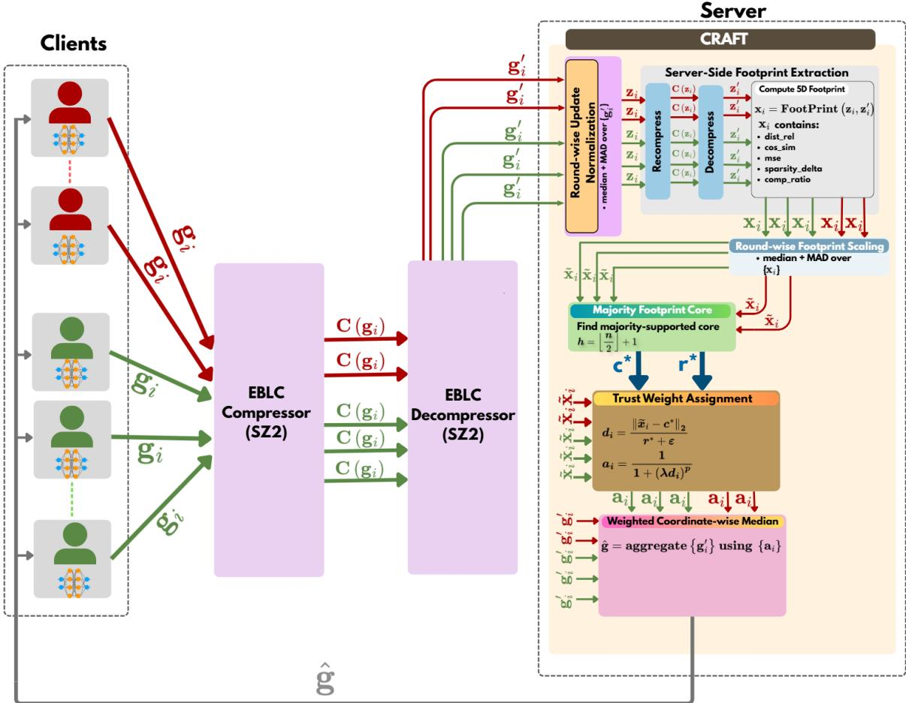  
Fig. 1: Overview of CRAFT. The server decompresses client updates, extracts server-side compression footprints, assigns footprint-based trust weights, and aggregates the decompressed updates with a weighted coordinate-wise median.

Let $\boldsymbol { m } ~ \in ~ \mathbb { R } ^ { d }$ and $s \in \mathbb { R } ^ { d }$ denote the coordinate-wise median and median absolute deviation (MAD) of $\{ g _ { i } ^ { \prime } \} _ { i = 1 } ^ { n } .$ CRAFT defines

$$
z _ { i } = \frac { g _ { i } ^ { \prime } - m } { s + \epsilon } ,\tag{3}
$$

where division is understood coordinate-wise and $\epsilon > 0$ is a small stability constant. This transformation places all decompressed updates in a common robust coordinate system and encourages the subsequent recompression step to respond to relative structural behavior rather than raw magnitude.

## B. Server-Side Compression-Footprint Extraction

After normalization, the server performs a second controlled compression–decompression pass on each update:

$$
z _ { i } ^ { \prime } = D ( C _ { \tau , m } ( z _ { i } ) ) .\tag{4}
$$

The server then extracts the corresponding footprint

$$
x _ { i } = \phi _ { \tau , m } ( z _ { i } ) = \mathrm { F o o t p r i n t } ( z _ { i } , z _ { i } ^ { \prime } ) \in \mathbb { R } ^ { 5 } ,\tag{5}
$$

where $\phi _ { \tau , m }$ is the compression-footprint map defined in Section IV. The components are the same five components introduced there: relative distortion, cosine similarity, mean squared error, sparsity change, and compression ratio.

These five components summarize complementary aspects of how an update behaves under the fixed EBLC operator. Relative distortion and mean squared error measure decompression loss; cosine similarity measures directional preservation; sparsity change captures how recompression alters near-zero structure; and compression ratio reflects how efficiently the update can be encoded under the chosen error bound. Under the same server-controlled EBLC pass, benign and attack-modified updates can induce different residual structure, near-zero behavior, and compressibility, and these differences are exactly what the footprint captures.

## C. Robust Round-Wise Footprint Scaling

The five footprint components naturally have different scales. If distances were computed directly in raw footprint space, one component could dominate simply because of its numerical range. CRAFT therefore applies a second robust median/MAD normalization across clients in the footprint space.

Let $X \ = \ [ x _ { 1 } , \ldots , x _ { n } ] ^ { T } \ \in \ \mathbb { R } ^ { n \times 5 }$ denote the footprint matrix. For each footprint component $j ~ \in ~ \{ 1 , . . . , 5 \}$ , CRAFT computes

$$
\tilde { x } _ { i j } = \frac { x _ { i j } - \mathrm { m e d i a n } _ { k } ( x _ { k j } ) } { \mathrm { M A D } ( \{ x _ { k j } \} _ { k = 1 } ^ { n } ) + \epsilon } .\tag{6}
$$

Algorithm 1 CRAFT: Compression-guided Robust Aggre  
gation via Footprint Trust   
Require: Compressed payloads $\{ y _ { i } \} _ { i = 1 } ^ { n } .$ , optional base aggregation   
weights $\{ { \bar { n _ { i } } } \} _ { i = 1 } ^ { n }$ (default $n _ { i } = 1 ) ,$ , compressor $C _ { \tau , m } ,$ decompressor   
$D ,$ trust parameters $\lambda , p$   
Ensure: Aggregated update gˆ   
1: Decompress each received payload: $g _ { i } ^ { \prime } \gets D ( y _ { i } )$ for $i = 1 , \ldots , n$   
2: Compute coordinate-wise robust centers and scales from $\{ g _ { i } ^ { \prime } \} _ { i = 1 } ^ { n }$ and   
normalize the updates to obtain $\{ z _ { i } \} _ { i = 1 } ^ { n }$   
3: for each client i do   
4: Compute $z _ { i } ^ { \prime } \gets D ( C _ { \tau , m } ( z _ { i } ) )$   
5: Compute footprint $x _ { i } \gets \phi _ { \tau , m } ( z _ { i } )$   
6: end for   
7: Robustly scale the footprint matrix to obtain $\{ \tilde { x } _ { i } \} _ { i = 1 } ^ { n }$   
8: Set $h \stackrel { \cdot } {  } \lfloor n / 2 \rfloor + 1$   
9: For each client i, compute the radius $r _ { i }$ needed to include its h nearest   
clients in the scaled footprint space   
10: Select the majority-supported core: $i ^ { \star } \gets$ arg mini $r _ { i } , c ^ { \star } \gets \tilde { x } _ { i ^ { \star } }$   
$r ^ { \star }  r _ { i ^ { \star } }$   
11: for each client i do   
12: Compute normalized distance: $d _ { i } \gets \| \tilde { { \boldsymbol { x } } } _ { i } - { \boldsymbol { c } } ^ { \star } \| _ { 2 } / ( { \boldsymbol { r } } ^ { \star } + { \epsilon } )$   
13: Assign trust weight: $a _ { i } \gets 1 / ( 1 + ( \ddot { \lambda d } _ { i } ) ^ { p } )$   
14: Set aggregation weight: $\alpha _ { i } \gets a _ { i } n _ { i }$   
15: end for   
16: Aggregate decompressed updates:   
gˆ ← WeightedCoordMedian $( \{ g _ { i } ^ { \prime } \} _ { i = 1 } ^ { n } , \{ \alpha _ { i } \} _ { i = 1 } ^ { n } )$   
17: return gˆ

This produces the scaled footprint matrix $\tilde { X } \quad = \quad$ $[ \widetilde { x } _ { 1 } , \dots , \widetilde { x } _ { n } ] ^ { T }$ , in which all five components contribute on a comparable robust scale.

## D. Majority-Supported Footprint Trust Assignment

At a fixed round, CRAFT assigns client influence in the scaled footprint space $\{ \tilde { x } _ { i } \} _ { i = 1 } ^ { n }$ . This step operationalizes the separation regime characterized in Assumptions 1 and 2 and in Proposition 1. When the honest and malicious footprint distributions are sufficiently separated, the honest clients induce the dominant compact region in footprint space. CRAFT estimates this region empirically through a majoritysupported core.

CRAFT assumes a strict honest majority, that is, fewer than half of the participating clients are Byzantine. This is the same breakdown regime assumed by standard majoritybased robust aggregation rules. Let $\begin{array} { r } { h = \lfloor \frac { n } { 2 } \rfloor + 1 } \end{array}$ . For each client i, define

$$
r _ { i } = d _ { h } \big ( \tilde { x } _ { i } , \{ \tilde { x } _ { j } \} _ { j = 1 } ^ { n } \big ) ,\tag{7}
$$

where $d _ { h } ( \cdot )$ denotes the distance to the hth nearest neighbor in the scaled footprint space. Equivalently, $r _ { i }$ is the smallest radius of a ball centered at ${ \tilde { x } } _ { i }$ that contains a strict majority of clients. CRAFT then selects

$$
i ^ { \star } = \arg \operatorname* { m i n } _ { i } r _ { i } , \qquad c ^ { \star } = \tilde { x } _ { i ^ { \star } } , \qquad r ^ { \star } = r _ { i ^ { \star } } .
$$

The point $c ^ { \star }$ is the empirical majority-supported core and $r ^ { \star }$ is the corresponding majority radius. Because h is a strict majority, an attacker-only cluster cannot define $( c ^ { \star } , r ^ { \star } )$ unless Byzantine clients control more than half of the participating clients. Under the honest-majority assumption, the majority-supported core must therefore be anchored by the dominant region containing honest participation.

A malicious client can nevertheless be selected as the center index $i ^ { \star }$ if its footprint lies inside the same dominant region as the honest majority and yields the smallest majority-supported radius. This does not mean that CRAFT has identified a malicious cluster as benign. Rather, it means that, in that round, the selected point is geometrically representative of the same dominant footprint region as nearby honest clients. Since CRAFT uses $c ^ { \star }$ as a geometric anchor rather than as an estimate of client identity, centering trust around such a point remains consistent with the majority geometry.

Once the core is determined, CRAFT assigns trust according to normalized distance from that core:

$$
d _ { i } = \frac { \| \tilde { x } _ { i } - c ^ { \star } \| _ { 2 } } { r ^ { \star } + \epsilon } , \qquad a _ { i } = \frac { 1 } { 1 + ( \lambda d _ { i } ) ^ { p } } ,\tag{8}
$$

where $\lambda > 0$ controls how quickly trust decreases as a client moves away from the majority-supported footprint core, and $p \geq 1$ controls the curvature of this decay. In practice, λ should be calibrated relative to the normalized majority radius: smaller values give a more tolerant weighting rule, while larger values downweight clients soon after they leave the core. The parameter $p$ controls how gradual or abrupt this transition is; moderate values avoid making trust overly sensitive to small footprint fluctuations near the boundary.

This soft weighting is important when the footprint separation is imperfect. If Proposition 1 is strongly satisfied, then malicious footprints lie outside the dominant majoritysupported region and receive very small weights. If the honest population is more dispersed, as can happen under stronger non-IID heterogeneity, then the empirical majority radius becomes broader and some malicious clients may lie inside or near the boundary of $r ^ { \star }$ . Likewise, if the attack induced footprint shift is small relative to the combined honest and malicious spread, then malicious footprints may overlap more with the honest population. In these cases CRAFT does not force a brittle binary decision. Instead, it reduces influence in proportion to inconsistency with the dominant footprint pattern.

This interpretation is also consistent with the impact– separation tradeoff discussed in Section IV-B. Attacks that induce a larger systematic footprint shift are easier to downweight. Attacks that remain embedded in the dominant footprint region are harder to distinguish, but they also induce less geometric separation under the common compression operator. Accordingly, CRAFT is best aligned with the IID or mildly heterogeneous regime, where the dominant honest footprint core is most stable.

Figure 2 illustrates the trust-weighting mechanism under the IPM attack on CIFAR-10.

## E. Trust-Weighted Robust Aggregation

The footprint path is diagnostic only. CRAFT does not aggregate the normalized updates $\{ z _ { i } \} _ { i = 1 } ^ { n }$ or the serverside decompressed recompression outputs $\{ z _ { i } ^ { \prime } \} _ { i = 1 } ^ { n }$ . The final aggregation is performed on the decompressed client updates $\{ g _ { i } ^ { \prime } \} _ { i = 1 } ^ { n }$ , since these are the updates actually recovered from the received client payloads.

Trust Weight Assignment for CIFAR-10 with IPM Attack (Round 5)  
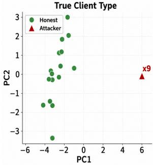

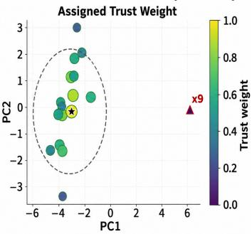  
(a) Clear footprint separation.

Trust Weight Assignment for CIFAR-10 with IPM Attack (Round 22)  
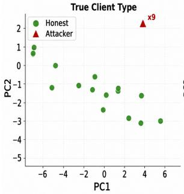

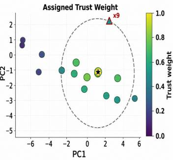  
(b) Boundary case with reduced attacker weight.  
Fig. 2: Examples of CRAFT trust-weight assignment under the IPM attack on CIFAR-10.

CRAFT can be viewed as a trust-weighting layer that can be paired with a robust aggregation rule capable of using client weights. Let $n _ { i }$ denote the base aggregation weight of client i, such as its number of local examples; for uniform weighting, one can set $n _ { i } ~ = ~ 1$ for all clients. CRAFT combines this base weight with the footprint trust score as $\alpha _ { i } = a _ { i } n _ { i }$ . In this work, we instantiate the final aggregation rule as a weighted coordinate-wise median over $\{ g _ { i } ^ { \prime } \} _ { i = 1 } ^ { n }$ using weights $\{ \alpha _ { i } \} _ { i = 1 } ^ { n }$ . For each model coordinate, the weighted median selects the value at which the cumulative weight first reaches half of the total weight.

This final step provides robustness at two levels. The footprint weights reduce the influence of updates whose compression behavior is inconsistent with the dominant footprint pattern, while the weighted median limits the effect of remaining high-magnitude or strategically placed values in individual coordinates.

## VI. EXPERIMENT SETUP

We now evaluate CRAFT and how well the structure of compression-induced loss can be used as a security signal to distinguish honest and malicious updates. Unless otherwise stated, all experiments use IID client partitions, which is the primary regime targeted by CRAFT: under IID data, honest updates are more likely to induce a compact majority-supported footprint region, making distance from that region a useful trust signal. Unless otherwise stated, we simulate 25 clients with 9 malicious clients (36%), preserving an honest majority. For CRAFT, we use the same trust-weight parameters in all main experiments: $\lambda = 2$ for the footprint-distance scale and $p = 4$ for the trust-decay power. Appendix E reports an ablation over these parameters on CIFAR-10 under IPM attack.

Our evaluation process is as follows. First, we examine whether lossy compressors induce attack-sensitive footprints and how compressor choice and tolerance affect the signal. Second, we evaluate whether footprint-derived trust suppresses malicious influence and enables competitive end-toend robustness. Finally, we test CRAFT under non-IID data and a defense-aware attack, and report its server-side cost.

## A. Datasets

We evaluate on CIFAR-10, Fashion-MNIST, and Purchase. CIFAR-10 contains 60,000 color images from 10 object classes, with 50,000 training images and 10,000 test images. Fashion-MNIST contains 70,000 grayscale images from 10 clothing categories, with 60,000 training images and 10,000 test images. Purchase is a tabular classification dataset derived from customer shopping records, where each example is represented by a binary feature vector indicating purchased items and the task is to predict the customer’s purchase class. Together, these datasets allow us to evaluate CRAFT across both image and tabular learning tasks, rather than restricting the evaluation to a single data type.

For CIFAR-10, we use a seven-layer CNN with two convolutional layers (16 and 64 channels), max-pooling after each convolution, two fully connected hidden layers of sizes 384 and 192, and a final 10-class output layer. For Fashion-MNIST, we use a compact CNN with four $3 \times 3$ convolutional layers (two with 32 channels and two with 64 channels), group normalization, max pooling, dropout, and a final fully connected classifier. For Purchase, we use an MLP with hidden dimensions 512, 256, and 128, ReLU activations, and a final classification layer over the classes.

## B. Compressors

Unless otherwise stated, CRAFT utilizes the SZ2 compressor as the default compressor. We additionally evaluate CRAFT with two other state-of-the-art EBLCs, ZFP and TThresh, as well as with Top-K sparsification. CRAFT uses SZ2 in relative error-bound mode with tolerance $\tau = 0 . 0 1$ We choose this setting because FedSZ [26] reports that $\tau = 0 . 0 1$ in SZ2 relative mode provides the best accuracy– compression tradeoff for federated learning. Relative error bounds scale compression tolerance to each coordinate’s local magnitude rather than applying a fixed tolerance uniformly. This suits CRAFT because its footprint metric depends on how updates change under compression given their distributional structure.

## C. Poisoning attacks

We evaluate six attacks: ALIE, IPM, Min-Max, Min-Sum, Sine, and PoisonedFL. Together, these attacks stress different assumptions made by robust aggregation: ALIE perturbs updates using honest-gradient statistics, IPM reverses the honest update direction, Min-Max and Min-Sum are constructed to evade distance-based filters, and Sine and PoisonedFL introduce structured model-poisoning behavior. For ALIE, we use z = 1 in all experiments. For IPM, we use $\epsilon = 1 0$ , so malicious clients submit a scaled update in the opposite direction of the mean honest update. These values follow the commonly used strong-attack settings in the corresponding attack evaluations, where they are large enough to significantly degrade standard aggregation while still producing updates that are useful for stress-testing robust defenses. The remaining attacks use their standard construction without an additional manually swept strength parameter.

## D. Defense Baselines

All defenses are evaluated under the same client population and attack configuration. We compare CRAFT with six aggregation baselines: Mean, Median, Trimmed Mean, Krum, Bulyan, and DnC. All methods are evaluated under the same compressed-update pipeline. Clients transmit SZ2- compressed FedSGD updates, and the server decompresses the received updates before applying the selected aggregation rule. CRAFT uses the same decompressed updates for aggregation, but also performs server-side footprint extraction to assign trust weights.

## VII. RESULTS

## A. Footprint Separation Analysis

We first evaluate our central hypothesis: does the structure of the information loss induced by lossy compressors provide clear footprint separation to distinguish honest and malicious clients? To answer this question, the following experiments evaluate the choice of compressor, the tolerance of the EBLC pass, and the majority-core trust assignment.

1) EBLC versus Top-K Footprint Structure: We compare the footprint structure induced by EBLC/SZ2 and Top-K sparsification on CIFAR-10 under the ALIE attack with 9 malicious clients out of 25. For SZ2, we use relative error tolerance $\tau = 0 . 0 1$ . For Top-K, we retain the largest 1% of coordinates by absolute magnitude. For each round, we compute the five footprint coordinates for every submitted client update and apply the same round-wise robust normalization used by CRAFT before measuring honest–malicious separation. The statistics in Figure 3 are pooled across the evaluated rounds; the corresponding per-metric distributions are shown in Appendix 13.

Figure 3 shows that both compression mechanisms can produce some honest–malicious separation, but the structure of the signal is different. Top-K separation is concentrated in a narrower set of metrics: relative distortion and MSE show positive gaps of about 3.32 and 3.73, while compression ratio is essentially uninformative. EBLC/SZ2 produces a broader footprint response. Its strongest signal appears in sparsity change (21.54), but cosine similarity (7.17), relative distortion (−9.64), MSE (−4.38), and compression ratio (−4.71) also shift substantially. The sign only indicates which group has the larger normalized mean; the magnitude indicates separation strength.

Per-Metric Honest-Malicious Separation Strength: EBLC/SZ2 vs Top-k  
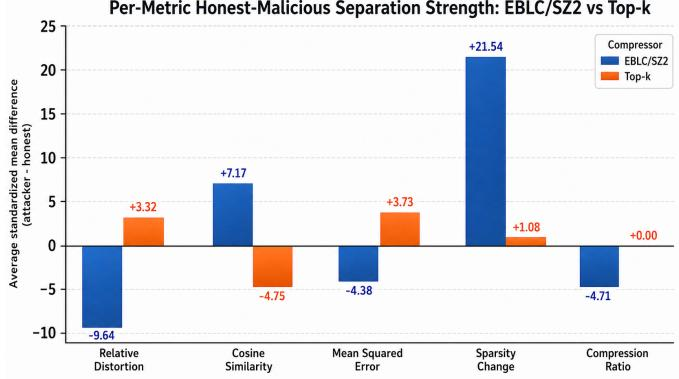  
Fig. 3: Per-metric honest–malicious footprint separation for EBLC/SZ2 and Top-K.

These results support the use of EBLC footprints rather than a single sparsification statistic. Top-K acts mainly through retained-versus-discarded magnitude, whereas SZ2 changes the update through prediction, quantization, and entropy coding. As a result, SZ2 exposes multiple complementary views of the update’s numerical structure, giving the footprint representation more ways to separate malicious updates from the honest majority.

2) Choice of EBLC: Figure 4 compares SZ2, ZFP, and TTHRESH as footprint extractors. The x-axis shows the attack type. The y-axis reports a footprint-amplification ratio: the separation obtained from the final five-dimensional footprint divided by the separation obtained from the compressor residual alone. Therefore, larger values indicate that the full footprint features make the honest–malicious difference more visible than the raw residual signal by itself.

SZ2 gives the largest amplification for all tested attacks. This suggests that SZ2 is a better probe for the update structure relevant to our defense. SZ2 uses prediction and error-bounded quantization, so its output is sensitive not only to the magnitude of the update, but also to how predictable the update is, how its values vary locally, how much near zero structure changes, and how well the update can be compressed. Malicious updates can alter these properties even when they are not extreme in the original gradient space. As a result, the SZ2 footprint produces stronger honest–malicious separation than the ZFP and TTHRESH footprints in our experiments.

Min-Max is the weakest case in the comparison. This is expected because Min-Max is designed to remain close to honest updates under distance-based criteria, so the compressor-induced differences are smaller. Even in this harder setting, SZ2 still produces the strongest footprint amplification among the tested compressors.

3) Tolerance and Footprint Signal: Figure 5 studies how the SZ2 tolerance affects footprint separation. The result shows a non-monotonic relationship. When the tolerance is too small, compression is weak and the decompressed update is nearly identical to the input. In that regime, the footprint has little signal because both honest and malicious updates appear almost unchanged by the compression pass.

Fashion-MNIST  
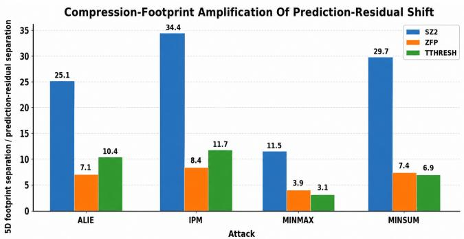  
Fig. 4: EBLC-dependent footprint amplification across attacks; SZ2 gives the strongest amplification in this setting.

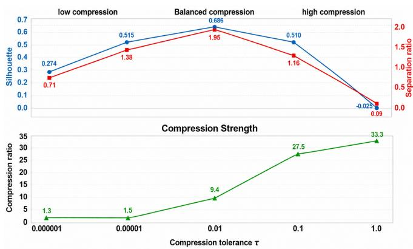  
Fig. 5: Effect of SZ2 tolerance on footprint separation and compression strength.

When the tolerance is too large, compression becomes too aggressive. The compressed representation removes useful structure from both honest and malicious updates, and the footprint signal again weakens. The useful region is therefore in the middle: the compressor must perturb the update enough to expose structural differences, but not so much that it destroys the geometry needed for reliable comparison.

This observation is consistent with the communication– accuracy tradeoff reported by FedSZ [26], which identifies SZ2 relative mode with tolerance $\tau ~ = ~ 0 . 0 1$ as a strong operating point for federated learning. Our results show that the same tolerance is also meaningful from the defense perspective: it provides useful compression while preserving enough structure for the footprint to separate honest and malicious updates.

The lower part of the figure shows the corresponding compression ratio. As expected, larger tolerances increase compression strength. The key point is that the strongest observed footprint-signal operating point is not simply the largest compression ratio. CRAFT needs a tolerance that balances communication reduction with diagnostic footprint quality. The region around $\tau = 0 . 0 1$ provides this balance in our experiments.

4) Footprint signal as a function of attack: Figure 6 shows that the footprint signal is not carried equally by all five metrics. The dominant coordinate depends on the attack.

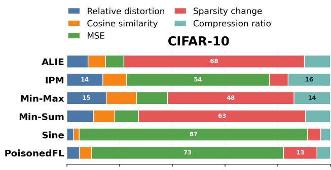

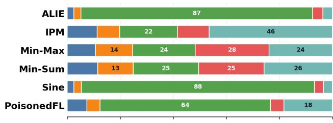

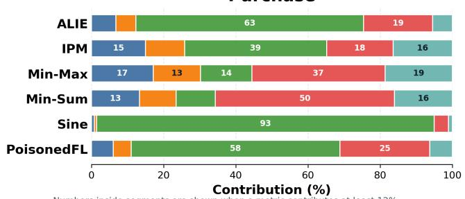  
Fig. 6: Contribution of each compression-footprint metric to honest–malicious separation across attacks.

On CIFAR-10, Sparsity Change is the largest contributor for ALIE, Min-Max, and Min-Sum, accounting for about 68.4%, 47.9%, and 63.4% of the separation, respectively. In contrast, IPM is dominated by Mean Squared Error, which contributes about 54.2%, while Sparsity Change contributes only about 7.1%. Sine and PoisonedFL are also strongly MSE-driven, with MSE contributing about 86.7% and 72.8%, respectively.

This attack-dependent behavior is the main point of the figure. ALIE and the distance-constrained attacks often change how concentrated the update remains after compression, making Sparsity Change informative. IPM and the more structured attacks instead alter reconstruction error more strongly, making MSE the dominant signal. Aggre gated over all dataset–attack settings in our analysis, MSE is the largest average contributor (46.1%), followed by Sparsity Change (24.1%) and Compression Ratio (13.5%). These results support using a multi-metric footprint: no single compression statistic explains all attacks.

## B. Accuracy Under Model-Poisoning Attacks

We next evaluate whether CRAFT preserves model utility under different model-poisoning attacks. Figures 7, 8, and

9 show the round-wise accuracy trajectories, while Table II reports final test accuracy across datasets, attacks, and aggregation rules.

The main pattern is that classical robust aggregation baselines are strongly attack-dependent. Mean aggregation collapses under several attacks, but it is not always the weakest baseline: under ALIE, Mean performs competitively because the attack is constructed from coordinatewise benign statistics and is designed to remain within the range tolerated by simple averaging. This is consistent with the ALIE analysis, which notes that averaging can act as a natural defense against the specific boundeddeviation construction used by the attack. In contrast, Median, Trimmed Mean, Krum, and Bulyan each perform well in some settings but fail in others. For example, Krum is effective against PoisonedFL on CIFAR-10, but collapses under Min-Max and Min-Sum on Fashion-MNIST. Bulyan is strong under Sine on CIFAR-10 and Purchase, but is much weaker under several distance-aware attacks. These results confirm that no single conventional baseline is uniformly reliable across attack geometries. CRAFT is more consistent. Across the 18 dataset–attack settings in Table II, CRAFT achieves the best final accuracy in $7$ settings and is within 1.7 percentage points of the best method in all remaining settings. On CIFAR-10, CRAFT is best under ALIE and IPM and remains close to the top result under Min-Max, Min-Sum, Sine, and PoisonedFL. On Fashion-MNIST, CRAFT achieves the best result for five of the six attacks. On Purchase, CRAFT stays close to the strongest baseline across all attacks, showing that the footprint signal transfers beyond image CNNs to a tabular MLP task.

DnC is the strongest competing baseline in several settings, especially on Purchase. However, DnC requires the server to specify the number of malicious clients, or at least a reliable upper bound on that number, before aggregation. This is useful for comparison but is a strong deployment assumption: underestimating the attacker count can leave malicious updates in the aggregate, while overestimating it can discard benign signal. CRAFT does not require this attacker-count input, yet remains competitive with DnC across the full evaluation.

Finally, under benign IID training, CRAFT closely tracks Mean across all three datasets, indicating that its robustness does not come at a material cost to clean accuracy (Appendix D).

## C. Effect of Client Data Heterogeneity

CRAFT is designed for the IID or mildly heterogeneous regime, where honest clients are expected to form a compact majority in compression-footprint space. This compactness is central to the trust mechanism: if honest updates become highly scattered because clients train on very different label distributions, distance from the majority footprint region becomes a weaker reliability signal. For this reason, strongly non-IID FL is outside the main theoretical scope of CRAFT. We nevertheless include a Dirichlet label-skew sweep as a stress test.

Figure 10 reports CIFAR-10 results under Min-Max and Min-Sum, with lower α indicating stronger heterogeneity. For Min-Max, the expected trend is clear: as α decreases from 1.0 to 0.3, the footprint separation ratio drops from about 7.0 to 4.0, while the attacker aggregation weight increases from 0.28% to 1.21%. This matches the intuition behind our scope: stronger label skew makes the honest footprint region less compact, weakening the footprint signal.

Min-Sum is less monotonic. Separation falls from 9.16 at $\alpha = 1 . 0$ to 2.89 at $\alpha = 0 . 5$ , but rises again to 5.12 at $\alpha = 0 . 3$ . This does not mean that stronger non-IIDness helps CRAFT in general. Rather, stronger label skew changes both the honest footprint dispersion and the attack geometry. Because Min-Sum constrains the total raw-update distance to benign updates, its solution is sensitive to the full shape of the honest-update cloud. At $\alpha = 0 . 3$ , the attack can remain close under this raw-distance objective while becoming less similar to the honest majority after compression, causing the footprint separation to partially recover.

Even under this stress test, CRAFT substantially limits attacker influence. Mean aggregation would give the 9 malicious clients 36% of the aggregate weight. CRAFT keeps attacker weight below 1.3% for Min-Max and below 1.9% for Min-Sum across all tested α values.

## D. Robustness to a Defense-Aware Attack

We next test a restricted defense-aware variant of IPM. Instead of using one fixed attack strength, the attacker searches over a set of scalar values γ. For each candidate, it forms $g _ { A } ( \gamma ) = \bar { g } _ { H } + \gamma d ,$ where $\bar { g } _ { H }$ is a benign reference update and d is the IPM direction. Each candidate is then evaluated after passing through the full CRAFT pipeline: server-side recompression, footprint normalization, core selection, trust assignment, and aggregation. The attacker selects the γ that maximizes the final post-CRAFT aggregate deviation from the benign aggregate. This choice captures the tradeoff between attack strength and trust: a large γ may produce a more harmful update but receive little trust, while a moderate γ may receive more trust and therefore have larger realized influence. Thus, the selected $\gamma$ is the scale that causes the greatest effective damage after CRAFT has assigned trust, not necessarily the largest attack scale. Figure 11 shows the 50-round stress test for CIFAR-10 and Fashion-MNIST; the Purchase result is in Appendix C. The lower row shows the total aggregation weight assigned to malicious clients, and the dashed line marks the raw malicious client share, $9 / 2 5 = 3 6 \%$ . On CIFAR-10, adaptive IPM closely tracks standard IPM, while attacker weight remains mostly near zero with only brief spikes. Fashion-MNIST is more challenging: adaptive scaling causes a larger accuracy gap and occasional attacker-weight spikes, but the malicious weight still remains below the raw attacker share. On Purchase, adaptive and standard IPM are nearly indistinguishable, with attacker weight close to zero throughout.

## E. Server-Side Overhead

Across datasets, CRAFT adds server-side overhead because it performs an additional EBLC pass to expose the Mean → Median  Trimmed Mean → Krum → Bulyan → DnC  CRAFT

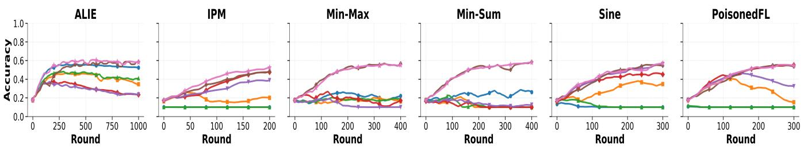  
Fig. 7: CIFAR-10 accuracy under model-poisoning attacks.  
Mean  Median → Trimmed Mean → Krum → Bulyan → DnC → CRAFT

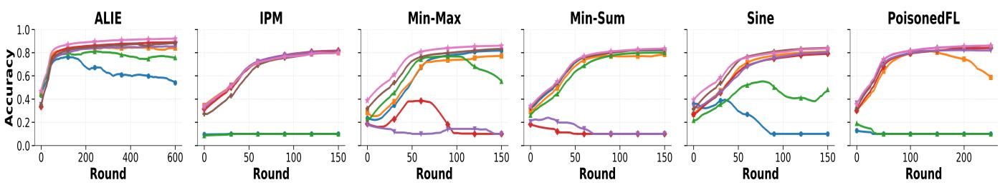  
Fig. 8: Fashion-MNIST accuracy under model-poisoning attacks.

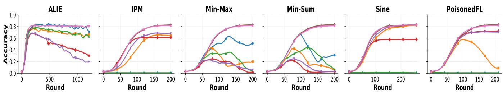  
Fig. 9: Purchase accuracy under model-poisoning attacks.

compression footprint of each client update. For CIFAR-10, the compressed-mean server path takes about 0.40 seconds per round, while CRAFT takes about 1.35 seconds per round. For Fashion-MNIST and Purchase, which use larger models in our experiments, CRAFT takes about 3.11 and 3.30 seconds per round, respectively. The overhead is dominated by footprint extraction rather than the trust computation itself. The majority-core search and trust-weight assignment take less than 0.3 ms per round on all three datasets. Although the direct majority-core implementation has $O ( n ^ { 2 } d _ { \phi } )$ time complexity over n clients, the footprint dimension is fixed at $d _ { \phi } = 5 ,$ , so this stage remains small at the evaluated client scale. The measured overhead comes primarily from producing compression footprints, while the low-dimensional trust computation contributes only negligibly to the total runtime

## VIII. DISCUSSION AND LIMITATIONS

The effectiveness of CRAFT depends on the geometry of compression footprints, not simply on dataset difficulty. What matters is whether honest clients form a compact footprint majority and whether malicious updates move into a different compression-behavior region. This explains why the signal varies across attacks, models, and data partitions: some settings naturally expose stronger compressionfootprint separation than others.

Our mathematical argument targets the IID or mildly heterogeneous regime, where honest footprints are expected to be coherent. Under strong non-IID partitions, honest footprints can become more dispersed, making distance from the majority region a weaker reliability signal. The non-IID and defense-aware experiments therefore serve as stress tests of this assumption rather than full guarantees outside the intended regime. CRAFT also adds server-side overhead because the server performs diagnostic recompression to extract footprints; however, this step is server-side, so malicious clients cannot choose or forge the footprint measurements used for trust assignment.

TABLE II: Final test accuracy (%). The best result in each dataset–attack setting is bold.
<table><tr><td>Dataset</td><td>Defense</td><td>ALIE</td><td>IPM</td><td>Min-Max</td><td>Min-Sum</td><td>Sine</td><td>PoisonedFL</td></tr><tr><td rowspan="7">CIFAR-10</td><td>Mean</td><td>52.30</td><td>10.00</td><td>19.37</td><td>23.51</td><td>10.00</td><td>10.00</td></tr><tr><td>Median</td><td>34.80</td><td>13.99</td><td>10.93</td><td>10.01</td><td>33.77</td><td>13.88</td></tr><tr><td>Trimmed Mean</td><td>40.49</td><td>10.00</td><td>21.95</td><td>10.00</td><td>10.00</td><td>10.00</td></tr><tr><td>Krum</td><td>23.68</td><td>48.00</td><td>17.74</td><td>10.00</td><td>48.83</td><td>57.43</td></tr><tr><td>Bulyan</td><td>23.67</td><td>43.77</td><td>10.10</td><td>13.21</td><td>57.13</td><td>31.83</td></tr><tr><td>DnC CRAFT</td><td>57.31</td><td>51.33</td><td>58.81</td><td>59.85</td><td>53.92</td><td>54.26</td></tr><tr><td></td><td>58.83</td><td>54.10</td><td>57.78</td><td>58.42</td><td>56.09</td><td>56.67</td></tr><tr><td rowspan="7">Fashion-MNIST</td><td>Mean</td><td>55.26</td><td>10.00</td><td>82.12</td><td>82.42</td><td>10.00</td><td>10.00</td></tr><tr><td>Median</td><td>84.23</td><td>80.42</td><td>76.28</td><td>78.98</td><td>80.60</td><td>47.47</td></tr><tr><td>Trimmed Mean</td><td>76.59</td><td>10.00</td><td>46.54</td><td>80.12</td><td>52.19</td><td>10.00</td></tr><tr><td>Krum</td><td>89.09</td><td>82.55</td><td>10.00</td><td>10.00</td><td>79.63</td><td>84.11</td></tr><tr><td>Bulyan</td><td>85.07</td><td>81.22</td><td>10.00</td><td>10.00</td><td>81.20</td><td>81.53</td></tr><tr><td>DnC</td><td>88.27</td><td>80.29</td><td>83.84</td><td>82.51</td><td>84.76</td><td>86.16</td></tr><tr><td>CRAFT</td><td>91.97</td><td>82.87</td><td>86.54</td><td>84.24</td><td>83.88</td><td>86.25</td></tr><tr><td rowspan="7">Purchase</td><td>Mean</td><td>72.32</td><td>0.73</td><td>62.49</td><td>10.72</td><td>0.73</td><td>0.73</td></tr><tr><td>Median</td><td>65.98</td><td>61.47</td><td>22.90</td><td>2.47</td><td>82.25</td><td>7.97</td></tr><tr><td>Trimmed Mean</td><td>66.17</td><td>0.73</td><td>4.23</td><td>0.73</td><td>0.65</td><td>0.73</td></tr><tr><td>Krum</td><td>30.19</td><td>61.00</td><td>2.35</td><td>2.72</td><td>57.91</td><td>72.11</td></tr><tr><td>Bulyan</td><td>18.70</td><td>67.42</td><td>0.73</td><td>3.21</td><td>83.48</td><td>70.40</td></tr><tr><td>DnC CRAFT</td><td>81.76</td><td>83.23</td><td>83.16 82.11</td><td>83.37</td><td>83.46</td><td>83.51</td></tr><tr><td></td><td>81.13</td><td>81.91</td><td></td><td>81.75</td><td>82.58</td><td>82.14</td></tr></table>

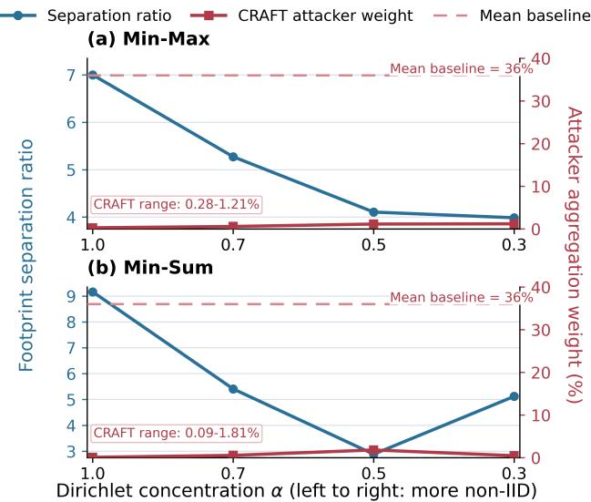  
Fig. 10: Effect of Dirichlet label skew on CRAFT for CIFAR-10 under Min-Max and Min-Sum attacks. Lower α indicates stronger non-IIDness. The dashed line shows the 36% attacker weight under mean aggregation.

## IX. CONCLUSION

This paper shows that EBLC-induced information loss can be used as a security signal in federated learning. CRAFT operationalizes this idea by converting compressionfootprint statistics into trust weights before aggregation. Across datasets and model-poisoning attacks, CRAFT is competitive with established Byzantine-robust aggregators while requiring no prior knowledge of the exact maliciousclient count.

More broadly, this work opens a new direction for using EBLC compressors in robust aggregation. Rather than treating lossy compression only as a communication-efficiency mechanism, we show that the structure of its induced loss can expose security-relevant differences between honest and malicious updates. Future work will extend this idea to more heterogeneous client populations, where honest clients may form multiple footprint regions rather than a single compact majority.

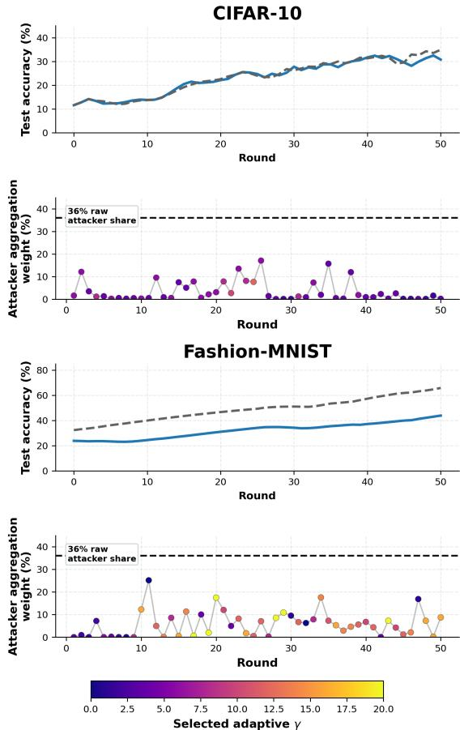  
Fig. 11: Restricted adaptive IPM results.

[1] B. McMahan, E. Moore, D. Ramage, S. Hampson, and B. A. y Arcas, “Communication-efficient learning of deep networks from decentralized data,” in Artificial intelligence and statistics. Pmlr, 2017, pp. 1273–1282.

[2] D. Yin, Y. Chen, R. Kannan, and P. Bartlett, “Byzantine-robust distributed learning: Towards optimal statistical rates,” in International conference on machine learning. Pmlr, 2018, pp. 5650–5659.

[3] P. Blanchard, E. M. El Mhamdi, R. Guerraoui, and J. Stainer, “Machine learning with adversaries: Byzantine tolerant gradient descent,” Advances in neural information processing systems, vol. 30, 2017.

[4] E.-M. El-Mhamdi, R. Guerraoui, and S. Rouault, “The hidden vulnerability of distributed learning in byzantium,” in International conference on machine learning. PMLR, 2018, pp. 3521–3530.

[5] V. Shejwalkar and A. Houmansadr, “Manipulating the byzantine: Optimizing model poisoning attacks and defenses for federated learning,” in Ndss, 2021.

[6] B. Hu, H. Huang, K. Jiang, W. Yan, and M. Wang, “Communicationefficient and byzantine-robust personalized federated learning based on compressed sensing and adaptive local aggregation,” Future Generation Computer Systems, vol. 183, p. 108582, 2026. [Online]. Available: https://www.sciencedirect.com/science/article/pii/ S0167739X26002165

[7] J. Xu, Z. Zhang, and R. Hu, “Achieving byzantine-resilient federated learning via layer-adaptive sparsified model aggregation,” in Proceedings of the Winter Conference on Applications of Computer Vision (WACV), February 2025, pp. 1508–1517.

[8] A. Rammal, K. Gruntkowska, N. Fedin, E. Gorbunov, and P. Richtarik, “Communication compression for Byzantine robust learning: New efficient algorithms and improved rates,” in Proceedings of The 27th International Conference on Artificial Intelligence and Statistics, ser. Proceedings of Machine Learning Research, S. Dasgupta, S. Mandt, and Y. Li, Eds., vol. 238. PMLR, 02–04 May 2024, pp. 1207–1215. [Online]. Available: https://proceedings.mlr.press/v238/ rammal24a.html

[9] H. Zhu and Q. Ling, “Byzantine-robust distributed learning with compression,” IEEE Transactions on Signal and Information Processing over Networks, vol. 9, p. 280–294, 2023. [Online]. Available: http://dx.doi.org/10.1109/TSIPN.2023.3265892

[10] S. Shi, X. Chu, K. C. Cheung, and S. See, “Understanding top-k sparsification in distributed deep learning,” arXiv preprint arXiv:1911.08772, 2019.

[11] A. N. Bhagoji, S. Chakraborty, P. Mittal, and S. Calo, “Analyzing federated learning through an adversarial lens,” in International Conference on Machine Learning. PMLR, 2019, pp. 634–643. [Online]. Available: https://proceedings.mlr.press/v97/bhagoji19a.html

[12] M. Fang, X. Cao, J. Jia, and N. Gong, “Local model poisoning attacks to {Byzantine-Robust} federated learning,” in 29th USENIX security symposium (USENIX Security 20), 2020, pp. 1605–1622.

[13] E. Bagdasaryan, A. Veit, Y. Hua, D. Estrin, and V. Shmatikov, “How to backdoor federated learning,” in International conference on artificial intelligence and statistics. PMLR, 2020, pp. 2938–2948.

[14] Z. Sun, P. Kairouz, A. T. Suresh, and H. B. McMahan, “Can you really backdoor federated learning?” arXiv preprint arXiv:1911.07963, 2019.

[15] C. Xie, K. Huang, P.-Y. Chen, and B. Li, “Dba: Distributed backdoor attacks against federated learning,” in International Conference on Learning Representations, 2020. [Online]. Available: https://openreview.net/forum?id=rkgyS0VFvr

[16] Z. Zhang, A. Panda, L. Song, Y. Yang, M. Mahoney, P. Mittal, R. Kannan, and J. Gonzalez, “Neurotoxin: Durable backdoors in federated learning,” in International Conference on Machine Learning. PMLR, 2022, pp. 26 429–26 446. [Online]. Available: https://proceedings.mlr.press/v162/zhang22w.htm

[17] G. Baruch, M. Baruch, and Y. Goldberg, “A little is enough: Circumventing defenses for distributed learning,” Advances in Neural Information Processing Systems, vol. 32, 2019.

[18] C. Xie, O. Koyejo, and I. Gupta, “Fall of empires: Breaking byzantinetolerant sgd by inner product manipulation,” in Uncertainty in artificial intelligence. PMLR, 2020, pp. 261–270.

[19] Y. Xie, M. Fang, and N. Z. Gong, “Model poisoning attacks to federated learning via multi-round consistency,” in 2025 IEEE/CVF Conference on Computer Vision and Pattern Recognition (CVPR). IEEE, 2025, pp. 15 454–15 463.

[20] H. Kasyap and S. Tripathy, “Sine: Similarity is not enough for mitigating local model poisoning attacks in federated learning,” IEEE Transactions on Dependable and Secure Computing, vol. 21, no. 5, pp. 4481–4494, 2024.

[21] K. Pillutla, S. M. Kakade, and Z. Harchaoui, “Robust aggregation for federated learning,” vol. 70, 2022, pp. 1142–1154.

[22] L. Munoz-Gonz˜ alez, K. T. Co, and E. C. Lupu, “Byzantine-robust´ federated machine learning through adaptive model averaging,” arXiv preprint arXiv:1909.05125, 2019.

[23] C. Fung, C. J. M. Yoon, and I. Beschastnikh, “The limitations of federated learning in sybil settings,” in 23rd International Symposium on Research in Attacks, Intrusions and Defenses. USENIX Association, 2020, pp. 301–316. [Online]. Available: https://www.usenix.org/conference/raid2020/presentation/fung

[24] X. Cao, M. Fang, J. Liu, and N. Z. Gong, “Fltrust: Byzantine-robust federated learning via trust bootstrapping,” in Network and Distributed System Security Symposium, 2021. [Online]. Available: https://www.ndss-symposium.org/ndss-paper/ fltrust-byzantine-robust-federated-learning-via-trust-bootstrapping/

[25] Z. Zhang, X. Cao, J. Jia, and N. Z. Gong, “Fldetector: Defending federated learning against model poisoning attacks via detecting malicious clients,” in ACM SIGKDD Conference on Knowledge Discovery and Data Mining, 2022, pp. 2545–2555.

[26] G. Wilkins, S. Di, J. C. Calhoun, Z. Li, K. Kim, R. Underwood, R. Mortier, and F. Cappello, “Fedsz: Leveraging error-bounded lossy compression for federated learning communications,” in 2024 IEEE 44th International Conference on Distributed Computing Systems (ICDCS). IEEE, 2024, pp. 577–588.

[27] X. Liang, S. Di, D. Tao, S. Li, S. Li, H. Guo, Z. Chen, and F. Cappello, “Error-controlled lossy compression optimized for high compression ratios of scientific datasets,” in 2018 IEEE International Conference on Big Data (Big Data). IEEE, 2018, pp. 438–447.

[28] P. Lindstrom, “Fixed-rate compressed floating-point arrays,” IEEE transactions on visualization and computer graphics, vol. 20, no. 12, pp. 2674–2683, 2014.

[29] J. Diffenderfer, A. L. Fox, J. A. Hittinger, G. Sanders, and P. G. Lindstrom, “Error analysis of zfp compression for floating-point data,” SIAM Journal on Scientific Computing, vol. 41, no. 3, pp. A1867– A1898, 2019.

[30] R. Ballester-Ripoll, P. Lindstrom, and R. Pajarola, “Tthresh: Tensor compression for multidimensional visual data,” IEEE transactions on visualization and computer graphics, vol. 26, no. 9, pp. 2891–2903, 2019.

## APPENDIX A

## FOOTPRINT TRUST AND MALICIOUS-CLIENT FRACTION

A useful trust mechanism should not only work at one fixed malicious fraction; it should degrade predictably as the number of attackers increases. We study this behavior on CIFAR-10 under the IPM attack by varying the malicious client fraction while keeping the aggregation rule fixed to CRAFT.

Figure 12 reports the effective malicious influence that remains in the final aggregation after trust weighting. This is the quantity that directly affects the global update: even if malicious clients participate in a round, their effect is small when their assigned aggregation weight is small.

CRAFT suppresses malicious influence by several orders of magnitude across a wide range of malicious fractions. With 8% malicious clients, the surviving malicious influence is only $7 . 6 \times 1 0 ^ { - 9 0 \% }$ . For 16%, 20%, and 24% malicious clients, the influence remains below $1 0 ^ { - 5 0 7 }$ . Even at 32% malicious clients, the effective malicious influence is only 0.029%. Thus, although nearly one third of the clients are malicious, their contribution to the final aggregated update is almost entirely suppressed.

The influence increases at higher malicious fractions, reaching 0.62% at 40% malicious clients and 1.36% at 44%. These values are still far below the corresponding raw malicious client fractions. Under mean aggregation, attackers would receive influence proportional to their client share; under CRAFT, their effective contribution remains roughly one percent or less in all tested settings.

The right panel of Figure 12 explains this behavior through the majority-core mechanism. CRAFT estimates a majority-supported footprint core and assigns trust based on distance from that core. Up to 32% malicious clients, no attackers enter the majority radius, so the core remains supported by honest clients. In this regime, attacker footprints lie outside the dominant region and receive very small weights. At 40% and 44%, a small fraction of attackers enters the majority radius (5% in both cases). Once malicious clients begin to appear inside the majority-supported region, their distance to the core decreases and their surviving influence increases.

This behavior matches the honest-majority design assumption of CRAFT. The experiment shows that CRAFT strongly suppresses malicious influence while the majority core remains honest-dominated, and it also illustrates the expected failure mode: suppression weakens when the majority-supported footprint region begins to include malicious clients.

## APPENDIX B

## EBLC AND TOP-K FOOTPRINT DISTRIBUTIONS.

Figure 13 shows the per-metric footprint distributions for honest and malicious clients under EBLC/SZ and Top-K. The EBLC/SZ footprints separate honest and malicious updates across several metrics, while Top-K produces a more limited signal concentrated in fewer coordinates.

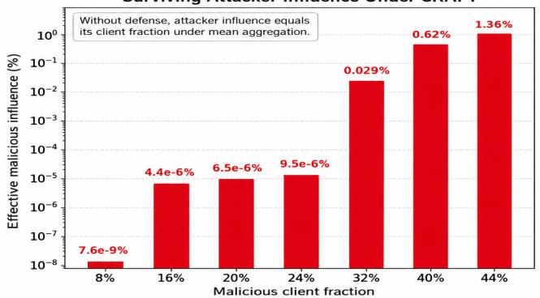

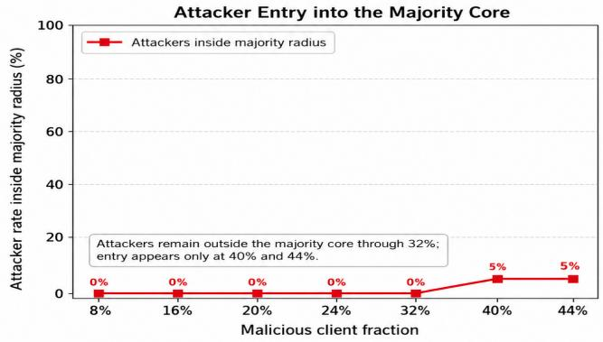  
Fig. 12: Effect of malicious client fraction on CRAFT for CIFAR-10 under IPM. Malicious influence remains negligible until attackers begin to enter the majority-supported footprint core.

## APPENDIX C DEFENSE-AWARE ATTACK ON PURCHASE

Figure 14 shows the Purchase result for the restricted defense-aware IPM attack. Adaptive and standard IPM are nearly indistinguishable, and CRAFT assigns almost no aggregation weight to malicious clients across the run.

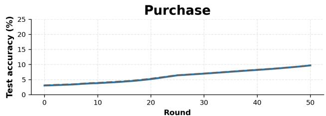

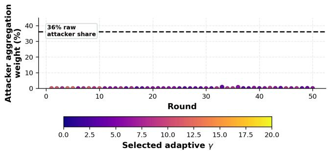  
Fig. 14: Purchase under restricted adaptive IPM. CRAFT assigns almost no aggregation weight to attackers.

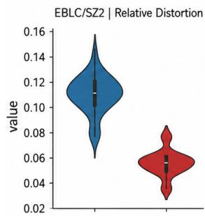

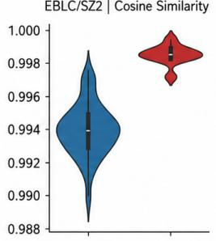

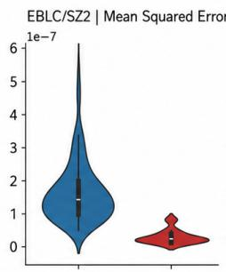

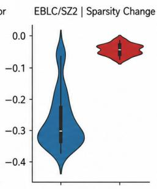

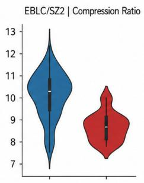

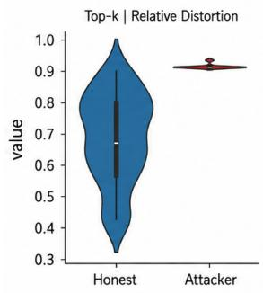

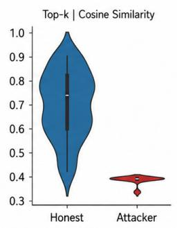

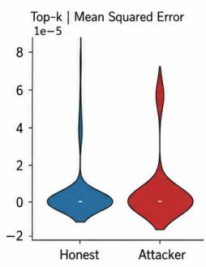

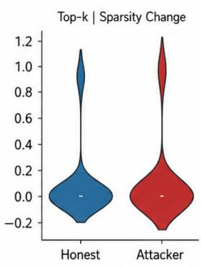

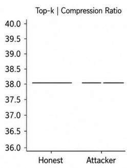  
Fig. 13: Per-metric footprint distributions for honest and malicious clients under EBLC/SZ (top row) and Top-K (bottom row). EBLC/SZ exhibits separation across multiple footprint coordinates, whereas Top-K is informative mainly in a narrower subset of metrics.

## APPENDIX D

## BENIGN ACCURACY WITHOUT POISONING

A robust aggregator should not harm training when no attack is present. Figure 15 compares CRAFT with Mean aggregation under the same compressed FedSGD pipeline.

Across CIFAR-10, Fashion-MNIST, and Purchase, CRAFT closely follows the Mean baseline. This shows that the footprint-based trust mechanism does not unnecessarily suppress honest updates in the benign IID setting. Therefore, the robustness gains reported later are not caused by sacrificing clean accuracy.

## APPENDIX E

## TRUST-PARAMETER ABLATION

Figure 16 reports an ablation of the two CRAFT trustshaping parameters, λ and p, on CIFAR-10 under IPM. The tested settings produce similar training behavior, with the last-50-round mean accuracy ranging from 45.4% to 47.2%. We use λ = 2 and $p = 4$ in the main experiments as a fixed operating point.

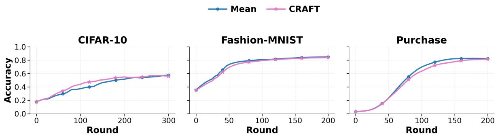  
Fig. 15: No-attack baseline accuracy for Mean aggregation and CRAFT on CIFAR-10, Fashion-MNIST, and Purchase. CRAFT closely tracks Mean when all clients are honest.

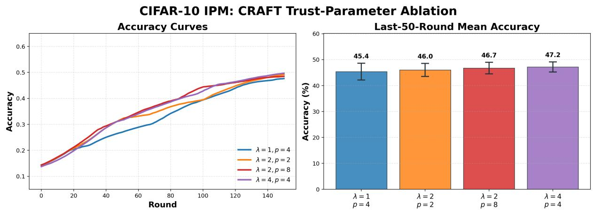  
Fig. 16: CRAFT trust-parameter ablation on CIFAR-10 under IPM.