# Correcting CondOT: Exact Finite-Step Sampling in Gaussian Flow Matching

Ron Levy   
Department of Computer Science   
Technion, Israel   
Michael Elad   
Department of Computer Science   
Technion, Israel

ron.levy@campus.technion.ac.il

elad@cs.technion.ac.il

## Abstract

Flow matching generates samples by gradually transforming noise into data. In practice, using a finite number of sampling steps introduces a numerical error that depends on the chosen schedule. We study this dependence for Gaussian targets and the explicit midpoint sampling method, using the exact flow field. We measure sampling error by the squared Wasserstein distance between the target distribution and the final distribution produced by the midpoint sampler. We show that the standard conditional optimal transport (CondOT) schedule cancels the leading midpoint error and improves the general convergence bound, even when the sampling steps are unequally spaced. On a uniform grid of S sampling steps, we fix the signal schedule at $\alpha _ { t } = t$ and prove the existence of scalar noise schedules $\beta _ { t }$ that approach the CondOT noise schedule 1 − t at rate 1/S and yield exact Gaussian sampling for every suficiently large S. Controlled Gaussian experiments illustrate the convergence rates and exact calibration.1

## 1 Introduction

In flow matching (Lipman et al., 2023), samples are generated by following a learned transformation from noise to a target distribution. The schedule controls the contributions of noise and data along this transformation, while a numerical sampler approximates it using a finite number of steps. Although diferent schedules can reach the same target when the dynamics are solved exactly, their numerical approximations need not have the same accuracy. This raises a natural question: how does the sampling error depend on the schedule, and how should the schedule be chosen for a given sampling budget?

To study this dependence, we consider Gaussian targets, whose closed-form flow fields allow us to isolate the numerical error of the explicit midpoint sampler from neural-network approximation error. Although a known Gaussian can be sampled directly, this setting allows us to examine how schedule choice afects numerical accuracy and how changing a shared scalar schedule can compensate for the sampler’s error.

We first derive the distribution produced by midpoint sampling under general schedules and arbitrary prescribed sampling times. We then show that increasing the data contribution linearly is the unique signal schedule that preserves the terminal mean for every target mean, prescribed time grid, and noise schedule satisfying our assumptions. Fixing this choice removes the mean error and gives a simple objective based on the remaining covariance mismatch between the target distribution and the final distribution produced by midpoint sampling.

Building on this objective, we analyze how the error decreases as the sampling steps become finer. For the standard conditional optimal transport (CondOT) schedule, which increases the signal contribution and

decreases the noise contribution linearly, the leading error term cancels, producing a faster convergence rate.   
This efect, called superconvergence, holds even when the sampling steps are unequally spaced.

The cancellation does not generally make CondOT exact at a finite sampling budget. We therefore ask whether the remaining error can be eliminated by a small change to the default schedule. On equally spaced grids, we keep the signal schedule fixed and add a polynomial correction to $\mathrm { C o n d O T ' s }$ noise schedule. The number of coeficients equals the number of distinct eigenvalues of the target covariance. We prove that, for every suficiently large sampling budget $S ,$ a correction to the default noise schedule of order $1 / S$ produces a schedule that makes the midpoint sampler exactly reproduce the Gaussian target.

Finally, Gaussian experiments compare CondOT with other noise schedules, confirm its faster convergence rate, and demonstrate that the calibrated correction reduces the terminal error to numerical precision at finite sampling budgets.

## 2 Problem Setup and Exact Sampling Error

We consider Gaussian flow matching and study how the interpolation schedules afect the error of midpoint sampling.

Gaussian probability path. Let $z \sim p _ { \mathrm { d a t a } } = \mathcal { N } ( \mu , \Sigma )$ , with $\Sigma \succ 0$ , and independently draw $\epsilon \sim p _ { \mathrm { i n i t } } =$ $\mathcal { N } ( 0 , I )$ . We connect noise to data through

$$
X _ { t } = \alpha _ { t } z + \beta _ { t } \epsilon , \qquad 0 \leq t \leq 1 .\tag{1}
$$

The signal schedule $\alpha _ { t }$ controls the contribution of the target sample, while the noise schedule $\beta _ { t }$ controls the remaining noise. We impose

$$
\alpha _ { 0 } = 0 , \qquad \alpha _ { 1 } = 1 , \qquad \beta _ { 0 } = 1 , \qquad \beta _ { 1 } = 0 ,
$$

so that $X _ { 0 } = \epsilon$ and $X _ { 1 } = z$

Both schedules must also belong to $C ^ { 1 } ( [ 0 , 1 ] )$ and satisfy

$$
\alpha _ { t } ^ { 2 } + \beta _ { t } ^ { 2 } > 0 \qquad \mathrm { f o r ~ e v e r y ~ } t \in [ 0 , 1 ] .
$$

Additional regularity is stated where needed.

Because the noise and target sample are independent Gaussians, the distribution at every intermediate time is

$$
p _ { t } = \mathcal { N } \big ( \alpha _ { t } \mu , \beta _ { t } ^ { 2 } I + \alpha _ { t } ^ { 2 } \Sigma \big ) .\tag{2}
$$

Thus the schedules determine both the mean and the covariance along the path.

The exact flow. Flow matching generates samples by following a velocity field whose flow has the prescribed distributions $p _ { t }$ . For the Gaussian path above, the exact target field $\begin{array} { r } { u _ { t } ^ { \mathrm { { t a r g e t } } } ( x ) = \mathbb { E } [ \dot { X } _ { t } \mid X _ { t } = \bar { x } ] } \end{array}$ has the explicit form

$$
u _ { t } ^ { \mathrm { t a r g e t } } ( x ) = { \dot { \alpha } _ { t } } \mu + \left( \beta _ { t } { \dot { \beta } _ { t } } I + \alpha _ { t } { \dot { \alpha } _ { t } } \Sigma \right) \left( \beta _ { t } ^ { 2 } I + \alpha _ { t } ^ { 2 } \Sigma \right) ^ { - 1 } ( x - \alpha _ { t } \mu ) .\tag{3}
$$

Starting from $Y _ { 0 } = \epsilon .$ , the corresponding dynamics

$$
{ \frac { d Y _ { t } } { d t } } = u _ { t } ^ { \mathrm { t a r g e t } } ( Y _ { t } )\tag{4}
$$

satisfy $Y _ { t } \sim p _ { t }$ and therefore reach $p _ { \mathrm { d a t a } }$ at $t = 1$ . Appendix A.1 derives this field.

Midpoint sampling. Fix prescribed sampling times $0 = t _ { 0 } < \cdot \cdot \cdot < t _ { S } = 1$ , and write

$$
h _ { n } = t _ { n + 1 } - t _ { n } , \qquad t _ { n + \frac { 1 } { 2 } } = t _ { n } + \frac { h _ { n } } { 2 } , \qquad h _ { \operatorname* { m a x } } = \operatorname* { m a x } _ { 0 \leq n < S } h _ { n } .
$$

Starting from $Y _ { 0 } ^ { \mathrm { M } } = \epsilon$ , the explicit midpoint method first predicts a state halfway through the current step, then uses the field at that predicted state to complete it:

$$
\begin{array} { l } { { \displaystyle Y _ { n + \frac { 1 } { 2 } } ^ { \mathrm { M } } = Y _ { n } ^ { \mathrm { M } } + \frac { h _ { n } } { 2 } u _ { t _ { n } } ^ { \mathrm { t a r g e t } } ( Y _ { n } ^ { \mathrm { M } } ) } , } \\ { { \displaystyle Y _ { n + 1 } ^ { \mathrm { M } } = Y _ { n } ^ { \mathrm { M } } + h _ { n } u _ { t _ { n + \frac { 1 } { 2 } } } ^ { \mathrm { t a r g e t } } ( Y _ { n + \frac { 1 } { 2 } } ^ { \mathrm { M } } ) } . } \end{array}\tag{5}
$$

Each step requires two field evaluations, so $N _ { \mathrm { F E } } = 2 S$ . The uniform grid is the special case $t _ { n } = n h$ , with $h = S ^ { - 1 }$

Let $p _ { S } ^ { \mathrm { { M } } }$ denote the distribution of $Y _ { S } ^ { \mathrm { M } }$ . We measure its discrepancy from the target by

$$
J _ { S } = W _ { 2 } ^ { 2 } ( p _ { S } ^ { \mathrm { M } } , p _ { \mathrm { d a t a } } ) .\tag{6}
$$

Our goal is to choose schedules that reduce this error for a prescribed sampling grid. All reported convergence rates shown later concern this squared distance.

## 2.1 A signal schedule that preserves the mean

The terminal error can arise from an incorrect mean or covariance. We first identify the signal schedule that eliminates the mean error, then obtain an exact expression for the remaining covariance error.

Theorem 1. Fix $\Sigma \succ 0$ and a signal schedule $\alpha \in C ^ { 1 } ( [ 0 , 1 ] ) \cap C ^ { 2 } ( ( 0 , 1 ) )$ with $\alpha _ { 0 } = 0$ and $\alpha _ { 1 } = 1$ , chosen independently of S, the sampling grid, and β. The midpoint terminal mean satisfies

$$
\mathbb { E } [ Y _ { S } ^ { \mathrm { M } } ] = \mu
$$

for every $S \geq 1$ , every prescribed grid, every target mean $\mu ,$ and every noise schedule β satisfying the assumptions above with this fixed α, if and only $i f \alpha _ { t } = t$

For this choice, midpoint sampling also preserves the exact mean at every grid point and predicted midpoint:

$$
\mathbb { E } [ Y _ { n } ^ { \mathrm { M } } ] = t _ { n } \mu , \qquad \mathbb { E } [ Y _ { n + \frac { 1 } { 2 } } ^ { \mathrm { M } } ] = t _ { n + \frac { 1 } { 2 } } \mu .
$$

The proof is given in Appendix A.2.2. From now on, we fix $\alpha _ { t } = t .$ , which guarantees the correct mean at every sampling budget.

## 2.2 The exact finite-step objective

We now express the output covariance and sampling error in terms of the noise schedule. Write

$$
\Sigma ^ { - 1 } = U \mathrm { d i a g } ( \lambda _ { 1 } , \ldots , \lambda _ { d } ) U ^ { \top } , \qquad \lambda _ { k } > 0 ,
$$

where U is orthogonal. The target variance in direction k is $1 / \lambda _ { k }$

The following result gives the exact output distribution and its squared Wasserstein distance from the target. Proposition 2. For $\alpha _ { t } = t ,$ , every noise schedule $\beta \in C ^ { 1 } ( [ 0 , 1 ] )$ with $\beta _ { 0 } = 1$ and $\beta _ { 1 } = 0$ , and every prescribed sampling grid, the midpoint output is

$$
\begin{array} { r l } & { p _ { S } ^ { \mathrm { M } } = \mathcal { N } ( \mu , \Sigma _ { \mathrm { M } } ) , } \\ & { \Sigma _ { \mathrm { M } } = U \mathrm { d i a g } \big ( ( D _ { 1 , 1 } ^ { \mathrm { M } } ) ^ { 2 } , \dots , ( D _ { 1 , d } ^ { \mathrm { M } } ) ^ { 2 } \big ) U ^ { \top } , } \end{array}\tag{7}
$$

where

$$
D _ { 1 , k } ^ { \mathrm { M } } = \prod _ { n = 0 } ^ { S - 1 } \left[ 1 + h _ { n } A _ { k } ( t _ { n + \frac { 1 } { 2 } } ) + \frac { h _ { n } ^ { 2 } } { 2 } A _ { k } ( t _ { n + \frac { 1 } { 2 } } ) A _ { k } ( t _ { n } ) \right] ,\tag{8}
$$

with

$$
v _ { k } ( t ) = \beta _ { t } ^ { 2 } + \frac { t ^ { 2 } } { \lambda _ { k } } , \qquad A _ { k } ( t ) = \frac { \dot { v } _ { k } ( t ) } { 2 v _ { k } ( t ) } .\tag{9}
$$

Consequently, the squared Wasserstein error is

$$
J _ { S } = \sum _ { k = 1 } ^ { d } \left( | D _ { 1 , k } ^ { \mathrm { M } } | - \frac { 1 } { \sqrt { \lambda _ { k } } } \right) ^ { 2 } .\tag{10}
$$

Here, $v _ { k } ( t )$ is the variance of the exact probability path in direction k, while $| D _ { 1 , k } ^ { \mathrm { M } } |$ is the standard deviation produced by the sampler in that direction. In the asymptotic analysis below, $D _ { 1 , k } ^ { \mathrm { M } } > 0$ for suficiently fine grids, so the absolute values in (10) can be omitted; see Appendices B.1 and C.2.

Appendix A.2.1 derives the output distribution and the product in (8). Appendix A.3 derives the Wasserstein expression. The objective is exact for every sampling budget and provides the basis for the convergence analysis and schedule optimization below.

## 3 CondOT Superconvergence

We now study how the sampling error decreases as the time steps become smaller. Throughout this section, we keep the target covariance Σ and the noise schedule fixed, and refine the sampling grid so that $h _ { \operatorname* { m a x } }  0$

For a fixed noise schedule satisfying the assumptions of Section 2, with $v _ { k } \in C ^ { 4 } ( [ 0 , 1 ] )$ and $v _ { k }$ bounded away from zero in every direction, the general midpoint error bound is

$$
J _ { S } = { \cal O } ( h _ { \operatorname* { m a x } } ^ { 4 } ) .
$$

Appendix B.2 derives this bound and the corresponding error expansion. Our main result shows that CondOT, which uses $\beta _ { t } = 1 - t ,$ cancels the leading error term and achieves a stronger bound.

Theorem 3. For $\alpha _ { t } = t$ and $\beta _ { t } = 1 - t$ , along every sequence of prescribed grids with $h _ { \operatorname* { m a x } }  0$

$$
D _ { 1 , k } ^ { \mathrm { M } } - \frac { 1 } { \sqrt { \lambda _ { k } } } = O ( h _ { \operatorname* { m a x } } ^ { 3 } ) , \qquad J _ { S } = O ( h _ { \operatorname* { m a x } } ^ { 6 } ) .\tag{11}
$$

The proof is given in Appendix B.3. Thus CondOT improves the general squared Wasserstein error bound from $O ( h _ { \operatorname* { m a x } } ^ { 4 } )$ to $O ( h _ { \operatorname* { m a x } } ^ { 6 } )$ . We refer to this improvement as superconvergence. The result does not require equally spaced sampling times.

The remaining error on a uniform grid. For equally spaced steps, we can also calculate the leading coeficient of the remaining error. This gives a more precise description of CondOT’s accuracy and provides the basis for exact schedule calibration in the next section.

Corollary 4. For CondOT on the uniform grid, with $h = S ^ { - 1 }$ , the following expansions hold as $S \to \infty$

$$
D _ { 1 , k } ^ { \mathrm { M } } - \frac { 1 } { \sqrt { \lambda _ { k } } } = \frac { d _ { k } } { \sqrt { \lambda _ { k } } } h ^ { 3 } + O ( h ^ { 4 } ) ,\tag{12}
$$

$$
{ \cal J } _ { \cal S } = h ^ { 6 } \sum _ { k = 1 } ^ { d } \frac { d _ { k } ^ { 2 } } { \lambda _ { k } } + { \cal O } ( h ^ { 7 } ) ,\tag{13}
$$

where

$$
d _ { k } = - \frac { 1 } { 2 4 } - \frac { \pi ( 1 + \lambda _ { k } ) ^ { 3 } } { 2 5 6 \lambda _ { k } ^ { 3 / 2 } } < 0 .\tag{14}
$$

Appendix B.5 derives these expansions and evaluates $d _ { k }$ . Since the coeficient in (13) is strictly positive, CondOT has squared Wasserstein error $\Theta ( S ^ { - 6 } )$ on the uniform grid.

The sign of $d _ { k }$ also describes the remaining discrepancy: for suficiently large $S ,$ the generated standard deviation is smaller than the target standard deviation in every eigendirection. In the next section, we ask whether a small change to the noise schedule can eliminate this remaining error.

## 4 Exact Finite-Budget Calibration Near CondOT

On a uniform grid, we keep $\alpha _ { t } = t$ and add a polynomial correction to CondOT’s noise schedule, with one coeficient per distinct precision eigenvalue. We choose these coeficients jointly to eliminate the remaining error in every eigendirection using a single shared noise schedule. Let r be the number of distinct precision eigenvalues of the fixed covariance. After reordering, let $\lambda _ { 1 } , \ldots , \lambda _ { r }$ contain one representative of each distinct value, and set

$$
\beta _ { \pmb \theta } ( t ) = ( 1 - t ) \left( 1 + \sum _ { j = 1 } ^ { r } \theta _ { j } t ^ { j } \right) .\tag{15}
$$

This family reduces to CondOT at $\pmb \theta = 0$ . Every coeficient vector gives a smooth schedule with the required endpoints.

Theorem 5. Fix $\Sigma \succ 0$ . There is a unique vector $\pmb { K } = ( K _ { 1 } , \ldots , K _ { r } ) ^ { \top }$ solving

$$
\sum _ { j = 1 } ^ { r } K _ { j } \int _ { 0 } ^ { 1 } { \frac { \left[ 2 t ^ { j } ( 1 - t ) ^ { 2 } \right] ^ { \prime \prime \prime } } { ( 1 - t ) ^ { 2 } + t ^ { 2 } / \lambda _ { k } } } d t = 4 8 d _ { k } , \qquad k = 1 , \ldots , r ,\tag{16}
$$

where $d _ { k }$ is the CondOT coeficient in (14). The first-order correction satisfies

$$
J _ { S } \big ( \beta _ { K / S } \big ) = O ( S ^ { - 8 } ) \qquad a s \ S  \infty .\tag{17}
$$

Moreover, for every suficiently large integer S, there is a locally unique parameter vector $\pmb { \theta } _ { S } = \pmb { K } / S + O ( S ^ { - 2 } )$ within this polynomial family such that

$$
J _ { S } ( \beta _ { { \pmb \theta } _ { S } } ) = 0 .\tag{18}
$$

Equivalently, the corresponding midpoint output satisfies $Y _ { S } ^ { \mathrm { M } } = \mu + \Sigma ^ { 1 / 2 } \epsilon .$

The two conclusions require diferent amounts of calibration. Solving the linear system (16) once gives K and the explicit schedule $\beta _ { K / S }$ . This cancels the leading error in every eigendirection, giving (17). To obtain zero loss at a particular budget, one instead solves the exact equations

$$
D _ { 1 , k } ^ { \mathrm { M } } ( \pmb \theta _ { S } ) = \frac { 1 } { \sqrt { \lambda _ { k } } } , \qquad k = 1 , \ldots , r ,\tag{19}
$$

where $D _ { 1 , k } ^ { \mathrm { M } }$ is the midpoint product in (8), evaluated with (15). Solving these r nonlinear equations determines the $O ( S ^ { - 2 } )$ adjustment to $K / S$ . Repeated eigenvalues require no additional equations. Such a solution exists for every suficiently large S, with the calibrated coeficients and the budget threshold depending on the target spectrum. Appendix C proves this result by constructing an iteration that converges to the calibrated coeficients from $K / S$ for suficiently large S.

## 5 Numerical Experiments

We use four centered Gaussian targets to examine two features of the calibration problem: the number r of distinct eigenvalues, which determines the number of correction coeficients, and the spectral spread. All targets have dimension $d = 6$ and total variance $\mathrm { t r } ( \Sigma ) = 6$ . For a positive vector $_ { w , }$ , set

$$
\Sigma ( \pmb { w } ) = \frac { 6 } { \sum _ { i = 1 } ^ { 6 } w _ { i } } \operatorname { d i a g } ( w _ { 1 } , \ldots , w _ { 6 } ) .\tag{20}
$$

Table 1 specifies the four targets. The normalization preserves the condition number $\kappa = \lambda _ { \mathrm { m a x } } ( \Sigma ) / \lambda _ { \mathrm { m i n } } ( \Sigma )$ The two-eigenvalue cases use each variance three times, while the six-eigenvalue cases use geometric spacing. This gives a structured comparison at fixed dimension and total variance.

Table 1: Four Gaussian targets. The vectors w are normalized by (20).
<table><tr><td>Target</td><td>r</td><td>κ</td><td>Unnormalized covariance eigenvalues w</td></tr><tr><td>A</td><td>2</td><td>4</td><td> $( 1 , 1 , 1 , 4 , 4 , 4 )$ </td></tr><tr><td>B</td><td>6</td><td>4</td><td> $( 4 ^ { j / 5 } ) _ { j = 0 } ^ { 5 }$ </td></tr><tr><td>C</td><td>2</td><td> $1 0 ^ { 4 }$ </td><td> $( 1 , 1 , \overset { \ j } { 1 , 1 0 ^ { 4 } } , 1 0 ^ { 4 } , 1 0 ^ { 4 } )$ </td></tr><tr><td>D</td><td>6</td><td> $1 0 ^ { 4 }$ </td><td> $( 1 0 ^ { 4 j / 5 } ) _ { j = 0 } ^ { 5 }$ </td></tr></table>

We fix $\alpha _ { t } = t ,$ use the exact Gaussian field, and sample on uniform grids. A budget of S midpoint steps uses 2S field evaluations. High-precision losses are evaluated from (10) using 90-digit decimal arithmetic. Sections 5.1 and 5.2 use Target D as a common example, combining six matching constraints with a broad spectrum. Section 5.3 compares the calibrated schedules for all four targets. Additional convergence results and the double-precision check are in Appendices C.4 and C.6.

## 5.1 CondOT superconvergence

We compare CondOT, $\beta _ { t } = 1 - t ,$ with four fixed noise schedules:

$$
( 1 - t ) ^ { 2 } , \qquad 1 - t ^ { 2 } , \qquad \cos ( \pi t / 2 ) , \qquad ( 1 - t ) ( 1 + 0 . 1 t ) .
$$

These alternatives satisfy the assumptions of Section 3 and have $J _ { S } = \Theta ( S ^ { - 4 } )$ on uniform grids (Appendix B.4), while CondOT has $J _ { S } = \Theta ( S ^ { - 6 } )$ . Figure 1 compares their losses for Target D at $S = 6 4 , 1 2 8 , \ldots , 6 5 5 3 6$ . The curves approach the predicted rates.

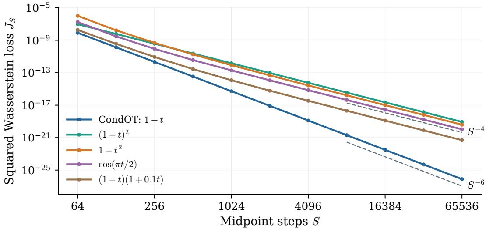  
Figure 1: Fixed schedules for Target D. The four alternatives approach $S ^ { - 4 }$ squared Wasserstein decay, while CondOT achieves $S ^ { - 6 }$ . Dashed lines indicate the asymptotic rates.

## 5.2 From first-order correction to exact calibration

For the same target, we solve (16) once for the six coeficients K. At each budget, we use the explicit schedule $\beta _ { K / S }$ from (15). Figure 2 compares this schedule with CondOT on the same grids as Figure 1. The corrected loss approaches eighth-order decay, consistent with Theorem 5. The improvement is asymptotic.

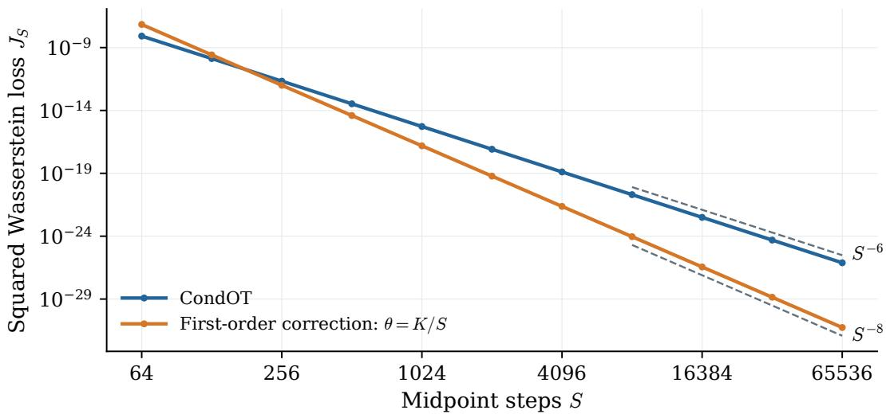  
Figure 2: First-order correction for Target D. The explicit choice $\theta = \kappa / S$ improves CondOT’s $S ^ { - 6 }$ decay to $S ^ { - 8 }$ . Dashed lines indicate these rates.

We then solve the exact matching equations (19) using the coeficient iteration constructed in the proof (Appendix C.2), starting from $\mathbf { } K / S .$ . Table 2 compares the leading correction with the numerically calibrated schedules at four budgets. The iteration reduces the terminal loss below $1 0 ^ { - 1 7 0 }$ in each case. Appendix C.3 gives the numerical procedure, iteration counts, and results for all four targets, including failures to reach the matching tolerance for Targets C and D at S = 64, 128.

Table 2: Calibration for Target D using the proof’s iteration. The last column reports numerical squared Wasserstein loss in 90-digit arithmetic.
<table><tr><td>S</td><td> $S ^ { 8 } J _ { S } ( \beta _ { K / S } )$ </td><td> $J _ { S } ( \beta _ { { \pmb \theta } _ { S } } )$  (numerical)</td></tr><tr><td>256</td><td> $1 . 8 6 4 2 \times 1 0 ^ { 7 }$ </td><td> $< 1 0 ^ { - 1 7 0 }$ </td></tr><tr><td>512</td><td> $1 . 8 6 1 0 \times 1 0 ^ { 7 }$ </td><td> $< 1 0 ^ { - 1 7 0 }$ </td></tr><tr><td>1024</td><td> $1 . 8 6 0 2 \times 1 0 ^ { 7 }$ </td><td> $< 1 0 ^ { - 1 7 0 }$ </td></tr><tr><td>2048</td><td> $1 . 8 6 0 1 \times 1 0 ^ { 7 }$ </td><td> $< 1 0 ^ { - 1 7 0 }$ </td></tr></table>

## 5.3 How the target spectrum changes the calibrated schedule

We now compare all four targets at the common budget $S = 2 5 6$ . Figure 3 shows the diference between each calibrated noise schedule and CondOT. All panels use the same time and vertical scales. The endpoints remain fixed, while the shape and size of the interior correction depend on the target spectrum. For these four targets, the calibrated corrections are larger for the broader spectra at this budget: the maximum deviations are approximately $2 . 4 2 \times 1 0 ^ { - 4 } , 8 . 1 5 \times 1 0 ^ { - 4 } , 3 . 1 5 \times 1 0 ^ { - 2 }$ , and $4 . 0 7 \times 1 0 ^ { - 2 }$ for $\mathrm { A - D }$ , respectively. The two-eigenvalue corrections remain below CondOT in the interior, whereas the six-eigenvalue examples cross it. These are features of the selected targets, rather than universal consequences of r or κ. The coeficients are calibrated using the same procedure in every case. Appendix C.5 records the coeficients and numerical deviations from CondOT.

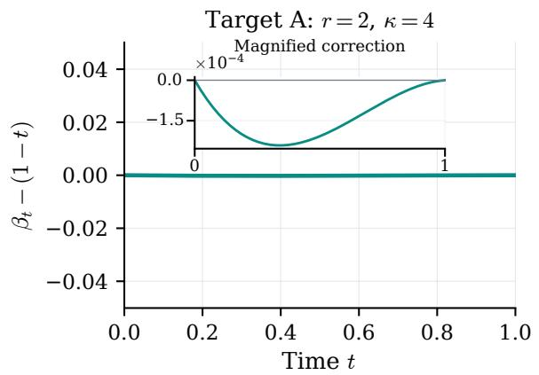

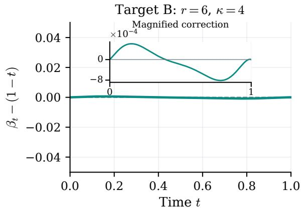

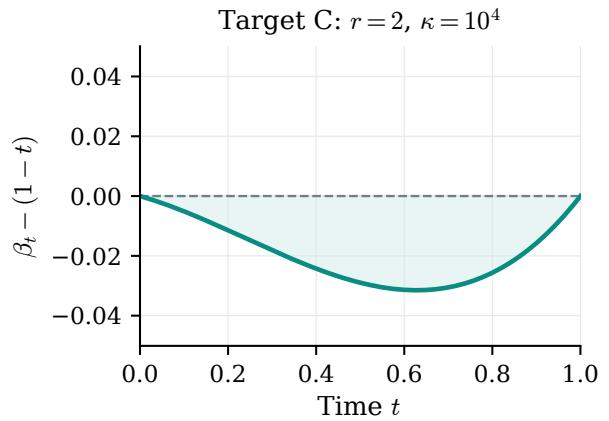

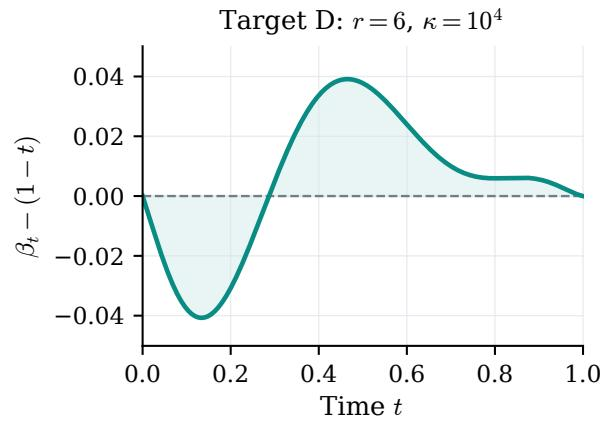  
Figure 3: Calibrated schedule corrections at $S = 2 5 6$ . Top: modest spectral spread $( \kappa = 4 )$ . Bottom: broad spectral spread $( \kappa = 1 0 ^ { 4 } )$ . Left: two distinct eigenvalues. Right: six distinct eigenvalues. The horizontal line is CondOT, and all panels share the same vertical scale. The smaller corrections for Targets A and B are magnified.

## 6 Related Work and Scope

Flow matching learns generative vector fields through conditional regression (Lipman et al., 2023; 2024; Tong et al., 2024), with close connections to stochastic interpolants (Albergo et al., 2025). Generating samples requires numerically integrating the resulting ODE, introducing discretization error even when the exact vector field is available.

Gaussian models provide a tractable setting for analyzing the sampling error. Hurault et al. (2025) quantify Wasserstein errors in Gaussian difusion models, while Benita et al. (2025) derive exact Gaussian output laws and optimize noise schedules using terminal Wasserstein distance and KL divergence. Chen et al. (2025) approach schedule design through the vector field’s Lipschitz regularity. More directly related to discretization, Hurault et al. (2026) derive Euler–Maruyama error expansions and construct schedules that cancel the leading error in one covariance eigendirection.

Exact finite-step Gaussian sampling has also been studied. For centered Gaussians with commuting covariances, Claustre et al. (2026) allow direction-dependent schedules and show that Euler integrates the Gaussian Wasserstein geodesic exactly on any time grid. Our setting uses midpoint sampling with $\alpha _ { t } = t$ and a single scalar noise schedule shared across all covariance directions, and establishes exact terminal matching using corrections that vanish toward CondOT as the sampling budget grows.

Mean exactness connects our analysis to Levy & Elad (2026), who study schedule design for Brownian Bridge Difusion Models under a Gaussian-mixture prior. Their surrogate reconstruction law preserves each posterior component’s mean, simplifying their Wasserstein upper-bound objective to a weighted sum of squared diferences between generated and target standard deviations. Fixing $\alpha _ { t } = t$ gives the analogous simplification in our Gaussian setting: the exact squared Wasserstein objective (10) depends only on the covariance mismatch.

## 7 Conclusion

We analyzed how schedule choice afects midpoint sampling for Gaussian flow matching. The linear signal schedule preserves the mean, and the CondOT noise schedule cancels the leading numerical error, yielding superconvergence even on nonuniform grids. On uniform grids, the remaining error can be removed by a vanishing polynomial correction with one coeficient per distinct precision eigenvalue. Its leading approximation improves the convergence rate beyond CondOT, while exact calibration gives zero terminal loss for every suficiently large budget. This establishes exact finite-budget sampling within a family of scalar schedules approaching CondOT.

The analysis assumes a specific solver and a Gaussian target with positive definite covariance. Future work includes extending the analysis to Gaussian mixtures, studying other numerical solvers, and examining how network approximation error afects the benefits of calibration.

## Acknowledgements

This research was partially supported by the Israel Science Foundation (ISF) under Grants 951/24 and 409/24, and by the Council for Higher Education–Planning and Budgeting Committee.

## References

Michael Albergo, Nicholas M. Bofi, and Eric Vanden-Eijnden. Stochastic interpolants: A unifying framework for flows and difusions. Journal of Machine Learning Research, 26(209):1–80, 2025. URL https://jmlr. org/papers/v26/23-1605.html.

Roi Benita, Miki Elad, and Joseph Keshet. Spectral analysis of difusion models with application to schedule design. In Advances in Neural Information Processing Systems, volume 38, pp. 2073–2127. Curran Associates, Inc., 2025. doi: 10.52202/085713-0077. URL https://proceedings.neurips.cc/paper\_files/paper/ 2025/hash/031bd3fc62939fcb38ed887c6f66d5c7-Abstract-Conference.html.

Yifan Chen, Eric Vanden-Eijnden, and Jiawei Xu. Lipschitz-guided design of interpolation schedules in generative models. arXiv preprint arXiv:2509.01629, 2025. URL https://arxiv.org/abs/2509.01629.

Arsène Claustre, Hugo Negrel, Claire Boyer, Kimia Nadjahi, and Eric Vanden-Eijnden. Gaussian flowmatching schedules: Implications for sampling and training. arXiv preprint arXiv:2609.25839, 2026. URL https://arxiv.org/abs/2609.25839.

Samuel Hurault, Matthieu Terris, Thomas Moreau, and Gabriel Peyré. From score matching to difusion: A fine-grained error analysis in the Gaussian setting. arXiv preprint arXiv:2503.11615, 2025. URL https://arxiv.org/abs/2503.11615.

Samuel Hurault, Thomas Moreau, and Gabriel Peyré. Geometry-aware discretization error of difusion models. arXiv preprint arXiv:2605.08392, 2026. URL https://arxiv.org/abs/2605.08392.

Ron Levy and Michael Elad. Mixture-of-Gaussians-guided schedule design for Brownian bridge difusion models. arXiv preprint arXiv:2607.03517, 2026. URL https://arxiv.org/abs/2607.03517.

Yaron Lipman, Ricky T. Q. Chen, Heli Ben-Hamu, Maximilian Nickel, and Matt Le. Flow matching for generative modeling. In International Conference on Learning Representations, 2023. URL https: //openreview.net/forum?id=PqvMRDCJT9t.

Yaron Lipman, Marton Havasi, Peter Holderrieth, Neta Shaul, Matt Le, Brian Karrer, Ricky T. Q. Chen, David Lopez-Paz, Heli Ben-Hamu, and Itai Gat. Flow matching guide and code. arXiv preprint arXiv:2412.06264, 2024. URL https://arxiv.org/abs/2412.06264.

Alexander Tong, Kilian Fatras, Nikolay Malkin, Guillaume Huguet, Yanlei Zhang, Jarrid Rector-Brooks, Guy Wolf, and Yoshua Bengio. Improving and generalizing flow-based generative models with minibatch optimal transport. Transactions on Machine Learning Research, 2024. URL https://openreview.net/ forum?id=CD9Snc73AW.

## A Problem Setup and Exact Sampling Error

This appendix supplies the derivations for Section 2. We first obtain the Gaussian field, then establish universal mean exactness, and finally derive the exact finite-step objective.

## A.1 Gaussian probability path and exact field

Let the target distribution be

$$
p _ { \mathrm { d a t a } } ( z ) = \mathcal { N } ( z ; \mu , \Sigma ) , \qquad \Sigma \succ 0 ,\tag{A.1}
$$

and let the base distribution be

$$
p _ { \mathrm { i n i t } } = { \mathcal { N } } ( 0 , I ) .
$$

## A.1.1 Gaussian probability path

Draw

$$
z \sim p _ { \mathrm { d a t a } } , \qquad \epsilon \sim { \mathcal { N } } ( 0 , I ) , \qquad \epsilon \perp z .
$$

Let $\alpha , \beta \in C ^ { 1 } ( [ 0 , 1 ] )$ satisfy the endpoint conditions

$$
\alpha _ { 0 } = 0 , \qquad \beta _ { 0 } = 1 , \qquad \alpha _ { 1 } = 1 , \qquad \beta _ { 1 } = 0 ,\tag{A.2}
$$

and the nondegeneracy condition

$$
\alpha _ { t } ^ { 2 } + \beta _ { t } ^ { 2 } > 0 \qquad \mathrm { f o r ~ e v e r y ~ } t \in [ 0 , 1 ] .
$$

Define the interpolation

$$
X _ { t } = \alpha _ { t } z + \beta _ { t } \epsilon , \qquad 0 \leq t \leq 1 .\tag{A.3}
$$

Its data-conditional law is

$$
p _ { t } ( \cdot \mid z ) = \mathcal { N } ( \alpha _ { t } z , \beta _ { t } ^ { 2 } I ) ,\tag{A.4}
$$

where, whenever $\beta _ { t } \ = \ 0$ , the right-hand side is understood as the Dirac measure $\delta _ { \alpha _ { t } z }$ . In particular, $p _ { 1 } ( \cdot \mid z ) = \delta _ { z }$

Since z and ϵ are independent Gaussian random vectors, the marginal law $p _ { t }$ of $X _ { t }$ is

$$
p _ { t } = \mathcal { N } ( \alpha _ { t } \mu , \beta _ { t } ^ { 2 } I + \alpha _ { t } ^ { 2 } \Sigma ) .\tag{A.5}
$$

The endpoint conditions give

$$
p _ { 0 } = p _ { \mathrm { i n i t } } , \qquad p _ { 1 } = p _ { \mathrm { d a t a } } .
$$

## A.1.2 Marginal vector field and exact flow

We derive the marginal vector field directly from the interpolation (A.3). Define its marginal covariance by

$$
C _ { t } : = \beta _ { t } ^ { 2 } I + \alpha _ { t } ^ { 2 } \Sigma .
$$

Since $\Sigma \succ 0$ and $\alpha _ { t } ^ { 2 } + \beta _ { t } ^ { 2 } > 0 , C _ { t }$ is positive definite for every $t \in [ 0 , 1 ]$

Diferentiating the interpolation gives

$$
\dot { X } _ { t } = \dot { \alpha } _ { t } z + \dot { \beta } _ { t } \epsilon .
$$

Define the marginal vector field by

$$
u _ { t } ^ { \mathrm { t a r g e t } } ( x ) : = \mathbb { E } [ \dot { X } _ { t } \mid X _ { t } = x ] .\tag{A.6}
$$

Both $X _ { t }$ and $\dot { X } _ { t }$ are linear transformations of the independent Gaussian random vectors z and $\epsilon ,$ so they are jointly Gaussian.

Gaussian regression. For jointly Gaussian random vectors $( A , B )$ with invertible $\operatorname { C o v } ( B )$

$$
\operatorname { \mathbb { E } } [ A \mid B = b ] = \operatorname { \mathbb { E } } [ A ] + \operatorname { C o v } ( A , B ) \operatorname { C o v } ( B ) ^ { - 1 } { \big ( } b - \operatorname { \mathbb { E } } [ B ] { \big ) } .
$$

Here,

$$
\mathbb { E } [ X _ { t } ] = \alpha _ { t } \mu , \qquad \mathbb { E } [ \dot { X } _ { t } ] = \dot { \alpha } _ { t } \mu ,
$$

and independence gives

$$
\operatorname { C o v } ( X _ { t } ) = C _ { t } , \qquad \operatorname { C o v } ( \dot { X } _ { t } , X _ { t } ) = \beta _ { t } \dot { \beta } _ { t } I + \alpha _ { t } \dot { \alpha } _ { t } \Sigma .
$$

Applying the regression identity therefore yields

$$
u _ { t } ^ { \mathrm { t a r g e t } } ( x ) = { \dot { \alpha } _ { t } } \mu + \left( \beta _ { t } \dot { \beta } _ { t } I + \alpha _ { t } { \dot { \alpha } _ { t } } \Sigma \right) \left( \beta _ { t } ^ { 2 } I + \alpha _ { t } ^ { 2 } \Sigma \right) ^ { - 1 } \left( x - \alpha _ { t } \mu \right) .\tag{A.7}
$$

Exact flow. Consider the target ODE

$$
Y _ { 0 } = \epsilon \sim { \mathcal { N } } ( 0 , I ) , \qquad { \frac { d Y _ { t } } { d t } } = u _ { t } ^ { \mathrm { t a r g e t } } ( Y _ { t } ) .\tag{A.8}
$$

The field is continuous in t and globally Lipschitz in $x ,$ uniformly on [0, 1], because its afine coeficients are continuous and $C _ { t } ^ { - 1 }$ is bounded on this interval. Hence the ODE has a unique solution.

We verify directly that this solution is

$$
Y _ { t } = \alpha _ { t } \mu + C _ { t } ^ { 1 / 2 } \epsilon ,
$$

where $\boldsymbol { C } _ { t } ^ { 1 / 2 }$ denotes the positive definite square root. Indeed, $C _ { t }$ is diagonal in the fixed eigenbasis of $\Sigma ,$ so diferentiation of its eigenvalues gives

$$
\frac { d } { d t } C _ { t } ^ { 1 / 2 } = \left( \beta _ { t } \dot { \beta } _ { t } I + \alpha _ { t } \dot { \alpha } _ { t } \Sigma \right) C _ { t } ^ { - 1 / 2 } .
$$

Consequently,

$$
\frac { d Y _ { t } } { d t } = \dot { \alpha } _ { t } \mu + \left( \beta _ { t } \dot { \beta } _ { t } I + \alpha _ { t } \dot { \alpha } _ { t } \Sigma \right) C _ { t } ^ { - 1 / 2 } \epsilon = u _ { t } ^ { \mathrm { t a r g e t } } ( Y _ { t } ) .
$$

Moreover, $C _ { 0 } = I$ and $\alpha _ { 0 } = 0$ , so the initial condition is satisfied. It follows that

$$
Y _ { t } \sim { \mathcal { N } } ( \alpha _ { t } \mu , C _ { t } ) = p _ { t } \qquad { \mathrm { f o r ~ e v e r y ~ } } t \in [ 0 , 1 ] ,
$$

and in particular $Y _ { 1 } \sim p _ { \mathrm { d a t a } }$

## A.1.3 Spectral form of the marginal ODE

For one Gaussian, the dynamics can be exposed directly in the eigenbasis of the target covariance. Diagonalize the target precision as

$$
\Sigma ^ { - 1 } = U \mathrm { d i a g } ( \lambda _ { 1 } , \ldots , \lambda _ { d } ) U ^ { \top } , \qquad \lambda _ { k } > 0 .\tag{A.9}
$$

Define

$$
Y _ { t } ^ { U } = U ^ { \top } Y _ { t } , \qquad \epsilon ^ { U } = U ^ { \top } \epsilon , \qquad \mu ^ { U } = U ^ { \top } \mu .
$$

Then $\epsilon ^ { U } \sim \mathcal { N } ( 0 , I )$ and the ODE decouples by eigendirection:

$$
\frac { d Y _ { t , k } ^ { U } } { d t } = \dot { \alpha } _ { t } \mu _ { k } ^ { U } + \frac { \beta _ { t } \dot { \beta } _ { t } + \alpha _ { t } \dot { \alpha } _ { t } / \lambda _ { k } } { \beta _ { t } ^ { 2 } + \alpha _ { t } ^ { 2 } / \lambda _ { k } } \left( Y _ { t , k } ^ { U } - \alpha _ { t } \mu _ { k } ^ { U } \right) .\tag{A.10}
$$

This scalar equation is the starting point for the explicit-midpoint analysis below.

## A.2 A signal schedule that preserves the mean

This subsection proves Theorem 1. We first record the midpoint recursion and its general output law, which the mean-exactness proof uses. For the finite-step analysis, consider an arbitrary prescribed time grid

$$
0 = t _ { 0 } < t _ { 1 } < \dots < t _ { S } = 1 , \qquad h _ { n } = t _ { n + 1 } - t _ { n } , \qquad n = 0 , \dots , S - 1 .\tag{A.11}
$$

We write

$$
t _ { n + \frac { 1 } { 2 } } = t _ { n } + \frac { h _ { n } } { 2 } = \frac { t _ { n } + t _ { n + 1 } } { 2 } .\tag{A.12}
$$

The uniform grid used later is the special case

$$
t _ { n } = n h , \qquad h = { \frac { 1 } { S } } , \qquad n = 0 , \dots , S .\tag{A.13}
$$

For a general nonautonomous ODE

$$
\frac { d Y _ { t } } { d t } = f ( t , Y _ { t } ) ,
$$

the explicit midpoint approximation $Y _ { n } ^ { \mathrm { M } } \approx Y _ { t _ { \tau } }$ is defined by

$$
\begin{array} { l } { { \displaystyle Y _ { n + \frac 1 2 } ^ { \mathrm { M } } = Y _ { n } ^ { \mathrm { M } } + \frac { h _ { n } } { 2 } f ( t _ { n } , Y _ { n } ^ { \mathrm { M } } ) } , } \\ { { \displaystyle Y _ { n + 1 } ^ { \mathrm { M } } = Y _ { n } ^ { \mathrm { M } } + h _ { n } f ( t _ { n + \frac 1 2 } , Y _ { n + \frac 1 2 } ^ { \mathrm { M } } ) } . } \end{array}\tag{A.14}
$$

Thus each interval uses two vector-field evaluations: one at its left endpoint and one at a predicted midpoint. Consequently, S midpoint steps require 2S function evaluations, so an even fixed budget of $N _ { \mathrm { F E } }$ evaluations corresponds to $S = N _ { \mathrm { F E } } / 2$ steps. For a fixed eigendirection $k ,$ define

$$
v _ { k } ( t ) : = \beta _ { t } ^ { 2 } + \frac { \alpha _ { t } ^ { 2 } } { \lambda _ { k } } , \qquad A _ { k } ( t ) : = \frac { \dot { v } _ { k } ( t ) } { 2 v _ { k } ( t ) } .\tag{A.15}
$$

Then the scalar ODE (A.10) becomes

$$
\frac { d Y _ { t , k } ^ { U } } { d t } = \dot { \alpha } _ { t } \mu _ { k } ^ { U } + A _ { k } ( t ) \left( Y _ { t , k } ^ { U } - \alpha _ { t } \mu _ { k } ^ { U } \right) .\tag{A.16}
$$

## A.2.1 General midpoint recursion and output law

Let $Y _ { n , k } ^ { U , { \mathrm { M } } }$ denote the midpoint approximation at time $t _ { n }$ . Applying (A.14) to (A.16) and collecting the coeficients of $Y _ { n , k } ^ { U , \mathrm { M } }$ and $\mu _ { k } ^ { U }$ yields

$$
Y _ { n + 1 , k } ^ { U , \mathrm { M } } = g _ { k } ^ { \mathrm { M } } ( n ) Y _ { n , k } ^ { U , \mathrm { M } } + q _ { k } ^ { \mathrm { M } } ( n ) \mu _ { k } ^ { U } ,\tag{A.17}
$$

where

$$
g _ { k } ^ { \mathrm { M } } ( n ) = 1 + h _ { n } A _ { k } ( t _ { n + \frac { 1 } { 2 } } ) + \frac { h _ { n } ^ { 2 } } { 2 } A _ { k } ( t _ { n + \frac { 1 } { 2 } } ) A _ { k } ( t _ { n } ) ,\tag{A.18}
$$

$$
q _ { k } ^ { \mathrm { M } } ( n ) = h _ { n } \left( { \dot { \alpha } } _ { t _ { n + \frac { 1 } { 2 } } } - \alpha _ { t _ { n + \frac { 1 } { 2 } } } A _ { k } ( t _ { n + \frac { 1 } { 2 } } ) \right) + \frac { h _ { n } ^ { 2 } } { 2 } A _ { k } ( t _ { n + \frac { 1 } { 2 } } ) \left( { \dot { \alpha } } _ { t _ { n } } - \alpha _ { t _ { n } } A _ { k } ( t _ { n } ) \right) .\tag{A.19}
$$

Proposition A.1. For general schedules $\alpha _ { t }$ and $\beta _ { t }$ on the prescribed grid (A.11), the midpoint output satisfies

$$
Y _ { S , k } ^ { U , \mathrm { M } } = D _ { 1 , k } ^ { \mathrm { M } } \epsilon _ { k } ^ { U } + D _ { 2 , k } ^ { \mathrm { M } } \mu _ { k } ^ { U } ,\tag{A.20}
$$

where

$$
D _ { 1 , k } ^ { \mathrm { M } } = \prod _ { n = 0 } ^ { S - 1 } g _ { k } ^ { \mathrm { M } } ( n ) ,\tag{A.21}
$$

$$
D _ { 2 , k } ^ { \mathrm { M } } = \sum _ { i = 0 } ^ { S - 1 } q _ { k } ^ { \mathrm { M } } ( i ) \prod _ { n = i + 1 } ^ { S - 1 } g _ { k } ^ { \mathrm { M } } ( n ) .\tag{A.22}
$$

An empty product is interpreted as 1. Consequently,

$$
p _ { S } ^ { \mathrm { M } } = \mathcal { N } \big ( U \mathrm { d i a g } ( D _ { 2 , 1 } ^ { \mathrm { M } } , \dots , D _ { 2 , d } ^ { \mathrm { M } } ) U ^ { \top } \mu , \Sigma _ { \mathrm { M } } \big ) ,\tag{A.23}
$$

where

$$
\begin{array} { r } { \Sigma _ { \mathrm { M } } = U \mathrm { d i a g } ( ( D _ { 1 , 1 } ^ { \mathrm { M } } ) ^ { 2 } , \dots , ( D _ { 1 , d } ^ { \mathrm { M } } ) ^ { 2 } ) U ^ { \top } . } \end{array}\tag{A.24}
$$

Proof. Iterating the afine recursion (A.17) gives (A.20). Since $\epsilon ^ { U } \sim \mathcal { N } ( 0 , I )$ , its mean and covariance give (A.23). □

## A.2.2 Universal mean exactness of the linear signal schedule

The general output law in Proposition A.1 allows a finite-step mean error. Proposition A.2 shows that the linear signal schedule is precisely the schedule that removes the terminal mean error for every time grid and every noise schedule satisfying the conditions stated below.

Proposition A.2. Let $\alpha \in C ^ { 1 } ( [ 0 , 1 ] ) \cap C ^ { 2 } ( ( 0 , 1 ) )$ be fixed independently of S, the time grid, and $\beta _ { i }$ , and $s a t i s f y \ \alpha _ { 0 } = 0$ and $\alpha _ { 1 } = 1$ . For any fixed $\Sigma \succ 0$ , explicit midpoint has the exact terminal mean

$$
\mathbb { E } \Big [ Y _ { S , k } ^ { U , \mathrm { M } } \Big ] = \mu _ { k } ^ { U } \qquad f o r \ e v e r y \ k\tag{A.25}
$$

for every $S \geq 1$ , every grid of the form (A.11), every target mean $\mu ,$ and every noise schedule $\beta _ { t }$ satisfying the conditions in Appendix A.1.1 if and only if

$$
\alpha _ { t } = t , \qquad 0 \leq t \leq 1 .\tag{A.26}
$$

For this schedule and every such grid and $\beta _ { t }$ , explicit midpoint in fact reproduces the exact mean at every grid point and predicted midpoint:

$$
\mathbb { E } \Big [ Y _ { n , k } ^ { U , \mathrm { M } } \Big ] = t _ { n } \mu _ { k } ^ { U } , \qquad n = 0 , \dots , S ,\tag{A.27}
$$

and

$$
\mathbb { E } \Big [ Y _ { n + \frac { 1 } { 2 } , k } ^ { U , \mathrm { M } } \Big ] = t _ { n + \frac { 1 } { 2 } } \mu _ { k } ^ { U } , \qquad n = 0 , \dots , S - 1 .\tag{A.28}
$$

Consequently, $D _ { 2 , k } ^ { \mathrm { M } } = 1$ and

$$
\begin{array} { r } { Y _ { S , k } ^ { U , \mathrm { M } } = \mu _ { k } ^ { U } + D _ { 1 , k } ^ { \mathrm { M } } \epsilon _ { k } ^ { U } , } \end{array}\tag{A.29}
$$

so

$$
p _ { S } ^ { \mathrm { M } } = { \mathcal { N } } ( { \boldsymbol \mu } , { \boldsymbol \Sigma } _ { \mathrm { M } } ) .\tag{A.30}
$$

Proof. First suppose that $\alpha _ { t } = t$ . The initial mean is $\mathbb { E } [ Y _ { 0 , k } ^ { U , \mathrm { M } } ] = 0 = t _ { 0 } \mu _ { k } ^ { U } \cdot \mathrm { ~ I f ~ } \mathbb { E } [ Y _ { n , k } ^ { U , \mathrm { M } } ] = t _ { n } \mu _ { k } ^ { U }$ , then taking expectations in the predictor and corrector stages gives

$$
\begin{array} { l } { \displaystyle \mathbb { E } \Big [ Y _ { n + \frac { 1 } { 2 } , k } ^ { U , \mathrm { M } } \Big ] = t _ { n } \mu _ { k } ^ { U } + \frac { h _ { n } } { 2 } \left[ \mu _ { k } ^ { U } + A _ { k } ( t _ { n } ) ( t _ { n } \mu _ { k } ^ { U } - t _ { n } \mu _ { k } ^ { U } ) \right] = t _ { n + \frac { 1 } { 2 } } \mu _ { k } ^ { U } , } \\ { \displaystyle \mathbb { E } \Big [ Y _ { n + 1 , k } ^ { U , \mathrm { M } } \Big ] = t _ { n } \mu _ { k } ^ { U } + h _ { n } \Big [ \mu _ { k } ^ { U } + A _ { k } ( t _ { n + \frac { 1 } { 2 } } ) ( t _ { n + \frac { 1 } { 2 } } \mu _ { k } ^ { U } - t _ { n + \frac { 1 } { 2 } } \mu _ { k } ^ { U } ) \Big ] = t _ { n + 1 } \mu _ { k } ^ { U } . } \end{array}
$$

Thus induction proves (A.27) and (A.28), and $t _ { S } = 1$ gives the exact terminal mean. Proposition A.1 also gives

$$
\mathbb { E } \Big [ Y _ { S , k } ^ { U , \mathrm { M } } \Big ] = D _ { 2 , k } ^ { \mathrm { M } } \mu _ { k } ^ { U } .
$$

The coeficient $D _ { 2 , k } ^ { \mathrm { M } }$ is independent of $\mu _ { : }$ , and the preceding argument holds for every possible value of $\mu _ { k } ^ { U }$ Hence $D _ { 2 , k } ^ { \mathrm { M } } = 1$ . Substitution into (A.20) proves (A.29), and (A.30) follows from (A.23).

Conversely, suppose that (A.25) holds for every $S ,$ prescribed grid, $\beta _ { t } .$ , and $\mu .$ Fix an eigendirection k and take $\mu _ { k } ^ { U } = \mathrm { 1 }$ . This is allowed because (A.25) is assumed for every target mean. Taking expectations in the two stages of (A.14) gives

$$
\mathbb { E } \Big [ Y _ { n + \frac { 1 } { 2 } , k } ^ { U , \mathrm { M } } \Big ] = \mathbb { E } \Big [ Y _ { n , k } ^ { U , \mathrm { M } } \Big ] + \frac { h _ { n } } { 2 } \left[ \dot { \alpha } _ { t _ { n } } + A _ { k } ( t _ { n } ) \left( \mathbb { E } \Big [ Y _ { n , k } ^ { U , \mathrm { M } } \Big ] - \alpha _ { t _ { n } } \right) \right] ,\tag{A.31}
$$

$$
\mathbb { E } \Big [ Y _ { n + 1 , k } ^ { U , \mathrm { M } } \Big ] = \mathbb { E } \Big [ Y _ { n , k } ^ { U , \mathrm { M } } \Big ] + h _ { n } \Big [ \dot { \alpha } _ { t _ { n + \frac { 1 } { 2 } } } + A _ { k } ( t _ { n + \frac { 1 } { 2 } } ) \left( \mathbb { E } \Big [ Y _ { n + \frac { 1 } { 2 } , k } ^ { U , \mathrm { M } } \Big ] - \alpha _ { t _ { n + \frac { 1 } { 2 } } } \right) \Big ] .\tag{A.32}
$$

We first record how the generality of $\beta _ { t }$ will be used. For this argument, it sufices to consider a subclass of the permitted noise schedules. Fix a grid and start from $\beta _ { t } = 1 - t$ . Around every interior evaluation time $s ,$ choose a smooth perturbation with compact support inside (0, 1) that vanishes at s but produces a prescribed suficiently small derivative change there. The supports can be chosen disjoint and suficiently small to contain no other evaluation times. These perturbations therefore leave the values of $\beta$ at all evaluation times fixed while changing its derivatives there independently. For suficiently small amplitudes, $\beta$ retains the same endpoints and remains positive for $t < 1$ . Together with $\alpha _ { 1 } = 1$ , this ensures $\alpha _ { t } ^ { 2 } + \beta _ { t } ^ { 2 } > 0$ throughout [0, 1].

Moreover,

$$
A _ { k } ( s ) = \frac { \beta _ { s } \dot { \beta } _ { s } + \alpha _ { s } \dot { \alpha } _ { s } / \lambda _ { k } } { v _ { k } ( s ) } , \qquad \delta A _ { k } ( s ) = \frac { \beta _ { s } } { v _ { k } ( s ) } \delta \dot { \beta } _ { s } .\tag{A.33}
$$

At each interior evaluation time $s ,$ the perturbations preserve $\beta _ { s } = 1 - s > 0$ , and hence $v _ { k } ( s ) \geq \beta _ { s } ^ { 2 } > 0$ Thus the coeficient $\beta _ { s } / v _ { k } ( s )$ in the second identity of (A.33) is nonzero, so a local change in $\dot { \beta } _ { s }$ produces any suficiently small change in $A _ { k } ( s )$ . Since the perturbations have disjoint supports, these changes can be made independently at all sampled interior evaluation times.

We now argue backward through the midpoint steps. Suppose, for some n, that the following identity remains true when each of the sampled value

$$
A _ { k } ( t _ { 1 } ) , \ldots , A _ { k } ( t _ { S - 1 } ) , \qquad A _ { k } ( t _ { \frac { 1 } { 2 } } ) , \ldots , A _ { k } ( t _ { S - \frac { 1 } { 2 } } )
$$

is varied independently by a suficiently small amount:

$$
\mathbb { E } \left[ Y _ { n + 1 , k } ^ { U , \mathrm { M } } \right] = \alpha _ { t _ { n + 1 } } .\tag{A.34}
$$

For $n = S - 1 , ( \mathrm { A } . 3 4 )$ is exactly the terminal-mean condition (A.25). In (A.32), neither $\mathbb { E } [ Y _ { n , k } ^ { U , \mathrm { M } } ]$ nor the predicted midpoint mean depends on $A _ { k } \big ( t _ { n + \frac { 1 } { 2 } } \big )$ . Since the left-hand side must remain equal to $\alpha _ { t _ { n + } }$ as $A _ { k } ( t _ { n + \frac { 1 } { 2 } } )$ varies, its coeficient must vanish:

$$
\mathbb { E } \left[ Y _ { n + \frac { 1 } { 2 } , k } ^ { U , \mathrm { M } } \right] = \alpha _ { t _ { n + \frac { 1 } { 2 } } } .\tag{A.35}
$$

The part of the corrector that is independent of $A _ { k } ( t _ { n + \frac { 1 } { 2 } } )$ also gives

$$
\begin{array} { r } { \alpha _ { t _ { n + 1 } } = \mathbb { E } \Big [ Y _ { n , k } ^ { U , \mathrm { M } } \Big ] + h _ { n } \dot { \alpha } _ { t _ { n + \frac { 1 } { 2 } } } . } \end{array}\tag{A.36}
$$

For $n \geq 1$ , the expectation $\mathbb { E } [ Y _ { n , k } ^ { U , \mathrm { M } } ]$ depends only on earlier vector-field evaluations and is therefore independent of $A _ { k } ( t _ { n } )$ . Substituting (A.35) into (A.31) and varying $A _ { k } ( t _ { n } )$ forces

$$
\mathbb { E } \Big [ Y _ { n , k } ^ { U , \mathrm { M } } \Big ] = \alpha _ { t _ { n } } .\tag{A.37}
$$

We have therefore shown that exactness at the right endpoint of step n, namely

$$
\mathbb { E } \left[ Y _ { n + 1 , k } ^ { U , \mathrm { M } } \right] = \alpha _ { t _ { n + 1 } } ,
$$

implies exactness at its left endpoint:

$$
\mathbb { E } \Big [ Y _ { n , k } ^ { U , \mathrm { M } } \Big ] = \alpha _ { t _ { n } } .
$$

This left endpoint is also the right endpoint of step $n - 1$ . Hence (A.37) is precisely the hypothesis needed to repeat the same argument with n replaced by $n - 1$ . Continuing in this way propagates exactness backward from $t _ { S }$ to $t _ { 0 }$ . For n = 0, (A.37) follows directly from the initial condition: $\dot { \mathbb { E } } [ Y _ { 0 , k } ^ { \dot { U } , \dot { M } } ] = 0 = \alpha _ { 0 }$ . The parts of (A.31) and (A.36) that remain after these residuals vanish now give

$$
\alpha _ { t _ { n + \frac { 1 } { 2 } } } = \alpha _ { t _ { n } } + \frac { h _ { n } } { 2 } \dot { \alpha } _ { t _ { n } } , \qquad \alpha _ { t _ { n + 1 } } = \alpha _ { t _ { n } } + h _ { n } \dot { \alpha } _ { t _ { n + \frac { 1 } { 2 } } } .\tag{A.38}
$$

Thus exactness at $t _ { n + 1 }$ implies exactness at $t _ { n }$ and at the predicted midpoint. Starting from $t _ { S } = 1$ and repeating this argument backward proves (A.38) on every interval of every grid.

Since the assumed mean exactness holds for every prescribed grid, (A.38) holds in particular on the uniform grids (A.13). Applying its first identity on these grids finishes the argument. For every $n = 1 , \ldots , S - 1$ Taylor’s theorem gives a point $\xi _ { n , S } \in ( t _ { n } , t _ { n + \frac { 1 } { 2 } } )$ such that

$$
\alpha _ { t _ { n + \frac { 1 } { 2 } } } = \alpha _ { t _ { n } } + \frac { h } { 2 } \dot { \alpha } _ { t _ { n } } + \frac { h ^ { 2 } } { 8 } \ddot { \alpha } _ { \xi _ { n , S } } .
$$

Comparison with (A.38) shows that $\ddot { \alpha } _ { \xi _ { n , S } } = 0$ . Given any $t \in ( 0 , 1 )$ , for all suficiently fine uniform grids the cell containing t is an interior cell and contains such a point $\xi _ { n , S }$ . Since $| \xi _ { n , S } - t | \leq h  0$ , continuity gives $\ddot { \alpha } _ { t } = 0$ . Hence α is afine, and the endpoint conditions force $\alpha _ { t } = t .$ □

From this point onward, we fix $\alpha _ { t } = t$ and design only the noise schedule $\beta _ { t }$

## A.3 The exact finite-step objective

Subsection A.2 produced the exact Gaussian law of the explicit-midpoint sampler under $\alpha _ { t } = t .$ . Schedule design now becomes an exact comparison between $p _ { S } ^ { \mathrm { { M } } }$ in (A.30) and the target Gaussian law in (A.1).

The midpoint output and target distribution have the same mean $\mu .$ Consequently, the squared 2-Wasserstein distance between them is

$$
W _ { 2 } ^ { 2 } ( p _ { S } ^ { \mathrm { M } } , p _ { \mathrm { d a t a } } ) = \mathrm { t r } \left( \Sigma _ { \mathrm { M } } + \Sigma - 2 ( \Sigma ^ { 1 / 2 } \Sigma _ { \mathrm { M } } \Sigma ^ { 1 / 2 } ) ^ { 1 / 2 } \right) .
$$

Moreover, Σ and $\Sigma _ { \mathrm { M } }$ share the eigenbasis $U$ . Their directional standard deviations are, respectively, $\lambda _ { k } ^ { - 1 / 2 }$ and $| D _ { 1 , k } ^ { \mathrm { M } } |$ |. Therefore the distance reduces exactly to

$$
\boxed { J _ { S } : = W _ { 2 } ^ { 2 } ( p _ { S } ^ { \mathrm { M } } , p _ { \mathrm { d a t a } } ) = \sum _ { k = 1 } ^ { d } \left( \left| D _ { 1 , k } ^ { \mathrm { M } } \right| - \frac { 1 } { \sqrt { \lambda _ { k } } } \right) ^ { 2 } . }\tag{A.39}
$$

## B CondOT Superconvergence

This appendix provides the general error expansion used in Section 3, followed by the proofs of Theorem 3 and Corollary 4.

Except when a particular schedule is substituted explicitly, $\beta _ { t }$ denotes any fixed function in $C ^ { 1 } ( [ 0 , 1 ] )$ with $\beta _ { 0 } = 1$ and $\beta _ { 1 } = 0$ that satisfies the additional regularity assumptions stated below. Here, fixed means that the schedule is independent of the grid as it is refined. For the prescribed grid (A.11), define its mesh size by

$$
h _ { \mathrm { m a x } } : = \operatorname* { m a x } _ { 0 \leq n \leq S - 1 } h _ { n } .\tag{B.1}
$$

All general-grid asymptotic statements take $h _ { \operatorname* { m a x } }  0$ . We later specialize to the uniform $\mathrm { g r i d } .$ , for which $h _ { \mathrm { m a x } } = h = S ^ { - 1 }$

## B.1 General-grid midpoint multiplier and logarithmic scale error

Under the standing restriction $\alpha _ { t } = t$ , fix an eigendirection k. Then

$$
v _ { k } ( t ) = \beta _ { t } ^ { 2 } + \frac { t ^ { 2 } } { \lambda _ { k } } , \qquad A _ { k } ( t ) = \frac { \dot { v } _ { k } ( t ) } { 2 v _ { k } ( t ) } .\tag{B.2}
$$

The one-step multiplier is

$$
g _ { k } ^ { \mathrm { M } } ( n ) = 1 + h _ { n } A _ { k } ( t _ { n + \frac { 1 } { 2 } } ) + \frac { h _ { n } ^ { 2 } } { 2 } A _ { k } ( t _ { n + \frac { 1 } { 2 } } ) A _ { k } ( t _ { n } ) .\tag{B.3}
$$

The target standard deviation in direction k is $\lambda _ { k } ^ { - 1 / 2 }$ , while the midpoint sampler output has standard deviation $| D _ { 1 , k } ^ { \mathrm { M } } |$ . For the high-resolution analysis below, assume that $v _ { k } \in C ^ { 4 } ( [ 0 , 1 ] )$ and that there exists $c _ { k } > 0$ such that $v _ { k } ( t ) \geq c _ { k }$ for every $t \in [ 0 , 1 ]$ ]. Then $A _ { k }$ and its first three derivatives are bounded. Since $h _ { n } \leq h _ { \operatorname* { m a x } }$ , for all suficiently small $h _ { \mathrm { m a x } }$ , every multiplier $g _ { k } ^ { \mathrm { M } } ( n )$ is positive, uniformly in n, and hence $D _ { 1 , k } ^ { \mathrm { M } } > 0$ . The ratio $\sqrt { \lambda _ { k } } D _ { 1 , k } ^ { \mathrm { M } }$ is then the numerical scale divided by the target scale, and its logarithmic relative error is

$$
\begin{array} { r } { \boldsymbol { e } _ { k } : = \log \left( \sqrt { \lambda _ { k } } D _ { 1 , k } ^ { \mathrm { M } } \right) . } \end{array}\tag{B.4}
$$

It is zero exactly when the terminal scale is correct, and its sign records underestimation or overestimation. This is not a new objective. Since

$$
D _ { 1 , k } ^ { \mathrm { M } } - \frac { 1 } { \sqrt { \lambda _ { k } } } = \frac { e ^ { e _ { k } } - 1 } { \sqrt { \lambda _ { k } } } ,
$$

and $\begin{array} { r } { e ^ { x } - 1 = x + \frac { x ^ { 2 } } { 2 } + O ( | x | ^ { 3 } ) } \end{array}$ , we obtain

$$
\left( D _ { 1 , k } ^ { \mathrm { M } } - \frac { 1 } { \sqrt { \lambda _ { k } } } \right) ^ { 2 } = \frac { e _ { k } ^ { 2 } + e _ { k } ^ { 3 } + O ( e _ { k } ^ { 4 } ) } { \lambda _ { k } } = \frac { e _ { k } ^ { 2 } } { \lambda _ { k } } + O \bigl ( | e _ { k } | ^ { 3 } \bigr ) .\tag{B.5}
$$

Thus the logarithmic error determines the directional squared Wasserstein scale error in (A.39). At coarse resolution the exact objective continues to use $| D _ { 1 , k } ^ { \mathrm { M } } |$ , even if multiplier positivity is not guaranteed. Since $v _ { k } ( 0 ) = 1$ and $v _ { k } ( 1 ) = \lambda _ { k } ^ { - 1 }$

$$
\int _ { 0 } ^ { 1 } A _ { k } ( t ) d t = { \frac { 1 } { 2 } } [ \log v _ { k } ( t ) ] _ { 0 } ^ { 1 } = - { \frac { 1 } { 2 } } \log \lambda _ { k } .\tag{B.6}
$$

Using $\begin{array} { r } { D _ { 1 , k } ^ { \mathrm { M } } = \prod _ { n = 0 } ^ { S - 1 } g _ { k } ^ { \mathrm { M } } ( n ) } \end{array}$ gives

$$
e _ { k } = \sum _ { n = 0 } ^ { S - 1 } \log g _ { k } ^ { \mathrm { M } } ( n ) - \int _ { 0 } ^ { 1 } A _ { k } ( t ) d t = \sum _ { n = 0 } ^ { S - 1 } \left[ \log g _ { k } ^ { \mathrm { M } } ( n ) - \int _ { t _ { n } } ^ { t _ { n + 1 } } A _ { k } ( t ) d t \right] .\tag{B.7}
$$

## B.2 The leading midpoint defect on a general grid

Proposition B.1. Suppose $v _ { k } \in C ^ { 4 } ( [ 0 , 1 ] )$ and $v _ { k } ( t ) \geq c _ { k } > 0$ . For each step of a prescribed grid, as $h _ { \operatorname* { m a x } }  0$

$$
\log g _ { k } ^ { \mathrm { M } } ( n ) - \int _ { t _ { n } } ^ { t _ { n + 1 } } A _ { k } ( t ) d t = - { \frac { h _ { n } ^ { 3 } } { 2 4 } } \left( A _ { k } ^ { \prime \prime } + 6 A _ { k } A _ { k } ^ { \prime } + 4 A _ { k } ^ { 3 } \right) ( t _ { n } ) + O ( h _ { n } ^ { 4 } )\tag{B.8}
$$

$$
= - \frac { h _ { n } ^ { 3 } } { 4 8 } \frac { v _ { k } ^ { \prime \prime \prime } ( t _ { n } ) } { v _ { k } ( t _ { n } ) } + { \cal { O } } ( h _ { n } ^ { 4 } ) ,\tag{B.9}
$$

where, for each fixed schedule and eigendirection $k ,$ the $O ( h _ { n } ^ { 4 } )$ term is bounded by $C h _ { n } ^ { 4 }$ with the same constant C for every step and every suficiently fine prescribed grid.

Proof. Taylor expanding around $t _ { n }$ gives

$$
A _ { k } ( t _ { n + \frac { 1 } { 2 } } ) = A _ { k } ( t _ { n } ) + \frac { h _ { n } } { 2 } A _ { k } ^ { \prime } ( t _ { n } ) + \frac { h _ { n } ^ { 2 } } { 8 } A _ { k } ^ { \prime \prime } ( t _ { n } ) + O ( h _ { n } ^ { 3 } ) .
$$

Substituting this into (B.3) yields

$$
\begin{array} { l } { { g _ { k } ^ { \mathrm { M } } ( n ) = 1 + h _ { n } \left( A _ { k } + \displaystyle \frac { h _ { n } } { 2 } A _ { k } ^ { \prime } + \frac { h _ { n } ^ { 2 } } { 8 } A _ { k } ^ { \prime \prime } \right) ( t _ { n } ) + \displaystyle \frac { h _ { n } ^ { 2 } } { 2 } \left( A _ { k } + \displaystyle \frac { h _ { n } } { 2 } A _ { k } ^ { \prime } \right) ( t _ { n } ) A _ { k } ( t _ { n } ) + O ( h _ { n } ^ { 4 } ) } } \\ { { \displaystyle \qquad = 1 + h _ { n } A _ { k } ( t _ { n } ) + \displaystyle \frac { h _ { n } ^ { 2 } } { 2 } ( A _ { k } ^ { \prime } + A _ { k } ^ { 2 } ) ( t _ { n } ) + h _ { n } ^ { 3 } \left( \frac { 1 } { 8 } A _ { k } ^ { \prime \prime } + \frac { 1 } { 4 } A _ { k } A _ { k } ^ { \prime } \right) ( t _ { n } ) + O ( h _ { n } ^ { 4 } ) . } } \end{array}
$$

Set $x = g _ { k } ^ { \mathrm { M } } ( n ) - 1$ . The preceding expansion gives

$$
x ^ { 2 } = h _ { n } ^ { 2 } A _ { k } ^ { 2 } ( t _ { n } ) + h _ { n } ^ { 3 } ( A _ { k } A _ { k } ^ { \prime } + A _ { k } ^ { 3 } ) ( t _ { n } ) + O ( h _ { n } ^ { 4 } ) , \qquad x ^ { 3 } = h _ { n } ^ { 3 } A _ { k } ^ { 3 } ( t _ { n } ) + O ( h _ { n } ^ { 4 } ) .
$$

Therefore, using log $( 1 + x ) = x - x ^ { 2 } / 2 + x ^ { 3 } / 3 + O ( x ^ { 4 } )$

$$
\begin{array} { l } { \log g _ { k } ^ { \mathrm { M } } ( n ) = h _ { n } A _ { k } ( t _ { n } ) + \displaystyle \frac { h _ { n } ^ { 2 } } { 2 } A _ { k } ^ { \prime } ( t _ { n } ) } \\ { \displaystyle \qquad + h _ { n } ^ { 3 } \left( \frac { 1 } { 8 } A _ { k } ^ { \prime \prime } + \frac { 1 } { 4 } A _ { k } A _ { k } ^ { \prime } - \frac { 1 } { 2 } ( A _ { k } A _ { k } ^ { \prime } + A _ { k } ^ { 3 } ) + \frac { 1 } { 3 } A _ { k } ^ { 3 } \right) ( t _ { n } ) + O ( h _ { n } ^ { 4 } ) } \\ { \displaystyle \qquad = h _ { n } A _ { k } ( t _ { n } ) + \frac { h _ { n } ^ { 2 } } { 2 } A _ { k } ^ { \prime } ( t _ { n } ) + h _ { n } ^ { 3 } \left( \frac { 1 } { 8 } A _ { k } ^ { \prime \prime } - \frac { 1 } { 4 } A _ { k } A _ { k } ^ { \prime } - \frac { 1 } { 6 } A _ { k } ^ { 3 } \right) ( t _ { n } ) + O ( h _ { n } ^ { 4 } ) . } \end{array}\tag{B.10}
$$

The exact integral satisfies

$$
\int _ { t _ { n } } ^ { t _ { n + 1 } } A _ { k } ( t ) d t = h _ { n } A _ { k } ( t _ { n } ) + { \frac { h _ { n } ^ { 2 } } { 2 } } A _ { k } ^ { \prime } ( t _ { n } ) + { \frac { h _ { n } ^ { 3 } } { 6 } } A _ { k } ^ { \prime \prime } ( t _ { n } ) + O ( h _ { n } ^ { 4 } ) .\tag{B.11}
$$

Subtracting (B.11) from (B.10) gives (B.8). Finally, diferentiating $v _ { k } ^ { \prime } = 2 A _ { k } v _ { k }$ twice gives

$$
v _ { k } ^ { \prime \prime \prime } = 2 v _ { k } ( A _ { k } ^ { \prime \prime } + 6 A _ { k } A _ { k } ^ { \prime } + 4 A _ { k } ^ { 3 } ) .
$$

This proves (B.9).

Summing Proposition B.1 over the prescribed grid gives

$$
e _ { k } = - { \frac { 1 } { 4 8 } } \sum _ { n = 0 } ^ { S - 1 } h _ { n } ^ { 3 } { \frac { v _ { k } ^ { \prime \prime \prime } ( t _ { n } ) } { v _ { k } ( t _ { n } ) } } + { \cal O } \left( \sum _ { n = 0 } ^ { S - 1 } h _ { n } ^ { 4 } \right) .\tag{B.12}
$$

Because $\textstyle \sum _ { n } h _ { n } = 1$ and $h _ { n } \leq h _ { \operatorname* { m a x } }$

$$
\sum _ { n = 0 } ^ { S - 1 } h _ { n } ^ { 3 } \leq h _ { \operatorname* { m a x } } ^ { 2 } , \qquad \sum _ { n = 0 } ^ { S - 1 } h _ { n } ^ { 4 } \leq h _ { \operatorname* { m a x } } ^ { 3 } .\tag{B.13}
$$

Hence $e _ { k } = O ( h _ { \operatorname* { m a x } } ^ { 2 } )$ . Combining (B.12) with (B.5) and summing over the eigendirections gives the sharper discrete expansion

$$
\boxed { W _ { 2 } ^ { 2 } ( p _ { S } ^ { \mathbb { M } } , p _ { \mathrm { d a t a } } ) = \frac { 1 } { 4 8 ^ { 2 } } \sum _ { k = 1 } ^ { d } \frac { 1 } { \lambda _ { k } } \left[ \sum _ { n = 0 } ^ { S - 1 } h _ { n } ^ { 3 } \frac { v _ { k } ^ { \prime \prime \prime } ( t _ { n } ) } { v _ { k } ( t _ { n } ) } \right] ^ { 2 } + O ( h _ { \operatorname* { m a x } } ^ { 5 } ) = O ( h _ { \operatorname* { m a x } } ^ { 4 } ) . }\tag{B.14}
$$

## B.3 CondOT cancellation on a general grid

For CondOT,

$$
\alpha _ { t } = t , \beta _ { t } = 1 - t ,\tag{B.15}
$$

and therefore

$$
v _ { k } ( t ) = ( 1 - t ) ^ { 2 } + \frac { t ^ { 2 } } { \lambda _ { k } } .\tag{B.16}
$$

This variance is a positive quadratic, so $v _ { k } ^ { \prime \prime \prime } \equiv 0 .$ . Hence the complete leading defect in Proposition B.1 vanishes in every eigendirection and for every $\lambda _ { k } > 0$

Proposition B.2. For CondOT, the local logarithmic defect on every step of a prescribed grid satisfies

$$
\log g _ { k } ^ { \mathrm { M } } ( n ) - \int _ { t _ { n } } ^ { t _ { n + 1 } } A _ { k } ( t ) d t = - \frac { h _ { n } ^ { 4 } } { 8 } \left( A _ { k } ^ { 2 } A _ { k } ^ { \prime } + A _ { k } ^ { 4 } \right) ( t _ { n } ) + O ( h _ { n } ^ { 5 } ) ,\tag{B.17}
$$

where the remainder constant is independent of n and of the prescribed grid. Consequently,

$$
e _ { k } = - \frac { 1 } { 8 } \sum _ { n = 0 } ^ { S - 1 } h _ { n } ^ { 4 } \left( A _ { k } ^ { 2 } A _ { k } ^ { \prime } + A _ { k } ^ { 4 } \right) ( t _ { n } ) + O \left( \sum _ { n = 0 } ^ { S - 1 } h _ { n } ^ { 5 } \right) = O ( h _ { \operatorname* { m a x } } ^ { 3 } ) ,\tag{B.18}
$$

and

$$
D _ { 1 , k } ^ { \mathrm { M } } - \frac { 1 } { \sqrt { \lambda _ { k } } } = - \frac { 1 } { 8 \sqrt { \lambda _ { k } } } \sum _ { n = 0 } ^ { S - 1 } h _ { n } ^ { 4 } \left( A _ { k } ^ { 2 } A _ { k } ^ { \prime } + A _ { k } ^ { 4 } \right) ( t _ { n } ) + O ( h _ { \operatorname* { m a x } } ^ { 4 } ) .\tag{B.19}
$$

The global squared Wasserstein error therefore obeys

$$
\left| W _ { 2 } ^ { 2 } ( p _ { S } ^ { \mathbb { M } } , p _ { \mathrm { d a t a } } ) = \frac { 1 } { 6 4 } \sum _ { k = 1 } ^ { d } \frac { 1 } { \lambda _ { k } } \left[ \sum _ { n = 0 } ^ { S - 1 } h _ { n } ^ { 4 } \left( A _ { k } ^ { 2 } A _ { k } ^ { \prime } + A _ { k } ^ { 4 } \right) ( t _ { n } ) \right] ^ { 2 } + O ( h _ { \operatorname* { m a x } } ^ { 7 } ) = O ( h _ { \operatorname* { m a x } } ^ { 6 } ) . \right.\tag{B.20}
$$

Thus CondOT improves the logarithmic error by one power of $h _ { \mathrm { m a x } }$ and the squared Wasserstein error $b y$ two powers on every refining prescribed grid.

Proof. Because the CondOT variance in (B.16) is positive and quadratic, $A _ { k } = v _ { k } ^ { \prime } / ( 2 v _ { k } )$ is smooth on $[ 0 , 1 ]$ Fix a step, abbreviate $A = A _ { k } ( t _ { n } )$ and likewise for its derivatives, and expand

$$
A _ { k } ( t _ { n + \frac { 1 } { 2 } } ) = A + \frac { h _ { n } } { 2 } A ^ { \prime } + \frac { h _ { n } ^ { 2 } } { 8 } A ^ { \prime \prime } + \frac { h _ { n } ^ { 3 } } { 4 8 } A ^ { \prime \prime \prime } + O ( h _ { n } ^ { 4 } ) .
$$

Substitution into (B.3) gives

$$
\begin{array} { l } { { g _ { k } ^ { \mathrm { M } } ( n ) = 1 + h _ { n } A + \displaystyle \frac { h _ { n } ^ { 2 } } { 2 } ( A ^ { \prime } + A ^ { 2 } ) + h _ { n } ^ { 3 } \left( \displaystyle \frac { 1 } { 8 } A ^ { \prime \prime } + \displaystyle \frac { 1 } { 4 } A A ^ { \prime } \right) } } \\ { { + h _ { n } ^ { 4 } \left( \displaystyle \frac { 1 } { 4 8 } A ^ { \prime \prime \prime } + \displaystyle \frac { 1 } { 1 6 } A A ^ { \prime \prime } \right) + { \cal O } ( h _ { n } ^ { 5 } ) . } } \end{array}
$$

Using $\log ( 1 + x ) = x - x ^ { 2 } / 2 + x ^ { 3 } / 3 - x ^ { 4 } / 4 + O ( x ^ { 5 } )$ and retaining terms through order $h _ { n } ^ { 4 }$ yields

$$
\begin{array} { l } { { \displaystyle \log g _ { k } ^ { \mathrm { M } } ( n ) = h _ { n } A + \frac { h _ { n } ^ { 2 } } { 2 } A ^ { \prime } + h _ { n } ^ { 3 } \left( \frac { 1 } { 8 } A ^ { \prime \prime } - \frac { 1 } { 4 } A A ^ { \prime } - \frac { 1 } { 6 } A ^ { 3 } \right) } } \\ { { \displaystyle \qquad + h _ { n } ^ { 4 } \left( \frac { 1 } { 4 8 } A ^ { \prime \prime \prime } - \frac { 1 } { 1 6 } A A ^ { \prime \prime } - \frac { 1 } { 8 } ( A ^ { \prime } ) ^ { 2 } + \frac { 1 } { 8 } A ^ { 4 } \right) + O ( h _ { n } ^ { 5 } ) , } } \end{array}
$$

whereas

$$
\int _ { t _ { n } } ^ { t _ { n + 1 } } A _ { k } ( t ) d t = h _ { n } A + { \frac { h _ { n } ^ { 2 } } { 2 } } A ^ { \prime } + { \frac { h _ { n } ^ { 3 } } { 6 } } A ^ { \prime \prime } + { \frac { h _ { n } ^ { 4 } } { 2 4 } } A ^ { \prime \prime \prime } + O ( h _ { n } ^ { 5 } ) .
$$

Since $v _ { k } ^ { \prime \prime \prime } = 0$ and

$$
v _ { k } ^ { \prime \prime \prime } = 2 v _ { k } \left( A _ { k } ^ { \prime \prime } + 6 A _ { k } A _ { k } ^ { \prime } + 4 A _ { k } ^ { 3 } \right) ,
$$

we have

$$
A _ { k } ^ { \prime \prime } + 6 A _ { k } A _ { k } ^ { \prime } + 4 A _ { k } ^ { 3 } = 0 .
$$

Diferentiating this identity gives

$$
A _ { k } ^ { \prime \prime \prime } + 6 ( A _ { k } ^ { \prime } ) ^ { 2 } + 6 A _ { k } A _ { k } ^ { \prime \prime } + 1 2 A _ { k } ^ { 2 } A _ { k } ^ { \prime } = 0 .
$$

Subtracting the integral expansion from the logarithmic expansion and using these two identities reduces the fourth-order coeficient to $- \textstyle { \frac { 1 } { 8 } } { \bigl ( } A _ { k } ^ { 2 } A _ { k } ^ { \prime } + A _ { k } ^ { 4 } { \bigr ) }$ , proving (B.17).

Summing the local defects gives the first equality in (B.18). The bounds

$$
\sum _ { n = 0 } ^ { S - 1 } h _ { n } ^ { 4 } \leq h _ { \operatorname* { m a x } } ^ { 3 } , \qquad \sum _ { n = 0 } ^ { S - 1 } h _ { n } ^ { 5 } \leq h _ { \operatorname* { m a x } } ^ { 4 }
$$

give its final estimate. Finally,

$$
D _ { 1 , k } ^ { \mathrm { M } } - \frac { 1 } { \sqrt { \lambda _ { k } } } = \frac { \exp ( e _ { k } ) - 1 } { \sqrt { \lambda _ { k } } } = \frac { e _ { k } } { \sqrt { \lambda _ { k } } } + O ( e _ { k } ^ { 2 } )
$$

together with (B.18) proves (B.19). Its leading sum is $O ( h _ { \operatorname* { m a x } } ^ { 3 } )$ and its remainder is $O ( h _ { \operatorname* { m a x } } ^ { 4 } )$ , so squaring produces an $\dot { O } ( h _ { \operatorname* { m a x } } ^ { 7 } )$ cross term. Summing over the eigendirections gives (B.20). In addition, direct diferentiation of (B.16) gives

$$
A _ { k } ^ { \prime } + A _ { k } ^ { 2 } = { \frac { 1 } { \lambda _ { k } v _ { k } ^ { 2 } } } , \qquad A _ { k } ^ { 2 } A _ { k } ^ { \prime } + A _ { k } ^ { 4 } = { \frac { A _ { k } ^ { 2 } } { \lambda _ { k } v _ { k } ^ { 2 } } } \geq 0 ,
$$

so the leading logarithmic bias is nonpositive on every prescribed grid.

## B.4 Uniform-grid generic asymptotics

We now specialize to the uniform grid (A.13), for which $h _ { n } = h = S ^ { - 1 }$ and $h _ { \operatorname* { m a x } } = h$ . The one-step multiplier becomes

$$
g _ { k } ^ { \mathrm { M } } ( n ) = 1 + h A _ { k } ( t _ { n + \frac { 1 } { 2 } } ) + \frac { h ^ { 2 } } { 2 } A _ { k } ( t _ { n + \frac { 1 } { 2 } } ) A _ { k } ( t _ { n } ) .\tag{B.21}
$$

We write the logarithmic error on this grid as

$$
\begin{array} { r } { e _ { k } ( h ) : = e _ { k } = \log \left( \sqrt { \lambda _ { k } } D _ { 1 , k } ^ { \mathrm { M } } \right) . } \end{array}\tag{B.22}
$$

Equation (B.5) then becomes

$$
\left( D _ { 1 , k } ^ { \mathrm { M } } - \frac { 1 } { \sqrt { \lambda _ { k } } } \right) ^ { 2 } = \frac { e _ { k } ( h ) ^ { 2 } + e _ { k } ( h ) ^ { 3 } + O ( e _ { k } ( h ) ^ { 4 } ) } { \lambda _ { k } } = \frac { e _ { k } ( h ) ^ { 2 } } { \lambda _ { k } } + O \big ( | e _ { k } ( h ) | ^ { 3 } \big ) .\tag{B.23}
$$

Moreover, (B.7) specializes to

$$
\begin{array} { l } { { \displaystyle e _ { k } ( h ) = \sum _ { n = 0 } ^ { S - 1 } \log g _ { k } ^ { \mathrm { M } } ( n ) - \int _ { 0 } ^ { 1 } A _ { k } ( t ) d t } } \\ { { \displaystyle \qquad = \sum _ { n = 0 } ^ { S - 1 } \left[ \log g _ { k } ^ { \mathrm { M } } ( n ) - \int _ { t _ { n } } ^ { t _ { n } + h } A _ { k } ( t ) d t \right] . } } \end{array}\tag{B.24}
$$

Summing Proposition B.1 over the $S = h ^ { - 1 }$ steps gives

$$
e _ { k } ( h ) = - { \frac { h ^ { 2 } } { 4 8 } } \left[ h \sum _ { n = 0 } ^ { S - 1 } { \frac { v _ { k } ^ { \prime \prime \prime } ( t _ { n } ) } { v _ { k } ( t _ { n } ) } } \right] + O ( h ^ { 3 } ) ,\tag{B.25}
$$

because the local remainders sum to $S O ( h ^ { 4 } ) = O ( h ^ { 3 } )$ . Set $f _ { k } = v _ { k } ^ { \prime \prime \prime } / v _ { k }$ . Under the stated assumptions, $f _ { k } \in C ^ { 1 } ( [ 0 , 1 ] )$ , and the mean value theorem gives

$$
\left| h \sum _ { n = 0 } ^ { S - 1 } f _ { k } ( t _ { n } ) - \int _ { 0 } ^ { 1 } f _ { k } ( t ) d t \right| \leq { \frac { 1 } { 2 } } \| f _ { k } ^ { \prime } \| _ { \infty } S h ^ { 2 } = O ( h ) .
$$

Thus the bracketed term equals the integral plus $O ( h )$ . After multiplication by $h ^ { 2 }$ , this contributes another $O ( h ^ { 3 } )$ term, and hence

$$
e _ { k } ( h ) = - { \frac { h ^ { 2 } } { 4 8 } } \int _ { 0 } ^ { 1 } { \frac { v _ { k } ^ { \prime \prime \prime } ( t ) } { v _ { k } ( t ) } } d t + O ( h ^ { 3 } ) .\tag{B.26}
$$

Combining this with (B.23) and summing over the eigendirections gives

$$
\boxed { W _ { 2 } ^ { 2 } ( p _ { S } ^ { \mathrm { M } } , p _ { \mathrm { d a t a } } ) = \frac { h ^ { 4 } } { 4 8 ^ { 2 } } \sum _ { k = 1 } ^ { d } \frac { 1 } { \lambda _ { k } } \left( \int _ { 0 } ^ { 1 } \frac { v _ { k } ^ { \prime \prime \prime } ( t ) } { v _ { k } ( t ) } \mathop { d t } \right) ^ { 2 } + { \cal O } ( h ^ { 5 } ) . }\tag{B.27}
$$

The expansions (B.26) and (B.27) apply to any fixed noise schedule for which $v _ { k } \in C ^ { 4 } ( [ 0 , 1 ] )$ and $v _ { k }$ is bounded away from zero.

The four fixed comparison schedules. The four comparison schedules in Section 5 are smooth, nonincreasing, and positive for $t < 1$ , with the required endpoints. For each fixed $\lambda _ { k } > 0$ , the continuous variance $v _ { k } ( t ) = \beta _ { t } ^ { 2 } + t ^ { 2 } / \lambda _ { k }$ is positive on [0, 1] and therefore bounded away from zero. Their third variance derivatives are

$$
\begin{array} { r l r } & { } & { \frac { \beta _ { t } } { ( 1 - t ) ^ { 2 } } \frac { v _ { k } ^ { \prime \prime \prime } ( t ) } { - 2 4 ( 1 - t ) } } \\ & { } & { 1 - t ^ { 2 } \qquad \begin{array} { r } { 2 4 t } \\ { \cos ( \pi t / 2 ) } \\ { ( 1 - t ) ( 1 + 0 . 1 t ) } \end{array} } \\ & { } & { ( 1 - t ) ( 1 + 0 . 1 t ) \ \left| \begin{array} { r } { ( 3 / 2 ) \sin ( \pi t ) } \\ { 1 . 0 8 + 0 . 2 4 t } \end{array} \right. } \end{array}
$$

For each schedule, $v _ { k } ^ { \prime \prime \prime }$ has a strict, constant sign on (0, 1). Thus $\textstyle \int _ { 0 } ^ { 1 } v _ { k } ^ { \prime \prime \prime } ( t ) / v _ { k } ( t ) d t \neq 0$ for every positive precision. Equation (B.27) then has a strictly positive leading coeficient, proving $J _ { S } = \Theta ( S ^ { - 4 } )$ for every fixed positive precision spectrum.

## B.5 CondOT midpoint superconvergence on the uniform grid

We now specialize the CondOT cancellation to the uniform grid in order to recover a grid-independent leading coeficient.

Corollary B.3. For CondOT on the uniform grid (A.13),

$$
e _ { k } ( h ) = d _ { k } h ^ { 3 } + { \cal O } ( h ^ { 4 } ) ,\tag{B.28}
$$

where

$$
d _ { k } = - \frac { 1 } { 8 } \left( \frac { 2 } { 3 } + \int _ { 0 } ^ { 1 } A _ { k } ( t ) ^ { 4 } d t \right) = - \frac { 1 } { 2 4 } - \frac { \pi ( 1 + \lambda _ { k } ) ^ { 3 } } { 2 5 6 \lambda _ { k } ^ { 3 / 2 } } < 0 .\tag{B.29}
$$

Consequently,

$$
D _ { 1 , k } ^ { \mathrm { M } } - \frac { 1 } { \sqrt { \lambda _ { k } } } = \frac { d _ { k } } { \sqrt { \lambda _ { k } } } h ^ { 3 } + O ( h ^ { 4 } ) ,\tag{B.30}
$$

$$
\left( D _ { 1 , k } ^ { \mathrm { M } } - \frac { 1 } { \sqrt { \lambda _ { k } } } \right) ^ { 2 } = \frac { d _ { k } ^ { 2 } } { \lambda _ { k } } h ^ { 6 } + O ( h ^ { 7 } ) .\tag{B.31}
$$

Summing over the eigendirections gives

$$
\boxed { W _ { 2 } ^ { 2 } ( p _ { S } ^ { \mathrm { M } } , p _ { \mathrm { d a t a } } ) = h ^ { 6 } \sum _ { k = 1 } ^ { d } \frac { d _ { k } ^ { 2 } } { \lambda _ { k } } + { \cal { O } } ( h ^ { 7 } ) . }\tag{B.32}
$$

Proof. On the uniform grid, (B.18) becomes

$$
\begin{array} { c } { { \displaystyle e _ { k } ( h ) = - \frac { h ^ { 3 } } { 8 } \left[ h \sum _ { n = 0 } ^ { S - 1 } \left( A _ { k } ^ { 2 } A _ { k } ^ { \prime } + A _ { k } ^ { 4 } \right) ( t _ { n } ) \right] + { \cal O } ( h ^ { 4 } ) } } \\ { { \displaystyle = - \frac { h ^ { 3 } } { 8 } \int _ { 0 } ^ { 1 } \left( A _ { k } ^ { 2 } A _ { k } ^ { \prime } + A _ { k } ^ { 4 } \right) ( t ) d t + { \cal O } ( h ^ { 4 } ) , } } \end{array}
$$

where the bracketed expression is a left Riemann sum of a smooth function.

$$
A _ { k } ( t ) = \frac { t / \lambda _ { k } - ( 1 - t ) } { ( 1 - t ) ^ { 2 } + t ^ { 2 } / \lambda _ { k } } .
$$

Thus $A _ { k } ( 0 ) = - 1$ and $A _ { k } ( 1 ) = 1$ , so

$$
\int _ { 0 } ^ { 1 } A _ { k } ( t ) ^ { 2 } A _ { k } ^ { \prime } ( t ) d t = \left[ { \frac { A _ { k } ( t ) ^ { 3 } } { 3 } } \right] _ { 0 } ^ { 1 } = { \frac { 2 } { 3 } } .
$$

For the fourth-power term, set

$$
y = \frac { ( 1 + \lambda _ { k } ) t - \lambda _ { k } } { \sqrt { \lambda _ { k } } } .
$$

Then

$$
A _ { k } ( t ) = { \frac { ( 1 + \lambda _ { k } ) y } { \sqrt { \lambda _ { k } } ( 1 + y ^ { 2 } ) } } , \qquad d t = { \frac { \sqrt { \lambda _ { k } } } { 1 + \lambda _ { k } } } d y ,
$$

and the endpoints $t = 0 , 1$ correspond to $y = - \sqrt { \lambda _ { k } }$ and $y = 1 / \sqrt { \lambda _ { k } }$ . Hence

$$
\begin{array} { c } { { \displaystyle { \int _ { 0 } ^ { 1 } A _ { k } ( t ) ^ { 4 } d t = \frac { ( 1 + \lambda _ { k } ) ^ { 3 } } { \lambda _ { k } ^ { 3 / 2 } } \int _ { - \sqrt { \lambda _ { k } } } ^ { 1 / \sqrt { \lambda _ { k } } } \frac { y ^ { 4 } } { ( 1 + y ^ { 2 } ) ^ { 4 } } d y } } } \\ { { = \displaystyle { \frac { \pi ( 1 + \lambda _ { k } ) ^ { 3 } } { 3 2 \lambda _ { k } ^ { 3 / 2 } } - \frac { 1 } { 3 } } , } } \end{array}
$$

where the last integral is evaluated using $y = \tan \varphi$

Substituting the two integrals into the global expansion gives

$$
e _ { k } ( h ) = - { \frac { 1 } { 8 } } \left( { \frac { 2 } { 3 } } + \int _ { 0 } ^ { 1 } A _ { k } ( t ) ^ { 4 } d t \right) h ^ { 3 } + O ( h ^ { 4 } ) = d _ { k } h ^ { 3 } + O ( h ^ { 4 } ) ,
$$

with

$$
d _ { k } = - \frac { 1 } { 2 4 } - \frac { \pi ( 1 + \lambda _ { k } ) ^ { 3 } } { 2 5 6 \lambda _ { k } ^ { 3 / 2 } } < 0 .
$$

This proves (B.28) and (B.29).

Finally, by the definition of $e _ { k } ( h )$

$$
D _ { 1 , k } ^ { \mathrm { M } } = \frac { \exp ( e _ { k } ( h ) ) } { \sqrt { \lambda _ { k } } } .
$$

Since $e _ { k } ( h ) = d _ { k } h ^ { 3 } + { \cal O } ( h ^ { 4 } )$

$$
D _ { 1 , k } ^ { \mathrm { M } } - \frac { 1 } { \sqrt { \lambda _ { k } } } = \frac { \exp ( e _ { k } ( h ) ) - 1 } { \sqrt { \lambda _ { k } } } = \frac { d _ { k } } { \sqrt { \lambda _ { k } } } h ^ { 3 } + O ( h ^ { 4 } ) .
$$

Squaring this expression and summing the exact directional objective (A.39) proves (B.30)–(B.32). □

## C Exact finite-budget calibration near CondOT

This appendix proves Theorem 5. We keep the Gaussian target fixed, use its exact vector field, and take $\alpha _ { t } = t$ on a uniform grid with step size $1 / S$ . We first introduce the correction family and the matrix describing how its coeficients afect the sampling errors, and prove that this matrix is invertible. We then use two error estimates to construct the leading correction and prove exact calibration. The derivation of these estimates, including the formula for the matrix, is given at the end of Appendix C.2.

## C.1 The correction family and its linear system

As in Section 4, let $\lambda _ { 1 } , \ldots , \lambda _ { r }$ be the distinct positive precision eigenvalues. Repeated eigenvalues give identical scalar dynamics, so one equation for each distinct value sufices. The proposed family is

$$
\beta _ { \pmb \theta } ( t ) = ( 1 - t ) \left( 1 + \sum _ { j = 1 } ^ { r } \theta _ { j } t ^ { j } \right) .\tag{C.1}
$$

It is one scalar noise schedule shared by all eigendirections. $\mathrm { A t } \ \pmb { \theta } = 0$ it is CondOT, and for every choice of coeficients it has the required endpoints $\beta _ { \pmb { \theta } } ( 0 ) = 1$ and $\beta _ { \pmb { \theta } } ( 1 ) = 0$ . Being polynomial, it is smooth for every coeficient vector. Since $\alpha _ { t } = t ,$ the nondegeneracy condition also holds for every coeficient vector: at $t = 0$ $\beta _ { \pmb { \theta } } ( 0 ) = 1$ , and for $t > 0 , t ^ { 2 } + \beta _ { \pmb { \theta } } ( t ) ^ { 2 } > 0$

The matrix in the leading correction equations. We use one matrix to write the linear system compactly:

$$
L _ { k j } = - { \frac { 1 } { 4 8 } } \int _ { 0 } ^ { 1 } { \frac { \left[ 2 t ^ { j } ( 1 - t ) ^ { 2 } \right] ^ { \prime \prime \prime } } { ( 1 - t ) ^ { 2 } + t ^ { 2 } / \lambda _ { k } } } d t , \qquad 1 \leq k , j \leq r .\tag{C.2}
$$

Primes here denote derivatives with respect to t. The coeficients already computed for CondOT are

$$
d _ { k } = - \frac { 1 } { 2 4 } - \frac { \pi ( 1 + \lambda _ { k } ) ^ { 3 } } { 2 5 6 \lambda _ { k } ^ { 3 / 2 } } < 0 .\tag{C.3}
$$

The equations in (16) are therefore $L K = - ( d _ { 1 } , \ldots , d _ { r } ) ^ { \top }$ . The factor $- 1 / 4 8$ in L accounts for the sign and factor 48 in the main-text equations. We next show that this system always has a unique solution for a fixed set of distinct positive precisions.

Lemma C.1. For every finite set of distinct positive precisions, the matrix L in (C.2) is invertible.

Proof. We argue by contradiction. If the square matrix L were singular, there would be a nonzero vector $\pmb { a } = ( a _ { 1 } , \ldots , a _ { r } ) ^ { \top }$ such that $\pmb { a } ^ { \top } L = 0$ . In other words, $\begin{array} { r } { \sum _ { k = 1 } ^ { r } a _ { k } L _ { k j } = 0 } \end{array}$ for every column j. Define the continuous function

$$
W ( t ) = \sum _ { k = 1 } ^ { r } \frac { a _ { k } } { ( 1 - t ) ^ { 2 } + t ^ { 2 } / \lambda _ { k } } .
$$

Each denominator is positive on [0, 1] because $\lambda _ { k } > 0$ and t and $1 - t$ cannot both be zero.

Step 1: The null-vector equations imply orthogonality. Substituting (C.2) and moving the finite sum inside the integral gives, for $j = 1 , \dots , r ;$

$$
0 = - 4 8 \sum _ { k = 1 } ^ { r } a _ { k } L _ { k j } = \int _ { 0 } ^ { 1 } W ( t ) \big [ 2 t ^ { j } ( 1 - t ) ^ { 2 } \big ] ^ { \prime \prime \prime } d t .
$$

The polynomial $[ 2 t ^ { j } ( 1 - t ) ^ { 2 } ] ^ { \prime \prime \prime }$ has degree $j - 1$ and leading coeficient $2 j ( j + 1 ) ( j + 2 )$ , which is nonzero. Indeed, the highest power before diferentiating is $2 t ^ { j + 2 }$ . Consequently, these r polynomials have respective degrees $0 , 1 , \ldots , r - 1$ and are linearly independent: in a vanishing linear combination, the coeficient of $t ^ { r - 1 }$ first forces the coeficient of the last polynomial to be zero; the coeficient of $t ^ { r - 2 }$ then forces the preceding one to be zero, and so on. The space of polynomials of degree at most $r - 1$ has dimension $r ,$ so these polynomials form a basis of that space.

Every polynomial p of degree at most $r - 1$ is thus a linear combination of them. By linearity of integration, the preceding equalities imply

$$
\int _ { 0 } ^ { 1 } W ( t ) p ( t ) d t = 0 { \qquad } \mathrm { ~ f o r ~ e v e r y ~ p o l y n o m i a l ~ } p \ \mathrm { w i t h ~ } \ \deg p \leq r - 1 .
$$

We will construct one such polynomial for which this integral is strictly positive, giving a contradiction.

Step 2: The function W has at most $r - 1$ sign changes. We now rewrite the same function W as a single fraction. This will allow us to count its zeros by examining the polynomial in its numerator. For $0 < t < 1$ , we can factor $t ^ { 2 }$ out of each denominator:

$$
( 1 - t ) ^ { 2 } + \frac { t ^ { 2 } } { \lambda _ { k } } = t ^ { 2 } \left[ \left( \frac { 1 - t } { t } \right) ^ { 2 } + \frac { 1 } { \lambda _ { k } } \right] .
$$

Substituting this identity into the original definition of $W$ and taking the common factor $1 / t ^ { 2 }$ outside the sum gives

$$
W ( t ) = \frac { 1 } { t ^ { 2 } } \sum _ { k = 1 } ^ { r } \frac { a _ { k } } { \left( \frac { 1 - t } { t } \right) ^ { 2 } + 1 / \lambda _ { k } } .
$$

For this algebraic calculation, temporarily write $z = ( ( 1 - t ) / t ) ^ { 2 }$ . The sum is then ${ \textstyle \sum _ { k = 1 } ^ { r } a _ { k } } / ( z + 1 / \lambda _ { k } )$ . To combine these fractions, use the common denominator $\textstyle \prod _ { k = 1 } ^ { r } ( z + 1 / \lambda _ { k } )$ . For example, with two terms this is the familiar identity

$$
\frac { a _ { 1 } } { z + 1 / \lambda _ { 1 } } + \frac { a _ { 2 } } { z + 1 / \lambda _ { 2 } } = \frac { a _ { 1 } ( z + 1 / \lambda _ { 2 } ) + a _ { 2 } ( z + 1 / \lambda _ { 1 } ) } { ( z + 1 / \lambda _ { 1 } ) ( z + 1 / \lambda _ { 2 } ) } .
$$

For r terms, the numerator of the kth fraction is multiplied by all denominator factors except its own. Thus the combined numerator is the polynomial

$$
P ( z ) = \sum _ { k = 1 } ^ { r } a _ { k } \prod _ { \ell \neq k } \left( z + { \frac { 1 } { \lambda _ { \ell } } } \right) , \qquad \sum _ { k = 1 } ^ { r } { \frac { a _ { k } } { z + 1 / \lambda _ { k } } } = { \frac { P ( z ) } { \displaystyle \prod _ { k = 1 } ^ { r } ( z + 1 / \lambda _ { k } ) } } .
$$

Restoring $z = ( ( 1 - t ) / t ) ^ { 2 }$ and the factor $1 / t ^ { 2 }$ , we obtain

$$
W ( t ) = \frac { P \Big ( \big ( \frac { 1 - t } { t } \big ) ^ { 2 } \Big ) } { t ^ { 2 } \displaystyle \prod _ { k = 1 } ^ { r } \left[ \left( \frac { 1 - t } { t } \right) ^ { 2 } + \frac { 1 } { \lambda _ { k } } \right] } .\tag{C.4}
$$

This is an algebraic identity for the original W(t) on (0, 1); P simply names the numerator after combining the fractions.

Each term defining P contains r − 1 linear factors, so its degree is at most r − 1. We must also check that these terms do not cancel to make P identically zero. As a polynomial, P is defined for all real arguments, even though the arguments used in (C.4) are positive. For each k, evaluate it at $z = - 1 / \lambda _ { k }$ . Every term other than the kth contains the factor $z + 1 / \lambda _ { k }$ and therefore vanishes. The remaining term gives

$$
P ( - 1 / \lambda _ { k } ) = a _ { k } \prod _ { \ell \neq k } \left( \frac { 1 } { \lambda _ { \ell } } - \frac { 1 } { \lambda _ { k } } \right) .
$$

The product is nonzero because the precisions are distinct. If P were identically zero, the left-hand side would vanish for every k, forcing every $a _ { k } = 0$ . This contradicts $\mathbf { \boldsymbol { a } } \neq 0$ . Hence P is a nonzero polynomial of degree at most $r - 1$

Finally, every denominator factor in (C.4) is positive for $0 < t < 1$ . Therefore $W ( t ) = 0$ exactly when $P ( ( 1 - t ) / t ) ^ { 2 } ) = 0$ , and $W ( t )$ has the same sign as that numerator. The argument $( ( 1 - t ) / t ) ^ { 2 }$ is strictly decreasing from $+ \infty$ to zero as t increases from zero to one, since its derivative is $- 2 ( 1 - t ) / t ^ { 3 } < 0$ . Each positive root of $P$ can consequently correspond to only one value of $t ;$ nonpositive roots correspond to none in $( 0 , 1 )$ . A nonzero polynomial of degree at most $r - 1$ has at most $r - 1$ distinct real roots, so $W$ has at most $r - 1$ zeros in (0, 1). Since $W$ is continuous, every sign change must pass through a zero. It therefore has at most $r - 1$ sign changes, and it cannot be identically zero.

Step 3: A polynomial with matching sign changes gives a contradiction. Choose a polynomial Q with one simple root at each interior point where W changes sign, and with no other roots. Its degree is the number of these points, hence at most $r - 1$ . At each such point, both $Q$ and $W$ change sign, so their product keeps the same sign. At any other zero of W, neither function changes sign. Thus $Q W$ has one fixed sign wherever it is nonzero. Multiplying $Q$ by −1 if necessary makes $Q W \geq 0$ . If W has no sign changes, take $Q = 1 \ \mathrm { o r } \ Q = - 1$ instead.

Since W is nonzero somewhere in (0, 1) and $Q$ is nonzero wherever W is nonzero, the continuous product $Q W$ is strictly positive on some open interval. Hence

$$
\int _ { 0 } ^ { 1 } Q ( t ) W ( t ) d t > 0 .
$$

But deg $Q \leq r - 1$ , so Step 1 says that this same integral is zero. The contradiction rules out a nonzero left null vector and proves that L is invertible. □

## C.2 From the leading correction to an exact solution

Appendix C.1 established that L is invertible. We now use this fact to choose the schedule coeficients. The argument has two stages: first choose $K / S$ to cancel the leading error. Then repeatedly adjust the coeficients and prove that they converge to values yielding exactly zero terminal loss at the fixed sampling budget. We explain these two stages before deriving the error estimates they use.

What must the coeficients achieve? The target standard deviation in direction k is $1 / \sqrt { \lambda _ { k } } ,$ , while the sampler produces the scale $D _ { 1 , k } ^ { \mathrm { M } } ( \theta )$ . For coeficients close to zero and suficiently large S, all midpoint factors are positive; this is verified below. We can therefore use the logarithmic error already introduced in Appendix B:

$$
e _ { k } ( 1 / S ; \pmb { \theta } ) = \log \left( \sqrt { \lambda _ { k } } D _ { 1 , k } ^ { \mathrm { M } } ( \pmb { \theta } ) \right) .\tag{C.5}
$$

The expression inside the logarithm is the generated scale divided by the target scale. Hence

$$
e _ { k } ( 1 / S ; \pmb { \theta } ) = 0 \quad \Longleftrightarrow \quad D _ { 1 , k } ^ { \mathrm { M } } ( \pmb { \theta } ) = \frac { 1 } { \sqrt { \lambda _ { k } } } .
$$

Thus we need to make r scalar errors zero using the r coeficients in θ.

The two estimates used in the proof. The first estimate below describes the error itself. The second describes how that error changes when one coeficient changes. We state them together, explain their consequences, and then prove them at the end of this subsection. Vector norms measure Euclidean length. For matrices, the norm measures the largest factor by which the matrix can stretch a vector.

Lemma C.2. Fix $R > 0$ . For all suficiently large $S$ and all coeficient vectors with $\lVert { \boldsymbol { \theta } } \rVert \leq R / S$

$$
e _ { k } ( 1 / S ; \pmb { \theta } ) = \frac { d _ { k } } { S ^ { 3 } } + \frac { 1 } { S ^ { 2 } } \sum _ { j = 1 } ^ { r } L _ { k j } \theta _ { j } + O ( S ^ { - 4 } ) ,\tag{C.6}
$$

$$
\partial _ { \theta _ { j } } e _ { k } ( 1 / S ; \pmb { \theta } ) = \frac { L _ { k j } } { S ^ { 2 } } + O ( S ^ { - 3 } ) .\tag{C.7}
$$

The bounds on the remainders hold with the same constants for all coeficients in this set. The constants may depend on R and the fixed target spectrum, but not on $S .$

In (C.6), the first term is CondOT’s remaining error. The second term is the leading change caused by the schedule correction. The last term is what remains beyond these two contributions. Equation (C.7) says that changing $\theta _ { j }$ by a small amount changes the error in direction k at leading rate $L _ { k j } / S ^ { 2 }$ . This explains the relevant sizes: a coeficient change of order $1 / S$ can cancel an error of order $S ^ { - 3 } ;$ a further change of order $S ^ { - 2 }$ can address the error of order $S ^ { - 4 }$ left afterward.

First choose the explicit leading correction. By Appendix C.1, there is a unique solution K to

$$
L K = - ( d _ { 1 } , \ldots , d _ { r } ) ^ { \top } .\tag{C.8}
$$

This is exactly the linear system in the main text. Take $\pmb \theta = \pmb K / S$ in the first estimate. For every $k ,$

$$
\begin{array} { l } { \displaystyle e _ { k } \big ( 1 / S ; { \boldsymbol { K } } / S \big ) = \frac { d _ { k } } { S ^ { 3 } } + \frac { 1 } { S ^ { 2 } } \sum _ { j = 1 } ^ { r } L _ { k j } \frac { K _ { j } } { S } + O ( S ^ { - 4 } ) } \\ { = \frac { 1 } { S ^ { 3 } } \underbrace { \Bigg ( d _ { k } + \sum _ { j = 1 } ^ { r } L _ { k j } K _ { j } \Bigg ) } _ { = 0 } + O ( S ^ { - 4 } ) = O ( S ^ { - 4 } ) . } \end{array}
$$

The displayed cancellation is the reason for choosing K. It removes the leading term in every eigendirection. Corollary C.3. The schedule $\beta _ { K / S }$ satisfies

$$
J _ { S } ( \beta _ { K / S } ) = O ( S ^ { - 8 } ) \qquad a s \ S \to \infty .
$$

Proof. Exponentiating (C.5) gives

$$
D _ { 1 , k } ^ { \mathrm { M } } ( K / S ) - \frac { 1 } { \sqrt { \lambda _ { k } } } = \frac { \exp ( e _ { k } ( 1 / S ; K / S ) ) - 1 } { \sqrt { \lambda _ { k } } } .
$$

For a small number $u , \exp ( u ) - 1 = u + O ( u ^ { 2 } )$ . The logarithmic error just obtained is $O ( S ^ { - 4 } )$ , so the scale error on the left is also $O ( S ^ { - 4 } )$ . Because $\alpha _ { t } = t$ already makes the mean exact, the Wasserstein objective squares each scale error and sums over the fixed number of eigendirections. Squaring gives $O ( S ^ { - 8 } )$ , and the finite sum has the same order, including any repeated eigenvalues.

Next remove the remaining error exactly. The first correction leaves errors of size $O ( S ^ { - 4 } )$ . We now prove that these errors can be removed by an additional coeficient change of size $O ( S ^ { - 2 } )$ . We give a rule for repeatedly adjusting the schedule coeficients and prove that the coeficients converge to values yielding exactly zero terminal loss at the fixed sampling budget S.

Proposition C.4. For every suficiently large integer $S _ { i }$ there are coeficients

$$
\pmb { \theta } _ { S } = \frac { \pmb { K } } { S } + O ( S ^ { - 2 } )\tag{C.9}
$$

such that midpoint sampling with noise schedule $\beta _ { \pmb { \theta } _ { S } }$ satisfies

$$
Y _ { S } ^ { \mathrm { M } } = \mu + \Sigma ^ { 1 / 2 } \epsilon , \qquad J _ { S } ( \beta _ { \pmb { \theta } _ { S } } ) = 0 .\tag{C.10}
$$

The equality for $Y _ { S } ^ { \mathrm { M } }$ holds for the same initial noise ϵ. The calibrated coeficients are locally unique within the chosen polynomial family.

Proof. Step 1: Correct the current error. Starting from a coeficient vector $\theta ,$ define its next value by

$$
T _ { S } ( \pmb \theta ) = \pmb \theta - S ^ { 2 } L ^ { - 1 } \left( \begin{array} { c } { { e _ { 1 } ( 1 / S ; \pmb \theta ) } } \\ { { \vdots } } \\ { { e _ { r } ( 1 / S ; \pmb \theta ) } } \end{array} \right) .
$$

The matrix $L / S ^ { 2 }$ describes how coeficient changes afect the errors, so its inverse $S ^ { 2 } L ^ { - 1 }$ converts the current errors into a coeficient correction. For an exactly linear error with this derivative, the update would remove the error in one step. Our errors are nonlinear, so we will repeat the update.

If the update leaves the coeficients unchanged, its correction term must be zero. Multiplying that term by $L / S ^ { 2 }$ recovers the error vector, so all r errors must also be zero. Conversely, zero errors give a zero correction and leave the coeficients unchanged.

Step 2: Show that the update brings nearby vectors closer. Apply the preceding error estimates with $R = \| \pmb { K } \| + 1$ . This choice leaves a margin of $1 / S$ around the starting vector $\pmb { K } / S$ . The further adjustments will have size $O ( S ^ { - 2 } )$ , which is smaller than this margin for suficiently large S. Indeed, if $\| \pmb \theta - \pmb K / S \| \le B / S ^ { 2 }$ for a constant $B > 0$ independent of S, then

$$
\| \theta \| \leq { \frac { \| K \| } { S } } + { \frac { B } { S ^ { 2 } } } \leq { \frac { \| K \| + 1 } { S } } = { \frac { R } { S } } \qquad { \mathrm { w h e n e v e r ~ } } S \geq B .
$$

Thus coeficients within $O ( S ^ { - 2 } )$ of $K / S$ remain in the region where our error estimates apply.

The Jacobian of a map is the matrix of its first derivatives; it describes how much the output changes when the input changes. Write $D T _ { S }$ for the Jacobian of this update. By (C.7), the Jacobian of the error vector has the matrix form $L / S ^ { 2 } + O ( S ^ { - 3 } )$ . Diferentiating the update therefore gives

$$
\begin{array} { c } { { D T _ { S } ( \pmb { \theta } ) = I - S ^ { 2 } L ^ { - 1 } \left( \frac { L } { S ^ { 2 } } + O ( S ^ { - 3 } ) \right) } } \\ { { = I - L ^ { - 1 } L + O ( S ^ { - 1 } ) = O ( S ^ { - 1 } ) . } } \end{array}
$$

The identity terms cancel. The remaining derivative is small, so for suficiently large $S$ its norm is at most $1 / 2$ everywhere in the stated set. We now explain why the derivative bound implies that the update brings any two coeficient vectors closer together.

Take two vectors θ and η satisfying $\| \pmb \theta \| , \| \pmb \eta \| \le R / S$ . To compare their updated values, move along the straight line from η to θ. Its points are

$$
( 1 - u ) \pmb { \eta } + u \pmb { \theta } , \qquad 0 \leq u \leq 1 .
$$

At $u = 0$ we are at $\mathbf { \eta } _ { \eta } ,$ and at $u = 1$ we reach θ. Every intermediate point remains in our region, because the triangle inequality gives

$$
\left\| ( 1 - u ) \eta + u \theta \right\| \leq ( 1 - u ) \| \eta \| + u \| \theta \| \leq ( 1 - u ) \frac { R } { S } + u \frac { R } { S } = \frac { R } { S } .
$$

Thus the bound $\| D T _ { S } \| \le 1 / 2$ holds along the entire line.

By the chain rule, the rate at which the updated vector changes along this line is

$$
\frac { d } { d u } T _ { S } \big ( ( 1 - u ) \eta + u \theta \big ) = D T _ { S } \big ( ( 1 - u ) \eta + u \theta \big ) ( \theta - \eta ) .
$$

The fundamental theorem of calculus expresses the total change as the integral of this derivative:

$$
T _ { S } ( \pmb \theta ) - T _ { S } ( \pmb \eta ) = \int _ { 0 } ^ { 1 } { \cal D } T _ { S } \big ( ( 1 - u ) \pmb \eta + u \pmb \theta \big ) ( \pmb \theta - \pmb \eta ) d u .
$$

Taking norms, the norm of an integral is at most the integral of the norms. Also, $\| D T _ { S } \| \le 1 / 2$ means that multiplying any vector by this matrix produces a vector at most half as long. Consequently,

$$
\begin{array} { l } { \displaystyle \| T _ { S } ( \pmb \theta ) - T _ { S } ( \pmb \eta ) \| \le \int _ { 0 } ^ { 1 } \left\| D T _ { S } \big ( ( 1 - u ) \pmb \eta + u \pmb \theta \big ) ( \pmb \theta - \pmb \eta ) \right\| d u } \\ { \le \displaystyle \int _ { 0 } ^ { 1 } \frac { 1 } { 2 } \| \pmb \theta - \pmb \eta \| d u } \\ { = \frac { 1 } { 2 } \| \pmb \theta - \pmb \eta \| . } \end{array}\tag{C.11}
$$

Therefore, after applying the update to both vectors, they are at most half as far apart as before. A map with this property is called a contraction.

Step 3: Show that the updates stay close to $\mathbf { } K / S .$ . We start at $\mathbf { } K / S ,$ whose errors are $O ( S ^ { - 4 } )$ . Multiplication by the fixed matrix $L ^ { - 1 }$ and by $S ^ { 2 }$ shows that the first coeficient update has size ${ \cal O } ( S ^ { - 2 } )$ . Thus there is a constant $C > 0$ , independent of S, such that

$$
\| T _ { S } ( K / S ) - K / S \| \le \frac { C } { S ^ { 2 } } .
$$

Consider all coeficient vectors within distance $2 C / S ^ { 2 }$ of $\mathbf { } K / S .$ . For suficiently large $S ,$ these vectors lie in the set from Step 2, since

$$
\| \pmb \theta \| \leq \frac { \| \pmb K \| } { S } + \frac { 2 C } { S ^ { 2 } } \leq \frac { \| \pmb K \| + 1 } { S } = \frac { R } { S } .
$$

For any such vector, the triangle inequality and (C.11) imply

$$
\begin{array} { c } { \displaystyle { \| T _ { S } ( { \pmb \theta } ) - { \pmb K } / S \| \le \| T _ { S } ( { \pmb \theta } ) - T _ { S } ( { \pmb K } / S ) \| + \| T _ { S } ( { \pmb K } / S ) - { \pmb K } / S \| } } \\ { \displaystyle { \le \frac { 1 } { 2 } \| { \pmb \theta } - { \pmb K } / S \| + \frac { C } { S ^ { 2 } } \le \frac { 1 } { 2 } \frac { 2 C } { S ^ { 2 } } + \frac { C } { S ^ { 2 } } = \frac { 2 C } { S ^ { 2 } } . } } \end{array}
$$

So an update cannot leave this smaller closed ball. Starting at its center and applying the update repeatedly keeps every subsequent vector in the region where Step 2 applies.

Step 4: Show that the updates converge to an exact solution. The first update changes the coeficients by at most $C / S ^ { 2 }$ , as shown in Step 3.

To bound the second change, apply the contraction inequality to the starting vector and the vector after the first update. Their outputs are the vectors after the first and second updates. Thus the distance between these outputs (the size of the second change) is at most half the size of the first change.

Repeating this argument shows that each change is at most half as large as the preceding one. Therefore:

$$
\mathrm { f i r s t ~ c h a n g e } \leq { \frac { C } { S ^ { 2 } } } , ~ \operatorname { s e c o n d ~ c h a n g e } \leq { \frac { C } { 2 S ^ { 2 } } } , ~ \operatorname { t h i r d ~ c h a n g e } \leq { \frac { C } { 4 S ^ { 2 } } } , ~ \ldots .
$$

Adding the lengths of all these changes gives

$$
{ \frac { C } { S ^ { 2 } } } + { \frac { C } { 2 S ^ { 2 } } } + { \frac { C } { 4 S ^ { 2 } } } + \cdots = { \frac { C } { S ^ { 2 } } } \left( 1 + { \frac { 1 } { 2 } } + { \frac { 1 } { 4 } } + \cdots \right) = { \frac { 2 C } { S ^ { 2 } } } .
$$

Hence the total distance traveled by the coeficient vectors, even over infinitely many updates, is at most $2 C / S ^ { 2 }$ . The sum of the remaining changes after the first m updates is at most $2 C / ( 2 ^ { m } S ^ { 2 } )$ , which tends to zero as $m  \infty$ . Once suficiently many updates have been made, all later vectors are arbitrarily close to one another. Thus the coeficient vectors form a Cauchy sequence: any two suficiently late vectors are arbitrarily close. Since every Cauchy sequence in $\mathbb { R } ^ { r }$ converges, the updates approach a limiting coeficient vector, which we denote by $\theta _ { S }$

The ball is closed, so the limit remains in it. The map $T _ { S }$ is continuous, so taking limits in the update rule gives $T _ { S } ( \pmb { \theta } _ { S } ) = \pmb { \theta } _ { S }$ . By Step 1, all logarithmic errors at this limit are exactly zero. Also,

$$
\| \pmb { \theta } _ { S } - \pmb { K } / S \| \le \frac { 2 C } { S ^ { 2 } } ,
$$

which proves (C.9). This proves existence of an exact root for the fixed finite budget.

For uniqueness, suppose two vectors in the region of Step 2 both solve the exact equations. Both are fixed points, so (C.11) says that their distance is at most half of itself. That distance must be zero. This gives the asserted local uniqueness. Every estimate above holds once $S$ exceeds a fixed threshold, so the argument applies separately to every integer beyond that threshold.

Step 5: Translate zero logarithmic error into exact sampling. For suficiently large $S ,$ the midpoint factors at $\theta _ { S }$ are positive, and

$$
e _ { k } ( 1 / S ; \pmb { \theta } _ { S } ) = 0 \quad \Longrightarrow \quad D _ { 1 , k } ^ { \mathrm { M } } ( \pmb { \theta } _ { S } ) = \frac { 1 } { \sqrt { \lambda _ { k } } } .
$$

Repeated eigenvalues have the same multiplier, so this gives the correct scale in every eigendirection. The mean is already exact because $\alpha _ { t } = t$ (Proposition A.2). Consequently, in the covariance eigenbasis,

$$
Y _ { S , k } ^ { U , \mathrm { M } } = \mu _ { k } ^ { U } + \frac { \epsilon _ { k } ^ { U } } { \sqrt { \lambda _ { k } } } ,
$$

with eigenvalues repeated according to their multiplicities. Transforming back gives $Y _ { S } ^ { \mathrm { M } } = \mu + \Sigma ^ { 1 / 2 } \epsilon$ . Every term in the exact squared Wasserstein objective is therefore zero. □

Derivation of the two error estimates. It remains to prove the two estimates in Lemma C.2. We first prove the coeficient derivative estimate (C.7), then integrate that estimate to obtain the error formula (C.6). Step 1 provides bounds that apply uniformly to the schedules under consideration. Step 2 derives the derivative expansion from the exact midpoint factors. Step 3 identifies its leading coeficient as $L _ { k j }$ , and Step 4 combines it with the known CondOT error.

Proof of Lemma C.2. Step 1: Keep all denominators and logarithms well defined. Work on the fixed closed coeficient ball $\| \pmb \theta \| \leq 1$ . For suficiently large S, this ball contains all coeficients satisfying $\lVert { \boldsymbol { \theta } } \rVert \leq R / S$ Recall the variance and scalar field:

$$
v _ { k } ( t ; \pmb \theta ) = \beta _ { \pmb \theta } ( t ) ^ { 2 } + \frac { t ^ { 2 } } { \lambda _ { k } } , \qquad A _ { k } ( t ; \pmb \theta ) = \frac { \partial _ { t } v _ { k } ( t ; \pmb \theta ) } { 2 v _ { k } ( t ; \pmb \theta ) } .
$$

For every coeficient vector, $v _ { k } ( 0 ; \pmb \theta ) = 1$ , while for $t > 0$

$$
v _ { k } ( t ; \pmb \theta ) \geq \frac { t ^ { 2 } } { \lambda _ { k } } > 0 .
$$

The variance is continuous in both t and θ. Since [0, 1] and the closed coeficient ball form a compact set, the variance attains a strictly positive minimum on this set. Thus there exists $c _ { k } > 0$ such that

$$
v _ { k } ( t ; \pmb \theta ) \geq c _ { k } \qquad \mathrm { f o r ~ a l l ~ } t \in [ 0 , 1 ] \ \mathrm { a n d } \ \| \pmb \theta \| \leq 1 .
$$

This lower bound is independent of t, θ, and S within the stated region.

The variance $v _ { k }$ is a polynomial in t and the coeficients, and $A _ { k }$ is a ratio of such polynomials. Diferentiating $A _ { k }$ with respect to time, the coeficients, or both produces polynomial expressions divided by powers of $v _ { k }$ Since $v _ { k }$ never vanishes in this region, these derivatives are continuous there. Time and the coeficients range

over a closed, bounded set, so each derivative needed below has a finite maximum in absolute value. Thus each derivative has a bound that works for all times and all coeficients in the ball.

The same argument bounds $A _ { k }$ itself. The midpoint factor is

$$
g _ { k } ^ { \mathrm { M } } ( n ; \pmb { \theta } ) = 1 + \frac { A _ { k } ( t _ { n + \frac { 1 } { 2 } } ; \pmb { \theta } ) } { S } + \frac { A _ { k } ( t _ { n + \frac { 1 } { 2 } } ; \pmb { \theta } ) A _ { k } ( t _ { n } ; \pmb { \theta } ) } { 2 S ^ { 2 } } .
$$

Both evaluations of $A _ { k }$ , at the start and midpoint of the step, are bounded in absolute value by the same constant, for every step and every coeficient vector in the chosen ball. The two terms added to 1 are therefore $O ( S ^ { - 1 } )$ and $O ( S ^ { - 2 } )$ , with constants independent of n and $\pmb \theta$ in the ball. Consequently, for suficiently large $S ,$

$$
\big | g _ { k } ^ { \mathrm { M } } ( n ; \pmb \theta ) - 1 \big | \leq \frac { 1 } { 2 } , \qquad \mathrm { s o } \qquad \frac { 1 } { 2 } \leq g _ { k } ^ { \mathrm { M } } ( n ; \pmb \theta ) \leq \frac { 3 } { 2 } ,
$$

for every step and every coeficient vector under consideration. All midpoint factors are therefore positive.   
Their product is positive as well, so the logarithmic error is well defined.

Step 2: Derive the coeficient derivative of the error. Equation (B.25) gives, with $h = 1 / S$

$$
e _ { k } ( 1 / S ; \pmb { \theta } ) = - \frac { 1 } { 4 8 S ^ { 2 } } \left[ \frac { 1 } { S } \sum _ { n = 0 } ^ { S - 1 } \frac { \partial _ { t } ^ { 3 } v _ { k } ( t _ { n } ; \pmb { \theta } ) } { v _ { k } ( t _ { n } ; \pmb { \theta } ) } \right] + O ( S ^ { - 3 } ) .\tag{C.12}
$$

We need a corresponding formula for $\partial _ { \theta _ { j } } e _ { k } ( 1 / S ; \pmb { \theta } )$ . The displayed sum can be diferentiated term by term. However, a bound on the remainder itself does not tell us how quickly it changes with $\theta _ { j }$ . We therefore calculate the derivative from the exact midpoint factors and bound the omitted terms in that calculation.

(a) Diferentiate the exact expression. Equation (B.24) writes the total logarithmic error as a sum of one-step errors. Diferentiating this exact identity gives

$$
\partial _ { \theta _ { j } } e _ { k } ( 1 / S ; \theta ) = \sum _ { n = 0 } ^ { S - 1 } \left[ \frac { \partial _ { \theta _ { j } } g _ { k } ^ { \mathrm { M } } ( n ; \theta ) } { g _ { k } ^ { \mathrm { M } } ( n ; \theta ) } - \int _ { t _ { n } } ^ { t _ { n + 1 } } \partial _ { \theta _ { j } } A _ { k } ( t ; \theta ) d t \right] .
$$

Here we used the derivative of a logarithm. Diferentiation with respect to $\theta _ { j }$ can pass inside the integral because both $A _ { k }$ and its derivative with respect to $\theta _ { j }$ are continuous on the region established in Step 1. We will expand the two terms inside the brackets and then subtract them.

Throughout this step, primes mean time derivatives, and $\partial _ { \theta _ { j } }$ means a coeficient derivative. These derivatives can be taken in either order because $A _ { k }$ is smooth on the region established in Step 1. When arguments are omitted in the next displays, the fields and their derivatives are evaluated at $( t _ { n } ; \theta )$

(b) Expand the derivative of the midpoint factor. Taylor’s theorem, applied in time from $t _ { n }$ to $t _ { n } + 1 / ( 2 S )$ , gives the following two expansions:

$$
\begin{array} { c } { { A _ { k } \displaystyle ( t _ { n + \frac { 1 } { 2 } } ; \pmb { \theta } ) = A _ { k } + \frac { A _ { k } ^ { \prime } } { 2 S } + \frac { A _ { k } ^ { \prime \prime } } { 8 S ^ { 2 } } + O ( S ^ { - 3 } ) , } } \\ { { \partial _ { \theta _ { j } } A _ { k } \displaystyle ( t _ { n + \frac { 1 } { 2 } } ; \pmb { \theta } ) = \partial _ { \theta _ { j } } A _ { k } + \frac { \partial _ { \theta _ { j } } A _ { k } ^ { \prime } } { 2 S } + \frac { \partial _ { \theta _ { j } } A _ { k } ^ { \prime \prime } } { 8 S ^ { 2 } } + O ( S ^ { - 3 } ) . } } \end{array}
$$

The second line is a Taylor expansion of the function $t \mapsto \partial _ { \theta _ { i } } A _ { k } ( t ; \pmb \theta )$ itself. For each line, Taylor’s theorem bounds the remainder by a constant times $( 1 / ( 2 S ) ) ^ { 3 }$ , using the third time derivative of that function. Step 1 bounds both $\partial _ { t } ^ { 3 } A _ { k }$ and $\partial _ { t } ^ { 3 } \partial _ { \theta _ { j } } A _ { k }$ uniformly, so both remainders are $O ( S ^ { - 3 } )$ with constants independent of n and the coeficients.

Diferentiate the midpoint factor from Step 1 using the product rule:

$$
\partial _ { \theta _ { j } } g _ { k } ^ { \mathrm { M } } ( n ; \theta ) = \frac { \partial _ { \theta _ { j } } A _ { k } ( t _ { n + \frac { 1 } { 2 } } ; \theta ) } { S } + \frac { 1 } { 2 S ^ { 2 } } \Big [ \partial _ { \theta _ { j } } A _ { k } ( t _ { n + \frac { 1 } { 2 } } ; \theta ) A _ { k } ( t _ { n } ; \theta ) + A _ { k } ( t _ { n + \frac { 1 } { 2 } } ; \theta ) \partial _ { \theta _ { j } } A _ { k } ( t _ { n } ; \theta ) \Big ] .
$$

Substitute the two Taylor expansions above and collect equal powers of $1 / S$ . This gives

$$
\partial _ { \theta _ { j } } g _ { k } ^ { \mathrm { M } } ( n ; \theta ) = \frac { \partial _ { \theta _ { j } } A _ { k } } { S } + \frac { \partial _ { \theta _ { j } } A _ { k } ^ { \prime } + 2 A _ { k } \partial _ { \theta _ { j } } A _ { k } } { 2 S ^ { 2 } } + \frac { 1 } { S ^ { 3 } } \left[ \frac { \partial _ { \theta _ { j } } A _ { k } ^ { \prime \prime } } { 8 } + \frac { A _ { k } ^ { \prime } \partial _ { \theta _ { j } } A _ { k } + A _ { k } \partial _ { \theta _ { j } } A _ { k } ^ { \prime } } { 4 } \right] + O ( S ^ { - 4 } ) .
$$

We also need the reciprocal of the midpoint factor. Substituting the first Taylor expansion of $A _ { k }$ above into the definition of $g _ { k } ^ { \mathrm { M } }$ gives

$$
g _ { k } ^ { \mathrm { M } } ( n ; \pmb { \theta } ) = 1 + \frac { A _ { k } } { S } + \frac { A _ { k } ^ { \prime } + A _ { k } ^ { 2 } } { 2 S ^ { 2 } } + O ( S ^ { - 3 } ) .
$$

For the factor on this step, use the exact algebraic identity

$$
\frac { 1 } { g _ { k } ^ { \mathrm { M } } } = 1 - ( g _ { k } ^ { \mathrm { M } } - 1 ) + ( g _ { k } ^ { \mathrm { M } } - 1 ) ^ { 2 } - \frac { ( g _ { k } ^ { \mathrm { M } } - 1 ) ^ { 3 } } { g _ { k } ^ { \mathrm { M } } } .
$$

The last term is $O ( S ^ { - 3 } )$ , because $g _ { k } ^ { \mathrm { M } } - 1 = O ( S ^ { - 1 } )$ and $1 / g _ { k } ^ { \mathrm { M } } \le 2$ . Substituting the factor expansion into this identity gives

$$
{ \frac { 1 } { g _ { k } ^ { \mathrm { M } } ( n ; \theta ) } } = 1 - { \frac { A _ { k } } { S } } + { \frac { A _ { k } ^ { 2 } - A _ { k } ^ { \prime } } { 2 S ^ { 2 } } } + O ( S ^ { - 3 } ) .
$$

The coeficient of $S ^ { - 2 }$ here is $A _ { k } ^ { 2 } - ( A _ { k } ^ { \prime } + A _ { k } ^ { 2 } ) / 2 = ( A _ { k } ^ { 2 } - A _ { k } ^ { \prime } ) / 2$ . All bounds used here are uniform over the steps and coeficients.

Multiply the expansions of $\partial _ { \theta _ { j } } g _ { k } ^ { \mathrm { M } }$ and $1 / g _ { k } ^ { \mathrm { M } }$ . The terms of order $S ^ { - 2 }$ containing $A _ { k } \partial _ { \theta _ { j } } A _ { k }$ cancel. The result is

$$
\frac { \partial _ { \theta _ { j } } g _ { k } ^ { \mathrm { M } } ( n ; \theta ) } { g _ { k } ^ { \mathrm { M } } ( n ; \theta ) } = \frac { \partial _ { \theta _ { j } } A _ { k } } { S } + \frac { \partial _ { \theta _ { j } } A _ { k } ^ { \prime } } { 2 S ^ { 2 } } + \frac { 1 } { S ^ { 3 } } \left[ \frac { \partial _ { \theta _ { j } } A _ { k } ^ { \prime \prime } } { 8 } - \frac { A _ { k } ^ { \prime } \partial _ { \theta _ { j } } A _ { k } + A _ { k } \partial _ { \theta _ { j } } A _ { k } ^ { \prime } } { 4 } - \frac { A _ { k } ^ { 2 } \partial _ { \theta _ { j } } A _ { k } } { 2 } \right] + O ( S ^ { - 4 } ) .
$$

The remainder stays $O ( S ^ { - 4 } )$ : the $O ( S ^ { - 4 } )$ remainder of $\partial _ { \theta _ { j } } g _ { k } ^ { \mathrm { M } }$ multiplies a bounded reciprocal, and the reciprocal’s $O ( S ^ { - 3 } )$ remainder multiplies $\partial _ { \theta _ { j } } g _ { k } ^ { \mathrm { M } } = { \cal O } ( S ^ { - 1 } )$ . Products of displayed terms whose powers add to at least four also contribute only $O ( S ^ { - 4 } )$

(c) Subtract the integral term. Taylor expanding $\partial _ { \theta _ { j } } A _ { k } ( t ; \pmb { \theta } )$ about $t _ { n }$ and integrating over an interval of length $1 / S$ gives

$$
\int _ { t _ { n } } ^ { t _ { n + 1 } } \partial _ { \theta _ { j } } A _ { k } ( t ; \theta ) d t = { \frac { \partial _ { \theta _ { j } } A _ { k } } { S } } + { \frac { \partial _ { \theta _ { j } } A _ { k } ^ { \prime } } { 2 S ^ { 2 } } } + { \frac { \partial _ { \theta _ { j } } A _ { k } ^ { \prime \prime } } { 6 S ^ { 3 } } } + O ( S ^ { - 4 } ) .
$$

Now subtract this formula from the preceding expansion of $\partial _ { \theta _ { j } } g _ { k } ^ { \mathrm { M } } / g _ { k } ^ { \mathrm { M } }$ . The terms of orders $S ^ { - 1 }$ and $S ^ { - 2 }$ are identical and cancel. At order $S ^ { - 3 }$ , the coeficient of $\partial _ { \theta _ { j } } A _ { k } ^ { \prime \prime }$ becomes $1 / 8 - 1 / 6 = - 1 / 2 4$ . Thus the derivative of the one-step error is

$$
\begin{array} { l } { { \displaystyle \frac { \partial _ { \theta _ { j } } g _ { k } ^ { \mathrm { M } } ( n ; \theta ) } { g _ { k } ^ { \mathrm { M } } ( n ; \theta ) } - \int _ { t _ { n } } ^ { t _ { n + 1 } } \partial _ { \theta _ { j } } A _ { k } ( t ; \theta ) d t } } \\ { { \displaystyle ~ = - \frac { 1 } { 2 4 S ^ { 3 } } \left[ \partial _ { \theta _ { j } } A _ { k } ^ { \prime \prime } + 6 A _ { k } ^ { \prime } \partial _ { \theta _ { j } } A _ { k } + 6 A _ { k } \partial _ { \theta _ { j } } A _ { k } ^ { \prime } + 1 2 A _ { k } ^ { 2 } \partial _ { \theta _ { j } } A _ { k } \right] + O ( S ^ { - 4 } ) } } \\ { { \displaystyle ~ = - \frac { 1 } { 2 4 S ^ { 3 } } \partial _ { \theta _ { j } } \left( A _ { k } ^ { \prime \prime } + 6 A _ { k } A _ { k } ^ { \prime } + 4 A _ { k } ^ { 3 } \right) + O ( S ^ { - 4 } ) . } } \end{array}
$$

The last equality uses the product rule on $A _ { k } A _ { k } ^ { \prime }$ and the power rule on $A _ { k } ^ { 3 }$

To write this in terms of $v _ { k } ,$ , use the exact identity established in the proof of Proposition B.1:

$$
\frac { \partial _ { t } ^ { 3 } v _ { k } } { v _ { k } } = 2 \big ( A _ { k } ^ { \prime \prime } + 6 A _ { k } A _ { k } ^ { \prime } + 4 A _ { k } ^ { 3 } \big ) .
$$

Diferentiating this exact identity with respect to $\theta _ { j }$ gives the one-step formula

$$
\begin{array} { r l r } {  { \frac { \partial _ { \theta _ { j } } g _ { k } ^ { \mathrm { M } } ( n ; \pmb { \theta } ) } { g _ { k } ^ { \mathrm { M } } ( n ; \pmb { \theta } ) } - \int _ { t _ { n } } ^ { t _ { n + 1 } } \partial _ { \theta _ { j } } A _ { k } ( t ; \pmb { \theta } ) d t } } \\ & { } & { = - \frac { 1 } { 4 8 S ^ { 3 } } \partial _ { \theta _ { j } } ( \frac { \partial _ { t } ^ { 3 } v _ { k } ( t _ { n } ; \pmb { \theta } ) } { v _ { k } ( t _ { n } ; \pmb { \theta } ) } ) + O ( S ^ { - 4 } ) . } \end{array}
$$

(d) Sum the steps and replace the sum by an integral. The remainder bound above is the same for every step. Consequently, the sum of the S remainders is $S O ( S ^ { - 4 } ) = O ( S ^ { - 3 } )$ . Substitution into the exact sum in part (a) gives

$$
\partial _ { \theta _ { j } } e _ { k } ( 1 / S ; \theta ) = - \frac { 1 } { 4 8 S ^ { 2 } } \left[ \frac { 1 } { S } \sum _ { n = 0 } ^ { S - 1 } \partial _ { \theta _ { j } } \left( \frac { \partial _ { t } ^ { 3 } v _ { k } ( t _ { n } ; \theta ) } { v _ { k } ( t _ { n } ; \theta ) } \right) \right] + { \cal O } ( S ^ { - 3 } ) .
$$

The bracket is the left-endpoint Riemann sum for the integral below. Its integrand has a bounded time derivative by Step 1. On an interval of length $1 / S$ , the mean value theorem therefore bounds the diference between the integrand and its left-endpoint value by a constant times $1 / S .$ . Integrating this diference over one interval gives $O ( S ^ { - 2 } )$ ; summing over all S intervals gives $O ( S ^ { - 1 } )$ . Finally, the bracket is multiplied by $1 / ( 4 8 S ^ { 2 } )$ , so replacing the sum by the integral changes the formula by $O ( S ^ { - 3 } )$ . We obtain

$$
\partial _ { \theta _ { j } } e _ { k } ( 1 / S ; \theta ) = - \frac { 1 } { 4 8 S ^ { 2 } } \int _ { 0 } ^ { 1 } \partial _ { \theta _ { j } } \left( \frac { \partial _ { t } ^ { 3 } v _ { k } ( t ; \theta ) } { v _ { k } ( t ; \theta ) } \right) d t + O ( S ^ { - 3 } ) .\tag{C.13}
$$

Every remainder bound in this step uses constants independent of $S ,$ , the step index, and the coeficients in the fixed ball chosen in Step 1.

Step 3: Evaluate the leading derivative at CondOT and control its change nearby. We first evaluate the integral in (C.13) at $\theta = 0$ . From the polynomial family (C.1),

$$
\begin{array} { r } { \partial _ { \theta _ { j } } \beta _ { \pmb { \theta } } ( t ) = t ^ { j } ( 1 - t ) . } \end{array}
$$

Since $v _ { k } = \beta _ { \pm } ^ { 2 } + t ^ { 2 } / \lambda _ { k }$ , the chain rule gives

$$
\begin{array} { r } { \partial _ { \theta _ { j } } v _ { k } ( t ; \pmb { \theta } ) = 2 \beta _ { \pmb { \theta } } ( t ) t ^ { j } ( 1 - t ) . } \end{array}
$$

At $\theta = 0$ , the schedule is $1 - t ,$ , so

$$
\partial _ { \theta _ { j } } v _ { k } ( t ; 0 ) = 2 t ^ { j } ( 1 - t ) ^ { 2 } , \qquad v _ { k } ( t ; 0 ) = ( 1 - t ) ^ { 2 } + \frac { t ^ { 2 } } { \lambda _ { k } } .
$$

This last variance is quadratic in $t ,$ hence its third time derivative is zero.

Apply the quotient rule to the diferentiated integrand:

$$
\partial _ { \theta _ { j } } \left( \frac { \partial _ { t } ^ { 3 } v _ { k } } { v _ { k } } \right) = \frac { \partial _ { t } ^ { 3 } \partial _ { \theta _ { j } } v _ { k } } { v _ { k } } - \frac { ( \partial _ { t } ^ { 3 } v _ { k } ) ( \partial _ { \theta _ { j } } v _ { k } ) } { v _ { k } ^ { 2 } } .
$$

The time and coeficient derivatives can be taken in either order because $v _ { k }$ is a polynomial in these variables. At $\theta = 0$ , the second term vanishes, and substitution of the formulas above gives

$$
\partial _ { \theta _ { j } } \left. \left( \frac { \partial _ { t } ^ { 3 } v _ { k } } { v _ { k } } \right) \right| _ { \theta = 0 } = \frac { \left[ 2 t ^ { j } ( 1 - t ) ^ { 2 } \right] ^ { \prime \prime \prime } } { ( 1 - t ) ^ { 2 } + t ^ { 2 } / \lambda _ { k } } .
$$

Multiplying by $- 1 / 4 8$ and integrating over [0, 1] gives exactly $L _ { k j }$ , as defined in (C.2).

We next compare the integral at $\pmb \theta$ with its value at CondOT, where $\theta = 0$ . We first bound the change of the integrand at each fixed time $t ,$ and then integrate this bound over time.

Fix $t \in [ 0 , 1 ]$ . To move from 0 to $\theta ,$ consider the coeficient vector $u \pmb \theta$ as u increases from 0 to 1. This path stays in the ball from Step 1, because

$$
\lVert u \pmb \theta \rVert = u \lVert \pmb \theta \rVert \leq \lVert \pmb \theta \rVert .
$$

Here u describes movement in the coeficients; the time t remains fixed.

Along this path, the ℓth coeficient is $u \theta _ { \ell } .$ whose derivative with respect to u is $\theta _ { \ell }$ . The chain rule therefore gives

$$
\frac { d } { d u } \left[ \partial _ { \theta _ { j } } \left( \frac { \partial _ { t } ^ { 3 } v _ { k } } { v _ { k } } \right) ( t ; u \pmb { \theta } ) \right] = \sum _ { \ell = 1 } ^ { r } \theta _ { \ell } \partial _ { \theta _ { \ell } } \partial _ { \theta _ { j } } \left( \frac { \partial _ { t } ^ { 3 } v _ { k } } { v _ { k } } \right) ( t ; u \pmb { \theta } ) .
$$

The sum accounts for the fact that all coeficients change along the path. Each derivative on the right is taken with respect to the coeficients and then evaluated at $u \pmb \theta .$

Integrating this derivative from $u = 0$ to $u = 1$ gives the value at the end of the path minus the value at its start:

$$
\begin{array} { l } { { \displaystyle \partial _ { \theta _ { j } } \left( { \frac { \partial _ { t } ^ { 3 } v _ { k } } { v _ { k } } } \right) ( t ; \pmb { \theta } ) - \partial _ { \theta _ { j } } \left( { \frac { \partial _ { t } ^ { 3 } v _ { k } } { v _ { k } } } \right) ( t ; 0 ) } } \\ { { \displaystyle ~ = \int _ { 0 } ^ { 1 } \sum _ { \ell = 1 } ^ { r } \theta _ { \ell } \partial _ { \theta _ { \ell } } \partial _ { \theta _ { j } } \left( { \frac { \partial _ { t } ^ { 3 } v _ { k } } { v _ { k } } } \right) ( t ; u \pmb { \theta } ) d u . } } \end{array}
$$

This is the fundamental theorem of calculus applied along the path.

We now bound the right-hand side. Its second coeficient derivatives are polynomial expressions divided by powers of $v _ { k }$ . The bounds established in Step 1 therefore bound their absolute values by a common constant, independent of $t , u ,$ and the coeficients in the ball. Taking absolute values inside the integral gives

$$
\begin{array} { r l } & { \displaystyle \left. \partial _ { \theta _ { j } } \left( \frac { \partial _ { t } ^ { 3 } v _ { k } } { v _ { k } } \right) ( t ; \theta ) - \partial _ { \theta _ { j } } \left( \frac { \partial _ { t } ^ { 3 } v _ { k } } { v _ { k } } \right) ( t ; 0 ) \right. } \\ & { \quad \le \displaystyle \int _ { 0 } ^ { 1 } \sum _ { \ell = 1 } ^ { r } \displaystyle \left. \theta _ { \ell } \right. \left. \partial _ { \theta _ { \ell } } \partial _ { \theta _ { j } } \left( \frac { \partial _ { t } ^ { 3 } v _ { k } } { v _ { k } } \right) ( t ; u \theta ) \right. d u } \\ & { \quad = \displaystyle { \cal O } \left( \sum _ { \ell = 1 } ^ { r } \displaystyle \left. \theta _ { \ell } \right. \right) . } \end{array}
$$

The last line follows because each derivative is bounded and the integration interval in u has length one. $\mathrm { B y }$ the Cauchy–Schwarz inequality,

$$
\sum _ { \ell = 1 } ^ { r } | \theta _ { \ell } | \leq \left( \sum _ { \ell = 1 } ^ { r } 1 ^ { 2 } \right) ^ { 1 / 2 } \left( \sum _ { \ell = 1 } ^ { r } \theta _ { \ell } ^ { 2 } \right) ^ { 1 / 2 } = \sqrt { r } \| \pmb { \theta } \| .
$$

Since $r$ is fixed, the change in the integrand is therefore $O ( \left| \left| \pmb { \theta } \right| \right| )$ , with the same bound for every t.

We now integrate over time. The interval $0 \leq t \leq 1$ also has length one, so integrating the diference preserves the $O ( | | \pmb \theta | | )$ bound. At $\theta = 0$ , we already showed that the integral, multiplied by $- 1 / 4 8$ , equals $L _ { k j }$ . Hence

$$
- \frac { 1 } { 4 8 } \int _ { 0 } ^ { 1 } \partial _ { \theta _ { j } } \left( \frac { \partial _ { t } ^ { 3 } v _ { k } } { v _ { k } } \right) ( t ; \pmb { \theta } ) d t = L _ { k j } + O ( \| \pmb { \theta } \| ) .
$$

Substituting this into (C.13) gives

$$
\begin{array} { r } { \partial _ { \theta _ { j } } e _ { k } \big ( 1 / S ; \pmb { \theta } \big ) = \cfrac { 1 } { S ^ { 2 } } \left[ L _ { k j } + O ( \| \pmb { \theta } \| ) \right] + O ( S ^ { - 3 } ) } \\ { = \cfrac { L _ { k j } } { S ^ { 2 } } + O \bigg ( \cfrac { \| \pmb { \theta } \| } { S ^ { 2 } } \bigg ) + O ( S ^ { - 3 } ) . } \end{array}
$$

Finally, the lemma restricts the coeficients to $\lVert { \boldsymbol { \theta } } \rVert \leq R / S$ . Thus

$$
{ \frac { \| \pmb \theta \| } { S ^ { 2 } } } \leq { \frac { R } { S ^ { 3 } } } .
$$

Because R is fixed, the two remainder terms are both $O ( S ^ { - 3 } )$ . We conclude that

$$
\partial _ { \theta _ { j } } e _ { k } \mathopen { } \mathclose \bgroup \left( 1 / S ; \pmb { \theta } \aftergroup \egroup \right) = \frac { L _ { k j } } { S ^ { 2 } } + O ( S ^ { - 3 } ) ,
$$

which proves (C.7).

Step 4: Recover the error by integrating its coeficient derivative. Step 3 describes how the error changes as the coeficients move. To recover the error at $\theta ,$ start from its known value at CondOT and again follow the path $u \pmb \theta .$ . The fundamental theorem of calculus and the chain rule give

$$
\begin{array} { l } { \displaystyle { e _ { k } ( 1 / S ; \pmb { \theta } ) - e _ { k } ( 1 / S ; 0 ) = \int _ { 0 } ^ { 1 } \frac { d } { d u } e _ { k } ( 1 / S ; u \pmb { \theta } ) d u } } \\ { \displaystyle { \ = \int _ { 0 } ^ { 1 } \sum _ { j = 1 } ^ { r } \theta _ { j } \partial _ { \theta _ { j } } e _ { k } ( 1 / S ; u \pmb { \theta } ) d u . } } \end{array}
$$

The factor $\theta _ { j }$ appears because the jth coeficient on this path is $u \theta _ { j }$ , whose derivative with respect to u is $\theta _ { j }$ Moreover, $\| \dot { u } \pmb \theta \| = u \| \pmb \theta \| \le R / S$ , so the estimate from Step 3 holds at every point of the path, with the same remainder bound.

Substitute that estimate into the integral:

$$
\begin{array} { r l r } {  { e _ { k } ( 1 / S ; \theta ) - e _ { k } ( 1 / S ; 0 ) = \int _ { 0 } ^ { 1 } \sum _ { j = 1 } ^ { r } \theta _ { j } [ \frac { L _ { k j } } { S ^ { 2 } } + O ( S ^ { - 3 } ) ] d u } } \\ & { } & { = \frac { 1 } { S ^ { 2 } } \sum _ { j = 1 } ^ { r } L _ { k j } \theta _ { j } + O ( S ^ { - 3 } \sum _ { j = 1 } ^ { r } | \theta _ { j } | ) . } \end{array}
$$

For the remainder, we sum absolute values because the coeficients can have either sign. The bound from Step 3 is uniform in $u ,$ and the integration interval has length one. Using Cauchy–Schwarz again,

$$
S ^ { - 3 } \sum _ { j = 1 } ^ { r } | \theta _ { j } | \leq \sqrt { r } S ^ { - 3 } \| \pmb \theta \| \leq \frac { \sqrt { r } R } { S ^ { 4 } } .
$$

The remainder is therefore $O ( S ^ { - 4 } )$

Finally, at $\theta = 0$ we use the sharper CondOT expansion (B.28), with $h = 1 / S \colon$

$$
e _ { k } ( 1 / S ; 0 ) = { \frac { d _ { k } } { S ^ { 3 } } } + { \cal O } ( S ^ { - 4 } ) .
$$

Adding this known error to the change just computed yields

$$
e _ { k } ( 1 / S ; \pmb { \theta } ) = \frac { d _ { k } } { S ^ { 3 } } + \frac { 1 } { S ^ { 2 } } \sum _ { j = 1 } ^ { r } L _ { k j } \theta _ { j } + O ( S ^ { - 4 } ) ,
$$

which is (C.6). Both estimates in the lemma have now been proved.

## C.3 Numerical calibration procedure

The high-precision computations use the four targets in Table 1, $\alpha _ { t } = t .$ uniform grids, and 90-digit decimal arithmetic. For each target, we compute L once by numerically evaluating the integrals in (C.2), and then solve (16) once for K. At each budget, we use the iteration from the proof of Proposition C.4 in Appendix C.2:

$$
\begin{array} { c } { { { \pmb \theta } ^ { ( 0 ) } = \displaystyle \frac { \cal K } { \cal S } , } } \\ { { { \pmb \theta } ^ { ( m + 1 ) } = { \pmb \theta } ^ { ( m ) } - \cal S } ^ { 2 } L ^ { - 1 } \left( { \displaystyle \ c E _ { 1 } ( 1 / { \cal S } ; { \pmb \theta } ^ { ( m ) } ) } \right) , } \\ { { { \pmb \theta } ^ { ( m + 1 ) } = { \pmb \theta } ^ { ( m ) } - \cal S } ^ { 2 } L ^ { - 1 } \left( { \displaystyle \ c E _ { 1 } ( 1 / { \cal S } ; { \pmb \theta } ^ { ( m ) } ) } \right) , } \end{array}
$$

where $e _ { k }$ is the logarithmic scale error in (C.5). Each iteration applies the full update. We stop successfully when all midpoint factors are positive and max $\mathrm { ~ \varepsilon ~ } | D _ { 1 , k } ^ { \mathrm { M } } - 1 / \sqrt { \lambda _ { k } } | < 1 0 ^ { - 8 6 }$ . Otherwise, we stop after 600 updates, or earlier if a midpoint factor becomes nonpositive.

Table 3 compares the finite-budget losses. The first-order correction is asymptotic: it can increase the loss at small budgets, as seen for Target D at $S = 6 4 , 1 2 8$ and, slightly, for Target C at $S = 1 2 8$ . For all four targets, the first-order correction improves on CondOT at every tested budget $S \geq 2 5 6 .$ . The iteration reaches its tolerance for all targets at $S = 2 5 6 , 5 1 2 , 1 0 2 4$ . For Target C at $S = 6 4 , 1 2 8$ , the iteration reaches the 600-update cap without satisfying the tolerance. For Target D at these two budgets, a midpoint factor becomes nonpositive after four and eight updates, respectively. These outcomes do not show that an exact schedule does not exist. Theorem 5 only guarantees calibration for suficiently large S, with a threshold depending on the target spectrum.

Table 3: High-precision proof iteration across targets. $J _ { S } ^ { \mathrm { C o n d O T } }$ and $J _ { S } ^ { K / S }$ denote the baseline and first-order losses. The “Final $J _ { { \cal { S } } } { } ^ { \ , , }$ column reports the loss at the last iterate. Successful runs achieve $J _ { S } < 1 0 ^ { - 1 7 0 }$ . An asterisk marks runs that reached the 600-update limit without satisfying the stopping criterion. A dash marks a run stopped after a nonpositive midpoint factor; “updates” counts applications of the proof iteration.
<table><tr><td>Target</td><td>S</td><td> $J _ { S } ^ { \mathrm { C o n d O T } }$ </td><td> $J _ { S } ^ { K / S }$ </td><td>Final  $J _ { S }$ </td><td>Updates</td></tr><tr><td>A</td><td>64</td><td> $2 . 0 7 \times 1 0 ^ { - 1 2 }$ </td><td> $3 . 2 4 \times 1 0 ^ { - 1 6 }$ </td><td> $< 1 0 ^ { - 1 7 0 }$ </td><td>47</td></tr><tr><td>A</td><td>128</td><td> $3 . 2 3 \times 1 0 ^ { - 1 4 }$ </td><td> $1 . 2 5 \times 1 0 ^ { - 1 8 }$ </td><td> $< 1 0 ^ { - 1 7 0 }$ </td><td>39</td></tr><tr><td>A</td><td>256</td><td> $5 . 0 5 \times 1 0 ^ { - 1 6 }$ </td><td> $4 . 8 7 \times 1 0 ^ { - 2 1 }$ </td><td> $< 1 0 ^ { - 1 7 0 }$ </td><td>34</td></tr><tr><td>A</td><td>512</td><td> $7 . 8 9 \times 1 0 ^ { - 1 8 }$ </td><td> $1 . 9 0 \times 1 0 ^ { - 2 3 }$ </td><td> $< 1 0 ^ { - 1 7 0 }$ </td><td>29</td></tr><tr><td>A</td><td>1024</td><td> $1 . 2 3 \times 1 0 ^ { - 1 9 }$ </td><td> $7 . 4 0 \times 1 0 ^ { - 2 6 }$ </td><td> $< 1 0 ^ { - 1 7 0 }$ </td><td>26</td></tr><tr><td>B</td><td>64</td><td> $1 . 9 1 \times 1 0 ^ { - 1 2 }$ </td><td> $1 . 3 4 \times 1 0 ^ { - 1 4 }$ </td><td> $< 1 0 ^ { - 1 7 0 }$ </td><td>72</td></tr><tr><td>B</td><td>128</td><td> $2 . 9 9 \times 1 0 ^ { - 1 4 }$ </td><td> $6 . 0 3 \times 1 0 ^ { - 1 7 }$ </td><td> $< 1 0 ^ { - 1 7 0 }$ </td><td>56</td></tr><tr><td>B</td><td>256</td><td> $4 . 6 7 \times 1 0 ^ { - 1 6 }$ </td><td> $2 . 5 1 \times 1 0 ^ { - 1 9 }$ </td><td> $< 1 0 ^ { - 1 7 0 }$ </td><td>45</td></tr><tr><td>B</td><td>512</td><td> $7 . 3 0 \times 1 0 ^ { - 1 8 }$ </td><td> $1 . 0 1 \times 1 0 ^ { - 2 1 }$ </td><td> $< 1 0 ^ { - 1 7 0 }$ </td><td>38</td></tr><tr><td>B</td><td>1024</td><td> $1 . 1 4 \times 1 0 ^ { - 1 9 }$ </td><td> $4 . 0 2 \times 1 0 ^ { - 2 4 }$ </td><td> $< 1 0 ^ { - 1 7 0 }$ </td><td>33</td></tr><tr><td>C</td><td>64</td><td> $1 . 9 7 \times 1 0 ^ { - 7 }$ </td><td> $5 . 3 9 \times 1 0 ^ { - 8 }$ </td><td> $1 . 0 7 \times 1 0 ^ { - 7 * }$ </td><td>600</td></tr><tr><td>C</td><td>128</td><td> $2 . 3 9 \times 1 0 ^ { - 9 }$ </td><td> $2 . 4 0 \times 1 0 ^ { - 9 }$ </td><td> $1 . 3 5 \times 1 0 ^ { - 9 * }$ </td><td>600</td></tr><tr><td>C</td><td>256</td><td> $3 . 9 3 \times 1 0 ^ { - 1 1 }$ </td><td> $2 . 2 9 \times 1 0 ^ { - 1 1 }$ </td><td> $< 1 0 ^ { - 1 7 0 }$ </td><td>536</td></tr><tr><td>C</td><td>512</td><td> $6 . 2 5 \times 1 0 ^ { - 1 3 }$ </td><td> $1 . 3 5 \times 1 0 ^ { - 1 3 }$ </td><td> $< 1 0 ^ { - 1 7 0 }$ </td><td>210</td></tr><tr><td>C</td><td>1024</td><td> $9 . 8 0 \times 1 0 ^ { - 1 5 }$ </td><td> $6 . 4 3 \times 1 0 ^ { - 1 6 }$ </td><td> $< 1 0 ^ { - 1 7 0 }$ </td><td>125</td></tr><tr><td>D</td><td>64</td><td> $8 . 2 1 \times 1 0 ^ { - 9 }$ </td><td> $6 . 9 1 \times 1 0 ^ { - 8 }$ </td><td>一</td><td>4</td></tr><tr><td>D</td><td>128</td><td> $1 . 3 4 \times 1 0 ^ { - 1 0 }$ </td><td> $2 . 6 1 \times 1 0 ^ { - 1 0 }$ </td><td>一</td><td>8</td></tr><tr><td>D</td><td>256</td><td> $2 . 1 4 \times 1 0 ^ { - 1 2 }$ </td><td> $1 . 0 1 \times 1 0 ^ { - 1 2 }$ </td><td> $< 1 0 ^ { - 1 7 0 }$ </td><td>570</td></tr><tr><td>D</td><td>512</td><td> $3 . 3 7 \times 1 0 ^ { - 1 4 }$ </td><td> $3 . 9 4 \times 1 0 ^ { - 1 5 }$ </td><td> $< 1 0 ^ { - 1 7 0 }$ </td><td>162</td></tr><tr><td>D</td><td>1024</td><td> $5 . 2 8 \times 1 0 ^ { - 1 6 }$ </td><td> $1 . 5 4 \times 1 0 ^ { - 1 7 }$ </td><td> $< 1 0 ^ { - 1 7 0 }$ </td><td>100</td></tr></table>

## C.4 Convergence and calibration across the four targets

Table 4 reports the final observed decay exponent $\log _ { 2 } ( J _ { 3 2 7 6 8 } / J _ { 6 5 5 3 6 } )$ for each curve and target. The values approach the predicted exponents: four for the fixed alternatives, six for CondOT, and eight for the first-order correction in these examples.

Table 4: Observed decay exponents
<table><tr><td>Target</td><td> $( 1 - t ) ^ { 2 }$ </td><td> $1 - t ^ { 2 }$ </td><td> $\cos ( \pi t / 2 )$ </td><td> $( 1 - t ) ( 1 + 0 . 1 t )$ </td><td>CondOT</td><td> $K / S$ </td></tr><tr><td>A</td><td>4.0000</td><td>4.0000</td><td>4.0000</td><td>4.0001</td><td>6.0000</td><td>8.0000</td></tr><tr><td>B</td><td>4.0000</td><td>4.0000</td><td>4.0000</td><td>4.0001</td><td>6.0000</td><td>7.9997</td></tr><tr><td>C</td><td>4.0000</td><td>4.0370</td><td>4.0043</td><td>4.0478</td><td>6.0000</td><td>7.9959</td></tr><tr><td>D</td><td>4.0000</td><td>4.0057</td><td>4.0011</td><td>4.0077</td><td>6.0000</td><td>8.0000</td></tr></table>

Figure 4 repeats the fixed-schedule comparison in Figure 1 for every target.  
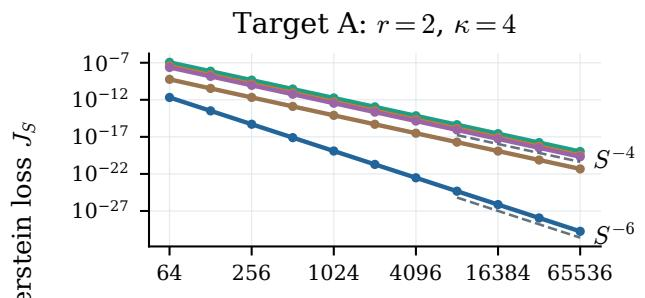

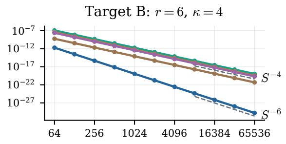

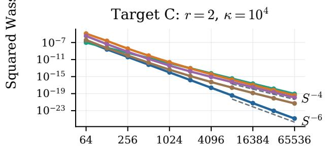

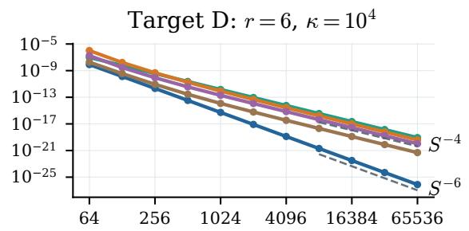  
Midpoint steps S

$$
\begin{array} { l l l l } { \cdots } & { \mathrm { C o n d O T } ; 1 - t } & { } & { \cdots } & { 1 - t ^ { 2 } } \\ { \cdots } & { ( 1 - t ) ^ { 2 } } & { } & { \cdots } & { \cos ( \pi t / 2 ) } \end{array} \quad \begin{array} { l } { \longleftarrow } & { \displaystyle ( 1 - t ) ( 1 + 0 . 1 t ) } \\ { \displaystyle } \end{array}
$$

Figure 4: Fixed-schedule convergence for all four targets. Each panel repeats the comparison in Figure 1; the dashed lines indicate $S ^ { - 4 }$ and $S ^ { - 6 }$

Figure 5 repeats the comparison between CondOT and the first-order correction in Figure 2 for every target.

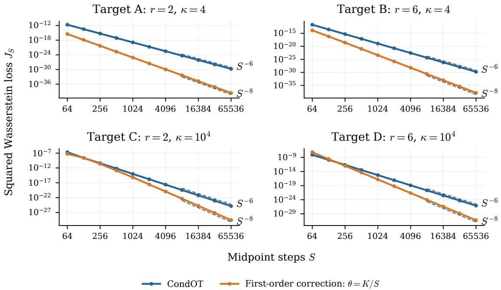

Figure 5: CondOT and the first-order correction for all four targets. The dashed lines indicate $S ^ { - 6 }$ and $S ^ { - 8 }$ The vertical limits vary between panels.

## C.5 Calibrated schedule shapes and coeficients

Table 5 gives rounded coeficients for the schedules shown in Figure 3, all at $S = 2 5 6 .$

Table 5: Calibrated coeficients at $S = 2 5 6 .$ rounded to eight decimal places.
<table><tr><td>Target</td><td> $\theta _ { 1 }$ </td><td> $\theta _ { 2 }$ </td><td> $\theta _ { 3 }$ </td><td> $\theta _ { 4 }$ </td><td> $\theta _ { 5 }$ </td><td> $\theta _ { 6 }$ </td></tr><tr><td>A</td><td>-0.00160120</td><td>0.00153963</td><td></td><td></td><td></td><td></td></tr><tr><td>B</td><td>0.00578858</td><td></td><td>0.02958382-0.38062679</td><td></td><td>1.13618161-1.39374372</td><td>0.60501822</td></tr><tr><td>C</td><td>-0.04198104</td><td>-0.14789871</td><td></td><td></td><td></td><td></td></tr><tr><td>D</td><td>-0.45092399</td><td>-1.70655900</td><td>26.80927083-73.25730884</td><td></td><td></td><td>76.48650974-27.84974968</td></tr></table>

The schedule diference is

$$
\beta _ { \pm } ( t ) - ( 1 - t ) = t ( 1 - t ) ( \theta _ { 1 } + \theta _ { 2 } t + \cdot \cdot \cdot + \theta _ { r } t ^ { r - 1 } ) .
$$

We locate the sign-changing roots of the polynomial above numerically and refine them using 90-digit arithmetic. Targets A and C have no interior crossings; B has two, near 0.3948 and 0.9806; and D has one, near 0.2868.

We compute the maximum absolute deviations in Section 5.3 by evaluating the schedule diference at its endpoints and numerically located stationary points. The numerical checks also show that all four calibrated schedules decrease monotonically and have positive midpoint factors. The calibration theorem does not provide a budget threshold ensuring monotonicity or determine the number of interior crossings.

## C.6 Calibration in ordinary double precision

We repeat the procedure in Appendix C.3 using ordinary double precision (IEEE binary64) throughout, with a scale-error tolerance of $1 0 ^ { - 1 4 }$ and at most 1000 updates. To reduce roundof near convergence, we sum the logarithms of the midpoint factors and use accurate evaluations of $\log ( 1 + x )$ and $\exp ( x ) - 1$ for small x.

Table 6 reports errors reevaluated at 90 digits using the resulting coeficients, without refining them. Sixteen of the twenty runs converge, and their reevaluated scale errors remain below $1 0 ^ { - 1 4 }$ , with squared Wasserstein losses below $3 . 0 \times 1 0 ^ { - 2 8 }$ . The same four small-budget cases fail as in Appendix C.3.

Table 6: Proof iteration computed in binary64 and reevaluated at 90 digits without coeficient refinement. The scale error is max $| D _ { 1 , k } ^ { \mathrm { M } } - 1 / \sqrt { \lambda _ { k } } | ;$ J includes eigenvalue multiplicities. Capped runs report the final iterate’s errors after 1000 updates. Dashes indicate a nonpositive midpoint factor.
<table><tr><td>Target</td><td>S</td><td>Updates</td><td>Maximum scale error</td><td> $J _ { S }$ </td><td>Solver status</td></tr><tr><td>A</td><td>64</td><td>4</td><td> $1 . 3 3 \times 1 0 ^ { - 1 5 }$ </td><td> $5 . 8 3 \times 1 0 ^ { - 3 0 }$ </td><td>Converged</td></tr><tr><td>A</td><td>128</td><td>3</td><td> $1 . 1 6 \times 1 0 ^ { - 1 5 }$ </td><td> $6 . 6 5 \times 1 0 ^ { - 3 0 }$ </td><td>Converged</td></tr><tr><td>A</td><td>256</td><td>2</td><td> $9 . 6 7 \times 1 0 ^ { - 1 6 }$ </td><td> $2 . 8 2 \times 1 0 ^ { - 3 0 }$ </td><td>Converged</td></tr><tr><td>A</td><td>512</td><td>2</td><td> $7 . 3 6 \times 1 0 ^ { - 1 7 }$ </td><td> $2 . 4 7 \times 1 0 ^ { - 3 2 }$ </td><td>Converged</td></tr><tr><td>A</td><td>1024</td><td>1</td><td> $3 . 1 2 \times 1 0 ^ { - 1 6 }$ </td><td> $5 . 0 8 \times 1 0 ^ { - 3 1 }$ </td><td>Converged</td></tr><tr><td>B</td><td>64</td><td>7</td><td> $7 . 7 6 \times 1 0 ^ { - 1 6 }$ </td><td> $1 . 0 7 \times 1 0 ^ { - 3 0 }$ </td><td>Converged</td></tr><tr><td>B</td><td>128</td><td>5</td><td> $8 . 5 6 \times 1 0 ^ { - 1 6 }$ </td><td> $2 . 5 9 \times 1 0 ^ { - 3 0 }$ </td><td>Converged</td></tr><tr><td>B</td><td>256</td><td>3</td><td> $1 . 9 0 \times 1 0 ^ { - 1 5 }$ </td><td> $7 . 4 9 \times 1 0 ^ { - 3 0 }$ </td><td>Converged</td></tr><tr><td>B</td><td>512</td><td>2</td><td> $2 . 9 5 \times 1 0 ^ { - 1 6 }$ </td><td> $3 . 1 2 \times 1 0 ^ { - 3 1 }$ </td><td>Converged</td></tr><tr><td>B</td><td>1024</td><td>2</td><td> $9 . 0 1 \times 1 0 ^ { - 1 7 }$ </td><td> $1 . 3 3 \times 1 0 ^ { - 3 2 }$ </td><td>Converged</td></tr><tr><td>C</td><td>64</td><td>1000</td><td> $1 . 0 7 \times 1 0 ^ { - 5 }$ </td><td> $6 . 8 3 \times 1 0 ^ { - 1 0 }$ </td><td>Cap reached</td></tr><tr><td>C</td><td>128</td><td>1000</td><td> $2 . 1 2 \times 1 0 ^ { - 5 }$ </td><td> $1 . 3 5 \times 1 0 ^ { - 9 }$ </td><td>Cap reached</td></tr><tr><td>C</td><td>256</td><td>56</td><td> $9 . 9 6 \times 1 0 ^ { - 1 5 }$ </td><td> $2 . 9 8 \times 1 0 ^ { - 2 8 }$ </td><td>Converged</td></tr><tr><td>C</td><td>512</td><td>20</td><td> $5 . 6 9 \times 1 0 ^ { - 1 5 }$ </td><td> $9 . 7 0 \times 1 0 ^ { - 2 9 }$ </td><td>Converged</td></tr><tr><td>C</td><td>1024</td><td>10</td><td> $7 . 2 2 \times 1 0 ^ { - 1 5 }$ </td><td> $1 . 5 7 \times 1 0 ^ { - 2 8 }$ </td><td>Converged</td></tr><tr><td>D</td><td>64</td><td>4</td><td></td><td></td><td>Invalid factor</td></tr><tr><td>D</td><td>128</td><td>8</td><td></td><td></td><td>Invalid factor</td></tr><tr><td>D</td><td>256</td><td>49</td><td> $6 . 4 9 \times 1 0 ^ { - 1 5 }$ </td><td> $1 . 0 4 \times 1 0 ^ { - 2 8 }$ </td><td>Converged</td></tr><tr><td>D</td><td>512</td><td>14</td><td> $8 . 3 7 \times 1 0 ^ { - 1 5 }$ </td><td> $1 . 0 7 \times 1 0 ^ { - 2 8 }$ </td><td>Converged</td></tr><tr><td>D</td><td>1024</td><td>8</td><td> $2 . 2 7 \times 1 0 ^ { - 1 5 }$ </td><td> $7 . 6 9 \times 1 0 ^ { - 3 0 }$ </td><td>Converged</td></tr></table>