# DISENTANGLING SELF-DISTILLATION: MEASURINGAND MODELING ACQUISITION AND RETENTION

Luis Zuin Alexis Huet<sup>\*</sup> Dario Rossi Zied Ben Houidi<sup>\*</sup>

Huawei Technologies Co., Ltd., Paris, France

{first(.mid).last}@huawei.com

Corresponding authors

## ABSTRACT

Self-distillation with privileged context adapts a language model from demonstrations by letting the model, once conditioned on a reference response, teach its context-free copy token by token. Our taxonomy reveals existing methods differ along three entangled axes: (i) the rollout source (student or teacher), (ii) the teacher coupling (frozen, or an exponential moving average of the student at some coupling rate) and (iii) the KL direction (reverse or forward), yet these axes are usually studied in fixed combinations and have led to conflicting conclusions. We formalize a unifying framework to encompass all self-distillation methods vs classic supervised fine-tuning: we train every combination of the three axes, on Qwen2.5-7B and Ministral-3-3B across ordinary and contradictory tasks, totaling 1,200 adaptation runs, to systematically investigate the impact of the above axes. We propose a controlled model of the same objective to explain the resulting acquisition–retention trade-offs. We find that (i) the rollout source matters mostly where the task contradicts the pretrained behavior: there teacher rollouts raise acquisition well above what student rollouts achieve, with almost no change in retention; (ii) the teacher coupling changes acquisition most, on every task: acquisition rises with the coupling rate, then falls past a task-specific rate; (iii) switching the KL direction costs retention in one model but not the other so which axis to tune first depends on the model. The controlled model reproduces the three trends.

## 1 INTRODUCTION

Adapting a deployed language model to a new task from demonstrations has long relied on supervised fine-tuning (SFT), which is known to erode prior capabilities as it learns (Luo et al., 2023; Yang et al., 2024). Reinforcement learning forgets less, an effect attributed to training on the model’s own samples rather than on a fixed corpus (Chen et al., 2025; Shenfeld et al., 2025), but it needs a reward and delivers a sparse signal. Self-distillation with privileged context has emerged as a middle ground: the same model, once conditioned on a demonstration, a verified answer, a document or environment feedback, becomes a dense token-level teacher for its context-free copy (Snell et al., 2022; Shenfeld et al., 2026; Zhao et al., 2026b; Hubotter et al., 2026; Ye et al., 2026; Wang et al., 2026).¨

This set of methods now appears under many names (Song & Zheng, 2026) and, in the context of this paper, we refer to self-distillation for simplicity. Our first contribution (Sec. 3) is to show that existing methods (reviewed in Tab. 1) can be written as a single objective and differ along three main axes: the (i) rollout source, whether the responses the student is trained on are generated by the student itself or by the context-conditioned teacher (student rollouts or teacher rollouts); the (ii) teacher coupling, whether the self-teacher is frozen at initialization or follows the student, typically through an exponential moving average (EMA) at some coupling rate; and the (iii) KL direction, the token-level Kullback–Leibler loss on those rollouts between the teacher’s and the student’s next-token distributions (reverse or forward KL). One would expect each axis to set how far training drifts from the pretrained model: student rollouts, a frozen teacher and reverse KL keep it close, teacher rollouts, a moving teacher and forward KL move it away.

At the same time, we observe that the state of the art (Sec. 2) is still largely unaware of this taxonomy. As a result, most self-distillation studies not only arbitrarily (and often even implicitly) fix each of these axis, but also rarely jointly study the effect of more than one axis in the overall proposed method.

Worse yet, conclusions found in the literature often conflict (Sec. 2). We argue that, chasing an individual champion, the literature fails to see the forest from the trees: we therefore set out to build a taxonomy of methods within the self-distillation family and provide a unifying framework (Sec.3), to then layout a systematic evaluation plan (Sec.4) that we carry out with complementary controlled modeling (Sec. 5) and experimental (Sec. 6) approaches. Taking this higher level viewpoint allows us to see the forest from the tree, and understand when each setting favors retention or acquisition, providing a picture that is less sharp, but more complete, than any single study.

We train every combination of the three axes (Sec. 4): two rollout sources, a frozen teacher or four coupling rates, two KL directions. We do so on two instruction-tuned models and five tasks, with SFT on the same demonstrations as baseline, for over 1,200 runs<sup>1</sup>. We measure acquisition, the accuracy gained on the new task, and retention, the change in accuracy on a suite of general benchmarks. Two of the five tasks are contradictory: their rule opposes one the pretrained model already follows, such as arithmetic in base 9 instead of base 10. The other three are ordinary: they refine what the model already does. A small controlled model of the same objective (Sec. 5) is swept along the same axes, to see which of the LLM patterns a minimal mechanism reproduces.

The results (Sec. 6) show that each of the three axes matters under a different condition. The teacher coupling matters on every task. Acquisition rises with the coupling rate, then falls past a rate that depends on the task and the model. A frozen teacher and a moving one, reported as better (Shenfeld et al., 2026) and as worse (Kim et al., 2026) in the literature, are thus two sides of one curve. The rollout source, by contrast, matters mostly on the contradictory tasks: there, teacher rollouts raise acquisition much more than on the ordinary tasks. The KL direction matters least: forward KL learns slightly more, but its advantage and retention cost are model-dependent. The controlled model reproduces these trends, and shows where the advantage of teacher rollouts stops. Finally, SFT still reaches the highest acquisition on most tasks, but pays for it in retention: most self-distillation settings retain more at the acquisition they reach, so they win on the trade-off, but not on acquisition

## 2 RELATED WORK

Knowledge distillation trains a student to imitate a teacher’s outputs. On-policy distillation obtains this supervision along student-generated trajectories, reducing the mismatch between training and inference (Agarwal et al., 2024). Self-distillation uses the model itself, or a copy of it, as teacher. In contextualized self-distillation, privileged context elicits a teaching signal through in-context learning; the student learns to reproduce the resulting behavior without that context (Snell et al., 2022). This yields a family of methods conditioned on demonstrations or solutions (Yang et al., 2024; Shenfeld et al., 2026; Zhao et al., 2026b), feedback (Hubotter et al., 2026), trajectory-derived skills (Wang¨ et al., 2026), or documents (Padmanabhan et al., 2026; Stein et al., 2026) that we summarize in Tab. 1 (organized according to a taxonomy we propose and discuss in Sec. 3).

Inconsistencies in the state of the art. We first summarize inconsistencies across the literature, axis by axis. On (i) rollout source, teacher rollouts collapse mid-training in one study (Wang et al., 2026) but are identified as the primary driver of transfer in another (Stein et al., 2026); student rollouts are found to protect retention inconsistently in (Liu et al., 2026a) yet are credited with it by (Chen et al., 2025). On (ii) teacher coupling, a moving teacher is reported to outperform a frozen one (Shenfeld et al., 2026), to degrade performance relative to a frozen one (Kim et al., 2026), and to accumulate the student’s drift without bound (Guo et al., 2026). On (iii) KL direction, the same retention is explained instead by reverse KL (Balasubramanian & Kasiviswanathan, 2026), yet self-distillation studies testing both directions favor forward KL (Shenfeld et al., 2026; Zhao et al., 2026b).

Seeing a forest from the trees. Tab. 1 shows why these results cannot be reconciled: a study typically varies just a single axis, fixing others with arbitrary choice and evaluating on its own task. Few studies jointly examine more than one axis: namely, rollout source with KL direction under an external teacher (Agarwal et al., 2024; Zhao et al., 2026a; Zhang et al., 2026) (hence outside the self-distillation area), or rollout source with teacher coupling in Skill-SD (Wang et al., 2026). Besides, most studies focus on acquisition gains, whereas knowledge retention remains less studied, hiding potential serious side effects. Interactions between axes, their dependence on the task, and their side effects therefore remain largely unknown and, in our opinion, deserve systematic evaluation.

Table 1: Taxonomy of related work. For each study, the table reports individual settings used: along a single axis, entries separated by a slash symbol (/) are compared within that study; axes marked in bold are jointly analyzed in one reported experiment. Retention denotes whether possible degradation is evaluated on a broad, task-unrelated capability suite. Per-row details are deferred to App. A.
<table><tr><td>Study</td><td>Rollout source</td><td>Teacher coupling</td><td>Token-level loss</td><td>Retention</td></tr><tr><td colspan="5">Distillation from a fixed external teacher</td></tr><tr><td>GKD (2024)</td><td>student/data</td><td>external, fixed</td><td>forward/reverse/JSD</td><td></td></tr><tr><td>Decoupling KL (2026a) student/teacher</td><td></td><td>external, fixed</td><td>forward/reverse</td><td>√</td></tr><tr><td>Prefix OPD (2026)</td><td>student/data</td><td>external, fixed</td><td>forward/reverse</td><td></td></tr><tr><td colspan="5">Self-teacher without privileged context</td></tr><tr><td>Guo et al. (2026)</td><td>student</td><td>frozen/EMA/refresh</td><td>JSD</td><td></td></tr><tr><td colspan="5">Self-teacher conditioned on privileged context</td></tr><tr><td>Yang et al. (2024)</td><td>teacher</td><td>frozen</td><td>hard targets</td><td>√</td></tr><tr><td>SDFT (2026)</td><td>student‡</td><td>frozen/EMA/sync.</td><td>forward</td><td>√</td></tr><tr><td>OPSD (2026b)</td><td>student</td><td>frozen</td><td>forward/reverse /JSD</td><td></td></tr><tr><td>SDPO (2026)</td><td>student</td><td>frozen/EMA/sync./TR</td><td>JSD</td><td>√</td></tr><tr><td>OPCD† (2026)</td><td>student‡</td><td>frozen/sync.</td><td>reverse</td><td>√</td></tr><tr><td>Skill-SD (2026)</td><td>student/teacher</td><td>frozen/sync.</td><td>reverse</td><td></td></tr><tr><td>Kim et al. (2026)</td><td>student‡</td><td>frozen/EMA</td><td>JSD; hard targets</td><td></td></tr><tr><td>DiSC (2026)</td><td>data</td><td>frozen</td><td>forward</td><td>√</td></tr><tr><td>MixSD (2026a)</td><td>teacher + base</td><td>frozen</td><td>hard targets, mixed</td><td>√</td></tr><tr><td>GATES (2026)</td><td> $\mathrm { t e a c h e r + s t u d e n t }$ </td><td>sync.</td><td>hard targets + reverse</td><td></td></tr><tr><td>Ours</td><td>student/teacher</td><td>frozen /EMA, 4 rates</td><td>forward/reverse</td><td>√</td></tr></table>

Rollout source: data = prefixes read from a fixed corpus (not generated); base = same model without context; + denotes sources used together. Teacher coupling: sync. = teacher set is the updated student; TR = interpolation between current and initial teacher; refresh = periodic hard copy. Token-level loss: hard targets = one-hot targets on sampled tokens, for which no direction is defined; JSD = Jensen Shannon Divergence; <sup>†</sup>OPCD also reports external teachers. <sup>‡</sup>varied only against a baseline that changes other method choices at the same time, so the axis is not isolated.

## 3 TAXONOMY AND UNIFYING FRAMEWORK

Our first contribution is to introduce a unifying framework able to coherently frame all the previous related work. In particular, we argue that any self-distillation methods with privileged context (and even classic SFT) can be formalized through a single objective, that explicitly compounds the taxonomical axes of (i) rollout source, (ii) teacher coupling and (iii) KL direction.

A unifying framework. Let us introduce the notation. A training example is an input x with a reference response $y ^ { \mathrm { r e f } }$ , and a privileged context c that the teacher sees, but the student does not. In this paper, c is the reference response itself, placed in a fixed template (Sec. 4), so that self-distillation and SFT draw on the same information and differ only in how it reaches the student. We start from a pretrained policy $\pi _ { \theta _ { 0 } }$ and use it in two roles: as a student, with parameters $\theta _ { i }$ at optimization step i, trained and later evaluated on x alone; and as a teacher, with parameters $\theta _ { i } ^ { \star }$ , which additionally sees c and which corrects the student token by token. Both start from the same parameters $( \theta _ { 0 } ^ { \star } = \theta _ { 0 } )$ , so the teacher’s initial advantage comes from $c ,$ not from a stronger model.

The training procedure samples a response $\bar { y }$ from a rollout distribution $\mu _ { i } ( \cdot \mid x )$ ; at each position $t ,$ teacher q and student p read the same prefix $\bar { y } _ { < t } ,$ , the tokens already produced:

$$
q _ { i , t } = \pi _ { \theta _ { i } ^ { \star } } ( \cdot \mid x , c , \bar { y } _ { < t } ) , \qquad p _ { i , t } = \pi _ { \theta _ { i } } ( \cdot \mid x , \bar { y } _ { < t } ) .\tag{1}
$$

The objective averages a KL divergence $d ( q _ { i , t } , p _ { i , t } )$ over training examples $x { \sim } \mathcal { D }$ and response tokens; only the student $p _ { i , t }$ receives the gradient, the teacher and the sampled response being held fixed:

$$
\begin{array} { r } { \mathcal { L } _ { i } ( \theta _ { i } ) = \mathbb { E } _ { x \sim \mathcal { D } } \mathbb { E } _ { \bar { y } \sim \mu _ { i } ( \cdot \vert x ) } \left[ \frac { 1 } { \vert \bar { y } \vert } \sum _ { t = 1 } ^ { \vert \bar { y } \vert } d ( q _ { i , t } , p _ { i , t } ) \right] . } \end{array}\tag{2}
$$

Three choices in Eq. 2 are left open, that maps to the taxonomical axes: the rollout distribution $\mu _ { i }$ the KL divergence $d ( \cdot , \cdot )$ , and the teacher coupling, i.e., how $\theta _ { i } ^ { \star }$ follows $\theta _ { i }$ . Together, as illustrated later (Sec. 4), these decisions govern the trade-off between acquisition and retention.

Axis 1: Rollout source. The rollout source fixes which prefixes the student is corrected on, and student rollouts are prevalent over teacher rollouts in the literature. With student rollouts $\mu _ { i } ( \cdot \mid x ) =$ $\pi _ { \theta _ { i } } ( \cdot \mid x )$ , the student is corrected on the prefixes it produces itself. Thus, training happens on the text the student produces at deployment, which is credited with acquisition Agarwal et al. (2024) and retention (Chen et al., 2025). The correction, however, is only as useful as what c still adds on those prefixes (Liu et al., 2026b). With teacher rollouts $\mu _ { i } ( \cdot \mid x ) = \pi _ { \theta _ { i } ^ { \star } } ( \cdot \mid x , c )$ , the teacher generates the response with c in context, and the student is corrected on prefixes where the teacher is reliably informative, but that the student may never produce at deployment.

Axis 2: Teacher coupling. The teacher coupling fixes how the teacher follows the student. After each student step, the teacher moves toward it by an exponential moving average with rate $\alpha \in [ 0 , 1 ] ;$

$$
\theta _ { i + 1 } ^ { \star } = \left( 1 - \alpha \right) \theta _ { i } ^ { \star } + \alpha \theta _ { i + 1 } .\tag{3}
$$

Afrozen teacher $( \alpha = 0 )$ , prevalent in self-distillation literature, remains a fixed pretrained model with c in context; the other extreme $( \alpha = 1 )$ synchronizes the teacher with the updated student (Shenfeld et $\mathrm { a l . , } 2 0 2 6 ;$ Hubotter et al., 2026; Wang et al., 2026). In between, an¨ EMA teacher $( \alpha > 0 )$ , adopted e.g. in Shenfeld et al. (2026); Hubotter et al. (2026); Kim et al. (2026), incorporates what the student¨ has learnt, so that its targets improve as training progresses, but also inherits the student’s drift, which it then feeds back to the student (Guo et al., 2026).

Axis 3: KL direction. The KL direction fixes how the disagreement at each token is weighted in Eq. 2. Withforward KL $( d ( q , p ) = D _ { \mathrm { K L } } ( q \| p ) )$ ), the tokens the teacher favours are pushed up, whether or not the student already gives them mass; with reverse KL $( d ( q , p ) = D _ { \mathrm { K L } } ( p | \bar { | } q ) )$ , the correction is weighted by the student’s own probabilities, so that it concentrates on the teacher’s modes the student already approaches (Gu et al., 2024). Forward KL is thus mode-covering and reverse KL mode-seeking. This asymmetry matters when the teacher keeps several modes: reverse KL can then settle on the one the student already holds, minimizing impact in previous behaviour, whereas forward KL has to cover them all (Balasubramanian & Kasiviswanathan, 2026; Chen et al., 2025).

Taxonomical implications Even classic SFT can be expressed as a special case of Eq. 2: the sampled response is the reference itself $( \bar { y } = y ^ { \mathrm { r e f } } )$ , the teacher is the one-hot distribution on the reference token $( q _ { i , t } = \delta _ { y _ { \ast } ^ { \mathrm { r e f } } } )$ , and using forward KL the loss is the usual teacher-forced negative log-likelihood. As previously observed, Tab. 1 places existing methods in this grid: most use student rollouts, with teacher rollouts appearing mostly in baselines, and coupling at one of the two extremes, frozen $( \alpha = 0 )$ or synchronized $( \alpha = 1 )$ . At high level, student rollouts, reverse KL and a frozen teacher each hold the update closer to the original policy, while their counterparts increase adaptation capability. Further, each axis act on different object (which prefixes, which tokens, which teacher), whereas a task acts on everyone at once (the prefixes the student visits, its disagreement with the teacher, and what c adds). Due to contrasting experimental results arising in the literature, we expect no universal ranking to arise. As such, more than identifying a single champion, this paper aims at gathering a broader and coherent understanding of the relative importance of each axis, on ordinary and contradictory tasks, with classic SFT as a reference. In the rest of the paper, we do so with LLM experiments (Sec. 6) compared with a controlled model of the same fine-tuning (Sec. 5).

## 4 DESIGN SPACE INVESTIGATION

Our investigation targets how rollout source, teacher coupling, and KL direction affect acquisition and retention. To do so, we cross the three axes (2 rollout sources, 5 coupling rates and 2 KL directions), into 20 self-distillation configurations, and run each over 5 tasks, 2 models, 3 learning rates and 2 seeds, for 1,200 overall training runs (cfr. Tab. 3a), with systematic comparison to classic SFT.

Tasks and privileged context. We use five tasks. The two ordinary tasks are inherited from the SDFT protocol (Shenfeld et al., 2026): tool-alpaca (Tang et al., 2023) requires structured tool calls, and chemistry (SciKnowEval Chemistry L-3, Feng et al., 2024) tests scientific reasoning through multiple choice questions. The three remaining tasks are new, one of which is a control task, and the remaining two are contradictory: i.e., they turn two counterfactual evaluations of Wu et al. (2024) into training tasks. In detail, each follows a rule that clashes with the one the model knows, applied consistently so that the task is learnable (Tab. 2): spatial-contradiction composes spatial relations to recover grid coordinates, with the compass rotated; math-contradiction rewrites DeepMind Mathematics (Saxton et al., 2019) in base 9, where the model expects base 10. The ordinary control<sup>2</sup>, spatial, differ from spatial-contradiction only in its reference solutions and answers. Both models start below 2% accuracy on spatial-contradiction, against 20-26% on spatial. Detailed dataset sizes and all initial accuracies are deferred to Tab. 4 in App. B.

Table 2: Minimal examples of contradictory tasks. The last two columns give the reference answer under the ordinary and the contradictory convention (see App. C.2–C.5 for more details)
<table><tr><td>Task</td><td>Undisclosed convention</td><td>Problem</td><td></td><td>Ordinary Contradictory</td></tr><tr><td></td><td></td><td>On the grid, Vito is at (−2, 3). The posi- Spatial Directions rotated 90° clockwise tion of Galen is one grid cell down from Vito. Determine the coordinates of Galen.</td><td>(−2,2)</td><td>(−3,3)</td></tr><tr><td>Math</td><td>Numerals in base nine</td><td> $( 1 5 3 - 1 4 0 ) + ( - 3 - ( - 2 - ( - 8 ) ) )$ </td><td>4</td><td>3</td></tr></table>

Table 3: The experimental (a) and model (b) grids. The three axes are fully crossed: $( \mathrm { a } ) 2 \times 5 \times 2 =$ 20 self-distillation configurations, 1200 training runs, epochs fixed per task; $[ \mathbf { b } ) 2 \times 1 8 \times 2 = 7 2$ configurations, crossed with the three quantities of Sec. 5 (other setting in Tab. 9).
<table><tr><td colspan="2">(a) LLM experiments</td><td colspan="2">(b) Controlled model</td></tr><tr><td colspan="2">Values</td><td>Values</td><td></td></tr><tr><td>Rollout source Teacher coupling α</td><td>student, teacher 0, 0.02, 0.05, 0.10, 0.25</td><td>Rollout source Teacher coupling α</td><td>student, teacher 2 0, .. . , 0.16 18</td></tr><tr><td>KL direction Task ordinary</td><td>reverse, forward tool-alpaca, chemistry, spatial</td><td>KL direction λ initial concentration</td><td>reverse, forward 2 0.625, 0.88 ...5 7</td></tr><tr><td>contradictory Model</td><td>spatial-contra, math-contra Qwen2.5-7B, Ministral 3 3B</td><td>κ context strength ρφ feature overlap</td><td>0.3, 0.6, 0.9 0,0.5, 1</td></tr><tr><td>Learning rate (lr)</td><td></td><td>Learning rate (lr)</td><td></td></tr><tr><td colspan="2">5e-6, 1e-5, 2e-5</td><td>Seeds</td><td>0.001 (default) 96</td></tr></table>

For both contradictory tasks, problems and reference solutions are verified programmatically, as follows. The spatial pair is fully generated, with varied phrasing (semantic and syntax). The step-bystep solutions of math-contradiction are generated by an expert model (Qwen3-30B-A3B), filtered for correctness, and converted to base 9; an LLM judge (GPT-5-mini) then audits each full solution for base-9 consistency, and only examples judged consistent are retained. Detailed construction is available in App. B. In all tasks, the teacher receives the problem’s full reference response through a fixed task-specific template; the student receives only the task prompt. Holding privileged context template fixed across all configurations ensures that only the three axes vary (see App. C).

Models and training. All LLM experiments run on two instruction-tuned models of different families and sizes, namely Qwen2.5-7B-Instruct (Qwen Team, 2025) and Ministral 3 3B Instruct (Mistral AI, 2025). Each task is adapted separately, always starting from the initial model. The 20 selfdistillation configurations are compared with SFT, which minimizes cross-entropy on the same reference responses over a wider learning-rate grid<sup>3</sup>. SFT thus sees the same reference responses that the teacher reads in context, so the two methods differ only in how the reference enters training: as the target of cross-entropy, or through the teacher’s prompt. We fine-tune all student parameters with AdamW and a cosine schedule, following the released SDFT training protocol (Shenfeld et al., 2026). Unless stated otherwise, epochs are fixed per task: 2 for tool-alpaca and chemistry (as in the released protocol), and 4 for the three new tasks; the learning rate is fixed per model at the largest grid value for which no individual run loses more than 5pp of retention (2e-5 for Qwen and 5e-6 for Ministral).

Evaluation. We evaluate the student without privileged context, on each task’s held-out evaluation set. Acquisition is the accuracy gain: the mean task accuracy over the last three saved checkpoints of each run, minus the initial accuracy. Retention is the mean change from the initial model over five general-capability benchmarks (HellaSwag, MMLU, TruthfulQA-MC2, WinoGrande, IFEval), evaluated with the Language Model Evaluation Harness (Gao et al., 2024) at the final checkpoint; negative values indicate forgetting. Both metrics are computed per run, then averaged over the two seeds. All LLM figures plot these two quantities in percentage points (pp), with axes labeled acquisition and retention. Significance along one binary axis is assessed, per model and task, with a Wilcoxon signed-rank test over matched pairs: two runs that share learning rate and the other two axes and differ only on the tested one, averaged over seeds. Sec. 5 instantiates the same three axes in a finite autoregressive model; model and experimental LLM results are contrasted in Sec. 6.

## 5 A CONTROLLED MODEL OF SELF-DISTILLATION

This section builds a small controlled model of the fine-tuning of Sec. 4, in which the factors are set separately, to see which drives the effect of each axis in Sec. 6. The model is the analogue of a frozen transformer whose LM head is fine-tuned: every input has a hidden state that never changes, and the head is the only trainable part. Before fine-tuning, this head produces what the model already does, which we call the old task; as there is one head for both tasks, fine-tuning on the new task moves the old behavior too. Our model adapts the continual learning models of Lee et al. (2021); Hiratani (2024) adding (i) token-by-token generation and (ii) teacher with privileged context.

Model parameters. The controlled model depends on three parameters: (i) λ, the initial-policy concentration, controls how confidently the initial model holds a behaviour the new task opposes: large λ is the model’s counterpart of a contradictory task. (ii) κ, the context strength, is how far the privileged context alone moves the initial model toward the new task’s answers. Finally (iii) $\rho _ { \phi } ,$ , the feature overlap assess similarity of new vs old task inputs: in the continual learning models above sets how much of the fine-tuning leaks into the old task. While not directly one-to-one mapping, the three parameters are swept jointly with the three taxonomical axes (Tab. 3b).

Model mechanics. The model answers a question by generating a response of T tokens, one at a time, from a vocabulary of size K, as an LLM does. At each position t it has written a prefix $s = \bar { y } _ { < t }$ of the response and picks the next token, so the prefixes form a finite tree, the empty prefix at the root and one branch per token<sup>4</sup>. Each prefix has a hidden state $\phi ( s ) \in \mathbb { R } ^ { D }$ , drawn once at random and never updated, the analogue of the final hidden state at that position. The head $W \in \mathbb { R } ^ { K \times D }$ turns a hidden state into a next-token policy, softmax $( W \phi ( s ) )$ ). The same W serves every prefix, so an update made at one prefix moves the policy at all others.

The old and new tasks ask different input “questions” and share the tree of prefixes, that is, the possible “answers”. Questions are not modeled as tokens. Instead, inputs acts on the model only through the hidden state, the only thing the head reads, and a transformer’s hidden state at a response position depends on the question as well as on the response written so far. The same prefix therefore has one hidden state under each task, $\phi _ { \mathrm { o l d } } ( s )$ and $\phi _ { \mathrm { n e w } } ( s )$ , the new one built from the old so that their cosine is $\rho _ { \phi }$ at every prefix. A change that moves the new-task policy at a prefix thus moves the old-task policy at the same prefix, the more so the larger $\rho _ { \phi } \colon$ $\rho _ { \phi } = 1$ the two tasks share the hidden state and differ only in the answer, at $\rho _ { \phi } = 0$ their hidden states are orthogonal.

The pretrained model is a head $W _ { 0 }$ with centered Gaussian entries, multiplied by $\lambda > 0$ . Scaling this head sharpens every initial policy without changing which token each prefix prefers, so λ is how confidently the initial model holds its pretrained behaviour: near zero, the policies are close to uniform and there is little to override; for large λ, each prefix has a firm preferred token. $W _ { 0 }$ sets the two starting behaviours: $r _ { \mathrm { o l d } } ( { \bf \cdot } \mid s ) = \mathrm { s o f t m a x } ( W _ { 0 } \bar { \phi _ { \mathrm { o l d } } } ( s ) )$ on the old task, the behaviour to preserve, the analogue of the capabilities that retention measures in Sec. $4 ;$ and $p _ { 0 } ( \cdot \mid s ) = \operatorname { s o f t m a x } ( W _ { 0 } \phi _ { \mathrm { n e w } } ( s ) )$ on the new task, the student’s starting point.

The new task is defined by hidden states $\phi _ { \mathrm { n e w } }$ and its target, a next-token policy $r _ { \mathrm { n e w } }$ at each prefix that the student must learn. For our model, we want the target to (i) prefer at least two tokens at each prefix, so that the mode-seeking and mode-covering KL (Sec. 3) can behave differently on it, and (ii) prefer tokens unrelated to the pretrained ones, so that the task can contradict a confident model. To do so, a second random head, orthogonal to $W _ { 0 } .$ , ranks the tokens at each prefix, and the two top-ranked ones receive most of the mass (App. F.3.2 varies this alignment). Since we chose these distributions prefix by prefix, no single head can produce all of them at once: we therefore define $r _ { \mathrm { n e w } }$ as the policy of the head $W _ { \mathrm { r e f } }$ that comes closest to them (App. E.2); as the target is something one head can produce, so the student can reach it exactly.

The teacher is a copy of the student with privileged context: like any input the context acts only through the hidden state, so at optimization step i the teacher reads a shifted hidden state through its own head $W _ { i } ^ { \star } , q _ { i } ( \cdot \mid s ) = \mathrm { s o f t m a x } ( W _ { i } ^ { \star } [ \phi _ { \mathrm { n e w } } ( s ) + \psi _ { \kappa } ( s ) ] )$ , while the student reads $p _ { i } ( \cdot \mid s ) =$ softmax $\boxed { W _ { i } \phi _ { \mathrm { n e w } } ( s ) } $ . The shift $\psi _ { \kappa } ( s )$ is fixed before training and chosen, prefix by prefix, so that, with $\begin{array} { r } { W _ { 0 } ^ { \star } = W _ { 0 } , } \end{array}$ , the initial teacher’s policy is exactly the mixture $q _ { 0 } = ( 1 - \kappa ) p _ { 0 } + \kappa r _ { \mathrm { n e w } }$ . The context strength $\kappa \in [ 0 , 1 ]$ is thus how much the context alone already helps the initial model: zero gives no initial teacher advantage, one gives the desired policy. The shift is fixed once and later read through the moving teacher head, as the context text is unchanged while the LLM reading it evolves; the model leaves out any learning in the hidden states, including how the context is encoded.

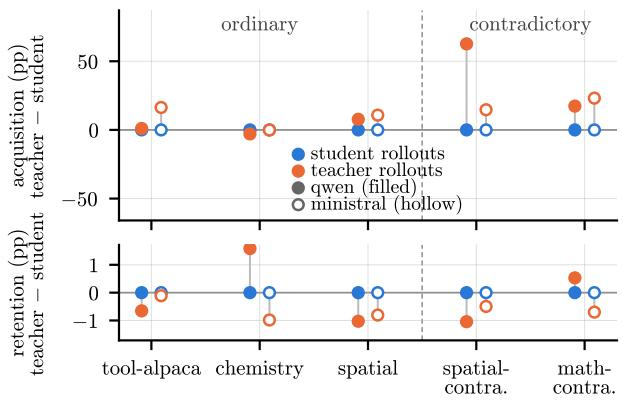  
(a) LLM experiments

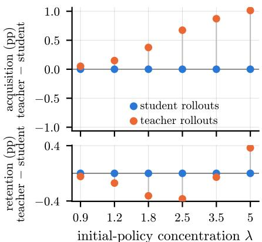  
(b) Controlled model  
Figure 1: Teacher rollouts raise acquisition where the pretrained behavior resists. Paired difference teacher−student $( > 0 ;$ teacher rollouts do better); the student is anchored at 0, the orange dot marks the difference. Same epochs and lr, forward $\mathrm { K L }$ , each source at its best coupling $\alpha ^ { * }$ (a) One pair per task and model. (b) One pair per initial-policy concentration λ (teacher advantage grows with λ), $\kappa = 0 . 3$

Training and evaluation. Training follows Sec. 3: rollouts from the student or the teacher, where instead of sampling responses we weight each prefix by its probability of being reached under the chosen policy, which the finite tree makes exact; forward or reverse KL at each visited prefix; an EMA of $W _ { i }$ into $W _ { i } ^ { \star }$ at rate α. Two policies are compared by their similarity, one minus their total variation distance. Acquisition, the analogue of the accuracy gain, is the similarity of the final student to $r _ { \mathrm { n e w } }$ on the prefixes it visits, minus the same quantity for the initial student on the prefixes it visits: each student is scored on the responses it would produce, as accuracy is. Retention, the analogue of the benchmark change, is the similarity of the final head, read on the old hidden states, to $r _ { \mathrm { o l d } }$ on the prefixes $r _ { \mathrm { o l d } }$ visits, minus its initial value of one; it is negative when the model forgets. Unless stated, figures use $\lambda = 2 . 5$ , a confident initial model, $\kappa \in \{ 0 . 3 , 0 . 6 , 0 . 9 \}$ and $\rho _ { \phi } = 0 . 5$ , within the grid of Tab. 3b. Full construction, calibration and metrics are in App. E.1–E.4.

## 6 EXPERIMENTAL RESULTS

We now investigate the three axes, by (i) contrasting the effect on a matched pair of LLM configurations, (ii) assessing statistical relevance by a Wilcoxon test over the whole grid (Sec. 4), and (iii) confirming the pattern by sweeping one factor of the controlled model (Sec. 5).

## 6.1 ROLLOUT SOURCE

Fig. 1a compares the two rollout sources, each at its best coupling rate, under forward KL. On acquisition, teacher rollouts win every pair of the contradictory tasks by a wide margin. On the ordinary tasks the gap is small, and on some pairs the student wins. The Wilcoxon test over the whole grid confirms this beyond the best-coupling pairs: teacher rollouts add a median +8 acquisition points on the contradictory tasks for both models, and little or nothing on the ordinary ones, where one task even favours the student (Tab. 5). Reverse KL gives the same result with similar gaps (App. D.1). On retention, on the other hand, the rollout source makes almost no difference: the median gap stays under one point on both tasks. Teacher rollouts thus matter where the task contradicts the pretrained behaviour, as Sec. 3 anticipated: the student’s own responses stay close to what it already does, while the teacher’s reach the prefixes where the new behaviour is needed.

To vary how much the task contradicts the pretrained behaviour, the controlled model (Fig. 1b) varies how confident the initial model is, λ. Teacher rollouts win, and win more as the initial model grows more confident, with no clear retention preference. The model also shows where this advantage can stop: at the largest tested λ and κ (App. F.1), student rollouts acquire slightly more on average (this is because student rollouts follow similar trajectories to the ones used in test time). Given the overall advantage of teacher rollouts in our experiments, the two remaining axes (Secs. 6.2– 6.3) are studied with this source; their student counterparts are in App. D.

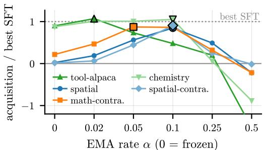  
(a) LLM experiments

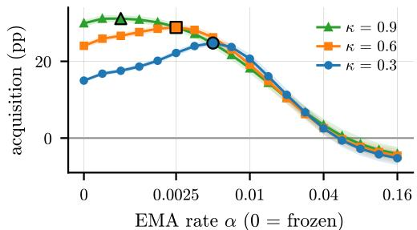  
(b) Controlled model  
Figure 2: A moving teacher helps up to a task-dependent rate, then hurts. (a) Qwen with teacher rollouts and forward KL, one learning rate (2e-5) and the same number of steps for every task. Acquisition is divided by the best SFT gain on the same task (dotted line: SFT; 0: untrained accuracy; −1: a loss as large as SFT’s gain). Black-edged markers: the best rate α<sup>⋆</sup>. (b) Acquisition against α for three levels of context strength κ (shading: 95% CI over 96 seeds).

## 6.2 TEACHER COUPLING

Having fixed teacher rollouts, we now vary the coupling rate α, at the learning rate of Sec. 4 and the same number of steps for every task. Fig. 2a shows forward KL on Qwen, with acquisition divided by the task’s best SFT gain so that the curves are comparable across tasks (other cases in App. D.2). Every curve rises and then falls, but the peak depends on the task: for tool-alpaca and chemistry a frozen teacher is nearly the best, whereas math-contradiction and the two spatial tasks, one of them ordinary, gain most of their acquisition from a moving one. Past the peak every task falls, and at the fastest rate all are at or below their untrained accuracy. The Wilcoxon test over the whole grid (Tab. 6) confirms this and adds the model: on Qwen a moving teacher beats the frozen one at every rate up to 0.10, for a median retention cost below half a point; on Ministral the gain peaks earlier, at 0.05, and turns into a loss at 0.25, with a growing retention cost. The frozen-versus-moving disagreement between SDFT (Shenfeld et al., 2026) and Kim et al. (2026) is thus two sides of one curve: a moving teacher helps up to a rate that depends on the task and the model, and hurts beyond it.

The controlled model (Fig. 2b) varies the context strength κ, how far the context alone moves the initial model toward the new task’s answers (Sec. 5). The LLM runs do not measure κ; its closest indication is the gain of the frozen teacher in Fig. 2a, which ranges from a few percent of the SFT gain to nearly all of it across tasks. Acquisition again rises and then falls with α for every κ. As κ grows, the peak moves to slower rates and the gain over a frozen teacher shrinks: when the context already helps a lot, moving the teacher adds little. The same holds under reverse KL with student rollouts, and a corrupted context can even make the frozen teacher the best (App. F.2).

## 6.3 KL DIRECTION

We finally vary the KL direction and weight it against coupling in Fig. 3a. Each panel starts from frozen reverse KL (the setting that keeps training closest to the pretrained model) and compares the two ways of moving away from it: tuning the coupling rate under reverse KL (blue route), or first switching to forward KL (gray arrow) and then tuning the coupling there (orange route), at the learning rate (out of three) where frozen reverse KL acquires most. On Qwen, tuning the coupling rate under reverse KL buys most of the acquisition for a small retention loss (+42.0 points for 0.6 on math-contradiction), whereas switching to forward KL adds far less acquisition than tuning the coupling rate, for a larger retention loss: +5.8 for 1.9 with a frozen teacher, and still +2.4 for 1.5 once the coupling rate is tuned on each side (gold arrow). On Ministral, the better order is the other one: switching to forward KL costs no retention on either task, and on math-contradiction the forward optimum adds 11.5 points over the reverse one at the same retention. Which move to make first thus appears to be model-dependent. The Wilcoxon test over the whole grid (Tab. 7) confirms this beyond the two tasks shown: on Qwen, forward KL reaches the highest acquisition on every task, but reverse KL retains more in nearly every pair, by half a point on median; on Ministral, forward KL retains more when the pairs are pooled, and improves both metrics at once in a third of them. Pooled over the grid, the KL direction thus moves acquisition least of the three axes. At the best coupling rate it can add far more, as for Ministral math-contradiction. Its retention cost depends on the model: the forward KL preferred by SDFT (Shenfeld et al., 2026) costs some retention on Qwen and none on Ministral. Finally, the controlled model reproduces this dependence (Fig. 3b): raising the context strength and the feature overlap turns the Qwen behaviour into the Ministral one. This change holds over a contiguous region of the grid, not only at the two settings plotted (App. F.3.3).

retention (pp)  
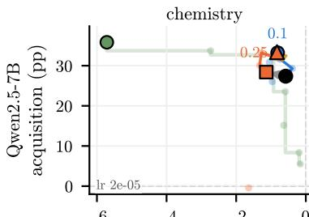

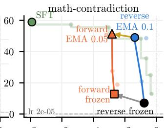

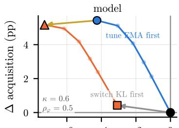

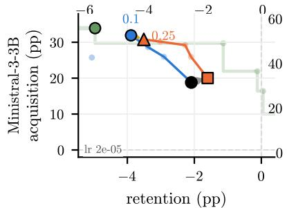

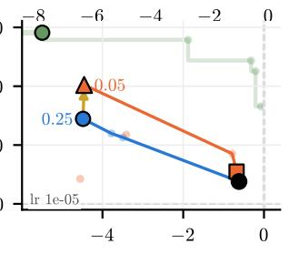  
(a) LLM experiments

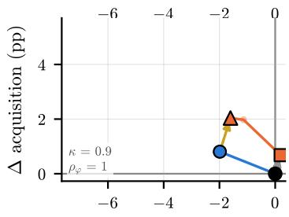  
¢ retention (pp)  
(b) Controlled model  
Figure 3: Coupling and KL direction incur different retention costs. (a) Teacher rollouts, one lr per panel (corner note; the best one for frozen reverse KL). Routes from frozen reverse KL: the EMA coupling tuned under each direction (blue: reverse; orange: forward; best α labeled), the direction switch frozen (gray) and between the optima (gold). Green: the SFT grid and its Pareto front. (b) The model counterpart $( \lambda = 2 . 5 ,$ , κ and $\rho _ { \phi }$ in the corner notes), axes relative to frozen reverse KL.

SFT trained on the same demonstrations, over a wider learning-rate grid, traces the green Pareto front of Fig. 3a. Most self-distillation families end above that front (17 of 20 on Qwen, 14 of 20 on Ministral, Tab. 8): at the acquisition they reach, they retain more than SFT. Almost none reaches the highest acquisition, however: SFT keeps that lead, at 3 to 21 points of retention, everywhere except Qwen on tool-alpaca and chemistry. The claim that SDFT “consistently outperforms SFT” (Shenfeld et al., 2026) thus holds for the trade-off, not for each metric separately.

## 7 CONCLUSION

By writing self-distillation methods as one objective with three axes, and sweeping every combination of the three on two LLMs and five tasks with SFT as the reference, we reconcile conclusions that the literature reports as conflicting. A frozen teacher and a moving one, reported as better and as worse, are two sides of one curve. Teacher and student rollouts differ mostly where the task contradicts the pretrained behaviour. The retention cost of the KL direction, found in one study and absent in another, depends on the model. A controlled model reproduces these trends, tying them to initial model confidence, context strength, and feature overlap. The right setting thus depends on the task and the model, and the three choices are best evaluated together. Our experiments cover five tasks, two model families and two seeds per configuration, with one form of context, a reference response. Other contexts, and $\lambda ,$ κ and $\rho _ { \phi }$ measured on the LLMs, are open.

## AI USE STATEMENT

In this work, we used generative AI tools to generate synthetic data sets, help develop theoretical models or conceptual frameworks, refine hypotheses, design or provide feedback on research method ology or experiments, implement methods, assist with translation, clean and reformat dataset, support qualitative and thematic data analysis, and interpret results. The rest of the required AI disclosure tasks (formulate mathematical claims, provide critical ingredients for proving mathematical claims, assist in the writing of proofs) are not applicable to this work. Additionally, we used generative AI tools to create or edit software code, summarize or analyze existing literature, identify relevant literature, and propose a title or keywords for a research paper. We have reviewed all AI-assisted work. We checked the generated literature summaries against the original papers for building the related work taxonomy. Generative AI tools were used for generating the synthetic datasets mostly to assess the existing knowledge of the models and to check for unnatural constructions in the produced datasets. We take responsibility for the final content of this work, including text, claims or artifact produced with the aid of generative AI.

## REPRODUCIBILITY STATEMENT

The code, produced datasets, and results are shared through an GitHub repository. This includes the new datasets produced in the work (math-contradiction, spatial, spatial-contradiction), for which the size, templates, examples and generation process are available in Apps. B and C. The code and results regarding the small controlled model are available, and a detailed description is provided in App. E. The code and results for the LLM experiments are available in the GitHub repository, and the experimental setup is described in Secs. 3 and 4.

## REFERENCES

Rishabh Agarwal, Nino Vieillard, Yongchao Zhou, Piotr Stanczyk, Sabela Ramos, Matthieu Geist, and Olivier Bachem. On-policy distillation of language models: Learning from self-generated mistakes. In International Conference on Learning Representations, 2024. URL https:// arxiv.org/abs/2306.13649.

Krishnakumar Balasubramanian and Shiva Prasad Kasiviswanathan. A quantitative characterization of forgetting in post-training, 2026. URL https://arxiv.org/abs/2603.12163.

Howard Chen, Noam Razin, Karthik Narasimhan, and Danqi Chen. Retaining by doing: The role of on-policy data in mitigating forgetting. arXiv preprint arXiv:2510.18874, 2025. URL https://arxiv.org/abs/2510.18874.

Kehua Feng, Keyan Ding, Weijie Wang, Xiang Zhuang, Zeyuan Wang, Ming Qin, Yu Zhao, Jianhua Yao, Qiang Zhang, and Huajun Chen. Sciknoweval: Evaluating multi-level scientific knowledge of large language models. arXiv preprint arXiv:2406.09098, 2024. URL https://arxiv.org/ abs/2406.09098.

Leo Gao, Jonathan Tow, Baber Abbasi, Stella Biderman, Sid Black, Anthony DiPofi, Charles Foster, Laurence Golding, Jeffrey Hsu, Alain Le Noac’h, Haonan Li, Kyle McDonell, Niklas Muennighoff, Chris Ociepa, Jason Phang, Laria Reynolds, Hailey Schoelkopf, Aviya Skowron, Lintang Sutawika, Eric Tang, Anish Thite, Ben Wang, Kevin Wang, and Andy Zou. The language model evaluation harness, 07 2024. URL https://zenodo.org/records/12608602.

Yuxian Gu, Li Dong, Furu Wei, and Minlie Huang. MiniLLM: Knowledge distillation of large language models. In International Conference on Learning Representations, 2024. URL https: //openreview.net/forum?id=5h0qf7IBZZ.

Haowei Guo, Baolong Bi, Ruicheng Zhang, Bingqian Sun, and Wentao Zhang. When should the teacher move? temporal coupling and stability in self on-policy distillation, 2026. URL https://arxiv.org/abs/2606.03532.

Naoki Hiratani. Disentangling and mitigating the impact of task similarity for continual learning. In Advances in Neural Information Processing Systems, volume 37, 2024. URL https://proceedings.neurips.cc/paper\_files/paper/2024/ hash/05cdc7feee41e3572a9a3f4acb773891-Abstract-Conference.html.

Jonas Hubotter, Frederike L¨ ubeck, Lejs Behric, Anton Baumann, Marco Bagatella, Daniel Marta,¨ Ido Hakimi, Idan Shenfeld, Thomas Kleine Buening, Carlos Guestrin, and Andreas Krause. Reinforcement learning via self-distillation. arXiv preprint arXiv:2601.20802, 2026. URL https://arxiv.org/abs/2601.20802.

Woogyeol Jin, Taywon Min, Yongjin Yang, Dennis Wei, Yi Zhou, Swanand Ravindra Kadhe, Nathalie Baracaldo, and Kimin Lee. Entropy-aware on-policy distillation of language models. In International Conference on Machine Learning, 2026. URL https://arxiv.org/abs/ 2603.07079.

Jeonghye Kim, Xufang Luo, Minbeom Kim, Sangmook Lee, Dohyung Kim, Jiwon Jeon, Dongsheng Li, and Yuqing Yang. Why does self-distillation (sometimes) degrade the reasoning capability of llms? arXiv preprint arXiv:2603.24472, 2026. URL https://arxiv.org/abs/2603. 24472.

Sebastian Lee, Sebastian Goldt, and Andrew Saxe. Continual learning in the teacher–student setup: Impact of task similarity. In Proceedings of the 38th International Conference on Machine Learning, volume 139 of Proceedings ofMachine Learning Research, pp. 6109–6119, 2021. URL https://proceedings.mlr.press/v139/lee21e.html.

Jiarui Liu, Lechen Zhang, Yongjin Yang, Yinghui He, Yingheng Wang, Weihao Xuan, Zhijing Jin, and Mona Diab. MixSD: Mixed contextual self-distillation for knowledge injection. arXiv preprint arXiv:2605.16865, 2026a. URL https://arxiv.org/abs/2605.16865.

Junzhuo Liu, Weiwei Li, Jun Ling, and Peng Wang. When privileged guidance misaligns: State-matched routing and contextualized self-distillation for multi-turn agents. arXiv preprint arXiv:2608.05219, 2026b. URL https://arxiv.org/abs/2608.05219.

Yun Luo, Zhen Yang, Fandong Meng, Yafu Li, Jie Zhou, and Yue Zhang. An empirical study of catastrophic forgetting in large language models during continual fine-tuning, 2023. URL https://arxiv.org/abs/2308.08747. Version 5, January 2025.

Mistral AI. Ministral 3 3b instruct model card. Hugging Face model card, 2025. URL https: //huggingface.co/mistralai/Ministral-3-3B-Instruct-2512-BF16.

Shankar Padmanabhan, Mustafa Omer Gul, and Tanya Goyal. Updating parametric knowledge with context distillation retains post-training capabilities. arXiv preprint arXiv:2602.16093, 2026. URL https://arxiv.org/abs/2602.16093.

Qwen Team. Qwen2.5 technical report. arXiv preprint arXiv:2412.15115, 2025. URL https: //arxiv.org/abs/2412.15115.

David Saxton, Edward Grefenstette, Felix Hill, and Pushmeet Kohli. Analysing mathematical reasoning abilities of neural models. In International Conference on Learning Representations, 2019. URL https://arxiv.org/abs/1904.01557.

Idan Shenfeld, Jyothish Pari, and Pulkit Agrawal. RL’s Razor: Why online reinforcement learning forgets less, 2025. URL https://arxiv.org/abs/2509.04259. Project page: https: //jyopari.github.io/posts/rl\_razor.

Idan Shenfeld, Mehul Damani, Jonas Hubotter, and Pulkit Agrawal. Self-distillation enables continual¨ learning. arXiv preprint arXiv:2601.19897, 2026. URL https://arxiv.org/abs/2601. 19897.

Charlie Snell, Dan Klein, and Ruiqi Zhong. Learning by distilling context. arXiv preprint arXiv:2209.15189, 2022. URL https://arxiv.org/abs/2209.15189.

Mingyang Song and Mao Zheng. A survey of on-policy distillation for large language models. arXiv preprint arXiv:2604.00626, 2026. URL https://arxiv.org/abs/2604.00626.

Alex Stein, Furong Huang, and Tom Goldstein. GATES: Self-distillation under privileged context with consensus gating. arXiv preprint arXiv:2602.20574, 2026. URL https://arxiv.org/ abs/2602.20574.

Qiaoyu Tang, Ziliang Deng, Hongyu Lin, Xianpei Han, Qiao Liang, Boxi Cao, and Le Sun. Toolalpaca: Generalized tool learning for language models with 3000 simulated cases. arXiv preprint arXiv:2306.05301, 2023. URL https://arxiv.org/abs/2306.05301.

Hao Wang, Guozhi Wang, Han Xiao, Yufeng Zhou, Yue Pan, Jichao Wang, Ke Xu, Yafei Wen, Xiaohu Ruan, Xiaoxin Chen, and Honggang Qi. Skill-SD: Skill-conditioned self-distillation for multi-turn llm agents. arXiv preprint arXiv:2604.10674, 2026. URL https://arxiv.org/abs/2604. 10674.

Zhaofeng Wu, Linlu Qiu, Alexis Ross, Ekin Akyurek, Boyuan Chen, Bailin Wang, Najoung Kim,¨ Jacob Andreas, and Yoon Kim. Reasoning or reciting? exploring the capabilities and limitations of language models through counterfactual tasks. In Proceedings ofthe 2024 Conference ofthe North American Chapter of the Association for Computational Linguistics: Human Language Technologies, pp. 1819–1862. Association for Computational Linguistics, 2024. doi: 10.18653/v1/ 2024.naacl-long.102. URL https://aclanthology.org/2024.naacl-long.102/.

Zhaorui Yang, Tianyu Pang, Haozhe Feng, Han Wang, Wei Chen, Minfeng Zhu, and Qian Liu. Self-distillation bridges distribution gap in language model fine-tuning. In Proceedings ofthe 62nd Annual Meeting of the Association for Computational Linguistics, pp. 1028–1043. Association for Computational Linguistics, 2024. doi: 10.18653/v1/2024.acl-long.58. URL https:// aclanthology.org/2024.acl-long.58/.

Tianzhu Ye, Li Dong, Xun Wu, Shaohan Huang, and Furu Wei. On-policy context distillation for language models. arXiv preprint arXiv:2602.12275, 2026. URL https://arxiv.org/abs/ 2602.12275.

Dongxu Zhang, Zhichao Yang, Sepehr Janghorbani, Jun Han, Andrew Ressler, II, Qian Qian, Gregory D. Lyng, Sanjit Singh Batra, and Robert E. Tillman. Fast and effective on-policy distillation from reasoning prefixes. In Findings ofthe Associationfor Computational Linguistics: ACL 2026, pp. 25553–25569. Association for Computational Linguistics, 2026. doi: 10.18653/v1/2026. findings-acl.1276. URL https://aclanthology.org/2026.findings-acl.1276/.

Anhao Zhao, Haoran Xin, Yingqi Fan, Junlong Tong, Wenjie Li, and Xiaoyu Shen. Decoupling KL and trajectories: A unified perspective for SFT, DAgger, offline RL, and OPD in LLM distillation, 2026a. URL https://arxiv.org/abs/2605.16826. Code: https://github.com/ EIT-NLP/Decoupled-Distill.

Siyan Zhao, Zhihui Xie, Mengchen Liu, Jing Huang, Guan Pang, Feiyu Chen, and Aditya Grover. Self-distilled reasoner: On-policy self-distillation for large language models. arXiv preprint arXiv:2601.18734, 2026b. URL https://arxiv.org/abs/2601.18734.

## A PER-ROW JUSTIFICATION FOR TAB. 1

In Tab. 1, we included a setting whenever the study reports the corresponding results in the main paper or as an ablation. Axes marked in bold are linked with paper reporting the whole combinations over those axes. When the trajectories are offline (using a hard-target loss) and following a frozen teacher, e.g. for Yang et al. (2024), we wrote the rollout source as “teacher”, even if it is not a rollout source of its own in that case.

Distillation from a fixed external teacher. GKD (Agarwal et al., 2024) trains on a mixture of student generations and responses supplied in the training dataset, sweeping the student fraction over 0, 0.5 and 1, and compares forward KL, reverse KL and three JSD variants, reporting the two axes on one grid; student/data denotes these two response sources, since the dataset responses need not be teacher-generated. Decoupling KL (Zhao et al., 2026a) runs all four combinations of student or teacher prefixes with forward or reverse KL as named configurations, and its appendix scores the initial student and all four distilled models on a separate capability suite. Prefix OPD (Zhang et al., 2026) crosses the same two axes at their endpoints under a 256-token training prefix, its off-policy prefixes being fixed corpus trajectories generated by a third model. In all three the teacher is larger and fixed, so teacher coupling does not arise.

Self-teacher without privileged context. (Guo et al., 2026) vary the coupling schedule alone, comparing a fixed teacher, periodic hard refreshes, two EMA rates and an adaptive rule, under a reinforcement objective whose distillation term is implemented as a generalized JSD despite the reverse-KL notation of its setup. Their teacher is a historical copy of the student and carries no privileged context, so the row is listed separately, and their held-out accuracies concern the trained tasks themselves.

Self-teacher conditioned on privileged context. Yang et al. (2024) let the initial model rewrite each reference response while seeing it and train on the rewrites with cross-entropy, so the rollouts are the teacher’s and no divergence direction is defined, hence hard targets. SDFT (Shenfeld et al., 2026) samples from the student and uses forward KL in practice while motivating reverse KL in theory, reporting the latter as worse without a direction-resolved ablation; its appendix compares a frozen teacher, the current student and an EMA teacher with three different coupling rates. OPSD (Zhao et al., 2026b) fixes the teacher to the initial policy in its experiments, and compares forward KL, reverse KL and JSD, forward performing best. SDPO (Hubotter et al., 2026) uses a symmetric JSD on¨ student rollouts without comparing directions, and compares four teachers, including: frozen, current, EMA at rate 0.01, and a trust-region interpolation. OPCD (Ye et al., 2026) pairs student rollouts and reverse KL against a context-distillation baseline pairing teacher rollouts with forward KL, two opposite corners of a crossing and not the crossing itself, and separately compares a frozen teacher with a continuously updated self-teacher. Skill-SD (Wang et al., 2026) reports all four combinations of student or teacher rollouts with a frozen or synchronized teacher, the only rollout-by-coupling crossing among self-distillation studies, both teacher-rollout runs collapsing mid-training. Kim et al. (2026) study an offline cross-entropy setting and an online JSD setting, whose rollout sources change together with the objective, and compare a teacher fixed at the initial policy with one updated at rate 0.05, finding the fixed teacher better. DiSC (Padmanabhan et al., 2026) minimizes a forward KL between a frozen document-conditioned teacher and the student on fixed document suffixes under teacher forcing, which are corpus tokens and not generated trajectories, hence data. MixSD (Liu et al., 2026a) draws each target token from a Bernoulli mixture of the same frozen model with and without the injected knowledge, so neither branch is the updating student, and trains with cross-entropy on the mixture; we therefore mark the source as teacher+base, corresponding respectively to the knowledge-conditioned and unconditioned branches. GATES (Stein et al., 2026) uses consensusgated tutor trajectories and student trajectories together; its tutor shares weights with the student, and its on-policy term weights student likelihoods by a clipped teacher–student log-ratio, corresponding to a clipped reverse-KL-style update and never compared against forward KL.

## B DATASETS

We describe the datasets related to the five tasks considered in the paper. Following Sec. 3, each training example contains a task input x and a reference response ${ \dot { y } } ^ { \mathrm { r e f } }$ . The input x contains the question and additional information (tool documentation for tool-alpaca, answer options for chemistry, the spatial relation between the entities for spatial and spatial-contradiction). The reference response $y ^ { \mathrm { r e f } }$ contains an explanation of the solution followed by the reference answer. The student receives only $x .$ . The teacher receives the privileged context $\dot { \boldsymbol { c } } = \boldsymbol { y } ^ { \mathrm { r e f } }$ inserted into a fixed task-specific template. For SFT, we use $y ^ { \mathrm { r e f } }$ as the response target. After training, we evaluate the student without privileged context on each task’s held-out evaluation set. The splits are summarized in Tab. 4.

In this section, we describe how each dataset was built (or, for tool-alpaca and chemistry, where it comes from) and how answers are scored.

## B.1 TOOLALPACA AND SCIKNOWEVAL CHEMISTRY L-3

Provenance and supervision. We use the ToolAlpaca (Tang et al., 2023) (tool-alpaca) and Sci-KnowEval Chemistry L-3 (Feng et al., 2024) (chemistry) training and evaluation sets and reference responses used by SDFT (Shenfeld et al., 2026). Tool-alpaca gives a user request and available tool documentation; its reference response contains the intended action and JSON arguments. Chemistry asks a four-option question and provides a reference explanation ending in an option label. Tool-alpaca’s demonstrations come from the source dataset. For chemistry, SDFT generated up to 8 GPT-4o responses per question and retained one with the correct final option. In tool-alpaca, both models see the user request and tool documentation; in chemistry, both see the question and its answer options. Only the full reference response is reserved for the teacher and used as the SFT target.

Table 4: Training and evaluation set sizes and initial task accuracies $a _ { 0 } \ : ( \% )$ . The spatial pair shares all inputs and split assignments, changing only the reference responses and answers.
<table><tr><td></td><td></td><td></td><td colspan="2">Initial accuracy a0 (%)</td></tr><tr><td>Task</td><td> $N _ { \mathrm { t r a i n } }$ </td><td> $N _ { \mathrm { e v a l } }$ </td><td>Qwen2.5-7B</td><td>Ministral 3 3B</td></tr><tr><td>tool-alpaca</td><td>4,046</td><td>97</td><td>41.20</td><td>6.53</td></tr><tr><td>chemistry</td><td>2,674</td><td>507</td><td>33.50</td><td>36.36</td></tr><tr><td>spatial</td><td>4,000</td><td>500</td><td>26.20</td><td>19.60</td></tr><tr><td>spatial-contradiction</td><td>4,000</td><td>500</td><td>1.50</td><td>0.80</td></tr><tr><td>math-contradiction†</td><td>4,000</td><td>500</td><td>13.45</td><td>12.40</td></tr></table>

<sup>†</sup>For comparison, initial accuracy on the corresponding non-contradicted Math dataset is 91.4% for Qwen2.5- 7B and 82.4% for Ministral 3 3B.

Scoring. Tool-alpaca receives a binary score when both the multiset of predicted action names and the JSON argument dictionary formed by merging arguments across calls match the reference. Call order and JSON key order do not affect the score, but action multiplicity and argument values do. This structural metric does not execute tools or check which arguments belong to which action in a response with multiple calls. Chemistry uses case-sensitive exact match between the extracted <answer> option and the reference label. Neither task scores the accompanying explanation; in particular, selecting a correct chemistry option does not establish that its reference reasoning is sound.

## B.2 MATH CONTRADICTION

We introduce math-contradiction, a new dataset built on the DeepMind Mathematics Dataset (Saxton et al., 2019). It changes the numeral convention while preserving ordinary arithmetic and algebraic operations. We draw 10,000 source questions from six modules of the DeepMind Mathematics Dataset: mixed arithmetic (1,668), repeated addition/subtraction (1,668), repeated multiplication/- division (1,668), division (1,666), and linear equations in one unknown (1,665) and two unknowns (1,665). Source sampling is approximately balanced across these modules and the easy/medium/hard difficulties. We retain questions with numeric answers for automated verification.

Reference construction and checks. For each source problem, Qwen3-30B-A3B-Instruct-2507 generates two step-by-step candidate solutions. We retain the shorter candidate by token count among those that complete normally, recover the correct source answer in a single final box, and satisfy the numeral-conversion checks. This yields one reference response for each of 8,432 source problems. We then rewrite numeric literals in the question, reference answer, and retained solution in base nine, preserving their values and the underlying operations. When an accepted value has no finite base-nine expansion, it is represented by an exact fraction: for example, $0 . 5 _ { 1 0 } = 0 . { \overline { { 4 } } } _ { 9 }$ is written as $1 / 2 ,$ , with both integers interpreted in base nine. Unsupported numeric notation, such as scientific notation written as 1e3, is rejected. After this process, the converted problems and responses all use ordinary arithmetic expressed in base-nine positional notation as an implicit convention.

After conversion, we check that the solution’s boxed answer represents the same number as the original correct answer. For example, the decimal calculation $7 \dot { + } 5 = 1 2$ becomes $7 + 5 = 1 3$ in base nine, where $1 3 _ { 9 } = 1 2 _ { 1 0 }$ . However, some questions have the same written answer under both conventions: $2 + 3$ gives 5 in either base, while $\dot { 1 } 3 / 1$ gives 13 in either base. Such examples can be answered correctly without using the changed numeral convention. We remove 577 questions whose text is unchanged by conversion. A pattern-based filter removes another 577 examples involving division or multiplication by one, addition or subtraction of zero, or multiplication by zero, targeting cases where copying a numeral or returning zero can produce the answer.

For the remaining examples, we use SymPy to evaluate supported arithmetic expressions and solve linear equations in the transformed questions, interpreting their numerals as decimal. We discard an example if this computed answer matches the converted reference answer, also interpreted as decimal: ordinary decimal solving would then produce an accepted answer without requiring the base-nine convention. This check removes 953 further examples, leaving 6,325 for the subsequent full-solution audit. Questions that the symbolic solver cannot parse or solve are not removed by this check.

Because a correct final answer does not ensure that the converted explanation is coherent, GPT-5 mini separately audits the full solution for arithmetic, algebraic, and base-semantic consistency, including positional reasoning and carry/borrow operations. For example, an excluded solution to $- 6 5 8 2 3 _ { 9 } / - 1 2 6 _ { 9 }$ gives the correct answer $5 1 2 _ { 9 }$ but describes 534 as the dividend’s first three digits, which are actually 658. Only examples judged consistent and recommended for retention enter the final pool: $5 , 7 7 2$ are retained, while 532 are labeled inconsistent, 20 suspect, and one has an audit error. A deterministic shuffle of this pool assigns 4,000 examples to training and 500 to evaluation, keeping source-example identities disjoint.

Answer scoring. Evaluation reads the last complete boxed answer using base-nine semantics and compares its numeric value with the reference answer. For example, $1 0 _ { 9 }$ is interpreted as nine, not ten. Supported integer and rational answers are compared exactly, so equivalent fractions receive the same score. For expressions outside this exact numeric grammar, scoring falls back to Math-Verify after base-nine numerals have been converted to exact decimal representations. Answers without a complete box or with invalid base-nine digits are rejected. This check applies to the final answer; it does not grade the generated reasoning.

Example. The student prompt requests a boxed answer but never announces the numeral base. In the example in Sec. C.4, the steps $- 3 - 6 = - 1 0$ and $1 3 + ( - 1 0 ) = 3$ are valid when all numerals are read in base nine: $1 0 _ { 9 } = 9 _ { 1 0 }$ and $1 3 _ { 9 } = 1 2 _ { 1 0 }$ . The full expression has answer 3 under this convention, but 4 under an ordinary decimal reading. Success therefore requires transferring the implicit convention from training references to unseen problems. The resulting accuracy measures this transfer within the constructed distribution, rather than a general revision of arithmetic behavior in other settings.

## B.3 SPATIAL TASK, WITH AND WITHOUT CONTRADICTION

The spatial tasks ask for an entity’s coordinates after composing a chain of relations on a square grid. Each problem provides one anchored entity with a known coordinate pair, the relations linking it to a queried entity, and the query. The construction spans one to six relations and uses cardinal or diagonal steps of one to four grid cells. Relations are presented in shuffled order, and some are stated in the direction opposite to traversal from the anchor. Solving the problem therefore requires ordering the links, reversing the relevant displacements, and composing them. The number of links, or hops, controls compositional difficulty independently of the direction convention.

Construction and language variation. We first generate a symbolic chain of distinct entities at distinct integer grid coordinates, then render its relations and step-by-step solutions in natural language. Each split contains approximately equal numbers of one- to six-hop problems. During chain generation, directions are proposed uniformly from the four cardinal and four diagonal directions, and step lengths of one to four cells are proposed with probabilities (0.48, 0.30, 0.16, 0.06); proposals that revisit an occupied coordinate are resampled. Each relation is stated in reverse with probability 0.35. Anchors are sampled at the origin with probability 0.20 and otherwise uniformly from the nonzero integer points in $[ - 4 , 4 ] ^ { 2 }$ . A k-cell diagonal means k diagonal grid steps, changing both coordinate magnitudes by k.The wording varies across compass terms, relative-position descriptions such as “above” or “to the right,” clock-face directions, compass bearings, and instructions involving turns. Phrase selection respects grammatical compatibility with the surrounding sentence.

Both reference responses are computed from the symbolic chain and rendered with matched wording choices. We generate 4,000 training examples, 500 evaluation examples, and 2,000 examples in a separate test split. Construction checks recompute the coordinates, verify the final answers, and reject repeated problem texts or identical named relation chains across the generated splits. All 6,500 examples pass these checks, with no repeated problem texts or named relation chains across splits. These checks permit shared reasoning patterns across distinct examples. We additionally used ChatGPT 5.4 to inspect rows for potentially unnatural constructions, followed by manual inspection of samples from every wording family. These language-quality checks complement the symbolic checks; they are not used to score model predictions.

Ordinary and rotated semantics. Let ${ \bf v } _ { e }$ be a relation’s displacement under the ordinary convention, with east (1, 0) and north (0, 1). Spatial-contradiction uses a fixed clockwise rotation of each displacement:

$$
\mathbf { v } _ { e } ^ { \mathrm { r o t } } = R \mathbf { v } _ { e } , \qquad R = \left( \begin{array} { l l } { 0 } & { 1 } \\ { - 1 } & { 0 } \end{array} \right) .\tag{4}
$$

Thus a unit northward step contributes (1, 0), an eastward step $( 0 , - 1 )$ , and a northeast step $( 1 , - 1 )$ A turn description first determines a direction, which is then interpreted using the same convention. The rotation is fixed across all links; it does not accumulate with hop count. For anchor coordinate a and path $P ,$ the targets are

$$
{ \bf z } _ { \mathrm { o r d i n a r y } } = { \bf a } + \sum _ { e \in P } \epsilon _ { e } { \bf v } _ { e } , \qquad { \bf z } _ { \mathrm { r o t } } = { \bf a } + R \sum _ { e \in P } \epsilon _ { e } { \bf v } _ { e } ,\tag{5}
$$

where $\epsilon _ { e } \in \{ - 1 , + 1 \}$ indicates whether the relation is traversed against or along its stated direction.   
All spatial vectors are columns. The numerical anchor and output coordinate frame remain fixed;   
only the relation displacements change.

Paired control and scoring. Spatial and spatial-contradiction use exactly the same task inputs x and split assignments: entity names, anchors, relations, wording, and presentation order agree example by example. They differ only in the reference responses $y ^ { \mathrm { r e f } }$ and the answers used for scoring. The two versions therefore have identical hop difficulty. The generated chains never return to the anchor, so the net displacement is nonzero and the two reference answers differ for every example. The prompt requests a boxed coordinate pair without revealing the alternative direction convention. Both tasks score the last complete boxed integer pair by exact coordinate equality with the appropriate reference answer. Missing boxes and non-integer pairs are rejected; the explanatory text is not scored.

Example. The example in Sec. C.5 has anchor (−1, −1) and ordinary net displacement (5, 1), giving target (4, 0). Under the rotated convention, the displacement becomes $( 1 , - 5 )$ and the target is $( 0 , - 6 )$ . Both solutions traverse the same four links, including a final reversed link.

## C STUDENT PROMPTS, REFERENCE RESPONSES, AND TEACHER TEMPLATES

The examples below show how a task input x and its full reference response $y ^ { \mathrm { r e f } }$ become student and teacher prompts. Chemistry uses a system message followed by a user message; the other four tasks use a single user message. The student receives the original task messages unchanged. The teacher preserves the same role structure, but its user message contains both x and the privileged reference response. In the notation of Sec. $3 , c = y ^ { \mathrm { r e f } }$ ; the template determines how this reference is presented. The reference is included as text inside the teacher input, not shown to the student and not inserted as an earlier assistant turn. This section reports teacher prompts (App. C.1) as well as provide examples of the student messages and complete reference response for each task (App. C.2–C.5). For all verbatim text, long lines are wrapped for readability.

## C.1 TEACHER PROMPTS

As much as possible, templates are similar across tasks. In particular, the same template is shared by tool-alpaca and chemistry: chemistry retains its system message; tool-alpaca has no additional system message. A slightly different template is shared by Math contradiction and both spatial tasks (contradictory and not contradictory).

For readability, the templates below use the explanatory placeholders <TASK INPUT> for the complete student-facing user content and <REFERENCE RESPONSE> for the full $y ^ { \mathrm { r e f } }$ . These markers are not literal tokens in the training prompts. “Fixed template” means fixed within a task across the compared configurations (not identical wording across all tasks). Teacher templates are reported below.

## Teacher user message (tool-alpaca and chemistry).

<TASK INPUT>   
This is an example for a response to the question:   
<REFERENCE RESPONSE>   
Now answer with a response of your own, including the thinking process.

Teacher user message (Math Contradiction and both spatial tasks).

<TASK INPUT>   
Here is a verified reference solution for the same problem:   
<REFERENCE RESPONSE>   
Now solve the original problem yourself. Keep the requested final-answer format.

The wording “verified reference solution” is part of the teacher template and should not be read as a claim that every natural-language intermediate step has been formally proved. SFT uses y<sup>ref</sup> directly as the response trajectory, whereas self-distillation uses the token distribution of the referenceconditioned teacher on a sampled response y¯. The two methods therefore receive the same reference information through different training objectives, as formalized in Sec. 3.

## C.2 CHEMISTRY: STUDENT MESSAGES AND REFERENCE RESPONSE

## Student system message (also retained by the teacher).

Given a question and four options, please select the right answer. Respond in the   
,→ following format:   
<reasoning>   
</reasoning>   
<answer>   
...   
</answer>   
For the answer, only output the letter corresponding to the correct option (A, B, C,   
or D), and nothing else. Do not restate the answer text. For example, if the,→   
answer is "A", just output:,→   
<answer>   
A   
</answer>

## Student user message.

What is the molar weight (g/mol) of the molecule with the the IUPAC name   
,→ '(2S)-1-[(2R)-2-(benzenesulfonamido)-2-phenylacetyl]pyrrolidine-2-carboxamide'?   
A: 427.900   
B: 484.300   
C: 387.500   
D: 384.500

## Reference response.

<reasoning>   
To find the molar weight of the given molecule, we need to break down the IUPAC name   
,→ and identify the atoms that constitute the molecule.   
1. The molecule is named   
,→ '(2S)-1-[(2R)-2-(benzenesulfonamido)-2-phenylacetyl]pyrrolidine-2-carboxamide'.   
2. The molecule contains the following key components:   
- Pyrrolidine: C4H9N   
- Carboxamide: CONH2   
- Phenylacetyl: C8H7O   
- Benzenesulfonamido: C6H5SO2NH   
Next, we calculate the molar mass of each part and sum them:   
- Pyrrolidine (C4H9N):   
- C (Carbon): 12.01 4 = 48.04   
- H (Hydrogen): 1.01 <sub>\*</sub> 9 = 9.09   
- N (Nitrogen): 14.01 <sub>\*</sub> 1 = 14.01   
- Total: 71.14   
- Carboxamide (CONH2):   
C: 12.01   
- O (Oxygen): 16.00   
- N: 14.01   
- H: 1.01 2 = 2.02   
- Total: 44.04   
- Phenylacetyl (C8H7O):   
- C: 12.01 <sub>\*</sub> 8 = 96.08   
- H: 1.01 <sub>\*</sub> 7 = 7.07   
- O: 16.00   
- Total: 119.15   
- Benzenesulfonamido (C6H5SO2NH):   
- C: 12.01 6 = 72.06   
- H: 1.01 5 = 5.05   
- S (Sulfur): 32.07   
- O: 16.00 2 = 32.00   
- N: 14.01   
- Total: 155.19   
Now sum up these molar masses:   
71.14 (pyrrolidine) + 44.04 (carboxamide) + 119.15 (phenylacetyl) + 155.19   
,→ (benzenesulfonamido) = 389.52 g/mol   
Therefore, based on typical options provided, 387.500 g/mol is closest.   
</reasoning>   
<answer>   
C   
</answer>

This reference selects option C after obtaining 389.52 g/mol, rather than C’s 387.500 g/mol, and choosing the closest option. We retain this discrepancy rather than silently correcting the training reference: it illustrates why final-label correctness does not certify the reasoning.

## C.3 TOOL-ALPACA: STUDENT MESSAGE AND REFERENCE RESPONSE

```csv
Student user message (no system message).
Your task is to answer the user's question using available tools.
You have access to the following tools:
Name: Httpbin
Description: A Simple HTTP Request & Response Service
Documentation:
sendHttpRequest: Send an HTTP request with the specified method, headers, and data to
,→ the Httpbin API for testing purposes.
Parameters: {"method": "Required. string. One of: [GET, POST, PUT, DELETE, HEAD,
PATCH]. The HTTP method to use (GET, POST, PUT, DELETE, HEAD, or PATCH).", "url":,→
"Required. string. The endpoint URL to send the request to.", "headers": "Object.,→
A key-value pair of headers to include in the request.", "data": "Object. A,→
key-value pair of data to include in the request body."},→
Output: Successful response.
- Format: application/json
- Structure: Object{response: Object{status_code, headers: Object, body}}
getClientRequestData: Retrieve the client's request data, including headers, form
,→ data, uploaded files, and cookies.
Parameters: {"url": "Required. string. The endpoint URL to send the request to."}
Output: Successful response.
- Format: application/json
- Structure: Object{requestData: Object{headers: Object, form: Object, files: Object,
,→ cookies: Object}}
testProxyHeaders: Send a request to the Httpbin API's proxy headers testing endpoint.
Parameters: {"url": "Required. string. The endpoint URL to send the request to.",
,→ "headers": "Object. A key-value pair of headers to include in the request."}
Output: Successful response.
- Format: application/json
- Structure: Object{response: Object{status_code, headers: Object, body}}
simulateStatusCode: Send a request to the Httpbin API's status code simulation
,→ endpoint to test how your application handles specific status codes.
Parameters: {"url": "Required. string. The endpoint URL to send the request to.",
,→ "statusCode": "Required. integer. The HTTP status code to simulate."}
Output: Successful response.
- Format: application/json
- Structure: Object{response: Object{status_code, headers: Object, body}}
Use the following format:
Thought: you should always think about what to do
Action: the action to take, should be one of the tool names.
Action Input: the input to the action, must be in JSON format. All of the action input
,→ must be realistic and from the user.
Begin!
Question: I need to test how my app handles a "PATCH" request. Can you send a PATCH
request to https://httpbin.org/patch with the data '{"field": "value"}' and tell,→
me the response?,→
```

## Reference response.

I need to use the sendHttpRequest tool to send a PATCH request to the specified URL.   
Action: sendHttpRequest   
Action Input: {"method": "PATCH", "url": "https://httpbin.org/patch", "headers": {},   
,→ "data": {"field": "value"}}

## C.4 MATH CONTRADICTION: STUDENT MESSAGE AND REFERENCE RESPONSE

Student user message (no system message).   
You will be given a problem.   
Please reason step by step, and put your final answer within \boxed{}:   
What is the value of (153 - 140) + (-3 - (-2 - -8))?

## Reference response (base nine; not announced in the prompt).

Let's solve the expression step by step:   
We are given:   
\$\$   
(153 - 140) + (-3 - (-2 - (-8)))   
\$\$   
### Step 1: Simplify inside the parentheses   
Start with the first part:   
\$\$   
153 - 140 = 13   
\$\$   
Now simplify the innermost parentheses in the second part:   
\$\$   
-2 - (-8)   
\$\$   
Subtracting a negative is the same as adding:   
\$\$   
-2 + 8 = 6   
\$\$   
Now substitute back:   
\$\$   
-3 - (6) = -3 - 6 = -10   
\$\$   
### Step 2: Add the two results   
\$\$   
13 + (-10) = 13 - 10 = 3   
\$\$   
### Final Answer:   
\$\$   
\boxed{3}   
\$\$

## C.5 SPATIAL TASKS: SHARED STUDENT MESSAGE AND BOTH REFERENCE RESPONSES

## Student user message; identical in both tasks (no system message).

You will be given a spatial reasoning problem on a square grid.   
Distances are measured in grid cells. A k-cell diagonal relation means k diagonal grid   
,→ steps.   
Please reason step by step, and put your final coordinate pair within \boxed{(x, y)}:   
On the grid, Bruno is at (-1, -1).   
At the point one grid cell due north of Bruno, Boris is located.   
To get from Farah to Faye, face west, make a quarter-turn clockwise, then move forward   
,→ for two steps.   
From Boris, Nia is 2 grid squares along the northeast diagonal.   
Starting at Nia, face north, turn right by 90 degrees, then move forward for 3 grid   
,→ cells to reach Faye.   
Find the coordinate pair for Farah.

Spatial reference response (ordinary semantics).   
Take Bruno's coordinate, (-1, -1), as the fixed reference point.   
Once the shuffled links are ordered, the traversal is Bruno -> Boris -> Nia -> Faye ->   
,→ Farah.   
Step 1: Read this relation in its given direction, taking us from Bruno to Boris.   
Move one step due north from (-1, -1): add (0, +1) to obtain Boris at (-1, 0).   
Step 2: No inversion is needed for the link Boris -> Nia.   
Boris is at (-1, 0). Travel two cells toward the top right; applying (+2, +2) places   
,→ Nia at (1, 2).   
Step 3: The stated relation already points from Nia toward Faye, so use it as written.   
From Nia at (1, 2), move three grid cells directly east. This gives displacement (+3,   
,→ 0), so Faye is at (4, 2).   
Step 4: The next connection is backward relative to the route, so reverse its   
,→ direction to move from Faye to Farah.   
The leg from Faye to Farah goes two squares straight south, corresponding to (0, -2).   
,→ Numerically, (4, 2) + (0, -2) = (4, 0).   
So the final coordinates of Farah are \boxed{(4, 0)}.

## Spatial Contradiction reference response (rotated semantics).

Take Bruno's coordinate, (-1, -1), as the fixed reference point.   
Once the shuffled links are ordered, the traversal is Bruno -> Boris -> Nia -> Faye ->   
,→ Farah.   
Step 1: Read this relation in its given direction, taking us from Bruno to Boris.   
Move one step due north from (-1, -1): add (+1, 0) to obtain Boris at (0, -1).   
Step 2: No inversion is needed for the link Boris -> Nia.   
Boris is at (0, -1). Travel two cells toward the top right; applying (+2, -2) places   
,→ Nia at (2, -3).   
Step 3: The stated relation already points from Nia toward Faye, so use it as written.   
From Nia at (2, -3), move three grid cells directly east. This gives displacement (0,   
,→ -3), so Faye is at (2, -6).   
Step 4: The next connection is backward relative to the route, so reverse its   
,→ direction to move from Faye to Farah.   
The leg from Faye to Farah goes two squares straight south, corresponding to (-2, 0).   
,→ Numerically, (2, -6) + (-2, 0) = (0, -6).   
So the final coordinates of Farah are \boxed{(0, -6)}.

## D ADDITIONAL ABLATION STUDIES

Tabs. 5, 6 and 7 report the Wilcoxon tests described in Sec. 4 for the three axes: rollout source (teacher − student), coupling (EMA rate α against a frozen teacher, at a fixed number of steps) and KL direction (forward − reverse). Each table compares, per model and task, matched pairs of grid configurations that differ only in the axis under study; the shared conventions are stated in the caption of Tab. 5.

Tab. 8 adds the comparison with SFT: the best-acquiring run of each (rollout source, KL direction) family against the SFT Pareto front.

## D.1 ROLLOUT SOURCE

Fig. 4 shows the same comparison as Fig. 1 with reverse instead of forward KL. The observations are similar to the forward KL case, with the same ordering on the contradictory tasks.

The per-task tests on matched pairs are reported in Tab. 5.

## D.2 TEACHER COUPLING

Fig. 5 extends Fig. 2a with reverse KL in addition to forward KL (top), and with Ministral for both KL directions (bottom). All plots use teacher rollouts.

The per-task tests on matched pairs are reported in Tab. 6.

## D.3 KL DIRECTION

Fig. 6 extends Fig. 3 with student instead of teacher rollouts.

The per-task tests on matched pairs are reported in Tab. 7.

<table><tr><td></td><td colspan="2">Qwen2.5-7B</td><td colspan="2">Ministral-3-3B</td></tr><tr><td>Task (n pairs)</td><td>acquisition</td><td>retention</td><td>acquisition</td><td>retention</td></tr><tr><td>tool-alpaca (30)</td><td> $+ 1 . 8 ^ { * }$ </td><td>-0.0</td><td>+1.7</td><td> $- 0 . 2 ^ { * * * }$ </td></tr><tr><td>chemistry (30)</td><td> $- 2 . 9 ^ { * * * }$ </td><td> $+ 0 . 3 ^ { * }$ </td><td> $+ 2 . 0 ^ { * * }$ </td><td>-0.1</td></tr><tr><td>spatial (30)</td><td> $+ 2 . 4 ^ { * * * }$ </td><td>-0.0</td><td>+2.5</td><td> $- 0 . 6 ^ { * * * }$ </td></tr><tr><td>spatial-contradiction (30)</td><td> $+ 4 . 9 ^ { * * * }$ </td><td>-0.1</td><td> $+ 4 . 4 ^ { * * * }$ </td><td> $- 1 . 0 ^ { * * * }$ </td></tr><tr><td>math-contradiction (30)</td><td> $+ 1 2 . 7 ^ { * * * }$ </td><td>+0.1</td><td> $+ 1 0 . 9 ^ { * * * }$ </td><td> $- 0 . 7 ^ { * }$ </td></tr><tr><td>ordinary (90)</td><td>+0.5</td><td>+0.1</td><td> $+ 2 . 2 ^ { * * }$ </td><td> $- 0 . 3 ^ { * * * }$ </td></tr><tr><td>contradictory (60)</td><td> $+ 8 . 0 ^ { * * * }$ </td><td> $- 0 . 0$ </td><td> $+ 8 . 3 ^ { * * * }$ </td><td> $- 0 . 9 ^ { * * * }$ </td></tr><tr><td>all tasks (150)</td><td> $+ 1 . 9 ^ { * * * }$ </td><td> $+ 0 . 0$ </td><td> $+ 3 . 2 ^ { * * * }$ </td><td> $- 0 . 4 ^ { * * * }$ </td></tr></table>

Table 5: Rollout-source axis: median paired difference (teacher−student, pp) over matched pairs identical except for the rollout source (5 couplings × 2 KL directions × 3 learning rates). Here and in Tabs. 6 and 7: two-sided Wilcoxon signed-rank tests, Holm-corrected across tasks within each model and metric $( ^ { * } p < 0 . 0 5 ,$ \*\* $p < 0 . 0 1 .$ , \*\*\* p < 0.001); grouped rows pool the corresponding pairs.
<table><tr><td rowspan="2">Task (n pairs)</td><td rowspan="2">α</td><td colspan="2">Qwen2.5-7B</td><td colspan="2">Ministral-3-3B</td></tr><tr><td>acquisition</td><td>retention</td><td>acquisition</td><td>retention</td></tr><tr><td rowspan="4">tool-alpaca (3/5)</td><td>0.02</td><td>+1.4</td><td>-0.54</td><td>-6.5</td><td>-0.01</td></tr><tr><td>0.05</td><td>-4.5</td><td>-1.03</td><td>+8.9</td><td>-0.02</td></tr><tr><td>0.10</td><td>-24.9</td><td>-1.10</td><td>-6.9</td><td>-0.68</td></tr><tr><td>0.25</td><td>-49.1</td><td>-1.71</td><td>-16.5</td><td>-2.21</td></tr><tr><td rowspan="4">chemistry (5/4)</td><td>0.02</td><td>+4.4</td><td>-0.30</td><td>+4.8</td><td>-0.02</td></tr><tr><td>0.05</td><td>+5.8</td><td>-0.29</td><td>+6.0</td><td>-0.47</td></tr><tr><td>0.10</td><td>+6.2</td><td>+0.07</td><td>+2.9</td><td>-0.75</td></tr><tr><td>0.25</td><td>+5.8</td><td>-0.33</td><td>-33.4</td><td>-0.62</td></tr><tr><td rowspan="4">spatial (12/12)</td><td>0.02</td><td> $+ 5 . 8 ^ { * * }$ </td><td>-0.07</td><td>+21.7**</td><td>-0.25</td></tr><tr><td>0.05</td><td> $+ 1 0 . 4 ^ { * }$ </td><td> $- 0 . 1 5 ^ { * }$ </td><td>+14.9</td><td>-1.04**</td></tr><tr><td>0.10</td><td> $+ 2 1 . 9 ^ { * }$ </td><td> $- 0 . 2 2 ^ { \ast }$ </td><td>-6.4</td><td> $- 2 . 9 1 ^ { \ast \ast }$ </td></tr><tr><td>0.25</td><td>+11.9</td><td> $- 0 . 4 8 ^ { * * }$ </td><td>-20.3**</td><td>-3.66**</td></tr><tr><td rowspan="4">spatial-contradiction (12/12)</td><td>0.02</td><td>+1.9**</td><td>-0.14</td><td>+4.8**</td><td>-0.10</td></tr><tr><td>0.05</td><td> $+ 7 . 5 ^ { * * }$ </td><td>-0.20</td><td> $+ 2 0 . 6 ^ { * * }$ </td><td>-0.76**</td></tr><tr><td>0.10</td><td> $+ 1 7 . 1 ^ { \ast * }$ </td><td>-0.26</td><td>+15.1**</td><td>-1.73**</td></tr><tr><td>0.25</td><td>+10.7**</td><td>-0.44**</td><td>+5.0</td><td>-3.05**</td></tr><tr><td rowspan="4">math-contradiction (12/12)</td><td>0.02</td><td>+3.9**</td><td>-0.09</td><td>+1.5</td><td>-0.12</td></tr><tr><td>0.05</td><td>+9.0**</td><td>-0.23*</td><td>+7.6*</td><td>-1.27*</td></tr><tr><td>0.10</td><td>+18.4**</td><td>-0.28*</td><td>+8.1</td><td>-2.18**</td></tr><tr><td>0.25</td><td> $+ 2 1 . 6 ^ { * * }$ </td><td>-0.27</td><td>-8.6</td><td>-4.62**</td></tr><tr><td rowspan="4">ordinary (20/21)</td><td>0.02</td><td>+4.5***</td><td>-0.16**</td><td>+15.1***</td><td>-0.06*</td></tr><tr><td>0.05</td><td> $+ 5 . 4 ^ { * * }$ </td><td> $- 0 . 2 7 ^ { * * * }$ </td><td>+8.6*</td><td> $- 0 . 6 1 ^ { * * * }$ </td></tr><tr><td>0.10</td><td>+6.3*</td><td> $- 0 . 3 3 ^ { * }$ </td><td>-2.9</td><td> $- 1 . 2 5 ^ { \ast \ast \ast }$ </td></tr><tr><td>0.25</td><td>+4.1</td><td> $- 0 . 5 0 ^ { * * * }$ </td><td> $- 1 7 . 7 ^ { * * * }$ </td><td> $- 2 . 7 1 ^ { * * * }$ </td></tr><tr><td rowspan="4">contradictory (24/24)</td><td>0.02</td><td> $+ 3 . 1 ^ { * * * }$ </td><td> $- 0 . 1 4 ^ { * }$ </td><td> $+ 2 . 1 ^ { * * }$ </td><td>-0.12</td></tr><tr><td>0.05</td><td> $+ 8 . 5 ^ { * * * }$ </td><td> $- 0 . 2 3 ^ { * * }$ </td><td> $+ 1 4 . 4 ^ { * * * }$ </td><td> $- 0 . 8 4 ^ { * * * }$ </td></tr><tr><td>0.10</td><td> $+ 1 8 . 4 ^ { * * * }$ </td><td> $- 0 . 2 6 ^ { * * }$ </td><td> $+ 1 0 . 4 ^ { * }$ </td><td> $- 1 . 9 9 ^ { * * * }$ </td></tr><tr><td>0.25</td><td>+14.5***</td><td> $- 0 . 4 2 ^ { * * * }$ </td><td>-0.8</td><td> $- 3 . 8 7 ^ { * * * }$ </td></tr><tr><td rowspan="4">all tasks (44/45)</td><td>0.02</td><td>+3.8***</td><td> $- 0 . 1 4 ^ { * * * }$ </td><td> $+ 5 . 6 ^ { * * * }$ </td><td>-0.07*</td></tr><tr><td>0.05</td><td> $+ 7 . 4 ^ { * * * }$ </td><td> $- 0 . 2 5 ^ { * * * }$ </td><td> $+ 1 1 . 4 ^ { * * * }$ </td><td> $- 0 . 6 5 ^ { * * * }$ </td></tr><tr><td>0.10</td><td> $+ 1 3 . 5 ^ { * * * }$ </td><td> $- 0 . 2 8 ^ { * * * }$ </td><td>+6.9</td><td> $- 1 . 6 5 ^ { * * * }$ </td></tr><tr><td>0.25</td><td> $+ 7 . 2 ^ { * * }$ </td><td> $- 0 . 4 4 ^ { * * * }$ </td><td> $- 8 . 3 ^ { * * }$ </td><td> $- 3 . 4 4 ^ { * * * }$ </td></tr></table>

Table 6: Coupling EMA axis: median paired difference (EMA rate α−frozen teacher, pp) at a fixed number of steps, pairs identical except for the coupling (2 rollout sources × 2 KL directions × 3 learning rates); Holm applied within each model, metric and rate; n given as Qwen/Ministral.

<table><tr><td rowspan="2">Task (n pairs)</td><td colspan="2">Qwen2.5-7B</td><td colspan="2">Ministral-3-3B</td></tr><tr><td>acquisition</td><td>retention</td><td>acquisition</td><td>retention</td></tr><tr><td>tool-alpaca (30)</td><td>-0.7</td><td> $- 0 . 9 ^ { * * * }$ </td><td>-0.8</td><td>-0.0</td></tr><tr><td>chemistry (30)</td><td> $+ 1 . 4 ^ { * * }$ </td><td> $- 0 . 5 ^ { * * * * }$ </td><td>-0.2</td><td> $+ 0 . 3 ^ { * * * }$ </td></tr><tr><td>spatial (30)</td><td>+0.3</td><td> $- 0 . 3 ^ { * * * }$ </td><td> $+ 6 . 0 ^ { * }$ </td><td>+0.1</td></tr><tr><td>spatial-contradiction (30)</td><td>-0.4</td><td> $- 0 . 4 ^ { * * * }$ </td><td> $+ 0 . 4$ </td><td>+0.2</td></tr><tr><td>math-contradiction (30)</td><td> $+ 5 . 0 ^ { * * * }$ </td><td> $- 0 . 9 ^ { * * * }$ </td><td> $+ 2 . 6$ </td><td> $+ 0 . 6 ^ { * * }$ </td></tr><tr><td>ordinary (90)</td><td> $+ 0 . 7$ </td><td> $- 0 . 5 ^ { * * * * }$ </td><td> $+ 0 . 3$ </td><td> $+ 0 . 2 ^ { * * * }$ </td></tr><tr><td>contradictory (60)</td><td> $+ 1 . 1 ^ { * * }$ </td><td> $- 0 . 5 ^ { * * * * }$ </td><td>+1.0</td><td> $+ 0 . 3 ^ { * * }$ </td></tr><tr><td>all tasks (150)</td><td> $+ 0 . 8 ^ { * * }$ </td><td> $- 0 . 5 ^ { * * * * }$ </td><td>+0.4</td><td> $+ 0 . 2 ^ { * * * }$ </td></tr><tr><td>all tasks, lr 5e-6 (50)</td><td>+0.8</td><td> $- 0 . 3 ^ { * * * }$ </td><td>-0.2</td><td> $- 0 . 0$ </td></tr><tr><td>all tasks, lr  $1 \mathrm { e } { - } 5 ( 5 0 )$ </td><td> $+ 0 . 6$ </td><td> $- 0 . 5 ^ { * * * * }$ </td><td> $+ 1 . 1$ </td><td> $+ 0 . 1 ^ { * }$ </td></tr><tr><td>all tasks, lr 2e-5 (50)</td><td>+1.3</td><td> $- 1 . 0 ^ { * * * }$ </td><td> $+ 1 . 0 ^ { * }$ </td><td> $+ 1 . 1 ^ { * * * }$ </td></tr></table>

Table 7: KL-direction axis: median paired difference (forward−reverse, pp), pairs identical except for the KL direction (2 rollout sources × 5 couplings × 3 learning rates); the last three rows split the pooled pairs by learning rate.
<table><tr><td>Task</td><td></td><td>SFT* teacher, forward teacher, reverse student, forward student, reverse</td><td></td><td></td><td></td><td></td><td></td></tr><tr><td colspan="6"> $Q w e n 2 . 5 \AA ^ { - } 7 B \left( l r \ : 2 e - 5 \right)$ </td><td></td><td></td></tr><tr><td>tool-alpaca</td><td> $+ 2 6 / \ : - 3 . 4$ </td><td></td><td> $+ 2 8 / - 2 . 3$ </td><td> $+ 2 4 / - 0 . 7$ </td><td></td><td> $+ 2 7 / - 1 . 7$ </td><td> $+ 2 4 / - 0 . 8 $ </td></tr><tr><td>chemistry</td><td> $+ 3 6 { \dot { / } } - 5 . 7$ </td><td></td><td> $+ 3 3 / - 0 . 8 $ </td><td> $+ 3 3 \dot { / } - 0 . 8 $ </td><td></td><td> $+ 3 6 \dot { / } - 2 . 4$ </td><td> $+ 3 6 \dot { / } - 0 . 1$ </td></tr><tr><td>spatial</td><td> $+ 7 2 / - 7 . 7$ </td><td></td><td> $+ 6 1 / - 1 . 6$ </td><td> $+ 4 3 / - 1 . 0$ </td><td></td><td> $+ 5 4 / - 0 . 6$ </td><td> $+ 5 5 / - 0 . 8$ </td></tr><tr><td>spatial-contradiction</td><td> $+ 9 7 / - 1 3 . 1 $ </td><td></td><td> $+ 8 8 / - 1 . 8 $ </td><td> $+ 7 8 / - 1 . 5$ </td><td></td><td> $+ 2 6 / - 0 . 8 $ </td><td> $+ 3 4 / - 0 . 4$ </td></tr><tr><td>math-contradiction</td><td> $+ 5 9 \dot { / } \ - 7 . 9$ </td><td></td><td> $+ 5 1 \dot { / } - 2 . 8 $ </td><td> $+ 4 9 / - 1 . 4$ </td><td></td><td> $+ 3 4 \dot { / } - 3 . 3 \dot { }$ </td><td> $+ 3 1 \dot { / } - 2 . 1$ </td></tr><tr><td colspan="6">Ministral-3-3B (lr 5e-6)</td><td></td><td></td></tr><tr><td>tool-alpaca</td><td> $+ 6 2 / \ - 6 . 0$ </td><td></td><td> $+ 4 2 / - 0 . 3$ </td><td> $+ 4 3 / - 0 . 6$ </td><td></td><td> $+ 2 5 / - 0 . 1$ </td><td> $+ 4 0 / - 0 . 3$ </td></tr><tr><td>chemistry</td><td> $+ 3 4 { \dot { / } } - 5 . 0$ </td><td></td><td> $+ 1 8 / - 0 . 4$ </td><td></td><td> $+ 1 8 / - 0 . 1$ </td><td> $+ 1 8 \dot { / } + 0 . 6$ </td><td> $+ 1 8 \dot { / } + 0 . 2$ </td></tr><tr><td>spatial</td><td> $+ 7 9 / - 2 0 . 6 $ </td><td></td><td> $+ 4 2 \dot { / } - 0 . 8$ </td><td></td><td> $+ 3 1 / - 0 . 6$ </td><td> $+ 3 2 \dot { / } - 0 . 0$ </td><td> $+ 4 0 \dot { / } + 0 . 1$ </td></tr><tr><td>spatial-contradiction</td><td> $+ 9 5 / - 1 3 . 5 $ </td><td></td><td> $+ 3 2 / - 0 . 4$ </td><td></td><td> $+ 4 9 / - 1 . 0$ </td><td> $+ 1 7 / + 0 . 1$ </td><td> $+ 2 2 / + 0 . 3$ </td></tr><tr><td>math-contradiction</td><td> $+ 5 8 \dot { / } \ - 5 . 5$ </td><td></td><td> $+ 3 5 / - 1 . 3$ </td><td></td><td> $+ 3 1 \dot { / } - 1 . 9$ </td><td> $+ 1 2 / - 0 . 6$ </td><td> $+ 1 9 / - 0 . 2$ </td></tr></table>

Table 8: Best self-distillation run against the SFT grid. Each cell reports acquisition/retention (pp). For each model, task and (rollout source, KL direction) family, we show the run with the highest acquisition over the coupling rates α and the three learning rates of Sec. 4. $\mathrm { S F T ^ { \star } }$ is likewise the SFT run with the highest acquisition over learning rates. Blue: beyond the SFT Pareto front, i.e., no SFT run is at least as good on both metrics; black: dominated by some SFT run. Bold: acquisition also at least as high as SFT<sup>⋆</sup>.

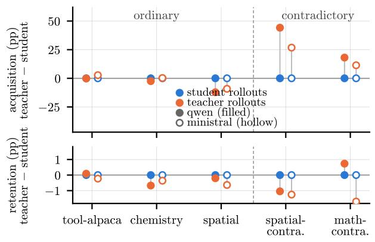  
(a) LLM experiments

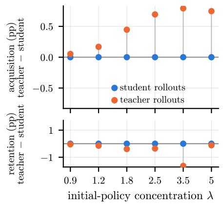  
(b) Finite autoregressive model  
Figure 4: Rollout-source axis. Same as Fig. 1, with reverse instead of forward KL.

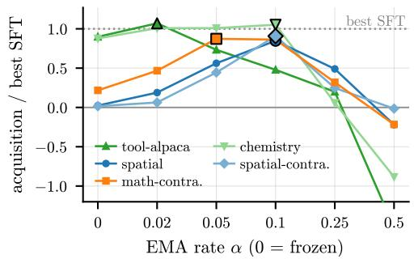  
(a) Qwen forward (same as Fig. 2a)

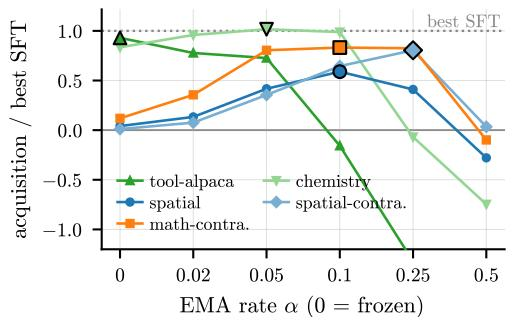  
(b) Qwen reverse

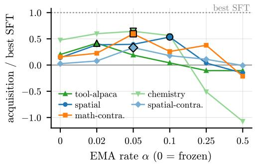  
(c) Ministral forward

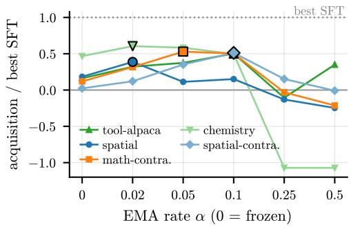  
(d) Ministral reverse

Figure 5: Coupling axis. Extension of Fig. 2a to both KL directions, for Qwen (lr 2e-5, top) and Ministral (lr 5e-6, bottom), with teacher rollouts and the same number of steps for every task.  
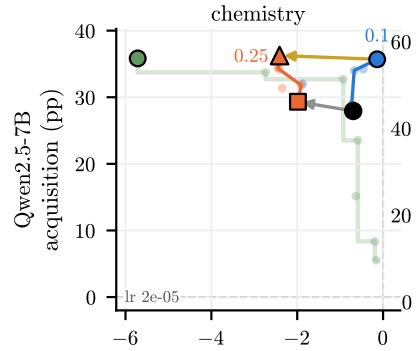

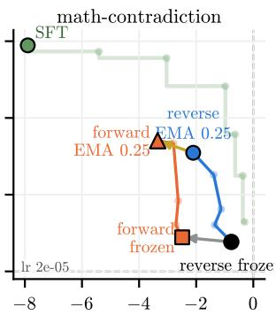

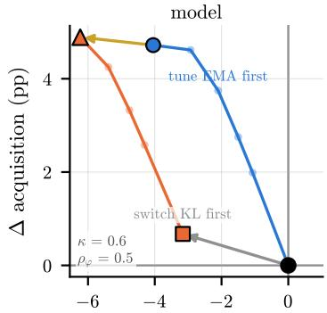

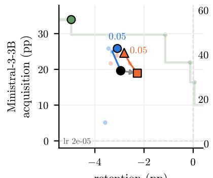  
(a) LLM experiments

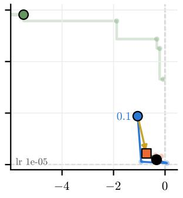  
retention (pp)

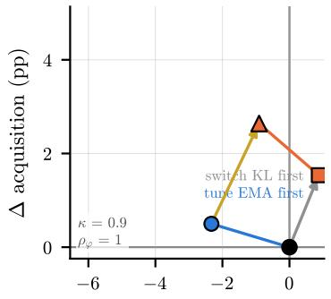  
¢ retention (pp)  
(b) Controlled model  
Figure 6: Coupling and KL direction axis. (a) Student rollouts, one learning rate per panel (corner note; the best one for frozen reverse KL). Routes from frozen reverse KL: the EMA coupling tuned under each direction (blue: reverse; orange: forward; best α labeled), the direction switch frozen (gray) and between the optima (gold). Green: the SFT grid and its Pareto front. (b) The model counterpart (λ = 2.5, context strength and feature overlap in the corner notes), axes relative to frozen reverse KL.

## E EXPERIMENTAL SETTING FOR THE CONTROLLED MODEL

This appendix specifies the controlled model of Sec. 5: its fixed features and shared readout (App. E.1), target and contextual teacher (App. E.2), training objective (App. E.3), and evaluation protocol (App. E.4). The supporting experiments in App. F test the rollout-source, teacher-coupling, and KL-direction regimes discussed in the main text. The task controls $\lambda , \kappa ,$ , and $\rho _ { \phi }$ are varied separately from the three self-distillation axes.

## E.1 FINITE AUTOREGRESSIVE BACKBONE AND TASK GEOMETRY

A response $\bar { y } = ( \bar { y } _ { 1 } , \dots , \bar { y } _ { T } )$ contains T tokens from $\{ 1 , \ldots , K \}$ . Its nonterminal prefix states are

$$
\mathcal S = \bigcup _ { t = 1 } ^ { T } \{ 1 , \dots , K \} ^ { t - 1 } , \qquad s = \bar { y } _ { < t } .
$$

The empty prefix is the root, and appending token a moves from s to $s \Vert a .$ For a fixed feature map $\phi : { \mathcal { S } }  { \check { \mathbb { R } } } ^ { \dot { D } }$ and readout $\bar { W } \in \mathbb { R } ^ { K \times \bar { D } }$ , the induced autoregressive policy is

$$
\pi _ { W } ^ { \phi } ( \cdot \mid s ) = \operatorname { s o f t m a x } ( W \phi ( s ) ) .
$$

In particular, the old-task features are sampled independently as $\phi _ { \mathrm { o l d } } ( s ) = \sqrt { D } g _ { s } / \| g _ { s } \| _ { 2 }$ with $g _ { s } \sim \mathcal { N } ( 0 , I _ { D } )$ , giving $\| \phi _ { \mathrm { o l d } } ( s ) \| _ { 2 } = \sqrt { D }$

For random task seed j, let $( \widetilde { W } _ { 0 } ) _ { a \ell } \sim \mathcal { N } ( 0 , 1 / D )$ independently and define

$$
C _ { K } = I _ { K } - \frac { 1 } { K } { \bf 1 1 } ^ { \top } , \qquad W _ { 0 } = \lambda C _ { K } \widetilde { W } _ { 0 } .
$$

Centering removes the action-independent logit direction, while $\lambda > 0$ sharpens the initial policy without changing token rankings. We therefore call λ the initial-policy concentration: it controls how strongly established the initial token preferences are, not the optimizer step size. Student and teacher start from the same readout, $\begin{array} { r } { W _ { 0 } ^ { \star } = W _ { 0 } , } \end{array}$ , and the behavior to retain is

$$
r _ { \mathrm { o l d } } ( \cdot \mid s ) = \pi _ { W _ { 0 } } ^ { \phi _ { \mathrm { o l d } } } ( \cdot \mid s ) .
$$

The feature-overlap coefficient $\rho _ { \phi }$ controls representation reuse. For each state, independently draw $h _ { s } \sim \mathcal { N } ( 0 , I _ { D } )$ , remove its component along the old-task feature, and normalize the residual:

$$
u _ { s } = h _ { s } - \frac { h _ { s } ^ { \top } \phi _ { \mathrm { o l d } } ( s ) } { \| \phi _ { \mathrm { o l d } } ( s ) \| _ { 2 } ^ { 2 } } \phi _ { \mathrm { o l d } } ( s ) , \qquad \phi _ { \bot } ( s ) = \sqrt { D } \frac { u _ { s } } { \| u _ { s } \| _ { 2 } } .
$$

We then define the new-task feature map statewise as

$$
\phi _ { \mathrm { n e w } } ( s ) = \rho _ { \phi } \phi _ { \mathrm { o l d } } ( s ) + \sqrt { 1 - \rho _ { \phi } ^ { 2 } } \phi _ { \perp } ( s ) .\tag{6}
$$

Since $\phi _ { \perp } ( s ) \perp \phi _ { \mathrm { o l d } } ( s )$ and both have norm $\sqrt { D } , \| \phi _ { \mathrm { n e w } } ( s ) \| _ { 2 } = \sqrt { D }$ and $\cos ( \phi _ { \mathrm { n e w } } ( s ) , \phi _ { \mathrm { o l d } } ( s ) ) =$ $\rho _ { \phi }$ exactly.

The reference setting uses $\rho _ { \phi } = 0 . 5$ . This is a statewise mixing control and should not be interpreted as a guarantee that the global spans of the two feature sets are orthogonal when $\rho _ { \phi } = 0$

Both $\phi _ { \mathrm { o l d } }$ and $\phi _ { \mathrm { n e w } }$ are fixed throughout training, while the two tasks share the trainable readout W. Adaptation can therefore interfere with retained behavior even though the feature maps themselves do not learn.

A separate readout-compatibility control $\rho _ { W } \in [ - 1 , 1 ]$ constructs an auxiliary target-generating readout. To define its orthogonal component, independently draw $( \widetilde { W } _ { \perp } ) _ { a \ell } \sim { \mathcal N } ( 0 , 1 / D )$ and center it as $G _ { \perp } = C _ { K } \widetilde { W } _ { \perp }$ . We then remove its component along $W _ { 0 }$ in Frobenius geometry and rescale the residual:

$$
U _ { \perp } = G _ { \perp } - \frac { \langle G _ { \perp } , W _ { 0 } \rangle _ { F } } { \| W _ { 0 } \| _ { F } ^ { 2 } } W _ { 0 } , \qquad W _ { \perp } = \frac { \| W _ { 0 } \| _ { F } } { \| U _ { \perp } \| _ { F } } U _ { \perp } ,
$$

where $\langle A , B \rangle _ { F } = \operatorname { t r } ( A ^ { \top } B )$ . The auxiliary readout is then

$$
W _ { \mathrm { t a s k } } ( \rho _ { W } ) = \rho _ { W } W _ { 0 } + \sqrt { 1 - \rho _ { W } ^ { 2 } } W _ { \perp } .
$$

By construction, $\langle W _ { \perp } , W _ { 0 } \rangle _ { F } = 0$ and $\lVert W _ { \perp } \rVert _ { F } = \lVert W _ { 0 } \rVert _ { F }$ , so

$$
\frac { \langle W _ { \mathrm { t a s k } } ( \rho _ { W } ) , W _ { 0 } \rangle _ { F } } { \| W _ { \mathrm { t a s k } } ( \rho _ { W } ) \| _ { F } \| W _ { 0 } \| _ { F } } = \rho _ { W } .
$$

The reference construction sets $\rho _ { W } \ = \ 0 ;$ Appendix F.3.2 uses nonzero values as a controlled construction verification.

Thus $\rho _ { \phi }$ controls feature reuse, whereas $\rho _ { W }$ controls compatibility of the mapping used to create the adaptation target.

## E.2 ATTAINABLE TARGET AND CONTEXTUAL TEACHER

Using this auxiliary readout, at each prefix the two highest-scoring tokens under $W _ { \mathrm { t a s k } } \phi _ { \mathrm { n e w } } ( s )$ receive prescribed masses $m _ { 1 } = 0 . 3 0$ and $m _ { 2 } = 0 . 1 5$ , with the remaining mass spread uniformly over the other $K - 2$ tokens. Denote this positive soft distribution by $\widetilde { r } ( \cdot \mid ^ { - } s )$ . Because an arbitrary collection of statewise distributions need not be representable by one shared readout, we project centered log probabilities into the readout family:

$$
W _ { \mathrm { r e f } } \in \arg \operatorname* { m i n } _ { W } \sum _ { s \in \mathcal { S } } \| W \phi _ { \mathrm { n e w } } ( s ) - C _ { K } \log \widetilde { r } ( \cdot \mid s ) \| _ { 2 } ^ { 2 } , \qquad r _ { \mathrm { n e w } } ( \cdot \mid s ) = \pi _ { W _ { \mathrm { r e f } } } ^ { \phi _ { \mathrm { n e w } } } ( \cdot \mid s ) .\tag{7}
$$

The final reference $r _ { \mathrm { n e w } } .$ , not the unprojected prescription, defines the adaptation task. It is therefore attainable by construction, while simultaneous old-task preservation is not guaranteed.

Before adaptation, the context-free student applies the initial readout $W _ { 0 }$ to the new-task features:

$$
p _ { 0 } ( \cdot \mid s ) = \pi _ { W _ { 0 } } ^ { \phi _ { \mathrm { n e w } } } ( \cdot \mid s ) .
$$

The context strength $\kappa \in [ 0 , 1 ]$ specifies the fraction of the initial discrepancy from $r _ { \mathrm { n e w } }$ removed by privileged information. Define

$$
\widehat { q } _ { \kappa , 0 } ( \cdot  { | } s ) = ( 1 - \kappa ) p _ { 0 } ( \cdot  { | } s ) + \kappa r _ { \mathrm { n e w } } ( \cdot  { | } s ) .\tag{8}
$$

For total variation $\begin{array} { r } { \mathrm { T V } ( u , v ) = \frac { 1 } { 2 } \sum _ { a } \left| u _ { a } - v _ { a } \right| } \end{array}$

$$
\mathrm { T V } ( \widehat { q } _ { \kappa , 0 } , r _ { \mathrm { n e w } } ) = ( 1 - \kappa ) \mathrm { T V } ( p _ { 0 } , r _ { \mathrm { n e w } } ) ,
$$

so κ has an exact initial behavioral interpretation in the clean construction.

To realize this correction through privileged input rather than a fixed probability mixture, let $w _ { a } ^ { \top }$ denote row a of W, take token K as a logit reference, and define

$$
\begin{array} { r } { R ( W ) = \left[ \begin{array} { c } { ( w _ { 1 } - w _ { K } ) ^ { \top } } \\ { \vdots } \\ { ( w _ { K - 1 } - w _ { K } ) ^ { \top } } \end{array} \right] , \qquad [ \delta _ { \kappa } ( s ) ] _ { a } = \log \frac { \widehat { q } _ { \kappa , 0 } ( a \mid s ) } { \widehat { q } _ { \kappa , 0 } ( K \mid s ) } - \log \frac { p _ { 0 } ( a \mid s ) } { p _ { 0 } ( K \mid s ) } . } \end{array}
$$

With $R _ { 0 } = R ( W _ { 0 } )$ , the minimum-norm teacher-only feature displacement is

$$
\psi _ { \kappa } ( s ) = R _ { 0 } ^ { + } \delta _ { \kappa } ( s ) ,\tag{9}
$$

where $R _ { 0 } ^ { + }$ is the Moore–Penrose pseudoinverse. In the reference dimensions $D \ge K - 1$ and the random initialization gives full row rank almost surely, so the initial teacher is calibrated exactly. Thereafter the fixed displacement is processed by the evolving teacher readout:

$$
\begin{array} { r l } & { p _ { i } ( \cdot \mid s ) = \mathrm { s o f t m a x } ( W _ { i } \phi _ { \mathrm { n e w } } ( s ) ) , } \\ & { q _ { i } ( \cdot \mid s ) = \mathrm { s o f t m a x } ( W _ { i } ^ { \star } [ \phi _ { \mathrm { n e w } } ( s ) + \psi _ { \kappa } ( s ) ] ) . } \end{array}\tag{10}
$$

Thus Eq. 8 calibrates only $i = 0 ;$ ; it does not replace the teacher by a fresh probability mixture after every update.

Table 9: Reference configuration of the controlled model.
<table><tr><td>Quantity</td><td>Reference</td><td>Role</td></tr><tr><td>λ</td><td>2.5</td><td>Initial-policy concentration</td></tr><tr><td>κ</td><td>0.6</td><td>Context strength</td></tr><tr><td> $\rho _ { \phi }$ </td><td>0.5</td><td>Old/new feature overlap</td></tr><tr><td>ρw</td><td>0</td><td>Auxiliary readout compatibility</td></tr><tr><td> $( T , K , D )$ </td><td>(4, 8, 64)</td><td>Depth, branching factor, feature dimension</td></tr><tr><td> $( m _ { 1 } , m _ { 2 } )$ </td><td>(0.30, 0.15)</td><td>Pre-projection target masses</td></tr><tr><td>Optimizer</td><td>Adam,  $1 0 ^ { - 3 }$ </td><td>Student-readout optimization</td></tr><tr><td>Training</td><td>200 updates</td><td>Reference horizon</td></tr><tr><td>Weight decay / clipping</td><td>0 / 10</td><td>Optimizer controls</td></tr><tr><td>Occupancy</td><td>Exact</td><td>Prefix-visitation probabilities</td></tr></table>

## E.3 EXACT PREFIX WEIGHTING AND SELF-DISTILLATION AXES

For an autoregressive policy π, let $\nu _ { \pi } ( s )$ be the probability of reaching prefix s:

$$
\nu _ { \pi } ( \emptyset ) = 1 , \qquad \nu _ { \pi } ( s \| a ) = \nu _ { \pi } ( s ) \pi ( a \mid s ) .
$$

Nonterminal occupancies sum to $T .$

For pure student or teacher rollouts, let $\mu _ { i } = p _ { i } \mathrm { o r } q _ { i }$ , respectively, and use the corresponding exact prefix occupancy $\nu _ { \mu _ { i } }$ . These are the two rollout-source settings studied in the paper.

With all response tokens supervised, the taxonomy objective becomes

$$
\mathcal { L } _ { i } ( W _ { i } ) = \frac { 1 } { T } \sum _ { s \in \mathcal { S } } \operatorname { s g } [ \nu _ { \mu _ { i } } ( s ) ] d ( \operatorname { s g } [ q _ { i } ( \cdot  { | } s ) ] , p _ { i } ( \cdot  { | } s ) ) ,\tag{11}
$$

where d is forward or reverse KL and sg denotes stop-gradient. Only $W _ { i }$ is optimized. Prefix occupancies and teacher predictions are recomputed after the student/teacher update, while Eq. 3 controls teacher coupling independently of rollout source and KL direction. Using exact prefix occupancies removes the trajectory-sampling noise present in sampled rollouts.

## E.4 REFERENCE PROTOCOL, SELECTION, AND METRICS

The reference setting is summarized in Tab. 9. Each reported random task seed regenerates the controlled task construction; method comparisons are paired on that seed.

Coupling selection is stated locally for each experiment in $\operatorname { A p p } .$ . F. For cross-fitted comparisons, task seeds are divided into two folds using $\operatorname { f o l d } ( j ) { \overset { - } { = } } j$ mod 2; the rate maximizing mean acquisition on one fold is evaluated on the other. Descriptive grid optima instead maximize sample-mean acquisition over all seeds and are identified as such. Fixed-coupling contrasts do not select $\alpha .$ . The main factorial completion and the dedicated rollout/coupling sweeps use 96 task seeds, while targeted controls report their own cohort sizes. Cohorts are paired within experiments and are not pooled across experiments.

Define Sim $. ( u , v ) = 1 - \mathrm { T V } ( u , v )$ . New-task similarity $( S _ { \mathrm { n e w } } )$ and deployment-weighted acquisition $\left( \Delta _ { \mathrm { n e w } } \right)$ are

$$
S _ { \mathrm { n e w } } ( i ) = \frac { 1 } { T } \sum _ { s } \nu _ { p _ { i } } ( s ) \mathrm { S i m } ( p _ { i } ( \cdot \mid s ) , r _ { \mathrm { n e w } } ( \cdot \mid s ) ) , \qquad \Delta _ { \mathrm { n e w } } = S _ { \mathrm { n e w } } ( i _ { \mathrm { e n d } } ) - S _ { \mathrm { n e w } } ( 0 ) .
$$

A complementary diagnostic holds the weighting distribution fixed to the target policy:

$$
S _ { \mathrm { n e w } } ^ { \mathrm { t g t } } ( i ) = \frac { 1 } { T } \sum _ { s } \nu _ { r _ { \mathrm { n e w } } } ( s ) \mathrm { S i m } ( p _ { i } ( \cdot  { \left| ~ s \right. } , r _ { \mathrm { n e w } } ( \cdot  { \left| s \right. } ) ) , \qquad \Delta _ { \mathrm { n e w } } ^ { \mathrm { t g t } } = S _ { \mathrm { n e w } } ^ { \mathrm { t g t } } ( i _ { \mathrm { e n d } } ) - S _ { \mathrm { n e w } } ^ { \mathrm { t g t } } ( 0 ) .
$$

We call $\Delta _ { \mathrm { n e w } } ^ { \mathrm { t g t } }$ target-path fidelity: it measures the same local distributional match as $\Delta _ { \mathrm { n e w } }$ , but weights prefixes by the fixed occupancy induced by the target policy rather than by the deployed student.

Old-task similarity uses the fixed old-reference occupancy,

$$
S _ { \mathrm { o l d } } ( i ) = \frac { 1 } { T } \sum _ { s } \nu _ { r _ { \mathrm { o l d } } } ( s ) \mathrm { S i m } ( \pi _ { W _ { i } } ^ { \phi _ { \mathrm { o l d } } } ( \cdot \mid s ) , r _ { \mathrm { o l d } } ( \cdot \mid s ) ) , \qquad \Delta _ { \mathrm { o l d } } = S _ { \mathrm { o l d } } ( i _ { \mathrm { e n d } } ) - 1 .
$$

Thus larger $\Delta _ { \mathrm { o l d } }$ means better retention, with forgetting being defined as: $F _ { \mathrm { o l d } } = - \Delta _ { \mathrm { o l d } }$ . These are controlled-model distributional quantities, playing a similar role to the broad benchmark average for our LLM experiments.

Contextual-teacher utility on student-visited states is

$$
U _ { \mathrm { c t x } } ( i ) = \frac { 1 } { T } \sum _ { s } \nu _ { p _ { i } } ( s ) \operatorname { S i m } ( q _ { i } ( \cdot \mid s ) , r _ { \mathrm { n e w } } ( \cdot \mid s ) ) .
$$

Similarity changes and forgetting are stored as fraction-scale quantities; figures that label such differences in points multiply them by 100. Absolute teacher utility remains on its native [0, 1] scale. Unless otherwise stated, method contrasts are formed within task seed before aggregation, and reported 95% confidence intervals use the normal approximation $\bar { x } \pm 1 . 9 6 \mathrm { S E }$ over the resulting task-seed values.

Checks of exact versus sampled prefix occupancy and of the reference $( T , K , D )$ choices are reported in App. F.4.

## F CONTROLLED-MODEL RESULTS AND REGIME TESTS

This appendix contains the controlled-model experiments that support the three result axes of Sec. 6: rollout source (App. F.1), teacher coupling (App. F.2), and KL direction (App. F.3). We then report scoped numerical and structural checks in App. F.4. The model construction and metrics are defined in App. E. Unless stated otherwise, experiments use the reference task and optimization settings in Tab. 9. The 18-rate coupling sweeps use $\alpha \in \{ 0 \} \cup \{ 0 . 0 0 0 6 2 5 2 ^ { j / 2 } : j = 0 , \ldots , 1 6 \}$ ; controls using smaller grids state them explicitly. Acquisition and retention changes are reported in points, i.e. the corresponding similarity changes multiplied by 100; teacher utility remains on its native [0, 1] scale and entropy is reported in nats. Confidence intervals are pointwise normal 95% intervals over task seeds; method-difference intervals use within-seed paired contrasts. They are not corrected for multiple comparisons. Results from distinct seed cohorts are not pooled; each experiment states its cohort and coupling-selection rule locally.

## F.1 ROLLOUT SOURCE: TARGET-PATH LEARNING AND DEPLOYMENT TRANSFER

Unless stated otherwise, rollout-source comparisons use source-specific coupling rates selected by two-fold task-seed cross-fitting.

The rollout analysis asks whether the teacher-rollout preference in the main results persists as the controlled regime changes, and whether improvement learned on teacher-emphasized prefixes transfers to the prefixes visited by the final student. We first vary initial-policy concentration under reverse KL, then compare target-policy and final-student occupancies to diagnose deployment transfer.

Initial concentration and deployment transfer The main results show that teacher rollouts often improve acquisition, with the largest gains appearing in several contradictory LLM regimes. Because the main controlled comparison uses forward KL, we first test whether this qualitative preference persists under reverse KL. We repeat the λ sweep on 96 common task seeds. At $\kappa = 0 . 6 $ , the teacherminus-student acquisition difference rises from +0.03 points at $\lambda = 0 . 6 2 5 ( 9 5 \% \mathrm { C I } [ 0 . 0 2 , 0 . 0 4 ] )$ to +1.21 points at $\lambda \overset { - } { = } 2 . 5 ( [ 1 . 0 3 , 1 . 4 0 ] )$ ), before falling to +0.32 points at $\lambda = 5 ( [ - 0 . 0 \dot { 5 } , 0 . 6 9 ] )$ . Thus concentration strengthens the teacher advantage over part of the range, but does not imply monotonic growth for every $\kappa ,$ consistent with the regime-dependent rollout-source behavior summarized in Sec. 6.1. Moreover, in this $\kappa = 0 . 6$ slice the selected coupling rates are identical for the teacher- and student-rollout endpoints in every held-out fold, so the contrast is unchanged by imposing a common rate. The observed preference is therefore not an artifact of source-specific coupling selection in this slice.

Rollout source changes the prefix distribution on which distillation updates are taken. Training on teacher-generated trajectories can therefore improve target matching on teacher-emphasized prefixes without guaranteeing that this improvement transfers to the prefixes visited by the final student. Fig. 7 separates these two effects. We define target-pathfidelity as $\Delta _ { \mathrm { n e w } } ^ { \mathrm { t g t } }$ from App. E.4, which evaluates target matching under the fixed target-policy occupancy rather than the final student’s occupancy. $\mathrm { { A t } } ~ \lambda = ~ 5$ and $\kappa = 0 . 9$ , teacher rollouts improve target-path fidelity by +5.86 points (95% CI [5.25, 6.47]), while their deployment-weighted acquisition difference is −0.54 points $( [ - 1 . 1 3 , 0 . 0 4 ] )$ Thus, teacher rollouts can produce substantially stronger target matching on target-like prefixes without yielding better behavior on the prefixes visited by the final student. This exposes the complementary advantage of student rollouts: by training directly on states encountered at deployment, they reduce the need for improvement learned under one trajectory distribution to transfer to another.

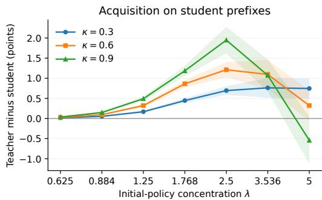

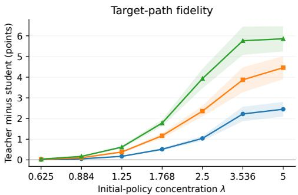  
Figure 7: Target-path fidelity and deployment-weighted acquisition can diverge. Teacher-minusstudent differences under reverse KL with $\rho _ { \phi } = 0 . 5$ , 96 paired task seeds, and coupling selected separately for each source by two-fold cross-fitting. Left: acquisition under each final student’s own prefix occupancy. Right: target-path fidelity under the fixed target-policy occupancy. Bands show pointwise 95% confidence intervals over paired seed-level contrasts.

Teacher rollouts have higher mean deployment-weighted acquisition in 20/21 cells of this sweep, reproducing the qualitative teacher-rollout preference summarized in Sec. 6.1. At the same time, the deployment-alignment advantage identified in Fig. 7 explains why this ordering need not be universal. However, none of the tested controlled-model settings produces a teacher-rollout advantage as large as those observed on the contradictory LLM tasks. This residual gap suggests that their rollout-source dependence also involves mechanisms absent from the controlled construction—for example, trajectory-dependent changes in how privileged context is used or representation-level effects—rather than prefix occupancy alone.

## F.2 TEACHER COUPLING: USEFUL SUPERVISION OVER A FINITE TRAINING BUDGET

The coupling controls ask why the acquisition optimum occurs at an intermediate teacher-update rate, whether it persists under a complementary KL/rollout configuration, and which experimental conditions move that optimum. App. F.2.1 measures acquisition, retention cost, and contextualteacher utility along the coupling sweep; App. F.2.2 changes both KL direction and rollout source; App. F.2.3 varies contextual quality and training duration.

## F.2.1 ACQUISITION, RETENTION COST, AND TEACHER UTILITY

Fig. 8 complements the controlled panel of Fig. 2b with the old-task retention cost $F _ { \mathrm { o l d } } = - \Delta _ { \mathrm { o l d } }$ and the contextual-teacher utility $U _ { \mathrm { c t x } }$ defined in App. E.4. The dedicated sweep uses forward KL, teacher rollouts, $\lambda = 2 . 5 , \kappa = 0 . 6 , \rho _ { \phi } = 0 . 5$ , and 96 task seeds. Moving from a frozen teacher to the sample-mean acquisition optimum $\alpha = 0 . 0 0 2 5$ raises acquisition from 24.05 to 28.83 points and teacher utility from 0.755 to 0.830, while retention loss increases from 24.25 to 28.71 points. At $\alpha = 0 . 0 2$ , acquisition falls to 10.45 points and utility falls to 0.527, while retention loss has risen to 36.89 points; at $\alpha = 0 . 1 6$ , acquisition is −4.59 points. Moderate coupling can therefore improve the supervision available on the adapting student’s final prefixes, but faster coupling eventually degrades acquisition while the retention cost remains high. Because $U _ { \mathrm { c t x } }$ is weighted by each run’s final student occupancy, it measures teacher utility on the states reached by that run rather than teacher quality on a common fixed prefix distribution.

Teacher update rate <sub>EMA</sub>  
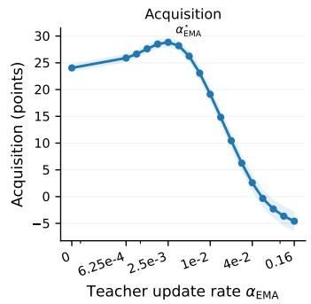

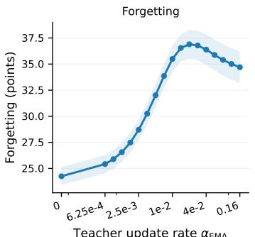

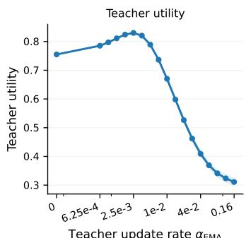  
Figure 8: Acquisition and contextual-teacher utility peak before fast coupling degrades adaptation. Forward KL with teacher rollouts at $\lambda = 2 . 5 , \kappa = 0 . 6$ , and $\rho _ { \phi } = 0 . 5$ , on 96 task seeds. Panels report final acquisition, old-task retention loss $F _ { \mathrm { o l d } }$ , and teacher utility for separately trained coupling rates. Shading gives pointwise 95% intervals over task seeds; the marked rate maximizes sample-mean acquisition on the tested grid.

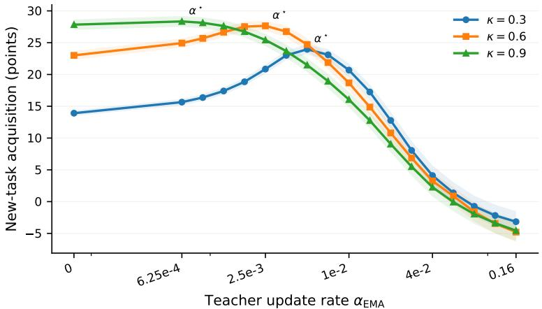  
Figure 9: The coupling peak persists with reverse KL and student rollouts. Acquisition at $\lambda = 2 . 5$ and $\rho _ { \phi } = 0 . 5$ on 96 task seeds. Increasing κ shifts the cross-fitted selected rate toward slower teacher updates. Shading gives pointwise 95% intervals at each fixed rate.

## F.2.2 PERSISTENCE UNDER REVERSE KL AND STUDENT ROLLOUTS

Fig. 9 repeats the coupling sweep under reverse KL with student rollouts, using the same 96-seed cohort, $\bar { \lambda } = 2 . 5$ , and $\rho _ { \phi } = 0 . 5$ . Acquisition again rises and then falls with α. For $\kappa = 0 . 3 , 0 . 6 , 0 . 9$ task-seed cross-fitting selects $\alpha ^ { \star } = 0 . 0 0 5 , 0 . 0 0 2 5$ , and 0.000625, respectively, with mean held-out acquisitions of 23.96, 27.65, and 28.34 points. The finite useful-coupling window and its shift toward slower updates as contextual correction strengthens therefore persist under this complementary joint change of KL direction and rollout source. Because both method axes change together, this control establishes persistence of the coupling pattern rather than isolating the contribution of either axis individually.

## F.2.3 WHAT MOVES THE USEFUL COUPLING TIMESCALE?

Two stress tests show that the numerical optimum is not an intrinsic constant of the EMA update. First, we corrupt the privileged feature displacement while keeping the reverse-KL/student-rollout setting of Fig. 9. For each task seed, collect the clean displacements into the state-by-feature matrix $\Psi _ { \kappa }$ and draw a Gaussian matrix G of the same shape. We construct a fixed perturbation orthogonal to

Table 10: Context quality and training duration move the useful coupling rate. Entries are sample-mean acquisition-maximizing tested rates. (a) Feature-space corruption uses reverse KL, student rollouts, $\bar { \lambda } = 2 . 5 , \rho _ { \phi } = 0 . 5$ , and 64 task seeds. (b) Duration uses $\lambda = 2 . 5 , \kappa = 0 . 6 , \rho _ { \phi } = 0 . 5$ and 48 seeds; all four KL/rollout combinations select the same rate.
<table><tr><td colspan="4">(a) Context corruption</td></tr><tr><td>Relative noise  $\sigma _ { \phi }$ </td><td> $\kappa = 0 . 3$ </td><td> $\kappa = 0 . 6$ </td><td> $\kappa = 0 . 9$ </td></tr><tr><td>0</td><td>0.005</td><td>0.0025</td><td>0.000625</td></tr><tr><td>0.5</td><td>0.005</td><td>0.0025</td><td>0.000625</td></tr><tr><td>1</td><td>0.00354</td><td>0.00125</td><td>0</td></tr><tr><td>2</td><td>0</td><td>0</td><td>0</td></tr><tr><td colspan="4">(b) Training duration</td></tr><tr><td>Updates N</td><td>Selected  $\alpha ^ { \star }$ </td><td> $\alpha ^ { \star } N$ </td><td>Note</td></tr><tr><td>100</td><td>0.005</td><td>0.5</td><td></td></tr><tr><td>200</td><td>0.0025</td><td>0.5</td><td></td></tr><tr><td>400</td><td>0.00125</td><td>0.5</td><td></td></tr><tr><td>800</td><td>0.00125</td><td>1.0</td><td>grid-censored</td></tr></table>

$\Psi _ { \kappa }$ in the Frobenius inner product:

$$
G _ { \perp } = G - \frac { \langle G , \Psi _ { \kappa } \rangle _ { F } } { \| \Psi _ { \kappa } \| _ { F } ^ { 2 } } \Psi _ { \kappa } , \qquad \widetilde { \Psi } _ { \kappa } = \Psi _ { \kappa } + \sigma _ { \phi } \frac { \| \Psi _ { \kappa } \| _ { F } } { \| G _ { \perp } \| _ { F } } G _ { \perp } .
$$

The perturbed contextual displacement at each prefix is the corresponding row of $\smash { \widetilde { \Psi } _ { \kappa } } .$ . Orthogonality and relative noise magnitude are imposed jointly over all state-feature entries within each seed, and the perturbation remains fixed during training. The 64-seed control selects the sample-mean acquisition optimum over the same 18-rate coupling grid. Tab. 10a shows that relative noise 0.5 leaves the clean ordering unchanged; at scale 1, the preferred rate slows for all three κ values and freezing is already optimal at $\kappa = 0 . 9$ ; at scale 2, freezing maximizes acquisition for all three. Thus κ calibrates the clean initial correction, but does not determine the useful coupling rate once the privileged signal itself is corrupted.

Second, we vary the training budget on 48 task seeds at $\lambda \ : = \ : 2 . 5 , \ : \kappa \ : = \ : 0 . 6 .$ , and $\rho _ { \phi } ~ = ~ 0 . 5$ All four KL-direction/rollout-source combinations select the same sample-mean optimum over $\alpha \in \{ 0 , 0 . 0 0 1 2 5 , 0 . 0 0 2 5 , 0 . 0 0 5 , 0 . 0 1 \} \colon 0 . 0 0 5 , 0 . 0 0 2 5$ , and 0.00125 at 100, 200, and 400 updates, respectively, giving $\alpha ^ { \star } N = 0 . 5$ in each case. At 800 updates, 0.00125 is again selected, but this is the smallest positive rate in the tested duration grid; the experiment therefore does not resolve whether a slower rate would be better. The approximate inverse scaling over 100–400 updates should not be read as a general law.

## F.3 KL DIRECTION: RETENTION COSTS AND REGIME REVERSALS

The KL analysis first documents the exact endpoints used in the main controlled comparison (App. F.3.1), then separates input-side feature sharing from output-side readout compatibility (App. F.3.2), maps the region in which forward KL improves both acquisition and retention (App. F.3.3), and finally tests teacher entropy as a complementary regime diagnostic (App. F.3.4).

## F.3.1 ENDPOINTS BEHIND THE MAIN KL COMPARISON

Fig. 3b summarizes a change in the KL-direction trade-off between the reference regime and a regime with stronger contextual correction and complete feature sharing. Here we unpack the frozen and coupling-selected endpoints underlying those two comparisons. This separates the gain provided by teacher coupling from the remaining forward–reverse difference, and makes clear how the retention advantage of reverse KL at the reference setting gives way to a joint forward-KL advantage in the high- $\cdot \kappa ,$ high- $\cdot \rho _ { \phi }$ regime. Tab. 11 gives both the frozen and selected endpoints. At $( \kappa , \rho _ { \phi } ) \overset { - } { = } ( 0 . 6 , 0 . 5 )$ , tuning reverse-KL coupling raises acquisition from 24.00 to 29.43 points while retention changes from −20.55 to −24.81 points, i.e. +5.43 acquisition for 4.26 points of additional retention loss. The selected forward endpoint acquires 0.26 points less and retains 3.04 points less than the selected reverse endpoint. At (0.9, 1), the selected forward endpoint instead exceeds reverse by 1.23 acquisition and 0.38 retention points in mean.

Table 11: Controlled-model endpoints behind Fig. 3b. Acquisition and retention are reported in percentage points, so higher is better on both columns. Rates are selected separately for each KL direction by sample-mean acquisition over the 96 common task seeds.
<table><tr><td> $( \kappa , \rho _ { \phi } )$ </td><td>KL</td><td>Endpoint / α</td><td>Acquisition</td><td>Retention</td></tr><tr><td>(0.6,0.5)</td><td>Reverse</td><td>frozen / 0</td><td>24.00</td><td>-20.55</td></tr><tr><td></td><td>Reverse</td><td>selected / 0.0025</td><td>29.43</td><td>-24.81</td></tr><tr><td></td><td>Forward</td><td>frozen / 0</td><td>24.43</td><td>-23.63</td></tr><tr><td></td><td>Forward</td><td>selected / 0.0025</td><td>29.17</td><td>-27.84</td></tr><tr><td>(0.9,1)</td><td>Reverse</td><td>frozen / 0</td><td>29.80</td><td>-39.17</td></tr><tr><td></td><td>Reverse</td><td>selected / 0.000625</td><td>30.61</td><td>-41.16</td></tr><tr><td></td><td>Forward</td><td>frozen / 0</td><td>30.48</td><td>-38.98</td></tr><tr><td></td><td>Forward</td><td>selected / 0.000884</td><td>31.84</td><td>-40.78</td></tr></table>

## F.3.2 FEATURE SHARING AND READOUT COMPATIBILITY

We next separate two notions of task relatedness in the construction. Feature overlap $\rho _ { \phi }$ controls how strongly the old and new tasks reuse the same input features, whereas readout compatibility $\rho _ { W }$ controls the alignment of the auxiliary target-generating readout with the pretrained readout (App. E.1). Panel (a) of Tab. 12 uses the same teacher-rollout, 96-seed main grid as Fig. 3b, with $\lambda = 2 . 5 , \kappa = 0 . 6$ , and fixed $\alpha = 0 . 0 0 2 5$ . Raising $\rho _ { \phi }$ from 0 to 1 increases the retention cost under both KL directions and compresses the reverse-KL retention advantage from 3.19 points to essentially zero. The paired forward-minus-reverse retention interval is $[ - 3 . 8 3 , - 2 . 5 5 ]$ points at $\rho _ { \phi } = 0 , [ - 3 . 7 6 , - 2 . 3 2 ]$ at 0.5, and [−0.27, 0.26] at 1. Complete feature sharing therefore erodes the reference retention separation; the near-zero endpoint is not evidence of statistical equivalence or of a forward-KL retention advantage by itself.

Readout-compatibility control. Panel (b) tests whether the KL comparison depends on the auxiliary target-readout compatibility $\rho _ { W }$ , using an independent 64-seed cohort at the reference task geometry. With a frozen teacher, forward KL acquires more across all seven tested $\rho _ { W }$ values, while reverse KL retains more throughout. At the moderate coupling rate $\alpha = 0 . 0 0 2 5$ , varying $\rho _ { W }$ can reverse the small acquisition difference between the two KL directions, but the reverse-KL retention advantage again persists across the entire sweep. Thus readout compatibility can modulate which KL direction acquires slightly more, particularly once the teacher is coupled, without changing the more stable retention ordering emphasized in the main results.

## F.3.3 WHERE THE KL ORDERING REVERSES

To map the transition more densely than the 96-seed main grid, we use a dedicated teacher-rollout interaction sweep with learning rate $1 0 ^ { - 3 }$ , 200 updates, and 64 common task seeds. We cross

$$
\begin{array} { r l } & { \rho _ { \phi } \in \{ 0 , 0 . 2 5 9 , 0 . 5 , 0 . 7 0 7 , 0 . 8 6 6 , 0 . 9 6 6 , 1 \} , } \\ & { \quad \lambda \in \{ 0 . 6 2 5 , 0 . 8 8 4 , 1 . 2 5 , 1 . 7 6 8 , 2 . 5 , 3 . 5 3 6 , 5 \} , } \\ & { \quad \kappa \in \{ 0 . 3 , 0 . 6 , 0 . 9 \} , } \end{array}
$$

Displayed values of $\rho _ { \phi }$ and $\lambda$ are rounded. With the restricted coupling grid $\alpha \in$ {0, 0.00125, 0.0025, 0.005}, the sweep contains 588 paired forward/reverse configurations. This restriction avoids the fast-coupling tail illustrated in App. F.2.1.

For configuration $\theta = ( \rho _ { \phi } , \lambda , \kappa , \alpha )$ and task seed $j ,$ define the forward-minus-reverse acquisition and retention contrasts

$$
\delta A _ { j } ( \theta ) = 1 0 0 \left[ \Delta _ { \mathrm { n e w } , F } ^ { ( j ) } ( \theta ) - \Delta _ { \mathrm { n e w } , R } ^ { ( j ) } ( \theta ) \right] , \qquad \delta R _ { j } ( \theta ) = 1 0 0 \left[ \Delta _ { \mathrm { o l d } , F } ^ { ( j ) } ( \theta ) - \Delta _ { \mathrm { o l d } , R } ^ { ( j ) } ( \theta ) \right] ,
$$

Table 12: Feature sharing and output-readout compatibility are distinct controls. “Rev. ret. adv.” is reverse minus forward retention, in points. (a) Main-grid teacher-rollout slice with 96 seeds, $\lambda = 2 . 5 , \kappa = 0 . 6$ , and fixed $\alpha = 0 . 0 0 2 5$ . (b) Readout-compatibility control with 64 seeds under the reference task geometry; each entry reports $\alpha = 0 . 0 0 2 5 /$ frozen $( \alpha = 0 )$ . Panel (b) reports mean contrasts without confidence intervals.
<table><tr><td colspan="5">(a) Feature overlap</td></tr><tr><td> $\rho _ { \phi }$ </td><td>Fwd—Rev acq.</td><td>Fwd retention</td><td>Rev retention</td><td>Rev. ret. adv.</td></tr><tr><td>0</td><td>-0.18</td><td>-22.91</td><td>-19.72</td><td>3.19</td></tr><tr><td>0.5</td><td>-0.26</td><td>-27.84</td><td>-24.81</td><td>3.04</td></tr><tr><td>1</td><td>+0.02</td><td>-40.00</td><td>-40.00</td><td>0.00</td></tr><tr><td rowspan="9"></td><td></td><td>(b) Readout compatibility:</td><td> $\alpha = 0 . 0 0 2 5 /$  frozen</td><td></td></tr><tr><td>ρw</td><td>Fwd-Rev acq.</td><td>Rev. ret. adv.</td><td></td></tr><tr><td>-0.9</td><td> $+ 0 . 2 1 / + 0 . 7 7$ </td><td>3.98 / 4.13</td><td></td></tr><tr><td>-0.707</td><td> $+ 0 . 1 0 \dot { / } + 0 . 7 2$ </td><td>3.66/3.97</td><td></td></tr><tr><td>-0.5</td><td> $- 0 . 0 2 / + 0 . 6 6$ </td><td>3.49/3.78</td><td></td></tr><tr><td>0</td><td> $- 0 . 2 3 \dot { / } + 0 . 5 9$ </td><td>3.28/3.42</td><td></td></tr><tr><td>0.5</td><td> $- 0 . 2 3 \dot { / } + 0 . 5 6$ </td><td>3.04/3.14</td><td></td></tr><tr><td>0.707</td><td> $- 0 . 2 3 \dot { / } + 0 . 5 5$ </td><td>2.86/2.93</td><td></td></tr><tr><td>0.9</td><td> $- 0 . 1 8 \dot { / } + 0 . 5 3$ </td><td>2.78/2.85</td><td></td></tr></table>

and let $\overline { { \delta A } } ( \theta )$ and $\overline { { \delta R } } ( \theta )$ denote their seed means. A retention inversion has $\overline { { \delta R } } > 0 ;$ a jointforward advantage additionally requires $\overline { { \delta A } } > 0$ . Connectivity is defined on the sampled four-dimensional grid, with nearest neighbors differing by one consecutive sampled value of exactly one coordinate.

Tab. 13a summarizes the topology. All 185 retention-inversion cells form one connected component. Joint forward advantage occurs in 46 cells, 45 of which form one component. The isolated meansign cell is $( \rho _ { \phi } , \lambda , \kappa , \alpha ) \simeq ( 0 . 2 5 9 , 1 . 2 5 , 0 . 9 , 0 . 0 0 5 )$ ; its acquisition contrast is only +0.060 points $( 9 5 \% \mathrm { C I } [ - 0 . 0 7 3 , 0 . 1 9 2 ] )$ and its retention contrast +0.123 points $( [ - 0 . 1 2 8 , 0 . 3 7 4 ] )$ ). Requiring the pointwise 95% intervals of both contrasts to lie above zero leaves 31 cells, all in one component. These intervals are pointwise and do not provide simultaneous confidence for the entire region.

The joint region is concentrated at stronger contextual correction and higher feature sharing: no joint cell occurs at $\kappa = 0 . 3 ,$ , compared with 8 at 0.6 and 38 at 0.9. Its size also increases across the restricted coupling grid, from 3 cells at $\alpha = 0 \mathrm { { t o } 9 }$ , 13, and 21 at 0.00125, 0.0025, and 0.005. Membership in the 31-cell interval-supported subset is monotone along the sampled $\rho _ { \phi } , \kappa ,$ and α coordinates, whereas no general monotone ordering holds in λ. Tab. 13b shows the sampled overlap boundary at $\kappa = 0 . 9 \mathrm { : }$ stronger coupling generally lowers the overlap at which joint improvement first appears.

## F.3.4 TEACHER UNCERTAINTY AS A COMPLEMENTARY REGIME DIAGNOSTIC

On the same 64-seed interaction sweep, define the initial contextual-teacher entropy under the initial student’s prefix occupancy by

$$
H _ { 0 } = \frac { 1 } { T } \sum _ { s \in { \cal S } } \nu _ { p _ { 0 } } ( s ) \left[ - \sum _ { a } q _ { 0 } ( a  { | } s ) \log q _ { 0 } ( a  { | } s ) \right] .
$$

We average $H _ { 0 }$ over task seeds and $\overline { { \delta R } }$ over the four restricted coupling rates, giving one observation for each of the 147 $( \rho _ { \phi } , \lambda , \kappa )$ geometries. Across these observations, Spearman’s $r _ { s } = 0 . 7 0 0$ : higherentropy geometries tend to shift the retention ordering toward forward KL. The association remains positive when overlap is fixed $( r _ { s } = 0 . 6 4 9 , 0 . 7 3 4$ , and 0.792 for $\rho _ { \phi } = 0 , 0 . 5$ , and 1, respectively), so it is not solely produced by pooling overlap levels.

Entropy nevertheless does not determine the ordering by itself. $\mathrm { A t } \lambda = 2 . 5$ and $\rho _ { \phi } = 0 . 5$ , increasing κ from 0.6 to 0.9 raises $H _ { 0 }$ from 1.871 to 2.028 nats, yet reverse KL still retains more at fixed $\alpha = 0 . 0 0 2 5$ . Holding $\lambda = 2 . 5$ and $\kappa = 0 . 9$ instead and increasing $\rho _ { \phi }$ from 0.5 to 1 changes $H _ { 0 }$ by less than 0.001 nats, while the forward-minus-reverse retention contrast changes from −2.37 to +2.54 points. These contrasts are consistent with teacher uncertainty marking the supervision regime and feature sharing influencing its retention consequences, but they do not identify reverse-KL mode seeking as the cause of the inversion.

Table 13: Topology and sampled boundary of the forward-favorable KL regime. Teacher rollouts, 64 common seeds, and the 588-cell restricted interaction grid defined in the text. Panel (a) distinguishes retention-only inversion from joint forward improvement. Panel (b) gives the smallest tested $\rho _ { \phi }$ with joint mean improvement at $\kappa = 0 . 9$ for the four largest displayed concentrations; a dash means that no tested overlap qualifies.
<table><tr><td colspan="3">(a) Region topology</td></tr><tr><td>Criterion</td><td>Cells</td><td>Component sizes</td></tr><tr><td>Forward retains more</td><td>185</td><td>185</td></tr><tr><td>Forward acquires and retains more</td><td>46</td><td>45 + 1</td></tr><tr><td>Both pointwise 95% CIs &gt; 0</td><td>31</td><td>31</td></tr><tr><td colspan="3">(b) Smallest tested  $\rho _ { \phi }$  with joint mean improvement,  $\kappa = 0 . 9$ </td></tr><tr><td>α  $\lambda \simeq 1 . 7 6 8$ </td><td> $\lambda = 2 . 5$ </td><td> $\lambda \simeq 3 . 5 3 6$   $\lambda = 5$ </td></tr><tr><td>0</td><td></td><td></td></tr><tr><td>0.00125</td><td>1 0.966</td><td>1 0.966</td><td>1 0.966</td></tr><tr><td>0.866 0.0025 0.866</td><td>0.866</td><td>0.966</td><td>0.966</td></tr><tr><td>0.005</td><td>0.707 0.866</td><td>0.866</td><td>0.966</td></tr></table>

Table 14: Scoped numerical and structural checks. Each sweep uses 48 task seeds, with $\lambda = 2 . 5 .$ $\kappa = 0 . 6 , \rho _ { \phi } = 0 . 5$ , learning rate $1 0 ^ { - 3 }$ , and 200 updates. Structural sweeps vary one coordinate of the reference $( T , K , D ) = \bar { ( } 4 , 8 , 6 4 )$ at a time and use separate seed cohorts, so their reference rows need not coincide. The four contrasts are defined in the text; all values are points. Dashes denote contrasts not reported for the estimator sweep.
<table><tr><td>Check</td><td>Value</td><td>Rev. ret. Teac.-roll adv.</td><td>adv.</td><td>Coupling gain</td><td>Fwd-Rev acq.</td></tr><tr><td></td><td colspan="4">(a) Prefix-occupancy estimator</td><td></td></tr><tr><td>Estimator exact</td><td></td><td>2.75</td><td>一</td><td>4.80</td><td></td></tr><tr><td></td><td>MC-64</td><td>2.12</td><td></td><td>4.58</td><td></td></tr><tr><td></td><td>MC-256</td><td>3.35</td><td>一</td><td>4.70</td><td>1</td></tr><tr><td></td><td>MC-1024</td><td>3.30</td><td>一</td><td>4.85</td><td></td></tr><tr><td>(b) Structural variants</td><td colspan="5"></td></tr><tr><td>D</td><td>32</td><td>2.02</td><td>0.85</td><td>3.60</td><td>-0.50</td></tr><tr><td></td><td>64</td><td>2.89</td><td>1.17</td><td>4.98</td><td>+0.35</td></tr><tr><td></td><td>128</td><td>3.62</td><td>1.52</td><td>5.85</td><td>+0.66</td></tr><tr><td>T</td><td>3</td><td>3.74</td><td>1.53</td><td>7.09</td><td>+0.06</td></tr><tr><td></td><td>4</td><td>3.23</td><td>1.22</td><td>4.80</td><td>+0.49</td></tr><tr><td></td><td>5</td><td>3.80</td><td>1.27</td><td>3.97</td><td>+0.38</td></tr><tr><td>K</td><td>6</td><td>3.75</td><td>1.61</td><td>4.94</td><td>+0.39</td></tr><tr><td></td><td>8</td><td>3.33</td><td>1.45</td><td>4.55</td><td>+0.03</td></tr><tr><td></td><td>12</td><td>3.63</td><td>1.36</td><td>4.48</td><td>+0.63</td></tr></table>

For the LLM diagnostic cited in Sec. 6.3, under frozen-teacher rollouts at learning rate $1 0 ^ { - 5 }$ , mean teacher-token entropy over the first ten logged steps is 2.08 nats for Ministral and 0.31 for Qwen across the five tasks, a paired task-level difference of 1.77 nats (95% CI [1.11, 2.44]). Because the models use different tokenizers and generate different prefixes, these absolute values are descriptive rather than directly calibrated across models.Consistent with this interpretation, Jin et al. (2026) report reduced generation diversity and unstable reverse-KL learning signals under high-entropy teachers. Their result concerns diversity and optimization rather than old-task retention, but is consistent with teacher uncertainty marking a distinct KL regime. Our controls show, however, that uncertainty alone does not determine the retention ordering.

## F.4 CONSTRUCTION AND NUMERICAL CHECKS

Finally, we test two conspicuous simplifications of the controlled construction: exact prefix occupancy and the finite choices of response horizon, vocabulary size, and feature dimension. These checks delimit the scope of the mechanism results rather than establishing parameter-invariant behavior. Tab. 14 uses four contrasts at the reference task geometry. The reverse retention advantage is reverse-minus-forward retention under student rollouts at fixed $\alpha = 0 . 0 0 2 5 ;$ the teacher rollout advantage is teacher-minus-student acquisition under reverse KL at the same rate; the coupling gain is reverse-KL/student-rollout acquisition at $\alpha = 0 . 0 0 2 5$ minus its frozen-teacher value; and the final column is forward-minus-reverse acquisition under student rollouts at $\alpha = 0 . 0 0 2 5$

Replacing exact occupancy by Monte Carlo estimates with 64, 256, or 1024 sampled trajectories preserves both the moderate-coupling gain and the sign of the reverse retention advantage. In separate one-factor sweeps over $T \in \{ \bar { 3 } , 4 , \bar { 5 } \bar  \} , K \in \{ 6 , 8 , \bar { 1 } 2 \}$ , and $D \in \{ 3 2 , 6 4 , 1 2 8 \}$ , the mean reverse retention advantage, teacher-rollout acquisition advantage, and moderate-coupling acquisition gain remain positive. The absolute forward-minus-reverse acquisition contrast is less stable: changing D moves it from $- 0 . 5 0 \mathrm { t o } + 0 . 6 6$ points. Taken together, these checks show that the rollout-source, coupling, and reverse-KL retention effects are robust to the tested estimator and structural choices, whereas the acquisition ordering between KL directions remains regime-dependent rather than a fixed property of the divergence.