# DYNAHARNESS: A DYNAMIC PHYSICAL HARNESS FOR SELF-EVOLVING ROBOT AGENTS

Haoyuan Deng1 Jiebin Liu1 Tengxiao Zhang1 Langning Yan1 Hongye Cao2 Ziwei Wang1†

1Nanyang Technological University 2Nanjing University {haoyuan.deng, ziwei.wang}@ntu.edu.sg †Corresponding author

## ABSTRACT

Pretrained robot policies provide useful action priors, but long-horizon manipulation still requires coordination between semantic reasoning and physical execution. Semantic reasoning operates at a coarser timescale than physical interaction, while episode-level failures provide limited guidance on which system component should be revised. We propose DynaHarness, a dynamic physical harness that couples semantic reasoning with physical governance through a shared execution contract and turns failure evidence into validated capability revisions. To be more specific, the slow brain proposes capabilities and symbolic arguments, while the fast brain grounds and monitors commands, refuses unresolved actions, substitutes capabilities, and requests replans when needed. The physical execution contract bounds each accepted command and records execution evidence across analytic skills, recovery skills, and the frozen VLA. Failure attribution localizes faults in these records and directs targeted revisions of reusable capabilities or execution mechanisms. Paired regression checks govern admission or rejection, closing the self-evolution loop. On LIBERO-Pro, DynaHarness achieves 75.2% on 800 newly sampled initial states, compared with 17.5% for the frozen policy. With the same capability library, full dynamic execution reaches 74.0% versus 63.9% under nominal one-step replanning. This demonstrates the value of DynaHarness as a dynamic physical harness that governs how existing capabilities are grounded, monitored, and coordinated during execution. Our project page is at https://denghaoyuan123.github.io/Dynaharness\_page/.

## 1 INTRODUCTION

Vision-language-action (VLA) models transfer visual and action priors to diverse manipulation tasks (Zitkovich et al., 2023; Kim et al., 2025; Black et al., 2025; Physical Intelligence, 2025). A robot agent also needs executable capabilities, progress monitoring, verification, recovery and a way to improve after failure. Agentic harnesses extend pretrained policies with high-level reasoning and tools without retraining (Zhang et al., 2026b; Wang et al., 2026c; Chen et al., 2026c;b; Liu et al., 2026b). Yet semantic reasoning operates at a coarser timescale than physical interaction, and episode-level outcomes alone offer little guidance on which component to revise.

Existing embodied harnesses address these problems in two directions. In execution orchestration, a high-level agent decomposes tasks, selects analytic tools or learned policies, and uses verification or recovery (Zhang et al., 2026b; Wang et al., 2026c; Chen et al., 2026c;b; Gu et al., 2026; Liu et al., 2026b). This improves compositionality and policy reuse, but contact, progress and intermediate success can arise between the agent’s coarse planning decisions. An explicit authority must therefore govern the running command. In self-improvement, failures guide program repair, skill acquisition, recovery construction or capability-library expansion (Zhao et al., 2026; Lu et al., 2026; Chen et al., 2026a; Wang et al., 2026a; Xiao et al., 2026; Ding et al., 2026). These approaches improve a fixed library, yet a task-level failure may arise in planning, grounding, capability execution, verification or recovery. Localization directs a targeted revision; regression checks determine whether it meets the system’s admission criteria.

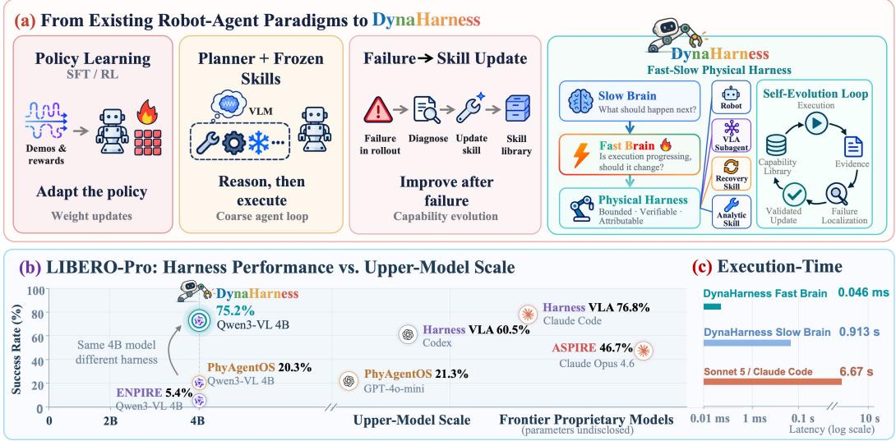  
Figure 1: DynaHarness at a glance. (a) Robot-agent paradigms and DynaHarness. (b) LIBERO-Pro success against upper-model scale (Table 1). (c) Median scheduler and Qwen call times (Table 21); Sonnet/Claude Code slow-brain pilot (Table 23).

The design question is how to govern physical execution and turn its evidence into validated revisions of reusable capabilities. Prior work offers fast progress estimation, intervention and hybrid skills (Gu et al., 2026; Deng et al., 2026; Zhang et al., 2026b; Wang et al., 2026c); we connect their execution evidence to capability revision through one command record.

We present DynaHarness (Fig. 1), a dynamic physical harness that connects semantic reasoning and physical governance through an execution contract. The Qwen3-VL-4B slow brain proposes a capability and symbolic arguments. At 2 Hz, the fast brain grounds and monitors commands, refuses unresolved actions, substitutes capabilities and requests replans as the 20 Hz controller executes. The contract bounds commands by budget and lease and records decisions and outcomes across analytic skills, recovery skills and the frozen VLA. Offline, failure attribution uses these records to locate faults within N ordered layers. The resulting evidence directs targeted revisions of reusable capabilities or execution mechanisms; paired regression checks govern admission. The record also supplies decision data for learning the fast brain. On LIBERO-Pro (Zhou et al., 2025), DynaHarness reaches 74.25% on the development block, compared with 20.3% for PhyAgentOS with the same frozen policy and Qwen3-VL-4B. After freezing, we generate 800 new states of the same cells: DynaHarness succeeds on 75.2%, versus 17.5% for the policy. Four frozen snapshots retain their development ranking on these states, gaining 14.4 percentage points against 14.3 during development. A separate paired ablation reduces success from 74.0% to 16.6% when seven analytic contact skills are removed. With the same skills, nominal one-step replanning scores 63.9% and frozen sequencing 63.8%, compared with 74.0% for Full.

The main contributions of this paper are summarized as follows:

• Structured physical capabilities. A shared physical execution contract grounds, bounds and refuses commands across analytic skills, recovery skills and a frozen VLA, recording evidence for revision.

• Fast-slow capability execution. On-demand semantic reasoning and fast physical governance coordinate capability execution through monitoring, substitution, recovery and replanning beyond nominal one-step replanning.

• Attribution-driven self-evolution. Execution records localize failures and direct targeted revisions of reusable capabilities or execution mechanisms. Paired regression checks govern their admission; frozen snapshots retain development gains on new initial states.

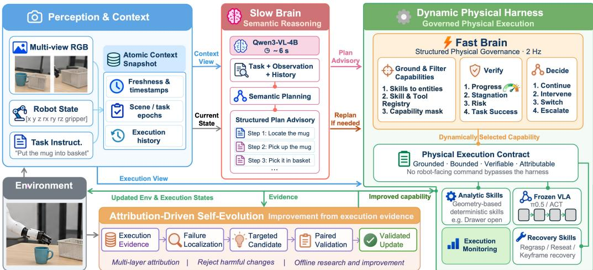  
Figure 2: Overview of DynaHarness. The slow brain plans; the fast brain governs execution; the offline loop evaluates updates from recorded evidence.

## 2 RELATED WORK

Robot agents over pretrained policies Code as Policies turns language into executable robot programs (Liang et al., 2023); VoxPoser and ReKep ground language in 3D value maps and relational keypoint constraints, respectively (Huang et al., 2023; 2025). Harness VLA composes analytic primitives with a frozen VLA for non-contact motion and contact-rich execution (Zhang et al., 2026b). EmbodiedSkills organizes observation, planning, preflight, execution, verification and recovery (Wang et al., 2026c); ETA and Show-Harness expose executable tools or semantic actions to a high-level agent (Chen et al., 2026c;b). Thea uses execution outcomes for retry and termination (Wang et al., 2026b), while PhyAgentOS provides runtime scheduling, verification and safety services separately from cognitive planning (Liu et al., 2026b). HarnessWAM combines highfrequency progress estimation with slower task management (Gu et al., 2026), and UniIntervene separates intervention triggering from recovery (Deng et al., 2026). Related work learns an outer loop over a frozen policy (Zhang et al., 2026a), studies controlled promotion (Yu, 2026; Li et al., 2026), and develops non-oracle perception or physical memory (Mi et al., 2026; Jiang et al., 2024). DynaHarness builds on these decompositions with a command contract that records grounding, refusal, execution bounds and completion for later improvement.

Self-improving robot agents Agentic Skill Discovery proposes tasks and learns corresponding skills (Zhao et al., 2026). Neuro-symbolic recovery localizes plan execution errors and replans after failure (Kalithasan et al., 2024). ASPIRE repairs execution traces and searches over programs (Lu et al., 2026), while GaP represents a policy as an editable graph and rehearses changes before deployment (Chen et al., 2026a). InSight acquires missing primitives and evaluates composition and retention (Wang et al., 2026a); ENPIRE studies policy improvement on physical hardware (Xiao et al., 2026). Zetta combines high-frequency runtime critics, recovery, hierarchical failure diagnosis and validation-gated updates (Ding et al., 2026). DynaHarness uses command-level provenance, refusal and termination records for automated diagnosis and admission of changes.

## 3 METHOD

## 3.1 OVERVIEW

DynaHarness operates at different time scales (Fig. 2). The slow brain advises the next step. The dynamic physical harness grounds commands, checks admissibility, enforces budgets and leases, routes capabilities, monitors execution, coordinates recovery and records evidence. Its fast brain governs the running command; its execution contract admits every robot-facing command. Offline, self-evolution localizes failures from this record and admits changes through paired validation. The parts exchange capabilities: bounded physical commands from a library L of analytic skills, recovery skills and vla act, which calls a frozen VLA. Control steps t run at 20 Hz, fast-brain decisions

The fast brain within one episode: push the plate to the front of the stove, goal swap[5], seed 22

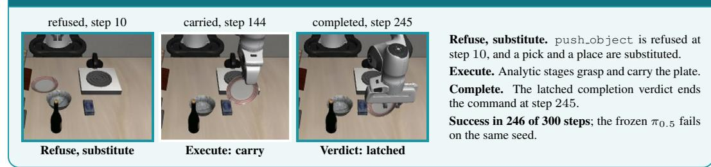  
Figure 3: The fast brain within one episode; the full episode is in Fig. 17.

k at 2 Hz, and plan steps $j$ on demand; $o _ { t } = ( I _ { t } , q _ { t } , f _ { t } )$ contains two camera views, the end-effector pose, gripper state and finger contact.

## 3.2 SLOW BRAIN: SEMANTIC REASONING

The slow brain, Qwen3-VL-4B called on demand, reads an atomic context snapshot: instruction ℓ, scene description S, current observation and history $h _ { j }$ with timestamps and scene and task epochs. It returns a structured advisory:

$$
c _ { j } = \Phi ( \ell , ~ S , ~ o _ { t } , ~ h _ { j } ) , \qquad z _ { j } = \Pi ( c _ { j } ) = ( m _ { j } , ~ \alpha _ { j } ) , \quad m _ { j } \in \mathcal { L } .\tag{1}
$$

The advisory names a capability $m _ { j }$ and symbolic arguments $\alpha _ { j } .$ , but no poses; the fast brain resolves geometry, success and refusal, and requests replans.

## 3.3 FAST BRAIN: PHYSICAL GOVERNANCE

The fast brain holds execution authority, runs deterministically at 2 Hz and governs rather than replans (Fig. 3). Ground and filter. An advised step becomes a command through a partial map

$$
\gamma _ { k } = G ( z _ { j } , \ : c _ { j } ) \in \Gamma \cup \{ \perp \} , \qquad \gamma = ( m , \ : \theta , \ : B , \ : \tau ) ,\tag{2}
$$

where θ are the physical parameters, B the step budget and τ the lease. Grounding binds executable capabilities to the state estimates available to the execution interface, checks registry entries and preconditions, and keeps a mask of eligible capabilities. If parameters or preconditions cannot be resolved, it returns the refusal ⊥ with its reason.

Monitor. At each decision, the fast brain reads progress, stagnation and risk; the execution interface accumulates completion events between decisions:

$$
v _ { k } = v _ { k - 1 } \lor \bigvee b _ { t } , \qquad v _ { - 1 } = \mathrm { f a l s e } ,\tag{3}
$$

where $\mathcal { T } _ { k }$ indexes completion checks since the preceding decision and $b _ { t }$ is the Boolean verdict. In LIBERO, it comes from the benchmark success predicate. Latching retains detected events until the fast brain reads them; detection depends on the interface’s check frequency.

Decide. The fast brain continues execution, invokes recovery, switches to another eligible capability or vla act, or requests a slow-brain replan. Commands end on local completion or failure, latched verdict $v _ { k } ,$ budget exhaustion or lease expiry.

## 3.4 PHYSICAL EXECUTION CONTRACT

No robot-facing command bypasses one contract. Grounded: a command enters the physical world only if Eq. 2 resolves its parameters and preconditions through the execution interface. Bounded: it acts only while its budget remains, its lease holds and a 50 Hz safety check passes, and a capability unable to afford its own completion refuses before it starts. Verifiable: it ends on a recorded local status, latched task verdict, budget or lease condition. Attributable: an episode evidence store logs observations, decisions, outcomes and reasons for planning and attribution (Appendix A). Refusals remain in the record even when no action is dispatched, allowing diagnosis to distinguish unresolved commands from failed capability executions.

## 3.5 CAPABILITY EXECUTION

The selected capability executes the command: $a _ { t } ~ = ~ T _ { m } ( \theta , o _ { t } )$ for an analytic skill, geometric and deterministic, or a recovery skill such as a regrasp, a re-seat or a keyframe recovery, and $a _ { t } = \pi ( o _ { t } , \ell )$ for vla act with the frozen VLA π $( \pi _ { 0 . 5 }$ in all experiments). All spend the same budget under the same lease, run under the fast brain’s monitoring and share the task-verdict interface. Analytic skills cover geometric and contact operations and can complete entire tasks. The VLA provides a learned route, including steps without an eligible analytic capability (Section 4.5). Switching executors preserves the command interface: analytic and learned actions remain subject to the same grounding, monitoring and termination rules.

## 3.6 FAILURE ATTRIBUTION

Offline self-evolution begins with execution evidence. For a failed episode i with evidence store $E _ { i }$ the diagnostic procedure returns the first matching label among N ordered diagnostic layers,

$$
\lambda _ { i } = A _ { N } ( E _ { i } ) \in \{ 1 , \ldots , N \} ,\tag{4}
$$

where N is a hyperparameter controlling diagnostic granularity. Checks cover infrastructure, context, planning, grounding, dispatch, capability execution, verification and recovery, prioritizing upstream conditions (Appendix A). Labels are assigned automatically, and the experience $e _ { i } = ( \xi _ { i } , \lambda _ { i } , y _ { i } )$ pairs its failure signature with that layer and the outcome.

## 3.7 SELF-EVOLUTION AND PAIRED VALIDATION

The attributed failure signature directs fault reproduction and a targeted revision of a reusable capability or execution mechanism. Automated paired validation evaluates the revision (Appendix A). The revision is stated in physical quantities, such as a hinge radius or hand span, rather than keyed to a task. It changes the library to $\begin{array} { r } { \mathcal { L } ^ { \prime } = \mathcal { L } \oplus \kappa ; } \end{array}$ the paired gate checks the following conditions on D:

$$
\begin{array} { r } { \sum _ { d } s _ { d } ( \mathcal { L } ^ { \prime } ) \geq \sum _ { d } s _ { d } ( \mathcal { L } ) , \sum _ { d } u _ { d } ( \mathcal { L } ^ { \prime } ) \leq \sum _ { d } u _ { d } ( \mathcal { L } ) , s _ { d } ( \mathcal { L } ^ { \prime } ) \geq s _ { d } ( \mathcal { L } ) \forall d \in \mathcal { D } _ { \pi } , x ( \mathcal { L } ^ { \prime } ) = 0 , } \end{array}\tag{5}
$$

where s counts successes in cell $d , u _ { d }$ the failures attributed to a harness layer, $\mathcal { D } _ { \pi }$ the cells the bare policy already wins, and x contaminated episodes, paired on suite, task and seed over development seeds; admission also requires broader regression checks. A revision that fails these checks is not admitted; use as a development baseline does not establish admission.

## 4 EXPERIMENTS

Experiments address three core questions: (1) Does DynaHarness improve task success over frozen-policy and agentic baselines, and do development gains transfer to new initial states (Sections 4.2–4.3)? (2) Which execution mechanisms and capabilities support performance (Sections 4.4–4.5 and 4.7)? (3) How do attribution and paired validation guide development updates (Section 4.6)?

## 4.1 EXPERIMENTAL SETUP

Benchmarks. LIBERO-Pro (Zhou et al., 2025) is our main benchmark: the Goal and LIBERO-10 suites under a task perturbation that redirects the instruction (T) and a swap perturbation that moves the objects (S), four cells of 10 tasks with 20 seeds each (800 episodes). Evolution uses development seeds 21–40; the early no-evolution comparison uses seeds 1–20. Arms are paired within each block. Post-selection evaluation uses 800 newly sampled states across 40 task–perturbation cells and 261 untouched official states across 31 cells. LIBERO-Plus (Fei et al., 2025) adds 10,030 tasks under seven perturbation categories using a separate configuration.

Implementation and baselines. Qwen3-VL-4B-Instruct is served locally; the public $\pi _ { 0 . 5 }$ LIBERO checkpoint (Physical Intelligence, 2025) stays frozen. Our controlled runs share the four LIBERO-Pro cells and benchmark success metric. PhyAgentOS (Liu et al., 2026b) and Harness VLA (Zhang et al., 2026b) also share DynaHarness’s Qwen3-VL-4B upper model, frozen $\pi _ { 0 . 5 } ,$ , evaluation budget and 800-episode protocol. We additionally run PhyAgentOS with GPT-4o-mini, and EN-PIRE (Xiao et al., 2026), Zetta and EmbodiedSkills with Qwen3-VL-4B. ASPIRE and CaP-Agent0 adaptation runs are documented in Appendix G. Upper VLM denotes the model above the policy;

a Slow-brain swap

Table 1: Success rate (%) on four LIBERO-Pro cells.
<table><tr><td>Method</td><td>Upper VLM</td><td>Goal-T</td><td>Goal-S</td><td>10-T</td><td>10-S</td><td> $\operatorname { A v g } .$ </td></tr><tr><td colspan="7">Backbone policies</td></tr><tr><td>OpenVLA</td><td>none</td><td>0.0</td><td>0.0</td><td>0.0</td><td>0.0</td><td>0.0</td></tr><tr><td>π0.5</td><td>none</td><td>0.0</td><td>38.0</td><td>1.0</td><td>8.0</td><td>11.8</td></tr><tr><td>π0.5 (our run)</td><td>none</td><td>19.5</td><td>17.5</td><td>20.0</td><td>8.0</td><td>16.2</td></tr><tr><td>π0.5-SFT</td><td>none</td><td>45.0</td><td>42.0</td><td>49.0</td><td>14.0</td><td>37.5</td></tr><tr><td>Fast-WAM</td><td>none</td><td>9.0</td><td>6.0</td><td>11.0</td><td>0.0</td><td>6.5</td></tr><tr><td colspan="7">Agentic baselines</td></tr><tr><td>PhyAgentOS</td><td>GPT-4o-mini</td><td>21.0</td><td>35.5</td><td>18.0</td><td>10.5</td><td>21.3</td></tr><tr><td>PhyAgentOS</td><td>Qwen3-VL-4B</td><td>23.0</td><td>33.5</td><td>15.5</td><td>9.0</td><td>20.3</td></tr><tr><td>EmbodiedSkills</td><td>Qwen3-VL-4B</td><td>11.0</td><td>19.5</td><td>14.5</td><td>12.5</td><td>14.4</td></tr><tr><td>ENPIRE</td><td>Qwen3-VL-4B</td><td>10.0</td><td>11.5</td><td>0.0</td><td>0.0</td><td>5.4</td></tr><tr><td>CaP-Agent0</td><td>not stated</td><td>16.8</td><td>25.6</td><td>2.4</td><td>5.2</td><td>12.5</td></tr><tr><td>RHO</td><td>Codex/Claude Code</td><td>55.6</td><td>50.6</td><td></td><td></td><td></td></tr><tr><td>SPARK</td><td>Gemini 3.1 Pro</td><td>14.0</td><td>40.0</td><td>一</td><td></td><td></td></tr><tr><td>Pigey</td><td>Claude Opus-4.7</td><td>22.0</td><td>44.0</td><td>一</td><td></td><td></td></tr><tr><td>Pigey</td><td>Claude Haiku-4.5</td><td>20.0</td><td>38.0</td><td>一</td><td></td><td></td></tr><tr><td>Pigey</td><td>Gemini 3.5 Flash</td><td>28.0</td><td>48.0</td><td>一</td><td></td><td>一</td></tr><tr><td>Pigey</td><td>GPT-5.5</td><td>24.0</td><td>44.0</td><td>一</td><td></td><td>一</td></tr><tr><td>VLS</td><td>not stated</td><td>33.5</td><td>38.0</td><td>25.5</td><td>15.5</td><td>28.1</td></tr><tr><td>Harness VLA</td><td>GPT-5.5</td><td>75.0</td><td>66.0</td><td>52.0</td><td>49.0</td><td>60.5</td></tr><tr><td>Harness VLA</td><td>Claude Opus-4.7</td><td>87.0</td><td>87.0</td><td>71.0</td><td>62.0</td><td>76.8</td></tr><tr><td>Harness VLA</td><td>Qwen3-VL-4B</td><td>14.0</td><td>7.0</td><td>3.0</td><td>0.0</td><td>6.0</td></tr><tr><td>Zetta</td><td>GPT-5.6sol</td><td>92.5</td><td>89.0</td><td>63.0</td><td>40.0</td><td>71.1</td></tr><tr><td>Zetta</td><td>Qwen3-VL-4B</td><td>0.0</td><td>0.0</td><td>0.0</td><td>0.0</td><td>0.0</td></tr><tr><td>ASPIRE</td><td>Claude Opus 4.6</td><td>45.0</td><td>81.0</td><td>38.3</td><td>22.6</td><td>46.7</td></tr><tr><td>DynaHarness</td><td>Qwen3-VL-4B</td><td>75.0</td><td>81.0</td><td>76.0</td><td>65.0</td><td>74.25</td></tr></table>

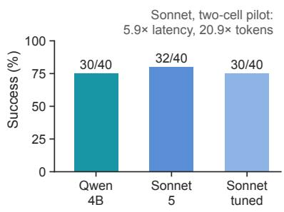

Bold/underline: largest/second $; ~ ^ { * } - ^ { * }$ unreported. DynaHarness: archived aggregate 74.25% on development seeds. Protocols: Appendix B.  
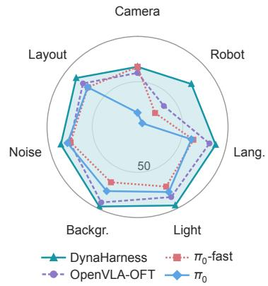

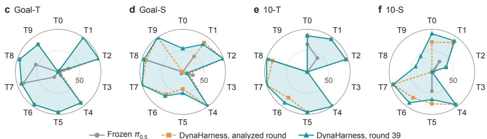  
Figure 4: Success across models, tasks and perturbations. a Sonnet 5 replacing Qwen3-VL-4B before and after prompt tuning: 40 episodes from four cells held out from tuning; cost ratios from a separate two-cell pilot. b Seven LIBERO-Plus perturbation categories and published references (Fei et al., 2025). c–f Per-task success in four LIBERO-Pro cells (20 episodes per task): frozen policy versus DynaHarness at the analyzed round and round 39.

success counts all episodes. Analyses requiring episode records identify the corresponding run; the earlier analyzed round is round 30. Appendix B gives baseline sources and settings.

## 4.2 MAIN RESULTS

Standard LIBERO. With settings adapted to standard LIBERO, DynaHarness scores 98.05%, versus 98.0% for the policy reference (Fig. 8). Both are near ceiling on these tasks; perturbed LIBERO-Pro therefore provides the main execution comparison. Its development and post-selection evaluations use the final configuration (Appendix C).

Matched controlled comparisons. With the same frozen $\pi _ { 0 . 5 }$ policy and the same Qwen3-VL-4B upper model, DynaHarness scores 74.25%, versus 20.3% for PhyAgentOS and 6.0% for Harness VLA (Table 1). The gain over the frozen policy (16.2%) is 58.0 percentage points. PhyAgentOS with GPT-4o-mini reaches 21.3%; the remaining Qwen3-VL-4B rows report our evaluated configurations. In a second measurement of the reported agent (74.1%), DynaHarness alone wins 474 paired episodes and the policy alone 11 (Appendix Fig. 13).

Table 2: Transfer and execution ablations.
<table><tr><td colspan="3">A. Frozen snapshots: success (%) Snapshot Development New states</td></tr><tr><td>stat23</td><td>60.00</td><td>60.9</td></tr><tr><td>stat28</td><td>66.25</td><td>65.9</td></tr><tr><td>stat39</td><td>72.75</td><td>74.2</td></tr><tr><td>Final</td><td>74.25</td><td>75.2</td></tr><tr><td>B. Paired execution ablations Variant</td><td>Success (%)</td><td>∆(pp)</td></tr><tr><td>Full DynaHarness  $( \mathbf { A } 2 \mathbf { c t r l } )$ </td><td>74.0</td><td></td></tr><tr><td>Nominal replanning (A2static)</td><td>63.9</td><td>-10.1</td></tr><tr><td>Frozen sequence (A2seq)</td><td>63.8</td><td>-10.3</td></tr><tr><td>No analytic contact skills</td><td>16.6</td><td>-57.4</td></tr><tr><td>No recovery/intervention</td><td>73.1</td><td>-0.9</td></tr><tr><td>Neither  $\mathrm { \ g r o u p } + \pi _ { 0 . 5 }$ </td><td>15.8</td><td>-58.2</td></tr><tr><td>Bare  $\pi _ { 0 . 5 }$ </td><td>16.2</td><td></td></tr></table>

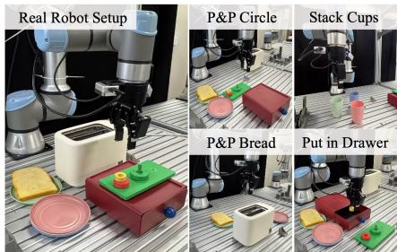  
Figure 5: Real-world setup and tasks. Workspace and four tasks.  
Table 3: Real-world success.  
A: 800 new states sampled after freezing; rank correlation +1.00. B: 800 development episodes per arm; deltas use A2ctrl (74.0%). A2static retains nominal replanning; A2seq freezes a sequence (Section 4.7).

<table><tr><td>Task</td><td>Success (%)</td></tr><tr><td>Pick and place circle</td><td>90.0</td></tr><tr><td>Stack cups</td><td>80.0</td></tr><tr><td>Pick and place bread</td><td>70.0</td></tr><tr><td>Put in the drawer</td><td>70.0</td></tr></table>

Published references and slow-brain replacement. Harness VLA reports 60.5% (Codex) and 76.8% (Claude Code) with $\pi _ { 0 . 5 } { \mathrm { - } } { \mathrm { S F T } } ,$ , and Zetta reports 71.1%. These are reference results under their published settings. Within DynaHarness, replacing Qwen3-VL-4B with Claude Sonnet 5 through a coding agent yields 80% against 75% over 40 episodes on four untuned cells, and 75% with a tuned prompt (Fig. 4a). Appendix D.2 details the scaffold and pilot latency.

Per-task profile and breadth. Gains are task-specific (Fig. 4c–f): before the drawer changes, the agent succeeds on at least 80% of seeds in 27 of 40 tasks and on none in five, four of which involve a drawer. On LIBERO-Plus, a separate configuration succeeds on 84.4% of tasks, with the lowest rates under camera and robot-state perturbations (Fig. 4b). Appendix C gives the evaluation protocols.

Real-world experiments. On hardware (Fig. 5), success reaches 90% for circle pick-and-place, 80% for cup stacking, and 70% for both bread pick-and-place and drawer placement (Table 3). Each task is evaluated in 10 trials with object positions varied across trials. Appendix B.1 describes the image-based perception setup and full task instructions.

## 4.3 POST-SELECTION TRANSFER

The 74.25% result uses the adaptive development block. With the system frozen before generating 800 new states of the same cells, DynaHarness succeeds on 75.2% versus 17.5% for frozen π0.5, a 57.8-point gain with 473 versus 11 exclusive wins. The four preregistered frozen snapshots rise from 60.9% to 65.9%, 74.2% and 75.2% (Table 2A): the ranking is preserved (Spearman $\rho = 1 . 0 0 )$ and the 14.3-point development gain becomes 14.4 points on new states. Of this transferred gain, 13.4 points accrue by stat39; the final 1.0-point increment remains uncertain $( p = 0 . 0 7 6 8 )$ . Gains over the policy range from 52.5 to 60.0 points across suites, while 10-S remains lowest at 66.5%. On 261 untouched official states spanning 31/40 cells, DynaHarness reaches 77.0%, versus 16.5% for $\pi _ { 0 . 5 } ;$ Appendix C.1 gives paired details.

## 4.4 FAST-SLOW ROBOT AGENT

Preserving transient completion events. In turn off the stove, success held from control steps 44–55, about 0.55 s. Across 20 replays, sampling every 20 steps without latching succeeds on 25%, versus 80% for the bare policy and 95% with latching and a chunk-level read (Appendix Fig. 12a). Latching preserves transient success for termination. Appendix D.2 isolates latching at a fixed sampling period; Fig. 14 reports execution rates and measured latencies.

Failures run out the budget. In the analyzed round, 254 of the 258 recorded failures ended at 99% or more of their budget, successes at a median of 67% (Fig. 6a), and across 5,805 episodes a failure spends 173 steps after its last progress against 51 for a success, 220 when the planner layer failed (Fig. 6b). These long suffixes identify where intervention could save execution, but replacing the suffix yields 22 alternative-only versus 14 control-only wins $( p = 0 . 2 4 ;$ Appendix D.1). Detecting unproductive execution and supplying an effective replacement action are therefore separate requirements. An exploratory learned fast brain also scores 74.1% (Appendix D.2).

a Episode end  
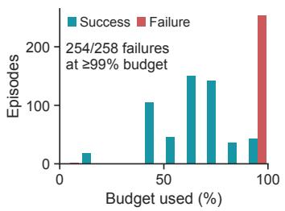

b After last progress  
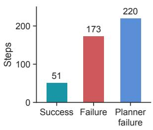  
c Post-selection success

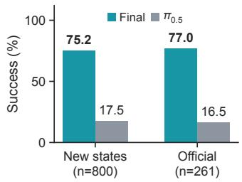

d Without and with evolution  
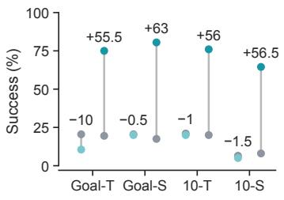  
e Evolved capabilities, round 30  
A2ctrl (seeds 21–40)

f Steps by executor  
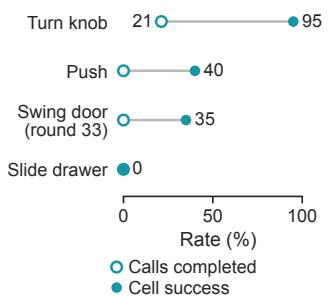

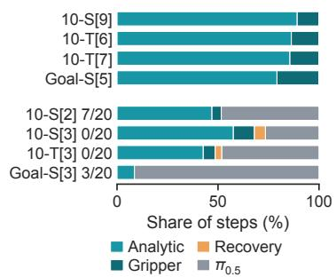  
Figure 6: Execution and transfer (top), physical harness (bottom). a Budget used at episode end. b Steps after the last progress. c Frozen champion versus policy: new states (800) and untouched official states (261). d Without and with evolution (A2ctrl on development seeds), each against the frozen policy on its own seeds. e Evolved capabilities; the frozen policy solves none of these cells. f Steps by executor: one filmed success per cell (top) and all 20 seeds of four hard cells (bottom).

## 4.5 DYNAMIC PHYSICAL HARNESS

The initial harness. On seeds 1–20, the harness without evolution succeeds on 13.9% versus 17.1% for the frozen policy (Fig. 6d): 9 of 40 cells worsen and 1 improves (Fig. 16); half the loss relates to the stove window. Development added capabilities and changed execution mechanisms.

Capability composition in recorded episodes. The records show successful episodes despite individual capability failures (Fig. 6e). turn knob object completes 21% of its invocations while its source cell improves from 0% to 95%. Refusing push object, for which the jaw is too narrow, in favor of carrying the plate illustrates a substitution in a cell that improves from 0% to 40% (Fig. 3). A local refusal can thus lead to a feasible alternative; invocation-level completion alone misses this episode-level benefit. The placement goal is preserved while the physical operation changes: the library supplies the alternative, and execution governance determines when to select it. Capability usage. Of 770 archived control episodes, 570 never invoke the VLA, with 96.7% success. Analytic execution supplies most successful behavior; policy calls concentrate in difficult episodes after analytic execution struggles (Appendix D.1). In retained failures, VLA execution reaches 91.4% of steps in the hardest cells, where no cell exceeds 35% (Fig. 6f; Appendix D.3).

## 4.6 ATTRIBUTION-DRIVEN SELF-EVOLUTION

Changes across development rounds. Across rounds, development success rose from 60.0% to 74.25%, and two rounds were not kept (Fig. 7a). In the analyzed round, 27 of 40 cells gain five or more successes over the frozen policy, 3 lose a few and 7 remain at zero (Appendix Fig. 16). Among 207 failures in the second measurement, 97 involve a drawer, 43 a stove and 30 a microwave. This concentration makes shared capability failures a concrete target for updates across multiple episodes. A capability update following attribution. Attribution charged the drawer cells to the capability layer. A targeted probe of goal swap[0] found three physical causes: the forearm wedged against

a Rounds on seeds 21–40

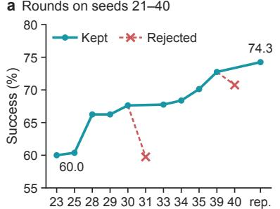  
Evaluation round (rep. = reported agent)

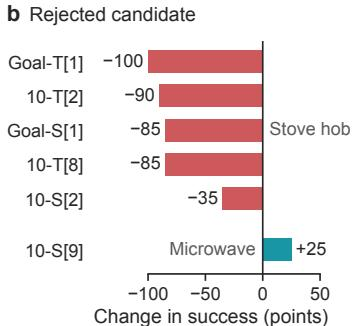

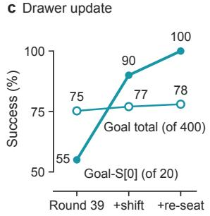

Figure 7: Development history. a Full evaluation of each round on seeds 21–40. b Change from round 30 with the rejected candidate, on the hob and microwave cells. c Drawer update.  
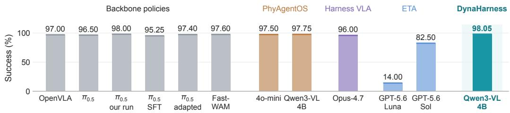  
Figure 8: Standard LIBERO success. Means over four suites; each bar matches one row of Appendix Table 8. DynaHarness uses settings adapted to standard LIBERO. Labels identify upper models for agentic baselines.

the wine rack, the closure limit rejected about a third of real grasps on the 15.4 mm handle, and the hand often sat too high after contact. Two changes stated in these quantities raised cell success from 55% to 90% and 100% over 20 seeds, and Goal success from 75.25% to 78.0% over 400 episodes (Fig. 7c). The first was an intermediate development baseline (Appendix D.4).

Broader validation after the paired gate. A candidate that passed its paired gate lost 79 successes on five stove-hob cells in the full round (Fig. 7b); reverting it restored them. Pairing controls initialstate variation, while broader validation tests whether a local fix changes behavior in other evaluated task cells. A second candidate was not kept after a lower full-round score (Appendix H). Retaining an update in the shared library therefore requires validation beyond the task cells that motivated it. The paired gate tests the targeted change, while broader evaluation checks its interaction with capabilities already used elsewhere in the library.

## 4.7 WHAT MAKES THE PHYSICAL HARNESS WORK?

Capability contribution. Removing seven analytic contact skills reduces success from 74.0% to 16.6%, near bare $\pi _ { 0 . 5 } \mathrm { ^ { \circ } s }$ 16.2%. Recovery/intervention removal yields 73.1% $( p = 0 . 2 1 ) $ ; removing both groups yields 15.8% (Table 2B). Analytic skills supply the main task competence.

Three executors, one library. On the same 800 development states, A2seq freezes an initial skill sequence (63.75%). A2static retains Full’s one-step planner interface and queries updated observations after successful nominal skills (63.88%), but disables failure-triggered replanning, substitution, reordering, recovery insertion and verifier-conditioned branching. Full retains these dynamic responses (74.0%). A2seq also changes planning horizon and output schema; A2static is the primary control (Appendix D.1).

Full exceeds A2static by 10.125 points (89/8 exclusive wins, cell-bootstrap 95% CI [3.375, 18.250], $p = 2 . 0 0 \times 1 0 ^ { - 1 8 } )$ . A2static exceeds A2seq by only 0.125 points (11/10 exclusive wins, $p = 1 )$ This joint gain extends beyond nominal replanning and exceeds the recovery-only effect. A2static already observes state changes between successful skills; Full also responds to failures and verifier feedback, adapting how the available capabilities are used.

Mechanism diagnostics. Across 783 trace-matched Full/A2static pairs, Full records 566 failure/escalation replans, 471 substitutions and 141 recovery insertions, versus zero for A2static.

A2static instead uses 534 fixed step retries and 255 plan reexecutions. These descriptive counts confirm execution-policy differences, not individual causal effects (Tables 16–18). Latching and capability ablations appear in Appendix D.2.

## 5 CONCLUSION

DynaHarness governs analytic skills, recovery skills and a frozen policy through a dynamic physical execution substrate. Failure evidence localizes faults and directs reusable capability or mechanism revisions, admitted through paired regression checks. The frozen system reaches 75.2% on new initial states of the same cells versus 17.5% for frozen π0.5; snapshot gains transfer from 14.3 points during development to 14.4 on new states. Analytic skills supply the main task competence: removing them lowers success from 74.0% to 16.6%, while closed-loop execution with the same library improves over nominal one-step replanning by 10.125 points.

## AI USE STATEMENT

We used generative AI tools, including Claude (Anthropic) and ChatGPT (OpenAI), for limited language assistance during the preparation of this paper, primarily to improve the clarity, grammar, and phrasing of selected passages. Generative AI was not used to propose hypotheses, design experiments, implement DynaHarness or the baselines, conduct experiments, analyze results, or draw scientific conclusions. All AI-assisted edits were reviewed and revised by the authors, who take full responsibility for the content, claims, and conclusions of this work. Models that form part of the evaluated systems are described separately as components of the experiments in Section 4.1.

## REPRODUCIBILITY STATEMENT

Section 4.1 and Appendices B and C specify the benchmarks, evaluation cells, seed blocks, step budgets, frozen checkpoints, planner models, and the protocol and source of each baseline result. Section 3 and Appendix A describe the execution contract and admission rule (Eq.5). Appendix I states which experiments retain per-episode records. We additionally provide an anonymized supplementary package containing the implementation of DynaHarness, evaluation configurations and scripts, and the run records used to reproduce the reported aggregate results and paired comparisons.

## REFERENCES

Kevin Black, Noah Brown, Danny Driess, Adnan Esmail, Michael Robert Equi, Chelsea Finn, Niccolo Fusai, Lachy Groom, Karol Hausman, Brian Ichter, Szymon Jakubczak, Tim Jones, Liyiming Ke, Sergey Levine, Adrian Li-Bell, Mohith Mothukuri, Suraj Nair, Karl Pertsch, Lucy Xiaoyang Shi, Laura Smith, James Tanner, Quan Vuong, Anna Walling, Haohuan Wang, and Ury Zhilinsky. π : A vision-language-action flow model for general robot control. In Proceedings of Robotics: Science and Systems, 2025. doi: 10.15607/RSS.2025.XXI.010.

Kaiyuan Chen, Shuangyu Xie, Letian Fu, Justin Yu, William Pacini, Sandeep Bajamahal, Hudson Kim, Jaimyn Drake, Daehwa Kim, Haoru Xue, Jonathan Francis, Christian Juette, Peter Schaldenbrand, Muhammet Yunus Seker, Ruwan Wickramarachchi, Uksang Yoo, Guanzhi Wang, Adithyavairavan Murali, Balakumar Sundaralingam, S. Shankar Sastry, Spencer Huang, Yuke Zhu, Linxi Fan, and Ken Goldberg. GaP: A graph-as-policy multi-agent self-learning harness for variational automation tasks. arXiv preprint arXiv:2607.05369, 2026a. URL https://arxiv.org/abs/2607.05369. Accepted at CoRL 2026.

Yanzhe Chen, Zechen Bai, Zhijun Cao, Wenzheng Zeng, Kevin Qinghong Lin, Yiqi Lin, Guoqiang Liang, Kevin Yuchen Ma, Qiming Huang, and Mike Zheng Shou. Show-Harness: Just a VLM agent can play robots. arXiv preprint arXiv:2609.10522, 2026b. URL https://arxiv.org/ pdf/2609.10522.

Yitong Chen, Zezheng Huai, Sixian Li, Yubang Wang, Haozhe Zhang, Yifei Zhang, Hechang Chen, Jingjing Gong, Yu-Gang Jiang, and Xipeng Qiu. ETA: A new agentic paradigm for embodied tasks. arXiv preprint arXiv:2608.03924, 2026c. URL https://arxiv.org/abs/2608. 03924.

Haoyuan Deng, Yitong Gao, Yudong Lin, Haichao Liu, Zhenyu Wu, and Ziwei Wang. UniIntervene: Agentic intervention for efficient real-world reinforcement learning. arXiv preprint arXiv:2606.12372, 2026. URL https://arxiv.org/abs/2606.12372.

Xin Ding, Liang Mi, Mingzhe Huang, Zixuan Wang, Chao Zhang, Zixu Hao, Fu Chen, Xiangyu Li, Yikai Zheng, Yaoyu Guo, Weijun Wang, Kun Li, Hao Wu, Yunxin Liu, and Ting Cao. Zetta: An efficient closed-loop embodied harness for self-evolving physical intelligence. arXiv preprint arXiv:2608.16590, 2026. URL https://arxiv.org/abs/2608.16590.

Karim Elmaaroufi, Justin Svegliato, Sarunas Kalade, Graham Schelle, Sanjit A. Seshia, and Matei Zaharia. RHO: Your coding agent is secretly a roboticist. arXiv preprint arXiv:2606.16458, 2026. URL https://arxiv.org/abs/2606.16458.

Senyu Fei, Siyin Wang, Junhao Shi, Zihao Dai, Jikun Cai, Pengfang Qian, Li Ji, Xinzhe He, Shiduo Zhang, Zhaoye Fei, Jinlan Fu, Jingjing Gong, and Xipeng Qiu. LIBERO-Plus: In-depth robustness analysis of vision-language-action models. arXiv preprint arXiv:2510.13626, 2025. URL https://arxiv.org/abs/2510.13626.

Letian Fu, Justin Yu, Karim El-Refai, Ethan Kou, Haoru Xue, Huang Huang, Wenli Xiao, Guanzhi Wang, Dantong Niu, Fei-Fei Li, Guanya Shi, Jiajun Wu, Shankar Sastry, Yuke Zhu, Ken Goldberg, and Linxi Fan. CaP-X: A framework for benchmarking and improving coding agents for robot manipulation. arXiv preprint arXiv:2603.22435, 2026. URL https://arxiv.org/ abs/2603.22435.

Liane Galanti, Dhruv Shah, and Tri Dao. Addressing the orchestration gap in generalist robots via physical agency. arXiv preprint arXiv:2607.21725, 2026. URL https://arxiv.org/abs/ 2607.21725.

Bryce Grant, Aryeh Rothenberg, Logan Senning, Zonghe Chua, Zach Patterson, and Peng Wang. Sequential planning via anchored robotic keypoints. arXiv preprint arXiv:2606.30613, 2026. URL https://arxiv.org/abs/2606.30613.

Zhaopeng Gu, Bingke Zhu, Tianxi Lin, Guibo Zhu, Yingying Chen, Kai Wang, Tingyu Yuan, Chaoyang Zhao, Zhaowen Li, Peng Su, and Jinqiao Wang. HarnessWAM: Bridging prediction and deliberation in world action models. arXiv preprint arXiv:2608.09516, 2026. URL https://arxiv.org/abs/2608.09516.

Wenlong Huang, Chen Wang, Ruohan Zhang, Yunzhu Li, Jiajun Wu, and Li Fei-Fei. VoxPoser: Composable 3d value maps for robotic manipulation with language models. In Proceedings ofthe 7th Conference on Robot Learning, volume 229 of Proceedings of Machine Learning Research, pp. 540–562. PMLR, 2023.

Wenlong Huang, Chen Wang, Yunzhu Li, Ruohan Zhang, and Li Fei-Fei. ReKep: Spatio-temporal reasoning of relational keypoint constraints for robotic manipulation. In Proceedings of the 8th Conference on Robot Learning, volume 270 of Proceedings of Machine Learning Research, pp. 4573–4602. PMLR, 2025.

Hanxiao Jiang, Binghao Huang, Ruihai Wu, Zhuoran Li, Shubham Garg, Hooshang Nayyeri, Shenlong Wang, and Yunzhu Li. RoboEXP: Action-conditioned scene graph via interactive exploration for robotic manipulation. arXiv preprint arXiv:2402.15487, 2024. URL https: //arxiv.org/abs/2402.15487.

Namasivayam Kalithasan, Arnav Tuli, Vishal Bindal, Himanshu Gaurav Singh, Parag Singla, and Rohan Paul. Learning to recover from plan execution errors during robot manipulation: A neurosymbolic approach. In 2024 IEEE/RSJ International Conference on Intelligent Robots and Sys tems (IROS), pp. 12632–12639, 2024. doi: 10.1109/IROS58592.2024.10801831.

Moo Jin Kim, Karl Pertsch, Siddharth Karamcheti, Ted Xiao, Ashwin Balakrishna, Suraj Nair, Rafael Rafailov, Ethan P. Foster, Pannag R. Sanketi, Quan Vuong, Thomas Kollar, Benjamin Burchfiel, Russ Tedrake, Dorsa Sadigh, Sergey Levine, Percy Liang, and Chelsea Finn. Open-VLA: An open-source vision-language-action model. In Proceedings of the 8th Conference on Robot Learning, volume 270 of Proceedings of Machine Learning Research, pp. 2679–2713. PMLR, 2025.

Zechu Li, Yufeng Jin, Xiaoyang Liu, Puze Liu, Vignesh Prasad, Carlo D’Eramo, and Georgia Chal vatzaki. HARBOR: A harness framework for agentic robot reinforcement learning. arXiv preprint arXiv:2606.08610, 2026. URL https://arxiv.org/abs/2606.08610.

Jacky Liang, Wenlong Huang, Fei Xia, Peng Xu, Karol Hausman, Brian Ichter, Pete Florence, and Andy Zeng. Code as policies: Language model programs for embodied control. In 2023 IEEE International Conference on Robotics and Automation (ICRA), pp. 9493–9500, 2023. doi: 10.1109/ICRA48891.2023.10160591.

Shuo Liu, Ishneet Sukhvinder Singh, Yiqing Xu, Jiafei Duan, and Ranjay Krishna. VLS: Steering pretrained robot policies via vision-language models. arXiv preprint arXiv:2602.03973, 2026a. URL https://arxiv.org/abs/2602.03973.

Yang Liu, Weixing Chen, Xinshuai Song, Tao Pu, Siwen Mo, Yongjie Bai, Zihao Chen, Qianran Sun, Liruo Zhong, Ying Shen, and Liang Lin. PhyAgentOS: A self-evolving operating system for embodied agents with decoupled cognitive planning and physical execution. arXiv preprint arXiv:2607.16636, 2026b. URL https://arxiv.org/abs/2607.16636. Code: https://github.com/PhyAgentOS/PhyAgentOS.

Runyu Lu, Yubo Wu, Ethan Kou, Letian Fu, Wenli Xiao, Ajay Mandlekar, Yinzhen Xu, Guanya Shi, Ken Goldberg, Ang Chen, Mosharaf Chowdhury, Yuke Zhu, Linxi Fan, and Guanzhi Wang. ASPIRE: Agentic skills discovery for robotics. arXiv preprint arXiv:2607.00272, 2026. URL https://arxiv.org/abs/2607.00272.

Boyu Mi, Mengchen Ma, Yifei Yao, Xing Gao, Junting Chen, Yangzi Li, Zihou Zhu, Guohao Li, Zhenfei Yin, Tai Wang, Yao Mu, Jiangmiao Pang, and Hanqing Wang. Exploratory, communicative, and deployable: Vision-driven embodied agents for open-world mobile manipulation. arXiv preprint arXiv:2607.13653, 2026. URL https://arxiv.org/abs/2607.13653.

Physical Intelligence. π : a vision-language-action model with open-world generalization. arXiv preprint arXiv:2504.16054, 2025. URL https://arxiv.org/abs/2504.16054.

Maggie Wang, Lars Osterberg, Stephen Tian, Ola Shorinwa, Jiajun Wu, and Mac Schwager. InSight: Self-guided skill acquisition via steerable VLAs. arXiv preprint arXiv:2606.24884, 2026a. URL https://arxiv.org/abs/2606.24884.

Qi Wang, Tianyi Wang, Chengyang Li, Shikun Ban, Yurun Chen, Yizhong Ge, Jason Qin, Chengtai Li, and Wentao Zhu. Towards the harness of embodied agents. arXiv preprint arXiv:2608.11246, 2026b. URL https://arxiv.org/abs/2608.11246.

Wei Wang, Wenqiao Zhang, Yutong Lin, Yuqian Yuan, Tianwei Lin, Jinhao Mao, Zhenxuan Fan, Mingjian Gao, Yang Dai, Wentong Li, Zheqi Lv, Zheng Dong, Yingjie Niu, Jiaqi Zhu, Jun Xiao, Chao Li, and Yueting Zhuang. EmbodiedSkills: A unified framework for orchestrating, training, and deploying VLA agents. arXiv preprint arXiv:2609.01281, 2026c. URL https://arxiv. org/abs/2609.01281.

Wenli Xiao, Jia Xie, Tonghe Zhang, Haotian Lin, Letian Fu, Haoru Xue, Jalen Lu, Yi Yang, Cunxi Dai, Zi Wang, Jimmy Wu, Guanzhi Wang, S. Shankar Sastry, Ken Goldberg, Linxi Fan, Yuke Zhu, and Guanya Shi. ENPIRE: Agentic robot policy self-improvement in the real world. arXiv preprint arXiv:2606.19980, 2026. URL https://arxiv.org/abs/2606.19980. Accepted at CoRL 2026.

Hang Yu. You don’t need to stay in the loop: An agentic robotics loop for robot-policy improvement. arXiv preprint arXiv:2608.07555, 2026. URL https://arxiv.org/abs/2608.07555.

Tianyuan Yuan, Zibin Dong, Yicheng Liu, and Hang Zhao. Fast-WAM: Do world action models need test-time future imagination? arXiv preprint arXiv:2603.16666, 2026. URL https: //arxiv.org/abs/2603.16666.

Xiaopeng Zhang, Yueyang Weng, Qi Liu, Yongjin Mu, and Yanjie Li. Learning robust execution in robotic manipulation with agentic reinforcement learning. arXiv preprint arXiv:2607.13818, 2026a. URL https://arxiv.org/abs/2607.13818.

Yixian Zhang, Huanming Zhang, Feng Gao, Xiao Li, Zhihao Liu, Chunyang Zhu, Jiaxing Qiu, Yuchen Yan, Jiyuan Liu, Wenhao Tang, et al. Harness vla: Steering frozen vlas into reliable manipulation primitives via memory-guided agents. arXiv preprint arXiv:2607.08448, 2026b.

Xufeng Zhao, Cornelius Weber, and Stefan Wermter. Agentic skill discovery. Robotics and Autonomous Systems, 196:105248, 2026. doi: 10.1016/j.robot.2025.105248.

Xueyang Zhou, Yangming Xu, Guiyao Tie, Yongchao Chen, Guowen Zhang, Duanfeng Chu, Pan Zhou, and Lichao Sun. LIBERO-PRO: Towards robust and fair evaluation of vision-languageaction models beyond memorization. arXiv preprint arXiv:2510.03827, 2025. URL https: //arxiv.org/abs/2510.03827.

Brianna Zitkovich et al. RT-2: Vision-language-action models transfer web knowledge to robotic control. In Proceedings of the 7th Conference on Robot Learning, volume 229 of Proceedings of Machine Learning Research, pp. 2165–2183. PMLR, 2023.

## APPENDIX CONTENTS

A Method Details 14   
B Experimental Setup Details 15   
C Evaluation Details 18   
D Additional Results 22   
E Case Studies 32   
F Per-Task Results 32   
G Baseline Records 34   
H Two-Stage Admission of a Recovery Candidate 36   
I Limitations 37

## A METHOD DETAILS

This section gives the parts of Section 3 that the main text states briefly.

Planning and completion interfaces. The arguments $\alpha _ { j }$ in Eq. 1 identify scene entities and goal relations. The fast brain resolves geometry and enforces refusal and termination. In LIBERO, the execution interface obtains completion from the benchmark task predicate. It records detected events independently of slow-brain calls, and the fast brain reads the accumulated verdict at its next decision. Equation 3 separates these event checks from the 2 Hz decision schedule: a Boolean OR retains detected events but cannot recover events missed by the underlying checks. This task verdict is distinct from a capability’s local completion status.

Retry, recovery and switching. When a command ends without success, the next decision belongs to the fast brain. It can ground the same step again, substitute another eligible capability, invoke a recovery skill, or hand the segment to vla act, and each choice is written to the evidence store with its reason. A refusal, or a step for which no eligible capability remains, is returned to the slow brain for a new plan. Its decisions and their outcomes are logged in a form a learned fast brain could be trained on; Appendix D.2 reports what training one produced.

The physical execution contract. Grounding records. The execution interface supplies geometric inputs for capability parameters and preconditions. In the evaluated LIBERO setup, these inputs come from simulator state; on hardware, scene information comes from camera images (Appendix B.1). The evidence store records grounding outcomes and refusal reasons. The benchmark completion predicate supplies the LIBERO task verdict separately from geometric grounding.

Budget, lease and refusal. A command carries a step budget, a lease and a velocity envelope of 2 rad/s. The budget is the binding constraint: LIBERO-Goal allows 300 environment steps, one pick-and-place costs about 230 and a single knob turn has a median cost of 211.5, so the two do not both fit in one episode. A capability that is unable to afford its own completion refuses before it starts rather than spending the episode discovering the same fact, and because the refusal is a value, its reason is written down and can later be attributed.

Latched completion verdict. Once true, the verdict stays true (Eq. 3) and is recorded with the command it ended, which separates completed commands from those that ran out of budget.

Evidence store. Each episode has an append-only store in which every observation, decision and outcome is written with the reason it was made. The same store supplies the history $h _ { j }$ of Eq. 1, the input to failure attribution, and the record self-evolution is judged against.

Safety and the robot seam. An envelope, lease and budget check runs at 50 Hz underneath both brains. The harness issues bounded, verifiable commands and does not run a servo loop, since control at 100 to 1000 Hz belongs to the robot controller; simulated, MuJoCo workcell and remote adapters sit behind the same interface. Table 4 gives the step cost of common commands.

Analytic and learned capabilities. The library offers geometric and learned execution routes. Analytic skills own the stages that measured geometry determines: approach, guarded descent, transport over a corridor and placement, computed from execution-interface geometry with grounding checks before motion. Recovery skills return the arm to a pose recorded earlier in the episode or release and retreat. The VLA is called for contact whose dynamics that geometry does not determine. Treating it as one capability rather than as the controller is what lets the fast brain stop it when the verdict latches and hold it to the same budget as an analytic skill.

Table 4: Steps per command stage, from the retained event stores.
<table><tr><td>Command</td><td>Steps</td><td>Note</td></tr><tr><td>Approach</td><td>30</td><td></td></tr><tr><td>Guarded descent</td><td>about 30</td><td>41 before the speed work</td></tr><tr><td>Close the jaw</td><td>10</td><td>0.5 s gripper command; 20 at 1.0 s</td></tr><tr><td>Lift</td><td>23</td><td></td></tr><tr><td>Carry over the corridor</td><td>60-80</td><td>depends on the corridor height</td></tr><tr><td>Lower</td><td>15</td><td></td></tr><tr><td>Release</td><td>10</td><td></td></tr><tr><td>Retreat</td><td>23</td><td></td></tr><tr><td>One pick-and-place</td><td>about 230</td><td></td></tr><tr><td>Top-drawer pull</td><td>239</td><td>297 before the wrist ramp</td></tr><tr><td>Wrist turn pair</td><td>67</td><td>108–115 before the four-step ramp</td></tr></table>

When no eligible capability grounds against the scene, or every installed route has spent its budget, the remaining steps fall to vla act. That outcome is recorded as the reason the policy was left to own the episode, and it is one of the signals failure attribution reads. Section 4.5 reports this routing behavior in retained traces.

Diagnostic granularity and ordered attribution. The hyperparameter N in Eq. 4 specifies the resolution of the diagnostic label space. It controls how finely execution evidence is partitioned into categories for candidate revision. A coarse partition can merge failures requiring different revisions; a finer partition requires evidence that distinguishes the additional categories. The relevant criterion is thus whether the command record supports a distinction that changes the candidate repair target. For example, unresolved grounding and unsuccessful execution after admission motivate different revisions even when both episodes end in task failure.

The evaluated configuration uses N = 13, spanning context and planning, grounding, dispatch, capability execution, verification, recovery and infrastructure. Let $d _ { j } ( E _ { i } )$ denote the diagnostic check for layer j. For an episode with at least one matching check, ordered attribution implements $A _ { N } ( E _ { i } ) = \operatorname* { m i n } \{ j \in \{ 1 , \cdot . . , N \} : d _ { j } ( E _ { i } ) = 1 \}$ . The ordering prioritizes upstream conditions and resolves simultaneous matches; an episode without a matching check is reported as an error. The resulting label is a diagnostic hypothesis for revision, not an identified causal effect. Here, $N = 1 3$ is a configuration choice; the reported experiments do not establish an optimal granularity or sensitivity to N.

The evolution loop. Figure 9 shows the loop and the registry it produced. The loop connects failure attribution, fault probing and targeted revision with paired validation and registry admission. Probe. The named fault is reproduced from the state the harness itself put the arm in rather than from a reset. A placement failure that exists only once a mug is already on a plate and the corridor above it is occupied does not appear in a fresh scene.

Revise. The revision is formulated in physical quantities, such as a hinge radius, a hand span or a ramp length, rather than as a branch keyed to a task identifier. These parameters expose the geometric conditions under which the revision is intended to apply.

Registry. An admitted change enters L and the next round runs on it; a rejected one is reverted rather than patched over. Section 4.6 and Appendix H report candidates that passed local screening but were not kept after the broader round. The evidence stores that drive this loop also hold every fast-brain decision with its outcome, which is the data a learned fast brain would be trained on (Appendix D.2).

## B EXPERIMENTAL SETUP DETAILS

Matched controlled comparisons. Our main LIBERO-Pro comparisons use the same four task cells and benchmark success metric. DynaHarness, PhyAgentOS and Harness VLA are evaluated with the same Qwen3-VL-4B upper model, frozen public $\pi _ { 0 . 5 }$ LIBERO checkpoint, evaluation budget and episode protocol: 10 tasks per cell and 20 episodes per task, 800 episodes in total. Success is determined by the benchmark predicate over the full denominator. DynaHarness and its frozen-policy control use development seeds 21–40; Section 4.1 and Appendix C describe our evalu ation. Table 5 summarizes the models and evaluation sizes of our runs; Table 6 records each result’s source.

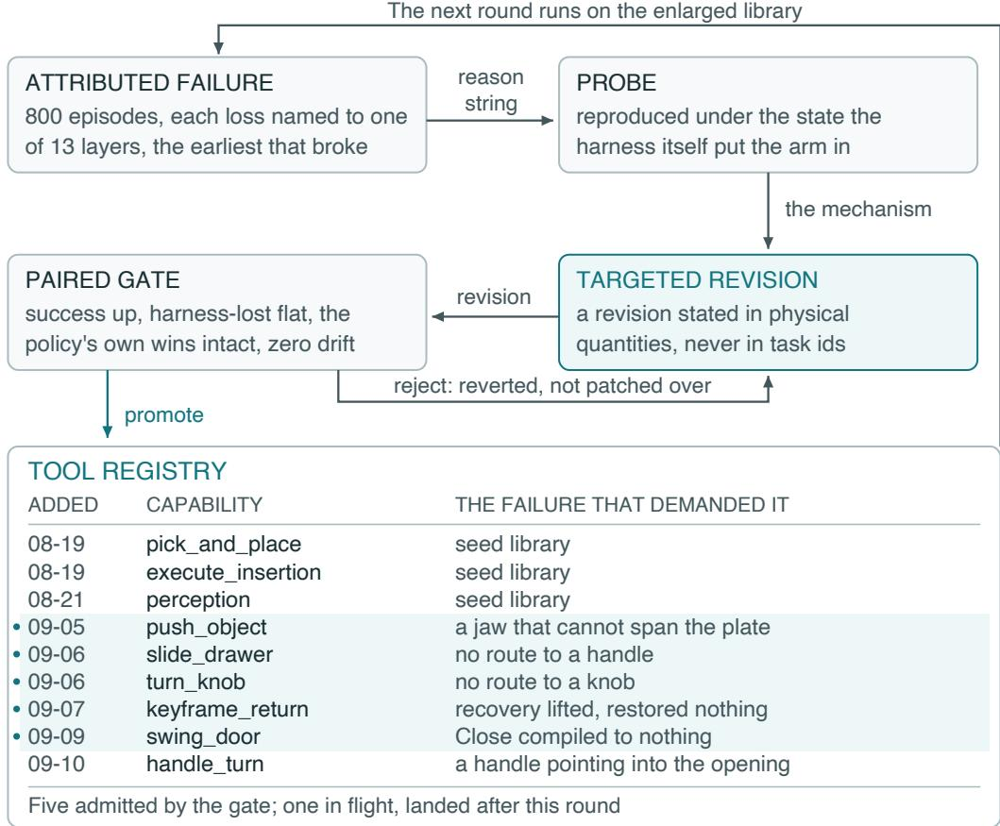  
Figure 9: The evolution loop and its registry. Registry entries track capability additions following fault probing, targeted revision and paired validation.

Step budgets are each benchmark’s own: 220, 280, 300 and 520 environment steps for the Spatial, Object, Goal and LIBERO-10 suites, kept by LIBERO-Pro.

Table 5: Models and evaluation settings of our LIBERO-Pro runs.
<table><tr><td>System</td><td>Upper model</td><td>Low-level policy</td><td>Evaluation setting</td></tr><tr><td>DynaHarness</td><td>Qwen3-VL-4B</td><td>frozen π0.5</td><td>four cells, 200 episodes each</td></tr><tr><td>π0.5 (our run)</td><td>none</td><td>frozen π0.5</td><td>four cells, 200 episodes each</td></tr><tr><td>PhyAgentOS</td><td>Qwen3-VL-4B; GPT-4o-mini</td><td>frozen π0.5</td><td>four cells, 200 episodes each</td></tr><tr><td>Harness VLA</td><td>Qwen3-VL-4B</td><td>frozen π0.5</td><td>four cells, 200 episodes each</td></tr><tr><td>ENPIRE</td><td>Qwen3-VL-4B</td><td>π0.5 via generated code</td><td>four cells, 200 episodes each</td></tr><tr><td>Zetta</td><td>Qwen3-VL-4B</td><td>π0.5 via tool interface</td><td>four cells, 200 episodes each</td></tr><tr><td>ASPIRE</td><td>Qwen3-VL-4B</td><td>generated code</td><td>four-cell campaign; no episode executed</td></tr><tr><td>CaP-Agent0</td><td>Qwen3-VL-4B</td><td>generated code and manipulation tools</td><td>four cells, 10 episodes each; pointing model disabled</td></tr><tr><td>EmbodiedSkills</td><td>Qwen3-VL-4B</td><td>not specified</td><td>four-cell campaign</td></tr></table>

Sources and table conventions. We ran DynaHarness, the frozen-policy rows labeled “our run”, all Qwen3-VL-4B harness rows, and PhyAgentOS with GPT-4o-mini; Table 6 identifies their sources. Other rows are external reported references from the corresponding papers, with the authorsupplied entries noted below. A harness with several upper models appears once per model; “–” denotes an unreported cell, and the highest and second-highest values in each column are bold and underlined, respectively, including ties. The Fast-WAM LIBERO-Pro cells and Zetta’s upper-model identity are supplied by the authors of this paper. The published Harness VLA rows use RLinf

Table 6: Source of every row of Tables 1 and 8, checked against the cited table.
<table><tr><td>Row</td><td>Source</td><td>Location and note</td></tr><tr><td>OpenVLA, π0.5</td><td>Zhou et al. (2025)</td><td>Tables 2 and 4, Average rows (Task and Pos columns); 50 episodes per task</td></tr><tr><td>π0.5 (our run)</td><td>ours</td><td>frozen πo 5 LIBERO checkpoint, seeds 21-40, all episode rows retained</td></tr><tr><td>π0.5-SFT</td><td>Zhang et al. (2026b)</td><td>Table 3, row πRLinf (RLinf pi05_libero130_fullshot)</td></tr><tr><td>Fast-WAM</td><td>authors; Yuan et al. (2026)</td><td>LIBERO-Pro cells supplied by the authors; LIBERO from Table 2 of the publication</td></tr><tr><td>CaP-Agent0</td><td>Fu et al. (2026); Lu et al.</td><td>Goal cells: CaP-X Table 7 Average (0.168, 0.256); 10-T and 10-S: ASPIRE Table 5 (0.024, 0.052)</td></tr><tr><td>RHO</td><td>(2026) Elmaaroufi et al. (2026)</td><td>Table 7 Average, RHO columns (0.556, 0.506)</td></tr><tr><td>SPARK</td><td>Grant et al. (2026)</td><td>Table 1, row Spark, Adaptive</td></tr><tr><td>Pigey</td><td>Galanti et al. (2026)</td><td>Table 15, one row per reasoner (all nine in Table 7)</td></tr><tr><td>VLS</td><td>Liu et al. (2026a)</td><td>Table I, row π0.5 (LeRobot) + VLS</td></tr><tr><td>PhyAgentOS, Zetta, ENPIRE with Qwen3-VL-4B or</td><td>ours</td><td>run summaries of the second campaign, 200 episodes per cell (aspire-phyagent.xlsx,ENPIRE_LIBERO_Pro_success_rates);</td></tr><tr><td>GPT-4o-mini Harness VLA</td><td>Zhang et al. (2026b)</td><td>the earlier 400-episode PhyAgentOS run and its per-episode records are in Appendix G Table 3, rows Harness VLA (Codex) and (CC); Avg. over these four of its eight</td></tr><tr><td>Harness VLA with</td><td>ours</td><td>cells campaign summary, 200 episodes per cell (6.0% overall; suite success</td></tr><tr><td>Qwen3-VL-4B</td><td></td><td>14.0%, 7.0%, 3.0%, 0.0%); per-episode rows were not retained</td></tr><tr><td>Zetta ASPIRE</td><td>Ding et al. (2026) Lu et al. (2026)</td><td>Table 3 Goal: Table 2 (0.45, 0.81); 10-T and 10-S: Table 5, N = 90, zero-shot</td></tr><tr><td></td><td></td><td>(0.383, 0.226)</td></tr><tr><td>EmbodiedSkills with Qwen3-VL-4B</td><td>ours</td><td>our Qwen3-VL-4B run over the four cells; author-confirmed results</td></tr><tr><td>DynaHarness</td><td>ours</td><td>archived final aggregate, seeds 21–40: 74.25%; author-confirmed suite rates. Historical paired analyses use a separate 74.1% remeasurement</td></tr><tr><td>Table 8 (LIBERO)</td><td></td><td></td></tr><tr><td>OpenVLA, π0.5 π0.5 (our run),</td><td>Zhou et al. (2025)</td><td>Tables 2 to 5, unperturbed (Ori) columns</td></tr><tr><td>PhyAgentOS,</td><td>ours</td><td>run records (DynaHarness: LIBERO configuration in Table 11)</td></tr><tr><td>DynaHarness π0.5-SFT, Harness</td><td>Zhang et al. (2026b)</td><td>Table 2</td></tr><tr><td>VLA</td><td>Wang et al. (2026c)</td><td>Table 3; the paper credits these numbers to its task-adapted low-level policy</td></tr><tr><td>π0.5, task-adapted Fast-WAM</td><td>Yuan et al. (2026)</td><td>Table 2</td></tr><tr><td>ETA</td><td>Chen et al. (2026c)</td><td>Luna: Table 2, 40 tasks × 10 seeds; Sol: Table 8, Pass@1 counts of 10 tasks per suite</td></tr></table>

$\pi _ { 0 . 5 } – \mathrm { S F T } ;$ the task-adapted $\pi _ { 0 . 5 }$ row in Table 8 is the low-level policy reported by EmbodiedSkills. Table 7 gives Pigey’s full reasoner sweep. The matched comparison controls the listed model, policy and evaluation settings; candidate-development effort and skill libraries are system-specific. ASPIRE with Qwen3-VL-4B executed no episodes, and our CaP-Agent0 adaptation disabled its pointing model. Both are documented as diagnostic runs in Appendix G, outside the main success table.

Table 7: Pigey with nine reasoners over the same frozen $\pi _ { 0 . 5 }$ (Table 15 of Galanti et al. (2026)), 10 trials per task.
<table><tr><td>Reasoner</td><td>Goal-T</td><td>Goal-S</td><td>Reasoner</td><td>Goal-T</td><td>Goal-S</td></tr><tr><td>GPT-5.5 (low)</td><td>28</td><td>42</td><td>Gemini 3.1 Pro</td><td>22</td><td>44</td></tr><tr><td>GPT-5.5 (medium)</td><td>24</td><td>44</td><td>Claude Haiku 4.5</td><td>20</td><td>38</td></tr><tr><td>GPT-5.5 (high)</td><td>26</td><td>38</td><td>Claude Sonnet 4.6</td><td>30</td><td>42</td></tr><tr><td>Gemini Rob-ER 1.6</td><td>34</td><td>44</td><td>Claude Opus 4.7</td><td>22</td><td>44</td></tr><tr><td>Gemini 3.5 Flash</td><td>28</td><td>48</td><td></td><td></td><td></td></tr></table>

Metrics and evaluation details. The primary metric is success rate over all episodes, with Wilson 95% intervals where they matter; paired comparisons report discordant pairs and an exact test. The step share of an episode is the fraction of its environment steps spent under analytic skills and under the VLA, and the conversion of a capability is its source cell’s success count before and after admission on the same seeds. Episodes lost to evaluation infrastructure count as failures. Outcome counts and run-specific processing are given below; the capability ablation diagnostics are retained in Appendix D.2. Appendix C gives the outcome composition, the evaluation history of the agent and the LIBERO-Plus protocol, and Appendix G the baseline records. The results of Section 4.6 and

Appendix D.2 are taken from the run reports and dataset manifests of the machines that produced them.

## B.1 REAL-WORLD PLATFORM AND TASK INSTRUCTIONS

Platform and visual input. The physical platform uses a Qwen 4B language model, the SAM3 visual segmentation model, a UR7e robot arm, and Intel RealSense D435 and D405 cameras (Fig. 5). Scene information is obtained from images captured by these cameras, with SAM3 providing visual segmentation. Table 3 reports success on the four tasks below. Figure 10 illustrates their execution on the physical platform.

Trial protocol. Each task is evaluated in 10 trials, for 40 trials in total. Object placements vary across trials to assess performance under position changes. Success rates are 90% for ring placement, 80% for cup stacking, and 70% each for bread and drawer placement, as reported in Table 3.

Complete task instructions. The complete instructions are given below in English translation.

1. Ring placement. “Grasp the yellow ring, place it over the green post, then release the gripper and move the robot arm away.”

2. Cup stacking. “Grasp the pink cup and place it on top of the blue cup. Then grasp the green cup and place it on top of the pink cup. ”

3. Bread placement. “Grasp the bread and place it into the left slot of the toaster, then release the gripper and move the robot arm away.”

4. Ring placement in a drawer. “Grasp the handle of the red drawer and pull the drawer open. Then grasp the yellow ring and place it inside the drawer, release the gripper and move the robot arm away, leaving the drawer open.”

## C EVALUATION DETAILS

Outcome composition and denominator. Table 9 assigns every episode of the analyzed round to an outcome, and Fig. 11 compares it with the round that carried the rejected candidate of Section 4.6. Of the 800 episodes, 88 were lost to a workcell connection that refused or dropped, which is not a decision the agent made. Every success rate in the paper counts them as failures; excluding them, the analyzed round succeeds on 76.0% over 712 episodes, compared with 67.6% over all 800 episodes.

Evaluation history. Table 12 gives each arm on both seed blocks, and Table 10 lists every full LIBERO-Pro evaluation of the agent on the development block, including the two whose changes were not kept. The analyzed round is stat30. The agent of Table 1 is stat39 with the two drawer changes of Section 4.6; the reported development aggregate is 74.25%, while a complete paired remeasurement scores 74.1%. Table 1 retains the former; historical paired analyses use the latter’s episode records. The new concurrent mechanism-ablation control scores 74.0%, and postselection results use the separate state banks in Appendix C.1. The latched verdict of Section 4.4 entered the agent in stat23.

Unperturbed LIBERO. DynaHarness achieves 98.05% with sampler settings adapted on six of the 40 standard LIBERO tasks (Table 8); the policy reference scores 98.0%. Table 11 records these configurations alongside the frozen LIBERO-Pro champion. The latter’s archived run scores 46.7%, including 1064 tick-limit failures under a 600-tick configuration: 69, 348, 149 and 498 across Spatial, Object, Goal and Long. These execution limits confound interpretation of the frozen run as a measure of transfer to standard LIBERO.

LIBERO-Plus. Table 13 gives the full breakdown. Camera viewpoint (66.5%) and robot initial state (76.1%) are the hardest categories, as they are for OpenVLA-OFT and π , and both perturb quantities that analytic stages read directly. The run used a configuration prepared for LIBERO-Plus rather than the routes of Table 8. All 1,568 failures exhausted their step budget and carry the same failure-layer label, so the explanation of the category differences given above is a hypothesis. Of the records lost to infrastructure, 242 were rerun and replaced, the last 47 with a tick limit of 2,400 instead of 600, and the sensor-noise category ran with relaxed simulator RPC waits; step budgets were unchanged and no valid failure was rerun.

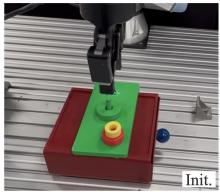

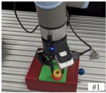

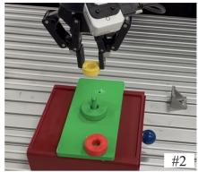  
Ring placement: "Grasp the yellow ring, place it over the green post, then release the gripper and move the robot arm away."

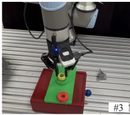

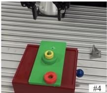

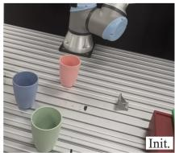

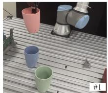

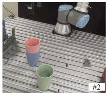

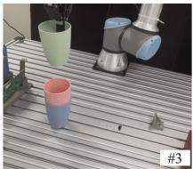

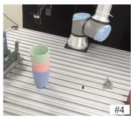

Cup stacking: "Grasp the pink cup and place it on top of the blue cup. Then grasp the green cup and place it on top of the pink cup."  
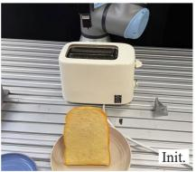

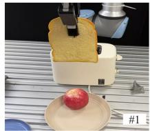

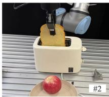

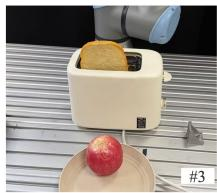

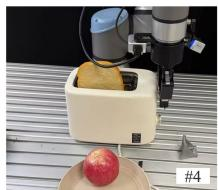  
Bread placement: "Grasp the bread and place it into the left slot of the toaster, then release the gripper and move the robot arm away."

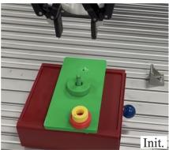

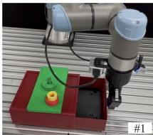

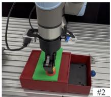

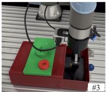

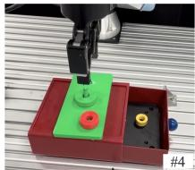  
Ring placement in a drawer: "Grasp the handle of the red drawer and pull the drawer open. Then grasp the yellow ring and place it inside the drawer, release the gripper and move the robot arm away, leaving the drawer open.'

Figure 10: Real-world execution sequences for ring placement, cup stacking, bread placement, and ring placement in a drawer (top to bottom). Each row shows the initial scene followed by four execution stages, with the corresponding language instruction below.

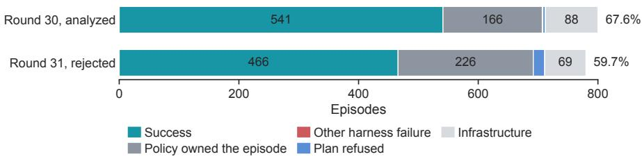  
Figure 11: Outcome composition with and without the rejected candidate. Round 31 ran 780 episodes; percentages are of each round’s episodes.

## C.1 POST-SELECTION EVALUATION

Frozen systems and state banks. The final champion (088ef2ea), its prompt, library, parameters, budgets and verifier were frozen before generating block C: 20 new states for each of 40 task–perturbation cells (800 episodes). Block B comprises 261 remaining never-inspected official states in 31 cells; it is not a complete official benchmark block. Both evaluations take place after system selection. The four snapshots were chosen before examining these results and run with their archived configurations. Their orchestration tick limits are 1200/2100 for historical snapshots and 600 for the champion; environment-step budgets are unchanged. Reported development rates are 60.00, 66.25, 72.75 and 74.25% for stat23, stat28, stat39 and the champion, respectively.

Table 8: Success rate (%) on standard LIBERO.
<table><tr><td>Method</td><td>Upper VLM</td><td>Spatial</td><td>Object</td><td>Goal</td><td>Long</td><td>Avg.</td></tr><tr><td>Backbone policies</td><td></td><td></td><td></td><td></td><td></td><td></td></tr><tr><td>OpenVLA</td><td>none</td><td>98.0</td><td>99.0</td><td>98.0</td><td>93.0</td><td>97.00</td></tr><tr><td>π0.5</td><td>none</td><td>98.0</td><td>98.0</td><td>97.0</td><td>93.0</td><td>96.50</td></tr><tr><td>π0.5 (our run)</td><td>none</td><td>99.0</td><td>99.0</td><td>98.6</td><td>95.4</td><td>98.00</td></tr><tr><td>π0.5-SFT</td><td>none</td><td>99.0</td><td>96.0</td><td>97.0</td><td>89.0</td><td>95.25</td></tr><tr><td>π0.5, task-adapted</td><td>none</td><td>99.0</td><td>98.6</td><td>98.4</td><td>93.6</td><td>97.40</td></tr><tr><td>Fast-WAM</td><td>none</td><td>98.2</td><td>100.0</td><td>97.0</td><td>95.2</td><td>97.60</td></tr><tr><td>Agentic baselines</td><td></td><td></td><td></td><td></td><td></td><td></td></tr><tr><td>PhyAgentOS</td><td>GPT-4o-mini</td><td>100.0</td><td>100.0</td><td>98.0</td><td>92.0</td><td>97.50</td></tr><tr><td>PhyAgentOS</td><td>Qwen3-VL-4B</td><td>98.0</td><td>99.0</td><td>98.0</td><td>96.0</td><td>97.75</td></tr><tr><td>Harness VLA</td><td>Claude Opus-4.7</td><td>97.0</td><td>100.0</td><td>94.0</td><td>93.0</td><td>96.00</td></tr><tr><td>ETA</td><td>GPT-5.6 Luna</td><td>8.0</td><td>26.0</td><td>21.0</td><td>1.0</td><td>14.00</td></tr><tr><td>ETA</td><td>GPT-5.6 Sol</td><td>100.0</td><td>80.0</td><td>80.0</td><td>70.0</td><td>82.50</td></tr><tr><td>DynaHarness</td><td>Qwen3-VL-4B</td><td>98.8</td><td>99.6</td><td>97.0</td><td>96.8</td><td>98.05</td></tr></table>

Bold/underline: largest/second listed value. The DynaHarness row uses settings adapted to standard LIBERO; LIBERO-Pro and postselection results use the frozen final system. Configuration records: Appendix C.

Table 9: Outcome of every episode in the analyzed round.
<table><tr><td>Outcome</td><td>Episodes</td></tr><tr><td>Success (benchmark verdict true)</td><td>541</td></tr><tr><td>Policy owned the episode</td><td>166</td></tr><tr><td>Infrastructure (socket dropped)</td><td>88</td></tr><tr><td>Plan refused</td><td>4</td></tr><tr><td>Other harness failure</td><td>1</td></tr><tr><td>Total, the reported denominator</td><td>800</td></tr><tr><td>Success over all episodes</td><td>67.6%[64.3, 70.8]</td></tr><tr><td>Success excluding infrastructure</td><td>76.0% (712 episodes) [72.7, 79.0]</td></tr></table>

Paired results and snapshot transfer. New-state gains over the frozen policy are 52.5, 58.5, 60.0 and 60.0 percentage points across Goal-T, Goal-S, 10-T and 10-S. All four frozen snapshots retain their development ordering (Spearman ρ = 1.00). From stat23 to the champion, the improvement is 14.25 points in development and 14.375 on new states. The last increment, stat39 to champion, adds 8 successes over 800 episodes with 12 versus 4 discordant wins (p = 0.0768), which does not establish a positive last-step effect at the 0.05 level. The cumulative gain and the final increment are separate claims. Table 15 reports paired differences with cell-bootstrap intervals over task– perturbation cells.

Execution accounting. Block C uses post-protocol amendment A1. The affected host, Pro4, had observed load averages of 77–101; all 187 flagged champion episodes originated there. The replacement rule was host membership: rerun every C cell–system job assigned to Pro4, including successful episodes, rather than selecting failures. All 54 jobs (19 champion and 35 historical-snapshot jobs) were rerun on U2002, Pro1 or Pro3 with at most 12 concurrent slots. Each replacement refers to the same system and state bank; other hosts’ results are retained. The original and A1 records are both preserved. The mapping below gives successes and flagged episodes out of 800 per arm.

A1 replacement accounting (800 episodes per arm).
<table><tr><td>System</td><td>Original: successes / flags</td><td>A1: successes / flags</td></tr><tr><td>stat23</td><td>487 / 18</td><td>487 / 9</td></tr><tr><td>stat28</td><td>523 / 5</td><td>527 / 3</td></tr><tr><td>stat39</td><td>574 /22</td><td>594 / 2</td></tr><tr><td>Champion</td><td>472 /187</td><td>602 / 2</td></tr></table>

Table 10: Round histories of Zetta (top; Ding et al., 2026) and DynaHarness on seeds 21–40.
<table><tr><td>Zetta round</td><td>Goal-T</td><td>Goal-S</td><td>Mean</td></tr><tr><td>π0.5</td><td>31.0</td><td>38.0</td><td>34.5</td></tr><tr><td>1</td><td>67.5</td><td>39.5</td><td>53.5</td></tr><tr><td>2</td><td>89.5</td><td>70.5</td><td>80.0</td></tr><tr><td>3</td><td>92.0</td><td>83.0</td><td>87.5</td></tr><tr><td>4</td><td>92.5</td><td>89.0</td><td>90.8</td></tr><tr><td>DynaHarness round</td><td></td><td>Episodes</td><td>Success (%)</td></tr><tr><td> $s \ t a t 2 3 ^ { a }$ </td><td></td><td>800</td><td>60.0</td></tr><tr><td> $s \ t a \ t 2 5 ^ { a }$ </td><td></td><td>800</td><td>60.4</td></tr><tr><td> ${ \tt s t a t 2 8 }$ </td><td></td><td>800</td><td>66.3</td></tr><tr><td> $\tt s t a t 2 9$ </td><td></td><td>800</td><td>66.3</td></tr><tr><td> $\mathtt { s t a t } 3 0$ </td><td></td><td>800</td><td>67.6</td></tr><tr><td> $\tt s t a t 3 1 ^ { \times }$ </td><td></td><td>780</td><td>59.7</td></tr><tr><td> $s \ t a \ t 3 3 ^ { a }$ </td><td></td><td>797</td><td>67.8</td></tr><tr><td> $\mathtt { s t a t 3 4 } ^ { a }$ </td><td></td><td>800</td><td>68.4</td></tr><tr><td> $s \ t a \ t 3 5 ^ { a }$ </td><td></td><td>800</td><td>70.1</td></tr><tr><td> $\tt s t a t s 3 9$ </td><td></td><td>800</td><td>72.8</td></tr><tr><td> $\tt s t a t 4 0  ^ { \times }$ </td><td></td><td>800</td><td>70.8</td></tr><tr><td>reported agentª</td><td></td><td>800</td><td>74.25</td></tr><tr><td>reported agent, remeasured</td><td></td><td>800</td><td>74.1</td></tr></table>

×Not promoted. aAggregate only.

Table 11: Configurations on unperturbed LIBERO (2,000 episodes each). LIBERO-adapted builds and the frozen LIBERO-Pro champion use different settings; the champion includes 1064 tick-limit failures.
<table><tr><td>Method</td><td>Spatial</td><td>Object</td><td>Goal</td><td>Long</td><td>Avg.</td></tr><tr><td>π0.5 ★</td><td>99.0</td><td>99.0</td><td>98.6</td><td>95.4</td><td>98.00</td></tr><tr><td>LIBERO stdlive8c</td><td>99.0</td><td>99.2</td><td>96.4</td><td>93.6</td><td>97.05</td></tr><tr><td>LIBERO formal1</td><td>98.4</td><td>99.6</td><td>97.4</td><td>94.8</td><td>97.55</td></tr><tr><td>LIBEROformal2</td><td>98.8</td><td>99.6</td><td>97.0</td><td>96.8</td><td>98.05</td></tr><tr><td>Frozen champion  $( 0 8 8 \mathsf { e f } 2 \mathsf { e a } )$ </td><td>86.2</td><td>30.4</td><td>69.8</td><td>0.4</td><td>46.70</td></tr></table>

Table 12: Arms on both seed blocks. Blocks are separate experiments. The final development rates correspond to 74.25% overall.
<table><tr><td>Method</td><td>Seeds</td><td>Goal-T</td><td>Goal-S</td><td>10-T</td><td>10-S</td><td>Avg.</td></tr><tr><td>π0.5, frozen</td><td>1-20</td><td>20.5</td><td>20.5</td><td>21.0</td><td>6.5</td><td>17.1</td></tr><tr><td>DynaHarness without evolution</td><td>1-20</td><td>10.5</td><td>20.0</td><td>20.0</td><td>5.0</td><td>13.9</td></tr><tr><td>π0.5, frozen</td><td>21-40</td><td>19.5</td><td>17.5</td><td>20.0</td><td>8.0</td><td>16.2</td></tr><tr><td>DynaHarness, analyzed round</td><td>21-40</td><td>75.0</td><td>69.5</td><td>73.0</td><td>53.0</td><td>67.6</td></tr><tr><td>DynaHarness, stat39</td><td>21-40</td><td>74.5</td><td>76.0</td><td>76.0</td><td>64.5</td><td>72.8</td></tr><tr><td>DynaHarness, archived final</td><td>21-40</td><td>75.0</td><td>81.0</td><td>76.0</td><td>65.0</td><td>74.25</td></tr><tr><td colspan="7">First attempts of the earlier 400-episode PhyAgentOS run</td></tr><tr><td>PhyAgentOS, GPT-4o-mini, first attempt</td><td>1-10</td><td>19.0</td><td>36.0</td><td>17.0</td><td>8.0</td><td>20.0</td></tr><tr><td>PhyAgentOS, Qwen3-VL-4B, first attempt</td><td>1-10</td><td>21.0</td><td>34.0</td><td>18.0</td><td>8.0</td><td>20.3</td></tr></table>

The frozen-policy and five-capability-withheld arms are unchanged by A1 (17.5% and 65.8%, with 0 and 51 flags). All retained flags count as failures; no episode is removed from a denominator. Block B is unchanged (champion: 77.0%, 2 flags; frozen policy: 16.5%, no flags).

Five-capability transfer check. Withholding the five evolved capabilities on block C gives 65.8%, versus 75.2% for the champion: 85 champion-only and 9 treatment-only wins (9.5 points, $p = 1 . 2 \times 1 0 ^ { - 1 6 } )$ . The treatment has 51 flagged failures versus 2 for the champion, so this contrast includes runtime effects of the removal. It is separate from the seven-contact-skill ablation on the development block in Appendix D.1.

Table 13: DynaHarness on LIBERO-Plus, one trial per task, with Wilson 95% intervals.
<table><tr><td>Perturbation category</td><td>Successes</td><td>Success (%)</td></tr><tr><td>Camera viewpoints</td><td>1063/1599</td><td>66.5 [64.1, 68.8]</td></tr><tr><td>Robot initial states</td><td>1180/1550</td><td>76.1 [73.9, 78.2]</td></tr><tr><td>Objects layout</td><td>1322/1525</td><td>86.7 [84.9, 88.3]</td></tr><tr><td>Sensor noise</td><td>1391/1601</td><td>86.9 [85.1, 88.4]</td></tr><tr><td>Language instructions</td><td>1360/1537</td><td>88.5 [86.8, 90.0]</td></tr><tr><td>Light conditions</td><td>1098/1142</td><td>96.1 [94.9, 97.1]</td></tr><tr><td>Background textures</td><td>1048/1076</td><td>97.4 [96.3, 98.2]</td></tr><tr><td>All tasks Mean over categories</td><td>8462/10030</td><td>84.4 [83.6, 85.1] 85.5</td></tr><tr><td>Spatial tasks</td><td>2129/2402</td><td>88.6</td></tr><tr><td>Object tasks</td><td>2237/2518</td><td>88.8</td></tr><tr><td>Goal tasks</td><td>2097/2591</td><td>80.9</td></tr><tr><td>LIBERO-10 tasks</td><td>1999/2519</td><td>79.4</td></tr></table>

Table 14: Post-selection success rates (%) by suite. C: 200 newly sampled states per suite. B: untouched official states, with 73, 66, 77 and 45 episodes in the listed suites, respectively.
<table><tr><td>Suite</td><td>C: DynaHarness</td><td> ${ \mathrm { C } } ; { \pi } _ { 0 . 5 }$ </td><td>B: DynaHarness</td><td> $\mathrm { B } ; \pi _ { 0 . 5 }$ </td></tr><tr><td>Goal-T</td><td>79.0</td><td>26.5</td><td>78.1</td><td>26.0</td></tr><tr><td>Goal-S</td><td>78.0</td><td>19.5</td><td>81.8</td><td>25.8</td></tr><tr><td>10-T</td><td>77.5</td><td>17.5</td><td>75.3</td><td>7.8</td></tr><tr><td>10-S</td><td>66.5</td><td>6.5</td><td>71.1</td><td>2.2</td></tr><tr><td>Episodes</td><td>800</td><td>800</td><td>261</td><td>261</td></tr><tr><td>Success (%)</td><td>75.2</td><td>17.5</td><td>77.0</td><td>16.5</td></tr></table>

Table 15: Paired post-selection comparisons. W/L are exclusive wins of the first/second system. Intervals are cell-bootstrap 95% intervals; p is a two-sided exact test of discordant pairs.
<table><tr><td>Block</td><td>Comparison</td><td>n</td><td>W/L</td><td>∆ (pp)</td><td>95%CI</td><td>p</td></tr><tr><td>C</td><td>Champion vs. π0.5</td><td>800</td><td>473/11</td><td>57.75</td><td>[45.75, 70.00]</td><td> $3 . 1 3 \times 1 0 ^ { - }$  -124</td></tr><tr><td>B</td><td>Champion vs. π0.5</td><td>261</td><td>161/3</td><td>60.54</td><td>[44.44, 75.27]</td><td> $6 . 2 9 \times 1 0 ^ { - 4 4 }$ </td></tr><tr><td>C</td><td>Champion vs. stat23</td><td>800</td><td>137/22</td><td>14.38</td><td>[6.62, 23.62]</td><td> $1 . 7 0 \times 1 0 ^ { - 2 1 }$ </td></tr><tr><td>C</td><td>Champion vs. stat28</td><td>800</td><td>93/18</td><td>9.38</td><td>[3.88, 16.00]</td><td> $2 . 2 6 \times 1 0 ^ { - 1 3 }$ </td></tr><tr><td>C</td><td>Champion vs. stat39</td><td>800</td><td>12/4</td><td>1.00</td><td>[0.00, 2.62]</td><td>0.0768</td></tr><tr><td>C</td><td>stat28 vs. stat23</td><td>800</td><td>65/25</td><td>5.00</td><td>[0.12, 11.50]</td><td> $2 . 9 7 \times 1 0 ^ { - 5 }$ </td></tr><tr><td>C</td><td>stat39 vs. stat28</td><td>800</td><td>86/19</td><td>8.38</td><td>[3.50, 14.37]</td><td> $2 . 3 0 \times 1 0 ^ { - 1 1 }$ </td></tr></table>

## D ADDITIONAL RESULTS

This section gives the full account behind the insights of Sections 4.4 to 4.7, including the records that the main text summarizes and the diagnostic comparisons moved here (Fig. 12).

## D.1 CAPABILITY AND CLOSED-LOOP EXECUTION ABLATIONS

Protocol and interventions. Each arm covers the same 800 development episodes (seeds 21– 40), paired by task, perturbation and initial state. The capability-removal arms share frozen π , Qwen3-VL-4B, prompts, parameters and environment-step budgets with their concurrent control. The same-skill A2static and A2seq comparisons reuse that 74.0% control (A2ctrl), separately from the 74.25% development headline and post-selection evaluations. A2static retains the original onestep planner interface with nominal replanning; A2seq freezes a full initial sequence, as detailed below. Seven analytic contact skills are removed from the registered action set in the analytic arm; six recovery/intervention capabilities are removed in the recovery arm. Removing both retains the planner, grounding, completion checks, latching, budgets and frozen VLA. Capability removal is verified from executed skill traces. Contrasts are not additive decompositions.

Where performance changes. Analytic-skill removal costs 96, 129, 121 and 113 successes across the four suites, reducing every suite to 27.0% success or below. Recovery removal costs 7 successes overall; 7 are in 10-T, with the other suites changing by −1, 0 and +1. Planning and the execution contract alone, with both groups removed, score 15.8%, near the bare policy’s 16.2%. With the library retained, A2static and A2seq lose 81 and 82 net successes to Full. A2static adds only one net success to A2seq, so nominal replanning alone does not reproduce the dynamic executor’s performance. The 74.0% versus 74.1% inert-switch replicate (800 episodes per arm, 5/6 discordant pairs, p = 1) provides a same-program variation reference; its difference is not subtracted from these effects.

a Latched verdict  
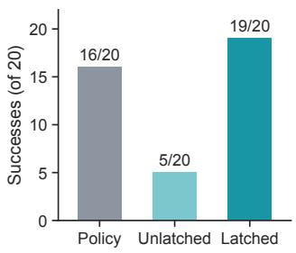

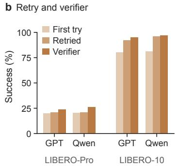

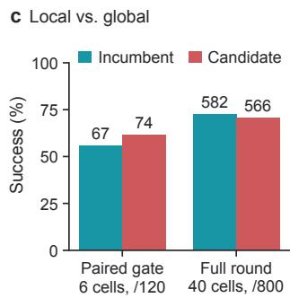

Figure 12: Supporting panels. a Replayed stove requests. b PhyAgentOS retries and verifier. c Paired gate against full round for candidate C2.  
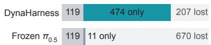  
Figure 13: Paired outcomes with the frozen $\pi _ { 0 . 5 }$ on the same 800 episodes (second measurement, 74.1%); each bar: won by both, won by this arm only, lost.

Table 16: Capability and executor ablations by suite. All arms have 800 episodes, 200 per suite. Flags denote tick-limit or transport contamination, counted as failures; a dash denotes an unreported count. The bare-policy row is the archived same-block reference.
<table><tr><td>Arm</td><td>Goal-T</td><td>Goal-S</td><td>10-T</td><td>10-S</td><td>Total</td><td>Flags</td></tr><tr><td>Full DynaHarness</td><td>150</td><td>161</td><td>152</td><td>129</td><td>592</td><td>7</td></tr><tr><td>Nominal replanning (A2static)</td><td>130</td><td>150</td><td>117</td><td>114</td><td>511</td><td>一</td></tr><tr><td>Frozen sequence (A2seq)</td><td>130</td><td>159</td><td>115</td><td>106</td><td>510</td><td>0</td></tr><tr><td>No analytic contact skills</td><td>54</td><td>32</td><td>31</td><td>16</td><td>133</td><td>8</td></tr><tr><td>No recovery/intervention</td><td>149</td><td>161</td><td>145</td><td>130</td><td>585</td><td>7</td></tr><tr><td>Neither capability group</td><td>47</td><td>31</td><td>36</td><td>12</td><td>126</td><td>4</td></tr><tr><td>VLA unavailable</td><td>130</td><td>159</td><td>151</td><td>124</td><td>564</td><td>221</td></tr><tr><td>Inert-switch replicate (A2e1)</td><td>150</td><td>162</td><td>152</td><td>129</td><td>593</td><td>7</td></tr><tr><td>Bare π0.5</td><td>39</td><td>35</td><td>40</td><td>16</td><td>130</td><td></td></tr></table>

Capability provenance. The initial library contained policy execution, pick-and-place and perception. The dated registry records later additions for pushing (September 5), drawer sliding and knob turning (September 6), keyframe recovery (September 7), and door swinging (September 9). Existing execution mechanisms were also revised, including completion latching and drawer grasp geometry. Thus the seven-contact-skill removal tests the final library, which combines initial and subsequently added or refined capabilities. The separate five-capability removal tests documented additions; neither intervention removes the entire development process.

Policy invocation. In 770 archived control event stores, 570 episodes do not invoke $\pi _ { 0 . 5 } \colon 9 6 . 7 \%$ succeed, versus 6.0% among the 200 episodes that do. The original 800-episode development event set similarly has 73% zero-policy episodes. The new-state event stores cover 777/800 episodes, of which 570 (73.4%) never invoke the policy; the official-state block has 193/261 (73.9%). These are conditional descriptions: policy calls concentrate in hard episodes after analytic execution struggles, rather than forming a randomized comparison of policy use. This execution pattern is consistent with the role of analytic capabilities as the main source of task competence and the VLA as an available learned route. The same-skill executor comparisons separately evaluate closed-loop use of the library (Appendix D.1).

Table 17: Paired executor and capability comparisons. W/L are wins exclusive to the first/second arm; differences are first minus second. A uses cell-bootstrap 95% intervals. Full/A2seq bootstrap estimates use 20,000 whole-cell resamples, seed 20260926. All p values are exact two-sided sign tests.  
A. Aggregate contrasts
<table><tr><td>Comparison (Full minus treatment unless named)</td><td>W/L</td><td>∆(pp)</td><td>95% CI</td><td>Exact p</td></tr><tr><td>Nominal replanning (A2static)</td><td>89/8</td><td>10.125</td><td>[3.375, 18.250]</td><td> $2 . 0 0 \times 1 0 ^ { - 1 8 }$ </td></tr><tr><td>Frozen sequence (A2seq)</td><td>93/11</td><td>10.25</td><td>[3.50, 18.25]</td><td> $2 . 4 9 \times 1 0 ^ { - 1 7 }$ </td></tr><tr><td>A2static minus A2seq</td><td>11/10</td><td>0.125</td><td> $[ - 3 . 0 0 0 , 2 . 8 7 5 ]$ </td><td>1.00</td></tr><tr><td>No analytic contact skills</td><td>469/10</td><td>57.38</td><td>[45.62, 69.00]</td><td> $2 . 0 9 \times 1 0 ^ { - 1 2 4 }$ </td></tr><tr><td>No recovery/intervention</td><td>15/8</td><td>0.88</td><td>[−0.38, 2.62]</td><td>0.21</td></tr><tr><td>Neither capability group</td><td>473/7</td><td>58.25</td><td>[46.62, 69.62]</td><td> $7 . 2 5 \times 1 0 ^ { - 1 3 0 }$ </td></tr><tr><td>VLA unavailable</td><td>32/4</td><td>3.50</td><td>[0.00, 9.25]</td><td> $1 . 9 4 \times { { 1 0 } ^ { - 6 } }$ </td></tr><tr><td>Inert-switch replicate (A2e1)</td><td>5/6</td><td>-0.125</td><td></td><td>1.00</td></tr></table>

<table><tr><td colspan="5">B. Full versus A2static: paired outcomes</td></tr><tr><td>Suite</td><td>W/L</td><td>Ties</td><td>∆(pp)</td><td>Exact p</td></tr><tr><td>All</td><td>89/8</td><td>703</td><td>10.125</td><td> $2 . 0 0 \times 1 0 ^ { - 1 8 }$ </td></tr><tr><td>Goal-T</td><td>20/0</td><td>180</td><td>10.0</td><td> $1 . 9 1 \times 1 0 ^ { - 6 }$ </td></tr><tr><td>Goal-S</td><td>14/3</td><td>183</td><td>5.5</td><td>0.0127258</td></tr><tr><td>10-T</td><td>35/0</td><td>165</td><td>17.5</td><td> $5 . 8 2 \times { { 1 0 } ^ { - 1 1 } }$ </td></tr><tr><td>10-S</td><td>20/5</td><td>175</td><td>7.5</td><td> $0 . 0 0 4 0 7 7 3 2$ </td></tr></table>

Paired Wald 95% CIs: Full/A2static [7.816, 12.434] pp; A2static/A2seq [−0.998, 1.248] pp.

C. Full versus A2seq: aggregate and suite-level estimates
<table><tr><td>Suite</td><td>W/L</td><td>∆ (pp)</td><td>Wald 95% CI</td><td>Cell-bootstrap 95% CI</td><td>Exact p</td></tr><tr><td>All</td><td>93/11</td><td>10.25</td><td>[7.85, 12.65]</td><td>[3.50, 18.25]</td><td> $2 . 4 9 \times 1 0 ^ { - 1 7 }$ </td></tr><tr><td>Goal-T</td><td>20/0</td><td>10.00</td><td>[5.84, 14.16]</td><td>[0.00, 29.00]</td><td> $1 . 9 1 \times 1 0 ^ { - 6 }$ </td></tr><tr><td>Goal-S</td><td>9/7</td><td>1.00</td><td>[−2.92, 4.92]</td><td>[-2.50, 5.00]</td><td> $0 . 8 0 3 6 1 9$ </td></tr><tr><td>10-T</td><td>37/0</td><td>18.50</td><td>[13.12, 23.88]</td><td>[2.00, 40.01]</td><td> $1 . 4 6 \times 1 0 ^ { - 1 1 }$ </td></tr><tr><td>10-S</td><td>27/4</td><td>11.50</td><td>[6.28, 16.72]</td><td>[1.00, 24.00]</td><td> $3 . 4 0 \times 1 0 ^ { - 5 }$ </td></tr></table>

VLA-unavailable condition. Removing the sole policy-calling capability gives 70.5%. Its 3.5- point loss includes routing and planning effects: the planner makes 17.01 calls and 4.69 proposals naming a removed capability per archived episode, with 221 flagged failures. The loss is therefore only an upper-bound proxy for VLA contribution, combining policy availability with the routing and runtime effects of removal.

Intervention at matched failure states. A replay study compared an alternative action with the control suffix from the same state: 22 alternative-only wins versus 14 control-only wins $( p = 0 . 2 4 )$ or 13.0% versus 9.4% success. A subsequent 120-episode, 342-branch validation on seeds 41–70 found 22.2% success over 54 episodes for both close and lift and its control, and 7.1% versus 19.0% over 42 episodes for release and retreat. These measurements do not show that a single substitution reliably recovers the observed failure states.

Intervention bookkeeping. The analytic treatment uses registry-removal revision N2, verified from executed skill traces. Grounding, command budgets and leases remain enabled in all treatments. The recovery arm also retains planning and verification, so it is not a separate state-machine baseline. Attribution and admission govern development and are not isolated by these frozen runtime interventions.

Nominal one-step replanning. A2static retains the analytic capability library and Full’s original one-step planner interface. After successful completion of a nominal skill, it may query the planner using the updated observation for the next nominal skill. It disables failure/escalation-triggered replanning, capability substitution, dynamic reordering, recovery insertion and verifier-triggered branch changes. Failures instead invoke fixed retries and plan reexecution. Thus the three-way comparison progresses from frozen sequencing (A2seq), through nominal replanning (A2static), to Full’s state-dependent dynamic execution, without removing analytic skills.

Full and A2static share 503 successes and 200 failures, with 89 Full-only and 8 A2static-only successes. A2static and A2seq share 500 successes and 279 failures, with 11 A2static-only and 10

Table 18: Routing, coverage and execution diagnostics. A: prior routing archive. B: result and trace coverage for the executor comparisons. C: common 783 Full/A2static pairs. D: all 800 A2static/A2seq pairs. Event counts are descriptive, may overlap, and do not identify individual causal contributions.
<table><tr><td>A. Prior routing archive</td><td></td><td></td><td></td><td></td></tr><tr><td>Arm/block</td><td>Event stores</td><td>Zero VLA (%)</td><td>VLA calls/ep.</td><td>Planner calls/ep.</td></tr><tr><td>A2 full control</td><td>770</td><td>74</td><td>2.39</td><td>3.68</td></tr><tr><td>No analytic contact skills</td><td>800</td><td>0</td><td>18.34</td><td>4.12</td></tr><tr><td>No recovery/intervention</td><td>750</td><td>75</td><td>2.11</td><td>4.09</td></tr><tr><td>Neither capability group</td><td>800</td><td>0</td><td>18.52</td><td>4.06</td></tr><tr><td>VLA unavailable</td><td>705</td><td>≈ 100</td><td>0.00</td><td>17.01</td></tr><tr><td>Champion, B</td><td>261 777</td><td>74 73</td><td>2.30</td><td>3.02</td></tr><tr><td>Champion, C</td><td></td><td></td><td>2.19</td><td>3.84</td></tr></table>

<table><tr><td colspan="4">B. Same-skill executor coverage</td></tr><tr><td>Arm</td><td>Valid result rows</td><td>Complete event traces</td><td>Paired traces</td></tr><tr><td>Full (A2ctrl)</td><td>800</td><td>783</td><td>783</td></tr><tr><td>A2static</td><td>800</td><td>800</td><td>783</td></tr><tr><td>A2seq</td><td>800</td><td>800</td><td>783</td></tr></table>

<table><tr><td>C. Full/A2static: 783 common traces Metric</td><td>Full</td><td>A2static</td></tr><tr><td>Planner calls</td><td>2,860</td><td>1,829</td></tr><tr><td>Post-initial planner calls</td><td>1,747</td><td>1,046</td></tr><tr><td>Failure/escalation replans</td><td>566</td><td>0</td></tr><tr><td>Capability substitutions</td><td>471</td><td>0</td></tr><tr><td>Capability-ID switches after substitution</td><td>327</td><td>0</td></tr><tr><td>Recovery insertions</td><td>141</td><td>0</td></tr><tr><td>Verifier-stagnation branch changes</td><td></td><td>0</td></tr><tr><td>Fixed-step retries</td><td>352 0</td><td>534</td></tr><tr><td>Fixed-plan reexecutions</td><td></td><td>255</td></tr><tr><td>Fixed retry exhaustion</td><td>0</td><td>241</td></tr><tr><td>Same-capability/arguments retries after failure</td><td>0 26</td><td>587</td></tr><tr><td>Rejected plans</td><td>205</td><td>59</td></tr><tr><td>Environment steps</td><td>243,530</td><td>190,107</td></tr><tr><td>D. A2static/A2seq: all 800 traces</td><td></td><td></td></tr><tr><td>Metric</td><td>A2static</td><td>A2seq</td></tr><tr><td>Planner calls</td><td>1,846</td><td>800</td></tr><tr><td>Post-initial planner calls</td><td>1,046</td><td>0</td></tr><tr><td>Capability substitutions</td><td>0</td><td>0</td></tr><tr><td>Failure/escalation replans</td><td>0</td><td>0</td></tr><tr><td>Recovery insertions</td><td>0</td><td>0</td></tr><tr><td>Verifier-stagnation branch changes</td><td>0</td><td>0</td></tr></table>

A2seq-only successes. Table 17 reports aggregate paired uncertainty and suite-level outcomes. The 0.125-point nominal-replanning increment has Wald 95% CI [−0.998, 1.248] and cell-bootstrap CI [−3.000, 2.875]; this is an observed small difference, not an equivalence test. Full’s 10.125-point gain over A2static evaluates its dynamic mechanisms jointly and is broader than the 0.9-point effect of withholding dedicated recovery/intervention capabilities. These are comparisons on the development block, not unseen-task evaluations.

All three arms have 800 outcomes on the same official initial states. A2static and A2seq have 800 event traces each; paired diagnostics with Full use its 783 available traces. Table 18 distin guishes this common subset from the complete A2static/A2seq comparison. The latter records 1,046 additional planner calls in A2static, while substitutions, failure replans, recovery insertions and verifier-stagnation branches remain zero in both arms. Nominal online planning therefore oc curs as intended, but does not reproduce Full’s aggregate performance. The event counts document execution behavior rather than assigning success gains to individual branches.

Same-skill sequential executor. The A2seq protocol dated September 26, 2026 evaluates 40 LIBERO-Pro cells on official initial states indexed by seeds 21–40, paired with the existing A2ctrl measurement. All analytic capabilities, recovery skills, tools and frozen pi05 libero remain mounted. Both use Qwen3-VL-4B, the same initial observation/state contents, grounding, skillcompletion predicates, benchmark verifier, task-success criterion and low-level safety gates. Shared planner settings are temperature 0.1, 2048 tokens per call, 90 s timeout, 180 s plan validity and one serialization-repair allowance. Environment budgets remain 300/520 steps and 600 ticks.

A2seq makes one initial planning request, freezes a complete ordered sequence with explicit arguments, and executes it strictly in order. A failed step is retried once; after exhausting that retry, the same single-step plan is replayed once with one further same-step retry. Precondition blockage for 12 decision ticks counts as a failure, and an unresolvable binding terminates execution. Postexecution planner calls, online replanning, reordering, recovery insertion, capability substitution and unplanned dispatch are disabled. Recovery capabilities can still appear in the initial plan. The nextcapability output schema of Full is replaced by a complete-sequence schema; the contrast therefore includes upfront planning and the loss of receding-horizon planning, as well as execution policy. It does not isolate one scheduler component.

Paired outcome and scope. Over 800 episodes per arm, Full scores 74.00% (Wilson 95% CI [70.85, 76.92]), versus 63.75% for A2seq ([60.36, 67.01]). The 93 Full-only and 11 A2seq-only successes yield +10.25 points; 499 pairs both succeed and 197 both fail. Table 17 reports paired uncertainty; this supporting comparison pools all 800 pairs, with suite-level estimates describing its distribution. A2seq ran on U2002, whereas A2ctrl is a historical multi-host measurement. Date, machine and unseeded planner or policy stochasticity remain nuisance factors. This developmentblock comparison evaluates execution design, not blind generalization to unseen tasks.

Completeness and execution audit. Both arms have 800 valid measurement rows, with zero initial-state pairing mismatches and no missing results. Full’s 7 tick-limit stops count as failures; A2seq has none. Full has complete trajectories for 783 episodes; the 17 missing traces are libero goal task[7], seeds 24–40. Their valid results remain in the 800-pair success statistics. A2seq has all 800 traces; event comparisons use only the 783 common pairs (Table 18). Before scoring, 3 paired smoke cases, 187 unit/regression tests and 58 smoke/consistency checks passed; 297 source/configuration files were frozen and verified, with matching BDDL and officialstate hashes across hosts. The post-run audit verified one initial planner call per A2seq episode, frozen ordering and arguments, bounded retries, and no dynamic branch or unplanned dispatch. Historical champion results were not modified.

Table 19: Full versus A2seq: execution diagnostics. A: directly recorded whole-run totals. B: events or steps on the 783 pairs with both trajectories. Rows may overlap and are not independent causal effects.
<table><tr><td>Metric</td><td>Full</td><td>A2seq</td></tr><tr><td>A. Whole run: 800 episodes per arm</td><td></td><td></td></tr><tr><td>Planner calls</td><td>2,875</td><td>800</td></tr><tr><td>Environment steps</td><td>244,523</td><td>188,038</td></tr><tr><td>Environment-budget exhaustion</td><td>201</td><td>17</td></tr><tr><td>Tick-budget exhaustion</td><td>7</td><td>0</td></tr><tr><td>B. Common event traces: 783 pairs</td><td></td><td></td></tr><tr><td>Capability substitutions</td><td>471</td><td>0</td></tr><tr><td>Dispatched capability-ID switches after substitution</td><td>327</td><td>0</td></tr><tr><td>Same-ID substitutions</td><td>70</td><td>0</td></tr><tr><td>Failure/escalation replans</td><td>566</td><td>0</td></tr><tr><td>Fixed-plan reexecutions</td><td>0</td><td>230</td></tr><tr><td>Fixed retry exhaustion</td><td>0</td><td>218</td></tr><tr><td>Fixed step retries</td><td>0</td><td>494</td></tr><tr><td>Post-initial planner calls</td><td>1,747</td><td>0</td></tr><tr><td>Recovery insertions</td><td>141</td><td>0</td></tr><tr><td>Planned</td><td>93</td><td>0</td></tr><tr><td>Scheduler</td><td>48</td><td>0</td></tr><tr><td>Verifier-stagnation branch changes</td><td>352</td><td>0</td></tr><tr><td>Rejected plans</td><td>205</td><td>36</td></tr><tr><td>Environment steps</td><td>243,530</td><td>188,038</td></tr><tr><td>Environment-budget exhaustion</td><td>200</td><td>17</td></tr></table>

Execution differences. Table 19 confirms that Full uses replanning, substitution and recovery insertion, while A2seq uses fixed retries and plan replay. The counts verify the intended executionpolicy difference; success is assessed by the paired outcomes, rather than by treating event types as independent contributions.

Table 20: First dispatch divergence on 783 trace-matched pairs. F/S: Full-only/A2seq-only success; both columns denote shared outcomes. Categories are descriptive associations with the eventual result.
<table><tr><td>First divergence</td><td>Pairs</td><td>F</td><td>S</td><td>Both succeed</td><td>Both fail</td></tr><tr><td>Identical dispatches</td><td>468</td><td>0</td><td>0</td><td>468</td><td>0</td></tr><tr><td>Spent-capability substitution</td><td>109</td><td>16</td><td>3</td><td>12</td><td>78</td></tr><tr><td>Planned recovery insertion</td><td>84</td><td>18</td><td>1</td><td>0</td><td>65</td></tr><tr><td>Initial planner choice differs</td><td>61</td><td>22</td><td>6</td><td>19</td><td>14</td></tr><tr><td>Scheduler recovery insertion</td><td>27</td><td>2</td><td>0</td><td>0</td><td>25</td></tr><tr><td>Online planner selection</td><td>19</td><td>10</td><td>1</td><td>0</td><td>8</td></tr><tr><td>Failure/escalation replan</td><td>7</td><td>5</td><td>0</td><td>0</td><td>2</td></tr><tr><td>Nominal fallback</td><td>4</td><td>0</td><td>0</td><td>0</td><td>4</td></tr><tr><td>Held-object mismatch substitution</td><td>3</td><td>3</td><td>0</td><td>0</td><td>0</td></tr><tr><td>Precondition substitution</td><td>1</td><td>1</td><td>0</td><td>0</td><td>0</td></tr><tr><td>Total with both traces</td><td>783</td><td>77</td><td>11</td><td>499</td><td>196</td></tr></table>

Across the 468 pairs with identical dispatches, both executors succeed. Differences concentrate on the remaining pairs, where Full changes capabilities, inserts recovery or makes additional planning decisions; 61 pairs already differ in their initial planner choice (Table 20). This supports the aggregate closed-loop comparison while retaining the planning format distinction. The 17 pairs lacking Full traces have no assigned category.

## D.2 FAST-SLOW ROBOT AGENT

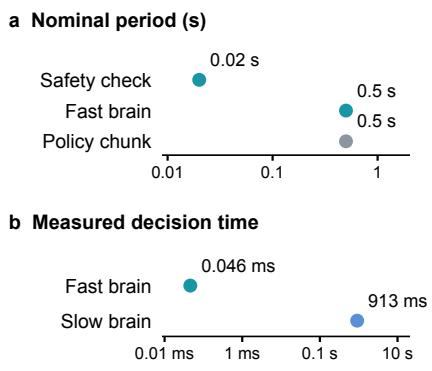  
Figure 14: Execution schedule and decision latency. a Nominal execution periods. b Median scheduler decision and planner-call latencies in the 800-episode run (Table 21).

The stove window. In turn offthe stove, the policy turned the knob off at step 44 and back on by step 55. Across 20 replays, sampling every 20 steps without latching succeeds on 25%; the bare policy achieves 80%, and latching with a chunk-level read achieves 95% (Fig. 12a). This replay changes both sampling and latching. The paired ablation in Appendix D.2 holds the sampling period fixed. A separate grounding example records 35 to 39 refusals when the planner named a book that neither camera observed.

Decision granularity. The fast brain operates on a nominal 0.5 s control schedule, while the slow brain is called on demand. The Harness VLA diagnostic runs in Table 31 took 31 to 37 turns and 348 to 505 s per episode, including tool execution and simulation. These wall-clock measurements describe runtime overhead; temporal coverage of physical events depends on the observations and environment steps within each tool call.

Measured rates and wall clock. Table 21 gives the latency of each decision and the wall clock of an episode, read from the event store of the second measurement of the reported agent (74.1%). The runs used 22 channels on four GPUs, so these are latencies under load. The 0.046 ms fast-brain median measures the scheduler decision routine (scheduler.decision.latency ms); the 913 ms slow-brain median measures a planner call (slow brain.completed.latency ms). Figure 1c and Fig. 14 use these same values. Decision computation, the nominal 0.5 s schedule and end-to-end tool execution are distinct quantities. Tool durations include simulator stepping and rendering: vla act takes 1,670 ms for a 20-step call (two chunks of ten actions), guarded descend 2,030 ms for 34 steps and turn knob 11,980 ms for 174 steps, while verify outcome takes 12 ms. The forward latency of $\pi _ { 0 . 5 }$ alone is not recorded, so it is not separable from simulation here.

In a separate diagnostic run, we measured inter-turn latency for Harness VLA driven by Codex $\mathrm { ( g p t - 5 }$ .5, reasoning effort none) on one libero object swap episode: over 20 inter-turn decisions taken from two identical runs, the time from a completed execution-time tool call to the start of the next was 4.20 s at the median, 4.66 s on average and 7.03 s at the 95th percentile, crosschecked against the agent’s own event clock (4.33 s median). The measurement excludes the previous tool’s execution, cold start, failed calls and batched calls, so it is the agent’s own decision time. It is our reproduction and not a number that paper reports. The task, scaffold and workload differ from the DynaHarness latency run. The 6.683 s value in Fig. 1c instead comes from replacing DynaHarness’s slow brain with Sonnet 5 through Claude Code: 107 calls in the 20-episode pilot (Table 23), whose paired Qwen median is 1.124 s. These are separate runs and measurement scopes, not a matched cross-system speed comparison.

Table 21: Latency and wall clock of the reported agent, 22 channels running concurrently.
<table><tr><td>Component</td><td>Calls</td><td>p50</td><td>p90</td><td>p99</td><td>max</td></tr><tr><td>Slow brain (Qwen3-VL-4B)</td><td>3,090</td><td>913 ms</td><td>1,277 ms</td><td>1,865 ms</td><td>5,581 ms</td></tr><tr><td>Fast brain</td><td>47,199</td><td>0.046 ms</td><td>0.056 ms</td><td>0.071 ms</td><td>5.58 ms</td></tr><tr><td>Fast brain, learned artifact</td><td></td><td>0.49 ms</td><td></td><td></td><td></td></tr><tr><td>Episode wall clock</td><td>Mean</td><td>p50</td><td>p90</td><td>Success</td><td>Failure</td></tr><tr><td>Goal-T</td><td>19.2s</td><td>15.5s</td><td>36.0 s</td><td>13.7 s</td><td>35.4 s</td></tr><tr><td>Goal-S</td><td>22.1 s</td><td>18.5 s</td><td>35.0s</td><td>18.8 s</td><td>36.6 s</td></tr><tr><td>10-T</td><td>37.6s</td><td>35.0 s</td><td>54.1 s</td><td>30.8s</td><td>59.1 s</td></tr><tr><td>10-S</td><td>46.2s</td><td>38.0 s</td><td>58.5 s</td><td>33.7 s</td><td>69.5 s</td></tr><tr><td>All</td><td>31.3s</td><td>29.8 s</td><td></td><td></td><td></td></tr></table>

Learning the fast brain. The evidence stores were designed to make the fast brain learnable, and a first attempt shows what the current data supports. Pooled and de-duplicated, the stores hold 2.59 million decisions over 27,581 episodes, each with the state the fast brain saw, the capability mask, the action and its reason. Because the fast brain is deterministic, 99.2% of these decisions continue the current command and the rest come from a single rule, so the logs offer almost no counterfactual actions. Advantage-weighted regression therefore reproduces the rule, agreeing with it on 99.93% of held-out decisions. Its one systematic departure is informative: in 10.7% of the states where the rule intervenes, the learned policy prefers to continue, and these states lie late in the budget after about two failed interventions, with a mean return of −0.05 against +0.33 elsewhere. Objectives that move further from the logged action place probability on actions absent from the corpus and agree with the rule on 87.5% of held-out decisions. To broaden action coverage, an ϵ-greedy pass has collected 279 such decisions in 160 episodes, which are excluded from every success rate here. The paired online comparison has since run to completion: over the full 800 episodes the learned and the fast brain both score 593 (p = 1.0), and on the cells the learned artifact can reach it escalates less often (12.2 against 15.4 times per episode). Two diagnostics characterize the training signal. The reward’s progress term is counted only when the progress signal is trusted, which holds for 9.1% of transitions, and the value changes between adjacent decisions in 0.04% of them, so the term is non-zero in about 0.004% of decisions and the scheduler optimizes little more than a time penalty and the final outcome. A candidate knob that raises that density also drives the stagnation test, whose trigger rate rose from 1.3% to 16.4% in one cell, so it was not admitted. 91.0% of the 47,199 recorded decisions had more than one eligible action, while the training corpus contained little action diversity. One limit is structural: whether a segment stays with an analytic skill or goes to the VLA is a plan step, outside the scheduler’s action space.

Table 22: Completion latching and five evolved capabilities. Separate paired campaigns on development seeds 21–40, 800 episodes per arm.
<table><tr><td>Variant</td><td>Success (%)</td><td>Net episodes</td><td>Paired p</td></tr><tr><td>Latching control</td><td>73.1</td><td></td><td></td></tr><tr><td>Without latched verdict</td><td>69.6</td><td>-28</td><td> $6 . 2 \times 1 0 ^ { - 5 }$ </td></tr><tr><td>Five-capability control</td><td>73.6</td><td></td><td></td></tr><tr><td>Without five evolved capabilities</td><td>64.8</td><td>-71</td><td> $< 1 0 ^ { - 1 3 }$ </td></tr></table>

Paired ablations. The two earlier ablations summarized in Section 4.7 run treatment and control in one campaign over the same 800 development episodes, paired on suite, task and seed, and are read with an exact McNemar test on the discordant episodes. The control arms scored 585 and 589 of 800. They are separate runs and both sit below the 594 of the reported agent, so only the difference inside each campaign is interpreted and no row of Table 22 is compared with Table 1. The latch ablation changes Eq. 3 alone, leaving the sampling period, the budget and the lease untouched. The capability ablation removes five entries from the library L with corresponding planner-catalog filtering; the cells reachable by at least one of them were listed before the run, and the observed losses are reported by this predefined split.

In the latch ablation, the benchmark predicate becomes true and later false again in 131 of the 800 episodes, and such transient outcomes occur in 17 of the 40 cells; those 17 cells account for a net −34 successes while the other 23 together move by +6. In 10 task[5], which has 19 such episodes, unlatching costs 15 successes. Paired on the same episodes, 38 are won only with the latch and 10 only without it. In the capability ablation, 82 episodes are won only by the full agent and 11 only without the five capabilities; by suite the loss is Goal-S −41, 10-T −20, 10-S −11 and Goal-T +1. Capability filtering visible to the planner was corrected before this run, so the treatment no longer makes the planner propose what it cannot call (next paragraph).

Five-capability treatment configuration. The treatment filters removed capabilities from the planner catalog but leaves other execution paths active. Its 64.75% score includes 51 flagged failure episodes; the logs also contain 539 disabled-skill rejection events from non-planner paths. Rejection events are not episode counts, and their contribution to the flagged failures is not isolated. The paired contrast therefore measures the system-level effect of withholding the entries, including routing and runtime consequences, rather than their physical execution benefit alone. Mechanism changes remain enabled in both arms. The earlier unfiltered diagnostic (61.375%) is excluded from this comparison.

Upper-model sensitivity. We replaced the slow brain with Claude Sonnet 5 through Claude Code, and froze everything else. The arm is not a pure model swap: the agent brings its own scaffold of three turns and about 74.6k prompt tokens per call, against one turn and about 4k for Qwen3-VL-4B, and the output schema is carried in the prompt rather than enforced by the decoder. A pre-registered pilot on two cells and seeds 11–20 scored 25% against 45% for Qwen3-VL-4B, short of the +4 episodes the protocol asked for. The difference comes from one cell: goal swap[5] is 20% for both, and 10 swap[8] is 30% against 70%. In that cell all four discordant pairs diverge at the first decision, where Qwen3-VL-4B always names the same moka pot and Sonnet named the other one in five episodes, none of which succeeded. Tuning the prompt on that cell raised it from 30% to 60% on development seeds. Confirmation over 40 episodes on four cells not used for tuning gave 75% (Qwen3-VL-4B), 80% (Sonnet) and 75% (tuned Sonnet; $p = 0 . 5$ for the tuned against the untuned arm), so the tuning did not transfer and the line was stopped. The rule that helps in 10 swap[8], not to change target in mid-episode, hurts in 10 swap[2], where the untuned arm abandons a stuck knob and places the pot instead. Table 23 gives the cost. Opus and GPT models were not run: keys and budget were not available, and the protocol kept them behind the pilot’s threshold. In our matched PhyAgentOS runs, changing the upper model from Qwen3-VL-4B to GPT-4o-mini changes success by 1 percentage point (Table 1).

## D.3 DYNAMIC PHYSICAL HARNESS

Retry, verification and bounded execution. In the earlier diagnostic campaign, PhyAgentOS records three outcomes per episode, which separate what a retry, a model-based verifier and the underlying policy each contribute (Table 28; Fig. 12b). Its retries continue from the current state with the original instruction, and the step counter restarts on each attempt, so a retry behaves much like a longer episode. On unperturbed LIBERO-10, where each attempt was capped at 300 steps rather than the official 520, retries raise the benchmark predicate from 80 to 92 of 100 with GPT-4omini and from 81 to 96 with Qwen3-VL-4B, and every recovered episode finished within 520 steps in total, so the gain is consistent with additional budget. On LIBERO-Pro a budget of 50 verifier calls per cell left most failures without a retry: 67 of 320 and 46 of 319 first-attempt failures were retried, adding 3 and 2 successes. The verifier, consulted only after a failed attempt, accepted 11 and 22 of those episodes against the predicate, which raises recorded success from 20.75% to 23.5% and 26.25% over 400 episodes; it changes what is recorded rather than what happens. DynaHarness assigns these roles differently. Its fast brain ends a command on the latched benchmark predicate rather than on a model’s judgment, bounds each command by budget and lease, and retries by switching capability or recovering within the episode rather than by repeating the same policy call, as the next subsection shows.

Table 23: Latency and token counts in the slow-brain pilot. Sonnet 5 via Claude Code, 20 episodes and 107 calls; Fig. 1c uses its median.
<table><tr><td></td><td>Qwen3-VL-4B</td><td>Claude Sonnet 5</td><td>Ratio</td></tr><tr><td>Latency per call, median (ms)</td><td>1,124</td><td>6,683</td><td>5.9</td></tr><tr><td>Latency per call, maximum (ms)</td><td>1,485</td><td>10,348</td><td>7.0</td></tr><tr><td>Prompt tokens per call</td><td>4,036</td><td>74,600</td><td>18</td></tr><tr><td>Prompt tokens per episode</td><td>21,253</td><td>444,102</td><td>20.9</td></tr><tr><td>Slow-brain calls per episode</td><td>5.35</td><td>5.35</td><td>1.0</td></tr><tr><td>Calls over the 20 s timeout</td><td>0</td><td>0</td><td></td></tr></table>

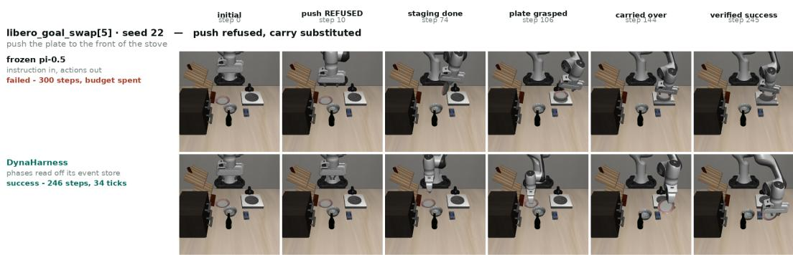  
Figure 15: goal swap[5], seed 22, both arms, cut at the same environment steps.

Capability outcomes and composition. The retained records contain successful episodes with unsuccessful capability invocations (Table 24). turn knob object completes only 21% of its invocations, while its source cell improves from 0% to 95% across development. Failed attempts are retried or replaced within the episode, and keyframe recovery returns the arm to a recorded pose on all 35 of its invocations. Fig. 15 shows a substitution. Asked to push a plate, the fast brain refuses push object, because the jaw is too narrow for the contact the push requires, and carries the plate instead; the capability records no completion, yet its cell rises from 0% to 40%. Across four scenes recorded through both arms, the frozen policy fails all four and the agent succeeds in all four.

Composition has limits. slide drawer object completed none of its 21 invocations in the analyzed round, and retrying does not help when a capability does not complete; the attributionguided update below raised one drawer cell from 55% to 100%. The verdict itself is the benchmark’s own, and our records contain one case where the two disagree: in 10 swap[9] the door capability reported failure while the benchmark scored the episode a success.

VLA usage. In the four successful episodes for which we hold stores, analytic skills account for 85.6 and 86.3% of the environment steps in the two whose step ledgers cover the whole episode, and the VLA is not called in any of the four, while in the four hardest cells the VLA’s share ranges from 26.5% to 91.4% and no cell exceeds 35%. Across a larger corpus, failures attributed to the planner layer spend 351 of their 363 steps under the VLA, against 107 of 321 for failures attributed to the policy itself: steps fall to the VLA where the agent has no structure to apply. The converse does not hold, since 10 swap[3] keeps most of its steps under analytic skills and still fails because its drawer capability does not complete. These routing statistics describe the retained sample, which emphasizes hard cells; they do not estimate the effect of removing the VLA.

Table 24: Evolved capabilities as measured objects. Inv.: dispatches; Compl.: completed fraction; Conversion: source-cell successes before and after.
<table><tr><td>Capability</td><td>Inv.</td><td>Compl.</td><td>Cells</td><td>Conversion</td></tr><tr><td>push_object</td><td>1</td><td>0%</td><td>1</td><td>goal_swap[5]0 → 8</td></tr><tr><td>slide_drawer_object</td><td>21</td><td>0%</td><td>2</td><td>10_task[3] 0 → 0</td></tr><tr><td>turn_knob_object</td><td>33</td><td>21 %</td><td>1</td><td>10_task[2] 0 → 19</td></tr><tr><td>keyframe_recovery</td><td>35</td><td>100 %</td><td>2</td><td>cross-cell</td></tr><tr><td>swing_door_object</td><td>1</td><td>0%</td><td></td><td>1 10_swap [9] 0 → 7 → 10†</td></tr></table>

† later rounds, for which only aggregates were retained.

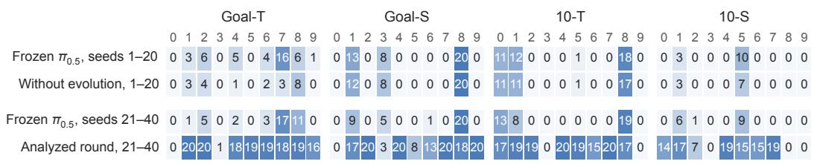  
Figure 16: Successes of 20 per cell, four arms; the early seeds 1–20 block (top) and the development block (bottom) are compared only within a block.

## D.4 ATTRIBUTION-DRIVEN SELF-EVOLUTION

Development changes across cells. The evolved agent differs from the harness without evolution by what was added over the evolution rounds: five new capabilities and changes to existing layers, including the latched verdict, receptacle slots, a handle grasp and a transport corridor. Its gains are local rather than uniform (Fig. 16). In the analyzed round, against the frozen policy on the same seeds, 27 of 40 cells gain five or more successes, 3 lose a few, and 7 remain at zero. Four of the zero cells and two nearly-zero cells involve a drawer, and the four drawer cells in the Goal suites account for 76 of the 111 episodes those suites still lose. What the reported agent still loses is local too: of the 207 episodes lost in its second measurement (74.1%), 97 involve a drawer, 43 a stove and 30 a microwave, consistent with changes that each target the layer and the physical situation that failed.

Updating a capability following attribution. Attribution assigned the drawer cells to the capability layer. The implicated capability was then probed and revised. A probe of goal swap[0], which asks for the middle drawer to be opened, found three physical causes: the forearm wedged against the wine rack while pulling, the gripper’s closure limit rejected about a third of real grasps on the 15.4 mm handle, and after contact the hand often sat too high or too far to close on the handle. Two single-factor changes followed, each a default-off setting stated in these quantities (Table 25). The first shifts the grasp 20 mm along the handle and widens the closure limit; on seeds 40–59 it raised the cell from 30% to 85%, with 11 pairs won and none lost. In its initial paired Goal confirmation, both arms scored 76.0%: the local mechanism criterion passed, but the predeclared total-score improvement criterion did not. The candidate was retained for further development, not counted as passing the full admission gate; the thresholds were not revised. The second change re-seats the hand after a misaligned contact and waits for two consecutive stalled pulls before giving up. A confirmation on all Goal-T and Goal-S episodes of the development block, under a reachability rule declared before any episode was run, raised the cell from 55% to 100% and Goal success from 75.25% to 78.0% over 400 episodes, with no discordant pair among the other 17 unreachable cells. Table 25 reports this later confirmation, not the first change’s initial 76.0% test. The reported agent includes the combined configuration. Local mechanism evidence supports continued development; formal admission additionally requires the paired and broader regression checks in Section 3.7. On the unperturbed suites they are inert: no cell of the four suites reaches them, and a paired comparison of the two builds over the same 2,000 episodes shows no difference (p = 0.49); the absolute scores come from a tree in which the orchestration tick limit stopped about 1,070 episodes per arm, so they are not quoted.

Table 25: The two drawer changes, 400 episodes per arm on seeds 21–40, paired by task and seed; unreachable cells are not scored.
<table><tr><td>Cell</td><td>Agent</td><td>First change</td><td>Both</td><td>Paired outcome</td></tr><tr><td>goal_swap[0] (reachable)</td><td>11</td><td>18</td><td>20</td><td>2 pairs won, none lost</td></tr><tr><td>goal_swap[3] (unreachable)</td><td>2</td><td>3</td><td>3</td><td>2 against 2</td></tr><tr><td>goal_task[7] (unreachable)</td><td>18</td><td>17</td><td>19</td><td>within repeat noise</td></tr><tr><td>17 further cells (unreachable)</td><td>270</td><td>270</td><td>270</td><td>no discordant pair</td></tr><tr><td>Goal-T and Goal-S (/400)</td><td>301</td><td>308</td><td>312</td><td></td></tr></table>

Table 26: The rejected candidate over 39 shared cells, successes of 20.
<table><tr><td>Cell</td><td>Instruction</td><td>Prom.</td><td>Rej.</td><td>∆</td></tr><tr><td>goal_task[1]</td><td>plate on stove</td><td>20</td><td>0</td><td>-20</td></tr><tr><td>10_task[2]</td><td>stove on + pan</td><td>19</td><td>1</td><td>-18</td></tr><tr><td>goal_swap[1]</td><td>bowl on stove</td><td>17</td><td>0</td><td>-17</td></tr><tr><td>10_task[8]</td><td>moka pot on stove</td><td>17</td><td>0</td><td>-17</td></tr><tr><td>10_swap[2]</td><td>stove on + moka</td><td>7</td><td>0</td><td>-7</td></tr><tr><td>10_swap[9]</td><td>mug in microwave</td><td>0</td><td>5</td><td>+5</td></tr><tr><td>33 further shared cells</td><td></td><td colspan="2">within ±1</td><td></td></tr><tr><td>Total over 39 shared cells</td><td></td><td>540</td><td>466</td><td>-74</td></tr></table>

A rejected candidate. A per-cell comparison identified a regression after a local candidate passed its gate. One admitted candidate generalized a cavity entry built for a microwave to every region resting on a fixture body, including a stove’s flat hob whose cavity was 5 mm tall. In the next full evaluation, five cells lost 79 successes between them while every other shared cell moved by at most one (Table 26). All five collapsed cells place an object onto the hob, whereas stove cells that only turn the knob or push along the surface were unaffected, so the change had turned a placement into an insertion. Episodes left to the policy rose from 166 to 226, the signature of a removed analytic route (Fig. 11). The candidate was reverted rather than patched, and the following evaluation restored all five cells.

A local improvement is not a global one. Validating a change on the cells it targets is not enough. The rejected round above also contained a genuine local gain, a hinged-door capability that raised the microwave cell from 0% to 25%; judged by the round total, the two changes would have been kept or discarded together, while the per-cell comparison kept one and reverted the other. A second candidate, which widened the conditions for a mirror recovery, won its paired comparison on six targeted cells, 61.7% against 55.8%, with no net change on four regression cells, yet the following full evaluation scored 70.75% against 72.75% over 800 episodes, with losses in cells it did not target, and the incumbent was kept (Fig. 12c; Appendix H). A matched comparison on the affected suite scored 76.5% for both builds. The earlier Goal-S loss therefore did not reproduce. This candidate documents a decision not to promote after screening, rather than a confirmed regression.

## E CASE STUDIES

This section illustrates refusal, substitution and capability execution in selected DynaHarness episodes. Frames are aligned by environment step where a frozen-policy control is shown. The cases complement the aggregate results; source-cell counts and invocation statistics are in Table 24. Diagnostic baseline runs are described in Appendix G.

## F PER-TASK RESULTS

Table 27 breaks the four LIBERO-Pro cells down by task. The frozen-policy references disagree task by task and not only on average. Against our early seeds 1–20 block, the reference in Zetta’s evaluation differs by 50 points or more on nine of the 40 tasks, in both directions: goal task[1] succeeds on 95% of seeds there and 15% here, and 10 task[0] on 5% there and 55% here. At

## DynaHarness: an infeasible push is refused and replaced within the episode

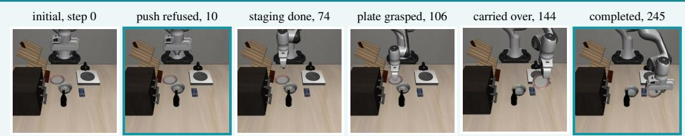

Episode: goal swap[5], seed 22, push the plate to the front of the stove; budget 300 steps.

Slow brain: names push object for the plate.

Fast brain, step 10: refuses the push, because the jaw is too narrow for the contact the push requires, and records the reason for the refusal.

Fast brain: substitutes an eligible pick and place; analytic stages stage, grasp, carry and place the plate.

Verdict, step 245: the latched benchmark predicate becomes true and ends the command.

Frozen π0.5, same seed: fails after spending all 300 steps of the budget.

## Diagnosis:

The episode succeeds in 246 steps, with 34 decisions by the fast brain.

Mechanism. Refusal is a returned value with a reason (Eq. 2), so a capability the scene does not support is replaced inside the episode instead of being executed until the budget runs out. The command ends on the latched predicate (Eq. 3), not on a model’s judgment.

Effect. push object records no completion, yet its source cell rises from 0% to 40% on the same seeds (Table 24).

Figure 17: Refusal and substitution of an infeasible capability by the fast brain.  
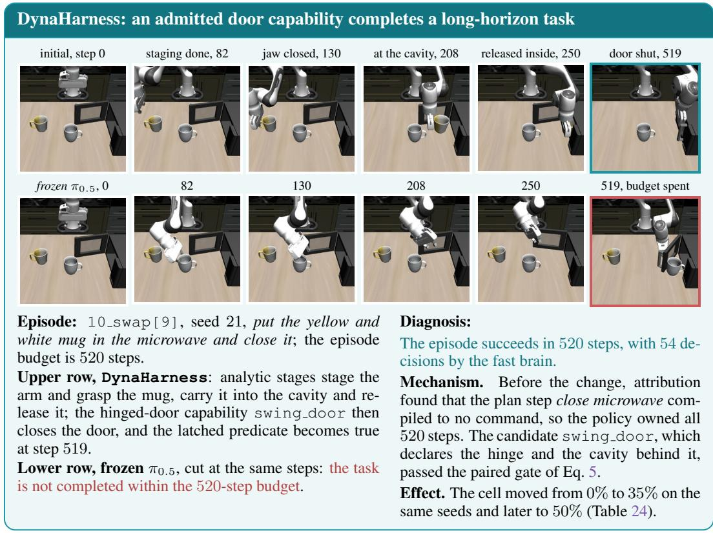  
Figure 18: An evolved capability at work, beside the frozen policy on the same seed.

round 39, before the drawer changes, the agent succeeds on at least 80% of seeds in 27 of 40 tasks and on none in five, four of which involve a drawer while the fifth closes a microwave.

## DynaHarness: long-horizon tasks finish inside the budget

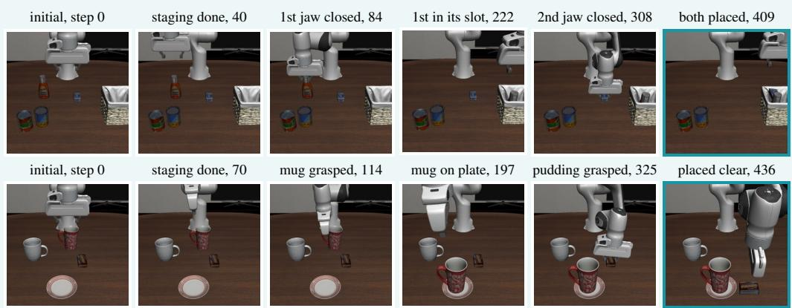

Upper row: 10 task[7], seed 21, put both the ketchup and the cream cheese box in the basket; budget 520 steps. Receptacle slots give each object its own place in the basket, and the verdict latches once both objects have been placed.

Lower row: 10 task[6], seed 23, put the red mug on the plate and the chocolate pudding right of it; budget 520 steps. Three motion rules (a climb before transport, a corridor over the table and a placement clearance) move the two objects in sequence.

Frozen π0.5, same seeds: both episodes fail after spending the whole budget.

Diagnosis:

Success in 410 and 437 of 520 steps, with 55 and 52 fast-brain decisions.

Mechanism. Analytic stages spend the steps that measured geometry determines, so a twoobject task leaves budget to spare instead of running out while a stage fails to converge (Section 4.4). In these successes analytic skills account for 85.6% and 86.3% of the steps and the VLA is not called (Fig. 6f).

Figure 19: Two long-horizon episodes whose frozen-policy counterparts fail on the same seeds.  
Table 27: Per-task success (%) on LIBERO-Pro. †Seeds 1–20, Table 3 of Ding et al. (2026); ⋆ours, DynaHarness at round 39.
<table><tr><td>Cell</td><td>Method</td><td>0</td><td>1</td><td>2</td><td>3</td><td>4</td><td>5</td><td>6</td><td>7</td><td>8</td><td>9</td><td>Avg.</td></tr><tr><td rowspan="5">Goal-T</td><td>π0.5 † (Ding et al., 2026)</td><td>0</td><td>95</td><td>10</td><td>0</td><td>100</td><td>0</td><td>20</td><td>80</td><td>5</td><td>0</td><td>31.0</td></tr><tr><td>Zetta † (Ding et al., 2026)</td><td>80</td><td>100</td><td>95</td><td>80</td><td>100</td><td>100</td><td>95</td><td>95</td><td>80</td><td>100</td><td>92.5</td></tr><tr><td>π0.5 * seeds 1–20</td><td>0</td><td>15</td><td>30</td><td>0</td><td>25</td><td>0</td><td>20</td><td>80</td><td>30</td><td>5</td><td>20.5</td></tr><tr><td>π0.5 * seeds 21–40</td><td>0</td><td>5</td><td>25</td><td>0</td><td>10</td><td>0</td><td>15</td><td>85</td><td>55</td><td>0</td><td>19.5</td></tr><tr><td>DynaHarness * 21-40</td><td>0</td><td>100</td><td>100</td><td>0</td><td>90</td><td>95</td><td>95</td><td>90</td><td>95</td><td>80</td><td>74.5</td></tr><tr><td rowspan="5">Goal-S</td><td>π0.5 † (Ding et al., 2026)</td><td>0</td><td>60</td><td>0</td><td>45</td><td>0</td><td>0</td><td>0</td><td>100</td><td>100</td><td>75</td><td>38.0</td></tr><tr><td>Zetta † (Ding et al., 2026)</td><td>90</td><td>65</td><td>80</td><td>85</td><td>95</td><td>95</td><td>100</td><td>100</td><td>100</td><td>80</td><td>89.0</td></tr><tr><td>π0.5 * seeds 1–20</td><td>0</td><td>65</td><td>0</td><td>40</td><td>0</td><td>0</td><td>0</td><td>0</td><td>100</td><td>0</td><td>20.5</td></tr><tr><td>π0.5 * seeds 21–40</td><td>0</td><td>45</td><td>0</td><td>25</td><td>0</td><td>0</td><td>5</td><td>0</td><td>100</td><td>0</td><td>17.5</td></tr><tr><td>DynaHarness * 21-40</td><td>55</td><td>80</td><td>100</td><td>10</td><td>100</td><td>50</td><td>70</td><td>100</td><td>95</td><td>100</td><td>76.0</td></tr><tr><td rowspan="5">10-T</td><td>π0.5 † (Ding et al., 2026)</td><td>5</td><td>95</td><td>95</td><td>0</td><td>0</td><td>80</td><td>85</td><td>75</td><td>65</td><td>0</td><td>50.0</td></tr><tr><td>Zetta † (Ding et al., 2026)</td><td>35</td><td>95</td><td>100</td><td>0</td><td>25</td><td>100</td><td>95</td><td>80</td><td>100</td><td>0</td><td>63.0</td></tr><tr><td>π0.5 * seeds 1–20</td><td>55</td><td>60</td><td>0</td><td>0</td><td>0</td><td>5</td><td>0</td><td>0</td><td>90</td><td>0</td><td>21.0</td></tr><tr><td>π0.5 * seeds 21–40</td><td>65</td><td>40</td><td>0</td><td>0</td><td>0</td><td>0</td><td>0</td><td>0</td><td>95</td><td>0</td><td>20.0</td></tr><tr><td>DynaHarness * 21–40</td><td>85</td><td>95</td><td>95</td><td>0</td><td>100</td><td>95</td><td>90</td><td>100</td><td>100</td><td>0</td><td>76.0</td></tr><tr><td rowspan="5">10-S</td><td>π0.5 † (Ding et al., 2026)</td><td>0</td><td>35</td><td>0</td><td>0</td><td>5</td><td>50</td><td>0</td><td>0</td><td>0</td><td>0</td><td>9.0</td></tr><tr><td>Zetta † (Ding et al., 2026)</td><td>90</td><td>50</td><td>95</td><td>75</td><td>15</td><td>65</td><td>5</td><td>0</td><td></td><td>5</td><td>40.0</td></tr><tr><td>π0.5 * seeds 1–20</td><td>0</td><td>15</td><td>0</td><td>0</td><td>0</td><td>50</td><td>0</td><td>0</td><td>0 0</td><td>0</td><td>6.5</td></tr><tr><td>π0.5 * seeds 21–40</td><td>0</td><td>30</td><td>5</td><td>0</td><td>0</td><td>45</td><td>0</td><td>0</td><td>0</td><td>0</td><td>8.0</td></tr><tr><td>DynaHarness * 21–40</td><td>90</td><td>90</td><td>35</td><td>0</td><td>95</td><td>65</td><td>90</td><td>95</td><td>40</td><td>45</td><td>64.5</td></tr></table>

## G BASELINE RECORDS

PhyAgentOS. We ran PhyAgentOS over the $\pi _ { 0 . 5 }$ LIBERO checkpoint configuration in an earlier diagnostic campaign with GPT-4o-mini and with Qwen3-VL-4B, the same local 4-bit build that DynaHarness uses as its slow brain. In these runs the upper model submits each cell’s episodes once and is not asked to plan per episode. Within an episode, the same model acts as a verifier after an attempt whose benchmark predicate is false: it sees the agent-view and wrist images at the start and end of the attempt together with the predicate’s failure, and it answers success, which ends the episode as a success, replan, which starts another attempt from the current state with the original instruction, orfailure. Each episode has at most three attempts, and each cell at most 50 verifier calls. On LIBERO every attempt is capped at 300 steps, including LIBERO-10, whose official budget is 520; on LIBERO-Pro, seed s sets both the initial state and the environment seed, under the official budgets. Table 28 gives the three outcomes per suite or cell and Table 29 the execution statistics. Six of the seven schema-invalid Qwen responses were success verdicts rejected for a missing field. Each diagnostic condition was run once.

Table 28: PhyAgentOS run by us, successes of 100 per suite or cell.
<table><tr><td rowspan="2">Suite or cell</td><td colspan="3">GPT-4o-mini</td><td rowspan="2"></td><td colspan="3">Qwen3-VL-4B</td></tr><tr><td>F</td><td>Fi</td><td>V</td><td>F</td><td>Fi</td><td>V</td></tr><tr><td>Spatial</td><td>100</td><td>100</td><td>100</td><td></td><td>98</td><td>98</td><td>99</td></tr><tr><td>Object</td><td>99</td><td>100</td><td>100</td><td></td><td>99</td><td>99</td><td>99</td></tr><tr><td>Goal</td><td>98</td><td>98</td><td></td><td>98</td><td>98</td><td>98</td><td>99</td></tr><tr><td>Long</td><td>80</td><td>92</td><td></td><td>95</td><td>81</td><td>96</td><td>97</td></tr><tr><td>LIBERO (/400)</td><td>377</td><td>390</td><td></td><td>393</td><td>376</td><td>391</td><td>394</td></tr><tr><td>Goal-T</td><td>19</td><td>19</td><td></td><td>23</td><td>21</td><td>22</td><td>34</td></tr><tr><td>Goal-S</td><td>36</td><td>36</td><td></td><td>39</td><td>34</td><td>34</td><td>41</td></tr><tr><td>10-T</td><td>17</td><td>17</td><td></td><td>20</td><td>18</td><td>18</td><td>20</td></tr><tr><td>10-S</td><td>8</td><td>11</td><td></td><td>12</td><td>8</td><td>9</td><td>10</td></tr><tr><td>LIBERO-Pro (/400)</td><td>80</td><td>83</td><td></td><td>94</td><td>81</td><td>83</td><td>105†</td></tr></table>

F, Fi: predicate after the first and the last of three attempts; V: success the system recorded. †Plus 7 schema-invalid verifier replies.

Table 29: Execution statistics of our PhyAgentOS runs, from their episode records.
<table><tr><td rowspan="2"></td><td colspan="2">LIBERO</td><td colspan="2">LIBERO-Pro</td></tr><tr><td>GPT</td><td>Qwen</td><td>GPT</td><td>Qwen</td></tr><tr><td>Attempts per episode, mean</td><td>1.07</td><td>1.04</td><td>1.30</td><td>1.16</td></tr><tr><td>Episodes retried</td><td>21</td><td>16</td><td>67</td><td>46</td></tr><tr><td>Verifier calls</td><td>39</td><td>25</td><td>200</td><td>200</td></tr><tr><td>Environment steps per episode, mean</td><td>168</td><td>158</td><td>501</td><td>442</td></tr><tr><td>Policy calls per episode, mean</td><td>34.0</td><td>32.0</td><td>100.2</td><td>88.4</td></tr><tr><td>Verifier latency per call (s), mean</td><td>5.4</td><td>4.2</td><td>4.9</td><td>4.3</td></tr><tr><td>Wall clock (h)</td><td>0.83</td><td>0.77</td><td>2.40</td><td>2.19</td></tr></table>

Zetta. Table 30 gives our Qwen3-VL-4B runs stage by stage and the GPT-5.6-sol candidate. These diagnostic runs examine recovery and candidate admission in the released code. The GPT-5.6-sol candidate is evaluated against the bare policy over 20 episodes of 300 policy steps each. With Qwen3-VL-4B, the online recovery agent has to read a current camera image before deciding; across three invocations it wrote the image request as text instead of a tool call and failed closed. The offline diagnosis attached three visual-evidence claims to images that were not delivered and was rejected by its validator. In an episode where the agent did act, it accepted a recovery proposal with confidence 0.95, and the recovery reported completion after 78 steps while the drawer’s joint target was not met. At the evolution stage, 8 of 9 candidate proposals failed validation, for not citing the rejected gate’s evidence or for repeating the rejected mechanism, and the three same-seed gates all failed, since the candidate left the trajectory unchanged.

ENPIRE and ASPIRE with Qwen3-VL-4B. We ran ENPIRE’s released agent loop with Qwen3- VL-4B writing one Python policy per LIBERO-Pro task (seed 0, 310 steps, $\pi _ { 0 . 5 }$ called through pi05.predict). The run summary records 3 successes in 40 tasks (Goal-T 1, Goal-S 2, LIBERO-10 0) and attributes 28 failures to interface errors in the generated code, 7 to the step limit, and one each to a request timeout and an empty initial state. Raw files survive for 18 of the 40 tasks, all consistent with the summary and none of them a success, so the total rests on the summary. Of the 18 recovered policies, 14 call names defined nowhere in the policy or its inputs and 4 only pass the observation to π0.5; a separate session repeated one observation call 20 times without acting. We ran ASPIRE through Claude Code with Qwen3-VL-4B-Instruct on six LIBERO and LIBERO-Pro suites. No run executed or scored an episode: replies that described commands without calling a tool ended the loop, and one subagent searched 187 times for a directory that does not exist before the coordinator reported a background run that did not exist. These first runs document adaptation failures. A second campaign, summarized in aspire phyagent.xlsx and ENPIRE LIBERO Pro success rates.xlsx, covers the four LIBERO-Pro cells with 200 episodes each for PhyAgentOS (GPT-4o-mini 21.3%, Qwen3-VL-4B 20.3%), ENPIRE (5.4%; Goal-T 10.0%, Goal-S 11.5%, LIBERO-10 0%), Zetta with Qwen3-VL-4B (no success) and AS-PIRE with Qwen3-VL-4B, whose runs again ended without an executed episode.

Table 30: Zetta’s released code on drawer tasks: where each Qwen3-VL-4B stage stopped (top) and a GPT-5.6-sol candidate against the bare policy (bottom).
<table><tr><td>Stage</td><td>Recorded outcome</td></tr><tr><td>Online recovery agent</td><td>3 invocations; image read requested as text, 0 tool calls; failed closed with no environment write</td></tr><tr><td>Offline diagnosis</td><td>3 visual-evidence claims citing images that were not delivered; diagnosis rejected by the valida- tor</td></tr><tr><td>Recovery execution</td><td>proposal accepted at confidence 0.95; reported completed after 78 steps; joint target unmet;</td></tr><tr><td>Candidate proposal</td><td>episode failed 8 of 9 proposals failed validation</td></tr><tr><td>Same-seed gate</td><td>3 gates, 0 successes in either arm; none passed</td></tr><tr><td>GPT-5.6-sol candidate</td><td>13/20 against the bare policy&#x27;s 6/20; discordant pairs 8 and 1, exact sign test p = 0.039</td></tr><tr><td>Tool use</td><td>privileged_pick_place in 14 of 20 candidate episodes and 10 of its 13 successes; none in the bare policy</td></tr></table>

Table 31: Harness VLA agent, three Spatial-T episodes. Tokens in millions.

<table><tr><td>Task, seed</td><td>Outcome</td><td>Turns</td><td>Tools</td><td>Policy</td><td>Tokens</td><td>Time (s)</td></tr><tr><td>1,1</td><td>success</td><td>31</td><td>62</td><td>3</td><td>3.32</td><td>348</td></tr><tr><td>1,3</td><td>failure</td><td>37</td><td>70</td><td>4</td><td>4.51</td><td>505</td></tr><tr><td>0,5</td><td>failure</td><td>33</td><td>81</td><td>4</td><td>3.27</td><td>448</td></tr></table>

Harness VLA agent. Table 31 gives three diagnostic episodes of the Harness VLA agent on the LIBERO-Pro Spatial-T cell. A Codex agent drives segmentation, back-projection, motion and grasp tools turn by turn, including pi0 pick and pi0 doubled. Before acting, it reads per-task notes that include the task text, known failure modes and a seed-0 run of the same perturbed task, and after each action it observes the benchmark’s termination signal. The successful episode recovered from an off-plate release by re-measuring the plate center from an unoccluded mask and grasping again. One failure left a bowl upright on the plate rim after several pushing corrections. In the other, by the agent’s own account, it lost the identity of two similar bowls once they occluded each other, and it used the termination signal to reason about which bowl was the target. Each turn that moves the arm issues one arm command, and each turn resends a context of about 105 input tokens, 94 to 95% of which was cached.

Harness VLA with the same model and the same policy. We then ran the released agent over our four cells with Qwen3-VL-4B in place of the coding agent and the frozen public π as the low-level policy, 200 episodes per cell. It completed all 800 episodes and succeeded in 48: 28 on Goal-T, 14 on Goal-S, 6 on 10-T and none on 10-S. This is the matched Qwen3-VL-4B plus frozen-π comparison in Table 1, where DynaHarness reaches 74.25% against Harness VLA’s 6.0%.

CaP-Agent0 with Qwen3-VL-4B. Our CaP-X adaptation used Qwen3-VL-4B-Instruct with the pointing model disabled and scored 5.0%: one success each in Goal-T and Goal-S. Two retained episode records show generated-code failures, and a follow-up prompt in one contains an unfilled task template. These runs characterize this adaptation and are excluded from Table 1.

## H TWO-STAGE ADMISSION OF A RECOVERY CANDIDATE

Candidate C2 widened the conditions under which a mirror recovery fires. On a 200-episode paired benchmark of six targeted cells and four regression cells at 20 seeds each, the incumbent scored

Table 32: Two-stage admission of candidate C2: paired mechanism benchmark, full round and matched Goal-S comparison, top to bottom.
<table><tr><td>Paired mechanism benchmark</td><td>Incumbent</td><td>C1</td><td>C2</td></tr><tr><td>goal_task[9]</td><td>16</td><td>16</td><td>18</td></tr><tr><td>10_task[0]</td><td>17</td><td>17</td><td>19</td></tr><tr><td>goal_swap[1]</td><td>16</td><td>18</td><td>18</td></tr><tr><td>10_swap[8]</td><td>8</td><td>9</td><td>9</td></tr><tr><td>goal_swap[5]</td><td>10</td><td>10</td><td>10</td></tr><tr><td>10_swap[3]</td><td>0</td><td>0</td><td>0</td></tr><tr><td>Targeted total (/120)</td><td>67</td><td>70</td><td>74</td></tr><tr><td>Regression cells, net</td><td>n/a</td><td>0</td><td>0</td></tr><tr><td>Full round (/200 per cell)</td><td>Incumbent</td><td></td><td>C2</td></tr><tr><td>Goal-T</td><td>149</td><td></td><td>151</td></tr><tr><td>Goal-S</td><td>152</td><td></td><td>133</td></tr><tr><td>10-T</td><td>152</td><td></td><td>153</td></tr><tr><td>10-S</td><td>129</td><td></td><td>129</td></tr><tr><td>Total (/800)</td><td>582</td><td></td><td>566</td></tr><tr><td>Matched Goal-S (/200)</td><td>153</td><td></td><td>153</td></tr></table>

55.8% on the targeted cells, an intermediate candidate C1 58.3% and C2 61.7%, and the regression cells showed no net change for either candidate (Table 32). Under C2 the mirror fired 36 times against 12 under C1 and reached all six targeted cells rather than three; in 23 firings the gripper kept the object, and 7 of those episodes succeeded. Two cells did not move: goal swap[5] fired it 10 times and stayed at 50%, and 10 swap[3] fired it 6 times and stayed at 0%, so for both the grasp was no longer the stage that failed. The pre-declared confirmation then ran C2 as a full 800- episode round. The incumbent had scored 72.75% and C2 scored 70.75%, with 13 cells moving, 6 episodes gained and 22 lost, 20 of the losses inside goal swap and the largest in goal swap[4] (20 → 14) and goal swap[7] (20 → 15), neither of them targeted. The incumbent was kept. A later matched comparison of the two builds on the same 200 Goal-S task and seed pairs found 76.5% for each, with 2 pairs won only by each side, so the Goal-S loss did not reproduce.

## I LIMITATIONS

Evaluation scope. Post-selection tests cover new initial states of the same 40 LIBERO-Pro cells and 261 untouched official states across 31 cells. They test initial-state transfer; new task families and physical domains require separate evaluations. Standard-LIBERO and LIBERO-Plus configuration records are in Appendix C; LIBERO-Plus has one trial per task without a frozen-policy control. The executor comparisons use development states and evaluate execution mechanisms jointly. A2static retains the one-step planner interface; A2seq also changes planning horizon and output schema. The A2seq single-host run and historical multi-host control also differ in date and machine; unseeded planner and policy stochasticity remain nuisance factors (Appendix D.1).

Improvement and deployment. Failure attribution and paired admission automate the diagnostic and evaluation steps surrounding fault probing and targeted revision. The deployed fast brain is deterministic; the learned variant matches its success count in the reported comparison (Appendix D.2). LIBERO completion uses the benchmark predicate, while physical deployment requires a separately specified completion interface and scene description.

Records and coverage. The earlier step-share case analyses cover 8 of 40 cells. New mechanism and post-selection event-store coverage is reported in Table 18. The final development score is an archived aggregate; a separate remeasurement supplies the historical paired comparison. Some earlier rounds and baseline campaigns retain only summaries. The no-evolution arm has no attribution field, and the drawer confirmation covers the two Goal cells. Appendices C, D and G describe run-specific processing and record availability.