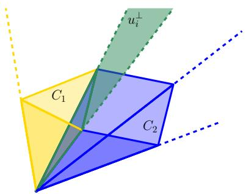
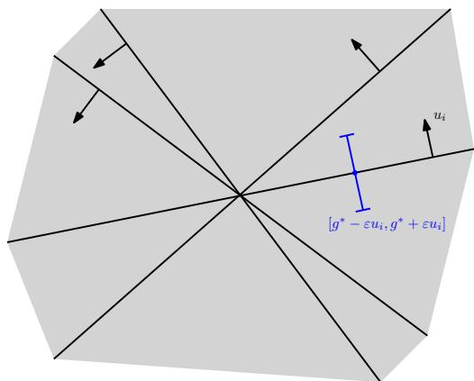

# Dimension-Free Rank Lifting from Random Hyperplane Arrangements

Luca Becchetti∗ Matteo Russo† Ruben Skorupinski†

## Abstract

We study the width required for a randomly initialized hidden layer of a neural network to achieve rank lifting. Namely, given a dataset $\boldsymbol { X } \in \mathbb { R } ^ { m \times d }$ of m, d-dimensional input vectors separated by an angle of at least θ, we consider the random feature matrix $\sigma ( X R )$ , where R is standard Gaussian. For positively homogeneous nonpolynomial activations, which include sign, Heaviside, ReLU, and ReLU powers among others, we prove that

$$
n \gtrsim \frac { 1 } { \theta } \operatorname* { m a x } \left\{ m , \log \left( \frac { 1 } { \delta } \right) \right\}
$$

neurons sufice for σ(XR) to have full row rank m with probability at least 1 − δ. This dimension-free bound exponentially improves the previous general-dimensional guarantee for sign features $[ \mathrm { D B C ^ { + } 2 6 } ]$ and is essentially tight. The proof shows that one random feature column escapes every proper subspace of $\mathbb { R } ^ { m }$ with probability $\Omega ( \theta )$ , using a coupling of nearby Gaussian directions and a local crossing of the induced hyperplane arrangement. We also study stable rank lifting, where the goal is to establish a quantitative analogue of exact rank lifting, i.e., a lower bound on the smallest eigenvalue of the empirical feature Gram matrix in high-probability. Our analysis unifies and generalizes stable rank guarantees for all q-homogeneous non-polynomial activations following prior work in [PSG20, Son26]. In particular, we combine a diagonally dominant Taylor tail of the population kernel with truncation and matrix concentration, to show that for positively homogeneous nonpolynomial activations, stable rank lifting is achieved at width

$$
n \gtrsim C ^ { q } \frac { m } { \theta ^ { 2 q + 1 } } \log ^ { 2 q + \frac { 1 } { 2 } } \left( \frac { m } { \theta } \right) \log \left( \frac { m } { \delta } \right) ,
$$

where q is the degree of the activation and $C > 0$ is some universal constant.

## 1 Introduction

Randomly initialized and frozen hidden layers have been proposed as a tool to improve the expressive power of neural networks before a single training step is taken. They appear in random-basis networks [IP95], extreme learning machines [HZS06], reservoir computing [Jae01, MNM02, LJ09], and randomfeature methods for kernel learning [RR07, RR08]. In this context, full rank of the random feature matrix is a particularly clean certificate of representational capacity at initialization: it separates the question of whether the random representation is expressive enough from the subsequent question of how that representation is optimized.

More precisely, consider a projectively separated dataset, i.e., a dataset X composed ofnonzero data points $x _ { 1 } , \ldots , x _ { m } \in \mathbb { R } ^ { d }$ , whose pairwise angles lie between θ and $\pi - \theta _ { \mathrm { ; } }$ , for $0 < \theta \leq \pi / 2$ . Let $g _ { 1 } , \ldots , g _ { n } \in \mathbb { R } ^ { d }$ be independent standard Gaussian hidden-layer weights, grouped as the columns of $R \in \mathbb { R } ^ { d \times n }$ , and let $\sigma : \mathbb { R }  \mathbb { R }$ be an activation function. The corresponding two-layer random feature model is defined as

$$
f _ { \mathbf { w } } ( x ) = \sum _ { j = 1 } ^ { n } w _ { j } \sigma ( \langle g _ { j } , x \rangle ) ,
$$

where only the output weights $\mathbf { w } = ( w _ { 1 } , \ldots , w _ { n } )$ are trained. Then, given the dataset X, the vector of predictions on the training set is $Z \mathbf { w } _ { : }$ , where $Z _ { i j } = \sigma ( \langle x _ { i } , g _ { j } \rangle )$ . We also let $u _ { i } = x _ { i } / \lVert x _ { i } \rVert _ { 2 }$ and denote by $U \in \mathbb { R } ^ { m \times d }$ the matrix with rows $u _ { i } ^ { \top }$

The input matrix may have rank much smaller than m, particularly when $m > d ,$ but a nonlinear random map can nevertheless produce a feature matrix of full row rank. In particular, rank $( Z ) = m$ precisely when every target vector $y \in \mathbb { R } ^ { m }$ can be interpolated by training only the last layer. Following [DBC+26], this phenomenon is known as rank lifting. Rank lifting provides a simple model of how overparameterization creates representational capacity: a suficiently wide random hidden layer separates the training points algebraically, after which a linear readout can memorize arbitrary labels [ZBH+21, Dan20, Ver20, MZ22]. The recent work [DBC+26] initiated a quantitative study of this question for Gaussian hidden weights and sign activations. It interpreted rank lifting geometrically through the arrangement of the activation hyperplanes on the unit sphere and derived high-probability width guarantees from estimates on the regions of this arrangement. In general dimension, the resulting bound on the required width grows exponentially with the number of data points and linearly in ${ \sqrt { d } } ,$ with sharper linear and polynomial guarantees for $d = 2$ and $d = 3 .$ , respectively.

## 1.1 Our Contributions and Techniques

In this paper, we considerably expand $[ \mathrm { D B C ^ { + } 2 6 } ]$ , by investigating two questions that address complementary forms of rank lifting: the first asks only whether the random feature matrix has full row rank, whereas the second asks whether it is quantitatively nonsingular. Our approach to both questions relies on the following dual perspective on the problem: Each hidden weight $g _ { j }$ defines a random hyperplane $g _ { j } ^ { \bot }$ , and the j-th column of $Z$ records the response of the data to this hyperplane. Dually, the data hyperplanes $u _ { i } ^ { \perp }$ partition weight space into chambers sampled by the Gaussian columns of $R .$ The formal setup and standing assumptions are collected in Section 2.

Question 1.1 (Exact Rank Lifting). Our first question asks how large the hidden-layer width n must be to ensure that

$$
\mathbb { P } \mathrm { ( r a n k } ( \sigma ( X R ) ) = m ) \geq 1 - \delta .
$$

Equivalently, how many random neurons sufice to interpolate arbitrary labels on the m data points by training only the output layer?

Our first result establishes a dimension-free width bound (Theorem 3.1) for the general-dimensional question, replacing the exponential dependence on m by a linear one, removing any dependence on the ambient dimension d, and extending the analysis from sign activations to the broad class of positively homogeneous nonpolynomial activations, which includes Heaviside, ReLU, nonlinear leaky ReLU, ReLU powers, and sign itself.

Theorem 1.2 (Thm. 3.1 informal). There is a universal constant $C > 0$ such that

$$
n \geq { \frac { C } { \theta } } \operatorname* { m a x } \left\{ m , \log \left( { \frac { 1 } { \delta } } \right) \right\} \quad \Longrightarrow \quad \operatorname { \mathbb { P } } ( \operatorname { r a n k } ( \sigma ( X R ) ) = m ) \geq 1 - \delta .
$$

This result applies simultaneously to sign, ReLU, nonlinear leaky ReLU, and all ReLU powers. For sign features, it replaces the exponential dependence on m in $[ \mathrm { D B C ^ { + } 2 6 } ]$ by a linear one, without any dependence on the ambient dimension d. The proof uses local facet crossings rather than global chambervolume estimates. Moreover, the bound is optimal in the following sense: first, $n \geq m$ is necessary for any $m \times n$ matrix to have full row rank, and, second, configurations of two sign inputs or three ReLU inputs show that failure probability at most δ may require $n = \Omega ( \theta ^ { - 1 } \log \delta ^ { - 1 } )$ . Thus the dependence on m is optimal for fixed θ, and the dependence on θ and δ is optimal for a constant number of data points (see Proposition A.3 for a proof).

Exact rank lifting is an algebraic property as it distinguishes a zero singular value from a nonzero one, but it is insensitive to how small a nonzero singular value may be. It is then natural to investigate the question of when rank lifting is quantitatively stable, as measured by the smallest eigenvalue of the empirical feature Gram matrix, a property we call stable rank lifting.

Question 1.3 (Stable Rank Lifting). Our second question asks how large should n be so that

$$
\begin{array} { r } { \mathbb { P } \left( \lambda _ { \operatorname* { m i n } } \big ( \sigma ( U R ) \sigma ( U R ) ^ { \top } \big ) \geq c n \kappa _ { \sigma } \right) \geq 1 - \delta , } \end{array}
$$

for a universal constant $c > 0$ . Equivalently, how many random neurons sufice to ensure that the minimum eigenvalue ofthe empirical feature Gram matrix exceeds a given threshold?

For this stronger quantitative question, we work with the normalized data U and write $Z = \sigma ( U R )$ for the stable-rank statements below. The following holds:

Theorem 1.4 (Thm. 4.1 informal). Let

$$
K _ { \sigma } = \mathbb { E } \left[ \sigma ( U g ) \sigma ( U g ) ^ { \top } \right] , \qquad \kappa _ { \sigma } = \lambda _ { \operatorname* { m i n } } ( K _ { \sigma } ) .
$$

denote the population kernel and its smallest eigenvalue. If

$$
n \geq C _ { \sigma } \cdot \frac { m } { \theta ^ { 2 q + 1 } } \cdot \log ^ { 2 q + \frac { 1 } { 2 } } \left( c _ { \sigma } \frac { m } { \theta } \right) \log \left( \frac { m } { \delta } \right) ,
$$

then

$$
\mathbb { P } \left( \lambda _ { \operatorname* { m i n } } ( Z Z ^ { \top } ) \geq \frac { n \kappa _ { \sigma } } { 4 } \right) \geq 1 - \delta ,
$$

with q the degree of homoegenity and $c _ { \sigma }$ and $C _ { \sigma }$ two constants that only depend on the activation.

In particular, for the special case of the sign considered in $[ \mathrm { D B C ^ { + } 2 6 } ]$ , Theorem 1.4 implies that there are universal constants $c , C > 0$ such that

$$
n \geq C { \frac { m { \sqrt { \log ( m ) } } } { \theta } } \log \left( { \frac { m } { \delta } } \right) \quad \Longrightarrow \quad \mathbb { P } \left( \lambda _ { \operatorname* { m i n } } ( Z Z ^ { \top } ) \geq c n { \frac { \theta } { \sqrt { \log ( m ) } } } \right) \geq 1 - \delta .
$$

Our second result gives finite-width stable rank guarantees for worst-case projectively separated data. Its population component—lower bounding the smallest eigenvalue of a neural Gram matrix—has also played a central role in analyses of optimization and memorization [DZPS19, ALS19, OS20, PSG20, NMM21, KMM24, LMX25, Son26]. In particular, Panigrahi et al. [PSG20] emphasize the role of activation nonsmoothness, while Song [Son26] proves a sharp $\theta / \sqrt { \log m } \mathrm { - t y p e }$ bound for the continuous ReLU-derivative Gram matrix. Liu et al. [LMX25] also bound kernel spectra for higher-order activations, specifically ReLU powers. Our proof strategy for Section 4 combines the Taylor-tail/Gershgorin approach of [PSG20, Son26] with Gaussian kernel expansions [DFS16, HS26] and standard truncation and matrix-concentration arguments [Tro15].

While we do not claim novelty for the technical ingredients of this analysis, we bring them together in a unified, self-contained, nonasymptotic treatment of positively homogeneous nonpolynomial activations of arbitrary nonnegative integer degree q. This synthesis makes the dependence on the activation explicit and allows us to contrast the quantitative requirements of stable rank lifting with our activation-uniform guarantees for exact rank lifting. Specifically, if σ has homogeneity degree q, then

$$
\kappa _ { \sigma } \geq c _ { \sigma } \operatorname* { m i n } \left\{ 1 , \left( { \frac { \log ( \sec \theta ) } { \log ( m ) } } \right) ^ { q + { \frac { 1 } { 2 } } } \right\} .
$$

Here $c _ { \sigma } > 0$ depends only on σ, and the minimum is interpreted as 1 when $\theta = \pi / 2$

We remark that the dual hyperplane-arrangement viewpoint underlies both results: local chamber crossings yield exact rank lifting, while the associated correlation kernel controls stable rank lifting.

Exact versus stable rank lifting. Stable rank is a substantially stronger property than exact rank. The latter already means that, once the random hidden layer is sampled, the same representation can realize every scalar or vector-valued target on the dataset through a linear readout, while stable rank lifting makes this guarantee quantitative. Indeed, if Z has full row rank and $\mathbf { w } ^ { \star }$ is the minimum-norm solution to $Z \mathbf { w } = y ;$ , then

$$
\| \mathbf { w } ^ { \star } \| _ { 2 } \leq \frac { \| y \| _ { 2 } } { \sqrt { \lambda _ { \operatorname* { m i n } } ( Z Z ^ { \top } ) } } .
$$

In particular, for every binary labeling $y \in \{ \pm 1 \} ^ { m }$

$$
\operatorname* { m i n } _ { i \in [ m ] } y _ { i } \left. Z _ { i , : } , \frac { \mathbf { w } ^ { \star } } { \| \mathbf { w } ^ { \star } \| _ { 2 } } \right. = \frac { 1 } { \| \mathbf { w } ^ { \star } \| _ { 2 } } \geq \sqrt { \frac { \lambda _ { \operatorname* { m i n } } ( Z Z ^ { \top } ) } { m } } .
$$

Thus the same random representation linearly realizes every binary labeling with an explicit feature-space margin guarantee, while also controlling the readout norm and sensitivity to perturbations of the features (see Lemma A.1).

The stable result quantifies the nonsingularity of the same random-hyperplane representation. Unlike our exact-rank bound, the stable guarantee therefore depends quantitatively on the activation and its degree of homogeneity. This activation dependence is unavoidable: already for a single unit input and $\sigma ( t ) = t _ { + } ^ { q }$ L， exact rank holds with probability $1 - 2 ^ { - n }$ , independently of $q ,$ whereas achieving $\lambda _ { \operatorname* { m i n } } ( Z Z ^ { \top } ) \geq n \kappa _ { \sigma } / 4$ with any fixed positive success probability requires $n = \exp ( \Omega ( q ) )$ (Appendix $\mathsf { A } . 4 )$ . The distinction is that exact rank needs only a positive preactivation, while stable rank must capture the contribution of rare, large preactivations to the population second moment.

Proof overview: exact rank lifting. We next describe the main ingredients needed for the proof of the exact-rank bound. Positive homogeneity ensures that row normalization preserves rank. First, we imagine the columns $\sigma ( U g )$ of $Z = \sigma ( U R )$ to arrive sequentially, and assume that the feature columns sampled so far span a proper subspace $V \subsetneq \mathbb { R } ^ { m }$ . We then prove that the next column escapes $V$ with probability $\Omega ( \theta )$ To this end, let us choose a nonzero $a \in V ^ { \perp }$ and consider

$$
\sum _ { i = 1 } ^ { m } a _ { i } \sigma ( \langle u _ { i } , g \rangle ) .
$$

We observe that the active hyperplanes $u _ { i } ^ { \perp }$ , corresponding to $a _ { i } \neq 0 .$ , partition $\mathbb { R } ^ { d }$ into chambers. For the sign activation, the displayed expression is constant within each chamber, as already noted in $[ \mathrm { D B C ^ { + } 2 6 } ]$ since crossing exactly one active hyperplane changes it by $\pm 2 a _ { i }$ , so it cannot vanish at both endpoints of such a crossing. Indeed, suppose that $g _ { 1 }$ and $g _ { 2 }$ lie in adjacent chambers. Relabeling the active indices as $1 , \ldots , k ,$ we may assume that $\sigma ( \langle u _ { 1 } , g _ { 1 } \rangle ) = 1 , \sigma ( \langle u _ { 1 } , g _ { 2 } \rangle ) = - 1$ , and $\sigma ( \langle u _ { i } , g _ { 1 } \rangle ) = \sigma ( \langle u _ { i } , g _ { 2 } \rangle )$ for $i = 2 , \ldots , k .$ . The two sums therefore satisfy

$$
\sum _ { i = 1 } ^ { k } a _ { i } \sigma ( \langle u _ { i } , g _ { 1 } \rangle ) - \sum _ { i = 1 } ^ { k } a _ { i } \sigma ( \langle u _ { i } , g _ { 2 } \rangle ) = 2 a _ { 1 } \neq 0 ,
$$

since the crossed hyperplane is active, and hence they cannot both vanish. We generalize the above argument to positively homogeneous activation functions of higher powers.

For ReLU, the expression is linear on each chamber, and closely related one-facet comparisons appear in [PTS20, Lemma 2 and Appendix B], [HLXZ20, Theorem 2.1 and its proof in Section 4], and, most directly, in the proof of [FGS25, Lemma 16 in Appendix A.3 of the full version]. These arguments exploit the change of the linear formula or of its gradient across one ReLU hyperplane. For higher homogeneous powers, however, the expression is generally analytic rather than linear inside a chamber. We extend the preceding observation by showing that it cannot vanish in both chambers adjacent to an active facet: near a point in the relative interior of that facet, only the crossed neuron changes branch, while all other terms remain analytic. If the sum vanished in both chambers, restricting to a line transverse to the facet would analytically continue the two branches of σ through the origin, forcing $\sigma$ to be a pure monomial.

To turn this local observation into a probability bound, we perturb a Gaussian vector while preserving its distribution. Let $g , h \sim \mathcal { N } ( 0 , I _ { d } )$ be independent, and set $\widetilde { g } = ( g + ( \theta / k ) h ) / \sqrt { 1 + ( \theta / k ) ^ { 2 } }$ , where k is the number of active hyperplanes. In words, we apply a small Gaussian displacement and then a positive rescaling, where the latter does not change the chamber containing the endpoint. The perturbation must be large enough to cross a facet, but small enough to avoid crossing several at once. Each active hyperplane separates the endpoints with probability $\varphi / \pi _ { : }$ , while projective separation controls the probability that two hyperplanes separate them simultaneously. The scale $\theta / k$ balances these efects and gives probability at least $\theta / 2 \pi$ of crossing exactly one active hyperplane. On this event, the endpoints lie in adjacent chambers, so at least one breaks the proposed linear relation almost surely. Crucially, both endpoints have the same standard Gaussian distribution. The probability that a single Gaussian weight breaks the relation is therefore at least $\theta / 4 \pi$ . Finally, since we have imagined revealing the columns sequentially, applying a scalar Chernof bound gives the stated width guarantee.

Proof overview: stable rank lifting. The proof ideas are most transparent for the sign activation function, but, as we explain further below, the argument extends to all positively homogeneous nonpolynomial activation functions. When $\sigma = \mathrm { s g n }$ , the population kernel is given explicitly by

$$
( K _ { \mathrm { s g n } } ) _ { i j } = \frac { 2 } { \pi } \arcsin ( \langle u _ { i } , u _ { j } \rangle ) ,
$$

and its Taylor expansion $\begin{array} { r } { K _ { \mathrm { s g n } } = \sum _ { k = 0 } ^ { \infty } { a _ { k } ( U U ^ { \top } ) ^ { \circ k } } } \end{array}$ has nonnegative coeficients $a _ { k }$ whose tail beyond degree N is of order $N ^ { - 1 / 2 }$ . We therefore retain the high-degree tail $\begin{array} { r } { T _ { N } = \sum _ { k = N } ^ { \infty } a _ { k } ( U U ^ { \top } ) ^ { \circ k } } \end{array}$ . All omitted terms are positive semidefinite, so $K _ { \mathrm { s g n } } \succeq T _ { N }$ . Its diagonal entries contain the full tail mass, whereas projective separation suppresses every of-diagonal entry by a factor $( \cos \theta ) ^ { N }$ . Choosing N so that $( m - 1 ) ( \cos \theta ) ^ { N } \leq 1 / 2$ , Gershgorin’s circle theorem gives $\kappa _ { \mathrm { s g n } } \gtrsim \theta / \sqrt { \log ( m ) }$ . Since sign columns have deterministic squared norm $m ,$ matrix Chernof transfers this population gap directly to the empirical Gram matrix.

For a general positively homogeneous nonpolynomial activation of degree $q ,$ we compute the ordinary Taylor expansion of its scalar Gaussian correlation kernel. These Taylor coeficients are the squares of the orthonormal Gaussian Hermite coeficients of σ [DFS16, HS26]. Its coeficients remain nonnegative, but their tail is now of order $N ^ { - q - { \frac { 1 } { 2 } } }$ . The same diagonally dominant tail argument gives the stated population bound. Finally, for unbounded activations such as ReLU, we truncate the rare columns containing a large preactivation, control the resulting population bias, and then apply matrix Chernof to the bounded truncated columns.

## 1.2 Related Work

Random hidden layers and random features. Models with randomly sampled and frozen hidden parameters include random-basis networks [IP95], extreme learning machines [HZS06], and echo-state and liquid-state networks [Jae01, MNM02, LJ09]. Random features were introduced as finite-dimensional kernel approximations [RR07, RR08], followed by work on their approximation, statistical, and computational properties [Bac17, RR17, $\mathrm { A K M ^ { + } } 1 7 ,$ LHCS22], and on nonlinear component analysis $[ \mathrm { L S S ^ { + } } 1 4 ]$ . Earlier full-rank results for extreme learning machines are mainly qualitative and typically rely on genericity, random biases, or smoothness assumptions [HZS06]. We instead seek high-probability width bounds for a finite, bias-free Gaussian feature matrix on fixed projectively separated data.

Spectral Distribution and Asymptotic Random Feature Analysis. A prominent line of work analyzes the spectral properties and minimum eigenvalues of random feature and kernel Gram matrices using Random Matrix Theory (e.g., [DPC+25, Mis22, MM19]). These results typically establish deterministic equivalents and empirical spectral distributions in proportional asymptotic regimes $( n , d , m  \infty$ at fixed ratios) under smooth or isotropic data distributions. In contrast, our work operates in a strictly non-asymptotic setting, establishing dimension-free exact and stable rank lower bounds that hold for fixed sample sizes n under worst-case, projectively separated data.

Interpolation, memorization, and rank lifting. Interpolation by overparameterized models is closely tied to questions of capacity and generalization [ZBH+21, BHMM19, LR20]. Random-feature interpolation has been studied largely in asymptotic or average-case settings [MM19, MZ22], while other work bounds the memorization capacity of threshold and ReLU networks [BV19, Ver20, Dan20]. In nonasymptotic regimes, [BELM20] study the network size and weight magnitudes needed for memorization under general-position and, for some results, additional well-dispersedness assumptions. On the other hand, in [DGJS22, GMS22], the authors investigate the separation properties of randomly initialized, single or two-layer ReLU networks with uniform bias in feature space. Diferently from this line of work, rank lifting asks a more specific question: when does one frozen random layer already make arbitrary labels linearly representable? The closest work is $[ \mathrm { D B C ^ { + } 2 6 } ]$ , which studies the special case of a Gaussian sign layer through its spherical hyperplane arrangement. Specifically, $[ \mathrm { D B C ^ { + } 2 6 } ]$ uses a global chamber-volume argument to prove a width requirement that scales exponentially with the number of points and as $\sqrt { d }$ with the ambient dimension, with sharper results in dimensions two and three. Our local subspace-escape argument avoids these volume estimates and gives a dimension-free bound linear in $m ,$ for fixed θ. A brief, yet more detailed comparison with $[ \mathrm { D B C ^ { + } 2 6 } ]$ is given in Remark 3.3.

Hyperplane arrangements and nonpolynomial activations. Hyperplane sign patterns and region counts have classical roots [Cov65, Zas75] and are widely used to study the expressivity of piecewiselinear networks [MPCB14, FSX+26, STR18]. Rather than counting chambers or estimating their volumes [DBC+26], our exact-rank proof studies one crossing of an active facet and shows that the associated linear relation cannot hold identically in both adjacent chambers. Nonpolynomiality is known to characterize universal approximation by ridge-function networks [LLPS93, Pin99]. In this work, it has a local role: it prevents the two homogeneous branches of the activation from joining analytically across the facet.

Neural kernels and minimum-eigenvalue bounds. Infinite-width networks induce Gaussian-process and dot-product kernels [Nea96, Wil96, CS09], while neural tangent kernels describe linearized training [JHG18]. Their dependence on input correlations is captured by the dual-activation formalism [DFS16]. Lower bounds on neural Gram-matrix eigenvalues are central to convergence analyses [DZPS19, ALS19, OS20], and activation-sensitive, deep-ReLU, arbitrary-spherical-data, and qualitative positivity results appear in [PSG20, NMM21, KMM24, CCMO25]. Most closely related to our population argument, Liu et al. [LMX25] bound kernel spectra for higher-order activations and specifically ReLU-powers, and Song [Son26] proves a sharp worst-case bound for the continuous ReLU-derivative Gram matrix by isolating a diagonally dominant high-degree tail of a positive Hadamard-power expansion. That matrix is the hidden-weight component of the ReLU NTK, rather than the plain ReLU feature covariance present in this work.

Power-series and random-matrix methods. Nonnegative power expansions of spherical positive definite kernels originate in [Sch42] and underlie modern spectral and RKHS analyses of neural dot-product kernels [DFS16, BB21, CX21, SH21, MJBM23, HS26]. We use this structure for a worst-case finite Gram matrix: discarding low degrees leaves a tail whose diagonal mass dominates its of-diagonal entries. A complementary literature studies nonlinear random-feature spectra in proportional asymptotic regimes [PW17, LLC18, FW20]. Our guarantees are instead nonasymptotic, dimension-free, and valid for determin istic data under projective separation.

## 2 Setup and Assumptions

In this section, we provide the formal setup and required assumptions for the rest of this paper, recalling some of the notions introduced earlier.

Projective separation. Let $\boldsymbol { X } \in \mathbb { R } ^ { m \times d }$ have nonzero rows $x _ { 1 } ^ { \top } , \ldots , x _ { m } ^ { \top }$ , and let $R \in \mathbb { R } ^ { d \times n }$ have independent standard Gaussian columns $g _ { 1 } , \ldots , g _ { n } \sim { \mathcal { N } } ( 0 , I _ { d } )$ . The random feature matrix is defined as $Z = \sigma ( X R ) \in \mathbb { R } ^ { m \times n }$ , where $\sigma : \mathbb { R }  \mathbb { R }$ is an activation function applied entrywise. The i-th row of $Z$ is the random representation of $x _ { i }$ , while the j-th column records the response of the j-th random neuron on all m data points. Throughout this work, we write $u _ { i } = x _ { i } / \lVert x _ { i } \rVert _ { 2 }$ and denote by $\theta _ { i j } = \operatorname { a r c c o s } ( \langle u _ { i } , u _ { j } \rangle )$ the angle between vectors $x _ { i } , x _ { j }$ (equivalently $u _ { i } , u _ { j } )$ for $i \neq j$ and make the following assumption:

Assumption 2.1 (Projective separation). For some $0 < \theta \leq \pi / 2$ , the rows of X satisfy

$$
\theta \leq \theta _ { i j } \leq \pi - \theta \qquad f o r { a l l i \neq j } .
$$

The quantity θ is a lower bound on the minimum distance between two rows viewed as directions in projective space: it rules out pairs that are nearly parallel or nearly antiparallel. The two-sided separation is unavoidable for a theorem that includes the sign activation, since parallel inputs produce identical sign features and antiparallel inputs produce opposite sign features. More generally, θ quantifies how dificult it is for a random hyperplane to distinguish two projective directions. Furthermore, note that, denoting by $\rho _ { i j } = | \langle u _ { i } , u _ { j } \rangle |$ | and by $\rho = \cos \theta _ { : }$ , the above assumption can be written as $\rho _ { i j } \le \rho$ for all $i \neq j$

Activation functions. Our main results concern the class of positively homogeneous activations $\sigma _ { \mathrm { { : } } }$ , i.e., such that, for some integer $q \geq 0$

$$
\sigma ( c t ) = c ^ { q } \sigma ( t ) \qquad { \mathrm { f o r ~ e v e r y ~ } } c > 0 { \mathrm { ~ a n d ~ } } t \neq 0 .
$$

Here we allow homogeneity of arbitrary nonnegative integer degree: for example, sign is 0-homogeneous, ReLU and leaky ReLU are 1-homogeneous, and the ReLU powers $t \mapsto ( t ) _ { + } ^ { q }$ are q-homogeneous. For $q = 0$ , we use the convention $t _ { + } ^ { 0 } : = \mathbb { 1 } \{ t > 0 \}$ . Note that the value of $\sigma ( 0 )$ is irrelevant, since Gaussian preactivations are nonzero almost surely.

Positive homogeneity gives additional properties that are particularly useful for both the exact as well as the stable rank questions. Indeed, letting $U \in \mathbb { R } ^ { m \times d }$ be the matrix with rows $u _ { i } ^ { \top }$ and, thus, writing $X = D U$ for $D = \mathrm { d i a g } ( \| x _ { 1 } \| _ { 2 } , \ldots , \| x _ { m } \| _ { 2 } )$ , we have

$$
\sigma ( X R ) = D ^ { q } \sigma ( U R ) \qquad { \mathrm { a l m o s t ~ s u r e l y } } .
$$

Since $D ^ { q }$ is invertible, the matrices $\sigma ( X R )$ and $\sigma ( U R )$ have the same rank. Thus the exact-rank problem depends only on the normalized directions $u _ { 1 } , \ldots , u _ { m }$ , not on the lengths of the data vectors. For stable rank lifting, the same identity transfers any lower bound on the smallest eigenvalue of $\sigma ( U R ) \sigma ( U R ) ^ { \top }$ to $\sigma ( X R ) \sigma ( X R ) ^ { \top }$ with an additional factor $\mathrm { m i n } _ { i \in [ m ] } \| x _ { i } \| _ { 2 } ^ { 2 q }$

There is, however, an immediate obstruction for a subclass of positively homogeneous activations, namely, pure polynomials (up to the value at zero). Indeed, a positively homogeneous activation can be polynomial only if it is a monomial $\sigma ( t ) = c t ^ { q }$ . Such activations though cannot lift rank in a dimensionindependent manner: there exist projectively separated datasets X such that, if $m > { \binom { d + q - 1 } { q } }$ and σ is a monomial, then no number ofrandom features can make $\sigma ( X R )$ full row rank, and thus $\mathbb { P } ( \operatorname { r a n k } ( \sigma ( X R ) ) =$ $m ) = 0$ (see Observation A.2).

Once we exclude the polynomial subclass, which we show to be the only obstruction, we observe that a positively homogeneous activation can be written as $\sigma ( t ) = c _ { + } t _ { + } ^ { q } + c _ { - } ( - t ) _ { + } ^ { q }$ for $t \neq 0$ , where $t _ { + } : = \operatorname* { m a x } \{ 0 , t \} , c _ { + } : = \sigma ( 1 ) , c _ { - } : = \sigma ( - 1 )$ and with $c _ { - } \neq ( - 1 ) ^ { q } c _ { + }$ . Indeed, a positively homogeneous activation agrees on $\mathbb { R } \setminus \{ 0 \}$ with a polynomial if and only if $q \in \mathbb { Z } _ { \geq 0 }$ and $c _ { - } = ( - 1 ) ^ { q } c _ { + }$ , in which case $\sigma ( t ) = c _ { + } t ^ { q }$ away from the origin.

To summarize, we make the following assumption on activation functions, and, for succinctness, we denote by $M : = \operatorname* { m a x } \{ | c _ { + } | , | c _ { - } | \}$ the maximum of the two coeficients in absolute value:

Assumption 2.2 (Positively homogeneous non-polynomial activations). For some integer $q \geq 0$ and all $t \in \mathbb { R } \setminus \{ 0 \}$ , the activation $\sigma : \mathbb { R }  \mathbb { R }$ satisfies

$$
\sigma ( t ) = c _ { + } t _ { + } ^ { q } + c _ { - } ( - t ) _ { + } ^ { q } ,
$$

where $c _ { + } = \sigma ( 1 ) , c _ { - } = \sigma ( - 1 )$ and with $c _ { - } \neq ( - 1 ) ^ { q } c _ { + }$ . The value of σ(0) is arbitrary.

Note that the sign function sgn $\mathsf { \Omega } _ { 1 } ( t ) = \mathbb { 1 } \{ t > 0 \} - \mathbb { 1 } \{ t < 0 \}$ is an instantiation of the above with $q = 0 , c _ { + } = 1 , c _ { - } = - 1$ , the Heaviside step function $H ( t ) = \mathbb { 1 } \{ t > 0 \}$ also is with $q = 0 , c _ { + } = 1 , c _ { - } = 0$ and finally the ReLU function $\mathrm { R e L U } ( t ) = t _ { + }$ with $q = 1 , c _ { + } = 1 , c _ { - } = 0$

Hyperplane arrangements and polyhedral fans. Given nonzero vectors $\{ u _ { 1 } , \ldots , u _ { k } \} \subseteq \mathbb { R } ^ { d }$ , a collection of hyperplanes $\{ \{ x : \langle u _ { i } , x \rangle = b _ { i } \} : i \in [ k ] \}$ for values $b _ { i } \in \mathbb { R }$ is commonly referred to as a hyperplane arrangement. If all $b _ { i } = 0 , { \mathrm { i . e } }$ ., all hyperplanes contain the origin, the hyperplane arrangement $\mathcal { F } = \{ u _ { i } ^ { \perp } : i \in [ k ] \}$ is called a central hyperplane arrangement. Its chambers are the connected components of $\mathbb { R } ^ { d } \backslash \cup _ { i = 1 } ^ { k } u _ { i } ^ { \perp }$ . These are open, full-dimensional polyhedral cones; their closures, together with all their faces, form a polyhedral fan. We call two chambers adjacent if the intersection of their closures $C _ { 1 } , C _ { 2 }$ is a $( d - 1 )$ -dimensional face of both, i.e., if there exists a hyperplane $u _ { i } ^ { \perp }$ in the arrangement such that $C _ { 2 } \cap u _ { i } ^ { \perp } = C _ { 1 } \cap u _ { i } ^ { \perp }$ is (d − 1)-dimensional. See also Figure 1 for an illustration.

  
Figure 1: Two adjacent chambers of a three-dimensional polyhedral fan.

## 3 Exact Rank Lifting

The purpose of this section is to study exact rank without requiring a quantitative lower bound on the smallest singular value. This distinction allows us to avoid both population-kernel estimates and matrix concentration. Instead, we show directly that every proper subspace of $\mathbb { R } ^ { m }$ is escaped by a single random feature column with probability $\Omega ( \theta )$ . Revealing the columns sequentially then gives full rank after

$$
n = O \left( \frac { 1 } { \theta } \operatorname* { m a x } \left\{ m , \log \left( \frac { 1 } { \delta } \right) \right\} \right)
$$

samples. These statements concern exact rank only and do not assert a lower bound on $\lambda _ { \operatorname* { m i n } } ( \sigma ( X R ) \sigma ( X R ) ^ { \top } )$ Indeed, ?? shows that the width n required for stable rank lifting can grow exponentially with the homogeneity degree $q ,$ even when the exact-rank width is independent of that degree.

Theorem 3.1 (Exact rank lifting). Let $\boldsymbol { X } \in \mathbb { R } ^ { m \times d }$ satisfy Assumption 2.1, let $R \in \mathbb { R } ^ { d \times n }$ have independent $\mathcal { N } ( 0 , I _ { d } )$ columns, and let σ satisfy Assumption 2.2. Then, for every $\delta \in ( 0 , 1 )$ , if

$$
n \geq { \frac { 8 \pi } { \theta } } \operatorname* { m a x } \left\{ m , 4 \log { \frac { 1 } { \delta } } \right\}
$$

then

$$
\mathbb { P } \left( \mathrm { r a n k } ( \sigma ( X R ) ) = m \right) \geq 1 - \delta .
$$

Recall that since this part is concerned with the exact rank problem and we are considering homogeneous activations, the norms of the $x _ { i }$ are irrelevant, and we thus only use their normalized versions $u _ { i }$

The proof of the theorem will be split up into two parts. First, in Lemma 3.2 we will prove that the probability of σ $( U g )$ escaping any fixed proper subspace $V \subsetneq \mathbb { R } ^ { m }$ can be lower-bounded by $\theta / 4 \pi$ . We then use this estimate to lower-bound the probability that rank $( \sigma ( U R ) ) = m$ by iteratively revealing the columns $\sigma ( U g )$ and lower-bounding their conditional probability of escaping the span of the previously revealed columns.

Lemma 3.2 (Uniform linear anti-concentration). Let $g \sim \mathcal { N } ( 0 , I _ { d } )$ be a standard normal vector and let $V \subsetneq \mathbb { R } ^ { m }$ be a subspace $o f \mathbb { R } ^ { m }$ . Consider $U = ( u _ { 1 } , \ldots , u _ { m } ) ^ { \top }$ with unit rows satisfying Assumption 2.1 and σ satisfying Assumption 2.2. Then,

$$
\mathbb { P } \left( \sigma ( U g ) \notin V \right) \geq \frac { \theta } { 4 \pi } .\tag{1}
$$

Proof. Note first that since every proper subspace of $\mathbb { R } ^ { m }$ is contained in a hyperplane, it sufices to consider $V = \{ x \in \mathbb { R } ^ { m } : \langle a , x \rangle = 0 \}$ for some $a \neq 0$ . Thus, the probability of interest becomes

$$
\mathbb { P } \left( \sum _ { i = 1 } ^ { m } a _ { i } \sigma ( \langle u _ { i } , g \rangle ) \neq 0 \right) .
$$

Moreover, assume without loss of generality that non-zero entries of $a \in \mathbb { R } ^ { m }$ are at indices $\{ 1 , \ldots , k \}$ for some $1 \leq k \leq m$ and define $\begin{array} { r } { F ( g ) = \sum _ { i \in [ k ] } a _ { i } \sigma ( \langle u _ { i } , g \rangle ) } \end{array}$ . If only one index is non-zero, the assumptions on $\sigma$ and $U$ directly imply a lower bound of $\mathrm { 1 / 2 }$ on the probability, since at least one of $c _ { + } , c _ { - }$ is nonzero; hence, we assume $k \geq 2$ . Let $\mathcal { F } = \{ u _ { i } ^ { \bot } : i \in [ k ] \}$ } be the central arrangement of active hyperplanes. Observe that within every chamber of the arrangement the signs of $\langle u _ { i } , g \rangle , i \in [ k ]$ , do not change. Therefore, the function $F$ restricted to any fixed chamber $C$ is a linear combination of positive linear forms to the power $q$ and in particular polynomial since $q$ is an integer. Since a nonzero polynomial has a zero set of Lebesgue measure zero, on each chamber either $F$ vanishes identically or its zero set has measure zero.

Now, notice that our assumptions on $F$ prohibit it from vanishing on any two adjacent chambers. Indeed, assume for a contradiction that it does and let $u _ { i } ^ { \perp }$ denote the hyperplane containing their shared facet. Fix a point $g ^ { \ast } \in u _ { i } ^ { \perp }$ in the relative interior of this facet and outside all other active hyperplanes, i.e., $\langle u _ { j } , g ^ { * } \rangle \neq 0$ for all $j \in [ k ] \setminus \{ i \}$ , and consider the function $F ( g ^ { * } + t u _ { i } )$ . For suficiently small positive and negative $t ,$ the points $g ^ { * } + t u _ { i }$ lie in the two respective chambers. No other active hyperplane is crossed, so the signs of $\langle u _ { j } , g ^ { * } + t u _ { i } \rangle , j \in [ k ] \setminus \{ i \}$ , stay the same. (See also Figure 2 for an illustration.) This implies that the sum $\begin{array} { r } { J ( t ) = \sum _ { j \in [ k ] \backslash \{ i \} } a _ { j } \sigma \big ( \langle g ^ { * } + t u _ { i } , u _ { j } \rangle \big ) } \end{array}$ is again real analytic on a small segment $t \in ( - \varepsilon , \varepsilon )$ Since $F ( g ^ { * } + t u _ { i } ) = a _ { i } \overset { \vartriangle } { \boldsymbol { \sigma } } ( \langle g ^ { * } + t u _ { i } , u _ { i } \rangle ) + J ( t ) = 0$ for $0 < | t | < \varepsilon _ { : }$ , we deduce that

$$
\sigma ( t ) = \sigma ( \langle g ^ { * } + t u _ { i } , u _ { i } \rangle ) = - \frac { J ( t ) } { a _ { i } } , \qquad 0 < | t | < \varepsilon .
$$

Since $J ( t )$ is real analytic on $( - \varepsilon , \varepsilon )$ , the two branches of σ would admit a common real-analytic extension across zero. Their one-sided q-th derivatives, $q ! c _ { + }$ and $( - 1 ) ^ { q } q ! c _ { - }$ , would therefore agree, forcing $c _ { - } =$ $( - 1 ) ^ { q } c _ { + }$ , contrary to Assumption 2.2. For $q = 0$ , the same argument compares the one-sided values.

Knowing that $F$ cannot vanish on two adjacent chambers helps us translate the probability of escaping any fixed hyperplane into the probability that two correlated Gaussians fall into adjacent chambers. Indeed, let $h \sim \mathcal { N } ( 0 , I _ { d } )$ be another standard normal vector, independent of $^ { g , }$ , and set

$$
\varphi = \arctan ( \theta / k ) , \qquad { \tilde { g } } = \cos ( \varphi ) g + \sin ( \varphi ) h = { \frac { g + ( \theta / k ) h } { \sqrt { 1 + ( \theta / k ) ^ { 2 } } } } .
$$

Conditionally on $^ { g , }$ the vector $\widetilde g$ is Gaussian with mean $\cos ( \varphi ) g$ and covariance sin $\mathsf { \Omega } ^ { 2 } ( \varphi ) I _ { d }$ . Thus the coupling explores directions around $g .$ Let us denote by

$$
N = | \{ i \in [ k ] : \mathrm { s g n } ( \langle u _ { i } , g \rangle ) \neq \mathrm { s g n } ( \langle u _ { i } , \tilde { g } \rangle ) \} |
$$

the number ofsign changes. I $\therefore N = 1$ , the segment joining $g$ and $\tilde { g }$ crosses exactly one active hyperplane: every other active linear form keeps its strict sign along the segment. Hence the endpoints lie in adjacent chambers. There are finitely many chambers, and the zero sets in chambers where $F$ is not identically zero have Gaussian measure zero. Both endpoints avoid these sets and the active hyperplanes almost surely. Thus, on $N = 1$ , at least one of $F ( g )$ and $F ( \tilde { g } )$ is nonzero almost surely. Since $g$ and $\tilde { g }$ are both standard normal vectors, we can deduce

$$
\begin{array} { r l } & { 2 \mathbb { P } ( F ( g ) \neq 0 ) = \mathbb { P } ( F ( g ) \neq 0 ) + \mathbb { P } ( F ( \tilde { g } \neq 0 ) } \\ & { \qquad \quad \geq \mathbb { P } \big ( \{ F ( g ) \neq 0 \} \cup \{ F ( \tilde { g } ) \neq 0 \} \big ) \geq \mathbb { P } ( N = 1 ) . } \end{array}
$$

The remaining technical estimate, $\mathbb { P } ( N = 1 ) \ge \theta / 2 \pi$ , is proved in Lemma B.1 in Appendix B. The result then follows directly by

$$
\mathbb { P } \left( \sum _ { i = 1 } ^ { m } a _ { i } \sigma ( \langle u _ { i } , g \rangle ) \neq 0 \right) \geq \frac { 1 } { 2 } \mathbb { P } ( N = 1 ) \geq \frac { \theta } { 4 \pi } . \quad \bigsqcup
$$

  
Figure 2: The hyperplane arrangement $\mathcal { F }$ generated by the vectors $u _ { 1 } , \ldots , u _ { k }$ , the point $g ^ { * }$ in the relative interior of a shared facet, and the line segment $\left[ g ^ { * } - \varepsilon u _ { i } , g ^ { * } + \varepsilon u _ { i } \right]$

It is worth remarking that the proof above implicitly shows that the distribution of $\sigma ( U g )$ is not supported on any proper subspace $V \subsetneq \mathbb { R } ^ { m }$ . Without excluding monomials in the assumptions on $\sigma _ { s }$ this need not hold. Indeed, for $\sigma ( t ) = t$ and rank $( U ) < m$ , he image of $g \mapsto U g$ is contained in every hyperplane $\{ x \in \mathbb { R } ^ { m } : \langle x , a \rangle = 0 \}$ with nonzero $a \in \ker ( U ^ { \top } )$ , meaning that a bound of the form (1) cannot exist in this setting.

We conclude with the proof of Theorem 3.1 using an elementary observation that converts uniform subspace escape into a full rank guarantee (see, e.g., [KMTM24, Definition 26 and Lemma 27]).

Proof of Theorem 3.1. By Lemma 3.2, every proper subspace is escaped by $\xi = \sigma ( U g )$ with probability at least $p = \theta / 4 \pi$ . We claim that n independent copies of $\displaystyle { \dot { \xi } } ,$ denoted as $\xi _ { 1 } , \ldots , \xi _ { n }$ , satisfy

$$
\mathbb { P } \left( \operatorname { s p a n } \{ \xi _ { 1 } , \dots , \xi _ { n } \} \neq \mathbb { R } ^ { m } \right) \leq \exp \left( - { \frac { n p } { 8 } } \right) ,\tag{2}
$$

provided $n p \ \geq \ 2 m$ , which holds here since $n ~ \geq ~ 8 \pi m / \theta$ . Assuming (2) for a moment, the event $\{ \operatorname { r a n k } ( \sigma ( U R ) ) < m \}$ is equivalent to span $\{ \xi _ { 1 } , \ldots , \xi _ { n } \} \neq \mathbb { R } ^ { m }$ , yielding

$$
\mathbb { P } \left( \mathrm { r a n k } ( \sigma ( U R ) ) < m \right) \leq \exp \left( - \frac { n \theta } { 3 2 \pi } \right) .
$$

Requiring this bound to be at most $\delta$ and using rank invariance under row normalization gives the main statement.

To prove (2), let the vectors be revealed sequentially and define $V _ { j } = \operatorname { s p a n } \{ \xi _ { 1 } , . . . , \xi _ { j } \}$ , with $V _ { 0 } = \{ 0 \}$ We introduce the indicator $Y _ { j }$ that the j-th copy is not spanned by previous vectors until full rank is reached: namely, $Y _ { j } = \mathbf { 1 } _ { \left\{ \xi _ { j } \notin V _ { j - 1 } \right\} } { \mathrm { ~ i f ~ } } V _ { j - 1 } \neq \mathbb { R } ^ { m }$ , and $Y _ { j } = 1$ once $V _ { j - 1 } = \mathbb { R } ^ { m }$ . Conditional on the previously revealed vectors, and since $\mathbb { P } ( \xi \notin V ) \ge p$

$$
\mathbb { P } ( Y _ { j } = 1 \mid \xi _ { 1 } , \dots , \xi _ { j - 1 } ) \ge p .
$$

Thus, $\mathbb { E } \left[ 2 ^ { - Y _ { j } } \Big | \xi _ { 1 } , \dots , \xi _ { j - 1 } \right] \leq 1 - p / 2$ , and iterating gives E $\left[ 2 ^ { - } \sum _ { j = 1 } ^ { n } Y _ { j } \right] \leq ( 1 - p / 2 ) ^ { n }$ . Finally, since the event $\left\{ V _ { n } \neq \mathbb { R } ^ { m } \right\}$ is equivalent to $\textstyle \{ \sum _ { j = 1 } ^ { n } Y _ { j } < m \}$ , we have

$$
\mathbb { P } \left( V _ { n } \neq \mathbb { R } ^ { m } \right) = \mathbb { P } \left( \sum _ { j = 1 } ^ { n } Y _ { j } < m \right) \leq 2 ^ { m } \left( 1 - { \frac { p } { 2 } } \right) ^ { n } \leq \exp \left( m \log 2 - { \frac { n p } { 2 } } \right) .
$$

Since $n p \geq 2 m$ , we have m log $2 \leq 3 n p / 8$ , which concludes the proof of (2), and yields the theorem.

Remark 3.3. It is interesting to compare this result with $[ D B C ^ { + } 2 6 ]$ a bit more closely. Their argument combines global chamber-volume estimates with the non-vanishing property across adjacent chambers to lower-bound the subspace escape probability for sign features. The resulting width requirement scales exponentially with the number ofpoints and as $\sqrt { d }$ with the ambient dimension, with sharper results in dimensions two and three. In contrast, our approach sidesteps global chamber volume estimates entirely, using an isolated-facet crossing between Gaussian endpoints with the same marginal distribution. This yields a dimension-free bound linear in the number of points for fixed θ. Within the positively homogeneous class considered here, the first part of Lemma 3.2 extends the local non-vanishing argument to every nonpolynomial activation, while monomials can fail to lift rank by Observation A.2 and are the only such obstruction.

## 4 Stable Rank Lifting

In this section, we establish stable rank lifting for every positively homogeneous nonpolynomial activation satisfying Assumption 2.2. By positive homogeneity, bounds for X follow by diagonal rescaling from bounds for the row-normalized matrix U, as explained in Section 2. We therefore write

$$
Z = \sigma ( U R ) \qquad \mathrm { a n d } \qquad K = \mathbb { E } _ { g \sim \mathcal { N } ( 0 , I _ { d } ) } [ \sigma ( U g ) \sigma ( U g ) ^ { \top } ] ,
$$

and let $\kappa _ { \sigma } = \lambda _ { \mathrm { m i n } } ( K )$ . The proof follows two steps: we show that, once the minimum eigenvalue $\kappa _ { \sigma }$ of the population kernel K is positive, the empirical feature Gram matrix retains a constant fraction of it. Since a general homogeneous activation may be unbounded, we truncate the rare feature columns containing a large preactivation before applying matrix Chernof. We then lower bound $\kappa _ { \sigma }$ by expanding the scalar Gaussian correlation kernel in an ordinary Taylor series and retaining a diagonally dominant high-degree tail. These techniques are similar to those in [PSG20, Son26], and here they are also extended to positively homogeneous functions.

Theorem 4.1 (Stable rank lifting). Let $\boldsymbol { X } \in \mathbb { R } ^ { m \times d }$ satisfy Assumption $2 . 1 ,$ let $R \in \mathbb { R } ^ { d \times n }$ have independent $\mathcal { N } ( 0 , I _ { d } )$ columns, and let σ satisfy Assumption 2.2. There exists a universal constant $C > 0$ such that, for every $\delta \in ( 0 , 1 )$ , if

$$
n \geq C ^ { q + 1 } \cdot \frac { M ^ { 2 } } { ( c _ { + } - ( - 1 ) ^ { q } c _ { - } ) ^ { 2 } } \cdot \frac { m } { \theta ^ { 2 q + 1 } } \cdot \log ^ { 2 q + \frac { 1 } { 2 } } \left( \operatorname* { m a x } \left( 2 , \frac { M ^ { 2 } } { ( c _ { + } - ( - 1 ) ^ { q } c _ { - } ) ^ { 2 } } \right) \frac { m } { \theta } \right) \log \left( \frac { m } { \delta } \right) ,
$$

then

$$
\mathbb { P } \left( \lambda _ { \operatorname* { m i n } } ( Z Z ^ { \top } ) \geq \frac { n \kappa _ { \sigma } } { 4 } \right) \geq 1 - \delta .
$$

We begin by stating the concentration step, assuming for the moment that the minimum eigenvalue $\kappa _ { \sigma }$ of the population kernel K is known.

Proposition 4.2 (Concentration of the empirical kernel). Let $\kappa _ { \sigma } = \lambda _ { \mathrm { m i n } } ( K ) > 0$ . For every $\delta \in ( 0 , 1 )$ ,

$$
n \geq \frac { 4 ^ { q + 1 } M ^ { 2 } } { 1 - \log ( 2 ) } \frac { m } { \kappa _ { \sigma } } \cdot \log ^ { q } \left( \frac { 2 ^ { q + \frac { 3 } { 2 } } M ^ { 2 } m ^ { 2 } } { \kappa _ { \sigma } } \left( \frac { \Gamma ( 2 q + \frac { 1 } { 2 } ) } { \sqrt { \pi } } \right) ^ { 1 / 2 } \right) \log \left( \frac { m } { \delta } \right)
$$

implies

$$
\mathbb { P } \left( \lambda _ { \operatorname* { m i n } } ( Z Z ^ { \top } ) \geq \frac { n \kappa _ { \sigma } } { 4 } \right) \geq 1 - \delta .
$$

We defer the above proposition’s proof to Appendix B. Write $z _ { j } = \sigma ( U g _ { j } )$ . The high-level idea consists of truncating the random matrices $z _ { j } z _ { j } ^ { \top }$ composing $\begin{array} { r } { Z Z ^ { \top } = \dot { \sum _ { j = 1 } ^ { n } { z _ { j } z _ { j } ^ { \top } } } } \end{array}$ to bound their spectral norm, choosing the truncation threshold such that the expected truncated kernel retains a minimum eigenvalue of at least $\kappa _ { \sigma } / 2$ . We then apply the matrix Chernof bound to the sum of these independent, bounded positive semidefinite matrices to establish the high-probability lower bound on $\lambda _ { \operatorname* { m i n } } ( Z Z ^ { \top } )$ .

It remains to lower bound the population quantity $\kappa _ { \sigma } = \lambda _ { \mathrm { m i n } } ( K )$ . The key is an ordinary Taylor expansion of the scalar Gaussian correlation kernel, followed by a Taylor-tail truncation and Gershgorin argument, which we recall next.

Lemma 4.3 (Gershgorin circle theorem). Let $V = ( v _ { i j } ) _ { i , j = 1 } ^ { m } \in \mathbb { R } ^ { m \times m }$ . Then every eigenvalue $\lambda \in \mathbb { C }$ of V belongs to at least one ofthe discs

$$
\left\{ z \in \mathbb { C } : | z - v _ { i i } | \leq \sum _ { j \neq i } | v _ { i j } | \right\} , \qquad i = 1 , \ldots , m .
$$

In particular, $i f V$ is real symmetric, then every eigenvalue is real and lies in one of the corresponding real intervals.

Before proceeding further, let us point out a useful rewrite of the population kernel via a Taylor series. For brevity, we set

$$
\Delta _ { q } : = ( c _ { + } + c _ { - } ) ^ { 2 } \sin ^ { 2 } \left( \frac { \pi q } { 2 } \right) + ( c _ { + } - c _ { - } ) ^ { 2 } \cos ^ { 2 } \left( \frac { \pi q } { 2 } \right) > 0
$$

where the strict positivity of $\Delta _ { q }$ holds by Assumption 2.2. Since $q$ is an integer, $\Delta _ { q } = ( c _ { + } - ( - 1 ) ^ { q } c _ { - } ) ^ { 2 }$ The Taylor representation follows from the Gaussian Hermite expansion [DFS16, HS26]; the coeficients below are the squares of the coeficients of σ in the orthonormal Gaussian Hermite basis. The proof of the explicit coeficient formula and tail estimate is deferred to Appendix B.

Lemma 4.4 (Taylor expansion of the population kernel). Let $( \zeta _ { 1 } , \zeta _ { 2 } )$ be a centered Gaussian pair with unit variances and correlation $t \in [ - 1 , 1 ]$ , and define $\psi _ { \sigma } ( t ) = \mathbb { E } [ \sigma ( \zeta _ { 1 } ) \sigma ( \zeta _ { 2 } ) ]$ . Then

$$
\psi _ { \sigma } ( t ) = \sum _ { k = 0 } ^ { \infty } a _ { k } t ^ { k } , \qquad a _ { k } = \frac { \left( c _ { + } + ( - 1 ) ^ { k } c _ { - } \right) ^ { 2 } 2 ^ { k - q - 2 } \Gamma ( q + 1 ) ^ { 2 } } { k ! \Gamma \left( \frac { q - k + 2 } { 2 } \right) ^ { 2 } } \geq 0 .
$$

At a pole of the Gamma function in the denominator, the corresponding coeficient is interpreted as zero. Moreover, for every integer $N \geq 1$

$$
\sum _ { k = N } ^ { \infty } a _ { k } \ge \frac { \Gamma ( q + 1 ) ^ { 2 } \Delta _ { q } } { 4 \sqrt { 2 } \pi ^ { 3 / 2 } ( q + \frac { 1 } { 2 } ) ( q + 5 ) ^ { q + \frac { 1 } { 2 } } } \frac { 1 } { N ^ { q + \frac { 1 } { 2 } } } .
$$

We finally lower bound the minimum eigenvalue of the population kernel.

Proposition 4.5 (Lower bound on population kernel minimum eigenvalue). Under Assumption 2.1 and Assumption 2.2,

$$
\kappa _ { \sigma } \geq \frac { \Gamma ( q + 1 ) ^ { 2 } \Delta _ { q } } { 2 ^ { 2 q + \frac 9 2 } \pi ^ { 3 / 2 } ( q + \frac 1 2 ) ( q + 5 ) ^ { q + \frac 1 2 } } \frac { \theta ^ { 2 q + 1 } } { \log ^ { q + \frac 1 2 } ( 2 m ) } .
$$

Proof. Let $G = U U ^ { \top }$ , and so $G \succeq 0 , G _ { i i } = 1$ , and $| G _ { i j } | \leq \rho =$ cos θ for every $i \neq j$ by projective separation. For every $i , j \in [ m ]$ , the pair $( \langle u _ { i } , g \rangle , \langle u _ { j } , g \rangle )$ is centered Gaussian with unit variances and correlation $G _ { i j } ~ = ~ \langle u _ { i } , u _ { j } \rangle$ . Hence, by the definition of ψσ, $K _ { i j } = \psi _ { \sigma } ( G _ { i j } )$ . Since Lemma 4.4 gives $\textstyle \psi _ { \sigma } ( t ) = \sum _ { k = 0 } ^ { \infty } a _ { k } t ^ { k }$ for $t \in [ - 1 , 1 ]$ , we obtain entrywise

$$
K = \sum _ { k = 0 } ^ { \infty } a _ { k } G ^ { \circ k } ,
$$

where $G ^ { \circ k }$ denotes the entrywise k-th power and $G ^ { \circ 0 } = { \bf 1 1 } ^ { \top }$ . Since $G \succeq 0$ , the Schur product theorem gives $G ^ { \circ k } \succeq 0$ for every $k \geq 0 ;$ also $a _ { k } \geq 0$ , so every term in the expansion is positive semidefinite. Let us now fix an integer $N \geq 1$ , and define the Taylor tail

$$
T _ { N } = \sum _ { k = N } ^ { \infty } a _ { k } G ^ { \circ k } .
$$

Clearly, all omitted terms are positive semidefinite, so $K \succeq T _ { N }$ , and, because $G _ { i i } = 1$ , every diagonal entry of $\mathit { \Pi } ^ { \cdot } T _ { N }$ equals $\textstyle \sum _ { k = N } ^ { \infty } a _ { k }$ . On the other hand, for $i \neq j ,$ projective separation gives $\begin{array} { r } { | ( T _ { N } ) _ { i j } | \leq \rho ^ { N } \sum _ { k = N } ^ { \infty } a _ { k } } \end{array}$ By Lemma 4.3, the i-th Gershgorin radius is at most $( m - 1 ) \rho ^ { N } \sum _ { k = N } ^ { \infty } a _ { k }$ , and therefore

$$
\lambda _ { \operatorname* { m i n } } ( K ) \geq \lambda _ { \operatorname* { m i n } } ( T _ { N } ) \geq \left( 1 - ( m - 1 ) \rho ^ { N } \right) \sum _ { k = N } ^ { \infty } a _ { k } .
$$

Assume first that $m \geq 2$ and $0 < \theta < \pi / 2 .$ and choose $N = \lceil \log ( 2 ( m - 1 ) ) / \log ( 1 / \rho ) \rceil$ so that $( m -$ $1 ) \rho ^ { N } \le 1 / 2$ . By Lemma 4.4,

$$
\sum _ { k = N } ^ { \infty } a _ { k } \ge \frac { \Gamma ( q + 1 ) ^ { 2 } \Delta _ { q } } { 4 \sqrt { 2 } \pi ^ { 3 / 2 } ( q + \frac { 1 } { 2 } ) ( q + 5 ) ^ { q + \frac { 1 } { 2 } } } \frac { 1 } { N ^ { q + \frac { 1 } { 2 } } } .
$$

It then follows that

$$
\begin{array} { r l } & { \kappa _ { \sigma } \geq \frac { \Gamma ( q + 1 ) ^ { 2 } \Delta _ { q } } { 8 \sqrt { 2 } \pi ^ { 3 / 2 } ( q + \frac { 1 } { 2 } ) ( q + 5 ) ^ { q + \frac { 1 } { 2 } } } \frac { 1 } { N ^ { q + \frac { 1 } { 2 } } } } \\ & { \quad \geq \frac { \Gamma ( q + 1 ) ^ { 2 } \Delta _ { q } } { 2 ^ { q + 4 } \pi ^ { 3 / 2 } ( q + \frac { 1 } { 2 } ) ( q + 5 ) ^ { q + \frac { 1 } { 2 } } } \operatorname* { m i n } \left\{ 1 , \left( \frac { \log ( 1 / \rho ) } { \log ( 2 m ) } \right) ^ { q + \frac { 1 } { 2 } } \right\} } \\ & { \quad \geq \frac { \Gamma ( q + 1 ) ^ { 2 } \Delta _ { q } } { 2 ^ { 2 q + \frac { 9 } { 2 } } \pi ^ { 3 / 2 } ( q + \frac { 1 } { 2 } ) ( q + 5 ) ^ { q + \frac { 1 } { 2 } } } \frac { \theta ^ { 2 q + 1 } } { \log ^ { q + \frac { 1 } { 2 } } ( 2 m ) } . } \end{array}
$$

The first inequality combines the preceding two bounds, and the second uses

$$
N \leq 1 + \frac { \log ( 2 m ) } { \log ( 1 / \rho ) } \leq 2 \operatorname* { m a x } \left\{ 1 , \frac { \log ( 2 m ) } { \log ( 1 / \rho ) } \right\} .
$$

For the third inequality, we have log $( 1 / \rho ) = \log ( \sec \theta ) \geq \theta ^ { 2 } / 2$ , and, for m $\geq 2 , \theta \leq \pi / 2 , \theta ^ { 2 } / ( 2 \log ( 2 m ) ) <$ 1. The cases $m = 1 \mathrm { o r } \theta = \pi / 2$ follow by taking $N = 1 \colon$ the Gershgorin radius is zero, and the tail bound implies the stated inequality because $\theta ^ { 2 } < 4 \log ( 2 m )$ □

With the above, we are now able to finish the proof of Theorem 4.1:

Proof of Theorem 4.1. We perform various algebraic manipulations deferred to Lemma B.2 in Appendix B. We first substitute the lower bound

$$
\kappa _ { \sigma } \geq \frac { \Gamma ( q + 1 ) ^ { 2 } \Delta _ { q } } { 2 ^ { 2 q + \frac 9 2 } \pi ^ { 3 / 2 } ( q + \frac 1 2 ) ( q + 5 ) ^ { q + \frac 1 2 } } \frac { \theta ^ { 2 q + 1 } } { \log ^ { q + \frac 1 2 } ( 2 m ) }
$$

from Proposition 4.5 into the suficient condition of Proposition 4.2. To use Lemma B.2 when $m = 1$ or $\theta > 1$ , we may replace m by max $\{ m , 2 \}$ and θ by min $\{ \theta , 1 \}$ in the factor multiplying log $( m / \delta )$ , leaving this confidence factor unchanged. These replacements only change the universal constants below.The resulting condition is implied by

$$
n \geq C ^ { \prime } C ^ { q } \cdot \frac { M ^ { 2 } } { ( c _ { + } - ( - 1 ) ^ { q } c _ { - } ) ^ { 2 } } \cdot \frac { m } { \theta ^ { 2 q + 1 } } \cdot \log ^ { 2 q + \frac 1 2 } \left( \operatorname* { m a x } \left( 2 , \frac { M ^ { 2 } } { ( c _ { + } - ( - 1 ) ^ { q } c _ { - } ) ^ { 2 } } \right) \frac { m } { \theta } \right) \log \left( \frac { m } { \delta } \right) ,
$$

where $C ^ { \prime } , C > 0$ are universal constants, and we used the identity $\Delta _ { q } = ( c _ { + } - ( - 1 ) ^ { q } c _ { - } ) ^ { 2 }$ for integer q. Enlarging the universal constant gives the form stated in the theorem. □

Remark 4.6 (Implication for sgn, Heaviside step and ReLU activations). From Theorem 4.1 and the propositions used in its proof, we can derive some immediate implications for sign, Heaviside step and ReLU activation functions. Specifically, for the sign activation function, where $q = 0 _ { \mathrm { { i } } }$ , one can improve the analysis ofProposition 4.2 to avoid truncation, since $\| \sigma ( U g ) \| _ { 2 } ^ { 2 } =$ m almost surely, and obtain that there exist universal constants $c , C > 0$ such that

$$
n \geq C { \frac { m { \sqrt { \log ( m ) } } } { \theta } } \log \left( { \frac { m } { \delta } } \right) \quad \Longrightarrow \quad \operatorname { \mathbb { P } } \left( \lambda _ { \operatorname* { m i n } } ( Z Z ^ { \top } ) \geq c { \frac { n \theta } { \sqrt { \log ( m ) } } } \right) \geq 1 - \delta .
$$

A similar conclusion holds for the Heaviside step function where $q = 0 , c _ { + } = 1$ and $c _ { - } = 0$ . Moreover, for the ReLU activation function, where $q = 1$ , there exist universal constants $c , C > 0$ such that

$$
n \geq C { \frac { m \log ^ { 3 / 2 } ( m ) } { \theta ^ { 3 } } } \log \left( { \frac { m } { \theta } } \right) \log \left( { \frac { m } { \delta } } \right) \quad \Longrightarrow \quad \operatorname { \mathbb { P } } \left( \lambda _ { \operatorname* { m i n } } ( Z Z ^ { \top } ) \geq c { \frac { n \theta ^ { 3 } } { \log ^ { 3 / 2 } ( m ) } } \right) \geq 1 - \delta .
$$

Remark 4.7 (Comparison with the ReLU derivative kernel). The ReLUbound above concerns the randomfeature covariance $\mathbb { E } [ ( U g ) _ { + } ( U g ) _ { + } ^ { \top } ]$ , and does not contradict the bound of[Son26], which concerns the continuous ReLU derivative Gram matrix. The nonzero high-degree coeficients ofthat derivative kernel decay as $k ^ { - 3 / 2 }$ , leading to a $\theta / { \sqrt { \log ( m ) } }$ bound, whereas the nonzero high-degree coeficients ofthe plain ReLU covariance decay as $k ^ { - 5 / 2 }$ , leading to the ${ \theta } ^ { 3 } / \log ^ { 3 / 2 } ( m )$ bound obtained here. Moreover, the present lower-bound argument alone does not prove that the latter rate is worst-case tight. Establishing a matching upper bound for the plain ReLU random-feature covariance requires a separate construction; the matching construction in [Son26] is provedfor the derivative Gram matrix.

## Acknowledgments

The work of Ruben Skorupinski is supported by project 10000183 of the Swiss National Science Foundation (SNSF). We used ChatGPT (GPT-5.6 Sol and GPT-6) to assist with mathematical arguments. Specifically, for exact rank lifting, it helped generalize the non-vanishing argument from the sign activation to positively homogeneous nonpolynomial activations. For stable rank lifting, it assisted with calculations for deriving the Taylor coeficients of the Gaussian correlation kernel, making the constants in the eigenvalue and concentration bounds explicit. The authors take full responsibility for all the content of this work.

## References

[AKM+17] Haim Avron, Michael Kapralov, Cameron Musco, Christopher Musco, Ameya Velingker, and Amir Zandieh. Random fourier features for kernel ridge regression: Approximation bounds and statistical guarantees. In ICML, volume 70 of Proceedings ofMachine Learning Research, pages 253–262. PMLR, 2017.

[ALS19] Zeyuan Allen-Zhu, Yuanzhi Li, and Zhao Song. A convergence theory for deep learning via over-parameterization. In ICML, volume 97 of Proceedings of Machine Learning Research, pages 242–252. PMLR, 2019.

[Bac17] Francis R. Bach. On the equivalence between kernel quadrature rules and random feature expansions. J. Mach. Learn. Res., 18:21:1–21:38, 2017.

[BB21] Alberto Bietti and Francis R. Bach. Deep equals shallow for relu networks in kernel regimes. In ICLR. OpenReview.net, 2021.

[BELM20] Sébastien Bubeck, Ronen Eldan, Yin Tat Lee, and Dan Mikulincer. Network size and size of the weights in memorization with two-layers neural networks. In NeurIPS, 2020.

[BHMM19] Mikhail Belkin, Daniel Hsu, Siyuan Ma, and Soumik Mandal. Reconciling modern machinelearning practice and the classical bias–variance trade-of. Proceedings ofthe National Academy ofSciences, 116(32):15849–15854, 2019.

[BV19] Pierre Baldi and Roman Vershynin. The capacity of feedforward neural networks. Neural Networks, 116:288–311, 2019.

[CCMO25] Luís Carvalho, João Lopes Costa, José Mourão, and Gonçalo Oliveira. The positivity of the neural tangent kernel. SIAM J. Math. Data Sci., 7(2):495–515, 2025.

[Cov65] Thomas M. Cover. Geometrical and statistical properties of systems of linear inequalities with applications in pattern recognition. IEEE Trans. Electron. Comput., 14(3):326–334, 1965.

[CS09] Youngmin Cho and Lawrence K. Saul. Kernel methods for deep learning. In NeurIPS, pages 342–350. Curran Associates, Inc., 2009.

[CX21] Lin Chen and Sheng Xu. Deep neural tangent kernel and laplace kernel have the same RKHS. In ICLR. OpenReview.net, 2021.

[Dan20] Amit Daniely. Neural networks learning and memorization with (almost) no overparameterization. In NeurIPS, 2020.

[DBC+26] Andrea Drago, Maria Sofia Bucarelli, Francesco Caso, Marius Michetti, Federico Siciliano, Fabrizio Silvestri, and Luca Becchetti. Rank lifting and random non-linear maps. In The 29th International Conference on Artificial Intelligence and Statistics, 2026.

[DFS16] Amit Daniely, Roy Frostig, and Yoram Singer. Toward deeper understanding of neural networks: The power of initialization and a dual view on expressivity. In NeurIPS, pages 2253–2261, 2016.

[DGJS22] Sjoerd Dirksen, Martin Genzel, Laurent Jacques, and Alexander Stollenwerk. The separation capacity of random neural networks. J. Mach. Learn. Res., 23:309:1–309:47, 2022.

[DPC+25] Yatin Dandi, Luca Pesce, Hugo Cui, Florent Krzakala, Yue M. Lu, and Bruno Loureiro. A random matrix theory perspective on the spectrum of learned features and asymptotic generalization capabilities. In AISTATS, volume 258 of Proceedings of Machine Learning Research, pages 2224–2232. PMLR, 2025.

[DZPS19] Simon S. Du, Xiyu Zhai, Barnabás Póczos, and Aarti Singh. Gradient descent provably optimizes over-parameterized neural networks. In ICLR (Poster). OpenReview.net, 2019.

[FGS25] Vincent Froese, Moritz Grillo, and Martin Skutella. Complexity of injectivity and verification of relu neural networks (extended abstract). In COLT, volume 291 of Proceedings ofMachine Learning Research, pages 2188–2189. PMLR, 2025.

[FSX+26] Qin Fang, Lei Shi, Min Xu, Ding-Xuan Zhou, and Qi-Hang Zhou. On the expressive power of deep 2d relu convolutional neural networks. J. Approx. Theory, 320:106332, 2026.

[FW20] Zhou Fan and Zhichao Wang. Spectra of the conjugate kernel and neural tangent kernel for linear-width neural networks. In NeurIPS, 2020.

[GMS22] Promit Ghosal, Srinath Mahankali, and Yihang Sun. Randomly initialized one-layer neural networks make data linearly separable. CoRR, abs/2205.11716, 2022.

[HLXZ20] Juncai He, Lin Li, Jinchao Xu, and Chunyue Zheng. Relu deep neural networks and linear finite elements. Journal ofComputational Mathematics, 38(3):502–527, 2020.

[HS26] David Holzmüller and Max Schölpple. Beyond ReLU: How activations afect neural kernels and random wide networks. In Proceedings of the 29th International Conference on Artificial Intelligence and Statistics, 2026.

[HZS06] Guang-Bin Huang, Qin-Yu Zhu, and Chee Kheong Siew. Extreme learning machine: Theory and applications. Neurocomputing, 70(1-3):489–501, 2006.

[IP95] Boris Igelnik and Yoh-Han Pao. Stochastic choice of basis functions in adaptive function approximation and the functional-link net. IEEE Trans. Neural Networks, 6(6):1320–1329, 1995.

[Jae01] Herbert Jaeger. The”echo state”approach to analysing and training recurrent neural networks. 2001.

[JHG18] Arthur Jacot, Clément Hongler, and Franck Gabriel. Neural tangent kernel: Convergence and generalization in neural networks. In NeurIPS, pages 8580–8589, 2018.

[KMM24] Kedar Karhadkar, Michael Murray, and Guido F. Montúfar. Bounds for the smallest eigenvalue of the NTK for arbitrary spherical data of arbitrary dimension. In NeurIPS, 2024.

[KMTM24] Kedar Karhadkar, Michael Murray, Hanna Tseran, and Guido Montúfar. Mildly overparameterized relu networks have a favorable loss landscape. Trans. Mach. Learn. Res., 2024, 2024.

[LHCS22] Fanghui Liu, Xiaolin Huang, Yudong Chen, and Johan A. K. Suykens. Random features for kernel approximation: A survey on algorithms, theory, and beyond. IEEE Trans. Pattern Anal. Mach. Intell., 44(10):7128–7148, 2022.

[LJ09] Mantas Lukosevicius and Herbert Jaeger. Reservoir computing approaches to recurrent neural network training. Comput. Sci. Rev., 3(3):127–149, 2009.

[LLC18] Cosme Louart, Zhenyu Liao, and Romain Couillet. A random matrix approach to neural networks. The Annals ofApplied Probability, 28(2):1190 – 1248, 2018.

[LLPS93] Moshe Leshno, Vladimir Ya. Lin, Allan Pinkus, and Shimon Schocken. Multilayer feedforward networks with a nonpolynomial activation function can approximate any function. Neural Networks, 6(6):861–867, 1993.

[LMX25] Xinliang Liu, Tong Mao, and Jinchao Xu. Condition numbers and eigenvalue spectra of shallow networks on spheres. CoRR, abs/2511.02625, 2025.

[LR20] Tengyuan Liang and Alexander Rakhlin. Just interpolate: Kernel “Ridgeless” regression can generalize. The Annals ofStatistics, 48(3):1329 – 1347, 2020.

[LSS+14] David Lopez-Paz, Suvrit Sra, Alexander J. Smola, Zoubin Ghahramani, and Bernhard Schölkopf. Randomized nonlinear component analysis. In ICML, volume 32 of JMLR Workshop and Conference Proceedings, pages 1359–1367. JMLR.org, 2014.

[Mis22] Theodor Misiakiewicz. Spectrum of inner-product kernel matrices in the polynomial regime and multiple descent phenomenon in kernel ridge regression, 2022.

[MJBM23] Michael Murray, Hui Jin, Benjamin Bowman, and Guido Montúfar. Characterizing the spectrum of the NTK via a power series expansion. In ICLR. OpenReview.net, 2023.

[MM19] Song Mei and Andrea Montanari. The generalization error of random features regression: Precise asymptotics and the double descent curve. Communications on Pure and Applied Mathematics, 75, 2019.

[MNM02] Wolfgang Maass, Thomas Natschläger, and Henry Markram. Real-time computing without stable states: A new framework for neural computation based on perturbations. Neural Computation, 14(11):2531–2560, 2002.

[MPCB14] Guido F. Montúfar, Răzvan Pascanu, Kyunghyun Cho, and Yoshua Bengio. On the number of linear regions of deep neural networks. In Advances in Neural Information Processing Systems 27, pages 2924–2932, 2014.

[MZ22] Andrea Montanari and Yiqiao Zhong. The interpolation phase transition in neural networks: Memorization and generalization under lazy training. The Annals ofStatistics, 50(5):2816–2847, 2022.

[Nab51] Seiji Nabeya. Absolute moments in 2-dimensional normal distribution. Annals of the Institute ofStatistical Mathematics, 3:1, 1951.

[Nea96] Radford M. Neal. Bayesian Learning for Neural Networks, volume 118 of Lecture Notes in Statistics. Springer, New York, 1996.

[NMM21] Quynh Nguyen, Marco Mondelli, and Guido F. Montúfar. Tight bounds on the smallest eigenvalue of the neural tangent kernel for deep relu networks. In ICML, volume 139 of Proceedings of Machine Learning Research, pages 8119–8129. PMLR, 2021.

[OS20] Samet Oymak and Mahdi Soltanolkotabi. Toward moderate overparameterization: Global convergence guarantees for training shallow neural networks. IEEE J. Sel. Areas Inf. Theory, 1(1):84–105, 2020.

[Pin99] Allan Pinkus. Approximation theory of the mlp model in neural networks. Acta Numerica, 8:143–195, 1999.

[PSG20] Abhishek Panigrahi, Abhishek Shetty, and Navin Goyal. Efect of activation functions on the training of overparametrized neural nets. In ICLR. OpenReview.net, 2020.

[PTS20] Henning Petzka, Martin Trimmel, and Cristian Sminchisescu. Notes on the symmetries of 2-layer relu-networks. In NLDL, pages 1–6. Septentrio Academic Publishing, 2020.

[PW17] Jefrey Pennington and Pratik Worah. Nonlinear random matrix theory for deep learning. In NeurIPS, pages 2637–2646, 2017.

[RR07] Ali Rahimi and Benjamin Recht. Random features for large-scale kernel machines. In NeurIPS, pages 1177–1184. Curran Associates, Inc., 2007.

[RR08] Ali Rahimi and Benjamin Recht. Weighted sums of random kitchen sinks: Replacing minimization with randomization in learning. In NeurIPS, pages 1313–1320. Curran Associates, Inc., 2008.

[RR17] Alessandro Rudi and Lorenzo Rosasco. Generalization properties of learning with random features. In NeurIPS, pages 3215–3225, 2017.

[Sch42] I. J. Schoenberg. Positive definite functions on spheres. Duke Mathematical Journal, 9(1):96–108, 1942.

[SH21] Meyer Scetbon and Zaïd Harchaoui. A spectral analysis of dot-product kernels. In AISTATS, volume 130 of Proceedings of Machine Learning Research, pages 3394–3402. PMLR, 2021.

[She99] William Fleetwood Sheppard. On the application of the theory of error to cases of normal distribution and normal correlation. Philosophical Transactions of the Royal Society of London. Series A, Containing Papers of a Mathematical or Physical Character, 192:101–531, 1899.

[Son26] Zhao Song. Tight worst-case bounds for the smallest eigenvalue of relu NTK gram matrices. CoRR, abs/2608.03368, 2026.

[STR18] Thiago Serra, Christian Tjandraatmadja, and Srikumar Ramalingam. Bounding and counting linear regions of deep neural networks. In ICML, volume 80 of Proceedings of Machine Learning Research, pages 4565–4573. PMLR, 2018.

[Tro15] Joel A. Tropp. An introduction to matrix concentration inequalities. Found. Trends Mach. Learn., 8(1-2):1–230, 2015.

[Ver20] Roman Vershynin. Memory capacity of neural networks with threshold and rectified linear unit activations. SIAM J. Math. Data Sci., 2(4):1004–1033, 2020.

[Wil96] Christopher K. I. Williams. Computing with infinite networks. In NeurIPS, pages 295–301. MIT Press, 1996.

[Zas75] Thomas Zaslavsky. Facing Up to Arrangements: Face-Count Formulas for Partitions ofSpace by Hyperplanes, volume 1 of Memoirs of the American Mathematical Society. American Mathematical Society, 1975.

[ZBH+21] Chiyuan Zhang, Samy Bengio, Moritz Hardt, Benjamin Recht, and Oriol Vinyals. Understanding deep learning (still) requires rethinking generalization. Commun. ACM, 64(3):107–115, 2021.

## Appendix

## A Omitted Content from Sections 1 and 2

## A.1 Minimum-Norm Interpolant

Lemma A.1 (Minimum-norm interpolant). Let $Z \in \mathbb { R } ^ { m \times n }$ have full row rank, and let $y \in \mathbb { R } ^ { m }$ . Then the unique minimum-Euclidean-norm solution of $\mathbf { \hat { { \mu } } } _ { \mathbf { { Z } } \mathbf { { w } } } = y$ is

$$
\mathbf { w } ^ { \star } = Z ^ { \top } ( Z Z ^ { \top } ) ^ { - 1 } y .
$$

Moreover,

$$
\| \mathbf { w } ^ { \star } \| _ { 2 } ^ { 2 } = y ^ { \top } ( Z Z ^ { \top } ) ^ { - 1 } y \leq \frac { \| y \| _ { 2 } ^ { 2 } } { \lambda _ { \operatorname* { m i n } } ( Z Z ^ { \top } ) } .
$$

Proof. Since $Z$ has full row rank, the matrix $Z Z ^ { \top }$ is positive definite and therefore invertible. The vector $\mathbf { w } ^ { \star } = Z ^ { \top } ( Z Z ^ { \top } ) ^ { - 1 } y$ interpolates $y ,$ because

$$
Z \mathbf { w } ^ { \star } = Z Z ^ { \top } ( Z Z ^ { \top } ) ^ { - 1 } y = y .
$$

Now let w be any other solution of $Z \mathbf { w } = y ,$ so that $Z ( \mathbf { w } - \mathbf { w } ^ { \star } ) = 0$ , and $\mathbf { w } - \mathbf { w } ^ { \star } \in$ ke $\cdot ( Z )$ . On the other hand, $\mathbf { w } ^ { \star } \in \mathrm { r a n g e } ( Z ^ { \top } )$ , and orthogonal decomposition gives range $( Z ^ { \top } ) = \ker ( Z ) ^ { \bot }$ . Consequently, $\mathbf { w } ^ { \star }$ is orthogonal to $\mathbf { w } - \mathbf { w } ^ { \star }$ , and hence

$$
\lVert \mathbf { w } \rVert _ { 2 } ^ { 2 } = \lVert \mathbf { w } ^ { \star } \rVert _ { 2 } ^ { 2 } + \lVert \mathbf { w } - \mathbf { w } ^ { \star } \rVert _ { 2 } ^ { 2 } \geq \lVert \mathbf { w } ^ { \star } \rVert _ { 2 } ^ { 2 } ,
$$

which means that $\mathbf { w } ^ { \star }$ is the unique minimum-norm interpolant. Moreover,

$$
\begin{array} { r } { \| \mathbf { w } ^ { \star } \| _ { 2 } ^ { 2 } = y ^ { \top } ( Z Z ^ { \top } ) ^ { - 1 } Z Z ^ { \top } ( Z Z ^ { \top } ) ^ { - 1 } y = y ^ { \top } ( Z Z ^ { \top } ) ^ { - 1 } y . } \end{array}
$$

Finally, since the largest eigenvalue of $( Z Z ^ { \top } ) ^ { - 1 } \mathrm { i s } 1 / \lambda _ { \operatorname* { m i n } } ( Z Z ^ { \top } )$ , the Rayleigh quotient bound gives

$$
y ^ { \top } ( Z Z ^ { \top } ) ^ { - 1 } y \leq \frac { \| y \| _ { 2 } ^ { 2 } } { \lambda _ { \operatorname* { m i n } } ( Z Z ^ { \top } ) } ,
$$

as desired.

## A.2 Pure Polynomial Activations

In this section, we show that, if the activation is a pure monomial, then the random features live in a finite-dimensional polynomial feature space. Consequently, full row rank is impossible once the number of data points exceeds this dimension.

Observation A.2. Let $\sigma ( t ) = c t ^ { q }$ for $c \neq 0$ and $q \in \mathbb { Z } _ { > 0 }$ . For $q = 0 .$ , this means the constant activation $\sigma ( t ) = c$ . Write $Z = \sigma ( U R )$ . Then rank $( \sigma ( U R ) ) \leq ( { \binom { d + { \bar { q } } - 1 } { q } }$ , and so, $i f m > { \binom { d + q - 1 } { q } }$ , we have

$$
\mathbb { P } ( \mathrm { r a n k } ( Z ) = m ) = 0 .
$$

Proof. Each column of $Z = \sigma ( U R )$ is of the form $c \big ( \langle u _ { 1 } , g _ { j } \rangle ^ { q } , \dots , \langle u _ { m } , g _ { j } \rangle ^ { q } \big ) ^ { \top }$ . For fixed $U ,$ , the map $g \mapsto \left( \langle u _ { 1 } , g \rangle ^ { q } , \dots , \langle u _ { m } , g \rangle ^ { q } \right)$ has coordinates in the vector space of homogeneous polynomials of degree $q$ in d variables, which has dimension $\binom { d + q - 1 } { q }$ . Writing this map in the monomial basis expresses each

column as a linear combination of the corresponding coeficient vectors. Hence all columns of $Z$ lie in a fixed subspace of $\mathbb { R } ^ { m }$ of dimension at most $\binom { \hat { d } + q - 1 } { q }$ , i.e.,

$$
\operatorname { r a n k } ( Z ) \leq { \binom { d + q - 1 } { q } } .
$$

Therefore, if $m > { ( } \stackrel { \ r { d } + q - 1 } { q } { - } 1$ , full row rank is impossible for every realization of R, and so we must have $\mathbb { P } ( \mathrm { r a n k } ( Z ) = m ) = 0$ □

## A.3 Lower Bounds on the Necessary Width

Proposition A.3 (Confidence lower bounds). For exact rank lifting, the following lower bounds on the width hold, where R has independent standard Gaussian columns and $\delta \in ( 0 , 1 )$

1. For every $0 < \theta \leq \pi / 2$ , there are two unit vectors with projective separation θ such that, for the sign activation,

$$
\mathbb { P } \mathrm { ( r a n k ( s g n } ( U R ) ) < 2 ) \geq \left( 1 - \frac { \theta } { \pi } \right) ^ { n } .
$$

Consequently, if the full-rank probability is at least $1 - \delta ,$ then

$$
n \geq \frac { \pi } { 2 \theta } \log \left( \frac { 1 } { \delta } \right) .
$$

2. For every $0 < \theta \leq \pi / 4$ , there are three unit vectors with projective separation θ such that, for the ReLU activation,

$$
\mathbb { P } ( \mathrm { r a n k } ( ( U R ) _ { + } ) < 3 ) \ge \left( 1 - \frac { 2 \theta } { \pi } \right) ^ { n } .
$$

Consequently, ifthe full-rank probability is at least $1 - \delta ,$ then

$$
n \geq { \frac { \pi } { 4 \theta } } \log \left( { \frac { 1 } { \delta } } \right) .
$$

Proof. For sign, choose unit vectors $u _ { 1 } , u _ { 2 } \in \mathbb { R } ^ { 2 }$ with $\theta _ { 1 2 } = \theta$ . For one Gaussian column $^ { g , }$ the two signs agree with probability $1 - \theta / \pi$ . On this event, $\operatorname { s g n } ( U g )$ belongs to the one-dimensional subspace span $\{ ( 1 , 1 ) ^ { \top } \}$ . Therefore, if the signs agree for all n independent columns, then the two rows of $\operatorname { s g n } ( U R )$ are identical, and hence

$$
\mathbb { P } \mathrm { ( r a n k ( s g n } ( U R ) ) < 2 ) \geq \left( 1 - \frac { \theta } { \pi } \right) ^ { n } .
$$

If the failure probability is at most $\delta ,$ then

$$
n \geq { \frac { \log ( 1 / \delta ) } { \log ( ( 1 - \theta / \pi ) ^ { - 1 } ) } } \geq { \frac { \pi } { 2 \theta } } \log \left( { \frac { 1 } { \delta } } \right) ,
$$

where the last inequality follows since $\theta / \pi \le 1 / 2$ and log $( ( 1 - x ) ^ { - 1 } ) \leq 2 x$ for $0 \leq x \leq 1 / 2$

We now turn our attention to the ReLU case, and choose unit vectors $u _ { + } ~ = ~ ( \cos \theta , \sin \theta ) , u _ { 0 } ~ =$ $( 1 , 0 ) , u _ { - } \ = \ ( \cos \theta , - \sin \theta ) \ \in \ \mathbb { R } ^ { 2 }$ . We note that their pairwise angles are $\theta , \theta ,$ and 2θ, so they are projectively separated by θ when $\theta \leq \pi / 4$ . Moreover, $u _ { + } + u _ { - } = 2 \cos \theta u _ { 0 }$ and $s 0 ,$ for every $g \in \mathbb { R } ^ { 2 }$

$$
( \langle u _ { + } , g \rangle ) _ { + } - 2 \cos \theta ( \langle u _ { 0 } , g \rangle ) _ { + } + ( \langle u _ { - } , g \rangle ) _ { + } = 0\tag{3}
$$

if and only if $\langle u _ { + } , g \rangle \langle u _ { - } , g \rangle \ge 0$ . Indeed, if both are nonnegative, the identity follows from $\left. u _ { + } , g \right. +$ $\langle u _ { - } , g \rangle = 2 \cos \theta \langle u _ { 0 } , g \rangle$ , and if both are nonpositive, all three positive parts vanish. Finally, if they have opposite signs, the left-hand side equals the smaller of their two absolute values and is therefore positive.

Since the angle between $u _ { + }$ and $u _ { - }$ is $2 \theta$ , their Gaussian projections have the same sign with probability $1 - 2 \theta / \pi$ , and, on this event, the ReLU feature column satisfies the relation in (3). Hence, if this occurs for all n independent columns, then rank $\left( \left( U R \right) _ { + } \right) \leq 2$ , and therefore

$$
\mathbb { P } ( \mathrm { r a n k } ( ( U R ) _ { + } ) < 3 ) \ge \left( 1 - \frac { 2 \theta } { \pi } \right) ^ { n } .
$$

Thus failure probability at most δ requires

$$
n \geq \frac { \log ( 1 / \delta ) } { \log ( ( 1 - 2 \theta / \pi ) ^ { - 1 } ) } \geq \frac { \pi } { 4 \theta } \log \left( \frac { 1 } { \delta } \right) ,
$$

where the last inequality uses $\log ( ( 1 - x ) ^ { - 1 } ) \leq 2 x$ for $0 \leq x \leq 1 / 2$

## A.4 Exact versus Stable Rank Lifting: Dependence on the Degree

In this section we exhibit an example that separates exact and stable rank lifting as the homogeneity degree q grows. For this, we consider the one-dimensional data $U = 1$ , set $\sigma ( t ) = t _ { + } ^ { q }$ , where $q \geq 4 _ { : }$ , let $R = ( g _ { 1 } , \dotsc , g _ { n } ) $ be independent standard Gaussian variables, and set $Z = \sigma ( U R )$ . Observe that the event rank $( Z ) = 1$ happens if and and only if any of the Gaussian variables attains a positive value. By independence of the $g _ { i } { \mathit { \Gamma } } s ,$ we find that this happens with with probability

$$
\mathbb { P } ( \operatorname { r a n k } ( Z ) = 1 ) = 1 - 2 ^ { - n } ,
$$

independently of $q .$ Stable rank lifting on the other hand strongly depends on the homogeneity degree $q ,$ as the following computations show. Indeed, setting $\kappa _ { \sigma } = \mathbb { E } [ \sigma ( g ) ^ { 2 } ]$ , the computation below shows that

$$
\begin{array} { r } { \mathbb { P } \left( \lambda _ { \operatorname* { m i n } } \mathopen { } \mathclose \bgroup \left( Z Z ^ { \top } \aftergroup \egroup \right) < \frac { n \kappa _ { \sigma } } { 4 } \right) \geq \exp \left( - n e ^ { - q / ( 4 e ) } \right) , } \end{array}\tag{4}
$$

hence the necessary width n for a stable rank guarantee of $1 - \delta$ is exponential in $q .$

Proof of Equation (4). Combining the Gaussian even-moment formula and Stirling’s approximation yields

$$
\kappa _ { \sigma } = \mathbb { E } [ g _ { + } ^ { 2 q } ] = \frac { ( 2 q - 1 ) ! ! } { 2 } \geq \frac { q ! } { 2 } \geq \frac { 1 } { 2 } \left( \frac { q } { e } \right) ^ { q } .
$$

If every $g _ { j } \leq \sqrt { q / ( 2 e ) }$ , then

$$
\lambda _ { \operatorname* { m i n } } ( Z Z ^ { \top } ) = Z Z ^ { T } = \sum _ { j = 1 } ^ { n } ( g _ { j } ) _ { + } ^ { 2 q } \leq n \left( \frac { q } { 2 e } \right) ^ { q } \leq 2 ^ { 1 - q } n \kappa _ { \sigma } < \frac { n \kappa _ { \sigma } } { 4 } ,
$$

where the last inequality uses $q \geq 4$ . Thus, stable rank requires at least one preactivation attaining a value larger than $\sqrt { q / ( 2 e ) }$ . For $t \geq 0$ , shifting the Gaussian tail integral givesn $\mathrm { ~ \mathbb { P } } ( g > t ) \leq ( 1 / 2 ) e ^ { - t ^ { \sum } / 2 }$ By independence and the inequality $\log ( 1 - x ) \geq - 2 x$ for $0 \leq x \leq 1 / 2$ , it follows that

$$
\mathbb { P } \left( \lambda _ { \operatorname* { m i n } } ( Z Z ^ { \top } ) < \frac { n \kappa _ { \sigma } } { 4 } \right) \geq \mathbb { P } \left( \operatorname* { m a x } _ { j \in [ n ] } g _ { j } \leq \sqrt { \frac { q } { 2 e } } \right) \geq \left( 1 - \frac { 1 } { 2 } e ^ { - q / ( 4 e ) } \right) ^ { n } \geq \exp \left( - n e ^ { - q / ( 4 e ) } \right) ,
$$

as was to be shown.

## B Omitted Content from Sections 3 and 4

## B.1 Computation of the Sign-diference Bound

Lemma B.1 (Isolated-facet crossing). Let $\{ u _ { 1 } , \ldots u _ { k } \} \subseteq \mathbb { R } ^ { d } , k \geq 2$ be unit vectors with $\theta \leq \theta _ { i j } \leq \pi - \theta$ for all $i \neq j ,$ , where $\theta \in ( 0 , \pi / 2 ]$ . and write $U = ( u _ { 1 } , \ldots , u _ { k } ) ^ { \top }$ . Let $g , h \sim \mathcal { N } ( 0 , I _ { d } )$ be independent Gaussians and let $\tilde { g } = \cos ( \varphi ) g + \sin ( \varphi ) h f o r \varphi = \arctan ( \theta / k )$ . Finally, denote by N the number of diferences in sign of $\gamma _ { g }$ and $U \tilde { g } .$ , that $i s ,$

$$
N = | \{ i \in [ k ] : \mathrm { s g n } ( \langle u _ { i } , g \rangle ) \neq \mathrm { s g n } ( \langle u _ { i } , \tilde { g } \rangle ) \} | .
$$

Then, the probability that $U g$ and $U \tilde { g }$ difer in exactly one position is lower-bounded by

$$
\mathbb { P } ( N = 1 ) \geq { \frac { \theta } { 2 \pi } } .
$$

Proof. By the definition of ${ \bf { \dot { \varphi } } } _ { \varphi , \mathbf { \dot { \varphi } } }$ equivalently, $\tilde { g } = ( g + ( \theta / k ) h ) / \sqrt { 1 + ( \theta / k ) ^ { 2 } }$ . The positive denominator does not change signs, so $N$ counts the hyperplanes crossed by the segment from g to $g + ( \theta / k ) h$ , almost surely. For fixed $h ,$ crossing one hyperplane requires $g$ to lie in a thin strip; crossing two requires membership in an intersection of two strips. Separation controls these intersections, while the normalization ensures that $g$ and $\tilde { g }$ have the same standard Gaussian distribution.

Let $D _ { i }$ denote the event that $\left. u _ { i } , g \right.$ and $\langle u _ { i } , \tilde { g } \rangle$ have opposite signs. By Sheppard’s formula ([She99]) we know that $\mathbb { P } ( D _ { i } ) = \varphi / \pi$ . In the following, we deduce an upper bound for $\mathbb { P } ( D _ { i } \cap D _ { j } )$ for $i \neq j$ since we can then simply bound

$$
\mathbb { P } ( N = 1 ) \ge \sum _ { i } \mathbb { P } ( D _ { i } ) - \sum _ { i \ne j } \mathbb { P } ( D _ { i } \cap D _ { j } ) ,\tag{5}
$$

where the second sum is over ordered pairs. This which follows directly from $\mathbf { 1 } _ { \{ N = 1 \} } \geq N - N ( N - 1 )$ Since $\operatorname { s g n } ( x ) \neq \operatorname { s g n } ( y )$ is equivalent to $x y < 0$ for nonzero $x , y$ and since tan $\varphi = \theta / k$ , the event $D _ { i }$ can be written as $\{ \langle g , u _ { i } \rangle ^ { 2 } < - \langle g , u _ { i } \rangle \langle h , u _ { i } \rangle \cdot \theta / k \}$ . Thus, for any fixed h the event $D _ { i }$ is equivalent to the variable $\left. g , u _ { i } \right.$ taking a value strictly between 0 and $- \langle u _ { i } , h \rangle \cdot \theta / k$ and the event $\{ D _ { i } \cap D _ { j } \}$ is equivalent to the joint random variable $( \langle g , u _ { i } \rangle , \langle g , u _ { j } \rangle )$ lying in a rectangle of area $| \langle u _ { i } , h \rangle | | \langle u _ { j } , h \rangle | ( \theta / k ) ^ { 2 }$ . To be more explicit, assume $z : = \langle u _ { i } , h \rangle$ and $w : = \langle u _ { j } , h \rangle$ are fixed, then the event $\{ D _ { i } \cap D _ { j } \}$ is equivalent to $( \langle g , u _ { i } \rangle , \langle g , u _ { j } \rangle )$ belonging to the rectangle

$$
R _ { z , w } = \left( \operatorname* { m i n } \left\{ 0 , - \frac { \theta z } { k } \right\} , \operatorname* { m a x } \left\{ 0 , - \frac { \theta z } { k } \right\} \right) \times \left( \operatorname* { m i n } \left\{ 0 , - \frac { \theta w } { k } \right\} , \operatorname* { m a x } \left\{ 0 , - \frac { \theta w } { k } \right\} \right) .
$$

Now, notice that the joint random variable $( \langle g , u _ { i } \rangle , \langle g , u _ { j } \rangle )$ is a standard bivariate normal variable with correlation cos $\theta _ { i j }$ and therefore, we can bound its joint density function everywhere from above by

$$
f ( x , y ) = { \frac { 1 } { 2 \pi { \sqrt { 1 - \cos ^ { 2 } \theta _ { i j } } } } } \exp \left( - { \frac { x ^ { 2 } - 2 x y \cos \theta _ { i j } + y ^ { 2 } } { 2 ( 1 - \cos ^ { 2 } \theta _ { i j } ) } } \right) \leq { \frac { 1 } { 2 \pi { \sqrt { 1 - \cos ^ { 2 } \theta _ { i j } } } } } = { \frac { 1 } { 2 \pi \sin \theta _ { i j } } } .
$$

Finally, observe that the joint random variable $( \langle h , u _ { i } \rangle , \langle h , u _ { j } \rangle )$ is an identically distributed and independent copy of $( \langle g , u _ { i } \rangle , \langle g , u _ { j } \rangle )$ so the joint density $f ( x , y , z , w )$ ofall four random variables $( \langle g , u _ { i } \rangle , \langle g , u _ { j } \rangle , \langle h , u _ { i } \rangle , \langle h , u _ { j } \rangle )$ factors into $f ( x , y ) f ( z , w )$ . Hence, we can apply Fubini’s theorem to get

$$
\begin{array} { r l } & { \mathbb { P } ( D _ { i } \cap D _ { j } ) = \displaystyle \int _ { \mathbb { R } ^ { 2 } } \left( \int _ { R _ { z , w } } f ( x , y ) d x d y \right) f ( z , w ) d z d w \leq \displaystyle \int _ { \mathbb { R } ^ { 2 } } \left( \int _ { R _ { z , w } } \frac { 1 } { 2 \pi \sin \theta _ { i j } } d x d y \right) f ( z , w ) d z d w } \\ & { \quad \quad \quad = \displaystyle \frac { 1 } { 2 \pi \sin \theta _ { i j } } \int _ { \mathbb { R } ^ { 2 } } \frac { \theta ^ { 2 } } { k ^ { 2 } } | z | | w | f ( z , w ) d z d w = \displaystyle \frac { \theta ^ { 2 } } { 2 \pi k ^ { 2 } \sin \theta _ { i j } } \mathbb { E } ( | \langle h , u _ { i } \rangle | | \langle h , u _ { j } \rangle | ) , } \end{array}
$$

where in the penultimate step we used that $R _ { z , w }$ is a rectangle of area $( \theta / k ) ^ { 2 } | z | | w |$ for every fixed $( z , w ) \in$ $\mathbb { R } ^ { 2 }$ . Using Nabeya’s formula for the expectation of the absolute value of a bivariate Gaussian $\left( \left[ \mathrm { N a b } 5 1 \right] \right)$ we can evaluate the expectation $\mathbb { E } \big ( | \langle h , u _ { i } \rangle | | \langle h , u _ { j } \rangle | \big )$ and applying the inequality | cot $\theta | \le 1 / \operatorname* { m i n } ( \theta , \pi - \theta )$ for $\theta \in ( 0 , \pi )$ yields

$$
\begin{array} { r } { { \mathbb { P } } ( D _ { i } \cap D _ { j } ) \leq \frac { \theta ^ { 2 } } { 2 \pi k ^ { 2 } \sin \theta _ { i j } } { \mathbb { E } } ( | \langle h , u _ { i } \rangle | | \langle h , u _ { j } \rangle | ) = \frac { \theta ^ { 2 } } { 2 \pi k ^ { 2 } \sin \theta _ { i j } } \frac { 2 } { \pi } \left( \sin \theta _ { i j } + \left( \frac { \pi } { 2 } - \theta _ { i j } \right) \cos \theta _ { i j } \right) } \\ { = \frac { \theta ^ { 2 } } { \pi ^ { 2 } k ^ { 2 } } \left( 1 + \left( \frac { \pi } { 2 } - \theta _ { i j } \right) \cot \theta _ { i j } \right) \leq \frac { \theta ^ { 2 } } { \pi ^ { 2 } k ^ { 2 } } \frac { \pi } { 2 \operatorname* { m i n } ( \theta _ { i j } , \pi - \theta _ { i j } ) } \leq \frac { \theta ^ { 2 } } { \pi ^ { 2 } k ^ { 2 } } \frac { \pi } { 2 \theta } = \frac { \theta } { 2 \pi k ^ { 2 } } . } \end{array}
$$

The result now follows directly from combining $( 5 ) \mathrm { w i t h } \mathbb { P } ( D _ { i } ) = \varphi / \pi$ and the inequality $\varphi = \arctan ( \theta / k ) \geq$ $\theta / k - \theta ^ { 3 } / ( 3 k ^ { 3 } )$ and the fact that $2 { \theta } ^ { 2 } \le { \pi } ^ { 2 } / 2 < 6 \le 3 k$ . Indeed we have,

$$
\mathbb { P } ( N = 1 ) \ge \frac { k \varphi } { \pi } - k ( k - 1 ) \frac { \theta } { 2 \pi k ^ { 2 } } \ge \frac { 1 } { \pi } \left( \theta - \frac { \theta } { 2 k } \right) - \frac { ( k - 1 ) \theta } { 2 \pi k } = \frac { \theta } { 2 \pi } ,
$$

finishing the proof.

## B.2 Concentration of the Empirical Kernel

Proposition 4.2 (Concentration of the empirical kernel). Let $\kappa _ { \sigma } = \lambda _ { \mathrm { m i n } } ( K ) > 0$ . For every $\delta \in ( 0 , 1 )$ ,

$$
n \geq \frac { 4 ^ { q + 1 } M ^ { 2 } } { 1 - \log ( 2 ) } \frac { m } { \kappa _ { \sigma } } \cdot \log ^ { q } \left( \frac { 2 ^ { q + \frac { 3 } { 2 } } M ^ { 2 } m ^ { 2 } } { \kappa _ { \sigma } } \left( \frac { \Gamma ( 2 q + \frac { 1 } { 2 } ) } { \sqrt { \pi } } \right) ^ { 1 / 2 } \right) \log \left( \frac { m } { \delta } \right)
$$

implies

$$
\mathbb { P } \left( \lambda _ { \operatorname* { m i n } } ( Z Z ^ { \top } ) \geq \frac { n \kappa _ { \sigma } } { 4 } \right) \geq 1 - \delta .
$$

Proof. Let $z _ { j } = \sigma ( U g _ { j } )$ , so that $Z = [ z _ { 1 } , \ldots , z _ { n } ]$ and $\begin{array} { r } { Z Z ^ { \top } = \sum _ { j = 1 } ^ { n } z _ { j } z _ { j } ^ { \top } } \end{array}$ . Since $\sigma ( t ) = c _ { + } t _ { + } ^ { q } + c _ { - } ( - t ) _ { + } ^ { q }$ for $t \neq 0$ , we have

$$
| \sigma ( t ) | \leq M | t | ^ { q } \qquad { \mathrm { f o r ~ e v e r y ~ } } t \in \mathbb { R } \setminus \{ 0 \} .
$$

All Gaussian preactivations are nonzero almost surely, so this bound applies throughout the proof. Next, let us fix $L \geq 1$ , to be chosen below, and retain only the columns for which every preactivation is at most $L$ in absolute value, i.e., let the truncation be defined as

$$
\mathcal { E } _ { j } = \left\{ \operatorname* { m a x } _ { i \in [ m ] } | \langle u _ { i } , g _ { j } \rangle | \leq L \right\} ,
$$

with $K _ { L } = \mathbb { E } [ z _ { j } z _ { j } ^ { \top } \mathbf { 1 } _ { \mathcal { E } _ { j } } ]$ the corresponding truncated population kernel. We observe that, since $Z Z ^ { \top } =$ $\begin{array} { r } { \sum _ { j = 1 } ^ { n } z _ { j } z _ { j } ^ { \top } \succeq \sum _ { j = 1 } ^ { \bar { n } } z _ { j } z _ { j } ^ { \top } \mathbf { 1 } _ { \mathcal { E } _ { j } } } \end{array}$ , then we have

$$
\mathbb { P } \left( \lambda _ { \operatorname* { m i n } } \left( \sum _ { j = 1 } ^ { n } z _ { j } z _ { j } ^ { \top } \mathbf { 1 } \varepsilon _ { j } \right) \geq \beta \right) \leq \mathbb { P } \left( \lambda _ { \operatorname* { m i n } } \left( Z Z ^ { \top } \right) \geq \beta \right) ,\tag{6}
$$

for every $\beta \geq 0$ , and so it sufices to lower bound the left-hand side. Our goal is to apply matrix Chernof to the independent positive semidefinite matrices $z _ { j } z _ { j } ^ { \top } \mathbf { 1 } _ { \mathcal { E } _ { j } }$

To do so, we first need to establish bounds on all eigenvalues of each truncated matrix. Indeed, note that, on event $\begin{array} { r } { \mathcal { E } _ { j } , \| z _ { j } \| _ { 2 } ^ { 2 } = \sum _ { i = 1 } ^ { m } \sigma ( \langle u _ { i } , g _ { j } \rangle ) ^ { 2 } \leq M ^ { 2 } m L ^ { 2 q } } \end{array}$ , and hence

$$
0 \preceq z _ { j } z _ { j } ^ { \top } \mathbf { 1 } _ { \mathcal { E } _ { j } } \preceq M ^ { 2 } m L ^ { 2 q } I _ { m } .\tag{7}
$$

Next, we need to bound its expectation, and, by definition of $K _ { L }$ , we have

$$
\lambda _ { \operatorname* { m i n } } \left( \mathbb { E } \left[ \sum _ { j = 1 } ^ { n } z _ { j } z _ { j } ^ { \top } \mathbf { 1 } _ { \mathcal { E } _ { j } } \right] \right) = n \lambda _ { \operatorname* { m i n } } ( K _ { L } ) \geq n ( \lambda _ { \operatorname* { m i n } } ( K ) - \| K - K _ { L } \| ) .
$$

The last inequality holds simply because, $v ^ { \top } K _ { L } v = v ^ { \top } K v - v ^ { \top } ( K - K _ { L } ) v \geq \lambda _ { \operatorname* { m i n } } ( K ) - \| K - K _ { L } \|$ for every unit vector $v \in \mathbb { R } ^ { m }$ , and therefore, taking the minimum over all unit vectors, $\lambda _ { \operatorname* { m i n } } ( K _ { L } ) \ \geq$ $\lambda _ { \operatorname* { m i n } } ( K ) - \| K - K _ { L } \|$

The remaining task is to bound $\| K - K _ { L } \|$ from above: since $K - K _ { L } = \mathbb { E } [ z _ { j } z _ { j } ^ { \top } \mathbf { 1 } _ { \bar { \mathcal { E } } _ { i } } ] \succeq 0$ , we have $\| K - K _ { L } \| \le \mathbb { E } \big [ \| z _ { j } \| _ { 2 } ^ { 2 } \mathbf { 1 } _ { \bar { \mathcal { E } } _ { j } } \big ]$ from Jensen’s inequality. Then, using $\begin{array} { r } { \mathbf { 1 } _ { \bar { \mathcal { E } } _ { j } } \leq \sum _ { \ell = 1 } ^ { m } \mathbf { 1 } _ { \{ | \langle u _ { \ell } , g _ { j } \rangle | > L \} } } \end{array}$ , we obtain

$$
\| K - K _ { L } \| \leq M ^ { 2 } \sum _ { i , \ell = 1 } ^ { m } \mathbb { E } \left[ | \langle u _ { i } , g _ { j } \rangle | ^ { 2 q } \mathbf { 1 } _ { \{ | \langle u _ { \ell } , g _ { j } \rangle | > L \} } \right] .
$$

For fixed $i , \ell ,$ both $\left. u _ { i } , g _ { j } \right.$ and $\left. u _ { \ell } , g _ { j } \right.$ are standard Gaussian random variables, since $g _ { j } \sim \mathcal { N } ( 0 , I _ { d } )$ and $\| u _ { i } \| _ { 2 } = \| u _ { \ell } \| _ { 2 } = 1$ . Thus, letting $\zeta \sim N ( 0 , 1 )$ , Cauchy–Schwarz yields

$$
\mathbb { E } \left[ | \langle u _ { i } , g _ { j } \rangle | ^ { 2 q } \mathbf { 1 } _ { \{ | \langle u _ { \ell } , g _ { j } \rangle | > L \} } \right] \leq \mathbb { E } [ | \zeta | ^ { 4 q } ] ^ { 1 / 2 } \mathbb { P } ( | \zeta | > L ) ^ { 1 / 2 } \leq 2 ^ { q + \frac { 1 } { 2 } } \left( \frac { \Gamma ( 2 q + \frac { 1 } { 2 } ) } { \sqrt { \pi } } \right) ^ { 1 / 2 } e ^ { - L ^ { 2 } / 4 } ,
$$

where we used $\mathbb { E } | \zeta | ^ { 4 q } = 2 ^ { 2 q } \Gamma ( 2 q + \textstyle { \frac { 1 } { 2 } } ) / \sqrt { \pi }$ and $\mathbb { P } ( | \zeta | > L ) \le 2 e ^ { - L ^ { 2 } / 2 }$ . Observe also that the Gaussian random variables correlation is irrelevant, because Cauchy–Schwarz does not require independence. Thus,

$$
\| K - K _ { L } \| \le m ^ { 2 } M ^ { 2 } \cdot 2 ^ { q + \frac { 1 } { 2 } } \left( \frac { \Gamma ( 2 q + \frac { 1 } { 2 } ) } { \sqrt { \pi } } \right) ^ { 1 / 2 } e ^ { - L ^ { 2 } / 4 } = \frac { \kappa _ { \sigma } } { 2 } ,
$$

where last equality follows by choosing

$$
L ^ { 2 } = 4 \log \left( \frac { 2 ^ { q + \frac { 3 } { 2 } } M ^ { 2 } m ^ { 2 } } { \kappa _ { \sigma } } \left( \frac { \Gamma ( 2 q + \frac { 1 } { 2 } ) } { \sqrt { \pi } } \right) ^ { 1 / 2 } \right) .
$$

This choice satisfies $L \geq 1$ : indeed, $\kappa _ { \sigma } \leq \mathbb { E } [ \sigma ( \zeta ) ^ { 2 } ] \leq M ^ { 2 } \mathbb { E } | \zeta | ^ { 2 q } \leq M ^ { 2 } \mathbb { E } [ | \zeta | ^ { 4 q } ] ^ { 1 / 2 }$ , so the argument of the logarithm is at least $2 \sqrt { 2 } m ^ { 2 }$ . Summarizing, we conclude that

$$
\lambda _ { \operatorname* { m i n } } \left( \mathbb { E } \left[ \sum _ { j = 1 } ^ { n } z _ { j } z _ { j } ^ { \top } \mathbf { 1 } _ { \mathcal { E } _ { j } } \right] \right) = n \lambda _ { \operatorname* { m i n } } ( K _ { L } ) \geq \frac { n \kappa _ { \sigma } } { 2 } .
$$

We finally apply matrix Chernof (see [Tro15, Theorem 5.1.1]), with lower-tail parameter $1 / 2 , \beta = n \kappa _ { \sigma } / 4$ in (6), and the range specified in (7):

$$
\mathbb { P } \left( \lambda _ { \operatorname* { m i n } } ( Z Z ^ { \top } ) < \frac { n \kappa _ { \sigma } } { 4 } \right) \leq \mathbb { P } \left( \lambda _ { \operatorname* { m i n } } \left( \sum _ { j = 1 } ^ { n } z _ { j } z _ { j } ^ { \top } \mathbf { 1 } _ { \mathcal { E } _ { j } } \right) < \frac { n \kappa _ { \sigma } } { 4 } \right) \leq m \exp \left( - \frac { ( 1 - \log ( 2 ) ) n \kappa _ { \sigma } } { 4 M ^ { 2 } m L ^ { 2 q } } \right) .
$$

By the choice of $L ,$ we have that taking

$$
n \geq \frac { 4 ^ { q + 1 } M ^ { 2 } } { 1 - \log ( 2 ) } \frac { m } { \kappa _ { \sigma } } \cdot \log ^ { q } \left( \frac { 2 ^ { q + \frac { 3 } { 2 } } M ^ { 2 } m ^ { 2 } } { \kappa _ { \sigma } } \left( \frac { \Gamma ( 2 q + \frac { 1 } { 2 } ) } { \sqrt { \pi } } \right) ^ { 1 / 2 } \right) \log \left( \frac { m } { \delta } \right)
$$

makes the failure probability at most $\delta .$

## B.3 Taylor Coeficients of q-Homogeneous Activations and Their Tail

Lemma 4.4 (Taylor expansion of the population kernel). Let $( \zeta _ { 1 } , \zeta _ { 2 } )$ be a centered Gaussian pair with unit variances and correlation $t \in [ - 1 , 1 ]$ , and define $\psi _ { \sigma } ( t ) = \mathbb { E } [ \sigma ( \zeta _ { 1 } ) \sigma ( \zeta _ { 2 } ) ]$ . Then

$$
\psi _ { \sigma } ( t ) = \sum _ { k = 0 } ^ { \infty } a _ { k } t ^ { k } , \qquad a _ { k } = \frac { \left( c _ { + } + ( - 1 ) ^ { k } c _ { - } \right) ^ { 2 } 2 ^ { k - q - 2 } \Gamma ( q + 1 ) ^ { 2 } } { k ! \Gamma \left( \frac { q - k + 2 } { 2 } \right) ^ { 2 } } \geq 0 .
$$

At a pole of the Gamma function in the denominator, the corresponding coeficient is interpreted as zero. Moreover, for every integer $N \geq 1$

$$
\sum _ { k = N } ^ { \infty } a _ { k } \ge \frac { \Gamma ( q + 1 ) ^ { 2 } \Delta _ { q } } { 4 \sqrt { 2 } \pi ^ { 3 / 2 } ( q + \frac { 1 } { 2 } ) ( q + 5 ) ^ { q + \frac { 1 } { 2 } } } \frac { 1 } { N ^ { q + \frac { 1 } { 2 } } } .
$$

Proof. Let $\varphi ( x ) = e ^ { - x ^ { 2 } / 2 } / \sqrt { 2 \pi }$ denote the standard Gaussian density, and let $p _ { t } ( x , y )$ denote the density of a standard bivariate Gaussian pair with correlation t, for $| t | < 1$ . Thus,

$$
p _ { t } ( x , y ) = \frac { 1 } { 2 \pi \sqrt { 1 - t ^ { 2 } } } \exp \left( - \frac { x ^ { 2 } + y ^ { 2 } - 2 t x y } { 2 ( 1 - t ^ { 2 } ) } \right) .
$$

A direct diferentiation gives

$$
\partial _ { t } p _ { t } ( x , y ) = \partial _ { x } \partial _ { y } p _ { t } ( x , y ) = \left[ \frac { t } { 1 - t ^ { 2 } } + \frac { ( x - t y ) ( y - t x ) } { ( 1 - t ^ { 2 } ) ^ { 2 } } \right] p _ { t } ( x , y ) .
$$

Iterating this identity and evaluating at $t = 0$ , where $p _ { 0 } ( x , y ) = \varphi ( x ) \varphi ( y )$ , yields

$$
\partial _ { t } ^ { k } p _ { t } ( x , y ) \Big | _ { t = 0 } = \varphi ^ { ( k ) } ( x ) \varphi ^ { ( k ) } ( y ) .
$$

For every fixed $0 \textless r \textless 1$ and derivative order, the derivatives of $p _ { t }$ , for $| t | \leq r _ { : }$ , are bounded by a polynomial in $| x | + | y |$ times $C _ { r } e ^ { - c _ { r } ( x ^ { 2 } + y ^ { 2 } ) }$ . Since σ has polynomial growth, this justifies diferentiating under the integral. This identifies the Taylor coeficients. Convergence to $\psi _ { \sigma }$ for $| t | < 1$ follows from the Gaussian Hermite expansion [DFS16, HS26]: the functions $( - 1 ) ^ { \bar { k } } \varphi ^ { ( k ) } / ( \sqrt { k ! } \varphi )$ form the orthonormal Gaussian Hermite basis, and the correlation kernel of any square-integrable activation has the squares of its Hermite coeficients as its power-series coeficients. Since σ has polynomial growth, it is square-integrable under the Gaussian measure. Consequently,

$$
\psi _ { \sigma } ( t ) = \sum _ { k = 0 } ^ { \infty } { \frac { t ^ { k } } { k ! } } \left( \int _ { \mathbb { R } } \sigma ( x ) \varphi ^ { ( k ) } ( x ) d x \right) ^ { 2 } ,
$$

and in particular every Taylor coeficient is nonnegative.

It remains to compute the one-dimensional integral. Since $\varphi ^ { ( k ) } ( - x ) = ( - 1 ) ^ { k } \varphi ^ { ( k ) } ( x )$ , the two branches of σ give

$$
\int _ { \mathbb { R } } \sigma ( x ) \varphi ^ { ( k ) } ( x ) d x = \big ( c _ { + } + ( - 1 ) ^ { k } c _ { - } \big ) \int _ { 0 } ^ { \infty } x ^ { q } \varphi ^ { ( k ) } ( x ) d x .\tag{8}
$$

For this integral calculation, temporarily allow $q$ to be real. For $q > k - 1$ , we first recall the duplication identity

$$
\Gamma ( q - k + 1 ) = \frac { 2 ^ { q - k } } { \sqrt { \pi } } \Gamma \left( \frac { q - k + 1 } 2 \right) \Gamma \left( \frac { q - k + 2 } 2 \right) .
$$

Then, integrating by parts k times and using the Gaussian moment formula gives

$$
{ \begin{array} { r l } & { \int _ { 0 } ^ { \infty } x ^ { q } \varphi ^ { ( k ) } ( x ) d x = ( - 1 ) ^ { k } { \frac { \Gamma ( q + 1 ) } { \Gamma ( q - k + 1 ) } } \int _ { 0 } ^ { \infty } x ^ { q - k } \varphi ( x ) d x } \\ & { \qquad = ( - 1 ) ^ { k } { \frac { \Gamma ( q + 1 ) } { \Gamma ( q - k + 1 ) } } { \frac { 2 ^ { \frac { q - k } { 2 } } - 1 } { \sqrt { \pi } } } \left( { \frac { q - k + 1 } { 2 } } \right) } \\ & { \qquad = ( - 1 ) ^ { k } { \frac { 2 ^ { \frac { k - q } { 2 } - 1 } \Gamma ( q + 1 ) } { \Gamma \left( { \frac { q - k + 2 } { 2 } } \right) } } , } \end{array} }\tag{9}
$$

where the last equality follows from the duplication identity above. The integral and the final expression in (9) are analytic functions of $q$ on the half-plane $\operatorname { R e } ( q ) > - 1$ , and since they agree for $q > k - 1$ , the identity theorem extends this formula to every $q \geq 0$ . Here $1 / \Gamma$ denotes its entire extension, with value zero at nonpositive integers. Substituting (9) into (8), squaring it, and dividing by k! proves the claimed formula for $a _ { k }$

We finally estimate the high-degree Taylor tail. For $k > q$ , the reflection and duplication formulas give

$$
\begin{array} { c l } { { a _ { k } = \displaystyle \frac { \Gamma ( q + 1 ) ^ { 2 } } { 2 ^ { q + 2 } \pi ^ { 3 / 2 } } ( c _ { + } + ( - 1 ) ^ { k } c _ { - } ) ^ { 2 } \sin ^ { 2 } \left( \displaystyle \frac { \pi ( k - q ) } { 2 } \right) \cdot \displaystyle \frac { \Gamma \left( \textstyle \frac { k - q } { 2 } \right) ^ { 2 } } { \Gamma \left( \textstyle \frac { k + 1 } { 2 } \right) \Gamma \left( \textstyle \frac { k + 2 } { 2 } \right) } } } \\ { { \ge \displaystyle \frac { \Gamma ( q + 1 ) ^ { 2 } } { \sqrt { 2 } \pi ^ { 3 / 2 } } \displaystyle \frac { \left( c _ { + } + ( - 1 ) ^ { k } c _ { - } \right) ^ { 2 } \sin ^ { 2 } \left( \displaystyle \frac { \pi ( k - q ) } { 2 } \right) } { ( k + 2 ) ^ { q + \frac { 3 } { 2 } } } . } } \end{array}\tag{10}
$$

In the inequality above, we use the elementary Gamma-ratio bound $\Gamma ( x + \gamma ) / \Gamma ( x ) \leq ( x + \gamma ) ^ { \gamma }$ for $x > 0 , \gamma \ge 0$ with $x = ( k - q ) / 2 , \gamma = ( q + 1 ) / 2$ , and $\gamma = ( q + 2 ) / 2$ , respectively:

$$
\frac { \Gamma \left( \frac { k - q } { 2 } \right) ^ { 2 } } { \Gamma \left( \frac { k + 1 } { 2 } \right) \Gamma \left( \frac { k + 2 } { 2 } \right) } \geq \frac { 2 ^ { q + \frac { 3 } { 2 } } } { ( k + 1 ) ^ { \frac { q + 1 } { 2 } } ( k + 2 ) ^ { \frac { q + 2 } { 2 } } } \geq \frac { 2 ^ { q + \frac { 3 } { 2 } } } { ( k + 2 ) ^ { q + \frac { 3 } { 2 } } } .
$$

Now, for even $k ,$ , the numerator depending on the parity equals $( c _ { + } + c _ { - } ) ^ { 2 } \sin ^ { 2 } \left( \pi q / 2 \right)$ , whereas for odd k it equals $( c _ { + } - c _ { - } ) ^ { 2 } \cos ^ { 2 } \left( \pi q / 2 \right)$ . Their sum is $\Delta _ { q }$ , so one of the two parity classes has numerator at least $\Delta _ { q } / 2$

Let $k _ { 0 }$ be the first integer of this parity satisfying $k _ { 0 } \ge \operatorname* { m a x } \{ N , \lfloor q \rfloor + 1 \}$ . Then $k _ { 0 } > q , k _ { 0 } \leq$ max $\{ N , \lfloor q \rfloor + 1 \} + 1$ , and hence $k _ { 0 } + 2 \leq N + q + 4 \leq ( q + 5 ) N$ . Since $x \mapsto x ^ { - q - 3 / 2 }$ is decreasing,

$$
\sum _ { r = 0 } ^ { \infty } ( k _ { 0 } + 2 r + 2 ) ^ { - q - \frac { 3 } { 2 } } \geq \frac { 1 } { 2 } \int _ { k _ { 0 } + 2 } ^ { \infty } x ^ { - q - \frac { 3 } { 2 } } d x = \frac { ( k _ { 0 } + 2 ) ^ { - q - \frac { 1 } { 2 } } } { 2 ( q + \frac { 1 } { 2 } ) } .
$$

It follows that

$$
\sum _ { k = N } ^ { \infty } a _ { k } \ge \frac { \Gamma ( q + 1 ) ^ { 2 } \Delta _ { q } } { 4 \sqrt { 2 } \pi ^ { 3 / 2 } ( q + \frac { 1 } { 2 } ) ( q + 5 ) ^ { q + \frac { 1 } { 2 } } } \frac { 1 } { N ^ { q + \frac { 1 } { 2 } } } .
$$

All that remains is to extend the expansion to the endpoints. To this end, let $\xi , \eta$ be independent standard Gaussian random variables and note that, as $t \uparrow 1 , ( \xi , t \xi + \sqrt { 1 - t ^ { 2 } } \eta ) \longrightarrow ( \xi , \xi )$ almost surely, and σ is continuous away from zero. Polynomial moment bounds then justify dominated convergence. Thus $\psi _ { \sigma } ( t ) \to \mathbb { E } [ \sigma ( \xi ) ^ { 2 } ]$ ]. Since $a _ { k } \geq 0$ , monotone convergence gives

$$
\sum _ { k = 0 } ^ { \infty } a _ { k } = \mathbb { E } [ \sigma ( \xi ) ^ { 2 } ] = ( c _ { + } ^ { 2 } + c _ { - } ^ { 2 } ) \frac { 2 ^ { q - 1 } \Gamma ( q + \frac { 1 } { 2 } ) } { \sqrt { \pi } } .
$$

The series therefore converges absolutely at both $t = 1$ and $t = - 1$ , and the case $t = - 1$ follows similarly by letting $t \downarrow - 1$ □

Lemma B.2. Let $m \ge 2 , \theta \in ( 0 , 1 ] , \delta \in ( 0 , 1 )$ , and $q \in \mathbb { Z } _ { \geq 0 }$ . Then, the expression

$$
\begin{array} { r l } & { \frac { 2 ^ { 4 q + \frac { 1 3 } { 2 } } \pi ^ { 3 / 2 } ( q + \frac { 1 } { 2 } ) ( q + 5 ) ^ { q + \frac { 1 } { 2 } } M ^ { 2 } } { ( 1 - \log ( 2 ) ) \Gamma ( q + 1 ) ^ { 2 } \Delta _ { q } } \frac { m \log ^ { q + \frac { 1 } { 2 } } ( 2 m ) } { \theta ^ { 2 q + 1 } } } \\ & { \cdot \log ^ { q } \left( \frac { 2 ^ { 3 q + 6 } \pi ^ { 3 / 2 } ( q + \frac { 1 } { 2 } ) ( q + 5 ) ^ { q + \frac { 1 } { 2 } } M ^ { 2 } } { \Gamma ( q + 1 ) ^ { 2 } \Delta _ { q } } \left( \frac { \Gamma ( 2 q + \frac { 1 } { 2 } ) } { \sqrt { \pi } } \right) ^ { 1 / 2 } \frac { m ^ { 2 } \log ^ { q + \frac { 1 } { 2 } } ( 2 m ) } { \theta ^ { 2 q + 1 } } \right) \log \left( \frac { m } { \delta } \right) } \end{array}
$$

is upper bounded by:

$$
1 0 ^ { 6 } \cdot ( 2 3 0 0 0 ) ^ { q } \cdot \frac { M ^ { 2 } } { \Delta _ { q } } \cdot \frac { m } { \theta ^ { 2 q + 1 } } \log ^ { 2 q + \frac { 1 } { 2 } } \left( \operatorname* { m a x } \left( 2 , \frac { M ^ { 2 } } { \Delta _ { q } } \right) \frac { m } { \theta } \right) \log \left( \frac { m } { \delta } \right) .
$$

Proof. We let A denote the large argument inside the $\log ^ { q } ( A )$ term for the sake of brevity. We use Stirling bounds to control the dependence on q. Namely, we begin with the case $q \geq 1$ and use the lower bound $\Gamma ( q + 1 ) ^ { 2 } \geq 2 \pi q ^ { 2 q + 1 } e ^ { - 2 q }$ as well as the loose upper bound $( q + 5 ) ^ { q + \frac { 1 } { 2 } } \leq ( 6 q ) ^ { q + \frac { 1 } { 2 } }$ , so that the q-dependent terms in the outer multiplier scale as:

$$
{ \frac { ( q + 5 ) ^ { q + { \frac { 1 } { 2 } } } } { \Gamma ( q + 1 ) ^ { 2 } } } \leq { \frac { ( 6 q ) ^ { q + { \frac { 1 } { 2 } } } } { 2 \pi q ^ { 2 q + 1 } e ^ { - 2 q } } } = { \frac { 6 ^ { q + { \frac { 1 } { 2 } } } e ^ { 2 q } } { 2 \pi q ^ { q + { \frac { 1 } { 2 } } } } } = { \frac { \sqrt 6 } { 2 \pi } } ( 6 e ^ { 2 } ) ^ { q } q ^ { - ( q + { \frac { 1 } { 2 } } ) } .
$$

Next, we evaluate the argument A. In addition to the identical $\Gamma ( q + 1 ) ^ { - 2 }$ decay in its denominator, its numerator contains the factor $\Gamma ( 2 q + 1 / 2 ) ^ { 1 / 2 }$ . Applying the loose upper bound $\Gamma ( 2 q + 1 / 2 ) \leq \Gamma ( 2 q + 1 ) \leq$ $e \sqrt { 2 \pi } ( 2 q ) ^ { 2 q + 1 / 2 } e ^ { - 2 q }$ (valid for $q \geq 1 )$ and taking the square root yields:

$$
\Gamma \left( 2 q + \frac { 1 } { 2 } \right) ^ { 1 / 2 } \leq ( e \sqrt { 2 \pi } ) ^ { 1 / 2 } 2 ^ { 1 / 4 } q ^ { 1 / 4 } \left( \frac { 2 } { e } \right) ^ { q } q ^ { q } \leq 4 q ^ { 1 / 4 } \left( \frac { 2 } { e } \right) ^ { q } q ^ { q } .
$$

Substituting this alongside our previous bound for $( q + 5 ) ^ { q + 1 / 2 } / \Gamma ( q + 1 ) ^ { 2 }$ into A, we obtain:

$$
\begin{array} { l } { { A \le 2 ^ { 3 q + 6 } \pi ^ { 5 / 4 } \left( q + \displaystyle \frac 1 2 \right) \cdot \displaystyle \frac { \sqrt { 6 } } { 2 \pi } ( 6 e ^ { 2 } ) ^ { q } q ^ { - q - \frac 1 2 } \cdot 4 q ^ { 1 / 4 } \left( \displaystyle \frac 2 e \right) ^ { q } q ^ { q } \cdot \displaystyle \frac { M ^ { 2 } } { \Delta _ { q } } \cdot \displaystyle \frac { m ^ { 2 } \log ^ { q + \frac 1 2 } ( 2 m ) } { \theta ^ { 2 q + 1 } } } } \\ { { \quad \le 5 0 0 \left( 9 6 e ^ { 3 } \right) ^ { q } \displaystyle \frac { M ^ { 2 } } { \Delta _ { q } } \cdot \displaystyle \frac { m ^ { 2 } \log ^ { q + \frac 1 2 } ( 2 m ) } { \theta ^ { 2 q + 1 } } . } } \end{array}
$$

For the last inequality above, we note that, when multiplied together, the $q ^ { q }$ growth from the numerator perfectly neutralizes the $q ^ { - q }$ factor from the denominator. Applying $q + 1 / 2 \le 1 . 5 q$ and noting that $\bar { q } \cdot q ^ { - 1 / \dot { 2 } } \cdot q ^ { 1 / 4 } = q ^ { 3 / 4 } \leq e ^ { q }$ , the remaining numerical prefactor is $1 9 2 { \sqrt { 6 } } \pi ^ { 1 / 4 } < 5 0 0 e$ . Since $q \geq 1$ , this gives the displayed bound. Taking the logarithm of A, we have:

$$
\begin{array} { c l } { { } } & { { \ \log ( A ) } } \\ { { } } & { { \displaystyle \leq q \log ( 4 8 0 0 0 0 e ^ { 3 } ) + \log \left( \frac { M ^ { 2 } } { \Delta _ { q } } \right) + 2 \log ( m ) + ( 2 q + 1 ) \log \left( \frac 1 \theta \right) + \left( q + \frac 1 2 \right) \log ( \log ( 2 m ) ) } } \\ { { } } & { { \displaystyle \leq 1 6 q \log \left( \operatorname* { m a x } \left( 2 , \frac { M ^ { 2 } } { \Delta _ { q } } \right) \frac { m } { \theta } \right) . } } \end{array}
$$

The last inequality above holds since, for $m \geq 2$ and $\theta \in ( 0 , 1 ]$ , the logarithm on the right is at least log 4, and $\log ( 4 8 0 0 0 e ^ { 3 } ) < 1 0 \log 4$ . The remaining terms satisfy:

$$
\bullet \ \log ( M ^ { 2 } / \Delta _ { q } ) \leq q \log \big ( \operatorname* { m a x } ( 2 , M ^ { 2 } / \Delta _ { q } ) \cdot m / \theta \big ) ;
$$

$$
\bullet \ 2 \log ( m ) + ( 2 q + 1 ) \log ( 1 / \theta ) \leq ( 2 q + 1 ) \log ( m / \theta ) \leq 3 q \log ( m / \theta ) ;
$$

$$
\bullet ( q + 1 / 2 ) \log ( \log ( 2 m ) ) \leq 1 . 5 q \log ( m / \theta ) , \mathrm { s i n c e } \log ( 2 m ) \leq m / \theta .
$$

The argument A is larger than 1: log-convexity of Γ gives $\Gamma ( 2 q + 1 / 2 ) ^ { 1 / 2 } \geq \Gamma ( q + 1 )$ , and $\Gamma ( q { + } 1 ) = q ! \leq q ^ { q }$ and $\Delta _ { q } \leq 4 M ^ { 2 }$ then give this directly from its definition. To conclude the case $q \geq 1$ , we multiply the bounded outer expression by $\log ^ { q } ( A )$ . Observing that $2 ^ { 1 3 / 2 } \pi ^ { 3 / 2 } \cdot 1 . 5 \sqrt { 6 } / ( ( 1 - \log 2 ) \cdot 2 \pi ) \le 9 6 1$ , a factor $\sqrt { q }$ remains after cancellation of $q ^ { q }$ . Dividing out the common positive factor $\log ( m / \delta )$ , the expression is bounded by

$$
\begin{array} { r l } & { \quad 9 6 1 \cdot 1 6 ^ { q } \big ( 6 e ^ { 2 } \big ) ^ { q } q ^ { - q + \frac { 1 } { 2 } } \frac { M ^ { 2 } } { \Delta _ { q } } \cdot \frac { m \log ^ { q + \frac { 1 } { 2 } } \big ( 2 m \big ) } { \theta ^ { 2 q + 1 } } \cdot 1 6 ^ { q } q ^ { q } \log ^ { q } \left( \operatorname* { m a x } \left( 2 , \frac { M ^ { 2 } } { \Delta _ { q } } \right) \frac { m } { \theta } \right) } \\ & { = 9 6 1 \cdot q ^ { \frac { 1 } { 2 } } \big ( 1 5 3 6 e ^ { 2 } \big ) ^ { q } \frac { M ^ { 2 } } { \Delta _ { q } } \cdot \frac { m } { \theta ^ { 2 q + 1 } } \log ^ { q + \frac { 1 } { 2 } } ( 2 m ) \log ^ { q } \left( \operatorname* { m a x } \left( 2 , \frac { M ^ { 2 } } { \Delta _ { q } } \right) \frac { m } { \theta } \right) } \\ & { \leq 9 6 1 \cdot ( 2 3 0 0 0 ) ^ { q } \frac { M ^ { 2 } } { \Delta _ { q } } \cdot \frac { m } { \theta ^ { 2 q + 1 } } \log ^ { 2 q + \frac { 1 } { 2 } } \left( \operatorname* { m a x } \left( 2 , \frac { M ^ { 2 } } { \Delta _ { q } } \right) \frac { m } { \theta } \right) . } \end{array}
$$

Here we used $\sqrt { q } \leq 2 ^ { q } , 3 0 7 2 e ^ { 2 } < 2 3 0 0 0$ , and $\log ( 2 m ) \leq \log ( \operatorname* { m a x } ( 2 , M ^ { 2 } / \Delta _ { q } ) m / \theta )$ . Restoring the factor $\log ( m / \delta )$ and using $9 6 1 < 1 0 ^ { 6 }$ proves the claim for $q \geq 1$

Finally, since q is an integer, only $q = 0$ remains. In this case the factor $\log ^ { q } ( A )$ equals 1, and the expression in the lemma is exactly

$$
\frac { 2 ^ { 1 1 / 2 } \pi ^ { 3 / 2 } \sqrt { 5 } } { 1 - \log 2 } \frac { M ^ { 2 } } { \Delta _ { 0 } } \frac { m \sqrt { \log ( 2 m ) } } { \theta } \log \left( \frac { m } { \delta } \right) .
$$

Note that the numerical factor is less than $2 0 0 0 < 1 0 ^ { 6 }$ , and $\log ( 2 m ) \leq \log ( \operatorname* { m a x } ( 2 , M ^ { 2 } / \Delta _ { 0 } ) m / \theta )$ , proving the stated bound also for $q = 0$ □