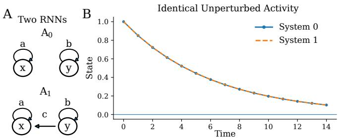
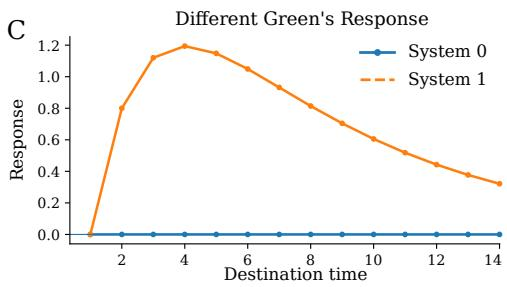
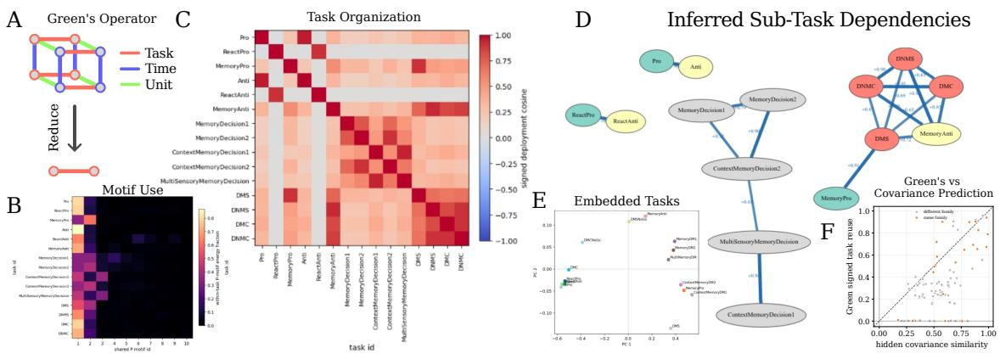
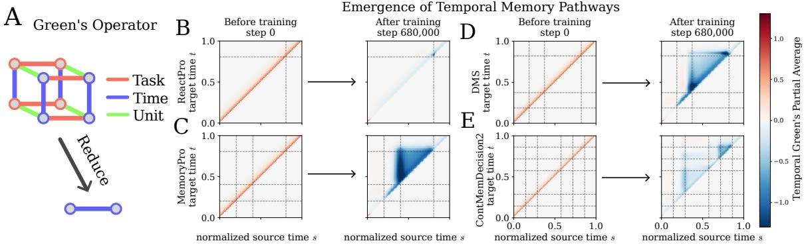

# Disentangling Computation in Multi-Task Neural Networks with the Green’s Operator

James Hazelden1,2∗

1 Applied Mathematics, University of Washington

2 The Allen Institute Seattle, WA, USA jhazelde@uw.edu

## Abstract

How is computation organized and reused across tasks and time in a trained recurrent network? Most analyses emphasize the geometry of neural activity, dynamical motifs, or local perturbation growth. We instead study the network’s global first-order perturbation response. The finite-horizon Green’s operator maps perturbations at each source along a trajectory to their downstream state-space responses and therefore directly represents perturbation routing. Simple reductions of this operator provide task-to-task and time-totime views of the same computation, while matrix-free products make these views accessible without constructing the full operator. In a flexible multitask recurrent network, task reductions reveal structured reuse of known computational motifs, while temporal reductions reveal causal pathways and how they emerge during training. Our main point is simple: the Green’s operator provides a global response geometry for mapping the organization of learned dynamical computation.

Keywords: recurrent neural networks; representational geometry; dynamical systems; perturbation response; multitask computation; Green’s operator

## 1. Introduction

A recurrent network can solve many tasks with the same state space and parameters. This raises a basic question: how is computation organized and reused across tasks and time? Flexible recurrent networks can reuse attractors and other dynamical motifs across related computations (Sussillo and Barak, 2013; Turner and Barak, 2023; Driscoll et al., 2024). The challenge is to obtain a global view of this organization without separately cataloguing every trajectory, fixed point, task condition, time interval, and perturbation direction.

Activity-based analyses describe where trajectories lie and how representations covary. Lyapunov analyses describe how perturbations grow or decay and along which directions (Engelken et al., 2020; Vogt et al., 2022; Storm et al., 2024). Neither representation is organized directly by the question we ask here: if a perturbation enters at this point in the computation, where does its influence appear later, and is that response reused in another task?

We study this source-to-destination structure through the finite-horizon Green’s operator, denoted P. For a trajectory of a dynamical model, P is the linear map from perturbations applied across the computation to the resulting first-order state perturbations. Its blocks encode causal response between particular source and destination points. The same global object is naturally indexed by task, time, trial, and hidden state: reducing diferent axes asks either which computations are reused? or when is influence routed? Our contribution is intentionally narrow: we isolate why this routing is distinct from activity and local spectral stability, then use task- and time-level reductions to map computation in a well-studied flexible multitask RNN (Driscoll et al., 2024).

  
Figure 1: Routing is not determined by activity or local spectrum. Two linear recurrent systems generate the same unperturbed trajectory and have the same eigenvalues, but difer in whether a perturbation in y can influence x. The finitehorizon Green’s operator records this source-to-destination diference directly.

## 2. The Green’s operator: a global response map

Consider a recurrent system linearized along a trajectory,

$$
\delta h _ { t + 1 } = J _ { t } \delta h _ { t } + u _ { t } ,\tag{1}
$$

where $u _ { t }$ is an injected perturbation. Stacking perturbations and downstream state responses over a finite horizon gives

$$
\delta h = \mathrm { P } u .\tag{2}
$$

For $t > s$ , the corresponding block is

$$
\mathrm { P } _ { t , s } = J _ { t - 1 } J _ { t - 2 } \cdot \cdot \cdot J _ { s } ,\tag{3}
$$

with the identity on the diagonal under the convention used here. Thus $\mathrm { P } _ { t , s }$ directly maps a perturbation at source time s to its first-order efect at destination time t. The equivalent global implicit definition $\mathrm { P } = [ D _ { h } F ] ^ { - }$ and its path expansion are given in Appendix A.

For a task-conditioned trajectory τ, let $\mathrm { P } _ { \tau }$ denote the corresponding response operator. We use simple reductions rather than forming its full task/trial/time/state tensor. A task-level representation $G _ { \tau } = \mathcal { R } _ { \mathrm { t a s k } } ( \mathrm { P } _ { \tau } )$ removes nuisance axes while retaining response geometry for task comparison. A time-level reduction $R _ { \tau } ( t , s ) = \mathscr { R } _ { \mathrm { t i m e } } ( \mathrm { P } _ { \tau } ) _ { t , s }$ instead retains source and target time, giving a task-specific map of temporal dependence. The full matrix is never required: a forward recurrence computes $\mathrm { P } u .$ , a reverse recurrence computes $\mathrm { P } ^ { * } v ,$ and these products support randomized low-rank and reduced summaries (Appendix B).

  
Figure 2: Task-level reductions of the Green’s operator expose computational reuse. A, reducing the full task/time/unit response operator gives a task-level view of perturbation reuse. B–E, known motif organization, pairwise Greenresponse similarity, strongest inferred relations, and a low-dimensional embedding provide complementary views of task organization. F, Green-response similarity and hidden-state covariance are related but non-equivalent; points distinguish task pairs from the same versus diferent families.

## 3. A minimal example: same activity, same spectrum, diferent routing

The purpose of the toy is not to show that Lyapunov analysis fails. It isolates a simpler point: observed state trajectories and local eigenvalue spectra do not by themselves specify source-to-destination perturbation routing. Figure 1 compares two stable triangular linear RNNs that generate exactly the same trajectory from the chosen initial condition and have the same eigenvalues, but difer by one of-diagonal route $y  x$ . A perturbation to y therefore has no downstream efect on x in one system and a persistent efect in the other. The exact response is derived in Appendix C.

## 4. Task organization in a flexible multitask RNN

We next ask: which computations are shared across tasks? We analyze a 256-unit leaky RNN trained jointly on the 15-task family of Driscoll et al. (2024), using the converged checkpoint at step 680,000. Prior work already identifies motif reuse in this family; we ask whether it is visible directly in perturbation-response geometry.

For each task condition τ , we compute the same reduced response $G _ { \tau }$ and compare pairs using normalized Frobenius similarity,

$$
S ( \tau , \tau ^ { \prime } ) = \frac { \langle G _ { \tau } , G _ { \tau ^ { \prime } } \rangle _ { F } } { \Vert G _ { \tau } \Vert _ { F } \Vert G _ { \tau ^ { \prime } } \Vert _ { F } } .\tag{4}
$$

The resulting matrix gives a global view of task-conditioned response reuse. It shows block structure aligned with known sub-computations, while disagreements with hidden-state

  
Figure 3: Task-specific temporal response pathways emerge during training. A, reducing the task-conditioned Green’s operator while retaining source and target time gives a temporal routing map. B–E, signed uniform-direction Greenresponse projections before training (step 0) and after training (step 680,000) for ReactPro, MemoryPro, DMS, and ContMemDecision2. Reactive computation remains comparatively local, while memory tasks develop delay-spanning pathways. Exact Frobenius-energy controls are given in Appendix D.

covariance show that activity geometry and response routing are related but non-equivalent. We use the known motif organization as an external reference, not as a claim that Green similarity universally dominates activity-based summaries; controls are in Appendix D.

## 5. Temporal organization emerges during training

The same operator asks a complementary question: when is influence routed? Reducing Pτ over trials and hidden units while retaining source time s and target time t gives Rτ(t, s). Before training, response lies near the causal diagonal; after training, ReactPro remains comparatively local while MemoryPro and DMS develop delay-spanning structure and ContMemDecision2 a more restricted persistent pathway (Figure 3).

Figure 3 displays a signed uniform-direction response projection, not a mathematical neuron trace. An exact basis-invariant Frobenius reduction gives the same qualitative conclusion: MemoryPro gains substantially more long-lag response than ReactPro, while both begin near diagonal at initialization (Appendix D). Training therefore organizes temporal routing diferently for computations with diferent persistence demands.

## 6. Discussion

The task-to-task and time-to-time reductions of the Green’s operator ask complementary questions: what is reused? and when is influence routed? This source-to-destination view complements fixed points, activity geometry, and Lyapunov analysis rather than replacing them. Because the analysis is first-order and finite-horizon and every reduction discards information, our claim is narrow: global response geometry provides a useful matrix-free map of task reuse and temporal routing.

## References

Laura N. Driscoll, Krishna V. Shenoy, and David Sussillo. Flexible multitask computation in recurrent networks utilizes shared dynamical motifs. Nature Neuroscience, 27:1349–1363, 2024. doi: 10.1038/s41593-024-01668-6.

Rainer Engelken, Fred Wolf, and L. F. Abbott. Lyapunov spectra of chaotic recurrent neural networks, 2020. URL https://arxiv.org/abs/2006.02427.

James Hazelden, Laura Driscoll, Eli Shlizerman, and Eric Shea-Brown. The global empirical ntk: Self-referential bias and dimensionality of gradient descent learning, 2026. URL https://arxiv.org/abs/2605.08746.

L Storm, Hampus Linander, J Bec, Kristian Gustavsson, and Bernhard Mehlig. Finite-time lyapunov exponents of deep neural networks. Physical Review Letters, 132(5):057301, 2024.

David Sussillo and Omri Barak. Opening the black box: low-dimensional dynamics in highdimensional recurrent neural networks. Neural Computation, 25(3):626–649, 2013. doi: 10.1162/NECO\ a\ 00409.

Elia Turner and Omri Barak. The simplicity bias in multi-task rnns: Shared attractors, reuse of dynamics, and geometric representation. In A. Oh, T. Naumann, A. Globerson, K. Saenko, M. Hardt, and S. Levine, editors, Advances in Neural Information Processing Systems, volume 36, pages 25495–25507. Curran Associates, Inc., 2023. URL https://proceedings.neurips.cc/paper\_files/paper/2023/file/ 50d6dbc809b0dc96f7f1090810537acc-Paper-Conference.pdf.

Ryan Vogt, Maximilian Puelma Touzel, Eli Shlizerman, and Guillaume Lajoie. On lyapunov exponents for rnns: Understanding information propagation using dynamical systems tools. Frontiers in Applied Mathematics and Statistics, 8, 2022. doi: 10.3389/fams.2022. 818799.

## Appendix A. General operator formulation

A broad class of explicit or implicit models can be written as a global constraint

$$
F ( h , x , \theta ) = 0 ,\tag{5}
$$

where h denotes the collected model state, x the inputs, and θ the model parameters. When $D _ { h } F$ is invertible, the finite-network Green’s operator is

$$
\mathrm { P } = [ D _ { h } F ( h , x , \theta ) ] ^ { - 1 } .\tag{6}
$$

For an explicit acyclic computation graph, a convenient constraint convention gives $D _ { h } F =$ $I - L$ , where L contains one-step state dependencies and is nilpotent. Hence

$$
\mathrm { P } = ( I - L ) ^ { - 1 } = I + L + L ^ { 2 } + \cdots + L ^ { K } ,\tag{7}
$$

for finite K. Each term collects paths of a given length through the computation graph. For recurrent trajectories unrolled over a finite horizon, Eq. (7) is equivalent to the block products in Eq. (3).

This formulation also makes the connection to learning explicit. Diferentiating the constraint with respect to parameters gives

$$
D _ { \theta } h = - \mathrm { P } D _ { \theta } F ,\tag{8}
$$

up to the sign convention used to define F. Thus parameter-to-state learning operators are parameter-selected sketches of the global response geometry. Related empirical operator factorizations are studied in Hazelden et al. (2026).

## Appendix B. Matrix-free products and randomized summaries

For the recurrent system in Eq. (1), a product $y = \mathrm { P } u$ is computed by a single forward recurrence: The adjoint product $z = \mathrm { P } ^ { * } v$ is computed by the reverse recurrence $z _ { T - 1 } =$

Algorithm 1: Forward Green product $y = \mathrm { P } u$

1. Set $y _ { 0 } = u _ { 0 }$ under the identity-diagonal convention.

2. For $t = 0 , \ldots , T - 2 ,$ , set $y _ { t + 1 } = J _ { t } y _ { t } + u _ { t + 1 }$

3. Return the stacked response $y = \left( y _ { 0 } , \ldots , y _ { T - 1 } \right)$

$v _ { T - 1 }$ and $z _ { t } = v _ { t } + J _ { t } ^ { * } z _ { t + 1 }$ . The cost is therefore linear in the horizon times the cost of Jacobian-vector or vector-Jacobian products, without storing the full $T ^ { 2 } N ^ { 2 }$ block operator. These products are suficient for randomized range finding and SVD, Gram products, and stochastic reduced traces or block-energy estimators.

## Appendix C. Toy derivation

For the triangular system $A _ { 1 } = { \binom { a \ c } { 0 \ b } }$ used in Figure 1,

$$
A _ { 1 } ^ { k } = { \binom { a ^ { k } } { 0 } } \ c \sum _ { j = 0 } ^ { k - 1 } a ^ { k - 1 - j } b ^ { j } \bigg ) .\tag{9}
$$

The of-diagonal term is the exact lag-k response from a perturbation in y to a response in x. For $a \neq b$ it is equivalently $c ( a ^ { k } - b ^ { k } ) / ( a - b )$ . The full finite-horizon Green matrix is block lower triangular with blocks $A _ { i } ^ { t - s }$ for $t \geq s ,$ so the two systems difer in source-todestination routing at every lag even though the selected unperturbed trajectory and local eigenvalue spectrum agree.

## Appendix D. Experimental details and reduction controls

Network and tasks. We use a trained 15-task leaky RNN with 256 hidden units and analyze the converged checkpoint at training step 680,000 (checkpoint snapshot 0680000.pt).

The task set is Pro, ReactPro, MemoryPro, Anti, ReactAnti, MemoryAnti, MemoryDecision1/2, ContextMemoryDecision1/2, MultiSensoryMemoryDecision, DMS, DNMS, DMC, and DNMC, following the flexible multitask setup of Driscoll et al. (2024). The Green operator acts on tensors indexed by trial, time, and hidden unit and is evaluated through forward and adjoint products rather than explicit construction.

Task-period comparison. We reduce task-conditioned responses to matched task periods and compare them with the normalized Frobenius similarity in Eq. (4). On the primary network, the 16-trial exact Green comparison gives ROC-AUC 0.932 and average precision 0.795 over 1,106 cross-task condition pairs. In a fair eight-trial comparison, Green similarity gives AUC 0.920 and AP 0.765. Hidden covariance gives 0.852/0.591, Laura-style task variance 0.941/0.812, and a local gain-spectrum baseline 0.785/0.573 (AUC/AP). We therefore treat Green response as a mechanistic complement rather than a universally superior representation. An epoch-preserving semantic-label permutation leaves a lower null AUC $( 0 . 8 1 2 \pm 0 . 0 1 7 ;$ ; observed 0.920, $p = 2 \times 1 0 ^ { - 4 } )$ , indicating that the organization is not explained only by task-period timing.

Trial reliability. With two disjoint, coverage-matched sets of 16 trials per condition, the pairwise Green maps correlate at 0.959, the mean matched-condition cosine is 0.953, and the two recovery AUCs are 0.936 and 0.920. Eight trials per half are noticeably less stable, so detailed pair claims use the larger stratified sample where available.

Temporal reductions. The historical temporal visualization used in Figure 3 corresponds to a uniform-direction response projection, proportional to $\mathbf { 1 } ^ { \top } ( \mathrm { P } _ { t , s } - I ) \mathbf { 1 } / N$ , and should not be interpreted as a mathematical partial trace. We therefore check the temporal conclusion with the basis-invariant Frobenius response RMS

$$
\begin{array} { r } { E ( t , s ) = \sqrt { \mathbb { E } _ { b } \left\| \mathrm { P } _ { t , s } ^ { ( b ) } - I \delta _ { t s } \right\| _ { F } ^ { 2 } / N } . } \end{array}\tag{10}
$$

At step 680,000, the long-range Frobenius-energy fraction is 0.017 for ReactPro and 0.353 for MemoryPro, with near-diagonal fractions 0.660 and 0.167, respectively. At initialization, both long-range fractions are near $5 \times 1 0 ^ { - 4 }$ and both near-diagonal fractions are near 0.83. Across all 15 tasks, persistent computations carry substantially more long-range response after training; these controls support the interpretation that training creates task-appropriate temporal routing rather than merely revealing a pathway present at initialization.

## Appendix E. Additional scope and robustness notes

The response representation is intentionally not presented as a universal replacement for activity or stability-based descriptions. Cross-model comparisons show that task-level Green organization is model-dependent, while continuous-memory and stimulus-integration structure are among the most stable motifs. A notable failure case is category memory: DMC and DNMC can have nearly identical singular-value spectra while their response directions difer substantially, illustrating why gain spectra and routing geometry answer diferent questions. Likewise, task-level Green similarity correlates with gradient alignment in the primary network, but this correlation does not remain unique after controlling for task variance; we therefore do not claim that the present reduction uniquely predicts transfer or interference. These negative results motivate the narrower descriptive claim used in the main text.