# Distributionally robust linear regression through the lens of adversarial training

Elis Stefansson<sup>1</sup>, David Vävinggren<sup>1</sup>, and Antônio H. Ribeiro<sup>1,2</sup>

<sup>1</sup>Uppsala University, Sweden <sup>2</sup>Science for Life Laboratory, Sweden

## Abstract

Distributionally robust optimization (DRO) studies parameter estimation under uncertainty in the underlying probability distribution and has emerged as a principled framework for analyzing robustness and generalization. In particular, Wasserstein DRO, with distributional uncertainty induced by the Wasserstein distance, generalizes several popular regularizers. This paper studies Wasserstein DRO linear regression, unifying square-root Lasso and adversarial linear regression as important special cases. We prove that many properties of these two special cases carry over to this general method. In particular, we show (i) deterministic and non-asymptotic in-sample error bounds ${ \cal O } ( \bar { n } ^ { - 1 / 2 } )$ in general and $O ( n ^ { - 1 } )$ under design matrix and sparsity conditions; (ii) insensitivity to the noise level, also known as the pivotal property; and (iii) solution equivalences for small and large ambiguity sets. The key proof step is to recast the method into a quadratic form, mimicking adversarial linear regression. We also show that the method can be solved eficiently, and we validate our findings through numerical simulations.

## 1 Introduction

Distributionally robust optimization (DRO) studies parameter estimation under uncertainty in the probability distribution. Consider the traditional linear regression setting, where we have n input-output samples $( \pmb { x } _ { i } , y _ { i } ) _ { i = 1 } ^ { n }$ and we want to find a linear mapping between inputs x and outputs y, with squared error loss. The DRO formulation solves this problem by minimizing the expected loss with respect to a decision parameter $\beta$ under the worst-case distribution:

$$
\operatorname* { i n f } _ { \beta } \operatorname* { s u p } _ { \mathbb { Q } \in \mathbb { B } _ { \delta } ( \widehat { \mathbb { P } } _ { n } ) } \mathbb { E } _ { ( \pmb { x } , \boldsymbol { y } ) \sim \mathbb { Q } } [ ( \beta ^ { \top } \pmb { x } - \boldsymbol { y } ) ^ { 2 } ] .\tag{1}
$$

Here, $\mathbb { B } _ { \delta } ( \widehat { \mathbb { P } } _ { n } )$ is a ball of radius $\delta \geq 0$ around the empirical distribution $\widehat { \mathbb { P } } _ { n }$ capturing the set of distributions, b balso known as the ambiguity set. DRO serves as a principled framework for capturing distributional uncertainty, being a natural tool for studying both generalization and out-of-distribution performance (Shafiee et al., 2025; Kuhn et al., 2025).

In this paper, we build on the broader relationship between robustness and regularization. Following the introduction of the regularization method Lasso (Tibshirani, 1996), several variants have been suggested to improve its statistical and practical properties. In particular, square-root Lasso was proposed as an alternative to Lasso that allows the regularization strength to be set without knowing the variance of the noise (Belloni et al., 2011), a property sometimes called pivotal estimation. The procedure has also been shown to be an instance of robust optimization (Xu et al., 2008a). More recently, with the growing interest in adversarial robustness, researchers found that adversarial linear regression has the same pivotal property (Ribeiro et al., 2023; Xie & Huo, 2024).

One interesting observation is that both square-root Lasso and adversarial linear regression can be unified as instances of DRO. Indeed, letting the ambiguity ball $\mathbb { B } _ { \delta } ( \widehat { \mathbb { P } } _ { n } )$ be induced by the p-Wasserstein distance b(an optimal transport distance), there are close connections to several regularizers (Kuhn et al., 2019). In particular, linear regression using the 2-Wasserstein distance is equivalent to square-root Lasso (Blanchet et al., 2019), while -Wasserstein DRO corresponds to adversarially trained linear regression (see, e.g., Zhang et al. 2024, Theorem 2). This raise the natural question whether other methods in the p-Wasserstein DRO family share the same properties, such as being pivotal estimators.

Contributions. In this paper, we study linear regression under square loss, where the ambiguity set is given by the p-Wasserstein distance with $2 \leq p \leq \infty$ . For short, we call this method Wasserstein DRO linear regression. We show that many properties of the special cases square-root Lasso $\left( p = 2 \right)$ and adversarially trained linear regression $( p = \infty )$ carry over to this more general method, including the pivotal property, slow and fast error rates, and equivalences in the small and large δ regimes. More precisely, our contributions are:

• We derive an equivalent form of the robust risk (the inner supremum of (1)) for Wasserstein DRO linear regression (Section 4).

• We prove deterministic and non-asymptotic in-sample error bounds $O ( n ^ { - 1 / 2 } )$ in general and $O ( n ^ { - 1 } )$ under design matrix and sparsity conditions, generalizing results that were previously only known for square-root Lasso and adversarially trained linear regression (Section 5).

• We characterize the solution for small and large radii δ in (1), respectively, where small values correspond to minimum norm interpolation in the overparametrized setting, and large values to the zero solution being optimal (Section 6).

• We provide tailored numerical solvers for Wasserstein DRO linear regression (Section 7) and conduct numerical experiments validating our findings (Section 8).

The paper is structured as follows. Section 2 covers related work. Section 3 presents preliminaries. Sections 4, 5 and 6 provide analytic properties we described in the contributions above, followed by numerical solvers (Section 7), simulations (Section 8) and conclusion (Section 9). Our implementation and experiments are available at https://github.com/elisst/dro.

## 2 Related work

DRO has a long history dating back to the pioneering work of Scarf et al. (1957), and has recently received substantial interest in the machine learning community as a principled way to account for distributional uncertainty in the data; see, e.g., the recent survey (Kuhn et al., 2025).

Wasserstein DRO. DRO with p-Wasserstein distance has been studied in both the classification and the regression settings, see the survey (Kuhn et al., 2019) and the references therein. In particular, Wasserstein DRO linear regression (under various loss functions) has mainly been studied for the special cases $p = 1$ and $p = 2 ,$ , see (Blanchet et al., 2019; Gao et al., 2022; Blanchet et al., 2021; Shafieezadeh-Abadeh et al., 2019; Kuhn et al., 2019; Aolaritei et al., 2026). Notably, Aolaritei et al. (2026) seek asymptotic statistical guarantees for a class of linear prediction problems in the high-dimensional regime with $p = 1$ and $p = 2$ . We instead provide non-asymptotic statistical guarantees for Wasserstein DRO linear regression (with square loss) uniformly over the range $2 \leq p \leq \infty .$ .<sup>1</sup>

Wu et al. (2026) consider generalization bounds for a general learning objective, which could be applied to linear regression. However, their high-probability bound scales as $O ( n ^ { - 1 / ( 2 p ) } )$ with an improved $( p -$ independent) slow rate of $O ( n ^ { - 1 / 2 } )$ that is not applicable to square loss (Wu et al., 2026, Assumption 1). There are also other generic high-probability generalization bounds that, e.g., assume Lipschitz loss (Shafieezadeh-Abadeh et al., 2019; An & Gao, 2021; Gao, 2023) or a compact domain (Le & Malick, 2025), neither of which holds for square loss. Additionally, these generic bounds (derived from concentration-based methods) typically have no explicit dependence on the noise. We instead derive deterministic error bounds with explicit dependence on the noise, inspired by Belloni et al. (2011); Ribeiro et al. (2023); Xie & Huo (2024) and Wainwright (2019, Chapter 7), that with high probability enjoy both slow rates $O ( n ^ { - 1 / 2 } )$ and fast rates $O ( n ^ { - 1 } )$ uniformly in p.

Connection between DRO and regularization. Several well-known regularization techniques in machine learning have found connections with DRO, such as square-root Lasso (Xu et al., 2008a; Blanchet et al., 2019) with higher-order generalizations (Montiel Olea et al., 2022), regularized logistic regression and support vector machines (Blanchet et al., 2019), ridge regression (Shafieezadeh-Abadeh et al., 2019; Li et al., 2022), adversarial training (Gao et al., 2022; Pydi & Jog, 2021), as well as close correspondences to total variation, Lipschitz-variation and gradient variation (Gao et al., 2022) as well as higher-order variation (Shafiee et al., 2026). In particular, square-root Lasso is equivalent to Wasserstein DRO linear regression with square loss and $p = 2$ (Blanchet et al., 2019), while the $p = \infty$ case coincides with adversarial linear regression, since adversarial training and -Wasserstein DRO are equivalent (under mild conditions); see Zhang et al. (2024) for a general result. Our work builds upon this research direction by unifying these two instances as special cases of the more general Wasserstein DRO linear regression with square loss $( 2 \leq p \leq \infty )$ , where we extend fundamental properties such as error rates and the pivotal property to this unifying method.

Tractable reformulations. There has been substantial work to make DRO tractable by reformulating the DRO objective as a finite-dimensional optimization problem, commonly via a dual representation of the inner supremum (Shafieezadeh-Abadeh et al., 2019; Shafiee et al., 2026), see Zhang et al. (2024) for a general result. In particular, using this dual representation, Shafiee et al. (2026, Proposition 2 and 3) and Kuhn et al. (2025, Theorem 7.20) both show that the DRO objective is equivalent to a finite convex program, under assumption that the loss is a (finite maximum of) concave function(s). However, such assumptions do not hold in our case due to the square loss.

The work Shafiee et al. (2026) also considers linear prediction models and shows that the dual representation then admits a lower-dimensional form, where an inner supremum (cf. Proposition 1) is recast into an expectation over a (possibly nonconvex) univariate maximization (see Shafiee et al. 2026, Theorem 4). In this paper, we note that for Wasserstein DRO linear regression (a special case of linear prediction models), this one-dimensional representation becomes unimodal, which we use in the numerical solvers. Furthermore, Kuhn et al. (2019) present convex forms for p-Wasserstein linear regression with square loss and $p = 2$ (and $p = 1$ for other loss functions), whereas we consider the whole range $2 \ \leq \ p \ \leq \ \infty$ . Finally, we note that our dual form (Theorem 1) naturally generalize adversarial linear regression (Ribeiro et al., 2023, Proposition 1) by coupling the radius constraints, and also identifies a case in which robust optimization forms coincides with DRO (see, e.g., Gao & Kleywegt 2023, Corollary 2(iii) and An & Gao 2021, Proposition 2 for approximate results).

## 3 Background

In this section, we describe the setup and relevant results in DRO and adversarial linear regression.

Wasserstein distance. Let $\mathcal { P } ( \mathcal { Z } )$ denote the set of probability distributions with support . One common choice of distance between such probability distributions is the p-Wasserstein distance $W _ { p }$ , where $1 \leq p \leq \infty$ is the order of this distance. More precisely, the p-Wasserstein distance $W _ { p }$ with $1 \leq p <$ is given by

$$
W _ { p } ( \mathbb { P } , \widehat { \mathbb { P } } _ { n } ) : = \left( \operatorname* { i n f } _ { \pi \in \Pi ( \mathbb { P } , \widehat { \mathbb { P } } _ { n } ) } \mathbb { E } _ { ( z , z ^ { \prime } ) \sim \pi } [ \| z - z ^ { \prime } \| ^ { p } ] \right) ^ { 1 / p } ,\tag{2}
$$

where $\Pi ( \mathbb { P } , \widehat { \mathbb { P } } _ { n } )$ is the set of all distributions in $\mathcal { P } ( \mathcal { Z } ) \times \mathcal { P } ( \mathcal { Z } )$ with marginals P and $\widehat { \mathbb { P } } _ { n }$ , respectively, and $\| \cdot \|$ bis a norm. Intuitively, $\| z - z ^ { \prime } \| ^ { p }$ bin (2) captures the cost of moving probability mass from $z \ \mathrm { t o } \ z ^ { \prime }$ where the infimum picks the strategy π with the least total cost for moving $\mathbb { P }$ to $\widehat { \mathbb { P } } _ { n }$ . The normalization with the p-th root is to ensure that $W _ { p }$ bis a metric (Kuhn et al., 2019). Moreover, for $p = \infty .$ , we have $\begin{array} { r } { W _ { \infty } ( \mathbb { P } , \widehat { \mathbb { P } } _ { n } ) : = \operatorname* { i n f } _ { \pi \in \Pi ( \mathbb { P } , \widehat { \mathbb { P } } _ { n } ) } \operatorname { e s s } \operatorname* { s u p } _ { ( z , z ^ { \prime } ) \sim \pi } [ \| z - z ^ { \prime } \| ] } \end{array}$

Strong duality. Consider the Wasserstein DRO problem

$$
\operatorname* { i n f } _ { \beta } \operatorname* { s u p } _ { \mathbb { Q } \in \mathbb { B } _ { \delta } ( \widehat { \mathbb { P } } _ { n } ) } \mathbb { E } _ { z \sim \mathbb { Q } } [ h _ { \beta } ( z ) ]
$$

with objective $h _ { \beta } : \mathcal { Z }  \mathbb { R }$ and ambiguity set $\mathbb { B } _ { \delta } ( \widehat { \mathbb { P } } _ { n } ) = \{ \mathbb { Q } \in \mathcal { P } ( \mathcal { Z } ) : W _ { p } ( \mathbb { Q } , \widehat { \mathbb { P } } _ { n } ) \leq \delta \}$ induced by the bp-Wasserstein distance centered around the empirical distribution ${ \widehat { \mathbb { P } } } _ { n } .$ b, where the empirical distribution is $\begin{array} { r } { \widehat { \mathbb { P } } _ { n } : = \frac { 1 } { n } \sum _ { i = 1 } ^ { n } \delta _ { z } . } \end{array}$ for $\delta _ { z _ { i } }$ the Dirac point mass at data sample $z _ { i } \in \mathcal { Z }$

Here, we will denote by $V _ { \delta }$ the inner supremum objective function. In particular, with the given definition of $\mathbb { B } _ { \delta } ( \widehat { \mathbb { P } } _ { n } )$ , we can write:

$$
V _ { \delta } ( \beta ) : = \operatorname* { s u p } _ { \mathbb { Q } } \{ \mathbb { E } _ { z \sim \mathbb { Q } } [ h _ { \beta } ( z ) ] : W _ { p } ( \mathbb { Q } , \widehat { \mathbb { P } } _ { n } ) \leq \delta \} ,\tag{3}
$$

which we will call the robust risk. Using strong duality, we have the following result:

Proposition 1 (Strong duality). Let $h _ { \beta } : \mathcal { Z }  \mathbb { R }$ be a measurable function with $\mathbb { E } _ { \widehat { \mathbb { P } } _ { n } } [ h _ { \beta } ] > - \infty$ . Then the robust risk in (3) equals:

$$
V _ { \delta } ( \beta ) \ = \operatorname* { m i n } _ { \lambda \geq 0 } \left( \lambda \delta ^ { p } + \mathbb { E } _ { z \sim \widehat { \mathbb { P } } _ { n } } \Big [ \operatorname* { s u p } _ { z ^ { \prime } \in \mathcal { Z } } \big ( h _ { \beta } ( z ^ { \prime } ) - \lambda \| z ^ { \prime } - z \| ^ { p } \big ) \Big ] \right) .\tag{4}
$$

Proposition 1 is a straightforward application of the general result Zhang et al. (2024, Theorem 1) and the first step to our equivalent form for linear regression (Theorem 1) in Section 4.

Wasserstein DRO linear regression. We focus on p-Wasserstein DRO linear regression. That is, $z _ { i } =$ $( \pmb { x } _ { i } , \pmb { y } _ { i } ) \in \mathcal { Z } = \mathbb { R } ^ { d + 1 }$ and $h _ { \beta } ( z ) \overset { \vartriangle } { = } ( \beta ^ { \top } x - y ) ^ { 2 }$ . We restrict our attention to the norm $\left\| z _ { i } ^ { \prime } - z _ { i } \right\| = \left\| \pmb { x } _ { i } ^ { \prime } - \pmb { x } _ { i } \right\| +$ $\infty | y _ { i } ^ { \prime } - y _ { i } |$ . Here, $\infty | y _ { i } ^ { \prime } - y _ { i } |$ is shorthand for + if $y _ { i } ^ { \prime } \neq y _ { i }$ and zero otherwise. These restrictions result in a close correspondence to square-root Lasso and adversarial linear regression.

Remark 1. We exclude $1 \le p < 2$ since in this case the robust risk $V _ { \delta } ( \beta )$ becomes infinite. The reason is that the squared loss increases faster than the penalty for moving probability mass, resulting in an unbounded robust risk. See the appendix for a detailed derivation.

Adversarial linear regression. Our work also considers connections with adversarial linear regression. Adversarial linear regression considers linear regression where each input $\pmb { x } _ { i } \in \mathbb { R } ^ { d }$ is adversarially perturbed by $\Delta { \pmb x } _ { i }$ within a fixed budget $\| \Delta \pmb { x } _ { i } \| \leq \delta$ (uniform over all inputs) to form the worst-case risk:<sup>2</sup>

$$
V _ { \delta } ^ { \mathrm { a d v } } ( \beta ) : = \frac { 1 } { n } \sum _ { i = 1 } ^ { n } \operatorname* { s u p } _ { \| \Delta \mathbf { x } _ { i } \| \leq \delta } ( ( x _ { i } + \Delta x _ { i } ) ^ { \top } \beta - y _ { i } ) ^ { 2 } = \frac { 1 } { n } \sum _ { i = 1 } ^ { n } ( | \mathbf { x } _ { i } ^ { \top } \beta - y _ { i } | + \delta \| \beta \| _ { * } ) ^ { 2 } ,\tag{5}
$$

where the last equality follows by rewriting the supremum inside the sum using a simple dual norm argument; see, e.g., Proposition 1 in Ribeiro et al. (2023). In Section 4, we generalize this form to Wasserstein DRO linear regression (Theorem 1), a key step in establishing the analytical properties.

## 4 Equivalent form

In this section, we present an equivalent form of the robust risk $V _ { \delta } ( \beta )$ , called the robust quadratic $f o r m$ All analytic properties of Wasserstein DRO linear regression shown in subsequent sections are based on this form.

Theorem 1 (Robust quadratic form). The robust risk of Wasserstein DRO linear regression $( 2 \leq p \leq$ ) equals

$$
V _ { \delta } ( \beta ) = \operatorname* { s u p } _ { t _ { i } \geq 0 , \| t \| _ { p } \leq n ^ { 1 / p } \delta } \frac { 1 } { n } \sum _ { i = 1 } ^ { n } ( | x _ { i } ^ { \top } \beta - y _ { i } | + t _ { i } \| \beta \| _ { * } ) ^ { 2 } .\tag{6}
$$

Crucially, the right-hand side of (6) can naturally be interpreted as an adversarial linear regression with a variable perturbation budget for each sample. Indeed, for $p = \infty$ , we have that (6) coincides with (5) since the optimal outer constraint becomes $\| \mathbf { \boldsymbol { t } } \| _ { \infty } = \delta$ (optimum is attained on the boundary) yielding $\| \Delta \pmb { x } _ { i } \| \leq \delta ,$ i.e., a fixed perturbation budget δ for each input sample $\mathbf { \Delta } _ { \mathbf { \mathcal { X } } _ { i } }$ . In the general $2 \leq p \leq$ case, these perturbation budgets $t _ { i }$ can vary between samples, as long as the overall budget constraint $\| \pmb { t } \| _ { p } \leq n ^ { 1 / p } \delta$ is fulfilled. Thus, (6) naturally generalizes the objective of adversarial linear regression. This is the key step to show analytical properties, since it allows us to extend proofs from the adversarial setting.

The proof of Theorem 1 starts by recasting the supremum in (4) as a one-dimensional concave supremum from which (6) is shown using a change of variables and strong duality; see the appendix for details. Finally, Theorem 1 yields a simple proof not only that $p = \infty$ coincides with adversarial linear regression, but also that $p = 2$ corresponds to square-root Lasso (Xu et al., $2 0 0 8 \mathrm { a } ;$ Blanchet et al., 2019), by simply computing the robust risk. We summarize these findings with the following corollary (using $V _ { p , \delta } ( \beta )$ to temporarily stress dependence on p):

Corollary 1 (Special cases). Wasserstein DRO linear regression with $p = 2$ has robust risk $V _ { 2 , \delta } ( \beta ) =$ $\begin{array} { r } { \left( \sqrt { \frac { 1 } { n } \sum _ { i = 1 } ^ { n } ( { \pmb x } _ { i } ^ { T } \beta - y _ { i } ) ^ { 2 } } + \delta \| \beta \| _ { * } \right) ^ { 2 } } \end{array}$ , and thus corresponds to square-root Lasso by taking $\| \cdot \| = \|$ <sub>∞</sub>, while $p = \infty$ corresponds to adversarial linear regression with the continuous limit $V _ { \infty , \delta } ( \beta ) =$ $\begin{array} { r } { \operatorname* { l i m } _ { p \to \infty } V _ { p , \delta } ( \beta ) = \sum _ { i = 1 } ^ { n } \operatorname* { s u p } _ { \| \pmb { v } _ { i } \| \le \delta } ( ( \pmb { x } _ { i } + \pmb { v } _ { i } ) ^ { T } \beta - y _ { i } ) ^ { 2 } } \end{array}$

Remark 2. Weaker versions of Theorem 1 are described in other papers. The right-hand side of (6) is shown to lower-bound the robust risk (Kuhn et al., 2019, Theorem 6), but that work does not explicitly show when equality holds. For $p = \infty$ , Zhang et al. (2024, Theorem 2) proves this result in general, while Kuhn et al. (2025, Proposition 6.16) shows that equality holds and a saddle-point exists, but only for compact sets. We show that equality in fact holds for all $2 \leq p \leq \infty$ for linear regression. See also Gao & Kleywegt (2023, Corollary 2(iii)) and An & Gao (2021, Proposition 2) for results that only hold approximately.

## 5 Error bounds

In this section, we derive error bounds for Wasserstein DRO linear regression (with $2 \leq p \leq \infty )$ . We consider the following data-generating mode $y _ { i } = x _ { i } ^ { \top } \beta ^ { * } + \varepsilon _ { i }$ with true parameter $\beta ^ { * } \in \mathbb { R } ^ { d }$ and noise $\varepsilon _ { i } \in \mathbb { R }$ . More precisely, the quantity of interest is the average in-sample error $\scriptstyle { \frac { 1 } { n } } \parallel X \hat { \Delta } \parallel _ { 2 } ^ { 2 }$ , where X is the $n \times d$ data matrix with row i given by $\mathbf { \nabla } _ { \mathbf { x } _ { i } , }$ and $\widehat { \Delta } : = \widehat { \beta } - \beta ^ { * }$ bis the diference between the estimated parameter $\widehat { \beta }$ and the true parameter $\beta ^ { * }$ , where $\widehat { \beta }$ b bis the minimizer of $V _ { \delta } ( \beta )$ . The aim is to upper bound $\frac { 1 } { n } \| X \widehat { \Delta } \| _ { 2 } ^ { 2 }$ bas a function of $\delta ,$ bwhich we can then use to find good decay rates by tuning $\delta = \delta ( n )$ appropriately.<sup>3</sup>

We derive a slow error decay rate $O ( 1 / \sqrt { n } )$ (Theorem 2) without any additional assumptions on the data. In Section 5.2, we then improve this to a fast rate $O ( 1 / n )$ (Theorem 3) by assuming a restricted eigenvalue condition and focusing on the infinity norm $\| \cdot \| = \| \cdot \| _ { \infty }$ . Moreover, for both the slow rate and the fast rate, the pivotal property (that is, tuning $\delta = \delta ( n )$ to achieve the rate is independent of the noise level) comes out for free.

## 5.1 Slow rate of $O ( 1 / \sqrt { n } )$

To show the desired error rate, we first show the following bound on $\scriptstyle { \frac { 1 } { n } } \parallel X \hat { \Delta } \parallel _ { 2 } ^ { 2 }$ :

Lemma 1. The average in-sample error is bounded by

$$
\frac { 1 } { n } \| X \widehat { \Delta } \| _ { 2 } ^ { 2 } \leq \frac { 2 } { n } \varepsilon ^ { \top } X \widehat { \Delta } + 2 \delta \frac { \| \varepsilon \| _ { q } } { n ^ { 1 / q } } \| \beta ^ { * } \| _ { * } + \delta ^ { 2 } \| \beta ^ { * } \| _ { * } ^ { 2 } .\tag{7}
$$

Lemma 1 is a first step toward obtaining sharp in-sample error upper bounds, where the important quantity to bound is $\begin{array} { r } { \frac { 2 } { n } \varepsilon ^ { \top } X \widehat { \Delta } } \end{array}$ . Crucially, $\begin{array} { r } { \frac { 2 } { n } \pmb { \varepsilon } ^ { \top } { \boldsymbol { X } } \hat { \Delta } \leq \frac { \bar { 2 } } { n } \| { \boldsymbol { X } } ^ { \top } \pmb { \varepsilon } \| \| \hat { \Delta } \| , } \end{array}$ <sub>∗</sub>. Thus, provided $\| \widehat { \Delta } \| _ { * }$ is bounded (true i ${ \mathrm { ~ f ~ } } \| { \widehat { \boldsymbol { \beta } } } \| ,$

is bounded) and $\frac { 2 } { n } \lVert X ^ { \top } \varepsilon \rVert$ decreases with n (typical for, $\mathrm { e . g . }$ , Gaussian noise $\varepsilon )$ , we may obtain decreasing upper bounds as long as δ decreases with n. The next result shows that $\| { \widehat { \boldsymbol { \beta } } } \|$ <sub>∗</sub> can be bounded by $\| \beta ^ { * } \| _ { : }$ <sub>∗</sub>:

Lemma 2. If $\delta > 2 \frac { \| X ^ { \top } \pmb \varepsilon \| } { n ^ { 1 / p } \| \pmb \varepsilon \| _ { q } }$ , then

$$
\| \widehat { \pmb { \beta } } \| _ { * } \leq \left( 3 + \frac { n ^ { 1 / q } \delta } { \| \pmb { \varepsilon } \| _ { q } } \| \pmb { \beta } ^ { * } \| _ { * } \right) \| \pmb { \beta } ^ { * } \| _ { * }\tag{8}
$$

Importantly, Lemma 2 combined with Lemma 1 enables us to prove a slow rate $O ( n ^ { - 1 / 2 } )$ , with the slow rate of square-root Lasso $( p = 2 )$ and adversarial training $( p = \infty )$ as special cases:

Theorem 2. Assume $\begin{array} { r } { \delta > \bar { \delta } : = 2 \frac { \| X ^ { \top } \varepsilon \| } { n ^ { 1 / p } \| \varepsilon \| _ { q } } } \end{array}$ . Then

$$
\frac { 1 } { n } \| X \widehat { \Delta } \| _ { 2 } ^ { 2 } \leq 6 \frac { \| \varepsilon \| _ { q } } { n ^ { 1 / q } } \delta \| \beta ^ { * } \| _ { * } + 2 \delta ^ { 2 } \| \beta ^ { * } \| _ { * } ^ { 2 } .\tag{9}
$$

In particular, let $\varepsilon \sim N ( 0 , \sigma ^ { 2 } I _ { n } )$ and assume each entry of X is bounded by $M > 0$ . Then, with high probability (independent of the Wasserstein parameter $p ) { \mathrm { : } }$

$$
\frac { 1 } { n } \| X \widehat { \Delta } \| _ { 2 } ^ { 2 } \in O ( \delta ) .
$$

That is, the error rate coincides with δ (as long as $\delta > \bar { \delta } )$ . In particular, let $c > 0$ be the normequivalence constant between $\| \cdot \| _ { \infty }$ and $\| \cdot \|$ , that is, $\| \cdot \| _ { \infty } \leq c \| \cdot \|$ . Then, by setting $\begin{array} { r } { \delta = K M \sqrt { \frac { \log ( d / \gamma ) } { n } } } \end{array}$ with $K > 2 c { \sqrt { \pi } }$ , we get with probability greater than $1 - 4 \gamma \colon$

$$
\frac { 1 } { n } \| X \widehat { \Delta } \| _ { 2 } ^ { 2 } \in O ( n ^ { - 1 / 2 } ) .\tag{10}
$$

Theorem 2 shows that $p { \mathrm { - } } \mathrm { W }$ asserstein linear regression can achieve the rate $O ( 1 / \sqrt { n } )$ , where we recover the previously obtained rates for square-root Lasso (Belloni et al., 2011) $( p = 2 )$ and adversarial linear regression (Ribeiro et al., 2023) $( p = \infty )$ .

Pivotal property. The tuning $\begin{array} { r } { \delta = K M \sqrt { \frac { \log ( d / \gamma ) } { n } } } \end{array}$ in Theorem 2 is independent of the noise level $\sigma$ of $\varepsilon \sim N ( 0 , \sigma ^ { 2 } I )$ ; hence, we do not need to estimate σ. This independence is known as the pivotal property. Previously, both square-root Lasso $( p = 2 )$ and adversarial linear regression $( p = \infty )$ were known to be pivotal (Belloni et al., 2011; Ribeiro et al., 2023). Here, we show that the same holds for the more general p-Wasserstein linear regression with $2 \leq p \leq \infty$ , suggesting that the pivotal property is tightly linked to Wasserstein robustification.

Sketch of proof of Theorem 2. We bound $ { \frac { 2 } { n } } \varepsilon ^ { \top } X  { \widehat { \Delta } }$ as $\begin{array} { r } { \frac { 2 } { n } \pmb { \varepsilon } ^ { \top } \boldsymbol { X } \widehat { \Delta } \leq \frac { 2 } { n } \| \boldsymbol { X } ^ { \top } \pmb { \varepsilon } \| \| \widehat { \Delta } \| _ { * } \leq \frac { 2 } { n } \| \boldsymbol { X } ^ { \top } \pmb { \varepsilon } \| ( \| \widehat { \beta } \| _ { * } + \| \beta ^ { * } \| _ { * } ) } \end{array}$ and then use Lemma 2 with $\delta n ^ { 1 / p } \lVert \varepsilon \rVert _ { q } > 2 \lVert X ^ { \top } \varepsilon \rVert$ to get $\begin{array} { r } { \frac { 2 } { n } \pmb { \varepsilon } ^ { \top } X \widehat { \Delta } \leq 4 \frac { \| \pmb { \varepsilon } \| _ { q } } { n ^ { 1 / q } } \delta \| \pmb { \beta } ^ { * } \| _ { * } + \delta ^ { 2 } \| \pmb { \beta } ^ { * } \| _ { * } ^ { 2 } , } \end{array}$ , which, when binserted into Lemma 1, yields (9). Moreover, the rates are obtained by standard high-probability bounds for Gaussians. For a full proof, see the appendix. □

## 5.2 Fast rate of $O ( 1 / n )$ under the restricted eigenvalue condition

In this section, we show the fast in-sample error rate $O ( 1 / n )$ by assuming a restricted eigenvalue condition and focusing our attention to the infinity norm $\| \cdot \| = \| \cdot \| _ { \infty }$ . The restricted eigenvalue condition reads (Hastie et al., 2015):

Definition 1 (Restricted eigenvalue condition (Hastie et al., 2015)). The matrix $\ b { X } \in \mathbb { R } ^ { n \times d }$ satisfies

the restricted eigenvalue (RE) condition if there exists a positive constant $\kappa = \kappa ( s , l ) > 0$ such that

$$
\kappa \leq \operatorname* { m i n } \left\{ \frac { \left\| X \pmb { v } \right\| _ { 2 } } { \sqrt { n } \| \pmb { v } \| _ { 2 } } : | S | \leq s , \pmb { v } \in \mathbb { R } ^ { d } \backslash \{ 0 \} , \| \pmb { v } _ { S ^ { c } } \| \leq l \| \pmb { v } _ { S } \| \right\}
$$

where S is some subset of $\{ 1 , 2 , \ldots , d \}$

Let $\mathrm { R E } ( s , l )$ denote the set of matrices X that satisfy the RE condition. We have the fast rate result:

Theorem 3. Let $\beta ^ { * }$ have s nonzero entries indexed by $S \subseteq \{ 1 , \ldots , d \}$ with $s = | S |$ , assume $X$ is in $\mathrm { R E } ( s , 3 )$ with positive constant $\kappa = \kappa ( s , 3 )$ (same for all n), and consider $\| \cdot \| = \| \cdot \| _ { \infty }$ . Then with $\begin{array} { r } { \delta > \bar { \delta } : = 2 \frac { \| X ^ { \top } \pmb \varepsilon \| } { n ^ { 1 / p } \| \pmb \varepsilon \| _ { q } } } \end{array}$ , we have

$$
\frac { 1 } { n } \| X \widehat { \Delta } \| _ { 2 } ^ { 2 } \leq \delta ^ { 2 } \cdot \operatorname* { m a x } \left\{ 4 C ^ { 2 } \| \beta ^ { * } \| _ { 1 } ^ { 2 } , \frac { 1 6 B ^ { 2 } s ^ { 2 } } { \kappa ^ { 2 } } \right\}\tag{11}
$$

where $\begin{array} { r } { B = 3 \frac { \| \varepsilon \| _ { q } } { n ^ { 1 / q } } + ( 2 M C + \delta C + \delta ) \| \beta ^ { * } \| } \end{array}$ <sub>∗</sub> and $\begin{array} { r } { C = ( 3 + \frac { n ^ { 1 / q } \delta } { \| \varepsilon \| _ { q } } \| \beta ^ { * } \| _ { * } ) } \end{array}$ and each entry of X is bounded by $M > 0$ . In particular, for $\varepsilon \sim N ( 0 , \sigma ^ { 2 } I _ { n } )$ , we have with high probability that B and $C$ are bounded by constants and therefore (independent of the Wasserstein parameter $p )$

$$
\frac { 1 } { n } \| X \widehat { \Delta } \| _ { 2 } ^ { 2 } \in O \left( \delta ^ { 2 } \right) .\tag{12}
$$

Thus, setting $\delta$ as in Theorem 2, we get the fast rate with probability greater than $1 - 5 \gamma ;$

$$
\frac 1 n \| X \widehat { \Delta } \| _ { 2 } ^ { 2 } \in O \left( 1 / n \right) .\tag{13}
$$

Theorem 3 shows that the general $p { \mathrm { - } } \mathrm { W }$ asserstein linear regression $( 2 \leq p \leq \infty )$ can achieve the rate $O ( 1 / n )$ similar to previous results obtained for square-root Lasso (Belloni et al., 2011) $\left( p = 2 \right)$ and for adversarial linear regression (Xie & Huo, 2024) $( p = \infty )$ . Moreover, just as in the slow rate, the tuning scheme $\begin{array} { r } { \delta = K M \sqrt { \frac { \log ( d / \gamma ) } { n } } } \end{array}$ makes the method pivotal.

## 6 Small and large ambiguity balls

Here, we characterize the minimizer $\widehat { \beta }$ of $V _ { \delta } ( \beta )$ when the radius $\delta$ of the ambiguity set is small and large, brespectively. These results generalize conditions from adversarial linear regression (Ribeiro et al., 2023, Theorem 1 and Proposition 3) to the general p-Wasserstein linear regression $( 2 \leq \ p \leq \infty )$ . Importantly, these results also apply to square-root Lasso $( p = 2 )$ , which is novel to the best of our knowledge. We start with the large regime.

Large δ regime. The first result shows that the zero solution $\beta = 0$ minimizes $V _ { \delta } ( \beta )$ for a suficiently large radius $\delta \geq \delta _ { L }$ . In other words, for large ambiguity sets, the optimal solution is to be maximally conservative.

Theorem 4 (Large δ regime). The zero solution $\beta = 0$ minimizes $V _ { \delta } ( \beta )$ if and only if

$$
\delta \geq \delta _ { L } : = \frac { \| X ^ { \top } \pmb { y } \| } { n ^ { 1 / p } \| \pmb { y } \| _ { q } } .
$$

Small δ regime. For the small δ regime, we follow Ribeiro et al. (2023) and consider the overparametrized setting where we assume $\ b { X } \in \mathbb { R } ^ { n \times d }$ to have full row rank and $n < d .$ In this setting, there are multiple solutions to the original least-squares problem $X \beta = y ;$ , where a natural solution is to take the minimal $\lVert \cdot \rVert _ { N ^ { - } \mathrm { { n o r m } } }$ interpolator $\hat { \beta }$ that solves min $. . \boldsymbol { \mathrm { { X } } } \beta { = } y ~ { \| } \beta { \| } _ { N }$ for a given norm $\| \cdot \| _ { N }$ . The next result shows that for a small enough radius $\delta \leq \delta _ { S }$ , the minimal $\| \cdot \| _ { * } .$ -norm interpolator minimizes $V _ { \delta } ( \beta )$ :

Theorem 5 (Small δ regime). Let X be of full row rank and $Q = \arg \operatorname* { m a x } _ { \| X ^ { T } \pmb { \alpha } \| \le 1 } \pmb { \alpha } ^ { \top } \pmb { y }$ . Then the minimum $\| \cdot \| _ { * }$ -norm interpolator $\hat { \beta }$ minimizes $V _ { \delta } ( \beta )$ if and only if

$$
\delta \leq \delta _ { S } : = \left\{ \begin{array} { l l } { \frac { 1 } { n \operatorname* { m i n } _ { \alpha \in Q } \| \alpha \| _ { \infty } } } & { \mathrm { ~ f o r ~ } 2 < p \leq \infty } \\ { \frac { 1 } { \sqrt { n } \operatorname* { m i n } _ { \alpha \in Q } \| \alpha \| _ { 2 } } } & { \mathrm { ~ f o r ~ } p = 2 } \end{array} \right.
$$

Note first that the set $\{ \pmb { \alpha } : \| \boldsymbol { X } ^ { \top } \pmb { \alpha } \| \le 1 \}$ is compact, and hence both min $\pmb { \alpha } \in Q \ \| \pmb { \alpha } \| _ { \infty }$ and $\operatorname* { m i n } _ { \alpha \in Q } \| \pmb { \alpha } \| _ { 2 }$ are finite. Thus, interpolation always occurs for small enough $\delta .$ . Moreover, the interpolation threshold $\delta _ { S }$ is the same for all $2 < p \leq \infty$ while it is higher for $p = 2$

$$
{ \frac { 1 } { \sqrt { n } \operatorname* { m i n } _ { \alpha \in Q } \| { \pmb { \alpha } } \| _ { 2 } } } \geq { \frac { 1 } { n \operatorname* { m i n } _ { { \pmb { \alpha } } \in Q } \| { \pmb { \alpha } } \| _ { \infty } } } ,
$$

by the norm inequality $\| \pmb { \alpha } \| _ { 2 } \leq \sqrt { n } \| \pmb { \alpha } \| _ { \infty }$ . In fact, this inequality is typically strict since the norm inequality is typically strict (see Remark 3 in the appendix: for $\| \cdot \| = \| \cdot \| _ { 2 } ,$ the set $Q$ is a singleton $\bar { \alpha } ,$ , and varying X and y generally gives diferent -norms and 2-norms). That is, interpolation occurs sooner for square-root Lasso $( p = 2 )$ than for $2 < p \leq \infty \ ( \mathrm { e . g . }$ , adversarial linear regression). We also stress that $\delta _ { S }$ is easy to compute via a convex program, see Remark 3 in the appendix.

## 7 Numerical solvers

We provide two solvers tailored specific for Wasserstein DRO linear regression. The first solver, called the saddle-point solver, considers a novel saddle-point formulation of the robust risk min<sub>β</sub> $\begin{array} { r } { n V _ { \delta } ( \beta ) = \operatorname* { m i n } _ { \beta } \operatorname* { s u p } _ { \gamma \geq 0 } H ( \beta , \gamma ) } \end{array}$ with convex-concave function $H ( \beta , \gamma )$ on the form:

$$
H ( \beta , \gamma ) : = n ^ { 1 / p } \delta \| \beta \| _ { * } \| \gamma \| _ { 1 } ^ { 1 / q } + \sum _ { i = 1 } ^ { n } \gamma _ { i } ^ { 1 / q } | \pmb { x } _ { i } ^ { T } \beta - y _ { i } | - \gamma _ { i } ^ { 2 / q } / 4 .
$$

See appendix for a derivation. We solve this saddle problem using disciplined saddle programming (Schiele et al., 2024), an extension of disciplined convex programming (Diamond & Boyd, 2016).

The second solver, called the η-trick solver, uses what is sometimes referred to as the η-trick (Bach, 2019) to iteratively alternative between solving a weighted ridge regression problem and updating the weights in closed-form. More precisely, we fix $\| \cdot \| = \| \cdot \| _ { \infty }$ and rewrite $\| \beta \| _ { * } = \| \beta \| _ { 1 }$ in (6) as a minimum of a weighted quadratic form, with weights η. This becomes $V _ { \delta } ( \beta ) = \mathrm { i n f } _ { \eta } \Phi ( \beta , t ^ { \star } , \eta )$ for a function Φ that is jointly convex in $( \beta , \eta )$ and $t ^ { \star } = t ^ { \star } ( \beta )$ attains the supremum in (6). We sequentially update these three variables repeatedly until convergence:

1. Given $\beta _ { i }$ , we update $t ^ { \star }$ ;

2. Given $t ^ { \star }$ and $\beta ,$ we compute the next $\mathbf { \eta } _ { \eta } ;$

3. Given new $t ^ { \star } , \eta _ { ; }$ , we compute the next $\beta .$ , and so on.

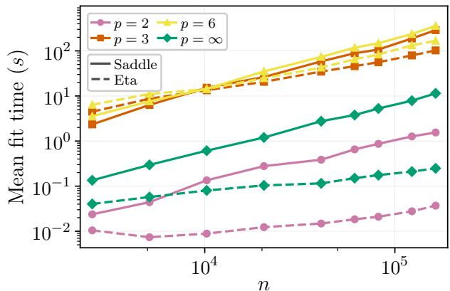  
Figure 1: Mean computation times over 10 repetitions 1for the saddle-point solver (solid) and the $\eta -$ trick solver (dashed) in the fast-rate experiment.

Crucially, all these subproblems can be solved fast: the t<sup>⋆</sup>-update can be solved by a scalar formulation, the η-update has a closed-form solution and the $\beta \mathrm { . }$ -update is weighted ridge regression. The idea follows closely (Ribeiro et al., 2025b) proposed for adversarial linear training. We provide details about implementation and convergence in the appendix. The result is the improved speed we show in the numerical experiments.

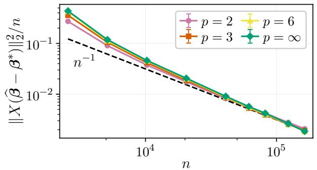

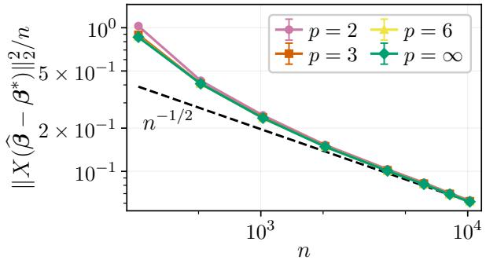  
Figure 2: Fast rates (left) and slow rates (right) for $p \in \{ 2 , 3 , 6 , \infty \}$ . Both show a clear convergence toward the predicted rates $O ( n ^ { - 1 } )$ 1<sub>and</sub> $O ( n ^ { - 1 / 2 } )$ , respectively. The curves are mean over 10 runs with 1 standard deviation bands.

## 8 Numerical experiments

This section showcases our findings through simulations. We start with the fast rate $O ( n ^ { - 1 } )$ and the slow rate $O ( n ^ { - 1 / 2 } )$ . Then, we illustrate the small and large δ regimes. We fix $\| \cdot \| = \| \cdot \| _ { \infty }$ , and let p vary as $p \in \{ 2 , 3 , 6 , \infty \}$ . For the rates, we use 10 trials for each $( n , p )$ with 1 standard deviation bands (although, so tight they are barely visible). All simulations were run on a MacBook Air M3 in the matter of hours. For Figure 2 and Figure 3, we used the saddle-point solver (see Section 7). In Figure 1 we compare the performance of the solvers. See the appendix for additional simulations.

Fast rate. For the fast rate, we consider a simple setup $y _ { i } ~ = ~ x _ { i } ^ { \top } \beta ^ { * } + \varepsilon _ { i }$ with $d \ = \ 1 0 .$ true parameter with $\beta _ { i } ^ { * } = 3$ for the first 5 entries and otherwise zero $( \mathrm { i . e . , ~ } s ~ = ~ 5 )$ , Gaussian noise $\varepsilon \sim { \cal N } ( 0 , \sigma ^ { 2 } I )$ with $\sigma \ : = \ : 0 . 5$ , and entries $x _ { i j } ~ \in ~ X$ independently and uniformly sampled from [ 1, 1] (so M = 1 in Theorem 3). Here, the independent sampling of X ensures that $X \in \mathrm { R E } ( s , 3 )$ in Theorem 3; see the appendix for a standard derivation. We compute $\vec { \beta } \in \mathrm { a r g }$ min<sub>β</sub> $V _ { \delta } ( \beta )$ and plot the in-sample erbror $\| X ( \widehat { \beta } - \beta ^ { * } ) \| _ { 2 } ^ { 2 } / n$ as a function of n, shown in bFigure 2 (left). We clearly see the rate $O ( n ^ { - 1 } )$ as predicted by Theorem 3. This rate hinges on the fact that $X \in \operatorname { R E } ( s , 3 )$ due to the independent sampling. In contrast, if the entries in X are correlated, they may violate the RE condition and instead yield an $O ( n ^ { - 1 / 2 } )$ rate, as the next example illustrates.

Slow rate. For the slow rate, we consider $d =$ $2 , \beta ^ { * } = [ 2 , - 1 ] ^ { \top }$ , noise $\varepsilon \sim N ( 0 , \sigma ^ { 2 } I )$ with $\sigma =$ 0.5, and entries of X still uniformly bounded but now correlated. This correlation breaks the RE condition (see the appendix for details on X). Thus, we can only guarantee an $O ( n ^ { - 1 / 2 } )$ rate by Theorem 2, also seen in Figure 2 (right).

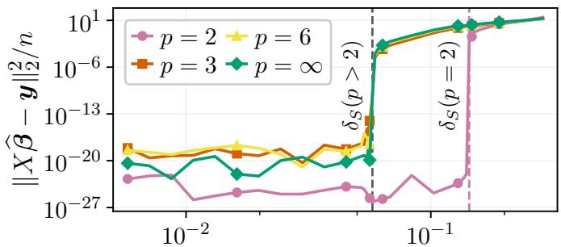

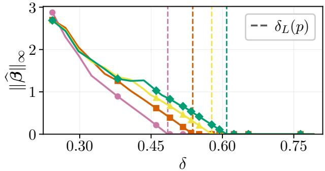  
Figure 3: Large δ (bottom) and small δ (top) in the over-1parametrized regime, with zero solution and interpolation for $\delta \geq \delta _ { L }$ and $\delta \leq \delta _ { S }$ , respectively.

Small and large δ. We conclude with the extreme regimes of δ. We see that for large $\delta \geq \delta _ { L }$ in Figure 3, $\widehat { \beta }$ becomes the zero solution as in Theorem 4, while small $\delta \leq \delta _ { S }$ in the overparametrized setting results in binterpolation as in Theorem 5. See the appendix for setup details.

Saddle-point and η-trick solver. In the fast-rate experiment, both solvers achieve nearly identical prediction errors and robust-risk values; see the appendix for the full comparison. In Figure 1, we see that the η-trick solver is faster at larger sample sizes, with the largest gains for $p = 2$ and $p = \infty$

## 9 Conclusion

In this paper, we have studied Wasserstein DRO linear regression with $2 \leq p \leq \infty$ . We first proved an equivalent robust quadratic form of the robust risk. Using this form, we generalized several important properties from the two special cases square-root Lasso $\left( p = 2 \right)$ and adversarial linear regression $( p = \infty )$ to the general $2 \leq p \leq \infty$ setting, including a slow error rate $O ( n ^ { - 1 / 2 } )$ in general, a fast rate $O ( n ^ { - 1 } )$ using a restricted eigenvalue condition, the pivotal property, and equivalent solutions when the ambiguity radius δ is small and large, respectively. We also proposed eficient numerical solvers and validated our theoretical findings via simulations.

Here, we only study Wasserstein DRO linear regression. An interesting future direction is to investigate conditions under which the analysis in this paper applies to other loss functions or to nonparametric regression problems. For instance, some of the adversarial techniques we used have already been adapted to kerne methods (Ribeiro et al., 2025a). Another future direction is to consider overparametrized regimes where one lets both d and n tend to infinity, under some fixed finite ratio $\rho : = d / n$ . The analytic properties in this paper do not explicitly depend on d (except for Theorem 3, where $s = d$ if no sparse solution exists), and may therefore naturally serve as a start. Finally, the deterministic error bounds in this paper depend only very mildly on p, with error rates independent of p. This is also reflected in the numerical simulations. It would be interesting if one could find cases studies in which diferent p results in significantly diferent error (which could still be possible since we only provide upper bounds on the error).

AI use statement. In this work, we used generative AI tools to implement methods. We have also partially used generative AI tools to provide critical ingredients for proving mathematical claims. We have not used generative AI tools to help develop theoretical models or conceptual frameworks, formulate mathematical claims, assist in the writing of proofs and interpret results. We have also used AI tools to identify relevant literature (beyond the manual literature survey), search for information and improve readability. We have reviewed all AI-assisted work. In particular, the paper including all proofs are fully written and checked by the authors and the LLM-generated code is verified and tested for correctness.

Reproducibility statement. We provide the source code, model implementations and evaluation procedures in the anonymous repository linked (see the link on page 2).

## Acknowledgments

This work was supported by eSSENCE, ScilifeLab and the Wallenberg AI, Autonomous Systems and Software Program (WASP), funded by the Knut and Alice Wallenberg Foundation. Computational resources were provided by the National Academic Infrastructure for Supercomputing in Sweden (NAISS), funded by the Swedish Research Council.

## References

Yang An and Rui Gao. Generalization bounds for (Wasserstein) robust optimization. Advances in Neural Information Processing Systems, 34:10382–10392, 2021.

Liviu Aolaritei, Soroosh Shafiee, and Florian Dörfler. Wasserstein distributionally robust estimation in high dimensions: performance analysis and optimal hyperparameter tuning Mathematical Programming, pp. 1–85, 2026.

Francis Bach. The “η-trick” or the efectiveness of reweighted least-squares – Machine Learning Research Blog, 2019.

Francis Bach. Learning Theory from First Principles MIT Press, 2024.

Alexandre Belloni, Victor Chernozhukov, and Lie Wang. Square-Root Lasso: Pivotal Recovery of Sparse Signals via Conic Programming. Biometrika, 98(4):791–806, 2011.

Dimitri P Bertsekas. Control of uncertain systems with a set-membership description of the uncertainty. PhD thesis, Massachusetts Institute of Technology, 1971.

Dimitri P Bertsekas. Convex Optimization Theory, volume 1. Athena Scientific Belmont, 2009.

Dimitri P Bertsekas, Angelia Nedi, and Asuman E Ozdaglar. Convex Analysis and Optimization. 2003.

Jose Blanchet, Yang Kang, and Karthyek Murthy. Robust wasserstein profile inference and applications to machine learning. Journal of Applied Probability, 56(3):830–857, 2019.

Jose Blanchet, Karthyek Murthy, and Viet Anh Nguyen. Statistical analysis of wasserstein distributionally robust estimators. In Tutorials in Operations Research: Emerging optimization methods and modeling techniques with applications, pp. 227–254. INFORMS, 2021.

Stéphane Boucheron, Gábor Lugosi, and Pascal Massart. Concentration Inequalities: A Nonasymptotic Theory of Independence. Oxford University Press, 2013.

Stephen Boyd, John Duchi, Mert Pilanci, and Lieven Vandenberghe. Subgradients (Lecture Notes). Technical Report Notes for EE364b, Stanford University, 2022.

Stephen Boyd and Lieven Vandenberghe. Convex Optimization. Cambridge University Press, 2004.

Frank H. Clarke. Optimization and Nonsmooth Analysis. Society for Industrial and Applied Mathematics, 1990.

John M Danskin. The Theory of Max-min and its Application to Weapons Allocation Problems. Springer Berlin, Heidelberg, 1967.

Steven Diamond and Stephen Boyd. CVXPY: A Python-embedded modeling language for convex optimization. Journal of Machine Learning Research, 17(83):1–5, 2016.

Rui Gao. Finite-sample guarantees for Wasserstein distributionally robust optimization: Breaking the curse of dimensionality. Operations Research, 71(6):2291–2306, 2023.

Rui Gao and Anton J. Kleywegt. Distributionally robust stochastic optimization with Wasserstein distance. Mathematics of Operations Research, 48(2):603–655, 2023.

Rui Gao, Xi Chen, and Anton J. Kleywegt. Wasserstein distributionally robust optimization and variation regularization. Operations Research, 72(3):1177–1191, 2022.

Trevor Hastie, Robert Tibshirani, and Martin J. Wainwright. Statistical Learning with Sparsity: The Lasso and Generalizations. Chapman and Hall/CRC, 2015.

Gareth James, Daniela Witten, Trevor Hastie, and Robert Tibshirani. An Introduction to Statistical Learning: with Applications in R, volume 2. Springer, 2021.

Hidetoshi Komiya. Elementary proof for Sion’s minimax theorem. Kodai Mathematical Journal, 11(1):5–7, 1988.

Daniel Kuhn, Peyman Mohajerin Esfahani, Viet Anh Nguyen, and Soroosh Shafieezadeh-Abadeh. Wasserstein Distributionally Robust Optimization: Theory and Applications in Machine Learning. Tutorials in Operations Research, pp. 130–166, October 2019.

Daniel Kuhn, Soroosh Shafiee, and Wolfram Wiesemann. Distributionally robust optimization. Acta Numerica, 34:579–804, 2025.

Tor Lattimore and Csaba Szepesvári. Bandit Algorithms. Cambridge University Press, 2020.

Tam Le and Jérôme Malick. Universal generalization guarantees for Wasserstein distributionally robust models. In International Conference on Learning Representations, volume 2025, pp. 20887–20921, 2025.

Jiajin Li, Sirui Lin, Jose Blanchet, and Viet Anh Nguyen. Tikhonov regularization is optimal transport robust under martingale constraints. Advances in Neural Information Processing Systems, 35:17677–17689, 2022.

José Luis Montiel Olea, Cynthia Rush, Amilcar Velez, and Johannes Wiesel. The out-of-sample prediction error of the square-root-lasso and related estimators. arXiv preprint arXiv:2211.07608, 2022.

Muni Sreenivas Pydi and Varun Jog. The many faces of adversarial risk. Advances in Neural Information Processing Systems, 34:10000–10012, 2021.

Antônio H. Ribeiro, David Vävinggren, Dave Zachariah, Thomas B. Schön, and Francis Bach. Kernel Learning with Adversarial Features: Numerical Eficiency and Adaptive Regularization. Advances in Neural Information Processing Systems (NeurIPS), December 2025.

Antônio H. Ribeiro, Dave Zachariah, Francis Bach, and Thomas B. Schön. Regularization properties of adversarially-trained linear regression. Advances in Neural Information Processing Systems, 36:23658– 23670, 2023.

Antônio H. Ribeiro, Thomas B. Schön, Dave Zachariah, and Francis Bach. Eficient optimization algorithms for linear adversarial training. In International Conference on Artificial Intelligence and Statistics, 2025b.

Herbert E Scarf, KJ Arrow, and S Karlin. A min-max solution of an inventory problem. Technical report, Rand Corporation Santa Monica, 1957.

Philipp Schiele, Eric Sager Luxenberg, and Stephen Boyd. Disciplined saddle programming. Transactions on Machine Learning Research, 2024.

Soroosh Shafiee, Liviu Aolaritei, Florian Dörfler, and Daniel Kuhn. Nash Equilibria, Regularization and Computation in Optimal Transport-Based Distributionally Robust Optimization, 2025. arXiv:2303.03900.

Soroosh Shafiee, Liviu Aolaritei, Florian Dörfler, and Daniel Kuhn. Nash equilibria, regularization, and computation in optimal transport-based distributionally robust optimization. Operations Research, 74(3): 1689–1709, 2026.

Soroosh Shafieezadeh-Abadeh, Daniel Kuhn, and Peyman Mohajerin Esfahani. Regularization via mass transportation. Journal of Machine Learning Research, 20(103):1–68, 2019.

Maurice Sion. On general minimax theorems. Pacific Journal of Mathematics, 8(1):171–176, 1958.

Robert Tibshirani. Regression shrinkage and selection via the LASSO. Journal of the Royal Statistical Society. Series B (Methodological), pp. 267–288, 1996.

Sara van de Geer. Some exercises with the Lasso and its compatibility constant. arXiv preprint arXiv:1701.03326, 2017.

Pauli Virtanen, Ralf Gommers, et al. SciPy 1.0–Fundamental Algorithms for Scientific Computing in Python. Nature Methods, 17(3):261–272, 2020.

Martin J. Wainwright. High-dimensional Statistics: a Non-asymptotic Viewpoint. Cambridge University Press, 2019.

Qinyu Wu, Jonathan Yu-Meng Li, and Tiantian Mao. On generalization and regularization via wasserstein distributionally robust optimization. Management Science, 72(7):6104–6119, 2026.

Yiling Xie and Xiaoming Huo. High-dimensional (group) adversarial training in linear regression. Advances in Neural Information Processing Systems, 37:31708–31735, 2024.

Huan Xu, Constantine Caramanis, and Shie Mannor. Robust regression and Lasso. Advances in neural information processing systems, 21, 2008.

Luhao Zhang, Jincheng Yang, and Rui Gao. A Short and General Duality Proof for Wasserstein Distributionally Robust Optimization. Operations Research, 2024.

# Distributionally robust linear regression through the lens of adversarial training

## Appendix

In this appendix, we provide additional material supporting the main text, in particular, all the proofs. The structure follows the order of the sections in the main text.

## Contents

A Background: Additional details ii   
B Equivalent forms: Proofs and additional details ii   
B.1 Proof of Theorem 1 . ii   
B.2 Proof of Corollary 1 iv   
C Error bounds vi   
C.1 Slow rate: Proofs vi   
C.2 Fast rate: Proofs x   
D Small and large ambiguity balls: Proofs and additional details xiii   
D.1 Proof of Theorem 4 . xiii   
D.2 Proof of Theorem 5 . xv   
D.3 Computing $\delta _ { S }$ via a convex program xvii   
E Numerical solvers: Additional details xviii   
E.1 Saddle-point formulation and solver xviii   
E.2 η-trick solver xix   
E.3 Fast robust risk evaluations xxii   
F Numerical experiments: Additional details xxiii   
F.1 Fast rate . . xxiii   
F.2 Slow rate xxiv   
F.3 Small and large δ . xxv   
F.4 Comparisons between the saddle-point solver and the η-trick solver . . xxvi

## A Background: Additional details

In this section, we provide additional details of Section 3.

Proof of Remark 1. We show that $V _ { \delta } ( \beta ) = \infty$ for $\beta \neq 0 { \mathrm { ~ i f ~ } } 1 \leq p < 2$ as stated in Remark 1. This follows from Lemma 3 by noting that the supremum inside the sum is infinite, since the quadratic term with $t _ { i }$ $( \| \beta \| _ { * } \neq 0 )$ increases faster than $t _ { i } ^ { p }$ (since $p < 2 )$ . Thus, $V _ { \delta } ( \beta ) = \infty$

## B Equivalent forms: Proofs and additional details

In this section, we provide the proofs and additional details of Section 4.

## B.1 Proof of Theorem 1

To prove Theorem 1, we will use the following lemma that reduces the robust risk to several scalar problems:

Lemma 3. The robust risk of Wasserstein DRO linear regression for $1 \leq p < \infty$ equals

$$
n V _ { \delta } ( \beta ) = \operatorname* { m i n } _ { \lambda \geq 0 } \left[ n \delta ^ { p } \lambda + \sum _ { i = 1 } ^ { n } \operatorname* { s u p } _ { t _ { i } \geq 0 } \left\{ \left( \lvert r _ { i } \rvert + t _ { i } \lvert \lvert \beta \rvert \rvert _ { * } \right) ^ { 2 } - \lambda t _ { i } ^ { p } \right\} \right] .\tag{A.1}
$$

with $r _ { i } : = \pmb { x } _ { i } ^ { \top } \beta - y _ { i }$

Lemma 3 is a direct application of Theorem 4 (ii) in Shafiee et al. (2026). For completeness, we provide a short proof here for the linear regression case:

Proof of Lemma 3. We start from Proposition 1, where we note that the expectation in (4) turns into a sum due to the empirical distribution $\begin{array} { r } { \widehat { \mathbb { P } } _ { n } : = \frac { 1 } { n } \sum _ { i = 1 } ^ { n } \delta _ { z _ { i } } } \end{array}$ , yielding:

$$
n V _ { \delta } ( \beta ) = \operatorname* { m i n } _ { \lambda \geq 0 } \left[ n \delta ^ { p } \lambda + \sum _ { i = 1 } ^ { n } \operatorname* { s u p } _ { z ^ { \prime } \in \mathcal { Z } } \left\{ h _ { \beta } ( z ^ { \prime } ) - \lambda \| z ^ { \prime } - z _ { i } \| \right\} \right] .\tag{A.2}
$$

In our case, $\mathcal { Z } = \mathbb { R } ^ { d + 1 }$ and $h _ { \beta } : \mathbb { R } ^ { d + 1 }  \mathbb { R }$ is the square loss combined with the linear predictor model, i.e., for $\boldsymbol { z } = ( \boldsymbol { x } , y )$ , we have $h _ { \beta } ( z ) = \left( \beta ^ { \top } x - y \right) ^ { 2 }$ , and $\| z ^ { \prime } - z \|$ with $z = ( \pmb { x } , y )$ and $z ^ { \prime } = ( x ^ { \prime } , y ^ { \prime } )$ equals

$$
\| z ^ { \prime } - z \| = { \left\{ \begin{array} { l l } { \| x ^ { \prime } - x \| ^ { p } } & { { \mathrm { i f ~ } } y = y ^ { \prime } , } \\ { + \infty } & { { \mathrm { o t h e r w i s e . } } } \end{array} \right. }
$$

Since $\| z ^ { \prime } - z \| = \infty$ whenever $y \ne y ^ { \prime }$ , the supremum in (A.2) never moves $z ^ { \prime }$ away from $z _ { i }$ in the y-coordinate.<sup>4</sup> In other words, we have that

$$
n V _ { \delta } ( \beta ) = \operatorname* { m i n } _ { \lambda \geq 0 } \left[ n \delta ^ { p } \lambda + \sum _ { i = 1 } ^ { n } \operatorname* { s u p } _ { \pmb { x } ^ { \prime } \in \mathbb { R } ^ { d } } \left\{ \left( \beta ^ { \top } \pmb { x } ^ { \prime } - y _ { i } \right) ^ { 2 } - \lambda \| \pmb { x } ^ { \prime } - \pmb { x } _ { i } \| ^ { p } \right\} \right] .
$$

Now center the problem by letting $\pmb { u } _ { i } = \pmb { x } ^ { \prime } - \pmb { x } _ { i }$ . Then

$$
{ \boldsymbol { \beta } } ^ { \mathsf { T } } { \boldsymbol { \mathbf { \mathit { x } } } } ^ { \prime } - y _ { i } = { \boldsymbol { \beta } } ^ { \mathsf { T } } { \boldsymbol { ( u _ { i } + x _ { i } ) } } - y _ { i } = { \boldsymbol { \beta } } ^ { \mathsf { T } } { \boldsymbol { \mathbf { \mathit { x } } } } _ { i } - y _ { i } + { \boldsymbol { \beta } } ^ { \mathsf { T } } { \boldsymbol { \mathbf { \mathit { u } } } } _ { i } = r _ { i } + { \boldsymbol { \beta } } ^ { \mathsf { T } } { \boldsymbol { \mathbf { \mathit { u } } } } _ { i } ,
$$

and therefore

$$
\begin{array} { r } { \left( { \boldsymbol { \beta } } ^ { \top } \mathbf { { x } } ^ { \prime } - y _ { i } \right) ^ { 2 } - \lambda \| \mathbf { { x } } ^ { \prime } - \mathbf { { x } } _ { i } \| ^ { p } = \left( r _ { i } + { \boldsymbol { \beta } } ^ { \top } \mathbf { { u } } _ { i } \right) ^ { 2 } - \lambda \| \mathbf { { u } } _ { i } \| ^ { p } . } \end{array}
$$

Thus, we have

$$
n V _ { \delta } ( \beta ) = \operatorname* { m i n } _ { \lambda \geq 0 } \left[ n \delta ^ { p } \lambda + \sum _ { i = 1 } ^ { n } \operatorname* { s u p } _ { \boldsymbol { u } \in \mathbb { R } ^ { d } } \left\{ \left( \boldsymbol { r } _ { i } + \boldsymbol { \beta } ^ { \top } \boldsymbol { u } \right) ^ { 2 } - \lambda \| \boldsymbol { u } \| ^ { p } \right\} \right] ,
$$

where we drop the subscript on u for convenience. We note that the penalty $\lambda \| \pmb { u } \| ^ { p }$ depends only on the magnitude of ${ \mathbf { } } ^ { \mathbf { } } \mathbf { \Delta } ^ { \mathbf { } } \mathbf { u } ,$ and thus its direction is irrelevant to the cost. To decompose direction and magnitude, let ${ \mathbf { } } u = t { \mathbf { } } v$ with $t \geq 0$ and $\lVert \boldsymbol { v } \rVert = 1$ . Then, the supremum can be split into two parts:

$$
\operatorname* { s u p } _ { t \geq 0 } \ \operatorname* { s u p } _ { \| \pmb { v } \| = 1 } \left\{ \left( r _ { i } + t { \beta } ^ { \top } \pmb { v } \right) ^ { 2 } - \lambda t ^ { p } \right\} = \operatorname* { s u p } _ { t \geq 0 } \left[ \operatorname* { s u p } _ { \| \pmb { v } \| = 1 } \left\{ \left( r _ { i } + t { \beta } ^ { \top } \pmb { v } \right) ^ { 2 } \right\} - \lambda t ^ { p } \right] .
$$

The remaining inner problem $\operatorname* { s u p } _ { \| \pmb { v } \| = 1 } ( r _ { i } + t \beta ^ { \top } \pmb { v } ) ^ { 2 }$ can be solved in closed form:

$$
\operatorname* { s u p } _ { \| \mathbf { v } \| = 1 } \left\{ \left( r _ { i } + t \beta ^ { \top } v \right) ^ { 2 } \right\} = \operatorname* { s u p } _ { \| v \| = 1 } \left\{ \left( | r _ { i } | + t \beta ^ { \top } v \right) ^ { 2 } \right\} = \left( | r _ { i } | + t \operatorname* { s u p } _ { \| v \| = 1 } \{ \beta ^ { \top } v \} \right) ^ { 2 } = \left( | r _ { i } | + t \| \beta \| _ { * } \right) ^ { 2 } ,
$$

where the first equality is due to symmetry, the second holds since $w \mapsto ( a + t w ) ^ { 2 }$ is increasing for $a , t \geq 0$ and the third holds since $\begin{array} { r } { \| \beta \| _ { * } = \operatorname* { s u p } _ { \| v \| = 1 } \{ \beta ^ { \top } v \} } \end{array}$ . This leaves us with the scalar problem

$$
n V _ { \delta } ( \beta ) = \operatorname* { m i n } _ { \lambda \geq 0 } \left[ n \delta ^ { p } \lambda + \sum _ { i = 1 } ^ { n } \operatorname* { s u p } _ { t \geq 0 } \Big \{ \big ( | r _ { i } | + t \| \beta \| _ { * } \big ) ^ { 2 } - \lambda t ^ { p } \Big \} \right] ,
$$

completing the proof.

We now prove Theorem 1:

Proof of Theorem 1. We first consider the case $p < \infty$ . We want to show that

$$
F ( \beta ) : = \operatorname* { s u p } _ { \substack { t _ { i } \geq 0 , \sum _ { i = 1 } ^ { n } t _ { i } ^ { p } \leq n \delta ^ { p } } } \sum _ { i = 1 } ^ { n } \big ( | r _ { i } | + t _ { i } \| \beta \| _ { * } \big ) ^ { 2 } .\tag{A.3}
$$

is equal to n $V _ { \delta } ( \beta )$ . For $\delta = 0$ , we trivially have $\begin{array} { r } { F ( \beta ) = n V _ { \delta } ( \beta ) = \sum _ { i = 1 } ^ { n } r _ { i } ^ { 2 } } \end{array}$ using (A.1). For the case $\delta > 0$ we show equality using standard strong duality theory (Boyd & Vandenberghe, 2004, Chapter 5). More precisely, consider (A.3), and apply the change of variable $\nu _ { i } = t _ { i } ^ { p }$ , leading to

$$
\begin{array} { r } { F ( \beta ) = \underset { \nu _ { i } \geq 0 , \sum _ { i = 1 } ^ { n } \nu _ { i } \leq n \delta ^ { p } } { \operatorname* { s u p } } \sum _ { i = 1 } ^ { n } \left( \vert r _ { i } \vert + \nu _ { i } ^ { 1 / p } \Vert \beta \Vert _ { * } \right) ^ { 2 } = } \\ { \underset { \nu _ { i } \geq 0 , \sum _ { i = 1 } ^ { n } \nu _ { i } \leq n \delta ^ { p } } { \operatorname* { s u p } } \sum _ { i = 1 } ^ { n } \underset { \phi _ { i } ( \nu _ { i } ) : = } { \overset { r } { \sum } } + 2 \vert r _ { i } \vert \Vert \beta \Vert _ { * } \nu _ { i } ^ { 1 / p } + \Vert \beta \Vert _ { * } ^ { 2 } \nu _ { i } ^ { 2 / p } = \underset { \nu _ { i } \geq 0 , \sum _ { i = 1 } ^ { n } \nu _ { i } \leq n \delta ^ { p } } { \operatorname* { s u p } } \sum _ { i = 1 } ^ { n } \phi _ { i } ( \nu _ { i } ) . } \end{array}
$$

Here, $\phi _ { i } ( \nu _ { i } ) = r _ { i } ^ { 2 } + 2 | r _ { i } | \| \pmb { \beta } \| _ { * } \nu _ { i } ^ { 1 / p } + \| \pmb { \beta } \| _ { * } ^ { 2 } \nu _ { i } ^ { 2 / p }$ is concave in $\nu _ { i } \geq 0$ since $p \geq 2$ implies $1 / p \in [ 0 , 1 / 2 ]$ and $2 / p \in [ 0 , 1 ]$ . In other words, $F ( \beta )$ is a concave maximization over an afine domain. Equivalently, to work with the more standard convex setting (Boyd & Vandenberghe, 2004, Chapter 5), we have that

$$
\tilde { F } ( \beta ) : = - F ( \beta ) = \operatorname* { i n f } _ { \nu _ { i } \ge 0 , \sum _ { i = 1 } ^ { n } \nu _ { i } \le n \delta ^ { p } } \sum _ { i = 1 } ^ { n } - \phi _ { i } ( \nu _ { i } )\tag{A.4}
$$

is a convex minimization over an afine domain. The dual problem of (A.4) with respect to the constraint $\textstyle \sum _ { i = 1 } ^ { n } \nu _ { i } \leq n \delta ^ { p }$ (leaving $\nu _ { i } \geq 0$ as part of the domain) $\mathrm { i s } ^ { 5 }$

$$
\operatorname* { s u p } _ { \lambda \geq 0 } \operatorname* { i n f } _ { \nu \geq 0 } L ( \nu , \lambda ) : = \operatorname* { s u p } _ { \lambda \geq 0 } \operatorname* { i n f } _ { \nu \geq 0 } \left[ \sum _ { i = 1 } ^ { n } ( - \phi _ { i } ( \nu _ { i } ) ) + \lambda \left( \sum _ { i = 1 } ^ { n } ( \nu _ { i } ) - n \delta ^ { p } \right) \right]\tag{A.5}
$$

Moreover, $\nu _ { i } = 0$ yields $\textstyle \sum _ { i = 1 } ^ { n } \nu _ { i } = 0 < n \delta ^ { p }$ for $\delta > 0$ , so Slater’s condition holds. Therefore, strong duality holds (Boyd & Vandenberghe, 2004, Chapter 5) and hence $\left( \mathrm { { A . 4 } } \right)$ is equal to (A.5). Equivalently,

$$
\begin{array} { c } { { F ( \beta ) = - \displaystyle \operatorname* { s u p } _ { \lambda \geq 0 } \displaystyle \operatorname* { i n f } _ { \nu \geq 0 } \left[ \displaystyle \sum _ { i = 1 } ^ { n } ( - \phi _ { i } ( \nu _ { i } ) ) + \lambda \left( \displaystyle \sum _ { i = 1 } ^ { n } ( \nu _ { i } ) - n \delta ^ { p } \right) \right] = } } \\ { { \displaystyle \operatorname* { i n f } _ { \lambda \geq 0 } \operatorname* { s u p } _ { \nu \geq 0 } \left[ \displaystyle \sum _ { i = 1 } ^ { n } ( \phi _ { i } ( \nu _ { i } ) ) + \lambda \left( n \delta ^ { p } - \displaystyle \sum _ { i = 1 } ^ { n } \nu _ { i } \right) \right] = \displaystyle \operatorname* { i n f } _ { \lambda \geq 0 } \left[ n \delta ^ { p } \lambda + \displaystyle \sum _ { i = 1 } ^ { n } \operatorname* { s u p } _ { \nu \leq 0 } ( \phi _ { i } ( \nu _ { i } ) - \lambda \nu _ { i } ) \right] = } } \\ { { \displaystyle \operatorname* { i n f } _ { \lambda \geq 0 } \left[ n \delta ^ { p } \lambda + \displaystyle \sum _ { i = 1 } ^ { n } \operatorname* { s u p } _ { t _ { i } \geq 0 } ( \phi _ { i } ( t _ { i } ^ { p } ) - \lambda t _ { i } ^ { p } ) \right] = \displaystyle \operatorname* { i n f } _ { \lambda \geq 0 } \left[ n \delta ^ { p } \lambda + \displaystyle \sum _ { i = 1 } ^ { n } \operatorname* { s u p } _ { t _ { i } \geq 0 } \left\{ \left( | r _ { i } | + t _ { i } | | \beta | _ { * } \right) ^ { 2 } - \lambda t _ { i } ^ { p } \right) \right\} \Bigg ] = } } \end{array}
$$

where the last equality is due to (A.1). This completes the proof for $p < \infty$

For $p = \infty$ , we have by Theorem 2 in Zhang et al. (2024) that

$$
n V _ { \delta } ( \beta ) = \sum _ { i = 1 } ^ { n } \operatorname* { s u p } _ { \| \pmb { v } _ { i } \| \leq \delta } ( ( \pmb { x } _ { i } + \pmb { v } _ { i } ) ^ { T } \beta - y _ { i } ) ^ { 2 }
$$

which can be rewritten to the desired form using a dual norm argument, see, e.g., Proposition 1 in Ribeiro et al. (2023). For completeness, we provide this argument here too:

$$
\begin{array} { r l } & { \underset { | | v _ { i } | | \leq \delta } { \operatorname* { s u p } } ( ( x _ { i } + v _ { i } ) ^ { T } \beta - y _ { i } ) ^ { 2 } = \underset { | | v _ { i } | | \leq \delta } { \operatorname* { s u p } } ( v _ { i } ^ { T } \beta + x _ { i } ^ { T } \beta - y _ { i } ) ^ { 2 } = \underset { | | v _ { i } | | \leq \delta } { \operatorname* { s u p } } ( v _ { i } ^ { T } \beta + | x _ { i } ^ { T } \beta - y _ { i } | ) ^ { 2 } = } \\ & { \underset { | | v _ { i } | | \leq 1 } { \operatorname* { s u p } } ( \delta v _ { i } ^ { T } \beta + | x _ { i } ^ { T } \beta - y _ { i } | ) ^ { 2 } = ( \delta \underset { | | v _ { i } | | \leq 1 } { \operatorname* { s u p } } v _ { i } ^ { T } \beta + | x _ { i } ^ { T } \beta - y _ { i } | ) ^ { 2 } = ( \delta \| \beta \| _ { * } + | x _ { i } ^ { T } \beta - y _ { i } | ) ^ { 2 } } \end{array}
$$

and thus

$$
V _ { \delta } ( \beta ) = \sum _ { i = 1 } ^ { n } ( | x _ { i } ^ { T } \beta - y _ { i } | + \delta \| \beta \| _ { * } ) ^ { 2 } = \operatorname* { s u p } _ { t _ { i } \geq 0 , \| t \| \leq \delta } \sum _ { i = 1 } ^ { n } ( | x _ { i } ^ { T } \beta - y _ { i } | + t _ { i } \| \beta \| _ { * } ) ^ { 2 }
$$

completing the proof for $p = \infty$ and hence of Theorem 1.

## B.2 Proof of Corollary 1

We continue by proving Corollary 1, using the saddle-point formulation of the robust risk.

Proof of Corollary 1. We will use Theorem 7 (that we prove latter in the appendix). This result state that

$$
n V _ { \delta } ( \beta ) = \operatorname* { s u p } _ { \alpha \geq 0 } K ( \beta , \alpha ) = \operatorname* { s u p } _ { \alpha \geq 0 } \left[ n ^ { 1 / 2 } \delta \| \beta \| _ { * } \| \alpha \| _ { 2 } + \sum _ { i = 1 } ^ { n } \alpha _ { i } | \alpha _ { i } ^ { \top } \beta - y _ { i } | - \alpha _ { i } ^ { 2 } / 4 \right]
$$

We start with $p = 2$ and compute (A.18) noting that $q = 2$ . For brevity, let D be the vector with entries $D _ { i } = | \pmb { x } _ { i } ^ { T } \pmb { \beta } - y _ { i } |$ . Then:

$$
\begin{array} { r l } & { n V _ { \delta } ( \beta ) = \underset { \alpha \geq 0 } { \operatorname* { s u p } } \left[ n ^ { 1 / 2 } \delta \| \beta \| _ { * } \| \pmb { \alpha } \| _ { 2 } + \langle \alpha , \pmb { D } \rangle - \| \alpha \| _ { 2 } ^ { 2 } / 4 \right] } \\ & { \quad \quad \quad = \underset { \pmb { \alpha } \geq 0 } { \operatorname* { s u p } } \left[ n ^ { 1 / 2 } \delta \| \beta \| _ { * } \| \pmb { \alpha } \| _ { 2 } + \| \alpha \| _ { 2 } \| \pmb { D } \| _ { 2 } - \| \pmb { \alpha } \| _ { 2 } ^ { 2 } / 4 \right] } \\ & { \quad \quad \quad = \underset { t \geq 0 } { \operatorname* { s u p } } \left[ n ^ { 1 / 2 } \delta \| \beta \| _ { * } t + t \| \pmb { D } \| _ { 2 } - t ^ { 2 } / 4 \right] , } \end{array}
$$

where we used the Cauchy–Schwarz inequality $\langle \alpha , D \rangle \leq \| \alpha \| _ { 2 } \| D \| _ { 2 }$ with equality if $\alpha = l \cdot D$ for some scalar $l \geq 0$ (note that such an α is indeed feasible since $ { \boldsymbol { D } } \geq 0 )$ , and then transformed the supremum to a one-dimensional optimization by setting $t = \| \pmb { \alpha } \| _ { 2 }$ . This one-dimensional optimization is quadratic, with solution

$$
( \| \pmb { D } \| _ { 2 } + n ^ { 1 / 2 } \delta \| \beta \| _ { * } ) ^ { 2 } .
$$

Therefore

$$
V _ { \delta } ( \beta ) = \left( \frac { 1 } { n ^ { 1 / 2 } } \| D \| _ { 2 } + \delta \| \beta \| _ { * } \right) ^ { 2 } = \left( \sqrt { \frac { 1 } { n } \sum _ { i = 1 } ^ { n } ( x _ { i } ^ { \top } \beta - y _ { i } ) ^ { 2 } } + \delta \| \beta \| _ { * } \right) ^ { 2 } ,
$$

which coincides with square-root Lasso (Belloni et al., 2011) for $\| \cdot \| _ { * } = \| \cdot \| _ { 1 } , \mathrm { i . e . , \| \cdot \| = \| \cdot \| _ { \infty } }$

To show the adversarial linear regression case, we have by Theorem 1 that

$$
V _ { \infty , \delta } ( \beta ) = \operatorname* { s u p } _ { t _ { i } \geq 0 , \| t _ { i } \| \leq \delta } \sum _ { i = 1 } ^ { n } ( | \boldsymbol { x } _ { i } ^ { \top } \beta - y _ { i } | + t _ { i } \| \beta \| _ { * } ) ^ { 2 } = \sum _ { i = 1 } ^ { n } ( | \boldsymbol { x } _ { i } ^ { \top } \beta - y _ { i } | + \delta \| \beta \| _ { * } ) ^ { 2 } =
$$

where the last step follows by the dual norm argument in the proof of Theorem 1. Here, we identify $v _ { i }$ as the adversarial noise on the input $\mathbf { x } _ { i } .$ . In other words, p-Wasserstein linear regression with $p = \infty$ coincides with adversarial linear regression. It remains to show that lim $1 _ { p \to \infty } V _ { p , \delta } ( \beta ) = V _ { \infty , \delta } ( \beta )$ . Again, using Theorem $^ { 7 , }$ we have that:

$$
\operatorname* { l i m } _ { p \to \infty } V _ { p , \delta } ( \beta ) = \operatorname* { l i m } _ { p \to \infty } \operatorname* { s u p } _ { \alpha \geq 0 } K ( \beta , \alpha ) = \operatorname* { l i m } _ { p \to \infty } \operatorname* { s u p } _ { \alpha \geq 0 } \left[ n ^ { 1 / p } \delta \| \beta \| _ { * } \| \alpha \| _ { q } + \sum _ { i = 1 } ^ { n } \alpha _ { i } | x _ { i } ^ { \top } \beta - y _ { i } | - \alpha _ { i } ^ { 2 } / 4 \right] .
$$

We want to swap the limit and the supremum. To this end, fix $\beta$ and let $f _ { p } ( \pmb { \alpha } ) : = K ( \beta , \pmb { \alpha } )$ , where we stress the dependence on $p .$ We have that $\| \pmb { \alpha } \| _ { q } \le n ^ { 1 / q } \| \pmb { \alpha } \| _ { 2 }$ by a norm inequality and $\begin{array} { r } { \sum _ { i = 1 } ^ { n } \alpha _ { i } \vert \pmb { x } _ { i } ^ { \top } \beta - y _ { i } \vert \le } \end{array}$ $\| { \pmb { \alpha } } \| _ { 2 } \| { \pmb { D } } \| _ { 2 }$ by Cauchy–Schwarz inequality. Thus,

$$
f _ { p } ( \alpha ) \leq n ^ { 1 / p } \delta \| \beta \| _ { * } n ^ { 1 / q } \| \alpha \| _ { 2 } + \| \alpha \| _ { 2 } \| D \| _ { 2 } - \| \alpha \| _ { 2 } ^ { 2 } / 4 = ( n \delta \| \beta \| _ { * } + \| D \| _ { 2 } ) \| \alpha \| _ { 2 } - \| \alpha \| _ { 2 } ^ { 2 } / 4 \to - \infty
$$

when $\| { \pmb { \alpha } } \| _ { 2 } \to \infty$ independent of $p .$ Thus, there exists a radius $R > 0$ such that the maximum of $f _ { p } ( \alpha )$ for $\alpha \ge 0$ is attained in $\Lambda : = \{ \pmb { \alpha } \geq 0 : \| \pmb { \alpha } \| _ { 2 } \leq R \}$ . Let

$$
f _ { \infty } ( \alpha ) : = \operatorname* { l i m } _ { p \to \infty } f _ { p } ( \alpha ) = \delta \| \beta \| _ { * } \| \alpha \| _ { 1 } + \sum _ { i = 1 } ^ { n } \alpha _ { i } | \boldsymbol { x } _ { i } ^ { T } \beta - y _ { i } | - \alpha _ { i } ^ { 2 } / 4
$$

and note that $f _ { \infty } ( \pmb { \alpha } )$ also attains its maximum on Λ. Moreover, since Λ is compact, $f _ { p } ( \alpha )$ converges uniformly to $f _ { \infty } ( \alpha )$ on Λ. Due to this uniform convergence, we can swap the limit and the supremum:

$$
\operatorname* { l i m } _ { p \to \infty } \operatorname* { s u p } _ { \alpha \geq 0 } f _ { p } ( \alpha ) = \operatorname* { l i m } _ { p \to \infty } \operatorname* { s u p } _ { \alpha \in \Lambda } f _ { p } ( \alpha ) = \operatorname* { s u p } _ { \alpha \in \Lambda } \operatorname* { l i m } _ { p \to \infty } f _ { p } ( \alpha ) = \operatorname* { s u p } _ { \alpha \in \Lambda } f _ { \infty } ( \alpha ) = \operatorname* { s u p } _ { \alpha \geq 0 } f _ { \infty } ( \alpha )
$$

Therefore,

$$
\begin{array} { r l r } & { } & { \displaystyle \operatorname* { l i m } _ { p \to \infty } V _ { p , \delta } ( \beta ) = \operatorname* { l i m } _ { p \to \infty } \operatorname* { s u p } _ { \alpha \geq 0 } f _ { p } ( \alpha ) = \operatorname* { s u p } _ { \alpha \geq 0 } f _ { \infty } ( \alpha ) = } \\ & { } & { \displaystyle \operatorname* { s u p } _ { \alpha \geq 0 } \bigg [ \delta \| \beta \| _ { * } \| \alpha \| _ { 1 } + \sum _ { i = 1 } ^ { n } \alpha _ { i } | x _ { i } ^ { \top } \beta - y _ { i } | - \alpha _ { i } ^ { 2 } / 4 \bigg ] = \operatorname* { s u p } _ { \alpha \geq 0 } \left[ \displaystyle \sum _ { i = 1 } ^ { n } ( \delta \| \beta \| _ { * } + | x _ { i } ^ { \top } \beta - y _ { i } | ) \alpha _ { i } - \alpha _ { i } ^ { 2 } / 4 \right] = } \\ & { } & { \displaystyle \sum _ { i = 1 } ^ { n } \operatorname* { s u p } _ { \alpha _ { i } \geq 0 } \big [ ( \delta \| \beta \| _ { * } + | x _ { i } ^ { \top } \beta - y _ { i } | ) \alpha _ { i } - \alpha _ { i } ^ { 2 } / 4 \big ] = \sum _ { i = 1 } ^ { n } ( \delta \| \beta \| _ { * } + | x _ { i } ^ { \top } \beta - y _ { i } | ) ^ { 2 } , } \end{array}
$$

The last expression coincides with $V _ { \infty , \delta } ( \beta )$ , completing the proof.

## C Error bounds

## C.1 Slow rate: Proofs

In this section, we provide the proofs of Section 5.1.

To prove Lemma 1, we first show the following lemma:

Lemma 4. We have the following bounds:

$$
n V _ { \delta } ( \beta ^ { * } ) \leq n \delta ^ { 2 } \| \beta ^ { * } \| _ { * } ^ { 2 } + 2 n ^ { 1 / p } \delta \| \beta ^ { * } \| _ { * } \| \varepsilon \| _ { q } + \| \varepsilon \| _ { 2 } ^ { 2 }\tag{A.6}
$$

$$
\begin{array} { r } { n V _ { \delta } ( \widehat { \beta } ) \geq n \delta ^ { 2 } \| \widehat { \beta } \| _ { * } ^ { 2 } + 2 \delta \| \widehat { \beta } \| _ { * } \| r ( \widehat { \beta } ) \| _ { 1 } + \| r ( \widehat { \beta } ) \| _ { 2 } ^ { 2 } , } \end{array}\tag{A.7}
$$

where $r _ { i } ( \beta ) = | \pmb { x } _ { i } ^ { T } \beta - y _ { i } |$

Proof. We obtain these bounds using the representation from Theorem 1:

$$
n V _ { \delta } ( \beta ) = \operatorname* { m a x } _ { t \geq 0 , \| t \| _ { p } \leq 1 } \sum _ { i = 1 } ^ { n } \Big ( n ^ { 1 / p } \delta \| \beta \| _ { * } t _ { i } + | x _ { i } ^ { \top } \beta - y _ { i } | \Big ) ^ { 2 } =
$$

$$
\operatorname* { m a x } _ { t \geq 0 , \| t \| _ { p } \leq 1 } \Big ( n ^ { 2 / p } \delta ^ { 2 } \| \beta \| _ { * } ^ { 2 } \| t \| _ { 2 } ^ { 2 } + 2 n ^ { 1 / p } \delta \| \beta \| _ { * } \sum _ { i = 1 } ^ { n } t _ { i } r _ { i } ( \beta ) + \| r ( \beta ) \| _ { 2 } ^ { 2 } \Big ) .
$$

To upper bound $V _ { \delta } ( \beta ^ { \ast } )$ , we note that $r ( \beta ^ { * } ) = | \varepsilon |$ , resulting in

$$
n V _ { \delta } ( \beta ^ { * } ) = \operatorname* { m a x } _ { t \geq 0 , \| t \| _ { p } \leq 1 } \Big ( n ^ { 2 / p } \delta ^ { 2 } \| \beta ^ { * } \| _ { * } ^ { 2 } \| t \| _ { 2 } ^ { 2 } + 2 n ^ { 1 / p } \delta \| \beta ^ { * } \| _ { * } \sum _ { i = 1 } ^ { n } t _ { i } | \varepsilon _ { i } | + \| \varepsilon \| _ { 2 } ^ { 2 } \Big ) .
$$

Then we use Hölder’s inequality $\begin{array} { r } { \sum _ { i = 1 } ^ { n } t _ { i } | \varepsilon _ { i } | \leq \| \pmb { t } \| _ { p } \| \pmb { \varepsilon } \| _ { q } \leq \| \pmb { \varepsilon } \| _ { q } } \end{array}$ and the norm inequality $\| \pmb { t } \| _ { 2 } ^ { 2 } \leq n ^ { 1 - 2 / p } \| \pmb { t } \| _ { p } ^ { 2 } \leq$ $n ^ { 1 - 2 / p }$ to get

$$
n V _ { \delta } ( \beta ^ { * } ) \leq n \delta ^ { 2 } \| \beta ^ { * } \| _ { * } ^ { 2 } + 2 n ^ { 1 / p } \delta \| \beta ^ { * } \| _ { * } \| \varepsilon \| _ { q } + \| \varepsilon \| _ { 2 } ^ { 2 } .
$$

We next lower bound $n V _ { \delta } ( { \widehat { \boldsymbol { \beta } } } )$ . For this, we simply pick the point $s _ { i } = n ^ { - 1 / p }$ (which satisfies $\| s \| _ { p } = 1$ and $s \geq 0 )$ , yielding

$$
\begin{array} { r } { n V _ { \delta } ( \widehat { \beta } ) \geq n \delta ^ { 2 } \| \widehat { \beta } \| _ { * } ^ { 2 } + 2 \delta \| \widehat { \beta } \| _ { * } \| r ( \widehat { \beta } ) \| _ { 1 } + \| r ( \widehat { \beta } ) \| _ { 2 } ^ { 2 } . } \end{array}
$$

This completes the proof.

## Proof of Lemma 1. We now prove Lemma 1:

Proof. By optimality, $n V _ { \delta } ( \widehat { \beta } ) \leq n V _ { \delta } ( \beta ^ { * } )$ . Combined with Lemma 4 yields

$$
\begin{array} { r } { n \delta ^ { 2 } \| \widehat { \beta } \| _ { * } ^ { 2 } + 2 \delta \| \widehat { \beta } \| _ { * } \| r ( \widehat { \beta } ) \| _ { 1 } + \| r ( \widehat { \beta } ) \| _ { 2 } ^ { 2 } \leq n \delta ^ { 2 } \| \beta ^ { * } \| _ { * } ^ { 2 } + 2 n ^ { 1 / p } \delta \| \beta ^ { * } \| _ { * } \| \varepsilon \| _ { q } + \| \varepsilon \| _ { 2 } ^ { 2 } } \end{array}
$$

Noting that $\| r ( \widehat { \beta } ) \| _ { 2 } ^ { 2 } = \| X \widehat { \Delta } \| _ { 2 } ^ { 2 } - 2 \varepsilon ^ { T } X \widehat { \Delta } + \| \varepsilon \| _ { 2 } ^ { 2 }$ , we get

$$
\begin{array} { r } { n \delta ^ { 2 } \| \widehat { \beta } \| _ { * } ^ { 2 } + 2 \delta \| \widehat { \beta } \| _ { * } \| r ( \widehat { \beta } ) \| _ { 1 } + \| X \widehat { \Delta } \| _ { 2 } ^ { 2 } \leq 2 \varepsilon ^ { \top } X \widehat { \Delta } + n \delta ^ { 2 } \| \beta ^ { * } \| _ { * } ^ { 2 } + 2 n ^ { 1 / p } \delta \| \beta ^ { * } \| _ { * } \| \varepsilon \| _ { q } . } \end{array}
$$

The lemma now follows by dropping the nonnegative terms $n \delta ^ { 2 } \| \widehat { \beta } \| _ { * } ^ { 2 } + 2 \delta \| \widehat { \beta } \| _ { * } \| r ( \widehat { \beta } ) \| _ { 1 }$ and dividing by n.

We continue with the proof of Lemma 2, where we use the following two lemmas:

Lemma 5. Let $\mathbf { \nabla } \mathbf { \mathbf { } } t ^ { * }$ be a maximizer of (6) for $\beta = \beta ^ { * }$ . Then

$$
\begin{array} { r l } & { \| X \widehat { \Delta } \| _ { 2 } ^ { 2 } \leq 2 \varepsilon ^ { \top } X \widehat { \Delta } + 2 ( \| \beta ^ { * } \| _ { * } - \| \widehat { \beta } \| _ { * } ) \langle | \varepsilon | , t ^ { * } \rangle + } \\ & { \qquad 2 \| \widehat { \beta } \| _ { * } \langle | X \widehat { \Delta } | , t ^ { * } \rangle + \| t ^ { * } \| _ { 2 } ^ { 2 } ( \| \beta ^ { * } \| _ { * } ^ { 2 } - \| \widehat { \beta } \| _ { * } ^ { 2 } ) . } \end{array}\tag{A.8}
$$

Proof. Using (6) and the definition of $\mathbf { \nabla } ^ { t ^ { * } }$ , we get that

$$
n V _ { \delta } ( \beta ^ { * } ) = \sum _ { i = 1 } ^ { n } ( | x _ { i } ^ { T } \beta ^ { * } - y _ { i } | + t _ { i } ^ { * } \| \beta ^ { * } \| _ { * } ) ^ { 2 } = \sum _ { i = 1 } ^ { n } ( | \varepsilon _ { i } | + t _ { i } ^ { * } \| \beta ^ { * } \| _ { * } ) ^ { 2 }
$$

and

$$
n V _ { \delta } ( \widehat { \pmb { \beta } } ) = \operatorname* { s u p } _ { t _ { i } \geq 0 , \sum _ { i = 1 } ^ { n } t _ { i } ^ { p } \leq n \delta ^ { p } } \sum _ { i = 1 } ^ { n } ( \vert x _ { i } ^ { \top } \widehat { \pmb { \beta } } - y _ { i } \vert + t _ { i } \Vert \widehat { \pmb { \beta } } \Vert _ { * } ) ^ { 2 } \geq
$$

$$
\sum _ { i = 1 } ^ { n } ( \vert x _ { i } ^ { \top } { \widehat { \pmb \beta } } - y _ { i } \vert + t _ { i } ^ { * } \Vert { \widehat { \pmb \beta } } \Vert _ { * } ) ^ { 2 } = \sum _ { i = 1 } ^ { n } ( \vert x _ { i } ^ { \top } { \widehat { \Delta } } - \varepsilon _ { i } \vert + t _ { i } ^ { * } \Vert { \widehat { \pmb \beta } } \Vert _ { * } ) ^ { 2 } .
$$

By optimality, $V _ { \delta } ( \widehat { \beta } ) \leq V _ { \delta } ( \beta ^ { * } )$ . Therefore,

$$
\sum _ { i = 1 } ^ { n } ( | x _ { i } ^ { \top } \widehat { \Delta } - \varepsilon _ { i } | + t _ { i } ^ { * } \| \widehat { \beta } \| _ { * } ) ^ { 2 } \leq n V _ { \delta } ( \widehat { \beta } ) \leq n V _ { \delta } ( \beta ^ { * } ) = \sum _ { i = 1 } ^ { n } ( | \varepsilon _ { i } | + t _ { i } ^ { * } \| \beta ^ { * } \| _ { * } ) ^ { 2 } .
$$

Expanding both sides yields

$$
\begin{array} { r } { \| X \widehat { \Delta } - \varepsilon \| _ { 2 } ^ { 2 } + 2 \| \widehat { \beta } \| _ { * } \langle | X \widehat { \Delta } - \varepsilon | , t ^ { * } \rangle + \| t ^ { * } \| _ { 2 } ^ { 2 } \| \widehat { \beta } \| _ { * } ^ { 2 } \leq \| \varepsilon \| _ { 2 } ^ { 2 } + 2 \| \beta ^ { * } \| _ { * } \langle | \varepsilon | , t ^ { * } \rangle + \| t ^ { * } \| _ { 2 } ^ { 2 } \| \beta ^ { * } \| _ { * } ^ { 2 } } \end{array}
$$

which with $\| X \widehat { \Delta } - \varepsilon \| _ { 2 } ^ { 2 } = \| X \widehat { \Delta } \| _ { 2 } ^ { 2 } - 2 \varepsilon ^ { \top } X \widehat { \Delta } + \| \varepsilon \| _ { 2 } ^ { 2 }$ results in

$$
\| X \widehat { \Delta } \| _ { 2 } ^ { 2 } + 2 \| \widehat { \beta } \| _ { * } \langle | X \widehat { \Delta } - \varepsilon | , t ^ { * } \rangle + \| t ^ { * } \| _ { 2 } ^ { 2 } \| \widehat { \beta } \| _ { * } ^ { 2 } \leq 2 \varepsilon ^ { \top } X \widehat { \Delta } + 2 \| \beta ^ { * } \| _ { * } \langle | \varepsilon | , t ^ { * } \rangle + \| t ^ { * } \| _ { 2 } ^ { 2 } \| \beta ^ { * } \| _ { * } ^ { 2 } .
$$

To get the final expression, we use the reverse triangle inequality

$$
\begin{array} { r } { \big \langle | X \widehat { \Delta } - \varepsilon | , t ^ { * } \big \rangle \geq \langle | \varepsilon | - | X \widehat { \Delta } | , t ^ { * } \rangle = \langle | \varepsilon | , t ^ { * } \rangle - \langle | X \widehat { \Delta } | , t ^ { * } \rangle } \end{array}
$$

to obtain

$$
\begin{array} { r } { \| X \widehat { \Delta } \| _ { 2 } ^ { 2 } \leq 2 \varepsilon ^ { \top } X \widehat { \Delta } + 2 ( \| \beta ^ { * } \| _ { * } - \| \widehat { \beta } \| _ { * } ) \langle | \varepsilon | , t ^ { * } \rangle + 2 \| \widehat { \beta } \| _ { * } \langle | X \widehat { \Delta } | , t ^ { * } \rangle + \| t ^ { * } \| _ { 2 } ^ { 2 } ( \| \beta ^ { * } \| _ { * } ^ { 2 } - \| \widehat { \beta } \| _ { * } ^ { 2 } ) . } \end{array}
$$

This completes the proof.

Lemma 6. We have

$$
0 \leq 2 \| X ^ { T } \varepsilon \| \| \widehat { \Delta } \| _ { * } + 2 ( \| \beta ^ { * } \| _ { * } - \| \widehat { \beta } \| _ { * } ) \| \varepsilon \| _ { q } n ^ { 1 / p } \delta + n \delta ^ { 2 } \| \beta ^ { * } \| _ { * } ^ { 2 } .
$$

Proof. By Lemma 5, we have that

$$
0 \leq
$$

$$
\begin{array} { r l } & { 2 \varepsilon ^ { T } X \widehat { \Delta } + 2 ( \| \beta ^ { * } \| _ { * } - \| \widehat { \beta } \| _ { * } ) \langle | \varepsilon | , t ^ { * } \rangle + 2 \| \widehat { \beta } \| _ { * } \langle | X \widehat { \Delta } | , t ^ { * } \rangle - \| X \widehat { \Delta } \| _ { 2 } ^ { 2 } + \| t ^ { * } \| _ { 2 } ^ { 2 } ( \| \beta ^ { * } \| _ { * } ^ { 2 } - \| \widehat { \beta } \| _ { * } ^ { 2 } ) \leq } \end{array}
$$

$$
2 \varepsilon ^ { \top } X \widehat { \Delta } + 2 ( \| \beta ^ { * } \| _ { * } - \| \widehat { \beta } \| _ { * } ) \langle | \varepsilon | , t ^ { * } \rangle + 2 \| \widehat { \beta } \| _ { * } \| X \widehat { \Delta } \| _ { 2 } \| t ^ { * } \| _ { 2 } - \| X \widehat { \Delta } \| _ { 2 } ^ { 2 } + \| t ^ { * } \| _ { 2 } ^ { 2 } ( \| \beta ^ { * } \| _ { * } ^ { 2 } - \| \widehat { \beta } \| _ { * } ^ { 2 } )
$$

where we used the Cauchy–Schwarz inequality for the last inequality. Note now that

$$
2 \| \widehat { \pmb { \beta } } \| _ { * } \| X \widehat { \Delta } \| _ { 2 } \| { \pmb { t } } ^ { * } \| _ { 2 } - \| X \widehat { \Delta } \| _ { 2 } ^ { 2 } \leq \| \widehat { \pmb { \beta } } \| _ { * } ^ { 2 } \| { \pmb { t } } ^ { * } \| _ { 2 } ^ { 2 } ,
$$

obtained by maximizing the expression with respect to $\| X { \widehat { \Delta } } \| _ { 2 }$ . Thus,

$$
\begin{array} { r } { 0 \leq 2 \varepsilon ^ { \top } X \widehat { \Delta } + 2 ( \| \beta ^ { * } \| _ { * } - \| \widehat { \beta } \| _ { * } ) \langle | \varepsilon | , t ^ { * } \rangle + \| t ^ { * } \| _ { 2 } ^ { 2 } \| \beta ^ { * } \| _ { * } ^ { 2 } . } \end{array}
$$

Finally, by the definition of the dual norm,

$$
2 \varepsilon ^ { \top } X \widehat { \Delta } \leq 2 \| X ^ { \top } \varepsilon \| \| \widehat { \Delta } \| _ { * } ,
$$

Hölder’s inequality

$$
\begin{array} { r } { \langle | \boldsymbol { \varepsilon } | , t ^ { * } \rangle \leq \| \boldsymbol { \varepsilon } \| _ { q } \| t ^ { * } \| _ { p } \leq \| \boldsymbol { \varepsilon } \| _ { q } n ^ { 1 / p } \delta , } \end{array}
$$

and the norm inequality

$$
\| \pmb { t } ^ { * } \| _ { 2 } ^ { 2 } \leq n ^ { 1 - 2 / p } \| \pmb { t } ^ { * } \| _ { p } ^ { 2 } \leq n \delta ^ { 2 } ,
$$

we get

$$
0 \leq 2 \| X ^ { \top } \varepsilon \| \| \widehat { \Delta } \| _ { * } + 2 ( \| \beta ^ { * } \| _ { * } - \| \widehat { \beta } \| _ { * } ) \| \varepsilon \| _ { q } n ^ { 1 / p } \delta + n \delta ^ { 2 } \| \beta ^ { * } \| _ { * } ^ { 2 } .
$$

This completes the proof.

## Proof of Lemma 2. We now prove Lemma 2:

Proof. We have by Lemma 6 and the triangle inequality $\| \widehat { \Delta } \| _ { * } \leq \| \beta ^ { * } \| _ { * } + \| \widehat { \beta } \|$ ∗ that

$$
0 \leq 2 \| X ^ { \top } \varepsilon \| ( \| \beta ^ { * } \| _ { * } + \| \widehat { \beta } \| _ { * } ) + 2 ( \| \beta ^ { * } \| _ { * } - \| \widehat { \beta } \| _ { * } ) \| \varepsilon \| _ { q } n ^ { 1 / p } \delta + n \delta ^ { 2 } \| \beta ^ { * } \| _ { * } ^ { 2 } .
$$

Moreover, $2 \| X ^ { T } \pmb { \varepsilon } \| < \delta n ^ { 1 / p } \| \pmb { \varepsilon } \| _ { q }$ by assumption. Hence,

$$
\begin{array} { r } { 0 \leq \delta n ^ { 1 / p } \| \varepsilon \| _ { q } ( \| \beta ^ { * } \| _ { * } + \| \widehat { \beta } \| _ { * } ) + 2 ( \| \beta ^ { * } \| _ { * } - \| \widehat { \beta } \| _ { * } ) \| \varepsilon \| _ { q } n ^ { 1 / p } \delta + n \delta ^ { 2 } \| \beta ^ { * } \| _ { * } ^ { 2 } = } \\ { 3 \delta n ^ { 1 / p } \| \varepsilon \| _ { q } \| \beta ^ { * } \| _ { * } - \delta n ^ { 1 / p } \| \varepsilon \| _ { q } \| \widehat { \beta } \| _ { * } + n \delta ^ { 2 } \| \beta ^ { * } \| _ { * } ^ { 2 } } \end{array}
$$

which we can solve for $\| { \widehat { \boldsymbol { \beta } } } \|$ <sub>∗</sub> to get

$$
\| \widehat { \beta } \| _ { * } \leq 3 \| \beta ^ { * } \| _ { * } + \frac { n ^ { 1 / q } \delta } { \| \varepsilon \| _ { q } } \| \beta ^ { * } \| _ { * } ^ { 2 }
$$

from which the lemma follows.

## Proof of Theorem 2. We continue with the proof of Theorem 2:

Proof. By Lemma 1, we have that

$$
\frac { 1 } { n } \| X \widehat { \Delta } \| _ { 2 } ^ { 2 } \leq \frac { 2 } { n } \varepsilon ^ { \top } X \widehat { \Delta } + 2 \delta \frac { \| \varepsilon \| _ { q } } { n ^ { 1 / q } } \| \beta ^ { * } \| _ { * } + \delta ^ { 2 } \| \beta ^ { * } \| _ { * } ^ { 2 } .
$$

We bound the term $ { \frac { 2 } { n } } \varepsilon ^ { \top } X  { \widehat { \Delta } }$ using the definition of a dual norm, the triangle inequality, the assumption $\delta > 2 \frac { \| \boldsymbol { X } ^ { \top } \boldsymbol { \varepsilon } \| } { n ^ { 1 / p } \| \boldsymbol { \varepsilon } \| _ { q } }$ , and Lemma 2:

$$
\frac { 2 } { n } \varepsilon ^ { \top } X \widehat { \Delta } \leq \frac { 2 } { n } \| X ^ { \top } \varepsilon \| \| \widehat { \Delta } \| _ { * } \leq \frac { 2 } { n } \| X ^ { \top } \varepsilon \| ( \| \widehat { \beta } \| _ { * } + \| \beta ^ { * } \| _ { * } ) \leq
$$

$$
\frac { 2 } { n } \| \boldsymbol { X } ^ { \top } \pmb { \varepsilon } \| \left( 4 \| \beta ^ { * } \| _ { * } + \frac { n ^ { 1 / q } } { \| \boldsymbol { \varepsilon } \| _ { q } } \| \beta ^ { * } \| _ { * } ^ { 2 } \right) \leq
$$

$$
\frac { 1 } { n } \delta n ^ { 1 / p } \| \varepsilon \| _ { q } \left( 4 \| \beta ^ { * } \| _ { * } + \frac { n ^ { 1 / q } } { \| \varepsilon \| _ { q } } \| \beta ^ { * } \| _ { * } ^ { 2 } \right) =
$$

$$
4 \delta \frac { \| \pmb { \varepsilon } \| _ { q } } { n ^ { 1 / q } } \| \pmb { \beta } ^ { * } \| _ { * } + \delta ^ { 2 } \| \pmb { \beta } ^ { * } \| _ { * } ^ { 2 } ,
$$

from which we get

$$
\frac { 1 } { n } \| X \widehat { \Delta } \| _ { 2 } ^ { 2 } \leq 6 \delta \frac { \| \varepsilon \| _ { q } } { n ^ { 1 / q } } \| \beta ^ { * } \| _ { * } + 2 \delta ^ { 2 } \| \beta ^ { * } \| _ { * } ^ { 2 } .
$$

We have thus shown (9).

To show the high-probability rate in (10), note first that by a norm inequality (since $1 \leq q \leq 2 )$

$$
6 { \frac { \| { \boldsymbol { \varepsilon } } \| _ { q } } { n ^ { 1 / q } } } \leq 6 { \frac { n ^ { 1 / q - 1 / 2 } \| { \boldsymbol { \varepsilon } } \| _ { 2 } } { n ^ { 1 / q } } } = 6 { \frac { \| { \boldsymbol { \varepsilon } } \| _ { 2 } } { \sqrt { n } } } .
$$

We bound $\begin{array} { r } { f ( \varepsilon ) = 6 \frac { \| \varepsilon \| _ { 2 } } { \sqrt { n } } } \end{array}$ with high probability. Since $f$ is Lipschitz with respect to the 2-norm with constant $\begin{array} { r } { L = \frac { 6 } { \sqrt { n } } } \end{array}$ , a concentration bound for Lipschitz functions with Gaussian input (Boucheron et al., 2013, Theorem 5.6) yields:

$$
\mathbb { P } ( f ( \varepsilon ) - \mathbb { E } [ f ( \varepsilon ) ] \geq t ) \leq \exp \left( - \frac { t ^ { 2 } } { 2 \sigma ^ { 2 } L ^ { 2 } } \right) .
$$

By setting $\begin{array} { r } { \gamma : = \exp \left( - \frac { t ^ { 2 } } { 2 \sigma ^ { 2 } L ^ { 2 } } \right) } \end{array}$ we can solve for t to get $\begin{array} { r } { t = \sigma L \sqrt { 2 \log ( 1 / \gamma ) } = 6 \sigma \sqrt { \frac { 2 \log ( 1 / \gamma ) } { n } } } \end{array}$ . Thus with probability $\geq 1 - \gamma$ , we have that $\begin{array} { r } { f ( \varepsilon ) < \mathbb { E } [ f ( \varepsilon ) ] + 6 \sigma \sqrt { \frac { 2 \log ( 1 / \gamma ) } { n } } } \end{array}$ , and since $\mathbb { E } [ f ( \varepsilon ) ] = 6 \sigma$ , we get that the bound

$$
6 \frac { \| \varepsilon \| _ { q } } { n ^ { 1 / q } } \le 6 \sigma + 6 \sigma \sqrt { \frac { 2 \log ( 1 / \gamma ) } { n } }
$$

holds with probability greater than $1 - \gamma$ . Therefore, due to (9), the rate of $\scriptstyle { \frac { 1 } { n } } \parallel X \hat { \Delta } \parallel _ { 2 } ^ { 2 }$ is with high probability determined by the rate of δ. That is, $\frac 1 n \| X \widehat { \Delta } \| _ { 2 } ^ { 2 } \in O ( \delta )$ with high probability $( \geq 1 - \gamma )$ .

We now obtain the rate for the particular choice $\begin{array} { r } { \delta = K M \sqrt { \frac { \log ( d / \gamma ) } { n } } } \end{array}$ . To this end, we first upper bound ${ \bar { \delta } } .$ By a norm inequality

$$
{ \bar { \delta } } = { \frac { 2 } { \sqrt { n } } } { \frac { { \frac { \| X ^ { \top } \varepsilon \| } { \sqrt { n } } } } { \frac { \| \varepsilon \| _ { q } } { n ^ { 1 / q } } } } \leq { \frac { 2 } { \sqrt { n } } } { \frac { { \frac { \| X ^ { \top } \varepsilon \| } { \sqrt { n } } } } { \frac { \| \varepsilon \| _ { 1 } } { n } } } .
$$

We upper bound $\| X ^ { \top } \varepsilon \|$ and lower bound $\frac { \| \pmb { \varepsilon } \| _ { 1 } } { n }$ . To lower bound $\frac { \| \pmb { \varepsilon } \| _ { 1 } } { n }$ , note that $\begin{array} { r } { f ( \varepsilon ) = \frac { \| \varepsilon \| _ { 1 } } { n } \leq \frac { \| \varepsilon \| _ { 2 } } { \sqrt { n } } } \end{array}$ is 2-norm Lipschitz with constant $L = 1 / { \sqrt { n } }$ . Hence, a concentration bound for Gaussians (Boucheron et al., 2013, Theorem 5.6) yield

$$
\mathbb { P } ( \mathbb { E } [ f ( \varepsilon ) ] - f ( \varepsilon ) \geq t ) \leq \exp \left( - \frac { t ^ { 2 } } { 2 \sigma ^ { 2 } L ^ { 2 } } \right) .
$$

Setting $\begin{array} { r } { \gamma = \exp { \left( - \frac { t ^ { 2 } } { 2 \sigma ^ { 2 } L ^ { 2 } } \right) } } \end{array}$ so that $\begin{array} { r } { t = \sigma L \sqrt { 2 \log ( 1 / \gamma ) } = \sigma \sqrt { \frac { 2 \log ( 1 / \gamma ) } { n } } } \end{array}$ , and since $\begin{array} { r } { \mathbb { E } [ f ( \pmb { \varepsilon } ) ] = \sigma \sqrt { \frac { 2 } { \pi } } } \end{array}$ , we get with probability $\geq 1 - \gamma \colon$

$$
{ \frac { \| \varepsilon \| _ { 1 } } { n } } \geq \sigma { \sqrt { \frac { 2 } { \pi } } } - \sigma { \sqrt { \frac { 2 \log ( 1 / \gamma ) } { n } } } .
$$

Moreover, we have with probability $\geq 1 - 2 \gamma$ that ${ \frac { \| X ^ { \top } \pmb \varepsilon \| _ { \infty } } { \sqrt { n } } } \leq M \sigma { \sqrt { 2 \log ( d / \gamma ) } }$ (see, e.g., (Ribeiro et al., 2023, Section C.3)), which implies that with probability $\ge 1 - 2 \gamma$

$$
\frac { \| X ^ { \top } \varepsilon \| } { \sqrt { n } } \leq \frac { c \| X ^ { \top } \varepsilon \| _ { \infty } } { \sqrt { n } } \leq c M \sigma \sqrt { 2 \log ( d / \gamma ) } ,
$$

where we used that $\| \cdot \| _ { \infty } \leq c \| \cdot \|$ . Finally, we combine these two bounds to get a bound for ${ \bar { \delta } } .$ Concretely, with probability greater than $1 - 3 \gamma$ (due to a union bound):

$$
\bar { \delta } = \frac { 2 } { \sqrt { n } } \frac { \frac { \| X ^ { \top } \varepsilon \| } { \sqrt { n } } } { \frac { \| \varepsilon \| _ { 1 } } { n } } \leq \frac { 2 } { \sqrt { n } } \frac { c M \sigma \sqrt { 2 \log ( d / \gamma ) } } { \sigma \sqrt { \frac { 2 } { \pi } } - \sigma \sqrt { \frac { 2 \log ( 1 / \gamma ) } { n } } } = \frac { 2 } { \sqrt { n } } \frac { c M \sqrt { \log ( d / \gamma ) } } { \sqrt { \frac { 1 } { \pi } } - \sqrt { \frac { \log ( 1 / \gamma ) } { n } } } = : \frac { C _ { 1 } ( n ) } { \sqrt { n } } ,\tag{A.9}
$$

valid for $n > \pi \log ( 1 / \gamma )$ since the denominator is then positive. Note that the function $C _ { 1 } ( n )$ is decreasing with n (given that $n > \pi \log ( 1 / \gamma ) )$ . In other words, $\bar { \delta } \in O ( 1 / \sqrt { n } )$ with probability $\ge 1 - 3 \gamma . ^ { 6 }$

Finally, we tune K in $\begin{array} { r } { \delta = K M \sqrt { \frac { \log ( d / \gamma ) } { n } } } \end{array}$ to satisfy $\delta > \bar { \delta }$ for large enough n, which is true if

$$
K > { \frac { 2 c } { \sqrt { { \frac { 1 } { \pi } } } - { \sqrt { \frac { \log ( 1 / \gamma ) } { n } } } } }\tag{A.10}
$$

for large enough n. Since $\frac { 2 c } { \sqrt { \frac { 1 } { \pi } } - \sqrt { \frac { \log ( 1 / \gamma ) } { n } } }  2 c \sqrt { \pi }$ as $n  \infty$ , a suficient condition for satisfying $\delta > \bar { \delta }$ for large enough n (with probability $\geq 1 - 3 \gamma )$ is that $K > 2 c { \sqrt { \pi } } ,$ , where a larger K results in $\delta > \bar { \delta }$ being satisfied sooner (smaller n). Thus, for $K > 2 c { \sqrt { \pi } }$ , we have $\begin{array} { r } { \frac 1 n \| X \widehat { \Delta } \| _ { 2 } ^ { 2 } \in O ( \delta ) = O ( 1 / \sqrt { n } ) } \end{array}$ (with probability $\ge 1 - 4 \gamma$ bdue to a union bound), achieving the slow rate. This completes the proof. □

## C.2 Fast rate: Proofs

In this section, we provide the proofs of Section 5.2.

To prove Theorem 3, we first need an intermediate result. This result holds for any norm $\| \cdot \|$ (not only $\| \cdot \| = \| \cdot \| _ { \infty } )$ :

Lemma 7. Let $\widehat { \beta }$ be a minimizer of $V _ { \delta } ( \beta )$ and consider $\widehat { \Delta } = \widehat { \beta } - \beta ^ { \ast }$ . Assume each entry of X is bounded by $M > 0$ and let $\begin{array} { r } { r : = \operatorname* { s u p } _ { \pmb { x } \neq 0 } \frac { \| \pmb { x } \| } { \| \pmb { x } \| _ { \infty } } . ^ { } \overset { a } { \cdot } } \end{array}$ Then for $\begin{array} { r } { \delta > \bar { \delta } = 2 \frac { \| X ^ { \top } \varepsilon \| } { n ^ { 1 / p } \| \varepsilon \| _ { q } } } \end{array}$ , we have

$$
\frac { 1 } { n } \| X \widehat { \Delta } \| _ { 2 } ^ { 2 } \leq \delta \left( 3 \frac { \| \varepsilon \| _ { q } } { n ^ { 1 / q } } + ( 2 M C r + \delta C + \delta ) \| \beta ^ { * } \| _ { * } \right) \| \widehat { \Delta } \| _ { * }\tag{A.11}
$$

where $\begin{array} { r } { C = ( 3 + \frac { n ^ { 1 / q } \delta } { \| \pmb { \varepsilon } \| _ { q } } \| \beta ^ { * } \| _ { * } ) } \end{array}$

<sup>a</sup>We introduce r here to keep it general. Note that $r = 1$ for $\| \cdot \| = \| \cdot \| _ { \infty }$

Proof. By Lemma 5, we have that

$$
\begin{array} { r } { \| X \widehat { \Delta } \| _ { 2 } ^ { 2 } \leq 2 \varepsilon ^ { \top } X \widehat { \Delta } + 2 ( \| \beta ^ { * } \| _ { * } - \| \widehat { \beta } \| _ { * } ) \langle | \varepsilon | , t ^ { * } \rangle + 2 \| \widehat { \beta } \| _ { * } \langle | X \widehat { \Delta } | , t ^ { * } \rangle + \| t ^ { * } \| _ { 2 } ^ { 2 } ( \| \beta ^ { * } \| _ { * } ^ { 2 } - \| \widehat { \beta } \| _ { * } ^ { 2 } ) . } \end{array}
$$

To prove Lemma $^ { 7 , }$ we simply bound each term. Concretely, by definition of the dual norm and since $\begin{array} { r } { \delta > \bar { \delta } = 2 \frac { \| X ^ { \top } \pmb \varepsilon \| } { n ^ { 1 / p } \| \pmb \varepsilon \| _ { q } } ; } \end{array}$

$$
2 \varepsilon ^ { \top } X \widehat { \Delta } \leq 2 \| X ^ { \top } \varepsilon \| \| \widehat { \Delta } \| _ { * } \leq \delta n ^ { 1 / p } \| \varepsilon \| _ { q } \| \widehat { \Delta } \| _ { * } .
$$

Furthermore, the reverse triangle inequality yields

$$
\begin{array} { r } { \| \beta ^ { * } \| _ { * } - \| \widehat { \beta } \| _ { * } \leq \| \beta ^ { * } - \widehat { \beta } \| _ { * } = \| \widehat { \Delta } \| _ { * } , } \end{array}
$$

and by Hölder’s inequality

$$
\begin{array} { r } { \langle | \boldsymbol { \varepsilon } | , t ^ { * } \rangle \leq \| \boldsymbol { \varepsilon } \| _ { q } \| t ^ { * } \| _ { p } \leq \| \boldsymbol { \varepsilon } \| _ { q } n ^ { 1 / p } \delta . } \end{array}
$$

Therefore,

$$
2 ( \| \beta ^ { * } \| _ { * } - \| \widehat { \beta } \| _ { * } ) \langle | \varepsilon | , t ^ { * } \rangle \leq 2 \| \varepsilon \| _ { q } n ^ { 1 / p } \delta \| \widehat { \Delta } \| _ { * }
$$

To bound $\langle | X \widehat { \Delta } | , t ^ { * } \rangle$ , note first that

$$
\begin{array} { r } { \langle | X \widehat { \Delta } | , { \pmb { t } } ^ { * } \rangle = \displaystyle \sum _ { i = 1 } ^ { n } \mathrm { s i g n } ( { \pmb x } _ { i } ^ { \top } \widehat { \Delta } ) { \pmb x } _ { i } ^ { \top } \widehat { \Delta } { \pmb t } _ { i } ^ { * } \leq \displaystyle \left\| \sum _ { i = 1 } ^ { n } \mathrm { s i g n } ( { \pmb x } _ { i } ^ { \top } \widehat { \Delta } ) { \pmb x } _ { i } { \pmb t } _ { i } ^ { * } \right\| \| \widehat { \Delta } \| _ { * } \leq } \\ { \displaystyle \sum _ { i = 1 } ^ { n } \| { \pmb x } _ { i } \| t _ { i } ^ { * } \| \widehat { \Delta } \| _ { * } \leq \| { \pmb \tau } \| _ { q } \| { \pmb t } ^ { * } \| _ { p } \| \widehat { \Delta } \| _ { * } } \end{array}
$$

where the last inequality holds due to Hölder’s inequality with $\tau _ { i } : = \| \pmb { x } _ { i } \|$ . Since X has entries bounded by $M > 0$ , we get

$$
\| { \pmb { \tau } } \| _ { q } \leq \left( \sum _ { i = 1 } ^ { n } ( M r ) ^ { q } \right) ^ { 1 / q } = n ^ { 1 / q } M r
$$

and by definition of $\mathbf { \nabla } \mathbf { \mathbf { } } t ^ { * }$

$$
\| \mathbf { \boldsymbol { t } } ^ { * } \| _ { p } \leq n ^ { 1 / p } \delta ,
$$

and therefore

$$
\langle | X \widehat { \Delta } | , t ^ { * } \rangle \leq n ^ { 1 / q } M r n ^ { 1 / p } \delta \| \widehat { \Delta } \| _ { * } = n M r \delta \| \widehat { \Delta } \| _ { * } .
$$

Thus, we have the bound

$$
2 \| \widehat { \beta } \| _ { * } \langle | X \widehat { \Delta } | , t ^ { * } \rangle \leq 2 \| \widehat { \beta } \| _ { * } n M r \delta \| \widehat { \Delta } \| _ { * } .
$$

Finally, we have that

$$
\| t ^ { * } \| _ { 2 } ^ { 2 } ( \| \beta ^ { * } \| _ { * } ^ { 2 } - \| \widehat { \beta } \| _ { * } ^ { 2 } ) = \| t ^ { * } \| _ { 2 } ^ { 2 } ( \| \beta ^ { * } \| _ { * } + \| \widehat { \beta } \| _ { * } ) ( \| \beta ^ { * } \| _ { * } - \| \widehat { \beta } \| _ { * } ) \leq \| t ^ { * } \| _ { 2 } ^ { 2 } ( \| \beta ^ { * } \| _ { * } + \| \widehat { \beta } \| _ { * } ) \| \widehat { \Delta } \| _ { * }
$$

by the reverse triangle inequality, and since

$$
\| t ^ { * } \| _ { 2 } \leq n ^ { 1 / 2 - 1 / p } \| t ^ { * } \| _ { p } \leq n ^ { 1 / 2 - 1 / p } n ^ { 1 / p } \delta = n ^ { 1 / 2 } \delta ,
$$

by a norm inequality, we get that $\| \pmb { t } ^ { * } \| _ { 2 } ^ { 2 } \le n \delta ^ { 2 }$ and so

$$
\| t ^ { * } \| _ { 2 } ^ { 2 } ( \| \beta ^ { * } \| _ { * } ^ { 2 } - \| \widehat { \beta } \| _ { * } ^ { 2 } ) \leq n \delta ^ { 2 } ( \| \beta ^ { * } \| _ { * } + \| \widehat { \beta } \| _ { * } ) \| \widehat { \Delta } \| _ { * } .
$$

Combining all these bounds, we get

$$
\begin{array} { r } { \| X \widehat { \Delta } \| _ { 2 } ^ { 2 } \leq \delta n ^ { 1 / p } \| \varepsilon \| _ { q } \| \widehat { \Delta } \| _ { * } + 2 \| \varepsilon \| _ { q } n ^ { 1 / p } \delta \| \widehat { \Delta } \| _ { * } + } \\ { 2 \| \widehat { \beta } \| _ { * } n M r \delta \| \widehat { \Delta } \| _ { * } + n \delta ^ { 2 } ( \| \beta ^ { * } \| _ { * } + \| \widehat { \beta } \| _ { * } ) \| \widehat { \Delta } \| _ { * } = } \\ { \Big ( 3 \delta n ^ { 1 / p } \| \varepsilon \| _ { q } + 2 \| \widehat { \beta } \| _ { * } n M r \delta + n \delta ^ { 2 } ( \| \beta ^ { * } \| _ { * } + \| \widehat { \beta } \| _ { * } ) \Big ) \| \widehat { \Delta } \| _ { * } } \end{array}
$$

and therefore

$$
\frac { 1 } { n } \| X \widehat { \Delta } \| _ { 2 } ^ { 2 } \leq \delta \left( 3 \frac { \| \varepsilon \| _ { q } } { n ^ { 1 / q } } + 2 \| \widehat { \beta } \| _ { * } M r + \delta ( \| \beta ^ { * } \| _ { * } + \| \widehat { \beta } \| _ { * } ) \right) \| \widehat { \Delta } \| _ { * } .
$$

Finally, we bound $\| \hat { \boldsymbol { \beta } } \|$ using Lemma 2 to obtain

$$
\frac { 1 } { n } \| X \widehat { \Delta } \| _ { 2 } ^ { 2 } \leq \delta \left( 3 \frac { \| \varepsilon \| _ { q } } { n ^ { 1 / q } } + ( 2 M C r + \delta C + \delta ) \| \beta ^ { * } \| _ { * } \right) \| \widehat { \Delta } \| _ { * }
$$

completing the proof.

□

Proof of Theorem 3. We now prove Theorem 3:

Proof. We divide the proof into two cases, taking inspiration from the two cases in the proof of Theorem 2.3 in Xie & Huo (2024).

Case 1: Assume $\| \widehat { \pmb { \beta } } - \pmb { \beta } ^ { * } \| _ { 1 } + 2 ( \| \pmb { \beta } ^ { * } \| _ { 1 } - \| \widehat { \pmb { \beta } } \| _ { 1 } ) \leq 0$ . In this case, we will not need the RE condition. Indeed, note first that

$$
\| \beta ^ { * } \| _ { 1 } - \| \widehat { \beta } \| _ { 1 } = \| \widehat { \beta } \| _ { 1 } - \| \beta ^ { * } \| _ { 1 } + 2 ( \| \beta ^ { * } \| _ { 1 } - \| \widehat { \beta } \| _ { 1 } ) \leq \| \widehat { \beta } - \beta ^ { * } \| _ { 1 } + 2 ( \| \beta ^ { * } \| _ { 1 } - \| \widehat { \beta } \| _ { 1 } ) \leq 0
$$

Next, using Lemma 5 with $\| \cdot \| _ { * } = \| \cdot \| _ { 1 }$ , we have:

$$
\begin{array} { r } { \| X \widehat { \Delta } \| _ { 2 } ^ { 2 } \leq 2 \varepsilon ^ { \top } X \widehat { \Delta } + 2 ( \| \beta ^ { * } \| _ { 1 } - \| \widehat { \beta } \| _ { 1 } ) \langle | \varepsilon | , t ^ { * } \rangle + 2 \| \widehat { \beta } \| _ { 1 } \langle | X \widehat { \Delta } | , t ^ { * } \rangle + \| t ^ { * } \| _ { 2 } ^ { 2 } ( \| \beta ^ { * } \| _ { 1 } ^ { 2 } - \| \widehat { \beta } \| _ { 1 } ^ { 2 } ) . } \end{array}
$$

We bound the first term as

$$
\begin{array} { r } { 2 \pmb { \varepsilon } ^ { \top } \boldsymbol { X } \widehat { \Delta } \leq 2 \| \boldsymbol { X } ^ { \top } \pmb { \varepsilon } \| _ { \infty } \| \widehat { \Delta } \| _ { 1 } \leq \delta n ^ { 1 / p } \| \pmb { \varepsilon } \| _ { q } \| \widehat { \Delta } \| _ { 1 } } \end{array}
$$

using a dual norm inequality and the assumption $\begin{array} { r } { \delta > \bar { \delta } = 2 \frac { \| \boldsymbol { X } ^ { \top } \boldsymbol { \epsilon } \| } { n ^ { 1 / p } \| \boldsymbol { \epsilon } \| _ { q } } } \end{array}$ . Moreover, we bound the second term as

$$
\begin{array} { r } { \langle | \pmb { \varepsilon } | , \pmb { t } ^ { * } \rangle \leq \| \pmb { \varepsilon } \| _ { q } \| \pmb { t } ^ { * } \| _ { p } \leq \| \pmb { \varepsilon } \| _ { q } n ^ { 1 / p } \delta , } \end{array}
$$

using Hölder’s inequality and the p-norm constraint on $\mathbf { \nabla } \mathbf { \mathbf { } } t ^ { * }$ . Combining these bounds, we get

$$
\| X \widehat { \Delta } \| _ { 2 } ^ { 2 } \leq
$$

$$
\begin{array} { r } { \delta n ^ { 1 / p } \| \varepsilon \| _ { q } \| \widehat \Delta \| _ { 1 } + 2 ( \| \beta ^ { * } \| _ { 1 } - \| \widehat \beta \| _ { 1 } ) \| \varepsilon \| _ { q } n ^ { 1 / p } \delta + 2 \| \widehat \beta \| _ { 1 } \langle | X \widehat \Delta | , t ^ { * } \rangle + \| t ^ { * } \| _ { 2 } ^ { 2 } ( \| \beta ^ { * } \| _ { 1 } ^ { 2 } - \| \widehat \beta \| _ { 1 } ^ { 2 } ) = } \\ { \delta n ^ { 1 / p } \| \varepsilon \| _ { q } \big [ \| \widehat \Delta \| _ { 1 } + 2 ( \| \beta ^ { * } \| _ { 1 } - \| \widehat \beta \| _ { 1 } ) \big ] + 2 \| \widehat \beta \| _ { 1 } \langle | X \widehat \Delta | , t ^ { * } \rangle + \| t ^ { * } \| _ { 2 } ^ { 2 } ( \| \beta ^ { * } \| _ { 1 } ^ { 2 } - \| \widehat \beta \| _ { 1 } ^ { 2 } ) \leq } \end{array}
$$

$$
2 \| \widehat { \beta } \| _ { 1 } \langle | X \widehat { \Delta } | , t ^ { * } \rangle .
$$

where we used the assumption $\| \widehat { \beta } - \beta ^ { * } \| _ { 1 } + 2 ( \| \beta ^ { * } \| _ { 1 } - \| \widehat { \beta } \| _ { 1 } ) \leq 0$ and that $\| \beta ^ { * } \| _ { 1 } - \| \widehat { \beta } \| _ { 1 } \leq 0$ in the last step. Moreover, by a norm inequality,

$$
\| t ^ { * } \| _ { 2 } \leq n ^ { 1 / 2 - 1 / p } \| t ^ { * } \| _ { p } \leq n ^ { 1 / 2 - 1 / p } n ^ { 1 / p } \delta = n ^ { 1 / 2 } \delta ,
$$

we get

$$
\langle | X \widehat { \Delta } | , t ^ { * } \rangle \leq \| X \widehat { \Delta } \| _ { 2 } \| t ^ { * } \| _ { 2 } \leq \| X \widehat { \Delta } \| _ { 2 } n ^ { 1 / 2 } \delta ,
$$

using the Cauchy–Schwarz inequality. Hence, $\| X \widehat { \Delta } \| _ { 2 } ^ { 2 } \leq 2 \| \widehat { \beta } \| _ { 1 } \| X \widehat { \Delta } \| _ { 2 } n ^ { 1 / 2 } \delta$ which implies $\begin{array} { r } { \frac { 1 } { \sqrt { n } } \| X \widehat { \Delta } \| _ { 2 } \ \leq } \end{array}$ $2 \delta \lVert \widehat { \boldsymbol { \beta } } \rVert _ { 1 }$ and so

$$
\frac { 1 } { n } \| X \widehat { \Delta } \| _ { 2 } ^ { 2 } \leq 4 \delta ^ { 2 } \| \widehat { \beta } \| _ { 1 } ^ { 2 } .
$$

We finally bound $\| \widehat { \boldsymbol { \beta } } \| _ { 1 } ^ { 2 }$ using Lemma 2 yielding $\| \widehat { \beta } \| _ { 1 } ^ { 2 } \leq C ^ { 2 } \| \beta ^ { * } \| _ { 1 } ^ { 2 }$ and

$$
\frac { 1 } { n } \| X \widehat { \Delta } \| _ { 2 } ^ { 2 } \leq 4 \delta ^ { 2 } C ^ { 2 } \| \beta ^ { * } \| _ { 1 } ^ { 2 } .
$$

Case 2: Assume $\| \widehat { \pmb { \beta } } - \pmb { \beta } ^ { * } \| _ { 1 } + 2 ( \| \pmb { \beta } ^ { * } \| _ { 1 } - \| \widehat { \pmb { \beta } } \| _ { 1 } ) \geq 0$ . In this case, we will use the RE condition. More precisely, we have

$$
\| \widehat { \Delta } \| _ { 1 } \leq \| \widehat { \Delta } _ { S } \| _ { 1 } + \| \widehat { \Delta } _ { S ^ { c } } \| _ { 1 }
$$

and

$$
\begin{array} { r l r } & { } & { \| \pmb { \beta } ^ { * } \| _ { 1 } - \| \widehat { \pmb { \beta } } \| _ { 1 } = \| \pmb { \beta } _ { S } ^ { * } \| _ { 1 } - \| \pmb { \beta } _ { S } ^ { * } + \widehat { \Delta } _ { S } + \widehat { \Delta } _ { S ^ { c } } \| _ { 1 } = } \\ & { } & { \| \pmb { \beta } _ { S } ^ { * } \| _ { 1 } - \| \pmb { \beta } _ { S } ^ { * } + \widehat { \Delta } _ { S } \| _ { 1 } - \| \widehat { \Delta } _ { S ^ { c } } \| _ { 1 } \leq \| \widehat { \Delta } _ { S } \| _ { 1 } - \| \widehat { \Delta } _ { S ^ { c } } \| _ { 1 } . } \end{array}
$$

Hence,

$$
0 \leq \| \widehat { \Delta } \| _ { 1 } + 2 ( \| \beta ^ { * } \| _ { 1 } - \| \widehat { \beta } \| _ { 1 } ) \leq \| \widehat { \Delta } _ { S } \| _ { 1 } + \| \widehat { \Delta } _ { S ^ { c } } \| _ { 1 } + 2 ( \| \widehat { \Delta } _ { S } \| _ { 1 } - \| \widehat { \Delta } _ { S ^ { c } } \| _ { 1 } )
$$

which implies that $\| \widehat { \Delta } _ { S ^ { c } } \| _ { 1 } \leq 3 \| \widehat { \Delta } _ { S } \| _ { 1 }$ . In other words, we can use $\mathrm { R E } ( s , 3 )$ to get

$$
\| \widehat { \Delta } \| _ { 1 } = \| \widehat { \Delta } _ { S } \| _ { 1 } + \| \widehat { \Delta } _ { S ^ { c } } \| _ { 1 } \leq 4 \| \widehat { \Delta } _ { S } \| _ { 1 } \leq 4 s \| \widehat { \Delta } _ { S } \| _ { 2 } \leq 4 s \frac { \| X \widehat { \Delta } \| _ { 2 } } { \kappa \sqrt { n } } ,
$$

where we also used the norm inequality $\| \widehat { \Delta } _ { S } \| _ { 1 } \leq s \| \widehat { \Delta } _ { S } \| _ { 2 }$ . This bound combined with Lemma 7 yields

$$
\frac 1 n \| X \widehat { \Delta } \| _ { 2 } ^ { 2 } \leq \delta B \| \widehat { \Delta } \| _ { 1 } \leq 4 \delta B s \frac { \| X \widehat { \Delta } \| _ { 2 } } { \kappa \sqrt { n } } \quad \Rightarrow \quad \frac { 1 } { \sqrt { n } } \| X \widehat { \Delta } \| _ { 2 } \leq \frac { 4 \delta B s } { \kappa } .
$$

Therefore, $\begin{array} { r } { \frac 1 n \| X \widehat { \Delta } \| _ { 2 } ^ { 2 } \leq \frac { 1 6 \delta ^ { 2 } B ^ { 2 } s ^ { 2 } } { \kappa ^ { 2 } } } \end{array}$ , completing the second case.

Combining Cases 1 and 2, we conclude that

$$
\frac { 1 } { n } \| X \widehat { \Delta } \| _ { 2 } ^ { 2 } \leq \delta ^ { 2 } \cdot \operatorname* { m a x } \left\{ 4 C ^ { 2 } \| \beta ^ { * } \| _ { 1 } ^ { 2 } , \frac { 1 6 B ^ { 2 } s ^ { 2 } } { \kappa ^ { 2 } } \right\} .
$$

That is, we have proved (11). It remains to show the rates. To this end, assume $\varepsilon \sim N ( 0 , \sigma I )$ . We show that B and C are bounded by constants with high probability. We start with C. By a norm inequality and the proof of Theorem 2, we have with probability $\geq 1 - \gamma \colon$

$$
\frac { \| \varepsilon \| _ { q } } { n ^ { 1 / q } } \geq \frac { \| \varepsilon \| _ { 1 } } { n } \geq \sigma \sqrt { \frac { 2 } { \pi } } - \sigma \sqrt { \frac { 2 \log ( 1 / \gamma ) } { n } } .
$$

Therefore, with probability $\geq 1 - \gamma \colon$

$$
C = \left( 3 + \frac { n ^ { 1 / q } \delta } { \| \varepsilon \| _ { q } } \| \beta ^ { * } \| _ { * } \right) \leq \left( 3 + \frac { \delta } { \sigma \sqrt { \frac { 2 } { \pi } } - \sigma \sqrt { \frac { 2 \log ( 1 / \gamma ) } { n } } } \| \beta ^ { * } \| _ { * } \right) ,
$$

valid for $n > \pi \log ( 1 / \gamma )$ (to ensure the denominator is positive). In other words, C is bounded by a constant with high probability.<sup>7</sup> Moreover, by the proof of Theorem 2, we have with probability $\geq 1 - \gamma \colon$

$$
\frac { \| \pmb { \varepsilon } \| _ { q } } { n ^ { 1 / q } } \le \sigma + \sigma \sqrt { \frac { 2 \log ( 1 / \gamma ) } { n } } .
$$

Hence, applying a union bound, we have with probabilit $z \ge 1 - 2 \gamma ;$

$$
\begin{array} { r } { B = 3 \displaystyle \frac { \| \varepsilon \| _ { q } } { n ^ { 1 / q } } + ( 2 M + \delta ) \| \beta ^ { * } \| _ { * } C + \delta \| \beta ^ { * } \| _ { * } \leq 3 } \\ { 3 \left( \sigma + \sigma \sqrt { \displaystyle \frac { 2 \log ( 1 / \gamma ) } { n } } \right) + ( 2 M + \delta ) \| \beta ^ { * } \| _ { * } \left( 3 + \displaystyle \frac { \delta } { \sigma \sqrt { \displaystyle \frac { 2 } { \pi } } - \sigma \sqrt { \displaystyle \frac { 2 \log ( 1 / \gamma ) } { n } } } \| \beta ^ { * } \| _ { * } \right) + \delta \| \beta ^ { * } \| _ { * } } \end{array}
$$

valid for $n > \pi \log ( 1 / \gamma )$ . We conclude that B is also bounded by a constant with high probability. As a result, we have that $\frac 1 n \| X \widehat { \Delta } \| _ { 2 } ^ { 2 } \in O ( \delta ^ { 2 } )$ with high probability $( \geq 1 - 2 \gamma )$ , independent of p since the upper bbounds on B and C are independent of p. Finally, by setting δ as in Theorem 2 and following its proof (where $\delta > \bar { \delta }$ with probabilit $r \geq 1 - 3 \gamma )$ , we analogously obtain that $\begin{array} { r } { \frac 1 n \| X \widehat { \Delta } \| _ { 2 } ^ { 2 } \in O ( \delta ^ { 2 } ) = O ( 1 / n ) } \end{array}$ for $K > 2 c { \sqrt { \pi } }$ with probability $\geq 1 - 5 \gamma$ bdue to a union bound. This completes the proof. □

## D Small and large ambiguity balls: Proofs and additional details

In this section, we provide the proofs and additional details of Section 6.

## D.1 Proof of Theorem 4

To prove Theorem 4, we will use a generalization of Danskin’s theorem (Danskin, 1967) proved in the PhD thesis of Dimitri P. Bertsekas (Bertsekas, 1971, Proposition A.22). Indeed, Theorem 6 is a straightforward special case of (Bertsekas, 1971, Proposition A.22) adapted to our setting:<sup>8</sup>

Theorem 6 (Bertsekas, 1971, Proposition A.22, Simplified). Let $\phi : \mathbb { R } ^ { d } \times \mathbb { R } ^ { n }  \mathbb { R }$ be a continuous function such that $\phi ( \cdot , t )$ is convex for each $\pm \in T$ in a compact set $T ,$ , and consider $f ( { \boldsymbol { \beta } } ) : = \operatorname* { s u p } _ { t \in T } \phi ( { \boldsymbol { \beta } } , t )$ Then, for each $\beta \in R ^ { d }$ , the subdiferential of $f$ equals

$$
\partial f ( \beta ) = \mathrm { c o n v } \{ \partial _ { \beta } \phi ( \beta , t ) : t \in T ( \beta ) \} , \quad T ( \beta ) : = \{ t \in T : \phi ( \beta , t ) = \operatorname* { m a x } _ { t \in T } \phi ( \beta , t ) \} ,\tag{A.12}
$$

where $\partial _ { \beta } \phi ( \beta , t )$ is the subdiferential of $\phi ( \cdot , t )$ at $\beta .$

Proof of Theorem $\it 4 .$ Note that ${ \widehat { \boldsymbol { \beta } } } = \mathbf { 0 }$ minimizes the robust risk $V _ { \delta } ( \beta )$ if and only if $\mathbf { 0 } \in \partial V _ { \delta } ( \mathbf { 0 } )$ , since $V _ { \delta } ( \beta )$ is convex in $\beta .$ . We compute $\partial V _ { \delta } ( \mathbf { 0 } )$ using Theorem 6. More precisely, note that $n V _ { \delta } ( \beta ) = \mathrm { s u p } _ { t \in T } \phi ( \beta , t )$ with

$$
\begin{array} { c } { \displaystyle \phi ( \beta , t ) = \sum _ { i = 1 } ^ { n } \left( | \pmb { x } _ { i } ^ { \top } \beta - y _ { i } | + t _ { i } \| \beta \| _ { * } \right) ^ { 2 } } \\ { \displaystyle T = \Big \{ \pmb { t } \in \mathbb { R } ^ { n } : t _ { i } \geq 0 , \| \pmb { t } \| _ { p } \leq n ^ { 1 / p } \delta \Big \} } \end{array}
$$

It is easy to verify that the conditions of Theorem 6 hold, yielding:

$$
\partial _ { \beta } ( n V _ { \delta } ( \mathbf { 0 } ) ) = \mathrm { c o n v } \{ \partial _ { \beta } \phi ( \mathbf { 0 } , t ) : t \in T ( \mathbf { 0 } ) \} .\tag{A.13}
$$

We compute $\partial _ { \beta } \phi ( { \bf 0 } , t )$ and $T ( \mathbf { 0 } )$ . In general,

$$
\partial _ { \beta } \phi ( \beta , t ) = 2 \sum _ { i = 1 } ^ { n } \left( | x _ { i } ^ { \top } \beta - y _ { i } | + t _ { i } \| \beta \| _ { * } \right) \left( \partial _ { \beta } | x _ { i } ^ { \top } \beta - y _ { i } | + t _ { i } \partial _ { \beta } \| \beta \| _ { * } \right) ,\tag{A.14}
$$

where

$$
\begin{array} { r l } & { \partial _ { \beta } | x _ { i } ^ { \top } \beta - y _ { i } | = x _ { i } \mathrm { s i g n } ( x _ { i } ^ { \top } \beta - y _ { i } ) \quad \mathrm { w i t h } \quad \mathrm { s i g n } ( a ) : = \left\{ \begin{array} { l l } { \{ 1 \} } & { \mathrm { ~ i f ~ } a > 0 } \\ { \{ - 1 \} } & { \mathrm { ~ i f ~ } a < 0 } \\ { [ - 1 , 1 ] } & { \mathrm { ~ i f ~ } a = 0 } \end{array} \right. } \\ & { \qquad \partial _ { \beta } \| \beta \| _ { * } = \{ z \in \mathbb { R } ^ { d } : \| z \| \leq 1 , \langle z , \beta \rangle = \| \beta \| _ { * } \} } \end{array}
$$

by standard derivations.<sup>9</sup> In particular, for $\beta = { \bf 0 }$ , we have $\partial _ { \pmb { \beta } } \| \pmb { \beta } \| _ { * } = \mathbb { B } : = \{ \pmb { z } \in \mathbb { R } ^ { d } : \| \pmb { z } \| \le 1 \}$ and $\partial _ { \beta } | \pmb { x } _ { i } ^ { \top } \beta - y _ { i } | = - \pmb { x } _ { i } \mathrm { s i g n } ( y _ { i } )$ . Hence,

$$
\begin{array} { r } { \partial _ { \beta } \phi ( \mathbf { 0 } , t ) = 2 \displaystyle \sum _ { i = 1 } ^ { n } \left| y _ { i } \right| \left( - x _ { i } \mathrm { s i g n } ( y _ { i } ) + t _ { i } \mathbb { B } \right) = } \\ { 2 \displaystyle \sum _ { i = 1 } ^ { n } \left( - x _ { i } y _ { i } \right) + 2 \displaystyle \sum _ { i = 1 } ^ { n } \left( t _ { i } \left| y _ { i } \right| \mathbb { B } \right) = 2 \big ( - X ^ { T } \pmb { y } + \left. t , \left| y \right| \right. \mathbb { B } \big ) } \end{array}
$$

where we used that $| y _ { i } | \mathrm { s i g n } ( y _ { i } ) = y _ { i }$ , and that the Minkowski sum of balls with the same center (the origin) equals the ball with their radii added. Next, we note that $\begin{array} { r } { \phi ( \mathbf { 0 } , t ) = \sum _ { i = 1 } ^ { n } y _ { i } ^ { 2 } } \end{array}$ for each $t \in T , \mathrm { s o } T ( \mathbf { 0 } ) = T$ Therefore, (A.13) yields

$$
\begin{array} { r } { \partial _ { \beta } ( n V _ { \delta } ( \mathbf { 0 } ) ) = \mathrm { c o n v } \left[ \bigcup _ { t \in T } 2 \big ( - X ^ { \top } \pmb { y } + \langle \pmb { t } , | \pmb { y } | \rangle \mathbb { B } \big ) \right] = } \\ { - X ^ { \top } \pmb { y } + \big ( \underset { t \in T } { \operatorname* { m a x } } \langle \pmb { t } , | \pmb { y } | \rangle \big ) \mathbb { B } = - X ^ { \top } \pmb { y } + n ^ { 1 / p } \delta \| \pmb { y } \| _ { q } \mathbb { B } } \end{array}
$$

since the convex hull of a union of balls with the same center equals the ball with largest radius $( { \mathrm { i . e . } }$ $\operatorname* { m a x } _ { t \in T } \langle t , | \pmb { y } | \rangle$ in our case) and

$$
\operatorname* { m a x } _ { \pmb { t } \in T } \langle \pmb { t } , | \pmb { y } | \rangle = n ^ { 1 / p } \delta \operatorname* { m a x } _ { \| \pmb { t } \| _ { p } \leq 1 } \langle \pmb { t } , | \pmb { y } | \rangle = n ^ { 1 / p } \delta \| \pmb { y } \| _ { q } .
$$

Therefore, $\mathbf { 0 } \in \partial _ { \beta } V _ { \delta } ( \mathbf { 0 } )$ if and only if

$$
\begin{array} { r } { \mathbf { 0 } \in - X ^ { \top } \pmb { y } + n ^ { 1 / p } \delta \| \pmb { y } \| _ { q } \mathbb { B } \quad \Leftrightarrow \quad \| X ^ { \top } \pmb { y } \| \leq n ^ { 1 / p } \delta \| \pmb { y } \| _ { q } \quad \Leftrightarrow \quad \frac { \| X ^ { \top } \pmb { y } \| } { n ^ { 1 / p } \| \pmb { y } \| _ { q } } \leq \delta } \end{array}
$$

completing the proof.

## D.2 Proof of Theorem 5

We continue with the proof of Theorem 5. We need the following lemma:

Lemma 8. Let $\hat { \beta }$ be the minimum $\| \cdot \| _ { : }$ -norm interpolator. Then $X ^ { T } { \widehat { \mathbf { \alpha } } } \in \partial \| { \bar { \beta } } \|$ if and only if $\widehat { \mathbf { \alpha } } \widehat { \mathbf { \alpha } }$ solves $\operatorname* { m a x } _ { \| X ^ { \top } { \pmb \alpha } \| \leq 1 } { \pmb \alpha } ^ { \top } { \pmb y }$

Proof. Analogously to the proof of Lemma 1 in Ribeiro et al. (2023), we have by strong duality that

$$
\begin{array} { r } { \| \mathring { \beta } \| _ { * } = \underset { X \beta = \pmb { y } } { \operatorname* { m i n } } \| \beta \| _ { * } = \underset { \pmb { \alpha } } { \operatorname* { m a x } } \underset { \beta } { \operatorname* { m i n } } \left( \| \beta \| _ { * } + \pmb { \alpha } ^ { \top } ( \pmb { y } - X \beta ) \right) = } \\ { \underset { \pmb { \alpha } } { \operatorname* { m a x } } \left( \pmb { \alpha } ^ { \top } \pmb { y } + \underset { \beta } { \operatorname* { m i n } } ( \| \beta \| _ { * } - \pmb { \alpha } ^ { \top } X \beta ) \right) = \underset { \| X ^ { \top } \pmb { \alpha } \| \leq 1 } { \operatorname* { m a x } } \pmb { \alpha } ^ { \top } \pmb { y } , } \end{array}
$$

where the last step used that the Fenchel conjugate of $\| \beta \|$ is the indicator function on the unit ball with norm $\| \cdot \|$ . Moreover,

$$
\partial \| \bar { \boldsymbol { \beta } } \| _ { * } = \{ \boldsymbol { z } \in \mathbb { R } ^ { d } : \| \boldsymbol { z } \| \leq 1 , \boldsymbol { z } ^ { \top } \bar { \boldsymbol { \beta } } = \| \bar { \boldsymbol { \beta } } \| _ { * } \}
$$

so $X ^ { \top } { \widehat { \alpha } } \in \partial \| { \bar { \beta } } \|$ ∗ implies that $\| X ^ { \top } { \widehat { \pmb { \alpha } } } \| \leq 1$ and

$$
\widehat { \pmb { \alpha } } ^ { \top } \pmb { y } = \widehat { \pmb { \alpha } } ^ { \top } \boldsymbol { X } \bar { \pmb { \beta } } = ( \boldsymbol { X } ^ { \top } \widehat { \pmb { \alpha } } ) ^ { \top } \bar { \pmb { \beta } } = \| \bar { \pmb { \beta } } \| _ { * } = \operatorname* { m a x } _ { \| \boldsymbol { X } ^ { \top } \pmb { \alpha } \| \leq 1 } \pmb { \alpha } ^ { \top } \pmb { y } .
$$

That is, α solves ma $\mathrm { x } _ { \parallel X ^ { \top } \pmb { \alpha } \parallel \leq 1 } \pmb { \alpha } ^ { \top } \pmb { y }$ . Conversely, assume $\widehat { \mathbf { \alpha } } \widehat { \mathbf { \alpha } }$ solves ma $\begin{array} { r } { \mathfrak { L } _ { \lVert X ^ { \top } \pmb { \alpha } \rVert \leq 1 } \pmb { \alpha } ^ { \top } \pmb { y } } \end{array}$ . Then $\| X ^ { \top } { \widehat { \pmb { \alpha } } } \| \leq 1$ and

$$
( X ^ { \top } { \widehat { \pmb \alpha } } ) ^ { \top } { \bar { \pmb \beta } } = { \widehat { \pmb \alpha } } ^ { \top } { \pmb y } = \operatorname* { m a x } _ { \| X ^ { \top } { \pmb \alpha } \| \leq 1 } { \pmb \alpha } ^ { \top } { \pmb y } = \| { \bar { \pmb \beta } } \| _ { * }
$$

so $X ^ { \top } { \widehat { \pmb { \alpha } } } \in \partial \| { \bar { \boldsymbol { \beta } } } \| _ { * } ,$ , completing the proof.

Proof of Theorem 5. Note that $\bar { \beta }$ minimizes $V _ { \delta } ( \beta )$ if and only if $\mathbf { 0 } \in \partial _ { \beta } V _ { \delta } ( \bar { \beta } )$ . We divide the proof into two subcases: $2 < p \leq \infty$ and $p = 2$

Assume first that $2 < p \leq \infty$ . We compute $\partial _ { \beta } V _ { \delta } ( \bar { \beta } )$ using Theorem 6. To this end, let $\phi$ and $T$ be as in the proof of Theorem 4, so that $\begin{array} { r } { \ i V _ { \delta } ( \beta ) = \operatorname* { s u p } _ { t \in T } \phi ( \beta , t ) } \end{array}$ . Theorem 6 implies that

$$
\partial ( n V _ { \delta } ( \bar { \beta } ) ) = \mathrm { c o n v } \{ \partial _ { \beta } \phi ( \bar { \beta } , t ) : t \in T ( \bar { \beta } ) \} .\tag{A.15}
$$

We compute $\partial _ { \beta } \phi ( \bar { \boldsymbol { \beta } } , t )$ and $T ( \bar { \boldsymbol { \beta } } )$ . By (A.14), we have

$$
\partial _ { \beta } \phi ( \bar { \beta } , t ) = 2 \sum _ { i = 1 } ^ { n } t _ { i } \| \bar { \beta } \| _ { * } ( \mathbf { x } _ { i } \mathbb { I } + t _ { i } \partial _ { \beta } \| \bar { \beta } \| _ { * } )
$$

since $X { \bar { \boldsymbol { \beta } } } = \mathbf { y }$ , where $ \mathbb { I } = [ - 1 , 1 ]$ . Moreover,

$$
\phi ( \bar { \beta } , t ) = \sum _ { i = 1 } ^ { n } t _ { i } ^ { 2 } \| \bar { \beta } \| _ { * } ^ { 2 } = \| \bar { \beta } \| _ { * } ^ { 2 } \| t \| _ { 2 } ^ { 2 }
$$

and therefore

$$
\operatorname* { s u p } _ { t \in T } \phi ( \bar { \beta } , t ) = \| \bar { \beta } \| _ { * } ^ { 2 } \operatorname* { s u p } _ { t \in T } \| t \| _ { 2 } ^ { 2 } = \| \bar { \beta } \| _ { * } ^ { 2 } n \delta ^ { 2 }
$$

with the supremum attained only at $t _ { i } = \delta$ due to a norm inequality (recall that $t _ { i } \geq 0$ in T). That is, $T ( \bar { \boldsymbol { \beta } } )$ equals the singleton <sup>¯</sup>t with entries $\bar { t } _ { i } = \delta . ^ { 1 0 }$ Hence, (A.15) yields

$$
\partial _ { \beta } n V _ { \delta } ( \bar { \beta } ) = \partial _ { \beta } \phi ( \bar { \beta } , \bar { t } ) = 2 \sum _ { i = 1 } ^ { n } \delta \lVert \bar { \beta } \rVert _ { * } ( \pmb { x } _ { i } \mathbb { I } + \delta \partial _ { \beta } \lVert \bar { \beta } \rVert _ { * } ) .
$$

Pick an arbitrary point in this set:

$$
2 \sum _ { i = 1 } ^ { n } \delta \| \bar { \beta } \| _ { * } ( { \pmb x } _ { i } \rho _ { i } + \delta { \pmb g } _ { i } ) ,\tag{A.16}
$$

where $\rho _ { i } \in \mathbb { I } = [ - 1 , 1 ]$ and $g _ { i } \in \partial _ { \beta } \| \bar { \beta } \| _ { * }$ . Since $\partial _ { \beta } \| \bar { \beta } \|$ <sub>∗</sub> is a convex set, we have $\textstyle \sum _ { i = 1 } ^ { n } g _ { i } = n g$ for some $\pmb { \mathscr { g } } \in \partial _ { \beta } \| \bar { \beta } \| _ { * }$ , which simplifies (A.16) to

$$
2 \delta \| \bar { \boldsymbol { \beta } } \| _ { * } \left[ \sum _ { i = 1 } ^ { n } ( \pmb { x } _ { i } \rho _ { i } ) + \delta n \pmb { g } \right] = 2 \delta \| \bar { \boldsymbol { \beta } } \| _ { * } \left[ \boldsymbol { X } ^ { \top } \pmb { \rho } + \delta n \pmb { g } \right] .
$$

Thus, $\mathbf { 0 } \in \partial _ { \beta } n V _ { \delta } ( \bar { \beta } )$ if and only if

$$
\mathbf { \delta } \mathbf { { g } } = - \frac { \mathbf { \nabla } \mathbf { { X } ^ { \top } } \rho } { n \delta \mathbf { \nabla } }
$$

for some $\pmb { \mathscr { g } } \in \partial _ { \beta } \| \bar { \beta } \|$ <sub>∗</sub> and $\| \pmb { \rho } \| _ { \infty } \leq 1$ . By Lemma 8, this is if and only if there exists some $\| \pmb { \rho } \| _ { \infty } \leq 1$ such that

$$
{ \widehat { \alpha } } : = - { \frac { \rho } { n \delta } }
$$

solves max $\| X ^ { \top } { \pmb \alpha } \| { \leq } 1 { \pmb \alpha } ^ { \top } { \pmb y }$ . Equivalently, there exists $\widehat { \mathbf { \alpha } } \widehat { \mathbf { \alpha } } \widehat { \mathbf { \alpha } }$ solving max $\| X ^ { \top } { \pmb { \alpha } } \| { \leq } 1  \pmb { \alpha } ^ { \top } { \pmb { y } }$ such that

$$
\| { \widehat { \pmb { \alpha } } } \| _ { \infty } \leq { \frac { 1 } { n \delta } } .
$$

Crucially, this condition holds if and only if

$$
\| \bar { \pmb { \alpha } } \| _ { \infty } \leq \frac { 1 } { n \delta }
$$

where α¯ solves max $\cdot  \| \boldsymbol { X } ^ { \top } \pmb { \alpha } \| \le 1  \pmb { \alpha } ^ { \top } ;$ y and has the minimum -norm among all such solutions. In other words, α¯ solves $\operatorname* { m i n } _ { \alpha \in Q } \| \pmb { \alpha } \| _ { \infty }$ with $Q = \arg \operatorname* { m a x } _ { \| X ^ { \top } { \pmb \alpha } \| \leq 1 } { \pmb \alpha } ^ { \top } { \pmb y }$ , completing the proof for $2 < p \leq \infty$

We now continue with the case $p = 2$ . By Corollary 1, we have that

$$
n V _ { \delta } ( \beta ) = \left( \sqrt { \frac { 1 } { n } \sum _ { i = 1 } ^ { n } ( x _ { i } ^ { \top } \beta - y _ { i } ) ^ { 2 } } + \delta \| \beta \| _ { * } \right) ^ { 2 } = \left( \frac { 1 } { \sqrt { n } } \| X \beta - y \| _ { 2 } + \delta \| \beta \| _ { * } \right) ^ { 2 }
$$

To ease the computation of subgradients, we consider instead the equivalent objective

$$
\sqrt { n V _ { \delta } ( \beta ) } = \frac { 1 } { \sqrt { n } } \| X \beta - \pmb { y } \| _ { 2 } + \delta \| \beta \| _ { * } .
$$

Indeed, $\hat { \beta }$ minimizes $n V _ { \delta } ( \beta )$ if and only if $\hat { \beta }$ minimizes $\sqrt { n V _ { \delta } ( \beta ) }$ , which in turn is if and only if ${ \textbf { 0 } } \in$ $\partial _ { \beta } \sqrt { n V _ { \delta } ( \bar { \beta } ) }$ . We compute $\partial _ { \beta } \sqrt { n V _ { \delta } ( \bar { \beta } ) }$

$$
\partial _ { \boldsymbol { \beta } } \sqrt { n V _ { \delta } ( \bar { \boldsymbol { \beta } } ) } = \frac { 1 } { \sqrt { n } } \partial _ { \boldsymbol { \beta } } \| \boldsymbol { X } \bar { \boldsymbol { \beta } } - \boldsymbol { y } \| _ { 2 } + \delta \partial _ { \boldsymbol { \beta } } \| \bar { \boldsymbol { \beta } } \| _ { * } .\tag{A.17}
$$

By the chain rule for afine transformations (see, e.g., (Bertsekas, 2009, Proposition 5.4.5)), we have that

$$
\partial _ { \pmb { \beta } } \| X \bar { \pmb { \beta } } - \pmb { y } \| _ { 2 } = X ^ { T } \partial _ { \pmb { r } } \| \pmb { r } \| _ { 2 } ,
$$

where $\partial _ { r } \| r \| _ { 2 }$ is the subgradient of the norm $\| \cdot \| _ { 2 }$ at $r = X \bar { \beta } - y$ . Since $\pmb { r } = X \bar { \pmb { \beta } } - \pmb { y } = \pmb { 0 }$ , we get $\partial _ { r } \| r \| _ { 2 } = \{ \pmb { u } : \| \pmb { u } \| _ { 2 } \leq 1 \}$ and therefore

$$
\partial _ { \boldsymbol { \beta } } \| \boldsymbol { X } \bar { \boldsymbol { \beta } } - \boldsymbol { y } \| _ { 2 } = \{ \boldsymbol { X } ^ { \top } \boldsymbol { u } : \| \boldsymbol { u } \| _ { 2 } \leq 1 \} .
$$

Thus, the subgradient in (A.17) contains zero if and only if

$$
{ \frac { 1 } { \sqrt { n } } } X ^ { \top } { \pmb u } + \delta { \pmb g } = { \bf 0 } \quad \Leftrightarrow \quad { \pmb g } = { \frac { 1 } { \delta \sqrt { n } } } X ^ { \top } { \pmb u }
$$

for some $\| \pmb { u } \| _ { 2 } \le 1$ and $\begin{array} { r } { \pmb { { g } } \in \partial _ { \beta } \| \bar { \beta } \| ; } \end{array}$ <sub>∗</sub>. By Lemma 8, this is if and only if there exists $\mathbf { \pmb { u } } \in \mathbb { R } ^ { n }$ such that $\| \pmb { u } \| _ { 2 } \leq 1$ and

$$
{ \widehat { \alpha } } : = - { \frac { { \pmb u } } { \delta { \sqrt { n } } } }
$$

solves max $| X ^ { \top } { \pmb { \alpha } } | | { \leq } 1  { \pmb { \alpha } } ^ { \top } { \pmb y }$ . Equivalently, there exists $\widehat { \mathbf { \alpha } }$ solving $\operatorname* { m a x } _ { \| X ^ { \top } { \pmb \alpha } \| \leq 1 } { \pmb \alpha } ^ { \top } { \pmb y }$ such that

$$
\| { \widehat { \pmb { \alpha } } } \| _ { 2 } \leq { \frac { 1 } { \delta { \sqrt { n } } } } .
$$

Similarly to the case $2 < p \leq \infty$ , this holds if and only if

$$
\| { \bar { \pmb { \alpha } } } \| _ { 2 } \leq { \frac { 1 } { \delta { \sqrt { n } } } } ,
$$

where α¯ solves $\operatorname* { m a x } _ { \| X ^ { \top } { \pmb \alpha } \| \leq 1 } { \pmb \alpha } ^ { \top } { \pmb y }$ and has the minimum 2-norm among all such solutions. In other words, α¯ solves mi $\operatorname { 1 } _ { \pmb { \alpha } \in Q } \| \pmb { \alpha } \| _ { 2 }$ with Q = arg $\operatorname* { m a x } _ { \| X ^ { \top } { \pmb \alpha } \| \leq 1 } { \pmb \alpha } ^ { \top } { \pmb y }$ , completing the proof for $p = 2$ . Combining both cases completes the proof in general. □

## D.3 Computing $\delta _ { S }$ via a convex program

We conclude by showing that $\delta _ { S }$ in Theorem 5 is easy to compute via a convex program:

Remark 3 (Computing $\delta _ { S } )$ . For brevity, let α¯ denote any solution of mi $1 _ { \alpha \in Q } \| \alpha \| _ { \infty }$ for $2 < p \leq \infty$ and mi $\operatorname { n } _ { \pmb { \alpha } \in Q } \| \pmb { \alpha } \| _ { 2 }$ for $p = 2$ . To compute the bound $\delta _ { S }$ in Theorem 5, we need to compute α¯ (any will do). Fortunately, α¯ can be easily obtained from a simple convex program. Indeed, solve the inner maximization $v ^ { \star } : = \mathrm { m a x } _ { \| X ^ { \top } { \pmb \alpha } \| \leq 1 } { \pmb \alpha } ^ { \top } { \pmb y }$ first, which is a convex program with linear objective and a compact convex constraint $\| X ^ { \top } \pmb { \alpha } \| \leq 1$ since $X ^ { \top }$ is injective (X has full rank). Then solve the outer minimization min $\pmb { \alpha } \in Q \ \| \pmb { \alpha } \| _ { \infty }$ or $\operatorname* { m i n } _ { \alpha \in Q } \| \alpha \| _ { 2 }$ , with convex and afine constraints $Q = \{ \pmb { \alpha } : \| X ^ { \top } \pmb { \alpha } \| \leq 1 , \pmb { \alpha } ^ { \top } \pmb { y } = v ^ { \star } \}$ to obtain $\bar { \alpha } .$ . Furthermore, for $\begin{array} { r } { \pmb { y } \ne 0 } \end{array}$ , we have a unique solution for the inner maximization provided the set $\{ \pmb { \alpha } : \| \boldsymbol { X } ^ { \top } \pmb { \alpha } \| \le 1 \}$ is strictly convex.<sup>11</sup> In this case, α¯ equals this unique solution (for any p). An example is the Euclidean norm $\| \cdot \| = \| \cdot \| _ { 2 }$ where an easy derivation yields $\bar { \pmb { \alpha } } = ( X X ^ { T } ) ^ { - 1 } \pmb { y } / \sqrt { \pmb { y } ^ { \top } ( X X ^ { T } ) ^ { - 1 } \pmb { y } }$ (with $X X ^ { T }$ invertible since X has full rank).<sup>12</sup>

## E Numerical solvers: Additional details

In this section, we provide additional details for the numerical solvers described in Section 7. More precisely, we present two solvers that minimize the robust risk, the saddle-point solver (Appendix E.1) and η-trick solver (Appendix E.2), and one solver that instead evaluates the robust risk quickly, by exploiting the one-dimensional subproblems (Appendix E.3).

## E.1 Saddle-point formulation and solver

We use the following saddle-point formulation of the robust risk:

Theorem 7 (Saddle-point formulation of robust risk). The robust risk of Wasserstein DRO linear regression $( 2 \leq p < \infty )$ with square loss equals

$$
n V _ { \delta } ( \beta ) = \operatorname* { s u p } _ { \alpha \geq 0 } K ( \beta , \alpha ) : = \operatorname* { s u p } _ { \alpha \geq 0 } \left[ n ^ { 1 / p } \delta \| \beta \| _ { * } \| \alpha \| _ { q } + \sum _ { i = 1 } ^ { n } \alpha _ { i } | x _ { i } ^ { T } \beta - y _ { i } | - \alpha _ { i } ^ { 2 } / 4 \right] .\tag{A.18}
$$

Moreover, by applying the bijection $\gamma _ { i } = \alpha _ { i } ^ { q }$ , where $1 / p + 1 / q = 1$ , we get the following form:

$$
n V _ { \delta } ( \beta ) = \operatorname* { s u p } _ { \gamma \geq 0 } K ( \beta , \gamma ^ { 1 / q } ) = \operatorname* { s u p } _ { \gamma \geq 0 } \left[ n ^ { 1 / p } \delta \| \beta \| _ { * } \| \gamma \| _ { 1 } ^ { 1 / q } + \sum _ { i = 1 } ^ { n } \gamma _ { i } ^ { 1 / q } | \pmb { x } _ { i } ^ { T } \beta - y _ { i } | - \gamma _ { i } ^ { 2 / q } / 4 \right]\tag{A.19}
$$

Crucially, $K ( \beta , \gamma ^ { 1 / q } )$ is a convex-concave function with respect to $( \beta , \gamma )$ . Thus, minimizing the robust risk is equivalent to a convex-concave optimization problem min<sub>β</sub> $\begin{array} { r } { { } _ { ! } n V _ { \delta } ( \beta ) = \operatorname* { m i n } _ { \beta } \operatorname* { s u p } _ { \gamma \geq 0 } H ( \beta , \gamma ) } \end{array}$ , where $H ( \beta , \gamma ) : = K ( \beta , \gamma ^ { 1 / q } )$

The concave-convex formulation allows us to write

$$
\operatorname* { m i n } _ { \beta } n V _ { \delta } ( \beta ) = \operatorname* { m i n } _ { \beta } \operatorname* { s u p } _ { \gamma \geq 0 } H ( \beta , \gamma ) ,
$$

and we solve the problem using disciplined saddle-point programming (Schiele et al., 2024). We also use this result in the proof of Corollary 1 in Appendix B.2.

Proof. We first note that we do not need to prove $\left( \mathrm { A . 1 9 } \right)$ . Indeed, (A.19) follows from (A.18) by using the bijection $\gamma _ { i } = \alpha _ { i } ^ { q }$ . Moreover, $\| \gamma \| _ { 1 } ^ { 1 / q } , \gamma _ { i } ^ { 1 / q }$ and $- \gamma _ { i } ^ { 2 / q }$ are all concave in γ since $1 < q \leq 2$ , so $K ( \beta , \gamma ^ { 1 / q } )$ is concave in $\gamma \geq 0$ . Finally, $K ( \beta , \alpha )$ is convex in $\beta$ (since $\| \beta \|$ <sub>∗</sub> and $\lvert \pmb { x } _ { i } ^ { T } \beta - \ y _ { i } \rvert$ are convex), so $K ( \beta , \gamma ^ { 1 / q } )$ is also convex in $\beta$ . Thus, $K ( \beta , \gamma ^ { 1 / q } )$ is a convex-concave function with respect to $( \beta , \gamma )$ . Therefore, what

remains to prove is (A.18). Theorem 1 yields

$$
\begin{array} { r } { n b _ { ( 2 , 0 ) } = \displaystyle \operatorname* { m a x } _ { t \in \mathbb { Z } } \displaystyle \operatorname* { m a x } _ { t \in \mathbb { Z } } \displaystyle \sum _ { i = 1 } ^ { n } ( \| \beta \| \partial _ { t } ^ { 1 } \| \mathbf { e } _ { i } + \| \mathbf { x } _ { i } ^ { T } \boldsymbol { \partial } - \mathbf { y } _ { i } \| ) ^ { 2 } = } \\ { \displaystyle \operatorname* { m a x } _ { t \in \mathbb { Z } } \displaystyle \operatorname* { m a x } _ { t \in \mathbb { Z } } \sum _ { i = 1 } ^ { n } ( n \| \beta \| \partial _ { t } ^ { 1 } \| \mathbf { e } _ { i } + \| \mathbf { x } _ { i } ^ { T } \boldsymbol { \partial } - \mathbf { y } _ { i } \| ) ^ { 2 } - } \\ { \displaystyle \operatorname* { m a x } _ { t \in \mathbb { Z } } \displaystyle \operatorname* { m a x } _ { t \in \mathbb { Z } } ( \sum _ { i = 1 } ^ { n } \operatorname* { s u p } _ { i \in \mathcal { I } } ( \mathbf { x } ^ { 1 / \beta } \boldsymbol { \partial } | \beta | \boldsymbol { 1 } | , t + | \mathbf { x } _ { i } ^ { T } \boldsymbol { \partial } - \mathbf { y } _ { i } | ) \alpha _ { i } - \sigma _ { i } ^ { T } \boldsymbol { \partial } ) } \\ { \displaystyle \operatorname* { m a x } _ { t \in \mathbb { Z } } \displaystyle \operatorname* { m a x } _ { t \in \mathbb { Z } } [ \sum _ { i = 1 } ^ { n } \operatorname* { s u p } _ { i \in \mathcal { I } } ( \mathbf { x } ^ { 1 / \beta } \boldsymbol { \partial } | \beta | \boldsymbol { 1 } | , t + | \mathbf { x } _ { i } ^ { T } \boldsymbol { \partial } - \boldsymbol { y } _ { i } | ) \alpha _ { i } - \sigma _ { i } ^ { T } \boldsymbol { \partial } ] \alpha _ { i } - } \\  \displaystyle \operatorname* { m a x } _ { t \in \mathbb { Z } } \displaystyle \operatorname* { m a x } _ { t \in \mathbb { Z } } [ \mathbf { x } ^ { 1 / \beta } \boldsymbol { \partial } | \beta | \boldsymbol { 1 } | \end{array}
$$

where we used that $\begin{array} { r } { \| { \pmb \alpha } \| _ { q } = \operatorname* { m a x } _ { \| { \pmb t } \| _ { p } \leq 1 } { \pmb t } ^ { \top } { \pmb \alpha } = \operatorname* { m a x } _ { { \pmb t } \geq 0 , \| { \pmb t } \| _ { p } \leq 1 } { \pmb t } ^ { \top } { \pmb \alpha } } \end{array}$ since $\alpha \geq 0$ . This proves (A.18) and completes the proof. □

## E.2 η-trick solver

In this section, we describe in detail the η-trick solver that iteratively alternative between solving a weighted ridge regression problem and updating the weights in closed-form. We take inspiration from previous works on adversarial linear regression (Ribeiro et al., 2025b,a) and use what is sometimes referred to as the “η-trick” $( \mathrm { s e e } , \mathrm { e . g . }$ , Bach 2019) to minimize the risk $V _ { \delta } ( \beta )$ with respect to $\beta .$ . We only consider the case where we have the -norm in the Wasserstein cost, i.e., $\| \cdot \| = \| \cdot \| _ { \infty }$ and $\lVert \cdot \rVert _ { * } = \lVert \cdot \rVert _ { 1 }$ . We leave the extension to other norms as future work.

The η-trick refers to a family of variational identities that are useful for optimization (Bach, 2019). For the squared 1-norm:

$$
\| \pmb { w } \| _ { 1 } ^ { 2 } = \operatorname* { i n f } _ { \pmb { \eta } \in \Delta _ { d } } \sum _ { j = 1 } ^ { d } \frac { w _ { j } ^ { 2 } } { \eta _ { j } } ,
$$

where $\Delta _ { d } = \{ \pmb { \eta } \in \mathbb { R } _ { > 0 } ^ { d } : \sum _ { j = 1 } ^ { d } \eta _ { j } = 1 \}$ is the d-dimensional simplex and $\mathbb { R } _ { > 0 } = ( 0 , \infty )$ . Now, consider the formulation of the risk in Theorem 1

$$
V _ { \delta } ( \beta ) = \operatorname* { s u p } _ { t \in T } \frac { 1 } { n } \sum _ { i = 1 } ^ { n } ( r _ { i } + t _ { i } \| \beta \| _ { 1 } ) ^ { 2 } \quad \mathrm { w i t h } \quad T = \{ t \in \mathbb { R } _ { + } ^ { n } : \| t \| _ { p } \leq n ^ { 1 / p } \delta \} ,\tag{A.20}
$$

where $\mathbb { R } _ { + } = [ 0 , \infty ) , r _ { i } = | \pmb { x } _ { i } ^ { \top } \pmb { \beta } - \pmb { y } _ { i } |$ and we used that $\lVert \cdot \rVert _ { * } = \lVert \cdot \rVert _ { 1 }$ . Letting $\pmb { w } ^ { ( i ) } = [ r _ { i } , t _ { i } \beta _ { 1 } , \dots , t _ { i } \beta _ { d } ] ^ { \top }$ and applying the trick then gives

$$
( r _ { i } + t _ { i } \| \beta \| _ { 1 } ) ^ { 2 } = \| \pmb { w } ^ { ( i ) } \| _ { 1 } ^ { 2 } = \operatorname* { i n f } _ { \pmb { \eta } ^ { ( i ) } \in \Delta _ { d + 1 } } \left\{ \frac { r _ { i } ^ { 2 } } { \eta _ { 0 } ^ { ( i ) } } + t _ { i } ^ { 2 } \sum _ { j = 1 } ^ { d } \frac { \beta _ { j } ^ { 2 } } { \eta _ { j } ^ { ( i ) } } \right\} .
$$

Plugging this into (A.20) we get

$$
V _ { \delta } ( \beta ) = \operatorname* { s u p } _ { \pm \in { \cal T } } \frac { 1 } { n } \sum _ { i = 1 } ^ { n } \operatorname* { i n f } _ { \eta ^ { ( i ) } \in \Delta _ { d + 1 } } \left\{ \frac { r _ { i } ^ { 2 } } { \eta _ { 0 } ^ { ( i ) } } + t _ { i } ^ { 2 } \sum _ { j = 1 } ^ { d } \frac { \beta _ { j } ^ { 2 } } { \eta _ { j } ^ { ( i ) } } \right\} ,
$$

where we can swap the summation and the infimum since the problem is separable over $i \colon$

$$
V _ { \delta } ( \beta ) = \operatorname* { s u p } _ { t \in T } \operatorname* { i n f } _ { \eta \in \Delta _ { d + 1 } ^ { n } } \underbrace { \frac { 1 } { n } \sum _ { i = 1 } ^ { n } \left\{ \frac { r _ { i } ^ { 2 } } { \eta _ { 0 } ^ { ( i ) } } + t _ { i } ^ { 2 } \sum _ { j = 1 } ^ { d } \frac { \beta _ { j } ^ { 2 } } { \eta _ { j } ^ { ( i ) } } \right\} } _ { \Phi ( \beta , t , \eta ) } .\tag{A.21}
$$

Here, we denote $\pmb { \eta } : = [ \pmb { \eta } ^ { ( 1 ) } , \dotsc , \pmb { \eta } ^ { ( n ) } ] ^ { \top } \ \in \ \Delta _ { d + 1 } ^ { n }$ and Φ the current objective function. If we make the substitution $z _ { i } = t _ { i } ^ { 2 }$ , we get

$$
\tilde { \Phi } ( \beta , z , \eta ) = \frac { 1 } { n } \sum _ { i = 1 } ^ { n } \left\{ \frac { r _ { i } ^ { 2 } } { \eta _ { 0 } ^ { ( i ) } } + z _ { i } \sum _ { j = 1 } ^ { d } \frac { \beta _ { j } ^ { 2 } } { \eta _ { j } ^ { ( i ) } } \right\} \quad \mathrm { a n d } \quad Z = \{ z \in \mathbb { R } _ { + } ^ { n } : \| z \| _ { p / 2 } \leq n ^ { 2 / p } \delta ^ { 2 } \} .
$$

Then,

$\tilde { \Phi } ( \beta , \cdot , \eta )$ is continuous and afine over $Z$ for every fixed $( \beta , \eta ) \in \mathbb { R } ^ { d } \times \Delta _ { d + 1 } ^ { n }$

$\tilde { \Phi } ( \beta , z , \cdot )$ is continuous and convex over $\Delta _ { d + } ^ { n }$ for every fixed $( \beta , z ) \in \mathbb { R } ^ { d } \times Z$

$Z$ is compact convex since $p \geq 2$

$\Delta _ { d + 1 } ^ { n }$ is convex.

Thus, Sion’s minimax theorem (Sion, 1958; Komiya, 1988) applies<sup>13</sup> and we can swap supremum and infimum in (A.21):

$$
V _ { \delta } ( \beta ) = \operatorname* { i n f } _ { \eta \in \Delta _ { d + 1 } ^ { n } } \operatorname* { s u p } _ { z \in Z } \frac { 1 } { n } \sum _ { i = 1 } ^ { n } \left\{ \frac { r _ { i } ^ { 2 } } { \eta _ { 0 } ^ { ( i ) } } + z _ { i } \sum _ { j = 1 } ^ { d } \frac { \beta _ { j } ^ { 2 } } { \eta _ { j } ^ { ( i ) } } \right\} .\tag{A.22}
$$

The supremum can now be solved in closed form. Let $\begin{array} { r } { u _ { i } : = \sum _ { j = 1 } ^ { d } \beta _ { j } ^ { 2 } / \eta _ { j } ^ { ( i ) } } \end{array}$ so that

$$
\operatorname* { s u p } _ { z \in Z } \frac { 1 } { n } \sum _ { i = 1 } ^ { n } \left\{ \frac { r _ { i } ^ { 2 } } { \eta _ { 0 } ^ { ( i ) } } + z _ { i } \sum _ { j = 1 } ^ { d } \frac { \beta _ { j } ^ { 2 } } { \eta _ { j } ^ { ( i ) } } \right\} = \frac { 1 } { n } \sum _ { i = 1 } ^ { n } \frac { r _ { i } ^ { 2 } } { \eta _ { 0 } ^ { ( i ) } } + \frac { 1 } { n } \operatorname* { s u p } _ { z \in Z } z ^ { \top } \pmb { u } .
$$

Then, by letting $k ( p )$ be the conjugate exponent of $p / 2$ , i.e.,

$$
k ( p ) = \left\{ \begin{array} { l l } { \infty } & { p = 2 } \\ { p / ( p - 2 ) } & { 2 < p < \infty } \\ { 1 } & { p = \infty } \end{array} \right. \quad \mathrm { s o ~ t h a t } \quad \quad \frac { 1 } { p / 2 } + \frac { 1 } { k ( p ) } = 1 , \forall p \in [ 2 , \infty ] ,
$$

we have that

$$
\underset { z \in Z } { \operatorname* { s u p } } z ^ { \top } \pmb { u } = n ^ { 2 / p } \delta ^ { 2 } \| \pmb { u } \| _ { k ( p ) }
$$

by the dual-norm identity since $u _ { i } \geq 0$ . Thus, we can define

$$
G _ { \delta } ( \beta , \pmb { \eta } ) : = \frac { 1 } { n } \sum _ { i = 1 } ^ { n } \frac { r _ { i } ^ { 2 } } { \eta _ { 0 } ^ { ( i ) } } + n ^ { 2 / p - 1 } \delta ^ { 2 } \| \pmb { u } \| _ { k ( p ) } ,
$$

and therefore,

$$
V _ { \delta } ( \beta ) = \operatorname* { i n f } _ { \eta \in \Delta _ { d + 1 } ^ { n } } G _ { \delta } ( \beta , \eta ) .\tag{A.23}
$$

We note here that $G _ { \delta }$ is jointly convex in $( \beta , \eta )$ since the quadratic-over-linear function $( a , b ) \mapsto a ^ { 2 } / b$ is jointly convex for $b > 0$ (Boyd & Vandenberghe, 2004, Chapter 3.1.5) and since the norm preserves the convexity. Hence, we can alternate between minimization over $\beta$ and minimization over $\mathbf { \eta } _ { \eta } ,$ particularly the optimal η has a structure that turns the subsequent β-update into a weighted ridge regression problem. The η-subproblem itself can be solved numerically (for example, by using CVXPY), but we can also recover its solution explicitly from the maximizer of the supremum in Theorem 1.

To derive this update for $\delta > 0$ and nonzero residuals $r _ { i } \neq 0$ , fix $\beta \neq 0$ and from (A.20) let $t ^ { \star }$ maximize

$$
{ \frac { 1 } { n } } \sum _ { i = 1 } ^ { n } ( r _ { i } + t _ { i } \| \beta \| _ { 1 } ) ^ { 2 } \qquad { \mathrm { o v e r ~ } } t \in T .
$$

Finding $t ^ { \star }$ is the same problem as evaluating $V _ { \delta } ( \beta )$ and can be solved using the scalar reduction derived in Appendix E.3. We now show how $t ^ { \star }$ allows us to recover a minimizer of $G _ { \delta } ( \beta , \cdot )$ . From (A.21), recall that $t ^ { \star }$ maximizes $\Phi ( \beta , t , \eta )$ after minimization over η:

$$
t ^ { \star } \in \arg \operatorname* { m a x } _ { t \in T } \operatorname* { i n f } _ { \eta \in \Delta _ { d + 1 } ^ { n } } \Phi ( \beta , t , \eta ) .
$$

That is, (A.21) states

$$
\operatorname* { i n f } _ { \pmb { \eta } \in \Delta _ { d + 1 } ^ { n } } \Phi ( \beta , \pmb { t } ^ { \star } , \pmb { \eta } ) = V _ { \delta } ( \beta ) .\tag{A.24}
$$

On the other hand, $G _ { \delta }$ was obtained by solving the supremum in (A.22):

$$
G _ { \delta } ( \beta , \eta ) = \operatorname* { s u p } _ { z \in Z } \tilde { \Phi } ( \beta , z , \eta ) = \operatorname* { s u p } _ { t \in T } \Phi ( \beta , t , \eta )
$$

for an arbitrary $\eta .$ Thus, $t ^ { \star }$ is not guaranteed to attain this supremum, but its feasibility gives

$$
G _ { \delta } ( \beta , \pmb { \eta } ) \geq \Phi ( \beta , t ^ { \star } , \pmb { \eta } ) .
$$

Minimizing over $\eta$ on both sides give

$$
V _ { \delta } ( \beta ) = \operatorname* { i n f } _ { \eta \in \Delta _ { d + 1 } ^ { n } } G _ { \delta } ( \beta , \eta ) \ge \operatorname* { i n f } _ { \eta \in \Delta _ { d + 1 } ^ { n } } \Phi ( \beta , t ^ { \star } , \eta ) = V _ { \delta } ( \beta ) ,
$$

where we have used (A.23) and (A.24), respectively. We use this to execute the η-update. More precisely, for a fixed current parameter $\widetilde { \beta }$ (in our algorithm), the η-update is thus the minimizer $\hat { \pmb { \eta } }$ of

$$
\Phi ( { \widetilde \beta } , t ^ { \star } , \eta ) = \frac { 1 } { n } \sum _ { i = 1 } ^ { n } \left\{ \frac { { \widetilde r } _ { i } ^ { 2 } } { \eta _ { 0 } ^ { ( i ) } } + ( t _ { i } ^ { \star } ) ^ { 2 } \sum _ { j = 1 } ^ { d } \frac { { \widehat \beta } _ { j } ^ { 2 } } { \eta _ { j } ^ { ( i ) } } \right\} ,\tag{A.25}
$$

where $\widetilde { r } _ { i } = | \pmb { x } _ { i } ^ { \top } \widetilde { \pmb { \beta } } - y _ { i } |$ . From Ribeiro et al. (2025b, Proposition $^ { 4 ) }$ , this minimizer $\hat { \pmb { \eta } }$ is uniquely determined and given by

$$
\hat { \eta } _ { 0 } ^ { ( i ) } : = \frac { \widetilde { r } _ { i } } { \widetilde { r } _ { i } + t _ { i } ^ { \star } \| \widehat { \beta } \| _ { 1 } } , \qquad \hat { \eta } _ { j } ^ { ( i ) } : = \frac { t _ { i } ^ { \star } | \widehat { \beta } _ { j } | } { \widetilde { r } _ { i } + t _ { i } ^ { \star } \| \widehat { \beta } \| _ { 1 } } , \quad j = 1 , \dots , d .\tag{A.26}
$$

This completes the $\eta \cdot$ -update. Next, we want to execute the $\beta \mathrm { . }$ -update (since we alternate), with updated parameter denoted by $\beta ^ { + }$ . To obtain $\beta ^ { + }$ from the $\beta \mathrm { \cdot }$ update, we plug $\hat { \eta }$ back into (A.25), which gives

$$
\Phi ( \beta , t ^ { \star } , \hat { \eta } ) = \frac { 1 } { n } \sum _ { i = 1 } ^ { n } \left\{ r _ { i } ^ { 2 } \frac { \tilde { r } _ { i } + t _ { i } ^ { \star } \| \widetilde { \beta } \| _ { 1 } } { \tilde { r } _ { i } } + ( t _ { i } ^ { \star } ) ^ { 2 } \sum _ { j = 1 } ^ { d } \beta _ { j } ^ { 2 } \frac { \tilde { r } _ { i } + t _ { i } ^ { \star } \| \widetilde { \beta } \| _ { 1 } } { t _ { i } ^ { \star } | \widetilde { \beta } _ { j } | } \right\}\tag{A.27}
$$

$$
= \frac { 1 } { n } \sum _ { i = 1 } ^ { n } \hat { w } _ { i } r _ { i } ^ { 2 } + \sum _ { j = 1 } ^ { d } \hat { \gamma } _ { j } \beta _ { j } ^ { 2 } ,\tag{A.28}
$$

where

$$
\hat { w } _ { i } = \frac { \tilde { r } _ { i } + t _ { i } ^ { \star } \| \widetilde { \beta } \| _ { 1 } } { \tilde { r } _ { i } } \quad \mathrm { a n d } \quad \hat { \gamma } _ { j } = \left[ \frac { 1 } { n } \sum _ { i = 1 } ^ { n } t _ { i } ^ { \star } ( \tilde { r } _ { i } + t _ { i } ^ { \star } \| \widetilde { \beta } \| _ { 1 } ) \right] \frac { 1 } { | \widetilde { \beta } _ { j } | } , \quad \forall ( i , j ) \in [ n ] \times [ d ] ,\tag{A.29}
$$

```latex
Algorithm 1: η-trick solver
input: $X , \pmb { y } ; ~ \delta \geq 0 ; ~ p \in [ 2 , \infty ] ; ~ \epsilon > 0 ;$ tolerance $\tau > 0 ;$ iterations M
init: solve $( X ^ { \top } X + n \delta ^ { 2 } I ) \beta = X ^ { \top } \pmb { y }$ (uniform η init)
if $\delta = 0$ then
return $\beta$
for $m = 1 , \ldots , M$ do
▷ smoothed magnitudes and worst-case transport
$r _ { i } \gets \sqrt { ( { \pmb x } _ { i } ^ { \top } \pmb \beta - y _ { i } ) ^ { 2 } + \epsilon ^ { 2 } } , \quad b _ { j } \gets \sqrt { \beta _ { j } ^ { 2 } + \epsilon ^ { 2 } }$
$B  \textstyle \sum _ { j } b _ { j }$
t<sup>⋆</sup> ScalarReduction $( \boldsymbol { r } , \boldsymbol { B } , \delta , \boldsymbol { p } )$
▷ compute weights and solve weighted ridge
$\begin{array} { r } { w _ { i } \gets ( r _ { i } + t _ { i } ^ { \star } B ) / r _ { i } , \quad \gamma _ { j } \gets [ \frac { 1 } { n } \sum _ { i } t _ { i } ^ { \star } ( r _ { i } + t _ { i } ^ { \star } B ) ] / b _ { j } } \end{array}$
W diag(w), Γ diag(γ)
solve $( X ^ { \top } W X + n \Gamma ) \beta ^ { + } = X ^ { \top } W y$
▷ update and check stopping criterion
change $ \| \beta ^ { + } - \beta \| _ { 2 } / ( 1 + \| \beta \| _ { 2 } )$
$\beta  \beta ^ { + }$
if change $\leq \tau$ then
break
return $\beta$
```

using the shorthand $[ n ] = \{ 1 , 2 , \dots , n \}$ , and same for $[ d ] .$ . We here note that minimizing $G _ { \delta } ( \cdot , \hat { \pmb { \eta } } )$ (and therefore obtain $\beta ^ { + } )$ is now a weighted ridge regression problem with $\widehat { \boldsymbol { W } } = \mathrm { d i a g } ( \hat { w } _ { 1 } , \dots , \hat { w } _ { n } )$ and $\widehat { \Gamma } \ =$ $\mathrm { d i a g } ( \hat { \gamma } _ { 1 } , \dots , \hat { \gamma } _ { d } )$ . The β-update is therefore obtained by solving

$$
( X ^ { \top } \widehat { W } X + n \widehat { \Gamma } ) \beta ^ { + } = X ^ { \top } \widehat { W } y
$$

and assigning the solution $\beta ^ { + }$ as our new ${ \widetilde { \beta } } ,$ from which we again perform an η-update, and so on. This ealternating scheme is repeated until a stopping criterion is satisfied. We initialize with uniform weights $\eta _ { j } ^ { ( i ) } = 1 / \bar { ( d + 1 ) }$ . Then $u _ { i } = ( d + 1 ) \| \beta \| _ { 2 } ^ { 2 } , \mathrm { ~ s o ~ } \| u \| _ { k ( p ) } = n ^ { 1 / k ( p ) } ( d + 1 ) \| \beta \| _ { 2 } ^ { 2 }$ . Since $2 / p + 1 / k ( p ) = 1$ 2 substitution gives

$$
G _ { \delta } ( \beta , \eta _ { \mathrm { u n i f } } ) = ( d + 1 ) \left[ \frac { 1 } { n } \| X \beta - y \| _ { 2 } ^ { 2 } + \delta ^ { 2 } \| \beta \| _ { 2 } ^ { 2 } \right] .
$$

Thus, the initial β-update solves $( X ^ { \top } X + n \delta ^ { 2 } I ) \beta = X ^ { \top } \pmb { y } .$ We summarize this algorithm by Algorithm 1, where we also add smoothing for numerical stability. The smoothing adds only terms that are constant in $\beta$ and therefore leaves this initialization unchanged. Moreover, ScalarReduction in Algorithm 1 corresponds to solving the scalar form in Lemma 3, described in Appendix E.3. We use this form since it is easier to solve it than the robust quadratic form given by Theorem 1. Note that $t ^ { \star }$ is the same for both these forms due to strong duality, see, e.g., the proof of Theorem 1.

## E.3 Fast robust risk evaluations

To evaluate only the robust risk $V _ { \delta } ( \beta )$ (rather than minimize it), we can compute it faster by using Lemma 3. First, the special cases $\delta = 0 , p = 2$ , and $p = \infty$ have closed-form expressions (described above for minimizing the robust risk) and can be readily computed. The same holds for $\beta = 0$ . We may therefore assume $\delta > 0$ and $2 < p < \infty$ and $\beta \neq 0$ . We compute the robust risk for this general case using Lemma 3. Note first that $\lambda = 0$ is suboptimal in this case since the inner supremum of (A.1) becomes infinite. Hence, we may assume $\lambda > 0$ . Given $\lambda > 0 .$ , we can easily compute the inner supremum su $\mathrm { p } _ { t _ { i } \geq 0 } \left\{ \left( | r _ { i } | + t _ { i } \| \beta \| _ { * } \right) ^ { 2 } - \lambda t _ { i } ^ { p } \right\}$ of (A.1).

Indeed, let $f _ { i }$ denote the objective function of this supremum:

$$
f _ { i } ( t _ { i } ) : = \left( | r _ { i } | + t _ { i } \| \beta \| _ { * } \right) ^ { 2 } - \lambda t _ { i } ^ { p } = t _ { i } ^ { 2 } \| \beta \| _ { * } ^ { 2 } + 2 | r _ { i } | t _ { i } \| \beta \| _ { * } + r _ { i } ^ { 2 } - \lambda t _ { i } ^ { p } .
$$

Then,

$$
f _ { i } ^ { \prime } ( t _ { i } ) = 2 t _ { i } \| \beta \| _ { * } ^ { 2 } + 2 | r _ { i } | \| \beta \| _ { * } - \lambda p t _ { i } ^ { p - 1 } , \qquad f _ { i } ^ { \prime \prime } ( t _ { i } ) = 2 \| \beta \| _ { * } ^ { 2 } - \lambda p ( p - 1 ) t _ { i } ^ { p - 2 } .
$$

Given $2 < p < \infty$ , we have that $f _ { i } ^ { \prime \prime }$ is strictly decreasing with $f _ { i } ^ { \prime \prime } ( 0 ) > 0 \mathrm { . }$ , so $f _ { i } ^ { \prime }$ first increases and then decreases. Since $f _ { i } ^ { \prime } ( 0 ) = 2 | r _ { i } | \| \beta \| _ { * } \geq 0$ and $f _ { i } ^ { \prime } ( t _ { i } ) \to - \infty$ , it follows that $f _ { i } ^ { \prime }$ changes sign at most once. Hence $f _ { i }$ is unimodal on $[ 0 , \infty )$ , with maximizer either at a stationary point $t _ { i } ^ { \star }$ (unique if it exists) or at the boundary $t _ { i } = 0$ . The inner supremum $\mathrm { s u p } _ { t _ { i } \geq 0 } f _ { i } ( t )$ in (A.1) is therefore straightforward to solve. Concretely, we minimize the negated objective using SciPy (Virtanen et al., 2020), where we first apply the method scipy.optimize.elementwise.bracket\_minimum to locate a small interval on $[ 0 , \infty )$ where the minimum is attained, and then use scipy.optimize.elementwise.find\_minimum to compute the minimum exactly. For further details, see the code implementation.

For the outer problem in (A.1), note that $f _ { i }$ is afine in $\lambda ,$ and hence $\mathrm { s u p } _ { t _ { i } \geq 0 } f _ { i } ( t )$ is convex in λ. Adding $n \delta ^ { p } \lambda$ preserves this convexity, so the outer minimization over λ is a minimization of a convex function. We solve this outer problem using scipy.optimize.minimize\_scalar, recomputing the inner maximizers for each candidate λ, to obtain the robust risk $V _ { \delta } ( \beta )$ to numerical accuracy. For further details, see the code implementation.

## F Numerical experiments: Additional details

In this section, we provide additional details of the numerical simulations in Section 8, starting with the setup details for the fast rate and slow rate, followed by details of the small and large $\delta > 0$ simulations.

## F.1 Fast rate

In this section, we present additional details for the fast rate simulations, showing that X satisfies the RE condition and providing some additional simulations.

X satisfies the RE condition. We here show that X with entries sampled independently and uniformly in $[ - 1 , 1 ]$ is in $\operatorname { R E } ( s , \ell )$ for any s and ℓ with $\kappa = 1 / \sqrt { 6 }$ , which holds with arbitrarily high probability for suficiently large n. The argument is standard and based on Rayleigh–Ritz variational characterization (see, $\mathrm { e . g . }$ , (Wainwright, 2019, Equation (6.3))) to obtain a suficient criterion for satisfying the RE condition. To this end, pick any s and $\ell ,$ consider an index set $S \subseteq \{ 1 , \ldots , d \}$ , and define the cone

$$
\mathcal { C } _ { S } = \left\{ \pmb { v } \in \mathbb { R } ^ { d } : \| \pmb { v } _ { S ^ { c } } \| _ { 1 } \leq \ell \| \pmb { v } _ { S } \| _ { 1 } \right\} .
$$

Moreover, let $G = X ^ { \top } X / n$ and $\lambda _ { \operatorname* { m i n } } ( G )$ be the smallest eigenvalue of G. Using standard results from random matrix theory, we have that $\lambda _ { \operatorname* { m i n } } ( G )$ is lower bounded by $1 / 3 - \epsilon$ with arbitrarily high probability for any given $\epsilon > 0$ and suficiently large ${ n . } ^ { 1 4 }$ For convenience, pick $\epsilon = 1 / 6$ so that

$$
\kappa = \frac { 1 } { \sqrt { 6 } } \leq \sqrt { \operatorname* { m a x } \{ \lambda _ { \operatorname* { m i n } } ( G ) , 0 \} }
$$

holds with arbitrarily high probability for large enough n. Then, the Rayleigh–Ritz variational characterization (Wainwright, 2019, Equation (6.3)) yields for every $\pmb { v } \in \mathbb { R } ^ { d }$

$$
\frac { \| X \pmb { v } \| _ { 2 } ^ { 2 } } { n } = \pmb { v } ^ { \top } \frac { 1 } { n } X ^ { \top } X \pmb { v } = \pmb { v } ^ { \top } G \pmb { v } \geq \lambda _ { \operatorname* { m i n } } ( G ) \| \pmb { v } \| _ { 2 } ^ { 2 } \geq \kappa ^ { 2 } \| \pmb { v } \| _ { 2 } ^ { 2 } ,
$$

<sup>14</sup>This is seen as follows. Let $\Sigma : = \mathbb { E } [ v v ^ { T } ]$ where $\mathbf { \pmb { \mathscr { s } } } \in \mathbb { R } ^ { d }$ has independent entries uniformly sampled in $[ - 1 , 1 ]$ . Then, $\Sigma = I / 3$ due to independence and variance $\mathbb { E } [ v _ { i } ^ { 2 } ] = \mathrm { \bar { 1 } } / 3$ . Moreover, by Equation (6.7) in Wainwright (2019) (Weyl’s theorem), we have that $\lambda _ { \operatorname* { m i n } } ( { \hat { \Sigma } } ) - \lambda _ { \operatorname* { m i n } } ( G ) \leq \| G - \Sigma \| _ { 2 }$ and so $\chi _ { \mathrm { m i n } } ( G ) \geq \lambda _ { \mathrm { m i n } } ( \Sigma ) - \| G - \dot { \Sigma } \| _ { 2 } = 1 / 3 - \| G - \Sigma \| _ { 2 }$ . By Theorem 6.5 in Wainwright (2019) for some universal constants $\left( c _ { i } \right) _ { i = 1 } ^ { 3 }$ , we have that $\lVert G - \Sigma \rVert _ { 2 } < c _ { 1 } [ d / n + \sqrt { d / n } ]$ + ϵ holds for any $\epsilon \geq 0$ with probability $\geq 1 - c _ { 2 } e ^ { - c _ { 3 } n \operatorname* { m i n } ( \epsilon , \epsilon ^ { 2 } ) }$ . That is, $\lambda _ { \operatorname* { m i n } } ( G ) \geq 1 / 3 - ( c _ { 1 } [ d / n + { \sqrt { d / n } } ] + \epsilon )$ with probability $\geq 1 - c _ { 2 } e ^ { - c _ { 3 } n \operatorname* { m i n } ( \epsilon , \epsilon ^ { 2 } ) }$ , which yields the result.

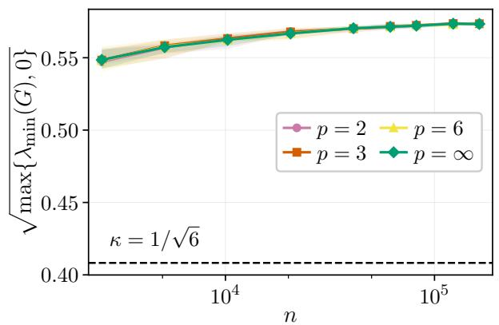

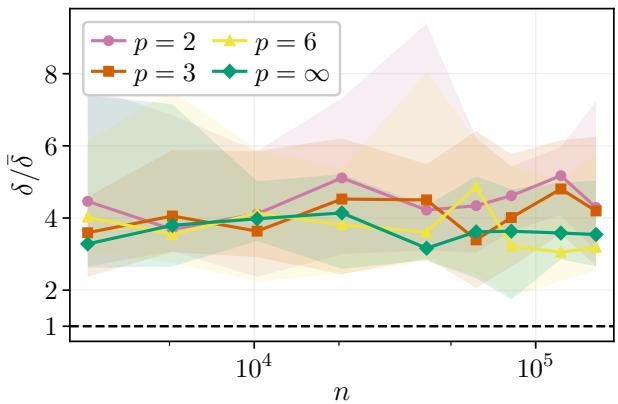  
Figure A.1: Additional plots for the fast rate simulations in Section 8 showing that the conditions in Theorem 3 hold. Concretely, the left plot shows that the RE condition is satisfied for $\kappa = 1 / \sqrt { 6 }$ (for all n) since it indeed lower-bounds the minimum eigenvalue $\lambda _ { \operatorname* { m i n } } ( G )$ of $G = X ^ { T } X / n$ (see (A.30) and the corresponding derivation for details). Moreover, the right plot shows that $\delta \ge \bar { \delta }$ (which it should be with high probability). Therefore, the conditions in Theorem 3 hold. Both plots show median over 10 runs with shaded bands showing minimum and maximum across the repetitions.

which holds with arbitrarily high probability for large enough n. Since this is valid for every $\pmb { v } \in \mathbb { R } ^ { d }$ , it is also valid for every v in $\mathcal { C } _ { S }$ . In other words, we have that X is in $\operatorname { R E } ( s , \ell )$ for $\kappa = 1 / \sqrt { 6 }$ with arbitrarily high probability (for large enough n), completing the derivation.

Additional plots. We also provide plots that support the claim that the conditions in Theorem 3 hold for the fast rate simulations in Section 8, seen in Figure A.1. Indeed, we see that both the RE condition and that $\delta \ge \bar { \delta }$ are fulfilled. Moreover, we also plot $\begin{array} { r } { e _ { q } : = \frac { \| \boldsymbol { \varepsilon } \| _ { q } } { n ^ { 1 / q } } } \end{array}$ in Figure A.2. We see that as n increases, $e _ { q }$ converges to a constant as predicted. Moreover, since both B and C in Theorem 3 are functions of $e _ { q }$ that converge to constants if $e _ { q }$ converges to a constant, we have that the maximum in (11) becomes a constant. Thus, we indeed get the rate $O ( \delta ^ { 2 } )$ which equals $O ( n ^ { - 1 } )$ since δ decreases as $1 / \sqrt { n }$

## F.2 Slow rate

We continue with the slow rate. More precisely, we here provide the details on how X is set and why the RE condition fails for it. First of all, $\bar { \beta } ^ { * } = [ 2 , - 1 ] ^ { \top }$ is 2-sparse, so we need an RE condition of the form $X \in \mathrm { R E } ( 2 , \ell )$ for some fixed ℓ and $\kappa > 0$ . We construct X so that there is no such ℓ and $\kappa > 0$ such that $X \in \mathrm { R E } ( 2 , \ell )$ holds for all n. This construction closely resembles van de Geer (2017); see also references therein. Importantly, we want to construct X such that the entries are correlated in a way that breaks the RE condition. We achieve this by setting the first column $X _ { 1 }$ and the second column $X _ { 2 }$ of X to the following:

$$
\mathbf { { X } } _ { 1 } = { \sqrt { \frac { 1 + \rho _ { n } } { 2 } } } { \mathbf { { u } } } + { \sqrt { \frac { 1 - \rho _ { n } } { 2 } } } { \mathbf { { w } } } , \quad \mathbf { { X } } _ { 2 } = { \sqrt { \frac { 1 + \rho _ { n } } { 2 } } } { \mathbf { { u } } } - { \sqrt { \frac { 1 - \rho _ { n } } { 2 } } } { \mathbf { { w } } } ,
$$

where u and w are any vectors in $\{ - 1 , 1 \} ^ { n }$ such that u is orthogonal to w for even n (and for odd n set them so that they are “almost” orthogona $\pmb { w } ^ { \top } \pmb { u } = \pmb { \bot } 1 )$ , and $\rho _ { n } = 1 - c _ { 0 } / \sqrt { n }$ for some constant $c _ { 0 } > 0$ . It is easy to see that the entries of X are uniformly bounded with $M = { \sqrt { 2 } }$ . Crucially, this construction is made so that for every even $n ,$

$$
G = { \frac { 1 } { n } } X ^ { T } X = { \left( \begin{array} { l l } { 1 } & { \rho _ { n } } \\ { \rho _ { n } } & { 1 } \end{array} \right) }
$$

becomes close to a singular matrix. Indeed, note that $\lambda _ { \operatorname* { m i n } } ( G ) = 1 - \rho _ { n } = c _ { 0 } / \sqrt { n }$ is the smallest eigenvalue. Thus, the Rayleigh–Ritz variational characterization (Wainwright, 2019, Equation (6.3)) implies that for any even $n ,$ there exists a vector $\pmb { v } \in \mathbb { R } ^ { 2 }$ such that:

$$
{ \frac { \| X \pmb { v } \| _ { 2 } ^ { 2 } } { n } } = \pmb { v } ^ { \top } { \frac { 1 } { n } } X ^ { \top } X \pmb { v } = \pmb { v } ^ { \top } G \pmb { v } = \lambda _ { \operatorname* { m i n } } ( G ) \| \pmb { v } \| _ { 2 } ^ { 2 } = { \frac { c _ { 0 } } { \sqrt { n } } } \| \pmb { v } \| _ { 2 } ^ { 2 } .\tag{A.30}
$$

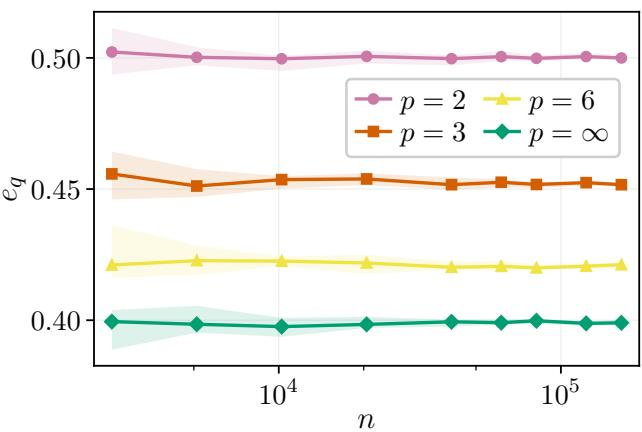  
Figure A.2: Convergence for $\begin{array} { r } { e _ { q } : = \frac { \| \boldsymbol { \epsilon } \| _ { q } } { n ^ { 1 / q } } } \end{array}$ in the fast rate simulations from Section 8. We see that all $e _ { q }$ quickly stabilizes toward a constant as n increases. Since $e _ { q }$ converges to a constant, so do $B$ and C in Theorem 3. The plot shows the median over 10 repeats with shaded bands being the 10th-90th percentile range.

Thus, since v is trivially in the cone $\mathcal { C } _ { S } = \{ \pmb { v } \in \mathbb { R } ^ { 2 } : \| \pmb { v } _ { S ^ { c } } \| _ { 1 } \leq \ell \| \pmb { v } _ { S } \| _ { 1 } \} = \mathbb { R } ^ { 2 }$ for $S = \{ 1 , 2 \}$ and $\lambda _ { \operatorname* { m i n } } ( G ) =$ $\textstyle { \frac { c _ { 0 } } { \sqrt { n } } } \to 0$ as $n  \infty$ , we conclude that no $\kappa > 0$ exists such that $X \in \mathrm { R E } ( 2 , \ell )$ for large enough $n ,$ proving the claim.

Concretely, in the experiments, we set $c _ { 0 } \ = \ 3$ and set u and w to $n / 4$ stacked copies of the vectors $[ 1 , 1 , - 1 , - 1 ] ^ { \top }$ and $[ 1 , - 1 , 1 , - 1 ] ^ { T }$ , respectively (with $^ n \mathrm { ~ a ~ }$ multiple of 4) and plot only such $n ,$ namely, $n = 4 0 9 6 , 6 1 4 4 , 8 1 9 2 , 1 0 2 4 0$ . The reason for this is twofold. First, it is easy to implement stacked copies. Second, there is a convenient analytic interpretation. Indeed, since u and w always have zero mean (their entries sum to zero), the parameter $\rho _ { n }$ equals the standard empirical correlation between the columns $X _ { 1 }$ and $X _ { 2 }$ . To see this, consider the sample correlation coeficient (see, e.g., James et al. (2021, Equation (3.18))) between $X _ { 1 }$ and $X _ { 2 }$ given by

$$
r = { \frac { \sum _ { i = 1 } ^ { n } ( X _ { 1 } [ i ] - \operatorname { m e a n } ( X _ { 1 } ) ) ( X _ { 2 } [ i ] - \operatorname { m e a n } ( X _ { 2 } ) ) } { \| X _ { 1 } \| _ { 2 } \| X _ { 2 } \| _ { 2 } } }
$$

where $X _ { 1 } [ i ]$ is the i-th entry of $X _ { 1 }$ (and similarly for $X _ { 2 } )$ , and ${ \mathrm { m e a n } } ( \mathbf { X } _ { i } )$ is the mean over all entries of $X _ { i }$ In our case, mean $( \pmb { X } _ { i } ) = 0$ by construction, and a simple computation yields $r = \rho _ { n }$ as desired. Therefore, another interpretation of what happens is as follows. As $n \to \infty$ , we have that $r = \rho _ { n } \to 1$ ; in other words, $X _ { 1 }$ and $X _ { 2 }$ become maximally correlated. This correlation breaks down the RE condition and hinders the fast rate $O ( n ^ { - 1 } )$ ). As a result, we get only the slow rate $O ( n ^ { - 1 / 2 } )$ .

## F.3 Small and large δ

Finally, we describe the setup for the small and large $\delta > 0$ simulations. In both cases, we let $y _ { i } = \pmb { x } _ { i } ^ { \top } \beta ^ { * } + \varepsilon _ { i }$ with $n = 3 0$ and $d = 6 0$ , true parameter iid sampled as $\beta _ { i } ^ { * } \sim N ( 0 , 1 )$ , noise $\varepsilon \sim N ( 0 , \sigma ^ { 2 } I )$ with $\sigma = 0 . 5$ and entries $x _ { i j } \in X$ iid sampled as $x _ { i j } \sim N ( 0 , 1 )$ . Note that $d > n$ , that is, we are in the overparametrized regime. Moreover, since we sample $x _ { i j } \sim N ( 0 , 1 )$ , we have that X is of full row rank almost surely. However, as an extra precaution, we also check that X is indeed of full rank to be sure that the conditions in Theorem 5 hold; For all simulations, X was indeed of full row rank.

For the small δ case, we plot the average error $\| X { \widehat { \boldsymbol { \beta } } } - \pmb { y } \| _ { 2 } ^ { 2 } / n$ as a function of δ as seen in Figure 3 (upper) for $p \in \{ 2 , 3 , 6 , \infty \}$ b. Moreover, we also compute the threshold $\delta _ { S }$ for $p = 2$ (pink dashed) and $\delta _ { S }$ for $2 < p \leq \infty$ (gray dashed, identical for all $2 < p \leq \infty )$ , as given by Theorem $5 _ { ; }$ where min $_ { \cdot \alpha \in Q } \| \pmb { \alpha } \| _ { \infty }$ and mi $\operatorname { n } _ { \pmb { \alpha } \in Q } \| \pmb { \alpha } \| _ { 2 }$ in the expression for $\delta _ { S }$ are computed using the convex program as detailed by Remark 3. For each $p \in \{ 2 , 3 , 6 , \infty \}$ , we observe that the average error $\| X { \widehat { \boldsymbol { \beta } } } - \pmb { y } \| _ { 2 } ^ { 2 } / n$ decreases rapidly for $\delta \leq \delta _ { S }$ breaching values in the numerical precision regime, indicating that interpolation occurs. Furthermore, this interpolation transition happens simultaneously for all $2 < p \leq \infty$ at their $\delta _ { S } ,$ while it occurs sooner for the $p = 2$ case since its threshold $\delta _ { S }$ is larger. All these observations are in line with Theorem 5.

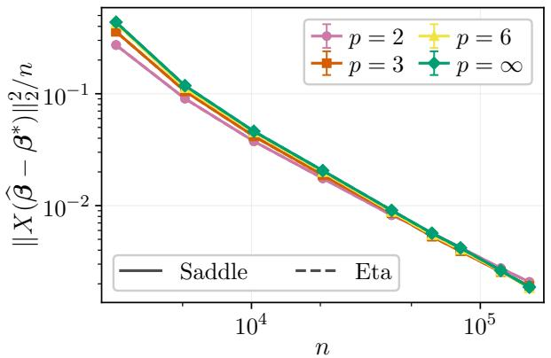

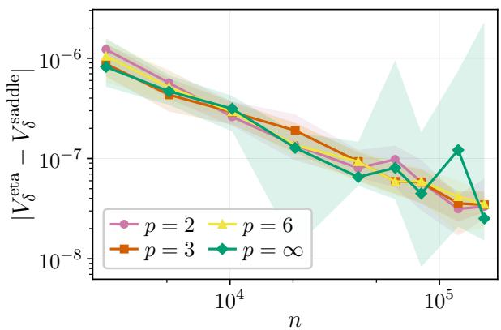

Figure A.3: We plot the error of the saddle-point solver and the η-trick solver for the fast rate setup (left). 1 1<sub>We run 10 repeats and plot the mean with 1 standard deviation bands. We also plot the robust risk for the</sub> obtained estimate for both solvers (right). Here we plot the median over 10 repeats with 10-90 percentiles. We note that both output near-identical results.  
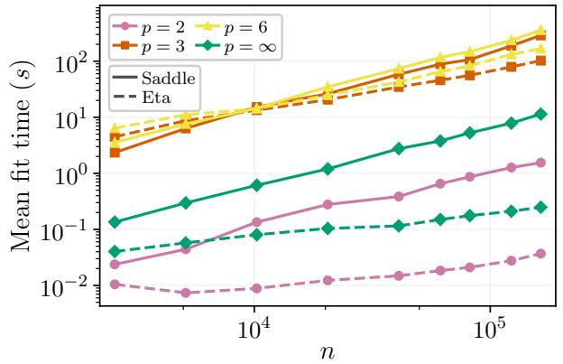

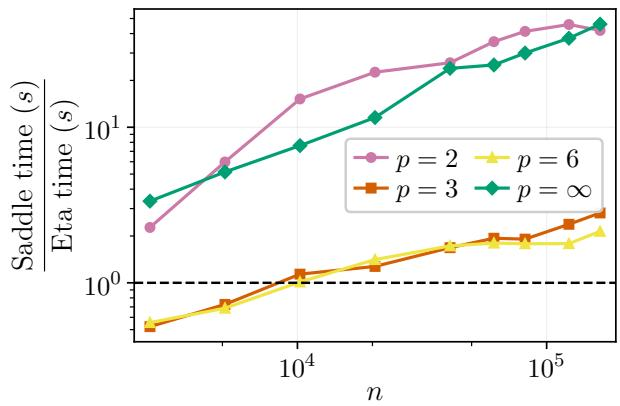  
Figure A.4: Computation time (left) and time ratio (right) of the saddle-point solver and the η-trick solver for the fast rate setup. We see that η-trick solver is, in general, faster, particularly for large n and $p \in \{ 2 , \infty \}$ Both methods are slower for $p \in \{ 3 , 6 \}$ , since the robust risk then lacks a closed-form expression. Both plots show mean over 10 runs.

For the large $\delta$ case, we plot $\| { \widehat { \boldsymbol { \beta } } } \| _ { \infty }$ as a function of δ, as seen in Figure 3 (lower) for $p \in \{ 2 , 3 , 5 , \infty \}$ with threshold $\delta _ { L }$ for each $p$ b(dashed lines with matching color). We see that $\| { \widehat { \boldsymbol { \beta } } } \| _ { \infty }$ decreases in the region $\delta \leq \delta _ { L }$ and becomes zero for $\delta \geq \delta _ { L }$ bas predicted by Theorem 4. Note also that the threshold $\delta _ { L }$ is diferent for each p (as opposed to $\delta _ { S }$ in the small δ case).

## F.4 Comparisons between the saddle-point solver and the η-trick solver

Finally, we compare the saddle-point solver and the η-trick solver as introduced in Section 7 with details in Appendix E.

Correctness. First, we run both solvers on the fast rate setup as detailed in Section 8, with results shown in Figure A.3. We see that both solvers achieve near-identical results (left plot). Indeed, the diference in robust risk error is $1 0 ^ { - 6 }$ $1 0 ^ { - 8 }$ (right plot). This provide numerical support that both solvers are correctly solving the given optimization problem.

Speed. Next we compare the speed of the two solvers and how their computation times scale with $n ,$ using the fast rate setup. The computation time is shown in Figure A.4 (left). Here, we see that the η-trick solver is faster in general, being slightly faster for $p \in \{ 3 , 6 \}$ (especially for large n) and several orders of magnitude faster for $p \in \{ 2 , \infty \}$ . We can also see this more clearly by looking at their time ratio, illustrated in Figure A.4 (right), where the region above the dashed line indicates that the η-trick solver is faster. The reason for the improved speed could be that the saddle-point formulation leads to slower convergence in general or that the DSP implementation is slower in particular; future work aims to find the underlying reason for this diference. Finally, we also note in Figure A.4 that it takes considerably more time to solve for $p \in \{ 3 , 6 \}$ since the robust risk lacks a closed-form expression. Future work should look into other variations to improve the speed. In particular, using the scalar optimization form in Lemma 3 could yield faster computations.