Article

# Dynamic LoRA-Experts and Prototype-Ensemble Matching for Class-Incremental Learning

Hongwei Zhao 1\*, Rui Liu 1 and Yansong Liu 1

1 School of Computer Science and Engineering, Beihang University, 37 Xueyuan Road, Beijing 100191, China \* Correspondence: zhaohongwei@buaa.edu.cn (H.Z.)

## Featured Application

This work can be applied to intelligent vision systems that need to incrementally learn new categories while maintaining previously acquired knowledge with low storage overhead.

## Abstract

Class-Incremental Learning (CIL) aims to continuously learn new classes without forgetting previously acquired knowledge. Recent advances in parameter-efficient fine-tuning (PEFT) based on pre-trained models (PTMs) have shown promise in this setting by integrating new tasks with minimal parameter overhead. However, these methods often suffer from knowledge degradation due to: (1) cumulative interference caused by iterative updates, constrained gradient flows, or entangled module integration; and (2) suboptimal alignment between inference samples and specialized modules. To address these challenges, we propose Dynamic LoRA-Experts and Prototype-Ensemble Matching (DLEPEM), a novel two-stage, rehearsal-free framework. In the first stage, we allocate a task-specific LoRA-Expert for each incremental task, enabling isolated representation learning and reducing cross-task interference. In the second stage, we introduce a prototype-ensemble matching mechanism that combines general prototypes derived from the frozen PTM with task-adaptive prototypes learned by the LoRA-Experts. This fusion facilitates both strong generalization and precise task-level discrimination. Extensive experiments on standard CIL and Few-Shot Class-Incremental Learning (FSCIL) benchmarks demonstrate that DLEPEM achieves strong performance under the evaluated protocols. For instance, in CIL, it achieves 93.39% on CIFAR100 (+0.80% over EASE), 92.31% on CUB200 (+2.11% over EASE), and 91.84% on VTAB (+1.39% over EASE). In the more challenging FSCIL setting, it achieves 88.77% on CUB200, outperforming the strongest baseline by a clear margin of 5.31%. These results indicate that DLEPEM effectively mit igates catastrophic forgetting while enhancing incremental learning capability. Code is available at: https://github.com/hongwei-zhao/Applied\_Sciences-DLEPEM-main.

## Check for updates

Received: 7 May 2026   
Revised: 13 June 2026   
Accepted: 14 June 2026   
Published: 17 June 2026

Copyright: © 2026 by the authors. Licensee MDPI, Basel, Switzerland. This article is an open access article distributed under the terms and conditions of the Creative Commons Attribution (CC BY) license.

Keywords: Class-Incremental Learning; Dynamic LoRA-Experts; Prototype-Ensemble; Catastrophic Forgetting

## 1. Introduction

In open-world environments, data typically arrives as a continuous stream of novel categories, a scenario formalized as Class-Incremental Learning (CIL). Traditional machine learning models struggle under such conditions, exhibiting catastrophic forgetting [1,2], where learning from new classes disrupts existing representations and leads to severe performance degradation. Class-incremental learning seeks to navigate this challenge by balancing the acquisition of new knowledge with the preservation of prior learning, a fundamental trade-off known as the stability-plasticity dilemma [3,4].

Recent advances leverage pre-trained models (PTMs), whose robust generalization capabilities stem from large-scale supervised or self-supervised training [5], providing a compelling foundation for CIL. However, directly fine-tuning all PTM parameters across sequential tasks risks compromising this generalization and amplifying forgetting. To mitigate this, contemporary methods use parameter-efficient fine-tuning (PEFT) techniques [6], such as prompts [7,8], adapters [9,10], and LoRA [4,11], which adapt models with minimal additional parameters, thereby reducing forgetting while preserving generalization.

Despite these gains, two critical challenges remain insufficiently addressed:

1. Stability-plasticity limitations from cumulative interference:

Shared prompt pools [7,8] are prone to overwriting earlier knowledge when exposed to shifting data distributions.

LoRA-based strategies [4,11], though effective in constraining updates to mitigate forgetting, inadvertently restrict plasticity needed for new task adaptation.

Fusion-based methods [4,9] attempt to balance old and new knowledge but often degrade the fidelity of both due to forced trade-offs.

2. Inference-stage module-sample mismatches:

Fixed PTM selection mechanisms [7,12] struggle under substantial domain shifts, resulting in suboptimal activations and degraded predictions.

These observations motivate a key question: Can we simultaneously enhance stabilityplasticity dynamics and improve module-sample matches to robustly mitigate catastrophic forgetting in CIL?

To this end, we propose DLEPEM, a novel rehearsal-free framework that rethinks PEFT-based CIL by introducing two synergistic components. First, inspired by Mixtureof-Experts (MoE) architectures [13], we dynamically allocate a dedicated LoRA-Expert for each new incremental task. Unlike shared or sequentially fine-tuned modules, each LoRA-Expert exclusively encodes task-specific knowledge; only the current expert is trainable, while all prior experts are frozen. Strategically embedded within Transformer feedforward network (FFN) and multi-head self-attention (MHA) layers, these lightweight experts preserve plasticity for new tasks while entirely isolating past parameters, thereby achieving a more favorable balance between stability and plasticity. Different from conventional token-level sparse MoE or LoRA-MoE models that learn a soft router and aggregate multiple expert outputs, DLEPEM uses MoE as a task-level organization principle: the expert bank grows with the task sequence, each old expert remains frozen, and expert activation is determined by prototype retrieval rather than differentiable token routing. Second, to mitigate inference mismatches, we introduce a prototype ensemble strategy that jointly leverages (1) general representations from the frozen PTM backbone and (2) specialized representations from task-specific experts. By fusing these distinct feature spaces, our approach enhances sample-to-module alignment, effectively bridging generalization and specialization. Thus, DLEPEM explicitly separates within-task prediction (WTP), handled by isolated task LoRA-Experts, from module-identity inference (MII), handled by prototype-ensemble matching.

In summary, our principal contributions are threefold:

We introduce task-level dynamic LoRA-Expert allocation into PEFT-based CIL. Unlike conventional MoE-style LoRA methods with a fixed expert pool and soft expert mixing, DLEPEM automatically adds one dedicated LoRA-Expert for each incremental task, trains only the current expert, and freezes all previous experts to reduce cross-task parameter interference.

We enhance module-sample alignment through prototype-ensemble matching, which fuses frozen-PTM prototypes and router-based domain-specific prototypes. This design improves task-level expert retrieval when PTM-only matching is unreliable under downstream domain shift.

Extensive experiments on six challenging CIL benchmarks validate the effectiveness of our approach, showing that DLEPEM achieves leading performance among the evaluated methods under the evaluated protocols. We further demonstrate architectural flexibility through DLEPEM-MLP, a variant that explores alternative expert integration strategies while retaining competitive results.

## 2. Related Work

## 2.1. Class-Incremental Learning

Class-incremental learning requires models to continually recognize newly introduced classes while maintaining discriminability for previously learned classes. Existing methods are commonly grouped into regularization-, rehearsal-, and architecture-based approaches [7].

Regularization-based methods [14] reduce forgetting by penalizing changes to parameters that are estimated to be important for old tasks. This strategy does not store old samples, but its effectiveness can decrease when the incremental stream contains large domain shifts or many sequential tasks [15]. Rehearsal-based methods replay raw images [15] or stored feature representations [16] to preserve old knowledge. They are often effective, but the buffer budget and possible privacy restrictions limit their applicability in rehearsal-free settings. Dynamic network methods [17] expand the model with taskspecific components and freeze previous ones to reduce parameter interference, but the growing architecture may introduce non-trivial memory overhead and some methods still rely on old data for calibration or fusion.

## 2.2. PEFT-Based CIL

With the strong transferability of PTMs, recent CIL methods increasingly adopt PEFT modules to adapt only a small subset of parameters while keeping most backbone weights frozen. Prompt-based methods, such as L2P [7], DualPrompt [8], S-Prompts [12], and CODA-Prompt [18], learn task-relevant prompts and retrieve or combine them during inference. These methods reduce the need for full fine-tuning, but their retrieval quality depends heavily on how well prompt keys separate tasks in the PTM feature space.

Adapter- and LoRA-based methods modify the PTM through lightweight modules. APER [10] combines PEFT-adapted and PTM features to retain generalization. LAE [9] improves compatibility across PEFT modules, but repeated feature fusion can introduce stability-plasticity trade-offs. InfLoRA [4] constrains LoRA updates through gradientorthogonal projection to reduce interference, whereas SD-LoRA [11] decouples gradient direction and magnitude to protect early-task directions. These constraint-based strategies improve stability, but may restrict plasticity for newly introduced classes. The MoE-Adapters method [19] uses an activate-freeze mechanism with a predefined expert pool, which enables inter-task collaboration but limits flexibility when the number or diversity of future tasks is unknown.

## 2.3. Mixture-of-Experts and Expert Retrieval

MoE architectures introduce multiple expert modules and a routing mechanism that selects or weights experts for each input [13]. In vision models, V-MoE [20] replaces part of the dense feed-forward layers in ViT with sparse expert layers, where image patches are routed to a subset of MLP experts. In multi-modal or instruction-tuning settings, Mo-CLE [21] integrates multiple LoRA experts to handle task diversity. These methods show that expert specialization can improve adaptation, but their routing is usually learned within a fixed or predefined expert set and often combines expert outputs through tokenlevel or sample-level gating.

For incremental learning, the key challenge is different: the model must accommodate an open-ended task sequence while avoiding repeated updates to old task-specific parameters. Therefore, expert life cycle and inference-time expert retrieval become central design choices. A fixed expert pool may be insufficient for long or unpredictable task streams, while a learned soft gate can suffer from task-recency bias when trained only on the current task.

## 2.4. Our Approach

Similar to PEFT-based CIL methods [4,9,10], DLEPEM uses a PTM backbone with LoRA [22] adaptation. However, instead of repeatedly updating or blending shared PEFT modules, DLEPEM allocates one LoRA-Expert for each incremental task, trains only the current expert, and freezes all historical experts. This stage-wise expert life cycle reduces cross-task parameter interference while preserving plasticity for the new task.

DLEPEM also differs from conventional MoE-based or multi-LoRA methods in routing granularity. Existing MoE formulations usually learn an input-dependent gate to select or softly combine experts from a predefined pool. In contrast, DLEPEM performs top-1 task-level expert retrieval through an append-only prototype dictionary. Each ensemble key combines a frozen-PTM prototype with a router-domain prototype, so inference uses both general semantics and task-adaptive cues to select the appropriate expert. Thus, old-task preservation is mainly achieved by structural parameter isolation, while moduleidentity inference is handled by prototype-ensemble matching rather than a learned soft gate.

## 3. Preliminaries

Problem Formulation. CIL considers a sequential stream of tasks $\mathcal { D } = \{ { \mathcal { D } } _ { 1 } , \ldots , { \mathcal { D } } _ { T } \}$ where the t-th task $\mathcal { D } _ { t } = \{ ( \mathbf { x } _ { i } , \mathbf { y } _ { i } ) \} _ { i = 1 } ^ { n _ { t } }$ contains $n _ { t }$ samples. Here, $\mathbf { x } _ { i } \in \mathcal { X } _ { t }$ denotes an input from domain $\mathcal { X } _ { t } ,$ and $\mathbf { y } _ { i } \in \mathcal { V } _ { t }$ is its corresponding label. Importantly, the label spaces are mutually exclusive across tasks, i.e., $\mathcal { V } _ { t } \cap \mathcal { V } _ { t ^ { \prime } } = \emptyset \mathrm { f o r } t \neq t ^ { \prime }$

Following the rehearsal-free setting $[ 7 , 8 , 1 8 ]$ , the model only observes data from the current task during training. The training objective is to learn a model $\mathrm { f } _ { \Theta } ( \mathbf { x } ) = \mathbf { W } _ { c l s } ^ { \top } \phi ( \mathbf { x } )$ that minimizes the empirical risk over the current task’s training set:

$$
\mathrm { L } ( \mathcal { D } _ { t } ) = \frac { 1 } { | \mathcal { D } _ { t } | } \sum _ { ( \mathbf { x } _ { i } , \mathbf { y } _ { i } ) \in \mathcal { D } _ { t } } \mathrm { L } \big ( \mathrm { f } _ { \Theta } ( \mathbf { x } _ { i } ) , \mathbf { y } _ { i } \big ) ,\tag{1}
$$

where $\phi ( \mathbf { x } )$ represents the embedded [class] token from the ViT, $\mathbf { W } _ { c l s }$ denotes the classifier weights, $| \mathcal { D } _ { t } |$ is the number of examples in the current task, and $\operatorname { L } ( \cdot , \cdot )$ represents the loss function that measures prediction error. After each task t, performance is evaluated on all classes seen so far, i.e., on the union $\mathbf { Y } _ { t } = \mathcal { Y } _ { 1 } \cup \ldots \cup \mathcal { Y } _ { t }$

For clarity, Table 8 summarizes the main symbols used throughout the paper.

Mixture of Experts. MoE architectures offer an efficient way to increase model capacity by activating only a subset of parameters per input, achieving faster training and inference compared to dense networks of equivalent scale. A typical MoE layer comprises a set of M expert networks $\mathbf { E } = \left\{ \mathbf { E } _ { 1 } , \dots , \mathbf { E } _ { M } \right\}$ and a router G that determines expert activations based on the input [23]. Each expert is commonly implemented as an FFN, while the router is parameterized by a weight matrix $\mathbf { W } _ { g }$

Formally, for an input x, the router computes:

$$
\begin{array} { r } { \mathrm { G } ( \mathbf { x } ) = \mathrm { s o f t m a x } ( \mathbf { W } _ { g } \mathbf { x } ) , } \end{array}\tag{2}
$$

producing a soft selection over experts. The final MoE output is given by:

$$
\mathrm { M o E } ( \mathbf { x } ) = \sum _ { i = 1 } ^ { M } \mathrm { G } ( \mathbf { x } ) _ { i } \mathbf { E } _ { i } ( \mathbf { x } ) ,\tag{3}
$$

where $\mathbf { G } ( \mathbf { x } ) _ { i }$ represents the routing probability for expert $\mathbf { E } _ { i } .$ . In Transformer-based architectures, MoE layers often replace standard FFN blocks to selectively route representations [24].

Low-Rank Adaptation. LoRA was introduced to efficiently fine-tune large pretrained models by injecting low-rank updates into weight matrices [22]. Given a pretrained weight matrix $\pmb { W } \in \mathbb { R } ^ { d _ { i n } \times d _ { o u t } }$ , LoRA learns an additive low-rank decomposition:

$$
\begin{array} { r } { \pmb { W } + \Delta \pmb { W } = \pmb { W } + \pmb { \mathrm { U } } \pmb { \mathrm { V } } , } \end{array}\tag{4}
$$

where ${ \bf U } \in { \bf R } ^ { d _ { i n } \times r } , { \bf V } \in { \bf R } ^ { r \times d _ { o u t } }$ , and the rank $r \ll \operatorname* { m i n } ( d _ { i n } , d _ { o u t } )$ . This reduces the number of trainable parameters while maintaining expressiveness. LoRA enables cost-effective, scalable fine-tuning, making it suitable for continual learning, where efficiency and avoidance of forgetting are critical.

## 4. The Proposed Method

As demonstrated by HiDe-Prompt [25], CIL methods employing multi-module selection can be decomposed into two probabilistic components: module-identity inference (MII) and within-task prediction (WTP), represented by $P ( \mathbf { x } ~ \in ~ \mathcal { X } _ { i } | \mathcal { D } , \Theta )$ and $P ( \mathbf { x } \in \mathcal { X } _ { i , j } | \mathbf { x } \in \mathcal { X } _ { i } , \mathcal { D } , \Theta )$ , respectively. By Bayes’ theorem, we have

$$
P ( \mathbf { x } \in \mathcal { X } _ { i , j } | \mathcal { D } , \Theta ) = P ( \mathbf { x } \in \mathcal { X } _ { i , j } | \mathbf { x } \in \mathcal { X } _ { i } , \mathcal { D } , \Theta ) P ( \mathbf { x } \in \mathcal { X } _ { i } | \mathcal { D } , \Theta ) .\tag{5}
$$

Letting $\hat { i }$ and $\hat { j }$ denote the ground-truth task index and class label for input $\mathbf { x , }$ Eq. (5) implies that improving either WTP accuracy, $P ( \mathbf { x } \in \mathcal { X } _ { \hat { i } , \hat { j } } | \mathbf { x } \in \mathcal { X } _ { \hat { i } } , \mathcal { D } , \Theta )$ , or MII accuracy, $P ( \mathbf { x } \in \mathcal { X } _ { \hat { i } } | \mathcal { D } , \Theta )$ , directly enhances overall prediction performance. However, existing approaches suffer from two limitations: (1) iterative updates or fusion of new and existing modules progressively deteriorate WTP $[ 4 , 7 - 9 ] ;$ ; and (2) MII performance, when relying solely on pre-trained features [9,12], is inherently constrained by the similarity between pre-training and downstream data distributions. To address these challenges, we propose DLEPEM, which explicitly enhances both WTP and MII via two complementary innovations:

## Dynamic LoRA-Expert

To exploit the strong generalization of the pre-trained model, we keep its weights W fixed throughout training. To maintain plasticity and safeguard WTP, we dynamically allocate a dedicated LoRA-Expert for each incremental task, embedded within an MoE framework. Each new LoRA-Expert is trained exclusively on its respective task while previously introduced experts remain frozen. This ensures isolated task-specific adaptation with a small number of trainable parameters, leveraging LoRA’s efficiency to effectively capture discriminative features. Figure 1(a) depicts expert training, while Figure 1(b) details the internal structure. This expert life cycle is the main difference from conventional

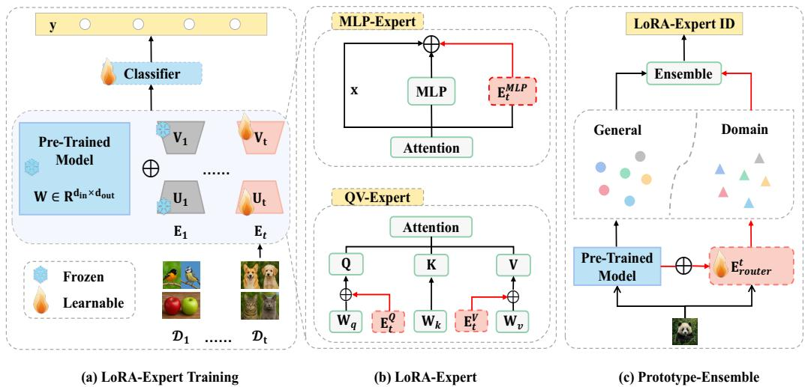  
Figure 1. Illustration of DLEPEM. (a) In the t-th incremental task, a new LoRA-Expert $\mathbf { E } _ { t }$ (with parameters $\mathbf { U } _ { t }$ and $\mathbf { V } _ { t } )$ is trained to capture task-specific features. (b) Structure of the LoRA-Expert. Depending on the insertion location, the module is categorized as either an MLP-Expert or a QV-Expert. The QV-Expert integrates LoRA into the ${ \bf W } _ { q }$ and $\mathbf { W } _ { v }$ projections of the MHA layer. (c) Prototype-Ensemble Matching. General prototypes from the PTM and domain-specific prototypes from the router ${ \bf E } _ { t } ^ { r o u t e r }$ are combined and linked to their respective experts. During inference, the nearest prototype guides expert selection for each input sample.

MoE-based LoRA continual learning. DLEPEM does not repeatedly update a shared expert pool or combine all experts through a soft gate during feature computation. Instead, for task t, only $\mathbf { E } _ { t }$ receives gradients, whereas $\left\{ \mathbf { E } _ { 1 } , \ldots , \mathbf { E } _ { t - 1 } \right\}$ remain frozen. This design directly reduces cross-task parameter interference and protects WTP for previously learned tasks.

## Prototype-Ensemble Matching

After training each incremental task, we extract prototypes using two sources: (1) the fixed PTM for generalizable features, and (2) the router-enhanced LoRA-Expert for domain-specific nuances. Unlike prior methods that rely solely on pre-trained representations, DLEPEM combines these prototypes and associates them with their corresponding LoRA-Experts. During inference, a nearest-neighbor search in this combined prototype space determines the most appropriate expert, substantially improving MII. This design mitigates privacy concerns inherent to rehearsal-based strategies. Figure 1(c) illustrates our complete prototype-ensemble matching mechanism. The ensemble key for a class is constructed as the concatenation of a frozen-PTM prototype and a router-domain prototype. The former provides stable general semantics, while the latter captures downstream task-specific cues. This complements dynamic expert allocation: the task expert improves WTP once selected, and the prototype-ensemble dictionary improves MII by selecting the appropriate expert without storing raw rehearsal samples.

## 4.1. Dynamic LoRA-Experts

We integrate the proposed LoRA-Expert modules into the Vision Transformer (ViT) architecture [26]. In ViT, an input image is first divided into fixed-size patches, linearly projected, and augmented with positional embeddings before being processed by a Transformer encoder comprising MHA layers and multilayer perceptrons (MLPs).

To adaptively capture task-specific features in incremental learning, we dynamically introduce a LoRA-Expert at each incremental stage. This module can be inserted either as a parallel branch to the MLP (MLP-Expert, see Figure 1(b)) or into the attention projections of the MHA module. When LoRA is applied to ${ \bf W } _ { q }$ and $\mathbf { W } _ { v } ,$ we refer to this variant as the QV-Expert configuration.

The modified forward computations for these components are given by:

$$
\mathbf { h } ^ { \prime } = \mathbf { e } + \mathbf { M } \mathbf { L } \mathbf { P } ( \mathbf { e } ) + \mathbf { E } _ { t } ^ { M L P } ( \mathbf { e } ) ,\tag{6}
$$

$$
\mathbf { h } ^ { \prime } = \mathrm { A t t n } \Big ( \mathbf { h } _ { Q } + \mathbf { E } _ { t } ^ { Q } ( \mathbf { e } ) , \mathbf { h } _ { K } + \mathbf { E } _ { t } ^ { K } ( \mathbf { e } ) , \mathbf { h } _ { V } + \mathbf { E } _ { t } ^ { V } ( \mathbf { e } ) \Big ) ,\tag{7}
$$

where e and h are the inputs and outputs of the original module, respectively. Here, $\mathbf { E } _ { t }$ denotes the task-t LoRA-Expert module rather than a complete independent ViT. It is a group of LoRA adapters inserted into the selected branch or projection, and each historical expert $\mathbf { E } _ { s } , s < t$ , is frozen after its task has been learned. The attention operation is defined as:

$$
\mathrm { A t t n } ( \mathbf { Q } , \mathbf { K } , \mathbf { V } _ { a t t n } ) = \mathrm { s o f t m a x } \left( \frac { \mathbf { Q } \mathbf { K } ^ { \top } } { \sqrt { d } } \right) \mathbf { V } _ { a t t n } ,\tag{8}
$$

Here, ${ \mathbf V } _ { a t t n }$ denotes the attention value matrix and is distinct from the LoRA matrix $\mathbf { V } _ { t } .$ For N tokens, the softmax term is an attention-weight matrix ${ \bf A } \in { \bf R } ^ { N \times N }$ , so ${ \mathbf { A V } } _ { a t t n }$ is the standard weighted sum over value vectors. The multi-head extension is omitted for clarity. Each LoRA-Expert shares the same architecture but learns distinct parameters. Under the row-vector convention, for an input $\mathbf { e } \in \mathbf { R } ^ { 1 \times d _ { i n } }$ , one adapter consists of low-rank matrices $\mathbf { U } _ { t } \in \mathbf { R } ^ { d _ { i n } \times r }$ and $\mathbf { V } _ { t } \in \mathbf { R } ^ { r \times d _ { o u t } }$ , producing:

$$
\mathbf { E } _ { t } ( \mathbf { e } ) = \mathbf { e } \mathbf { U } _ { t } \mathbf { V } _ { t } .\tag{9}
$$

In the default ViT-B/16 QV-Expert setting, $d _ { i n } = d _ { o u t } = 7 6 8$ and $r = 1 0 ;$ for the MLP-Expert variant, $d _ { i n }$ and $d _ { o u t }$ correspond to the inserted MLP branch dimensions.

In the ViT setting, we denote by $\phi ( \mathbf { x } ; \mathbf { E } _ { t } )$ the output embeddings produced by the PTM equipped with the task-specific expert $\mathbf { E } _ { t }$ . For the first incremental task, we follow the standard LoRA initialization [22], setting V to zero and initializing U via Kaiming initialization [27]. For subsequent tasks, we initialize each new LoRA-Expert by copying the weights from the preceding expert, then fine-tune it while keeping all previous experts frozen. As illustrated in Figure 1(a), this strategy ensures that each task-specific expert adapts independently, preserving knowledge from prior stages. This design provides a direct stability-plasticity mechanism. Let $\boldsymbol { \theta } _ { t } = \{ \mathbf { U } _ { t } , \mathbf { V } _ { t } \}$ denote the LoRA parameters of the expert allocated to task $t ,$ while the PTM weights W remain frozen. After task s has been learned, its old expert parameters $\theta _ { s }$ are not optimized when learning any later task $t > s ;$ hence

$$
\nabla _ { \theta _ { s } } \mathcal { L } ( \mathcal { D } _ { t } ) = 0 , \qquad s < t .\tag{10}
$$

Therefore, old experts remain parameter-stationary during subsequent training, which reduces forgetting caused by repeated modification of shared PEFT parameters. Meanwhile, the current expert $\theta _ { t }$ is optimized with the cross-entropy objective in Eq. (18) without imposing gradient-orthogonality or update-magnitude shrinking constraints, preserving plasticity for newly introduced classes. The remaining source of old-task degradation is mainly expert retrieval error, which is addressed by the prototype-ensemble matching mechanism.

## 4.2. Prototype-Ensemble Matching Mechanism

When the distribution gap between the pre-trained model (PTM) and the downstream dataset is small, generalized features extracted by the frozen PTM can enable effective module-sample matching. However, since the relationship between pre-training and downstream distributions is generally unknown, it is essential to adaptively capture domain-specific features from the downstream task.

To tackle this, we introduce a dynamically updated router ${ \bf E } ^ { r o u t e r }$ that extracts domainspecific features. The router shares the same architecture as the LoRA-Experts but is continuously updated across incremental tasks.

Under typical incremental constraints, where only data from the current task is available, directly fine-tuning the router leads to overfitting, causing it to route all samples to the most recent LoRA-Expert. To mitigate this, we propose dual feature distillation mechanisms that jointly enforce stability (retaining prior knowledge) and plasticity (adapting to new tasks), regularizing router updates to ensure robust generalization.

1. Plasticity Feature Distillation. To encourage the router to learn category-specific features of the current task, we first compute the LoRA-Expert prototype for each class $i \in \mathcal { V } _ { t }$ :

$$
\mathbf { P } _ { i , t } ^ { L } = \frac { 1 } { N _ { i , t } } \sum _ { ( \mathbf { x } _ { j } , \mathbf { y } _ { j } ) \in \mathcal { D } _ { t } } \mathbb { I } ( \mathbf { y } _ { j } = i ) \phi ( \mathbf { x } _ { j } ; \mathbf { E } _ { t } ) , \quad N _ { i , t } = \sum _ { ( \mathbf { x } _ { j } , \mathbf { y } _ { j } ) \in \mathcal { D } _ { t } } \mathbb { I } ( \mathbf { y } _ { j } = i ) .\tag{11}
$$

Here, $N _ { i , t }$ is the number of current-task samples belonging to class $i ,$ and $\mathbb { I } ( \cdot )$ denotes the indicator function. We then align the router feature of each current-task sample with the LoRA-Expert prototype of its ground-truth class using a KL-divergence objective:

$$
\mathcal { L } _ { P F D } = \frac { 1 } { | \mathcal { D } _ { t } | } \sum _ { ( \mathbf { x } _ { j } , \mathbf { y } _ { j } ) \in \mathcal { D } _ { t } } \mathrm { K L } \Big ( \sigma ( \mathbf { P } _ { \mathbf { y } _ { j } , t } ^ { L } / \tau ) \lVert \sigma \big ( \phi ( \mathbf { x } _ { j } ; \mathbf { E } _ { t } ^ { r o u t e r } ) / \tau \big ) \Big ) .\tag{12}
$$

Here, $\sigma ( { \mathbf { z } } ) ~ = ~ \mathsf { s o f t m a x } ( { \mathbf { z } } )$ , and temperature scaling is written explicitly as $\sigma ( { \bf z } / \tau ) =$ softmax $\left( \mathbf { z } / \tau \right)$ , where τ is the temperature parameter. Thus, $\sigma ( \cdot )$ in the distillation losses denotes the same softmax function as softmax $\therefore ( \cdot )$ in the attention equation. These classspecific prototypes guide the router toward discriminative features of the current task, ensuring effective adaptation for new tasks.

2. Stability Feature Distillation. To mitigate the degradation of previously learned knowledge, we introduce a stability constraint that encourages the current router to mimic the feature distribution produced by the previous router on the current-task inputs:

$$
\mathcal { L } _ { S F D } = \frac { 1 } { \left| \mathcal { D } _ { t } \right| } \sum _ { ( \mathbf { x } _ { j } , \mathbf { y } _ { j } ) \in \mathcal { D } _ { t } } \mathrm { K L } \big ( \sigma ( \phi ( \mathbf { x } _ { j } ; \mathbf { E } _ { t - 1 } ^ { r o u t e r } ) / \tau ) \left| \right| \sigma \big ( \phi ( \mathbf { x } _ { j } ; \mathbf { E } _ { t } ^ { r o u t e r } ) / \tau \big ) \big ) .\tag{13}
$$

The overall router loss combines these objectives:

$$
\mathcal { L } _ { r o u t e r } = \left\{ \begin{array} { l l } { \mathcal { L } _ { P F D } , } & { t = 1 , } \\ { \alpha \mathcal { L } _ { P F D } + ( 1 - \alpha ) \mathcal { L } _ { S F D } , } & { t > 1 , } \end{array} \right.\tag{14}
$$

where α weights the plasticity and stability distillation terms for the router. For the first task, $\mathcal { L } _ { S F D }$ is omitted because no previously trained router exists. The router parameters $\mathbf { E } _ { t } ^ { r o u t e r }$ are optimized by minimizing this combined loss function. With the default $\alpha = 0 . 0 4$ the router update places more weight on $\mathcal { L } _ { S F D } ;$ however, this coefficient controls router regularization only and should not be interpreted as proof of an optimal global stabilityplasticity balance. The main source of new-task plasticity remains the trainable current LoRA-Expert, while frozen old experts provide parameter-level stability.

At the end of each incremental stage, we compute general prototypes $\mathbf { P } _ { i } ^ { F }$ using the frozen PTM $\phi ( \mathbf { x } )$ and domain-specific prototypes $\mathbf { P } _ { i } ^ { R }$ using the current router ${ \bf E } _ { t } ^ { r o u t e r }$ for each newly introduced class $i \in \mathcal { V } _ { t }$ , as defined in Eq. (11). The prototype dictionary is updated in an append-only manner: old entries for classes $i \in \mathbf { Y } _ { t - 1 }$ are retained as historical keys and are not recomputed with later-task data. The new ensemble keys created at stage t are

$$
{ \bf K } _ { t } ^ { n e w } = \Big \{ { \bf K } _ { i } = [ { \bf P } _ { i } ^ { F } ; { \bf P } _ { i } ^ { R } ] \ | \ i \in \mathcal { V } _ { t } \Big \} .\tag{15}
$$

Equivalently, we define the class-i ensemble prototype vector as ${ \bf P } _ { i } = \mathrm { c o n c a t } ( { \bf P } _ { i } ^ { F } , { \bf P } _ { i } ^ { R } ) =$ $[ \mathbf { P } _ { i } ^ { F } ; \mathbf { P } _ { i } ^ { R } ]$ , and use it as the dictionary key ${ \bf K } _ { i } = { \bf P } _ { i }$ . The semicolon in $[ \cdot ; \cdot ]$ denotes vector concatenation, not matrix addition or summation. Each new key $\mathbf { K } _ { i }$ is appended to Dict together with the expert index $\nu _ { i } = t ,$ , which points to the corresponding expert $\mathbf { E } _ { t }$ . Thus, after task $t ,$ the dictionary covers all seen classes $\mathbf { Y } _ { t } .$ , while only entries for $\mathcal { V } _ { t }$ are newly created. This keeps DLEPEM rehearsal-free: the persistent state consists of frozen LoRA-Experts, the current router, and compact ensemble keys, but no raw samples, old minibatches, feature buffers, or exemplar sets.

Because the router is updated across tasks, router-domain keys from older stages may have been generated by earlier router states. DLEPEM mitigates this router-state drift in two ways. First, each key includes the frozen-PTM component $\mathbf { P } _ { i } ^ { F } .$ , which remains comparable across stages because the PTM is fixed. Second, stability feature distillation in Eq. (13) encourages $\mathbf { E } _ { t } ^ { r o u t e r }$ to preserve the behavior of ${ \bf E } _ { t - 1 } ^ { r o u t e r }$ while adapting to the current task.

## Prototype-Ensemble Matching

Our mechanism dynamically selects the most suitable LoRA-Expert for each input by leveraging a key-value association strategy inspired by L2P [7]. Specifically, we maintain a dictionary where each seen class $i \in \mathbf { Y } _ { t }$ has one ensemble key $\mathbf { K } _ { i }$ and an associated expert index $\nu _ { i } \mathbf { : }$

$$
\mathrm { D i c t } _ { t } = \{ ( \mathbf { K } _ { i } , \nu _ { i } ) \mid i \in \mathbf { Y } _ { t } , \nu _ { i } \in \{ 1 , \ldots , t \} \} .\tag{16}
$$

Here, $\nu _ { i }$ identifies the task-specific LoRA-Expert associated with class i.

During inference, given an input $\mathbf { x , }$ we construct an ensemble query $\begin{array} { r l } { \mathbf { q } ( \mathbf { x } ) } & { { } = } \end{array}$ concat $( \mathbf { P } ^ { F } , \mathbf { \bar { P } } ^ { R } ) \ = \ [ \mathbf { P } ^ { F } ; \mathbf { \bar { P } } ^ { R } ]$ , where $\mathbf { P } ^ { \bar { F } }$ is the feature from the frozen PTM and $\mathbf { P } ^ { R }$ is the domain-specific feature from the router. We then identify the nearest key by cosine similarity:

$$
\hat { i } = \underset { i \in \Upsilon _ { t } } { \operatorname { a r g m a x } } \big ( \cos ( \mathbf { q } ( \mathbf { x } ) , \mathbf { K } _ { i } ) \big ) ,\tag{17}
$$

The retrieved key $\mathbf { K } _ { \widehat { i } }$ returns an expert identity rather than a direct class prediction. Let $\hat { t } = \nu _ { \hat { i } }$ denote the task index associated with $\mathbf { K } _ { \hat { i } }$ in Dictt; DLEPEM then selects $\mathbf { E } _ { \hat { t } }$ for within-task prediction. Final classification is restricted to the class set $\mathcal { V } _ { \widehat { t } }$ associated with the selected expert and uses the corresponding prototype weights. Thus, all stored ensemble keys participate in module-identity inference, while prototype weights from unrelated experts are not mixed during classification. Algorithm 2 summarizes this inference pipeline.

## 4.3. Optimization Objective and Training Procedure

DLEPEM employs a two-stage training paradigm: it first learns Dynamic LoRA-Expert modules and then optimizes the router for effective module-sample matching. Algorithm 1 provides the complete training procedure, and Algorithm 2 gives the corresponding task-agnostic inference procedure.

1. Dynamic LoRA-Expert Learning: The objective function for training the LoRA-Expert is:

$$
\operatorname* { m i n } _ { { \bf W } _ { c l s } , { \bf E } _ { i } } \mathrm { L } _ { C E } \Big ( { \bf W } _ { c l s } ^ { \top } \phi \big ( { \bf x } ; { \bf E } _ { i } \big ) , { \bf y } \Big ) ,\tag{18}
$$

where $\operatorname { L } _ { C E }$ denotes the cross-entropy loss, and $\phi ( \mathbf { x } ; \mathbf { E } _ { i } )$ represents the PTM equipped with the LoRA-Expert $\mathbf { E } _ { i }$ . During inference, DLEPEM uses LoRA-Expert-derived prototype weights for classification. Specifically, $\mathbf { P } ^ { L }$ denotes the prototype-weight matrix formed by the class prototypes $\mathbf { P } _ { i , t } ^ { L }$ defined in Eq. (11). Classification is performed using cosine similarity:

$$
\mathsf { f } ( \mathbf { x } | \mathbf { E } _ { i } ) = ( \frac { \mathbf { P } ^ { L } } { \| \mathbf { P } ^ { L } \| _ { 2 } } ) ^ { \top } ( \frac { \phi ( \mathbf { x } ; \mathbf { E } _ { i } ) } { \| \phi ( \mathbf { x } ; \mathbf { E } _ { i } ) \| _ { 2 } } ) ,\tag{19}
$$

where $\mathbf { E } _ { i }$ denotes the selected LoRA-Expert and $\mathbf { P } ^ { L }$ contains the prototype weights associated with this expert.

Algorithm 1 Training Procedure for DLEPEM   
1: Input: Pre-trained model $\phi ( \cdot )$ , incremental datasets $\{ \mathcal { D } _ { 1 } , \ldots , \mathcal { D } _ { T } \}$ , LoRA rank $r ,$ distil  
lation coefficient α.   
2: Output: Trained LoRA-Experts $\left\{ \mathbf { E } _ { 1 } , \ldots , \mathbf { E } _ { T } \right\}$ , Router ${ \bf E } _ { T } ^ { r o u t e r } ,$ , Prototype Dictionary Dict.   
3: Initialize: Dict $ \emptyset ,$ Erouter0 with random weights.   
4: for $t = 1$ to T do   
5: # Stage 1: Dynamic LoRA-Expert Learning   
6: Initialize LoRA-Expert E . If $\bar { t } > 1 ,$ , copy weights from $\mathbf { E } _ { t - 1 } .$   
7: Train $\mathbf { E } _ { t }$ and classifier $\mathbf { W } _ { c l s }$ on $\mathcal { D } _ { t }$ using $\mathcal { L } _ { C E } \left( \mathrm { E q . } \left( 1 8 \right) \right)$   
8: Freeze parameters of $\mathbf { E } _ { t } .$   
9: # Stage 2: Router Learning and Prototype-Ensemble Building   
10: If $\dot { \mathbf { \zeta } } _ { t } > 1 ,$ , freeze a copy of the previous router ${ \bf E } _ { t - 1 } ^ { r o u t e r }$   
11: Train router ${ \bf E } _ { t } ^ { r o u t e r }$ on $\mathcal { D } _ { t }$ using $\mathcal { L } _ { r o u t e r }$ (Eq. (14)).   
12: # Append Prototype Dictionary with newly introduced classes   
13: Keep old dictionary entries for classes in $\dot { \mathbf Y } _ { t - 1 }$ unchanged.   
14: for each newly introduced class $i \in \mathcal { V } _ { t }$ do   
15: Compute general prototype $\mathbf { P } _ { i } ^ { F }$ using frozen PTM $\phi ( \cdot )$ and samples from $\mathcal { D } _ { t }$   
16: Compute domain-specific prototype $\mathbf { \widetilde { P } } _ { i } ^ { R }$ using router ${ \bf E } _ { t } ^ { r o u t e r }$ and samples from $\mathcal { D } _ { t }$   
17: Create ensemble prototype $\mathbf { P } _ { i } = [ \mathbf { P } _ { i } ^ { F } ; \mathbf { P } _ { i } ^ { R } ] ( \mathrm { E q . ~ } ( 1 5 ) ) .$   
18: Append an entry to Dict by associating key $\mathbf { K } _ { i } = \mathbf { P } _ { i }$ with expert index $\nu _ { i } = t ( { \mathrm E q } .$   
(16)).   
19: end for   
20: end for   
21: return $\left\{ { \bf E } _ { 1 } , \ldots , { \bf E } _ { T } \right\} , { \bf E } _ { T } ^ { r o u t e r } .$ , Dict.

Algorithm 2 Inference Procedure for DLEPEM   
1: Input: Test sample $\mathbf { x , }$ frozen PTM $\phi ( \cdot )$ , frozen LoRA-Experts $\left\{ \mathbf { E } _ { 1 } , \ldots , \mathbf { E } _ { T } \right\}$ , current   
router ${ \bf E } _ { T } ^ { r o u t e r } .$ , prototype dictionary Dict, and prototype weights $\{ \mathbf { P } _ { c } ^ { L } \} _ { c \in \Upsilon _ { T } }$   
2: Output: Predicted label ${ \hat { y } } .$   
3: Compute frozen-PTM feature $\mathbf { P } ^ { F } ( \mathbf { x } ) = \phi ( \mathbf { x } )$   
4: Compute router-domain feature $\begin{array} { r } { \dot { \mathbf { P } } ^ { R } ( \mathbf { x } ) = \dot { \phi } ( \mathbf { x } ; \mathbf { E } _ { T } ^ { r o u t e r } ) . } \end{array}$   
5: Build the ensemble query $\mathbf { q } ( \mathbf { x } ) = [ \mathbf { P } _ { \hat { \mathbf { \Phi } } } ^ { F } ( \mathbf { x } ) , \mathbf { P } ^ { R } ( \mathbf { x } ) ] .$   
6: Retrieve the nearest dictionary key $\hat { i } = \arg \operatorname* { m a x } _ { i \in \Upsilon _ { T } } \cos ( { \bf q } ( { \bf x } ) , { \bf K } _ { i } )$   
7: Obtain the expert index $\hat { t } = \nu _ { \hat { i } }$ associated with $\mathbf { K } _ { \hat { i } }$ in Dict.   
8: Extract the selected-expert feature $\mathbf { z } = \phi ( \mathbf { x } ; \mathbf { E } _ { \hat { t } } )$   
9: Restrict candidate labels to $\mathcal { V } _ { \widehat { t } }$ and predict $\hat { y } = \arg \operatorname* { m a x } _ { c \in \mathcal { V } _ { \hat { t } } } \cos ( \mathbf { z } , \mathbf { P } _ { c } ^ { L } )$   
10: return ${ \hat { y } } .$

2. Router Learning: The router is optimized with the objective function shown in Eq. (14).

Table 1. Configuration of the class-incremental learning (CIL) benchmarks.
<table><tr><td>Task</td><td>CIFAR100</td><td>CUB200</td><td>ImageNet-R</td><td>OmniBenchmark</td><td>VTAB</td></tr><tr><td>Classes / Task</td><td>10</td><td>20</td><td>40</td><td>30</td><td>10</td></tr><tr><td># of tasks</td><td>10</td><td>10</td><td>5</td><td>10</td><td>5</td></tr></table>

Table 2. Configuration of the few-shot class-incremental learning (FSCIL) benchmarks.
<table><tr><td>Task</td><td>CUB200</td><td>CIFAR100</td><td>miniImageNet</td></tr><tr><td>Base Classes</td><td>100</td><td>60</td><td>60</td></tr><tr><td>Incremental Tasks 10-way 5-shot 5-way 5-shot 5-way 5-shot # of Tasks</td><td>1+10</td><td>1+8</td><td>1+8</td></tr></table>

As illustrated in Figure 1, we divide the class-incremental learning process into two stages: First, a new LoRA-Expert is learned for each incremental task to capture taskspecific features; each expert is categorized as either an MLP-Expert or a QV-Expert depending on its insertion point. Second, we introduce a prototype-ensemble matching mechanism that captures both general and domain-specific features, thereby improving module-sample matching. Notably, DLEPEM’s components are orthogonal to many existing approaches and can be integrated with them straightforwardly.

## 5. Experiments

## 5.1. Experimental Settings

Datasets: We evaluate DLEPEM in two settings: CIL and Few-Shot Class-Incremental Learning (FSCIL) [28]. For CIL, we follow standard protocols [10,11] and test on five benchmarks: VTAB [29], CIFAR100 [30], CUB200 [31], ImageNet-R [32], and OmniBenchmark [33]. VTAB comprises 50 classes, CIFAR100 contains 100 classes, CUB200 and ImageNet-R each contain 200 classes, and OmniBenchmark, the largest benchmark among them, includes 300 classes. As shown in Table 1, we follow the common practices [4,9,11], splitting CIFAR100 into 10 tasks, CUB200 into 10 tasks, ImageNet-R into 5 tasks, OmniBenchmark into 10 tasks, and VTAB into 5 tasks.

For FSCIL, we adopt the settings used in prior work [34,35] on CUB200, CIFAR100, and miniImageNet [36]. As shown in Table 2, we use 100 classes in CUB200 as the base class set for the first task. The remaining 100 classes are partitioned into 10 incremental tasks, with each incremental task containing 10 new classes and the few-shot training set containing 5 examples per class (10-way 5-shot incremental task). CIFAR100 and miniImageNet are divided into 60 classes for the base task, and the remaining 40 classes are divided into eight 5-way 5-shot incremental tasks.

Comparison methods: For CIL, we compare DLEPEM against several representative and recent methods, including SimpleCIL [10], prompt-based methods (L2P [7], Dual-Prompt [8], CODA-Prompt [18]), LoRA-based methods (LAE [9], APER [10], InfLoRA [4], SD-LoRA [11], BiLoRA [37]), and recent PTM-based CIL methods such as EASE [38]. We also include standard full fine-tuning as a baseline, where the model is sequentially finetuned without any continual learning mechanism. We reproduce all baseline results in our benchmark tables under the corresponding CIL/FSCIL protocols. For fairness, all methods use the same pre-trained backbone and identical data splits; for LoRA/adapter-based methods, we set the rank to r = 10 where applicable. Other method-specific training settings, including optimizer, training epochs, batch size, and augmentation policy, follow their original or recommended implementations.

Table 3. Performance comparison on CIL benchmarks using the same ViT-B/16-IN21K backbone. Results are reported as mean ± standard deviation over three runs; the best result in each column is highlighted in bold.
<table><tr><td rowspan="2">Method</td><td colspan="2">CIFAR100 (T=10)</td><td colspan="2">CUB200 (T=10)</td><td colspan="2"> $\mathrm { I m } a g e \mathrm { N e t - R } \left( T { = } 5 \right)$ </td><td colspan="2">OmniBenchmark (T=10)</td><td colspan="2">VTAB (T=5)</td></tr><tr><td>AL</td><td>A</td><td>AL</td><td>A</td><td>AL</td><td>A</td><td>AL</td><td>A</td><td>AL</td><td>A</td></tr><tr><td>Full Fine-Tuning</td><td> $6 6 . 2 6 \pm 0 . 1 8$ </td><td> $7 6 . 9 4 \pm 0 . 0 2$ </td><td> $5 5 . 2 9 \pm 0 . 4 6$ </td><td> $7 0 . 3 0 \pm 0 . 7 4$ </td><td> $5 9 . 9 0 \pm 0 . 0 5$ </td><td> $7 2 . 1 9 \pm 0 . 1 2$ </td><td> $4 7 . 7 5 \pm 0 . 1 4$ </td><td> $6 5 . 8 6 \pm 0 . 1 2$ </td><td> $6 2 . 9 5 \pm 5 . 9 4$ </td><td> $8 0 . 8 0 \pm 1 . 5 0 $ </td></tr><tr><td>SimpleCIL [10]</td><td>81.27 ± 0.01</td><td>87.13 ± 0.01</td><td>82.28 ± 6.35</td><td> $9 1 . 8 5 \pm 0 . 0 0$ </td><td> $6 5 . 1 4 \pm 1 5 . 2 9$ </td><td>59.72 ± 0.03</td><td> $6 6 . 9 8 \pm 8 . 9 3$ </td><td> $7 9 . 3 5 \pm 0 . 0 1$ </td><td> $8 0 . 7 4 \pm 5 . 2 6$ </td><td> $9 0 . 8 0 \pm 0 . 0 0$ </td></tr><tr><td>L2P [7]</td><td> $8 4 . 8 2 \pm 0 . 2 2$ </td><td> $8 9 . 7 8 \pm 0 . 0 1$ </td><td> $7 1 . 9 8 \pm 0 . 0 7$ </td><td> $8 1 . 8 0 \pm 0 . 0 3$ </td><td> $7 2 . 0 8 \pm 0 . 0 1$ </td><td> $7 6 . 7 6 \pm 0 . 0 6$ </td><td> $6 4 . 4 5 \pm 0 . 0 7$ </td><td>74.14 ± 0.03</td><td> $6 4 . 2 7 \pm 0 . 0 2$ </td><td> $8 1 . 8 4 \pm 0 . 1 9$ </td></tr><tr><td>DualPrompt [8]</td><td> $8 5 . 2 3 \pm 0 . 0 7$ </td><td> $9 0 . 3 2 \pm 0 . 0 6$ </td><td> $7 4 . 2 3 \pm 0 . 1 0$ </td><td> $\stackrel { 8 4 . 8 1 } { \scriptscriptstyle \dots } \pm 0 . 0 2$ </td><td> $6 9 . 3 4 \pm 0 . 0 9$ </td><td> $7 3 . 5 8 \pm 0 . 0 5$ </td><td> $6 6 . 1 6 \pm 0 . 0 6$ </td><td> $7 4 . 9 7 \pm 0 . 0 3$ </td><td> $7 8 . 9 0 \pm 0 . 1 0$ </td><td> $8 9 . 8 2 \pm 0 . 0 6$ </td></tr><tr><td>CODA-Prompt [18]</td><td>86.69 ± 0.00</td><td>91.31 ± 0.01</td><td> $7 5 . 4 5 \pm 0 . 0 0$ </td><td>84.65 ± 0.00</td><td>75.16 ± 0.08</td><td> $8 0 . 4 6 \pm 0 . 0 4$ </td><td> $6 8 . 6 7 \pm 0 . 0 0$ </td><td>77.79 ± 0.00</td><td>75.08 ± 0.00</td><td> $8 7 . 2 4 \pm 0 . 0 0$ </td></tr><tr><td>APER [10]</td><td> $8 7 . 3 2 \pm 0 . 0 1$ </td><td> $9 2 . 0 9 \pm 0 . 0 2$ </td><td> $8 6 . 8 2 \pm 0 . 0 4$ </td><td> $9 1 . 8 4 \pm 0 . 0 3$ </td><td> $6 8 . 2 2 \pm 0 . 0 7$ </td><td> $7 5 . 3 0 \pm 0 . 0 7$ </td><td> $7 4 . 4 0 \pm 0 . 0 1$ </td><td> $8 0 . 6 2 \pm 0 . 0 1$ </td><td> $8 4 . 4 4 \pm 0 . 0 1$ </td><td> $8 6 . 2 7 \pm 0 . 0 2$ </td></tr><tr><td>LAE [9]</td><td> $8 5 . 6 0 \pm 0 . 1 9$ </td><td> $9 1 . 2 6 \pm 0 . 1 2$ </td><td> $6 7 . 9 1 \pm 0 . 0 4$ </td><td> $8 0 . 1 7 \pm 0 . 0 4$ </td><td> $7 1 . 2 6 \pm 0 . 1 8$ </td><td> $7 7 . 0 8 \pm 0 . 0 4$ </td><td> $6 6 . 1 4 \pm 0 . 0 6$ </td><td> $7 4 . 8 9 \pm 0 . 0 3$ </td><td> $6 8 . 4 5 \pm 2 . 5 3 $ </td><td> $8 5 . 3 1 \pm 0 . 4 4$ </td></tr><tr><td>InfLoRA [4]</td><td> $8 6 . 4 3 \pm 0 . 0 2$ </td><td>91.80 ± 0.02</td><td>70.07 ± 0.26</td><td> $8 1 . 7 1 \pm 0 . 1 7$ </td><td> $7 7 . 6 6 \pm 0 . 0 8$ </td><td> $8 2 . 9 0 \pm 0 . 0 5$ </td><td> $6 8 . 3 8 \pm 0 . 1 2$ </td><td>78.06 ± 0.03</td><td>74.66 ± 0.43</td><td> $8 6 . 0 3 \pm 0 . 1 7$ </td></tr><tr><td>SD-LoRA [11]</td><td> $8 7 . 6 2 \pm 0 . 0 0$ </td><td> $9 2 . 1 0 \pm 0 . 0 0$ </td><td> $7 2 . 6 9 \pm 0 . 0 0$ </td><td> $8 3 . 1 7 \pm 0 . 0 0$ </td><td></td><td> $8 2 . 7 4 \pm 0 . 0 0$ </td><td> $6 9 . 3 2 \pm 0 . 0 0$ </td><td> $7 7 . 7 8 \pm 0 . 0 0$ </td><td> $6 7 . 7 3 \pm 0 . 0 0$ </td><td> $8 4 . 4 4 \pm 0 . 0 0$ </td></tr><tr><td> $\mathrm { E A S E } \left[ 3 8 \right] ^ { \cdot }$ </td><td>88.13 ± 0.04</td><td>92.59 ± 0.05</td><td>84.18 ± 0.06</td><td> $9 0 . 2 0 \pm 0 . 0 4$ </td><td> $7 6 . 9 5 \pm 0 . 0 5$ </td><td>81.48 ± 0.06</td><td> $6 7 . 7 5 \pm 0 . 0 4$ </td><td> $7 4 . 8 5 \pm 0 . 0 5$ </td><td> $8 2 . 3 4 \pm 0 . 0 6$ </td><td> $9 0 . 4 5 \pm 0 . 0 4$ </td></tr><tr><td>BiLoRA [37]</td><td> $8 5 . 3 0 \pm 0 . 0 5$ </td><td> $9 0 . 7 3 \pm 0 . 0 4$ </td><td> $7 3 . 7 5 \pm 0 . 0 6$ </td><td>83.67 ± 0.05</td><td> $7 6 . 3 3 \pm 0 . 0 4$ </td><td> $8 1 . 2 \dot { 1 } \pm \dot { 0 } . 0 7$ </td><td> $6 8 . 8 7 \pm 0 . 0 5$ </td><td> $7 7 . 5 3 \pm 0 . 0 4$ </td><td> $7 6 . 7 6 \pm 0 . 0 6$ </td><td> $8 8 . 9 4 \pm 0 . 0 5$ </td></tr><tr><td>DLEPEM-MLP</td><td> $8 5 . 9 9 \pm 0 . 3 4$ </td><td> $9 2 . 4 0 \pm 0 . 0 3$ </td><td>87.70 ± 0.05</td><td> $9 2 . 3 1 \pm 0 . 2 9$ </td><td>76.25 ± 0.44</td><td> $8 2 . 3 7 \pm 0 . 1 4$ </td><td>74.32 ± 0.00</td><td>81.60 ± 0.00</td><td> $8 4 . 9 6 \pm 0 . 2 2$ </td><td> ${ \bf 9 1 . 8 4 \pm 0 . 0 3 }$ </td></tr><tr><td>DLEPEM-QV</td><td> $\mathbf { 8 8 . 8 4 \pm 0 . 0 9 }$ </td><td> ${ \bf 9 3 . 3 9 \pm 0 . 1 0 }$ </td><td> $8 7 . 5 6 \pm 0 . 1 6$ </td><td>92.09 ± 0.08</td><td> $7 8 . 7 7 \pm 0 . 0 7$ </td><td> ${ \bf 8 3 . 4 3 \pm 0 . 1 2 }$ </td><td> ${ \bf 7 5 . 5 3 \pm 0 . 0 8 }$ </td><td> $\mathbf { 8 2 . 1 6 \pm 0 . 0 6 }$ </td><td> $8 5 . 1 8 \pm 0 . 1 4$ </td><td> $9 1 . 1 1 \pm 0 . 1 3$ </td></tr></table>

For FSCIL, we additionally benchmark against three recent ViT-based methods tailored for few-shot scenarios: PriViLege [34], ASP [35], and CPE-CLIP [39]. All methods leverage the same pre-trained backbone (ViT-B/16-IN21K [26]) and identical data splits to ensure fair comparisons.

Evaluation metrics: For CIL, we assess model performance using two established metrics: $\begin{array} { r } { \bar { \mathcal { A } } = \frac { 1 } { T } \sum _ { i = 1 } ^ { T } \mathcal { A C C } _ { i } } \end{array}$ and $\boldsymbol { \mathcal { A } } _ { L }$ [4]. Here, A¯ is the average accuracy of all T incremental stages, and $\boldsymbol { \mathcal { A } } _ { L }$ is the accuracy of the last incremental stage. ${ \mathcal { A } } { \mathcal { C } } { \mathcal { C } } _ { i }$ is defined as:

$$
\mathcal { A } \mathcal { C } _ { i } = \frac { 1 } { i } \sum _ { j = 1 } ^ { i } a _ { i , j } ,\tag{20}
$$

where $a _ { i , j }$ denotes the accuracy on the j-th task after training on the i-th task. For FSCIL, $\mathcal { A } _ { \mathrm { B a s e } }$ is the accuracy of the base classes in task 0. Both $\mathcal { A } _ { L }$ and A¯ are defined identically to those in the standard CIL setting.

Architecture and training details: We adopt ViT-B/16-IN21K [26] pre-trained on ImageNet-21K as the backbone. Optimization is conducted using SGD with an initial learning rate of 0.02 and cosine annealing. LoRA-Experts are trained for 20 epochs and the router for 5 epochs, using a batch size of 48. We set the LoRA rank to $r = 1 0$ and insert LoRA-Experts into all Transformer blocks. The distillation coefficient α is set to 0.04. All experiments are performed on an NVIDIA A800 GPU with fixed data splits (seed 1993) and the same backbone to ensure reproducibility; results are averaged over three runs. Following SD-LoRA [11], our QV-Experts are integrated into the query and value projections of the attention module. We also evaluate a variant, DLEPEM-MLP, which introduces MLP-Experts as a parallel branch to the FFN layer.

## 5.2. Benchmark Comparison

Class-Incremental Learning: We conduct a comprehensive evaluation of DLEPEM against representative recent methods on five benchmark datasets. As shown in Table 3, DLEPEM consistently delivers superior accuracy across all benchmarks. After adding the recent EASE and BiLoRA baselines, DLEPEM still achieves the best average accuracy on all five CIL benchmarks under our reproduced experimental setting. Compared with the strongest baseline in each dataset, DLEPEM improves A¯ by 0.80% on CIFAR100, 2.11% on CUB200, 0.53% on ImageNet-R, 1.54% on OmniBenchmark, and 1.39% on VTAB.

For instance, on CIFAR100, DLEPEM-QV achieves an average accuracy of 93.39%, outperforming the newly added EASE baseline by 0.80%. Following the caution of Kim and Han [40], we do not interpret high average accuracy alone as proof of an optimal stability-plasticity balance; instead, the old/new-task analysis in Section 5.7 provides behavior-level evidence for the trade-off. Figure 2 further shows that DLEPEM achieves the highest performance throughout training, underscoring its robustness.

Few-Shot Class-Incremental Learning: We further evaluate DLEPEM in the few-shot class-incremental learning setting. As shown in Table 4, DLEPEM consistently delivers superior accuracy and achieves leading results among the evaluated methods on multiple benchmarks. In particular, it achieves the highest last accuracy $( \mathcal { A } _ { L } )$ and average accuracy (A¯) on CUB200 and CIFAR100. For instance, on CUB200, DLEPEM-QV achieves an average accuracy of 88.77%, outperforming the strongest baseline, ASP, by a clear margin of 5.31%. On CIFAR100, DLEPEM-QV reaches 90.50%, surpassing ASP by 1.96%. While its performance on miniImageNet is highly competitive and on par with the strongest baselines, these substantial gains on the other datasets highlight DLEPEM’s effectiveness in long-term continual learning, even under severe data sparsity. Figure 3 further illustrates that DLEPEM maintains superior performance throughout the incremental learning process, showing its robustness and adaptability in few-shot scenarios.

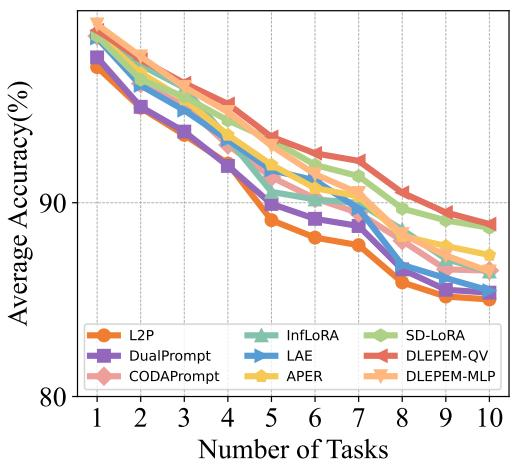  
(a) CIFAR100 (T=10)

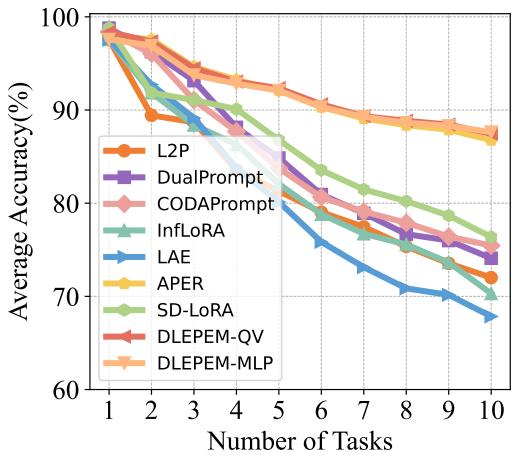  
(b) CUB200 (T=10)

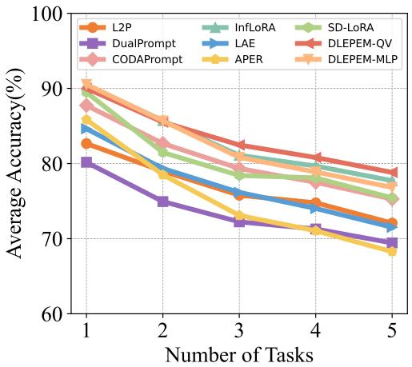  
(c) ImageNet-R (T=5)

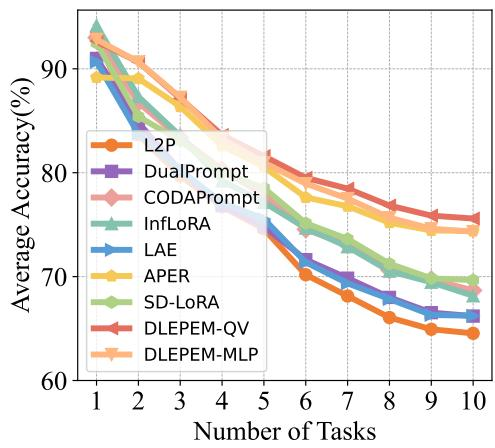  
(d) OmniBenchmark (T=10)  
Figure 2. Incremental accuracy curves on the CIL benchmarks. All methods use the same ViT-B/16-IN21K backbone, and each subplot reports accuracy after successive incremental tasks for the specified dataset protocol.

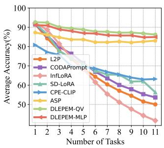  
(a) CUB200 (T=11)

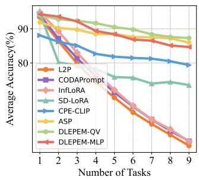  
(b) CIFAR100 (T=9)

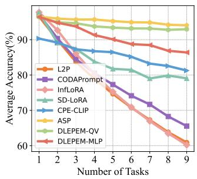  
(c) miniImageNet (T=9)  
Figure 3. Incremental accuracy curves on the FSCIL benchmarks. The three subplots show the CUB200, CIFAR100, and miniImageNet protocols, respectively, using the same ViT-B/16-IN21K backbone.

Table 4. Performance comparison on FSCIL benchmarks using the same ViT-B/16-IN21K backbone. Results are reported as mean ± standard deviation over three runs; the best result in each column is highlighted in bold.
<table><tr><td rowspan="2">Method</td><td colspan="3">CUB200 (T=11)</td><td colspan="3">CIFAR100 (T=9)</td><td colspan="3">miniImageNet (T=9)</td></tr><tr><td> $\mathcal { A } _ { \mathrm { B a s e } }$ </td><td> $A _ { L }$ </td><td> $\bar { A }$ </td><td> $\mathcal { A } _ { \mathrm { B a s e } }$ </td><td> $A _ { L }$ </td><td>A</td><td> $\mathcal { A } _ { \mathrm { B a s e } }$ </td><td> $A _ { L }$ </td><td> $\bar { A }$ </td></tr><tr><td>L2P [7]</td><td> $9 1 . 5 0 \pm 0 . 0 0$ </td><td> $5 0 . 0 4 \pm 0 . 0 0$ </td><td> $6 6 . 7 0 \pm 0 . 0 0$ </td><td> $9 3 . 4 3 \pm 0 . 0 0$ </td><td> $5 5 . 7 5 \pm 0 . 0 0$ </td><td> $7 1 . 8 1 \pm 0 . 0 0$ </td><td> $9 6 . 5 3 \pm 0 . 0 0$ </td><td> $6 0 . 9 1 \pm 0 . 0 0$ </td><td> $7 6 . 2 8 \pm 0 . 0 0$ </td></tr><tr><td>CODA-Prompt [18]</td><td> $9 1 . 5 0 \pm 0 . 0 0$ </td><td> $5 3 . 6 5 \pm 0 . 0 0$ </td><td> $6 9 . 3 0 \pm 0 . 0 0$ </td><td> $9 4 . 0 5 \pm 0 . 0 0$ </td><td> $5 7 . 1 0 \pm 0 . 0 0$ </td><td> $7 3 . 1 1 \pm 0 . 0 0$ </td><td> $9 7 . 1 5 \pm 0 . 0 0$ </td><td> $6 5 . 5 5 \pm 0 . 0 0$ </td><td> $7 8 . 8 3 \pm 0 . 0 0$ </td></tr><tr><td>InfLoRA [4]</td><td> $9 2 . 4 5 \pm 0 . 2 0$ </td><td>45.18 ± 2.50</td><td>66.27 ± 1.43</td><td> ${ \bf 9 4 . 9 2 \pm 0 . 0 6 }$ </td><td>57.41 ± 0.31</td><td> $7 4 . 2 8 \pm 0 . 2 8$ </td><td>97.42 ± 0.06</td><td> $5 1 . 5 2 \pm 0 . 1 0$ </td><td> $7 1 . 5 5 \pm 0 . 0 3$ </td></tr><tr><td>SD-LoRA [11]</td><td> $9 1 . 9 2 \pm 0 . 0 0$ </td><td> $5 6 . 2 8 \pm 0 . 0 0$ </td><td> $7 0 . 8 7 \pm 0 . 0 0$ </td><td>94.60 ± 0.00</td><td> $7 3 . 5 1 \pm 0 . 0 0$ </td><td>78.42 ± 0.00</td><td> ${ \bf 9 7 . 7 2 \pm 0 . 0 0 }$ </td><td> $7 9 . 0 7 \pm 0 . 0 0$ </td><td>84.36 ± 0.00</td></tr><tr><td>CPE-CLIP [39]</td><td> $8 0 . 2 1 \pm 0 . 8 5$ </td><td> $6 3 . 3 2 \pm 0 . 1 7$ </td><td> $6 9 . 3 7 \pm 0 . 3 7$ </td><td> $8 8 . 3 2 \pm 0 . 0 4$ </td><td> $7 9 . 9 9 \pm 0 . 1 8$ </td><td> $8 3 . 3 8 \pm 0 . 1 0$ </td><td> $9 0 . 1 4 \pm 0 . 0 5$ </td><td> $8 1 . 5 5 \pm 0 . 0 4$ </td><td> $8 5 . 5 4 \pm 0 . 0 4$ </td></tr><tr><td>ASP [35]</td><td> $8 7 . 1 4 \pm 0 . 1 1$ </td><td> $8 2 . 8 6 \pm 0 . 2 6$ </td><td> $8 3 . 4 6 \pm 0 . 2 2$ </td><td> $9 1 . 7 7 \pm 0 . 0 9$ </td><td> $8 6 . 0 4 \pm 0 . 0 3$ </td><td> $8 8 . 5 4 \pm 0 . 0 3$ </td><td> $9 6 . 3 2 \pm 0 . 1 5$ </td><td> $9 3 . 7 2 \pm 0 . 2 5$ </td><td> $9 4 . 9 7 \pm 0 . 2 1 $ </td></tr><tr><td>PriViLege [34]</td><td> $8 2 . 2 1 \pm 0 . 3 5$ </td><td> $7 5 . 0 8 \pm 0 . 5 2$ </td><td> $7 7 . 5 0 \pm 0 . 3 3$ </td><td> $9 0 . 8 8 \pm 0 . 2 0$ </td><td> $8 6 . 0 6 \pm 0 . 3 2$ </td><td> $8 8 . 0 8 \pm 0 . 2 0 $ </td><td> $9 6 . 6 8 \pm 0 . 0 6$ </td><td> ${ \bf 9 4 . 1 0 \pm 0 . 1 3 }$ </td><td> ${ \bf 9 5 . 2 7 \pm 0 . 1 1 }$ </td></tr><tr><td>DLEPEM-MLP</td><td> $9 2 . 5 1 \pm 0 . 0 0$ </td><td> $8 5 . 3 7 \pm 0 . 0 0$ </td><td> $8 8 . 5 3 \pm 0 . 0 0$ </td><td> $9 4 . 2 8 \pm 0 . 0 0$ </td><td> $8 4 . 6 7 \pm 0 . 0 0$ </td><td> $8 9 . 0 0 \pm 0 . 0 0$ </td><td> $9 6 . 3 7 \pm 0 . 0 0$ </td><td> $8 9 . 9 6 \pm 0 . 0 0$ </td><td> $9 3 . 1 1 \pm 0 . 0 0$ </td></tr><tr><td>DLEPEM-QV</td><td>92.68 ± 0.00</td><td> ${ \bf 8 6 . 2 2 \pm 0 . 0 0 }$ </td><td> $\mathbf { 8 8 . 7 7 \pm 0 . 0 0 }$ </td><td> $9 4 . 0 0 \pm 0 . 0 0$ </td><td> ${ \bf 8 7 . 2 9 \pm 0 . 0 0 }$ </td><td> ${ \bf 9 0 . 5 0 \pm 0 . 0 0 }$ </td><td> $9 6 . 7 7 \pm 0 . 0 0$ </td><td> $9 3 . 6 2 \pm 0 . 0 0$ </td><td> $9 4 . 8 0 \pm 0 . 0 0$ </td></tr></table>

Table 5. Ablation study on CIL and FSCIL tasks. The first two benchmarks follow CIL protocols, while the last two follow FSCIL protocols. Each metric reports MLP-Expert / QV-Expert performance.
<table><tr><td rowspan="2">Ablated Components</td><td colspan="2">CIFAR100 (T=10)</td><td colspan="2"> ${ \mathrm { I m a g e N e t - R } } \left( T { = } 5 \right)$ </td><td colspan="2">CIFAR100 (T=9)</td><td colspan="2"> $m i n i \mathrm { I m } a \mathrm { g e N e t } \left( T { = } 9 \right)$ </td></tr><tr><td> $A _ { L }$ </td><td>A</td><td> $\boldsymbol { A } _ { L }$ </td><td>À</td><td> $A _ { L }$ </td><td> $\bar { A }$ </td><td> $A _ { L }$ </td><td> $\bar { A }$ </td></tr><tr><td>w/o Dynamic LoRA-Expert</td><td>83.13 / 86.72</td><td>88.85 / 90.82</td><td>61.17 / 72.37</td><td>74.31 / 80.14</td><td> $7 3 . 0 3 \ : / \ : 7 9 . 7 3$ </td><td> $8 0 . 3 9 \textrm { / } 8 6 . 5 9$ </td><td> $8 4 . 2 6 \mathrm { ~ / ~ } 9 1 . 1 1$ </td><td>89.90 / 93.31</td></tr><tr><td>w/o Prototype-Ensemble</td><td>85.79 / 87.59</td><td>91.21 / 92.29</td><td>69.53 / 73.13</td><td>77.75 / 80.42</td><td>81.13 / 84.09</td><td> $8 6 . 9 7 \ : / \ : 8 8 . 6 7$ </td><td>85.54 / 92.25</td><td>90.03 / 94.06</td></tr><tr><td>DLEPEM-MLP / QV</td><td>85.99 / 88.84</td><td>92.40 / 93.39</td><td>76.25 / 78.77</td><td>82.37 / 83.43</td><td>84.67 / 87.29</td><td> $8 9 . 0 0 / 9 0 . 5 $ </td><td>89.96 / 93.62</td><td>93.11 / 94.80</td></tr></table>

## 5.3. Ablation Study

Different Components: We conduct ablation studies to assess the contribution of each component in DLEPEM (Table 5). The variant w/o Dynamic LoRA-Expert uses a single LoRA-Expert for all tasks, resulting in a significant performance drop under large domain shifts and indicating severe forgetting and task interference. In contrast, assigning a dedicated LoRA-Expert to each task better preserves the stability-plasticity tradeoff across incremental steps. This result underscores the value of task-specific experts in PEFT-based continual learning. Removing the prototype-ensemble router (w/o Prototype-Ensemble) and using frozen class prototypes as keys also degrades performance, confirming the router’s critical role in effective module-sample matching. The advantage of dynamic expert allocation is most visible on ImageNet-R. Replacing the single shared expert with task-specific dynamic experts increases DLEPEM-MLP from 61.17/74.31 to 76.25/82.37 in $\mathbf { \Omega } _ { A _ { L } / \bar { A } } ,$ and increases DLEPEM-QV from 72.37/80.14 to 78.77/83.43. These gains support our claim that isolating LoRA parameters by task reduces cross-task interference, especially under domain shift.

Different Routers: In addition to the prototype-ensemble strategy, we compare three module-sample matching mechanisms: frozen-PTM prototypes $\mathbf { P } ^ { F }$ , K-nearest-neighbor (KNN) matching, and router-domain prototypes from ${ \bf E } ^ { r o u t e r }$ . For KNN, features are extracted using the frozen PTM, and performance is evaluated across k values $( k \mathbf { \Omega } =$ $\{ 1 , 3 , 5 , 7 , 9 \} )$ , with $k = 3$ yielding the best results. Both $\mathbf { P } ^ { F }$ and ${ \bf E } ^ { r o u t e r }$ provide singlesource keys within the prototype-ensemble framework.

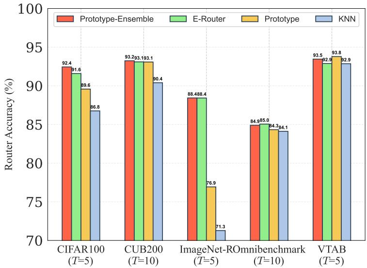  
Figure 4. Comparison of routing strategies for module-identity inference. The prototype-ensemble strategy is compared with frozen-PTM prototypes, KNN matching, and router-domain prototypes under the same evaluation protocols.

Table 6. Diagnostic accuracy of the classifier, router, and oracle expert selection on five CIL benchmarks. Each entry is reported as DLEPEM-MLP / DLEPEM-QV; the oracle expert setting uses the ground-truth task identity only for diagnostic analysis.
<table><tr><td>Metric</td><td>CIFAR100 (T = 10)</td><td>CUB200 (T = 10)</td><td>ImageNet-R (T = 5)</td><td>OmniBenchmark (T = 10)</td><td>VTAB (T = 5)</td></tr><tr><td>CNN</td><td>92.40 / 93.39</td><td>92.31 / 92.09</td><td>82.37 / 83.43</td><td>81.60 / 82.16</td><td>91.84 / 91.11</td></tr><tr><td>Router</td><td>91.88 / 93.68</td><td>93.24 / 93.31</td><td>88.43 / 88.87</td><td>84.90 / 85.55</td><td>93.45 / 93.56</td></tr><tr><td>LoRA-Expert (Oracle)</td><td>98.04 / 97.81</td><td>97.15 / 96.31</td><td>89.17  / 88.81</td><td>92.88 / 91.48</td><td>97.66 / 95.88</td></tr></table>

In Table $^ { 6 , }$ each entry is reported as DLEPEM-MLP / DLEPEM-QV. CNN reports the final average classification accuracy of each variant. Router reports the expert-selection accuracy of the learned routing module. LoRA-Expert (Oracle) reports classification accuracy when the ground-truth task/expert identity is used at test time to select the correct LoRA-Expert before normal within-expert classification.

As shown in Figure 4, the prototype ensemble consistently outperforms the baseline KNN approach. Two key insights emerge:

1. Domain-specific adaptation: Under significant domain shift (e.g., ImageNet-R $( T = 5 ) )$ ), the ensemble achieves larger gains, primarily due to ${ \bf E } ^ { r o u t e r } { \bf \Sigma _ { S } }$ ability to capture domain-specific characteristics.

2. Robust matching via integration: Combining generalized and domain-aware prototypes enables more reliable module-sample matching. Even when Erouter underperforms $\mathbf { P } ^ { F }$ , their ensemble compensates through mutual alignment, enhancing overall stability and accuracy. This conclusion is also consistent with the component ablation in Table 5: on ImageNet-R, replacing prototype-ensemble retrieval with frozen-prototype keys reduces $\boldsymbol { \mathcal { A } _ { L } } / \boldsymbol { \bar { \mathcal { A } } }$ from 76.25/82.37 to 69.53/77.75 for DLEPEM-MLP and from 78.77/83.43 to 73.13/80.42 for DLEPEM-QV. The result indicates that combining PTM-general and router-domain prototypes provides more reliable MII than relying on a single feature source. Figure 4 also contains the two single-source prototype variants requested by the reviewer: the frozen-PTM prototype $\mathbf { P } ^ { F }$ and the router-domain prototype Erouter. Across the evaluated settings, both single-source variants, including the router-domain prototype variant, obtain lower accuracy than the prototype-ensemble strategy, which supports the complementarity of the two prototype sources. This router comparison also serves as a post-hoc compatibility check for the append-only dictionary. During evaluation, current queries are matched against stored keys accumulated from previous stages. If historical router-domain keys were incompatible with the current router state, prototype-ensemble retrieval would not consistently outperform PTM-only or KNN-style matching. The observed gains therefore suggest that the frozen-PTM component and stability-regularized router updates help maintain usable key-query compatibility across incremental stages.

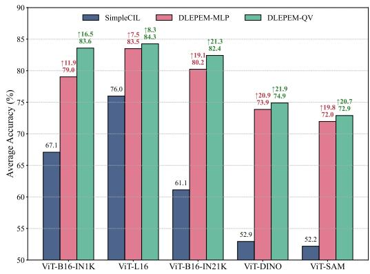  
(a) ImageNet-R (T = 10).

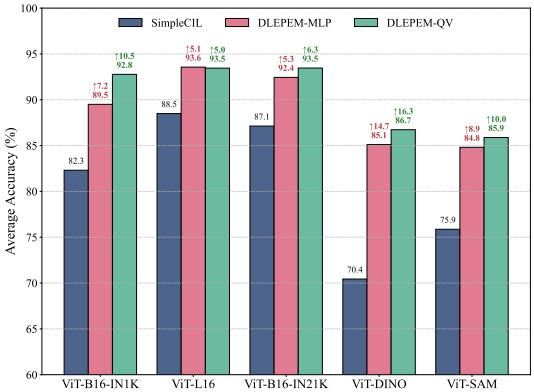  
(b) CIFAR100 (T=10).  
Figure 5. Effect of different pre-trained backbones on CIL performance. The comparison evaluates DLEPEM with several ViT-based pre-training sources and reports the corresponding performance on ImageNet-R and CIFAR100.

Different Pre-trained Models: Beyond validating DLEPEM on ViT-B/16-IN21K, we further assess its generalization across diverse Transformer-based architectures, including ViT-B/16-IN1K & ViT-L/16 [26], ViT-B/16-DINO [41], and ViT-B/16-SAM [42]. As a baseline, SimpleCIL [10] fine-tunes only the classifier to reflect the inherent capability of each backbone in incremental settings. We evaluate DLEPEM on the CIFAR100 and ImageNet-R benchmarks, with results shown in Figure 5(a) and (b). Two key observations emerge:

1. DLEPEM yields greater improvements on larger models (e.g., ViT-L/16), highlighting its scalability with model capacity.

2. Among similarly sized architectures (e.g., ViT-B/16 variants), DLEPEM consistently outperforms the SimpleCIL baseline, demonstrating robustness to architectural and pretraining differences.

These results show DLEPEM’s versatility and effectiveness across a wide range of Transformer-based backbones.

## 5.4. Analysis of Trainable Parameters and Accuracy

To further evaluate the parameter-performance trade-off, we compare the number of trainable parameters with accuracy across different methods in Figure 6. As illustrated in these plots, DLEPEM achieves a favorable balance between model size and performance, demonstrating that it uses additional parameters efficiently to improve accuracy.

We further quantify the scalability of the one-expert-per-task design. DLEPEM is rehearsal-free in the sense that it stores no raw samples, old feature batches, or exemplar buffers; nevertheless, it retains a frozen LoRA-Expert bank, the current router, and an append-only prototype dictionary. For a ViT with hidden dimension d, LoRA rank r, L

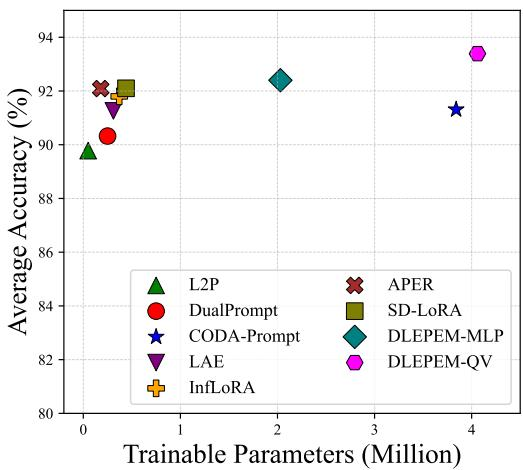  
(a) CIFAR100 (T=10)

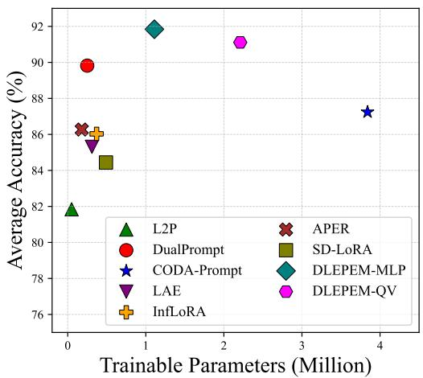  
(b) VTAB (T=5)  
Figure 6. Parameter–accuracy comparison on CIL benchmarks. The plots compare trainable parameter counts and final accuracy on CIFAR100 and VTAB to illustrate the parameter-performance trade-off of DLEPEM.

Transformer blocks, and b bytes per floating-point value, the storage of one MLP-Expert, one QV-Expert, and the prototype dictionary after task t can be written as

$$
\begin{array} { r } { N _ { \mathrm { M L P } } = L ( 2 d r ) , \phantom { } } \\ { N _ { \mathrm { Q V } } = 2 L ( 2 d r ) , \phantom { } } \\ { M _ { \mathrm { p r o t o } } ( t ) = 2 d | \mathcal { V } _ { 1 : t } | b . } \end{array}\tag{21}
$$

For the LoRA-Expert bank, under our default ViT-B/16-IN21K setting, $d = 7 6 8 , L = 1 2 ,$ $r = 1 0 ,$ , and b = 4 for FP32. Thus, each MLP-Expert adds 0.18M parameters (≈ 0.70 MiB), and each QV-Expert adds 0.37M parameters (≈ 1.41 MiB). In a 10-task setting, the frozen expert bank stores 1.84M LoRA parameters for DLEPEM-MLP and 3.69M for DLEPEM-QV, corresponding to approximately 2.1% and 4.3% of an 86M-parameter ViT-B backbone, respectively. For longer task streams, the growth is linear: in a 50-task sequence, the expert bank contains 9.22M parameters for DLEPEM-MLP and 18.43M for DLEPEM-QV; in a 100-task sequence, it contains 18.43M and 36.86M parameters, respectively. The router contributes one additional same-size LoRA module and is constant with respect to the number of tasks. Therefore, the LoRA-Expert bank remains lightweight under the evaluated protocols, but it is the main component that scales with the number of tasks.

For the prototype dictionary, each ensemble prototype contains two 768-dimensional vectors: one general prototype from the frozen PTM feature space and one domain-specific prototype from the router feature space. Its memory therefore scales with the number of seen classes rather than directly with the number of tasks. In FP32, the dictionary requires about 0.59 MiB for 100 classes, 1.17 MiB for 200 classes, and 1.76 MiB for 300 classes. Compared with both the LoRA-Expert bank and the ViT-B backbone, this storage is small in our evaluated benchmarks, but it still grows as $O ( | \mathcal { V } _ { 1 : T } | )$ with the number of seen classes.

## 5.5. Training and Inference Time Comparison

At inference time, task-specific LoRA-Expert selection is based on nearest-neighbor search using cosine similarity, formulated as $\hat { i } = \arg \operatorname* { m a x } _ { i \in \Upsilon _ { t } } \cos ( \mathbf { q } ( \mathbf { x } ) , \mathbf { K } _ { i } )$ . Table 7 reports training time and inference latency. The reported inference latency is measured end-to-end for one image and includes query construction with the frozen PTM and router, nearestneighbor expert selection in the prototype dictionary, the selected LoRA-Expert forward pass, and final prototype-weight classification. DLEPEM-MLP requires 69.46 s/epoch on CIFAR100 and 33.30 s/epoch on ImageNet-R, which is competitive with representative PEFT-based baselines. Its inference latency is 8.39 ms/image on CIFAR100 and 8.47 ms/image on ImageNet-R. This latency is higher than that of SD-LoRA and InfLoRA, so the overhead should not be described as negligible. A more accurate interpretation is that DLEPEM introduces a non-negligible but still practical inference overhead in exchange for stronger expert retrieval and final accuracy.

From a deployment-memory perspective, the storage analysis above shows that DLEPEM remains lightweight relative to the ViT-B/16-IN21K backbone under the evaluated protocols. For the LoRA-Expert bank, each MLP-Expert adds about 0.70 MiB and each QV-Expert adds about 1.41 MiB in FP32; in a 10-task setting, the retained expert bank accounts for about 2.1% and 4.3% of the 86M-parameter backbone for DLEPEM-MLP and DLEPEM-QV, respectively. For the prototype dictionary, the storage is smaller and requires at most about 1.76 MiB for 300 seen classes in our evaluated CIL benchmarks. Therefore, DLEPEM is suitable for GPU-based real-time or near-real-time recognition scenarios, while stricter edge deployment or much longer task streams may require additional expert compression or pruning.

Table 7. Training and inference time comparison. Training time is the average time per epoch for each incremental task, and inference latency is measured in milliseconds per image. All methods use the same ViT-B/16-IN21K backbone for a fair comparison.
<table><tr><td rowspan="2">Method</td><td colspan="2">CIFAR100 (T=10)</td><td colspan="2">ImageNet-R (T=5)</td></tr><tr><td>Training Time(s)</td><td>Inference Time(ms)</td><td>Training Time(s)</td><td>Inference Time(ms)</td></tr><tr><td>L2P [7]</td><td>102.12</td><td>3.77</td><td>50.12</td><td>3.84</td></tr><tr><td>DualPrompt [8]</td><td>93.21</td><td>3.44</td><td>45.16</td><td>3.58</td></tr><tr><td>CODA-Prompt [18]</td><td>99.42</td><td>2.99</td><td>47.53</td><td>3.08</td></tr><tr><td>LAE [9]</td><td>46.87</td><td>3.35</td><td>24.26</td><td>3.52</td></tr><tr><td>InfLoRA [4]</td><td>72.36</td><td>2.03</td><td>34.96</td><td>2.24</td></tr><tr><td>APER [10]</td><td>16.04</td><td>3.63</td><td>8.92</td><td>3.71</td></tr><tr><td>SD-LoRA [11]</td><td>79.08</td><td>1.93</td><td>32.85</td><td>2.04</td></tr><tr><td>DLEPEM-MLP /QV</td><td>69.46 / 71.37</td><td>8.39 / 9.26</td><td>33.3 / 34.15</td><td>8.47  / 9.08</td></tr></table>

## 5.6. Parameter Sensitivity Analysis

We investigate the sensitivity of three key hyperparameters in DLEPEM: (1) the LoRA rank r, (2) the insertion positions of LoRA-Experts in the ViT backbone, and (3) the distillation coefficient α for plasticity regularization.

To evaluate the effect of r and insertion positions, we conduct experiments on CUB200 $( T = 1 0 )$ , varying $r \in \{ 1 , 2 , 4 , 8 , 1 0 , 1 6 \}$ and testing insertion ranges {0-2, 0-4, 0-8, 0-12}, where $^ { \prime \prime } 0 – 2 ^ { \prime \prime }$ denotes insertion into the first two Transformer layers. As shown in Figure $7 ( \mathsf { a } ) .$ , DLEPEM maintains stable performance across various settings, demonstrating robustness to hyperparameter variations. Following prior work [4,11], we adopt r = 10 and insert LoRA-Experts into all Transformer blocks. Similar trends are observed on other datasets.

We also analyze the impact of the distillation coefficient α across datasets (Figure 7(b)). The two endpoints correspond to removing one distillation term: α = 0 removes plasticity feature distillation and keeps only $\mathcal { L } _ { S F D , }$ , while α = 1 removes stability feature distillation and keeps only $\mathcal { L } _ { P F D }$ . The model performs consistently well for $\alpha \in ( 0 , 0 . 1 ]$ , with $\alpha = 0 . 0 4$ as the default.

## 5.7. Performance of LoRA-based methods across sequential tasks

Kim and Han [40] show that final or average accuracy can obscure whether a CIL method is genuinely plastic or mainly stable, and they propose feature-representation diagnostics such as classifier retraining with frozen feature extractors and representationsimilarity analysis. We do not reproduce that full representation-level protocol here. Instead, using the available sequential-task results, we provide a behavior-level decomposition: new-task performance is used as an empirical proxy for plasticity, and old-task performance after subsequent learning is used as an empirical proxy for stability.

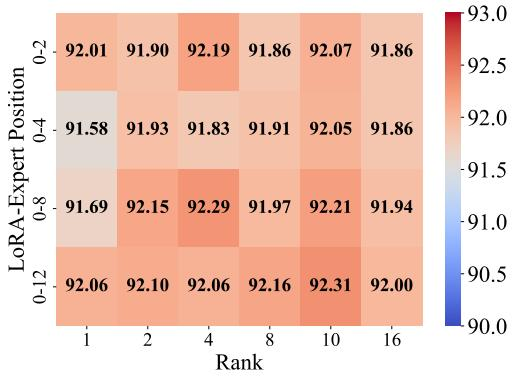  
(a) Rank r and LoRA insertion position.

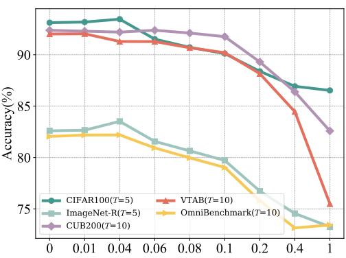  
(b) Distillation coefficient α.  
Figure 7. Hyperparameter sensitivity of DLEPEM. Subplot (a) analyzes the effect of LoRA rank and insertion position, while subplot (b) shows the effect of the distillation coefficient α across datasets.

To further analyze the performance characteristics of LoRA-based methods, we evaluate LAE [9], InfLoRA [4], and SD-LoRA [11] in terms of model plasticity and stability on CIFAR100 (T = 10). As shown in Figure 8(a), both InfLoRA and SD-LoRA show lower performance on new tasks because their gradient-direction constraints are designed to preserve old knowledge. While these constraints effectively mitigate catastrophic forgetting, they can compromise the model’s plasticity when learning new tasks. In contrast, DLEPEM learns task-specific LoRA modules without such restrictions, enabling stronger adaptation to new tasks while maintaining competitive performance. This comparison further distinguishes DLEPEM from constraint-based LoRA continual learning: InfLoRA and SD-LoRA protect old knowledge by restricting update directions or magnitudes, whereas DLEPEM preserves old knowledge structurally by freezing previous experts while keeping the current expert fully trainable within its low-rank subspace. Thus, DLEPEM shifts the stability-plasticity trade-off from a single shared update space to two separated factors: parameter-stationary old experts for stability and a newly trainable expert for plasticity.

LAE employs a different strategy by continuously integrating new parameters into the existing model through weighted blending. However, as demonstrated in Figure 8(b), this approach leads to progressive destabilization of previously learned knowledge. DLEPEM consistently outperforms LAE on old tasks, demonstrating that our dynamic expert selection mechanism effectively preserves old knowledge without the instability issues associated with parameter blending.

## 6. Conclusion

We propose DLEPEM, a novel framework for CIL that combines Dynamic LoRA-Experts for task-specific adaptation and Prototype-Ensemble Matching for improved module selection. This dual design supports a more favorable empirical stability-plasticity trade-off under the evaluated CIL protocols by combining parameter-stationary old experts for stability with a trainable expert for each new task to preserve plasticity. Extensive evaluations on six benchmarks demonstrate that DLEPEM achieves strong and competitive performance under the evaluated protocols. Although each LoRA-Expert is lightweight, the stored expert bank grows linearly with the number of tasks, and the prototype dictionary grows with the number of seen classes. Future work will explore expert compression, rank sharing, expert pruning, expert merging/distillation, different prototype fusion weights, random and expert-ID routing diagnostics, and extensions to multi-modal learning.

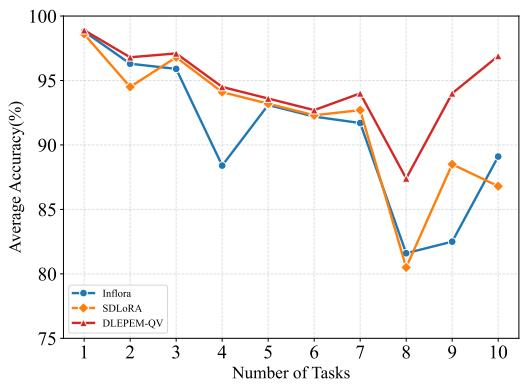  
(a) New task performance.

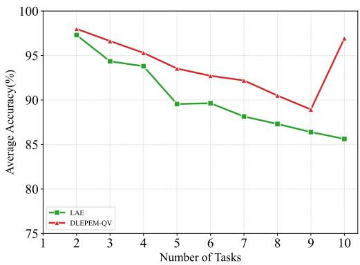  
(b) Old task performance.  
Figure 8. New-task and old-task performance of LoRA-based CIL methods. The left subplot reports accuracy on newly introduced tasks as a proxy for plasticity, and the right subplot reports retained accuracy on previous tasks as a proxy for stability.

Table 8. Notation used in DLEPEM.
<table><tr><td>Symbol</td><td>Definition</td></tr><tr><td> $\overline { { \mathcal { D } _ { t } , \mathcal { V } _ { t } } }$ </td><td>Training set and class set of task t.</td></tr><tr><td> $\mathbf { Y } _ { t }$ </td><td>The set of all classes observed up to task  $t ,$  i.e.,  $\mathbf { Y } _ { t } = \mathcal { Y } _ { 1 } \cup$   $\cdots \cup \mathcal { D } _ { t } .$ </td></tr><tr><td> $\mathbf { E } _ { t }$ </td><td>Task-t LoRA-Expert module, i.e., a group of low-rank LoRA adapters inserted into selected Transformer layers rather than a complete independent ViT. Historical experts are frozen af- ter training.</td></tr><tr><td> $\mathbf { U } _ { t } , \mathbf { V } _ { t } , r$ </td><td>Low-rank matrices and rank inside each adapter. For row- vector input  $\textbf { e } \in \textbf { \textbf { R } } ^ { 1 \times d _ { i n } } , \textbf { U } _ { t } \in \textbf { \textbf { R } } ^ { d _ { i n } \times r } , \textbf { V } _ { t } \in \textbf { \textbf { R } } ^ { r \times d _ { o u t } }$  , with  $r = 1 0$  by default.</td></tr><tr><td> ${ \mathbf V } _ { a t t n }$ </td><td>Attention value matrix in Eq. (8), distinct from the LoRA ma- trix  $\mathbf { V } _ { t } .$ </td></tr><tr><td> $\mathbf { E } _ { t } ^ { r o u t e r }$ </td><td>Router after learning task  $t ,$  used to extract router-domain fea- tures.</td></tr><tr><td> $\phi ( \mathbf { x } ) , \phi ( \mathbf { x } ; \mathbf { E } )$ </td><td>Frozen-PTM feature and the feature obtained with module  $\mathbf { E } ,$  respectively.</td></tr><tr><td> $\begin{array} { r l } & { \mathbf { P } _ { i , t } ^ { L } } \\ & { \mathbf { P } _ { i } ^ { F } , \mathbf { P } _ { i } ^ { R } } \end{array}$ </td><td>LoRA-Expert prototype of class i at task t.</td></tr><tr><td></td><td>Frozen-PTM prototype vector and router-domain prototype vector of class i.</td></tr><tr><td> ${ \bf P } _ { i }$ </td><td>Ensemble prototype vector of class  $i ,$  defined as  $\begin{array} { r l } { \mathbf { P } _ { i } } & { { } = } \end{array}$   $( \mathbf { P } _ { i } ^ { F } , \mathbf { \bar { P } } _ { i } ^ { R } ) = \mathbf { \bar { \rho } } [ \mathbf { P } _ { i } ^ { F } ; \mathbf { P } _ { i } ^ { R } ]$ </td></tr><tr><td> $[ \cdot ; \cdot ]$ </td><td>concat Vector concatenation operator; it does not denote matrix sum-</td></tr><tr><td> $\mathbf { K } _ { i } , \nu _ { i }$ </td><td>mation. Dictionary key of class i and the associated expert index. In our implementation,  $\mathbf { K } _ { i } = \mathbf { P } _ { i }$ </td></tr><tr><td> $\mathbf { q } ( \mathbf { x } )$ </td><td>Ensemble query of test sample x.</td></tr><tr><td> $\sigma ( \cdot ) , \tau$ </td><td>Softmax shorthand and temperature used in the distilla- tion losses, where  $\begin{array} { r l r } { \sigma ( \mathbf { z } ) } & { { } = } & { \mathrm { s o f t m a x } ( \mathbf { z } ) } \end{array}$  and  $\begin{array} { r l } { \sigma ( \mathbf { z } / \tau ) } & { { } = } \end{array}$  softmax  $\left( \mathbf { z } / \tau \right)$ </td></tr></table>

Author Contributions: Conceptualization, Hongwei Zhao; methodology, Hongwei Zhao; software, Hongwei Zhao; validation, Hongwei Zhao, Rui Liu and Yansong Liu; formal analysis, Hongwei Zhao; investigation, Hongwei Zhao; resources, Rui Liu; data curation, Hongwei Zhao; writing– original draft preparation, Hongwei Zhao; writing–review and editing, Hongwei Zhao, Rui Liu and Yansong Liu; visualization, Hongwei Zhao; supervision, Yansong Liu; project administration, Rui Liu; funding acquisition, Rui Liu. All authors have read and agreed to the published version of the manuscript.

Institutional Review Board Statement: Not applicable.

Informed Consent Statement: Not applicable.

Data Availability Statement: The datasets used in this study are publicly available benchmark datasets. The code is available at https://github.com/hongwei-zhao/Applied\_Sciences-DLEPEMmain.

Conflicts of Interest: The authors declare no conflicts of interest.

## Abbreviations

The following abbreviations are used in this manuscript:

CIL Class-Incremental Learning   
FSCIL Few-Shot Class-Incremental Learning   
PEFT Parameter-Efficient Fine-Tuning   
PTM Pre-Trained Model   
LoRA Low-Rank Adaptation   
MoE Mixture-of-Experts   
ViT Vision Transformer   
MHA Multi-Head Self-Attention   
FFN Feed-Forward Network   
WTP Within-Task Prediction   
MII Module Identity Inference

## References

1. McCloskey, M.; Cohen, N.J. Catastrophic Interference in Connectionist Networks: The Sequential Learning Problem. In Psychology ofLearning and Motivation; Academic Press, 1989; Vol. 24, pp. 109–165. https://doi.org/10.1016/S0079-7421(08)60536-8.

2. French, R.M. Catastrophic forgetting in connectionist networks. Trends in Cognitive Sciences 1999, 3, 128–135. https://doi.org/ 10.1016/S1364-6613(99)01294-2.

3. Grossberg, S.T. Studies of mind and brain: Neural principles of learning, perception, development, cognition, and motor control; Vol. 70, Springer Science & Business Media, 2012. https://doi.org/10.1007/978-94-009-7758-7.

4. Liang, Y.S.; Li, W.J. InfLoRA: Interference-Free Low-Rank Adaptation for Continual Learning. In Proceedings of the 2024 IEEE/CVF Conference on Computer Vision and Pattern Recognition (CVPR), 2024, pp. 23638–23647. https://doi.org/10.1109/ CVPR52733.2024.02231.

5. Han, X.; Zhang, Z.; Ding, N.; Gu, Y.; Liu, X.; Huo, Y.; Qiu, J.; Yao, Y.; Zhang, A.; Zhang, L.; et al. Pre-trained models: Past, present and future. AI Open 2021, 2, 225–250. https://doi.org/10.1016/j.aiopen.2021.08.002.

6. Xin, Y.; Luo, S.; Zhou, H.; Du, J.; Liu, X.; Fan, Y.; Li, Q.; Du, Y. Parameter-Efficient Fine-Tuning for Pre-Trained Vision Models: A Survey. CoRR 2024, abs/2402.02242. https://doi.org/10.48550/arXiv.2402.02242.

7. Wang, Z.; Zhang, Z.; Lee, C.Y.; Zhang, H.; Sun, R.; Ren, X.; Su, G.; Perot, V.; Dy, J.; Pfister, T. Learning to Prompt for Continual Learning. In Proceedings of the 2022 IEEE/CVF Conference on Computer Vision and Pattern Recognition (CVPR), 2022, pp. 139–149. https://doi.org/10.1109/CVPR52688.2022.00024.

8. Wang, Z.; Zhang, Z.; Ebrahimi, S.; Sun, R.; Zhang, H.; Lee, C.Y.; Ren, X.; Su, G.; Perot, V.; Dy, J.; et al. DualPrompt: Complementary Prompting for Rehearsal-Free Continual Learning. In Proceedings of the Computer Vision – ECCV 2022: 17th European Conference, Tel Aviv, Israel, October 23–27, 2022, Proceedings, Part XXVI. Springer-Verlag, 2022, pp. 631–648. https://doi.org/10.1007/978-3-031-19809-0\_36.

9. Gao, Q.; Zhao, C.; Sun, Y.; Xi, T.; Zhang, G.; Ghanem, B.; Zhang, J. A Unified Continual Learning Framework with General Parameter-Efficient Tuning. In Proceedings of the 2023 IEEE/CVF International Conference on Computer Vision (ICCV), 2023, pp. 11449–11459. https://doi.org/10.1109/ICCV51070.2023.01055.

10. Zhou, D.W.; Cai, Z.W.; Ye, H.J.; Zhan, D.C.; Liu, Z. Revisiting Class-Incremental Learning with Pre-Trained Models: Generalizability and Adaptivity are All You Need. International Journal ofComputer Vision 2024, 133, 1012–1032. https://doi.org/10.1007 s11263-024-02218-0

11. Wu, Y.; Piao, H.; Huang, L.K.; Wang, R.; Li, W.; Pfister, H.; Meng, D.; Ma, K.; Wei, Y. SD-LoRA: Scalable Decoupled Low-Rank Adaptation for Class Incremental Learning. In Proceedings of the The Thirteenth International Conference on Learning Representations, ICLR 2025, 2025. https://doi.org/10.48550/arXiv.2501.13198.

12. Wang, Y.; Huang, Z.; Hong, X. S-Prompts Learning with Pre-trained Transformers: An Occam’s Razor for Domain Incremental Learning. In Proceedings of the Advances in Neural Information Processing Systems 35, 2022. https://doi.org/10.48550/arXiv. 2207.12819.

13. Jacobs, R.A.; Jordan, M.I.; Nowlan, S.J.; Hinton, G.E. Adaptive Mixtures of Local Experts. Neural Computation 1991, 3, 79–87. https://doi.org/10.1162/neco.1991.3.1.79.

14. Aljundi, R.; Kelchtermans, K.; Tuytelaars, T. Task-Free Continual Learning. In Proceedings of the 2019 IEEE/CVF Conference on Computer Vision and Pattern Recognition (CVPR), 2019, pp. 11246–11255. https://doi.org/10.1109/CVPR.2019.01151.

15. Rebuffi, S.A.; Kolesnikov, A.; Sperl, G.; Lampert, C.H. iCaRL: Incremental Classifier and Representation Learning. In Proceedings of the 2017 IEEE Conference on Computer Vision and Pattern Recognition (CVPR), 2017, pp. 5533–5542. https: //doi.org/10.1109/CVPR.2017.587.

16. Yu, L.; Twardowski, B.; Liu, X.; Herranz, L.; Wang, K.; Cheng, Y.; Jui, S.; van de Weijer, J. Semantic Drift Compensation for Class-Incremental Learning. In Proceedings of the 2020 IEEE/CVF Conference on Computer Vision and Pattern Recognition (CVPR), 2020, pp. 6980–6989. https://doi.org/10.1109/CVPR42600.2020.00701.

17. Wang, F.; Zhou, D.; Ye, H.; Zhan, D. FOSTER: Feature Boosting and Compression for Class-Incremental Learning. In Proceedings of the Computer Vision - ECCV 2022 - 17th European Conference, Tel Aviv, Israel, October 23-27, 2022, Proceedings, Part XXV; Avidan, S.; Brostow, G.J.; Cissé, M.; Farinella, G.M.; Hassner, T., Eds. Springer, 2022, Vol. 13685, Lecture Notes in Computer Science, pp. 398–414. https://doi.org/10.1007/978-3-031-19806-9\_23.

18. Smith, J.S.; Karlinsky, L.; Gutta, V.; Cascante-Bonilla, P.; Kim, D.; Arbelle, A.; Panda, R.; Feris, R.; Kira, Z. CODA-Prompt: COn tinual Decomposed Attention-Based Prompting for Rehearsal-Free Continual Learning. In Proceedings of the 2023 IEEE/CVF Conference on Computer Vision and Pattern Recognition (CVPR), 2023, pp. 11909–11919. https://doi.org/10.1109/CVPR527 29.2023.01146.

19. Yu, J.; Zhuge, Y.; Zhang, L.; Hu, P.; Wang, D.; Lu, H.; He, Y. Boosting Continual Learning of Vision-Language Models via Mixture-of-Experts Adapters. In Proceedings of the 2024 IEEE/CVF Conference on Computer Vision and Pattern Recognition (CVPR), 2024, pp. 23219–23230. https://doi.org/10.1109/CVPR52733.2024.02191.

20. Riquelme, C.; Puigcerver, J.; Mustafa, B.; Neumann, M.; Jenatton, R.; Pinto, A.S.; Keysers, D.; Houlsby, N. Scaling vision with sparse mixture of experts. In Proceedings of the Proceedings of the 35th International Conference on Neural Information Processing Systems, Red Hook, NY, USA, 2021; NIPS ’21. https://doi.org/10.5555/3540261.3540918.

21. Gou, Y.; Liu, Z.; Chen, K.; Hong, L.; Xu, H.; Li, A.; Yeung, D.Y.; Kwok, J.T.; Zhang, Y. Mixture of cluster-conditional lora experts for vision-language instruction tuning. arXiv preprint arXiv:2312.12379 2023. https://doi.org/10.48550/arXiv.2312.12379.

22. Hu, E.J.; Shen, Y.; Wallis, P.; Allen-Zhu, Z.; Li, Y.; Wang, S.; Wang, L.; Chen, W. LoRA: Low-Rank Adaptation of Large Language Models. In Proceedings of the The Tenth International Conference on Learning Representations, ICLR 2022, 2022. https: //doi.org/10.48550/arXiv.2106.09685.

23. Jin, P.; Zhu, B.; Yuan, L.; Yan, S. MoE++: Accelerating Mixture-of-Experts Methods with Zero-Computation Experts. In Proceedings of the The Thirteenth International Conference on Learning Representations, ICLR 2025, Singapore, April 24-28, 2025, 2025.

24. Dou, S.; Zhou, E.; Liu, Y.; Gao, S.; Zhao, J.; Shen, W.; Zhou, Y.; Xi, Z.; Wang, X.; Fan, X.; et al. LoRAMoE: Revolutionizing Mixture of Experts for Maintaining World Knowledge in Language Model Alignment. CoRR 2023, abs/2312.09979, [2312.09979]. https://doi.org/10.48550/arXiv.2312.09979.

25. Wang, L.; Xie, J.; Zhang, X.; Huang, M.; Su, H.; Zhu, J. Hierarchical Decomposition of Prompt-Based Continual Learning: Rethinking Obscured Sub-optimality. In Proceedings of the Advances in Neural Information Processing Systems 36: Annual Conference on Neural Information Processing Systems 2023, NeurIPS 2023, New Orleans, LA, USA, December 10 - 16, 2023; Oh, A.; Naumann, T.; Globerson, A.; Saenko, K.; Hardt, M.; Levine, S., Eds., 2023. https://doi.org/10.5555/3666122.3669144.

26. Dosovitskiy, A.; Beyer, L.; Kolesnikov, A.; Weissenborn, D.; Zhai, X.; Unterthiner, T.; Dehghani, M.; Minderer, M.; Heigold G.; Gelly, S.; et al. An Image is Worth 16x16 Words: Transformers for Image Recognition at Scale. In Proceedings of the 9th International Conference on Learning Representations, ICLR 2021, 2021. https://doi.org/10.48550/arXiv.2010.11929.

27. He, K.; Zhang, X.; Ren, S.; Sun, J. Delving Deep into Rectifiers: Surpassing Human-Level Performance on ImageNet Classification. In Proceedings of the 2015 IEEE International Conference on Computer Vision (ICCV), 2015, pp. 1026–1034. https://doi.org/10.1109/ICCV.2015.123.

28. Tao, X.; Hong, X.; Chang, X.; Dong, S.; Wei, X.; Gong, Y. Few-Shot Class-Incremental Learning. In Proceedings of the 2020 IEEE/CVF Conference on Computer Vision and Pattern Recognition (CVPR), 2020, pp. 12180–12189. https://doi.org/10.1109/ CVPR42600.2020.01220.

29. Zhai, X.; Puigcerver, J.; Kolesnikov, A.; Ruyssen, P.; Riquelme, C.; Lucic, M.; Djolonga, J.; Pinto, A.S.; Neumann, M.; Dosovitskiy, A.; et al. A large-scale study of representation learning with the visual task adaptation benchmark. arXiv preprint arXiv:1910.04867 2019.

30. Krizhevsky, A.; Hinton, G. Learning multiple layers of features from tiny images. Technical report, University of Toronto, 2009.

31. Wah, C.; Branson, S.; Welinder, P.; Perona, P.; Belongie, S. The Caltech-UCSD Birds-200-2011 Dataset. Technical report, California Institute of Technology, 2011.

32. Hendrycks, D.; Basart, S.; Mu, N.; Kadavath, S.; Wang, F.; Dorundo, E.; Desai, R.; Zhu, T.; Parajuli, S.; Guo, M.; et al. The many faces of robustness: A critical analysis of out-of-distribution generalization. In Proceedings of the Proceedings of the IEEE/CVF international conference on computer vision, 2021, pp. 8340–8349.

33. Zhang, Y.; Yin, Z.; Shao, J.; Liu, Z. Benchmarking omni-vision representation through the lens of visual realms. In Proceedings of the European Conference on Computer Vision. Springer, 2022, pp. 594–611.

34. Park, K.H.; Song, K.; Park, G.M. Pre-trained Vision and Language Transformers are Few-Shot Incremental Learners. In Proceedings of the 2024 IEEE/CVF Conference on Computer Vision and Pattern Recognition (CVPR), 2024, pp. 23881–23890. https://doi.org/10.1109/CVPR52733.2024.02254.

35. Liu, C.; Wang, Z.; Xiong, T.; Chen, R.; Wu, Y.; Guo, J.; Huang, H. Few-Shot Class Incremental Learning with ˘aAttention-Aware Self-adaptive Prompt. In Proceedings of the Computer Vision - ECCV 2024 - 18th European Conference, Milan, Italy, September 29-October 4, 2024, Proceedings, Part LXXXI, Cham, 2024; pp. 1–18. https://doi.org/10.1007/978-3-031-73004-7\_1.

36. Russakovsky, O.; Deng, J.; Su, H.; Krause, J.; Satheesh, S.; Ma, S.; Huang, Z.; Karpathy, A.; Khosla, A.; Bernstein, M.S.; et al. ImageNet Large Scale Visual Recognition Challenge. Int. J. Comput. Vis. 2015, 115, 211–252. https://doi.org/10.1007/S11263-0 15-0816-Y.

37. Zhu, H.; Zhang, Y.; Dong, J.; Koniusz, P. BiLoRA: Almost-Orthogonal Parameter Spaces for Continual Learning. In Proceedings of the Proceedings of the IEEE/CVF Conference on Computer Vision and Pattern Recognition (CVPR), June 2025, pp. 25613– 25622.

38. Zhou, D.W.; Sun, H.L.; Ye, H.J.; Zhan, D.C. Expandable Subspace Ensemble for Pre-Trained Model-Based Class-Incremental Learning. In Proceedings of the 2024 IEEE/CVF Conference on Computer Vision and Pattern Recognition (CVPR), 2024, pp. 23554–23564. https://doi.org/10.1109/CVPR52733.2024.02223.

39. D’Alessandro, M.; Alonso, A.; Calabrés, E.; Galar, M. Multimodal Parameter-Efficient Few-Shot Class Incremental Learning. In Proceedings of the 2023 IEEE/CVF International Conference on Computer Vision Workshops (ICCVW), 2023, pp. 3385–3395. https://doi.org/10.1109/ICCVW60793.2023.00364.

40. Kim, D.; Han, B. On the Stability-Plasticity Dilemma of Class-Incremental Learning. In Proceedings of the Proceedings of the IEEE/CVF Conference on Computer Vision and Pattern Recognition (CVPR), 2023, pp. 20196–20204.

41. Caron, M.; Touvron, H.; Misra, I.; Jegou, H.; Mairal, J.; Bojanowski, P.; Joulin, A. Emerging Properties in Self-Supervised Vision Transformers. In Proceedings of the 2021 IEEE/CVF International Conference on Computer Vision (ICCV), 2021, pp. 9630–9640. https://doi.org/10.1109/ICCV48922.2021.00951.

42. Chen, X.; Hsieh, C.; Gong, B. When Vision Transformers Outperform ResNets without Pre-training or Strong Data Augmentations. In Proceedings of the The Tenth International Conference on Learning Representations, ICLR 2022, 2022. https://doi.org/10.48550/arXiv.2106.01548.

Disclaimer/Publisher’s Note: The statements, opinions and data contained in all publications are solely those of the individual author(s) and contributor(s) and not of MDPI and/or the editor(s). MDPI and/or the editor(s) disclaim responsibility for any injury to people or property resulting from any ideas, methods, instructions or products referred to in the content.