# Dynamics to decision: A mathematical theory of Lyapunov spectra and decision boundaries in deep classifiers

Shirin Panahi   
Department of Electrical and Computer Engineering   
Colorado State University   
Fort Collins, Colorado, USA

Amirhossein Nazerian Department of Mechanical Engineering Colorado State University Fort Collins, Colorado, USA

Ali Pezeshki

Department of Electrical and Computer Engineering   
Colorado State University   
Fort Collins, Colorado, USA

s.panahi@colostate.edu

a.nazerian@colostate.edu

ali.pezeshki@colostate.edu

Editor:

## Abstract

A deep classifier is defined not only by the decision it produces, but also by the sequence of transformations through which that decision is formed. Treating this evolution as a dynamical system across layers provides a natural framework for asking how decision geometry emerges through depth and how far back we can trace a boundary’s dynamical signature. We model a feed-forward classifier as a finite, nonautonomous discrete dynamical system, with layers playing the role of discrete time steps. We study the Finite-Time Maximum Lyapunov Exponent (FTMLE) of the data samples’ dynamical trajectory through depths of the classifier. The FTMLE measures the rate of convergence/divergence of nearby trajectories. We move the observation endpoint backward from probabilities to logits and then to hidden representations. For Gaussian classes, we prove that probability-level FTMLE carries a clear geometric signature of the decision boundary, with its dominant direction aligned with the boundary normal. Moving one step backward to the logits, we prove this relationship is no longer universal but depends critically on how the classifier is trained, particularly on the choice of loss function. Moving further backward to the hidden representation, the connection becomes more conditional: boundary-related FTMLE can persist, but only under identifiable structural conditions. We propose geometry-aware fine-tuning for restructuring the classifier’s hidden FTMLE, and propose conditions for guaranteed concentration of high hidden FTMLE near the decision boundary. Through our numerical results, we show the generality and validity of our theoretical results. Understanding the evolution of data samples as traveling through the layers of classifier provides a principled foundation for identifying where boundary-relevant sensitivity emerges and for developing layer-aware regularization strategies.

Keywords: Finite-Time Lyapunov Exponents, Deep Classifiers, Decision Boundaries, Robustness.

## 1 Introduction

Two classifiers can draw the same decision boundary while deforming nearby inputs in very diferent ways before producing a label. The boundary specifies where class labels change, but it does not reveal which perturbation directions expand, whether that expansion contributes to the decision, or at what depth it arises. Understanding these distinctions matters since it reveals how decision geometry is formed through depth, rather than inferred from predictive performance alone. In particular, a region of extreme deformations is not automatically a region where the predicted class changes. Here, we aim to identify under what conditions these extreme deformations are properly utilized in the decision formation.

A natural way to pose the question comes from nonlinear dynamics. A feed-forward classifier can be written as $h _ { k + 1 } = F _ { k } ( h _ { k } )$ : layer index plays the role of discrete time, and the learned map $F _ { k }$ can difer at every step. The Lyapunov exponent analysis measures the exponential rate of convergence/divergence of nearby solutions of this discrete-time dynamical system. A positive Finite-Time Maximum Lyapunov Exponent (FTMLE) indicates divergence of nearby trajectories, while a negative FTMLE suggests convergence in a finite window of time (Ott, 2002; Strogatz, 2024). The observation endpoint is part of this measurement. We begin at the probability output and then move the endpoint backward in time: first to the logit, then to the hidden representation. Each endpoint retains diferent information about class separation and local sensitivity.

Recent studies have provided empirical evidence that FTMLE can reflect the geometry of neural-network decision boundaries. Across deep classifiers, regions of elevated FTMLEs have been observed near class-separating boundaries, suggesting that the network’s local expansion field can carry information about where classification decisions change (Kondo et al., 2021; Storm et al., 2024; Kuehn and Wöhrer, 2026). These findings establish an empirical connection between finite-time expansion and decision geometry, while leaving open a more fundamental question: under what conditions, and at which stages of the network evolution, does an expansion ridge actually identify a decision boundary?

Complementary lines of machine-learning research explain why Jacobian geometry deserves attention. Analyses of singular-value propagation relate network depth and initialization to trainability (Pennington et al., 2017, 2018; Poole et al., 2016; Schoenholz et al., 2017; Haber and Ruthotto, 2018). For trained networks, input-output Jacobian norms has been examined in relation to generalization (Novak et al., 2018), while Jacobian-based margin bounds and spectral complexity connect local sensitivity to classification margins (Sokolić et al., 2017; Bartlett et al., 2017; Neyshabur et al., 2018; Tsuzuku et al., 2018; Yoshida and Miyato, 2017). Instance-specific adversarial robustness bounds provide a complementary perspective (Hein and Andriushchenko, 2017; Weng et al., 2018; Han et al., 2024; Fawzi et al., 2016). The geometry of adversarial vulnerability has also been studied through local gradients, distances to class-changing perturbations, curvature of decision boundaries, and singular directions of classifier Jacobians (Goodfellow et al., 2015; Moosavi-Dezfooli et al., 2016; Papernot et al., 2016; Fawzi et al., 2018; Moosavi-Dezfooli et al., 2018; Khrulkov and Oseledets, 2018; Paniagua et al., 2025). In parallel, a substantial body of work has sought to control these diferential properties directly during training with early tangent- and contraction-based penalties and regularization (Simard et al., 1991; Rifai et al., 2011; Jakubovitz and Giryes, 2018; Ross and Doshi-Velez, 2018; Hofman et al., 2019; Finlay et al., 2020; Finlay and Oberman, 2021; Wu and Li, 2024; Cisse et al., 2017; Anil et al., 2019; Johansson et al., 2022; Meunier et al., 2022). Collectively, this literature establishes that the local diferential response of a classifier contains information relevant to generalization, margins, and vulnerability, but these quantities are typically used as sensitivity measures, bounds, or regularization objectives rather than as spatial fields intended to localize a decision boundary.

A complementary line of work has examined the geometry of learned representations and decision regions more directly. Piecewise-linear and spline-based methods characterize and visualize neuralnetwork decision geometry (Balestriero and Baraniuk, 2018; Humayun et al., 2023). Representationlevel Jacobian and information-geometric analyses show that learning reshapes local geometry near decision boundaries and links diferential sensitivity to inter-class separation and open-set behavior (Zavatone-Veth et al., 2025; Park et al., 2024). Spectral and gradient-based control of intermediate representations has been explored to improve adversarial robustness, out-of-distribution behavior, and distance-aware prediction (Nassar et al., 2020; Yang et al., 2025; Sharifi et al., 2024; Liu et al., 2020). These results strengthen the broader view that classification is accompanied by a nontrivial reshaping of local geometry throughout the network. They also suggest that the geometry observed at an intermediate representation is not necessarily equivalent to that observed at the final classifier output.

Information-geometric approaches make the link between sensitivity and decision geometry more explicit by examining metrics induced by the predictive distribution. Fisher-based methods have been used to characterize locally sensitive directions, adversarial vulnerability, robustness, and task-relevant geometry through the spectrum and eigen-directions of the induced metric (Miyato et al., 2019; Zhao et al., 2019; Shen et al., 2019; Picot et al., 2023; Tron et al., 2024; Shi-Garrier et al., 2024; Zhang et al., 2026; Sengupta and Anastasio, 2026). Related work further shows that Fisher-induced representation geometry can exhibit enhanced expansion near category boundaries and encode discriminative directions (Bonnasse-Gahot and Nadal, 2025). Together with empirical observations of large finite-time Lyapunov expansion near class-separating regions (Kondo et al., 2021; Storm et al., 2024; Kuehn and Wöhrer, 2026), these studies further support the idea that diferential properties of a learned mapping can encode information about classification geometry. However, the Jacobian under consideration, the network endpoint at which it is evaluated, and the specific notion of sensitivity vary substantially across these formulations. Consequently, although these contributions address important aspects of network sensitivity and boundary geometry, they do not establish when the relationship between a finite-time expansion field and decision geometry is theoretically well founded. In particular, it remains unclear when such a field can reliably be used to assess boundary-relevant sensitivity, how this relationship depends on where the expansion is measured within the network, and how the boundary signature changes as the observation point is moved backward through depth.

We answer this question through a sequence of results that follows the observation endpoint backward through the classifier: at the probability endpoint, we prove that the population-optima posterior for two equal-prior Gaussian classes with common spherical covariance has an exact normal expansion profile whose maximum set is the Bayes boundary. For regular-simplex multiclass Gaussian models, we derive the full probability-Jacobian singular spectrum and show that the leading input direction is normal on every smooth active pairwise facet. Magnitude localization is more delicate: an explicit posterior-dependent coeficient determines whether a facet is a normal maximum or minimum, with a sharp transition in the three-class case. Thus normal alignment alone does not imply a boundary ridge. To the best of our knowledge, this paper is the first to report that the decision boundary may be a local normal minimum of the FTMLE (also the sensitivity).

At the binary logit endpoint, we show that population mean-squared error on a signed target produces a boundary-maximal expansion profile, whereas cross-entropy produces an afine Bayes logit with spatially constant expansion in the same Gaussian model. The two logits have the same sign boundary. The contrast shows why a probability-level ridge cannot simply be transferred to the preceding logit. Therefore, we prove that the expansion does not always have a maximum on the decision boundary.

At the representation endpoint, we separate full hidden expansion from expansion visible to the current readout. We then prove suficient, uniform conditions under which a task-visible normal decrease transfers to a full hidden-state ridge. We complement this theory with a matchedcontinuation two-moons study. It illustrates substantially stronger localization of hidden expansion around the learned boundary after geometry-aware fine-tuning, while keeping classification accuracy nearly unchanged.

The rest of the paper is organized as follows: Section 2 establishes the dynamical and statistical setting. Sections 3-5 analyze the probability, logit, and representation endpoints in that order; Section 6 provides conclusions. Complete proofs appear in the appendices.

## 2 Mathematical framework

Deep classifiers as finite nonautonomous discrete dynamical systems. Let $\Omega \subseteq \mathbb { R } ^ { d }$ be the input domain, let $K \geq 1$ be the number of hidden propagation steps, set $d _ { 0 } = d ,$ and let $F _ { k } : \mathbb { R } ^ { d _ { k } }  \mathbb { R } ^ { d _ { k + 1 } }$ . A depth-indexed classifier is written as

$$
h _ { 0 } ( x ) = x , \qquad h _ { k + 1 } ( x ) = F _ { k } \bigl ( h _ { k } ( x ) \bigr ) , \qquad k = 0 , \ldots , K + 2 ,\tag{2.1}
$$

where $h _ { k } ( x ) \in \mathbb { R } ^ { d _ { k } }$ is the state (propagated data sample x) through the layers of the deep classifier, up to layer k. The maps vary with $k ,$ making this a finite nonautonomous system. The three principal observation endpoints are

$$
h _ { K } ( x ) = h _ { \theta } ( x ) , \qquad h _ { K + 1 } ( x ) = \ell _ { \theta } ( x ) , \qquad h _ { K + 2 } ( x ) = p _ { \theta } ( x ) ,
$$

representing the final hidden state (hidden representation), logit, and probability layer, respectively.   
Here $F _ { K + 1 }$ is the readout and $F _ { K + 2 }$ is the probability link.

Finite-time Lyapunov spectra. During inference, each input x follows a finite trajectory through a sequence of learned nonlinear transformations before a final readout assigns a class. Understanding how nearby trajectories deform through this evolution provides information about how the classifier constructs its decision, rather than only observing its final prediction. Lyapunov exponent analysis is a classical tool for characterizing such trajectory deformations (Ott, 2002; Strogatz, 2024; Khalil, 2002). In the following, we drop the explicit notation of x dependence from $h _ { k } ( x )$ for simplicity. Consider a trajectory initialized at $h _ { 0 }$ and an infinitesimal perturbation $\delta h _ { 0 }$ After k steps, $h _ { 0 }  h _ { k }$ , and $\delta h _ { 0 }  \delta h _ { k }$ . To first order,

$$
\delta h _ { k } = \Big [ D ( F _ { k - 1 } \circ \cdot \cdot \cdot \circ F _ { 0 } ) ( h _ { 0 } ) \Big ] \delta h _ { 0 } = : \Big [ D F _ { 0 } ^ { ( k ) } ( h _ { 0 } ) \delta \Big ] h _ { 0 } .
$$

The Lyapunov exponent in the initial direction $u _ { 0 } = \delta h _ { 0 } / \lVert \delta h _ { 0 } \rVert$ is defined as

$$
\lambda ( h _ { 0 } , u _ { 0 } ) : = \operatorname* { l i m } _ { k \to \infty } \frac { 1 } { k } \log \left( \frac { \| \delta h _ { k } \| } { \| \delta h _ { 0 } \| } \right) .
$$

It measures the average exponential rate at which nearby trajectories diverge or converge. Because a classifier has finite depth, the corresponding finite-time quantity is the natural object of interest. Maximizing over $u _ { 0 }$ gives the Finite-Time Maximum Lyapunov Exponent (FTMLE),

$$
\lambda _ { F _ { 0 } } ^ { ( k ) } ( h _ { 0 } ) = \operatorname* { m a x } _ { \| u \| = 1 } \frac { 1 } { k } \log \left\| D F _ { 0 } ^ { ( k ) } ( h _ { 0 } ) u \right\| = \frac { 1 } { k } \log \sigma _ { 1 } \Bigl ( D F _ { 0 } ^ { ( k ) } ( h _ { 0 } ) \Bigr ) ,
$$

where $\sigma _ { 1 } ( \cdot )$ is the largest singular value. A positive (negative) FTMLE indicates local expansion (contraction). More generally, the finite-time Lyapunov spectrum is $\begin{array} { r } { \lambda _ { i , f _ { 0 } } ^ { ( k ) } ( h _ { 0 } ) = \frac { 1 } { k } \log \sigma _ { i } \Big ( D f _ { 0 } ^ { ( k ) } ( h _ { 0 } ) \Big ) } \end{array}$ where $\sigma _ { i } ( \cdot )$ is the ith singular value. We will also denote the ith right singular vector via $v _ { i } ( \cdot )$

FTMLE in deep classifier endpoints. For a deep classifier, we use input data sample x as the initial state, i.e., $h _ { 0 } = x$ . At the three endpoints (introduced earlier), the following simplified

notation is used throughout:

$$
\begin{array} { r l r l r l } & { \lambda _ { H } ( x ) = \displaystyle \frac { 1 } { K } \log \Lambda _ { H } ( x ) , } & & { \mathrm { w h e r e } } & { \lambda _ { H } = \lambda _ { F _ { 0 } } ^ { ( K ) } ( x ) , } & & { \Lambda _ { H } ( x ) = \displaystyle \frac { 1 } { K } \log \sigma _ { 1 } \Bigl ( D F _ { 0 } ^ { ( K ) } ( x ) \Bigr ) , } \\ & { \lambda _ { \ell } ( x ) = \displaystyle \frac { 1 } { K + 1 } \log \Lambda _ { \ell } ( x ) , } & & { \mathrm { w h e r e } } & { \lambda _ { H } = \lambda _ { F _ { 0 } } ^ { ( K + 1 ) } ( x ) , } & & { \Lambda _ { \ell } ( x ) = \displaystyle \frac { 1 } { K + 1 } \log \sigma _ { 1 } \Bigl ( D F _ { 0 } ^ { ( K + 1 ) } ( x ) \Bigr ) , } \\ & { \lambda _ { p } ( x ) = \displaystyle \frac { 1 } { K + 2 } \log \Lambda _ { p } ( x ) , } & & { \mathrm { w h e r e } } & { \lambda _ { H } = \lambda _ { F _ { 0 } } ^ { ( K + 2 ) } ( x ) , } & & { \Lambda _ { p } ( x ) = \displaystyle \frac { 1 } { K + 2 } \log \sigma _ { 1 } \Bigl ( D F _ { 0 } ^ { ( K + 2 ) } ( x ) \Bigr ) . } \end{array}
$$

We use Λ for raw expansion and λ for the FTMLE.

Definition 2.1 (Normal FTMLE ridge). Let $x _ { 0 }$ lie on a smooth boundary facet with unit normal $n ( x _ { 0 } )$ . For a specified endpoint label $e \in \{ H , \ell , p \}$ , the boundary has a strict normal FTMLE maximum at $x _ { 0 } \ { \mathrm { i f } } \ t = 0$ is a strict local maximum of $\lambda _ { e } ( x _ { 0 } + t n ( x _ { 0 } ) )$ . A collection of such points is a normal FTMLE ridge for endpoint e.

We ask two separate questions. Directional identification means that a leading right singular vector of $J _ { k }$ is normal to the decision boundary. Magnitude localization means that the leading expansion has a normal maximum on that boundary. A normal direction alone does not settle the magnitude question.

## 2.1 Statistical, probabilistic, and geometric setting

Write $\eta _ { i } ( x ) : = \mathbb { P } ( Y = i \mid X = x )$ for the Bayes posterior; for binary classification, $\eta ( \boldsymbol { x } ) : = \eta _ { 1 } ( \boldsymbol { x } )$ is its positive-class component. For a binary network, $p _ { \theta } : \Omega \to [ 0 , 1 ]$ is the predicted positive-class probability

$$
p _ { \theta } ( x ) = \mathrm { s i g m } \bigl ( \ell _ { \theta } ( x ) \bigr ) , \qquad \mathrm { s i g m } ( s ) = ( 1 + e ^ { - s } ) ^ { - 1 } ,
$$

and $\mathcal { B } _ { \theta } = \{ x : p _ { \theta } ( x ) = 1 / 2 \} = \{ x : \ell _ { \theta } ( x ) = 0 \}$ . The binary Bayes boundary is $B ^ { \star } : = \{ x : \eta ( x ) = 1 / 2 \}$ For $C \geq 3 , p _ { \theta }$ and $\ell _ { \theta }$ are vectors and

$$
p _ { \theta , i } ( x ) = \frac { \exp ( \ell _ { \theta , i } ( x ) ) } { \sum _ { m = 0 } ^ { C - 1 } \exp ( \ell _ { \theta , m } ( x ) ) } , \qquad i = 0 , \dots , C - 1 .
$$

The active learned boundary and the smooth active Bayes facet are denoted by

$$
\begin{array} { r l r } & { } & { \mathcal { B } _ { \theta , i j } : = \{ x : p _ { \theta , i } ( x ) = p _ { \theta , j } ( x ) = \underset { m } { \operatorname* { m a x } } p _ { \theta , m } ( x ) \} , } \\ & { } & { \mathring { B } _ { i j } ^ { \star } : = \{ x : \eta _ { i } ( x ) = \eta _ { j } ( x ) = \underset { m } { \operatorname* { m a x } } \eta _ { m } ( x ) \mathrm { ~ w i t h ~ n o ~ h i g h e r \mathrm { - } o r d e r ~ t i e } \} . } \end{array}
$$

The full learned multiclass boundary is $\textstyle B _ { \theta } : = \bigcup _ { i < j } B _ { \theta , i j }$ , with an analogous $B ^ { \star }$ for the Bayes posterior. A pairwise equality that is not maximal among classes is not an active decision boundary. Individual multiclass softmax logits have a common-function gauge; their pairwise diferences, and hence the decision regions, are identified by $p _ { \theta }$

Assumption 2.2 (Diferentiability and population well-specification). The endpoint under study is continuously diferentiable on its stated domain. Its model class contains the relevant population optimizer, and the stated population risk attains its global minimum in that class. Whenever a derivative of the learned optimizer is identified with a Bayes-posterior derivative, the input density is positive on the domain and both maps are continuously diferentiable there.

Lemma 2.3 (Recovery by proper losses). At each fixed input, binary cross-entropy and squared probability loss have the unique minimizing prediction $p = \eta ( x )$ . Categorical cross-entropy and Brier loss have the unique minimizing probability vector $p = \eta ( x )$ on the multiclass simplex. Under Assumption 2.2, any population-optimal probability map equals the Bayes posterior pointwise on the domain where the positive density and continuity conditions hold.

The proof is in Appendix A. Its pointwise conclusion matters: an almost-everywhere identity alone cannot be diferentiated without a regularity argument. In the Gaussian models below, the mixture density is strictly positive on $\mathbb { R } ^ { d }$ , and continuity supplies that argument.

For $p = \operatorname { s o f t m a x } ( \ell )$ , define

$$
G ( p ) : = \mathrm { d i a g } ( p ) - p p ^ { \top } , \qquad D _ { \ell } \mathrm { s o f t m a x } ( \ell ) = G ( p ) .
$$

This matrix is positive semidefinite, satisfies $G ( p ) { \bf 1 } = 0$ , and records how the probability link reshapes the input-to-logit Jacobian. At the probability endpoint $D p _ { \theta } = G ( p _ { \theta } ) D \ell _ { \theta }$ for multiclass softmax.

Assumption 2.4 (Equal-prior spherical Gaussian classes). Let $C \geq 2 , \sigma > 0$ , and let $\mu _ { 0 } , \dotsc , \mu _ { C - 1 } \in$ $\mathbb { R } ^ { d }$ be distinct. Assume

$$
\mathbb { P } ( Y = i ) = \frac { 1 } { C } , \qquad X \mid Y = i \sim \mathcal { N } ( \mu _ { i } , \sigma ^ { 2 } I _ { d } ) .
$$

Equal priors and common covariance give explicit posterior and boundary geometry. They are used for global formulas in Sections 3 and $4 ;$ the local signed-distance and representation results have their own conditions.

Assumption 2.5 (C-class regular-simplex Gaussian model). Under Assumption 2.4, let $C \geq 3$ $\begin{array} { r } { d \geq C - 1 , c = C ^ { - 1 } \sum _ { i } \mu _ { i } } \end{array}$ , and $\nu _ { i } = \mu _ { i } - c .$ . Assume

$$
\sum _ { i = 0 } ^ { C - 1 } \nu _ { i } = 0 , \qquad \| \nu _ { i } \| _ { 2 } ^ { 2 } = \rho ^ { 2 } , \qquad \nu _ { i } ^ { \top } \nu _ { j } = - \frac { \rho ^ { 2 } } { C - 1 } \quad ( i \neq j ) .
$$

The common pairwise distance obeys $d _ { \mu } ^ { 2 } = 2 C \rho ^ { 2 } / ( C - 1 )$ . Define the unit pairwise normal $n _ { i j } : =$ $( \nu _ { i } - \nu _ { j } ) / d _ { \mu }$ and signed coordinate $r _ { i j } ( x ) : = n _ { i j } ^ { \top } ( x - c )$

Remark 2.6 (Scope of the structured models). The equal-prior Gaussian and regular-simplex assumptions give closed-form population boundary geometry. The local signed-distance result in Section 3.1 and the representation theorem in Section 5 state diferent, explicitly local conditions. If Gaussian priors are unequal, log-prior terms shift the discriminants; none of the equal-prior formulas below silently assumes that extension.

## 3 Input-to-probability FTMLE

## 3.1 Binary probability maps

Let $C = 2$ , and define

$$
c : = \frac { \mu _ { 0 } + \mu _ { 1 } } { 2 } , \qquad \delta : = \mu _ { 1 } - \mu _ { 0 } , \qquad n : = \frac { \delta } { \| \delta \| _ { 2 } } , \qquad r ( x ) : = n ^ { \top } ( x - c ) , \qquad \alpha : = \frac { \| \delta \| _ { 2 } } { \sigma ^ { 2 } } .\tag{3.1}
$$

Here $r ( x )$ is signed Euclidean distance from the perpendicular bisector, and n points toward the mean of class 1.

Theorem 3.1 (Binary input-to-probability Gaussian classes). Under Assumptions 2.2 and 2.4, with $\Omega = \mathbb { R } ^ { d }$ and notation (3.1), the population-optimal probability map and Bayes boundary satisfy

$$
p _ { \theta ^ { \star } } ( x ) = \eta ( x ) = \operatorname { s i g m } ( \alpha r ( x ) ) , \qquad B ^ { \star } = \{ x : r ( x ) = 0 \} .
$$

The probability-endpoint expansion and FTMLE are

$$
\Lambda _ { p } ( x ) = \frac { \alpha } { 4 } \mathrm { s e c h } ^ { 2 } \bigg ( \frac { \alpha r ( x ) } { 2 } \bigg ) , \qquad \lambda _ { p } ( x ) = \frac { 1 } { K + 2 } \log \Lambda _ { p } ( x ) .\tag{3.2}
$$

Consequently, arg ma $\mathrm { x } _ { x \in \mathbb { R } ^ { d } } \lambda _ { p } ( x ) = B ^ { \star }$ . Moreover $D p _ { \theta ^ { \star } } ( x )$ has rank one, and its unique nonzero right singular direction is $\pm n$

The theorem establishes both magnitude localization and normal-direction selection. Its profile has a maximum of $\alpha / 4$ at $r = 0$ , decays symmetrically away from the boundary, and depends on class separation and noise only through α.

Proposition 3.2 (Local signed-distance posterior criterion). Let $U \subseteq \Omega$ be a tubular neighborhood of a smooth binary Bayes boundary. Suppose $r \in C ^ { 1 } ( U )$ is its signed-distance function, $\| \nabla r ( x ) \| _ { 2 } = 1$ on $U ,$ and $\eta ( x ) = \mathrm { s i g m } ( \alpha r ( x ) )$ there for some $\alpha > 0$ . Under posterior recovery on U, Equation (3.2) holds throughout U, with r in place of the afine coordinate. Every boundary point in U is a strict normal FTMLE maximum, and the leading input singular direction is $\pm \nabla r ( x )$ . If the signed-distance, posterior-profile, diferentiability, and recovery conditions hold throughout Ω, and $B ^ { \star } \cap \Omega \neq \emptyset$ , then

$$
\underset { x \in \Omega } { \arg \operatorname* { m a x } } \lambda _ { p } ( x ) = { \cal B } ^ { \star } \cap \Omega .
$$

The signed-distance condition makes the statement local to an arbitrary smooth boundary and makes clear what the Gaussian model supplies: an exact posterior profile whose derivative peaks at zero distance. Complete proofs of all results in Sec. 3.1 are in Appendix B.

## 3.2 Regular-simplex multiclass probability maps

In the binary result, the output derivative has one nonzero singular value. For $C \geq 3$ , class competition makes the entire posterior vector relevant. Regular-simplex means keep pairwise boundary geometry explicit while retaining this spectral interaction. Let $V \in \mathbb { R } ^ { C \times d }$ have rows $\nu _ { i } ^ { \top }$ Let $\operatorname { e i g } _ { j } ( G )$ denote the eigenvalues of G in nonincreasing order.

Proposition 3.3 (Posterior, boundary, and spectral reduction). Under Assumptions 2.2, 2.4, and 2.5, with $\Omega = \mathbb { R } ^ { d }$ ，

$$
p _ { \theta ^ { \star } , i } ( x ) = \eta _ { i } ( x ) = \frac { \exp ( \nu _ { i } ^ { \top } ( x - c ) / \sigma ^ { 2 } ) } { \sum _ { m = 0 } ^ { C - 1 } \exp ( \nu _ { m } ^ { \top } ( x - c ) / \sigma ^ { 2 } ) } .\tag{3.3}
$$

The identifiable pairwise logit diferences obey

$$
\ell _ { \theta ^ { \star } , i } ( x ) - \ell _ { \theta ^ { \star } , j } ( x ) = \log \frac { \eta _ { i } ( x ) } { \eta _ { j } ( x ) } = \frac { d _ { \mu } } { \sigma ^ { 2 } } r _ { i j } ( x ) ,
$$

and the active Bayes boundaries are the active Euclidean Voronoi facets of the means. Further,

$$
\sigma _ { j } ( D p _ { \theta ^ { \star } } ( x ) ) = \frac { d _ { \mu } } { \sqrt { 2 } \sigma ^ { 2 } } \mathrm { e i g } _ { j } ( G ( \eta ( x ) ) ) , \qquad j = 1 , \dots , C - 1 ,\tag{3.4}
$$

where the remaining singular values are zero. The expansion and FTMLE are, respectively,

$$
\Lambda _ { p } ( x ) = \frac { d _ { \mu } } { \sqrt { 2 } \sigma ^ { 2 } } \mathrm { e i g } _ { \mathrm { m a x } } \bigl ( G ( \eta ( x ) ) \bigr ) , \qquad \lambda _ { p } ( x ) = \frac { 1 } { K + 2 } \log \Lambda _ { p } ( x ) .\tag{3.5}
$$

Remark 3.4 (Global softmax bound). For any probability vector $p , \mathrm { e i g } _ { \mathrm { m a x } } ( G ( p ) ) \leq 1 / 2$ . Consequently, the population simplex model obeys $\Lambda _ { p } ( x ) \leq d _ { \mu } / ( 2 \sqrt { 2 } \sigma ^ { 2 } )$ . On Rd, this bound is a supremum approached along active facets as the posterior tends to $( 1 / 2 , 1 / 2 , 0 , \dots , 0 )$ . At every finite input, all Gaussian posterior components are positive, so the bound is not attained. This global statement is consistent with local normal minima on parts of a facet.

Equation (3.4) also gives every probability-endpoint finite-time Lyapunov spectrum with $\lambda _ { i , p } ( x ) =$ $\begin{array} { r } { \frac { 1 } { K + 2 } \log \sigma _ { i } ( D p _ { \theta ^ { \star } } ( x ) ) } \end{array}$ ).

The boundary results below concern the leading exponent: FTMLE. The simple form of (3.5) comes from the simplex identity $V V ^ { \top } = ( d _ { \mu } ^ { 2 } / 2 ) ( I _ { C } - { \bf 1 1 } ^ { \top } / C )$ . The output softmax covariance, rather than only the two tied posterior components, determines the expansion magnitude.

Proposition 3.5 (Boundary-normal leading direction). Under the assumptions of Proposition 3.3, let $\boldsymbol { x } _ { 0 } \in \mathring { B } _ { i j } ^ { \star }$ , and write $\eta _ { i } ( x _ { 0 } ) = \eta _ { j } ( x _ { 0 } ) = a _ { ; }$ , with $\eta _ { m } ( x _ { 0 } ) < a$ for m $\not \in \ \{ i , j \}$ . Then, the expansion $\Lambda _ { p } ( x _ { 0 } ) = d _ { \mu } a / ( \sqrt { 2 } \sigma ^ { 2 } )$ . Also, $( e _ { i } - e _ { j } ) / \sqrt { 2 }$ is the simple leading eigenvector of $G ( \eta ( x _ { 0 } ) )$ , up to sign. The corresponding leading right singular vector of $D p _ { \theta ^ { \star } } ( x _ { 0 } )$ and the FTMLE are, respectively,

$$
v _ { 1 } \Big ( D p _ { \theta ^ { \star } } ( x _ { 0 } ) \Big ) = \pm n _ { i j } , \qquad \lambda _ { p } ( x _ { 0 } ) = \frac { 1 } { K + 2 } \log \frac { d _ { \mu } a } { \sqrt { 2 } \sigma ^ { 2 } } .
$$

The direction is normal on every smooth active facet, but this statement does not say whether expansion decreases or increases upon leaving the facet. The latter is a local magnitude question.

Theorem 3.6 (Multiclass input-to-probability Gaussian simplex). Under the assumptions of Proposition 3.5, put $b _ { m } : = \eta _ { m } ( x _ { 0 } ) < a$ for m $\not \in \{ i , j \}$ and $\begin{array} { r } { b : = \sum _ { m \not \in \{ i , j \} } b _ { m } = 1 - 2 a } \end{array}$ . For $x ( s ) = x _ { 0 } + s n _ { i j }$ 2 set $t = d _ { \mu } s / ( 2 \sigma ^ { 2 } )$ . Then

$$
\mathrm { e i g } _ { \mathrm { m a x } } \big ( G ( \eta ( x ( s ) ) ) \big ) = a + \frac { a } { 2 } \psi _ { i j } ( x _ { 0 } ) t ^ { 2 } + O ( t ^ { 4 } ) , \qquad \psi _ { i j } ( x _ { 0 } ) : = 1 - 6 a + \sum _ { m \not \in \{ i , j \} } \frac { b _ { m } ( b + 2 b _ { m } ) } { a - b _ { m } } .\tag{3.6}
$$

$I f \psi _ { i j } ( x _ { 0 } ) < 0$ , x0 is a strict normal maximum of $\lambda _ { p } ; i f \psi _ { i j } ( x _ { 0 } ) > 0$ , it is a strict normal minimum.   
$A t \psi _ { i j } ( x _ { 0 } ) = 0$ , the first nonzero higher-order term decides the local behavior.

The sign criterion exhibits the key distinction: a leading singular direction can point exactly across a decision facet even when the facet is a local minimum of the leading expansion magnitude.

Remark 3.7. The function $\psi _ { i j } ( x _ { 0 } )$ determines if the FTMLE attains its normal maxima or minima on the boundary. The boundary as the minimizer of the FTMLE is a critical analytical result which, to the best of our knowledge, was not even empirically reported before. The interpretation is that, in a multi-class classification problem, FTMLE has a local extremum on the Bayes decision boundary, but this extremum can switch from a maximum to a minimum as the decision boundary is traversed.

Corollary 3.8 (Three-class Gaussian simplex). For $C = 3$ , a smooth active facet has posterior $( a , a , 1 - 2 a )$ , up to permutation, with $1 / 3 < a < 1 / 2$ . Let

$$
a _ { \mathrm { c } } : = \frac { \sqrt { 5 7 } - 3 } { 1 2 } \approx 0 . 3 7 9 1 5 2 8 7 .
$$

The facet is a strict normal minimum for $1 / 3 < a < a _ { \mathrm { c } }$ , a strict normal maximum for $a _ { \mathrm { c } } < a < 1 / 2$ and a strict fourth-order normal maximum at $a = a _ { \mathrm { c } }$ . Its leading input singular direction is boundarynormal throughout $1 / 3 < a < 1 / 2$

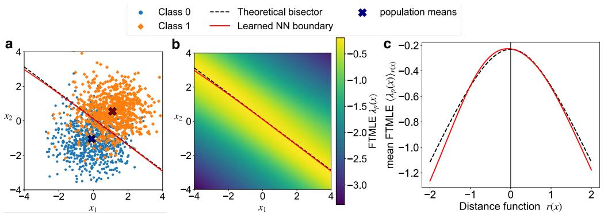  
Figure 1: Example of input-to-probability FTMLE of the binary classification. In all panels, the theoretical results are shown via a dashed black line, and the numerical evaluations of the learned NN model are shown via a solid red line. Panel a shows two 2D Gaussians, with the theoretical bisector and the learned NN boundary. Panel b shows the variation of the input-to-probability FTMLE $\lambda _ { p } ( x )$ of the learned NN over the 2D space. Panel c compares the FTMLE $\langle \lambda _ { p } ( x ) \rangle _ { r ( x ) }$ of the learned NN (solid red line), which has been averaged over the signed-distance $r ( x )$ , with the analytically derived one (dashed black line). The vertical line at $r ( x ) = 0$ denotes the Bayes boundary.

The interpretation is that, in a multi-class classification problem, FTMLE has a local extremum on the Bayes decision boundary, but this extremum can switch from a maximum to a minimum as we traverse the decision boundary. This is illustrated in an example in Fig. 2, discussed in the next section.

Complete proofs of all results in Sec. 3.2 are in Appendix C.

## 3.3 Numerical confirmation

We illustrate the results of the theorems above under finite-sample approximation.

Binary classification example. For two classes in $\mathbb { R } ^ { 2 }$ , a (2-4-1) tanh network was trained with binary cross-entropy on 20,000 samples. The independent test set contains 30,000 samples. Its posterior mean-squared error relative to the exact Bayes posterior is $5 . 8 4 \times 1 0 ^ { - 5 } ,$ ; test accuracy is 0.83667, compared with the empirical Bayes accuracy 0.83690 on the same test set. Figure 1 compares the learned decision boundary via the theoretical bisector (panel a) and compares the averaged input-to-probability FTMLE gradient profile of the learned NN with the theoretical profile in Theorem 3.1 (panels b and c). The Pearson profile correlation is 0.99787; the peak of the tangentially averaged learned profile is 0.50684, compared with the exact peak 0.5. The mean absolute displacement between numerical learned-boundary roots and the Bayes bisector is 0.02051 in input units. Through a numerical exercise, we therefore showed the generality of our learning assumptions and numerically demonstrated our theoretical results for input-to-probability FTMLE analysis of binary classifications.

Multiclass classification example. For three regular-simplex classes in $\mathbb { R } ^ { 2 }$ , a (2-4-3) tanh classifier was trained with categorical cross-entropy on 21,000 samples and evaluated on 60,000 independent test samples. Its posterior mean-squared error is $6 . 1 3 \times 1 0 ^ { - 5 }$ , and test accuracy is 0.83725, compared with an empirical Bayes accuracy of 0.83695. Figure 2 compares the learned decision boundary via the theoretical bisector (panel a) and compares the averaged input-to-probability FTMLE gradient profile of the learned NN with the theoretical profile in Theorem 3.6 (panels b, ${ \mathrm { c } } ,$ and d). On a $3 2 1 \times 3 2 1$ Cartesian grid, Pearson correlations between learned and exact Jacobian norm and unclipped FTMLE fields are 0.98766 and 0.99519, respectively. The higher-resolution probability simplex in Fig. 2 e shows the results of Propositions 3.3 and 3.5 and Theorem $3 . 6 ,$ and marks the analytic transition points $a = a _ { \mathrm { c } }$ on the active pairwise facets as red crosses. Panels c and d of Fig. 2 tests the two sides of Corollary 3.8. At $a = 0 . 3 5 < a _ { \mathrm { c } }$ , the analytic quadratic coeficient $\psi _ { 1 2 } ( x _ { 0 } ) > 0$ , so the boundary is a local minimum (Panel c). At $a = 0 . 4 0 > a _ { \mathrm { c } } , \psi _ { 1 2 } ( x _ { 0 } ) < 0$ , so the boundary is a local maximum (Panel d). Thus, the numerically evaluated solid red curves agree with the predicted minimum and maximum regimes in Corollary 3.8, shown as dashed black lines.

d  
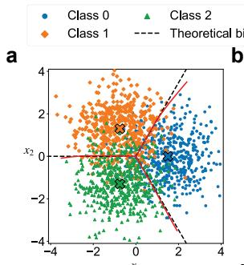

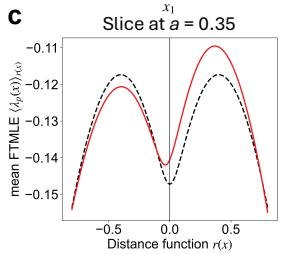

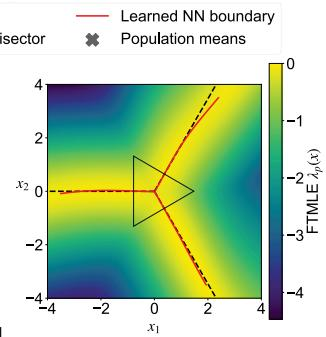

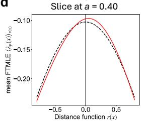

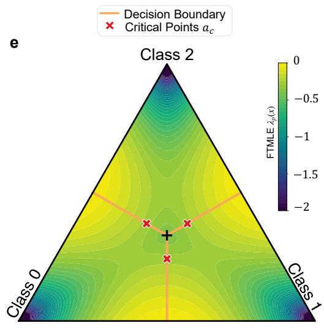  
Figure 2: Example of input-to-probability FTMLE of the multiclass classification. In panels $\operatorname { a - d } .$ , the theoretical results are shown via a dashed black line, and the numerical evaluations of the learned NN model are shown via a solid red line. Panel a shows three 2D Gaussians, with the theoretical bisector and the learned NN boundary. Panel b shows the variation of the inputto-probability FTMLE $\lambda _ { p } ( x )$ of the learned NN over the 2D space. Panel c compares the FTMLE $\langle \lambda _ { p } ( x ) \rangle _ { r ( x ) }$ of the learned NN (solid red line), which has been averaged over the signed-distance r(x) on normal slices through $a = 0 . 3 5 < a _ { c }$ on the active class-1/class-2 facet, with the analytically derived one (dashed black line). The vertical line at $r ( x ) = 0$ denotes the Bayes boundary. Panel d is similar to ${ \mathrm { c } } ,$ with the diference that the slice is at $a = 0 . 4 > a _ { c }$ . Panel e is the zoomed black triangle shown in Panel b. Here, the geometry of the simplex model is shown as an equilateral triangle, with its vertices located at the population means. A higher-resolution contour reveals that as one traverses along the decision boundary, beginning at the + mark, $a = 1 / 3$ , the boundary is an FTMLE minimum ridge for $1 / 3 < a < a _ { c } ,$ and the boundary is an FTMLE maximum ridge for $a > a _ { c }$ , with the critical point $a _ { c } \approx 0 . 3 8$ (see Corollary 3.8).

## 4 Moving backward in time: input-to-logit FTMLE

We now observe the cumulative dynamics at $h _ { K + 1 } = \ell _ { \theta }$ , before the probability link. The output probability of a CE-trained binary model can still have the ridge of Theorem 3.1; the preceding logit can have a diferent expansion profile. The raw logit also depends on the population objective that determines it.

## 4.1 MSE-trained binary logit

Use the binary Gaussian geometry in (3.1), and set $\widehat { Y } : = 2 Y - 1 \in \{ - 1 , + 1 \}$ . The raw-logit mean-squared error (MSE) population risk is $R _ { \mathrm { M S E } } ( \theta ) : = \mathbb { E } \Big [ \big ( \widehat { Y } - \ell _ { \theta } ^ { \mathrm { M S E } } ( X ) \big ) ^ { 2 } \Big ]$

Theorem 4.1 (MSE input-to-logit Gaussian classification). Under Assumption 2.4 with $C = 2$ and $\Omega = \mathbb { R } ^ { d }$ , assume the model class realizes the continuously diferentiable population MSE minimizer and training attains it. Then

$$
\ell _ { \theta ^ { \star } } ^ { \mathrm { M S E } } ( x ) = \mathbb { E } [ \widehat { Y } \mid X = x ] = 2 \eta ( x ) - 1 = \operatorname { t a n h } \left( \frac { \alpha r ( x ) } { 2 } \right) .
$$

The boundary is $B ^ { \star } = \big \{ x : \ell _ { \theta ^ { \star } } ^ { \mathrm { M S E } } ( x ) = 0 \big \}$ , and

$$
D \ell _ { \theta ^ { \star } } ^ { \mathrm { M S E } } ( x ) = \frac \alpha 2 \operatorname { s e c h } ^ { 2 } \left( \frac { \alpha r ( x ) } 2 \right) n ^ { \top } , \quad \Lambda _ { \ell } ^ { \mathrm { M S E } } ( x ) = \frac \alpha 2 \operatorname { s e c h } ^ { 2 } \left( \frac { \alpha r ( x ) } 2 \right) , \quad \lambda _ { \ell } ^ { \mathrm { M S E } } ( x ) = \frac 1 { K + 1 } \log \Lambda _ { \ell } ^ { \mathrm { M S E } } ( x ) .
$$

The leading input singular direction is $\pm n$ , and

$$
\operatorname * { a r g m a x } _ { x \in \mathbb { R } ^ { d } } \lambda _ { \ell } ^ { \mathrm { M S E } } ( x ) = B ^ { \star } .
$$

This ridge follows from the conditional mean implied by the MSE objective; it does not follow from the sign boundary alone. In fact, $D \ell _ { \theta ^ { \star } } ^ { \mathrm { M S E } } = 2 D \eta$ , so the raw MSE-logit and proper-loss binary probability maps have the same ridge location. Their expansion magnitudes and depth normalizations difer.

## 4.2 CE-trained binary logit

For a cross-entropy (CE) model with sigmoid probability link, let

$$
R _ { \mathrm { C E } } ( \theta ) : = \mathbb { E } \bigl [ - Y \log \mathrm { s i g m } ( \ell _ { \theta } ^ { \mathrm { C E } } ( X ) ) - ( 1 - Y ) \log \{ 1 - \mathrm { s i g m } ( \ell _ { \theta } ^ { \mathrm { C E } } ( X ) ) \} \bigr ] .\tag{4.1}
$$

Corollary 4.2 (CE-logit in the Gaussian classification). Under Assumption $\it 2 . 4$ with $C = 2$ and $\Omega = \mathbb { R } ^ { d } ,$ assume the CE logit class realizes the Bayes log odds continuously and the population risk in (4.1) attains its global minimum. In the binary Gaussian model,

$$
\ell _ { \theta ^ { \star } } ^ { \mathrm { { C E } } } ( x ) = \log \frac { \eta ( x ) } { 1 - \eta ( x ) } = \alpha r ( x ) , \qquad \Lambda _ { \ell } ^ { \mathrm { { C E } } } ( x ) = \alpha , \qquad \lambda _ { \ell } ^ { \mathrm { { C E } } } ( x ) = \frac { \log \alpha } { K + 1 } .
$$

The zero-logit boundary is $B ^ { \star }$ , and the leading input direction $i s \pm n _ { ; }$ , but the logit FTMLE is constant on $\mathbb { R } ^ { d }$

Appendix D gives the proofs of Theorem 4.1 and Corollary 4.2.

Remark 4.3. Our logit results are important as they show that the leading singular vector of the Jacobian at depth $K + 1$ (logit level) may or may not point toward a higher FTMLE. Depending on the population risk, the FTMLE may be constant over the data space, or it may have a globa maximum on the decision boundary.

## 5 Moving backward in time: input-to-representation FTMLE

At $h _ { K } = h _ { \theta }$ , the cumulative map stops before the readout. Its Jacobian maps input perturbations into every coordinate of the learned representation. Only part of this change is visible to the classification task. That distinction is central to interpreting a hidden-layer FTMLE field.

## 5.1 Hidden expansion, task-visible expansion, and task-alignment ratio

For a binary afine readout with $v \neq 0$ , let $\ell _ { \theta } ( x ) = v ^ { \top } h _ { \theta } ( x ) + \beta$ , and $\widehat { v } : = v / \| v \| _ { 2 } , P _ { v } : = I - \widehat { v v } ^ { \top }$ be the unit readout and the orthogonal projector away from its direction. Define the hidden expansion and the hidden FTMLE, respectively,

$$
\Lambda _ { H } ( x ) : = \| D h _ { \theta } ( x ) \| _ { 2 } , \qquad \lambda _ { H } ( x ) = \frac { 1 } { K } \Lambda _ { H } ( x ) .
$$

Now, based on the afine readout layer, we define the task-visible expansion:

$$
\Lambda _ { T } ( x ) : = \Big \| \widehat { v } ^ { \top } D h _ { \theta } ( x ) \Big \| _ { 2 } = \frac { \| D \ell _ { \theta } ( x ) \| _ { 2 } } { \| v \| _ { 2 } } \leq \Lambda _ { H } ( x ) ,
$$

The two expansions $\Lambda _ { T } ( x )$ and $\Lambda _ { H } ( x )$ have diferent interpretations. For logit $\ell _ { \theta } ( x ) \neq 0$ and $D \ell _ { \theta } ( x ) \neq 0$ , the minimum norm perturbation ξ to the data, satisfying the local boundary equation $\ell _ { \theta } ( x ) + D \ell _ { \theta } ( x ) \xi = 0$ , is the linear robustness radius

$$
\rho _ { \mathrm { l i n } } ( x ) = \frac { | \ell _ { \theta } ( x ) | } { \| v \| _ { 2 } \Lambda _ { T } ( x ) } .\tag{5.1}
$$

A larger $\rho _ { \mathrm { l i n } } ( x )$ means more robustness to data perturbations, which is related to task-visible expansion $\Lambda _ { T } ( x )$ . In contrast, a readout perturbation $\xi _ { v }$ afects the readout weights by $v + \xi _ { v }$ and changes the logit derivative by $\xi _ { v } ^ { \top } D h _ { \theta } ( x )$ , whose norm is at most $\| \xi _ { v } \| \Lambda _ { H } ( x )$ ; this upper bound is attained by a perturbation along the leading left singular vector of $D h _ { \theta } ( x )$ and is controlled by the hidden expansion $\Lambda _ { H } ( x )$ . Thus a large $\Lambda _ { H }$ can indicate input directions that a small change of readout could make visible, even if those directions currently have little efect on the logit.

Whenever $\Lambda _ { H } ( x ) > 0$ , define the task-alignment

$$
\chi ( x ) : = \frac { \Lambda _ { T } ( x ) } { \Lambda _ { H } ( x ) } \in [ 0 , 1 ] .
$$

The ratio $\chi$ compares task-visible and hidden expansion. The higher $\chi ( x )$ , the more expansions in the hidden representation are transferred to the readouts; thus, the task-visibility of the readout layer. For every unit input direction u, orthogonality yields

$$
\begin{array} { r } { \| D h _ { \theta } ( x ) u \| _ { 2 } ^ { 2 } = \left| \widehat { v } ^ { \top } D h _ { \theta } ( x ) u \right| ^ { 2 } + \| P _ { v } D h _ { \theta } ( x ) u \| _ { 2 } ^ { 2 } . } \end{array}\tag{5.2}
$$

Consequently

$$
\Lambda _ { T } ( x ) \leq \Lambda _ { H } ( x ) \leq \sqrt { \Lambda _ { T } ( x ) ^ { 2 } + \| P _ { v } D h _ { \theta } ( x ) \| _ { F } ^ { 2 } } .
$$

When $P _ { v } D h _ { \theta } ( x ) = 0$ , then $\chi ( x ) = 1 , \mathrm { i . e . }$ ., when there is no hidden expansion invisible to the readout layer, the task-alignment ratio attains its max value 1.

## 5.2 Attaining max hidden FTMLE on the ideal decision boundary is non-trivial

Example 5.1 (Task-orthogonal of-boundary expansion). Let $x = ( x _ { 1 } , x _ { 2 } ) \in \mathbb { R } ^ { 2 }$ , and assume the ideal decision boundary is $\boldsymbol { B } = \{ \boldsymbol { x } : \boldsymbol { x } _ { 1 } = 0 \}$ . Choose $\alpha , \gamma , \nu > 0$ and $s _ { 0 } \neq 0$ , and define

$$
h _ { \theta } ( x ) = \left[ \operatorname { t a n h } \left( \alpha x _ { 1 } \right) \right] , \qquad \ell _ { \theta } ( x ) = \gamma \operatorname { t a n h } ( \alpha x _ { 1 } ) .\tag{5.3}
$$

Thus, the classifier learns the ideal boundary. However, the readout ignores the second coordinate, which we will show results in hidden expansion $\Lambda _ { H } ( x )$ being invisible to the logit. Here,

$$
\Lambda _ { T } ( x ) = \alpha \operatorname { s e c h } ^ { 2 } ( \alpha x _ { 1 } ) , \quad \Lambda _ { H } ( x ) ^ { 2 } = \alpha ^ { 2 } \operatorname { s e c h } ^ { 4 } ( \alpha x _ { 1 } ) + \nu ^ { 2 } \operatorname { s e c h } ^ { 4 } \big ( \nu ( x _ { 1 } - s _ { 0 } ) \big ) .\tag{5.4}
$$

The task-visible expansion $\Lambda _ { T } ( x )$ has its global maximum on $B ,$ while $\Lambda _ { H }$ is not even stationary there. In fact,

$$
\left. \frac { d } { d x _ { 1 } } \Lambda _ { H } ( x ) ^ { 2 } \right| _ { x _ { 1 } = 0 } = 4 \nu ^ { 3 } \mathrm { s e c h } ^ { 4 } ( \nu s _ { 0 } ) \operatorname { t a n h } ( \nu s _ { 0 } ) \neq 0 .
$$

The hidden expansion attains a global maximum on a line $x _ { 1 } = s _ { \star } \neq 0$ . This gives a concrete representation-level pattern that the scalar logit cannot show.

For $\alpha = 1 , \nu = 2 , s _ { 0 } = 1 , \gamma = 1$ , the exact formulas give $( \Lambda _ { T } , \Lambda _ { H } ) = ( 1 , 1 . 0 1 )$ on $x _ { 1 } = 0$ and $( 0 . 4 2 , 2 . 0 4 )$ on $x _ { 1 } = 1$ , which shows that, although the task-visible expansion $\Lambda _ { T }$ is max on the boundary $x _ { 1 } = 0$ , the hidden expansion $\Lambda _ { H } ( x )$ is not.

## 5.3 Suficient ridge transfer conditions

A logit FTMLE ridge and a task-visible expansion ridge have the same location. To transfer this location to the hidden expansion, one needs control of the directions orthogonal to the readout.

Proposition 5.2 (Task-aligned hidden FTMLE localization). Theorem 4.1 gives $\lambda _ { \ell } ( x ) \ <$ $\lambda _ { \ell } ( \pi ( x ) ) \longleftrightarrow \Lambda _ { T } ( x ) < \Lambda _ { T } ( \pi ( x ) ) , x \not \in \mathcal { B } ^ { \star }$ , for a projection $\pi : \Omega \to B ^ { \star }$ . To transfer this ridge to the hidden representation, it is suficient to impose the additional task-alignment condition $\Lambda _ { H } ( x ) < \Lambda _ { T } ( \pi ( x ) ) \ f o r \ x \not \in \ B ^ { \star }$

Motivated by the suficient condition for logit ridge transfer to the representation layer, we propose geometry-aware fine-tuning in the following.

## 5.4 Geometry-aware fine-tuning objectives

Let $B : = \{ x \in \Omega : \ell _ { \theta } ( x ) = 0 \}$ . On a tubular neighborhood of a smooth boundary patch, let $\pi ( x ) \in B$ be the unique nearest-point projection and let $d ( \boldsymbol { x } ) : = \| \boldsymbol { x } - \boldsymbol { \pi } ( \boldsymbol { x } ) \| _ { 2 }$ . For $\kappa > 0 , d ( x ) > 0 , \Lambda _ { T } ( x ) > 0$ and $\Lambda _ { T } ( \pi ( x ) ) > 0$ , define

$$
r _ { T } ( x ) : = \frac { \Big [ \kappa d ( x ) ^ { 2 } + \log \Big ( \frac { \Lambda _ { T } ( x ) } { \Lambda _ { T } ( \pi ( x ) ) } \Big ) \Big ] _ { + } } { \kappa d ( x ) ^ { 2 } } , \qquad r _ { \perp } ( x ) : = \frac { \| P _ { v } D h _ { \theta } ( x ) \| _ { F } ^ { 2 } } { d ( x ) ^ { 2 } \Lambda _ { T } ( x ) ^ { 2 } } ,
$$

where $[ s ] _ { + } : = \operatorname* { m a x } \{ s , 0 \}$

For a nonempty finite set $\mathcal { X } _ { O }$ of admissible of-boundary points paired with their projections, define

$$
\mathcal { L } _ { T } : = \frac { 1 } { | \mathcal { X } _ { O } | } \sum _ { x \in \mathcal { X } _ { O } } r _ { T } ( x ) ^ { 2 } , \qquad \mathcal { L } _ { \perp } : = \frac { 1 } { | \mathcal { X } _ { O } | } \sum _ { x \in \mathcal { X } _ { O } } r _ { \perp } ( x ) .
$$

Small residuals of $\mathcal { L } _ { T }$ encourage task-visible expansion to decrease normally away from the boundary, concentrating it where class separation is required (at the boundary). The loss $\mathcal { L } _ { \perp }$ decreases nuisance expansion invisible to the logit, which prohibits the hidden expansion from growing strongly in directions that are almost invisible to the final classifier.

If $\theta _ { 0 }$ denotes a frozen pretrained model, let X collect the boundary and interior points used for preservation and define

$$
\mathcal { L } _ { \mathrm { p r e s } } : = \frac { 1 } { | \mathcal { X } | } \sum _ { x \in \mathcal { X } } \bigl ( \ell _ { \theta } ( x ) - \ell _ { \theta _ { 0 } } ( x ) \bigr ) ^ { 2 } .
$$

Low values of $\mathcal { L } _ { \mathrm { p r e s } }$ preserves the learned decision boundary. The numerical study below adds the empirical fine-tuning objective

$$
{ \mathcal { L } } _ { \mathrm { f i n e } } = { \mathcal { L } } _ { \mathrm { t a s k } } + \alpha _ { T } { \mathcal { L } } _ { T } + \alpha _ { \perp } { \mathcal { L } } _ { \perp } + \alpha _ { \mathrm { p r e s } } { \mathcal { L } } _ { \mathrm { p r e s } } , \qquad \alpha _ { T } , \alpha _ { \perp } , \alpha _ { \mathrm { p r e s } } > 0 ,
$$

added to the pre-training loss. Next, we provide residual conditions in which we guarantee a normal hidden FTMLE ridge under task-aligned bounds.

Theorem 5.3 (Fine-tuning input-to-representation classification). Let $h _ { \theta } \in C ^ { 1 } ( \Omega ; \mathbb { R } ^ { q } ) , \ v \neq 0$ , and $\textstyle B _ { 0 } \subseteq B$ be a smooth boundary patch with tubular neighborhood

$$
\mathcal { U } _ { \varepsilon _ { 0 } } : = \{ b + t n ( b ) : b \in \mathcal { B } _ { 0 } , \ | t | < \varepsilon _ { 0 } \} ,
$$

contained in $\Omega ,$ where every $x = b + t n ( b )$ has unique projection $\pi ( x ) = b$ , and assume $\Lambda _ { T } > 0$ on $\mathcal { U } _ { \varepsilon _ { 0 } }$ . Suppose, uniformly on $\mathcal { U } _ { \varepsilon _ { 0 } } \setminus \mathcal { B } _ { 0 }$ ，

$$
r _ { T } ( x ) \leq \varepsilon _ { T } , \qquad 0 \leq \varepsilon _ { T } < 1 , \qquad r _ { \perp } ( x ) \leq \varepsilon _ { \perp } , \qquad \varepsilon _ { \perp } \geq 0 , \qquad \frac { \varepsilon _ { \perp } } { 2 } < ( 1 - \varepsilon _ { T } ) \kappa .
$$

Then, for every $b \in B _ { 0 }$ and every $0 < | t | < \varepsilon _ { 0 }$ ，

$$
\lambda _ { H } \big ( b + t n ( b ) \big ) < \lambda _ { H } \big ( b \big ) .
$$

Hence $B _ { 0 }$ is a strict normal hidden-representation FTMLE ridge.

The theorem is relative to the current logit boundary B. Moreover, the uniform $r _ { \perp }$ -bound forces $P _ { v } D h _ { \theta } ( b ) = 0$ at every $b \in B _ { 0 }$ . Appendix E gives the complete proof.

## 5.5 Numerical illustration

We examine whether the proposed fine-tuning objectives concentrate hidden sensitivity near the decision boundary, as motivated by Theorem 5.3. The example uses two moons dataset (?) with independent training, validation, and test sets of 10,000, 5,000, and 5,000 samples. A (4-4-4-4) Softsign network with a scalar linear readout is pretrained for 500 epochs using binary cross-entropy (CE) and Adam with learning rate $1 0 ^ { - 4 }$ . Two copies of this pretrained classifier are then trained for 1,000 further epochs: one continues CE, and the other combines CE with ${ \mathcal L } _ { \mathrm { f i n e } }$ . Both continuations use fresh Adam optimizers and a learning rate of $3 \times 1 0 ^ { - 4 } ;$ all phases use minibatches of size 256. The geometry-aware objective uses $\kappa = 0 . 1$ , unit CE weight, and fixed loss weights calibrated before fine-tuning. Moreover, $\mathcal { L } _ { T }$ remained zero throughout recorded fine-tuning.

In Fig. 3, we evaluate the hidden expansion exceedance of of-boundary points relative to their projected point on the boundary by $R _ { H } ( x ) =$ log $\Lambda _ { H } ( x )$ − log $\Lambda _ { H } ( \pi ( x ) )$ . Among 4,813 test samples, hidden-expansion exceedances (points with $R _ { H } ( x ) > 1 0 ^ { - 6 } )$ from the boundary decrease from 924 samples (19.20%) in panel a to 6 samples (0.12%) in panel b. Thus 99.9% of the assessed samples satisfy the desired hidden-expansion ordering within numerical tolerance. This shows the significance of our proposed geometry-aware fine-tuning in suppressing the nuisance expansions away from the boundary.

Figure 4 a-b examines the residuals defined in Section 5.4. Geometry-aware fine-tuning reduces both $r _ { T }$ and $r _ { \perp }$ residuals over normal ofsets. We evaluate the margin of the rate condition of Theorem 5.3 by $\Delta _ { \mathrm { s a m p l e } } = ( 1 - \operatorname* { m a x } r _ { T } ) \kappa - \operatorname* { m a x } r _ { \perp } / 2$ . The geometry-aware fine-tuning results in a margin $\Delta _ { \mathrm { s a m p l e } } = 0 . 0 9 0 4 > 0$ (satisfaction of the rate condition), compared with $\Delta _ { \mathrm { s a m p l e } } = - 2 9 . 0 < 0$ for continued CE (failure of the rate condition); see Fig. 4 c. This check supports the proposed mechanism, in which useful expansions are concentrated near the boundary, and nuisance expansions are suppressed. The corresponding expansion profiles show the geometric efect directly in panels d and e. Both $\Lambda _ { H }$ and $\Lambda _ { T }$ decay more strongly away from the boundary after geometry-aware fine-tuning, with negative log ratios on both sides. Across of-boundary normal samples, the fraction with hidden expansion exceeding its boundary value falls from 44.0% to 0.70%. Since the leading FTMLE is a positive depth-scaled logarithm of expansion, these relative orderings carry over to the hidden and logit endpoints. Geometry-aware fine-tuning improved robustness: the distribution of $\rho _ { \mathrm { l i n } }$ shifts toward larger values; its median increases from 0.95 to 2.18, as shown in panel f. Test accuracy is preserved through our $\mathcal { L } _ { \mathrm { p r e s } }$ loss, with 96.96% in pre-training, compared with 96.94% for continued CE and 96.96% for our geometry-aware fine-tuning.

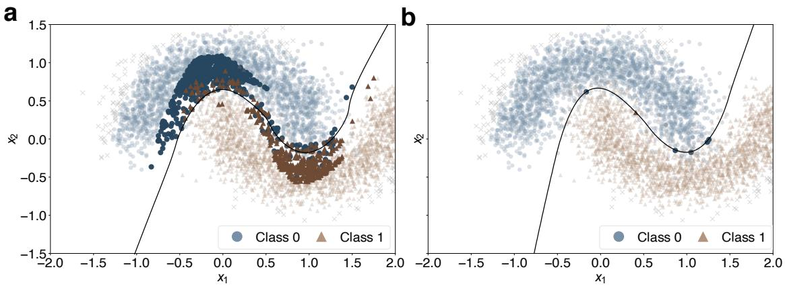  
Figure 3: Example of geometry-aware fine-tuning. a: continued CE. b: geometry-aware fine-tuning. Darker markers identify samples with hidden expansion exceedance than their projected point on the boundary (points with $R _ { H } ( x ) > 1 0 ^ { - 6 } )$ . The black curve denotes the decision boundary. In panel b, only 6 exceedances are observed with a very small distance to the boundary (order $1 0 ^ { - 4 } )$ , while 924 samples in panel a have hidden expansion exceedances.

## 6 Conclusions

A decision boundary is not necessarily a maximal FTMLE ridge: it can form a minimum ridge, or have no distinctive FTMLE magnitude at all. By following the observation endpoint backward from probabilities to logits and hidden representations, our theoretical results establish when finite-time expansion identifies decision geometry and when that interpretation fails.

At the probability endpoint, Theorem 3.1 establishes an exact boundary-maximal FTMLE profile for population-optimal binary classification under the stated Gaussian assumptions, with the leading input singular direction normal to the boundary. Proposition 3.2 extends this mechanism locally to smooth boundaries when the recovered posterior has the prescribed signed-distance profile. For regular-simplex multiclass Gaussian models, Propositions 3.3 and 3.5 characterize the full probability-Jacobian spectrum and establish normal alignment on smooth active pairwise facets. Crucially, Theorem 3.6 shows that these facets can be either normal maxima or normal minima of FTMLE, with a sharp three-class transition given by Corollary 3.8. To the best of our knowledge, the identification and numerical demonstration of such a boundary minimum ridge are novel. This result separates two properties often implicitly conflated: the leading expansion direction can point exactly across the boundary while its magnitude is locally smallest there.

The logit results further show that this relationship depends on the training objective. In the same binary Gaussian setting, Theorem 4.1 proves that population-optimal MSE training against signed labels produces boundary-maximal logit FTMLE, whereas Corollary 4.2 proves that populationoptimal CE training produces an afine logit with spatially constant FTMLE. Both recover the same decision boundary. Thus, even exact recovery of the classification geometry does not determine the spatial sensitivity profile, and a probability-level ridge may not persist at the preceding logit endpoint.

a  
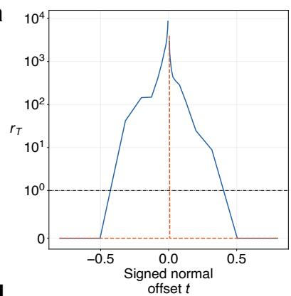

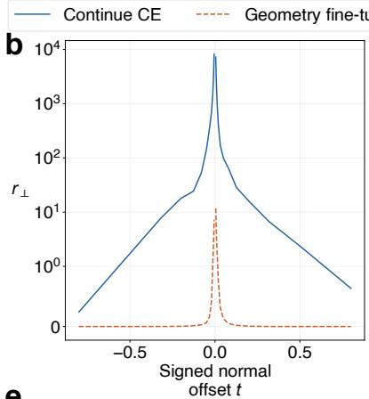

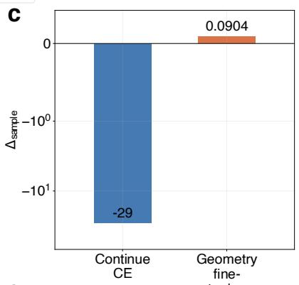

d  
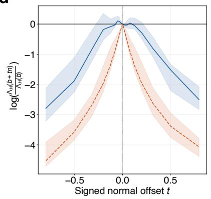

e  
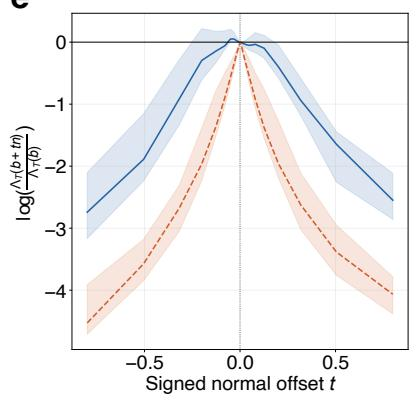

f  
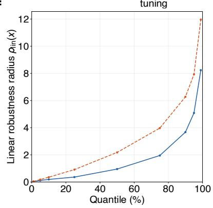  
Figure 4: Example of geometry-aware fine-tuning: Residual diagnostics, hidden and task-aligned expansion profiles, and robustness. In all panels, continued cross-entropy and geometry-aware fine-tunings are shown as solid blue and dashed red lines, respectively. a: task-visible residual $r _ { T }$ and b: nuisance residual $r _ { \perp }$ , across boundary-normal samples at each signed ofset t. The black horizontal reference on panel a is $r _ { T } = 1$ (Theorem 5.3 requirement). c: Only a positive value supports the rate condition of Theorem 5.3. d and e: Curves show median values of the log-ratio between hidden and task-aligned expansion normal to the boundary (more negative values away from $t = 0$ indicate a desired decrease in expansion further from the boundary). Shaded bands indicate the 10th–90th percentiles. f: linear robustness radius is increased (as desired) through geometry-aware fine-tuning.

At the hidden endpoint, our counterexample demonstrates that expansion invisible to the readout can displace the maximum away from the boundary, even when task-visible expansion is boundary maximal. Proposition 5.2 identifies a suficient condition for transferring localization to the full hidden representation. Building on this distinction, our geometry-aware fine-tuning encourages task-visible expansion to decrease away from the boundary, suppresses expansion orthogonal to the readout, and penalizes changes to the pretrained logits. Theorem 5.3 ensures a strict normal hidden-FTMLE ridge along the learned boundary patch. This provides explicit conditions under which the desired hidden expansion profile can be established.

Our numerical examples support the validity and practical relevance of the theory and its assumptions in the tested settings. Finite-sample Gaussian experiments reproduce the predicted binary profile and multiclass minimum-to-maximum transition, while the nonlinear two-moons example demonstrates the applicability of the representation framework beyond Gaussian class geometry. Geometry-aware fine-tuning concentrates hidden expansion near the learned boundary and suppresses it away from the boundary: approximately 99.9% of the assessed test samples have hidden expansion no greater than at their boundary projections, within numerical tolerance. Exceedances fall from 924 test samples under continued CE to only 6 test samples, while retaining the pretrained test accuracy of 96.96%. The normal profiles and positive sampled rate margin further support the theorem’s mechanism.

These findings make a theoretical foundation essential for interpreting derivative-based analyses. Whenever FTMLE or Jacobian-norm sensitivity is used to locate decision boundaries, the assumption that it must peak near the boundary requires examination: our results exhibit both its validity and explicit failures. The observation endpoint, training objective, posterior geometry, and alignment with the readout must therefore inform the analysis. Used with this knowledge and care, sensitivity becomes a principled tool for understanding and shaping decision geometry.

## References

Cem Anil, James Lucas, and Roger Grosse. Sorting out Lipschitz function approximation. In Proceedings of the 36th International Conference on Machine Learning, volume 97 of Proceedings of Machine Learning Research, pages 291–301. PMLR, 2019. URL https://proceedings.mlr. press/v97/anil19a.html.

Randall Balestriero and Richard G. Baraniuk. A spline theory of deep learning. In Proceedings of the 35th International Conference on Machine Learning, volume 80 of Proceedings of Machine Learning Research, pages 374–383. PMLR, 2018. URL https://proceedings.mlr.press/v80/ balestriero18b.html.

Peter L. Bartlett, Dylan J. Foster, and Matus J. Telgarsky. Spectrally-normalized margin bounds for neural networks. In Advances in Neural Information Processing Systems, volume 30, 2017. URL https://proceedings.neurips.cc/paper/2017/hash/ b22b257ad0519d4500539da3c8bcf4dd-Abstract.html.

Laurent Bonnasse-Gahot and Jean-Pierre Nadal. Category learning in deep neural networks: Information content and geometry of internal representations. Physical Review E, 112(5):055315, 2025. doi: 10.1103/mp35-bdx5. URL https://doi.org/10.1103/mp35-bdx5.

Moustapha Cisse, Piotr Bojanowski, Edouard Grave, Yann Dauphin, and Nicolas Usunier. Parseval networks: Improving robustness to adversarial examples. In Proceedings of the 34th International Conference on Machine Learning, volume 70 of Proceedings of Machine Learning Research, pages 854–863. PMLR, 2017. URL https://proceedings.mlr.press/v70/cisse17a.html.

Alhussein Fawzi, Seyed-Mohsen Moosavi-Dezfooli, and Pascal Frossard. Robustness of classifiers: From adversarial to random noise. In Advances in Neural Information Processing Systems, volume 29, 2016. URL https://arxiv.org/abs/1608.08967.

Alhussein Fawzi, Seyed-Mohsen Moosavi-Dezfooli, Pascal Frossard, and Stefano Soatto. Empirica study of the topology and geometry of deep networks. In Proceedings of the IEEE Conference on Computer Vision and Pattern Recognition, pages 3762–3770, 2018. doi: 10.1109/CVPR.2018.00396. URL https://doi.org/10.1109/CVPR.2018.00396.

Chris Finlay and Adam M. Oberman. Scaleable input gradient regularization for adversarial robustness. Machine Learning with Applications, 3:100017, 2021. doi: 10.1016/j.mlwa.2020.100017. URL https://doi.org/10.1016/j.mlwa.2020.100017.

Chris Finlay, Joern-Henrik Jacobsen, Levon Nurbekyan, and Adam Oberman. How to train your neural ODE: The world of Jacobian and kinetic regularization. In Proceedings of the 37th International Conference on Machine Learning, volume 119 of Proceedings of Machine Learning Research, pages 3154–3164. PMLR, 2020. URL https://proceedings.mlr.press/ v119/finlay20a.html.

Ian J. Goodfellow, Jonathon Shlens, and Christian Szegedy. Explaining and harnessing adversarial examples. In International Conference on Learning Representations, 2015. URL https://arxiv. org/abs/1412.6572.

Eldad Haber and Lars Ruthotto. Stable architectures for deep neural networks. Inverse Problems, 34(1):014004, 2018. doi: 10.1088/1361-6420/aa9a90. URL https://arxiv.org/abs/1705.03341.

Tessa Han, Suraj Srinivas, and Himabindu Lakkaraju. Characterizing data point vulnerability as average-case robustness. In Proceedings of the Fortieth Conference on Uncertainty in Artificial Intelligence, volume 244 of Proceedings of Machine Learning Research, pages 1513–1540. PMLR, 2024. URL https://proceedings.mlr.press/v244/han24a.html.

Matthias Hein and Maksym Andriushchenko. Formal guarantees on the robustness of a classifier against adversarial manipulation. In Advances in Neural Information Processing Systems, volume 30, 2017. URL https://arxiv.org/abs/1705.08475.

Judy Hofman, Daniel A. Roberts, and Sho Yaida. Robust learning with Jacobian regularization, 2019. URL https://arxiv.org/abs/1908.02729.

Ahmed Imtiaz Humayun, Randall Balestriero, Guha Balakrishnan, and Richard G. Baraniuk. SplineCam: Exact visualization and characterization of deep network geometry and decision boundaries. In Proceedings of the IEEE/CVF Conference on Computer Vision and Pattern Recognition, 2023. URL https://arxiv.org/abs/2302.12828.

Daniel Jakubovitz and Raja Giryes. Improving DNN robustness to adversarial attacks using Jacobian regularization. In Proceedings of the European Conference on Computer Vision, pages 514–529, 2018. URL https://openaccess.thecvf.com/content\_ECCV\_2018/html/Daniel\_Jakubovitz\_ Improving\_DNN\_Robustness\_ECCV\_2018\_paper.html.

Anton Johansson, Claes Strannegård, Niklas Engsner, and Petter Mostad. Exact spectral norm regularization for neural networks, 2022. URL https://arxiv.org/abs/2206.13581.

Hassan K. Khalil. Nonlinear Systems. Prentice Hall, Upper Saddle River, NJ, 3rd edition, 2002. ISBN 978-0130673893.

Valentin Khrulkov and Ivan Oseledets. Art of singular vectors and universal adversarial perturbations. In Proceedings of the IEEE Conference on Computer Vision and Pattern Recognition, 2018. URL https://arxiv.org/abs/1709.03582.

Misaki Kondo, Satoshi Sunada, and Tomoaki Niiyama. Lyapunov exponent analysis for multilayer neural networks. Nonlinear Theory and Its Applications, IEICE, 12(4):674–684, 2021. doi: 10.1587/ nolta.12.674. URL https://www.jstage.jst.go.jp/article/nolta/12/4/12\_674/\_article.

Christian Kuehn and Tobias Wöhrer. Tracking finite-time Lyapunov exponents to robustify neural ODEs. Neurocomputing, 699:134371, 2026. doi: 10.1016/j.neucom.2026.134371. URL https: //doi.org/10.1016/j.neucom.2026.134371.

Jeremiah Zhe Liu, Zi Lin, Shreyas Padhy, Dustin Tran, Tania Bedrax-Weiss, and Balaji Lakshminarayanan. Simple and principled uncertainty estimation with deterministic deep learning via distance awareness. In Advances in Neural Information Processing Systems, volume 33, 2020. URL https://arxiv.org/abs/2006.10108.

Laurent Meunier, Blaise J. Delattre, Alexandre Araujo, and Alexandre Allauzen. A dynamical system perspective for Lipschitz neural networks. In Proceedings of the 39th International Conference on Machine Learning, volume 162 of Proceedings of Machine Learning Research, pages 15484–15500. PMLR, 2022. URL https://proceedings.mlr.press/v162/meunier22a.html.

Takeru Miyato, Shin-ichi Maeda, Masanori Koyama, and Shin Ishii. Virtual adversarial training: A regularization method for supervised and semi-supervised learning. IEEE Transactions on Pattern Analysis and Machine Intelligence, 41(8):1979–1993, 2019. doi: 10.1109/TPAMI.2018.2858821. URL https://doi.org/10.1109/TPAMI.2018.2858821.

Seyed-Mohsen Moosavi-Dezfooli, Alhussein Fawzi, and Pascal Frossard. DeepFool: A simple and accurate method to fool deep neural networks. In Proceedings of the IEEE Conference on Computer Vision and Pattern Recognition, pages 2574–2582, 2016. doi: 10.1109/CVPR.2016.282. URL https://doi.org/10.1109/CVPR.2016.282.

Seyed-Mohsen Moosavi-Dezfooli, Alhussein Fawzi, Omar Fawzi, Pascal Frossard, and Stefano Soatto. Robustness of classifiers to universal perturbations: A geometric perspective. In International Conference on Learning Representations, 2018. URL https://arxiv.org/abs/1705.09554.

Josue Nassar, Piotr Sokol, SueYeon Chung, Kenneth D. Harris, and Il Memming Park. On 1/n neural representation and robustness. In Advances in Neural Information Processing Systems, volume 33, 2020. URL https://papers.nips.cc/paper/2020/hash/ 44bf89b63173d40fb39f9842e308b3f9-Abstract.html.

Behnam Neyshabur, Srinadh Bhojanapalli, and Nathan Srebro. A PAC-Bayesian approach to spectrally-normalized margin bounds for neural networks. In International Conference on Learning Representations, 2018. URL https://arxiv.org/abs/1707.09564.

Roman Novak, Yasaman Bahri, Daniel A. Abolafia, Jefrey Pennington, and Jascha Sohl-Dickstein. Sensitivity and generalization in neural networks. In International Conference on Learning Representations, 2018. URL https://openreview.net/forum?id=HJC2SzZCW.

Edward Ott. Chaos in Dynamical Systems. Cambridge University Press, 2 edition, 2002.

Thomas Paniagua, Chinmay Savadikar, and Tianfu Wu. Adversarial perturbations are formed by iteratively learning linear combinations of the right singular vectors of the adversarial Jacobian. In Proceedings of the 42nd International Conference on Machine Learning, volume 267 of Proceedings of Machine Learning Research, pages 47859–47878. PMLR, 2025. URL https://proceedings. mlr.press/v267/paniagua25a.html.

Nicolas Papernot, Patrick McDaniel, Somesh Jha, Matt Fredrikson, Z. Berkay Celik, and Ananthram Swami. The limitations of deep learning in adversarial settings. In 2016 IEEE European Symposium on Security and Privacy, 2016. URL https://arxiv.org/abs/1511.07528.

Jaewoo Park, Hojin Park, Eunju Jeong, and Andrew Beng Jin Teoh. Understanding open-set recognition by Jacobian norm and inter-class separation. Pattern Recognition, 145:109942, 2024. doi: 10.1016/j.patcog.2023.109942. URL https://doi.org/10.1016/j.patcog.2023.109942.

Jefrey Pennington, Samuel S. Schoenholz, and Surya Ganguli. Resurrecting the sigmoid in deep learning through dynamical isometry: Theory and practice. In Advances in Neural Information Processing Systems, volume 30, 2017. URL https://papers.nips.cc/paper\_files/paper/2017/ hash/d9fc0cdb67638d50f411432d0d41d0ba-Abstract.html.

Jefrey Pennington, Samuel S. Schoenholz, and Surya Ganguli. The emergence of spectral universality in deep networks. In Proceedings of the Twenty-First International Conference on Artificial Intelligence and Statistics, volume 84 of Proceedings of Machine Learning Research, pages 1924– 1932. PMLR, 2018. URL https://proceedings.mlr.press/v84/pennington18a.html.

Marine Picot, Francisco Messina, Malik Boudiaf, Fabrice Labeau, Ismail Ben Ayed, and Pablo Piantanida. Adversarial robustness via Fisher–Rao regularization. IEEE Transactions on Pattern Analysis and Machine Intelligence, 45(3):2698–2710, 2023. doi: 10.1109/TPAMI.2022.3174724. URL https://doi.org/10.1109/TPAMI.2022.3174724.

Ben Poole, Subhaneil Lahiri, Maithra Raghu, Jascha Sohl-Dickstein, and Surya Ganguli. Exponential expressivity in deep neural networks through transient chaos. In Advances in Neural Information Processing Systems, volume 29, 2016. URL https://arxiv.org/abs/1606.05340.

Salah Rifai, Pascal Vincent, Xavier Muller, Xavier Glorot, and Yoshua Bengio. Contractive autoencoders: Explicit invariance during feature extraction. In Proceedings of the 28th International Conference on Machine Learning, pages 833–840, 2011. URL https://icml.cc/Conferences/ 2011/papers.php.html.

Andrew Slavin Ross and Finale Doshi-Velez. Improving the adversarial robustness and interpretability of deep neural networks by regularizing their input gradients. In Proceedings of the AAAI Conference on Artificial Intelligence, volume 32, 2018. URL https://arxiv.org/abs/1711.09404.

Samuel S. Schoenholz, Justin Gilmer, Surya Ganguli, and Jascha Sohl-Dickstein. Deep information propagation. In International Conference on Learning Representations, 2017. URL https: //arxiv.org/abs/1611.01232.

Sourya Sengupta and Mark A. Anastasio. An input-dependent Fisher information-guided image decomposition for interpreting classification networks. In Medical Imaging 2026: Image Perception, Observer Performance, and Technology Assessment, volume 13928 of Proceedings of SPIE, page 139280R. SPIE, 2026. doi: 10.1117/12.3088115. URL https://doi.org/10.1117/12.3088115.

Sina Sharifi, Taha Entesari, Bardia Safaei, Vishal M. Patel, and Mahyar Fazlyab. Gradientregularized out-of-distribution detection. In European Conference on Computer Vision, 2024. URL https://arxiv.org/abs/2404.12368.

Chaomin Shen, Yaxin Peng, Guixu Zhang, and Jinsong Fan. Defending against adversarial attacks by suppressing the largest eigenvalue of Fisher information matrix, 2019. URL https://arxiv. org/abs/1909.06137.

Loïc Shi-Garrier, Nidhal Carla Bouaynaya, and Daniel Delahaye. Adversarial robustness with partial isometry. Entropy, 26(2):103, 2024. doi: 10.3390/e26020103. URL https://doi.org/10.3390/ e26020103.

Patrice Simard, Bernard Victorri, Yann LeCun, and John Denker. Tangent Prop-a formalism for specifying selected invariances in an adaptive network. In Advances in Neural Information Processing Systems, volume 4, 1991. URL https://papers.nips.cc/paper/1991/hash/ 65658fde58ab3c2b6e5132a39fae7cb9-Abstract.html.

Jure Sokolić, Raja Giryes, Guillermo Sapiro, and Miguel R. D. Rodrigues. Robust large margin deep neural networks. IEEE Transactions on Signal Processing, 65(16):4265–4280, 2017. doi: 10.1109/TSP.2017.2708039. URL https://doi.org/10.1109/TSP.2017.2708039.

L. Storm, H. Linander, J. Bec, K. Gustavsson, and B. Mehlig. Finite-time Lyapunov exponents of deep neural networks. Physical Review Letters, 132(5):057301, 2024. doi: 10.1103/PhysRevLett. 132.057301. URL https://doi.org/10.1103/PhysRevLett.132.057301.

S.H. Strogatz. Nonlinear Dynamics and Chaos: With Applications to Physics, Biology, Chemistry, and Engineering. CRC Press, 2024. ISBN 9780429676277. URL https://books.google.com/ books?id=g9SNEQAAQBAJ.

Eliot Tron, Nicolas Couellan, and Stéphane Puechmorel. Adversarial attacks on neural networks through canonical Riemannian foliations. Machine Learning, 113:8655–8686, 2024. doi: 10.1007/ s10994-024-06624-w. URL https://doi.org/10.1007/s10994-024-06624-w.

Yusuke Tsuzuku, Issei Sato, and Masashi Sugiyama. Lipschitz-margin training: Scalable certification of perturbation invariance for deep neural networks. In Advances in Neural Information Processing Systems, volume 31, 2018. URL https://arxiv.org/abs/1802.04034.

Tsui-Wei Weng, Huan Zhang, Pin-Yu Chen, Jinfeng Yi, Dong Su, Yupeng Gao, Cho-Jui Hsieh, and Luca Daniel. Evaluating the robustness of neural networks: An extreme value theory approach. In International Conference on Learning Representations, 2018. URL https://arxiv.org/abs/ 1801.10578.

Dongya Wu and Xin Li. Adversarially robust generalization theory via Jacobian regularization for deep neural networks, 2024. URL https://arxiv.org/abs/2412.12449.

Sheng Yang, Jacob A. Zavatone-Veth, and Cengiz Pehlevan. Spectral regularization for adversariallyrobust representation learning. In 2025 59th Asilomar Conference on Signals, Systems, and Computers, pages 105–112, 2025. doi: 10.1109/IEEECONF67917.2025.11443939. URL https: //doi.org/10.1109/IEEECONF67917.2025.11443939.

Yuichi Yoshida and Takeru Miyato. Spectral norm regularization for improving the generalizability of deep learning, 2017. URL https://arxiv.org/abs/1705.10941.

Jacob A. Zavatone-Veth, Sheng Yang, Julian A. Rubinfien, and Cengiz Pehlevan. How does training shape the Riemannian geometry of neural network representations? In Proceedings of the Workshop on Symmetry and Geometry in Neural Representations (NeurReps), 2025. URL https://arxiv.org/abs/2301.11375v4. NeurIPS 2025 workshop; arXiv version 4.

Chong Zhang, Xiang Li, Jia Wang, Qiufeng Wang, and Xiaobo Jin. Measuring model robustness via Fisher information: Spectral bounds, theoretical guarantees, and practical algorithms, 2026. URL https://arxiv.org/abs/2606.04767.

Chenxiao Zhao, P. Thomas Fletcher, Mixue Yu, Yaxin Peng, Guixu Zhang, and Chaomin Shen. The adversarial attack and detection under the Fisher information metric. Proceedings of the AAAI

Conference on Artificial Intelligence, 33(1):5869–5876, 2019. doi: 10.1609/aaai.v33i01.33015869.   
URL https://ojs.aaai.org/index.php/AAAI/article/view/4536.

## Appendix A. Statistical preliminaries and proof of proper-loss recovery

Proof of Lemma 2.3. Fix an input $x .$ In the binary case let $\eta = \mathbb { P } ( Y = 1 \mid X = x )$ and let $p \in [ 0 , 1 ]$ be a prediction. The conditional squared probability risk is

$$
\eta ( 1 - p ) ^ { 2 } + ( 1 - \eta ) p ^ { 2 } = \eta ( 1 - \eta ) + ( p - \eta ) ^ { 2 } ,
$$

so its unique minimum is $p = \eta$ . For cross-entropy, using the usual extended-real convention at $p = 0 , 1$

$$
- \eta \log p - ( 1 - \eta ) \log ( 1 - p ) = H _ { \mathrm { b } } ( \eta ) + D _ { \mathrm { K L } } \big ( \mathrm { B e r n } ( \eta ) \| \mathrm { B e r n } ( p ) \big ) .
$$

Gibbs’ inequality gives a unique minimum at $p = \eta$ , including the endpoint cases.

For C classes, let $\boldsymbol { \eta } = \left( \eta _ { 0 } , \dots , \eta _ { C - 1 } \right) ^ { \top }$ and let $p$ range over the probability simplex. Categorical cross-entropy is

$$
- \sum _ { i = 0 } ^ { C - 1 } \eta _ { i } \log p _ { i } = H ( \eta ) + D _ { \mathrm { K L } } ( \eta \| p ) ,
$$

again uniquely minimized at $p = \eta$ . If $e _ { Y }$ is the one-hot class vector, the conditional Brier risk satisfies

$$
\begin{array} { r } { { \mathbb { E } } [ \| e _ { Y } - p \| _ { 2 } ^ { 2 } \mid X = x ] = 1 - \| \eta \| _ { 2 } ^ { 2 } + \| p - \eta \| _ { 2 } ^ { 2 } , } \end{array}
$$

and has the same unique minimizer.

Integrating conditional risks over X, global population optimality and realizability imply $p _ { \theta ^ { \star } } ( X ) =$ $\eta ( X )$ almost surely. Suppose the input density is strictly positive on an open domain and both maps are continuous there. If the maps difered at any point, continuity would make them difer on an open neighborhood of positive input probability, contradicting the almost-sure equality. Thus they agree pointwise. Their $C ^ { 1 }$ regularity then permits equality of derivatives on that domain. □

## Appendix B. Proofs for binary input-to-probability results

Proof of Theorem 3.1. By equal priors and the common spherical covariance,

$$
\begin{array} { l } { \displaystyle \log \frac { \eta ( \boldsymbol { x } ) } { 1 - \eta ( \boldsymbol { x } ) } = \log \frac { f _ { \boldsymbol { X } | \boldsymbol { Y } = 1 } ( \boldsymbol { x } ) } { f _ { \boldsymbol { X } | \boldsymbol { Y } = 0 } ( \boldsymbol { x } ) } } \\ { \displaystyle \qquad = \frac { \| \boldsymbol { x } - \mu _ { 0 } \| _ { 2 } ^ { 2 } - \| \boldsymbol { x } - \mu _ { 1 } \| _ { 2 } ^ { 2 } } { 2 \sigma ^ { 2 } } = \frac { \delta ^ { \top } ( \boldsymbol { x } - \boldsymbol { c } ) } { \sigma ^ { 2 } } = \alpha r ( \boldsymbol { x } ) . } \end{array}
$$

Therefore $\eta ( x ) = \mathrm { s i g m } ( \alpha r ( x ) )$ . The Gaussian mixture density is positive on $\mathbb { R } ^ { d }$ , so Lemma 2.3 and Assumption 2.2 give the pointwise identity $p _ { \theta ^ { \star } } = \eta$ . Its $1 / 2 \cdot$ -level set is $B ^ { \star } = \{ r = 0 \}$

Because $\nabla r = n$ and $\mathrm { s i g m } ^ { \prime } ( s ) = { \textstyle { \frac { 1 } { 4 } } } \mathrm { s e c h } ^ { 2 } ( s / 2 )$ 2

$$
D p _ { \theta ^ { \star } } ( x ) = \frac { \alpha } { 4 } \mathrm { s e c h } ^ { 2 } \bigg ( \frac { \alpha r ( x ) } { 2 } \bigg ) n ^ { \top } .
$$

The nonzero scalar factor makes this a rank-one row Jacobian with operator norm equal to that factor and right singular direction $\pm n$ . Its norm is maximized precisely when $r ( x ) = 0$ , because $\mathrm { s e c h } ^ { 2 } ( s ) < 1$ for $s \neq 0$ . Taking the increasing logarithm and dividing by the positive depth $K + 2$ preserves the maximizer set. □

Proof of Proposition 3.2. Posterior recovery and the chain rule give

$$
D p _ { \theta ^ { \star } } ( x ) = \alpha \mathrm { s i g m } ^ { \prime } ( \alpha r ( x ) ) \nabla r ( x ) ^ { \top } = \frac { \alpha } { 4 } \mathrm { s e c h } ^ { 2 } \bigg ( \frac { \alpha r ( x ) } { 2 } \bigg ) \nabla r ( x ) ^ { \top } .
$$

Since r is signed distance, $\| \nabla r ( x ) \| _ { 2 } = 1$ in the tubular neighborhood. This proves the expansion profile and the leading direction. At a boundary point $x _ { 0 } ,$ the normal-coordinate property of signed distance gives $r ( x _ { 0 } + t \nabla r ( x _ { 0 } ) ) = t$ for suficiently small t. The strictly peaked $\mathrm { s e c h } ^ { 2 }$ factor therefore gives a strict normal maximum. If all stated hypotheses hold throughout Ω, the same profile is globally maximal precisely at points with $r = 0$ . The assumed nonempty $B ^ { \star } \cap \Omega$ makes this set attainable. □

## Appendix C. Proofs for multiclass input-to-probability results

Proof of Proposition 3.3. Expanding the Gaussian exponent around c gives

$$
- \frac { \| \ b { x } - \mu _ { i } \| _ { 2 } ^ { 2 } } { 2 \sigma ^ { 2 } } = - \frac { \| \ b { x } - \ b { c } \| _ { 2 } ^ { 2 } } { 2 \sigma ^ { 2 } } + \frac { \nu _ { i } ^ { \top } ( \ b { x } - \ b { c } ) } { \sigma ^ { 2 } } - \frac { \| \ b { \nu } _ { i } \| _ { 2 } ^ { 2 } } { 2 \sigma ^ { 2 } } .
$$

The first term is common to all classes; so is the last, because all centered means have norm $\rho .$ Equal priors and Lemma 2.3 therefore give Equation (3.3). The pairwise log posterior ratio is

$$
\log { \frac { \eta _ { i } ( x ) } { \eta _ { j } ( x ) } } = { \frac { ( \nu _ { i } - \nu _ { j } ) ^ { \top } ( x - c ) } { \sigma ^ { 2 } } } = { \frac { d _ { \mu } } { \sigma ^ { 2 } } } r _ { i j } ( x ) .
$$

The two posteriors tie on the perpendicular bisector $r _ { i j } = 0 ;$ the maximal-posterior condition restricts this hyperplane to its active Voronoi facet. If a softmax logit realizes $\eta ,$ its pairwise diference equals this log ratio, regardless of the common logit gauge.

Let V be the matrix of centered means and let 1 be the C-vector of ones. The simplex Gram identities imply

$$
V V ^ { \top } = \frac { d _ { \mu } ^ { 2 } } { 2 } \left( I _ { C } - \frac { { \bf 1 1 } ^ { \top } } { C } \right) .
$$

Diferentiating the posterior gives $D \eta ( x ) = \sigma ^ { - 2 } G ( \eta ( x ) ) V$ . Since $G ( \eta ( x ) ) \mathbf { 1 } = 0$

$$
D \eta ( x ) D \eta ( x ) ^ { \top } = \frac { 1 } { \sigma ^ { 4 } } G ( \eta ) V V ^ { \top } G ( \eta ) = \frac { d _ { \mu } ^ { 2 } } { 2 \sigma ^ { 4 } } G ( \eta ) ^ { 2 } .
$$

The matrix $G ( \eta )$ is symmetric positive semidefinite and, for strictly positive Gaussian posteriors, has rank $C - 1$ . Its nonzero eigenvalues therefore give the nonzero singular values of $D \eta .$ , proving (3.4) and, in particular, (3.5). □

Proof of Remark $\ 3 . 4 .$ For any unit $w \in \mathbb { R } ^ { C } , w ^ { \top } G ( p ) w$ is the variance of a discrete random variable whose values are $w _ { 0 } , \ldots , w _ { C - 1 }$ with probabilities $p _ { i }$ . The variance is at most one fourth of the squared range, while maxi, $_ j \left| w _ { i } - w _ { j } \right| \leq \sqrt { 2 } \left\| w \right\| _ { 2 } = \sqrt { 2 } .$ . Hence $w ^ { \top } G ( p ) w \leq 1 / 2$ , proving the spectral bound. Equality requires probability $1 / 2$ on each of the two coordinates at the two extremes and zero elsewhere.

For fixed $i \neq j$ , take $x _ { s } = c + s ( \nu _ { i } + \nu _ { j } )$ as $s \to \infty$ . The two selected Gaussian discriminants are equal, and for every m $\not \in \{ i , j \}$ ,

$$
( \nu _ { i } - \nu _ { m } ) ^ { \top } ( x _ { s } - c ) = ( \nu _ { j } - \nu _ { m } ) ^ { \top } ( x _ { s } - c ) = \frac { C \rho ^ { 2 } } { C - 1 } s > 0 .
$$

Thus $\eta ( x _ { s } )  ( e _ { i } + e _ { j } ) / 2$ and $\mathrm { e i g } _ { \mathrm { m a x } } ( G ( \eta ( x _ { s } ) ) ) \to 1 / 2$ . At any finite input, every Gaussian posterior component is positive, so equality cannot occur. □

Proof of Proposition 3.5. Put $p = \eta ( x _ { 0 } )$ and $q = ( e _ { i } - e _ { j } ) / { \sqrt { 2 } } .$ . Since $p _ { i } = p _ { j } = a$ , we have $p ^ { \top } q = 0$ and

$$
G ( p ) q = \mathrm { d i a g } ( p ) q - p p ^ { \top } q = a q .
$$

For any unit vector $w \in \mathbb { R } ^ { C }$

$$
w ^ { \top } G ( p ) w = \sum _ { m = 0 } ^ { C - 1 } p _ { m } w _ { m } ^ { 2 } - ( p ^ { \top } w ) ^ { 2 } \leq \sum _ { m = 0 } ^ { C - 1 } p _ { m } w _ { m } ^ { 2 } \leq a .
$$

Because only coordinates $i , j$ attain the maximal posterior value $^ { a , }$ equality requires w to be supported on this pair. It also requires $p ^ { \top } w = 0$ , so $w = \pm q$ . Thus a is the simple leading eigenvalue of $G ( \boldsymbol { p } )$

The simplex geometry gives $V ^ { \top } q = ( \nu _ { i } - \nu _ { j } ) / \sqrt { 2 } = ( d _ { \mu } / \sqrt { 2 } ) n _ { i j }$ . Consequently

$$
D p _ { \theta ^ { \star } } ( x _ { 0 } ) ^ { \top } q = \frac { 1 } { \sigma ^ { 2 } } V ^ { \top } G ( p ) q = \frac { d _ { \mu } a } { \sqrt { 2 } \sigma ^ { 2 } } n _ { i j } .
$$

By the identity for $D p _ { \theta ^ { \star } } D p _ { \theta ^ { \star } } ^ { \top }$ proved above, q is the leading left singular vector and $n _ { i j }$ is the leading right singular vector. The singular value is $d _ { \mu } a / ( \sqrt { 2 } \sigma ^ { 2 } )$ , as claimed. □

Proof of Theorem 3.6. Set $p ( t ) = \eta ( x _ { 0 } + s n _ { i j } )$ , with $t = d _ { \mu } s / ( 2 \sigma ^ { 2 } )$ . The regular-simplex identities give $\nu _ { i } ^ { \top } n _ { i j } = d _ { \mu } / 2 , \nu _ { j } ^ { \top } n _ { i j } = - d _ { \mu } / 2$ , and $\nu _ { m } ^ { \top } n _ { i j } = 0$ for $m \not \in \{ i , j \}$ . Equation (3.3) therefore yields

$$
p _ { i } ( t ) = \frac { a e ^ { t } } { Z ( t ) } , \quad p _ { j } ( t ) = \frac { a e ^ { - t } } { Z ( t ) } , \quad p _ { m } ( t ) = \frac { b _ { m } } { Z ( t ) } , \quad Z ( t ) = 2 a \cosh { t } + b .
$$

Changing t to −t exchanges only the $i , j$ coordinates. Thus $G ( \boldsymbol { p } ( - t ) )$ is permutation-similar to $G ( \boldsymbol { p } ( t ) )$ . The top eigenvalue at $t = 0$ is the simple eigenvalue a by Proposition $3 . 5 ;$ it has a locally analytic, even continuation. In particular, its odd Taylor coeficients vanish.

Write $p ( t ) = p ^ { ( 0 ) } + t p ^ { ( 1 ) } + t ^ { 2 } p ^ { ( 2 ) } + O ( t ^ { 3 } )$ , where

$$
p _ { i } ^ { ( 1 ) } = a , \quad p _ { j } ^ { ( 1 ) } = - a , \quad p _ { i } ^ { ( 2 ) } = p _ { j } ^ { ( 2 ) } = a \left( \frac { 1 } { 2 } - a \right) , \quad p _ { m } ^ { ( 2 ) } = - a b _ { m } \quad ( m \notin \{ i , j \} ) .
$$

Accordingly, $G ( p ( t ) ) = G _ { 0 } + t G _ { 1 } + t ^ { 2 } G _ { 2 } + O ( t ^ { 3 } )$ , with

$$
\begin{array} { r l } & { G _ { 0 } = \mathrm { d i a g } ( p ^ { ( 0 ) } ) - p ^ { ( 0 ) } ( p ^ { ( 0 ) } ) ^ { \top } , } \\ & { G _ { 1 } = \mathrm { d i a g } ( p ^ { ( 1 ) } ) - p ^ { ( 1 ) } ( p ^ { ( 0 ) } ) ^ { \top } - p ^ { ( 0 ) } ( p ^ { ( 1 ) } ) ^ { \top } , } \\ & { G _ { 2 } = \mathrm { d i a g } ( p ^ { ( 2 ) } ) - p ^ { ( 2 ) } ( p ^ { ( 0 ) } ) ^ { \top } - p ^ { ( 0 ) } ( p ^ { ( 2 ) } ) ^ { \top } - p ^ { ( 1 ) } ( p ^ { ( 1 ) } ) ^ { \top } . } \end{array}
$$

Let $q = ( e _ { i } - e _ { j } ) / \sqrt { 2 }$ and $w = G _ { 1 } q$ . The coeficient of $t ^ { 2 }$ in the simple-eigenvalue expansion is

$$
\kappa _ { 2 } = q ^ { \top } G _ { 2 } q + w ^ { \top } \big [ ( a I _ { C } - G _ { 0 } ) | _ { q ^ { \bot } } \big ] ^ { - 1 } w .\tag{C.1}
$$

The restriction is invertible because a is simple and strictly larger than the other eigenvalues of $G _ { 0 }$

$$
w _ { i } = w _ { j } = a b / \sqrt { 2 } , w _ { m } = - \sqrt { 2 } a b _ { m }
$$

$$
\not \in \{ i , j \}
$$

$$
q ^ { \top } G _ { 2 } q = \frac { a } { 2 } ( 1 - 6 a ) .
$$

The solution of $( a I _ { C } - G _ { 0 } ) y = w$ in $q ^ { \perp }$ has coordinates

$$
y _ { i } = y _ { j } = { \frac { b + \sum _ { m \not \in \{ i , j \} } b _ { m } ^ { 2 } / ( a - b _ { m } ) } { 2 { \sqrt { 2 } } a } } , \qquad y _ { m } = - { \frac { b _ { m } } { { \sqrt { 2 } } ( a - b _ { m } ) } } .
$$

Hence

$$
w ^ { \top } y = \frac { b ^ { 2 } } { 2 } + \frac { 1 } { 2 } \sum _ { m \not \in \{ i , j \} } \frac { b _ { m } ^ { 2 } } { a - b _ { m } } .
$$

Combining these expressions in (C.1), using $\begin{array} { r } { b = \sum _ { m } b _ { m } } \end{array}$ over the remaining coordinates and $2 a + b = 1$ ， gives

$$
\kappa _ { 2 } = \frac { a } { 2 } \left[ 1 - 6 a + \sum _ { m \not \in \{ i , j \} } \frac { b _ { m } ( b + 2 b _ { m } ) } { a - b _ { m } } \right] = \frac { a } { 2 } \psi _ { i j } ( x _ { 0 } ) .
$$

Evenness gives the remainder $O ( t ^ { 4 } )$ in Equation (3.6). Finally, $\Lambda _ { p } = d _ { \mu } \mathrm { e i g } _ { \mathrm { m a x } } ( G ( p ) ) / ( \sqrt { 2 } \sigma ^ { 2 } )$ ; the prefactor is positive and the logarithm is strictly increasing. Since t is a nonzero scalar multiple of s, the sign of $\psi _ { i j }$ determines the stated strict normal maximum or minimum when it is nonzero.

Proof of Corollary 3.8. For $C = 3$ , the only remaining posterior coordinate is $b = 1 - 2 a$ . Equation (3.6) becomes

$$
\psi _ { i j } = 1 - 6 a + \frac { 3 b ^ { 2 } } { a - b } = - \frac { 6 a ^ { 2 } + 3 a - 2 } { 3 a - 1 } .
$$

For $1 / 3 < a < 1 / 2$ , the denominator is positive. The numerator vanishes at $a _ { \mathrm { c } } = ( \sqrt { 5 7 } - 3 ) / 1 2$ , and its sign gives the two strict regimes through Theorem 3.6.

At $a = a _ { \mathrm { c } }$ , the quadratic coeficient vanishes. Let $\lambda _ { + } ( t ) \geq \lambda _ { - } ( t ) > 0$ be the nonzero eigenvalues of $G ( \boldsymbol { p } ( t ) )$ ). Because the third eigenvalue is zero,

$$
\lambda _ { + } ( t ) + \lambda _ { - } ( t ) = 1 - \frac { 2 a ^ { 2 } \cosh ( 2 t ) + b ^ { 2 } } { ( 2 a \cosh t + b ) ^ { 2 } } , \qquad \lambda _ { + } ( t ) \lambda _ { - } ( t ) = \frac { 3 a ^ { 2 } b } { ( 2 a \cosh t + b ) ^ { 3 } } .
$$

Thus $\lambda _ { + } ( t )$ is half the sum plus the positive square root of the sum squared minus four times the product. Expanding these explicit even functions at $a = a _ { \mathrm { c } }$ gives

$$
\lambda _ { + } ( t ) = a _ { \mathrm { c } } + \frac { - 8 7 + 5 \sqrt { 5 7 } } { 1 4 4 } t ^ { 4 } + O ( t ^ { 6 } ) .
$$

The quartic coeficient is negative. The spectral reduction and the monotonicity of the logarithm make the facet a strict fourth-order normal FTMLE maximum at equality. The directional statement follows from Proposition 3.5 throughout the smooth-facet range. □

## Appendix D. Proofs for input-to-logit results

Proof of Theorem $4 . 1 .$ Conditioning on X and completing the square gives

$$
R _ { \operatorname { M S E } } ( \theta ) = \mathbb { E } \Bigl [ \operatorname { V a r } ( \widehat { Y } \mid X ) + \left( \mathbb { E } [ \widehat { Y } \mid X ] - \ell _ { \theta } ^ { \operatorname { M S E } } ( X ) \right) ^ { 2 } \Bigr ] .
$$

The first term is independent of θ. Realizability and global optimality make the second term vanish almost surely. The Gaussian mixture density is strictly positive and the relevant maps are continuous, so $\ell _ { \theta ^ { \star } } ^ { \mathrm { M S E } } ( x ) \stackrel { \cdot } { = } \mathbb { E } [ \widehat { Y } \mid X = x ]$ pointwise. Since $\widehat { Y } = 2 Y - 1$ ，

$$
\operatorname { \mathbb { E } } [ \widehat { Y } \mid X = x ] = 2 \eta ( x ) - 1 = 2 \operatorname { s i g m } ( \alpha r ( x ) ) - 1 = \operatorname { t a n h } \left( { \frac { \alpha r ( x ) } { 2 } } \right) .
$$

This function has the same zero set as r. Diferentiating,

$$
D \ell _ { \theta ^ { \star } } ^ { \mathrm { M S E } } ( x ) = \frac { \alpha } { 2 } \operatorname { s e c h } ^ { 2 } \biggl ( \frac { \alpha r ( x ) } { 2 } \biggr ) n ^ { \top } .
$$

It is a nonzero rank-one row Jacobian. Its operator norm is the displayed positive factor, and its right singular direction is $\pm n$ . The factor is uniquely maximal as a function of normal coordinate at $r = 0$ , proving the full boundary maximizer set after the depth-normalized logarithm. □

Proof of Corollary $4 . 2 .$ At each x, the conditional CE risk for a scalar logit $\ell _ { \theta } ^ { \mathrm { C E } } ( x )$ is the binary cross-entropy of $p = \mathrm { s i g m } ( \ell _ { \theta } ^ { \mathrm { C E } } ( x ) )$ . Lemma 2.3 makes its unique minimizing probability $p = \eta ( x )$ In the Gaussian model $0 < \eta ( x ) < 1$ , so the sigmoid is invertible there and

$$
\ell _ { \theta ^ { \star } } ^ { \mathrm { C E } } ( x ) = \log \frac { \eta ( x ) } { 1 - \eta ( x ) } = \alpha r ( x )
$$

almost surely. Realizability, positive input density, and continuity upgrade the equality to all $\boldsymbol { x } \in \mathbb { R } ^ { d }$ . Its derivative is the constant row vector $\alpha n ^ { \top }$ . Therefore the leading singular value is $\alpha ,$ its right singular direction is ±n, and its FTMLE is $( K + 1 )$ −1 log α everywhere. Its zero set is $\{ r = 0 \} = B ^ { \star }$ □

## Appendix E. Proof for input-to-representation results

Proof of Proposition 5.2. A simple suficient pointwise condition for a boundary projection $\pi ( x ) \in B$ is

$$
\Lambda _ { H } ( x ) < \Lambda _ { T } ( \pi ( x ) ) , \qquad x \notin \mathcal { B } .\tag{E.1}
$$

Since $\Lambda _ { T } ( \pi ( x ) ) \leq \Lambda _ { H } ( \pi ( x ) )$ , condition (E.1) immediately implies $\Lambda _ { H } ( x ) < \Lambda _ { H } ( \pi ( x ) )$ . The following construction supplies quantitative conditions along all normals of a smooth boundary patch.

Proof of Theorem 5.3. Fix $b \in B _ { 0 }$ , take $0 < | t | < \varepsilon _ { 0 }$ , and set $x = b + t n ( b )$ The projection and distance assumptions give $\pi ( x ) = b$ and $d ( x ) = | t |$ . Since $s \leq [ s ] _ { + }$ , the bound $r _ { T } ( x ) \le \varepsilon _ { T }$ implies

$$
\kappa t ^ { 2 } + \log \frac { \Lambda _ { T } ( x ) } { \Lambda _ { T } ( b ) } \leq \varepsilon _ { T } \kappa t ^ { 2 } .
$$

Therefore

$$
\Lambda _ { T } ( x ) \leq \Lambda _ { T } ( b ) \exp ( - ( 1 - \varepsilon _ { T } ) \kappa t ^ { 2 } ) .\tag{E.2}
$$

For any unit input direction u, the orthogonal decomposition in (5.2) gives

$$
\begin{array} { r } { \| D h _ { \theta } ( x ) u \| _ { 2 } ^ { 2 } \leq \Lambda _ { T } ( x ) ^ { 2 } + \| P _ { v } D h _ { \theta } ( x ) \| _ { F } ^ { 2 } . } \end{array}
$$

Taking the supremum over u, then using $r _ { \perp } ( x ) \le \varepsilon _ { \perp }$ , yields

$$
\Lambda _ { H } ( x ) ^ { 2 } \leq \Lambda _ { T } ( x ) ^ { 2 } \big ( 1 + \varepsilon _ { \perp } t ^ { 2 } \big ) .
$$

Combining this inequality with (E.2) and $\sqrt { 1 + s } \leq e ^ { s / 2 }$ for $s \geq 0$ , we obtain

$$
\Lambda _ { H } ( x ) \leq \Lambda _ { T } ( b ) \exp \left( - \left[ ( 1 - \varepsilon _ { T } ) \kappa - \frac { \varepsilon _ { \perp } } { 2 } \right] t ^ { 2 } \right) .
$$

The rate condition in the theorem makes the exponent strictly negative for $t \neq 0$ . Since $\Lambda _ { T } ( b ) \leq$ $\Lambda _ { H } ( b )$ , this proves $\Lambda _ { H } ( b + t n ( b ) ) < \Lambda _ { H } ( b )$ . Both quantities are positive because $\Lambda _ { T } > 0 ;$ the increasing logarithm and positive hidden depth K give the stated strict FTMLE inequality. The bounds are uniform by hypothesis, so the argument applies to every $b \in B _ { 0 }$ and every admissible nonzero ofset. □