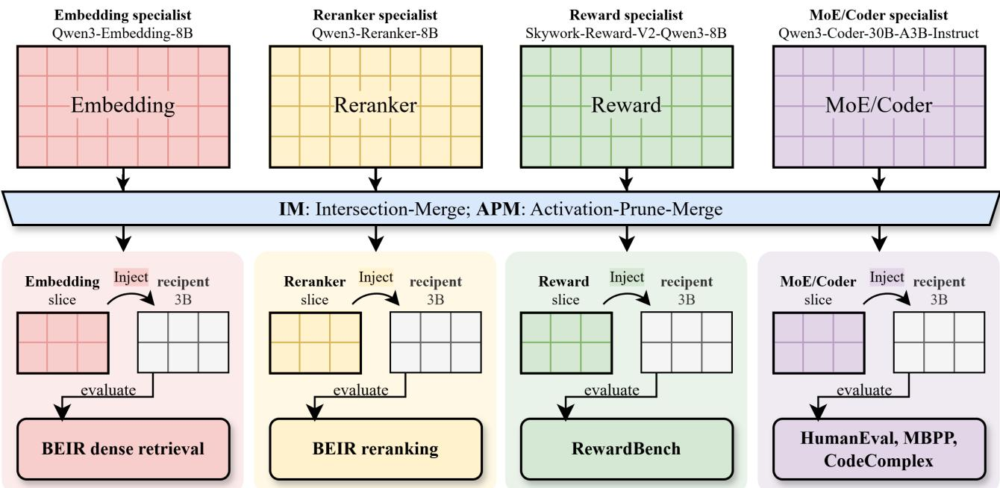

# EXPLORING HETEROGENEOUS MODEL MERGING APPROACH FOR COMPLEX KNOWLEDGE TRANSFER

Jiahe Fan, Si Chen, Yinghao Hou, Wenbo Xia, Ke Xu, Hong Xie, and Enhong Chen

University of Science and Technology of China First author email: fanjiahe@mail.ustc.edu.cn

## ABSTRACT

Specialized models encode task-oriented behavior, but transferring that behavior to a general language model usually requires training, distillation, or representation alignment. We study whether such ability can instead be transferred directly at the parameter level. We apply two existing trainingfree heterogeneous merging methods, previously shown to transfer knowledge between general language models, to specialist-to-general transfer, projecting a specialist donor into the recipient’s shape and interpolating backbone parameters without gradient updates or semantic alignment. Intersection-Merge (IM) injects a prefix-aligned donor slice matching the recipient shape, while Activate-Prune-Merge (APM) uses forward-pass activation statistics to select which donor dimensions to retain before injection. Across embedding, reranking, reward modeling, and MoE code-specialist transfer, both methods improve the general recipient, showing that simple heterogeneous merging can move capabilities across diverse specialist roles.

Index Terms— heterogeneous model merging, large language models, embedding, reranking, reward modeling, mixture of experts

## 1. INTRODUCTION

Task-specialized models serve distinct roles: embedding models learn representations for retrieval, rerankers estimate query–document relevance, reward models score response preferences, and code specialists target program synthesis rather than general next-token prediction [1, 2, 3, 4, 5, 6]. When a specialist is too large for the intended deployment budget, its behavior is usually transferred through supervised fine-tuning or knowledge distillation [7, 8]. These routes require optimization and, often, examples that connect teacher outputs to student inputs. Model merging offers a different mechanism: capabilities are manipulated in parameter space, often without additional inference cost [9, 10, 11, 12]. Many merging methods assume homologous architectures or task models derived from a common initialization. Heterogeneous merging relaxes this assumption [13, 14] and opens a path for specialist-to-general, large-to-small transfer across distinct model roles. We ask whether embedding, reranking, reward, and code-specialist donors can improve a general language model on their corresponding tasks through direct heterogeneous parameter injection, without training or semantic alignment. We test this using Qwen3 embedding and reranking specialists, Skywork-Reward-V2-Qwen3-8B, and the MoE Qwen3-Coder-30B-A3B-Instruct as donors, with Qwen2.5-3B as recipient [6, 15, 5]. We study two projection rules. IM, introduced by Fan et al. [16], crops the donor to the recipient’s tensor shapes and injects it with a small donor weight. APM, subsequently introduced by Fan et al. [17], extends IM by locating knowledge-carrying donor structures rather than training on activations. We test this transfer on BEIR, RewardBench, and code benchmarks. The contributions are threefold. First, we cast specialist-to-general transfer as heterogeneous merging across mismatched functions, not only scale. Second, training-free IM and APM, previously shown between general language models, carry embedding, reranking, reward, and code behavior into one general recipient without semantic alignment. Third, noise controls show that the gains follow donor structure: prefix cropping misses sparsely routed code experts, while activation-guided selection retains them. Figure 1 summarizes the four specialist-togeneral transfer settings.

## 2. RELATED WORK

## 2.1. Model Merging and Heterogeneous Transfer

Weight averaging, task arithmetic, interference-aware merging, and parameter dropping combine homologous models without joint training [9, 10, 11, 12]. A shared architecture leaves these methods with limited guidance once size or computational structure changes. Distillation and FuseLLM can cross architectures, but only through optimization and data, so they give up training-free merging [7, 8, 18]. Permutation alignment, ZipIt, and HM3 remain training-free, yet they still assume one architecture, are shown mainly below a billion parameters, and depend on unit or feature alignment [14, 19, 13, 20]. AdaMMS adds an explicit parameter mapping and coefficient search, and each merged pair stays within one model family [21]. IM and APM avoid both training and semantic alignment, but only for general causal language models that differ in scale [16, 17]. Here the donors are embedding, reranker, reward, and sparse MoE-coder specialists, the recipient is fixed as Qwen2.5-3B, and success is measured on each specialist’s native task.

  
Fig. 1. Overview of heterogeneous specialist-to-general transfer. Task-specialized embedding, reranker, reward, and MoE/Coder donors are projected into the common Qwen2.5-3B recipient through the training-free IM/APM parameter-injection framework. Each transferred model is evaluated on its corresponding task: BEIR reranking, BEIR dense retrieval, Reward-Bench, or code benchmarks.

## 2.2. Pruning and Knowledge Transfer

One-shot and structured pruning identify parameters or structures that can be removed while retaining behavior [22, 23, 24]. Activation-aware criteria motivate using observed internal responses rather than coordinates alone. Activationguided pruning further selects donor structures before injection [17]. APM uses activation statistics to select coordinates while keeping the recipient frozen and avoiding representation matching.

## 2.3. Specialist Model Roles

Dense encoders learn vector spaces for efficient retrieval [1, 2, 25, 26, 27], while rankers score query–document relevance directly [3, 4]. Reward models instead score response preferences, and code specialists target program synthesis. Qwen3 supplies related embedding and reranking specialists [28]. We study whether task bias from these distinct roles survives heterogeneous projection, including projection from a sparse MoE code donor into a dense recipient.

## 3. METHOD

Let a specialist donor have parameters $\theta _ { D }$ and a general recipient have parameters $\theta _ { R }$ . For a projection rule $P$ and injection ratio α, IM and APM inject projected backbone tensors as

$$
\theta _ { R } ^ { \prime } ( k ) = \left\{ \begin{array} { l l } { ( 1 - \alpha ) \theta _ { R } ( k ) + \alpha P ( \theta _ { D } ) ( k ) , } & { k \in K _ { P } , } \\ { \theta _ { R } ( k ) , } & { \mathrm { o t h e r w i s e } , } \end{array} \right.\tag{1}
$$

where $\ = \kappa _ { \ / P }$ denotes projected Transformer-backbone tensors; token embeddings and the language-model head are kept from the recipient.

## 3.1. Intersection-Merge

IM provides the coordinate-based baseline. For every selected donor tensor and its recipient counterpart, it copies the prefix intersection along each dimension into a recipient-shaped shell. Layers outside the recipient depth and coordinates outside the recipient width are discarded. The projected layer, attention, MLP, and normalization tensors are then injected using Eq. (1). This deterministic operation requires neither calibration data nor gradients, but its coordinate choice is agnostic to donor activity. On every axis the retained block is the leading index range, so recipient layer ℓ and channel j take donor coordinates $( \ell , j )$ when both exist. No permutation is applied, so a specialist coordinate that lies outside this prefix is never injected.

## 3.2. Activation-Guided Pruning

APM runs the frozen donor on calibration sequences and ranks coordinates by mean absolute activation. Hidden channels are selected once, and MLP neurons separately in each retained layer:

$$
\begin{array} { r } { \mathcal { T } _ { d } = \mathrm { T o p K } ( S _ { \mathrm { h i d d e n } } , d _ { s } ) , \quad \mathcal { T } _ { m } ^ { ( \ell ) } = \mathrm { T o p K } ( S _ { \mathrm { m l p } } ^ { ( \ell ) } , m _ { s } ) , } \end{array}\tag{2}
$$

where $d _ { s }$ and $m _ { s }$ match the recipient widths. Query and key– value heads are chosen the same way, summing scores inside each grouped-query group, and every index set is sorted to preserve donor order. With the retained layers, these indices form $\boldsymbol { S } _ { D }$ and extract a recipient-shaped slice for Eq. (1):

$$
P ( \theta _ { D } ) = \mathcal { P } _ { D } ( \theta _ { D } ; S _ { D } , \mathcal { A } _ { s } ) ,\tag{3}
$$

with $A _ { s }$ the recipient shape. Coupled axes stay together, and the activations never enter a parameter update.

## 3.3. Specialist-to-General Transfer

The projection-and-injection framework is evaluated across four specialist roles. The reranking and embedding lines use Qwen3-Reranker-8B and Qwen3-Embedding-8B and retain their retrieval evaluations. The reward line uses Skywork-Reward-V2-Qwen3-8B and evaluates pairwise preference scoring. The code line transfers from the sparse MoE Qwen3- Coder-30B-A3B-Instruct and evaluates code generation.

## 4. EXPERIMENTAL SETUP

## 4.1. Models

The recipient is the 3.09B-parameter, 36-layer Qwen2.5-3B [15]. Retrieval donors are Qwen3-Reranker-8B and Qwen3- Embedding-8B [28, 6]; the other donors are Skywork-Reward-V2-Qwen3-8B [5] and the sparse MoE Qwen3- Coder-30B-A3B-Instruct [6].

## 4.2. Benchmarks

We evaluate retrieval on 11 BEIR datasets [29]: ArguAna, CQADupStack, DBPedia-Entity, FiQA, HotpotQA, NFCorpus, NQ, Quora, SciFact, TREC-COVID, and Touche-2020.

## 4.3. Evaluation Protocol

Retrieval uses NDCG@10. Reranking scores TF–IDF candidates via yes/no log probabilities; embedding applies weighted-mean pooling with L2 normalization. Reward-Bench reports category accuracies and order diagnostics [30]; on code tasks we report accuracy on HumanEval [31], MBPP [32], and CodeComplex [33]. APM activation examples are used only to locate knowledge-carrying coordinates, never to train, and are strictly disjoint from the test sets.

Table 1. Reranker NDCG@10 (%). Donor: Qwen3- Reranker-8B. (a) Locked. (b) Per-dataset oracle envelope. (a) Locked checkpoint
<table><tr><td>Dataset</td><td>3B</td><td>IM</td><td>APM</td><td>Noise</td></tr><tr><td>ArguAna</td><td>7.14</td><td>(+3)10.08</td><td>7.06</td><td>7.24</td></tr><tr><td>CQADupStack</td><td>2.92</td><td>2.86</td><td>3.19</td><td>2.70</td></tr><tr><td>DBPedia-Entity</td><td>12.90</td><td>(+1)14.30</td><td>13.66</td><td>12.75</td></tr><tr><td>FiQA</td><td>4.80</td><td>5.62</td><td>5.06</td><td>4.60</td></tr><tr><td>HotpotQA</td><td>8.93</td><td>(+6)14.89</td><td>9.24</td><td>7.63</td></tr><tr><td>NFCorpus</td><td>8.40</td><td>(+2)10.22</td><td>8.44</td><td>10.08</td></tr><tr><td>NQ</td><td>2.78</td><td>(+8)10.41</td><td>3.70</td><td>2.79</td></tr><tr><td>Quora</td><td>41.49</td><td>27.13</td><td>41.01</td><td>40.51</td></tr><tr><td>SciFact</td><td>23.15</td><td>19.52</td><td>(+2)25.49</td><td>23.28</td></tr><tr><td>TREC-COVID</td><td>27.62</td><td>(+17)44.95</td><td>(+11)39.10</td><td>36.10</td></tr><tr><td>Touche-2020</td><td>11.10</td><td>4.20</td><td>10.94</td><td>12.05</td></tr><tr><td>Avg.</td><td>13.75</td><td>(+1)14.92</td><td>(+1)15.17</td><td>14.52</td></tr></table>

<table><tr><td>Dataset</td><td>3B</td><td>IM</td><td>APM</td><td>Noise</td></tr><tr><td>ArguAna</td><td>7.14</td><td>(+6)13.11</td><td>(+6)12.87</td><td>7.68</td></tr><tr><td>CQADupStack</td><td>2.92</td><td>3.17</td><td>3.56</td><td>2.87</td></tr><tr><td>DBPedia-Entity</td><td>12.90</td><td>(+1)14.30</td><td>13.77</td><td>12.75</td></tr><tr><td>FiQA</td><td>4.80</td><td>5.62</td><td>5.06</td><td>4.96</td></tr><tr><td>HotpotQA</td><td>8.93</td><td>(+6)14.89</td><td>(+10)18.86</td><td>8.33</td></tr><tr><td>NFCorpus</td><td>8.40</td><td>(+2)10.24</td><td>9.26</td><td>10.40</td></tr><tr><td>NQ</td><td>2.78</td><td>(+8)10.41</td><td>(+7)9.64</td><td>2.94</td></tr><tr><td>Quora</td><td>41.49</td><td>(+2)43.88</td><td>(+2)43.34</td><td>41.74</td></tr><tr><td>SciFact</td><td>23.15</td><td>(+4)26.84</td><td>(+5)28.35</td><td>23.64</td></tr><tr><td>TREC-COVID</td><td>27.62</td><td>(+17)44.95</td><td>(+23)50.86</td><td>38.29</td></tr><tr><td>Touche-2020</td><td>11.10</td><td>10.54</td><td>11.50</td><td>13.95</td></tr><tr><td>Avg.</td><td>13.75</td><td>(+4)18.00</td><td>(+5)18.82</td><td>15.23</td></tr></table>

## 4.4. IM/APM Search Spaces

We sweep $\alpha \in \{ 0 . 0 0 5 , 0 . 0 1 0 , 0 . 0 1 5 , 0 . 0 2 0 , 0 . 0 2 5 \}$ for IM, APM, and Noise. Main tables report one locked checkpoint (Avg.). Env. is the envelope mean; the reranker per-dataset envelope is in Table 1(b). RewardBench is a single set. Full per-dataset and per-benchmark envelopes are reported in Appendix A.

## 5. RESULTS

## 5.1. Reranker Results

Average NDCG@10 rises from 13.75% to 14.92% (IM) and 15.17% (APM). The largest gains are TREC-COVID (27.62 to 44.95 / 39.10), NQ (2.78 to 10.41, IM), and HotpotQA (8.93 to 14.89, IM). The envelope lifts the mean to 18.00% and 18.82%, and TREC-COVID to 50.86 under APM.

Table 2. Embedding NDCG@10 (%). Donor: Qwen3- Embedding-8B. Avg.: locked mean. Env.: envelope mean.
<table><tr><td>Dataset</td><td>3B</td><td>IM</td><td>APM</td><td>Noise</td></tr><tr><td>ArguAna</td><td>21.82</td><td>22.71</td><td>(+1)23.00</td><td>22.38</td></tr><tr><td>CQADupStack</td><td>4.24</td><td>4.36</td><td>4.61</td><td>4.25</td></tr><tr><td>DBPedia-Entity</td><td>0.57</td><td>0.69</td><td>0.82</td><td>0.62</td></tr><tr><td>FiQA</td><td>4.11</td><td>3.61</td><td>3.76</td><td>4.12</td></tr><tr><td>HotpotQA</td><td>2.62</td><td>2.94</td><td>2.80</td><td>2.65</td></tr><tr><td>NFCorpus</td><td>1.91</td><td>1.63</td><td>1.78</td><td>1.90</td></tr><tr><td>NQ</td><td>0.42</td><td>0.41</td><td>0.36</td><td>0.40</td></tr><tr><td>Quora</td><td>54.51</td><td>54.42</td><td>55.36</td><td>54.69</td></tr><tr><td>SciFact</td><td>23.28</td><td>(+2)25.60</td><td>(+3)26.64</td><td>24.24</td></tr><tr><td>TREC-COVID</td><td>12.63</td><td>(+2)14.20</td><td>13.30</td><td>12.62</td></tr><tr><td>Touche-2020</td><td>1.63</td><td>2.10</td><td>1.85</td><td>1.69</td></tr><tr><td>Avg.</td><td>11.61</td><td>12.06</td><td>12.21</td><td>11.78</td></tr><tr><td>Env.</td><td>11.61</td><td>12.22</td><td>(+1)12.77</td><td>11.95</td></tr></table>

Table 3. Reward-model results (%). Donor: Skywork-Reward-V2-Qwen3-8B; 3B recipient. RewardBench is a single benchmark.  
(a) Performance metrics
<table><tr><td>Metric</td><td>3B</td><td>IM</td><td>APM</td><td>Noise</td></tr><tr><td>Overall</td><td>76.83</td><td>77.41</td><td>77.41</td><td>76.25</td></tr><tr><td>Chat</td><td>63.80</td><td>(+5)68.71</td><td>(+2)66.26</td><td>69.33</td></tr><tr><td>Chat Hard</td><td>52.77</td><td>(+2)54.55</td><td>(+1)53.88</td><td>52.11</td></tr><tr><td>Reasoning</td><td>89.78</td><td>89.48</td><td>90.38</td><td>88.66</td></tr><tr><td>Safety</td><td>70.16</td><td>70.62</td><td>69.84</td><td>69.22</td></tr></table>

(b) Order-related metrics
<table><tr><td>Metric</td><td>3B</td><td>IM</td><td>APM</td><td>Noise</td></tr><tr><td>Original order</td><td>60.00</td><td>57.37</td><td>60.12</td><td>50.17</td></tr><tr><td>Swapped order</td><td>64.10</td><td>(+3)66.85</td><td>63.83</td><td>72.88</td></tr><tr><td>Order gap</td><td>4.10</td><td>9.48</td><td>3.71</td><td>22.71</td></tr><tr><td>Order consistency</td><td>33.58</td><td>33.69</td><td>33.58</td><td>30.72</td></tr></table>

## 5.2. Embedding Results

Average NDCG@10 rises from 11.61% to 12.06% (IM) and 12.21% (APM), led by SciFact (23.28 to 26.64, APM) and TREC-COVID (12.63 to 14.20, IM).

## 5.3. Reward and MoE/Coder Results

On RewardBench, Overall rises from 76.83% to 77.41% (Table 3), with the larger category gain on Chat (63.80 to 68.71, IM). APM also keeps a smaller order gap (3.71% vs. 9.48%). On MoE/Coder transfer, APM raises the mean from 58.61% to 60.18%, led by CodeComplex (36.12 to 38.76) and HumanEval (80.49 to 81.71).

Table 4. MoE/Coder results (%). Donor: Qwen3-Coder-30B-A3B-Instruct. Avg.: locked mean. Env.: envelope mean.
<table><tr><td>Benchmark</td><td>3B</td><td>IM</td><td>APM</td><td>Noise</td></tr><tr><td>HumanEval</td><td>80.49</td><td>80.49</td><td>(+1)81.71</td><td>78.05</td></tr><tr><td>MBPP</td><td>59.21</td><td>59.65</td><td>60.09</td><td>59.65</td></tr><tr><td>CodeComplex</td><td>36.12</td><td>33.73</td><td>(+3)38.76</td><td>34.93</td></tr><tr><td>Avg.</td><td>58.61</td><td>57.96</td><td>(+2)60.18</td><td>57.54</td></tr><tr><td>Env.</td><td>58.61</td><td>58.75</td><td>(+3)61.12</td><td>58.15</td></tr></table>

## 5.4. Ablation Against Gaussian Noise

To test whether improvements arise from donor structure rather than perturbation alone, we inject Gaussian noise into the same recipient tensors using the same five ratios. Noise remains below locked APM on average retrieval: 14.52% versus 15.17% for reranking and 11.78% versus 12.21% for embedding. In RewardBench, noise reaches 76.25% Overall, below IM and APM (both 77.41%), with a larger order gap (22.71%). The code control is also below APM on HumanEval (78.05% versus 81.71%), MBPP (59.65% versus 60.09%), and CodeComplex (34.93% versus 38.76%). These results suggest that the strongest gains are not explained by arbitrary perturbations alone, although noise can occasionally help on individual datasets.

## 6. ANALYSIS

Related Qwen backbones appear to retain compatible lowlevel structure, so small α can inject specialist bias without overwriting the recipient. IM and APM are simple heterogeneous merging strategies rather than one shared checkpoint: the preferred α varies across tasks and datasets, a seesaw effect that is well documented for linear merging [10]. A fivepoint α grid is therefore enough to expose their potential; the embedding and MoE envelope means are reported in Tables 2 and 4. APM’s activation-guided selection helps reranking, embedding, and code, while IM remains competitive for reward and some reranking settings. Locked IM on the MoE coder is slightly below the recipient (57.96 vs. 58.61), because prefix cropping misses routed experts while APM retains them.

## 7. CONCLUSION

IM and APM enable training-free specialist transfer without semantic alignment. Across BEIR, reward, and code tasks, APM improves the recipient; IM improves retrieval and reward, matches APM on reward Overall, and is complementary on reranking. These results support training-free transfer across specialist roles.

## Acknowledgment

Supported by the CAS Strategic Priority Research Program (LLM Mutual Learning Mechanisms and Methods). This support enabled the study of training-free transfer from specialist donors into one general language model. We thank the maintainers of the public models and benchmarks used in the experiments.

## A. ORACLE ENVELOPES

Each IM, APM, and Noise score below is the best value on the same five-ratio grid α ∈ {0.005, 0.010, 0.015, 0.020, 0.025} used in the main paper. APM further varies activation position. These tables are not a single deployable checkpoint.

Table 5. Reranker NDCG@10 (%). Donor: Qwen3- Reranker-8B. Per-dataset best α on a 5-point grid (oracle envelope).
<table><tr><td>Dataset</td><td>3B</td><td>IM</td><td>APM</td><td>Noise</td></tr><tr><td>ArguAna</td><td>7.14</td><td>(+6)13.11</td><td>(+6)12.87</td><td>7.68</td></tr><tr><td>CQADupStack</td><td>2.92</td><td>3.17</td><td>3.56</td><td>2.87</td></tr><tr><td>DBPedia-Entity</td><td>12.90</td><td>(+1)14.30</td><td>13.77</td><td>12.75</td></tr><tr><td>FiQA</td><td>4.80</td><td>5.62</td><td>5.06</td><td>4.96</td></tr><tr><td>HotpotQA</td><td>8.93</td><td>(+6)14.89</td><td>(+10)18.86</td><td>8.33</td></tr><tr><td>NFCorpus</td><td>8.40</td><td>(+2)10.24</td><td>9.26</td><td>10.40</td></tr><tr><td>NQ</td><td>2.78</td><td>(+8)10.41</td><td>(+7)9.64</td><td>2.94</td></tr><tr><td>Quora</td><td>41.49</td><td>(+2)43.88</td><td>(+2)43.34</td><td>41.74</td></tr><tr><td>SciFact</td><td>23.15</td><td>(+4)26.84</td><td>(+5)28.35</td><td>23.64</td></tr><tr><td>TREC-COVID</td><td>27.62</td><td>(+17)44.95</td><td>(+23)50.86</td><td>38.29</td></tr><tr><td>Touche-2020</td><td>11.10</td><td>10.54</td><td>11.50</td><td>13.95</td></tr><tr><td>Avg.</td><td>13.75</td><td>(+4)18.00</td><td>(+5)18.82</td><td>15.23</td></tr></table>

Table 6. Embedding NDCG@10 (%). Donor: Qwen3- Embedding-8B. Per-dataset best α on a 5-point grid (oracle envelope).
<table><tr><td>Dataset</td><td>3B</td><td>IM</td><td>APM</td><td>Noise</td></tr><tr><td>ArguAna</td><td>21.82</td><td>(+1)23.05</td><td>(+2)23.33</td><td>22.38</td></tr><tr><td>CQADupStack</td><td>4.24</td><td>4.36</td><td>4.74</td><td>4.31</td></tr><tr><td>DBPedia-Entity</td><td>0.57</td><td>0.69</td><td>0.96</td><td>0.62</td></tr><tr><td>FiQA</td><td>4.11</td><td>4.22</td><td>4.57</td><td>4.24</td></tr><tr><td>HotpotQA</td><td>2.62</td><td>2.94</td><td>3.07</td><td>2.65</td></tr><tr><td>NFCorpus</td><td>1.91</td><td>2.03</td><td>(+1)3.22</td><td>1.95</td></tr><tr><td>NQ</td><td>0.42</td><td>0.47</td><td>0.51</td><td>0.40</td></tr><tr><td>Quora</td><td>54.51</td><td>54.66</td><td>(+1)55.53</td><td>54.69</td></tr><tr><td>SciFact</td><td>23.28</td><td>(+2)25.60</td><td>(+3)26.64</td><td>24.24</td></tr><tr><td>TREC-COVID</td><td>12.63</td><td>(+2)14.20</td><td>(+3)15.62</td><td>14.05</td></tr><tr><td>Touche-2020</td><td>1.63</td><td>2.20</td><td>2.29</td><td>1.91</td></tr><tr><td>Avg.</td><td>11.61</td><td>12.22</td><td>(+1)12.77</td><td>11.95</td></tr></table>

Table 7. MoE/Coder results (%). Donor: Qwen3-Coder-30B-A3B-Instruct. Per-benchmark best α (oracle envelope).
<table><tr><td>Benchmark</td><td>3B</td><td>IM</td><td>APM</td><td>Noise</td></tr><tr><td>HumanEval</td><td>80.49</td><td>80.49</td><td>(+2)82.93</td><td>79.88</td></tr><tr><td>MBPP</td><td>59.21</td><td>59.65</td><td>(+2)60.96</td><td>59.65</td></tr><tr><td>CodeComplex</td><td>36.12</td><td>36.12</td><td>(+3)39.47</td><td>34.93</td></tr><tr><td>Avg.</td><td>58.61</td><td>58.75</td><td>(+3)61.12</td><td>58.15</td></tr></table>

## 8. REFERENCES

[1] Nils Reimers and Iryna Gurevych, “Sentence-bert: Sentence embeddings using siamese bert-networks,” 2019, arXiv preprint.

[2] Vladimir Karpukhin, Barlas Oguz, Sewon Min, Patrick˘ Lewis, Ledell Wu, Sergey Edunov, Danqi Chen, and Wen-Tau Yih, “Dense passage retrieval for open-domain question answering,” 2020, arXiv preprint.

[3] Rodrigo Nogueira and Kyunghyun Cho, “Passage reranking with bert,” 2019, arXiv preprint.

[4] Rodrigo Nogueira, Zhiying Jiang, and Jimmy Lin, “Document ranking with a pretrained sequence-tosequence model,” 2020, arXiv preprint.

[5] Chris Yuhao Liu, Liang Zeng, Yuzhen Xiao, Jujie He, Jiacai Liu, Chaojie Wang, Rui Yan, Wei Shen, Fuxiang Zhang, Jiacheng Xu, Yang Liu, and Yahui Zhou, “Skywork-reward-v2: Scaling preference data curation via human-ai synergy,” 2025, arXiv preprint.

[6] An Yang, Anfeng Li, Baosong Yang, et al., “Qwen3 technical report,” 2025, arXiv preprint.

[7] Geoffrey Hinton, Oriol Vinyals, and Jeff Dean, “Distilling the knowledge in a neural network,” 2015, arXiv preprint.

[8] Wenhui Wang, Furu Wei, Li Dong, Hangbo Bao, Nan Yang, and Ming Zhou, “Minilm: Deep self-attention distillation for task-agnostic compression of pre-trained transformers,” 2020, arXiv preprint.

[9] Mitchell Wortsman, Gabriel Ilharco, Samir Yitzhak Gadre, Rebecca Roelofs, Raphael Gontijo-Lopes, Ari S. Morcos, Hongseok Namkoong, Ali Farhadi, Yair Carmon, Simon Kornblith, and Ludwig Schmidt, “Model soups: averaging weights of multiple fine-tuned models improves accuracy without increasing inference time,” 2022, arXiv preprint.

[10] Gabriel Ilharco, Marco Tulio Ribeiro, Mitchell Wortsman, Suchin Gururangan, Ludwig Schmidt, Hannaneh Hajishirzi, and Ali Farhadi, “Editing models with task arithmetic,” 2023, arXiv preprint.

[11] Prateek Yadav, Derek Tam, Leshem Choshen, Colin Raffel, and Mohit Bansal, “Ties-merging: Resolving interference when merging models,” 2023, arXiv preprint.

[12] Le Yu, Bowen Yu, Haiyang Yu, Fei Huang, and Yongbin Li, “Language models are super mario: Absorbing abilities from homologous models as a free lunch,” 2024, arXiv preprint.

[13] George Stoica, Daniel Bolya, Jakob Bjorner, Pratik Ramesh, Taylor Hearn, and Judy Hoffman, “Zipit! merging models from different tasks without training,” 2023, arXiv preprint.

[14] Samuel K. Ainsworth, Jonathan Hayase, and Siddhartha Srinivasa, “Git re-basin: Merging models modulo permutation symmetries,” 2023, arXiv preprint.

[15] Qwen Team, An Yang, Baosong Yang, et al., “Qwen2.5 technical report,” 2024, arXiv preprint.

[16] Jiahe Fan, Yinghao Hou, Si Chen, Aiyuan Zhang, Hong Xie, and Defu Lian, “Rethinking heterogeneous LLM merging: A weighted model averaging perspective,” 2026, arXiv preprint arXiv:2607.18026.

[17] Jiahe Fan, Si Chen, Yinghao Hou, Aiyuan Zhang, and Hong Xie, “Training-free knowledge transfer across model scales through activation-guided pruning,” 2026, arXiv preprint arXiv:2608.13596.

[18] Fanqi Wan, Xinting Huang, Deng Cai, Xiaojun Quan, Wei Bi, and Shuming Shi, “Knowledge fusion of large language models,” in International Conference on Learning Representations, 2024.

[19] Keller Jordan, Hanie Sedghi, Olga Saukh, Rahim Entezari, and Behnam Neyshabur, “REPAIR: Renormalizing permuted activations for interpolation repair,” in International Conference on Learning Representations, 2023.

[20] Stefan Hackmann, “HM3: Heterogeneous multiclass model merging,” 2024, arXiv preprint arXiv:2409.19173.

[21] Yiyang Du, Xiaochen Wang, Chi Chen, et al., “AdaMMS: Model merging for heterogeneous multimodal large language models with unsupervised coefficient optimization,” 2025, arXiv preprint arXiv:2503.23733.

[22] Elias Frantar and Dan Alistarh, “Sparsegpt: Massive language models can be accurately pruned in one-shot,” 2023, arXiv preprint.

[23] Mingjie Sun, Zhuang Liu, Anna Bair, and J. Zico Kolter, “A simple and effective pruning approach for large language models,” 2024, arXiv preprint.

[24] Xinyin Ma, Gongfan Fang, and Xinchao Wang, “Llmpruner: On the structural pruning of large language models,” 2023, arXiv preprint.

[25] Gautier Izacard, Mathilde Caron, Lucas Hosseini, Sebastian Riedel, Piotr Bojanowski, Armand Joulin, and Edouard Grave, “Unsupervised dense information retrieval with contrastive learning,” 2022, arXiv preprint.

[26] Liang Wang, Nan Yang, Xiaolong Huang, Binxing Jiao, Linjun Yang, Daxin Jiang, Rangan Majumder, and Furu Wei, “Text embeddings by weakly-supervised contrastive pre-training,” 2022, arXiv preprint.

[27] Niklas Muennighoff, “Sgpt: Gpt sentence embeddings for semantic search,” 2022, arXiv preprint.

[28] Yanzhao Zhang, Mingxin Li, Dingkun Long, Xin Zhang, Huan Lin, Baosong Yang, Pengjun Xie, An Yang, Dayiheng Liu, Junyang Lin, Fei Huang, and Jingren Zhou, “Qwen3 embedding: Advancing text embedding and reranking through foundation models,” 2025, arXiv preprint.

[29] Nandan Thakur, Nils Reimers, Andreas Ruckl¨ e, Ab-´ hishek Srivastava, and Iryna Gurevych, “Beir: A heterogeneous benchmark for zero-shot evaluation of information retrieval models,” 2021, arXiv preprint.

[30] Nathan Lambert, Valentina Pyatkin, Jacob Morrison, LJ Miranda, Bill Yuchen Lin, Khyathi Chandu, Nouha Dziri, Sachin Kumar, Tom Zick, Yejin Choi, Noah A. Smith, and Hannaneh Hajishirzi, “Rewardbench: Evaluating reward models for language modeling,” in Findings of the Association for Computational Linguistics: NAACL 2025, 2025, pp. 1755–1797.

[31] Jiawei Liu, Chunqiu Steven Xia, Yuyao Wang, and Lingming Zhang, “Is your code generated by chatgpt really correct? rigorous evaluation of large language models for code generation,” in Advances in Neural Information Processing Systems, 2023.

[32] Jacob Austin, Augustus Odena, Maxwell Nye, Maarten Bosma, Henryk Michalewski, David Dohan, Ellen Jiang, Carrie Cai, Michael Terry, Quoc V. Le, and Charles Sutton, “Program synthesis with large language models,” in arXiv preprint arXiv:2108.07732, 2021.

[33] SeungYeop Baik, Joonghyuk Hahn, Jungin Kim, Aditi, Mingi Jeon, Yo-Sub Han, and Sang-Ki Ko, “CodeComplex: Dataset for worst-case time complexity prediction,” in Findings of the Association for Computational Linguistics: EMNLP 2025, 2025, pp. 19616–19638.