# Efficient Active Auditing of Multi-Group Fairness with Bias Probes

Ayoub Ajarra, Debabrota Basu

Équipe Scool, Univ. Lille, Inria, CNRS, Centrale Lille, UMR 9189- CRIStAL ayoub.ajarra@inria.fr

## Abstract

Over the past decade, Machine Learning (ML) has been trained under dual objectives: minimizing prediction error via Empirical Risk Minimization (ERM) while controlling unfairness bias. In practice, however, fairness-aware training often yields limited improvements over standard ERM, making reliable post hoc auditing essential. Existing auditing approaches for black-box models either rely on model reconstruction -exposing systems to extraction attacksor directly estimate fairness metrics, offering limited insight into which regions of the data distribution drive bias. More fundamentally, property-specific auditing -aimed at extracting only targeted fairness information without reconstructing the model– remains poorly understood. In this work, we introduce the bias probe framework, which enables targeted and adaptive querying to reveal bias structure while preserving model confidentiality. Building on this framework, we propose ALeBi, an active auditor that learns such probes to efficiently estimate multi-group fairness metrics. We establish novel sample complexity guarantees governed by a property-specific complexity measure, resolving a previously posed open question, and extend our analysis to adversarial settings where the model owner may strategically obscure bias. Our results uncover a fundamental trade-off between model confidentiality and reliable auditing, and show that property-specific probing enables both accurate estimation and interpretable identification of high and low-bias regions. Extensive experiments support our theoretical findings and demonstrate the practical effectiveness of our approach.

## Contents

1 Introduction 3   
1.1 Related Work . 5   
1.2 Summary of contributions 6   
2 Problem Formulation: Auditing Multi-group Fairness 7   
2.1 Audit via Model Reconstruction 8   
2.2 Audit via Direct Estimation 10   
3 Interpretable, Manipulation-Proof and Reconstruction-Free Audits with Bias   
Probes 11   
3.1 Interpretable Audits via Bias Probes 14   
3.2 Information Complexities For Learning Probes 16   
3.3 Information-Theoretic Separation of Reconstruction and Probe Auditing 17   
3.4 Manipulation-free Regime 17   
3.4.1 Hardness Results on Sample Complexity and Model Extraction 18   
3.4.2 Hardness of Model Extraction Attacks 18   
3.4.3 Algorithm Design: k-ALEBı and Upper Bounds 20   
3.5 Fairness-aware Adversarial Regime . 21   
3.5.1 Adaptive Fairness-aware Adversary: Algorithm and Upper Bounds 21   
3.5.2 Global Information-theoretic Hardness 23   
4 Experimental Analysis 24   
4.1 Accuracy 25   
4.2 Interpretability 25   
4.3 Protection Against Model Extraction Attacks 27   
4.4 Robustness against Fairness-Aware Adversaries 28   
5 Conclusion 29   
A Extended Framework Description 34   
A.1 General Framework for Property Specific Audits 34   
A.2 Information-theoretic and combinatorial separation between active learning and ac  
tive auditing in the presence of protected groups 34   
A.3 Examples of relative dual classes and their star numbers from known hypothesis classes 36   
A.4 Mutli-star number of multi-context class relative to linear classifiers 37   
B Protection against Model Extraction 42   
Proofs for Manipulation-free Regime 43   
C.1 Lower Bound on Sample Complexity 43   
C.2 Proof of ALEBr Upper Bounds 46   
D Proofs for Fairness-aware Manipulation Regime 53   
E Auxiliary Definitions and Lemmas 57   
F Additional Experiments Results and Details 57   
F.1 Fairness-aware Adversarial Regime 57   
F.2 Auditors Baselines 58

## 1 Introduction

Assessing ML models has become increasingly critical, as mounting evidence shows that deployed systems may exhibit harmful biases across a wide range of domains, including medical imaging (Seyyed-Kalantari et al., 2021; Daneshjou et al., 2022; Vrudhula et al., 2024; Banerjee et al., 2021), hiring and job screening (Harwell, 2022; Wilson and Caliskan, 2024), credit lending (Garcia et al. 2024), and online platforms (Biswas and Rajan, 2020). Among these concerns, discriminatory bias has received particular attention, giving rise to the field of algorithmic fairness (Barocas and Selbst, 2016; Hardt et al., 2016). A central line of work focuses on designing fair learning procedures, where fairness constraints are incorporated directly into the training process, typically as optimization constraints trading off predictive accuracy and fairness guarantees (Zafar et al., 2017; Agarwal et al., 2018). However, empirical evidence suggests that such approaches may yield limited improvements over standard ERM in practice (Zong et al., 2022).

These limitations, combined with increasing regulatory pressure, have shifted attention toward post-deployment auditing. In the United States, regulations such as New York City's Local Law 144 New York State Senate (2024) mandate bias audits of automated decision systems. In Europe, the Digital Services Act European Commission (2024a) and the AI Act European Commission (2024b); Ebers (2025) impose transparency, risk management, and auditing requirements for largescale and high-risk ML systems in online platforms. These developments reflect a broader shift, where auditing is becoming a central requirement for deploying ML systems in high-stakes settings. In this post-deployment regime, the model is typically treated as a black box. An external auditor seeks to assess the model's behavior without access to its internal structure, interacting with the model owner through queries. This setting introduces a fundamental tension: the auditor aims to extract sufficient information to reliably evaluate fairness, while the model owner may wish to limit disclosure in order to protect model's sensitive information.

A large body of work has studied fairness auditing under this paradigm. Existing approaches typically fall into two categories. The first relies on model reconstruction, using tools from active learning (Angluin, 1988; Balcan et al., 2012) to learn the model -or an accurate surrogate— before estimating fairness metrics. The second relies on direct estimation of a difference of means, using labeled samples. However, both approaches exceed the auditing objective: reconstruction attempts to recover the full model, while direct estimation is as costly as replicating the learning process and do not produce explanations, making it impractical in realistic auditing scenarios. Moreover, reconstruction-based approaches may expose the model to extraction attacks, compromising confidentiality. This tension raises the following question:

Q1: Can we obtain distribution-free guaranties for fairness auditing that avoid both

full model reconstruction and large-scale labeled data requirements?

Beyond estimation, interpretability is also a critical component of auditing. In the context of machine learning regulation, Article 86 of the AI Act European Commission (2024b) underscores the right to explanation in automated decision-making. For example, an individual denied a bank loan by an ML system is entitled to receive an explanation for that decision. While standard audit methods provide quantitative summaries of bias (Goldreich et al., 1998; Yan and Zhang, 2022; Chugg et al., 2023), they do not yield interpretable representations of the model's discriminatory behavior. In parallel, the literature on representation learning has introduced probes as simple functions used to extract specific properties from learned representations (Alain and Bengio, 2016) Inspired by this perspective, we introduce bias probes - structured comparison functionals that capture relational disparities between protected groups. Unlike feature attribution methods, which operate at the level of individual inputs, bias probes focus on intergroup comparisons and provide an interpretable summary of discriminatory behavior. To the best of our knowledge, this is the first work to formalize fairness auditing with explicit interpretability guarantees in this sense.

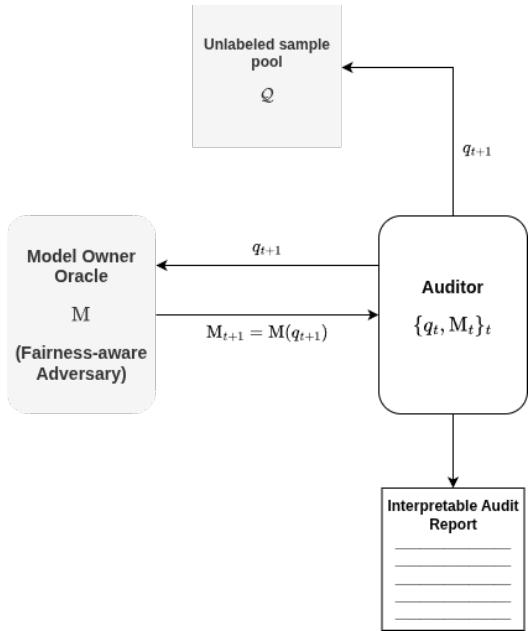  
Figure 1: Interactive fairness auditing against a fairness-aware adversary.

Finally, we must account for the security of the auditing process. Existing auditing methods, particularly those that rely on membership queries (Yan and Zhang, 2022), may render the model vulnerable to extraction attacks, effectively reducing auditing to model reconstruction. This highlights a second fundamental challenge: ensuring that auditing procedures do not compromise model confidentiality. This leads to our second question:

Q2: Can we design sample-efficient and interpretable auditing procedures while preserving model confidentiality against extraction attacks?

Beyond the accuracy and interpretability of the audit report, we further extend our setting by considering a model owner who may behave adversarially, with the goal of concealing unfairness across groups. The adversarial behavior we consider differs from the adversarial models commonly studied in the literature, such as Huber contamination models Chen et al. (2016), adversarial distribution shifts Croce et al. (2020), or adversarial input perturbations Montasser et al. (2021); Goodfellow et al. (2018). In these settings, the adversary typically manipulates the data or the input distribution, whereas our adversary is fairness-aware: the model owner may strategically manipulate the model's behavior to make unfairness harder to detect by the auditor

This leads to our second research question:

Q3: How can we design fairness auditors that are accurate and interpretable while remaining robust to fairness-aware adversaries?

In Figure 1, the auditor is given the task to audit a property of interest $\mu ,$ has access to a pool of unlabeled instances Q sampled from the marginal input distribution, providing information about the regions of the input space relevant to the audit. The auditor then selectively queries the model owner with samples that are informative with respect to $\mu .$ At round $t + 1$ , the auditor constructs a query $q _ { t + 1 }$ and sends it to the model owner M, who returns a response $\mathbf { M } _ { t + 1 } = \mathbf { M } ( q _ { t + 1 } )$

We assume a powerful, fairness-aware adversary that may strategically alter its responses to conceal disparities across groups. Based on the history $\left\{ ( q _ { 1 } , \mathbf { M } _ { 1 } ) , \ldots , ( q _ { t + 1 } , \mathbf { M } _ { t + 1 } ) \right\}$ , the auditor produces an estimate $\hat { \mu } _ { t + 1 }$ of the property under audit, together with regions of the input space in which the model exhibits larger fairness disparities.

In this work, we address these challenges in the setting of multi-group fairness. We consider an interactive auditing framework in which an auditor queries a black-box model through carefully designed inputs drawn from a pool of unlabeled data. Our approach focuses on learning comparison functionals that capture the model's discriminative behavior across protected groups, rather than reconstructing the model itself. This perspective enables both statistical efficiency and interpretability while inherently limiting the information exposed to the auditor, thereby protecting the model owner from reconstruction attacks.

## 1.1 Related Work

Fairness Auditing. Algorithmic fairness has been widely studied from both the learning and auditing perspectives. A large body of work focuses on learning fair models via constrained optimization or reduction-based approaches (Zafar et al., 2017; Agarwal et al., 2018). In addition, post hoc audit methods aim to assess the fairness properties of a model deployed under limited access (Kearns et al., 2018; Yan and Zhang, 2022; Chugg et al., 2023). Recent works have proposed active auditing strategies for estimating fairness metrics under distributional assumptions (Yan and Zhang, 2022). These approaches often reduce auditing to model reconstruction within a hypothesis class, leading to guarantees that scale with the complexity of learning. Other related works propose frameworks, where bias audit reduces to a binary objective via testing approaches (Chugg et al., 2023; Goldreich et al., 1998). In contrast, our work treats fairness auditing as a property estimation problem, focusing on the intrinsic combinatorial structure of intergroup comparisons rather than recovering the full model.

Interpretability and Probing Methods. Post hoc interpretability methods, including feature attribution techniques (Ribeiro et al., 2016; Lundberg and Lee, 2017) and counterfactual explanations (Kusner et al., 2017), aim to provide descriptive summaries of model behavior. In parallel, probing methods have been developed in representation learning to extract specific properties from learned representations using simple models (Vafa et al., 2025; Alain and Bengio, 2016) or alternatively explaining biases in Large Language Models Immer et al. (2022); Morehouse et al. (2025); Guo et al. (2022); Manerba et al. (2024). Our notion of bias probes is conceptually related but differs in both objective and scope. Rather than analyzing internal representations, bias probes capture relational disparities between protected groups and are directly tied to fairness properties. Moreover, our probes are equipped with statistical guarantees, bridging interpretability and rigorous auditing.

Active Learning and Disagreement-Based Complexity. Disagreement-based active learning characterizes label complexity through geometric and combinatorial quantities such as the disagreement coefficient in distribution-dependent settings (Balcan et al., 2006; Dasgupta et al., 2007) and the star number in distribution-free regimes (Hanneke, 2014; Hanneke and Yang, 2015). These parameters capture the ability of a hypothesis class to isolate individual instances via localized perturbations around a reference hypothesis. Our analysis is inspired by this framework but departs from it in a fundamental way. In classical active learning, disagreement regions are subsets of the instance space. In contrast, the auditing setting we consider induces disagreement over cross-group tuples, leading to a multipartite geometry rather than a pointwise one. To capture this structure, we introduce the intergroup star number, which extends the classical notion of star number to relational settings between sub-populations. This quantity measures the capacity of a comparison class to isolate cross-group configurations, and serves as the key complexity parameter governing sample efficiency in our setting.

Preference Learning. Preference learning is closely related to our setting, as it also relies on pairwise comparisons. In its classical formulation, a collection of users provides pairwise preferences over a finite set of items, and the goal is to predict unseen preferences. Many approaches aim to estimate a score matrix of size (number of users) × (number of items), often under low-rank assumptions and solved via convex optimization Park et al. (2015). Several works consider active querying in this setting. For instance, Ailon (2012) studies adaptive pairwise comparisons over a finite set of items and returns a total order whose disagreement is competitive with the optimal ranking. However, their guarantees concern approximation to the best ranking with bounded query complexity, rather than uniform learning over a general function class. Similarly, methods based on convex relaxations, such as SVM-rank, operate within a fixed parametric class and focus on ranking performance rather than learning comparison functionals. Mao et al. (2023) provides finite-sample guarantees linking surrogate losses to target ranking losses. However, this line of work focuses on bipartite ranking and misranking loss, rather than recovering structure from pairwise comparisons in a general interactive setting. In contrast, our approach does not aim to learn a ranking over a finite set of items. Instead, we learn a class of comparison functionals that capture the discriminative behavior of a black-box model over the input distribution. This shifts the problem from ranking to distributional estimation, where the goal is to approximate the induced comparison structure with uniform guarantees over a function class.

Model Extraction Attacks. Model extraction attacks have emerged as a major threat to ML systems deployed through black-box interfaces. In these attacks, an adversary interacts with a model via query access and trains a surrogate model that replicates the functionality of the original model (Tramèr et al., 2016; Orekondy et al., 2019a; Yuan et al., 2024; Orekondy et al., 2019b). Early work demonstrated that even simple query strategies can recover models such as logistic regression, decision trees, and neural networks with high fidelity (Tramèr et al., 2016). Subsequent work has shown that extraction is possible even without access to real data, by generating synthetic queries or by using knowledge distillation techniques (Orekondy et al., 2019a; Yuan et al., 2022). From a broader perspective, model extraction raises both intellectual property and security concerns, as stolen models can be reused or further exploited for downstream attacks (Jagielski et al., 2020). In the context of large language models (LLMs), model owners with API access are highly vulnerable to model extraction attacks, posing significant security risks. In particular, Liu and Moitra (2025) show that any low-rank language model can be learned in polynomial time using conditional queries. We design auditing mechanisms that intentionally restrict the information revealed through queries, and show that recovering the underlying model from our bias probes is computationally hard (under standard assumptions).

## 1.2Summary of contributions

Our main contributions are as follows:

• A comparison-based framework for fairness auditing. We introduce a novel framework based on bias probes, which capture the discriminative behavior of a model through structured inter-group comparisons. We formalize fairness auditing as the problem of learning comparison functionals and establish distribution-free guarantees for estimating multi-group fairness.

• A new complexity measure and optimal query-complexity bounds. We introduce the k-inter-group star number $\mathfrak { s } _ { k }$ (Definition 3.6), extending the classical star number (Hanneke and Yang, 2015) to the multi-group setting and addressing an open question raised by (Yan and Zhang, 2022) in the case $k = 2$ , that we generalize for arbitrary to arbitrary k. We characterize the query complexity of auditing in terms of this parameter, proving the lower bound $\begin{array} { r } { \Omega \left( \operatorname* { m a x } \left\{ \frac { 1 - 2 \delta } { 1 - \delta } \operatorname* { m i n } \left\{ \mathfrak { s } _ { k } , \left\lfloor \frac { 1 } { 2 \epsilon } \right\rfloor \right\} , \left[ 1 - 2 \epsilon - 2 \delta ( 1 - \epsilon ) \right] _ { + } \mathrm { D S } _ { k } \right\} \right) } \end{array}$ . We further propose $k { \mathrm { - A L E B I } }$ , an active auditing algorithm achieving the upper bound

$$
\begin{array} { r } { \mathcal { O } \left( \operatorname* { m i n } \left\{ n , \ : ( e - 1 ) \operatorname* { m i n } \{ \mathfrak { s } _ { k } , n \} \log \frac { e n } { \operatorname* { m i n } \{ \mathfrak { s } _ { k } , n \} } + \log \frac { 2 } { \delta } + 1 , \ : \frac { \operatorname* { m i n } \{ \mathfrak { s } _ { k } , n \} } { \mathrm { { l V } l o g } \operatorname* { m i n } \{ \mathfrak { s } _ { k } , n \} } \mathrm { D S } _ { k } \log \left( \frac { e n ( 2 ^ { k } - 2 ) } { \mathrm { { D S } } _ { k } } \right) \right\} \right) } \end{array}
$$

where $\begin{array} { r } { n = \left\lceil \frac { \mathrm { D S } _ { k } + \log \left( 4 / \delta \right) } { \epsilon } \right\rceil } \end{array}$ , and $\mathrm { D S } _ { k }$ is the Daniely-Shwartz dimension (Daniely et al., 2015) (Definition 3.5).

• Hardness of model extraction from bias probes. We distinguish accurate fairness auditing from recovery of the underlying classifier and show that selecting a bounded set of relational queries sufficient to identify all candidate models is NP-complete. Empirically, accurate fairness estimates can be obtained while multiple underlying models remain observationally compatible.

• Auditing under a fairness-aware manipulation model. We introduce a fairness-aware adversary that activates based on the auditor's current disparity estimate and may adaptively corrupt individual relational coordinates in CGQ responses. Under conditionally bounded corruption with $p < 1 / 2$ , we propose RoBUST k-ALEB1, which achieves the same asymptotic bounds as $k { \mathrm { - A L E B I } } .$ up to additional terms that depend on the corruption level.

• Empirical evaluation. We empirically evaluate ALEBi along four dimensions: estimation accuracy, interpretability of the resulting audit reports, protection against model extraction attacks, and robustness to fairness-aware manipulation. We compare our approach against two baselines, RECONAuDIT, which reconstructs the underlying model before performing the audit, and DIRECTAuDIT, which directly estimates the fairness property. Our experiments illustrate the trade-offs between these auditing paradigms and evaluate their behavior under both honest and adversarial model-owner interactions.

## 2 Problem Formulation: Auditing Multi-group Fairness

Let H denote a hypothesis class.

The model owner M trains a model $h : \mathcal { Z } \subseteq \mathbb { R } ^ { p + 1 } \to \tilde { \mathcal { V } }$ from $\mathcal { H }$ on a dataset which then deploys. We assume that the first $p$ coordinates correspond to unprotected features, while the $( p + 1 ) \ – \mathrm { t h }$ coordinate represents a protected attribute $A .$ This attribute partitions the input space $\mathcal { Z }$ into $k \geq 2$ disjoint subpopulations $\mathcal { Z } _ { 1 } , . . . , \mathcal { Z } _ { k } \ ( \mathrm { e . g . }$ , when A represents gender, $k = 2 )$

We denote by $\Im _ { [ \cdot ] }$ the indicator function. Finally for $a \in \mathbb { R } , [ a ] _ { + } : = \operatorname* { m a x } ( a , 0 )$

We study group-level properties of h. In particular, we consider the maximum disparity of h across protected groups, captured by multi-group statistical parity.

Definition 2.1 (Multi-Group Fairness). Let $h : \mathcal { Z } \to \tilde { \mathcal { V } }$ and let $\mathcal { D }$ be $a$ distribution over $\mathcal { Z }$ For a pair of groups $( i , j ) \in [ k ] ^ { 2 }$ , define

$$
\mu _ { i , j } ( \mathcal { D } , h ) = \underset { X \sim \mathcal { D } } { \mathbb { E } } [ h ( X ) \mid X \in \mathcal { Z } _ { i } ] - \underset { X \sim \mathcal { D } } { \mathbb { E } } [ h ( X ) \mid X \in \mathcal { Z } _ { j } ] .
$$

The multi-group fairness violation of h is

$$
\mu ( \mathcal D , h ) = \operatorname* { m a x } _ { i , j \in [ k ] } \mu _ { i , j } ( \mathcal D , h ) .
$$

The functional $\mu ( \mathcal { D } , h )$ depends jointly on the model and the data distribution. In particular, disparities in regions of $\mathcal { Z }$ with negligible probability mass under $\mathcal { D }$ do not contribute substantially to $\mu .$ Therefore, as illustrated in Figure 1, estimating $\mu$ requires access to the marginal distribution over $\mathcal { Z } ,$ which motivates an active audit setting in which information about $\mathcal { D }$ is obtained through a pool of unlabeled points $\mathcal { P }$

Remark 2.1. Unlike previous auditing studies (Yan and Zhang, 2022; Ajarra and Basu, 2026), which consider properties defined in terms of an absolute difference, our fairness property is signed and therefore preserves the direction of the disparity. In particular, identifying which group is favored and which group is disadvantaged is an essential part of the audit for interpretability. This directional information must be preserved $f o r$ every pair of groups, as reflected in our definition, which takes the maximum over group pairs.

More generally, we consider an auditing setting in which an auditor A has access to a pool of unlabeled samples $\mathcal { Q }$ and interacts with a model owner M by issuing queries $q _ { 1 } , \ldots , q _ { m }$ in order to estimate a property $\mu$ of a model $h .$ Formally, $\mu : \mathcal { P } ( \mathcal { Z } ) \times \mathcal { H }  \mathbb { R }$ is a functional that quantifies a distributional property of models in $\mathcal { H } .$ An auditing problem is defined by the tuple $\langle \mathcal { Z } , \tilde { \mathcal { V } } , \mathcal { P } , \mathrm { I } _ { \mathbf { M } } ( h ) , \mu , \ell _ { \mu } \rangle$ , where $\mathcal { Z }$ and $\tilde { \mathcal { V } }$ denote the input and output spaces, $\mathcal { P }$ is a class of probability measures over ${ \mathcal { Z } } ,$ and $\mathrm { I } _ { \mathbf { M } } ( h )$ represents the information about $h$ available to the auditor. In the white-box setting, $\operatorname { I } _ { \mathbf { M } } ( h ) = h$ , while in the black-box setting it corresponds to oracle access to $h ,$ possibly augmented with side information such as the hypothesis class $\mathcal { H } .$ The functional $\mu$ captures a property of $h$ under distributions in $\mathcal { P } _ { \cdot }$ and $\ell _ { \mu } : \mathbb { R } \times \mathbb { R } \to$ R is a bounded loss function. Additional details about the general auditing framework are provided in Appendix A.1. We now introduce the notion of PAC auditing in the interactive setting. We focus on auditing multi-group properties, which introduce additional challenges as reliable estimation requires uniform information across subpopulations. In particular, we study the auditing of multi-group fairness (Definition 2.1). To date, several approaches have been proposed to audit statistical parity. Broadly, these methods fall into two categories:

## 2.1 Audit via Model Reconstruction

In this setting, the auditor has access to the hypothesis class $\mathcal { H }$ and query access to the model $h ,$ i.e., $\operatorname { I } _ { \mathbf { M } } ( h ) = \{ \mathcal { H } , \mathbf { M } ( h ) \}$ . The goal is to reconstruct a surrogate model by emulating the training process within $\mathcal { H } .$ For instance, Yan and Zhang (2022) use disagreement queries to identify a subclass of $\mathcal { H }$ whose elements share the same statistical parity on a given unlabeled pool.

## Interaction Protocol for Reconstruction-based Audit.

The interaction between the auditor RECONAuDIT and the model owner $\mathbf { M } ( h )$ proceeds as   
follows:   
• The auditor is given the hypothesis class H and access to the unlabeled pool $\mathcal { Q } ,$ and a   
query budget $T .$   
• Round $t = 1$ . The auditor selects a query $X _ { 1 } \in \mathcal { Q } \cap \mathrm { D I S } ( \mathcal { H } )$ and sends it to the model   
owner. The model owner returns the response $h ( X _ { 1 } )$   
• Round $t = 2 , \cdots , T .$ Based on the history of previous queries and responses, the auditor   
updates its current hypothesis class $V _ { t }$ and selects a query $X _ { t } \in \mathcal { P } \cap \mathrm { D I S } ( V _ { t } )$ . It sends   
$X _ { t }$ to the model owner and receives the response $h ( X _ { t } )$   
• Reconstruction. After T rounds, the auditor selects any $\hat { h } \in V _ { T }$ to reconstruct a   
surrogate model of h.   
• Audit. The auditor applies a plug-in estimator to $\hat { h }$ to estimate the multi-group fairness   
property using the history of queries collected during the interaction.

However, such approaches rely on queries designed for learning rather than for estimating the target property. As a result, their sample complexity scales with that of learning, typically $\begin{array} { r } { \mathcal { O } ( d / \varepsilon ^ { 2 } \log \frac { \overline { { 1 } } } { \delta } ) } \end{array}$ , where d denotes a complexity measure of $\mathcal { H }$ (e.g., VC dimension). This dependence not only leads to inefficiency but also raises model confidentiality concerns, as it may enable model extraction. We design our first baseline, RECONAuDIT, inspired by the reconstruction-based auditing approach.1

Algorithm 1 RECONAUDIT   
Require: $\operatorname { I } _ { \mathbf { M } } ( h ) = \{ \mathcal { H } , \mathbf { M } ( h ) \}$ , query pool $\mathcal { Q } ,$ budget $T$   
1: Initialize   
$V _ { 0 } = \mathcal { H } .$   
2: for $t = 1 , \dots , T$ do   
3: Select   
$X _ { t } \in \mathrm { D I S } ( V _ { t } )$   
4: Query   
$\mathbf { M } _ { t } = h ( X _ { t } ) .$   
5: Update   
$V _ { t } = \left\{ h ^ { \prime } \in V _ { t - 1 } : h ^ { \prime } ( X _ { t } ) = \mathbf { M } _ { t } \right\}$   
6: end for   
7: Reconstruct   
$\widehat { h } \in V _ { T }$   
8: return $\widehat { h }$ and   
${ \widehat { \mu } } _ { T } = \mu _ { \mathcal { Q } _ { 1 : T } } ( { \widehat { h } } ) .$

Remark 2.2. We first observe that model learning does not depend on the protected groups represented in the data. In particular, RECONAuDIT does not account for group membership during the learning procedure, which may lead to higher reconstruction errors for some groups than for others.

Second, once the model has been reconstructed, the auditor effectively has white-box access to the model, and the subsequent audit can therefore employ any white-box procedure, including procedures for producing interpretable audit reports. Whether such a reconstruction-based strategy remains robust in the presence of a fairness-aware adversary, however, is not clear a priori. We investigate this question in Section 4.

## 2.2 Audit via Direct Estimation

In this setting, the auditor samples $\mathcal { O } ( 1 / \varepsilon ^ { 2 } \log { \frac { 1 } { \mu } } )$ from each group in the pool P, and perform membership queries 2. The objective is to estimate the target property µ directly from these samples, without reconstructing the model. While the sample complexity still scales as $\mathcal { O } ( k / \varepsilon ^ { 2 } \log { \frac { 1 } { \mu } } )$ , it no longer depends on the complexity of H. This avoids the need for uniform approximation over the hypothesis class and mitigates risks associated with model reconstruction.

## Interaction Protocol for Direct-Estimation Audit

The interaction between the auditor DIRECTAuDIT and the model owner M(h) proceeds as follows:

• The auditor is given access to an unlabeled pool Q and a query budget T.

• Rounds $t = 1 , \ldots , T .$ At each round, for each group $i \in [ k ]$ , the auditor samples points from Q and queries the model owner. It uses the responses to estimate the expected positive-label rate for each group.

• Estimation. After T rounds, the auditor obtains estimates of the pairwise disparities

$$
\{ \hat { \mu } _ { i j } : i , j \in [ k ] , i < j \} ,
$$

forming a vector of size $\frac { k ( k - 1 ) } { 2 } = \mathcal { O } ( k ^ { 2 } )$

• Audit. The auditor outputs the maximum estimated pairwise disparity as its estimate of the multi-group fairness property.

Remark 2.3. The reconstruction-based audit can be viewed as a search-then-estimate procedure: the auditor irst searches for a surrogate model consistent with its observations and only then extracts the audit report from the reconstructed model. In contrast, the direct-estimation approach estimates the fairness property directly from queried responses, without first reconstructing the model.

This distinction is particularly relevant when the auditor is used to verify whether a model update changes the property under audit. In the reconstruction-based approach, the learned surrogate can be used to check whether the updated model agrees with the pre-audit model on the set of points used for the plug-in estimation. However, this set is also used during model reconstruction and has size scaling as $\begin{array} { r } { \mathcal { O } \left( \frac { d } { \varepsilon ^ { 2 } } \log \frac { 1 } { \mu } \right) } \end{array}$ . Consequently, requiring the updated model to agree with the original model on this large set of points can impose a substantially stronger constraint than requiring the fairness property itself to remain unchanged. In this sense, the reconstruction-based audit may effectively constrain the model update over a large portion of the input space, rather than merely verifying the stability of the property under audit.

Algorithm 2 DIRECTAUDIT   
Require: IM $\mathbf { \partial } \cdot ( h ) = \mathbf { M } ( h )$ , Query distribution ${ \mathcal { D } } ,$ budget $T$   
1: for $i = 1 , \ldots , k$ do   
2: for $t = 1 , \ldots , T$ do   
3: Sample $X _ { t } ^ { ( i ) } \sim \mathcal { D } _ { \cdot | \mathcal { Z } _ { i } }$ $\triangleright \mathcal { D } _ { \cdot | \mathcal { Z } _ { i } } \colon$ marginal distribution conditioned on group $i .$   
4: Membership Query $\mathbf { M } _ { t } ^ { ( i ) } = h ( X _ { t } ^ { ( i ) } )$ Alternatively, use random queries from the joint   
distribution.   
5: end for   
6: Estimate model behavior on every group   
$\widehat { \mu } _ { T } ^ { ( i ) } = \frac { 1 } { T } \sum _ { t = 1 } ^ { T } \mathbf { M } _ { t } ^ { ( i ) } .$   
7: end for   
8: Compute every pairwise component   
$\mu = \left( \widehat { \mu } _ { T } ^ { ( i ) } - \widehat { \mu } _ { T } ^ { ( j ) } \right) _ { 1 \leq i < j \leq k }$   
9: Return   
$\widehat { \mu } = | | \mu | | _ { \infty }$

Organization. In Section 3, we introduce our setting for auditing multi-group fairness and formalize the intermediate step in which our proposed algorithm processes the given pool of unlabeled samples before issuing queries to the model owner. In Section 3.4, we derive upper and lower bounds for the auditing problem in the manipulation-free regime. In Section 3.5, we extend our analysis to the presence of a fairness-aware adversary and study the auditing problem under model manipulation. Finally, in Section 4, we provide an empirical evaluation of our proposed approach and compare its performance with the two baselines discussed above, RECONAUDIT, DIRECTAuDIT, as well as the auditing procedure proposed by Yan and Zhang (2022) 3.

## 3 Interpretable, Manipulation-Proof and Reconstruction-Free Audits with Bias Probes

In this section, we introduce the auditing setting that will be used throughout the remainder of the paper. Rather than extracting audit-relevant information directly from the input space $\mathcal { Z } ,$ we consider a conceptual framework in which such information is extracted over the product space of protected groups. This perspective allows us to design an auditing framework that focuses exclusively on the fairness property under audit, while providing interpretable audit information and mitigating the risk of model extraction

Lifting the Sample Pool to the Product Space. Let $\textstyle { \mathcal { X } } \triangleq \prod _ { i = 1 } ^ { k } { \mathcal { Z } } _ { i }$ denote the product space induced by the k protected subpopulations. An element $\mathbf { x } = ( x _ { 1 } , \ldots , x _ { k } ) \in { \mathcal { X } }$ consists of one sample from each protected group, and X serves as the query space for auditing multi-group fairness (Definition 2.1). This perspective motivates a new auditing formulation in which the relevant information is represented by a class of functions defined directly on the query space, as introduced below:

Definition 3.1 (Multi-Context Class). For a hypothesis class H. The relative multi-context class induced by H is deined as:

$$
{ \mathcal { F } } _ { k } ( { \mathcal { H } } ) = \left\{ f _ { h } : { \mathcal { X } } \to \mathbb { R } \mid f _ { h } ( \mathbf { x } ) = \mathbf { M } _ { k } { \big ( } h ( x _ { 1 } ) , \ldots , h ( x _ { k } ) { \big ) } , h \in { \mathcal { H } } \right\} ,
$$

where ${ { \bf { M } } _ { k } }$ is a fxed operator that depends on the property under audit

Remark 3.1. In fact, the operator ${ { \bf { M } } _ { k } }$ performs a preliminary processing of the unlabeled pool, reorganizing and structuring the available information according to group membership for the auditing task. In our setting, this preprocessing is specific to the multi-group fairness property under audit, as illustrated in Figure ${ \mathcal { Q } } ,$ hence ${ { \bf { M } } _ { k } }$ is a comparison operator. That is for every $\mathbf { x } \in \mathcal { X }$ 2

$$
f _ { h } ( \mathbf { x } ) = \left( h ( x _ { i } ) - h ( x _ { j } ) \right) _ { 1 \leq i < j \leq k }
$$

The resulting partition of available information is further depicted in Figure 3, which provides an overview of our auditing setting. h being a fxed model under audit, we will relax the notation and use f instead of $f _ { h }$

This perspective naturally induces an interaction model between the auditor A and the model owner M. Unlike standard membership-query access, the auditor cannot query the model on individual points or observe its absolute predictions. Instead, the auditor submits a structured query $\mathbf { X } \in { \mathcal { X } } .$ , consisting of one sample from each protected group. The auditor's access to the model is mediated by the oracle $\mathrm { I } _ { \mathbf { M } } ( \mathbf { X } ) = \mathbf { M } _ { k } ( \mathbf { X } )$ , which, for our multi-group fairness property, returns only comparative evaluations across groups: $\mathbf { M } _ { k } ( \mathbf { X } ) = \bigl ( f _ { i , j } ( \mathbf { X } ) \bigr ) _ { i \neq j }$ . Thus, the auditor observes relative disparities between groups rather than the model's absolute predictions.

Definition 3.2 (Cross-Group Queries (CGQ)). Given access to a pool of unlabeled samples, a Cross-Group Query consists of selecting a tuple $\mathbf { X } \in { \mathcal { X } }$ formed by choosing one sample from each protected group. The response to X is the collection of pairwise comparisons $\big ( f _ { i , j } ( \mathbf { X } ) \big ) _ { i \neq j }$

Kane et al. (2017) proposed a related type of query in the context of active classification with linear separators. Their comparison queries consist of presenting a pair of points to an oracle, which indicates which point lies closer to the decision boundary. In our setting, instead, the auditor presents a pair of points from different groups to the model owner, who identifies the pair exhibiting the largest fairness disparity.

Coupling and Sampling Invariance. We now formalize the role of the operator ${ { \bf { M } } _ { k } }$ in Definition 3.1, in other words, the role of sampling strategies over the product space from the pool Q. Let ν be any probability measure on X whose marginals satisfy $\nu _ { i } ( \cdot ) = \mathcal { D } ( \cdot \mid \mathcal { Z } _ { i } )$ for every $i \in [ k ]$ Let $\nu _ { i , j }$ denote the corresponding pairwise marginal on $\mathcal { Z } _ { i } \times \mathcal { Z } _ { j }$ The following result shows that the choice of coupling does not affect the value of $\mu$

Proposition 3.1 (Coupling Invariance). Let µ denotes multi-group fairness defined in ${ \it 2 . 1 . }$

Let $\nu \in \Pi ( \nu _ { 1 } , \ldots , \nu _ { k } )$ be any coupling measure on X whose ith marginal satisfies $\nu _ { i } ( \cdot ) = { \mathcal { D } } ( \cdot \mid$ $\mathcal { Z } _ { i } )$ , for all $i \in [ k ]$ . The following holds:

$$
\mu ( h , \mathcal { D } ) = \| \mathbb { E } _ { \mathbf { X } \sim \nu } [ f _ { h } ( \mathbf { X } ) ] \| _ { \infty }
$$

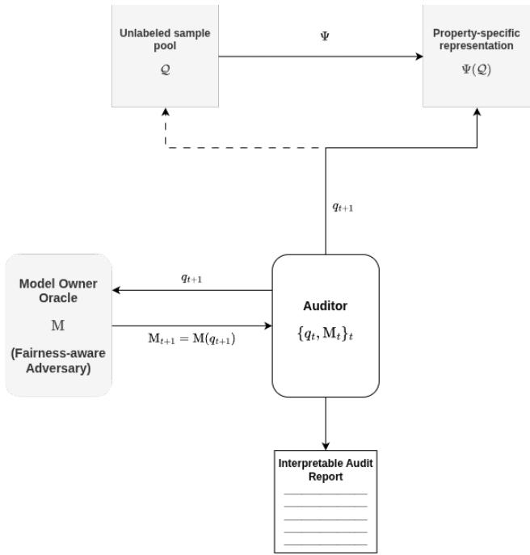  
Figure 2: Interactive Fairness Auditing via Group-Based Pool Partitioning.

This invariance implies that auditing multi-group fairness can be carried out without modeling the joint distribution across groups, and justifies the use of arbitrary coupling strategies when constructing queries from the sample pool.

Proof Let $\nu \in \Pi ( \nu _ { 1 } , \ldots , \nu _ { k } )$ be any coupling measure on X whose ith marginal satisfies

$\nu _ { i } ( \cdot ) = \mathcal { D } ( \cdot \mid \mathcal { Z } _ { i } )$ , for all $i \in \left\lceil k \right\rceil$ For $i \neq j ,$ let $\nu _ { i j }$ denote the $( i , j )$ marginal of ν on $\mathcal { Z } _ { i } \times \mathcal { Z } _ { j }$

By definition, $f _ { h } ( \mathbf { X } ) = \left( h ( X _ { i } ) - h ( X _ { j } ) \right) _ { 1 < i < j < k } .$

Since expectation of a finite-dimensional random vector is taken componentwise,

$$
\begin{array} { r l } { \mathbb { E } _ { { \mathbf { X } } \sim \nu } \left[ f _ { h } ( { \mathbf { X } } ) \right] = ( \mathbb { E } _ { { \mathbf { X } } \sim \nu } \left[ h ( X _ { i } ) - h ( X _ { j } ) \right] ) _ { 1 \leq i < j \leq k } } & { } \\ { = \Big ( \mathbb { E } _ { ( X _ { i } , X _ { j } ) \sim \nu _ { i j } } \left[ h ( X _ { i } ) - h ( X _ { j } ) \right] \Big ) _ { 1 \leq i < j \leq k } } & { } \\ { = \left( \int _ { \mathcal { Z } _ { i } \times \mathcal { Z } _ { j } } \left( h ( x _ { i } ) - h ( x _ { j } ) \right) d \nu _ { i j } ( x _ { i } , x _ { j } ) \right) _ { 1 \leq i < j \leq k } } & { } \\ { = \left( \int _ { \mathcal { Z } _ { i } \times \mathcal { Z } _ { j } } h ( x _ { i } ) d \nu _ { i j } ( x _ { i } , x _ { j } ) - \int _ { \mathcal { Z } _ { i } \times \mathcal { Z } _ { j } } h ( x _ { j } ) d \nu _ { i j } ( x _ { i } , x _ { j } ) \right) _ { 1 \leq i < j \leq k } . } \end{array}
$$

Because the marginals of $\nu _ { i j }$ are $\nu _ { i }$ and $\nu _ { j } .$ , respectively,

$$
\begin{array} { l } { \displaystyle \mathbb { E } _ { \mathbf { X } \sim \nu } \left[ f _ { h } ( \mathbf { X } ) \right] = \left( \int _ { \mathcal { Z } _ { i } } h ( x ) d \nu _ { i } ( x ) - \int _ { \mathcal { Z } _ { j } } h ( x ) d \nu _ { j } ( x ) \right) _ { 1 \leq i < j \leq k } } \\ { = \left( \mathbb { E } _ { X \sim \mathcal { D } ( \cdot \vert \mathcal { Z } _ { i } ) } [ h ( X ) ] - \mathbb { E } _ { X \sim \mathcal { D } ( \cdot \vert \mathcal { Z } _ { j } ) } [ h ( X ) ] \right) _ { 1 \leq i < j \leq k } . } \end{array}
$$

And because $\mu _ { i j } ( h , \mathcal { D } ) : = \mathbb { E } _ { X \sim \mathcal { D } ( \cdot | \mathcal { Z } _ { i } ) } [ h ( X ) ] - \mathbb { E } _ { X \sim \mathcal { D } ( \cdot | \mathcal { Z } _ { j } ) } [ h ( X ) ]$ , we therefore obtain

$$
\mathbb { E } _ { \mathbf { X } \sim \nu } [ f _ { h } ( \mathbf { X } ) ] = \left( \mu _ { i j } ( h , \mathcal { D } ) \right) _ { 1 \leq i < j \leq k }
$$

Consequently, $\begin{array} { r } { \| \mathbb { E } _ { \mathbf { X } \sim \nu } [ f _ { h } ( \mathbf { X } ) ] \| _ { \infty } = \operatorname* { m a x } _ { 1 \leq i < j \leq k } | \mu _ { i j } ( h , \mathcal { D } ) | } \end{array}$

Therefore

$$
\mu ( h , \mathcal { D } ) = \| \mathbb { E } _ { \mathbf { X } \sim \nu } [ f _ { h } ( \mathbf { X } ) ] \| _ { \infty }
$$

This reformulation shows that auditing multi-group fairness can be viewed as estimating expectations of pairwise comparison functionals under the product distribution. In particular, it shifts the objective from learning the model h itself to estimating the structured family of functional defined on X. The resulting interaction model differs fundamentally from reconstruction-based approaches: rather than approximating h over the hypothesis class H, the auditor directly probes the relational structure induced by h across protected groups.

Remark 3.2. Although the value of the audited property is invariant to the choice of coupling, the coupling determines the distribution of the relational queries observed by the auditor and therefore the information available during the audit. We therefore treat the coupling as part of the audit design: a coupling $\nu \in \Pi ( { \mathcal { D } } _ { 1 } , \ldots , { \mathcal { D } } _ { k } )$ is selected before interaction and remains fxed throughout the auditing procedure, with CGQs sampled i.i.d. from ν. The auditor may adaptively decide which sampled CGQs to query, but may not adapt the coupling itself in response to previous oracle outputs. This restriction does not constrain the value of the fairness functional, which depends only on the protected-group marginals, but it fixes the statistical experiment through which that functional is learned. Allowing the coupling to change adaptively would define a strictly stronger query model in which the auditor can modify the distribution of future CGQs based on past responses, rather than merely perform active selection from a xed data-generating distribution.

## 3.1 Interpretable Audits via Bias Probes

To obtain interpretable insights into the model's behavior, we introduce bias probes, which localize the comparative behavior of h across protected groups.

Definition 3.3 (Bias Probes). Let $\mathbf { x } = ( x _ { 1 } , \ldots , x _ { k } ) \in { \mathcal { X } }$

• Global bias probe. The global bias probe is defined as $f \colon \mathbf { x } \mapsto \left( f _ { i , j } ( \mathbf { x } ) \right) _ { i \neq j } .$

• Feature-wise bias profile. Let $q \in [ p ]$ denote an unprotected feature,

and $P _ { q } ( \mathbf { X } ) = ( X _ { 1 } ^ { ( q ) } , \ldots , X _ { K } ^ { ( q ) } )$ the the projection of the CGQ query on the $q ^ { t h }$ feature. For each pair (i, j), we define the conditional feature-wise probe

$$
\mathfrak { e } _ { q , i , j } ( z ) : = \mathbb { E } _ { \mathbf { X } \sim \mathcal { D } ^ { K } } \left[ f _ { i , j } ( \mathbf { X } ) \ | \ P _ { q } ( \mathbf { X } ) = z \right]
$$

The vector $\mathfrak { e } _ { q } ( z ) = \left( \mathfrak { e } _ { q , i , j } ( z ) \right) _ { i < j }$ describes how the expected relational response of the deployed model varies with feature q.

• Feature-wise bias magnitude. We summarize the conditional relational disparity by

$$
\widetilde { f } _ { q } ( z ) : = \underset { i < j } { \operatorname* { m a x } } | \mathfrak { e } _ { q , i , j } ( z ) | = \underset { i < j } { \operatorname* { m a x } } | \mathbb { E } \left[ f _ { i , j } ( \mathbf { X } ) \ | \ P _ { q } ( \mathbf { X } ) = z \right] |
$$

Example 3.1 (Interpretable Audit Report via Unprotected Feature-wise Bias Probes). Consider a credit-lending setting in which a bank deploys a binary classifier h : $\mathcal { X }  \{ 0 , 1 \}$ to decide whether to grant a loan. Suppose that each client is represented by three unprotected input features, with monthly income and age corresponding to the first and second coordinates, respectively, and let gender be the protected attribute. For simplicity, assume two protected groups. A cross-group query is $Q = ( X _ { 1 } , X _ { 2 } ) \in \mathcal { X } _ { 1 } \times \mathcal { X } _ { 2 }$ , where $X _ { 1 }$ and $X _ { 2 }$ are sampled from the two protected groups. The associated relational bias probe is $f _ { 1 , 2 } ( Q ) = h ( X _ { 1 } ) - h ( X _ { 2 } ) \in \{ - 1 , 0 , + 1 \}$ . The auditor observes this relational response rather than the two individual predictions separately.

For an unprotected feature q, let $P _ { q } ( Q ) : = ( X _ { 1 } ^ { ( q ) } , X _ { 2 } ^ { ( q ) } )$ . For example, $P _ { 1 } ( Q ) = ( X _ { 1 } ^ { ( 1 ) } , X _ { 2 } ^ { ( 1 ) } )$ contains the monthly incomes of the two queried clients, while $P _ { 2 } ( Q ) = \big ( X _ { 1 } ^ { ( 2 ) } , X _ { 2 } ^ { ( 2 ) } \big )$ contains their ages. The feature-wise bias profile is $\mathfrak { e } _ { q } ( z _ { 1 } , z _ { 2 } ) : = \mathbb { E } [ f _ { 1 , 2 } ( Q ) \mid P _ { q } ( Q ) = ( z _ { 1 } , z _ { 2 } ) ]$ , and its unsigned magnitude is $\widetilde { f } _ { q } ( z _ { 1 } , z _ { 2 } ) : = | \mathfrak { e } _ { q } ( z _ { 1 } , z _ { 2 } ) |$ . Thus, $\mathfrak { e } _ { q }$ records the direction and magnitude of the conditional group prediction disparity, while $\widetilde { f } _ { q }$ records only its magnitude

The resulting audit report can combine the following complementary summaries:

• Global bias probe. The global statistical-parity disparity is obtained from $\mu ( h ) = | \mathbb { E } [ f _ { 1 , 2 } ( Q ) ] |$ This provides an overall measure of the prediction-rate difference between the two protected groups.

• Feature-wise bias profile. For a feature such as age or monthly income, the function $m _ { q }$ describes how the signed relational disparity varies across values of that feature. For example, $\mathfrak { e } _ { 1 } ( z _ { 1 } , z _ { 2 } )$ gives the expected relational response among cross-group queries whose two clients have monthly incomes near $( z _ { 1 } , z _ { 2 } )$

• Expected feature-wise bias magnitude. The quantity $\widetilde { f } _ { q } ( z _ { 1 } , z _ { 2 } ) = | \mathfrak { e } _ { q } ( z _ { 1 } , z _ { 2 } ) |$ identifies regions of the projected feature space in which the conditional group disparity is large. For monthly income, it can therefore reveal income combinations for which the model exhibits particularly pronounced group-relative prediction differences; the same construction applies to age.

Importantly, these quantities provide probe-level interpretability: they are estimable from projected CGQ feature values and relational probe responses. They should not be interpreted as ordinary predictive feature importance or as causal effects of the corresponding features on the classifier

Together, these three quantities provide complementary levels of evidence: the global probe establishes whether the model exhibits discrimination overall, the feature-wise probes indicate where disparities vary across the input space, and the expected feature-wise probes identify regions in which the disparities are most pronounced. The resulting audit report therefore provides the model owner not only with evidence of unfairness, but also with interpretable information about where and along which features that unfairness manifests itself.

Bias probes thus provide a localized view of the model's discriminative behavior, isolating how differences across groups manifest at specific feature configurations. While, the expected featurewise bias probe represents the average intergroup comparison induced by h among all inputs sharing the same configuration on the unprotected feature q, providing a low-dimensional summary of the model's discriminative behavior.

We now formalize interpretable active auditing for general properties $\mu$ through the lens of comparison function learning.

Definition 3.4 (Interpretable Active Auditing). Let $\mathcal { P }$ be a class of distributions over ${ \mathcal { Z } } ,$ and let $\mathcal { F }$ be an intergroup context class defined over X. We say that $\mathcal { F }$ is actively learnable under P if there exists a sample complexity function $m _ { \mathcal { F } } : ( 0 , 1 ) ^ { 2 } \to \mathbb { N }$ , such that for all $( \varepsilon , \delta ) \in ( 0 , 1 ) ^ { 2 }$ , for all $\mathcal { D } \in \mathcal { P }$ , and for all $m \ge m _ { \mathcal { F } } ( \varepsilon , \delta )$ , there exists an algorithm $A _ { m }$ which, based on m queries $\mathcal { Q } _ { 1 } , \ldots , \mathcal { Q } _ { m }$ , outputs an estimate $\hat { f } _ { m } \in \mathcal { F }$ satisfying

$$
\operatorname* { \mathbb { P } } _ { \mathcal { Q } _ { 1 } , \cdots \mathcal { Q } _ { m } } \left[ \mathcal { E } _ { \mathcal { D } } ( \hat { f } _ { m } ) - \operatorname* { i n f } _ { f \in \mathcal { F } } \mathcal { E } _ { \mathcal { D } } ( f ) > \varepsilon \right] < \delta ,
$$

where the risk $\mathcal { E } _ { \mathcal { D } } ( f )$ is deined as $\mathcal { E } _ { \mathcal { D } } ( f ) : = \underset { \mathbf { X } \sim \mathcal { D } ^ { k } } { \mathbb { P } } \big [ f ( \mathbf { X } ) \neq f _ { h } ( \mathbf { X } ) \big ]$ , and $f _ { h }$ denotes the comparison functional induced by the model h. The minimax sample complexity of the auditing problem is dened as i $\begin{array} { r } { \mathrm { n f } _ { m _ { \mathcal { F } } } \mathrm { s u p } _ { \mathcal { D } \in \mathcal { P } } m _ { \mathcal { F } } ( \varepsilon , \delta ) } \end{array}$ , where the inimum is taken over all valid active auditing strategies.

This formulation reduces the auditing problem for $\mu$ to the problem of learning the comparison functional $f _ { h }$ , from which $\mu ( \mathcal { D } , h )$ can be estimated as a functional of $f _ { h }$

## 3.2 Information Complexities For Learning Probes

In the following section, we define the information-complexities relevant for characterizing the auditing problem of multi-group fairness. We begin with Natarajan dimension Daniely et al. (2015), that will serve to characterize global probe learning in the passive setting:

Definition 3.5 (k-Daniely-Shwartz Dimension (Daniely et al., 2015)).

• Pseudo-cube. Let $B \subseteq \mathcal { V } ^ { m }$ be finite and non-empty. Two vectors $b , b ^ { \prime } \in B$ are called ineighbors $i f b _ { i } \ne b _ { i } ^ { \prime }$ and for every $j \neq i , b _ { j } = b _ { i } ^ { \prime }$ . The set B is an m-dimensional pseudo-cube if for every $b \in B$ and every $i \in [ m ]$ , b has an i-neighbor in B.

• Daniely-Shwartz dimension. A sequence $S = ( \mathbf { x } _ { 1 } , \ldots , \mathbf { x } _ { m } ) \in \mathcal { X } _ { k } ^ { m }$ is DS-shattered by the k-context class $\mathcal { F } _ { k }$ if the set $\mathcal { F } _ { k } | _ { S } = \left\{ ( f ( \mathbf { x } _ { 1 } ) , \ldots , f ( \mathbf { x } _ { m } ) ) : f \in \mathcal { F } _ { k } \right\}$ contains an m-dimensional pseudo-cube.

Dene Daniely-Shwartz dimension $\mathrm { D S } _ { k } ( \mathcal { F } )$ as the largest DS-shattered dimension, or ∞ if no nite largest dimension exists.

For a fixed multi-context class ${ \mathcal { F } } ,$ the disagreement set is defined as follows:

$\mathrm { D I S } ( \mathcal { F } ) \ \triangleq \ \{ \mathbf { x } \ \in \ \mathcal { X } \ : \ \exists f , f ^ { \prime } \in \ \mathcal { F } \ : \ f ( \mathbf { x } ) \ \neq \ f ^ { \prime } ( \mathbf { x } ) \}$ . The disagreement sets arising in learning and auditing are objects of a different nature. In standard learning, the disagreement region is a subset of the sample space $\mathcal { Z } ,$ reflecting uncertainty about the label of individual instances. In contrast, for multi-group fairness auditing, the disagreement set consists of pairs of elements drawn from distinct protected groups, encoding comparative uncertainty rather than pointwise ambiguity This distinction originates from two structural differences: First, the input space in the auditing setting carries additional organization through the presence of a protected attribute, which induces a partition into groups. Second, the underlying model classes differ in purpose: in learning, the hypothesis class represents candidate models themselves, whereas in auditing it represents surrogate preference functionals capturing only the discriminative behavior of the fixed black-box model.

Definition 3.6 (Multi-star Number). Let F be a class of bias probes defined on $\mathcal { X } .$

The multi-star number $\mathfrak { s } _ { k }$ is the largest value of m for which there exist distinct points $\{ { \mathbf { X } } _ { i }$ $i \in [ m ] \}$ , and functions $f _ { 0 } \in \mathcal { F } , \quad f _ { i } \in \mathcal { F } ,$ such that for all $i \in [ m ] , \operatorname { D I S } ( \{ f _ { 0 } , f _ { i } \} ) = \{ \mathbf { X } _ { i } \}$ , and each component $p$ of the multi-context vector X belongs to the protected group ${ \mathcal { Z } } _ { p } ,$ for $p \in [ k ]$ . If no inite maximum exists, we set ${ \mathfrak { s } } _ { k } = \infty$

Examples of multi-star number for multi-context classes is given in Appendix A.3. We prove the following result for the linear classifiers induced multi-context class.

Relationship between multi-star number and Daniely-Shwartz dimesnion. The following claim establishes that the multi-star number is upper bounded by the DS dimension. Consequently, when the DS dimension is infinite, passive learning of the probe class is impossible, and hence active learning is impossible as well. Later, we characterize active learnability of probes in the interactive setting induced by CGQs in terms of both these information complexities. In particular, we show that the finiteness of the multi-star number provides a necessary and sufficient condition for learning probes in this interactive setting.

Claim 3.1. For an arbitrary multiclass $\mathcal { F } _ { \mathbf { \Phi } }$ , the following holds:

$$
\mathfrak { s } _ { k } ( \mathcal { F } ) \le \mathrm { D S } _ { k } ( \mathcal { F } )
$$

Proof Let $S = \{ \mathbf { x } _ { 1 } , \mathbf { x } _ { 2 } , \cdot \cdot \cdot , \mathbf { x } _ { m } \}$ denotes a DS-shattered set, $B \subseteq { \mathcal { F } } [ S ]$ an m-dimensionnal cube, and fix $b _ { 0 } \in B$ realizable by $f _ { 0 } \in \mathcal { F }$ in S. For every i in [m], by the pseudo-cube definition, there exists an i-neighbor $b _ { i }$ in $B$ of b. We have for every $j \in [ \bar { m } ] \backslash \{ i \} , b _ { i } ^ { i } \neq b _ { i } ^ { 0 }$ and $b _ { j } ^ { i } = b _ { j } ^ { 0 }$ . Let $f _ { i }$ in $\mathcal { F }$ a probe that realizes $b _ { i }$ . That is $f _ { i } | _ { S } = b ^ { i }$ . Since $f _ { 0 } | _ { S } = b ^ { 0 }$ , we obtain

$$
f _ { i } ( \mathbf { x } _ { i } ) = b _ { i } ^ { i } \neq b _ { i } ^ { 0 } = f _ { 0 } ( \mathbf { x } _ { i } ) ,
$$

and for every $j \in [ m ] \setminus \{ i \}$ 2

$$
f _ { i } ( \mathbf { x } _ { j } ) = b _ { j } ^ { i } = b _ { j } ^ { 0 } = f _ { 0 } ( \mathbf { x } _ { j } ) .
$$

Then for every i in $[ m ] , \mathrm { D I S } ( \{ f _ { 0 } , f _ { i } \} ) \cap S = \{ \mathbf { x } _ { i } \}$ . Hence S is also a star set of size m. By taking the supremum over DS-shattered $S ,$ we obtain the desired property.

## 3.3 Information-Theoretic Separation of Reconstruction and Probe Auditing

It is known that linear classifiers, even in low dimension input space $( \mathrm { e . g . } , d = 2 )$ , the star number is unbounded, implying that active reconstruction-based auditing cannot improve over passive reconstruction and therefore requires a large number of queries, increasing the risk of model extraction. Proposition 3.2 establishes a separation between auditing via active reconstruction and bias probing, the latter avoiding this intrinsic complexity barrier by focusing on property-specific queries.

Proposition 3.2 (Information-Theoretic Separation of Reconstruction and Probe Auditing). There exists an audit instance problem, where auditing via model reconstruction is strictly harder than auditing via probe learning.

This establishes an information-theoretic separation between the two approaches: while reconstruction has unbounded combinatorial complexity for the underlying model class, the corresponding probe-learning problem admits a finite k-multi-star complexity. This aligns with the intuition that multi-group fairness is a global property driven primarily by the protected attribute, rather than the ambient feature space. The proof is given in Appendix $\mathrm { A . 4 }$

## 3.4 Manipulation-free Regime

In this section, we focus on the manipulation-free regime, in which the model owner is honest and does not attempt to conceal unfairness.

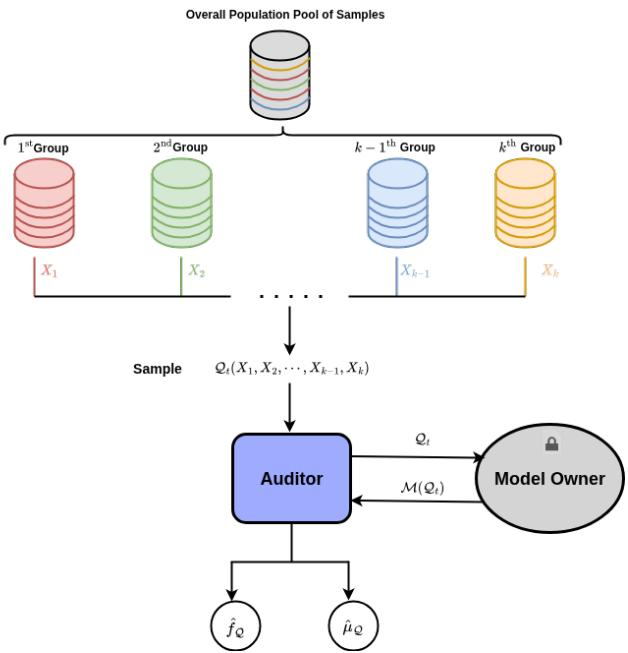  
Figure 3: Interactive Fairness Auditing: Setting and Interaction Protocol

## 3.4.1 Hardness Results on Sample Complexity and Model Extraction

We begin by establishing a lower bound on the sample complexity required to learn bias probes.

Theorem 3.1 (Sample Complexity Lower Bound). Fix $\varepsilon \in ( 0 , 1 / 4 ) , \delta \in ( 0 , 1 / 2 )$ . For any (possibly randomized) active auditor making at most

$$
m \leq \Omega \left( \operatorname* { m a x } \left\{ \frac { 1 - 2 \delta } { 1 - \delta } \operatorname* { m i n } \left\{ \mathfrak { s } _ { k } , \left\lfloor \frac { 1 } { 2 \epsilon } \right\rfloor \right\} , \left[ 1 - 2 \epsilon - 2 \delta ( 1 - \epsilon ) \right] _ { + } \mathrm { D S } _ { k } \right\} \right)
$$

CGQ queries, there exists a distribution D over X and a target comparison functional $f _ { h ^ { \ast } } \in \mathcal { F }$ such that, with probability at least $\delta$

$$
\underset { \substack { \mathscr { Q } _ { 1 : m } \sim \mathscr { D } ^ { m k } } } { \mathbb { P } } \left[ \underset { { \substack { \mathbf { X } \sim \mathscr { D } ^ { k } } } } { \mathbb { P } } \left[ \hat { f } _ { \mathscr { Q } _ { 1 : m } } ( \mathbf { X } ) \neq f _ { h } ( \mathbf { X } ) \right] > \varepsilon \right] > \delta .
$$

Theorem 3.1 shows that learning bias probes is fundamentally limited by the complexity of the comparison class ${ \mathcal F } .$ In particular, even in the active setting, the sample complexity must scale with intrinsic structural parameters such as $\mathfrak { s } _ { k }$ . This highlights that auditing through comparison functionals does not circumvent statistical hardness, but rather shifts it to the geometry of the induced comparison class. The proof is given in Appendix C.1.

## 3.4.2 Hardness of Model Extraction Attacks

In this section, we characterize the hardness of extracting the model underlying M from both computational and information-theoretic perspectives.

Computational Hardness. We now show that, beyond the statistical limitations established in Proposition 3.2, extracting the underlying model from bias probes is computationally hard. Our probe-based auditing procedure induces an interactive protocol in which the auditor interacts with the model owner through at most B cross-group queries (CGQs). We formalize the corresponding model-extraction problem through the following notion of B-Bounded Relational Extraction, that consists of:

• Finite hypothesis class $\mathcal { H } _ { 0 } = \{ h _ { 1 } , \ldots , h _ { m } \}$ 2

• Finite collection of admissible relational queries $\mathcal { Q } = \{ \mathbf { x } _ { 1 } , \dots , \mathbf { x } _ { r } \} \subseteq \mathcal { X }$

• The query budget of $k { \mathrm { - A L E B I ~ } } B .$

Model owner's model extraction corresponds to whether there exists a subset of queries $\mathcal { Q } ^ { \prime } \subseteq \mathcal { Q }$ such that $| \mathcal { Q } ^ { \prime } | \leq B$ and such that the answers to the queries in $\mathcal { Q } ^ { \prime }$ uniquely identify the unknown hypothesis in $\mathcal { H } _ { 0 }$ . Equivalently, the question is whether for any two different models h and $g$ in $\mathcal { H } _ { 0 }$ there exists CGQ queries $\mathcal { Q } ^ { \prime }$ that distinguish $f _ { h }$ from $f _ { g }$ . Thus, the goal is to make the map $h \longmapsto \left( f _ { h } ( q ) \right) _ { q \in Q ^ { \prime } }$ injective on $\mathcal { H } _ { 0 }$

Theorem 3.2 (Hardness of Model Extraction via Bias Probes). Given a learned probe $f _ { h } \in \mathcal { F } _ { \mathcal { H } }$ from a (black-box) interaction with a model owner M of $h \in \mathcal H$ , recovering h is NP hard.

Theorem 3.2 establishes a computational barrier to model extraction from bias probes. Recovering the underlying model h from CGQ-based queries is intractable. More precisely, finding a small set of CGQ sufficient for universal model extraction is NP-complete. This formalizes a separation between auditing and reconstruction: while bias probes suffice to estimate properties such as multi-group fairness, they do not reveal enough information to reconstruct the model efficiently. The proofn is given in Appendix B.

Information-Theoretic Hardness. In this section, we quantify the information revealed about the model owner's identity through interactions with the auditor. We assume that H is finite and that the induced multi-context class relative to ${ \mathcal { H } } ,$ denoted by $\mathcal { F } = \mathcal { F } _ { \mathcal { H } }$ , is therefore also finite. We further assume a uniform prior over H.

Before the audit procedure begins, the uncertainty about the model identity is $\widetilde { \mathcal { I } } _ { 0 } : = \log _ { 2 } | \mathcal { H } |$ bits. After t interactions with M, the observed responses induce a version space $\nu _ { t } \subseteq \mathcal { H }$ containing the hypotheses consistent with all interactions observed so far. Under the uniform prior, the remaining model identity uncertainty is therefore $\widetilde { \mathcal { T } } _ { t } : = \log _ { 2 } | \mathcal { V } _ { t } |$ . This motivates the following definition of identity leakage.

Definition 3.7 (Identity Leakage). For a hypothesis class H, the identity leakage after t interactions between the auditor and the model owner is dened as

$$
\mathcal { T } _ { t } : = \widetilde { \mathcal { I } } _ { 0 } - \widetilde { \mathcal { I } } _ { t } = \log _ { 2 } \frac { | \mathcal { H } | } { | \mathcal { V } _ { t } | } .
$$

For example, suppose the auditor knows that the model belongs to a hypothesis class of size $| \mathcal { H } | = 1 0 0 0 . \quad \mathrm { { I f } } .$ after t interactions with the model owner, only $| \nu _ { t } | = 2 0$ hypotheses remain consistent with the observed responses, then the identity leakage is

$$
\mathcal { T } _ { t } = \log _ { 2 } \frac { 1 0 0 0 } { 2 0 } \approx 5 . 6 4 ~ \mathrm { b i t s } .
$$

Thus, the audit interactions have reduced the uncertainty about the model identity by approximately 5.64 bits.

In Section 4, we design an experimental protocol to evaluate model extraction through identity leakage. We compare our proposed auditor with three baselines: RECONAUDIT, DIRECTAUDIT, and the auditing method proposed by (Yan and Zhang, 2022).

## 3.4.3 Algorithm Design: k-ALeBi and Upper Bounds

Algorithm 3 k-ALEBI   
Require: Access to $\mathrm { I } _ { \mathbf { M } } ( h ) = \mathbf { M } _ { k } ( h )$ , CGQ fixed coupling distribution $\nu ,$ multi-context probe class   
${ \mathcal { F } } ,$ pool budget n   
1: Initialize version space $\mathcal { V } _ { 0 }  \mathcal { F }$   
2: for $t = 1$ to n do   
3: Draw independently   
$\mathbf { X } ^ { ( t ) } = ( X _ { 1 } ^ { ( t ) } , \ldots , X _ { k } ^ { ( t ) } ) \sim \nu$   
4: $\mathcal { V } _ { t } \gets \mathcal { V } _ { t - 1 }$   
5: if $\mathbf X ^ { ( t ) } \in \mathrm { D I S } ( \mathcal V _ { t - 1 } )$ then   
6: Query the relational oracle   
$\mathbf { Y } ^ { ( t ) } \gets \mathbf { M } _ { k } ( h ; \mathbf { X } ^ { ( t ) } ) = f _ { h } ( \mathbf { X } ^ { ( t ) } )$   
V $\mathbf { Y } ^ { ( t ) } \in \{ - 1 , 0 , 1 \}$ (2)   
7: Update the version space   
$\mathcal { V } _ { t } \gets \Big \{ f \in \mathcal { V } _ { t - 1 } : f ( \mathbf { X } ^ { ( t ) } ) = \mathbf { Y } ^ { ( t ) } \Big \}$   
8: end if   
9: end for   
10: Select a global relational probe   
$\hat { f } \in \mathcal { V } _ { n }$   
11: Compute   
$\{ ( f _ { q } , \widetilde { f } _ { q } ) \} _ { q \in [ p ] }$   
for all unprotected features $q$   
12: return   
$\mathsf { A u d i t R e p o r t } = ( \underbrace { \hat { f } } _ { \mathrm { g l o b a l ~ b i a s ~ p r o b e ~ f e a t u r e - w i s e ~ b i a s ~ p r o b e s ~ } } , \underbrace { \{ \widetilde { f } _ { q } \} _ { q \in [ p ] } } _ { \mathrm { e x p e c t e d ~ f e a t u r e - w i s e ~ b i a s ~ p r o b e s ~ } } ) , \qquad \underbrace { \{ \widetilde { f } _ { q } \} _ { q \in [ p ] } } _ { \mathrm { e x p e c t e d ~ f e a t u r e - w i s e ~ b i a s ~ p r o b e s } } )$

Theorem 3.3 (Upper bounds of ALEB1). k-ALEB1 is a PAC active auditor: with probability at least $1 - \delta ,$ it outputs $\hat { f }$ satisfying P $\{ \hat { f } ( Z ) \neq f _ { h ^ { * } } ( Z ) \} \le \epsilon$ using at most

$$
\begin{array} { r } { \mathcal { O } \left( \operatorname* { m i n } \left\{ n , \ : ( e - 1 ) \operatorname* { m i n } \{ \mathfrak { s } _ { k } , n \} \log \frac { e n } { \operatorname* { m i n } \{ \mathfrak { s } _ { k } , n \} } + \log \frac { 2 } { \delta } + 1 , \ : \frac { \operatorname* { m i n } \{ \mathfrak { s } _ { k } , n \} } { \mathrm { { l V } l o g } \operatorname* { m i n } \{ \mathfrak { s } _ { k } , n \} } \mathrm { D S } _ { k } \log \left( \frac { e n ( 2 ^ { k } - 2 ) } { \mathrm { { D S } } _ { k } } \right) \right\} \right) } \end{array}
$$

$$
n = \bigg \lceil \frac { \mathrm { D S } _ { k } + \mathrm { l o g } ( 4 / \delta ) } { \epsilon } \bigg \rceil
$$

For fixed sufficiently small $\delta ,$ the lower bound in Theorem 3.1 becomes $\Omega ( { \operatorname* { m a x } \{ \mathrm { D S } _ { k } , \operatorname* { m i n } \{ \mathfrak { s } _ { k } , 1 / \epsilon \} }  \} )$ ， while the upper bound becomes $\widetilde { O } \left( \operatorname* { m i n } \{ \mathfrak { s } _ { k } , \frac { \mathrm { D S } _ { k } } { \epsilon } \} \right)$ . If m denotes the sample complexity, and if $\begin{array} { r } { \epsilon \lesssim 1 / { \mathfrak { s } } _ { k } . } \end{array}$ then $\begin{array} { r } { \mathfrak { s } _ { k } \lesssim m \lesssim \mathfrak { s } _ { k } \log \frac { e \mathrm { D S } _ { k } } { \epsilon \mathfrak { s } _ { k } } } \end{array}$ , and the bounds match up to logarithmic factors. If $1 / \mathfrak { s } _ { k } \lesssim$ $\epsilon \lesssim 1 / \mathrm { D S } _ { k }$ , then $\begin{array} { r } { \frac { 1 } { \epsilon } \lesssim m \lesssim \frac { \mathrm { D S } _ { k } } { \epsilon } } \end{array}$ , with a smaller logarithmic gap whenever $\epsilon { \mathfrak { s } } _ { k } = \mathcal { O } ( 1 )$ . Finally, if $\epsilon \gtrsim 1 / \mathrm { D S } _ { k }$ , then $\begin{array} { r } { \mathrm { D S } _ { k } \lesssim m \lesssim \mathrm { D S } _ { k } / \epsilon , } \end{array}$ . In particular m reduces to $\Theta ( \mathrm { D S } _ { k } )$ for constant accuracy. Thus the only potentially substantial gap occurs in the intermediate regime and is controlled by the separation between $s _ { k }$ and $\mathrm { D S } _ { k } ;$ in particular, if $\mathrm { D S } _ { k } = { \cal O } ( 1 )$ or ${ \mathfrak { s } } _ { k } = \Theta ( \mathrm { D S } _ { k } )$ , the upper and lower bounds match up to logarithmic factors throughout the accuracy range. Theorem 3.3 further reveals two distinct regimes. When ${ \mathfrak { s } } _ { k } = \infty .$ , the active learning component of the bound vanishes, and the complexity is governed by the passive learning term $\mathrm { D S } _ { k } ( \mathcal { F } )$ . In this regime, the auditing problem effectively reduces to passive learning of the probe class, as established by Claim 3.1. The proof of Theorem 3.3 is given in Appendix C.2. The following corollary characterizes the learnability of the probe class in the interactive setting in terms of the multi-star number.

Corollary 3.1. A multi-class F is PAC actively learnable (Definition 3.4) if and only if $\mathfrak { s } _ { k } ( \mathcal { F } ) < \infty$

Corollary 3.1 derives from Theorems 3.1 and 3.3.

In Section 4, we evaluate the accuracy of k-ALEBr in estimating multi-group fairness (Definition 2.1) and compare its performance with three baselines: RECONAUDIT, DIRECTAUDIT, and the auditing method proposed by (Yan and Zhang, 2022).

## 3.5 Fairness-aware Adversarial Regime

We now consider an adaptive adversarial model owner M whose decision to attack depends on the auditor's current estimate of multi-group disparity. The robust version of k-ALEB1 requires that each CGQ admits a sufficiently homogeneous neighborhood of nonnegligible probability mass. For any CGQ X in $\mathcal { Q } ^ { \mathrm { ~ 4 ~ } } , \mathcal { I } ( \mathbf { X } )$ denotes a cell from the input space containing X.

Assumption 3.1 (Local F replicability). There exists a measurable neighborhood map $\textbf { X } \mapsto$ $J ( \mathbf { X } ) \subseteq \mathcal { Q }$ chosen independently of the unknown target $f ^ { \star }$ and before observing any M oracle response, such that every requested CGQ X by A satisfies a probability mass of: $\mathbb { P } ( \mathcal { I } ( \mathbf { X } ) ) \geq \gamma$ and $\begin{array} { r } { \operatorname* { s u p } _ { f \in \mathcal { F } } \mathbb { P } ( f ( \mathbf { X } ^ { \prime } ) \neq f ( \mathbf { X } ) | \mathbf { X } ^ { \prime } \in \mathcal { I } ( \mathbf { X } ) ) \leq \rho } \end{array}$ for some $\gamma > 0$ and $\begin{array} { r } { 0 \leq \rho < \frac { 1 } { 2 } } \end{array}$

Assumption 3.1 means that a draw from $\mathcal { I } ( \mathbf { X } )$ has the same clean query response as X uniformly over $\mathcal { F }$ with probability at least $1 - \rho .$ The cells do not need to form a partition and may overlap. We assume that the learner can sample $\mathbf { X } ^ { \prime } \sim { \mathcal { D } } _ { Q } ( \cdot \mid { \mathcal { I } } ( \mathbf { X } ) )$ from the i.i.d unlabeled pool 5. Since $\mathbb { P } ( \mathcal { I } ( \mathbf { X } ) ) \geq \gamma$ , each accepted local CGQ requires at most $1 / \gamma$ unlabeled draws in expectation.

## 3.5.1 Adaptive Fairness-aware Adversary: Algorithm and Upper Bounds

For the r-th local query $\mathbf { X } _ { r } ^ { \prime }$ , let $A _ { r } \in \{ 0 , 1 \}$ denote whether its response is attacked. Let $\mathbb { H } _ { r - 1 }$ denote the complete history before that response. If $A _ { r } = 0$ , then ${ \bf Y } _ { r } = f ^ { \star } ( { \bf X } _ { r } ^ { \prime } )$ . If $A _ { r } = 1$ , the adversary may return any ${ \mathbf Y } _ { r } \in \mathcal { V } _ { k }$ , possibly as an adaptive function of the history, the queried CGQ $\mathbf { X } _ { r } ^ { \prime }$ and its clean response.

Definition 3.8 (Conditional probabilistic attack). There exists $p < 1 / 2$ such that

$$
\mathbb { P } \big ( \boldsymbol { A } _ { r } = 1 \big | \mathbb { H } _ { r - 1 } , \mathbf { X } _ { r } ^ { \prime } , \boldsymbol { f } ^ { \star } ( \mathbf { X } _ { r } ^ { \prime } ) \big ) \leq p
$$

for every local query.

Algorithm 4 ROBUST k-ALEBI   
Require: k-ALEBI, attack bound $p ,$ fixed cell map $\mathbf { X } \mapsto { \mathcal { I } } ( \mathbf { X } )$   
1: if $p = 0$ then   
2: Run subroutine $k { \mathrm { - } } \mathrm { A }$ LEBI   
3: Whenever $k { \mathrm { - A } }$ LEBI requests CGQ $\mathbf { X } _ { t } ,$ query $\mathbf { X } _ { t }$ directly and return the clean response to   
k-ALEBI   
4: return the output of k-ALEBı   
5: end if   
6: Configure k-ALEBr with confidence $\delta / 2$   
7: $N \gets N _ { 0 } ( \epsilon , \delta / 2 )$   
8:   
$R  \lceil \frac { 2 } { ( 1 - 2 \beta ) ^ { 2 } } \log \frac { 2 N } { \delta } \rceil$   
9: while k-ALEBı has not terminated do   
10: Let $\mathbf { X } _ { t }$ be the next CGQ requested by $k { \mathrm { - A } } .$ LEBI   
11:   
$\widehat { Y } _ { t } \gets \mathrm { L O C A L L A B E L } ( \mathbf { X } _ { t } , \mathcal { I } ( \mathbf { X } _ { t } ) , R )$   
12: Feed $\mathbf { Y } _ { t }$ to $k { \mathrm { - A } }$ LEBı as the simulated clean response $f ^ { \star } ( { \mathbf { X } } _ { t } )$   
13: end while   
14: return the output of k-ALEBr   
Subroutine LocalLabel   
Input: CGQ $q ,$ fixed cell grid $J ( q )$ , local budget $R$   
15: for $r = 1 , \ldots , R$ do   
16: Sample independently   
$\mathbf { X } _ { r } ^ { \prime } \sim { \mathcal { D } } _ { Q } ( \cdot \mid { \mathcal { I } } ( \mathbf { X } ) )$   
17: Query the attacked oracle at $\mathbf { X } _ { r } ^ { \prime }$ and receive $\mathbf { Y } _ { r } \in \mathcal { V } _ { k }$   
18: end for   
19: return   
$\widehat { Y } ( q ) \in \arg \operatorname* { m a x } _ { y \in \mathcal { Y } _ { k } } \sum _ { r = 1 } ^ { R } \mathbf { 1 } \{ \mathbf { Y } _ { r } = y \}$

In particular, the conditional bound is stronger than the nonadaptive assumption $\mathbb { P } ( A _ { r } = 1 ) \le p .$ We introduce the quantity $\beta \triangleq \rho + ( 1 - \rho ) p = p + \rho - p \rho$ , that accounts for both sources of error: the local clean response may differ from the response at $q ,$ or a locally correct response may be corrupted. $\mathrm { B y }$ Definition $3 . 8 , \beta < \frac { 1 } { 2 }$

We derive upper bounds for Algorithm 4.

Theorem 3.4 (Neighborhood robustification). Let $N _ { 0 } ( \varepsilon , \delta _ { 0 } )$ denote the upper bounds derived in Theorem 3.3. Under assumptions 3.1 and the assumption that $p < 1 / 2$ (Deinition 3.8), ROBUST k-ALEB1 is a (Robust) PAC-active auditor For $p > 0$ , a sample complexity of

$$
\mathcal { O } \left( N _ { 0 } ( \varepsilon , \delta / 2 ) \left\lceil \frac { 2 } { ( 1 - 2 \beta ) ^ { 2 } } \log \frac { 2 N _ { 0 } ( \varepsilon , \delta / 2 ) } { \delta } \right\rceil \right)
$$

suffices in the presence of fairness-aware adversarial model owner.

If the neighborhood samples are obtained by rejection sampling from an i.i.d unlabeled stream, the expected number of unlabeled draws is at most $\begin{array} { r } { \left\lceil \frac { 2 N _ { 0 } ( \epsilon , \delta / 2 ) } { \gamma ( 1 - 2 \beta ) ^ { 2 } } \log \frac { 2 N _ { 0 } ( \varepsilon , \delta / 2 ) } { \delta } \right\rceil } \end{array}$

Theorem 3.4 characterizes the additional query cost incurred when the model owner is adversarial and attempts to conceal the unfairness of the model. This cost is governed by the corruption parameters, in particular the corruption level $\beta$ and the probability mass $\gamma$ of the cells that reveal the corruption mechanism. Together, these quantities determine how difficult it is for the auditor to obtain sufficiently informative observations to detect the model owner's concealment of unfairness. The proof is given in Appendix D.

The dependence of the query complexity on these parameters is intuitive. In particular, the sample complexity increases as the corruption parameter $\beta$ decreases: when the model owner has a greater ability to manipulate the oracle responses, the auditor requires additional queries to dilute the effect of these corruptions and recover reliable information about the property under audit. Similarly, when the probability mass $\gamma$ of the informative cells is small, the auditor encounters such cells less frequently. Consequently, the rejection-sampling procedure requires more queries to obtain a sufficient number of samples from these low-probability regions. Thus, the query overhead captures two complementary difficulties faced by the auditor: the extent to which the model owner can corrupt the observations and the rarity of the regions in which such corruption can be revealed.

For every unlabeled CGQ $\textbf { x } \in { \ \mathcal { Q } }$ , we associate a cell $\mathcal { I } ( \mathbf { x } )$ , where the collection of distinct cells satisfies $\left| \mathcal { I } ( \mathbf { x } ) _ { \mathbf { x } \in \mathcal { Q } } \right| \ll \left| \mathcal { Q } \right|$ This collection of cells is constructed before any interaction takes place between the auditor and the model owner; in particular, its construction does not depend on the current active version space or on any target responses observed during the audit. RoBusT k-ALEBi proceeds by first running k-ALEBi to select a query x that induces disagreement over the probe space. It then invokes an additional sampling subroutine that independently draws multiple queries from the same cell $\mathcal { I } ( \mathbf { x } )$ and submits them to the model owner's oracle. The auditor subsequently aggregates the oracle responses within this cell, and uses it as the effective label associated with $\mathcal { I } ( \mathbf { x } )$ . The rationale behind this construction is that it exploits regularities of the model class (e.g., finite VC dimension, linearity) that allow the model owner to generalize from observed data in the first place.

Consequently, a sufficient number of CGQs within the same cell are expected to exhibit consistent model behavior. This dilutes the effect of adversarial corruption during the interaction, and further exposes the model owner's unfairness allowing the auditor to obtain information about the target property.

## 3.5.2 Global Information-theoretic Hardness

The star number in Definition 3.6 alone does not necessarily yield a property-specific lower bound for multi-group fairness. In particular, distinct probe functions may disagree substantially while inducing the same statistical-parity functional across all $\binom { k } { 2 }$ group pairs. To capture the information complexity that is specific to multi-group fairness, we introduce the following notion

Definition 3.9 (Fairness-effective star number). The fairness-effective star number ${ \mathfrak { s } } _ { \mu } ( { \mathcal { F } } )$ is the supremum of all integers $m _ { ; }$ for which there exist distinct $C G Q s \mathbf { x } _ { 1 } , \ldots , \mathbf { x } _ { m }$ and functions $f _ { 0 } , \ldots , f _ { m } \in$ $\mathcal { F }$ such that for every $j \in [ m ] , f _ { 0 } ( \mathbf { x } _ { j } ) = \mathbf { 0 }$ and, for every $i \in [ m ] , f _ { i } ( \mathbf { x } _ { i } ) \neq \mathbf { 0 }$ , and $j \neq i , f _ { i } ( \mathbf { x } _ { j } ) = \mathbf { 0 }$

Definition 3.9 introduces a property-specific notion of disagreement. Rather than distinguishing probes according to whether they favor or disadvantage particular group pairs, as in the standard disagreement-based formulation, we distinguish only between probes that are fair and those that are unfair on the star set. This formulation captures the information that is directly relevant to the fairness property, while abstracting away disagreements that do not affect the fairness functional of interest.

Now, we state an assumption required to derive the lower bound for robust fairness estimation with CGQs under conditional probabilistic attack.

Assumption 3.2 (Cell-replicability on the star set). The fairness-effective star set has pairwise disjoint measurable cells $\mathcal { I } _ { 1 } , \ldots , \mathcal { I } _ { m }$ such that, for every witness $f _ { i }$ and every cell $\mathcal { I } _ { j } , \mathit { f } _ { i }$ is constant on ${ \mathcal { I } } _ { j }$ and equals its value at $\mathbf { x } _ { j }$

Assumption 3.2 captures a regularity condition on the probe induced by the black-box model $h ^ { * }$ . Specifically, it assumes that the model exhibits sufficiently consistent behavior within each cell: conditional on a cell, the model's responses do not vary substantially across queries. Thus, queries belonging to the same cell tend to preserve the relevant regularities of the underlying model behavior, which enables the auditor to replicate the probe's response from multiple samples within that cell.

Theorem 3.5 (Fairness lower bound under probabilistic attack). Under Assumption 3.2 and $p <$ $1 / 2$ . A set of CGQs of size Ω(min $\{ \mathfrak { s } _ { \mu } ( \mathcal { F } ) , \frac { 1 } { \varepsilon } \} )$ is necessary to learn the undelrying probe.

In Section 4, we evaluate RoBUST k-ALEBI and compare its performance with k-ALEBi, RECONAuDIT and the auditing method proposed by Yan and Zhang (2022) in the fairness-aware adversarial regime.

## 4 Experimental Analysis

We empirically evaluate our framework along three axes: the accuracy of learned bias probe, multigroup fairness estimation via bias probes and the sample and computation efficiency of the proposed interactive procedure. Given a dataset D, we first train three classifiers h —linear model, random forest, or multi-layer perceptron (MLP). We then generate a labeled dataset by querying h on unlabeled samples. Using this dataset, we perform interactive learning of bias probes associated with multi-group fairness. From the learned probes, we estimate the fairness metric $\mu ( \mathcal { D } , h )$ and report the estimation error along with explanations for the audit report.

Datasets and experimental details. We evaluate our theoretical results on three well-known benchmark datasets: COMPAS, GERMAN CREDIT and STUDENT. For the COMPAS dataset, introduced in the context of recidivism risk assessment Angwin et al. (2022), the number of groups is fixed to $k = 2$ , while for the GERMAN CREDIT dataset, originating from the Statlog German Credit benchmark dataset Hofmann (1994)., we consider k = 4 groups. In Appendix F, we further extend our analysis to synthetic datasets with multiple values of k.

Evaluation details and reproducibility. As a benchmark, we compare k-ALEBi against the two baselines, DIRECTAUDIT and RECONAUDIT. For each binary classifier, we construct a dataset and use it as a pool of unlabeled samples, which we partition into k group-specific pools. k-ALEBr uses these pools to selectively construct informative CGQ queries. Each experiment is run with 10 random seeds to ensure reproducibility.

## 4.1 Accuracy

Across the three datasets, k-ALEBi is competitive with the baselines of DIRECTAUDIT and RE-CONAuDIT in the accuracy of multi-group fairness estimation while requiring only few CGQs. As Figure 4 shows, after 1000 queries k-ALEBr generally achieved substantially smaller estimation error than the the baselines, although reconstruction could achieve essentially zero error when it successfully recovered the target within the finite candidate class.

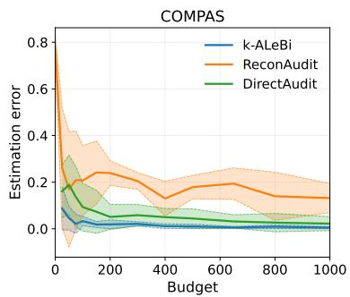

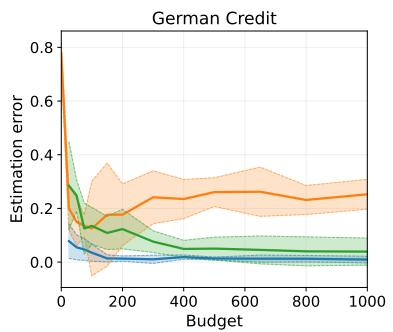

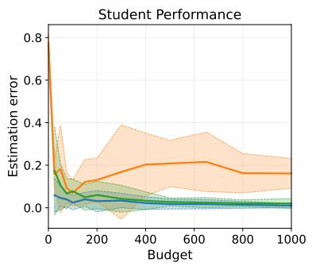  
Figure 4: Estimation Error of Multi-group fairness under limitted budget.

We further evaluate k-ALEBr against DIAMAuDIT, the auditing method proposed by Yan and Zhang (2022), in its applicable setting of k = 2 protected groups and a linear hypothesis class, corresponding to statistical parity. Figure 5 shows that k-ALEBi achieves lower statistical parity estimation error than DIAMAuDIT on both datasets. On COMPAS, k-ALEB1 achieves an estimation error of 0.0000213, compared with 0.000046 for DIAMAuDIT. On the Student dataset, k-ALEB1 achieves an estimation error of 0.006947.

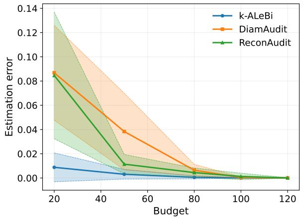

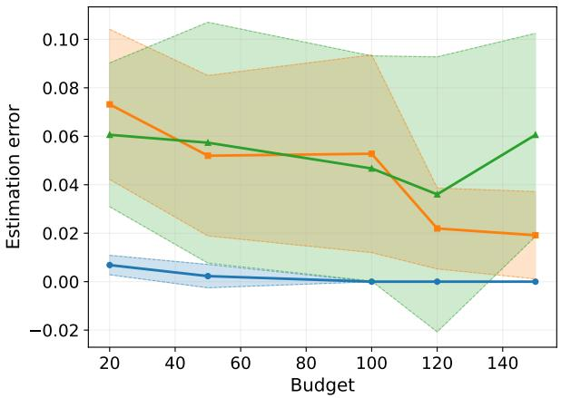  
Figure 5: Estimation Error of DIAMAuDIT under Its Applicable Setting

## 4.2 Interpretability

In addition to estimating multi-group fairness, k-ALEBi provides an interpretation of the measured unfairness that can't be obtained from a scalar fairness estimate alone. Its interpretability outputs decompose the learned probe across non-protected features and characterize how different feature configurations affect the CGQs response. For a feature q, let $Z _ { q } ( Q ) = ( X _ { 1 } ^ { ( q ) } , \ldots , X _ { K } ^ { ( q ) } )$ and recall $\begin{array} { r } { \mathfrak { e } _ { q , i j } ( z ) = \mathbb { E } [ f _ { i j } ( Q ) \ | \ Z _ { q } ( Q ) = z ] , \ \widetilde { f } _ { q } ( z ) = \operatorname* { m a x } _ { i < j } | m _ { q , i j } ( z ) | } \end{array}$ . We estimate these conditional means using independent i.i.d CGQs and K-nearest-neighbor regression at the observed $Z _ { q }$ configurations. For $K = 2 .$ we additionally visualize $\widetilde { f } _ { q } ( z _ { 1 } , z _ { 2 } )$ using Gaussian-kernel surfaces. Importantly, k-ALEBi observes CGQs responses rather than individual model predictions.

Figure 6 ranks features according to the mean across used seeds of the $9 0 ^ { \mathrm { t h } }$ percentile of the estimated $\widetilde { f } _ { q } ( Z _ { q } )$ . The corresponding feature-pair visualizations retain information about the direction and configuration of group disparities with respect to M that would otherwise be lost by reducing them to a single unsigned score. Thus the analysis identifies not only the features associated with larger measured disparities, but also the group pairs and feature configurations under which the learned model exhibits different CGQd responses. For the COMPAS dataset, Figure 7 indicates larger estimated disparities for individuals of non-Caucasian race who had been arrested multiple times, with the disparity varying across the number of prior arrests $( n \in \{ 1 , 2 , 5 \} )$ . For the Student dataset, past-class failures and the amount of time spent going out are associated with larger gender-related disparities, with the estimated disparity being larger for females than for males. The feature "father's education" also exhibits a disparity pattern: higher levels of paternal education are associated with larger estimated differences in the model's group disparities for males.

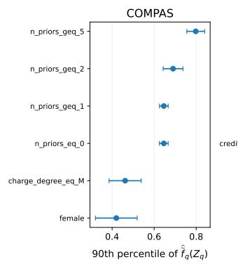

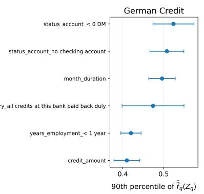

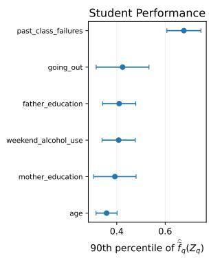  
Figure 6: Feature-wise ranking of probe-derived disparity scores.

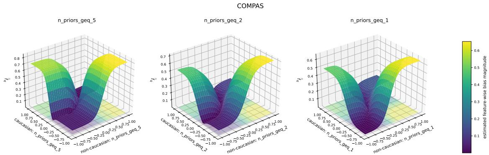  
Figure 7: Feature-wise visualization of learned probes on the COMPAS dataset.

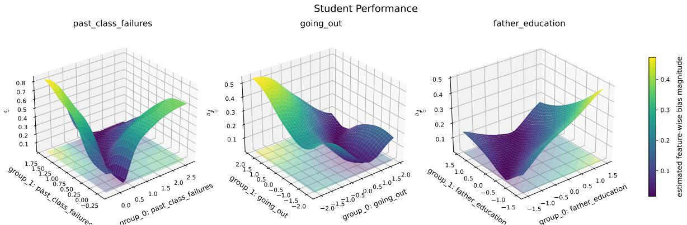  
Figure 8: Feature-wise visualization of learned probes on the Student dataset.

## 4.3 Protection Against Model Extraction Attacks

We next examine the distinction between accurately auditing fairness and revealing sufficient information to reconstruct the underlying model. At limited query budgets, Cross Group Queries can preserve a large version space of models with similar discriminative behavior while still providing accurate fairness estimates. This demonstrates an empirical separation between audit utility and immediate model identification: useful fairness information can be obtained without necessarily exposing the individual predictions required for direct model reconstruction.

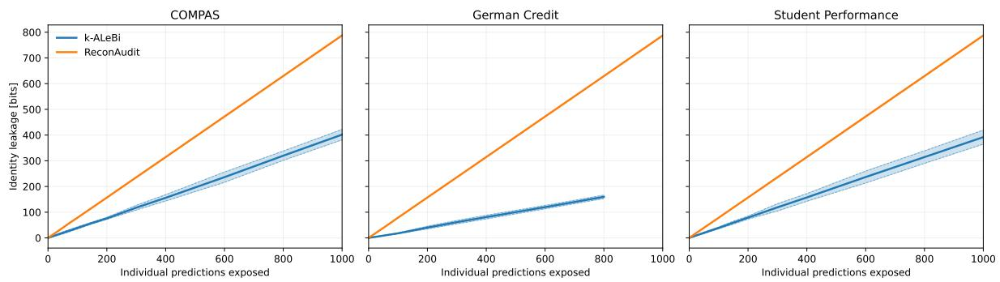  
Figure 9: Identity leakage, measured by the number of individual model responses revealed to the auditor, comparing k-ALEBI with RECONAUDIT.

Figure 9 compares the identity leakage induced by k-ALEBI and RECONAUDIT. RECONAUDIT uses membership queries by default, which directly expose individual model labels to the auditor In contrast, k-ALEBi operates through relational CGQs and therefore does not directly reveal the corresponding individual labels. We quantify this information exposure using the identityleakage measure defined in Definition 3.7. Across the evaluated query budgets, the results show substantially lower identity leakage for k-ALEBı than for RECONAuDIT, while retaining the ability to perform fairness auditing.

Figure 10 further compares k-ALEBi with DIAMAuDIT. The first panel measures the fidelity of an extraction surrogate to the target model as individual predictions are exposed, while the second reports the number of absolute labels revealed to the attacker. These results illustrate the information advantage of relational auditing: k-ALEBi can provide useful fairness information through CGQs without requiring the same level of exposure of individual model predictions as

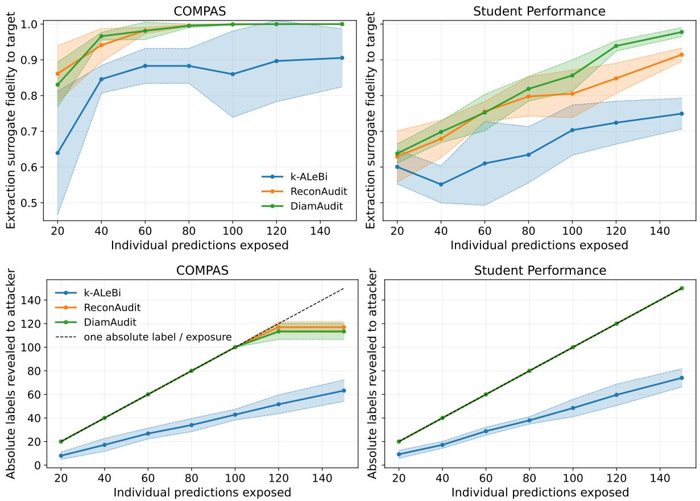  
Figure 10: Model-extraction behavior under k-ALEBI and DIAMAuDIT: extraction surrogate fidelity to the target model and the number of absolute labels revealed to the attacker

membership-query-based extraction

Overall, the results indicate that CGQs can reduce the amount of model-identifying information exposed during auditing. This allows fairness properties to be investigated while limiting direct access to individual model responses, thereby separating the utility of fairness auditing from the immediate reconstruction of the underlying model.

## 4.4 Robustness against Fairness-Aware Adversaries

Finally, we evaluate the robustness of RoBUST k-ALEBi against a fairness-aware adversary. On COMPAS-linear, for example, under a high corruption regime of $p = 0 . 4 0$ , the adversary induces an average of 41.4 raw coordinate corruptions, of which only 6.2 result in corrupted queries after filtering. Despite these corruptions, the fairness estimation error increases only marginally, from 0.019 to 0.021, with no observed concealment across the five runs. In comparison, the reconstruction error of RECONAuDIT increases from 0, corresponding to exact model identification in the absence of corruption, to 0.074 under attack, with a concealment rate of 0.20.

The Yan and Zhang (2022) baseline exhibits an estimation error of 0.03 in the absence of attack, which increases to 0.05 under the strongest feasible attack probability, capped at 0.12. The same qualitative stability of RoBUST k-ALEBi is observed on the German-linear and Student-linear models.

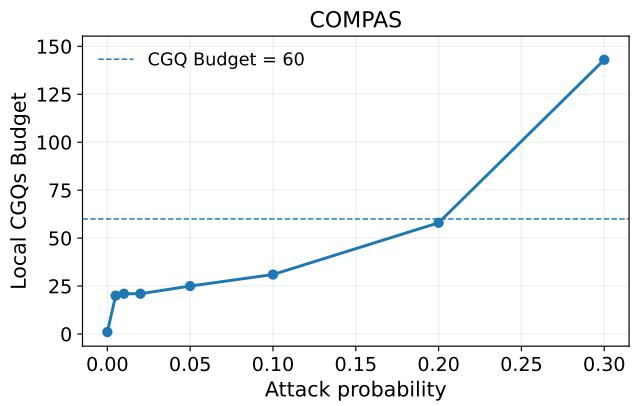

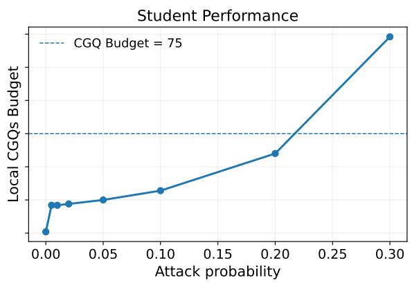  
Figure 11: Local CGQ budget of RoBUST k-ALEBı across cells as a function of the attack probability.

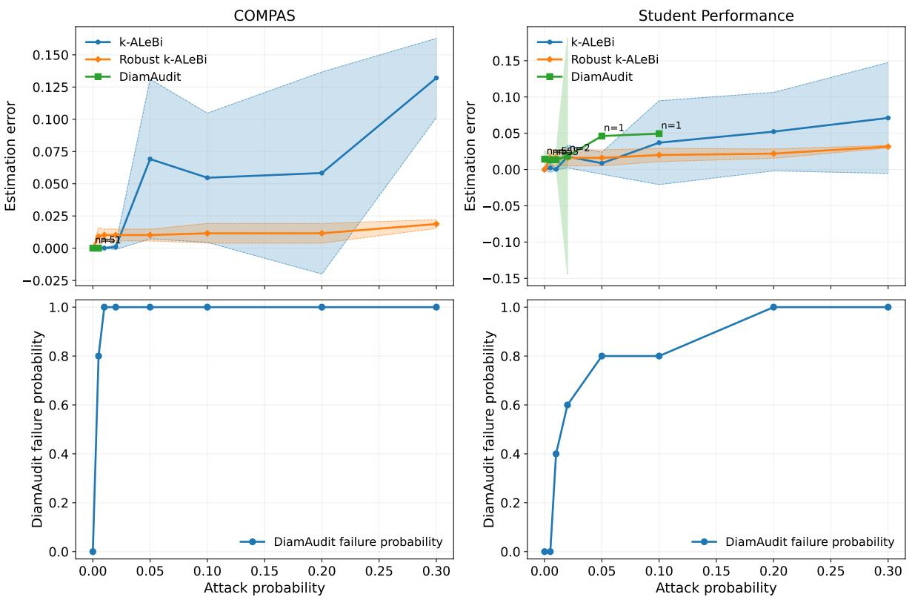  
Figure 12: Estimation error for statistical parity as a function of the attack probability.

## 5 Conclusion

In this work, we established an explicit separation between reconstruction-based and probe-based approaches to fairness auditing. We characterized the probe-learning problem through the multicontext star number and showed that, even when reconstruction-based auditing is infeasible for linear classifiers, the corresponding probe-based approach remains learnable, addressing Q1. Building on this formulation, we designed an auditing algorithm based on learning interpretable bias probes, providing audit information directly in terms of the fairness property of interest and addressing

Q2. Finally, we analyzed the auditing problem in the presence of a fairness-aware adversary and established both upper and lower bounds on the resulting audit complexity, addressing Q3.

## Acknowledgments

This work is supported by the Regalia project of Inria and French Ministry, ANR JCJC project REPUBLIC (ANR-22-CE23-0003-01), and the PEPR project FOUNDRY (ANR23-PEIA-0003). D. Basu would also like to acknowledge the Inria- ISI Kolkata associate team SeRAI for relevant motivation and discussions.

## References

Agarwal, A., Beygelzimer, A., Dudík, M., Langford, J., and Wallach, H. (2018). A reductions approach to fair classification. In International conference on machine learning, pages 60–69. PMLR.

Ailon, N. (2012). An active learning algorithm for ranking from pairwise preferences with an almost optimal query complexity. Journal of Machine Learning Research, 13(1).

Ajarra, A. and Basu, D. (2026). On the hardness of auditing model properties under updates: Complexity of property-preserving updates. In The 29th International Conference on Artificial Intelligence and Statistics.

Alain, G. and Bengio, Y. (2016). Understanding intermediate layers using linear classifier probes. arXiv preprint arXiv:1610.01644.

Angluin, D. (1988). Queries and concept learning. Machine learning, 2(4):319–342.

Angwin, J., Larson, J., Mattu, S., and Kirchner, L. (2022). Machine bias. In Ethics of data and analytics, pages 254–264. Auerbach Publications.

Balcan, M.-F., Beygelzimer, A., and Langford, J. (2006). Agnostic active learning. In Proceedings of the 23rd international conference on Machine learning, pages 65–72.

Balcan, M.-F., Blais, E., Blum, A., and Yang, L. (2012). Active property testing. In 2012 IEEE 53rd Annual Symposium on Foundations of Computer Science, pages 21–30. IEEE.

Banerjee, I., Bhimireddy, A. R., Burns, J. L., Celi, L. A., Chen, L.-C., Correa, R., Dullerud, N., Ghassemi, M., Huang, S.-C., Kuo, P.-C., et al. (2021). Reading race: Ai recognises patient's racial identity in medical images. arXiv preprint arXiv:2107.10356.

Barocas, S. and Selbst, A. D. (2016). Big data's disparate impact. Calif. L. Rev., 104:671.

Biswas, S. and Rajan, H. (2020). Do the machine learning models on a crowd sourced platform exhibit bias? an empirical study on model fairness. In Proceedings of the 28th ACM joint meeting on European software engineering conference and symposium on the foundations of software engineering, pages 642–653.

Chen, M., Gao, C., and Ren, Z. (2016). A general decision theory for huber's €-contamination model. Electronic Journal of Statistics.

Chugg, B., Cortes-Gomez, S., Wilder, B., and Ramdas, A. (2023). Auditing fairness by betting. Advances in Neural Information Processing Systems, 36:6070–6091.

Croce, F., Andriushchenko, M., Sehwag, V., Debenedetti, E., Flammarion, N., Chiang, M., Mittal P., and Hein, M. (2020). Robustbench: a standardized adversarial robustness benchmark. arXiv preprint arXiv:2010.09670.

Crowston, R., Gutin, G., Jones, M., Saurabh, S., and Yeo, A. (2012). Parameterized study of the test cover problem. In International Symposium on Mathematical Foundations of Computer Science, pages 283–295. Springer.

Daneshjou, R., Vodrahalli, K., Novoa, R. A., Jenkins, M., Liang, W., Rotemberg, V., Ko, J., Swetter, S. M., Bailey, E. E., Gevaert, O., et al. (2022). Disparities in dermatology ai performance on a diverse, curated clinical image set. Science advances, 8(31):eabq6147.

Daniely, A., Sabato, S., Ben-David, S., and Shalev-Shwartz, S. (2015). Multiclass learnability and the erm principle. J. Mach. Learn. Res., 16(1):2377–2404.

Dasgupta, S. (2004). Analysis of a greedy active learning strategy. Advances in neural information processing systems, 17.

Dasgupta, S., Hsu, D. J., and Monteleoni, C. (2007). A general agnostic active learning algorithm. Advances in neural information processing systems, 20.

Ebers, M. (2025). Truly risk-based regulation of artificial intelligence how to implement the eu's ai act. European Journal of Risk Regulation, 16(2):684–703.

European Commission (2024a). The digital services act package. Technical report, European Union.

European Commission (2024b). Regulation on artificial intelligence (ai act). Final text adopted by the European Parliament

Freedman, D. A. (1975). On tail probabilities for martingales. the Annals of Probability, pages 100-118.

Garcia, A. C. B., Garcia, M. G. P., and Rigobon, R. (2024). Algorithmic discrimination in the credit domain: what do we know about it? AI & society, 39(4):2059–2098.

Garey, M. R., Johnson, D. S., et al. (1990). A guide to the theory of np-completeness. Computers and intractability, pages 37–79.

Goldreich, O., Goldwasser, S., and Ron, D. (1998). Property testing and its connection to learning and approximation. Journal of the ACM (JACM), 45(4):653–750.

Goodfellow, I., McDaniel, P., and Papernot, N. (2018). Making machine learning robust against adversarial inputs. Communications of the ACM, 61(7):56–66.

Guo, Y., Yang, Y., and Abbasi, A. (2022). Auto-debias: Debiasing masked language models with automated biased prompts. In Proceedings of the 60th Annual Meeting of the Association for Computational Linguistics (Volume 1: Long Papers), pages 1012–1023.

Hanneke, S. (2014). Theory of disagreement-based active learning. Foundations and Trends in Machine Learning, 7(2-3):131–309.

Hanneke, S. and Yang, L. (2015). Minimax analysis of active learning. The Journal of Machine Learning Research, 16(1):3487–3602.

Hardt, M., Price, E., and Srebro, N. (2016). Equality of opportunity in supervised learning. Advances in neural information processing systems, 29.

Harwell, D. (2022). A face-scanning algorithm increasingly decides whether you deserve the job. In Ethics of Data and Analytics, pages 206–211. Auerbach Publications.

Hofmann, H. (1994). Statlog (german credit data). UCI Machine Learning Repository, 10:C5NC77.

Immer, A., Hennigen, L. T., Fortuin, V., and Cotterell, R. (2022). Probing as quantifying inductive bias. In Proceedings of the 60th Annual Meeting of the Association for Computational Linguistics (Volume 1: Long Papers), pages 1839–1851.

Jagielski, M., Carlini, N., Berthelot, D., Kurakin, A., and Papernot, N. (2020). High accuracy and high fidelity extraction of neural networks. In 29th USENIX security symposium (USENIX Security 20), pages 1345–1362.

Kane, D. M., Lovett, S., Moran, S., and Zhang, J. (2017). Active classification with comparison queries. In 2017 IEEE 58th Annual Symposium on Foundations of Computer Science (FOCS), pages 355–366. IEEE.

Kearns, M., Neel, S., Roth, A., and Wu, Z. S. (2018). Preventing fairness gerrymandering: Auditing and learning for subgroup fairness. In International conference on machine learning, pages 2564– 2572. PMLR.

Kusner, M. J., Loftus, J., Russell, C., and Silva, R. (2017). Counterfactual fairness. Advances in neural information processing systems, 30.

Liu, A. and Moitra, A. (2025). Model stealing for any low-rank language model. In Proceedings of the 57th Annual ACM Symposium on Theory of Computing, pages 1755–1761.

Lundberg, S. M. and Lee, S.-I. (2017). A unified approach to interpreting model predictions. Advances in neural information processing systems, 30.

Manerba, M. M., Stańczak, K., Guidotti, R., and Augenstein, I. (2024). Social bias probing: Fairness benchmarking for language models. In Proceedings of the 2024 Conference on Empirical Methods in Natural Language Processing, pages 14653–14671.

Mao, A., Mohri, M., and Zhong, Y. (2023). h-consistency bounds for pairwise misranking loss surrogates. In International conference on Machine learning, pages 23743–23802. PMLR.

Montasser, O., Hanneke, S., and Srebro, N. (2021). Adversarially robust learning with unknown perturbation sets. In Conference on Learning Theory, pages 3452–3482. PMLR.

Morehouse, K. N., Swaroop, S., and Pan, W. (2025). Rethinking llm bias probing using lessons from the social sciences. arXiv preprint arXiv:2503.00093.

New York State Senate (2024). S8612: An act to regulate automated decision-making tools.

Orekondy, T., Schiele, B., and Fritz, M. (2019a). Knockoff nets: Stealing functionality of black-box models. In Proceedings of the IEEE/CVF conference on computer vision and pattern recognition, pages 4954–4963.

Orekondy, T., Schiele, B., and Fritz, M. (2019b). Prediction poisoning: Towards defenses against dnn model stealing attacks. arXiv preprint arXiv:1906.10908.

Pabbaraju, C. (2026). The optimal sample complexity of multiclass and list learning. arXiv preprint arXiv:2604.24749.

Park, D., Neeman, J., Zhang, J., Sanghavi, S., and Dhillon, I. (2015). Preference completion: Large-scale collaborative ranking from pairwise comparisons. In International Conference on Machine Learning, pages 1907–1916. PMLR.

Ribeiro, M. T., Singh, S., and Guestrin, C. (2016). " why should i trust you?" explaining the predictions of any classifier. In Proceedings of the 22nd ACM SIGKDD international conference on knowledge discovery and data mining, pages 1135–1144.

Seyyed-Kalantari, L., Zhang, H., McDermott, M. B., Chen, I. Y., and Ghassemi, M. (2021). Underdiagnosis bias of artificial intelligence algorithms applied to chest radiographs in under-served patient populations. Nature medicine, 27(12):2176–2182.

Tramèr, F., Zhang, F., Juels, A., Reiter, M. K., and Ristenpart, T. (2016). Stealing machine learning models via prediction {APIs}. In 25th USENIX security symposium (USENIX Security 16), pages 601–618.

Tropp, J. (2011). Freedman's inequality for matrix martingales. Electronic Communications in Probability, 16(none):262 – 270.

Vafa, K., Chang, P. G., Rambachan, A., and Mullainathan, S. (2025). What has a foundation model found? using inductive bias to probe for world models. arXiv preprint arXiv:2507.06952.

Vrudhula, A., Kwan, A. C., Ouyang, D., and Cheng, S. (2024). Machine learning and bias in medical imaging: opportunities and challenges. Circulation: Cardiovascular Imaging, 17(2):e015495.

Wilson, K. and Caliskan, A. (2024). Gender, race, and intersectional bias in resume screening via language model retrieval. In Proceedings of the AAAI/ACM Conference on AI, Ethics, and Society, volume 7, pages 1578–1590.

Yan, T. and Zhang, C. (2022). Active fairness auditing. In International Conference on Machine Learning, pages 24929–24962. PMLR.

Yao, A. C.-C. (1977). Probabilistic computations: Toward a unified measure of complexity. In 18th Annual Symposium on Foundations of Computer Science (sfcs 1977), pages 222–227. IEEE.

Yuan, X., Chen, K., Huang, W., Zhang, J., Zhang, W., and Yu, N. (2024). Data-free hard-label robustness stealing attack. In Proceedings of the AAAI Conference on Artificial Intelligence, volume 38(7), pages 6853–6861.

Yuan, X., Ding, L., Zhang, L., Li, X., and Wu, D. O. (2022). Es attack: Model stealing against deep neural networks without data hurdles. IEEE Transactions on Emerging Topics in Computational Intelligence, 6(5):1258–1270.

Zafar, M. B., Valera, I., Rogriguez, M. G., and Gummadi, K. P. (2017). Fairness constraints: Mechanisms for fair classification. In Artificial intelligence and statistics, pages 962–970. PMLR.

Zong, Y., Yang, Y., and Hospedales, T. (2022). Medfair: benchmarking fairness for medical imaging. arXiv preprint arXiv:2210.01725.

## Appendix

## A Extended Framework Description

## A.1 General Framework for Property Specific Audits

Auditing ML models concerns a broad range of properties, including algorithmic fairness, robustness, etc. In a black-box setting, auditing a given property requires carefully designing the queries submitted to the model. Ideally, these queries should be informative about the property under audit while minimizing the amount of information they reveal about the model itself, thereby reducing the risk of model extraction. This principle can be applied to properties involving multiple groups, but we argue that it extends more generally to arbitrary classes of properties. For example, robustness can be interpreted as a two-group property, where an original input and its perturbed counterpart can be viewed as samples from two related groups (perturbed samples come from a ghost group).

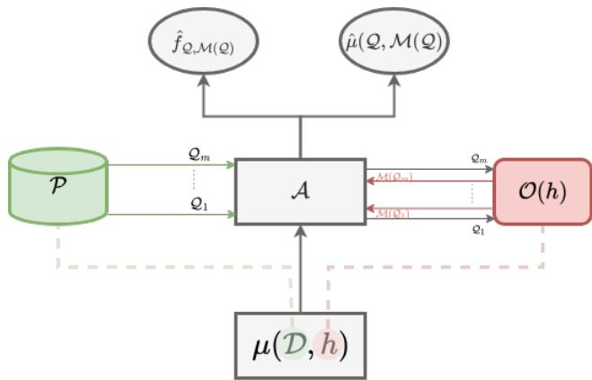  
Figure 13: General Property-specific Audit Framework.

More generally, as illustrated in Figure 13, the model owner can construct a pool of candidate samples that is designed to avoid leaking sensitive information about the model while remaining informative with respect to the property being audited. The auditor A can then select, from this pool, the samples that are most informative for the property of interest and submit the corresponding queries to the model owner M. This separation between sample pool construction and query selection allows the auditor to retain flexibility in designing the audit while giving the model owner control over the information exposed through the available queries.

## A.2 Information-theoretic and combinatorial separation between active learning and active auditing in the presence of protected groups

Active learning of linear classifiers. It is known that the linear classifier learnability in the active setting fails even in 2 dimensions. Sangupta came up with a simple counterexample of why this happens; as Figure 14 shows, when considering a circular representation of data points there exists a strategy to construct an infinite star set. To see this, let $h _ { 0 }$ be the center of the star set, one can observe that for all $i \in [ q ] , \mathrm { D I S } ( h _ { 0 } , h _ { i } ) = \{ x _ { i } \}$ . It is also easy to see that this occurs while q can go to infinity. This construction shows that the star number of linear classifiers class explodes to infinity just in two dimensions.

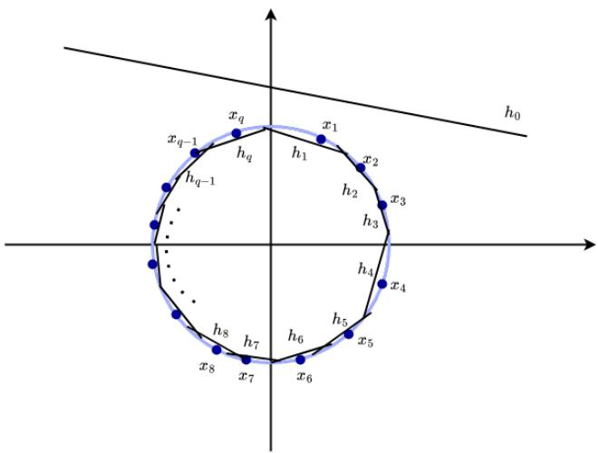  
Figure 14: 2D of linear classifier counterexample in the active leanring setting: the blue dots $x _ { i }$ represent covariates, the dark lines represent classifiers $h _ { i }$

Active auditing in the presence of protected groups. In the presence of protected groups, an additional feature (protected feature) needs to be added to the setting. Therefore to reproduce this counter-example for the auditing problem, we add an additional feature, therefore $\mathcal { X } \subseteq \mathbb { R } ^ { 3 }$ as shown in Figure 15. We consider the scenario where $\mathcal { X } = \mathcal { X } ^ { 0 } \times \mathcal { X } ^ { 1 } \times \mathcal { X } ^ { 2 }$ , χ⁰ denotes the protected feature while $\mathcal { X } ^ { 1 }$ and $\mathcal { X } ^ { 2 }$ denote the unprotected features. $\mathcal { X } _ { 1 } ^ { 0 } \subseteq \mathcal { X }$ (resp. $\mathcal { X } _ { 1 } ^ { 0 } )$ denotes the first (resp. second) protected group.

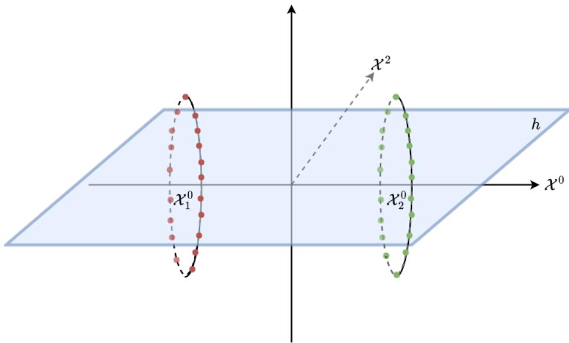  
Figure 15: Illustration of Dasgupta (2004) counterexample in the context of fairness auditing. Red dots represent samples from the first protected group while green dots represent sampless from the second protected group.

It is easy to see that, in this setting the counterexample of Dasgupta (2004) still applies in

3D. and therefore the star number is infinite. However, when we focus on solely extracting the discriminative behavior of h instead of the whole h (through active learning approaches), we avoid unnecessary information in the subspace of X where h is fair. In other words, the information $h ( x _ { 1 } ) - h ( x _ { 2 } ) = 0$ is equivalent to both $h ( x _ { 0 } ) = h ( x _ { 1 } ) = 0$ and $h ( x _ { 0 } ) = h ( x _ { 1 } ) = 1$ in the context of fairness auditing but not in the context of learning, this shows that auditing problem reduces significantly the number of dichotomies used in learning.

To see why the dual-number corresponding to the audit problem illustrated in Figure 15, we reduce learning the overall bias canvas to learning canvas biases in each unprotected direction. The problem now reduces to the one explained in Example A.1, and the bias canvas in each direction is illustrated in Figure 16.

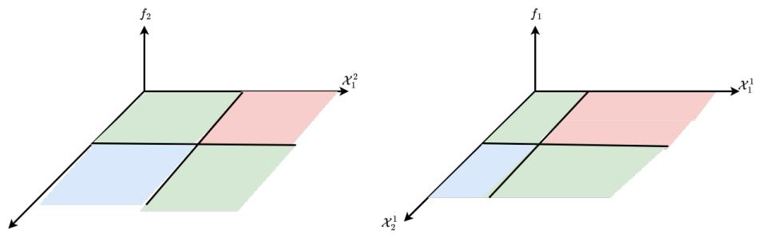  
Figure 16: Bias canvases of h in feature 1 (right) and in feature 2 (left).

In this example the overall bias canvas is defined on the space $\mathcal { X } _ { 1 } ^ { 1 } \times \mathcal { X } _ { 2 } ^ { 1 } \times \mathcal { X } _ { 1 } ^ { 2 } \times \mathcal { X } _ { 2 } ^ { 2 } \subseteq \mathbb { R } ^ { 4 }$

## A.3 Examples of relative dual classes and their star numbers from known hypothesis classes

When the original model class is known, the dual context class can be defined explicitly based on the model class. In this scenario, we refer to relative dual context classes, where instead of searching for arbitrary preference functions modeling the discriminative behavior of the model, we restrict our search within dual classes that depend on the original model class. We provide two examples to compute the dual star number, one for linear classifiers and the other for axis-parallel rectangles.

Example A.1 (Linear Classifiers as relative dual-context classes.). For the relative dual class of linear separators in dimension 2, $\mathcal { F } _ { 2 } ^ { l i n }$ , the dual star number is 2. To convince ourselves of that, consider the figure below. The preference function fo represents the center of the star set. It acts discriminatively on both the blue and red samples. For the red (resp. blue) sample, it prefers the one in $\mathcal { X } _ { 0 }$ (resp. the one in $\mathcal { X } _ { 1 } )$ . As the figure shows, $\left\{ f _ { 0 } , f _ { 1 } , f _ { 2 } \right\}$ consists of a star set for the dual-class $\mathcal { F } ( \mathcal { H } _ { \mathbb { R } ^ { 2 } } ^ { l i n } )$ , since ${ \cal D } I S _ { d u a l } ^ { r e l } ( \{ f _ { 0 } , f _ { i } \} ) = \{ x ^ { ( i ) } \} , f o r i \in \{ 1 , 2 \}$ . It is easy to see that any new point of couples added to the partition of $\mathcal { X } _ { 0 } \times \mathcal { X } _ { 1 }$ will increase the disagreement, therefore the star dimension is 2.

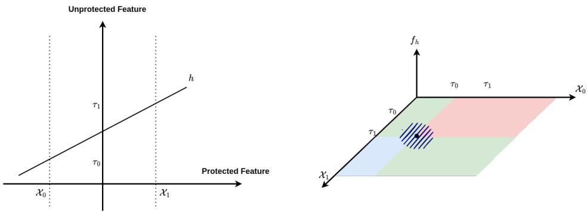  
Figure 17: Illustration of the dual star number for the dual class relative to $\mathcal { H } _ { \mathbb { R } ^ { 2 } } ^ { \mathrm { l i n } }$

By the symmetry of $\mathcal { F } _ { 2 } ^ { \mathrm { l i n } }$ , the same reasoning apply for points chosen on the fair region (green area) of the center preference $f _ { 0 }$

Example A.2 (Axis-parallel rectangles as relative dual-context classes.). When the original model class consists of axis-parallel rectangles. The set of possible discriminative dichotomies increases. Consider the classification problem illustrated in Figure 18. One can observes that the same pattern of the previous examples repeats itself four times ( two times along

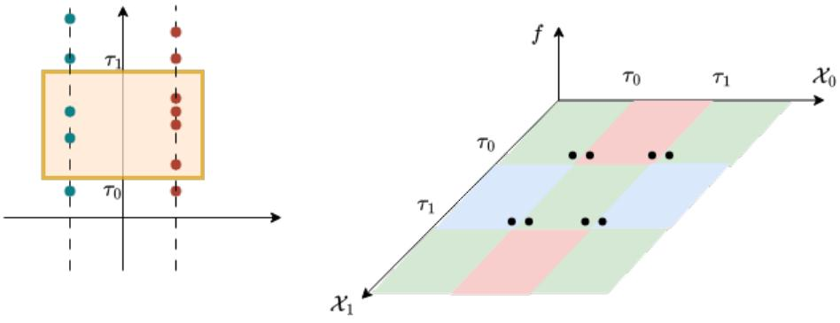  
Figure 18: Illustration of the dual star number for the dual class relative to $\mathcal { H } _ { \mathbb { R } ^ { 2 } } ^ { \mathrm { r e c } }$

## A.4 Mutli-star number of multi-context class relative to linear classifiers

Proposition 3.2 (Information-Theoretic Separation of Reconstruction and Probe Auditing). There exists an audit instance problem, where auditing via model reconstruction is strictly harder than auditing via probe learning.

Proof

Let $\mathcal { H } = \left\{ h _ { w } ( X ) = \mathbb { 1 } _ { w X \geq 0 } : w \in \mathbb { R } ^ { * 2 } \right\}$ be the class of homogeneous linear classifiers.

Let $R = { \binom { 0 } { 1 } }$ denote rotation by $\pi / 2$ , and consider the following representation of protected groups domain $\mathcal { X } _ { R } = \mathcal { Z } _ { 1 } \times \mathcal { Z } _ { 2 } = \{ ( x , R x ) : x \in \mathbb { R } ^ { * 2 } \}$

For $h \in \mathcal H$ , we have the bias probe for our audit instance problem $k = 2 , f _ { h } ( x , R x ) = h ( x ) -$ $h ( R x ) \in \{ - 1 , 0 , + 1 \}$ , and let $\mathcal { F } _ { R , \mathcal { H } } = \{ f _ { h } : h \in \mathcal { H } \}$

We show that $\mathfrak { s } ( \mathcal { H } ) = \infty , \qquad \mathfrak { s } _ { 2 } ( \mathcal { F } _ { \mathcal { H } , R } ) = 3 .$

The fact that ${ \mathfrak { s } } ( \mathcal { H } ) = \infty$ for homogeneous linear separators in $\mathbb { R } ^ { 2 }$ is standard (Hanneke, 2014). Thus it remains to compute the star number of the induced relational class $\mathcal { F } _ { \mathcal { H } , R }$

Step 1: Angular representation of the 2-context class. Since the classifiers are homogeneous, only the directions of w and x matter.

Let $w _ { \theta } = \left( \cos \theta , \sin \theta \right)$ and $x _ { \phi } = r ( \cos \phi , \sin \phi )$ , where $r > 0$

Then $w _ { \theta } x _ { \phi } = r \cos ( \theta - \phi )$ . Since $R x _ { \phi }$ has angle $\phi + \pi / 2$

$$
w _ { \theta } ^ { \top } R x _ { \phi } = r \cos \left( \theta - \phi - \frac { \pi } { 2 } \right) = r \sin ( \theta - \phi ) .
$$

Consequently,

$$
f _ { \theta } ( \phi ) = \mathrm { s i g n } \big ( \cos ( \theta - \phi ) \big ) - \mathrm { s i g n } \big ( \sin ( \theta - \phi ) \big ) .\tag{1}
$$

We choose all probe and witness angles away from the transition points, so the value assigned to angle 0 is irrelevant.

Let $\beta = \theta - \phi$ (mod 2π). Then,

$$
f _ { \theta } ( \phi ) = \left\{ \begin{array} { l l } { + 1 , } & { \beta \in ( - \pi / 2 , 0 ) , } \\ { 0 , } & { \beta \in ( 0 , \pi / 2 ) , } \\ { - 1 , } & { \beta \in ( \pi / 2 , \pi ) , } \\ { 0 , } & { \delta \in ( \pi , 3 \pi / 2 ) . } \end{array} \right.\tag{2}
$$

Thus the 2-context class becomes the $\beta$ translation class obtained by rotating the four-sector cyclic labeling $+ 1 , \quad 0 , \quad - 1 , \quad 0$ , with each sector having angular width $\pi / 2$

Step 2: Agreement sets relative to a probe. Fix a reference orientation $\theta _ { 0 }$ . By rotational invariance, we may assume without loss of generality that $\theta _ { 0 } = 0$ . For every probe angle $\phi ,$ define its agreement set in parameter space by

$$
A _ { \phi } = \left\{ \theta \in \mathbb { S } ^ { 1 } : f _ { \theta } ( \phi ) = f _ { 0 } ( \phi ) \right\} .
$$

By construction, $0 \in A _ { \phi }$ for every $\phi .$ Equation (2) shows that there are exactly two possible forms for $A _ { \phi }$

• Discriminatory Probe: $f _ { 0 } ( \phi ) \in \{ - 1 , + 1 \}$ : In this case the reference label occurs on exactly one sector of length $\pi / 2$ . Hence $A _ { \phi } = I _ { \phi }$ , where $I _ { \phi }$ is an arc of length $\pi / 2$ containing 0.

• Fair Probe: $f _ { 0 } ( \phi ) = 0$ . The label 0 occurs on two antipodal sectors, each of length $\pi / 2$ Therefore $A _ { \phi } = I _ { \phi } \cup ( I _ { \phi } + \pi )$ , where again $I _ { \phi }$ is the unique component containing 0 and has length $\pi / 2$

Thus every probe has a local agreement interval $I _ { \phi }$ of length $\pi / 2$ containing the reference parameter 0. A Fair probe additionally has an antipodal copy of this interval on the two dimensional sphere.

Step 3: An interval lemma. We use the following elementary fact.

Lemma A.1. Let

$$
I _ { i } = ( \ell _ { i } , r _ { i } ) , \qquad i = 1 , \ldots , m ,
$$

be intervals on the real line satisfying $\ell _ { i } < 0 < r _ { i }$ for every i. Suppose that, for an index $i ,$ there exists a point $t _ { i }$ such that

$$
t _ { i } \in \bigcap _ { j \neq i } I _ { j } \qquad b u t \qquad t _ { i } \not \in I _ { i } .
$$

Then i must be either an index attaining the largest left endpoint or an index attaining the smallest right endpoint. Consequently, at most two indices can satisfy this property.

Proof Suppose $\begin{array} { r } { t _ { i } \in \bigcap _ { i \neq i } I _ { j } \ \backslash I _ { i } } \end{array}$ . Since every interval contains 0, either $t _ { i } < \ell _ { i } < 0$ or $t _ { i } > r _ { i } > 0$ If $t _ { i } < \ell _ { i }$ , then $t _ { i } \in \dot { I _ { j } }$ for every $j \neq i ,$ SO $\ell _ { j } < t _ { i } < \ell _ { i }$ for all $j \neq i$ . Hence $\ell _ { i } > \ell _ { j }$ for all $j \neq i ,$ SO i is the unique index with largest left endpoint.

Similarly, if $t _ { i } > r _ { i }$ then $r _ { i } < t _ { i } < r _ { j }$ for all $j \neq i$ , and therefore i is the unique index with smallest right endpoint.

There can be at most one unique largest left endpoint and at most one unique smallest right endpoint. Hence at most two indices can possess such a private point. ■

Step 4: Upper bound $\mathfrak { s } ( \mathcal { F } a i r ) \le 3$ . Suppose that $\phi _ { 1 } , \ldots , \phi _ { m }$ form a star centered at $f _ { 0 }$ By the definition of the star number, for every $i \in [ m ]$ there exists an orientation $\theta _ { i }$ such that

$$
f _ { \theta _ { i } } ( \phi _ { i } ) \neq f _ { 0 } ( \phi _ { i } ) , \qquad f _ { \theta _ { i } } ( \phi _ { j } ) = f _ { 0 } ( \phi _ { j } ) \quad \mathrm { f o r ~ a l l ~ } j \neq i .\tag{3}
$$

Equivalently,

$$
\theta _ { i } \in \bigcap _ { j \neq i } A _ { \phi _ { j } } \setminus A _ { \phi _ { i } } .\tag{4}
$$

We distinguish cases according to the number of discriminatory probes.

• Case 1: There are no discriminatory probes.

Then every probe is fair:

$$
A _ { \phi _ { i } } = I _ { i } \cup ( I _ { i } + \pi ) .
$$

Since this family is invariant under translation by $\pi _ { \mathrm { : } }$ we may project the parameter circle modulo π. Under this projection, each agreement set becomes a single interval $I _ { i }$ of length $\pi / 2$ containing the reference point 0.

Condition (4) therefore reduces exactly to the private-point condition in Lemma A.1. Consequently, $m \le 2$

• Case 2: There is exactly one discriminatory probe.

Let this probe have index $q .$ For every $i \neq q .$ a witness $\theta _ { i }$ satisfying (4) must in particular belong to $A _ { \phi _ { q } } = I _ { q }$ Since $I _ { q }$ is the local interval of length $\pi / 2$ containing $0 , \theta _ { i }$ cannot lie in the antipodal component $I _ { j } + \pi$ of any Fair agreement set. Hence, for all $i \neq q$ , the star condition reduces locally to

$$
\theta _ { i } \in \bigcap _ { j \neq i } I _ { j } \setminus I _ { i } .
$$

By Lemma A.1, at most two of the Fair probes can possess such witnesses.

Since there is only one discriminatory probe, this yields $m \leq 1 + 2 = 3$

• Case 3: There are at least two Discriminatory probes.

For every i, the intersection

$$
\bigcap _ { j \neq i } A _ { \phi _ { j } }
$$

contains a Discriminatory agreement interval, except possibly when i is one of the Discriminatory probes and there is exactly one other Discriminatory probe. In either case, because there is at least one Discriminatory agreement set among the sets indexed by $j \neq i ,$ every witness $\theta _ { i }$ is confined to the local component containing 0.

Thus all relevant agreement sets may be replaced by their local intervals $I _ { j }$ , and condition (4) again reduces to

$$
\theta _ { i } \in \bigcap _ { j \neq i } I _ { j } \setminus I _ { i } .
$$

Lemma A.1 then implies $m \le 2$

Combining the three cases gives $\mathfrak { s } _ { 2 } ( \mathcal { F } _ { \mathcal { H } , R } ) \le 3$

Step 5: Lower bound ${ \mathfrak { s } } _ { 2 } ( { \mathcal { F } } _ { { \mathcal { H } } , R } ) \geq 3 .$ It remains to exhibit an explicit 3-star on the 2-context class. To this end, consider the reference orientation $\theta _ { 0 } = 0$ and choose the three probe angles

$$
\phi _ { 1 } = { \frac { \pi } { 2 0 } } , \qquad \phi _ { 2 } = { \frac { 2 1 \pi } { 4 0 } } , \qquad \phi _ { 3 } = { \frac { 2 3 \pi } { 4 0 } } .
$$

Using (1), their labels under the reference orientation are

$$
( f _ { 0 } ( \phi _ { 1 } ) , f _ { 0 } ( \phi _ { 2 } ) , f _ { 0 } ( \phi _ { 3 } ) ) = ( + 1 , 0 , 0 ) .
$$

Now choose the three witnessing orientations

$$
\theta _ { 1 } = { \frac { 4 \pi } { 5 } } , \qquad \theta _ { 2 } = { \frac { 3 \pi } { 8 0 } } , \qquad \theta _ { 3 } = { \frac { 2 5 \pi } { 1 6 } } .
$$

Direct substitution into (1) gives

$$
( f _ { \theta _ { 1 } } ( \phi _ { 1 } ) , f _ { \theta _ { 1 } } ( \phi _ { 2 } ) , f _ { \theta _ { 1 } } ( \phi _ { 3 } ) ) = ( - 1 , 0 , 0 ) ,
$$

$$
( f _ { \theta _ { 2 } } ( \phi _ { 1 } ) , f _ { \theta _ { 2 } } ( \phi _ { 2 } ) , f _ { \theta _ { 2 } } ( \phi _ { 3 } ) ) = ( + 1 , + 1 , 0 ) ,
$$

and

$$
( f _ { \theta _ { 3 } } ( \phi _ { 1 } ) , f _ { \theta _ { 3 } } ( \phi _ { 2 } ) , f _ { \theta _ { 3 } } ( \phi _ { 3 } ) ) = ( + 1 , 0 , - 1 ) .
$$

Therefore,

$$
\{ j : f _ { \theta _ { 1 } } ( \phi _ { j } ) \neq f _ { 0 } ( \phi _ { j } ) \} = \{ 1 \} ,
$$

$$
\{ j : f _ { \theta _ { 2 } } ( \phi _ { j } ) \neq f _ { 0 } ( \phi _ { j } ) \} = \{ 2 \}
$$

and

$$
\{ j : f _ { \theta _ { 3 } } ( \phi _ { j } ) \neq f _ { 0 } ( \phi _ { j } ) \} = \{ 3 \}
$$

Hence $\mathfrak { s } ( \mathcal { F } _ { \mathcal { H } , R } ) \geq 3$ . Together with the upper bound, we get ${ \mathfrak { s } } _ { 2 } ( { \mathcal { F } } _ { { \mathcal { H } } , R } ) = 3$

Finally, since ${ \mathfrak { s } } ( \mathcal { H } ) = \infty$ , we obtain the desired information-theoreticseparation

Remark A.1 (The protected groups domain restriction is essential). The finite-star conclusion on the 2-context class relies essentially on restricting the allowable cross-group probes to

$$
{ \mathcal { Z } } _ { R } = \{ ( x , R x ) : x \neq 0 \} .
$$

It does not hold for the unrestricted product-space class

$$
\widetilde { \mathcal { F } } = \left\{ ( x _ { 1 } , x _ { 2 } ) \mapsto h ( x _ { 1 } ) - h ( x _ { 2 } ) : h \in \mathcal { H } \right\} .
$$

Indeed, for every homogeneous linear classifier and every x away from its decision boundary,

$$
h ( - x ) = - h ( x ) ,
$$

and hence

$$
f _ { h } ( x , - x ) = h ( x ) - h ( - x ) = h ( x ) ^ { 6 } .
$$

Thus the restriction of $\widetilde { \mathcal F }$ to pairs of the form (x, —x) contains an exact copy of H, implying

$$
\mathfrak { s } _ { 2 } ( \widetilde { \mathcal { F } } ) \geq \mathfrak { s } ( \mathcal { H } ) = \infty .
$$

Therefore the separation in Proposition 3.2 arises from the combination of relational predictions and the structured protected groups domain, rather than from taking prediction differences alone.

## B Protection against Model Extraction

Theorem 3.2 (Hardness of Model Extraction via Bias Probes). Given a learned probe $f _ { h } \in \mathcal { F } _ { \mathcal { H } }$ from a (black-box) interaction with a model owner M of $h \in \mathcal H$ , recovering $h$ is NP hard.

Proof We reduce from the Minimum Test Cover problem (Definition E.2), known to be NPcomplete.

We begin by showing that B-BOUNDED-RELATIONAL-EXTRACTION is NP-hard via a polynomialtime reduction from MiNIMUM-TEST-CoVER, even when the multi-context class and the set of admissible queries are finite and every query uses two points that occur in no other admissible query.

Membership in NP is immediate: given a candidate ${ \mathcal { Q } } ^ { \prime } \subseteq { \mathcal { Q } } .$ , one can verify $| \mathcal { Q } ^ { \prime } | \leq B$ and, for each of the at most $\binom m 2$ pairs of hypotheses, check whether some query in $\mathcal { Q } ^ { \prime }$ distinguishes the pair. By assumption, every relational response is polynomial-time computable. For NP-hardness, we reduce from MINIMUM TEST-COVER.

Let $( U , T , K )$ be an instance, where $U = \{ u _ { 1 } , \ldots , u _ { m } \}$ $\mathcal { T } = \{ T _ { 1 } , \ldots , T _ { r } \}$ . A subcollection $\tau ^ { \prime } \subseteq \tau$ is a test cover if for every pair $u _ { i } \neq u _ { j }$ , there exists $T _ { \ell } \in \mathcal { T } ^ { \prime }$ containing exactly one of $u _ { i }$ and $u _ { j }$

First, we can observe that if some pair $u _ { i } \neq u _ { j }$ is not distinguished by any test in $\tau ,$ then the TEST-CoVER instance is necessarily a NO instance. Such instances may therefore be mapped in polynomial time to any fixed NO instance of the target problem. Hence, for the remainder of the reduction, we may assume that every pair of objects is distinguished by at least one test. For every test $T _ { \ell } .$ introduce two fresh domain points $a _ { \ell } , b _ { \ell }$ . All such points are distinct, so $\{ a _ { \ell } , b _ { \ell } \} \cap \{ a _ { \ell ^ { \prime } } , b _ { \ell ^ { \prime } } \} =$ $\alpha ,$ for $\ell \neq \ell ^ { \prime }$

For every object $u _ { j } \in U$ , define a hypothesis $h _ { j } : \mathcal { X }  \{ 0 , 1 \}$ by $h _ { j } ( a _ { \ell } ) = 1$ and $h _ { j } ( b _ { \ell } ) =$ $1 - \Im \{ u _ { j } \in T _ { \ell } \}$ . Since every pair of objects is distinguished by at least one test, the resulting hypotheses $h _ { 1 } , \ldots , h _ { m }$ are pairwise distinct.

For every $T _ { \ell } ,$ define the relational query $q _ { \ell } = ( a _ { \ell } , b _ { \ell } )$ and let $f _ { h } ( q _ { \ell } ) = h ( a _ { \ell } ) - h ( b _ { \ell } )$ . Then

$$
f _ { h _ { j } } ( q _ { \ell } ) = h _ { j } ( a _ { \ell } ) - h _ { j } ( b _ { \ell } ) = \mathbb { 1 } \{ u _ { j } \in T _ { \ell } \} .
$$

Consequently, for every $i \neq j$

$$
\begin{array} { r l } & { f _ { h _ { i } } ( q _ { \ell } ) \ne f _ { h _ { j } } ( q _ { \ell } ) \iff \mathbb { 1 } \{ u _ { i } \in T _ { \ell } \} \ne \mathbb { 1 } \{ u _ { j } \in T _ { \ell } \} } \\ & { \iff T _ { \ell } \mathrm { ~ d i s t i n g u i s h e s ~ } u _ { i } \mathrm { ~ a n d ~ } u _ { j } . } \end{array}
$$

Now set $B = K$ . For any subcollection $\tau ^ { \prime } \subseteq \tau$ , define $\mathcal { Q } ^ { \prime } = \{ q _ { \ell } : T _ { \ell } \in T ^ { \prime } \}$ . The correspondence $T _ { \ell }  q _ { \ell }$ is one-to-one, so

$$
| \mathcal { Q } ^ { \prime } | = | \mathcal { T } ^ { \prime } | .
$$

Moreover, by the equivalence above,

$\tau ^ { \prime }$ distinguishes every pair in $U \iff \mathcal { Q } ^ { \prime }$ distinguishes every pair in $\mathcal { H } _ { 0 }$

Therefore,

$$
( U , T , K ) \in \mathrm { T E S T - C o v E R } \iff ( \mathcal { H } _ { 0 } , \mathcal { Q } , B ) \in \mathrm { B o u N D E D - R E L A T I O N A L - E X T R A C T I O N } .
$$

The construction uses $2 r$ domain points, m hypotheses, and r queries, and its explicit representation can be constructed in $O ( m r )$ time. Hence the reduction is polynomial. Finally, since every $q \ell$ uses the fresh pair $\{ a _ { \ell } , b _ { \ell } \}$ , distinct queries have disjoint supports. Therefore the NP-completeness result holds even under this restriction.

## C Proofs for Manipulation-free Regime

## C.1 Lower Bound on Sample Complexity

Theorem 3.1 (Sample Complexity Lower Bound). Fix $\varepsilon \in ( 0 , 1 / 4 ) , \delta \in ( 0 , 1 / 2 )$ . For any (possibly randomized) active auditor making at most

$$
m \leq \Omega \left( \operatorname* { m a x } \left\{ \frac { 1 - 2 \delta } { 1 - \delta } \operatorname* { m i n } \left\{ \mathfrak { s } _ { k } , \left\lfloor \frac { 1 } { 2 \epsilon } \right\rfloor \right\} , \left[ 1 - 2 \epsilon - 2 \delta ( 1 - \epsilon ) \right] _ { + } \mathrm { D S } _ { k } \right\} \right)
$$

CGQ queries, there exists a distribution D over X and a target comparison functional $f _ { h ^ { \ast } } \in \mathcal { F }$ such that, with probability at least $\delta _ { \perp }$

$$
\underset { \substack { \mathscr { Q } _ { 1 : m } \sim \mathscr { D } ^ { m k } } } { \mathbb { P } } \left[ \underset { { \substack { \mathbf { X } \sim \mathscr { D } ^ { k } } } } { \mathbb { P } } \left[ \hat { f } _ { \mathscr { Q } _ { 1 : m } } ( \mathbf { X } ) \neq f _ { h } ( \mathbf { X } ) \right] > \varepsilon \right] > \delta .
$$

Proof

Step 1: Active bound.

Let $\alpha _ { \epsilon } =$ min $\left\{ \mathfrak { s } _ { k } , \big \lfloor \frac { 1 } { 2 \epsilon } \big \rfloor \right\}$ . Let $S ~ = ~ \{ \mathbf { x } _ { 1 } , \ldots , \mathbf { x } _ { \alpha _ { \epsilon } } \}$ be a k-star with center $f _ { 0 }$ and witnesses $f _ { 1 } , \ldots , f _ { \alpha _ { \epsilon } }$ , and define the fixed coupling $\begin{array} { r } { \nu = \frac { 1 } { \alpha _ { \epsilon } } \sum _ { i = 1 } ^ { \alpha _ { \epsilon } } \delta _ { { \bf x } _ { i } } } \end{array}$

We have, $\begin{array} { r } { \nu ( \left\{ \mathbf { x } _ { i } \right\} ) = \frac { 1 } { \alpha _ { \epsilon } } \geq 2 \epsilon > \epsilon . } \end{array}$

Consider any randomized auditor using at most $q$ queries. We begin by observing :

$$
\operatorname* { s u p } _ { f ^ { * } \in { \mathcal F } _ { k } } \mathbb { P } \left[ \operatorname* { \mathbb { P } } _ { \mathbf { X } \sim \nu } [ { \widehat { f } } ( \mathbf { X } ) \neq f ^ { * } ( \mathbf { X } ) ] > \epsilon \right] \geq \operatorname* { m a x } _ { i \in [ \alpha _ { \epsilon } ] } \mathbb { P } \left[ \operatorname* { \mathbb { P } } _ { \mathbf { X } \sim \nu } [ { \widehat { f } } ( \mathbf { X } ) \neq f _ { i } ( \mathbf { X } ) ] > \epsilon \right]
$$

We proceed by coupling the audit process with targets $f _ { 0 } , f _ { 1 } , \ldots , f _ { \alpha _ { \epsilon } }$ using the same unlabeled stream and the same internal randomness for the audit.

Let $Q _ { 0 }$ denote the distinct star points queried under target $f _ { 0 }$ , and if

$$
\mathbb { P } \big [ \underset { \mathbf { X } \sim \nu } { \mathbb { P } } \left[ \widehat { f } _ { 0 } ( \mathbf { X } ) \neq f _ { 0 } ( \mathbf { X } ) \right] > \epsilon \big ] > \delta
$$

$f _ { 0 }$ is already hard.

Otherwise, for all $i \in [ \alpha _ { \epsilon } ]$ with probability at least $1 - \delta$ we have

$$
{ \widehat { f } } _ { 0 } ( \mathbf { x } _ { i } ) = f _ { 0 } ( \mathbf { x } _ { i } )\tag{5}
$$

Let $E _ { 0 }$ denotes that event, that is

$$
E _ { 0 } = \left\{ \widehat { f } _ { 0 } ( \mathbf { x } _ { i } ) = f _ { 0 } ( \mathbf { x } _ { i } ) : \forall i \in [ \alpha _ { \epsilon } ] \right\}
$$

We have

$$
\mathbb { P } \left| E _ { 0 } \right] \geq 1 - \delta\tag{6}
$$

If $\mathbf { x } _ { i } \notin Q _ { 0 } .$ , then all queries lie in some $\mathbf { x } _ { j }$ , where $j \neq i$

By the star definition, we know that $f _ { i } ( \mathbf { x } _ { j } ) = f _ { 0 } ( \mathbf { x } _ { j } )$ , and a simple induction over the interaction wxith the model owner therefore gives ${ \widehat { f } } _ { i } = { \widehat { f } } _ { 0 }$

Hence, on the event in 5, every non-queried $\mathbf { x } _ { i }$ produces $\widehat { f } _ { i }$ such that $\underset { { \bf X } \sim \nu } { \mathbb { P } } \left[ \widehat { f } _ { i } ( { \bf X } ) \neq f _ { i } ( { \bf X } ) \right] > \epsilon$ Lot Let $F _ { i }$ denote the event denote the event

$$
F _ { i } = \smash { \Big \{ \underset { \mathbf { X } \sim \nu } { \mathbb { P } } [ \widehat { f } _ { i } ( \mathbf { X } ) \neq f _ { i } ( \mathbf { X } ) ] \Big \} }
$$

We have shown that

$$
E _ { 0 } \cap \{ { \bf x } _ { i } \in Q _ { 0 } \} \subseteq F _ { i }
$$

Therefore,

$$
\mathbf { 1 } _ { E _ { 0 } } \mathbb { 1 } _ { \mathbf { x } _ { i } \notin Q _ { 0 } } \le \mathbb { 1 } _ { F _ { i } }\tag{7}
$$

On the other hand, by definition $| Q _ { 0 } | \le q$ Since there $\alpha _ { \epsilon }$ star points,

$$
\sum _ { i \in [ \alpha _ { \epsilon } ] } \mathbb { 1 } _ { \mathbf { x } _ { i } \notin Q _ { 0 } } \ge \alpha _ { \epsilon } - q\tag{8}
$$

$$
\begin{array} { r l } { \displaystyle \operatorname* { m a x } _ { \epsilon \in [ \alpha _ { c } ] } \mathbb { P } [ \widehat { f } _ { i } ( \mathbf { X } ) \neq f _ { i } ( \mathbf { X } ) ] > \epsilon ] \geq \frac { 1 } { \alpha _ { \epsilon } } \displaystyle \sum _ { i \in [ \alpha _ { c } ] } \mathbb { P } [ \mathbb { P } _ { \mathbf { X } \sim \nu } \widehat { f } _ { i } ( \mathbf { X } ) \neq f _ { i } ( \mathbf { X } ) ] > \epsilon ] } & { } \\ & { \quad \quad \quad \quad \quad \quad \quad \quad \quad \quad \quad \quad \quad \quad \quad \quad \quad \quad \quad \quad } \\ & { \quad \quad \quad \quad \quad \quad \quad \quad \quad \quad \quad \quad \quad \quad \quad \quad \quad \quad \quad \quad \quad \quad \frac { 1 } { \alpha _ { \epsilon } } \displaystyle \sum _ { i \in [ \alpha _ { c } ] } \mathbb { E } [ \mathbb { I } _ { \widehat { i } _ { i } } ] } \\ & { \quad \quad \quad \quad \quad \quad \quad \quad \quad \quad \quad \quad \quad \quad \quad \quad \quad \quad \quad \quad \quad \quad \quad \quad \quad \quad \quad \quad \quad \quad \quad } \\ & { \quad \quad \quad \quad \quad \quad \quad \quad \quad \quad \quad \quad \quad \quad \quad \quad \quad \quad \quad \quad \quad \quad \quad \quad \quad \quad \quad \quad \quad \quad } \\ & { \quad \quad \quad \quad \quad \quad \quad \quad \quad \quad \quad \quad \quad \quad \quad \quad \quad \quad \quad \quad \quad \quad \quad \quad \quad \quad \quad \quad \quad \quad \quad } \\ & { \quad \quad \quad \quad \quad \quad \quad \quad \quad \quad \quad \quad \quad \quad \quad \quad \quad \quad \quad \quad \quad \quad \quad \quad \quad \quad \quad \quad \quad \quad \quad } \\ & { \quad \quad \quad \quad \quad \quad \quad \quad \quad \quad \quad \quad \quad \quad \quad \quad \quad \quad \quad \quad \quad \quad \quad \quad \quad \quad \quad \quad \quad \quad \quad } \\ & { \quad \quad \quad \quad \quad \quad \quad \quad \quad \quad \quad \quad \quad \quad \quad \quad \quad \quad \quad \quad \quad \quad \quad \quad \quad \quad \quad \quad \quad \quad \quad } \\ &  \quad \quad  \end{array}
$$

Where step 3 follows from 7, step 4 follows from 8 , and the last step follows from 6.

The right part is bigger than δ when $\begin{array} { r } { \frac { \alpha _ { \epsilon } - q } { \alpha _ { \epsilon } } ( 1 - \delta ) > \delta , } \end{array}$

which is equivalent to $\begin{array} { r } { q > \frac { 1 - 2 \delta } { 1 - \delta } \alpha _ { \epsilon } } \end{array}$

Step 2: Passive bound. Let $m = \mathrm { D S } _ { k } ( \mathcal { F } ) , S = ( \mathbf { x } _ { 1 } , \ldots , \mathbf { x } _ { m } )$ DS-shattered $\mathrm { C G Q s }$ ,and $B \subseteq { \mathcal { F } } [ S ]$ an m-dimensional pseudo-cube. Let ν the coupling be defined as: $\begin{array} { r } { \nu = \frac { 1 } { m } \sum _ { i = 1 } ^ { m } \delta _ { { \bf x } _ { i } } } \end{array}$

For the lower bound we strengthen the learner by granting it direct membership query access to any of the m ν-support points. We can note that a lower bound in this stronger model is also a lower bound for the pool-based auditor.

Let the target $f ^ { * }$ be uniformly random from B. By Yao's minimax principle (Yao, 1977), it suffices to analyze a deterministic auditor.

Suppose the auditor has made r distinct queries, with $r \leq q$ . Condition on an arbitrary resulting interaction history, which we denote $T .$

Let $B _ { T } = \{ { \bf b } \in B : b$ is consistent with $T \}$ . Because the prior on B is uniform and the auditor is deterministic, the conditional target is uniform on $B _ { T }$

Fix an non-queried coordinate $i \in [ m ]$ . For every b $\in \mathit { B } _ { T }$ , the pseudo-cube property gives an i-neighbor $\mathbf { b } ^ { \prime } \in B$ satisfying $b _ { i } ^ { \prime } \neq b _ { i }$ and $b _ { j } ^ { \prime } = b _ { j }$ for $j \neq i$ and since coordinate i has not been queried, b' agrees with b on every queried coordinate hence $\mathbf { b } ^ { \prime } \in B _ { T }$

For $\mathbf { b } = \left( b _ { 1 } , b _ { 2 } , \cdots , b _ { i - 1 } , b _ { i } , b _ { i + 1 } , \cdots , b _ { m } \right)$ , let $\pi _ { i } ( { \bf b } ) = ( b _ { 1 } , b _ { 2 } , \cdot \cdot \cdot , b _ { i - 1 } , b _ { i + 1 } , \cdot \cdot \cdot , b _ { m } )$ denote the projection removing the $i ^ { \mathrm { t h } }$ coordinate from b. For $g \in \pi _ { i } ( B _ { T } )$ , we define a fiber $F _ { g } = \{ \mathbf { b } \in B _ { T }$ $\pi _ { i } ( { \mathbf { b } } ) = g \}$

Partition $B _ { T }$ into these fibers. Every such fiber contains at least two traces and within one fiber, all labels at coordinate i are distinct; if two traces had the same value at coordinate i and agreed on all other coordinates, they would be identical

Therefore, for any label $\mathbf { y } _ { i }$ predicted by the auditor at $\mathbf { x } _ { i } ,$ in every fiber at most one trace has $b _ { i } = \mathbf { y } _ { i }$

By definition of the pseudo-cube, every fiber has cardinality at least two and since conditioned on $T$ , the target $f ^ { * }$ is uniform on $B _ { T }$ , it is also uniform within each fiber conditioned on membership of that fiber, by total law of probability we obtain

$$
\mathbb { P } \left[ \widehat { f } ( \mathbf { x } _ { i } ) \neq f ^ { * } ( \mathbf { x } _ { i } ) \mid T \right] \geq \frac { 1 } { 2 } .
$$

There are at least $m - r \geq m - q$ non-qeried coordinates. Hence

$$
\begin{array} { r l } & { \mathbb { E } \left[ \underset { \mathbf { X } \sim \nu } { \mathbb { P } } \big [ \widehat { f } ( \mathbf { X } ) \neq f ^ { * } ( \mathbf { X } ) \mid T \right] = \frac { 1 } { m } \underset { i = 1 } { \overset { m } { \sum } } \mathbb { P } \left( \widehat { f } ( \mathbf { x } _ { i } ) \neq f ^ { * } ( \mathbf { x } _ { i } ) \mid T \right) } \\ & { \qquad \quad \geq \frac { m - q } { 2 m } . } \end{array}
$$

Taking expectation over history,

$$
\mathbb { E } \left[ \underset { \mathbf { X } \sim \nu } { \mathbb { P } } \lbrack \widehat { f } ( \mathbf { X } ) \neq f ^ { * } ( \mathbf { X } ) \right] \geq \frac { m - q } { 2 m } .\tag{9}
$$

Now suppose the auditor were (€, δ)-PAC for every target in the pseudo-cube. Averaging over the uniform prior on B gives

$$
\mathbb { P } \left\{ \underset { \mathbf { X } \sim \nu } { \mathbb { P } } \left[ \widehat { f } ( \mathbf { X } ) \neq f ^ { * } ( \mathbf { X } ) \right] > \epsilon \right\} \leq \delta
$$

Since

$$
0 \leq \mathbb { P } \left\{ \underset { \mathbf { X } \sim \nu } { \mathbb { P } } \left[ \widehat { f } ( \mathbf { X } ) \neq f ^ { * } ( \mathbf { X } ) \right] > \epsilon \right\} \leq \delta ) \leq 1 ,
$$

we then have

$$
\begin{array} { r l } & { \mathbb { E } [ \underset { \mathbf { X } \sim \nu } { \mathbb { P } } \left[ \widehat { f } ( \mathbf { X } ) \neq f ^ { * } ( \mathbf { X } ) \right] ] \leq \epsilon \mathbb { P } \{ \underset { \mathbf { X } \sim \nu } { \mathbb { P } } [ \widehat { f } ( \mathbf { X } ) \neq f ^ { * } ( \mathbf { X } ) ] \leq \epsilon \} + \mathbb { P } \{ \underset { \mathbf { X } \sim \nu } { \mathbb { P } } [ \widehat { f } ( \mathbf { X } ) \neq f ^ { * } ( \mathbf { X } ) ] > \epsilon \} } \\ & { \qquad \leq \epsilon ( 1 - \delta ) + \delta } \\ & { \qquad = \epsilon + \delta ( 1 - \epsilon ) . } \end{array}
$$

Combining with 9,

$$
\frac { m - q } { 2 m } \leq \epsilon + \delta ( 1 - \epsilon ) .
$$

Therefore

$$
q \geq m \left[ 1 - 2 \epsilon - 2 \delta ( 1 - \epsilon ) \right]
$$

## C.2 Proof of ALeBi Upper Bounds

Theorem 3.3 (Upper bounds of ALEB1). k-ALEB1 is a PAC active auditor: with probability at least $1 - \delta$ , it outputs $\hat { f }$ satisfying P $\{ \hat { f } ( Z ) \neq f _ { h ^ { * } } ( Z ) \} \le \epsilon$ using at most

$$
\begin{array} { r } { \mathcal { O } \left( \operatorname* { m i n } \left\{ n , \ : ( e - 1 ) \operatorname* { m i n } \{ \mathfrak { s } _ { k } , n \} \log \frac { \epsilon n } { \operatorname* { m i n } \{ \mathfrak { s } _ { k } , n \} } + \log \frac { 2 } { \delta } + 1 , \ : \frac { \operatorname* { m i n } \{ \mathfrak { s } _ { k } , n \} } { \mathrm { { l V } l o g } \operatorname* { m i n } \{ \mathfrak { s } _ { k } , n \} } \mathrm { D S } _ { k } \log \left( \frac { e n ( 2 ^ { k } - 2 ) } { \mathrm { { D S } } _ { k } } \right) \right\} \right) } \end{array}
$$

queries. where $n = \bigg \lceil \frac { \mathrm { D S } _ { k } + \mathrm { l o g } ( 4 / \delta ) } { \epsilon } \bigg \rceil$

Proof We organize the proof as follows: we begin by showing the active terms in the upper bound by adapting the proof of Hanneke (2014) to the multi-class learning problem, since the probe learning problem reduces to multiclass learning where the size of labels depend on the cardinal of groups k.

Step 1: The passive term. Here, the passive learner is allocated failure probability $\delta / 2$ . Fix $n = \Bigg \lceil \frac { \mathrm { D S } _ { k } + \mathrm { l o g } ( 4 / \delta ) } { \epsilon } \Bigg \rceil$

$\mathrm { B y }$ Theorem E.1, the passive term derives directly by drawing n CGQ queries $\mathcal { Q } _ { 1 : m } = ( \mathbf { X } _ { 1 } , \ldots , \mathbf { X } _ { n } )$ from the fixed coupling ν and obtaining their probe labels via M, which guarantees:

By the choice of $n ,$ the multiclass passive algorithm proposed in Pabbaraju (2026) outputs $\hat { f } _ { \mathcal { Q } _ { 1 : r } }$ such that:

$$
\operatorname* { \mathbb { P } } _ { \mathcal { Q } _ { 1 : n } } \operatorname* { \mathbb { P } } _ { \mathbf { X } \sim \nu } [ \widehat { f } _ { \mathcal { Q } _ { 1 : n } } ( \mathbf { X } ) \neq f ^ { * } ( \mathbf { X } ) ] > \epsilon ] \leq \frac { \delta } { 2 } < \delta
$$

In the following, fix $S \triangleq \{ \mathbf { x } _ { 1 } , \mathbf { x } _ { 2 } , \cdots , \mathbf { x } _ { n } \}$ as the sample set used for passive learning, with $n = \Bigg \lceil \frac { \mathrm { D S } _ { k } + \mathrm { l o g } ( 4 / \delta ) } { \epsilon } \Bigg \rceil$

Step 2: First active term. We assume that pool of CGQ queries is index by some set I. If $I \subseteq [ N ]$ denotes the set of indices that A have seen in the history of interaction with M, the corresponding version space is given by ${ \mathcal { V } } _ { I } = \{ f \in { \mathcal { F } } _ { k } : f ( \mathbf { x } _ { j } ) = f ^ { \star } ( \mathbf { x } _ { j } ) , \forall j \in I \}$ , where $f ^ { \star } = f _ { h ^ { \star } }$ $h ^ { \star }$ being the black-box model under audit.

For a nonempty set $I ,$ we say that $i \in I$ is an effective (informative) index if it exhibits disagreement within the multi-context class with respect to $f ^ { \star }$ , meaning there exists $f _ { i } \in \mathcal { F } _ { k }$ such that for all $j \in I \setminus \{ i \} , f _ { i } ( \mathbf { x } _ { j } ) = f ^ { \star } ( \mathbf { x } _ { j } )$ while $f _ { i } ( \mathbf { x } _ { i } ) \neq f ^ { \star } ( \mathbf { x } _ { i } )$ . Let $E ( I )$ denote such set of effective coordinates.

It is straightforward to see that $| E ( I ) | \leq \operatorname* { m i n } \{ \mathfrak { s } _ { k } , | I | \}$

Let $f _ { 0 } , \{ f _ { i } \} _ { i \in I }$ be such that they exhibit this disagreement within $\mathcal { F } _ { k } .$ where $f _ { 0 } = f ^ { \star }$

For $i \neq j \in E ( I )$ , we have $f _ { i } ( \mathbf { x } _ { j } ) = f ^ { \star } ( \mathbf { x } _ { j } )$ while $f _ { i } ( \mathbf { x } _ { i } ) \neq f ^ { \star } ( \mathbf { x } _ { i } )$

If $\mathbf { x } _ { i } = \mathbf { x } _ { j } { \mathrm { ~ f o r ~ } } i \neq j$ , then a witness for coordinate i would have to both agree and disagree with $f ^ { \star }$ at the same CGQ. Therefore the CGQs indexed by the effective set $E ( I )$ must be distinct.

which shows that $\{ \mathbf { x } _ { i } : i \in E ( I ) \}$ is a multi-star set for $\mathcal { F } _ { k }$ centered at $f _ { 0 } = f ^ { \star }$ . By definition of ${ \mathfrak { s } } _ { k } , | E ( I ) | \leq { \mathfrak { s } } _ { k }$

For an integer $\textit { n } ^ { 7 }$ , let $s _ { n } \triangleq \operatorname* { m i n } \{ \mathfrak { s } _ { k } , n \}$ . For $I \subseteq [ n ]$ , let $N ( I )$ be the cardinal of CGQ queries when the coordinates of $I$ are processed in a uniformly random order, and let $\Psi ( I ) \triangleq \mathbb { E } \left[ e ^ { \lambda \hat { N } ( \bar { I } ) } \vert S \right]$ where $\lambda \geq 0$

We show by induction on $m = | I |$ that the following holds

$$
\Psi ( I ) \leq \prod _ { r = 1 } ^ { m } \Big [ 1 + ( e ^ { \lambda } - 1 ) \operatorname* { m i n } \Big \{ 1 , \frac { s _ { n } } { r } \Big \} \Big ]
$$

For $m = 0$ the resulting identity is trivial

Let $| I | = m \ge 1$ . In a uniformly random ordering of I, the last coordinate is uniformly distributed over I.

Conditionned on coordinate i being last. After all coordinates in $I \setminus \{ i \}$ have been processed, the current version space is

$$
\left\{ f : f ( \mathbf { x } _ { j } ) = f ^ { \star } ( \mathbf { x } _ { j } ) \forall j \in I \setminus \left\{ i \right\} \right\}
$$

Therefore the final CGQ cooreponding to index i is queried if and only if $i \in E ( I )$ . Hence

$$
N ( I ) = N ( I \setminus \{ i \} ) + \mathbb { 1 } \left\{ i \in E ( I ) \right\}
$$

Averaging over the uniformly random last coordinate yields

$$
\Psi ( I ) = { \frac { 1 } { m } } \sum _ { i \in I } e ^ { \lambda { \bf 1 } \{ i \in E ( I ) \} } \Psi ( I \setminus \{ i \} ) .
$$

Applying the induction hypothesis to each $I \backslash \{ i \}$ yields

$$
\Psi ( I ) \leq \Big ( \prod _ { r = 1 } ^ { m - 1 } \Big [ 1 + ( e ^ { \lambda } - 1 ) \operatorname* { m i n } \Big \{ 1 , \frac { s _ { n } } { r } \Big \} \Big ] \Big ) \Big ( \frac { 1 } { m } \sum _ { i \in I } e ^ { \lambda \mathbf { 1 } \{ i \in E ( I ) \} } \Big )
$$

On the other hand,

$$
{ \frac { 1 } { m } } \sum _ { i \in I } e ^ { \lambda { \mathbf { 1 } } \{ i \in E ( I ) \} } = 1 + ( e ^ { \lambda } - 1 ) { \frac { | E ( I ) | } { m } }
$$

and since $| E ( I ) | \leq \operatorname* { m i n } \{ \mathfrak { s } _ { k } , | I | \}$ , we have $\begin{array} { r } { \frac { | E ( I ) | } { m } \leq \operatorname* { m i n } \left\{ 1 , \frac { s _ { n } } { m } \right\} } \end{array}$ we conclude the induction.

For $I = [ n ]$ with the fact that $1 + t \leq e ^ { \dot { t } } .$ we have

$$
\mathbb { E } \left[ e ^ { \lambda N _ { n } } \Big | S \right] \leq \exp \left( ( e ^ { \lambda } - 1 ) \sum _ { r = 1 } ^ { n } \operatorname* { m i n } \left\{ 1 , \frac { s _ { n } } { r } \right\} \right) ,
$$

where $N _ { n } \triangleq N ( [ n ] )$

For $\lambda = 1$ , and by Markov's inequality,

$$
\begin{array} { r l } & { \mathbb { P } \left\{ N _ { n } > b \middle | S \right\} = \mathbb { P } \left\{ e ^ { N _ { n } } > e ^ { b } \middle | S \right\} } \\ & { \qquad \leq \exp \left( ( e - 1 ) \operatorname* { m i n } \left\{ 1 , \frac { s _ { n } } { r } \right\} - b \right) . } \end{array}
$$

Taking $b = ( e - 1 )$ min $\textstyle \left\{ 1 , { \frac { s _ { n } } { r } } \right\} + \log { \frac { 2 } { \delta } }$ , for every realized pool $S _ { i }$

$$
\mathbb { P } \left\{ N _ { n } > b \vert S \right\} \leq \frac { \delta } { 2 }
$$

The auditor A runs k-ALeBi for a budget of b under the condition that if it is about to make query number $b + 1$ , it halts. Thus the truncated procedure makes at most b oracle queries on every execution.

If truncation does not occur, k-ALeBi has reconstructed every response in the original i.i.d. sample S used for the probe passive leaning, and hence has recovered exactly the target probe. The passive term in Step 1 is then applied to this completed labeled sample and requires no additional oracle queries

The failure events are therefore $Z _ { \mathrm { a l e b i } } = \{ k { \cdot } \mathrm { A L e B i }$ is truncated} for interactive setting and $Z _ { \mathrm { p a s s } } = \left\{ \underset { \mathbf { X } \sim \nu } { \mathbb { P } } [ \widehat { f } _ { S } ( \mathbf { X } ) \neq f ^ { * } ( \mathbf { X } ) ] > \epsilon \right\}$ for passive setting.

In step 1, we have shown that $\begin{array} { r } { \mathbb { P } ( Z _ { \mathrm { p a s s } } ) \leq \frac { \delta } { 2 } } \end{array}$ And in step 2, we have shown that: $\begin{array} { r } { \mathbb { P } ( Z _ { \mathrm { a l e b i } } ) \le \frac { \delta } { 2 } } \end{array}$ Therefore, by the union bound,

$$
\underset { \ b { \mathcal { Q } } _ { 1 : n } } { \mathbb { P } } [ \underset { \mathbf { X } \sim \nu } { \mathbb { P } } [ \widehat { f } _ { \boldsymbol { \mathcal { Q } } _ { 1 : n } } ( \mathbf { X } ) \neq f ^ { * } ( \mathbf { X } ) ] > \epsilon ] < \delta
$$

Finally $1 \leq s _ { n } \leq n$ , then

$$
\begin{array} { l } { \displaystyle \sum _ { r = 1 } ^ { n } \operatorname* { m i n } \left\{ 1 , \frac { s _ { n } } { r } \right\} = \displaystyle \sum _ { m = 1 } ^ { s _ { n } } 1 + \sum _ { m = s _ { n } + 1 } ^ { N } \frac { s _ { n } } { m } } \\ { \displaystyle \qquad \leq s _ { n } + s _ { n } \log \frac { n } { s _ { n } } } \\ { \displaystyle = s _ { n } \log \frac { e n } { s _ { n } } . } \end{array}
$$

In particular, for ${ \mathfrak { s } } _ { k } \leq n .$ this yields a sample complexityb of

$$
( e - 1 ) { \mathfrak { s } } _ { k } \log { \frac { e n } { { \mathfrak { s } } _ { k } } } + \log { \frac { 2 } { \delta } } + 1\tag{10}
$$

with $n = \bigg \lceil \frac { \mathrm { D S } _ { k } + \log ( 4 / \delta ) } { \epsilon } \bigg \rceil$

Step 3: Second active term. We next obtain a deterministic exact-completion procedure on the same finite pool using the same fixed coupling over groups marginals. Let $\mathcal { V } _ { S } = \{ ( f ( \mathbf { x } _ { 1 } ) , \ldots , f ( \mathbf { x } _ { n } ) ) : f \in \mathcal { F } _ { k } \}$ denote the version space consistent with S.

Recall the definitions of specifying sets and extended teaching dimension in DEfinition E.1. For an arbitrary labeling $g \in \mathcal { V } _ { k } ^ { n } , S$ is a specifying set for g with respect to Vs ${ \mathrm { i f ~ } } | \{ v \in \mathcal { V } _ { S } : v | _ { S } = g | _ { S } \} | \leq$ 1. The extended teaching dimension is

$$
\mathrm { X T D } ( \mathcal { V } _ { S } ) = \operatorname* { m a x } _ { g \in \mathcal { Y } _ { k } ^ { n } } \operatorname* { m i n } \left\{ | S | : S \ \mathrm { s p e c i f i e s } \ g \ \mathrm { w i t h ~ r e s p e c t ~ t o } \ \mathcal { V } _ { S } \right\} .
$$

We first establish the relation between XTD and the multiclass star number that is needed in the algorithm:

$$
\mathrm { X T D } ( \mathcal { V } _ { S } ) \leq \operatorname* { m i n } \{ \mathfrak { s } _ { k } ( \mathcal { V } _ { S } ) + 1 , n \} \leq \operatorname* { m i n } \{ \mathfrak { s } _ { k } + 1 , n \}
$$

The bound by n is trivial since all n coordinates specify any labeling with respect to $\nu _ { S }$ To prove the first inequality, fix an arbitrary $g \in \mathcal { V } _ { k } ^ { n }$ and let $S = \{ i _ { 1 } , \dots , i _ { m } \}$ be a specifying set of minimum cardinality.

If $m = 0$ the bound terms become trivial. For every $r \in [ m ]$ , minimality implies that $S \setminus \{ i _ { r } \}$ is not specifying. Consequently there exist at least two distinct traces in $\nu _ { S }$ agreeing with g on $S \setminus \{ i _ { r } \}$

Because S itself is specifying, at most one of those traces can also agree with g at $i _ { r }$ . We can therefore choose $v _ { r } \in \mathcal { V } _ { S }$ such that $v _ { r } ( i _ { r } ) \neq g ( i _ { r } )$ and for all $\ell \neq r , v _ { r } ( i _ { \ell } ) = g ( i _ { \ell } )$

$$
m \geq 2 ,
$$

$$
m - 1
$$

$$
i _ { 2 } , \dots , i _ { m } .
$$

For every $r \geq 2 , v _ { r } ( i _ { r } ) \neq g ( i _ { r } ) = v _ { 1 } ( i _ { r } )$ , while for every $\ell \geq 2$ with $\ell \neq r , v _ { r } ( i _ { \ell } ) = g ( i _ { \ell } ) = v _ { 1 } ( i _ { \ell } )$ Hence $i _ { 2 } , \dots , i _ { m }$ is a multi-star set for $\nu _ { S }$ , centered at $v _ { 1 }$ , and consequently, $m - 1 \leq { \mathfrak { s } } ( \gamma _ { S } )$ Therefore m $\leq \mathfrak { s } ( \gamma _ { S } ) + 1$

The same inequality is trivial for $m = 1$ . Since g was arbitrary $\mathrm { X T D } ( \mathcal { V } _ { S } ) \leq \mathfrak { s } ( \mathcal { V } _ { S } ) + 1$ . Finally, a star in $\nu _ { S }$ lifts to a star on the corresponding CGQs in $\mathcal { F } _ { k }$ , and therefore ${ \mathfrak { s } } ( \gamma _ { S } ) \leq { \mathfrak { s } } _ { k }$

$$
\mathrm { X T D } ( \mathcal { V } _ { S } ) \leq \operatorname* { m i n } \{ \mathfrak { s } _ { k } + 1 , n \}
$$

Algorithm 5 PROBES MEMBERSHIP-HALVING   
Require: Budget $m ,$ finite trace $\gamma _ { S }$   
1: Intialization:   
$\mathcal { V }  \mathcal { V } _ { S } .$   
2: while $| V | > 1$ do   
3: for $i = 1 , \ldots , m$ do   
4: Choose a maximizing response   
$\phi _ { \mathcal { V } } ( i ) \in \arg \operatorname* { m a x } _ { y \in \mathcal { Y } _ { k } } | \{ v \in \mathcal { V } : v ( i ) = y \} | .$   
$5 { : }$   
$a _ { i } : = | \{ v \in \mathcal { V } : v ( i ) = \phi v ( i ) \} | .$   
6: end for   
7: Choose a smallest specifying set $S$ for $\phi _ { \gamma }$ with respect to $V .$   
8: Choose   
$i ^ { \star } \in \arg \operatorname* { m a x } _ { i \in S } ( | V | - a _ { i } ) .$   
9: Query   
$y ^ { \star } \gets f ^ { \star } ( \mathbf { X } _ { i ^ { \star } } ) .$   
10: Update   
$\mathcal { V }  \{ v \in \mathcal { V } : v ( i ^ { \star } ) = y ^ { \star } \} .$   
11: end while   
12: Let $v ^ { \star }$ denote the unique surviving trace in V.   
13: return   
$( ( \mathbf { X } _ { i } , v ^ { \star } ( i ) ) ) _ { i = 1 } ^ { n } .$

Next we show that Algorithm 5 uses at most $m = 1 + \mathrm { X T D } ( \mathcal { V } _ { S } ) \log | \mathcal { V } _ { S } |$ CGQs.

Let $V \subseteq \mathcal { V } _ { S }$ denote the current trace version space. With the initialization step $\nu = \nu _ { S }$ , for every index $i \in [ n ]$ , Algorithm 5 chooses a maximizing response $\phi _ { \mathcal V } ( i ) \in \arg \operatorname* { m a x } _ { y \in \mathcal V _ { k } } | \{ v \in \mathcal V : v ( i ) = y \}$ and let $a _ { i } = | \{ v \in \mathcal { V } : v ( i ) = \phi _ { \mathcal { V } } ( i ) \} |$

Since restricting a class cannot increase $\mathrm { X T D } , \mathrm { X T D } ( \mathcal { V } ) \leq \mathrm { X T D } ( \mathcal { V } _ { S } )$

Hence there exists a set $S \subseteq [ n ]$ such that $| S | \le \mathrm { X T D } ( \mathcal { V } _ { S } )$ that specifies the labeling $\phi _ { \gamma }$

At most one trace in V agrees with $\phi _ { \gamma }$ on all coordinates in $S$ thus every other trace disagrees with $\phi _ { \gamma }$ somewhere in S, yielding $\textstyle \sum _ { i \in S } ( | \mathcal { V } | - a _ { i } ) \geq | \mathcal { V } | - 1$

Thus there exists $i ^ { \star } \in S$ such that

$$
| \mathcal { V } | - a _ { i ^ { \star } } \geq \frac { | \mathcal { V } | - 1 } { \mathrm { X T D } ( \mathcal { V } _ { S } ) } .\tag{11}
$$

Algorithm 5 queries $y ^ { \star } = f ^ { \star } ( \mathbf { x } _ { i ^ { \star } } )$ and retain $\mathcal { V } ^ { \prime } = \{ v \in \mathcal { V } : v ( i ^ { \star } ) = y ^ { \star } \}$

We distinguish between two cases;

If $y ^ { \star } = \phi \nu ( i ^ { \star } )$ , then $| \nu ^ { \prime } | = a _ { i ^ { \star } }$ and inequality 11 gives

$$
| \mathcal { V } ^ { \prime } | - 1 \leq \left( 1 - \frac { 1 } { \mathrm { X T D } ( \mathcal { V } _ { S } ) } \right) \left( | \mathcal { V } | - 1 \right)
$$

On the other hand, if $y ^ { \star } \neq \phi \nu ( i ^ { \star } )$ then the surviving response cell isn't a maximizing cell. Since a maximizing cell has cardinality at least that of every other cell $\begin{array} { r } { | \nu ^ { \prime } | \leq \frac { | \nu | } { 2 } } \end{array}$

When $\mathrm { X T D } ( \mathcal { V } _ { S } ) \geq 2$

$$
\frac { | \mathcal { V } | } { 2 } - 1 \leq \left( 1 - \frac { 1 } { \mathrm { X T D } ( \mathcal { V } _ { S } ) } \right) \left( | \mathcal { V } | - 1 \right)
$$

If $\mathrm { X T D } ( \mathcal { V } _ { S } ) = 1$ , one specifying coordinate leaves at most one surviving trace, so exact identification occurs after one query.

Thus, whenever $| \nu | > 1$

$$
| \mathcal { V } ^ { \prime } | - 1 \leq \left( 1 - \frac { 1 } { \mathrm { X T D } ( \mathcal { V } _ { S } ) } \right) \left( | V | - 1 \right)
$$

After q queries,

$$
| \mathcal { V } _ { q } | - 1 \leq \left( 1 - \frac { 1 } { \mathrm { X T D } ( \mathcal { V } _ { S } ) } \right) ^ { q } \left( | \mathcal { V } _ { S } | - 1 \right) \leq e ^ { - q / \mathrm { X T D } ( \mathcal { V } _ { S } ) } ( | \mathcal { V } _ { S } | - 1 )
$$

If $q > \mathrm { X T D } ( \mathcal { V } _ { S } ) \log ( | \mathcal { V } _ { S } | - 1 )$ , then the right-hand side is strictly smaller than 1. Since $| \gamma _ { q } | - 1$ is a nonnegative integer, it must equal zero. Therefore $\nu _ { q }$ contains exactly one trace.

Since the target trace is maintained via consistency with version space, that unique trace is exactly $( f ^ { \star } ( \mathbf { x } _ { 1 } ) , \ldots , f ^ { \star } ( \mathbf { x } _ { n } ) )$

Hence the sample complexity of Algorithm 5 is bounded by $1 { + } \mathrm { X T D } ( \mathcal { V } _ { S } )$ log $| \nu _ { S } |$ , and since $\mathrm { X T D } ( \mathcal { V } _ { S } ) \leq$ min $\{ \mathfrak { s } _ { k } + 1 , n \}$ , the sample complexity is bounded by $1 + \operatorname* { m i n } \{ { \mathfrak { s } } _ { k } + 1 , n \}$ log $| \nu _ { S } |$

If $\Pi _ { \mathcal { F } _ { k } } ( n )$ denotes the growth function over n CGQs, using the fact that $| \mathcal { V } _ { S } | \le \Pi _ { \mathcal { F } _ { k } } ( n )$ , uniformly over every possible pool, we get a sample complecity of

$$
\mathcal { O } ( 1 + \operatorname* { m i n } \{ \mathfrak { s } _ { k } + 1 , n \} \log \Pi _ { \mathcal { F } _ { k } } ( n ) )\tag{12}
$$

ALgorithm 5 has no truncation failure as it reconstructs the CGQ pool exactly. Thus the only failure event is that of the passive multiclass learner whose probability is already at most $\delta / 2$ from step 1.

A sharper result presented below is derived to improve the dependence on the extended teaching dimension by a logarithmic factor.

Lemma C.1 (Refined bounds for Algorithm 5). For every finite trace class $\nu \subseteq \mathcal { V } ^ { n }$ there exists a deterministic query procedure that exactly identifes every target $v ^ { \star } \in \mathcal { V }$ using $\begin{array} { r } { \mathcal { O } \Big ( \frac { \mathrm { X T D } ( \mathcal { V } ) } { 1 \vee \log \mathrm { X T D } ( \mathcal { V } ) } \log | \mathcal { V } | \Big ) } \end{array}$ queries.

Proof

For arbitrary label spaces $\mathrm { X T D } ( \mathcal { V } _ { S } ) \ \le \ \mathfrak { s } ( \mathcal { V } _ { S } )$ and restricting on consitency with S doesn't increase the star number ${ \mathfrak { s } } ( \gamma _ { S } ) \leq s _ { k }$ . Since $\mathrm { X T D } ( \mathcal { V } _ { S } ) \leq n$ , then $\mathrm { X T D } ( \mathcal { V } _ { S } ) \leq \bar { s } _ { k }$

We now apply the refined multiclass Membership Halving procedure. At the beginning of interaction, let V be the current version space and let $\phi _ { \mathcal { V } } ( i ) \in \arg \operatorname* { m a x } _ { y } | \{ v \in \mathcal { V } : v ( i ) = y \} |$ be its maximizing labeling.

Fix a specifying set S for $\phi _ { \gamma }$ of size at most $\mathrm { X T D } ( \mathcal { V } _ { S } )$ , query the remaining coordinate maximizing $\left| \{ v \in V : v ( i ) \neq \phi _ { \mathcal { V } } ( i ) \} \right|$ , keeping $\phi _ { \gamma }$ fixed throughout the phase.

Suppose a phase starts with n traces and the first contradiction to the fixed plurality labeling occurs on its q-th query.

Let $A _ { j }$ be the set of traces eliminated by a maximizing-consistent answer at the $j \mathrm { - t h }$ queried coordinate.

The sets $A _ { 1 } , \ldots , A _ { q }$ are pairwise disjoint, and by construction of algorithm 5, we end up constraining a chain $| A _ { 1 } | \geq | A _ { 2 } | \geq \cdot \cdot \cdot \geq | A _ { q } |$ . Therefore $\begin{array} { r } { q | A _ { q } | \leq \sum _ { i = 1 } ^ { q } | A _ { j } | \leq n } \end{array}$

After the contradiction, the surviving exact response cell is a subset of $A _ { q } ,$ therefore $\begin{array} { r } { | \mathcal { V } ^ { \prime } | \leq \frac { n } { q } } \end{array}$

If no contradiction occurs on the entire specifying set, the target trace is uniquely identified.

Suppose algorithm 5 performs P phases. For phase $p ,$ let $n _ { p - 1 }$ be the size of the version space at the beginning of the phase, let $n _ { p }$ be its size at the end of the phase, and let $q _ { p }$ be the number of queries made during that phase.Then there exists a universal constant $c > 0$ such that

$$
\log { \frac { n _ { p - 1 } } { n _ { p } } } \geq c \log ( q _ { p } ) ,\tag{13}
$$

where $\operatorname { L o g } ( t ) \triangleq 1 \vee \log t$

Moreover, since the phase queries only coordinates from a specifying set,

$$
q _ { p } \leq \mathrm { X T D } ( \mathcal { V } _ { p - 1 } ) \leq \mathrm { X T D } ( \mathcal { V } _ { S } )
$$

The function $t \longmapsto { \frac { t } { \operatorname { L o g } ( t ) } }$ is nondecreasing for $t \geq 1$ . Hence, from $q _ { p } \leq \mathrm { X T D } ( \mathcal { V } _ { S } )$ 2

$$
\frac { q _ { p } } { \mathrm { L o g } ( q _ { p } ) } \leq \frac { \mathrm { X T D } ( \mathcal { V } _ { S } ) } { \mathrm { L o g } ( \mathrm { X T D } ( \mathcal { V } _ { S } ) ) } .
$$

Equivalently,

$$
q _ { p } \leq \frac { \mathrm { X T D } ( \mathcal { V } _ { S } ) } { \mathrm { L o g } ( \mathrm { X T D } ( \mathcal { V } _ { S } ) ) } \mathrm { L o g } ( q _ { p } ) .
$$

With the result of 13,

$$
q _ { p } \leq \frac { 1 } { c } \frac { \mathrm { X T D } ( \mathcal { V } _ { S } ) } { \mathrm { L o g } ( \mathrm { X T D } ( \mathcal { V } _ { S } ) ) } \log \frac { n _ { p - 1 } } { n _ { p } } .
$$

Summing over all P phases gives sample complexity of

$$
\begin{array} { r l } & { \displaystyle \sum _ { p = 1 } ^ { P } q _ { p } \leq \frac { 1 } { c } \frac { \mathrm { X T D } ( \mathcal { V } _ { S } ) } { \mathrm { L o g } ( \mathrm { X T D } ( \mathcal { V } _ { S } ) ) } \displaystyle \sum _ { p = 1 } ^ { P } \log \frac { n _ { p - 1 } } { n _ { p } } } \\ & { \quad \quad \quad \quad = \frac { 1 } { c } \frac { \mathrm { X T D } ( \mathcal { V } _ { S } ) } { \mathrm { L o g } ( \mathrm { X T D } ( \mathcal { V } _ { S } ) ) } \log \frac { n _ { 0 } } { n _ { P } } . } \end{array}
$$

The algorithm starts from $n _ { 0 } = | \nu _ { S } |$ and terminates when a unique trace remains, that is $n _ { P } = 1$ Therefore a sample complexity of $\frac { \mathrm { X T D } ( \mathcal { V } _ { S } ) } { \mathrm { L o g } \mathrm { X T D } ( \mathcal { V } _ { S } ) }$ log $| \nu _ { S } |$ suffices

Applying lemma C.1 with $| \mathcal { V } _ { S } | \le \Pi _ { \mathcal { F } _ { k } } ( n )$ , and therefore a set of size $O \Big ( \frac { \operatorname* { m i n } \{ \mathfrak { s } _ { k } , n \} } { 1 \vee \log \operatorname* { m i n } \{ \mathfrak { s } _ { k } , n \} } \log \Pi _ { \mathcal { F } _ { k } } ( n ) \Big )$ suffices.

On the other hand, a binary point $v = ( v _ { 1 } , \ldots , v _ { k } )$ from the cube $\{ 0 , 1 \} ^ { k }$ induces probe response $T ( v ) = ( v _ { i } - v _ { j } ) _ { i < j }$

If for two points $v , w ,$ one has $T ( v ) = T ( w )$ , then for all $i < j , v _ { i } - w _ { i } = v _ { j } - w _ { j }$ , making $v - w$ constant. The only distinct pair with this property is $( v , w ) = ( 0 ^ { k } , 1 ^ { k } )$ . Hence the CGQ response alphabet has size $2 ^ { k } - 1$

We have $\mathrm { D S } _ { k } ( \mathcal { V } _ { S } ) \leq \operatorname* { m i n } \{ \mathrm { D S } _ { k } ( \mathcal { F } ) , n \}$ , applying the multiclass Sauer lemma to the finite class $\mathcal { V } _ { S } \subseteq [ 2 ^ { k } - 1 ] ^ { N }$ yields

$$
| \mathcal { V } _ { S } | \leq \sum _ { j = 0 } ^ { \operatorname* { m i n } \{ \mathrm { D S } _ { k } , n \} } \binom { n } { j } ( 2 ^ { k } - 1 - 1 ) ^ { j } = \sum _ { j = 0 } ^ { \operatorname* { m i n } \{ \mathrm { D S } _ { k } , n \} } \binom { n } { j } ( 2 ^ { k } - 2 ) ^ { j } .
$$

Consequently, for min $\{ \mathrm { D S } _ { k } , n \} \ge 1$ 2

$$
\log | \mathcal { V } _ { S } | \leq \operatorname* { m i n } \{ \mathrm { D S } _ { k } , n \} \log \left( \frac { e n ( 2 ^ { k } - 2 ) } { \operatorname* { m i n } \{ \mathrm { D S } _ { k } , n \} } \right)
$$

Implement this result over 12 gives the sample complexity of

$$
\operatorname* { m i n } \{ { \mathfrak { s } } _ { k } , n \} \operatorname* { m i n } \{ \operatorname { D S } _ { k } , n \} \log \left( { \frac { e n ( 2 ^ { k } - 2 ) } { \operatorname* { m i n } \{ \operatorname { D S } _ { k } , n \} } } \right)
$$

With $n = \bigg \lceil \frac { \mathrm { D S } _ { k } + \log ( 4 / \delta ) } { \epsilon } \bigg \rceil$

Combining the bounds derived in step1,2 and 3 yields the result.

## D Proofs for Fairness-aware Manipulation Regime

We begin by showing the following lemma

Lemma D.1 (Accuracy of one neighborhood simulation). Under Assumptions 3.1 and ${ 3 . 8 } ,$

$$
\underset { q \sim \nu } { \mathbb { P } } \left( \widehat { f } ( q ) \neq f ^ { \star } ( q ) \right) \leq \exp \left( - \frac { R ( 1 - 2 \beta ) ^ { 2 } } { 2 } \right) .
$$

Proof Fix $q \mathrm { ~ a ~ C G Q }$ query and define ${ Z _ { r } } \triangleq 1 \{ \widetilde { Y _ { r } } \neq f ^ { \star } ( q ) \}$

Step 1: bound the conditional error probability. Let $m _ { r } \triangleq P ( f ^ { \star } ( q _ { r } ^ { \prime } ) \neq f ^ { \star } ( q ) | \mathbb { H } _ { r - 1 } )$ Since $q _ { r } ^ { \prime }$ is a fresh draw from $P _ { Q } ( \cdot \mid J ( q ) )$ , Assumption 3.1 gives $m _ { r } \le \rho .$

If the clean local response differs from $f ^ { \star } ( q )$ , the prob error is bounded by 1. Otherwise an error can occur only through an attack, whose conditional probability is at most $p .$ Hence

$$
\begin{array} { r } { \mathbb { E } [ Z _ { r } \mid \mathbb { H } _ { r - 1 } ] \leq m _ { r } + ( 1 - m _ { r } ) p } \\ { \leq \rho + ( 1 - \rho ) p = \beta } \end{array}
$$

Step 2: Failure mode vs the number of errors. $\begin{array} { r } { \mathrm { I f } \sum _ { r = 1 } ^ { R } Z _ { r } < \frac { R } { 2 } } \end{array}$ then strictly more than half of the responses equal $f ^ { \star } ( q )$ . Therefore $f ^ { \star } ( q )$ is the unique mode. Thus

$$
\{ { \widehat { Y } } ( q ) \neq f ^ { \star } ( q ) \} \subseteq \left\{ \sum _ { r = 1 } ^ { R } Z _ { r } \geq { \frac { R } { 2 } } \right\}
$$

Step 3: Concentration of bad events. Fix $\mu _ { r } : = \mathbb { E } [ Z _ { r } \mid \mathbb { H } _ { r - 1 } ]$ and $D _ { r } : = Z _ { r } - \mu _ { r }$ . We have

$$
\mathbb { E } [ D _ { r } \mid \mathbb { H } _ { r - 1 } ] = 0 ,
$$

and, conditionally on $\mathbb { H } _ { r - 1 } , D _ { \ i }$ . lies in an interval of length one. The conditional Hoeffding lemma therefore gives

$$
\mathbb { E } \Big [ e ^ { \lambda D _ { r } } \Big | \mathbb { H } _ { r - 1 } \Big ] \leq e ^ { \lambda ^ { 2 } / 8 } .
$$

Iterating this bound and applying Chernoff yields

$$
\mathbb { P } \bigg ( \sum _ { r = 1 } ^ { R } D _ { r } \geq t \bigg ) \leq \exp \bigg ( - \frac { 2 t ^ { 2 } } { R } \bigg )\tag{14}
$$

Since $\mu _ { r } \leq \beta ,$

$$
\left\{ \sum _ { r = 1 } ^ { R } Z _ { r } \ge \frac { R } { 2 } \right\} \subseteq \left\{ \sum _ { r = 1 } ^ { R } D _ { r } \ge R \left( \frac { 1 } { 2 } - \beta \right) \right\} .
$$

Replacing $\begin{array} { r } { t = R \left( \frac { 1 } { 2 } - \beta \right) } \end{array}$ in 14 yields

$$
\mathbb { P } \left( \sum _ { r = 1 } ^ { R } Z _ { r } \ge \frac { R } { 2 } \right) \le \exp \left( - \frac { R ( 1 - 2 \beta ) ^ { 2 } } { 2 } \right) .
$$

Combining this with step 2 proves the result.

Theorem 3.4 (Neighborhood robustification). Let $N _ { 0 } ( \varepsilon , \delta _ { 0 } )$ denote the upper bounds derived in Theorem 3.3. Under assumptions 3.1 and the assumption that $p < 1 / 2$ (Denition 3.8), ROBUST k-ALEB1 is a (Robust) PAC-active auditor For $p > 0$ , a sample complexity of

$$
\mathcal { O } \left( N _ { 0 } ( \varepsilon , \delta / 2 ) \left\lceil \frac { 2 } { ( 1 - 2 \beta ) ^ { 2 } } \log \frac { 2 N _ { 0 } ( \varepsilon , \delta / 2 ) } { \delta } \right\rceil \right)
$$

suffices in the presence of fairness-aware adversarial model owner.

If the neighborhood samples are obtained by rejection sampling from an i.i.d unlabeled stream, the expected number of unlabeled draws is at most $\begin{array} { r } { \left\lceil \frac { 2 N _ { 0 } ( \epsilon , \delta / 2 ) } { \gamma ( 1 - 2 \beta ) ^ { 2 } } \log \frac { 2 \bar { N _ { 0 } } ( \varepsilon , \delta / 2 ) } { \delta } \right\rceil } \end{array}$

Proof Fix $p > 0$ and set $N = N _ { 0 } ( \epsilon , \delta / 2 )$

Consider the t-th CGQ requested by k-ALEB1, conditionned on all previous CGQ responses being uncorrupted. By Lemma D.1 and the definition of $R ,$

$$
\mathbb { P } \bigg ( \widehat { Y } _ { t } \neq f ^ { \star } ( q _ { t } ) \Big | \mathrm { ~ a l l ~ p r e v i o u s ~ C G Q s ~ a r e ~ c l e a n } \bigg ) \leq \frac { \delta } { 2 N }
$$

There are at most N requested CGQs. Therefore

$$
\mathbb { P } \mathrm { ( a t ~ l e a s t ~ o n e ~ C G Q ~ r e s p o n s e ~ i s ~ c o r r u p t e d ) } \leq { \frac { \delta } { 2 } }
$$

When running ROBUST k-ALEB1 and k-ALEBı with the same unlabeled sample and the same internal randomization, on the event that every CGQ response is correct, and both executions receive the same interaction history with M and therefore return the same output.

Let $F _ { 0 }$ be the failure event of this clean execution. By assumption, we have P $\begin{array} { r } { ( F _ { 0 } ) \le \frac { \delta } { 2 } } \end{array}$ . Hence the failure event of the robust algorithm is contained in {there exists CGQ response that was corrupted}U $F _ { 0 }$ . A union bound proves the $( \epsilon , \delta ) \mathrm { - P A C }$ guarantee of learning the probe.

Finally, by definition of $N .$ , at most N clean CGQ requests are sent to M, each using exactly R oracle attacks. This proves the upper bounds sample complexity. Each accepted local CGQ requires at most $1 / \gamma$ unlabeled draws in expectation, which gives a sample complexity of $\begin{array} { r } { \left\lceil \frac { 2 N _ { 0 } ( \epsilon , \delta / 2 ) } { \gamma ( 1 - 2 \beta ) ^ { 2 } } \log \frac { 2 N _ { 0 } ( \varepsilon , \delta / 2 ) } { \delta } \right\rceil } \end{array}$

Theorem 3.5 (Fairness lower bound under probabilistic attack). Under Assumption 3.2 and $p <$ $1 / 2$ . A set of CGQs of size Ω(min $\{ \mathfrak { s } _ { \mu } ( \mathcal { F } ) , \frac { 1 } { \varepsilon } \} )$ is necessary to learn the undelrying probe.

## Proof

We first prove the lower bound when the M is honest.

We fix a fairness-effective star of size m with center $f _ { 0 }$ , witnesses $f _ { 1 } , \ldots , f _ { m }$ , and support $q _ { 1 } , \ldots , q _ { m }$ , and let $\textstyle \nu = { \frac { 1 } { m } } \sum _ { j = 1 } ^ { m } \delta _ { q _ { j } }$

Since $f _ { 0 }$ is zero on the entire support $\mu ( f _ { 0 } ) = 0$ . For every $i , \ f _ { i }$ is zero except at $q _ { i }$ . Since $f _ { i } ( q _ { i } ) \neq \mathbf { 0 }$ and individual coordinates belong to $\{ - 1 , 0 , 1 \}$ , at least one coordinate has one in abs. Thus $\textstyle \mu ( f _ { i } ) = { \frac { 1 } { m } }$ . By the choice of m, $\frac { 1 } { m } \geq 4 \varepsilon$

Now fix i and couple executions under $f _ { 0 }$ and $f _ { i }$ using the same unlabeled sample and the same internal randomness. Until $q _ { i }$ is queried, the two histories are identical. Let $A _ { i }$ be the event that $q _ { i }$ is never queried. On $A _ { i } .$ both executions return the same estimate. But $\begin{array} { r } { \frac { 1 } { m } \geq 4 \varepsilon } \end{array}$ , thus €-accuracy intervals around 0 and $1 / m$ are disjoint. Therefore the common estimate cannot be correct under both targets.

Since each execution fails with probability at most $\delta , \nu _ { f _ { 0 } } ( A _ { i } ) \leq 2 \delta$ Thus

$$
\nu _ { f _ { 0 } } ( q _ { i } \mathrm { { i s \ q u e r i e d } } ) \geq 1 - 2 \delta
$$

Summing over queries, $\mathbb { E } _ { f _ { 0 } }$ [l{distinct queried support points $\} | ] \ge m ( 1 - 2 \delta )$ . The number of distinct queried $\mathrm { C G Q s }$ is at most the total number of oracle requests, proving the desired result.

To prove the resulting lower bound in the fairness aware adversarial regime, one can observe that the first term follows from the same indistinguishability argument as in Lemma D.1. We prove the attack-dependent term.

Step 1: construct two attacked environments. Fix $i \in [ m ]$ . Under $P _ { 0 }$ , the target is $f _ { 0 }$ . On $J _ { i } ,$ the clean response is $\mathbf { 0 } ,$ and the attack returns $f _ { i } ( q _ { i } )$ with probability $p .$

Under $P _ { i }$ , the target is $f _ { i }$ . On $J _ { i }$ , the clean response is $f _ { i } ( q _ { i } )$ , and the attack returns 0 with probability $p .$ Outside $J _ { i } ,$ use the same observation law under both environments.

After identifying the two possible responses on $J _ { i }$ with $\{ 0 , 1 \}$ , one observation from $C _ { i }$ has law

$$
\mathrm { B e r n } ( p ) \quad \mathrm { u n d e r } \ P _ { 0 } , \qquad \mathrm { B e r n } ( 1 - p ) \quad \mathrm { u n d e r } \ P _ { i } .
$$

Step 2: compute the history divergence. Let $N _ { i }$ be the number of oracle requests in $J _ { i }$ Since the two environments differ only there, the chain rule for adaptive KL divergence gives

$$
D _ { \mathrm { K L } } ( P _ { 0 } \Vert P _ { i } ) = \mathbb { E } _ { 0 } [ N _ { i } ] D _ { \mathrm { K L } } \left( \mathrm { B e r n } ( p ) \Vert \mathrm { B e r n } ( 1 - p ) \right)\tag{15}
$$

Step 3: Distinguish the environments. As proved previously, $\mu ( f _ { 0 } ) = 0$ , and $\textstyle \mu ( f _ { i } ) = { \frac { 1 } { m } } \geq 4 \varepsilon$ Thresholding $\widehat { \mu }$ at $1 / ( 2 m )$ gives a binary test between $P _ { 0 }$ and $P _ { i }$ with both error probabilities at most δ. By data processing,

$$
D _ { \mathrm { K L } } ( P _ { 0 } \Vert P _ { i } ) \geq D _ { \mathrm { K L } } \left( \mathrm { B e r n } ( \delta ) \Vert \mathrm { B e r n } ( 1 - \delta ) \right)
$$

With 15 gives

$$
\mathbb { E } _ { 0 } [ N _ { i } ] \geq \frac { D _ { \mathrm { K L } } \left( \mathrm { B e r n } ( \delta ) \Vert \mathrm { B e r n } ( 1 - \delta ) \right) } { D _ { \mathrm { K L } } \left( \mathrm { B e r n } ( p ) \Vert \mathrm { B e r n } ( 1 - p ) \right) } .
$$

Summing over cells for $i = 1 , \ldots , m$

$$
\mathbb { E } _ { 0 } [ T ] \geq m \frac { D _ { \mathrm { K L } } \left( \mathrm { B e r n } ( \delta ) \Vert \mathrm { B e r n } ( 1 - \delta ) \right) } { D _ { \mathrm { K L } } \left( \mathrm { B e r n } ( p ) \Vert \mathrm { B e r n } ( 1 - p ) \right) } .
$$

Combining this with the indistinguishability lower bound proves

$$
\mathbb { E } [ T ] \ge m \operatorname* { m a x } \left\{ 1 - 2 \delta , \frac { D _ { \mathrm { K L } } \left( \mathrm { B e r n } ( \delta ) \parallel \mathrm { B e r n } ( 1 - \delta ) \right) } { D _ { \mathrm { K L } } \left( \mathrm { B e r n } ( p ) \parallel \mathrm { B e r n } ( 1 - p ) \right) } \right\}
$$

$$
\mathbb { E } [ T ] \ge m \operatorname* { m a x } \left\{ 1 - 2 \delta , \frac { ( 1 - 2 \delta ) \log \frac { 1 - \delta } { \delta } } { ( 1 - 2 p ) \log \frac { 1 - p } { p } } \right\}
$$

As the corruption increases and $p$ gets closer to $1 / 2$

$$
D _ { \mathrm { K L } } \left( \mathrm { B e r n } ( p ) \| \mathrm { B e r n } ( 1 - p ) \right) = 2 ( 1 - 2 p ) ^ { 2 } + O ( ( 1 - 2 p ) ^ { 4 } ) ,
$$

while for δ close to O

$$
D _ { \mathrm { K L } } \left( \mathrm { B e r n } ( \delta ) \| \mathrm { B e r n } ( 1 - \delta ) \right) = \Theta ( \log ( 1 / \delta ) )
$$

THus, in the high-noise regime and high-confidence regime, the sample complexity becomes comparable to the one derived in Theorem 3.1 $\begin{array} { r } { \Omega \Big ( \operatorname* { m i n } \left\{ \mathfrak { s } _ { \mu } ( \mathcal { F } ) , \frac { 1 } { \varepsilon } \right\} \frac { \log ( 1 / \delta ) } { ( 1 - 2 p ) ^ { 2 } } \Big ) } \end{array}$

## E Auxiliary Definitions and Lemmas

Theorem E.1 (Distirbution-free realizable multiclass learning Pabbaraju (2026)). Let $\mathcal { F } _ { k }$ be a multiclass hypothesis class of Daniely-Shwartz dimension $\mathrm { D S } _ { k }$ . Then there exists a learning algorithm A such that, a sample complexity of $\left( \frac { \mathrm { D S } _ { k } + \mathrm { l o g } ( 1 / \delta ) } { \epsilon } \right)$ is sufficient to learn $\mathcal { F } _ { k }$ in the distirbution-free setting under realizability.

Definition E.1 (Extended Teaching Dimension). Let $\nu \subseteq \mathcal { y } ^ { m }$ be a finite hypothesis class over the inite domain $[ m ] = \{ 1 , \dots , m \}$ . For an arbitrary labeling $g \in \mathcal { V } ^ { m }$ , a set $S \subseteq [ m ]$ is said to specify g with respect to V when

$$
| \{ v \in \mathcal { V } : v | _ { S } = g | _ { S } \} | \leq 1 .
$$

The extended teaching dimension of V is

$$
\mathrm { X T D } ( \mathcal { V } ) \triangleq \operatorname* { m a x } _ { g \in \mathcal { Y } ^ { m } } \operatorname* { m i n } \left\{ | S | : S \subseteq [ m ] \ s p e c i f t e s \ g \ w i t h \ r e s p e c t \ t o \ \mathcal { V } \right\} .
$$

Lemma E.1 (Freedman's inequality Freedman (1975); Tropp (2011) ). Suppose that $D _ { t } \leq b$ almost surely for every t. Then, for every $s \geq 0$ and $v > 0$

$$
\mathbb { P } \left( S _ { T } \ge s , V _ { T } \le v \right) \le \exp \left( - \frac { s ^ { 2 } } { 2 ( v + b s / 3 ) } \right) .
$$

More generally, the original Freedman inequality is uniform over time..

Definition E.2 (Minimum Test Cover (Crowston et al., 2012; Garey et al., 1990)). Let $V = \{ v _ { 1 } , \ldots , v _ { n } \}$ be a set of objects and let $\mathcal { T } = \{ T _ { 1 } , \ldots , T _ { m } \}$ be a collection of subsets of V, called tests. A test $T \in { \mathcal { T } }$ separates two distinct items $v _ { i } , v _ { j } \in V$ if exactly one of them belongs to T, $i . e . , | \{ v _ { i } , v _ { j } \} \cap T | = 1$ A subcollection $\mathcal { T } ^ { \prime } \subseteq \mathcal { T }$ is called a test cover if every pair of distinct items in V is separated by at least one test in $\tau ^ { \prime }$

The Minimum Test Cover problem consists of inding a test cover $\tau ^ { \prime }$ of minimum cardinality: min ${ \mathcal { T } } ^ { \prime } \subseteq T ^ { | { \mathcal { T } } | }$ subject to

$$
\forall v _ { i } , v _ { j } \in V , \ i \neq j , \quad \exists T \in { \mathcal { T } } ^ { \prime } : | \{ v _ { i } , v _ { j } \} \cap T | = 1 .
$$

Theorem E.2. The Minimum Test Cover problem is NP-hard.

## F Additional Experiments Results and Details

## F.1 Fairness-aware Adversarial Regime

The finite-pool implementation follows the neighborhood mechanism above, but constructs the cells using a concrete target-independent pseudometric

Let G be a fixed reference panel of candidate probe hypotheses, selected without knowledge of the deployed target. Define

$$
d _ { G } ( q , q ^ { \prime } ) : = \frac { 1 } { | G | } \sum _ { f \in G } \mathbf { 1 } \{ f ( q ) \neq f ( q ^ { \prime } ) \}
$$

For every candidate $\operatorname { C G Q } q$ , its cell $J ( q )$ is fixed before any oracle interaction and consists of the 256 nearest distinct CGQs under $d _ { G }$ . Neither the current version space nor observed target responses are used to construct these cells.

For $p > 0$ , the implementation in the experimental section uses

$$
\beta = p + \rho - p \rho , \qquad \rho = 0 . 0 5 , \qquad \delta = 0 . 0 5 ,
$$

and

$$
R ( p ) = \left\lceil \frac { 2 } { ( 1 - 2 \beta ) ^ { 2 } } \log \frac { 2 N } { \delta } \right\rceil ,
$$

where N bounds the number of clean CGQ decisions allowed by budget?

When RoBUST k-ALEBI requests $q _ { t } .$ it also samples $R ( p )$ distinct CGQs from $J ( q _ { t } )$ without replacement and receives response $\widetilde { Y } _ { t , 1 } , \ldots , \widetilde { Y } _ { t , R }$ Then, $\widehat { Y } _ { t } = \operatorname { m o d e } \{ \widetilde { Y } _ { t , 1 } , \dots , \widetilde { Y } _ { t , R } \}$ , and uses this as the estimated response of $q _ { t }$

If the remaining exposure budget cannot pay for all $R ( p )$ local queries, RoBUST k-ALEBr abstains rather than using a smaller block. When $p = 0$ , the cell size is consummed, so RoBuST k-ALEB1 coincides with k-ALEBI.

The implemented attacks use independent Bernoulli-p attack, which are a special case of $\mathrm { A s } _ { - }$ sumption 3.8. When an attack occurs, the experiment chooses an incorrect relational response that increases the current absolute statistical-parity estimation error.

## F.2 Auditors Baselines

The supplied Yan and Zhang (2022) implementation DIAMAuDIT performs a search in the current linear version space for hypotheses with high and low statistical-parity values and queries a point on which they disagree. The Yan curves use the original version-space average statistical-parity error computed by a hit-and-run evaluation protocol on the model class. For k-ALEBi, we use a Monte-Carlo approximation of the same linear-model family. A CGQ contains one individual from each group and therefore may cost up to two exposed individual predictions per coordinate $i \leq k$ . The horizontal axis measures these individual predictions exposed allowing model extraction attacks.

The original implementation of Yan and Zhang (2022) baseline is not run on German Credit. The supplied implementation assumes a binary protected attribute, whereas our German Credit setup contains four status\_and\_sex groups, for a total of $k = 6$ groups.

For the plotted comparison where k = 2, k-ALEBI and DIAMAuDIT are evaluated using the same statistical-parity unfairness $\mu = \vert P ( h = 1 \mid A = 1 ) - P ( h = 1 \mid A = 0 ) \vert$ with absolute value estimation error $\lvert \widehat { \mu } - \mu ^ { \star } \rvert$ . The original saved Yan and Zhang (2022) endpoint appears only in the validation table because it retains the evaluation convention of their implementation.

All our computations are performed on an 11th Gen Intel® Core™ i7-1185G7 processor (3.00 GHz, 8 cores) with 32.0 GiB of RAM.