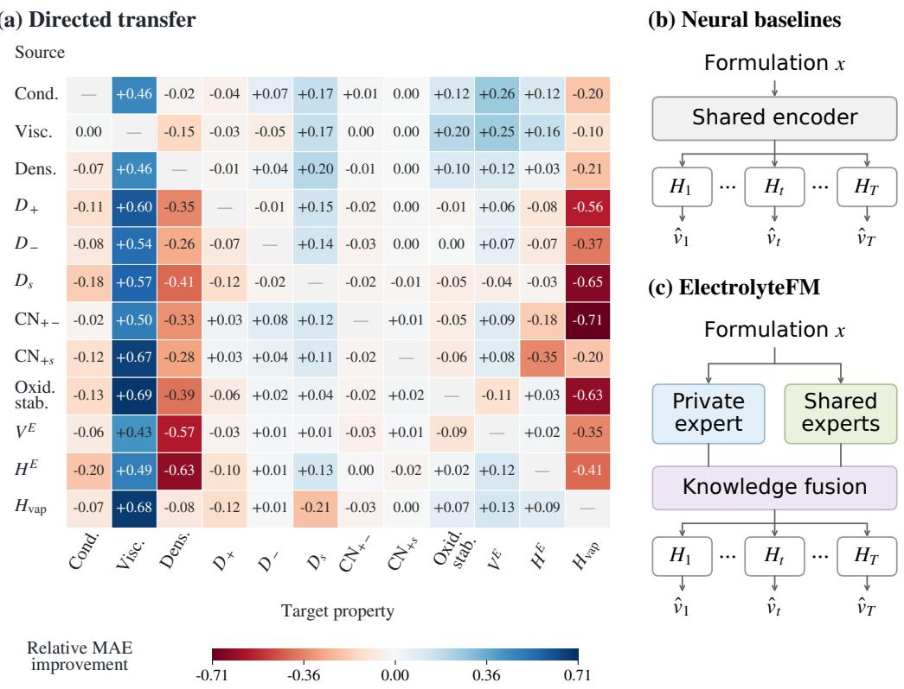
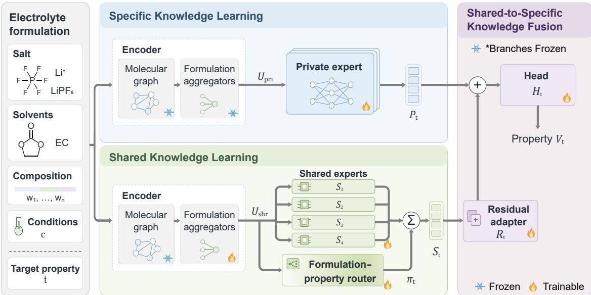
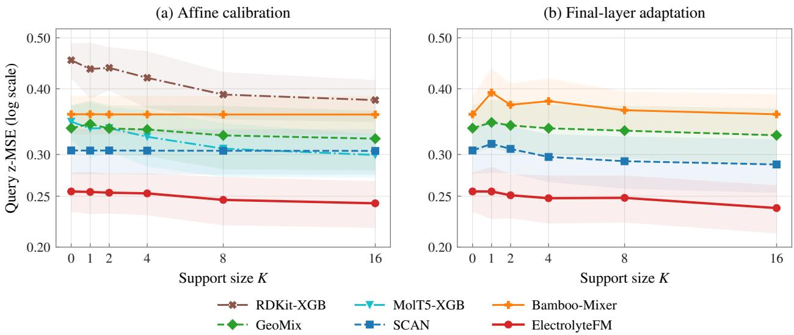
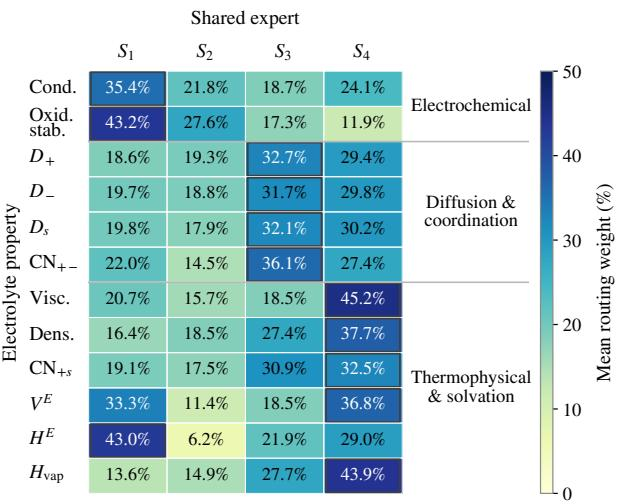
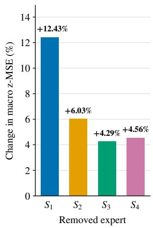

# ElectrolyteFM: Unifying Electrolyte Property Prediction through Cross-Property Knowledge Learning

Jiaxin Yu1,2, Shuo Wang1,2,†, Peng Wang1,2, Yongcai Wang2,\*, Deying Li2

1VoltaAI, Beijing, China

2Renmin University of China, Beijing, China

Corresponding author: ycw@ruc.edu.cn

†Project Leader, VoltaAI: wangs@voltaai.cn

Electrolyte formulation design requires balancing multiple physicochemical properties, yet existing models often focus on a limited subset. Learning each property in isolation can overlook transferable chemical information, whereas indiscriminate sharing can introduce cross-property interference. Our directed transfer analysis shows that jointly learning two property prediction tasks can improve or degrade prediction relative to separate training, with asymmetric transfer efects between the tasks. We propose ElectrolyteFM, a unified multi-property prediction model which can more accurately predict multiple properties of each electrolyte by efectively identifying and utilizing property-specific features and knowledge shared across properties. More specifically, ElectrolyteFM learns property-specific representations independently and captures cross-property knowledge through a separately trained expert pool. A router selects relevant shared information for each formulation and target property, and property-specific residual adapters convert this information into corrections to the corresponding representation for prediction. Experiments on Electrolyte12 show that ElectrolyteFM reduces normalized mean absolute error averaged across 12 electrolyte properties by 14.8% relative to the strongest electrolyte-specific baseline. On an independent sodium-electrolyte dataset unseen during training, it reduces conductivity mean absolute error by 6.7% relative to the best-performing baseline.

## 1. Introduction

Electrolytes govern ion transport, interfacial stability, and other coupled processes that determine the performance, lifetime, and safety of rechargeable batteries. Designing high-performing electrolyte formulations for practical battery applications is a multi-objective optimization problem over a combinatorial space of salts, solvents, compositions, and operating conditions, requiring a balance among multiple performance objectives. Deep-learning-based property prediction ofers an eficient way to evaluate candidate formulations and guide the search toward those that meet application-specific performance requirements (Li et al., 2025; Wang and You, 2026; Yang et al., 2026; Zhang et al., 2024).

Existing electrolyte predictors often focus on a limited set of properties, such as conductivity, providing incomplete information for formulation selection (Li et al., 2025; Wang and You, 2026). Electrolyte formulations are characterized not by a single property, but by a family of observables, including transport, solvation, thermodynamic, and electrochemical properties, which jointly determine their practical behavior. These properties arise from the same underlying formulation, molecular interactions, composition, and operating conditions, suggesting that they should not be modeled as isolated prediction problems. A unified predictive model that learns across heterogeneous electrolyte properties could reuse information across datasets, improve data eficiency, and provide a more comprehensive representation of electrolyte behavior.

However, a common physical origin does not imply uniform transferability across properties. Diferent observables reflect distinct physical processes and therefore may benefit diferently from cross-property supervision. To characterize this structure, we systematically measure directed transfer among 12 electrolyte properties by evaluating how supervision from each source property afects the prediction of every target property. As shown in Fig. 1, 61 of the 132 directed transfer scores are positive and 71 are negative. Moreover, these efects are strongly asymmetric: knowledge that benefits one property may provide little benefit, or even cause interference, in the reverse direction.

  
Figure 1 | Cross-property transfer and sharing strategies. (a) Directed transfer scores on the test set used in Table 1 (rows: sources; columns: targets). Of-diagonal entries show relative target-MAE reductions; positive/negative values indicate beneficial transfer/interference. The score is defined in Section 3.1. (b) Shared-representation prediction with property-specific heads. (c) ElectrolyteFM fuses private and shared representations before prediction through property-specific heads. Abbreviations: conductivity (Cond.), viscosity (Visc.), density (Dens.), oxidation stability (Oxid. stab.), and coordination number (CN).

These observations motivate a model that preserves property-specific knowledge while selectively incorporating shared information. To this end, we propose ElectrolyteFM, which learns private and shared representations separately and then adapts shared knowledge to complement each property’s private representation, enabling accurate prediction across a broad range of electrolyte properties.

Specifically, ElectrolyteFM adopts a Shared–Specific Knowledge Learning framework comprising three components. Specific Knowledge Learning (SpKL) captures property-specific predictive patterns with an independent private expert for each property. Shared Knowledge Learning (ShKL) learns reusable cross-property knowledge through a shared expert pool, with formulation–property conditioned routing selecting relevant shared information. Shared-to-Specific Knowledge Fusion (S2SKF) transforms the routed shared information into complementary corrections to the private representations through property-specific residual adapters.

Our contributions are threefold:

• Directed Cross-Property Transfer Analysis. We systematically characterize directed transfer among 12 electrolyte properties, revealing beneficial, harmful, and asymmetric interactions that provide an empirical basis for selective cross-property knowledge sharing.

• Shared–Specific Knowledge Learning. We propose ElectrolyteFM, which combines independently learned property-specific representations with shared representations from a separately trained expert pool through formulation–property conditioned routing and residual fusion.

• Multi-property evaluation and external generalization. We curate Electrolyte12 and evaluate multi-property prediction, learning strategies, and knowledge-branch contributions, together with zero-shot generalization and few-shot adaptation on an independent sodium-electrolyte dataset.

Across 12 electrolyte properties, ElectrolyteFM reduces macro normalized mean absolute error (NMAE) by 14.8% relative to the strongest electrolyte-specific baseline. On an independent sodiumelectrolyte dataset, it reduces conductivity MAE by 6.7% relative to the best-performing baseline evaluated on that dataset, with further gains from few-shot adaptation.

## 2. Related Work

## 2.1. Learning for Electrolyte Formulations

Learning-based electrolyte modeling builds on molecular pretraining and formulation-level representations. Molecular pretraining methods, including MolT5 and Uni-Mol, learn transferable representations from molecular strings, graphs, language, and three-dimensional structures (Edwards et al., 2022; Ji et al., 2024; Xia et al., 2023; Zhou et al., 2023). At the formulation level, MolSets, GeoMix, and SCAN explicitly model mixture composition and component interactions for electrolyte property prediction (Li et al., 2025; Wang and You, 2026; Zhang et al., 2024). DifMix and related mixture models incorporate thermodynamic structure into property prediction (Specht et al., 2024; Zhu et al., 2024), while BAMBOO connects microscopic interactions with macroscopic electrolyte properties through learned interatomic potentials and molecular dynamics (Gong et al., 2025). Uni-ELF and Bamboo-Mixer further explore formulation-level pretraining and unified predictive–generative modeling, respectively, to support property prediction and formulation design (Yang et al., 2026; Zeng et al., 2024).

These studies improve molecular and formulation representations, but such advances alone do not resolve how heterogeneous property supervision should be shared. Joint learning can still benefit some targets while interfering with others. ElectrolyteFM combines property-specific learning with selective sharing to support unified multi-property prediction.

## 2.2. Cross-Task Transfer Learning

Cross-task transfer learning seeks to reuse knowledge across prediction tasks, but sharing can also introduce negative transfer (Liu et al., 2019). Taskonomy characterizes directed transfer between visual tasks, while subsequent multi-task studies examine cooperation and competition under joint learning (Standley et al., 2020; Zamir et al., 2018). Task afinities and predicted task-combination gains further guide task grouping and selective group updates (Fifty et al., 2021; Jeong and Yoon, 2025; Song et al., 2022). At the optimization level, PCGrad and CAGrad address conflicting task gradients, while Nash-MTL and FAMO balance task contributions through bargaining-based aggregation and adaptive loss weighting, respectively (Liu et al., 2021, 2023; Navon et al., 2022; Yu et al., 2020). In scientific prediction, cross-property transfer and source-selection strategies exploit data-rich properties and estimated task similarities to support data-scarce targets (Gupta et al., 2021; Li et al., 2022; Yao et al., 2024). Adaptive checkpointing and specialization further address negative transfer in molecular property learning (Eraqi et al., 2025).

Task selection and grouping determine which tasks share supervision, while gradient coordination regulates joint optimization. These mechanisms do not directly specify how shared knowledge contributes to an individual formulation–property prediction. Motivated by directed transfer analysis, ElectrolyteFM conditions expert allocation on both the formulation and target property to select relevant shared information.

## 2.3. Mixture-of-Experts for Knowledge Sharing

Mixture-of-experts architectures support selective knowledge sharing through learned combinations of expert representations. MMoE uses task-specific gates over shared experts, PLE explicitly separates shared and task-specific experts, and TaskExpert dynamically assembles task-specific features from multiple expert representations (Ma et al., 2018; Tang et al., 2020; Ye and Xu, 2023). Related architectures regulate sharing through selective layer specialization, orthogonal expert representations, or modality-specific model spaces (Hendawy et al., 2024; Peng et al., 2025; Shi et al., 2023). Another line of work reuses pretrained task modules: PEMT and MeteoRA selectively combine task-specific adapters in language models (Lin et al., 2024; Xu et al., 2025), while materials expert-composition methods and MoMa combine source-property experts or specialized modules for downstream prediction (Chang et al., 2022; Wang et al., 2026).

MMoE and PLE control expert allocation through routing, but task-specific representations remain coupled tojoint optimization. Source-expert composition instead adapts separately pretrained modules to downstream targets. ElectrolyteFM learns property-specific private representations and a shared expert pool separately, then freezes both branches for fusion. Property-specific residual adapters convert routed shared information into corrections to the private representations.

## 3. Method

## 3.1. Directed Cross-Property Transfer Analysis

We first characterize how supervision from one electrolyte property afects the prediction of another. For each ordered source–target pair (�, �), we compare a target-only model trained on property � with a pairwise model jointly trained on properties � and �. Both models use the same architecture and initialization, consisting of a shared backbone and property-specific prediction heads, as illustrated in Figure 1(b).

To quantify the directional efect of source property � on target property �, we define the directed transfer score as the relative reduction in target mean absolute error (MAE):

$$
\Delta _ { a  t } = \frac { \mathrm { M A E } _ { t } ^ { \mathrm { s i n g l e } } - \mathrm { M A E } _ { t } ^ { \mathrm { p a i r } ( a , t ) } } { \mathrm { M A E } _ { t } ^ { \mathrm { s i n g l e } } } .\tag{1}
$$

Both models are evaluated on the same test samples of the target property, with MAE computed in physical units. A positive $\Delta _ { a  t }$ indicates that supervision from property � improves prediction of property �, whereas a negative value indicates cross-property interference.

As shown in Figure 1(a), cross-property transfer is highly heterogeneous and directional: the same source property can benefit some targets while interfering with others, and the transfer efect between two properties is generally asymmetric. For example, adding conductivity supervision reduces solvent difusivity MAE by 17.2%, whereas adding solvent difusivity supervision increases conductivity MAE by 17.9%. These observations motivate ElectrolyteFM to preserve independent property-specific representations while selectively incorporating shared knowledge according to the target property and input formulation.

  
Figure 2 | Overview of ElectrolyteFM. In Specific Knowledge Learning (SpKL), private experts learn property-specific knowledge. In Shared Knowledge Learning (ShKL), a shared expert pool learns reusable cross-property knowledge, and formulation–property conditioned routing combines shared expert outputs according to the input formulation and target property. Shared-to-Specific Knowledge Fusion uses property-specific residual adapters to incorporate the routed shared information into private representations, with both learned branches frozen. Snowflakes and flames indicate frozen and trainable modules, respectively.

## 3.2. Problem Formulation and Overview

Let $\mathcal { T } = \{ 1 , \ldots , T \}$ denote the set of electrolyte properties, with $T = 1 2$ in this work. Each formulation $x _ { i }$ is defined by its molecular components, composition, and experimental conditions. Since property labels are partially observed, the supervision for property � is

$$
{ \mathcal { D } } _ { t } = \{ ( x _ { i } , y _ { i t } ) \mid m _ { i t } = 1 \} ,\tag{2}
$$

where $m _ { i t }$ indicates label availability. Our goal is to learn a unified predictor

$$
\widehat { y } _ { i t } = f ( x _ { i } , t )\tag{3}
$$

that captures both property-specific and cross-property knowledge.

Figure 2 illustrates ElectrolyteFM. Separate copies of the molecular and formulation encoders produce private and shared representations $\mathbf { u } _ { i } ^ { \mathrm { p r i } }$ and $\mathbf { u } _ { i } ^ { \mathrm { s h r } }$ . Specific Knowledge Learning (SpKL) uses a property-specific expert $P _ { t }$ to obtain $\mathbf { p } _ { i t } ,$ , while Shared Knowledge Learning (ShKL) combines shared expert outputs using formulation–property conditioned routing weights $\pmb { \pi } _ { i t }$ to obtain $\pmb { s } _ { i t }$ . Shared-to-Specific Knowledge Fusion (S2SKF) then uses a property-specific residual adapter $R _ { t }$ to convert $\pmb { s } _ { i t }$ into a correction to $\mathbf { p } _ { i t }$ , followed by the prediction head $H _ { t }$

All objectives are defined on transformed and standardized targets $\nu _ { i t }$ , using mean squared error in the standardized space (z-MSE).

## 3.3. Specific Knowledge Learning

Specific Knowledge Learning captures property-specific predictive patterns through independent experts. For a query $( x _ { i } , t )$ , the corresponding private expert $P _ { t }$ transforms $\mathbf { u } _ { i } ^ { \mathrm { p r i } }$ into a private state $\mathbf { p } _ { i t }$ and its head $H _ { t } ^ { \mathrm { p r i } }$ produces the standardized prediction:

$$
\mathbf { p } _ { i t } = P _ { t } ( \mathbf { u } _ { i } ^ { \mathrm { p r i } } ) , \qquad \widehat { \nu } _ { i t } ^ { \mathrm { p r i } } = H _ { t } ^ { \mathrm { p r i } } ( \mathbf { p } _ { i t } ) .\tag{4}
$$

Each $P _ { t }$ is a multilayer perceptron (MLP) producing a private state $\pmb { \mathrm { p } } _ { i t } \in \mathbb { R } ^ { d _ { h } }$ , where $d _ { h }$ is the hidden dimension. Each property has its own expert and scalar prediction head.

We train each expert and its head only on $\mathcal { D } _ { t }$ , minimizing $\mathcal { L } _ { t } ^ { \mathrm { p r i } } = \mathbb { E } _ { \mathcal { D } _ { t } } [ \ell ( \widehat { \nu } _ { i t } ^ { \mathrm { p r i } } , { \nu } _ { i t } ) ]$ , with the complete encoder frozen.

## 3.4. Shared Knowledge Learning

Shared Knowledge Learning captures transferable patterns across properties using a pool of � shared experts $\{ S _ { k } \} _ { k = 1 } ^ { K }$ . To account for the heterogeneous relevance of shared knowledge, we introduce a formulation–property conditioned router:

$$
\pmb { \pi } _ { i t } = \mathrm { s o f t m a x } \Big ( W _ { r } \mathbf { u } _ { i } ^ { \mathrm { s h r } } + \mathbf { b } _ { t } \Big ) ,\tag{5}
$$

where $W _ { r } \in \mathbb { R } ^ { K \times d _ { u } }$ is a bias-free linear projection. The learned vector $\mathbf { b } _ { t } \in \mathbb { R } ^ { K }$ expresses the property’s preference over experts, while $W _ { r } \mathbf { u } _ { i } ^ { \mathrm { s h r } }$ adjusts that preference for the input formulation. Each expert receives the same shared input, and its contribution is weighted by the corresponding router output:

$$
\mathbf { s } _ { i t } = \sum _ { k = 1 } ^ { K } \pi _ { i t k } S _ { k } ( \mathbf { u } _ { i } ^ { \mathrm { s h r } } ) , \qquad \widehat { \nu } _ { i t } ^ { \mathrm { s h r } } = H _ { t } ^ { \mathrm { s h r } } ( \mathbf { s } _ { i t } ) .\tag{6}
$$

A property-specific ShKL prediction head $H _ { t } ^ { \mathrm { s h r } }$ maps the routed shared representation $\pmb { \mathsf { s } } _ { i t } \in \mathbb { R } ^ { d _ { h } }$ to the standardized prediction and provides supervision to the shared experts and router.

ShKL draws a property with probability $q ( t ) \propto | \mathcal { D } _ { t } | ^ { \alpha }$ , with $0 < \alpha < 1$ to moderate the influence of data-rich properties, and then samples a batch from its labeled set, optimizing

$$
\mathcal { L } ^ { \mathrm { s h r } } = \mathbb { E } _ { t \sim q } \mathbb { E } _ { ( x _ { i } , y _ { i t } ) \sim \mathcal { D } _ { t } } \left[ \ell ( \widehat { \nu } _ { i t } ^ { \mathrm { s h r } } , \nu _ { i t } ) \right] .\tag{7}
$$

The neutral and ionic formulation aggregators, shared experts, router, and ShKL prediction heads are trained jointly, with the molecular graph module fixed. We retain the learned shared encoder, experts, and router to produce $\pmb { s } _ { i t }$ for S2SKF. These prediction heads are used only during ShKL.

## 3.5. Shared-to-Specific Knowledge Fusion

Shared-to-Specific Knowledge Fusion (S2SKF) integrates transferable shared knowledge into the independently learned specific representation. For each property �, a property-specific residual adapter $R _ { t }$ transforms the routed shared representation $\pmb { s } _ { i t }$ into a complementary residual:

$$
\begin{array} { r } { \mathbf { z } _ { i t } = \mathbf { p } _ { i t } + R _ { t } ( \mathbf { s } _ { i t } ) , \qquad \widehat { \nu } _ { i t } = H _ { t } ( \mathbf { z } _ { i t } ) , } \end{array}\tag{8}
$$

where $\mathbf { p } _ { i t }$ denotes the specific representation learned for property �, and $\mathbf { z } _ { i t }$ is the fused representation.

The adapter adopts a bottleneck architecture:

$$
R _ { t } ( \mathbf { s } _ { i t } ) = W _ { t } ^ { \mathrm { u p } } \operatorname { S i L U } \Bigl ( W _ { t } ^ { \mathrm { d o w n } } \operatorname { L N } ( \mathbf { s } _ { i t } ) + \mathbf { a } _ { t } ^ { \mathrm { d o w n } } \Bigr ) + \mathbf { a } _ { t } ^ { \mathrm { u p } } ,\tag{9}
$$

where $d _ { h }$ is the representation dimension and $d _ { b } < d _ { h }$ is the bottleneck dimension.

We zero-initialize the up-projection $W _ { t } ^ { \mathrm { u p } }$ and $\mathbf { a } _ { t } ^ { \mathrm { u p } }$ , and initialize � from the corresponding specific prediction head. The fused model therefore starts from the learned specific predictor and gradually incorporates useful shared information. During fusion, the specific and shared branches are frozen, and only $R _ { t }$ and $H _ { t }$ are optimized:

$$
\begin{array} { r } { \mathcal { L } _ { t } ^ { \mathrm { f u s } } = \mathbb { E } _ { ( x _ { i } , y _ { i t } ) \sim \mathcal { D } _ { t } } \left[ \ell ( \widehat { \nu } _ { i t } , \nu _ { i t } ) \right] . } \end{array}\tag{10}
$$

This formulation preserves property-specific predictive knowledge while allowing transferable cross-property information to selectively complement it.

## 4. Experiments

## 4.1. Experimental Setup

Datasets and settings. We evaluate all methods on Electrolyte12, a large-scale electrolyte dataset curated in this work, covering 12 electrolyte properties. The training and validation sets contain both experimental and computed labels, comprising 366,825 and 44,811 records, respectively. The test set contains 43,709 records, including experimental measurements for conductivity, viscosity, excess molar enthalpy, and excess molar volume, and computed labels for the remaining eight properties. All methods use the same training, validation, and test splits.

Baselines. We compare ElectrolyteFM with RDKit-XGB (Chen and Guestrin, 2016; Landrum et al., 2024), MolT5-XGB (Chen and Guestrin, 2016; Edwards et al., 2022), Bamboo-Mixer (Yang et al., 2026), GeoMix (Li et al., 2025), MolSets (Zhang et al., 2024), and SCAN (Wang and You, 2026). All methods follow the same data and target preprocessing, including target transformations and missing-label handling.

Evaluation metrics. We use mean absolute error (MAE) as the primary metric for evaluating individual electrolyte properties, with errors reported in their original physical units. To summarize performance across properties with diferent numerical scales, we additionally report macro normalized MAE (NMAE), defined as $\begin{array} { r l } { \frac { 1 } { \left| G \right| } \sum _ { t \in G } \mathbf { M A E } _ { t } / \sigma _ { t } ^ { \mathrm { t r a i n } } } & { { } } \end{array}$ , where � denotes the set of evaluated properties and $\sigma _ { t } ^ { \mathrm { t r a i n } }$ is the standard deviation of property � in the training set. We further report Pearson correlation coeficient (PCC) and coeficient of determination (�2).

## 4.2. Multi-Property Prediction

Table 1 compares the methods on Electrolyte12 in terms of per-property MAE, macro NMAE across all twelve properties, and the number of properties on which each method achieves the best MAE. Results are grouped according to whether the test labels are obtained experimentally or computationally.

ElectrolyteFM achieves the best MAE on 10 of the 12 properties, including all four properties with experimental labels and six of the eight properties with computed labels. It also obtains the lowest macro NMAE of 0.1571, compared with 0.1845 for the strongest baseline. The improvements are particularly pronounced on the experimentally measured properties: relative to the strongest baseline for each property, ElectrolyteFM reduces MAE by 50.1% for conductivity, 27.2% for viscosity, 67.8% for excess molar enthalpy, and 26.7% for excess molar volume. Among the computed properties, it further reduces MAE by 31.3% for density and 30.3% for heat of vaporization.

Table 1 | Per-property MAE on Electrolyte12 (lower is better). Blocks denote experimental and computed test labels. Bold and underline indicate the best and second-best unrounded values. The macro and best-count rows summarize all twelve properties.
<table><tr><td>Property</td><td>RDKit-XGB (Landrum et al. 2024)</td><td>MolT5-XGB (Edwards et al. 2022)</td><td>Bamboo-Mixer (Yang et al. 2026)</td><td>GeoMix (Li et al. 2025)</td><td>MolSets (Zhang et al. 2024)</td><td>SCAN (Wang and You 2026)</td><td>ElectrolyteFM (Ours)</td></tr><tr><td colspan="8">Experimental labels</td></tr><tr><td>Cond. (mS/cm)</td><td>4.444</td><td>4.211</td><td>1.766</td><td>3.211</td><td>1.980</td><td>2.335</td><td>0.881</td></tr><tr><td>Visc. (mPa·s)</td><td>156.457</td><td>156.654</td><td>125.313</td><td>147.831</td><td>139.246</td><td>148.301</td><td>91.187</td></tr><tr><td>HE (J/mol)</td><td>311.071</td><td>299.599</td><td>167.964</td><td>374.825</td><td>191.577</td><td>248.297</td><td>54.092</td></tr><tr><td> $V ^ { E } ~ ( \mathrm { c m } ^ { 3 } / \mathrm { m o l } )$ </td><td>0.140</td><td>0.136</td><td>0.068</td><td>0.181</td><td>0.111</td><td>0.142</td><td>0.050</td></tr><tr><td colspan="8">Computed labels</td></tr><tr><td>Dens. (g/cm³)</td><td>0.0566</td><td>0.0506</td><td>0.0079</td><td>0.0296</td><td>0.0175</td><td>0.0321</td><td>0.0054</td></tr><tr><td> $D _ { + } \ ( 1 0 ^ { - 1 1 } \ \mathrm { m } ^ { 2 } / s )$ </td><td>8.911</td><td>8.204</td><td>4.295</td><td>4.659</td><td>4.102</td><td>4.114</td><td>4.144</td></tr><tr><td> $D _ { - } \ ( 1 0 ^ { - 1 1 } \ \mathrm { m } ^ { 2 } / s )$ </td><td>8.785</td><td>7.806</td><td>3.897</td><td>4.095</td><td>3.846</td><td>3.769</td><td>3.769</td></tr><tr><td> $D _ { s } \ ( 1 0 ^ { - 1 1 } \ \mathrm { m } ^ { 2 } / s )$ </td><td>22.227</td><td>19.611</td><td>10.745</td><td>9.968</td><td>9.130</td><td>9.949</td><td>8.843</td></tr><tr><td>CN+-</td><td>1.127</td><td>1.079</td><td>0.948</td><td>0.949</td><td>0.962</td><td>0.966</td><td>0.946</td></tr><tr><td> $\mathrm { C N } _ { + s }$ </td><td>2.084</td><td>2.066</td><td>1.851</td><td>1.799</td><td>1.885</td><td>1.912</td><td>1.788</td></tr><tr><td>Oxid. stab. (eV)</td><td>0.517</td><td>0.555</td><td>0.210</td><td>0.638</td><td>0.389</td><td>0.518</td><td>0.217</td></tr><tr><td> $H _ { \mathrm { v a p } } ~ \mathrm { ( J / m o l ) }$ </td><td>4242.9</td><td>4790.6</td><td>684.9</td><td>2735.9</td><td>2569.0</td><td>2409.8</td><td>477.2</td></tr><tr><td>Macro NMAE</td><td>0.3643</td><td>0.3536</td><td>0.1845</td><td>0.2936</td><td>0.2279</td><td>0.2592</td><td>0.1571</td></tr><tr><td>Best count</td><td>0/12</td><td>0/12</td><td>1/12</td><td>0/12</td><td>1/12</td><td>0/12</td><td>10/12</td></tr></table>

## 4.3. Generalization to Unseen Formulations

We further evaluate generalization on an independent experimental dataset of 106 multicomponent sodium-electrolyte formulations, including mixtures with up to 14 components (Muñoz-Perales et al., 2026).

We evaluate conductivity prediction under two settings: zero-shot generalization, where the trained model is directly applied to the unseen sodium formulations, and few-shot adaptation, where a small number of target-domain labels are provided for adaptation.

## 4.3.1. Zero-shot Generalization

Table 2 compares conductivity prediction on the experimental in-distribution (ID) subset and the independent out-of-distribution (OOD) dataset.

Table 2 | Conductivity prediction on experimental ID and independent OOD data. MAE is in mS/cm.
<table><tr><td></td><td colspan="3">Experimental ID N = 7,153</td><td colspan="3">OOD N = 106</td></tr><tr><td>Method</td><td>MAE↓</td><td>PCC ↑</td><td> $R ^ { 2 }$  ←</td><td>MAE↓</td><td>PCC ↑</td><td> $R ^ { 2 } \uparrow$ </td></tr><tr><td>SCAN</td><td>2.335</td><td>0.856</td><td>0.723</td><td>2.778</td><td>0.775</td><td>0.599</td></tr><tr><td>MolSets</td><td>1.980</td><td>0.899</td><td>0.795</td><td>7.369</td><td>0.201</td><td>-1.839</td></tr><tr><td>GeoMix</td><td>3.211</td><td>0.771</td><td>0.574</td><td>3.321</td><td>0.685</td><td>0.208</td></tr><tr><td>Bamboo-Mixer</td><td>1.766</td><td>0.909</td><td>0.822</td><td>3.131</td><td>0.582</td><td>0.295</td></tr><tr><td>RDKit-XGB</td><td>4.444</td><td>0.729</td><td>0.274</td><td>3.624</td><td>0.349</td><td>-0.228</td></tr><tr><td>MolT5-XGB</td><td>4.211</td><td>0.748</td><td>0.303</td><td>3.317</td><td>0.733</td><td>0.041</td></tr><tr><td>ElectrolyteFM (Ours)</td><td>0.881</td><td>0.942</td><td>0.887</td><td>2.592</td><td>0.791</td><td>0.605</td></tr></table>

The baseline ranking changes under distribution shift: Bamboo-Mixer outperforms SCAN on the ID test set but falls behind it on the OOD test set. Higher ID accuracy therefore does not necessarily translate into better prediction on unseen formulations. ElectrolyteFM ranks first across all three metrics in both settings, reducing OOD MAE by 6.7% relative to SCAN, the strongest OOD baseline. Its predictive advantage thus extends to the independent sodium-electrolyte dataset without target-domain adaptation.

## 4.3.2. Few-shot Adaptation

We evaluate afine calibration and final-layer adaptation over 20 fixed support/query episodes with nested support sizes $K \in \{ 0 , 1 , 2 , 4 , 8 , 1 6 \}$ . Figure 3 compares six methods from Table 1 under afine calibration and four neural methods under final-layer adaptation using query z-MSE. Each episode uses 74 query formulations, held fixed across support sizes.

  
Figure 3 | Conductivity OOD few-shot adaptation for six methods from Table 1. Curves show mean query z-MSE on logarithmic y-axes; shaded regions show the sample standard deviation over 20 fixed episodes. XGBoost models are evaluated under afine calibration only. MolSets is omitted because some values exceed the plotted y-axis range.

ElectrolyteFM achieves the lowest mean query z-MSE at every evaluated support size under both protocols. With 16 labeled formulations and the learned representations fixed, afine calibration and final-layer adaptation reduce its mean query z-MSE from 0.2552 to 0.2423 and 0.2373, respectively.

## 4.4. Ablation Studies

## 4.4.1. Comparison of Learning Strategies

To assess how diferent learning strategies afect multi-property prediction, we compare ElectrolyteFM with single-task learning (STL), multi-gate mixture-of-experts (MMoE) (Ma et al., 2018), and progressive layered extraction (PLE) (Tang et al., 2020). Table 3 reports the macro metrics across all twelve properties, with equal weight assigned to each property. All methods start from the same pretrained molecular encoders. STL learns each property independently, whereas MMoE and PLE learn jointly across properties; ElectrolyteFM separates representation learning from subsequent target-specific fusion.

Both multi-task baselines outperform STL on all three macro metrics, demonstrating the benefit of cross-property learning in this comparison. However, the label-source breakdown in Table 7 shows that MMoE and PLE improve all three macro metrics over STL for the experimental-label group, but worsen them for the computed-label group. ElectrolyteFM improves all three metrics over STL in both groups. ElectrolyteFM further reduces macro NMAE by 2.5% relative to PLE while achieving the highest macro PCC and $R ^ { 2 }$ . ElectrolyteFM combines decoupled knowledge learning with shared-to-specific fusion, using shared information to complement independently learned property-specific representations. This combination achieves better aggregate predictive performance than either independent learning or the two joint-learning alternatives.

Table 3 | Learning strategies: macro metrics over all 12 properties.
<table><tr><td>Method</td><td>NMAE↓</td><td>PCC ↑</td><td> $R ^ { 2 } \uparrow$ </td></tr><tr><td>STL</td><td>0.1653</td><td>0.8931</td><td>0.8071</td></tr><tr><td>MMoE</td><td>0.1641</td><td>0.9058</td><td>0.8220</td></tr><tr><td>PLE</td><td>0.1611</td><td>0.9228</td><td>0.8228</td></tr><tr><td>ElectrolyteFM</td><td>0.1571</td><td>0.9268</td><td>0.8357</td></tr></table>

Table 4 | Knowledge learning and fusion ablation: macro NMAE over all 12 properties.
<table><tr><td>SpKL</td><td>ShKL</td><td>S2SKF</td><td>NMAE↓</td></tr><tr><td>√</td><td>一</td><td>一</td><td>0.1841</td></tr><tr><td>一</td><td>√</td><td>一</td><td>0.1674</td></tr><tr><td>√</td><td>√</td><td>√</td><td>0.1571</td></tr></table>

## 4.4.2. Contribution of Knowledge Learning and Fusion

We compare the private branch learned through SpKL, the shared branch learned through ShKL, and their combination through S2SKF. Table 4 reports macro NMAE over all twelve properties. Unlike STL, SpKL keeps the formulation aggregators fixed. The shared branch alone outperforms the private branch, while the complete model reduces macro NMAE by 14.7% and 6.1% relative to the private and shared branches, respectively.

The improvement over the shared branch alone indicates that the independently learned private representation provides complementary predictive information. S2SKF uses this private representation as a foundation and learns a property-specific residual correction from the routed shared representation. The lower macro NMAE relative to either branch alone supports combining property-specific and shared knowledge through shared-to-specific fusion.

## 4.4.3. Expert Allocation and Predictive Contributions

  
(a)

  
(b)  
Figure 4 | Expert allocation and contribution in ElectrolyteFM. (a) Mean routing weights by property; boxes mark each row maximum. (b) Relative increase in macro z-MSE after removing each expert at inference and renormalizing the remaining weights. All twelve properties receive equal weight.

Figure 4(a) shows mean routing weights by property. $S _ { 1 }$ receives the largest weight for conductivity, $H ^ { E }$ , and oxidation stability; $S _ { 3 }$ for $D _ { + } , D _ { - } , D _ { s } ,$ and $\mathrm { C N } _ { + - } ;$ and $S _ { 4 }$ for viscosity, $V ^ { E }$ , density, $\mathrm { C N } _ { + s } ,$ and $H _ { \mathrm { { v a p } } }$ . These preferences suggest property-dependent use of the shared representations. Multiple experts receive substantial weight for each property, allowing their representations to contribute jointly to prediction.

We assess each expert’s predictive contribution by removing it without retraining and renormalizing the remaining routing weights. Figure 4(b) shows the resulting changes in macro z-MSE. Across the twelve equally weighted properties, removing $S _ { 1 } { - } S _ { 4 }$ changes macro z-MSE by $+ 1 2 . 4 3 \% , + 6 . 0 3 \%$ +4.29%, and +4.56%, respectively. Removing any expert increases the error, with the largest efect for $S _ { 1 } . \ S _ { 2 }$ also contributes despite receiving no property’s largest mean routing weight, illustrating why allocation weights alone do not measure predictive importance.

## 5. Conclusion

Motivated by heterogeneous cross-property transfer, ElectrolyteFM learns private and shared representations separately and integrates them through property-specific residual adapters, enabling accurate prediction across a broad range of electrolyte properties. ElectrolyteFM achieves the lowest macro NMAE and the lowest MAE on 10 of the 12 properties. Conductivity OOD and few-shot results further support its use for prediction and adaptation under formulation shift.

## References

R. Chang, Y.-X. Wang, and E. Ertekin. Towards overcoming data scarcity in materials science: Unifying models and datasets with a mixture of experts framework. npj Computational Materials, 8:242, 2022.

T. Chen and C. Guestrin. XGBoost: A scalable tree boosting system. In Proceedings of the 22nd ACM SIGKDD International Conference on Knowledge Discovery and Data Mining, pages 785–794. ACM, 2016.

C. Edwards, T. Lai, K. Ros, G. Honke, K. Cho, and H. Ji. Translation between molecules and natural language. In Proceedings of the 2022 Conference on Empirical Methods in Natural Language Processing, pages 375–413. Association for Computational Linguistics, 2022.

B. A. Eraqi, D. Khizbullin, S. S. Nagaraja, and S. M. Sarathy. Molecular property prediction in the ultra-low data regime. Communications Chemistry, 8:201, 2025.

C. Fifty, E. Amid, Z. Zhao, T. Yu, R. Anil, and C. Finn. Eficiently identifying task groupings for multitask learning. In Advances in Neural Information Processing Systems, volume 34, pages 27503–27516. Curran Associates, Inc., 2021.

S. Gong, Y. Zhang, Z. Mu, Z. Pu, H. Wang, X. Han, Z. Yu, M. Chen, T. Zheng, Z. Wang, L. Chen, Z. Yang, X. Wu, S. Shi, W. Gao, W. Yan, and L. Xiang. A predictive machine learning force-field framework for liquid electrolyte development. Nature Machine Intelligence, 7(4):543–552, 2025.

V. Gupta, K. Choudhary, F. Tavazza, C. E. Campbell, W.-K. Liao, A. Choudhary, and A. Agrawal. Crossproperty deep transfer learning framework for enhanced predictive analytics on small materials data. Nature Communications, 12:6595, 2021.

A. Hendawy, J. Peters, and C. D’Eramo. Multi-task reinforcement learning with mixture of orthogonal experts. In International Conference on Learning Representations, 2024.

W. Jeong and K.-J. Yoon. Selective task group updates for multi-task optimization. In International Conference on Learning Representations, 2025.

X. Ji, Z. Wang, Z. Gao, H. Zheng, L. Zhang, G. Ke, and W. E. Exploring molecular pretraining model at scale. In Advances in Neural Information Processing Systems, volume 37, pages 46956–46978, 2024.

G. Landrum et al. RDKit: Open-source cheminformatics. Zenodo, 2024. URL https://doi.org/10.528 1/zenodo.10793672. Version 2023.09.6.

A. Li, J. Cen, S. Li, M. Li, Y. Yu, and W. Huang. Geometric mixture models for electrolyte conductivity prediction. In Advances in Neural Information Processing Systems, volume 38, pages 13236–13264, 2025.

H. Li, X. Zhao, S. Li, F. Wan, D. Zhao, and J. Zeng. Improving molecular property prediction through a task similarity enhanced transfer learning strategy. iScience, 25(10):105231, 2022.

Z. Lin, H. Fu, C. Liu, Z. Li, and J. Sun. PEMT: Multi-task correlation guided mixture-of-experts enables parameter-eficient transfer learning. In Findings of the Association for Computational Linguistics: ACL 2024, pages 6869–6883. Association for Computational Linguistics, 2024.

B. Liu, X. Liu, X. Jin, P. Stone, and Q. Liu. Conflict-averse gradient descent for multi-task learning. In Advances in Neural Information Processing Systems, volume 34, pages 18878–18890, 2021.

B. Liu, Y. Feng, P. Stone, and Q. Liu. FAMO: Fast adaptive multitask optimization. In Advances in Neural Information Processing Systems, volume 36, pages 57226–57243. Curran Associates, Inc., 2023.

S. Liu, Y. Liang, and A. Gitter. Loss-balanced task weighting to reduce negative transfer in multitask learning. In Proceedings of the AAAI Conference on Artificial Intelligence, volume 33, pages 9977–9978, 2019.

J. Ma, Z. Zhao, X. Yi, J. Chen, L. Hong, and E. H. Chi. Modeling task relationships in multi-task learning with multi-gate mixture-of-experts. In Proceedings of the 24th ACM SIGKDD International Conference on Knowledge Discovery & Data Mining, pages 1930–1939. ACM, 2018.

V. Muñoz-Perales, J. K. Phong, S. Muy, A. Morankar, J. R. Geniesse, N. Tian, S. D. Cawthern, F. Mizuno, B. D. Storey, J. A. Johnson, and Y. Shao-Horn. Data-driven insights into ionic conductivity in high-dimensional sodium battery electrolytes. ACS Energy Letters, 11(8):5384–5393, 2026.

A. Navon, A. Shamsian, I. Achituve, H. Maron, K. Kawaguchi, G. Chechik, and E. Fetaya. Multi-task learning as a bargaining game. In Proceedings of the 39th International Conference on Machine Learning, volume 162 of Proceedings of Machine Learning Research, pages 16428–16446. PMLR, 2022.

J. Peng, S. Yun, K. Zhou, R. Zhou, T. Hartvigsen, Y. Zhang, Z. Wang, and T. Chen. Sparse MoE as a new treatment: Addressing forgetting, fitting, learning issues in multi-modal multi-task learning. In Conference on Parsimony and Learning, volume 280 of Proceedings of Machine Learning Research, pages 1112–1145. PMLR, 2025.

G. Shi, Q. Li, W. Zhang, J. Chen, and X.-M. Wu. Recon: Reducing conflicting gradients from the root for multi-task learning. In International Conference on Learning Representations, 2023.

X. Song, S. Zheng, W. Cao, J. Yu, and J. Bian. Eficient and efective multi-task grouping via meta learning on task combinations. In Advances in Neural Information Processing Systems, volume 35, pages 37647–37659. Curran Associates, Inc., 2022.

T. Specht, M. Nagda, S. Fellenz, S. Mandt, H. Hasse, and F. Jirasek. HANNA: Hard-constraint neural network for consistent activity coeficient prediction. Chemical Science, 15(47):19777–19786, 2024.

T. Standley, A. Zamir, D. Chen, L. Guibas, J. Malik, and S. Savarese. Which tasks should be learned together in multi-task learning? In Proceedings of the 37th International Conference on Machine Learning, volume 119 of Proceedings of Machine Learning Research, pages 9120–9132. PMLR, 2020.

H. Tang, J. Liu, M. Zhao, and X. Gong. Progressive layered extraction (PLE): A novel multi-task learning (MTL) model for personalized recommendations. In Proceedings ofthe 14th ACM Conference on Recommender Systems, pages 269–278. ACM, 2020.

B. Wang, Y. Ouyang, Y. Li, M. Pan, Y. Tang, Y. Wang, H. Cui, J. Zhang, X. Wang, W.-Y. Ma, and H. Zhou. MoMa: A simple modular learning framework for material property prediction. In International Conference on Learning Representations, 2026.

Z. Wang and F. You. A dynamic routing-guided interpretable framework for salt–solvent chemistry. Nature Computational Science, 6:271–284, 2026.

J. Xia, C. Zhao, B. Hu, Z. Gao, C. Tan, Y. Liu, S. Li, and S. Z. Li. Mole-BERT: Rethinking pre-training graph neural networks for molecules. In International Conference on Learning Representations, 2023.

J. Xu, J. Lai, and Y. Huang. MeteoRA: Multiple-tasks embedded LoRA for large language models. In International Conference on Learning Representations, 2025.

Z. Yang, Y. Wu, X. Han, Z. Zhang, H. Lai, Z. Mu, T. Zheng, S. Liu, Z. Pu, Z. Wang, Z. Yu, S. Gong, and W. Yan. A unified predictive and generative solution for liquid electrolyte formulation. Nature Machine Intelligence, 8:186–196, 2026.

S. Yao, J. Song, L. Jia, L. Cheng, Z. Zhong, M. Song, and Z. Feng. Fast and efective molecular property prediction with transferability map. Communications Chemistry, 7:85, 2024.

H. Ye and D. Xu. TaskExpert: Dynamically assembling multi-task representations with memorial mixture-of-experts. In Proceedings of the IEEE/CVF International Conference on Computer Vision, pages 21828–21837, 2023.

T. Yu, S. Kumar, A. Gupta, S. Levine, K. Hausman, and C. Finn. Gradient surgery for multi-task learning. In Advances in Neural Information Processing Systems, volume 33, pages 5824–5836, 2020.

A. R. Zamir, A. Sax, W. Shen, L. J. Guibas, J. Malik, and S. Savarese. Taskonomy: Disentangling task transfer learning. In Proceedings of the IEEE Conference on Computer Vision and Pattern Recognition, pages 3712–3722, 2018.

B. Zeng, S. Chen, X. Liu, C. Chen, B. Deng, X. Wang, Z. Gao, Y. Zhang, W. E, and L. Zhang. Uni-ELF: A multi-level representation learning framework for electrolyte formulation design. arXiv preprint arXiv:2407.06152, 2024.

H. Zhang, T. Lai, J. Chen, A. Manthiram, J. M. Rondinelli, and W. Chen. Learning molecular mixture property using chemistry-aware graph neural network. PRX Energy, 3(2):023006, 2024.

G. Zhou, Z. Gao, Q. Ding, H. Zheng, H. Xu, Z. Wei, L. Zhang, and G. Ke. Uni-Mol: A universal 3D molecular representation learning framework. In International Conference on Learning Representations, 2023.

S. Zhu, B. Ramsundar, E. Annevelink, H. Lin, A. Dave, P.-W. Guan, K. Gering, and V. Viswanathan. Diferentiable modeling and optimization of non-aqueous Li-based battery electrolyte solutions using geometric deep learning. Nature Communications, 15:8649, 2024.

## A. Additional Multi-Property Prediction Results

Tables 5 and 6 complement the MAE results in Table 1 with PCC and $R ^ { 2 }$ from the same test predictions.   
Property order, label-source groups, and twelve-property summaries follow Table 1.

ElectrolyteFM ranks first on nine properties for each metric: all four experimental-label targets and five computed-label targets. Its macro PCC and $R ^ { 2 }$ are 0.9268 and 0.8357, respectively.

Table 5 | Per-property PCC on Electrolyte12 (higher is better). Blocks denote experimental and computed test labels. Bold and underline indicate the best and second-best unrounded values. The macro and best-count rows summarize all twelve properties.
<table><tr><td>Property</td><td>RDKit-XGB (Landrum et al. 2024)</td><td>MolT5-XGB (Edwards et al. 2022)</td><td>Bamboo-Mixer (Yang et al. 2026)</td><td>GeoMix (Li et al. 2025)</td><td>MolSets (Zhang et al. 2024)</td><td>SCAN (Wang and You 2026)</td><td>ElectrolyteFM (Ours)</td></tr><tr><td colspan="8">Experimental labels</td></tr><tr><td>Cond.</td><td>0.729</td><td>0.748</td><td>0.909</td><td>0.771</td><td>0.899</td><td>0.856</td><td>0.942</td></tr><tr><td>Visc.</td><td>0.113</td><td>0.241</td><td>0.823</td><td>0.759</td><td>0.875</td><td>0.258</td><td>0.978</td></tr><tr><td>HE</td><td>0.419</td><td>0.528</td><td>0.854</td><td>0.510</td><td>0.821</td><td>0.596</td><td>0.983</td></tr><tr><td> $V ^ { E }$ </td><td>0.927</td><td>0.924</td><td>0.955</td><td>0.854</td><td>0.919</td><td>0.885</td><td>0.959</td></tr><tr><td colspan="8">Computed labels</td></tr><tr><td>Dens.</td><td>0.920</td><td>0.938</td><td>0.997</td><td>0.978</td><td>0.986</td><td>0.949</td><td>0.999</td></tr><tr><td> $D _ { + }$ </td><td>0.909</td><td>0.904</td><td>0.954</td><td>0.958</td><td>0.959</td><td>0.960</td><td>0.958</td></tr><tr><td>D_</td><td>0.891</td><td>0.893</td><td>0.957</td><td>0.956</td><td>0.962</td><td>0.964</td><td>0.963</td></tr><tr><td> $D _ { s }$ </td><td>0.889</td><td>0.890</td><td>0.966</td><td>0.956</td><td>0.966</td><td>0.956</td><td>0.967</td></tr><tr><td> $\mathrm { C N _ { + - } }$ </td><td>0.675</td><td>0.677</td><td>0.707</td><td>0.713</td><td>0.696</td><td>0.699</td><td>0.714</td></tr><tr><td> $\mathrm { C N } _ { + s }$ </td><td>0.664</td><td>0.653</td><td>0.678</td><td>0.689</td><td>0.659</td><td>0.668</td><td>0.708</td></tr><tr><td>Oxid. stab.</td><td>0.838</td><td>0.805</td><td>0.958</td><td>0.833</td><td>0.883</td><td>0.805</td><td>0.953</td></tr><tr><td> $H _ { \mathrm { V a p } }$ </td><td>0.929</td><td>0.896</td><td>0.995</td><td>0.974</td><td>0.938</td><td>0.954</td><td>0.997</td></tr><tr><td>Macro PCC</td><td>0.7418</td><td>0.7582</td><td>0.8960</td><td>0.8294</td><td>0.8802</td><td>0.7958</td><td>0.9268</td></tr><tr><td>Best count</td><td>0/12</td><td>0/12</td><td>1/12</td><td>0/12</td><td>0/12</td><td>2/12</td><td>9/12</td></tr></table>

Table 6 | Per-property $R ^ { 2 }$ on Electrolyte12 (higher is better). Blocks denote experimental and computed test labels. Bold and underline indicate the best and second-best unrounded values. The macro and best-count rows summarize all twelve properties.
<table><tr><td>Property</td><td>RDKit-XGB (Landrum et al. 2024)</td><td>MolT5-XGB (Edwards et al. 2022)</td><td>Bamboo-Mixer (Yang et al. 2026)</td><td>GeoMix (Li et al. 2025)</td><td>MolSets (Zhang et al. 2024)</td><td>SCAN (Wang and You 2026)</td><td>ElectrolyteFM (Ours)</td></tr><tr><td colspan="8">Experimental labels</td></tr><tr><td>Cond.</td><td>0.274</td><td>0.303</td><td>0.822</td><td>0.574</td><td>0.795</td><td>0.723</td><td>0.887</td></tr><tr><td>Visc.</td><td>0.000</td><td>0.000</td><td>0.259</td><td>0.025</td><td>0.164</td><td>0.005</td><td>0.608</td></tr><tr><td>HE</td><td>-0.129</td><td>0.006</td><td>0.679</td><td>-0.206</td><td>0.662</td><td>0.310</td><td>0.967</td></tr><tr><td> $V ^ { E }$ </td><td>0.777</td><td>0.806</td><td>0.910</td><td>0.709</td><td>0.824</td><td>0.780</td><td>0.915</td></tr><tr><td colspan="8">Computed labels</td></tr><tr><td>Dens.</td><td>0.747</td><td>0.808</td><td>0.995</td><td>0.939</td><td>0.972</td><td>0.901</td><td>0.998</td></tr><tr><td> $D _ { + }$ </td><td>0.401</td><td>0.490</td><td>0.909</td><td>0.877</td><td>0.917</td><td>0.913</td><td>0.904</td></tr><tr><td>D_</td><td>0.386</td><td>0.512</td><td>0.915</td><td>0.905</td><td>0.922</td><td>0.927</td><td>0.920</td></tr><tr><td> $D _ { s }$ </td><td>0.487</td><td>0.587</td><td>0.906</td><td>0.910</td><td>0.929</td><td>0.909</td><td>0.934</td></tr><tr><td>CN+-</td><td>0.326</td><td>0.351</td><td>0.485</td><td>0.493</td><td>0.467</td><td>0.479</td><td>0.501</td></tr><tr><td> $\mathrm { C N } _ { + s }$ </td><td>0.282</td><td>0.293</td><td>0.441</td><td>0.460</td><td>0.424</td><td>0.424</td><td>0.492</td></tr><tr><td>Oxid. stab.</td><td>0.646</td><td>0.597</td><td>0.913</td><td>0.469</td><td>0.776</td><td>0.647</td><td>0.908</td></tr><tr><td> $H _ { \mathrm { V a p } }$ </td><td>0.681</td><td>0.621</td><td>0.990</td><td>0.905</td><td>0.876</td><td>0.910</td><td>0.995</td></tr><tr><td>Macro R²</td><td>0.4064</td><td>0.4478</td><td>0.7687</td><td>0.5882</td><td>0.7273</td><td>0.6607</td><td>0.8357</td></tr><tr><td>Best count</td><td>0/12</td><td>0/12</td><td>1/12</td><td>0/12</td><td>1/12</td><td>1/12</td><td>9/12</td></tr></table>

## B. Ablation Studies and Expert Analysis

## B.1. Comparison of Learning Strategies

Table 7 provides the label-source breakdown of the twelve-property results in Table 3. ElectrolyteFM has the lowest macro NMAE and highest macro PCC and $\bar { R ^ { 2 } }$ in each group.

Table 7 | Complete learning-strategy comparison. Metrics are equal-weight means over the four experimental-label or eight computed-label properties. Bold and underline indicate the best and second-best values within each column.
<table><tr><td rowspan="2">Method</td><td colspan="3">Experimental labels (4)</td><td colspan="3">Computed labels (8)</td></tr><tr><td>NMAE↓</td><td>PCC ↑</td><td> $R ^ { 2 } \uparrow$ </td><td>NMAE↓</td><td>PCC ↑</td><td> $R ^ { 2 } \uparrow$ </td></tr><tr><td>STL</td><td>0.0865</td><td>0.8705</td><td>0.7664</td><td>0.2047</td><td>0.9044</td><td>0.8274</td></tr><tr><td>MMoE</td><td>0.0728</td><td>0.9120</td><td>0.8214</td><td>0.2098</td><td>0.9027</td><td>0.8223</td></tr><tr><td>PLE</td><td>0.0647</td><td>0.9647</td><td>0.8352</td><td>0.2093</td><td>0.9019</td><td>0.8166</td></tr><tr><td>ElectrolyteFM (Ours)</td><td>0.0640</td><td>0.9655</td><td>0.8442</td><td>0.2036</td><td>0.9075</td><td>0.8314</td></tr></table>

## B.2. Contributions of Knowledge Learning and Fusion

Table 8 reports twelve-property macro NMAE, PCC, and $R ^ { 2 }$ for the configurations in Table 4. SpKL and ShKL are evaluated through their own prediction heads; S2SKF combines both learned representations. The check marks indicate included components.

Table 8 | Complete knowledge learning and fusion ablation across all twelve properties. Check marks indicate included components; metrics give equal weight to each property. Bold and underline indicate the best and second-best unrounded values within each column.
<table><tr><td>SpKL</td><td>ShKL</td><td>S2SKF</td><td>NMAE↓</td><td>PCC ↑</td><td> $R ^ { 2 } \uparrow$ </td></tr><tr><td>√</td><td>一</td><td>一</td><td>0.1841</td><td>0.9171</td><td>0.8275</td></tr><tr><td>一</td><td>√</td><td>一</td><td>0.1674</td><td>0.9203</td><td>0.8318</td></tr><tr><td>√</td><td>√</td><td>√</td><td>0.1571</td><td>0.9268</td><td>0.8357</td></tr></table>

Across all twelve properties, S2SKF reduces macro NMAE by 14.7% and 6.1% relative to SpKL and ShKL, respectively. It also achieves the highest macro PCC and $R ^ { 2 }$ , improving aggregate performance across all three metrics.

## B.3. Expert Allocation and Removal

The routing weights in Figure 4(a) describe which experts each property uses on average. To assess their predictive contributions, we remove each shared expert in turn without retraining. For expert �, its routing weight is set to zero and the remaining weights are renormalized. The resulting shared state is

$$
\mathbf { s } _ { i t } ^ { ( - k ) } = \sum _ { j \neq k } \frac { \pi _ { i t j } } { 1 - \pi _ { i t k } } S _ { j } ( \mathbf { u } _ { i } ^ { \mathrm { s h r } } ) .
$$

The intervention is evaluated through the same frozen adapter and head, using the training target transforms and standardization statistics.

Removing any expert increases twelve-property macro z-MSE, with the largest increase for $S _ { 1 }$ (+12.43%). The efect of removing $S _ { 1 }$ is much larger for the experimental-label group (+67.35%) than for the computed-label group (+4.65%). Thus average routing preference and the cost of

Table 9 | Efect of shared-expert removal on macro z-MSE (lower is better). Each column averages equally over the indicated properties; parentheses give the relative change from the complete model.
<table><tr><td>Intervention</td><td>Experimental (4)</td><td>Computed (8)</td><td>All (12)</td></tr><tr><td>Complete model</td><td>0.0472</td><td>0.1668</td><td>0.1269</td></tr><tr><td>Remove  $S _ { 1 }$ </td><td> $0 . 0 7 9 0 \ ( + 6 7 . 4 \% )$ </td><td> $0 . 1 7 4 5 \ : ( + 4 . 7 \% )$ </td><td> $0 . 1 4 2 7 \ : ( + 1 2 . 4 \% )$ </td></tr><tr><td>Remove  $S _ { 2 }$ </td><td>0.0559 (+18.4%)</td><td> $0 . 1 7 3 9 \left( + 4 . 3 \% \right)$ </td><td> $0 . 1 3 4 6 \ ( + 6 . 0 \% )$ </td></tr><tr><td>Remove  $S _ { 3 }$ </td><td>0.0534 (+13.1%)</td><td> $0 . 1 7 1 8 \ ( + 3 . 0 \% )$ </td><td>0.1323 (+4.3%)</td></tr><tr><td>Remove  $S _ { 4 }$ </td><td>0.0583(+23.4%)</td><td>0.1699 (+1.9%)</td><td>0.1327(+4.6%)</td></tr></table>

removal provide complementary views of expert use, and contributions vary across the evaluated properties.