# FALSE FRONTIERS: DIAGNOSING AND MITIGATING CO-CHEATING IN SELF-EVOLVING SEARCH AGENTS

Meijia Chen1,\* Hao Li2,\* Zheng Lu2,\* Hongshan Lin2 Junbai Tian2 Yichen Liu3 Zijun Tian2 Yufan Zou2 Shuhan Sun2 Hanxin Chen3 Zeyu Zhang2 Weizhi Du4 Yueting Li2 Tianyu Shi5,† Alaa Khamis6,†

1Rutgers University 2Independent Researcher 3University of California, San Diego 4University of Michigan 5McGill University 6King Fahd University of Petroleum and Minerals

mc2989@scarletmail.rutgers.edu lululzz0906@gmail.com junbaitian@outlook.com vaynetian@gmail.com Shuhan.Sun.job@gmail.com allenzhangg21@gmail.com yueting.li.1230@gmail.com alaa.rashwan@kfu

haoli1512101@gmail.com   
hl3353@columbia.edu   
yil160@ucsd.edu   
stefanzyf@gmail.com   
hac014@ucsd.edu   
wzd@umich.edu   
tianyu.shi3@mcgill.ca

\*Equal contribution. †Corresponding authors.

## ABSTRACT

Self-evolving search agents can construct their own training curricula by jointly optimizing a proposer that generates questions and a solver that answers them. This closed loop introduces a failure mode that we call co-cheating: the proposer and solver increasingly agree on shared errors, so internal reward improves without a corresponding increase in external correctness. A post-hoc reference audit against source evidence shows that co-cheating becomes increasingly severe over successive rounds of self-evolution, with pseudo-label correctness stagnating or declining even as the in-loop training signal improves. The most direct mitigation is to verify each proposal before training. We therefore introduce multi-sample verification (MSV), which queries the same model used in self-evolution three times with the source and three times without it to determine task admission and replace unreliable pseudo-labels. MSV partially reduces false agreement but leaves substantial residual co-cheating and requires six additional labeler generations for every candidate. These limitations motivate CrossFit, our main method. It partitions the proposer’s source documents into groups A and B: questions generated from A are scored by an auxiliary solver trained only on B, and vice versa. The resulting cross-fitted agreement determines proposer reward, preventing a same-source pseudo-label from being directly reproduced through the feedback solver while leaving the original solver’s update rule unchanged. We evaluate both interventions by rerunning the complete self-evolution loop with Qwen3.5-4B and Qwen3.5- 9B. After self-evolution, MSV reduces false-agreement mass from 6.1% to 5.7% on Qwen3.5-4B and from 8.8% to 7.2% on Qwen3.5-9B, whereas CrossFit reduces it to 3.0% and 3.7%, respectively. Replaying identical proposals with source-excluded feedback further reduces false agreement to 0.4% and 0.1%, isolating feedback ancestry from changes in the generated curriculum. Across seven downstream search benchmarks, CrossFit improves average performance over standard coupled self-evolution by 8.8 and 8.4 points and over Search-R1 by 8.7 and 7.8 points at 4B and 9B, respectively.

## 1 INTRODUCTION

Search-augmented language models interleave reasoning with browser or search actions to gather evidence before answering (Nakano et al., 2021; Yao et al., 2023; Jin et al., 2025; Song et al., 2025). Most are trained on externally supplied questions and answer supervision (Jin et al., 2025; Song et al., 2025). Self-evolving agents instead generate their own training experience (Chen et al., 2024; Zhao et al., 2025; Huang et al., 2025). In recent proposer–solver systems, a proposer turns source documents into questions and pseudo-labels, admitted pairs train a solver, and the solver’s performance on new proposals determines the proposer reward (Lu et al., 2026; Yue et al., 2026). Repeating this cycle shifts proposals toward the solver’s current capability frontier, producing an automated curriculum without a fixed human-authored training set.

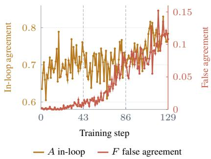  
Figure 1: Co-cheating. The training signal and false agreement rise together.

This loop makes agreement an endogenous proxy for correctness (Amodei et al., 2016; Gao et al., 2023). An incorrect pseudo-label can train the solver to repeat the same error on later questions from that source (Arazo et al., 2020); rewarding this agreement then reinforces the error in the next-round curriculum, as illustrated in the left panel of Figure 2. We test for this failure in Dr. Zero (Yue et al., 2026) using a post-hoc auditor that checks generated tasks and answers against source evidence but never feeds into training. Figure 1 shows that internal reward rises together with false agreement as proposer and solver increasingly share errors. We call this optimization outcome co-cheating and measure it asfalse-agreement mass: the fraction of evaluated pairs that agree on the same incorrect answer.

The most direct mitigation is to verify each proposal before training. The middle panel of Figure 2 illustrates our multi-sample verification (MSV), which queries the same model used in self-evolution three times with the source and three times without it. Compatible majorities yield a consensus label and admit the task; inconsistent candidates are rejected. This partially reduces false agreement, implicating pseudo-label quality, but leaves substantial co-cheating and adds six labeler generations per candidate.

These limitations point to a second source of failure: not only whether a pseudo-label is correct, but also whether it trained the solver that later evaluates questions from the same source. The right panel of Figure 2 shows our primary intervention, CrossFit. The proposer’s source documents are divided into groups A and B. Along the upper path, an auxiliary solver learns only from A and scores new questions generated from B; along the lower path, a second solver learns only from B and scores questions from A. The cross-fitted agreement scores determine proposer reward. Each scoring solver has thus never trained on pseudo-labels from the source it evaluates, preventing a same-source error from being directly reproduced as reward. The original solver still trains on all admitted questions; only the feedback shaping the proposer’s next-round curriculum is cross-fitted.

We rerun self-evolution with Qwen3.5-4B and Qwen3.5-9B (Qwen Team, 2026). Under standard coupled feedback, false-agreement mass reaches 6.1% and 8.8%; MSV lowers it to 5.7% and 7.2%, while CrossFit lowers it to 3.0% and 3.7%. Replaying identical proposals with source-excluded feedback further reduces it to 0.4% and 0.1%, isolating feedback ancestry from curriculum selection. We evaluate each round-end main solver on a fixed 1,325-question suite: 200 each from Natural Questions, TriviaQA, PopQA, HotpotQA, 2WikiMultiHopQA, and MuSiQue, plus 125 from Bamboogle (Kwiatkowski et al., 2019; Joshi et al., 2017; Mallen et al., 2023; Yang et al., 2018; Ho et al., 2020; Trivedi et al., 2022; Press et al., 2023). With one greedy trajectory per question and identical tool and extraction budgets, CrossFit reaches 48.8% at 4B and 51.2% at 9B, improving over coupled self-evolution by 8.8 and 8.4 points and over Search-R1 by 8.7 and 7.8 points, respectively.

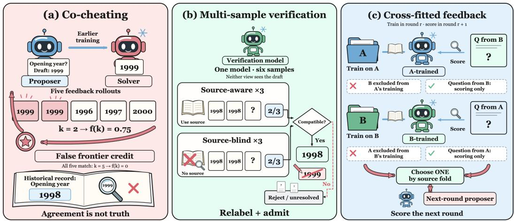  
Figure 2: Co-cheating and its mitigation. (a) Incorrect agreement creates false frontier credit. (b) MSV verifies each proposal with source-aware and source-blind samples. (c) CrossFit scores each source group with a solver trained on the other group. The two interventions target label quality and feedback provenance, respectively.

## 2 DIAGNOSING CO-CHEATING

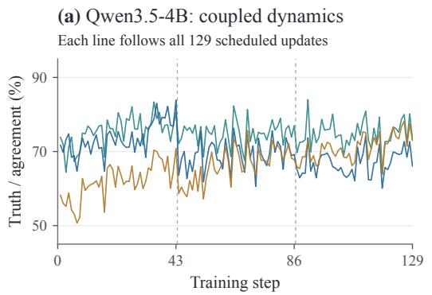  
(c) Qwen3.5-4B: error composition

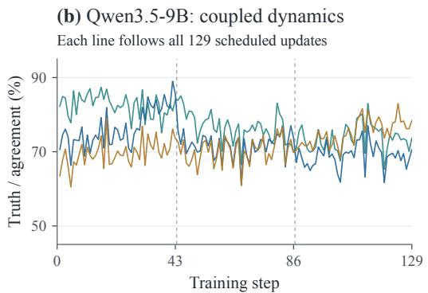  
(d) Qwen3.5-9B: error composition

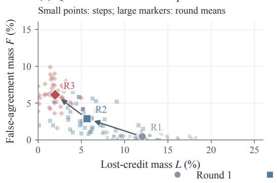

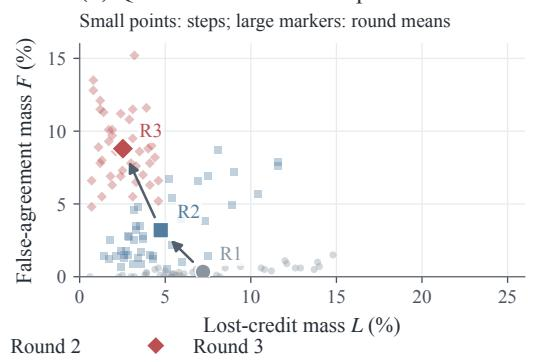  
Figure 3: Co-cheating under coupled feedback. (a,b) All 129 steps of label truth $T _ { P } ,$ , solver truth $T _ { S } ,$ and agreement A; dashes mark round boundaries. (c,d) False agreement F versus lost credit L: small points are steps, large markers average each round’s 43 step rates, and arrows indicate round order. Rising F with falling L reveals shared-error accumulation. All axes are percentages.

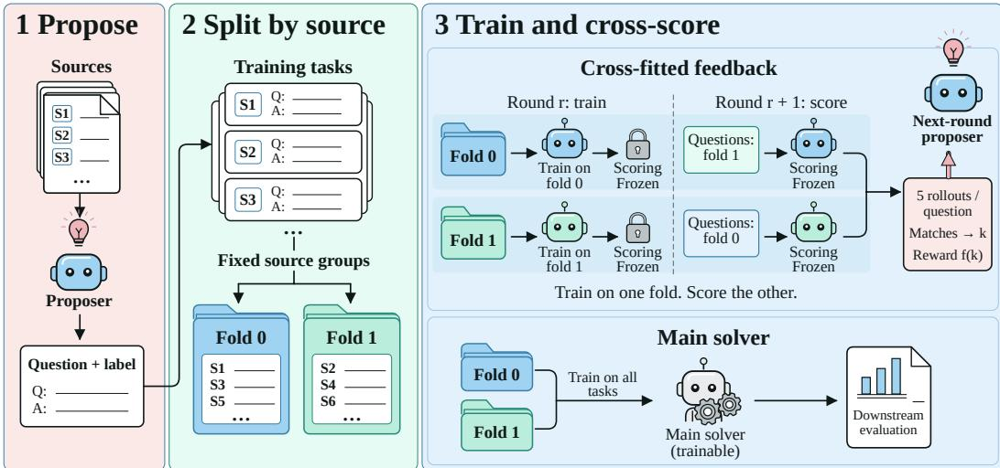  
Figure 4: The CrossFit algorithm. Auxiliary solvers train on one source fold and score the other; the main solver trains on all admitted questions.

Audit protocol. We audit the standard coupled Dr. Zero loop after training, without altering its procedure. Many generated questions require reconstructing multi-hop evidence chains across long or specialized source documents. Even a human judge must first reproduce the search path and inspect unfamiliar evidence, making exhaustive annotation of every saved training step difficult to standardize at this scale. We therefore save the source document, adopted pseudo-label, and five solver responses used for proposer reward at every scheduled step. gpt-6-astra/high constructs an evidencebacked reference from the source and judges these saved outputs (Appendix B); unsupported cases remain unresolved rather than receiving a forced label. Because the auditor never affects admission, model updates, or reward, it provides a scalable, independent measurement of the exact examples behind the in-loop signal.

What is measured. T and T denote adopted-label and solver-response correctness, while A is the label–response match rate observed by the loop. F counts pairs matching the same incorrect answer; L counts correct solver responses denied credit by a wrong label. Ordinary label noise can cause disagreement or lost credit, whereas co-cheating predicts that agreement itself becomes optimistic as both agents converge on the same error. Rising A is therefore reliable only when TP and TS also rise and F remains low. Because proposer reward is computed from the five label–response matches, we audit those same five pairs rather than collapsing them to a post-hoc majority. Thus, F measures the portion of apparent agreement that the external audit identifies as wrong.

Observed dynamics. Figure 3 shows this transition. In round 1, mean false-agreement mass is only 0.004 for Qwen3.5-4B and 0.003 for Qwen3.5-9B, and incorrect labels more often appear as lost credit. From round 2 onward, agreement becomes increasingly optimistic without a commensurate increase in truth. By round 3, F reaches 0.061 and 0.088 at the two scales, while L falls. Harder questions may reduce correctness, but they do not explain increasing agreement on the same sourceinconsistent answer. The joint rise of A and F instead shows disagreement being replaced by shared mistakes. We call this self-reinforcing optimization outcome co-cheating; it does not imply intentional coordination.

## 3 FROM VERIFICATION TO CROSS-FITTED FEEDBACK

The audit motivates two interventions at different points in the self-evolution loop. MSV tests a proposed answer before the example enters training, whereas CrossFit, our main method, changes which solver supplies the feedback that updates the proposer.

## 3.1 MULTI-SAMPLE VERIFICATION

MSV is an admission-time test of whether a proposed question admits a stable answer independently of the proposer’s draft. Given source document x, question $q ,$ and the same model M used in self-evolution, it draws three source-aware and three source-blind answers,

$$
a _ { i } ^ { \mathrm { s r c } } \sim M ( \cdot \mid x , q ) , \qquad a _ { i } ^ { \mathrm { b l i n d } } \sim M ( \cdot \mid q ) , \qquad i \in \{ 1 , 2 , 3 \} .
$$

Neither view observes the draft. Let $\mathrm { M a j }$ return an answer when at least two samples agree under the answer matcher ≃, and ∅ otherwise. Defining $y ^ { v } = \mathrm { M a j } ( a _ { 1 : 3 } ^ { v } )$ for $v \in \{ \mathrm { s r c } , \mathrm { b l i n d } \}$ , admission is

$$
I _ { \mathrm { M S V } } = { \bf 1 } \big [ y ^ { \mathrm { s r c } } \ne \emptyset \mathrm { ~ \land ~ } y ^ { \mathrm { b l i n d } } \ne \emptyset \mathrm { ~ \land ~ } y ^ { \mathrm { s r c } } \simeq y ^ { \mathrm { b l i n d } } \big ] .
$$

When $I _ { \mathrm { M S V } } = 1$ , the compatible majority replaces the draft as the training label; otherwise the task is rejected. The two views test evidential support and answer stability, respectively. However, six samples from the same model can share errors, and verification does not prevent a later feedback solver from reusing labels derived from the evaluated source. It also adds six generations, including their search and coordination cost, per candidate (Table 3, Appendix A).

## 3.2 CROSS-FITTED PROPOSER FEEDBACK

CrossFit changes only where the proposer obtains its feedback. As shown from left to right in Figure 4, the proposer generates questions and pseudo-labels from source documents exactly as in the original loop. We then assign each source document once to fold 0 or fold 1, and every question derived from that document keeps the same assignment throughout self-evolution. The split is made at the source level because splitting individual questions could place related examples from the same document on both sides and preserve the very reuse path that we want to remove.

The two source folds maintain two auxiliary feedback solvers. After round r, one solver has learned only from admitted questions in fold 0, while the other has learned only from admitted questions in fold 1. In the next round, their roles are crossed: questions from fold 0 are evaluated by the solver trained on fold 1, and questions from fold 1 are evaluated by the solver trained on fold 0. These are the two crossed paths in Figure 4. Consequently, the solver evaluating a question has not been trained on pseudo-labels produced from that question’s source.

The feedback rule itself remains the same. Let h denote the source fold, $S _ { r , 1 - h }$ the auxiliary solver trained on the complementary fold, and y˜ the adopted label. From its responses $z _ { 1 } , \ldots , z _ { 5 }$ , the proposer receives

$$
R _ { P } ( q ) = f \left( \sum _ { j = 1 } ^ { 5 } \mathbf { 1 } [ z _ { j } \simeq \tilde { y } ] \right) , \qquad z _ { j } \sim S _ { r , 1 - h } ( \cdot \mid q ) .
$$

The sum counts how many responses match the adopted label under the original answer matcher, and $f ( k ) = ( 5 - k ) / 4$ for $0 < k < 5$ (zero otherwise) is Dr. Zero’s frontier reward. Thus, CrossFit preserves the original training objective: questions still receive credit according to how difficult they appear to a solver. The only change is which solver supplies that signal.

This change breaks the direct self-reinforcing path revealed by our audit. Under coupled feedback, an incorrect pseudo-label from a source can train the solver, be reproduced by that solver on a later question from the same source, and then return to the proposer as reward. Under CrossFit, the later question is instead evaluated by the complementary solver, whose training history excludes that source. The method does not turn the auxiliary solver into a truth oracle: the two solvers may still share errors inherited from pretraining or overlapping evidence. It does, however, prevent agreement from being rewarded merely because the evaluator was trained on the same source-derived error.

The bottom path of Figure 4 separates this feedback mechanism from downstream training. The main solver is not split; it continues to train on all admitted questions from both folds. The auxiliary solvers affect only the feedback that shapes the proposer’s next-round curriculum. When the two interventions are combined, MSV first decides whether a proposal is admitted and which pseudo-label is used, and CrossFit then selects the auxiliary solver that evaluates it. In this sense, MSV improves the supervision entering training, whereas CrossFit prevents that supervision from being directly recycled into proposer reward.

Table 1: Downstream search performance after three rounds of self-evolution. Bold denotes the best result and underlining denotes the second-best within each Qwen3.5 block. †Baselines from the Dr. Zero comparison, run on the same Qwen3.5 backbones and evaluated on the same 1,325-question set.
<table><tr><td rowspan="2"></td><td>NQ</td><td>TriviaQA</td><td>PopQA</td><td>HotpotQA</td><td>2WikiMQA</td><td>MuSiQue</td><td>Bamboogle</td><td>Average</td></tr><tr><td colspan="8">Qwen3.5-4B</td></tr><tr><td>Base</td><td>0.380</td><td>0.655</td><td>0.315</td><td>0.350</td><td>0.465</td><td>0.105</td><td>0.416</td><td>0.384</td></tr><tr><td>Prompting†</td><td>0.245</td><td>0.525</td><td>0.165</td><td>0.290</td><td>0.460</td><td>0.085</td><td>0.360</td><td>0.304</td></tr><tr><td>R1-Instruct†</td><td>0.295</td><td>0.605</td><td>0.195</td><td>0.320</td><td>0.475</td><td>0.105</td><td>0.448</td><td>0.349</td></tr><tr><td>Search-R1†</td><td>0.355</td><td>0.650</td><td>0.290</td><td>0.370</td><td>0.510</td><td>0.125</td><td>0.504</td><td>0.401</td></tr><tr><td>Dr. Zero</td><td>0.390</td><td>0.665</td><td>0.325</td><td>0.365</td><td>0.485</td><td>0.120</td><td>0.448</td><td>0.400</td></tr><tr><td>MSV</td><td>0.400</td><td>0.670</td><td>0.340</td><td>0.375</td><td>0.480</td><td>0.135</td><td>0.448</td><td>0.407</td></tr><tr><td>CrossFit</td><td>0.455</td><td>0.730</td><td>0.415</td><td>0.460</td><td>0.575</td><td>0.245</td><td>0.536</td><td>0.488</td></tr><tr><td>MSV + CrossFit</td><td>0.470</td><td>0.730</td><td>0.410</td><td>0.475</td><td>0.575</td><td>0.250</td><td>0.528</td><td>0.491</td></tr><tr><td colspan="9">Qwen3.5-9B</td></tr><tr><td>Base</td><td>0.505</td><td>0.710</td><td>0.375</td><td>0.355</td><td>0.295</td><td>0.125</td><td>0.496</td><td>0.409</td></tr><tr><td>Prompting†</td><td>0.380</td><td>0.630</td><td>0.260</td><td>0.280</td><td>0.270</td><td>0.115</td><td>0.392</td><td>0.332</td></tr><tr><td>R1-Instruct†</td><td>0.445</td><td>0.695</td><td>0.290</td><td>0.310</td><td>0.295</td><td>0.135</td><td>0.480</td><td>0.379</td></tr><tr><td>Search-R1†</td><td>0.510</td><td>0.730</td><td>0.395</td><td>0.380</td><td>0.310</td><td>0.180</td><td>0.536</td><td>0.434</td></tr><tr><td>Dr. Zero</td><td>0.515</td><td>0.730</td><td>0.400</td><td>0.370</td><td>0.320</td><td>0.150</td><td>0.512</td><td>0.428</td></tr><tr><td>MSV</td><td>0.525</td><td>0.720</td><td>0.400</td><td>0.390</td><td>0.325</td><td>0.155</td><td>0.536</td><td>0.436</td></tr><tr><td>CrossFit</td><td>0.580</td><td>0.765</td><td>0.455</td><td>0.490</td><td>0.425</td><td>0.255</td><td>0.616</td><td>0.512</td></tr><tr><td>MSV + CrossFit</td><td>0.570</td><td>0.780</td><td>0.470</td><td>0.485</td><td>0.415</td><td>0.280</td><td>0.608</td><td>0.515</td></tr></table>

## 4 MAIN EXPERIMENTS

## 4.1 EXPERIMENTAL SETUP

Datasets & Models. We evaluate on the seven open-domain question answering benchmarks used by Dr. Zero (Yue et al., 2026): the single-hop Natural Questions (NQ) (Kwiatkowski et al., 2019), TriviaQA (Joshi et al., 2017), and PopQA (Mallen et al., 2023), and the multi-hop HotpotQA (Yang et al., 2018), 2WikiMultiHopQA (2WikiMQA) (Ho et al., 2020), MuSiQue (Trivedi et al., 2022), and Bamboogle (Press et al., 2023). A fixed evaluation set of 1,325 questions contains 200 examples from each of the first six benchmarks and all 125 Bamboogle examples. We use Qwen3.5-4B and Qwen3.5-9B (Qwen Team, 2026) as backbones. At each scale, all self-evolution treatments start from the same public checkpoint, which is also evaluated as the Base row, and none of them uses human-annotated QA training data.

Baselines & Evaluation. We compare four self-evolution treatments obtained by crossing the two interventions of Section 3. Dr. Zero (Yue et al., 2026) is the standard coupled loop in which the main solver scores the proposals it later trains on; MSV adds multi-sample verification to this loop; CrossFit replaces coupled feedback with source-excluded feedback; and MSV + CrossFit applies both. For broader comparison, we reproduce the Prompting and R1-Instruct baselines from the Dr. Zero protocol (Yue et al., 2026), together with Search-R1 (Jin et al., 2025), on the same Qwen3.5 backbones and evaluate every row on the same 1,325-question set with identical tool budget, decoding, and answer extraction. Every self-evolution experiment follows the same three-round schedule of 18 proposer and 25 solver steps per round and optimizes the policy-gradient objective of Equation (1); Table 2 in Appendix A lists the shared configuration. At the end of each round, we evaluate the main solver, which trains on all admitted questions, using one greedy search trajectory per question, the same tool budget, and identical answer extraction. We report Cover-EM and average the seven benchmarks with equal weight (Equation (2)); Tables 5 and 6 in Appendix B list intermediate rounds and micro averages.

## 4.2 MAIN RESULTS

Cross-fitted feedback improves downstream search at both scales. In Table 1, coupled selfevolution raises average Cover-EM from 0.384 to 0.400 at 4B and from 0.409 to 0.428 at 9B. CrossFit reaches 0.488 and 0.512: gains of 8.8/8.4 percentage points over Dr. Zero and 8.7/7.8 over Search-R1. Every benchmark improves at both scales. Gains are largest on multi-hop tasks,

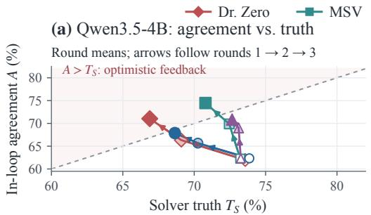

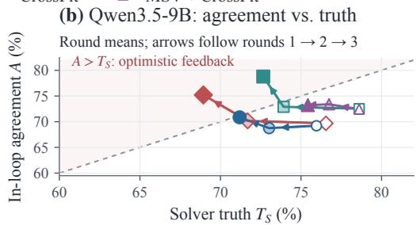

(c) Qwen3.5-4B: false agreement  
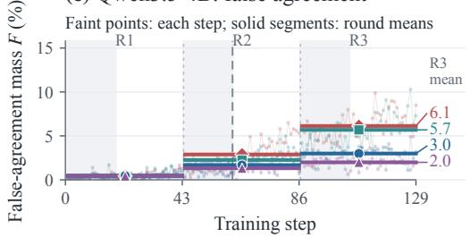

(d) Qwen3.5-9B: false agreement  
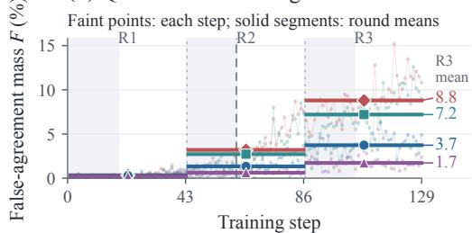  
All 129 steps retained · Gray bands: proposer updates · Long dash: step 62

Figure 5: Training dynamics across three rounds. (a,b) Round means of agreement and solver truth; hollow, light, and solid markers denote rounds 1–3. Above the diagonal, agreement is optimistic. (c,d) Faint points retain all 129 steps; solid segments average each round’s 43 step rates, and end labels give round-3 means (%). Gray bands mark proposer phases, short dashes mark round boundaries, and the long dash marks step 62. Full traces and coverage appear in Figures 8–9.

averaging 10.0/10.9 points across HotpotQA, 2WikiMQA, MuSiQue, and Bamboogle, versus 7.3/5.2 across the single-hop datasets. The effect therefore extends across task difficulty and model scale.

Verification alone is insufficient. MSV increases the average by only 0.7–0.8 points over Dr. Zero. Combining it with CrossFit reaches 0.491 on Qwen3.5-4B and 0.515 on Qwen3.5-9B, only 0.3 points above CrossFit alone. These results suggest that changing the provenance of proposer feedback is more consequential than improving pseudo-label quality alone.

## 5 ANALYSIS AND ABLATIONS

## 5.1 HOW DOES CROSS-FITTING CHANGE THE TRAINING TRAJECTORY?

Section 2 establishes that co-cheating emerges under standard coupled feedback. Figure 5 instead compares how the four treatments change that trajectory, and Figures 8 and 9 in Appendix E retain every per-step trace. All arms share the same first-round history; the cross-fitted arms begin to differ only when their auxiliary feedback solvers are used in round 2. This delayed divergence provides a within-run comparison of feedback provenance.

Cross-fitted feedback reverses the divergence between agreement and truth. Without crossfitting, in-loop agreement rises above solver truth while false agreement accumulates at both model scales. Once cross-fitted scoring becomes active, adopted-label truth rises, agreement remains at or below solver truth, and by round 3 false-agreement mass falls below half of the coupled value. MSV alone improves solver truth but does not prevent the agreement signal from becoming optimistic; combined with CrossFit, it yields the lowest final false agreement.

The trajectory difference predicts downstream gains. Table 5 shows that the downstream advantage of CrossFit over Dr. Zero grows from 4.2 and 4.3 points after round 2 to 8.8 and 8.4 points after round 3. The intervention therefore changes what the loop learns across rounds rather than merely re-ranking a fixed set of final predictions. Figure 6 summarizes the final-round audit (absolute values in Table 4). CrossFit raises adopted-label truth from 0.747 to 0.819 at 4B and from 0.737 to 0.851 at 9B, while reducing false-agreement mass from 0.061 to 0.030 and from 0.088 to 0.037. These changes connect the downstream improvement to the intended mechanism: excluding the evaluated source from the feedback solver prevents same-source errors from being systematically returned to the proposer as apparent progress.

(a) Qwen3.5-4B  
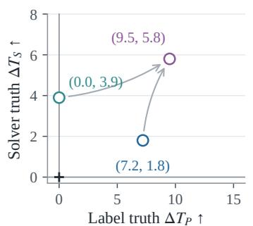

(b) Qwen3.5-9B  
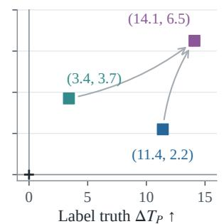

(c) Less false agreement  
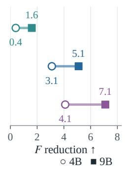  
Figure 6: Round-3 audit relative to Dr. Zero. (a,b) Joint truth gains; arrows lead to the combined treatment. (c) Reduction $F _ { \mathrm { D r . ~ Z e r o } } - F .$ . All values are percentage points.

(a) Feedback landscape  
(b) Replay accuracy  
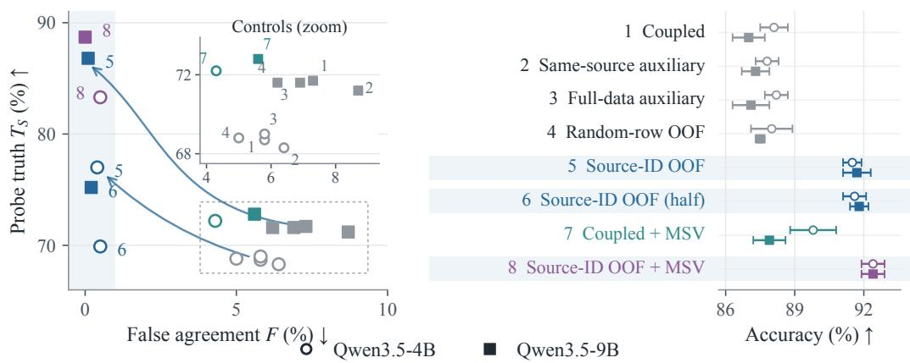  
Figure 7: Mechanism ablations on a fixed replay bank. (a) Truth versus false agreement; arrows compare coupled and source-ID feedback. (b) Accuracy on 3,000 replay questions, mean ± SD over five seeds. Numbers identify methods; shading marks source exclusion.

## 5.2 WHY IS SOURCE-LEVEL EXCLUSION NECESSARY?

Figure 7 compares CrossFit with controls that preserve its auxiliary-solver architecture while altering the data seen by the evaluator. A same-source auxiliary solver yields false-agreement mass of 0.064 and 0.087, and a full-data auxiliary yields 0.058 and 0.069, both close to the coupled control. A separate evaluator is therefore not sufficient when its training data retain the same source-derived pseudo-labels.

The split must follow source ancestry. Randomly partitioning individual questions reduces false agreement only modestly, to 0.050 at 4B and 0.062 at 9B, because questions derived from the same document can still enter both folds. In contrast, the source-ID split reduces false agreement to 0.004 and 0.001. It also raises fixed-bank solver truth from 0.687 to 0.770 at 4B and from 0.717 to 0.868 at 9B, with corresponding accuracy gains from 88.1% to 91.5% and from 87.0% to 91.7%. These comparisons isolate source exclusion, rather than evaluator duplication or partitioning alone, as the component responsible for the improvement.

## 5.3 FIXED-BANK REPLAY SEPARATES FEEDBACK FROM CURRICULUM

Adaptive reruns change both the evaluator and the questions generated in later rounds. We therefore replay the same 3,000 saved questions and adopted labels while varying only the training provenance of the feedback solver. Holding the bank, labels, answer matcher, and evaluation procedure fixed removes admission and curriculum selection as explanations.

Fixed-bank replay isolates source exclusion. On identical proposals, source-ID feedback reduces coupled false agreement from 0.058/0.073 to 0.004/0.001 at 4B/9B (Figure 7). The accompanying gains in probe truth and replay accuracy persist without changing admission or the curriculum, linking the result to feedback provenance.

Additional auxiliary optimization does not explain the effect. The half-budget control reaches false-agreement mass of 0.005/0.002 and replay accuracy of 91.6%/91.8%, matching the full source-ID result. Together, these controls identify source ancestry, rather than evaluator duplication, arbitrary partitioning, task selection, or extra updates, as the operative difference.

## 5.4 HOW DO VERIFICATION AND CROSS-FITTING INTERACT?

The two interventions operate at different points in the loop. MSV changes which question–label pairs enter training, whereas CrossFit changes which solver evaluates the next proposal. In the adaptive-loop audit (Table 4), MSV reduces false-agreement mass from 0.061 to 0.057 at 4B and from 0.088 to 0.072 at 9B, but agreement remains above solver truth. CrossFit produces the larger reductions, to 0.030 and 0.037, while the combined treatment reaches 0.020 and 0.017. Thus, improving pseudo-label reliability helps, but it does not remove the feedback dependence that produces co-cheating. The fixed-bank results in Figure 7 show the same distinction. Coupled feedback with MSV retains false-agreement mass of 0.043/0.056, whereas adding source exclusion lowers it to 0.005/0.000 and raises replay accuracy to 92.4% at both scales. Finally, Table 1 shows that the combination improves the downstream average by only 0.3 points beyond CrossFit alone at each scale. MSV therefore provides complementary reliability gains, while source-excluded proposer feedback accounts for most of the improvement in the learned search policy.

## 6 RELATED WORK

Self-generated curricula and search. Self-play has been studied for goal discovery, language-model alignment, and reasoning (OpenAI et al., 2021; Chen et al., 2024; Wu et al., 2025; Yuan et al., 2024; Zhao et al., 2025; Huang et al., 2025). Self-questioning and corpus-based evolution offer additional ways to generate supervision (Chen et al., 2025; Wang et al., 2025a; Liu et al., 2025a). Our closest framework is Dr. Zero (Yue et al., 2026); Search Self-Play (Lu et al., 2026) is another direct comparator. SearchMaster (Tan et al., 2026) provides the closest complementary diagnosis of misleading search self-play signals. Co-evolving feedback in CAFE (Liu et al., 2026b) further makes feedback adaptation a current research target. We isolate a narrower issue: training-data ancestry of the solver used for proposer feedback. We do not claim to introduce self-play, answer verification, or cross-fitting itself.

Proxy rewards and self-confirmation. Reward hacking and reward-process manipulation predate language agents (Amodei et al., 2016; Everitt et al., 2021). Proxy reward optimization can diverge from a ground-truth objective (Gao et al., 2023); human-preference training can also favor agreement over truth (Sharma et al., 2024). Pseudo-label confirmation bias provides a related account of learning from one’s own mistakes (Arazo et al., 2020). Our focus is the additional return path from a pseudolabel-trained solver into task generation. False agreement is a diagnostic for this path, not by itself a causal proof of exploitation. Automated judges can have systematic biases (Zheng et al., 2023), motivating blinded evidence gathering and human validation.

Data exclusion versus better evidence. Cross-fitting uses held-out nuisance predictions in statistical estimation (Chernozhukov et al., 2018). We borrow its exclusion principle, not its asymptotic guarantees: our adaptive curriculum lacks a demonstrated orthogonal score or independent sample structure. Retrieval and iterative search improve access to evidence (Lewis et al., 2020; Guu et al., 2020; Trivedi et al., 2023; Li et al., 2025b); they do not establish independence between a pseudo-label and a trained evaluator. Likewise, majority stability does not imply correctness when labelers share a model and evidence. These distinctions motivate evaluating verification and source exclusion as separate interventions. Appendix C expands the literature map.

## 7 CONCLUSION

Co-cheating exposes a failure of self-evolution: agreement can improve because a proposer and solver reinforce the same incorrect labels. Our evidence-backed audit separates this internal progress from correctness. CrossFit addresses the feedback path by scoring each source with an auxiliary solver trained on the complementary fold, while the main solver still learns from all admitted tasks.

Across Qwen3.5-4B and Qwen3.5-9B, this change reduces final-round false agreement from 6.1%/8.8% to 3.0%/3.7% and improves seven-benchmark average Cover-EM over Dr. Zero by 8.8/8.4 points. Fixed-bank replay and evaluator controls support source ancestry as the operative distinction; verification provides complementary reliability gains but only modest additional downstream improvement. These findings motivate tracking how an evaluator acquired its supervision when designing self-generated curricula. Shared pretraining errors, overlapping evidence, and auxiliary cost remain open limitations (Appendix D): extending exclusion to connected sources and measuring end-to-end efficiency are essential next tests of the principle. Reliable self-evolution therefore requires auditing both feedback correctness and the training history of its evaluator.

## AI USE STATEMENT

An AI coding and writing assistant assisted with literature discovery, draft organization, consistency checks, and LaTeX authoring. An LLM accessed through a commercial API (gpt-6-astra/high) served as the judge in the post-hoc audit described in Section 2 and Appendix B. The authors verified the reported results, claims, citations, and implementation correspondence.

## REPRODUCIBILITY STATEMENT

The appendix reports the training schedule, model configuration, evaluation manifest, scoring rules, audit procedure, and mechanism-specific controls used in our experiments.

## REFERENCES

Dario Amodei, Chris Olah, Jacob Steinhardt, Paul Christiano, John Schulman, and Dan Mane.´ Concrete Problems in AI Safety. arXiv preprint arXiv:1606.06565, 2016. URL https:// arxiv.org/abs/1606.06565.

Eric Arazo, Diego Ortego, Paul Albert, Noel E. O’Connor, and Kevin McGuinness. Pseudo-labeling and confirmation bias in deep semi-supervised learning. In 2020 International Joint Conference on Neural Networks (IJCNN), pp. 1–8. IEEE, 2020.

Sebastian Borgeaud, Arthur Mensch, Jordan Hoffmann, Trevor Cai, Eliza Rutherford, Katie Millican, George Bm Van Den Driessche, Jean-Baptiste Lespiau, Bogdan Damoc, Aidan Clark, et al. Improving language models by retrieving from trillions of tokens. In International conference on machine learning, pp. 2206–2240. PMLR, 2022.

Lili Chen, Mihir Prabhudesai, Katerina Fragkiadaki, Hao Liu, and Deepak Pathak. Self-questioning language models. arXiv preprint arXiv:2508.03682, 2025.

Zixiang Chen, Yihe Deng, Huizhuo Yuan, Kaixuan Ji, and Quanquan Gu. Self-play fine-tuning converts weak language models to strong language models. In Proceedings of the 41st International Conference on Machine Learning, volume 235 of Proceedings ofMachine Learning Research, pp. 6621–6642. PMLR, 2024.

Victor Chernozhukov, Denis Chetverikov, Mert Demirer, Esther Duflo, Christian Hansen, Whitney Newey, and James Robins. Double/debiased machine learning for treatment and structural parameters. The Econometrics Journal, 21(1):C1–C68, 2018. doi: 10.1111/ectj.12097. URL https://academic.oup.com/ectj/article/21/1/C1/5056401.

Zheng Chu, Xiao Wang, Jack Hong, Huiming Fan, Yuqi Huang, Yue Yang, Guohai Xu, Chenxiao Zhao, Cheng Xiang, Shengchao Hu, et al. Redsearcher: A scalable and cost-efficient framework for long-horizon search agents. arXiv preprint arXiv:2602.14234, 2026.

Tom Everitt, Marcus Hutter, Ramana Kumar, and Victoria Krakovna. Reward tampering problems and solutions in reinforcement learning: A causal influence diagram perspective. Synthese, 198 (27):6435–6467, 2021. doi: 10.1007/s11229-021-03141-4.

Leo Gao, John Schulman, and Jacob Hilton. Scaling laws for reward model overoptimization. In Pro ceedings of the 40th International Conference on Machine Learning, volume 202 of Proceedings of Machine Learning Research, pp. 10835–10866. PMLR, 2023.

Daya Guo, Dejian Yang, Haowei Zhang, Junxiao Song, Peiyi Wang, Qihao Zhu, Runxin Xu, Ruoyu Zhang, Shirong Ma, Xiao Bi, et al. DeepSeek-R1 incentivizes reasoning in LLMs through reinforcement learning. Nature, 645(8081):633–638, 2025. doi: 10.1038/s41586-025-09422-z.

Kelvin Guu, Kenton Lee, Zora Tung, Panupong Pasupat, and Mingwei Chang. Retrieval augmented language model pre-training. In International conference on machine learning, pp. 3929–3938. PMLR, 2020.

Xanh Ho, Anh-Khoa Duong Nguyen, Saku Sugawara, and Akiko Aizawa. Constructing a multihop QA dataset for comprehensive evaluation of reasoning steps. In Proceedings of the 28th International Conference on Computational Linguistics, pp. 6609–6625, 2020.

Chengsong Huang, Wenhao Yu, Xiaoyang Wang, Hongming Zhang, Zongxia Li, Ruosen Li, Jiaxin Huang, Haitao Mi, and Dong Yu. R-zero: Self-evolving reasoning llm from zero data. arXiv preprint arXiv:2508.05004, 2025.

Gautier Izacard and Edouard Grave. Leveraging passage retrieval with generative models for open ´ domain question answering. In Proceedings ofthe 16th Conference ofthe European Chapter of the Association for Computational Linguistics: Main Volume, pp. 874–880, 2021.

Gautier Izacard, Patrick Lewis, Maria Lomeli, Lucas Hosseini, Fabio Petroni, Timo Schick, Jane Dwivedi-Yu, Armand Joulin, Sebastian Riedel, and Edouard Grave. Atlas: Few-shot learning with retrieval augmented language models. Journal ofMachine Learning Research, 24(251):1–43, 2023.

Pengcheng Jiang, Xueqiang Xu, Jiacheng Lin, Jinfeng Xiao, Zifeng Wang, Jimeng Sun, and Jiawei Han. s3: You don’t need that much data to train a search agent via RL. In Proceedings of the 2025 Conference on Empirical Methods in Natural Language Processing, pp. 21599–21617, 2025.

Zhengbao Jiang, Frank F Xu, Luyu Gao, Zhiqing Sun, Qian Liu, Jane Dwivedi-Yu, Yiming Yang, Jamie Callan, and Graham Neubig. Active retrieval augmented generation. In Proceedings ofthe 2023 Conference on Empirical Methods in Natural Language Processing, pp. 7969–7992, 2023.

Bowen Jin, Hansi Zeng, Zhenrui Yue, Jinsung Yoon, Sercan Arik, Dong Wang, Hamed Zamani, and Jiawei Han. Search-R1: Training LLMs to reason and leverage search engines with reinforcement learning. In Second Conference on Language Modeling (COLM), 2025.

Mandar Joshi, Eunsol Choi, Daniel S Weld, and Luke Zettlemoyer. TriviaQA: A large scale distantly supervised challenge dataset for reading comprehension. In Proceedings of the 55th Annual Meeting of the Association for Computational Linguistics (Volume 1: Long Papers), pp. 1601– 1611, 2017.

Vladimir Karpukhin, Barlas Oguz, Sewon Min, Patrick Lewis, Ledell Wu, Sergey Edunov, Danqi Chen, and Wen-tau Yih. Dense passage retrieval for open-domain question answering. In Proceedings of the 2020 Conference on Empirical Methods in Natural Language Processing (EMNLP), pp. 6769–6781, 2020.

Tom Kwiatkowski, Jennimaria Palomaki, Olivia Redfield, Michael Collins, Ankur Parikh, Chris Alberti, Danielle Epstein, Illia Polosukhin, Jacob Devlin, Kenton Lee, Kristina Toutanova, Llion Jones, Matthew Kelcey, Ming-Wei Chang, Andrew M. Dai, Jakob Uszkoreit, Quoc Le, and Slav Petrov. Natural questions: A benchmark for question answering research. Transactions of the Associationfor Computational Linguistics, 7:453–466, 2019.

Patrick Lewis, Ethan Perez, Aleksandra Piktus, Fabio Petroni, Vladimir Karpukhin, Naman Goyal, Heinrich Kuttler, Mike Lewis, Wen-tau Yih, Tim Rockt ¨ aschel, et al. Retrieval-augmented genera-¨ tion for knowledge-intensive NLP tasks. Advances in Neural Information Processing Systems, 33: 9459–9474, 2020.

Kuan Li, Zhongwang Zhang, Huifeng Yin, Liwen Zhang, Litu Ou, Jialong Wu, Wenbiao Yin, Baixuan Li, Zhengwei Tao, Xinyu Wang, et al. Websailor: Navigating super-human reasoning for web agent. arXiv preprint arXiv:2507.02592, 2025a.

Xiaoxi Li, Guanting Dong, Jiajie Jin, Yuyao Zhang, Yujia Zhou, Yutao Zhu, Peitian Zhang, and Zhicheng Dou. Search-o1: Agentic search-enhanced large reasoning models. In Proceedings of the 2025 Conference on Empirical Methods in Natural Language Processing, pp. 5420–5438, 2025b.

Zhuofeng Li, Dongfu Jiang, Xueguang Ma, Haoxiang Zhang, Ping Nie, Yuyu Zhang, Kai Zou, Jianwen Xie, Yu Zhang, and Wenhu Chen. Openresearcher: A fully open pipeline for long-horizon deep research trajectory synthesis. arXiv preprint arXiv:2603.20278, 2026.

Zihan Liang, Yufei Ma, Ben Chen, Zhipeng Qian, Xuxin Zhang, Huangyu Dai, and Lingtao Mao. Search-e1: Self-distillation drives self-evolution in search-augmented reasoning. arXiv preprint arXiv:2605.22511, 2026.

Xi Victoria Lin, Xilun Chen, Mingda Chen, Weijia Shi, Maria Lomeli, Richard James, Pedro Rodriguez, Jacob Kahn, Gergely Szilvasy, Mike Lewis, et al. RA-DIT: Retrieval-augmented dual instruction tuning. In The Twelfth International Conference on Learning Representations, 2024.

Bo Liu, Chuanyang Jin, Seungone Kim, Weizhe Yuan, Wenting Zhao, Ilia Kulikov, Xian Li, Sainbayar Sukhbaatar, Jack Lanchantin, and Jason Weston. Spice: Self-play in corpus environments improves reasoning. arXiv preprint arXiv:2510.24684, 2025a.

Bo Liu, Leon Guertler, Simon Yu, Zichen Liu, Penghui Qi, Daniel Balcells, Mickel Liu, Cheston Tan, Weiyan Shi, Min Lin, et al. SPIRAL: Self-play on zero-sum games incentivizes reasoning via multi-agent multi-turn reinforcement learning. In The Fourteenth International Conference on Learning Representations, 2026a.

Boyang Liu, Senjie Jin, Peixin Wang, Zhangyue Yin, Yibo Wang, Yuhao Zhou, Zhihao Zhang, Xinbing Liang, Shizheng Zhu, Yuhui Wang, Jingqi Tong, Dingwei Zhu, Zhiheng Xi, Jiazheng Zhang, Clive Bai, Clarenceai, Blaze Chen, Tao Gui, Qi Zhang, and Xuanjing Huang. CAFE: Self-Improving Search Agents Need Co-Evolving Feedback. arXiv preprint arXiv:2608.24794, 2026b. URL https://arxiv.org/abs/2608.24794.

Junteng Liu, Yunji Li, Chi Zhang, Jingyang Li, Aili Chen, Ke Ji, Weiyu Cheng, Zijia Wu, Chengyu Du, Qidi Xu, et al. Webexplorer: Explore and evolve for training long-horizon web agents. arXiv preprint arXiv:2509.06501, 2025b.

Hongliang Lu, Yuhang Wen, Pengyu Cheng, Ruijin Ding, Jiaqi Guo, Haotian Xu, Chutian Wang, Haonan Chen, Xiaoxi Jiang, and Guanjun Jiang. Search self-play: Pushing the frontier of agent capability without supervision. In The Fourteenth International Conference on Learning Representations, 2026.

Xinbei Ma, Yeyun Gong, Pengcheng He, Hai Zhao, and Nan Duan. Query rewriting in retrievalaugmented large language models. In Proceedings of the 2023 Conference on Empirical Methods in Natural Language Processing, pp. 5303–5315, 2023.

Alex Mallen, Akari Asai, Victor Zhong, Rajarshi Das, Daniel Khashabi, and Hannaneh Hajishirzi. When not to trust language models: Investigating effectiveness of parametric and non-parametric memories. In Proceedings of the 61st Annual Meeting of the Association for Computational Linguistics (Volume 1: Long Papers), pp. 9802–9822, 2023.

Reiichiro Nakano, Jacob Hilton, Suchir Balaji, Jeff Wu, Long Ouyang, Christina Kim, Christopher Hesse, Shantanu Jain, Vineet Kosaraju, William Saunders, et al. Webgpt: Browser-assisted question-answering with human feedback. arXiv preprint arXiv:2112.09332, 2021.

OpenAI, Matthias Plappert, Raul Sampedro, Tao Xu, Ilge Akkaya, Vineet Kosaraju, Peter Welinder, Ruben D’Sa, Arthur Petron, Henrique P d O Pinto, et al. Asymmetric self-play for automatic goal discovery in robotic manipulation. arXiv preprint arXiv:2101.04882, 2021.

Long Ouyang, Jeffrey Wu, Xu Jiang, Diogo Almeida, Carroll Wainwright, Pamela Mishkin, Chong Zhang, Sandhini Agarwal, Katarina Slama, Alex Ray, et al. Training language models to follow instructions with human feedback. Advances in Neural Information Processing Systems, 35: 27730–27744, 2022.

Richard Yuanzhe Pang, Weizhe Yuan, Kyunghyun Cho, He He, Sainbayar Sukhbaatar, and Jason Weston. Iterative reasoning preference optimization. Advances in Neural Information Processing Systems, 37:116617–116637, 2024.

Ofir Press, Muru Zhang, Sewon Min, Ludwig Schmidt, Noah A Smith, and Mike Lewis. Measuring and narrowing the compositionality gap in language models. In Findings of the Association for Computational Linguistics: EMNLP 2023, pp. 5687–5711, 2023.

Qwen Team. Qwen3.5: Towards native multimodal agents, February 2026. URL https://qwen. ai/blog?id=qwen3.5.

Rafael Rafailov, Archit Sharma, Eric Mitchell, Christopher D Manning, Stefano Ermon, and Chelsea Finn. Direct preference optimization: Your language model is secretly a reward model. Advances in Neural Information Processing Systems, 36:53728–53741, 2023.

Parth Sarthi, Salman Abdullah, Aditi Tuli, Shubh Khanna, Anna Goldie, and Christopher D Manning. RAPTOR: Recursive abstractive processing for tree-organized retrieval. In The Twelfth International Conference on Learning Representations, 2024.

Timo Schick, Jane Dwivedi-Yu, Roberto Dess\`ı, Roberta Raileanu, Maria Lomeli, Eric Hambro, Luke Zettlemoyer, Nicola Cancedda, and Thomas Scialom. Toolformer: Language models can teach themselves to use tools. Advances in neural information processing systems, 36:68539–68551, 2023.

Mrinank Sharma, Meg Tong, Tomasz Korbak, David Duvenaud, Amanda Askell, Samuel R. Bowman, Newton Cheng, Esin Durmus, Zac Hatfield-Dodds, Scott R. Johnston, Shauna Kravec, Timothy Maxwell, Sam McCandlish, Kamal Ndousse, Oliver Rausch, Nicholas Schiefer, Da Yan, Miranda Zhang, and Ethan Perez. Towards understanding sycophancy in language models. In The Twelfth International Conference on Learning Representations, 2024.

Weijia Shi, Sewon Min, Michihiro Yasunaga, Minjoon Seo, Richard James, Mike Lewis, Luke Zettlemoyer, and Wen-tau Yih. REPLUG: Retrieval-augmented black-box language models. In Proceedings of the 2024 Conference of the North American Chapter of the Association for Computational Linguistics: Human Language Technologies (Volume 1: Long Papers), pp. 8371– 8384, 2024.

Huatong Song, Jinhao Jiang, Yingqian Min, Jie Chen, Zhipeng Chen, Wayne Xin Zhao, Lei Fang, and Ji-Rong Wen. R1-searcher: Incentivizing the search capability in llms via reinforcement learning. arXiv preprint arXiv:2503.05592, 2025.

Hao Sun, Zile Qiao, Jiayan Guo, Xuanbo Fan, Yingyan Hou, Yong Jiang, Pengjun Xie, Yan Zhang, Fei Huang, and Jingren Zhou. Zerosearch: Incentivize the search capability of llms without searching. arXiv preprint arXiv:2505.04588, 2025.

Wentao Tan, Qiong Cao, Jiaqi Wang, and Nan Duan. SearchMaster: Grounded and Regulated Self-Play for Search Agents. arXiv preprint arXiv:2608.01822, 2026. URL https://arxiv. org/abs/2608.01822.

Harsh Trivedi, Niranjan Balasubramanian, Tushar Khot, and Ashish Sabharwal. MuSiQue: Multihop questions via single-hop question composition. Transactions ofthe Associationfor Computational Linguistics, 10:539–554, 2022.

Harsh Trivedi, Niranjan Balasubramanian, Tushar Khot, and Ashish Sabharwal. Interleaving retrieval with chain-of-thought reasoning for knowledge-intensive multi-step questions. In Proceedings of the 61st Annual Meeting of the Association for Computational Linguistics (Volume 1: Long Papers), pp. 10014–10037, 2023.

Shaobo Wang, Zhengbo Jiao, Zifan Zhang, Yilang Peng, Xu Ze, Boyu Yang, Wei Wang, Hu Wei, and Linfeng Zhang. Socratic-zero: Bootstrapping reasoning via data-free agent co-evolution. arXiv preprint arXiv:2509.24726, 2025a.

Ziliang Wang, Xuhui Zheng, Kang An, Cijun Ouyang, Jialu Cai, Yuhang Wang, and Yichao Wu. Stepsearch: Igniting llms search ability via step-wise proximal policy optimization. arXiv preprint arXiv:2505.15107, 2025b.

Yue Wu, Zhiqing Sun, Huizhuo Yuan, Kaixuan Ji, Yiming Yang, and Quanquan Gu. Self-play preference optimization for language model alignment. In The Thirteenth International Conference on Learning Representations, 2025.

Shi-Qi Yan, Jia-Chen Gu, Yun Zhu, and Zhen-Hua Ling. Corrective retrieval augmented generation. arXiv preprint arXiv:2401.15884, 2024.

Zhilin Yang, Peng Qi, Saizheng Zhang, Yoshua Bengio, William Cohen, Ruslan Salakhutdinov, and Christopher D Manning. HotpotQA: A dataset for diverse, explainable multi-hop question answering. In Proceedings of the 2018 Conference on Empirical Methods in Natural Language Processing, pp. 2369–2380, 2018.

Shunyu Yao, Jeffrey Zhao, Dian Yu, Nan Du, Izhak Shafran, Karthik Narasimhan, and Yuan Cao. ReAct: Synergizing reasoning and acting in language models. In The Eleventh International Conference on Learning Representations, 2023.

Ziyu Ye, Rishabh Agarwal, Tianqi Liu, Rishabh Joshi, Sarmishta Velury, Quoc V Le, Qijun Tan, and Yuan Liu. Scalable reinforcement post-training beyond static human prompts: Evolving alignment via asymmetric self-play. arXiv preprint arXiv:2411.00062, 2024.

Ori Yoran, Tomer Wolfson, Ori Ram, and Jonathan Berant. Making retrieval-augmented language models robust to irrelevant context. In The Twelfth International Conference on Learning Representations, 2024.

Qiying Yu, Zheng Zhang, Ruofei Zhu, Yufeng Yuan, Xiaochen Zuo, Yu Yue, Weinan Dai, Tiantian Fan, Gaohong Liu, Lingjun Liu, et al. DAPO: An open-source LLM reinforcement learning system at scale. In Advances in Neural Information Processing Systems, 2025.

Wenhao Yu, Hongming Zhang, Xiaoman Pan, Peixin Cao, Kaixin Ma, Jian Li, Hongwei Wang, and Dong Yu. Chain-of-note: Enhancing robustness in retrieval-augmented language models. In Proceedings of the 2024 Conference on Empirical Methods in Natural Language Processing, pp. 14672–14685, 2024.

Weizhe Yuan, Richard Yuanzhe Pang, Kyunghyun Cho, Xian Li, Sainbayar Sukhbaatar, Jing Xu, and Jason E Weston. Self-rewarding language models. In Forty-first International Conference on Machine Learning, 2024.

Zhenrui Yue, Kartikeya Upasani, Xianjun Yang, Suyu Ge, Shaoliang Nie, Yuning Mao, Zhe Liu, and Dong Wang. Dr. zero: Self-evolving search agents without training data. In Third Conference on Language Modeling (COLM), 2026. arXiv:2601.07055.

Dan Zhang, Sining Zhoubian, Ziniu Hu, Yisong Yue, Yuxiao Dong, and Jie Tang. Rest-mcts\*: Llm self-training via process reward guided tree search. Advances in Neural Information Processing Systems, 37:64735–64772, 2024.

Ding-Chu Zhang, Yida Zhao, Jialong Wu, Liwen Zhang, Baixuan Li, Wenbiao Yin, Yong Jiang, Yu-Feng Li, Kewei Tu, Pengjun Xie, and Fei Huang. EvolveSearch: An iterative self-evolving search agent. In Proceedings of the 2025 Conference on Empirical Methods in Natural Language Processing, pp. 13123–13136, 2025a.

Weizhi Zhang, Yangning Li, Yuanchen Bei, Junyu Luo, Guancheng Wan, Liangwei Yang, Chenxuan Xie, Yuyao Yang, Wei-Chieh Huang, Chunyu Miao, et al. From web search towards agentic deep research: Incentivizing search with reasoning agents. arXiv preprint arXiv:2506.18959, 2025b.

Andrew Zhao, Yiran Wu, Yang Yue, Tong Wu, Quentin Xu, Yang Yue, Matthieu Lin, Shenzhi Wang, Qingyun Wu, Zilong Zheng, and Gao Huang. Absolute zero: Reinforced self-play reasoning with zero data. In Advances in Neural Information Processing Systems, 2025.

Lianmin Zheng, Wei-Lin Chiang, Ying Sheng, Siyuan Zhuang, Zhanghao Wu, Yonghao Zhuang, Zi Lin, Zhuohan Li, Dacheng Li, Eric P. Xing, Hao Zhang, Joseph E. Gonzalez, and Ion Stoica. Judging LLM-as-a-judge with MT-bench and chatbot arena. Advances in Neural Information Processing Systems, 36:46595–46623, 2023.

Yuxiang Zheng, Dayuan Fu, Xiangkun Hu, Xiaojie Cai, Lyumanshan Ye, Pengrui Lu, and Pengfei Liu. DeepResearcher: Scaling deep research via reinforcement learning in real-world environments. In Proceedings of the 2025 Conference on Empirical Methods in Natural Language Processing, pp. 414–431, 2025.

Table 2: Training configuration shared across treatments.
<table><tr><td>Item</td><td>Configuration</td></tr><tr><td>Backbones</td><td>Qwen3.5-4B and Qwen3.5-9B</td></tr><tr><td>Schedule</td><td>Three rounds; 18 proposer and 25 main-solver updates per round</td></tr><tr><td>Solver data</td><td>1,600 admitted questions per round; five responses per question</td></tr><tr><td>Proposer update</td><td>64 prompts per update; one selected trajectory per prompt</td></tr><tr><td>Sampling</td><td>Temperature 0.8 and top-p 0.95 for training trajectories</td></tr><tr><td>MSV</td><td>Three source-aware and three source-blind samples per proposal</td></tr><tr><td>CrossFit</td><td>Two source folds; 25 updates per round for each auxiliary solver (50 in total)</td></tr><tr><td>Tool budget</td><td>At most five assistant actions and 512 new tokens per action</td></tr></table>

Table 3: Resource cost per training run. H200-hours are reserved budgets: each run holds eight H200 GPUs for its end-to-end duration, including waiting time, so they exceed the accelerator time actually used; the GPU usage of the external audit service is unknown and not included. Token (millions) and judge-request (thousands) counts are per single-scale run, not summed over the two scales, and exclude training-replay tokens. Hours are the end-to-end wall-clock duration of the full pipeline. “25 total” and “25 per fold” denote the auxiliary-update budget per round.
<table><tr><td></td><td colspan="2">H200-hours</td><td colspan="2">Tokens (M)</td><td>Judge</td><td colspan="2">Hours</td></tr><tr><td>Treatment</td><td>4B</td><td>9B</td><td>Input</td><td>Output</td><td>req. (k)</td><td>4B</td><td>9B</td></tr><tr><td>Dr. Zero</td><td>379</td><td>476</td><td>696</td><td>83</td><td>60.4</td><td>47</td><td>60</td></tr><tr><td>MSV</td><td>719</td><td>903</td><td>1,811</td><td>195</td><td>296.9</td><td>90</td><td>113</td></tr><tr><td>CrossFit (25 total)</td><td>515</td><td>665</td><td>889</td><td>107</td><td>87.1</td><td>64</td><td>83</td></tr><tr><td>CrossFit (25 per fold)</td><td>650</td><td>854</td><td>1,081</td><td>131</td><td>113.8</td><td>81</td><td>107</td></tr><tr><td>MSV+CrossFit (25 per fold)</td><td>990</td><td>1,281</td><td>2,196</td><td>243</td><td>350.3</td><td>124</td><td>160</td></tr></table>

## A IMPLEMENTATION DETAILS

Optimization. The proposer and solver are updated with a sequence-normalized policy-gradient objective. For usable trajectories E and scored assistant tokens $\bar { \tau _ { e } }$

$$
\mathcal { L } ( \theta ) = - \frac { 1 } { \vert \mathcal { E } \vert } \sum _ { e \in \mathcal { E } } \widehat { A } _ { e } \frac { 1 } { \vert \mathcal { T } _ { e } \vert } \sum _ { t \in \mathcal { T } _ { e } } \log \pi _ { \theta } ( y _ { e , t } \mid y _ { e , < t } , q _ { e } ) , \qquad \widehat { A } _ { e } = \frac { r _ { e } - \mu _ { g ( e ) } } { \sigma _ { g ( e ) } + 1 0 ^ { - 6 } } .\tag{1}
$$

Advantages are normalized within proposer task buckets or within the five solver responses to one question. Prompt and tool tokens are masked, as is the proposer’s terminal answer; solver answer tokens remain trainable.

Training configuration. All treatments use the same backbone, proposer schedule, main-solver schedule, sampling configuration, and tool budget. The main solver trains on all admitted questions. In CrossFit, two auxiliary solvers train only on their assigned source folds and are used solely to produce proposer feedback on the complementary fold.

Compute overhead. MSV adds six labeler generations per proposal, and CrossFit adds 50 auxiliary solver updates per round in the main experiments (25 per fold) without changing the main solver’s training data or update count. Table 3 reports the resulting resource cost. Relative to Dr. Zero, MSV raises the reserved budget by about 90% at both scales (379 to 719 H200-hours on Qwen3.5-4B and 476 to 903 on Qwen3.5-9B) and multiplies judge requests almost fivefold, whereas CrossFit adds 72% and 79%. Halving its auxiliary budget to 25 updates per round lowers this to 36% and 40% with nearly the same replay false-agreement mass (0.005 versus 0.004 on Qwen3.5-4B and 0.002 versus 0.001 on Qwen3.5-9B; Figure 7). Combining both interventions costs 2.6 and 2.7 times the Dr. Zero budget. Because reserved hours include waiting time, these ratios compare budgets rather than accelerator utilization.

Table 4: Round-3 audit statistics for every treatment: means of the 43 round-3 step rates. $J / E$ is audit coverage; $T _ { P } , T _ { S } , A , F ,$ , and L are defined in Section 2. Figure 6 plots the corresponding changes relative to Dr. Zero, computed from unrounded means; they can therefore differ by 0.1 percentage point from differences of the rounded entries here.
<table><tr><td></td><td>J/E</td><td> $T _ { P }$ </td><td> $T _ { S }$ </td><td>A</td><td>F</td><td>L</td></tr><tr><td></td><td colspan="6">Qwen3.5-4B</td></tr><tr><td>Dr. Zero</td><td>0.859</td><td>0.747</td><td>0.669</td><td>0.710</td><td>0.061</td><td>0.020</td></tr><tr><td>MSV</td><td>0.860</td><td>0.747</td><td>0.708</td><td>0.745</td><td>0.057</td><td>0.020</td></tr><tr><td>CrossFit</td><td>0.860</td><td>0.819</td><td>0.686</td><td>0.679</td><td>0.030</td><td>0.038</td></tr><tr><td>MSV + CrossFit</td><td>0.858</td><td>0.843</td><td>0.727</td><td>0.708</td><td>0.020</td><td>0.038</td></tr><tr><td></td><td colspan="6">Qwen3.5-9B</td></tr><tr><td>Dr. Zero</td><td>0.859</td><td>0.737</td><td>0.689</td><td>0.752</td><td>0.088</td><td>0.025</td></tr><tr><td>MSV</td><td>0.853</td><td>0.770</td><td>0.727</td><td>0.788</td><td>0.072</td><td>0.011</td></tr><tr><td>CrossFit</td><td>0.857</td><td>0.851</td><td>0.712</td><td>0.709</td><td>0.037</td><td>0.041</td></tr><tr><td>MSV + CrossFit</td><td>0.861</td><td>0.878</td><td>0.754</td><td>0.732</td><td>0.017</td><td>0.039</td></tr></table>

## B EVALUATION AND AUDIT DETAILS

Downstream evaluation. We extract the terminal answer, normalize case, punctuation, English articles, and whitespace, and score against the best matching reference alias. Cover-EM is one when a nonempty normalized reference answer appears in the normalized prediction. Every checkpoint is evaluated on the same 1,325-question manifest with one greedy search trajectory, an identical tool budget, and identical answer extraction. For benchmark d with $n _ { d }$ questions and scores $z _ { d i }$ , we report

$$
\mathrm { M i c r o } = \frac { \sum _ { d } \sum _ { i = 1 } ^ { n _ { d } } z _ { d i } } { 1 3 2 5 } , \qquad \mathrm { M a c r o } = \frac { 1 } { 7 } \sum _ { d = 1 } ^ { 7 } \frac { 1 } { n _ { d } } \sum _ { i = 1 } ^ { n _ { d } } z _ { d i } .\tag{2}
$$

Independent audit. Many generated questions require reconstructing multi-hop evidence across long or specialized source documents, making exhaustive human adjudication at every training step impractical. At every audited step, we therefore save the source document, adopted pseudo-label, and five solver responses used for proposer reward. $\mathtt { g p t - 6 - a s t r a / h i g h }$ constructs an evidencebacked reference from the source and judges the saved label and responses against that reference. Unsupported cases remain unresolved and are included in coverage accounting. The auditor is post-hoc: it never changes admission, model updates, or proposer reward. Table 4 lists the round-3 mean of each audit statistic for every treatment.

Round-wise results. Table 5 lists Cover-EM for every round-end main solver in the layout of Table 1, and Table 6 gives the corresponding micro averages, which weight all 1,325 questions equally. Base obtains micro averages of 0.382 on Qwen3.5-4B and 0.404 on Qwen3.5-9B. Micro and macro averages order the treatments identically in every round.

## C BROADER LITERATURE MAP

This map separates complementary research questions rather than treating every cited system as a direct experimental baseline. Only methods with accessible implementations and matched protocols can support comparative performance claims.

Retrieval representations and evidence use. Dense retrieval, fusion-in-decoder, retrieval-enhanced language modeling, and few-shot retrieval pretraining study how evidence is retrieved and represented (Karpukhin et al., 2020; Izacard & Grave, 2021; Borgeaud et al., 2022; Izacard et al., 2023). Query rewriting and active retrieval change when and how evidence is requested (Ma et al., 2023; Jiang et al., 2023). Black-box retrieval augmentation, hierarchical retrieval, and chain-of-note processing provide other evidence interfaces (Shi et al., 2024; Sarthi et al., 2024; Yu et al., 2024). Robustness to irrelevant context, corrective retrieval, and retrieval-aware tuning address evidence quality or utilization (Yoran et al., 2024; Yan et al., 2024; Lin et al., 2024). These directions motivate holding the retrieval backend fixed: a change in evidence access must not be mistaken for an effect of source-excluded feedback.

Table 5: Cover-EM of every round-end main solver; we mark the best performance within each scale in bold. Each cross-fitted treatment shares round 1 with its coupled counterpart.
<table><tr><td rowspan="2"></td><td>NQ</td><td>TriviaQA</td><td>PopQA</td><td>HotpotQA</td><td>2WikiMQA</td><td>MuSiQue</td><td>Bamboogle</td><td>Average</td></tr><tr><td colspan="8">Qwen3.5-4B</td></tr><tr><td>Base</td><td>0.380</td><td>0.655</td><td>0.315</td><td>0.350</td><td>0.465</td><td>0.105</td><td>0.416</td><td>0.384</td></tr><tr><td>Dr. Zero Round 1</td><td>0.380</td><td>0.660</td><td>0.325</td><td>0.350</td><td>0.475</td><td>0.125</td><td>0.424</td><td>0.391</td></tr><tr><td>Dr. Zero Round 2</td><td>0.395</td><td>0.665</td><td>0.320</td><td>0.360</td><td>0.470</td><td>0.125</td><td>0.440</td><td>0.396</td></tr><tr><td>Dr. Zero Round 3</td><td>0.390</td><td>0.665</td><td>0.325</td><td>0.365</td><td>0.485</td><td>0.120</td><td>0.448</td><td>0.400</td></tr><tr><td>MSV Round 1</td><td>0.385</td><td>0.675</td><td>0.330</td><td>0.355</td><td>0.480</td><td>0.110</td><td>0.432</td><td>0.395</td></tr><tr><td>MSV Round 2</td><td>0.390</td><td>0.670</td><td>0.335</td><td>0.370</td><td>0.490</td><td>0.120</td><td>0.432</td><td>0.401</td></tr><tr><td>MSV Round 3</td><td>0.400</td><td>0.670</td><td>0.340</td><td>0.375</td><td>0.480</td><td>0.135</td><td>0.448</td><td>0.407</td></tr><tr><td>CrossFit Round 1</td><td>0.380</td><td>0.660</td><td>0.325</td><td>0.350</td><td>0.475</td><td>0.125</td><td>0.424</td><td>0.391</td></tr><tr><td>CrossFit Round 2</td><td>0.415</td><td>0.685</td><td>0.370</td><td>0.420</td><td>0.535</td><td>0.165</td><td>0.480</td><td>0.439</td></tr><tr><td>CrossFit Round 3</td><td>0.455</td><td>0.730</td><td>0.415</td><td>0.460</td><td>0.575</td><td>0.245</td><td>0.536</td><td>0.488</td></tr><tr><td>MSV + CrossFit Round 1</td><td>0.385</td><td>0.675</td><td>0.330</td><td>0.355</td><td>0.480</td><td>0.110</td><td>0.432</td><td>0.395</td></tr><tr><td>MSV + CrossFit Round 2</td><td>0.440</td><td>0.680</td><td>0.370</td><td>0.420</td><td>0.515</td><td>0.205</td><td>0.496</td><td>0.447</td></tr><tr><td>MSV + CrossFit Round 3</td><td>0.470</td><td>0.730</td><td>0.410</td><td>0.475</td><td>0.575</td><td>0.250</td><td>0.528</td><td>0.491</td></tr><tr><td colspan="9">Qwen3.5-9B</td></tr><tr><td>Base</td><td>0.505</td><td>0.710</td><td>0.375</td><td>0.355</td><td>0.295</td><td>0.125</td><td>0.496</td><td>0.409</td></tr><tr><td>Dr. Zero Round 1</td><td>0.500</td><td>0.725</td><td>0.385</td><td>0.365</td><td>0.310</td><td>0.140</td><td>0.496</td><td>0.417</td></tr><tr><td>Dr. Zero Round 2</td><td>0.520</td><td>0.725</td><td>0.385</td><td>0.370</td><td>0.310</td><td>0.135</td><td>0.520</td><td>0.424</td></tr><tr><td>Dr. Zero Round 3</td><td>0.515</td><td>0.730</td><td>0.400</td><td>0.370</td><td>0.320</td><td>0.150</td><td>0.512</td><td>0.428</td></tr><tr><td>MSV Round 1</td><td>0.510</td><td>0.725</td><td>0.390</td><td>0.365</td><td>0.305</td><td>0.150</td><td>0.504</td><td>0.421</td></tr><tr><td>MSV Round 2</td><td>0.525</td><td>0.710</td><td>0.395</td><td>0.375</td><td>0.320</td><td>0.150</td><td>0.528</td><td>0.429</td></tr><tr><td>MSV Round 3</td><td>0.525</td><td>0.720</td><td>0.400</td><td>0.390</td><td>0.325</td><td>0.155</td><td>0.536</td><td>0.436</td></tr><tr><td>CrossFit Round 1</td><td>0.500</td><td>0.725</td><td>0.385</td><td>0.365</td><td>0.310</td><td>0.140</td><td>0.496</td><td>0.417</td></tr><tr><td>CrossFit Round 2</td><td>0.550</td><td>0.750</td><td>0.430</td><td>0.430</td><td>0.355</td><td>0.200</td><td>0.552</td><td>0.467</td></tr><tr><td>CrossFit Round 3</td><td>0.580</td><td>0.765</td><td>0.455</td><td>0.490</td><td>0.425</td><td>0.255</td><td>0.616</td><td>0.512</td></tr><tr><td>MSV + CrossFit Round 1</td><td>0.510</td><td>0.725</td><td>0.390</td><td>0.365</td><td>0.305</td><td>0.150</td><td>0.504</td><td>0.421</td></tr><tr><td>MSV + CrossFit Round 2</td><td>0.550</td><td>0.745</td><td>0.435</td><td>0.425</td><td>0.365</td><td>0.220</td><td>0.576</td><td>0.474</td></tr><tr><td>MSV + CrossFit Round 3</td><td>0.570</td><td>0.780</td><td>0.470</td><td>0.485</td><td>0.415</td><td>0.280</td><td>0.608</td><td>0.515</td></tr></table>

Table 6: Micro-averaged Cover-EM of the round-end main solvers; we mark the best performance in bold.
<table><tr><td></td><td colspan="3">Qwen3.5-4B</td><td colspan="3">Qwen3.5-9B</td></tr><tr><td></td><td>Round 1</td><td>Round 2</td><td>Round 3</td><td>Round 1</td><td>Round 2</td><td>Round 3</td></tr><tr><td>Dr. Zero</td><td>0.389</td><td>0.394</td><td>0.397</td><td>0.413</td><td>0.418</td><td>0.423</td></tr><tr><td>MSV</td><td>0.393</td><td>0.399</td><td>0.405</td><td>0.417</td><td>0.423</td><td>0.430</td></tr><tr><td>CrossFit</td><td>0.389</td><td>0.436</td><td>0.485</td><td>0.413</td><td>0.462</td><td>0.506</td></tr><tr><td>MSV + CrossFit</td><td>0.393</td><td>0.444</td><td>0.489</td><td>0.417</td><td>0.468</td><td>0.510</td></tr></table>

Search-agent optimization. Beyond Search-R1 and R1-Searcher, evolving search, efficient search training, simulated search, deep-research agents, and trained web agents illustrate the expanding space of agent learning (Zhang et al., 2025a; Jiang et al., 2025; Sun et al., 2025; Zheng et al., 2025; Zhang et al., 2025b). Step-level search training and systems for difficult web exploration further motivate recording trajectory budgets and tool usage (Wang et al., 2025b; Li et al., 2025a; Liu et al., 2025b). Toolformer studies learning tool use, while more recent open research and search-agent frameworks expand the surrounding system design space (Schick et al., 2023; Li et al., 2026; Chu et al., 2026; Liang et al., 2026). They are contextual references, not claims of matched evaluation in this manuscript.

Self-generated learning and reinforcement learning. Self-play, multi-agent games, self-training, and iterative reasoning optimization offer different sources of automatically generated supervision (Ye et al., 2024; Liu et al., 2026a; Zhang et al., 2024; Pang et al., 2024). Preference learning and largescale reasoning RL establish additional optimization choices (Ouyang et al., 2022; Rafailov et al., 2023; Guo et al., 2025; Yu et al., 2025). Our inspected sequence-level policy-gradient implementation is specified directly in our implementation audit; citing these methods does not imply that their algorithms, training data, or reported capabilities are reproduced. The distinctive variable studied here is the ancestry of the policy supplying proposal feedback, not a new generic policy-gradient estimator.

## D DISCUSSION AND LIMITATIONS

Cross-fitting changes who supplies feedback, not what makes an answer true. Its source exclusion is valuable only if checkpoint ancestry and data routing enforce it. Shared pretraining, overlapping web evidence, semantically related sources, and an adaptive proposer can still induce correlated mistakes. A lower false-agreement mass on accepted questions can also result from rejecting difficult tasks rather than improving learning. Coverage, task difficulty, fixed-probe performance, and downstream capability must therefore accompany that number. Our results establish empirical mitigation across two model scales, but do not yet establish lower end-to-end cost or robustness to connected sources.

## E COMPLETE PER-STEP AUDIT TRAJECTORIES

Figures 8 and 9 retain all 129 scheduled steps, all four treatments, and all six metrics from the data underlying Figure 5. Values are plotted directly from the existing per-step table, in percent, without smoothing or interpolation. Separate axes for false agreement and lost credit keep their distinct magnitudes visible; coverage is the audited fraction $J / \bar { E }$ and is displayed separately from correctness. The round summaries in Figure 5 are arithmetic means of the 43 displayed step rates in each round, not additional runs or uncertainty estimates.

Qwen3.5-4B | Complete audit trajectories  
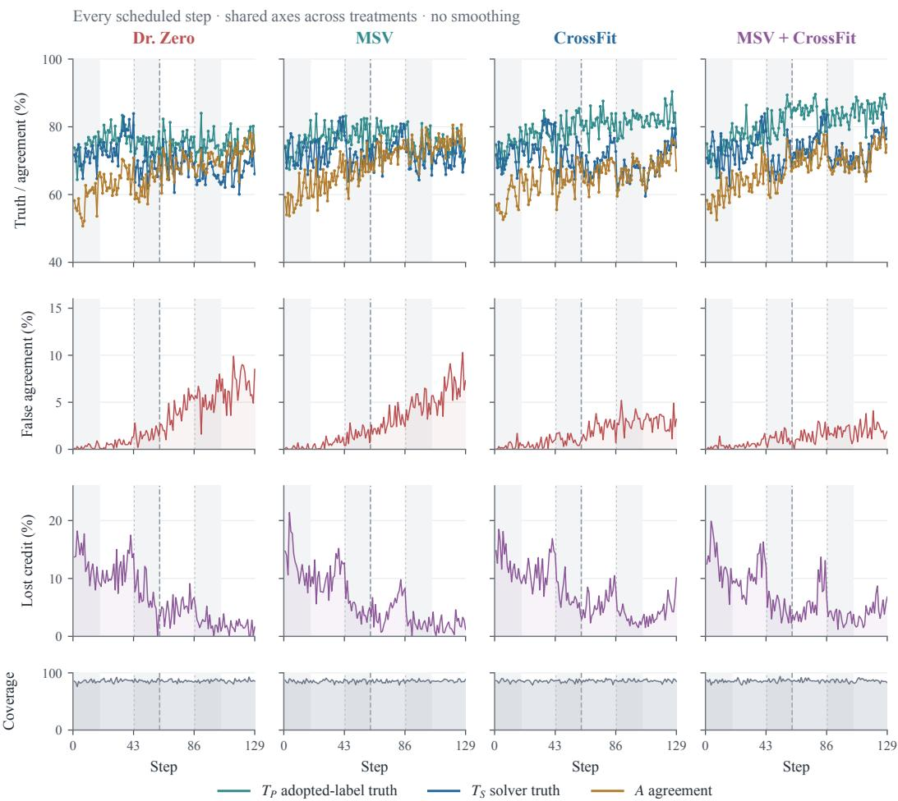  
Gray bands: proposer updates · Short dashes: round boundaries · Long dash: step 62

Figure 8: Complete Qwen3.5-4B audit trajectories. Columns identify treatments. Rows show adopted-label truth $T _ { P } ,$ , solver truth $T _ { S } ,$ , and agreement $A ;$ false-agreement mass $F ;$ lost-credit mass $L ;$ and coverage $J / E$ . Every metric is expressed in percent. Shared limits support comparison across treatments and model scales. Gray bands mark proposer phases, short dashes mark round boundaries, and the long dash marks step 62.

Qwen3.5-9B | Complete audit trajectories  
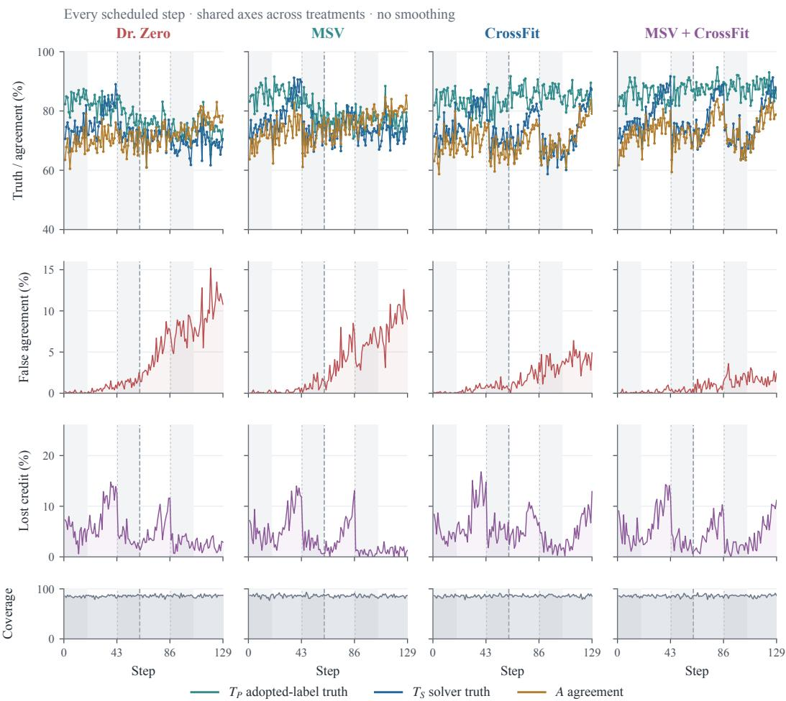  
Gray bands: proposer updates · Short dashes: round boundaries · Long dash: step 62  
Figure 9: Complete Qwen3.5-9B audit trajectories. Layout, metric colors, units, and axis limits match Figure 8. Every scheduled step is retained. The separate coverage strip prevents audit coverage from obscuring the correctness curves.