# FENCHEL TILTING:WEIGHTED CORRECTION FOR EFFICIENT FINETUNINGOF GENERATIVE MODELS

Maksim Bobrin1,2∗ Maksim Zhdanov3 Dmitry Dylov1,2

1AXXX 2Applied AI Institute 3MBZUAI

## ABSTRACT

Adapting a pretrained generative model to an arbitrary preference expressed as a utility function underlies reward alignment, guided design, and constraint satisfaction, enabling diverse applications. Existing fine-tuning methods trade off generality against computational cost: they either restrict the family class of supported preferences to keep optimization simple or preserve generality at the expense of efficiency. We introduce Fenchel Tilt Flow Control (FTFC), which decouples utility optimization from generative-model fitting. FTFC first optimizes for a target distribution by jointly fitting an effective reward and density-ratio weights on pretrained samples. Method combines the utility’s variational structure with Fenchel duality, supporting general f-divergence penalties that determine how rewards are transformed into an distribution-correction weights. These weights are then frozen and used to modify a diffusion or flow model in a single stage of importance-weighted denoising or flow matching, without differentiating through sampling trajectories. We establish exact duality for concave utilities under suitable conditions and show that weighted fitting reproduces the optimal target distribution for a given utility. Across image and molecule generation benchmarks, FTFC improves over baselines on diverse preference functions, while also being up to 20× more efficient. Proposed method enables adaptation beyond expected-reward maximization without complex optimization, while preserving robustness for more general class of the utility functions compared to baselines.

## 1 INTRODUCTION

Diffusion and flow models support text-to-image synthesis (Rombach et al., 2022; Esser et al., 2024), molecular generation and drug design (Dunn & Koes, 2024; Schneuing et al., 2024), and robotic control (Chi et al., 2023). Reproducing the training distribution, however, does not directly optimize qualities such as aesthetic appeal, prompt fidelity, or molecular validity. Reward-based fine-tuning adapts a pretrained model to such external scores (Xu et al., 2023), but average reward cannot express all preferences: molecular discovery may prioritize rare high-quality candidates, whereas reliable generation may emphasize the worst outcomes. This motivates optimizing a utility of the full output distribution while remaining close to the pretrained model (De Santi et al., 2025; Wang et al., 2026). For nonlinear utilities, the functional gradient depends on the generated distribution itself (De Santi et al., 2025). Flow Density Control (FDC) handles this dependence by alternating utility linearization and generative fine-tuning, using solvers such as Adjoint Matching (Domingo i Enrich et al., 2025); it therefore requires an outer mirror-descent loop and an inner control solver. Tail-Aware Flow Fine-Tuning (TFFT) separates risk-sensitive threshold selection from a single entropy-regularized update (Wang et al., 2026), but its decomposition is specific to CVaR under KL regularization. Broader structured utilities and divergences require the effective pseudo-reward and induced target distribution to be determined jointly.

Motivated by distribution correction estimation (DICE) in off-policy reinforcement learning (Nachum et al., 2019; Lee et al., 2021), we introduce Fenchel Tilt Flow Control (FTFC). FTFC first selects a target distribution relative to the pretrained model and then fits the generator. For concave utilities with suitable f-divergence penalties, Fenchel duality yields a supporting reward and closed-form density-ratio weights that specify the probability-mass shift. The frozen weights then reweight one stage of native denoising or flow-matching training (Zhang et al., 2025; Potaptchik et al., 2025). Precomputed endpoints and rewards, combined with fresh native noise, avoid reward gradients and differentiation through sampling trajectories. FTFC thus separates selecting the endpoint distribution from learning the generative map.

Our contributions are:

• Dual formalization of general utility. We cast utility optimization as normalized density-ratio fitting with supported f-divergence penalties, including KL and Pearson $\chi ^ { 2 }$ . For concave utilities, the Fenchel dual jointly recovers a marginal reward and optimal weights; we also give necessary primal–dual gap conditions.

• Simple and scalable fine-tuning. FTFC reduces utility-based adaptation to two simple steps: optimize the target weights on cached samples, then freeze them and fine-tune the generator by reweighting its native denoising or flow-matching loss. No reward gradients, trajectory differentiation, or specialized generative optimization is required.

• Efficient adaptation. Across molecular and image benchmarks, FTFC is 10–20× faster than prior fine-tuning methods. By separating target selection from generator fitting, it avoids repeated reward optimization and differentiation through generation trajectories.

## 2 RELATED WORK

General Utility Optimization. Flow Density Control (FDC) optimizes nonlinear utilities by alternating utility linearization with entropy-regularized fine-tuning (De Santi et al., 2025), implemented through Adjoint Matching (Domingo i Enrich et al., 2025). Tail-aware Flow Fine-Tuning (TFFT) instead selects a CVaR threshold before one KL-regularized fine-tuning stage (Wang et al., 2026). FTFC extends this separation to structured utilities and supported f-divergences: it determines the marginal reward and target weights before updating the generator. Under KL-regularized CVaR, it recovers the TFFT target objective.

Distribution Correction Estimation (DICE). DICE methods address off-policy distribution shift by estimating state-action occupancy ratios rather than trajectory importance weights. DualDICE estimates these ratios for evaluation (Nachum et al., 2019), whereas OptiDICE uses Fenchel duality to optimize a divergence-regularized occupancy measure from offline data (Lee et al., 2021). FTFC transfers this view to generative fine-tuning by estimating target-to-pretrained density ratios. For nonlinear utilities, the effective reward depends on the unknown target distribution; Fenchel duality resolves this coupling by jointly recovering the marginal reward and normalized weights, with endpoint normalization replacing RL occupancy-flow constraints.

Learning the target generator. A specified target distribution can be learned through stochastic control, including non-KL reward tilts (Tang & Zhou, 2024), or weighted flow and diffusion regression (Zhang et al., 2025). DiffCon derives general-f weighted denoising from a trajectory-distribution objective and an equivalent KL transition-control form (Yang et al., 2026). Tilt Matching avoids reward gradients and trajectory backpropagation (Potaptchik et al., 2025), while online rewardweighted flow matching combines regression, fresh samples, and Wasserstein regularization (Fan et al., 2025). Guidance offers another route (Feng et al., 2025). Diffusion-DICE learns it from occupancy ratios (Mao et al., 2024) and FTFC uses its in-sample estimator only for optional guidance. Its main algorithm instead fits the target distribution with the native denoising or flow-matching loss while keeping utility-dependent weights fixed.

## 3 PROBLEM SETUP

We adopt the notation of Flow Density Control (FDC) (De Santi et al., 2025) and Tail-aware Flow Fine-Tuning (TFFT) (Wang et al., 2026). We will formalize the problem setting in the deterministic flow-based framework.

Generative models as policies. Let $\mathcal { P } ( \mathcal { X } )$ denote the Borel probability measures on the sample space $\mathcal { X } = \mathbb { R } ^ { d }$ A flow model is specified by a parametrized velocity field $u _ { \theta } ( x , t )$ : given the current sample x and generation time t, it predicts the direction and speed of the sample’s motion, i.e vector field. Pretraining learns $\theta$ so that transporting initial noise $X _ { 0 } \sim p _ { 0 }$ produces samples approximating the data distribution $p _ { \mathrm { d a t a } }$ (Lipman et al., 2023; 2024). We interpret $( x , t )$ as a state and the predicted velocity as an action. The generative network itself therefore defines a deterministic policy $\pi _ { \boldsymbol { \theta } } ( x , t ) : = u _ { \boldsymbol { \theta } } ( x , t )$ , abbreviated as π. Sampling follows $X _ { t } = \psi _ { t } ^ { \pi } ( X _ { 0 } )$ with

$$
\frac { d } { d t } \psi _ { t } ^ { \pi } ( x ) = \pi ( \psi _ { t } ^ { \pi } ( x ) , t ) , \qquad \psi _ { 0 } ^ { \pi } ( x ) = x , \qquad t \in [ 0 , 1 ] .\tag{1}
$$

We denote the distribution of $X _ { t }$ by $p _ { t } ^ { \pi }$ , with $p _ { 1 } ^ { \pi }$ be an endpoint (final) distribution. The pretrained weights $\theta _ { \mathrm { p r e } }$ define the fixed reference output law $q : = p _ { 1 } ^ { \mathrm { p r } \bar { \mathrm { e } } }$ . Thus $p _ { 0 }$ describes input noise, while $q$ describes generated samples.

Generative optimization. Fine-tuning updates the network pretrained parameters θ, changing its movement rule $\pi _ { \theta }$ and hence its output distribution $p _ { 1 } ^ { \pi _ { \theta } }$ . Given a general (possibly, non-linear) utility function $\mathcal { F } : \mathcal { P } ( \mathcal { X } )  \mathbb { R } .$ , a divergence $\mathcal { D }$ measuring departure from $q ,$ and $\alpha \geq 0$ , the objective is

$$
\boxed { \begin{array} { r l } & { \mathbf { G e n e r a l ~ U t i l i t y } } \\ { \boxed { \operatorname* { s u p } \mathcal { G } ( p _ { 1 } ^ { \pi } ) , } \end{array} } \quad \begin{array} { r l } & { \mathcal { G } ( p ) : = \mathcal { F } ( p ) - \alpha \mathcal { D } ( p \| q ) . } \\ & { } \end{array} }\tag{2}
$$

For a flow backbone, $\Pi = \{ \pi _ { \theta } : \theta \in \Theta \}$ is the family of velocity fields represented by the model, with allowed parameter set Θ and fixed source $p _ { 0 }$ . For a reward $r : \mathcal { X }  \mathbb { R }$ , choosing ${ \mathcal { F } } ( p ) = \mathbb { E } _ { X \sim p } [ r ( X ) ]$ and $\mathcal { D } = \mathrm { D } _ { \mathrm { K L } }$ recovers standard reward fine-tuning (mean maximizing). TFFT (Wang et al., 2026) instead uses left- or right-CVaR of $r ( X ) .$ , with quantile level $\beta \in ( 0 , 1 )$ to optimize the lower or upper reward tail by reformulating CVaR objective with an equivalent variational form.

Endpoint distribution correction. The distribution formulation extends to an $f \ – d i \nu e r g e n c e , \mathcal { D } =$ $D _ { f } . \mathrm { ~ H ~ } p \ll q .$ its density ratio $w = d p / d q$ gives $p \ = \ w q .$ , meaning $\begin{array} { r } { p ( A ) \ = \ \int _ { A } w ( x ) q ( d x ) } \end{array}$ and $D _ { f } ( p \| q ) = \mathbb { E } _ { q } [ f ( w ) ]$ for a convex generator $f$ with $f ( 1 ) = 0$ . KL is the particular choice $f ( s ) \stackrel { \cdot } { = } s \log s ,$ with 0 log 0 = 0:

$$
\operatorname { D } _ { \operatorname { K L } } ( p \Vert q ) = \operatorname { \mathbb { E } } _ { p } [ \log w ] = \operatorname { \mathbb { E } } _ { q } [ w \log w ] .
$$

For this formulation, restrict Π to policies with $p _ { 1 } ^ { \pi } \ll q$ and finite objective terms. Write $w _ { \pi } : =$ $d p _ { 1 } ^ { \pi } / d q$ and define $\mathcal { W } _ { \Pi } : = \{ w _ { \pi } : \pi \in \Pi \}$ , the set of ratios actually produced by these policies. The objective depends on π only through its terminal law: $p _ { 1 } ^ { \pi } = w _ { \pi } q$ implies $\mathcal { G } ( p _ { 1 } ^ { \bar { \pi } } ) = \mathcal { F } ( w _ { \pi } q ) -$ $\alpha \mathbb { E } _ { q } [ f \bar { ( w _ { \pi } ( x ) ) } ]$ ]. Conversely, every $w \in \mathcal { W } _ { \Pi }$ comes from at least one admissible policy, by definition. Both parameterizations therefore attain exactly the same objective values. Taking suprema yields

$$
\begin{array} { r l } & { \underset { \pi \in \Pi } { \operatorname* { s u p } } \mathcal { G } ( p _ { 1 } ^ { \pi } ) = \underset { w \in \mathcal { W } _ { \Pi } } { \operatorname* { s u p } } \left\{ \mathcal { F } ( w q ) - \alpha \mathbb { E } _ { q } [ f ( w ) ] \right\} } \\ & { \leq \underset { w \geq 0 , \mathbb { E } _ { q } [ w ] = 1 } { \operatorname* { s u p } } \left\{ \mathcal { F } ( w q ) - \alpha \mathbb { E } _ { q } [ f ( w ) ] \right\} . } \end{array}\tag{3}
$$

Every $w _ { \pi }$ is nonnegative and satisfies $\mathbb { E } _ { q } [ w _ { \pi } ] = 1$ . The inequality enlarges $\mathcal { W } _ { \Pi }$ to all ratios satisfying these constraints, with finite objective terms; absolute continuity alone does not guarantee that every such ratio is realizable by the model. An optimizer $w ^ { \star }$ of this relaxed problem, when it exists, defines the target $p ^ { \star } = w ^ { \star } q$ , which provides a connection between optimal distribution maximizing reward and pretrained model.

## 4 METHOD: FENCHEL TILT FLOW CONTROL

FTFC finds the target distribution before fitting the generative map through dual optimization (Figures 2) by finding an near-optimal weight correction 1. We consider the relaxed endpoint problem in Eq.(3), with $\alpha > 0$

## 4.1 MOTIVATION

Consider two rings with reward $r ( x ) = 1 - d ( x ) ^ { 2 }$ , where $d ( x )$ is the distance to the nearer ring. Since points near either ring receive similar reward, high reward does not require covering both rings or their full support. We optimize the lowest-20% CVaR with a KL penalty relative to the pretrained distribution $q ,$ so the objective depends not only on sample quality but also on how probability mass is allocated.

Figure 1 compares FTFC with Implicit Tilt Matching (ITM; Potaptchik et al., 2025) and FDC (De Santi et al., 2025), using the same calibrated CVaR reward. FDC attains higher raw CVaR but misses the right ring, while ITM covers both rings but concentrates on particular arcs. FTFC instead most closely matches the numerical target in sliced-Wasserstein distance. The example exposes the key motivation for FTFC: knowing which samples are rewarding is not enough to determine how probability should be distributed among them. FTFC resolves this ambiguity first, by selecting the target distribution by cheap dual optimization, and only then fits the generator to that fixed target using weighted denoising or flow matching (10). Additional objectives are given in Appendix C.1.

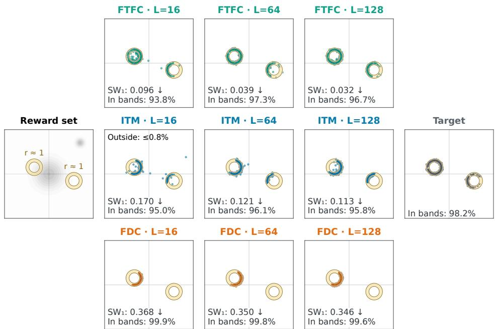  
Figure 1: Left-tail CVaR on two rings. Gold bands correspond to $d ( x ) \leq 0 . 1 5$ . L counts number of sampling steps. $\mathrm { { S W } _ { 1 } }$ is distance to the independent numerical target (right, ground truth). FTFC converges faster to target according to the utility function. Comparison is made with FDC (De Santi et al., 2025) and ITM (Potaptchik et al., 2025). See Section 4.1 for details.

## 4.2 OPTIMAL CORRECTION IN THE CLOSED FORM

When $\mathcal { F }$ is differentiable, let $g _ { p } : \mathcal { X } $ R denote its functional derivative at p (first variation). On a finite sample space, this is $\dot { g _ { p } ( x _ { i } ) } = \partial \mathcal { F ( \boldsymbol { p } ) } / \partial p _ { i }$ . The subscript p identifies the distribution being perturbed, and $g _ { p } ( x )$ is the derivative at point x. Intuitively, it measures the gain from redistributing probability: moving a small mass from $y$ to x changes utility at rate $g _ { p } ( x ) - g _ { p } ( y )$ . To derive the optimal weight, perturb w to $w + \varepsilon v$ in (3), keeping $\mathbb { E } _ { q } [ v ] = 0$ so the law stays normalized. Since the distribution changes by εvq, the first variation is

$$
\frac { d } { d \varepsilon } \mathcal { G } ( ( w + \varepsilon v ) q ) \bigg \vert _ { \varepsilon = 0 } = \mathbb { E } _ { q } [ \big ( g _ { w q } - \alpha f ^ { \prime } ( w ) \big ) v ] .
$$

At an interior optimum this vanishes for every admissible such v. Hence the net marginal utility $g _ { p ^ { \star } } - \alpha f ^ { \prime } ( w ^ { \star } )$ must be a constant $\nu ^ { \star }$ , q-almost everywhere; otherwise moving mass from a lower value to a higher one would improve the objective. Thus

$$
\alpha f ^ { \prime } ( w ^ { \star } ( x ) ) = g _ { p ^ { \star } } ( x ) - \nu ^ { \star } , \qquad p ^ { \star } = w ^ { \star } q .\tag{4}
$$

Here $\nu ^ { \star }$ enforces normalization. For KL, $f ( w ) = w$ w log $w - w + 1$ has derivative $f ^ { \prime } ( w ) = \log$ w. Thus (4) gives $w ^ { \star } ( x ) = \exp ( ( g _ { p ^ { \star } } ( x ) - \nu ^ { \star } ) / \alpha )$ ; choosing $\nu ^ { \star }$ so that $\mathbb { E } _ { q } [ w ^ { \star } ] = 1$ yields

KL Weights

$$
\boxed { w ^ { \star } ( x ) = \frac { \exp ( g _ { p ^ { \star } } ( x ) / \alpha ) } { \mathbb { E } _ { X \sim q } \bigl [ \exp ( g _ { p ^ { \star } } ( X ) / \alpha ) \bigr ] } . }\tag{5}
$$

The denominator normalizes the weights so that $\mathbb { E } _ { q } [ w ^ { \star } ] = 1$ . Table 5 in Appendix A.1 lists $f ,$ $f ^ { \prime } ,$ , together with the closed form weight formulas for other divergences. For expected reward, $\dot { \mathcal { F } } ( p ) \dot { = } \mathbb { E } _ { p } [ r ]$ and $g _ { p } ( x ) = r ( x )$ . For nonlinear utility, $g _ { p }$ plays the role of a marginal reward:

moving probability toward larger values of $g _ { p }$ improves utility to first order, but these values depend on the current distribution. Equation (5) therefore requires the marginal reward at the unknown optimum $p ^ { \star }$ . We next use dual optimization to determine this reward and the normalized density ratios together.

## 4.3 FENCHEL DUALITY AND WEIGHT RECOVERY

To find the unknown marginal reward $g _ { p ^ { \star } }$ from Section 4.2, we now optimize over candidate reward functions $g : \mathcal { X }  \mathbb { R }$ . Here $\mathcal { F }$ is the same utility functional as in (2). We assume it is proper, closed, and concave. For each $^ { g , }$ define $C ( g )$ as the smallest scalar offset satisfying $\mathcal { F } ( p ) \leq \bar { C ( g ) } + \mathbb { E } _ { p } [ g ]$ for every normalized q-supported law $p .$ Equivalently,

$$
C ( g ) : = \operatorname* { s u p } _ { p ^ { \prime } } \{ \mathcal { F } ( p ^ { \prime } ) - \mathbb { E } _ { p ^ { \prime } } g \} , \qquad \mathcal { F } ( p ) = \operatorname* { i n f } _ { g } \{ C ( g ) + \mathbb { E } _ { p } g \} .\tag{6}
$$

At a differentiable $p ,$ concavity makes the bound tight for $g = g _ { p }$ . More generally, taking the tightest of these bounds recovers $\mathcal { F }$ exactly by concave biconjugacy (Rockafellar, 1970). This representation alone does not find $g _ { p ^ { \star } }$ : we must optimize g and recover its normalized weights.

For any feasible $w \ge 0 , \mathbb { E } _ { q } w = 1$ , candidate reward $^ { g , }$ and scalar labeleq:ftfcν with finite terms, the regularized objective satisfies

$$
\begin{array} { r l } & { \mathcal { G } ( w q ) \leq C ( g ) + \mathbb { E } _ { q } [ w g - \alpha f ( w ) ] } \\ & { \qquad = C ( g ) + \nu + \mathbb { E } _ { q } [ ( g - \nu ) w - \alpha f ( w ) ] } \\ & { \qquad \leq \underbrace { C ( g ) + \nu + \alpha \mathbb { E } _ { q } f _ { + } ^ { * } ( ( g - \nu ) / \alpha ) } _ { D _ { f } ( g , \nu ) } . } \end{array}
$$

Appendix A.1 derives the full chain: the first inequality uses the utility bound in (6). The equality uses $\nu ( 1 - \mathbb { E } _ { q } w ) = 0$ , introducing the normalization multiplier. The last inequality maximizes each nonnegative weight separately, using $f _ { + } ^ { * } ( u ) : = \mathrm { s u p } _ { v > 0 } \{ u v - f ( v ) \}$ . Minimizing this bound recovers the optimal value of the endpoint relaxation in $( 3 ) .$ , under the strong-duality conditions in Theorem 1. The weights attaining the last inequality are recovered by conjugacy, with ν chosen to normalize them:

$$
\begin{array} { r l } & { \boxed { \mathrm { F e n c h e l ~ D u a l } } } \\ & { \boxed { D _ { f } ( g , \nu ) : = C ( g ) + \nu + \alpha \mathbb { E } _ { q } f _ { + } ^ { * } ( ( g - \nu ) / \alpha ) , } } \\ & { \begin{array} { r l } { ( g ^ { \star } , \nu ^ { \star } ) \in \arg \operatorname* { m i n } _ { g , \nu } D _ { f } ( g , \nu ) , } \\ { w ^ { \star } ( x ) \in \partial f _ { + } ^ { * } ( ( g ^ { \star } ( x ) - \nu ^ { \star } ) / \alpha ) , } & { \quad \mathbb { E } _ { q } w ^ { \star } = 1 . } \end{array} } \end{array}\tag{7}
$$

The subgradient allows zero weights. The multiplier ν enforces normalization within the weight response; rescaling the weights afterward is generally invalid beyond KL. For example, half-Pearson uses $f ( w ) = ( w - 1 ) ^ { 2 } / 2$ and $w = ( 1 + ( g - \nu ) / \alpha ) .$ . This conjugate recovery is the DICE connection (Lee et al., 2021), with endpoint normalization replacing occupancy-flow constraints.

Theorem 1 (Duality and optimality gap). For any feasible p = wq and finite primal and dual terms, $p u t u = ( g - \nu ) / \alpha .$ . Then

$$
\begin{array} { r l } & { D _ { f } ( g , \nu ) - \mathcal { G } ( p ) = \underbrace { C ( g ) + \mathbb { E } _ { p } g - \mathcal { F } ( p ) } _ { s u p p o r t i n g - r e w a r d s l a c k } } \\ & { \quad \quad + \underbrace { \alpha \mathbb { E } _ { q } [ f ( w ) + f _ { + } ^ { * } ( u ) - u w ] } _ { w e i g h t - r e s p o n s e r e s i d u a l } \geq 0 . } \end{array}\tag{8}
$$

Thus the gap bounds any improvement in $\mathcal { G }$ achievable by another feasible endpoint law. Under strong duality and attainment, both residuals vanish at an optimum and (7) recovers its weights. A sufficient setting is a finite bank with positive reference masses, finite continuous concave utility, and f finite continuous and strictly convex on $[ 0 , \infty )$ , differentiable on $( 0 , \infty )$ , and superlinear.

At zero gap, $C ( g ^ { \star } ) + \mathbb { E } _ { p ^ { \star } } g ^ { \star } = \mathcal { F } ( p ^ { \star } )$ : the affine upper bound in (6) touches $\mathcal { F }$ at the recovered law $p ^ { \star } = w ^ { \star } q .$ At a differentiable interior optimum, their first variations agree, identifying $g ^ { \star }$ with $g _ { p ^ { \star } }$ up to an additive constant. Thus (7) determines the reward and law together. Appendix A.1 proves the result.

$$
\begin{array} { r } { \left| \begin{array} { l l l l l l l } { \mathcal { F } } & { \frac { \operatorname* { m i n } _ { g , \nu } D _ { f } ( g , \nu ) } { { \mathtt { E } _ { 4 } } ( \varOmega ) } } & { ( g ^ { \star } , \nu ^ { \star } ) } & { \frac { w ^ { \star } \in \partial f _ { + } ^ { * } \left( ( g ^ { \star } - \nu ^ { \star } ) / \alpha \right) } { { \mathtt { E } _ { 4 } } ( \varOmega ) } } & { p ^ { \star } = w ^ { \star } q } & { \frac { \operatorname* { m i n } _ { \theta } \mathcal { L } \left( \theta ; w ^ { \star } \right) } { { \mathtt { E } _ { 4 } } ( \varOmega ) } } & { \widehat { \pi } } \end{array} \right. } \end{array}
$$

Figure 2: FTFC: select a target, then fit it. The dual determines $( g ^ { \star } , \nu ^ { \star } )$ ; the DICE link recovers normalized endpoint weights, which are frozen for native fitting.

## 4.4 TARGET OPTIMIZATION FOR STRUCTURED UTILITIES

The functional dual in (7) optimizes over an arbitrary reward function g, which is generally impractical. For many structured utilities, however, the unknown effective reward has only a small number of parameters. We assume and utilize this structure to optimize the target weights on the cached sample bank before fitting the generator.

Feature parametrized utilities. Consider $\mathcal { F } ( p ) = \mathbb { E } _ { p } [ r ] - \Psi ( m _ { p } )$ with $m _ { p } = \mathbb { E } _ { p } [ \phi ]$ where $\phi : \mathcal { X } \to \mathbb { R } ^ { k }$ contains the statistics relevant to the utility and Ψ is proper, closed, and convex. Its marginal reward is

$$
\begin{array} { r } { g _ { p } ( x ) = r ( x ) - \nabla \Psi ( m _ { p } ) ^ { \top } \phi ( x ) , } \end{array}
$$

so instead of optimizing an unrestricted $^ { g , }$ it suffices to determine the k marginal costs $z = \nabla \Psi ( m _ { p } )$ Using $\begin{array} { r } { \Psi ^ { * } ( z ) = \operatorname* { s u p } _ { m } \{ z ^ { \top } m - \Psi ( m ) \} } \end{array}$ gives

$$
\boxed { \begin{array} { r l } & { \mathrm { F e a t u r e ~ D u a l } } \\ & { \qquad \mathcal { F } ( p ) = \operatorname* { i n f } _ { z } \{ \Psi ^ { * } ( z ) + \mathbb { E } _ { p } [ r - z ^ { \top } \phi ] \} , } \\ & { \left( z ^ { \star } , \nu ^ { \star } \right) \in \arg \operatorname* { m i n } _ { z , \nu } \{ \Psi ^ { * } ( z ) + \nu + \alpha \mathbb { E } _ { q } f _ { + } ^ { * } ( ( r - z ^ { \top } \phi - \nu ) / \alpha ) \} , } \\ & { \qquad g ^ { \star } = r - z ^ { \star \top } \phi , \qquad z ^ { \star } \in \partial \Psi ( \mathbb { E } _ { p ^ { \star } } \phi ) . } \end{array} }\tag{9}
$$

Thus target optimization reduces to solving for $( z ^ { \star } , \nu ^ { \star } )$ on cached samples. The resulting $g ^ { \star }$ is converted into normalized target weights by (7). Representative utilities and their corresponding $( \phi , \Psi )$ are given in Appendix A.1; numerical details are given in Appendix A.2.

CVaR utilities. CVaR does not require moment features: its effective reward is determined by a scalar threshold. Upper-CVaR follows the concave formulation above with scalar threshold optimization. Lower-CVaR is convex in the output law and therefore requires a separate argument. On a finite sample bank, we show that a globally optimal lower-CVaR threshold can be chosen among the observed rewards (Proposition 3). Searching these thresholds yields the target weights, which are then frozen for the same generator-fitting stage. Benchmark-specific pseudo-rewards and threshold objectives are given in Appendix A.2.

## 4.5 WEIGHTED DENOISING AND FLOW MATCHING

Calibration in Section 4.4 returns weights w defining the target $p = w q$ . Freeze these weights and initialize the generator from its pretrained parameters. The calibrated reward affects the generator through the weighted training loss. For each endpoint $X \sim q .$ , independently sample a time $t \sim$ $\mathcal { U } ( 0 , \bar { 1 } )$ and noise ϵ. Weight the usual denoising or flow-matching loss by $w ( X )$ . Since $p = w q$ , this is equivalent to training on the target distribution:

$$
\begin{array} { r l } & { \mathrel { \phantom { = } } \mathbb { L } ( \theta ; w ) = \mathbb { E } _ { X \sim q , t , \epsilon } [ w ( X ) \ell _ { \theta } ( X , t , \epsilon ) ] } \\ & { \qquad = \mathbb { E } _ { X \sim p , t , \epsilon } [ \ell _ { \theta } ( X , t , \epsilon ) ] . } \end{array}\tag{10}
$$

Here $\ell _ { \theta }$ is the standard denoising or flow-matching loss (Zhang et al., 2025):

$$
\begin{array} { r } { \begin{array} { r l r } & { \ell _ { \theta } ( X , t , \epsilon ) = \| m _ { \theta } ( Y _ { t } , t ) - A _ { t } \| ^ { 2 } , } \\ & { ( Y _ { t } , A _ { t } ) = \left\{ \begin{array} { l l } { ( a _ { t } X + \sigma _ { t } \epsilon , \ \epsilon ) , } & { \mathrm { d i f f u s i o n } , \quad \epsilon \sim \mathcal { N } ( 0 , I ) , } \\ { ( ( 1 - t ) \epsilon + t X , \ X - \epsilon ) , } & { \mathrm { f l o w } , \quad \epsilon \sim p _ { 0 } . } \end{array} \right. } \end{array} } \end{array}\tag{11}
$$

The respective optimal predictors are the target noise predictor and velocity field, since conditional regression gives

$$
m _ { p } ( y , t ) = \mathbb { E } _ { p } [ A _ { t } \mid Y _ { t } = y ] = { \frac { \mathbb { E } _ { q } [ w ( X ) A _ { t } \mid Y _ { t } = y ] } { \mathbb { E } _ { q } [ w ( X ) \mid Y _ { t } = y ] } } .\tag{12}
$$

Algorithm 1 Fenchel Tilt Flow Control (FTFC)   
Require: Pretrained model $\theta _ { 0 }$ with endpoint distribution $q ;$ utility ${ \mathcal { F } } _ { N } ;$ ; divergence $f ;$ regularization   
α; sample bank size $N ;$ training steps $K$   
1: Sample and cache endpoints $\{ \stackrel { \smile } { x _ { i } } \} _ { i = 1 } ^ { N ^ { \bullet } } \sim q$ and evaluate their rewards and utility features   
Stage 1: Calibrate the target distribution   
2: Compute the supporting rewards $\{ \widehat { g } _ { i } \} _ { i = 1 } ^ { N }$ from the utility ▷ Sec. 4.4   
3: Compute normalized density-ratio weights ▷ Eq. (7)   
$\hat { w } _ { i } \in \partial f _ { + } ^ { * } \mathopen { } \mathclose \bgroup \left( \frac { \widehat { g } _ { i } - \widehat { \nu } _ { h _ { i } } } { \alpha } \aftergroup \egroup \right) \aftergroup \egroup , \qquad \sum _ { i \in I _ { k } } \bar { a _ { i } } \widehat { w } _ { i } = \rho _ { h }$   
4: Freeze w   
Stage 2: Fit the generator   
5: $\theta  \theta _ { 0 }$   
6: for $k = 1 , \ldots , K$ do   
7: Sample a minibatch of cached endpoints $x _ { i } \sim q$   
8: Sample fresh t and noise $\epsilon ,$ and construct the native input-target pair $( Y _ { t } , A _ { t } )$ as in (11) ▷   
Eq. (11)   
9: $L ( \theta ) \gets \frac { 1 } { B } \sum _ { i \in B } \widehat { w } _ { i } \| m _ { \theta } ( Y _ { t } ^ { ( i ) } , t ) - A _ { t } ^ { ( i ) } \| ^ { 2 }$ ▷ Eq. (10)   
10: $\theta  \theta - \eta _ { k } \bar { \nabla _ { \theta } } L ( \theta )$   
11: return θ

These identities require finite conditional moments, $\sigma _ { t } > 0 .$ , and a positive denominator. Fresh noise preserves the chosen source law; reweighting cached generation trajectories generally does not. Equation (12) justifies the weighted regression used by FTFC. For diffusion models, the same calibrated endpoint distribution also admits an alternative realization through score guidance, which we detail below.

Theorem 2 (Score correction under endpoint reweighting). Let $w ^ { \star } \geq 0 , \mathbb { E } _ { q } w ^ { \star } = 1$ be recovered by (7), and set $p ^ { \star } = w ^ { \star } q .$ . For $Y _ { t } = a _ { t } X + \sigma _ { t } \epsilon$ with independent $\epsilon \sim \mathcal { N } ( 0 , \dot { I } )$ and $\sigma _ { t } > 0 ,$ , denote the noisy densities by $\widetilde { q } _ { t } , \widetilde { p } _ { t } ^ { \star }$ and define $h _ { t } ( y ) = \mathbb { E } _ { q } [ w ^ { \star } ( X ) \mid Y _ { t } = y ]$ . Assume $0 < h _ { t } < \infty ,$ $\mathbb { E } _ { t , \widetilde { q } t } | \log h _ { t } | < \infty ,$ , and differentiation under the integral is valid. Writing $s _ { q } = \nabla _ { y } \log \widetilde { q } _ { t }$ and $\epsilon _ { q } \overset { \cdot } { = } \mathbb { E } _ { q } [ \epsilon \mid Y _ { t } = y ]$ (and analogously $f o r p ^ { \star } )$ , we have

$$
\begin{array} { r l } & { \widetilde { p } _ { t } ^ { \star } ( y ) = h _ { t } ( y ) \widetilde { q } _ { t } ( y ) , } \\ & { s _ { p ^ { \star } } ( y , t ) = s _ { q } ( y , t ) + \nabla _ { y } \log h _ { t } ( y ) , } \\ & { \epsilon _ { p ^ { \star } } ( y , t ) = \epsilon _ { q } ( y , t ) - \sigma _ { t } \nabla _ { y } \log h _ { t } ( y ) . } \end{array}\tag{13}
$$

Over integrable scalar functions, the in-sample loss has the unique minimizer

$$
\boxed { \begin{array} { r l } & { \boxed { \mathcal { L } _ { \mathrm { I G L } } ( \ell ; w ^ { \star } ) : = \mathbb { E } _ { t , X \sim q , \epsilon } [ w ^ { \star } ( X ) e ^ { - \ell ( Y _ { t } , t ) } + \ell ( Y _ { t } , t ) ] , } } \\ & { \qquad \ell ^ { \star } ( y , t ) = \log h _ { t } ( y ) , \qquad \nabla _ { y } \ell ^ { \star } = s _ { p ^ { \star } } - s _ { q } . } \end{array} }\tag{14}
$$

The result holds for any normalized nonnegative weights, including general- $\cdot f$ responses with zeros. Weighted denoising (10) learns the same target predictor directly; Algorithm 1 uses this route. Appendix A.3 proves the theorem and gives the corresponding correction for Gaussian flow interpolations. Under exact realization of the weighted regression target, the fitted generator recovers the selected endpoint law $p ^ { \star } = w ^ { \star } q$ and therefore inherits its endpoint optimality; we formalize this result and its regularity conditions in Appendix A.3.

## 5 EXPERIMENTS

## 5.1 MOLECULAR GENERATION ON QM9

We adapt FlowMol (Dunn & Koes, 2024) on QM9 (Ramakrishnan et al., 2014) using negative GFN1-xTB energy (Friede et al., 2024), with an upper-superquantile objective targeting the best 0.2% of rewards. We compare FTFC with pretrained FlowMol, expected-reward Adjoint Matching (AM; Domingo i Enrich et al. 2025), FDC (De Santi et al., 2025), and TFFT (Wang et al., 2026) under the shared ODE evaluation in Table 1.

Table 1: QM9 / FlowMol molecular generation. ODE evaluation with 50,000 attempts per seed. Rewards are in Hartree; bold denotes the best observed value.
<table><tr><td>Method</td><td>Train days↓</td><td>Mean R↑</td><td> $\mathbf { S Q } _ { . 9 9 8 }$  ↑</td><td>Upper 10%↑</td><td>Valid. (%) ↑</td><td>SA ↓</td><td>Topology  $R _ { \mathrm { v a l i d } } \uparrow$ </td></tr><tr><td>Pretrained</td><td>0.0</td><td>28.6</td><td>38.7</td><td>34.1</td><td>96.4</td><td>4.6</td><td>0.8</td></tr><tr><td>AM</td><td>0.5</td><td>28.4</td><td>38.1</td><td>33.5</td><td>96.4</td><td>4.7</td><td>0.7</td></tr><tr><td>FDC</td><td>1.4</td><td>28.6</td><td>38.4</td><td>33.6</td><td>95.1</td><td>4.4</td><td>0.6</td></tr><tr><td>TFFT</td><td>0.6</td><td>28.9</td><td>39.2</td><td>34.4</td><td>94.2</td><td>4.7</td><td>0.7</td></tr><tr><td>FTFC</td><td>0.04</td><td>29.1 ±0.1</td><td>39.4±0.3</td><td> ${ \bf 3 5 . 5 \pm 0 . 1 }$ </td><td>96.1 ±1.8</td><td>4.4 ±0.1</td><td>0.8 ±0.0</td></tr></table>

Tail reward and molecular geometry. FTFC attains the highest observed mean and both upper-tail rewards. It also exceeds every fine-tuned baseline on topology reward, which measures connectivity preservation and relaxation strain (Kotani, 2026), while remaining competitive in synthetic accessibility (Ertl & Schuffenhauer, 2009). Thus FTFC offers a better observed reward–geometry trade-off than these fine-tuned alternatives. Including sample-bank acquisition, FTFC takes about one hour per seed, versus $1 2 - 3 5$ hours for the baselines.

These runs show that one fitting stage with fixed endpoint weights can improve a nonlinear tail objective, without repeated online reward optimization. These comparisons use the recorded method budgets, with three FTFC seeds and one run per baseline. Appendix B.2 gives the protocol, metric definitions, and timing scope; it also documents TFFT’s inactive tail-reward gradients in this reconstruction.

## 5.2 TEXT-TO-IMAGE GENERATION

We evaluate FTFC on the Stable Diffusion v1.5 benchmark of Wang et al. (2026). ImageReward is the sole fine-tuning reward: EXP-FT optimizes its expectation, while FDC and L-TFFT target lower-tail CVaR at $\beta = 0 . 2$ with KL regularization. CLIP (Radford et al., 2021), HPSv2.1 (Wu et al., 2023), and DreamSim (Fu et al., 2023) are evaluation-only metrics. We generate ten images for each of 100 released prompts; Table 2 reports the results, and Appendix B.4 gives settings, metric definitions, and uncertainty estimates.

Table 2: Stable Diffusion v1.5 image generation. Evaluation over 1,000 images. Values are mean ± standard error across five seeds; bold denotes the best observed mean.
<table><tr><td></td><td colspan="2">ImageReward</td><td colspan="2">Alignment</td><td>Diversity</td><td>Train</td></tr><tr><td>Method</td><td>Mean ↑</td><td> $\mathbf { L } { \mathbf { - C V a R } } _ { \mathbf { . } 2 }$  ↑</td><td>CLIP ↑</td><td>HPSv2.1 ↑</td><td>DreamSim var. ↑</td><td>days ↓</td></tr><tr><td>Pretrained</td><td> $0 . 3 \pm 0 . 1$ </td><td> $- 1 . 0 \pm 0 . 0$ </td><td> $0 . 2 8 \pm 0 . 0 0$ </td><td> $0 . 2 6 \pm 0 . 0 0$ </td><td> $0 . 3 3 \pm 0 . 0 1$ </td><td>0.0</td></tr><tr><td>EXP-FT</td><td> $0 . 7 \pm 0 . 0$ </td><td> $- 0 . 5 \pm 0 . 0$ </td><td> $0 . 2 8 \pm 0 . 0 0$ </td><td> $\mathbf { 0 . 2 8 \bot } 0 . 0 0$ </td><td> $0 . 3 0 \pm 0 . 0 1$ </td><td>3.4</td></tr><tr><td>FDC</td><td> $0 . 7 \pm 0 . 1$ </td><td> $- 0 . 5 \pm 0 . 0$ </td><td> $0 . 2 8 \pm 0 . 0 0$ </td><td> $0 . 2 7 \pm 0 . 0 0$ </td><td> $0 . 3 0 \pm 0 . 0 1$ </td><td>3.6</td></tr><tr><td>L-TFFT</td><td> $0 . 8 \pm 0 . 1$ </td><td> $- 0 . 5 \pm 0 . 0$ </td><td> $0 . 2 8 \pm 0 . 0 0$ </td><td> $0 . 2 7 \pm 0 . 0 0$ </td><td> $0 . 3 0 \pm 0 . 0 1$ </td><td>2.8</td></tr><tr><td>FTFC</td><td> $\mathbf { 0 . 9 \pm 0 . 1 }$ </td><td> $\mathbf { - 0 . 4 \pm 0 . 0 }$ </td><td> $\mathbf { 0 . 2 8 \bot 0 . 0 0 }$ </td><td> $0 . 2 7 \pm 0 . 0 0$ </td><td> $\mathbf { 0 . 3 5 \pm } 0 . 0 1$ </td><td>0.2</td></tr></table>

Training time is in A100 GPU-days; evaluation details are given in Appendix B.4.

Reward improvement without diversity collapse. FTFC raises mean and lower-tail ImageReward while keeping DreamSim variance at the pretrained level; all fine-tuned baselines reduce it. Thus, the gain is not explained by concentrating probability on a narrow set of high-reward outputs. FTFC instead selects and fits a fixed redistribution of pretrained mass. EXP-FT and L-TFFT improve reward with a larger diversity shift, whereas FTFC obtains this trade-off in one frozen-weight fitting stage.

Qualitative comparison. Figure 3 shows the lowest-, median-, and highest-reward samples for the promptfootage ofan astronaut in a tropical beach. Fine-tuning improves the worst samples but can alter the output distribution: L-TFFT, for example, favors saturated, fantastical skies despite high ImageReward. FTFC improves low-reward samples while retaining greater visual variation, consistent with its DreamSim diversity. Appendix B.4 provides details.

## 5.3 MOLECULAR DESIGN ON GEOM-DRUGS

We evaluate FlowMol3 (Dunn & Koes, 2025) on GEOM-Drugs (Axelrod & Gomez-Bombarelli´ , 2022), independently reconstructing the energy-guided setting of Wang et al. (2026). FDC, R-TFFT, and FTFC target the upper 10% of negative GFN1-xTB rewards; EXP-FT uses AM to maximize expected reward. All methods share the backbone, reward oracle, and three-seed evaluation in Table 3. Preserving molecular quality during adaptation. FTFC has the highest observed graph validity and topology reward, with energy rewards near pretrained and above EXP-FT and R-TFFT. FDC attains higher mean and tail energy rewards but lowers topology reward through more protocol failures and greater relaxation strain, showing that higher energy reward can accompany worse geometry. FTFC avoids the larger degradation of the fine-tuned baselines; its small edge over pretrained is not statistically established. Figure 5 shows one threshold-selected molecular panel, with further examples and protocol details in Appendix B.3.1.

Pretrained  
EXP-FT  
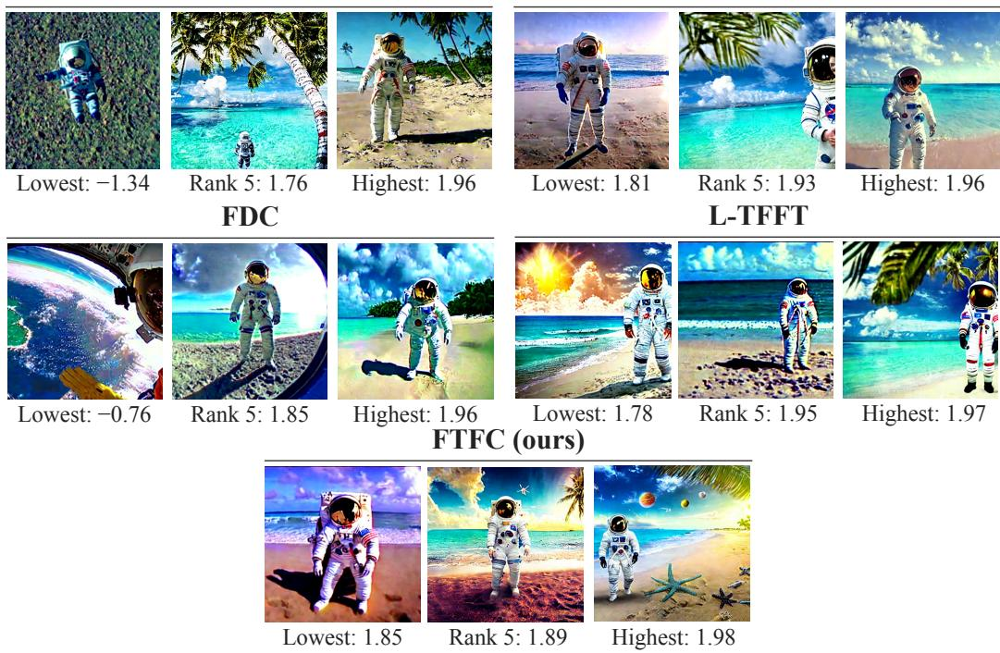  
Figure 3: Qualitative Stable Diffusion v1.5 comparison. The prompt is footage of an astronaut in a tropical beach. Each method panel shows ranks 1 (lowest), 5, and 10 (highest), corresponding to ImageReward score. See Section 5.2.

Table 3: GEOM-Drugs / FlowMol3 molecular design. Evaluation over three seeds and 2,000 molecules per seed. Bold denotes the best observed mean.
<table><tr><td>Method</td><td>Mean R↑</td><td>R-CVaR 0.9 ↑</td><td>Valid. (%) ↑</td><td>SA ↓</td><td>Topology  $R _ { \mathrm { v a l i d } } \uparrow$ </td></tr><tr><td>Pretrained</td><td> $6 5 . 9 \pm 0 . 1$ </td><td> $9 4 . 9 \pm 0 . 2 $ </td><td> $9 9 . 8 \pm 0 . 0$ </td><td> $7 . 5 \pm 0 . 0 1$ </td><td> $0 . 9 5 \pm 0 . 0$ </td></tr><tr><td>EXP-FT</td><td> $6 7 . 9 \pm 0 . 8$ </td><td> $9 4 . 7 \pm 1 . 5$ </td><td> $9 9 . 8 \pm 0 . 2 $ </td><td> $7 . 3 \pm 0 . 0 3$ </td><td> $0 . 9 3 \pm 0 . 0$ </td></tr><tr><td>FDC</td><td> $6 9 . 2 \pm 2 . 4$ </td><td> $\mathbf { 9 7 . 9 \pm 1 . 9 }$ </td><td> $9 9 . 6 \pm 0 . 2 $ </td><td> $7 . 2 \pm 0 . 0 1$ </td><td> $0 . 9 3 \pm 0 . 0$ </td></tr><tr><td>R-TFFT</td><td> $7 0 . 6 \pm 0 . 8$ </td><td> $9 0 . 8 \pm 0 . 9$ </td><td> $9 9 . 8 \pm 0 . 2 $ </td><td> $7 . 3 \pm 0 . 0 3$ </td><td> $0 . 9 3 \pm 0 . 0$ </td></tr><tr><td>FTFC</td><td> ${ \bf 7 5 . 3 \pm 0 . 2 }$ </td><td> $9 5 . 0 \pm 0 . 3$ </td><td> $\mathbf { 9 9 . 9 \bot 0 . 1 }$ </td><td> ${ \bf 7 . 1 \pm 0 . 0 1 }$ </td><td> $\mathbf { 0 . 9 7 \pm 0 . 0 }$ </td></tr></table>

Mean ± standard deviation over three seeds. More details in Appendix B.3.

Ablating the f-divergence penalty. We vary only the f-divergence used to regularize FTFC molecular target Eq. (3) and Eq.(9), while keeping the utility, sample bank, and generator-fitting procedure fixed. Table 4 reports mean reward, upper-tail CVaR, and topology $R _ { \mathrm { v a l i d } }$ . Mean reward captures typical energetic quality, while upper-tail CVaR asks whether the method still places mass on the rare, especially favorable molecules that matter in screening. Topology reward is a necessary complement: a high-reward conformation is practically useful only when its bonding pattern and relaxed geometry remain sound.

Table 4: Ablation of the f-divergence penalty in FTFC on GEOM-Drugs. Values are mean ± standard deviation over three seeds.
<table><tr><td>f penalty</td><td>Mean reward ↑</td><td>Upper-tail CVaR↑</td><td>Topology  $R _ { \mathrm { v a l i d } } \uparrow$ </td></tr><tr><td>KL</td><td> ${ \bf 7 5 . 3 \pm 0 . 2 }$ </td><td> $9 5 . 0 \pm 0 . 1$ </td><td> $\mathbf { 0 . 9 7 \pm 0 . 0 }$ </td></tr><tr><td>Half-Pearson</td><td> $7 1 . 4 \pm 0 . 4$ </td><td> $9 4 . 9 \pm 0 . 1$ </td><td> $0 . 9 5 \pm 0 . 0$ </td></tr><tr><td>Reverse KL</td><td> $6 8 . 0 \pm 0 . 4$ </td><td> $9 3 . 8 \pm 0 . 1$ </td><td> $0 . 9 5 \pm 0 . 0$ </td></tr><tr><td>Cressie-Read-3</td><td> $7 3 . 2 \pm 0 . 7$ </td><td> ${ \bf 9 6 . 3 \pm 0 . 1 }$ </td><td> $0 . 9 6 \pm 0 . 0$ </td></tr><tr><td>Squared Hellinger</td><td> $6 9 . 0 \pm 0 . 2$ </td><td> $9 5 . 1 \pm 0 . 3$ </td><td>0.95 ±0.0</td></tr></table>

Table 4 shows that the choice of f-divergence has its clearest effect on the upper tail. Cressie-Read-3 achieves the strongest uppertail CVaR, followed by squared Hellinger and KL, while Half-Pearson and Reverse KL trail behind. Thus, when the objective is to enrich the pool of especially favorable molecules, Cressie–Read-3 is the preferred choice: it combines the best tail score with a competitive mean reward and topology validity. KL instead gives the highest mean reward and

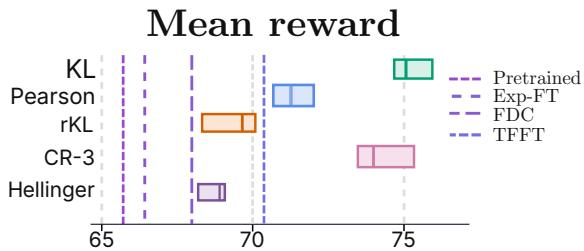  
Figure 4: Reward comparison for the f-divergence ablation on GEOM-Drugs. Dashed markers denote the baseline scores.

topology validity, but its upper-tail CVaR is lower than Cressie–Read-3. Reverse KL is weakest on both mean reward and upper-tail CVaR, while Half-Pearson and squared Hellinger remain close to KL in the tail. Overall, the results show that the f-divergence is a meaningful control knob for prioritizing elite-molecule quality: Cressie–Read-3 favors the upper tail, whereas KL favors average reward and validity. The appendix gives the divergence-specific weight maps and their connection to the FTFC dual.

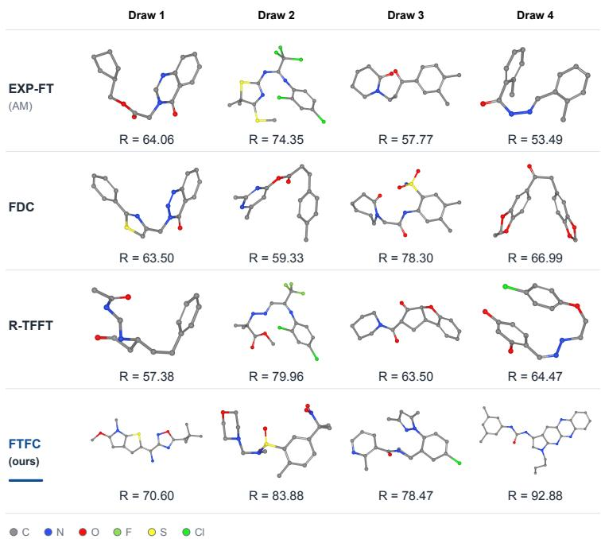  
Figure 5: Molecular examples with one threshold-selected panel. FTFC Draw 2 is the first new sample with measured reward $R \geq 8 0 !$ the other panels show unselected draws. This selection is illustrative and does not establish comparative performance. Labels give the measured, unscaled GFN1 reward $R = - E _ { \mathrm { G F N 1 } }$ . Appendix B.3.1 specifies the protocol and number of candidates.

Molecular fitting in FTFC. FTFC samples complete molecules at their target masses, preserving coordinates, atom types, formal charges, and bonds. FlowMol3 retains its native time and modality weights, categorical masks, fake-atom handling, and stochastic self-conditioning; fresh-prior fitting uses the native objective without reward-gradient or validity losses. Thus frozen endpoint weights define the target without changing the per-molecule weighting.

## 6 CONCLUSION & LIMITATIONS

We introduced Fenchel Tilt Flow Control (FTFC), a distribution-correction approach to utility-based generative fine-tuning. The key idea is to separate which distribution to generate from how to generate it: FTFC first optimizes normalized density-ratio weights defining the target distribution, then freezes them and fits the generator with its native denoising or flow-matching objective. This enables nonlinear utilities and general f-divergence penalties without repeated reward optimization during generator training. Across image and molecular generation tasks, FTFC achieves strong performance with substantially lower training time.

FTFC remains limited by the coverage of the pretrained distribution and its assumptions on finite sample bank. Moreover, the theoretical target-optimization guarantees do not account for finitebank estimation or imperfect generator fitting, and the general dual requires suitable concavity and regularity conditions. Extending FTFC beyond fixed sample banks and to broader nonconcave utilities are promising directions.

## REPRODUCIBILITY STATEMENT

The Appendix contains the details required to reproduce our results, including dataset and checkpoint information, preprocessing, evaluation protocols, model and optimizer configurations, all hyperparameters, training budgets, random seeds, and metric definitions. It also gives the relevant derivations, background, details on baselines, and implementation-specific settings used in the experiments.

## ETHICS STATEMENT

This work uses publicly available datasets and pretrained models and does not involve human subjects, personal data, or human-subject experiments. The method is intended for research on generative modeling.

## AI USE STATEMENT

AI tools were used only to polish the manuscript text and improve grammar and readability. All technical content, experiments, and final wording were reviewed and verified by the authors.

## REFERENCES

Simon Axelrod and Rafael Gomez-Bombarelli. GEOM, energy-annotated molecular conformations´ for property prediction and molecular generation. Scientific Data, 9:185, 2022. doi: 10.1038/ s41597-022-01288-4.

Stephen Boyd and Lieven Vandenberghe. Convex Optimization. Cambridge University Press, 2004. URL https://stanford.edu/˜boyd/cvxbook/.

Cheng Chi, Siyuan Feng, Yilun Du, Zhenjia Xu, Eric Cousineau, Benjamin Burchfiel, and Shuran Song. Diffusion policy: Visuomotor policy learning via action diffusion. In Proceedings of Robotics: Science and Systems, 2023. doi: 10.15607/RSS.2023.XIX.026. URL https://www. roboticsproceedings.org/rss19/p026.html.

Riccardo De Santi, Marin Vlastelica, Ya-Ping Hsieh, Zebang Shen, Niao He, and Andreas Krause. Flow density control: Generative optimization beyond entropy-regularized fine-tuning. Advances in Neural Information Processing Systems (NeurIPS), 2025. URL https://arxiv.org/ abs/2511.22640.

Carles Domingo i Enrich, Michal Drozdzal, Brian Karrer, and Ricky TQ Chen. Adjoint matching: Fine-tuning flow and diffusion generative models with memoryless stochastic optimal control. In International Conference on Learning Representations, volume 2025, pp. 53791–53846, 2025.

Ian Dunn and David R. Koes. Mixed continuous and categorical flow matching for 3D de novo molecule generation. arXiv preprint arXiv:2404.19739, 2024. URL https://arxiv.org/ abs/2404.19739.

Ian Dunn and David R. Koes. FlowMol3: Flow matching for 3D de novo small-molecule generation. arXiv preprint arXiv:2508.12629, 2025. URL https://arxiv.org/abs/2508.12629.

Peter Ertl and Ansgar Schuffenhauer. Estimation of synthetic accessibility score of drug-like molecules based on molecular complexity and fragment contributions. Journal ofCheminformatics, 1:8, 2009. doi: 10.1186/1758-2946-1-8.

Patrick Esser, Sumith Kulal, Andreas Blattmann, Rahim Entezari, Jonas Muller, Harry Saini, Yam¨ Levi, Dominik Lorenz, Axel Sauer, Frederic Boesel, Dustin Podell, Tim Dockhorn, Zion English, and Robin Rombach. Scaling rectified flow transformers for high-resolution image synthesis. In Proceedings of the 41st International Conference on Machine Learning, volume 235 of Proceedings of Machine Learning Research, pp. 12606–12633. PMLR, 2024. URL https://proceedings.mlr.press/v235/esser24a.html.

Jiajun Fan, Shuaike Shen, Chaoran Cheng, Yuxin Chen, Chumeng Liang, and Ge Liu. Online reward-weighted fine-tuning of flow matching with Wasserstein regularization. arXiv preprint arXiv:2502.06061, 2025. URL https://arxiv.org/abs/2502.06061.

Ruiqi Feng, Chenglei Yu, Wenhao Deng, Peiyan Hu, and Tailin Wu. On the guidance of flow matching. In Proceedings of the International Conference on Machine Learning, 2025. URL https://arxiv.org/abs/2502.02150.

Marvin Friede, Christian Holzer, Sebastian Ehlert, and Stefan Grimme. dxtb—an efficient and fully¨ differentiable framework for extended tight-binding. The Journal of Chemical Physics, 161(6): 062501, 2024. doi: 10.1063/5.0216715.

Stephanie Fu, Netanel Tamir, Shobhita Sundaram, Lucy Chai, Richard Zhang, Tali Dekel, and Phillip Isola. DreamSim: Learning new dimensions of human visual similarity using synthetic data. Advances in Neural Information Processing Systems, 36, 2023. URL https://arxiv.org/ abs/2306.09344.

Takao Kotani. Atomic design transformer: Scaffold-conditioned 3d molecule generation via xTBreward reinforcement learning. arXiv preprint arXiv:2607.15918v1, 2026. URL https:// arxiv.org/abs/2607.15918v1.

Jongmin Lee, Wonseok Jeon, Byungjun Lee, Joelle Pineau, and Kee-Eung Kim. OptiDICE: Offline policy optimization via stationary distribution correction estimation. In Proceedings ofthe 38th International Conference on Machine Learning, volume 139 of Proceedings of Machine Learning Research, pp. 6120–6130. PMLR, 2021. URL https://proceedings.mlr.press/ v139/lee21f.html.

Yaron Lipman, Ricky T. Q. Chen, Heli Ben-Hamu, Maximilian Nickel, and Matthew Le. Flow matching for generative modeling. In The Eleventh International Conference on Learning Representations, 2023. URL https://openreview.net/forum?id=PqvMRDCJT9t.

Yaron Lipman, Marton Havasi, Peter Holderrieth, Neta Shaul, Matt Le, Brian Karrer, Ricky T. Q. Chen, David Lopez-Paz, Heli Ben-Hamu, and Itai Gat. Flow matching guide and code, 2024. URL https://arxiv.org/abs/2412.06264.

Liyuan Mao, Haoran Xu, Xianyuan Zhan, Weinan Zhang, and Amy Zhang. Diffusion-DICE: In-sample diffusion guidance for offline reinforcement learning. In Advances in Neural Information Processing Systems, volume 37, 2024. URL https://proceedings.neurips.cc/paper\_files/paper/2024/file/ b2fea79b1137d917e8b7cce9434ab5fa-Paper-Conference.pdf.

Ofir Nachum, Yinlam Chow, Bo Dai, and Lihong Li. DualDICE: Behavior-agnostic estimation of discounted stationary distribution corrections. In Advances in Neural Information Processing Systems, volume 32, 2019. URL https://arxiv.org/abs/1906.04733.

Peter Potaptchik, Cheuk-Kit Lee, and Michael S. Albergo. Tilt matching for scalable sampling and fine-tuning. arXiv preprint arXiv:2512.21829, 2025. URL https://arxiv.org/abs/2512. 21829.

Alec Radford, Jong Wook Kim, Chris Hallacy, Aditya Ramesh, Gabriel Goh, Sandhini Agarwal, Girish Sastry, Amanda Askell, Pamela Mishkin, Jack Clark, Gretchen Krueger, and Ilya Sutskever. Learning transferable visual models from natural language supervision. In Proceedings of the 38th International Conference on Machine Learning, volume 139 of Proceedings ofMachine Learning Research, pp. 8748–8763. PMLR, 2021. URL https://proceedings.mlr.press/ v139/radford21a.html.

Raghunathan Ramakrishnan, Pavlo O. Dral, Matthias Rupp, and O. Anatole von Lilienfeld. Quantum chemistry structures and properties of 134 kilo molecules. Scientific Data, 1:140022, 2014. doi: 10.1038/sdata.2014.22. URL https://www.nature.com/articles/sdata201422.

R. Tyrrell Rockafellar. Convex Analysis. Princeton University Press, 1970. doi: 10. 1515/9781400873173. URL https://www.degruyterbrill.com/document/doi/ 10.1515/9781400873173/html.

Robin Rombach, Andreas Blattmann, Dominik Lorenz, Patrick Esser, and Bjorn Ommer. High-¨ resolution image synthesis with latent diffusion models. In Proceedings of the IEEE/CVF Conference on Computer Vision and Pattern Recognition (CVPR), pp. 10684–10695, 2022. URL https://openaccess.thecvf.com/content/CVPR2022/html/Rombach\_ High-Resolution\_Image\_Synthesis\_With\_Latent\_Diffusion\_Models\_ CVPR\_2022\_paper.html.

Arne Schneuing, Charles Harris, Yuanqi Du, Kieran Didi, Arian Jamasb, Ilia Igashov, Weitao Du, Carla Gomes, Tom L. Blundell, Pietro Lio, Max Welling, Michael Bronstein, and Bruno\` Correia. Structure-based drug design with equivariant diffusion models. Nature Computational Science, 4(12):899–909, 2024. doi: 10.1038/s43588-024-00737-x. URL https://doi.org/ 10.1038/s43588-024-00737-x.

Wenpin Tang and Fuzhong Zhou. Fine-tuning of diffusion models via stochastic control: entropy regularization and beyond. arXiv preprint arXiv:2403.06279, 2024. URL https://arxiv. org/abs/2403.06279.

Zifan Wang, Riccardo De Santi, Xiaoyu Mo, Michael M. Zavlanos, Andreas Krause, and Karl H. Johansson. Efficient tail-aware generative optimization via flow model fine-tuning. International Conference on Machine Learning (ICML), 2026. URL https://arxiv.org/abs/2602. 16796.

Xiaoshi Wu, Yiming Hao, Keqiang Sun, Yixiong Chen, Feng Zhu, Rui Zhao, and Hongsheng Li. Human preference score v2: A solid benchmark for evaluating human preferences of text-to-image synthesis. arXiv preprint arXiv:2306.09341, 2023. URL https://arxiv.org/abs/2306. 09341.

Jiazheng Xu, Xiao Liu, Yuchen Wu, Yuxuan Tong, Qinkai Li, Ming Ding, Jie Tang, and Yuxiao Dong. ImageReward: Learning and evaluating human preferences for text-to-image generation. arXiv preprint arXiv:2304.05977, 2023. URL https://arxiv.org/abs/2304.05977.

Tong Yang, Moonkyung Ryu, Chih-Wei Hsu, Guy Tennenholtz, Yuejie Chi, Craig Boutilier, and Bo Dai. Diffusion controller: Framework, algorithms and parameterization. arXiv preprint arXiv:2603.06981, 2026. URL https://arxiv.org/abs/2603.06981.

Shiyuan Zhang, Weitong Zhang, and Quanquan Gu. Energy-weighted flow matching for offline reinforcement learning. In International Conference on Learning Representations, 2025. URL https://arxiv.org/abs/2503.04975.

## A ADDITIONAL BACKGROUND DERIVATIONS

This appendix derives the utility dual, its finite-bank form, and the transfer from endpoint weights to a generative model.

## A.1 UTILITY DUALITY AND WEIGHT RECOVERY

From the original objective to the dual bound. Let $p \ll q$ with density ratio $w = d p / d q \ge 0$ $\mathbb { E } _ { q } w = 1$ , and assume the displayed terms are finite. Change of measure and the definition of the f-divergence give, respectively,

$$
\begin{array} { c } { { \displaystyle \mathbb { E } _ { w q } [ g ] = \int g ( x ) d p ( x ) = \int g ( x ) w ( x ) d q ( x ) = \mathbb { E } _ { q } [ w g ] , } } \\ { { \displaystyle D _ { f } ( w q | | q ) = \int f \left( \frac { d p } { d q } ( x ) \right) d q ( x ) = \mathbb { E } _ { q } [ f ( w ) ] . } } \end{array}
$$

The supremum defining $C ( g )$ includes the choice $p ^ { \prime } = w q .$ so

$$
C ( g ) = \operatorname* { s u p } _ { p ^ { \prime } } \{ \mathcal { F } ( p ^ { \prime } ) - \mathbb { E } _ { p ^ { \prime } } [ g ] \} \ge \mathcal { F } ( w q ) - \mathbb { E } _ { w q } [ g ] .
$$

Substituting into the original objective (2) yields

$$
\begin{array} { r l } { \mathcal { G } ( w q ) = \mathcal { F } ( w q ) - \alpha D _ { f } ( w q \| q ) } & { } \\ { = \mathcal { F } ( w q ) - \alpha \mathbb { E } _ { q } [ f ( w ) ] } & { } \\ { \leq C ( g ) + \mathbb { E } _ { w q } [ g ] - \alpha \mathbb { E } _ { q } [ f ( w ) ] } & { } \\ { = C ( g ) + \mathbb { E } _ { q } [ w g ] - \alpha \mathbb { E } _ { q } [ f ( w ) ] } & { } \\ { = C ( g ) + \mathbb { E } _ { q } [ w g - \alpha f ( w ) ] . } & { } \end{array}
$$

Next, introduce a scalar multiplier ν for normalization. Since $\mathbb { E } _ { q } w = 1$ , adding $\nu ( 1 - \mathbb { E } _ { q } w ) = 0$ leaves the bound unchanged:

$$
\begin{array} { r l } & { L ( w , g , \nu ) : = C ( g ) + \mathbb { E } _ { q } [ w g - \alpha f ( w ) ] + \nu ( 1 - \mathbb { E } _ { q } w ) } \\ & { \qquad = C ( g ) + \nu + \mathbb { E } _ { q } [ ( g - \nu ) w - \alpha f ( w ) ] . } \end{array}
$$

For fixed g and ν, maximize the integrand over a nonnegative scalar weight v at each x. Factoring out α > 0 gives

$$
\begin{array} { r l } & { \underset { v \geq 0 } { \operatorname* { s u p } } \{ ( g ( x ) - \nu ) v - \alpha f ( v ) \} = \alpha \underset { v \geq 0 } { \operatorname* { s u p } } \left\{ \frac { g ( x ) - \nu } { \alpha } v - f ( v ) \right\} } \\ & { \qquad = \alpha f _ { + } ^ { * } \left( \frac { g ( x ) - \nu } { \alpha } \right) , \qquad f _ { + } ^ { * } ( u ) : = \underset { v \geq 0 } { \operatorname* { s u p } } \{ u v - f ( v ) \} . } \end{array}
$$

The value at $v = w ( x )$ cannot exceed this supremum. Taking expectation under q therefore yields

$$
\begin{array} { l } { \displaystyle \mathcal { G } ( w q ) \leq L ( w , g , \nu ) } \\ { \displaystyle \qquad \leq C ( g ) + \nu + \alpha \mathbb { E } _ { q } f _ { + } ^ { * } \bigg ( \frac { g - \nu } { \alpha } \bigg ) = : D _ { f } ( g , \nu ) . } \end{array}
$$

For proper closed convex $f ,$ equality in the pointwise bound holds when $w ( x ) \in \partial f _ { + } ^ { * } ( ( g ( x ) - \nu ) / \alpha )$ imposing $\mathbb { E } _ { q } w = 1$ gives the response in (7). The bound holds for every finite $( g , \nu )$ ; equality of optimized primal and dual requires the regularity conditions below.

For the exact population envelope in (6), use the $L ^ { 1 } ( q ) – L ^ { \infty } ( q )$ pairing and a proper, concave, norm-upper-semicontinuous extension of $w \mapsto { \mathcal { F } } ( w q )$ ; concave biconjugacy then applies.

Response to a fixed reward. Under strong duality for normalization, the optimized response value is

$$
\begin{array} { r l } & { T _ { f } ( g ) : = \underset { w \ge 0 , \mathbb { E } _ { q } w = 1 } { \operatorname* { s u p } } \{ \mathbb { E } _ { q } [ w g ] - \alpha \mathbb { E } _ { q } f ( w ) \} } \\ & { \quad \quad = \underset { \nu } { \operatorname* { i n f } } \{ \nu + \alpha \mathbb { E } _ { q } f _ { + } ^ { * } ( ( g - \nu ) / \alpha ) \} . } \end{array}\tag{15}
$$

Integrated Fenchel equality recovers the normalized weights in (7). Write $u = ( g ( x ) - \nu ) / \alpha$ . For the strictly convex generators in Table 5, a positive maximizer of $u v - f ( v )$ satisfies $f ^ { \prime } ( v ) = u$ Inverting $\overline { { f ^ { \prime } } }$ on its range gives the interior response; the table also accounts for zero weights and the admissible domain of u.

Table 5: Divergence generators, derivatives for $w > 0$ , and scalar weight responses $w ( u ) =$ arg $\operatorname* { m a x } _ { v \geq 0 } \{ u \bar { v } - f ( \bar { v } ) \}$ , where $u = ( g ( x ) - \nu ) / \alpha$ and $( a ) _ { + } = \operatorname* { m a x } \{ a , 0 \}$
<table><tr><td>Divergence</td><td> $f ( w )$ </td><td> $f ^ { \prime } ( w )$ </td><td>w(u)</td><td>Domain of u</td></tr><tr><td>KL</td><td>w log w − w + 1</td><td>log w</td><td> $e ^ { u }$ </td><td>R</td></tr><tr><td>Half-Pearson</td><td> $\scriptstyle { \frac { 1 } { 2 } } ( w - 1 ) ^ { 2 }$ </td><td>w − 1</td><td> $( 1 + u ) _ { + }$ </td><td>R</td></tr><tr><td>Reverse KL</td><td> $- \log w + w - 1$ </td><td></td><td>1 − 1/w (1 − u)−1</td><td> $u < 1$ </td></tr></table>

Half-Pearson permits $w = 0$ when $u \leq - 1$ . Reverse KL has $f ( 0 ) = + \infty$ and requires $u < 1$ for a finite maximizing weight. In every row, ν is chosen so that ${ \mathbb E } _ { q } [ w ] = 1$   
For KL with finite $Z _ { g } , f ^ { \prime } ( w ) = \log w \mathrm { { \ g i v e s \ } } w _ { g } ( x ) = e ^ { ( g ( x ) - \nu ) / \alpha }$ . Normalization gives $1 \ =$ $e ^ { - \nu / \alpha } \mathbb { E } _ { q } [ e ^ { g / \alpha } ]$ , hence

$$
\begin{array} { r l r } & { } & { Z _ { g } = \mathbb { E } _ { X \sim q } [ e ^ { g ( X ) / \alpha } ] , \qquad \nu _ { g } = \alpha \log Z _ { g } , } \\ & { } & { T _ { \mathrm { K L } } ( g ) = \alpha \log Z _ { g } , \qquad w _ { g } ( x ) = e ^ { g ( x ) / \alpha } / Z _ { g } . } \end{array}\tag{16}
$$

Taking $g = g _ { p } ,$ ⋆ yields (5).

Proof of Theorem 1. Gap identity. Put $u = ( g - \nu ) / \alpha$ . Since $\mathbb { E } _ { q } w = 1$

$$
\begin{array} { r l } & { D _ { f } ( g , \nu ) - \mathcal { G } ( w q ) = C ( g ) + \nu + \alpha \mathbb { E } _ { q } f _ { + } ^ { * } ( u ) - \mathcal { F } ( w q ) + \alpha \mathbb { E } _ { q } f ( w ) } \\ & { \qquad = \underbrace { C ( g ) + \mathbb { E } _ { q } [ w g ] - \mathcal { F } ( w q ) } _ { \geq 0 } + \alpha \underbrace { \mathbb { E } _ { q } [ f ( w ) + f _ { + } ^ { * } ( u ) - u w ] } _ { \geq 0 } . } \end{array}
$$

The first term is the envelope gap and the second is the Fenchel–Young gap. Both vanish exactly when the envelope is tight and $\bar { u } \in \mathsf { \bar { o } } ( f + I _ { [ 0 , \infty ) } ) ( w )$ almost surely, proving optimality and recovering the weights by conjugacy.

Finite-bank attainment. Let $a _ { i } > 0 , b \in \Delta _ { N }$ , and $\begin{array} { r } { J ( b ) = \alpha \sum _ { i } a _ { i } f ( b _ { i } / a _ { i } ) } \end{array}$ . Continuity on the compact simplex gives a maximizer $b ^ { * }$ of $\mathcal { F } _ { N } \mathrm { ~ - ~ } J ;$ strict convexity of J makes it unique. Write $\ell _ { 0 } = f _ { + } ^ { \prime } ( 0 )$ . If $\ell _ { 0 } = - \infty$ , this maximizer is interior. Indeed, for $b _ { \varepsilon } = ( 1 - \varepsilon ) b ^ { * } + \varepsilon a$

$$
\frac { \mathcal F _ { N } ( b _ { \varepsilon } ) - \mathcal F _ { N } ( b ^ { * } ) } { \varepsilon } \geq \mathcal F _ { N } ( a ) - \mathcal F _ { N } ( b ^ { * } ) , \qquad \frac { J ( b _ { \varepsilon } ) - J ( b ^ { * } ) } { \varepsilon } \longrightarrow - \infty
$$

if any coordinate of $b ^ { * }$ is zero, contradicting optimality.

When $\ell _ { 0 }$ is finite, extend f below zero by its tangent at zero. In the steep case, extend it below a positive ratio smaller than all $b _ { i } ^ { * } / a _ { i }$ . This yields a finite differentiable convex penalty J¯ agreeing with J near $b ^ { * }$ . The convex subgradient sum rule gives

$$
\begin{array} { r l r } & { } & { 0 \in \partial ( - { \mathcal F } _ { N } + I _ { \Delta _ { N } } ) ( b ^ { * } ) + \nabla \bar { J } ( b ^ { * } ) , ~ } \\ & { } & { { \mathcal F } _ { N } ( b ) \le { \mathcal F } _ { N } ( b ^ { * } ) + { g ^ { * } } ^ { \top } ( b - b ^ { * } ) , \qquad b \in \Delta _ { N } , } \end{array}
$$

where $g _ { i } ^ { * } = \alpha f ^ { \prime } ( b _ { i } ^ { * } / a _ { i } )$ for positive ratios and $g _ { i } ^ { * } = \alpha \ell _ { 0 }$ at zero. Thus, with $\nu ^ { * } = 0$

$$
\begin{array} { r } { C _ { N } ( g ^ { * } ) + { g ^ { * } } ^ { \top } b ^ { * } = \mathcal { F } _ { N } ( b ^ { * } ) , \qquad g _ { i } ^ { * } / \alpha \in \partial ( f + I _ { [ 0 , \infty ) } ) ( b _ { i } ^ { * } / a _ { i } ) . } \end{array}
$$

Both residuals vanish, establishing dual attainment and strong duality. The argument also holds on a product of scaled simplices for fixed condition masses. For a barrier such as reverse KL, compactness, lower semicontinuity, and $f ( 0 ) = + \infty$ give an interior optimum; the same local argument applies.

KL specialization. With $f ( w ) = w \log w - w + 1 , f _ { + } ^ { * } ( u ) = e ^ { u } - 1$ , and normalized $w _ { g } = e ^ { g / \alpha } / Z _ { g } ,$

$$
\begin{array} { r } { \mathbb { E } _ { q } [ f ( w ) + f _ { + } ^ { * } ( \log w _ { g } ) - w \log w _ { g } ] = \mathbb { E } _ { q } [ w \log ( w / w _ { g } ) - w + w _ { g } ] = \mathrm { D } _ { \mathrm { K L } } ( w q \| w _ { g } q ) . } \end{array}
$$

Consequently,

$$
\begin{array} { r l } & { D _ { \mathrm { K L } } ( g ) - \mathcal { G } ( p ) = C ( g ) + \mathbb { E } _ { p } g - \mathcal { F } ( p ) + \alpha \mathrm { D } _ { \mathrm { K L } } ( p \| w _ { g } q ) , } \\ & { \qquad D _ { \mathrm { K L } } ( g ) = C ( g ) + \alpha \log Z _ { g } . } \end{array}\tag{17}
$$

At an optimal supporting reward, $w _ { g } q = p ^ { * }$ ; hence for any finite candidate dual value $D ,$

$$
\begin{array} { r } { \alpha \mathrm { D } _ { \mathrm { K L } } ( p \Vert p ^ { * } ) \leq \mathcal { G } ( p ^ { * } ) - \mathcal { G } ( p ) \leq D - \mathcal { G } ( p ) . } \end{array}
$$

Sufficient population conditions for the structured dual. Let $r , \phi$ be bounded, $\Psi : \mathbb { R } ^ { k } $ R finite continuous convex, and let $f$ satisfy the finite-bank assumptions of Theorem 1, with $f ( 1 ) = 0$ Then (9) has zero duality gap and attained primal and dual optima; the optimal ratio is unique. To see this, define

$$
A ( w ) = \alpha \mathbb { E } _ { q } f ( w ) - \mathbb { E } _ { q } [ w r ] + I _ { \{ w \geq 0 , \mathbb { E } _ { q } w = 1 \} } ( w ) , \qquad B w = \mathbb { E } _ { q } [ w \phi ] .
$$

The integral functional is closed convex, B is continuous, and $A ( 1 ) < \infty$ . Continuity of Ψ at B1 qualifies Fenchel–Rockafellar duality (Rockafellar, 1970):

$$
\operatorname* { i n f } _ { w } \{ A ( w ) + \Psi ( B w ) \} = \operatorname* { m a x } _ { z } \{ - \Psi ^ { * } ( z ) - T _ { f } ( r - z ^ { \top } \phi ) \} .
$$

The value is finite because rewards and attainable moments are bounded and $\mathbb { E } _ { q } f ( w ) \geq f ( 1 ) = 0$ A minimizing sequence has bounded $\mathbb { E } _ { q } f ( w )$ ; superlinearity gives uniform integrability and weak compactness in $L ^ { 1 } ( q )$ . Weak lower semicontinuity then gives primal attainment, and strict convexity gives uniqueness.

For any bounded score s, the conjugate response $R ( u ) = \arg \operatorname* { m a x } _ { v \geq 0 } \{ u v - f ( v ) \}$ is continuous, nondecreasing, with $R ( - \infty ) = 0$ and $R ( + \infty ) = + \infty$ . Consequently

$$
\mathbb { E } _ { q } R ( ( s - \nu ) / \alpha ) \longrightarrow \{ { \begin{array} { l l } { + \infty , } & { \nu  - \infty , } \\ { 0 , } & { \nu  + \infty , } \end{array} }  \quad \exists \nu : \mathbb { E } _ { q } R ( ( s - \nu ) / \alpha ) = 1 .
$$

At this root, integrated Fenchel equality proves (15) and scalar dual attainment. Let $D _ { f , \Psi } ( z , \nu )$ denote the objective in (9). For any feasible w and finite dual value, expansion gives

$$
\begin{array} { r l } & { D _ { f , \Psi } ( z , \nu ) - \mathcal { G } ( w q ) = \Psi ( m _ { w } ) + \Psi ^ { * } ( z ) - z ^ { \top } m _ { w } } \\ & { \qquad + \alpha \mathbb { E } _ { q } [ f ( w ) + f _ { + } ^ { * } ( u ) - u w ] , } \\ & { \qquad m _ { w } = \mathbb { E } _ { q } [ w \phi ] , \qquad u = ( r - z ^ { \top } \phi - \nu ) / \alpha . } \end{array}\tag{18}
$$

Thus the two optimality conditions are the normalized conjugate response and $z \in \partial \Psi ( m _ { w } )$ . For a proper closed convex extended-valued Ψ, it suffices that it be continuous at an attainable finite-penalty moment, relative to the moment affine space. Coverage entropy qualifies after removing feature coordinates that vanish q-almost surely. These sufficient conditions cover KL and half-Pearson; unbounded rewards and population reverse KL need separate integrability and attainment conditions. The finite-bank results do not require bounded population rewards.

Table 6: Utility functionals and their FTFC calibration. The first five rows use the Moment Dual (9); the last two calibrate a scalar tail threshold.
<table><tr><td>Utility  $\mathcal { F } ( \boldsymbol { p } )$ </td><td>Representation</td><td>Reward / calibration</td></tr><tr><td>Expected reward  $\mathbb { E } _ { p } r$ </td><td> $\Psi = 0 ; \mathrm { n o f e a t u r e s }$ </td><td> $g ^ { \star } = r$ </td></tr><tr><td>Moment matching</td><td>φ: chosen descriptors</td><td> $z ^ { \star } = \gamma ( m ^ { \star } - m _ { 0 } )$ </td></tr><tr><td> $\begin{array} { r } { \mathbb { E } _ { p } r - \frac { \gamma } { 2 } \| m _ { p } - m _ { 0 } \| ^ { 2 } } \end{array}$ </td><td> $\begin{array} { r } { \Psi ( m ) = \frac { \gamma } { 2 } \| m - m _ { 0 } \| ^ { 2 } } \end{array}$ </td><td> $g ^ { \star } = r - z ^ { \star \top } \phi$ </td></tr><tr><td>Coverage entropy</td><td>φ: region memberships</td><td> $z _ { j } ^ { \star } = \gamma ( 1 + \log m _ { j } ^ { \star } )$ </td></tr><tr><td> $\mathbb { E } _ { p } r + \gamma H ( m _ { p } )$ </td><td> $\begin{array} { r } { \Psi ( m { \bigr ) } = \gamma \sum _ { j } m _ { j } \log m _ { j } } \end{array}$ </td><td> $g ^ { \star } = r - z ^ { \star \top } \phi$ </td></tr><tr><td>D-optimal design</td><td> $\phi ( x ) = v ( x ) v ( x ) ^ { \top }$ </td><td> $g ^ { \star } = v ^ { \top } M _ { p ^ { \star } } ^ { - 1 } v$ </td></tr><tr><td> $\log \operatorname * { d e t } M _ { p } , \quad r = 0$ </td><td> $\Psi ( \vec { m } ) = - \log \operatorname * { d e t } ( M _ { 0 } + m )$ </td><td></td></tr><tr><td>Constraint barrier†</td><td> $\phi ( x ) = c ( x )$ </td><td> $z ^ { \star } = \gamma / ( B - m ^ { \star } )$ </td></tr><tr><td> $\mathbb { E } _ { p } r + \gamma \log ( B - \mathbb { E } _ { p } c )$ </td><td> $\begin{array} { r } { \Psi ( \dot { m } ) = - \dot { \gamma } \log ( B - m ) } \end{array}$ </td><td> $g ^ { \star } = r - z ^ { \star } c$ </td></tr><tr><td>Lower-tail CVaR</td><td> $g _ { \eta } ^ { - } ( x ) = - ( \eta - r ( x ) ) _ { + } / \tau$ </td><td>Maximize  $\eta + T _ { f } ( g _ { \eta } ^ { - } )$ </td></tr><tr><td> $L _ { \tau } ( p ) = \operatorname* { s u p } _ { \eta } \{ \eta + \mathbb { E } _ { p } g _ { \eta } ^ { - } \}$  Upper-tail CVaR</td><td> $g _ { \eta } ^ { + } ( x ) = ( r ( x ) - \eta ) _ { + } / \tau$ </td><td>over observed reward knots. Minimize  $\eta + T _ { f } ( g _ { \eta } ^ { + } )$ </td></tr></table>

$\begin{array} { r } { m _ { p } = \mathbb { E } _ { p } \phi , m ^ { \star } = m _ { p ^ { \star } } , \gamma > 0 , H ( m ) = - \sum _ { j } m _ { j } \log m _ { j } , } \end{array}$ , and $M _ { p } = M _ { 0 } + \mathbb { E } _ { p } [ \boldsymbol { v } \boldsymbol { v } ^ { \top } ]$ with $M _ { 0 } \succ 0$ . The tail mass is $\begin{array} { r } { \tau \in ( 0 , 1 ) ; T _ { f } ( s ) = \operatorname* { s u p } _ { p \ll q } \{ \mathbb { E } _ { p } s - \alpha D _ { f } ( p \| q ) \} } \end{array}$ is the optimized fixed-reward value. †The barrier uses the maximization convention, with $\begin{array} { r } { \operatorname { \mathbb { E } } _ { p } c < B . } \end{array}$ Coverage entropy concerns fixed memberships, not the full continuous density.

Examples of fixed features. Expected reward has $\Psi = 0$ and $g = r$ , so no feature vector is needed. For nonlinear utilities, examples with $\gamma > 0$ are:
<table><tr><td>Utility</td><td>Features  $\phi ( x )$ </td><td>Penalty  $\Psi ( m )$ </td></tr><tr><td>Coverage entropy</td><td>Region memberships</td><td> $\gamma \sum _ { j } m _ { j } \log m _ { j }$ </td></tr><tr><td>Moment matching</td><td>Chosen descriptors</td><td> $\begin{array} { r l r } {  { \frac { \gamma } { 2 } \| m - m _ { 0 } \| ^ { 2 } } } \end{array}$ </td></tr><tr><td>D-optimal design  $( r = 0 )$ </td><td> $v ( x ) v ( x ) ^ { \top }$ </td><td> $- \log \mathrm { d e t } ( M _ { 0 } + m )$ </td></tr></table>

For coverage, $\phi _ { j } \geq 0$ and $\textstyle \sum _ { j } \phi _ { j } = 1$ , so $m _ { j }$ is a region’s aggregate mass. The rings use 16 soft radial-basis memberships (Appendix C.1); marginal costs discourage overrepresented regions. This is region entropy, not differential entropy of the full density. Moment matching instead specifies desired descriptor means $m _ { 0 }$ . The conjugates are given below. For experimental design, $v ( x )$ is a fixed experiment feature vector and $\bar { M _ { p } } = M _ { 0 } \bar { + } \mathbb { E } _ { p } [ v v ^ { \top } ] , M _ { 0 } \succ 0 .$ . The utility is log det $M _ { p }$ with $g _ { p } ( x ) = v ( x ) ^ { \top } M _ { p } ^ { - 1 } v ( x )$ ; matrix inner products replace $z ^ { \top } \phi$ (Boyd & Vandenberghe, 2004, Section 7.5).

For $\gamma > 0$ and a desired moment $m _ { 0 }$ , the structured dual uses

$$
\begin{array} { r } { \Psi ( m ) = \frac { \gamma } { 2 } \| m - m _ { 0 } \| ^ { 2 } \qquad \Longrightarrow \quad \Psi ^ { * } ( z ) = z ^ { \top } m _ { 0 } + \frac { 1 } { 2 \gamma } \| z \| ^ { 2 } , } \end{array}
$$

$$
\Psi ( m ) = \gamma \sum _ { j } m _ { j } \log m _ { j } , \quad m \in \Delta _ { k } \quad \Longrightarrow \quad \Psi ^ { * } ( z ) = \gamma \log \sum _ { j } e ^ { z _ { j } / \gamma } .
$$

At an optimum, $z ^ { \star } \in \partial \Psi ( m _ { p ^ { \star } } )$ . For the entropy penalty, marginal costs are defined up to a common additive constant on the simplex. Under KL, eliminating ν gives

$$
D _ { \mathrm { K L , } \Psi } ( z ) = \Psi ^ { * } ( z ) + \alpha \log \mathbb { E } _ { q } e ^ { ( r - z ^ { \top } \phi ) / \alpha } , \qquad \nabla D _ { \mathrm { K L , } \Psi } ( z ) = \nabla \Psi ^ { * } ( z ) - \mathbb { E } _ { w _ { g _ { z } } q } \phi .
$$

At an optimum, the moment implied by the conjugate equals the weighted feature mean.

Utility examples. Table 6 writes the utility families in FTFC notation, using examples from De Santi et al. (2025, Table 1). It distinguishes the convex Moment Dual (9), scalar outer optimization, and objectives with full-density dependence. The statements concern endpoint calibration; native fitting and bank generalization remain separate.

Entropy and coverage. For a finite outcome space, $\phi _ { j } ( x ) = \mathbf { 1 } \{ x = x _ { j } \}$ gives $m _ { j } = p ( x _ { j } )$ , so $\begin{array} { r } { \Psi ( m ) = \gamma \sum _ { j } m _ { j } \log m _ { j } } \end{array}$ represents $\gamma H ( p )$ exactly with $r = 0 .$ . Region indicators instead give the entropy of region masses. In a continuous space, $\begin{array} { r } { H ( p ) = - \int p ( x ) \log p ( x ) d \mu ( x ) } \end{array}$ depends on the entire density relative to the reference measure $\mu ;$ its marginal reward $\mathrm { i s - 1 - l o g } p ( x )$ where defined. The functional dual can apply under its regularity assumptions, but fixed region features do not exactly represent this differential entropy or supply its density values.

Experimental design. For any concave matrix criterion $s ,$ choose $\phi ( x ) ~ = ~ v ( x ) v ( x ) ^ { \top }$ and $\Psi ( m ) = - s ( M _ { 0 } + m )$ , with matrix inner products in place of dot products. Then $\mathcal { F } ( p ) = s ( M _ { p } )$ and $g _ { p } ( x ) = \langle \nabla s ( M _ { p } ) , v ( x ) v ( x ) ^ { \top } \rangle$ when differentiable. The choices $s ( M ) =$ log det M and $s ( M ) = - \operatorname { t r } ( M ^ { - 1 } )$ yield $g _ { p } ( x ) = v ( x ) ^ { \top } M _ { p } ^ { - 1 } v ( x )$ and $g _ { p } ( x ) = v ( x ) ^ { \top } M _ { p } ^ { - 2 } v ( x )$ , respectively. The criterion $s ( M ) = - \lambda _ { \operatorname* { m a x } } ( M )$ is also concave and uses a supergradient at repeated eigenvalues. We use $M _ { 0 } \succ 0$ to ensure the domain of the log-determinant and inverse criteria; other fixed offsets require checking that domain.

Constraint penalties and barrier signs. Any convex penalty of the mean cost, $\Psi ( \mathbb { E } _ { p } c )$ , fits the moment class. For the upper bound $\mathbb { E } _ { p } c < B$ , the maximization barrier is $\begin{array} { r } { \mathcal { F } ( p ) = \mathbb { E } _ { p } r + \dot { \gamma } \log ( B - } \end{array}$ $\mathbb { E } _ { p } c ) \colon \Psi ( m ) = - \gamma \log ( \bar { B } - m )$ is convex, and the marginal cost $z = \gamma / ( B - \dot { m } )$ grows as the budget is approached. This convention differs from the expression $\mathbb { E } _ { p } r - \gamma \log ( \mathbb { E } _ { p } c - B )$ printed in FDC’s table. The latter would require $\Psi ( m ) = \gamma \log ( m - B )$ , which is concave, so it is not an instance of the convex Moment Dual.

Mean–variance reward. For $\mathcal { F } ( p ) = \mathbb { E } _ { p } r - \gamma \operatorname { V a r } _ { p } ( r ) , \phi = ( r , r ^ { 2 } )$ gives $\Psi ( m ) = \gamma ( m _ { 2 } - m _ { 1 } ^ { 2 } )$ This representation is exact, but Ψ is not convex. The marginal reward is $\begin{array} { r } { g _ { p } = r - \gamma r ^ { 2 } + 2 \gamma ( \mathbb { E } _ { p } r ) r ; } \end{array}$ Equation (9) does not provide a convex calibration for it. There is instead a scalar outer reduction:

$$
\mathcal F ( p ) = \operatorname* { s u p } _ { a } \mathbb { E } _ { p } [ r - \gamma ( r - a ) ^ { 2 } ] ,
$$

$$
\operatorname* { s u p } _ { p } \{ \mathcal { F } ( p ) - \alpha D _ { f } ( p \| q ) \} = \operatorname* { s u p } _ { a } T _ { f } ( r - \gamma ( r - a ) ^ { 2 } ) .
$$

Indeed, $\begin{array} { r } { \mathbb { E } _ { p } ( r - a ) ^ { 2 } = \mathrm { V a r } _ { p } ( r ) + ( \mathbb { E } _ { p } r - a ) ^ { 2 } ; } \end{array}$ ; the maximizing center is $a = \mathbb { E } _ { p } r$ , and the two suprema commute. On a finite bank, a can be restricted to the observed reward range. The outer objective need not be concave, and the CVaR reward-knot rule does not apply.

Conditional mode objectives. Let fixed condition masses be $\rho _ { h } > 0$ and $\begin{array} { r } { \bar { p } = \sum _ { h } \rho _ { h } p _ { h } } \end{array}$ . The negative-sign expression in FDC’s table is $\begin{array} { r } { - \sum _ { h } \rho _ { h } \mathrm { D } _ { \mathrm { K L } } ( p _ { h } \| \bar { p } ) } \end{array}$ . On finite outcome cells $A _ { j }$ , use the joint law $P ( h , x ) = \rho _ { h } p _ { h } ( x )$ and features $\overline { { \phi } } _ { h j } ^ { \prime \prime } ( h ^ { \prime } , x ) = \mathbf { 1 } \{ h ^ { \prime } = h , x \in A _ { j } \}$ . Writing $\begin{array} { l l } { { m _ { h j } } } & { { = } } \end{array}$ $P ( h , A _ { j } )$ and $\begin{array} { r } { \bar { m } _ { j } = \sum _ { h } m _ { h j } } \end{array}$ , its discrete version has $r = 0$ and the convex penalty

$$
\Psi ( m ) = \sum _ { h , j } m _ { h j } \log \frac { m _ { h j } } { \rho _ { h } \bar { m } _ { j } } , \qquad g _ { P } ( h , x ) = - \log \frac { m _ { h j } } { \rho _ { h } \bar { m } _ { j } } \quad ( x \in A _ { j } ) .
$$

Convexity follows from joint convexity of relative entropy with fixed $\rho _ { h } ;$ normalization uses one multiplier per condition. For continuous conditionals, the exact functional retains their full density ratios. The sign matters: maximizing the negative expression reduces conditional separation, whereas maximizing positive mutual information encourages distinct modes and reverses the convex penalty’s sign. The latter is not covered by the convex Moment Dual.

Tail objectives. The lower- and upper-tail rows use the exact threshold representations in (23), including fractional mass at atoms. They require no moment-feature vector. Their outer optimization directions differ: lower CVaR maximizes its threshold objective and upper CVaR minimizes it, as derived in (24). Proposition 3 supplies the exact finite-bank search for the lower tail.

Divergence choices in the molecular ablation. The f-divergence controls how FTFC converts the calibrated supporting reward into density-ratio weights. Writing $s = ( g ^ { \star } - \nu ^ { \star } ) / \alpha$ , FTFC’s general dual gives $\bar { w } ^ { \star } \in \bar { \partial } f _ { + } ^ { \star } ( s )$ , where the nonnegative conjugate enforces $w ^ { \star } \geq 0$ and the scalar $\nu ^ { \star }$ normalizes the target. The ablation in Table 4 therefore changes the shape of this reward-to-weight map while leaving the utility, sample bank, and generator-fitting stage unchanged.

For KL, $f ( t ) = t \log t - t + 1$ , so $f ^ { \star } ( s ) = e ^ { s } - 1$ and FTFC recovers the familiar exponential tilt $w ^ { \star } = e ^ { s }$ . Reverse $\mathrm { K L } , f ( t ) = - \log t + t - 1$ , instead gives $f ^ { \star } ( s ) = - \log ( 1 - s )$ on $s < 1$ and $w ^ { \star } = ( 1 - s ) ^ { - 1 }$ . Squared Hellinger, $f ( t ) = ( \sqrt { t } - 1 ) ^ { 2 }$ , has $f ^ { \star } ( s ) = s / ( 1 - s )$ on the same domain and yields $w ^ { \star } = ( 1 - s ) ^ { - 2 }$ . Thus Reverse KL and squared Hellinger both impose a finite-domain barrier: their dual arguments must remain below one, with the normalization multiplier selecting an admissible target.

The Half-Pearson choice uses $f ( t ) = \textstyle { \frac { 1 } { 2 } } ( t - 1 ) ^ { 2 }$ . Its unconstrained map is affine, $w ^ { \star } = 1 + s ;$ the nonnegative conjugate used by FTFC truncates this to $[ 1 + s ] _ { + }$ . Cressie–Read-3 uses $f ( t ) =$ $( t ^ { 3 } - 3 t + 2 ) / 6$ , giving $w ^ { \star } = \sqrt { [ 1 + 2 s ] _ { + } }$ . These two choices replace KL’s exponential response with polynomial responses and can set sufficiently unfavorable samples to zero weight. All five penalties are convex, normalized by $f ( 1 ) = 0$ , and fit the same Fenchel calibration and frozen-weight fitting result; the ablation tests the resulting target redistribution rather than a change in the generator objective.

## A.2 FINITE-BANK OPTIMIZATION

Let $a _ { i } > 0$ be reference masses on cached endpoints $x _ { i } , \textstyle \sum _ { i } a _ { i } = 1$ . For condition groups $I _ { h }$ , keep their reference probabilities $\textstyle \rho _ { h } = \sum _ { i \in I _ { h } } a _ { i }$ fixed. Target masses $b _ { i }$ and ratios $w _ { i }$ satisfy

$$
\begin{array} { l } { { \displaystyle { \mathcal { C } = \{ b \geq 0 : \sum _ { i \in I _ { h } } b _ { i } = \rho _ { h } \mathrm { f o r e v e r y } h \} , \qquad b _ { i } = a _ { i } w _ { i } , } } } \\ { { \displaystyle { \mathcal { G } _ { N } ( b ) = \mathcal { F } _ { N } ( b ) - \alpha \sum _ { i } a _ { i } f ( b _ { i } / a _ { i } ) . } } } \end{array}\tag{19}
$$

Without conditioning, there is one group, so $\mathcal { C }$ is the simplex. The group multipliers enter the Lagrangian as $\textstyle \sum _ { h } \nu _ { h } ^ { \bar { \nu } } \big ( \rho _ { h } - \sum _ { i \in I _ { h } } b _ { i } \big )$ . Maximizing each ratio $b _ { i } / a _ { i } \geq 0$ independently yields

$$
\begin{array} { l } { { \displaystyle { D _ { f , N } ( g , \nu ) = C _ { N } ( g ) + \sum _ { h } \rho _ { h } \nu _ { h } + \alpha \sum _ { i } a _ { i } f _ { + } ^ { * } ( ( g _ { i } - \nu _ { h i } ) / \alpha ) , } \ } } \\ { { \displaystyle { \qquad C _ { N } ( g ) = \operatorname* { s u p } _ { b \in \mathcal { C } } \{ \mathcal { F } _ { N } ( b ) - b ^ { \top } g \} , \qquad b _ { i } \in a _ { i } \partial f _ { + } ^ { * } ( ( g _ { i } - \nu _ { h i } ) / \alpha ) . } } } \end{array}\tag{20}
$$

Choose ν so $b \in { \mathcal { C } }$ . Theorem 1 applies with sums in place of expectations. For $\mathcal { F } _ { N } ( b ) = r ^ { \top } b -$ $\Psi ( \sum _ { i } b _ { i } \phi _ { i } )$ , substitute $g _ { i } = r _ { i } - z ^ { \top } \phi _ { i }$ and the envelope offset $\Psi ^ { * } ( z )$ . For proper closed convex $\Psi$ the finite-dimensional qualification is $b ^ { \circ } \in \operatorname { r i } { \mathcal { C } }$ with $\sum _ { i } b _ { i } ^ { \circ } \phi _ { i } \in$ ri dom $\Psi$ ; the preceding Fenchel argument then applies.

Solving for z and ν. For an unconditional bank, cache $x _ { i } \sim q .$ rewards $r _ { i } ,$ and features $\phi _ { i } = \phi ( x _ { i } )$ with reference masses $a _ { i } = 1 / N$ . Replace $\mathbb { E } _ { q }$ in the middle line of (9) by $\textstyle \sum _ { i } a _ { i }$ to obtain $D _ { N } { \left( z , \nu \right) }$ For each z, choose ν to normalize the conjugate response:

$$
w _ { i } ( z ) \in \partial f _ { + } ^ { * } ( ( r _ { i } - z ^ { \top } \phi _ { i } - \nu ) / \alpha ) , \qquad \sum _ { i } a _ { i } w _ { i } ( z ) = 1 .
$$

Under the response assumptions in Appendix A.1, this is a monotone scalar equation; for KL, logsum-exp gives the solution. Minimize the resulting convex objective over z, whose gradient, when defined, is

$$
\nabla _ { z } \Big [ \operatorname* { m i n } _ { \nu } D _ { N } ( z , \nu ) \Big ] = \nabla \Psi ^ { * } ( z ) - \sum _ { i } a _ { i } w _ { i } ( z ) \phi _ { i } .
$$

Calibration matches the statistics implied by $z \ \mathrm { t o }$ those induced by its weights. It uses cached endpoints, without updating the generator. With fixed groups, use one normalizer per group as in (20); the moment gradient is unchanged.

For KL, $\begin{array} { r } { Z _ { z , h } = \sum _ { i \in I _ { h } } ( a _ { i } / \rho _ { h } ) e ^ { ( r _ { i } - z ^ { \top } \phi _ { i } ) / \alpha } } \end{array}$ eliminates the normalizers:

$$
\begin{array} { c } { { D _ { N } ( z ) = \Psi ^ { * } ( z ) + \alpha \displaystyle \sum _ { h } \rho _ { h } \log Z _ { z , h } , } } \\ { { { } } } \\ { { b _ { z , i } = a _ { i } e ^ { ( r _ { i } - z ^ { \top } \phi _ { i } ) / \alpha } / Z _ { z , h _ { i } } , \qquad m _ { b } = \displaystyle \sum _ { i } b _ { i } \phi _ { i } , } } \\ { { { } } } \\ { { N ( z ) - \mathcal { G } _ { N } ( b ) = \alpha \mathrm { D } _ { \mathrm { K L } } ( b \| b _ { z } ) + \Psi ( m _ { b } ) + \Psi ^ { * } ( z ) - z ^ { \top } m _ { b } . } } \end{array}\tag{21}
$$

The gradient, when defined, is $\nabla \Psi ^ { * } ( z ) - m _ { b _ { z } }$ The moment and entropy conjugates are in $\mathsf { A p - }$ pendix A.1. A global utility shares its z or tail threshold across groups; separate conditional utilities are different objectives.

Tail rewards in the image and molecule benchmarks. CVaR uses an exact scalar-threshold representation instead of fixed moment features. For tail mass $\tau ,$ its lower- and upper-tail pseudorewards are

$$
g _ { c } ^ { \mathrm { l o w e r } } ( x ) = - \frac { ( c - r ( x ) ) _ { + } } { \tau } , \qquad g _ { c } ^ { \mathrm { u p p e r } } ( x ) = \frac { ( r ( x ) - c ) _ { + } } { \tau } .\tag{22}
$$

The threshold c is calibrated using (24): upper-CVaR minimizes its threshold objective; lower-CVaR maximizes it and is not covered by the concave utility theorem. On a finite bank, the latter maximum is attained at an observed reward (Appendix A.2). These objectives recover TFFT under KL (Wang et al., 2026). In Stable Diffusion, calibration uses $r = 1 0 0$ ImageReward, $\alpha = 1$ , and lower-tail mass 0.2. In QM9, it uses $r = - E _ { \mathrm { G F N 1 } } / 1 0 0 , \alpha = 0 . 0 1$ , and upper-tail mass 0.002. Both optimize a scalar threshold rather than moment features. Prompt and atom-count probabilities remain fixed, respectively: for group $h _ { ; }$ , one normalizer enforces $\textstyle \sum _ { i \in I _ { h } } a _ { i } w _ { i } = \rho _ { h }$ , while the threshold is shared across groups.

CVaR calibration. For tail mass $\tau \in ( 0 , 1 )$ , the lower and upper reward averages are

$$
L _ { \tau } ( p ) = \operatorname* { s u p } _ { s } \{ c - \tau ^ { - 1 } \mathbb { E } _ { p } ( c - r ) _ { + } \} , \qquad U _ { \tau } ( p ) = \operatorname* { i n f } _ { c } \{ c + \tau ^ { - 1 } \mathbb { E } _ { p } ( r - c ) _ { + } \} .\tag{23}
$$

These definitions count fractional mass at threshold atoms. Their threshold-dependent rewards are $- ( c - r ) _ { + } / \tau$ and $( r - c ) _ { + } / \tau$ . Upper-CVaR is concave in the law; lower-CVaR is convex. Using the fixed-reward response (15) gives

$$
\begin{array} { l l c r } { { V _ { U } = \displaystyle \operatorname* { m i n } _ { c } \{ c + T _ { f } ( ( r - c ) _ { + } / \tau ) \} , } } \\ { { V _ { L } = \displaystyle \operatorname* { m a x } _ { c } \{ c + T _ { f } ( - ( c - r ) _ { + } / \tau ) \} . } } \end{array}\tag{24}
$$

For the upper tail, restrict c to the reward range and apply convex–concave minimax under the finite-bank assumptions. For the lower tail, commute two suprema. With KL, (16) recovers TFFT’s threshold objectives (Wang et al., 2026). The lower-tail objective need not be concave; its exact finite-bank solution follows instead from piecewise convexity.

Proposition 3 (Lower-CVaR requires only reward knots). Let B be a nonempty compact subset of the probability simplex, R lower semicontinuous, bounded below and finite somewhere on $B ,$ , and $r _ { i }$ finite. For $0 < \tau < 1$ and $\begin{array} { r } { T _ { R } ( s ) = \operatorname* { s u p } _ { b \in { \mathcal { B } } } \{ b ^ { \top } s - R ( b ) \} } \end{array}$ ,

$$
\operatorname* { m a x } _ { b \in \mathcal { B } } \{ L _ { \tau } ( b ) - R ( b ) \} = \operatorname* { m a x } _ { c \in \{ r _ { 1 } , \ldots , r _ { N } \} } \{ c + T _ { R } ( - ( c \mathbf { 1 } - r ) _ { + } / \tau ) \} .\tag{25}
$$

An exact response at a maximizing knot attains the left side.

Proof. Commuting the two suprema gives $H ( c ) = c + T _ { R } ( - ( c { \bf 1 } - r ) _ { + } / \tau )$ . The response value $T _ { R }$ is convex and $T _ { R } ( \bar { s } + d \mathbf { 1 } ) = \bar { T } _ { R } ( s ) \bar { + } d .$ . Hence

$$
H ( c ) = \left\{ \begin{array} { l l } { c + T _ { R } ( 0 ) , } & { c \leq \operatorname* { m i n } _ { i } r _ { i } , } \\ { \mathrm { c o n v e x ~ o n ~ e a c h } \left[ r _ { ( j ) } , r _ { ( j + 1 ) } \right] , } & { \operatorname* { m i n } _ { i } r _ { i } \leq c \leq \operatorname* { m a x } _ { i } r _ { i } , } \\ { ( 1 - 1 / \tau ) c + T _ { R } ( r / \tau ) , } & { c \geq \operatorname* { m a x } _ { i } r _ { i } . } \end{array} \right.
$$

The middle claim follows because each hinge is affine between knots. The outer pieces increase and decrease, respectively, so a knot maximizes H. Compactness and lower semicontinuity give an attained response there; it maximizes the joint objective over $( b , c )$ □

For unconditional KL and sorted rewards $r _ { ( 1 ) } \le \cdots \le r _ { ( N ) }$ , each knot normalizer is

$$
Z ( c ) = e ^ { - c / ( \alpha \tau ) } \sum _ { r _ { i } \leq c } a _ { i } e ^ { r _ { i } / ( \alpha \tau ) } + \sum _ { r _ { i } > c } a _ { i } , \qquad H ( c ) = c + \alpha \log Z ( c ) .
$$

Sorting plus log-domain prefix/suffix sums costs $O ( N$ log N). For general $f ,$ the same knot search is exact but requires its own normalization solves. At $\alpha = 0$ , solve the unregularized mass problem; the scaled conjugate formulas do not apply.

Optional score optimization. If no compact dual is available, a neural score model can optimize the full-bank objective through normalized scores. For positive masses, $g _ { i } = \partial \mathcal { F } _ { N } / \partial b _ { i }$ and $u _ { i } =$ $g _ { i } - \alpha f ^ { \prime } ( b _ { i } / a _ { i } )$ , differentiation gives

$$
\begin{array} { c } { { \displaystyle b _ { i } = \frac { a _ { i } e ^ { s _ { \psi } ( { \boldsymbol x } _ { i } ) } } { \sum _ { j \in I _ { h _ { i } } } ( a _ { j } / \rho _ { h _ { i } } ) e ^ { s _ { \psi } ( { \boldsymbol x } _ { j } ) } } , } } \\ { { \nabla _ { \psi } \mathcal { G } _ { N } = \displaystyle \sum _ { i } b _ { i } ( { \boldsymbol u } _ { i } - \bar { { \boldsymbol u } } _ { h _ { i } } ) \nabla _ { \psi } s _ { \psi } ( { \boldsymbol x } _ { i } ) , \qquad \bar { \boldsymbol u } _ { h } = \rho _ { h } ^ { - 1 } \sum _ { i \in I _ { h } } b _ { i } { \boldsymbol u } _ { i } . } } \end{array}\tag{26}
$$

Indeed, within a group, $\partial b _ { i } / \partial s _ { j } = b _ { i } ( \mathbf { 1 } _ { i = j } - b _ { j } / \rho _ { h } )$ ; different groups have zero cross-derivatives. Chunking this sum with fixed full-bank coefficients preserves the gradient. For a concave utility and a supergradient $g$ at $b ,$ , the envelope is tight there. Theorem 1 therefore supplies a bound on target suboptimality; under KL it is $\alpha \mathrm { D } _ { \mathrm { K L } } ( b \Vert b _ { g } )$ . Here $b _ { g , i } = a _ { i } e ^ { g _ { i } / \alpha } / \sum _ { j \in I _ { h _ { i } } } ( a _ { j } / \rho _ { h _ { i } } ) e ^ { g _ { j } / \alpha }$ . At α = 0 the bound is $\begin{array} { r } { \sum _ { h } \rho _ { h } \operatorname* { m a x } _ { i \in I _ { h } } g _ { i } - g ^ { \top } b } \end{array}$ . For nonconcave utilities these tangent expressions do not imply global optimality.

Finite-bank approximation. The gap bounds optimization error for the discrete reference $q _ { N } =$ $\sum _ { i } a _ { i } \delta _ { x _ { i } }$ . It does not bound population or generator error. Conditioning a bank on reward eligibility replaces $q _ { h }$ by $q _ { h } ( \cdot \mid$ eligible); changing deployment condition frequencies changes the joint law. Optimization accuracy alone therefore does not establish sample coverage or agreement with the population target. The eligibility rules and conditioning groups for each benchmark are given in Appendix B.

## A.3 FROM ENDPOINT WEIGHTS TO A GENERATIVE MODEL

Corollary 4 (Optimality under exact target realization). Let wq be ε-optimal for the endpoint relaxation. Assumefinite second moments ofthe endpoint and source, and an admissible exact target predictor, obtained by native regression or diffusion guidance as above. Forflows, assume the ODE and continuity equation have matching unique marginals. For diffusion, assume a well-posed reverse process, initialized at the target’s correct noisy law and integrated exactly. Then

$$
\boxed { p _ { 1 } ^ { \widehat { \pi } } = w q , \qquad 0 \leq \operatorname* { s u p } _ { \pi \in \Pi } \mathcal { G } ( p _ { 1 } ^ { \pi } ) - \mathcal { G } ( p _ { 1 } ^ { \widehat { \pi } } ) \leq \varepsilon . }\tag{27}
$$

Conditional regression identifies the target dynamics, and uniqueness identifies their endpoint law. The policy optimum is bounded by the endpoint relaxation; finite-bank estimation, imperfect fitting, and numerical sampling remain separate errors.

ProofofTheorem 2. Fix $p = w q$ and $Y _ { t } \sim K _ { t } ( \cdot \mid X )$ . Write $\widetilde { q } _ { t } = K _ { t } \# q , \widetilde { p } _ { t } = K _ { t } \# p ,$ , and $h _ { t } ( y ) \stackrel { \cdot } { = } \mathbb { E } _ { q } [ w ( X ) \mid Y _ { t } = \stackrel { \cdot } { y } ]$ . Assume finite conditional moments and $0 < h _ { t } < \infty$ on the relevant support. For any test function $\varphi$ making the following expectations finite, conditioning under the reference joint law gives

$$
\begin{array} { r l } & { \mathbb { E } _ { p } \varphi ( Y _ { t } ) = \mathbb { E } _ { q } [ w ( X ) \varphi ( Y _ { t } ) ] = \mathbb { E } _ { \widetilde { q } _ { t } } [ h _ { t } ( Y _ { t } ) \varphi ( Y _ { t } ) ] , } \\ & { \mathbb { E } _ { p } [ A _ { t } \varphi ( Y _ { t } ) ] = \mathbb { E } _ { \widetilde { q } _ { t } } [ \mathbb { E } _ { q } [ w ( X ) A _ { t } \mid Y _ { t } ] \varphi ( Y _ { t } ) ] . } \end{array}
$$

Dividing the second conditional density by the first proves (12); logarithmic differentiation of $\widetilde { p } _ { t } = h _ { t } \widetilde { q } _ { t }$ proves (13). For the Gaussian kernel,

$$
\nabla _ { y } \log \widetilde { p } _ { t } ( y ) = \mathbb { E } _ { p } \left[ - \frac { y - a _ { t } X } { \sigma _ { t } ^ { 2 } } \Bigg | Y _ { t } = y \right] = - \frac { \mathbb { E } _ { p } [ \epsilon \mid Y _ { t } = y ] } { \sigma _ { t } } ,
$$

and likewise under $q ,$ proving the noise-predictor correction. For $d ( y , t ) = \ell ( y , t ) - \log h _ { t } ( y )$ conditioning the in-sample loss gives

$$
\begin{array} { r } { \begin{array} { c } { \mathcal { L } _ { \mathrm { I G L } } ( \ell ; w ) = \mathbb { E } _ { t , \widetilde { q } _ { t } } [ h _ { t } e ^ { - \ell } + \ell ] , } \\ { \mathcal { L } _ { \mathrm { I G L } } ( \ell ; w ) - \mathcal { L } _ { \mathrm { I G L } } ( \log h ; w ) = \mathbb { E } _ { t , \widetilde { q } _ { t } } [ e ^ { - d } - 1 + d ] \geq 0 . } \end{array} } \end{array}
$$

Since $e ^ { - d } - 1 + d = 0$ exactly when $d = 0$ , the unique minimizer is $\ell ^ { \star } = \log h$ almost everywhere. Its smooth representative has the score gradient in (14). Taking $w = w ^ { \star }$ proves the claim. This is the function-space argument of Mao et al. (2024, Theorem $1 ) ;$ neither neural optimization convergence nor score-gradient accuracy follows from a small loss alone. □

ProofofCorollary 4. For $I _ { t } = ( 1 - t ) \epsilon + t X , X \sim p = w q$ independent of $\epsilon \sim p _ { 0 }$ , let $\mu _ { t } = \operatorname { L a w } ( I _ { t } )$ and $v _ { p } ( y , t ) = \mathbb { E } _ { p } [ X - \epsilon \mid I _ { t } = y ]$ . Change of measure and regression orthogonality give

$$
\begin{array} { r } { \mathcal { R } ( \pi ; w ) = \mathbb { E } _ { t , X \sim p , \epsilon \sim p _ { 0 } } \| \pi ( I _ { t } , t ) - ( X - \epsilon ) \| ^ { 2 } , } \end{array}
$$

$$
\mathcal { R } ( \pi ; w ) - \mathcal { R } ( v _ { p } ; w ) = \int _ { 0 } ^ { 1 } \mathbb { E } _ { \mu _ { t } } \| \pi ( Y _ { t } , t ) - v _ { p } ( Y _ { t } , t ) \| ^ { 2 } d t .
$$

The cross term vanishes because $\mathbb { E } _ { p } [ X - \epsilon - v _ { p } ( I _ { t } , t ) \mid I _ { t } ] = 0$ . Since $v _ { p } \in \Pi$ , a global minimizer $\widehat { \pi }$ equals $v _ { p }$ under dt $\mu _ { t }$ almost everywhere. For every smooth compactly supported $\varphi _ { \cdot }$

$$
\frac { d } { d t } \mathbb { E } _ { p } \varphi ( I _ { t } ) = \mathbb { E } _ { p } [ \nabla \varphi ( I _ { t } ) ^ { \top } ( X - \epsilon ) ] = \int \nabla \varphi ( y ) ^ { \top } v _ { p } ( y , t ) \mu _ { t } ( d y ) .
$$

Thus $\mu _ { t }$ solves the continuity equation for both $v _ { p }$ and ${ \widehat { \pi } } ,$ , with $\mu _ { 0 } = p _ { 0 }$ and $\mu _ { 1 } = p$ . The assumed uniqueness and consistency with ODE transport imply $p _ { 1 } ^ { \widehat { \pi } } = p .$ . Since every admissible policy is feasible for the endpoint relaxation and wq is ε-optimal for that relaxation,

$$
0 \leq \operatorname* { s u p } _ { \pi \in \Pi } \mathcal G ( p _ { 1 } ^ { \pi } ) - \mathcal G ( p _ { 1 } ^ { \widehat { \pi } } ) \leq \varepsilon .
$$

For diffusion, regression or Theorem 2 yields the exact target score. A well-posed reverse process, initialized at the target’s correct noisy law and integrated exactly, then has endpoint $p$ and the same objective bound. If the terminal noising coefficient $a _ { T } = 0 .$ , this initial noisy law is the common Gaussian $\mathcal { N } ( 0 , \sigma _ { T } ^ { 2 } I )$ . Otherwise, replacing it by a Gaussian introduces an additional approximation. The guidance route also requires the exact reference score of the same noised $q$ used for calibration. □

Fitting on a finite bank. For frozen bank masses, the training objective and its two equivalent sampling forms are, with t and ϵ sampled as in (11),

$$
\begin{array} { r l } { \mathcal { R } _ { N } ( \theta ; b ) = \displaystyle \sum _ { i } b _ { i } \mathbb { E } _ { t , \epsilon } [ \ell _ { \theta } ( x _ { i } , t , \epsilon ) ] } & { } \\ { = \mathbb { E } _ { i \sim b , t , \epsilon } [ \ell _ { \theta } ( x _ { i } , t , \epsilon ) ] } & { } \\ { = \mathbb { E } _ { i \sim a , t , \epsilon } [ ( b _ { i } / a _ { i } ) \ell _ { \theta } ( x _ { i } , t , \epsilon ) ] . } \end{array}\tag{28}
$$

Fresh native noise preserves the chosen source law. $\operatorname { I f } Q$ is the original generation-path law with source $p _ { 0 }$ , weighting its paths by $w ( X _ { 1 } )$ instead gives source marginal $\tilde { p _ { 0 } } ( d x _ { 0 } ) \mathbb { E } _ { Q } [ \bar { w } ( X _ { 1 } ) \mid X _ { 0 } = x _ { 0 } ]$ generally different from $p _ { 0 }$ . If native preprocessing uses a noninvertible map $T .$ , fitting targets $T _ { \# } ( w q )$ any exact utility guarantee must use that same observable. The corollary concerns exact target predictors and exact sampling. Finite-bank estimation, restricted adapters, and time discretization remain separate errors.

Guidance for Gaussian flow interpolations. For $Y _ { t } = a _ { t } X + b _ { t } \epsilon , \epsilon \sim \mathcal { N } ( 0 , I )$ independent of $X$ write $\bar { x } _ { q } ( y ) = \mathbb { E } _ { q } [ X \mid Y _ { t } = y ]$ and $\bar { x } _ { p } ( y ) = \mathbb { E } _ { p } [ X \mid Y _ { t } = y ]$ . For $a _ { t } , b _ { t } > 0$ , Gaussian differentiation gives

$$
\begin{array} { r l } & { \nabla \log \widetilde { q } _ { t } ( y ) = ( a _ { t } \bar { x } _ { q } ( y ) - y ) / b _ { t } ^ { 2 } , } \\ & { \nabla \log h _ { t } ( y ) = a _ { t } ( \bar { x } _ { p } ( y ) - \bar { x } _ { q } ( y ) ) / b _ { t } ^ { 2 } , } \\ & { \qquad \epsilon _ { p } - \epsilon _ { q } = - a _ { t } ( \bar { x } _ { p } - \bar { x } _ { q } ) / b _ { t } = - b _ { t } \nabla \log h _ { t } , } \\ & { \qquad v _ { p } - v _ { q } = ( \dot { a } _ { t } - a _ { t } \dot { b } _ { t } / b _ { t } ) ( \bar { x } _ { p } - \bar { x } _ { q } ) = \left( \frac { \dot { a } _ { t } b _ { t } ^ { 2 } } { a _ { t } } - b _ { t } \dot { b } _ { t } \right) \nabla \log h _ { t } . } \end{array}
$$

Here $b _ { t }$ plays the role of the diffusion noise scale $\sigma _ { t }$ . For a Gaussian flow interpolation, the correction is

$$
v _ { p } = v _ { q } + \kappa _ { t } \nabla \log h _ { t } , \qquad \kappa _ { t } = \frac { \dot { a } _ { t } b _ { t } ^ { 2 } } { a _ { t } } - b _ { t } \dot { b } _ { t } .\tag{29}
$$

For $( a _ { t } , b _ { t } ) = ( t , 1 - t ) , \kappa _ { t } = ( 1 - t ) / t$ on $0 < t < 1 ;$ ; endpoint values require suitable limits. These identities assume finite conditional moments and differentiation under the integral. The reference predictor must correspond to this same corruption or interpolation; arbitrary pretrained velocity fields cannot be corrected by this formula without that compatibility (Feng et al., 2025; Zhang et al., 2025).

## A.4 REFERENCE-PRESERVING REGRESSION BY CHANGING THE TRAINING LABEL

Scope. We analyze an optional fitting-loss modification that leaves Fenchel calibration unchanged. It accounts for the gap between the pretrained predictor and the conditional mean of generated endpoints under, e.g., classifier-free guidance. The modification is not used in the benchmarks; the derivation alone does not imply better generation quality.

Retain the native pair $( Y _ { t } , A _ { t } )$ from (11), a frozen normalized ratio $w = d p / d q$ and a frozen predictor $m _ { 0 } ( y , t )$ . Write $\delta _ { \theta } = m _ { \theta } - m _ { 0 }$ and let $\lambda > 0$ . All expectations below use the same fresh corruption or interpolation conditional on the endpoint, and have finite displayed second moments. Consider the centered quadratic risk

$$
\mathscr { L } _ { \lambda } ( \theta ) = \mathbb { E } _ { q , t , \epsilon } \big [ ( w + \lambda ) \| \delta _ { \theta } \| ^ { 2 } + 2 ( w - 1 ) \langle \delta _ { \theta } , m _ { 0 } - A _ { t } \rangle \big ] .\tag{30}
$$

The quadratic coefficient is positive even where $w = 0$ . If $w \equiv 1$ and $m _ { \theta } = m _ { 0 }$ pointwise, each example has zero parameter gradient; ordinary regression to fresh native labels need not have this property for an imperfect teacher.

Proposition 5 (An unweighted regression form). Define the endpoint mixture and corrected native label

$$
\begin{array} { l l } { \displaystyle { s _ { \lambda } = \frac { p + \lambda q } { 1 + \lambda } , } } & { \displaystyle { a _ { \lambda } ( X ) = \frac { w ( X ) - 1 } { w ( X ) + \lambda } , } } \\ { \displaystyle { \widetilde A _ { t } = m _ { 0 } ( Y _ { t } , t ) + a _ { \lambda } ( X ) \big ( A _ { t } - m _ { 0 } ( Y _ { t } , t ) \big ) . } } & { } \end{array}\tag{31}
$$

Then the ordinary squared regression loss

$$
\mathcal { I } _ { \lambda } ( \theta ) : = \mathbb { E } _ { X \sim s _ { \lambda } , t , \epsilon } \| m _ { \theta } ( Y _ { t } , t ) - \widetilde A _ { t } \| ^ { 2 } = \frac { \mathcal { L } _ { \lambda } ( \theta ) } { 1 + \lambda } + C _ { \lambda }\tag{32}
$$

has a finite constant $C _ { \lambda }$ independent of θ. No additional endpoint weight multiplies this loss. Let $h _ { t } ( y ) \stackrel { \cdot } { = } \mathbb { E } _ { q } [ w ( X ) \mid Y _ { t } = y ]$ and $m _ { q } ( y , t ) = \mathbb { E } _ { q } [ A _ { t } \ | \ Y _ { t } = y ]$ . Its unrestricted conditional optimum is

$$
m _ { \lambda } ^ { \ast } ( y , t ) = \frac { h _ { t } m _ { p } + ( 1 + \lambda ) m _ { 0 } - m _ { q } } { h _ { t } + \lambda } ,\tag{33}
$$

$$
m _ { \lambda } ^ { * } - m _ { s _ { \lambda } } = \frac { 1 + \lambda } { h _ { t } + \lambda } ( m _ { 0 } - m _ { q } ) , \qquad m _ { s _ { \lambda } } = \frac { h _ { t } m _ { p } + \lambda m _ { q } } { h _ { t } + \lambda } .
$$

Here $h _ { t } m _ { p }$ means $\mathbb { E } _ { q } [ w ( X ) A _ { t } \mid Y _ { t } = y ]$ , also when $h _ { t } = 0 .$ In particular, an exact reference teacher recovers the native predictor of $s _ { \lambda } ,$ , rather than of the unmixed target p.

Proof. Expanding the square in (32) and using $d s _ { \lambda } / d q = ( w + \lambda ) / ( 1 + \lambda )$ gives

$$
C _ { \lambda } = \frac { 1 } { 1 + \lambda } \mathbb { E } _ { q } \left[ \frac { ( w - 1 ) ^ { 2 } } { w + \lambda } \| A _ { t } - m _ { 0 } \| ^ { 2 } \right] .
$$

The remaining terms are exactly $\mathcal { L } _ { \lambda } / ( 1 + \lambda )$ . The teacher and calibrated ratios are held fixed when differentiating. Conditional regression gives $m _ { \lambda } ^ { * } = \mathbb { E } _ { s _ { \lambda } } [ \widetilde { A } _ { t } \ | \ Y _ { t } ]$ . Since the conditional normalizer is $h _ { t } + \lambda$

$$
\operatorname { \mathbb { E } } _ { s _ { \lambda } } [ a _ { \lambda } ( A _ { t } - m _ { 0 } ) \mid Y _ { t } ] = { \frac { h _ { t } m _ { p } - m _ { q } - ( h _ { t } - 1 ) m _ { 0 } } { h _ { t } + \lambda } } .
$$

Adding $m _ { 0 }$ proves the first identity; subtracting the mixture’s conditional mean proves the second.

Symmetric mixture. $\mathbf { A } \mathbf { t } \lambda = 1$ , draw an endpoint from p or $q$ with equal probability and use

$$
a _ { 1 } ( X ) = { \frac { w ( X ) - 1 } { w ( X ) + 1 } } = \operatorname { t a n h } \bigl ( { \frac { 1 } { 2 } } \log w ( X ) \bigr ) \in [ - 1 , 1 ] .\tag{34}
$$

For $w = 0 .$ , the equality uses the limit $a _ { 1 } = - 1$ . Only a bounded scalar modifies the native label; the ratio network is absent at inference. In general $- 1 / \lambda \le a _ { \lambda } \le 1$ . The mixture strength is a parameter of the endpoint law being fitted, not just of its estimator. Shared conditioning-group masses are preserved, and any positive time weight may multiply both objectives without changing the argument. Posterior averaging removes component-label noise. One way to sample $s _ { \lambda }$ is to draw a component variable $B \in \bar { \{ 1 , - 1 / \lambda \} }$ with probabilities $1 / ( 1 + \lambda )$ and $\lambda / ( 1 + \lambda )$ ), then draw X from $p$ or $q ,$ respectively. Bayes’ rule gives

$$
\operatorname* { P r } ( B = 1 \mid X ) = { \frac { w ( X ) } { w ( X ) + \lambda } } , \qquad \mathbb { E } [ B \mid X ] = a _ { \lambda } ( X ) .
$$

The random label $m _ { 0 } + B ( A _ { t } - m _ { 0 } )$ has conditional expectation $\widetilde { A } _ { t }$ given the endpoint and its fresh native randomness. For a fixed student and teacher, the squared-loss parameter gradient is affine in this label. Consequently its soft-label gradient is the conditional expectation of the random-component gradient. When these gradients have finite second moments, the law of total covariance gives

$$
\operatorname { C o v } ( G _ { \mathrm { s o f t } } ) \preceq \operatorname { C o v } ( G _ { \mathrm { c o m p o n e n t } } ) .\tag{35}
$$

This Rao–Blackwell bound compares the two label estimators under the same mixture. It does not compare their variance with ordinary target resampling, reference sampling, or other importance proposals, and it does not imply identical Adam updates.

Error bound. Let ${ \widetilde { s } } _ { \lambda , }$ and $\widetilde { q } _ { t }$ be the corresponding noisy or interpolated laws. Integrating (33) and using $d \widetilde { s } _ { \lambda , t } / d \widetilde { q } _ { t } = ( h _ { t } + \lambda ) / ( 1 + \lambda )$ yields

$$
\mathbb { E } _ { t , \widetilde { s } _ { \lambda , t } } \Vert m _ { \lambda } ^ { * } - m _ { s _ { \lambda } } \Vert ^ { 2 } \leq \frac { 1 + \lambda } { \lambda } \mathbb { E } _ { t , \widetilde { q } _ { t } } \Vert m _ { 0 } - m _ { q } \Vert ^ { 2 } .\tag{36}
$$

For $\Delta _ { \theta } = \mathcal { I } _ { \lambda } ( \theta ) - \mathrm { i n f } _ { m } \mathcal { I } _ { \lambda } ( m )$ , the infimum over all square-integrable predictors, regression orthogonality and the triangle inequality give

$$
\| m _ { \theta } - m _ { s _ { \lambda } } \| _ { L ^ { 2 } ( d t \widetilde { s } _ { \lambda , t } ) } \leq \sqrt { \Delta _ { \theta } } + \sqrt { \frac { 1 + \lambda } { \lambda } } \| m _ { 0 } - m _ { q } \| _ { L ^ { 2 } ( d t \widetilde { q } _ { t } ) } .\tag{37}
$$

For the symmetric choice the squared-error amplification bound is two. The bound does not estimate the actual teacher error. Even with an exact teacher and fit, the endpoint guarantee requires the assumptions of Corollary 4 for $s _ { \lambda } ;$ this construction is neither an exact realization of $p$ nor a guarantee of improving the paper’s utility.

## A.5 A CENTERED REGRESSION ON THE REFERENCE SAMPLER’S TRANSITIONS

Scope. This optional realization uses saved transitions from the reference sampler instead of fresh endpoint corruption. Fenchel calibration is unchanged, and the approximate-teacher term of Appendix A.4 vanishes at the population level. It is not used in the benchmark tables; the identities alone do not imply better generation quality.

Utility and divergence are inputs to calibration. The endpoint target still solves $\mathcal { F } ( p ) - \alpha D _ { f } ( p \Vert q )$ in (3), under the conditions of Section 4. The construction below takes only its normalized nonnegative ratio w as input; it does not assume expected reward or KL weights, so half-Pearson responses with zeros are allowed. The path KL is the Gaussian transition-fitting discrepancy, distinct from the endpoint f-divergence. This backend is optional; the flow and denoising realizations in Section 4.5 remain available.

Fix a conditioning value and suppress it in the notation. Let $Q$ be a Markov reference path law with transitions

$$
X _ { t + 1 } = \mu _ { q , t } ( X _ { t } ) + \sigma _ { t } \xi _ { t } , \qquad \xi _ { t } \sim { \mathcal { N } } ( 0 , I ) , \quad \sigma _ { t } > 0 , \qquad t = 0 , \dots , T - 1 .
$$

Each innovation is independent of the preceding path. Write $P = w ( X _ { T } ) Q$ , where $w \geq 0$ and $\mathbb { E } _ { Q } w = 1$ , and $S _ { \lambda } = ( \bar { P } + \lambda Q ) / ( 1 + \bar { \lambda } )$ for $\lambda > 0$ . The model $Q _ { \theta }$ retains $Q ^ { \prime } \mathrm { { s } }$ initial law and transition covariance, and changes the transition mean to $\mu _ { q , t } ( X _ { t } ) + \sigma _ { t } r _ { \theta } ( X _ { t } , t )$ . The correction must not observe its current innovation. Assume that the displayed risks and relative entropies are finite.

Proposition 6 (Centering and a conditional mixture correction). The centered risk

$$
\mathcal { L } _ { \lambda } ^ { \mathrm { p a t h } } ( \theta ) = \mathbb { E } _ { Q } \sum _ { t = 0 } ^ { T - 1 } \left[ \frac { 1 } { 2 } ( w + \lambda ) \| r _ { \theta } ( X _ { t } , t ) \| ^ { 2 } - ( w - 1 ) \langle \xi _ { t } , r _ { \theta } ( X _ { t } , t ) \rangle \right]\tag{38}
$$

satisfies

$$
\mathcal { L } _ { \lambda } ^ { \mathrm { p a t h } } ( \theta ) = ( 1 + \lambda ) \left[ \mathrm { D } _ { \mathrm { K L } } ( S _ { \lambda } \| Q _ { \theta } ) - \mathrm { D } _ { \mathrm { K L } } ( S _ { \lambda } \| Q ) \right] .\tag{39}
$$

Define $h _ { t } ( x ) = \mathbb { E } _ { Q } [ w ( X _ { T } ) \mid X _ { t } = x ] a n d a _ { t } ( x ) = \mathbb { E } _ { Q } [ w ( X _ { T } ) \xi _ { t } \mid X _ { t } = x ]$ . The unrestricted conditional minimizer is

$$
r _ { \lambda } ^ { \ast } ( x , t ) = \frac { a _ { t } ( x ) } { h _ { t } ( x ) + \lambda } = \frac { h _ { t } ( x ) } { h _ { t } ( x ) + \lambda } r _ { P } ^ { \ast } ( x , t ) , \qquad r _ { P } ^ { \ast } ( x , t ) = { \mathbb { E } } _ { P } [ \xi _ { t } \mid X _ { t } = x ] ,\tag{40}
$$

where the second equality applies when $h _ { t } ( x ) > 0$ . When $h _ { t } ( x ) = 0 , a _ { t } ( x ) = 0$ and $r _ { \lambda } ^ { \ast } ( x , t ) = 0$

Proof. The Gaussian likelihood ratio gives log $\begin{array} { r } { ( d Q / d Q _ { \theta } ) = \sum _ { t } [ \| r _ { \theta } \| ^ { 2 } / 2 - \langle \xi _ { t } , r _ { \theta } \rangle ] } \end{array}$ . Since $r _ { \theta }$ is adapted, $\mathbb { E } _ { Q } \langle \xi _ { t } , r _ { \theta } ( X _ { t } , t ) \rangle = 0$ . Multiplying the likelihood ratio by $w + \lambda$ and adding this zero-mean term proves (39). Conditional on $X _ { t } = x .$ , the part depending on r is $\begin{array} { r } { \frac { 1 } { \gamma } ( h _ { t } + \lambda ) \| r \| ^ { 2 } - a _ { t } ^ { \top } r } \end{array}$ . Its positive curvature gives the unique minimizer. Bayes’ rule gives $a _ { t } = \tilde { h _ { t } } \mathbb { E } _ { P } [ \xi _ { t } \mid \tilde { X _ { t } } ]$ when $h _ { t } > 0 ;$ nonnegativity of w gives $a _ { t } = 0$ when $h _ { t } = 0$ □

A correction weighted by the current state. The factor $h _ { t } / ( h _ { t } + \lambda )$ is the posterior probability of the target component in $S _ { \lambda }$ given $X _ { t }$ , so the ideal correction shrinks toward the reference where target mass is small. This describes the conditional optimum, not a bound on neural predictions or transition displacement. The regression fits it directly and needs no estimate of $h _ { t }$ at inference. For another interpretation, set $H _ { t } ( \bar { m } ) = \mathbb { E } _ { \xi } [ h _ { t + 1 } ( m + \bar { \sigma } _ { t } \xi ) ]$ ], so $h _ { t } ( x ) = H _ { t } ( \mu _ { q , t } ( x ) )$ ) by the Markov property. When differentiation under this Gaussian integral is justified,

$$
r _ { \lambda } ^ { * } ( x , t ) = \sigma _ { t } \nabla _ { m } \log \bigl ( H _ { t } ( m ) + \lambda \bigr ) \big | _ { m = \mu _ { q , t } ( x ) } .\tag{41}
$$

The derivative is with respect to the transition mean m, not generally the state x; replacing it by a state gradient omits a Jacobian.

Sampling and deployment. Completing the square in (38) gives label $( w - 1 ) \xi _ { t } / ( w + \lambda )$ and curvature $w + \lambda$ . Sampling paths from $D \bar { = } ( P + Q ) / 2$ and multiplying both terms by $d Q / d D =$ $2 / ( 1 + w )$ preserves the risk. For $0 < \lambda \leq 1$ , the corrected curvature lies in [2λ, 2] and the signed linear coefficient in $[ - 2 , 2 ]$ . These bounds do not imply lower neural-gradient variance. For a Gaussian diffusion step with classifier-free guidance $^ { g , }$ write

$$
\mu _ { q } = A _ { t } X _ { t } + C _ { t } [ ( 1 - g ) \epsilon _ { q } ^ { - } + g \epsilon _ { q } ^ { + } ] , \qquad r _ { \theta } = \frac { g C _ { t } } { \sigma _ { t } } ( \epsilon _ { \theta } ^ { + } - \epsilon _ { q } ^ { + } ) .
$$

Then the reference positive prediction cancels:

$$
\mu _ { q } + \sigma _ { t } r _ { \theta } = A _ { t } X _ { t } + C _ { t } [ ( 1 - g ) \epsilon _ { q } ^ { - } + g \epsilon _ { \theta } ^ { + } ] .\tag{42}
$$

Training uses a frozen reference positive prediction, but deployment needs only the frozen negative and learned positive branches. The branch count alone does not establish wall-time parity with ordinary guidance.

Calibrating the mixture for a general objective. Fitting $S _ { \lambda }$ after calibrating $P$ changes the endpoint target. An alternative is to calibrate the desired mixture directly. Put $\varrho = \lambda / ( 1 + \lambda )$ and solve

$$
\operatorname* { s u p } _ { v \geq \varrho , \mathbb { E } _ { q } v = 1 } \{ \mathcal { F } ( v q ) - \alpha \mathbb { E } _ { q } f ( v ) \} , \qquad w = \frac { v - \varrho } { 1 - \varrho } .\tag{43}
$$

Then $w \ge 0 , \mathbb { E } _ { q } w = 1$ , and $( w + \lambda ) / ( 1 + \lambda ) = v$ . Supplying this auxiliary ratio w to (38) therefore projects toward the target calibrated for the specified $\mathcal { F }$ and $f .$ This is the original endpoint objective with an explicit reference floor, not the unconstrained problem or a replacement of its divergence by KL. Fixed condition masses are preserved by the same affine transformation. For a utility admitting the supporting envelope $C ( g )$ from (6), replace $f _ { + } ^ { * }$ in the dual by

$$
f _ { \varrho } ^ { * } ( u ) = \operatorname* { s u p } _ { z \geq \varrho } \{ u z - f ( z ) \} , \qquad D _ { f , \varrho } ( g , \nu ) = C ( g ) + \nu + \alpha \mathbb { E } _ { q } f _ { \varrho } ^ { * } ( ( g - \nu ) / \alpha ) .
$$

The same Fenchel $\mathrm { g a p }$ decomposition holds for feasible $v ;$ strong duality still requires the corresponding attainment and regularity assumptions. Where the differentiable strictly convex response is defined, it is $v = \mathrm { m a x } \bar { \{ \varrho , ( f ^ { \prime } ) ^ { - 1 } ( ( g \stackrel { . } { - } \nu } ) / \alpha ) \}$ , with $\nu$ solved inside the response to enforce normalization. Rescaling a non-KL response afterward is generally invalid. For lower-CVaR plus a linear utility, the finite-bank reward-knot argument remains valid because the reference floor and divergence penalty do not depend on the threshold. Arbitrary nonconcave utilities do not acquire a global guarantee from this change.

What the path projection does not guarantee. Even the unrestricted mean fit need not realize the terminal target. The tilt generally changes the source law to $d S _ { \lambda , 0 } / d Q _ { 0 } = ( h _ { 0 } + \lambda ) / ( 1 + \lambda )$ , whereas the model keeps $Q _ { 0 }$ . The KL chain rule therefore retains the source discrepancy $\mathrm { D } _ { \mathrm { K L } } ( S _ { \lambda , 0 } \Vert Q _ { 0 } )$ for every θ. Furthermore, tilted conditional transitions need not be Gaussian with covariance $\sigma _ { t } ^ { 2 } I ;$ matching their means leaves a projection error. Finite-bank ratios, sampled stored times, restricted neural predictors and changed model occupancy add further errors. Uniform time subsampling and coordinate averaging scale the population risk by fixed positive constants; arbitrary time weights do not preserve the path-KL identity. These limitations prevent substitution of this projection for the exact realization assumed by Corollary 4.

## B EXPERIMENTAL DETAILS

## B.1 TARGET CALIBRATION AND MODEL FITTING

FTFC assigns masses to cached pretrained samples and freezes them during fitting. Direct calibration and the normalized neural-score solver in Appendix ${ \mathrm { A } } . 2$ use the same procedure.

Target calibration. Each endpoint stores a reward, utility features, and a conditioning group. Features are normalized on the training bank, while prompt or molecular-size probabilities are preserved. For concave utilities, the primal–dual gap bounds finite-bank optimization error; an independent rings solver gives a maximum gap below $2 . 5 \times 1 0 ^ { - 6 }$ . Lower-CVaR targets use global search, since stationarity alone is insufficient. Held-out normalization, effective sample size, and maximum density ratios assess bank coverage but do not bound population or fitting error.

Constant adapter. For a frozen linear map $W x ,$ the adapter takes the form

$$
W x + U \big [ ( V x ) \odot ( \gamma ( c ) - \gamma ( 0 ) ) \big ] , \qquad c = [ 1 ] .\tag{44}
$$

Here $U , V$ are low-rank projections and $\gamma$ is a descriptor encoder. Initializing $U = 0$ recovers the pretrained predictor. The descriptor is constant, so each adapter represents one target distribution. We use AdamW with zero weight decay; ranks and update budgets are given below.

Molecular fitting. We sample complete molecules by their target masses, preserving coordinates, atom types, formal charges, and bonds. FlowMol 1 uses centered coordinates and argmax categorical labels with coordinate and cross-entropy losses. FlowMol3 retains its original time and modality weights, categorical masks, fake atoms, and stochastic self-conditioning. The loss is averaged per molecule, so size does not change its target weight. Fitting uses fresh priors and the native objective, without reward-gradient or validity losses. At generation time, atom counts follow the released training histogram; the distinction from a bank restricted to reward-eligible molecules is discussed in Appendix A.2.

Stable Diffusion fitting. We cache final latents and prompt embeddings and train with fresh diffusion noise and timesteps. For classifier-free guidance $g = 7 . 5 ,$ , the effective noise predictor is

$$
\epsilon _ { \mathrm { e f f } , \theta } = \epsilon _ { \mathrm { p r e , u n c o n d } } + g ( \epsilon _ { \theta , c o n d } - \epsilon _ { \mathrm { p r e , u n c o n d } } ) .\tag{45}
$$

The unconditional prediction is frozen. We train on cached latents with mean-squared error against the scheduler’s noise target and the same guidance convention as sampling; latents are not decoded and re-encoded.

Pretrained molecular checkpoints. QM9 fine-tuning starts from the released FlowMol 1 weights (Dunn & Koes, 2024).1 GEOM-Drugs fine-tuning starts from the released FlowMol3 v3.0 weights (Dunn & Koes, 2025).2

## B.2 QM9 BENCHMARK PROTOCOL

Dataset and pretrained model. QM9 contains 133,885 organic molecules with at most nine heavy atoms from C, N, O, and F, plus explicit hydrogens (Ramakrishnan et al., 2014). All methods start from the released FlowMol 1 checkpoint (Dunn & Koes, 2024) (Appendix B), which jointly models coordinates, atom types, formal charges, and bonds. We retain its preprocessing, Gaussian priors, feature schedules, categorical decoding, and atom-count histogram; fine-tuning uses generated endpoints, not the dataset’s DFT labels.

Energy reward. The reward is $R ( x ) = - E _ { \mathrm { G F N 1 - x T B } } ( x )$ in Hartree, evaluated at the generated, unrelaxed coordinates with the predicted total charge. The differentiable dxtb oracle (Friede et al., 2024) supplies coordinate gradients; atom, charge, and bond labels are decoded by argmax. We use float32, implicit SCF differentiation, and tolerance $1 0 ^ { - 4 }$ . Failed calculations receive −500 Ha; no draw is replaced, optimized, or fragment-pruned before evaluation.

Baseline training. AM (Domingo i Enrich et al., 2025) uses the mean-reward derivative scaled by $1 / \alpha ,$ , with $\alpha = 0 . 0 0 4 5$ , for 240 updates. FDC (De Santi et al., 2025) targets the upper superquantile at $\beta = 0 . 9 9 8 .$ , with no fixed terminal KL penalty. Its proximal coefficient $\eta = 0 . 0 1$ is distinct from FTFC’s terminal KL coefficient. The update counts and FDC coefficients follow Appendix E.4 of De Santi et al. (2025); Table 7 gives the remaining settings of our reconstruction.

Table 7: Fixed QM9 baseline settings. FTFC settings are listed in Appendix B.2.1.
<table><tr><td>Setting</td><td>AM</td><td>FDC</td></tr><tr><td>Objective</td><td>Mean reward, α = 0.0045</td><td>Upper  $\mathrm { S Q } , \beta = 0 . 9 9 8 , \alpha = 0$ </td></tr><tr><td>Optimizer</td><td>Adam</td><td>Adam</td></tr><tr><td>Adam moments / epsilon</td><td> $\left( 0 . 9 , 0 . 9 9 9 \right) / 1 0 ^ { - 8 }$ </td><td> $\left( 0 . 9 , 0 . 9 9 9 \right) / 1 0 ^ { - 8 }$ </td></tr><tr><td>Learning rate</td><td> $1 0 ^ { - 4 }$ </td><td> $1 0 ^ { - 4 }$ </td></tr><tr><td>Optimizer updates</td><td>240</td><td> $1 0 \times 2 = 2 0$ </td></tr><tr><td>Outer iterations</td><td>1</td><td>10</td></tr><tr><td>Proximal coefficient η</td><td></td><td>0.01</td></tr><tr><td>Trajectories per update</td><td>32</td><td>Up to 8 tail + 24 body</td></tr><tr><td>Threshold bank per outer iteration</td><td></td><td>4,096 fresh samples</td></tr><tr><td>Candidate pool per inner update</td><td></td><td>4,096 fresh samples</td></tr><tr><td>Gradient-norm clipping</td><td> $1 0 ^ { 5 }$ </td><td> $1 0 ^ { 5 }$ </td></tr><tr><td>Trajectory discretization</td><td>250 steps</td><td>250 steps</td></tr><tr><td>Training sampler</td><td>Memoryless, terminal denoising</td><td>Memoryless, terminal denoising</td></tr><tr><td>Evaluated checkpoint</td><td>Final scheduled update</td><td>Final outer iteration</td></tr></table>

At each outer iteration, FDC estimates the 0.998-quantile from 4,096 fresh samples and holds it fixed for two inner updates. Each inner update generates a separate pool of 4,096 trajectories and uniformly retains up to eight tail and 24 body examples. For a stratum with $N _ { h }$ pool members and $n _ { h }$ retained trajectories, each retained example has weight $B N _ { h } / ( 4 0 9 6 n _ { h } )$ , where B is the retained batch size. This corrects the batch mean for stratified sampling. Empty tail strata contribute no examples. The reference model and inner optimizer are updated and reset, respectively, at each outer iteration.

TFFT and tail-gradient availability. TFFT uses the AM solver for 240 updates, batch size 32, learning rate $1 0 ^ { = 4 }$ , and $\alpha = 0 . 0 0 4 5$ . Its threshold schedule is calibrated on 10,000 independent pretrained samples. The right-tail level rises from $\beta = 0$ to 0.998 during the first 120 updates and then remains fixed. In the completed run, every positive-β update had zero active tail-reward gradients; only the initial expected-reward update had an active signal. We report this checkpoint, which does not demonstrate sustained tail optimization.

## B.2.1 FTFC CONFIGURATION

Each of three FTFC runs uses 4,096 pretrained endpoints and upper superquantile level $\beta = 0 . 9 9 8$ Calibration uses rewards $- E _ { \mathrm { G F N 1 } } / 1 0 0$ and KL coefficient $\alpha = 0 . 0 1$ , equivalent to one Hartree in unscaled units. It preserves the atom-count marginal and solves for the shared threshold and group normalizers to a finite-bank primal–dual gap of $\overline { { 1 } } 0 ^ { - 8 }$

With these masses fixed, we train rank-16 adapters for 80 AdamW updates: batch size 32, microbatch size 16, learning rate $1 0 ^ { - 3 }$ , gradient-norm clipping at 10, and float32 precision. Sampling endpoints according to their target masses implements the weighted objective; the loss is not weighted again. We retain the native coordinate and categorical losses described in Appendix B.1. Evaluation uses the final adapter weights, without EMA or checkpoint selection by test reward. The finite-bank certificate bounds target optimization error, not fitting error.

Sampling and repeated runs. Evaluation uses 250 explicit Euler steps on a uniform grid from 0.02 to 1, with 50,000 raw attempts per run in batches of 256. All methods share the evaluation atom-count list and random draws. The table reports three FTFC runs and one run each for pretrained, AM, FDC, and TFFT, using final scheduled checkpoints; additional AM runs share random streams and are not independent repetitions.

Training time. Table 1 reports wall-clock time per run on a shared RTX 4090 server, including method-specific sample acquisition, scoring, and fitting. AM and FDC take approximately 12.0 and 35.2 hours. FTFC takes 58.4 minutes on average: ≈ 3, 462.0 seconds for bank acquisition, 0.3 seconds for calibration, and 40.5 seconds for fitting. The acquisition cost is charged even when the bank is reused. TFFT takes approximately 15 hours, including its 10, 000-sample threshold calibration. Backbone pretraining, evaluation, and development runs are excluded. These figures compare the stated budgets under shared-server load, not time to a matched reward.

## B.2.2 EVALUATION METRICS

Table 1 uses all raw attempts, including the failure penalty; all reported attempts have successful energy calculations. For ascending rewards $R _ { ( 1 ) } \leq \dots \leq R _ { ( N ) }$ , the exact empirical superquantile is

$$
\widehat { \mathrm { S Q } } _ { \beta } = \frac { \sum _ { j = 1 } ^ { k } R _ { ( N - j + 1 ) } + \delta R _ { ( N - k ) } } { m } , \qquad m = ( 1 - \beta ) N , \quad k = \lfloor m \rfloor , \quad \delta = m - k ,\tag{46}
$$

with the boundary term omitted when $\delta = 0 . \operatorname { A t } N = 5 0 , 0 0 0$ , the $\mathrm { { S Q } _ { 0 . 9 9 8 } }$ and upper-10% columns average the best 100 and 5,000 rewards, respectively.

Graph validity requires RDKit sanitization, a single connected component, and successful canonical-SMILES conversion. It is reported as a percentage of all attempts. Synthetic accessibility (SA) (Ertl & Schuffenhauer, 2009) is averaged over valid molecules with a successful score, after removing explicit hydrogens; lower is better. FTFC entries report the mean and sample standard deviation across three runs. Baseline entries are individual-run measurements.

Topology-based validity reward. We also evaluate $R _ { \mathrm { v a l i d } } \in [ 0 , 1 ]$ , adapted from Kotani (2026, Eq. 13), using Eq. (49) and the GFN2-xTB protocol in Appendix B.3.2. Generated hydrogens and formal charges are retained. For molecules without hydrogens, a single-point energy replaces the hydrogen-relaxation reference. Every raw draw contributes, with zero assigned to structural or numerical failures; RDKit is not a prefilter. This metric is evaluation-only and differs from both graph validity and the GFN1 training reward.

The topology evaluation regenerates the original sampling populations from the final checkpoints. Canonical SMILES, graph-validity flags, and available geometric checks agree with the original evaluations, but missing coordinates prevent exact identity checks for every geometry.

Reproduction scope. All comparisons use this protocol and a shared checkpoint. FDC’s public description omits some molecular sampling conventions, so our reconstruction has not been verified against the authors’ implementation or published results.

## B.3 GEOM-DRUGS BENCHMARK PROTOCOL

Pretrained model. We reconstruct the molecular task of Wang et al. (2026) using the released Flow-Mol3 v3.0 checkpoint (Dunn & Koes, 2025), pretrained on GEOM-Drugs with explicit hydrogens and Kekulized bonds (Axelrod & Gomez-Bombarelli´ , 2022). All methods retain its atom-count histogram, coordinate dynamics, categorical continuous-time Markov chains (CTMCs), self-conditioning, and fake-atom handling. The results are computed with this shared implementation rather than taken from published tables.

Energy reward. Tables report $R ( x ) = - E _ { \mathrm { G F N 1 } } ( x )$ in atomic units; training uses $6 R ( x )$ and $\alpha = 1$ , following Wang et al. (2026). We compute energies and coordinate derivatives with dxtb (Friede et al., 2024) in float64, using the predicted total formal charge and excluding fake atoms. Calculations allow 300 SCF iterations at tolerance $1 0 ^ { - 8 }$ and one retry. Invalid molecules or failed calculations contribute no reward derivative and are ineligible for threshold estimation. They remain in the evaluation population. We apply neither energy clipping nor terminal-gradient clipping.

Baseline training. Table 8 summarizes the settings. EXP-FT uses Adjoint Matching (Domingo i Enrich et al., 2025) with expected reward; R-TFFT uses the same solver with a hinge reward. FDC (De Santi et al., 2025) uses three successive 120-update stages and two additional threshold-sampling stages. Evaluation uses the final scheduled checkpoints. The methods therefore differ in total compute.

Table 8: Fixed molecular benchmark settings. Method-specific choices and evaluation definitions are detailed in Appendix B.3.
<table><tr><td>Setting</td><td>Value</td></tr><tr><td>Runs per method</td><td>3</td></tr><tr><td>Reward / KL coefficient</td><td> $6 ( - E _ { \mathrm { G F N 1 } } ) , \alpha = 1$ </td></tr><tr><td>Target right-tail level</td><td> $\beta = 0 . 9$ </td></tr><tr><td>Optimizer</td><td>AdamW; learning rate  $1 0 ^ { - 4 } ;$  weight decay 0</td></tr><tr><td>Updates</td><td>EXP-FT / R-TFFT: 120; FDC: 3 × 120</td></tr><tr><td>Effective batch / microbatch</td><td>8 / at most 2 molecules</td></tr><tr><td>Training time grid</td><td>100 uniform transitions on [0, 1]</td></tr><tr><td>Adjoint interval / loss records</td><td> $t \geq 0 . 5 ; 1 0$  selected records</td></tr><tr><td>Gradient clipping</td><td>None (optimizer and terminal reward gradients)</td></tr><tr><td>R-TFFT curriculum</td><td> $\beta _ { j } = 0 . 9 j / 1 1 9 , j = 0 , \ldots , 1 1 9$ </td></tr><tr><td>Shared prior corpus</td><td>10,000 draws; 9,988 eligible</td></tr><tr><td>Moving FDC corpora</td><td>10,000 draws before each of stages 2 and 3</td></tr><tr><td>FDC stage coefficients / score time</td><td> $( 1 . 2 , 3 . 1 , 5 . 0 ) ; t = 0 . 9 8$ </td></tr><tr><td>Evaluation per run</td><td>2,000 draws; batch size 16</td></tr><tr><td>Evaluation / corpus sampler</td><td>Native Euler/CTMC; 250 time-grid points</td></tr><tr><td>CTMC sampling parameters</td><td>Stochasticity 30; high-confidence threshold 0.9</td></tr><tr><td>Energy precision / SCF</td><td>Float64; 300 iterations; tolerance  $1 0 ^ { - 8 }$ </td></tr></table>

Training uses 100 uniform memoryless transitions with coordinate noise centered per molecule. The adjoint runs over $t \geq 0 . 5 ;$ each loss uses the five records nearest the endpoint and five sampled from the remaining eligible records. Self-conditioning contexts are detached during the adjoint. EXP-FT and R-TFFT use residual weights (3, 0.4, 1, 2) for coordinates, atom types, charges, and bonds; FDC uses only the coordinate residual (weight 1).

FDC thresholds and regularization. The first stage uses the empirical 0.9-quantile of the shared pretrained corpus; each later stage refreshes it from 10,000 samples of the preceding model. With $\eta = ( 1 . 2 , 3 . 1 , 5 . 0 )$ , the reward derivative is the hinge gradient scaled by $\bar { 1 } / [ \eta _ { k } ( 1 - \beta ) ]$ , and the density regularizer is $- \alpha / \eta _ { k }$ times the estimated current-to-pretrained coordinate-score difference. Scores use endpoint predictions at $t = 0 . 9 8$ without self-conditioning. The pretrained anchor is fixed;

each stage freezes its reference model and carries over AdamW moments. We have not verified these settings against the authors’ molecular implementation.

R-TFFT thresholds. The shared corpus contains 10,000 pretrained molecules; M = 9,988 have valid graphs and converged energies. The curriculum is $\beta _ { j } = 0 . 9 j / 1 1 9$ for $j = 0 , \ldots , 1 1 9$ . For $\beta _ { j } > 0$ , solve

$$
\tau _ { j } \in \arg \operatorname* { m i n } _ { \tau } \left\{ \tau + a \log \left[ \frac { 1 } { M } \sum _ { i = 1 } ^ { M } \exp \left( \frac { [ R _ { i } - \tau ] _ { + } } { a ( 1 - \beta _ { j } ) } \right) \right] \right\} , \qquad a = \frac { \alpha } { 6 } = \frac { 1 } { 6 } .\tag{47}
$$

Use bounded scalar minimization with tolerance $1 0 ^ { - 7 }$ on $[ R _ { \mathrm { m i n } } - 2 s , R _ { \mathrm { m a x } } + 2 s ]$ , where $s =$ max $( R _ { \mathrm { m a x } } - R _ { \mathrm { m i n } } , \mathrm { s t d } ( R ) , 1 )$ $\mathrm { A t } \beta _ { 0 } = 0 , \tau _ { 0 } = R _ { \mathrm { m i n } } - 2 0$ s recovers the expected-reward derivative. The training pseudo-reward is $6 [ R ( x ) - \tau _ { j } ] _ { + } / ( 1 - \beta _ { j } )$

Tail-gradient availability. For positive curriculum values, thresholds range from 176.8775 to 179.0905, but only one eligible pretrained reward exceeds them. No eligible training molecule exceeds its threshold in any R-TFFT run, so positive-β updates receive no active hinge-reward gradient. The initial expected-reward update and later reference matching can still change the model. We report all three runs; this is a limitation of our finite-sample reconstruction, not of TFFT in general.

## B.3.1 EVALUATION SAMPLES AND METRICS

Each method is evaluated in three runs with 2,000 molecules per run, using the native Euler/CTMC sampler with 250 time-grid points and batch size 16. Evaluation uses common random draws across methods. Failed or repeated molecules are retained without replacement or deduplication.

Energy and tail reward. Mean reward averages the unscaled negative GFN1 energy over molecules that pass RDKit sanitization and have a finite, converged energy. For the $N _ { s }$ eligible rewards in run s, ordered increasingly, the right-tail statistic is

$$
\widehat { \mathrm { R - C V a R } _ { 0 . 9 , s } } = \frac { 1 } { m _ { s } } \sum _ { i = N _ { s } - m _ { s } + 1 } ^ { N _ { s } } R _ { ( i ) } , \qquad m _ { s } = \lceil 0 . 1 N _ { s } \rceil .\tag{48}
$$

This averages the best-scoring tenth, with equal weights and no fractional boundary correction. Both energy metrics condition on successful scoring. Since they use total energies of molecules with varying size and composition, higher reward alone does not establish better geometry or synthesizability.

Graph validity and synthetic accessibility. Validity is the percentage of all draws passing RDKit sanitization. It does not require connectivity, energy convergence, or a stable three-dimensional geometry. SA (Ertl & Schuffenhauer, 2009) is averaged over sanitized molecules with finite scores, regardless of energy convergence; lower is better. The evaluation retains explicit hydrogens when computing SA. This differs from the QM9 convention and must be accounted for when comparing SA across benchmarks.

Aggregation. Tables report the mean and sample standard deviation across three runs, computed from each run’s metric. Validity uncertainty is in percentage points. The runs share one pretrained corpus, so this variation does not include uncertainty from acquiring a new corpus. Energy and SA use the eligible populations above; the topology reward below uses all generated molecules.

Qualitative examples. Figure 5 shows four molecules per method. The baselines use the first four draws from a separate sampling run. FTFC uses an earlier checkpoint than the quantitative table: three panels are unselected draws, while Draw 2 is the first new valid molecule with converged reward $R \geq 8 0$ . The first candidate met this threshold. This selected panel is excluded from quantitative evaluation and cannot be used to compare overall performance.

All methods use the same sampling settings as the benchmark. The annotations give the unscaled GFN1 rewards at the generated geometries. Rendering applies only rigid alignment, hides hydrogens, and fits each molecule to its panel; it does not optimize coordinates. Panel sizes therefore do not represent a common spatial scale.

## B.3.2 TOPOLOGY-BASED VALIDITY REWARD

We adapt the validity reward of Kotani (2026, Eq. 13) to measure whether relaxation preserves a generated molecule’s heavy-atom connectivity and how much energy it releases. All 30,000 benchmark draws are scored, including RDKit-rejected graphs and failed GFN1 calculations. This metric is used only for evaluation.

Definition. Let $A _ { i }$ indicate that molecule i passes the connectivity, collision, relaxation, and hydrogen-integrity checks below. We call this event xTB topology preservation (XTP). Let $h _ { i }$ be its number of heavy atoms, $E _ { i } ^ { \mathrm { H } }$ the energy after optimizing hydrogens with heavy atoms fixed, and $E _ { i } ^ { \mathrm { F } }$ the energy after unconstrained relaxation. With energies in kcal/mol, the reward is

$$
v _ { i } = \left\{ \begin{array} { l l } { 0 , } & { A _ { i } = 0 , } \\ { 0 . 6 0 + 0 . 4 0 \exp ( - \varepsilon _ { i } / T _ { \varepsilon } ) , } & { A _ { i } = 1 , } \end{array} \right. \quad \varepsilon _ { i } = \frac { | E _ { i } ^ { \mathrm { H } } - E _ { i } ^ { \mathrm { F } } | } { h _ { i } } , \quad T _ { \varepsilon } = 2 . 0 0 .\tag{49}
$$

The strain $\varepsilon _ { i }$ and scale $T _ { \varepsilon }$ are in kcal/mol per heavy atom. The absolute energy gap follows the released reward implementation and agrees with the signed relaxation decrease for all passing samples here. Passing molecules receive a base reward of 0.60, with up to 0.40 more for low strain; any structural or numerical failure receives zero.

Relaxation protocol. We retain generated hydrogens and formal charges, remove fake atoms, and choose the minimum spin consistent with electron-count parity. The reference heavy-atom graph uses predicted bonds without bond orders; RDKit sanitization is not a prefilter. After connectivity and the released ADT collision checks, GFN2-xTB relaxation proceeds in three stages:

1. Optimize hydrogens with all heavy atoms fixed, using L-BFGS for at most 500 cycles.

2. Relax all atoms while restraining the predicted heavy-atom bond distances to their values after hydrogen relaxation, with force constant 0.5.

3. Remove all restraints and perform unconstrained relaxation.

Every stage must converge with finite coordinates and energy. We use xTB 6.7.1, accuracy 1.0, at most 250 SCC iterations, and standard geometry optimization tolerances. Time limits are 300 seconds for hydrogen relaxation and 180 seconds for each later stage; timeouts and numerical failures score zero.

In the final geometry, atoms $i , j$ are connected when $\lVert x _ { i } - x _ { j } \rVert < 1 . 3 [ r _ { \mathrm { c o v } } ( Z _ { i } ) + r _ { \mathrm { c o v } } ( Z _ { j } ) ]$ , using Cordero covalent radii. The resulting heavy-atom edge set must match the predicted graph exactly. Hydrogens farther than 1.6 A from every heavy atom are detached. An even number of detached˚ hydrogens is removed and relaxation restarts, up to three times; an odd number causes rejection. These rules—native hydrogens, rejection of odd detachments, and convergence at every stage—differ from the authors’ full generation and scoring pipeline.

Aggregation and interpretation. For $n = 2 { , } 0 0 0$ molecules in run s, define

$$
R _ { \mathrm { v a l i d } , s } = \frac { 1 } { n } \sum _ { i = 1 } ^ { n } v _ { s , i } , \qquad p _ { s } = \frac { 1 } { n } \sum _ { i = 1 } ^ { n } A _ { s , i } , \qquad q _ { s } = \frac { \sum _ { i : A _ { s , i } = 1 } v _ { s , i } } { \sum _ { i } A _ { s , i } } .\tag{50}
$$

Here $p _ { s }$ is the XTP pass rate and $q _ { s }$ the conditional mean reward. When $p _ { s } > 0 .$

$$
R _ { \mathrm { v a l i d } , s } = p _ { s } q _ { s } , \qquad 0 . 6 0 p _ { s } \leq R _ { \mathrm { v a l i d } , s } \leq p _ { s } \leq 1 .\tag{51}
$$

Failures remain in the denominator, so $R _ { \mathrm { v a l i d } }$ combines topology preservation with the strain of passing molecules; it is not a validity percentage. It also differs from the GFN1 training reward. Local connectivity preservation does not establish a global energy minimum or agreement with a reference conformer.

Table 9 separates these effects. FTFC has the highest observed pass rate, while pretrained has the lowest relaxation strain. R-TFFT passes more often than EXP-FT and FDC but has greater strain among passing molecules; graph validity or XTP rate alone is therefore insufficient to characterize the combined reward.

## B.3.3 FTFC CONFIGURATION AND TRAINING COST

FTFC training. FTFC solves the upper-CVaR dual with $\beta = 0 . 9$ , KL coefficient $\alpha = 1$ , and reward scale six on the 9,988 eligible pretrained endpoints. Normalization preserves the empirical masses of 92 molecular size groups. The fixed target is fitted with a rank-16 adapter for 120 updates: batch size eight, microbatch size one, learning rate $1 0 ^ { - 4 }$ , float32 precision, and gradient-norm clipping at ten. No new reward queries are needed during fitting. Evaluation uses the final adapter weights.

Cost with a cached corpus. Table 10 reports active GPU-allocation time per run on an RTX 3090 Ti, including CPU work within training. It includes setup, calibration, fitting, and method-specific online sampling and scoring. The shared pretrained corpus is already available; evaluation, backbone pretraining, and interruption downtime are excluded. FTFC calibration takes 0.246 seconds and fitting

Table 9: Decomposition of the additional validity reward. These diagnostics cover the same 30,000 draws as Table 3. XTP is the fraction of all draws that pass the complete protocol. The remaining columns condition on XTP: mean validity reward and mean relaxation strain in kcal/mol per heavy atom. Each entry is the mean ± sample standard deviation of three runs. Bold values mark the best means before rounding: higher XTP and reward, lower strain.
<table><tr><td>Method</td><td>XTP (%)</td><td>Reward given XTP</td><td>Strain given XTP</td></tr><tr><td>Pretrained</td><td> $9 8 . 5 2 \pm 0 . 2 0$ </td><td> $\mathbf { 0 . 9 7 \pm 0 . 0 0 }$ </td><td>0.18 ±0.00</td></tr><tr><td>EXP-FT (AM)</td><td> $9 7 . 6 8 \pm 0 . 1 2$ </td><td> $0 . 9 5 \pm 0 . 0 0$ </td><td> $0 . 2 7 \pm 0 . 0 2$ </td></tr><tr><td>FDC (K = 3)</td><td> $9 7 . 6 8 \pm 1 . 0 8 $ </td><td> $0 . 9 5 \pm 0 . 0 1$ </td><td> $0 . 2 7 \pm 0 . 0 4$ </td></tr><tr><td>R-TFFT</td><td> $9 8 . 2 3 \pm 0 . 2 6 $ </td><td> $0 . 9 4 \pm 0 . 0 2$ </td><td> $0 . 3 2 \pm 0 . 1 1$ </td></tr><tr><td>FTFC (ours)</td><td> $\mathbf { 9 8 . 6 7 \mathop { \pm 0 . 0 8 } }$ </td><td> $0 . 9 7 \pm 0 . 0 0$ </td><td> $0 . 1 9 \pm 0 . 0 0$ </td></tr></table>

132.52 seconds on average, or 2.36 minutes including setup and export. FDC additionally requires two 10,000-molecule threshold refreshes. These timings compare the stated training budgets, rather than time to reach the same reward; the R-TFFT comparison also has the tail-gradient limitation described in Appendix B.3.

Table 10: Training time on GEOM-Drugs. Active minutes per run on one RTX 3090 Ti, with the shared pretrained corpus available. Values are mean ± sample standard deviation over three runs. Bold values mark the lowest mean times among fine-tuned methods, including ties; updates are prescribed budgets.
<table><tr><td>Method</td><td>Updates</td><td>Fitting + setup</td><td>Threshold refresh</td><td>Total training</td></tr><tr><td>Pretrained</td><td>0</td><td>0.00</td><td>0.00</td><td>0.00</td></tr><tr><td>EXP-FT (AM)</td><td>120</td><td>129.40±0.89</td><td>0.00</td><td>129.40 ±0.89</td></tr><tr><td>FDC (K = 3)</td><td>360</td><td> $3 8 8 . 1 1 \pm 2 . 0 7$ </td><td>414.65 ±11.03</td><td>802.75 ±13.02</td></tr><tr><td>R-TFFT</td><td>120</td><td> $1 2 5 . 8 3 \pm 0 . 3 6$ </td><td>0.00</td><td>125.83 ±0.36</td></tr><tr><td>FTFC (ours)</td><td>120</td><td> ${ \bf 2 . 3 6 \pm 0 . 0 8 }$ </td><td>0.00</td><td>2.36 ±0.08</td></tr></table>

Evaluation, original backbone pretraining, and documented interruption intervals are excluded. FDC’s two required 10,000-molecule threshold refreshes are included. The common offline corpus is accounted for separately in the text. Total uncertainty is computed from per-run totals; rounded component means need not sum exactly to the rounded total.

## B.4 STABLE DIFFUSION BENCHMARK PROTOCOL

Model and prompts. All methods start from Stable Diffusion v1.5. Baselines use the released TFFT implementation,3 which updates the full U-Net while freezing the VAE, text encoder, reward model, and pretrained reference. FTFC uses the adapter procedure in Appendix B.1.

The training list has 10,000 records and 9,803 distinct prompts; evaluation uses 100 prompts, two of which also occur in training, including the astronaut prompt in Figure 3. Baselines use their final scheduled checkpoints. FTFC uses the evaluated checkpoint with the highest lower-tail CVaR, so its result includes evaluation-set selection.

Baseline objectives and budgets. For raw ImageReward $r ( x , c )$ , EXP-FT uses Adjoint Matching (Domingo i Enrich et al., 2025) with the identity reward. L-TFFT and our two-stage FDC reconstruction use a lower-tail hinge:

$$
\phi _ { \mathrm { E X P } } ( r ) = r , \qquad \phi _ { \tau } ( r ) = - \frac { [ \tau - r ] _ { + } } { \beta } , \qquad \beta = 0 . 2 , \quad [ a ] _ { + } = \mathrm { m a x } ( a , 0 ) .\tag{52}
$$

Table 11 gives thresholds and budgets. Thresholds are fixed within each stage. FDC’s second stage continues from the first with a fresh optimizer and warmup. These settings reconstruct the baselines (De Santi et al., 2025; Wang et al., 2026); exact agreement with the authors’ experiments has not been established.

Gradient estimation and optimization. The terminal adjoint is −100g. For each endpoint, we add 20 Gaussian perturbations with standard deviation 0.02, decode and score them, and differentiate

## FlowMol3 / GEOM-Drugs: cost accounting changes the comparison

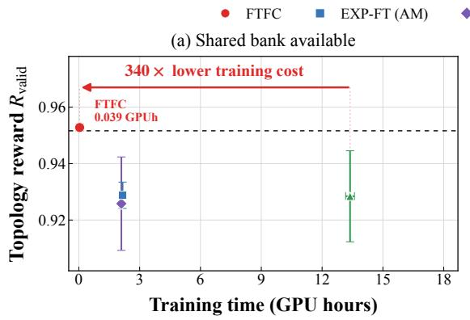  
Final checkpoints; mean ± SD over three seeds. Same measured rewards in both panels.

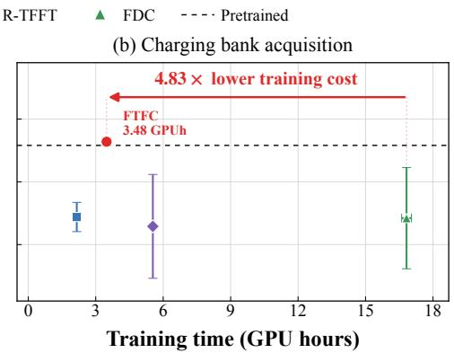  
Right: add the measured 3.444 GPUh bank cost to FTFC, R-TFFT and FDC; EXP-FT does not require this bank.  
Initial endpoint conversion is unrecorded and excluded. Evaluation excluded. Arrows compare budgets, not matched-quality speed.  
Figure 6: Effect of corpus acquisition on GEOM-Drugs training cost. Both panels use the same final topology rewards, averaged over three runs with 2,000 generated molecules per run; error bars show sample standard deviations. (a) The shared corpus is available. (b) Its measured acquisition cost, 3.444 GPU-hours, is charged once to each method that requires it. Initial endpoint conversion was not timed and is excluded, as is evaluation. Arrows compare recorded budgets rather than time to a matched reward. The horizontal dashed line shows the pretrained topology reward.

Table 11: Stable Diffusion method budgets and training thresholds. All trainable baselines are assigned 1,600 optimizer updates in total.
<table><tr><td>Method</td><td>Epochs</td><td>Optimizer updates</td><td>Raw hinge threshold τ</td></tr><tr><td>Pretrained (Rombach et al., 2022)</td><td>0</td><td>0</td><td></td></tr><tr><td>EXP-FT (Domingo i Enrich et al., 2025)</td><td>20</td><td>1,600</td><td>Identity reward</td></tr><tr><td>L-TFFT (Wang et al., 2026)</td><td>20</td><td>1,600</td><td>0.700759</td></tr><tr><td>FDC, stage 1 (De Santi et al., 2025)</td><td>10</td><td>800</td><td>-0.49</td></tr><tr><td>FDC, stage 2 (De Santi et al., 2025)</td><td>10</td><td>800</td><td>-0.09</td></tr></table>

the identity or hinge reward. Norms are clipped at the per-image 85th percentile before averaging, so the hinge acts before smoothing and clipping. The control penalty remains relative to the frozen pretrained U-Net. Table 12 gives the remaining settings: each epoch has 80 updates with 125 replay records per update; each loss minibatch samples two denoising positions from the first 60% of the trajectory and two from the remainder. Replay losses are not importance-weighted. Guidance is used only for image sampling, not adjoint or control computations.

Table 12: Shared Stable Diffusion baseline training settings. Reward-gradient clipping during smoothing is distinct from optimizer-gradient clipping.
<table><tr><td>Setting</td><td>Value</td></tr><tr><td>Optimizer</td><td>AdamW; learning rate  $3 \times 1 0 ^ { - 6 }$ </td></tr><tr><td>Adam moments, epsilon</td><td> $( 0 . 9 , 0 . 9 5 ) , 1 0 ^ { - \bar { 8 } }$ </td></tr><tr><td>Weight decay</td><td>0</td></tr><tr><td>Learning-rate schedule</td><td>Linear warmup for 20 updates, then constant</td></tr><tr><td>Minibatch / accumulation</td><td>5 records / 25 minibatches</td></tr><tr><td>Replay buffer / passes</td><td>100 trajectories / 10 passes</td></tr><tr><td>Trajectory / loss positions</td><td>50 denoising steps / 4 sampled positions</td></tr><tr><td>Training reward</td><td>ImageReward-v1.0; multiplier 100</td></tr><tr><td>Tail objective</td><td>Lower tail,  $\beta = 0 . 2$  , for FDC and L-TFFT</td></tr><tr><td>Gradient smoothing</td><td>20 latent perturbations, Gaussian std. 0.02</td></tr><tr><td>Smoothing gradient clipping</td><td>Per-image 0.85-quantile of perturbation norms</td></tr><tr><td>Other clipping</td><td>Optimizer-gradient and per-sample loss clipping disabled</td></tr><tr><td>Guidance / prompt dropout</td><td>Sampling CFG 7.5 / dropout 0.2</td></tr><tr><td>Adjoint / control CFG</td><td>Both disabled</td></tr><tr><td>Precision Validation frequency</td><td>Float32; TF32 permitted</td></tr><tr><td>Final model selection</td><td>Every 0.1 epoch on the 100 evaluation prompts</td></tr><tr><td></td><td>Last checkpoint after the scheduled updates</td></tr><tr><td>Hardware per worker</td><td>One NVIDIA A100-SXM4 with 80 GB memory</td></tr></table>

Sampling. Training and evaluation use the released stochastic DDIM scheduler with 50 steps, $\eta = 1 ,$ , trailing timestep spacing, and noise-schedule endpoints 0.002 and 0.009. The terminal cumulative alpha is adjusted to $\bar { ( 1 + \alpha } _ { t _ { \mathrm { l a s t } } } ) / 2$ . Each method generates ten $5 1 2 \times 5 1 2$ images for each of 100 prompts, using guidance $7 . 5$ and common random draws across methods. All 1,000 images enter quantitative evaluation without selection. Scorers use their released preprocessing and unperturbed images.

ImageReward and lower-tail CVaR. ImageReward-v1.0 (Xu et al., 2023) predicts preference for a prompt–image pair. Let $r _ { p i }$ be its raw score, $P = 1 0 0$ the number of prompts, and $n = 1 0$ the number of images per prompt. The mean is

$$
{ \widehat { \mu } } _ { \mathrm { I R } } = { \frac { 1 } { P } } \sum _ { p = 0 } ^ { P - 1 } { \bar { r } } _ { p } , \qquad { \bar { r } } _ { p } = { \frac { 1 } { n } } \sum _ { i = 1 } ^ { n } r _ { p i } .\tag{53}
$$

Sorting all $M = P n$ scores jointly gives the lower-tail statistic

$$
\widehat { \mathrm { L - C V a R } _ { 0 . 2 } } = \frac { 1 } { K } \sum _ { j = 1 } ^ { K } r _ { ( j ) } , \qquad K = \lceil 0 . 2 M \rceil = 2 0 0 .\tag{54}
$$

This is a global tail across prompts, not an average of per-prompt tails. Evaluation uses raw scores and an empirical tail boundary, independently of the fixed training thresholds.

CLIP and HPSv2.1. CLIP ViT-L/14 (Radford et al., 2021) measures text–image compatibility through the cosine similarity of image and text features:

$$
C ( \boldsymbol { x } , \boldsymbol { c } ) = \frac { \boldsymbol { f } ( \boldsymbol { x } ) ^ { \top } \boldsymbol { h } ( \boldsymbol { c } ) } { \| \boldsymbol { f } ( \boldsymbol { x } ) \| _ { 2 } \| \boldsymbol { h } ( \boldsymbol { c } ) \| _ { 2 } } .\tag{55}
$$

HPSv2.1 (Wu et al., 2023) supplies a separate learned preference score. Both are reported without rescaling, averaged within prompts and then across prompts. Neither is used for training.

DreamSim diversity. For unit-normalized embeddings $z _ { p i }$ from the default pretrained DreamSim model (Fu et al., 2023), we compute

$$
D _ { p } = \frac { 1 } { 2 n ( n - 1 ) } \sum _ { i = 1 } ^ { n } \sum _ { j = 1 } ^ { n } \| z _ { p i } - z _ { p j } \| _ { 2 } ^ { 2 } , \qquad \widehat { D } = \frac { 1 } { P } \sum _ { p = 0 } ^ { P - 1 } D _ { p } .\tag{56}
$$

This is within-prompt perceptual variance, used only for evaluation; higher diversity need not imply higher image quality or prompt alignment.

Uncertainty. The table reports one evaluation per method. For ImageReward mean, CLIP, and HPS, let $a _ { p }$ be the ten-image prompt mean; for DreamSim, let $a _ { p } = D _ { p }$ . The reported error term is

$$
\mathrm { S E } _ { \mathrm { p r o m p t } } = \frac { \sqrt { P ^ { - 1 } \sum _ { p = 0 } ^ { P - 1 } ( a _ { p } - \bar { a } ) ^ { 2 } } } { \sqrt { P } } , \qquad \bar { a } = P ^ { - 1 } \sum _ { p } a _ { p } .\tag{57}
$$

For lower-tail CVaR, it is instead

$$
\mathrm { S E } _ { \mathrm { t a i l } } = \frac { \sqrt { K ^ { - 1 } \sum _ { j = 1 } ^ { K } ( r _ { ( j ) } - \mathrm { L } \widehat { - } \mathrm { C V a R } _ { 0 . 2 } ) ^ { 2 } } } { \sqrt { K } } , \qquad K = 2 0 0 .\tag{58}
$$

The tail term describes dispersion within the selected tail; it omits boundary uncertainty and dependence between images of one prompt. Neither term measures training-run variability or gives a confidence interval for method differences.

Training cost. Baseline timings on one A100 80 GB GPU include active training, validation, checkpoint writing, and repeated partial work after interruptions. They exclude downtime, external startup, final evaluation, backbone pretraining, and development runs. The recorded totals are 82.28 hours for EXP-FT, 82.41 for FDC, and 85.77 for L-TFFT.

The selected FTFC checkpoint combines 800 initial updates and a 400-update refinement. Fitting takes 4.045 GPU-hours with a cached bank. Generating and scoring its 80,000-image bank adds 43.711 GPU-hours, giving 47.756 GPU-hours (1.99 GPU-days) in total. FTFC’s timers for these stages exclude CPU calibration, startup, checkpoint writing, validation, and exploratory or discarded updates. Because timing scopes and attained rewards differ, these costs do not establish a speedup to matched quality.

Qualitative selection. Figure 3 shows ImageReward ranks 1, 5, and 10 among ten images per method for “footage ofan astronaut in a tropical beach.” This prompt was chosen after inspecting pretrained outputs and also occurs in training. Pretrained, EXP-FT, L-TFFT, and FTFC reuse their evaluation images. The FDC batch was resampled twice after visual inspection; its displayed ranks use the last batch. This selection affects only the illustration, not the quantitative benchmark. No images are retouched.

## B.4.1 L-TFFT: FIXED-THRESHOLD LOWER-TAIL OPTIMIZATION

L-TFFT applies the lower-tail transformation of Wang et al. (2026) with $\beta = 0 . 2$ and fixed threshold $\tau = 0 . 7 0 0 \bar { 7 } 5 9 \colon \phi _ { \tau } ( r ) = - 5 [ 0 . 7 0 0 7 5 9 - r ] _ { + }$ . For a terminal latent z and decoded reward $r ( z , c )$ , its unsmoothed derivative is

$$
\nabla _ { z } \phi _ { \tau } \left( r ( z , c ) \right) = 5 \bf { 1 } \{ \} \tau ( \boldsymbol { z } , \boldsymbol { c } ) < \tau \boldsymbol  \} \nabla _ { z } r ( \boldsymbol { z } , \boldsymbol { c } ) ,\tag{59}
$$

away from the threshold. Low-reward samples receive a direct reward gradient, while the KL control penalty remains active for all samples. The threshold is fixed, so the fraction below it need not remain 20%.

The hinge is applied to each latent perturbation before clipping and averaging, so an image above the threshold can still receive a gradient when a perturbation falls below it. Training uses the shared Adjoint Matching settings and 1,600 updates in Tables 11–12.

L-TFFT improves mean ImageReward and lower-tail CVaR over pretrained, but not over EXP-FT in this evaluation. With one run per method, this difference does not establish equivalence or statistical superiority.

## C ADDITIONAL RESULTS

law’s preference for the left ring. FTFC has the smallest target distance at L = 64 (Figure 1), reproducing both modes and their unequal masses more closely than ITM or FDC.

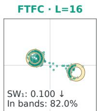

  
SW₁: 0.039 ↓ In bands: 78.7%

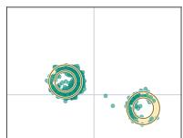  
SW₁: 0.029 ↓ In bands: 76.2%

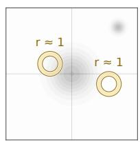

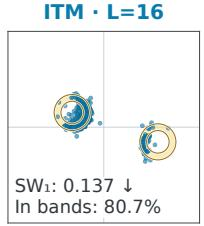

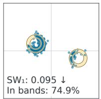

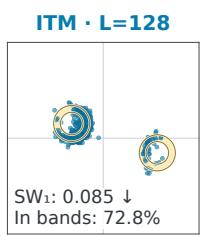

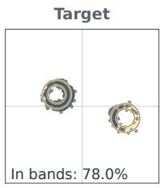

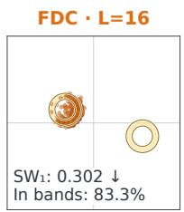

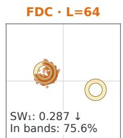

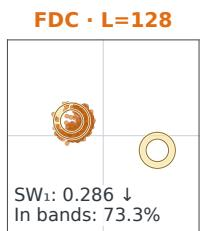  
Figure 7: Mean-reward objective, $\mathcal { F } ( p ) = \mathbb { E } _ { p } [ r ]$ . The target is computed independently. Rows show FTFC, ITM, and FDC at $L = 1 6$ , 64, 128; the target is at middle right. Each panel shows 500 samples from one run; annotations use all 4,096 samples across three runs.

Convergence and cost. Figure 8 uses the same runs and numerical targets.

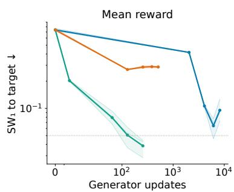

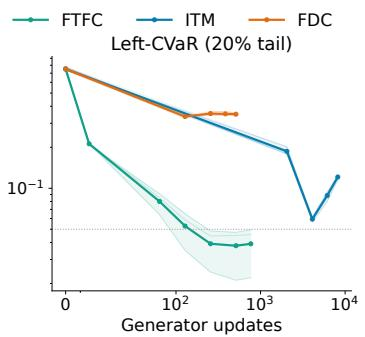

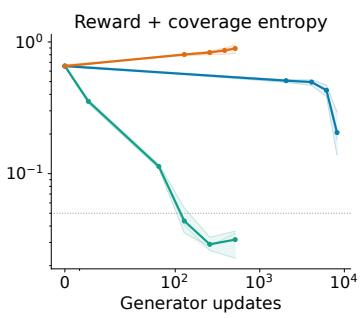  
Figure 8: Convergence to the numerical target at $L = 6 4$ . Solid curves average three runs and shading spans their range. The dotted line marks sliced $\mathbf { W } 1 = 0 . 0 5$ . The axis counts generator updates; target optimization and endpoint acquisition are excluded. Batch sizes and sampling costs differ, so the curves do not establish equal-compute or end-to-end wall-clock speedups.

## C.1 COVERAGE ENTROPY

The coverage objective $\mathcal { F } ( p ) = \mathbb { E } _ { p } [ r ] + 0 . 1 2 H ( \mathbb { E } _ { p } [ \phi ] )$ rewards entropy of aggregate feature masses, not the entropy of an individual sample. It encourages both circles and their arcs (Figure 9). FTFC most closely matches this target; ITM concentrates on arcs and FDC largely misses the right ring.

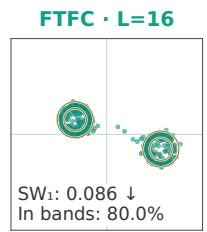

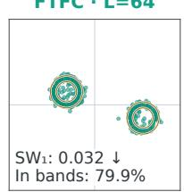

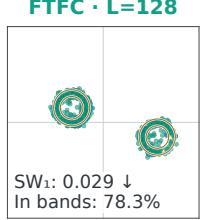

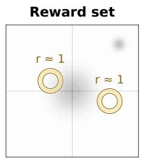

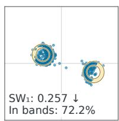

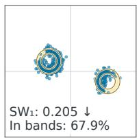

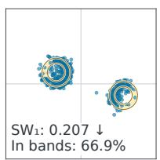

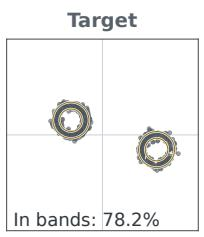

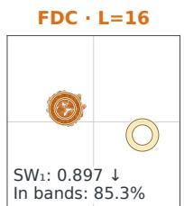

  
Figure 9: Coverage-entropy objective. $\mathcal { F } ( p ) = \mathbb { E } _ { p } [ r ] + 0 . 1 2 H ( \mathbb { E } _ { p } [ \phi ] )$ with KL coefficient α = 0.03. Rows, sampling lengths, evaluation protocol, and displayed run follow Figure 1. The target retains mass outside the gold bands, so band-hit rate alone does not measure agreement.  
SW₁: 0.892 ↓ In bands: 80.1%

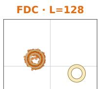  
SW₁: 0.885 ↓ In bands: 77.6%