# FORK-DLLM: AVOIDING THE FLEXIBILITY TRAP INDIFFUSION LANGUAGE MODELS

Stipe Frkovic´1,†, Metod Jazbec2,∗,†, Christian A. Naesseth2,∗

1University of Amsterdam 2UvA-Bosch Delta Lab, University of Amsterdam

## ABSTRACT

Masked diffusion language models (dLLMs) have shown strong potential for faster inference through parallel token generation when combined with confidence-based samplers. However, recent work has shown that such methods can defer unmasking high-entropyfork positions at which multiple plausible continuations exist. This results in reduced generation diversity, as shown by worse pass@k scaling, and limits gains obtainable from RL post-training. To avoid this flexibility trap, prior work advocated for autoregressive (AR) sampling. Here, we show that discarding confidence-based sampling is unnecessary and, once inference cost is taken into account, wasteful. We first propose Fork-dLLM, a simple hybrid sampler that uses AR-style ordering only at uncertain fallback steps while retaining parallel generation otherwise. We then extend the same principle to post-training with ForkGRPO, which uses Fork-dLLM rollouts and applies the GRPO objective only at fallback steps, preserving exact policy-likelihood ratios while substantially reducing rollout and optimization cost. In our experiments, Fork-dLLM matches the strong pass@k scaling of AR sampling while being 2– 3× more efficient, and ForkGRPO achieves downstream performance comparable to or better than AR-based GRPO baselines at a substantially lower training cost.

## 1 INTRODUCTION

Masked diffusion language models (dLLMs) have emerged as a promising alternative to autoregressive (AR) language models, with the potential for faster inference through parallel token generation (Nie et al., 2025; Ye et al., 2025; Arriola et al., 2025; Bie et al., 2025; Cheng et al., 2026). To realize this potential, a crucial component is confidence-based sampling (Wu et al., 2026a; Ben-Hamu et al., 2025; Kim et al., 2025; Jazbec et al., 2026), accelerating generation by committing multiple high-confidence tokens in parallel.

However, recent work has shown that confidencebased sampling can substantially reduce diversity across generations (Ni et al., 2026; Olausson et al., 2026), a phenomenon termed the flexibility trap. By postponing uncertain, high-entropyfork positions (Wang et al., 2025), confidence-based samplers allow surrounding context to be resolved first, reducing uncertainty at meaningful branching points before they are sampled. This leads to worse pass@k scaling than left-to-right AR sampling and limits the gains of RL post-training. Ni et al. (2026) therefore advocate for AR sampling, which generates only one token at a time and thus sacrifices the parallelism and corresponding efficiency gains of dLLMs, making it an expensive solution to the diversity problem.

GSM8K – LLaDA-8B-Instruct  
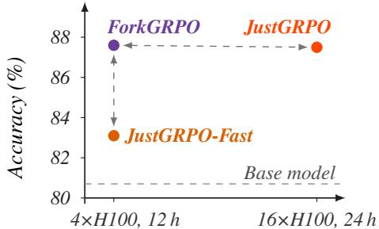  
Train configuration (GPU, time)  
Figure 1: GSM8K accuracy across posttraining methods, evaluated with FastdLLM at λ = 0.95 and temperature τ = 0. The dashed gray line denotes the performance of the base LLaDA-8B-Instruct model. ForkGRPO and JustGRPO-Fast are trained by us; for JustGRPO, we evaluate the released checkpoint from Ni et al. (2026). Under the same training budget, ForkGRPO substantially outperforms JustGRPO-Fast and reaches accuracy comparable to JustGRPO despite using 8× fewer H100-hours for post-training.

We therefore ask: Is it necessary to abandon confidence-based sampling entirely to avoid the flexibility trap? We show that it is not. Our key observation is that popular confidence-based samplers such as Fast-dLLM (Wu et al., 2026a) already contain a mechanism for identifying sampling steps in which fork positions are likely to occur: when no position exceeds the confidence threshold λ, all remaining predictions are relatively uncertain. We use these fallback steps as a simple proxy for fork-containing steps and introduce Fork-dLLM (Algorithm 2), which switches to AR-style sampling only at these steps by unmasking the leftmost masked position. In all other steps, Fork-dLLM is identical to Fast-dLLM and commits multiple tokens in parallel.

We further show that the same idea naturally extends to RL post-training for dLLMs (Zhao et al., 2025). Existing approaches that avoid likelihood approximations (see Section A), such as JustGRPO (Ni et al., 2026), rely on AR rollouts and therefore sacrifice the generation efficiency of dLLMs. We instead introduce ForkGRPO, which generates rollouts with Fork-dLLM and applies the GRPO objective only at fallback steps. Since a single token is committed at these steps, ForkGRPO preserves exact policy-likelihood ratios while retaining parallel generation throughout the rest of the trajectory. In summary, our main contributions are:

• We introduce Fork-dLLM, a simple modification to the Fast-dLLM sampler (Wu et al., 2026a) that applies AR-style ordering only at uncertain fallback steps, requiring no training, additional model evaluations, or new hyperparameters (Section 3.1). Across mathematics and code benchmarks, Fork-dLLM matches the pass@k scaling of AR sampling while requiring 2–3× fewer NFEs (Section 4.1).

• We show that, when tuned, other confidence-based samplers (Wu et al., 2026a; Olausson et al., 2026) also retain strong pass@k scaling at a fraction of the AR cost, demonstrating that escaping the flexibility trap does not require abandoning confidence-based parallel decoding (Section 4.1).

• We introduce ForkGRPO, which extends Fork-dLLM to RL post-training by applying GRPO only at the fallback steps of its rollouts (Section 3.2). ForkGRPO preserves exact policy-likelihood ratios while substantially reducing NFEs during both rollout generation and policy optimization. It clearly outperforms AR-based GRPO under the same compute budget, and matches it at a fraction of the training cost (Figure 1 & Section 4.2).

## 2 BACKGROUND

Training masked dLLMs. Let $[ V ] : = \{ 1 , . . . , V \}$ represent a vocabulary of size V and $\scriptstyle { \pmb { x } } _ { 0 } \ =$ $( x _ { 0 } ^ { 1 } , \dots , \bar { x } _ { 0 } ^ { L } ) \sim p _ { \mathrm { d a t a } }$ denote a clean sequence of length ${ \bar { \boldsymbol { L } } } ,$ where $x _ { 0 } ^ { \ell } \in [ V ]$ . Masked dLLMs (Sahoo et al., 2024; Shi et al., 2024; Ou et al., 2025) define a forward process that progressively corrupts $\scriptstyle { \pmb x } _ { 0 }$ by replacing tokens with an absorbing [MASK] token. Concretely, a (continuous) timestep $s \sim \mathcal { U } [ 0 , 1 ]$ is sampled and used to independently mask every position with probability $s ,$

$$
p _ { s } ( \pmb { x } _ { s } \mid \pmb { x } _ { 0 } ) = \prod _ { k = 1 } ^ { L } \left[ \pmb { s } \cdot \mathbf { 1 } \big ( \pmb { x } _ { s } ^ { k } = [ \mathtt { M A S K } ] \big ) + ( 1 - s ) \cdot \mathbf { 1 } \big ( \pmb { x } _ { s } ^ { k } = \ b { x } _ { 0 } ^ { k } \big ) \right] .
$$

A bidirectional transformer $q _ { \theta }$ is then trained to reconstruct the clean tokens at masked positions using the cross-entropy:

$$
\mathcal { L } ( \theta ) = - \mathbb { E } _ { s , x _ { 0 } , x _ { s } } \left[ \frac { 1 } { s } \sum _ { k = 1 } ^ { L } \mathbf { 1 } \big ( x _ { s } ^ { k } = [ \mathtt { M A S K } ] \big ) \cdot \log q _ { \theta } ^ { k } ( x _ { 0 } ^ { k } \mid x _ { s } ) \right] .
$$

Thus, $q _ { \theta } ^ { k } ( \cdot \mid x _ { s } )$ predicts the distribution over the clean token at position k conditioned on the entire partially masked sequence. Such models have recently been scaled to billions of parameters (Nie et al., 2025; 2026; Ye et al., 2025; Bie et al., 2025; Bethune et al., 2026).

Sampling in masked dLLMs. At inference time, generation proceeds through iterative unmasking over discrete sampling steps indexed by t, until all positions have been unmasked (Zheng et al.,

Algorithm 1 Fast-dLLM (Wu et al., 2026a) Algorithm 2 Fork-dLLM (ours)   
1: Input: $\mathbf { } { \mathbf { } } x _ { t } , q _ { \theta } , \lambda , \tau$ 1: Input: $\mathbf { } { \mathbf { } } x _ { t } , q _ { \theta } , \lambda , \tau$   
2: Output: ${ \mathbf { \mathcal { x } } } _ { t - 1 }$ 2: Output: ${ \mathbf { \mathcal { x } } } _ { t - 1 }$   
3: $\mathcal { M } _ { t }  \{ k \in [ L ] \mid x _ { t } ^ { k } = [ \mathrm { M A S K } ] \}$ 3: $\mathcal { M } _ { t }  \{ k \in [ L ] \mid x _ { t } ^ { k } = [ \mathrm { M A S K } ] \}$   
4: $x _ { 0 } ^ { k } \sim q _ { \theta } ^ { k } ( \cdot \mid x _ { t } ; \tau )$ 4: $x _ { 0 } ^ { k } \sim q _ { \theta } ^ { k } ( \cdot \mid x _ { t } ; \tau )$   
5: $c _ { t } ^ { k }  q _ { \theta } ^ { k } ( x _ { 0 } ^ { k } \mid x _ { t } )$ 5: $c _ { t } ^ { k }  q _ { \theta } ^ { k } ( x _ { 0 } ^ { k } \mid x _ { t } )$   
6: ${ \mathcal { U } } _ { t } \gets \{ k \in { \mathcal { M } } _ { t } : c _ { t } ^ { k } > \lambda \}$ 6: ${ \mathcal { U } } _ { t } \gets \{ k \in { \mathcal { M } } _ { t } : c _ { t } ^ { k } > \lambda \}$   
7: if U = ∅ then 7: $\mathbf { i f } \ U _ { t } = \emptyset$ then   
8: $\mathcal { U } _ { t } \gets \{ \arg \operatorname* { m a x } _ { k \in \mathcal { M } _ { t } } c _ { t } ^ { k } \}$ 8: $\mathcal { U } _ { t }  \{ \mathrm { l e f t m o s t } ( \mathcal { M } _ { t } ) \}$   
9: end if 9: end if   
10: $x _ { t - 1 } ^ { k } : = { \left\{ \begin{array} { l l } { x _ { 0 } ^ { k } , } & { k \in \mathcal { U } _ { t } } \\ { x _ { t } ^ { k } , } & { { \mathrm { e l s e } } } \end{array} \right. }$ 10: $\begin{array} { r } { x _ { t - 1 } ^ { k } : = \left\{ \begin{array} { l l } { x _ { 0 } ^ { k } , } & { k \in \mathcal { U } _ { t } } \\ { x _ { t } ^ { k } , } & { \mathrm { e l s e } } \end{array} \right. } \end{array}$

2025; Nie et al., 2025). Let $\pmb { x } _ { t } = ( x _ { t } ^ { 1 } , \dots , x _ { t } ^ { L } )$ denote the current partially masked sequence and $\mathcal { M } _ { t } = \{ k \in \left[ L \right] \mid x _ { t } ^ { k } = \left[ \mathrm { M A S K } \right] \}$ the set of still-masked positions. At each sampling step, the model predicts a distribution $q _ { \theta } ^ { k } ( \cdot \mid \bar { \boldsymbol { x } } _ { t } )$ for every $k \in \mathcal { M } _ { t }$ , from which we sample a candidate token $x _ { 0 } ^ { k } \sim q _ { \theta } ^ { k } ( \cdot \mid x _ { t } ; \tau )$ , with $\tau \geq 0$ denoting the sampling temperature. A sampling strategy then selects a subset of proposed tokens $\mathcal { U } _ { t } \subseteq \mathcal { M } _ { t }$ to commit/unmask:

$$
x _ { t - 1 } ^ { k } = { \left\{ \begin{array} { l l } { x _ { 0 } ^ { k } , } & { k \in \mathcal { U } _ { t } , } \\ { x _ { t } ^ { k } , } & { { \mathrm { o t h e r w i s e } } . } \end{array} \right. }
$$

The choice of $\mathcal { U } _ { t }$ determines the generation order and, crucially, how many tokens can be generated in parallel. Confidence-based samplers exploit this flexibility to accelerate generation. One popular instantiation is Fast-dLLM (Wu et al., 2026a) in which each sampled token is assigned the confi dence $c _ { t } ^ { k } = q _ { \theta } ^ { k } ( x _ { 0 } ^ { k } \mid x _ { t } )$ and then all positions with confidence above a threshold λ are unmasked:

$$
\mathcal { U } _ { t } = \{ k \in \mathcal { M } _ { t } : c _ { t } ^ { k } > \lambda \} .
$$

If no position exceeds the threshold (i.e., ${ { \mathcal U } _ { t } } ~ = ~ \emptyset )$ , Fast-dLLM instead commits the highestconfidence position $\mathcal { U } _ { t } = \arg \operatorname* { m a x } _ { k } c _ { t } ^ { k }$ , ensuring that at least one token is generated at every step (Algorithm 1).

GRPO for masked dLLMs. RL methods developed for autoregressive LLMs, such as Group Relative Policy Optimization (GRPO; Shao et al., 2024), are difficult to apply to dLLMs, since their generation process lacks the left-to-right factorization of the policy likelihood. Early approaches therefore rely on likelihood approximations (Zhao et al., 2025; Tang et al., 2026a; Gong et al., 2026). In particular, d1 (Zhao et al., 2025) proposes diffu-GRPO, which approximates the sequence likelihood using a mean-field factorization across positions and estimates all per-token likelihoods with a single dLLM forward pass on a partially masked prompt and fully masked completion.

More recently, JustGRPO (Ni et al., 2026) avoids this approximation by generating rollouts autoregressively and using a trajectory-level policy likelihood (Chen et al., 2025; Turok et al., 2026), achieving strong results on mathematical reasoning and code generation. AR decoding simply commits masked positions from left to right. For a generated sequence $\scriptstyle { \mathbf { { \vec { x } } } } _ { 0 }$ , let

$$
\tilde { \pmb { x } } ^ { k } = ( x _ { 0 } ^ { 1 } , \ldots , x _ { 0 } ^ { k - 1 } , [ \mathtt { M A S K } ] , \ldots , [ \mathtt { M A S K } ] ) , \qquad k = 1 , \ldots , L ,
$$

denote the partially masked state immediately before position k is generated. The likelihood of the resulting AR trajectory $\tilde { \pmb { x } } ^ { 1 : L }$ then factorizes exactly as

$$
q _ { \theta } ^ { \mathrm { A R } } \bigl ( \tilde { \pmb { x } } ^ { 1 : L } \mid c \bigr ) = \prod _ { k = 1 } ^ { L } q _ { \theta } ^ { k } \bigl ( x _ { 0 } ^ { k } \mid c , \tilde { \pmb { x } } ^ { k } \bigr ) .
$$

For each prompt $c \sim \mathcal { D }$ , JustGRPO then follows the standard GRPO recipe: it samples a group of $G$ trajectories $\{ \tilde { x } _ { i } ^ { \bar { 1 } : L } \} _ { i = 1 } ^ { G }$ using the current policy $q _ { \theta _ { \mathrm { o l d } } } ^ { \mathrm { A R } }$ and optimizes the clipped surrogate objective

$$
\mathcal { I } _ { \mathrm { J u s t G R P O } } ( \theta ) = \underset { \{ \bar { x } _ { i } ^ { 1 : L } \} _ { i = 1 } ^ { G } \sim \mathcal { D } _ { \theta _ { \mathrm { o l d } } } ^ { \mathrm { A R } } ( \cdot | c ) } { \mathbb { E } } \Bigg [ \frac { 1 } { G } \sum _ { i = 1 } ^ { G } \frac { 1 } { L } \sum _ { k = 1 } ^ { L } \operatorname* { m i n } \Bigl ( \rho _ { i , k } \hat { A } _ { i } , \mathrm { c l i p } ( \rho _ { i , k } , 1 - \epsilon , 1 + \epsilon ) \hat { A } _ { i } \Bigr ) \Bigg ] ,
$$

where the policy likelihood ratios are

$$
{ \rho } _ { i , k } = \frac { { q } _ { \theta } ^ { k } \big ( { x } _ { i , 0 } ^ { k } \mid c , \tilde { { \mathbf { x } } } _ { i } ^ { k } \big ) } { { q } _ { \theta _ { \mathrm { o l d } } } ^ { k } \big ( { x } _ { i , 0 } ^ { k } \mid c , \tilde { { \mathbf { x } } } _ { i } ^ { k } \big ) } ,\tag{1}
$$

and $\hat { A } _ { i } = ( r _ { i } - \mu _ { G } ) / \sigma _ { G }$ is the group-normalized advantage, with $r _ { i } = r ( \pmb { x } _ { i , 0 } )$ the reward of rollout i and $\mu _ { G }$ and $\sigma _ { G }$ the mean and standard deviation of the rewards within the group. Thus, unlike diffu-GRPO, JustGRPO uses exact policy likelihoods, but incurs substantial training cost from both autoregressive rollouts in the GRPO outer loop and per-position likelihood evaluations in the inne loop.

## 3 METHODS

We now introduce our approach to addressing the flexibility trap in dLLMs without resorting to AR sampling rollouts or ELBO-style likelihood approximations. We first propose Fork-dLLM, a simple modification of the Fast-dLLM sampler that changes only its fallback rule (Section 3.1) at no additional cost. We then extend the same idea to post-training with ForkGRPO, which uses Fork-dLLM rollouts and applies the GRPO objective only at fallback steps (Section 3.2).

## 3.1 FORK-DLLM

Our key observation is that the Fast-dLLM fallback condition ${ { \mathcal { U } } _ { t } } \ = \ \emptyset$ naturally identifies steps at which confidence-based ordering is most harmful for generation diversity. When no position exceeds λ, the model has no sufficiently confident prediction; nevertheless, Fast-dLLM continues to use confidence to determine which position to commit, favoring the easiest remaining prediction and potentially further postponing uncertain, high-entropyfork positions. This is particularly undesirable because such uncertain positions can carry a disproportionate amount of information (Fu et al., 2025). Indeed, as we show in Figure 2, although fallback steps account for only approximately one eighth of committed tokens, their tokens contribute nearly half of the total token entropy. This suggests that rather than abandoning confidence-based parallel decoding altogether, it may suffice to treat these comparatively rare, high-uncertainty fallback steps differently.

We therefore propose Fork-dLLM, which changes only the Fast-dLLM fallback, as formalized in Algorithm 2. Whenever at least one position exceeds λ, it behaves identically to Fast-dLLM and commits all such positions in parallel. When none do, Fork-dLLM instead performs an AR-style fallback by committing the leftmost remaining masked position rather than the highest-confidence one. It thus confronts uncertain decisions using AR ordering while retaining confidence-based parallel decoding elsewhere. As a one-line modification to Fast-dLLM, it requires no training, additional model evaluations, or new hyperparameters. In our experiments, Fork-dLLM matches the pass@k scaling of AR sampling while requiring $2 { - } 3 \times$ fewer NFEs (Section 4.1). Fast-

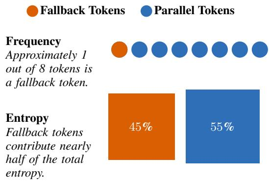  
Figure 2: Token frequencies and entropies from Fast-dLLM sampling on HumanEval using LLaDA-8B-Instruct.

dLLM’s highest-confidence fallback is shared by several widely used confidence-based samplers (Ben-Hamu et al., 2025; Jazbec et al., 2026), and the Fork-dLLM principle could be applied to each of them by replacing it with an AR-style one.

## 3.2 FORKGRPO

Next, we propose to use Fork-dLLM to make JustGRPO (Ni et al., 2026) more efficient in both rollout generation and policy optimization. Recall that JustGRPO generates trajectories autoregressively and evaluates the GRPO objective at every output position $k = 1 , \dots , L$ (Equation (1)). Instead, we propose to generate rollouts with Fork-dLLM (Algorithm 2) and evaluate the GRPO objective only at the fallback steps of each rollout. We call the resulting training algorithm ForkGRPO. Since Fork-dLLM commits a single token at each fallback step, the policy-likelihood ratios at these steps are exact, without requiring the likelihood approximations used by diffu-GRPO (Zhao et al., 2025).

Concretely, for each prompt $c \sim \mathcal { D }$ , ForkGRPO uses Fork-dLLM to sample a group of G trajectories $\{ \pmb { x } _ { i , T _ { i } : 0 } \} _ { i = 1 } ^ { G } ,$ where $\bar { \boldsymbol { T } } _ { i }$ denotes the (trajectory-dependent) number of sampling steps for rollout i. Let $\mathcal { F } _ { i } \subseteq [ T _ { i } ]$ denote its set of fallback steps, i.e., steps at which no masked position exceeds the confidence threshold λ:

$$
\mathcal { F } _ { i } = \left\{ t : \operatorname* { m a x } _ { k \in \mathcal { M } _ { i , t } } c _ { i , t } ^ { k } \leq \lambda \right\} .
$$

ForkGRPO then replaces the per-position average in JustGRPO with an average only over the fallback steps determined by the Fork-dLLM sampler:

$$
\mathcal { I } _ { \mathrm { R o r k G R P O } } ( \theta ) = \underset { \underset { s \leq \mathcal { D } , \leq } { c \sim \mathcal { D } , } } { \mathbb { E } } \bigg [ \frac { 1 } { G } \sum _ { i = 1 } ^ { G } \frac { 1 } { | \mathcal { F } _ { i } | } \sum _ { t \in \mathcal { F } _ { i } } \operatorname* { m i n } \Big ( \rho _ { i , t } \hat { A } _ { i } , \mathrm { c l i p } ( \rho _ { i , t } , 1 - \epsilon , 1 + \epsilon ) \hat { A } _ { i } \Big ) \bigg ] ,\tag{2}
$$

where $q _ { \theta _ { \mathrm { o l d } } } ^ { \mathrm { F o r k } }$ denotes the trajectory distribution induced by Fork-dLLM. At each fallback step $t \in { \mathcal { F } } _ { i }$ let $k _ { i , t } : = \mathrm { l e f t m o s t } ( \mathcal { M } _ { i , t } )$ denote the position committed by the AR-style fallback for the i-th rollout. The corresponding policy-likelihood ratio is

$$
\rho _ { i , t } = \frac { q _ { \theta } ^ { k _ { i , t } } \left( x _ { i , 0 } ^ { k _ { i , t } } \mid c , \mathbf { x } _ { i , t } \right) } { q _ { \theta _ { \mathrm { o l d } } } ^ { k _ { i , t } } \left( x _ { i , 0 } ^ { k _ { i , t } } \mid c , \mathbf { x } _ { i , t } \right) } .
$$

Observe that non-fallback tokens still affect the final rollout reward $r ( \pmb { x } _ { i , 0 } )$ and the states conditioning subsequent fallback decisions, but do not directly enter the policy objective. Consequently, ForkGRPO evaluates policy likelihoods only at the sparse fallback steps, which, together with its parallel rollouts, substantially reduces training cost compared to JustGRPO (Section 4.2).

Ni et al. (2026) also propose JustGRPO-Fast, an efficient variant of JustGRPO that evaluates the policy-likelihood ratios only at the top-25% highest-entropy positions of each rollout. Like Fork-GRPO, it restricts policy optimization to a subset of positions, but it differs in two ways: it still generates rollouts autoregressively, and it selects a fixed fraction of positions by entropy. Fork-GRPO instead uses parallel Fork-dLLM rollouts, which also reduces the cost of rollout generation, and selects a variable, trajectory-dependent set of positions through the fallback condition. We show experimentally that ForkGRPO substantially outperforms JustGRPO-Fast under a matched post-training budget (Figure 7).

## 4 EXPERIMENTS

In our experiments, we first study Fork-dLLM as a sampler, asking whether it recovers the pass@k scaling of AR sampling while retaining the efficiency of parallel decoding (Section 4.1). We then analyze its fallback and parallel steps to better understand where these gains come from. Finally, we turn to GRPO post-training (Section 4.2), comparing ForkGRPO with JustGRPO-Fast (Ni et al., 2026) under the same compute budget and examining the entropy collapse induced by Fast-dLLM rollouts.

## 4.1 PASS@k SCALING

Setup. We evaluate on two popular masked dLLMs, LLaDA-8B-Instruct (Nie et al., 2025) and Dream-v0-Instruct-7B (Ye et al., 2025), across four standard benchmarks in mathematical reason ing and code generation: GSM8K (Cobbe et al., 2021), MATH-500 (Hendrycks et al., 2021), HumanEval (Chen et al., 2021), and MBPP (Austin et al., 2021).1 We use the common semi-AR regime with block length $B L = 3 2$ and generation length L = 256.

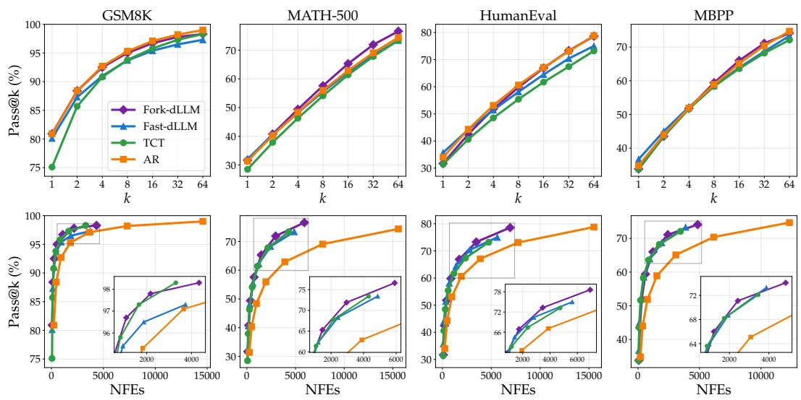  
Figure 3: Pass@k (top) and pass@NFE (bottom) curves on LLaDA-8B-Instruct across mathematics and code benchmarks. Both rows show the same generations; the bottom row instead accounts for the number of NFEs required to obtain the corresponding samples. Fork-dLLM, together with the other two confidence-based samplers (Fast-dLLM and TCT), retains the strong pass@k scaling of AR sampling while requiring substantially fewer NFEs to reach a given performance level. Insets zoom into the high-accuracy regime.

We report pass@k, the standard measure of whether at least one of k samples solves a given problem (Kulal et al., 2019; Chen et al., 2021; Ni et al., 2026). We additionally report the cost-adjusted pass@NFE, which measures pass rate as a function of inference compute and avoids favoring methods that use more NFEs per sample. For AR sampling, we count one NFE per token generated before the 〈eos〉 token.

Alongside Fast-dLLM and AR sampling, we compare Fork-dLLM against Tempered Confidence Thresholding (TCT) (Olausson et al., 2026), a recent approach that mitigates the flexibility trap using a position-temperature hyperparameter to randomize which positions are unmasked. For ForkdLLM, Fast-dLLM, and TCT, we sweep the relevant sampling temperatures and confidence threshold λ as described in Section B.1, and report the best-performing configuration for each method. Following prior work, we use a sampling temperature of τ = 0.6 for AR generation (Ni et al., 2026; Olausson et al., 2026).

Pass@k scaling. We begin with the pass@k and pass@NFE scaling of Fork-dLLM against the baselines. Figure 3 gives the LLaDA-8B-Instruct results, with Dream-v0-Instruct-7B in Figure 11. We observe that all confidence-based samplers exhibit strong pass@k scaling, remaining surprisingly close to AR across datasets. In particular, Fast-dLLM performs substantially better than suggested by prior comparisons (Olausson et al., 2026), which did not jointly tune these hyperparameters. Fork-dLLM is generally the strongest of the parallel samplers, particularly at larger k (see insets in Figure 3). Importantly, when accounting for inference cost, all three confidence-based methods substantially outperform AR in pass@NFE, demonstrating that strong pass@k scaling does not require giving up the efficiency of parallel decoding.

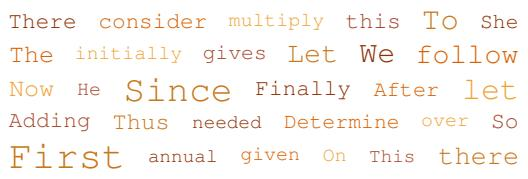

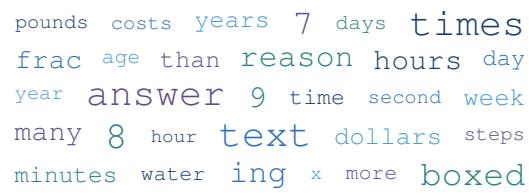  
(a) Frequent fallback tokens  
(b) Frequent parallel tokens  
Figure 4: The 30 most frequent tokens in fallback steps (a) and parallel steps (b) from Fork-dLLM on MATH-500 using LLaDA-8B-Instruct. Word font size is scaled to frequency.

Analysing fallback and parallel steps. Prior work identifiesfork tokens as high-entropy branch ing points that determine subsequent reasoning directions (Wang et al., 2025), and shows that arbitrary-order generation frequently bypasses them (Ni et al., 2026). If Fork-dLLM’s fallback steps capture these branching points, the tokens committed during fallback should therefore resemble fork tokens. To examine this, Figure 4 shows the tokens Fork-dLLM commits most often during parallel and fallback steps. Indeed, fallback steps are dominated by connectives such as Since, First, and Thus, consistent with Fork-dLLM resolving forks directly rather than deferring them. In contrast, parallel steps predominantly commit dataset-specific words that follow an already established reasoning path. Both clouds closely resemble those reported by Wang et al. (2025) for high- and low-entropy tokens in AR models.

To identify which component drives ForkdLLM’s diversity gains, we separately ablate the parallel and fallback steps. Figure 5 reports pass@NFE, with the corresponding pass@k curves in Figure 12. Making parallel generation greedy (τ = 0) instead of stochastic leaves the scaling essentially unchanged (left). In contrast, replacing Fork-dLLM’s AR-style fallback with lowest-confidence, highest-entropy, or random position selection leads to worse scaling (right). Together, these results indicate that the fallback ordering, rather than stochasticity in the parallel steps, drives most of Fork-dLLM’s gains.

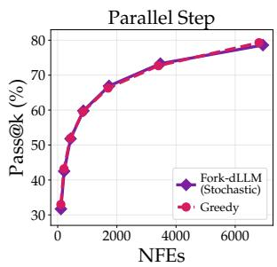

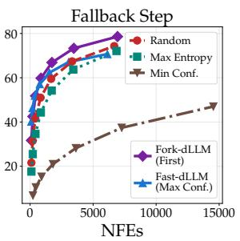  
Figure 5: Pass@NFE curves of Fork-dLLM and its ablations on HumanEval using LLaDA-8B-Instruct.

## 4.2 GRPO TRAINING

We next evaluate whether the benefits of Fork-dLLM carry over to GRPO post-training. We compare ForkGRPO against AR-based and parallel-decoding baselines under a fixed training compute budget, focusing on both training efficiency and downstream performance.

Setup. We compare our proposed ForkGRPO against three baselines: FastGRPO, JustGRPO, and JustGRPO-Fast. FastGRPO is a parallel-decoding baseline we introduce, which, like Fork-GRPO, applies policy updates only at fallback steps but generates rollouts with Fast-dLLM. Thus, the two methods differ in which positions trigger these updates: FastGRPO inherits Fast-dLLM’s confidence-based fallback, whereas ForkGRPO uses Fork-dLLM’s AR-style fallback. JustGRPO and JustGRPO-Fast (Ni et al., 2026) instead use autoregressive rollouts, with JustGRPO-Fast restricting the objective to the highest-entropy positions. Following Wang et al. (2025), we set this fraction to 20%. All variants use generation length L = 256, while ForkGRPO and FastGRPO additionally use block length BL = 32. We take the sampling temperatures and confidence thresholds from Section B.1.

We follow the standard GRPO formulation with group-standardized advantages, using a group size of G = 16 and 16 prompts per step. For mathematics, an answer receives a reward of 1 if it is correct and 0 otherwise; for code, the reward is the fraction of unit tests passed. We use no KL penalty (β = 0). All runs start from LLaDA-8B-Instruct (Nie et al., 2025). Unlike Ni et al. (2026), who fine-tune the full model, we train LoRA adapters $( r = 1 2 8 , \alpha = 6 4 )$ on the attention and MLP projections and keep the base weights frozen.

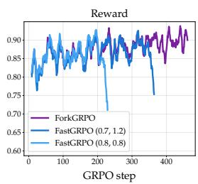

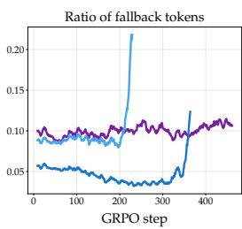

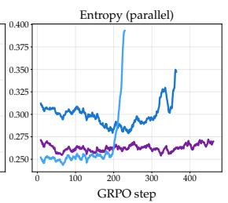

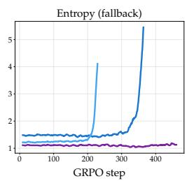  
Figure 6: Reward, ratio of fallback tokens, and entropy of the tokens committed in parallel and fallback steps over GRPO training on GSM8K. FastGRPO is shown with the tuned Fast-dLLM values, $( \lambda , \tau ) \ = \ ( 0 . 7 , 1 . 2 )$ , and with those of ForkGRPO, (0.8, 0.8). In an attempt to improve stability, this experiment adds a KL penalty of $\beta = 0 . 0 2 ;$ ; we observe similar behaviour at $\beta = 0$

We train ForkGRPO, FastGRPO and JustGRPO-Fast ourselves. Due to the substantially higher computational cost of full JustGRPO training, we use the released JustGRPO checkpoint2 from Ni et al. (2026), together with its reported training configuration. For mathematics, we train and evaluate on the training and test splits of GSM8K and MATH-500. For code generation, we train on the subset of AceCoder (Zeng et al., 2025) selected by Gong et al. (2026) and evaluate on HumanEval and MBPP. Each of our runs is given a fixed compute budget of 4×H100 GPUs for 12 hours. We evaluate with greedy Fast-dLLM decoding, sweeping the confidence threshold, over the full test sets. Table 3 lists the full configuration.

FastGRPO collapse. Before turning to AR rollouts, we compare ForkGRPO with FastGRPO. We train FastGRPO with the tuned Fast-dLLM values $( \lambda = 0 . 7 , \tau = 1 . 2 )$ and with the ForkGRPO values $( \lambda = 0 . 8 , \tau = 0 . 8 )$ ; with the latter, the two methods differ only in how the fallback position is selected. Figure 6 tracks all three runs during GSM8K training. Both FastGRPO runs initially match ForkGRPO in reward but collapse after roughly 350 and 220 steps, respectively. Each collapse coincides with a sharp rise in the fallback ratio and in the entropy of parallel and fallback tokens, with fallback entropy growing from below 1.5 to above 4. With the tuned values, the collapse is also preceded by a steady decline of the fallback ratio from 0.06 to below 0.04, as the sampler commits more positions in parallel. An extended 24-hour ForkGRPO run shows none of this: all three quantities remain stable and the reward does not collapse. This is despite Fast-dLLM and ForkdLLM showing similar pass@k scaling at inference (Figure 3). We hypothesize that selecting the fallback position independently of model confidence decouples the rollout policy from RL-induced changes in confidence, stabilizing training. Understanding this mechanism more fully warrants further investigation.

ForkGRPO vs. JustGRPO-Fast under matched compute. We next compare ForkGRPO with JustGRPO-Fast on mathematics and code benchmarks under the same compute budget (Figure 7). On every benchmark, ForkGRPO completes more than twice as many training steps, for example 3.4× as many on GSM8K. It also improves consistently over LLaDA-8B-Instruct, whereas the gains of JustGRPO-Fast remain small (+6.7 vs. +2.1 points on GSM8K, +5.5 vs. +0.6 on HumanEval). On GSM8K, MATH-500, and HumanEval, ForkGRPO checkpoints also decode with fewer NFEs at every threshold.

Since part of ForkGRPO’s speed-up comes from parallel rollouts, we additionally compare checkpoints of the two methods at matched training steps (Table 1). The two methods reach similar accuracy, but JustGRPO-Fast requires 1.6–1.9× more backward passes, as it trains on more positions per answer. This suggests that Fork-dLLM’s fallback positions are more informative per update than the entropy-percentile selection of JustGRPO-Fast. These results extend those of Olausson et al. (2026), who train with their proposed TCT sampler and the d1 policy-likelihood approximation (Zhao et al., 2025): under a matched compute budget, AR rollouts are not necessary for effective post-training of dLLMs.

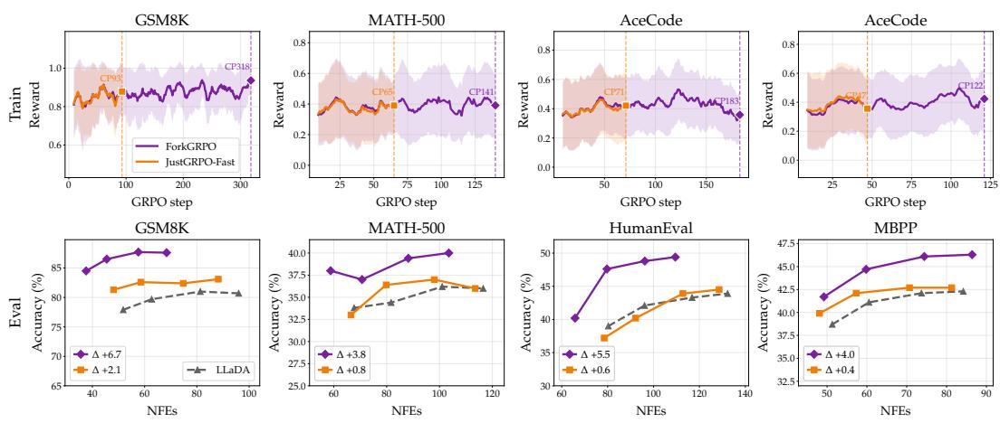  
Figure 7: Training reward (top) and final-checkpoint accuracy versus NFEs (bottom) for ForkGRPO and JustGRPO-Fast under the same training budget (4×H100, 12 h). Dashed vertical lines in the top row mark the final GRPO step reached by each method: owing to cheaper rollouts and policy optimization, ForkGRPO completes more than twice as many training steps. The bottom row evaluates the resulting checkpoints with Fast-dLLM decoding (τ = 0), sweeping the confidence threshold λ. ForkGRPO yields consistently larger improvements over the base model than JustGRPO-Fast.

<table><tr><td colspan="2"></td><td colspan="2">ForkGRPO</td><td colspan="2">JustGRPO-Fast (relative)</td></tr><tr><td>Benchmark</td><td>Step</td><td>Acc.</td><td>Bwd. passes</td><td>Acc. (∆)</td><td>Bwd. passes (×)</td></tr><tr><td rowspan="2">GSM8K</td><td>50</td><td>82.9</td><td>3.2k</td><td>-0.6</td><td>1.72×</td></tr><tr><td>100</td><td>83.8</td><td>5.3k</td><td>+0.1</td><td>1.92×</td></tr><tr><td rowspan="2">MATH-500</td><td>25</td><td>35.8</td><td>4.2k</td><td>-0.2</td><td>1.60×</td></tr><tr><td>50</td><td>37.0</td><td>8.0k</td><td>-1.6</td><td>1.63×</td></tr></table>

Table 1: Step-matched accuracy and backward passes, evaluated at λ = 0.95. JustGRPO-Fast is reported relative to ForkGRPO, with accuracy differences in percentage points.

ForkGRPO vs. JustGRPO. Finally, we compare ForkGRPO, trained with LoRA on 4×H100 for 12 h, with the JustGRPO checkpoint released by Ni et al. (2026), trained with full finetuning on 16×H100 for 24 h. Figure 13 evaluates both checkpoints using Fast-dLLM (λ ∈ {0.7, 0.8, 0.9, 0.95}) and the EB sampler (Ben-Hamu et al., 2025) $( \gamma \in \mathring { \{ 0 . 1 , 0 . 5 , 1 \} } )$ ). Despite its substantially smaller training budget, ForkGRPO reaches comparable peak accuracy on GSM8K, while JustGRPO attains similar accuracy at lower NFEs. On MATH-500, ForkGRPO performs consistently better under both samplers, reaching roughly 40% accuracy compared with 37–38% for JustGRPO.

## 5 CONCLUSION

We introduced Fork-dLLM, which replaces the confidence-based fallback of Fast-dLLM with an AR-style one and otherwise keeps parallel decoding unchanged. Across mathematics and code benchmarks, Fork-dLLM matches the pass@k scaling of AR sampling while requiring 2–3× fewer NFEs. We further introduced ForkGRPO, which extends this principle to RL post-training by optimizing only at fallback steps, where exact policy-likelihood ratios are available. It substantially outperforms AR-based GRPO under the same compute budget, and matches it at a fraction of the training cost.

Limitations and future work. For a fair comparison, we tuned the sampling hyperparameters of all confidence-based samplers in the same setting, HumanEval with LLaDA-8B-Instruct, and used them unchanged elsewhere; however, tuning them per model and benchmark may yield better operating points, including that of Fork-dLLM. Our GRPO experiments use a single configuration: LoRA adapters on LLaDA-8B-Instruct, trained on 4×H100 GPUs for 12 hours. Testing ForkGRPO on other models, with full fine-tuning, and with longer training is left to future work, as are comparisons to other RL methods for dLLMs. Due to computational costs, we compare against the released JustGRPO checkpoint of Ni et al. (2026) rather than retraining JustGRPO under our training setup. Future work should also investigate further why ForkGRPO remains stable while FastGRPO collapses during post-training (Figure 6), apply the AR-style fallback to other confidence-based samplers such as EB (Ben-Hamu et al., 2025), and extend both Fork-dLLM and ForkGRPO to uniform discrete dLLMs (Chen et al., 2026; Team et al., 2026).

## REFERENCES

Saba Ahmadi, Prasanna Parthasarathi, and Yufei Cui. Beyond mode-seeking rl: Trajectory-balance post-training for diffusion language models. arXiv preprint arXiv:2605.13935, 2026.

Marianne Arriola, Subham Sekhar Sahoo, Aaron Gokaslan, Zhihan Yang, Zhixuan Qi, Jiaqi Han, Justin T Chiu, and Volodymyr Kuleshov. Block diffusion: Interpolating between autoregressive and diffusion language models. In The Thirteenth International Conference on Learning Representations, 2025. URL https://openreview.net/forum?id=tyEyYT267x.

Jacob Austin, Augustus Odena, Maxwell Nye, Maarten Bosma, Henryk Michalewski, David Dohan, Ellen Jiang, Carrie Cai, Michael Terry, Quoc Le, and Charles Sutton. Program synthesis with large language models. arXiv preprint arXiv:2108.07732, 2021.

Heli Ben-Hamu, Itai Gat, Daniel Severo, Niklas Nolte, and Brian Karrer. Accelerated sampling from masked diffusion models via entropy bounded unmasking. In Advances in Neural Information Processing Systems, 2025.

Louis Bethune, Victor Turrisi, Bruno Kacper Mlodozeniec, Pau Rodriguez Lopez, Lokesh Boominathan, Nikhil Bhendawade, Amitis Shidani, Joris Pelemans, Theo X Olausson, Devon Hjelm, et al. The design space of tri-modal masked diffusion models. arXiv preprint arXiv:2602.21472, 2026.

Tiwei Bie, Maosong Cao, Kun Chen, Lun Du, Mingliang Gong, Zhuochen Gong, Yanmei Gu, Jiaqi Hu, Zenan Huang, Zhenzhong Lan, et al. Llada2. 0: Scaling up diffusion language models to 100b. arXiv preprint arXiv:2512.15745, 2025.

Mark Chen, Jerry Tworek, Heewoo Jun, Qiming Yuan, Henrique Ponde de Oliveira Pinto, Jared Kaplan, Harri Edwards, Yuri Burda, Nicholas Joseph, Greg Brockman, Alex Ray, Raul Puri, Gretchen Krueger, Michael Petrov, Heidy Khlaaf, Girish Sastry, Pamela Mishkin, Brooke Chan, Scott Gray, Nick Ryder, Mikhail Pavlov, Alethea Power, Lukasz Kaiser, Mohammad Bavarian, Clemens Winter, Philippe Tillet, Felipe Petroski Such, Dave Cummings, Matthias Plappert, Fotios Chantzis, Elizabeth Barnes, Ariel Herbert-Voss, William Hebgen Guss, Alex Nichol, Alex Paino, Nikolas Tezak, Jie Tang, Igor Babuschkin, Suchir Balaji, Shantanu Jain, William Saunders, Christopher Hesse, Andrew N. Carr, Jan Leike, Josh Achiam, Vedant Misra, Evan Morikawa, Alec Radford, Matthew Knight, Miles Brundage, Mira Murati, Katie Mayer, Peter Welinder, Bob Mc Grew, Dario Amodei, Sam McCandlish, Ilya Sutskever, and Wojciech Zaremba. Evaluating large language models trained on code. arXiv preprint arXiv:2107.03374, 2021.

Shirui Chen, Jiantao Jiao, Lillian J Ratliff, and Banghua Zhu. dultra: Ultra-fast diffusion language models via reinforcement learning. arXiv preprint arXiv:2512.21446, 2025.

Zigeng Chen, Gongfan Fang, Xinyin Ma, Ruonan Yu, and Xinchao Wang. Dmax: Aggressive parallel decoding for dllms. arXiv preprint arXiv:2604.08302, 2026.

Shuang Cheng, Yihan Bian, Dawei Liu, Yuhua Jiang, Yihao Liu, Linfeng Zhang, Qian Yao, Zhongbo Tian, Wenhai Wang, Qipeng Guo, et al. Sdar: A synergistic diffusion-autoregression paradigm for scalable sequence generation. In Findings of the Association for Computational Linguistics: ACL 2026, pp. 22058–22075, 2026.

Karl Cobbe, Vineet Kosaraju, Mohammad Bavarian, Mark Chen, Heewoo Jun, Lukasz Kaiser, Matthias Plappert, Jerry Tworek, Jacob Hilton, Reiichiro Nakano, Christopher Hesse, and John Schulman. Training verifiers to solve math word problems. arXiv preprint arXiv:2110.14168, 2021.

Hengyu Fu, Baihe Huang, Virginia Adams, Charles Wang, Venkat Srinivasan, and Jiantao Jiao. From bits to rounds: Parallel decoding with exploration for diffusion language models. arXiv preprint arXiv:2511.21103, 2025.

Shansan Gong, Ruixiang Zhang, Huangjie Zheng, Jiatao Gu, Navdeep Jaitly, Lingpeng Kong, and Yizhe Zhang. Diffucoder: Understanding and improving masked diffusion models for code generation. In International Conference on Learning Representations, 2026.

Dan Hendrycks, Collin Burns, Saurav Kadavath, Akul Arora, Steven Basart, Eric Tang, Dawn Song, and Jacob Steinhardt. Measuring mathematical problem solving with the MATH dataset. In Thirty-fifth Conference on Neural Information Processing Systems Datasets and Benchmarks Track (Round 2), 2021. URL https://openreview.net/forum?id=7Bywt2mQsCe.

Metod Jazbec, Theo X. Olausson, Louis Béthune, Pierre Ablin, Michael Kirchhof, Joao Monteiro, Victor Guilherme Turrisi da Costa, Jason Ramapuram, and marco cuturi. Learning unmasking policies for diffusion language models. In Forty-third International Conference on Machine Learning, 2026. URL https://openreview.net/forum?id=F9NDKf5oPy.

Jaeyeon Kim, Kulin Shah, Vasilis Kontonis, Sham M. Kakade, and Sitan Chen. Train for the worst, plan for the best: Understanding token ordering in masked diffusions. In Forty-second International Conference on Machine Learning, 2025. URL https://openreview.net/forum? id=DjJmre5IkP.

Sumith Kulal, Panupong Pasupat, Kartik Chandra, Mina Lee, Oded Padon, Alex Aiken, and Percy S Liang. Spoc: Search-based pseudocode to code. In Advances in Neural Information Processing Systems, 2019.

Vishnu Teja Kunde, Fatemeh Doudi, Mahdi Farahbakhsh, Dileep Kalathil, Krishna Narayanan, and Jean-Francois Chamberland. Reinforcement learning for diffusion llms with entropy-guided step selection and stepwise advantages. arXiv preprint arXiv:2603.12554, 2026.

Sean Lamont, Christian Walder, Paul Montague, Amir Dezfouli, and Michael Norrish. Free lunch for pass@ k? low cost diverse sampling for diffusion language models. arXiv preprint arXiv:2603.04893, 2026.

Amin Karimi Monsefi, Dominic Culver, Nikhil Bhendawade, Lokesh Boominathan, Manuel R Ciosici, Yizhe Zhang, and Irina Belousova. Daca-grpo: Denoising-aware credit assignment for reinforcement learning in diffusion language models. arXiv preprint arXiv:2605.16342, 2026.

Zanlin Ni, Shenzhi Wang, Yang Yue, Tianyu Yu, Weilin Zhao, Yeguo Hua, Tianyi Chen, Jun Song, Cheng Yu, Bo Zheng, and Gao Huang. The flexibility trap: Rethinking the value of arbitrary order in diffusion language models. In Forty-third International Conference on Machine Learning, 2026. URL https://arxiv.org/abs/2601.15165.

Shen Nie, Fengqi Zhu, Zebin You, Xiaolu Zhang, Jingyang Ou, Jun Hu, Jun Zhou, Yankai Lin, Ji-Rong Wen, and Chongxuan Li. Large language diffusion models. In Advances in Neural In formation Processing Systems, volume 38, pp. 50608–50646, 2025. doi: 10.52202/085713-1689.

Shen Nie, Qiyang Min, Shaoxuan Xu, Zihao Huang, Yuxuan Song, Yong Shan, Yankai Lin, Wayne Xin Zhao, Chongxuan Li, and Ji-Rong Wen. Improved large language diffusion models. arXiv preprint arXiv:2606.25331, 2026.

Theo X. Olausson, Metod Jazbec, Xi Wang, Armando Solar-Lezama, Christian A. Naesseth, Stephan Mandt, and Eric Nalisnick. A tale of two temperatures: Simple, efficient, and diverse sampling from diffusion language models. In Third Conference on Language Modeling, 2026. URL https://openreview.net/forum?id=mUyvTuvWOZ.

Jingyang Ou, Shen Nie, Kaiwen Xue, Fengqi Zhu, Jiacheng Sun, Zhenguo Li, and Chongxuan Li. Your absorbing discrete diffusion secretly models the conditional distributions of clean data. In International Conference on Learning Representations, 2025.

Jingyang Ou, Jiaqi Han, Minkai Xu, Shaoxuan Xu, Jianwen Xie, Stefano Ermon, Yi Wu, and Chongxuan Li. Principled rl for diffusion llms emerges from a sequence-level perspective. In International Conference on Learning Representations, volume 2026, pp. 4941–4966, 2026.

Haran Raajesh, Kulin Shah, Adam Klivans, and Philipp Krähenbühl. Mask-aware policy gradients for diffusion language models. arXiv preprint arXiv:2607.15200, 2026.

Kevin Rojas, Jiahe Lin, Kashif Rasul, Anderson Schneider, Yuriy Nevmyvaka, Molei Tao, and Wei Deng. Improving reasoning for diffusion language models via group diffusion policy optimization. In International Conference on Learning Representations, volume 2026, pp. 1938–1973, 2026.

Subham Sekhar Sahoo, Marianne Arriola, Yair Schiff, Aaron Gokaslan, Edgar Marroquin, Justin T Chiu, Alexander Rush, and Volodymyr Kuleshov. Simple and effective masked diffusion language models. In Advances in Neural Information Processing Systems, 2024. doi: 10.52202/ 079017-4135.

Zhihong Shao, Peiyi Wang, Qihao Zhu, Runxin Xu, Junxiao Song, Xiao Bi, Haowei Zhang, Mingchuan Zhang, YK Li, Yang Wu, et al. Deepseekmath: Pushing the limits of mathematical reasoning in open language models. arXiv preprint arXiv:2402.03300, 2024.

Yangyi Shen, Tianjian Feng, Jiaqi Han, Wen Wang, Tianlang Chen, Chunhua Shen, Jure Leskovec, and Stefano Ermon. Improving diffusion language model decoding through joint search in generation order and token space. arXiv preprint arXiv:2601.20339, 2026.

Jiaxin Shi, Kehang Han, Zhe Wang, Arnaud Doucet, and Michalis Titsias. Simplified and generalized masked diffusion for discrete data. In Advances in Neural Information Processing Systems, 2024.

Xiaohang Tang, Rares Dolga, Sangwoong Yoon, and Ilija Bogunovic. wd1: Weighted policy optimization for reasoning in diffusion language models. In International Conference on Learning Representations, 2026a.

Xiaohang Tang, Keyue Jiang, Che Liu, Qifang Zhao, Xiaoxiao Xu, Sangwoong Yoon, and Ilija Bogunovic. Gdsd: Reinforcement learning as guided denoiser self-distillation for diffusion language models. arXiv preprint arXiv:2605.29398, 2026b.

DiffusionGemma Team, Adrien Ali Taïga, James Assiene, Daniele Calandriello, Rahma Chaabouni, João Gante, Tamara von Glehn, Nate Keating, Chris Knutsen, Martin Kukla, et al. Diffusiongemma technical report. arXiv preprint arXiv:2608.00146, 2026.

Gilad Turok, Chris De Sa, and Volodymyr Kuleshov. Duel: Exact likelihood for masked diffusion via deterministic unmasking. arXiv preprint arXiv:2603.01367, 2026.

Chenyu Wang, Paria Rashidinejad, Andy DiJia Su, Song Jiang, Sid Wang, Siyan Zhao, Cai Zhou, Shannon Shen, Feiyu Chen, Tommi Jaakkola, et al. Spg: Sandwiched policy gradient for masked diffusion language models. In International Conference on Learning Representations, volume 2026, pp. 24623–24660, 2026a.

Shenzhi Wang, Le Yu, Chang Gao, Chujie Zheng, Shixuan Liu, Rui Lu, Kai Dang, Xiong-Hui Chen, Jianxin Yang, Zhenru Zhang, Yuqiong Liu, An Yang, Andrew Zhao, Yang Yue, Shiji Song, Bowen Yu, Gao Huang, and Junyang Lin. Beyond the 80/20 rule: High-entropy minority tokens drive effective reinforcement learning for LLM reasoning. In The Thirty-ninth Annual Conference on Neural Information Processing Systems, 2025. URL https://openreview.net/forum? id=yfcpdY4gMP.

Yinjie Wang, Ling Yang, Bowen Li, Ye Tian, Ke Shen, and Mengdi Wang. Revolutionizing reinforcement learning framework for diffusion large language models. In International Conference on Learning Representations, volume 2026, pp. 101476–101501, 2026b.

Chengyue Wu, Hao Zhang, Shuchen Xue, Zhijian Liu, Shizhe Diao, Ligeng Zhu, Ping Luo, Song Han, and Enze Xie. Fast-dLLM: Training-free acceleration of diffusion LLM by enabling KV cache and parallel decoding. In ICLR, 2026a.

Jingxuan Wu, Zhenglin Wan, Xingrui Yu, Yuzhe Yang, Yiqiao Huang, Ivor Tsang, and Yang You. Time-annealed perturbation sampling: Diverse generation for diffusion language models. arXiv preprint arXiv:2601.22629, 2026b.

Jiacheng Ye, Zhihui Xie, Lin Zheng, Jiahui Gao, Zirui Wu, Xin Jiang, Zhenguo Li, and Lingpeng Kong. Dream 7b: Diffusion large language models. arXiv preprint arXiv:2508.15487, 2025.

Huaye Zeng, Dongfu Jiang, Haozhe Wang, Ping Nie, Xiaotong Chen, and Wenhu Chen. ACE-CODER: Acing coder RL via automated test-case synthesis. In Proceedings of the 63rd Annual Meeting of the Association for Computational Linguistics (Volume 1: Long Papers), pp. 12023– 12040, 2025. doi: 10.18653/v1/2025.acl-long.587. URL https://aclanthology.org/ 2025.acl-long.587/.

Siyan Zhao, Devaansh Gupta, Qinqing Zheng, and Aditya Grover. d1: Scaling reasoning in diffusion large language models via reinforcement learning. In The Thirty-ninth Annual Conference on Neural Information Processing Systems, 2025. URL https://openreview.net/forum? id=7ZVRlBFuEv.

Kaiwen Zheng, Yongxin Chen, Hanzi Mao, Ming-Yu Liu, Jun Zhu, and Qinsheng Zhang. Masked diffusion models are secretly time-agnostic masked models and exploit inaccurate categorical sampling. In The Thirteenth International Conference on Learning Representations, 2025. URL https://openreview.net/forum?id=CTC7CmirNr.

Jianyuan Zhong, Kaibo Wang, Ding Ding, Zijin Feng, Haoli Bai, Yang Xiang, Jiacheng Sun, and Qiang Xu. Stabilizing reinforcement learning for diffusion language models. arXiv preprint arXiv:2603.06743, 2026.

## A RELATED WORK

Diverse sampling in dLLMs. Confidence-based samplers enable efficient parallel decoding, but recent work shows that deterministic confidence ordering can substantially reduce diversity across repeated generations (Ni et al., 2026; Olausson et al., 2026). Several training-free methods address this from different directions: TCT stochastically relaxes confidence-based ordering (Olausson et al., 2026), TAPS perturbs early denoising states to encourage semantic branching (Wu et al., 2026b), feature-space repulsion discourages redundant samples within a batch (Lamont et al., 2026), and Order-Token Search jointly explores token values and generation orders (Shen et al., 2026). Related work also identifies low-confidence or high-entropy regions as particularly important points at which to explore (Fu et al., 2025). Fork-dLLM differs in that it changes only Fast-dLLM’s existing fallback: when no position clears the confidence threshold, it commits the leftmost masked position, requiring no search, additional model evaluations, or new hyperparameters.

RL post-training for dLLMs. Applying reinforcement learning to dLLMs is challenging because their non-autoregressive denoising process does not provide the tractable left-to-right sequence likelihood used by standard policy optimization. Early approaches therefore rely on approximate likelihoods or policy-gradient estimators tailored to the diffusion process (Zhao et al., 2025; Gong et al., 2026; Tang et al., 2026a; Wang et al., 2026a). Subsequent work has developed sequence-level ELBO objectives (Rojas et al., 2026; Ou et al., 2026), more stable or accurate likelihood-ratio estimators (Zhong et al., 2026; Monsefi et al., 2026), and likelihood-free alternatives such as guided denoise self-distillation (Tang et al., 2026b). Other approaches exploit the denoising trajectory explicitly, for example through trajectory-aligned training (Wang et al., 2026b), entropy-guided selection of informative optimization steps (Kunde et al., 2026), or jointly optimizing token and unmasking decisions (Raajesh et al., 2026). TraFL (Ahmadi et al., 2026) additionally studies the loss of solution coverage induced by reward-maximizing post-training. JustGRPO (Ni et al., 2026) takes a different approach: it switches to AR rollouts, for which the trajectory-level likelihood factorizes exactly (Chen et al., 2025; Turok et al., 2026), thereby avoiding likelihood approximations at the cost of abandoning parallel generation. ForkGRPO retains parallel Fork-dLLM rollouts and applies the GRPO objective only at its comparatively sparse AR-style fallback steps, where exact token-level likelihood ratios are available.

## B HYPERPARAMETERS

## B.1 STOCHASTIC SAMPLING

To find the optimal hyperparameter values, we vary the confidence threshold λ and sampling temperature τ for Fork-dLLM, Fast-dLLM, and TCT. The corresponding pass@k curves are shown in Figures 8, 9 and 10. Each figure shows pass@k (top, log-scale) and pass@NFE (bottom) curves; both rows plot the same data, only the metric changes. Following Olausson et al. (2026), we fix TCT’s additional position temperature at $\tau _ { p o s } = 0 . 1$ . All experiments were run using LLaDA-8B-Instruct on HumanEval. We report the optimal values in Table 2.

<table><tr><td>Method</td><td>λ</td><td>T</td></tr><tr><td>AR</td><td></td><td>0.6</td></tr><tr><td>Fork-dLLM</td><td>0.8</td><td>0.8</td></tr><tr><td>Fast-dLLM</td><td>0.7</td><td>1.2</td></tr><tr><td>TCT</td><td>0.7</td><td>0.8</td></tr></table>

Table 2: Selected hyperparameter values for each sampling method.

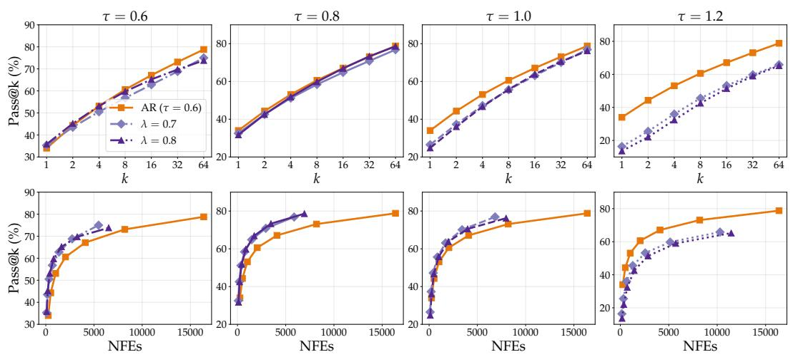  
Figure 8: Pass@k and pass@NFE curves for Fork-dLLM. AR is shown as a baseline.

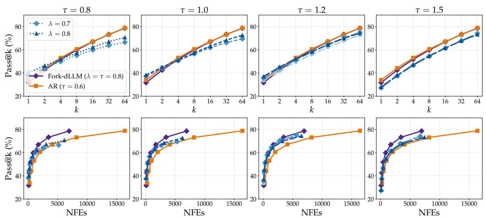  
Figure 9: Pass@k and pass@NFE curves for Fast-dLLM. AR and Fork-dLLM are shown as baselines.

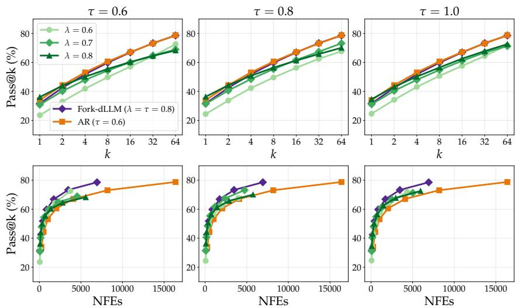  
Figure 10: Pass@k and pass@NFE curves for TCT. AR and Fork-dLLM are shown as baselines.

## B.2 GRPO TRAINING

Table 3 lists the full GRPO configuration.

<table><tr><td>Group</td><td>Hyperparameter</td><td>Value</td></tr><tr><td rowspan="6">Objective</td><td>Group Size (G)</td><td>16</td></tr><tr><td>Prompts per Step</td><td>16</td></tr><tr><td>Groups with  $\sigma _ { G } = 0$ </td><td>Skipped</td></tr><tr><td>KL Penalty (β)</td><td>0</td></tr><tr><td>Policy Update Steps (µ)</td><td>1</td></tr><tr><td>Top-Entropy Ratio</td><td>20%</td></tr><tr><td rowspan="6">Optimization</td><td>Optimizer Adam Betas</td><td>AdamW</td></tr><tr><td>Learning Rate</td><td> $( 0 . 9 , 0 . 9 9 )$ </td></tr><tr><td></td><td> $2 \times 1 0 ^ { - 5 }$ </td></tr><tr><td>Warmup Steps</td><td>0</td></tr><tr><td>Weight Decay</td><td>0</td></tr><tr><td>Gradient Clipping</td><td>0.5</td></tr><tr><td rowspan="2">LoRA</td><td>Rank (r)</td><td>128</td></tr><tr><td>Alpha (α) Dropout</td><td>64</td></tr><tr><td rowspan="2">Compute</td><td>GPUs</td><td>0.05 4×H100</td></tr><tr><td>Training Time</td><td>12h</td></tr></table>

Table 3: GRPO hyperparameters. The row marked ∗ applies only to JustGRPO-Fast. With a single policy update step per rollout, the clipping range ϵ never binds and is omitted.

## C ADDITIONAL FIGURES

Figure 11 shows the results on Dream-v0-Instruct-7B. On the mathematics benchmarks, Fork-dLLM still preserves AR scaling at a fraction of the cost. On coding tasks, it trades slightly worse pass@k scaling in favor of better pass@NFE scaling. Finally, it again consistently matches or outperform Fast-dLLM and TCT. We additionally report the exact values from LLaDA-8B-Instruct and Dreamv0-Instruct-7B in Table 4 and 5.

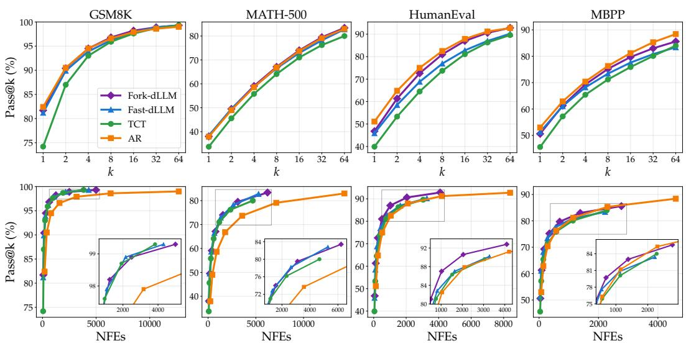  
Figure 11: Pass@k (top) and pass@NFE (bottom) curves on Dream-v0-Instruct-7B.

<table><tr><td rowspan="2">Method</td><td colspan="3">GSM8K</td><td colspan="3">MATH-500</td><td colspan="3">HumanEval</td><td colspan="3">MBPP</td></tr><tr><td>Pass@1</td><td>Pass@64</td><td>NFE</td><td>Pass@1</td><td>Pass@64</td><td>NFE</td><td>Pass@1</td><td>Pass@64</td><td>NFE</td><td>Pass@1</td><td>Pass@64</td><td>NFE</td></tr><tr><td>Fork-dLLM</td><td>80.9</td><td>98.3</td><td>67.8</td><td>31.7</td><td>76.6</td><td>92.3</td><td>31.7</td><td>78.6</td><td>108.4</td><td>33.8</td><td>74.1</td><td>75.8</td></tr><tr><td>Fast-dLLM</td><td>80.1</td><td>97.3</td><td>58.3</td><td>32.1</td><td>73.4</td><td>76.0</td><td>35.7</td><td>75.0</td><td>87.9</td><td>36.7</td><td>73.3</td><td>60.5</td></tr><tr><td>TCT</td><td>75.1</td><td>98.3</td><td>51.5</td><td>28.5</td><td>73.4</td><td>67.3</td><td>31.4</td><td>73.2</td><td>74.1</td><td>33.7</td><td>72.1</td><td>54.0</td></tr><tr><td>AR</td><td>80.9</td><td>99.0</td><td>227.9</td><td>31.4</td><td>74.4</td><td>243.3</td><td>34.0</td><td>78.8</td><td>242.3</td><td>34.8</td><td>74.7</td><td>192.3</td></tr></table>

Table 4: Pass@1 and pass@64 results on LLaDA-8B-Instruct. Best per column in bold.
<table><tr><td rowspan="2">Method</td><td colspan="3">GSM8K</td><td colspan="3">MATH-500</td><td colspan="3">HumanEval</td><td colspan="3">MBPP</td></tr><tr><td>Pass@1</td><td>Pass@64</td><td>NFE</td><td>Pass@1</td><td>Pass@64</td><td>NFE</td><td>Pass@1</td><td>Pass@64</td><td>NFE</td><td>Pass@1</td><td>Pass@64</td><td>NFE</td></tr><tr><td>Fork-dLLM</td><td>81.7</td><td>99.3</td><td>78.0</td><td>38.0</td><td>83.4</td><td>97.3</td><td>46.8</td><td>92.8</td><td>63.9</td><td>50.6</td><td>85.6</td><td>43.3</td></tr><tr><td>Fast-dLLM</td><td>81.2</td><td>99.3</td><td>67.4</td><td>38.4</td><td>82.8</td><td>82.6</td><td>45.9</td><td>90.2</td><td>51.2</td><td>51.3</td><td>83.4</td><td>34.7</td></tr><tr><td>TCT</td><td>74.2</td><td>99.3</td><td>59.9</td><td>33.7</td><td>80.0</td><td>73.1</td><td>39.9</td><td>89.6</td><td>47.6</td><td>45.6</td><td>84.0</td><td>35.6</td></tr><tr><td>AR</td><td>82.4</td><td>99.0</td><td>198.5</td><td>37.9</td><td>83.0</td><td>223.1</td><td>51.1</td><td>92.7</td><td>131.2</td><td>53.0</td><td>88.4</td><td>71.9</td></tr></table>

Table 5: Pass@1 and pass@64 results on Dream-v0-Instruct-7B. Best per column in bold.

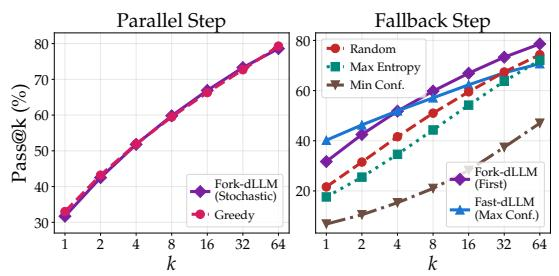  
Figure 12: Pass@k curves of Fork-dLLM and its ablations on HumanEval using LLaDA-8B-Instruct.

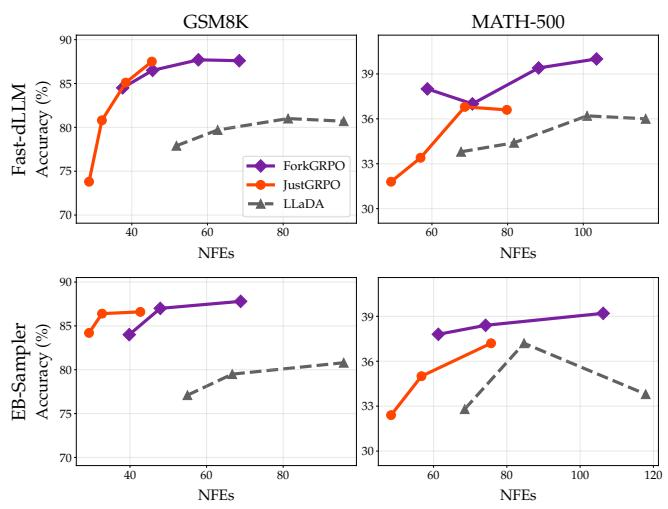  
Figure 13: Accuracy versus NFEs of the final ForkGRPO and JustGRPO checkpoints on GSM8K (left) and MATH-500 (right), evaluated with Fast-dLLM (top) and EB (bottom) across thresholds. The JustGRPO checkpoint is taken from Ni et al. (2026).