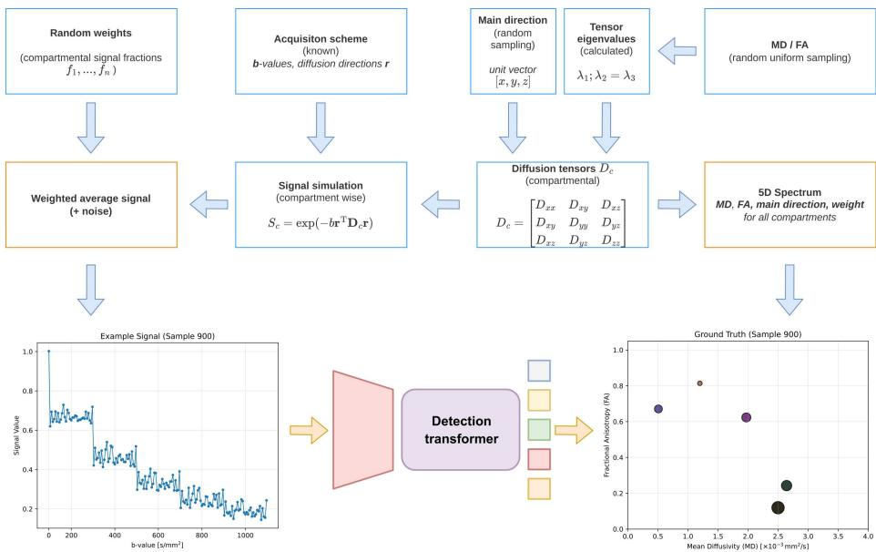
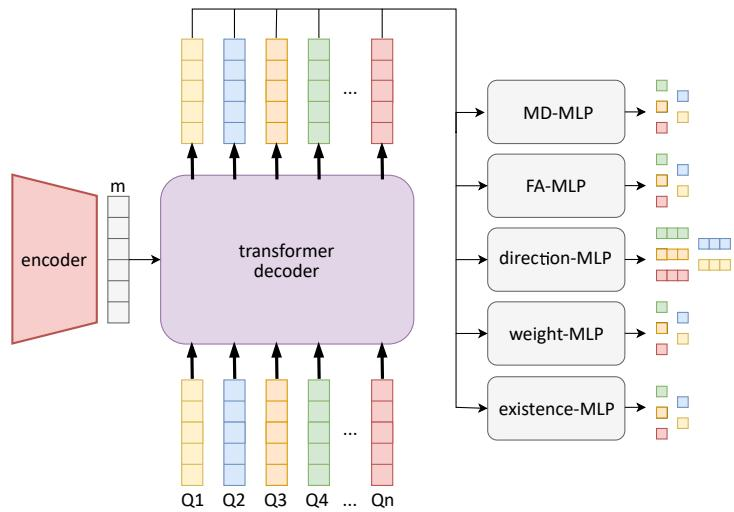
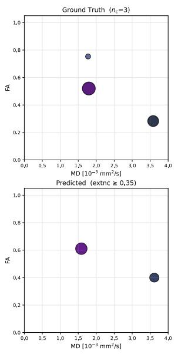
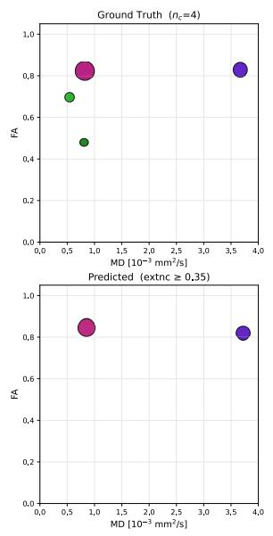
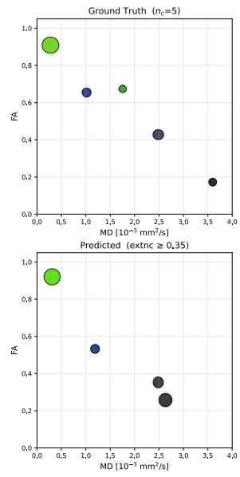
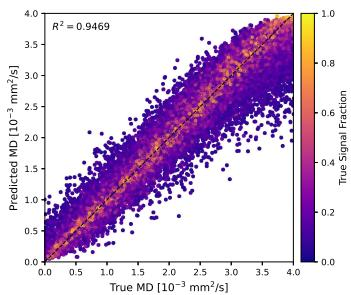
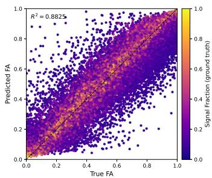
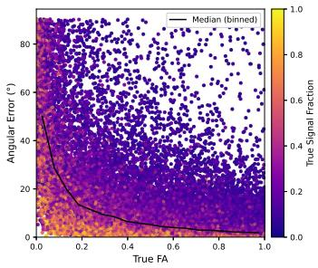
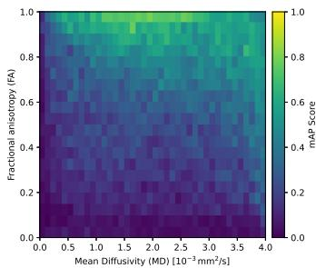

# Fiber-Resolved Microstructure Quantification from Multi-Shell Difusion MRI using Detection Transformers

Sebastian Endt\*1,2[0000−0003−2062−936X], Marcus Wirth\*1 [0009−0000−6567−395X], Johannes R. Schlund1[0009−0009−1792−6807], and Marion I. Menzel1,3[0000−0003−0087−9134]

1 AImotion Bavaria, Technische Hochschule Ingolstadt, Ingolstadt, Germany sebastian.endt@thi.de

2 TUM School of Computation, Information and Technology, Technical University of Munich, Garching, Germany

3 TUM School of Natural Sciences, Technical University of Munich, Garching, Germany

Abstract. Fiber orientation and compartmental microstructure are central to the characterization of white matter tissue in difusion MRI, yet existing methods either resolve fiber orientations without quantifying microstructure, or quantify microstructure while assuming a fixed number of compartments and a single fiber direction. Nonparametric approaches that recover both require tensor-valued difusion encoding and computationally expensive Monte-Carlo inversion of an ill-posed inverse Laplace transform. We propose to reframe this problem as an object detection-like task, adopting the Detection Transformer (DETR) architecture to jointly predict mean difusivity (MD), fractional anisotropy (FA), main fiber direction, and signal fraction for a variable number of compartments per voxel from standard multi-shell difusion MRI with linear encoding. Hungarian matching during training resolves permutation invariance across compartments. We introduce mean Average Precision as a reproducible benchmark metric. Evaluated on synthetic test data with up to five compartments per voxel, our model achieves $R ^ { 2 } = 0 . 9 5$ for MD, $R ^ { 2 } = 0 . 8 8$ for FA, and a median angular error of $4 . 2 ^ { \circ }$ , with performance scaling naturally with compartmental signal fraction. All code is publicly available at github.com/Marcus02W/Difusion-DETR

Keywords: difusion tensor imaging · correlation imaging · multicomponent imaging · multiparametric · microstructure · object detection · compartment · white matter · fiber · neurodegenerative

## 1 Introduction

Conventional MRI resolves a multitude of diferent contrasts, but imaging always comes with limited resolution. More specific methods, i.e. difusion imaging, indirectly provide information about microstructure. However they do not quantify the multiple microstructure compartments.

Difusion tensor imaging (DTI) is limited to a single difusion tensor per voxel and cannot resolve regions with complex fiber configurations, like crossing nerve fibers, which are very common in human white matter [21]. Parametric tissue models like NODDI [46] and DIAMOND [38] assume a fixed number of compartments, usually with one single fiber direction, and may fail to generalize to unexpected tissue structures. Methods to recover the fiber distribution (bedpostX, CSD, MSMT-CSD) do not resolve other compartment specific parameters [5,43,22].

In conclusion, compartmental microstructure and fiber orientations are typically estimated sequentially and independently. No method with standard diffusion encoding jointly recovers both data.

Multicomponent imaging and multiparametric correlation imaging recover microstructure compartments without assuming a biological model by linking a rich multi-contrast data set to distributions (spectra) of tissue parameters. Many works focus on relaxometry and vary inversion time or echo time, to recover voxel wise T1/T2 spectra [29,24,31]. The inclusion of difusion weighting principally adds information about nerve fibers, but blows up the dimensionality of the spectra. The already ill-posed underlying inverse Laplace transform (ILT) becomes even more challenging to solve. Usually correlation imaging studies with difusion derive apparent difusion coeficients, but provide no information about compartmental difusion direction [2,40,3,32,28,11,19,27,44,47,33].

Existing nonparametric works that resolve both fiber orientation and microstructure use computationally expensive inversions and tensor-valued difusion encoding with diferent b-tensors [35,1,30,36,37]. MC-SHORE quantifies microstructure including ODFs, but requires additional T1 encoding to separate pre-defined compartment types [6].

Learning-based methods have been applied to relaxation spectrum reconstruction [45,12], to microstructure estimation from difusion MRI [15,34], and more recently to jointly recovering fiber orientations and compartmental parameters from standard multi-shell data [10,8]. However, most existing approaches either assume a fixed number of compartments or require a separate fiber orientation step.

We propose the joint recovery of fiber orientation (main difusion direction) and other compartmental difusion metrics (mean difusivity (MD), fractional anisotropy (FA), signal fraction) from standard multi-shell difusion data without solving an ILT.

To that end, we interpret the 5D difusion-difusion correlation problem as an object detection task. The unknown number and nature of compartments relate directly to a set prediction problem. We adopt the Detection Transformer (DETR) by Carion et al. with learned queries to predict a variable number of compartments in a single forward pass, with Hungarian matching resolving permutation invariance [7]. This allows us to jointly estimate MD, FA, main direction, and signal fraction for each compartment.

## 2 Methods

## 2.1 Data generation

For supervised network training and evaluation against a known ground truth, we simulate a synthetic multi-compartment data set, consisting of sets of compartmental MD, FA, main direction, and weight, and the corresponding multi-shell signal curves (see fig. 1). The number of compartments per sample varies from $n _ { c } = 2 \mathrm { ~ t o ~ } n _ { c } = 5$

  
Fig. 1: Pipeline for the generation of our synthetic data set [39]. Starting from randomly generated MD, FA, and main direction, difusion tensors for each compartment are calculated. Based on these, compartmental signal curves following a given acquisition scheme are simulated. The signals of all compartments in a sample are averaged according to random signal fractions before noise is added. The final signal curve is then paired with the set of MD, FA, and main direction for every compartment in the respective sample, to form a paired data set for supervised training.

Compartmental MD and FA are randomly sampled from uniform distributions: $\mathrm { M D } \in [ 0 , 4 { \times } 1 0 ^ { - 3 } \mathrm { m m ^ { 2 } s ^ { - 1 } } ] , \mathrm { F A } \in [ 0 , 1 ]$ . Directions were sampled uniformly on the unit hemisphere, normalized to unit length, and projected to the $x \geq 0$ hemisphere. Depending on the number of compartments $n _ { c } ,$ , weights were randomly generated, while ensuring a sum of 1.

Under the assumption that the eigenvalues $\lambda _ { \perp } : = \lambda _ { 2 } = \lambda _ { 3 }$ are equal, compartmental difusion tensors were calculated from the generated MD, FA, and direction. From the tensors, compartmental difusion signals were simulated using the acquisition scheme from [17] up to $b = 1 0 0 0 \mathrm { s m m ^ { - 2 } }$ , resulting in 166 difusion weightings [18]. The $n _ { c }$ signal curves of a sample were weighted according to the respective signal fraction and averaged. Finally, 1 % random Gaussian noise relative to the b = 0-signal was added.

In total 250′000 samples are generated and split into training, validation and test data in a ratio of 80-10-10.

## 2.2 DETR architecture

We adapt the DETR (DEtection TRansformer) architecture [7] to predict a vari able number of discrete compartments in the 5D MD/FA/direction-spectrum. An MLP encoder processes the input signal into a hidden representation, which is combined with learned object queries in the transformer decoder via crossattention (cf. Fig. 2). Hungarian matching guides training toward a globally optimal assignment between predicted and ground-truth compartments [41].

  
Fig. 2: Similar to the original DETR model, the architecture consists of an encoder that produces a hidden vector, which is processed by a transformer decoder that uses cross-attention to fuse this information with the learned query vectors Q. The resulting representations per query are then fed to the individual prediction heads one by one. Only the existence head concatenates all queries into a single vector and outputs a vector containing the scores for all queries.

We use dedicated regression heads for MD, FA, direction, and weight. Since all prediction targets are continuous and thus only regression heads are present within the model, a No Object class as found in the original DETR model cannot be directly added to any prediction head. Thus, an additional existence head is introduced to determine compartment presence. MSE loss is used for MD and FA; MAPE loss for weight, ensuring equal treatment across weight scales. The direction loss accounts for antipodal orientation equivalence and is weighted by ground-truth FA and weight:

$$
\mathcal { L } _ { \mathrm { D } } = \frac { 1 } { M } \sum _ { i = 1 } ^ { M } \left( \frac { \operatorname* { m i n } ( \theta _ { i } , 1 8 0 ^ { \circ } - \theta _ { i } ) } { 9 0 ^ { \circ } } \right) \cdot \hat { F A } _ { i } \cdot \hat { W } _ { i } ,\tag{1}
$$

where $\theta _ { i }$ is the angular diference for compartment i and M the total number of compartments. Focal loss [25] is used for the existence head, handling the class imbalance between the 40 queries and at most 5 true compartments per sample.

## 2.3 Evaluation framework

We adopt mean Average Precision (mAP) [14], a standard object detection metric, computed as the 101-point interpolation of the Precision-Recall curve [26]. To define true positives (TPs), we replace the standard bounding-box IoU with a dimension-wise relative error across MD, FA, and direction, normalized by their respective value ranges $( 4 \times 1 0 ^ { - 3 } \mathrm { m m ^ { 2 } s ^ { - 1 } / s } ,$ 1.0, and 180◦). A prediction is counted as a TP if this relative error is below 10% in all three dimensions simultaneously. We term this threshold-based metric mAP@10. If multiple predictions match the same ground-truth compartment, only the closest one is retained as TP and the rest are marked as FP, penalizing over-assignment.

For evaluations besides mAP, the existence score threshold for filtering predicted queries is chosen by taking the existence score resulting in the best validation data F1-Score as the final model-specific threshold.

## 3 Results

Fig. 3 shows random examples of predicted spectra and their corresponding ground truths at the determined optimal existence threshold of 0.35. Predictions are generally better for compartments with higher FA and especially higher signal fractions. Naturally, samples with $n _ { c } = 5$ compartments (Fig. 3c) prove to be more challenging than samples with low $n _ { c }$

The extent to which reconstruction performance depends on compartment weights is illustrated in Tab. 1. Despite the considerably higher representation of small compartments, they are predicted less accurately. On the other hand, large compartments are correctly reconstructed with high mAP.

Fig. 4 shows diferent aspects of our quantitative evaluation. Scatter plots show 4a: predicted vs. true MD, 4b: predicted vs. true FA, and 4c angular error vs. true FA. Here, compartmental signal fractions are color coded. The coeficient of determination is $R ^ { \bar { 2 } } = 0 . 9 4 6 9$ for MD, and $R ^ { 2 } = 0 . 8 8 2 5$ for FA. Further we observe a median angular error of 4.24◦. All scatter plots clearly show that compartments with higher signal fraction are reconstructed more reliably than compartments with low weight. Additionally, Fig. 4c shows that the prediction of main directions is more accurate for higher FA with errors rising sharply for $F A \leq 0 . 2 $ . Fig. 4d shows the mAP@10 heatmap in the MD-FA space, clearly indicating that compartments with high FA are reconstructed more precisely than low FA compartments. This trend is similar albeit less expressed for MD.

Table 1: mAP@10 scores computed for diferent groups of compartments are shown. Compartments are grouped by weight and classified as either small, medium or large based on the thresholds defined in the table.
<table><tr><td>Compartment size</td><td>mAP@10</td><td>count</td></tr><tr><td>small  $( 0 . 0 5 \leq f < 0 . 3 5 )$ </td><td>0.142</td><td>61249</td></tr><tr><td>medium  $( 0 . 3 5 \leq f < 0 . 6 5 )$ </td><td>0.562</td><td>20065</td></tr><tr><td>large  $( 0 . 6 5 \leq f \leq 0 . 9 5 )$ </td><td>0.766</td><td>6186</td></tr></table>

## 4 Discussion

We propose a new way to approach 5D difusion correlation imaging that integrates information about difusivity (MD), anisotropy (FA), and fiber directions. To reconstruct multiple difusion tensors, i.e. compartments, without solving a highly ill-conditioned ILT to recover a full 5D spectrum, we adapt object detection principles. Our network is based on DETR [7], but both architecture and loss functions are adapted to work well with our multi-tensor difusion data. Additionally, mean Average Precision is introduced as an intuitive metric to benchmark model performance and compare our results with future developments.

The model performance highly depends on signal fraction, as compartments with little weight have little influence on overall signal. This automatically makes the reconstruction of samples with many compartments challenging. Higher MD and especially higher FA result in more reliable reconstructions, likely because high MD/FA cause more dynamic signal curves. Generally, both MD and FA are estimated quite accurately over the full range of values. Main direction is estimated accurately for moderate to high FA, with correct estimation being unrealistic and unnecessary at low FA. Generally, residual errors in estimation of difusion parameters given noisy measurement are to be expected [4,23].

Compared to nonparametric correlation imaging studies that recover similarly rich outputs including fiber orientation [1,30,36,37], our approach does not require specialized sequences with multiple b-tensor shapes, relying instead on standard multi-shell/HARDI acquisitions. Unlike fiber orientation methods [5,43,22], we simultaneously recover compartmental DTI metrics without a sep arate microstructure estimation step. And unlike parametric models [46,38], we impose no fixed assumptions on compartment type or count. Together, this positions our work in a unique niche: joint, assumption-free microstructure and fiber orientation quantification from a standard acquisition.

  
(a) ${ n _ { c } } = 3$

  
(b) ${ n } _ { c } = 4$

  
(c) ${ n _ { c } } = 5$  
Fig. 3: Exemplary spectra for samples with 3, 4, and 5 compartments (left to right). Each subfigure shows the ground-truth spectrum (top) and our prediction (bottom) in the MD/FA plane. Marker size encodes signal fraction; color encodes the FA-weighted principal direction.

There are several limitations to this study. While the use of synthetic data allows us to objectively assess model performance, generalization to in vivo data remains to be tested, as there are several efects in vivo that are currently not modeled by our pipeline, such as Rician noise, non-Gaussian difusion, flow, or Magnetization Transfer. Furthermore, the identifiability of multi-compartment difusion tensors from multi-shell acquisitions with linear b-tensors is limited: it has been shown that infinitely many compartment configurations produce identical single-shell signals, and that an extension to multiple b-values only reduces but does not eliminate this degeneracy [42,20]. Our network implicitly addresses this through learned priors embedded in the synthetic data [9], analogously to the population-informed prior proposed by Taquet et al. [42] — but the extent to which this resolves degeneracy under realistic in vivo noise conditions remains to be validated. Introducing stronger or more targeted priors, for instance by adapting the training data distribution to reflect realistic tissue parameter ranges [16] or by incorporating spatial regularization, is a promising direction to further reduce degeneracy. To that end, we plan to leverage similarity in voxels of the same structure or connected fibers. Other post-processing could include a refinement of the predicted compartments, e.g. refitting of weights to the actual signal curve. Compared to our initial proof-of-concept, we already reduced the number of inputs by 50 % and still increased model performance substantially [13]. However, further reduction of required contrasts is needed to allow clinical application.

  
(a) Predicted vs. true MD

  
(b) Predicted vs. true FA

  
(c) Angular error vs. FA

  
(d) mAP@10 map  
Fig. 4: Quantitative evaluation of our test data. (a, b) True vs. predicted MD and FA for all Hungarian-matched compartments with existence score $\geq 0 . 3 5$ , colored by signal fraction. (c) Angular error of the predicted principal direction vs. true FA, colored by signal fraction. Solid line shows the binned median angular error. (d) Mean average precision mAP@10 across the MD/FA parameter space.

## 5 Conclusion

We reframe compartmental microstructure quantification as an object detectionlike problem, enabling joint recovery of MD, FA, main fiber direction, and signal fraction for a variable number of compartments per voxel from standard multishell difusion MRI. By adapting the DETR architecture and training with Hungarian matching, we avoid both the ill-posed inverse Laplace transform underlying conventional spectrum reconstruction and the fixed-compartment assumptions of parametric tissue models. Results on a large synthetic dataset demonstrate reliable recovery of dominant compartments across voxel configurations with up to five sub-compartments, while the accuracy for small compartments decreases, as their signal contribution is limited. Our approach fills a methodological gap left by existing approaches: neither fiber orientation methods nor parametric microstructure models jointly recover the full set of compartmental parameters from linear difusion encoding alone. In vivo validation and the incorporation of spatial context remain the critical next steps toward clinical translation.

Code availability All code to reproduce our work with defined seeds is publicly available at github.com/Marcus02W/Difusion-DETR.

Disclosure of Interests. The authors have no competing interests to declare that are relevant to the content of this article.

## References

1. de Almeida Martins, J.P., Tax, C.M.W., Reymbaut, A., Szczepankiewicz, F., Chamberland, M., Jones, D.K., Topgaard, D.: Computing and visualising intra voxel orientation-specific relaxation–difusion features in the human brain. Human brain mapping 42(2), 310–328 (2021). https://doi.org/10.1002/hbm.25224

2. Avram, A.V., Sarlls, J.E., Basser, P.J.: Measuring non-parametric distributions of intravoxel mean difusivities using a clinical MRI scanner. NeuroImage 185, 255–262 (2019). https://doi.org/10.1016/j.neuroimage.2018.10.030

3. Avram, A.V., Sarlls, J.E., Basser, P.J.: Whole-Brain Imaging of Subvoxel T1- Difusion Correlation Spectra in Human Subjects. Frontiers in neuroscience 15, 671465 (2021). https://doi.org/10.3389/fnins.2021.671465

4. Basser, P.J., Pajevic, S.: Statistical artifacts in difusion tensor MRI (DT-MRI) caused by background noise. Magnetic Resonance in Medicine 44(1), 41–50 (2000). https://doi.org/10.1002/1522-2594(200007)44:1<41::AID-MRM8>3.0.CO;2-O

5. Behrens, T.E., Berg, H.J., Jbabdi, S., Rushworth, M.F., Woolrich, M.W.: Probabilistic difusion tractography with multiple fibre orientations: What can we gain? NeuroImage 34(1), 144–155 (2007). https://doi.org/10.1016/j.neuroimage.2006.09.018

6. Bogusz, F., Pieciak, T.: Multi-compartment difusion–relaxation MR signal representation in the spherical 3D-SHORE basis. Computers in Biology and Medicine 197, 110998 (2025). https://doi.org/10.1016/j.compbiomed.2025.110998

7. Carion, N., Massa, F., Synnaeve, G., Usunier, N., Kirillov, A., Zagoruyko, S.: End-to-end object detection with transformers. In: Computer Vision – ECCV 2020. pp. 213–229. Springer International Publishing, Cham (2020). https://doi.org/10.1007/978-3-030-58452-8\_13

8. Consagra, W., Ning, L., Rathi, Y.: A deep learning approach to multi-fiber parameter estimation and uncertainty quantification in difusion mri. Medical Image Analysis 102, 103537 (2025). https://doi.org/10.1016/j.media.2025.103537

9. de Almeida Martins, J.P., Nilsson, M., Lampinen, B., Palombo, M., While, P.T., Westin, C.F., Szczepankiewicz, F.: Neural networks for parameter estimation in microstructural mri: Application to a difusionrelaxation model of white matter. NeuroImage 244, 118601 (2021). https://doi.org/10.1016/j.neuroimage.2021.118601

10. Dessain, Q., Fuchs, C., Macq, B., Rensonnet, G.: Fast multi-compartment microstructure fingerprinting in brain white matter. Frontiers in Neuroscience 18 (2024). https://doi.org/10.3389/fnins.2024.1400499

11. Endt, S., Engel, M., Naldi, E., Assereto, R., Molendowska, M., Mueller, L., Mayrink Verdun, C., Pirkl, C.M., Palombo, M., Jones, D.K., Menzel, M.I.: In Vivo Myelin Water Quantification Using Difusion-Relaxation Correlation MRI: A Comparison of 1D and 2D Methods. Applied magnetic resonance 54(11-12), 1571–1588 (2023). https://doi.org/10.1007/s00723-023-01584-1

12. Endt, S., Pirkl, C.M., Verdun, C.M., Menze, B.H., Menzel, M.I.: Unmixing tissue compartments via deep learning T1-T2-relaxation correlation imaging. In: 17th International Symposium on Medical Information Processing and Analysis. vol. 12088, pp. 218–227. SPIE (2021). https://doi.org/10.1117/12.2604737

13. Endt, S., Schlund, J.R., Wirth, M., Menzel, M.I.: Detection Transformer for Direction-Aware Difusion-Difusion Correlation Imaging. In: European Society for Magnetic Resonance in Medicine and Biology (ESMRMB) 2026 42nd Annual Sci entific Meeting. vol. 39. Magnetic Resonance Materials in Physics, Biology and Medicine (Oct 2026), (Accepted)

14. Everingham, M., Van Gool, L., Williams, C., Winn, J., Zisserman, A.: The pascal visual object classes (voc) challenge. International Journal of Computer Vision 88, 303–338 (06 2010). https://doi.org/10.1007/s11263-009-0275-4

15. Golkov, V., Dosovitskiy, A., Sperl, J.I., Menzel, M.I., Czisch, M., Sämann, P., Brox, T., Cremers, D.: q-Space Deep Learning: Twelve-Fold Shorter and Model-Free Difusion MRI Scans. IEEE Transactions on Medical Imaging 35(5), 1344– 1351 (2016). https://doi.org/10.1109/TMI.2016.2551324

16. Gyori, N.G., Palombo, M., Clark, C.A., Zhang, H., Alexander, D.C.: Training data distribution significantly impacts the estimation of tissue microstructure with machine learning. Magnetic Resonance in Medicine 87(2), 932–947 (2022). https://doi.org/10.1002/mrm.29014

17. Hansen, B., Jespersen, S.N.: Data for evaluation of fast kurtosis strategies, b-value optimization and exploration of difusion MRI contrast. Scientific data 3(1), 1–5 (2016). https://doi.org/10.1038/sdata.2016.72

18. Hansen, B., Jespersen, S.N.: Data for evaluation of fast kurtosis imaging, b-value optimization and exploration of difusion MRI contrast [Dataset]. Dryad (2017). https://doi.org/10.5061/dryad.9bc43

19. Hu, W., Dai, Y., Liu, F., Yang, T., Wang, Y., Shen, Y., Zhou, W., Wu, D., Gu, L., Zhang, M., Zhou, Y.: Assessing renal interstitial fibrosis using compartmental, noncompartmental, and model-free difusion MRI approaches. Insights into imaging 15(1), 156 (2024). https://doi.org/10.1186/s13244-024-01736-2

20. Jelescu, I.O., Veraart, J., Fieremans, E., Novikov, D.S.: Degeneracy in model parameter estimation for multi-compartmental difusion in neuronal tissue. NMR in Biomedicine 29(1), 33–47 (2016). https://doi.org/10.1002/nbm.3450

21. Jeurissen, B., Leemans, A., Tournier, J.D., Jones, D.K., Sijbers, J.: Investigating the prevalence of complex fiber configurations in white matter tissue with difusion magnetic resonance imaging. Human brain mapping 34(11), 2747–2766 (2013). https://doi.org/10.1002/hbm.22099

22. Jeurissen, B., Tournier, J.D., Dhollander, T., Connelly, A., Sijbers, J.: Multi-tissue constrained spherical deconvolution for improved analysis of multi-shell difusion MRI data. NeuroImage 103, 411–426 (2014). https://doi.org/10.1016/j.neuroimage.2014.07.061

23. Jones, D.K., Basser, P.J.: “Squashing peanuts and smashing pumpkins”: How noise distorts difusion-weighted MR data. Magnetic Resonance in Medicine 52(5), 979– 993 (2004). https://doi.org/10.1002/mrm.20283

24. Kim, D., Wisnowski, J.L., Nguyen, C.T., Haldar, J.P.: Multidimensional correlation spectroscopic imaging of exponential decays: from theoretical principles to in vivo human applications. NMR in Biomedicine 33(12), e4244 (2020). https://doi.org/10.1002/nbm.4244

25. Lin, T.Y., Goyal, P., Girshick, R., He, K., Dollár, P.: Focal loss for dense object detection. IEEE Transactions on Pattern Analysis and Machine Intelligence 42(2), 318–327 (2020). https://doi.org/10.1109/TPAMI.2018.2858826

26. Lin, T.Y., Maire, M., Belongie, S., Hays, J., Perona, P., Ramanan, D., Dollár, P., Zitnick, C.L.: Microsoft COCO: Common Objects in Context. In: Fleet, D., Pajdla, T., Schiele, B., Tuytelaars, T. (eds.) Computer Vision – ECCV 2014. pp. 740–755. Springer International Publishing, Cham (2014). https://doi.org/10.1007/978-3-319-10602-1\_48

27. Liu, Q., Gagoski, B., Shaik, I.A., Westin, C.F., Wilde, E.A., Schneider, W., Bilgic, B., Grissom, W.A., Nielsen, J.F., Zaitsev, M., Rathi, Y., Ning, L.: Time-division multiplexing (TDM) sequence removes bias in T2 estimation and relaxationdifusion measurements. Magnetic Resonance in Medicine 92(6), 2506–2519 (2024). https://doi.org/10.1002/mrm.30246

28. Luo, P., Hu, W., Xu, R., Wang, Y., Li, X., Jiang, L., Chang, S., Wu, D., Li, G., Dai, Y.: Enabling early detection of knee osteoarthritis using difusion relaxation correlation spectrum imaging. Clinical radiology 78(9), e681–e687 (2023). https://doi.org/10.1016/j.crad.2023.05.013

29. MacKay, A., Whittall, K., Adler, J., Li, D., Paty, D., Graeb, D.: In vivo visualization of myelin water in brain by magnetic resonance. Magnetic Resonance in Medicine 31(6), 673–677 (1994). https://doi.org/10.1002/mrm.1910310614

30. Martin, J., Reymbaut, A., Schmidt, M., Doerfler, A., Uder, M., Laun, F.B., Topgaard, D.: Nonparametric D-R1-R2 distribution MRI of the living human brain. NeuroImage 245, 118753 (2021). https://doi.org/10.1016/j.neuroimage.2021.118753

31. Nagtegaal, M., Hartsema, E., Koolstra, K., Vos, F.: Multicomponent MR fingerprinting reconstruction using joint-sparsity and low-rank constraints. Magnetic Resonance in Medicine 89(1), 286–298 (2023). https://doi.org/10.1002/mrm.29442

32. Naranjo, I.D., Reymbaut, A., Brynolfsson, P., Lo Gullo, R., Bryskhe, K., Topgaard, D., Giri, D.D., Reiner, J.S., Thakur, S.B., Pinker-Domenig, K.: Multidimensional Difusion Magnetic Resonance Imaging for Characterization of Tissue Microstructure in Breast Cancer Patients: A Prospective Pilot Study. Cancers 13(7) (2021). https://doi.org/10.3390/cancers13071606

33. Ning, L.: Maximum-entropy and subspace methods for high-resolution relaxationdifusion distribution estimation. Imaging neuroscience (Cambridge, Mass.) 3 (2025). https://doi.org/10.1162/IMAG.a.113

34. Reisert, M., Kellner, E., Dhital, B., Hennig, J., Kiselev, V.G.: Disentangling micro from mesostructure by difusion MRI: A Bayesian approach. NeuroImage 147, 964–975 (2017). https://doi.org/10.1016/j.neuroimage.2016.09.058

35. Reymbaut, A., Caron, A.V., Gilbert, G., Szczepankiewicz, F., Nilsson, M., Warfield, S.K., Descoteaux, M., Scherrer, B.: Magic DIAMOND: Multifascicle difusion compartment imaging with tensor distribution modeling and tensor-valued difusion encoding. Medical Image Analysis 70, 101988 (2021). https://doi.org/10.1016/j.media.2021.101988

36. Reymbaut, A., Critchley, J., Durighel, G., Sprenger, T., Sughrue, M., Bryskhe, K., Topgaard, D.: Toward nonparametric difusion-characterization of crossing fibers

in the human brain. Magnetic Resonance in Medicine 85(5), 2815–2827 (2021). https://doi.org/10.1002/mrm.28604

37. Rosenberg, J.T., Grant, S.C., Topgaard, D.: Nonparametric 5D D-R2 distribution imaging with single-shot EPI at 21.1 T: Initial results for in vivo rat brain. Journal of magnetic resonance (San Diego, Calif. : 1997) 341, 107256 (2022). https://doi.org/10.1016/j.jmr.2022.107256

38. Scherrer, B., Schwartzman, A., Taquet, M., Sahin, M., Prabhu, S.P., Warfield, S.K.: Characterizing brain tissue by assessment of the distribution of anisotropic microstructural environments in difusion-compartment imaging (DIAMOND). Magnetic resonance in medicine 76(3), 963–977 (2016). https://doi.org/10.1002/mrm.25912

39. Schlund, J.R., Endt, S., Menzel, M.I.: A deep learning approach for directionaware difusion-difusion correlation imaging. In: European Society for Magnetic Resonance in Medicine and Biology (ESMRMB) 2025 41st Annual Scientific Meeting. vol. 38, pp. 908–909. Magnetic Resonance Materials in Physics, Biology and Medicine (2025). https://doi.org/10.1007/s10334-025-01300-z

40. Slator, P.J., Hutter, J., Palombo, M., Jackson, L.H., Ho, A., Panagiotaki, E., Chappell, L.C., Rutherford, M.A., Hajnal, J.V., Alexander, D.C.: Combined difusionrelaxometry MRI to identify dysfunction in the human placenta. Magnetic Resonance in Medicine 82(1), 95–106 (2019). https://doi.org/10.1002/mrm.27733

41. Stewart, R., Andriluka, M., Ng, A.Y.: End-to-end people detection in crowded scenes. In: 2016 IEEE Conference on Computer Vision and Pattern Recognition (CVPR). pp. 2325–2333 (2016). https://doi.org/10.1109/CVPR.2016.255

42. Taquet, M., Scherrer, B., Boumal, N., Macq, B., Warfield, S.K.: Estimation of a Multi-fascicle Model from Single B-Value Data with a Population-Informed Prior. In: Medical Image Computing and Computer-Assisted Intervention – MICCAI 2013. pp. 695–702 (2013). https://doi.org/10.1007/978-3-642-40811-3\_87

43. Tournier, J.D., Calamante, F., Connelly, A.: Robust determination of the fibre orientation distribution in difusion MRI: non-negativity constrained super-resolved spherical deconvolution. NeuroImage 35(4), 1459–1472 (2007). https://doi.org/10.1016/j.neuroimage.2007.02.016

44. Xu, J., Sheng, Y., Li, H., Yang, Z., Ren, Y., Wang, H.: A data-driven intravoxel mean difusivities distribution approach for molecular classifications and MIB-1 prediction of gliomas. Medical physics 51(10), 7332–7344 (2024). https://doi.org/10.1002/mp.17280

45. Yu, T., Canales-Rodríguez, E., Pizzolato, M., Piredda, G., Hilbert, T., Fischi-Gomez, E., Weigel, M., Barakovic, M., Cuadra, M., Granziera, C., Kober, T., J.-P., T.: Model-informed machine learning for multicomponent T2 relaxometry. Medical Image Analysis 69, 101940 (2021). https://doi.org/10.1016/j.media.2020.101940

46. Zhang, H., Schneider, T., Wheeler-Kingshott, C.A., Alexander, D.C.: NODDI: practical in vivo neurite orientation dispersion and density imaging of the human brain. NeuroImage 61(4), 1000–1016 (2012). https://doi.org/10.1016/j.neuroimage.2012.03.072

47. Zong, F., Wang, L., Liu, H., Xue, B., Bai, R., Liu, Y.: A genetic optimisation and iterative reconstruction framework for sparse multi-dimensional difusion relaxation correlation MRI. Computers in biology and medicine 175, 108508 (2024). https://doi.org/10.1016/j.compbiomed.2024.108508