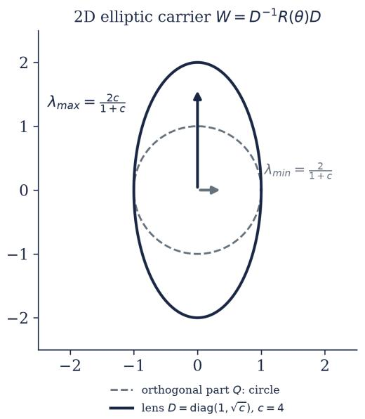
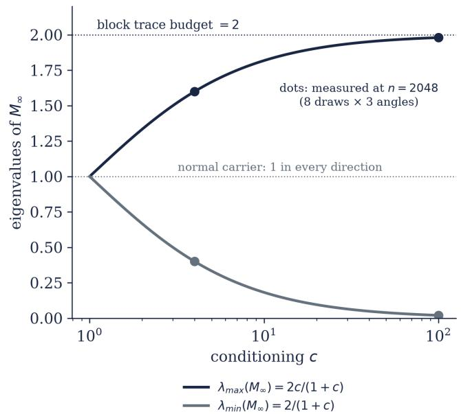
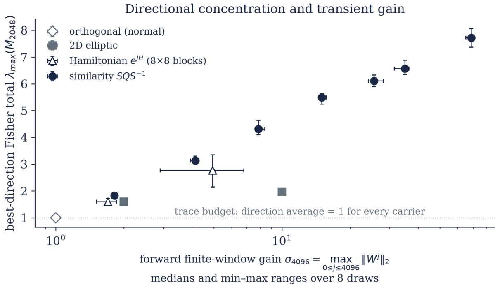
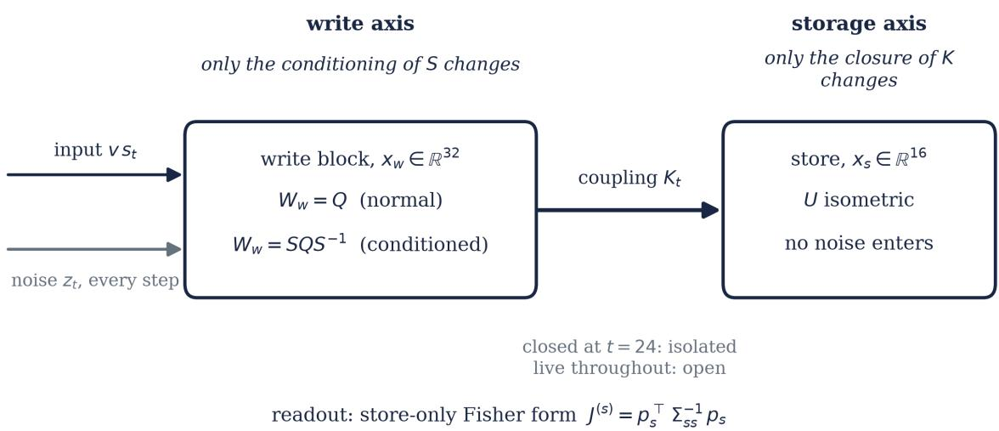
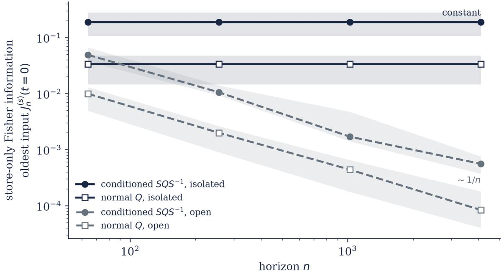
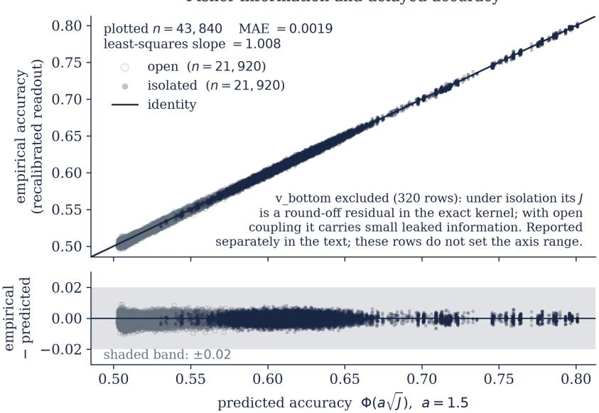
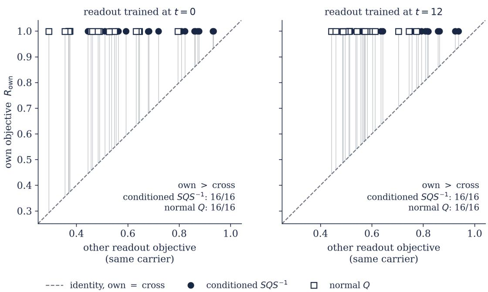
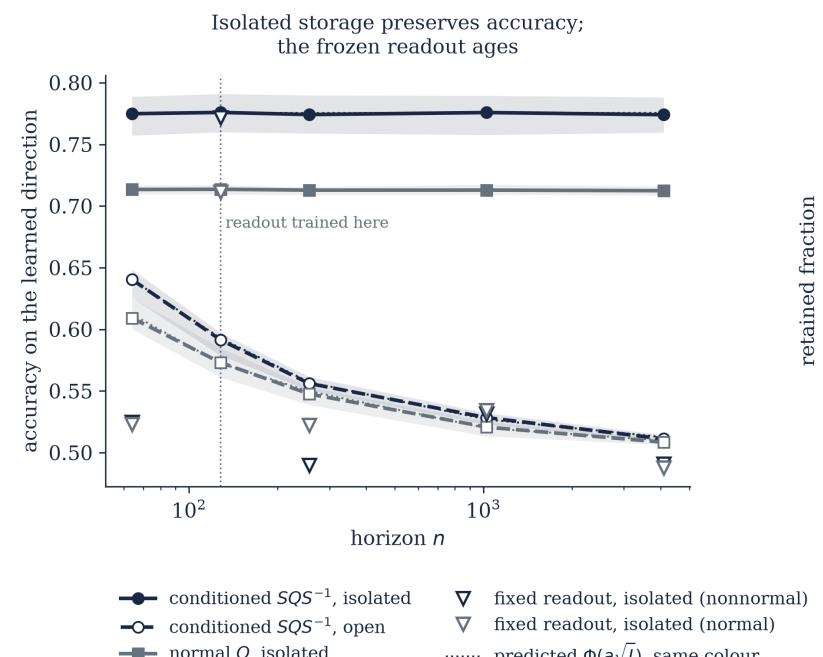
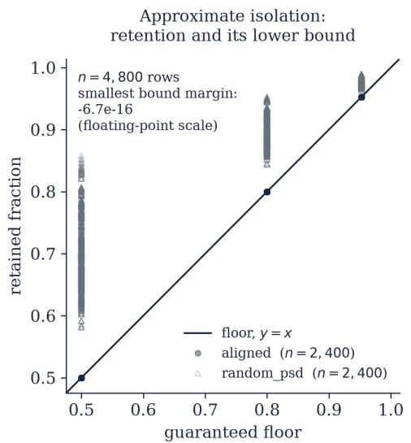

# Finite-Horizon Fisher Memory in Two-Sided Power-Bounded Recurrent Systems

Normality, asymptotic information geometry, and downstream storage

Jeonghoon Lee, Attractor Dynamics Inc.

30 September 2026

## Abstract

A noisy recurrent memory must select information during writing, transfer it to a store, and preserve it after writing ends. We analyse allocation, admission and retention in finite-horizon linear-Gaussian systems. The directional Fisher memory $M _ { n }$ has a fixed trace budget, tr $M _ { n } = N .$ at every horizon. Non-normality can redistribute information across directions but cannot raise its spherical average. A normal carrier satisfies $M _ { n } = I$ exactly. For bi-power-bounded carriers, lag-wise information has uniform $1 / n$ tail bounds. Using classical operator theory, we identify the limit of $M _ { n }$ with the inverse of the Cesàro asymptotic limit of $\dot { W } ^ { \top }$ , obtain a commutant representation, and bound finite-horizon error using the spectral-group separation.

Transfer through a time-varying coupling gives an end-to-end operator $M _ { \mathrm { s t o r e } } .$ An input direction that is optimal for the writer need not be optimal for the store: selection depends on the store objective. After writing ends, an invertible hold preserves the complete stored Fisher matrix. Additive contamination bounded by � times the closure covariance retains at least $1 / ( 1 + \alpha )$ of that matrix, and a covariance-aware decoder attains the corresponding accuracy.

With the recurrent carriers held fixed, behavioural-loss training of input masks and linear readouts approached this task-specific optimum in 160 runs, at a median normalized Rayleigh eficiency above 0.998 against a random-direction baseline of 0.14 to 0.26. Empirical binary accuracy matched the Gaussian prediction $\Phi ( { \boldsymbol { a } } { \sqrt { J } } )$ to a mean absolute error below 0.002 over more than four orders of magnitude in �. In a separate pre-specified study of 320 runs, changing the designated input time changed the end-to-end operator. The independently trained masks followed the corresponding objective in both carrier types, in 16 of 16 draws.

Exact isolation preserved the modelled information across horizons while continued coupling degraded it. A decoder fixed at its training horizon fell to chance although that information was unchanged; inverse-adjoint transport restored its sampled decisions to numerical precision. Both studies used carriers that had been run at reduced budget during development, so we report them as pre-specified validations rather than blind holdouts. A third run of the same fixed design, on a block of carriers not used before the run was committed, reproduced the objective-specific result in 16 of 16 draws.

## 1. Introduction

A recurrent memory can retain its state and still give a poor answer. Information may be concentrated in the wrong direction, fail to reach a downstream store, or remain in the store while a fixed decoder loses access to it. We separate these questions into allocation during writing, admission to a store, and retention after writing ends.

The Fisher memory curve (FMC) of Ganguli, Huh and Sompolinsky [1] describes the write stage for stable linear carriers with noise injected inside the loop. For the input � steps ago, �(�) is the Fisher information in the current state; its sum is a capacity. They show that normal carriers have total capacity one and that any �-dimensional carrier has capacity at most �, with extensive capacity arising from strongly non-normal feedforward constructions. Tiňo [12] and Kang, Shirasaka and Suzuki [21] make the write direction explicit in contracting reservoirs.

We use a finite-horizon formulation that remains defined at exact isometry. The main analytic object is a matrix $M _ { n }$ whose Rayleigh quotient is the total Fisher memory of a unit write direction. Its trace is fixed, but its spectrum need not be. Noise placement matters: receiver-noise communication capacity can benefit from non-normal amplification [32], whereas the in-loop Fisher trace here is fixed; §10 compares the definitions.

This paper studies the finite-window analogue of the spatial Fisher memory matrix of [1], building on that stationary framework and on Fisher-optimal input design [12, 21]. It makes three contributions:

• Finite-horizon geometry. We give an elementary horizon-two characterization of normality and identify the long-horizon Fisher operator of a two-sided power-bounded carrier with the inverse of the classical Cesàro asymptotic limit of its adjoint. From this identification, we obtain a commutant representation, uniform lag-wise consequences and explicit finite-horizon error control.

• Downstream-store objectives. We separate write-stage direction selection from selection for a downstream store, whose coupling and closure covariance can change the leading direction.

• Task-specific learning and readout. On fixed linear-Gaussian carriers, independently trained input masks follow the designated input-time objective under a fixed budget. A separate block of previously unused carriers reproduces this objective-specific separation. Storage interventions and sampled decoder tests distinguish retained information from decoder access.

We connect Fisher allocation, downstream-store selection and post-write retention through a quantitative finite-horizon analysis and behavioural validation. The operator-theoretic ingredients and informationpreservation identities are established results, credited in the Classical ingredients subsection before §3.3. Our contribution is their specialization to Fisher memory, the finite-horizon error control, and the validation across these stages. Deterministic losslessness can coexist with directional concentration, but continuing loop noise rules out a non-vanishing oldest-lag Fisher floor

We derive a finite-horizon error bound controlled by the spectral-group gap and require a direct finite-� cross-check. Near-degenerate eigenvalue groups can delay the Cesàro projection, so the asymptotic formula alone does not certify an operating horizon.

The post-write claim also depends on the channel and decoder. When no further coupling or noise enters the store, a known invertible hold, including a contraction, changes coordinates but preserves exact covarianceaware Fisher information. Bounded additive contamination gives a quantitative retained-information guarantee. Neither result makes a fixed, quantized or covariance-mismatched decoder invariant. We therefore also check sampled decisions.

The claims apply to this linear-Gaussian class. Non-normal write dynamics can concentrate a traceconstrained Fisher budget into selected directions; an end-to-end operator can improve the direction admitted to a finite store; and the specified post-write channel determines how that geometry is preserved or degraded. Whether trained nonlinear models discover these directions remains untested. Useful task accuracy also requires suficient absolute signal-to-noise ratio. Applicability to other memory architectures must be assessed for their own channels and objectives.

## 2. Finite-horizon Fisher-memory setting

Carrier $x _ { t + 1 } = W x _ { t } + v s _ { t } + z _ { t }$ with scalar input $s _ { t }$ (the quantity whose past values the state carries information about), $z _ { t } \sim \mathcal { N } ( 0 , \epsilon I ) , \epsilon = 1$ , unit write vector $v , N = 3 2$ . With $\begin{array} { r } { C _ { n } = \sum _ { j = 0 } ^ { n - 1 } W ^ { j } ( W ^ { j } ) ^ { \top } \succeq I , } \end{array}$

$$
J _ { n } ( k ) = v ^ { \top } ( W ^ { \top } ) ^ { k } C _ { n } ^ { - 1 } W ^ { k } v , \qquad J _ { t o t , n } ( v ) = v ^ { \top } M _ { n } v , \qquad M _ { n } = \sum _ { k = 0 } ^ { n - 1 } ( W ^ { \top } ) ^ { k } C _ { n } ^ { - 1 } W ^ { k } .
$$

The spatial Fisher memory operator, the result that a normal carrier spreads a unit of directional capacity isotropically while a non-normal one concentrates it, and the selection of a write direction as a leading eigenvector are due to Ganguli, Huh and Sompolinsky [1] in the stationary setting, and Kang, Shirasaka and Suzuki [21] use the leading-eigenvector rule for input-mask design. What is finite-horizon here is the truncation of $C _ { n }$ and $M _ { n }$ at $n ,$ which keeps the objects defined at exact isometry, where no stationary curve exists.

Throughout, the initial state is known, $x _ { 0 } = 0 ;$ an unknown $x _ { 0 }$ with covariance $\Sigma _ { 0 }$ would add $W ^ { n } \Sigma _ { 0 } ( W ^ { n } ) ^ { \top }$ to $C _ { n }$ . The noise variance is $\epsilon = 1 \AA$ ; for general � every Fisher quantity scales by $1 / \epsilon \colon$ the Fisher matrix is $M _ { n } / \epsilon$ , of trace $N / \epsilon .$ , while $M _ { n }$ and $\mathrm { t r } M _ { n } = N$ do not depend on $\epsilon . \ J _ { n } ( k )$ is the diagonal element of the Fisher information matrix in the input sequence, with all other inputs treated as known, which is the convention of [1]. This is the finite-horizon object; for $\rho ( W ) = 1$ there is no stationary FMC, and nothing below uses one. We report totals at $n \in \{ 3 2 , 1 2 8 , 5 1 2 , 2 0 4 8 \}$ and the oldest-lag finite-horizon Fisher information $J _ { n } ( n - 1 )$ at $n \leq 4 0 9 6$ , together with $n J _ { n } ( n - 1 )$ .

Definition (bi-power-bounded). An invertible � is bi-power-bounded if $\begin{array} { r } { K _ { + } = \operatorname* { s u p } _ { i > 0 } \| W ^ { j } \| _ { 2 } < \infty } \end{array}$ and $\begin{array} { r } { K _ { - } = \operatorname* { s u p } _ { i > 0 } \| W ^ { - j } \| _ { 2 } < \infty . \mathrm { ~ } S Q S ^ { - 1 } } \end{array}$ with � orthogonal $( K _ { \pm } \leq \mathrm { c o n d } ( S ) )$ and $e ^ { J H }$ with $H \succ 0$ (similar to orthogonal through $H ^ { 1 / 2 } )$ are bi-power-bounded; 0.9� is invertible but not bi-power-bounded.

Certificates. Normality defect $\| W W ^ { \top } - W ^ { \top } W \| _ { F } ;$ symplectic defect $\| W ^ { \top } J W - J \| _ { F }$ . We report two finitewindow gains separately: the forward gain $\begin{array} { r } { \sigma _ { n } ^ { + } = \operatorname* { m a x } _ { 0 \leq k \leq n } \| W ^ { k } \| _ { 2 } , } \end{array}$ a lower bound on $K _ { + }$ over the measured horizon, and the inverse gain $\begin{array} { r } { \sigma _ { n } ^ { - } = \operatorname* { m a x } _ { 0 \leq k \leq n } \| W ^ { - k } \| _ { 2 } , } \end{array}$ a lower bound on $K _ { - }$ . Main-text plots use $\sigma _ { 4 0 9 6 } ^ { + } ;$ Appendix B tabulates both and labels each column accordingly.

## 3. Exact directional geometry

## 3.1 Trace budget

$$
\mathrm { t r } M _ { n } = \mathrm { t r } \left( C _ { n } ^ { - 1 } \sum _ { k < n } W ^ { k } ( W ^ { k } ) ^ { \top } \right) = \mathrm { t r } ( C _ { n } ^ { - 1 } C _ { n } ) = N .
$$

Hence the spherical average of $v ^ { \top } M _ { n } v$ over unit write directions is one, and its range is the interval $[ \lambda _ { \operatorname* { m i n } } ( M _ { n } ) , \lambda _ { \operatorname* { m a x } } ( M _ { n } ) ]$ . Non-normality can redistribute the budget but cannot raise its direction average. ${ \mathrm { A t ~ } } n = 1 , M _ { 1 } = I$ for every carrier.

This is the finite-horizon form of the spatial identity tr $J _ { s } = N$ stated by Ganguli, Huh and Sompolinsky [1]. Let $H = [ I , W , \dots , W ^ { n - 1 } ]$ , so $C _ { n } = H H ^ { \top }$ . Then $\mathbf { \bar { \Pi } } \Pi = \mathbf { \bar { \cal H } } ^ { \top } C _ { n } ^ { - 1 } \cal { H }$ is a rank-� orthogonal projector whose diagonal blocks sum to $M _ { n }$ . For a unit direction $v , J _ { n } ( k ; v ) = ( e _ { k } \otimes v ) ^ { \top } \Pi ( e _ { k } \otimes v )$ , where $e _ { k }$ selects lag block �. This is a directional leverage; after choosing � as a coordinate axis, it is a diagonal hat-matrix leverage in the sense of Hoaglin and Welsch [33].

## 3.2 Normal isotropy at finite horizon

If � is normal, $C _ { n }$ and every $( W ^ { \top } ) ^ { k } C _ { n } ^ { - 1 } W ^ { k }$ are simultaneously diagonalizable. Their eigenvalues at a carrier eigenvalue $\mu$ are

$$
{ \frac { | \mu | ^ { 2 k } } { \sum _ { j < n } | \mu | ^ { 2 j } } } ,
$$

which sum to one over $k < n$ . Therefore

$$
\boxed { M _ { n } = I }
$$

for every finite horizon and every spectral radius. This finite-horizon identity needs no stability assumption;   
the original stationary theorem [1] does.

Proposition 3.2b (horizon-two characterization of normality). At $n = 2$

$$
M _ { 2 } = I + ( I + W W ^ { \top } ) ^ { - 1 } - ( I + W ^ { \top } W ) ^ { - 1 } ,
$$

so $M _ { 2 } = I$ if and only if � is normal. Since tr $M _ { 2 } = N$ , every non-normal � has at least one direction with $J _ { t o t , 2 } > 1$ and one with $J _ { t o t , 2 } < 1$

Proof. $\boldsymbol { C _ { 2 } } = \boldsymbol { I } + \boldsymbol { W } \boldsymbol { W } ^ { \intercal }$ , and the push-through identity gives the displayed form; the two inverses coincide exactly when $W W ^ { \top } = W ^ { \top } W$ . The trace budget of §3.1 then forces directions on both sides of one. Appendix A.7 gives the steps. □

Proposition 3.2b is an elementary converse, and we claim no priority for it. We include it because it is the simplest finite-horizon form of the normal/non-normal dichotomy. It is only an existence statement: it says nothing about the size of the advantage at an operating horizon, or about whether a finite-budget optimizer can reach it.

## Classical ingredients, and what is being identified

The limit theorems below rest on two known facts, and the limit object is a known matrix.

Two-sided power boundedness. A finite-dimensional matrix whose positive and negative powers are uniformly bounded is similar to an orthogonal matrix, $W = S Q S ^ { - 1 }$ with $Q ^ { \top } Q = I$ . This is classical operator theory in the Sz.-Nagy similarity tradition; Gehér [30, 31] gives the matrix statement we use.

Cesàro asymptotic limits. For a power-bounded matrix the Cesàro averages of $( T ^ { \top } ) ^ { j } T ^ { j }$ converge in norm, and for matrices similar to unitaries the positive limit is characterized together with its inverse-eigenvalue trace constraint. These are Theorems 1 and 2 in the arXiv version of [30] and Theorems 3.1 and 3.2 in $[ 3 1$ Ch. 3]; the mean-ergodic theorem alone would not give the matrix statement we need.

The identification. Write $G _ { n } = C _ { n } / n$ and let $\begin{array} { r } { \mathcal { A } _ { C } ( T ) = \operatorname* { l i m } _ { n } n ^ { - 1 } \sum _ { i < n } ( T ^ { \top } ) ^ { j } T ^ { j } } \end{array}$ be the classical Cesàro limit. Then $G = \operatorname* { l i m } _ { n } G _ { n } = \mathcal { A } _ { C } ( W ^ { \top } ) \succ 0$ , and boundedness of the powers gives $W G _ { n } W ^ { \top } - G _ { n } = ( W ^ { n } ( W ^ { n } ) ^ { \top } -$ $I ) / n  0$ , hence the fixed-point relations

$$
W G W ^ { \top } = G , \qquad W ^ { \top } G ^ { - 1 } W = G ^ { - 1 } .
$$

Since $C _ { n } ^ { - 1 } = n ^ { - 1 } G _ { n } ^ { - 1 }$ , the finite Fisher operator obeys $\begin{array} { r } { M _ { n } - G ^ { - 1 } = n ^ { - 1 } \sum _ { k < n } ( W ^ { \top } ) ^ { k } ( G _ { n } ^ { - 1 } - G ^ { - 1 } ) W ^ { k } } \end{array}$ , so with $K _ { + } = \operatorname* { s u p } _ { k \geq 0 } \| W ^ { k } \| _ { 2 }$

$$
\begin{array} { r } { \Big \| M _ { n } - G ^ { - 1 } \big \| _ { 2 } \leq K _ { + } ^ { 2 } \big \| G _ { n } ^ { - 1 } - G ^ { - 1 } \big \| _ { 2 } \longrightarrow 0 , \Big \| } \end{array}
$$

and the same estimate bound $\begin{array} { r } { \operatorname* { s u p } _ { 0 < k < n } | n J _ { n } ( k ; v ) - v ^ { \top } G ^ { - 1 } v | } \end{array}$ uniformly in �. The central identification is therefore

$$
\boxed { M _ { \infty } = \mathcal { A } _ { C } ( \boldsymbol { W } ^ { \top } ) ^ { - 1 } , }
$$

which for $W = S Q S ^ { - 1 }$ is exactly $G = S \bar { A } S ^ { \top }$ and $M _ { \infty } = S ^ { - \top } \bar { A } ^ { - 1 } S ^ { - 1 }$ , the form stated in Theorem 3.3b. Thus $M _ { \infty }$ is the inverse of a known asymptotic object, and what follows is its Fisher-memory interpretation together with the finite-horizon control of $\ S 3 . 4$ . A numerical check of this identification on the carriers used here is included in the reproduction code.

Thus tr $M _ { \infty } = N$ is precisely Gehér’s inverse-eigenvalue trace constraint applied to $\mathcal { A } _ { C } ( W ^ { \top } )$ [30]. More precisely, $M _ { \infty } = U U ^ { \top }$ for a real square matrix $U$ with unit columns: it is the sum of their outer products, while their Gram matrix is $U ^ { \top } U$ , orthogonally similar to $M _ { \infty }$ . Every real positive-definite matrix of trace � is attainable as $M _ { \infty }$ for a real bi-power-bounded carrier; Appendix A.4 gives a construction.

## 3.3 Uniform Fisher-tail bounds and the Cesàro–commutant limit

Theorem 3.3a (uniform tail bounds). If � is bi-power-bounded, with

$$
K _ { + } = \operatorname* { s u p } _ { j \geq 0 } \| W ^ { j } \| _ { 2 } , \qquad K _ { - } = \operatorname* { s u p } _ { j \geq 0 } \| W ^ { - j } \| _ { 2 } ,
$$

then for every unit $v , n \geq 1$ , and $0 \leq k < n$

$$
\boxed { \frac { 1 } { n K _ { + } ^ { 2 } K _ { - } ^ { 2 } } \le J _ { n } ( k ) \le \frac { K _ { + } ^ { 2 } K _ { - } ^ { 2 } } { n } . }
$$

Thus $J _ { n } ( k ) = \Theta ( n ^ { - 1 } )$ uniformly over lags and directions under continuing isotropic loop noise.

Theorem 3.3b (Cesàro–commutant limit). Every finite-dimensional bi-power-bounded real matrix can be written

$$
W = S Q S ^ { - 1 } , \qquad Q ^ { \top } Q = I .
$$

Set

$$
A = S ^ { - 1 } S ^ { - \top } , \qquad A _ { n } = \frac { 1 } { n } \sum _ { j = 0 } ^ { n - 1 } Q ^ { j } A Q ^ { - j } , \qquad \bar { A } = \Pi _ { \mathrm { C o m m } ( Q ) } ( A ) .
$$

Then

$$
\boxed { M _ { n } \longrightarrow M _ { \infty } = S ^ { - \top } \bar { A } ^ { - 1 } S ^ { - 1 } }
$$

and, uniformly over finite-horizon lags,

$$
\boxed { \begin{array} { c } { \displaystyle \operatorname* { s u p } _ { 0 \leq k < n } \big | n J _ { n } ( k ; v ) - v ^ { \top } M _ { \infty } v \big | \longrightarrow 0 . } \end{array} }
$$

At large horizons, every lag receives approximately the same $1 / n$ share of the directional tota $v ^ { \top } M _ { \infty } v$

## 3.4 Finite-horizon certification

The Cesàro estimate below is the standard spectral-gap rate for unitary means, applied to the conjugation map $A \mapsto Q A Q ^ { \top }$ on matrices with the Frobenius inner product. Kachurovskii surveys this spectral approach [34], and Aloisio et al. state the discrete-time gap bound explicitly [35, Theorem $2 ] ;$ Short and Farrelly give the related continuous-time gap estimate [36, Eqs. 11–12].

Let the distinct complex eigenvalue groups of $Q$ have projectors $P _ { \lambda }$ and define

$$
\Delta = \operatorname* { m i n } _ { \lambda \neq \mu } | 1 - \lambda \bar { \mu } | .
$$

For

$$
\bar { A } = \sum _ { \lambda } P _ { \lambda } A P _ { \lambda } ,
$$

the finite Cesàro average obeys

$$
\boxed { \| A _ { n } - \bar { A } \| _ { F } \leq \delta _ { n } : = \frac { 2 } { n \Delta } \| A - \bar { A } \| _ { F } . }
$$

If

$$
\eta _ { n } : = \| \bar { A } ^ { - 1 } \| _ { 2 } \delta _ { n } < 1 ,
$$

then

$$
\left| \| M _ { n } - M _ { \infty } \| _ { 2 } \leq \| S ^ { - 1 } \| _ { 2 } ^ { 2 } { \frac { \| { \bar { A } } ^ { - 1 } \| _ { 2 } ^ { 2 } \delta _ { n } } { 1 - \eta _ { n } } } . \right.
$$

The bound is suficient and can be conservative. It makes the dependence on near-degenerate eigenvalue groups explicit and provides a rejection rule: when $n \Delta$ is too small, a finite Cesàro construction is not certified as the commutant projection.

Across the eight paired $c \ = \ 1 0$ instances used below, the actual relative Frobenius error $\parallel M _ { 2 0 4 8 } \textrm { -- }$ $M _ { \infty } \| _ { F } / \| M _ { \infty } \| _ { F }$ had median $8 . 4 4 \times 1 0 ^ { - 6 }$ and range $3 . 5 6 \times 1 0 ^ { - 6 }$ to $1 . 7 9 \times 1 0 ^ { - 5 }$ ; every actual operator-norm error lay below the reported suficient bound. A four-dimensional near-degenerate control with eigen-angle separation $1 0 ^ { - 4 }$ at $n = 1 0 0 0$ had

$$
\| A _ { n } - \bar { A } \| _ { F } = 1 . 5 9 9 , \qquad \| A _ { 2 n } - A _ { n } \| _ { F } = 0 . 0 7 9 9 , \qquad \| [ A _ { n } , Q ] \| _ { F } = 0 . 0 0 1 0 2 ,
$$

while $2 / ( n \Delta ) \approx 2 0$ . Small two-scale and commutator residuals alone would therefore be an unsafe certificate.

## 3.5 Two-dimensional elliptic corollary

For

$$
W = D ^ { - 1 } R ( \theta ) D , \qquad D = \mathrm { d i a g } ( 1 , \sqrt { c } ) , \qquad \theta \not \in \pi \mathbb { Z } ,
$$

the symmetric commutant projection is scalar, giving

$$
\boxed { M _ { \infty } = \cfrac { 2 } { 1 + c } \operatorname { d i a g } ( 1 , c ) , \quad \lambda _ { \operatorname* { m a x } } = \cfrac { 2 c } { 1 + c } , \quad \lambda _ { \operatorname* { m i n } } = \cfrac { 2 } { 1 + c } . }
$$

At $\theta \in \pi \mathbb { Z } , W = \pm I$ and $M _ { n } = I$ . The ceiling two is the block trace budget, not a generic consequence of symplecticity.

  
Figure 1. The two-dimensional elliptic family and its limiting directional spectrum.

## 4. Replicated directional-capacity census

$M _ { n }$ is evaluated at $n = 2 0 4 8$ , and the oracle direction is fixed at 2048. Values are medians with [min, max] over draws, and full quartiles are in the released CSV. Each draw randomizes the orthogonal $Q ,$ the left and right singular bases of � (its singular values are fixed at geomspace $( 1 , c , N ) )$ , the orthogonal mixer of the 2D family, and the eigenbasis of � and the orthogonal-symplectic mixer of the Hamiltonian family. The write vector is not randomized, because the oracle direction is computed from $M _ { 2 0 4 8 }$

<table><tr><td>Carrier</td><td>cond</td><td> $\begin{array} { r l } & { \sigma _ { 4 0 9 6 } = } \\ & { \operatorname* { m a x } _ { j \leq 4 0 9 6 } \| W ^ { j } \| _ { 2 } , } \end{array}$  med</td><td> $\lambda _ { m a x } \ ( \mathrm { o r a c l e } )$  med [min, max]</td><td></td><td> $\lambda _ { m i n }$  med</td><td> $n J _ { n } ( n - 1 ) { \mathrm { ~ a t ~ } }$   $n = 4 0 9 6 , \mathrm { m e d }$ </td></tr><tr><td>Haar orthogonal</td><td>1</td><td>1.00</td><td>1.000 [1.000, 1.000]</td><td></td><td>1.000</td><td>1.000</td></tr><tr><td> $S Q S ^ { - 1 }$ </td><td>2</td><td>1.82</td><td>1.831 [1.774, 1.852]</td><td></td><td>0.470</td><td>1.831</td></tr><tr><td></td><td>5</td><td>4.14</td><td>3.298]</td><td>3.139 [3.040,</td><td>0.133</td><td>3.138</td></tr><tr><td></td><td>10</td><td>7.88</td><td>4.639]</td><td>4.312 [4.098,</td><td>0.045</td><td>4.310</td></tr><tr><td></td><td>20</td><td>15.0</td><td>5.637]</td><td>5.491 [5.246,</td><td>0.014</td><td>5.488</td></tr><tr><td></td><td>35 (held-out)</td><td>25.6</td><td>6.107 [5.892, 6.331]</td><td></td><td>0.0054</td><td>6.105</td></tr><tr><td></td><td>50</td><td>35.1</td><td>6.563 [6.343, 6.880]</td><td></td><td>0.0029</td><td>6.559</td></tr><tr><td></td><td>100</td><td>68.9</td><td>7.720 [7.366, 8.061]</td><td></td><td>0.0008</td><td>7.713</td></tr><tr><td>2D elliptic, 4 angles</td><td>4</td><td>2.00</td><td>1.600 [1.600, 1.600]</td><td></td><td>0.400</td><td>1.600</td></tr><tr><td>2D elliptic, 3 angles</td><td>100</td><td>10.0</td><td>1.980]</td><td>1.980 [1.980,</td><td>0.0198</td><td>1.980</td></tr><tr><td> $e ^ { J { \widetilde { H } } }$  8×8 blocks</td><td>4</td><td>1.70</td><td>1.714]</td><td>1.595 [1.468,</td><td>0.549</td><td>1.595</td></tr><tr><td></td><td>100</td><td>4.94</td><td>2.771 [2.147, 3.351]</td><td></td><td>0.114</td><td>2.771</td></tr></table>

  
Figure 2. Replicated census: best-direction Fisher total $\lambda _ { m a x } ( M _ { 2 0 4 8 } )$ against the measured forward finitewindow gain $\sigma _ { 4 0 9 6 } = \mathrm { m a x } _ { 0 \le j \le 4 0 9 6 }$ $\| W ^ { j } \| _ { 2 }$ , with medians and min–max ranges over eight draws per configuration. The direction average is one for every point.

Interpretation. (a) Every instance obeys the finite-window bounds of §3.3 at every lag, and $n J _ { n } ( n - 1 )$ equals $\lambda _ { m a x }$ within 2% at $n \geq 5 1 2$ on all 128 instances, consistent with the asymptotic theorem. The theorem alone does not specify that tolerance at that horizon; the finite-horizon certificate depends on the spectral-group separation and the conditioning.

(b) Normality rules out directional concentration above one (§3.2), and by Proposition 3.2b every nonnormal carrier has some. That is an existence statement at horizon two. It does not guarantee a large, robust or learnable advantage at a chosen operating horizon: this section measures the size, and §9 discusses learnability. Non-normality alone does not make the gain large: $8 \times 8$ Hamiltonian blocks at � = 4 reach only 1.6.

(c) In the $S Q S ^ { - 1 }$ family the oracle capacity is monotone in conditioning; an exploratory fit of configuration medians, $\lambda _ { m a x } \approx 0 . 9 1 + 1 . 6 2 \ln \sigma _ { 4 0 9 6 }$ (train RMSE 0.10 on six conditionings), predicted the held-out $c = 3 5$ median to within 0.05 (6.156 predicted, 6.107 observed). This is one family, and the fit is exploratory.

## 4.1 The positive-definite Hamiltonian exponential limits gain by $\sqrt { \kappa ( H ) }$

$e ^ { J H } = H ^ { - 1 / 2 } e ^ { K } H ^ { 1 / 2 }$ with � skew-symmetric, so the similarity transform is $H ^ { 1 / 2 }$ and $K _ { \pm } \le \sqrt { \kappa ( H ) }$ ; the observed $\sigma _ { 4 0 9 6 }$ stays below $\sqrt { \kappa ( H ) }$ (medians 1.70 at $c = 4 , \ 4 . 9 4 \ \mathrm { a t } \ c = 1 0 0 .$ , against 2 and 10), which is this parametrization, not a property of symplecticity. Block trace budgets bound $\lambda _ { m a x }$ by the block size (replicated: 1.98 of 2 and 2.77 of 8 at $c = 1 0 0 ;$ the 4×4 value 1.91 of 4 is from the single-instance run of 2026-09-02 and is not replicated). At matched $\sigma _ { 4 0 9 6 }$ the Hamiltonian and similarity families are close (� ≈ 4.1: 3.14 versus � ≈ 4.9: 2.77). A symplectic similarity family $S Q S ^ { - 1 }$ with $S \in S p$ would be governed by cond(�) and is not measured here.

## 5. From write geometry to store geometry

## 5.1 Time-varying write–store model

Let the state be $\boldsymbol { x } = ( x _ { w } , x _ { s } )$ , where the write block has dimension � and the store has dimension �. During a finite write interval,

$$
\begin{array} { r } { x _ { w , t + 1 } = W _ { w } x _ { w , t } + v s _ { t } + z _ { t } , } \\ { x _ { s , t + 1 } = K _ { t } x _ { w , t } + \Phi _ { t } x _ { s , t } . } \end{array}
$$

For an input written at step $t ,$ let $L _ { t } : \mathbb { R } ^ { N }  \mathbb { R } ^ { d }$ be its accumulated transfer into the store at closure, and let $C _ { s s }$ be the noise-normalized closure covariance of the store.

For vector inputs $u _ { t }$ and an endpoint $\begin{array} { r } { \boldsymbol { y } \sim \mathcal { N } ( \sum _ { t } L _ { t } \boldsymbol { u } _ { t } , \ C _ { s s } ) } \end{array}$ , the joint Fisher information in the input sequence has time blocks

$$
\mathcal { I } _ { t u } = L _ { t } ^ { \top } C _ { s s } ^ { - 1 } L _ { u } ,
$$

and for scalar inputs written along a single direction � the corresponding temporal matrix has entries $v ^ { \top } L _ { t } ^ { \top } C _ { s s } ^ { - 1 } L _ { u } v$ . The operator below sums the diagonal time blocks into a spatial design operator on write directions. It is therefore not the complete joint temporal Fisher matrix. Nor is it an observability or constructibility Gramian: relating it to a Gramian in the sense of [29] first requires mapping the input space, the observation and the time aggregation.

Define the end-to-end store operator

$$
\boxed { M _ { \mathrm { s t o r e } } = \sum _ { t \in I } L _ { t } ^ { \top } C _ { s s } ^ { - 1 } L _ { t } . }
$$

For a unit write direction $v , v ^ { \top } M _ { \mathrm { s t o r e } } v$ is the total conditioned Fisher information admitted to the store over the input set �. It depends on the write dynamics, coupling, write interval, store map during the interval, and closure covariance.

Proposition 5.1 (store budget). If the closure covariance can be written

$$
C _ { s s } = \sum _ { r \in \mathcal { N } } L _ { r } L _ { r } ^ { \top } + C _ { \mathrm { a d d } } , \qquad C _ { \mathrm { a d d } } \succeq 0 ,
$$

and $I \subseteq \mathcal { N }$ , then

$$
\left| \mathrm { t r } M _ { \mathrm { s t o r e } } \leq d . \right|
$$

Equality holds in the full-rank pure inherited-noise case when the signal and noise index sets induce the same covariance. The write-block identity tr $M _ { n } = N$ does not automatically transfer to the store.

## 5.2 Paired write-path × isolation factorial

The paired experiment uses � = 32, � = 16, a 24-step write window, the same Haar orthogonal factor � within each pair, and either the normal writer � or the conditioned writer $S Q S ^ { - 1 }$ with $\kappa ( S ) = 1 0$ . The store coupling is either left open or set to zero after the write window. No process noise enters the store directly.

  
Figure 3. The paired factorial. The paired cells share the same Haar orthogonal factor �; the conditioned writer applies a sampled similarity transform � with $\kappa ( S ) = 1 0$ , which is not a scalar change of condition number alone. The storage intervention changes only whether the coupling into the store closes after the write window.

At $n = 4 0 9 6$ , store-only medians over eight paired draws were:
<table><tr><td>write carrier</td><td>storage</td><td>direction</td><td> $J _ { \mathrm { t o t } } ^ { ( s ) }$ </td><td>oldest stored input</td></tr><tr><td>normal Q</td><td>open</td><td>conditioned-writer oracle</td><td>0.405</td><td>0.00008</td></tr><tr><td>normal Q</td><td>isolated</td><td>conditioned-writer oracle</td><td>0.421</td><td>0.03375</td></tr><tr><td>conditioned  $S Q S ^ { - 1 }$ </td><td>open</td><td>conditioned-writer oracle</td><td>2.290</td><td>0.00056</td></tr><tr><td>conditioned  $S Q S ^ { - 1 }$ </td><td>isolated</td><td>conditioned-writer oracle</td><td>2.509</td><td>0.18823</td></tr></table>

The oracle is selected from the conditioned write-block matrix $M _ { 2 0 4 8 }$ and shared with the paired normal cell. It is a matched directional intervention, not either store cell’s independently optimized direction. In the random direction the ordering reverses (isolated medians 0.597 normal and 0.439 conditioned), consistent with the fixed trace budget.

Isolation sets persistence; write conditioning sets the level

  
Figure 4. Closing the coupling makes the oldest-input store information constant for both writers. Leaving it open produces strong decay. Conditioning changes the directional level, not the qualitative horizon dependence.

## 5.3 Store-optimized direction selection

For each of the same eight conditioned writers, we computed both

$$
v _ { \mathrm { w r i t e } } = \mathrm { e i g m a x } ( M _ { \mathrm { 2 0 4 8 } } )
$$

and

$$
v _ { \mathrm { s t o r e } } = \mathrm { e i g m a x } ( M _ { \mathrm { s t o r e } } ) .
$$

The store trace was 16 to numerical precision in every draw. The ratio

$$
\frac { v _ { \mathrm { s t o r e } } ^ { \top } M _ { \mathrm { s t o r e } } v _ { \mathrm { s t o r e } } } { v _ { \mathrm { w r i t e } } ^ { \top } M _ { \mathrm { s t o r e } } v _ { \mathrm { w r i t e } } }
$$

had median 1.224 and range 1.112–1.582. The corresponding oldest-input information ratio had median 1.257 and range 0.922–1.762: maximizing the total caused one individual loss on the oldest input. Every selected store direction still had write-block allocation above 1.05 (median 3.70, range 3.11–4.29) and nonzero transfer of the designated oldest input.

End-to-end selection therefore improves the store-total objective by construction, but it does not dominate every lag-specific objective. The objective, together with any side constraints it needs, has to be fixed before the direction is selected.

Stroud et al. optimize working-memory loading for later retention [37], and Zylberberg et al. show that most of their optimal upstream noise covariances depend on downstream weights and noise [38]. These are precedents for choosing an upstream configuration using its downstream objective.

## 6. Post-write retention and decoded readout

## 6.1 Exact post-write invariance

Let $P _ { 0 }$ contain closure-time sensitivities of stored writes and let $\Sigma _ { 0 } \succ 0$ be the closure covariance. If, after closure, no further coupling or disturbance enters the store and the known hold is invertible,

$$
P _ { h } = A _ { h } P _ { 0 } , \quad \quad \Sigma _ { h } = A _ { h } \Sigma _ { 0 } A _ { h } ^ { \top } , \quad \quad
$$

then the full stored Fisher matrix is invariant:

$$
\begin{array} { r } { \boxed { P _ { h } ^ { \top } \Sigma _ { h } ^ { - 1 } P _ { h } = P _ { 0 } ^ { \top } \Sigma _ { 0 } ^ { - 1 } P _ { 0 } . } } \end{array}
$$

This holds for orthogonal, expanding and contracting invertible holds. Contraction after closure is a change of coordinates in exact covariance-aware arithmetic; contraction during writing changes what is written.

## 6.2 Approximate-isolation guarantee

Suppose the sensitivity remains $p _ { h } = A _ { h } p _ { 0 }$ , while an additive post-write disturbance contributes covariance $R _ { h }$ satisfying

$$
0 \preceq R _ { h } \preceq \alpha _ { h } A _ { h } \Sigma _ { 0 } A _ { h } ^ { \top } .
$$

Then

$$
\Sigma _ { h } = A _ { h } \Sigma _ { 0 } A _ { h } ^ { \top } + R _ { h } \preceq ( 1 + \alpha _ { h } ) A _ { h } \Sigma _ { 0 } A _ { h } ^ { \top } ,
$$

and inverse order gives

$$
\boxed { \frac { J _ { 0 } } { 1 + \alpha _ { h } } \le J _ { h } \le J _ { 0 } . }
$$

Consequently, a retained fraction $\beta _ { \mathrm { r e t } }$ is guaranteed whenever

$$
\alpha _ { h } \leq \beta _ { \mathrm { r e t } } ^ { - 1 } - 1 .
$$

Two covariance choices attain the scalar lower bound. Proportional contamination $R _ { h } = \alpha _ { h } A _ { h } \Sigma _ { 0 } A _ { h } ^ { \top }$ is multiplicative covariance inflation, as used in ensemble filtering [39]. Signal-aligned contamination $R _ { h } =$ $\epsilon A _ { h } p _ { 0 } p _ { 0 } ^ { \top } A _ { h } ^ { \top }$ , with $\epsilon \geq 0$ , attains it at $\alpha _ { h } = \epsilon J _ { 0 }$ , giving $J _ { h } = J _ { 0 } / ( 1 { + } \epsilon J _ { 0 } )$ , the information-limiting-correlation formula of Moreno-Bote et al. [40, Eq. 5]. Appendix A.9 gives the Sherman–Morrison derivation. The same bound applies to nuisance-projected information. For nuisance sensitivity $B _ { 0 }$ and target $p _ { 0 }$ define $\begin{array} { r } { J _ { 0 } ^ { \mathrm { e f f } } = \operatorname* { m i n } _ { b } { ( p _ { 0 } - B _ { 0 } b ) ^ { \top } \Sigma _ { 0 } ^ { - 1 } ( p _ { 0 } - B _ { 0 } b ) } } \end{array}$ . When target and nuisance sensitivities are transported by the same invertible hold and the covariance inequality above holds, the quadratic-form inequalities apply to every $b ;$ minimizing over � preserves the ordering, so $J _ { h } ^ { \mathrm { e f f } } \geq J _ { 0 } ^ { \mathrm { e f f } } / ( 1 + \alpha _ { h } )$

The additive covariance form is an assumption: it requires no cross-covariance with the closure state and no new parameter-dependent mean. The Fisher interpretation assumes the Gaussian model; under a covariance only non-Gaussian specification the same algebra supports a generalized-least-squares variance interpretation rather than a Fisher one.

We tested the bound on eight stores at $\alpha \in \{ 0 . 0 5 , 0 . 2 5 , 1 \}$ , using both aligned disturbances $\begin{array} { r } { R = \alpha \Sigma _ { 0 } , } \end{array}$ , which attain equality, and random positive-semidefinite disturbances bounded by $\alpha \Sigma _ { 0 }$ . All 48 checks passed; the minimum numerical margin was $- 4 . 4 \times 1 0 ^ { - 1 6 }$

With independent white store noise of constant nonzero covariance $D \succeq 0$ at each step and an orthogonal hold, $\| R _ { h } \| _ { 2 } \leq h \| D \| _ { 2 } ,$ , so one may take $\alpha _ { h } = h \| D \| _ { 2 } / \lambda _ { \operatorname* { m i n } } ( \Sigma _ { 0 } )$ . The resulting guaranteed floor falls as $1 / h ;$ it is a lower bound, not an asserted loss rate. Noise-driven difusion of continuous-attractor memories is an analogous accumulation mechanism [41], under a diferent dynamical model.

Residual coupling is not covered by this inequality. It changes the designated sensitivity, injects later input and write-path noise, and can create cross-covariance with the closure state. Such a branch requires full joint propagation and a recomputed decoder.

## 6.3 Sampled generalized-least-squares decoder

For each draw we used $v _ { \mathrm { s t o r e } }$ , stored one unknown scalar input, generated 5,000 closure states, and applied the scalar GLS decoder

$$
a _ { 0 } = \frac { \Sigma _ { 0 } ^ { - 1 } p _ { 0 } } { p _ { 0 } ^ { \top } \Sigma _ { 0 } ^ { - 1 } p _ { 0 } } , \qquad \hat { s } = a _ { 0 } ^ { \top } x _ { s } .
$$

Across the eight draws, the sampled error variance divided by the theoretical value $1 / J _ { 0 }$ had median 1.017 and range 0.969–1.032; the sampled bias lay between −1.19 and 1.04 standard errors.

We then propagated the same realized states through $U ^ { H }$ and $0 . 9 ^ { H } U ^ { H }$ at $H \in \{ 2 0 0 , 7 0 0 \}$ . All three readings reproduced the closure estimate, with maximum absolute discrepancy $8 . 0 \times 1 0 ^ { - 1 5 } ;$ : (1) inverse-adjoint decoder propagation, (2) state unwarping followed by the closure decoder, and (3) GLS recomputation from propagated sensitivity and covariance.

This validates the scalar Gaussian readout; it does not establish joint recovery of many unknown inputs or invariance of a fixed, quantized, clipped or covariance-mismatched decoder.

## 7. Task-trained realization and objective-specific validation

Sections 2 to 6 select the high-information write direction analytically. We test whether behavioural training reaches the same direction without access to the Fisher operator, and whether the operator predicts the resulting behaviour. The released claim ledger lists the source data for every number below.

## 7.1 What was trained, what was held fixed, and how the runs are counted

Trainable: an unconstrained vector $u \in \mathbb { R } ^ { N }$ , used as the unit write direction $v = u / \| u \|$ , and a linear logistic readout (�, �).

Held fixed: the writer �, the coupling �, the store map �, the coupling schedule, the write interval and the query horizons. No recurrent weight and no memory controller was learned; the architecture is the one specified in §5.1 throughout.

Kang, Shirasaka and Suzuki [21] optimized input masks using the leading eigenvector of a Fisher memory matrix and evaluated them on memory tasks, for a contracting delay loop with an infinite-history noise covariance. ROME [42] also derives task-weighted input directions under a Frobenius-norm power constraint on the whitened encoder and relates prediction-loss training of the encoder, with an optimal linear readout, to that objective. Its task weights already allow the designated delay to change. Here the comparison uses an exact finite-window operator for a separate downstream store reached through time-varying coupling, alongside the trace budget and post-closure retention analysis. The training studies measure whether behavioural optimization approaches that operator’s task-specific optimum under a fixed budget.

The optimizer receives the sensitivity map, the noise factor, the input amplitude and the class labels. It never receives a Fisher matrix, an eigenvector, a covariance inverse or an oracle target. An ablation confirms this: a second trainer driven by the literal recurrence, which never constructs the covariance, reaches the same direction.

Table 7.1 gives the full configuration, taken from the run records and the calibration code rather than restated from the protocol.

Table 7.1. Executed configuration.
<table><tr><td>field</td><td>value</td></tr><tr><td>writer dimension  $N ,$  store dimension d</td><td>32, 16</td></tr><tr><td>write interval  $T _ { w } ;$  designated input times  $t _ { 0 }$ </td><td>24; 0 and 12</td></tr><tr><td>training horizon  $H _ { \mathrm { t r a i n } } ;$  query horizons</td><td>128; 64, 256, 1024, 4096</td></tr><tr><td>input amplitude a; class priors</td><td>1.5; equal</td></tr><tr><td>initial state</td><td> $x _ { w } ( 0 ) = x _ { s } ( 0 ) = 0$ </td></tr><tr><td>noise schedule</td><td>writer innovations  $z _ { t } \sim \mathcal { N } ( 0 , I _ { N } )$  enter the write block at every step. Under isolation the coupling closes at  $t = \dot { T } _ { w } = 2 4 :$  only innovations inside the write interval reach the store, and the endpoint is carried to the query horizon by  $A = U ^ { H - T _ { w } }$  with no further noise. Under open coupling the same recursion runs to the query horizon, so write-path innovations keep entering the store for all H steps.</td></tr><tr><td>optimizer batch size; steps; checkpoint</td><td>only in the declared approximate-isolation conditions Adam, lr  $3 \times 1 0 ^ { - 3 }$  , weight decay 0, global grad-norm clip 1.0</td></tr><tr><td>initialization</td><td>512; 12,000; final  $u \sim \mathcal { N } ( 0 , I )$  then normalized;  $w = 0 , b = 0$ </td></tr><tr><td>training sample</td><td>fresh draws each step from the endpoint law; no fixed</td></tr><tr><td>calibration sample</td><td>training set 50,000 episodes, dedicated seed stream, disjoint from test</td></tr><tr><td>test sample</td><td>50,000 episodes per condition, dedicated seed stream</td></tr><tr><td>recalibrated readout</td><td>pooled-within-class discriminant fit from calibration data; no analytic Σ enters it</td></tr><tr><td>fixed readout</td><td>the trained (w, b) retained while only the direction or horizon changes; analytic in neither case</td></tr><tr><td>decoder transport check</td><td>a decoder fitted at  $H _ { \mathrm { t r a i n } }$  in its own right, by linear discriminant analysis on 50,000 sampled endpoints, then transported by  $A ^ { - \top } ;$  not the trained  $( w , b )$  of the</td></tr><tr><td>direction controls</td><td>fixed-readout rows vold, vstore, vwrite, vbottom,  $\begin{array} { r } { v _ { \mathrm { w o r s t } ^ { + } ; } } \end{array}$  128 isotropic random,</td></tr><tr><td>paired noise</td><td>and the learned direction per seed within one (draw, writer type, horizon) every direction is scored on the same standard normals and labels; the isolated</td></tr><tr><td>aggregation order</td><td>and open arms share them median over the 5 seeds within a carrier first, then the</td></tr><tr><td></td><td>statistic across the 16 carriers</td></tr><tr><td>intervals</td><td>10,000-resample paired bootstrap over carriers; one-sided bounds are the 5th percentile of the median</td></tr></table>

Counting. The first study contains 160 optimization runs, the second 320, and the replication in $\ S 7 . 4 . 1$ a further 320 on a diferent carrier block. These 800 runs are not 800 independent samples: the independent unit is the carrier draw. Optimizer seeds are nested repeats within a draw, the two objectives are paired within a draw, and the normal and non-normal writers are paired constructions sharing �, � and �. Every interval reported here is a carrier-level paired interval.

$R _ { J }$ is a normalized Fisher/Rayleigh eficiency in [0, 1], not a classification accuracy: a value near 0.999 means the learned direction captures that fraction of the leading eigenvalue of the task operator.

Independent implementations. The primary path is float64 NumPy on CPU. A second, independently written PyTorch implementation reproduces the primary endpoint on four pilot cells to $7 . 0 \times 1 0 ^ { - 1 0 }$ in $R _ { J }$ . The literal sequential unroll and a work-eficient parallel scan of the same recurrence are parity controls, agreeing with the original sequential implementation to $4 . 6 \times 1 0 ^ { - 1 3 }$ relative over 32 cells. These checks concern the implementation, not the science; the accompanying throughput benchmarks are in the supplement.

## 7.2 Learned directional eficiency

With $M _ { \mathrm { t a s k } }$ the end-to-end operator for the designated input, write

$$
R _ { J } = \frac { \boldsymbol { v } ^ { \top } M _ { \mathrm { t a s k } } \boldsymbol { v } } { \lambda _ { \mathrm { m a x } } ( M _ { \mathrm { t a s k } } ) } , \qquad A _ { \mathrm { s u b } } = \left. P _ { \mathcal { E } _ { 0 . 9 9 } } \boldsymbol { v } \right. _ { 2 } ^ { 2 } .
$$

<table><tr><td></td><td>non-normal</td><td>normal</td></tr><tr><td>median  $R _ { J }$ </td><td>0.99936</td><td>0.99891</td></tr><tr><td>median  $A _ { \mathrm { s u b } }$ </td><td>0.99861</td><td>0.99614</td></tr><tr><td>median  $R _ { J }$  of an isotropic random direction</td><td>0.1444</td><td>0.2621</td></tr></table>

Medians are of per-carrier medians over 16 carriers, seeds nested.

The trained loss is a behavioural loss on the same designated input whose information $M _ { \mathrm { t a s k } }$ measures, so the optimum of the population loss over the write direction is the leading eigenvector of $M _ { \mathrm { t a s k } }$ . The finding is that a finite-budget optimizer that is not told this optimum reaches it, not that a new optimum was found.

At a fixed write mask the logistic loss is convex in (�, �), but the joint problem over a unit-norm write mask and a readout is not: the constraint set $\{ \| v \| = 1 \}$ is not convex, and the objective is invariant under $( v , w , b ) \mapsto ( - v , - w , - b )$ , so minimisers come in pairs whose midpoint is infeasible and has strictly higher loss.

## 7.3 Fisher-to-behaviour calibration

For an endpoin $x \mid y \sim \mathcal { N } ( y a p , \Sigma )$ with equal priors, the Bayes-optimal linear rule attains $\operatorname { A c c } ^ { \star } = \Phi \left( a { \sqrt { J } } \right)$ with $\begin{array} { r } { J = p ^ { \intercal } \Sigma ^ { - 1 } p ; } \end{array}$ see Proposition A.11. This is an analytic result about the model, and the experiment tests whether the implementation realises it.

Over all evaluated directions, storage conditions and horizons, the mean absolute diference between $\Phi ( { \boldsymbol { a } } { \sqrt { J } } )$ and the empirical accuracy of a covariance-aware readout refit on an independent calibration sample is 0.00196 (non-normal) and 0.00189 (normal), pooled over 22,080 rows each, with least-squares slopes 1.0068 and 1.0092 (Figure 5).

The agreement spans 4.23 orders of magnitude in �, from $1 . 8 8 1 \times 1 0 ^ { - 5 }$ to 0.3171, over every direction except the null direction, whose rows are reported separately below.

Fisher information and delayed accuracy  
  
Figure 5. Fisher-to-behaviour calibration. Predicted accuracy $\Phi ( { a } { \sqrt { J } } )$ at $a = 1 . 5$ against the empirical accuracy of a covariance-aware readout refit on an independent calibration sample, for every evaluated direction, storage condition and horizon: $ 4 3 , 8 4 0$ rows, open and isolated drawn separately. The straight line is the identity, not a $\it { \Omega } \mathcal { f } t .$ The lower panel is the residual, with $a \pm 0 . 0 2$ band drawn for scale only. The ${ \mathcal { 3 2 0 ~ } } v _ { b o t t o m }$ rows are excluded from the plotted population and from the axis range, as explained in the null-direction control.

Null-direction control. Because $M _ { \mathrm { t a s k } }$ has rank $d = 1 6$ in an $N = 3 2 \cdot$ -dimensional write space, its bottom eigenvector lies in an exact 16-dimensional kernel of the isolated end-to-end operator. Under isolation its information is $J = 0$ and its predicted accuracy exactly $1 / 2 ;$ the computed values are round-of residuals, with median $1 . 8 6 \times 1 0 ^ { - 3 2 }$ and maximum $1 . 5 3 \times 1 0 ^ { - 3 0 }$ over the 160 isolated null-direction rows. With the coupling left open the same direction receives leaked information, from $8 . 3 \times 1 0 ^ { - 6 }$ to $7 . 1 \times 1 0 ^ { - 3 }$ over the corresponding 160 rows; that is not information in the kernel of the isolated operator. We report the two populations separately, since a median taken across both would fall between them and describe neither. Null-direction rows are excluded from the reported range and from Figure 5 but remain in the released data.

## 7.4 Objective-specific geometry: a pre-specified confirmation

Changing which input the task designates changes $M _ { \mathrm { t a s k } } . ~ \mathrm { A }$ second, pre-specified study trained directions independently for two designated input times, $t _ { 0 } = 0$ and $t _ { 0 } = T _ { w } / 2 = 1 2$ , on 16 carrier draws from a seed range no earlier study had used: 16 $\times ~ 2 \times 5 \times 2 = 3 2 0$ runs.

Write $r _ { j } ( v ) = v ^ { \top } M _ { j } v / \lambda _ { \operatorname* { m a x } } ( M _ { j } )$ . With $\boldsymbol { v } _ { j } ^ { \star }$ the oracle of objective $j ,$

$$
G _ { j } ^ { \star } = 1 - r _ { j } ( v _ { \bar { j } } ^ { \star } ) , \qquad G _ { j } ^ { \mathrm { l e a r n } } = r _ { j } ( v _ { j } ^ { \mathrm { l e a r n } } ) - r _ { j } ( v _ { \bar { j } } ^ { \mathrm { l e a r n } } ) , \qquad C _ { j } = \frac { G _ { j } ^ { \mathrm { l e a r n } } } { G _ { j } ^ { \star } } .
$$

These carriers had already been run at reduced budget during development, and those results had been seen before the confirmatory run (§9.3). The study is therefore a pre-specified validation, not a blind holdout confirmation.
<table><tr><td></td><td> $t _ { 0 } = 0$  NN</td><td> $t _ { 0 } = 1 2 \ \mathrm { N N }$ </td><td> $t _ { 0 } = 0 \mathrm { ~ N ~ }$ </td><td> $t _ { 0 } = 1 2 \mathrm { ~ N ~ }$ </td></tr><tr><td>median own-objective</td><td>0.99945</td><td>0.99945</td><td>0.99885</td><td>0.99874</td></tr><tr><td> $r _ { j } ( v _ { j } ^ { \mathrm { l e a r n } } )$  median available separation  $G _ { j } ^ { \star }$ </td><td>0.2393</td><td>0.2090</td><td>0.5095</td><td>0.4455</td></tr><tr><td>median achieved separation  $G _ { j } ^ { \mathrm { l e a r n } }$ </td><td>0.2353</td><td>0.2126</td><td>0.5114</td><td>0.4412</td></tr><tr><td>median contrast recovery  $C _ { j }$ </td><td>0.9990</td><td>1.0010</td><td>0.9997</td><td>0.9987</td></tr></table>

$G _ { j } ^ { \mathrm { l e a r n } } > 0$ in 16 of 16 carrier draws for both objectives and both writer types, with every paired 95% carrierlevel bootstrap interval excluding zero (Figure 6). The smallest available separation in any cell was 0.0603, so no carrier was excluded as geometrically indistinguishable.

The four contrasts are consequences of one successful optimization rather than independent hypotheses, although none of them holds by construction. The exact accounting is

$$
G _ { j } ^ { \mathrm { l e a r n } } = G _ { j } ^ { \star } - \big [ 1 - r _ { j } ( v _ { j } ^ { \mathrm { l e a r n } } ) \big ] - \big [ r _ { j } ( v _ { \bar { j } } ^ { \mathrm { l e a r n } } ) - r _ { j } ( v _ { \bar { j } } ^ { \star } ) \big ] ,
$$

verified to a residual of 0 on all 64 cell-objective pairs. A positive $G _ { j } ^ { \star }$ certifies that the two objectives permit separation; it does not certify what a finite optimizer will return. An optimizer returning the same direction for both objectives would give $G _ { j } ^ { \mathrm { l e a r n } } = 0$ at any $G _ { j } ^ { \star }$ . The second bracket is a signed discrepancy, not a non-negative loss: it is negative wherever the other objective’s learned direction scores below that objective’s own oracle on $M _ { j } .$ . What the measured medians add is that both bracketed terms are at or below $1 . 3 \times 1 0 ^ { - 3 }$ in magnitude, so the optimizer converted essentially all of the available separation. We do not derive a bound on either term by combining separately reported medians.

Figure 6. Objective-specific geometry, one marker per carrier draw and writer type. The vertical axis is $\boldsymbol { r } _ { j }$ at the direction trained for that panel’s designated input time; the horizontal axis is the same $r _ { j }$ evaluated at the direction trained for the other time, on the same carrier. A marker above the dashed identity line is a carrier on which the two objectives separated. The thin segment joins the two values of each pair. The separation holds in 16 of 16 draws for both writer types in both panels.

## 7.4.1 A second carrier block, unused before the run

Because the carriers above had been used during development, we ran the identical design once more on a diferent block of draws, 16 to 31, that no earlier study, development run, pilot, smoke test or benchmark had instantiated.

We established that the block was unused before any training, from its use history rather than from performance. A preflight compared the block’s generator identities and all 560 derived seed streams against the 910 seeds reserved by the first study and against the 595 seeds of every earlier draw of the second study, and compared carrier digests against both populations. All four collision sets were empty, and no requested draw had been used before. No reduced-budget training, endpoint classification or oracle screening was run on the block, so no carrier was kept or replaced because of how it performed. The block, its seed streams, the code hashes and the execution environment were recorded before the first model was trained.

The first execution on this block failed for a software reason and returned 32 of 32 cells invalid. No validity check failed; one check could not fail. The negative branch of the seed-freshness check had been written to trigger only when the audited draw index was reserved by the first study, which holds for draws 0 to 15 but not for 16 to 31, so on this block it could not show the failure it is meant to detect, and the preregistered rule then invalidated every cell. Because invalid cells are discarded before any result is written, that execution left no data. We corrected and reviewed the check, tested it only on previously used draws, and ran the same design once more, having fixed in advance that a second invalid execution would end the attempt without a result.

The rerun produced 32 of 32 valid cells (0 invalid), 320 optimization runs and 33 validity checks per cell, and it met every preregistered criterion. We report it on its own and do not pool it with the first block:

<table><tr><td></td><td> $t _ { 0 } = 0 ~ \mathrm { N N }$ </td><td> $t _ { 0 } = 1 2 \ \mathrm { N N }$ </td><td> $t _ { 0 } = 0 \mathrm { ~ N ~ }$ </td><td> $t _ { 0 } = 1 2 \mathrm { ~ N ~ }$ </td></tr><tr><td>median own-objective</td><td>0.9994</td><td>0.9995</td><td>0.9989</td><td>0.9987</td></tr><tr><td> $r _ { j } ( v _ { j } ^ { \mathrm { l e a r n } } )$  median available separation  $G _ { j } ^ { \star }$ </td><td>0.2584</td><td>0.2922</td><td>0.4411</td><td>0.4581</td></tr><tr><td>median achieved separation  $G _ { j } ^ { \mathrm { l e a r n } }$ </td><td>0.2597</td><td>0.2904</td><td>0.4509</td><td>0.4613</td></tr><tr><td>median contrast recovery  $C _ { j }$ </td><td>1.0005</td><td>0.9984</td><td>0.9975</td><td>0.9969</td></tr></table>

$G _ { j } ^ { \mathrm { l e a r n } } > 0$ in 16 of 16 carrier draws for both objectives and both writer types, with every paired 95% carrierlevel bootstrap interval excluding zero. The smallest available separation in any cell was 0.0803 and no cell was flagged negligible, so all 16 carriers were usable in each condition.

This replication shows the same finite-budget optimization result on carriers whose outcomes were unknown when the run was committed, which the first block could not show. It does not widen the scope of the paper: the systems, the training setup, the objectives and the limitations of $\ S 9$ are unchanged, and the first block is still reported as a pre-specified validation.

## 7.5 Allocation and retention under storage intervention

All results in this subsection use the same learned direction, with no retraining between conditions.

Under exact isolation with an invertible hold the stored Fisher information is invariant in the horizon, and the measurement reproduces this: the pooled median � is 0.2553 (non-normal) and 0.1406 (normal), identical to every reported digit across � = 64 to 4096 (Figure 7).

Two diferent ratios describe continued coupling. Each is formed per carrier from that carrier’s seed medians, so the seed median is taken before the ratio, and the tabulated value is the median of those per-carrier ratio for each writer type, never pooled across writer types:

<table><tr><td>comparison</td><td>non-normal</td><td>normal</td></tr><tr><td>open store,  $\scriptstyle { \hat { J } } ( H = 6 4 ) / J ( H = 4 0 9 6 )$  , decline</td><td>118.3</td><td>119.3</td></tr><tr><td>along the horizon  $J ( \mathrm { i s o l a t e d } ) / J ( \mathrm { o p e n } ) .$  both at  $H = 4 0 9 6 ,$  isolated versus open at a fixed horizon</td><td>520.4</td><td>486.9</td></tr></table>

Ratios of pooled medians are a diferent estimand (130.5 and 133.6 along the horizon; 580.7 and 520.4 for the fixed-horizon contrast) and are given in the supplement with their interquartile ranges. In particular, the 580-fold figure is a contrast at a fixed horizon, not a decline from � = 64 to $H = 4 0 9 6$

Approximate isolation with an additive disturbance bounded by � times the closure covariance satisfied its guaranteed floor $J _ { h } \ge J _ { 0 } / ( 1 { + } \alpha )$ in all 4,800 checked rows, with the aligned construction attaining the bound exactly, as the theorem requires.

Invertibility is a suficient condition for preservation of the complete Fisher matrix for arbitrary stored sensitivities under the stated hold. It is not necessary for a designated target: for $x \mid s \sim \mathcal { N } ( ( s , 0 ) ^ { \top } , I _ { 2 } )$ the scalar information is one, and the non-invertible projection $x \mapsto x _ { 1 }$ retains it exactly, discarding only a parameter-independent coordinate. More generally a non-invertible map may preserve a suficient statistic for the designated targets. The non-invertible control tested here, a rank-8 projection of the 16-dimensional store, did discard informative components and reduced the measured information in every cell (median retained fraction 0.47). That is a property of the tested projection, not of non-invertibility as such.

$$
\Phi ( a \sqrt { J } )
$$

Figure 7. Storage intervention and decoder transport. Left: accuracy on the learned direction against the horizon, medians over 16 carrier draws and 5 seeds, with interquartile bands over those 80 rows per cell. Closing the coupling holds the accuracy flat for both writer types; leaving it open decays toward chance. Dotted overlays are the predicted $\Phi ( { a } { \sqrt { J } } )$ in the same colour. The triangles are the single readout (�, �) that behavioural training produced at $H _ { t r a i n } = 1 2 8$ , reused at every query horizon under isolation with no retraining and no transport: it meets the isolated curve where it was fitted and sits near chance at every other horizon, while the stored information is unchanged (Section 7.6). They are left unjoined so that the near-vertical excursion at $H _ { t r a i n }$ is not read as a trajectory. Right: approximate isolation against its guaranteed floor $J _ { h } \ge J _ { 0 } / ( 1 + \alpha )$ , 4,800 rows; the aligned construction lies on the bound and the random positive-semidefinite disturbances lie above it.

## 7.6 Decoder aging is coordinate drift, not information loss

Between the training horizon and a later query horizon the store applies a known invertible map $A =$ $U ^ { H - H _ { \mathrm { t r a i n } } }$ . Exact Fisher information is preserved. A decoder fitted at $H _ { \mathrm { t r a i n } }$ remains tied to its training coordinate frame.
<table><tr><td>fixed decoder at  $H _ { \mathrm { t r a i n } }$ </td><td colspan="3">covariance-aware at  $H _ { \mathrm { t r a i n } }$ </td></tr><tr><td></td><td></td><td>fixed decoder away</td><td>covariance-aware away</td></tr><tr><td>non-normal</td><td>0.7718</td><td>0.7760</td><td>0.5029</td><td>0.7746</td></tr><tr><td>normal</td><td>0.7114</td><td>0.7136</td><td>0.5136</td><td>0.7128</td></tr></table>

Pooled medians over 16 carriers and 5 seeds, and over the four non-training horizons for the “away” columns. The fixed decoder works where it was fitted and falls to chance elsewhere while the information is provably unchanged. The remedy is a change of coordinates, and it applies to any decoder tied to the training frame. The transport check uses a separate decoder, not the trained $( w , b )$ : one fitted at $H _ { \mathrm { t r a i n } }$ by linear discriminant analysis on 50,000 sampled endpoints. Because the identity holds for any decoder, this is a second instance of the same statement rather than a reuse of the trained coeficients. Transporting that decoder by the inverse adjoint, $w _ { H } = A ^ { - \top } w$ , restores it: on the same sampled episodes carried through the known hold, the transported decoder reproduces the training-horizon logit to a worst absolute diference of $7 . 9 9 \times 1 0 ^ { - 1 5 }$ and the training-horizon accuracy with restoration error 0, across 32 rows (Figure 7).

A decoder can become obsolete without any loss of stored information. The pointwise transport check verifies this distinction in the specified linear-Gaussian model; biological memory and forgetting in general neural systems remain outside the tested scope.

Temporal generalization tests whether a decoder transfers across time [43]; dynamic activity can also support a stable coding subspace [44], and representational drift can leave fixed linear classifiers efective [45]. Degenhart et al. estimate an alignment between neural activity spaces to stabilize a brain-computer interface [46], while Joshi et al. use measured hardware responses and recalibrated batch-normalization statistics to compensate conductance drift [47]. Those compensation procedures require data to estimate the correction; the invertible hold map used here is known.

## 7.7 Evidence taxonomy

Validity-check histories and performance benchmarks are in the supplement.

<table><tr><td>category</td><td>items in this section</td><td>what a reader may conclude</td></tr><tr><td>standard identities</td><td>tr  $M _ { n } = N ; M _ { n } = I$  for a normal carrier;  $\operatorname { A c c } ^ { \star } = \Phi ( a { \sqrt { J } } ) ;$  post-write Fisher invariance under an invertible</td><td>properties of the model, established analytically</td></tr><tr><td>derived theorem claims</td><td>hold store trace bound; approximate-isolation floor  $J _ { 0 } / ( 1 + \alpha ) ;$  the  $G ^ { \mathrm { l e a r n } }$  accounting identity</td><td>proved in the appendices, verified numerically</td></tr><tr><td>numerical implementation tests</td><td>sequential-versus-block parity; scan parity; CPU-versus-CUDA endpoint parity; empirical-versus-analytic covariance and Fisher; decoder transport; calibration error and slope</td><td>the implementation realises the analytic results to its stated numerical and statistical accuracy</td></tr><tr><td>finite-budget optimization results</td><td> $R _ { J } , A _ { \mathrm { s u b } }$  own-objective  $r _ { j } , G ^ { \mathrm { l e a r n } } , C _ { j }$ </td><td>behavioural training reaches the analytic optimum under the stated budget</td></tr><tr><td>exploratory observations</td><td>the preliminary target-time probe; preliminary oracle separations; runtime benchmarks</td><td>hypothesis-generating only, not confirmatory</td></tr></table>

The validity-check counts of the two studies are not independent scientific hypotheses. The Holm-adjusted �- values of 0.0004 and 0.0008 sit at the resolution floor of 10,000 resamples and do not represent eight separate discoveries.

## 8. Implications: allocation, admission and retention

The results provide separate descriptions of information available in the writer, information admitted to the store, and information accessible at readout. Each stage has its own objective and channel constraints; a gain at one stage must be checked at the next.

1. Allocation. The write-block operator $M _ { n }$ or $M _ { \infty }$ describes how a fixed trace budget is distributed over write directions. Normal carriers are isotropic. Non-normal carriers can place more information in selected directions at the expense of others.

2. Admission. The end-to-end operator $M _ { \mathrm { s t o r e } }$ includes the coupling and closure covariance. A direction selected by the write-block oracle may be suboptimal at the store. Selection should use the required store objective while retaining a write-allocation and transfer constraint.

3. Retention and readout. Exact isolation preserves the complete Fisher matrix under an invert ible hold. Bounded additive contamination gives a quantitative retained-information floor. A fixed decoder can nevertheless lose accuracy as coordinates change. Residual coupling, observation noise, non-invertible channels, quantization and finite precision require separate accounting.

Write geometry changes the direction and level of admitted information. The post-write channel determines whether that geometry is preserved, contaminated or discarded. These roles are separable, but their magnitudes are not independent: coupling and storage choices can also change the absolute information level. The efects therefore do not combine multiplicatively in general.

## 9. Limitations and open experiments

All systems are linear and synthetic. The directional census uses $N = 3 2$ , eight instances per configuration, one process-noise model and a post-hoc oracle direction. The store experiments use one conditioning level, one coupling family, a 16-dimensional store and one scalar conditioned-input decoder. The log relationship between transient gain and oracle capacity is exploratory and family-specific.

The finite-horizon certificate can be conservative; the direct $M _ { n }$ cross-check remains necessary when the spectral-group gap is small. The end-to-end store oracle optimizes a total and does not guarantee improvement for every lag. The approximate-isolation theorem assumes an additive covariance order and zero residual coupling. The sampled decoder assumes a correctly specified covariance and one unknown scalar.

Sections 7.2 to 7.4 establish finite-budget optimization of input masks and linear readouts on fixed linear-Gaussian recurrent carriers. They do not establish that learned recurrent weights, a learned coupling or memory controller, nonlinear models, or systems with an unknown noise law acquire the same geometry. Downstream utility beyond the binary-estimation task studied here remains untested, and a Fisher-level advantage can coexist with poor decoded accuracy when the absolute signal-to-noise ratio is too small.

## 9.1 Scope of the training studies

The trained systems are the same linear, Gaussian memories analysed in sections 2 to 6. Only the input mask and a linear readout were trained; the writer, the coupling, the store map and the coupling schedule were held fixed throughout. Extension to nonlinear systems, language models, continual learning and catastrophic forgetting remains untested. These experiments do not establish a ranking against modern sequence architectures.

Both writer types met every criterion of the confirmation, but their own-objective eficiencies and taskspecialization gaps are computed against diferent task operators, so they do not show that non-normal writers outperform normal writers on any task. The normal write-block identity $M _ { n } = I$ concerns the sum over lags within the write block; it does not imply that a lag-specific end-to-end store operator is isotropic, and the measured store geometry of a normal carrier is not isotropic.

With one optimizer, one step count and one amplitude, behavioural training approached the task-specific analytic optimum. Calibration and transport measurements agree with the model’s analytic predictions. General laws of neural memory remain outside the scope of these experiments.

Several preregistered decision-rule items in the first study are algebraic identities of the model rather than falsifiable hypotheses, and are reported as identity checks. The confirmation contributes one confirmatory optimization result with related consequences, not four independent discoveries.

## 9.2 Sampling from the endpoint distribution

Under the model’s assumptions the store state at a query horizon is exactly Gaussian, so episodes were drawn from that endpoint distribution rather than by unrolling the recurrence. This is equivalent in distribution to running the linear recurrence, and it does not mean that recurrent weights were trained. A literal sequential unroll is kept as a parity check in the released code.

## 9.3 Provenance of the confirmation’s carrier draws

The second study used carrier draws disjoint from the earlier studies, checked over all 560 seeds the run draws. The same draws had, however, been run at reduced budget during development, and their summary results had been inspected. The original eleven numerical thresholds and the two target objectives were not changed; two additional, documented rules tightened eligibility but were not triggered in the final run. The detailed outputs of one earlier development run were overwritten and are unavailable. Diferent QR output bytes under diferent BLAS implementations do not make those carrier draws independent.

We therefore report this study as a pre-specified validation on carriers seen during development, not as a blind holdout confirmation, and the later block does not change that. The replication in §7.4.1 is a separate study, whose carriers were unused before the run and whose one invalid execution, which left no data, is reported with it. The records show which thresholds were fixed in advance; they cannot exclude every outcome-informed choice made during implementation or in deciding when to proceed. The full disclosure is included in the release.

## 10. Related work

Fisher memory of linear carriers. Ganguli, Huh and Sompolinsky [1] introduced the FMC with in-loop noise and proved, under stability, that normal carriers have total capacity one and any carrier at most �, with extensive capacity reached only by strongly non-normal feedforward constructions. Orhan and Pitkow [3] restate the normal-matrix result and reach order-� capacity with decaying non-normal constructions; Hennequin, Vogels and Gerstner [2] give the variance-amplification analogue (normal ⇒ no transient ampli fication). Asllani, Lambiotte and Carletti [4] relate non-normal network structure to transient amplification in linearly stable systems. Tiňo [12] proves, for symmetric contracting Wigner carriers, that memory over $k \geq 1$ is maximized by writing along the dominant eigenvector, the precedent for our write-direction ques tion, with a diferent mechanism (slowest normal mode versus redistribution of a fixed trace). Kerg et al. [5] parameterize a broad Schur class with unit or near-unit eigenspectra and non-orthogonal eigenbases, with orthogonal matrices as a subset. Their reported Fisher-memory calculations (their Proposition 1 and Table $6 , \ J _ { t o t }$ from 3.0 to 20.5) focus on strictly lower-triangular chains with optional diagonal, i.e. nilpotent or contracting examples. We did not locate in that paper a Fisher-memory characterization that isolates the finite-dimensional bi-power-bounded non-normal subclass studied here; we do not characterize their full parameterization as non-bi-power-bounded. Kang, Shirasaka and Suzuki [21] take the write-direction rule of [1], the top eigenvector of the Fisher memory matrix, and use it to optimize the input mask of a Mackey–Glass time-delay reservoir under white state noise. Their carrier is a contracting delay loop. They note that the mask changes the performance of a fixed capacity, not the capacity itself, which is the trace budget of §3.1 seen from the reservoir side.

The noise model and information functional must be specified together. Here isotropic in-loop noise follows the same propagator as the signal, fixing the spatial Fisher trace. Baggio et al. [32] instead maximize Gaussian mutual information over input covariances at fixed power, with additive receiver noise and interference from previous packets; their directed-chain examples gain capacity through non-normal amplification. That optimized log-determinant capacity can rise while the Fisher trace of the separate in-loop model remains fixed: neither quantity is the other model’s capacity. Jaeger’s state-noise experiments show sharply reduced linear-reconstruction memory [15], while Guan et al. [18] obtain a noise-spectrum dependence when signal and noise share an input channel.

ROME [42] constructs a task-weighted operator from linear responses and a reference fluctuation covariance, then optimizes input encoding under a power constraint. It reports encoder-training agreement in a linear reservoir and tests nonlinear echo-state, spin-wave and spiking reservoirs; its fixed-metric approximation can deteriorate at stronger input. Its delay-dependent objectives already cover task-specific direction selection. Here we also study the finite-window downstream-store operator, its trace constraint, and the post-write retention channel.

Reconstruction memory and its completeness identities. Jaeger [15, 17] defines the reconstruction memory capacity and proves $\mathrm { M C } \le N$ , with equality if the Krylov matrix of the write vector has full rank. In noise experiments he attributes the collapse of memory under state noise to iterates $W ^ { k }$ collapsing onto a low-dimensional subspace and forcing large output weights, which near-unitary � avoids. This is non-normal transient geometry seen from the reconstruction side, where it destroys capacity; the Fisher functional sees it as concentration of a fixed trace. White, Lee and Sompolinsky [13] use the same in-loop dynamics with a signal-plus-noise covariance; their Eq. (4), Dambre et al.’s completeness theorem [19, Thm.

7] and Guan et al.’s $M _ { s u m } = N$ [18, supp. Eq. 108] are the reconstruction-side cousins of §3.1’s trace budget. In White et al. orthogonal carriers are extensive with an optimum just below exact reversibility, and random Gaussian carriers are not; the two functionals difer in where the covariance puts the signal, not in the noise model. Hermans and Schrauwen [16] show that without noise the reconstruction memory function depends only on the eigenvalues of � and is similarity-invariant, the opposite of the in-loop-noise Fisher setting, where similarity by � is exactly what moves capacity between directions. Haruna and Nakajima [10] bound the reconstruction memory function from below by a harmonic memory $h ( k ) = \| p _ { k } \| ^ { 2 } / ( p _ { k } ^ { \top } C p _ { k } )$ , a Cramér–Rao form, with equality if the eigenvalues of the state covariance are constant on the support of the write direction’s projection. They observe that for random Gaussian (non-normal) reservoirs the inequality is strict because the noise and signal covariances do not share eigenvectors. That is a non-normality signature in the reconstruction functional and the nearest published statement to §3.1’s directional spreading. Guan et al. [18] show that memory lost to input-channel noise is fixed by the noise power spectrum.

Persistence, stability and marginal dynamics. Toyoizumi and Abbott [14] find that memory lifetime diverges at the edge of chaos only without internal noise. The curse-of-memory results [8] and reversible RNNs [7] state, for diferent reasons, that stable approximation forces decay and that reversible networks cannot forget; UnICORNN [9] is a working time-invertible Hamiltonian recurrent network with no capacity statement. Goldman [6] obtains memory without feedback from purely feedforward (nilpotent) structure, the extensive-capacity construction in its cleanest form. In the sources reviewed, we did not locate the combination of the bi-power-bounded limit theorem, finite-horizon certification, end-to-end store-direction selection, and post-write retention guarantees stated here. The invariance theorem itself is a standard property of Fisher information under invertible transformations; the contribution is its placement inside an allocation–admission–retention design and certification chain.

Covariance-tracking memories and readouts. The readout of §§5–6 propagates the stored mean and covariance through the post-closure map and reads the Fisher form; these are the standard operations of Kalman covariance propagation, and the invariance statement is itself standard: Fisher information is preserved under a known, parameter-independent invertible transformation of the observation. We also measure how a fixed implemented decoder responds to the known post-write map. Becker et al. [25] propagate a factorized latent covariance inside a recurrent network for uncertainty-aware fusion. Dowling, Jeon, Savin and Park [24] derive recurrent layers from an explicit memory design model. Their linear-Gaussian Bayesian Layer propagates mean and covariance, and uses the covariance to steer writes toward uncertain directions and protect confident ones. It recovers linear attention, gated linear attention (GLA) and Mamba-2 as exact filters, and DeltaNet as a covariance-reset reduction. It is a close architecture-level neighbor because it also makes covariance part of the memory state. Its purpose is Bayesian filtering and uncertainty-aware writing; our purpose is to characterize a trace-constrained directional Fisher geometry, propagate it through a specified coupling, and certify the post-write channel. Fast weights [22] and xLSTM [23] expose a learning rate and a decay rate as separate controls, which is the pair the §6.1–6.2 analysis addresses.

Titans [27] likewise separates the gradient-update scale from a multiplicative memory-forgetting factor. Beuria and Shukla [26] build a reservoir from exactly discretized damped rotations, so that rotation and decay are separate design variables and the operator is normal by construction. By the normal-isotropy theorem of §3.2 such a reservoir allocates exactly one unit of Fisher information to every write direction at every horizon. Its separation is spectral, not the write-path/storage-path separation of this paper, and i cannot concentrate.

Black-box Fisher-information-rate estimation. Shi and Rojas [28] estimate the Fisher information rate of a process with memory from simulator output by combining local KL-divergence curvature, context-tree weighting and least-squares matrix recovery. Their parameter-Fisher information rate is a diferent object from the past-input Fisher memory studied here. The two approaches are complementary. Their method estimates an information geometry from simulator output; we derive and certify the geometry of a specified linear recurrent memory and use it to choose write and store directions.

Projection and memory kernels. Wang, Benner and Heiland [20] derive, for a partially observed linear time-invariant system with $P f ( x _ { 1 } , x _ { 2 } ) = f ( x _ { 1 } , 0 )$ , the closed-form Mori–Zwanzig decomposition into Marko vian term $A _ { 1 1 } x _ { 1 }$ , noise term $A _ { 1 2 } e ^ { t A _ { 2 2 } } x _ { 2 } ( 0 )$ and memory kernel $K ( s ) = A _ { 1 2 } e ^ { s A _ { 2 2 } } A _ { 2 1 }$ , and note it coincides with the variation-of-constants formula. Their closed kernel is closely related mathematically to the read– transport–write maps used here. We use the specified recurrent memory to study directional Fisher allocation, store-operator selection and post-write certification; we do not introduce a new elimination identity.

Bai, Li and Kou [48] obtain a projector-rank sum rule for spatial Fisher-information retention in non-Hermitian feed-forward chains under a fixed internal quadratic resource; directionality redistributes access among ports. Wang and Qiu [49] separate writing, storage, routing and finite-measurement readout in quantum reservoirs using delay-space quantum Fisher information. These connect resource allocation and memory geometry in diferent observation models.

## Conclusion

We characterise how noisy linear recurrent systems allocate information during writing, transfer it to a finite store, and preserve it after writing ends. The finite-horizon Fisher budget constrains non-normality to redistributing directional information. Coupling and closure covariance determine which direction is useful at the store. After writing, an isolated store under an invertible hold preserves exact Fisher information. An implemented decoder can still lose accuracy unless it accounts for the changed coordinates. Behavioural optimization of input masks and linear readouts on fixed linear-Gaussian carriers approached the taskspecific analytic optimum. A separate block of previously unused carriers reproduced the objective-specific separation. The development exposure of the earlier studies and the execution history of each study are disclosed. Learning the recurrent dynamics and extending these results to nonlinear systems remain open. The analysis supplies separate criteria for write-direction selection, store admission, and post-write retention and decoder access.

## 11. Reproducibility

The release provides the commands below. A successful hash check verifies the package; it is not an independent repetition of an experiment. In every fresh extraction, verify the package before running any other command:

shasum -a 256 -c SHA256SUMS

export PYTHONDONTWRITEBYTECODE=1

Use one extraction for the analysis and figure rows. In that extraction only, create the two input-directory links before the first row:

ln -s nc1\_nc2\_confirmatory results/confirmatory

ln -s nc3c\_confirmatory results/nc3c

Run each training row in its own separate, disposable extraction, after the checksum check and without these links. The training commands then create new result directories rather than writing into the released data. Run each row’s commands in the order shown. The first NC-3C block is already recorded as exercised, so its historical fresh-launch command is not ofered as a new launch; its released outputs can be reanalysed in the first row. Replaying the second block is a reproduction, not an additional outcome-unseen study.

<table><tr><td>purpose</td><td>command</td></tr><tr><td>after creating the two links above, recompute the verdicts and manuscript tables from the released outputs</td><td>python code/nc_verdict.py --out NC1_VERDICT_RECOMPUTED.json; python code/nc3c_verdict.py--out NC3C_VERDICT_RECOMPUTED.json; python</td></tr><tr><td>check the Cesàro identification (Classical ingredients, before §3.3)</td><td>code/make_claim_ledger.py python code/check_cesaro_identification.py</td></tr><tr><td>regenerate all manuscript figures and supplementary plots</td><td>python code/make_public_figures.py --out</td></tr><tr><td></td><td></td></tr><tr><td>from the released CSVs into new directories</td><td>reproduced/public_figures; python</td></tr><tr><td></td><td></td></tr><tr><td></td><td>code/make_nc_figures.py --out reproduced/nc_figures;</td></tr><tr><td></td><td>python code/make_section7_figures.py --out</td></tr><tr><td></td><td></td></tr><tr><td></td><td></td></tr><tr><td></td><td>reproduced/section7_figures</td></tr><tr><td>rerun NC-1/NC-2 and exploratory training in a disposable extraction without input links</td><td>python code/run_stage.py smoke; python code/run_stage.py pilot; python code/run_stage.py confirmatory; python code/run_exploratory.py --amplitude 1.5 --train-horizon 128</td></tr><tr><td>rerun the second carrier block of §7.4.1 in another disposable extraction without input links</td><td>python code/run_nc3c.py --block 16-31 --results-dir results/nc3c_block2_20260920; python code/nc3c_verdict.py--results results/nc3c_block2_20260920--out</td></tr><tr><td>verify that the released files remain unchanged</td><td>results/nc3c_block2_20260920/VERDICT.json shasum -a 256 -c SHA256SUMS</td></tr></table>

Preregistration and provenance materials are included under preregistration/ and provenance/:

• the NC-1 protocol and its machine-readable preregistration;

• the NC-3C protocol and its machine-readable preregistration;

• the protocol amendments;

• the preregistration-exposure disclosure.

Environment: Python 3.11 or 3.12, NumPy ≥ 2.3, SciPy ≥ 1.17, Matplotlib ≥ 3.11. PyTorch is optional and used only for the cross-implementation parity control.

## 11.1 What reproduction means for this build

Carrier matrices are generated through numpy.linalg.qr, which is not bit-reproducible across LA-PACK implementations. Running the released code with identical seeds on macOS/Accelerate and on Linux/OpenBLAS produced carriers agreeing to 9.5e-15 absolute and lambda\_max to 1.8e-15 relative, with diferent SHA-256 digests. Reproduction is therefore defined on the portable numerical invariants recorded in every run record, not on byte equality of the carrier arrays. Each record also notes the BLAS library of the machine that produced it.

The released runner may adapt file paths and drop internal dependencies. It is a separate wrapper with its own hash, which is not the hash of the original scientific run. The numerical implementations are preserved; public source metadata and dependency-identity edits are mapped to the original hashes in MANIFEST.json, and numerical parity is checked.

## Acknowledgements and AI-assistance statement

AI tools were used, under the author’s direction, for derivation checking, code, literature organization and drafting. The author conceived and selected the research questions, verified the proof arguments, re-executed the computations and takes responsibility for the manuscript.

## References

1. S. Ganguli, D. Huh, H. Sompolinsky. Memory traces in dynamical systems. Proc. Natl. Acad. Sci. USA 105(48):18970–18975 (2008). doi:10.1073/pnas.0804451105.

2. G. Hennequin, T. P. Vogels, W. Gerstner. Non-normal amplification in random balanced neuronal networks. Phys. Rev. E 86:011909 (2012). arXiv:1204.2945.

3. A. E. Orhan, X. Pitkow. Improved memory in recurrent neural networks with sequential non-normal dynamics. ICLR 2020. arXiv:1905.13715.

4. M. Asllani, R. Lambiotte, T. Carletti. Structure and dynamical behavior of non-normal networks. Sci. Adv. 4(12):eaau9403 (2018).

5. G. Kerg, K. Goyette, M. Puelma Touzel, G. Gidel, E. Vorontsov, Y. Bengio, G. Lajoie. Non-normal recurrent neural network (nnRNN): learning long time dependencies while improving expressivity with transient dynamics. NeurIPS 32 (2019). arXiv:1905.12080.

6. M. S. Goldman. Memory without feedback in a neural network. Neuron 61(4):621–634 (2009).

7. M. MacKay, P. Vicol, J. Ba, R. Grosse. Reversible recurrent neural networks. NeurIPS 31 (2018). arXiv:1810.10999.

8. Z. Li, J. Han, W. E, Q. Li. On the curse of memory in recurrent neural networks: approximation and optimization analysis. ICLR 2021. arXiv:2009.07799.

9. T. K. Rusch, S. Mishra. UnICORNN: a recurrent model for learning very long time dependencies. ICML 2021. arXiv:2103.05487.

10. T. Haruna, K. Nakajima. Memory uncertainty relation and harmonic memory in random recurrent networks. arXiv:2605.24628 (2026).

11. Supplementary Material S1. Finite-horizon Fisher-memory scripts, result tables, run records and the public reproduction entry point released with this paper: https://github.com/jeonghoon-ad/finitehorizon-fisher-memory (release v1.0).

12. P. Tiňo. Fisher memory of linear Wigner echo state networks. ESANN 2017, pp. 87–92, i6doc.com, ISBN 978-287587039-1.

13. O. L. White, D. D. Lee, H. Sompolinsky. Short-term memory in orthogonal neural networks. Phys. Rev. Lett. 92(14):148102 (2004). arXiv:cond-mat/0402452.

14. T. Toyoizumi, L. F. Abbott. Beyond the edge of chaos: amplification and temporal integration by recurrent networks in the chaotic regime. Phys. Rev. E 84:051908 (2011).

15. H. Jaeger. Short term memory in echo state networks. GMD Report 152, GMD – Forschungszentrum Informationstechnik, Sankt Augustin (2002).

16. M. Hermans, B. Schrauwen. Memory in linear recurrent neural networks in continuous time. Neural Networks 23(3):341–355 (2010). doi:10.1016/j.neunet.2009.08.008.

17. H. Jaeger. The “echo state” approach to analysing and training recurrent neural networks, with an erratum note. GMD Report 148, German National Research Center for Information Technology (2001; corrected 2010).

18. J. Guan, T. Kubota, Y. Kuniyoshi, K. Nakajima. How noise afects memory in linear recurrent networks. Phys. Rev. Research 7:023049 (2025). arXiv:2409.03187.

19. J. Dambre, D. Verstraeten, B. Schrauwen, S. Massar. Information processing capacity of dynamical systems. Sci. Rep. 2:514 (2012). doi:10.1038/srep00514.

20. F. Wang, P. Benner, J. Heiland. Partial observation of linear systems with the Mori-Zwanzig formalism. arXiv:2606.23341 (2026).

21. Z. Kang, S. Shirasaka, H. Suzuki. Optimizing input mask for maximum memory performance of time-delay reservoir subjected to state noise. Nonlinear Theory and Its Applications, IEICE 12(4):662 f. (2021). doi:10.1587/nolta.12.662.

22. J. Ba, G. Hinton, V. Mnih, J. Z. Leibo, C. Ionescu. Using fast weights to attend to the recent past. NeurIPS 29 (2016). arXiv:1610.06258.

23. M. Beck, K. Pöppel, M. Spanring, A. Auer, O. Prudnikova, M. Kopp, G. Klambauer, J. Brandstetter, S. Hochreiter. xLSTM: Extended long short-term memory. NeurIPS 37 (2024). arXiv:2405.04517.

24. M. Dowling, H. Jeon, C. Savin, I. M. Park. Memory by design: probabilistic sequence layers. arXiv:2605.31163 (2026).

25. P. Becker, H. Pandya, G. Gebhardt, C. Zhao, J. Taylor, G. Neumann. Recurrent Kalman networks: factorized inference in high-dimensional deep feature spaces. ICML 2019. arXiv:1905.07357.

26. J. Beuria, A. Shukla. Lindblad-inspired multi-timescale reservoir computing with separable rotation and dissipation. arXiv:2608.04028 (2026).

27. A. Behrouz, P. Zhong, V. Mirrokni. Titans: learning to memorize at test time. arXiv:2501.00663 (2025).

28. Y. Shi, C. R. Rojas. Universal estimation of the Fisher information for processes with memory. arXiv:2609.14582 (2026).

29. B. Boyacıoğlu, F. van Breugel. Fisher information and stochastic observability for state estimation in linear systems. arXiv:2410.19975 (2024).

30. G. P. Gehér. Characterisation of Cesàro and L-asymptotic limits of matrices. Linear and Multilinear Algebra 63(4):788–805 (2015). arXiv:1407.1275. doi:10.1080/03081087.2014.899359.

31. G. P. Gehér. Asymptotic behaviour of Hilbert space operators with applications. Dissertation, arXiv:1505.07205 (2015). Chapter 3 restates the results of [30].

32. G. Baggio, V. Rutten, G. Hennequin and S. Zampieri. Eficient communication over complex dynamical networks: The role of matrix non-normality. Science Advances 6:eaba2282 (2020). doi:10.1126/sciadv.aba2282.

33. D. C. Hoaglin and R. E. Welsch. The hat matrix in regression and ANOVA. The American Statistician 32(1):17–22 (1978). doi:10.1080/00031305.1978.10479237. Author working-paper version (1977): https://hdl.handle.net/1721.1/1920.

34. A. G. Kachurovskii. The rate of convergence in ergodic theorems. Russian Mathematical Surveys 51(4):653–703 (1996).

35. M. Aloisio, S. L. de Carvalho, C. R. de Oliveira and E. Souza. On spectral measures and convergence rates in von Neumann’s Ergodic Theorem. arXiv:2209.05290 (2022; version 2, 2023).

36. A. J. Short and T. C. Farrelly. Quantum equilibration in finite time. New Journal of Physics 14:013063 (2012). doi:10.1088/1367-2630/14/1/013063.

37. J. P. Stroud, K. Watanabe, T. Suzuki, M. G. Stokes and M. Lengyel. Optimal information loading into working memory explains dynamic coding in the prefrontal cortex. PNAS 120(48):e2307991120 (2023). doi:10.1073/pnas.2307991120.

38. J. Zylberberg, A. Pouget, P. E. Latham and E. Shea-Brown. Robust information propagation through noisy neural circuits. PLOS Computational Biology 13(4):e1005497 (2017). doi:10.1371/journal.pcbi.1005497.

39. X. Luo and I. Hoteit. Covariance inflation in the ensemble Kalman filter: a residual nudging perspective and some implications. arXiv:1305.4496 (2013).

40. R. Moreno-Bote, J. Beck, I. Kanitscheider, X. Pitkow, P. Latham and A. Pouget. Information-limiting correlations. Nature Neuroscience 17:1410–1417 (2014). doi:10.1038/nn.3807.

41. Y. Burak and I. R. Fiete. Fundamental limits on persistent activity in networks of noisy neurons. PNAS 109(43):17645–17650 (2012). doi:10.1073/pnas.1117386109.

42. L. Cui, K. Nakajima and K. Aihara. Optimal Memory Encoding Through Fluctuation–Response Structure. arXiv:2603.21666 (2026).

43. J.-R. King and S. Dehaene. Characterizing the dynamics of mental representations: the temporal generalization method. Trends in Cognitive Sciences 18(4):203–210 (2014). doi:10.1016/j.tics.2014.01.002.

44. J. D. Murray et al. Stable population coding for working memory coexists with heterogeneous neural dynamics in prefrontal cortex. PNAS 114(2):394–399 (2017). doi:10.1073/pnas.1619449114.

45. K. Aitken, M. Garrett, S. Olsen and S. Mihalas. The geometry of representational drift in natural and artificial neural networks. PLOS Computational Biology 18(11):e1010716 (2022). doi:10.1371/journal.pcbi.1010716.

46. A. D. Degenhart et al. Stabilization of a brain-computer interface via the alignment of low-dimensional spaces of neural activity. Nature Biomedical Engineering 4:672–685 (2020). doi:10.1038/s41551-020- 0542-9.

47. V. Joshi et al. Accurate deep neural network inference using computational phase-change memory. Nature Communications 11:2473 (2020). doi:10.1038/s41467-020-16108-9.

48. Q. Bai, Z. Li and J. Kou. Fisher-information retention under local driving in non-Hermitian feedforward chains. arXiv:2609.04996 (2026).

49. C. Wang and X. Qiu. Fisher-Orthogonal Memory in Quantum Reservoir Computing. arXiv:2607.29219 (2026; version 2).

## Appendix A. Proofs

A.1 Trace budget

Because $\begin{array} { r } { C _ { n } = \sum _ { j < n } W ^ { j } ( W ^ { j } ) ^ { \top } \succeq I } \end{array}$

$$
\mathrm { t r } M _ { n } = \sum _ { k < n } \mathrm { t r } \bigl ( C _ { n } ^ { - 1 } W ^ { k } ( W ^ { k } ) ^ { \top } \bigr ) = \mathrm { t r } ( C _ { n } ^ { - 1 } C _ { n } ) = N .
$$

## A.2 Normal isotropy

For normal $W = U \Lambda U ^ { * }$

$$
C _ { n } = U \left( \sum _ { j < n } | \Lambda | ^ { 2 j } \right) U ^ { * } .
$$

The diagonal contribution of eigenvalue $\mu _ { i }$ at lag � is

$$
| \mu _ { i } | ^ { 2 k } / \sum _ { j < n } | \mu _ { i } | ^ { 2 j } ,
$$

whose sum over $k < n$ is one. Therefore $M _ { n } = I$

## A.3 Uniform tail bounds

Bi-power-boundedness gives

$$
n K _ { - } ^ { - 2 } I \preceq C _ { n } \preceq n K _ { + } ^ { 2 } I
$$

and therefore

$$
\frac { 1 } { n K _ { + } ^ { 2 } } I \preceq C _ { n } ^ { - 1 } \preceq \frac { K _ { - } ^ { 2 } } { n } I .
$$

Together with $K _ { - } ^ { - 1 } \le \| W ^ { k } v \| \le K _ { + }$ , this yields Theorem 3.3a.

## A.4 Cesàro–commutant limit

A finite-dimensional bi-power-bounded real � is similar to an orthogonal matrix. One self-contained construction uses

$$
H _ { n } = \frac { 1 } { n } \sum _ { j < n } ( W ^ { j } ) ^ { \top } W ^ { j } .
$$

Any convergent subsequence has a positive-definite limit � satisfying $W ^ { \top } H W = H ;$ ; then $Q = H ^ { 1 / 2 } W H ^ { - 1 / 2 }$ is orthogonal.

With $W = S Q S ^ { - 1 }$ and $A = S ^ { - 1 } S ^ { - \top }$

$$
C _ { n } = n S A _ { n } S ^ { \top } , \qquad A _ { n } = \frac { 1 } { n } \sum _ { j < n } Q ^ { j } A Q ^ { - j } .
$$

The Cesàro mean kills cross terms between distinct eigenvalue groups of $Q$ and converges to $\bar { A } = \Pi _ { \mathrm { C o m m } ( Q ) } A$ Substitution gives Theorem 3.3b.

For completeness, let $B \succ 0$ be real with tr $B = N$ . There is a real orthogonal � such that $D = V ^ { \top } B V$ has unit diagonal: choose a unit vector with Rayleigh quotient one, which exists between the extreme eigenvalues, and repeat on its orthogonal complement, whose compression has trace equal to its dimension. This induction also gives $B = U U ^ { \top }$ with $U = B ^ { \bar { 1 } / 2 } V$ having unit columns, and $U ^ { \top } U = V ^ { \top } B V$ . Choose $Q$ as distinct planar rotations with angles in $( 0 , \pi )$ , plus a single fixed axis when � is odd. Each diagonal plane block of � has trace two, so its conjugation average is the identity; cross terms between diferent rotation spectra vanish. Consequently $\begin{array} { r } { n ^ { - 1 } \sum _ { j < n } Q ^ { j } D Q ^ { - j } \Vec {  I } } \end{array}$ . Set

$$
W = B ^ { - 1 / 2 } V Q V ^ { \top } B ^ { 1 / 2 } .
$$

This real carrier is similar to an orthogonal matrix and satisfies $C _ { n } / n \to B ^ { - 1 }$ . The identification above therefore gives $M _ { \infty } = B$ , proving real attainability without a complex-to-real dimension change.

## A.5 Finite-horizon certification

Empty-gap branch. When � has a single distinct eigenvalue the minimum defining $\Delta$ is over an empty set and the gap formula has an undefined denominator. For a real orthogonal � this branch is $Q = \pm I$ , where the commutant is everything, $A _ { n } = { \bar { A } } = A$ exactly, and the certified error is zero. That case is handled by this statement rather than by the bound. Let $\begin{array} { r } { Q = \sum _ { \lambda } \lambda P _ { \lambda } } \end{array}$ . Then

$$
A _ { n } - \bar { A } = \sum _ { \lambda \ne \mu } c _ { n } ( \lambda \bar { \mu } ) P _ { \lambda } A P _ { \mu } , \quad c _ { n } ( z ) = { \frac { 1 - z ^ { n } } { n ( 1 - z ) } } .
$$

Since $| c _ { n } ( z ) | \leq 2 / ( n | 1 - z | )$ , and the spectral blocks are orthogonal in Frobenius inner product,

$$
\| A _ { n } - \bar { A } \| _ { F } \leq \frac { 2 } { n \Delta } \| A - \bar { A } \| _ { F } .
$$

$\mathrm { I f ~ } \| \bar { A } ^ { - 1 } \| \delta _ { n } < 1$ , the standard inverse-perturbation bound gives

$$
\lVert A _ { n } ^ { - 1 } - \bar { A } ^ { - 1 } \rVert \leq \frac { \lVert \bar { A } ^ { - 1 } \rVert ^ { 2 } \delta _ { n } } { 1 - \lVert \bar { A } ^ { - 1 } \rVert \delta _ { n } } .
$$

Finally,

$$
M _ { n } = S ^ { - \top } \left( \frac { 1 } { n } \sum _ { k < n } Q ^ { - k } A _ { n } ^ { - 1 } Q ^ { k } \right) S ^ { - 1 } ,
$$

and averaging orthogonal conjugates does not increase the operator norm.

## A.6 Two-dimensional corollary

For an irreducible planar rotation the symmetric commutant is the scalar matrices, so

$$
\begin{array} { r } { \bar { A } = \frac { 1 } { 2 } \operatorname { t r } ( A ) I . } \end{array}
$$

Taking $S = D ^ { - 1 } , A = D ^ { 2 } = \mathrm { d i a g } ( 1 , c )$ , gives the formula in $\ S 3 . 5$

## A.7 Horizon-two identity

$$
\begin{array} { r } { C _ { 2 } = I + W W ^ { \top } , } \end{array}
$$

and the push-through identity gives

$$
M _ { 2 } = I + ( I + W W ^ { \top } ) ^ { - 1 } - ( I + W ^ { \top } W ) ^ { - 1 } .
$$

Thus $M _ { 2 } = I$ if � is normal. Since tr $M _ { 2 } = N$ , every non-normal � has at least one direction above one and one below one at horizon two.

## A.8 Store budget

Let $\begin{array} { r } { C _ { \mathrm { s i g } } = \sum _ { t \in I } L _ { t } L _ { t } ^ { \top } } \end{array}$ . Under the hypotheses of Proposition 5.1,

$$
0 \preceq C _ { \mathrm { s i g } } \preceq C _ { s s } .
$$

Therefore

$$
\mathrm { t r } M _ { \mathrm { s t o r e } } = \mathrm { t r } ( C _ { s s } ^ { - 1 } C _ { \mathrm { s i g } } ) \leq \mathrm { t r } I _ { d } = d .
$$

## A.9 Exact and approximate isolation

Exact invariance follows by direct congruence:

$$
( A P ) ^ { \top } ( A \Sigma A ^ { \top } ) ^ { - 1 } ( A P ) = P ^ { \top } \Sigma ^ { - 1 } P .
$$

For the approximate bound,

$$
\Sigma _ { h } \preceq ( 1 + \alpha _ { h } ) A _ { h } \Sigma _ { 0 } A _ { h } ^ { \top }
$$

implies

$$
\Sigma _ { h } ^ { - 1 } \succeq \frac { 1 } { 1 + \alpha _ { h } } A _ { h } ^ { - \top } \Sigma _ { 0 } ^ { - 1 } A _ { h } ^ { - 1 } ,
$$

which yields $J _ { h } \ge J _ { 0 } / ( 1 + \alpha _ { h } )$ . Since $R _ { h } \succeq 0$ , also $J _ { h } \leq J _ { 0 }$

For the signal-aligned equality case, put $B = A _ { h } \Sigma _ { 0 } A _ { h } ^ { \top }$ and $p = A _ { h } p _ { 0 } ,$ , so �⊤ $B ^ { - 1 } p = J _ { 0 }$ . Sherman–Morrison gives

$$
p ^ { \top } ( B + \epsilon p p ^ { \top } ) ^ { - 1 } p = J _ { 0 } - \frac { \epsilon J _ { 0 } ^ { 2 } } { 1 + \epsilon J _ { 0 } } = \frac { J _ { 0 } } { 1 + \epsilon J _ { 0 } } .
$$

The whitened contamination has largest eigenvalue $\epsilon J _ { 0 }$ , so the required covariance bound is attained with $\alpha _ { h } = \epsilon J _ { 0 }$

## A.10 Scalar GLS readout

For $x = p s + \eta , \eta \sim \mathcal { N } ( 0 , \Sigma )$ , the unbiased minimum-variance linear coeficient is

$$
a = \frac { \Sigma ^ { - 1 } p } { p ^ { \top } \Sigma ^ { - 1 } p } ,
$$

and its error variance is $1 / ( p ^ { \top } \Sigma ^ { - 1 } p )$ . Under an invertible hold, inverse-adjoint propagation, state unwarping and GLS recomputation are algebraically identical.

## A.11 Binary Gaussian endpoint accuracy

Proposition A.11. Let $x \mid y \sim \mathcal { N } ( y a p , \Sigma )$ with equal priors on $y \in \{ - 1 , + 1 \} , \ a > 0$ , and $\Sigma \succ 0$ independent of �. Put $J = p ^ { \top } \Sigma ^ { - 1 } p . \mathrm { ~ I f ~ } J > 0$ the log-likelihood ratio is $2 a p ^ { \top } \Sigma ^ { - 1 } x .$ , and writing $d = p ^ { \top } \Sigma ^ { - 1 } x$ we have � $\mid y \sim \mathcal { N } ( y a J , J )$ . The likelihood-ratio rule therefore has accuracy

$$
\operatorname* { P r } ( y d > 0 ) = \operatorname* { P r } [ \mathcal { N } ( a J , J ) > 0 ] = \Phi \big ( a \sqrt { J } \big ) .
$$

If $J = 0$ the two class-conditional laws coincide and the optimal accuracy is $1 / 2$

Proof. The log-density diference is $- { \textstyle \frac { 1 } { 2 } } ( x - a p ) ^ { \top } \Sigma ^ { - 1 } ( x - a p ) + { \textstyle \frac { 1 } { 2 } } ( x + a p ) ^ { \top } \Sigma ^ { - 1 } ( x + a p ) = 2 a p ^ { \top } \Sigma ^ { - 1 } x$ . Under $y = + 1$ , � is a linear image of � with mean $a p ^ { \top } \Sigma ^ { - 1 } p = a J$ and variance $p ^ { \top } \Sigma ^ { - 1 } \Sigma \Sigma ^ { - 1 } p = J$ . With equal priors the threshold is zero, and $\operatorname* { P r } [ \mathcal { N } ( a J , J ) > 0 ] = \Phi ( a J / \sqrt { J } ) = \Phi ( a \sqrt { J } )$ . The case $y = - 1$ is symmetric. If $J = 0$ then $\Sigma ^ { - 1 } p = 0$ , the two laws are identical and no rule beats $1 / 2$ . □

The quantity � is the Fisher information for the associated continuous location parameter; the proposition relates it to the specified binary task. It does not assert that an arbitrary decoder attains Bayes accuracy, which is exactly the gap $\ S 7 . 6$ measures.

Appendix B. Replicated directional census, full statistics (8 independent matrix instances per configuration; generated from the result CSVs)  
B.1 Spectral and gain statistics at � = 2048 $( \lambda _ { m a x } , \lambda _ { m i n }$ of $M _ { 2 0 4 8 } ; ~ \mathrm { t r } M _ { 2 0 4 8 } / N ;$ ; finite-window $\sigma _ { 4 0 9 6 } =$ $\operatorname* { m a x } _ { j \leq 4 0 9 6 } \| W ^ { \pm j } \| _ { 2 }$ reported as K\_plus, K\_minus).
<table><tr><td>configuration</td><td>metric</td><td>median</td><td>Q1</td><td>Q3</td><td>min</td><td>max</td><td>n</td></tr><tr><td>A0</td><td>lambda_-</td><td>1</td><td>1</td><td>1</td><td>1</td><td>1</td><td>8</td></tr><tr><td>A0</td><td>max lambda_min</td><td>1</td><td>1</td><td>1</td><td>1</td><td>1</td><td>8</td></tr><tr><td>A0</td><td>trace_over_-</td><td>1</td><td>1</td><td>1</td><td>1</td><td>1</td><td>8</td></tr><tr><td></td><td>N K_plus</td><td>1</td><td>1</td><td>1</td><td>1</td><td>1</td><td>8</td></tr><tr><td>A0 A0</td><td>K_minus</td><td>1</td><td>1</td><td>1</td><td>1</td><td>1</td><td>8</td></tr><tr><td>SQS-c2</td><td>lambda -</td><td>1.83134</td><td>1.78732</td><td>1.83805</td><td>1.77414</td><td>1.85209</td><td>8</td></tr><tr><td>SQS-c2</td><td>max lambda_min</td><td>0.470081</td><td></td><td>0.473855</td><td>0.457123</td><td>0.475268</td><td>8</td></tr><tr><td>SQS-c2</td><td>trace_over_-</td><td>1</td><td>0.460785 1</td><td>1</td><td>1</td><td>1</td><td>8</td></tr><tr><td></td><td>N</td><td></td><td></td><td></td><td></td><td></td><td></td></tr><tr><td>SQS-c2 SQS-c2</td><td>K_plus K_minus</td><td>1.81775 1.82148</td><td>1.8147 1.81407</td><td>1.82557 1.82802</td><td>1.80592 1.79142</td><td>1.83847 1.83944</td><td>8 8</td></tr><tr><td>SQS-c5</td><td>lambda -</td><td>3.13892</td><td>3.08368</td><td>3.23637</td><td>3.03958</td><td>3.29784</td><td>8</td></tr><tr><td>SQS-c5</td><td>max lambda_min</td><td>0.13293</td><td></td><td></td><td>0.125704</td><td>0.142916</td><td>8</td></tr><tr><td>SQS-c5</td><td>trace__over_-</td><td>1</td><td>0.132166 1</td><td>0.135387 1</td><td>1</td><td>1</td><td>8</td></tr><tr><td>SQS-c5</td><td>N K_plus</td><td></td><td></td><td></td><td></td><td></td><td>8</td></tr><tr><td>SQS-c5</td><td>K_minus</td><td>4.14197 4.13054</td><td>4.11157 4.09408</td><td>4.18571 4.21292</td><td>3.94781 4.01679</td><td>4.27934 4.30329</td><td>8</td></tr><tr><td>SQS-c10</td><td>lambda_-</td><td>4.31172</td><td>4.23504</td><td>4.46172</td><td>4.09835</td><td>4.63897</td><td>8</td></tr><tr><td>SQS-c10</td><td>max lambda_min</td><td>0.0451568</td><td>0.0436136</td><td>0.0462884</td><td>0.0416706</td><td>0.0483073</td><td>8</td></tr><tr><td>SQS-c10</td><td>trace_over_- N</td><td>1</td><td>1</td><td>1</td><td>1</td><td>1</td><td>8</td></tr><tr><td>SQS-c10</td><td>K_plus</td><td>7.87978</td><td></td><td>8.12216</td><td>7.67695</td><td>8.41416</td><td>8</td></tr><tr><td>SQS-c10</td><td>K_minus</td><td>8.03709</td><td>7.79845 7.71964</td><td>8.12114</td><td>7.60136</td><td>8.22991</td><td>8</td></tr><tr><td>SQS-c20</td><td>lambda_-</td><td>5.4914</td><td>5.3822</td><td>5.54088</td><td>5.24643</td><td>5.63677</td><td>8</td></tr><tr><td>SQS-c20</td><td>max lambda_min</td><td>0.0140049</td><td>0.0137212</td><td>0.0143716</td><td>0.0128531</td><td>0.0149251</td><td>8</td></tr><tr><td>SQS-c20</td><td>trace_over__- N</td><td>1</td><td>1</td><td>1</td><td>1</td><td>1</td><td>8</td></tr><tr><td>SQS-c20</td><td>K_plus</td><td>15.0304</td><td>14.8175</td><td>15.4953</td><td>14.6143</td><td>15.7217</td><td>8</td></tr><tr><td>SQS-c20</td><td>K_minus</td><td>15.6207</td><td>15.4536</td><td>15.8108</td><td>14.8456</td><td>16.7114</td><td>8</td></tr><tr><td>SQS-c50</td><td>lambda_- max</td><td>6.56331</td><td>6.46044</td><td>6.72827</td><td>6.34304</td><td>6.88027</td><td>8</td></tr><tr><td>SQS-c50</td><td>lambda_min</td><td>0.00292857</td><td>0.00271839</td><td>0.00307291</td><td>0.00257505</td><td>0.00342859</td><td>8</td></tr><tr><td>SQS-c50</td><td>trace_over_- N</td><td>1</td><td>1</td><td>1</td><td>1</td><td>1</td><td>8</td></tr><tr><td>SQS-c50</td><td>K_plus</td><td>35.0751</td><td>33.9516</td><td>35.7027</td><td>31.4454</td><td>36.4715</td><td>8</td></tr><tr><td>SQS-c50</td><td>K_minus</td><td>36.0658</td><td>34.1093</td><td>36.8579</td><td>32.9037</td><td>38.5231</td><td>8</td></tr><tr><td>SQS-c100</td><td>lambda_- max</td><td>7.7197</td><td>7.56441</td><td>7.86664</td><td>7.36578</td><td>8.06077</td><td>8</td></tr><tr><td>SQS-c100</td><td>lambda_min</td><td>0.000846588</td><td>0.000808496</td><td>0.000871845</td><td>0.000727769</td><td>0.000925082</td><td>8</td></tr><tr><td>SQS-c100</td><td>trace__over__- N</td><td>1</td><td>1</td><td>1</td><td>1</td><td>1</td><td>8</td></tr><tr><td>SQS-c100</td><td>K_plus</td><td>68.8515</td><td>67.5224</td><td>69.7734</td><td>65.184</td><td>70.6132</td><td>8</td></tr><tr><td>SQS-c100</td><td>K_minus</td><td>67.8479</td><td>66.3895</td><td>70.0367</td><td>65.3716</td><td>73.1</td><td>8</td></tr><tr><td>SQS-c35- heldout</td><td>lambda_- max</td><td>6.10729</td><td>6.00661</td><td>6.2536</td><td>5.89206</td><td>6.3313</td><td>8</td></tr><tr><td>SQS-c35-</td><td>lambda_min</td><td>0.00539445</td><td>0.00510687</td><td>0.00556909</td><td>0.00497085</td><td>0.0058889</td><td>8</td></tr><tr><td>heldout</td><td></td><td></td><td></td><td></td><td></td><td></td><td></td></tr><tr><td>SQS-c35- heldout</td><td>trace__over__- N</td><td>1</td><td>1</td><td>1</td><td>1</td><td>1</td><td>8</td></tr><tr><td>SQS-c35-</td><td>K_plus</td><td>25.5792</td><td>24.9064</td><td>26.1824</td><td>24.2024</td><td>28.1703</td><td>8</td></tr><tr><td>heldout</td><td></td><td></td><td></td><td></td><td></td><td></td><td></td></tr><tr><td>SQS-c35-</td><td>K_minus</td><td>25.865</td><td>25.2868</td><td>26.8344</td><td>24.0368</td><td>28.2466</td><td>8</td></tr><tr><td>ELL-c4- theta-0.7</td><td>lambda_- max</td><td>1.6</td><td>1.6</td><td>1.6</td><td>1.6</td><td>1.6</td><td>8</td></tr><tr><td>ELL-c4- theta-0.7</td><td>lambda_min</td><td>0.4</td><td>0.4</td><td>0.4</td><td>0.4</td><td>0.4</td><td>8</td></tr><tr><td>ELL-c4- theta-0.7</td><td>trace_over_- N</td><td>1</td><td>1</td><td>1</td><td>1</td><td>1</td><td>8</td></tr><tr><td>ELL-c4- theta-0.7</td><td>K_plus</td><td>2</td><td>2</td><td>2</td><td>2</td><td>2</td><td>8</td></tr><tr><td>ELL-c4- theta-0.7</td><td>K_minus</td><td>2</td><td>2</td><td>2</td><td>2</td><td>2</td><td>8</td></tr><tr><td>ELL-c4- theta-2.0</td><td>lambda_- max</td><td>1.6</td><td>1.6</td><td>1.6</td><td>1.6</td><td>1.6</td><td>8</td></tr><tr><td>ELL-c4- theta-2.0</td><td>lambda_min</td><td>0.4</td><td>0.4</td><td>0.4</td><td>0.4</td><td>0.4</td><td>8</td></tr><tr><td>ELL-c4- theta-2.0</td><td>trace_over_- N</td><td>1</td><td>1</td><td>1</td><td>1</td><td>1</td><td>8</td></tr><tr><td>ELL-c4- theta-2.0</td><td>K_plus</td><td>1.99999</td><td>1.99999</td><td>1.99999</td><td>1.99999</td><td>1.99999</td><td>8</td></tr><tr><td>ELL-c4- theta-2.0</td><td>K_minus</td><td>1.99999</td><td>1.99999</td><td>1.99999</td><td>1.99999</td><td>1.99999</td><td>8</td></tr><tr><td>ELL-c4- theta-sqrt_c</td><td>lambda_-</td><td>1.6</td><td>1.6</td><td>1.6</td><td>1.6</td><td>1.6</td><td>8</td></tr><tr><td>ELL-c4- theta-sqrt_c</td><td>max lambda_min</td><td>0.4</td><td>0.4</td><td>0.4</td><td>0.4</td><td>0.4</td><td>8</td></tr><tr><td>ELL-c4- theta-sqrt_c</td><td>trace_over_-</td><td>1</td><td>1</td><td>1</td><td>1</td><td>1</td><td>8</td></tr><tr><td>ELL-c4- theta-sqrt_c</td><td>N K_plus</td><td>1.99999</td><td>1.99999</td><td>1.99999</td><td>1.99999</td><td>1.99999</td><td>8</td></tr><tr><td>ELL-c4- theta-sqrt__c</td><td>K_minus</td><td>1.99999</td><td>1.99999</td><td>1.99999</td><td>1.99999</td><td>1.99999</td><td>8</td></tr><tr><td>ELL-c100- theta-0.7</td><td>lambda_-</td><td>1.9802</td><td>1.9802</td><td>1.9802</td><td>1.9802</td><td>1.9802</td><td>8</td></tr><tr><td>ELL-c100- theta-0.7</td><td>max lambda_min</td><td>0.019802</td><td>0.019802</td><td>0.019802</td><td>0.019802</td><td>0.019802</td><td>8</td></tr><tr><td>ELL-c100- theta-0.7</td><td>trace_over_-</td><td>1</td><td>1</td><td>1</td><td>1</td><td></td><td>8</td></tr><tr><td>ELL-c100- theta-0.7</td><td>N K_plus</td><td>10</td><td>10</td><td>10</td><td></td><td>1</td><td>8</td></tr><tr><td>ELL-c100-</td><td>K_minus</td><td></td><td>10</td><td></td><td>10</td><td>10</td><td></td></tr><tr><td>theta-0.7 ELL-c100-</td><td>lambda_-</td><td>10</td><td>1.9802</td><td>10</td><td>10</td><td>10</td><td>8</td></tr><tr><td>theta-2.0 ELL-c100-</td><td>max lambda_min</td><td>1.9802 0.019802</td><td></td><td>1.9802</td><td>1.9802</td><td>1.9802</td><td>8</td></tr><tr><td>theta-2.0 ELL-c100-</td><td>trace_over_-</td><td>1</td><td>0.019802</td><td>0.019802</td><td>0.019802</td><td>0.019802</td><td>8</td></tr><tr><td>theta-2.0 ELL-c100-</td><td>N K_plus</td><td></td><td>1</td><td>1</td><td>1</td><td>1</td><td>8</td></tr><tr><td>theta-2.0 ELL-c100-</td><td>K_minus</td><td>9.99993</td><td>9.99993</td><td>9.99993</td><td>9.99993</td><td>9.99993</td><td>8</td></tr><tr><td>theta-2.0 ELL-c100-</td><td>lambda_-</td><td>9.99993</td><td>9.99993</td><td>9.99993</td><td>9.99993</td><td>9.99993</td><td>8</td></tr><tr><td>theta-sqrt_c ELL-c100-</td><td>max</td><td>1.9802</td><td>1.9802</td><td>1.9802</td><td>1.9802</td><td>1.9802</td><td>8</td></tr><tr><td>theta-sqrt_c ELL-c100-</td><td>lambda_min</td><td>0.019802</td><td>0.019802</td><td>0.019802</td><td>0.019802</td><td>0.019802</td><td>8</td></tr><tr><td>theta-sqrt__c ELL-c100-</td><td>trace_over_- N</td><td>1</td><td>1</td><td>1</td><td>1</td><td>1</td><td>8</td></tr><tr><td>theta-sqrt_c ELL-c100-</td><td>K_plus K_minus</td><td>9.99829</td><td>9.99829</td><td>9.99829</td><td>9.99829</td><td>9.99829</td><td>8</td></tr><tr><td>theta-sqrt_c H8-c4</td><td></td><td>9.99829</td><td>9.99829</td><td>9.99829</td><td>9.99829</td><td>9.99829</td><td>8</td></tr><tr><td>H8-c4</td><td>lambda_- max lambda_min</td><td>1.59544</td><td>1.55396</td><td>1.66172</td><td>1.46834</td><td>1.714</td><td>8</td></tr><tr><td>H8-c4</td><td>trace_over_-</td><td>0.548615 1</td><td>0.506983 1</td><td>0.585517 1</td><td>0.472261 1</td><td>0.639818 1</td><td>8 8</td></tr><tr><td>N H8-c4</td><td>K_plus</td><td>1.69905</td><td>1.60287</td><td>1.79612</td><td>1.51029</td><td>1.8567</td><td>8</td></tr><tr><td>H8-c4</td><td>K_minus</td><td>1.69905</td><td>1.60287</td><td>1.79612</td><td>1.51029</td><td>1.8567</td><td>8</td></tr><tr><td>H8-c100</td><td>lambda_- max</td><td>2.77146</td><td>2.4617</td><td>2.92751</td><td>2.14714</td><td>3.35084</td><td>8</td></tr><tr><td>H8-c100</td><td>lambda_min</td><td>0.113819</td><td>0.10092</td><td>0.134624</td><td>0.0681658</td><td>0.250028</td><td>8</td></tr><tr><td>H8-c100</td><td>trace__over__- N</td><td>1</td><td>1</td><td>1</td><td>1</td><td>1</td><td>8</td></tr><tr><td>H8-c100</td><td>K_plus</td><td>4.93585</td><td>4.25196</td><td>5.18659</td><td>2.89813</td><td>6.79367</td><td>8</td></tr><tr><td>H8-c100</td><td>K_minus</td><td>4.93585</td><td>4.25196</td><td>5.18659</td><td>2.89813</td><td>6.79367</td><td>8</td></tr><tr><td>ELL-c4- theta-1.1</td><td>lambda- max</td><td>1.6</td><td>1.6</td><td>1.6</td><td>1.6</td><td>1.6</td><td>8</td></tr><tr><td>ELL-c4- theta-1.1</td><td>lambda_min</td><td>0.4</td><td>0.4</td><td>0.4</td><td>0.4</td><td>0.4</td><td>8</td></tr><tr><td>ELL-c4- theta-1.1</td><td>trace__over_- N</td><td>1</td><td>1</td><td>1</td><td>1</td><td>1</td><td>8</td></tr><tr><td>ELL-c4- theta-1.1</td><td>K_plus</td><td>2</td><td>2</td><td>2</td><td>2</td><td>2</td><td>8</td></tr><tr><td>ELL-c4- theta-1.1</td><td>K_minus</td><td>2</td><td>2</td><td>2</td><td>2</td><td>2</td><td>8</td></tr></table>

B.2 Oldest-lag Fisher information in the oracle direction, $n J _ { n } ( n - 1 )$ by horizon.
<table><tr><td>configuration</td><td colspan="2">n=32 med [min,max]</td><td>n=128 med [min,max]</td><td>n=512 med [min,max]</td><td>n=2048 med [min,max]</td><td></td><td>n=4096 med [min,max]</td><td></td></tr><tr><td>A0</td><td>1.0000 [1.0000,</td><td></td><td>1.0000 [1.0000,</td><td>1.0000 [1.0000,</td><td></td><td>1.0000 [1.0000,</td><td></td><td>1.0000 [1.0000,</td><td></td></tr><tr><td>SQS-c2</td><td>1.0000] 1.8087 [1.7671, 1.8399]</td><td></td><td>1.0000] 1.8216 [1.7681, 1.8480]</td><td>1.0000] 1.8505]</td><td>1.8298 [1.7728,</td><td>1.0000] 1.8309 [1.7740, 1.8517]</td><td></td><td>1.0000] 1.8311 [1.7740, 1.8519]</td><td></td></tr><tr><td>SQS-c5</td><td>3.0782 [2.9180, 3.1654]</td><td></td><td>3.1047 [3.0034, 3.2607]</td><td>3.2881]</td><td>3.1297 [3.0303,</td><td>3.1379 [3.0377, 3.2961]</td><td></td><td>3.1379 [3.0385, 3.2972]</td><td></td></tr><tr><td>SQS-c10</td><td>4.4853]</td><td>4.1283 [3.8057,</td><td>4.2511 [3.9791, 4.5919]</td><td></td><td>4.2641 [4.1207,</td><td>4.3168 4.6366]</td><td>[4.0891,</td><td>4.3102 [4.0976, 4.6372]</td><td></td></tr><tr><td>SQS-c20</td><td>5.4788]</td><td>5.0889 [4.9661,</td><td>5.4363 [5.1671, 5.6192]</td><td></td><td>4.6274] 5.4808 [5.2417,</td><td>5.4862 [5.2396, 5.6330]</td><td></td><td>5.6335]</td><td>5.4883 [5.2425,</td></tr><tr><td>SQS-c50</td><td>6.5722]</td><td>6.1324 [5.9256,</td><td>6.4079 [6.2504, 6.8209]</td><td>6.8635]</td><td>5.6027] 6.5396 [6.3195,</td><td>6.5519 [ 6.8720]</td><td>[6.3343,</td><td>6.5594 [6.3398, 6.8768]</td><td></td></tr><tr><td>SQS-c100</td><td>7.4176 [6.8130, 7.7072]</td><td></td><td>7.5664 [7.1871, 7.9315]</td><td>8.0098]</td><td>7.6758 [7.3394,</td><td>7.7119 [7.3729, 8.0450]</td><td></td><td>7.7130 [7.3690, 8.0578]</td><td></td></tr><tr><td>SQS-c35-heldout</td><td>6.0658]</td><td>5.7492 [5.4506,</td><td>6.0579 [5.8213, 6.3185]</td><td>6.3021]</td><td>6.0905 [5.8614,</td><td>6.1007 [5.8829, 6.3287]</td><td></td><td>6.1051 [5.8894, 6.3299]</td><td></td></tr><tr><td>ELL-c4-theta-0.7</td><td>1.5825]</td><td>1.5825 [1.5825,</td><td>1.5932 [1.5932, 1.5932]</td><td>1.5993]</td><td>1.5993 [1.5993,</td><td>1.5994 [1.5994, 1.5994]</td><td></td><td>1.5999 [1.5999, 1.5999]</td><td></td></tr><tr><td>ELL-c4-theta-2.0</td><td>1.5801]</td><td>1.5801 [1.5801,</td><td>1.5927 [1.5927, 1.5927]</td><td>1.5998]</td><td>1.5998 [1.5998,</td><td>1.5997 [1.5997, 1.5997]</td><td></td><td>1.5998 [1.5998, 1.5998]</td><td></td></tr><tr><td>ELL-c4-theta- sqrt_c</td><td>1.5801]</td><td>1.5801 [1.5801,</td><td>1.5927 [1.5927, 1.5927]</td><td>1.5998]</td><td>1.5998 [1.5998,</td><td>1.5997 [1.5997, 1.5997]</td><td></td><td>1.5998 [1.5998, 1.5998]</td><td></td></tr><tr><td>ELL-c100-theta- 0.7 ELL-c100-theta-</td><td>1.9450]</td><td>1.9450 [1.9450,</td><td>1.9665 [1.9665, 1.9665]</td><td>1.9788]</td><td>1.9788 [1.9788,</td><td>1.9790 [1.9790, 1.9790]</td><td></td><td>1.9801 [1.9801, 1.9801]</td><td></td></tr><tr><td>2.0 ELL-c100-theta-</td><td>1.9407]</td><td>1.9407 [1.9407,</td><td>1.9655 [1.9655, 1.9655]</td><td>1.9798]</td><td>1.9798 [1.9798,</td><td>1.9797 [1.9797, 1.9797]</td><td></td><td>1.9797 [1.9797, 1.9797]</td><td></td></tr><tr><td>sqrtc H8-c4</td><td>2.0064] 1.5764 [1.4490,</td><td>2.0064 [2.0064,</td><td>1.9615 [1.9615, 1.9615]</td><td>1.9812]</td><td>1.9812 [1.9812,</td><td>1.9803 [1.9803, 1.9803]</td><td></td><td>1.9803 [1.9803, 1.9803]</td><td></td></tr><tr><td>H8-c100</td><td>1.6915]</td><td></td><td>1.5953 [1.4637, 1.7099]</td><td>1.7130]</td><td>1.6069 [1.4676,</td><td>1.5951 [1.4681, 1.7138]</td><td></td><td>1.5954 [1.4682, 1.7139] 2.7709 [2.1484,</td><td></td></tr><tr><td>ELL-c4-theta-1.1</td><td>3.5008] 1.5822 [1.5822,</td><td>2.5878 [1.9361,</td><td>2.7431 [2.1616, 3.2840] 1.5996 [1.5996,</td><td></td><td>2.7663 [2.1384, 3.3507] 1.5985 [1.5985,</td><td>2.7692 [2.1512, 3.3501] 1.5999 [</td><td>[1.5999,</td><td>3.3497] 1.5999 [1.5999,</td><td></td></tr></table>

## Appendix C. Write-path × storage factorial

Readings are given here as short labels; the exact machine-readable label for each is in the released data ( results/.../PREREGISTERED\_READINGS.json).

## C.1 Isolation Factorial v2 (the §5 experiment): pre-registered readings and raw medians

Run record: valid measurement, 296 controls, 0 failed, attempt 1, elapsed 7.8 s; script SHA 69acea303c4c14e1…. Readings (all on the oracle sub-arm, thresholds fixed before the run):
<table><tr><td>reading</td><td>threshold</td><td>value</td><td>label</td></tr><tr><td>paired ratio, conditioned/normal, isolated, store-only  $J _ { t o t } , n = 4 0 9 6$ </td><td>&gt; 1.05</td><td>median 5.429 [3.926, 11.800]</td><td>store concentration above one: yes</td></tr><tr><td>normal isolated, oldest-lag relative spread over horizons</td><td>&lt; 1e-6</td><td>1.6e-15; medians 0.0337536, 0.0337536, 0.0337536, 0.0337536</td><td>oldest-lag store info constant: yes</td></tr><tr><td>normal open, oldest-lag n=64 / n=4096</td><td>&gt;= 10</td><td>118.8</td><td>open-cell oldest-lag decays: yes</td></tr><tr><td>normal isolated, reach (inputs with  $J ^ { ( s ) } > 1 0 ^ { - 6 } )$ </td><td>report</td><td>23 of 24 in every draw</td><td>REACH_COUNT</td></tr><tr><td>nonnormal isolated, oldest-lag relative spread</td><td>&lt; 1e-6</td><td>1.3e-15; medians 0.1882299, 0.1882299, 0.1882299,</td><td>oldest-lag store info constant: yes</td></tr><tr><td>over horizons nonnormal open, oldest-lag n=64 / n=4096</td><td>&gt;= 10</td><td>0.1882299 88.0</td><td>open-cell oldest-lag decays:</td></tr><tr><td>nonnormal isolated, reach (inputs with  $J ^ { ( s ) } > 1 0 ^ { - 6 } )$ </td><td>report</td><td>23 of 24 in every draw</td><td>yes REACH_COUNT</td></tr></table>

Raw medians by cell, direction and horizon (store-only total / store-only oldest �=0 / full-state total):
<table><tr><td>write</td><td>storage</td><td>direction</td><td>n = 64</td><td>n = 256</td><td>n = 1024</td><td>n = 4096</td></tr><tr><td>normal</td><td>open</td><td>oracle</td><td>0.413 / 0.00994 /1.385</td><td>0.397 / 0.00199 / 1.354</td><td>0.405 0.00044 /1.374</td><td>0.405  / 0.00008 / 1.376</td></tr><tr><td>normal</td><td>open</td><td>random</td><td>0.626  / 0.01550  / 1.719</td><td>0.630 / 0.00259  / 1.708</td><td>0.622 / 0.00057 /1.711</td><td>0.621/ 0.00016 / 1.711</td></tr><tr><td>normal</td><td>isolated</td><td>oracle</td><td>0.421/ 0.03375  / 1.417</td><td>0.421/ 0.03375 / 1.420</td><td>0.421/ 0.03375 / 1.421</td><td>0.421/ 0.03375 / 1.421</td></tr><tr><td>normal</td><td>isolated</td><td>random</td><td>0.597 / 0.04447 /1.597</td><td>0.597 / 0.04447 /1.597</td><td>0.597  /  0.04447 /1.597</td><td>0.597 / 0.04447 /1.597</td></tr><tr><td>nonnormal</td><td>open</td><td>oracle</td><td>2.263 / 0.04914 /6.578</td><td>2.268 / 0.01055 / 6.770</td><td>2.287 / 0.00170 / 6.800</td><td>2.290 / 0.00056 / 6.800</td></tr><tr><td>nonnormal</td><td>open</td><td>random</td><td>0.456 / 0.01244 /1.449</td><td>0.471 / 0.00204 /1.409</td><td>0.469 / 0.00043  / 1.407</td><td>0.469 / 0.00007 /1.407</td></tr><tr><td></td><td>isolated</td><td>oracle</td><td>2.509 / 0.18823  / 6.746</td><td>2.509/ 0.18823 / 6.734</td><td>2.509 / 0.18823 / 6.747</td><td>2.509 / 0.18823 /</td></tr><tr><td>nonnormal</td><td>isolated</td><td>random</td><td>0.439 / 0.03302 /</td><td>0.439/ 0.03302  /</td><td>0.439  / 0.03302 /</td><td>6.750 0.439 /</td></tr></table>

Invariance controls (draw 0, conditioned carrier; maximum absolute curve diference from the isometric isolated cell): 0.9� after closure only: store-only $5 \times 1 0 ^ { - 1 6 }$ at $n \leq 1 0 2 4$ $1 . 9 \times 1 0 ^ { - 1 }$ at � = 4096 (underflow); full-state $5 \times 1 0 ^ { - 1 5 }$ at � = 64, ∼ 0.19 at $n \geq 2 5 6$ (pseudoinverse threshold). � after closure: $\leq 1 . 7 \times 1 0 ^ { - 1 5 }$ in both readouts at every horizon. 0.9� during the write window: $8 \times 1 0 ^ { - 2 }$ store-only at every horizon. Gated controls: store-only at � ∈ {64, 256, 1024} and full-state at $n = 6 4 .$ all passed at $\leq 2 . 7 \times 1 0 ^ { - 1 4 }$

## C.2 Numerical checks for §§3.4, 5.3, 6.2 and 6.3

Run: preprint\_v1\_2\_strengthening\_20260917.py; script SHA-256 c1fd328db9cea8677f74611d96d1cce9a09b673a096da7098aaba249ab7fa7bc.

Finite-horizon certification, � = 10, � = 2048, eight paired instances.

• relative Frobenius error median: 8.444e-06

• range: 3.558e-06 to 1.792e-05

• every actual operator-norm error below the reported suficient bound: yes

## Store-operator selection.

• store trace: 16.0

• store-oracle / write-oracle total ratio: median 1.224, range 1.112–1.582

• oldest-input ratio: median 1.257, range 0.922–1.762

• individual oldest-input losses: 1 of 8

• all selected store directions retain write-block allocation at least 1.05: yes

## Sampled decoder, 5,000 trials per draw.

• sampled/theoretical error-variance ratio: median 1.017, range 0.969–1.032

• maximum discrepancy among exact compensated readings: 7.994e-15

## Approximate isolation.

• all randomized and aligned bounds pass: yes

• minimum numerical margin: -4.441e-16

• maximum equality-case error: 4.441e-16

## Appendix D. Reproducibility and artifacts

The public release is available at https://github.com/jeonghoon-ad/finite-horizon-fisher-memory (release v1.0) and contains:

• manuscript/: this manuscript as Markdown, LaTeX and PDF, with Figures 1 to 7 in PNG and PDF;

• claim\_ledger/: every reported number with its source artifact, its subset and its aggregation named;

• provenance/: the preregistration-exposure disclosure, the clean-build verification, the prior-art disposition, the changelogs and the source-derivative records;

• preregistration/: the NC-1 and NC-3C protocols, their machine-readable preregistrations, and the protocol amendments;

• code/: the scientific modules, the figure scripts, the manuscript build script and its LaTeX header, and records of the code versions used;

• results/: the confirmatory, pilot, smoke, exploratory and parity outputs; the second carrier block of §7.4.1 with its freshness check, its seed list and the record of its invalid first execution; and the figure inputs;

• vendor/: the v1.2 upstream release this work imports from, with public-package metadata and attribution edits recorded in MANIFEST.json; numerical data and scientific implementations are unchanged;

• README.md, LICENSE\_SCOPE.md, SHA256SUMS, MANIFEST.json, REPRODUCE.md and requirements.txt.

The run record for the checks of Appendix C.2 is included in Supplementary Material S1; REPRODUCE.md gives its location. Earlier drafts and internal working records are not included.