# Free Everywhere, Exact on Trees: PPO’s Dropped Correction Buys Sample Eficiency Under Aggressive Reuse

Nima H. Siboni Juna.ai, Kastanienallee 32, 10435 Berlin, Germany nima@juna.ai

## Abstract

Common policy improvement methods, including TRPO, PPO, and GRPO, estimate policy improvement under the behavioral policy’s state-visitation distribution rather than the improved policy’s own. The substitution makes the objective estimable from the behavioral policy’s rollouts but adds a bias growing with policy divergence, hence the trust region or clip, and hence no reuse of a batch far of-policy. We show that under history-injective dynamics, where each state is reached by exactly one history, the dropped state-visitation ratio equals the product of per-step policy ratios along the sampled prefix, on every trajectory and not only in expectation. The ratio is therefore restored exactly, from log-probabilities PPO already computes. Autoregressive generation and canonical-order constructive optimization are both history-injective. The exact correction pays importance-sampling variance that grows with the horizon, so we generalize it to a one-parameter family with PPO (α=0) and the full correction (α=1) as endpoints: a single bias–variance knob. A gradient-level analysis of the unclipped surrogate identifies two channels the correction acts through and three conditions under which it carries signal; an enumerable testbed confirms the conditions’ predictions. On hard credit-assignment scheduling tasks, a short corrected warmup with aggressive early sample reuse learns faster than PPO and than the same reuse uncorrected; the marginal gain grows with task dificulty (+0.02 to +0.09 learning-curve AUC), and the early win over PPO tracks the prefix bias that reuse incurs. A correction held throughout, or applied where clipping already contains the reuse bias, is null to harmful.

## 1 Introduction

Policy-improvement methods build on the performance-diference identity for the expected discounted return η, written with the advantage $A _ { \pi _ { \mathrm { o l d } } }$ of the old policy and discount γ,

$$
\eta ( \tilde { \pi } ) = \eta ( \pi _ { \mathrm { o l d } } ) + \mathbb { E } _ { \tau \sim \tilde { \pi } } \left[ \sum _ { t = 0 } ^ { \infty } \gamma ^ { t } A _ { \pi _ { \mathrm { o l d } } } ( s _ { t } , a _ { t } ) \right] ,\tag{1}
$$

whose expectation is over trajectories of the improved policy π˜. The improved policy cannot be rolled out before it is known, so Conservative Policy Iteration (CPI) [4] and its successors — Trust Region Policy Optimization (TRPO) [13], Proximal Policy Optimization (PPO) [14], and Group Relative Policy Optimization (GRPO) [15] — evaluate the expectation under the old, behavioral policy $\pi _ { \mathrm { o l d } }$ instead. The substitution makes the objective estimable from the rollout batch, but it is exact only when the two policies induce the same state-visitation distribution. Its error grows with their divergence, which is why every method in this family confines each update to a trust region or a clip and cannot reuse a batch far of-policy.

The dropped ratio has a standard unbiased estimate in any MDP, the product of policy ratios along the sampled prefix [10], computable from the log-probabilities PPO already has. Whenever the dynamics are history-injective, each state reached by exactly one history, that product does not merely estimate the ratio but equals it on every trajectory. The contribution is not a new importance-sampling identity but this pointwise collapse on tree-structured dynamics, together with an analysis of when paying the correction’s variance improves learning (Section 3; Appendix B treats the path-merging case). The exact correction carries trajectory importance-sampling (IS) variance that grows with the horizon, so we generalize it to a one-parameter family with PPO’s biased, low-variance update at the other end (Section 3.2).

Whether removing the bias is worth its added variance depends on the reward and on the training loop. For the unclipped surrogate, the correction changes the policy gradient through exactly two channels, and both are silent at the rollout policy under a conditionally centered advantage. Away from the rollout policy, three conditions of increasing strength mark out where the correction has systematic leverage: the reward is decided late, it depends on the prefix, and — for the endpoint of training rather than its speed to change — the sampling loop can trap the policy. The size of the efect depends on how far the policy drifts per update, which is measurable from a short pilot run (Section 4).

We test these claims in two settings with diferent roles. An exactly enumerable sequence-model testbed, with a ladder of rewards that switch the conditions on one at a time, is the instrument: it verifies the correction to floating-point precision and shows that the conditions predict where a partial correction wins and where it only adds variance (Section 5). Constructive scheduling is the application: samples there are expensive, policies are trained by reusing each rollout batch, and the question is whether the correction lets early batches be reused harder. It does, on hard credit-assignment tasks: a short corrected warmup under aggressive early reuse learns faster than PPO and than the same reuse uncorrected, and the gain grows with task dificulty (Section 6).

Contributions. Two concurrent and independent proposals, MinPRO [6] and CTPO [19], apply the same correction to language models at α=1; we share the base derivation with both, and each of the four claims below is absent from either (Section 7).

1. The state-visitation ratio that CPI, TRPO, PPO, and GRPO drop is exactly recoverable, pointwise on every trajectory, from log-probabilities PPO already computes, whenever the dynamics are history-injective (Sections 2–3.1).

2. A one-parameter family, PPO at α=0 and the exact correction at α=1, turns the correction’s bias–variance trade into a single knob (Section 3.2).

3. Three conditions — the reward is decided late, it depends on the prefix, and the training loop admits a sampling trap — predict when the correction helps; an enumerable testbed confirms them, and a pretrained 0.5B model shows that the speed efect, but not the trap efect, survives realistic training (Sections 4–5).

4. A short corrected warmup under aggressive early sample reuse learns faster than PPO on hard credit-assignment scheduling tasks; held throughout, or applied where the clip already contains the reuse bias, the correction is null to harmful (Section 6).

## 2 Setting: tree-structured dynamics

We consider sequential decision processes with one structural property. Let $h _ { t } = ( s _ { 0 } , a _ { 0 } , s _ { 1 } , a _ { 1 } , . ~ . ~ . ~ , s _ { t } )$ denote the history up to time t and $\phi ( h _ { t } ) = s _ { t }$ the state it reaches. History-injectivity: ϕ is injective on histories of each length, so the current state identifies the history that produced it. In a general Markov decision process (MDP) many histories lead to the same state, and the state does not reveal which was taken. A robotic hand is the typical non-injective case; its state, the current joint configuration, is reachable by many motion paths and records where the hand is, not how it got there. The property concerns the state representation, not chance: a process with stochastic transitions is history-injective as long as the state records each realized outcome, so that distinct histories remain distinct states.

History-injectivity makes the reachable state graph a tree rooted at the initial state: no two paths merge, so every state is reached by exactly one history; we call such processes tree-structured. When the dynamics are also deterministic, $s _ { t + 1 } = T ( s _ { t } , a _ { t } )$ , the unique history is identified by its action sequence alone, which is the form both settings below take. Determinism is a convenience of those settings, not a requirement; the derivation of Section 3 uses only injectivity.

Autoregressive sequence models satisfy the condition natively. For a prompt x and a token sequence y, the state at step i is the prefix, $s _ { i } = ( x , y _ { < i } )$ , and the action is the next token, $a _ { i } = y _ { i } ;$ distinct token sequences are distinct prefixes. This covers any autoregressive generator over discrete tokens that is fine-tuned with reinforcement learning — language, code, symbolic mathematics, and protein or molecular sequences (e.g. ProtGPT2 [3]). It also covers agentic generation in which the environment inserts tokens the policy did not emit, such as tool outputs: those insertions are stochastic transitions that the context records, so the prefix stays injective and the correction runs over the policy’s own tokens. The enumerable testbed of Section 5 is a sequence model of this kind.

Constructive combinatorial optimization satisfies it under one further convention. In the constructive paradigm of neural combinatorial optimization a policy builds a solution one element at a time [1, 5]. A canonical construction order is a fixed rule for which slot is decided next; in scheduling, for example, always the machine that next becomes free, under a fixed tie-break. Under such an order each partial solution can be constructed in only one way, so the state recovers its history and the process is history-injective. The convention does not restrict the policy: it still chooses the content of every decision, only not its position. The scheduling experiments of Section 6 use this convention throughout.

## 3 The exact correction and a family of surrogates

## 3.1 Correcting the state-visitation distribution

Written over states and actions, the performance-diference identity (1) is

$$
\eta ( \tilde { \pi } ) = \eta ( \pi _ { \mathrm { o l d } } ) + \sum _ { t = 0 } ^ { \infty } \gamma ^ { t } \mathbb { E } _ { s _ { t } \sim d _ { \tilde { \pi } , t } , a _ { t } \sim \tilde { \pi } } [ A _ { \pi _ { \mathrm { o l d } } } ( s _ { t } , a _ { t } ) ] .\tag{2}
$$

Here $d _ { \pi , t } ( s ) = P _ { \pi } ( S _ { t } = s )$ is the time-t state-visitation distribution of a policy π. $A _ { \pi _ { \mathrm { o l d } } } = Q _ { \pi _ { \mathrm { o l d } } } - V _ { \pi _ { \mathrm { o l d } } }$ is the old policy’s advantage function, the diference of its action- and state-value functions, and the only advantage function in this paper. Both the state and the action are drawn from the improved policy π˜, which cannot be rolled out before the update produces it. Importance sampling applied twice, once to the state draw and once to the action draw, reweights the expectation onto rollouts of $\pi _ { \mathrm { o l d } }$

$$
\eta ( \tilde { \pi } ) = \eta ( \pi _ { \mathrm { o l d } } ) + \sum _ { t = 0 } ^ { \infty } \gamma ^ { t } \mathbb { E } _ { s _ { t } \sim d _ { \pi _ { \mathrm { o l d } } , t } , a _ { t } \sim \pi _ { \mathrm { o l d } } } \left[ \underbrace { d _ { \tilde { \pi } , t } ( s _ { t } ) } _ { R _ { t } ^ { s } } \underbrace { \tilde { \pi } ( a _ { t } | \ s _ { t } ) } _ { \overline { { \pi _ { \mathrm { o l d } } ( a _ { t } | \ s _ { t } ) } } } \ A _ { \pi _ { \mathrm { o l d } } } ( s _ { t } , a _ { t } ) \right] .\tag{3}
$$

Equation (3) holds in any MDP. The action ratio $r _ { t }$ is the one PPO already uses. CPI, TRPO, and PPO drop the state-visitation ratio $R _ { t } ^ { s }$ , replacing it by 1, which approximates $d _ { \tilde { \pi } , t }$ by $d _ { \pi _ { \mathrm { o l d } } , t } .$ They drop it because $d _ { \tilde { \pi } , t }$ is not computable in general.

Under the history-injectivity of Section 2, $R _ { t } ^ { s }$ equals the product of the per-step policy ratios along the sampled trajectory, and is therefore available from the same log-probabilities:

$$
R _ { t } ^ { s } = \frac { d _ { \tilde { \pi } , t } ( s _ { t } ) } { d _ { \pi _ { \mathrm { o l d } } , t } ( s _ { t } ) } = \prod _ { i < t } \frac { \tilde { \pi } ( a _ { i } \mid s _ { i } ) } { \pi _ { \mathrm { o l d } } ( a _ { i } \mid s _ { i } ) } .\tag{4}
$$

We call $R _ { t } ^ { s }$ the prefix ratio. Behind (4) is a collapse to a single term (Appendix B gives the step-by-step derivation). In general $d _ { \pi , t } ( s _ { t } )$ sums over every history that reaches $s _ { t } .$ , each weighted by a product of policy probabilities and transition kernels. History-injectivity removes the sum: exactly one history ends at $s _ { t } ,$ the one taken. That history is the same for both policies, and so are the kernels along it, so numerator and denominator of $R _ { t } ^ { s }$ share every kernel factor; the kernels cancel, and what remains is the product of per-step policy ratios in (4). Determinism plays no part: it would make each kernel an indicator, but a ratio of identical kernels is one whether or not they are indicators.

The tree structure buys noise reduction, not correctness or computability. In any MDP the sampled-path weight $\begin{array} { r } { W _ { t } = \prod _ { i < t } \tilde { \pi } ( a _ { i } \mid s _ { i } ) / \pi _ { \mathrm { o l d } } ( a _ { i } \mid s _ { i } ) } \end{array}$ is computable from the log-probabilities in hand, and because the transition kernels cancel along any realized path, $\mathbb { E } _ { \pi _ { \mathrm { o l d } } } [ W _ { t } \mid s _ { t } ] = R _ { t } ^ { s }$ : the corrected surrogate has the right expectation, by standard per-decision importance sampling [10], and the conditional statement is the identity behind marginalized importance sampling [7, 27]. Tree structure adds the pointwise statement (4), $W _ { t } = R _ { t } ^ { s }$ on every sampled path. Where histories merge, the conditional variance of $W _ { t }$ given $s _ { t }$ is the Rao–Blackwell gap between the sampled weight and the ratio it estimates [12]; injectivity closes that gap by leaving one path per state (Appendix B treats the merging case).

Substituting (4) into (3) merges the state and action ratios into a single product through position $t ,$

$$
R _ { t } ^ { s } r _ { t } = \prod _ { i \leq t } { \frac { { \tilde { \pi } } ( a _ { i } \mid s _ { i } ) } { \pi _ { \mathrm { o l d } } ( a _ { i } \mid s _ { i } ) } } ,\tag{5}
$$

of which PPO keeps only the factor $i = t .$ . Applied without modification, (5) is unbiased but high-variance. Write $\ell _ { i } \ =$ log $\tilde { \pi } ( a _ { i } ~ \mid ~ s _ { i } )$ log $\pi _ { \mathrm { o l d } } ( a _ { i } \ \mid \ s _ { i } )$ for the per-step log-ratio. Write $\begin{array} { r } { \sigma ^ { 2 } = \frac { 1 } { t } \sum _ { i < t } \mathbb { E } [ \operatorname { V a r } ( \ell _ { i } \mid s _ { i } ) ] } \end{array}$ for its average per-step conditional variance. Then log $\begin{array} { r } { R _ { t } ^ { s } = \sum _ { i < t } \ell _ { i } } \end{array}$ accumulates one term per step, and because the centered terms are uncorrelated across steps their variances add, $\mathrm { V a r } ( \log R _ { t } ^ { s } ) \approx t \sigma ^ { 2 } . ^ { 1 }$ The variance of $R _ { t } ^ { s }$ itself therefore grows exponentially in the horizon: the classical trajectory-IS problem [10, 17], arising here in the policy update rather than in value estimation. The design task is therefore a family of corrections between the two, trading bias against variance.

## 3.2 A family of prefix-corrected surrogates

Let $\begin{array} { r } { L _ { t } ^ { s } = \sum _ { i < t } \ell _ { i } = \log R _ { t } ^ { s } } \end{array}$ be the prefix log-ratio through position t: named for how it is computed, a sum along the prefix, with the superscript recording what it equals, the log of the state-visitation ratio. Each surrogate replaces $R _ { t } ^ { s }$ by a correction factor $g _ { t } ( L _ { t } ^ { s } )$ , chosen in Table 1, giving the

corrected ratio $\tilde { r } _ { t } = g _ { t } ( L _ { t } ^ { s } ) \exp ( \ell _ { t } )$ . Writing $\tilde { \pi } = \pi _ { \theta }$ for the trainable policy, $\tilde { r } _ { t }$ enters the usual clip-min objective

$$
\begin{array} { r } { \mathcal { L } ^ { \mathrm { P C } } ( \theta ) = \mathbb { E } _ { t } \left[ \operatorname* { m i n } \left( \tilde { r } _ { t } \hat { A } _ { t } , \ \mathrm { c l i p } ( \tilde { r } _ { t } , 1 - \epsilon , 1 + \epsilon ) \hat { A } _ { t } \right) \right] , } \end{array}\tag{6}
$$

with ϵ the PPO clip range and $\mathbb { E } _ { t }$ the average over sampled positions. Here $\hat { A } _ { t }$ is the advantage estimate at position t, computed once from the rollout batch and held fixed across update epochs. As a function of the sampled data alone it is constant with respect to $\theta ;$ we drop the hat only for the exact advantage $A _ { \pi _ { \mathrm { o l d } } } ( s _ { t } , a _ { t } )$

Table 1 lists the correction factors we evaluate; PPO is the $g _ { t } = 1$ row.

<table><tr><td>Variant</td><td> $g _ { t } ( L _ { t } ^ { s } )$ </td><td>Notes</td></tr><tr><td>PPO</td><td>1</td><td>Biased — ignores  $R _ { t } ^ { s } ;$  no added variance</td></tr><tr><td>Full</td><td> $\exp ( L _ { t } ^ { s } )$ </td><td>Unbiased; full trajectory-IS variance</td></tr><tr><td>Tempered</td><td> $\exp ( \alpha L _ { t } ^ { s } ) , \alpha \in [ 0 , 1 ]$ </td><td>Interpolates PPO  $( \alpha { = } 0 ) $  full  $\scriptstyle ( \alpha = 1 )$ </td></tr><tr><td>Truncated</td><td> $\scriptstyle \exp \left( \sum _ { i = \operatorname* { m a x } ( 0 , t - k ) } ^ { t - 1 } \ell _ { i } \right)$ </td><td>Corrects only the last k steps</td></tr><tr><td>Clipped</td><td> $\exp ( \mathrm { c l i p } ( \alpha L _ { t } ^ { s } , - c , c ) )$ </td><td>Hard cap in log space</td></tr></table>

Table 1: Correction factors $g _ { t }$ evaluated in this paper.

Each per-position expectation in (3) is the position-t marginal of a trajectory $\tau \sim \pi _ { \mathrm { o l d } }$ , so the identity is equivalently a single expectation over rollout trajectories:

$$
\eta ( \tilde { \pi } ) - \eta ( \pi _ { \mathrm { o l d } } ) \ = \ \mathbb { E } _ { \tau \sim \pi _ { \mathrm { o l d } } } \left[ \sum _ { t } \gamma ^ { t } R _ { t } ^ { s } r _ { t } A _ { \pi _ { \mathrm { o l d } } } ( s _ { t } , a _ { t } ) \right] .\tag{7}
$$

The bracket, evaluated on a sampled trajectory, is an unbiased single-trajectory estimator of the improvement. Each family member replaces $R _ { t } ^ { s }$ by its correction factor and the exact advantage by the estimate:

$$
\hat { L } ( \tau ) \ = \ \sum _ { t } \gamma ^ { t } g _ { t } ( L _ { t } ^ { s } ) r _ { t } \hat { A } _ { t } .\tag{8}
$$

With exact advantages, $\mathbb { E } _ { \pi _ { \mathrm { o l d } } } [ \hat { L } ]$ equals the true improvement only at $g _ { t } = \exp ( L _ { t } ^ { s } )$ ; every other member trades this systematic error against the variance of the accumulated weight. Section 5.2 measures the trade for every variant.

Every variant acts on the prefix log-ratio $L _ { t } ^ { s }$ rather than on the product $R _ { t } ^ { s }$ it exponentiates to, for four reasons. The clip acts before exponentiation, so nothing under- or overflows. $L _ { t } ^ { s }$ is one cumulative sum over log-probabilities PPO already computes. One template covers every row of Table 1. And the variance statement Var(log $R _ { t } ^ { s } ) \approx t \sigma ^ { 2 }$ lives in log space.

The added computation is the exclusive cumulative sum $L _ { t } ^ { s }$ of the per-step log-ratios $\ell _ { i }$ ; Algorithm 1 shows the tempered member in a standard PPO loop, and $\mathrm { A p p e n d i x }$ C the one-line implementation in common frameworks. The sum adds no forward or backward pass: $L _ { t } ^ { s }$ is a linear function of log-probabilities already in the computation graph, and the backward of a cumulative sum is a reversed cumulative sum. What it adds is $O ( T )$ elementwise operations per sample and one float tensor of shape (batch, T), each a factor V (the size of the action set, the vocabulary for an LM) below the output layer’s $O ( T V )$ work and the logits the forward pass materializes. Computationally, then, the correction is free, in any MDP; that is the sense of “Free” in the title, and tree structure adds exactness to it, not computability. The cost that remains to weigh is its variance.

Algorithm 1 Tempered Prefix-Corrected PPO   
Require: rollout policy $\pi _ { \mathrm { o l d } } ,$ trainable policy $\pi _ { \theta } ,$ , value model $V _ { \phi } .$ , PPO clip ϵ, prefix temperature   
α, KL coeficient $\beta$   
1: Sample initial states $s _ { 0 } \sim p ( s _ { 0 } )$ and roll out trajectories $( a _ { 0 } , \dots , a _ { T - 1 } ) \sim \pi _ { \mathrm { o l d } }$ (for an LM:   
prompts x and completions $y )$   
2: Store log $\pi _ { \mathrm { o l d } } ( a _ { t } \mid s _ { t } )$ ; compute rewards, values, and advantage estimates ${ \hat { A } } _ { t }$ (held fixed across   
epochs).   
3: for each PPO minibatch and update epoch do   
4: Compute log $\pi _ { \boldsymbol { \theta } } ( a _ { t } \mid s _ { t } )$ ; set $\ell _ { t } = \log \pi _ { \theta } - \log \pi _ { \mathrm { o l d } } .$   
5: Compute prefix log-ratios $\begin{array} { r } { L _ { t } ^ { s } = \sum _ { i < t } \ell _ { i } } \end{array}$ via an exclusive cumulative sum. ▷ the only   
addition to PPO   
6: Corrected log-ratio $\tilde { \ell } _ { t } = \alpha L _ { t } ^ { s } + \ell _ { t } ;$ corrected ratio $\tilde { r } _ { t } = \exp ( \tilde { \ell } _ { t } )$ ▷ addition   
7: Compute clipped policy loss (6); add value loss, entropy bonus, reference-KL penalty.   
8: Update $\theta , \phi .$   
9: end for   
10: $\pi _ { \mathrm { o l d } }  \pi _ { \theta } ;$ repeat.

The tempered family is the one we use throughout. MinPRO [6] and CTPO [19] both fix $\alpha = 1$ and add a variance-control layer, a running minimum and a t-scaled clip respectively (related to, but distinct from, the clipped variant’s position-independent cap c on $\alpha L _ { t } ^ { s } )$ ; each is one point of Table 1 with a stabilizer, which the family turns into one setting of a knob. Which setting wins, under which conditions, is the question the rest of the paper takes up.

## 4 When the correction matters

This section characterizes when the correction carries a signal worth its cost: where it enters the policy gradient, what reward structure makes the gradient diference systematic across states rather than noise, and when a better per-update gradient changes what training reaches, not only how fast. Each question yields one checkable condition on the task, C1 to C3 in Table 2, and the testbed of Section 5 switches them on one at a time. The conditions delimit progressively stronger regimes of systematic leverage, not necessary conditions. Nor is the trade monotone in α: at finite drift an interior member can carry a larger scalar bias and a lower variance than PPO at once, by partially cancelling PPO’s rare-prefix outliers (Section 5.2); only the endpoints are guaranteed, PPO’s bias and the full correction’s trajectory-IS variance.

Two objects join those of Section 3.2. The score $z _ { i } ( \theta ) = \nabla _ { \theta } \log \pi _ { \theta } ( a _ { i } \mid s _ { i } )$ is the parameter direction that makes the sampled action $a _ { i }$ more probable. Its sum over the steps before t, $\begin{array} { r } { S _ { t } ( \theta ) = \sum _ { i < t } z _ { i } ( \theta ) } \end{array}$ , is the direction that makes the entire sampled prefix more probable. Throughout, prefix means the partial trajectory up to position $t ,$ the history $h _ { t }$ of Section 2; at positions where the environment rather than the policy moves, $\ell _ { i }$ and $z _ { i }$ are zero, so $L _ { t } ^ { s }$ and $S _ { t }$ both run over the policy’s own decisions.

The analysis of this section is of the unclipped surrogate; how the clipped objective (6) gates it is stated at the end. Let $\mathcal { L } _ { t } ^ { g } = \mathbb { E } _ { \pi _ { \mathrm { o l d } } } [ g _ { t } ( L _ { t } ^ { s } ) r _ { t } \hat { A } _ { t } ]$ be the position-t term of the expected estimate $\mathbb { E } _ { \pi _ { \mathrm { o l d } } } [ \hat { L } ]$ of (8). Subtracting PPO’s gradient from that of $\mathcal { L } _ { t } ^ { g }$ leaves

$$
\begin{array} { r l } & { \Delta _ { t } ^ { g } : = \nabla _ { \theta } \mathcal { L } _ { t } ^ { g } - \nabla _ { \theta } \mathcal { L } _ { t } ^ { \mathrm { P P O } } } \\ & { \qquad = \mathbb { E } _ { \pi _ { \mathrm { o l d } } } \Big [ r _ { t } \hat { A } _ { t } \Big ( \{ g _ { t } ( L _ { t } ^ { s } ) - 1 \} z _ { t } + g _ { t } ^ { \prime } ( L _ { t } ^ { s } ) S _ { t } \Big ) \Big ] . } \end{array}\tag{9}
$$

The diference has exactly two parts. The first, the reweighting channel $\left\{ g _ { t } ( L _ { t } ^ { s } ) - 1 \right\} z _ { t } .$ , is PPO’s own position-t gradient rescaled by how much the updated policy has raised or lowered the probability of the sampled prefix. The second, the credit-routing channel $g _ { t } ^ { \prime } ( L _ { t } ^ { s } ) S _ { t }$ , has no counterpart in PPO: through $S _ { t }$ it routes the position-t advantage backward to the earlier actions that produced the prefix.

By history-injectivity the state $s _ { t }$ identifies the prefix, so conditioning on $s _ { t }$ freezes the prefixdetermined factors $g _ { t } ( L _ { t } ^ { s } )$ and $S _ { t }$ while the action-dependent factors remain random. The inner average, over everything after $s _ { t } ,$ , replaces those factors by two conditional means,

$$
h _ { \theta } ( s _ { t } ) : = \mathbb { E } _ { \pi _ { \mathrm { o l d } } } [ r _ { t } \hat { A } _ { t } z _ { t } \mid s _ { t } ] , \qquad \bar { A } _ { \pi _ { \mathrm { o l d } } } ^ { \pi _ { \theta } } ( s _ { t } ) : = \mathbb { E } _ { \pi _ { \mathrm { o l d } } } [ r _ { t } \hat { A } _ { t } \mid s _ { t } ] ,\tag{10}
$$

where $h _ { \theta } ( s _ { t } )$ is the average position-t gradient contribution collected at state $s _ { t } .$ , and $\bar { A } _ { \pi _ { \mathrm { o l d } } } ^ { \pi _ { \theta } } ( s _ { t } )$ is the average of the old policy’s advantage under the updated policy’s action draw. The subscript names whose advantage, the superscript which policy draws the action: for the exact advantage the ratio $r _ { t }$ moves the draw from $\pi _ { \mathrm { o l d } }$ to $\pi _ { \theta }$ , so $\bar { A } _ { \pi _ { \mathrm { o l d } } } ^ { \pi _ { \theta } } ( s _ { t } ) = \mathbb { E } _ { a \sim \pi _ { \theta } ( \cdot | s _ { t } ) } [ A _ { \pi _ { \mathrm { o l d } } } ( s _ { t } , a ) ]$ . The outer average over the states $\pi _ { \mathrm { o l d } }$ visits then gives the gradient diference state by state:

$$
\Delta _ { t } ^ { g } = \mathbb { E } _ { s _ { t } \sim d _ { \pi _ { \mathrm { o l d } } } , t } \big [ \{ g _ { t } ( L _ { t } ^ { s } ) - 1 \} h _ { \theta } ( s _ { t } ) + g _ { t } ^ { \prime } ( L _ { t } ^ { s } ) { S _ { t } } \bar { A } _ { \pi _ { \mathrm { o l d } } } ^ { \pi _ { \theta } } ( s _ { t } ) \big ] .\tag{11}
$$

At $\theta = \theta _ { \mathrm { o l d } }$ , the first gradient step after a rollout, both channels of (11) are silent under a conditionally centered advantage estimate. The reweighting channel vanishes pointwise, since $L _ { t } ^ { s } = 0$ and $g _ { t } ( 0 ) = 1$ . The credit-routing channel is controlled by $\bar { A } _ { \pi _ { \mathrm { o l d } } } ^ { \pi _ { \mathrm { o l d } } } ( s _ { t } )$ , the value of $\bar { A } _ { \pi _ { \mathrm { o l d } } } ^ { \pi _ { \theta } }$ at $\theta _ { \mathrm { o l d } }$ where $r _ { t } = 1$ , which reduces to $\mathbb { E } _ { \pi _ { \mathrm { o l d } } } [ \hat { A } _ { t } \ | \ s _ { t } ] ;$ ; the channel vanishes state by state exactly when the advantage estimate is conditionally centered, zero-mean given the state. The exact advantage is, by definition $\left( \mathbb { E } _ { a \sim \pi _ { \mathrm { o l d } } } [ A _ { \pi _ { \mathrm { o l d } } } ( s _ { t } , a ) ] = 0 \right)$ , and so is any estimator whose baseline equals the true state value, such as returns-to-go corrected by a well-fit critic. The estimators training uses are not: sampled returns with a batch-mean baseline are centered across the batch, not within each state, leaving $\mathbb { E } _ { \pi _ { \mathrm { o l d } } } [ \hat { A } _ { t } \mid s _ { t } ] \neq 0$ . The correction therefore acts through two routes: policy drift, the movement away from the rollout policy across the reuse epochs of one update or on stale data; and imperfect centering of the advantage estimate, which is present from the first step.

The first condition is that the reward must still be undecided late (C1). Each term of (11) is a product of a drift factor, $g _ { t } ( L _ { t } ^ { s } ) - 1$ or $g _ { t } ^ { \prime } ( L _ { t } ^ { s } ) S _ { t }$ , and a content factor, $h _ { \theta }$ or $\bar { A } _ { \pi _ { \mathrm { o l d } } } ^ { \pi _ { \theta } }$ , at the same position, and the two have separate origins. The drift factors are reward-blind: they start at zero and grow with position $( L _ { 0 } ^ { s } = 0$ and $\mathrm { V a r } ( L _ { t } ^ { s } ) \approx t \sigma ^ { 2 }$ by Section 3.1; $S _ { t }$ collects t scores), and depend on the reward only through earlier gradient steps. The reward enters through the content factors, which carry the advantage, and the advantage at position t measures only reward that position can still influence. $A _ { \pi _ { \mathrm { o l d } } } ( s _ { t } , a )$ is the diference between the expected return given $( s _ { t } , a )$ and given $s _ { t }$ alone, so any reward component whose expectation given $s _ { t }$ no longer depends on the actions from t onward contributes equally to both and cancels: reward already collected, and equally reward not yet paid that the actions ahead can no longer influence. What sets where content can live is therefore the position at which the reward is decided, not the position at which it is delivered. A reward decided by the first action vanishes from $A _ { \pi _ { \mathrm { o l d } } } ( s _ { t } , \cdot )$ for every $t \geq 1$ , exactly the late positions where the drift factors are large, even if it is paid at the terminal step, whereas a reward that late actions can still win or lose keeps the content factors alive there.2 C1 is this alignment: the reward must remain contested, still dependent on the actions ahead, at positions where drift has accumulated. In the rewards studied below the deciding and the delivering position coincide, so we keep the shorthand late reward; the operative property is late decision.

The second condition is that the reward must depend on the prefix (C2). At a fixed position, (11) still averages over states. To first order $g _ { t } ( L ) - 1 \approx g _ { t } ^ { \prime } ( 0 ) L$ , so the reweighting term’s average is, to leading order in the drift, $g _ { t } ^ { \prime } ( 0 ) \operatorname { C o v } ( L _ { t } ^ { s } , h _ { \theta } ( s _ { t } ) )$ . C2 is the requirement that this covariance be nonzero: $h _ { \theta }$ must difer between the states the correction upweights $( L _ { t } ^ { s } > 0 )$ and those it downweights $( L _ { t } ^ { s } < 0 )$ . A reward that leaves every prefix equally good makes the conditional law of $( a _ { t } , { \hat { A } } _ { t } )$ given $s _ { t }$ the same at every state. Then $h _ { \theta }$ varies across states only through the score, so the covariance carries no reward signal, and $\bar { A } _ { \pi _ { \mathrm { o l d } } } ^ { \pi _ { \theta } }$ is a constant c across states, so the credit-routing average reduces to $c \mathbb { E } _ { \pi _ { \mathrm { o l d } } } [ g _ { t } ^ { \prime } ( L _ { t } ^ { s } ) S _ { t } ]$ . For the full correction this factor is exactly zero at any θ: $g _ { t } ^ { \prime } = R _ { t } ^ { s }$ moves the prefix draw to $\pi _ { \theta }$ , where $\mathbb { E } _ { \pi _ { \theta } } [ z _ { i } ] = 0$ . For tempered members it is zero at $\theta = \theta _ { \mathrm { o l d } }$ where $\mathbb { E } _ { \pi _ { \mathrm { o l d } } } [ S _ { t } ] = 0$ by the same score identity, and first-order in the drift beyond. A conditionally centered advantage makes c first-order as well, leaving a second-order residual; imperfect centering keeps c order one, the centering route again. The late-only reward of Section 5.1 instantiates this case, C1 active and C2 absent.

C2 is checkable in practice, because the cancellation it forbids has a one-number witness, the omitted bias itself:

$$
b _ { t } = \mathbb { E } _ { \pi _ { \mathrm { o l d } } } [ ( R _ { t } ^ { s } - 1 ) r _ { t } \hat { A } _ { t } ] = \operatorname { C o v } _ { \pi _ { \mathrm { o l d } } } ( R _ { t } ^ { s } , r _ { t } \hat { A } _ { t } ) .\tag{12}
$$

As a covariance of quantities every rollout batch already contains, $b _ { t }$ is measurable in any training run; Section 6 measures it, summed over positions, as the bias dose against which the correction’s win is correlated. It is a scalar summary: the vector diference (9) is what moves the parameters.

The third condition is that the sampling-and-update loop must amplify a per-update gradient diference rather than wash it out (C3). A gradient that is better in expectation need not change where training ends: PPO may learn the same solution a few updates later, so without amplification the correction shows up as speed, not as a diferent endpoint. The clearest amplifier is a selfreinforcing sampling trap: a wrong early commitment makes rewarded trajectories so rare that a finite batch, scored against a batch-mean baseline, contains no restoring gradient, so the next batch is drawn from a still-worse policy. Whether a task admits such a trap depends jointly on the reward, the batch size, the baseline, entropy or KL regularization, the optimizer, and the number of reuse epochs.

Read as a nested checklist, the conditions predict:

• C1 inactive (early-decided reward): little leverage; the credit-routing channel carries only what imperfect centering leaves.

• C1 without C2 (late-decided, prefix-independent reward): a better estimator, lower bias and MSE, but unchanged training, since the contributions cancel in the update.

• C1 and C2 without C3 (prefix-dependent reward, recoverable loop): faster learning to the same endpoint.

• C1–C3 all active: a changed probability that a run succeeds.

In every case the recovered bias must be weighed against the variance of the prefix ratio $R _ { t } ^ { s }$ which grows with α and with the horizon (Section 3.1); the conditions say when there is a bias worth recovering, not that recovering it is free.

Algorithm 1 optimizes the clipped objective (6), not the surrogate analyzed above, and clipping gates both channels: wherever the min in (6) selects the flat clipped branch, the position-t gradient is zero and neither $g _ { t }$ nor $g _ { t } ^ { \prime }$ enters. The observation of Section 6 that on an easy task the clip alone contains the bias of even aggressive reuse describes this gate empirically; it is not derived here.

<table><tr><td>Condition</td><td>Plain statement</td><td>Quantity to check</td><td>If it fails</td></tr><tr><td>C1: late-decided reward</td><td>reward still action-dependent after prefix mismatch has accumulated</td><td> $| L _ { t } ^ { s } |$  at advantage-carrying positions  $( \mathrm { V a r } ( L _ { t } ^ { s } ) \approx t \sigma ^ { 2 } )$ </td><td>channels are inert; only variance remains</td></tr><tr><td>C2: prefix-dependent reward</td><td>upweighted and downweighted prefixes differ in value</td><td> $b _ { t } = \operatorname { C o v } _ { \pi _ { \mathrm { o l d } } } ( R _ { t } ^ { s } , r _ { t } \hat { A } _ { t } ) \neq 0$ </td><td>contributions cancel across prefixes</td></tr><tr><td>C3: sampling trap</td><td>an early mistake starves batches of rewarded trajectories</td><td>frequency of zero-reward batches</td><td>speed gain at most; same endpoint</td></tr></table>

Table 2: The three conditions under which the correction matters, the measurable quantity behind each, and what is lost when the condition fails. C1 and C2 concern the per-update gradient; C3 concerns the repeated sampling-and-update process.

## 5 Verifying the mechanism on an enumerable testbed

## 5.1 Testbed and reward ladder

This section is an instrument for Section 4, not an application: it checks that the correction is what Section 3 says it is, which needs quantities computed exactly, and that C1–C3 predict where a partial correction wins, which needs a comparison in which nothing varies but the correction.

The testbed is an exactly enumerable autoregressive MDP with vocabulary size $V = 4 ;$ the estimator diagnostics and the control rewards use horizon $T = 6$ , the two-branch learning experiments $T = 8$ . Two policy representations run on it: a small causal transformer (793k parameters), trained from sampled rollouts, and a tabular softmax with one logit per prefix–token pair, which admits exact η, exact KL, and exact backward-induction advantages. On the tabular policy the correction can therefore be verified as an identity, to floating-point precision, rather than estimated.

The compared methods difer only in the correction factor $g _ { t } ( L _ { t } ^ { s } )$ : PPO, the full correction, tempered variants over a grid of $\alpha ,$ and truncated and clipped variants, all members of the family of Section 3.2 sharing the objective, the advantage estimation, and the optimizer (grids and settings in Appendix D). Observed diferences are therefore attributable to the correction alone.

Four rewards form a ladder in which the conditions of Section 4 are switched on one at a time. The first three are controls, each stopping short of either the full condition set or measurable training outcomes; the fourth, the two-branch reward, stops short of neither and is the principal learning task:

• Step-additive early gate. The first token gates the reward: for sequences starting with $y _ { 0 } = \mathtt { A } \ ( \mathrm { r e s p . } \ y _ { 0 } = \mathtt { C } )$ the target symbol is B (resp. D), the reward is the fraction of later positions equal to the target, $\begin{array} { r } { R = { \frac { 1 } { T - 1 } } \sum _ { t = 1 } ^ { T - 1 } \mathbf { 1 } \big [ y _ { t } = \mathrm { t a r g e t } \big ] } \end{array}$ , and any other first token gives $R = 0$ . Signal therefore accrues at every step, only partly overlapping with accumulated prefix mismatch (C1 partial), and prefix dependence is weak (C2 weak), making the early gate the lowest-leverage control.

• Late-only. $R = { \bf 1 } [ y _ { T - 1 } = { \tt B } ]$ is decided by the final action, the position where the prefix ratio $R _ { t } ^ { s }$ is largest (C1), but the reward does not distinguish earlier prefixes (C2 absent): this is the rung that isolates C1 from C2.

• Sparse trajectory match. $R = \mathbf { 1 } [ y = \mathsf { A B B B B } ]$ rewards exactly one complete sequence at $T = 6$ , adding what the late-only rung lacks: prefix dependence (C2), and with it the possibility of a narrow sampling trap (C3). But a single rewarded sequence is too rare a target — probability $4 ^ { - 6 }$ under the uniform policy — and training outcomes on it are noisy.

• Two-branch. The principal learning task,

$$
R ( y _ { 0 : T - 1 } ) = { \left\{ \begin{array} { l l } { 1 } & { { \mathrm { i f ~ } } y _ { 0 } = \mathtt { A \ a n d \ y } _ { T - 1 } = \mathtt { B } , } \\ { 1 } & { { \mathrm { i f ~ } } y _ { 0 } = \mathtt { C \ a n d \ y } _ { T - 1 } = \mathtt { D } , } \\ { 0 } & { { \mathrm { o t h e r w i s e } } , } \end{array} \right. }\tag{13}
$$

activates all three conditions: the reward stays contested until the terminal token (C1); the correct terminal action depends on the first-token branch, preventing cancellation across prefixes (C2); and a wrong early commitment can make rewarded continuations disappear from a finite batch (C3). And unlike the sparse match, the two-branch reward keeps rewarded trajectories frequent enough across its two branches (untrained success rate $1 / 8 )$ for training outcomes to be measurable.

## 5.2 Estimator diagnostics on fixed policy pairs

The first experiment measures the estimators before any training, on fixed policy pairs, and asks whether they behave as Section 4 predicts. Each pair sets the rollout policy $\pi _ { \mathrm { o l d } }$ against a candidate $\pi _ { \theta }$ obtained by perturbing its logits, so the perturbation magnitude dials the policy drift directly; we measure drift as $\bar { D } _ { \mathrm { K L } } ( \pi _ { \mathrm { o l d } } , \pi _ { \theta } )$ , the KL divergence from $\pi _ { \mathrm { o l d } }$ to $\pi _ { \theta }$ averaged over the states $\pi _ { \mathrm { o l d } }$ visits. The tested range, $4 \times 1 0 ^ { - 5 }$ to 0.33, spans the drift that accumulates over the reuse epochs of one update or on stale data. Because the testbed is enumerable, every quantity that follows is computed exactly, with no rollout sampling.

Each estimator is scored first as an estimator: the bias, variance, and mean squared error (MSE) of the single-trajectory estimate Lˆ (8),

$$
\mathrm { B i a s } [ \hat { L } ] = \mathbb { E } _ { \pi _ { \mathrm { o l d } } } [ \hat { L } ] - \big ( \eta ( \pi _ { \theta } ) - \eta ( \pi _ { \mathrm { o l d } } ) \big ) ,\tag{14}
$$

$$
\mathrm { V a r } [ \hat { L } ] = \mathbb { E } _ { \pi _ { \mathrm { o l d } } } \left[ \left( \hat { L } - \mathbb { E } _ { \pi _ { \mathrm { o l d } } } [ \hat { L } ] \right) ^ { 2 } \right] ,\tag{15}
$$

$$
\begin{array} { r } { \mathrm { M S E } [ \hat { L } ] = \mathbb { E } _ { \pi _ { \mathrm { o l d } } } \Big [ \big ( \hat { L } - ( \eta ( \pi _ { \theta } ) - \eta ( \pi _ { \mathrm { o l d } } ) ) \big ) ^ { 2 } \Big ] = \mathrm { B i a s } [ \hat { L } ] ^ { 2 } + \mathrm { V a r } [ \hat { L } ] , } \end{array}\tag{16}
$$

where averaging $\hat { L }$ over a batch of N trajectories divides the variance by N and leaves the bias unchanged. Two further diagnostics look past the scalar estimate. The direction, the cosine cos $\bigl ( \nabla _ { \theta } \eta , \nabla _ { \theta } \mathbb { E } _ { \pi _ { \mathrm { o l d } } } [ \hat { L } ] \bigr )$ between the gradient of the expected estimate and the exact return gradient, scores the update the estimator induces. The normalized efective sample size, $\mathrm { E S S } = ( \mathbb { E } _ { \pi _ { \mathrm { o l d } } } [ w ] ) ^ { 2 } / \mathbb { E } _ { \pi _ { \mathrm { o l d } } } [ w ^ { 2 } ] \in ( 0 , 1 ]$ with w the estimator’s prefix-correction weight $g _ { t } ( L _ { t } ^ { s } )$ [25], scores the batch: N trajectories carry the information of roughly ESS N equally weighted ones. The contrasts are sharpest on the late-only reward at the largest tested drift; Appendix D.2 reports the sweeps over all drift magnitudes and both control rewards, and Table 3 and Figure 1 the ful variant grid at this operating point, $\bar { D } _ { \mathrm { K L } } \approx 0 . 3 3$

The full correction is exactly unbiased, at a steep variance price. Its bias is at floating-point zero $( 2 \times 1 0 ^ { - 1 7 } )$ at every tested drift, verifying (5) as an algebraic identity, and its update direction tracks the exact gradient. At $\bar { D } _ { \mathrm { K L } } \approx 0 . 3 3$ its variance is an order of magnitude above $\mathrm { P P O ^ { \circ } s }$ and its normalized ESS falls to about a quarter (Table 3): the batch efectively shrinks to a quarter of its trajectories.

PPO’s error is directional. Its bias is negligible and it has the lowest variance in the family, yet the cosine between its update and the exact gradient falls to 0.20 at the largest drift: PPO estimates the objective almost perfectly while pointing nearly orthogonally to it. That failure is invisible to bias- and variance-style diagnostics, and it does not average out with more data.

<table><tr><td>Method</td><td> $| \mathrm { B i a s } [ \hat { L } ] |$ </td><td> $\mathrm { M S E } [ \hat { L } ] \ ( \pm \ \mathrm { S E M } )$ </td><td> $\cos ( \nabla \eta , \nabla \mathbb { E } [ \hat { L } ] )$ </td><td>Normalized ESS</td></tr><tr><td>PPO  $( \alpha = 0 )$ </td><td> $1 . 8 \times 1 0 ^ { - 4 }$ </td><td> $2 . 9 6 \times 1 0 ^ { - 1 } \pm 1 . 9 \times 1 0 ^ { - 3 }$ </td><td>0.20</td><td>1.00</td></tr><tr><td>Tempered  $\alpha = 0 . 0 5$ </td><td> $2 . 3 \times 1 0 ^ { - 4 }$ </td><td> $2 . 5 5 \times 1 0 ^ { - 1 } \pm 1 . 9 \times 1 0 ^ { - 3 }$ </td><td>0.26</td><td>1.00</td></tr><tr><td>Tempered  $\alpha = 0 . 1 0$ </td><td> $2 . 6 \times 1 0 ^ { - 4 }$ </td><td> $2 . 2 9 \times 1 0 ^ { - 1 } \pm 2 . 2 \times 1 0 ^ { - 3 }$ </td><td>0.33</td><td>0.98</td></tr><tr><td>Tempered  $\alpha = 0 . 2 5$ </td><td> $3 . 0 \times 1 0 ^ { - 4 }$ </td><td> $\mathbf { 2 . 0 3 \times 1 0 ^ { - 1 } \pm 2 . 7 \times 1 0 ^ { - 3 } }$ </td><td>0.53</td><td>0.90</td></tr><tr><td>Tempered  $\alpha = 0 . 5 0$ </td><td> $2 . 6 \times 1 0 ^ { - 4 }$ </td><td> $2 . 9 6 \times 1 0 ^ { - 1 } \pm 5 . 2 \times 1 0 ^ { - 3 }$ </td><td>0.81</td><td>0.70</td></tr><tr><td>Full  $( \alpha = 1 )$ </td><td> $2 . 1 \times 1 0 ^ { - 1 7 }$ </td><td> $2 . 9 0 \times 1 0 ^ { 0 } \pm 3 . 2 \times 1 0 ^ { - 1 }$ </td><td>1.00</td><td>0.26</td></tr><tr><td>Clipped (0.25, 1.0)</td><td> $2 . 8 \times 1 0 ^ { - 4 }$ </td><td> $2 . 0 4 \times 1 0 ^ { - 1 } \pm 2 . 6 \times 1 0 ^ { - 3 }$ </td><td>0.52</td><td>0.90</td></tr></table>

Table 3: Estimator diagnostics at $\bar { D } _ { \mathrm { K L } } \approx 0 . 3 3$ on the late-only reward, 25 seeds; single-trajectory estimate Lˆ (8). Bold marks the lowest MSE.

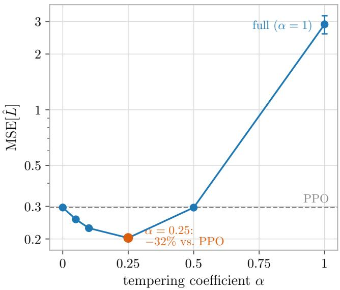  
Figure 1: Mean squared error $\mathrm { M S E } [ \hat { L } ]$ (16) of the single-trajectory estimate versus the tempering coeficient $\alpha ,$ on the late-only reward at the largest tested drift $( \bar { D } _ { \mathrm { K L } } \approx 0 . 3 3$ , 25 seeds, error bars 1 SEM, log scale). The dashed line is PPO (α = 0). The trade-of has an interior minimum at tempered $\alpha = 0 . 2 5 ;$ the values are in Table 3.

The interior Pareto-dominates. Tempered α = 0.25 improves on PPO on both axes at once — a better direction $( \cos = 0 . 5 3$ against PPO’s 0.20) and a lower MSE — because $\exp ( 0 . 2 5 L _ { T - 1 } ^ { s } )$ partially cancels the outlier contributions that PPO’s last-step ratio makes at rarely visited prefixes. $\mathrm { B i a s ^ { 2 } }$ is negligible, so the MSE column of Table 3 is the variance, and the improvement lands at the interior minimum of Figure 1: a 32% reduction in MSE.

## 5.3 Training on the two-branch reward

The per-update estimator advantage compounds across iterations, and the method classes order themselves as the diagnostics predict (Table 4). The tabular experiment isolates the direction efect: normalized stochastic gradient ascent (N-SGD) fixes the update magnitude, so the compared methods difer only in the direction of their updates. Under that control, the interior tempered and clipped variants break out of the initial plateau first, PPO follows, and the full and long-truncated corrections trail: tempered $\alpha = 0 . 1$ solves the task by iteration 50 and PPO by 70 (per-seed results in Appendix E.1). The better direction is not a refinement but a 1.4 diference in time to solve the task.

<table><tr><td>Method</td><td>Tabular N-SGD, lr 0.3 iter. to  $\eta = 1 \ ( n = 3 )$ </td><td>Transformer N-SGD, lr 1.0 success rate (n = 10)</td><td>Transformer Adam, lr  $3 \times 1 0 ^ { - 3 }$  success rate  $( n \in \{ 9 , 1 0 \} )$ </td></tr><tr><td>Tempered  $\alpha = 0 . 0 5$ </td><td>55</td><td>10/10</td><td>6/10</td></tr><tr><td> $\mathrm { T e m p e r e d } \ \alpha = 0 . 1 0$ </td><td>50</td><td>10/10</td><td>8/10</td></tr><tr><td>Tempered  $\alpha = 0 . 2 5$ </td><td>60</td><td>8/10</td><td>7/10</td></tr><tr><td>Clipped (0.10, 1.0)</td><td>50</td><td>9/10</td><td>8/9</td></tr><tr><td>Clipped (0.25, 1.0)</td><td>50</td><td>5/10</td><td>7/9</td></tr><tr><td>PPO (α = 0)</td><td>70</td><td>7/10</td><td>7/10</td></tr><tr><td>Full (α = 1)</td><td>85</td><td>6/10</td><td>7/10</td></tr><tr><td>Truncated  $k = 4$ </td><td>100</td><td>5/10</td><td>3/9</td></tr><tr><td>Best – PPO gap</td><td>20 iter. (1.4×)</td><td>+30 pp</td><td>+19 pp</td></tr></table>

Table 4: Learning results on the two-branch reward. All runs use $K = 4$ epochs, 256-trajectory rollouts, and 200 iterations. The tabular column reports the iteration at which mean return reaches $\eta = 1$ ; transformer columns report the fraction of seeds with final $\eta > 0 . 5$ . Bold marks the best entry per column; the $\mathrm { l r } = 1 0 ^ { - 2 }$ Adam runs are in Appendix E.3.

The transformer changes what the comparison measures. Trained from random initialization under N-SGD at $\mathtt { l r } = 1 . 0$ , its outcomes are bimodal $( \eta \approx 0 \ \mathrm { o r \ 1 } )$ , so the estimator advantage appears as success rate rather than speed: tempered $\alpha \in \{ 0 . 0 5 , 0 . 1 \}$ succeeds on every seed, PPO on 7/10, and the full and long-truncated corrections on fewer still (Figure 2; Appendix E.2). The failed seeds show why the outcome is all-or-nothing: each commits to a wrong first branch within the first few gradient steps and never recovers — the sampling trap of C3.

An adaptive optimizer attenuates the efect without erasing it, and it shifts the best variant toward clipping. Under Adam at $\mathtt { l r } = 3 \times 1 0 ^ { - 3 }$ the best variants are clipped (0.1, 1.0) and tempered $\alpha = 0 . 1$ , and the gap over PPO shrinks to roughly two thirds of its N-SGD size; a matched tabular ablation shows the same direction (Appendix E.4). At the aggressive $\mathtt { l r } = 1 0 ^ { - 2 }$ the ordering holds and the full correction collapses to no successful seed (Appendix E.3). Combining bias reduction with variance control is therefore the robust choice under adaptive optimization, and the full correction is fragile at aggressive learning rates.

## 5.4 Transfer to a pretrained language model

The speed efect transfers to a pretrained policy under Adam; the trap efect does not. Both claims are tested by fine-tuning Qwen2.5-0.5B on a rule-verifiable six-slot structured-record task whose rewards mirror the ladder (protocol in Appendix F); Table 5 collects the paired diferences. The speed efect shows on the prefix-dependent two-branch reward: tempered $\alpha = 0 . 1 0$ leads PPO by +6.7 pp in mean Monte Carlo return over iterations 2–8, with every one of 16 paired seeds favoring the correction. Across the method grid the gain is interior in α, peaking near $\alpha = 0 . 1 0$ and collapsing at $\alpha = 1$ , where variance cancels the bias correction — the testbed’s interior-α profile, reproduced at pretrained scale.

The matched late-only falsifier asks whether that gain needs prefix dependence or only a delayed reward. Removing dependence on the first slot while keeping the delayed reward contracts the advantage to +1.9 pp with per-seed signs at chance, and turns the full correction harmful on every seed (Table 5, right). The residual is small but not unexplained: its 95% CI marginally excludes zero, and it has a mechanistic home in the pretrained model’s conditional prior, which is not exactly prefix-independent (Appendix F). Delayed reward alone does not justify the variance cost.

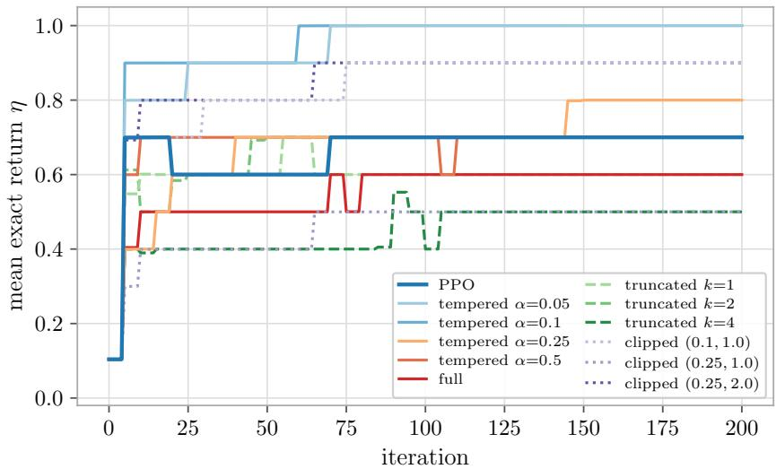  
Figure 2: Mean exact return over 10 seeds versus iteration for the 793k-parameter transformer under N-SGD $( 1 \mathbf { r } = 1 . 0 , K = 4 )$ . Outcomes are bimodal $( \eta \approx 0 \ \mathrm { o r \ 1 } )$ , so the mean is the success-rate curve; the success rates are in Table 4.

The trap test primes the policy to start on the wrong branch of the two-branch reward and asks whether the sampling loop strands it there. It does not: every PPO seed succeeds. The trap mechanism requires a wrong commitment to make rewarded continuations vanish from the batch, which the toy MDP guarantees and a pretrained model at the 256-rollout batch size does not — about 8.5 rewarded trajectories per batch survive the priming, and their advantage signal outweighs the biased-gradient drift from the first iteration. At realistic batch sizes the correction therefore changes learning speed rather than rescuing otherwise lost runs.

The transfer is bounded on two sides: the synthetic rewards are exactly decided at known positions, which a realistic reward model is not, and the pretrained study is one model at 0.5B under one hyperparameter freeze. The practical case for the correction rests on the scheduling application that follows.

## 6 Application: constructive scheduling under aggressive sample reuse

## 6.1 Setting, and the null at realistic operating points

Scheduling is the least controlled setting in this paper and the one where samples are expensive. The expense is met by reusing each rollout batch for K update epochs, and reuse moves the policy away from the data it trains on, the staleness the correction exists to repair.

The tasks are flexible job-shop (FJSP), permutation flow-shop, and disjunctive job-shop instances, all built under the canonical construction order of Section 2, the convention that makes each partial schedule constructible in exactly one way and the correction therefore exact. A heterogeneous graph network (HGNN) dispatcher [16] or a transformer pointer policy constructs the schedule, over horizons of $T = 1 2$ to $T = 5 0$ decisions; the reward is either a binary on-time indicator $\mathbf { 1 } [ C _ { \operatorname* { m a x } } \leq c \cdot C ^ { * } ]$ for a deadline factor c on the optimal makespan $C ^ { * }$ , or a dense makespan objective (full protocols in Appendix G). The conditions of Section 4 may fail to hold here: terminal outcomes are emergent (the makespan-determining job is not a chosen token), action sets are constrained, and rewards often carry continuous progress signal.

<table><tr><td rowspan="2">Method</td><td colspan="2">Two-branch reward</td><td colspan="2">Late-only falsifier</td></tr><tr><td>∆ vs. PPO (pp)</td><td>seeds positive</td><td>∆ vs. PPO (pp)</td><td>seeds positive</td></tr><tr><td>Tempered  $\alpha = 0 . 0 5$ </td><td>+4.5</td><td>9/10</td><td>+1.2</td><td>5/10</td></tr><tr><td>Tempered  $\alpha = 0 . 1 0$ </td><td>+6.7</td><td>16/16</td><td>+1.9</td><td>8/16</td></tr><tr><td>Tempered α = 0.25</td><td>+5.8</td><td>10/10</td><td>+1.1</td><td>4/10</td></tr><tr><td>Clipped (0.10, 1.0)</td><td>+6.5</td><td>10/10</td><td>+2.6</td><td>6/10</td></tr><tr><td>Full (α = 1)</td><td>+0.1</td><td>6/10</td><td>-4.4</td><td>0/10</td></tr></table>

Table 5: Pretrained-LM study (Qwen2.5-0.5B, Adam): paired diference against PPO in mean Monte Carlo return over iterations 2–8, the pre-registered rate endpoint, on the prefix-dependent two-branch reward and on the matched late-only falsifier. Confidence intervals and per-iteration curves are in Appendix F. The trap cell, which primes the policy onto the wrong branch, is not tabulated: all 16 PPO seeds and all 16 tempered seeds succeed, so it ofers no success-rate comparison.

Two measurements organize the results. The first is the quantity we compare: the area under the learning curve (AUC) of the greedy validation on-time rate, the on-time rate of the argmax-decoded policy on held-out validation instances; $\Delta \mathrm { A U C }$ is the corrected-minus-control diference, paired by seed. Sign tests are exact binomial tests on the non-tied paired seeds, under the sidedness convention that holds throughout the paper: tests of pre-specified directional improvement hypotheses are one-sided in the predicted direction, and falsifier and null comparisons are two-sided. The second is drift, measured on the rollout policy after one full K-epoch update as $\sigma ^ { 2 } T$ , the per-step log-ratio variance of Section 3.1 accumulated over the horizon. Drift ties the results to the mechanism: it measures how much staleness each operating point actually accumulates.

At realistic operating points a held correction is null to harmful, for two measurable reasons (Table 6). The first is that realistic training accumulates no staleness to repair. At published FJSP hyperparameters the drift after a full K = 3 update is $\sigma ^ { 2 } T \approx 3 \times 1 0 ^ { - 5 }$ , and the correction loses to PPO in every cell, winning 4 of 60 paired comparisons (Appendix G.1). With no stale state distribution to repair, the credit-routing channel pays its horizon-dependent variance cost and buys nothing back.

The second reason is why raising drift alone does not help. Dialing the learning rate, clip, and K until the drift rises by five orders of magnitude makes the paired final on-time diference cross zero, with every paired seed won at the top, but only at a deadline where training sits at the reward floor; at a fair deadline the same dial yields a null, because with plentiful signal PPO relearns from fresh batches on its own. Neither a richer reward nor a drifting learner rescues the held correction: a rich-reward benchmark built to give the correction its best case is null at the largest drift measured in this paper (Appendix G.1), and a drifting transformer policy under a scarce reward loses by a small margin at every deadline, turning positive in sign only when the update is so aggressive that PPO itself diverges (Appendix G.4). The two failures are independent: where drift is realistic there is nothing to repair, and where the reward retains signal, PPO absorbs the staleness on its own, whatever the drift.

<table><tr><td>Setting</td><td> $\sigma ^ { 2 } T$ </td><td>Endpoint</td><td> $\Delta \ ( \mathrm { c o r r . \ - \ P P O } )$ </td><td>Seed wins</td></tr><tr><td colspan="5">HGNN dispatcher,  $F J S P 1 0 \times 5 , T = 5 0 ;$  correction held for the whole run</td></tr><tr><td>Published regime  $\left( K = 3 \right)$  , two deadlines</td><td> $3 \times 1 0 ^ { - 5 }$ </td><td>final on-time</td><td> $- 6 . 0 , - 8 . 6 ~ \mathrm { p p }$ </td><td>4/60</td></tr><tr><td>Drift dial, hard deadline (reward floor)</td><td>1.3</td><td>final on-time</td><td>-5.2 pp</td><td>1/5</td></tr><tr><td></td><td>15 34</td><td></td><td>+4.4 pp +9.0 pp</td><td>3/5 5/5</td></tr><tr><td>Drift dial, fair deadline (saturated)</td><td>1.7</td><td>final on-time</td><td>+1.8 pp</td><td>3/5</td></tr><tr><td></td><td></td><td></td><td>-3.8 pp</td><td>3/5</td></tr><tr><td></td><td>7.2</td><td></td><td></td><td></td></tr><tr><td>Rich graded reward (resting windows)</td><td>22.5</td><td></td><td>-3.2 pp</td><td>2/5</td></tr><tr><td></td><td>0.7</td><td>AUC</td><td>-0.080</td><td>1/5</td></tr><tr><td></td><td>38.8</td><td></td><td>-0.039</td><td>2/5</td></tr><tr><td></td><td>60.7</td><td></td><td>-0.027</td><td>3/5</td></tr><tr><td>Acquisition, hard deadline, fresh seeds</td><td>34</td><td>early AUC</td><td>-0.019</td><td>8/16</td></tr><tr><td colspan="5">Transformer pointer policy, three-machine bottleneck flow shop,  $J = 1 2 ;$  correction held</td></tr><tr><td>Dense makespan reward</td><td>1.38</td><td>AUC</td><td>n.s.</td><td>9/16</td></tr><tr><td>Tight deadline, floor 0.14 (scarce)</td><td>1.38</td><td>AUC</td><td>-0.062</td><td>5/16</td></tr><tr><td>floor 0.35</td><td></td><td></td><td>-0.034</td><td>6/16</td></tr><tr><td>floor 0.56</td><td></td><td></td><td>-0.012</td><td>5/15</td></tr><tr><td>Update dial D1 (PPO final 0.95)</td><td></td><td>AUC</td><td>-0.067</td><td>7/16</td></tr><tr><td>D2 (PPO final 0.47)</td><td></td><td></td><td>-0.045</td><td>8/16</td></tr><tr><td>D3 (PPO final 0.30)</td><td></td><td></td><td>+0.122</td><td>9/16</td></tr></table>

Table 6: Held-correction results at and beyond realistic operating points. $\Delta$ is the paired, per-seed diference (corrected minus PPO) on the stated endpoint; seed wins count paired seeds favoring the correction. Drift $\sigma ^ { 2 } T$ is measured on the rollout policy after one full K-epoch update, before training, and was not recorded for the transformer update-strength dial. Details, the sizing rule for $\alpha ,$ and the registered endpoints are in Appendices G.1 and G.4.

## 6.2 The win: a corrected warmup under aggressive early reuse

The correction pays when it is used briefly, while the policy is still moving, and then switched of. On the bottleneck flow shop with the transformer policy, a warmup that applies the correction for the first W iterations and then runs plain PPO beats PPO on AUC at $W = 2 5$ and $W = 5 0 ;$ ; holding the correction for the whole run loses, and too long a warmup dilutes the efect below significance (Table 7, first block). The second-half $\Delta \mathrm { A U C }$ , negative under the held correction, turns positive once α switches of: the early correction gains ground in the high-drift phase and the hand-of to PPO keeps it (Figure 3).

We raise the reuse count K to 30 during the warmup because reuse-induced policy drift is one of the two routes through which the correction acts (Section 4) and K is its cleanest practical lever. The lever is not pure: raising K also changes the optimizer work per batch and how often clipping engages, so a gain over PPO at high K does not by itself belong to the correction. The comparison arm is therefore a no-correction warmup at the same high K, and the marginal $\Delta A U C ,$ corrected minus this control, is what the correction contributes beyond the reuse itself.

Aggressive early reuse pays with the correction on hard credit-assignment tasks, and does not without it. On a seven-machine flow shop with 20 jobs and three spread-out bottlenecks, where competing bottlenecks make credit assignment non-myopic, reuse alone does not pay: the high-K control is null to negative against PPO at every deadline. The same reuse with the correction wins at every deadline, and the marginal ∆AUC grows as the deadline tightens, reaching +0.087 at the hardest non-saturated deadline (Table 7, third block; Figure 4). The correction lets early batches be reused harder on problems where PPO alone cannot.

On an easy task no amount of reuse opens a window for the correction. On the single-bottleneck flow shop the same K = 30 warmup widens the gap over PPO, but the no-correction control captures most of it and the marginal ∆AUC is not significant (Table 7, second block): at clip 0.2 the clip alone contains the reuse bias. Sweeping K held for the whole run from 4 to 128 confirms it: PPO’s final on-time is nearly flat in K, while the corrected update sits at or below PPO throughout and its prefix ratios blow up at the largest K (Figure 15 in Appendix G.5). The lever is credit-assignment dificulty, not K.

<table><tr><td rowspan="2"></td><td rowspan="2">PPO</td><td rowspan="2"></td><td colspan="2">Corrected vs. PPO</td><td rowspan="2">Control vs. PPO</td><td colspan="2"></td><td colspan="2">Marginal: corrected - control</td></tr><tr><td>Schedule / deadline n final ∆AUC seeds</td><td></td><td>ΔAUC</td><td></td><td>∆AUC seeds</td><td>p</td></tr><tr><td colspan="9">Bottleneck flow shop, J = 12, transformer policy; warmup</td></tr><tr><td> $W = 2 5$ </td><td></td><td></td><td></td><td>96 0.97 +0.026 59/95 0.012</td><td></td><td> $o f W$ </td><td>iterations at the standard</td><td></td><td> $K ; c \in \{ 1 . 0 , 1 . 0 2 \}$  pooled</td></tr><tr><td> $W = 5 0$ </td><td>96</td><td></td><td></td><td> $0 . 9 7 \ + 0 . 0 2 8 \ 5 8 / 9 4$ </td><td>0.015</td><td></td><td></td><td></td><td></td></tr><tr><td> $W = 7 5$ </td><td>96</td><td></td><td></td><td> $0 . 9 7 \ + 0 . 0 1 4 \ 5 2 / 9 6$ </td><td>0.238</td><td></td><td></td><td></td><td></td></tr><tr><td colspan="10">held, whole run 96</td></tr><tr><td colspan="10">Single-bottleneck flow shop, J = 12 (easy); K = 30 for the first W = 50 iterations, then standard K</td></tr><tr><td colspan="2"> $c = 1 . 0 2$ </td><td></td><td></td><td> $1 6 0 . 9 8 + 0 . 0 8 7 1 4 / 1 6 0 . 0 0 2$ </td><td></td><td></td><td>+0.064</td><td> $+ 0 . 0 2 3 \ 1 0 / 1 6$ </td><td>0.227</td></tr><tr><td colspan="10">Seven-machine flow shop, J = 20, three bottlenecks (hard); same K = 30 warmup</td></tr><tr><td colspan="10"> $c = 1 . 0 6$ </td></tr><tr><td> $c = 1 . 0 5$ </td><td></td><td></td><td></td><td> $2 4 0 . 9 9 + 0 . 0 0 9 1 9 / 2 3 0 . 0 0 1$ </td><td></td><td>-0.009</td><td></td><td> $+ 0 . 0 1 8 \ 1 5 / 2 1$ </td><td>0.039</td></tr><tr><td> $c = 1 . 0 4$ </td><td></td><td></td><td> $4 8 0 . 8 9 + 0 . 0 3 4 4 \dot { 1 } / 4 8 < 1 0 ^ { - 4 }$ </td><td></td><td></td><td>-0.005 +0.026</td><td> $+ 0 . 0 3 9 \ 3 8 / 4 8$ </td><td> $+ 0 . 0 8 7 \ 2 0 / 2 4$ </td><td> $< 1 0 ^ { - 4 }$  0.0008</td></tr><tr><td colspan="10"> $2 4 0 . 7 9 + 0 . 1 1 4 2 2 / 2 4 < 1 0 ^ { - 4 }$ </td></tr><tr><td colspan="10">Disjunctive job shop, 8 jobs, 5 machines,  $T = 4 0 ;$ </td></tr><tr><td> $c = 1 . 1 5$   $c = 1 . 1 0$ </td><td>6 6</td><td></td><td> $0 . 5 3 \ + 0 . 0 4 0$ </td><td>3/6</td><td>0.656</td><td> $+ 0 . 0 3 3$ </td><td>+0.006</td><td> $2 / 6$ </td><td>0.891</td></tr><tr><td> $c = 1 . 0 5$ </td><td>6</td><td></td><td> $0 . 5 7 \ \mathrm { ~ + 0 . 1 0 0 }$ </td><td>4/6</td><td>0.344 1.000</td><td>-0.264 -0.060</td><td>+0.364</td><td> $6 / 6$ </td><td>0.016</td></tr><tr><td></td><td></td><td></td><td> $0 . 4 1 \ \mathrm { ~ - 0 . 1 1 0 ~ }$ </td><td>0/6</td><td></td><td></td><td>-0.050</td><td> $3 / 6$ </td><td>0.656</td></tr></table>

Table 7: Scheduling results under the warmup recipe. ∆AUC is the paired, per-seed diference in the area under the greedy validation on-time curve; seeds counts the seeds favoring the first arm over the non-tied paired seeds, and p is the one-sided exact sign test. PPO final is plain PPO’s final on-time rate, which sets the headroom. First block: correction on for the first W iterations at the standard reuse count, then plain PPO (“held”: correction on for the whole run); 48 seeds per deadline. Remaining blocks: correction on for $W = 5 0$ iterations at $K = 3 0$ , then plain $\mathrm { P P O } ;$ the control is the same $K = 3 0$ warmup without the correction, so the marginal column is the correction’s contribution beyond the reuse itself.

The gain is faster early learning to the same endpoint, and it reproduces across horizons. Sweeping the multi-bottleneck flow shop over $J \in \{ 2 0 , 3 0 , 4 0 , 5 0 \}$ jobs, which sets the trajectory length, the warmup-corrected run leads plain PPO in the first half of training at every $J ;$ the second-half lead shrinks with J and is gone by $J = 4 0$ (Table 17 in Appendix G.5; Figure 16). A ceiling-controlled calibration, which sets the deadline per J so that PPO’s final on-time is held in a narrow band, separates the two things horizon does: the measured prefix bias roughly doubles from J = 20 to $J = 4 0$ while the early lead stays positive and roughly flat (Figure 17). Horizon drives the bias dose; PPO’s headroom gates how much of it the correction converts into a gain.

The largest marginal gain is on the task with the longest-range credit assignment, and it reads diferently from the flow-shop gains. On a classical disjunctive job shop (8 jobs, 5 machines, job-specific machine routes, one shared bottleneck, $T = 4 0 )$ , at the feasible deadline the marginal ∆AUC is +0.364 on every one of 6 seeds, about four times the largest flow-shop marginal (Table 7, last block; Figure 5). Most of that margin is the control’s collapse: aggressive reuse without the correction loses heavily to plain PPO, while the corrected arm’s own lead over PPO is smaller and, with 6 seeds, not significant, though unlike the flow shop it persists into the second half of training (Table 17). The win sits on a feasibility knife-edge, collapsing for both methods one deadline step tighter and vanishing one step looser; with $n = 6$ the sign of the marginal is established and the magnitude is not.

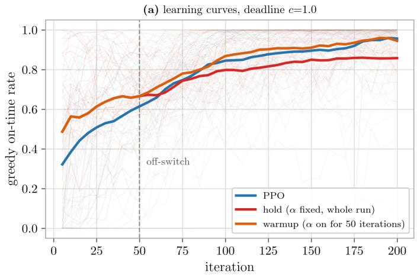

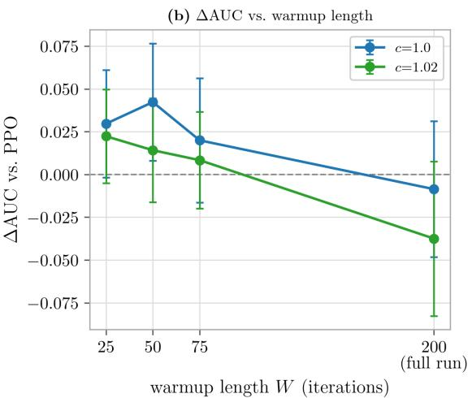  
Figure 3: The correction as a warmup beats PPO; held the whole run it loses. Bottleneck transformer, 48 seeds per deadline. (A) Greedy on-time rate vs. iteration at $c = 1 . 0 \colon$ the warmup (α on for 50 iterations then of, orange) climbs above PPO (blue) early and stays $\geq \mathrm { i t }$ , while holding a fixed α the whole run (red) sags below PPO late. Dotted line marks the of-switch. (B) ∆AUC vs. warmup length W for both deadlines, with hold plotted at $W = 2 0 0$ (the full run); bars are 2 SE and the dashed line is the PPO baseline. Short warmups sit above the baseline and holding the correction drops below it; the pooled statistics are in Table 7.

The early win tracks the bias dose; the late win does not. The dose is the bias PPO drops by ignoring the prefix, $b _ { t }$ of (12) evaluated at the rollout policy (where $r _ { t } = 1 )$ and summed as $\sum _ { t } \left| b _ { t } \right|$ measured on the aggressive-reuse run without correction, so it is the dose the correction would cancel. Across $n = 6 6$ configuration–seed points with task dificulty partialled out, the first-half win over plain PPO rises with the dose $( r = + 0 . 3 2 )$ while the second-half win is uncorrelated with it $( r = - 0 . 0 3 $ Figure 6; per-configuration values in Table 17). The early advantage tracks the prefix bias the reuse actually incurred and decouples from it once the warmup switches of and PPO catches up. Across tasks the naive dose–response is flat, because PPO’s headroom additionally caps the gain; the relationship appears within a task.

## 6.3 What kind of win, and where it stops

The recipe is a short warmup — correction on, K high — followed by plain PPO for the rest of the run. On the flow shop what the warmup buys is sample eficiency, not a better policy: after the of-switch the run converges to the same on-time ceiling as PPO, final performance within 0.01, and the ∆AUC is the area under a faster early climb, about 3% of AUC. The job shop is the exception: there the lead over PPO persists through both halves of training (Table 17; Figure 5).

Sample eficiency is not compute eficiency. During the warmup the high-K arm spends several times the optimizer steps of plain PPO on each rollout batch, so the recipe buys rollouts — the currency that is scarce in this domain — not FLOPs. The corrected and uncorrected high-K arms, however, do the same optimizer work, so the marginal ∆AUC is a compute-matched comparison.

The win has two preconditions, the two that Section 6.1 saw fail: measured drift large enough that PPO’s stale-state bias exceeds the variance the correction adds, which grows with α and T (Section 4), and a reward sparse enough that PPO cannot relearn what stale data corrupted.

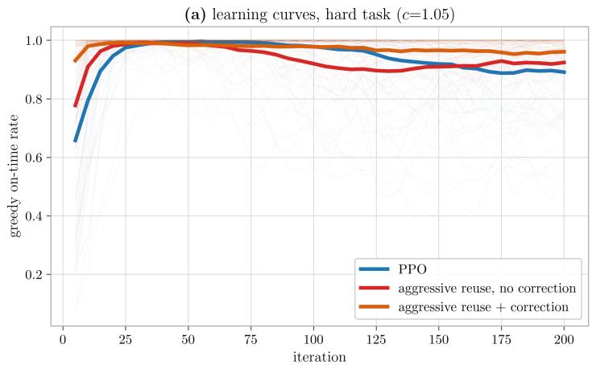

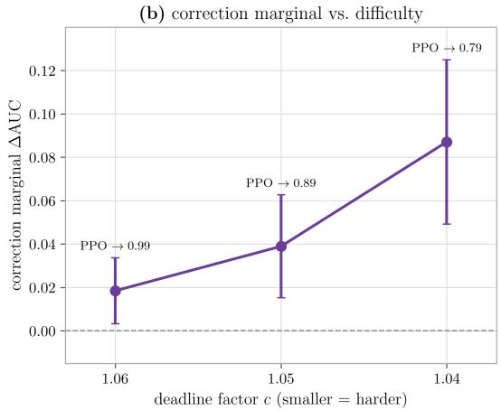  
Figure 4: Seven-machine flow shop, 20 jobs, three bottlenecks, $K = 3 0$ warmup. (A) Greedy validation on-time rate versus iteration at $c = 1 . 0 5$ (48 seeds): plain PPO (blue), aggressive early reuse without the correction (red), and the same reuse with the correction (orange). (B) Marginal ∆AUC of the correction over the no-correction control at each deadline, harder to the right; bars are 2 SE and PPO’s final on-time is annotated. Values and seed counts are in Table 7.

The scheduling nulls are a property of the task and learner, not of the implementation: the same correction code, on an environment stripped to the toy’s structure, rescues runs from the dead-branch trap on every non-tied seed, and the win survives as the environment is moved toward scheduling until an informative reward or easy credit assignment removes it (Table 16; Appendices G.2–G.3). A drifting transformer learner does not restore it, so the boundary is a property of the training regime, not of the architecture (Appendix G.4).

## 7 Related Work

Two concurrent proposals apply the prefix ratio of Section 3 to the policy update. Lei et al. [6] (“prefix importance ratio,” MinPRO) and Zhang et al. [19] (“cumulative token IS ratio,” CTPO) independently name the same bias, neither citing the other; both fix the correction at α = 1, stabilize it with their own variance control (Section 3.2), and evaluate on LLM mathematical-reasoning benchmarks. Neither states the structural condition under which the correction is exact, and neither extends beyond autoregressive language models, to processes whose state records its history whether deterministic or stochastic, or parameterizes the design space: the tempered family, k-truncation, and the question of which point wins under which conditions are absent from both.

The product-of-ratios structure and its bias–variance trade-of are classical in of-policy evaluation [10, 17], and the standard response is to refuse the product. Marginalized importance sampling [7, 27] replaces it by an estimate of the state-visitation ratio it averages to, conditional importance sampling [12] frames that replacement as Rao–Blackwellization, and Liu et al. [8] carry the estimated ratio into the of-policy policy gradient, which is (3) with Rs learned rather than sampled. Retrace(λ) [9] truncates per-step ratios in value targets; V-trace [2] has the accumulatedproduct structure available and declines it for the policy ratio (“we do not take the product of those ρt coeficients . . . so the variance does not explode”). Applying the sampled prefix ratio to the policy update — no estimate is needed where the product already equals the ratio — and characterizing when its variance is worth paying, is the distinguishing point.

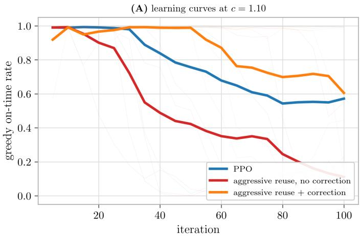

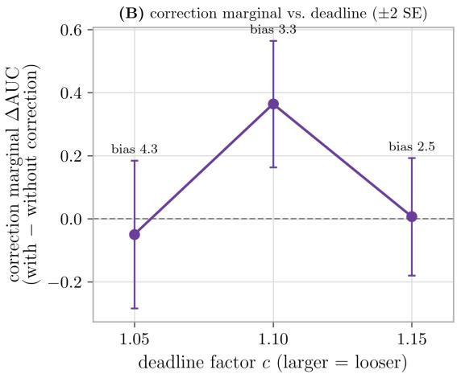  
Figure 5: Disjunctive JSSP: the largest correction win, in the longest-range creditassignment task. Classical JSSP (8 jobs, 5 machines, own routes, one shared bottleneck, $T = 4 0$ sparse binary deadline reward). (A) At $c = 1 . 1 0$ , aggressive reuse with the correction (orange) leads plain PPO (blue) and the no-correction reuse control (red) throughout. (B) Correction marginal $\Delta \mathrm { A U C }$ over the no-correction control vs. deadline ( 2 SE; early measured bias annotated): sharp at the feasible $c = 1 . 1 0$ and vanishing on either side — collapse at $c = 1 . 0 5$ , too-loose null at $c = 1 . 1 5$ Values are in Table 7.

In LLM reinforcement learning the token-level ratio is the default and its instability is met by modifying the ratio rather than the state-visitation distribution. GRPO [15] and DeepSeek-R1 [18] use the token-level ratio and inherit the bias we characterize. GSPO [20] uses a length-normalized sequence ratio and ASPO [21] an asymmetric ratio, two other points in the design space; DPO [11] bypasses the ratio entirely. None of these corrects the state-visitation term.

Neural constructive combinatorial optimization trains a policy to build a solution one element at a time [1, 5], and PPO-family learners with sample reuse are its standard training loop, including for job-shop dispatching [16]. These methods fix a reuse count and a clip range but do not correct the state-visitation distribution the reused batches were drawn from. The canonical construction order that makes the correction exact is a convention these methods already use for decoding, not an additional assumption (Section 2).

## 8 Discussion and limitations

The state-visitation approximation PPO inherits from TRPO is a design choice, not a necessity, and three nested questions decide before training whether to revisit it. Is the correction exact here? Yes under history-injective dynamics, which autoregressive models have natively and construction problems acquire under a canonical decision order; where histories merge, as in free-order dispatching, the estimator stays unbiased but pays a path-merging variance premium (Appendix B). Does it carry a systematic signal? Only if the reward is decided late and depends on the prefix (C1, C2), which the bias witness $b _ { t }$ of (12) measures from any rollout batch; a prefix-independent reward, as in the late-only falsifier of Section 5.4, leaves only the variance cost. Does the training loop preserve the diference? A wrong early commitment the loop cannot recover from turns the advantage into a success-rate efect; otherwise the correction yields at most a speed advantage (C3). In either case α must be matched to the horizon: a value tuned at one trajectory length does not transfer unrescaled, and long T, merged histories, and aggressive optimizers push the usable α toward zero.

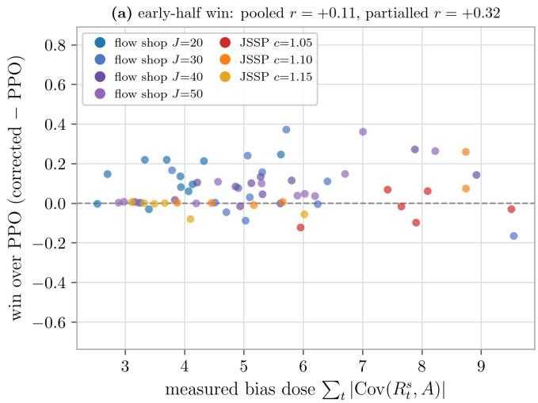

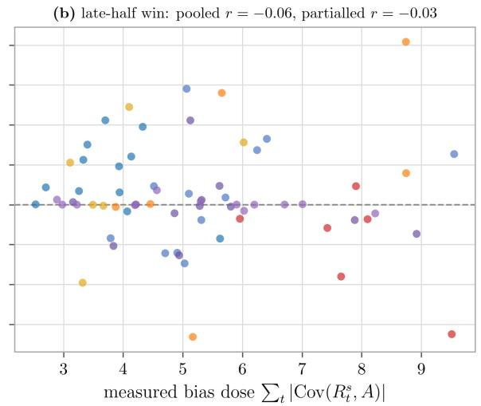  
Figure 6: The early win tracks the bias dose; the late win does not. Per configuration–seed point $( n = 6 6 )$ correction win over plain PPO vs. the measured prefix bias $\sum _ { t } \left| b _ { t } \right|$ that aggressive reuse incurs without correction, colored by configuration. (Left) First-half win rises with the dose. (Right) Second-half win is uncorrelated with it — consistent with the mechanism being early prefix-bias cancellation that decouples once the warmup correction switches of. Pooled and dificulty-partialled r are in the panel titles; per-configuration r in Table 17.

The three questions decide whether an efect is possible; a heuristic operating-point argument suggests its magnitude, and we state it as a hypothesis. Expanding the tempered estimator around $\theta _ { \mathrm { o l d } } \ ( e ^ { \alpha L _ { t } ^ { s } } \approx 1 + \alpha L _ { t } ^ { s } )$ , the reweighting channel’s expected contribution is $\alpha S$ with $S =$ $\begin{array} { r } { \sum _ { t } \mathrm { C o v } \big ( L _ { t } ^ { s } , h _ { \theta } ( s _ { t } ) \big ) } \end{array}$ , the omitted bias itself, while the credit-routing channel’s variance grows like $\overline { { T ^ { 2 } } }$ (position t sums t score vectors) even at zero drift. With N trajectories per batch and gradient scale G, the expected per-update progress advantage then has the form

$$
\Delta ( \alpha ) \approx \alpha S - \frac { \alpha ^ { 2 } } { N } V , V \propto T ^ { 2 } G ( 1 + \sigma ^ { 2 } ) ,\tag{17}
$$

maximized at $\alpha ^ { \star } = S N / 2 V$ with peak $\Delta ^ { \star } = S ^ { 2 } N / 4 V$ . The peak advantage carries a prefactor of order $N / T ^ { 2 }$ if S scales with T more slowly than V does — writing $S ^ { 2 } / V$ as $\rho ^ { 2 } \sigma ^ { 4 } / T ^ { 2 }$ up to the unresolved T-dependence of S, with ρ the correlation between the drift direction and reward-relevant structure —

$$
\Delta ^ { \star } \propto \rho ^ { 2 } \sigma ^ { 4 } \cdot \frac { N } { T ^ { 2 } } ,\tag{18}
$$

and (18) is the hypothesis: the T-scaling of S is not pinned down here. Its content is that batch size relative to squared horizon decides whether a correct-sign efect clears the seed-noise floor. The testbed cells operate at $N / T ^ { 2 } \approx 2 5 6 / 6 ^ { 2 } \approx 7 ;$ the scheduling experiments at $2 0 / 5 0 ^ { 2 } \approx 0 . 0 0 8$ , three orders of magnitude lower at nominally comparable drift, correlation, and reward shape. Under the hypothesis, the scheduling nulls at realistic operating points are consistent with the mechanism rather than evidence against it, and the hypothesis is falsifiable: a paired advantage that grows linearly in N and falls as $1 / T ^ { 2 }$ , which a short-horizon scheduling variant $( T \approx 2 0 )$ at testbed batch sizes $( N = 2 5 6 )$ would test.

The sampling-trap mode did not transfer to the pretrained model at the batch size we ran (Section 5.4); under this mechanism, RL instability on real language models reads as slow convergence from a biased gradient direction rather than as bimodal lost seeds. Whether the trap fires at batch 64 is a registered follow-up (Appendix F); running it as a rescue after the null would be efect-hunting, and we did not.

Two things this paper does not claim. The full correction should not replace PPO: its variance is prohibitive at long horizons, and the testbed shows it losing to PPO under aggressive Adam (Table 11). And the importance-sampling identity is not new [10]; what is new is its pointwise form under tree-structured dynamics (Section 3.1). The proposed algorithms are stabilized approximations between the two endpoints; which variant, at which α, under which optimizer and reuse schedule, is what the experiments answer.

## References

[1] Irwan Bello, Hieu Pham, Quoc V. Le, Mohammad Norouzi, and Samy Bengio. Neural combinatorial optimization with reinforcement learning. arXiv:1611.09940, 2016.

[2] Lasse Espeholt, Hubert Soyer, Remi Munos, et al. IMPALA: Scalable distributed deep-RL with importance weighted actor-learner architectures. In ICML, 2018.

[3] Noelia Ferruz, Stefen Schmidt, and Birte H¨ocker. ProtGPT2 is a deep unsupervised language model for protein design. Nature Communications, 13:4348, 2022.

[4] Sham Kakade and John Langford. Approximately optimal approximate reinforcement learning. In ICML, 2002.

[5] Wouter Kool, Herke van Hoof, and Max Welling. Attention, learn to solve routing problems! In ICLR, 2019.

[6] Shiye Lei, Rongxi Cheng, and Dacheng Tao. A step back: Prefix importance ratio stabilizes policy optimization. arXiv:2601.22718, January 2026.

[7] Qiang Liu, Lihong Li, Ziyang Tang, and Dengyong Zhou. Breaking the curse of horizon: Infinite-horizon of-policy estimation. In NeurIPS, 2018.

[8] Yao Liu, Adith Swaminathan, Alekh Agarwal, and Emma Brunskill. Of-policy policy gradient with state distribution correction. In UAI, 2019.

[9] Remi Munos, Tom Stepleton, Anna Harutyunyan, and Marc G. Bellemare. Safe and eficient of-policy reinforcement learning. In NeurIPS, 2016.

[10] Doina Precup, Richard S. Sutton, and Satinder Singh. Eligibility traces for of-policy policy evaluation. In ICML, 2000.

[11] Rafael Rafailov, Archit Sharma, Eric Mitchell, Christopher D. Manning, Stefano Ermon, and Chelsea Finn. Direct preference optimization: Your language model is secretly a reward model. In NeurIPS, 2023.

[12] Mark Rowland, Anna Harutyunyan, Hado van Hasselt, Diana Borsa, Tom Schaul, R´emi Munos, and Will Dabney. Conditional importance sampling for of-policy learning. In AISTATS, 2020.

[13] John Schulman, Sergey Levine, Philipp Moritz, Michael I. Jordan, and Pieter Abbeel. Trust region policy optimization. In ICML, 2015.

[14] John Schulman, Filip Wolski, Prafulla Dhariwal, Alec Radford, and Oleg Klimov. Proximal policy optimization algorithms. arXiv:1707.06347, 2017.

[15] Zhihong Shao et al. DeepSeekMath: Pushing the limits of mathematical reasoning in open language models. arXiv:2402.03300, 2024.

[16] Wen Song, Xinyang Chen, Qiqiang Li, and Zhiguang Cao. Flexible job-shop scheduling via graph neural network and deep reinforcement learning. IEEE Transactions on Industrial Informatics, 19(2):1600–1610, 2023.

[17] Philip S. Thomas, Georgios Theocharous, and Mohammad Ghavamzadeh. High-confidence of-policy evaluation. In AAAI, 2015.

[18] DeepSeek-AI. DeepSeek-R1: Incentivizing reasoning capability in LLMs via reinforcement learning. arXiv:2501.12948, 2025.

[19] Yuheng Zhang, Chenlu Ye, Shuowei Jin, Changlong Yu, Wei Xiong, Saurabh Sahu, and Nan Jiang. Rethinking importance sampling in LLM policy optimization: A cumulative token perspective (CTPO). arXiv:2605.07331, May 2026.

[20] Chujie Zheng et al. Group Sequence Policy Optimization (GSPO). arXiv:2507.18071, 2025.

[21] ASPO: Asymmetric Importance Sampling Policy Optimization. arXiv:2510.06062, 2025.

[22] A. Rupam Mahmood, Hado van Hasselt, and Richard S. Sutton. Weighted importance sampling for of-policy learning with linear function approximation. In NeurIPS, 2014.

[23] Tim Hesterberg. Weighted average importance sampling and defensive mixture distributions. Technometrics, 37(2):185–194, 1995.

[24] Adith Swaminathan and Thorsten Joachims. The self-normalized estimator for counterfactual learning. In NeurIPS, 2015.

[25] Augustine Kong. A note on importance sampling using standardized weights. Technical Report 348, Department of Statistics, University of Chicago, 1992.

[26] Alberto Maria Metelli, Matteo Papini, Francesco Faccio, and Marcello Restelli. Policy optimization via importance sampling. In NeurIPS, 2018.

[27] Tengyang Xie, Yifei Ma, and Yu-Xiang Wang. Towards optimal of-policy evaluation for reinforcement learning with marginalized importance sampling. In NeurIPS, 2019.

## A Time-indexed versus collapsed occupancies

The collapsed occupancy ratio $\begin{array} { r } { \rho _ { \tilde { \pi } } ( s ) / \rho _ { \pi _ { \mathrm { o l d } } } ( s ) = \sum _ { t } \gamma ^ { t } d _ { \tilde { \pi } , t } ( s ) / \sum _ { t } \gamma ^ { t } d _ { \pi _ { \mathrm { o l d } } , t } ( s ) } \end{array}$ is a ratio of mixtures over time and does not simplify to a product of policy ratios; correcting it with a per-token IS product would be wrong. The product form applies at a fixed time index: $d _ { \tilde { \pi } , t } ( s _ { t } \mid x ) / d _ { \pi _ { \mathrm { o l d } } , t } ( s _ { t } \mid$ $\begin{array} { r } { \boldsymbol { x } ) = \prod _ { i < t } \tilde { \pi } ( y _ { i } \mid \cdot ) / \pi _ { \mathrm { o l d } } ( y _ { i } \mid \cdot ) } \end{array}$ . This is why the derivation starts from the time-expanded identity rather than the collapsed ρ-form.

## B Derivation of the prefix factorization

Setup. Condition throughout on the initial state $s _ { 0 }$ . Under a policy $\pi _ { \mathrm { : } }$ , a length-t path $( s _ { 0 } , a _ { 0 } , \ldots , s _ { t } )$ has probability $\begin{array} { r } { \prod _ { i < t } \pi ( a _ { i } \ \mid \ s _ { i } ) P ( s _ { i + 1 } \ \mid \ s _ { i } , a _ { i } ) } \end{array}$ , and the time-t state-visitation distribution is its marginal:

$$
d _ { \pi , t } ( s _ { t } ) = \sum _ { \mathrm { \scriptsize ~ p a t h s } \atop \mathrm { \scriptsize { e n d i n g ~ a t } } s _ { t } } \prod _ { i < t } \pi ( a _ { i } \mid s _ { i } ) P ( s _ { i + 1 } \mid s _ { i } , a _ { i } ) .\tag{19}
$$

History-injectivity collapses this sum of products into a single product.

History-injectivity removes the sum. If distinct histories of length t reach distinct states, exactly one path ends at $s _ { t } \gets$ the one actually taken. The sum has a single term:

$$
d _ { \pi , t } ( s _ { t } ) = \prod _ { i < t } \pi ( a _ { i } \mid s _ { i } ) P ( s _ { i + 1 } \mid s _ { i } , a _ { i } ) ,
$$

with $( s _ { i } , a _ { i } , s _ { i + 1 } )$ the states, actions, and successors along that unique path.

The kernels cancel in the ratio. The unique path into $s _ { t }$ is a property of the dynamics, not of the policy, so it is the same path for π˜ and $\pi _ { \mathrm { o l d } }$ , with the same transition kernels along it; only the policy probabilities difer. Dividing, every kernel factor appears identically in numerator and denominator and cancels,

$$
R _ { t } ^ { s } = { \frac { d _ { \tilde { \pi } , t } ( s _ { t } ) } { d _ { \pi _ { \mathrm { o l d } } , t } ( s _ { t } ) } } = \prod _ { i < t } { \frac { \tilde { \pi } ( a _ { i } \mid s _ { i } ) } { \pi _ { \mathrm { o l d } } ( a _ { i } \mid s _ { i } ) } } ,
$$

which is (4): the uncomputable state-visitation ratio equals a product of per-step action ratios along the realized trajectory, available from the log-probabilities PPO already computes. However complex the dynamics may be (an arbitrary simulator, a scheduling engine, a stochastic environment), they enter only through which path reaches $s _ { t } .$ never through the weight of the ratio.

Determinism is not used. If $s _ { i + 1 } = T ( s _ { i } , a _ { i } )$ each kernel is an indicator, 1 on the feasible path and 0 otherwise, and the path weight simplifies to a pure policy product; but the cancellation above holds whatever the kernels’ values, so determinism adds nothing to the identity. What it adds is descriptive: the unique history into $s _ { t }$ is then determined by the action sequence alone. A stochastic process is history-injective whenever its state records each realized outcome — stochastic execution in scheduling with realized durations carried in the state, or environment-inserted tokens in an agentic language-model context — and the identity then holds with the product taken over the policy’s own decisions, the environment’s kernels cancelling as above.

Remark: what history-injectivity does — and does not — buy. Write $\begin{array} { r } { W _ { t } = \prod _ { i < t } \tilde { \pi } ( a _ { i } \ | } \end{array}$ $s _ { i } ) / \pi _ { \mathrm { o l d } } ( a _ { i } \mid s _ { i } )$ for the sampled-path weight, and compare it with the state ratio $R _ { t } ^ { s } = d _ { \tilde { \pi } , t } ( s _ { t } ) / d _ { \pi _ { \mathrm { o l d } } , t } ( s _ { t } )$ it stands in for. The two are diferent kinds of objects: $R _ { t } ^ { s }$ depends only on the endpoint $s _ { t } ,$ while $W _ { t }$ depends on the whole path taken to reach it. Three statements relate them, in decreasing strength:

• Pointwise (needs history-injectivity). $W _ { t } = R _ { t } ^ { s }$ on every sampled path — the derivation above.

• Conditionally unbiased (any MDP). $\mathbb { E } _ { \pi _ { \mathrm { o l d } } } [ W _ { t } \mid s _ { t } ] = R _ { t } ^ { s }$ : averaged over the paths that reach $s _ { t } ,$ the weight recovers the ratio.

• Unbiased (any MDP). $\mathbb { E } _ { \tau \sim \pi _ { \mathrm { o l d } } } [ W _ { t } f ( s _ { t } ) ] = \mathbb { E } _ { s \sim d _ { \tilde { \pi } , t } } [ f ( s ) ]$ for any $f \colon$ the corrected surrogate has the right expectation.

The two general statements need no structure at all, because the transition kernels are the same under both policies: along any realized path they appear identically in the numerator and denominator of the trajectory-probability ratio and cancel, leaving $P _ { \tilde { \pi } } ( \tau ) / P _ { \pi _ { \mathrm { o l d } } } ( \tau ) = W _ { t }$ . Summing this over all paths ending at $s _ { t }$ gives the conditional statement; summing over all paths gives the unbiasedness statement — standard per-decision importance sampling [10]. The conditional statement is the identity behind marginalized importance sampling [7], in the time-indexed form of Xie et al. [27]. Both require only the support condition $\pi _ { \mathrm { o l d } } > 0$ wherever $\tilde { \pi } > 0$ , automatic for softmax policies.

What the structural condition buys is therefore not correctness or computability but noise. When many paths merge into the same state, the true ratio $R _ { t } ^ { s }$ is an average over all of them, while a single sampled path supplies one random term of that average — right on average, wrong path by path. The conditional variance $\operatorname { V a r } _ { \pi _ { \mathrm { o l d } } } ( W _ { t } \mid s _ { t } )$ is exactly the Rao–Blackwell gap between the sampled-path weight and the ratio it estimates, the gap that conditional importance sampling [12] closes by estimation. History-injectivity closes it by leaving exactly one path into each state: the sample is the average.

In practice: when injectivity fails $- \ \mathrm { e . g . }$ , dispatching A then B across two free machines, or B then A, yields the same partial schedule — the reachability graph is a DAG, and the correction is still unbiased but pays this path-merging variance premium. A canonical construction order (Section 2) restores injectivity by making each partial solution constructible in exactly one way; since it changes the action space, corrected-vs-uncorrected comparisons must be run within that environment. This free-order (DAG) vs. canonical-order (tree) distinction is used in the scheduling experiments of Appendix G. Stochastic execution (random processing times, breakdowns) breaks the pointwise statement only when the state omits the realized outcome, so that diferent draws land on the same partial schedule and paths merge; the two general statements hold either way.

## C Family details: implementation and unevaluated members

In code, the correction is one line in any framework (ell of shape (batch, T)): PyTorch $\begin{array} { r l } { \mathrm { ~ L ~ } } & { { } = } \end{array}$ torch.cumsum(ell, dim=-1) - ell; JAX L = jnp.cumsum(ell, axis=-1) - ell; TensorFlow $\mathrm { ~ L ~ } = \ t \mathbf { f }$ .cumsum(ell, axis=-1, exclusive=True). Two further members of the family are natural but not evaluated here. A self-normalized variant divides each weight by the batch mean of the weights — the classical weighted importance-sampling estimator [22–24]; its bias is a small-batch artifact, $O ( 1 / | B | )$ , unlike PPO’s structural bias, which no batch size removes. An adaptive variant selects the largest α each batch subject to a floor on the efective sample size of the reweighted batch, the standard weight-degeneracy diagnostic of importance sampling [25], used analogously to constrain policy updates by Metelli et al. [26].

## D Testbed protocol and estimator diagnostics

## D.1 Common protocol

The transformer policy used in the synthetic learning experiments is a 4-layer, $d _ { \mathrm { m o d e l } } = 1 2 8$ , 4-head causal transformer ( 793k parameters). The tabular policy has one logit per prefix–token pair, $V ( V ^ { T } { - } 1 ) / ( V { - } 1 )$ in total: about 6k at $T = 6$ and 90k at $T = 8$ . Unless stated otherwise, learning experiments use 256 trajectories per iteration, returns-to-go advantages with a batch-mean baseline, and $K = 4$ update epochs. The compared estimator variants are $\mathrm { P P O } ;$ tempered $\alpha \in$ $\{ 0 . 0 5 , 0 . 1 , 0 . 2 5 , 0 . 5 , 1 \}$ ; truncated $k \in \{ 1 , 2 , 4 \}$ ; and clipped $( \alpha , c ) \in \{ ( 0 . 1 , 1 . 0 ) , ( 0 . 2 5 , 1 . 0 ) , ( 0 . 2 5 , 2 . 0 ) \}$

Sign tests follow the convention of Section 6: exact, one-sided for pre-specified directional improvements, two-sided for falsifier and null checks.

## D.2 Estimator diagnostics

Measurement procedure. Each measurement is made on a controlled pair of policies standing in for the data-collecting and updated policies of one reuse step. The rollout policy $\pi _ { \mathrm { o l d } }$ is a fixed near-uniform tabular softmax; the candidate $\pi _ { \theta }$ is obtained by adding Gaussian noise to every logit, $\theta _ { \tilde { \pi } } = \theta _ { \pi _ { \mathrm { o l d } } } + \delta \varepsilon$ with $\varepsilon \sim \mathcal { N } ( 0 , I )$ , so the magnitude δ dials the policy drift directly. We sweep $\delta \in \{ 0 . 0 1 , 0 . 0 3 , 0 . 1 , 0 . 3 , 0 . 6 , 1 . 0 \}$ , spanning $\bar { D } _ { \mathrm { K L } } ( \pi _ { \mathrm { o l d } } , \tilde { \pi } )$ from $4 \times 1 0 ^ { - 5 }$ to 0.33, with 5 noise seeds per magnitude (25 for the late-only run of (d)); all 12 variants are evaluated on the same policy pair within each (seed, δ) cell.

Because the MDP is enumerable at horizon $T = 6 ,$ , every quantity is computed exactly by summing over all $4 ^ { 6 }$ sequences, so no Monte Carlo error enters. For each variant, the singletrajectory estimate $\hat { L } ~ ( 8 )$ is formed from the exact backward-induction advantages $A _ { \pi _ { \mathrm { o l d } } } .$ , and its expectation is taken under the exact sequence distribution of $\pi _ { \mathrm { o l d } }$ . Bias, variance, MSE, gradient cosine, and normalized ESS are as defined in Section 5.2; the two gradients in the cosine are computed by automatic diferentiation through the exact sums and flattened over the candidate’s full logit table, one cosine per policy pair, and the normalized ESS is taken over the joint (sequence, position) distribution.

(a) PPO. On the step-additive early-gate reward, PPO’s bias is negative and grows monotonically with KL $( - 5 . 3 \times 1 0 ^ { - 7 } \mathrm { ~ t o ~ } { - 4 . 8 \times 1 0 ^ { - 3 } } )$ ; variance stays near the trajectory-advantage floor $( 3 . 3 \times 1 0 ^ { - 2 }$ to $5 . 4 \times 1 0 ^ { - 2 } )$ ; gradient cosine degrades from 1.000 to 0.951. Bias stays below $5 \times 1 0 ^ { - 3 } -$ masked by the variance floor in MSE but visible in direction.

(b) Full. Bias bounded by $2 \times 1 0 ^ { - 1 7 }$ at every $\delta -$ floating-point zero, verifying (5) as an algebraic identity, a check no sampled experiment could provide. Gradient cosine stays 1.000. The cost: variance grows to $1 . 4 \times 1 0 ^ { - 1 }$ (2.7 PPO at the same KL) and normalized ESS collapses from $\approx 1 . 0$ $\mathrm { t o } \approx 0 . 2 7$

(c) Intermediate variants. Interpolation is monotone in $\alpha , \ k ,$ and c on every metric. At the largest δ: interior MSE minimum at tempered $\alpha = 0 . 2 5 ~ /$ clipped $( 0 . 2 5 , 1 . 0 ) \ ( 5 . 0 \times 1 0 ^ { - 2 }$ , vs. PPO’s $5 . 4 \times 1 0 ^ { - 2 }$ and full’s $1 . 4 \times 1 0 ^ { - 1 } \mathrm { ~ - ~ a ~ } 7 \%$ margin on this reward, capped by the variance floor); gradient-cosine ordering full 1.000 > truncated $k { = } 4 \ 0 . 9 9 8 >$ tempered $0 . 5 \ 0 . 9 8 5 >$ tempered $0 . 2 5 \ 0 . 9 7 3 > \mathrm { P P O } \ 0 . 9 5 1 ;$ ; nESS 0.90 (tempered 0.25), 0.70 (0.5), 0.29 (truncated k=4), 0.27 (full). Gradient direction is already decisive here — the prediction taken to the training experiments.

(d) Late-only reward — sharpened gaps. Concentrating all advantage at $t = T - 1$ via $R = { \bf 1 } [ y _ { T - 1 } = { \tt B } ]$ amplifies everything (Table 3, Figure 1). At $\begin{array} { r l r } { \bar { D } _ { \mathrm { K L } } \approx 0 . 3 3 \colon } & { { } } & { } \end{array}$ PPO’s bias stays $\lesssim 2 \times 1 0 ^ { - 4 }$ but its gradient cosine collapses to 0.20, near-orthogonal; full’s variance explodes to 2.9, an order of magnitude above PPO, driven by trajectory-IS outliers at rare-visit prefixes.

Tempered $\alpha = 0 . 2 5 \mathrm { { : } }$ : MSE $2 . 0 3 \times 1 0 ^ { - 1 }$ (32% below PPO), variance $2 . 0 2 \times 1 0 ^ { - 1 }$ against PPO’s $2 . 9 6 \times 1 0 ^ { - 1 }$ (Table 3, Figure 1). A terminal reward that late tokens still decide — final-answer correctness, a terminal reward-model score — falls in this regime; one already sealed by the early tokens falls under the early-decided case of Section 4.

## D.3 Null controls: rewards without prefix dependence or a sampling trap

On the three control rewards of the ladder (Section 5.1) the estimator MSE margin of the best interior variant over PPO is 11% on the step-additive early gate (C1 partial, C2 weak); 32% on late-only (C1 without C2), with no training-loop advantage — the cleanest separation of the estimator diagnostic from the training efect; and present, with noisy training outcomes, on the sparse trajectory match (C2, C3). The two-branch reward (13) activates C1–C3 while keeping rewarded trajectories frequent enough for training outcomes to be measurable, which is why the training sub-experiments use it.

## E Testbed training experiments

## E.1 Tabular policy under N-SGD

Tabular policy, two-branch reward, N-SGD at lr = 0.3, K = 4, 3 seeds, 200 iterations. N-SGD removes the direction-vs-magnitude confound.

The break-through order through the $\eta \approx 0 . 2 5$ plateau is strict and matches the estimator prediction: interior tempered and clipped first, PPO next, full and truncated $k = 4$ last, paying the predicted variance penalties (Figure 7, Table 8).

<table><tr><td>Method</td><td>Break-through iter.</td><td>η at iter. 50</td><td>Iter. to  $\eta = 1 . 0 0 0$ </td></tr><tr><td>Tempered  $\alpha = 0 . 1 0$ </td><td>30-45</td><td>0.961</td><td>50</td></tr><tr><td>Clipped (0.25, 1.0)</td><td>30-45</td><td>0.960</td><td>50</td></tr><tr><td>Tempered  $\alpha = 0 . 0 5$ </td><td>50</td><td>0.900</td><td>55</td></tr><tr><td>Tempered  $\alpha = 0 . 2 5$ </td><td>50-55</td><td>0.781</td><td>60</td></tr><tr><td>Tempered  $\alpha = 0 . 5 0$ </td><td>50-60</td><td>0.468</td><td>70</td></tr><tr><td>PPO</td><td>50-60</td><td>0.341</td><td>70</td></tr><tr><td>Full</td><td>70</td><td>0.260</td><td>85</td></tr><tr><td>Truncated  $k = 4$ </td><td>80-90</td><td>0.262</td><td>100</td></tr></table>

Table 8: Tabular policy under N-SGD $( 1 \mathbf { r } = 0 . 3 , K = 4 .$ , 3 seeds): iteration of break-through past the $\eta \approx 0 . 2 5$ plateau, exact return at iteration 50, and iteration at which η reaches 1.

## E.2 Transformer under N-SGD

Same reward and PPO scafold with the 793k-parameter transformer, sample-based η on fresh 1024-trajectory batches, N-SGD, l $\mathbf { r } \in \{ 0 . 3 , 1 . 0 , 3 . 0 \}$ , 10 seeds. At $\mathtt { l r } = 0 . 3$ all methods succeed 10/10; at 3.0 everything is too aggressive (best: tempered $\alpha = 0 . 2 5$ at $2 / 1 0 )$

The discriminating rate is $\pm { } \mathbf { r } = 1 . 0$ (Figure 2, Table 9), where the interior tempered variants succeed on every seed and PPO on seven of ten. Losing seeds fail by self-reinforcing wrong-branch commitment $- P ( y _ { 0 } \in \{ \mathtt { B } , \mathtt { D } \} )  1$ within iterations 5–10, after which no batch contains a rewarded trajectory and the gradient estimate is zero.

## E.3 Transformer under Adam

Same setup with Adam, $\mathtt { l r } \in \{ 1 0 ^ { - 3 } , 3 \times 1 0 ^ { - 3 } , 1 0 ^ { - 2 } \}$ . Adam’s per-parameter RMS normalization partially absorbs gradient-direction bias (Appendix E.4).

At $\mathtt { l r } = 1 0 ^ { - 3 }$ all methods succeed 10/10. At $3 \times 1 0 ^ { - 3 }$ (Figure 8, Table 10) clipped (0.1, 1.0) and tempered $\alpha = 0 . 1$ lead PPO by 19 pp, roughly two thirds of the N-SGD gap. At the aggressive

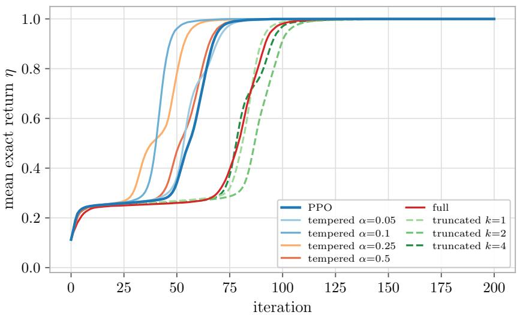  
Figure 7: Exact return versus iteration on the two-branch reward: tabular policy, N-SGD $( { \bf 1 r = 0 . 3 }$ $K = 4$ , mean over 3 seeds). The clipped variants are omitted: their curves overlap exactly with those of their tempered counterparts in this run, as the log-space cap c never binds.

10−2 (Table 11) tempered $\alpha = 0 . 1$ keeps a 20 pp lead over PPO while the full correction collapses to no successful seed, the worst method: Adam’s per-parameter adaptivity applied to the accumulated ratio produces unbounded updates on outlier tokens, the failure mode $\mathrm { C T P O } ^ { \prime } \mathrm { s } \ \sqrt { t } .$ -scaled clip prevents.

## E.4 Optimizer-absorption ablation on the tabular policy

Swapping N-SGD for Adam on the tabular two-branch setup shrinks the interior-tempered-over-PPO advantage at iteration 50 from $\eta = 0 . 9 6 1$ vs. 0.341 under N-SGD to a relative lead of about 20% — Adam’s per-parameter RMS normalization rescales the biased direction back toward the true gradient, absorbing part but not all of the estimator-level bias. The transformer result (30 pp 19 pp, Appendix E.3) matches this tabular prediction, completing the optimizer  parameterization $2 \times 2$ and showing the mechanism decomposition is not sensitive to parameterization scale at the sizes tested.

## F Pretrained-LM study: structured-record consistency at 0.5B

We test whether the gradient-and-training account of Section 4 predicts the LM-scale efect on Qwen2.5-0.5B (base). The reward is a rule-verifiable string check on structured JSON: the model fills a 6-slot template (status/service/region/retries/load/code), each slot a masked 4-way choice with all candidates single-token in context (tokenizer gate $2 4 / 2 4 )$ , and the reward reads two slots. The complete-sequence space is $4 ^ { 6 } = 4 0 9 6$ , so $\eta ( \pi )$ ， $S _ { 1 }$ marginals, and $P ( S _ { 6 } \mid S _ { 1 } )$ are exactly enumerable at any training point.

Protocol. Custom masked-slot generation and PPO update — no TRL/HF-Trainer scafold — so all six variants share one code path difering only in the $g ( L _ { t } ^ { s } )$ switch (asserted by a bit-identical-loss test at $\alpha = 0 )$ . Frozen config: 256 rollouts/iteration, minibatch 8, $K = 4 , \epsilon = 0 . 2$ , Adam $( \beta _ { 1 } = 0 . 9$

<table><tr><td>Method</td><td>Success rate  $( n = 1 0 )$ </td><td>Final η (mean ± SEM)</td></tr><tr><td>Tempered  $\alpha = 0 . 0 5$ </td><td>10/10</td><td> $\mathbf { 1 . 0 0 0 \pm 0 . 0 0 0 }$ </td></tr><tr><td>Tempered  $\alpha = 0 . 1 0$ </td><td>10/10</td><td> $\mathbf { 1 . 0 0 0 \pm 0 . 0 0 0 }$ </td></tr><tr><td>Clipped  $( 0 . 1 0 , 1 . 0 )$ </td><td>9/10</td><td> $0 . 9 0 0 \pm 0 . 1 0 0$ </td></tr><tr><td>Clipped (0.25, 2.0)</td><td>8/9</td><td> $0 . 8 8 9 \pm 0 . 1 1 1$ </td></tr><tr><td>Tempered  $\alpha = 0 . 2 5$ </td><td>8/10</td><td> $0 . 8 0 0 \pm 0 . 1 3 3$ </td></tr><tr><td>PPO</td><td>7/10</td><td> $0 . 7 0 0 \pm 0 . 1 5 3$ </td></tr><tr><td>Tempered  $\alpha = 0 . 5 0$ </td><td>7/10</td><td> $0 . 7 0 0 \pm 0 . 1 5 3$ </td></tr><tr><td>Truncated  $k = 2$ </td><td>7/10</td><td> $0 . 7 0 0 \pm 0 . 1 5 3$ </td></tr><tr><td>Full</td><td>6/10</td><td> $0 . 6 0 0 \pm 0 . 1 6 3$ </td></tr><tr><td>Truncated  $k = 1$ </td><td>6/10</td><td> $0 . 6 0 0 \pm 0 . 1 6 3$ </td></tr><tr><td>Truncated  $k = 4$ </td><td>5/10</td><td> $0 . 5 0 0 \pm 0 . 1 6 7$ </td></tr><tr><td>Clipped (0.25, 1.0)</td><td>5/10</td><td> $0 . 5 0 0 \pm 0 . 1 6 7$ </td></tr></table>

Table 9: Transformer under N-SGD at $\mathtt { l r } = 1 . 0$ (K = 4, 10 seeds): success rate and final η per variant.
<table><tr><td>Method</td><td>Success rate</td><td>Final η (mean ± SEM)</td></tr><tr><td>Clipped  $( 0 . 1 0 , 1 . 0 )$ </td><td>8/9</td><td> $\mathbf { 0 . 8 8 9 \pm 0 . 1 1 1 }$ </td></tr><tr><td>Tempered  $\alpha = 0 . 1 0$ </td><td>8/10</td><td> $0 . 8 0 0 \pm 0 . 1 3 3$ </td></tr><tr><td>Clipped (0.25, 1.0)</td><td>7/9</td><td> $0 . 7 7 8 \pm 0 . 1 4 7$ </td></tr><tr><td>PPO</td><td>7/10</td><td> $0 . 7 0 0 \pm 0 . 1 5 3$ </td></tr><tr><td>Tempered  $\alpha = 0 . 2 5$ </td><td>7/10</td><td> $0 . 7 0 0 \pm 0 . 1 5 3$ </td></tr><tr><td>Full</td><td>7/10</td><td> $0 . 7 0 0 \pm 0 . 1 5 3$ </td></tr><tr><td>Tempered  $\alpha = 0 . 0 5$ </td><td>6/10</td><td> $0 . 6 0 0 \pm 0 . 1 6 3$ </td></tr><tr><td>Tempered  $\alpha = 0 . 5 0$ </td><td>6/10</td><td> $0 . 6 0 0 \pm 0 . 1 6 3$ </td></tr><tr><td>Truncated  $k = 2$ </td><td>5/9</td><td> $0 . 5 5 6 \pm 0 . 1 7 6$ </td></tr><tr><td>Clipped (0.25, 2.0)</td><td>5/9</td><td> $0 . 5 5 6 \pm 0 . 1 7 6$ </td></tr><tr><td>Truncated  $k = 1$ </td><td>4/10</td><td> $0 . 4 0 0 \pm 0 . 1 6 3$ </td></tr><tr><td>Truncated  $k = 4$ </td><td>3/9</td><td> $0 . 3 3 3 \pm 0 . 1 6 7$ </td></tr></table>

Table 10: Transformer under Adam at $1 \mathbf { r } = 3 \times 1 0 ^ { - 3 } \ ( K = 4 )$ : success rate and final η per variant.  
$\beta _ { 2 } = 0 . 9 5 )$ , grad clip $1 . 0 , \mathrm { e n t r o p y } = 0 .$ ref- $\mathrm { . K L } = 0$ (no external restoring force), $\mathtt { l r } = 3 \times 1 0 ^ { - 6 }$ frozen by pilot; advantage = trajectory return minus batch-mean baseline. 10 seeds per (cell, method), extended to 16 paired seeds for the pre-registered headline pair (PPO vs. tempered $\alpha = 0 . 1 0 )$ in Cells 1, 3, 4. bf16 with gradient checkpointing on one L4.

Cell design. All cells place reward at the terminal slot $S _ { 6 }$ . The reward and an $N = 8$ few-shot priming prefix vary whether terminal value depends on the earlier slot $S _ { 1 }$ and whether the sampling loop is susceptible to a low-reward trap:
<table><tr><td>Cell</td><td>Priming (S1 in N = 8)</td><td>Reward</td><td>η0</td><td> $\mathbb { E } [ \mathrm { r e w } / 2 5 6 ]$ </td><td>Role</td></tr><tr><td>1</td><td>NEUTRAL (uniform)</td><td>TWO_BR (matched)</td><td>0.386</td><td>99</td><td>Prefix-dependent value; dense reward prevents a trap</td></tr><tr><td>3</td><td>FATAL (unknown, soften 0.25)</td><td>TWO_BR</td><td>0.033</td><td>8.5</td><td>Prefix-dependent value; designed low-reward trap</td></tr><tr><td>4</td><td>NEUTRAL (uniform)</td><td>LATE_ONLY</td><td>0.398</td><td>102</td><td>Terminal reward independent of S1 — null control</td></tr></table>

Pre-run sign-of measurements (per-condition $S _ { 1 }$ marginals, full $P ( S _ { 6 } \mid S _ { 1 } )$ , η0 per reward, ofpoliciness dry-run, $\alpha ^ { \star } = 1 / ( T \sigma ^ { 2 } )$ heuristic in [0.02, 0.3] for every cell) are recorded in FREEZE TABLE.md; all 12 pre-flight gates pass.

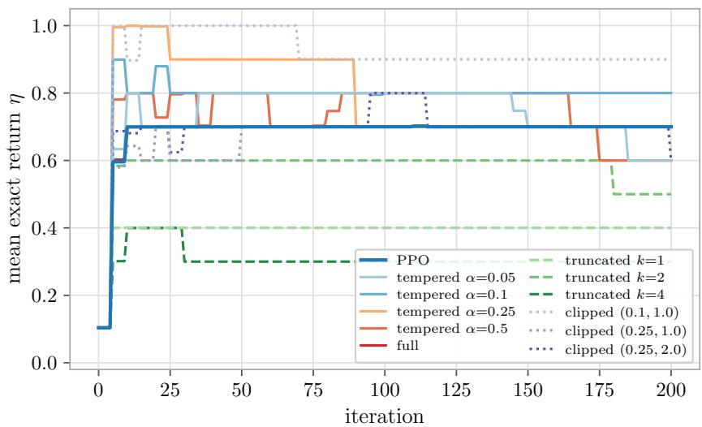  
Figure 8: Adam ablation of Figure $\mathbf { \nabla } [ 1 \mathbf { r } = 3 \times 1 0 ^ { - 3 } , K = 4$ , 10 seeds). The success-rate advantage survives at reduced amplitude (Table 10).

Pilot and endpoint revision. A Cell-1 pilot (2 methods  3 lrs  3 seeds, 50 iterations) froze $\mathtt { l r } = 3 \times 1 0 ^ { - 6 }$ and showed a +9 pp early lead for tempered $\alpha = 0 . 1 0$ at iteration 3, collapsing by iteration 10 as both arms hit ceiling $( 1 8 / 1 8$ pilot runs succeeded). The pilot revised the primary endpoint from $\mathrm { i t e r s - t o - } \eta _ { 0 . 9 }$ (which the eval every = 10 discretisation cannot resolve for sub-10- iteration efects) to mean MC η over iterations 2–8; Cell 3 kept the brief’s original success-rate endpoint, since a sampling trap would turn mean-η into a mixture of successful and failed runs. The pilot table is in outputs/pilot/.

Cell 1 — rate advantage transfers. At $\eta _ { 0 } = 0 . 3 8 6 \ ( \approx 9 9 $ rewarded trajectories per batch), a sampling trap is implausible and the analysis predicts a rate advantage, which is what we observe (Table 12): tempered $\alpha = 0 . 1 0$ climbs faster over iterations 2–5, collapsing to noise by iteration 10 at ceiling.

The full method grid (Table 13; all 72 Cell-1 runs succeed, so the cell is purely rate-mode) reproduces the toy interior-α profile, peaking at $\alpha = 0 . 1 0$ and collapsing at $\alpha = 1$ where the variance penalty cancels the bias correction. The peak brackets the pre-registered $\alpha ^ { \star } \approx 0 . 0 8$ heuristic; clipped (0.10, 1.0) is indistinguishable from tempered 0.10, as expected when the log-space clip rarely binds at this KL scale.

Cell 3 — the success-rate mechanism does not fire. At $\eta _ { 0 } = 0 . 0 3 3 \ : ( \mathbb { E } [ \mathrm { r e w } / 2 5 6 ] = 8 . 5 $ , just above the absorbing floor), a sampling trap would require the biased-gradient direction to drive the policy toward the fatal-primed marginal in iterations $_ { 1 - 5 ; }$ if it wins, η falls below 0.020, zero-reward batches become likely $( \geq 5 . 7 \times 1 0 ^ { - 3 }$ per iteration, cumulatively ≳ 10% over 20), and the run pins.

The measured per-iteration MC fatal marginal does not rise on any of the 16 PPO seeds: it starts in [0.31, 1.00] (Poisson-noised around the exact 0.742 under FATAL priming) and declines monotonically, reaching mean $\leq 0 . 0 2$ by iteration 10 and $\leq 1 0 ^ { - 3 }$ by 15 (Table 14). One seed (PPO s2) plateaus near 0.98 for iterations 1–5 before collapsing — the expected signature at a high-initial-fatal seed where rewarded rollouts number 1–2 per batch — but the biased direction never dominates. All 16 PPO seeds succeed; tempered $\alpha = 0 . 1 0$ shows the same pattern (16/16;

<table><tr><td>Method</td><td>Success rate</td><td>Final η (mean ± SEM)</td></tr><tr><td>Tempered  $\alpha = 0 . 1 0$ </td><td>5/10</td><td> $\mathbf { 0 . 5 0 0 \pm 0 . 1 6 7 }$ </td></tr><tr><td>PPO</td><td>3/10</td><td> $0 . 3 0 0 \pm 0 . 1 5 3$ </td></tr><tr><td>Tempered  $\alpha = 0 . 0 5$ </td><td>2/10</td><td> $0 . 2 0 0 \pm 0 . 1 3 3$ </td></tr><tr><td>Tempered α = 0.25</td><td>2/10</td><td> $0 . 2 0 0 \pm 0 . 1 3 3$ </td></tr><tr><td>Clipped (0.25, 1.0)</td><td>2/9</td><td> $0 . 2 2 2 \pm 0 . 1 4 7$ </td></tr><tr><td>Clipped (0.25, 2.0)</td><td>2/9</td><td> $0 . 2 2 2 \pm 0 . 1 4 7$ </td></tr><tr><td>Tempered α = 0.50</td><td>1/10</td><td> $0 . 1 0 0 \pm 0 . 1 0 0$ </td></tr><tr><td>Truncated k = 1</td><td>1/10</td><td> $0 . 1 0 0 \pm 0 . 1 0 0$ </td></tr><tr><td>Clipped (0.10, 1.0)</td><td>0/9</td><td> $0 . 0 0 2 \pm 0 . 0 0 2$ </td></tr><tr><td>Truncated k = 2</td><td>0/9</td><td>0.000</td></tr><tr><td>Truncated k = 4</td><td>0/9</td><td>0.000</td></tr><tr><td>Full (α = 1)</td><td>0/10</td><td>0.000 (worst)</td></tr></table>

Table 11: Transformer under Adam at $1 \mathbf { r } = 1 0 ^ { - 2 } \ ( K = 4 )$ : success rate and final η per variant.

Table 12: Cell 1 (NEUTRAL N = 8, TWO BRANCH) per-iteration MC η, 16 paired seeds. $1 6 / 1 6$ seeds positive at iteration 3, 15/16 at $5 ;$ the efect reaches the noise floor by iteration 7 as both arms hit ceiling.
<table><tr><td>Method</td><td>iter 2</td><td>iter 3</td><td>iter 4</td><td>iter 5</td><td>iter 10</td><td>iter 20</td></tr><tr><td>PPO</td><td>0.534</td><td>0.756</td><td>0.884</td><td>0.957</td><td>0.998</td><td>0.999</td></tr><tr><td>Tempered  $\alpha = 0 . 1 0$ </td><td>0.706</td><td>0.910</td><td>0.978</td><td>0.994</td><td>0.999</td><td>0.999</td></tr><tr><td> $\Delta { \ ( \mathrm { T \mathrm { \Omega } - P ) \ \mathrm { p p } } }$ </td><td>+17.1</td><td>+15.4</td><td>+9.4</td><td>+3.7</td><td>+0.1</td><td>+0.05</td></tr></table>

highest initial fatal marginal 0.996, collapsing to 0.000 by iteration 5).

The reason is structural: in the toy MDP a wrong first-token commitment yields deterministically zero reward under any continuation, whereas at LM scale 8.5 rewarded trajectories per batch arrive in expectation even under FATAL priming, and their advantage signal dominates the biased-gradient drift from iteration 1.

Truncation disclosure. Cell 3’s non-headline arms (tempered $\alpha \in \{ 0 . 0 5 , 0 . 2 5 \}$ , clipped, full) were cancelled after the PPO tier completed $1 6 / 1 6$ at ceiling with no fatal-marginal drift — no success-rate comparison was possible at ceiling. Only the pre-registered headline pair ran to 16 seeds; the other methods are retained in Cell 1’s grid, where the rate endpoint discriminates.

Cell 4 — the pre-registered falsifier passes. Cell 4 keeps Cell 1’s priming (same NEUTRAL N = 8 lines, same initial $S _ { 1 }$ marginal) and swaps only the reward: $\mathrm { L A T E \_ O N L Y } = \mathbf { 1 } [ S _ { 6 } = \mathrm { t a r g e t } ]$ pays regardless of $S _ { 1 }$ , removing reward dependence on $S _ { 1 }$ while holding terminal reward placement and the of-policiness scale $( \mathrm { V a r } ( \log R _ { 5 } ^ { s } ) = 1 0 . 4 $ , identical to Cell 3’s gate value) fixed. The preregistered prediction is $\Delta \eta \approx 0 ;$ a Cell-1-sized efect here would contradict the Cell 1 attribution.

On the primary endpoint the paired diference is +1.9 pp $( 9 5 \% \ \mathrm { C I } \pm 1 . 8 \ \mathrm { p p } )$ with 8/16 seeds positive — a two-sided sign test at exactly chance $( p = 1 . 0 )$ , against Cell 1’s +6.7 pp at 16/16 $( p \approx 3 \times 1 0 ^ { - 5 } )$ : a 3.5 attenuation in mean and a complete collapse in per-seed consistency.

The paired-mean CI marginally excludes zero, and the residual has a mechanistic home — unlike the tabular late-only null, where the optimum provably leaves early tokens uniform, the pretrained conditional $P ( S _ { 6 } \mid S _ { 1 } )$ ) is not exactly $S _ { 1 ^ { - } \mathrm { i n d e p e n d e n t } } ,$ so the reward-relevant prefix dependence is attenuated rather than eliminated exactly at LM scale. The per-seed $S _ { 1 }$ endpoints corroborate this: Cell 1’s PPO seeds all commit $S _ { 1 }$ to a reward-matched branch by iteration 20, while Cell 4’s scatter across seed-dependent directions (two seeds drift onto unknown, a value TWO BRANCH would kill) — free drift under no restoring force, not a reward-required commitment.

Table 13: Cell 1 full grid: paired diference vs. PPO on mean MC η over iterations 2–8 (the pre-registered rate endpoint); normal-approximation 95% CI on the paired mean.
<table><tr><td>Method</td><td>n (paired seeds)</td><td> $\Delta \mathrm { \ v s . }$  PPO (pp)</td><td>seeds positive</td><td>95% CI (pp)</td></tr><tr><td>Tempered  $\alpha = 0 . 0 5$ </td><td>10</td><td>+4.5</td><td> $9 / 1 0$ </td><td>±2.6</td></tr><tr><td>Tempered  $\alpha = 0 . 1 0$ </td><td>16</td><td>+6.7</td><td>16/16</td><td>±2.5</td></tr><tr><td>Tempered α = 0.25</td><td>10</td><td>+5.8</td><td>10/10</td><td>±3.4</td></tr><tr><td>Clipped (0.10, 1.0)</td><td>10</td><td>+6.5</td><td>10/10</td><td>±3.4</td></tr><tr><td>Full  $( \alpha = 1 )$ </td><td>10</td><td>+0.1</td><td>6/10</td><td>±1.9</td></tr></table>

Table 14: Cell 3 per-iteration fatal-marginal decline (mean/max/min over 16 PPO seeds). No seed rises; all reach $\leq 1 0 ^ { - 2 }$ by iteration 10.
<table><tr><td>iter</td><td>1</td><td>2</td><td>3</td><td>4</td><td>5</td><td>7</td><td>10</td><td>15</td><td>20</td></tr><tr><td>mean</td><td>0.778</td><td>0.649</td><td>0.454</td><td>0.333</td><td>0.229</td><td>0.096</td><td>0.014</td><td>0.001</td><td>0.000</td></tr><tr><td>max</td><td>0.996</td><td>0.996</td><td>0.988</td><td>0.957</td><td>0.973</td><td>0.668</td><td>0.180</td><td>0.008</td><td>0.004</td></tr><tr><td>min</td><td>0.312</td><td>0.141</td><td>0.035</td><td>0.012</td><td>0.000</td><td>0.000</td><td>0.000</td><td>0.000</td><td>0.000</td></tr></table>

The full Cell 4 grid sharpens the null into a positive prediction: with no bias to correct, the correction’s cost should remain. The full correction is strictly worse than $\mathrm { P P O } \mathrm { ~ -- ~ } 4 . 4 \mathrm { p p } , 0 / 1 0$ seeds positive, 95% CI 2.5 pp — the variance penalty with no compensating bias reduction, mirroring the late-only control in the reward ladder of Section 5.1 and V-trace’s motivation for refusing the accumulated product. Interior variants sit at small, sign-inconsistent residuals (tempered $\alpha = 0 . 0 5$ $+ 1 . 2 \ \mathrm { p p }$ at $5 / 1 0 ; \alpha = 0 . 2 5 \colon + 1 . 1 \mathrm { \ p p }$ at $4 / 1 0 \ddagger$ ; clipped: +2.6 pp at $6 / 1 0 )$ . All 72 Cell-4 runs succeed, as expected at $\mathbb { E } [ \mathrm { r e w } / 2 5 6 ] = 1 0 2$

## G Scheduling: nulls, controls, and boundary

## G.1 With no measured drift, the correction only costs variance

Empirical test: the drift dial. We tested the correction on flexible job-shop scheduling (FJSP, $1 0 \times 5$ , binary on-time terminal reward $\mathbf { 1 } [ C _ { \operatorname* { m a x } } \leq c \cdot C ^ { * } ]$ , HGNN dispatching policy of Song et al. [16], horizon $T = 5 0 )$ , in both the free-order (DAG) protocol and the canonical-order (tree) protocol of Appendix B. At the published training regime (lr $2 \times 1 0 ^ { - 4 }$ , clip 0.2, K = 3 reuse epochs) the correction loses to PPO in every cell of both protocols; Table 6 lists the canonical-order cell at $\alpha = 0 . 0 3$ and the count of paired comparisons won. A direct measurement says why: the per-step log-ratio variance between the data-collecting and updated policy, measured after a full K-epoch update, is $\sigma ^ { 2 } \approx 5 \times 1 0 ^ { - 7 }$ , i.e. a prefix log-ratio of magnitude $\approx 0 . 0 0 5$ over the whole episode. The staleness that the correction reweights for is absent — the omitted term is measured to be $\approx 0 -$ while the credit-routing channel still pays its $\alpha \cdot T$ variance cost on a sparse binary signal.

We therefore turned the drift dial — raising the learning rate $1 0 { - } 3 0 \times$ , widening or removing the clip, and setting $K = 1 2 \mathrm { ~ - ~ } \mathrm { p r o d u c i n g }$ three settings whose measured drifts (Table 6) sit five to six orders of magnitude above the published regime; $\mathrm { P P O } \mathrm { { s } }$ own performance falls from 0.96 to 0.05–0.11, confirming that the staleness bias is real. At each setting the correction strength was frozen before training by the rule $\alpha = \operatorname* { m i n } ( 1 , 1 / ( T \sigma ^ { 2 } ) )$ from the measured drift, and both arms share all hyperparameters and paired seeds. The registered readout, the paired final on-time diference, is monotone in measured drift and crosses zero, with every paired seed won at the highest drift (Table 6; Figure 10); the pre-registered continuous secondary endpoint, mean makespan gap to $C ^ { * }$ agrees there on every seed (0.342 vs. 0.395). The absolute on-time levels at these settings sit near the floor (0.05–0.15), so we read the result as a sign-and-ordering finding rather than an efect-size estimate. At the lowest drift the sizing rule licenses a near-full correction (α = 0.74), which loses.

Table 15: Cell 4 (NEUTRAL N = 8, LATE ONLY) per-iteration MC η, same protocol and 16 paired seeds as Table 12. Per-seed signs at iterations 2–5: 8/16, 9/16, 8/16, 5/16 positive — at or below chance, against Cell 1’s 16/16 at iterations 2–3.
<table><tr><td>Method</td><td>iter 2</td><td>iter 3</td><td>iter 4</td><td>iter 5</td><td>iter 10</td><td>iter 20</td></tr><tr><td>PPO</td><td>0.663</td><td>0.876</td><td>0.955</td><td>0.985</td><td>0.999</td><td>0.999</td></tr><tr><td>Tempered α = 0.10</td><td>0.715</td><td>0.921</td><td>0.984</td><td>0.994</td><td>0.998</td><td>0.999</td></tr><tr><td>∆ (T − P) pp</td><td>+5.1</td><td>+4.6</td><td>+2.9</td><td>+0.9</td><td>-0.05</td><td>-0.02</td></tr></table>

A registered follow-up retested the same three training regimes away from the reward floor, at a deadline recalibrated (by a PPO-only pilot, blind to the corrected method) so that all settings train into the 0.55–0.95 on-time range; the drift re-measured at that deadline is lower (Table 6). There the result is a null: all three paired diferences are within seed noise, the secondary endpoint agrees, and the strong-correction arm no longer loses either (α = 0.58 at the lowest drift). Figure 10 overlays both regimes: with plentiful reward signal, PPO recovers from stale data within a few updates on its own.

The fair-deadline null itself carries a caveat that bounds how much either method could have shown there: the binary reward saturates at initialization. At the recalibrated deadline the untrained sampling policy already succeeds on 75% of instance–samples (per-instance range 0.27–0.97), and the training curves (Figure 9) show no extended learning phase — both methods reach their operating level within the first 10–30 iterations, peak early, and under the drift settings erode from that peak at matched rates rather than climb. Meanwhile the continuous quality metric shows both plateauing at a mean makespan gap of 0.35 above optimal, versus 0.13 reachable at published hyperparameters: the indicator reward stops registering schedule quality long before quality is good, so past the first few updates it provides no gradient toward better schedules for either method to exploit. The binary on-time reward in this problem class thus has a narrow informative band — starved at the hard deadline under drift, saturated at the fair one — and endpoint diferences at the fair deadline are dominated by seed noise around an early-attained plateau.

A rich-reward benchmark built for the correction — and a null. A third experiment gives the correction its best case with an informative signal, to test whether the fair-deadline null was an artifact of the indicator reward: FJSP with resting-time windows (a hard minimum lag between consecutive operations of a job, enforced by the environment; a soft maximum lag whose violation is measured), and a graded terminal reward $R = { \bf 1 } [ V = 0 ] - ( C _ { \mathrm { m a x } } - C ^ { * } ) / C ^ { * } - V / C ^ { * }$ combining a feasibility bonus, the normalized makespan gap, and the normalized violation sum V . Missing a window is a delayed consequence of early machine-allocation decisions — the credit-routing structure the correction targets. The benchmark was dificulty-calibrated by a registered two-stage pilot (untrained feasibility in [0.05, 0.40]; then PPO-only learnability and headroom at 200 iterations), and the confirmatory run registered sample eficiency (paired per-seed AUC of greedy validation reward) as the primary endpoint, with α frozen from probes measuring the two largest drifts of the project, plus a third setting pre-declared as a no-drift control (Table 6). The result is a null across the board: the paired AUC diference is negative at all three settings, nowhere near the registered

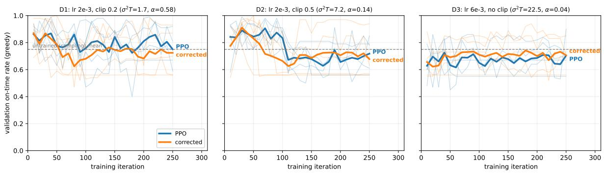  
Figure 9: Reward saturation at the fair deadline (early training, iterations 0–250). Validation on-time rate at the recalibrated deadline for the three drift settings (5 paired seeds thin, mean bold; dashed line: the untrained sampling policy’s mean success rate, 0.75). There is no extended learning phase: both methods reach their operating level within tens of iterations — near or below the untrained baseline — and under the drift settings decay from an early peak at matched rates. The binary indicator is blind to the remaining, still-large gap to optimal makespans $( \approx 0 . 3 5$ mean), so the fair-deadline comparison resolves seed noise around a saturated reward rather than a diference in learning.

criteria, with final-level secondaries agreeing.

No acquisition-phase advantage even under scarce signal. An exploratory cut of the harddeadline data suggested that the held correction also learns faster in the starved regime (corrected arms at 2 PPO’s on-time rate within the first 50 iterations at the highest-drift setting; 4/5 seeds, +0.18 early-phase AUC, short of significance). A registered confirmation on 16 fresh paired seeds — everything else frozen verbatim: pool, deadline, hyperparameters, $\alpha = 0 . 0 3$ — returned seed wins at chance and a mean slightly below zero (Table 6); the fresh seeds’ PPO-only early level itself difered from the original seeds’ by a factor of two. The held correction has no confirmed acquisition-phase advantage.

Among the held-correction experiments of this subsection, the correction’s demonstrated value is survival under scarce signal with stale data: holding an already-learned policy against drift erosion; the warmup schedule of Appendix G.5 is a diferent device. Under the operating-point hypothesis of Section 8, these nulls sit three orders of magnitude below the testbed in $N / T ^ { 2 }$ (Eq. 18).

## G.2 Positive controls: the mechanism and its implementation are sound

Free-choice positive control. A control rules out a bug in the correction implementation as the cause of the scheduling nulls. It runs the same correction code (correction factor, $\alpha = 0$ recovering PPO bit-identically) on an environment stripped to the $\mathrm { L M } / \mathrm { t o y }$ structure: T free K-way choices with the two-branch reward read from the first and last chosen actions, a small policy that must learn the prefix dependence (bag-of-prefix embeddings, no direct index on the branch symbol), and a GRPO group-relative baseline. Two ingredients decide whether the correction’s benefit appears, both established elsewhere in this paper: the optimizer must be N-SGD (Adam absorbs part of the efect; Appendix E), and the run must sit in the dead-branch escape regime, primed toward a dead branch it must escape. In that regime the correction rescues runs from the absorbing dead-branch trap, with several full rescues and no seed harmed (Table 16, first row; Figure 11).

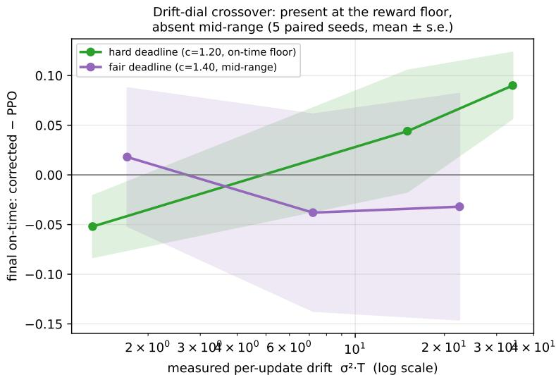  
Figure 10: The drift-dial on canonical-order FJSP, in two reward regimes. Paired final on-time diference (corrected minus $\mathrm { P P O ; 5 }$ paired seeds, ${ \mathrm { m e a n } } \pm { \mathrm { s . e . } } )$ against the drift measured at each training regime before launching, $\sigma ^ { 2 } T$ (log scale). At the hard deadline (green), where training operates at the on-time floor, the gap is monotone in measured drift and crosses zero, with every paired seed won at the top on both registered endpoints. At the fair deadline (purple), where all runs train mid-range, the same dial yields a null: with plentiful signal PPO absorbs the staleness on its own. The published training regime lies of the left edge, where the correction loses everywhere: with nothing stale to correct, only its variance cost remains. Values in Table 6.

The control isolates the boundary. The same code reproduces the win the moment the environment and learner match the toy, so the scheduling non-reproduction lies in the environment (a coupled, constraint-driven dispatch process whose terminal outcome, the makespan-determining job, is emergent rather than chosen) or in the learner (a graph network with a value critic under Adam, rather than a sequence model under N-SGD with a group baseline), not in the mechanism or its implementation.

Env-only ablation. We vary only the environment toward scheduling while freezing the learner, optimizer, group baseline, FATAL dead-branch regime, and every hyperparameter, to ask which scheduling property (if any) removes the win. Two env modifications move the free-choice task toward scheduling: an emergent terminal, where the reward reads the modal symbol over the whole trajectory (the analogue of the makespan-determining job) rather than a directly chosen last token; and coupling, where a chosen symbol is masked as “busy” for a fixed number of steps so the action set shrinks and changes, the constraint that prevents freely piling work onto the target. Table 16 reports the paired advantage (sign test on non-tied seeds) at each rung.

The advantage tracks whether a hard credit-routing problem is preserved, not emergent outcomes or coupling per se. With the correction code and the environment structure both excluded, the learner (T = 50 graph network) and optimizer (Adam with a value critic, low measured drift) remain as the operative cause, consistent with the $N / T ^ { 2 }$ prefactor and the optimizer ablations.

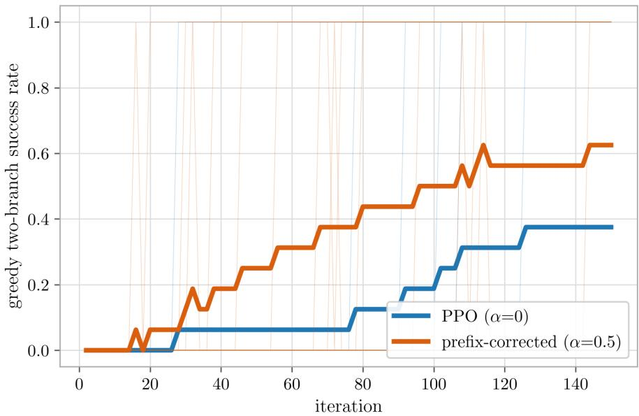  
Figure 11: Free-choice positive control. Greedy two-branch success vs. iteration under the LM-toy structure, the real correction code, N-SGD, and the FATAL dead-branch regime; 16 seeds thin, mean bold; plain PPO $( \alpha = 0$ , blue) and the prefix correction $( \alpha = 0 . 5 , \mathrm { o r a n g e } )$ . Primed toward a dead first branch, PPO frequently stays trapped at the reward floor while the correction routes credit back to the first action and escapes. Statistics in Table 16, first row.

## G.3 The reward boundary: why the win does not transfer to realistic objectives

Mapping the boundary. Holding the learner and optimizer at the winning configuration (N-SGD, group baseline), we asked directly what reward recovers the win on a scheduling task, and mapped the boundary by construction. A single-machine on-time objective is greedily solvable (Jackson’s rule) and yields nothing; a two-machine flow-shop with time-lags and varying, observed instances is null because an observing policy reads of which jobs are critical and applies a priority rule. Hiding the criticality does not recover it either — and an all-jobs-on-time reward makes the feasible set exponentially small, so both methods starve equally (the correction needs some rewarded trajectories to route credit from). Decomposing the winning two-branch reward pinpoints why: it is sharp on one directly chosen early action whose “liveness” the policy must discover, and dense given that action — a hard clif followed by a broad rewarded basin, with untrained success $0 . 5 \times 0 . 2 5 = 0 . 1 2 5$

The closest scheduling analogue is two orders with a tight deadline: one decisive early action (who runs first) and a clif (the lag-critical order misses if it is not first). There the correction does help, directionally and consistently (Figure 13A: paired $\Delta \mathrm { A U C } \mathrel { + } 0 . 0 0 4 , 5 / 0$ non-tied seeds, $p = 0 . 0 3$ , never harmful) — the structure and sign transfer. But the magnitude does not, and a second experiment shows why it cannot: adding a second binding condition (both orders on tight deadlines) to deepen the trap makes the feasible fraction jump from 0 to 0.68 as the deadline loosens (Figure 13B), with no ${ \approx } 0 . 1 2 5$ regime in between. Two binary decisions quantize feasibility to $\{ 0 , { \frac { 1 } { 2 } } , 1 \}$ ; the two-branch depth $\textstyle { \frac { 1 } { 2 } } \times { \frac { 1 } { 4 } }$ requires a second decision with four options, i.e. four or more orders — at which point the decisive structure distributes across a contention-mediated permutation and no single early action carries the credit. Scheduling thus forces a choice: two orders give the single decisive action but only shallow, quantized depth; four-plus orders give the depth but distribute the action. The single-decisive-action structure and the trap depth cannot be had together without constructing the reward by hand, as the two-branch reward is. A held correction’s boundary is therefore that it pays only where a reward isolates a single decisive early commitment, sharp enough to trap yet dense enough to escape, whose liveness is unobservable — a configuration realistic scheduling objectives do not admit.

<table><tr><td>env (learner/optimizer fixed)</td><td>size</td><td>PPO AUC</td><td>corr. ∆AUC</td><td>sign test</td></tr><tr><td>free (chosen terminal)</td><td>T=8</td><td>0.16</td><td>+0.19</td><td> $1 0 / 0 , p { = } 0 . 0 0 1$ </td></tr><tr><td>emergent (whole-traj. terminal)</td><td> $T { = } 8$ </td><td>0.13</td><td>+0.11</td><td> $8 / 1 , p { = } 0 . 0 2$ </td></tr><tr><td>emergent, longer horizon</td><td> $T { = } 1 2$ </td><td>0.07</td><td>+0.21</td><td> $1 5 / 0 , p { < } 1 0 ^ { - 4 }$ </td></tr><tr><td>coupled (busy = 2)</td><td> $T { = } 8$ </td><td>0.28</td><td>+0.10</td><td> $1 0 / 3 , p { = } 0 . 0 5$ </td></tr><tr><td>coupled, strong (busy = 3)</td><td> $T { = } 8$ </td><td>0.46</td><td>-0.03</td><td> $8 / 1 1 , p { = } 0 . 8 2$ </td></tr></table>

Table 16: Env-only ablation, all else fixed. The correction’s win survives an emergent terminal and coupling, and grows with a longer horizon (deeper credit-routing chain). It vanishes only under strong coupling — where $\mathrm { P P O } \mathrm { { s } }$ own score jumps to 0.46 because forced exploration dissolves the dead-branch trap: the task became easy, not the correction broken. The advantage tracks the dificulty of the escape/credit-routing problem, not the environment’s “scheduling-ness”.

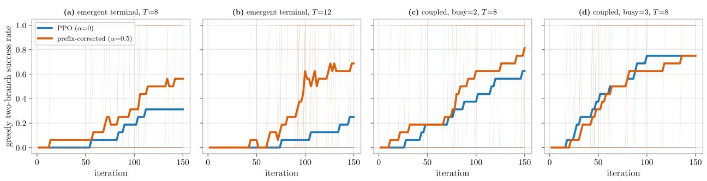  
Figure 12: Env-only ablation learning curves (learner, optimizer, regime, and hyperparameters all fixed; 16 seeds thin, mean bold; greedy two-branch success). The prefix correction (orange) stays above PPO (blue) under an emergent terminal (panel 1), an emergent terminal over a longer horizon (panel 2), and coupling (panel 3); only strong coupling (panel 4) erases the gap, where both methods rise together. Statistics in Table 16.

## G.4 A drifting transformer learner does not rescue it

Transformer pointer policy. The scheduling nulls above all used the HGNN dispatching policy, whose pooled graph representation barely moves per update (measured $\sigma ^ { 2 } T \approx 3 \times 1 0 ^ { - 5 }$ at published reuse) — which leaves open whether they reflect a low-drift learner rather than the domain. We replaced the graph network with a transformer pointer policy (self-attention encoder, autoregressive attention decoder) on an NP-hard multi-machine task — a three-machine permutation flow shop $\mathrm { ( F 3 | } C _ { \mathrm { m a x } } \mathrm { ) }$ with a bottleneck middle machine, 12 jobs, varying instances, N-SGD, and a proper GRPO group baseline (G rollouts of the same instance). The transformer drifts: $\sigma ^ { 2 } T = 1 . 3 8$ at $K = 1 2$ , more than four orders of magnitude above the HGNN. The correction still does not win. Under a dense makespan reward it is a wash; under the scarce tight-deadline reward, the only regime where a held correction has helped here (Appendix G.1), swept across three on-time floors, it consistently loses by a small margin (Table 6; Figure 14). At every setting PPO climbs smoothly from the on-time floor $\mathrm { t o } \approx 0 . 9 7$ and the corrected curve tracks just below it, noisier, paying the αT variance premium with no stale-state bias to buy back: a competent transformer learns to schedule well, and the “scarce” reward is scarce only at initialization.

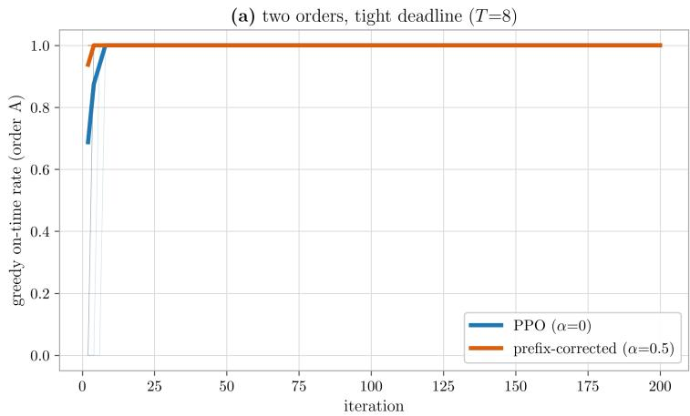

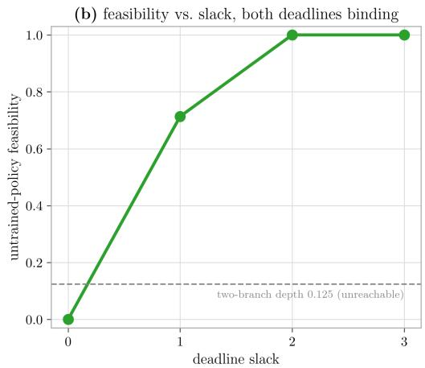  
Figure 13: The reward boundary (learner/optimizer fixed at the winning configuration). (A) Two orders with a tight deadline — the closest scheduling analogue of the two-branch reward. The correction (orange) beats PPO (blue) directionally and consistently (paired $\Delta \mathrm { A U C } + 0 . 0 0 4$ $5 / 0$ non-tied seeds, $p = 0 . 0 3$ , never harmful): the structure and sign of the win transfer. (B) Adding a second binding condition (both orders on tight deadlines) to deepen the trap: the feasible fraction jumps from 0 to 0.68 as slack increases, never passing through the two-branch depth (0.125, dashed). Two binary decisions quantize feasibility; reaching 0.125 needs a four-option second decision (four-plus orders), which distributes the decisive action. The magnitude cannot transfer without hand-carving the two-branch structure.

A held correction helps only when PPO is stuck in an absorbing trap that pins the reward near zero, and nulls or loses whenever PPO can climb; the two-branch/FATAL construction produces such a trap, and realistic scheduling objectives, with continuous progress signal, do not. The drift number makes the same point quantitatively: $\sigma ^ { 2 } T = 1 . 3 8$ is real drift but an order of magnitude below the $\sigma ^ { 2 } T \approx 1 5 \mathrm { - } 3 4$ at which the drift-dial crossover fires, and reaching that band on the transformer requires raising the learning rate and loosening the clip until the update is near-divergent. Dialing the update strength up through three settings (D1: lr 0.25, clip 0.5, K = 24; D2: 0.35/0.6/30; D3: $0 . 4 5 / 0 . 8 / 4 0 ;$ 16 paired seeds each), the correction’s $\Delta \mathrm { A U C }$ moves monotonically with drift and crosses zero at D3, exactly where PPO can no longer climb (Table 6). The crossover is directional, not significant, but it reproduces the HGNN’s drift-dial crossover on a diferent architecture: the threshold is a property of the training regime, not of the learner.

## G.5 The win in detail: warmup, reuse, horizon, and dose

Warmup schedule. $\alpha = \alpha _ { 0 }$ for the first W iterations, then $\alpha = 0$ (plain PPO); bottleneck transformer, 48 seeds per deadline, $c \in \{ 1 . 0 , 1 . 0 2 \}$ , pooled in Table 7. Per deadline, the $W = 2 5$ and $W = 5 0$ warmups remain significant at $c = 1 . 0 2$ alone $( p = 0 . 0 3 0$ and 0.039). The second-half $\Delta \mathrm { A U C }$ is $- 0 . 0 6 ~ \mathrm { t o } ~ - 0 . 0 9$ under a held α and within 0.02 of zero once α switches of (Figure 3).

Aggressive reuse during the warmup, with a no-correction control. $K = 3 0$ for the first $W = 5 0$ iterations, then the standard $K ;$ the control arm runs the same schedule without the correction. On the easy task (single-bottleneck flow shop, 16 seeds) the correction at the standard

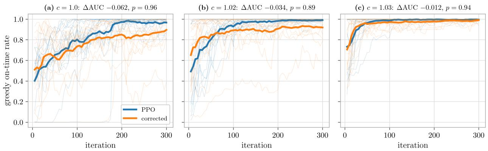  
Figure 14: A drifting transformer does not rescue the correction on a hard scheduling task. Three-machine bottleneck flow shop, transformer pointer policy, N-SGD, GRPO, under the scarce tight-deadline reward at three tightnesses (on-time floor 0.14/0.35/0.56). Greedy on-time rate vs. iteration; 16 paired seeds thin, mean bold; PPO blue, corrected orange. At every setting PPO climbs from the floor and the corrected curve sits just below it; values in Table 6.

K gives $\Delta \mathrm { A U C } + 0 . 0 2 4$ over PPO, against the $K = 3 0$ values in Table 7. The hard task’s three bottlenecks sit at machines 1, 3, 5 .

K-tolerance frontier (easy task). K held for the whole run, swept 4–128 at clip 0.2 and 0.4, with the drift $\sigma ^ { 2 } T$ measured alongside (Figure 15). PPO is robust to reuse at clip 0.2 and fails only at K = 128 under clip 0.4; the corrected update sits at or below PPO at every K but one, while its drift climbs by five orders of magnitude across the sweep.

Horizon sweep and calibration. Multi-bottleneck flow shop, $J \in \{ 2 0 , 3 0 , 4 0 , 5 0 \}$ jobs (setting T), 12 seeds each at fixed c = 1.03 (Table 17, first block; Figure 16). Because PPO’s final on-time rises with J at fixed c, the sweep partly conflates trajectory length with PPO’s AUC headroom. A PPO-only calibration (8 seeds, blind to the corrected arm, commit 3a3c0a1) therefore chooses, for each J, the deadline in a grid whose PPO final on-time is closest to 0.65, accepting it only inside [0.50, 0.85]; J = 50 is excluded because its feasibility jumps from 0.25 at c = 1.01 to 1.0 at c = 1.03 with no grid point in the band (Table 17, second block; Figure 17).

Disjunctive job shop. Machine routes are drawn at random per job, $T = J \cdot M = 4 0$ , the same binary deadline reward, 6 seeds (Table 7, last block; Table 17, third block; Figure 5). At c = 1.05 PPO itself falls from 0.94 to 0.41 over training, with no within-group signal for GRPO. 16 seeds at $c = 1 . 1 0$ would be needed before the magnitude is headlined.

Dose regression. The dose of Section 6.2 is averaged over the warmup window per seed. Dificulty is partialled out by z-scoring dose and win within configuration before pooling the $n = 6 6$ points; the early-half correlation is positive in 5 of 7 configurations. The per-configuration correlations (Table 17; Figure 18) are point estimates on 6–12 seeds and scatter widely; the early correlation is largest on the job-shop winning cell. A correlation does not by itself establish the dose as the cause, and the across-task dose–response without dificulty control is flat because PPO’s headroom caps the realised win.

<table><tr><td rowspan="2">Configuration</td><td colspan="2">PPO</td><td colspan="2">Lead over PPO</td><td rowspan="2">Marginal ΔAUC</td><td colspan="2">r(dose, win)</td></tr><tr><td>n</td><td>final</td><td>first half second half</td><td></td><td>Dose</td><td>early late</td></tr><tr><td colspan="9">Multi-bottleneck flow shop, horizon sweep at fxed c = 1.03</td></tr><tr><td> $J = 2 0$ </td><td>12 0.67</td><td>+0.115</td><td>+0.149</td><td>+0.178</td><td>3.75</td><td>+0.51</td><td>-0.19</td></tr><tr><td> $J = 3 0$ </td><td>12 0.57</td><td>+0.071</td><td></td><td>+0.050</td><td>+0.045 5.53</td><td>-0.39</td><td>+0.45</td></tr><tr><td> $J = 4 0$ </td><td>12 0.87</td><td>+0.083</td><td>-0.016</td><td>+0.021</td><td>5.41</td><td>+0.67</td><td>-0.12</td></tr><tr><td> $J = 5 0$ </td><td>12 0.98</td><td>+0.092</td><td>+0.003</td><td>+0.049</td><td>5.27</td><td>+0.74</td><td>-0.48</td></tr><tr><td colspan="8">Same task, deadline calibrated per J to hold PPO&#x27;s ceiling fixed</td></tr><tr><td> $J = 2 0 , c = 1 . 0 3 5$  8</td><td>0.71</td><td>+0.097</td><td>+0.077</td><td>+0.109</td><td>3.08</td><td>+0.03</td><td>-0.38</td></tr><tr><td> $J = 3 0 , c = 1 . 0 3$ </td><td>8 0.75</td><td>+0.092</td><td>+0.055</td><td>+0.192</td><td>4.71</td><td>+0.07</td><td>+0.09</td></tr><tr><td> $J = 4 0 , c = 1 . 0 2 5$ </td><td>8 0.71</td><td>+0.138</td><td>-0.092</td><td>+0.158</td><td>5.96</td><td>-0.19</td><td>-0.55</td></tr><tr><td colspan="8">Disjunctive job shop,  $T = 4 0$ </td></tr><tr><td> $c = 1 . 0 5$ </td><td>6 0.41</td><td>-0.023</td><td>-0.196</td><td>-0.050</td><td>7.76</td><td>+0.34</td><td>-0.62</td></tr><tr><td> $c = 1 . 1 0$ </td><td>6 0.57</td><td>+0.055</td><td>+0.144</td><td>+0.364</td><td>6.11</td><td>+0.79</td><td>+0.54</td></tr><tr><td> $c = 1 . 1 5$ </td><td>6 0.53</td><td>-0.023</td><td>+0.102</td><td>+0.006</td><td>3.95</td><td>-0.68</td><td>+0.48</td></tr></table>

Table 17: Horizon and dose detail behind Section 6.2. Lead over PPO is the warmup-corrected run’s mean greedy on-time minus plain PPO’s over the first and second halves of training; marginal ∆AUC is over the no-correction K = 30 control; dose is the prefix bias $\sum _ { t } \left| b _ { t } \right|$ on that control, averaged over the warmup window; r is the within-configuration Pearson correlation across seeds between the dose and the half-wise lead. In the calibrated block the deadline is chosen per J by a PPO-only calibration (see text); J = 50 has no deadline in the calibration band and is excluded.

Replication across environments. The efect reproduces in sign and magnitude across a local 8-seed and a cloud 16- and 48-seed environment with diferent $\mathrm { P y }$ Torch builds.

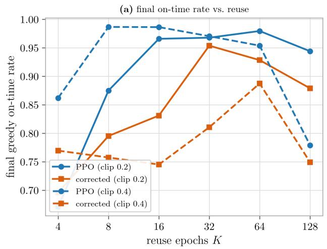

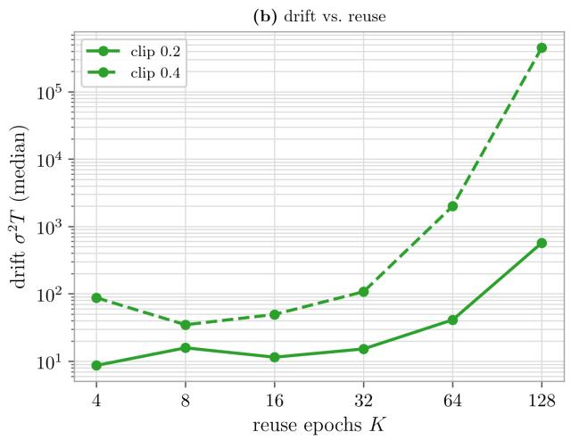

Figure 15: K-tolerance frontier on the easy task: reuse opens no window for the correction. Reuse K held the whole run, swept 4–128, at clip = 0.2 (solid) and 0.4 (dashed). (A) Final greedy on-time vs. K: PPO (blue) is robust — it peaks at $K = 6 4$ and barely drops by $K = 1 2 8$ at $\mathrm { c l i p } = 0 . 2$ , failing only at $K = 1 2 8 / \mathrm { c l i p } = 0 . 4 \mathrm { ~ - ~ }$ and the corrected update (orange) sits at or below PPO at nearly every K. (B) Drift $\sigma ^ { 2 } T$ (median, log scale) climbs steeply with K and explodes $\mathrm { t o } \sim 1 0 ^ { 6 }$ at $K = { 1 2 8 } / { \mathrm { c l i p } } = 0 . 4 \mathrm { { : } }$ the variance regime that sinks the correction. Clip already contains the reuse bias on an easy task, so the correction only adds variance — its value needs hard credit assignment (Figure 4), not merely high K.  
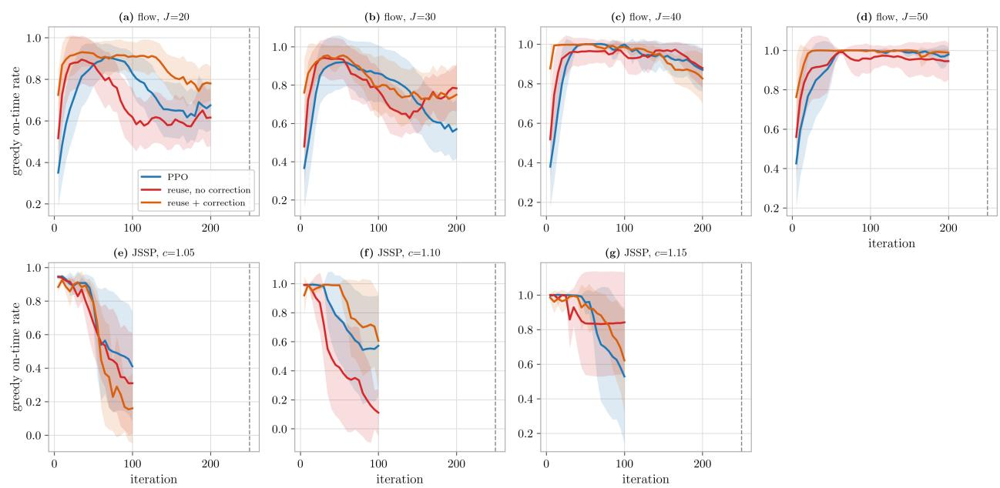  
Figure 16: Faster early, same endpoint — the sample-eficiency win across horizon and a second task family. Learning curves (mean 2 SE) for plain PPO (blue), aggressive reuse without the correction (red), and aggressive reuse with the correction (orange); dotted line marks the end of the correction warmup. In the long-horizon flow shop $( J = 4 0 , 5 0 )$ the correction leads through the warmup window and PPO converges to the same plateau afterward (sample eficiency, not a better policy). The durable exception is disjunctive JSSP at $c = 1 . 1 0$ , where the correction stays ahead throughout.

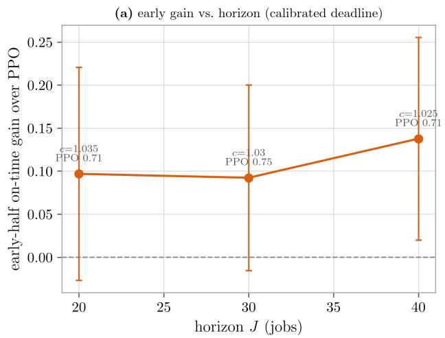

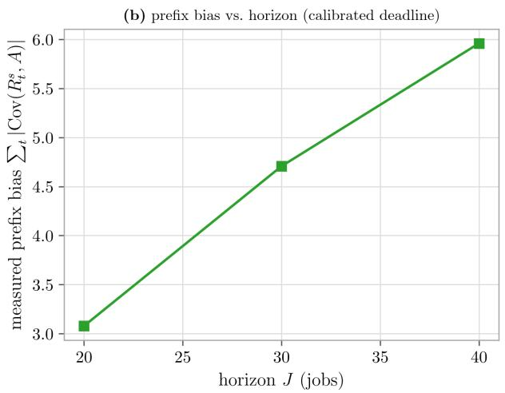  
Figure 17: Horizon drives the bias dose; the win is headroom-gated. Ceiling-controlled horizon sweep: for each J the deadline c is calibrated (PPO-only, blind to the corrected arm) so PPO’s final on-time sits in a mid-band $( J = 5 0$ excluded — no in-band cell). (A) Correction early-half win over PPO vs. J at the held ceiling: positive and roughly flat. (B) Measured prefix bias vs. J: rises monotonically even though the ceiling is fixed — the dose is horizon-driven, while the realised win is capped by headroom (here held constant). Values are in Table 17.

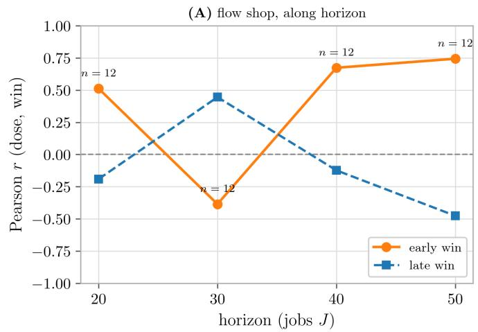

(B) JSSP, along deadline  
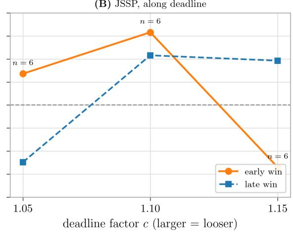  
Figure 18: The early-win–dose coupling peaks where the correction wins. Per-config within-seed Pearson r between the measured bias dose and the correction’s win over plain PPO, early (orange, solid) vs. late (blue, dashed), plotted along each task’s dificulty axis. (A) Flow shop: the early correlation is highest at long horizon J. (B) JSSP: it peaks at the feasible deadline $c = 1 . 1 0$ — the winning cell — and falls of on either side. Per-config $n = 6 { - } 1 2$ , so the late correlations scatter widely around zero; the axis-wise pattern of the early correlation, not any single point, is the message. Values are in Table 17.