# From Modes to Memories: Characterizing the Scale-Space Dynamics of Diffusion Models

Cristina López Amado\*, Marco Fumero\*, Francesco Locatello

Institute of Science and Technology Austria (ISTA)

## Abstract

Diffusion models are typically viewed as stochastic processes that transform noise into data. We take a complementary perspective: a diffusion model defines a family of deterministic dynamical systems indexed by noise scale. At each fixed scale σ, we treat the denoiser as a self-map and study its dynamics. For an exact denoiser, fixed points correspond to critical points of the smoothed data density, while attractors correspond to its modes; as σ increases, sample-level modes merge into progressively coarser ones. This suggests a geometric view of memorization: examples that receive excess probability mass due to duplication or overfitting, as well as outliers, should remain distinguishable under stronger smoothing than ordinary examples. We quantify this persistence by the critical scale $\sigma _ { \mathrm { { c } } } ,$ the largest noise scale at which an example is retained by the fixed-scale dynamics. In conditional models, the same construction extends naturally to image–caption pairs. Experiments in controlled settings and on large-scale models show that $\sigma _ { \mathrm { c } }$ tracks memorization arising from duplication, overfitting, and outliers, and identifies both memorized and partially memorized examples in Stable Diffusion. Moreover, $\sigma _ { \mathrm { c } }$ yields interpretable measures of the image spatial distribution and caption dependence of memorization.

## 1 Introduction

Diffusion models are typically viewed as stochastic processes that transform noise into data [Ho et al., 2020, Song et al., 2021, Karras et al., 2022, Rombach et al., 2022]. They are trained with a local and static criterion, the prediction of a clean signal from a noisy one at each noise level, and are used through a global and dynamic procedure, a sampler that composes these denoisers along a decreasing schedule of noise levels. What a model has learned is then read off the process as a whole, from its samples or from its loss along the schedule.

We take a complementary view and interpret a diffusion model as a family of denoisers $D _ { \sigma }$ , one for each noise level σ. Fixing σ and iterating the denoiser on its own output, $x _ { k + 1 } = D _ { \sigma } ( x _ { k } )$ , turns a single trained network into a one-parameterfamily ofdeterministic dynamical systems, whose fixed points and basins are properties of the network alone (Figure 1, left). For an exact denoiser each of these maps is Gaussian mean shift on the smoothed data density $p _ { \sigma }$ [Fukunaga and Hostetler, 1975, Cheng, 1995, Comaniciu and Meer, 2002]: its fixed points are the critical points of $p _ { \sigma }$ and its attractors are the modes of $p _ { \sigma }$ . At small σ every training example is its own attractor, at large σ a single attractor remains, and in between the attractors merge into progressively coarser ones (Figures 2–3). Varying σ thus traces a scale space of the attractors of the model.

This scale space gives a geometric view of memorization mechanisms [Carlini et al., 2023, Bonnaire et al., 2025, Ross et al., 2025]: an example is retained under its dynamics when it carries excess probability mass, as under duplication or overfitting, or when it is isolated from the remaining data, as outliers. We measure this persistence by the critical scale $\sigma _ { \mathrm { { c } } } ,$ , the largest noise level at which iterating the fixed-scale denoiser from an example keeps the trajectory close to it (Figure 1). The critical scale requires no labels, applies to conditional models, where it becomes a property of a caption-image pair, and is interpretable. We test it with interventions that cause memorization: on CIFAR-10 we induce memorization by duplication, by overfitting and by planting outliers, and on Stable Diffusion we use image–caption pairs that are known to be memorized, fully or in part. Our contributions are as follows:

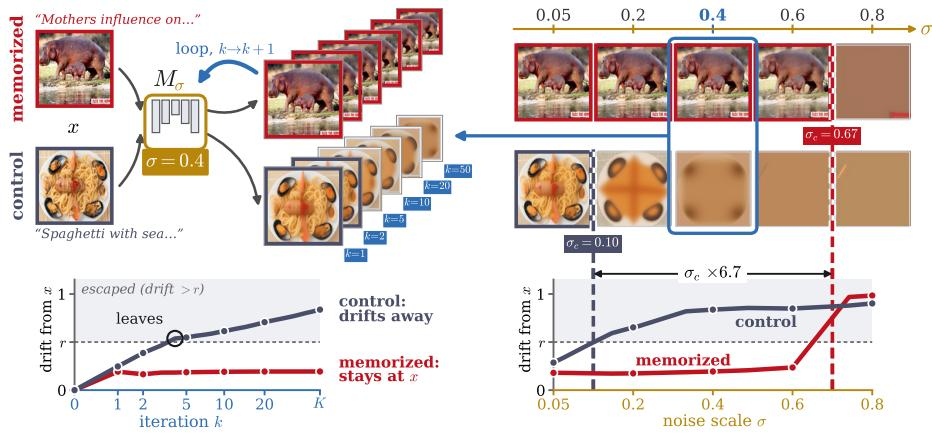  
Figure 1: A diffusion model as a family of dynamical systems. Fixing the noise level σ and feeding the denoiser its own output defines a self map Mσ (left). A memorized training image is a fixed point of this map: its orbit stays at the image, whereas the orbit of a control image drifts away and crosses the escape radius r (bottom left). Repeating this retention test at every σ (right) yields the critical scale $\sigma _ { \mathrm { { c } } } .$ , the largest noise level at which the image is still returned; it is 6.7× larger for the memorized image, effectively detecting it.

• We show that a diffusion model can be interpreted as a family of dynamical systems indexed by the noise level: for an exact denoiser the attractors are the modes of the data density smoothed at scale σ, and varying σ traces a scale space in which these attractors merge.

• In this framework, we define the critical scale $\sigma _ { \mathrm { c } }$ as a memorization measure: the scale up to which a sample remains an attractor of the dynamics. It extends to conditional models, capturing the caption-image interaction. For the optimal case we prove that $\sigma _ { \mathrm { c } }$ depends on the inter-samples distances and their multiplicity, reflecting memorization induced by data duplication and outliers.

• In controlled experiments we show that $\sigma _ { c }$ detects memorization induced by duplication, by overfitting and by planting outliers, transferring the mechanism from the theory to trained networks.

• We show that the critical scale is an effective detector on large-scale conditional models such as Stable Diffusion, for both fully and partially memorized examples and that the measures is interpretable: being able to characterize whether its retention comes from the caption, from the image, or their interaction and where in the image the memorized content localizes.

## 2 Diffusion models as a family of dynamical systems

Let $\boldsymbol { x } _ { 0 } \in \mathbb { R } ^ { d }$ be drawn from a data distribution $p ,$ and let $y = x _ { 0 } + \sigma \varepsilon$ , with $\varepsilon \sim \mathcal { N } ( 0 , I )$ , be its observation at noise level $\sigma > 0$ . Following Karras et al. [2022], a diffusion model is a family of denoisers $\{ D _ { \sigma } : \mathbb { R } ^ { d }  \mathbb { R } ^ { d } \} _ { \sigma > 0 }$ trained by minimising E $\| \bar { D } _ { \sigma } ( x _ { 0 } + \sigma \varepsilon ) - x _ { 0 } \| ^ { 2 }$ over a range of noise levels. Its minimiser is the posterior mean $D _ { \sigma } ( y ) \stackrel { - } { = } \mathbb { E } [ x _ { 0 } | \stackrel { . } { y } ]$ . Noise-prediction models such as DDPM [Ho et al., 2020] and Stable Diffusion [Rombach et al., 2022] reduce to this form: a network $\epsilon _ { \theta }$ trained to predict ε gives $D _ { \sigma } ( y ) = y - \sigma \epsilon _ { \theta } ( y )$ , up to a rescaling of the input (see Appendix F).

We study each denoiser by fixing its noise level and iterating it on its own output, so that each noise level defines a deterministic dynamical system on $\mathbb { R } ^ { d }$ (Figure 1, left).

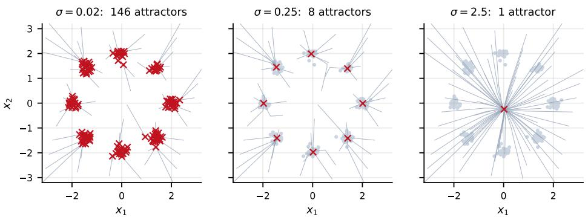  
Figure 2: One model, a family of dynamical systems. Orbits of the exact map $M _ { \sigma }$ (Eq. 1) for samples from an 8-mode mixture of gaussians. $L e f t { \mathrm { : } }$ at small σ each datum carries its own attractor. Middle: at intermediate σ the attractors are the 8 population modes. Right: at large σ a single attractor remains, at the data mean.

Definition 1 (Denoising dynamics at scale σ). Fix $\sigma > 0$ and let $M _ { \sigma } : = D _ { \sigma } $ . The denoising dynamics at scale σ is the deterministic dynamical system on $\mathbb { R } ^ { d }$

$$
x _ { k + 1 } = M _ { \sigma } ( x _ { k } ) , \qquad k = 0 , 1 , 2 , \ldots
$$

For $x \in \mathbb { R } ^ { d }$ , the orbit of x is the sequence $( M _ { \sigma } ^ { k } ( x ) ) _ { k \geq 0 } ,$ where $M _ { \sigma } ^ { k }$ denotes the k times composition of $M _ { \sigma }$ . A point $x ^ { * } \in \mathbb { R } ^ { d }$ is a fixed point if $M _ { \sigma } ( x ^ { * } ) = x ^ { * }$ Its basin of attraction is

$$
\mathcal { B } _ { \sigma } ( x ^ { * } ) = \big \{ x \in \mathbb { R } ^ { d } : \operatorname* { l i m } _ { k  \infty } M _ { \sigma } ^ { k } ( x ) = x ^ { * } \big \} ,
$$

and $x ^ { * }$ is an attractor if $B _ { \sigma } ( x ^ { * } )$ contains an open neighbourhood of $x ^ { * } .$ . Letting σ vary, a diffusion model defines the one-parameter family of dynamical systems $\{ M _ { \sigma } \} _ { \sigma > 0 } .$

Throughout the paper our goal will be to characterize the dynamics of $M _ { \sigma }$ as a function of the noise scale σ: see Figures 2 and 3, top row, for a 2D example of the map M at different $\sigma _ { s }$ and its dynamics. Figure 7 (Appendix A) shows the loop on Stable Diffusion.

When the denoiser is exact, i.e. it predicts the posterior mean $D _ { \sigma } ( y ) = \mathbb { E } [ x _ { 0 } \mid y ]$ , the dynamics of $M _ { \sigma }$ admit an explicit description:

Proposition 2 ( formal: Proposition B.2). For the exact denoiser, one step of the dynamics is a gradient-ascent step on the smoothed density, $M _ { \sigma } ( x ) = x + \sigma ^ { 2 } \nabla \log p _ { \sigma } ( x )$ . For a training set $\begin{array} { r } { \bar { p } = \frac { 1 } { N } \sum _ { i } \delta _ { x _ { i } } } \end{array}$ , M is Gaussian mean shift with bandwidth σ,

$$
M _ { \sigma } ( x ) = \sum _ { i } w _ { i } ( x ) x _ { i } , \qquad w _ { i } ( x ) = \frac { \exp \bigl ( - \| x - x _ { i } \| ^ { 2 } / 2 \sigma ^ { 2 } \bigr ) } { \sum _ { j } \exp \bigl ( - \| x - x _ { j } \| ^ { 2 } / 2 \sigma ^ { 2 } \bigr ) } .\tag{1}
$$

Its fixed points are the critical points of $p _ { \sigma } ,$ , its attractors are the modes of $p _ { \sigma } ,$ , and every orbit increases $p _ { \sigma }$ and converges to a fixed point.

The first identity is Tweedie’s formula [Robbins, 1956, Efron, 2011], and the iteration of equation 1 is mean shift [Fukunaga and Hostetler, 1975, Cheng, 1995, Comaniciu and Meer, 2002], the classical mode-seeking clustering algorithm, run at bandwidth $\sigma .$ The attractors of the denoising dynamics are therefore the modes of the data blurred at scale $\sigma$ . In the limit $\sigma  0$ every training example is an attractor of its own, whereas once σ exceeds half the diameter of the data, a single at tractor remains, close to the data mean (Proposition B.7); at intermediate scales the attractors merge progressively, nearby data into cluster modes and cluster modes into coarser ones. Figure 2 shows the three regimes, and Figure 3 traces the merging as a tree, in which the branch of an example terminates where the example ceases to be an attractor of its own.

## 2.1 Memorization and the critical scale

As $\sigma$ increases, a training example is absorbed into a coarser attractor, and the model reproduces only its cluster. We regard an example as memorized to the extent that it resists this absorption:

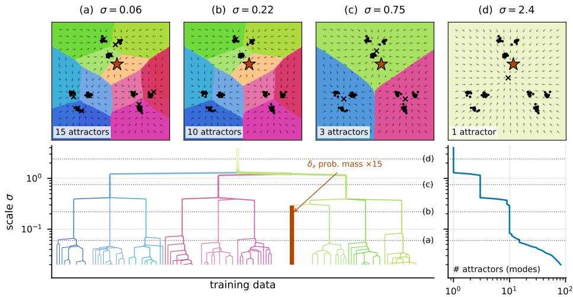  
Figure 3: Scale space of attractors. Exact map $M _ { \sigma }$ on a 2-D training set: three groups of three sub-clusters (black dots), plus one datum repeated 15 times (red star). Top: basins of attraction at four scales, coloured by the reached attractor $( \times )  \}$ arrows are the drift $M _ { \sigma } ( x ) - x .$ Bottom left: merge tree of the attractors reached from the data (width = number of data collected). Single data lose their attractor at small $\sigma ;$ the duplicated datum (red) keeps it until merging with the neighbouring sub-clusters. Bottom right: number of attractors. A denoiser trained on the same data reproduces this scale space, basins, merge tree and counts alike (Appendix C, Fig. 8).

in Figure 3, non-duplicated examples lose their branch at small σ, whereas the duplicated example retains it until merging with entire groups. To measure the scale of absorption without locating the attractors, we initialize the dynamics at the example and test whether the orbit remains close to it.

Definition 3 (Critical scale). Fix an escape radius $r > 0$ and an iteration budget K. The probe x is retained at scale σ if $\| M _ { \sigma } ^ { k } ( x ) - x \| \leq r \| x \|$ for every $k \leq K$ . The critical scale of x is the largest scale at which it is retained,

$$
\sigma _ { \mathrm { c } } ( x ) = \operatorname* { s u p } { \big \{ } \sigma > 0 : \ x { \mathrm { i s ~ r e t a i n e d ~ a t ~ s c a l e } } \sigma { \big \} } .
$$

The critical scale is thus the largest noise level at which the model, iterated on its own output, still returns x: below $\sigma _ { \mathrm { c } }$ the example lies in a basin of its own, and above it the orbit is drawn towards an attractor possibly shared with other data. Figure 1 illustrates the definition on a memorized and a control image on Stable Diffusion model: the memorized image is returned over a range of scales an order of magnitude wider than the control, and $\sigma _ { \mathrm { c } }$ marks the upper end of this range (the full grid of scales and iterations is in Figure 14, Appendix G). Being expressed in units of noise, $\sigma _ { \mathrm { c } }$ is comparable across models and noise schedules.

What the critical scale captures. For the exact denoiser, the critical scale $\sigma _ { \mathrm { c } }$ responds to the probability mass carried by an example and to its distance from the rest of the data.

Theorem 4 (formal: Theorem B.9). Increasing the probability mass on an example,for instance by duplicating it, reduces the displacement $\| M _ { \sigma } ( x ) - { x } \|$ at the example at every noise level and can therefore only increase its critical scale.

The map is pulled away from the example only by the other data, and additional mass on the example dilutes this pull. The following theorem makes the rate explicit.

Theorem 5 (formal: Thm. B.11). Consider an example of mass $\theta \ \leq \ \frac { 1 } { 2 }$ whose only neighbour, carrying the remaining mass, lies at distance d. The example keeps an attractor of its own exactly below a critical scale, which increases with θ. For small θ this scale grows linearly in the distance and only logarithmically in the mass, as $d / \sqrt { 2 \log ( 1 / \theta ) }$

Doubling the distance to the neighbour therefore doubles $\sigma _ { c }$ , whereas doubling the copies raises it by a few percent. The critical scale thus captures both duplicated examples and outliers. $\operatorname { A t } \sigma _ { \mathrm { c } }$ the attractor disappears in a saddle-node bifurcation, which the escape test detects (Proposition B.12).

Conditional models and the caption gap. A text-to-image model defines one family of dynamics $M _ { \sigma } ( \cdot ; c )$ for each caption c, with $c = \emptyset$ the unconditional model. Memorization is then a property of a caption–image pair, and we measure the change that the caption induces in the $\sigma _ { c }$ of the image.

Definition 6 (Caption gap). With $\sigma _ { \mathrm { c } } ( x ; c )$ the critical scale computed with $M _ { \sigma } ( \cdot ; c )$ , the caption gap of the pair $( x , c )$ is $\Delta \log \sigma _ { \mathrm { c } } ( x ; c ) = \log \sigma _ { \mathrm { c } } ( x ; c ) - \log \sigma _ { \mathrm { c } } ( x ; \emptyset )$

Subtracting the unconditional value removes the retention that the image exhibits on its own. For the exact denoiser, the caption enters the mean shift equation 1 only through the prior weights of the training images, like a duplication count, and Theorem 4 gives the following.

Corollary 7 (formal: Corollary B.14). For a single iteration, and when the caption leaves the relative weights of the other examples unchanged, the caption gap of $\mathbf { \Psi } ^ { \mathrm { ~ r ~ } } ( x _ { i } , c )$ is positive if and only if the caption raises the model’s mass on that example.

From the exact denoiser to trained networks. The results above concern the exact denoiser, of which a trained network is only an approximation, and we do not expect a trained network to reproduce their values. We expect the mechanism to carry over: an example retains a basin of its own when it carries mass or lies far from the rest of the data, and $\sigma _ { \mathrm { c } }$ measures the width of that basin. The experiments of Section 3 verify if memorization from duplicated data and outliers transfers to real data scenarios. On the exact denoiser of a real training set the theory holds quantitatively (Appendix D), and Appendix D.2 examines how closely trained networks approach it.

## 3 Controlled experiments

We first evaluate the critical scale in a controlled setting, with DDPM [Ho et al., 2020] models on the CIFAR-10 dataset [Krizhevsky, 2009]. An example can be memorized for different reasons, but these mechanisms are confounded in pretrained models. We therefore isolate them through controlled training interventions and test whether critical scale detects the memorization induced by each. In all experiments $\sigma _ { \mathrm { c } }$ is computed by bisection in log σ on the escape event of Definition 3. Training and evaluation details, and additional results are given in Appendices F and E.

• Duplication $( \ S 3 . 1 )$ . An example is repeated m times in the training set, so the empirical distribution places mass $m / N$ on it.

• Rarity (§3.2). An atypical example is added a few times. It has no training neighbours with which to share a basin, but it also receives almost no probability mass.

• Overfitting (Appendix E.2). The training set is reduced at fixed model capacity and training budget, moving the model from generalization to memorization. $\sigma _ { \mathrm { c } }$ tracks this transition and detects memorization at training-set sizes where sampling no longer finds copies.

## 3.1 Memorization from data duplication

Setup. We study memorization induced by duplication, and ask whether $\sigma _ { \mathrm { c } }$ detects it and how it depends on the number of copies. To isolate the effect of duplication from that of membership, we compare two models trained on the same images: one with duplicates and one without. We train the improved-diffusion CIFAR-10 model [Nichol and Dhariwal, 2021] (50M parameters, 500k steps) on the full training set, in which eight images are repeated at each multiplicity $m \in \{ 2 , 8 , 2 5 , 5 0 , 1 0 0 , 2 0 0 , 4 0 0 , 8 0 0 \}$ . As control we use the publicly released checkpoint of the same model, trained on the same data without duplicates. We evaluate $\sigma _ { \mathrm { c } }$ on the 64 duplicated images, on 200 training images that appear once $( m = 1 )$ , and on 200 held-out images. Duplication does induce copying: 16 605 of 50 000 generated samples are copies of a duplicated image.

Results. Figure 4a shows that $\sigma _ { \mathrm { c } }$ responds to the intervention rather than to the images. In the model trained with duplicates, the median $\sigma _ { \mathrm { c } }$ is 0.137 on held-out images and 0.142 at $m = 1$ , against 1.04–1.43 for m $\geq 8 .$ In the control model the same images have $\sigma _ { \mathrm { c } }$ between 0.12 and 0.27 at every multiplicity, and the rank correlation with m drops from $\rho = 0 . 7 0 \ \mathrm { t o } \ 0 . 1 9$ . Used as a detector, $\sigma _ { \mathrm { c } }$ separates m $\geq 8$ from $m = 1$ with Area Under the Curve (AUC) 1.000. The duplicated images are fixed points: at $m = 8 0 0$ the median $\sigma _ { \mathrm { c } }$ is the same for $K = 5 0$ and $K = 5 0 0$ iterations, while for held-out and $m = 1$ images it decreases by more than two orders of magnitude over the same range (Figure 4b). Above $m = 8 , \sigma _ { \mathrm { c } }$ c increases by only a factor 1.38 while m increases a hundredfold, the saturation expected of a width in which mass enters logarithmically (Appendix E.1).

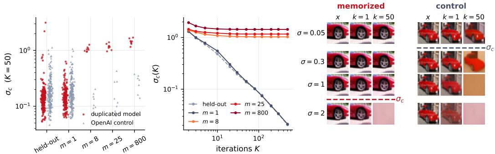  
Figure 4: Duplication on full CIFAR-10. $( a ) \sigma _ { \mathrm { c } }$ of each image, grouped by multiplicity, in the model trained with duplicates (circles) and in the released model trained on the same images without duplicates (triangles). $( b ) \sigma _ { \mathrm { c } }$ as a function of the iteration budget K (median per group): constant for images with m $\geq 8 ,$ which are fixed points, and decreasing as 1/K for held-out and $m = 1$ images, which are transients. (c) Orbits $M _ { \sigma } ^ { k } ( x )$ of a memorized training image $( m = 4 0 0 )$ and of a training image seen once $( m = 1 )$ , with σ fixed along each row and k along the columns; the dashed line marks the $\sigma _ { \mathrm { c } }$ of each image $( K = 5 0 , r = 0 . 5 ; 1 . 6 2$ and 0.14). The memorized image is still reproduced after 50 iterations at $\sigma = 1$ , where the other one has already vanished.

Takeaway. The critical scale captures memorization from data duplication, which turns transient states in the image orbits into stable fixed points. Additional copies increase $\sigma _ { \mathrm { c } }$ only slightly.

## 3.2 Memorization of rare samples

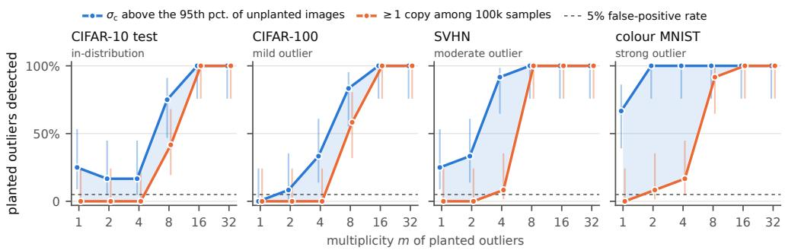  
Figure 5: Rarity: detection thresholds of $\sigma _ { \mathrm { c } }$ and of sampling. Fraction of added images detected as a function of their multiplicity $m ,$ for sources of increasing atypicality. Orange: the image appears at least once among $\mathrm { 1 0 ^ { 5 } }$ samples; the threshold is m ≈ 8 for every source. Blue: $\sigma _ { \mathrm { c } }$ exceeds the 95th percentile of the images of the same source not added to the model; the threshold decreases to $m = 1$ as the images become more atypical. The shaded region is memorization detected by $\sigma _ { \mathrm { c } }$ but not by sampling.

Setup. We study memorization of outliers, which Theorem 5 predicts to be retained with few copies because of their distance to the other samples. We train two models, A and B, on the same subset of $N = 1 0 ^ { 4 } \subset \mathrm { I F A R - 1 } 0$ images, to which we add images from 4 datasets of increasing atypicality: CIFAR-10 test images, CIFAR-100 classes with no CIFAR-10 counterpart, SVHN digits, and colourised MNIST digits. The added images statistics are matched to the $\mathtt { C I F A R - 1 0 }$ . From each source, 36 images are added to A, 36 other images to B, and 100 images to neither, with six images at each multiplicity $m \in \{ 1 , 2 , 4 , 8 , 1 6 , 3 2 \}$ . Each image is thus memorized in one model and not in the other, and the images added to neither model serve as a reference distribution. We draw $1 0 ^ { 5 }$ samples from each model and count near-copies of the added images.

Results. Sampling and $\sigma _ { \mathrm { c } }$ have different detection thresholds (Figure 5). Sampling detects added images only from $m \approx 8 ,$ for every source; below this multiplicity no image is generated. We flag an image with $\sigma _ { \mathrm { c } }$ when its value exceeds the 95th percentile non-added images from the same source, which gives a false-positive rate of 5% without using labels. The resulting threshold decreases with atypicality: $m = 8$ for $\mathsf { C I F A R - 1 0 }$ and CIFAR-100, m = 4 for SVHN and $m = 1$ for colour

Table 1: Memorization-detection on Stable Diffusion v1.4. AUC for distinguishing MV and TV examples from controls, caption-swapped pairs, and MV from TV. Our global scores use $r = 0 . 2 5 .$ , and local |∆ log σc| uses $r = 0 . 1$ . For both variants of Wen et al. [2024], we report its best-performing configuration (Appendix F).
<table><tr><td>Score</td><td>MV vs. control</td><td>MV vs. swap</td><td>TV vs. control</td><td>TV vs. swap</td><td>MV vs. TV</td></tr><tr><td> $\| \epsilon _ { c } - \epsilon _ { \mathcal { O } } \| \mathrm { W e n } \operatorname { e t } { \mathrm { a l . ~ } } [ 2 0 2 4 ]$ </td><td>0.999</td><td>0.606</td><td>0.999</td><td>0.184</td><td>0.902</td></tr><tr><td> $\| \epsilon _ { c } ( x _ { 0 } ) - \epsilon _ { \mathcal { D } } ( x _ { 0 } ) \|$ </td><td>0.999</td><td>0.887</td><td>0.996</td><td>0.696</td><td>0.868</td></tr><tr><td> $\sigma _ { \mathrm { c } } , K = 1 6$ </td><td>0.917</td><td>0.904</td><td>0.695</td><td>0.803</td><td>0.909</td></tr><tr><td> $\Delta \log { \sigma _ { \mathrm { c } } } , K = 1 6$ </td><td>0.8569</td><td>0.908</td><td>0.824</td><td>0.939</td><td>0.820</td></tr><tr><td> $| \Delta \log \sigma _ { \mathrm { c } } | , K = 1 6$ </td><td>0.984</td><td>0.860</td><td>0.879</td><td>0.354</td><td>0.905</td></tr><tr><td>local  $| \Delta \log \sigma _ { \mathrm { c } } | , K = 1 6$ </td><td>0.997</td><td>0.865</td><td>0.993</td><td>0.458</td><td>0.935</td></tr></table>

MNIST. The paired design confirms that the effect is due to training on the image and not to the image itself. Among the added images that were never sampled in the $1 0 ^ { 5 }$ drawns, $\sigma _ { \mathrm { c } }$ flags 88.2% (MNIST), 48.6% (SVHN), 25.6% (CIFAR-10), and 22.0% (CIFAR-100). Additional analysis on how $\sigma _ { \mathrm { c } }$ depends on distance and on multiplicity in these models is in Appendix E.3.

Takeaway. The critical scale can detect memorized samples that are unlikely to be generated: $\sigma _ { c }$ depends also on distance, generation only on mass. An isolated example (outlier) can be memorized, since it has room for its own basin, yet not be sampled, since it carries little probability mass.

## 4 Detecting Memorization in Stable Diffusion

We evaluate Stable Diffusion v1.4 [Rombach et al., 2022] on memorized LAION training examples identified by Webster [2023]: matching verbatim (MV) examples, whose generations reproduce the paired training image, and template verbatim (TV) examples, whose generations preserve only part of its content or structure. After removing duplicates and mismatched image–caption pairs (Appendix F), we retain 70 MV and 24 TV examples. As controls we use 94 training images from LAION-MI[Dubinski et al.´ , 2024], drawn from LAION Aesthetics v2 5+[Schuhmann et al., 2022], so that all images are training members and differ only in their degree of memorization. Each memorized image is evaluated with its own caption, a swap caption (captions randomly permuted across memorized images) and the empty caption; each control with its own and the empty caption.

Scores. From these runs we compute the critical scale $\sigma _ { \mathrm { c } }$ under the own caption and the caption gap $\Delta \log \sigma _ { \mathrm { c } }$ of Definition $^ { 6 , }$ which measures how much the caption increases the retention of that image (Figures 21–25 in Appendix G.5). Both are global and do not say where in the image memorization occurs. We therefore also apply the retention test separately at each latent location $u \in U .$ , which gives a local gap $\Delta \log \sigma _ { \mathrm { c } } ^ { u }$ and the local score $\begin{array} { r } { \frac { 1 } { | U | } \sum _ { u \in U } ^ { \cdot } | \dot { \Delta } \log \sigma _ { \mathrm { c } } ^ { u } | } \end{array}$ (see Appendix F). To separate the benefit of spatial resolution from that of discarding the sign, we also report the absolute global gap $| \Delta \log \sigma _ { \mathrm { c } } |$ . We first evaluate critical-scale scores for detecting memorized examples (§4.1), then examine whether local gaps identify memorized regions (§4.2), and finally use mismatched captions to identify images memorized in the unconditional branch (§4.3).

## 4.1 Critical scale detects memorization

Setup. We report AUC for separating: (i) MV and TV examples from controls, (ii) caption-swapped pairs, and (iii) MV from TV. We compare our scores with the prompt-level memorization score $\| \epsilon _ { \theta } ( x _ { t } , c ) - \epsilon _ { \theta } ( x _ { t } , \emptyset ) \|$ of Wen et al. [2024]. Since this measure depends only on the caption, we also consider an image-dependent variant: $x _ { t }$ is obtained by adding noise to the candidate image x0. This provides a stronger baseline for testing if a particular image-caption pair is memorized.

Results. Table 1 reports the detection results (see Appendix G.1 for an ablation on K and r). All scores separate memorized examples from control, with local $| \Delta \log \sigma _ { c } |$ performing best among our variants. It achieves AUCs of 0.997 for MV and 0.993 for TV, nearly matching the promptlevel baseline (0.999). Its largest gain occurs for TV, where it raises the AUC from 0.879 to 0.993, consistent with partial memorization being localized. It also best separates MV from TV (0.935).

For caption swaps, the signed gap performs best because a mismatched caption can reduce conditional retention below unconditional retention, reversing the gap’s sign (Figure 17, Appendix G.2).

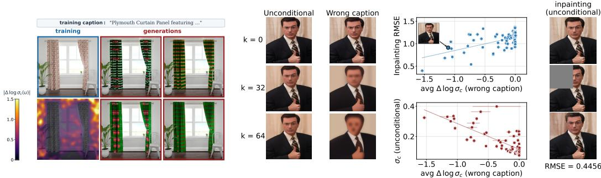  
Figure 6: Critical-scale gaps reveal spatial and image-driven memorization. Left: A TV example: the training image, generations from its training caption, and the local gap |∆ log $\sigma _ { c } ^ { u }$ . The gap is large where all generations copy the training image (the room) and near zero where they vary (the curtain pattern). Right: A wrong caption exposes images already retained by the unconditional model. Center: wrong-caption gap $\Delta \log { \sigma _ { c } }$ against unconditional inpainting RMSE (top) and unconditional $\sigma _ { c }$ (bottom); bars include std deviation over 5 captions. Side: a negative-gap image is retained by unconditional dynamics but lost when conditioning on a wrong caption; unconditional inpainting restores the masked region.

Taking the absolute value discards this directional information. This advantage is most pronounced for $\mathrm { T V } ,$ where $\Delta \log \sigma _ { c }$ achieves 0.939 AUC versus 0.696 for the image-dependent baseline.

Takeaway. Critical scale is an effective global measure of memorization at scale, and computing it per spatial location improves detection. Comparing unconditional retention with retention under a mismatched caption further reveals whether an image was memorized with a particular caption.

## 4.2 Local critical scale localizes memorized regions

Setup. We qualitatively assess if the local gap $| \Delta$ log $\sigma _ { c } ^ { u }$ | identifies memorized regions in TV examples. As a reference, we generate five samples from each training caption: consistently reproduced regions indicate memorized content, whereas variable regions indicate non-memorized content.

Results. Figure 6 (left) shows that large values of $| \Delta \log \sigma _ { c } ^ { u } |$ concentrate in regions reproduced consistently across generations. By contrast, regions that vary across samples generally have gaps close to zero. Thus, the spatial variation of the critical-scale gap aligns with the apparent boundary between memorized and non-memorized content. The trajectories in Figures 22 and 23 provide complementary evidence: in partially memorized images, non-memorized content disappears at smaller noise scales, whereas memorized regions persist longer. Additional qualitative examples are provided in Figure 18 in Appendix G.3.

Takeaway. The local critical-scale gap provides an interpretable spatial measure of where memorized content appears within an image.

## 4.3 Critical-Scale Gap Identifies Image-Driven Memorization

Setup. We aim to find images that the unconditional branch has memorized by itself, and not only through their captions. A strongly negative $\Delta$ log $\sigma _ { c }$ indicates stronger retention under unconditional than conditional dynamics. However, since unconditional memorization is rare, searching the full training set for such examples is computationally prohibitive. We therefore use the MV examples under five unrelated captions drawn from LAION-MI, and compute $\Delta$ log $\sigma _ { c }$ for each image-caption pair. This allows us to rank images by evidence of unconditional retention. Since finding an image through unconditional sampling is not feasible, we evaluate this ranking through inpainting. We mask each image quadrant in turn, reconstruct it from the remaining three, and report the mean latent RMSE to the ground-truth region. For each image, we generate 10 samples per quadrant. Low reconstruction error provides evidence that the image is retained independently of its caption.

Results. Figure 6 (right) shows an example with a strongly negative gap. Its unconditional dynamics retain the image more strongly than the mismatched-caption dynamics, and unconditional inpainting accurately reconstructs the missing content. This provides qualitative evidence that the image is memorized by the unconditional branch. This reconstruction is consistent with the memorized image acting as an attractor and the masked image lying within its basin of attraction (see Figure 7 in Appendix A). Across images, strongly negative gaps are associated with lower inpainting RMSE (top center) and larger unconditional $\sigma _ { c }$ (bottom center), supporting their use as evidence of unconditional retention. Gaps near zero are less informative because they can arise when eithe both dynamics retain the image or neither does. Figure 19 in Appendix G.4 illustrates both near-zero regimes, while Figure 20 provides additional examples with strongly negative gaps.

Takeaway. A strongly negative critical-scale gap provides evidence that an image is retained independently of its caption, identifying cases in which the image itself contributes to memorization and can be reconstructed by the unconditional branch.

## 5 Related work

Dynamical and multiscale views of diffusion models. Mean shift turns gradients of kernel density estimates into mode-seeking dynamics [Fukunaga and Hostetler, 1975, Cheng, 1995, Comaniciu and Meer, 2002]; with Gaussian kernels, it equals posterior-mean denoising of the empirical distribution, whose smoothed-density critical points are fixed points and modes are attractors. The link between denoising and the score, established for denoising autoencoders [Alain and Bengio, 2014], underlies score-based diffusion via reverse-time SDEs/ODEs [Song et al., 2021]. These dynamics reveal how structure emerges across noise scales: global high-variance features precede low-variance details [Wang and Vastola, 2023], a speciation transition marks the emergence of broad structure [Biroli et al., 2024], and high- and low-level features evolve differently, reflecting the data hierarchy [Sclocchi et al., 2025]. These works follow generation trajectories: instead, we fix the noise scale and iterate the denoiser, obtaining a family of dynamical systems whose attractors and persistence across scales describe the learned structure.

Memorization and generalization in diffusion models. The empirical optimum of denoising score matching reproduces the training data: Gu et al. [2025] study when learned models approach it, and Baptista et al. [2025] how explicit and implicit regularization in the reverse dynamics prevent it. Kadkhodaie et al. [2024] attribute generalization to geometry-adaptive inductive biases, Shah et al. [2025] tie memorization mainly to low-noise denoising, and Bonnaire et al. [2025] show that good generation precedes memorization during training. Closest to us, Fumero et al. [2026a] iterate an autoencoder’s map, whose latent fixed points and attractors reflect memorization and generaliza tion. A diffusion model instead induce a family of dynamical systems, so attractor persistence can be tracked along a scale axis. Pham et al. [2025] view diffusion models as associative memories, and Jain et al. [2025] argue that classifier-free guidance steers reverse trajectories into the basins of memorized images. Both study the reverse generation trajectory, while our fixed-scale dynamics measure how strongly a given image-caption pair is retained across noise scales.

Detecting memorization in diffusion models. Early work detected replication by matching generations to training data [Somepalli et al., 2023] or extracting training examples [Carlini et al., 2023, Webster, 2023]. Later methods avoid exhaustive generation. Wen et al. [2024] detect memorized prompts from the conditional–unconditional noise-prediction gap. Jeon et al. [2025] use probabilitylandscape sharpness and Ross et al. [2025] the local geometry of model generations to detect memorization. Jiang et al. [2025] address image-level detection without the paired prompt and Chen et al. [2025] localize memorized regions. Our score instead depends jointly on a candidate image–caption pair, testing whether that pair is memorized rather than whether the caption alone elicits memorization. Comparing conditional and empty-caption critical scales further detects memorization in the unconditional branch. Membership inference [Carlini et al., 2023, Hu and Pang, 2023, Zha et al., 2024, Duan et al., 2023, Matsumoto et al., 2023] instead asks whether an example was used in training, not whether it is retained strongly enough to be reproduced.

## 6 Conclusions

In this paper we proposed to interpret a diffusion model as a family of dynamical systems indexed by the noise level, whose attractors form a scale space of the data. Memorization then becomes the persistence of an example as an attractor, measured by the critical scale $\sigma _ { \mathrm { c } } .$ . On Stable Diffusion, $\sigma _ { c }$ detects fully and partially memorized image–caption pairs and offers two forms of interpretation: comparing conditional and unconditional critical scales isolates the caption-image interaction in memorization, while local variants of $\sigma _ { \mathrm { c } }$ can identify which regions within an image are memorized. Further analysis is needed to quantify the precision and generality of this localization, which in principle can be extended also to the caption parts. Our theory holds for the exact denoiser. While the mechanism transfers to trained networks (see Section 3), closing this gap formally–for instance via analytic models of the inductive biases of trained diffusion models Kamb and Ganguli [2024]–is a natural direction for future work. Beyond memorization, the orbits and basins of the denoising maps may reveal broader structure in what a model has learned Sclocchi et al. [2025], and locating where individual examples are retained in the weights Hintersdorf et al. [2024] suggests a route towards targeted unlearning.

## Acknowledgements

M.F. was supported by the project “Building Energy Systems on causal reasoning (BOSS)“, funded within the “Technologies and Innovations for the Climate-Neutral City” (TIKS) Programme of the Austrian Research Promotion Agency (FFG).

## AI use statement

We used generative AI tools as coding assistants when implementing and modifying the codebase, and for language editing. They were not used to produce research results on their own or to replace the authors’ scientific judgment. The authors designed the methodology and experiments, and reviewed and validated all AI-assisted code and text.

## Ethics statement

This work is primarily theoretical and methodological, focusing on the dynamics of denoising maps and on memorization in diffusion models. All datasets and models are publicly available (CIFAR-10, MNIST, SVHN, LAION-5B [Schuhmann et al., 2022] and Stable Diffusion [Rombach et al., 2022], and the memorized prompts we study were identified in prior work [Webster, 2023]. No human subjects are involved and no new data is collected. Our detectors probe which training images a model has memorized. In principle, such insights could be misused to recover training data from pretrained models. However, our experiments score images that are already public, we release no new private or copyrighted content, and the techniques should be applied responsibly, for instance to audit and reduce memorization. We hope our findings contribute to a better understanding of how diffusion models generalize and memorize.

## Reproducibility statement

All formal statements and proofs are reported in Appendix B. We implement all experiments in PyTorch [Paszke et al., 2019] and the HuggingFace diffusers library [von Platen et al., 2022]. We use only publicly released checkpoints, and the CIFAR-10 models we train follow the public recipe of Nichol and Dhariwal [2021]. Models, datasets, training recipes, noise schedules, estimator hyperparameters and the filtering of the memorization set are listed in Appendix F. We will opensource our codebase for all experiments upon acceptance.

## References

Guillaume Alain and Yoshua Bengio. What regularized auto-encoders learn from the data-generating distribution. Journal ofMachine Learning Research, 15(110):3743–3773, 2014.

Ricardo Baptista, Agnimitra Dasgupta, Nikola B Kovachki, Assad Oberai, and Andrew M Stuart. Memorization and regularization in generative diffusion models. arXiv preprint arXiv:2501.15785, 2025.

Giulio Biroli, Tony Bonnaire, Valentin de Bortoli, and Marc Mézard. Dynamical regimes of diffusion models. Nature Communications, 15(1), 2024. doi: 10.1038/s41467-024-54281-3.

Tony Bonnaire, Raphaël Urfin, Giulio Biroli, and Marc Mézard. Why diffusion models don’t memorize: The role of implicit dynamical regularization in training. In Advances in Neural Information Processing Systems, 2025.

Nicolas Carlini, Jamie Hayes, Milad Nasr, Matthew Jagielski, Vikash Sehwag, Florian Tramer, Borja Balle, Daphne Ippolito, and Eric Wallace. Extracting training data from diffusion models. In 32nd USENIX security symposium (USENIX Security 23), pages 5253–5270, 2023.

Chen Chen, Daochang Liu, Mubarak Shah, and Chang Xu. Exploring local memorization in diffusion models via bright ending attention. In International Conference on Learning Representations, volume 2025, pages 29827–29841, 2025.

Yizong Cheng. Mean shift, mode seeking, and clustering. IEEE Transactions on Pattern Analysis and Machine Intelligence, 17(8):790–799, 1995. doi: 10.1109/34.400568.

Dorin Comaniciu and Peter Meer. Mean shift: a robust approach toward feature space analysis. IEEE Transactions on Pattern Analysis and Machine Intelligence, 24(5):603–619, 2002. doi: 10.1109/34.1000236.

Jinhao Duan, Fei Kong, Shiqi Wang, Xiaoshuang Shi, and Kaidi Xu. Are diffusion models vulnerable to membership inference attacks? In Proceedings of the 40th International Conference on Machine Learning, volume 202 of Proceedings of Machine Learning Research, pages 8717–8730. PMLR, 2023.

Jan Dubinski, Antoni Kowalczuk, Stanisław Pawlak, Przemyslaw Rokita, Tomasz Trzci´ nski, and´ Paweł Morawiecki. Towards more realistic membership inference attacks on large diffusion models. In Proceedings of the IEEE/CVF Winter Conference on Applications of Computer Vision, pages 4860–4869, 2024.

Bradley Efron. Tweedie’s formula and selection bias. Journal of the American Statistical Association, 106(496):1602–1614, 2011. doi: 10.1198/jasa.2011.tm11181.

Keinosuke Fukunaga and Larry Hostetler. The estimation of the gradient of a density function, with applications in pattern recognition. IEEE Transactions on Information Theory, 21(1):32–40, 1975. doi: 10.1109/TIT.1975.1055330.

Marco Fumero, Luca Moschella, Emanuele Rodolà, and Francesco Locatello. Navigating the latent space dynamics of neural models. In C. Vondrick, B. Hariharan, C. Raffel, L. Pinto, D. Yang, and A. Faust, editors, International Conference on Learning Representations, volume 2026, pages 24765–24793, 2026a.

Marco Fumero, Luca Moschella, Emanuele Rodolà, and Francesco Locatello. Navigating the latent space dynamics of neural models. In International Conference on Learning Representations, 2026b.

Xiangming Gu, Chao Du, Tianyu Pang, Chongxuan Li, Min Lin, and Ye Wang. On memorization in diffusion models. Transactions on Machine Learning Research, 2025.

Dominik Hintersdorf, Lukas Struppek, Kristian Kersting, Adam Dziedzic, and Franziska Boenisch. Finding nemo: Localizing neurons responsible for memorization in diffusion models. In Advances in Neural Information Processing Systems, volume 37, 2024.

Jonathan Ho, Ajay Jain, and Pieter Abbeel. Denoising diffusion probabilistic models. In Advance in Neural Information Processing Systems (NeurIPS), 2020.

Hailong Hu and Jun Pang. Loss and likelihood based membership inference of diffusion models. In Information Security – 26th International Conference, ISC 2023, volume 14411 of Lecture Notes in Computer Science, pages 121–141. Springer, 2023.

Anubhav Jain, Yuya Kobayashi, Takashi Shibuya, Yuhta Takida, Nasir Memon, Julian Togelius, and Yuki Mitsufuji. Classifier-free guidance inside the attraction basin may cause memorization. In 2025 IEEE/CVF Conference on Computer Vision and Pattern Recognition (CVPR), pages 12871– 12879. IEEE, 2025.

Dongjae Jeon, Dueun Kim, and Albert No. Understanding and mitigating memorization in generative models via sharpness of probability landscapes. In Proceedings of the 42nd International Conference on Machine Learning, volume 267 of Proceedings of Machine Learning Research, pages 27091–27112. PMLR, 2025.

Yue Jiang, Haokun Lin, Yang Bai, Bo Peng, Zhili Liu, Yueming Lyu, Yong Yang, Xing Zheng, and Jing Dong. Image-level memorization detection via inversion-based inference perturbation. In International Conference on Learning Representations, 2025.

Zahra Kadkhodaie, Florentin Guth, Eero P. Simoncelli, and Stéphane Mallat. Generalization in diffusion models arises from geometry-adaptive harmonic representations. In International Conference on Learning Representations (ICLR), 2024.

Mason Kamb and Surya Ganguli. An analytic theory of creativity in convolutional diffusion models. arXiv preprint arXiv:2412.20292, 2024.

Tero Karras, Miika Aittala, Timo Aila, and Samuli Laine. Elucidating the design space of diffusionbased generative models. In Advances in Neural Information Processing Systems (NeurIPS), 2022.

Alex Krizhevsky. Learning multiple layers of features from tiny images. Technical report, University of Toronto, 2009.

Tomoya Matsumoto, Takayuki Miura, and Naoto Yanai. Membership inference attacks against diffusion models. In 2023 IEEE Security and Privacy Workshops. IEEE, 2023.

Alexander Quinn Nichol and Prafulla Dhariwal. Improved denoising diffusion probabilistic models. In International conference on machine learning, pages 8162–8171. PmLR, 2021.

Adam Paszke, Sam Gross, Francisco Massa, Adam Lerer, James Bradbury, Gregory Chanan, Trevor Killeen, Zeming Lin, Natalia Gimelshein, Luca Antiga, Alban Desmaison, Andreas Köpf, Ed ward Yang, Zach DeVito, Martin Raison, Alykhan Tejani, Sasank Chilamkurthy, Benoit Steiner, Lu Fang, Junjie Bai, and Soumith Chintala. Pytorch: An imperative style, high-performance deep learning library. In Advances in Neural Information Processing Systems, 2019.

Bao Pham, Gabriel Raya, Matteo Negri, Mohammed J Zaki, Luca Ambrogioni, and Dmitry Krotov. Memorization to generalization: Emergence of diffusion models from associative memory. arXiv preprint arXiv:2505.21777, 2025.

Herbert Robbins. An empirical Bayes approach to statistics. In Proceedings of the Third Berkeley Symposium on Mathematical Statistics and Probability, Volume 1: Contributions to the Theory of Statistics, pages 157–163. University of California Press, 1956.

Robin Rombach, Andreas Blattmann, Dominik Lorenz, Patrick Esser, and Björn Ommer. Highresolution image synthesis with latent diffusion models. In IEEE/CVF Conference on Computer Vision and Pattern Recognition (CVPR), 2022.

Brendan Leigh Ross, Hamidreza Kamkari, Tongzi Wu, Rasa Hosseinzadeh, Zhaoyan Liu, George Stein, Jesse C. Cresswell, and Gabriel Loaiza-Ganem. A geometric framework for understanding memorization in generative models. In International Conference on Learning Representations, 2025.

Christoph Schuhmann, Romain Beaumont, Richard Vencu, Cade Gordon, Ross Wightman, Mehdi Cherti, Theo Coombes, Aarush Katta, Clayton Mullis, Mitchell Wortsman, et al. Laion-5b: An open large-scale dataset for training next generation image-text models. Advances in neural information processing systems, 35:25278–25294, 2022.

Antonio Sclocchi, Alessandro Favero, and Matthieu Wyart. A phase transition in diffusion models reveals the hierarchical nature of data. Proceedings of the National Academy of Sciences, 122(1): e2408799121, 2025.

Kulin Shah, Alkis Kalavasis, Adam Klivans, and Giannis Daras. Does generation require memorization? creative diffusion models using ambient diffusion. In Proceedings ofthe 42nd International Conference on Machine Learning, volume 267 of Proceedings of Machine Learning Research, pages 54143–54166. PMLR, 2025.

Gowthami Somepalli, Vasu Singla, Micah Goldblum, Jonas Geiping, and Tom Goldstein. Diffusion art or digital forgery? investigating data replication in diffusion models. In Proceedings of the IEEE/CVF Conference on Computer Vision and Pattern Recognition, pages 6048–6058, 2023.

Yang Song, Jascha Sohl-Dickstein, Diederik P. Kingma, Abhishek Kumar, Stefano Ermon, and Ben Poole. Score-based generative modeling through stochastic differential equations. In International Conference on Learning Representations (ICLR), 2021.

Patrick von Platen, Suraj Patil, Anton Lozhkov, Pedro Cuenca, Nathan Lambert, Kashif Rasul, Mishig Davaadorj, Dhruv Nair, Sayak Paul, William Berman, Yiyi Xu, Steven Liu, and Thomas Wolf. Diffusers: State-of-the-art diffusion models. https://github.com/ huggingface/diffusers, 2022.

Binxu Wang and John J Vastola. Diffusion models generate images like painters: an analytical theory of outline first, details later. arXiv preprint arXiv:2303.02490, 2023.

Ryan Webster. A reproducible extraction of training images from diffusion models. arXiv preprint arXiv:2305.08694, 2023.

Yuxin Wen, Yuchen Liu, Chen Chen, and Lingjuan Lyu. Detecting, explaining, and mitigating memorization in diffusion models. In International Conference on Learning Representations, 2024.

Shengfang Zhai, Huanran Chen, Yinpeng Dong, Jiajun Li, Qingni Shen, Yansong Gao, Hang Su, and Yang Liu. Membership inference on text-to-image diffusion models via conditional likelihood discrepancy. In Advances in Neural Information Processing Systems, volume 37, 2024.

## A Denoising dynamics in Stable Diffusion

Figure 7 shows Definition 1 on Stable Diffusion v1.4. The image is encoded once into the latent space, where the map is iterated; the decoder is used only to display the iterates.

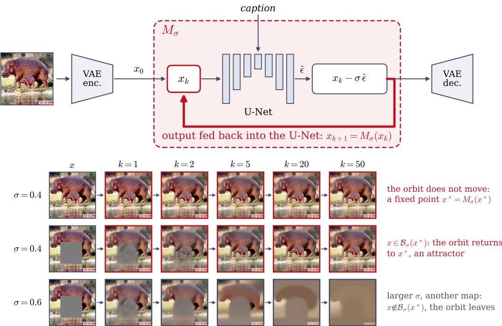  
Figure 7: Definition 1 on Stable Diffusion. $T o p \mathrm { : }$ the map $M _ { \sigma }$ . The image is encoded once into the latent $x _ { 0 } ;$ the U-Net is evaluated with the caption at noise level σ, and its output $x _ { k } - \sigma \hat { \epsilon }$ is fed back as the next input. Bottom: each row is an orbit $( M _ { \sigma } ^ { k } ( x ) ) _ { k \geq 0 } ,$ , decoded for display, of a memorized image under its own caption $( w = 1 )$ . First row: started at the image, the orbit does not move; the image is a fixed point $x ^ { * }$ . Second row: started with part of the image replaced by a grey square, the orbit restores it and converges to the same $x ^ { * }$ . The occluded image lies in the basin $B _ { \sigma } ( x ^ { * } )$ , so $x ^ { * }$ is an attractor. Third row: the same start at a larger $\sigma ,$ which defines a different map in the family $\{ M _ { \sigma } \} _ { \sigma > 0 } .$ . There the start is no longer in the basin, and the orbit leaves.

## B Proofs

Setting and notation. Throughout, p is a probability measure supported in a compact convex set $S \subset \mathbf { \mathbb { R } ^ { d } }$ of diameter $R < \infty .$ This covers image data in $[ - 1 , \dot { 1 } ] ^ { d }$ and, taking $\hat { S }$ to be its convex hull, any finite training set. Write $\varphi _ { \sigma } ( u ) = \bar { ( 2 \pi \sigma ^ { 2 } ) ^ { - d / 2 } } e ^ { - \| \bar { u } \| ^ { 2 } / 2 \sigma ^ { 2 } }$ . The smoothed density $\begin{array} { r } { p _ { \sigma } ( x ) = \int \varphi _ { \sigma } ( x - x _ { 0 } ) p ( d x _ { 0 } ) } \end{array}$ is $C ^ { \infty }$ and strictly positive, and derivatives may be taken under the integral because S is bounded. The posterior over clean signals given x is $\pi _ { x } ( d x _ { 0 } ) = \varphi _ { \sigma } ( x -$ $x _ { 0 } ) p ( d x _ { 0 } ) / p _ { \sigma } ( x ) . \ \mathbb { E } [ \cdot \mid x ]$ and $\operatorname { C o v } [ \cdot \mid x ]$ denote its mean and covariance, so $D _ { \sigma } ( x ) = \mathbb { E } [ x _ { 0 } \mid x ]$ $\mathbf { A }$ fixed point $x ^ { * }$ of $M _ { \sigma }$ is an attractor if every eigenvalue of $\nabla M _ { \sigma } ( x ^ { * } )$ has modulus less than 1. $\mathbf { A }$ mode is a local maximum of $p _ { \sigma }$ , and it is nondegenerate if $\nabla ^ { 2 } \log p _ { \sigma }$ is negative definite there. Two elementary facts are used throughout.

$$
\begin{array} { r } { \mathbf { L e m m a ~ B . 1 . } \ F o r e { v e r y } \ x \in \mathbb { R } ^ { d } ; \ ( \mathbf { F } 1 ) D _ { \sigma } ( x ) \in S ; ( \mathbf { F } 2 ) 0 \preceq \operatorname { C o v } [ x _ { 0 } \mid x ] \preceq \frac { R ^ { 2 } } { 4 } I . } \end{array}
$$

Proof. $( \mathrm { F 1 } ) \colon D _ { \sigma } ( x )$ is the mean of a probability measure on the convex set S. (F2): for a unit vector $\boldsymbol { v } , \boldsymbol { v } ^ { \top } \boldsymbol { x } _ { 0 }$ lies in an interval of length at most $R ,$ and a random variable confined to an interval of length ℓ has variance at most $\ell ^ { 2 } / 4 .$ □

## B.1 The exact map (Section 2)

Intuition. The exact denoiser averages the training data, weighting each clean signal by how plausible it is as the source of x. Moving to that average moves x uphill on the smoothed density: the step is the score (Tweedie). How sharply the output reacts to the input is the spread of the plausible sources, i.e. the posterior covariance. So a point is held in place when the posterior at it is narrower than the noise, which is exactly a mode of $p _ { \sigma }$

Proposition B.2 (Exact denoisers are mean shift; formal version of Proposition 2). Let $D _ { \sigma } ( x ) = \mathbb { E } [ x _ { 0 } \mid x ]$ be the exact denoiser. Then $M _ { \sigma }$ is Gaussian mean shift with bandwidth σ on the smoothed density $p _ { \sigma }$

(i) $M _ { \sigma } ( x ) = x + \sigma ^ { 2 } \nabla$ log $p _ { \sigma } ( x )$ , and for $\begin{array} { r } { p = \frac { 1 } { N } \sum _ { i } \delta _ { x _ { i } } } \end{array}$ it is given by equation 1.

(ii) The fixed points of $M _ { \sigma }$ are the critical points o ${ \mathit { i } } _ { p _ { \sigma } . \ A }$ fixed point $x ^ { * }$ is an attractor iff $\operatorname { C o v } [ x _ { 0 } \mid { \dot { x } } ^ { * } ] \prec { \dot { \sigma } } ^ { 2 } I ,$ , i.e. iff it is a nondegenerate mode $o f p _ { \sigma }$

(iii) Every step increases $p _ { \sigma }$ . The map has no cycles, and every orbit converges to a fixed point when the fixed points are isolated.

Proposition B.2 combines four statements, which we prove in turn: Tweedie’s identities (Proposition B.3), the fixed points and their stability (Proposition B.4), the ascent property (Lemma B.5) and its consequence for orbits (Corollary B.6).

$$
\mathbf { P r o p o s i t i o n ~ B . 3 \ ( T w e e d i e ) .                \ } D _ { \sigma } ( x ) = x + \sigma ^ { 2 } \nabla \log p _ { \sigma } ( x ) \ a n d \ \nabla D _ { \sigma } ( x ) = \sigma ^ { - 2 } \mathrm { C o v } [ x _ { 0 } \ | \ x ] .
$$

ProofofProposition $B . 3 .$ . This is Tweedie’s formula [Robbins, 1956, Efron, 2011]. Since $\nabla _ { x } \varphi _ { \sigma } ( x -$ $x _ { 0 } ) = \sigma ^ { - 2 } ( x _ { 0 } - x ) \varphi _ { \sigma } ( x - x _ { 0 } )$ , integrating against p gives $\nabla p _ { \sigma } ( x ) = \sigma ^ { - 2 } p _ { \sigma } ( x ) ( D _ { \sigma } ( x ) - x )$ , which is the first identity. For the second, note that $\mathsf { \bar { V } } _ { x } \log [ \mathsf { \bar { \varphi } } _ { \sigma } ( x - \bar { x } _ { 0 } ) / p _ { \sigma } ( x ) ] \bar { = } \sigma ^ { - 2 } ( x _ { 0 } - \bar { D } _ { \sigma } ( \bar { x } ) )$ . Differentiating $\begin{array} { r } { D _ { \sigma } ( x ) = \int x _ { 0 } \pi _ { x } ( d x _ { 0 } ) } \end{array}$ under the integral therefore gives $\nabla D _ { \sigma } ( x ) = \sigma ^ { - 2 } \mathbb { E } [ x _ { 0 } ( x _ { 0 } -$ $D _ { \sigma } ( x ) ) ^ { \top } \mid x ] = \sigma ^ { - 2 } { \mathrm { C o v } } [ x _ { 0 } \mid x ]$ □

Combining the two identities of Proposition $\mathbf { B } . 3$

$$
\nabla ^ { 2 } \log p _ { \sigma } ( x ) = \sigma ^ { - 2 } \bigl ( \nabla D _ { \sigma } ( x ) - I \bigr ) = \sigma ^ { - 4 } \mathrm { C o v } [ x _ { 0 } \mid x ] - \sigma ^ { - 2 } I .\tag{2}
$$

For a finite $\begin{array} { r } { p = \sum _ { i } \mu _ { i } \delta _ { x _ { i } } } \end{array}$ , where $\mu _ { i } \propto m _ { i }$ and $m _ { i }$ is the multiplicity of $x _ { i } ,$ the posterior is discrete and its mean is

$$
M _ { \sigma } ( x ) = \sum _ { i } w _ { i } ( x ) x _ { i } , \qquad w _ { i } ( x ) = \frac { m _ { i } e ^ { - \| x - x _ { i } \| ^ { 2 } / 2 \sigma ^ { 2 } } } { \sum _ { j } m _ { j } e ^ { - \| x - x _ { j } \| ^ { 2 } / 2 \sigma ^ { 2 } } } .\tag{3}
$$

This is equation 1 when all $m _ { i } = 1$ . The weighted form is the one used for $\sigma _ { \mathrm { c } } ^ { \mathrm { e m p } }$

Proposition B.4 (Fixed points and stability). $x ^ { * }$ is a fixed point of $M _ { \sigma } \ i f f \nabla p _ { \sigma } ( x ^ { * } ) = 0 .$ The Jacobian $\nabla M _ { \sigma }$ is symmetric positive semidefinite everywhere, so the linearised map neither rotates nor oscillates. A fixed point is an attractor $i f f \operatorname { C o v } [ x _ { 0 } \mid x ^ { * } ] \prec \sigma ^ { 2 } I$ , equivalently $i f f { x } ^ { * }$ is a nondegenerate mode of $\dot { p } _ { \sigma }$ . Saddles of ${ \dot { p } } _ { \sigma }$ carry the basin boundaries.

ProofofProposition B.4. Fixed points. By Proposition B.3, $M _ { \sigma } ( x ) - x = \sigma ^ { 2 } \nabla \log p _ { \sigma } ( x )$ . Since $p _ { \sigma } > \dot { 0 , } M _ { \sigma } \dot { ( } x ^ { * } ) = x ^ { * } \operatorname * { i f f } \nabla p _ { \sigma } \dot { ( } x ^ { * } ) = 0$

Jacobian. $\nabla M _ { \sigma } = \sigma ^ { - 2 } \mathrm { C o v } [ x _ { 0 } \mid x ]$ is symmetric positive semidefinite. Its eigenvalues are therefore real, so the linearised map has no rotation, and non-negative, so it has no sign-reversing (oscillating) direction.

Stability. Because the eigenvalues are non-negative, they all lie in [0, 1) iff $\operatorname { C o v } [ x _ { 0 } \mid x ^ { * } ] \prec \sigma ^ { 2 } I$ By equation 2 this holds iff $\nabla ^ { 2 } \log p _ { \sigma } ( x ^ { * } ) \prec \mathbf { \bar { 0 } }$ . At a critical point, that is a nondegenerate local maximum.

Saddles. If $\nabla ^ { 2 } \log p _ { \sigma } ( x ^ { * } )$ has a positive eigenvalue, equation 2 gives $\nabla M _ { \sigma } ( x ^ { * } )$ an eigenvalue greater than 1, so $x ^ { * }$ repels along that direction. A saddle attracts along some directions and repels along others. By Corollary B.6 below, a point in no attractor’s basin converges to such a nonmaximal critical point. Generically this is a saddle, and the sets converging to saddles separate the basins. □

The linearisation is local. The global behaviour comes from the classical ascent property of Gaussian mean shift [Comaniciu and Meer, 2002]: each step climbs $p _ { \sigma }$ by at least its own squared length.

Lemma B.5 (Ascent). For every x, log $p _ { \sigma } ( M _ { \sigma } ( x ) ) - \log p _ { \sigma } ( x ) \geq \| M _ { \sigma } ( x ) - x \| ^ { 2 } / 2 \sigma ^ { 2 } .$

Proof. For any $y , p _ { \sigma } ( y ) / p _ { \sigma } ( x ) = \mathbb { E } \big [ \exp \{ ( \| x - x _ { 0 } \| ^ { 2 } - \| y - x _ { 0 } \| ^ { 2 } ) / 2 \sigma ^ { 2 } \} \mid x \big ]$ . Jensen’s inequality bounds its logarithm below by the posterior mean of the exponent. That mean equals $( \| x \| ^ { 2 } - \| y \| ^ { 2 } -$ $2 ( x - y ) ^ { \top } D _ { \sigma } ( x ) ) / 2 \sigma ^ { 2 }$ , which at $y = D _ { \sigma } ( x ) \mathrm { i s } \| x - D _ { \sigma } ( x ) \| ^ { 2 } / 2 \sigma ^ { 2 }$ □

Corollary B.6 (Orbits of the exact map). Let $x _ { k + 1 } = M _ { \sigma } ( x _ { k } )$ . Then $( i ) ~ M _ { \sigma }$ has no periodic orbit other than fixed points; (ii) every limit point of $( x _ { k } )$ is a fixed point, and if the fixed points are isolated, $( x _ { k } )$ converges; (iii) every attractor is a local maximum of ${ \dot { p } } _ { \sigma }$

Proof. (i) By Lemma $\textstyle \mathrm { \mathrm { B } } . 5 , p _ { \sigma }$ strictly increases along any step that moves, so an orbit cannot return to its starting point. (ii) Summing Lemma B.5 over k and using $p _ { \sigma } \leq ( 2 \pi \sigma ^ { 2 } ) ^ { - d / 2 }$ gives $\begin{array} { r l } { \sum _ { k } \| x _ { k + 1 } - } \end{array}$ $x _ { k } \| ^ { 2 } < \infty$ , so the steps tend to 0. By (F1) the orbit is bounded. If $x _ { k _ { j } } \ \to z ,$ then also $x _ { k _ { j } + 1 } \to z ,$ and continuity of $M _ { \sigma }$ gives $M _ { \sigma } ( z ) = z$ . The limit set of a bounded sequence whose steps tend to 0 is connected, and a connected set of isolated points is a single point. (iii) If every orbit started in a neighbourhood $U$ of $x ^ { * }$ converges to $x ^ { * }$ , then $p _ { \sigma } ( x ) \le p _ { \sigma } ( x ^ { * } )$ for all $x \in U$ , because $p _ { \sigma }$ increases along these orbits. □

ProofofProposition B.2. (i) is the first identity of Proposition B.3, and equation 1 is equation 3 with all $m _ { i } = 1$ . (ii) is Proposition B.4. (iii) is Lemma B.5 together with Corollary B.6(i)–(ii).

Both ends of the scale axis. At large σ every posterior is nearly the whole data distribution, so the map barely depends on x and collapses everything to one point. At small σ the posterior near a datum is almost entirely that datum, so the map is nearly constant on a small ball around it, which then holds one attractor. Both statements are contraction arguments.

Proposition B.7. (a) $H \sigma > R / 2 , M _ { \sigma }$ has exactly one fixed point, and every orbit converges to it. As σ → ∞ this fixed point tends to $\mathbb { E } _ { p } [ x _ { 0 } ]$ . (b) Let $\begin{array} { r } { p = \sum _ { i } \mu _ { i } \delta _ { x _ { i } } } \end{array}$ with pairwise distances at least δ, let $B _ { i } = \{ x : \| x - x _ { i } \| \leq \delta / 4 \}$ , and let $\begin{array} { r } { \epsilon _ { i } = \frac { 1 - \bar { \mu _ { i } } } { \mu _ { i } } e ^ { - \delta ^ { 2 } / 4 \sigma ^ { 2 } } } \end{array}$ $I f \epsilon _ { i } R \le \delta / 4$ and $\epsilon _ { i } R ^ { 2 } < \sigma ^ { 2 }$ , which holds for all small enough σ, then $B _ { i }$ contains exactly one fixed point. It is an attractor, and it lies within $\epsilon _ { i } R o f x _ { i }$

Proof. (a) By (F2), $\| \nabla M _ { \sigma } ( x ) \| \le R ^ { 2 } / 4 \sigma ^ { 2 } < 1$ everywhere, and by (F1) $M _ { \sigma }$ maps $S$ into itself. By Banach’s fixed-point theorem, $M _ { \sigma }$ has a unique fixed point $\boldsymbol { x } _ { \sigma } ^ { * }$ in S. Every orbit enters S after one step, so every orbit converges to it, and by (F1) there are no fixed points outside S. As $\sigma \to \infty$ $\pi _ { x }  p$ uniformly in $x \in S$ , so $x _ { \sigma } ^ { * } = \mathbb { E } [ x _ { 0 } \mid \overline { { x } } _ { \sigma } ^ { * } ]  \mathbb { E } _ { p } [ x _ { 0 } ]$

(b) Let $x \in B _ { i }$ and $j \neq i$ . Then $\| x - x _ { j } \| \ge 3 \delta / 4$ and $\| x - x _ { i } \| \leq \delta / 4 , \operatorname { s o } \| x - x _ { j } \| ^ { 2 } - \| x - x _ { i } \| ^ { 2 } \geq$ $\delta ^ { 2 } / 2$ and

$$
{ \frac { w _ { j } ( x ) } { w _ { i } ( x ) } } \leq { \frac { \mu _ { j } } { \mu _ { i } } } e ^ { - \delta ^ { 2 } / 4 \sigma ^ { 2 } } , \qquad \mathrm { h e n c e } \qquad \sum _ { j \neq i } w _ { j } ( x ) \leq { \frac { 1 - \mu _ { i } } { \mu _ { i } } } e ^ { - \delta ^ { 2 } / 4 \sigma ^ { 2 } } = \epsilon _ { i } .\tag{4}
$$

Two bounds follow, using $\operatorname { C o v } [ x _ { 0 } \mid x ] \preceq \mathbb { E } [ ( x _ { 0 } - x _ { i } ) ( x _ { 0 } - x _ { i } ) ^ { \top } \mid x ]$ for the second:

$$
\| M _ { \sigma } ( x ) - x _ { i } \| = \Big \| \sum _ { j \neq i } w _ { j } ( x ) ( x _ { j } - x _ { i } ) \Big \| \leq \epsilon _ { i } R \leq \delta / 4 ,\tag{5}
$$

$$
\| \nabla M _ { \sigma } ( x ) \| \leq \sigma ^ { - 2 } \Big \| \sum _ { j \neq i } w _ { j } ( x ) ( x _ { j } - x _ { i } ) ( x _ { j } - x _ { i } ) ^ { \top } \Big \| \leq \frac { \epsilon _ { i } R ^ { 2 } } { \sigma ^ { 2 } } < 1 .\tag{6}
$$

The first gives $M _ { \sigma } ( B _ { i } ) \subset B _ { i } ,$ so $M _ { \sigma }$ is a contraction of the convex set $B _ { i }$ into itself, and Banach’s theorem gives a unique fixed point there. Its Jacobian has norm below 1, so it is an attractor, and by the first bound it lies within $\epsilon _ { i } R$ of $x _ { i }$ 口

## B.2 The critical scale and mass monotonicity (Sections 2.1–2.1)

Proposition B.8 (Critical scale at $K = 1 )$ . For the exact denoiser, the critical scale with a single iteration is

$$
\begin{array} { r } { \sigma _ { \mathrm { c } } ^ { ( 1 ) } ( x ) = \operatorname* { s u p } \big \{ \sigma > 0 : \sigma ^ { 2 } \| \nabla \log p _ { \sigma } ( x ) \| \le r \| x \| \big \} . } \end{array}\tag{7}
$$

Proof of Proposition B.8. At $K = 1$ the probe is retained at σ iff $\| M _ { \sigma } ( x ) - x \| \leq r \| x \|$ , and by Proposition $\dot { { \bf B } } . 3 \parallel M _ { \sigma } ( x ) - x \parallel = \sigma ^ { 2 } \parallel \nabla \log \hat { p } _ { \sigma } ( x ) \mid$ . Take the supremum over the retained scales.

Two direct consequences of Definition 3 are worth recording. $\sigma _ { \mathrm { c } }$ is nonincreasing in $K ,$ since retention for $K + 1$ steps implies retention for $K$ . The retention set need not be an interval, which is why we verify it empirically (Appendix C).

Theorem B.9 (Mass monotonicity; formal version of Theorem 4). Let $p _ { \theta } = ( 1 - \theta ) q + \theta \delta _ { x } \mathrm { ~ }$ put mass θ on $x ^ { * }$ , with q any distribution of bounded support. Then $\lVert \bar { D _ { \sigma } } ( x ^ { * } ) - x ^ { * } \rVert$ is strictly decreasing in $\theta ,$ and $\sigma _ { \mathrm { c } } ^ { ( 1 ) } ( x ^ { \ast } )$ is nondecreasing in θ.

Duplicating a datum m times among N others corresponds to $\theta = m / ( N + m )$

Intuition for Theorem B.9. At the probe, the posterior splits its vote between the probe’s own atom and the rest of the data. Only the rest pulls the probe away, and it pulls with the same force whatever the probe’s mass. More mass on the probe only shrinks the share of the vote the rest receives. The proof makes this exact.

ProofofTheorem B.9. Let $D ^ { q }$ and $\pi _ { x } ^ { q }$ be the exact denoiser and the posterior of $q ,$ and set $c = \varphi _ { \sigma } ( 0 )$ and $\begin{array} { r } { B = \int \varphi _ { \sigma } ( x ^ { * } - x _ { 0 } ) q ( d x _ { 0 } ) > \bar { 0 } } \end{array}$ . At $x ^ { * }$ the posterior of $p _ { \theta }$ is a mixture of the atom and the posterior of $q \colon$

$$
\pi _ { x ^ { * } } = \lambda _ { \theta } \delta _ { x ^ { * } } + \left( 1 - \lambda _ { \theta } \right) \pi _ { x ^ { * } } ^ { q } , \qquad \lambda _ { \theta } = \frac { \theta c } { \theta c + \left( 1 - \theta \right) B } .\tag{8}
$$

Taking means,

$$
D _ { \sigma } ^ { \theta } ( x ^ { * } ) - x ^ { * } = ( 1 - \lambda _ { \theta } ) \big ( D ^ { q } ( x ^ { * } ) - x ^ { * } \big ) .\tag{9}
$$

The vector $D ^ { q } ( x ^ { * } ) - x ^ { * }$ does not depend on $\theta ,$ and $1 - \lambda _ { \theta }$ is strictly decreasing in θ. Hence the displacement

$$
f _ { \theta } ( \sigma ) : = \| D _ { \sigma } ^ { \theta } ( x ^ { * } ) - x ^ { * } \| = ( 1 - \lambda _ { \theta } ) \| D ^ { q } ( x ^ { * } ) - x ^ { * } \|\tag{10}
$$

is strictly decreasing in θ at every σ with $D ^ { q } ( x ^ { * } ) \neq x ^ { * }$ , and zero at every other $\sigma .$ . For $\theta < \theta ^ { \prime }$ this gives $f _ { \theta ^ { \prime } } \leq f _ { \theta }$ , so the $K = 1$ retention sets are nested,

$$
\{ \sigma : f _ { \theta } ( \sigma ) \leq r \| x ^ { * } \| \} \ \subseteq \ \{ \sigma : f _ { \theta ^ { \prime } } ( \sigma ) \leq r \| x ^ { * } \| \} ,\tag{11}
$$

and their suprema, $\sigma _ { \mathrm { c } } ^ { ( 1 ) } ( x ^ { \ast } )$ by Proposition B.8, are nondecreasing in θ.

Lemma B.10 (Strict mass monotonicity). In Theorem B.9, suppose $x ^ { * } \neq 0$ and $\bar { \sigma } = \sigma _ { \mathrm { c } } ^ { ( 1 ) } ( x ^ { * } )$ under θ is finite. Then $\sigma _ { \mathrm { c } } ^ { ( 1 ) } ( x ^ { * } )$ under any $\theta ^ { \prime } > \theta$ is strictly larger than σ¯.

Proof. Let $\tau = r \| x ^ { * } \| > 0$ . The retention set is closed because $f _ { \theta }$ is continuous, and every $\sigma > \bar { \sigma }$ escapes, so

$$
f _ { \theta } ( \bar { \sigma } ) \leq \tau \quad \mathrm { a n d } \quad f _ { \theta } ( \sigma ) > \tau \ ( \sigma > \bar { \sigma } ) \qquad \Longrightarrow \qquad f _ { \theta } ( \bar { \sigma } ) = \tau > 0 .\tag{12}
$$

In particular $D ^ { q } ( x ^ { * } ) \neq x ^ { * }$ at $\bar { \sigma } .$ , and equation $9$ gives

$$
f _ { \theta ^ { \prime } } ( \bar { \sigma } ) = \frac { 1 - \lambda _ { \theta ^ { \prime } } } { 1 - \lambda _ { \theta } } f _ { \theta } ( \bar { \sigma } ) < \tau .\tag{13}
$$

By continuity $f _ { \boldsymbol { \theta ^ { \prime } } } < \tau$ on an interval above ${ \bar { \sigma } } .$

## B.3 Two atoms (Theorem 5)

Theorem B.11 (Two atoms; formal version of Theorem 5). Let $p = \theta \delta _ { + a } + ( 1 - \theta ) \delta _ { - a }$ with $a \ = \ d / 2$ and $\theta \ \leq \ { \frac { 1 } { 2 } } .$ : the probe carries mass θ and its only neighbour sits at distance d. The probe carries its own attractor iff $\sigma < \sigma _ { \mathrm { c } } ( \theta )$ , where $\sigma _ { \mathrm { c } }$ is strictly increasing on $( 0 , { \frac { 1 } { 2 } } ] ;$ $\sigma _ { \mathrm { c } } ( \scriptstyle { \frac { 1 } { 2 } } ) = d / 2$ , and

$$
\sigma _ { \mathrm { c } } ( \theta ) = \frac { d } { \sqrt { 2 \log ( 1 / \theta ) } } \left( 1 + o ( 1 ) \right) \qquad a s \theta \to 0 .
$$

Intuition. With two atoms the map lives on the line through them. There it is a sigmoid of the position, and the sigmoid’s slope is the separation over the noise, $\beta = a ^ { 2 } / \sigma ^ { 2 }$ , while its offset is the log-mass ratio h. A steep sigmoid crosses the diagonal three times: one attractor at each atom and a saddle between them. As σ grows the sigmoid flattens, and the crossing near the lighter atom disappears by merging with the saddle. The lighter atom survives while the slope beats the offset, which is why separation (through β) enters linearly and mass (through h) only logarithmically.

Proof of Theorem B.11. Place the atoms at $\pm a e$ for a unit vector $e ,$ with the probe at +ae carrying mass $\theta \leq \textstyle { \frac { 1 } { 2 } }$

Step 1 (reduction to a line). By (F1) all fixed points lie on the segment $[ - a e , a e ]$ . Write $x =$ $a u e + x _ { \perp }$ with $x _ { \perp } \perp e$ . Then

$$
\| x \mp a e \| ^ { 2 } = \| x _ { \perp } \| ^ { 2 } + a ^ { 2 } ( u \mp 1 ) ^ { 2 } , \qquad \| x + a e \| ^ { 2 } - \| x - a e \| ^ { 2 } = 4 a ^ { 2 } u ,\tag{14}
$$

so the factor depending on $x _ { \perp }$ cancels from the weights of equation $^ { 3 , }$ and

$$
\frac { w _ { + } ( x ) } { w _ { - } ( x ) } = \frac { \theta } { 1 - \theta } e ^ { 2 a ^ { 2 } u / \sigma ^ { 2 } } = e ^ { 2 ( \beta u + h ) } , \qquad M _ { \sigma } ( x ) = a \left( w _ { + } - w _ { - } \right) e = a \operatorname { t a n h } ( \beta u + h ) e ,\tag{15}
$$

with

$$
\beta = \frac { a ^ { 2 } } { \sigma ^ { 2 } } , \qquad h = \frac { 1 } { 2 } \log \frac { \theta } { 1 - \theta } \le 0 .\tag{16}
$$

$M _ { \sigma }$ depends on x only through u, and $\nabla M _ { \sigma }$ vanishes orthogonally to e. Fixed points and their stability are therefore those of the scalar map $g ( u ) = \operatorname { t a n h } ( \beta u + h )$ on [−1, 1].

Step 2 (fixed points). For $| u | < 1$

$$
u = g ( u ) \iff H ( u ) = h , \qquad H ( u ) = \operatorname { a r c t a n h } u - \beta u , \qquad H ^ { \prime } ( u ) = { \frac { 1 } { 1 - u ^ { 2 } } } - \beta ,\tag{17}
$$

and $H  \mp \infty$ as $u  \mp 1$ . If $\beta \leq 1$ , H is increasing and there is exactly one fixed point. I $\dot { \beta } > 1$ let $u _ { \beta } = \sqrt { 1 - 1 / \beta }$ and

$$
h ^ { \ast } ( \beta ) : = \beta u _ { \beta } - \mathrm { a r c t a n h } u _ { \beta } > 0 .\tag{18}
$$

Then H increases on $\left( - 1 , - u _ { \beta } \right)$ up to $h ^ { * } ( \beta )$ , decreases on $\left( - u _ { \beta } , u _ { \beta } \right)$ down $\mathrm { t o } \ - h ^ { * } ( \beta )$ , and increases on $( u _ { \beta } , 1 )$

Step 3 (stability). At a fixed point tanh $( \beta u + h ) = u ,$ so

$$
g ^ { \prime } ( u ) = \beta ( 1 - u ^ { 2 } ) \geq 0 , \qquad g ^ { \prime } ( u ) < 1 \iff H ^ { \prime } ( u ) > 0 .\tag{19}
$$

Fixed points on the increasing branches of H are attractors, and a fixed point on the decreasing branch is repelling: it is the saddle between the two basins.

Step 4 (the probe’s attractor). On $( u _ { \beta } , 1 )$ , H takes every value in $( - h ^ { * } , \infty )$ exactly once. Since $h \leq 0$ , the probe carries its own attractor iff

$$
\beta > 1 \quad \mathrm { a n d } \quad h ^ { * } ( \beta ) > | h | .\tag{20}
$$

Otherwise the unique fixed point has $u \leq 0$ , on the neighbour’s side or at the midpoint.

Step 5 (the critical scale). Using $1 / ( 1 - u _ { \beta } ^ { 2 } ) = \beta ,$

$$
\frac { d h ^ { * } } { d \beta } = u _ { \beta } + \beta u _ { \beta } ^ { \prime } - \frac { u _ { \beta } ^ { \prime } } { 1 - u _ { \beta } ^ { 2 } } = u _ { \beta } > 0 , \qquad h ^ { * } ( 1 ) = 0 , \qquad h ^ { * } ( \infty ) = \infty .\tag{21}
$$

So $\sigma \mapsto h ^ { * } ( a ^ { 2 } / \sigma ^ { 2 } )$ decreases strictly from ∞ at $\sigma  0$ to 0 at $\sigma = a .$ , and equation 20 holds iff $\sigma < \sigma _ { \mathrm { c } } ( \theta )$ , where $\sigma _ { \mathrm { c } } ( \theta )$ is the unique solution of

$$
h ^ { \ast } \big ( a ^ { 2 } / \sigma _ { \mathrm { c } } ( \theta ) ^ { 2 } \big ) = | h ( \theta ) | = \frac { 1 } { 2 } \log \frac { 1 - \theta } { \theta } .\tag{22}
$$

The right-hand side decreases strictly on $( 0 , { \frac { 1 } { 2 } } ]$ , so $\sigma _ { \mathrm { c } } ( \theta )$ increases strictly, and $\begin{array} { r } { h ( \frac { 1 } { 2 } ) = 0 } \end{array}$ gives $\sigma _ { \mathrm { c } } ( \scriptstyle { \frac { 1 } { 2 } } ) = a = d / 2$

Step 6 (asymptotics). As $\beta \to \infty$

$$
u _ { \beta } = 1 - \frac { 1 } { 2 \beta } + O ( \beta ^ { - 2 } ) , \qquad \operatorname { a r c t a n h } u _ { \beta } = \frac { 1 } { 2 } \log \frac { 1 + u _ { \beta } } { 1 - u _ { \beta } } = \frac { 1 } { 2 } \log ( 4 \beta ) + O ( \beta ^ { - 1 } ) ,\tag{23}
$$

$$
\begin{array} { r } { h ^ { \ast } ( \beta ) = \beta - \frac { 1 } { 2 } \log ( 4 \beta ) - \frac { 1 } { 2 } + O ( \beta ^ { - 1 } ) . } \end{array}\tag{24}
$$

$$
\begin{array} { r } { \mathbf { A } s \theta  0 , | h | = \frac { 1 } { 2 } \log ( 1 / \theta ) + O ( \theta )  \infty , \mathrm { s o } \ \beta _ { \mathrm { c } }  \infty \ \mathrm { a n d \ e q u a t i o n \ 2 4 \ g i v e s } } \end{array}
$$

$$
\begin{array} { r } { \beta _ { \mathrm { c } } = \frac { 1 } { 2 } \log ( 1 / \theta ) ( 1 + o ( 1 ) ) , \qquad \sigma _ { \mathrm { c } } = \frac { a } { \sqrt { \beta _ { \mathrm { c } } } } = \frac { d } { \sqrt { 2 \log ( 1 / \theta ) } } ( 1 + o ( 1 ) ) . } \end{array}\tag{25}
$$

Remarks. (i) For $\theta > \frac { 1 } { 2 }$ the atoms swap roles, and bistability ends at the same scale: $\sigma _ { \mathrm { c } } ( \theta ) =$ $\sigma _ { \mathrm { c } } ( 1 - \theta ) . ~ \mathrm { ( i i ) }$ The log β term in equation 24 makes the exact $\sigma _ { \mathrm { c } }$ smaller than the leading-order formula: solving Step 5 numerically gives 0.74, 0.83 and $0 . 8 7$ of the formula’s value at $\theta \ =$ $1 0 ^ { - 2 } , 1 0 ^ { - 4 } , 1 0 ^ { - \overline { { 6 } } }$ . So the formula of Theorem 5 gives how $\sigma _ { \mathrm { c } }$ scales (linearly in $d ,$ logarithmically in $\theta )$ , not its value. (iii) $\operatorname { A t } \sigma _ { \mathrm { c } }$ the probe’s attractor and the saddle merge at $u _ { \beta _ { \mathrm { c } } }$ and both disappear: a saddle-node. The attractor is still at distance $a ( 1 - u _ { \beta _ { \mathrm { c } } } )$ from the probe when this happens.

Theorem B.11 locates the scale at which an attractor ceases to exist, while Definition 3 threshold a displacement. The next proposition says the two agree whenever the attractor is still within the escape radius when it vanishes.

Proposition B.12 (Escape test in the two-atom model). In the setting of Theorem $B . I I ,$ let $K = \infty$ and let the escape radius $\tau = r \| \boldsymbol { x } \|$ satisfy $\tau < a$ . Then the probe is retained exactly $f o r \sigma \in ( 0 , \sigma _ { \mathrm { e s c } } ]$ , with $\sigma _ { \mathrm { e s c } } \leq \sigma _ { \mathrm { c } } ( \theta )$ . Equality holds $i f f a ( 1 - u _ { \beta _ { \mathrm { c } } } ) \leq \tau ,$ , where $\beta _ { \mathrm { c } } = a ^ { 2 } / \sigma _ { \mathrm { c } } ( \theta ) ^ { \dot { 2 } } .$

Proof. g is increasing and $g ( 1 ) < 1$ , so the orbit started at $u = 1$ decreases monotonically to the largest fixed point $u ^ { * } \bar { ( \sigma ) } \leq 1$ . Its largest displacement from the probe is its limit, so

su $\mathrm { ~ p ~ } \| M _ { \sigma } ^ { k } ( x ) - x \| = a \big ( 1 - u ^ { * } ( \sigma ) \big )$ the probe is retained $\iff a \bigl ( 1 - u ^ { * } ( \sigma ) \bigr ) \leq \tau .$ k

(26)

For $\sigma \leq \sigma _ { \mathrm { c } } , u ^ { * }$ is the probe’s attractor, the root of $H ( u ) = h$ on the rising branch. As σ grows, H increases pointwise on u $> 0$ , so this root moves continuously left, down to $u _ { \beta _ { \mathrm { c } } }$ at $\sigma _ { \mathrm { c } }$ . For $\sigma > \sigma _ { \mathrm { c } }$ $u ^ { * } \leq 0$ and the displacement is at least $a > \tau$ . So the retention set is

$$
\big \{ \sigma \leq \sigma _ { \mathrm { c } } : a \big ( 1 - u ^ { * } ( \sigma ) \big ) \leq \tau \big \} ,\tag{27}
$$

an interval, which reaches $\sigma _ { \mathrm { c } }$ iff the displacement at $\sigma _ { \mathrm { c } }$ is at most $\tau .$

Since $1 - u _ { \beta _ { \mathrm { c } } } \approx 1 / ( 2 \beta _ { \mathrm { c } } ) \approx 1 / \log ( 1 / \theta )$ , the condition holds for any fixed radius once $\theta$ is small. The escape test then returns the saddle-node scale. This is a statement about the exact map, not about a trained network.

## B.4 From two atoms to a training set

Intuition. Remark (ii) and equation 24 say that, at leading order, the lighter atom keeps its attractor while it wins the posterior vote at its own location, $\beta > | h |$ . For a whole training set the same criterion reads: the probe’s m copies must outweigh the kernel mass of all other rows at the probe,

$$
\begin{array} { r } { S ( \sigma ) : = \sum _ { j } m _ { j } e ^ { - \| x - x _ { j } \| ^ { 2 } / 2 \sigma ^ { 2 } } < m , } \end{array}\tag{28}
$$

the sum running over the other rows. Each term of $S$ increases with σ, so the balance holds on an interval $( 0 , \sigma _ { \mathrm { b a l } } )$ . This criterion is a heuristic. It is leading-order, it looks only at the probe’s own location, and it has no escape threshold. What can be proved is how the closed forms of Section 2.1 relate to it.

Proposition B.13. Let $n > m$ be the number of other rows, $d _ { \mathrm { n n } }$ the distance to the nearest of them, and $\sigma _ { 1 }$ the solution $\eta S ( \sigma _ { 1 } ) = 1$ . Set $d _ { \mathrm { k e r n } } = \sigma _ { 1 } \sqrt { 2 }$ log n. Then

$$
\sigma _ { \mathrm { b a l } } \geq \frac { d _ { \mathrm { n n } } } { \sqrt { 2 \log ( n / m ) } } a n d d _ { \mathrm { k e r n } } \geq d _ { \mathrm { n n } } ,\tag{29}
$$

with equality in both iff all other rows are at distance $d _ { \mathrm { n n } }$ . Moreover, a single atom of n rows at distance $d _ { \mathrm { k e r n } }$ has the same kernel mass as the actual rows at $\sigma _ { 1 }$

Proof. Every other row is at distance at least $d _ { \mathrm { n n } } .$ so

$$
S ( \sigma ) \leq n e ^ { - d _ { \mathrm { n n } } ^ { 2 } / 2 \sigma ^ { 2 } } ,\tag{30}
$$

with equality iff all of them are at distance $d _ { \mathrm { n n } }$ . The three claims follow from this bound:

$$
n e ^ { - d _ { \mathrm { n n } } ^ { 2 } / 2 \sigma ^ { 2 } } < m \iff \sigma < { \frac { d _ { \mathrm { n n } } } { \sqrt { 2 \log ( n / m ) } } } \qquad \implies \sigma _ { \mathrm { b a l } } \geq { \frac { d _ { \mathrm { n n } } } { \sqrt { 2 \log ( n / m ) } } } ,\tag{31}
$$

$$
1 = S ( \sigma _ { 1 } ) \leq n e ^ { - d _ { \mathrm { n n } } ^ { 2 } / 2 \sigma _ { 1 } ^ { 2 } } \iff d _ { \mathrm { n n } } \leq \sigma _ { 1 } \sqrt { 2 \log n } = d _ { \mathrm { k e r n } } ,\tag{32}
$$

$$
n e ^ { - d _ { \mathrm { k e r n } } ^ { 2 } / 2 \sigma _ { 1 } ^ { 2 } } = 1 = S ( \sigma _ { 1 } ) .\tag{□}
$$

So equation 40, with $n \approx N$ , is a lower bound on the balance scale: lumping every row at the nearest distance overcounts the competition. Lumping them at $d _ { \mathrm { k e r n } }$ instead gives $d _ { \mathrm { k e r n } } / \sqrt { 2 \log ( n / m ) }$ which is exact at $m = 1$ and approximate otherwise. In words, $d _ { \mathrm { k e r n } }$ is the distance at which one atom carrying all other rows would weigh as much as the actual neighbours do against a single copy. Because the balance itself is only a heuristic, the ceiling $\sigma _ { \mathrm { c } } ^ { \mathrm { e m p } }$ is not taken from either formula. It is computed by running equation 3 through the network’s own escape test (Appendix D).

## B.5 Conditional models and guidance (Section 2.1)

No argument above uses that p is a marginal distribution, so every result holds for $p ( \cdot \mid c )$ . For $\begin{array} { r } { p ( x _ { 0 } \mid c ) = \sum _ { i } w _ { i } ( c ) \delta _ { x _ { i } } } \end{array}$ , equation 3 with $\mu _ { i } = w _ { i } ( c )$ gives the caption-reweighted mean shift

$$
M _ { \sigma } ( \boldsymbol { x } ; \boldsymbol { c } ) = \sum _ { i } \tilde { w } _ { i } ( \boldsymbol { x } , \boldsymbol { c } ) x _ { i } , \qquad \tilde { w } _ { i } ( \boldsymbol { x } , \boldsymbol { c } ) \propto w _ { i } ( \boldsymbol { c } ) \exp \big ( - \| \boldsymbol { x } - \boldsymbol { x } _ { i } \| ^ { 2 } / 2 \sigma ^ { 2 } \big ) .\tag{33}
$$

The Gaussian kernel, which carries $\sigma ,$ is unchanged, and the caption enters only through the prior weights $w _ { i } ( c )$

Corollary B.14 (Caption gap; formal version of Corollary 7). At $K = 1$ , and when the caption changes the weight $o f x _ { i }$ but not the relative weights of the other examples, ∆ log $\sigma _ { \mathrm { c } } ( x _ { i } ; c ) > 0$ $i f f w _ { i } \bar { ( c ) } > w _ { i } ( \bar { \emptyset } )$

Intuition for Corollary B.14. A caption acts on the empirical mean shift only through the prior weights, exactly as a duplication count does. If it raises the weight of $x _ { i }$ and leaves the rest of the data as it was, it is a duplication of $x _ { i }$ , and Theorem B.9 applies.

ProofofCorollary B.14. By assumption, $w _ { j } ( c ) / w _ { j } ( \emptyset )$ is the same for every $j \neq i ,$ , so the normalized remainder is the same under both conditions:

$$
p ( \cdot \mid c ^ { \prime } ) = w _ { i } ( c ^ { \prime } ) \delta _ { x _ { i } } + \left( 1 - w _ { i } ( c ^ { \prime } ) \right) q _ { i } , \quad c ^ { \prime } \in \{ c , \emptyset \} , \qquad q _ { i } = \frac { \sum _ { j \neq i } w _ { j } ( \emptyset ) \delta _ { x _ { j } } } { 1 - w _ { i } ( \emptyset ) } .\tag{34}
$$

These are the family $p _ { \theta }$ of Theorem B.9 at $\theta = w _ { i } ( c )$ and at $\theta = w _ { i } ( \boldsymbol { \mathcal { O } } )$ . By Lemma B.10, applied in whichever direction the weight moves,

$$
\sigma _ { \mathrm { c } } ^ { ( 1 ) } ( x _ { i } ; c ) > \sigma _ { \mathrm { c } } ^ { ( 1 ) } ( x _ { i } ; \mathcal { O } ) \iff w _ { i } ( c ) > w _ { i } ( \mathcal { O } ) ,\tag{35}
$$

when both are finite.

Without the assumption, equation 9 still describes the step, but the caption also changes the pull of the remainder $q _ { i }$

Guidance. With the guided noise prediction $\epsilon _ { w } = \epsilon _ { \mathcal { D } } + w ( \epsilon _ { c } - \epsilon _ { \mathcal { D } } )$ , the map becomes

$$
M _ { \sigma } ^ { ( w ) } ( x ) = x + \sigma ^ { 2 } \nabla \log \left[ p _ { \sigma } ( x ) ^ { 1 - w } p _ { \sigma } ( x \mid c ) ^ { w } \right] .\tag{36}
$$

It climbs the tilted density $p _ { \sigma } ( x ) \big ( p _ { \sigma } ( x \mid c ) / p _ { \sigma } ( x ) \big ) ^ { w }$ , whose critical points for $w > 1$ are not those of $p _ { \sigma } ( \cdot \mid c )$ . Only ${ \cal M } _ { \sigma } ^ { ( 1 ) }$ describes the fixed points of the conditional model.

Lemma B.15 (Guided map). The guided map is equation ${ } ^ { 3 6 , }$ and its Jacobian is

$$
\nabla M _ { \sigma } ^ { ( w ) } ( x ) = \frac { ( 1 - w ) \mathrm { C o v } [ x _ { 0 } \mid x ] + w \mathrm { C o v } [ x _ { 0 } \mid x , c ] } { \sigma ^ { 2 } } .\tag{37}
$$

For $0 \leq w \leq 1$ it is positive semidefinite; for w $> 1$ it is a difference ofpositive semidefinite matrices and may be indefinite.

Proof of Lemma B.15. Both denoisers are affine in the noise prediction, $D _ { \sigma } ( x ) = x - \sigma \epsilon _ { \mathcal { D } }$ and $D _ { \sigma } ( x ; c ) = x - \sigma \epsilon _ { c }$ , so guidance with $\epsilon _ { w } = ( 1 - w ) \epsilon _ { \emptyset } + w \epsilon _ { c }$ gives

$$
M _ { \sigma } ^ { ( w ) } = ( 1 - w ) D _ { \sigma } ( \cdot ) + w D _ { \sigma } ( \cdot ; c ) .\tag{38}
$$

Applying Proposition B.3 to each term gives the map and its Jacobian. For $0 \leq w \leq 1$ the Jacobian is a convex combination of positive semidefinite matrices; for $w > 1$ the coefficient $1 - w$ is negative. □

The consequence for the dynamics: for $0 \leq w \leq 1$ everything in this appendix carries over to the tilted density $p _ { \sigma } ^ { 1 - w } p _ { \sigma } ( \cdot | \ c ) ^ { \cdot w }$ . For w $> 1$ a negative eigenvalue lets the map overshoot and oscillate, and a maximum of the tilted density is an attractor only if every eigenvalue of its Jacobian stays above −1.

## C Remarks on the critical scale

Computing the critical scale. We compute $\sigma _ { \mathrm { c } }$ by bisection in log σ on the escape event of Definition 3. The definition is most natural when the set of retained scales is an interval, i.e. when the escape event is monotone in $\sigma ;$ in that case bisection returns $\sigma _ { \mathrm { c } }$ exactly. We do not assume monotonicity but verify it on the trained models, and observe no violation on either model (on Stable Diffusion, none for 16 images over the noise grid). For $K > 1$ the escape event depends on the whole orbit, and $\sigma _ { \mathrm { c } }$ has no closed form analogous to Proposition B.8.

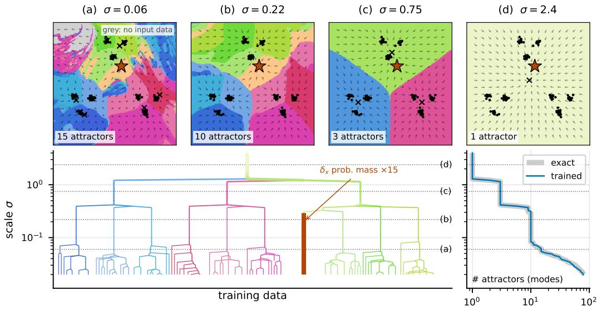  
Figure 8: A trained denoiser reproduces the scale space of Fig. 3. Same training set and same panels as Fig. 3, with the exact map M replaced by $M _ { \sigma } ( x ) = D _ { \sigma } ( x )$ for an EDM-preconditioned MLP trained on the 141 points. Top: basins at the four scales of Fig. 3, coloured by the attractor (×) reached from the data; grey marks the grid points that reach none of them, in the corners of the domain where the network saw no training data. Bottom left: merge tree of the trained map. Bottom right: its attractor count against that of the exact map. The two maps agree: the counts are equal at 80% of the 90 scales, the partitions of the training set they induce have adjusted Rand index 0.99 on average (0.76 at worst, at the smallest scales where single data split), and the duplicated datum keeps its attractor over the same range of scales in both.

Related iterations. The map of Definition 1 feeds the clean estimate back to the denoiser without adding noise, so that it is deterministic and noise cannot create spurious endpoints. Two related iterations have different fixed points and are not equivalent to $M _ { \sigma }$ . In the renoising iteration $x _ { k + 1 } = D _ { \sigma } ( x _ { k } + \sigma \varepsilon _ { k } )$ the endpoints depend on the noise realisation, and the round trip $x _ { k + 1 } = { \mathrm { S a m p l e } } _ { \sigma \to 0 } ( x _ { k } + \sigma \varepsilon _ { k } )$ is a generative operator.

## D The exact denoiser and the retention coefficient

The theorems of Section 2.1 describe the exact denoiser of a fixed distribution. The exact denoiser of a training set, $M _ { \sigma } ^ { \mathrm { e m p } }$ , is the multiplicity-weighted mean shift equation 3 over the number of samples: the map of a model that has stored its training set exactly. It costs one softmax over the training set per step, so it can be iterated from the same images and scored with the same escape test as the network (settings in Appendix F). We write

$\sigma _ { \mathrm { c } } ^ { \mathrm { e m p } } ( x ) = \sigma _ { \mathrm { c } } ( x )$ computed with $M _ { \sigma } ^ { \mathrm { e m p } }$ in place of the network, at the same K and $^ { r } \cdot$ (39)

Section D.1 checks the theory on this map; Section D.2 compares trained networks with it.

## D.1 The theory on the exact denoiser

A bifurcation, not a threshold. For this map a training image is an exact fixed point at every scale below the transition, so its critical scale is the saddle-node of Theorem 5: on the duplication training set $\sigma _ { \mathrm { c } } ^ { \mathrm { e m p } }$ is unchanged between escape radii $r = 0 . .$ 1 and $r = 0 . 5$ and between $K = 2 0$ and $K = 5 0 0$ iterations (largest group-median difference 1%).

Distance and multiplicity. With the nearest training image as the only neighbour, Theorem 5 gives, for an example of multiplicity m among N rows,

$$
\sigma _ { \mathrm { c } } ^ { \mathrm { e m p } } ( x ) \approx \frac { d _ { \mathrm { n n } } ( x ) } { \sqrt { 2 \log ( N / m ) } } , \qquad d _ { \mathrm { n n } } ( x ) = \operatorname * { m i n } _ { x _ { i } \neq x } \| x - x _ { i } \| ,\tag{40}
$$

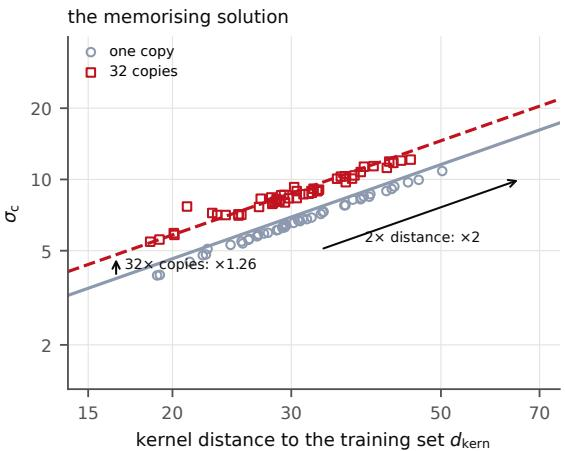  
Figure 9: The exact denoiser follows the law. $\sigma _ { \mathrm { c } } ^ { \mathrm { e m p } }$ of the added images of the rarity experiment against their kernel distance $d _ { \mathrm { k e r n } }$ to the training set (Eq. 28), for images added once (grey) and 32 times (red), under the escape test with $K = 1 , r = 0 . 2$ . The lines are the law $\sigma _ { \mathrm { c } } = d _ { \mathrm { k e r n } } / \sqrt { 2 \log ( N / m ) }$ of Theorem 5, drawn without fitting. Doubling the distance doubles the critical scale, whereas 32 copies increase it by a factor 1.26.

refined by the balance equation 28 of Appendix B.4. The critical scale should thus grow linearly with distance and only logarithmically with multiplicity. The exact denoiser follows this law without fitting (Figure 9): doubling the kernel distance doubles $\sigma _ { \mathrm { c } } ^ { \mathrm { e m p } }$ , whereas 32 copies increase it by a factor 1.26. The log–log slope in distance is 1.03 [1.00, 1.05] for one copy and 0.88 [0.79, 0.93] for 32 copies, against the predicted 1, and a joint fit over all 288 images of the rarity experiment gives 1.95 per doubling of distance against 1.06 per doubling of multiplicity, where the law predicts 2 and 1.05.

Which distance the theory means. Solving the balance equation 28 image by image predicts $\sigma _ { \mathrm { c } } ^ { \mathrm { e m p } }$ at rank correlation 0.99–1.00 at every multiplicity of the rarity experiment, with an error of $7 - 1 0 \%$ and on the duplication training set at $\rho = 0 . 9 9$ with a constant factor 0.83. The nearest-neighbour formula equation 40 reaches $\rho = 0 . 8 7 – 0 . 9 5$ with an error of $4 3 \%$ , and lies below the computed value, as Proposition B.13 requires. The gaussian kernel distance $d _ { \mathrm { k e r n } }$ , is the notion of distance the theory uses.

## D.2 Trained networks against the exact denoiser

The retention coefficient. A network should not hold an image longer than the memorizing solution does, which suggests reporting

$$
\kappa ( x ) = \frac { \sigma _ { \mathrm { c } } ( x ) } { \sigma _ { \mathrm { c } } ^ { \mathrm { e m p } } ( x ) } ,\tag{41}
$$

the fraction of that solution’s retention the network reaches at x: near 0 where the model generalizes through x, approaching 1 where it has stored x. Both terms are measured with the same test and the same threshold $r \| x \|$ . A held-out image has no atom in the training set and leaves the exact map at the first step at every $\sigma ,$ so κ is defined for training images only.

The bound holds. We use the 1047 training images of Section 3: 264 from the duplication experiment, 495 from the overfitting experiment (five subsets of 100, excluding five images that escape at the lower end of the interval), and 288 from the rarity experiment. No image has $\kappa > 1$ . The largest values are 0.78 (duplication), 0.82 (overfitting) and 0.65 (rarity). The memorizing solution therefore bounds every trained model we measure, and $\sigma _ { \mathrm { c } }$ can be read as a position between a model that generalizes through the image and one that has stored it.

What moves, and what does not. Across the three interventions the ceiling $\sigma _ { \mathrm { c } } ^ { \mathrm { e m p } }$ stays within a factor 4.2 per image and between 4.9 and 10.3 in group median, whereas $\sigma _ { \mathrm { c } }$ varies by a factor 335 (Table 2). Each intervention raises κ, from 0.01–0.06 for images that are not memorized to 0.2–0.6 for images that are. The training set fixes the scale on which retention is measured, and training decides how far along it the model goes; this is why the overfitting sweep moves $\sigma _ { \mathrm { c } }$ by two orders of magnitude while the exact denoiser of its subsets barely moves.

Table 2: The three interventions on a common scale. $\sigma _ { \mathrm { c } } ^ { \mathrm { e m p } }$ is the critical scale of the exact empirical denoiser of the training set of each model under the same escape test, equation 39; $\kappa = \sigma _ { \mathrm { c } } / \sigma _ { \mathrm { c } } ^ { \mathrm { e m p } }$ is the fraction of this solution that the network implements. Group medians, training images only: the ceiling varies little, and the effect is carried by κ.
<table><tr><td>intervention</td><td>group</td><td> $\sigma _ { \mathrm { c } } ^ { \mathrm { e m p } }$ </td><td> $\sigma _ { \mathrm { c } }$ </td><td>κ</td></tr><tr><td>duplication</td><td> $m = 1$ </td><td>4.99</td><td>0.142</td><td>0.028</td></tr><tr><td></td><td> $m = 8$ </td><td>5.60</td><td>1.036</td><td>0.194</td></tr><tr><td></td><td> $m = 8 0 0$ </td><td>9.91</td><td>1.431</td><td>0.145</td></tr><tr><td></td><td> $m = 8 0 0 ,$  control model</td><td>9.91</td><td>0.269</td><td>0.024</td></tr><tr><td>overfitting</td><td> $N = 5 \cdot 1 0 ^ { 4 }$ </td><td>4.93</td><td>0.056</td><td>0.012</td></tr><tr><td></td><td> $N = 2 0 0 0$ </td><td>6.11</td><td>0.243</td><td>0.043</td></tr><tr><td></td><td> $N = 1 0 0$ </td><td>7.84</td><td>4.674</td><td>0.598</td></tr><tr><td>rarity</td><td>model not trained on the image</td><td>7.68</td><td>0.451</td><td>0.058</td></tr><tr><td></td><td>CIFAR-10 added,  $m = 1$ </td><td>7.28</td><td>0.447</td><td>0.076</td></tr><tr><td></td><td>colour MNIST added,  $m = 1$ </td><td>6.85</td><td>1.459</td><td>0.182</td></tr><tr><td></td><td>colour MNIST added,  $m = 3 2$ </td><td>10.30</td><td>4.024</td><td>0.432</td></tr></table>

The rarity rows use $K = 1 , r = 0 . 2$ and the others the settings of Appendix F, so κ is comparable within a block but not across blocks.

The two maps release an image for different reasons. On the exact denoiser a training image is a fixed point until the saddle-node, so its critical scale does not depend on the iteration budget. On a network it does, and the dependence itself separates the groups: at $m = 8 0 0$ the median $\sigma _ { \mathrm { c } }$ is 1.431 at both $K = 5 0$ and $\bar { K } = 5 0 0$ , whereas for $m = 1$ and held-out images it falls by factors of 165 and 193 over the same range. A memorized image is retained because it is a fixed point of the network’s map; an ordinary image is retained only transiently, and a longer iteration releases it. Consequently κ compares two escape scales measured the same way, not two maps: at a fixed budget it is a conservative reading of how much of the memorizing solution the network implements, and for images without a basin it is an upper bound rather than an estimate.

## E CIFAR-10: additional results

This appendix reports additional results for the experiments of Section 3. Training and evaluation details are given in Appendix F.

## E.1 Memorization from data duplication (Section3.1)

Copying and sample quality. With the copy criterion of Carlini et al. [2023], 16 605 of 50 000 samples are copies. The FID increases from 3.90 of the control model to 4.70 for non duplicated samples (when this are counted in the FID computation FID goes to 26.46). Therefore aside for the planted memorized images the retained model still perform well on quality of generations.

Membership. $\sigma _ { \mathrm { c } }$ separates training images that appear once from held-out (test set) images with AUC 0.528, i.e. it does not detect membership in this case: this is due to the fact that not accounting for the memorized content the models have similar FID and fit well the CIFAR data distribution therefore there is few difference between training and test distribution. This is consistent with a model that copies neither group, and agrees with the overfitting experiment at $N = 5 { \cdot } 1 0 ^ { 4 }$ . Figure 10 illustrates this on one image per group.

Dependence on multiplicity. The median $\sigma _ { \mathrm { c } }$ relative to its value at $m = 8$ is:
<table><tr><td>m</td><td>8</td><td>25</td><td>50</td><td>100</td><td>200</td><td>400</td><td>800</td></tr><tr><td>network</td><td>1.00</td><td>1.12</td><td>1.18</td><td>1.34</td><td>1.24</td><td>1.26</td><td>1.38</td></tr><tr><td>exact empirical denoiser</td><td>1.00</td><td>1.11</td><td>1.08</td><td>1.23</td><td>1.19</td><td>1.29</td><td>1.77</td></tr></table>

A hundredfold increase in the number of copies changes the critical scale by less than a factor 1.4, and the memorizing solution of the same training set saturates in the same way: mass enters the width of a basin only logarithmically, so once an image has a basin, further copies cannot widen it much. Copies still change what the sampler does, as the copy rate shows. Accordingly κ does not order the duplicated images by multiplicity (0.028 at $m = 1 , 0 . 1 9$ at $m = 8 , 0 . 1 5$ at $m = 8 0 0 ;$ $\rho = - 0 . 0 1 )$ , but it separates duplicated from non-duplicated images, and in the control model it lies between 0.014 and 0.037 at every m.

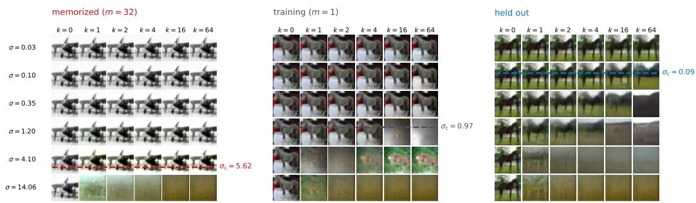  
Figure 10: Orbits across scales, one image per group. Orbits of the model trained with duplicates, with σ fixed along each row and the iteration index k along each column, for a memorized image $( m = 8 0 0 )$ , a training image with $m = 1$ and a held-out image, each chosen at the median $\sigma _ { \mathrm { c } }$ of its group. The dashed line marks the $\sigma _ { \mathrm { c } }$ of the image $( K = 6 4 , r = 0 . 5 )$ . The memorized image is unchanged after 64 iterations at $\sigma = 1 . 4 3$ , whereas the other two converge to a uniform colour at $\sigma = 0 . \dot { 2 } 4$ , with nearly identical critical scales (0.122 and 0.118).

## E.2 From memorization to generalization: memorization from overfitting

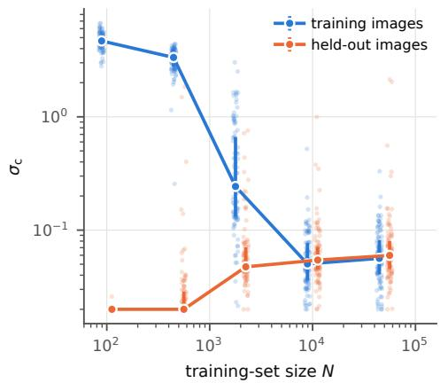

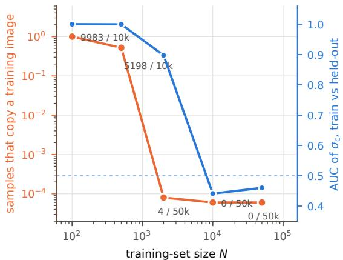  
Figure 11: Overfitting: the same images across training-set sizes. $( a ) \sigma _ { \mathrm { c } }$ of the 100 training images shared by all models (blue) and of 100 held-out images (orange): medians with interquartile range, individual images in the background. Images that escape at the lower end of the bisection interval are drawn at that end, so the held-out medians for $\bar { N \le 5 0 0 }$ are upper bounds. (b) Fraction of generated samples that are copies (orange, left axis; when no copy is found the point is drawn at the 95% upper bound) and AUC of $\sigma _ { \mathrm { c } }$ between training and held-out images (blue, right axis). At $N = 2 0 0 0$ sampling no longer detects memorization while $\sigma _ { \mathrm { c } }$ still does.

Setup. We study memorization induced by training on a small dataset, and compare $\sigma _ { \mathrm { c } }$ with memorization measured by sampling. We train five models with identical architecture, optimiser and training budget on nested subsets of CIFAR-10 of size $N \in \{ 1 0 0 , 5 0 0 , 2 0 0 0 , 1 0 ^ { 4 } , 5 \cdot 1 0 ^ { 4 } \}$ inducing a transition from a memorization (overfitting) to generalization phase (Fumero et al. [2026b], Kadkhodaie et al. [2024], Pham et al. [2025]). Since only N varies, a smaller N means more passes over each image. The first 100 images of the permutation belong to every subset, so $\sigma _ { \mathrm { c } }$ is evaluated on the same 100 training images in every model, together with 100 held-out test images. Independently of $\sigma _ { \mathrm { { c } } } ,$ we measure memorization as the fraction of generated samples that are near-copies of a training image. We also evaluate the public 50M improved-diffusion model on the same images.

Results. The median $\sigma _ { \mathrm { c } }$ of the training images decreases by two orders of magnitude, from 4.67 at $N = 1 0 0$ to 0.056 at $N = 5 \cdot 1 0 ^ { 4 }$ , where it coincides with that of the held-out images (0.060; Figure 11a). The decrease is not a power law: $\sigma _ { \mathrm { c } }$ is nearly constant up to $N = 5 0 0$ , collapses between $N = 5 0 0$ and $N = 2 0 0 0$ , and is flat afterwards. At both ends $\sigma _ { \mathrm { c } }$ agrees with sampling. For $N \leq 5 0 0 , 5 2 – 1 0 0 \%$ of the samples are copies and $\sigma _ { \mathrm { c } }$ separates training from held-out images with AUC 1.00; for $N \geq 1 0 ^ { 4 }$ and for the public model, no sample is a copy and $\sigma _ { \mathrm { c } }$ is at the held-out level. The two measures differ at $N = 2 \bar { 0 } 0 0 \cdots$ only 4 of 5 · 104 samples are copies, yet $\sigma _ { \mathrm { c } }$ separates training from held-out images with AUC 0.897 (Figure 11b).

Every image here appears once, so the training set alone changes little across the sweep: what changes by two orders of magnitude is how closely the trained model reproduces the memorizing solution at these images (Appendix D.2).

Summary. Retention is lost later than generation: a model can keep its training images as attractors after its sampler has stopped producing them. Since $\sigma _ { \mathrm { c } }$ measures retention, it detects memorization in a regime in which the copy rate is already zero.

Comparison to full OpenAi checkpoint. The public model behaves like our models with $N \geq 1 0 ^ { 4 }$ (median 0.068 against 0.072, AUC 0.45). This is consistent with sampling: an exhaustive search finds no extractable training image, and the number of copies remains at the held-out level up to $3 \cdot 1 0 ^ { 5 }$ samples. The images that sampling does recover from this model belong to clusters of nearduplicates in CIFAR-10, for which $\sigma _ { \mathrm { c } }$ is at the held-out level.

Exact denoiser. Every image has $m = 1$ , so equation 20 depends on N only through log N and predicts $\sigma _ { \mathrm { c } } ( 1 0 0 ) / \sigma _ { \mathrm { c } } ( 5 \cdot 1 0 ^ { 4 } \bar { ) } = 1 . 5 3 $ , against a measured ratio of 83. The exact empirical denoiser of each subset agrees with the formula: its critical scale decreases from 7.84 to 4.93, a factor of 1.6. Held-out images, which have no atom, leave the exact map immediately (91 to 100 of 100 at every N), so their retention by the network is due to generalization.

## E.3 Memorization of rare samples (Section3.2)

Detection by sampling. No added image with $m \leq 4$ is copied more than 0.25 times per $1 0 ^ { 5 }$ samples for any source. $\mathrm { A t } m = 8$ the number of copies per image is between 1.3 and 13.6, and for $m \geq 1 6$ every added image is generated. For colour MNIST, $\sigma _ { \mathrm { c } }$ flags 8 of 12 images with a single copy and all 12 with two.

Paired comparison. The median ratio between $\sigma _ { \mathrm { c } }$ in the model trained on the image and $\sigma _ { \mathrm { c } }$ in the other model increases from 1.02 $( \mathbf { C I F A R - } 1 0 , m = 1 )$ through 2.5 (SVHN, $m = 4 )$ and 3.0 (MNIST, $m = 1 )$ to between 3.4 and 8 for m $\geq 8 .$ . For the two CIFAR sources with $m \leq 4$ , the unpaired AUC against images of the same source is between 0.36 and 0.66: these images cannot be detected in a single model, but they are detected by the paired comparison. Figure 12 shows three added images that are never sampled, one per source, chosen at the median of their group.

Isolation. Within a source and multiplicity, the increase of $\sigma _ { \mathrm { c } }$ caused by adding an image is correlated with its distance to the nearest training image (Spearman $\rho = 0 . 3 3 , p = 5 \cdot 1 0 ^ { - 5 } , n = 1 4 4$ for $m \le 4 )$ . An isolated image does not share its basin at low noise with any training image, so a single copy suffices to create it; a typical image is absorbed into the solution that the model generalizes from its neighbours unless m is large. The probability that the sampler reaches the basin from pure noise, by contrast, grows with m and not with isolation, which explains why the two detection thresholds differ.

Distance and multiplicity in the trained models. The design spans five doublings of multiplicity and less than one doubling of distance, since the sources were matched in norm and total variation, so the two factors are compared per doubling. A joint fit over the 288 added images gives a factor 4.25 [3.4, 5.3] per doubling of kernel distance against 1.49 [1.44, 1.54] per doubling of multiplicity: in the trained models, as in the memorizing solution (Appendix D.1), distance is the stronger factor. The network responds to multiplicity more than the exact denoiser does, which is expected, since each copy also adds training steps on the image. Pixel distances are correlated with ∥x∥ (see Norm below),

Agreement with the exact denoiser. Within a source and multiplicity the network orders the images as the exact map does $( \rho = 0 . 7 8 )$ . The ordering of the sources is not an effect of the norm: at equal ∥x∥, κ is larger than for CIFAR-100 by a factor 3.1 for colour MNIST and 2.2 for SVHN colour MNIST, planted m = 1 · 0 copies in 100k samples · σc 0.96 when trained on it vs 0.32 when not (3.0×)

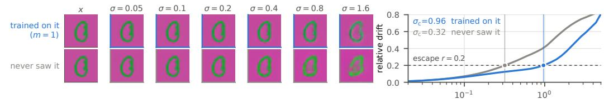

SVHN, planted m = 4 · 0 copies in 100k samples · σc 2.33 when trained on it vs 0.99 when not (2.3×)  
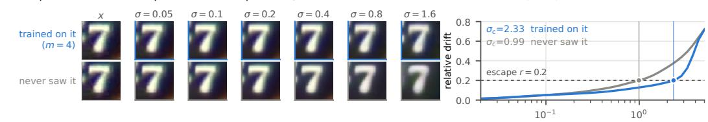

CIFAR-10 test, planted m = 8 · 0 copies in 100k samples · σ 0.48 when trained on it vs 0.18 when not (2.7×)  
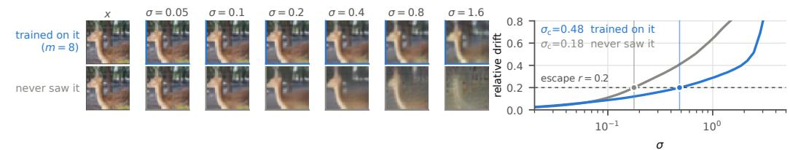  
Figure 12: Paired comparison on three images that are never sampled. One added image per source, chosen at the median of its group. Each row shows $M _ { \sigma } ( x )$ , one denoising step applied to the clean image at noise level σ, in the model trained on the image (top, blue) and in the model not trained on it (bottom, grey), together with the relative displacement $\| M _ { \sigma } ( x ) - x \| / \| x \|$ whose crossing of r defines $\sigma _ { \mathbf { C } } .$ The model not trained on the image moves it towards what it has learned (blur, generic texture) at a much smaller σ.

(t = 13.7 and 9.8), and by a factor 1.13 for CIFAR-10 (t = 1.5).

Escape radius. The radius $r = 0 . 0 2$ selected in advance on the public model is not suitable for this noise schedule: the escape occurs at $\sigma \approx 0 . 0 2 5$ , below the informative range, and all AUCs except that of colour MNIST are close to 0.5. The results of Section 3.2 use $r = 0 . 2$ , selected from a sweep over $( K , r )$ . The separation is stable for $r \in [ 0 . 1 , 0 . 5 ]$ and $K \in [ 1 , 2 0 ]$ . The paired design determines the direction of the effect independently of this choice, since the same image is evaluated with the same r in two models.

## F Experimental details

Noise-prediction models as denoisers. DDPM and Stable Diffusion corrupt the data as $\begin{array} { r l } { x _ { t } } & { { } = } \end{array}$ $\sqrt { \bar { \alpha } _ { t } } x _ { 0 } + \sqrt { 1 - \bar { \alpha } _ { t } } \varepsilon$ at discrete steps t and train $\epsilon _ { \theta } ( x _ { t } , t )$ to predict ε. Dividing by $\sqrt { \bar { \alpha } _ { t } }$ gives $y = x _ { 0 } + \sigma \varepsilon$ with $\sigma ( t ) = \sqrt { ( 1 - \bar { \alpha } _ { t } ) / \bar { \alpha } _ { t } } ,$ , and the denoiser is $D _ { \sigma } ( y ) = y - \sigma \epsilon _ { \theta } ( \sqrt { \bar { \alpha } _ { t } } y , t )$

CIFAR-10 duplication (Section3.1). The model with duplicates is trained with the improveddiffusion CIFAR-10 configuration [Nichol and Dhariwal, 2021], using the model and diffusion definitions of the original implementation: 50M parameters, $T = 4 0 0 0$ steps with a cosine schedule, learned variances, dropout 0.3, 128 channels at three resolutions, learning rate $1 0 ^ { - 4 }$ , batch size 128, EMA 0.9999, no horizontal flips, and 500k steps. The control is the released checkpoint ${ \tt C i f a r 1 0 } _ { . }$ \_uncond\_50M\_500K.pt. Eight images are duplicated at each $m \in \{ 2 , 8 , 2 5 , 5 0 , 1 0 0 , 2 0 0 , 4 0 0 , 8 0 0 \}$ in addition to the 50 000 training images, giving 62 616 training examples. The multiplicities are chosen so that $m = 8 0 0$ corresponds to a per-image mass of 1.28%. Images in the lowest 5% of nearest-neighbour distance within CIFAR-10, i.e. the near-duplicates already present in the dataset, are excluded from both the duplicated images and the $m = 1$ images. $\sigma _ { \mathrm { c } }$ is computed on the 64 duplicated images, 200 training images and 200 held-out images by bisection on [0.02, 12] with $r = 0 . 5$ . Copies are counted with the criterion of Carlini et al. [2023] on 50 000 DDIM samples

with 100 steps, and FID is computed against the training set with 50 000 samples per model. The two models are not exactly matched: the held-out loss of the model with duplicates is 1–4.5% higher than that of the released checkpoint at every t, and its gap between training and held-out loss is about $5 \% ,$ against 0.8% for the released model, although it sees each non-duplicated image 20% less often. The released checkpoint should therefore be regarded as a reference trained without duplicates rather than as an exactly matched control.

CIFAR-10 overfitting (SectionE.2). Each model is a 25.8M-parameter DDPM trained for 15k steps at batch size 128, so the number of passes over the data decreases from 19 200 at $N = 1 0 0$ to 38 at $N = 5 \cdot 1 0 ^ { 4 }$ . The subsets are nested prefixes of a single permutation, so the subset with $N = 1 0 0$ is contained in all others. $\sigma _ { \mathrm { c } }$ is computed by bisection on [0.02, 20] with 12 steps, $K = 1 2 0$ and $r = 0 . 5$ , on the first 100 images of the permutation and on 100 CIFAR-10 test images. For the copy rate we draw DDIM samples with 100 steps, $1 0 ^ { 4 }$ per model for $N \leq 5 0 0$ and $5 \cdot 1 0 ^ { 4 }$ otherwise. A sample is a copy when the ratio of its distances to the nearest and second-nearest training images is below $1 / 3 ;$ the same criterion applied to a held-out set of the same size finds no copies at any ${ \bf \bar { \theta } } _ { N } .$ . The public model is the improved-diffusion checkpoint $\mathtt { c i f a r 1 0 }$ \_uncond\_50M\_500K, evaluated on the same images with the same settings.

CIFAR-10 rarity (Section3.2). The base set consists of $N = 1 0 ^ { 4 }$ images from the same permutation, and the models use the same architecture and 15k training steps. The added images bring each training set to 11 512 examples. Since $\sigma _ { \mathrm { c } }$ on CIFAR-10 depends strongly on $\lVert x \rVert$ and on typicality, unmatched images would obtain high values for trivial reasons; the added images are therefore matched to the base set in RMS norm and total variation, and images with a near-duplicate in the CIFAR-10 training set are excluded. Colour MNIST cannot be matched exactly (RMS 0.56 against 0.49, total variation 0.038 against 0.056) and should be regarded as the extreme of the atypicality range. We draw $1 0 ^ { 5 }$ DDIM samples per model $( \eta = 1$ , 100 steps). A sample is a copy when its nearest image among the CIFAR-10 training set and all images of the four sources is at RMS distance below 0.07 on $[ 0 , 1 ] ,$ , and below 0.45 times the mean distance to the next 50 images; no image that was not added to a model was copied in $2 \cdot 1 0 ^ { 5 }$ samples. $\sigma _ { \mathrm { c } }$ is computed with $K = 1$ and $r = 0 . 2$ by bisection on the range of the noise schedule up to $\sigma = 2 0$ , with 14 steps.

Filtering the memorization dataset. For the Stable Diffusion experiments, we use the matchingverbatim (MV) and template-verbatim (TV) examples released by Webster [2023]. The collection contains many duplicate or near-duplicate entries, particularly among the TV examples, where the same memorized template appears with different visual patterns. To prevent these repeated templates from being overrepresented in our evaluation, we manually deduplicate the collection, retaining one MV copy per image and one TV example per template. We additionally remove a small number of mismatched image–caption pairs. The released collection associates each memorized image with its training caption, but does not guarantee that sampling from that caption reproduces that particular image. In several cases, the stored caption instead reproduces a different memorized image. Because our method evaluates memorization at the level of image–caption pairs, we exclude these mismatches. Figure 13 shows representative examples removed by both filtering steps.

Comparison to Wen et al. [2024]. For the results reported in Table 1, we report the best-performing configuration for both variants of Wen et al. [2024]: $n = 3 2$ samples with first and first 10 steps for $\| \epsilon _ { c } - \epsilon _ { \mathcal { O } } \|$ and $\| \epsilon _ { c } ( x _ { 0 } ) - \epsilon _ { \mathcal { D } } ( x _ { 0 } ) \|$ , respectively.

Local |∆ log $\sigma _ { c } |$ . In order to retain the image local information, we apply the retention test of Definition 3 separately to each 4-dimensional patch $x _ { u }$ of the latent space, $\lvert | M _ { \sigma } ^ { k } ( x _ { u } ) - x _ { u } \rvert | \ \leq$ $r | | x _ { u } | |$ We first apply the denoising map for K iterations over a logarithmic grid of 24 noise levels. Then, we estimate the local $\sigma _ { c } ^ { u }$ as the geometric midpoint between the noise level that first escapes the radius r and the previous value in the grid, and define local $| \Delta$ log $\sigma _ { c } |$ by averaging over locations. Unless otherwise stated, we use $K = 1 6$ and $r = 0 . 1$ for the local gap experiments.

## G Stable Diffusion: additional experiments

Orbits across the $( \sigma , k )$ grid. Figure 14 expands Figure 1: for the same memorized and control pairs, every row is an orbit at one noise scale, so both the orbit (a row) and the end of the orbit across scales (the last column) can be read off one grid. More qualitative examples are in Appendix G.5.

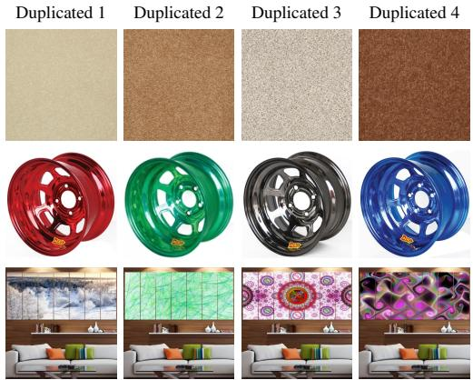  
(a) Duplicate examples

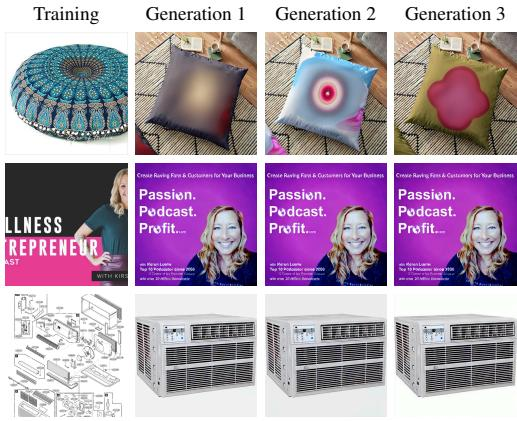  
(b) Mismatched image–caption pairs  
Figure 13: Examples removed when filtering the memorization dataset. (a) Each row shows a group of duplicate examples, of which we retain only one. (b) The first image in each row is the stored training image, followed by three generations from its training caption. We remove cases in which the caption does not reproduce the stored image.

## G.1 Ablation

Figures 15 and 16 assess sensitivity to the number of iterations K and escape radius r. Performance is stable around our primary choices: $K = 1 6 .$ , with $r = 0 . 2 5$ for global scores and $r = 0 . 1$ for the local gap.

For $r = 0 . 2 5$ , the global scores remain broadly stable through $K = 6 4$ and deteriorate at larger values. With $r = 0 . 1$ , their performance is lower and begins to decline earlier; this sensitivity is particularly pronounced for $\sigma _ { c }$ on TV examples. By contrast, the local gap performs similarly for both radii across most values of K, with only a modest decline beyond $K = 1 2 8$ . Noticeably, mean $\sigma _ { c }$ decreases with K, reducing separation between memorized and control examples and causing the drop in detection performance at large K.

The radius ablation shows a similar pattern: global scores are more sensitive to r, especially on TV examples, whereas the local gap maintains strong performance as r varies by an order of magnitude.

The main results and the K-ablation estimate $\sigma _ { c }$ by log-space bisection. To evaluate many radii efficiently, the radius ablation instead uses a logarithmic grid of 24 noise levels and takes the geometric midpoint between the last retained level and the first escaped level. Overall, these results show that the reported performance is not specific to the selected hyperparameters and that the local gap is particularly robust.

## G.2 Further experimental results

Figure 17 shows the score distributions for the main detection tasks using the best critical-scale metric in each setting. For separating memorized examples from controls, we use the local |∆ log $\sigma _ { c } |$ with $K \ : = \ : 1 6$ and $r ~ = ~ 0 . 1$ . For distinguishing MV and TV pairs from their caption-swapped counterparts, we use the signed ∆ log $\sigma _ { c }$ with $K = 1 6$ and $r = 0 . 2 5$

The caption-swap distributions illustrate why the sign of the gap matters. Most swapped pairs have a negative gap, indicating that an unrelated caption weakens retention relative to the unconditional branch; this behavior is especially frequent for TV examples. Taking the absolute value folds these negative scores onto the positive axis, obscuring the separation between original and swapped pairs.

## G.3 Detecting memorized regions: additional qualitative examples

Figure 18 presents four additional TV examples. As in Figure 6 (left), large local gaps align with content reproduced consistently across generations, whereas regions that vary tend to have gaps near zero. These examples further show that the local critical-scale gap captures the spatial extent

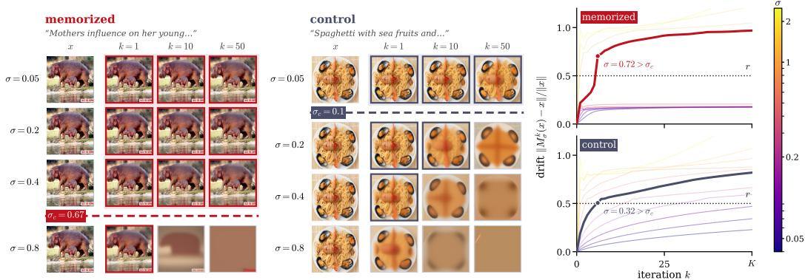  
Figure 14: The full (σ, k) grid behind Figure 1: the critical scale on Stable Diffusion v1.4, for the same memorized caption–image pair (left) and control pair (middle), each run with its own caption at guidance scale 1. Each row iterates $\bar { M } _ { \sigma }$ from the image x at one noise scale $\sigma ;$ a framed iterate $M _ { \sigma } ^ { k } ( x )$ is still within $r \Vert x \Vert$ of x. At small $\sigma$ the model keeps returning $x ,$ which therefore sits in a basin of its own; at large σ the orbit drifts away towards content shared with other data. The critical scale $\sigma _ { \mathrm { c } }$ (dashed line) separates the two regimes: the memorized image withstands far more noise than the control before it escapes. Right: the drift $\| \bar { M } _ { \sigma } ^ { k } ( x ) - x \| / \| x \|$ along the orbit, one curve per scale coloured by $\sigma ;$ the thick curve is a scale above $\sigma _ { \mathrm { c } }$ and the dot marks where it crosses r. Here $K = 5 0$ and $r = 0 . 5$

of memorized content across different images.

## G.4 Further analysis of mismatched caption gap

Ambiguity near zero. As shown in Figure 6 (right), the gap between mismatched-caption and unconditional critical scales is most informative when strongly negative. Values near zero, however, can represent two different regimes. Both branches may retain the image, indicating unconditional memorization and therefore yielding successful inpainting, or neither branch may retain it, indicating the absence of unconditional memorization. Because the gap measures relative retention, it cannot distinguish between these cases. Figure 19 (top) illustrates the first regime and Figure 19 (bottom) the second: despite having similar gaps, the examples have markedly different critical scales and inpainting performance.

Further examples with negative gap. Figure 20 provides two further examples with negative gaps. Both show evidence of unconditional memorization, but the example with the more negative gap yields more faithful reconstructions, consistent with stronger relative retention by the unconditional branch.

## G.5 Further qualitative examples

Figures 21–23 provide additional comparisons of fixed-scale trajectories and critical scales for matching-verbatim (MV), template-verbatim (TV), and control training images. Overall, retention is strongest for MV examples, followed by TV examples and then randomly selected controls: MV images remain close to their initial states for more iterations and at larger noise scales than TV images, which in turn persist longer than controls.

The TV trajectories also reveal spatial differences in retention. In the bedroom example of Figures 23 and 25, the surrounding room remains stable after the bedsheet pattern has been smoothed, consistent with the memorized and variable regions identified in Figure 18. Similarly, in Figure 22, the non-memorized curtain pattern disappears first, whereas the memorized plant and chair persist longer. These examples provide qualitative evidence that fixed-scale dynamics retain memorized regions longer than non-memorized ones, further motivating a local measure for partially memorized images.

Figure 24 illustrates how the caption gap distinguishes memorized image–caption pairs from controls. For the MV example, conditioning on the training caption retains the image to larger noise scales than the unconditional branch, producing a large positive $\Delta$ log $\sigma _ { c }$ . For the control, the two branches escape at similar scales, and the gap is close to zero.

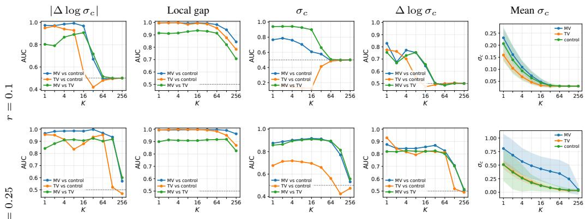  
Figure 15: Ablation on the number of iterations K. Detection performance as a function of K for escape radii r = 0.1 and r = 0.25. The first four columns report AUC for the different critical-scale scores; the final column reports the mean critical scale (solid line) ± one standard deviation (shaded region). Performance is stable around the primary choice $K = 1 6 , r = 0 . 2 5$

Figure 25 further illustrates how retention varies across memorization types and image regions. In the upper comparison, the MV example has the largest $\sigma _ { c } ,$ followed by the TV example and then the control. The lower comparison shows two TV examples: the image with memorized content occupying a larger region has the larger $\sigma _ { c }$ . Within both TV images, non-memorized content—the floor in the first and the bedsheet pattern in the second—disappears at smaller noise scales than the memorized regions.

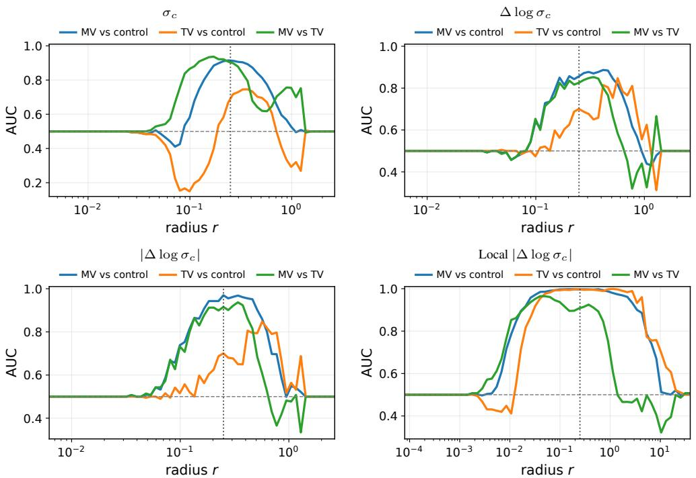  
Figure 16: Ablation on the escape radius $^ { r } \cdot$ Detection performance (AUC) as a function of r using $K = 1 6$ For this ablation, $\sigma _ { c }$ is approximated over a logarithmic grid of 24 noise levels rather than estimated by logspace bisection. Performance is stable around the primary choice $K = 1 6 , r = 0 . 2 5$ (global measures), $r = 0 . 1 ( \mathrm { l o c a l } | \Delta \log \sigma _ { c } | )$

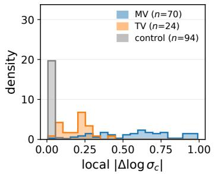

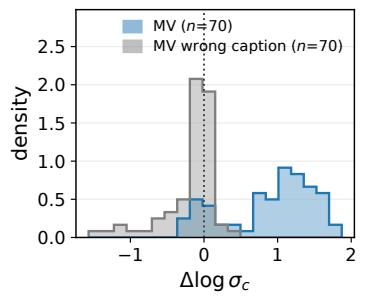

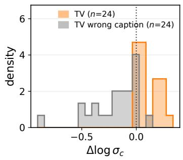  
Figure 17: Critical-scale score distributions across evaluation groups. Histograms of the scores used to separate the different groups. $L e f t { \mathrm { : } }$ Local $| \Delta$ log $\sigma _ { c } |$ for MV, TV, and control examples $( K = 1 6 , r = 0 . 1 )$ Center-Right: Signed ∆ log σc for MV and TV pairs with their original and swapped captions $( K = 1 6 )$ $r = 0 . 2 5 )$ . Swapped pairs frequently have negative gaps.

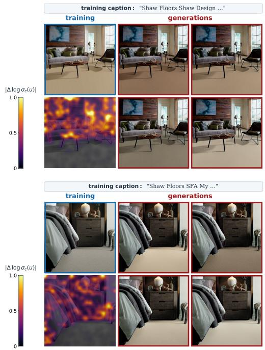

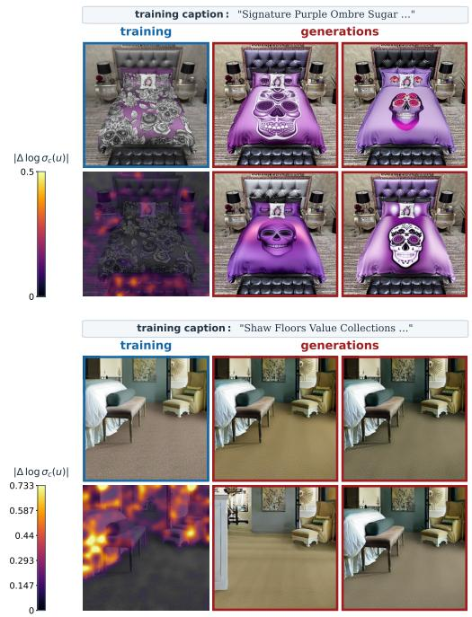  
Figure 18: Additional examples of localized memorization. Each panel shows a TV training image, generations from its caption, and the corresponding local |∆ log σuc | map. Large gaps align with regions reproduced consistently across generations, whereas variable regions generally have gaps near zero.

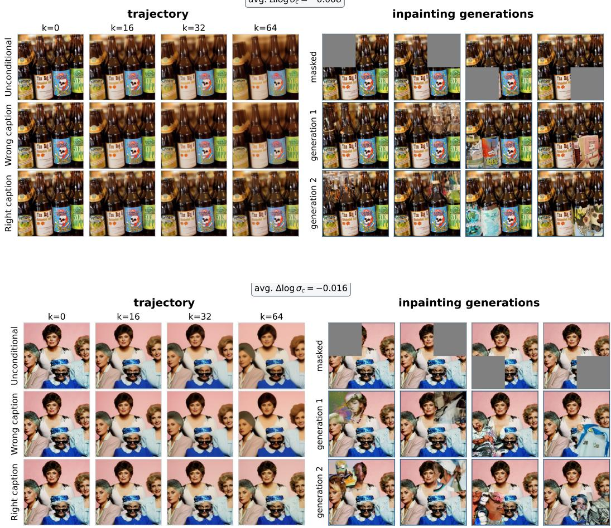  
Figure 19: Near-zero gaps are ambiguous. The two examples have similar mismatched-caption gaps but different absolute retention. Top: Both branches retain the image, and unconditional reconstruction succeeds. Bottom: Neither branch retains the image, and unconditional reconstruction fails.

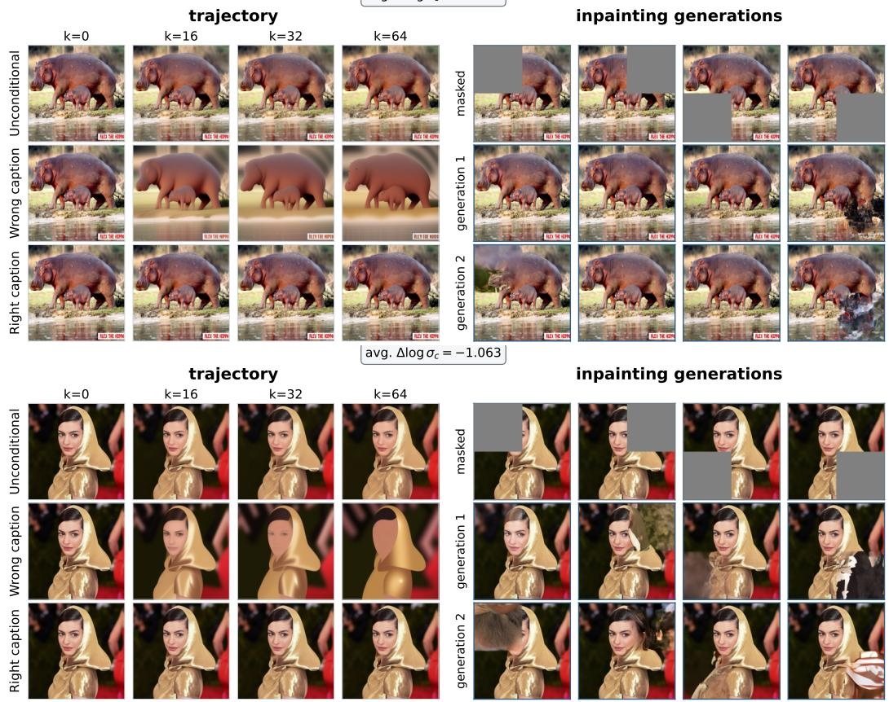  
Figure 20: Additional examples with negative mismatched-caption gaps. Both examples exhibit unconditional retention and successful inpainting. The more negative gap in the top example corresponds to more faithful reconstructions than the less negative gap in the bottom example.

totally memorized “Sarah Silverman Will Star in HBO…”  
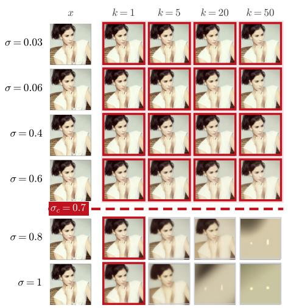

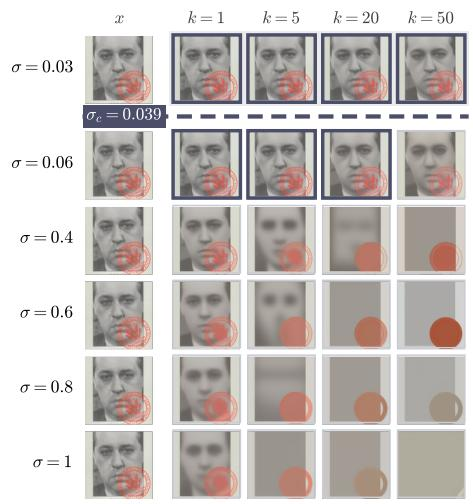  
control “The best books on Memoirs of…”

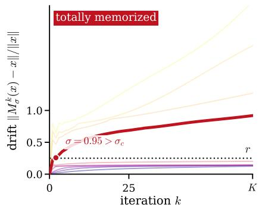

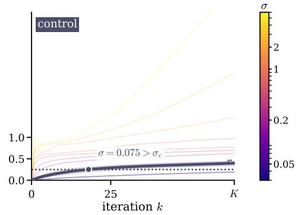  
Figure 21: Trajectory and critical scale MV vs control. $T o p \mathrm { : }$ critical scale on for a totally memorized caption–image pair $( l e f t )$ and a control pair (right), each run with its own caption at guidance scale 1. Each row iterates $M _ { \sigma }$ from the image x at one noise scale σ; a framed iterate $\bar { M } _ { \sigma } ^ { k } ( x )$ is still within r∥x∥ of x. At small σ the model keeps returning $x ,$ which therefore sits in a basin of its own; at large σ the orbit drifts away towards content shared with other data. The critical scale $\sigma _ { \mathrm { c } }$ (dashed colored line) separates the two regimes: the memorized image withstands far more noise than the control before it escapes. Bottom: the drift $\| \bar { M } _ { \sigma } ^ { k } ( x ) - x \| / \| x \|$ along the orbit, one curve per scale coloured by $\sigma ;$ the thick curve is a scale above $\sigma _ { \mathrm { c } }$ and the dot marks where it crosses r.

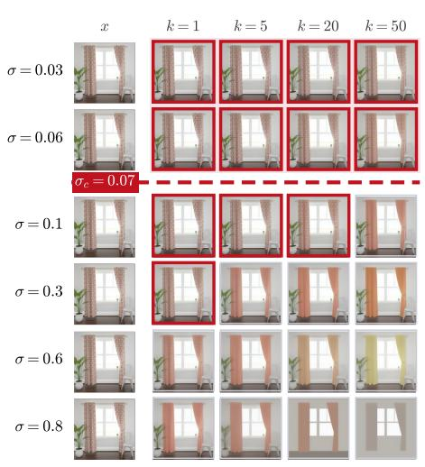

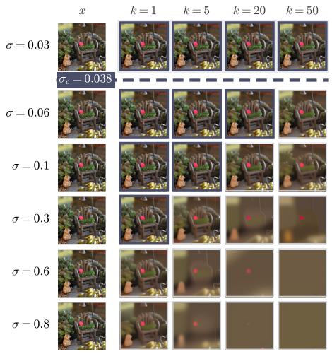  
control “Medium Of The Fairy Gardens”

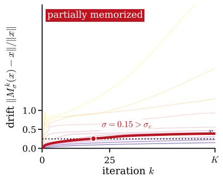

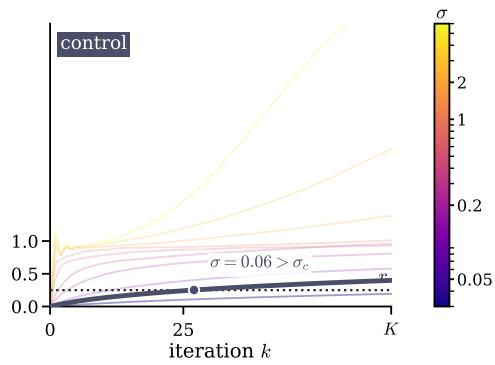  
Figure 22: Trajectory and critical scale TV vs control. Top: critical scale on for a partially memorized caption–image pair (left) and a control pair (right), each run with its own caption at guidance scale 1. Each row iterates $M _ { \sigma }$ from the image x at one noise scale σ; a framed iterate ${ \hat { M } } _ { \sigma } ^ { k } ( x )$ is still within r∥x∥ of x. At small σ the model keeps returning $x ,$ which therefore sits in a basin of its own; at large σ the orbit drifts away towards content shared with other data. The critical scale $\sigma _ { \mathrm { c } }$ (dashed colored line) separates the two regimes: the memorized image withstands far more noise than the control before it escapes. Bottom: the drift $\| \bar { M } _ { \sigma } ^ { k } ( x ) - x \| / \| x \|$ along the orbit, one curve per scale coloured by $\sigma ;$ the thick curve is a scale above $\sigma _ { \mathrm { c } }$ and the dot marks where it crosses r.

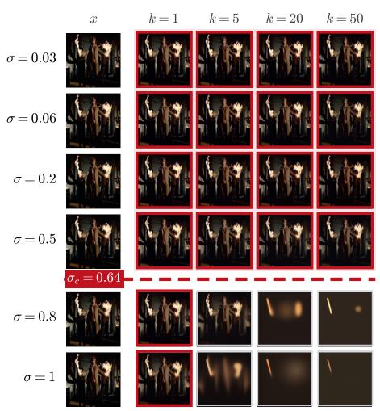  
totally memorized “Watch the Trailer for NBC's…”

partially memorized “Signature Purple Ombre Sugar…”  
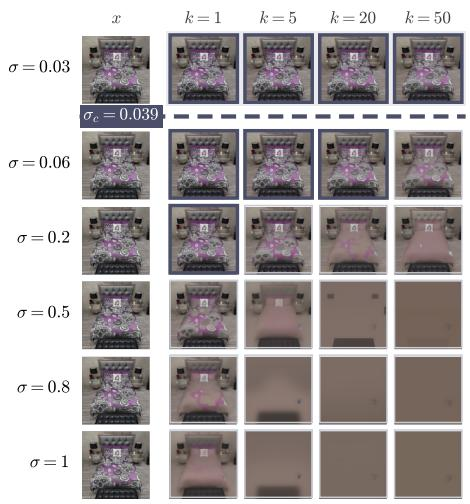

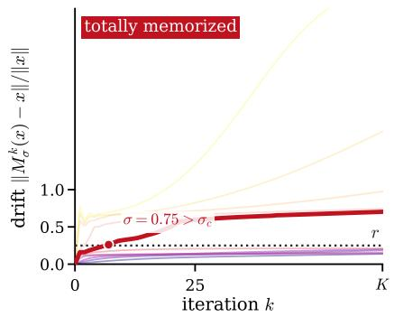

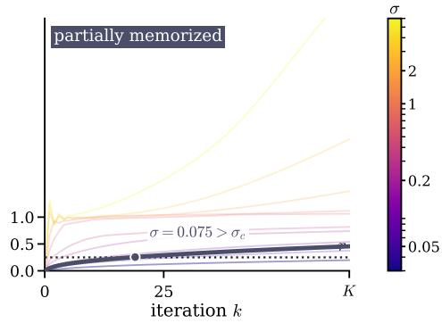  
Figure 23: Trajectory and critical scale MV vs TV. Top: critical scale on for a totally memorized caption– image pair (left) and a partially memorized pair (right), each run with its own caption at guidance scale 1. Each row iterates $M _ { \sigma }$ from the image x at one noise scale σ; a framed iterate $M _ { \sigma } ^ { k } ( x )$ is still within r∥x∥ of x. At small σ the model keeps returning $x ,$ which therefore sits in a basin of its own; at large σ the orbit drifts away towards content shared with other data. The critical scale $\sigma _ { \mathrm { c } }$ (dashed colored line) separates the two regimes: the memorized image withstands far more noise than the control before it escapes. Bottom: the drift $\| \bar { M } _ { \sigma } ^ { k } ( x ) - x \| / \| x \|$ along the orbit, one curve per scale coloured by $\sigma ;$ the thick curve is a scale above $\sigma _ { \mathrm { c } }$ and the dot marks where it crosses r.

training caption  
training caption  
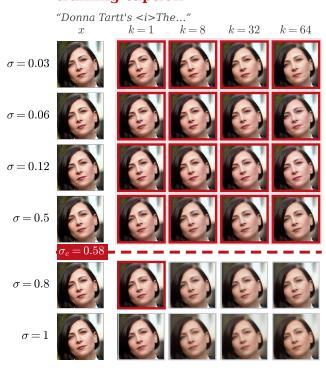

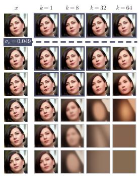  
unconditional  
unconditional

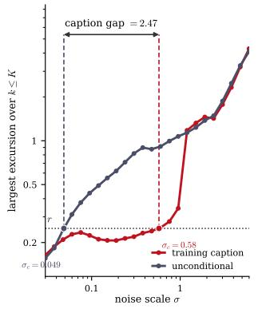

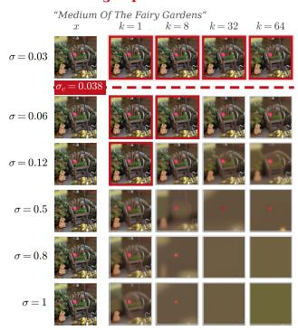

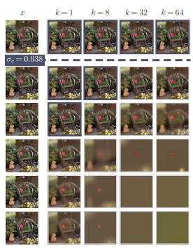

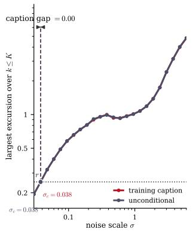  
Figure 24: $\pmb { \Delta }$ log $\sigma _ { c }$ for MV and control images. The top row shows an MV image–caption pair and the bottom row a control. The left and center panels show fixed-scale trajectories across noise levels under trainingcaption and unconditional conditioning, respectively. The right panels plot maxk≤K $\lvert | M _ { \sigma } ^ { k } ( x ) - x \rvert | / \lvert | x \rvert |$ for both branches. Their crossings with the dotted threshold $r$ define the conditional and unconditional critical scales, whose log difference is $\Delta$ log $\sigma _ { c } .$ . The MV pair has a large gap because its caption substantially increases retention, whereas the control has nearly equal critical scales and a gap close to zero.

0.06  
0.05  
0.07  
0.1  
0.2  
0.3  
0.5  
0.6  
0.8  
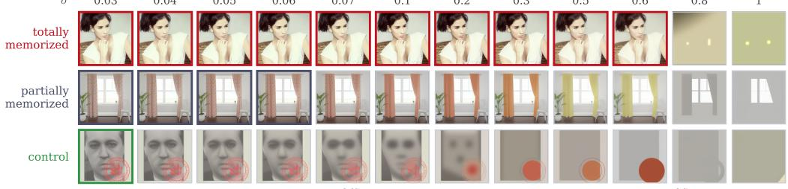

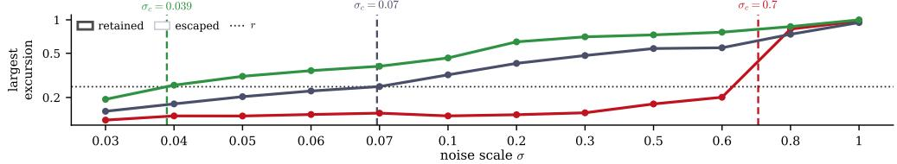

¾  
0.03  
0.05  
0.06  
0.1  
0.08  
0.2  
0.5  
0.7  
0.8  
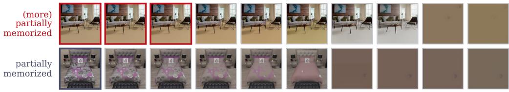  
1

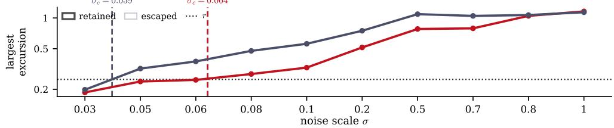  
Figure 25: Fixed-scale trajectories across noise levels. Each comparison shows the iterate $M _ { \sigma } ^ { K } ( x )$ across noise scales (top) and the maximum normalized displacement $\begin{array} { r } { \operatorname* { m a x } _ { k \le K } | M _ { \sigma } ^ { k } ( x ) - x | / | x | } \end{array}$ as a function of σ (bottom). The dotted line marks the escape radius $r ;$ its crossing determines $\sigma _ { c } .$ . The upper panel compares an MV, a TV, and a control image, ordered from longest to shortest retention. The lower panel compares two TV images with different amounts of memorized content. The image with more memorized content is retained longer.