# From Search to Signal: Online Post-Training in Automatic Heuristic Design

Yilun Yuan, Tianyu Zhou, and Zhenzhou Tang∗

Wenzhou University

25451354046@stu.wzu.edu.cn, 25451354054@stu.wzu.edu.cn, tzz@wzu.edu.cn

## Abstract

Large language model (LLM)-based automatic heuristic design (AHD) iteratively proposes and refines heuristics, often pairing design rationales with executable code. Task-specific evaluators assess programs; execution outcomes and performance scores guide subsequent search. Many AHD systems keep the generator frozen; EvoTune and Co-Evolution of Algorithms and Language Model (CALM) instead update it from evaluated candidates. When such outcomes drive reinforcement learning with verifiable rewards (RLVR), they create a search-coupled loop: the same evaluated candidate stream supplies both search-state updates and training signals for the model that generates future candidates. Yet validity and performance do not uniquely determine useful model updates; converting them into learning signals must account for the prompt and evolving search state that produced each candidate. We formulate online post-training of small openweight LLMs in AHD as context-dependent signal construction and develop alternative mappings from program validity, task performance, and generation context to update signals. Using shared evaluated rollouts and matched update bud gets, controlled experiments across AHD tasks and model families compare these mappings with online post-training baselines, testing their efects on validity, performance among valid proposals, and the yield of valid proposals that improve under pre-specified contextual comparisons. Complementary checkpoint, frozen-search, and live-system evaluations assess whether proposal-level gains appear in updated checkpoint behavior and subsequent search, rather than arising solely from accumulated search state. A resource-matched comparison under pre-specified cost accounting tests whether online up dating adds value beyond additional search with a frozen generator. Together, this design avoids treating end-to-end search gains alone as evidence of stronger heuristic-design capabilities.

## 1 Introduction

Automatic heuristic design (AHD) searches for executable heuristics for a target optimization problem, extending a long line of work on generating and selecting heuristics from performance feedback (Burke et al. 2013). Large language model (LLM)-based systems generate programs, evaluate them on task instances, and use the resulting feedback to form later proposals. Population evolution, program databases, reflection, and tree search organize this process in diferent ways (Romera-Paredes et al. 2024; Liu et al. 2024a; Ye et al. 2024; Zheng et al. 2025; Novikov et al. 2025). Many such systems keep the generator parameters frozen during search. This choice accommodates black-box models and avoids training overhead, but confines adaptation to external state—such as retained programs, reflections, populations, and the prompts constructed from them. Recurring execution failures, ineffective modifications, or task-specific design patterns cannot accumulate in the generator parameters and must instead be filtered or represented by the search procedure.

Search experience can instead update the model, either after data collection (Liu et al. 2026a; Lee et al. 2026) or during the search itself (Šurina et al. 2025; Huang et al. 2026). Within-search updating allows recurring execution and performance feedback to alter future proposal distributions through the model as well as through external search memory. It also gives each evaluated candidate two consumers. Search may admit it to the population and use it in later prompts; learning assigns credit to the tokens that produced it. These consumers share evidence but need not assign it the same value.

Executable evaluation makes AHD amenable to reinforcement learning with verifiable rewards (RLVR), but verification reports what happened rather than how the policy should be updated. Program validity, failure type, and task score must still be mapped to reward, and the meaning of a score can depend on its parent and search state. Group Relative Policy Optimization (GRPO) then converts rewards into advantages relative to completions from the same prompt (Shao et al. 2024). Numerically diferent rewards can therefore become learner-equivalent after normalization, while ordering, gating, and non-afine spacing can change the update.

We isolate this search-to-signal transformation in Co-Evolution of Algorithms and Language Model (CALM; Figure 1). Evolutionary operators, context construction, parent selection, population transitions, evaluation, grouping, normalization, and optimization are shared; only the mapping from evaluated records to learner rewards varies. We compare Native CALM, a validity–quality factorization, a pregeneration tail-weighted construction, and a search-exposure residual. These constructions instantiate controlled creditassignment hypotheses inside one search-and-learning system; they are not separate search algorithms.

Because live search couples a changing checkpoint with an accumulating population, endpoint performance cannot localize an efect. We trace reward diferences through shared-record advantages, matched updates, proposal behavior, restarted frozen-checkpoint search, live co-evolution, and a timing-derived frozen-search anchor. Our contributions are:

• Two-consumer formulation separates search-state updates from learner credit for the same evaluated stream.

• Normalizer-aware intervention tests which record distinctions survive the actual learner pipeline.

• Layered attribution protocol separates checkpoint, accumulated search-state, and resource-allocation efects.

The reward constructions instantiate this audit rather than constituting a claim of universal superiority. At a common 500-group horizon, every trained condition improves live search over Frozen, but the mappings trade validity, validonly performance, contextual improvement yield, and coverage. Base-rate calibration shows that most positive advantage mass follows the dominant class of valid non-improvers, while immediate improvements are strongly enriched relative to their frequency. After population reset, the Tail-weighted checkpoint remains better than the initial Frozen model in all three seeds, but its relation to its own live endpoint is mixed. Under timing-derived budgets for additional Frozen search, Native and Factorized each win only one of three seeds. In this CALM cohort, archive utility, peer-relative learner credit, and strict discovery are therefore not interchangeable.

## 2 Related Work

## Search Procedures for LLM-Based AHD

LLM-based AHD instantiates a broader generate–evaluate paradigm that also underlies scored-solution prompting and executable reward evolution (Yang et al. 2024; Ma et al. 2024). Search procedures difer primarily in the state retained between generations and the way that state conditions new programs. FunSearch maintains high-scoring programs in a database (Romera-Paredes et al. 2024); EoH evolves naturallanguage heuristic ideas together with their implementations, and ReEvo augments evolution with reflective feedback (Liu et al. 2024a; Ye et al. 2024). LLaMEA places LLM-generated algorithms in an evolutionary loop (van Stein and Bäck 2025), whereas MCTS-AHD organizes heuristic lineages as a search tree (Zheng et al. 2025). AlphaEvolve scales evaluatorguided program evolution with model ensembles and a large program database (Novikov et al. 2025). LLM4AD provides common interfaces for search methods, model backends, algorithm-design tasks, and evaluation (Liu et al. 2024b); a complementary benchmark studies the contribution of evolutionary search across AHD methods, problems, and model backends (Zhang et al. 2024). Related search spaces include complete agent code and graph-structured multi-agent workflows (Hu, Lu, and Clune 2025; Zhuge et al. 2024). Although their search memories and prompting strategies difer, these systems improve candidates without updating the generator during a run.

## Model Adaptation from Search Experience

Search experience can also serve as training data, as in Expert Iteration, AlphaZero, and Reinforced Self-Training (Anthony, Tian, and Barber 2017; Silver et al. 2018; Gulcehre et al. 2023). In AHD, Liu et al. form rank-based preference pairs from collected algorithms and apply direct preference optimization (DPO) before deployment (Rafailov et al. 2023; Liu et al. 2026a), while Evolution Fine-Tuning aggregates trajectories across tasks for mid-training (Lee et al. 2026). The trained component need not be the program generator: HeurAgenix trains a heuristic selector, whereas AHD Agent trains a multi-turn, tool-using policy (Yang et al. 2025; Lv et al. 2026). A distinct setting adapts a model during the search that supplies its training data. EvoTune performs of-policy DPO over an expanding program database, and CALM applies GRPO to groups sampled from a shared evolutionary context (Šurina et al. 2025; Huang et al. 2026). ThetaEvolve likewise trains a mutation generator during program evolution and evaluates the resulting checkpoint under inference-only search (Wang et al. 2026). PACEvolve++ instead trains a strategic advisor, delegates code implementation to a separate model, and changes the source of credit from group-relative feedback to frontier contribution across search phases (Yan et al. 2026). These systems establish online adaptation, checkpoint evaluation, and search-aware credit as close precedents. Our intervention keeps CALM’s search transition, end-to-end generator role, and GRPO normalizer fixed so that record-to-reward mappings and their downstream attribution can be compared directly.

## Verifiable Feedback and Reward Construction

Executable evaluation supplies automatically checked outcomes for reinforcement learning with verifiable rewards: parsing and execution expose interface violations and runtime failures, while task evaluators score valid programs. Related systems train code generation from unit-test feedback (Le et al. 2022; Liu et al. 2023) and rank reasoning with learned or rule-based verifiers (Cobbe et al. 2021; Guo et al. 2025). These observations still require a reward function before they can update a policy. GRPO estimates a completion’s advantage relative to other samples from the same prompt (Shao et al. 2024), so reward construction and group normalization jointly determine the credit seen by the learner. GDPO further shows that changing the order ofreward aggregation and normalization changes multi-reward optimization (Liu et al. 2026b). For discovery objectives, TTT-Discover combines state reuse with adaptive exponential weighting toward high-reward attempts (Yuksekgonul et al. 2026). Our tail-weighted construction explicitly reuses its concentration rule; our primary question is diferent: with the search procedure and GRPO estimator fixed, which distinctions in AHD evaluation records remain in the learner’s efective advantage?

## 3 Search-Coupled Online AHD

At round t, let $S _ { t }$ denote CALM’s pre-generation population state and let $\kappa _ { t }$ contain the sampled operator and base heuristics. Their prompt $x _ { t } = \mathcal { C } ( S _ { t } , \kappa _ { t } )$ produces a group $y _ { t , i } \sim \pi _ { \theta _ { t } } ( \cdot , \mid x _ { t } ) , i \ = \ 1 , \ldots , G$ . Execution yields an outcome $o _ { t , i }$ (valid or a typed failure) and, for valid programs, a task score $f _ { t , i }$ . We collect the pre-generation context and evaluation in $d _ { t , i } = ( S _ { t } , \kappa _ { t } , y _ { t , i } , o _ { t , i } , f _ { t , i } )$ and write $D _ { t } = ( d _ { t , 1 } , \dots , d _ { t , G } )$

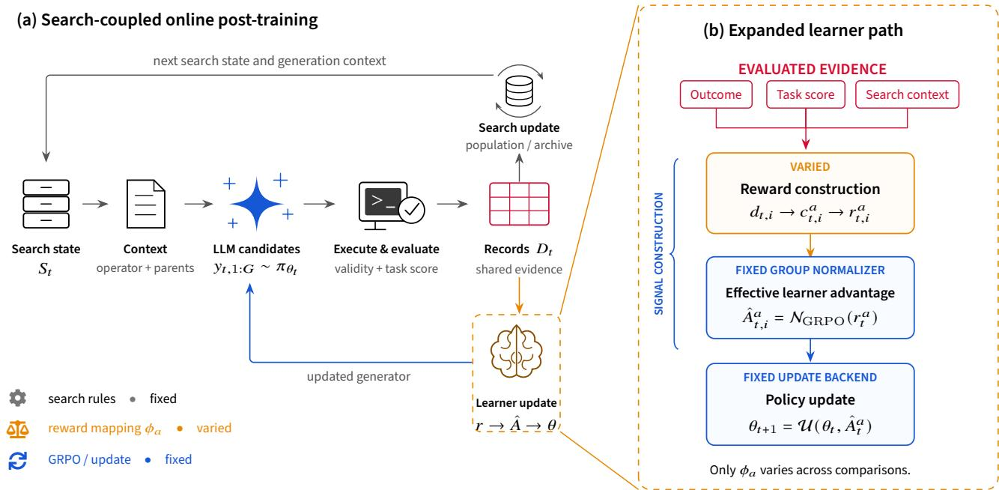  
Figure 1: Search-coupled online post-training and our intervention boundary. Each evaluated group updates the search state and supplies learner rewards. We keep search, group normalization, and optimization fixed and vary only $\phi _ { a } .$ . Live arms generate diferent future evidence once their models diverge.

The same record group has two consumers. CALM’s fixed transition $T$ updates the population, whereas a reward construction $\phi _ { a }$ maps the records to learner rewards. The first line below describes the search consumer; the remaining lines describe the learner path through reward components $\mathbf { c } _ { t } ^ { a }$ , scalar rewards $\mathbf { r } _ { t } ^ { a }$ , normalized advantages ${ \bf A } _ { t } ^ { a }$ , and the optimizer U:

$$
\begin{array} { r l } & { S _ { t + 1 } \sim T ( S _ { t } , D _ { t } ) , } \\ & { \quad \mathbf { c } _ { t } ^ { a } = \psi _ { a } ( D _ { t } ) , \quad \mathbf { r } _ { t } ^ { a } = \sigma _ { a } ( \mathbf { c } _ { t } ^ { a } ) = \phi _ { a } ( D _ { t } ) , } \\ & { \quad \mathbf { A } _ { t } ^ { a } = \mathcal { N } ( \mathbf { r } _ { t } ^ { a } ) , \quad \theta _ { t + 1 } ^ { a } = \mathcal { U } ( \theta _ { t } ^ { a } , D _ { t } , \mathbf { A } _ { t } ^ { a } ) . } \end{array}\tag{1}
$$

Thus, evaluation outcomes and search events are evidence; they become learner credit only through $\phi _ { a } .$ . Across comparisons we hold T, grouping, token masks, $\mathcal { N }$ , and U fixed and vary only $\phi _ { a }$ . In shared-record experiments, $D _ { t }$ is also fixed. In live search, trajectories diverge after the first distinct update even though the procedures remain identical.

CALM’s implementation standardizes rewards within each group,

$$
A _ { t , i } ^ { a } = \frac { r _ { t , i } ^ { a } - \bar { r } _ { t } ^ { a } } { s ( \mathbf { r } _ { t } ^ { a } ) + 1 0 ^ { - 4 } } ,\tag{2}
$$

where s is the sample standard deviation. We call two mappings learner-equivalent on $D _ { t }$ when $\mathcal { N } ( \phi _ { a } ( D _ { t } ) ) \ =$ $\mathcal { N } ( \phi _ { b } ( \bar { D } _ { t } ) ,$ . A group-shared additive ofset is removed $\mathbf { e X - }$ actly; positive rescaling is nearly removed when reward variance dominates the numerical stabilizer, but can leave a small scale-dependent diference in low-variance groups. Beyond this numerical edge case, context changes the efective signal through ordering, gating, ties, or non-afine spacing. We therefore audit both normalized advantages and matched parameter updates rather than treating a diferent reward formula as suficient evidence of a diferent learning signal.

## 4 Reward Constructions

Table 1 summarizes four constructions embedded in the same CALM loop. Here $b _ { t }$ is the best prompt-base score, $F _ { t }$ the pre-generation frontier, $\Delta _ { t , i } = f _ { t , i } - b _ { t }$ , and $\operatorname { c t r } ( \cdot )$ denotes within-set centering. Frozen CALM is the no-update control, not a fifth reward construction.

Native CALM. The released mapping assigns missing rationale, missing code, interface failure, runtime failure, and detected randomness rewards of $- 1 , - 0 . 9 5 , - 0 . 9 0 , - 0 . 8 5 ,$ and −0.75. Valid initialization candidates receive zero. Otherwise, with $\delta = \mathrm { c l i p } ( | f - b | / \operatorname* { m i n } \{ | f | , | b | \} , 1 0 ^ { - 1 0 } , 1 )$ , an improvement receives $1 + \delta ,$ equality receives zero, and a degradation receives $- 3 \delta / 8 ;$ a candidate identified as one of the prompt bases receives $- 3 / 5$ . Native therefore combines failure severity, validity, and context-relative quality in one piecewise scale.

Factorized Validity–Quality. Let $v _ { t , i } \in \{ - 1 , 1 \}$ encode invalid versus valid output. Among valid non-initialization candidates, define $q _ { t , i } = \Delta _ { t , i } / \operatorname { R M S } ( \Delta _ { t } )$ , and set $q _ { t , i } = 0$ otherwise or when the eligible-set RMS is numerically zero. The reward

$$
\begin{array} { r } { r _ { t , i } ^ { \mathrm { F } } = \frac { 1 } { 2 } v _ { t , i } + \frac { 1 } { 2 } q _ { t , i } } \end{array}\tag{3}
$$

Table 1: Reward constructions compared with search, evaluation, grouping, and GRPO held fixed. The tail-weighted construction uses the group-concentration rule of TTT-Discover (Yuksekgonul et al. 2026); Search-Exposure Residual is evaluated only as a mechanism probe.
<table><tr><td>Construction</td><td>Evidence and reference</td><td>Reward supplied to GRPO</td><td>Role</td></tr><tr><td>Native CALM</td><td>Typed failures; nonlinear comparison with  $b _ { t }$ </td><td>Released piecewise reward  $r ^ { \mathrm { N } }$ </td><td>Online baseline</td></tr><tr><td>Factorized Validity-Quality</td><td>Binary validity; signed, RMS-scaled  $\Delta _ { t , i }$  for valid candidates</td><td> $\begin{array} { r } { r _ { t , i } ^ { \mathrm { F } } = \frac { 1 } { 2 } v _ { t , i } + \frac { 1 } { 2 } q _ { t , i } } \end{array}$ </td><td>Separate feasibility from quality</td></tr><tr><td>Pre-Generation Tail-Weighted</td><td>Typed outcomes; pre-generation score novelty, repetition, and gap above  $F _ { t }$ </td><td> $r _ { t , i } ^ { \mathrm { T } } = G \omega _ { t , i }$ </td><td>Emphasize the group upper tail</td></tr><tr><td>Search-Exposure Residual</td><td> $\Delta _ { t , i } ;$  Typed validity; counterfactual one-step parent exposure  $\rho _ { t , i }$ </td><td> $r _ { t , i } ^ { \mathrm { S } } = a _ { t , i } ^ { V } + a _ { t , i } ^ { Q } + a _ { t , i } ^ { S }$ </td><td>Search-derived mechanism probe</td></tr><tr><td>Frozen CALM</td><td>Same search and evaluator; updates disabled</td><td></td><td>No-update control</td></tr></table>

is followed by one joint GRPO normalization. It is a scalar reward construction, not a two-loss or separately normalized multi-reward objective.

Pre-Generation Tail Weighting. For each group, a tieaware midrank $u _ { t , i } \in [ 0 , 1 ]$ places typed failures below valid candidates. Among valid candidates, it favors scores absent from the pre-generation archive and responses not repeated within the group. We retain magnitude only for positive frontier gaps, $\mathbf { \Sigma } _ { g _ { t , i } } ^ {  } \dot { = } [ f _ { t , i } - F _ { t } ] _ { + } \mathbf { \bar { / } } \operatorname { R M S } ( [ \mathbf { f } _ { t } ^ {  } - \dot { F _ { t } } ] _ { + } )$ , and set $\begin{array} { r } { w _ { t , i } = u _ { t , i } + \frac { 1 } { 2 } g _ { t , i } } \end{array}$ . Following TTT-Discover’s concentration rule, but not its PUCT or leave-one-out objective, we choose $\beta _ { t }$ so that

$$
\begin{array} { c } { \displaystyle \omega _ { t , i } = { e ^ { \beta _ { t } w _ { t , i } } \bigg / \sum _ { j } { e ^ { \beta _ { t } w _ { t , j } } } } , } \\ { \displaystyle D _ { \mathrm { K L } } ( \omega _ { t } \| U _ { G } ) = \gamma _ { t } , \qquad \gamma _ { t } = \mathrm { m i n } \{ \log 2 , \log ( G / k _ { t } ) \} , } \end{array}\tag{4}
$$

where $k _ { t }$ counts tied maxima, and return $r _ { t , i } ^ { \mathrm { T } } = G \omega _ { t , i } .$ If the target equals the largest KL attainable under tied maxima, the implementation returns the limiting distribution that is uniform over those maxima; a constant group returns the uniform distribution. This KL controls concentration over the completion group; it is not policy–reference KL.

Search-Exposure Residual. This mechanism probe asks whether CALM’s fixed parent-selection rule supplies information beyond immediate quality. After counterfactually inserting candidate i into the pre-generation archive, $\rho _ { t , i }$ approximates its one-step exposure through CALM’s primary and secondary parent slots. On eligible valid candidates, we residualize ctr $\left( \rho _ { t } \odot \Delta _ { t } \right)$ against the centered quality direction:

$$
\widetilde { \mathbf { s } } _ { t } = \mathrm { c t r } ( \pmb { \rho } _ { t } \odot \pmb { \Delta } _ { t } ) - \mathrm { p r o j } _ { \mathrm { c t r } ( \pmb { \Delta } _ { t } ) } \mathrm { c t r } ( \pmb { \rho } _ { t } \odot \pmb { \Delta } _ { t } ) ,\tag{5}
$$

then combine centered, RMS-scaled validity $\mathbf { a } _ { t } ^ { V }$ , quality $\mathbf { a } _ { t } ^ { Q }$ and a bounded rescaling $\mathbf { a } _ { t } ^ { S }$ of $\widetilde { \mathbf { s } } _ { t }$ . A channel is set to zero when its centered scale is numerically zero. This changes learner credit only; parent selection and population transitions remain unchanged. Edge-case handling and scaling are fixed before the matched-update probe.

## 5 Controlled Evaluation

Scope. We separate mechanism, live-system, and attribution evidence. Shared-record audits span four tasks, and matched updates span two tasks and two 7B model families with one seed per cell. The complete live cohort uses TSP and Qwen2.5-7B-Instruct with three seeds (42, 3407, 1926000), G = 4, a population of ten, and 500 groups (2,000 completions) per run. Native, Factorized, Tail-weighted, and Frozen enter this cohort; Search-Exposure Residual remains a mechanism-only comparison. Trained conditions use rank-32 LoRA (Hu et al. 2022) and equal update opportunities. The run seed is the statistical unit, and we report seed-level values without asymptotic significance tests.

Implementation. We pin the released CALM implementation and preserve its TSP operators, parent sampling, population transition, collapse behavior, and evaluator across conditions. Prompts and completions are capped at 2,048 and 1,024 tokens, respectively, with a 4,096-token model context. The live horizon is 500 evaluated groups and the stagnation threshold is 25. Each online condition receives one optimizer opportunity per group; generated-token counts can still differ because completion lengths difer, so we do not claim equal training-token budgets for live runs. Resolved configurations, source bundles, checkpoint hashes, and completionlevel records are retained for every reported run; software and hardware details are provided in the supplementary material.

Attribution protocol. We first replay mappings on shared evaluated records and compare normalized advantages, including learner-equivalent and zero-advantage groups. Matched updates then hold the initial adapter, response tokens, masks, reference log probabilities, optimizer steps, and training tokens fixed; adapter deltas and log probabilities on withheld contexts test whether a signal diference reaches the checkpoint. Live runs match initial conditions, seeds, and generation budgets but necessarily diverge after updating. Restarted runs load final adapters, reset the population, and disable further training. Frozen runs retain the same search with the initial model. For the resource comparison, setupexcluded loop times determine preregistered Frozen-search group budgets without using eficacy outcomes; endpoint metrics are recomputed from exact stored prefixes. Because prefix records lack timestamps, these are timing-derived budget anchors rather than exact realized-time matches. The contract was frozen for Native and Factorized before eficacy results, so Tail-weighted was not added post hoc. Native and Frozen are the principal baselines because the causal question requires the surrounding CALM loop to remain identical; comparisons with other end-to-end AHD systems would change search and learning simultaneously.

(a) What survives group normalization?  

(b) Learner-path propagation  
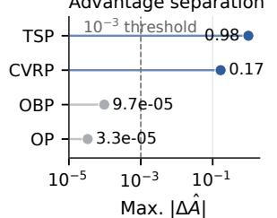

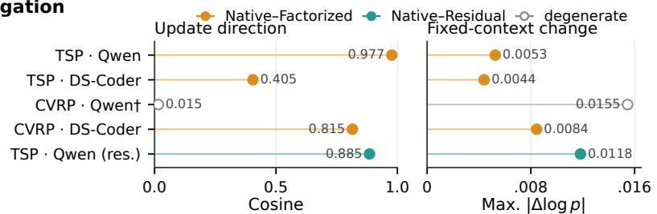

(c) Candidate prevalence and positive learner credit  
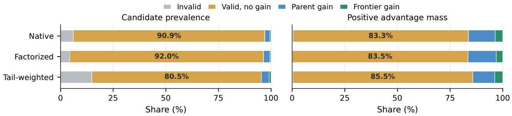  
Figure 2: Learner-path audit. (a) Group standardization removes additive shifts and nearly removes positive rescaling, while gating and nonlinear spacing can survive. (b) Shared-record advantage separation, matched-update cosine, and fixed-context log-probability changes trace signal propagation; open markers denote a degenerate cell and green denotes Search-Exposure Residual. (c) Candidate prevalence calibrates positive-advantage mass by class base rate. Panel (b) establishes mechanism separation, not eficacy.

Metrics. For N completions, valid set V, and comparisoneligible set I, we report

$$
\begin{array} { r l } & { \mathrm { V a l i d R a t e } = | \mathcal { V } | / N , } \\ & { \mathrm { V a l i d P e r f } = \displaystyle \frac { \sum _ { i \in \mathcal { V } } f _ { i } } { | \mathcal { V } | } , } \\ & { \mathrm { I m p r o v e Y i e l d } = \displaystyle \frac { \sum _ { i \in \mathcal { T } } \mathbb { I } [ f _ { i } > b _ { i } ] } { N } . } \end{array}\tag{6}
$$

Validity requires a finite task score and is distinct from evaluator dispatch. In live runs, $b _ { i }$ is induced by each condition’s evolving search state, so ImproveYield describes the contextual proposal stream rather than context-free checkpoint capability. To compare credit with immediate search utility, we classify candidates as invalid, valid non-improving, parent-improving, or strict-frontier-improving and report class prevalence, positive advantage mass, its enrichment over prevalence, and the within-class positive-credit rate:

$$
\begin{array} { l } { P _ { D } ( c ) = \cfrac { \left| \{ i : z _ { i } = c \} \right| } { N } , } \\ { P _ { A } ( c ) = \cfrac { \sum _ { i } [ A _ { i } ] _ { + } \mathbb { I } [ z _ { i } = c ] } { \sum _ { i } [ A _ { i } ] _ { + } } , } \\ { E _ { A } ( c ) = P _ { A } ( c ) / P _ { D } ( c ) . } \end{array}\tag{7}
$$

Here $z _ { i }$ is the candidate class; ratios are reported only when their denominators are positive. We also report the withinclass fraction receiving positive advantage. Archive admissions that beat the pre-generation frontier and exact-response, prompt, and parent-context uniqueness provide further diagnostics; the latter are coverage proxies, not semantic diversity. CALM represents TSP fitness as negative tour length, so higher is better. Search quality is final best $B _ { T }$ and trajectory $\begin{array} { r } { \mathrm { A U C } = \frac { \sum _ { t } B _ { t } } { T } } \end{array}$ for equal-horizon runs. For unequal resourceanchor horizons, final best at the preregistered group budget is primary; AUC is descriptive only.

## 6 Results

## Signal-Propagation Analysis

The normalizer audit identifies apparent context dependence that cannot afect training. In 387 groups, both prompt comparator and frontier were constant within the group, so adding either as a reward ofset is eliminated by Equation 2.

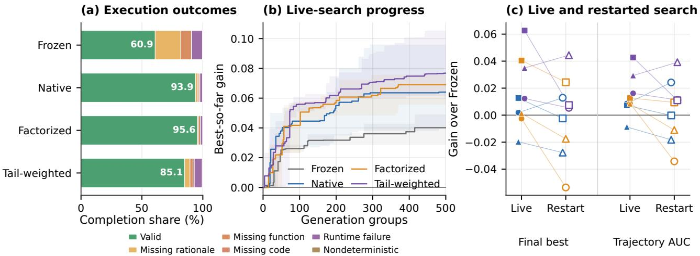  
Figure 3: Proposal and search outcomes. (a) Execution outcomes across three TSP–Qwen seeds. (b) Mean best-so-far gain; bands show the observed seed range. (c) Same-seed gains over Frozen under live updating (filled) and restarted, update-disabled search (open); lines connect seeds. Native/Factorized and Tail-weighted use independently matched restart cohorts.

Table 2: Core TSP–Qwen2.5-7B live-search results over three matched seeds. Entries are mean ± sample standard deviation, and higher is better throughout. Bold marks the highest descriptive mean in each column, not statistical significance. Validity requires an executable completion with a finite task score and is distinct from evaluator dispatch.
<table><tr><td></td><td colspan="2">Search outcomes</td><td colspan="3">Proposal stream</td></tr><tr><td>Condition</td><td>Final best</td><td>Trajectory AUC</td><td>Valid (%)</td><td>Valid-only perf.</td><td>Improve yield (%)</td></tr><tr><td>Frozen</td><td> $- 6 . 2 3 2 9 \pm 0 . 0 1 0 5$ </td><td> $- 6 . 2 4 1 7 \pm 0 . 0 0 4 6$ </td><td> $6 0 . 8 5 \pm 0 . 5 5$ </td><td> $- 9 . 8 8 0 0 \pm 0 . 8 6 3 9$ </td><td> $2 . 8 3 \pm 0 . 5 0$ </td></tr><tr><td>Native</td><td> $- 6 . 2 0 9 0 \pm 0 . 0 2 8 9$ </td><td> $- 6 . 2 2 0 3 \pm 0 . 0 1 9 6$ </td><td> $9 3 . 9 2 \pm 1 . 6 8$ </td><td> $\mathbf { - 6 . 4 9 6 6 } \pm \mathbf { 0 . 0 9 8 6 }$ </td><td> $2 . 9 8 \pm 1 . 1 6$ </td></tr><tr><td>Factorized</td><td> $- 6 . 2 0 4 1 \pm 0 . 0 1 1 6$ </td><td> $- 6 . 2 1 7 9 \pm 0 . 0 0 8 7$ </td><td> ${ \pm } { \bf 5 . 6 0 } \pm { \bf 0 . 6 4 }$ </td><td> $- 6 . 7 4 8 8 \pm 0 . 1 1 6 8$ </td><td> $3 . 6 0 \pm 1 . 2 5$ </td></tr><tr><td>Tail-weighted</td><td> $\mathbf { - 6 . 1 9 6 3 \pm 0 . 0 2 4 8 }$ </td><td> ${ \bf - 6 . 2 1 2 3 \pm 0 . 0 1 4 8 }$ </td><td> $8 5 . 1 2 \pm 2 . 5 0$ </td><td> $- 7 . 0 4 6 8 \pm 0 . 2 2 1 4$ </td><td> ${ \bf 4 . 6 3 \pm 0 . 3 3 }$ </td></tr></table>

Among 422 midrank groups, comparator and frontier indicators changed no ordering when score remained the secondary key; pre-generation score novelty and response repetition reordered 159 (37.7%) and 20 (4.7%), respectively.

Native and Factorized produce distinct shared-record advantages on TSP and CVRP-ACO but are nearly equivalent on OBP and OP (Figure 2(b)). Ofthe 12 audited groups, eight have maximum advantage diference at most 0.001 and three yield zero advantage under both mappings; the median group maximum is 0.0000672, despite a mean of 0.1216 driven by the separated TSP and CVRP groups. On TSP–Qwen, five matched updates use 20 common completions and 5,957 tokens per condition. Their adapter deltas have cosine 0.9769, and the maximum withheld-context log-probability diference is 0.00526. Three of four task–model cells yield genuine update diferences; CVRP–Qwen is degenerate. Search-Exposure Residual changes advantages in 52/100 shared groups, has adapter-delta cosine 0.8851 with Native, and reaches 0.0118 maximum fixed-context diference. These results establish mechanism separation, not search eficacy.

## Proposal-Stream Analysis

Frozen yields 60.85% valid completions; Native, Factorized, and Tail-weighted reach 93.92%, 95.60%, and 85.12% (Table 2). Every trained condition improves valid-only performance over Frozen in all seeds, but Native has the best trained-condition mean. Relative to Native, Factorized and Tail-weighted increase contextual improvement yield but reduce valid-only performance; Tail-weighted also reduces validity. Feasibility, conditional quality, and contextual improvement are therefore distinct outcomes.

The feasibility gain is operator dependent. Injection shows the largest paired changes: Native, Factorized, and Tailweighted raise validity over Frozen by 86.73, 91.75, and 58.13 points, respectively. This shows adaptation to a difficult output contract, but does not alone establish stronger algorithmic reasoning.

## Credit–Utility Alignment Analysis

The valid non-improver class accounts for 90.93% of Native candidates, 92.00% of Factorized candidates, and 80.48% of Tail-weighted candidates. Its corresponding shares of positive advantage mass are 83.30%, 83.50%, and 85.51% (Figure 2(c)). The resulting mass-to-prevalence ratios are 0.916, 0.908, and 1.062, while parent- and frontier-improving candidates are enriched by 2.83–6.72×. Within the nonimprover class, 29.34%, 22.59%, and 26.32% receive positive advantage. A non-improver also receives positive credit when its entire group fails to improve in 42.53%, 31.33%, and 78.07% of rounds. Thus, most absolute credit follows the dominant candidate class, but mappings redistribute credit relative to that base rate. Group centering necessarily assigns positive advantage within any nonconstant group, so these values do not show that such credit is erroneous or harmful; they show that peer-relative credit is not immediate comparator improvement. Signal density also difers: Factorized yields zero advantage in 60.73% of groups, versus 7.00% for Tail-weighted.

Archive admission is diferent again. Only 32 of 1,282 Native admissions, 29 of 918 Factorized admissions, 54 of 3,819 Tail-weighted admissions, and 17 of 2,540 Frozen admissions beat the pre-generation frontier. Admissions may preserve future stepping stones; the point is that archive utility, learner credit, and strict discovery are not interchangeable labels.

## Live-Search Results

At the common 500-group horizon, every trained condition improves final best and AUC over Frozen in every matched seed (Figure 3(b)). Mean final/AUC gains are $+ 0 . 0 2 4 0 / +$ 0.0214 for Native, +0.0289/ + 0.0238 for Factorized, and $+ 0 . 0 3 6 6 / + 0 . 0 2 9 4$ for Tail-weighted. When each online trajectory is truncated at the same-seed number of evaluator calls made by Frozen, Native and Factorized remain ahead in every seed. Additional evaluator calls are therefore not the sole explanation, although earlier validity and archive changes remain possible mediators.

No trained mapping uniformly dominates Native: both Factorized and Tail-weighted have mixed paired directions across seeds. Relative to Frozen, exact-response uniqueness changes by $- 1 0 . 9 8 , \ - 7 . 3 2$ , and +0.57 points for Native, Factorized, and Tail-weighted; prompt uniqueness changes by −9.20, −15.40, and +11.00. These reproducible coverage proxies are not semantic diversity measures.

Single-seed live comparisons on the remaining task–model cells are directionally mixed, so we do not pool them with the three-seed cohort. In an independent Native/Factorized cohort, final heuristics were also evaluated on held-out TSP instances at three problem sizes; Factorized has lower mean optimality gap at every size, but the observed seed ranges overlap. These checks support scope and failure-mode analysis rather than a general superiority claim.

## Checkpoint and Search-State Attribution Analysis

After resetting the population and disabling further updates, Factorized changes final score/AUC relative to Native by $- 0 . 0 0 9 8 / - 0 . 0 1 3 9$ on average, with mixed seed directions (Figure 3(c)); its valid-only performance is lower in all three seeds. We therefore find no consistent evidence that the Factorized–Native live ordering persists after reset. In the independently matched Tail-weighted cohort, restarted search improves final score and AUC over the initial Frozen model in all three seeds, by +0.0191 and +0.0205 on average; validity rises by 18.60 points and valid-only performance by 3.009. Relative to its own live parent, however, the restart has mixed final-score directions and mean final/AUC changes of −0.0175/−0.0089. The updated checkpoint thus retains measurable value over the initial generator, while the live endpoint still reflects accumulated search state and its interaction with online updates.

Under preregistered Frozen-search budgets derived from measured loop times, endpoint diferences are mixed. Native and Factorized each outperform the corresponding Frozen prefix in one of three seeds; their mean online-minus-Frozen final-best diferences are −0.0113 and $+ 0 . 0 0 3 5$ , respectively. Both online conditions nevertheless yield higher validity and valid-only proposal performance in every paired seed. Mean validity gains are 33.78 and 33.45 percentage points, and mean valid-only gains are 1.382 and 1.388, for Native and Factorized, respectively. These are budget anchors, not exact time matches: full-trajectory Frozen time difers from the Native online target by +1.61%, −13.56%, and −12.48% across seeds, while timestamps are unavailable for the shorter Factorized prefixes. Online updating therefore changes the observed proposal stream consistently in this cohort, but does not reliably dominate additional Frozen search at the endpoint.

## 7 Discussion, Limitations, and Conclusion

At the common horizon, all trained conditions improve live search over Frozen, but reward mappings trade validity, validonly quality, signal density, and coverage. Tail-weighted retains an advantage over the initial model after reset without consistently reproducing its live endpoint. No mapping uniformly dominates, and timing-derived anchors show no consistent endpoint advantage over additional Frozen search.

The two-consumer view explains these diferences. Search may retain a stepping stone without immediate frontier gain, while GRPO may reinforce the best member of an unproductive group. Archive admission, positive advantage, and strict discovery therefore answer diferent questions. Our residual construction shows that search-derived information can survive the normalizer, but establishes mechanism rather than eficacy.

Our conclusions are limited to one co-evolutionary host. Multi-seed eficacy covers TSP and one 7B model; other task–model cells provide mechanism breadth only. Foursample groups amplify ties, completion rewards cannot separate rationale from code, and coverage hashes are not semantic diversity. Matched updates test token probabilities on common contexts, while a supplementary two-seed CVRP probe evaluates final checkpoints with executable completions on a shared prompt bank but yields no stable ordering. Executable restarts subsequently diverge in context and therefore remain attribution tests rather than fixed-context capability estimates. Realized timing drift and missing prefix timestamps also preclude exact multiseed time-matched inference.

Online AHD should therefore be evaluated as a search-tosignal system: evaluated records separately reshape search and become learner credit through reward construction and normalization. Tracing both paths distinguishes parameter changes, reset-search behavior, and live gains. Reward construction is thus a testable component of search-coupled AHD rather than an implementation detail.

## References

Anthony, T.; Tian, Z.; and Barber, D. 2017. Thinking Fast and Slow with Deep Learning and Tree Search. In Advances in Neural Information Processing Systems, volume 30.

Burke, E. K.; Gendreau, M.; Hyde, M.; Kendall, G.; Ochoa, G.; Özcan, E.; and Qu, R. 2013. Hyper-Heuristics: A Survey of the State of the Art. Journal ofthe Operational Research Society, 64(12): 1695–1724.

Cobbe, K.; Kosaraju, V.; Bavarian, M.; Chen, M.; Jun, H.; Kaiser, L.; Plappert, M.; Tworek, J.; Hilton, J.; Nakano, R.; Hesse, C.; and Schulman, J. 2021. Training Verifiers to Solve Math Word Problems. arXiv:2110.14168.

Gulcehre, C.; Paine, T. L.; Srinivasan, S.; Konyushkova, K.; Weerts, L.; Sharma, A.; Siddhant, A.; Ahern, A.; Wang, M.; Gu, C.; Macherey, W.; Doucet, A.; Firat, O.; and de Freitas, N. 2023. Reinforced Self-Training (ReST) for Language Modeling. arXiv:2308.08998.

Guo, D.; Yang, D.; Zhang, H.; Song, J.; Wang, P.; Zhu, Q.; Xu, R.; Zhang, R.; Ma, S.; Bi, X.; Zhang, X.; Yu, X.; Wu, Y.; Wu, Z. F.; Gou, Z.; Shao, Z.; Li, Z.; Gao, Z.; et al. 2025. DeepSeek-R1 Incentivizes Reasoning in LLMs through Reinforcement Learning. Nature, 645: 633–638.

Hu, E. J.; Shen, Y.; Wallis, P.; Allen-Zhu, Z.; Li, Y.; Wang, S.; Wang, L.; and Chen, W. 2022. LoRA: Low-Rank Adaptation of Large Language Models. In International Conference on Learning Representations.

Hu, S.; Lu, C.; and Clune, J. 2025. Automated Design of Agentic Systems. In The Thirteenth International Conference on Learning Representations.

Huang, Z.; Wu, W.; Wu, K.; Wang, J.; and Lee, W.-B. 2026. CALM: Co-Evolution of Algorithms and Language Model for Automatic Heuristic Design. In The Fourteenth International Conference on Learning Representations.

Le, H.; Wang, Y.; Gotmare, A. D.; Savarese, S.; and Hoi, S. C. H. 2022. CodeRL: Mastering Code Generation through Pretrained Models and Deep Reinforcement Learning. In Advances in Neural Information Processing Systems, volume 35.

Lee, Y.-J.; Kim, S.; Kang, M.; Chuen, A. C. L.; Chen, Z.; Han, S.; Jung, T.; and Kang, D. 2026. Evolution Fine-Tuning: Learning to Discover Across 371 Optimization Tasks. arXiv:2606.29082.

Liu, F.; Tong, X.; Yuan, M.; Lin, X.; Luo, F.; Wang, Z.; Lu, Z.; and Zhang, Q. 2024a. Evolution of Heuristics: Towards Eficient Automatic Algorithm Design Using Large Language Model. In Proceedings of the 41st International Conference on Machine Learning, volume 235 of Proceedings ofMachine Learning Research, 32201–32223. PMLR.

Liu, F.; Zhang, R.; Lin, X.; Lu, Z.; and Zhang, Q. 2026a. Fine-Tuning Large Language Model for Automated Algorithm Design. In The Fourteenth International Conference on Learning Representations.

Liu, F.; Zhang, R.; Xie, Z.; Sun, R.; Li, K.; Lin, X.; Wang, Z.; Lu, Z.; and Zhang, Q. 2024b. LLM4AD: A Platform for Large Language Model-Based Automatic Algorithm Design. arXiv:2412.17287.

Liu, J.; Zhu, Y.; Xiao, K.; Fu, Q.; Han, X.; Yang, W.; and Ye, D. 2023. RLTF: Reinforcement Learning from Unit Test Feedback. Transactions on Machine Learning Research.

Liu, S.-Y.; Dong, X.; Lu, X.; Diao, S.; Belcak, P.; Liu, M.; Chen, M.-H.; Yin, H.; Wang, Y.-C. F.; Cheng, K.-T.; Choi, Y.; Kautz, J.; and Molchanov, P. 2026b. GDPO: Group Reward-Decoupled Normalization Policy Optimization for Multi-Reward RL Optimization. In Proceedings of the 43rd International Conference on Machine Learning.

Lv, H.; Lu, N.; Zhou, Z.; and Liu, S. 2026. AHD Agent: Agentic Reinforcement Learning for Automatic Heuristic Design. arXiv:2605.08756.

Ma, Y. J.; Liang, W.; Wang, G.; Huang, D.-A.; Bastani, O.; Jayaraman, D.; Zhu, Y.; Fan, L.; and Anandkumar, A. 2024. Eureka: Human-Level Reward Design via Coding Large Language Models. In The Twelfth International Conference on Learning Representations.

Novikov, A.; Vu, N.; Eisenberger, M.; Dupont, E.; Huang,˜ P.-S.; Wagner, A. Z.; Shirobokov, S.; Kozlovskii, B.; Ruiz, F. J. R.; Mehrabian, A.; Kumar, M. P.; See, A.; Chaudhuri, S.; Holland, G.; Davies, A.; Nowozin, S.; Kohli, P.; and Balog, M. 2025. AlphaEvolve: A Coding Agent for Scientific and Algorithmic Discovery. arXiv:2506.13131.

Rafailov, R.; Sharma, A.; Mitchell, E.; Ermon, S.; Manning, C. D.; and Finn, C. 2023. Direct Preference Optimization: Your Language Model Is Secretly a Reward Model. In Advances in Neural Information Processing Systems, volume 36, 53728–53741.

Romera-Paredes, B.; Barekatain, M.; Novikov, A.; Balog, M.; Kumar, M. P.; Dupont, E.; Ruiz, F. J. R.; Ellenberg, J. S.; Wang, P.; Fawzi, O.; Kohli, P.; and Fawzi, A. 2024. Mathematical Discoveries from Program Search with Large Language Models. Nature, 625(7995): 468–475.

Shao, Z.; Wang, P.; Zhu, Q.; Xu, R.; Song, J.; Bi, X.; Zhang, H.; Zhang, M.; Li, Y. K.; Wu, Y.; and Guo, D. 2024. DeepSeekMath: Pushing the Limits of Mathematical Reasoning in Open Language Models. arXiv:2402.03300.

Silver, D.; Hubert, T.; Schrittwieser, J.; Antonoglou, I.; Lai, M.; Guez, A.; Lanctot, M.; Sifre, L.; Kumaran, D.; Graepel, T.; Lillicrap, T.; Simonyan, K.; and Hassabis, D. 2018. A General Reinforcement Learning Algorithm that Masters Chess, Shogi, and Go through Self-Play. Science, 362(6419): 1140–1144.

Šurina, A.; Mansouri, A.; Quaedvlieg, L. C. P. M.; Seddas, A.; Viazovska, M.; Abbe, E.; and Gulcehre, C. 2025. Algorithm Discovery with LLMs: Evolutionary Search Meets Reinforcement Learning. In The 2nd Conference on Language Modeling.

van Stein, N.; and Bäck, T. 2025. LLaMEA: A Large Language Model Evolutionary Algorithm for Automatically Generating Metaheuristics. IEEE Transactions on Evolutionary Computation, 29(2): 331–345.

Wang, Y.; Su, S.-R.; Zeng, Z.; Xu, E.; Ren, L.; Yang, X.; Huang, Z.; He, X.; Ma, L.; Peng, B.; Cheng, H.; He, P.; Chen, W.; Wang, S.; Du, S. S.; and Shen, Y. 2026. ThetaEvolve: Test-Time Learning on Open Problems. In Proceedings of the 43rd International Conference on Machine Learning.

Yan, M.; Peng, B.; Coleman, B.; Chen, Z.; Xie, Z.; Chen, S.; He, Z.; Sachdeva, N.; Wang, W.; Chi, E. H.; Venkataraman, S.; Kang, W.-C.; Cheng, D. Z.; and Wang, B. 2026. PACEvolve++: Improving Test-Time Learning for Evolutionary Search Agents. arXiv:2605.07039.

Yang, C.; Wang, X.; Lu, Y.; Liu, H.; Le, Q. V.; Zhou, D.; and Chen, X. 2024. Large Language Models as Optimizers. In The Twelfth International Conference on Learning Representations.

Yang, X.; Zhang, L.; Qian, H.; Song, L.; and Bian, J. 2025. HeurAgenix: Leveraging LLMs for Solving Complex Combinatorial Optimization Challenges. arXiv:2506.15196.

Ye, H.; Wang, J.; Cao, Z.; Berto, F.; Hua, C.; Kim, H.; Park, J.; and Song, G. 2024. ReEvo: Large Language Models as Hyper-Heuristics with Reflective Evolution. In Advances in Neural Information Processing Systems, volume 37, 43571– 43608.

Yuksekgonul, M.; Koceja, D.; Li, X.; Bianchi, F.; McCaleb, J.; Wang, X.; Kautz, J.; Choi, Y.; Zou, J.; Guestrin, C.; and Sun, Y. 2026. Learning to Discover at Test Time. In Proceedings of the 43rd International Conference on Machine Learning.

Zhang, R.; Liu, F.; Lin, X.; Wang, Z.; Lu, Z.; and Zhang, Q. 2024. Understanding the Importance of Evolutionary Search in Automated Heuristic Design with Large Language Models. In Parallel Problem Solving from Nature – PPSN XVIII, volume 15149 of Lecture Notes in Computer Science, 185–202. Springer.

Zheng, Z.; Xie, Z.; Wang, Z.; and Hooi, B. 2025. Monte Carlo Tree Search for Comprehensive Exploration in LLM-Based Automatic Heuristic Design. In Proceedings ofthe 42nd International Conference on Machine Learning, volume 267 of Proceedings ofMachine Learning Research, 78338–78373. PMLR.

Zhuge, M.; Wang, W.; Kirsch, L.; Faccio, F.; Khizbullin, D.; and Schmidhuber, J. 2024. GPTSwarm: Language Agents as Optimizable Graphs. In Proceedings of the 41st International Conference on Machine Learning, volume 235 of Proceedings ofMachine Learning Research, 62743–62767.

## A Evidence Scope and Claim Hierarchy

The experiments are deliberately layered because live search couples a changing generator to an accumulating population. Table 3 states the statistical unit and the strongest claim supported by each layer. The three-seed TSP–Qwen cohort is the only full multi-seed live eficacy study; other task/model cells establish mechanism or directional breadth.

No result is pooled across these evidence roles as if the layers were repeated estimates of a single estimand.

## B Reward Construction and Normalizer Details

## Native CALM branch semantics

For completion i in group t, Native CALM first assigns typed invalid rewards

$$
r _ { t , i } ^ { \mathrm { N } } \in \{ - 1 , - 0 . 9 5 , - 0 . 9 0 , - 0 . 8 5 , - 0 . 7 5 \}\tag{8}
$$

for missing rationale, missing code, missing required function, runtime failure, and detected randomness, respectively. $\mathbf { A }$ valid initialization completion receives zero. Otherwise let f be the task score and b the best prompt-base score. With

$$
\delta ( f , b ) = \mathrm { c l i p } \left( \frac { | f - b | } { \operatorname* { m i n } \{ | f | , | b | \} } , 1 0 ^ { - 1 0 } , 1 \right) ,\tag{9}
$$

the released implementation assigns $1 + \delta$ to an improvement, zero to numerical equality, $- 3 \delta / 8$ to a degradation, and $- 3 / 5$ to the branch for a candidate identified as one of the prompt bases. Thus Native reward is already contextrelative and nonlinear; it is not raw task performance.

## Factorized Validity–Quality

Let $v _ { i } = 1$ for a valid executable completion and $v _ { i } = - 1$ otherwise. For the eligible valid subset $V _ { t } ,$ let $\Delta _ { i } = f _ { i } - b _ { t }$ and

$$
q _ { i } = \left\{ \begin{array} { l l } { \Delta _ { i } / \sqrt { | V _ { t } | ^ { - 1 } \sum _ { j \in V _ { t } } \Delta _ { j } ^ { 2 } } , } & { i \in V _ { t } , } \\ { 0 , } & { i \notin V _ { t } . } \end{array} \right.\tag{10}
$$

The quality channel is set to zero when its RMS is numerically zero, for initialization without a comparator, or when no valid candidate is eligible. The scalar reward is $r _ { i } ^ { \mathrm { F } } = ( v _ { i } + q _ { i } ) / 2$ , followed by one joint GRPO normalization. The construction is factorized at the evidence level, not as two losses or two independently normalized objectives.

## Pre-Generation Tail Weighting

The Tail-weighted construction uses only the population and frontier captured before generating the group. A tie-aware midrank utility orders typed failures below valid candidates; within valid candidates it encodes score novelty with respect to the pre-generation archive and exact repetition within the response group. It retains positive frontier-gap magnitude through

$$
g _ { i } = \frac { [ f _ { i } - F _ { t } ] _ { + } } { \sqrt { | V _ { t } | ^ { - 1 } \sum _ { j \in V _ { t } } [ f _ { j } - F _ { t } ] _ { + } ^ { 2 } } } , \qquad w _ { i } = u _ { i } + \frac 1 2 g _ { i } .\tag{11}
$$

The gap channel is zero when its denominator is zero. We then use the adaptive concentration rule attributed and discussed in the main paper:

$$
\begin{array} { r } { \begin{array} { c } { \omega _ { i } ( \beta ) = \displaystyle \frac { \exp ( \beta w _ { i } ) } { \sum _ { j } \exp ( \beta w _ { j } ) } , } \\ { D _ { \mathrm { K L } } ( \omega ( \beta ) \| U _ { G } ) = \operatorname* { m i n } \{ \log 2 , \log ( G / k ) \} . } \end{array} } \end{array}\tag{12}
$$

where $k$ is the number of tied maxima. The returned reward is $G \omega _ { i }$ . When a tied maximum makes the target attainable only as $\beta \to \infty$ , the implementation returns the limiting distribution uniform over the maxima. A constant group returns the uniform distribution. This group-weight KL is unrelated to the policy–reference KL coeficient in GRPO.

## Search-Exposure Residual

This mechanism probe counterfactually inserts one candidate into the frozen pre-generation population and evaluates its one-step exposure through CALM’s primary-parent and crossover-secondary routes. Let $\rho _ { i }$ denote total exposure and $\Delta _ { i } = f _ { i } - b _ { t }$ . After centering on eligible valid rows, the search component removes the immediate-quality direction:

$$
\begin{array} { r l } & { \mathbf { q } = \displaystyle \frac { \operatorname { c t r } ( \Delta ) } { \operatorname { R M S } ( \operatorname { c t r } ( \Delta ) ) + \epsilon } , } \\ & { \mathbf { m } = \operatorname { c t r } ( \rho \odot \Delta ) , } \\ & { \mathbf { s } ^ { \perp } = \mathbf { m } - \displaystyle \frac { \langle \mathbf { m } , \mathbf { q } \rangle } { \langle \mathbf { q } , \mathbf { q } \rangle + \epsilon } \mathbf { q } , } \\ & { \mathbf { a } ^ { S } = \displaystyle \frac { \mathbf { s } ^ { \perp } } { \operatorname { R M S } ( \operatorname { c t r } ( \Delta ) ) + 2 \operatorname { R M S } ( \mathbf { s } ^ { \perp } ) + \epsilon } . } \end{array}\tag{13}
$$

Here $\epsilon = 1 0 ^ { - 8 }$ . The quality and centered typed-validity channels use their respective RMS scales and are set to zero when that scale is at most ϵ. The residual is deliberately not normalized to unit RMS: the denominator above bounds its RMS below $1 / 2$ and prevents a numerically tiny residual from becoming a full-strength channel. The raw learner reward is the sum of the validity, quality, and $\mathbf { a } ^ { S }$ channels before the fixed group normalizer. This probe changes neither the actual parent sampler nor population transition, and is not assigned live-eficacy status in the paper.

## Implemented learner equivalence

For group rewards r, the implementation uses

$$
\mathcal { N } ( { \bf r } ) = \frac { { \bf r } - \bar { r } { \bf 1 } } { s ( { \bf r } ) + 1 0 ^ { - 4 } } .\tag{14}
$$

For any shared ofset b,

$$
\mathcal { N } ( \mathbf { r } + b \mathbf { 1 } ) = \mathcal { N } ( \mathbf { r } )\tag{15}
$$

exactly. For $a > 0$

$$
\mathcal { N } ( a \mathbf { r } ) = \frac { a ( \mathbf { r } - \bar { r } \mathbf { 1 } ) } { a s ( \mathbf { r } ) + 1 0 ^ { - 4 } } ,\tag{16}
$$

so positive rescaling is approximately, rather than exactly, invariant when $a s ( \mathbf { r } ) \gg \bar { 1 0 ^ { - 4 } }$ . Low-variance groups can retain a small diference. Finally, a threshold tier that is itself monotone in performance and uses the same performance order inside each tier induces the same total order as performance alone. A subsequent midrank therefore leaves the learner signal unchanged. This no-op was verified on both synthetic and recorded groups before the final Tail-weighted construction represented frontier gap as a numeric component rather than a redundant tier.

Table 3: Evidence hierarchy and claim map. “Shared” identifies quantities held identical across conditions. A dash under seeds means that the unit is a shared record group rather than an independently generated search trajectory.
<table><tr><td>Layer</td><td>Tasks</td><td>Models</td><td>Seeds</td><td>Shared evidence</td><td>Claim supported</td></tr><tr><td>Normalizer replay</td><td>TSP, CVRP, OBP, OP</td><td>recorded generators</td><td></td><td>evaluated records</td><td>whether reward differences survive group normalization</td></tr><tr><td>Matched update</td><td>TSP, CVRP</td><td>Qwen2.5-7B, DeepSeek-Coder-7B</td><td>1/cell</td><td>tokens, masks, reference log probabilities, update budget</td><td>whether an advantage difference reaches parameter updates</td></tr><tr><td>Formal live cohort</td><td>TSP</td><td>Qwen2.5-7B</td><td>3</td><td>starts, seeds, 500 groups</td><td>proposal-stream and equal-horizon live-search effects</td></tr><tr><td>Frozen restart</td><td>TSP</td><td>Qwen2.5-7B</td><td>3</td><td>final adapter, reset population, zero updates</td><td>checkpoint effect after removing accumulated live population</td></tr><tr><td>Directional breadth</td><td>CVRP; TSP (DeepSeek Qwen2.5-7B (CVRP); only)</td><td>DeepSeek-Coder-7B</td><td>1/cell</td><td>task/model protocol within cell</td><td>directional breadth across three task-model cells, not multi-seed efficacy</td></tr><tr><td>Resource anchor</td><td>TSP</td><td>Qwen2.5-7B</td><td>3</td><td>preregistered timing-derived group</td><td>endpoint sensitivity to allocating compute to extra Frozen search</td></tr><tr><td>Common-context probe</td><td>CVRP</td><td>Qwen2.5-7B</td><td>2</td><td>budgets 64 prompts, four sampling positions</td><td>executable checkpoint behavior on identical contexts</td></tr><tr><td>API system reference</td><td>TSP</td><td>provider-reported GPT-4o-mini</td><td>3</td><td>2,000-completion budget only</td><td>completion-matched frozen-system reference, not a causal model comparison</td></tr></table>

Table 4: Principal software environment recorded by formal manifests.
<table><tr><td>Python</td><td>3.10.20</td><td>PyTorch</td><td>2.5.1</td></tr><tr><td>Transformers</td><td>4.49.0</td><td>TRL</td><td>0.15.1</td></tr><tr><td>PEFT</td><td>0.14.0</td><td>Unsloth</td><td>2025.3.18</td></tr><tr><td>vLLM</td><td>0.7.3</td><td>Ray</td><td>2.40.0</td></tr><tr><td>NumPy</td><td>1.26.4</td><td>bitsandbytes</td><td>0.45.2</td></tr></table>

## C Implementation and Reproducibility

## Source boundary and software

The search host is pinned to the recorded CALM source revision ecb3cadcf4b0. The intervention wrapper executes the native evaluator and population transition before replacing only the learner-facing scalar reward. Formal runs record resolved configuration, source-bundle identifier, source cleanliness, adapter checksums, and SHA-256 checksums of completion and step records.

## Hardware

The CALM evaluator is CPU-intensive. Historical sharedhost records show periods of CPU contention on the shared GPU host; those observations are not used as model-speed evidence. Hardware identifiers and runtime snapshots are not reported; accelerator class and memory are suficient to describe the resource context without exposing machinespecific details.

## Final experimental parameters

Python random, NumPy, Hugging Face/TRL, and LoRA initialization receive the run seed. The ACO evaluators use fixed Torch generators. CUDA, vLLM, and Ray execution are not claimed to be bitwise deterministic; the independent run seed is therefore the statistical unit. Formal completion records retain outcome, score, prompt/operator context, raw reward components, scalar reward, normalized advantage, archive event, response hash, and pre-generation frontier. Prompt and parent hashes provide coverage diagnostics without claiming semantic diversity.

## D Complete Formal and Breadth Results Seed-level formal cohort

## E Search–Learning Interaction Diagnostics Task and model breadth

The breadth cells are single-seed directional evidence. Online updating raises validity in all six trained conditions across the three task–model cells relative to their Frozen control, but final-best and AUC directions vary. They therefore support the separation between feasibility learning and downstream search eficacy, not a cross-task superiority claim.

Table 5: Hardware used by reported experiments. CPU and operating-system fields were not consistently captured on the historical remote 3090 and A100 hosts; we report this absence instead of inferring their models. Wall-clock claims use only the preregistered timing-derived resource protocol and do not pool throughput across these heterogeneous hosts.
<table><tr><td>Host class</td><td>Accelerator</td><td>CPU / memory / OS</td><td>Evidence role</td></tr><tr><td>Local workstation</td><td>3× NVIDIA RTX 4090, 24,564 MiB each; driver 550.144.03</td><td>Intel Xeon w5-2455X, 12 cores/24 threads; 125 GiB RAM; Linux 5.15</td><td>most formal live runs, including at least one run from every condition; Qwen breadth; Gate-4 prefixes; API-served frozen runs; common-context probe</td></tr><tr><td>Shared GPU host</td><td>4× NVIDIA RTX 3090, 24,576 MiB each</td><td>CPU model, RAM, and OS not archived in formal manifests</td><td>selected Tail-weighted live/restart runs; one Frozen formal seed; DeepSeek-Coder breadth; sequential Frozen references</td></tr><tr><td>A100 host</td><td>1× NVIDIA A100, 40,960 MiB</td><td>CPU model, RAM, and OS not archived in formal manifests</td><td>selected mechanism and breadth cells; one Tail-weighted formal seed</td></tr></table>

Table 6: Final parameters for the formal local-model experiments. Values not explicitly overridden in the runner are the recorded TRL 0.15.1 defaults shown here.
<table><tr><td>Search / generation</td><td>Value</td><td>Optimization</td><td>Value</td></tr><tr><td>Task / live model</td><td>TSP / Qwen2.5-7B-Instruct</td><td>Adapter</td><td>LoRA rank 32, alpha 64</td></tr><tr><td>Seeds</td><td>42, 3407, 1926000</td><td>Target modules</td><td>q, k, v, o, gate, up, down projections</td></tr><tr><td>Groups / completions</td><td>500 / 2,000</td><td>Quantization</td><td>4-bit base model</td></tr><tr><td>Prompts per step / group size</td><td>1/4</td><td>Learning rate</td><td> $5 \times 1 0 ^ { - 5 }$  , constant</td></tr><tr><td>Population size</td><td>10</td><td>Optimizer</td><td>8-bit AdamW</td></tr><tr><td>Operator weights</td><td>simplification 1; injection 1; replacement 2; crossover 4</td><td>Adam betas / weight decay</td><td>0.9, 0.99 / 0.1</td></tr><tr><td>Stagnation threshold</td><td>25 groups</td><td>Warmup / max grad norm</td><td>0 / 0.1</td></tr><tr><td>Prompt / completion limit</td><td>2,048 / 1,024 tokens</td><td>Batch / grad accumulation</td><td>1/1</td></tr><tr><td>Model context</td><td>4,096 tokens</td><td>Epochs / optimizer opportunities</td><td>1/ 500</td></tr><tr><td>Sampling temperature</td><td>0.9</td><td>Policy-reference KL coefficient</td><td>0.04</td></tr><tr><td>vLLM memory utilization</td><td>0.8</td><td>Precision</td><td>BF16 when supported, else FP16</td></tr></table>

## Operators and proposal outcomes

Against Frozen, Native and Factorized improve validity for every operator in all three matched seeds. Mean validity gains range from 19.1–86.7 percentage points for Native and 19.5–91.7 points for Factorized, with injection showing the largest increase because Frozen injection frequently fails before producing an executable program. Tail-weighted also raises operator-level validity, but by a smaller 14.2–58.1 points. These changes do not translate monotonically to parent improvement or strict-frontier improvement. For example, Native crossover increases parent-improvement rate by 1.62 points on average and is positive in 3/3 seeds, whereas its replacement and simplification diferences are negative on average. Operator-conditioned validity is therefore one location of training gain, not a suficient explanation of discovery.

## Population admission is not learner credit

Across formal runs, archive admission is much more frequent than strict frontier improvement. Frontier precision among admissions is only 0.37–4.95% for Native/Factorized/Frozen and 0.95–2.14% for Tail-weighted. This is expected because CALM’s population supports search coverage and later parent construction, not only immediate frontier advances. It also demonstrates why added\_to\_archive cannot be treated as a synonym for positive learner credit or strict discovery.

## Credit allocation and base rates

Valid non-improvers constitute 90.9%, 92.0%, and 80.5% of candidates under Native, Factorized, and Tail-weighted, and receive 83.3%, 83.5%, and 85.5% of positive advantage mass. The corresponding mass-to-prevalence ratios are 0.916, 0.908, and 1.062. Immediate parent improvements are rare but strongly enriched: their mass-to-prevalence ratios are 5.19, 4.34, and 2.83; the corresponding strict-frontier ratios are 6.72, 6.10, and 3.98. Strict-frontier candidates receive positive advantage in 100%, 100%, and 96.15% of their occurrences, respectively. Thus the dominant class absorbs most mass by volume, while immediate improvements are disproportionately reinforced. The result is not evidence that the 83% mass is erroneous; it quantifies the diference between peer-relative credit and immediate search progress.

Table 7: Complete three-seed TSP–Qwen live cohort. Panel (a) reports mean ± sample standard deviation; bold marks the highest descriptive mean in each column and does not imply statistical significance. Panel (b) lists all seed-level records. Higher is better for all performance columns; Valid and Improve are percentages, and every seed contains 2,000 completions.  
(a) Aggregate comparison
<table><tr><td>Condition</td><td>Final best</td><td>Trajectory AUC</td><td>Valid (%)</td><td>Valid-only perf.</td><td>Improve (%)</td></tr><tr><td>Frozen</td><td> $- 6 . 2 3 2 9 \pm 0 . 0 1 0 5$ </td><td> $- 6 . 2 4 1 7 \pm 0 . 0 0 4 6$ </td><td> $6 0 . 8 5 \pm 0 . 5 5$ </td><td> $- 9 . 8 8 0 0 \pm 0 . 8 6 3 9$ </td><td> $2 . 8 3 \pm 0 . 5 0$ </td></tr><tr><td>Native</td><td> $- 6 . 2 0 9 0 \pm 0 . 0 2 8 9$ </td><td> $- 6 . 2 2 0 3 \pm 0 . 0 1 9 6$ </td><td> $9 3 . 9 2 \pm 1 . 6 8$ </td><td> $\mathbf { - 6 . 4 9 6 6 } \pm 0 . 0 9 8 6$ </td><td> $2 . 9 8 \pm 1 . 1 6$ </td></tr><tr><td>Factorized</td><td> $- 6 . 2 0 4 1 \pm 0 . 0 1 1 6$ </td><td> $- 6 . 2 1 7 9 \pm 0 . 0 0 8 7$ </td><td> ${ \pm 0 5 . 6 0 \pm 0 . 6 4 }$ </td><td> $- 6 . 7 4 8 8 \pm 0 . 1 1 6 8$ </td><td> $3 . 6 0 \pm 1 . 2 5$ </td></tr><tr><td>Tail-weighted</td><td> $\mathbf { - 6 . 1 9 6 3 \pm 0 . 0 2 4 8 }$ </td><td> ${ \bf - 6 . 2 1 2 3 \pm 0 . 0 1 4 8 }$ </td><td> $8 5 . 1 2 \pm 2 . 5 0$ </td><td> $- 7 . 0 4 6 8 \pm 0 . 2 2 1 4$ </td><td> ${ \pm . 6 3 \pm 0 . 3 3 }$ </td></tr></table>

<table><tr><td>Condition</td><td>Seed</td><td>Final best</td><td>AUC</td><td>Valid</td><td>Valid-only</td><td>Improve</td><td>Frontier</td><td>Training tokens</td></tr><tr><td>Frozen</td><td>42</td><td>-6.2240</td><td>-6.2399</td><td>60.85</td><td>-10.7900</td><td>3.35</td><td>0.40</td><td>0</td></tr><tr><td>Frozen</td><td>3407</td><td>-6.2303</td><td>-6.2384</td><td>60.30</td><td>-9.0710</td><td>2.35</td><td>0.30</td><td>0</td></tr><tr><td>Frozen</td><td>1926000</td><td>-6.2445</td><td>-6.2470</td><td>61.40</td><td>-9.7790</td><td>2.80</td><td>0.15</td><td>0</td></tr><tr><td>Native</td><td>42</td><td>-6.1771</td><td>-6.2015</td><td>94.60</td><td>-6.5016</td><td>2.55</td><td>0.80</td><td>1,197,560</td></tr><tr><td>Native</td><td>3407</td><td>-6.2163</td><td>-6.2189</td><td>95.15</td><td>-6.3956</td><td>4.30</td><td>0.30</td><td>638,135</td></tr><tr><td>Native</td><td>1926000</td><td>-6.2336</td><td>-6.2406</td><td>92.00</td><td>-6.5925</td><td>2.10</td><td>0.50</td><td>1,050,993</td></tr><tr><td>Factorized</td><td>42</td><td>-6.1973</td><td>-6.2172</td><td>95.45</td><td>-6.8650</td><td>3.70</td><td>0.45</td><td>954,138</td></tr><tr><td>Factorized</td><td>3407</td><td>-6.2174</td><td>-6.2270</td><td>95.05</td><td>-6.7501</td><td>4.80</td><td>0.50</td><td>976,358</td></tr><tr><td>Factorized</td><td>1926000</td><td>-6.1975</td><td>-6.2095</td><td>96.30</td><td>-6.6314</td><td>2.30</td><td>0.55</td><td>820,341</td></tr><tr><td>Tail-weighted</td><td>42</td><td>-6.2117</td><td>-6.2237</td><td>82.60</td><td>-7.2974</td><td>4.25</td><td>0.60</td><td>1,163,619</td></tr><tr><td>Tail-weighted</td><td>3407</td><td>-6.1677</td><td>-6.1956</td><td>87.60</td><td>-6.8776</td><td>4.85</td><td>1.55</td><td>1,246,899</td></tr><tr><td>Tail-weighted</td><td>1926000</td><td>-6.2095</td><td>-6.2176</td><td>85.15</td><td>-6.9655</td><td>4.80</td><td>0.70</td><td>1,149,907</td></tr></table>

Table 8: Single-seed directional live-search breadth. These cells assess directional consistency across tasks and model families and do not support uncertainty or aggregate superiority claims.
<table><tr><td>Task</td><td>Model</td><td>Variant</td><td>Final best</td><td>Trajectory AUC</td><td>Valid (%)</td><td>Valid-only perf.</td><td>Improve (%)</td></tr><tr><td>CVRP</td><td>DeepSeek Coder</td><td>Frozen</td><td>-9.0676</td><td>-9.3136</td><td>49.20</td><td>-12.2861</td><td>3.35</td></tr><tr><td>CVRP</td><td>DeepSeek Coder</td><td>Native</td><td>-8.7337</td><td>-8.8805</td><td>81.00</td><td>-10.6994</td><td>3.45</td></tr><tr><td>CVRP</td><td>DeepSeek Coder</td><td>Factorized</td><td>-8.9977</td><td>-9.0951</td><td>81.50</td><td>-11.2008</td><td>2.85</td></tr><tr><td>CVRP</td><td>Qwen2.5</td><td>Frozen</td><td>-9.1271</td><td>-9.4523</td><td>63.90</td><td>-11.0669</td><td>5.60</td></tr><tr><td>CVRP</td><td>Qwen2.5</td><td>Native</td><td>-9.1517</td><td>-9.4046</td><td>88.85</td><td>-10.3968</td><td>5.00</td></tr><tr><td>CVRP</td><td>Qwen2.5</td><td>Factorized</td><td>-9.1097</td><td>-9.4950</td><td>94.80</td><td>-10.5522</td><td>5.60</td></tr><tr><td>TSP</td><td>DeepSeek Coder</td><td>Frozen</td><td>-6.2424</td><td>-6.2494</td><td>55.60</td><td>-8.4719</td><td>2.65</td></tr><tr><td>TSP</td><td>DeepSeek Coder</td><td>Native</td><td>-6.2445</td><td>-6.2566</td><td>87.55</td><td>-8.8024</td><td>2.45</td></tr><tr><td>TSP</td><td>DeepSeek Coder</td><td>Factorized</td><td>-6.2403</td><td>-6.2497</td><td>89.70</td><td>-7.1444</td><td>1.75</td></tr></table>

## Collapse and exact recurrence

Collapse events reset the population but not the learned adapter. In collapse-centered windows, validity and validonly performance changes are mixed and high variance; the analysis is observational because collapse timing depends on the preceding trajectory. Exact-response recurrence is higher for positive than nonpositive completions in most trained seeds. Within 25 later groups, the positive-minusnonpositive recurrence diference ranges from 1.66 to 3.88 percentage points for Native, from −0.42 to 1.04 points for Factorized, and from 0.27 to 1.91 points for Tail-weighted. These hashes detect exact replay only; they do not measure semantic or algorithmic diversity.

## F Checkpoint, Search-State, Generalization, and Resources

## Live versus population-reset search

For Tail-weighted, the restarted checkpoint beats the initial Frozen model in final best in all three seeds, with deltas +0.0054, +0.0075, and +0.0444 (mean +0.0191). Relative to its own live endpoint, however, restart deltas are −0.0069, −0.0551, and +0.0095 (mean −0.0175). The parent checkpoint checksum equals the restart initial checksum in every seed; restart runs have zero training tokens and zero optimizer steps. The checkpoint therefore retains useful behavior beyond the initial model, while the live endpoint still contains substantial search-state contribution.

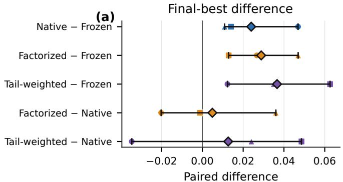

Valid-rate difference (pp)  
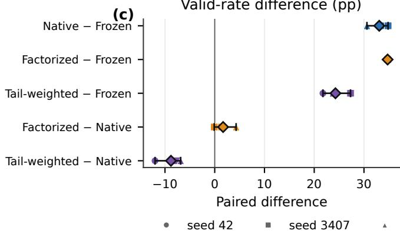

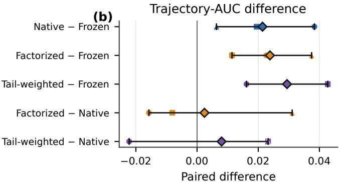

Improvement-yield difference (pp)  
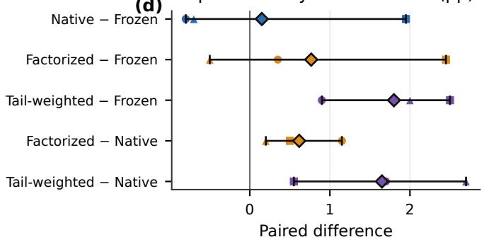  
Figure 4: Within-seed paired diferences for the formal live cohort. Diamonds denote means and bars the observed three-seed range. Positive values favor the first condition. Diferences against Frozen combine online updating with the named reward construction; diferences against Native isolate reward construction within the same online-training host.

## Held-out TSP sizes

Held-out artifact evaluation uses CALM’s native TSP evaluator at all available problem sizes. Because search selects a final heuristic using the training evaluator, held-out performance is reported separately from live proposal validity and fixed-context checkpoint behavior.

## Timing-derived Frozen-search anchors

Native and Factorized each beat the longer Frozen prefix in one of three seeds. Their mean online-minus-Frozen finalbest deltas are −0.0113 and +0.0035, respectively. Online updating nevertheless increases validity and valid-only performance in every row. The measured full-run time gap is +1.61% for seed 42 and −13.56%/−12.48% for seeds 3407/1926000; shorter Factorized prefixes lack timestamps. We consequently call these preregistered timing-derived group-budget anchors, not exact realized-time matches. Unequal-horizon AUC is not used for a causal comparison.

## G Common-Context Executable Checkpoint Probe

The main study’s matched-update probe shows that a reward diference reaches adapter parameters and fixed-context token probabilities. To test executable behavior more directly, we additionally evaluate six final CVRP–Qwen checkpoints on a common bank of 64 prompts. Each checkpoint generates four completions per prompt from the same prompt positions, for 256 completions and 1,536 total records. This probe uses two checkpoint seeds and was completed after the main experiment freeze; it is supplementary diagnostic evidence.

Factorized has the highest validity and improvement rate in seed 3407 but the lowest validity in seed 1926000. Native is above Frozen in validity in both seeds, but only seed 3407 produces an improvement. The probe therefore confirms that executable checkpoint efects can be measured under identical contexts, while providing no stable two-seed ordering among reward constructions. Its low absolute validity also shows that a fixed CVRP prompt bank can be more dificult than the endogenous live contexts generated by each search arm.

## H API-Served Frozen-System Reference

The external evidence directory contains several API diagnostics. Only one cohort satisfies the precondition of three completed 2,000-completion runs: a provider-reported gpt-4o-mini model used as a frozen generator in the CALM search loop. The API served one completion per request and therefore used 2,000 sequential groups, whereas local conditions used 500 four-completion groups. The completion budget matches, but prompt grouping, latency, provider, and model are diferent. The model name is provider-reported and was not independently verified. We report this as a system reference, not as a causal model-only baseline or a claim against an oficial proprietary service.

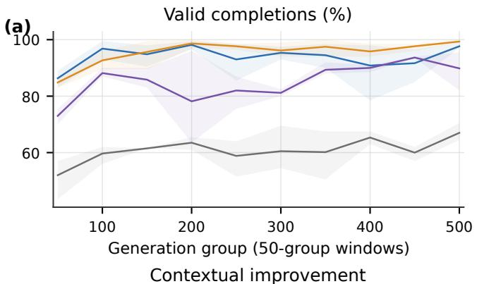

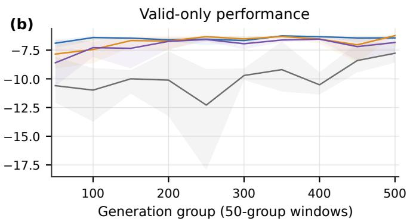

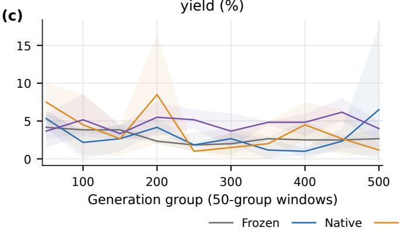

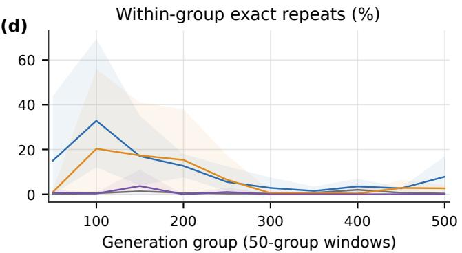  
Figure 5: Stage-wise proposal behavior over early (groups 1–100), middle (101–250), and late (251–500) search. These values describe each condition’s endogenous live contexts; they are not fixed-prompt checkpoint evaluations.

At the same total completion count, the API-served reference has mean validity 82.45% and final best −6.2188. The grouped local three-seed means are 60.85%/ − 6.2329 for Frozen, 93.92%/−6.2090 for Native, 95.60%/−6.2041 for Factorized, and 85.12%/ − 6.1963 for Tail-weighted. These descriptive values do not isolate model strength: local conditions have four-way group generation and, for trained arms, online parameter updates. The comparison only shows where one completed API-served frozen system falls under its own CALM protocol.

DeepSeek-v4-flash runs stopped at 845–1,281 of 2,000 completions because of repeated empty-content responses; DeepSeek-v4-pro and GPT-5.5 runs were also incomplete. They are excluded from every eficacy table. No partial endpoint or best-so-far value from those runs is used to rank systems.

## I Provenance, Exclusions, and Reproduction Map

The arXiv source package accompanying this document contains the manuscript sources, bibliography, style files, figures, and tables needed to reproduce the submitted PDF. The underlying experiment code and raw records are not included in this LaTeX package. The reported results are based on the following materials retained during the study:

• the pinned CALM source revision, formal source-bundle patches, and intervention runner;

• formal and breadth configuration files with local model paths omitted from the public package;

• unit tests for reward mappings, permutation/tie invariance, record schemas, and evidence builders;

• completion- and step-level records for the 12 formal live runs, excluding adapter checkpoints;

• deterministic analysis scripts and aggregate CSV files used by the main paper and this supplement;

• sanitized common-context and API summaries with source-file hashes;

• the environment specification and figure/table build commands.

Credentials, API endpoints, machine usernames, personal absolute paths, GPU UUIDs, raw provider responses, model weights, and multi-gigabyte adapter checkpoints are excluded from the submitted package. Local model weights must be obtained from their original distributors. All incomplete, killed, and smoke-only runs remain outside formal result builders.

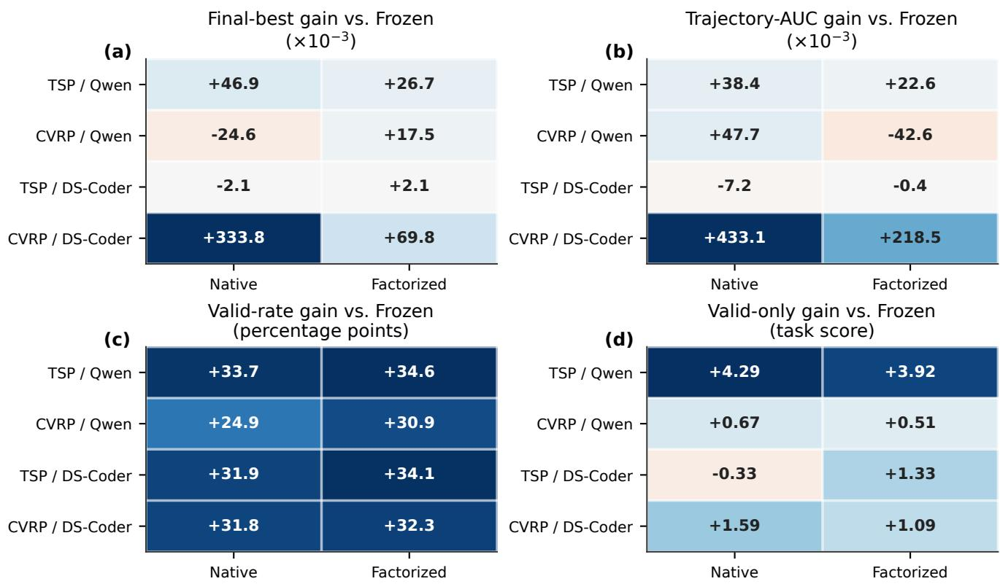  
Figure 6: Directional live breadth in three single-seed cells spanning TSP/CVRP-ACO and two 7B model families. Markers show observed directions rather than uncertainty estimates.

Table 9: Three-seed Gate-4 endpoint comparisons under preregistered, timing-derived Frozen-search group budgets. ∆ is online minus Frozen, so higher values favor online updating. Frozen metrics are recomputed from exact stored prefixes. The budgets are not exact realized-time matches; full-run timing drift and unavailable timestamps for shorter prefixes are reported in the text.
<table><tr><td>Seed</td><td>Online condition</td><td>Groups (online/Frozen)</td><td>Online final</td><td>Frozen final</td><td>∆ final</td><td>∆ valid (pp)</td><td>∆ valid-only</td></tr><tr><td>42</td><td>Native</td><td>500/883</td><td>-6.2176</td><td>-6.2167</td><td>-0.0010</td><td>+27.01</td><td>+0.742</td></tr><tr><td>42</td><td>Factorized</td><td>500/762</td><td>-6.2221</td><td>-6.2167</td><td>-0.0055</td><td>+25.42</td><td>+0.545</td></tr><tr><td>3407</td><td>Native</td><td>500/572</td><td>-6.2217</td><td>-6.2303</td><td>+0.0086</td><td>+34.45</td><td>+2.360</td></tr><tr><td>3407</td><td>Factorized</td><td>500/536</td><td>-6.1939</td><td>-6.2303</td><td>+0.0365</td><td>+34.43</td><td>+2.004</td></tr><tr><td>1926000</td><td>Native</td><td>500/581</td><td>-6.2419</td><td>-6.2003</td><td>-0.0415</td><td>+39.88</td><td>+1.045</td></tr><tr><td>1926000</td><td>Factorized</td><td>500/500</td><td>-6.2208</td><td>-6.2003</td><td>-0.0205</td><td>+40.50</td><td>+1.617</td></tr></table>

Table 10: Common-context executable CVRP–Qwen checkpoint probe. The fixed prompt bank makes validity and contextual improvement directly comparable within a seed. “Improve | valid” conditions on valid completions; “Best-of-4 improve” is the fraction of the 64 prompts whose sampled group contains an improvement. Higher is better.
<table><tr><td>Seed</td><td>Checkpoint</td><td>Valid / 256</td><td>Valid (%)</td><td>Valid-only perf.</td><td>Improve | valid (%)</td><td>Best-of-4 improve (%)</td></tr><tr><td>3407</td><td>Frozen</td><td>7</td><td>2.73</td><td>-8.9086</td><td>0.00</td><td>0.00</td></tr><tr><td>3407</td><td>Native</td><td>12</td><td>4.69</td><td>-8.8106</td><td>8.33</td><td>1.56</td></tr><tr><td>3407</td><td>Factorized</td><td>33</td><td>12.89</td><td>-9.5113</td><td>12.12</td><td>3.12</td></tr><tr><td>1926000</td><td>Frozen</td><td>7</td><td>2.73</td><td>-8.9086</td><td>0.00</td><td>0.00</td></tr><tr><td>1926000</td><td>Native</td><td>8</td><td>3.12</td><td>-8.8336</td><td>0.00</td><td>0.00</td></tr><tr><td>1926000</td><td>Factorized</td><td>3</td><td>1.17</td><td>-8.6397</td><td>0.00</td><td>0.00</td></tr></table>

(a) Operator-conditioned search funnel  
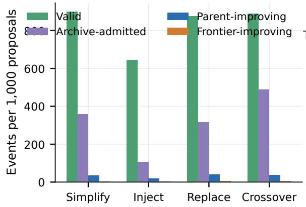

(b) Learner credit by candidate outcome  
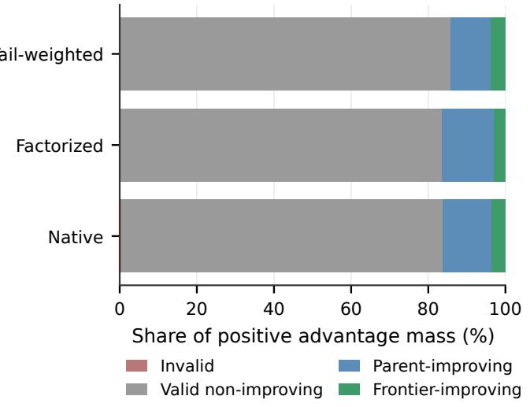

(c) Exact recurrence across search phases (d) Credit--recurrence association  
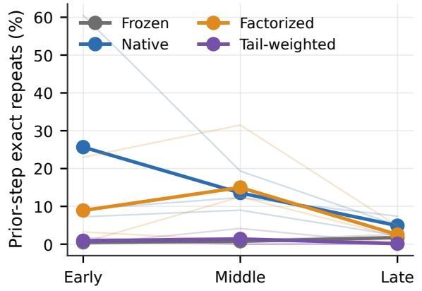

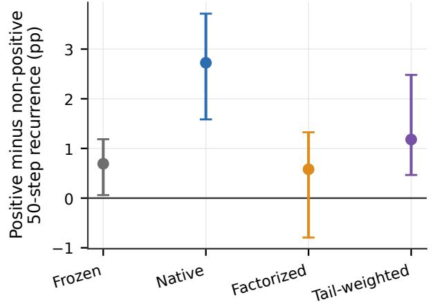  
Figure 7: Diagnostic atlas from the 12-run formal cohort. Panels decompose operator-conditioned proposal funnels, archive admission versus immediate frontier contribution, collapse-centered observational changes, and exact response recurrence. Coverage and collapse panels are descriptive and do not identify causal efects of individual search operators.

Table 11: Completed provider-reported GPT-4o-mini frozen-system reference. Each row uses 2,000 sequential completions and zero updates. Higher is better for performance columns. Rows are repeated seeds rather than competing methods, so no best-seed value is highlighted.
<table><tr><td>Seed</td><td>Valid (%)</td><td>Valid-only</td><td>Improve (%)</td><td>Frontier (%)</td><td>Final best</td><td>AUC</td><td>Prompt tok.</td><td>Completion tok.</td></tr><tr><td>42</td><td>82.05</td><td>-9.0526</td><td>3.25</td><td>0.25</td><td>-6.2202</td><td>-6.2435</td><td>1,745,317</td><td>672,208</td></tr><tr><td>3407</td><td>82.15</td><td>-9.8845</td><td>4.30</td><td>0.30</td><td>-6.2254</td><td>-6.2395</td><td>1,890,022</td><td>713,864</td></tr><tr><td>1926000</td><td>83.15</td><td>-9.6897</td><td>4.65</td><td>0.75</td><td>-6.2109</td><td>-6.2518</td><td>1,842,358</td><td>711,707</td></tr><tr><td>Mean</td><td>82.45</td><td>-9.5423</td><td>4.07</td><td>0.43</td><td>-6.2188</td><td>-6.2449</td><td>1,825,899</td><td>699,260</td></tr></table>

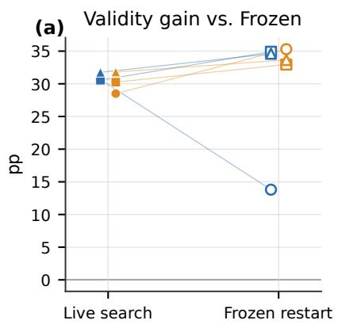

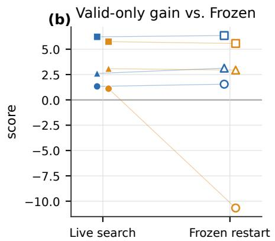

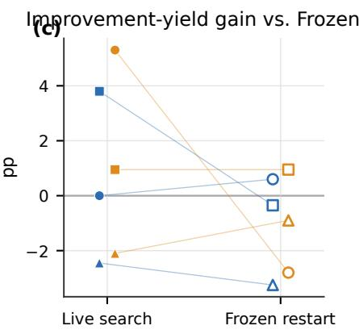

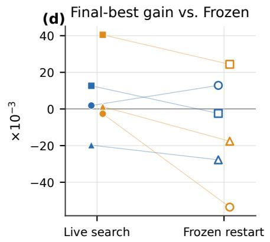

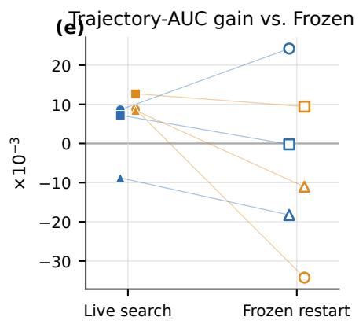  
Figure 8: Same-seed live and frozen-restart results. Restart conditions load a final adapter, reset the population, and execute zero optimizer steps. A live endpoint therefore includes both checkpoint and accumulated-population efects, whereas restart tests the checkpoint in a new search trajectory.

Held-out performance of final Gate-3 heuristics  
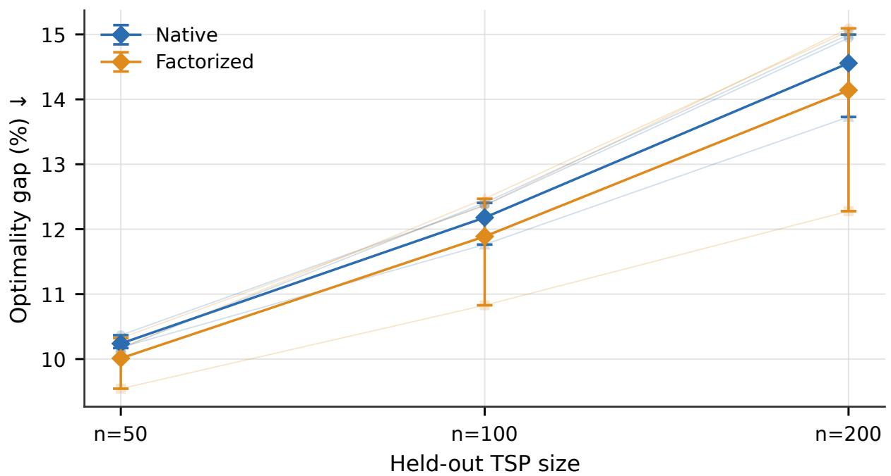  
Figure 9: Held-out TSP evaluation of final heuristics at the available problem sizes. This evaluates discovered heuristic artifacts, not fixed-context checkpoint generation. Seed-level points remain visible.