# From Spectra to Joint Schedules in LLM Pre-training: 3 + 3(+2) Scaling-Law Regimes

Yichen Wang∗ Fanghui Liu† Yudong Chen∗

## Abstract

Power-law learning curves are often treated as fixed properties of a model and its data, although learning-rate and batch-size schedules can change the observed loss. We study this dependence in noisy online SGD with linear random features. Conditional on the representation, an exact Volterra equation separates two response components: a forcing term that propagates unresolved target error and a memory kernel that propagates stochastic-error injections. We prove that either component follows a power law if and only if its cumulative weighted spectral mass has the corresponding low-spectrum scaling; individual eigenvalues and target coeficients need not obey coordinatewise power laws. Under a joint schedule, intrinsic time $\begin{array} { r } { T _ { t } = \sum _ { s < t } \eta _ { s } } \end{array}$ controls optimization progress, while $r _ { t } = B _ { t } / \eta _ { t }$ controls noise injection. Their interaction yields sharp conditions under which a schedule preserves, changes, or destroys the clean power law, together with a memory ceiling on noise reduction. The power-law random-feature model realizes this mechanism in $3 + 3 ( + 2 )$ propagation regimes with phase-dependent compute rates. Controlled nanoGPT experiments show that (1) learning-rate and batch-size schedules with matched $B / \eta$ paths are nearly equivalent in intrinsic time, (2) a forcing-memory surrogate accurately predicts loss across schedules, and (3) its fitted exponents across real-world datasets identify the regime of LLMs in 3 + 3(+2) map. The source code for reproducing our experiments is available on https://github.com/yichenblue/spectra-to-schedules-in-pretraining.

## 1 Introduction

Power-law learning curves in scaling laws are widely used to forecast training progress and allocate model size, data, and compute in large language models (LLMs) pre-training (Hestness et al., 2017; Kaplan et al., 2020; Hofmann et al., 2022). Such extrapolation is powerful as the fitted law can transfer beyond the scale and training configuration on which it was measured.

Yet it is often unclear what is expected to transfer: the existence of a power law, its exponent, or the mechanism that generates it. These notions need not coincide. An apparent power law may terminate when a finite range of slow modes is exhausted; and even with the representation and target fixed, changing the learning-rate or batch-size schedule (from LLM pre-training) can change both optimization progress and the accumulation of stochastic error. A scaling exponent is therefore not, in general, a fixed property of a model and its data. Recent schedule-aware scaling laws make explicit that the learning curve can depend on the training schedule rather than being a fixed attribute of the model–data pair (Tissue et al., 2025; Luo et al., 2025; Qiu et al., 2025). Functional scaling laws (FSL) (Li et al., 2025) formalize this dependence as an intrinsic-time functional under learning-rate and batch-size schedules, separately.

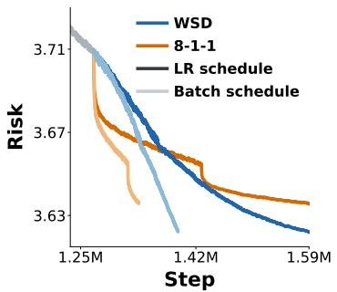  
(a) Loss vs. step

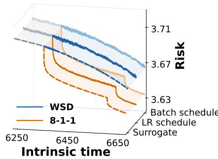  
(b) Loss vs. intrinsic time

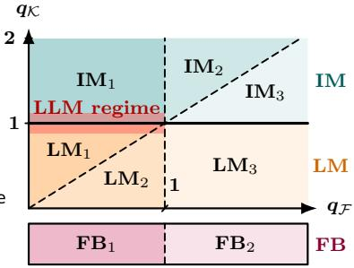  
(c) 3 + 3(+2) map  
Figure 1: Proxy-derived response coordinates in 300M nanoGPT training. (a) We control the same ratio path $r _ { t } = B _ { t } / \eta _ { t }$ by changing batch-size and learning rate schedules equivalently, e.g., the WSD (Hu et al., 2024) and 8-1-1 (Bi et al., 2024), leading to diferent trajectories against optimizer step. (b) After reparameterization by intrinsic time, each trajectory coincides. A surrogate fitted only to the 8-1-1 trajectory also predicts the held-out WSD trajectory without refitting. (c) The fitted exponent satisfies $q \kappa \approx 1$ and $q \mathcal { F } < 1$ , placing the LLM response near the $\mathrm { I M _ { 1 } / L M _ { 1 } }$ boundary of our $3 + 3 ( + 2 )$ scaling law regimes.

Rather than treating universality as a single yes-no question, we specify two distinct problems studied in this paper. The first is one of origin: when do the underlying learning dynamics produce power-law response components? The second is one of transfer : once such components exist, when does a joint learning-rate/batch-size schedule preserve, change, or destroy their law in the observed loss?

It appears technically impossible to quantitatively study the above two problems in a trained language model. The representation learning, target alignment, stochasticity, and scheduling evolve together, so their separate roles are dificult to identify from the loss curve alone. We therefore study a proxy model, linear random features trained by noisy online stochastic gradient descent (SGD) (Rahimi and Recht, 2007; Liu et al., 2022; Mei and Montanari, 2022) to answer the above two questions.

This model is deliberately simple. The value of the proxy lies not in its literal similarity to an LLM, but in whether the response coordinates it reveals remain predictive outside the proxy. We therefore test two consequences in controlled 300M Nano-GPT pre-training (Karpathy, 2022): i) whether the loss can be fully characterized by the theory-derived coordinates, i.e., the intrinsic time and the ratio between batch-size and learning rate; 2) whether a theory-derived forcing-memory surrogate fitted on one schedule predicts held-out schedules in LLM pre-training. Figure 1 verifies these tests.

## 1.1 Contributions and findings

The prediction risk of our proxy model can be precisely characterized by Volterra recursion (Paquette et al., 2024). Its forcing term F propagates unresolved target error without stochastic feedback, whereas its memory kernel K describes how long the efect of one stochastic-error injection

survives. The resulting mechanism has two successive stages:

$$
\underbrace { \mathrm { w c i g h t e d ~ l o w - s p e c t r u m ~ m a s s } } _ { \mathrm { s p e c t r a l ~ o r i g i n } } \quad \longrightarrow \quad \underbrace { ( F , K ) } _ { \mathrm { f o r c i n g ~ a n d ~ m e m o r y } } \quad \xrightarrow [ T _ { \ell } : = \sum _ { s < \ell ^ { \eta _ { s } } , r _ { \ell } : = B _ { \ell } / \eta _ { \ell } } ] { \mathrm { j o i n t ~ s c h e d u l e } } \quad \underbrace { R _ { \sigma , t } } _ { \mathrm { o b s e r v e d ~ l o s s } } ,
$$

where $( T _ { t } , r _ { t } )$ are the two natural schedule coordinates. Intrinsic time $T _ { t }$ measures optimization progress, motivated by Li et al. (2025); while $r _ { t } : = B _ { t } / \eta _ { t }$ under the batch size $B _ { t }$ and the learning rate $\eta _ { t }$ controls stochastic-error injection per unit progress. The weighted low spectrum determines whether F and K follow power laws; the joint schedule then accumulates the memory response along the training trajectory. Consequently, the observed curve of the loss is not determined by componentwise power laws separately, but governed by the competition between clean target-error decay and the accumulated stochastic response. Our contributions are summarized as below.

• Spectral origin of component power laws. We prove separate if-and-only-if criteria for power laws in learnable forcing and one-injection memory. The decisive quantities are their cumulative weighted spectral masses near zero, rather than coordinatewise power laws for individual eigenvalues or target coeficients. Irregular spectra or targets can therefore produce canonical power-law responses, while power-law data are neither suficient nor necessary.

• Concrete $3 + 3 ( + 2 )$ scaling law regimes. We consider specific power-law eigenvalues and target coeficients, formulating a $3 { + } 3 ( + 2 )$ -regime map: 3 long-memory (LM), 3 integrablememory (IM), and 2 finite-bulk propagation regimes. We derive an exact conditional formula for the finite-width noisy–clean gap in the finite-bulk regimes, asymptotic formulas for the ful deterministic-equivalent risk across the phase map, and phase-dependent optimal rates under data and feature-compute budgets.

• Transformation under joint learning-rate-batch-size schedules. We show that the noisy-clean gap is obtained by accumulating schedule-dependent stochastic injections through the memory kernel. This gives sharp boundaries between schedules that preserve, change, or destroy the clean power law, together with a memory ceiling beyond which reducing only late-stage noise cannot improve the decay rate. Below this ceiling, the gap identifies the asymptotic behavior of the ratio $r _ { t } = B _ { t } / \eta _ { t }$ , though not learning rate and batch size separately.

• Proxy for LLM pre-training prediction. Controlled nanoGPT (124M and 300M) experiments provide three tests of the theory: the loss is determined by the intrinsic time and the ratio path $r _ { t } : = B _ { t } / \eta _ { t } .$ , which provides a possible way to tune learning-rate or batch-size schedules under a fixed ratio $r _ { t } .$ Besides, following the FSL fit-then-transfer protocol of Li et al. (2025), a forcing–memory surrogate fitted on one schedule $( \mathrm { e . g . , 8 – 1 – 1 } )$ predicts held-out schedules without refitting (e.g., WSD). Across OpenWebText and FineWeb and across model scales, the fitted LLM response remains near $q \kappa \approx 1$ and $q \mathcal { F } < 1$

## 1.2 Related work

Power-law existence and exponent universality. Recent work argues for shared exponents or derives a universal $1 / 3$ time law (Liu and Gore, 2026; Liu et al., 2026). Other studies show that scaling laws can change with the observation scale, terminate when a finite spectral range is exhausted, or vary across spectral phases (Xiao, 2024; Maloney et al., 2022; Bahri et al., 2024; Lin et al., 2024; Paquette et al., 2024). These results motivate separating the existence of a component power law from the invariance of the exponent observed in the total loss.

Spectral models and random-feature dynamics. Solvable spectral theories commonly prescribe power laws for eigenvalues or target coeficients and then derive the resulting learning curve (Maloney et al., 2022; Bordelon et al., 2024; Lin et al., 2024; Paquette et al., 2024). Our componentwise criteria instead characterize power laws through cumulative weighted spectral mass and therefore do not require coordinatewise power-law sequences. Random-feature models provide a setting in which spectral, target, finite-width, and stochastic efects can be separated (Mei and Montanari, 2022; Xiao et al., 2022; Bach, 2024; Ba et al., 2022; Moniri et al., 2024), while high-dimensional SGD limits provide the dynamical foundation for the exact recursion used here (Paquette et al., 2021, 2025; Atanasov et al., 2026). The closest PLRF result is the constant-schedule, clean-label 4 + 3 compute-optimal classification of Paquette et al. (2024). We introduce label noise and joint schedules; our 3 + 3(+2) map classifies forcing–memory propagation rather than compute-optimal bottlenecks.

Schedules and transferable response laws. Schedule optimization has been studied from complementary starting points. Bordelon and Mori (2026) assume spectral and source power laws, whereas functional-scaling-law analyses begin from a specified response law (Li et al., 2025, 2026a; Wang et al., 2026). In particular, Li et al. (2025) fit one learning-rate schedule at fixed batch size and predict other schedules without refitting. We follow this setting but extend the response analysis to jointly varying learning rate and batch size. Our LLM experiments correspondingly test both changes in the ratio path $B _ { t } / \eta _ { t }$ and diferent learning-rate-batch-size factorizations of the same path (Meterez et al., 2026b; Karkada et al., 2026; Hu and Lu, 2023).

From a proxy mechanism to LLM response. A tractable proxy becomes useful beyond its literal assumptions only when the coordinates it reveals make falsifiable predictions outside the proxy. Previous results on local quadratic models (Meterez et al., 2026b), kernel-based functional scaling laws (Li et al., 2025), and Gaussian universality (Karkada et al., 2026; Hu and Lu, 2023) demonstrate their potential in prediction of large complex models. Such mechanism-first viewpoint motivates us to test it directly in controlled plain-SGD LLM training, supported by the following two reasons.

First, whether a proxy model or an LLM is trained with plain SGD, the dynamics can always be cast as signal–noise learning related to forcing and memory terms. Second, paired learning-rate and batch-size factorizations with matched $B _ { t } / \eta _ { t }$ paths follow diferent trajectories in optimizer step but nearly coincide at equal intrinsic time.

## 2 Problem setup and exact loss dynamics

The model follows the linear random-feature setting of Paquette et al. (2024), trained by online SGD, but difers in two ways motivated by LLM-pretraining practice (Brown et al., 2020; Hofmann et al., 2022; Li et al., 2025; Wang et al., 2026): it introduces label noise as a tractable source of persistent stochastic error; it allows the learning rate and batch size to vary jointly over time.

## 2.1 Linear random features trained by online SGD

We consider Gaussian data $\pmb { x } = \pmb { \Lambda } ^ { 1 / 2 } \pmb { z } \in \mathbb { R } ^ { d }$ , with $\boldsymbol { z } \sim \mathcal { N } ( \mathbf { 0 } , \pmb { I } _ { d } )$ and $\pmb { \Lambda } = \mathrm { d i a g } ( \lambda _ { 1 } , \dots , \lambda _ { d } ) \succ \mathbf { 0 }$ It can be naturally extended to kernel feature maps under the hypercontractivity condition of Mei

et al. (2022). The data generation process is

$$
y = f _ { \star } ( \pmb { x } ) + \varepsilon , \qquad f _ { \star } ( \pmb { x } ) : = \langle \pmb { x } , \pmb { \theta } ^ { \star } \rangle , \qquad \varepsilon \perp \pmb { \bot } \ \pmb { x } , \qquad \mathbb { E } [ \varepsilon ] = 0 , \qquad \mathbb { E } [ \varepsilon ^ { 2 } ] = \sigma ^ { 2 } ,
$$

where $\pmb { \theta } ^ { \star } \in \mathbb { R } ^ { d }$ is the target and the label noise ε is with zero-mean and bounded variance $\sigma ^ { 2 }$ . We use a linear random feature model of width $m , f _ { a } ( x ) : = \langle W ^ { \top } x , a \rangle$ , where $W \in \mathbb { R } ^ { d \times m }$ has i.i.d. $\mathcal { N } ( 0 , 1 / m )$ entries and is fixed; only $\pmb { a } \in \mathbb { R } ^ { m }$ is trained by SGD. Starting from $\mathbf { { a } } _ { 0 } = \mathbf { { 0 } }$ , iteration t draws a fresh mini-batch of size $B _ { t }$ and updates with learning rate $\eta _ { t } \colon$

$$
{ \boldsymbol a } _ { t + 1 } = { \boldsymbol a } _ { t } - \frac { \eta _ { t } } { B _ { t } } \sum _ { i = 1 } ^ { B _ { t } } W ^ { \top } x _ { t } ^ { i } \big ( f _ { { \boldsymbol a } _ { t } } ( { \boldsymbol x } _ { t } ^ { i } ) - y _ { t } ^ { i } \big ) , \qquad T _ { t } : = \sum _ { s < t } \eta _ { s } , \qquad r _ { t } : = \frac { B _ { t } } { \eta _ { t } } .\tag{2.1}
$$

Batches and label noises are independent across iterations. Here $T _ { t }$ is the optimization clock, while $1 / r _ { t }$ is the variance injected per unit intrinsic time. Conditional on W, the excess risk is defined as

$$
R _ { \sigma , t } : = \mathbb { E } \left[ \left( f _ { a _ { t } } ( \boldsymbol { x } ) - f _ { \star } ( \boldsymbol { x } ) \right) ^ { 2 } \middle | \boldsymbol { W } \right] = \mathbb { E } \left[ \Vert \boldsymbol { \Lambda } ^ { 1 / 2 } ( \boldsymbol { W } \boldsymbol { a } _ { t } - \boldsymbol { \theta } ^ { \star } ) \Vert _ { 2 } ^ { 2 } \middle | \boldsymbol { W } \right] .
$$

The expectation averages all training mini-batches and label noises and an independent test covariate, conditioning on $W$ . All definitions and exact recursions in this section hold for finite d and m. The asymptotic results later take $m  \infty$ and $d = d _ { m } \to \infty$ jointly, with $d / m$ bounded below by a constant strictly larger than one; see more details in Appendix A.

## 2.2 Forcing, memory, and the exact Volterra equation

To identify the spectral quantities first, temporarily fix the schedule: $\eta _ { t } \equiv \eta , B _ { t } \equiv B$ , and $T : = \eta t$ . The frozen representation induces $\widehat { \pmb { H } } : = \pmb { \Lambda } ^ { 1 / 2 } \pmb { W } \pmb { W } ^ { \top } \pmb { \Lambda } ^ { 1 / 2 }$ with its eigenpairs $( \widehat { \lambda } _ { j } , \widehat { \pmb { u } } _ { j } )$ . The initial energy aligned with the empirical mode $j$ is $| \langle \widehat { \pmb { u } } _ { j } , { \pmb { \Lambda } } ^ { 1 / 2 } \pmb { \theta } ^ { \star } \rangle | ^ { 2 }$ . For Gaussian covariates, the corresponding second-moment mode has one-step survival factor

$$
q _ { \eta } ( \lambda ) : = 1 - 2 \eta \lambda + ( 1 + 1 / B ) \eta ^ { 2 } \lambda ^ { 2 } .\tag{2.2}
$$

Its power $q _ { \eta } ( \lambda ) ^ { t }$ is the spectral filter that determines how much squared error in mode λ survives t steps: on the long-time scale $\lambda = { \cal O } ( T ^ { - 1 } ) , q _ { \eta } ( \lambda ) ^ { t } \approx e ^ { - 2 \eta \lambda t } = e ^ { - 2 T \lambda }$ . Summing the exact mode recursions gives the exact risk recursion

$$
R _ { \sigma , t } = F _ { W } ( t ) + \sum _ { s = 0 } ^ { t - 1 } K _ { W } ( t - 1 - s ) ( R _ { \sigma , s } + \sigma ^ { 2 } ) .\tag{2.3}
$$

Here the forcing term $F _ { W }$ and the memory kernel $K _ { W }$ are defined as

$$
F _ { \pmb { W } } ( t ) : = \sum _ { j } | \langle \widehat { \pmb { u } } _ { j } , \pmb { \Lambda } ^ { 1 / 2 } \pmb { \theta } ^ { \star } \rangle | ^ { 2 } q _ { \eta } ( \widehat { \lambda } _ { j } ) ^ { t } , \qquad K _ { \pmb { W } } ( t ) : = \frac { \eta ^ { 2 } } { B } \sum _ { j } \widehat { \lambda } _ { j } ^ { 2 } q _ { \eta } ( \widehat { \lambda } _ { j } ) ^ { t } ,
$$

where $F _ { W }$ is the initial target error propagated without stochastic feedback. The memory kernel $K _ { W }$ is the impulse response of one SGD-variance injection. When $\sigma = 0 , \mathrm { E q . ~ ( 2 . 3 ) }$ reduces to the cleanlabel recursion of Paquette et al. (2024). The zero-mode forcing is the finite-width approximation floor $\begin{array} { r } { R _ { \mathrm { a p p } } : = \sum _ { \widehat { \lambda } _ { i } = 0 } | \langle \widehat { \pmb { u } } _ { j } , \pmb { \Lambda } ^ { 1 / 2 } \pmb { \theta } ^ { \star } \rangle | ^ { 2 } } \end{array}$ ; write $F _ { W , > 0 }$ for the learnable part of the forcing.

## 3 When do frozen spectral dynamics produce power laws?

Every fixed positive mode in Eq. (2.2) decays exponentially. A power law can nevertheless emerge after infinitely many modes with diferent time scales are added. This section makes that statement precise for F and $K ;$ it does not yet claim a power law for the total loss.

## 3.1 From the moving spectral cutof to a spectral criterion

On the long-time scale $T = \eta t$ , modes with $\lambda \gg T ^ { - 1 }$ have relaxed, while modes with $\lambda \ll T ^ { - 1 }$ are nearly untouched: $q _ { \eta } ( \lambda ) ^ { t } \approx e ^ { - 2 T \lambda } \approx \mathbf { 1 } \{ \lambda \lesssim T ^ { - 1 } \}$ . Hence the remaining error is governed by cumulative spectral weight below the moving cutof $T ^ { - 1 }$ , not by the decay of a single mode (Paquette et al., 2024; Li et al., 2025). Accordingly, for the eigenpairs of $\widehat { H }$ , define the target-weighted and memory-weighted empirical spectral measures

$$
\nu _ { W } ^ { \mathcal { F } } : = \sum _ { j } \left| \left. \widehat { u } _ { j } , \Lambda ^ { 1 / 2 } \pmb { \theta } ^ { \star } \right. \right| ^ { 2 } \delta _ { \widehat { \lambda } _ { j } } , \qquad \nu _ { W } ^ { \mathcal { K } } : = \sum _ { j } \widehat { \lambda } _ { j } ^ { 2 } \delta _ { \widehat { \lambda } _ { j } } .
$$

Here $\nu _ { W } ^ { \mathcal { F } } ( ( 0 , x ] )$ is the target energy in learnable directions slower than $x ^ { - 1 }$ , whereas $\nu _ { W } ^ { \mathcal { K } } ( ( 0 , x ] )$ measures the strength of one variance injection stored in those directions. The zero atom $\nu _ { W } ^ { \mathcal { F } } ( \{ 0 \} ) =$ $R _ { \mathrm { a p p } }$ is the approximation floor and is excluded from $F _ { W , > 0 }$

These measures give the exact spectral representations and their long-time Laplace approximations:

$$
F _ { W , > 0 } ( t ) = \int _ { ( 0 , \infty ) } q _ { \eta } ( \lambda ) ^ { t } \nu _ { W } ^ { \mathcal { F } } ( \mathrm { d } \lambda ) \approx \int _ { ( 0 , \infty ) } e ^ { - 2 T \lambda } \nu _ { W } ^ { \mathcal { F } } ( \mathrm { d } \lambda ) = 2 T \int _ { 0 } ^ { \infty } e ^ { - 2 T x } \nu _ { W } ^ { \mathcal { F } } ( ( 0 , x ] ) \mathrm { d } x ,
$$

$$
\frac { B } { \eta ^ { 2 } } K _ { W } ( t ) = \int _ { ( 0 , \infty ) } q _ { \eta } ( \lambda ) ^ { t } \nu _ { W } ^ { K } ( \mathrm { d } \lambda ) \approx \int _ { ( 0 , \infty ) } e ^ { - 2 T \lambda } \nu _ { W } ^ { K } ( \mathrm { d } \lambda ) = 2 T \int _ { 0 } ^ { \infty } e ^ { - 2 T x } \nu _ { W } ^ { K } ( ( 0 , x ] ) \mathrm { d } x .
$$

Accordingly, the following theorem characterizes exactly when either component follows a temporal power law. The fully quantified statement is given in Theorem $\mathrm { A . 4 } .$

Theorem 3.1 (Componentwise spectral criterion (informal)). Fix a stable constant schedule, condition on W at each width, and take a joint width–time limit with $m , t \to \infty$ and $T = \eta t \to \infty$ Under appropriate uniform spectral-window conditions, with $x = T ^ { - 1 } \downarrow 0 _ { ; }$ , for $q \mathcal { F } , q \kappa > 0$

$$
\nu _ { W } ^ { F } ( ( 0 , x ] ) \propto x ^ { q _ { F } } \Longleftrightarrow F _ { W , > 0 } ( t ) \propto T ^ { - q _ { F } } , \qquad \nu _ { W } ^ { K } ( ( 0 , x ] ) \propto x ^ { q _ { K } } \Longleftrightarrow \frac { B } { \eta ^ { 2 } } K _ { W } ( t ) \propto T ^ { - q _ { K } } .
$$

Theorem 3.1 shows that the decisive quantities are the cumulative weighted spectral masses near zero, rather than pointwise power-law formulas for the eigenvalues or target coeficients. It can be empirically validated by Figure 2. In Figures $2 ( \mathrm { a } )$ and $2 ( \mathrm { b } )$ , each temporal response is compared with its corresponding cumulative spectral mass. The forcing response and forcing mass both decay faster than every inverse power of $T _ { \ast }$ , whereas the memory response and memory mass both scale as $T ^ { - 3 / 4 }$ , illustrating the two componentwise equivalences in Theorem 3.1. Separately, Figure $2 ( \mathrm { c ) }$ shows that the minibatch-SGD loss initially follows the exponentially decaying forcing response and then crosses over to the $T ^ { - 3 / 4 }$ power-law memory tail.

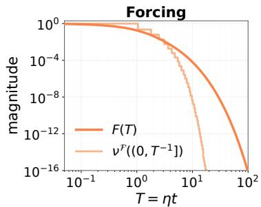  
(a) Forcing

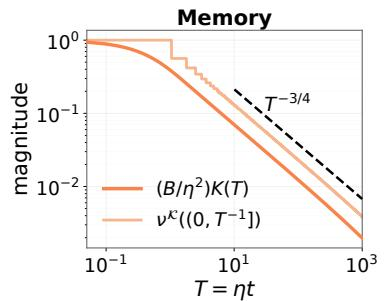  
(b) Memory

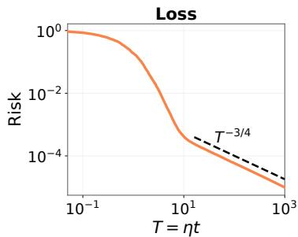  
(c) Loss  
Figure 2: Finite-width rapid-target construction with $\lambda _ { j } = j ^ { - 0 . 8 } , \lvert \theta _ { j } ^ { \star } \rvert ^ { 2 } = e ^ { - j }$ , and $d = 5 2 4 { , } 2 8 8 .$ . (a) Normalized forcing and cumulative forcing mass both decay faster than every inverse power of $T$ (b) Normalized one-injection memory and cumulative memory mass both track $T ^ { - 3 \bar { / 4 } }$ . (c) The minibatch-SGD loss curve averaged over 20 runs follows the $T ^ { - 3 / 4 }$ memory tail.

## 3.2 When power laws appear—and when they do not

Based on Theorem 3.1, we provide several examples to see whether power laws appear or not. For instance, power-law data are neither suficient nor necessary. See more details in Section D.2.

• Only power-law data are insuficient. Zipf-like rank–frequency laws make power-law structure familiar in language data (He et al., 2025; Mikhaylovskiy, 2025). Such data-side scaling does not determine target alignment in the spectral dynamics studied here. For $\alpha > 1 / 4$ , take $\lambda _ { j } = j ^ { - 2 \alpha }$ and $| \theta _ { j } ^ { \star } | ^ { 2 } = e ^ { - j }$ . The target places exponentially little energy in slow directions. For the corresponding deterministic construction, − log $F _ { W , > 0 } ( t ) \asymp T ^ { 1 / ( 2 \alpha + 1 ) }$ The forcing therefore decays faster than every inverse power of $T _ { i }$ , although the eigenspectrum is an exact power law. The memory decay is unchanged because it does not depend on the target. Figure 2 visualizes this deterministic construction.

• Power-law data are not necessary either. For example, the constructions $\lambda _ { j } = e ^ { - j \gamma }$ $| \theta _ { j } ^ { \star } | \asymp j ^ { - \beta } , 0 < \gamma < 1$ , and $\lambda _ { j } = e ^ { - j } , \lambda _ { j } \vert \theta _ { j } ^ { \star } \vert ^ { 2 } \propto e ^ { - \tau j }$ , both produce power-law temporal orders on their corresponding scaling windows.

• Irregular targets can give the canonical exponent. For $\lambda _ { j } = j ^ { - 2 \alpha }$ , with $\alpha > 1 / 4$ and $2 \alpha + 2 \beta > 1$ , write $| \theta _ { j } ^ { \star } | ^ { 2 } = j ^ { - 2 \beta } c _ { j }$ , where $c _ { j } \geq 0$ . If $\begin{array} { r } { n ^ { - 1 } \sum _ { j \leq n } c _ { j }  1 } \end{array}$ , then $\sum _ { \lambda _ { j } \leq x } \lambda _ { j } | \theta _ { j } ^ { \star } | ^ { 2 }$ ∝ $x ^ { ( 2 \alpha + 2 \beta - 1 ) / ( 2 \alpha ) }$ . Thus oscillatory, mass-compensated sparse, and frozen random-amplitude targets can retain the canonical forcing exponent.

• A finite spectrum leads to exponential decay. It may display a long intermediate scaling window before entering this asymptotic regime.

Non-identifiability: From forcing and memory to the observed loss. Theorem 3.1 is componentwise: its if-and-only-if conclusions apply separately to $F _ { W , > 0 }$ and $K _ { W }$ , not to the observed loss. $F _ { W , > 0 }$ gives the learnable forcing, whereas $K _ { W }$ describes the survival of one stochastic injection. The observed loss is therefore not obtained by directly comparing these two raw components: the memory contribution must first be accumulated over past injections and propagated through feedback.

## 4 PLRF propagation regimes: 3 + 3(+2) scaling laws

We now instantiate the general spectral criterion of Section 3 in the canonical power-law randomfeature (PLRF) model of Paquette et al. (2024). The resulting $3 + 3 ( + 2 )$ phase map classifies how learnable forcing and one-injection memory propagate, rather than assigning eight universal exponents to the observed loss. The schedule must still accumulate memory over past noise injections; Section 5 carries out this step and determines the resulting learning curve.

Consider the following power-law setting in PLRF

$$
\lambda _ { j } = j ^ { - 2 \alpha } , \qquad \theta _ { j } ^ { \star } = j ^ { - \beta } , \qquad 2 \alpha + 2 \beta > 1 \ \mathrm { ( e n s u r i n g } \sum _ { j } \lambda _ { j } | \theta _ { j } ^ { \star } | ^ { 2 } < \infty ) ,
$$

the moving cutof $\lambda _ { j T } \asymp T ^ { - 1 }$ corresponds to $\begin{array} { r } { j _ { T } \asymp T ^ { 1 / ( 2 \alpha ) } } \end{array}$ . Summing the unresolved tail gives

$$
F ( T ) \approx \sum _ { j \gtrsim j _ { T } } j ^ { - 2 ( \alpha + \beta ) } \propto T ^ { - q _ { \mathcal { F } } } , \ : \ : \ : q _ { \mathcal { F } } : = \frac { 2 ( \alpha + \beta ) - 1 } { 2 \alpha } , \quad \frac { B } { \eta ^ { 2 } } K ( T ) \approx \sum _ { j \gtrsim j _ { T } } j ^ { - 4 \alpha } \propto T ^ { - q _ { \mathcal { K } } } , \ : \ : \ : q _ { K } : = 2 - \frac { 1 } { 2 \alpha } .
$$

This cutof calculation gives the PLRF response exponents; Theorem A.10 gives the corresponding rigorous population-filter asymptotics.

Why use $( q \mathcal { F } , q \kappa )$ instead of $( \alpha , \beta )$ : For PLRF, $q \mathcal { F }$ and $q \kappa$ are algebraic functions of the microscopic source and capacity parameters $( \alpha , \beta )$ , i.e., a change of coordinates. The purpose of the response coordinates is not to create new regimes by relabeling the PLRF phase diagram. Rather, $q \mathcal { F }$ and $q \kappa$ are respectively the decay exponents of forcing and one-injection memory, and are the only microscopic information entering the subsequent schedule-transfer law. They remain well defined for irregular spectra and targets for which no coordinatewise $( \alpha , \beta )$ power laws exist, and models with the same response exponents have the same leading schedule behavior. We therefore use $( \alpha , \beta )$ to describe the $\mathrm { P L R F }$ origin of a regime and $\left( q \varepsilon , q \kappa \right)$ to describe its dynamical propagation. The finite-bulk regimes are kept separate because their memory remains explicitly coupled to width and cannot be represented by a width-independent $q \kappa > 0$ , shown in Figure 3.

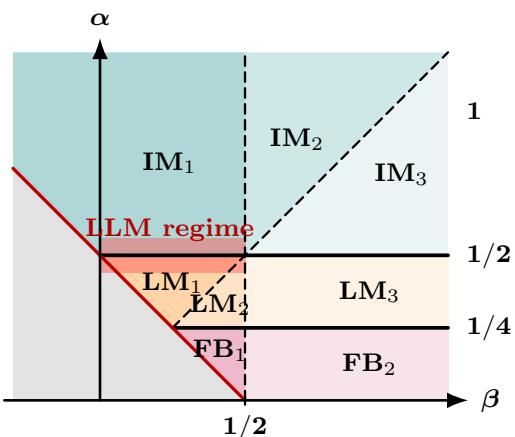  
Figure 3: PLRF regimes in $( \alpha , \beta )$ Colors match the response-coordinate map in Figure 1; the red band marks the fitted LLM regime near $\alpha = 1 / 2$

Long memory (LM) has $0 < q _ { \mathcal { K } } < 1$ , so its survival kernel is not integrable; integrable memory (IM) has $q \kappa > 1$ . Within the LM and IM families, the subscripts record the position of $q \mathcal { F }$ relative to $q \kappa$ and 1.

For $0 < \alpha < 1 / 4$ , the squared spectral mass $\begin{array} { r } { \sum _ { j \leq m } \lambda _ { j } ^ { 2 } \asymp m ^ { 1 - 4 \alpha } } \end{array}$ grows with width, so no width-independent decaying exponent $q \kappa > 0$ exists. This is the finite-bulk (FB) regime. The right panel of Figure 1 organizes the propagation regimes in the response coordinates $( q _ { \mathcal { F } } , q _ { \mathcal { K } } )$ that govern schedule behavior. Figure 3 pulls the same LM/IM partition back to the PLRF parameters $( \alpha , \beta )$ , with finite bulk shown separately because no width-independent $q \kappa$ exists there, making direct comparison with the $4 + 3$ taxonomy possible.

Relative to the compute-optimal $4 + 3$ taxonomy of Paquette et al. (2024), the propagation viewpoint makes two structural changes: Phase Ib splits across the finite-bulk and forcing–memory boundaries, while that taxonomy’s IVa–IVb crossover $\alpha = 1 - 1 / \sqrt { 2 }$ lies inside $\mathrm { L M _ { 3 } }$ , rather than on a propagation boundary. We use the propagation taxonomy throughout.

The fitted $q \kappa \approx 1$ corresponds to $\alpha \approx 1 / 2$ , where the $4 + 3$ theory predicts the near-square-root compute-optimal width scaling reported by Chinchilla (Paquette et al., 2024; Hofmann et al., 2022); see Appendix F for empirical validation.

Phasewise forcing. The phase map becomes concrete through the deterministic-equivalent forcing. In the proved open source range $\beta < 1 + 2 \alpha$ , and on the window $1 \ll T \le C _ { 0 } m ^ { 2 \alpha }$ ，

$$
\mathcal { F } ( T , m ) \asymp \left\{ \begin{array} { l l } { m ^ { - 2 \alpha q _ { \mathcal { F } } } + T ^ { - q _ { \mathcal { F } } } , } & { \mathrm { F B _ { 1 } , L M _ { 1 } , L M _ { 2 } , I M _ { 1 } , } } \\ { m ^ { - 2 \alpha } + T ^ { - q _ { \mathcal { F } } } , } & { \mathrm { F B _ { 2 } , L M _ { 3 } , } } \\ { m ^ { - 2 \alpha } + T ^ { - q _ { \mathcal { F } } } + m ^ { - 1 } T ^ { - ( q _ { \mathcal { K } } - 1 ) } , } & { \mathrm { I M _ { 2 } , I M _ { 3 } . } } \end{array} \right.\tag{4.1}
$$

Here $\mathcal { F } ( T , m )$ denotes the deterministic-equivalent approximation to $F _ { W } ( t )$ at intrinsic time $T = \eta t$ . Every row contains a finite-width floor and a target-aligned source transient; only $\mathrm { I M _ { 2 } }$ and $\mathrm { I M _ { 3 } }$ contain the additional feature-distortion transient. The largest term determines the forcing on the stated width–time window.

Eq. (4.1) describes the forcing component, not the observed total risk. This is why the $3 + 3 ( + 2 )$ map difers from the $4 + 3$ compute-optimal taxonomy of Paquette et al. (2024): it classifies how forcing and memory propagate before resource optimization. Section 5 supplies the missing step by accumulating one-injection memory along the schedule and comparing the resulting noise response with clean learning.

## 5 How joint schedules transform the observed scaling laws

For schedules, we are inspired by Li et al. (2025) that expresses schedule dependence in intrinsic time through a forgetting-kernel convolution via stochastic derivative questions. In our setting, the exponent $q \kappa$ characterizes how the contribution of one stochastic-error injection decays with its age. A training schedule creates a stream of such injections. At intrinsic time $u ,$ the ratio $r ( u ) = B ( u ) / \eta ( u )$ sets how much noise is injected, while the memory profile $k ( T - u )$ sets how much survives until time $T .$ . The observed loss is determined by their accumulation and its competition with clean learning.

## 5.1 Schedule response and preserve–change–destroy classification

Recall $\begin{array} { r } { T _ { t } = \sum _ { s < t } \eta _ { s } } \end{array}$ , and interpolate $r ( u ) = r _ { s } = B _ { s } / \eta _ { s }$ for $T _ { s } \le u < T _ { s + 1 }$ . For a constant schedule, define the reference survival profile $k ( \eta t ) : = ( B / \eta ^ { 2 } ) K _ { W } ( t )$ . Under a varying schedule, the constant-schedule age-only kernel $K _ { W } ( t - s )$ becomes the two-time kernel $K _ { t , s }$ , the exact weight with which stochastic error injected at step s survives until step t. Subtracting the clean recursion from the noisy one gives the first relation below. For a fixed infinite-spectrum dynamics with $\sigma ^ { 2 } > 0$ we assume the continuum approximation and uniformly subcritical feedback in the remaining two:

$$
R _ { \sigma , t } - R _ { 0 , t } = \sum _ { s < t } K _ { t , s } \left[ \sigma ^ { 2 } + R _ { \sigma , s } - R _ { 0 , s } \right] , \qquad \sum _ { s < t } K _ { t , s } \asymp \int _ { 0 } ^ { T _ { t } } \frac { k ( T _ { t } - u ) } { r ( u ) } \mathrm { d } u , \qquad \operatorname* { s u p } _ { t } \sum _ { s < t } K _ { t , s } < 1 .
$$

Along the intrinsic-time grid, write $T = T _ { t } , R _ { \sigma } ( T ) : = R _ { \sigma , t }$ t, and $R _ { 0 } ( T ) : = R _ { 0 , t }$ . The following theorem converts power-law k and r into the noise exponent $q _ { \mathcal { N } }$ , whose comparison with the clean exponent $q _ { 0 }$ determines whether the clean loss law is preserved, changed, or destroyed.

Theorem 5.1 (Schedule transformation of loss). Suppose $k ( T ) \sim c \kappa T ^ { - q _ { \mathcal { K } } }$ , with $c \kappa > 0$ and $q \kappa \neq 1$ and let $r ( T ) \sim c _ { r } T ^ { \vartheta }$ be eventually monotone, with $c _ { r } > 0$ . On every decaying branch,

$$
R _ { \sigma } ( T ) - R _ { 0 } ( T ) \asymp T ^ { - q _ { N } ( \vartheta ) } , \qquad q _ { N } ( \vartheta ) : = \left\{ \begin{array} { l l } { \vartheta + q _ { K } - 1 , } & { \mathrm { L M } , \quad 1 - q _ { K } < \vartheta < 1 , } \\ { q _ { K } , } & { \mathrm { L M } , \quad \vartheta > 1 , } \\ { \operatorname* { m i n } \{ \vartheta , q _ { K } \} , } & { \mathrm { I M } , \quad \vartheta > 0 . } \end{array} \right.
$$

At $\vartheta = 1$ in LM, the gap is $\asymp T$ −qK log T. If, in addition, $R _ { 0 } ( T ) - R _ { \mathrm { a p p } } \sim c _ { 0 } T ^ { - q _ { 0 } }$ , then

$$
R _ { \sigma } ( T ) - R _ { \mathrm { a p p } } \asymp T ^ { - \operatorname* { m i n } \{ q _ { 0 } , q _ { \mathcal { N } } ( \vartheta ) \} } , \quad q _ { 0 } > 0 ,
$$

up to the displayed LM logarithmic correction.

The theorem yields a phase classification by comparing the noise exponent $q _ { N } ( \vartheta )$ with the clean exponent q0. Figure 4 summarizes this comparison. The case $q \kappa = 1$ is excluded because it is the marginal LM/IM boundary: cumulative memory grows as $\begin{array} { r } { \int _ { 0 } ^ { T } \dot { k } ( v ) \mathrm { d } v \asymp \log T } \end{array}$ , so the gap acquires logarithmic corrections rather than following the pure-power formulas above.

Consequently, the leading clean-loss decay is preserved, critical, or changed according as $q _ { N } ( \vartheta )$ is above, equal to, or below $q _ { 0 }$ . At $\vartheta = 1 - q \kappa$ in LM and $\vartheta = 0$ in IM, the gap has no positive-power decay and therefore destroys convergence to $R _ { \mathrm { a p p } }$ ; below these edges, uniform row stability is impossible. Since $q _ { \mathcal { N } } ( \vartheta ) \leq q _ { \mathcal { K } }$ , strict preservation is possible only when $q _ { 0 } < q _ { K }$ . The complete boundary asymptotics and tunable branches are given in Appendix D.

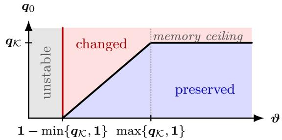  
Figure 4: LM/IM schedule response. The red line marks the destroy boundary, where the noisy–clean gap has no power decay; the gray region to its left is unstable. The black curve separates changed from preserved scaling and plateaus at the memory ceiling.

The LLM experiment in Section F.1 directly tests the schedule family in Theorem 5.1: it varies $\vartheta$ in $r ( T ) \propto T ^ { \vartheta }$ at matched terminal intrinsic time, provides evidence for the predicted memory ceiling through the diminishing response at large ϑ.

What the loss can and cannot identify. Below the LM memory ceiling, a noisy–clean gap asymptotic $R _ { \sigma } ( T ) - R _ { 0 } ( T ) \sim c T ^ { - q } , 0 < q < q _ { \mathcal { K } }$ , identifies the ratio exponent $\vartheta = 1 - q \kappa + q$ . It identifies $r = B / \eta$ , not learning rate and batch size separately; details are given in Appendix D.

## 5.2 PLRF finite-bulk and full-risk asymptotics

Here we start from the discrete-SGD memory kernel derived above, and then characterize when a joint ratio path $r = B / \eta$ preserves, changes, or destroys a spectrally generated power law.

Theorem 5.1 assumes a width-independent survival profile. For $0 < \alpha < 1 / 4$ , an unresolved spectral band instead carries squared mass $m ^ { 1 - 4 \alpha }$ . On the finite-bulk window,

$$
R _ { \sigma , t } - R _ { 0 , t } \asymp \sigma ^ { 2 } m ^ { 1 - 4 \alpha } \sum _ { s < t } \frac { \eta _ { s } ^ { 2 } } { B _ { s } } = \sigma ^ { 2 } m ^ { 1 - 4 \alpha } \int _ { 0 } ^ { T _ { t } } \frac { \mathrm { d } u } { r ( u ) } .\tag{5.1}
$$

This is why FB is not a third branch of the LM/IM map: memory and width remain coupled.

Let $\mathcal { F } ( T , m )$ be the forcing profile in $\operatorname { E q . }$ (4.1), and write $\Delta T _ { s } : = T _ { s + 1 } - T _ { s }$ . The PLRF deterministic-equivalent risk admits the following forcing–memory representation:

$$
\mathcal { R } _ { \sigma , t } \asymp \left\{ \begin{array} { l l } { \mathcal { F } ( T _ { t } , m ) + \displaystyle \sum _ { s < t } \frac { \Delta T _ { s } } { r _ { s } } ( 1 + T _ { t } - T _ { s + 1 } ) ^ { - q \kappa } [ \mathcal { F } ( T _ { s } , m ) + \sigma ^ { 2 } ] , } & { \alpha > \frac { 1 } { 4 } , } \\ { \mathcal { F } ( T _ { t } , m ) + \sigma ^ { 2 } m ^ { 1 - 4 \alpha } \displaystyle \sum _ { s < t } \frac { \Delta T _ { s } } { r _ { s } } , } & { 0 < \alpha < \frac { 1 } { 4 } . } \end{array} \right.\tag{5.2}
$$

The first term is the unresolved signal, while the second accumulates surviving stochastic injections. In the $\mathrm { L M } / \mathrm { I M }$ response, $\mathcal { F } ( T _ { s } , m )$ records mini-batch variance even with clean labels, whereas $\sigma ^ { 2 }$ is the additional label-noise variance. Precise source windows and empirical-to-DE transfer conditions are given in Appendix C.

Forcing-memory surrogate for LLM. We use the $\alpha > 1 / 4$ branch because only in this regime does the width-independent profile $k ( v ) \asymp ( 1 + v ) ^ { - q _ { \mathcal { K } } }$ exist, with $q _ { \mathsf { K } } = 2 - 1 / ( 2 \alpha ) > 0$ . Followed by the FSL fit-then-transfer protocol Li et al. (2025), the $\alpha > 1 / 4$ branch of Eq. (5.2) suggests a 7 parameter surrogate for LLM loss:

$$
\widehat { L } ( T ) = L _ { \infty } + A _ { \mathcal { F } } ( 1 + T ) ^ { - q _ { \mathcal { F } } } + \int _ { 0 } ^ { T } \frac { A _ { 0 } + A _ { 1 } ( 1 + u ) ^ { - q _ { \mathcal { F } } } } { r ( u ) } \big ( 1 + c _ { K } ( T - u ) \big ) ^ { - q _ { K } } \mathrm { d } u .\tag{5.3}
$$

Its seven parameters $\left( L _ { \infty } , A _ { \mathcal { F } } , A _ { 0 } , A _ { 1 } , c _ { \mathcal { K } } , q _ { \mathcal { F } } , q _ { \mathcal { K } } \right)$ can be fitted to an observed loss curve. Section 5.4 and Appendix F fit these parameters on an 8-1-1 schedule and evaluate the resulting surrogate on a WSD schedule without refitting.

Relation to prior deterministic-equivalent and FSL. Starting from discrete SGD, we first derive an exact conditional Volterra recursion and then use the resolvent deterministic-equivalent approach of Paquette et al. (2024) to construct deterministic forcing and memory measures for general population spectra and targets. Their $4 + 3$ analysis treats time-independent learning rate and batch size; extending the same DE framework to time-varying joint schedules yields Eq. (5.2) after PLRF specialization.

Our learning rate and batch size schedules in the discrete-SGD deterministic-equivalent route are inspired by FSL (Li et al., 2025; Wang et al., 2026) which is built on a time-changed stochastic diferential equations under an assumed population power-law spectrum. In their hard power-law regime, at the level of the response law, the correspondence is

$$
q _ { \mathcal { F } } = s _ { \mathrm { F S L } } , \qquad q _ { \mathcal { K } } = 2 - \frac { 1 } { \beta _ { \mathrm { F S L } } } , \qquad \frac { 1 } { r ( T ) } = \gamma _ { \mathrm { F S L } } ( T ) .
$$

Thus, Eq. (5.3) can be regarded as a joint-schedule parameterization of the FSL structure. Our additional results identify spectral conditions under which the forcing and memory terms exhibit power laws, locate these responses across the PLRF phases, and characterize how joint schedules preserve, change, or destroy the resulting learning curve.

## 5.3 Optimal ratios and sharp resource rates

The forcing–memory representation also turns schedule design into an optimization over the ratio path $r ( u )$ . In the $\mathrm { L M } / \mathrm { I M }$ branches, for fixed $T$ and data budget $D ,$ this means minimizing

Table 1: Optimal risk rates across the PLRF propagation regimes. Each entry is an ≍-order, with $p = 2 \alpha + 2 \beta - 1$ , data budget D, and feature-compute budget $\mathbf { f } \asymp m D$
<table><tr><td>Regime and branch  $\mathcal { R } _ { \sigma } ^ { \star } ( D )$ </td><td> $\mathcal { R } _ { \sigma } ^ { \star } ( \mathfrak { f } )$ </td></tr><tr><td> $\mathrm { I M } _ { 1 } , ~ \beta < 0$   $D ^ { - p / ( 2 \alpha ) }$ </td><td> $\displaystyle { \mathfrak { f } } ^ { - p / ( 1 + 2 \alpha ) }$ </td></tr><tr><td> $\mathrm { L M } _ { 1 , 2 } ; \mathrm { ~ I M } _ { 1 } , \mathrm { ~ } \beta > 0$   $D ^ { - p / ( 1 + p ) }$ </td><td> $\mathfrak { f } ^ { - p / ( 2 + p ) }$ </td></tr><tr><td> $\mathrm { L M _ { 3 } }$   $D ^ { - p / ( 1 + p ) }$ </td><td> $\mathfrak { f } ^ { - 2 \alpha p / [ p + 2 \alpha ( 1 + p ) ] }$ </td></tr><tr><td> $\mathrm { I M } _ { 2 , 3 } , \ 1 / 2 < \alpha \leq 1$   $D ^ { - p / ( 1 + p ) }$ </td><td> $\displaystyle { \mathfrak { f } } ^ { - p / ( 1 + p + 2 \beta ) }$ </td></tr><tr><td> $\mathrm { I M } _ { 2 , 3 } , \ \alpha > 1$   $D ^ { - p / ( 1 + p ) }$ </td><td> $\mathfrak { f } ^ { - \alpha / ( 1 + \alpha ) }$ </td></tr><tr><td> $\mathrm { F B _ { 1 } }$   $D ^ { - p / ( 1 + p ) }$ </td><td> $\mathfrak { f } ^ { - p / ( 2 + p ) }$ </td></tr><tr><td> $\mathrm { F B _ { 2 } }$   $D ^ { - 2 \alpha p / [ p ( 1 - 2 \alpha ) + 8 \alpha ^ { 2 } ] }$ </td><td> $\mathfrak { f } ^ { - 2 \alpha p / [ p ( 2 - 2 \alpha ) + 8 \alpha ^ { 2 } ] }$ </td></tr></table>

Budget definitions. $\mathcal { R } _ { \sigma } ^ { \star } ( D )$ is the optimal terminal risk subject to $\textstyle \sum _ { s < t } B _ { s } \leq D$ . Similarly, $\mathcal { R } _ { \sigma } ^ { \star } ( \mathfrak { f } )$ is the optimum subject to m $\textstyle \sum _ { s < t } B _ { s } \leq { \mathfrak { f } }$ , where $\mathbf { f } \asymp m D$ is the feature-compute proxy.

$\begin{array} { r } { \int _ { 0 } ^ { T } ( 1 + T - u ) ^ { - q _ { K } } [ \mathcal { F } ( u , m ) + \sigma ^ { 2 } ] / r ( u ) } \end{array}$ du, subject to $\begin{array} { r } { \int _ { 0 } ^ { T } r ( u ) \mathrm { d } u = D } \end{array}$ . Cauchy–Schwarz gives

$$
r ^ { \star } ( u ) \propto \sqrt { ( 1 + T - u ) ^ { - q \kappa } [ \mathcal { F } ( u , m ) + \sigma ^ { 2 } ] } , \qquad \int _ { 0 } ^ { T } r ^ { \star } ( u ) \mathrm { d } u = D .
$$

Hence more samples are allocated where an injection is both large and likely to survive until time T. This recovers the joint optimum of Bordelon and Mori (2026) and its fixed-batch power-decay and WSD factorizations (Bordelon and Mori, 2026; Li et al., 2026a).

A representative resource balance. In most $\mathrm { L M } / \mathrm { I M }$ branches, the leading terms reduce to

$$
\mathcal { R } _ { \sigma } ( T ) \asymp T ^ { - p / ( 2 \alpha ) } + D ^ { - 1 } T ^ { 1 / ( 2 \alpha ) } , \quad \mathrm { w i t h } p = 2 \alpha + 2 \beta - 1 .
$$

Balancing signal and controlled noise gives

$$
T ^ { \star } \asymp D ^ { 2 \alpha / ( 1 + p ) } , \quad \mathcal { R } _ { \sigma } ^ { \star } ( D ) \asymp D ^ { - p / ( 1 + p ) } .
$$

Width floors, feature distortion, finite-bulk amplification, and the constraint $\mathbf { f } \asymp m D$ produce the remaining phase-dependent compute rates.

Corollary 5.2 (Phasewise optimal data and compute rates). Let $p = 2 \alpha + 2 \beta - 1 > 0$ , fix $\sigma ^ { 2 } > 0$ and let $\mathcal { R } _ { \sigma } ^ { \star } ( D )$ and $\mathcal { R } _ { \sigma } ^ { \star } ( \mathfrak { f } )$ denote the optimal terminal deterministic-equivalent risks under data and feature-compute budgets, respectively. These optima have the orders in Table 1.

Most LM/IM regimes share the data-optimal rate $D ^ { - p / ( 1 + p ) }$ , but their compute-optimal rates difer because width, feature distortion, and memory impose diferent bottlenecks. The $\mathrm { I M } _ { 1 } , \beta < 0$ and $\mathrm { F B _ { 2 } }$ branches are the two exceptions already at fixed data. The complete schedule constructions, matching lower bounds, boundary qualifications, and the conditional high-source $\mathrm { F B _ { 2 } }$ extension are given in Section C.9.

## 5.4 LLM experiments

Figure 1 previews the LLM results. We fit the 7 parameters of the surrogate in Eq. (5.3) only to the 8-1-1 trajectory and use the frozen fit to predict WSD without refitting. Figures 5(a) and $5 ( \mathrm { b } )$ show the fit to 8-1-1 and the zero-refit prediction of WSD, respectively. The prediction errors in Figure 5(c) are minimized near $q \kappa \approx 1$ , placing the efective LLM response near the LM/IM boundary previewed in Figure 1(c). Independent fits on OpenWebText (Gokaslan and Cohen, 2019), FineWeb (Penedo et al., 2024), and peS2o V2 (Soldaini and Lo, 2023) yield $q _ { \mathcal { K } } = 1 . 0 1 7 , 0 . 9 5 2 .$ , and 0.995, respectively. Figure 6 shows the independent FineWeb and peS2o V2 fits and their zero-refit schedule transfer. Together with the OpenWebText result, their agreement near one supports a dataset-robust efective response coordinate. Full experimental details are provided in Appendix F.

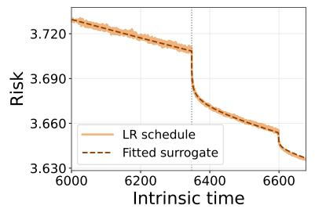  
(a) 8-1-1 fit

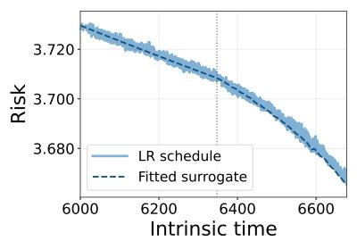  
(b) WSD zero-refit transfer

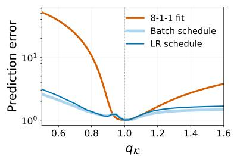  
(c) Prediction error

Figure 5: LLM surrogate fit, zero-refit transfer, and efective qK. (a) For a 300M SGD LLM, we fix $q \kappa = 1$ in Eq. (5.3) and fit the remaining 6 parameters to the 8-1-1 learning-rate schedule. (b) With all fitted parameters frozen, it predicts the WSD schedule without refitting. (c) Fixing qK, fitting the remaining parameters only on 8-1-1, and evaluating the WSD schedules without refitting yields prediction errors, each divided by its best value, that are minimized near $q \kappa \approx 1$  
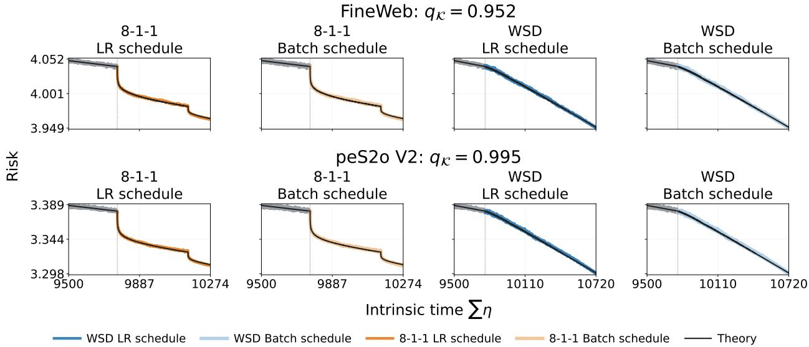  
Figure 6: Diferent datasets independently recover $q \kappa \approx 1$ . Each surrogate is fitted only to fixed-batch 8-1-1 and transferred without refitting to the alternative factorization and both WSD trajectories. The fitted $q \kappa$ are 0.952 on FineWeb and 0.995 on peS2o V2; together with the independently fitted OpenWebText value 1.017.

## 6 Conclusion and discussion

Our results characterize a power-law learning curve as a dynamical response jointly shaped by the spectrum, target alignment, noise, and schedule. Target-weighted and squared-spectrum masses determine forcing and memory, respectively, while $B _ { t } / \eta _ { t }$ controls noise injection in intrinsic time. We characterize when schedules preserve, change, or destroy clean power-law decay. In the canonical PLRF model, these mechanisms yield the $3 + 3 ( + 2 )$ map, an exact conditional finite-bulk gap law, and phase-dependent deterministic-equivalent risk and resource-optimal rates. Gaussian online-SGD experiments support the exact conditional and DE predictions. LLM experiments show our proxy surrogate yields cross-schedule prediction without refitting, supporting the response-level mechanism beyond frozen features. The factorization-collapse experiment further distinguishes the optimizer coordinates: plain SGD trajectories nearly collapse under $B _ { t } / \eta _ { t }$ , whereas Muon (Jordan et al., 2024; Liu et al., 2025) trajectories nearly collapse under the coordinate $B _ { t } / \eta _ { t } ^ { 2 }$ . The fitted $q \kappa \approx 1$ corresponds to an efective $\alpha \approx 1 / 2$ , where the 4 + 3 theory predicts the near-square-root compute-optimal width scaling reported by Chinchilla (Paquette et al., 2024; Hofmann et al., 2022).

## Acknowledgments

We thank Denny Wu and Lei Wu for their constructive discussions and suggestions. Yudong Chen acknowledges support from National Science Foundation grant CCF-2233152 and a Vilas Associates Award.

## References

Atanasov, A., Bordelon, B., Zavatone-Veth, J. A., Paquette, C. and Pehlevan, C. (2026). Two-point deterministic equivalence for stochastic gradient dynamics in linear models. Advances in Theoretical and Mathematical Physics 30 3–39.

Ba, J., Erdogdu, M. A., Suzuki, T., Wang, Z., Wu, D. and Yang, G. (2022). High-dimensional asymptotics of feature learning: How one gradient step improves the representation. In Advances in Neural Information Processing Systems, vol. 35.

Bach, F. (2024). High-dimensional analysis of double descent for linear regression with random projections. SIAM Journal on Mathematics of Data Science 6 26–50.

Bahri, Y., Dyer, E., Kaplan, J., Lee, J. and Sharma, U. (2024). Explaining neural scaling laws. Proceedings of the National Academy of Sciences 121 e2311878121.

Barkeshli, M., Alfarano, A. and Gromov, A. (2026). On the origin of neural scaling laws: From random graphs to natural language. In Proceedings of the 43rd International Conference on Machine Learning. Spotlight.

Bi, X., Chen, D., Chen, G., Chen, S., Dai, D., Deng, C., Ding, H., Dong, K., Du, Q., Fu, Z. et al. (2024). DeepSeek LLM: Scaling open-source language models with longtermism. arXiv preprint arXiv:2401.02954 .

Bingham, N. H., Goldie, C. M. and Teugels, J. L. (1989). Regular Variation, vol. 27 of Encyclopedia of Mathematics and its Applications. Cambridge University Press.

Bordelon, B., Atanasov, A. and Pehlevan, C. (2024). A dynamical model of neural scaling laws. In Proceedings of the 41st International Conference on Machine Learning, vol. 235. PMLR.

Bordelon, B. and Mori, F. (2026). Theory of optimal learning rate schedules and scaling laws for a random feature model. Preprint.

Brown, T., Mann, B., Ryder, N., Subbiah, M., Kaplan, J. D., Dhariwal, P., Neelakantan, A., Shyam, P., Sastry, G., Askell, A. et al. (2020). Language models are few-shot learners. In Advances in Neural Information Processing Systems.

Defilippis, L., Loureiro, B. and Misiakiewicz, T. (2024). Dimension-free deterministic equivalents and scaling laws for random feature regression. In Advances in Neural Information Processing Systems, vol. 37.

Gokaslan, A. and Cohen, V. (2019). OpenWebText corpus. http://Skylion007.github.io/ OpenWebTextCorpus.

He, Y., Zeng, Q. and Jiang, M. (2025). Pre-trained models perform the best when token distributions follow Zipf’s law. In Proceedings of the 2025 Conference on Empirical Methods in Natural Language Processing. Association for Computational Linguistics.

Hestness, J., Narang, S., Ardalani, N., Diamos, G., Jun, H., Kianinejad, H., Patwary, M. M. A., Yang, Y. and Zhou, Y. (2017). Deep learning scaling is predictable, empirically. arXiv preprint arXiv:1712.00409 .

Hoffmann, J., Borgeaud, S., Mensch, A., Buchatskaya, E., Cai, T., Rutherford, E., de Las Casas, D., Hendricks, L. A., Welbl, J., Clark, A., Hennigan, T., Noland, E., Millican, K., van den Driessche, G., Damoc, B., Guy, A., Osindero, S., Simonyan, K., Elsen, E., Vinyals, O., Rae, J. W. and Sifre, L. (2022). Training compute-optimal large language models. In Advances in Neural Information Processing Systems, vol. 35.

Hu, H. and Lu, Y. M. (2023). Universality laws for high-dimensional learning with random features. IEEE Transactions on Information Theory 69 1932–1964.

Hu, S., Tu, Y., Han, X., Cui, G., He, C., Zhao, W., Long, X., Zheng, Z., Fang, Y., Huang, Y., Zhang, X., Thai, Z. L., Wang, C., Yao, Y., Zhao, C., Zhou, J., Cai, J., Zhai, Z., Ding, N., Jia, C., Zeng, G., Li, D., Liu, Z. and Sun, M. (2024). MiniCPM: Unveiling the potential of small language models with scalable training strategies. In First Conference on Language Modeling.

Jordan, K., Jin, Y., Boza, V., You, J., Cesista, F., Newhouse, L. and Bernstein, J. (2024). Muon: An optimizer for hidden layers in neural networks. https://kellerjordan.github.io/ posts/muon/.

Kaplan, J., McCandlish, S., Henighan, T., Brown, T. B., Chess, B., Child, R., Gray, S., Radford, A., Wu, J. and Amodei, D. (2020). Scaling laws for neural language models. arXiv preprint arXiv:2001.08361 .

Karkada, D., Turnbull, J., Liu, Y. and Simon, J. B. (2026). Predicting kernel regression learning curves from only raw data statistics. In International Conference on Learning Representations.

Karpathy, A. (2022). nanoGPT. https://github.com/karpathy/nanoGPT.

Li, B., Chen, F., Huang, Z., Wang, L. and Wu, L. (2025). Functional scaling laws in kernel regression: Loss dynamics and learning rate schedules. In Advances in Neural Information Processing Systems.

Li, B., Wang, Z., Chen, F., Zhao, S., Zheng, R. and Wu, L. (2026a). Optimal learning rate schedules under functional scaling laws: Power decay and warmup–stable–decay (extended abstract). In Proceedings of Thirty Ninth Conference on Learning Theory, vol. 336 of Proceedings of Machine Learning Research. PMLR.

Li, J., Bu, Z. and Xu, S. (2026b). Towards joint scaling laws with optimal batch size schedules.

Lin, L., Wu, J., Kakade, S. M., Bartlett, P. L. and Lee, J. D. (2024). Scaling laws in linear regression: Compute, parameters, and data. In Advances in Neural Information Processing Systems, vol. 37.

Liu, F., Huang, X., Chen, Y. and Suykens, J. A. (2022). Random features for kernel approximation: A survey on algorithms, theory, and beyond. IEEE Transactions on Pattern Analysis and Machine Intelligence 44 7128–7148.

Liu, J., Su, J., Yao, X., Jiang, Z., Lai, G., Du, Y., Qin, Y., Xu, W., Lu, E., Yan, J., Chen, Y., Zheng, H., Liu, Y., Liu, S., Yin, B., He, W., Zhu, H., Wang, Y., Wang, J., Dong,

M., Zhang, Z., Kang, Y., Zhang, H., Xu, X., Zhang, Y., Wu, Y., Zhou, X. and Yang, Z. (2025). Muon is scalable for LLM training. arXiv preprint arXiv:2502.16982 .

Liu, Y. and Gore, J. (2026). Neural scaling universality: If exponents are fixed, time to understand coeficients. arXiv preprint arXiv:2606.25008 .

Liu, Y., Liu, Z., Pehlevan, C. and Gore, J. (2026). Universal one-third time scaling in learning peaked distributions. In Proceedings of the 43rd International Conference on Machine Learning, vol. 306 of Proceedings of Machine Learning Research.

Luo, K., Wen, H., Hu, S., Sun, Z., Liu, Z., Sun, M., Lyu, K. and Chen, W. (2025). A multi-power law for loss curve prediction across learning rate schedules. In The Thirteenth International Conference on Learning Representations.

Maloney, A., Roberts, D. A. and Sully, J. (2022). A solvable model of neural scaling laws. arXiv preprint arXiv:2210.16859 .

Mei, S., Misiakiewicz, T. and Montanari, A. (2022). Generalization error of random feature and kernel methods: hypercontractivity and kernel matrix concentration. Applied and Computational Harmonic Analysis 59 3–84.

Mei, S. and Montanari, A. (2022). The generalization error of random features regression: Precise asymptotics and the double descent curve. Communications on Pure and Applied Mathematics 75 667–766.

Meterez, A., Morwani, D., Wu, J., Oncescu, C.-A., Pehlevan, C. and Kakade, S. M. (2026a). Seesaw: Accelerating training by balancing batch size and learning rate scheduling. In International Conference on Learning Representations.

Meterez, A., Nair, P. A., Morwani, D., Pehlevan, C., Kakade, S. and Damian, A. (2026b). A defense of the quadratic model. Preprint.

Mikhaylovskiy, N. (2025). Zipf’s and heaps’ laws for tokens and LLM-generated texts. In Findings of the Association for Computational Linguistics: EMNLP 2025. Association for Computational Linguistics.

Misiakiewicz, T. and Saeed, B. (2024). A non-asymptotic theory of kernel ridge regression: deterministic equivalents, test error, and gcv estimator.

Moniri, B., Lee, D., Hassani, H. and Dobriban, E. (2024). A theory of non-linear feature learning with one gradient step in two-layer neural networks. In Proceedings of the 41st International Conference on Machine Learning, vol. 235 of Proceedings of Machine Learning Research. PMLR.

Paquette, C., Lee, K., Pedregosa, F. and Paquette, E. (2021). SGD in the large: Averagecase analysis, asymptotics, and stepsize criticality. In Proceedings of Thirty Fourth Conference on Learning Theory, vol. 134 of Proceedings of Machine Learning Research.

Paquette, C., Paquette, E., Adlam, B. and Pennington, J. (2025). Homogenization of SGD in high-dimensions: Exact dynamics and generalization properties. Mathematical Programming 214 1–90.

Paquette, E., Paquette, C., Xiao, L. and Pennington, J. (2024). 4+ 3 phases of computeoptimal neural scaling laws. In Advances in Neural Information Processing Systems, vol. 37.

Penedo, G., Kydl´ıcek, H.ˇ , Ben Allal, L., Lozhkov, A., Mitchell, M., Raffel, C., von Werra, L. and Wolf, T. (2024). The FineWeb datasets: Decanting the web for the finest text data at scale. In Advances in Neural Information Processing Systems, vol. 37. Curran Associates, Inc.

Qiu, S., Xiao, L., Wilson, A. G., Pennington, J. and Agarwala, A. (2025). Scaling collapse reveals universal dynamics in compute-optimally trained neural networks. In Proceedings of the 42nd International Conference on Machine Learning, vol. 267 of Proceedings of Machine Learning Research. PMLR.

Rahimi, A. and Recht, B. (2007). Random features for large-scale kernel machines. In Advances in Neural Information Processing Systems.

Soldaini, L. and Lo, K. (2023). peS2o (Pretraining Eficiently on S2ORC) Dataset. Tech. rep., Allen Institute for AI. ODC-By, https://github.com/allenai/peS2o.

Tissue, H., Wang, V. and Wang, L. (2025). Scaling law with learning rate annealing. In Advances in Neural Information Processing Systems, vol. 38.

Wang, J., Li, B., Zhou, Z., Wang, M., Sun, Y., Zhang, J., Cai, X. and Wu, L. (2026). Fast catch-up, late switching: Optimal batch size scheduling via functional scaling laws. In International Conference on Learning Representations.

Xiao, L. (2024). Rethinking conventional wisdom in machine learning: From generalization to scaling. arXiv preprint arXiv:2409.15156 .

Xiao, L., Hu, H., Misiakiewicz, T., Lu, Y. and Pennington, J. (2022). Precise learning curves and higher-order scalings for dot-product kernel regression. In Advances in Neural Information Processing Systems, vol. 35.

Notation guide 22   
A Spectral representations and formal power-law criteria 23   
A.1 From exact dynamics to deterministic-equivalent risk 23   
A.2 Spectral criteria for power-law learning dynamics 27   
B Proofs of the spectral power-law criteria 33   
B.1 Positive spectral representation of the deterministic equivalent 33   
B.2 Uniform Tauberian transfer for moving spectra 34   
B.3 Spectral criteria for forcing and memory 36   
B.4 Accumulating memory over training 37   
B.5 From forcing and memory asymptotics to observed loss under stable feedback 39   
C Joint learning-rate and batch-size schedules 40   
C.1 Exact risk dynamics under joint schedules 40   
C.2 Time-inhomogeneous PLRF deterministic equivalent 41   
C.3 Stable schedules and spectral-mode decay 42   
C.4 PLRF regimes and admissible schedule families 44   
C.5 Finite-bulk empirical spectrum, kernel, and gap 45   
C.6 Long-memory and integrable-memory deterministic-equivalent risk asymptotics 47   
C.7 Finite-bulk deterministic-equivalent risk asymptotics 54   
C.8 Conditional transfer from DE risk asymptotics to realized SGD 57   
C.9 Optimal ratio and schedule realizations 58   
D Sharp transfer for regularly varying joint schedules 67   
D.1 From the empirical spectral tail to two-time memory 69   
D.2 Examples and counterexamples for the transfer assumptions 71   
D.3 Long-memory schedule transfer with feedback . 80   
D.4 Integrable-memory schedule transfer 85   
D.5 From the exact noisy–clean gap back to B/η 88   
D.6 Full preserve–change–destroy classification 91   
D.7 Polynomial schedules in iteration time 94   
E Constant learning-rate and batch-size schedules 96   
E.1 Scaling inputs and optimization setup 96   
E.2 Discrete infinite-width fixed-noise optimum 98   
E.3 Source-window rates and trace-class plateau 99   
E.4 Proof of Theorem E.4 102   
E.5 Clean-to-noisy crossover scales 105   
F End-to-end language-model experiments 108   
F.1 Testing ratio-path efects at matched intrinsic time 109   
F.2 Testing factorization invariance at matched ratio paths 110   
F.3 A forcing-memory surrogate predicts unseen schedules 112

## Organization and scope of the appendix results

The appendices are organized around the questions needed to verify the main text. Appendix A records the spectral representations and the complete formal criteria for power-law learning curves, while Appendix B proves the general criteria by translating cumulative slow-mode weight into long-time decay and then accounting for repeated noise feedback. Width-dependent finite-bulk results are kept with the exact finite-width and deterministic-equivalent risk results in Sections C.5 and C.7. Appendices C and D turn to schedules in which learning rate and batch size vary together. They derive the resulting two-time risk equation, show how input power laws pass to the noisy–clean gap, and prove when that gap determines the schedule ratio. The formal joint-schedule statements and their propagation, finite-bulk, and optimization proofs are now collected together in Appendix C. Appendix E places each constant-schedule result beside its calculation and optimality proof. Within Section D.2, a stretched-exponential example shows that temporal power laws need not come from a pointwise power-law spectrum. Numerical checks at finite width appear beside the results they are designed to illustrate, while Appendix F collects end-to-end language-model external-validity checks separately from the theorem-facing evidence.

Limit regimes: what grows and in what order. The results below use several asymptotic regimes because they answer diferent questions rather than provide interchangeable approximations to the same limit. Exact finite-width dynamics describe a realized feature map over a finite training horizon, while the fixed-width terminal limit describes what remains after all positive modes have relaxed. A fixed-time deterministic equivalent replaces the random empirical spectrum at a prescribed horizon. A fixed-limit long-time law then studies an infinite-spectrum response as $T \to \infty ,$ whereas a joint width–time limit asks whether that response remains valid along finite-width models with $T = T _ { m }  \infty$ . Resource limits additionally allow width, horizon, and schedule to vary with the available data or feature compute. Table 2 summarizes the limit hierarchy used by the statements and proofs that follow.

Table 2: Limit regimes of the principal results.
<table><tr><td>Limit regime</td><td>Results in this paper</td></tr><tr><td>Exact finite width: d, m, W fixed, t &lt; ∞</td><td>Exact finite-bulk kernel and noisy-clean gap (Theorems C.8 and C.9)</td></tr><tr><td>Fixed-width terminal: d, m, W fixed, T → ∞</td><td>Stable terminal-risk transfer and the noise-induced plateau (Theorems A.9, E.3 and E.5)</td></tr><tr><td>Fixed-time DE:  $d , m \to \infty , d / m \to c , T$  fixed</td><td>Positive spectral representation and DE risk recursion for varying schedules (Theorems A.1, C.1 and C.5)</td></tr><tr><td>Fixed infinite-spectrum system:  $T \to \infty$ </td><td>Schedule response, full classification, and gap-to-ratio identification (Theorems A.6, D.13, D.16, D.19, D.23 and 5.1)</td></tr><tr><td>Joint width-time:  $m , T _ { m } \to \infty , 1 \ll T _ { m } \lesssim m ^ { 2 \alpha }$ </td><td>Spectral iff criteria, uniform transfer, and LM/IM/FB risk laws (Theorems A.10, B.1, 3.1, C.14, C.15, C.18, C.21 and D.4)</td></tr><tr><td>Resource limit:  $D \to \infty { \mathrm { ~ o r ~ f \to \infty ; ~ } } m , T , r { \mathrm { ~ v a r y } }$ </td><td>Optimal ratio control and phasewise data/compute rates (Theorems C.22, C.23 and 5.2)</td></tr></table>

In the canonical PLRF model, the smallest positive spectral scale is $m ^ { - 2 \alpha }$ . At fixed width, once

Table 3: Analytical levels and representative formal results.
<table><tr><td>Analytical level</td><td>Formal results</td></tr><tr><td>Exact conditional finite-width dynamics</td><td>Exact finite-bulk kernel and noisy-clean gap (Theorems C.8 and C.9).</td></tr><tr><td>Deterministic equivalent</td><td>Positive DE spectral representation, varying-schedule DE recursion, and conditional transfer to realized SGD (Theorems A.1, C.1 and C.21).</td></tr><tr><td>Power-law asymptotics</td><td>Spectral iff criteria, uniform Tauberian and schedule transfer, and  $\mathrm { L M / I M / F B }$  risk laws (Theorems A.4, B.1, C.14, C.18 and D.4).</td></tr></table>

$T \gg m ^ { 2 \alpha }$ , all positive modes have been resolved and the remaining transient decays exponentially:

m fixed,

$$
T \gg m ^ { 2 \alpha } \quad \Longrightarrow \quad \mathrm { e x p o n e n t i a l ~ t r a n s i e n t . }
$$

A temporal power law instead requires a joint window in which the filter scale $T ^ { - 1 }$ remains above the finite-width cutof:

$$
m \to \infty , \qquad T = T _ { m } \to \infty , \qquad 1 \ll T _ { m } \ll m ^ { 2 \alpha } .
$$

Thus the joint width–time limit defines the phenomenon studied here rather than serving only as a technical device. The order of limits also matters. Writing $R ( T , m )$ schematically for the risk at width m and intrinsic time $T .$ , the two orders can difer for some spectral families:

$$
\operatorname* { l i m } _ { m \to \infty } \operatorname* { l i m } _ { T \to \infty } R ( T , m ) \neq \operatorname* { l i m } _ { T \to \infty } \operatorname* { l i m } _ { m \to \infty } R ( T , m ) .
$$

The left-hand side first trains each finite-width model to its terminal behavior. The right-hand side first produces an infinite spectrum, so progressively slower modes remain unresolved as $T$ grows.

Analytical levels: what is exact and what is approximated. The limit hierarchy above specifies which variables grow and in what order. A separate distinction concerns what is proved at each level. Conditional on the frozen features W, the finite-width risk dynamics are exact and require no spectral approximation. A deterministic equivalent then replaces the random empirical spectrum by deterministic spectral measures as width and dimension grow. This approximation is initially a fixed-horizon statement: validity for every fixed T does not by itself imply validity along $T = T _ { m }  \infty$ . Power-law asymptotics make this additional long-time passage, either directly for empirical spectra or through the DE. They therefore require uniform control near the moving spectral scale $T ^ { - 1 }$ , expressed through the corresponding spectral-control, no-escape, and source-window conditions. Table 3 records the formal results at each level.

## Notation guide

Hats on $\widehat { \pmb { H } } , \widehat { \lambda } _ { j } , \widehat { \pmb { u } } _ { j }$ mark empirical spectral objects after drawing $W ;$ hats on scalar functions in Appendix D denote Laplace transforms. Plain F, K, S, R denote exact dynamical quantities, while F, K, S, R denote their deterministic-equivalent counterparts. Where present, subscript W makes conditioning on the frozen features explicit; on risks, subscript 0 marks clean labels. Spectral measures with subscript m below are DE objects.

Table 4: Core notation; proof-local symbols are defined at first use.
<table><tr><td>Symbol</td><td>Meaning</td><td>Symbol</td><td>Meaning</td></tr><tr><td colspan="4">Model and spectrum</td></tr><tr><td> $d$ </td><td>input dimension</td><td>m</td><td>feature width</td></tr><tr><td> $\alpha$ </td><td>spectral-decay exponent</td><td> $\beta$ </td><td>target-regularity exponent</td></tr><tr><td> $p$ </td><td>target-energy tail exponent  $2 \alpha + 2 \beta - 1$ </td><td>x</td><td>covariate</td></tr><tr><td> $\pmb { \Lambda }$ </td><td>population covariance</td><td> $\lambda _ { j }$ </td><td>population eigenvalue</td></tr><tr><td> $\pmb { \theta } ^ { \star }$ </td><td>teacher coefficients</td><td> $f _ { \star }$ </td><td>teacher predictor</td></tr><tr><td> $\varepsilon$ </td><td>label noise</td><td> $\sigma ^ { 2 }$ </td><td>label-noise variance</td></tr><tr><td> $W$ </td><td>frozen feature matrix</td><td> $\mathbf { \pmb { a } } _ { t }$ </td><td>readout at update t</td></tr><tr><td> $\widehat { H }$ </td><td> $\pmb { \Lambda } ^ { 1 / 2 } \pmb { W } \pmb { W } ^ { \top } \pmb { \Lambda } ^ { 1 / 2 }$ </td><td> $\widehat { \lambda } _ { j }$ </td><td>empirical eigenvalue</td></tr><tr><td> $\widehat { \mathbf { u } } _ { j }$ </td><td>empirical eigenvector</td><td> $M _ { m } ( z )$ </td><td>diagonal matrix-valued DE resolvent</td></tr><tr><td colspan="4">m(z) scalar resolvent fixed point</td></tr><tr><td colspan="4">Dynamics and spectral objects</td></tr><tr><td> $\eta _ { t }$ </td><td>learning rate</td><td> $B _ { t }$ </td><td>batch size</td></tr><tr><td> $T _ { t }$ </td><td> $\textstyle \sum _ { s < t } \eta _ { s }$ </td><td> $T$ </td><td>terminal intrinsic time</td></tr><tr><td> $r _ { s }$ </td><td> $B _ { s } / \eta _ { s }$ </td><td> $r ( u )$ </td><td>intrinsic-time ratio path</td></tr><tr><td> $\vartheta$ </td><td>regular-variation exponent of r</td><td> $L _ { r }$ </td><td>slow factor of  $r$ </td></tr><tr><td> $q _ { \eta } ( \lambda )$ </td><td>one-step modal retention</td><td> $k ( v )$ </td><td>unit-injection survival at age v</td></tr><tr><td> $F _ { t }$   $F _ { W }$ </td><td>exact varying-schedule forcing</td><td> $K _ { t , s }$ </td><td>exact two-time kernel</td></tr><tr><td> $\nu _ { W } ^ { \mathcal { F } }$ </td><td>exact conditional forcing target-weighted empirical spectral</td><td> $K _ { W }$   $\nu _ { W } ^ { \mathcal { K } }$ </td><td>exact conditional kernel squared-eigenvalue empirical</td></tr><tr><td></td><td>measure</td><td></td><td>memory measure</td></tr><tr><td> $\pmb { \mu } _ { m }$ </td><td>positive diagonal matrix-valued DE spectral measure</td><td> $\nu _ { m } ^ { \kappa }$ </td><td> $\lambda ^ { 2 } .$  -weighted DE memory measure</td></tr><tr><td> $\mu _ { m } ^ { \mathcal { F } }$ </td><td>target-weighted DE forcing measure</td><td> $\mu _ { m } ^ { \kappa }$ </td><td>DE trace spectral measure</td></tr><tr><td> $\mathcal { F } _ { \eta , B } ( t , m )$ </td><td>joint-schedule DE forcing</td><td> ${ \mathcal K } _ { \eta , B } ( t , s , m )$ </td><td>joint-schedule DE kernel</td></tr><tr><td> $F _ { W , 0 }$ </td><td>exact zero-mode forcing</td><td> $F _ { W , > 0 }$ </td><td>exact learnable forcing</td></tr><tr><td> $\mathcal { F } _ { 0 }$ </td><td>DE null-space forcing component</td><td> $\mathcal { F } _ { p p }$ </td><td>DE pure-point forcing component</td></tr><tr><td> $\mathcal { F } _ { a c }$ </td><td>DE absolutely-continuous forcing component</td><td> $\kappa _ { p p }$ </td><td>DE pure-point memory component</td></tr><tr><td colspan="4">Risks, scaling laws, and budgets</td></tr><tr><td> $R _ { \sigma , t }$ </td><td>exact conditional noisy risk</td><td> $R _ { 0 , t }$ </td><td>exact conditional clean risk</td></tr><tr><td> $R _ { \sigma } ( T )$ </td><td>exact fixed-limit noisy risk</td><td> $R _ { 0 } ( T )$ </td><td>exact fixed-limit clean risk</td></tr><tr><td> $\mathcal { R } _ { \sigma , \eta , B } ( t , m )$ </td><td>joint-schedule DE noisy risk</td><td> $\mathcal { R } _ { 0 }$ </td><td>clean DE risk; arguments suppressed</td></tr><tr><td> $R _ { \mathrm { a p p } }$ </td><td>exact zero-mode floor</td><td> $Z _ { t }$ </td><td>exact noisy-clean gap</td></tr><tr><td> $\widetilde { R } _ { \sigma } ( w )$ </td><td>exact risk generating series</td><td> ${ \mathcal { R } } _ { \sigma } ^ { \star }$ </td><td>admissible-class DE optimum</td></tr><tr><td> $\mathcal { F } ( T , m )$ </td><td>PLRF large-clock phase-order forcing profile</td><td> $q { \mathcal { F } }$ </td><td>general learnable-forcing exponent; target-aligned source coordinate in</td></tr><tr><td> $L _ { \mathcal { F } }$ </td><td>forcing slow factor</td><td> $q \kappa$ </td><td>the PLRF map general one-injection memory exponent; PLRF coordinate on the</td></tr><tr><td> $L _ { \mathcal { K } }$ </td><td>memory slow factor</td><td> $q _ { 0 }$ </td><td>LM and IM branches complete floor-centered clean-loss</td></tr><tr><td> $L _ { 0 }$ </td><td>centered clean-loss slow factor</td><td> $q _ { \mathcal N } ( \vartheta )$ </td><td>exponent schedule-induced noisy-clean-gap</td></tr><tr><td> $D _ { t }$ </td><td>processed samples by update t</td><td>D</td><td>exponent data budget</td></tr><tr><td> $\mathfrak { f }$ </td><td>compute proxy,  $\mathsf { f } \asymp m D$ </td><td> $\sim$ </td><td>ratio tends to one</td></tr><tr><td> $\asymp$ </td><td>same order</td><td> $\lesssim$ </td><td>upper-order bound</td></tr><tr><td> $\ll$ </td><td>negligible ratio</td><td></td><td>exact total kernel mass</td></tr><tr><td> $\Delta T _ { s }$ </td><td>intrinsic-time increment,</td><td> $\kappa _ { W }$ </td><td></td></tr><tr><td colspan="2"> $\eta _ { s }$ </td><td></td><td></td></tr><tr><td>Abbreviations and regimes PLRF</td><td></td><td></td><td></td></tr><tr><td>SGD</td><td>power-law random-feature model stochastic gradient descent</td><td>FSL FLOP</td><td>functional scaling law</td></tr><tr><td>DE</td><td></td><td>WSD</td><td>floating-point operation</td></tr><tr><td>FB</td><td>deterministic equivalent</td><td>LM</td><td>warmup-stable—decay</td></tr><tr><td>IM</td><td>finite-bulk regime integrable-memory regime</td><td></td><td>long-memory regime</td></tr></table>

## A Spectral representations and formal power-law criteria

This appendix records the exact and deterministic-equivalent spectral representations used in the paper and states the formal criteria for the learnable forcing, one-injection memory, accumulated noise, and their transfer to the observed loss. The corresponding spectral and renewal proofs are collected in Appendix B, while the width-dependent finite-bulk results are proved in Sections C.5 and C.7. Throughout, $a \asymp b$ hides dimension-independent positive constants.

## A.1 From exact dynamics to deterministic-equivalent risk

We use the model, data distribution, online SGD update, conditional prediction risk, and PLRF   
parameters defined in Sections 2 and 4. Thus $\lambda _ { j } = j ^ { - 2 \alpha } , \theta _ { i } ^ { \star } = j ^ { - \beta }$ , and $2 \alpha + 2 \beta > 1$ . We take   
$d \ge c _ { 0 } m , c _ { 0 } > 1$ , with $d / m \to c \in ( 1 , \infty )$ when $\alpha < 1 / 2$ and $\bar { d } / m  c \in ( 1 , \infty ]$ when $\alpha > 1 / 2$ For the constant-schedule spectral formulas below, set $\eta _ { t } \equiv \eta , B _ { t } \equiv B = \Theta ( 1 )$ , and retain $\mathbf { { a } } _ { 0 } = \mathbf { { 0 } }$   
All sampling, independence, and conditioning conventions are those of Section 2. For this constant

schedule, the stable learning-rate scale is

$$
\eta \asymp \left\{ \begin{array} { l l } { 1 , } & { \alpha > \frac { 1 } { 2 } , } \\ { m ^ { 2 \alpha - 1 } , } & { 0 < \alpha < \frac { 1 } { 2 } . } \end{array} \right.\tag{A.1}
$$

The hidden constant is chosen strictly below the threshold in Eq. (A.14).

We first record the exact recursion stated in Section 2, then construct the positive deterministicequivalent measures and assemble the corresponding risk. The formal power-law criteria follow in the next subsection.

## A.1.1 Exact conditional forcing–memory dynamics

The operator ${ \widehat { \pmb { H } } } .$ filter $q _ { \eta } .$ , forcing $F _ { W }$ , memory kernel $K _ { W }$ , and approximation floor $R _ { \mathrm { a p p } }$ are defined in Section $2 ;$ the two empirical spectral measures and their integral representations are given in Section 3. We verify here the exact recursion stated in Eq. (2.3). Let $\pmb { e } _ { t } : = \pmb { \Lambda } ^ { 1 / 2 } ( W \pmb { a } _ { t } - \pmb { \theta } ^ { \star } )$ and $\rho _ { j } ( t ) : = \langle \widehat { \pmb { u } } _ { j } , \pmb { e } _ { t } \rangle$ . Let

$$
\mathcal { F } _ { t } : = \sigma \big ( W , \{ ( x _ { s } ^ { i } , y _ { s } ^ { i } ) : 0 \leq s < t , 1 \leq i \leq B \} \big ) , \qquad \mathbb { E } _ { t } [ \cdot ] : = \mathbb { E } [ \cdot \mid \mathcal { F } _ { t } ] .
$$

Then $( \mathbf { } a _ { t } , e _ { t } , \rho _ { j } ( t ) )$ are $\mathcal { F } _ { t }$ -measurable and the next mini-batch is independent of $\mathcal { F } _ { t }$ . Gaussian moments give

$$
\mathbb { E } _ { t } [ \rho _ { j } ^ { 2 } ( t + 1 ) ] = q _ { \eta } ( \widehat { \lambda } _ { j } ) \rho _ { j } ^ { 2 } ( t ) + \frac { \eta ^ { 2 } } { B } \widehat { \lambda } _ { j } ^ { 2 } ( \| e _ { t } \| _ { 2 } ^ { 2 } + \sigma ^ { 2 } ) .
$$

Iterating this scalar recursion and summing over $j$ proves $\mathrm { E q . ~ ( 2 . 3 ) }$

Terminal risk and feedback stability. The exact Volterra equation also determines the fixedwidth terminal level. Define the ordinary generating series, interpreted as formal power series,

$$
\widetilde { R } _ { \sigma } ( w ) : = \sum _ { t \geq 0 } R _ { \sigma , t } w ^ { t } , \qquad \widetilde { F } _ { W } ( w ) : = \sum _ { t \geq 0 } F _ { W } ( t ) w ^ { t } , \qquad \widetilde { K } _ { W } ( w ) : = \sum _ { t \geq 0 } K _ { W } ( t ) w ^ { t } .
$$

Coeficient summation in Eq. (2.3) gives

$$
\widetilde { R } _ { \sigma } ( w ) = \frac { \widetilde { F } _ { W } ( w ) + \sigma ^ { 2 } w \widetilde { K } _ { W } ( w ) / ( 1 - w ) } { 1 - w \widetilde { K } _ { W } ( w ) } .
$$

The reciprocal denominator $( 1 - w \widetilde { K } _ { W } ( w ) ) ^ { - 1 }$ sums repeated reinjections of previous prediction error and is the transfer function of the SGD feedback.

For fixed $( d , m , W )$ , the terminal risk can be computed exactly. Assume $\eta ( 1 + 1 / B ) \lambda _ { \operatorname* { m a x } } ( \widehat { H } ) < 2$ and define the exact kernel mass

$$
\kappa _ { W } : = \sum _ { t \geq 0 } K _ { W } ( t ) = \frac { \eta } { B } \sum _ { \widehat { \lambda } _ { j } > 0 } \frac { \widehat { \lambda } _ { j } } { 2 - ( 1 + 1 / B ) \eta \widehat { \lambda } _ { j } } .
$$

Since the kernel is nonnegative, $\kappa _ { W } < 1 ~ \mathrm { g i v e s } ~ | w \widetilde { K } _ { W } ( w ) | < 1 ~ \mathrm { f o r } ~ | w | \leq 1$ . The feedback is therefore stable, with input–output gain at most $( 1 - \kappa _ { W } ) ^ { - 1 }$ . The positive-spectrum forcing then vanishes as

$t \to \infty$ , and the exact conditional terminal risk is

$$
\operatorname* { l i m } _ { t  \infty } R _ { \sigma , t } = \frac { R _ { \mathrm { a p p } } + \sigma ^ { 2 } \kappa _ { W } } { 1 - \kappa _ { W } } .\tag{A.2}
$$

Thus the terminal level combines frozen-representation error with persistent training-label noise and its feedback amplification. The centered-transfer result is stated in Theorem A.9 and proved in Section B.5.

## A.1.2 Positive spectral measures for the deterministic equivalent

The random-matrix step preserves the same forcing–memory picture: it replaces the realized spectral projection by deterministic positive measures. Target weighting will produce the forcing measure, while the trace measure, together with the squared-eigenvalue variance weight, will produce memory.

To construct these measures, write $\lambda _ { j }$ for the diagonal entries of $\Lambda ;$ in PLRF, $\lambda _ { j } = j ^ { - 2 \alpha }$ . The diagonal matrix-valued DE resolvent is

$$
M _ { m } ( z ) : = \operatorname { d i a g } \left( { \frac { 1 } { \lambda _ { j } { \mathfrak { m } } ( z ) - z } } : 1 \leq j \leq d \right) ,
$$

where ${ \mathfrak { m } } ( z )$ is the analytic solution of

$$
\mathfrak { m } ( z ) = \left( 1 + \frac { 1 } { m } \sum _ { j = 1 } ^ { d } \frac { \lambda _ { j } } { \lambda _ { j } \mathfrak { m } ( z ) - z } \right) ^ { - 1 } .
$$

Choose the Cauchy–Stieltjes branch of Paquette et al. (2024, Proposition E.1), characterized by Im m $( z ) < 0$ on the upper half-plane and $\mathfrak { m } ( z )  1 \ \mathrm { a s } \ | z |  \infty$

For the matrix-valued measure $\pmb { \mu } _ { m }$ whose positivity and uniqueness are established next, the two scalar projections relevant to learning are

$$
\mu _ { m } ^ { \mathcal { F } } ( A ) : = \left. \pmb { \mu } _ { m } ( A ) \mathbf { A } ^ { 1 / 2 } \pmb { \theta } ^ { \star } , \mathbf { A } ^ { 1 / 2 } \pmb { \theta } ^ { \star } \right. , \qquad \mu _ { m } ^ { K } ( A ) : = \mathrm { t r } \pmb { \mu } _ { m } ( A ) .\tag{A.3}
$$

The squared-spectrum weighting used by every DE memory kernel is

$$
\nu _ { m } ^ { K } ( \mathrm { d } \lambda ) : = \lambda ^ { 2 } \mu _ { m } ^ { K } ( \mathrm { d } \lambda ) .\tag{A.4}
$$

Its target-weighted zero atom is the DE approximation floor $\mathcal { F } _ { 0 } ( m ) : = \mu _ { m } ^ { \mathcal { F } } ( \{ 0 \} )$

The next lemma turns the DE resolvent into genuine positive spectral measures, so the contour formulas used later are ordinary spectral averages rather than only formal complex integrals. It also records the moments and functional calculus needed below.

Lemma A.1 (Positive spectral measures of the PLRF deterministic equivalent). For every finite $m , d ,$ there is a unique finite positive-semidefinite diagonal matrix-valued Borel measure $\pmb { \mu } _ { m }$ , compactly supported on $[ 0 , \infty )$ , such that

$$
M _ { m } ( z ) = \int _ { [ 0 , \infty ) } \frac { \pmb { \mu } _ { m } ( \mathrm { d } \lambda ) } { \lambda - z } , \qquad z \in \mathbb { C } \setminus [ 0 , \infty ) .\tag{A.5}
$$

It satisfies

$$
\mu _ { m } ( [ 0 , \infty ) ) = I _ { d } , \qquad \int \lambda \mu _ { m } ( \mathrm { d } \lambda ) = \Lambda , \qquad \int \lambda ^ { 2 } \mu _ { m } ( \mathrm { d } \lambda ) = \Lambda ^ { 2 } + \frac { \mathrm { t r } \Lambda } m \Lambda .\tag{A.6}
$$

The scalar measures in Eq. (A.3) are finite and nonnegative, with

$$
\begin{array} { c } { { \displaystyle \mu _ { m } ^ { \mathcal { F } } ( [ 0 , \infty ) ) = ( { \pmb \theta } ^ { \star } ) ^ { \top } \Lambda { \pmb \theta } ^ { \star } , \qquad \mu _ { m } ^ { \mathcal { K } } ( [ 0 , \infty ) ) = d , } } \\  { { \displaystyle \int \lambda \mu _ { m } ^ { \mathcal { F } } ( { \bf d } \lambda ) = ( { \pmb \theta } ^ { \star } ) ^ { \top } \Lambda ^ { 2 } { \pmb \theta } ^ { \star } , \quad \int \lambda \mu _ { m } ^ { \mathcal { K } } ( { \bf d } \lambda ) = \mathrm { t r } \Lambda , \quad \displaystyle \int \lambda ^ { 2 } \mu _ { m } ^ { \mathcal { K } } ( { \bf d } \lambda ) = \mathrm { t r } ( { \pmb \Lambda } ^ { 2 } ) + \frac { ( \mathrm { t r } \Lambda ) ^ { 2 } } { m } . } } \end{array}\tag{A.7}
$$

If h is analytic on a neighborhood of supp $\mu _ { m } ^ { \kappa }$ , then

$$
- \frac { 1 } { 2 \pi \mathrm { i } } \oint _ { \mathcal { C } } h ( z ) M _ { m } ( z ) \mathrm { d } z = \int h ( \lambda ) \pmb { \mu _ { m } } ( \mathrm { d } \lambda ) .\tag{A.8}
$$

The proof of Theorem A.1 is in Section B.1.

## A.1.3 Assembling the deterministic-equivalent risk

We now return to the risk. The DE retains the exact system’s input–output structure: its spectral transforms define forcing and memory, and stable positive feedback keeps the noisy–clean gap within a fixed factor of cumulative memory.

Let C enclose the deterministic-equivalent spectral support and no other singularities. The DE forcing and memory are

$$
\mathcal { F } ( t , m ) : = - \frac { 1 } { 2 \pi \mathrm { i } } \oint _ { \mathcal { C } } \left. M _ { m } ( z ) \mathbf { A } ^ { 1 / 2 } \pmb \theta ^ { \star } , \mathbf { A } ^ { 1 / 2 } \pmb \theta ^ { \star } \right. q _ { \eta } ( z ) ^ { t } \mathrm { d } z ,\tag{A.9}
$$

$$
\mathcal { K } ( t , m ) : = \frac { \eta ^ { 2 } } { B } \mathrm { ~ t r } \left[ - \frac { 1 } { 2 \pi \mathrm { i } } \oint _ { \mathcal { C } } M _ { m } ( z ) z ^ { 2 } q _ { \eta } ( z ) ^ { t } \mathrm { d } z \right] .\tag{A.10}
$$

By Eq. (A.8), these contour expressions are positive spectral transforms.

$$
\mathcal { F } _ { 0 } ( m ) = - \mathop { \mathrm { R e s } } _ { z = 0 } \biggl \langle M _ { m } ( z ) \mathbf { A } ^ { 1 / 2 } \pmb \theta ^ { \star } , \mathbf { A } ^ { 1 / 2 } \pmb \theta ^ { \star } \biggr \rangle , \qquad \mathcal { F } _ { > 0 } ( t , m ) : = \mathcal { F } ( t , m ) - \mathcal { F } _ { 0 } ( m ) ,\tag{A.11}
$$

so that $\mathcal { F } ( t , m ) = \mathcal { F } _ { 0 } ( m ) + \mathcal { F } _ { > 0 } ( t , m )$ . Only the zero-versus-positive split is universal. For general $( \lambda _ { i } , \theta _ { i } ^ { \star } )$ , we keep the positive-spectrum forcing intact; the later pure-point/absolutely-continuous split is PLRF-specific. The temporal spectral and accumulation criteria below are first stated for exact conditional quantities; the transfer theorem then covers both exact and DE losses.

To assemble the components into risk, define the causal discrete convolution for sequences $a , b : \mathbb { N } _ { 0 } \to \mathbb { R }$ by

$$
( a * b ) ( 0 ) : = 0 , \qquad ( a * b ) ( t ) : = \sum _ { s = 0 } ^ { t - 1 } a ( t - 1 - s ) b ( s ) , \quad t \geq 1 .
$$

The clean DE risk is the bounded response to the forcing under this kernel:

$$
\mathcal { R } _ { 0 } = \mathcal { F } + \mathcal { K } * \mathcal { R } _ { 0 } .\tag{A.12}
$$

This is the zero-noise constant-schedule resolvent-DE surrogate for the SGD dynamics in Section 2. Its noisy counterpart adds cumulative label-noise injection:

$$
\mathcal { R } _ { \sigma } = \mathcal { F } + K * \mathcal { R } _ { \sigma } + \sigma ^ { 2 } \mathcal { S } , \qquad \mathcal { S } _ { t } ( m ) : = \sum _ { s = 0 } ^ { t - 1 } K ( s , m ) , \quad \mathcal { S } _ { 0 } ( m ) : = 0 .\tag{A.13}
$$

The comparison requires two uniform stability conditions: every positive mode contracts, and the total Volterra feedback remains below one:

$\eta \left( 1 + \frac { 1 } { B } \right) \operatorname* { s u p } \{ \lambda > 0 : \lambda$ lies in the DE spectral support of $M _ { m } \} \leq 2 - \delta .$

$$
\| \mathcal { K } \| _ { \ell ^ { 1 } } : = \sum _ { t = 0 } ^ { \infty } \mathcal { K } ( t , m ) \leq \kappa < 1 .\tag{A.14}
$$

Here $\delta > 0$ and $\kappa < 1$ are fixed uniformly in m.

Because the kernel is nonnegative, the direct injection gives the lower bound, while repeated stable feedback amplifies it by at most $( 1 - \kappa ) ^ { - 1 }$ . Hence

$$
\mathcal { R } _ { 0 } ( t , m ) + \sigma ^ { 2 } \mathcal { S } _ { t } ( m ) \leq \mathcal { R } _ { \sigma } ( t , m ) \leq \mathcal { R } _ { 0 } ( t , m ) + \frac { \sigma ^ { 2 } } { 1 - \kappa } S _ { t } ( m ) .\tag{A.15}
$$

This is the reduction used below: once the clean-risk and cumulative-memory scales are known, the noisy risk follows up to constants fixed by stability.

## A.2 Spectral criteria for power-law learning dynamics

This subsection follows the temporal components to the observed loss. Weighted empirical tails determine forcing and one-injection memory, cumulative memory determines the efect of persistent noise, and stable Volterra feedback transfers these components to the observed loss.

A positive function L is slowly varying if $L ( c T ) / L ( T ) \to 1$ for every fixed $c > 0$

Forcing and memory: spectral tails determine temporal decay. Forcing has a power law exactly when the target-weighted low-spectrum mass does, while one-injection memory has a power law exactly when the squared-spectrum mass does. A mode of size λ is learned around $\lambda ^ { - 1 }$ , so at time T both component decays are read near the moving cutof $T ^ { - 1 }$

We study $K _ { W }$ because persistent noise depends on its sum, $\begin{array} { r } { S _ { W , t } : = \sum _ { u < t } K _ { W } ( u ) } \end{array}$ , analyzed next.

Every fixed finite spectrum eventually decays exponentially, so the equivalences use the following common joint-limit condition. It excludes step-boundary artifacts and moving spectral packets without presupposing a target power law. Proofs are in Section B.3.

Assumption A.2 (Constant-schedule stability). A constant schedule $\eta _ { t } \equiv \eta , B _ { t } \equiv B$ satisfies constant-schedule stability if there are constants $\delta > 0$ and $\kappa < 1$ , uniform over the width, such that:

(a) Pointwise contraction.

$$
\eta \left( 1 + \frac { 1 } { B } \right) \lambda _ { \operatorname* { m a x } } ( \widehat { H } ) \leq 2 - \delta .
$$

(b) Row stability.

$$
\operatorname* { s u p } _ { t \geq 1 } \sum _ { s < t } K _ { W } ( t - 1 - s ) = \sum _ { h \geq 0 } K _ { W } ( h ) \leq \kappa .
$$

For the DE recursion, pointwise contraction is imposed uniformly over $\lambda \in \mathrm { s u p p } \mu _ { m } ^ { \kappa }$ , and row stability replaces $K _ { W } ( h )$ by $\kappa ( h , m )$

Assumption A.3 (Uniform spectral window). Retain the constant schedule, assume part $( a )$ of Theorem $\mathrm { { A . 2 } } ,$ and consider a joint sequence with $m  \infty , t  \infty$ , and $T = \eta t  \infty$ . For the component under consideration, let $A _ { m } ( x )$ denote its cumulative weighted spectral mass below x. Fix $q > 0$ , a slowly varying function L, and a normalization constant $c _ { A } > 0$ , and set

$$
a _ { m } : = c _ { A } T ^ { - q } L ( T ) .
$$

There exist $C < \infty$ and $\epsilon \in ( 0 , q )$ , independent of $m , t ,$ such that eventually, for every $y > 0$

$$
\frac { A _ { m } ( y / T ) } { a _ { m } } \leq C \operatorname* { m a x } \{ y ^ { q - \epsilon } , y ^ { q + \epsilon } \} , \qquad y > 0 .\tag{A.16}
$$

Theorem A.4 (Spectral criteria for power-law forcing and memory). Retain the constant schedule $\eta _ { t } \equiv \eta , B _ { t } \equiv B$ . For each width, let $\pmb { \Lambda } = \mathrm { d i a g } ( \lambda _ { 1 } , \ldots , \lambda _ { d } )$ , with $\lambda _ { j } \geq 0$ and $( \pmb { \theta } ^ { \star } ) ^ { \top } \pmb { \Lambda } \pmb { \theta } ^ { \star } < \infty$ , so the covariance and finite-energy target are otherwise arbitrary. Condition on $W$ , let $( \widehat { \lambda } _ { j } , \widehat { \pmb { u } } _ { j } )$ be the empirical eigenpairs in Section 2, and retain the empirical measures $\nu _ { W } ^ { \mathcal { F } } , \nu _ { W } ^ { \mathcal { K } }$ above.

Forcing. Under zero initialization, the initial residual is $- \Lambda ^ { 1 / 2 } \theta ^ { \star }$ . Let $q \mathcal { F } > 0$ and let $L _ { \mathcal { F } }$ be slowly varying. Assume Theorem A.3 with

$$
A _ { m } ( x ) = \nu _ { W } ^ { \mathcal { F } } ( ( 0 , x ] ) , \qquad q = q \mathcal { F } , \qquad L = L \mathcal { F } , \qquad c _ { A } = 1 .
$$

Then

$$
\nu _ { W } ^ { \mathcal { F } } ( ( 0 , T ^ { - 1 } ] ) \sim T ^ { - q _ { \mathcal { F } } } L _ { \mathcal { F } } ( T )
$$

if and only if

$$
F _ { W , > 0 } ( t ) \sim \Gamma ( q _ { \mathcal { F } } + 1 ) ( 2 T ) ^ { - q _ { \mathcal { F } } } L _ { \mathcal { F } } ( T ) \qquad ( T \to \infty ) .
$$

Memory. Let $q \kappa > 0$ and let $L _ { \mathcal { K } }$ be slowly varying. Assume Theorem A.3 with

$$
A _ { m } ( x ) = \nu _ { W } ^ { K } ( ( 0 , x ] ) , \qquad q = q _ { K } , \qquad L = L _ { K } , \qquad c _ { A } = \frac { 2 ^ { q _ { K } } } { \Gamma ( q _ { K } + 1 ) } .
$$

Then

$$
\nu _ { W } ^ { K } ( ( 0 , T ^ { - 1 } ] ) \sim \frac { 2 ^ { q \kappa } } { \Gamma ( q \kappa + 1 ) } T ^ { - q \kappa } L \kappa ( T )
$$

if and only if

$$
K _ { W } ( t ) \sim \frac { \eta ^ { 2 } } { B } T ^ { - q \kappa } L \kappa ( T ) .\tag{A.17}
$$

Each asymptotic equivalence above is understood locally uniformly under constant-factor rescalings of T.

Fixed-margin stability is standard (Paquette et al., 2021, 2025); fixed-spectrum Potter bounds follow from Bingham et al. (1989, Theorem 1.5.6).

Remark A.5 (Joint-limit uniformity). Empirical spectral control is available (Misiakiewicz and Saeed, 2024; Defilippis et al., 2024); the simultaneous width–time uniformity used above is assumed.

Cumulative memory: growth or convergence. Summing one-injection memory creates the dividing line $q \kappa = 1$ . Below it, cumulative memory has asymptotic scale $( \eta / B ) T ^ { 1 - q \kappa } L \kappa ( T )$ ; above ${ \mathrm { i t } } ,$ memory converges with a remaining tail of the same order. At equality, a fixed infinite spectrum has a borderline integral. The theorem also gives a direct spectral criterion for the terminal tail without assuming a power law for $K _ { W }$ . The proof is in Section B.4.

Under the same constant schedule and conditional on $W .$ , retain $S _ { W , t }$ above and define its total mass by $\begin{array} { r } { S _ { W , \infty } : = \sum _ { u = 0 } ^ { \infty } K _ { W } ( u ) } \end{array}$

Theorem A.6 (When cumulative memory grows or converges). Under the same constant schedule, condition on W, retain $q _ { \eta }$ and $K _ { W }$ . Assume part $( a )$ of Theorem A.2.

Cumulative-memory asymptotics. Let $q \kappa > 0$ , let $L _ { K }$ be slowly varying, and consider a joint limit in which $m \to \infty , t \to \infty$ , and $T = \eta t \to \infty$ . Set

$$
A _ { m } ^ { K } ( x ) : = \nu _ { W } ^ { K } ( ( 0 , x ] ) , \qquad a _ { m } ^ { K } : = \frac { 2 ^ { q \kappa } } { \Gamma ( q _ { K } + 1 ) } T ^ { - q \kappa } L _ { K } ( T ) , \qquad \widetilde A _ { m } ^ { K } ( y ) : = \frac { A _ { m } ^ { K } ( y / T ) } { a _ { m } ^ { K } } .
$$

Suppose the memory cutof asymptotic

$$
\tilde { A } _ { m } ^ { \kappa } ( y ) \longrightarrow y ^ { q \kappa }\tag{A.18}
$$

holds locally uniformly for $y \in ( 0 , \infty )$ . For the branch under consideration, also suppose that there exist $C < \infty$ and $\epsilon > 0$ such that, eventually, for every $y > 0$ 2

$$
\widetilde { A } _ { m } ^ { \kappa } ( y ) \leq C \operatorname* { m a x } \{ y ^ { q \kappa - \epsilon } , y ^ { q \kappa + \epsilon } \} , \qquad y > 0 .\tag{A.19}
$$

with constants uniform along the joint limit and

$$
0 < \epsilon < \operatorname* { m i n } \{ q _ { K } , 1 - q _ { K } \} \quad \mathrm { i f } \ 0 < q _ { K } < 1 , \qquad 0 < \epsilon < q _ { K } - 1 \quad \mathrm { i f } \ q _ { K } > 1 .
$$

Then, for $0 < q _ { \mathcal { K } } < 1$

$$
S _ { W , t } \sim \frac { \eta } { B } \frac { 1 } { 1 - q \kappa } T ^ { 1 - q \kappa } L \kappa ( T ) ,\tag{A.20}
$$

whereas for $q \kappa > 1$ 9

$$
S _ { W , \infty } - S _ { W , t } \sim \frac { \eta } { B } \frac { 1 } { q _ { K } - 1 } T ^ { 1 - q _ { K } } L _ { K } ( T ) .\tag{A.21}
$$

Under Theorem A.3, Eq. (A.18) is equivalent to Eq. (A.17). All these hypotheses and conclusions are locally uniform under constant-factor rescalings of T.

Direct terminal-tail criterion. Without assuming a power law for $K _ { W }$ , consider the same joint intermediate limit as in Theorem $\mathrm { A . 4 }$ , and let $q _ { S } > 0$ and $L _ { S }$ be slowly varying. Define

$$
A _ { m } ^ { \mathrm { t a i l } } ( x ) : = \frac { \eta } { B } \sum _ { 0 < \widehat { \lambda } _ { j } \leq x } \frac { \widehat { \lambda } _ { j } } { 2 - ( 1 + 1 / B ) \eta \widehat { \lambda } _ { j } } .
$$

Suppose that, for some $\epsilon \in ( 0 , q _ { S } )$ and $C < \infty ,$ , it eventually satisfies, for every $y > 0$

$$
\frac { A _ { m } ^ { \mathrm { t a i l } } ( y / T ) } { T ^ { - q s } L _ { S } ( T ) } \le C \operatorname* { m a x } \{ y ^ { q s - \epsilon } , y ^ { q s + \epsilon } \} , \qquad y > 0 .
$$

Under this envelope, the following two locally uniform families are equivalent. For $c > 0$ , put $t _ { c } : = \lfloor c t \rfloor$ and $T _ { c } : = \eta t _ { c }$ , so $T _ { c } \sim c T$ locally uniformly in c. Then, for every compact $J \subset ( 0 , \infty )$ 2

$$
\operatorname* { s u p } _ { c \in J } \left. \frac { A _ { m } ^ { \mathrm { t a i l } } ( 1 / T _ { c } ) } { T _ { c } ^ { - q _ { S } } L _ { S } ( T _ { c } ) } - 1 \right. \longrightarrow 0
$$

if and only if

$$
\operatorname* { s u p } _ { c \in J } \left| \frac { S _ { W , \infty } - S _ { W , t _ { c } } } { \Gamma ( q _ { \mathcal { S } } + 1 ) ( 2 T _ { c } ) ^ { - q _ { \mathcal { S } } } L _ { \mathcal { S } } ( T _ { c } ) } - 1 \right| \longrightarrow 0 .
$$

Remark A.7 (Exact finite-width accumulation). The finite-width identities underlying the theorem are

$$
S _ { W , t } = \frac { \eta } { B } \sum _ { \widehat { \lambda } _ { j } > 0 } \frac { \widehat { \lambda } _ { j } [ 1 - q _ { \eta } ( \widehat { \lambda } _ { j } ) ^ { t } ] } { 2 - ( 1 + 1 / B ) \eta \widehat { \lambda } _ { j } } , \qquad S _ { W , \infty } - S _ { W , t } = \frac { \eta } { B } \sum _ { \widehat { \lambda } _ { j } > 0 } \frac { \widehat { \lambda } _ { j } q _ { \eta } ( \widehat { \lambda } _ { j } ) ^ { t } } { 2 - ( 1 + 1 / B ) \eta \widehat { \lambda } _ { j } } .\tag{A.22}
$$

For a fixed infinite-spectrum kernel that satisfies $K ( t ) \sim ( \eta ^ { 2 } / B ) T ^ { - 1 } L \kappa ( T )$ at all suficiently large times, ordinary one-sequence summation gives $\begin{array} { r l } {  { ( \eta / B ) \int _ { 1 } ^ { T } L \kappa ( u ) } } & { { } } \end{array}$ du/u when this integral diverges, or the remaining tail $\begin{array} { r } { \left( \eta / B \right) \int _ { T } ^ { \infty } L _ { \mathcal { K } } ( u ) } \end{array}$ du/u when it converges. For the DE kernel, retain the squared-spectrum measure in $\mathrm { E q . \ ( A . 4 ) }$ and set $A _ { m , \mathrm { D E } } ^ { \mathcal { K } } ( x ) : = \nu _ { m } ^ { \mathcal { K } } ( ( 0 , x ] )$ . The same accumulation and remaining-tail conclusions hold when this cumulative measure satisfies the corresponding cutof and endpoint-envelope hypotheses and the DE stability margin holds. The direct terminal-tail criterion instead uses

$$
A _ { m , \mathrm { D E } } ^ { \mathrm { t a i l } } ( x ) : = \frac { \eta } { B } \int _ { ( 0 , x ] } \frac { \lambda } { 2 - ( 1 + 1 / B ) \eta \lambda } \mu _ { m } ^ { K } ( \mathrm { d } \lambda ) .
$$

The same DE proofs apply under the stated cutof, endpoint-envelope, and stability hypotheses.   
The next result transfers these forcing and memory asymptotics to loss.

From components to the observed loss. Under either transfer condition, stable feedback introduces no scale beyond the displayed forcing, cumulative-memory, and renewal terms. The clean loss follows the floor and forcing, while the noisy loss also follows cumulative memory; renewal feedback adds one explicit kernel-sized term. At a terminal plateau, the same components govern centered convergence when the terminal tail remains uniformly controlled under renewal and the two positive post-feedback responses remain quantitatively noncancelling. The theorem covers both the exact conditional recursion and its deterministic equivalent.

The exact conditional loss and its deterministic equivalent obey the same positive Volterra system, so we state their common transfer result once. Use the following neutral notation for the exact quantities in Eq. (2.3) and the DE quantities in Eqs. (A.9), (A.10) and (A.13):

$$
\begin{array} { r l } { ( \mathsf { F } , \mathsf { K } ; \mathsf { R } _ { \sigma } , \mathsf { R } _ { 0 } ) = ( F _ { W } , K _ { W } ; { R _ { \sigma } } , , { R _ { 0 , \cdot } } ) , } & { \mathrm { e x a c t ~ c o n d i t i o n a l } , } \\ { = ( \mathcal { F } , \mathsf { K } ; \mathscr { R } _ { \sigma } , \mathscr { R } _ { 0 } ) , } & { \mathrm { d e t e r m i n i s t i c ~ e q u i v a l e n t } . } \end{array}
$$

Suppress the explicit W-conditioning and use m as the common width index. In either case, write

$$
\mathsf { F } ( t , m ) = \mathsf { F } _ { 0 } ( m ) + \mathsf { F } _ { > 0 } ( t , m ) , \qquad \mathsf { S } _ { t } ( m ) : = \sum _ { u = 0 } ^ { t - 1 } \mathsf { K } ( u , m ) , \qquad \kappa _ { m } : = \sum _ { t \ge 0 } \mathsf { K } ( t , m ) .
$$

Whenever the fixed-width terminal limit exists and $\kappa _ { m } < 1$ , denote it by $\begin{array} { r } { P _ { m } : = \operatorname* { l i m } _ { t  \infty } \mathsf { R } _ { \sigma } ( t , m ) } \end{array}$ For the centered response, also set

$$
\overline { { { \mathsf { K } } } } _ { m } ( t ) : = \kappa _ { m } - { \mathsf { S } } _ { t } ( m ) , \qquad { \mathsf { G } } _ { m } g : = g + \sum _ { n \geq 1 } \mathsf { K } ^ { ( \ast n ) } * g .
$$

Assumption A.8 (Long-tail conditions for transferring component laws to risk). Assume part (b) of Theorem A.2. Uniformly along the common intermediate window, both $\mathsf { F } _ { > 0 }$ and K are long-tailed: each is asymptotically unchanged by any fixed time shift.

Theorem A.9 (How stable feedback transfers components to observed loss). Under the same constant schedule, fix either of the two preceding rows and assume Theorem A.8. The transfer has two forms:

(i) Forcing preservation. The leading loss scales are

$$
\mathsf { R } _ { 0 } ( t , m ) \asymp \mathsf { F } _ { 0 } ( m ) + \mathsf { F } _ { > 0 } ( t , m ) , \qquad \mathsf { R } _ { \sigma } ( t , m ) \asymp \mathsf { F } _ { 0 } ( m ) + \mathsf { F } _ { > 0 } ( t , m ) + \sigma ^ { 2 } \mathsf { S } _ { t } ( m ) .\tag{A.23}
$$

These comparisons hold provided

$$
\left[ \sum _ { n \geq 1 } { \mathsf { K } } ^ { ( \ast n ) } ( t , m ) \right] \sum _ { s = 0 } ^ { t } { \mathsf { F } } _ { > 0 } ( s , m ) = o ( { \mathsf { F } } _ { > 0 } ( t , m ) )
$$

uniformly in the window.

(ii) Renewal feedback. The same comparisons hold after adding

$$
\left[ \sum _ { s \geq 0 } \mathsf { F } _ { > 0 } ( s , m ) \right] \mathsf { K } ( t , m )
$$

to both right-hand sides. This conclusion holds when $\Sigma _ { t > 0 } \mathsf { F } _ { > 0 } ( t , m ) < \infty$ and the standard uniform subexponential relations

$$
( \mathsf { K } \ast \mathsf { K } ) ( t , m ) \times \mathsf { K } ( t , m ) , \qquad ( \mathsf { K } \ast \mathsf { F } _ { > 0 } ) ( t , m ) \lesssim \| \mathsf { K } \| _ { \ell ^ { 1 } } \mathsf { F } _ { > 0 } ( t , m ) + \left[ \sum _ { s \geq 0 } \mathsf { F } _ { > 0 } ( s , m ) \right] \mathsf { K } ( t , m )
$$

hold with summable domination over the convolution powers.

If $\mathsf { F } _ { > 0 } ( t , m ) \to 0$ , the fixed-width terminal plateau exists and satisfies

$$
P _ { m } = \frac { \mathsf { F } _ { 0 } ( m ) + \sigma ^ { 2 } \kappa _ { m } } { 1 - \kappa _ { m } } .\tag{A.24}
$$

For the centered response, the positive defective resolvent gives the exact identity

$$
\mathsf { R } _ { \sigma } ( t , m ) - P _ { m } = ( \mathsf { G } _ { m } \mathsf { F } _ { > 0 } ) ( t ) - ( P _ { m } + \sigma ^ { 2 } ) ( \mathsf { G } _ { m } \overline { { \mathsf { K } } } _ { m } ) ( t ) .\tag{A.25}
$$

To reduce this identity to the original forcing and kernel tail, assume, uniformly across the joint window, the terminal-tail renewal domination

$$
\sum _ { n \ge 1 } ( \mathsf { K } ^ { ( \ast n ) } \ast \overline { { \mathsf { K } } } _ { m } ) ( t ) \le C _ { \mathrm { t a i l } } \overline { { \mathsf { K } } } _ { m } ( t )\tag{A.26}
$$

and the quantitative noncancellation condition

$$
| \mathsf { R } _ { \sigma } ( t , m ) - P _ { m } | \geq c _ { \mathrm { n c } } \left[ ( \mathsf { G } _ { m } \mathsf { F } _ { > 0 } ) ( t ) + ( P _ { m } + \sigma ^ { 2 } ) ( \mathsf { G } _ { m } \overline { { \mathsf { K } } } _ { m } ) ( t ) \right] , \qquad c _ { \mathrm { n c } } > 0 .\tag{A.27}
$$

Here $C _ { \mathrm { t a i l } } < \infty$ and $c _ { \mathrm { n c } } > 0$ are independent of $m , t$ throughout that window. Then, in case (i),

$$
| \mathsf { R } _ { \sigma } ( t , m ) - P _ { m } | \asymp \mathsf { F } _ { > 0 } ( t , m ) + \left( P _ { m } + \sigma ^ { 2 } \right) \left[ \kappa _ { m } - \mathsf { S } _ { t } ( m ) \right] .\tag{A.28}
$$

In case $( i i )$ , the right-hand side additionally contains $\begin{array} { r } { \left[ \sum _ { s \ge 0 } \mathsf { F } _ { > 0 } ( s , m ) \right] \mathsf { K } ( t , m ) } \end{array}$

The transfer theorem is generic; we now evaluate its spectral inputs in PLRF.

PLRF exponents. For PLRF, the abstract spectral criteria become two explicit coordinates. With intrinsic time $T = \eta t$ , finite target energy gives $q _ { \mathcal { F } } = ( 2 \alpha + 2 \beta - 1 ) / ( 2 \alpha )$ ; on the LM and IM branches $\alpha > 1 / 4$ , one-injection memory has $q _ { \mathcal { K } } = 2 - 1 / ( 2 \alpha )$ . Target alignment therefore afects forcing, whereas memory depends only on spectral decay. The corollary records the population-filter constants and admissible parameter range before we explain the cutof calculation.

Corollary A.10 (PLRF forcing and memory exponents). Consider the PLRF specialization $\lambda _ { i } = i ^ { - 2 \alpha }$ and $\mathcal { \theta } _ { i } ^ { \star } = i ^ { - \beta }$ . If $2 \alpha + 2 \beta > 1$ , then the forcing exponent is $q _ { \mathcal { F } } = ( 2 \alpha + 2 \beta - 1 ) / ( 2 \alpha )$ . As $T \to \infty$ , the population target filter satisfies

$$
\sum _ { i } \lambda _ { i } ( \theta _ { i } ^ { \star } ) ^ { 2 } e ^ { - 2 T \lambda _ { i } } \sim \frac { \Gamma \left( 1 + \frac { 2 \alpha + 2 \beta - 1 } { 2 \alpha } \right) } { 2 \alpha + 2 \beta - 1 } ( 2 T ) ^ { - \frac { 2 \alpha + 2 \beta - 1 } { 2 \alpha } } .
$$

If additionally $\alpha > 1 / 4$ , then the memory exponent is $q \kappa = 2 - 1 / ( 2 \alpha )$ . As $T \to \infty$ , the population memory filter satisfies

$$
\sum _ { i } \lambda _ { i } ^ { 2 } e ^ { - 2 T \lambda _ { i } } \sim \frac { \Gamma \bigl ( 3 - \frac { 1 } { 2 \alpha } \bigr ) } { 4 \alpha - 1 } ( 2 T ) ^ { - 2 + 1 / ( 2 \alpha ) } .
$$

These exponents come from the moving spectral cutof. At intrinsic time $T = \eta t$ , the critical modes satisfy $q _ { \eta } ( \lambda ) ^ { t } = e ^ { - 2 T \lambda } ( 1 + o ( 1 ) )$ . Consequently, in the common intermediate window,

$$
\mathcal { F } _ { p p } ( t , m ) \asymp \sum _ { i } \lambda _ { i } ( \theta _ { i } ^ { \star } ) ^ { 2 } e ^ { - 2 T \lambda _ { i } } , \qquad K _ { p p } ( t , m ) \asymp \frac { \eta ^ { 2 } } { B } \sum _ { i } \lambda _ { i } ^ { 2 } e ^ { - 2 T \lambda _ { i } } .
$$

These are respectively unlearned target error and one surviving variance injection. For joint schedules, use elapsed intrinsic time and the injection weight in Eq. (C.29).

Since only modes with $\lambda _ { i } T \lesssim 1$ remain, the filters reduce to

$$
\sum _ { 0 < \lambda _ { i } \le T ^ { - 1 } } \lambda _ { i } ( \theta _ { i } ^ { \star } ) ^ { 2 } , \qquad \sum _ { 0 < \lambda _ { i } \le T ^ { - 1 } } \lambda _ { i } ^ { 2 } .
$$

Direct summation gives the displayed exponents; see Section B.3.

Two boundaries delimit these formulas. $\mathrm { A s } ~ 2 \alpha + 2 \beta \downarrow 1 , q _ { \mathcal { F } } \downarrow 0 . \mathrm { ~ A t ~ } \alpha = 1 / 4 .$ , the $\mathrm { L M } / \mathrm { I M }$ memory formula gives way to FB.

For $\alpha < 1 / 4$ , Theorems C.7 and C.8 give the empirical width-scale band and its joint-schedule kernel. The resulting exact conditional noisy–clean gap is closed in Theorem C.9, without a targetforcing comparison. Separately, Theorems C.16 and C.17 give the DE kernel and gap; explicit DE total-risk asymptotics retain the forcing range in Theorem C.11. For $\alpha > 1 / 4$ , Theorem C.12 proves LM/IM DE kernel transfer, with that source restriction only for the explicit PLRF forcing profile.

## B Proofs of the spectral power-law criteria

This section supplies the proof path from frozen spectral structure to the observed learning curve. Section B.1 first proves that the deterministic-equivalent resolvent defines positive spectral measures. Section B.2 then shows why weighted spectral mass near zero is equivalent to long-time decay. Section B.3 applies this principle to the learnable target error and the survival of one noise injection. Section B.4 sums these injections over training, and Section B.5 shows how stable recurrence carries the component rates to the observed loss. Finite-bulk results, whose spectral scale depends explicitly on width, are kept with the corresponding exact finite-width and deterministic-equivalent risk results in Sections C.5 and C.7.

## B.1 Positive spectral representation of the deterministic equivalent

Proof of Theorem A.1. The proof has two main steps: a Herglotz representation gives positivity and support, while the expansion at infinity gives the required moments. For $1 \leq j \leq d ,$ set $r _ { j , m } ( z ) : = 1 / ( \lambda _ { j } \mathfrak { m } ( z ) - z )$ . The selected branch places this function in the positive Herglotz class. By Paquette et al. (2024, Proposition E.1), Im $\mathfrak { m } ( z ) < 0$ on the upper half-plane, hence I $\mathrm { n } ( \lambda _ { j } \mathfrak { m } ( z ) - z ) < 0$ and Im $r _ { j , m } ( z ) > 0$ . Together with $r _ { j , m } ( z ) = - z ^ { - 1 } + O ( | z | ^ { - 2 } )$ , the Herglotz– Stieltjes representation gives a unique probability measure $\mu _ { j , m }$ with

$$
r _ { j , m } ( z ) = \int _ { \mathbb { R } } \frac { \mu _ { j , m } ( \mathrm { d } \lambda ) } { \lambda - z } .
$$

We next verify that this measure is supported on the nonnegative real axis and has compact support. For $z = - s < 0$ , the fixed-point equation is equivalent to

$$
1 = u + \frac { 1 } { m } \sum _ { j = 1 } ^ { d } \frac { \lambda _ { j } u } { \lambda _ { j } u + s } .
$$

The right-hand side increases strictly from zero past one on (0, 1), so it has a unique solution $u = \mathfrak { m } ( - s ) \in ( 0 , 1 )$ . Its positive u-derivative and the implicit-function theorem continue the branch across the negative axis, excluding mass on $( - \infty , 0 )$ ; the far-field estimate of Paquette et al. (2024, Proposition E.2) gives compact support.

Collecting the scalar measures now gives $\pmb { \mu _ { m } } ( A ) : = \mathrm { d i a g } \big ( \mu _ { 1 , m } ( A ) , \dots , \mu _ { d , m } ( A ) \big )$ . This proves Eq. (A.5) and positivity. The expansion at infinity, $\boldsymbol { \mathfrak { z } } ( z ) = 1 + \mathrm { t r } ( \mathbf { A } ) / ( m z ) + O ( | z | ^ { - 2 } )$ ), identifies the stated moment identities; in particular,

$$
r _ { j , m } ( z ) = - \frac { 1 } { z } - \frac { \lambda _ { j } } { z ^ { 2 } } - \frac { \lambda _ { j } ^ { 2 } + \lambda _ { j } \operatorname { t r } ( \pmb { \Lambda } ) / m } { z ^ { 3 } } + O ( | z | ^ { - 4 } ) .
$$

Comparing coeficients with the Stieltjes expansion gives

$$
\mu _ { j , m } ( [ 0 , \infty ) ) = 1 , \qquad \int \lambda \mu _ { j , m } ( \mathrm { d } \lambda ) = \lambda _ { j } , \qquad \int \lambda ^ { 2 } \mu _ { j , m } ( \mathrm { d } \lambda ) = \lambda _ { j } ^ { 2 } + \frac { \mathrm { t r } \Lambda } { m } \lambda _ { j } .
$$

This proves Eq. (A.6) and $\mathrm { E q . \ ( A . 7 ) }$ . It remains to identify the zero atom and the contour calculus. The near-zero estimate of Paquette et al. (2024, Appendix E) makes zero an isolated at-most-simple pole, so

$$
- \operatorname { R e s } _ { z = 0 } \left. M _ { m } ( z ) \mathbf { \Lambda } ^ { 1 / 2 } \pmb { \theta } ^ { \star } , \mathbf { \Lambda } \mathbf { \Lambda } ^ { 1 / 2 } \pmb { \theta } ^ { \star } \right. = \mu _ { m } ^ { \mathcal { F } } ( \{ 0 \} ) .
$$

Finally, substituting the measure representation into the contour integral and applying Cauchy’s formula componentwise gives Eq. (A.8). □

## B.2 Uniform Tauberian transfer for moving spectra

Theorem B.1 (Uniform Tauberian equivalence for m-dependent spectra). Let $A _ { m } : [ 0 , \infty ) \to [ 0 , \infty )$ be bounded, nondecreasing, and right-continuous, with $A _ { m } ( 0 ) = 0$ , and consider any joint sequence with $m  \infty$ and $T = T _ { m }  \infty$ . Fix $\tau > 0$ , let L be slowly varying at infinity, and set $a _ { m } : = T ^ { - \tau } L ( T )$ . Assume the following two conditions.

(a) Uniform spectral control. For some $\epsilon \in ( 0 , \tau )$ and $C < \infty$ , eventually

$$
\frac { A _ { m } ( y / T ) } { a _ { m } } \leq C \operatorname* { m a x } \{ y ^ { \tau - \epsilon } , y ^ { \tau + \epsilon } \} , \qquad y > 0 .\tag{B.1}
$$

(b) Compatible training filter. Let $h _ { m } : ( 0 , \infty ) \to [ 0 , \infty )$ satisfy, for every $A < \infty$

$$
\operatorname* { s u p } _ { 0 < y \leq A } | T h _ { m } ( y / T ) - y | \longrightarrow 0 ,\tag{B.2}
$$

and at every point where $A _ { m }$ increases,

$$
h _ { m } ( \lambda ) \geq c _ { 0 } \lambda\tag{B.3}
$$

for a constant $c _ { 0 } > 0$ independent of $m$

Then the following statements are equivalent:

(i) For every compact $K \subset ( 0 , \infty )$

$$
\operatorname* { s u p } _ { c \in K } \left| \frac { A _ { m } ( c / T ) } { a _ { m } } - c ^ { \tau } \right| \longrightarrow 0 .\tag{B.4}
$$

(ii) For every compact $K \subset ( 0 , \infty )$

$$
\operatorname* { s u p } _ { c \in K } \left| { \frac { \int _ { 0 } ^ { \infty } e ^ { - 2 c T h _ { m } ( \lambda ) } \mathrm { d } A _ { m } ( \lambda ) } { a _ { m } } } - \Gamma ( \tau + 1 ) ( 2 c ) ^ { - \tau } \right| \longrightarrow 0 .\tag{B.5}
$$

Proof. Set $B _ { m } ( y ) : = A _ { m } ( y / T ) / a _ { m }$ . Then

$$
B _ { m } ( y ) \leq C \operatorname* { m a x } \{ y ^ { \tau - \epsilon } , y ^ { \tau + \epsilon } \} , \qquad y > 0 .\tag{B.6}
$$

Assume first Eq. (B.4). Then $B _ { m } ( y )  y ^ { \tau }$ locally uniformly on $( 0 , \infty )$ . Uniformly for c in a fixed compact subset of $( 0 , \infty )$ , Eq. (B.2) gives $e ^ { - 2 c T h _ { m } ( y / T ) } \to e ^ { - 2 c y }$ on compact y-intervals. The $( 0 , \delta ]$ contribution is uniformly $O ( \delta ^ { \tau - \epsilon } )$ by Eq. (B.6); moreover, Eq. (B.3) and integration by parts give, uniformly for $c \geq c _ { - } > 0$

$$
\begin{array} { r l r } {  { \int _ { ( A , \infty ) } e ^ { - 2 c T h _ { m } ( y / T ) } \mathrm { d } B _ { m } ( y ) \le \int _ { ( A , \infty ) } e ^ { - 2 c _ { - } c _ { 0 } y } \mathrm { d } B _ { m } ( y ) } } \\ & { } & { \le 2 c _ { - } c _ { 0 } \int _ { A } ^ { \infty } e ^ { - 2 c _ { - } c _ { 0 } y } B _ { m } ( y ) \mathrm { d } y , } \end{array}
$$

which vanishes uniformly in m as $A \to \infty$ . Passing to the limit on $[ \delta , A ]$ , then sending $\delta \downarrow 0$ and $A  \infty ,$ , gives locally uniformly in $c > 0$

$$
{ \frac { \int _ { 0 } ^ { \infty } e ^ { - 2 c T h _ { m } ( \lambda ) } \mathrm { d } A _ { m } ( \lambda ) } { a _ { m } } } \longrightarrow \int _ { 0 } ^ { \infty } e ^ { - 2 c y } \tau y ^ { \tau - 1 } \mathrm { d } y = \Gamma ( \tau + 1 ) ( 2 c ) ^ { - \tau } ,
$$

which proves Eq. (B.5).

Conversely, assume Eq. (B.5). The envelope and Helly’s theorem give, from every subsequence, one on which $B _ { m }$ converges at continuity points to a nondecreasing $B _ { \star }$ . The same endpoint estimates and Eq. (B.2) give, for every $c > 0$

$$
\int _ { 0 } ^ { \infty } e ^ { - 2 c y } \mathrm { d } B _ { \star } ( y ) = \Gamma ( \tau + 1 ) ( 2 c ) ^ { - \tau } .
$$

Uniqueness of Laplace–Stieltjes transforms gives $B _ { \star } ( y ) = y ^ { \tau }$ , so $B _ { m } ( c ) \to c ^ { \tau }$ for $c > 0$ . Monotonicity and continuity of $c ^ { \tau }$ make convergence uniform on compact subsets, proving Eq. (B.4). □

Remark B.2. The function $A _ { m } ( x )$ is the cumulative weighted spectral mass below x. Its monotonicity and right-continuity mean that it represents a finite positive measure, so contributions from diferent spectral modes cannot cancel. The joint limit examines the moving scale $\lambda \asymp T ^ { - 1 }$ , and $a _ { m } = T ^ { - \tau } L ( T )$ is the expected amount of mass at that scale.

The Uniform spectral control assumption ensures that mass outside this moving window cannot remain hidden from the cutof asymptotic while still afecting the training response. For example, a group of spectral mass may be located at $\lambda _ { m } = y _ { m } / T$ , where $y _ { m } \to \infty$ . It eventually lies above every fixed cutof $c / T$ . The envelope prevents such moving mass from becoming large enough to change the filtered response.

The Compatible training filter assumption treats $h _ { m }$ as the efective decay rate of a spectral mode. Its local condition makes the training filter behave like $e ^ { - 2 c y }$ for $\lambda = y / T$ , while its lower bound suppresses faster modes away from the cutof. Together, these assumptions ensure that the long-time response is determined by spectral mass near $T ^ { - 1 }$

## B.3 Spectral criteria for forcing and memory

This subsection proves the forcing and memory criteria stated in Theorem A.4. After specifying their common constant-schedule limit, we derive both by applying Theorem B.1 to the corresponding weighted spectral measure.

The proof has two parallel applications of Theorem B.1: one to learnable forcing and the other to one-injection memory. Both use the same constant-schedule limit and efective training filter. Apply Theorem A.3 with the component’s weighted spectral mass and normalization. Part $( a )$ of Theorem A.2 verifies the Compatible training filter condition below, while the spectral-window envelope is the Uniform spectral control condition in Eq. (B.1). The two applications difer only in their weighted spectral measure and normalization.

Proof of Theorem A.4. Learnable forcing.

For the conditioned empirical spectrum, set $A _ { m } ( x ) : = \nu _ { W } ^ { \mathcal { F } } ( ( 0 , x ] )$ . For every positive empirical eigenvalue, set $h _ { \eta } ( \lambda ) : = - \log q _ { \eta } ( \lambda ) / ( 2 \eta )$ . With $x = \eta \lambda$ , stability gives

$$
1 - q _ { \eta } ( \lambda ) = x \left[ 2 - \left( 1 + \frac { 1 } { B } \right) x \right] \geq \delta x .
$$

Since − log $q \ge 1 - q , h _ { \eta } ( \lambda ) \ge \delta \lambda / 2$ on the positive support. Since $T = \eta t$ , uniformly for $0 < y \le A$

$$
T h _ { \eta } ( y / T ) = - \frac { t } { 2 } \log \left[ 1 - \frac { 2 y } { t } + \left( 1 + \frac { 1 } { B } \right) \frac { y ^ { 2 } } { t ^ { 2 } } \right] = y + O \left( \frac { A ^ { 2 } } { t } \right) .
$$

Hence $h _ { \eta }$ satisfies Eqs. (B.2) and (B.3). With $T = \eta t$

$$
F _ { W , > 0 } ( t ) = \sum _ { \widehat { \lambda } _ { j } > 0 } \left| \left. \widehat { u } _ { j } , \Lambda ^ { 1 / 2 } \pmb { \theta } ^ { \star } \right. \right| ^ { 2 } e ^ { - 2 T h _ { \eta } ( \widehat { \lambda } _ { j } ) } = \int _ { 0 } ^ { \infty } e ^ { - 2 T h _ { \eta } ( \lambda ) } \mathrm { d } A _ { m } ( \lambda ) .
$$

Apply Theorem B.1 with $a _ { m } = T ^ { - q _ { \mathcal { F } } } L _ { \mathcal { F } } ( T )$ to obtain the stated cutof and forcing asymptotics, uniformly under constant-factor changes of $T$

## One-injection memory.

For the conditioned empirical spectrum, set $A _ { m } ( x ) : = \nu _ { W } ^ { K } ( ( 0 , x ] )$ . With the same map $h _ { \eta }$ used in the forcing proof, the exact conditional kernel becomes

$$
\frac { B } { \eta ^ { 2 } } K _ { W } ( t ) = \int _ { 0 } ^ { \infty } e ^ { - 2 T h _ { \eta } ( \lambda ) } \mathrm { d } A _ { m } ( \lambda ) .
$$

The filter verification in the forcing proof is unchanged. Apply Theorem B.1 with

$$
a _ { m } = \frac { 2 ^ { q \kappa } T ^ { - q \kappa } L _ { \kappa } ( T ) } { \Gamma ( q \kappa + 1 ) }
$$

to obtain the claimed equivalence and constant-factor uniformity.

## B.4 Accumulating memory over training

Proof of Theorem A.6. For the same constant schedule and every $\lambda > 0 , 1 - q _ { \eta } ( \lambda ) = \eta \lambda [ 2 - ( 1 +$ $1 / B ) \eta \lambda ]$ . The quadratic identity

$$
q _ { \eta } ( \lambda ) = \frac { 1 } { B + 1 } + \left( 1 + \frac { 1 } { B } \right) \left( \eta \lambda - \frac { B } { B + 1 } \right) ^ { 2 }
$$

and the stability margin show, on every positive empirical eigenvalue, that $0 < q _ { \eta } ( \lambda ) < 1$ and

$$
2 - \left( 1 + \frac { 1 } { B } \right) \eta \lambda \geq \delta , \qquad q _ { \eta } ( \lambda ) ^ { t } \leq e ^ { - t [ 1 - q _ { \eta } ( \lambda ) ] } \leq e ^ { - \delta T \lambda } .
$$

Substitution into the empirical kernel sum and exact geometric summation give the two identities in Eq. (A.22).

We first prove the cumulative-memory asymptotics directly from those identities. Retain $A _ { m } ^ { \kappa } , a _ { m } ^ { \kappa }$ and $\widetilde { A } _ { m } ^ { \kappa }$ from the theorem. On the rescaled spectral support define the proof-local filters

$$
\phi _ { m , t } ^ { \mathrm { a c c } } ( y ) : = \frac { 1 - q _ { \eta } ( y / T ) ^ { t } } { y [ 2 - ( 1 + 1 / B ) y / t ] } , \qquad \phi _ { m , t } ^ { \mathrm { t a i l } } ( y ) : = \frac { q _ { \eta } ( y / T ) ^ { t } } { y [ 2 - ( 1 + 1 / B ) y / t ] } .
$$

Because $T = \eta t$ , the exact identities become

$$
\frac { S _ { W , t } } { ( \eta / B ) T a _ { m } ^ { K } } = \int _ { ( 0 , \infty ) } \phi _ { m , t } ^ { \mathrm { a c c } } ( y ) \mathrm { d } \widetilde { A } _ { m } ^ { K } ( y ) , \qquad \frac { S _ { W , \infty } - S _ { W , t } } { ( \eta / B ) T a _ { m } ^ { K } } = \int _ { ( 0 , \infty ) } \phi _ { m , t } ^ { \mathrm { t a i l } } ( y ) \mathrm { d } \widetilde { A } _ { m } ^ { K } ( y ) .\tag{B.7}
$$

On every compact interval $0 < a \le y \le A < \infty .$

$$
q _ { \eta } ( y / T ) ^ { t } = \left[ 1 - \frac { 2 y } { t } + \left( 1 + \frac { 1 } { B } \right) \frac { y ^ { 2 } } { t ^ { 2 } } \right] ^ { t } \longrightarrow e ^ { - 2 y }
$$

uniformly. Hence

$$
\phi _ { m , t } ^ { \mathrm { a c c } } ( y ) \longrightarrow \frac { 1 - e ^ { - 2 y } } { 2 y } , \qquad \phi _ { m , t } ^ { \mathrm { t a i l } } ( y ) \longrightarrow \frac { e ^ { - 2 y } } { 2 y }
$$

uniformly there. The cutof asymptotic Eq. (A.18) makes the rescaled Stieltjes measures converge on the same compact interval to $\operatorname { d } ( y ^ { q \kappa } )$

It remains to make this compact limit uniform at zero and infinity. The preceding stability bounds and $1 - q ^ { t } \leq t ( 1 - q )$ for $0 \leq q < 1$ give

$$
0 \leq \phi _ { m , t } ^ { \mathrm { a c c } } ( y ) \leq \operatorname* { m i n } \left\{ 1 , \frac { 1 } { \delta y } \right\} , \qquad 0 \leq \phi _ { m , t } ^ { \mathrm { t a i l } } ( y ) \leq \frac { e ^ { - \delta y } } { \delta y } .\tag{B.8}
$$

For $0 < q _ { \mathcal { K } } < 1$ , the endpoint envelope therefore gives

$$
\int _ { ( 0 , a ] } \phi _ { m , t } ^ { \mathrm { a c c } } \mathrm { d } \widetilde { A } _ { m } ^ { \kappa } \lesssim a ^ { q \kappa - \epsilon } .
$$

A dyadic decomposition at infinity gives

$$
\int _ { ( A , \infty ) } \phi _ { m , t } ^ { \mathrm { a c c } } \mathrm { d } \widetilde { A } _ { m } ^ { K } \lesssim \sum _ { j \geq 0 } \frac { \widetilde { A } _ { m } ^ { K } ( 2 ^ { j + 1 } A ) } { 2 ^ { j } A } \lesssim A ^ { q \kappa + \epsilon - 1 } \sum _ { j \geq 0 } 2 ^ { j ( q \kappa + \epsilon - 1 ) } ,
$$

which vanishes as $A \to \infty$ because $q \kappa + \epsilon < 1$

For $q \kappa > 1$ , Stieltjes integration by parts at zero instead gives

$$
\int _ { ( 0 , a ] } \phi _ { m , t } ^ { \mathrm { t a i l } } \mathrm { d } \widetilde { A } _ { m } ^ { \mathcal { K } } \lesssim \int _ { ( 0 , a ] } y ^ { - 1 } \mathrm { d } \widetilde { A } _ { m } ^ { \mathcal { K } } ( y ) \lesssim a ^ { q \kappa - \epsilon - 1 } ,
$$

which vanishes because $q \kappa - \epsilon > 1$ . At infinity, a dyadic decomposition combines the second bound in $\operatorname { E q . }$ (B.8) with the polynomial endpoint envelope; its resulting exponentially damped series vanishes uniformly as $A \to \infty$

We may now pass to the compact limit and then send $a \downarrow 0$ and $A \to \infty$ . The limiting integrals are

$$
\begin{array} { r l } { \displaystyle \int _ { 0 } ^ { \infty } \frac { 1 - e ^ { - 2 y } } { 2 y } \mathrm { d } ( y ^ { q \kappa } ) = \frac { \Gamma ( q _ { K } + 1 ) } { 2 ^ { q \kappa } ( 1 - q _ { K } ) } , } & { \qquad 0 < q _ { K } < 1 , } \\ { \displaystyle \int _ { 0 } ^ { \infty } \frac { e ^ { - 2 y } } { 2 y } \mathrm { d } ( y ^ { q \kappa } ) = \frac { \Gamma ( q _ { K } + 1 ) } { 2 ^ { q \kappa } ( q _ { K } - 1 ) } , } & { \qquad q _ { K } > 1 . } \end{array}
$$

Substituting the definition of $a _ { m } ^ { \kappa }$ into $\operatorname { E q . }$ (B.7) proves Eqs. (A.20) and (A.21) with their displayed $\eta / B$ constants. The uniform convergence theorem for slowly varying functions makes this rescaling explicit: for c in a compact subset of $( 0 , \infty )$ , put

$$
t _ { c } : = [ c t ] , \qquad T _ { c } : = \eta t _ { c } , \qquad a _ { m , c } ^ { K } : = \frac { 2 ^ { q \kappa } } { \Gamma ( q _ { K } + 1 ) } T _ { c } ^ { - q \kappa } L _ { K } ( T _ { c } ) .
$$

Then $T _ { c } / T \to c ,$ and $a _ { m , c } ^ { K } / a _ { m } ^ { K } \to c ^ { - q _ { K } }$ uniformly over such c. Repeating the preceding rescaling with $y = T _ { c } \lambda$ gives the same compact limits and endpoint bounds uniformly in $c .$ This proves the stated constant-factor uniformity.

For the direct terminal-tail criterion, use the separate cumulative measure $A _ { m } ^ { \mathrm { t a i l } }$ defined in the theorem. Its transform under the forcing proof’s $h _ { \eta }$ is exactly

$$
S _ { W , \infty } - S _ { W , t } = \int _ { 0 } ^ { \infty } e ^ { - 2 T h _ { \eta } ( \lambda ) } \mathrm { d } A _ { m } ^ { \mathrm { t a i l } } ( \lambda ) .
$$

The denominator in $A _ { m } ^ { \mathrm { t a i l } }$ is at least $\delta ,$ , and the filter verification in the forcing proof is unchanged. Thus Theorem B.1, with $a _ { m } = T ^ { - q s } L s ( T )$ , gives both locally uniform families. Apply its cutof family at $T / T _ { c }$ and its transform family at $T _ { c } / T$ . Since $T _ { c } / T  c$ and $L s ( T _ { c } ) / L s ( T ) \to 1$ locally uniformly in c, this is exactly the displayed direct equivalence.

Finally, replacing the empirical squared-spectrum measure by $\nu _ { m } ^ { \kappa } ( \mathrm { d } \lambda )$ gives the DE cumulativememory argument, while replacing $A _ { m } ^ { \mathrm { t a i l } }$ by $A _ { m , \mathrm { D E } } ^ { \mathrm { t a i l } }$ gives the DE direct-tail argument. Every step uses the corresponding cutof, endpoint-envelope, and stability hypotheses stated after the theorem.

## B.5 From forcing and memory asymptotics to observed loss under stable feedback

Proof of Theorem A.9. Stability makes the nonnegative repeated-feedback series summable:

$$
\sum _ { n \geq 1 } \| \mathsf { K } ^ { ( \ast n ) } \| _ { \ell ^ { 1 } } = \sum _ { n \geq 1 } \kappa _ { m } ^ { n } = \frac { \kappa _ { m } } { 1 - \kappa _ { m } } \leq \frac { \kappa } { 1 - \kappa } .
$$

The clean solution is $\begin{array} { r } { \mathsf { F } + \sum _ { n > 1 } \mathsf { K } ^ { \left( * n \right) } * \mathsf { F } } \end{array}$ . Its constant-term response lies in $[ \mathsf { F } _ { 0 } , \mathsf { F } _ { 0 } / ( 1 - \kappa ) ]$

In case (i), split at a fixed fraction of t: the long-tail assumptions control bounded lags, summability of the feedback kernels controls the middle part, and cumulative forcing controls the opposite endpoint. Thus

$$
\mathsf { F } _ { > 0 } ( t , m ) + \sum _ { n \geq 1 } ( \mathsf { K } ^ { ( \ast n ) } \ast \mathsf { F } _ { > 0 } ) ( t , m ) \asymp \mathsf { F } _ { > 0 } ( t , m ) .
$$

In case (ii), the two uniform subexponential relations applied successively to the convolution powers give

$$
( \mathsf { K } ^ { ( \ast n ) } \ast \mathsf { F } _ { > 0 } ) ( t , m ) \asymp \kappa _ { m } ^ { n } \mathsf { F } _ { > 0 } ( t , m ) + n \kappa _ { m } ^ { n - 1 } \left[ \sum _ { s \geq 0 } \mathsf { F } _ { > 0 } ( s , m ) \right] \mathsf { K } ( t , m ) .
$$

The assumed summable domination permits summation over n, yielding

$$
\mathsf { F } _ { > 0 } ( t , m ) + \sum _ { n \geq 1 } ( \mathsf { K } ^ { ( \ast n ) } \ast \mathsf { F } _ { > 0 } ) ( t , m ) \asymp \mathsf { F } _ { > 0 } ( t , m ) + \left[ \sum _ { s \geq 0 } \mathsf { F } _ { > 0 } ( s , m ) \right] \mathsf { K } ( t , m ) .
$$

This proves the clean comparison in Eq. (A.23); positivity of the common Volterra system adds $\sigma ^ { 2 } \mathsf { S } _ { t }$ , proving its noisy comparison.

If $\mathsf { F } _ { > 0 } ( t , m ) \to 0 .$ , taking the limit in the Volterra equation and using lim $\mathsf { 1 } _ { t  \infty } \mathsf { S } _ { t } ( m ) = \kappa _ { m }$ gives Eq. (A.24). Put $d _ { t } : = P _ { m } - \mathsf { R } _ { \sigma } ( t , m )$ . Subtracting the finite-time equation from its terminal fixed point gives

$$
d _ { t } = - \mathsf { F } _ { > 0 } ( t , m ) + ( \mathsf { K } * d ) ( t , m ) + \left( P _ { m } + \sigma ^ { 2 } \right) \overline { { \mathsf { K } } } _ { m } ( t ) .
$$

The stability bound makes the positive resolvent ${ \sf G } _ { m }$ well defined. Iterating the last recursion gives the exact identity

$$
P _ { m } - \mathsf { R } _ { \sigma } ( t , m ) = - ( \mathsf { G } _ { m } \mathsf { F } _ { > 0 } ) ( t ) + ( P _ { m } + \sigma ^ { 2 } ) ( \mathsf { G } _ { m } \mathsf { \overline { { K } } } _ { m } ) ( t ) ,
$$

which is precisely Eq. (A.25) after multiplication by −1. Moreover, $P _ { m } + \sigma ^ { 2 } = ( \mathsf { F } _ { 0 } ( m ) + \sigma ^ { 2 } ) / ( 1 - \kappa _ { m } ) \ge$ 0. Together with positivity of ${ \sf G } _ { m }$ , this proves directly that the two terms on the right-hand side of Eq. (A.25) are nonnegative.

The forcing estimates already established above give, uniformly in the common window,

$$
( \mathsf { G } _ { m } \mathsf { F } _ { > 0 } ) ( t ) \asymp \mathsf { F } _ { > 0 } ( t , m ) \qquad \mathrm { i n ~ c a s e ~ } ( i ) ,
$$

whereas in case (ii),

$$
( \mathsf { G } _ { m } \mathsf { F } _ { > 0 } ) ( t ) \asymp \mathsf { F } _ { > 0 } ( t , m ) + \left[ \sum _ { s \geq 0 } \mathsf { F } _ { > 0 } ( s , m ) \right] \mathsf { K } ( t , m ) .
$$

For the terminal response, positivity and Eq. (A.26) give the explicit two-sided comparison

$$
\begin{array} { r } { \overline { { \mathsf { K } } } _ { m } ( t ) \leq ( \mathsf { G } _ { m } \overline { { \mathsf { K } } } _ { m } ) ( t ) \leq ( 1 + C _ { \mathrm { t a i l } } ) \overline { { \mathsf { K } } } _ { m } ( t ) . } \end{array}
$$

Consequently, $( P _ { m } + \sigma ^ { 2 } ) ( \mathsf { G } _ { m } \mathsf { K } _ { m } ) ( t ) \asymp ( P _ { m } + \sigma ^ { 2 } ) [ \kappa _ { m } - \mathsf { S } _ { t } ( m ) ]$ . Finally, the exact response identity and Eq. (A.27) imply that $| \mathsf { R } _ { \sigma } ( t , m ) - P _ { m } |$ is comparable to the sum of the two nonnegative terms in Eq. (A.25). Substitution of the preceding positive-response estimates proves Eq. (A.28) in case (i) and its stated additional renewal term in case (ii). □

## C Joint learning-rate and batch-size schedules

This appendix develops the schedule-dependent dynamics used in the main text in five steps. First, Sections C.1 and C.2 derive the exact conditional risk recursion for joint learning-rate and batch-size schedules and its time-inhomogeneous PLRF deterministic equivalent. Next, Sections C.3 and C.4 state the conditions under which intrinsic time controls how errors in each spectral mode decay, then define the PLRF regimes and admissible schedule families. We then establish the empirical finite-bulk spectrum, kernel, and exact noisy–clean gap, followed by the deterministicequivalent risk asymptotics in the long-memory, integrable-memory, and finite-bulk regimes; see Sections C.5 to C.7. Section C.8 states the additional comparison conditions needed to transfer the DE total-risk orders to realized finite-width SGD. Finally, Section C.9 formulates the optimal ratio-control problem, proves the matching data and feature-compute rates, and constructs integer schedules that attain them. Each proof is placed with the result it establishes.

## C.1 Exact risk dynamics under joint schedules

This subsection derives the exact conditional risk dynamics for arbitrary deterministic learningrate and batch-size schedules. The SGD update in Eq. (C.1) gives the modal recursion in Eq. (C.2), which sums to the closed risk equation in Eq. (C.3).

Return to the deterministic schedule of Section 5, with integer $B _ { t } \geq 1$ and $\eta _ { t } \geq 0$ . Intrinsic time controls signal learning and $B _ { t } / \eta _ { t }$ controls noise per intrinsic-time increment, although exact dynamics retain the individual steps:

$$
\pmb { a } _ { t + 1 } = \pmb { a } _ { t } - \frac { \eta _ { t } } { B _ { t } } \sum _ { i = 1 } ^ { B _ { t } } \pmb { W } ^ { \top } \pmb { x } _ { t } ^ { i } \left( f _ { \pmb { a } _ { t } } ( \pmb { x } _ { t } ^ { i } ) - \pmb { y } _ { t } ^ { i } \right) .\tag{C.1}
$$

Schedules are fixed before sampling. With $( T _ { t } , r _ { s } )$ from Eq. (2.1), set $\Delta T _ { s } : = T _ { s + 1 } - T _ { s } = \eta _ { s }$ with $1 / r _ { s } : = 0$ when $\eta _ { s } = 0$ , so step s has injection weight $\eta _ { s } ^ { 2 } / B _ { s } = \Delta T _ { s } / r _ { s }$

To track the joint schedule exactly, let

$$
q _ { s } ( z ) : = 1 - 2 \eta _ { s } z + \left( 1 + \frac { 1 } { B _ { s } } \right) \eta _ { s } ^ { 2 } z ^ { 2 } , \qquad Q _ { s , t } ( z ) : = \prod _ { u = s } ^ { t - 1 } q _ { u } ( z ) , \qquad Q _ { t , t } ( z ) : = 1 .
$$

With $\widehat { H } \widehat { \pmb { u } } _ { j } = \widehat { \lambda } _ { j } \widehat { \pmb { u } } _ { j } , \pmb { e } _ { t } : = \pmb { \Lambda } ^ { 1 / 2 } ( W \pmb { a } _ { t } - \pmb { \theta } ^ { \star } )$ , and $\rho _ { j } ( t ) : = \langle \widehat { \pmb { u } } _ { j } , \pmb { e } _ { t } \rangle$ , we can now derive the risk equation directly.

Conditional on the frozen random features, the joint update gives

$$
\boldsymbol { e } _ { t + 1 } = \boldsymbol { e } _ { t } - \frac { \eta _ { t } } { B _ { t } } \sum _ { i = 1 } ^ { B _ { t } } \widehat { H } z _ { t } ^ { i } \left( \langle z _ { t } ^ { i } , e _ { t } \rangle - \varepsilon _ { t } ^ { i } \right) .
$$

For one fresh Gaussian covariate,

$$
\begin{array} { r } { \mathbb { E } [ z _ { j } \langle \boldsymbol { z } , \boldsymbol { e } _ { t } \rangle ] = \rho _ { j } ( t ) , \qquad \mathbb { E } [ z _ { j } ^ { 2 } \langle \boldsymbol { z } , \boldsymbol { e } _ { t } \rangle ^ { 2 } ] = \| \boldsymbol { e } _ { t } \| _ { 2 } ^ { 2 } + 2 \rho _ { j } ^ { 2 } ( t ) . } \end{array}
$$

The $B _ { t }$ diagonal terms contribute $B _ { t } \| e _ { t } \| _ { 2 } ^ { 2 } + 2 B _ { t } \rho _ { j } ^ { 2 } ( t )$ , the $B _ { t } ( B _ { t } - 1 )$ ordered cross terms contribute $B _ { t } ( B _ { t } - 1 ) \rho _ { j } ^ { 2 } ( t )$ , and the independent label noises contribute $B _ { t } \sigma ^ { 2 }$ . Their sum gives the exact modal recursion

$$
\mathbb { E } _ { t } [ \rho _ { j } ^ { 2 } ( t + 1 ) ] = q _ { t } ( \widehat { \lambda } _ { j } ) \rho _ { j } ^ { 2 } ( t ) + \frac { \eta _ { t } ^ { 2 } } { B _ { t } } \widehat { \lambda } _ { j } ^ { 2 } \left( \| e _ { t } \| _ { 2 } ^ { 2 } + \sigma ^ { 2 } \right) ,\tag{C.2}
$$

and finite iteration gives

$$
\mathbb { E } [ \rho _ { j } ^ { 2 } ( t ) ] = Q _ { 0 , t } ( \widehat { \lambda } _ { j } ) \rho _ { j } ^ { 2 } ( 0 ) + \sum _ { s < t } \frac { \eta _ { s } ^ { 2 } } { B _ { s } } \widehat { \lambda } _ { j } ^ { 2 } Q _ { s + 1 , t } ( \widehat { \lambda } _ { j } ) \left( \mathbb { E } \| e _ { s } \| _ { 2 } ^ { 2 } + \sigma ^ { 2 } \right) .
$$

Define the propagated initial error and the weight of one variance injection by

$$
F _ { t } : = \sum _ { j } \rho _ { j } ^ { 2 } ( 0 ) Q _ { 0 , t } ( \widehat { \lambda } _ { j } ) , \qquad K _ { t , s } : = \frac { \eta _ { s } ^ { 2 } } { B _ { s } } \sum _ { j } \widehat { \lambda } _ { j } ^ { 2 } Q _ { s + 1 , t } ( \widehat { \lambda } _ { j } ) .
$$

Summing the finite iterate over $j$ yields the exact conditional risk equation below; this finitedimensional step needs no stability condition or asymptotic spectral input:

$$
R _ { \sigma , t } = F _ { t } + \sum _ { s = 0 } ^ { t - 1 } K _ { t , s } \left( R _ { \sigma , s } + \sigma ^ { 2 } \right) , \qquad R _ { \sigma , t } : = \mathbb { E } \left[ \| e _ { t } \| _ { 2 } ^ { 2 } \mid W \right] .\tag{C.3}
$$

The fixed-batch recursion and its finite iterate require no second calculation: set $B _ { s } \equiv B$ in the preceding formulas, so that $q _ { s } = q _ { \eta _ { s } }$ and $\eta _ { s } ^ { 2 } / B _ { s } = \eta _ { s } ^ { 2 } / B$ , and then sum over $j .$ . Cauchy’s functional calculus with the exact resolvent $( \hat { \pmb { H } } - z \pmb { I } _ { d } ) ^ { - 1 }$ gives the corresponding empirical spectral formulas.

## C.2 Time-inhomogeneous PLRF deterministic equivalent

The positive representation in Theorem A.1 defines a deterministic time-inhomogeneous surrogate whose exact mode-decay factors $Q _ { s , t }$ depend on the full factorization $( \eta , B )$ , not only on $T _ { t }$

For deterministic schedules $\pmb { \eta } = ( \eta _ { 0 } , \eta _ { 1 } , \dots . )$ and $\pmb { B } = ( B _ { 0 } , B _ { 1 } , \ldots )$ , with $\eta _ { s } \geq 0$ and $B _ { s } \in \mathbb { N }$ retain $q _ { s }$ and $Q _ { s , t }$ from the exact joint recursion and define

$$
\mathcal { F } _ { \eta , B } ( t , m ) : = \int _ { [ 0 , \infty ) } Q _ { 0 , t } ( \lambda ) \mu _ { m } ^ { \mathcal { F } } ( \mathrm { d } \lambda ) ,\tag{C.4}
$$

$$
\displaystyle \mathcal { K } _ { \eta , B } ( t , s , m ) : = \frac { \eta _ { s } ^ { 2 } } { B _ { s } } \int _ { [ 0 , \infty ) } \lambda ^ { 2 } Q _ { s + 1 , t } ( \lambda ) \mu _ { m } ^ { K } ( \mathrm { d } \lambda ) , \qquad 0 \le s < t .\tag{C.5}
$$

The corresponding time-inhomogeneous PLRF resolvent-DE risk is specified by

$$
\mathcal { R } _ { \sigma , \eta , B } ( t , m ) = \mathcal { F } _ { \eta , B } ( t , m ) + \sum _ { s = 0 } ^ { t - 1 } \mathcal { K } _ { \eta , B } ( t , s , m ) \left[ \mathcal { R } _ { \sigma , \eta , B } ( s , m ) + \sigma ^ { 2 } \right] .\tag{C.6}
$$

Proposition C.1 (Joint-schedule PLRF resolvent-DE recursion). For any deterministic $( \eta , B )$ with $\eta _ { s } \geq 0$ and $B _ { s } \in \mathbb { N }$ , the DE recursion in Eq. (C.6) has a unique nonnegative solution at every finite horizon.

Let $\delta > 0$ . If

$$
\operatorname* { s u p } _ { s \geq 0 } \eta _ { s } \left( 1 + \frac { 1 } { B _ { s } } \right) \lambda \leq 2 - \delta ,\tag{C.7}
$$

then

$$
\operatorname* { s u p } _ { t \ge 1 } \sum _ { s < t } K _ { \eta , B } ( t , s , m ) \le \frac { \mathrm { t r } \Lambda } { \delta } \operatorname* { s u p } _ { s } \frac { \eta _ { s } } { B _ { s } } .\tag{C.8}
$$

Consequently, if the right-hand side is at most $\kappa < 1$ , then

$$
\operatorname* { s u p } _ { t \geq 0 } \mathcal { R } _ { \sigma , \eta , B } ( t , m ) \leq \frac { ( \theta ^ { \star } ) ^ { \top } \Lambda \theta ^ { \star } + \kappa \sigma ^ { 2 } } { 1 - \kappa } .\tag{C.9}
$$

Proof. By Eq. (A.8), Eqs. (C.4) and (C.5) are the contour formulas obtained by inserting $Q _ { 0 , t }$ and $Q _ { s + 1 , t }$ , without approximating growing-degree polynomials on the contour.

For every $\lambda \geq 0 , q _ { s } ( \lambda ) = ( 1 - \eta _ { s } \lambda ) ^ { 2 } + \eta _ { s } ^ { 2 } \lambda ^ { 2 } / B _ { s } \geq 0$ . Thus all mode-decay factors, forcing values, and kernel entries are nonnegative; forward substitution gives the unique nonnegative finite-horizon solution.

Under Eq. (C.7),

$$
1 - q _ { s } ( \lambda ) = \eta _ { s } \lambda \left[ 2 - \left( 1 + \frac { 1 } { B _ { s } } \right) \eta _ { s } \lambda \right] \geq \delta \eta _ { s } \lambda .
$$

It also follows that $0 \leq q _ { s } ( \lambda ) \leq 1$ . Hence

$$
\begin{array} { r l } & { \displaystyle \sum _ { s < t } \frac { \eta _ { s } ^ { 2 } } { B _ { s } } \lambda ^ { 2 } Q _ { s + 1 , t } ( \lambda ) \leq \frac { 1 } { \delta } \left( \displaystyle \operatorname* { s u p } _ { u } \frac { \eta _ { u } } { B _ { u } } \right) \lambda \sum _ { s < t } [ 1 - q _ { s } ( \lambda ) ] Q _ { s + 1 , t } ( \lambda ) } \\ & { \quad \quad \quad \quad \quad \quad \quad \quad \quad \quad = \frac { 1 } { \delta } \left( \displaystyle \operatorname* { s u p } _ { u } \frac { \eta _ { u } } { B _ { u } } \right) \lambda [ 1 - Q _ { 0 , t } ( \lambda ) ] } \\ & { \quad \quad \quad \quad \quad \quad \quad \leq \frac { 1 } { \delta } \left( \displaystyle \operatorname* { s u p } _ { u } \frac { \eta _ { u } } { B _ { u } } \right) \lambda . } \end{array}
$$

Integration against $\mu _ { m } ^ { \mathcal { K } }$ , using its first moment, proves Eq. (C.8). Stability also gives $\mathcal { F } _ { \eta , B } ( t , m ) \leq$ $\mu _ { m } ^ { \mathcal { F } } ( [ 0 , \infty ) ) = ( \pmb { \theta } ^ { \star } ) ^ { \top } \pmb { \Lambda } \pmb { \theta } ^ { \star }$ . Finite-horizon suprema in Eq. (C.6) prove Eq. (C.9). □

Setting $\boldsymbol { B } _ { s } \equiv \boldsymbol { B }$ and then $\eta _ { s } \equiv \eta$ in Eqs. (C.4) to (C.6) gives the fixed-batch specialization and then the constant-schedule convolution recursion in Eq. (A.13).

## C.3 Stable schedules and spectral-mode decay

The exact finite-width and deterministic-equivalent risk results below require control of each update and of accumulated feedback. We first state these conditions and prove common bounds

describing how errors in each spectral mode decay with elapsed intrinsic time.

Assumption C.2 (Joint-schedule stability). A deterministic schedule satisfies joint-schedule stability if there are constants $\delta > 0$ and $\kappa < 1$ , uniform over the width and horizon, such that:

(a) Pointwise contraction.

$$
\operatorname* { s u p } _ { s } \eta _ { s } \left( 1 + \frac { 1 } { B _ { s } } \right) \lambda _ { \operatorname* { m a x } } ( \widehat { H } ) \leq 2 - \delta .
$$

(b) Row stability.

$$
\operatorname* { s u p } _ { t \geq 1 } \sum _ { s < t } K _ { t , s } \leq \kappa .
$$

For the DE recursion, pointwise contraction is imposed uniformly over $\lambda \in \mathrm { s u p p } \mu _ { m } ^ { \mathcal { K } } .$ , and row stability replaces $K _ { t , s }$ by ${ \boldsymbol { \kappa } } _ { t , s }$

Here a kernel row fixes the current time $t \colon \sum _ { s < t } K _ { t , s }$ adds the weights of all past risks entering the risk at t. Keeping every such total uniformly below one makes repeated feedback a contraction on bounded risk paths, so its amplification remains controlled.

Lemma C.3 (Empirical row-stability certificate). Under part $( a )$ of Theorem C.2,

$$
\operatorname* { s u p } _ { t \geq 1 } \sum _ { s < t } K _ { t , s } \leq \frac { \mathrm { t r } ( \widehat { \pmb H } ) } { \delta } \operatorname* { s u p } _ { s } \frac { \eta _ { s } } { B _ { s } } .
$$

Consequently, row stability holds whenever

$$
\frac { \mathrm { t r } ( \widehat { \pmb { H } } ) } { \delta } \operatorname* { s u p } _ { s } \frac { \eta _ { s } } { B _ { s } } < 1 .\tag{C.10}
$$

Proof. For each empirical eigenvalue, the identity

$$
\frac { ( \eta _ { s } ^ { 2 } / B _ { s } ) \widehat \lambda _ { j } ^ { 2 } } { 1 - q _ { s } ( \widehat \lambda _ { j } ) } = \frac { \eta _ { s } \widehat \lambda _ { j } / B _ { s } } { 2 - ( 1 + 1 / B _ { s } ) \eta _ { s } \widehat \lambda _ { j } }
$$

and pointwise stability bound the right-hand side by $\eta _ { s } \widehat { \lambda } _ { j } / ( B _ { s } \delta )$ . Summing in s and using the telescoping identity for $[ 1 - q _ { s } ( \widehat { \lambda } _ { j } ) ] Q _ { s + 1 , t } ( \widehat { \lambda } _ { j } )$ , then summing in j, proves the stated bound. □

Assumption C.4 (Regular spectral-mode decay). A deterministic schedule satisfies the required one-step regularity if either:

(a) $\begin{array} { r } { \operatorname* { s u p } _ { s , z \in \mathrm { s p e c } ( \widehat { H } ) } \eta _ { s } z < 1 ; } \end{array}$

(b) for some $B _ { \operatorname* { m a x } } < \infty , \operatorname* { s u p } _ { s } B _ { s } \leq B _ { \operatorname* { m a x } } .$

For DE statements, condition $( a )$ takes the supremum over supp $\mu _ { m } ^ { \kappa }$ instead of $\operatorname { s p e c } ( { \widehat { H } } )$

Lemma C.5 (Intrinsic-time decay of individual spectral modes). Assume part $( a )$ of Theorem C.2 and Theorem C.4. Then, for constants $0 < c < C < \infty$ ，

$$
e ^ { - C z ( T _ { t } - T _ { s } ) } \leq Q _ { s , t } ( z ) \leq e ^ { - c z ( T _ { t } - T _ { s } ) } .
$$

$\mathrm { I f } \ z ( T _ { t } - T _ { s } ) = O ( 1 )$ and max ${ \dot { \cdot } s } \le u < t \eta _ { u } / ( T _ { t } - T _ { s } ) \to 0$ , then

$$
Q _ { s , t } ( z ) = \exp \{ - 2 z ( T _ { t } - T _ { s } ) + o ( 1 ) \} .
$$

Proof. The joint one-step factorization is $q _ { s } ( z ) = ( 1 - \eta _ { s } z ) ^ { 2 } + \eta _ { s } ^ { 2 } z ^ { 2 } / B _ { s }$ , with $1 - q _ { s } ( z ) = \eta _ { s } z [ 2 -$ $( 1 + 1 / B _ { s } ) \eta _ { s } z ]$ . Pointwise stability gives $0 \leq q _ { s } ( z ) \leq 1$ . Under condition $( a ) ,$ choose $\rho < 1$ such that $\eta _ { s } z \le \rho$ uniformly; then $q _ { s } ( z ) \geq ( 1 - \rho ) ^ { 2 }$ . A uniform batch bound also keeps the minimum of this quadratic uniformly positive. Thus $- \log q _ { s } ( z )$ is comparable to $1 - q _ { s } ( z )$ , and summation proves the two exponential bounds. Taylor expansion gives

$$
\log Q _ { s , t } ( z ) = - 2 z ( T _ { t } - T _ { s } ) + O \left( z ^ { 2 } \sum _ { u = s } ^ { t - 1 } \eta _ { u } ^ { 2 } \right) ,
$$

so the relative-mesh condition proves the critical-scale limit.

Remark C.6 (Fixed-batch specialization). For $B _ { t } \equiv B$ , the uniform batch bound applies and $q _ { s } = q _ { \eta _ { s } } \ge 1 / ( B + 1 )$ . Thus both spectral-mode decay conclusions hold without a separate joint log-regularity assumption.

Thus elapsed intrinsic time determines spectral-mode decay in the fine-mesh limit; at finite steps, the exact decay still depends on the individual steps.

## C.4 PLRF regimes and admissible schedule families

We now specialize the preceding stability and spectral-mode decay requirements to the PLRF parameter regimes used below.

The eight open PLRF propagation subregimes below comprise three families: finite bulk (FB), long memory (LM), and integrable memory (IM). This taxonomy is PLRF-specific.

Definition D1 (Open PLRF propagation subregimes). Write $p : = 2 \alpha + 2 \beta - 1$ and assume $p > 0$ Set $q _ { \mathcal { F } } : = p / ( 2 \alpha )$ ; when $\alpha > 1 / 4$ , also write $q _ { \mathcal { K } } : = 2 - 1 / ( 2 \alpha )$ . The eight open subregimes are

$$
\begin{array}{c} \begin{array} { r l } & { 0 < \alpha < \frac 1 4 } \\ & { \frac 1 4 < \alpha < \frac 1 2 } \\ & { \phantom { 0 } \alpha > \frac 1 2 } \end{array} \bigg | \mathrm { L M } _ { 1 } : q _ { \mathcal { F } } < 1 , \qquad \mathrm { F B } _ { 2 } : q _ { \mathcal { F } } > 1 , \qquad \mathrm { L M } _ { 3 } : q _ { \mathcal { F } } > 1 ,  \\ & { \phantom { 0 } \frac { 1 } { 4 } < \alpha < \frac 1 2 } \\ & { \phantom { 0 } \alpha > \frac 1 2 } \end{array}
$$

Within subregime $\mathrm { I M } _ { 1 }$ , the stability-limited hard branch is

$$
\alpha > \frac { 1 } { 2 } , \qquad \frac { 1 } { 2 } - \alpha < \beta < 0 , \qquad 0 < p < 2 \alpha - 1 .
$$

The lower $\beta$ bound is precisely finite target energy; feature distortion occurs in $\operatorname { I M } _ { 2 , 3 }$ . We exclude the propagation boundaries $\alpha \in \{ 1 / 4 , 1 / 2 \} , \beta \in \{ 1 / 2 , \alpha \}$ , and $2 \alpha + 2 \beta = 1$ . The excluded optimizer crossover $\beta = 0$ splits the two $\mathrm { I M } _ { 1 }$ branches, while $\alpha = 1$ splits interior and source-saturated compute branches within $\operatorname { I M } _ { 2 , 3 } ;$ neither is a propagation boundary.

Definition D2 (DE-admissible integer schedule family). Fix a model, open subregime, $0 < C _ { 0 } < \infty$ ， and small $c _ { \star } > 0$ . A deterministic, sample-independent family $( \eta _ { s } > 0 , B _ { s } \in \mathbb { N } )$ is DE-admissible along width–horizon sequences satisfying $T _ { t } \to \infty$ and $T _ { t } \le C _ { 0 } m ^ { 2 \alpha }$ if it satisfies the DE versions of part $( a )$ of Theorem C.2 and Theorem C.4 uniformly, its intrinsic mesh is uniformly bounded, and $\mathrm { s u p } _ { s } r _ { s } ^ { - 1 } \leq c _ { \star } m ^ { 2 \alpha - 1 }$ or $c _ { \star }$ for $0 < \alpha < 1 / 2 , \alpha \neq 1 / 4$ , or $\alpha > 1 / 2$ , respectively. All class constants are budget-independent, with no finite upper ratio cap; see Theorems C.13 and C.17.

## C.5 Finite-bulk empirical spectrum, kernel, and gap

When $\alpha < 1 / 4$ , the squared spectral mass diverges in the infinite-spectrum limit, so a width independent memory profile no longer applies. At finite width, the empirical spectrum is cut of at scale m−2α. The next result locates this spectral band; the following kernel and gap results show how it controls exact conditional SGD.

Lemma C.7 (Finite-bulk empirical spectral event). Suppose $\lambda _ { j } ~ = ~ j ^ { - 2 \alpha } , ~ 0 ~ < ~ \alpha ~ < ~ 1 / 4$ , and $d / m \to c \in ( 1 , \infty )$ . There are constants a− $, a _ { + } , b _ { 0 } , C _ { \mathrm { t r } } > 0$ and events ${ \mathcal { E } } _ { m }$ , depending only on $W$ with $\mathbb { P } _ { W } ( \mathcal { E } _ { m } )  1$ , such that on ${ \mathcal { E } } _ { m }$

$$
\mathrm { t r } ( \widehat { \pmb { H } } ^ { 2 } ) \leq C _ { \mathrm { t r } } m ^ { 1 - 4 \alpha } , \qquad \# \left\{ j : a _ { - } m ^ { - 2 \alpha } \leq \widehat { \lambda } _ { j } \leq a _ { + } m ^ { - 2 \alpha } \right\} \geq b _ { 0 } m .\tag{C.11}
$$

Proof. The m nonzero eigenvalues of $\widehat { H }$ equal those of $W ^ { \top } \pmb { \Lambda } W$ . Choose $0 < \varepsilon <$ min $\{ 1 , c - 1 \}$ set $\begin{array} { r } { \boldsymbol { J } = \left\lfloor \varepsilon m \right\rfloor } \end{array}$ , and restrict $( \Lambda , W )$ to rows $J < i \leq d .$ Then $\Lambda _ { \mathrm { t a i l } } \asymp m ^ { - 2 \alpha } I$ , while Gaussian singular-value bounds give $W _ { \mathrm { t a i l } } ^ { \top } W _ { \mathrm { t a i l } } \asymp I _ { m }$ with probability tending to one. Hence the tail Gram matrix has all its eigenvalues in a fixed multiple of $m ^ { - 2 \alpha }$ . The positive semidefinite head has rank at most J, so rank interlacing leaves at least $m - J \asymp m$ eigenvalues in the band in Eq. (C.11).

For the trace upper bound, separating equal and unequal Gaussian-column indices gives

$$
\mathbb { E } \operatorname { t r } ( \widehat { \pmb { H } } ^ { 2 } ) = \left( 1 + \frac { 1 } { m } \right) \operatorname { t r } ( \pmb { \Lambda } ^ { 2 } ) + \frac { ( \operatorname { t r } \pmb { \Lambda } ) ^ { 2 } } { m } \asymp m ^ { 1 - 4 \alpha } .
$$

Gaussian Poincar´e applied to this trace, whose gradient with respect to W is $4 \Lambda W ( W ^ { \top } \Lambda W )$ 2 yields

$$
\mathrm { V a r } \Big [ \mathrm { t r } ( \widehat { \pmb { H } } ^ { 2 } ) \Big ] \leq \frac { C } { m } \mathbb { E } \Big [ \| \pmb { W } \| _ { \mathrm { o p } } ^ { 4 } \mathrm { t r } ( \pmb { W } ^ { \top } \pmb { \Lambda } ^ { 2 } \pmb { W } ) \Big ] \leq C \frac { \mathrm { t r } ( \pmb { \Lambda } ^ { 2 } ) } { m } = o \big ( m ^ { 2 - 8 \alpha } \big ) .
$$

Here we used Gaussian operator-norm moments, $d \asymp m$ , and $\mathrm { t r } ( \mathbf { \Lambda } \mathbf { \Lambda } ^ { 2 } ) \asymp m ^ { 1 - 4 \alpha }$ . Concentration and the spectral-band event give the claimed common event. □

Lemma C.8 (Finite-bulk kernel for subregimes $\mathrm { F B _ { 1 } }$ and $\mathrm { F B _ { 2 } ) }$ . Suppose $\lambda _ { j } = j ^ { - 2 \alpha } , 0 < \alpha < 1 / 4$ and $d / m  c > 1$ . Fix $0 < C _ { 0 } < \infty$ . Up to the horizon t, assume common margins in part $( a )$ of Theorem C.2 and in Theorem C.4, with the suprema in those conditions restricted to $s < t$ On the events ${ \mathcal { E } } _ { m }$ in Theorem C.7, the following holds simultaneously for every deterministic, sample-independent schedule satisfying these margins and every $0 \leq s < t$ with $T _ { t } \le C _ { 0 } m ^ { 2 \alpha }$ :

$$
K _ { t , s } \asymp \frac { \Delta T _ { s } } { r _ { s } } m ^ { 1 - 4 \alpha } , \qquad \operatorname* { s u p } _ { u \leq t } \sum _ { s < u } K _ { u , s } \lesssim m ^ { 1 - 4 \alpha } T _ { t } \operatorname* { s u p } _ { s < t } \frac { 1 } { r _ { s } } .
$$

The first expression is zero at a zero step. Under $\boldsymbol { B } _ { s } \equiv \boldsymbol { B }$ and $\mathrm { s u p } _ { s < t } \eta _ { s } \lesssim m ^ { 2 \alpha - 1 }$ , these statements reduce to

$$
K _ { t , s } \asymp \frac { \eta _ { s } ^ { 2 } } { B } m ^ { 1 - 4 \alpha } , \qquad \operatorname* { s u p } _ { u \leq t } \sum _ { s < u } K _ { u , s } \lesssim m ^ { 1 - 4 \alpha } \left( \operatorname* { s u p } _ { s < t } \frac { \eta _ { s } } { B } \right) T _ { t } = o ( 1 ) ,\tag{C.12}
$$

whenever $T _ { t } = o ( m ^ { 2 \alpha } )$ . The result is target-independent and applies to both finite-bulk subregimes $\mathrm { F B _ { 1 } }$ and $\mathrm { F B _ { 2 } }$

Proof. On $\mathcal { E } _ { m } ,$ Eq. (C.11) supplies the trace upper bound and $\Theta ( m )$ eigenvalues with $\widehat { \lambda } \asymp m ^ { - 2 \alpha }$ The upper bound uses $0 \leq Q _ { s + 1 , t } \leq 1$ . Apply the spectral-mode decay lemma after extending the finite-horizon schedule by zero steps. On this bulk band, its lower bound and $T _ { t } - T _ { s + 1 } \leq C _ { 0 } m ^ { 2 \alpha }$ give $Q _ { s + 1 , t } ( \widehat { \lambda } ) \gtrsim 1$ , so these $\Theta ( m )$ modes give the matching lower bound after multiplication by $\eta _ { s } ^ { 2 } / B _ { s } = \Delta T _ { s } / r _ { s }$ . Finally,

$$
\sum _ { s < u } \frac { \Delta T _ { s } } { r _ { s } } \leq T _ { u } \operatorname* { s u p } _ { s < t } \frac { 1 } { r _ { s } } ,
$$

which proves the joint row-mass estimate. Under the fixed-batch substitution, $\Delta T _ { s } / r _ { s } = \eta _ { s } ^ { 2 } / B$ and

$$
\frac { 1 } { B } \sum _ { s < u } \eta _ { s } ^ { 2 } \le \left( \operatorname* { s u p } _ { s < t } \frac { \eta _ { s } } { B } \right) T _ { u } .
$$

This proves Eq. (C.12); the peak bound and strict window make the latter $o ( 1 )$

Corollary C.9 (Exact finite-bulk noisy–clean gap). Retain the model, source window, and common schedule margins of Theorem C.8. Fix $\sigma ^ { 2 } > 0 .$ a target with finite population energy, and $\kappa \in ( 0 , 1 )$ There is a suficiently small $c _ { \star } > 0$ such that, on the same W-only events, simultaneously for every eligible schedule and finite horizon satisfying

$$
T _ { t } \leq C _ { 0 } m ^ { 2 \alpha } , \qquad \operatorname* { s u p } _ { s < t } \frac { 1 } { r _ { s } } \leq c _ { \star } m ^ { 2 \alpha - 1 } ,
$$

the exact conditional risks obey

$$
R _ { \sigma , t } - R _ { 0 , t } \asymp \sigma ^ { 2 } m ^ { 1 - 4 \alpha } \sum _ { s < t } \frac { \eta _ { s } ^ { 2 } } { B _ { s } } = \sigma ^ { 2 } m ^ { 1 - 4 \alpha } \int _ { 0 } ^ { T _ { t } } \frac { \mathrm { d } u } { r ( u ) } .
$$

The comparison constants are independent of width, horizon, schedule, target, and $\sigma ^ { 2 } ;$ ; they may depend on the fixed $\alpha , c , C _ { 0 } ,$ κ and the stability and propagation margins. On the strict window $0 < T _ { t } = o ( m ^ { 2 \alpha } )$ ，

$$
R _ { \sigma , t } - R _ { 0 , t } = \sigma ^ { 2 } \sum _ { s < t } K _ { t , s } \left[ 1 + O \left( { \frac { T _ { t } } { m ^ { 2 \alpha } } } \right) \right]
$$

uniformly over the same schedule class.

Proof. Fix one of the events in Theorem C.8 and write $Z _ { v } : = R _ { \sigma , v } - R _ { 0 , v }$ . Its row bound gives, for $\begin{array} { r } { \kappa _ { t } : = \operatorname* { m a x } _ { v \leq t } \sum _ { s < v } K _ { v , s } } \end{array}$

$$
\kappa _ { t } \lesssim m ^ { 1 - 4 \alpha } T _ { t } \operatorname* { s u p } _ { s < t } \frac { 1 } { r _ { s } } \lesssim c _ { \star } \frac { T _ { t } } { m ^ { 2 \alpha } } \leq C c _ { \star } C _ { 0 } .
$$

Choose $c _ { \star }$ so that $C c _ { \star } C _ { 0 } \leq \kappa < 1$ . Subtracting the clean and noisy exact recursions in Eq. (C.3) yields

$$
Z _ { v } = \sum _ { s < v } K _ { v , s } ( \sigma ^ { 2 } + Z _ { s } ) .
$$

Positivity and forward induction give $0 \le Z _ { v } \le \sigma ^ { 2 } \kappa _ { t } / ( 1 - \kappa _ { t } )$ for every $v \leq t$ . Substitution at the

terminal row therefore gives the pointwise sandwich

$$
\sigma ^ { 2 } \sum _ { s < t } K _ { t , s } \le Z _ { t } \le \frac { \sigma ^ { 2 } } { 1 - \kappa _ { t } } \sum _ { s < t } K _ { t , s } .
$$

The two-sided kernel bound in Theorem C.8, together with $\eta _ { s } ^ { 2 } / B _ { s } = ( T _ { s + 1 } - T _ { s } ) / r _ { s }$ , proves the asserted order and integral identity. On the strict window, $\kappa _ { t } = O ( T _ { t } / m ^ { 2 \alpha } )$ , so the same sandwich gives the relative refinement. All implications hold on the common W-only event, proving the stated simultaneous high-probability conclusion. □

The result holds for both finite-bulk target subregimes because the clean forcing cancels from the gap. It therefore requires only finite target energy, not a canonical source profile.

A concrete schedule family. Fix $B _ { 0 } \in \mathbb { N } , \vartheta \geq 0$ , and $c _ { \eta } > 0$ with $c _ { \eta } / B _ { 0 } \leq c _ { \star }$ , and set

$$
\eta _ { s } \equiv c _ { \eta } m ^ { 2 \alpha - 1 } , \qquad B _ { s } = \Bigl \lceil B _ { 0 } ( 1 + T _ { s } ) ^ { \vartheta } \Bigr \rceil .
$$

On $\mathcal { E } _ { m } , \lambda _ { \mathrm { m a x } } ( \widehat { \pmb { H } } ) \leq \sqrt { C _ { \mathrm { t r } } } m ^ { 1 / 2 - 2 \alpha }$ , so the pointwise and logarithmic margins hold for all suficiently large m. The chosen $c _ { \eta } / B _ { 0 }$ also gives the required ratio peak. Since $B _ { s } \asymp B _ { 0 } ( 1 + T _ { s } ) ^ { \vartheta }$ and $\eta _ { s }  0$ cellwise comparison gives

$$
\sum _ { s < t } \frac { \eta _ { s } ^ { 2 } } { B _ { s } } \asymp \frac { c _ { \eta } m ^ { 2 \alpha - 1 } } { B _ { 0 } } \int _ { 0 } ^ { T _ { t } } ( 1 + u ) ^ { - \vartheta } \mathrm { d } u .
$$

Consequently, uniformly as $T _ { t } \to \infty$ with $T _ { t } \le C _ { 0 } m ^ { 2 \alpha }$ ，

$$
R _ { \sigma , t } - R _ { 0 , t } \asymp \frac { \sigma ^ { 2 } c _ { \eta } } { B _ { 0 } } m ^ { - 2 \alpha } \left\{ \begin{array} { l l } { T _ { t } ^ { 1 - \vartheta } , } & { 0 \leq \vartheta < 1 , } \\ { \log T _ { t } , } & { \vartheta = 1 , } \\ { 1 , } & { \vartheta > 1 . } \end{array} \right.
$$

Boundary case. The case $\alpha = 1 / 4$ is excluded because $\mathrm { t r } ( \mathbf { \boldsymbol { \Lambda } } ^ { 2 } ) \ \asymp \ \log m$ , which introduces logarithmic corrections to the trace and kernel estimates.

## C.6 Long-memory and integrable-memory deterministic-equivalent risk asymptotics

DE forcing and memory filters in the LM and IM regimes. We now establish the spectral estimates for the PLRF deterministic equivalent, beginning with forcing and then memory. Recall $q _ { \mathcal { K } } = 2 - 1 / ( 2 \alpha )$ , and put

$$
h _ { \alpha } ( u ) : = ( 1 + u ) ^ { - q \kappa } , \qquad A _ { \alpha , m } : = \left\{ { \begin{array} { l l } { m ^ { 1 - 2 \alpha } , } & { 1 / 4 < \alpha < 1 / 2 , } \\ { 1 , } & { \alpha > 1 / 2 . } \end{array} } \right.
$$

For $\alpha > 1 / 4$ , DE spectral measures and spectral-mode decay bounds give the LM/IM memory weight $h _ { \alpha }$ , with schedule dependence through intrinsic time and $\eta _ { s } ^ { 2 } / B _ { s } = \Delta T _ { s } / r _ { s }$ . The class-uniform DE risk bound and explicit PLRF forcing asymptotic are Theorems C.14 and C.15.

Lemma C.10 (Direct low-source PLRF DE forcing filter). Fix $0 < \alpha < 1 / 2 , \beta < 1 / 2$ , and $p = 2 \alpha + 2 \beta - 1 > 0$ . Suppose $d / m \in [ c _ { - } , c _ { + } ] \Subset ( 1 , \infty )$ . For every fixed $0 < c _ { 0 } \le c \le c _ { 1 } < \infty$ and $0 < C _ { 0 } < \infty ,$

$$
\int e ^ { - c u \lambda } \mu _ { m } ^ { \mathcal { F } } ( \mathrm { d } \lambda ) \asymp m ^ { - p } + ( 1 + u ) ^ { - p / ( 2 \alpha ) } , \qquad 0 \leq u \leq C _ { 0 } m ^ { 2 \alpha } ,\tag{C.13}
$$

uniformly in $m , u , c .$

Proof. Write $A _ { m } ( x ) : = \mu _ { m } ^ { \mathcal { F } } ( [ 0 , x ] ) , u _ { x } : = \mathfrak { m } ( - x )$ , and $s _ { m } : = \mathrm { t r } ( \mathbf { \Delta A } ) / m$ . For $x > 0 .$ , the fixed-point equation at −x and the Stieltjes representation in Theorem A.1 give

$$
1 = u _ { x } + \frac { 1 } { m } \sum _ { j = 1 } ^ { d } \frac { \lambda _ { j } u _ { x } } { \lambda _ { j } u _ { x } + x } , \qquad \frac { 1 } { \lambda _ { j } u _ { x } + x } = \int \frac { \mu _ { j , m } ( \mathrm { d } \lambda ) } { \lambda + x } .
$$

Since $s _ { m } \lesssim m ^ { - 2 \alpha }$ , the first identity implies $u _ { x } \geq c > 0$ whenever $x \geq m ^ { - 2 \alpha }$ . The second identity then gives

$$
\mu _ { j , m } ( [ 0 , x ] ) \leq \frac { 2 x } { \lambda _ { j } u _ { x } + x } \lesssim \operatorname* { m i n } \left\{ 1 , \frac { x } { \lambda _ { j } } \right\} .
$$

For $m ^ { - 2 \alpha } \leq x \leq 1$ , put $J = x ^ { - 1 / ( 2 \alpha ) } \leq m < d ,$ . Because $\lambda _ { j } ( \theta _ { j } ^ { \star } ) ^ { 2 } = j ^ { - 2 \alpha - 2 \beta }$ , splitting at J yields

$$
A _ { m } ( x ) \lesssim x \sum _ { j \leq J } j ^ { - 2 \beta } + \sum _ { j > J } j ^ { - 2 \alpha - 2 \beta } \lesssim x ^ { p / ( 2 \alpha ) } .
$$

For $x < m ^ { - 2 \alpha }$ , monotonicity gives $A _ { m } ( x ) \lesssim m ^ { - p }$ ; for $x > 1 , A _ { m } ( x ) \leq \mu _ { m } ^ { \mathcal { F } } ( [ 0 , \infty ) ) \asymp 1 \leq x ^ { p / ( 2 \alpha ) }$ Thus, for every $x > 0$

$$
A _ { m } ( x ) \lesssim m ^ { - p } + x ^ { p / ( 2 \alpha ) } .\tag{C.14}
$$

We next obtain a matching lower mass on each population scale. The moment identities in $\mathrm { E q . \ ( A . 6 ) }$ imply

$$
\mathbb { E } X _ { j , m } = \lambda _ { j } , \qquad \mathbb { E } X _ { j , m } ^ { 2 } = \lambda _ { j } ^ { 2 } + s _ { m } \lambda _ { j } ,
$$

for $X _ { j , m } \sim \mu _ { j , m } .$ Since $s _ { m } / \lambda _ { j } \leq s _ { m } / \lambda _ { d } \lesssim 1$ , Paley–Zygmund followed by Markov gives constants $0 < b _ { - } < b _ { + } < \infty$ and $b _ { 0 } > 0$ , independent of $j , m$ , such that

$$
\mu _ { j , m } ( [ b _ { - } \lambda _ { j } , b _ { + } \lambda _ { j } ] ) \geq b _ { 0 } , \qquad 1 \leq j \leq d .\tag{C.15}
$$

Let $1 \leq u \leq C _ { 0 } m ^ { 2 \alpha }$ and $J _ { u } : = \operatorname* { m i n } \{ d , \lfloor u ^ { 1 / ( 2 \alpha ) } \rfloor \}$ . Summing Eq. (C.15) over $\lceil J _ { u } / 2 \rceil \leq j \leq J _ { u }$ gives, uniformly for $c \in [ c _ { 0 } , c _ { 1 } ]$

$$
\int e ^ { - c u \lambda } \mu _ { m } ^ { \mathcal { F } } ( \mathrm { d } \lambda ) \gtrsim J _ { u } ^ { - p } .
$$

If $J _ { u } < d ,$ then $J _ { u } ^ { - p } \asymp u ^ { - p / ( 2 \alpha ) }$ and $m ^ { - p } \lesssim u ^ { - p / ( 2 \alpha ) } ;$ ; if $J _ { u } = d ,$ , then $J _ { u } ^ { - p } \asymp m ^ { - p }$ and $u ^ { - p / ( 2 \alpha ) } \lesssim m ^ { - p }$ This proves the required lower bound for $u \geq 1$ . For $0 \leq u \leq 1$ , the upper bound follows from the total target mass, while the $j = 1$ instance of Eq. (C.15) gives a uniform positive lower bound.

For the remaining upper bound with $u \geq 1$ , decompose the positive axis into $[ 0 , u ^ { - 1 } ]$ and $( 2 ^ { k } u ^ { - 1 } , 2 ^ { k + 1 } u ^ { - 1 } ] , k \geq 0$ . By Eq. (C.14),

$$
\int e ^ { - c u \lambda } \mu _ { m } ^ { \mathcal { F } } ( \mathrm { d } \lambda ) \leq A _ { m } ( u ^ { - 1 } ) + \sum _ { k \geq 0 } e ^ { - c _ { 0 } 2 ^ { k } } A _ { m } ( 2 ^ { k + 1 } u ^ { - 1 } ) \lesssim m ^ { - p } + u ^ { - p / ( 2 \alpha ) } .
$$

Combining the two bounds proves Eq. (C.13), including the cutof endpoint; its constants may depend on $C _ { 0 }$ and the fixed aspect-ratio interval. □

For $p = 2 \alpha + 2 \beta - 1$ , define the appendix forcing template

$$
\Phi _ { \alpha , \beta } ( u , m ) : = \left\{ \begin{array} { l l } { m ^ { - p } + ( 1 + u ) ^ { - p / ( 2 \alpha ) } , } & { \mathrm { F B _ { 1 } , L M _ { 1 } , L M _ { 2 } , I M _ { 1 } , } } \\ { m ^ { - 2 \alpha } + ( 1 + u ) ^ { - p / ( 2 \alpha ) } , } & { \mathrm { F B _ { 2 } , L M _ { 3 } , } } \\ { m ^ { - 2 \alpha } + ( 1 + u ) ^ { - p / ( 2 \alpha ) } + m ^ { - 1 } ( 1 + u ) ^ { - 1 + 1 / ( 2 \alpha ) } , } & { \mathrm { I M _ { 2 } , I M _ { 3 } . } } \end{array} \right.\tag{C.16}
$$

The main text records the large-clock order of this bounded template as $\mathcal { F } ( T , m )$ ; the uniform statements use the (1 + u)-regularized representative above.

Lemma C.11 (Uniform PLRF DE forcing filters in the proved source range). Fix $\alpha > 0 ,$ α /∈ $\{ 1 / 4 , 1 / 2 \}$ , an admissible PLRF dimension sequence, and $0 < C _ { 0 } < \infty$ . Suppose $p = 2 \alpha + 2 \beta - 1 > 0$ $\beta < 1 + 2 \alpha$ , and $( \alpha , \beta )$ lies of the PLRF critical lines. For every fixed $0 < c _ { - } \le c \le c _ { + } < \infty$

$$
\int e ^ { - c u \lambda } \mu _ { m } ^ { \mathcal { F } } ( \mathrm { d } \lambda ) \asymp \Phi _ { \alpha , \beta } ( u , m ) , \qquad 0 \leq u \leq C _ { 0 } m ^ { 2 \alpha } ,\tag{C.17}
$$

The constants may depend on the fixed branch, $C _ { 0 } , c _ { - } , c _ { + }$ , and the admissible dimension limit, but not on m or u.

Lemma C.12 (Uniform DE memory filters in the LM and IM regimes). Fix $\alpha > 1 / 4 , \alpha \neq 1 / 2$ , an admissible PLRF dimension sequence, and $0 < C _ { 0 } < \infty$ . For every fixed $0 < c _ { - } \le c \le c _ { + } < \infty$

$$
\int \lambda ^ { 2 } e ^ { - c u \lambda } \mu _ { m } ^ { K } ( \mathrm { d } \lambda ) \asymp h _ { \alpha } ( u ) , \qquad 0 \leq u \leq C _ { 0 } m ^ { 2 \alpha } ,\tag{C.18}
$$

uniformly in $m , u , c$ . Moreover,

$$
\int _ { 0 } ^ { C _ { 0 } m ^ { 2 \alpha } } h _ { \alpha } ( u ) \mathrm { d } u \asymp A _ { \alpha , m } .\tag{C.19}
$$

The constants may depend on the fixed branch, $C _ { 0 } , c _ { - } , c _ { + }$ , and the admissible dimension limit, but not on m or u.

Proof of Theorems C.11 and C.12. Step 1: a constant-schedule DE input. Retain the weighted memory measure $\nu _ { m } ^ { \mathcal { K } }$ from Eq. (A.4). This memory measure and the forcing measure $\mu _ { m } ^ { \mathcal { F } }$ are the resolvent-DE analogues of the full empirical measures $\nu _ { W } ^ { \mathcal { K } }$ and $\nu _ { W } ^ { \mathcal { F } }$ from Section 3. The fixed-point stability and far-field estimates of Paquette et al. (2024, Propositions E.1–E.2), together with their large-z expansion (Paquette et al., 2024, Proposition E.6), give a common finite enclosure

$$
\Lambda _ { \star } : = \operatorname* { s u p } _ { m } \operatorname* { s u p } \left( \operatorname* { s u p p } \mu _ { m } ^ { \mathcal { K } } \right) < \infty\tag{C.20}
$$

along every admissible dimension sequence. For the constant reference schedule, set $B = 1$ and

$$
\eta _ { m } : = \eta _ { \star } \left\{ { \begin{array} { l l } { m ^ { 2 \alpha - 1 } , } & { 0 < \alpha < 1 / 2 , } \\ { 1 , } & { \alpha > 1 / 2 , } \end{array} } \right.
$$

where $\eta _ { \star } > 0$ is small enough that, uniformly in $m ,$

$$
\operatorname* { s u p } _ { m } \operatorname* { s u p } _ { \lambda \in \mathrm { s u p p } \mu _ { m } ^ { \kappa } } \eta _ { m } \lambda < 1 ,
$$

and the reference schedule lies a fixed distance below the pointwise and kernel-norm convergence thresholds used in Paquette et al. (2024, Appendices F–H). This choice works on both sides of $\alpha = 1 / 4$ . Indeed, pointwise stability follows from Eq. (C.20), while at batch size $B = 1$

$$
\sum _ { r \geq 0 } \mathcal { H } ( r ) = \frac { \eta _ { m } } { 2 } \int \frac { \lambda } { 1 - \eta _ { m } \lambda } \mu _ { m } ^ { K } ( \mathrm { d } \lambda ) \lesssim \eta _ { m } \mathrm { t r } \Lambda \lesssim \eta _ { \star } .
$$

The last bound uses tr $\pmb { \Lambda } \asymp m ^ { 1 - 2 \alpha }$ for $\alpha < 1 / 2$ and summability for $\alpha > 1 / 2 ;$ choosing $\eta _ { \star }$ suficiently small gives a common kernel-norm margin. For this proof, abbreviate $q _ { m } ( \lambda ) : = 1 - 2 \eta _ { m } \lambda + 2 \eta _ { m } ^ { 2 } \lambda ^ { 2 }$

The precise parameter map to Paquette et al. (2024) is

$$
d _ { 4 + 3 } = m , v _ { 4 + 3 } = d , \bar { B } _ { 4 + 3 } = 1 , \gamma _ { 4 + 3 } = \eta _ { m } .
$$

Equivalently, before setting $B _ { 4 + 3 } = 1$ , the averaged-batch convention used here satisfies $\gamma _ { 4 + 3 } B _ { 4 + 3 } =$ $\eta _ { m }$ and $\gamma _ { 4 + 3 } ^ { 2 } B _ { 4 + 3 } = \eta _ { m } ^ { 2 } / B _ { 4 + 3 } ;$ the second identity matches the kernel prefactor. For the memory lemma, where $\alpha > 1 / 4 , \mathrm { E q . ~ ( A . 8 ) }$ identifies the complete constant-schedule DE kernel in their notation as

$$
\mathcal { H } ( \boldsymbol { r } ) = \eta _ { m } ^ { 2 } \int q _ { m } ( \boldsymbol { \lambda } ) ^ { r } \boldsymbol { \nu } _ { m } ^ { \kappa } ( \mathrm { d } \boldsymbol { \lambda } ) ,
$$

not merely its pure-point surrogate. Their complete-kernel comparison (Paquette et al., 2024, Proposition G.1) gives $\mathcal { H } ( r ) \asymp \mathcal { H } _ { p p } ( r )$ uniformly whenever $\eta _ { m } r \le C _ { \mathrm { w i n } } m ^ { 2 \alpha }$ , for each fixed $C _ { \mathrm { w i n } } < \infty$ Using their displayed definition of $\mathcal { H } _ { p p } .$ , whose large-time asymptotic is recorded in Paquette et al. (2024, Proposition H.5), and dividing by $\eta _ { m } ^ { 2 }$ yields

$$
\int q _ { m } ( \lambda ) ^ { r } \nu _ { m } ^ { \mathcal { K } } ( \mathrm { d } \lambda ) \asymp \frac { 1 } { 2 \alpha } \int _ { 0 } ^ { 1 } x ^ { 1 - 1 / ( 2 \alpha ) } e ^ { - 2 \eta _ { m } r x } \mathrm { d } x \asymp h _ { \alpha } ( \eta _ { m } r ) .\tag{C.21}
$$

The first comparison is the essential full-kernel input; the separate $\mathcal { H } _ { p p }$ asymptotic alone would not imply it. For the second comparison, use the elementary fact

$$
\int _ { 0 } ^ { 1 } x ^ { a } e ^ { - 2 \tau x } \mathrm { d } x \asymp ( 1 + \tau ) ^ { - a - 1 } , \qquad a > - 1 , \quad \tau \geq 0 .\tag{C.22}
$$

Indeed, the integral is bounded above and below when $\tau \leq 1$ ; when $\tau \geq 1$ , the change of variables $y = \tau x$ , followed by integration over $y \in [ 0 , 1 ]$ for the lower bound and over $y \in [ 0 , \infty )$ for the upper bound, proves the claim. Here $a = 1 - 1 / ( 2 \alpha ) > - 1$ is exactly $\alpha > 1 / 4$

We record the forcing input at the same level of precision. In the sub-trace low-source range $0 < \alpha < 1 / 2 , \beta < 1 / 2$ , the desired Laplace comparison is already Theorem C.10; below we use the external contour input only for the remaining branches. The same parameter map and functionalcalculus identity identify the complete forcing $\mathcal { F } ( r )$ of Paquette et al. (2024) with $\textstyle { \int q _ { m } ( \lambda ) ^ { r } \mu _ { m } ^ { \mathcal { F } } ( \mathrm { d } \lambda ) }$ Their zero-, cap-, and central-contour estimates (Paquette et al., 2024, Propositions F.1–F.3), combined in the complete-forcing comparison (Paquette et al., 2024, Corollary F.1), give

$$
\int q _ { m } ( \lambda ) ^ { r } \mu _ { m } ^ { \mathcal { F } } ( \mathrm { d } \lambda ) \asymp \mathcal { F } _ { 0 } ( m ) + \mathcal { F } _ { p p } ( \eta _ { m } r ) + \mathcal { F } _ { a c } ( \eta _ { m } r , m )\tag{C.23}
$$

on the same fixed-multiple cutof window. Proposition F.3 of Paquette et al. (2024) is the step requiring $\beta < 1 +$ 2α: this condition makes the u $\log ( 1 / u )$ remainder negligible. Accordingly, the forcing comparison below assumes $\beta < 1 + 2 \alpha$ . The gap filling there applies to the complete forcing: by the uniform pointwise margin above, $0 \leq q _ { m } \leq 1$ , so its positive measure representation makes the left-hand side of Eq. (C.23) nonincreasing in r.

The component asymptotics are recorded in Paquette et al. (2024, Propositions H.2–H.4); for completeness, we evaluate the corresponding integrals directly below. The pure-point integral and Eq. (C.22) give

$$
\mathcal { F } _ { p p } ( \tau ) = \frac { 1 } { 2 \alpha } \int _ { 0 } ^ { 1 } \ d x ^ { ( 2 \beta - 1 ) / ( 2 \alpha ) } e ^ { - 2 \tau x } \mathrm { d } x \asymp ( 1 + \tau ) ^ { - p / ( 2 \alpha ) } ,
$$

because $p > 0$ . The zero-mode proposition gives

$$
\mathcal { F } _ { 0 } ( m ) \asymp \left\{ { m ^ { - p } , \quad \beta < 1 / 2 , } \right.\tag{C.24}
$$

When $\beta < 1 / 2$ , the absolutely-continuous component is absent. When $\beta > 1 / 2$ and $\alpha < 1 / 2$ , its defining integral gives $\mathcal { F } _ { a c } \lesssim m ^ { - 2 \alpha }$ , so it is absorbed by Eq. (C.24). Finally, when $\alpha > 1 / 2$ and $\beta > 1 / 2$ , put $b _ { \alpha } : = 1 - 1 / ( 2 \alpha ) > 0$ . For $0 \leq \tau \leq C _ { \mathrm { w i n } } m ^ { 2 \alpha }$ 2

$$
\mathcal { F } _ { a c } ( \tau , m ) \asymp \frac { 1 } { m } \int _ { m ^ { - 2 \alpha } } ^ { 1 } x ^ { - 1 / ( 2 \alpha ) } e ^ { - 2 \tau x } \mathrm { d } x \asymp m ^ { - 1 } ( 1 + \tau ) ^ { - b _ { \alpha } } .
$$

For $\tau \leq 1$ , this follows by dropping the exponential up to fixed constants. For $\tau \geq 1$ , the change of variables $y = \tau x$ writes the integral as

$$
\tau ^ { - b _ { \alpha } } \int _ { \tau m ^ { - 2 \alpha } } ^ { \tau } y ^ { b _ { \alpha } - 1 } e ^ { - 2 y } \mathrm { d } y .
$$

The last integral is bounded above by the complete gamma integral. For the lower bound, if $\tau m ^ { - 2 \alpha } \leq 1 / 2$ , integrate over $[ 1 / 2 , 1 ]$ . Otherwise its lower endpoint lies in $[ 1 / 2 , C _ { \mathrm { w i n } } ]$ , and, for all suficiently large widths along the admissible sequence, the integration interval contains a fixed-length interval starting there. The integrand has a positive minimum on $[ 1 / 2 , C _ { \mathrm { w i n } } + 1 ]$ , so the lower bound is uniform in the stated window. Thus the sum of the three components is uniformly comparable to $\Phi _ { \alpha , \beta } ( \tau , m )$ in the corresponding open branch. Outside the sub-trace low-source range, we have proved

$$
\int q _ { m } ( \lambda ) ^ { r } \mu _ { m } ^ { \mathcal { F } } ( \mathrm { d } \lambda ) \asymp \Phi _ { \alpha , \beta } ( \eta _ { m } r , m ) , \qquad 0 \leq \eta _ { m } r \leq C _ { \mathrm { w i n } } m ^ { 2 \alpha } .\tag{C.25}
$$

In particular, the cutof endpoint is included. For the memory input, Proposition G.1 of Paquette et al. (2024) is uniform for $\gamma B r < M d ^ { 2 \alpha }$ for every fixed $M ;$ choosing $M > C _ { \mathrm { w i n } }$ covers $\eta _ { m } r = C _ { \mathrm { w i n } } m ^ { 2 \alpha }$ For the forcing input, Corollary F.1 gives comparability for the complete forcing throughout the transition and uses its monotonicity to fill the intervening cutof gaps.

Step 2: discrete-to-Laplace transfer. On the uniform stability interval, the ratio − log $q _ { m } ( \lambda ) / ( \eta _ { m } \lambda )$

with continuous value 2 at $\lambda = 0 .$ , is bounded above and below by positive constants. Hence there are $0 < a _ { 0 } \le a _ { 1 } < \infty$ , independent of $m , r ,$ , and λ, such that, for every integer $r \geq 0$

$$
e ^ { - a _ { 1 } \eta _ { m } r \lambda } \leq q _ { m } ( \lambda ) ^ { r } \leq e ^ { - a _ { 0 } \eta _ { m } r \lambda } .
$$

In the sub-trace low-source range, integrating this sandwich and applying Theorem C.10 at the two fixed time rescalings proves Eq. (C.25) without any contour input.

For either $\nu = \nu _ { m } ^ { \mathcal { K } }$ or $\nu = \mu _ { m } ^ { \mathcal { F } }$ , fix $c \in [ c _ { - } , c _ { + } ]$ and $u > 0 .$ and choose the proof-local integers

$$
\ell _ { - } : = \left\lfloor \frac { c u } { a _ { 1 } \eta _ { m } } \right\rfloor , \qquad \ell _ { + } : = \left\lceil \frac { c u } { a _ { 0 } \eta _ { m } } \right\rceil .
$$

Then $a _ { 1 } \eta _ { m } \ell _ { - } \leq c u \leq a _ { 0 } \eta _ { m } \ell _ { + }$ , and the preceding sandwich gives

$$
q _ { m } ( \lambda ) ^ { \ell _ { + } } \leq e ^ { - c u \lambda } \leq q _ { m } ( \lambda ) ^ { \ell _ { - } } .
$$

Positivity therefore gives

$$
\int q _ { m } ( \lambda ) ^ { \ell _ { + } } \nu ( \mathrm { d } \lambda ) \leq \int e ^ { - c u \lambda } \nu ( \mathrm { d } \lambda ) \leq \int q _ { m } ( \lambda ) ^ { \ell _ { - } } \nu ( \mathrm { d } \lambda ) .
$$

We first handle a fixed small-time interval. By Eq. (A.7),

$$
\nu _ { m } ^ { K } ( [ 0 , \infty ) ) = \operatorname { t r } ( \mathbf { \Lambda } ^ { 2 } ) + \frac { ( \operatorname { t r } \mathbf { \Lambda } \mathbf { \Lambda } ) ^ { 2 } } { m } \asymp 1 , \qquad \mu _ { m } ^ { \mathcal { F } } ( [ 0 , \infty ) ) = \sum _ { j = 1 } ^ { d } j ^ { - 2 ( \alpha + \beta ) } \asymp 1 .
$$

The first comparison uses $\alpha > 1 / 4 ;$ under the additional forcing hypotheses, the second uses $p > 0$ Together with the common support bound Eq. (C.20), these identities show, for each fixed $u _ { 0 } < \infty$

$$
\int e ^ { - c u \lambda } \nu _ { m } ^ { K } ( \mathrm { d } \lambda ) \asymp 1 \asymp h _ { \alpha } ( u ) , \qquad \int e ^ { - c u \lambda } \mu _ { m } ^ { \mathcal { F } } ( \mathrm { d } \lambda ) \asymp 1 \asymp \Phi _ { \alpha , \beta } ( u , m )
$$

uniformly over $0 \leq u \leq u _ { 0 }$ and $c \in [ c _ { - } , c _ { + } ]$

Choose $u _ { 0 } \geq \operatorname* { m a x } \{ 1 , 2 a _ { 1 } \eta _ { \star } / c _ { - } \}$ . For $u \geq u _ { 0 }$ , the definitions of $\ell _ { - }$ − and $\ell _ { + }$ give fixed positive constants $b _ { - } , b _ { + }$ , depending only on $a _ { 0 } , a _ { 1 } , c _ { - } , c _ { + }$ , and $u _ { 0 }$ , such that

$$
b _ { - } u \leq \eta _ { m } \ell _ { - } \leq \eta _ { m } \ell _ { + } \leq b _ { + } u .
$$

Both $h _ { \alpha }$ and every nonzero summand in $\Phi _ { \alpha , \beta }$ are stable, uniformly, under a time rescaling in the fixed interval $[ b _ { - } , b _ { + } ]$ . Consequently,

$$
h _ { \alpha } ( \eta _ { m } \ell _ { \pm } ) \asymp h _ { \alpha } ( u ) , \qquad \Phi _ { \alpha , \beta } ( \eta _ { m } \ell _ { \pm } , m ) \asymp \Phi _ { \alpha , \beta } ( u , m ) .
$$

It remains to check that rounding does not leave the source window. If $u \leq C _ { 0 } m ^ { 2 \alpha }$ , then

$$
\eta _ { m } \ell _ { + } \leq \frac { c _ { + } } { a _ { 0 } } C _ { 0 } m ^ { 2 \alpha } + \eta _ { \star } .
$$

Choose once and for all $C _ { \mathrm { w i n } } > ( c _ { + } / a _ { 0 } ) C _ { 0 } + \eta _ { \star }$ . Then both bracketing integers lie in the enlarged discrete window used in Eqs. (C.21) and (C.25). Applying those two inputs to the preceding integral

bracket and clock comparison proves Eqs. (C.17) and (C.18) uniformly through $u = C _ { 0 } m ^ { 2 \alpha }$ . Thus the fixed exponent rescaling and the ceiling error are absorbed before the cutof endpoint is invoked.

Step 3: kernel mass. Since $q _ { \mathcal { K } } = 2 - 1 / ( 2 \alpha )$ , direct integration gives

$$
\int _ { 0 } ^ { C _ { 0 } m ^ { 2 \alpha } } h _ { \alpha } ( u ) \mathrm { d } u \asymp \left\{ { m ^ { 1 - 2 \alpha } , } _ { 1 } / { 4 < \alpha < 1 / 2 } , \atop { 1 , } _ { \alpha > 1 / 2 , }  \right.
$$

which is $\operatorname { E q . }$ (C.19). The excluded boundary $\alpha = 1 / 2$ would instead give a logarithm.

Lemma C.13 (Class-uniform nonconvolution Volterra reduction). Fix the setting of Theorem C.12. Consider any deterministic schedule with $T _ { t } \le C _ { 0 } m ^ { 2 \alpha }$ , uniformly bounded intrinsic mesh, and satisfying the DE versions of part $( a )$ of Theorem C.2 and Theorem C.4. Assume $A _ { \alpha , m } \operatorname* { s u p } _ { s } r _ { s } ^ { - 1 } \leq \varepsilon _ { 0 }$ For the joint DE kernel, define

$$
( \mathcal { K } ^ { 2 } ) _ { t , s } : = \sum _ { u = s + 1 } ^ { t - 1 } \mathcal { K } _ { t , u } \mathcal { K } _ { u , s } .
$$

There is a constant $C _ { \star }$ , independent of the schedule, width, and horizon, such that

$$
\operatorname* { s u p } _ { t } \sum _ { s < t } { K _ { t , s } \le C _ { \star } \varepsilon _ { 0 } } , \qquad ( K ^ { 2 } ) _ { t , s } \le C _ { \star } \varepsilon _ { 0 } \mathcal { K } _ { t , s } .\tag{C.26}
$$

Consequently, after choosing $\varepsilon _ { 0 }$ so that $C _ { \star } \varepsilon _ { 0 } < 1$ , every nonnegative sequence v satisfies

$$
v + \mathcal { K } v \leq ( I - \mathcal { K } ) ^ { - 1 } v \leq v + \frac { 1 } { 1 - C _ { \star } \varepsilon _ { 0 } } \mathcal { K } v .\tag{C.27}
$$

Proof. The one-step identity $q _ { s } ( \lambda ) = ( 1 - \eta _ { s } \lambda ) ^ { 2 } + \eta _ { s } ^ { 2 } \lambda ^ { 2 } / B _ { s }$ and the stated margins give constants $0 < c < C < \infty$ , common to the schedule class, for which

$$
e ^ { - C \lambda ( T _ { t } - T _ { s } ) } \leq Q _ { s , t } ( \lambda ) \leq e ^ { - c \lambda ( T _ { t } - T _ { s } ) } .
$$

Thus Theorem C.12 yields, with $a _ { s } : = r _ { s } ^ { - 1 } \Delta T _ { s } = \eta _ { s } ^ { 2 } / B _ { s }$

$$
\begin{array} { r } { K _ { t , s } \asymp a _ { s } h _ { \alpha } ( T _ { t } - T _ { s + 1 } ) . } \end{array}\tag{C.28}
$$

Bounded mesh lets endpoint sums be compared with integrals. Hence

$$
\sum _ { s < t } \mathcal { K } _ { t , s } \lesssim ( \operatorname* { s u p } _ { s } r _ { s } ^ { - 1 } ) \int _ { 0 } ^ { T _ { t } } h _ { \alpha } ( u ) \mathrm { d } u \lesssim A _ { \alpha , m } \operatorname* { s u p } _ { s } r _ { s } ^ { - 1 } .
$$

For $V : = T _ { t } - T _ { s + 1 }$ , positivity and the same comparison give

$$
\begin{array} { r l } & { ( K ^ { 2 } ) _ { t , s } \lesssim a _ { s } ( \underset { \ell } { \operatorname* { s u p } } r _ { \ell } ^ { - 1 } ) \int _ { 0 } ^ { V } h _ { \alpha } ( V - u ) h _ { \alpha } ( u ) \mathrm { d } u } \\ & { \qquad \lesssim a _ { s } ( \underset { \ell } { \operatorname* { s u p } } r _ { \ell } ^ { - 1 } ) A _ { \alpha , m } h _ { \alpha } ( V ) } \\ & { \qquad \lesssim A _ { \alpha , m } ( \underset { \ell } { \operatorname* { s u p } } r _ { \ell } ^ { - 1 } ) \mathcal { K } _ { t , s } . } \end{array}
$$

The middle inequality follows by splitting at $V / 2 { \mathrm { : } }$ on each half one factor is at most a fixed multiple

of $h _ { \alpha } ( V )$ , while the other integrates to at most $A _ { \alpha , m }$ . This proves $\mathrm { E q . ~ ( C . 2 6 ) }$

Choose $\varepsilon _ { 0 }$ so that $C _ { \star } \varepsilon _ { 0 } < 1$ . Positivity gives inductively $K ^ { n } \leq ( C _ { \star } \varepsilon _ { 0 } ) ^ { n - 1 } K$ for $n \geq 1$ . Summing the finite-horizon Neumann series proves Eq. (C.27). □

For the joint-schedule DE quantities in Theorem C.1, suppress the schedule arguments and write $\mathcal { F } _ { t } , \mathcal { K } _ { t , s }$ , and $\mathcal { R } _ { \sigma , t }$

Theorem C.14 (Class-uniform joint-schedule risk bounds in the LM and IM PLRF regimes). Fix $\alpha > 1 / 4 , \alpha \neq 1 / 2$ , an admissible PLRF dimension sequence, and a deterministic schedule family satisfying Theorem C.13, with its ratio-peak constant chosen so that $C _ { \star } \varepsilon _ { 0 } < 1$ . Then, uniformly over the schedule family, widths, horizons, and $0 \leq s < t$

$$
\mathcal { K } _ { t , s } \asymp \frac { \Delta T _ { s } } { r _ { s } } ( 1 + T _ { t } - T _ { s + 1 } ) ^ { - 2 + 1 / ( 2 \alpha ) } ,\tag{C.29}
$$

and

$$
\mathcal { R } _ { \sigma , t } \asymp \mathcal { F } _ { t } + \sum _ { s < t } \frac { \Delta T _ { s } } { r _ { s } } ( 1 + T _ { t } - T _ { s + 1 } ) ^ { - 2 + 1 / ( 2 \alpha ) } \big [ \mathcal { F } _ { s } + { \sigma } ^ { 2 } \big ] .\tag{C.30}
$$

The comparison constants may depend on the fixed model and common schedule-family constants, but not on the schedule, width, or horizon.

Proof. The DE recursion gives

$$
\mathcal { R } _ { \sigma } = ( I - \mathcal { K } ) ^ { - 1 } \big ( \mathcal { F } + \sigma ^ { 2 } \mathcal { K } \mathbf { 1 } \big ) .
$$

Apply Eq. (C.27) directly with $v = \mathcal { F } + \sigma ^ { 2 } \mathcal { K } \mathbf { 1 }$ . Positivity, together with ${ \mathcal K } ^ { 2 } \mathbf { 1 } \le C _ { \star } \varepsilon _ { 0 } { \mathcal K } \mathbf { 1 }$ , gives

$$
\mathcal { F } + \mathcal { K } \mathcal { F } + \sigma ^ { 2 } \mathcal { K } \mathbf { 1 } \leq \mathcal { R } _ { \sigma } \overset { < } { \underset { \sim } { \sim } } \mathcal { F } + \mathcal { K } \mathcal { F } + \sigma ^ { 2 } \mathcal { K } \mathbf { 1 } ,
$$

and inserting $\operatorname { E q . }$ (C.28) proves both displays.

Corollary C.15 (Explicit LM/IM PLRF DE forcing and risk asymptotics). Under Theorem C.14, suppose additionally that $p = 2 \alpha + 2 \beta - 1 > 0 , \beta < 1 + 2 \alpha$ , and $( \alpha , \beta )$ lies in one of the six open LM/IM subregimes. Then, uniformly over the same schedule family and source window,

$$
\mathcal { F } _ { t } \asymp \Phi _ { \alpha , \beta } ( T _ { t } , m ) ,\tag{C.31}
$$

and hence

$$
\mathcal { R } _ { \sigma , t } \asymp \Phi _ { \alpha , \beta } ( T _ { t } , m ) + \sum _ { s < t } \frac { \Delta T _ { s } } { r _ { s } } ( 1 + T _ { t } - T _ { s + 1 } ) ^ { - 2 + 1 / ( 2 \alpha ) } \bigl [ \Phi _ { \alpha , \beta } ( T _ { s } , m ) + \sigma ^ { 2 } \bigr ] .
$$

The comparison remains valid at $T _ { t } \asymp m ^ { 2 \alpha }$

Proof. The two-sided spectral-mode decay bounds in Theorem C.5 and Eq. (C.17) give Eq. (C.31); substitute this comparison in Eq. (C.30). □

## C.7 Finite-bulk deterministic-equivalent risk asymptotics

Unlike the width-independent memory tails in the LM and IM regimes, FB memory is generated by a width-scale band supplied by the PLRF DE measure. Consequently, the kernel and the

noisy–clean gap require no target-forcing assumption. Theorem C.18 proves the DE total-risk asymptotic for $\alpha < 1 / 4$ and $\beta < 1 + 2 \alpha$ from Theorems C.11 and C.16.

Lemma C.16 (Finite-bulk DE band mass). Suppose

$$
0 < \alpha < \frac { 1 } { 2 } , \qquad 1 < c _ { - } \le \frac { d } { m } \le c _ { + } < \infty , \qquad \lambda _ { j } = j ^ { - 2 \alpha } .
$$

There exist constants $0 < a _ { - } < a _ { + } < \infty$ and $0 < c < C < \infty$ , depending only on $\alpha , c _ { - } , c _ { + }$ , such that

$$
c m \leq \mu _ { m } ^ { \kappa } \big ( [ a _ { - } m ^ { - 2 \alpha } , a _ { + } m ^ { - 2 \alpha } ] \big ) \leq C m .\tag{C.32}
$$

Proof. Each index $j \in \{ m , \ldots , d \}$ contributes a fixed positive amount of mass to the same widthscale band, and there are order m such indices. To show this, set $s _ { m } : = \mathrm { t r } ( \mathbf { A } ) / m$ . Since $d \asymp m$ and $\alpha < 1 / 2 .$ , we have $\begin{array} { r } { s _ { m } = m ^ { - 1 } \sum _ { i = 1 } ^ { d } i ^ { - 2 \alpha } \leq C _ { 0 } m ^ { - 2 \alpha } } \end{array}$ . Let $X _ { j , m } \sim \mu _ { j , m } .$ the j-th diagonal measure. By $\mathrm { E q . ~ } ( \mathrm { A . 6 } ) , \mathbb { E } X _ { j , m } = \lambda _ { j }$ and $\mathbb { E } X _ { j , m } ^ { 2 } = \lambda _ { j } ^ { 2 } + s _ { m } \lambda _ { j }$ . For $m \sp { \bullet } \ = j \leq \bar { d } , c _ { + } \sp { - 2 \alpha } m \sp { - 2 \alpha } \leq \lambda _ { j } \leq m \sp { - 2 \alpha }$ , and therefore, uniformly over these indices, $\bar { \mathbb { E } } \bar { X } _ { j , m } ^ { 2 } / ( \mathbb { E } X _ { j , m } ) ^ { 2 } = 1 + s _ { m } / \lambda _ { j } \leq C _ { 1 }$ . Thus the first two moments are uniformly comparable on these indices, and Paley–Zygmund yields

$$
\mathbb { P } \bigg ( X _ { j , m } \geq \frac { 1 } { 2 } \lambda _ { j } \bigg ) \geq \frac { 1 } { 4 } \frac { \lambda _ { j } ^ { 2 } } { \mathbb { E } X _ { j , m } ^ { 2 } } \geq c _ { 1 } > 0 .
$$

A matching upper cutof follows from Markov’s inequality: for every $A > 0 , \mathbb { P } ( X _ { j , m } > A m ^ { - 2 \alpha } ) \leq$ $\lambda _ { j } / ( A m ^ { - 2 \alpha } ) \leq 1 / A$ . Choose A so that $A ^ { - 1 } \leq c _ { 1 } / 2$ , and set $a _ { - } : = c _ { + } ^ { - 2 \alpha } / 2$ and $a _ { + } : = A$ . Then

$$
\mu _ { j , m } \big ( \lbrack a _ { - } m ^ { - 2 \alpha } , a _ { + } m ^ { - 2 \alpha } \rbrack \big ) \geq \frac { c _ { 1 } } { 2 } , \qquad m \leq j \leq d .
$$

Thus every selected coordinate contributes at least $c _ { 1 } / 2$ mass to the same band. Summing over the at least $( c _ { - } - 1 ) m$ indices $j = m , \ldots , d$ gives the lower bound in Eq. (C.32); the total mass $\mu _ { m } ^ { \kappa } ( [ 0 , \infty ) ) = d \leq c _ { + } m$ gives the upper bound. □

Proposition C.17 (Finite-bulk DE kernel and noisy–clean gap). Fix $0 < \alpha < 1 / 4$ and an admissible PLRF dimension sequence with aspect ratios in a compact subset of $( 1 , \infty )$ , and fix $0 < C _ { 0 } < \infty$ Suppose the schedule family satisfies the DE versions of part $( a )$ of Theorem C.2 and Theorem C.4, has uniformly bounded intrinsic mesh, and

$$
\operatorname* { s u p } _ { s } \frac { 1 } { r _ { s } } \leq c _ { \star } m ^ { 2 \alpha - 1 }
$$

for a suficiently small common $c _ { \star } .$ which may depend on $C _ { 0 }$ and the common admissibility constants. Then, uniformly for $0 \leq s < t$ with $T _ { t } \le C _ { 0 } m ^ { 2 \alpha }$ 2

$$
\mathcal { K } _ { \eta , B } ( t , s , m ) \asymp m ^ { 1 - 4 \alpha } \frac { \Delta T _ { s } } { r _ { s } } .\tag{C.33}
$$

Moreover, after decreasing $c _ { \star }$ if necessary, there is one $\rho < 1$ , common to the schedule family, such that

$$
( \boldsymbol { K } ^ { 2 } ) _ { t , s } \leq \rho \boldsymbol { K } _ { t , s } .\tag{C.34}
$$

For every fixed $\sigma ^ { 2 } > 0$ , on the same window,

$$
\mathcal { R } _ { \sigma , \eta , B } ( t , m ) - \mathcal { R } _ { 0 , \eta , B } ( t , m ) \asymp \sigma ^ { 2 } m ^ { 1 - 4 \alpha } \sum _ { s < t } \frac { \Delta T _ { s } } { r _ { s } } .\tag{C.35}
$$

Proof. The two-sided spectral-mode decay bounds in Theorem C.5 and the DE band-mass bound in Theorem C.16 give the lower bound in Eq. (C.33): on the band $\lambda \asymp m ^ { - 2 \alpha }$ , the age condition $T _ { t } - T _ { s + 1 } \leq C _ { 0 } m ^ { 2 \alpha }$ keeps $Q _ { s + 1 , t } ( \lambda )$ bounded below by a positive constant. The upper bound follows from $Q _ { s + 1 , t } \leq 1$ and the DE moment identity

$$
\int \lambda ^ { 2 } \mu _ { m } ^ { \kappa } ( \mathrm { d } \lambda ) \asymp m ^ { 1 - 4 \alpha } .
$$

Consequently,

$$
\operatorname* { s u p } _ { u \leq t } \sum _ { s < u } \mathcal { K } _ { u , s } \lesssim m ^ { 1 - 4 \alpha } T _ { t } \operatorname* { s u p } _ { s } r _ { s } ^ { - 1 } .
$$

This is at most a fixed constant smaller than one in $\mathrm { F B _ { 1 } }$ , after choosing $c _ { \star }$ , and is $o ( 1 )$ in the strict $\mathrm { F B _ { 2 } }$ window. The two-sided kernel comparison also gives, for $s < t$

$$
( K ^ { 2 } ) _ { t , s } = \sum _ { r = s + 1 } ^ { t - 1 } K _ { t , r } K _ { r , s } \lesssim K _ { t , s } m ^ { 1 - 4 \alpha } \sum _ { r = s + 1 } ^ { t - 1 } \frac { \Delta T _ { r } } { r _ { r } } \leq \rho K _ { t , s } ,
$$

with one common $\rho < 1$ after decreasing $c _ { \star }$ . Thus the same two-term Neumann reduction as in Eq. (C.27) applies.

Set $\mathcal { Z } _ { t } : = \mathcal { R } _ { \sigma , t } - \mathcal { R } _ { 0 , t }$ . Subtracting the two DE recursions gives $\mathcal { Z } = ( I - \mathcal { K } ) ^ { - 1 } \sigma ^ { 2 } \mathcal { K } \mathbf { 1 }$ . Positivity and Eq. (C.34) therefore imply

$$
\sigma ^ { 2 } \mathcal { K } \mathbf { 1 } \leq \mathcal { Z } \leq \frac { \sigma ^ { 2 } } { 1 - \rho } \mathcal { K } \mathbf { 1 } .
$$

Summing Eq. (C.33) over $s < t$ proves Eq. (C.35).

The canonical PLRF target forcing is also controlled throughout the source range in which the central-contour remainder is negligible. This closes the total-risk asymptotic without an additional finite-bulk forcing assumption.

Proposition C.18 (Finite-bulk joint-schedule DE risk asymptotics in the proved source range). Fix an open finite-bulk subregime, $p = 2 \alpha + 2 \beta - 1 > 0$ , and $\beta < 1 + 2 \alpha$ , away from the PLRF critical lines. Retain the dimension-sequence and schedule-family hypotheses of Theorem C.17. For fixed $\sigma ^ { 2 } > 0$ , uniformly for $1 \ll T _ { t } \le C _ { 0 } m ^ { 2 \alpha }$ in $\mathrm { F B _ { 1 } }$ ，

$$
\mathcal { R } _ { \sigma , \eta , B } ( t , m ) \times m ^ { - p } + ( 1 + T _ { t } ) ^ { - p / ( 2 \alpha ) } + \sigma ^ { 2 } m ^ { 1 - 4 \alpha } \sum _ { s < t } \frac { \Delta T _ { s } } { r _ { s } } .\tag{C.36}
$$

Uniformly for 1 ≪ $T _ { t } = o ( m ^ { 2 \alpha } )$ in $\mathrm { F B _ { 2 } }$

$$
\mathcal { R } _ { \sigma , \eta , B } ( t , m ) \asymp m ^ { - 2 \alpha } + ( 1 + T _ { t } ) ^ { - p / ( 2 \alpha ) } + \sigma ^ { 2 } m ^ { 1 - 4 \alpha } \sum _ { s < t } \frac { \Delta T _ { s } } { r _ { s } } .\tag{C.37}
$$

All constants are uniform over the stated family.

Proof. The two-sided spectral-mode decay bounds in Theorem C.5 and Eq. (C.17) give, in the two finite-bulk branches,

$$
\mathcal { F } _ { t } \asymp \left\{ { m ^ { - p } + ( 1 + T _ { t } ) ^ { - p / ( 2 \alpha ) } , \quad \mathrm { F B _ { 1 } } , } \right.
$$

Write $q = p / ( 2 \alpha )$ . In $\mathrm { F B } _ { 1 } , 0 < q < 1$ , and

$$
( K \mathcal { F } ) _ { t } \lesssim m ^ { 1 - 4 \alpha } ( \operatorname* { s u p } _ { s } r _ { s } ^ { - 1 } ) \int _ { 0 } ^ { T _ { t } } \left[ m ^ { - p } + ( 1 + u ) ^ { - q } \right] \mathrm { d } u \lesssim m ^ { - p } + ( 1 + T _ { t } ) ^ { - q } \asymp \mathcal { F } _ { t } .
$$

In $\mathrm { F B _ { 2 } } , q > 1$ ; using $\begin{array} { r } { \int _ { 0 } ^ { \infty } ( 1 + u ) ^ { - q } \mathrm { d } u < \infty } \end{array}$ gives

$$
( \mathcal { K } \mathcal { F } ) _ { t } \lesssim m ^ { - 2 \alpha } \big [ m ^ { - 2 \alpha } T _ { t } + 1 \big ] \lesssim m ^ { - 2 \alpha } \lesssim \mathcal { F } _ { t }
$$

on the strict window. Positivity and the two-term Neumann reduction from Eq. (C.34) now give

$$
\mathcal { F } _ { t } \leq \mathcal { R } _ { 0 , t } \leq \mathcal { F } _ { t } + \frac { 1 } { 1 - \rho } ( \mathcal { K } \mathcal { F } ) _ { t } \lesssim \mathcal { F } _ { t } .
$$

Adding the noisy–clean gap in Eq. (C.35) proves Eqs. (C.36) and (C.37).

Assumption C.19 (High-source $\mathrm { F B _ { 2 } }$ DE forcing closure). Fix $0 < \alpha < 1 / 4 , \beta > 1 + 2 \alpha$ , and aspect ratios in a compact subset of $( 1 , \infty )$ . Uniformly over the finite-bulk admissible schedule family,

$$
\mathcal { F } _ { \eta , B } ( t , m ) \asymp m ^ { - 2 \alpha } + ( 1 + T _ { t } ) ^ { - p / ( 2 \alpha ) }
$$

on the strict $\mathrm { F B _ { 2 } }$ window $T _ { t } = o ( m ^ { 2 \alpha } )$ . The boundary $\beta = 1 { + } 2 \alpha$ is excluded; logarithmic corrections may occur there.

Corollary C.20 (Conditional high-source $\mathrm { F B _ { 2 } }$ extension). Fix $0 < \alpha < 1 / 4 , \beta > 1 + 2 \alpha$ , and $\sigma ^ { 2 } > 0$ , and let a schedule family satisfy the hypotheses of Theorem C.17. Under the residual forcing input in Theorem C.19, Eq. (C.37) holds uniformly for $1 \ll T _ { t } = o ( m ^ { 2 \alpha } )$ . The boundary $\beta = 1 + 2 \alpha$ is not included in this pure-power statement.

Proof. The residual assumption supplies the $\mathrm { F B _ { 2 } }$ forcing comparison. The same bound $\kappa { \mathcal { F } } \lesssim { \mathcal { F } }$ followed by the two-term Neumann reduction and the target-free noisy–clean ${ \mathrm { g a p } } ,$ is identical to the $\mathrm { F B _ { 2 } }$ part of the preceding proof. □

## C.8 Conditional transfer from DE risk asymptotics to realized SGD

The preceding risk asymptotics concern the deterministic equivalent. Comparing their total-risk orders, or the resource infima below, with realized SGD requires the empirical-to-DE conditions stated here.

For the transfer statements below, suppress the fixed schedule and width by writing

$$
\begin{array} { r } { F _ { t } ^ { W } : = F _ { t } , \qquad K _ { t , s } ^ { W } : = K _ { t , s } , \qquad \mathcal { F } _ { t } : = \mathcal { F } _ { \eta , B } ( t , m ) , \qquad \mathcal { K } _ { t , s } : = K _ { \eta , B } ( t , s , m ) , } \end{array}
$$

and set

$$
R _ { \sigma } ^ { W } : = ( R _ { \sigma , t } ) _ { t \geq 0 } , \qquad \mathcal { R } _ { \sigma } : = \big ( \mathcal { R } _ { \sigma , \eta , B } ( t , m ) \big ) _ { t \geq 0 } .
$$

For a deterministic schedule, fixed-sequence transfer means that, for each prescribed width– horizon–schedule sequence, there are events of probability tending to one and constants $0 < c <$ $C < \infty$ , possibly depending on that sequence but not on $m , s , t ,$ such that

$$
c { \mathcal { F } } _ { t } \leq F _ { t } ^ { W } \leq C { \mathcal { F } } _ { t } , \qquad c { \mathcal { K } } _ { t , s } \leq K _ { t , s } ^ { W } \leq C { \mathcal { K } } _ { t , s }
$$

uniformly on its source window. On the same events, for one common $\rho < 1$ 2

$$
( K ^ { W } ) _ { t , s } ^ { 2 } \le \rho K _ { t , s } ^ { W } , \qquad K _ { t , s } ^ { 2 } \le \rho K _ { t , s } .
$$

A class-uniform transfer means that the PLRF operators are coupled triangularly across resource levels and that there are events $E _ { N }$ , with $\mathbb { P } ( E _ { N } ) \to 1$ , and common $c , C , \rho$ such that, on $E _ { N }$ , the comparisons hold simultaneously for every admissible width, horizon, and schedule whose data or feature-compute budget is at most N.

Assumption A1 (Conditional empirical-to-DE transfer). Assume fixed-sequence transfer for each prescribed width–horizon–schedule sequence under consideration. Whenever comparisons are made simultaneously over an admissible resource-bounded family, assume the class-uniform transfer property instead.

Proposition C.21 (Conditional transfer from joint DE to realized SGD). Under fixed-sequence transfer, for every fixed $\sigma ^ { 2 } \geq 0$

$$
R _ { \sigma , t } \asymp \mathscr { R } _ { \sigma , \eta , B } ( t , m )
$$

uniformly along the prescribed sequence. Under class-uniform transfer, the same comparison is uniform over the admissible family; consequently the exact conditional and DE infima at fixed data or feature compute are comparable.

Proof. Let K denote either the exact or the DE positive kernel. The bound $K ^ { 2 } \le \rho K$ gives, for $v \geq 0$

$$
v + K v \le ( I - K ) ^ { - 1 } v \le v + \frac { 1 } { 1 - \rho } K v .
$$

Applied to forcing and label-noise inputs, componentwise comparison gives

$$
R _ { \sigma } ^ { W } \asymp F ^ { W } + K ^ { W } ( F ^ { W } + \sigma ^ { 2 } \mathbf { 1 } ) \asymp \mathcal { F } + K ( \mathcal { F } + \sigma ^ { 2 } \mathbf { 1 } ) \asymp \mathcal { R } _ { \sigma } .
$$

Class uniformity permits taking infima on the same event.

Finite-width Volterra hierarchy. Across the displayed LM, IM, and FB systems, true online SGD closely tracks both the exact conditional finite-W Volterra recursion and its resolvent-DE reduction; see Figures 7 and 8. At fixed W, Eq. (C.3) gives the exact conditional population risk, and replacing its forcing and kernel by their resolvent deterministic equivalents gives the second reduction.

## C.9 Optimal ratio and schedule realizations

Represent the discrete ratio as the piecewise-constant intrinsic-time control $r ( u ) : = r _ { s }$ for $T _ { s } \ \le \ u \ < \ T _ { s + 1 }$ , so the injection weights remain exact. If $\mathrm { s u p } _ { s } \eta _ { s } \lesssim 1$ and $\mathrm { s u p } _ { s } r _ { s } ^ { - 1 } \lesssim 1$ , their

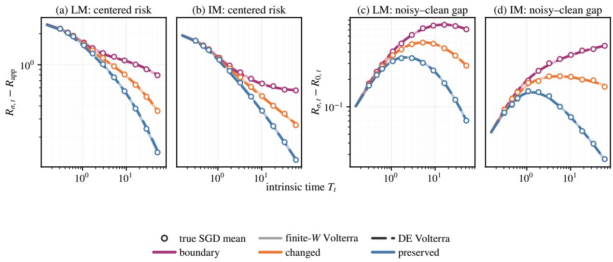  
Figure 7: Online SGD, the exact finite-width recursion, and its DE reduction for centered risk and the noisy–clean gap in long and integrable memory. Their agreement supports both approximation steps and the predicted boundary, changed, and preserved schedule responses.

continuum order is

$$
\int _ { 0 } ^ { T _ { t } } \frac { 1 } { r ( u ) } \left( 1 + T _ { t } - u \right) ^ { - 2 + 1 / ( 2 \alpha ) } \left[ \mathcal { F } ( u , m ) + \sigma ^ { 2 } \right] \mathrm { d } u ,\tag{C.38}
$$

with finite-bulk analogue $\begin{array} { r } { \int _ { 0 } ^ { T _ { t } } r ( u ) ^ { - 1 } } \end{array}$ du. It also records exact sample count:

$$
D _ { t } : = \sum _ { s < t } B _ { s } = \sum _ { s < t } r _ { s } \Delta T _ { s } = \int _ { 0 } ^ { T _ { t } } r ( u ) \mathrm { d } u .\tag{C.39}
$$

Use $\mathbf { f } \asymp m D _ { t }$ as the FLOP proxy.

Setting

$$
\boldsymbol { B } _ { s } \equiv \boldsymbol { B }\tag{C.40}
$$

gives $\begin{array} { r } { T _ { t } = \sum _ { u < t } \eta _ { u } , r _ { s } = B / \eta _ { s } , } \end{array}$ , and $\Delta T _ { s } / r _ { s } = \eta _ { s } ^ { 2 } / B$ , recovering every fixed-B risk formula.

The identities $\eta _ { s } ^ { 2 } / B _ { s } ~ = ~ \Delta T _ { s } / r _ { s }$ and $B _ { s } ~ = ~ r _ { s } \Delta T _ { s }$ are algebraic. Bounded-mesh endpoint quadrature, and its vanishing-mesh strengthening, prove respectively the comparison and convergence in Eq. (C.38); summing the second identity proves Eq. (C.39). Under Eq. (C.40), $q _ { s } ( z ) = 1 - 2 \eta _ { s } z +$ $( 1 + 1 / B ) \eta _ { s } ^ { 2 } z ^ { 2 }$ and $\Delta T _ { s } / r _ { s } = \eta _ { s } ^ { 2 } / B$ recover every fixed-B coeficient.

Fix terminal horizon $T : = T _ { t }$ and budget $D : = D _ { t }$ . For every LM or IM branch of Theorem C.14, define the surviving injection weight

$$
w _ { T , m } ( u ) : = \left( 1 + T - u \right) ^ { - 2 + 1 / ( 2 \alpha ) } \left[ { \mathcal { F } } ( u , m ) + \sigma ^ { 2 } \right] , \qquad 0 \le u \le T .\tag{C.41}
$$

The schedule-dependent loss and its budget constraint are then

$$
\mathcal { I } _ { T , m } ( r ) : = \int _ { 0 } ^ { T } \frac { w _ { T , m } ( u ) } { r ( u ) } \mathrm { d } u , \qquad \int _ { 0 } ^ { T } r ( u ) \mathrm { d } u = D .\tag{C.42}
$$

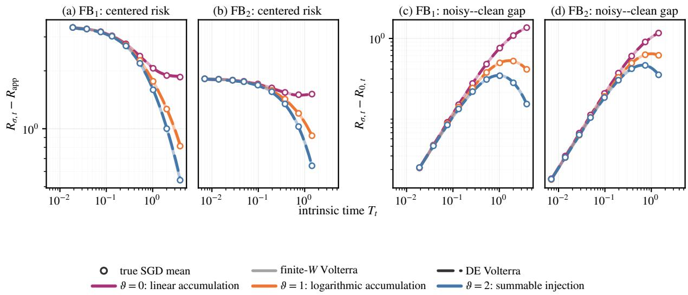  
Figure 8: Online SGD, the exact finite-width recursion, and its DE reduction for the three injection responses in $\mathrm { F B _ { 1 } }$ and $\mathrm { F B _ { 2 } }$ . Their agreement supports the finite-bulk Volterra hierarchy and accumulation laws.

The optimizer is proportional to $\sqrt { w _ { T , m } } .$ , allocating more samples where the weighted noise contribution to the terminal risk is larger; see Theorem C.22. For the box-constrained form, use $\mathrm { c l i p } ( x , a , b ) : = \operatorname* { m i n } \{ b , \operatorname* { m a x } \{ a , x \} \}$

Theorem C.22 (Fixed-horizon continuum ratio control). Suppose $w _ { T , m }$ is integrable and positive almost everywhere and $\begin{array} { r } { 0 < \int _ { 0 } ^ { T } \sqrt { w _ { T , m } ( u ) } } \end{array}$ du < ∞. Among positive controls satisfying the data constraint in Eq. (C.42), the unique minimizer up to null sets and its minimum value are

$$
r _ { T } ^ { \star } ( u ) = \frac { D \sqrt { w _ { T , m } ( u ) } } { \displaystyle \int _ { 0 } ^ { T } \sqrt { w _ { T , m } ( v ) } \mathrm { d } v } , \qquad \operatorname* { m i n } _ { r } \mathcal { I } _ { T , m } ( r ) = \frac { 1 } { D } \left( \int _ { 0 } ^ { T } \sqrt { w _ { T , m } ( u ) } \mathrm { d } u \right) ^ { 2 } .\tag{C.43}
$$

With pointwise bounds $0 < r _ { - } < r _ { + } < \infty$ , the admissible set is nonempty exactly when $r _ { - } T \le$ $D \leq r _ { + } T . { \mathrm { ~ A t ~ } } D = r _ { \pm } T$ , the unique feasible control is $r _ { T } ^ { \star } \equiv r _ { \pm }$ . Under strict feasibility the unique control is

$$
r _ { T } ^ { \star } ( u ) = \mathrm { c l i p } \left( \sqrt { \frac { w _ { T , m } ( u ) } { \mu } } , r _ { - } , r _ { + } \right) , \qquad \int _ { 0 } ^ { T } r _ { T } ^ { \star } ( u ) \mathrm { d } u = D ,\tag{C.44}
$$

for a multiplier $\mu > 0$ chosen to satisfy the data constraint.

Proof of Theorem C.22. Write $w = w _ { T , m }$ . For every positive control with $\begin{array} { r } { \int _ { 0 } ^ { T } r = D } \end{array}$ , Cauchy– Schwarz gives

$$
\mathcal { I } _ { T , m } ( r ) D = \left( \int _ { 0 } ^ { T } \frac { w ( u ) } { r ( u ) } \mathrm { d } u \right) \left( \int _ { 0 } ^ { T } r ( u ) \mathrm { d } u \right) \geq \left( \int _ { 0 } ^ { T } \sqrt { w ( u ) } \mathrm { d } u \right) ^ { 2 } .
$$

Equality gives Eq. (C.43); strict convexity of $x \mapsto w ( u ) / x$ almost everywhere gives uniqueness up to null sets.

For the bounded problem, $r _ { - } T \le D \le r _ { + } T$ is necessary by integration and suficient by $r \equiv D / T$ A multiplier $\mu > 0$ solves

$$
\int _ { 0 } ^ { T } \mathrm { d i p } \left( \sqrt { \frac { w ( u ) } { \mu } } , r _ { - } , r _ { + } \right) \mathrm { d } u = D .
$$

Its left side is continuous and nonincreasing from $r _ { + } T$ to $r \_ T$ , so strict feasibility gives a solution. The clipped control in Eq. (C.44) pointwise minimizes $w ( u ) / x + \mu x$ on $[ r _ { - } , r _ { + } ]$ , whence

$$
\frac { w ( u ) } { r ( u ) } + \mu r ( u ) \geq \frac { w ( u ) } { r _ { T } ^ { \star } ( u ) } + \mu r _ { T } ^ { \star } ( u ) .
$$

Integration cancels the resource terms, proving global optimality, while strict convexity gives primal uniqueness; at either resource endpoint the box constraint forces the stated constant control. The multiplier is unique exactly when its resource equation is. Its left side is strictly decreasing through a solution if the free set

$$
\left\{ u : r _ { - } < \sqrt { w ( u ) / \mu } < r _ { + } \right\}
$$

has positive measure; otherwise it may have a plateau despite primal uniqueness.

Because $\sqrt { { \mathcal F } ( u , m ) + \sigma ^ { 2 } }$ accounts for clean and label noise, the full optimizer need not be monotone. When fixed nonzero label noise leads, it reduces to

$$
r _ { T } ^ { \star } ( u ) = \mathrm { c l i p } \left( c ( 1 + T - u ) ^ { - 1 + 1 / ( 4 \alpha ) } , r _ { - } , r _ { + } \right) ,\tag{C.45}
$$

where c enforces the data constraint. In $\mathrm { F B _ { 1 , 2 } }$ , instead,

$$
\sigma ^ { 2 } m ^ { 1 - 4 \alpha } \int _ { 0 } ^ { T } \frac { \mathrm { d } u } { r ( u ) } , \qquad r _ { T } ^ { \star } ( u ) \equiv \frac { D } { T } ,\tag{C.46}
$$

when feasible, with the same $\mathrm { F B _ { 1 , 2 } }$ proved-source and high-source qualifications stated above.

Two continuum schedule realizations. The positive optimizer fixes $r ,$ not its learningrate/batch factorization. Let τ denote continuum iteration time, so d $u / \mathrm { d } \tau = \eta ( \tau )$ and $r ( u ( \tau ) ) =$ $B ( \tau ) / \eta ( \tau )$ . For a fixed learning rate $\eta _ { 0 }$ , set

$$
\eta ( \tau ) \equiv \eta _ { 0 } , \qquad u ( \tau ) = \eta _ { 0 } \tau , \qquad B ( \tau ) = \eta _ { 0 } r _ { T } ^ { \star } ( \eta _ { 0 } \tau ) , \qquad 0 \le \tau \le \frac { T } { \eta _ { 0 } } .\tag{C.47}
$$

This is the fixed-learning-rate realization of Wang et al. (2026). For a fixed continuum batch $B _ { 0 } > 0$ let $u ( 0 ) = 0$ solve

$$
\frac { \mathrm { d } u } { \mathrm { d } \tau } = \frac { B _ { 0 } } { r _ { T } ^ { \star } ( u ( \tau ) ) } , \qquad B ( \tau ) \equiv B _ { 0 } , \qquad \eta ( \tau ) = \frac { B _ { 0 } } { r _ { T } ^ { \star } ( u ( \tau ) ) } , \qquad 0 \le \tau \le \frac { D } { B _ { 0 } } .\tag{C.48}
$$

Both forms process D samples and reach intrinsic time $T ;$ the second is the fixed-batch realization of Bordelon and Mori (2026). If, on an unclipped terminal segment,

$$
r _ { T } ^ { \star } ( u ) = c ( 1 + T - u ) ^ { - 1 + 1 / ( 4 \alpha ) } ,
$$

then its fixed-batch realization on the corresponding terminal iteration-time segment is

$$
\eta ( \tau ) = \frac { B _ { 0 } } { c } \left[ 1 + \frac { D - B _ { 0 } \tau } { 4 \alpha c } \right] ^ { 4 \alpha - 1 } .\tag{C.49}
$$

Thus the intrinsic square-root profile becomes iteration-time decay of exponent $4 \alpha - 1$ , while clipping becomes learning-rate or batch plateaus. With $p = 2 \alpha + 2 \beta - 1$ , the corresponding terminal-decay, peak, risk, and source exponents are, respectively,

$$
4 \alpha - 1 , \qquad { \frac { \beta } { \alpha + \beta } } , \qquad { \frac { p } { p + 1 } } , \qquad { \frac { p } { 2 \alpha } } .\tag{C.50}
$$

When fixed label noise leads, Eq. (C.45) coincides, after reparameterization by intrinsic time, with the joint learning-rate–batch-size optimizer of Bordelon and Mori (2026). Thus, when fixed label noise leads, the $\beta > 0$ branch recovers the power-decay shape and the peak and risk exponents of Bordelon and Mori (2026) and Li et al. (2026a). For $\beta < 0$ , lower-ratio clipping becomes a maximum-learning-rate plateau followed by the same terminal power decay, recovering their WSD structure and hard-branch risk exponent. The easy–hard boundary is $\beta = 0$ . These comparisons are theorem-level only in the trace-class regime $\alpha > 1 / 2$ , away from the excluded boundary; below trace class the correspondence is algebraic. The constant-learning-rate factorization similarly matches Wang et al. (2026). Related work optimizes batch given learning rate (Li et al., 2026b) or proves their finite-sample equivalence (Meterez et al., 2026a); here ratio optimization follows after the spectral forcing and memory asymptotics of Theorem A.4.

From continuum control to integer SGD. Here admissible means the full class of Definition D2, with common constants fixed as budgets grow and no finite upper ratio cap in the scaling infima. Equal-sample quantiles discretize the continuum profile, using $B _ { s } \equiv 1$ for every upper bound. Let $\mathcal { R } _ { \sigma } ^ { \star } ( D )$ be the terminal DE-risk infimum subject to $\textstyle \sum _ { s < t } B _ { s } \leq D$ , and define $\mathcal { R } _ { \sigma } ^ { \star } ( \mathfrak { f } )$ analogously under $\begin{array} { r } { m \sum _ { s < t } B _ { s } \le \mathfrak { f } . } \end{array}$ . Integer realization loses no exponent and no admissible schedule improves the orders, as proved below.

Proof of the phasewise optimal rates. We now prove Theorem 5.2 and the rates summarized in Table 1. The propagation subregime fixes the clean-risk and memory scalings, the ratio path r allocates stochastic error, and the resource constraint determines the trade-of between width and data. Equal-sample quantiles yield admissible integer realizations with $B _ { s } \equiv 1$ , and the lower objectives below show that no admissible schedule improves the displayed orders.

At $\alpha = 1$ , the two $\operatorname { I M } _ { 2 , 3 }$ feature-compute expressions agree at $\mathsf { f } ^ { - 1 / 2 }$ . For $\alpha > 1$ , the optimizer reaches $T \asymp m ^ { 2 \alpha }$ , which is a source-window saturation rather than a new propagation regime. The lower-ratio floor is active in $\mathrm { I M } _ { 1 }$ when $\beta < 0 . { \mathrm { ~ A t ~ } } \beta = 0$ , the neighboring exponents agree, although the open-branch statements exclude the crossover. The high-source $\mathrm { F B _ { 2 } }$ rate retains the conditional qualification in Theorems C.19 and C.20.

The subregime fixes the clean-risk and memory scalings, r allocates noise, and the compute budget determines the trade-of between width and data. Unit-batch schedules attain every proved order. At $\alpha = 1$ , the two $\operatorname { I M } _ { 2 , 3 }$ compute expressions agree at $\mathsf { f } ^ { - 1 / 2 }$ . For $\alpha > 1$ , the optimizer reaches $T \asymp m ^ { 2 \alpha }$ , a source-window saturation rather than a new subregime. The lower-ratio floor is active in $\mathrm { I M } _ { 1 }$ for $\beta < 0 ;$ at fixed data its $\beta > 0$ and $\beta < 0$ branches have peaks

$$
D ^ { 1 - \frac { 1 } { 2 ( p + 1 ) } } \quad \mathrm { a n d } \quad D ^ { \frac { 1 } { 2 } ( 1 + p / ( 2 \alpha ) ) } ,
$$

respectively, so any cap must exceed the relevant order. At $\beta = 0$ the neighboring exponents agree, but open-branch statements exclude the crossover.

We now prove Theorem 5.2 and the consequences in Section C.9: specialize the continuum solution, realize its profiles with integer $B _ { s } = 1$ schedules, and match the DE lower objectives under data and FLOP budgets.

Subregime profiles. Substitution of $\operatorname { E q . }$ (C.41) into the square-root optimizer gives, on the LM and IM branches,

$$
r _ { T } ^ { \star } ( u ) \propto ( 1 + T - u ) ^ { - 1 + 1 / ( 4 \alpha ) } \sqrt { \mathcal { F } ( u , m ) + \sigma ^ { 2 } } .
$$

Its fixed nonzero label-noise component yields Eq. (C.45). In $\mathrm { F B _ { 1 } }$ and $\mathrm { F B _ { 2 } }$

$$
\left( \int _ { 0 } ^ { T } { \frac { \mathrm { d } u } { r ( u ) } } \right) \left( \int _ { 0 } ^ { T } r ( u ) \mathrm { d } u \right) \geq T ^ { 2 }
$$

instead gives the constant optimizer Eq. (C.46).

The next lemma turns the required ratio profiles into genuine SGD schedules; it is also the achievability step in Theorem 5.2.

For integers $D \geq 1$ , a horizon $T > 0$ , and $\alpha > 1 / 4$ , define

$$
I _ { \alpha } ( T ) : = \int _ { 0 } ^ { T } ( 1 + T - u ) ^ { - 1 + 1 / ( 4 \alpha ) } \mathrm { d } u , \qquad { \bar { r } } ( u ) : = { \frac { D } { I _ { \alpha } ( T ) } } ( 1 + T - u ) ^ { - 1 + 1 / ( 4 \alpha ) } .
$$

Let $0 = u _ { 0 } < \cdot \cdot \cdot < u _ { D } = T$ be the data-quantile partition determined by $\begin{array} { r } { \int _ { 0 } ^ { u _ { s } } \bar { r } ( v ) \mathrm { d } v = s . } \end{array}$ and set $B _ { s } : = 1$ and $\eta _ { s } : = u _ { s + 1 } - u _ { s }$

Lemma C.23 (Integer realization of the subregime optimizers). Let $D \to \infty$ through integers and let $T \to \infty$ with $T / D \lesssim 1$ . Fix $\alpha > 0 , \alpha \neq 1 / 4$ . For $\alpha > 1 / 4$ , the preceding deterministic integer-batch schedule uses exactly D samples, reaches intrinsic time $T ,$ , and satisfies

$$
\sum _ { s < D } \eta _ { s } ^ { 2 } \bigl ( 1 + T - u _ { s + 1 } \bigr ) ^ { - 2 + 1 / ( 2 \alpha ) } \asymp \frac { T ^ { 1 / ( 2 \alpha ) } } { D } .
$$

For $1 / 4 < \alpha < 1 / 2$ , the same order is attained by the simpler constant choice $B _ { s } = 1 , \eta _ { s } = T / D$ For $0 < \alpha < 1 / 4$ , that constant choice satisfies $\textstyle \sum _ { s < D } \eta _ { s } ^ { 2 } = T ^ { 2 } / D$

In the $\beta < 0$ branch of subregime $\mathrm { I M } _ { 1 }$ , there is a horizon $T \asymp D$ and an admissible unit-batch schedule for which

$$
\sum _ { s < D } \eta _ { s } ^ { 2 } \big ( 1 + T - u _ { s + 1 } \big ) ^ { - 2 + 1 / ( 2 \alpha ) } = o \Big ( D ^ { - p / ( 2 \alpha ) } \Big ) .
$$

These schedules satisfy the peak and bounded-batch conditions at the subregime-wise horizons and widths used in the resource bounds.

Proof. Assume first $\alpha > 1 / 4$ . The data-quantile definition gives

$$
\sum _ { s < D } B _ { s } = D , \qquad \sum _ { s < D } \eta _ { s } = T , \qquad { \frac { 1 } { \eta _ { s } } } = { \frac { 1 } { u _ { s + 1 } - u _ { s } } } \int _ { u _ { s } } ^ { u _ { s + 1 } } { \bar { r } } ( v ) \mathrm { d } v .
$$

Thus the discrete ratio $B _ { s } / \eta _ { s }$ is the cell average of $^ { \bar { r } } .$ Moreover, in $\mathrm { f } _ { u } { \bar { r } } ( u ) \asymp D / T$ , so $\eta _ { s } \lesssim T / D$ The shifted powers $\bar { r } ( u )$ and $( 1 + T - u ) ^ { - 2 + 1 / ( 2 \alpha ) }$ vary by only constant factors on each unit-data cell. Consequently the discrete injection sum is comparable to

$$
\int _ { 0 } ^ { T } \frac { ( 1 + T - u ) ^ { - 2 + 1 / ( 2 \alpha ) } } { \bar { r } ( u ) } \mathrm { d } u \asymp \frac { I _ { \alpha } ( T ) ^ { 2 } } { D } \asymp \frac { T ^ { 1 / ( 2 \alpha ) } } { D } .
$$

For a constant st $\mathrm { e p , }$ direct summation gives the same long-memory order when $1 / 4 < \alpha < 1 / 2$

If $0 < \alpha < 1 / 4$ , take $B _ { s } = 1$ and $\eta _ { s } = T / D$ directly. Then

$$
\sum _ { s < D } B _ { s } = D , \qquad \sum _ { s < D } \eta _ { s } = T , \qquad \sum _ { s < D } \eta _ { s } ^ { 2 } = \frac { T ^ { 2 } } { D } ,
$$

which proves the finite-bulk assertion.

For the $\beta < 0$ branch of subregime $\mathrm { I M } _ { 1 }$ , put

$$
s _ { 0 } : = \frac { p } { 2 \alpha } , \qquad h : = 1 - \frac { 1 } { 2 \alpha } , \qquad L : = D ^ { ( 1 + s _ { 0 } ) / ( 1 + h ) } ,
$$

choose a suficiently large fixed $r _ { 0 }$ , and set

$$
\bar { r } ( u ) : = r _ { 0 } \operatorname* { m a x } \left\{ 1 , \left( \frac { 1 + L } { 1 + T - u } \right) ^ { 1 - 1 / ( 4 \alpha ) } \right\} , \qquad \int _ { 0 } ^ { T } \bar { r } ( u ) \mathrm { d } u = D .
$$

Then $T \asymp D$ , and the same quantile construction has

$$
\sum _ { s < D } \eta _ { s } ^ { 2 } \big ( 1 + T - u _ { s + 1 } \big ) ^ { - 2 + 1 / ( 2 \alpha ) } \lesssim L ^ { - h } = o \Big ( D ^ { - p / ( 2 \alpha ) } \Big ) ,
$$

because $s _ { 0 } < h$ and $h ( 1 + s _ { 0 } ) / ( 1 + h ) > s _ { 0 }$ . Here $\eta _ { s } \leq 1 / r _ { 0 }$ , so the clipped profile and shifted kernel are uniformly comparable on every cell; hence the continuum $L ^ { - h }$ bound transfers to the displayed discrete sum. Finally, $B _ { s } \equiv 1$ supplies the bounded-batch propagation alternative.

It remains to check admissibility at these scales. Put $x = T ^ { 1 / ( 2 \alpha ) }$ . The largest step is $O ( T / D )$ 2 except that the $\beta < 0 ~ \mathrm { { I M } _ { 1 } }$ construction directly has $\eta _ { s } \leq 1 / r _ { 0 }$ . We have $x \asymp m$ in both $\mathrm { I M } _ { 1 }$ branches, $\mathrm { F B _ { 1 } , L M _ { 1 } , L M _ { 2 } }$ , and the $\alpha > 1$ source-saturated $\mathrm { I M _ { 2 } \mathrm { - I M _ { 3 } } }$ branch; whereas $x / m  0$ in $\mathrm { F B _ { 2 } , L M _ { 3 } , }$ , and the $1 / 2 < \alpha \leq 1$ interior $\mathrm { I M _ { 2 } \mathrm { - I M _ { 3 } } }$ branch. Thus every source window holds, strictly in $\mathrm { F B _ { 2 } }$ because $p > 2 \alpha$ . For $\alpha < 1 / 2$ , the $\mathrm { F B _ { 1 } , L M _ { 1 } , L M _ { 2 } }$ choices satisfy

$$
\frac { T / D } { m ^ { 2 \alpha - 1 } } \asymp x ^ { - p } \longrightarrow 0 ,
$$

while the corresponding ratios in $\mathrm { F B _ { 2 } }$ and $\mathrm { L M _ { 3 } }$ are $x ^ { - 2 \alpha }  0$ and vanish by the defining inequalities, respectively. Since the normalized peak tends to zero, the peak condition holds for all suficiently large widths. The row-mass certificate Eq. (C.10) for $\alpha > 1 / 2$ and Theorem C.13 below trace class

give the Volterra margin; the strict $\mathrm { F B _ { 2 } }$ window has vanishing row mass. Rounding $m , D$ changes only fixed factors. □

Two continuum schedule parameterizations. For fixed learning rate, $u ( \tau ) = \eta _ { 0 } \tau$ and $B ( \tau ) =$ $\eta _ { 0 } r _ { T } ^ { \star } ( \eta _ { 0 } \tau )$ , so

$$
\int _ { 0 } ^ { T / \eta _ { 0 } } B ( \tau ) \mathrm { d } \tau = \int _ { 0 } ^ { T } r _ { T } ^ { \star } ( u ) \mathrm { d } u = D .
$$

This proves Eq. (C.47). For fixed batch, Eq. (C.48) gives $\mathrm { d } \tau / \mathrm { d } u = r _ { T } ^ { \star } ( u ) / B _ { 0 }$ . Hence the terminal iteration time is $D / B _ { 0 }$ , and $\begin{array} { r } { \int _ { 0 } ^ { D / B _ { 0 } } B _ { 0 } \mathrm { d } \tau = D } \end{array}$

On a terminal, subsequently unclipped segment with $r _ { T } ^ { \star } ( u ) = c ( 1 + T - u ) ^ { - 1 + 1 / ( 4 \alpha ) }$ , put $x = T - u$ Throughout its constant-batch-size time coordinate,

$$
\frac { D } { B _ { 0 } } - \tau = \frac { 1 } { B _ { 0 } } \int _ { u } ^ { T } r _ { T } ^ { \star } ( v ) \mathrm { d } v = \frac { 4 \alpha c } { B _ { 0 } } \left[ ( 1 + x ) ^ { 1 / ( 4 \alpha ) } - 1 \right] .
$$

Solving for x and substituting into ${ \eta = B _ { 0 } / r _ { T } ^ { \star } }$ gives Eq. (C.49) with decay exponent $4 \alpha - 1$ . In other clipped configurations we assert only the plateau correspondence: lower/upper ratio clipping becomes maximum/minimum learning-rate plateaus in the constant-batch-size parameterization and minimum/maximum batch plateaus in the constant-learning-rate parameterization. Direct substitution gives Eq. (C.50). In the external conventions, the spectral parameter is $2 \alpha .$ the source parameter of Li et al. (2026a) is $p / ( 2 \alpha )$ , and the target-decay parameter of Bordelon and Mori (2026) is $p + 1$ . Hence their decay, peak, and risk exponents match the displayed native exponents, while both trace-class conditions reduce to $\alpha > 1 / 2$

Matching lower bounds. Let $\begin{array} { r } { D _ { t } : = \sum _ { s < t } B _ { s } \leq D } \end{array}$ . Positivity of the DE Volterra recursion and Eq. (C.29) give, for $\alpha > 1 / 4$

$$
\mathcal { R } _ { \sigma , t } \gtrsim \Phi _ { \alpha , \beta } ( T , m ) + \sigma ^ { 2 } \sum _ { s < t } \frac { \eta _ { s } ^ { 2 } } { B _ { s } } \big ( 1 + T - T _ { s + 1 } \big ) ^ { - 2 + 1 / ( 2 \alpha ) } .
$$

Discrete Cauchy–Schwarz and the right Riemann sum imply

$$
\begin{array} { r l } & { D _ { t } \displaystyle { \sum _ { s < t } \frac { \eta _ { s } ^ { 2 } } { B _ { s } } \big ( 1 + T - T _ { s + 1 } \big ) ^ { - 2 + 1 / ( 2 \alpha ) } \geq \left[ \sum _ { s < t } \eta _ { s } \big ( 1 + T - T _ { s + 1 } \big ) ^ { - 1 + 1 / ( 4 \alpha ) } \right] ^ { 2 } } } \\ & { \qquad \gtrsim T ^ { 1 / ( 2 \alpha ) } . } \end{array}
$$

For $0 < \alpha < 1 / 4$ , the target-free gap bound in Theorem C.17, together with the proved forcing comparison when $p > 0 , \beta < 1 + 2 \alpha$ , and the parameters are of the critical lines, instead gives

$$
\mathcal { R } _ { \sigma , t } \gtrsim \Phi _ { \alpha , \beta } ( T , m ) + \sigma ^ { 2 } m ^ { 1 - 4 \alpha } \sum _ { s < t } \frac { \eta _ { s } ^ { 2 } } { B _ { s } } \gtrsim \Phi _ { \alpha , \beta } ( T , m ) + \sigma ^ { 2 } m ^ { 1 - 4 \alpha } \frac { T ^ { 2 } } { D } .
$$

These bounds use the integer sample count, not a continuum factorization. In the $\beta < 0$ branch of subregime $\mathrm { I M } _ { 1 }$ , the lower ratio floor also gives $T \lesssim D$

For compactness put $x : = T ^ { 1 / ( 2 \alpha ) }$ , so that the source window is $x \lesssim m$ . Ignoring fixed constants,

the preceding inequalities give the following lower objectives:

$$
\begin{array} { r l r l } & { m ^ { - p } + x ^ { - p } + x / D } & & { \mathrm { i n ~ s u b r e g i m e s ~ L M _ 1 , L M _ 2 , a n d ~ I M _ 1 , } } \\ & { m ^ { - 2 \alpha } + x ^ { - p } + x / D } & & { \mathrm { i n ~ s u b r e g i m e ~ L M _ 3 , } } \\ & { m ^ { - 2 \alpha } + x ^ { - p } + m ^ { - 1 } x ^ { - ( 2 \alpha - 1 ) } + x / D } & & { \mathrm { i n ~ s u b r e g i m e s ~ I M _ 2 ~ a n d ~ I M _ 3 , } } \\ & { m ^ { - p } + x ^ { - p } + m ^ { 1 - 4 \alpha } x ^ { 4 \alpha } / D } & & { \mathrm { i n ~ s u b r e g i m e ~ F B _ 1 , } } \\ & { m ^ { - 2 \alpha } + x ^ { - p } + m ^ { 1 - 4 \alpha } x ^ { 4 \alpha } / D } & & { \mathrm { i n ~ s u b r e g i m e ~ F B _ 2 . } } \end{array}
$$

The only compute balance that changes inside the IM region is the following one. We isolate it here because both the unrestricted schedule problem and the fixed-batch schedule comparison use the same four terms.

Lemma C.24 (Joint $\mathrm { I M } _ { 2 } .$ –IM3 compute balance). Let $\alpha > 1 / 2 , \beta > 1 / 2 , p = 2 \alpha + 2 \beta - 1$ , and $F \to \infty$ . Then

$$
\operatorname* { i n f } _ { 1 \leqslant x \leqslant m } \left\{ x ^ { - p } + m ^ { - 2 \alpha } + m ^ { - 1 } x ^ { - ( 2 \alpha - 1 ) } + { \frac { m x } { F } } \right\} \asymp \left\{ { \begin{array} { l l } { F ^ { - p / ( 1 + p + 2 \beta ) } , } & { 1 / 2 < \alpha \leq 1 , } \\ { F ^ { - \alpha / ( 1 + \alpha ) } , } & { \alpha > 1 . } \end{array} } \right.
$$

For $1 / 2 < \alpha \leq 1$ , one attaining choice is

$$
x \asymp F ^ { 1 / ( 1 + p + 2 \beta ) } , \qquad m \asymp x ^ { 2 \beta } .
$$

For $\alpha > 1$ , the optimum reaches the source endpoint:

$$
x \asymp m \asymp F ^ { 1 / [ 2 ( 1 + \alpha ) ] } .
$$

At $\alpha = 1$ , the rate is $F ^ { - 1 / 2 }$ , but the allocation is not unique: every choice satisfying

$$
m x \asymp F ^ { 1 / 2 } , \qquad F ^ { 1 / ( 2 p ) } \lesssim x \lesssim F ^ { 1 / 4 }
$$

has the same order.

Proof. For $1 / 2 < \alpha \leq 1$ , apply weighted AM–GM to the forcing, label-noise, and feature-distortion terms with weights

$$
{ \frac { 2 ( 1 - \alpha ) } { 1 + p + 2 \beta } } , \qquad { \frac { p } { 1 + p + 2 \beta } } , \qquad { \frac { p } { 1 + p + 2 \beta } } .
$$

They are nonnegative, sum to one, and their weighted product is $F ^ { - p / ( 1 + p + 2 \beta ) }$ . At the displayed choice of x and m, those three terms match. Moreover, $4 \alpha \beta - p = ( 2 \alpha - 1 ) ( 2 \beta - 1 ) > 0$ , so the width floor is lower order, and $x \lesssim m$

For $\alpha > 1$ , use instead the label-noise, feature-distortion, and width-floor weights

$$
{ \frac { \alpha } { 1 + \alpha } } , \qquad { \frac { \alpha } { ( 2 \alpha - 1 ) ( 1 + \alpha ) } } , \qquad { \frac { \alpha - 1 } { ( 2 \alpha - 1 ) ( 1 + \alpha ) } } .
$$

Their weighted product is $F ^ { - \alpha / ( 1 + \alpha ) }$ . Taking $x \asymp m \asymp F ^ { 1 / [ 2 ( 1 + \alpha ) ] }$ matches these three terms, while $p > 2$ α makes $x ^ { - p }$ lower order. When $\alpha = 1$ , direct substitution gives the stated family of attaining allocations. □

Attaining scales. Because $\sigma ^ { 2 } > 0$ is fixed and the clean forcing is bounded, the upper FSL has the same order as these label-noise objectives for the schedules in Theorem C.23. At fixed data, the matching choices are

$$
\begin{array} { r l } { { \mathrm { ( I M _ { 1 } , ~ } \beta < 0 \mathrm { ) : } } } & { { m \times D ^ { 1 / ( 2 \alpha ) } , } } \\ { { \mathrm { ( I M _ { 1 } , ~ } \beta > 0 \mathrm { ) , ~ F B _ { 1 } , ~ L M _ { 1 } , ~ L M _ { 2 } : } } } & { { m \times D ^ { 1 / ( 1 + p ) } , \qquad T \times D ^ { 2 \alpha / ( 1 + p ) } ; } } \\ { { \mathrm { ( I M _ { 1 } , ~ } \beta > 0 \mathrm { ) , ~ F B _ { 1 } , ~ L M _ { 1 } , ~ L M _ { 2 } : } } } & { { m \times D ^ { \frac { p } { p ( 1 - 2 \alpha ) + 8 \alpha ^ { 2 } } } , \quad T \times D ^ { \frac { 4 \alpha ^ { 2 } } { p ( 1 - 2 \alpha ) + 8 \alpha ^ { 2 } } } ; } } \\ { { \mathrm { L R _ { 2 } : } } } & { { m \times D ^ { \frac { p } { 2 \alpha ( 1 + p ) } } , \qquad T \times D ^ { 2 \alpha / ( 1 + p ) } ; } } \\ { { \mathrm { L M _ { 2 } , ~ I M _ { 3 } : } } } & { { m \times D ^ { 2 \beta / ( 1 + p ) } , \qquad T \times D ^ { 2 \alpha / ( 1 + p ) } . } } \end{array}
$$

The first uses the plateau–ramp construction; the second and last use the data-quantile square-root schedule in IM, while all listed FB and LM cases use the constant $B _ { s } = 1$ construction. Direct substitution gives the fixed-data column of Table 1.

On $m D \ \leq \ { \mathfrak { f } } .$ , the matching choices for, respectively, $\left( \mathrm { I M } _ { 1 } , \beta \ < \ 0 \right)$ ; the shared $( \operatorname { I M } _ { 1 } , \beta \ >$ $0 ) , \mathrm { F B _ { 1 } , L M _ { 1 } , L M _ { 2 } }$ class; $\mathrm { F B _ { 2 } ; }$ and $\mathrm { L M _ { 3 } }$ , are

$$
\begin{array} { l l l } { m \asymp \mathfrak { f } ^ { 1 / ( 1 + 2 \alpha ) } , } & { D \asymp \mathfrak { f } ^ { 2 \alpha / ( 1 + 2 \alpha ) } , } & { T \asymp D ; } \\ { m \asymp \mathfrak { f } ^ { 1 / ( 2 + p ) } , } & { D \asymp \mathfrak { f } ^ { ( 1 + p ) / ( 2 + p ) } , } & { T \asymp \mathfrak { f } ^ { 2 \alpha / ( 2 + p ) } ; } \\ { m \asymp \mathfrak { f } ^ { \frac { p } { p ( 2 - 2 \alpha ) + 8 \alpha ^ { 2 } } } , } & { D \asymp \mathfrak { f } ^ { \frac { p ( 1 - 2 \alpha ) + 8 \alpha ^ { 2 } } { p ( 2 - 2 \alpha ) + 8 \alpha ^ { 2 } } } , } & { T \asymp \mathfrak { f } ^ { \frac { 4 \alpha ^ { 2 } } { p ( 2 - 2 \alpha ) + 8 \alpha ^ { 2 } } } ; } \\ { m \asymp \mathfrak { f } ^ { \frac { p } { p + 2 \alpha ( 1 + p ) } } , } & { D \asymp \mathfrak { f } ^ { \frac { 2 \alpha ( 1 + p ) } { p + 2 \alpha ( 1 + p ) } } , } & { T \asymp \mathfrak { f } ^ { \frac { 4 \alpha ^ { 2 } } { p + 2 \alpha ( 1 + p ) } } . } \end{array}
$$

Balancing proves the corresponding table entries. Indeed, $x \lesssim m$ and $1 - 4 \alpha > 0$ lower-bound the $\mathrm { F B _ { 1 } }$ noise by $x / D _ { \mathrm { : } }$ , explaining its shared rate, while $p > 2 c$ makes the $\mathrm { F B _ { 2 } }$ source window strict. If $\varepsilon$ bounds all three $\mathrm { F B _ { 2 } }$ terms, then m $\gtrsim \varepsilon ^ { - 1 / ( 2 \alpha ) }$ and $x \gtrsim \varepsilon ^ { - 1 / p } ;$ substitution into the noise term gives

$$
\varepsilon \gtrsim D ^ { - \frac { 2 \alpha p } { p ( 1 - 2 \alpha ) + 8 \alpha ^ { 2 } } } \quad \mathrm { o r } \quad \varepsilon \gtrsim \mathfrak { f } ^ { - \frac { 2 \alpha p } { p ( 2 - 2 \alpha ) + 8 \alpha ^ { 2 } } } ,
$$

under the data and compute budgets, respectively.

For $\mathrm { I M _ { 2 } }$ and $\mathrm { I M _ { 3 } }$ , apply Theorem C.24 with $F = \mathfrak { f }$ . Together with $D = \mathfrak { f } / m$ and $T = x ^ { 2 \alpha }$ , its two attaining choices give exactly the two compute branches in Table 1. Both use the data-quantile $B _ { s } = 1$ schedule from Theorem $\mathrm { C . 2 3 ; }$ at $\alpha = 1$ the rates agree at $\mathsf { f } ^ { - 1 / 2 }$ , with no forced logarithmic correction and no unique width allocation.

All upper constructions have $B _ { s } \equiv 1$ , so batch integrality and the bounded-batch propagation alternative are exact; rounding $m , D$ preserves orders. The uniform FSL, these lower bounds, and Theorem C.23 prove Theorem 5.2 and Table 1 over the fixed admissible class and the stated source range. The high-source $\mathrm { F B _ { 2 } }$ continuation separately invokes Theorem C.19.

## D Sharp transfer for regularly varying joint schedules

This appendix gives the full regular-variation version of the schedule results stated in the main text. Appendix D.1 converts the low-spectrum tail into a two-time memory kernel. Appendix D.2 uses examples and counterexamples to show what the spectral, uniformity, and stability assumptions permit and exclude. Appendix D.3 derives the noisy–clean response in long memory, including the efect of feedback, while Appendix D.4 treats the two endpoint contributions that arise under integrable memory. Appendix D.5 proves the converse that recovers $B / \eta$ from the observed gap below the memory ceiling. Appendix D.6 combines the gap with the clean risk to obtain the preserve–change–destroy classification, and Appendix D.7 translates the intrinsic-time results to polynomial schedules in iteration time.

We first state the regular-variation condition shared by these results.

Definition D3 (Width–time triangular sequence). A width–time triangular sequence is a family indexed by the width m. At width $m _ { : }$ , fix a finite system $W _ { m } .$ a deterministic schedule $\{ ( \eta _ { m , s } , B _ { m , s } ) \} _ { s < t _ { m } }$ , and a terminal index $t _ { m }$ , and set

$$
T _ { m } : = \sum _ { s < t _ { m } } \eta _ { m , s } .
$$

Both the finite system and the observation horizon may vary with $m ,$ and the limit is taken with m $, t _ { m } , T _ { m } \to \infty$ . Uniform statements along the sequence use constants and bounds independent of m and $t _ { m }$ . Below, we write t and $T _ { t }$ for the terminal pair $t _ { m }$ and $T _ { m }$ when no confusion can arise.

By contrast, a fixed infinite-spectrum system keeps the dynamics and schedule fixed and sends only the terminal time to infinity.

Assumption D.1 (Regularly varying schedule path). Consider either one fixed infinite-spectrum system or a width–time triangular sequence in Definition D3; omit the width index in the fixed system. A schedule path satisfies the required regularity if:

(a) For some $\vartheta \in \mathbb { R } , 1 / r _ { m }$ is eventually positive and monotone, and

$$
\frac { r _ { m } ( T _ { t } ) } { r _ { m } ( x T _ { t } ) } \longrightarrow x ^ { - \vartheta }\tag{D.1}
$$

for every $x > 0$

(b) For every suficiently small $\epsilon > 0$ , there is a finite constant $C _ { \epsilon }$ , independent of the width and horizon, such that eventually

$$
\frac { r _ { m } ( T _ { t } ) } { r _ { m } ( x T _ { t } ) } \leq C _ { \epsilon } \operatorname* { m a x } \{ x ^ { - \vartheta - \epsilon } , x ^ { - \vartheta + \epsilon } \} , \qquad x > 0 .\tag{D.2}
$$

In a triangular sequence, the convergence in part $( a )$ is locally uniform and eventual monotonicity begins beyond a common intrinsic time.

These conditions permit width-dependent slow variation but exclude hidden oscillations or bursts;   
polynomial width amplitudes must be tracked separately.

Lemma D.2 (Uniform Karamata consequence). Under Theorem D.1, if $\vartheta < 1$ , then

$$
\int _ { 0 } ^ { x T _ { t } } \frac { \mathrm { d } u } { r _ { m } ( u ) } \sim \frac { x ^ { 1 - \vartheta } } { 1 - \vartheta } \frac { T _ { t } } { r _ { m } ( T _ { t } ) } ,
$$

locally uniformly for $x > 0$

Proof. Choose $\epsilon < 1 - \vartheta$ in $\operatorname { E q . }$ (D.2). After the change of variables $u = y T _ { t }$ , the Potter bound supplies an integrable envelope, so dominated convergence gives the result. □

We use the following two-time notation throughout this section. For the schedule coordinates in Eq. (2.1), let

$$
H _ { t , s } : = T _ { t } - T _ { s + 1 } , \qquad \Psi _ { t , s } : = \sum _ { j } \widehat { \lambda } _ { j } ^ { 2 } Q _ { s + 1 , t } ( \widehat { \lambda } _ { j } ) .
$$

Here $H _ { t , s }$ is the age of the injection at time s, while $\Psi _ { t , s }$ is its surviving variance before weighting by the injected noise; thus $K _ { t , s } = ( T _ { s + 1 } - T _ { s } ) \Psi _ { t , s } / r _ { s }$ . We use the piecewise-constant interpolation $r ( u ) = r _ { s }$ for $T _ { s } \le u < T _ { s + 1 }$ , and write $h _ { t } : = \operatorname* { m a x } _ { s < t } ( T _ { s + 1 } - T _ { s } )$ for the largest intrinsic-time step.

## D.1 From the empirical spectral tail to two-time memory

The schedule-transfer results use the following two-time kernel condition. The theorem below derives it from the empirical low-spectrum tail.

Assumption D.3 (Long-memory two-time kernel control). Consider either one fixed infinitespectrum system or a width–time triangular sequence in Definition D3; omit the width index in the fixed system. The two-time kernel has the following properties for some $0 < q _ { \mathcal { K } } < 1$

(a) The reference profile satisfies

$$
k ( v ) \sim v ^ { - q \kappa } L \kappa ( v ) ,\tag{D.3}
$$

where $L _ { K }$ is eventually positive and slowly varying.

(b) For every fixed $\varepsilon > 0$ , the bulk-age kernel satisfies

$$
\operatorname* { s u p } _ { s < t : \ H _ { t , s } \geq \varepsilon T _ { t } } \left| \frac { \Psi _ { t , s } } { k ( H _ { t , s } ) } - 1 \right| \longrightarrow 0 .\tag{D.4}
$$

(c) There are nonincreasing envelopes $G _ { m }$ such that

$$
0 \leq \Psi _ { t , s } \leq G _ { m } ( H _ { t , s } ) , \qquad \operatorname* { s u p } _ { m } G _ { m } ( 0 ) < \infty ,\tag{D.5}
$$

and, for every suficiently small $\xi > 0$ , there is a finite constant $C _ { \xi }$ , independent of $m , t ,$ , such that

$$
\operatorname* { l i m } _ { m , t \to \infty } \operatorname* { s u p } _ { \textstyle \frac { \int _ { 0 } ^ { \varepsilon T _ { t } } G _ { m } ( v ) \mathrm { d } v } { T _ { t } k ( T _ { t } ) } } \leq C _ { \xi } \varepsilon ^ { 1 - q _ { \kappa } - \xi } , \qquad 0 < \varepsilon < \frac { 1 } { 2 } .\tag{D.6}
$$

(d) The intrinsic mesh satisfies

$$
h _ { t } = o ( T _ { t } k ( T _ { t } ) ) .\tag{D.7}
$$

Since $T k ( T )$ has positive index $1 - q _ { K }$ , it diverges, so a uniformly bounded learning rate satisfies Eq. (D.7). These are the main text’s precise fine-mesh long-memory conditions.

The disjoint age intervals and monotonicity of $G _ { m }$ give the repeatedly used recent-endpoint bound

$$
\sum _ { H _ { t , s } \leq x } ( T _ { s + 1 } - T _ { s } ) G _ { m } ( H _ { t , s } ) \leq h _ { t } G _ { m } ( 0 ) + \int _ { 0 } ^ { x } G _ { m } ( v ) { \mathrm { d } } v .\tag{D.8}
$$

The next conditional, forward theorem transfers one-time empirical tails to two-time memory; global Potter control is needed at recent injection.

Theorem D.4 (Sharp empirical spectral transfer to two-time memory). Condition on a deterministic empirical width–time sequence indexed by m, with terminal index $t = t _ { m }$ and $T _ { t }  \infty$ . Fix $0 < q _ { \mathcal { K } } < 1$ and an eventually positive slowly varying function $L _ { K }$ . Suppose, locally uniformly for $c > 0$ 2

$$
\sum _ { 0 < \widehat { \lambda } _ { j } \leq c / T _ { t } } \widehat { \lambda } _ { j } ^ { 2 } \sim \frac { 2 ^ { q _ { \kappa } } } { \Gamma ( q _ { K } + 1 ) } c ^ { q _ { \kappa } } T _ { t } ^ { - q _ { \kappa } } L _ { K } ( T _ { t } ) ,\tag{D.9}
$$

and assume the corresponding global Potter/no-escape bound Eq. (B.1) for every suficiently small slack $\xi \in ( 0 , \operatorname* { m i n } \{ q \kappa , 1 - q \kappa \} )$ , with $T = T _ { t }$ and the normalization in Eq. (D.9). Under part (a) of Theorem C.2 and Eq. (D.7), for every fixed $\varepsilon > 0$

$$
\operatorname* { s u p } _ { s < t : \ H _ { t , s } \geq \varepsilon T _ { t } } \left| \frac { \Psi _ { t , s } } { H _ { t , s } ^ { - q \kappa } L _ { \mathcal { K } } ( H _ { t , s } ) } - 1 \right| \longrightarrow 0 .\tag{D.10}
$$

If, in addition, sup $_ { m } \sum _ { j } \widehat { \lambda } _ { j } ^ { 2 } < \infty$ on the conditioned sequence, then there are envelopes satisfying Eqs. (D.5) and (D.6) for the profile in Eq. (D.3). Hence Theorem D.3 holds under the additional trace bound.

Proof. Transfer the cutof over bulk ages, then construct the recent-endpoint envelope. Write $H = H _ { t , s }$ . Since $H / T _ { t } \in [ \varepsilon , 1 ]$ , Eq. (D.9), the uniform convergence theorem for slowly varying functions, and the global Potter bound give, locally uniformly for $c > 0$

$$
\sum _ { 0 < \widehat { \lambda } _ { j } \leq c / H } \widehat { \lambda } _ { j } ^ { 2 } \sim \frac { 2 ^ { q \kappa } } { \Gamma ( q \kappa + 1 ) } c ^ { q \kappa } H ^ { - q \kappa } L _ { \kappa } ( H ) ,
$$

uniformly over all such ages.

Joint pointwise stability gives $0 \le Q _ { s + 1 , t } ( \lambda ) \le e ^ { - \delta H \lambda }$ for its fixed margin $\delta > 0$ . Moreover, Eq. (D.7) and $k ( T )  0$ imply $h _ { t } / T _ { t } \to 0$ . On every compact critical band $a \leq H \lambda \leq b ,$ expanding the one-step factors gives $Q _ { s + 1 , t } ( \lambda ) = e ^ { - 2 H \lambda } ( 1 + o ( 1 ) )$ ) uniformly. If the supremum in Eq. (D.10) did not converge to zero, there would be a sequence of injection ages along which the normalized error remained bounded away from zero. Along this sequence, the critical-band and cutof limits give the Laplace–Stieltjes limit on compact rescaled intervals, while Potter control and the exponentia bound remove both endpoints as in Theorem B.1. Hence

$$
\frac { \Psi _ { t , s } } { H ^ { - q _ { \mathcal { K } } } L _ { \mathcal { K } } ( H ) } \longrightarrow \frac { 2 ^ { q _ { \mathcal { K } } } } { \Gamma ( q _ { \mathcal { K } } + 1 ) } \Gamma ( q _ { \mathcal { K } } + 1 ) 2 ^ { - q _ { \mathcal { K } } } = 1 ,
$$

a contradiction, proving Eq. (D.10) and, with Eq. (D.3), Eq. (D.4).

For the endpoint, take $\begin{array} { r } { G _ { m } ( v ) : = \sum _ { j } \widehat \lambda _ { j } ^ { 2 } e ^ { - \delta v \widehat \lambda _ { j } } } \end{array}$ . It is nonincreasing, bounds $\Psi _ { t , s } ,$ , and is uniformly bounded at zero. The global Potter envelope yields $G _ { m } ( v ) \lesssim k ( T ) ( T / v ) ^ { q _ { K } + \xi }$ for $0 < v \le \varepsilon T$ integration by parts writes $\begin{array} { r } { G _ { m } ( v ) = \delta v \int _ { 0 } ^ { \infty } e ^ { - \delta v x } A _ { m } ( x ) } \end{array}$ dx, where $\begin{array} { r } { A _ { m } ( x ) = \sum _ { 0 < \widehat { \lambda } _ { i } \leq x } \widehat { \lambda } _ { j } ^ { 2 } } \end{array}$ , and the two branches of the Potter bound give the displayed estimate. Integration, using $q \kappa + \xi < 1$ , yields

$$
\int _ { 0 } ^ { \varepsilon T } G _ { m } ( v ) \mathrm { d } v \lesssim \varepsilon ^ { 1 - q \kappa - \xi } T k ( T ) .
$$

This is $\mathrm { E q . ~ ( D . 6 ) }$ ; the remaining envelope and mesh conditions were assumed.

For PLRF with $d / m  c > 1$ and $1 / 4 < \alpha < 1 / 2$ , the endpoint trace is tight because

$$
\mathbb { E } _ { W } \operatorname { t r } ( \widehat { \pmb { H } } ^ { 2 } ) = \left( 1 + \frac { 1 } { m } \right) \operatorname { t r } ( \pmb { \Lambda } ^ { 2 } ) + \frac { ( \operatorname { t r } \pmb { \Lambda } ) ^ { 2 } } { m } = O ( 1 ) .
$$

Thus $\mathrm { t r } ( \widehat { H } ^ { 2 } ) = { \cal O } _ { \mathbb { P } } ( 1 )$ , excluding polynomial endpoint blowup.

## D.2 Examples and counterexamples for the transfer assumptions

The spectral criterion concerns weighted mass near zero rather than a polynomial formula for individual eigenvalues. The following table collects two component-power examples and two elementary failures.

Stretched-exponential spectra. We examine how stretched-exponential spectral decay affects the forcing and memory component asymptotics. The calligraphic components below are specialization-specific resolvent-DE quantities.

Definition D4 (Stretched-exponential spectral specialization). Fix $0 < \gamma < 1 , c > 1$ , and $\beta \in \mathbb { R }$ let $d = \lceil c m \rceil$ , and set

$$
\lambda _ { j } = e ^ { - j ^ { \gamma } } , \qquad | \theta _ { j } ^ { \star } | \asymp j ^ { - \beta } .
$$

The eigenvalue sequence in Definition D4 is not regularly varying in the index $j .$ Since $\gamma < 1$ the ratio of successive eigenvalues satisfies $\lambda _ { j + 1 } / \lambda _ { j } \to 1$ . Its small-eigenvalue cumulative energies have the same order as regularly varying reference functions, so training retains power laws with logarithmic corrections. For the constant schedule below, write $T : = \eta t$

Theorem D.5 (Stretched-exponential forcing and memory asymptotics). Under Definition D4, let the constant schedule $\eta _ { t } \equiv \eta , B _ { t } \equiv B$ satisfy Theorem A.2, with $\eta \asymp 1$ . Uniformly on every strict intermediate subwindow

$$
1 \ll T , \qquad \log T \leq ( 1 - \varepsilon ) m ^ { \gamma }
$$

with fixed $\varepsilon > 0$ , the aligned pure-point components satisfy

$$
\mathcal { F } _ { p p } ( t , m ) \asymp T ^ { - 1 } ( \log T ) ^ { ( 1 - \gamma - 2 \beta ) / \gamma } ,\tag{D.11}
$$

$$
\frac { 1 } { \eta } \mathcal { K } _ { p p } ( t , m ) \asymp \frac { \eta } { B } T ^ { - 2 } ( \log T ) ^ { ( 1 - \gamma ) / \gamma } ,\tag{D.12}
$$

$$
\sum _ { s = t } ^ { \infty } \mathcal { K } _ { p p } ( s , m ) \asymp \frac { \eta } { B } T ^ { - 1 } ( \log T ) ^ { ( 1 - \gamma ) / \gamma } .\tag{D.13}
$$

The proof uses the following tail and Laplace-sum estimates.

Stretched-exponential sum calculus.

Lemma D.6 (Tail and Laplace sums). For fixed $q > 0$ and $a \in \mathbb { R }$

$$
\begin{array} { c } { { \displaystyle \sum _ { j \geq n } j ^ { - a } e ^ { - q j ^ { \gamma } } \sim \frac { 1 } { \gamma q } n ^ { 1 - \gamma - a } e ^ { - q n ^ { \gamma } } . } } \\ { { \displaystyle \sum _ { j \geq 1 } j ^ { - a } e ^ { - q j ^ { \gamma } } \exp \{ - 2 u e ^ { - j ^ { \gamma } } \} \sim \frac { \Gamma ( q ) } { \gamma ( 2 u ) ^ { q } } \big ( \log ( 2 u ) \big ) ^ { ( 1 - a ) / \gamma - 1 } . } } \end{array}
$$

Proof. For the tail, eventual monotonicity and variation scale $n ^ { 1 - \gamma }  \infty$ permit sum–integral comparison; $y = q x ^ { \gamma }$ gives

$$
\int _ { n } ^ { \infty } x ^ { - a } e ^ { - q x ^ { \gamma } } d x = { \frac { q ^ { ( a - 1 ) / \gamma } } { \gamma } } \int _ { q n ^ { \gamma } } ^ { \infty } y ^ { ( 1 - a ) / \gamma - 1 } e ^ { - y } d y .
$$

The incomplete-Gamma tail expansion proves the first claim.

For the second, the summand is concentrated at $x \asymp ( \log u ) ^ { 1 / \gamma }$ on a window of width $\asymp$ $( \log u ) ^ { ( 1 - \gamma ) / \gamma } \to \infty .$ , so sum–integral comparison applies. With $x ^ { \gamma } = z$ and $y ~ = ~ 2 u e ^ { - z }$ , the continuous proxy becomes

$$
\int _ { 1 } ^ { \infty } x ^ { - a } e ^ { - q x ^ { \gamma } } e ^ { - 2 u e ^ { - x ^ { \gamma } } } \mathrm { d } x = \frac { ( 2 u ) ^ { - q } } { \gamma } \int _ { 0 } ^ { 2 u / e } y ^ { q - 1 } e ^ { - y } \left( \log \frac { 2 u } { y } \right) ^ { ( 1 - a ) / \gamma - 1 } d y .
$$

After division by $( \log ( 2 u ) ) ^ { ( 1 - a ) / \gamma - 1 }$ , the logarithmic factor tends to one on compact subsets of $y > 0$ Near zero, $q > 0$ absorbs the remaining logarithmic factor. On $1 \leq y \leq { \sqrt { u } } .$ , the normalized factor is uniformly bounded, while on $[ \sqrt { u } , 2 u / e ]$ the exponential tail dominates its at-most-polylogarithmic growth. Dominated convergence therefore yields $\Gamma ( q )$ □

The condition $\gamma < 1$ both makes the local index width $j ^ { 1 - \gamma }$ diverge, validating the integral approximation, and gives $\lambda _ { j + 1 } / \lambda _ { j } = \exp \{ - [ ( j + 1 ) ^ { \gamma } - j ^ { \gamma } ] \}  1$ . At $\gamma = 1$ , geometric lacunarity can introduce log-periodic corrections and destroy regular variation.

Proof of Theorem D.5. We first compute the cumulative forcing and memory energies, then apply the Laplace-sum estimate on the active spectral shell. Finally, the finite-width cutof verifies uniformity on the stated intermediate subwindow.

Cumulative energies and component transforms.

Let x ↓ 0 and set $n _ { x } = ( \log ( 1 / x ) ) ^ { 1 / \gamma }$ . Applying the first part of Theorem D.6 gives

$$
\sum _ { \lambda _ { j } \le x } \lambda _ { j } ( \theta _ { j } ^ { \star } ) ^ { 2 } \asymp x \left( \log \frac { 1 } { x } \right) ^ { ( 1 - \gamma - 2 \beta ) / \gamma }
$$

$$
\frac { \eta ^ { 2 } } { B } \sum _ { \lambda _ { j } \leq x } \lambda _ { j } ^ { 2 } \sim \frac { \eta ^ { 2 } } { 2 \gamma B } x ^ { 2 } \left( \log \frac { 1 } { x } \right) ^ { ( 1 - \gamma ) / \gamma } .
$$

Thus the kernel cumulative energy is regularly varying at zero with index 2. Under the stated two-sided target comparison, the forcing cumulative energy is only comparable to an index-one regularly varying reference; it is itself regularly varying when $\theta _ { j } ^ { \star } \sim C _ { \theta } j ^ { - \beta }$ , in which case its first

display above strengthens to

$$
\sum _ { \lambda _ { j } \le x } \lambda _ { j } ( \theta _ { j } ^ { \star } ) ^ { 2 } \sim \frac { C _ { \theta } ^ { 2 } } { \gamma } x \left( \log \frac { 1 } { x } \right) ^ { ( 1 - \gamma - 2 \beta ) / \gamma } .
$$

Moreover,

$$
\sum _ { j } \lambda _ { j } < \infty , \qquad \sum _ { j } \lambda _ { j } ^ { 2 } < \infty , \qquad \sum _ { j } \lambda _ { j } ( \theta _ { j } ^ { \star } ) ^ { 2 } < \infty
$$

for every fixed β. Hence the covariance is trace class and $\eta \asymp 1$ , whereas $\pmb { \theta } ^ { \star } \in \ell ^ { 2 }$ if $\beta > 1 / 2$

On the main shell $\lambda \asymp T ^ { - 1 }$ , the remainder in t log $q _ { \eta } ( \lambda )$ is ${ \cal O } ( T \lambda ^ { 2 } ) = { \cal o } ( 1 )$ , so $q _ { \eta } ( \lambda ) ^ { t } \ =$ $\exp \{ - 2 T \lambda \} ( 1 + o ( 1 ) )$ . In Theorem $\mathrm { D . 6 } , ( a , q ) = ( 2 \beta , 1 )$ proves Eq. (D.11) and $( a , q ) = ( 0 , 2 )$ proves Eq. (D.12). If $\theta _ { j } ^ { \star } \sim C _ { \theta } j ^ { - \beta }$ , the corresponding leading constants are

$$
\mathcal { F } _ { p p } ( t , m ) \sim \frac { C _ { \theta } ^ { 2 } } { 2 \gamma } T ^ { - 1 } \big ( \log ( 2 T ) \big ) ^ { ( 1 - \gamma - 2 \beta ) / \gamma } ,
$$

$$
K _ { p p } ( t , m ) \sim \frac { \eta ^ { 2 } } { 4 \gamma B } T ^ { - 2 } \big ( \log ( 2 T ) \big ) ^ { ( 1 - \gamma ) / \gamma } .
$$

The modal geometric sum gives the terminal kernel tail directly:

$$
\sum _ { s = t } ^ { \infty } \mathcal { K } _ { p p } ( s , m ) = \frac { \eta } { B } \sum _ { j } \frac { \lambda _ { j } } { 2 - \eta ( 1 + 1 / B ) \lambda _ { j } } q _ { \eta } ( \lambda _ { j } ) ^ { t } .
$$

The denominator tends to $2$ on the active shell, so the Laplace-sum formula yields

$$
\sum _ { s = t } ^ { \infty } \mathcal { K } _ { p p } ( s , m ) \sim \frac { \eta } { 4 \gamma B } T ^ { - 1 } \big ( \log ( 2 T ) \big ) ^ { ( 1 - \gamma ) / \gamma } ,
$$

which proves Eq. (D.13).

Finite-width cutof.

The critical learned index solves $T e ^ { - j _ { T } ^ { \gamma } } \asymp 1$ . Thus

$$
\begin{array} { r l } { j _ { T } \asymp ( \log T ) ^ { 1 / \gamma } , } & { \qquad 1 \ll j _ { T } \ll m \Longleftrightarrow 1 \ll T , \ \log T \ll m ^ { \gamma } , } \\ { T _ { \mathrm { t e r m } } \asymp \lambda _ { m } ^ { - 1 } = e ^ { m ^ { \gamma } } , } & { \qquad \log T \leq ( 1 - \varepsilon ) m ^ { \gamma } \quad \mathrm { o n ~ a ~ u n i f o r m ~ s t r i c t ~ s u b w i n d o w . } } \end{array}
$$

For completeness, for fixed $q > 0$ and $a \in \mathbb { R }$ , the truncated continuous proxy satisfies

$$
\int _ { 1 } ^ { m } x ^ { - a } e ^ { - q x ^ { \gamma } } e ^ { - 2 T e ^ { - x ^ { \gamma } } } \mathrm { d } x = \frac { ( 2 T ) ^ { - q } } { \gamma } \int _ { 2 T e ^ { - m ^ { \gamma } } } ^ { 2 T / e } y ^ { q - 1 } e ^ { - y } \left( \log \frac { 2 T } { y } \right) ^ { ( 1 - a ) / \gamma - 1 } d y .
$$

The logarithmic factor is kept on this real-valued domain. After it is extracted at the required asymptotic precision, the exponential tail permits the remaining Gamma-type integral to be extended to infinity. Thus $2 T e ^ { - m ^ { \gamma } }  0 , = \Theta ( 1 )$ , and $\begin{array} { r } {  \infty \mathrm { g i v e } . } \end{array}$ , respectively, the intermediate power law, finite-width crossover, and exit from the regularly varying window. At fixed $m ,$ eventual convergence is geometric.

On the strict subwindow in the theorem, $T e ^ { - m ^ { \gamma } } \leq e ^ { - \varepsilon m ^ { \gamma } }  0$ . Hence the preceding sum

asymptotics hold uniformly there, and Eqs. (D.11) to (D.13) complete the proof.

Irregular targets with the canonical forcing and memory exponents. Fix $\alpha > 1 / 4$ , let $p : = 2 \alpha + 2 \beta - 1 > 0$ , and set $\lambda _ { j } = j ^ { - 2 \alpha }$ and $| \theta _ { j } ^ { \star } | ^ { 2 } = j ^ { - 2 \beta } c _ { j }$ . Suppose $c _ { j } \geq 0$ and, with $\begin{array} { r } { C _ { n } : = \sum _ { j \leq n } c _ { j } } \end{array}$ assume $C _ { n } / n \to 1$ . For $N _ { x } : = \lceil x ^ { - 1 / ( 2 \alpha ) } \rceil$ , summation by parts gives

$$
\sum _ { \lambda _ { j } \le x } \lambda _ { j } \vert \theta _ { j } ^ { \star } \vert ^ { 2 } = \sum _ { j \ge N _ { x } } j ^ { - ( p + 1 ) } c _ { j } \sim \frac { 1 } { p } N _ { x } ^ { - p } \sim \frac { 1 } { p } x ^ { p / ( 2 \alpha ) } .
$$

Indeed, for $a _ { j } = j ^ { - ( p + 1 ) }$ 2

$$
\sum _ { j = N } ^ { \infty } c _ { j } a _ { j } = - C _ { N - 1 } a _ { N } + \sum _ { j = N } ^ { \infty } C _ { j } ( a _ { j } - a _ { j + 1 } ) \sim - N ^ { - p } + \frac { p + 1 } { p } N ^ { - p } = \frac { 1 } { p } N ^ { - p } .
$$

Thus the forcing tail has the same leading power and constant as for the canonical choice $c _ { j } \equiv 1$ although the target coordinates need not obey any fixed power envelope. Three examples satisfy the averaging condition:

$$
\begin{array} { r l r } & { c _ { 2 k } = 2 , \quad c _ { 2 k - 1 } = ( 2 k - 1 ) ^ { - 2 \varepsilon } , \quad \varepsilon > 0 , \mathrm { a l t e r n a t i n g ~ t w o - r a t e } ; } \\ & { c _ { k ^ { 2 } } = 2 k - 1 , \quad c _ { j } = 0 \mathrm { o t h e r w i s e } , } & { \mathrm { m a s s - c o m p e n s a t e d ~ s p a r s e } ; } \\ & { c _ { j } = Z _ { j } ^ { 2 } , \quad Z _ { j } \stackrel { \mathrm { i \cdot i . d . } } { \sim } \mathcal N ( 0 , 1 ) , } & { \mathrm { f r o z e n ~ r a n d o m ~ a m p l i t u d e } . } \end{array}
$$

For the first example, the even terms contribute $n + O ( 1 )$ to $C _ { n }$ and the odd terms contribute $o ( n )$ For the second, $C _ { n } = \lfloor { \sqrt { n } } \rfloor ^ { 2 }$ . For the third, $C _ { n } / n \to 1$ almost surely by the strong law; the infinite sequence is drawn once and then held fixed. The first construction has diferent powers on its even and odd subsequences, the second vanishes of the squares, and in the third the amplitudes are almost surely neither bounded above nor bounded away from zero. Consequently, each construction violates $| \theta _ { j } ^ { \star } | \asymp j ^ { - \rho }$ for every fixed $\rho ,$ almost surely in the random case.

These population tails can also be realized as exact empirical tails by a deterministic aligned truncation. Take $d = 2 m$ $\pmb { W _ { m } } = ( I _ { m } , 0 ) ^ { \top }$ , and truncate one infinite target sequence to its first 2m coordinates. Then $\widehat { \pmb { H } _ { m } } = \mathrm { d i a g } ( \lambda _ { 1 } , \ldots , \lambda _ { m } , 0 , \ldots , 0 )$ . If $T \to \infty$ with $T = o ( m ^ { 2 \alpha } ) $ , set $N _ { T } : = \lceil T ^ { 1 / ( 2 \alpha ) } \rceil$ . Then

$$
\sum _ { N _ { T } \leq j \leq m } j ^ { - ( p + 1 ) } c _ { j } \sim \frac { 1 } { p } T ^ { - p / ( 2 \alpha ) } , \qquad \sum _ { N _ { T } \leq j \leq m } j ^ { - 4 \alpha } \sim \frac { 1 } { 4 \alpha - 1 } T ^ { - ( 4 \alpha - 1 ) / ( 2 \alpha ) } .
$$

The omitted tails beyond m are lower order, and the same estimates hold locally uniformly at constant-factor cutofs. Regular variation of the infinite tails gives the Potter envelope, and truncation can only decrease the cutof mass. Hence, for a fixed constant schedule and some fixed $\delta > 0 , { \mathrm { i f } } \eta ( 1 + 1 / B ) \leq 2 - \delta$ , these tails satisfy the stable no-escape hypotheses of Theorem A.4. The resulting forcing asymptotic matches the canonical diagonal choice $c _ { j } \equiv 1 ;$ ; the memory response is unchanged because $K _ { W _ { m } }$ is target-independent. The random-case claims hold almost surely with respect to the single frozen target draw.

Proposition D.7 (Power-law spectrum with faster-than-polynomial forcing). Fix $\alpha > 1 / 4$ and let

$$
\lambda _ { j } = j ^ { - 2 \alpha } , \qquad | \theta _ { j } ^ { \star } | ^ { 2 } = e ^ { - j } .
$$

The target-weighted spectral tail satisfies

$$
\sum _ { \lambda _ { j } \leq x } \lambda _ { j } | \theta _ { j } ^ { \star } | ^ { 2 } \asymp x \exp \Bigl ( - x ^ { - 1 / ( 2 \alpha ) } \Bigr ) , \qquad x \downarrow 0 .
$$

For the deterministic aligned truncations, take $d = 2 m , W _ { m } = ( I _ { m } , 0 ) ^ { \top }$ , and truncate the displayed spectrum and target to their first 2m coordinates. Fix a constant schedule $\eta _ { t } \equiv \eta$ $B _ { t } \equiv B \ge 1$ , satisfying

$$
\eta \left( 1 + \frac { 1 } { B } \right) \leq 2 - \delta
$$

for some $\delta > 0$ . Along any joint limit $m , t \to \infty$ such that $T = \eta t  \infty$ and $T = o ( m ^ { 2 \alpha + 1 } )$ , the exact learnable forcing obeys

$$
- \log F _ { W _ { m } , > 0 } ( t ) \sim { \frac { 2 \alpha + 1 } { 2 \alpha } } ( 4 \alpha ) ^ { 1 / ( 2 \alpha + 1 ) } T ^ { 1 / ( 2 \alpha + 1 ) } .
$$

Consequently,

$$
F _ { W _ { m } , > 0 } ( t ) = o ( T ^ { - q } ) \qquad \mathrm { f o r ~ e v e r y ~ } q > 0 .
$$

Proof. If $N _ { x } : = \lceil x ^ { - 1 / ( 2 \alpha ) } \rceil$ , then $\begin{array} { r } { \sum _ { \lambda _ { j } \le x } \lambda _ { j } | \theta _ { j } ^ { \star } | ^ { 2 } = \sum _ { j \ge N _ { x } } j ^ { - 2 \alpha } e ^ { - j } } \end{array}$ . Successive summands have ratio at most $e ^ { - 1 }$ , so this tail is comparable to its first term:

$$
\sum _ { j \geq N _ { x } } j ^ { - 2 \alpha } e ^ { - j } \asymp N _ { x } ^ { - 2 \alpha } e ^ { - N _ { x } } \asymp x e ^ { - x ^ { - 1 / ( 2 \alpha ) } } .
$$

For the aligned truncation,

$$
F _ { W _ { m } , > 0 } ( t ) = \sum _ { j = 1 } ^ { m } j ^ { - 2 \alpha } e ^ { - j } q _ { \eta } ( j ^ { - 2 \alpha } ) ^ { t } .
$$

Since the schedule is fixed, $( - \log q _ { \eta } ( \lambda ) ) / ( \eta \lambda ) \to 2 \mathrm { ~ a s ~ } \lambda \downarrow 0$ . Thus, for every $0 < \varepsilon < 2$ , there is a fixed $J _ { \varepsilon }$ such that, for $j \geq J _ { \varepsilon }$ ，

$$
( 2 - \varepsilon ) \eta j ^ { - 2 \alpha } \leq - \log q _ { \eta } ( j ^ { - 2 \alpha } ) \leq ( 2 + \varepsilon ) \eta j ^ { - 2 \alpha } .
$$

The stability margin makes the finitely many terms $j < J _ { \varepsilon }$ exponentially small in T.

For $A > 0$ , an elementary discrete Laplace estimate gives

$$
- \log \sum _ { j = J _ { \varepsilon } } ^ { m } j ^ { - 2 \alpha } \exp \bigl ( - j - A T j ^ { - 2 \alpha } \bigr ) \sim \frac { 2 \alpha + 1 } { 2 \alpha } ( 2 \alpha A ) ^ { 1 / ( 2 \alpha + 1 ) } T ^ { 1 / ( 2 \alpha + 1 ) }
$$

whenever $T ^ { 1 / ( 2 \alpha + 1 ) } = o ( m )$ . Indeed, the exponent $x + A T x ^ { - 2 \alpha }$ is minimized at $x = ( 2 \alpha A T ) ^ { 1 / ( 2 \alpha + 1 ) }$ where its value is

$$
{ \frac { 2 \alpha + 1 } { 2 \alpha } } ( 2 \alpha A ) ^ { 1 / ( 2 \alpha + 1 ) } T ^ { 1 / ( 2 \alpha + 1 ) } .
$$

A nearest integer gives the matching lower bound, while splitting the sum below, near, and above this scale gives the upper bound; the polynomial factor contributes only ${ \cal O } ( \log T )$ to the logarithm.

Applying this estimate with $A = 2 + \varepsilon$ and $A = 2 - \varepsilon$ yields

$$
\frac { 2 \alpha + 1 } { 2 \alpha } \big ( 2 \alpha ( 2 - \varepsilon ) \big ) ^ { 1 / ( 2 \alpha + 1 ) } \leq \operatorname* { l i m } \operatorname* { i n f } \frac { - \log F _ { W _ { m , > 0 } ( t ) } } { T ^ { 1 / ( 2 \alpha + 1 ) } }
$$

and

$$
\operatorname* { l i m } \operatorname* { s u p } \frac { - \log F _ { W _ { m } , > 0 } ( t ) } { T ^ { 1 / ( 2 \alpha + 1 ) } } \leq \frac { 2 \alpha + 1 } { 2 \alpha } \big ( 2 \alpha ( 2 + \varepsilon ) \big ) ^ { 1 / ( 2 \alpha + 1 ) } .
$$

Letting $\varepsilon \downarrow 0$ proves the stated constant. Since $T ^ { 1 / ( 2 \alpha + 1 ) } / \log T \to \infty ,$ the forcing is smaller than every inverse power of $T .$ . The final memory statement follows directly from the definition of $K _ { W _ { m } }$ □

The stretched-exponential row is understood on the strict intermediate window of Theorem D.5. Width-dependent no-escape is a separate issue: target-weighted mass can move toward zero with width and change the forcing-transform constant, as shown in Theorem D.10. Beyond frozen dynamics, Barkeshli et al. (2026) find dataset- and model-size scaling laws on Erd˝os–R´enyi randomwalk data without explicit power-law structure, showing that loss scaling need not directly inherit a raw-data power law.

The following deterministic empirical operators separate the spectral and feedback hypotheses. For $1 / 2 < a < 1 , b > 1$ , and width m, consider the deterministic spectrum $\widehat { \lambda } _ { j } = j ^ { - a } , 1 \leq j \leq m$ 2 and denote its target-alignment weights by $w _ { j } : = | \langle \widehat { \pmb { u } } _ { j } , \pmb { \Lambda } ^ { 1 / 2 } \pmb { \theta } ^ { \star } \rangle | ^ { 2 } = j ^ { - b }$ . For this example, write

$$
q _ { K } : = 2 - \frac { 1 } { a } \in ( 0 , 1 ) , \qquad c _ { K } : = \frac { \Gamma ( q _ { K } + 1 ) } { 2 ^ { q _ { K } } ( 2 a - 1 ) } , \qquad L _ { K } ( T ) \equiv c _ { K } .
$$

Proposition D.8 (A deterministic long-memory example). Along every sequence $T = T _ { m }  \infty$ with $T = o ( m ^ { a } )$ , locally uniformly for $c > 0$

$$
\sum _ { 0 < \widehat { \lambda } _ { j } \leq c / T } w _ { j } \sim \frac { c ^ { ( b - 1 ) / a } } { b - 1 } T ^ { - ( b - 1 ) / a } ,
$$

$$
\sum _ { 0 < \widehat { \lambda } _ { j } \leq c / T } \widehat { \lambda } _ { j } ^ { 2 } \sim \frac { c ^ { 2 - 1 / a } } { 2 a - 1 } T ^ { - ( 2 - 1 / a ) } .
$$

Both tails satisfy the uniform Potter/no-escape envelope. Consequently, bounded pointwise-stable steps satisfying Eq. (D.7) verify the pure-power kernel asymptotic and the two-time conditions of Theorem D.13 through Theorem D.4, with the preceding $q \kappa$ and $L _ { K }$ . By contrast, a constan schedule with $\eta / B$ bounded away from zero has no row-stability margin uniform in $m$

Proof. Integral comparison, with the active index $n _ { x } = \lceil x ^ { - 1 / a } \rceil$ , gives

$$
\sum _ { j \geq n _ { x } } j ^ { - b } \sim { \frac { x ^ { ( b - 1 ) / a } } { b - 1 } } , \qquad \sum _ { j \geq n _ { x } } j ^ { - 2 a } \sim { \frac { x ^ { 2 - 1 / a } } { 2 a - 1 } } .
$$

Since $T ^ { 1 / a } = o ( m )$ , tails beyond m are negligible at $x = c / T$ uniformly on compact c-sets. The same integral comparisons give Eq. (B.1) and su $\textstyle \sum _ { j \leq m } { \widehat { \lambda } } _ { j } ^ { 2 } < \infty$

For the last claim, let $q ( \lambda ) = 1 - 2 \eta \lambda + ( 1 + 1 / B ) \bar { \eta ^ { 2 } } \lambda ^ { 2 }$ . Under constant pointwise-stable $\eta , B ,$

the limiting row mass satisfies

$$
\operatorname* { l i m } _ { t  \infty } \sum _ { s < t } K _ { t , s } = \frac { \eta ^ { 2 } } { B } \sum _ { j \leq m } \frac { \widehat { \lambda } _ { j } ^ { 2 } } { 1 - q ( \widehat { \lambda } _ { j } ) } \geq \frac { \eta } { 2 B } \sum _ { j \leq m } \widehat { \lambda } _ { j } \asymp m ^ { 1 - a } .
$$

Thus two-time long memory does not imply constant-ratio row stability; one must additionally shrink $\eta / B$ or raise the ratio path. □

Proposition D.9 (Stable no-escape for a non-power spectrum). Let

$$
\widehat { \pmb { H } } _ { m } = \mathrm { d i a g } _ { 1 \leq j \leq m } ( e ^ { - \sqrt { j } } ) , \qquad w _ { j } = e ^ { - \sqrt { j } } , \qquad B = 1 , \qquad \eta = \frac { 1 } { 4 } .
$$

If $T _ { m } = \eta t _ { m } \to \infty$ and log $T _ { m } \leq ( 1 - \rho ) \sqrt { m }$ for fixed $\rho \in ( 0 , 1 )$ , then, locally uniformly for $c > 0 .$

$$
\sum _ { j \leq m } w _ { j } \sim 2 c T _ { m } ^ { - 1 } \log T _ { m } ,\tag{D.14}
$$

$$
\sum _ { j \le m \atop e ^ { - \sqrt { j } } \le c / T _ { m } } e ^ { - 2 \sqrt { j } } \sim c ^ { 2 } T _ { m } ^ { - 2 } \log T _ { m } .\tag{D.15}
$$

Both branches satisfy stable no-escape, and

$$
F _ { W _ { m } , > 0 } ( t _ { m } ) \sim T _ { m } ^ { - 1 } \log T _ { m } , \qquad K _ { W _ { m } } ( t _ { m } ) \sim { \frac { \eta ^ { 2 } } { 2 } } T _ { m } ^ { - 2 } \log T _ { m } .
$$

The pointwise and row-stability margins are uniform in $m$

Proof. The tail estimates

$$
\sum _ { j \geq n } e ^ { - \sqrt { j } } \sim 2 \sqrt { n } e ^ { - \sqrt { n } } , \qquad \sum _ { j \geq n } e ^ { - 2 \sqrt { j } } \sim \sqrt { n } e ^ { - 2 \sqrt { n } }
$$

are the $\gamma = 1 / 2$ cases of Theorem D.6. Substituting $n = ( \log ( T _ { m } / c ) ) ^ { 2 }$ gives Eqs. (D.14) and (D.15). The strict window makes mass beyond m negligible, since its two omitted-to-leading ratios are bounded by

$$
\frac { T _ { m } \sqrt { m } e ^ { - \sqrt { m } } } { \log T _ { m } } \quad \mathrm { a n d } \quad \frac { T _ { m } ^ { 2 } \sqrt { m } e ^ { - 2 \sqrt { m } } } { \log T _ { m } } ,
$$

and vanish. Infinite-tail Potter control and bounded mass away from zero give finite-width no-escape;   
transform constants follow from Theorem B.1.

Finally, $\lambda _ { \mathrm { m a x } } = e ^ { - 1 }$ , so the pointwise condition holds with $\delta = 1$ . Monotone integral comparison yields tr $( \widehat { H } _ { m } ) \leq e ^ { - 1 } + \int _ { 1 } ^ { \infty } e ^ { - \sqrt { x } } \mathrm { d } x = 5 / e$ . The certificate Eq. (C.10) is therefore at most $5 / ( 4 e ) < 1$ 2 uniformly in m. □

The next proposition separates three spectral-transfer failures.

Proposition D.10 (Three distinct spectral boundaries). The following conditioned systems isolate three failures.

(i) If every positive eigenvalue is at least $\lambda _ { \star } > 0$ , fixed $\eta > 0 , B$ with a pointwise margin give exponentially decaying forcing and memory, rather than a nondegenerate low-spectrum power law.

(ii) For $\lambda _ { j } = e ^ { - j }$ and target-weighted mass $w _ { j } = ( 1 - e ^ { - \tau } ) e ^ { - \tau j } , \tau > 0$ , the cutof tail is bounded above and below by constant multiples of $x ^ { \tau }$ , but is not regularly varying.

(iii) There is a triangular target-weighted spectral array for the forcing branch in which every fixed constant-factor cutof has the candidate power-law limit, yet a moving packet violates the no-escape envelope and changes the training-transform constant.

Proof. For (i), pointwise stability gives

$$
q _ { \eta } ( \lambda ) = 1 - \eta \lambda \left[ 2 - \left( 1 + \frac { 1 } { B } \right) \eta \lambda \right] \leq 1 - \delta \eta \lambda _ { \star } = : \varrho < 1 .
$$

Thus, when the corresponding total weighted masses are bounded, $F _ { W , > 0 } ( t ) \lesssim \varrho ^ { t }$ and $K _ { W } ( t ) \lesssim \varrho ^ { t }$ whereas both cutof masses vanish for $x < \lambda _ { \star }$ . A gap therefore violates the nondegenerate tail asymptotic, not the no-escape upper envelope.

For (ii), for all suficiently small $x ,$

$$
A ( x ) : = \sum _ { \lambda _ { j } \leq x } w _ { j } = e ^ { - \tau \lceil \log ( 1 / x ) \rceil } , \qquad e ^ { - \tau } x ^ { \tau } \leq A ( x ) \leq x ^ { \tau } .
$$

But, with $T _ { n } = e ^ { n + \phi }$ and $0 < \phi < 1$ ，

$$
\frac { A ( 1 / T _ { n } ) } { T _ { n } ^ { - \tau } } = e ^ { - \tau ( 1 - \phi ) } .
$$

The limit depends on the logarithmic phase $\phi ,$ , so $T ^ { \tau } A ( 1 / T )$ is log-periodic rather than slowly varying. This is the geometric-lacunarity boundary $\gamma = 1$ of Theorem D.5.

For (iii), fix $\tau > 0$ , set $T _ { n } = n , a _ { n } = n ^ { - \tau }$ , and define background eigenvalues and target-alignment weights

$$
\lambda _ { n , k } = { \frac { k } { n ^ { 2 } } } , \qquad w _ { n , k } = \left( { \frac { k } { n ^ { 2 } } } \right) ^ { \tau } - \left( { \frac { k - 1 } { n ^ { 2 } } } \right) ^ { \tau } , \qquad 1 \leq k \leq n ^ { 2 } .
$$

Add one mode at

$$
y _ { n } = { \frac { \tau } { 4 } } \log n , \quad \quad \lambda _ { n } ^ { \star } = { \frac { y _ { n } } { n } } , \quad \quad w _ { n } ^ { \star } = n ^ { - \tau / 2 } .
$$

Writing $A _ { n }$ for the cumulative weighted mass, every compact $K \subset ( 0 , \infty )$ , for all suficiently large $n ,$ satisfies

$$
\operatorname* { s u p } _ { c \in K } \left. \frac { A _ { n } ( c / n ) } { a _ { n } } - c ^ { \tau } \right. = \operatorname* { s u p } _ { c \in K } \left. \left( \frac { \lfloor c n \rfloor } { n } \right) ^ { \tau } - c ^ { \tau } \right. \longrightarrow 0 ,
$$

because the moving mode lies above $c / n$ . At its own scale, however,

$$
{ \frac { A _ { n } ( y _ { n } / n ) } { a _ { n } } } \geq n ^ { \tau / 2 } ,
$$

which exceeds every bound allowed by the Potter envelope, $C y _ { n } ^ { \tau + \epsilon } = O ( ( \log n ) ^ { \tau + \epsilon } )$ . Moreover,

$$
\frac { 1 } { a _ { n } } \int e ^ { - 2 n \lambda } \mathrm { d } A _ { n } ( \lambda ) \longrightarrow \Gamma ( \tau + 1 ) 2 ^ { - \tau } + 1 :
$$

the background gives the Tauberian constant, while the packet contributes $a _ { n } ^ { - 1 } w _ { n } ^ { \star } e ^ { - 2 y _ { n } } = 1$ . For the exact stable-SGD version, take $B = 1 , \eta = 1 / 2$ , and $t _ { n } = 2 n$ , so $T _ { n } = \eta t _ { n } = n$ and the pointwise margin can be chosen uniformly. The background constant follows from Theorem B.1; for the packet,

$$
q _ { \eta } ( \lambda _ { n } ^ { \star } ) ^ { t _ { n } } = e ^ { - 2 n h _ { \eta } ( \lambda _ { n } ^ { \star } ) } , \qquad h _ { \eta } ( \lambda ) : = - \frac { \log q _ { \eta } ( \lambda ) } { 2 \eta } = \lambda + { \cal O } ( \lambda ^ { 2 } ) ,
$$

and $n h _ { \eta } ( \lambda _ { n } ^ { \star } ) = y _ { n } + o ( 1 )$ , again giving the extra 1.

Proposition D.11 (Pointwise contraction does not imply row stability). Even a one-mode constant schedule can satisfy the pointwise condition with a fixed margin while its Volterra rows exceed one. In particular, take

$$
B = 1 , \qquad \widehat { \lambda } = 1 , \qquad \eta = \frac { 7 } { 1 0 } .
$$

Then part (a) of Theorem C.2 holds with $\delta = 1 / 2$ , but

$$
\sum _ { s < t } K _ { t , s } \longrightarrow \frac { 7 } { 6 } > 1 ,
$$

and, for every $\sigma ^ { 2 } > 0$ , the exact noisy risk grows exponentially.

Proof. Writing $x = \eta { \widehat { \lambda } } ;$ , the one-mode decay factor and limiting row mass are

$$
q = 1 - 2 x + \left( 1 + \frac { 1 } { B } \right) x ^ { 2 } , \qquad \operatorname* { l i m } _ { t \to \infty } \sum _ { s < t } K _ { t , s } = \frac { x / B } { 2 - ( 1 + 1 / B ) x } .
$$

Pointwise contraction requires $x < 2 B / ( B + 1 )$ , whereas row stability requires the strictly stronger $x < 2 B / ( B + 2 )$ . At the displayed numerical choice,

$$
q = \frac { 2 9 } { 5 0 } , \qquad \eta \left( 1 + \frac { 1 } { B } \right) \widehat { \lambda } = \frac { 7 } { 5 } \leq \frac { 3 } { 2 } = 2 - \frac { 1 } { 2 } , \qquad \sum _ { s < t } K _ { t , s } = \frac { 7 } { 6 } \left[ 1 - \left( \frac { 2 9 } { 5 0 } \right) ^ { t } \right] .
$$

The exact recursion Eq. (C.2) reduces to

$$
R _ { \sigma , t + 1 } = \frac { 1 0 7 } { 1 0 0 } R _ { \sigma , t } + \frac { 4 9 } { 1 0 0 } \sigma ^ { 2 } ,
$$

so the full second moment diverges whenever $R _ { \sigma , 0 } + \sigma ^ { 2 } > 0$ , although every homogeneous mode contracts. □

Thus a gap removes the low-spectrum mechanism, lacunarity removes regular variation, and spectral mass that shifts with width can invalidate the uniform comparison in the joint width–time limit; pointwise and row stability respectively control modes and accumulated feedback.

Finite-width realizations of the six constructions. We complement the preceding componentwise results with literal finite-width minibatch-SGD trajectories on fresh Gaussian covariates. The left column of each figure reports the population excess risk, evaluated exactly from the parameter error, while the middle and right columns report the corresponding finite-spectrum forcing and one-injection memory together with their cumulative spectral masses. We use intrinsic time $T = \eta t$ and normalize every target so that $\begin{array} { r } { \sum _ { j } \lambda _ { j } | \theta _ { j } ^ { \star } | ^ { 2 } = 1 } \end{array}$ . Multiple widths in the first two rows expose the finite-width cutof, and multiple batch sizes in the rapid-target row probe the memory-driven tail. At any fixed width, all positive modes eventually relax exponentially; the power-law descriptions below concern the displayed pre-cutof width–time window.

For the mass-compensated sparse target, set $c _ { k ^ { 2 } } = 2 k - 1$ for $k \geq 1$ and $c _ { j } = 0$ otherwise. The four rows of Figure 9 have the displayed risk forms

$$
\begin{array} { r c l } { { \lambda _ { j } = j ^ { - 0 . 8 } , \quad | \theta _ { j } ^ { \star } | ^ { 2 } \propto j ^ { - 0 . 6 } } } & { { \Longrightarrow } } & { { R ( T ) \asymp T ^ { - 1 / 2 } , } } \\ { { \lambda _ { j } = j ^ { - 0 . 8 } , \quad | \theta _ { j } ^ { \star } | ^ { 2 } \propto j ^ { - 0 . 6 } c _ { j } } } & { { \Longrightarrow } } & { { R ( T ) \asymp T ^ { - 1 / 2 } , } } \\ { { \lambda _ { j } = e ^ { 1 - \sqrt { j } } , \quad | \theta _ { j } ^ { \star } | ^ { 2 } \propto j ^ { - 3 / 2 } } } & { { \Longrightarrow } } & { { R ( T ) \asymp T ^ { - 1 } ( \log T ) ^ { - 2 } , } } \\ { { \lambda _ { j } = e ^ { - 1 . 4 ( j - 1 ) } , \quad | \theta _ { j } ^ { \star } | ^ { 2 } \propto \lambda _ { j } ^ { 0 . 7 5 } } } & { { \Longrightarrow } } & { { R ( T ) = T ^ { - 7 / 4 } \Phi ( \log T ) , } } \end{array}
$$

where $\Phi$ is bounded, nonconstant, and log-periodic. Thus all four risk curves show an overall power-law decrease on the resolved finite-width window, although geometric spacing prevents the last row from having a pure-power asymptotic.

The two rows of Figure 10 isolate the remaining boundary mechanisms:

$$
\lambda _ { j } = j ^ { - 0 . 8 } , \quad | \theta _ { j } ^ { \star } | ^ { 2 } \propto e ^ { - j } \quad \Longrightarrow \quad F ( T ) = \exp \{ - \Theta ( T ^ { 5 / 9 } ) \} , \qquad R ( T ) \asymp T ^ { - 3 / 4 } .
$$

For the ideal gapped construction, set

$$
\begin{array} { r } { ( \lambda _ { j } , | \theta _ { j } ^ { \star } | ^ { 2 } ) = \left\{ \begin{array} { l l } { \big ( 1 0 ^ { - ( j - 1 ) / 6 3 } , C j ^ { - 1 } \big ) , } & { 1 \leq j \leq 6 4 , } \\ { ( 0 , 0 ) , } & { j > 6 4 . } \end{array} \right. } \end{array}
$$

Its risk satisfies $R ( T ) = O ( e ^ { - c T } )$ for some $c > 0$ . The first row removes slow-direction target energy without removing the target-independent memory tail, whereas the second removes the low-spectrum mechanism itself. Together, the two figures illustrate that the cumulative weighted spectral masses in Theorem 3.1, rather than the pointwise form of either the spectrum or the target alone, determine the long-time curve shape.

Together, Figures 9 and 10 isolate the component-level laws for F and K; the next subsection shows how schedule-dependent injection and Volterra feedback transform these component laws into the observed risk.

## D.3 Long-memory schedule transfer with feedback

Having separated the spectral and stability assumptions, we now derive the response to label noise.

Define the first label-noise injection and the exact label-noise excess by $\begin{array} { r } { N _ { t } : = \sigma ^ { 2 } \sum _ { s < t } K _ { t , s } } \end{array}$ and $Z _ { t } : = R _ { \sigma , t } - R _ { 0 , t }$ , respectively. Subtracting the clean and noisy versions of Eq. (C.3) gives the exact

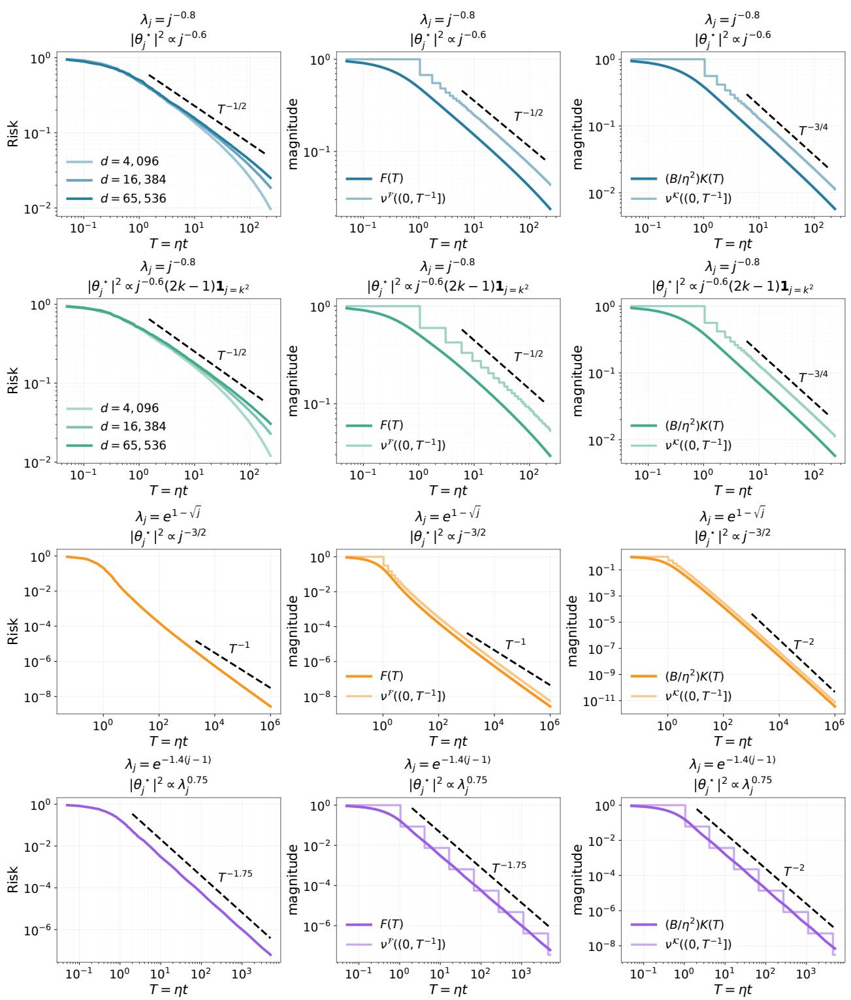  
Figure 9: Finite-width realizations of minibatch-SGD excess risk. Across the four constructions, the risk curves exhibit an overall power-law decay over the displayed finite-width window, including logarithmic corrections and log-periodic modulation.

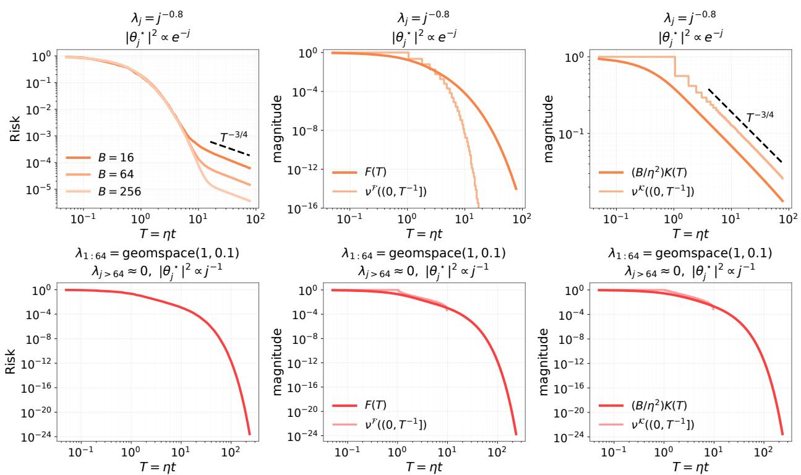  
Figure 10: Finite-width realizations of minibatch-SGD excess risk. The rapidly decaying target develops a memory-driven $T ^ { - 3 / 4 }$ tail, whereas the spectrally gapped construction relaxes exponentially.

identity

$$
Z _ { t } = N _ { t } + \sum _ { s < t } K _ { t , s } Z _ { s } .\tag{D.16}
$$

For the continuum comparison used below, define the counterpart of $N _ { t }$ by

$$
N _ { \mathrm { c } } ( T ) : = \sigma ^ { 2 } \int _ { 0 } ^ { T } \frac { k ( T - u ) } { r ( u ) } \mathrm { d } u .\tag{D.17}
$$

First isolate a feedback estimate shared by forward transfer and converse.

Lemma D.12 (Lower-order feedback below the memory ceiling). Assume Eqs. (D.3), (D.4) and (D.16) with $K _ { t , s } \geq 0$ . For $0 < q < q \kappa$ , if either $N _ { t }$ or $Z _ { t }$ is asymptotic to $T _ { t } ^ { - q } L ( T _ { t } )$ , where L is eventually positive and slowly varying, then

$$
Z _ { t } \sim N _ { t } \sim T _ { t } ^ { - q } L ( T _ { t } ) .
$$

Proof. Positivity in Eq. (D.16) gives $0 \le N _ { t } \le Z _ { t }$ . For fixed $S ,$ sharp bulk convergence and regular variation of k give $\begin{array} { r } { \sum _ { s < S } K _ { t , s } Z _ { s } = O _ { S } ( k ( T _ { t } ) ) } \end{array}$ . The remaining feedback satisfies

$$
0 \le Z _ { t } - N _ { t } \le O _ { S } ( k ( T _ { t } ) ) + \frac { \operatorname* { s u p } _ { s \ge S } Z _ { s } } { \sigma ^ { 2 } } N _ { t } .\tag{D.18}
$$

If $Z _ { t } \sim T _ { t } ^ { - q } L ( T _ { t } )$ , then $Z _ { t } \to 0 , k ( T _ { t } ) = o ( Z _ { t } )$ , and $N _ { t } \le Z _ { t }$ . Divide Eq. (D.18) by $Z _ { t }$ , then send $t \to \infty$ and $S \to \infty ,$ obtaining $Z _ { t } - N _ { t } = o ( Z _ { t } )$

If instead the equivalent holds for $N _ { t } .$ , its row sum tends to zero; after a finite prefix it is at most $1 / 2 ,$ , so induction bounds $Z ,$ and $Z _ { t } \le N _ { t } + ( N _ { t } / \sigma ^ { 2 } ) \operatorname* { s u p } _ { s } Z _ { s } = O ( N _ { t } )$ . Thus $Z _ { t } \to 0$ , and division of Eq. (D.18) by $N _ { t } ,$ , using $k ( T _ { t } ) = o ( N _ { t } )$ , finishes the proof. □

For an eventually positive ratio r that is regularly varying with exponent $\vartheta ,$ write its slowly varying factor and cumulative injection as $\begin{array} { r } { L _ { r } ( u ) : = u ^ { - \vartheta } r ( u ) , V ( T ) : = \int _ { 0 } ^ { T } r ( u ) ^ { - 1 } } \end{array}$ du. For the fixedsystem endpoint branches below, also write $V _ { \infty } : = \operatorname* { l i m } _ { T \to \infty } V ( T )$ and denote the extended-valued endpoint amplitude by

$$
C : = \sum _ { s \geq 0 } \frac { T _ { s + 1 } - T _ { s } } { r _ { s } } \big ( \sigma ^ { 2 } + Z _ { s } \big ) \in [ 0 , \infty ] .
$$

Theorem D.13 (Sharp discrete schedule transfer). Fix $\sigma ^ { 2 } > 0$ , assume Theorems D.1 and D.3, and retain $r ( u ) = u ^ { \vartheta } L _ { r } ( u )$ and the preceding $V .$ In a fixed infinite-spectrum system, also retain $V _ { \infty }$ and $C$

If $\vartheta < 1$ , then

$$
N _ { t } \sim \sigma ^ { 2 } \mathrm { B e t a } ( 1 - \vartheta , 1 - q \kappa ) \frac { T _ { t } k ( T _ { t } ) } { r ( T _ { t } ) } \sim \sigma ^ { 2 } \mathrm { B e t a } ( 1 - \vartheta , 1 - q \kappa ) T _ { t } ^ { - ( \vartheta + q \kappa - 1 ) } \frac { L _ { K } ( T _ { t } ) } { L _ { r } ( T _ { t } ) } .\tag{D.19}
$$

For a fixed infinite-spectrum system, if $\vartheta = 1$ and $V ( T ) \to \infty$ , then

$$
N _ { t } \sim \sigma ^ { 2 } k ( T _ { t } ) V ( T _ { t } ) .\tag{D.20}
$$

For such a fixed system, if instead $V _ { \infty } < \infty$ , including every $\vartheta > 1$

$$
N _ { t } \sim \sigma ^ { 2 } V _ { \infty } k ( T _ { t } ) .\tag{D.21}
$$

For the full response, assume in addition part (b) of Theorem C.2. If $1 - q _ { \mathcal { K } } < \vartheta < 1$ , then

$$
Z _ { t } \sim N _ { t } .\tag{D.22}
$$

For a fixed infinite-spectrum system, the same conclusion holds when $\vartheta = 1$ and $V ( T ) \to \infty$ . For such a fixed system, if $V _ { \infty } < \infty ,$ , including every $\vartheta > 1$ , then

$$
Z _ { t } \sim C k ( T _ { t } ) , \mathrm { ~ } C < \infty .\tag{D.23}
$$

Thus every fixed-system branch with $\vartheta \geq 1$ has noise exponent $q \kappa$ , although at $\vartheta = 1$ its slowly varying factor depends on whether $V$ converges.

Proof. For $\vartheta < 1$ , split $N _ { t }$ at $T = T _ { t }$ into

$$
T _ { s + 1 } \leq \varepsilon T , \qquad \varepsilon T < T _ { s + 1 } < ( 1 - \varepsilon ) T , \qquad T _ { s } \geq ( 1 - \varepsilon ) T .
$$

On the middle region, sharp bulk transfer, schedule convergence, and fine mesh give

$$
\frac { r ( T ) } { T k ( T ) } \sum _ { \substack { \varepsilon T < T _ { s + 1 } < ( 1 - \varepsilon ) T } } \frac { T _ { s + 1 } - T _ { s } } { r _ { s } } \Psi _ { t , s } \longrightarrow \int _ { \varepsilon } ^ { 1 - \varepsilon } x ^ { - \vartheta } ( 1 - x ) ^ { - q _ { K } } \mathrm { d } x .\tag{D.24}
$$

For the early region, Eq. (D.4) and the uniform Potter bounds give

$$
\sum _ { T _ { s + 1 } \leq \varepsilon T } \frac { T _ { s + 1 } - T _ { s } } { r _ { s } } \Psi _ { t , s } \lesssim k ( T ) \int _ { 0 } ^ { \varepsilon T } \frac { \mathrm { d } u } { r ( u ) } .
$$

Theorem D.2 yields, for every suficiently small $\xi > 0$

$$
\operatorname* { l i m } _ { t \to \infty } \operatorname* { s u p } _ { T k ( T ) } \lesssim \varepsilon ^ { 1 - \vartheta - \xi } .\tag{D.25}
$$

On the recent region, uniform regular variation and eventual monotonicity give $r _ { s } ^ { - 1 } \lesssim r ( T ) ^ { - 1 }$ Applying Eq. (D.8) with $x = \varepsilon T$ therefore yields

$$
\operatorname* { l i m } _ { t \to \infty } \frac { r ( T ) \operatorname { r e c e n t } } { T k ( T ) } \lesssim \varepsilon ^ { 1 - q _ { K } - \xi } ,\tag{D.26}
$$

with the mesh contribution vanishing by $\operatorname { E q . }$ (D.7). Sending first $t \to \infty$ , then $\varepsilon \downarrow 0$ , in Eqs. (D.24) to (D.26) gives

$$
\int _ { 0 } ^ { 1 } x ^ { - \vartheta } ( 1 - x ) ^ { - q \kappa } \mathrm { { d } } x = { \mathrm { B e t a } } ( 1 - \vartheta , 1 - q \kappa ) ,
$$

proves Eq. (D.19).

For $1 - q \kappa < \vartheta < 1$ , Eq. (D.19) has exponent $- q , q = \vartheta + q \kappa - 1 \in ( 0 , q \kappa )$ , so Theorem D.12 gives Eq. (D.22).

For the remaining fixed-system branches, first let $\vartheta = 1$ . The cumulative injection $V ( T ) =$ $\begin{array} { r } { \int _ { 0 } ^ { T } \mathrm { d } u / r ( u ) } \end{array}$ is slowly varying. If $V ( T ) \to \infty$ , boundary Karamata theory gives

$$
\frac { T } { r ( T ) V ( T ) } \longrightarrow 0 , \qquad \frac { V ( \varepsilon T ) } { V ( T ) } \longrightarrow 1 .
$$

In the same split, the early part normalized by $k ( T ) V ( T )$ tends to one as $\varepsilon \downarrow 0 ;$ bulk and recent parts vanish because $T / [ r ( T ) V ( T ) ] \to 0$ . This proves Eq. (D.20). The boundedness argument of Theorem D.12, followed by Eq. (D.18), gives $Z _ { t } \to 0$ and $Z _ { t } \sim N _ { t }$ because $k ( T _ { t } ) = o ( N _ { t } )$

If $V _ { \infty } < \infty$ , the following prefix–tail argument with $Z _ { s } = 0$ gives Eq. (D.21). Row stability bounds $Z ,$ so $( T _ { s + 1 } - T _ { s } ) ( \sigma ^ { 2 } + Z _ { s } ) / r _ { s }$ is summable. For every fixed $s ,$ Eq. (D.4) gives $\Psi _ { t , s } / k ( T _ { t } )  1$ For the remaining tail, first keep $T _ { s + 1 } \leq ( 1 - \varepsilon ) T _ { t } .$ , where Potter bounds multiply its small mass by an ε-dependent constant; the recent endpoint is $o ( k ( T _ { t } ) )$ since $T / r ( T ) \to 0$ . Prefix–tail limits followed by $\varepsilon \downarrow 0$ prove Eq. (D.23), also for $\vartheta > 1$ □

At $\vartheta = 1 - q \kappa$ , Eq. (D.19) is slowly varying and dominates positive-power clean decay unless a triangular normalization vanishes. Below it, the row mass $N _ { t } / \sigma ^ { 2 }$ grows polynomially, contradicting part (b) of Theorem $\mathrm { { C . 2 } ; }$ this is inadmissible, not a stable growing-loss regime.

## D.4 Integrable-memory schedule transfer

For $q \kappa > 1 ,$ recent injections see total memory mass while early ones see the tail of k. We prove the sharp continuum endpoint asymptotic, then transfer its order to the exact gap. The discrete step requires all-age memory because low-spectrum tails do not determine bounded-age mass; these are the quantified conditions underlying the integrable-memory part of Theorem 5.1.

For a nonnegative locally bounded memory profile k and injection density $1 / r$ , write their total masses as $\begin{array} { r } { \bar { k } : = \int _ { 0 } ^ { \infty } k ( v ) } \end{array}$ ) dv and $\begin{array} { r } { V _ { \infty } : = \int _ { 0 } ^ { \infty } \mathrm { d } u / r ( u ) } \end{array}$ , allowing the value $+ \infty$ before integrability is assumed. The proposition gives exact constants for $N _ { \mathrm { c } }$ ; the discrete theorem uses only its order consequence.

Proposition D.14 (Two-endpoint direct response under integrable memory). Let $k \geq 0$ be locally bounded and eventually positive, and let $r$ be positive with $1 / r$ locally bounded and eventually positive. Suppose k is eventually nonincreasing,

$$
k ( T ) \sim T ^ { - q \kappa } L _ { K } ( T ) , \qquad q _ { K } > 1 , \qquad \bar { k } \in ( 0 , \infty ) ,
$$

and suppose $1 / r$ is eventually monotone and regularly varying with exponent $- \vartheta$ . Then

$$
N _ { \mathrm { c } } ( T ) \sim \sigma ^ { 2 } \left\{ \begin{array} { l l } { \bar { k } / r ( T ) , } & { \vartheta < q \kappa , } \\ { \bar { k } / r ( T ) + V _ { \infty } k ( T ) , } & { \vartheta = q \kappa , } \\ { V _ { \infty } k ( T ) , } & { \vartheta > q \kappa , } \end{array} \right.\tag{D.27}
$$

where $V _ { \infty } < \infty$ in the last two branches. In particular,

$$
N _ { \mathrm { c } } ( T ) \asymp \frac { 1 } { r ( T ) } + k ( T ) \int _ { 0 } ^ { T } \frac { \mathrm { d } u } { r ( u ) } .
$$

Thus the direct continuum response has power exponent min $\{ \vartheta , q \kappa \}$ $\mathrm { A t } \ \vartheta = 0$ , the direct response has zero power exponent. If $\vartheta < 0$ , it grows with a positive power.

Proof. Split the direct convolution into recent and old endpoints. In age $v = T - u _ { : }$ , fix $A > 0 ;$ uniform regular variation gives

$$
\int _ { 0 } ^ { A } \frac { k ( v ) } { r ( T - v ) } \mathrm { d } v \sim \frac { \bar { k } _ { A } } { r ( T ) } , \qquad \bar { k } _ { A } : = \int _ { 0 } ^ { A } k ( v ) \mathrm { d } v .
$$

On $A \leq v \leq T / 2$ , Potter bounds and integrability of k give an upper bound of order $\begin{array} { r } { r ( T ) ^ { - 1 } \int _ { A } ^ { \infty } k ( v ) } \end{array}$ dv. On the old-injection half, regular variation of k gives

$$
\int _ { 0 } ^ { T / 2 } \frac { k ( T - u ) } { r ( u ) } \mathrm { d } u \lesssim k ( T ) \int _ { 0 } ^ { T / 2 } \frac { \mathrm { d } u } { r ( u ) } .
$$

For $\vartheta < 1$ , Karamata and $T k ( T ) \to 0$ make this $o ( 1 / r ( T ) )$ . At $\vartheta = 1$ , it is $T ^ { 1 - q \kappa }$ times a slow factor and still vanishes. For $1 < \vartheta < q \kappa$ 2 $V _ { \infty } < \infty$ and $k ( T ) = o ( 1 / r ( T ) )$ . Letting $A \to \infty$ proves the first branch of Eq. (D.27).

For $\vartheta > q \kappa$ , exchanging $( u , 1 / r , V _ { \infty } )$ with $( v , k , \bar { k } )$ gives $V _ { \infty } k ( T )$ . At equality both integrable endpoints remain, while Potter bounds remove the middle, giving $\bar { k } / r ( T ) + V _ { \infty } k ( T )$ . Multiplication by $\sigma ^ { 2 }$ proves Eq. (D.27); the order-level display follows by the same three cases.

At $\vartheta = 0$ , Eq. (D.27) gives zero power exponent, while for $\vartheta \ : < \ : 0$ it makes $N _ { \mathrm { c } } ( T ) / { \sigma ^ { 2 } }$ , the continuum row mass, diverge. □

We now quantify the discrete integrable-memory part of Theorem 5.1, using $\left( H _ { t , s } , \Psi _ { t , s } , N _ { t } , Z _ { t } \right)$ defined above. For an eventually positive regularly varying ratio of index ϑ, retain the slowly varying factor $L _ { r } ( u ) : = u ^ { - \vartheta } r ( u )$

Assumption D.15 (Integrable-memory all-age kernel control). Consider either one fixed limiting dynamics or a width–time triangular sequence in Definition D3. The two-time kernel has the following properties:

(a) For some $q \kappa > 1$ , the reference profile $k : [ 0 , \infty ) \to ( 0 , \infty )$ is locally bounded and nonincreasing, with

$$
k ( T ) \sim T ^ { - q _ { K } } L _ { K } ( T ) , \qquad 0 < \int _ { 0 } ^ { \infty } k ( v ) \mathrm { d } v < \infty .
$$

Here $L _ { K }$ is eventually positive and slowly varying.

(b) For constants $0 < c < C < \infty$ ，

$$
c k ( H _ { t , s } ) \leq \Psi _ { t , s } \leq C k ( H _ { t , s } ) , \qquad 0 \leq s < t .\tag{D.28}
$$

(c) The intrinsic mesh is bounded:

$$
h _ { t } = \operatorname* { m a x } _ { s < t } ( T _ { s + 1 } - T _ { s } ) \leq h _ { \star } < \infty .\tag{D.29}
$$

In a triangular sequence, $c , C ,$ and $h _ { \star }$ are uniform over the width and horizon.

Theorem D.16 (Exact discrete transfer under integrable memory). Fix $\sigma ^ { 2 } > 0$ , assume Theorems D.1 and D.15, and use the slowly varying factor $L _ { r }$ defined immediately above. Assume also that $1 / r$ is locally bounded. For the exponent conclusions below, additionally require

$$
\frac { \log ( r _ { m } ( T _ { t } ) ^ { - 1 } ) } { \log T _ { t } } \longrightarrow - \vartheta , \qquad \frac { \log \int _ { 0 } ^ { T _ { t } } \mathrm { d } u / r _ { m } ( u ) } { \log T _ { t } } \longrightarrow \operatorname* { m a x } \{ 1 - \vartheta , 0 \}
$$

along a triangular sequence; no extra normalization is needed for a fixed system. Finally assume part (b) of Theorem C.2, with its constant $\kappa < 1$ . Then, with all comparisons uniform in the triangular

setting,

$$
Z _ { t } \asymp N _ { t } \asymp \sigma ^ { 2 } \left[ \frac { 1 } { r ( T _ { t } ) } + k ( T _ { t } ) \int _ { 0 } ^ { T _ { t } } \frac { \mathrm { d } u } { r ( u ) } \right] \asymp \sigma ^ { 2 } \left[ \frac { T _ { t } ^ { - \vartheta } } { L _ { r } ( T _ { t } ) } + T _ { t } ^ { - q \kappa } L _ { { \mathcal K } } ( T _ { t } ) \int _ { 0 } ^ { T _ { t } } \frac { \mathrm { d } u } { r ( u ) } \right] .\tag{D.30}
$$

Consequently, for a fixed system, and along a triangular sequence under the displayed normalization conditions,

$$
Z _ { t } = T _ { t } ^ { - \operatorname * { m i n } \{ \vartheta , q _ { K } \} + o ( 1 ) } , \qquad \vartheta > 0 .
$$

At $\vartheta = 0$ the exact noisy–clean gap has no positive power exponent. For a fixed system, $\vartheta < 0$ makes the row mass grow and contradicts part $( b )$ of Theorem C.2; the same holds along a triangular sequence whenever its width-dependent normalization does not cancel that growth.

Proof. Compare the cell sum with the continuum convolution, sandwich the exact gap, then read of the exponent. Regular variation and positivity of nonincreasing k give $C _ { \star } < \infty$ such that $k ( v ) \leq C _ { \star } k ( v + h )$ for $v \geq 0$ and $0 \leq h \leq h ,$ ⋆. because the ratio tends uniformly to one at infinity and positivity controls compact intervals. For $u \in [ T _ { s } , T _ { s + 1 } )$ , age $T _ { t } - u$ lies between $H _ { t , s }$ and $H _ { t , s } + h _ { \star }$ Since $1 / r$ is constant on this cell, summing the resulting upper and lower bounds gives

$$
\sum _ { s < t } \frac { T _ { s + 1 } - T _ { s } } { r _ { s } } k ( H _ { t , s } ) \asymp \int _ { 0 } ^ { T _ { t } } \frac { k ( T _ { t } - u ) } { r ( u ) } \mathrm { d } u .
$$

Together with Eq. (D.28), this proves

$$
N _ { t } \asymp \sigma ^ { 2 } \int _ { 0 } ^ { T _ { t } } \frac { k ( T _ { t } - u ) } { r ( u ) } \mathrm { d } u .
$$

For a fixed system, Theorem D.14 gives the second comparison in Eq. (D.30). Uniformly in the triangular setting, splitting at $T _ { t } / 2$ and applying common Potter bounds gives

$$
\int _ { 0 } ^ { T _ { t } } \frac { k ( T _ { t } - u ) } { r ( u ) } \mathrm { d } u \lesssim \frac { 1 } { r ( T _ { t } ) } + k ( T _ { t } ) \int _ { 0 } ^ { T _ { t } } \frac { \mathrm { d } u } { r ( u ) } .
$$

A fixed recent-age interval gives the $1 / r ( T _ { t } )$ lower bound. If $1 / r$ decreases, the old half gives the second lower bound since $\begin{array} { r } { \int _ { 0 } ^ { T _ { t } / 2 } \mathrm { d } u / r ( u ) \gtrsim \int _ { 0 } ^ { T _ { t } } \mathrm { d } u / r ( u ) } \end{array}$ . If it increases, then $\vartheta \leq 0$ , and Theorem D.2 with $T k ( T ) \to 0$ absorbs the second term into the first. Constants are width-independent.

For the exact gap, Eq. (D.16) and positivity give $Z _ { t } \geq N _ { t }$ . Let $C _ { 0 } : = \kappa \sigma ^ { 2 } / ( 1 - \kappa )$ . An induction using part (b) of Theorem C.2 gives $0 \leq Z _ { t } \leq C _ { 0 }$ for every t. Hence

$$
Z _ { t } = \sum _ { s < t } K _ { t , s } ( \sigma ^ { 2 } + Z _ { s } ) \le ( \sigma ^ { 2 } + C _ { 0 } ) \sum _ { s < t } K _ { t , s } = \frac { 1 } { 1 - \kappa } N _ { t } .
$$

Thus $N _ { t } \le Z _ { t } \le N _ { t } / ( 1 - \kappa )$ , proving the first comparison.

For $\vartheta > 0$ , recent injection leads below $q \kappa \cdot$ old injection above ${ \mathrm { i t } } ,$ and both remain at equality, giving exponent min $\{ \vartheta , q \kappa \}$ . At $\vartheta = 0$ the recent term excludes positive-power decay; below zero it grows and contradicts the row bound under the stated normalization. □

If the centered clean loss has exponent $q _ { 0 } > 0$ , positivity of $R _ { \sigma } - R _ { \mathrm { a p p } } = ( R _ { 0 } - R _ { \mathrm { a p p } } ) + Z$ and Eq. (D.30) give total exponent min $\{ q _ { 0 } , q _ { \mathcal { N } } ( \vartheta ) \}$ . This is the integrable-memory input used in

Theorem 5.1.

Under the corresponding row-stable fixed-dynamics pure-power hypotheses, the following table collects the schedule boundaries.

For the PLRF IM regime, where $\alpha > 1 / 2$ , the DE theorem for the LM and IM regimes supplies the all-age profile $k ( v ) = ( 1 + v ) ^ { - 2 + 1 / ( 2 \alpha ) }$ at the resolvent-DE level. Applying the exact finite-width result additionally requires the fixed-sequence empirical-to-DE transfer in Assumption A1, together with bounded mesh and empirical row stability.

## D.5 From the exact noisy–clean gap back to $B / \eta$

Return to $0 < q _ { \mathcal { K } } < 1$ and remove schedule regular variation from the reverse direction.

If needed, extend k nonnegatively and locally integrably over bounded ages, without changing its tail, and use Eq. (D.17).

With Theorem D.12, the next output-driven lemma supplies the discrete step, without assuming regular variation of $1 / r$

Lemma D.17 (Discrete-to-continuous convolution comparison from the output asymptotics). Work with a fixed limiting sequence and assume Theorem D.3, with $T _ { t } \uparrow \infty$ . Let r be positive and suppose its step interpolation $1 / r$ is eventually nonincreasing. If, for some $0 < q < q \kappa$ and eventually positive slowly varying L,

$$
N _ { t } \sim T _ { t } ^ { - q } L ( T _ { t } ) ,\tag{D.31}
$$

then the continuum comparison in Eq. (D.17) satisfies

$$
N _ { \mathrm { c } } ( T ) \sim T ^ { - q } L ( T ) \qquad ( T \to \infty ) .\tag{D.32}
$$

Proof. Use the output to bound recent schedule height, remove both recent endpoints, compare old cells with the continuum integral, then interpolate. Write $\widetilde { N } _ { t } = N _ { t } / \sigma ^ { 2 } , T = T _ { t } ;$ since $k ( T )  0$ , the mesh condition gives $h _ { t } / T _ { t } \to 0$ . For $0 < \varepsilon < 1 / 8$ , cells with $T _ { s } \in [ T / 4 , T / 2 ]$ have length $T / 4 + o ( T )$ There, Eq. (D.4) and the uniform convergence theorem for regular variation give $\Psi _ { t , s } \geq c k ( T )$ for some $c > 0$ . Eventual monotonicity yields the output-driven bound

$$
\frac { T k ( T ) } { r ( ( 1 - 2 \varepsilon ) T ) } \leq C _ { 0 } \widetilde { N } _ { t } .\tag{D.33}
$$

Let $\widetilde { N } _ { t } ^ { \mathrm { r e c } }$ be the contribution of the exact cells with $H _ { t , s } < \varepsilon T$ . Their left endpoints eventually exceed $( 1 - 2 \varepsilon ) T$ , so Eq. (D.8) with $x = 2 \varepsilon T$ gives

$$
\widetilde { N } _ { t } ^ { \mathrm { r e c } } \leq \frac { 1 } { r ( ( 1 - 2 \varepsilon ) T ) } \left\{ h _ { t } G _ { m } ( 0 ) + \int _ { 0 } ^ { 2 \varepsilon T } G _ { m } ( v ) \mathrm { d } v \right\} .
$$

Combining Eqs. (D.6), (D.7) and (D.33), for every suficiently small $\xi > 0$ , gives

$$
\operatorname* { l i m } _ { t \to \infty } \operatorname* { s u p } _ { \widetilde { N } _ { t } } \frac { \widetilde { N } _ { t } ^ { \mathrm { r e c } } } { \widetilde { N } _ { t } } \leq C _ { \xi } \varepsilon ^ { 1 - q \kappa - \xi } .
$$

Karamata integration of $k ,$ , together with Eq. (D.33), gives the same estimate for the recent part of

the continuum comparison:

$$
\operatorname* { l i m } _ { t \to \infty } \operatorname* { s u p } _ { \mathbf { \sigma } } \frac { \int _ { ( 1 - \varepsilon ) T } ^ { T } k ( T - u ) \mathrm { d } u / r ( u ) } { \widetilde { N } _ { t } } \leq C _ { \xi } \varepsilon ^ { 1 - q _ { \mathcal K } - \xi } .\tag{D.34}
$$

For old parts, sharp bulk convergence gives $\Psi _ { t , s } / k ( H _ { t , s } )  1$ uniformly when $H _ { t , s } \geq \varepsilon T$ , and

$$
\operatorname* { s u p } _ { H _ { t , s } \geq \varepsilon T } \left| \frac { \int _ { T _ { s } } ^ { T _ { s + 1 } } k ( T - u ) \mathrm { d } u } { ( T _ { s + 1 } - T _ { s } ) k ( H _ { t , s } ) } - 1 \right| \longrightarrow 0 ,
$$

because $h _ { t } / T  0$ and convergence is uniform away from zero age. Multiplication by $1 / r _ { s } \ge 0$ makes the old-part diference $o ( \widetilde { N } _ { t } )$ , except at most one crossing cell. The remaining contribution from this cell is bounded by

$$
\frac { h _ { t } } { r ( ( 1 - 2 \varepsilon ) T ) } \operatorname* { s u p } _ { v \in [ \varepsilon T - h _ { t } , \varepsilon T + h _ { t } ] } k ( v ) = o ( \widetilde { N } _ { t } )
$$

for fixed $\varepsilon ,$ by the output bound, mesh condition, and regular variation. The two recent estimates followed by $\varepsilon \downarrow 0$ prove

$$
N _ { \mathrm { c } } ( T _ { t } ) \sim N _ { t } .\tag{D.35}
$$

For $T _ { t } \leq U < T _ { t + 1 }$ , the mesh condition gives

$$
T _ { t + 1 } - T _ { t } \leq h _ { t + 1 } = o ( T _ { t + 1 } k ( T _ { t + 1 } ) ) = o ( T _ { t + 1 } ) ,
$$

so $U / T _ { t } \to 1$ 1; on ages at least $\varepsilon T _ { t } , k ( U - u ) / k ( T _ { t } - u ) \to 1$ uniformly. The new interval is bounded by

$$
\frac { 1 } { r _ { t } } \int _ { 0 } ^ { U - T _ { t } } k ( v ) \mathrm { d } v \le \frac { 1 } { r ( ( 1 - 2 \varepsilon ) T _ { t } ) } \int _ { 0 } ^ { 2 \varepsilon T _ { t } } k ( v ) \mathrm { d } v \le C _ { \xi } \varepsilon ^ { 1 - q \kappa - \xi } \widetilde { N } _ { t } ,
$$

using Eq. (D.33). The other recent pieces obey the same estimate as Eq. (D.34). Therefore

$$
\operatorname* { l i m } _ { t  \infty } \operatorname* { s u p } _ { T _ { t } \leq U < T _ { t + 1 } } | \frac { N _ { \mathrm { c } } ( U ) } { N _ { \mathrm { c } } ( T _ { t } ) } - 1 | = 0 .
$$

Combining this with Eqs. (D.31) and (D.35) and uniform convergence of the slowly varying factor proves Eq. (D.32). □

Proposition D.18 (Gap-to-ratio Tauberian converse). Let $k \geq 0$ be locally integrable, have finite Laplace transform for every positive argument, and satisfy $k ( T ) \sim T ^ { - q \kappa } L \kappa ( T )$ , where $0 < q _ { \mathcal { K } } < 1$ and $L _ { K }$ is eventually positive and slowly varying. Let r be positive, with $1 / r$ locally integrable and eventually nonincreasing, and suppose $1 / r$ has a finite Laplace transform for every positive argument. Retain the continuum response $N _ { \mathrm { c } }$ from Eq. (D.17). For $0 < q < q \kappa$ and eventually positive slowly varying L,

$$
N _ { \mathrm { c } } ( T ) \sim T ^ { - q } L ( T )
$$

if and only if

$$
\frac { 1 } { r ( T ) } \sim \frac { 1 } { \sigma ^ { 2 } \mathrm { B e t a } ( q _ { K } - q , 1 - q _ { \mathcal { K } } ) } T ^ { q _ { K } - 1 - q } \frac { L ( T ) } { L _ { \mathcal { K } } ( T ) } .\tag{D.36}
$$

Equivalently,

$$
r ( T ) \sim \sigma ^ { 2 } \mathrm { B e t a } ( q _ { K } - q , 1 - q _ { K } ) T ^ { 1 - q _ { K } + q } \frac { L _ { K } ( T ) } { L ( T ) } .\tag{D.37}
$$

At the ceiling $q = q \kappa$ , the converse fails.

Proof. The reverse implication is beta convolution. Conversely, positivity and Tonelli give, with hats denoting Laplace transforms,

$$
\widehat { N } _ { \mathrm { c } } ( s ) = \sigma ^ { 2 } \widehat { ( 1 / r ) } ( s ) \widehat { k } ( s ) .
$$

Karamata’s Laplace theorem gives, as s ↓ 0,

$$
\begin{array} { l } { { \widehat { N } _ { \mathrm { c } } ( s ) \sim \Gamma ( 1 - q ) s ^ { q - 1 } L ( 1 / s ) , } } \\ { { \widehat { k } ( s ) \sim \Gamma ( 1 - q \kappa ) s ^ { q \kappa - 1 } L \kappa ( 1 / s ) . } } \end{array}
$$

Consequently,

$$
\widehat { ( 1 / r ) } ( s ) \sim \frac { \Gamma ( 1 - q ) } { \sigma ^ { 2 } \Gamma ( 1 - q \kappa ) } s ^ { q - q \kappa } \frac { L ( 1 / s ) } { L \kappa ( 1 / s ) } .
$$

For $\begin{array} { r } { V ( T ) = \int _ { 0 } ^ { T } \mathrm { d } u / r ( u ) } \end{array}$ , the Laplace–Stieltjes Tauberian theorem yields

$$
V ( T ) \sim \frac { \Gamma ( 1 - q ) } { \sigma ^ { 2 } \Gamma ( 1 - q \kappa ) \Gamma ( 1 + q \kappa - q ) } T ^ { q \kappa - q } \frac { L ( T ) } { L _ { \kappa } ( T ) } .
$$

The monotone-density theorem then gives Eq. (D.36); the beta identity gives Eq. (D.37). These standard regular-variation results are collected in Bingham et al. (1989, Theorems 1.7.1–1.7.2).

At $q = q \kappa$ , the family $r _ { a } ( u ) ^ { - 1 } = ( a - 1 ) ( 1 + u ) ^ { - a } , a > 1$ , has unit total injection and distinct tails but $N _ { \mathrm { c } , a } ( T ) \sim \sigma ^ { 2 } k ( T )$ ; the ceiling is not identifiable. □

Theorem D.19 (Exact fixed-limit discrete gap-to-ratio identification). Fix one infinite-spectrum limiting sequence with ${ T _ { t } } \mathrm { { \uparrow } } \infty , 0 < { T _ { s + 1 } } - { T _ { s } } < \infty$ , and $\sigma ^ { 2 } > 0$ . Assume Theorem D.3 and Eq. (D.16), with the width index suppressed and all limits taken as t → ∞. Assume $K _ { t , s } \geq 0$ , and let r be a positive step interpolation such that $1 / r$ is finite, locally integrable, and eventually nonincreasing. For $0 < q < q \kappa$ and eventually positive slowly varying $L$

$$
Z _ { t } \sim T _ { t } ^ { - q } L ( T _ { t } ) \quad \Longleftrightarrow \quad { \frac { 1 } { r ( T ) } } \sim { \frac { 1 } { \sigma ^ { 2 } \mathrm { B e t a } ( q \kappa - q , 1 - q \kappa ) } } T ^ { q \kappa - 1 - q } { \frac { L ( T ) } { L \kappa ( T ) } } .\tag{D.38}
$$

Proof. If the equivalent holds for $Z _ { t }$ , Theorems D.12 and D.17 transfer it first to $N _ { t }$ , then to $N _ { \mathrm { c } } ( T )$ Local integrability, the kernel tail, and eventual schedule monotonicity give finite Laplace transforms, so Theorem D.18 yields the displayed asymptotic for $1 / r$

Conversely, this asymptotic makes r regularly varying with exponent $1 - q _ { \mathcal { K } } + q \in ( 1 - q _ { \mathcal { K } } , 1 )$ supplying the fixed-sequence uniform convergence, Potter, and Karamata inputs to Theorem D.13. Its direct part and the beta identity give $N _ { t } \sim T _ { t } ^ { - q } L ( T _ { t } )$ , and Theorem D.12 gives the same for $Z _ { t }$ □

Remark D.20 (Why gap-to-ratio identification is regime-qualified). Eventual monotonicity is essential: sparse bounded spikes can destroy pointwise regular variation of $1 / r$ while adding only ${ \cal O } ( k ( T ) ) = o ( T ^ { - q } )$ . So is the fixed limit: a triangular diagonal $r _ { m } ( u ) ^ { - 1 } = a _ { m } f ( u / T _ { m } )$ , with arbitrary positive decreasing $f ,$ can be normalized to the same terminal response. Triangular identification needs locally uniform output at all constant-factor subhorizons.

## D.6 Full preserve–change–destroy classification

Combining the gap estimates with the clean-risk asymptotics gives the preserve/change/destroy classification.

For the classification below, abbreviate $T _ { t }$ by T. For a regularly varying ratio of index $\vartheta ,$ retain $r ( T ) = T ^ { \vartheta } L _ { r } ( T )$ and $\begin{array} { r } { V ( T ) = \int _ { 0 } ^ { T } r ( u ) ^ { - 1 } } \end{array}$ du from the preceding notation.

Theorem D.21 (Full regular-variation preserve–change–destroy classification). Fix one infinitespectrum dynamics and suppose

$$
R _ { 0 } ( T ) - R _ { \mathrm { a p p } } \sim T ^ { - q _ { 0 } } L _ { 0 } ( T ) , \qquad q _ { 0 } > 0 ,
$$

where $L _ { 0 }$ is eventually positive and slowly varying.

In long memory, assume the hypotheses of Theorem D.13. For $1 - q _ { \mathcal { K } } < \vartheta < 1$

$$
R _ { \sigma } ( T ) - R _ { 0 } ( T ) \sim \sigma ^ { 2 } \mathrm { B e t a } ( 1 - \vartheta , 1 - q \kappa ) T ^ { - ( \vartheta + q \kappa - 1 ) } \frac { L _ { K } ( T ) } { L _ { r } ( T ) } .
$$

For $\vartheta = 1$ , the gap is asymptotic to $\sigma ^ { 2 } k ( T ) V ( T ) \mathrm { i f } V ( T )  \infty$ , and to $C k ( T )$ , with the positive constant C from Eq. (D.23), if $V _ { \infty } < \infty ;$ the latter also holds for $\vartheta > 1$ . Thus

$$
q _ { \mathcal { N } } ( \vartheta ) = \left\{ \begin{array} { l l } { \vartheta + q _ { \mathcal { K } } - 1 , } & { 1 - q _ { \mathcal { K } } < \vartheta < 1 , } \\ { q _ { \mathcal { K } } , } & { \vartheta \geq 1 . } \end{array} \right.
$$

In integrable memory, assume the hypotheses of Theorem D.16. For $\vartheta > 0$ 2

$$
R _ { \sigma } ( T ) - R _ { 0 } ( T ) \asymp \sigma ^ { 2 } \left[ \frac { 1 } { r ( T ) } + k ( T ) \int _ { 0 } ^ { T } \frac { \mathrm { d } u } { r ( u ) } \right] , \qquad q _ { N } ( \vartheta ) = \operatorname* { m i n } \{ \vartheta , q _ { K } \} .
$$

In every decaying branch,

$$
R _ { \sigma } ( T ) - R _ { \mathrm { a p p } } = T ^ { - \operatorname* { m i n } \{ q _ { 0 } , q _ { \mathcal { N } } ( \vartheta ) \} + o ( 1 ) } .
$$

Hence the schedule changes, preserves, or is critical according as $q _ { \mathcal N } ( \vartheta )$ is below, above, or equal to $q _ { 0 }$ . At equality positivity prevents cancellation; in branches with exact equivalents, the slow factors add. At LM-interior equality $q _ { 0 } = q _ { \mathcal { N } } ( \vartheta )$ , for example,

$$
R _ { \sigma } ( T ) - R _ { \mathrm { a p p } } \sim T ^ { - q _ { 0 } } \left[ L _ { 0 } ( T ) + \sigma ^ { 2 } \mathrm { B e t a } ( 1 - \vartheta , 1 - q \kappa ) \frac { L _ { K } ( T ) } { L _ { r } ( T ) } \right] .
$$

At an IM equality, the available order-level statement is

$$
R _ { \sigma } ( T ) - R _ { \mathrm { a p p } } \asymp T ^ { - q _ { 0 } } L _ { 0 } ( T ) + \sigma ^ { 2 } \left[ \frac { 1 } { r ( T ) } + k ( T ) \int _ { 0 } ^ { T } \frac { \mathrm { d } u } { r ( u ) } \right] .
$$

At the LM edge $\vartheta = 1 - q \kappa$ and the IM edge $\vartheta = 0$ , no positive-power gap decay is possible, so positive-power convergence of the total centered loss to $R _ { \mathrm { a p p } }$ is destroyed. Below either edge, row

stability fails.

The long-memory interior equivalent and the integrable-memory order comparison extend to width–time triangular sequences under the uniform conditions of Theorems D.13 and D.16. The long memory endpoint equivalents for $\vartheta \geq 1$ are fixed-system statements. An exponent-only triangular classification additionally requires subpower diagonal normalization of the clean factor and of the relevant slow factor; without it, width-dependent amplitudes must remain explicit.

Proof of Theorem D.21. Write $Z ( T _ { t } ) : = Z _ { t }$ , with all asymptotics on the grid $T = T _ { t }$ . For common clean/noisy floor $R _ { \mathrm { a p p } }$ , suppose

$$
R _ { 0 } ( T ) - R _ { \mathrm { a p p } } \sim T ^ { - q _ { 0 } } L _ { 0 } ( T ) , \qquad q _ { 0 } > 0 ,
$$

with $L _ { 0 }$ eventually positive and slowly varying. The positive decomposition

$$
R _ { \sigma } ( T ) - R _ { \mathrm { a p p } } = R _ { 0 } ( T ) - R _ { \mathrm { a p p } } + Z ( T ) ,
$$

reduces the result to exponent comparison and the stability boundary.

For $1 - q _ { \mathcal { K } } < \vartheta < 1$ , write $r ( u ) = u ^ { \vartheta } L _ { r } ( u )$ , and set $q _ { \mathcal { N } } ( \vartheta ) : = \vartheta + q _ { \mathcal { K } } - 1$ . By Eqs. (D.19) and (D.22),

$$
Z ( T ) \sim \sigma ^ { 2 } \mathrm { B e t a } ( 1 - \vartheta , 1 - q \kappa ) T ^ { - q \mathcal { N } ( \vartheta ) } \frac { L \kappa ( T ) } { L _ { r } ( T ) } .
$$

Thus the noisy exponent is min $\{ q _ { 0 } , q _ { \mathcal { N } } ( \vartheta ) \}$ : it changes below $q _ { 0 }$ , preserves the clean equivalent above, and at equality

$$
R _ { \sigma } ( T ) - R _ { \mathrm { a p p } } \sim T ^ { - q _ { 0 } } \left[ L _ { 0 } ( T ) + \sigma ^ { 2 } \mathrm { B e t a } ( 1 - \vartheta , 1 - q \kappa ) \frac { L _ { K } ( T ) } { L _ { r } ( T ) } \right] .
$$

preserves the exponent, with a renormalized slow factor if the gap matters.

For $\vartheta = 1$ , put $\begin{array} { r } { V ( T ) = \int _ { 0 } ^ { T } r ( u ) ^ { - 1 } \mathrm { d } u } \end{array}$ . The two branches are $Z ( T ) \sim \sigma ^ { 2 } k ( T ) V ( T ) { \mathrm { ~ i f ~ } } V ( T ) \to \infty$ 9 and $Z ( T ) \sim C k ( T )$ if $V _ { \infty } < \infty$ , by Eqs. (D.20), (D.22) and (D.23). Both have exponent $q \kappa ; \mathrm { e . g }$ $r ( u ) \sim c u$ gives $V ( T ) \sim c ^ { - 1 }$ log T, changing only normalization. For $\vartheta > 1$ , Eq. (D.23) gives the same exponent. Thus throughout $\vartheta \geq 1$ , the centered total exponent is min $\{ q _ { 0 } , q \kappa \}$ , giving change, criticality, or preservation according as $q _ { \mathcal { K } } < q _ { 0 } , q _ { \mathcal { K } } = q _ { 0 } , \mathrm { o r } q _ { \mathcal { K } } > q _ { 0 }$

At $\vartheta = 1 - q \kappa$ , Eq. (D.19) becomes

$$
N _ { t } \sim \sigma ^ { 2 } \mathrm { B e t a } ( q \kappa , 1 - q \kappa ) \frac { L \kappa ( T _ { t } ) } { L _ { r } ( T _ { t } ) } .
$$

Since $Z _ { t } \geq N _ { t }$ , this slow lower bound excludes positive-power decay; below the boundary, polynomial growth of $\begin{array} { r } { N _ { t } / \sigma ^ { 2 } = \sum _ { s < t } K _ { t , s } } \end{array}$ contradicts row stability for the fixed dynamics considered here. By the positive decomposition, the same lower bound rules out positive-power convergence of the total centered loss to $R _ { \mathrm { a p p } } ;$ this is the destroy boundary.

For $q \kappa > 1$ , Eq. (D.30) gives

$$
Z ( T ) = T ^ { - q _ { N } ( \vartheta ) + o ( 1 ) } , \qquad q _ { N } ( \vartheta ) = \mathrm { m i n } \{ \vartheta , q _ { K } \} , \qquad \vartheta > 0 .
$$

The same positive decomposition therefore gives total exponent min $\{ q _ { 0 } , q _ { \mathcal { N } } ( \vartheta ) \}$ , and hence the stated change, criticality, and preservation alternatives. $\mathrm { A t } \ \vartheta = 0$ , recent injection rules out positive-power decay; for $\vartheta < 0$ , the row mass grows and contradicts row stability. The positive decomposition transfers this obstruction to the total centered loss. Together with the long-memory argument above, this proves Theorem D.21 and its pure-power main-text specialization Theorem 5.1.

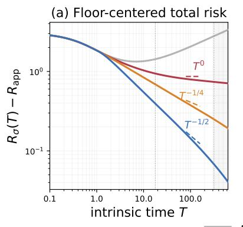

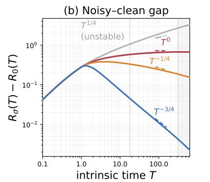

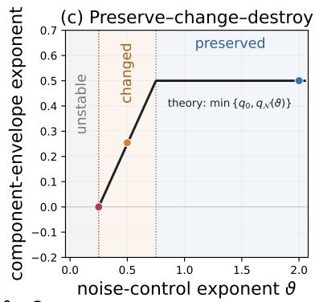  
Figure 11: Floor-centered risk, noisy–clean gap, and predicted exponents across four noise-control schedules. The transition from growth through destruction and change to clean-law preservation supports Theorem 5.1.

Figure 11 illustrates the classification in a finite-width analytic-spectrum continuum: increasing $\vartheta$ moves the response from the unstable side of the destroy boundary, through schedule-controlled change, and toward preservation of the clean-loss decay.

Proposition D.22 (Clean masking and memory saturation). Work in the fixed-limit setting above, and suppose the schedules being compared have centered clean losses with the same leading asymptotic $R _ { 0 , i } ( T ) - R _ { \mathrm { a p p } } \sim T ^ { - q _ { 0 } } L _ { 0 } ( T )$ , where $L _ { 0 }$ is eventually positive and slowly varying. The gap-based converse in Theorem D.19 transfers to total loss without a clean baseline only in the noise-dominated range $q < q _ { 0 }$ . This restriction is necessary for a uniform converse based on the full leading total-loss equivalent, while $q < q \kappa$ is necessary for exponent-level schedule identification.

(i) If $q _ { 0 } < q _ { \mathcal { K } }$ , distinct gap exponents in $( q _ { 0 } , q _ { \mathcal { K } } )$ can be generated by distinct admissible schedules, while their corresponding clean and total losses share the same leading clean-loss asymptotic.

(ii) If the clean loss has exponent $q _ { 0 } < q _ { K }$ and $Z ( T ) \sim T ^ { - q _ { 0 } } L ( T )$ for an eventually positive slowly varying L, then

$$
R _ { \sigma } ( T ) - R _ { \mathrm { a p p } } \sim T ^ { - q _ { 0 } } \big ( L _ { 0 } ( T ) + L ( T ) \big ) .\tag{D.39}
$$

(iii) At the memory ceiling, integrable regularly varying injections with diferent tail exponents all produce stable full gaps with exponent $q \kappa$

Proof. For (i), choose distinct $q _ { i } \in ( q _ { 0 } , q _ { \mathcal { K } } )$ . Applying Eq. (D.38) with constant slow factors gives ratios of power $1 - q _ { \mathcal { K } } + q _ { i }$ and gaps $Z _ { i } ( T ) \sim a _ { i } T ^ { - q _ { i } }$ , with $a _ { i } > 0$ chosen small enough for uniform stability. Since $q _ { i } > q _ { 0 } , Z _ { i } = o ( R _ { 0 , i } - R _ { \mathrm { a p p } } )$ , hence $R _ { \sigma , i } - R _ { \mathrm { a p p } } \sim R _ { 0 , i } - R _ { \mathrm { a p p } } \sim T ^ { - q _ { 0 } } L _ { 0 } ( T )$ for both schedules.

Adding the positive equivalents proves Eq. (D.39) and the three cases in (ii). For example, when $L _ { 0 } \equiv 1 , L _ { i } ( T ) = ( \log T ) ^ { - i } , i = 1 , 2$ , yield diferent ratio tails through Eq. (D.38), but both leading total-risk asymptotics equal the clean-loss asymptotic by the common clean-asymptotic assumption.

For (iii), choose distinct integrable tail exponents $\vartheta _ { i } > 1$ with row-stable amplitudes. From Eq. (D.23), we have $Z _ { i } ( T ) \sim C _ { i } k ( T )$ , so both gaps have exponent $q \kappa$ . The unit-mass family in Theorem D.18 more strongly gives distinct integrable tails with the same direct equivalent.

## D.7 Polynomial schedules in iteration time

Corollary D.23 (Polynomial schedules in iteration time). Assume the corresponding fixed-system hypotheses of Theorem D.21, including its regularly varying clean-loss asymptotic with exponent $q _ { 0 } > 0$ , and impose its row-stability condition only on the decaying branches. For $n \geq 1$ , let

$$
\eta _ { n } = c _ { \eta } n ^ { - \ell } , \qquad B _ { n } = \lceil c _ { B } n ^ { b } \rceil , \qquad c _ { \eta } , c _ { B } > 0 , \quad 0 \leq \ell < 1 , \quad b \geq 0 .
$$

Then

$$
T _ { n } \asymp n ^ { 1 - \ell } , \qquad r ( T _ { n } ) = \frac { B _ { n } } { \eta _ { n } } \asymp T _ { n } ^ { \vartheta } , \qquad \vartheta = \frac { \ell + b } { 1 - \ell } .
$$

Consequently, on every decaying branch, the noisy–clean gap exponent with respect to iteration index is

$$
q _ { \mathcal { N } } ^ { \mathrm { i t } } ( \ell , b ) : = ( 1 - \ell ) q _ { \mathcal { N } } \biggl ( \frac { \ell + b } { 1 - \ell } \biggr ) .
$$

For the PLRF long-memory specialization

$$
{ \frac { 1 } { 4 } } < \alpha < { \frac { 1 } { 2 } } , \qquad q \kappa = 2 - { \frac { 1 } { 2 \alpha } } ,
$$

the following alternatives hold:

1. If $\ell + 2 \alpha b < 1 - 2 \alpha$ , the row-stability bound cannot hold.

2. If $\ell + 2 \alpha b = 1 - 2 \alpha$ , the noisy–clean gap has no positive-power decay.

3. If

$$
\ell + 2 \alpha b > 1 - 2 \alpha , \qquad 2 \ell + b < 1 ,
$$

then

$$
q _ { \mathcal { N } } ^ { \mathrm { i t } } ( \ell , b ) = \frac { \ell + 2 \alpha b - ( 1 - 2 \alpha ) } { 2 \alpha } .
$$

4. If $2 \ell + b \geq 1$ , then

$$
q _ { N } ^ { \mathrm { i t } } ( \ell , b ) = ( 1 - \ell ) q _ { K } .
$$

At $2 \ell + b = 1$ , the gap additionally carries the logarithmic correction inherited from the long-memory ceiling.

In integrable memory, where $q \kappa > 1$ , if $\ell + b > 0$ , then

$$
\begin{array} { r } { q _ { N } ^ { \mathrm { i t } } ( \ell , b ) = \operatorname* { m i n } \{ \ell + b , ( 1 - \ell ) q _ { K } \} . } \end{array}
$$

$\mathrm { I f ~ } \ell = b = 0$ , the noisy–clean gap has no positive-power decay.

The clean-risk asymptotic in Theorem D.21 gives

$$
R _ { 0 } ( T _ { n } ) - R _ { \mathrm { a p p } } = n ^ { - ( 1 - \ell ) q _ { 0 } + o ( 1 ) } .
$$

Hence, on every decaying branch,

$$
R _ { \sigma } ( T _ { n } ) - R _ { \mathrm { a p p } } = n ^ { - \operatorname* { m i n } \{ ( 1 - \ell ) q _ { 0 } , q _ { \mathcal { N } } ^ { \mathrm { i t } } ( \ell , b ) \} + o ( 1 ) } .
$$

Proof. Changing finitely many initial schedule values does not afect the stated asymptotic exponents, and discrete Karamata gives

$$
T _ { n } = T _ { 1 } + \sum _ { s = 1 } ^ { n - 1 } c _ { \eta } s ^ { - \ell } \sim \frac { c _ { \eta } } { 1 - \ell } n ^ { 1 - \ell } .
$$

Moreover, $B _ { n } \sim \bar { c } _ { B } n ^ { b }$ , where $\bar { c } _ { B } = c _ { B }$ for $b > 0$ and $\bar { c } _ { B } = \lceil c _ { B } \rceil$ for $b = 0$ . Therefore

$$
r ( T _ { n } ) = \frac { B _ { n } } { \eta _ { n } } \sim \frac { \bar { c } _ { B } } { c _ { \eta } } n ^ { b + \ell } .
$$

Since $T _ { n + 1 } / T _ { n } \to 1$ , the piecewise-constant intrinsic-time interpolation of r is eventually nondecreasing and regularly varying with index

$$
\vartheta = { \frac { \ell + b } { 1 - \ell } } .
$$

In PLRF long memory,

$$
1 - q _ { K } = \frac { 1 - 2 \alpha } { 2 \alpha } .
$$

Thus

$$
\vartheta = 1 - q \kappa \quad \Longleftrightarrow \quad \ell + 2 \alpha b = 1 - 2 \alpha ,
$$

which gives the stability/no-decay boundary. Likewise,

$$
\vartheta = 1 \quad \Longleftrightarrow \quad 2 \ell + b = 1 ,
$$

which gives the memory ceiling.

On the interior long-memory branch $1 - q _ { \mathcal { K } } < \vartheta < 1$ , Theorem D.21 gives intrinsic-time gap exponent $\vartheta + q \kappa - 1$ . Composing with $T _ { n } \asymp n ^ { 1 - \ell }$ yields

$$
( 1 - \ell ) ( \vartheta + q \kappa - 1 ) = ( 1 - \ell ) \left( \frac { \ell + b } { 1 - \ell } + 1 - \frac { 1 } { 2 \alpha } \right) = \frac { \ell + 2 \alpha b - ( 1 - 2 \alpha ) } { 2 \alpha } .
$$

For $\vartheta > 1$ , the intrinsic-time exponent saturates at $q \kappa \cdot$ giving iteration-time exponent $( 1 - \ell ) q _ { \mathcal K }$ $\mathrm { A t } \ \vartheta = 1$ , the polynomial schedule gives $r ( u ) \sim c u$ for some $c > 0$ , so $V ( T ) \sim c ^ { - 1 } \log T ;$ the long-memory boundary asymptotic in Theorem D.21 therefore gives the stated ceiling logarithm.

In integrable memory, the intrinsic-time exponent is min $\{ \vartheta , q \kappa \}$ whenever $\vartheta > 0$ . Hence

$$
( 1 - \ell ) \operatorname* { m i n } \{ \vartheta , q _ { K } \} = \operatorname* { m i n } \{ \ell + b , ( 1 - \ell ) q _ { K } \} .
$$

When $\ell = b = 0 ,$ one has $\vartheta = 0$ , and the gap has no positive-power decay.

Finally, the regularly varying clean-risk asymptotic in Theorem D.21 composed with $T _ { n } \asymp n ^ { 1 - \ell }$ gives clean iteration-time exponent $( 1 - \ell ) q _ { 0 }$ . Positivity then gives the displayed minimum of the clean and gap exponents and the change/critical/preserve alternatives. □

## E Constant learning-rate and batch-size schedules

This appendix analyzes constant learning-rate and batch-size schedules under a feature-compute budget. Appendix E.1 collects the forcing, memory, and localization inputs needed to formulate the optimization problem. Appendix E.2 studies the exact discrete-time infinite-width problem and establishes the scale of its fixed-noise optimum. Appendix E.3 derives the source-window-optimal rates below trace class and the conditional plateau within a fixed finite-time window above trace class, and Appendix E.4 proves these results. Appendix E.5 compares the clean and noisy optima and derives the compute and noise scales at which the transition occurs.

Within the analyzed source and finite-time windows, label noise shifts compute toward wider models and fewer iterations.

Unless a statement explicitly invokes the exact conditional recursion and uses Roman risk notation, every calligraphic forcing, kernel, and risk in this section is a resolvent deterministic equivalent (DE).

Write $\begin{array} { r } { P _ { \sigma , \mathrm { c o n s t } } ^ { \star } : = \operatorname* { l i m } _ { \mathfrak { f } \to \infty } \mathcal { R } _ { \sigma , \mathrm { c o n s t } } ^ { \star } ( \mathfrak { f } ) } \end{array}$ for the constant-schedule compute-optimal DE plateau, distinct from the infinite-width DE curve $\mathcal { R } _ { \sigma , \infty } ( t )$

## E.1 Scaling inputs and optimization setup

Write $p : = 2 \alpha + 2 \beta - 1 > 0 .$

Here $T = \eta t$ , and stability gives $q _ { \eta } ( \lambda ) ^ { t } \asymp e ^ { - c T \lambda }$ . Thus $\lambda _ { j } = j ^ { - 2 \alpha }$ has cutof

$j _ { T } \asymp T ^ { 1 / ( 2 \alpha ) } : \qquad j \ll j _ { T }$ is substantially learned, $j \gg j _ { T }$ is substantially unlearned.

The power-law window $1 \ll \eta t \lesssim m ^ { 2 \alpha }$ is therefore past the initial transient but before resolution of the smallest feature modes.

The four clean-loss components used below have the following scales. On the LM and IM DE branches, assume $\alpha > 1 / 4 , \beta < 1 + 2 \alpha$ , and stay away from critical lines; the FB total-risk asymptotic uses the same source restriction with $0 < \alpha < 1 / 4$ and $p > 0$ . In the window $1 \ll \eta t \lesssim m ^ { 2 \alpha }$ , absent components are set to zero and

$$
\mathcal { F } _ { p p } ( t , m ) \asymp ( \eta t ) ^ { - p / ( 2 \alpha ) } ,\tag{E.1}
$$

$$
\mathcal { F } _ { 0 } ( m ) \asymp \left\{ \begin{array} { l l } { m ^ { - p } , } & { \beta < \frac { 1 } { 2 } , } \\ { m ^ { - 2 \alpha } , } & { \beta > \frac { 1 } { 2 } , } \end{array} \right.
$$

$$
\mathcal { F } _ { a c } ( t , m ) \times m ^ { - 1 } ( \eta t ) ^ { - 1 + 1 / ( 2 \alpha ) } \quad \left( \alpha > \frac { 1 } { 2 } , ~ \beta > \frac { 1 } { 2 } \right) ,\tag{E.2}
$$

$$
{ \frac { 1 } { \eta } } { \cal K } _ { p p } ( t , m ) \asymp { \frac { \eta } { B } } ( \eta t ) ^ { - 2 + 1 / ( 2 \alpha ) } \quad \left( \alpha > { \frac { 1 } { 4 } } \right) .\tag{E.3}
$$

Here $\mathcal { F } _ { p p }$ is time-limited unlearned aligned-target error, $\mathcal { F } _ { 0 }$ is width-limited permanent null-space error, and $\mathcal { F } _ { a c }$ and $\kappa _ { p p } / \eta$ depend on both width and time, representing finite-width spectral distortion and aligned spectral memory from transient SGD sampling noise, respectively. The next corollary shows that these four terms recover the clean $4 + 3$ decomposition. This closure is not an additional assumption: the forcing and kernel estimates of Paquette et al. (2024, Appendices G–H), together with their Volterra approximation theorem and subexponential kernel estimate, establish the decomposition in the canonical PLRF model. We record its translation to the present notation.

Corollary E.1 (Recovery of the $4 + 3$ spectral decomposition). Suppose $\alpha > 1 / 4 , 2 \alpha + 2 \beta > 1$ $\beta < 1 + 2 \alpha$ , with parameters away from the critical lines. Let the constant schedule satisfy Theorem A.2. Under the notation map

$$
d _ { 4 + 3 } = m , \qquad v _ { 4 + 3 } = d , \qquad B _ { 4 + 3 } = B , \qquad \gamma _ { 4 + 3 } = \frac { \eta } { B } ,
$$

uniformly for $1 \ll \eta t \lesssim m ^ { 2 \alpha }$ 2

$$
\mathcal { R } _ { 0 } ( t , m ) \asymp \mathcal { F } _ { 0 } ( m ) + \mathcal { F } _ { p p } ( t , m ) + \mathcal { F } _ { a c } ( t , m ) + \frac { 1 } { \eta } \mathcal { K } _ { p p } ( t , m ) .\tag{E.4}
$$

Proof. Under the displayed map, $\gamma _ { 4 + 3 } B _ { 4 + 3 } = \eta$ and $\gamma _ { 4 + 3 } ^ { 2 } B _ { 4 + 3 } = \eta ^ { 2 } / B$ , matching both the intrinsic clock and the kernel prefactor. The forcing estimates of Paquette et al. (2024, Appendix H) give $\mathcal { F } \asymp \mathcal { F } _ { 0 } + \mathcal { F } _ { p p } + \mathcal { F } _ { a c } .$ , including their error control. Their complete-kernel comparison and Volterra approximation theorem give the remaining $\eta ^ { - 1 } \mathcal { K } _ { p p }$ contribution, proving the claim. □

When $\alpha < 1 / 4$ , the infinite pure-point kernel is not summable. The finite-bulk DE kernel and noisy–clean gap are nevertheless controlled by Theorem C.17, and the canonical PLRF constantschedule risk asymptotic is the specialization of Theorem C.18 for $p > 0 , \beta < 1 + 2 \alpha$ , of the critical lines. For comparison, write $F _ { a c } ^ { W }$ and $F _ { 0 } ^ { W }$ for the absolutely-continuous and zero-mode components of the exact empirical forcing. The corresponding finite-dimensional proposition of Paquette et al. (2024) gives

$$
F _ { a c } ^ { W } ( t , m ) = 0 \quad \left( \beta < \frac { 1 } { 2 } \right) , \qquad 0 \le F _ { a c } ^ { W } ( t , m ) \le C _ { \alpha , \beta , c } F _ { 0 } ^ { W } ( m ) \quad \left( \beta > \frac { 1 } { 2 } , \ \alpha < \frac { 1 } { 2 } \right) .
$$

Here c = lim $d / m \in ( 1 , \infty )$ , uniformly on strict localized windows.

Label noise is controlled by the cumulative kernel. For $\alpha > 1 / 4$ , the PLRF mode estimates and Eq. (A.1) give

$$
\mathcal { S } _ { t } ( m ) \asymp \frac { \eta } { B } \sum _ { j \leq m } j ^ { - 2 \alpha } \left( 1 - \exp \{ - c _ { 1 } \eta t j ^ { - 2 \alpha } \} \right) ,\tag{E.5}
$$

for a constant $c _ { 1 } > 0$ . In the trace-class region $\alpha > 1 / 2$ , write $\begin{array} { r } { S _ { \infty } ( m ) : = \operatorname* { l i m } _ { t  \infty } S _ { t } ( m ) \in ( 0 , \kappa ] } \end{array}$ Then

$$
\begin{array} { r } { S _ { t } ( m ) = \left\{ \begin{array} { l l } { S _ { \infty } ( m ) - \Theta \big ( t ^ { - 1 + 1 / ( 2 \alpha ) } \big ) , } & { \alpha > \frac { 1 } { 2 } , } \\ { \Theta \bigg ( \bigg ( \displaystyle \frac { t } { B m } \bigg ) ^ { ( 1 - 2 \alpha ) / ( 2 \alpha ) } \bigg ) , } & { \frac { 1 } { 4 } < \alpha < \frac { 1 } { 2 } , } \\ { \Theta \bigg ( \displaystyle \frac { t } { B m } \bigg ) , } & { 0 < \alpha < \frac { 1 } { 4 } , } \end{array} \right. } \end{array}\tag{E.6}
$$

The last line is the target-independent finite-bulk DE kernel estimate from Theorem C.17; the exact empirical analogue is Theorem C.8. Above trace class, accumulated noise saturates. Below trace class, the width-dependent learning rate can drive it to zero.

One iteration costs order $B m$ , so total compute is $\mathfrak { f } : = t B m$ . For reference, define the full-budget optimum

$$
\mathcal { R } _ { \sigma , \mathrm { c o n s t } } ^ { \star } ( \mathfrak { f } ) : = \operatorname* { m i n } _ { 1 \leq m \leq \mathfrak { f } / B } \mathcal { R } _ { \sigma } \left( \frac { \mathfrak { f } } { B m } , m \right) ,
$$

and let $m _ { \sigma , \mathrm { c o n s t } } ^ { \star } ( \mathfrak { f } )$ be any minimizer. To separate a possible noise floor from the part that still

improves, define

$$
\begin{array} { r l } { P _ { \sigma , \mathrm { c o n s t } } ^ { \star } : = \underset { \mathfrak { f } \to \infty } { \operatorname* { l i m } } \ \mathcal { R } _ { \sigma , \mathrm { c o n s t } } ^ { \star } ( \mathfrak { f } ) , } & { } \\ { \Delta _ { \sigma , \mathrm { c o n s t } } ^ { \star } ( \mathfrak { f } ) : = \mathcal { R } _ { \sigma , \mathrm { c o n s t } } ^ { \star } ( \mathfrak { f } ) - P _ { \sigma , \mathrm { c o n s t } } ^ { \star } . } & { } \end{array}
$$

Below trace class, the power laws hold only in the source window. We therefore optimize only over the concrete interior class

$$
\mathcal { M } _ { \mathrm { s r c } } ( \mathbf { f } ) : = \left\{ 1 \leq m \leq \frac { \mathbf { f } } { B } : \log \mathbf { f } \leq \frac { \eta \mathbf { f } } { B m } \leq \frac { m ^ { 2 \alpha } } { \log \mathbf { f } } \right\} .
$$

For suficiently large f, define

$$
\mathcal { R } _ { \sigma , \mathrm { s r c } } ^ { \star } ( \boldsymbol { \mathfrak { f } } ) : = \operatorname* { m i n } _ { m \in \mathcal { M } _ { \mathrm { s r c } } ( \boldsymbol { \mathfrak { f } } ) } \mathcal { R } _ { \sigma } \left( \frac { \boldsymbol { \mathfrak { f } } } { B m } , m \right) , \qquad m _ { \sigma , \mathrm { s r c } } ^ { \star } ( \boldsymbol { \mathfrak { f } } ) \in \operatorname* { a r g m i n } _ { m \in \mathcal { M } _ { \mathrm { s r c } } ( \boldsymbol { \mathfrak { f } } ) } \mathcal { R } _ { \sigma } \left( \frac { \boldsymbol { \mathfrak { f } } } { B m } , m \right) .
$$

Set $t _ { \sigma , \mathrm { s r c } , \mathfrak { f } } ^ { \star } : = \mathfrak { f } / ( B m _ { \sigma , \mathrm { s r c } } ^ { \star } ( \mathfrak { f } ) )$ . The logarithmic margins select a strict source window; the attaining scales below lie polynomially far from both boundaries.

In the trace-class region $\alpha > 1 / 2$ , define $\begin{array} { r } { \mathcal { R } _ { \sigma , \infty } ( t ) : = \operatorname* { l i m } _ { m  \infty } \mathcal { R } _ { \sigma } ( t , m ) } \end{array}$ and

$$
a _ { \sigma } = { \left\{ \begin{array} { l l } { p , } & { \beta < { \frac { 1 } { 2 } } , } \\ { 1 , } & { \beta > { \frac { 1 } { 2 } } . } \end{array} \right. }\tag{E.7}
$$

Assumption E.2 (Trace-class local optimum and DE expansion). Let $U \subset ( 1 , \infty )$ be compact.

(a) The continuously interpolated curve $\mathcal { R } _ { \sigma , \infty }$ has a unique nondegenerate minimizer $t _ { \sigma , \mathrm { c o n s t } } ^ { \star }$ in the interior of U.

(b) Uniformly for $t \in U$

$$
\mathcal { R } _ { \sigma } \bigg ( t , \frac { \mathfrak { f } } { B t } \bigg ) = \mathcal { R } _ { \sigma , \infty } ( t ) + \bigg ( \frac { \mathfrak { f } } { B t } \bigg ) ^ { - a _ { \sigma } } G _ { \sigma } ( t ) + o ( \mathfrak { f } ^ { - a _ { \sigma } } ) , \qquad G _ { \sigma } \big ( t _ { \sigma , \mathrm { c o n s t } } ^ { \star } \big ) > 0 .\tag{E.8}
$$

Under Theorem E.2, define

$$
\mathcal { R } _ { \sigma , U } ^ { \star } ( \mathfrak { f } ) : = \operatorname* { m i n } _ { t \in U } \mathcal { R } _ { \sigma } \left( t , \frac { \mathfrak { f } } { B t } \right) , \qquad t _ { \sigma , U , \mathfrak { f } } ^ { \star } \in \operatorname * { a r g m i n } _ { t \in U } \mathcal { R } _ { \sigma } \left( t , \frac { \mathfrak { f } } { B t } \right) ,
$$

and set $m _ { \sigma , U , \mathfrak { f } } ^ { \star } : = \mathfrak { f } / ( B t _ { \sigma , U , \mathfrak { f } } ^ { \star } ) , P _ { \sigma , U } ^ { \star } : = \mathcal { R } _ { \sigma , \infty } ( t _ { \sigma , \mathrm { c o n s t } } ^ { \star } )$ , and $\Delta _ { \sigma , U } ^ { \star } ( \mathfrak { f } ) : = \mathcal { R } _ { \sigma , U } ^ { \star } ( \mathfrak { f } ) - P _ { \sigma , U } ^ { \star } .$

## E.2 Discrete infinite-width fixed-noise optimum

Before optimizing over continuous compute diagonals, introduce the exact integer-time objects at infinite width. For trace-class parameters, let

$$
\kappa _ { \infty } : = \frac { \eta } { B } \sum _ { j \geq 1 } \frac { j ^ { - 2 \alpha } } { 2 - \eta \left( 1 + \frac { 1 } { B } \right) j ^ { - 2 \alpha } } .
$$

For $| w | < 1$ , set

$$
\widetilde { \mathcal { F } } _ { \infty } ( w ) : = \sum _ { j \ge 1 } \frac { j ^ { - 2 ( \alpha + \beta ) } } { 1 - q _ { \eta } ( j ^ { - 2 \alpha } ) w } , \qquad \widetilde { \mathcal { K } } _ { \infty } ( w ) : = \frac { \eta ^ { 2 } } { B } \sum _ { j \ge 1 } \frac { j ^ { - 4 \alpha } } { 1 - q _ { \eta } ( j ^ { - 2 \alpha } ) w } .
$$

Thus $\widetilde { \mathcal { K } } _ { \infty } ( 1 ) = \kappa _ { \infty }$ . Write [wt] for formal coeficient extraction and, for $\sigma ^ { 2 } > 0$ , define

$$
\mathcal { R } _ { \sigma , \infty } ^ { \mathrm { d i s c } } ( t ) : = [ w ^ { t } ] \frac { \widetilde { \mathcal { F } } _ { \infty } ( w ) + \sigma ^ { 2 } w \widetilde { \mathcal { K } } _ { \infty } ( w ) / ( 1 - w ) } { 1 - w \widetilde { \mathcal { K } } _ { \infty } ( w ) } , \qquad \quad \mathcal { R } _ { \sigma , \infty } ^ { \star , \mathrm { d i s c } } : = \operatorname* { i n f } _ { t \in \mathbb { N } , \ t \geq 1 } \mathcal { R } _ { \sigma , \infty } ^ { \mathrm { d i s c } } ( t ) .
$$

The next proposition checks this discrete problem. It shows that its best fixed-noise risk is uniformly of order $\sigma ^ { 2 }$ . The proof is in Section E.2.

Proposition E.3 (Uniform scale of the discrete trace-class optimum). Fix $\sigma ^ { 2 } > 0 , \delta \in ( 0 , 1 ) , \eta > 0$ and $\overline { { \kappa } } \in ( 0 , 1 )$ , and restrict to

$$
\alpha \geq \frac { 1 } { 2 } + \delta , \qquad \eta \geq \underline { { \eta } } , \qquad \eta \left( 1 + \frac { 1 } { B } \right) \leq 2 - \delta , \qquad \kappa _ { \infty } \leq \overline { { \kappa } } .
$$

Then, uniformly on this strict region,

$$
\sigma ^ { 2 } \frac { \eta ^ { 2 } } { B } \zeta ( 4 \alpha ) \leq \mathcal { R } _ { \sigma , \infty } ^ { \star , \mathrm { d i s c } } \leq \frac { \sigma ^ { 2 } \kappa _ { \infty } } { 1 - \kappa _ { \infty } } , \qquad \mathcal { R } _ { \sigma , \infty } ^ { \star , \mathrm { d i s c } } \asymp \sigma ^ { 2 } \frac { \eta ^ { 2 } } { B } \zeta ( 4 \alpha ) \asymp \sigma ^ { 2 } .
$$

For genuinely empirical finite-step statements, the Gaussian propagation in Section C.1 specializes to

$$
\mathbb { E } _ { t } [ \rho _ { j } ^ { 2 } ( t + 1 ) ] = q _ { \eta } ( \widehat { \lambda } _ { j } ) \rho _ { j } ^ { 2 } ( t ) + \frac { \eta ^ { 2 } } { B } \widehat { \lambda } _ { j } ^ { 2 } \left( \| e _ { t } \| _ { 2 } ^ { 2 } + \sigma ^ { 2 } \right) .\tag{E.9}
$$

Proof of Theorem E.3. For fixed integer time,

$$
\mathbb { E } \| \widehat { \pmb { H } } - \pmb { \Lambda } \| _ { \mathrm { H S } } ^ { 2 } = \frac { ( \mathrm { t r } \pmb { \Lambda } ) ^ { 2 } + \mathrm { t r } ( \pmb { \Lambda } ^ { 2 } ) } { m } = O ( m ^ { - 1 } ) .
$$

Finite induction in Eq. (E.9) gives the stated infinite-width series, while positivity gives

$$
\mathcal { R } _ { \sigma , \infty } ^ { \mathrm { d i s c } } ( t ) \geq \sigma ^ { 2 } \widetilde { \mathcal { K } } _ { \infty } ( 0 ) = \sigma ^ { 2 } \frac { \eta ^ { 2 } } { B } \zeta ( 4 \alpha ) .
$$

The kernel geometric series gives $\kappa _ { \infty } ;$ ; hence the positive Volterra resolvent converges to $\sigma ^ { 2 } \kappa _ { \infty } / ( 1 -$ $\kappa _ { \infty } )$ , which bounds the integer-time infimum from above. Therefore

$$
1 \leq \frac { \mathcal { R } _ { \sigma , \infty } ^ { \star , \mathrm { d i s c } } } { \sigma ^ { 2 } \frac { \eta ^ { 2 } } { B } \zeta ( 4 \alpha ) } \leq \frac { \overline { { \kappa } } } { ( 1 - \overline { { \kappa } } ) \underline { { \eta } } ^ { 2 } } , \quad \mathrm { a n d } \quad \underline { { \eta } } ^ { 2 } \leq \frac { \eta ^ { 2 } } { B } \zeta ( 4 \alpha ) \leq \zeta ( 2 + 4 \delta ) ,
$$

proving both uniform comparisons.

## E.3 Source-window rates and trace-class plateau

The next theorem gives two distinct optimization statements across the eight open PLRF propagation subregimes of Definition D1. Above trace class, it concerns the optimum within the

fixed finite-time window U. Below trace class, it concerns the source-window-restricted optimum, which balances unlearned target error against accumulated label noise. The proof is in Section E.4; the plateau consequence is stated separately in Theorem E.5.

For fixed $\sigma ^ { 2 } > 0$ , denote the relevant loss and width exponents by $( \bar { \rho } _ { \sigma } , \bar { \xi } _ { \sigma } )$ , using

$$
\begin{array} { r } { \left\{ \begin{array} { l l } { \mathcal { R } _ { \sigma , \mathrm { s r c } } ^ { \star } ( \mathfrak { f } ) \asymp \mathfrak { f } ^ { - \bar { \rho } _ { \sigma } } , } & { m _ { \sigma , \mathrm { s r c } } ^ { \star } ( \mathfrak { f } ) \asymp \mathfrak { f } ^ { \bar { \xi } _ { \sigma } } , \alpha < 1 / 2 , } \\ { \Delta _ { \sigma , U } ^ { \star } ( \mathfrak { f } ) \asymp \mathfrak { f } ^ { - \bar { \rho } _ { \sigma } } , } & { m _ { \sigma , U , \mathfrak { f } } ^ { \star } \asymp \mathfrak { f } ^ { \bar { \xi } _ { \sigma } } , \alpha > 1 / 2 . } \end{array} \right. } \end{array}
$$

On the trace-class branch, $t _ { \sigma , U , \mathfrak { f } } ^ { \star }$ denotes the optimizing iteration within $U .$

Theorem E.4 (Fixed-noise compute rates). Fix $\sigma ^ { 2 } > 0$ , suppose $2 \alpha + 2 \beta > 1$ , and assume $( \alpha , \beta )$ lies in an open PLRF propagation subregime. Assume Theorem A.2 and the cumulative-memory asymptotics in Eq. (E.6).

On the LM and IM branches, assume $\beta < 1 + 2 \alpha$ , stay of the critical lines, and use Theorem E.1. On the FB branches, assume $\beta < 1 + 2 \alpha$ , stay of the critical lines, and use Theorem C.18; the high-source $\mathrm { F B _ { 2 } }$ extension additionally uses Theorems C.19 and C.20.

For $\alpha < 1 / 2$ , optimize over $\mathcal { M } _ { \mathrm { s r c } } ( \mathfrak { f } )$ . For $\alpha > 1 / 2$ , optimize over U and assume Theorem E.2. $\operatorname { A s } { \mathfrak { f } } \to \infty$ with fixed $\sigma ^ { 2 } > 0$ , these exponents are well defined and satisfy

$$
( \bar { \rho } _ { \sigma } , \bar { \xi } _ { \sigma } ) = \left\{ \begin{array} { l l } { \left( p , 1 \right) , } & { \alpha > \frac { 1 } { 2 } , ~ \beta < \frac { 1 } { 2 } , } \\ { \left( 1 , 1 \right) , } & { \alpha > \frac { 1 } { 2 } , ~ \beta > \frac { 1 } { 2 } , } \\ { \left( \frac { \left( 1 - 2 \alpha \right) p } { 2 \left[ \alpha \left( 1 - 2 \alpha \right) + 2 \beta \left( 1 - \alpha \right) \right] } , \frac { \beta } { \alpha \left( 1 - 2 \alpha \right) + 2 \beta \left( 1 - \alpha \right) } \right) , } & { \frac { 1 } { 4 } < \alpha < \frac { 1 } { 2 } , } \\ { \left( \frac { \alpha p } { p \left( 1 - \alpha \right) + 2 \alpha } , \frac { p + 2 \alpha } { 2 \left[ p \left( 1 - \alpha \right) + 2 \alpha \right] } \right) , } & { 0 < \alpha < \frac { 1 } { 4 } . } \end{array} \right.\tag{E.10}
$$

For the five sub-trace subregimes, the corresponding loss and width scalings are

$$
\begin{array} { r } { \mathcal { R } _ { \sigma , \mathrm { s r c } } ^ { \star } ( \mathfrak { f } ) \asymp \left\{ \begin{array} { l l } { ( \sigma ^ { 2 } ) ^ { \frac { ( 1 - \alpha ) p } { \alpha ( 1 - 2 \alpha ) + 2 \beta ( 1 - \alpha ) } } \mathfrak { f } ^ { - \frac { ( 1 - 2 \alpha ) p } { 2 [ \alpha ( 1 - 2 \alpha ) + 2 \beta ( 1 - \alpha ) ] } } , } & { \frac { 1 } { 4 } < \alpha < \frac { 1 } { 2 } , } \\ { ( \sigma ^ { 2 } ) ^ { \frac { ( 1 - \alpha ) p } { p ( 1 - \alpha ) + 2 \alpha } } \mathfrak { f } ^ { - \frac { \alpha p } { p ( 1 - \alpha ) + 2 \alpha } } , } & { 0 < \alpha < \frac { 1 } { 4 } , } \end{array} \right. } \end{array}\tag{E.11}
$$

$$
\begin{array} { r } { m _ { \sigma , \mathrm { s r c } } ^ { \star } ( \mathfrak { f } ) \asymp \left\{ \begin{array} { l l } { ( \sigma ^ { 2 } ) ^ { \frac { \alpha } { \alpha ( 1 - 2 \alpha ) + 2 \beta ( 1 - \alpha ) } } \mathfrak { f } ^ { \frac { \beta } { \alpha ( 1 - 2 \alpha ) + 2 \beta ( 1 - \alpha ) } } , } & { \frac { 1 } { 4 } < \alpha < \frac { 1 } { 2 } , } \\ { ( \sigma ^ { 2 } ) ^ { \frac { \alpha } { p ( 1 - \alpha ) + 2 \alpha } } \mathfrak { f } ^ { \frac { p + 2 \alpha } { 2 \lceil p ( 1 - \alpha ) + 2 \alpha \rceil } } , } & { 0 < \alpha < \frac { 1 } { 4 } . } \end{array} \right. } \end{array}
$$

In the three IM subregimes, every such choice satisfies

$$
t _ { \sigma , U , \mathfrak { f } } ^ { \star } \longrightarrow t _ { \sigma , \mathrm { c o n s t } } ^ { \star } = \Theta ( 1 ) , \qquad m _ { \sigma , U , \mathfrak { f } } ^ { \star } \longrightarrow \infty .
$$

In the IM regime, the optimal number of iterations remains finite. Within the source window, the five FB–LM subregimes balance $\mathcal { F } _ { p p } \asymp \sigma ^ { 2 } \mathcal { S } _ { t }$

Figure 12 visualizes the finite-time stopping mechanism in the three IM subregimes using finite-width deterministic-equivalent Volterra dynamics with B = 1, $\eta = 0 . 0 5$ , and $d / m = 2$

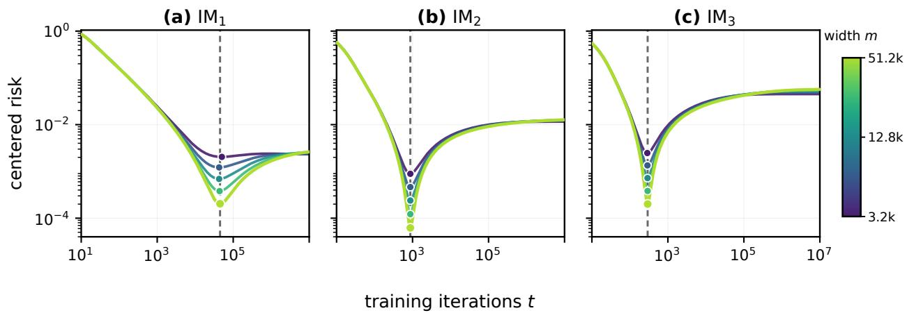  
Figure 12: Centered finite-width DE risk across widths in the three integrable-memory subregimes. The stabilization of the minimizing iteration supports the finite-time local optimum in Theorem E.4.

To compare with clean training, define

$$
\mathcal { R } _ { 0 , \mathrm { c o n s t } } ^ { \star } ( \mathfrak { f } ) : = \operatorname* { m i n } _ { 1 \leq m \leq \uparrow / B } \mathcal { R } _ { 0 } \left( \frac { \mathfrak { f } } { B m } , m \right) , \qquad \mathcal { R } _ { 0 , \mathrm { c o n s t } } ^ { \star } ( \mathfrak { f } ) \asymp \mathfrak { f } ^ { - \rho _ { 0 } } , \qquad m _ { 0 , \mathrm { c o n s t } } ^ { \star } ( \mathfrak { f } ) \asymp \mathfrak { f } ^ { \xi _ { 0 } } ,
$$

where $m _ { 0 , \mathrm { { c o n s t } } } ^ { \star } ( \mathfrak { f } )$ is any minimizer in the definition of $\mathcal { R } _ { \mathrm { 0 , c o n s t } } ^ { \star }$ . The clean $4 + 3$ calculation gives the reusable baseline

$$
\begin{array} { r l } & { \left( \frac { p } { 2 \alpha + 1 } , \frac { 1 } { 7 \alpha + \alpha } \right) , } \\ & { ~ \left( \frac { p } { 2 ( \alpha + \beta ) } , \frac { \beta } { \alpha + \beta } \right) , } \\ & { ~ \left( \frac { \beta } { ( 2 \alpha + \beta ) } , \frac { \beta } { \alpha + \beta } \right) , } \\ & { ~ \left( \frac { ( \alpha - \alpha ) } { \alpha + 1 } , \frac { 1 } { 2 } \right) , } \\ & { \left( \rho _ { 0 } , \xi _ { 0 } \right) = \left\{ \begin{array} { l l } { \left( \frac { p } { 2 } , 1 \right) , } & { 4 + 3 \mathrm { P h a s e ~ I n } , } \\ { \left( \frac { p } { 2 } , 2 \right) , } & { \left( \alpha + \beta \right) \leq \operatorname* { I n } , } \\ { \left( \frac { \alpha p } { 2 ( \beta - 1 ) + 3 \alpha - 2 \alpha \beta } , \frac { p } { 2 ( 2 \beta - 1 + 3 \alpha - 2 \alpha \beta ) } \right) , } & { 4 + 3 \mathrm { P h a s e ~ I n } , } \end{array} \right. } \\ & { ~ \left( \frac { \alpha } { ( 2 \beta - 1 ) } , \frac { \alpha p } { 3 \alpha + \beta } , \frac { \beta - \alpha } { 3 \alpha + \beta } , \frac { \beta } { 3 \alpha + \beta } \right) , } \\ & { ~ \left( \frac { \left( 1 - \frac { 2 \alpha } { ( \beta - 1 ) \alpha + \beta } \right) } { 2 \left( 2 \beta \right) \left( 1 - \alpha \right) - \alpha ^ { 3 } } , \frac { \beta - \alpha } { 2 \beta \left( 1 - \alpha \right) - \alpha } \right) , } \\ & { ~ \left( \frac { \beta } { 2 \left( \beta + \left( 1 - \alpha \right) - \alpha \right) } , \frac { \beta - \alpha } { 3 \alpha + \beta } , \frac { \beta } { 3 \alpha + 3 \mathrm { P h a s e ~ I N } , } \right) . } \end{array}\tag{E.12}
$$

Combining Eqs. (E.10) and (E.12) gives the following comparisons, with the noisy exponents

interpreted as source-window-restricted below trace class and U-restricted above trace class:

$$
\bar { \rho } _ { \sigma } \left\{ \begin{array} { l l } { { > \rho _ { 0 } , } } & { { \mathrm { i n ~ 4 + 3 ~ P h a s e s ~ I a , ~ I I , ~ a n d ~ I I I , } } } \\ { { < \rho _ { 0 } , } } & { { \mathrm { i n ~ 4 + 3 ~ P h a s e s ~ I b , ~ I c , ~ I V a , ~ a n d ~ I V b , } } } \end{array} , \right.
$$

$$
\bar { \xi } _ { \sigma } > \xi _ { 0 } \mathrm { i n ~ a l l ~ s e v e n ~ o p e n ~ 4 + 3 ~ c o m p a r i s o n ~ p h a s e s . }
$$

The larger exponent in 4+3 Phases Ia, II, and III does not mean that noise improves the uncentered risk. Clean and noisy losses are centered at diferent limits. The larger exponent only describes the large-width DE correction around the finite-time local optimum. Since $\mathbf { f } = B m t$

$$
t _ { 0 , \mathrm { c o n s t , \vec { r } } } ^ { \star } \asymp \vec { \mathfrak { f } } ^ { 1 - \xi _ { 0 } } , \qquad t _ { \sigma , \mathrm { s r c , \vec { f } } } ^ { \star } \asymp \vec { \mathfrak { f } } ^ { 1 - \bar { \xi } _ { \sigma } } ( \alpha < 1 / 2 ) .
$$

Thus the displayed noisy branch allocates a larger compute exponent to width than the clean benchmark. Above trace class the shift is complete, with $t _ { \sigma , \mathrm { c o n s t } } ^ { \star } = \Theta ( 1 )$ within U. Below trace class, both width and iteration count still diverge, but noise favors earlier stopping.

Fixed noise merges the eight propagation subregimes into four exponent regions. Within the source window below trace class, the balance is $\mathcal { F } _ { p p } \asymp \sigma ^ { 2 } \mathcal { S } _ { t }$ ; above it the U-restricted optimizer stops at finite time. The following proposition separates its plateau from the decaying centered correction.

Proposition E.5 (Source-window decay and trace-class plateau). Under the hypotheses of Theorem E.4, if $\alpha < 1 / 2$ , then

$$
\mathcal { R } _ { \sigma , \mathrm { s r c } } ^ { \star } ( \mathfrak { f } ) \longrightarrow 0 .
$$

If $\alpha > 1 / 2 .$ , then

$$
P _ { \sigma , U } ^ { \star } = \mathcal { R } _ { \sigma , \infty } ( t _ { \sigma , \mathrm { c o n s t } } ^ { \star } ) > 0 ,
$$

and

$$
\mathcal { R } _ { \sigma , U } ^ { \star } ( \mathfrak { f } ) = P _ { \sigma , U } ^ { \star } + \Theta ( \mathfrak { f } ^ { - a _ { \sigma } } ) , \qquad t _ { \sigma , \mathrm { c o n s t } } ^ { \star } = \Theta ( 1 ) .
$$

## E.4 Proof of Theorem E.4

Proof of Theorem E.4. Step 1: noisy Volterra reduction. Set $\eta _ { s } \equiv \eta , B _ { s } \equiv B$ in Theorem C.1. In the convolution form Eq. (A.13), the forcing and kernel from Eqs. (A.9) and (A.10) propagate initialization and one unit of clean-target DE risk, while labels contribute $\sigma ^ { 2 } S$ . Subtracting Eq. (A.12), with $\mathbf { 1 } = ( 1 , 1 , \ldots )$ , gives

$$
\mathcal { R } _ { \sigma } - \mathcal { R } _ { 0 } = \sigma ^ { 2 } \sum _ { \ell \geq 1 } \mathcal { K } ^ { * \ell } * { \bf 1 } .
$$

Its first term is $s ,$ so positivity and $\| \mathcal { K } \| _ { \ell ^ { 1 } } \leq \kappa$ give

$$
\mathcal { S } _ { t } \leq \sum _ { \ell \geq 1 } ( K ^ { * \ell } * { \bf 1 } ) ( t ) \leq \mathcal { S } _ { t } \sum _ { \ell \geq 0 } \kappa ^ { \ell } = \frac { \mathcal { S } _ { t } } { 1 - \kappa } .
$$

This proves Eq. (A.15).

Step 2: cumulative-kernel asymptotics. For $\alpha > 1 / 4$ , Theorem C.12 gives, modewise and

uniformly below the stability threshold,

$$
\sum _ { s = 0 } ^ { t - 1 } \frac { \eta ^ { 2 } } { B } \lambda ^ { 2 } q _ { \eta } ( \lambda ) ^ { s } = \frac { \eta ^ { 2 } } { B } \lambda ^ { 2 } \frac { 1 - q _ { \eta } ( \lambda ) ^ { t } } { 1 - q _ { \eta } ( \lambda ) } \asymp \eta \lambda \left( 1 - e ^ { - c _ { 2 } \eta t \lambda } \right)
$$

for some $c _ { 2 } > 0$ . Inserting $\lambda _ { j } \asymp j ^ { - 2 \alpha }$ proves Eq. (E.5); for $1 / 4 < \alpha < 1 / 2$ , splitting at $j _ { t } \asymp ( \eta t ) ^ { 1 / ( 2 \alpha ) }$ gives the same order on both sides:

$$
 { S _ { t } } \asymp \eta ( \eta t ) ^ { ( 1 - 2 \alpha ) / ( 2 \alpha ) } \asymp \left( \frac { t } { B m } \right) ^ { ( 1 - 2 \alpha ) / ( 2 \alpha ) } .
$$

For $0 < \alpha < 1 / 4$ , the LM/IM filter fails at the lower edge, while the constant-schedule targetindependent FB kernel estimate in Theorem C.17 gives

$$
S _ { t } \asymp \frac { t } { B m } .
$$

For $\alpha > 1 / 2 ,$ summability gives

$$
\mathcal { S } _ { \infty } ( m ) - \mathcal { S } _ { t } ( m ) \asymp \sum _ { j \geq 1 } j ^ { - 2 \alpha } e ^ { - c _ { 2 } \eta t j ^ { - 2 \alpha } } \asymp t ^ { - 1 + 1 / ( 2 \alpha ) } .
$$

Together these three cases prove $\mathrm { E q . ~ ( E . 6 ) }$

Step 3: optimization below the trace-class line. Suppose $\alpha < 1 / 2$ . We identify the unique corner within $\mathcal { M } _ { \mathrm { s r c } } ( \mathfrak { f } )$ . With $t = \mathfrak { f } / ( B m )$ , Eqs. (A.15) and (E.1) and, for $1 / 4 < \alpha < 1 / 2$ , the noisy contribution give

$$
\mathcal { F } _ { p p } \asymp \mathfrak { f } ^ { - ( 2 \alpha + 2 \beta - 1 ) / ( 2 \alpha ) } m ^ { ( 2 \alpha + 2 \beta - 1 ) ( 1 - \alpha ) / \alpha } ,\tag{E.13}
$$

$$
\sigma ^ { 2 } S _ { t } \asymp \sigma ^ { 2 } \mathfrak { f } ^ { ( 1 - 2 \alpha ) / ( 2 \alpha ) } m ^ { - ( 1 - 2 \alpha ) / \alpha } .\tag{E.14}
$$

Equating these terms and simplifying the two exponents gives

$$
\begin{array} { r l } & { m ^ { [ \alpha ( 1 - 2 \alpha ) + 2 \beta ( 1 - \alpha ) ] / \alpha } \asymp \sigma ^ { 2 } \mathfrak { f } ^ { \beta / \alpha } , } \\ & { \quad p ( 1 - \alpha ) + 1 - 2 \alpha = \alpha ( 1 - 2 \alpha ) + 2 \beta ( 1 - \alpha ) , \qquad p + 1 - 2 \alpha = 2 \beta , } \\ & { \qquad m _ { \sigma , \mathrm { s r c } } ^ { \star } \asymp ( \sigma ^ { 2 } ) ^ { \frac { \alpha } { \alpha ( 1 - 2 \alpha ) + 2 \beta ( 1 - \alpha ) } } \mathfrak { f } ^ { \frac { \beta } { \alpha ( 1 - 2 \alpha ) + 2 \beta ( 1 - \alpha ) } } , } \\ & { \qquad \mathcal { R } _ { \sigma , \mathrm { s r c } } ^ { \star } \asymp ( \sigma ^ { 2 } ) ^ { \frac { ( 1 - \alpha ) p } { \alpha ( 1 - 2 \alpha ) + 2 \beta ( 1 - \alpha ) } } \mathfrak { f } ^ { - \frac { ( 1 - 2 \alpha ) p } { 2 [ \alpha ( 1 - 2 \alpha ) + 2 \beta ( 1 - \alpha ) ] } } . } \end{array}
$$

The second line is the algebraic simplification; the first relation gives the third, and substitution into either balanced term gives the fourth.

For $0 < \alpha < 1 / 4$ , Eq. (E.6) instead gives the three-step calculation

$$
\begin{array} { r l } & { \sigma ^ { 2 } S _ { t } \asymp \sigma ^ { 2 } \mathfrak { f } m ^ { - 2 } , \qquad \quad \quad m ^ { [ p ( 1 - \alpha ) + 2 \alpha ] / \alpha } \asymp \sigma ^ { 2 } \mathfrak { f } ^ { ( p + 2 \alpha ) / ( 2 \alpha ) } , } \\ & { m _ { \sigma , \mathrm { s r c } } ^ { \star } \asymp ( \sigma ^ { 2 } ) ^ { \frac { \alpha } { p ( 1 - \alpha ) + 2 \alpha } } \mathfrak { f } ^ { \frac { p + 2 \alpha } { 2 [ p ( 1 - \alpha ) + 2 \alpha ] } } , \qquad \quad \qquad \mathcal { R } _ { \sigma , \mathrm { s r c } } ^ { \star } \asymp ( \sigma ^ { 2 } ) ^ { \frac { ( 1 - \alpha ) p } { p ( 1 - \alpha ) + 2 \alpha } } \mathfrak { f } ^ { - \frac { \alpha p } { p ( 1 - \alpha ) + 2 \alpha } } . } \end{array}
$$

The second relation balances the first with Eq. (E.13); substitution gives the last line.

Step 4: validity of the sub-trace corners. For $1 / 4 < \alpha < 1 / 2$ , the candidate has

$$
\begin{array} { r l r } { m \asymp \mathfrak { f } ^ { \frac { \beta } { \alpha ( 1 - 2 \alpha ) + 2 \beta ( 1 - \alpha ) } } , } & { \quad } & { \eta t \asymp \mathfrak { f } ^ { \frac { \alpha ( 1 - 2 \alpha ) } { \alpha ( 1 - 2 \alpha ) + 2 \beta ( 1 - \alpha ) } } , } \\ { \frac { m ^ { 2 \alpha } } { \eta t } \asymp \mathfrak { f } ^ { \frac { \alpha p } { \alpha ( 1 - 2 \alpha ) + 2 \beta ( 1 - \alpha ) } } , } & { \quad } & { t \asymp \mathfrak { f } ^ { \frac { ( 1 - 2 \alpha ) ( \alpha + \beta ) } { \alpha ( 1 - 2 \alpha ) + 2 \beta ( 1 - \alpha ) } } . } \end{array}
$$

All exponents are positive, so the candidate lies polynomially inside $\mathcal { M } _ { \mathrm { s r c } } ( \mathfrak { f } )$ . The $\mathcal { F } _ { 0 }$ -exponent gap is $p ^ { 2 } / [ 2 ( \alpha ( 1 - 2 \alpha ) + 2 \beta ( 1 - \alpha ) ) ] > 0$ in subregimes $\mathrm { L M _ { 1 , 2 } }$ and $[ 2 \alpha \beta - \frac { 1 } { 2 } ( 1 - 2 \alpha ) p ] / [ \alpha ( 1 - 2 \alpha ) + 2 \beta ( 1 - \alpha ) ] > 0$ in subregime $\mathrm { L M _ { 3 } } ;$ its numerator equals $2 \alpha ^ { 2 }$ at $\beta = 1 / 2$ and has derivative $4 \alpha - 1 > 0$ . In all three subregimes, Eq. (E.3) gives the positive kernel gap $\alpha ( 1 - 2 \alpha ) / [ \alpha ( 1 - 2 \alpha ) + 2 \beta ( 1 - \alpha ) ]$

For $0 < \alpha < 1 / 4$ , the corresponding candidate satisfies

$$
\begin{array} { l c r } { { m \asymp \mathfrak { f } ^ { \frac { p + 2 \alpha } { 2 \left[ p \left( 1 - \alpha \right) + 2 \alpha \right] } } , } }  & { { \qquad t \asymp \mathfrak { f } ^ { \frac { p ( 1 - 2 \alpha ) + 2 \alpha } { 2 \left[ p \left( 1 - \alpha \right) + 2 \alpha \right] } } , } } \\ { { \eta t \asymp \mathfrak { f } ^ { \frac { 2 \alpha ^ { 2 } } { p \left( 1 - \alpha \right) + 2 \alpha } } , } } & { { \qquad \frac { m ^ { 2 \alpha } } { \eta t } \asymp \mathfrak { f } ^ { \frac { \alpha p } { p \left( 1 - \alpha \right) + 2 \alpha } } . } } \end{array}
$$

All exponents are again positive, so this candidate also lies polynomially inside $\mathcal { M } _ { \mathrm { s r c } } ( \mathfrak { f } )$ . The width-floor gap is $p ^ { 2 } / [ 2 ( p ( 1 - \alpha ) + 2 \alpha ) ] > 0$ in subregime $\mathrm { F B _ { 1 } }$ and $2 \alpha ^ { 2 } / [ p ( 1 - \alpha ) + 2 \alpha ] > 0$ in subregime $\mathrm { F B _ { 2 } }$ . In the proved source range of Theorem C.18, these gaps make the displayed forcing–noise corner govern the finite-bulk DE formulas. On the high-source $\mathrm { F B _ { 2 } }$ branch, the same deduction additionally requires Theorems C.19 and C.20.

On the LM branches, Theorem C.15 applies for $\beta < 1 +$ 2α of the critical lines. Positivity gives the matching in-window lower bound $\mathcal { F } _ { p p } + \sigma ^ { 2 } \mathcal { S } _ { t } ;$ ; evaluation at the admissible candidate gives the upper bound. Thus the source-window-restricted optima in subregimes $\mathrm { L M _ { 1 , 2 , 3 } }$ satisfy

$$
\begin{array} { r } { \mathcal { F } _ { p p } \asymp \sigma ^ { 2 } \mathcal { S } _ { t } , } \end{array}
$$

whereas both FB subregimes in the proved source range use Theorem C.18. Their balanced values tend to zero, proving $\mathcal { R } _ { \sigma , \mathrm { s r c } } ^ { \star } ( \mathfrak { f } )  0$

Step 5: optimization above the trace-class line. Suppose $\alpha > 1 / 2$ , and let $t _ { \sigma , U , \mathfrak { f } } ^ { \star }$ minimize the compute-constrained diagonal family over U. Its associated width $m _ { \sigma , U , \mathfrak { f } } ^ { \star } : = \mathfrak { f } / ( B t _ { \sigma , U , \mathfrak { f } } ^ { \star } )$ tends to infinity uniformly because $U \subset ( 1 , \infty )$ is compact. Uniform convergence on U makes every subsequential limit minimize $\mathcal { R } _ { \sigma , \infty } ;$ uniqueness gives $t _ { \sigma , U , \mathfrak { f } } ^ { \star } \to t _ { \sigma , \mathrm { c o n s t } } ^ { \star } .$ with no optimizer-location rate claimed.

For the upper bound, evaluate Eq. (E.8) at $t _ { \sigma , \mathrm { c o n s t } } ^ { \star } ;$ for the lower, use nonnegativity of the infinite-width value diference, convergence of the minimizers, and $G _ { \sigma } ( t _ { \sigma , \mathrm { c o n s t } } ^ { \star } ) > 0$ . Thus

$$
\Delta _ { \sigma , U } ^ { \star } ( \mathfrak { f } ) \asymp \left( m _ { \sigma , U , \mathfrak { f } } ^ { \star } \right) ^ { - a _ { \sigma } } \asymp \mathfrak { f } ^ { - a _ { \sigma } } .
$$

By Eq. (E.7), the exponent is $2 \alpha + 2 \beta - 1$ in $\mathrm { I M } _ { 1 }$ and 1 in $\operatorname { I M } _ { 2 , 3 } ,$ proving the finite-time conclusion over U.

The sub-trace argument gives the last two rows of Eq. (E.10) and Eq. (E.11). The trace-class argument gives the first two rows of Eq. (E.10) and the finite-time conclusion, completing the proof. □

Proof of Theorem E.5. If $\alpha < 1 / 2$ , Steps 3–4 above show that the source-window optimum has a

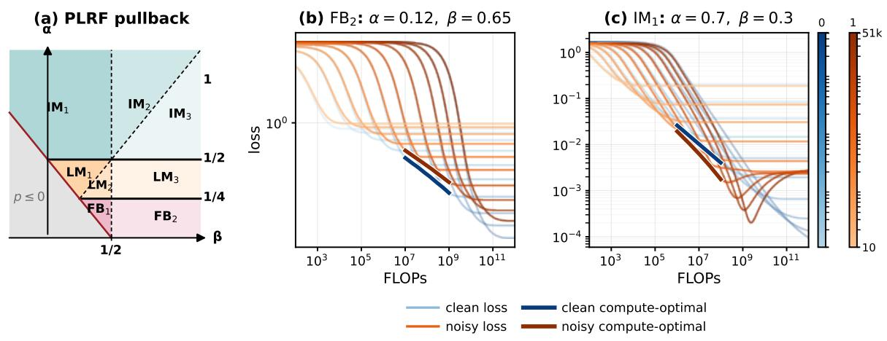  
Figure 13: The PLRF propagation map and representative centered-risk compute frontiers in $\mathrm { F B _ { 2 } }$ and $\mathrm { I M } _ { 1 }$ . Their continuing forcing–noise balance and finite-time stopping illustrate the phasedependent shift of compute from iterations to width.

strictly positive decay exponent, and hence $\mathcal { R } _ { \sigma , \mathrm { s r c } } ^ { \star } ( \mathfrak { f } )  0$ . If $\alpha > 1 / 2$ , Step 5 identifies the finite limiting optimizer $t _ { \sigma , \mathrm { c o n s t } } ^ { \star }$ , and Eq. (E.8) gives

$$
\mathcal { R } _ { \sigma , U } ^ { \star } ( \mathfrak { f } ) = \mathcal { R } _ { \sigma , \infty } ( t _ { \sigma , \mathrm { c o n s t } } ^ { \star } ) + \Theta ( \mathfrak { f } ^ { - a _ { \sigma } } ) .
$$

The positive stable noise resolvent makes the limiting value strictly positive. This is the claimed trace-class plateau. □

Figure 13 places representative constant-schedule Volterra trajectories from $\mathrm { F B _ { 2 } }$ and $\mathrm { I M } _ { 1 }$ on the PLRF propagation map. Their contrast supports the predicted continuing forcing–noise balance below trace class and finite-time noisy stopping within U above trace class.

## E.5 Clean-to-noisy crossover scales

Weak-noise early-stopping prediction in the IM regime. For the crossover comparison below, the formal large-iteration matching convention compares the clean infinite-width transient with the unsaturated terminal-noise deficit as $\sigma ^ { 2 } \downarrow 0$ . With B and a stable $\eta$ held fixed, it predicts

$$
t _ { \sigma , \mathrm { c o n s t } } ^ { \star } \asymp \left\{ \begin{array} { l l } { ( \sigma ^ { 2 } ) ^ { - \alpha / \beta } , } & { \mathrm { I M } _ { 1 } , \ \beta > 0 , } \\ { ( \sigma ^ { 2 } ) ^ { - \alpha / \beta } , } & { \mathrm { I M } _ { 2 } , } \\ { ( \sigma ^ { 2 } ) ^ { - 1 } , } & { \mathrm { I M } _ { 3 } . } \end{array} \right.\tag{E.15}
$$

For subregime $\mathrm { I M } _ { 1 }$ with $\beta \leq 0$ , this balance yields no diverging weak-noise scale. These scales are formal order predictions from the weak-noise balance.

finite minimizer $\Delta ^ { t ^ { \star } } = \infty /$ finite boundary finite / t ⋆ = 0 boundary

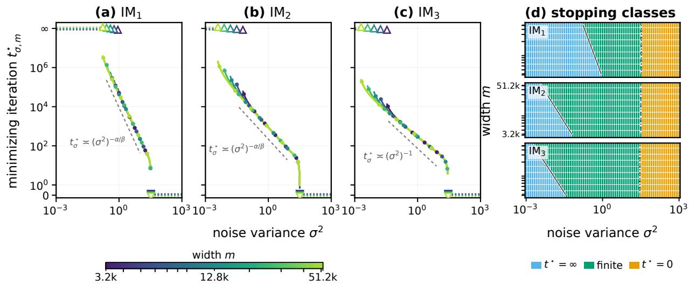  
Figure 14: The minimizing iteration and stopping class across noise levels and widths in the three integrable-memory subregimes. The terminal–finite and finite–no-training transitions support the predicted subregime dependence of early stopping.

Scope of the weak-noise matching. For comparison only, first suppose $\beta > 0$ and set

$$
q _ { S } : = 1 - \frac { 1 } { 2 \alpha } > 0 , \qquad q _ { \mathrm { t a i l } } : = q _ { S } + \operatorname* { m i n } \left\{ \frac { \beta } { \alpha } , 1 \right\} > q _ { S } .
$$

The clean infinite-width transient is $O ( t ^ { - q _ { \mathrm { t a i l } } } )$ , so the large-t inputs and bounded positive Volterra resolvent give

$$
\mathcal { R } _ { \sigma , \infty } ( t ) = \mathcal { R } _ { \sigma , \infty } ( \infty ) - c _ { \sigma } \sigma ^ { 2 } t ^ { - q s } + O ( t ^ { - q _ { \mathrm { t a i l } } } ) .
$$

The big-O clean term has no specified leading coeficient or sign. Locating a weak-noise minimizer would require a uniform signed clean-tail expansion along a joint limit with $\sigma ^ { 2 } \downarrow 0$

For $\beta = 0$ , the decay powers coincide; for $\beta < 0 , q _ { \mathrm { t a i l } } = q _ { S } + \beta / \alpha < q _ { S }$ . Without a signed clean-tail expansion, neither identifies a diverging weak-noise minimizer. Hence the $\mathrm { I M } _ { 1 }$ row of Eq. (E.15) and the 4+3 Phase Ia crossover entry in Theorem E.6 are restricted to $\beta > 0 ;$ the fixed-noise plateau conclusion above is unchanged.

Under the same numerical setting, Figure 14 varies noise and width to reveal how the finite early-stopping region lies between terminal training and no training in each IM subregime.

At small but fixed $\sigma ^ { 2 }$ , when does the noisy optimum replace the clean optimum? Equivalently, at fixed compute, how large can the label-noise variance be before the fixed-noise optimum takes over? The next proposition retains the clean $4 + 3$ indexing because the clean $4 + 3$ crossover rates distinguish branches that merge under the propagation taxonomy. These are crossover scales, not sharp transition points. The proof is in Section E.5.

For any matched compute scale ${ \mathfrak { f } } _ { \mathrm { c r o s s } } ( \sigma )$ , denote by $\sigma _ { \mathrm { c r o s s } } ^ { 2 } ( \mathfrak { f } )$ a fixed-compute inverse scale satisfying

$$
\mathfrak { f } _ { \mathrm { c r o s s } } ( \sigma _ { \mathrm { c r o s s } } ) \asymp \mathfrak { f } .
$$

Proposition E.6 (Matched clean-to-noisy compute scales). Fix a small noise variance $\sigma ^ { 2 } > 0$ Below trace class, match the noisy term at the clean-optimal width to the clean-optimal loss. Above trace class, use the weak-noise large-iteration prediction in Eq. (E.15), and match its noisy optimal iteration to the clean one. In $4 { + 3 }$ Phase Ia (our subregime $\operatorname { I M } _ { 1 } )$ , this convention applies only when $\beta > 0 ;$ ; for $\beta \leq 0$ , it gives no diverging weak-noise minimizer. The resulting matched compute scales in the clean $4 + 3$ comparison coordinates are

$$
\begin{array} { r } { \mathbf { \widehat { f } _ { \mathrm { c r o s s } } } ( \sigma ) \asymp \left\{ \begin{array} { l l } { ( \sigma ^ { 2 } ) ^ { - ( 2 \alpha + 1 ) / ( 2 \beta ) } , } & { 4 + 3 \mathrm { ~ P h a s e ~ I a , ~ } \beta > 0 , } \\ { ( \sigma ^ { 2 } ) ^ { - ( \alpha + \beta ) / \beta } , } & { 4 + 3 \mathrm { ~ P h a s e ~ I I } , } \\ { ( \sigma ^ { 2 } ) ^ { - 2 } , } & { 4 + 3 \mathrm { ~ P h a s e ~ I I I } , } \\ { ( \sigma ^ { 2 } ) ^ { - 2 / p } , } & { 4 + 3 \mathrm { ~ P h a s e ~ I b } , } \\ { ( \sigma ^ { 2 } ) ^ { - \frac { 2 \beta - 1 + 3 \alpha - 2 \alpha \beta } { 2 \alpha ^ { 2 } } } , } & { 4 + 3 \mathrm { ~ P h a s e ~ I c } , } \\ { ( \sigma ^ { 2 } ) ^ { - \frac { 2 \beta ( 1 - \alpha ) - \alpha } { \alpha ( 1 - 2 \alpha ) } } , } & { 4 + 3 \mathrm { ~ P h a s e ~ I c } , } \end{array} \right. } \end{array}\tag{E.16}
$$

Equivalently, within the same source/weak-noise scope, any branch written in $\operatorname { E q . }$ (E.16) as ${ \mathfrak { f } } _ { \mathrm { c r o s s } } ( \sigma ) \asymp ( \sigma ^ { 2 } ) ^ { - \gamma }$ has $\sigma _ { \mathrm { c r o s s } } ^ { 2 } ( \mathfrak { f } ) \asymp \mathfrak { f } ^ { - 1 / \gamma }$ , with the Phase Ia restriction $\beta > 0$ . Within the source window, $1 \ll \mathfrak { f } \ll \mathfrak { f } _ { \mathrm { c r o s s } } ( \sigma )$ , equivalently $\sigma ^ { 2 } \ll \sigma _ { \mathrm { c r o s s } } ^ { 2 } ( \mathfrak { f } )$ , gives clean-optimal scaling; reversing both inequalities gives noisy-optimal scaling. The $4 { + 3 }$ Phase IVa branch within our subregime $\mathrm { L M _ { 3 } }$ has two matched compute scales,

$$
\mathfrak { f } _ { \mathrm { o n s e t } } ( \sigma ) \asymp ( \sigma ^ { 2 } ) ^ { - 1 / \alpha } , \qquad \mathfrak { f } _ { \mathrm { f u l l } } ( \sigma ) \asymp ( \sigma ^ { 2 } ) ^ { - \frac { 2 \beta ( 1 - \alpha ) - \alpha } { \alpha ( 1 - 2 \alpha ) } } .\tag{E.17}
$$

Their fixed-compute inverses are

$$
\sigma _ { \mathrm { o n s e t } } ^ { 2 } ( \mathfrak { f } ) \asymp \mathfrak { f } ^ { - \alpha } , \qquad \sigma _ { \mathrm { f u l l } } ^ { 2 } ( \mathfrak { f } ) \asymp \mathfrak { f } ^ { - \alpha ( 1 - 2 \alpha ) / [ 2 \beta ( 1 - \alpha ) - \alpha ] } .
$$

Because $\beta > 1 / 2 , 2 \beta ( 1 - \alpha ) - \alpha > 1 - 2 \alpha , \mathrm { s o } \sigma _ { \mathrm { o n s e t } } ^ { 2 } \ll \sigma _ { \mathrm { f u l l } } ^ { 2 } |$ . Hence

$$
\begin{array} { r c l } { { \sigma ^ { 2 } \ll \sigma _ { \mathrm { o n s e t } } ^ { 2 } ( \mathfrak { f } ) } } & { { \Longrightarrow } } & { { \mathrm { c l e a n - o p t i m a l ~ s c a l i n g , } } } \\ { { \sigma _ { \mathrm { o n s e t } } ^ { 2 } ( \mathfrak { f } ) \ll \sigma ^ { 2 } \ll \sigma _ { \mathrm { f u l l } } ^ { 2 } ( \mathfrak { f } ) } } & { { \Longrightarrow } } & { { \mathrm { i n t e r m e d i a t e ~ k e r n e l / n o i s e ~ b a l a n c e , } } } \\ { { \sigma ^ { 2 } \gg \sigma _ { \mathrm { f u l l } } ^ { 2 } ( \mathfrak { f } ) } } & { { \Longrightarrow } } & { { \mathrm { f u l l ~ } \mathcal { F } _ { p p } \mathrm { - n o i s e ~ b a l a n c e . } } } \end{array}
$$

All locations are order predictions, with constants possibly depending on $\alpha , \beta , B , \eta , c .$

The displayed noise ranges invert Eq. (E.17).

Proof of Theorem E.6. For $\alpha > 1 / 2$ , combine Eqs. (E.12) and (E.15) with $t _ { 0 , \mathrm { c o n s t } } ^ { \star } = \mathfrak { f } / ( B m _ { 0 , \mathrm { c o n s t } } ^ { \star } )$ Equating clean and weak-noise iteration scales gives

<table><tr><td>4+3 phase</td><td>clean t*</td><td>weak-noise t*</td><td>02 match</td></tr><tr><td>Ia</td><td> $\overline { { \mathsf { f } ^ { 2 \alpha / ( 2 \alpha + 1 ) } } }$ </td><td> $\overline { { ( \sigma ^ { 2 } ) ^ { - \alpha / \beta } } }$ </td><td>f−2β/(2α+1)</td></tr><tr><td>II</td><td> $\displaystyle \mathbf { f } ^ { \alpha / ( \alpha + \beta ) }$ </td><td> $( \sigma ^ { 2 } ) ^ { - \alpha / \beta }$ </td><td>f−β/(α+β)</td></tr><tr><td>III</td><td> $\mathfrak { f } ^ { 1 / 2 }$ </td><td> $( \sigma ^ { 2 } ) ^ { - 1 }$ </td><td>f−1/2.</td></tr></table>

Inverting the last column gives the three trace-class branches of $\mathrm { E q . ~ ( E . 1 6 ) }$

Below trace class, recall $p : = 2 \alpha + 2 \beta - 1$ and write $\mathfrak { d } _ { \mathrm { I c } } : = 2 \beta - 1 + 3 \alpha - 2 \alpha \beta$ and $\mathfrak { d } _ { \mathrm { I V b } } : = 2 \beta ( 1 - \alpha ) - \alpha$

For $1 / 4 < \alpha < 1 / 2$ , evaluating Eq. (E.14) at the clean-optimal width gives

$$
\sigma ^ { 2 } S _ { t } \asymp \sigma ^ { 2 } \mathfrak { f } ^ { ( 1 - 2 \alpha ) / ( 2 \alpha ) } \bigl ( m _ { 0 , \mathrm { c o n s t } } ^ { \star } ( \mathfrak { f } ) \bigr ) ^ { - ( 1 - 2 \alpha ) / \alpha } .
$$

For $0 < \alpha < 1 / 4 $ use instead $\sigma ^ { 2 } S _ { t } \asymp \sigma ^ { 2 } \mathrm { f } m ^ { - 2 }$ . Substituting the clean branches from Eq. (E.12) gives, in Phase Ib for either range, $\sigma ^ { 2 } S _ { t } \asymp \sigma ^ { 2 } , \mathcal { R } _ { 0 . \mathrm { c o n s t } } ^ { \star } \asymp \mathfrak { f } ^ { - p / 2 }$ , and hence $\sigma ^ { 2 } \asymp \mathfrak { f } ^ { - p / 2 }$ . In Phase IVa, the same noise order matched with $\beta ^ { - \alpha }$ gives $\sigma ^ { 2 } \asymp \mathfrak { f } ^ { - \alpha }$ . The remaining substitutions are

$$
\begin{array} { r l r l } { { 4 } + 3 \mathrm { ~ P h a s e ~ I V b : ~ } } & { \sigma ^ { 2 } S _ { t } \asymp \sigma ^ { 2 } \mathfrak { f } ^ { - ( 1 - 2 \alpha ) ( 2 \beta - 1 ) / ( 2 \mathfrak { a } _ { \mathrm { I V b } } ) } , } & & { \qquad \mathcal { R } _ { 0 , \mathrm { c o n s t } } ^ { \star } \asymp \mathfrak { f } ^ { - ( 1 - 2 \alpha ) p / ( 2 \mathfrak { a } _ { \mathrm { I V b } } ) } , } \\ & { } & & { \qquad \sigma ^ { 2 } \asymp \mathfrak { f } ^ { - \alpha ( 1 - 2 \alpha ) / \mathfrak { a } _ { \mathrm { I V b } } } , } \end{array}
$$

4+3 Phase Ic : $\sigma ^ { 2 } S _ { t } \asymp \sigma ^ { 2 } \mathfrak { f } ^ { 1 - p / \mathfrak { d } _ { \mathrm { I c } } } ,$

$$
\begin{array} { r } { \mathcal { R } _ { 0 , \mathrm { c o n s t } } ^ { \star } \asymp \mathfrak { f } ^ { - \alpha p / \mathfrak { d } _ { \mathrm { I c } } } , } \\ { \sigma ^ { 2 } \asymp \mathfrak { f } ^ { - 2 \alpha ^ { 2 } / \mathfrak { d } _ { \mathrm { I c } } } . } \end{array}
$$

These are the Phase Ib, Ic, IVb, and IVa-onset variance thresholds; inversion gives their compute thresholds.

For the full-noise scale on the Phase IVa branch of our subregime $\mathrm { L M _ { 3 } }$ , evaluate the $\mathcal { F } _ { p p }$ –noise corner in Eq. (E.11), direct substitution into Eq. (E.3) gives

$$
\frac { \mathcal { K } _ { p p } / \eta } { \mathcal { F } _ { p p } } \asymp ( \sigma ^ { 2 } ) ^ { - \frac { 2 \beta ( 1 - \alpha ) - \alpha } { \alpha ( 1 - 2 \alpha ) + 2 \beta ( 1 - \alpha ) } } \mathfrak { f } ^ { - \frac { \alpha ( 1 - 2 \alpha ) } { \alpha ( 1 - 2 \alpha ) + 2 \beta ( 1 - \alpha ) } } .
$$

This corner becomes self-consistent at

$$
\begin{array} { r } { \sigma ^ { 2 } \asymp \mathfrak { f } ^ { - \frac { \alpha ( 1 - 2 \alpha ) } { 2 \beta ( 1 - \alpha ) - \alpha } } , } \end{array}
$$

which is $\sigma _ { \mathrm { f u l l } } ^ { 2 } ( \mathfrak { f } ) ;$ ; inversion gives ${ \mathfrak { f } } _ { \mathrm { f u l l } } ( \sigma )$ . Since $\beta > 1 / 2$ implies ${ \mathfrak { d } } _ { \mathrm { I V b } } > 1 - 2 \alpha$ , as $\sigma ^ { 2 } \downarrow 0 , ⨏ _ { \mathrm { o n s e t } } ( \sigma ) \ll$ ${ \mathfrak { f } } _ { \mathrm { f u l l } } ( \sigma ) ;$ equivalently, for large f, $\sigma _ { \mathrm { o n s e t } } ^ { 2 } ( \mathfrak { f } ) \ll \sigma _ { \mathrm { f u l l } } ^ { 2 } ( \mathfrak { f } )$ , leaving the intermediate kernel/noise range. This proves both crossover parametrizations, with all source-window and order-level qualifications unchanged. □

Constant schedules therefore expose the same mechanism as the general theory: the spectrum fixes memory, memory accumulates label noise, and the resulting balance moves compute from iterations to width. The schedule sections ask how changing $B _ { t } / \eta _ { t }$ can control this balance.

## F End-to-end language-model experiments

We use three experiments to test increasingly stronger consequences of the schedule coordinates predicted by our theory.

Roadmap: First, we fix the intrinsic-time horizon and vary the ratio path $r ( T ) = B ( T ) / \eta ( T )$ testing whether diferent ratio schedules produce diferent loss trajectories. Second, we fix both the intrinsic clock and the ratio path, but realize the same path either by varying learning rate at fixed batch size or by varying batch size at fixed learning rate. This tests whether the loss is approximately invariant to the particular learning-rate–batch-size factorization. Third, we adapt the practical seven-parameter functional scaling law of Li et al. (2025) but fit a forcing-memory surrogate on a single fixed-batch 8-1-1 trajectory and, without refitting, use it to predict the alternative factorization and unseen WSD schedules.

Together, the three experiments test ratio-path separation, factorization collapse, and crossschedule prediction. The plain-SGD experiments directly test the coordinates $T = \textstyle \sum _ { t } \eta _ { t }$ and $r = B / \eta$ derived by our theory; the Muon experiment uses separately calibrated coordinates and serves only as an optimizer-specific external-validity check. Code and configurations for reproducing these experiments are available in our GitHub repository.

## F.1 Testing ratio-path efects at matched intrinsic time

Our theory assigns diferent roles to two schedule coordinates: intrinsic time $\begin{array} { r } { T _ { t } = \sum _ { s < t } \eta _ { s } } \end{array}$ measures optimization progress, while $r _ { t } = B _ { t } / \eta _ { t }$ controls the accumulation of stochastic error. This experiment tests whether the ratio path afects end-to-end LLM loss after the intrinsic-time horizon is fixed. If intrinsic time were the only relevant coordinate, diferent ratio schedules would produce similar loss curves. The theory instead predicts systematic diferences, with diminishing improvement once the memory ceiling is reached.

We train a 30M-parameter nanoGPT model (Karpathy, 2022) on OpenWebText (Gokaslan and Cohen, 2019), with six layers, six attention heads, embedding width 384, and context length 256. Training uses plain SGD in FP32, without momentum, weight decay, or gradient clipping. We first train one model for 196,608 updates at a constant learning rate. We then copy this checkpoint into eleven runs and continue training them on the same ordered data stream. All runs use batch size $B = 8 ;$ only the learning-rate schedule difers.

Let $T _ { \mathrm { f o r k } }$ be the intrinsic time at the shared checkpoint. For each tail, the learning rate decays at

$$
\eta ( T ) = \eta _ { 0 } X ^ { - \vartheta } , \qquad X = 1 + \frac { T - T _ { \mathrm { f o r k } } } { \tau _ { s } } , \qquad \tau _ { s } = 1 0 2 4 \eta _ { 0 } ,
$$

and hence

$$
\frac { B } { \eta ( T ) } = \frac { B } { \eta _ { 0 } } X ^ { \vartheta } .
$$

Larger $\vartheta$ therefore means faster learning-rate decay and faster growth of $B / \eta$ . We use

$$
\vartheta \in \{ 0 , 0 . 1 2 5 , 0 . 2 5 , 0 . 3 7 5 , 0 . 5 , 0 . 7 5 , 1 , 1 . 2 5 , 1 . 5 , 1 . 7 5 , 2 \}
$$

and stop every run at $X \ = \ 1 5$ to ensure that all runs have the same intrinsic-time horizon, $T - T _ { \mathrm { f o r k } } = 1 4 \tau _ { s }$ , but diferent numbers of updates and tokens. We evaluate each trajectory at 410 points on the same fixed set of 1,024 validation contexts. Note that, at fixed model, starting the same checkpoint, batch size, and intrinsic-time horizon, but not at fixed updates or tokens, the validation loss changes systematically with the ratio-growth exponent.

Figure 15 shows that the validation curves are systematically ordered by ϑ. At the same intrinsic time, larger $\vartheta$ gives lower validation loss, confirming that the ratio path $B / \eta$ , rather than intrinsic time alone, organizes the schedule response. The improvement diminishes at large $\vartheta ,$ as expected from a memory ceiling.

This experiment tests these predictions only qualitatively. It uses one seed, measures total validation cross-entropy rather than a noisy–clean gap, and does not independently estimate $q \kappa$ . It therefore does not identify the LM/IM boundary or verify the piecewise asymptotic exponent in Theorem 5.1.

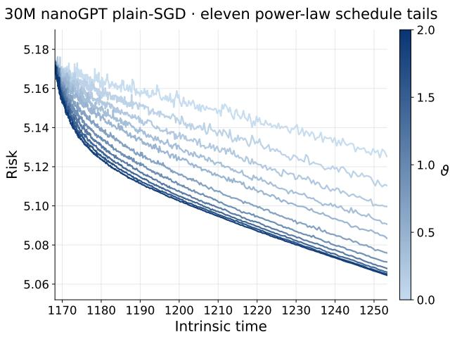  
Figure 15: Efect of the ratio path at matched intrinsic time. All runs start from the same checkpoint and stop at the same intrinsic-time horizon, but use diferent numbers of updates and tokens. Larger $\vartheta$ means faster growth of $B / \eta ,$ and darker curves correspond to larger ϑ. Validation loss decreases with $\vartheta ,$ with diminishing improvement at large ϑ.

## F.2 Testing factorization invariance at matched ratio paths

This experiment tests whether an end-to-end validation-loss trajectory is governed mainly by intrinsic time and the ratio path, rather than by a particular factorization into learning rate and batch size. We compare two ratio-path shapes, named by their fixed-batch learning-rate realizations. WSD 80/20 is constant for the first 80% of training and decays exponentially over the final 20%, whereas 8-1-1 uses the same 80% prefix followed by two successive 10% decay stages. For each ratio path, one realization fixes batch size and varies learning rate, while the other fixes learning rate and varies batch size. Each pair starts from the same mature checkpoint, traverses the same future training tape, and is evaluated on the same fixed probe of 1024 validation contexts.

Both experiments use the same 300M-parameter GPT-2-tokenized nanoGPT architecture (Karpathy, 2022): 20 layers, 16 attention heads, width 1024, and context length 256. Each trajectory is trained on a frozen OpenWebText stream (Gokaslan and Cohen, 2019) for 6.5B tokens. The first 5.2B tokens form the shared prefix, and the remaining 1.3B tokens form one schedule tail. The left pair in Figure 16 uses plain SGD, while the right pair uses hybrid Muon.

For plain SGD, the matched clock and ratio are

$$
T _ { t } = \sum _ { s < t } \eta _ { s } , \qquad r ( T _ { t } ) = \frac { B _ { t } } { \eta _ { t } } .
$$

For a prescribed ratio path $r ( T )$ , the two factorizations are

$$
\mathrm { f i x e d ~ b a t c h } ; \quad { \boldsymbol { B } } _ { t } = { \boldsymbol { B } } _ { 0 } , \quad \eta _ { t } = \frac { B _ { 0 } } { r ( T _ { t } ) } , \qquad \mathrm { f i x e d ~ l e a r n i n g ~ r a t e } ; \quad \eta _ { t } = \eta _ { 0 } , \quad { \boldsymbol { B } } _ { t } = \eta _ { 0 } r ( T _ { t } ) .
$$

The 300M plain-SGD run realizes this match exactly on an integer macro grid. At each grid cell, $\Delta T = 0 . 0 0 5$ , and the integer schedule value is $g \in \{ 1 , \ldots , 1 0 \}$ for WSD and $g \in \{ 3 , 4 , 9 , 1 0 \}$ for

300M nanoGPT hybrid Muon, 6.5B tokens

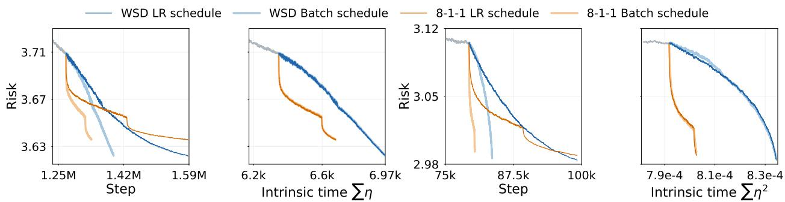  
Figure 16: Factorization collapse under matched ratio schedules. Fixed-probe validation cross-entropy for the same 300M nanoGPT architecture trained for 6.5B OpenWebText tokens with plain SGD (left pair) and hybrid Muon (right pair), shown against optimizer step and the corresponding intrinsic clock. Within each WSD or 8-1-1 schedule family, the LR schedule varies $\eta _ { t }$ at fixed $B _ { t } ,$ whereas the batch-size schedule varies $B _ { t }$ at fixed $\eta _ { t }$ . For plain SGD, these two realizations follow the same ratio path $r _ { t } = B _ { t } / \eta _ { t }$ under $\begin{array} { r } { T _ { t } = \sum _ { s < t } \eta _ { s } \mathrm { , } } \end{array}$ ; for Muon, they follow the same empirically calibrated path $\widetilde { r } _ { t } = B _ { t } / \eta _ { t } ^ { 2 }$ under $\begin{array} { r } { \widetilde { T } _ { t } = \sum _ { s < t } \eta _ { s } ^ { 2 } } \end{array}$ . The paired trajectories difer in optimizer step but nearly coincide in the corresponding intrinsic time. Blue denotes WSD, orange denotes 8-1-1, and gray denotes the shared prefix.

8-1-1:

$$
\begin{array} { r l } { \mathrm { f i x e d ~ b a t c h : } } & { g \mathrm { ~ u p d a t e s ~ w i t h ~ } B = 1 6 , \quad \eta = 0 . 0 0 5 / g , } \\ { \mathrm { f i x e d ~ l e a r n i n g ~ r a t e : } } & { 1 \mathrm { ~ u p d a t e ~ w i t h ~ } B = 1 6 g , \quad \eta = 0 . 0 0 5 . } \end{array}
$$

Both realizations consume exactly 16g training contexts from the same contiguous segment of the frozen future tape, advance intrinsic time by the same $\Delta T _ { \mathrm { { \scriptsize 3 } } }$ and realize $B / \eta = 3 2 0 0 g$ at every completed grid cell. Each source-schedule value is repeated for 16 such cells before the next value is used. Hence the match is exact at grid boundaries even though the optimizer-update counts difer.

For Muon (Jordan et al., 2024; Liu et al., 2025), a separate short calibration selects the empirical coordinates

$$
\widetilde { T } _ { t } = \sum _ { s < t } \eta _ { s } ^ { 2 } , \qquad \widetilde { r } ( \widetilde { T } _ { t } ) = \frac { B _ { t } } { \eta _ { t } ^ { 2 } } ,
$$

with factorizations

$$
\mathrm { f i x e d ~ b a t c h } ; \quad { \boldsymbol { B } } _ { t } = { \boldsymbol { B } } _ { 0 } , \quad \eta _ { t } = \sqrt { \frac { { \boldsymbol { B } } _ { 0 } } { \widetilde { \boldsymbol { r } } ( \widetilde { T } _ { t } ) } } , \qquad \mathrm { f i x e d ~ l e a r n i n g ~ r a t e } ; \quad \eta _ { t } = \eta _ { 0 } , \quad { \boldsymbol { B } } _ { t } = \eta _ { 0 } ^ { 2 } \widetilde { \boldsymbol { r } } ( \widetilde { T } _ { t } ) .
$$

The Muon coordinate is empirical and is not identified with the plain-SGD ratio in our theory.

Figure 16 separates the ratio path from its factorization. On the optimizer-step axes, paired factorizations follow diferent trajectories because they require diferent numbers of updates to process the same data. On their respective intrinsic-time axes, the two factorizations of each WSD or 8-1-1 ratio path nearly coincide.

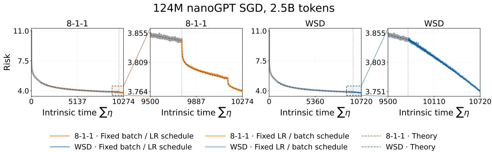

Figure 17: A joint-schedule adaptation of the functional scaling law fits and transfers across LLM schedules. Following the fit-then-transfer protocol of Li et al. (2025), the ratio-based surrogate is fitted only to the fixed-batch 8-1-1 validation trajectory, after which all parameters are frozen. It tracks the alternative 8-1-1 factorization and predicts both WSD trajectories without refitting, showing that the same forcing–memory parameterization captures long-horizon LLM loss decay across learning-rate and batch-size schedules. The fitted exponents are $q _ { \mathcal { K } } = 1 . 0 1 7$ and $q \mathcal { F } = 0 . 3 7 4$ , placing the efective memory response close to the $q \kappa = 1$ boundary. Risk denotes fixed-probe validation cross-entropy and $T = \textstyle \sum _ { t } \eta _ { t }$

## F.3 A forcing-memory surrogate predicts unseen schedules

We finally test whether the forcing–memory mechanism is expressive enough to describe the complete validation-risk trajectory, rather than only the factorization collapse. Our starting point is the practical seven-parameter FSL ansatz of Li et al. (2025). Their fixed-batch parameterization combines an intrinsic-time clean power law with a learning-rate-decay correction driven by the increments $\eta _ { i - 1 } - \eta _ { i } ;$ they fit its seven parameters on 8-1-1 and predict unseen WSD and cosine learning-rate schedules. We retain the intrinsic-time clean-plus-memory structure and the same fit-then-transfer protocol, but make the stochastic injection depend directly on the joint ratio $r ( T ) = B ( T ) / \eta ( T )$ . This gives the finite-window surrogate

$$
\widehat { L } ( T ) = L _ { \infty } + A _ { \mathcal { F } } ( 1 + T ) ^ { - q _ { \mathcal { F } } } + \int _ { 0 } ^ { T } \frac { A _ { 0 } + A _ { 1 } ( 1 + u ) ^ { - q _ { \mathcal { F } } } } { r ( u ) } \big ( 1 + c _ { K } ( T - u ) \big ) ^ { - q _ { K } } \mathrm { d } u .
$$

Its seven parameters $\left( L _ { \infty } , A _ { \mathcal { F } } , A _ { 0 } , A _ { 1 } , c _ { \mathcal { K } } , q _ { \mathcal { F } } , q _ { \mathcal { K } } \right)$ replace the seven empirical FSL parameters of Li et al. (2025) with a forcing–kernel parameterization adapted to joint schedules. Their clean exponent s corresponds to our $q { \boldsymbol { \mathcal { F } } } .$ , whereas their γ parameterizes an integrated learning-rate-decay response rather than the memory kernel itself; for a pure power-law kernel, the corresponding exponents satisfy $\gamma = q \kappa - 1$ . The ratio form also applies when learning rate is fixed and batch size varies, a factorization not covered by the fixed-batch LRS ansatz.

For the OpenWebText run, the seven parameters are fitted only to the fixed-batch 8-1-1 validation trajectory and are then frozen. The same surrogate tracks the alternative 8-1-1 factorization and predicts both WSD trajectories without refitting (Figure 17). Thus it captures both the long-horizon loss decay and the change induced by a diferent schedule. The fitted exponents are $q \kappa = 1 . 0 1 7$ and $q _ { \mathcal { F } } = 0 . 3 7 4 \colon$ the efective memory exponent lies close to the $q \kappa = 1$ boundary, while the forcing exponent $q \mathcal { F } < 1$

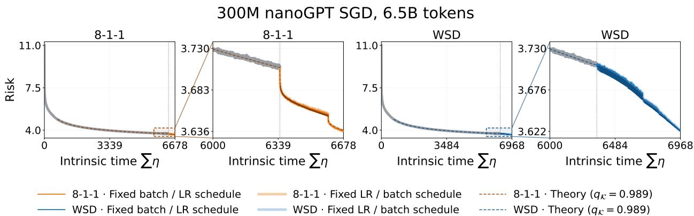  
Figure 18: The joint-schedule surrogate transfers at 300M scale. The seven parameters are fitted only to the raw fixed-batch 8-1-1 validation trajectory. With those parameters frozen, the surrogate tracks the alternative 8-1-1 factorization and predicts both WSD trajectories without refitting. The fitted exponents are $q \kappa = 0 . 9 8 9$ and $q \mathcal { F } = 0 . 2 9 1$ , again placing the efective surrogate coordinate close to $q \kappa = 1$ . Risk denotes fixed-probe validation cross-entropy and $T = \textstyle \sum _ { t } \eta _ { t }$

To test whether this fitted coordinate is specific to one dataset, we repeat the identical fit-thentransfer analysis with separately trained 124M models on 2.5B-token subsets of the sample-10BT configuration of FineWeb (Penedo et al., 2024) and the peS2o V2 s2orc full-text corpus (Soldaini and Lo, 2023). The fits give $( q \kappa , q \mathcal { F } ) = ( 0 . 9 5 2 , 0 . 4 0 5 )$ on FineWeb and (0.995, 0.365) on peS2o, compared with (1.017, 0.374) on OpenWebText above. Across web text and scientific full text, all three independently fitted values of $q \kappa$ lie within 0.05 of one. This three-corpus agreement supports $q \kappa \approx 1$ as a dataset-robust efective response coordinate, rather than an artifact of a particular pretraining corpus. In both new datasets, the frozen parameters also track the alternative 8-1-1 factorization and both WSD trajectories without refitting (Figure 6).

Protocol corresponding to the main-text experiment. This protocol uses a separately trained 300M plain-SGD nanoGPT model on a 6.5B-token OpenWebText corpus. For Figure 5, we fix $q \kappa = 1$ and fit the remaining six parameters in Eq. (5.3) only to the raw fixed-batch 8-1-1 trajectory. These six parameters are then frozen when predicting WSD. For the profile in Figure 5(c), we repeat this procedure for each fixed $q \kappa \colon$ the remaining six parameters are fitted only on 8-1-1, after which the post-fork WSD prediction error is evaluated without refitting. This is a transfer-sensitivity profile rather than an independent estimate of the LLM memory exponent.

Unrestricted-fit robustness check. As a complementary check, we also allow all seven surrogate parameters to vary when fitting the same raw fixed-batch 8-1-1 trajectory. This unrestricted fit gives $q \kappa = 0 . 9 8 9$ and $q _ { \mathcal { F } } = 0 . 2 9 1$ . With all seven parameters frozen, it also predicts the alternative 8-1-1 factorization and both WSD trajectories without refitting (Figure 18). The agreement between the restricted $q _ { \mathcal { K } } = 1$ analysis and the unrestricted estimate $q _ { \mathcal { K } } = 0 . 9 8 9$ supports using one as an efective finite-window coordinate, but does not independently identify an asymptotic memory exponent.

Summary. Together, the above three experiments in this section support a simple description of schedule-dependent LLM loss. At matched intrinsic time, changing the ratio path changes the validation trajectory; when the ratio path is fixed, diferent learning-rate–batch-size factorizations produce nearly the same trajectory after intrinsic-time alignment; and a forcing-memory surrogate fitted on one ratio path predicts unseen schedules without refitting. Thus, for the tested plain-SGD runs, the intrinsic clock $T = \textstyle \sum _ { t } \eta _ { t }$ and the ratio path $r ( T ) = B ( T ) / \eta ( T )$ organize the loss more consistently than optimizer step, learning rate, or batch size alone. The successful transfer across schedules, datasets, and model scales provides response-level evidence that the forcing–memory mechanism remains useful beyond the random-feature proxy. Across datasets and model scales, the fitted exponents consistently satisfy $q \kappa \approx 1$ and $q \mathcal { F } < 1$ , placing the tested LLMs near the $\mathrm { L M _ { 1 } / I M _ { 1 } }$ boundary of our phase map. The Muon results similarly suggest optimizer-specific schedule coordinates, but are not implied by our plain-SGD theory.