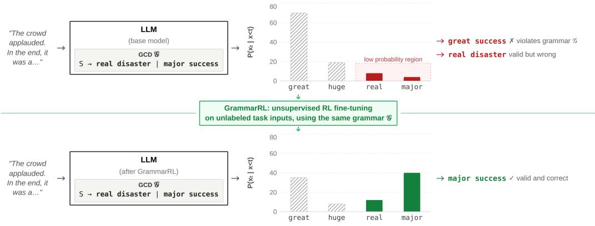
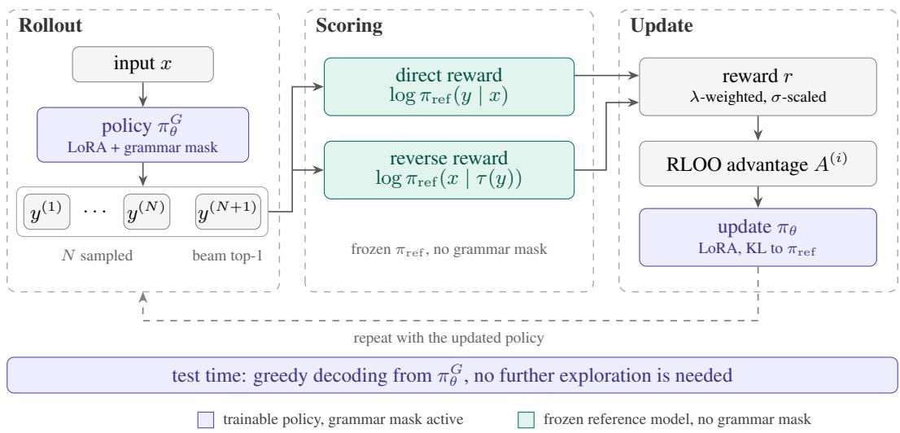
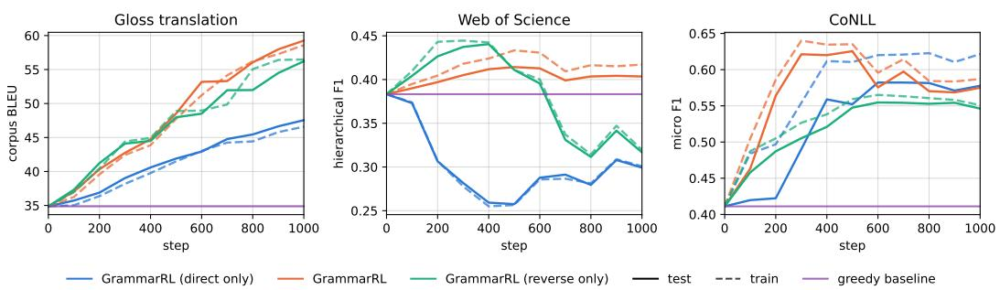
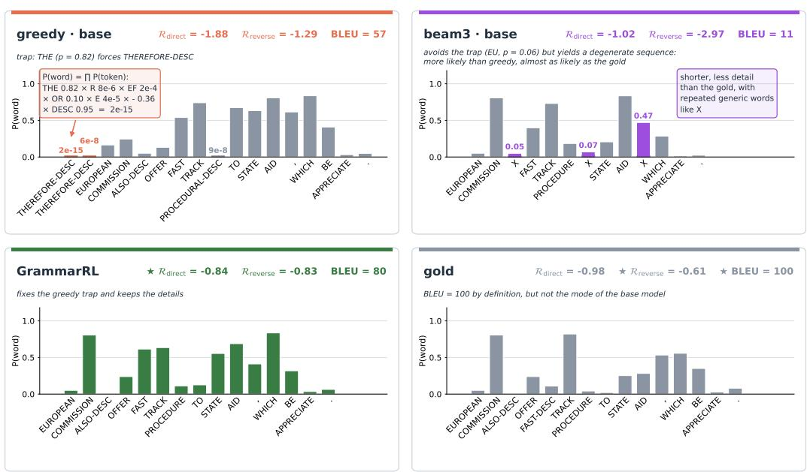
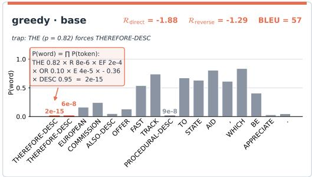
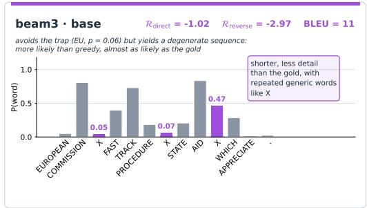
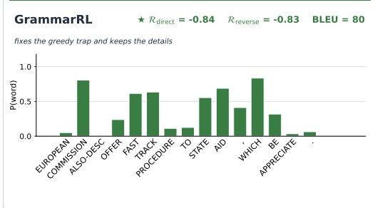
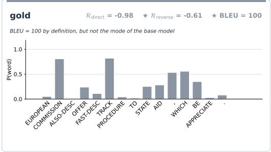
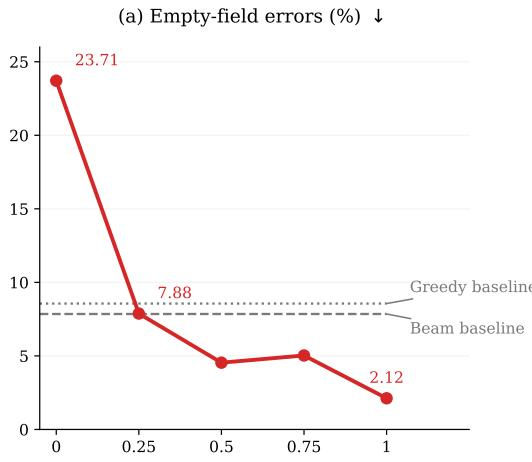
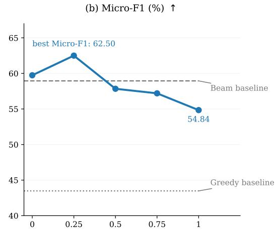

# GRAMMARRL: EFFECTIVE GRAMMAR-CONSTRAINED DECODING VIA REINFORCEMENT LEARNING

Gabriele Tuccio1,3 Antonino Furnari1 Aldo Gangemi2,3 Misael Mongiov\`ı1,3

1 University of Catania 2 University of Bologna 3 ISTC - National Research Council, Italy

## ABSTRACT

Grammar-constrained generation guarantees syntactic validity, but can substantially degrade semantic quality when the model’s preferred outputs are poorly aligned with the imposed grammar. This trade-off is particularly severe when the prompt is underspecified or the model has limited instruction-following ability. Beam search can partially mitigate these failures by exploring multiple valid sequences, but its computational cost grows with beam width, while sequence-level probability is only an imperfect proxy for semantic quality.

We introduce GrammarRL, a label-free reinforcement learning method that adapts language models to grammar constraints without requiring annotated data. GrammarRL optimizes the model using two complementary self-supervised rewards derived from its own likelihoods: a direct reward, measuring how likely the constrained output is given the input, and a reverse reward, measuring how well the input can be reconstructed from the generated output. We optimize these rewards with a Reinforce Leave-One-Out (RLOO) objective over groups of grammarconstrained rollouts, augmented with the top-1 beam-search hypothesis and regularized towards a frozen base model.

We evaluate GrammarRL on sign language gloss translation, hierarchical text classification, and named entity recognition using Llama models ranging from 1B to 8B parameters. GrammarRL consistently outperforms constrained greedy decoding, with an average improvement of 9.8 points and gains of up to 22.8 BLEU. It matches or outperforms beam search on two of the three tasks while preserving greedy-decoding inference cost. Ablations further show that the two rewards are complementary: either reward alone can underperform the untrained baseline, whereas their combination consistently improves upon it.

## 1 INTRODUCTION

Grammar-constrained decoding is widely used to guarantee the formal correctness of generated outputs (Geng et al., 2023; Dong et al., 2025; Tuccio et al., 2025; Beurer-Kellner et al., 2024; Ugare et al., 2025; Willard & Louf, 2023). By masking invalid tokens at every generation step, a grammar restricts the model to a valid subset of the output space and prevents syntactically malformed sequences from being produced. However, formal validity alone does not guarantee that the generated sequence expresses the desired semantics (Tam et al., 2024; Banerjee et al., 2025). A model may assign high probability to a valid token that leads to an undesirable continuation, creating a “trap” in which subsequent greedy decisions remain syntactically valid but semantically wrong (Park et al., 2024; Biagiola et al., 2026). As illustrated in the top half of Figure 1, a base model might assign most of its probability mass to tokens outside the grammar. When forced to select from the remaining valid options in a low-probability region, a greedy choice can commit the model to a syntactically valid but contextually incorrect continuation.

This problem is particularly important in data-scarce settings, where annotated target sequences are limited or unavailable to guide model generation. The standard remedy is inference-time search. Beam search maintains several candidate prefixes and can recover sequences that greedy decoding misses (Lu et al., 2022), but it is primarily a mode-seeking strategy, and high sequence-level probability does not necessarily translate into high-quality outputs (Holtzman et al., 2019). Posteriorapproximation methods instead target the grammar-conditioned distribution over valid sequences, for instance by exploring multiple valid continuations and reweighting them with importance sam pling (Lew et al., 2023; Park et al., 2024; Loula et al., 2025). Both families, however, obtain their improvements through additional computation at every inference call.

  
Figure 1: Illustration of grammar-constrained decoding pitfalls and the GrammarRL solution. Top: The base model assigns most of its probability mass to invalid tokens (e.g., “great”, “huge”). Constrained to a low-probability region where differences are narrowed, a greedy step chooses “real”, leading to the valid but incorrect sequence “real disaster”. Bottom: Unsupervised RL fine-tuning with GrammarRL reshapes the distribution on unlabeled task inputs. The model directly assigns high probability to valid and correct continuations (“major success”), bypassing the need for complex inference-time search.

We instead ask whether useful sequence-level preferences can be learned before inference in the data-scarce, label-free setting, using only signals available without annotated target outputs. We introduce GrammarRL, a reinforcement learning framework that uses grammar-constrained rollouts and two complementary rewards derived from a frozen pretrained model to shift probability mass toward continuations that are both grammatical and correct (see the bottom half of Figure 1). The direct reward measures the conditional log-likelihood of a candidate output under the frozen reference model, and encourages the policy to discover valid sequences that are likely under the reference model. We also define a reverse reward, since high output likelihood alone does not necessarily identify task-useful outputs. In particular, among valid candidates with similar likelihood, some may progressively discard information from the input and converge toward generic or degenerate sequences. We therefore complement the direct reward with a reverse reward, which favors out puts that retain sufficient information about the source for the reference model to recover it. The two rewards thus capture complementary properties of a desirable output: output plausibility under the frozen reference model and preservation of source-relevant information. Both signals are available without reference outputs, providing sequence-level supervision in the label-free setting. Because these rewards are computed from discrete sequences generated under the grammar constraint, they cannot be optimized by backpropagating through the decoding decisions. GrammarRL therefore treats constrained generation as a policy and optimizes the expected reward with reinforcement learning. Specifically, we use a Reinforce Leave-One-Out (RLOO) objective over groups of grammar-constrained rollouts, using the rewards of the other samples in each group to form a relative baseline for each candidate. We additionally include the top-1 beam-search hypothesis as a candidate during training, allowing beam search to provide useful trajectories without turning the objective into beam-search imitation. The policy is trained to increase the probability of high-reward sequences while remaining regularized toward the frozen reference model.

This reinforcement learning formulation is central to GrammarRL. Rather than improving posterior approximation at inference time or explicitly maximizing the sequence-level probability, we use model-derived sequence-level rewards to transfer sequence-level preferences into the model pa rameters, amortizing part of the inference-time correction during a label-free tuning phase. After training, these preferences can be exploited with greedy constrained decoding, without maintaining multiple hypotheses or performing iterative correction.

We evaluate GrammarRL on three structured generation tasks—Sign Language Translation (Gloss), Hierarchical Classification (WoS), and Named Entity Recognition (CoNLL)—and compare it with beam search and with sampling-based posterior approximation. The results suggest that sequencelevel preferences can be learned from unlabeled inputs and internal model signals, shaping the model toward informative and task-relevant constrained outputs without costly search at inference time. Our contributions are as follows:

• We introduce GrammarRL, a reinforcement learning method that adapts language models to grammar constraints without annotated target outputs, significantly improving the output quality without increasing inference cost.

• We propose a bidirectional reward computed by a frozen reference model, which combines the likelihood of the output given the input with the likelihood of reconstructing the input from the output. We show that the two terms are complementary: each one alone favors a different kind of degenerate output, whereas their combination improves over greedy decoding of the frozen baseline in every setting.

• We show on three structured-generation tasks and three model sizes that GrammarRL improves constrained greedy decoding by 9.8 points on average and matches or exceeds beam search on two of the three tasks, at greedy-decoding inference cost. On Gloss and CoNLL it also matches or outperforms sampling-based posterior approximation (importance sampling and SMC) that uses ten times more generation.

## 2 RELATED WORK

Grammar-constrained decoding (GCD) is widely used to guarantee that language-model outputs satisfy formal requirements, including programming languages, SQL, regular expressions, and structured formats such as JSON. Early approaches enforce constraints incrementally by rejecting invalid continuations (Scholak et al., 2021; Poesia et al., 2022), while subsequent methods improve the generality and efficiency of grammar-guided generation. Outlines supports regular expressions and context-free grammars (Willard & Louf, 2023), SynCode provides sound and complete CFG-based masking (Ugare et al., 2025), DOMINO addresses the mismatch between grammar terminals and subword vocabularies (Beurer-Kellner et al., 2024), and XGrammar combines precomputation with systems-level optimizations for efficient CFG-constrained serving (Dong et al., 2025). Grammar-LLM introduces an LL(prefix) grammar notation, equivalent to LL(1) grammars, for efficient constrained decoding in LLMs, enabling expressive constraints with linear-time syntactic enforcement (Tuccio et al., 2025). While these methods make constrained decoding increasingly efficient and general, they primarily treat constraints as an inference-time mechanism and do not explicitly account for how local masking decisions affect the model’s global distribution or task-relevant infor mation.

Posterior approximation for constrained generation addresses this limitation by viewing constrained decoding as inference under a validity condition. Rather than relying solely on local token admissibility, recent methods incorporate information about future valid completions. Grammar Aligned Decoding (GAD) estimates future grammaticality to guide generation (Park et al., 2024), while Sequential Monte Carlo methods formulate constrained generation as probabilistic inference and approximate the target distribution with multiple particles (Lew et al., 2023; Loula et al., 2025). Other approaches construct globally constrained proposal distributions (Dang et al., 2026), use importance weighting and resampling to correct local sampling bias (Ahmed et al., 2025), explicitly estimate future validity (Nie et al., 2026), or revise prefixes through backtracking when later conflicts arise (Li et al., 2026). These methods reduce the local myopia of hard masking, but they do so by introducing additional computation at inference time while leaving the underlying model unchanged. Our work instead asks whether the same sequence-level signals can be transferred into the model during training, thereby reducing the need for inference-time search or distribution correction.

Learning from formal constraints explores a complementary direction: using constraints themselves as supervision when conventional labels are unavailable. Prior work combines grammar information with reinforcement learning for neural program synthesis (Bunel et al., 2018), while unsupervised semantic parsing uses grammar-constrained generation together with paraphrasing objectives to learn without paired logical forms (Wu et al., 2021). More recently, Schema Reinforcement Learning (SRL) uses a fine-grained JSON-schema validator as a reinforcement signal to improve schema-compliant generation (Lu et al., 2025). These approaches show that formal constraints can provide useful training signals without reference outputs, but their objectives primarily reward structural or schema compliance. GrammarRL instead aims at semantic quality under grammar-constrained decoding. Rather than contrasting valid and invalid sequences, which gives a weak signal when most samples are invalid, it optimizes the model directly within the grammarconstrained space, where every sequence is valid by construction, so the training signal focuses on semantic quality.

## 3 METHODOLOGY

## 3.1 PRELIMINARIES

Grammar-constrained decoding. We consider autoregressive generation under a formal constraint, with formal grammars as the primary case. Let $\bar { G }$ denote a grammar and let ${ \mathcal { L } } ( G )$ be the set of valid output sequences. More generally, the same formulation applies to any constraint for which the set of admissible next tokens can be determined incrementally from the generated prefix. Let $\mathcal { M } _ { G } ( y _ { < t } ) \subseteq \mathcal { V }$ denote the set of tokens that can be appended to a prefix $y _ { < t }$ while remaining extendable to a sequence in ${ \mathcal { L } } ( G )$

Given an unconstrained language-model policy $\pi _ { \theta } ,$ grammar-constrained decoding masks tokens outside $\mathcal { M } _ { G } ( y _ { < t } )$ and renormalizes the remaining probability mass:

$$
\pi _ { \theta } ^ { G } ( y _ { t } \mid x , y _ { < t } ) = \frac { \pi _ { \theta } ( y _ { t } \mid x , y _ { < t } ) \mathbb { I } [ y _ { t } \in \mathcal { M } _ { G } ( y _ { < t } ) ] } { \displaystyle \sum _ { v \in \mathcal { M } _ { G } ( y _ { < t } ) } \pi _ { \theta } ( v \mid x , y _ { < t } ) } .\tag{1}
$$

This procedure guarantees formal validity, but the decision at each step remains local. In particular, token admissibility only indicates whether a prefix can still be completed into a valid sequence; it does not directly account for the probability that the model assigns to the valid continuations that follow each admissible token. The ideal model distribution conditioned on the constraint is instead

$$
p _ { \theta } ( y \mid x , G ) = \frac { p _ { \theta } ( y \mid x ) \mathbb { I } [ y \in \mathcal { L } ( G ) ] } { \displaystyle \sum _ { y ^ { \prime } \in \mathcal { L } ( G ) } p _ { \theta } ( y ^ { \prime } \mid x ) } .\tag{2}
$$

Computing this distribution exactly requires accounting for the total probability of complete valid continuations and is generally impractical for autoregressive generation. This gap motivates inference-time strategies such as beam search (Lu et al., 2022) and posterior-approximation methods (Lew et al., 2023; Loula et al., 2025) that explore multiple candidates or estimate future validity.

In GrammarRL, this constrained generation process defines the policy used during reinforcement learning. We denote the trainable policy by $\pi _ { \theta }$ and the frozen pretrained model by $\pi _ { \mathrm { r e f } }$ . The policy generates grammar-constrained candidates and is updated from their sequence-level rewards, while $\pi _ { \mathrm { r e f } }$ provides a fixed reference for KL regularization during optimization.

## 3.2 GRAMMARRL

GrammarRL is a label-free reinforcement learning procedure. A trainable policy generates grammar-valid candidates, a frozen reference model scores them with a bidirectional sequence-level reward, and the policy is updated with a leave-one-out policy gradient. Figure 2 summarizes the procedure.

Setup. GrammarRL involves two models. The reference model $\pi _ { \mathrm { r e f } }$ is the frozen pretrained model: it is never updated, and it is used to score candidates and to regularize training. The policy $\pi _ { \theta }$ is the model being trained: it shares the frozen weights of $\pi _ { \mathrm { r e f } }$ and adds trainable LoRA adapters (Appendix B), so that $\pi _ { \theta } = \pi _ { \mathrm { r e f } }$ at the start of training.

The grammar is used only to generate candidates, which are sampled from the constrained policy $\pi _ { \theta } ^ { G }$ in equation 1 and are therefore always valid. Every sequence probability used to score or train on these candidates is instead computed with the unconstrained model,

  
Figure 2: Overview of GrammarRL framework. For each input $x ,$ the policy $\pi _ { \theta } ^ { G }$ (LoRA adapters on the frozen model, decoding with the grammar mask) generates N sampled candidates and the top-1 beam-search candidate. The frozen reference model $\pi _ { \mathrm { r e f } }$ scores every candidate without the grammar mask in two directions: the direct reward measures how probable the candidate is given the input, and the reverse reward measures how well the input can be reconstructed from the candidate. The combined reward defines a leave-one-out advantage that updates the LoRA adapters, with KL regularization toward $\pi _ { \mathrm { r e f } }$ . At test time, GrammarRL uses only greedy grammar-constrained decoding.

$$
\pi ( \boldsymbol { y } \mid \boldsymbol { x } ) = \prod _ { t = 1 } ^ { | \boldsymbol { y } | } \pi ( y _ { t } \mid \boldsymbol { x } , y _ { < t } ) , \qquad \pi \in \{ \pi _ { \boldsymbol { \theta } } , \pi _ { \mathrm { r e f } } \} ,\tag{3}
$$

without the renormalization over $\mathcal { M } _ { G }$ in equation 1. This holds for both rewards and for both terms of the loss. The distinction matters because renormalization rescales the valid tokens to sum to one at every step, so a valid sequence reached through tokens that the model considers unlikely can still receive a high constrained probability. Unconstrained probabilities preserve this information, and candidates that are valid but unlikely under the model are scored accordingly.

Rollouts. For each input x, we generate a group of N + 1 candidates: $y ^ { ( 1 ) } , \ldots , y ^ { ( N ) } \sim \pi _ { \theta } ^ { G } ( \cdot \mid x )$ and $y ^ { ( N + 1 ) }$ , the top-1 hypothesis of beam search (width B) under $\pi _ { \theta } ^ { G }$ . Sampling explores the current policy, while beam search adds a candidate from a higher-probability region of the constrained output space. The beam hypothesis is not a target: it is scored with the same reward as the sampled candidates and affects the update only through its relative reward.

Bidirectional reward. Each candidate y is scored by the frozen model $\pi _ { \mathrm { r e f } }$ in two directions. The direct term is the length-normalized log-likelihood of the candidate:

$$
\mathcal { R } _ { \mathrm { d i r e c t } } ( x , y ) = \frac { 1 } { | y | } \sum _ { t = 1 } ^ { | y | } \log \pi _ { \mathrm { r e f } } \big ( y _ { t } ~ | ~ x , y _ { < t } \big ) .\tag{4}
$$

It penalizes candidates that are valid under G but unlikely under the pretrained model.

In the label-free setting, maximizing log-likelihood alone tends to favor generic outputs that discard information from x, or degenerate sequences (see Figure 4 in Appendix F for an example). The reverse term addresses this by scoring the source given the candidate. Let $\tau ( \cdot )$ be a prompt template that swaps the roles of source and target: 2

$$
{ \mathcal { R } } _ { \mathrm { r e v e r s e } } ( x , y ) = { \frac { 1 } { | x | } } \sum _ { k = 1 } ^ { | x | } \log \pi _ { \mathrm { r e f } } ( x _ { k } \mid \tau ( y ) , x _ { < k } ) .\tag{5}
$$

It is computed by teacher forcing in a single forward pass and is higher when y preserves more information about x.

The reward is

$$
r ( x , y ) = ( 1 - \lambda ) \frac { \mathcal { R } _ { \mathrm { d i r e c t } } ( x , y ) } { \sigma _ { \mathrm { d i r e c t } } } + \lambda \frac { \mathcal { R } _ { \mathrm { r e v e r s e } } ( x , y ) } { \sigma _ { \mathrm { r e v e r s e } } } , \qquad \lambda \in [ 0 , 1 ] ,\tag{6}
$$

where $\sigma _ { \mathrm { d i r e c t } }$ and $\sigma _ { \mathrm { r e v e r s e } }$ are fixed constants, measured before training as the mean within-group standard deviation of each term under the frozen reference model on a held-out set of 100 unlabeled inputs per task (Appendix A, Table 4).

Policy optimization. We use the Reinforce leave-one-out estimator (RLOO) (Kool et al., 2019), which compares each candidate with the other N in its group:

$$
A ^ { ( i ) } = r ^ { ( i ) } - \frac { 1 } { N } \sum _ { j \neq i } r ^ { ( j ) } , \qquad r ^ { ( i ) } = r ( x , y ^ { ( i ) } ) .\tag{7}
$$

The advantage is positive when a candidate outperforms the other candidates generated for the same input and negative otherwise, which provides a learning signal without an annotated target. We use RLOO rather than Group Relative Policy Optimization (GRPO) (Shao et al., 2024) because our rollout groups are small and combine sampled and beam-search trajectories: the leave-one-out baseline excludes the candidate’s own reward while preserving the relative comparison needed for our label-free reward. Since the reward is computed by the frozen model, the advantages do not depend on θ. The policy is updated by minimizing

$$
\mathcal { L } ( \theta ) = \frac { 1 } { N + 1 } \sum _ { i = 1 } ^ { N + 1 } \left[ - A ^ { ( i ) } \log \pi \theta \left( y ^ { ( i ) } \mid x \right) + \beta \Delta ^ { ( i ) } \right] , \qquad \Delta ^ { ( i ) } = \log \pi \theta \left( y ^ { ( i ) } \mid x \right) - \log \pi _ { \mathrm { r e f } } ( y ^ { ( i ) } \mid x ) ,\tag{8}
$$

where $\beta \geq 0$ . The second term penalizes candidates that deviate substantially from the reference model.

## 4 EXPERIMENTS

## 4.1 EXPERIMENTAL SETUP

We evaluate GrammarRL on three structured-generation tasks that differ substantially in output space, structural constraints, and information requirements: Sign language translation on ASLG-PC12 (Othman & Jemni, 2012), hierarchical Web-of-Science (WoS) classification (Kowsari et al., 2017), and CoNLL-2003 named-entity recognition (Tjong Kim Sang & De Meulder, 2003). All experiments use Grammar-LLM (Tuccio et al., 2025) as the grammar-constrained generation framework throughout training and inference. Prompts for all tasks are reported in Appendix C.

Sign Language Translation. We consider English-to-gloss generation, with a vocabulary of 16,120 gloss terminals and a grammar covering the output taxonomy. We report BLEU as the evaluation metric (Papineni et al., 2002). The test set contains 2,000 examples. Each prompt includes 20 fixed few-shot examples, together with an input-specific subset of the gloss taxonomy precomputed before training.

Hierarchical Classification. For WoS, the model generates a JSON object containing the predicted domain and area labels. The grammar constrains both fields to their closed vocabularies and enforces the required structure. We report Hierarchical F1 on the 2,000-example test set. Each prompt contains a single fixed few-shot example.

Named-Entity Recognition. For CoNLL, the model generates a structured JSON object with fields for person, organization, location, and miscellaneous entities. The fields are constrained to taskspecific vocabularies comprising 8,804 values. We report micro-F1 on the 2,000-example test set. Each prompt contains 10 fixed few-shot examples, together with an input-specific subset of the entity vocabulary precomputed before training.

For Gloss and CoNLL, the input-specific vocabulary subsets are precomputed before training and evaluation and only inserted into the prompt at runtime; no retrieval or vocabulary construction is performed during RL rollouts.

Baselines. We compare GrammarRL with the frozen pretrained model under the same grammar constraints, using both grammar-constrained greedy and beam-search decoding. GrammarRL uses either the direct-only $( \lambda = 0 )$ , reverse-only $( \lambda = 1 )$ , or combined $( \lambda = 0 . 5 )$ reward. Unless otherwise stated, GrammarRL is evaluated with greedy decoding; beam-search results are reported separately to distinguish gains from reinforcement learning from those obtained through inference-time search. Section 4.3 further compares GrammarRL with sampling-based inference-time methods.

Training and Implementation Details. Unless otherwise stated, experiments use the default configuration in Table 5 in Appendix B. All experiments use LoRA adaptation (Hu et al., 2021), with pretrained weights frozen as the reference model $\pi _ { \mathrm { r e f } } .$ . GrammarRL requires no annotated targets: grammar-constrained candidates are generated from the inputs and scored using the label-free reward defined in Section 3.2.

Each rollout contains $N = 3$ sampled trajectories and one grammar-constrained beam candidate (beam width $B = 3 )$ , all trained jointly with RLOO. The objective combines direct and reverse rewards $( \lambda = 0 . 5 )$ with KL regularization toward $\pi _ { \mathrm { r e f } } .$ Further implementation details are provided in Appendix B.

## 4.2 MAIN RESULTS

We first evaluate GrammarRL across three model sizes against the frozen pretrained model under the same grammar constraints. Table 1 reports the direct-only, reverse-only, and full GrammarRL objectives, with grammar-constrained greedy decoding unless otherwise specified. Beam-search results are reported separately to distinguish gains from reinforcement learning from those obtained through inference-time search. Each configuration is trained once and evaluated on 10 different (randomly sampled) test sets.

Table 1: Results for Llama-3.2-1B-Instruct (1B), Llama-3.2-3B-Instruct (3B), and Llama-3.1-8B-Instruct (8B), with N=3 and B=3. Baseline denotes the frozen pretrained model under the same grammar constraints, while GrammarRL denotes the model trained with our approach. Reverse-only and direct-only use only the corresponding reward, while GrammarRL combines both with λ=0.5. Rows marked beam use beam search at inference time. Values are mean ± standard deviation over 10 test sets, each generated by randomly sampling the dataset with a different random seed.
<table><tr><td>Model</td><td>Config</td><td>Gloss (BLEU)</td><td>WoS (Hier. F1)</td><td>CoNLL (F1-micro)</td></tr><tr><td rowspan="5">1B</td><td>baseline (greedy)</td><td> $0 . 3 4 2 \pm 0 . 0 0 5$ </td><td> $0 . 3 8 4 \pm 0 . 0 0 6$ </td><td> $0 . 4 3 5 \pm 0 . 0 0 9$ </td></tr><tr><td>baseline (beam)</td><td> $0 . 3 9 0 \pm 0 . 0 1 8$ </td><td> $0 . 3 8 5 \pm 0 . 0 0 7$ </td><td> $0 . 5 9 0 \pm 0 . 0 0 6$ </td></tr><tr><td>GrammarRL (reverse only)</td><td> $0 . 5 5 4 \pm 0 . 0 0 9$ </td><td> $0 . 3 0 9 \pm 0 . 0 0 6$ </td><td> $0 . 5 4 8 \pm 0 . 0 0 5$ </td></tr><tr><td>GrammarRL (direct only)</td><td> $0 . 4 5 6 \pm 0 . 0 0 5$ </td><td> $0 . 2 8 8 \pm 0 . 0 0 7$ </td><td> $0 . 5 9 7 \pm 0 . 0 1 0$ </td></tr><tr><td>GrammarRL</td><td> ${ \bf 0 . 5 7 0 \pm 0 . 0 1 4 }$ </td><td> ${ \bf 0 . 3 9 4 \pm 0 . 0 0 8 }$ </td><td> $0 . 5 7 8 \pm 0 . 0 0 6$ </td></tr><tr><td rowspan="6">3B</td><td>GrammarRL (beam)</td><td> $0 . 5 4 1 \pm 0 . 0 1 3$ </td><td> $0 . 3 9 1 \pm 0 . 0 0 8$ </td><td> $\mathbf { 0 . 5 9 8 \pm 0 . 0 0 6 }$ </td></tr><tr><td>baseline (greedy)</td><td> $0 . 6 2 8 \pm 0 . 0 0 7$ </td><td> $0 . 4 4 2 \pm 0 . 0 0 6$ </td><td> $0 . 6 8 1 \pm 0 . 0 0 6$ </td></tr><tr><td>baseline (beam)</td><td> $0 . 6 6 3 \pm 0 . 0 1 3$ </td><td> $0 . 4 5 7 \pm 0 . 0 0 6$ </td><td> $0 . 8 1 9 \pm 0 . 0 0 5$ </td></tr><tr><td>GrammarRL (reverse only)</td><td> $0 . 6 8 5 \pm 0 . 0 0 9$ </td><td> ${ \bf 0 . 5 2 6 \pm 0 . 0 1 0 }$ </td><td> $0 . 7 7 3 \pm 0 . 0 0 5$ </td></tr><tr><td>GrammarRL (direct only)</td><td> $0 . 6 4 8 \pm 0 . 0 0 8$ </td><td> $0 . 4 3 7 \pm 0 . 0 0 7$ </td><td> $0 . 7 8 7 \pm 0 . 0 0 4$ </td></tr><tr><td>GrammarRL GrammarRL (beam)</td><td> ${ \bf 0 . 6 8 6 \pm 0 . 0 1 0 }$   $0 . 6 7 1 \pm 0 . 0 1 2$ </td><td> $0 . 4 9 2 \pm 0 . 0 0 8$ </td><td> $0 . 8 1 2 \pm 0 . 0 0 5$ </td></tr><tr><td rowspan="6">8B</td><td>baseline (greedy)</td><td></td><td> $0 . 5 0 1 \pm 0 . 0 0 9$ </td><td> $\mathbf { 0 . 8 3 5 \pm 0 . 0 0 5 }$ </td></tr><tr><td>baseline (beam)</td><td> $0 . 6 1 1 \pm 0 . 0 0 6$ </td><td> $0 . 4 7 8 \pm 0 . 0 0 7$ </td><td> $0 . 7 5 2 \pm 0 . 0 0 7$ </td></tr><tr><td></td><td> $0 . 6 3 2 \pm 0 . 0 0 6$ </td><td> $0 . 5 1 2 \pm 0 . 0 0 7$ </td><td> $0 . 8 5 7 \pm 0 . 0 0 6$ </td></tr><tr><td>GrammarRL (reverse only)</td><td> $0 . 7 4 4 \pm 0 . 0 0 6$ </td><td> $\mathbf { 0 . 6 2 2 \pm 0 . 0 0 9 }$ </td><td> $0 . 5 9 7 \pm 0 . 0 0 8$ </td></tr><tr><td>GrammarRL (direct only) GrammarRL</td><td> $0 . 6 8 1 \pm 0 . 0 0 4$ </td><td> $0 . 5 1 3 \pm 0 . 0 0 7$ </td><td> $\mathbf { 0 . 8 6 1 \pm 0 . 0 0 4 }$ </td></tr><tr><td>GrammarRL (beam)</td><td> $\mathbf { 0 . 7 5 4 \ : \pm 0 . 0 0 4 }$   $0 . 7 4 5 \pm 0 . 0 0 5$ </td><td> $0 . 5 6 0 \pm 0 . 0 0 6$   $0 . 5 6 7 \pm 0 . 0 0 6$ </td><td> $0 . 7 8 7 \pm 0 . 0 0 8$   $0 . 8 0 1 \pm 0 . 0 0 4$ </td></tr></table>

GrammarRL versus the frozen baseline. The full GrammarRL objective outperforms greedy decoding of the frozen baseline on all three tasks and model sizes, with an average gain of 9.8 points. The largest gains are on Gloss, where BLEU increases from 0.342 to 0.570 for 1B, from 0.628 to 0.686 for 3B, and from 0.611 to 0.754 for 8B; on WoS and CoNLL the gains range from 1.0 to 8.2 and from 3.5 to 14.3 points, respectively. Single-reward variants can be stronger in individual

Table 2: Inference-time methods vs. GrammarRL (1B). Cost: generation relative to one greedy pass. Sampling methods use N=10 particles and return the posterior mode. GrammarRL is reported with the default $\lambda { = } 0 . 5$ and with the best λ per task in Table 3 (0.25 for CoNLL and WoS, 0.75 for Gloss); the latter is selected on the same test seeds and is thus slightly optimistic. Mean ± std over 2 test sets of 2,000 examples; best value per column in bold.
<table><tr><td>Method</td><td>Cost</td><td></td><td></td><td>Gloss (BLEU) WoS (Hier. F1) CoNLL (F1-micro)</td></tr><tr><td>Constrained greedy</td><td>1×</td><td> $0 . 3 3 9 \pm 0 . 0 0 2$ </td><td> $0 . 3 8 8 \pm 0 . 0 0 0$ </td><td> $0 . 4 3 4 \pm 0 . 0 0 6$ </td></tr><tr><td>Constrained beam  $\scriptstyle \dot { ( B = 3 ) }$ </td><td>≈3×</td><td> $0 . 3 8 0 \pm 0 . 0 2 2$ </td><td> $0 . 3 8 6 \pm 0 . 0 0 2$ </td><td> $0 . 5 8 6 \pm 0 . 0 0 9$ </td></tr><tr><td>Sample-Rerank  $( \Phi _ { \mathrm { e x p } } ^ { \mathrm { r e v } } )$ </td><td> ${ \approx } 1 0 \times$ </td><td> $0 . 3 4 6 \pm 0 . 0 0 0$ </td><td> $0 . 4 3 0 \pm 0 . 0 0 9$ </td><td> $0 . 4 8 8 \pm 0 . 0 0 7$ </td></tr><tr><td>Full IS  $( \Phi _ { \mathrm { e x p } } ^ { \mathrm { r e v } } )$ </td><td>≈10×</td><td> $0 . 3 0 2 \pm 0 . 0 0 2$ </td><td> $\mathbf { 0 . 4 4 2 \pm 0 . 0 0 2 }$ </td><td> $0 . 5 1 1 \pm 0 . 0 1 0$ </td></tr><tr><td>Full SMC  $( \dot { \Phi } _ { \mathrm { e x p } } ^ { \mathrm { t a s k } } )$ </td><td> ${ \approx } 1 0 \times$ </td><td> $0 . 2 3 6 \pm 0 . 0 0 4$ </td><td> $\mathrm { n / a }$ </td><td> $0 . 5 7 8 \pm 0 . 0 0 9$ </td></tr><tr><td>GrammarRL (λ=0.5)</td><td>1× (+ training)</td><td> $0 . 5 5 4 \pm 0 . 0 0 8$ </td><td> $0 . 4 0 0 \pm 0 . 0 1 0$ </td><td> $0 . 5 7 7 \pm 0 . 0 0 9$ </td></tr><tr><td>GrammarRL (best λ)</td><td> $1 \times ( + \mathrm { t r a i n i n g } )$ </td><td> $\mathbf { 0 . 5 5 9 \pm 0 . 0 1 6 }$ </td><td> $0 . 4 1 5 \pm 0 . 0 0 4$ </td><td> $\mathbf { 0 . 6 2 1 \pm 0 . 0 0 5 }$ </td></tr></table>

settings (reverse-only on WoS for 3B and 8B, direct-only on CoNLL for 1B and 8B), but they can also fall below the frozen baseline, as for reverse-only on CoNLL 8B (0.597 against 0.752) and for both variants on WoS 1B. The combined objective is the only configuration that improves over the baseline in every setting. The reward ablation in Section 4.4 further examines how the two signals contribute to these gains.

Greedy versus beam-search decoding. Beam search improves the frozen baseline across all tasks, with the largest gains on CoNLL, where F1 increases from 0.435 to 0.590 for 1B, from 0.681 to 0.819 for 3B, and from 0.752 to 0.857 for 8B. After GrammarRL, however, beam search does not consistently improve performance: on CoNLL it provides only modest gains (e.g., from 0.578 to 0.598 for 1B), while on Gloss it consistently reduces performance (e.g., from 0.570 to 0.541 for 1B). This may reflect the policy learning to favor prefixes that lead to high-quality trajectories, reducing the need for additional inference-time search.

Training and generalization. Train and test performance remain close throughout training for the direct-only, mixed, and reverse-only objectives, indicating that the reward-driven updates do not lead to severe overfitting (Appendix D, Figure 3).

## 4.3 COMPARISON WITH INFERENCE-TIME METHODS

Following Loula et al. (2025), we also compare GrammarRL (1B) with sampling-based methods that approximate equation 2 with $N { = } 1 0$ particles. In their terminology, the grammar is an efficient potential $\Phi _ { \mathrm { e f f } }$ folded into the proposal, while an expensive potential $\Phi _ { \mathrm { e x p } }$ is evaluated only on the sampled particles; we use either the reverse likelihood $\Phi _ { \mathrm { e x p } } ^ { \mathrm { r e v } } ( y ) = \pi _ { \mathrm { r e f } } ( x \mid \tau ( y ) )$ or task-specific potentials $\Phi _ { \mathrm { e x p } } ^ { \mathrm { t a s k } }$ that check faithfulness to the source (e.g. entity grounding, content-word coverage). Sample-Rerank keeps the sample with the highest Φrevexp; Full IS also corrects the bias of local masking with importance weights (Lipkin et al., 2025); Full SMC resamples the particles and reweights every prefix with $\Phi _ { \mathrm { e x p } } ^ { \mathrm { t a s k } }$ . Rerank and IS thus use at inference time the signal that GrammarRL uses only in training (Appendix G).

Table 2 shows that, at the cost of a single greedy pass, GrammarRL obtains the best score on Gloss and CoNLL, ahead of methods that generate ten times more. On Gloss this holds with either $\lambda = 0 . 5$ and λ = 0.75 (0.554 and 0.559), while no sampling method improves meaningfully over greedy decoding and Full SMC falls well below it (0.236 against 0.339). On CoNLL, Full SMC with the grounding potential approaches beam search (0.578 vs. 0.586, respectively); GrammarRL surpasses both with $\bar { \lambda } = 0 . 2 5 \ \bar { ( 0 . 6 2 1 ) }$ , whereas with the default λ=0.5 it is on par with Full SMC (0.577) and below beam search, as in Table 1. WoS is the exception: Full IS and reranking with the reverse likelihood outperform both GrammarRL variants (0.442 and 0.430 against 0.415 and 0.400). On long WoS abstracts the reverse likelihood is a sharp signal for selecting among candidates (Appendix G.5), and GrammarRL, which uses it only during training, recovers part of this benefit.

## 4.4 ABLATIONS

We next study the effect of the main design choices in GrammarRL: the number of sampled sequences used in each RLOO group, the beam width used during RL rollouts, and the mixing coefficient between the direct and reverse rewards. Unless otherwise stated, experiments use Llama-3.2- 1B-Instruct, greedy decoding at evaluation time, and mean ± standard deviation over 10 sampled test sets of 2,000 examples.

Table 3: Ablation on the reward mixing coefficient λ, with N=3 and B=3 fixed. Experiments use Llama-3.2-1B-Instruct and greedy decoding. Values are mean ± std over 10 sampled test sets. λ=0 corresponds to direct-only training and λ=1 to reverse-only training. Intermediate mixtures improve over the single-direction objectives, although the best value depends on the task.
<table><tr><td>Lambda value</td><td>Gloss (BLEU)</td><td>WoS (Hier. F1)</td><td>CoNLL (F1-micro)</td></tr><tr><td>0 (direct only)</td><td> $0 . 4 5 6 \pm 0 . 0 0 5$ </td><td> $0 . 2 8 8 \pm 0 . 0 0 7$ </td><td> $0 . 5 9 7 \pm 0 . 0 1 0$ </td></tr><tr><td>0.25</td><td> $0 . 5 4 1 \pm 0 . 0 0 4$ </td><td> $\mathbf { 0 . 4 0 7 \pm 0 . 0 0 9 }$ </td><td> ${ \bf 0 . 6 2 5 \pm 0 . 0 0 8 }$ </td></tr><tr><td>0.5</td><td> $0 . 5 7 0 \pm 0 . 0 1 4$ </td><td> $0 . 3 9 4 \pm 0 . 0 0 8$ </td><td> $0 . 5 7 8 \pm 0 . 0 0 6$ </td></tr><tr><td>0.75</td><td> ${ \bf 0 . 5 7 6 \pm 0 . 0 1 3 }$ </td><td> $0 . 3 6 7 \pm 0 . 0 0 9$ </td><td> $0 . 5 7 2 \pm 0 . 0 0 5$ </td></tr><tr><td>1 (reverse only)</td><td> $0 . 5 5 4 \pm 0 . 0 0 9$ </td><td> $0 . 3 0 9 \pm 0 . 0 0 6$ </td><td> $0 . 5 4 8 \pm 0 . 0 0 6$ </td></tr></table>

Rollout composition. GrammarRL is relatively insensitive to the number of sampled sequences: increasing N from 3 to 9 changes performance by at most 0.019 on Gloss and 0.009 on WoS and CoNLL. The training-time beam width has a larger effect: B=5 slightly improves WoS and CoNLL, whereas B=10 reduces Gloss BLEU from 0.570 to 0.470, suggesting that excessive search can shift the distribution of candidate trajectories in ways that hurt some tasks. Full results are reported in Appendix E.

Reward mixing coefficient. Table 3 examines the relative contribution of the direct and reverse rewards, with λ=0 corresponding to direct-only and λ=1 to reverse-only training. On all three benchmarks, at least one intermediate mixture outperforms both single-direction objectives. The gains are largest on WoS, where performance increases from 0.288 and 0.309 for direct-only and reverse-only training, respectively, to 0.407 at λ=0.25. This setting is also the best for CoNLL (0.625), while Gloss reaches its maximum at λ=0.75 (0.576); nevertheless, λ=0.25 still provides a substantial improvement over direct-only training on Gloss, from 0.456 to 0.541. Overall, the results show that the two reward directions are complementary, with intermediate reward settings outperforming single-direction training.

Neither reward dominates across all tasks, and the best mixture depends on the task. Appendix F analyzes the error patterns induced by each reward. Taken together, the ablations show that no single configuration is optimal for every task: moderate exploration can help, whereas excessive trainingtime search (B=10 on Gloss) or an unbalanced reward mixture can hurt performance. The best λ depends on the task, but every task has an intermediate value that outperforms both single-direction objectives, and the default λ=0.5 never falls below the frozen baseline (Table 1).

## 5 CONCLUSION

We introduced GrammarRL, a label-free reinforcement learning method that aligns language models to grammar constraints. GrammarRL samples grammar-valid candidates and scores them with a bidirectional reward computed by a frozen reference model, which combines the likelihood of the output conditioned on the input and the likelihood of the input conditioned on the output. The resulting rewards are used to optimize the policy with RLOO. Across sign language gloss translation, hierarchical classification, and named entity recognition, with Llama models from 1B to 8B parameters, GrammarRL improves constrained greedy decoding by 9.8 points on average (up to 22.8 BLEU) and, at greedy-decoding cost, matches or exceeds beam search, and sampling-based methods that generate ten times more, on two of the three tasks. The two rewards are complementary: each one alone favors a different shortcut, such as uninformative outputs under the direct reward and structural trap tokens under the reverse reward, whereas their combination improves over the frozen baseline in every setting.

Limitations and future work. The higher performance of our method comes at the cost of a (label-free) reinforcement learning phase, which might be computationally expensive. Moreover, changing the grammar would require re-running the training procedure. On CoNLL, beam search on the frozen model remains slightly stronger than GrammarRL with greedy decoding. In this specific case, the gain in inference-time comes at the cost of a slight decrease in performance. A natural future direction is to combine GrammarRL with posterior-approximation methods rather than treating them as alternatives: since these methods use grammar-constrained decoding as their proposal distribution, the policy obtained after GrammarRL could serve as a better-informed proposal and reduce the number of samples needed to approximate the target distribution. Other directions include adapting λ during training and extending GrammarRL to richer constraints such as programming languages.

## AI USE STATEMENT

We used a large language model assistant during the preparation of this manuscript. It helped us correct spelling and grammar, restructure the text and the appendices, check the consistency between text, tables, and figures. Generative AI tools were not used to design the method, run the experiments, or produce the results. All AI-assisted text and code were reviewed by the authors and checked against our experimental results. We take responsibility for the final content of this work, including text, claims, or artifacts produced with the aid of generative AI.

## ETHICS STATEMENT

All datasets used in this work are publicly available research benchmarks (ASLG-PC12, Web of Science, and CoNLL-2003), and no new data involving human subjects were collected. The sign language task concerns English-to-gloss translation on ASLG-PC12, whose glosses are generated automatically from English text rather than produced by signers. Results on this benchmark should therefore not be taken as evidence of a system ready to support communication with Deaf signers, and any such application would require the involvement of the Deaf community. GrammarRL does not introduce risks beyond those of the underlying pretrained language models, whose biases may be reflected in the constrained outputs.

## REPRODUCIBILITY STATEMENT

Section 3 describes the method. Appendix A reports the reward scaling constants, Appendix B all training hyperparameters and LoRA settings, and Appendix C the forward and reverse prompts. All datasets are publicly available, and all backbones are publicly released Llama checkpoints. Results are averaged over 10 sampled test sets, each drawn with a different random seed.

## REFERENCES

Kareem Ahmed, Kai-Wei Chang, and Guy Van den Broeck. Controllable generation via locally constrained resampling. In International Conference on Learning Representations, 2025. URL https://proceedings.iclr.cc/paper\_files/paper/2025/hash/ d98ce7a82af78cd02968e79ea3fe89e8-Abstract-Conference.html.

Debangshu Banerjee, Tarun Suresh, Shubham Ugare, Sasa Misailovic, and Gagandeep Singh. CRANE: Reasoning with constrained LLM generation. In Proceedings of the 42nd International Conference on Machine Learning, volume 267 of Proceedings of Machine Learning Research, pp. 2836–2857. PMLR, 2025. URL https://proceedings.mlr.press/v267/ banerjee25a.html.

Luca Beurer-Kellner, Marc Fischer, and Martin Vechev. Guiding LLMs the right way: Fast, non-invasive constrained generation. In Proceedings of the 41st International Conference on Machine Learning, volume 235 of Proceedings of Machine Learning Research, pp. 3658–3673. PMLR, 2024. URL https://proceedings.mlr.press/v235/ beurer-kellner24a.html.

Matteo Biagiola, Jahrim Gabriele Cesario, Luca Di Grazia, George Zakhour, and Guido Salvaneschi. The alignment problem in constrained code generation, 2026. URL https://arxiv.org/ abs/2606.21619.

Rudy Bunel, Jacob Devlin, Matthew Hausknecht, Rishabh Singh, and Pushmeet Kohli. Leveraging grammar and reinforcement learning for neural program synthesis. In International Conference on Learning Representations, 2018. URL https://arxiv.org/abs/1805.04276.

Meihua Dang, Linxin Song, Honghua Zhang, Jieyu Zhao, Guy Van den Broeck, and Stefano Ermon. Mitigating bias in locally constrained decoding via tractable proposals. In Proceedings ofthe 43rd International Conference on Machine Learning, volume 306 of Proceedings ofMachine Learning Research. PMLR, 2026. URL https://arxiv.org/abs/2606.01926.

Yixin Dong, Charlie F. Ruan, Yaxing Cai, Ziyi Xu, Yilong Zhao, Ruihang Lai, and Tianqi Chen. XGrammar: Flexible and efficient structured generation engine

for large language models. In Proceedings of the Eighth Conference on Machine Learning and Systems, volume 7 of Proceedings of Machine Learning and Systems, 2025. URL https://proceedings.mlsys.org/paper\_files/paper/2025/ hash/5c20ca4b0b20b0bd2f1d839dc605e70f-Abstract-Conference.html.

Saibo Geng, Martin Josifoski, Maxime Peyrard, and Robert West. Grammar-constrained decoding for structured NLP tasks without finetuning. In Houda Bouamor, Juan Pino, and Kalika Bali (eds.), Proceedings of the 2023 Conference on Empirical Methods in Natural Language Processing, pp. 10932–10952, Singapore, December 2023. Association for Computational Linguistics. doi: 10.18653/v1/2023.emnlp-main.674. URL https://aclanthology.org/2023. emnlp-main.674/.

Ari Holtzman, Jan Buys, Li Du, Maxwell Forbes, and Yejin Choi. The curious case of neural text degeneration. In International Conference on Learning Representations, 2019.

Edward J. Hu, Yelong Shen, Phillip Wallis, Zeyuan Allen-Zhu, Yuanzhi Li, Shean Wang, Lu Wang, and Weizhu Chen. Lora: Low-rank adaptation of large language models. arXiv preprint arXiv:2106.09685, 2021.

Wouter Kool, Herke van Hoof, and Max Welling. Buy 4 reinforce samples, get a baseline for free! In DeepRLStructPred@ICLR, 2019. URL https://api.semanticscholar.org/ CorpusID:198489118.

Kamran Kowsari, Donald E. Brown, Mojtaba Heidarysafa, Kiana Jafari Meimandi, Matthew S. Gerber, and Laura E. Barnes. Hdltex: Hierarchical deep learning for text classification. In 2017 16th IEEE International Conference on Machine Learning and Applications (ICMLA), pp. 364– 371. IEEE, 2017. doi: 10.1109/ICMLA.2017.0-134.

Alexander K. Lew, Zhi-Xuan Tan, Gabriel Grand, and Vikash K. Mansinghka. Sequential monte carlo steering of large language models using probabilistic programs. arXiv preprint arXiv:2306.03081, 2023. URL https://arxiv.org/abs/2306.03081.

Yongmin Li, Jia Li, Ge Li, and Zhi Jin. AdapTrack: Constrained decoding without distorting LLM’s output intent. In Proceedings ofthe 48th IEEE/ACM International Conference on Software Engineering, 2026. URL https://arxiv.org/abs/2510.17376.

Ben Lipkin, Benjamin LeBrun, Jacob Hoover Vigly, Joao Loula, David R. MacIver, Li Du, Jason˜ Eisner, Ryan Cotterell, Vikash Mansinghka, Timothy J. O’Donnell, Alexander K. Lew, and Tim Vieira. Fast controlled generation from language models with adaptive weighted rejection sampling. In Conference on Language Modeling (COLM), 2025.

Joao Loula, Benjamin LeBrun, Li Du, Ben Lipkin, Clemente Pasti, Gabriel Grand, Tianyu Liu,˜ Yahya Emara, Marjorie Freedman, Jason Eisner, Ryan Cotterell, Vikash Mansinghka, Alexander K. Lew, Tim Vieira, and Timothy J. O’Donnell. Syntactic and semantic control of large language models via sequential monte carlo. In International Conference on Learning Representations, 2025. URL https://proceedings.iclr.cc/paper\_files/paper/2025/ hash/a2d537e69a6c6638a3630eef835f07de-Abstract-Conference.html.

Ximing Lu, Sean Welleck, Peter West, Liwei Jiang, Jungo Kasai, Daniel Khashabi, Ronan Le Bras, Lianhui Qin, Youngjae Yu, Rowan Zellers, Noah A. Smith, and Yejin Choi. NeuroLogic a\*esque decoding: Constrained text generation with lookahead heuristics. In Marine Carpuat, Marie Catherine de Marneffe, and Ivan Vladimir Meza Ruiz (eds.), Proceedings of the 2022 Conference of the North American Chapter of the Association for Computational Linguistics: Human Language Technologies, pp. 780–799, Seattle, United States, July 2022. Association for Computational Linguistics. doi: 10.18653/v1/2022.naacl-main.57. URL https://aclanthology. org/2022.naacl-main.57/.

Yaxi Lu, Haolun Li, Xin Cong, Zhong Zhang, Yesai Wu, Yankai Lin, Zhiyuan Liu, Fangming Liu, and Maosong Sun. Learning to generate structured output with schema reinforcement learning. In Proceedings of the 63rd Annual Meeting of the Association for Computational Linguistics (Volume 1: Long Papers), pp. 4905–4918. Association for Computational Linguistics, 2025. doi: 10.18653/v1/2025.acl-long.243. URL https://aclanthology.org/2025. acl-long.243/.

Wenhua Nie, Zijie Meng, Kun Zou, Zheng Lin, Ziwei Li, Haoran Zheng, Jyh-Shing Roger Jang, and Hao Zhang. Future validity is the missing statistic: From impossibility to Φ-estimation for grammar-faithful speculative decoding. arXiv preprint arXiv:2605.07698, 2026. URL https: //arxiv.org/abs/2605.07698.

Achraf Othman and Mohamed Jemni. English-asl gloss parallel corpus 2012: Aslg-pc12. In Proceedings of the LREC2012 5th Workshop on the Representation and Processing of Sign Languages, pp. 151–154, Istanbul, Turkey, 2012. European Language Resources Association (ELRA).

Kishore Papineni, Salim Roukos, Todd Ward, and Wei-Jing Zhu. Bleu: A method for automatic evaluation of machine translation. In Proceedings of the 40th Annual Meeting of the Association for Computational Linguistics, pp. 311–318, 2002. doi: 10.3115/1073083.1073135.

Kanghee Park, Jiayu Wang, Taylor Berg-Kirkpatrick, Nadia Polikarpova, and Loris D’Antoni. Grammar-aligned decoding. In Advances in Neural Information Processing Systems, volume 37, pp. 24547–24568, 2024. doi: 10.52202/079017-0774. URL https://papers.nips.cc/paper\_files/paper/2024/hash/ 2bdc2267c3d7d01523e2e17ac0a754f3-Abstract-Conference.html.

Gabriel Poesia, Alex Polozov, Vu Le, Ashish Tiwari, Gustavo Soares, Christopher Meek, and Sumit Gulwani. Synchromesh: Reliable code generation from pre-trained language models. In International Conference on Learning Representations, 2022. URL https://openreview.net/ forum?id=KmtVD97J43e.

Torsten Scholak, Nathan Schucher, and Dzmitry Bahdanau. PICARD: Parsing incrementally for constrained auto-regressive decoding from language models. In Proceedings of the 2021 Conference on Empirical Methods in Natural Language Processing, pp. 9895–9901. Association for Computational Linguistics, 2021. doi: 10.18653/v1/2021.emnlp-main.779. URL https://aclanthology.org/2021.emnlp-main.779/.

Zhihong Shao, Peiyi Wang, Qihao Zhu, Runxin Xu, Junxiao Song, Xiao Bi, Haowei Zhang, Mingchuan Zhang, Y. K. Li, Y. Wu, and Daya Guo. Deepseekmath: Pushing the limits of mathematical reasoning in open language models. arXiv preprint arXiv:2402.03300, 2024.

Zhi Rui Tam, Cheng-Kuang Wu, Yi-Lin Tsai, Chieh-Yen Lin, Hung-yi Lee, and Yun-Nung Chen. Let me speak freely? a study on the impact of format restrictions on large language model performance. In Franck Dernoncourt, Daniel Preot¸iuc-Pietro, and Anastasia Shimorina (eds.), Proceedings of the 2024 Conference on Empirical Methods in Natural Language Processing: Industry Track, pp. 1218–1236, Miami, Florida, US, November 2024. Association for Computational Linguistics. doi: 10.18653/v1/2024.emnlp-industry.91. URL https://aclanthology.org/ 2024.emnlp-industry.91/.

Erik F. Tjong Kim Sang and Fien De Meulder. Introduction to the conll-2003 shared task: Languageindependent named entity recognition. In Proceedings of the Seventh Conference on Natural Language Learning at HLT-NAACL 2003, pp. 142–147, 2003.

Gabriele Tuccio, Luana Bulla, Maria Madonia, Aldo Gangemi, and Misael Mongiov\`ı. GRAMMAR-LLM: Grammar-constrained natural language generation. In Wanxiang Che, Joyce Nabende, Ekaterina Shutova, and Mohammad Taher Pilehvar (eds.), Findings of the Association for Computational Linguistics: ACL 2025, pp. 3412–3422, Vienna, Austria, July 2025. Association for Computational Linguistics. ISBN 979-8-89176-256-5. doi: 10.18653/v1/2025.findings-acl.177. URL https://aclanthology.org/2025.findings-acl.177/.

Shubham Ugare, Tarun Suresh, Hangoo Kang, Sasa Misailovic, and Gagandeep Singh. SynCode: LLM generation with grammar augmentation. Transactions on Machine Learning Research, 2025. URL https://arxiv.org/abs/2403.01632.

Brandon T. Willard and Remi Louf. Efficient guided generation for large language models. ´ arXiv preprint arXiv:2307.09702, 2023. URL https://arxiv.org/abs/2307.09702.

Shan Wu, Bo Chen, Chunlei Xin, Xianpei Han, Le Sun, Weipeng Zhang, Jiansong Chen, Fan Yang, and Xunliang Cai. From paraphrasing to semantic parsing: Unsupervised semantic parsing via synchronous semantic decoding. In Proceedings of the 59th Annual Meeting of the Association for Computational Linguistics and the 11th International Joint Conference on Natural Language Processing (Volume 1: Long Papers), pp. 5110–5121. Association for Computational Linguistics, 2021. doi: 10.18653/v1/2021.acl-long.397. URL https://aclanthology.org/2021. acl-long.397/.

Kyra Yee, Yann Dauphin, and Michael Auli. Simple and effective noisy channel modeling for neural machine translation. In Proceedings of the 2019 Conference on Empirical Methods in Natural Language Processing (EMNLP), pp. 5696–5701, 2019.

## APPENDIX OVERVIEW

Appendix A reports the reward scaling constants used in equation 6. Appendix B lists the training configuration and LoRA settings. Appendix C describes the forward and reverse prompts. Appendix D shows training and test performance throughout training. Appendix E reports the full ablation on the rollout composition. Appendix F analyzes the error patterns induced by the direct and reverse rewards. Appendix G describes the inference-time methods compared in Section 4.3.

## A REWARD CALIBRATION

The fixed constants $\sigma _ { \mathrm { d i r e c t } }$ and $\sigma _ { \mathrm { r e v e r s e } }$ in equation 6 (Section 3.2) put the direct and reverse terms on comparable scales before they are blended into a single reward. Rather than sharing one global pair of constants across all experiments, we measure $\sigma _ { \mathrm { d i r e c t } }$ and $\sigma _ { \mathrm { r e v e r s e } }$ separately for each (task, model size, rollout composition) combination, since both the model scale and the rollout composition (number of sampled sequences N and beam width B) change the natural spread of each term.

Table 4: Reward scaling constants $\sigma _ { \mathrm { d i r e c t } }$ and $\sigma _ { \mathrm { r e v e r s e } }$ per task, rollout composition $\left( N , B \right) \left( N \right.$ sampled sequences, beam width $B ) ,$ , and model size, measured on 100 held-out development examples. Rows are grouped by the varied quantity: N with B=3, then B with $N { = } 3 .$ Shaded rows correspond to the default composition (3, 3) used in Table 1. “–” denotes a combination not used for that model size.
<table><tr><td></td><td></td><td colspan="2">1B</td><td colspan="2">3B</td><td colspan="2">8B</td></tr><tr><td>Task</td><td>(N, B)</td><td> $\sigma _ { \mathrm { d i r e c t } }$ </td><td> $\sigma _ { \mathrm { r e v e r s e } }$ </td><td> $\sigma _ { \mathrm { d i r e c t } }$ </td><td> $\sigma _ { \mathrm { r e v e r s e } }$ </td><td> $\sigma _ { \mathrm { d i r e c t } }$ </td><td> $\sigma _ { \mathrm { r e v e r s e } }$ </td></tr><tr><td>Gloss</td><td>(3, 3)</td><td>1.1378</td><td>0.9731</td><td>0.6354</td><td>0.5493</td><td>0.4564</td><td>0.4442</td></tr><tr><td></td><td>(6, 3)</td><td>1.0693</td><td>1.0001</td><td></td><td>一</td><td>一</td><td>一</td></tr><tr><td></td><td>(9,3)</td><td>1.1245</td><td>1.0229</td><td>一</td><td>一</td><td>一</td><td>一</td></tr><tr><td></td><td>(3,5)</td><td>1.1147</td><td>0.9125</td><td>一</td><td>一</td><td>一</td><td>一</td></tr><tr><td></td><td>(3, 10)</td><td>1.1454</td><td>0.9453</td><td></td><td></td><td>一</td><td>一</td></tr><tr><td>WoS</td><td>(3, 3)</td><td>0.5343</td><td>0.0265</td><td>0.2099</td><td>0.0166</td><td>0.1353</td><td>0.0140</td></tr><tr><td></td><td>(6, 3)</td><td>0.6387</td><td>0.0265</td><td></td><td></td><td></td><td></td></tr><tr><td></td><td>(9,3)</td><td>0.6862</td><td>0.0295</td><td>一</td><td>一</td><td>一</td><td>一</td></tr><tr><td></td><td>(3,5)</td><td>0.5346</td><td>0.0244</td><td>一</td><td>一</td><td>一</td><td>一</td></tr><tr><td></td><td>(3, 10)</td><td>0.5374</td><td>0.0269</td><td>一</td><td>一</td><td>一</td><td>一</td></tr><tr><td>CoNLL</td><td>(3, 3)</td><td>0.8047</td><td>0.2766</td><td>0.6405</td><td>0.2271</td><td>0.6253</td><td>0.1916</td></tr><tr><td></td><td>(6, 3)</td><td>0.8172</td><td>0.3190</td><td></td><td>一</td><td>一</td><td>一</td></tr><tr><td></td><td>(9,3)</td><td>0.8652</td><td>0.3304</td><td>一</td><td>一</td><td>一</td><td>一</td></tr><tr><td></td><td>(3,5)</td><td>0.8071</td><td>0.3053</td><td>一</td><td>一</td><td>一</td><td>一</td></tr><tr><td></td><td>(3, 10)</td><td>0.8378</td><td>0.2745</td><td>一</td><td>一</td><td>一</td><td>一</td></tr></table>

Each pair is the mean within-group standard deviation of the direct and reverse scores over rollout groups sampled from 100 held-out examples per task taken from the development set, disjoint from the training, few-shot, and test data. The rollout groups use the same composition as the corresponding training run and are generated by the frozen base model (no adapter). The constants are computed once and kept fixed throughout training. Table 4 reports the constants for every combination used in our experiments; “–” marks combinations that are not used for that model size.

We set $\lambda = 0 . 5 .$ , the midpoint of {0.25, 0.5, 0.75}, without tuning it per task, model size, or rollout composition; Table 3 reports the full sweep for the 1B model.

## B IMPLEMENTATION DETAILS

All experiments fine-tune LoRA adapters (Hu et al., 2021) with rank $r = 6 4$ , scaling factor $\alpha = 1 2 8 .$ and dropout 0.05, applied to the attention and MLP projections. The pretrained weights are kept frozen and serve as the reference model $\pi _ { \mathrm { r e f } }$ . Table 5 lists the default configuration used in all experiments unless otherwise stated. The reward scaling constants for each task and backbone are reported in Table 4 (row (3, 3) for the default configuration).

Table 5: Default training configuration. Learning rate, gradient clipping threshold, and batch size do not depend on the backbone. Values spanning all three columns are shared across tasks. Reward scaling constants are reported in Table 4.
<table><tr><td></td><td>Gloss</td><td>WoS</td><td>CoNLL</td></tr><tr><td>Data</td><td></td><td></td><td></td></tr><tr><td>Training examples</td><td>2k</td><td>4k</td><td>4k</td></tr><tr><td>Test sets</td><td>10 × 2000</td><td>10 × 2000</td><td>10 × 2000</td></tr><tr><td>Few-shot pairs / hints</td><td>20 /50</td><td>1/—</td><td>10 / 80</td></tr><tr><td>Optimization</td><td></td><td></td><td>8</td></tr><tr><td>Prompts per step (batch) Training steps (2 epochs)</td><td>4 1000</td><td>8 1000</td><td>1000</td></tr><tr><td>Learning rate</td><td>3.3 × 10−7</td><td> $7 \times 1 0 ^ { - 7 }$ </td><td>7 × 10−7</td></tr><tr><td>Optimizer</td><td></td><td>AdamW</td><td></td></tr><tr><td>Rollouts and reward Sampled sequences N Beam width B (training only)</td><td></td><td>3 3</td><td></td></tr><tr><td>Sampling temperature Max. new tokens</td><td>350</td><td>1.0</td><td></td></tr><tr><td>Reward mixing λ</td><td></td><td>128</td><td>128</td></tr><tr><td></td><td></td><td>0.5</td><td></td></tr><tr><td>KL coefficient β</td><td></td><td>0.02</td><td></td></tr><tr><td></td><td></td><td></td><td></td></tr><tr><td></td><td></td><td></td><td></td></tr><tr><td>LoRA</td><td></td><td></td><td></td></tr><tr><td>Rank r / scaling α</td><td></td><td></td><td></td></tr><tr><td></td><td></td><td>64 /128</td><td></td></tr><tr><td>Dropout</td><td></td><td>0.05</td><td></td></tr><tr><td>Target modules</td><td></td><td></td><td></td></tr><tr><td>Compute</td><td></td><td>attention and MLP projections</td><td></td></tr></table>

## C PROMPTS

We use few-shot chat prompts for all three tasks. Each prompt contains a system instruction, a fixed set of demonstrations, and the input query. The demonstrations are selected once for each task and are reused unchanged across queries. For Gloss and CoNLL, the prompts also contain query-specific hints, which are retrieved offline from an embedding index.

Forward (direct) prompt. The forward prompt maps an input query to the required structured output. It consists of (i) a task-specific system instruction, (ii) a fixed set of input–output demonstrations (Table 6), and (iii) the query as the final user turn. For Gloss and CoNLL, the system instruction additionally contains hints retrieved for the current query using mxbai-embed-large-v1: the nearest gloss terms for Gloss, and the nearest entity spans in the training vocabulary for CoNLL. The hints are computed once offline and inserted into the prompt. Thus, the demonstrations remain fixed across queries, whereas the hints change from one query to another.

Reverse prompt. The reverse prompt is constructed mechanically from the corresponding forward prompt. Each demonstration (u, a) is reversed to (a, u), so that the model learns to reconstruct the original input from the structured output. The forward system instruction is removed and replaced by a short task-specific inverse instruction, and the retrieved hints are not included. Finally, the original query is replaced by a candidate output y, from which the model must reconstruct the corresponding input.

Table 6 summarizes the composition of the forward prompts, and Table 7 decomposes each forward system instruction into its three parts and gives the corresponding inverse instruction.

For WoS, the JSON keys "parent" and "child" hold the domain and area labels described in Section 4.1.

Table 6: Composition of the forward prompts. Few-shot demonstrations are selected once, deterministically, without using text from the test sets, and are then reused for every query. Gloss and CoNLL additionally use query-specific hints. The reverse prompt uses the same demonstrations with input and output swapped and contains no retrieved hints.
<table><tr><td>Task</td><td>Few-shot pairs</td><td>Dynamic hints per query</td><td>Static system content</td></tr><tr><td>Gloss</td><td>20</td><td>50 gloss terms</td><td></td></tr><tr><td>WoS</td><td>1</td><td></td><td>label hierarchy (7 parents, 134 children)</td></tr><tr><td>CoNLL</td><td>10</td><td>4 × 20 = 80 entity spans</td><td></td></tr></table>

Table 7: Forward and reverse system instructions (abbreviated). Each forward instruction is composed of a fixed task instruction, a context block (retrieved per query for Gloss and CoNLL, static for WoS), and a required output format. Angle brackets mark slots whose content changes from one query to another. In the reverse prompt, the forward system instruction and its context block are replaced by the inverse instruction shown in the bottom half; the demonstrations are kept, with input and output swapped.
<table><tr><td> instruction (fixed)</td><td colspan="2"></td><td>■retrieved / static context</td><td>required output format</td><td></td></tr><tr><td>Task</td><td colspan="2">Instruction</td><td>Context</td><td>Output format</td><td></td></tr><tr><td colspan="6">Forward system prompt</td></tr><tr><td>Gloss</td><td colspan="2">Simplify the sentence into basic components. Separate components with a single space; preserve the meaning and structure of the original.</td><td>(50 similar gloss terms (retrieved)</td><td>TERM TERM TERM upper-case content words, space-separated</td><td></td></tr><tr><td>WoS</td><td colspan="2">Classify the abstract into one parent-child path of the hierarchy. Use labels from the hierarchy only.</td><td>(label hierarchy〉 (7 parents, 134 children; static)</td><td>{&quot;parent&quot;: ., &quot;child&quot;: ...}</td><td></td></tr><tr><td>CoNLL</td><td colspan="2">Extract named entities from the sentence. Copy the first span of each type verbatim; empty string if absent; emit the JSON object only.</td><td>4×20 similar entity spans (one line per type, retrieved)</td><td>{&quot;person&quot;: &quot;organization&quot;: &quot;location&quot;: &quot;misc&quot;: ...}</td><td></td></tr><tr><td colspan="6">Reverse system prompt (replaces the forward instruction; no context block) Given the glossed form, reconstruct the original English sentence as it was actually written.</td></tr><tr><td>Gloss</td><td colspan="5">Output only that sentence.</td></tr><tr><td>WoS</td><td colspan="5">Given the classification JSON, reconstruct the original abstract as it was actually written. Output only that text.</td></tr><tr><td>CoNLL</td><td colspan="5">Given the entity JSON, reconstruct the original sentence as it was actually written. Output only that sentence.</td></tr></table>

## D TRAINING DYNAMICS

Figure 3 shows training and test performance throughout training for the 1B model with N=3 and B=3, for the direct-only, mixed, and reverse-only objectives. The train and test curves remain relatively close throughout training, with no pronounced divergence between the two splits. This indicates that, under the considered setting, the reward-driven policy updates do not lead to severe overfitting and that the learned behavior transfers reasonably well to unseen examples.

  
Figure 3: Training and test performance throughout training for Llama-3.2-1B-Instruct with $N { = } 3$ and B=3, comparing the GrammarRL direct-only (λ=0), GrammarRL (λ=0.5), and GrammarRL reverse-only (λ=1) objectives. Solid and dashed lines denote test and training performance, respectively. The relatively small train–test gaps throughout training indicate limited overfitting and suggest that the learned reward-driven behavior generalizes beyond the training examples.

## E ROLLOUT COMPOSITION ABLATIONS

Table 8 reports the full ablation on the rollout composition summarized in Section 4.4, with $\lambda { = } 0 . 5$ fixed. The beam width B affects only training-time rollouts and is distinct from beam decoding at evaluation time.

Number of sampled sequences. With B=3 fixed, performance is relatively stable as N increases from 3 to 9. Gloss shows the largest variation, improving from 0.570 to 0.589, while WoS remains within a narrow range (0.394–0.403) and CoNLL changes only slightly (0.572–0.578). GrammarRL is therefore relatively insensitive to the number of rollout sequences in the explored range.

Beam width during RL rollouts. With N=3 fixed, increasing B from 3 to 5 improves WoS from 0.394 to 0.412 and CoNLL from 0.578 to 0.587, while Gloss decreases slightly from 0.570 to 0.558. Increasing the beam further to 10 causes a marked regression on Gloss, which falls to 0.470, whereas CoNLL remains relatively stable at 0.584 and WoS at 0.402. A broader search space at training time is thus not always beneficial: excessive search may shift the distribution of candidate trajectories in ways that hurt some tasks.

Table 8: Ablation on the rollout composition, with λ=0.5 fixed (Llama-3.2-1B-Instruct, greedy evaluation). Top: number of sampled sequences N with $B { = } 3$ . Bottom: training-time beam width B with $N { = } 3 .$ . The shaded row is the default configuration $( N , B ) { = } ( 3 , 3 )$ , repeated in both blocks. Values are mean ± std over 10 sampled test sets of 2,000 examples. Bold marks the best value in each block.
<table><tr><td></td><td>Gloss (BLEU) WoS (Hier. F1)</td><td></td><td>CoNLL (F1-micro)</td></tr><tr><td colspan="4">Sampled sequences N (B=3)</td></tr><tr><td>3</td><td> $0 . 5 7 0 \pm 0 . 0 1 4$ </td><td> $0 . 3 9 4 \pm 0 . 0 0 8$ </td><td> $\mathbf { 0 . 5 7 8 \pm 0 . 0 0 6 }$  </td></tr><tr><td>6</td><td> $0 . 5 8 4 \pm 0 . 0 1 7$ </td><td> $\mathbf { 0 . 4 0 3 \pm 0 . 0 0 8 }$ </td><td> $0 . 5 7 7 \pm 0 . 0 0 7$ </td></tr><tr><td>9</td><td> ${ \bf 0 . 5 8 9 \pm 0 . 0 1 0 }$ </td><td> $0 . 4 0 2 \pm 0 . 0 0 9$ </td><td> $0 . 5 7 2 \pm 0 . 0 0 7$ </td></tr><tr><td colspan="4">Beam width B (N=3)</td></tr><tr><td>3</td><td> $\mathbf { 0 . 5 7 0 \pm 0 . 0 1 4 }$ </td><td> $0 . 3 9 4 \pm 0 . 0 0 8$ </td><td> $0 . 5 7 8 \pm 0 . 0 0 6$  </td></tr><tr><td>5</td><td> $0 . 5 5 8 \pm 0 . 0 1 5$ </td><td> $\mathbf { 0 . 4 1 2 \pm 0 . 0 1 0 }$ </td><td> $\mathbf { 0 . 5 8 7 \pm 0 . 0 0 6 }$ </td></tr><tr><td>10</td><td> $0 . 4 7 0 \pm 0 . 0 1 4$ </td><td> $0 . 4 0 2 \pm 0 . 0 1 0$ </td><td> $0 . 5 8 4 \pm 0 . 0 0 6$ </td></tr></table>

## F QUALITATIVE ANALYSIS

We analyze how the mixing coefficient λ changes the errors produced by GrammarRL, using Llama-3.2-1B-Instruct with N=3 and B=3. As in the main experiments, all statistics are averaged over 10 sampled test sets of 2,000 examples each. Table 9 counts spurious tokens in Gloss predictions, and and Figure 5 measures missing entities in CoNLL predictions together with micro-F1.

On Gloss, we track two kinds of spurious output. X is a gloss of the target vocabulary; we count its occurrences as bare X. Tokens with the -DESC suffix, such as THEREFORE-DESC, THERE-DESC, and OFTEN-DESC, are fragments obtained from the tokenization of longer glosses; we refer to them as trap tokens.

Table 9: Trap tokens in Gloss predictions as a function of the mixing coefficient λ (Llama-3.2-1B-Instruct, N=3, B=3). Each entry is the mean number of occurrences over 10 sampled test sets of 2,000 examples. As λ goes from 0 to 1, THEREFORE-DESC rises monotonically from 7 to 36 and THERE-DESC from 33 to 140, whereas bare X falls monotonically from 115 to 51. OFTEN-DESC is rare for every λ (at most one occurrence). Bold marks the lowest value in each column.
<table><tr><td>λ</td><td>THEREFORE-DESC</td><td>OFTEN-DESC</td><td>THERE-DESC</td><td>bare X</td></tr><tr><td>0 (direct only)</td><td>7</td><td>0</td><td>33</td><td>115</td></tr><tr><td>0.25</td><td>13</td><td>0</td><td>46</td><td>84</td></tr><tr><td>0.5</td><td>18</td><td>1</td><td>67</td><td>79</td></tr><tr><td>0.75</td><td>24</td><td>1</td><td>90</td><td>54</td></tr><tr><td>1 (reverse only)</td><td>36</td><td>1</td><td>140</td><td>51</td></tr></table>

Gloss. Changing λ does not uniformly improve or degrade the output; it shifts the model between two kinds of errors. Under the direct-only objective, bare X outputs dominate (115 occurrences). As the weight of the reverse reward increases, bare X outputs decrease monotonically to 51, but structural trap tokens become more frequent: THERE-DESC rises from 33 to 140 and THEREFORE-DESC from 7 to 36. The reverse objective therefore does not simply remove degenerate behavior; it moves the model toward different shortcuts. Intermediate values balance the two effects: at λ=0.5, bare X outputs fall to 79 while THERE-DESC (67) remains at less than half of its reverse-only count. This pattern is consistent with Table 3, where the intermediate mixtures obtain the highest BLEU on Gloss (0.576 at λ=0.75 and 0.570 at λ=0.5), above both direct-only (0.456) and reverse-only (0.554) training.

input: "the european commission also ofers fast track procedures to state aid , which is appreciated ." gold: EUROPEAN COMMISSION ALSO-DESC OFFER FAST-DESC TRACK PROCEDURE TO STATE AID , WHICH BE APPRECIATE .  

  
Figure 4: Sequence likelihood versus correctness on one Gloss test example, chosen for readability (outputs decoded deterministically). Each panel shows one output; panels marked base decode with the frozen model, and beam3 denotes beam search with B=3. Bars give the probability of each gloss term under the frozen model before the grammar mask, computed as the product of its token probabilities. The header reports the direct and reverse reward terms under the frozen model, Rdirect and $\mathcal { R } _ { \mathrm { r e v e r s e } }$ (Section 3.2), and sentence-level BLEU; ⋆ marks the best value of each quantity.

An example: likelihood versus correctness. Figure 4 follows one Gloss test example through the three decoders. Greedy decoding on the frozen model selects THE, the most likely first token $\scriptstyle ( p = 0 . 8 2 )$ . The grammar then admits only glosses that begin with THE, and the model is forced to complete THEREFORE-DESC through tokens it considers almost impossible. The trap occurs twice and accounts for most of the negative log-likelihood of the sequence, yet the rest of the output is largely correct (BLEU 57). Beam search avoids the trap by starting from EU, but it replaces three content terms with the generic gloss X and drops others. The result is almost as likely under the frozen model as the gold $( { \mathcal { R } } _ { \mathrm { d i r e c t } }$ of −1.02 against −0.98), although its BLEU is only 11: the direct reward cannot distinguish this degenerate output from the correct one. The reverse reward can, because an output with three X terms carries little information about the input, and beam search obtains by far the lowest $\mathcal { R } _ { \mathrm { r e v e r s e } } \ ( - 2 . 9 7 )$ . Across the four outputs, the reverse reward follows the same order as BLEU, and so does the combined reward with the default λ=0.5. GrammarRL, trained with this combined reward, avoids the trap and keeps the details of the sentence (BLEU 80).

  
Figure 5: Empty-field errors and micro-F1 on CoNLL as a function of the mixing coefficient λ (Llama-3.2-1B-Instruct, $N { = } 3 , B { = } 3 )$ , averaged over 10 sampled test sets of 2,000 examples. (a) Percentage of fields that are non-empty in the gold annotation but left empty in the prediction. (b) Micro-F1. Horizontal lines mark the frozen model with greedy and beam-search decoding. Emptyfield errors decrease overall from 23.71% at λ=0 to 2.12% at λ=1, whereas micro-F1 peaks at λ=0.25 (62.50).

CoNLL. Figure 5 shows a complementary effect on CoNLL. Under direct-only training, the model leaves 23.71% of the gold non-empty fields empty, almost three times as many as the frozen model with greedy decoding (8.56%). An empty field is always valid under the grammar but carries no information about the input, so the direct reward alone increases the frequency of uninformative outputs. Adding even a small reverse weight sharply reduces this behavior (7.88% at λ=0.25), and reverse-only training leaves only 2.12% of the fields empty. Fewer empty fields do not imply higher F1, however: micro-F1 peaks at λ=0.25 (62.50) and drops to 54.80 under reverse-only training, below direct-only training (59.70). This suggests that, without the direct term, the model fills fields that should stay empty or fills them with incorrect spans.

Summary. Each reward used alone encourages a different shortcut that is valid under the grammar but detrimental to the task: direct-only training produces outputs that carry little information about the input (empty fields on CoNLL), whereas reverse-only training favors structural trap tokens on Gloss and, plausibly, incorrect spans on CoNLL. Mixing the two rewards limits both failure modes, consistent with the higher scores of intermediate values of λ in Table 3.

## G BASELINES AND INFERENCE-TIME METHODS

Section 4.3 compares GrammarRL, evaluated with a single greedy grammar-constrained pass, with methods that spend additional computation at inference time to approximate the grammarconditioned distribution $p _ { \theta } ( y \mid x , G ) \propto { \bar { p } } _ { \theta } ( y \mid x ) \mathbb { I } [ y \in { \mathcal { L } } ( G ) ]$ ] equation 2, or to re-rank its samples. All methods use the same frozen Llama-3.2-1B-Instruct, the same precomputed prompts and the same output language ${ \mathcal { L } } ( G ) ;$ ; only the decoding procedure, and the potentials that score partial or complete outputs, change. Following Loula et al. (2025), the sampling-based methods target $\pi _ { \mathrm { r e f } } ( y \mid x ) \Phi _ { \mathrm { e f f } } ( y ) \Phi _ { \mathrm { e x p } } ( y )$ up to normalization, where the efficient potential $\bar { \Phi } _ { \mathrm { e f f } } ( y ) = \mathbb { I } [ y \in \mathcal { L } ( \bar { G } ) ]$ is the grammar, enforced token by token, and the expensive potential is either the reverse likelihood $\Phi _ { \mathrm { e x p } } ^ { \mathrm { r e v } }$ (Appendix G.7) or a task-specific potential $\Phi _ { \mathrm { e x p } } ^ { \mathrm { t a s k } }$ (Appendix G.8); with $\Phi _ { \mathrm { e x p } } \equiv 1$ the target reduces to equation 2. Table 11 summarizes the methods; the subsections below describe each of them, the shared sampling machinery, and the efficient and expensive potentials that are used.

## G.1 SHARED MACHINERY

Output language. For the sampling-based methods we use genlm-control (v0.3.0), which constrains generation with a byte-level automaton. We rebuild each task language as a deterministic finite automaton from the same files used by the Grammar-LLM grammars: for CoNLL a JSON object with the four keys person, organization, location, misc, each value an element of the task vocabulary or the empty string; for WoS a JSON object $\{ { \ " p a r e n t { \ " } } : p , { \ " } { \mathrm { e h i } } 1 { \mathrm { d } } { \ " } : c \}$ where the child ranges over the children of the parent just emitted (145 taxonomy paths); for Gloss a spaceseparated sequence of the $^ { 1 6 , 1 }$ 120 gloss terms. Language equivalence is checked on the gold outputs with an independent membership test. Generation ends with the model’s end-of-turn token, allowed only in accepting states, and is truncated at 128 new tokens as in the other methods.

Proposal and importance weights. Tokens are drawn by adaptive weighted rejection sampling (AWRS) (Lipkin et al., 2025) from the language model restricted to the tokens the automaton admits. The result is a properly weighted particle: its weight corrects the bias of local masking (a token that leads into a low-probability region of ${ \mathcal { L } } ( G )$ is not favored just because the renormalization inflated its probability), so that the weighted particles target $p _ { \theta } ( y \mid x , G )$ (times any expensive potential). The LM is sampled at temperature 1 with the precomputed few-shot prompt, encoded with the tokenizer’s native chat template, exactly as in Grammar-LLM decoding.

Resampling. In SMC the particle population is resampled whenever the effective sample size $1 / \textstyle \sum _ { i } \bar { w } _ { i } ^ { 2 }$ falls below $N / 3 .$ . With resampling disabled (Full IS) the $N { = } 1 0$ particles are independent draws from the same proposal, which is why Sample-Rerank can be computed from the very same samples as Full IS.

Output selection. A weighted population must be reduced to one output to be scored against the gold. We select the posterior mode: identical outputs are grouped, their normalized weights are summed, complete sequences are preferred over sequences truncated at the token limit, and remaining ties are broken by the LM log-probability. This is deterministic, and independent of whether the last SMC step happened to resample (after resampling all weights are equal and a “highest-weight particle” would be arbitrary). We additionally log the posterior-weighted metric used by Loula et al. (2025): the expected corpus metric when one output is drawn per prompt from the particle posterior (20 draws).

## G.2 CONSTRAINED GREEDY AND BEAM SEARCH

These are the baselines of Table 1. The grammar is compiled into a pushdown automaton whose ad missible next tokens (with a token-boundary look-ahead engine that handles terminals spanning several sub-word tokens) mask the logits; the masked distribution is renormalized equation 1. Greedy decoding takes the arg-max at every step. The beam variant runs beam search with three beams over the same masked scores, so it can escape a locally attractive but globally poor prefix at the price of roughly three times the compute. Both are deterministic and require no sampling framework.

## G.3 GRAMMARRL

GrammarRL is trained as described in Section 3.2 and Appendix B (RLOO over $N { = } 3$ samples plus the top-1 beam hypothesis with $B { = } 3 .$ , KL coefficient $\beta { = } 0 . 0 2$ , 1000 steps, reward constants from Table 4). At test time the model is decoded with the greedy constrained decoder above, so it inference cost equals that of the frozen baseline. The comparison uses the checkpoints at step 1000 and reports two settings: the default $\lambda { = } 0 . 5$ , used throughout the paper, and, for each task, the best value of the mixing sweep in Table $3 \ : ( \lambda { = } 0 . 2 5$ for CoNLL and WoS, λ=0.75 for Gloss). The best value is selected with the same test protocol used for the comparison, so the second row is slightly optimistic for GrammarRL; the gap between the two rows is large on CoNLL (4.4 points), small on WoS (1.5) and negligible on Gloss (0.5).

## G.4 SAMPLE-RERANK

Sample-Rerank is the simplest use of an expensive potential and the control of the ladder of Loula et al. (2025) (grammar → Sample-Rerank → Full IS → Full SMC). Draw $N { = } 1 0$ independent samples from the grammar-constrained proposal, evaluate the potential Φ on each complete sample, and return the sample maximizing it. Because Φ acts only after generation it cannot steer it: if no sample is good, reranking cannot help. For $\Phi _ { \mathrm { e x p } } ^ { \mathrm { r e v } }$ the score is the summed log-likelihood, so arg $\operatorname* { m a x } _ { y } \log \pi _ { \mathrm { r e f } } ( x \mid \tau ( y ) )$ is unchanged by the per-prompt constant that separates this score from the length-normalized $\mathcal { R } _ { \mathrm { r e v e r s e } }$ equation 5. Ties are broken by the proposal weight. The reranked output is derived from the Full IS samples of the same prompt, without generating a separate pool, which also makes the two methods paired.

## G.5 FULL IMPORTANCE SAMPLING (FULL IS)

Full IS keeps the AWRS weights that correct local masking and multiplies them by the expensive potential evaluated once on the finished sequence; no resampling takes place. The $\bar { N } { = } 1 0$ weighted particles approximate $p _ { \theta } ( y \mid x , G ) \Phi _ { \mathrm { e x p } } ^ { \mathrm { r e v } } ( y )$ and the output is the posterior mode. We call this variant Full $I S ( \Phi _ { \exp } ^ { \mathrm { r e v } } )$ because its potential is applied only at completion; the same potential inside an SMC with resampling is ill-suited: a completion-only potential leaves unfinished sequences at weight one while finished ones receive a large negative log-likelihood, so resampling removes finished particles and the population drifts towards truncated outputs (we observed BLEU falling from 23 to 5 on Gloss in a pilot). With strongly peaked weights (reverse log-likelihoods of a few hundred nats on long WoS abstracts) the effective sample size is low, and Full IS then behaves close to Sample-Rerank. In Table 2, importance weighting improves over plain reranking on CoNLL and WoS but not on Gloss.

## G.6 FULL SMC WITH TASK-SPECIFIC POTENTIALS

Full SMC extends all particles one token at a time; after each step the expensive potential, acting as the critic, reweights every particle by the ratio of its value after and before the step, and the population is resampled when the ESS falls below $N / 3 .$ . This lets the potential penalize a particle as soon as the defect appears, instead of waiting for the end of a long sequence. The expensive potential is the task-specific $\mathbf { \hat { \Phi } } _ { \mathrm { e x p } } ^ { \mathrm { t a s k } }$ of Appendix G.8, evaluated on prefixes (completed fields or terms only) and on the complete output, with soft (finite) penalties so that no particle is ever killed by a heuristic alone. Task-specific potentials exist for CoNLL and Gloss; WoS has none, because its grammar already enforces the closed vocabularies and the hierarchy.

## G.7 REVERSE (NOISY-CHANNEL) POTENTIAL

The reverse potential is the likelihood, under the frozen model, of the input given the candidate output,

$$
\Phi _ { \mathrm { e x p } } ^ { \mathrm { r e v } } ( y ) = \pi _ { \mathrm { r e f } } ( x \mid \tau ( y ) ) = \prod _ { k = 1 } ^ { | x | } \pi _ { \mathrm { r e f } } ( x _ { k } \mid \tau ( y ) , x _ { < k } ) .\tag{9}
$$

The prompt $\tau ( y )$ is the one used by the reverse reward equation 5 (Appendix C), and the source tokens are scored by teacher forcing in one forward pass with no grammar mask. This is the noisychannel potential (Yee et al., 2019), with unit exponent and no free scale parameter. We deliberately do not reuse $\sigma _ { \mathrm { r e v e r s e } }$ and λ: in GrammarRL they balance two signals inside an RLOO advantage, whereas in a sampling target the natural unit of a log-potential is the log-likelihood itself. As a consequence, the reverse log-likelihood, summed over |x| tokens, is large in magnitude and the resulting weights are sharp.

Table 10: Task-specific potentials. log Φtaskexp is the sum of the penalties incurred; all penalties are soft, so a violation lowers a particle’s weight without ever removing it. On training gold, the CoNLL rules fire on none of the 500 rows; for Gloss, 80.2% of gold rows incur no penalty, and the mean gold penalty is −0.17 against −4.6 for a shuffled control (source of row i+1 paired with the gloss of row i), about 27× larger, so the potential discriminates without being strict. WoS has no task-specific potential.
<table><tr><td>Task</td><td>Rule</td><td>Violation</td><td></td><td>Penalty Check on training gold (500 rows)</td></tr><tr><td>CoNLL</td><td>Grounding</td><td>An entity string is not a verbatim substring of the sentence.</td><td>-3.0 each fires on 0</td><td></td></tr><tr><td></td><td>CoNLL Word boundary</td><td>The string occurs in the sentence but only inside longer words.</td><td>-1.5 each fires on 0</td><td></td></tr><tr><td></td><td>CoNLL Duplicate</td><td>The same non-empty string is emitted in two different fields.</td><td>—1.0 per extra field fires on 0</td><td></td></tr><tr><td>Gloss</td><td>Precision</td><td>A completed gloss term is not grounded: after removing the -DESC/-X marker, its lemma matches no source word (suffix stripping and a dictionary lemmatizer) and it is not a closed-class function term (e.g.</td><td></td><td>-0.5 each, at most 5 fires on 14.6% of rows</td></tr><tr><td>Gloss</td><td>Coverage</td><td>be, have, not, the). A source content word (alphabetic, at least three letters, not a stop word) is not matched by any gloss term. Judged on the</td><td></td><td>—0.5 each, at most 5 gold covers 97.3% of content words (shuffled control: 0.9%)</td></tr><tr><td>Gloss</td><td>Degenerate run</td><td>complete output only. A maximal run of at least three identical adjacent terms (a run of two, as in the gold BE BE, is legitimate).</td><td>—1.0 per run fires on 0</td><td></td></tr></table>

## G.8 TASK-SPECIFIC POTENTIALS

The task-specific potentials play the role of the domain-specific expensive potentials of Loula et al. (2025) (e.g. plan simulation, column validity): they use only the input x (never the gold output), cost almost nothing (regular expressions and string comparisons on the CPU), and encode one specific notion offaithfulness to the source. They are expensive in the sense of Loula et al. (2025) not because of the cost of a single call, but because they are evaluated on the sampled particles and enter through the weights, rather than being evaluated on every candidate next token and folded into the proposal. Each returns a log-weight log $\Phi _ { \mathrm { e x p } } ^ { \mathrm { t a s k } } ( y ) \le 0$ , obtained as a sum of soft penalties; the constants were fixed a priori and each rule was checked on 500 training gold outputs before adoption, never on the test sets. On a prefix only completed units are judged (closed fields or terms followed by a separator). Table 10 lists the rules.

Relation to the reverse potential. Both express that the output must be faithful to the input: the task-specific rules test specific symptoms of unfaithfulness (a hallucinated entity, an unsupported gloss term, an omitted content word) cheaply and locally, whereas the reverse likelihood tests it generically and globally, at the cost of one forward pass of the frozen model per candidate. The comparison therefore contrasts a hand-designed, task-specific critic with the same label-free signal that GrammarRL uses for training.

## G.9 EVALUATION AND SCOPE

All methods are scored with the same code as the main results: corpus BLEU for Gloss, hierarchical F1 for WoS, and entity micro-F1 for CoNLL. For the sampling-based methods we report the score of the selected output (posterior mode) and log the posterior-weighted metric and population diagnostics: the effective sample size, the fraction of selected outputs that are complete, and the fraction of prompts on which all weights vanish (zero in our pilots). The values in Table 2 are mean and standard deviation over two test sets of 2,000 prompts each, sampled as in Table 1; with two test sets the standard deviation is only indicative. On the shared baselines the results agree with Table 1 (e.g. constrained greedy: 0.339, 0.388 and 0.434 against 0.342, 0.384 and 0.435).

The sampling methods use N=10 particles at temperature 1 with a 1B-parameter model; they approximate the same target and their behavior depends on the sharpness of the potential (Full IS and Sample-Rerank become nearly deterministic for the reverse potential). The task-specific potentials are our own designs, kept deliberately generic (no capitalization heuristics, no vocabulary derived from annotations) and validated on training gold only. Test seeds are drawn from the part of the pool never used for training; on CoNLL, where that residual pool is small, any two seeds share about a third of their examples, so the seed-to-seed spread is underestimated there.

Table 1 1 : Methods compared with GrammarRL in Table 2. All use Llama-3 . 2- 1 B -Instruct and the same prompts . Efficient potentials $\Phi _ { \mathrm { e f f } }$ are cheap enough to be evaluated on every candidate next token and are folded into the proposal ; expensive potentials $\Phi _ { \mathrm { e x p } }$ are evaluated only on the sampled particles and enter through the importance weights . $\Phi _ { \mathrm { e x p } } ^ { \mathrm { r e v } } ( y ) = \pi _ { \mathrm { r e f } } ( x \mid \tau ( y ) )$ is the reverse likelihood of the input given the candidate (Appendix G.7) ; the task-specific potentials $\Phi _ { \mathrm { e x p } } ^ { \mathrm { t a s k } }$ are defined in Appendix G. 8 . Costs are relative to one greedy pass and refer to generation; reverse scoring adds one forward pass of the frozen model per complete sample GrammarRL uses the N=3 B =3 adapters with the default λ=0 . 5 and with the best λ per task (Table 3)
<table><tr><td>Method</td><td>What it does</td><td>Search at inference</td><td>Efficient potential  $\Phi _ { \mathrm { e f f } }$ </td><td>Expensive potential  $\Phi _ { \mathrm { e x p } }$ </td><td>Output selection</td><td>Cost</td></tr><tr><td>Constrained greedy</td><td>Mode of the locally renormalized masked policy  $\pi ^ { G }$  equation 1: one valid token at a time; no look-ahead.</td><td>None (single pass).</td><td>Grammar as a token mask (Grammar-LLM).</td><td>None.</td><td>Arg-max token at each step.</td><td>1×</td></tr><tr><td>Constrained beam (B=3)</td><td>Searches for a higher-probability sequence under  $\overset { \cdot } { \pi } { } ^ { G } ; \mathfrak { z }$  mode-seeking approximation of</td><td>Beam search, 3 hypotheses.</td><td>Same mask (Grammar-LLM).</td><td>None.</td><td>Top-scoring finished beam.</td><td>≈3×</td></tr><tr><td>GrammarRL (ours)</td><td>pθ(y|  $x , G ) .$  Amortizes sequence-level preferences into the model: LoRA policy trained with RLOO on the label-free bidirectional reward, then</td><td>None at test time (greedy).</td><td>Same mask, active in training and testing.</td><td>Used only in training: direct + reverse reward from the frozen model equation 6.</td><td>Arg-max token at each step.</td><td>1 × (+ one-off training)</td></tr><tr><td>Sample-Rerank  $( \Phi _ { \mathrm { e x p } } ^ { \mathrm { r e v } } )$ </td><td>Best-of-N under an external score: N i.i.d. grammar-constrained samples, keep the one with the highest reverse likelihood of the input.</td><td>N=10 independent samples.</td><td>Grammar mask (proposal).</td><td>Φre (noisy-channel at completion.</td><td>arg max of the reverse score among complete samples.</td><td>≈ N × generation + N scoring passes</td></tr><tr><td> $\mathrm { F u l l ~ I S } ( \Phi _ { \mathrm { e x p } } ^ { \mathrm { r e v } } )$ </td><td>Importance sampling from the grammar-constrained LM towards pθ(y |  $x , G ) \Phi _ { \mathrm { e x p } } ^ { \mathrm { r e v } } ( y ) ;$  weights correct the myopia of</td><td>N=10 independent weighted samples.</td><td>with importance weight.</td><td> $\Phi _ { \mathrm { e x p } } ^ { \mathrm { r e v } }$  (noisy-channel), applied once at completion.</td><td>Posterior mode: text with the largest total normalized weight.</td><td>Same as Sample-Rerank</td></tr><tr><td>Full SMC  $( \Phi _ { \mathrm { e x p } } ^ { \mathrm { t a s k } } )$ </td><td>Sequential Monte Carlo (Loula et al., 2025): N particles extended in parallel, resampled when the effective sample size drops, steered at every step by a task-specific expensive potential.</td><td>N=10 particles, resampling if ESS &lt; N/3.</td><td>Grammar mask inside AWRS, with importance weight.</td><td> $\Phi _ { \mathrm { e x p } } ^ { \mathrm { t a s k } }$  (CoNLL, Gloss): grounding, coverage, boundary, repetition; on prefixes and at completion.</td><td>Posterior mode over particles.</td><td>≈ N × generation; potential evaluated on CPU</td></tr></table>