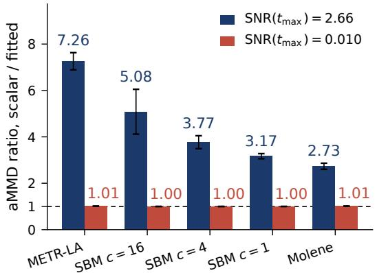
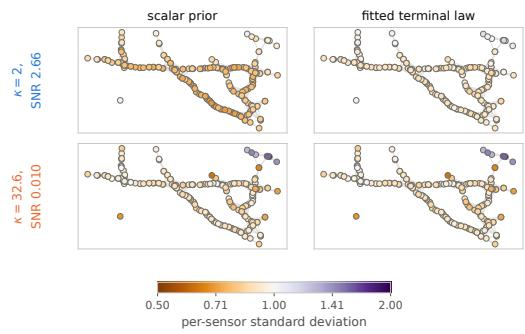
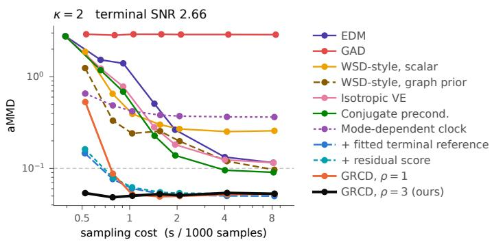

# GRAPH RESIDUAL CONJUGATE DIFFUSION: SNR-EQUALIZED HEAT FLOW FOR GRAPH SIGNALS

Jinwei Li   
Department of Data Science   
Friedrich-Alexander-Universitat Erlangen-N ¨ urnberg¨   
Erlangen, Germany   
jinwei.li@fau.de   
Daniel Tenbrinck   
Department of Data Science   
Friedrich-Alexander-Universitat Erlangen-N¨ urnberg¨   
Erlangen, Germany   
daniel.tenbrinck@fau.de

## ABSTRACT

Diffusion models generate data by reversing a forward corruption process that typically approaches a simple Gaussian prior. Recent work has extended this framework to signals supported on fixed graphs, e.g., road-network traffic and sensornetwork measurements. Many graph signals have nonuniform spectral energy across graph frequencies, whereas isotropic corruption adds the same conditional noise variance to every graph-frequency mode. Driving all modes to near-zero terminal signal-to-noise ratio (SNR) requires strong corruption, which increases the noise range that must be covered under a fixed sampling budget. We introduce Graph Residual Conjugate Diffusion (GRCD), which replaces the shared clock of graph heat diffusion with a mode-dependent clock that gives every graph-Fourier mode the same conditional signal-to-noise ratio. GRCD fits a zero-mean graphspectral Gaussian reference on the training split and, rather than driving the corruption to near-zero terminal SNR, stops at a finite terminal SNR at which the propagated reference still carries the fitted spectral variances, narrowing the SNR range that sampling must cover. The Gaussian component has an exact modewise propagator in the probability-flow ODE, so sampling advances it analytically and integrates only the learned residual score numerically. We evaluate GRCD on five graph-signal settings (the METR-LA traffic and Molene weather datasets, and three synthetic settings from stochastic block models) against seven comparators under a matched protocol: Graph-Aware Diffusion (GAD), EDM (Karras et al., 2022) adapted to the graph backbone, two graph adaptations of Whitened Score Diffusion (WSD), and three preconditioning controls. At four function evaluations (NFEs), GRCD lowers averaged maximum mean discrepancy (aMMD) by 22–36× over the best comparator on all five settings, reaching 0.054 on METR-LA, where it clears an aMMD 0.1 target with 87% less sampling wall-clock time than the cheapest comparator that reaches it. Within GRCD, fitting the terminal reference reduces aMMD by factors of 2.7–7.3 at finite terminal SNR, while the corresponding factors shrink to 1.00–1.01 near zero, matching the analytic limit in which the propagated reference loses dependence on the fitted covariance.

## 1 INTRODUCTION

Diffusion models combine a prescribed forward corruption process with learned reverse dynamics, while the forward process is chosen so that its terminal marginal approaches a simple tractable reference distribution, most commonly a Gaussian distribution (Ho et al., 2020; Song et al., 2021).

Graph signals can have strongly nonuniform spectral energy, especially when they are smooth with respect to the underlying graph topology (Ortega et al., 2018; Rozada et al., 2026). In our benchmarks this appears as a large variation in graph-Fourier coefficient variance across frequencies. However, isotropic corruption injects the same noise variance into every graph-Fourier mode (Ho et al., 2020; Song et al., 2021) independently of the spectral graph characteristics. Graph-Aware Diffusion (GAD) (Rozada et al., 2026) incorporates the graph structure through graph heat diffusion, while Whitened Score Diffusion (WSD) (Alido et al., 2025) uses anisotropic Gaussian corruption and structured spectral priors. In this work, we study a complementary question: whether a graphsignal diffusion process should be driven to an endpoint near zero SNR when a structured finite-SNR reference can instead be fitted and propagated analytically.

We derive a mode-dependent clock, i.e., a frequency-dependent diffusion rate, for which the timedependent graph-filter transformation $\widetilde { \mathbf { x } } _ { t } = A _ { t } ^ { \top } \mathbf { x } _ { t }$ reduces the forward process to isotropic Gaussian corruption. In these conjugate coordinates every graph-Fourier mode has unit signal coefficient and conditional noise variance $\mathbf { \bar { \rho } } _ { q ( t ) ^ { 2 } }$ , hence the same conditional SNR $q ( t ) ^ { - 2 }$ . Thus, a single scalar $q ( t )$ controls the spectral corruption level. We call this construction a conjugateforward process.

PriorGrad showed that data-dependent Gaussian priors can improve conditional diffusion (gil Lee et al., 2022). Instead of a prior that varies with the conditioning input, we fit one zero-mean Gaussian reference shared by every sample: we estimate a Ledoit–Wolf shrinkage covariance (Ledoit & Wolf, 2004), retain its diagonal variances in the graph-Fourier basis, and propagate the resulting reference to the chosen finite terminal SNR. This defines the initial distribution for reverse sampling.

We use the probability-flow ODE (Song et al., 2021) and decompose its score into an analytic Gaussian reference component and a learned residual. Related decompositions are known: Remy et al. (2023) combine an analytic Gaussian score with a learned residual trained by residual denoising score matching, while Wang & Vastola (2024) show that learned diffusion scores are well approximated by a Gaussian linear score at moderate to high noise levels and exploit the corresponding analytic dynamics for sampling acceleration. In our method, the Gaussian reference is fitted in the graph-Fourier basis and propagated under conjugate graph diffusion, so its score is available in closed form at every time. This reference also yields our sampler’s exact modewise propagator.

Contributions: We propose Graph Residual Conjugate Diffusion (GRCD), decomposing the score into a Gaussian reference score and a learned residual correction. In graph-Fourier coordinates the Gaussian contribution has a closed-form modewise propagator, so only the residual is integrated numerically. The forward process, the fitted reference, the residual parameterization, and the exponential-residual solver are separable components of the diffusion process, allowing their effects to be evaluated through controlled ablations. Our empirical evaluation focuses on low-budget graph-signal generation and evaluates these components individually. Our main contributions are:

Conjugate graph diffusion. We derive a mode-dependent clock whose conjugate coordinates have equal conditional noise variance across graph frequencies, providing a single scalar corruption coordinate while retaining graph-dependent dynamics in the original signal space.

Fitted finite-SNR reference and residual propagation. We fit a Gaussian reference in the graph-Fourier basis to training data only and propagate it analytically to finite terminal SNR for reverse initialization. The same reference yields a closed-form propagator for the Gaussian component of the probability-flow ODE, leaving only the learned residual to be integrated numerically.

Asymptotic behavior at zero terminal SNR. We show analytically that the propagated reference becomes independent of the fitted spectral covariance as the terminal noise grows, converging to $\mathcal { N } ( \mathbf { 0 } , \sigma ^ { 2 } L _ { \delta } ^ { - 1 } )$ , where $\pmb { L } _ { \delta }$ is the shifted, spectrally normalized graph Laplacian from Section 2. The experiments match this prediction: across five settings, fitting the terminal reference reduces aMMD by factors of 2.7–7.3 at finite terminal SNR, while the factors shrink to 1.00–1.01 near zero.

Low-budget generation. On METR-LA, GRCD reaches an aMMD of 0.054 with only 4 function evaluations (NFE), which is lower than every external baseline and preconditioning control at evaluated NFE budgets from 4 to 64. For an aMMD target of 0.10, GRCD reduces sampling wall-clock time by 87% relative to the cheapest of these that reaches the target.

## 2 BACKGROUND AND SETTING

Graph signals. We consider a fixed, undirected weighted graph $\mathcal { G }$ on $N ~ \in ~ \mathbb { N }$ nodes. Let W denote the symmetric weighted adjacency matrix and D the diagonal degree matrix with $\begin{array} { r } { D _ { i , i } = \sum _ { i = 1 } ^ { N } W _ { i , j } } \end{array}$ . Following the standard graph-signal-processing construction (von Luxburg, 2007; Shuman et al., 2013; Ortega et al., 2018; Rozada et al., 2026), we use the symmetric normalized graph Laplacian ${ \cal L } = \bar { I } - D ^ { - 1 / 2 } W D ^ { - 1 / 2 }$ . For an undirected graph with nonnegative weights, L is symmetric positive semidefinite (von Luxburg, 2007), and therefore admits the eigendecomposition ${ \pmb { L } } = { \pmb { U } } \mathrm { d i a g } ( { \pmb { \lambda } } ) { \pmb { U } } ^ { \top } , { \pmb { U } } ^ { \top } { \pmb { U } } = { \pmb { I } } , \lambda _ { i } \geq 0$ . For the diffusion dynamics, we normalize the Laplacian by its largest eigenvalue $\lambda _ { \mathrm { m a x } }$ to place the graph spectrum on a common scale across datasets, and add a small positive spectral shift $\delta > 0$ so that all eigenvalues are strictly positive: $\begin{array} { r } { \pmb { L } _ { \delta } = \frac { \pmb { L } } { \lambda _ { \mathrm { m a x } } } + \delta \pmb { I } = \pmb { U } \mathrm { d i a g } ( \pmb { \mu } ) \pmb { U } ^ { \top } , \mu _ { i } = \frac { \lambda _ { i } } { \lambda _ { \mathrm { m a x } } } + \delta > 0 } \end{array}$ . Because $\pmb { L } _ { \delta }$ is an affine function of $L ,$ it has the same eigenvectors and preserves the ordering of the Laplacian eigenvalues.

Score-based diffusion. Let $p _ { t }$ denote the forward diffusion probability density at time t. A scorebased diffusion model learns the time-dependent score vector $\nabla _ { \pmb { x } } \log p _ { t } ( \pmb { x } )$ . For the corresponding SDE, there exists a deterministic probability-flow ODE that, when initialized from the same distribution, has the same marginal density $p _ { t }$ at every time t (Song et al., 2021). We use this probability-flow formulation for sampling and measure sampling cost in NFE.

Terminal SNR. The SNR provides a natural parameterization of diffusion noise levels (Kingma et al., 2021). Lin et al. (2024) showed for image diffusion models that a nonzero terminal SNR can create a training–inference mismatch when inference is initialized from pure noise. In GRCD, terminal SNR plays a different role: it controls how much fitted graph-spectral covariance remains in the propagated terminal reference. We define the corresponding quantity in Section 3.2.

## 3 METHODOLOGY

## 3.1 CONJUGATE GRAPH DIFFUSION

Motivated by graph heat-diffusion models such as Graph-Aware Diffusion (GAD) (Rozada et al., 2026), we seek a graph diffusion with a mode-dependent clock that is exactly conjugate to an isotropic variance-exploding (VE) process. Throughout this section $\mathbf { x } _ { t } \in \mathbb { R } ^ { N }$ denotes the graph signal at diffusion time t and $\dot { \mathbf { \Delta } x } _ { t , i } : = \mathbf { \Delta } [ U ^ { \top } \mathbf { x } _ { t } ] _ { i }$ denotes its i-th graph-Fourier coefficient. $\mu _ { i }$ is the eigenvalue of the shifted normalized Laplacian $\pmb { L } _ { \delta }$ associated with this mode. We model each graph-Fourier coefficient with the linear stochastic differential equation (SDE)

$$
d x _ { t , i } ~ = ~ - \mu _ { i } c _ { i } ( t ) x _ { t , i } d t + \sqrt { 2 \sigma ^ { 2 } c _ { i } ( t ) } d W _ { t , i } ,\tag{1}
$$

where $W _ { t , i } : = [ U ^ { \top } W _ { t } ] _ { i }$ is a standard one-dimensional Brownian motion, independent across modes, $c _ { i } ( t ) \geq 0$ is the mode-dependent clock rate defined below, and $\sigma > 0$ is a fixed diffusion scale. The drift term $- \mu _ { i } c _ { i } ( t ) x _ { t , i } d t$ damps mode i toward zero, while the stochastic term injects Gaussian noise with variance rate $2 \sigma ^ { 2 } c _ { i } ( t )$ . The clock $c _ { i } ( t )$ controls each spectral mode’s evolution.

Let $q ( t ) = \kappa t$ for $t \in [ 0 , t _ { \mathrm { m a x } } ]$ and $\kappa > 0$ , with training and sampling restricted to $t \in [ t _ { \operatorname* { m i n } } , t _ { \operatorname* { m a x } } ]$ In the conjugate coordinates, we use the isotropic VE process $d \widetilde { \mathbf { x } } _ { t } ~ = ~ \sqrt { 2 q ( t ) q ^ { \prime } ( t ) } d W _ { t }$ , whose conditional marginals at each fixed t admit the reparameterization

$$
\begin{array} { r } { \widetilde { \mathbf { x } } _ { t } = \widetilde { \mathbf { x } } _ { 0 } + q ( t ) \pmb { \epsilon } , \qquad \epsilon \sim \mathcal { N } ( \mathbf { 0 } , \pmb { I } ) . } \end{array}\tag{2}
$$

Proposition 1 (Graph-filter conjugate representation). For the isotropic VE process introduced above with $\begin{array} { r } { \widetilde { \mathbf { x } } _ { 0 } = \mathbf { x } _ { 0 } , } \end{array}$ , define

$$
{ \bf \cal A } _ { t } : = \left( I + \frac { q ( t ) ^ { 2 } } { \sigma ^ { 2 } } { \cal L } _ { \delta } \right) ^ { - 1 / 2 } ,\tag{3}
$$

and let $\mathbf { x } _ { t } = \mathbf { A } _ { t } \widetilde { \mathbf { x } } _ { t }$ . The matrix $\pmb { A } _ { t }$ has the same eigenvectors as $\begin{array} { r } { L _ { \delta } , } \end{array}$ , with eigenvalue $a _ { i } ( t ) \ =$ $\left( 1 + { \frac { \mu _ { i } q ( t ) ^ { 2 } } { \sigma ^ { 2 } } } \right) ^ { - 1 / 2 }$ in graph-Fourier mode i. The resulting process satisfies

$$
\begin{array} { r l r } { x _ { t , i } = a _ { i } ( t ) \left( x _ { 0 , i } + q ( t ) \epsilon _ { i } \right) , } & { { } } & { \epsilon _ { i } : = [ U ^ { \top } \epsilon ] _ { i } , } \end{array}\tag{4}
$$

and hence $\operatorname { V a r } ( x _ { t , i } \mid x _ { 0 , i } ) = a _ { i } ( t ) ^ { 2 } q ( t ) ^ { 2 }$ . In conjugate coordinates, Var $\cdot ( \widetilde { x } _ { t , i } \mid \widetilde { x } _ { 0 , i } ) = q ( t ) ^ { 2 }$ for every mode i, so all graph-Fourier modes carry the same conditional noise variance.

Corollary 1 (Induced mode-dependent clock). The graph-Fourier modes of the process described in Proposition 1 satisfy Equation 1 with

$$
c _ { i } ( t ) = \frac { q ( t ) q ^ { \prime } ( t ) } { \sigma ^ { 2 } + \mu _ { i } q ( t ) ^ { 2 } } .\tag{5}
$$

The conditional noise variance induced in graph coordinates is $\begin{array} { r } { a _ { i } ( t ) ^ { 2 } q ( t ) ^ { 2 } = \frac { \sigma ^ { 2 } q ( t ) ^ { 2 } } { \sigma ^ { 2 } + \mu _ { i } q ( t ) ^ { 2 } } } \end{array}$ , which approaches $\sigma ^ { 2 } / \mu _ { i } \operatorname { a s } q ( t ) \to \infty .$ , whereas the corresponding variance $q ( t ) ^ { 2 }$ in conjugate coordinates grows without bound. At the same time, the signal coefficient $a _ { i } ( t )$ tends to zero, and the conditional SNR, in which $a _ { i } ( t )$ cancels, equals $1 / q ( t ) ^ { 2 }$ and likewise tends to zero. Thus, although the noise variance remains bounded in graph coordinates, the forward process still removes dependence on the initial signal in the large-q(t) limit. Section 3.2 instead uses a finite terminal noise level so that data-dependent spectral structure can remain in the terminal reference. The proof of Proposition 1 and the derivation of Corollary 1 are provided in Appendix A.1.1.

## 3.2 GAUSSIAN REFERENCE AND FINITE-SNR TERMINAL INITIALIZATION

We fit a zero-mean Gaussian reference using only the training split. Let $\pmb { \Sigma } _ { \mathrm { L W } }$ denote the Ledoit– Wolf shrinkage covariance (Ledoit & Wolf, 2004). We transform this covariance to the graph-Fourier basis and retain only its diagonal entries, discarding cross-mode covariances:

$$
v _ { i } = \left[ U ^ { \top } \left( \Sigma _ { \mathrm { L W } } + \varepsilon _ { \mathrm { r e f } } I \right) U \right] _ { i i } , \qquad \Sigma _ { \mathrm { r e f } } = U \mathrm { d i a g } ( v ) U ^ { \top } .\tag{6}
$$

Here, $\varepsilon _ { \mathrm { r e f } } > 0$ is a small numerical shift. Since $\pmb { \Sigma } _ { \mathrm { L W } }$ is positive semidefinite and U is orthonormal, $v _ { i } = \left\lceil U ^ { \top } \Sigma _ { \mathrm { L W } } U \right\rceil _ { i i } + \varepsilon _ { \mathrm { r e f } } \geq \varepsilon _ { \mathrm { r e f } }$ , so every spectral variance is strictly positive and $\scriptstyle \sum _ { \mathrm { r e f } }$ is nonsingular. Thus, $\scriptstyle \sum _ { \mathrm { r e f } }$ defines the Gaussian reference distribution $\mathcal { N } ( \mathbf { 0 } , \pmb { \Sigma } _ { \mathrm { r e f } } )$ . Further details of the spectral diagonal approximation are given in Appendix A.2.

Because $\pmb { A } _ { t }$ and $\scriptstyle \sum _ { \mathrm { r e f } }$ are diagonal in the same graph-Fourier basis, the reference propagates analytically under the conjugate forward process. Its variance in mode i is

$$
\gamma _ { i } ( t ) = a _ { i } ( t ) ^ { 2 } \left( v _ { i } + q ( t ) ^ { 2 } \right) = \frac { \sigma ^ { 2 } \left( v _ { i } + q ( t ) ^ { 2 } \right) } { \sigma ^ { 2 } + \mu _ { i } q ( t ) ^ { 2 } } .\tag{7}
$$

Therefore, we get the exact marginal of the chosen Gaussian reference distribution

$$
p _ { \mathrm { r e f } , t } = \mathcal { N } \big ( \mathbf { 0 } , U \mathrm { d i a g } ( \gamma _ { 1 } ( t ) , \dots , \gamma _ { N } ( t ) ) U ^ { \top } \big ) .
$$

The forward kernel itself does not depend on the fitted spectral variances $v _ { i }$ . By Proposition 1 mode i has signal coefficient $a _ { i } ( t )$ and conditional variance $a _ { i } ( t ) ^ { 2 } q ( t ) ^ { 2 }$ , so

$$
\mathrm { S N R } _ { i } ^ { \mathrm { c o n d } } ( t ) = \frac { a _ { i } ( t ) ^ { 2 } } { a _ { i } ( t ) ^ { 2 } q ( t ) ^ { 2 } } = \frac { 1 } { q ( t ) ^ { 2 } }\tag{8}
$$

is the same for every graph-Fourier mode; this is the SNR definition of Kingma et al. (2021) applied modewise. The coefficient $a _ { i } ( t )$ cancels, so the mode-dependent clock equalizes conditional corruption across graph frequencies.

A second, reference-level signal-to-noise ratio describes the fitted reference rather than the forward kernel: it measures how much fitted data-dependent signal remains relative to the injected noise, and therefore depends on the data. Under the reference, the propagated signal and injected-noise variances in graph-Fourier mode i are $a _ { i } ( t ) ^ { 2 } v _ { i }$ and $a _ { i } ( t ) ^ { 2 } q ( t ) ^ { 2 }$ , respectively, so the reference SNR in mode i at time t is given by

$$
\mathrm { S N R } _ { i } ^ { \mathrm { r e f } } ( t ) = \frac { a _ { i } ( t ) ^ { 2 } v _ { i } } { a _ { i } ( t ) ^ { 2 } q ( t ) ^ { 2 } } = \frac { v _ { i } } { q ( t ) ^ { 2 } } .\tag{9}
$$

For reporting a single terminal value we use the energy-weighted average $\begin{array} { r l } { \overline { { \mathrm { S N R } } } ^ { \mathrm { r e f } } ( t ) } & { { } = } \end{array}$ $\begin{array} { r } { \sum _ { i = 1 } ^ { N } \frac { v _ { i } } { \sum _ { j = 1 } ^ { N } v _ { j } } \operatorname { S N R } _ { i } ^ { \mathrm { r e f } } ( t ) } \end{array}$ , so that modes carrying little signal energy cannot dominate the summary. Therefore, as the terminal noise level $q ( t _ { \operatorname* { m a x } } ) = \kappa t _ { \operatorname* { m a x } }$ grows, $\mathrm { S N R } _ { i } ^ { \mathrm { r e f } } ( t _ { \mathrm { m a x } } )  0$ , and we consequently have

$$
\gamma _ { i } ( t _ { \mathrm { m a x } } ) = \sigma ^ { 2 } \frac { v _ { i } / q ( t _ { \mathrm { m a x } } ) ^ { 2 } + 1 } { \sigma ^ { 2 } / q ( t _ { \mathrm { m a x } } ) ^ { 2 } + \mu _ { i } } \frac { q ( t _ { \mathrm { m a x } } ) {  } { \infty } } { \mu _ { i } } \frac { \sigma ^ { 2 } } { \mu _ { i } } .\tag{10}
$$

Thus, since $\mu _ { i } > 0$ holds for every mode, dependence on the fitted spectral variance $v _ { i }$ vanishes in the limit, leaving the limiting variance $\sigma ^ { 2 } / \mu _ { i }$

## 3.3 RESIDUAL SCORE PARAMETERIZATION

The propagated Gaussian reference distribution has the following graph-Fourier score

$$
\begin{array} { r } { s _ { \mathrm { r e f } , i } ( { \pmb x } , t ) = - \frac { x _ { i } } { \gamma _ { i } ( t ) } , \qquad x _ { i } = [ { \pmb U } ^ { \top } { \pmb x } ] _ { i } . } \end{array}
$$

Let $s _ { i } ^ { * } ( \pmb { x } , t ) : = \big [ \pmb { U } ^ { \top } \nabla _ { \pmb { x } } \log p _ { t } ( \pmb { x } ) \big ]$ denote the unknown marginal data score in mode i. We define the residual $r _ { i } ^ { * }$ as $r _ { i } ^ { * } ( { \pmb x } , t ) : = s _ { i } ^ { * } ( \tilde { { \pmb x } , t } ) - s _ { \mathrm { r e f } , i } ( { \pmb x } , t )$ . We parameterize this residual with a neural network while keeping the Gaussian reference score in closed form.

Let $\eta _ { i } ( t ) = q ( t ) a _ { i } ( t )$ denote the conditional standard deviation in mode i. Using the definition of $a _ { i } ( t )$ , we get $\begin{array} { r } { \eta _ { i } ( t ) = q ( t ) \left( 1 + \frac { \mu _ { i } q ( t ) ^ { 2 } } { \sigma ^ { 2 } } \right) ^ { - 1 / 2 } = \frac { \sigma q ( t ) } { \sqrt { \sigma ^ { 2 } + \mu _ { i } q ( t ) ^ { 2 } } } } \end{array}$ . For $q ( t ) \geq 0 , \eta _ { i } ( t )$ increases with $q ( t )$ and approaches the finite positive limit $\begin{array} { r } { \eta _ { i } ( t ) \longrightarrow \frac { \sigma } { \sqrt { \mu _ { i } } } } \end{array}$ as $q ( t ) \to \infty$ , where $\mu _ { i } > 0$ is ensured by the shift $\delta > 0$ . Thus, the residual scaling $1 / \eta _ { i } ( t )$ remains finite in the large-noise limit.

Let $f _ { \pmb { \theta } } ( \pmb { x } , t )$ denote the network output in the node basis and $f _ { \pmb { \theta } , i } ( \pmb { x } , t ) \ = \ [ \pmb { U } ^ { \top } f _ { \pmb { \theta } } ( \pmb { x } , t ) ] _ { i }$ its i-th graph-Fourier coefficient. We parameterize the residual as $\begin{array} { r l r } { r _ { \pmb { \theta } , i } ( \pmb { x } , t ) } & { { } = } & { - \frac { f _ { \pmb { \theta } , i } ( \pmb { x } , t ) } { \eta _ { i } ( t ) } } \end{array}$ . The reconstructed score is then given as

$$
s _ { \theta , i } ( { \pmb x } , t ) = - \frac { x _ { i } } { \gamma _ { i } ( t ) } - \frac { f _ { \theta , i } ( { \pmb x } , t ) } { \eta _ { i } ( t ) } .\tag{11}
$$

For the forward corruption of graph signals induced by the conjugate construction, the corresponding noise-prediction target is $\begin{array} { r } { f _ { i } ^ { * } \stackrel { - } { = } \bar { \epsilon } _ { i } - \bar { \eta _ { i } } ( t ) \frac { x _ { t , i } } { \gamma _ { i } ( t ) } } \end{array}$ . We train with the mean-squared denoising objective (Vincent, 2011; Ho et al., 2020)

$$
\mathcal { L } ( \mathbf { \boldsymbol { \theta } } ) = \mathbb { E } _ { t , \mathbf { x } _ { 0 } , \epsilon } \left[ \frac { 1 } { N } \sum _ { i = 1 } ^ { N } \left( f _ { \mathbf { \boldsymbol { \theta } } , i } ( \mathbf { \boldsymbol { x } } _ { t } , t ) - f _ { i } ^ { * } \right) ^ { 2 } \right] ,\tag{12}
$$

where $t \sim \mathcal { U } [ t _ { \mathrm { m i n } } , t _ { \mathrm { m a x } } ]$ . Appendix A.3 shows that the population minimizer of Equation 12, together with Equation 11, recovers the marginal score $s _ { i } ^ { * } ( { \pmb x } , t )$ exactly. Thus, the residual parameterization changes the denoising target’s representation rather than approximating the marginal score.

## 3.4 EXACT GAUSSIAN PROPAGATION AND THE EXPONENTIAL-RESIDUAL SAMPLER

For the modewise SDE in Equation 1, define $b _ { i } ( t ) : = - \mu _ { i } c _ { i } ( t )$ and $g _ { i } ( t ) ^ { 2 } : = 2 \sigma ^ { 2 } c _ { i } ( t )$ . Substituting Equation 11 into the probability-flow ODE (Song et al., 2021) gives

$$
\frac { d x _ { i } } { d t } = \underbrace { \left[ b _ { i } ( t ) + \frac { g _ { i } ( t ) ^ { 2 } } { 2 \gamma _ { i } ( t ) } \right] x _ { i } } _ { \mathrm { G a u s s i a n r e f e r e n c e } } - \underbrace { \frac { 1 } { 2 } g _ { i } ( t ) ^ { 2 } r _ { \theta , i } ( \pmb { x } , t ) } _ { \mathrm { l e a r n e d r e s i d u a l } } .\tag{13}
$$

The Gaussian component has the exact modewise propagator mapping a state at time τ to time t via

$$
\phi _ { i } ( t , \tau ) = \sqrt { \frac { \gamma _ { i } ( t ) } { \gamma _ { i } ( \tau ) } } .\tag{14}
$$

Its derivation and composition property are given in Appendix A.4.

For a backward step $t _ { 1 } < t _ { 0 }$ variation of constants gives

$$
x _ { i } ( t _ { 1 } ) = \phi _ { i } ( t _ { 1 } , t _ { 0 } ) x _ { i } ( t _ { 0 } ) + \int _ { t _ { 0 } } ^ { t _ { 1 } } \phi _ { i } ( t _ { 1 } , \tau ) \left[ - \frac { 1 } { 2 } g _ { i } ( \tau ) ^ { 2 } \right] r _ { \theta , i } ( { \bf x } ( \tau ) , \tau ) d \tau .\tag{15}
$$

Thus, the Gaussian component is propagated exactly, while only the learned residual is approximated numerically. The sampler uses two network evaluations per step and implementation details are given in Appendix ${ \bf A . 5 . }$ . This is related to the general strategy of diffusion-specific exponential integrators, which propagate analytically tractable components exactly while approximating the learned contribution numerically (Lu et al., 2022; Zhang & Chen, 2023). Here, the exact propagator is mode dependent and is induced by the fitted Gaussian reference.

Time grid. For the even NFE budgets used in our experiments each sampling step uses two network evaluations, so $K = \mathrm { { N F E / 2 } }$ . Following the power-law noise discretization of Karras et al. (2022), applied here to the conjugate noise scale $q$ with $q _ { \mathrm { m i n } } = q ( t _ { \mathrm { m i n } } )$ and $q _ { \operatorname* { m a x } } = q ( t _ { \operatorname* { m a x } } )$ , we use

$$
q _ { j } ~ = ~ \left[ q _ { \mathrm { m a x } } ^ { 1 / \rho } + \frac { j } { K } \left( q _ { \mathrm { m i n } } ^ { 1 / \rho } - q _ { \mathrm { m a x } } ^ { 1 / \rho } \right) \right] ^ { \rho } , \qquad j = 0 , \ldots , K .\tag{16}
$$

We then set $t _ { j } = q _ { j } / \kappa$ . Because $q ( t ) = \kappa t$ is linear, $\rho = 1$ recovers the uniform grid used by the base exponential-residual sampler. We select a single $\rho$ for all budgets by mean validation aMMD, with the uniform grid $\rho = 1$ as the baseline. This yields $\rho = 3 ,$ which is fixed before any test evaluation. Unless a row is explicitly labelled $\rho = 1$ , all reported exponential-residual results use $\rho = 3$ at every budget. Table 5 reports the corresponding test aMMD.

Heun sampler. “Heun” denotes the deterministic second-order predictor–corrector solver (Ascher & Petzold, 1998) for the probability-flow ODE. On the uniform-in-t grid used for all reported Heun results, each step evaluates the velocity at the current state, takes an Euler predictor step, and then evaluates the velocity again at the predicted state at the next time point. The two velocities are averaged for the corrected update. Thus, each step requires two network evaluations, so $\mathrm { N F E } = 2 k$ corresponds to k sampling steps. The exponential-residual solver likewise uses two evaluations per step, so the two solvers are compared at equal NFE. EDM and the three preconditioning controls instead follow the EDM implementation, which omits the final correction (Appendix A.6.5).

## 4 EXPERIMENTAL SETUP

We evaluate five graph settings spanning three dataset families: METR-LA traffic speeds (Li et al., 2018), Molene temperature signals (Girault, 2015), and three synthetic stochastic block model (SBM) regimes with spectral concentration $c \in \{ 1 , 4 , 1 6 \}$ The directed METR-LA adjacency matrix is symmetrized before constructing the graph Laplacian. We evaluate two terminal-noise regimes: $\kappa = 2$ and $\kappa \approx 3 2 . 6$ (targeting near-zero terminal SNR). All graph methods use the same backbone, optimization, batch size, random streams, and evaluation. In the central fitted-versusscalar comparison the score model is fixed and only the Gaussian terminal initialization changes. Results are reported at the validation-converged stage, averaged over three random seeds.

Data generation quality is measured by aMMD (Gretton et al., 2012), the mean of the MMDs of quadratic variation, spectral centroid and degree correlation, based on the statistics and multibandwidth RBF estimator of Rozada et al. (2026) on normalized signals. For a common evaluation operator, graph-based statistics are computed using the combinatorial Laplacian $D \mathrm { ~ - ~ } W$ , fixed across all methods.

We compare our proposed GRCD method against seven comparators: Elucidating Diffusion Models (EDM) (Karras et al., 2022), two Whitened Score Diffusion (WSD)-style graph adaptations (Alido et al., 2025), and GAD (Rozada et al., 2026) under the matched graph protocol. GAD uses our matched protocol, so its reported aMMD values are not a reproduction of those in Rozada et al. (2026). The other three are preconditioning controls: isotropic, static graph, and dynamic conjugate preconditioning. Details are in Appendix A.6.

## 5 RESULTS

## 5.1 OVERALL COMPARISON

Table 1 shows the comparison on METR-LA. At NFE 4 GRCD reaches an aMMD of 0.0538. Among external baselines EDM reaches an aMMD of 2.7757, while the strongest method at this budget, the matched graph-prior WSD-style variant, reaches 1.2431, which is still 23× higher than GRCD. The gap narrows with sampling budget: at NFE 64 the strongest external baseline or preconditioning control, i.e., conjugate preconditioning, reaches an aMMD of 0.0906, while GRCD without the residual score reaches an aMMD of 0.0499. The practical advantage of our proposed method is therefore largest in the low-NFE regime. Sampling cost is reported separately in Section 5.5, where quality is plotted against measured wall-clock time.

Table 1: Matched comparison on METR-LA. aMMD at the validation-converged stage and a fixed nominal NFE budget (Appendix A.6.5). Lower numbers are better and bold denotes the best mean in each column. Results are mean ± sample standard deviation over three random seeds. The last two rows use the exponential-residual solver.
<table><tr><td>METHOD</td><td>NFE4</td><td>NFE 8</td><td>NFE 16</td><td>NFE 64</td></tr><tr><td></td><td></td><td></td><td></td><td></td></tr><tr><td>EDM</td><td> $2 . 7 7 5 7 \pm 0 . 0 0 4 0$ </td><td> $1 . 3 9 9 6 \pm 0 . 0 6 0 5$ </td><td> $0 . 2 6 4 0 \pm 0 . 0 1 3 9$ </td><td> $0 . 1 1 5 5 \pm 0 . 0 0 5 3$ </td></tr><tr><td>GAD</td><td> $2 . 9 0 9 1 \pm 0 . 0 0 1 6$ </td><td> $2 . 9 0 9 3 \pm 0 . 0 0 5 6$ </td><td> $2 . 8 8 7 8 \pm 0 . 0 1 4 6$ </td><td> $2 . 8 7 8 5 \pm 0 . 0 1 6 3$ </td></tr><tr><td>WSD-style, scalar</td><td> $1 . 8 7 5 2 \pm 0 . 2 1 8 2$ </td><td> $0 . 3 9 4 1 \pm 0 . 1 3 5 5$ </td><td> $0 . 2 6 9 5 \pm 0 . 0 5 8 7$ </td><td> $0 . 2 5 7 2 \pm 0 . 0 1 8 3$ </td></tr><tr><td>WSD-style, graph prior</td><td> $1 . 2 4 3 1 \pm 0 . 2 4 4 0$ </td><td> $0 . 2 4 1 0 \pm 0 . 1 3 4 7$ </td><td> $0 . 1 9 8 0 \pm 0 . 0 9 2 8$ </td><td> $0 . 0 9 6 6 \pm 0 . 0 3 2 5$ </td></tr><tr><td>Isotropic VE</td><td> $2 . 7 5 8 1 \pm 0 . 0 0 8 4$ </td><td> $0 . 7 8 1 0 \pm 0 . 0 2 4 0$ </td><td> $0 . 1 8 1 6 \pm 0 . 0 1 3 9$ </td><td> $0 . 1 1 5 2 \pm 0 . 0 0 8 7$ </td></tr><tr><td>Static precond.</td><td> $2 . 7 7 2 8 \pm 0 . 0 0 8 8$ </td><td> $0 . 7 9 9 3 \pm 0 . 0 1 5 5$ </td><td> $0 . 1 7 5 5 \pm 0 . 0 0 7 0$ </td><td> $0 . 1 1 3 4 \pm 0 . 0 0 4 3$ </td></tr><tr><td>Conjugate precond.</td><td> $2 . 7 5 8 1 \pm 0 . 0 1 9 8$ </td><td> $0 . 6 8 6 7 \pm 0 . 0 3 4 4$ </td><td> $0 . 1 3 8 5 \pm 0 . 0 0 2 5$ </td><td> $0 . 0 9 0 6 \pm 0 . 0 0 1 6$ </td></tr><tr><td>GRCD w/o residual score</td><td> $0 . 1 4 6 3 \pm 0 . 0 0 8 3$ </td><td> $0 . 0 6 0 3 \pm 0 . 0 0 2 9$ </td><td> $0 . 0 5 1 3 \pm 0 . 0 0 2 1$ </td><td> $\mathbf { 0 . 0 4 9 9 \pm 0 . 0 0 1 8 }$ </td></tr><tr><td>GRCD, ρ=1</td><td> $0 . 5 2 9 8 \pm 0 . 1 3 0 3$ </td><td> $0 . 0 5 1 9 \pm 0 . 0 0 5 7$ </td><td> $\mathbf { 0 . 0 4 9 9 \pm 0 . 0 0 3 2 }$ </td><td> $0 . 0 5 2 7 \pm 0 . 0 0 3 2$ </td></tr><tr><td>GRCD, ρ=3</td><td> $\mathbf { 0 . 0 5 3 8 \pm 0 . 0 0 3 7 }$ </td><td> $\mathbf { 0 . 0 5 0 3 \pm 0 . 0 0 2 8 }$ </td><td> $0 . 0 5 0 9 \pm 0 . 0 0 1 5$ </td><td> $0 . 0 5 2 9 \pm 0 . 0 0 2 8$ </td></tr></table>

GAD’s results reflect a sampler run far outside its intended regime: at NFE 4, 96.5% of its generated readings fall outside the 0–120 mph range a loop detector can report. As a native-budget diagnostic we also ran it at the authors’ own 1000 and 3000 steps, where it produces no out-of-range readings across three seeds; its aMMD there is $1 . 5 3 \pm 0 . 6 3$ and $1 . 8 1 \pm 0 . 6 3 ,$ respectively, so the sampler is stable at those budgets but the variance across random seeds remains large. Appendix A.7 repeats this comparison on the other four settings. GRCD is best at NFE 4 on all of them by a factor of 22–36×, while the isotropic and static preconditioning controls and EDM overtake it at NFE 64 on the three SBM settings, as does the conjugate preconditioner on SBM c=16. Because the evaluation statistics are second order, we also compare GRCD with four non-learned Gaussian controls drawn directly from covariances fitted on the training split. The best control consistently has a higher aMMD value than GRCD at NFE 4 on all five settings (cf. Appendix A.8.1).

## 5.2 TERMINAL-REFERENCE EFFECTS ACROSS SNR REGIMES

Section 3.2 predicts that a fitted terminal reference matters only while the propagated terminal reference retains data-dependent spectral variance. As terminal SNR approaches zero, this dependence vanishes by Equation 10. NFE 16 is used for all mechanism comparisons in this paper: it is the smallest budget at which the Heun sampler shared by both arms has converged, so the contrast measures the terminal reference rather than discretization error.

Figure 1 confirms this prediction empirically. $\operatorname { A t } \kappa = 2 ( \operatorname { i . e . }$ , terminal SNR 2.66 on METR-LA) the fitted reference improves aMMD by $2 . 7 { \times } { - } 7 . 3 { \times }$ across the five graph settings. ${ \mathrm { A t ~ } } \kappa = 3 2 . 6 { \mathrm { ~ ( i . e . } }$ terminal SNR 0.010 on METR-LA) the ratios collapse to 1.00–1.01×. Generated dispersion follow this pattern: on METR-LA the mean per-sensor standard deviation changes from 0.795 to 0.913 at finite SNR, but only from 0.916 to 0.918 at near-zero SNR. Thus, the benefit of fitting the termina reference vanishes as the propagated reference reaches near-zero SNR.

## 5.3 COMPONENT CONTRIBUTIONS IN GRCD

Table 2 summarizes an ablation study that demonstrates the impact of GRCD’s main components sequentially. The dominant quality improvement comes from fitting the terminal reference: at NFE 16, aMMD drops from 0.3722 to 0.0513, which is a 7.25× reduction.

The fitted terminal reference provides the main quality gain. The residual-score parameterization is structural rather than a direct improvement: at NFE 16 it changes aMMD from 0.0513 to 0.0537, but it separates the analytic Gaussian score from the learned residual and thereby enables the propagator in Equation 14. The exponential-residual solver then shifts comparable quality toward smaller NFE.

  
Figure 1: Terminal-reference effects are gated by terminal SNR. Left: Seed-paired scalar-tofitted aMMD ratio at NFE 16 across five graph settings. The dashed rule at 1 marks no effect and values above it favor the fitted reference. Right: Per-sensor standard deviation on METR-LA for one of the three random seeds with each dot placed at its sensor’s longitude and latitude. Color is the generated standard deviation relative to the correct value of 1.0. Lower color contrast is better.

Table 2: Ablation ladder on METR-LA. aMMD at $\kappa = 2 ,$ validation-converged stage, mean ± s.d. over three random seeds. Each row adds one component to the row above. Lower numbers are better and bold denotes the best mean in each column. All rows use the uniform grid in t. The first and third rows are ablation-only configurations.
<table><tr><td>CONFIGURATION</td><td>NFE 8</td><td>NFE 12</td><td>NFE 16</td><td>NFE 64</td></tr><tr><td></td><td></td><td></td><td></td><td></td></tr><tr><td>Mode-dependent clock</td><td> $0 . 4 2 0 5 \pm 0 . 0 0 8 5$ </td><td> $0 . 3 8 1 7 \pm 0 . 0 0 6 7$ </td><td> $0 . 3 7 2 2 \pm 0 . 0 0 6 9$ </td><td> $0 . 3 6 3 2 \pm 0 . 0 0 7 6$ </td></tr><tr><td>+ fitted terminal ref.</td><td> $0 . 0 6 0 3 \pm 0 . 0 0 2 9$ </td><td> $0 . 0 5 3 0 \pm 0 . 0 0 2 3$ </td><td> $0 . 0 5 1 3 \pm 0 . 0 0 2 1$ </td><td> $\mathbf { 0 . 0 4 9 9 \pm 0 . 0 0 1 8 }$ </td></tr><tr><td>+ residual score</td><td> $0 . 0 6 2 2 \pm 0 . 0 0 2 8$ </td><td> $0 . 0 5 4 9 \pm 0 . 0 0 3 4$ </td><td> $0 . 0 5 3 7 \pm 0 . 0 0 3 4$ </td><td> $0 . 0 5 3 1 \pm 0 . 0 0 3 3$ </td></tr><tr><td>+ exp. solver</td><td> $\mathbf { 0 . 0 5 1 9 \pm 0 . 0 0 5 7 }$ </td><td> $\mathbf { 0 . 0 4 9 3 \pm 0 . 0 0 3 6 }$ </td><td> $\mathbf { 0 . 0 4 9 9 \pm 0 . 0 0 3 2 }$ </td><td> $0 . 0 5 2 7 \pm 0 . 0 0 3 2$ </td></tr></table>

## 5.4 SOLVER AND GRID COMPARISON

The previous ablation study separates the fitted terminal reference from the numerical solver. We therefore compare reverse integrators seed by seed with all solvers following identical evaluation pipelines. NFE is counted from actual network evaluations, and every configuration below attains its requested budget exactly. Heun and our exponential-residual solver use two evaluations per step, whereas DPM-Solver++ (Lu et al., 2025) multistep uses one.

For DPM-Solver++ we report all four tested configurations: {2M, 3M} × {uniform half-log-SNR grid, $\rho = 3 \ \mathrm { g r i d } \}$ . Our solver uses only the validation-selected $\rho = 3$ grid. DPM-Solver++ remains applicable because, by Equation 8, the conditional SNR is identical across all graph-Fourier modes. Its half-log-SNR coordinate $\begin{array} { r } { \ell ( t ) = \frac { 1 } { 2 } \log \mathrm { S N R } _ { i } ^ { \mathrm { c o n d } } ( t ) = - \log q ( t ) \ } \end{array}$ is therefore independent of i: the shrinkage factor $a _ { i } ( t )$ cancels between signal and conditional noise scales, so step size and extrapolation weights remain scalar. This quantity is distinct from the mode-dependent reference terminal SNR in Equation 9. The graph-frequency dependence enters the update only through $a _ { i } ( t )$

The exponential-residual solver is competitive with DPM-Solver++ but does not outperform it consistently. The strongest DPM-Solver++ configuration is 2M with the $\rho = 3$ grid at every tested budget. That configuration beats ours at NFE 4, while ours has lower means at NFE 8, 16, and 32. The differences at larger budgets are small in absolute terms. At NFE 16 and 32 the mean differences from the best DPM-Solver++ configuration are 0.0010 and 0.0003. The sampling grid has a larger effect at low NFE. Replacing the uniform half-log-SNR grid with the validation-selected $\rho = 3$ grid improves DPM-Solver++ at NFE 4 from 0.0659 to 0.0523 for 2M and from 0.0750 to 0.0708 for 3M. For 2M, this improvement (0.0136) is over four times the difference between the best DPM-Solver++ configuration and our solver at the same budget. At NFE 32 the solver difference (≤ 0.0005) are an order of magnitude smaller than the shared-seed variation (≈ 0.003).

Table 3: Solver comparison. aMMD on METR-LA, mean $\pm \ : \mathrm { s . d . }$ over three random seeds. Lower numbers are better and bold marks the best mean at each NFE. DPM denotes DPM-Solver++.
<table><tr><td>SOLVER</td><td>NFE 4</td><td>NFE 8</td><td>NFE 16</td><td>NFE 32</td></tr><tr><td></td><td></td><td></td><td></td><td></td></tr><tr><td>Heun</td><td> $0 . 1 6 0 8 \pm 0 . 0 2 0 5$ </td><td> $0 . 0 6 0 6 \pm 0 . 0 0 1 4$ </td><td> $0 . 0 5 1 4 \pm 0 . 0 0 2 7$ </td><td> $0 . 0 5 2 3 \pm 0 . 0 0 2 9$ </td></tr><tr><td>DPM 2M, uniform l</td><td> $0 . 0 6 5 9 \pm 0 . 0 0 2 8$ </td><td> $0 . 0 5 2 3 \pm 0 . 0 0 2 2$ </td><td> $0 . 0 5 0 9 \pm 0 . 0 0 2 2$ </td><td> $0 . 0 5 2 2 \pm 0 . 0 0 2 9$ </td></tr><tr><td>DPM 2M, ρ=3</td><td> $\mathbf { 0 . 0 5 2 3 \pm 0 . 0 0 1 0 }$ </td><td> $0 . 0 5 1 6 \pm 0 . 0 0 2 0$ </td><td> $0 . 0 5 0 7 \pm 0 . 0 0 2 6$ </td><td> $0 . 0 5 2 2 \pm 0 . 0 0 2 9$ </td></tr><tr><td>DPM 3M, uniform l</td><td> $0 . 0 7 5 0 \pm 0 . 0 0 2 3$ </td><td> $0 . 0 5 5 2 \pm 0 . 0 0 2 1$ </td><td> $0 . 0 5 1 6 \pm 0 . 0 0 2 1$ </td><td> $0 . 0 5 2 4 \pm 0 . 0 0 2 9$ </td></tr><tr><td>DPM 3M, ρ=3</td><td> $0 . 0 7 0 8 \pm 0 . 0 0 2 3$ </td><td> $0 . 0 5 3 9 \pm 0 . 0 0 2 2$ </td><td> $0 . 0 5 1 0 \pm 0 . 0 0 2 3$ </td><td> $0 . 0 5 2 3 \pm 0 . 0 0 2 9$ </td></tr><tr><td>Exp. residual  $( \rho { = } 3 , \mathrm { o u r s } )$ </td><td> $0 . 0 5 5 2 \pm 0 . 0 0 2 4$ </td><td> $\mathbf { 0 . 0 4 8 8 \pm 0 . 0 0 2 8 }$ </td><td> $\mathbf { 0 . 0 4 9 7 \pm 0 . 0 0 2 0 }$ </td><td> $\mathbf { 0 . 0 5 1 9 \pm 0 . 0 0 2 9 }$ </td></tr></table>

## 5.5 WALL-CLOCK EFFICIENCY

  
Figure 2: Wall-clock sampling efficiency on METR-LA. aMMD versus measured seconds per 1000 generated samples. Lower and left are better.

NFE counts function evaluations, but methods with the same NFE can have different sampling times because non-network computations differ. Figure 2 therefore compares sample quality against measured wall-clock time on the same machine. GRCD with the fitted terminal reference, residual score parameterization, exponential-residual solver, and validation-selected $\rho = 3$ grid generates 1000 samples in 0.5229 seconds at NFE 4 and attains aMMD 0.0538 there. No comparison method is close at that cost: the best at NFE 4 reaches 1.2431, which is 23× worse. The comparison methods become competitive only at NFE 32–64, where sampling costs 4.01 (EDM at NFE 32) to 8.27 (WSD at NFE 64) seconds per 1000 samples, $7 . 7 \times - 1 5 . 8 \times$ more than GRCD’s NFE-4 point. The main advantage is therefore that GRCD reaches useful sample quality much earlier on the wall-clock curve. The exponential-residual sampler uses two function evaluations per reverse step, the same as Heun, so both pay the same price per step. Its wall-clock advantage comes from taking fewer steps: the analytic propagator absorbs the Gaussian part of each step, leaving the learned residual as the only piece integrated numerically. GAD’s curve is nearly flat because aMMD has saturated there. Its samples continue to change: between NFE 4 and NFE 64 the median per-sensor dispersion ratio falls from 166 to 15, an elevenfold drop, while aMMD moves from 2.9091 to 2.8785, so the metric registers only a small fraction of the change. We read the flat segment as a metric limit at large aMMD. Appendix A.8.2 reports the cheapest measured cost at which each configuration reaches a fixed aMMD target. At the 0.1 target GRCD needs 0.52 seconds against 4.02 for the cheapest external baseline or preconditioning control that reaches it, a reduction of $1 - 0 . 5 2 / 4 . 0 2 \approx 8 7 \%$

## 6 CONCLUSION

We study whether diffusion on structured signals needs to reach near-zero terminal SNR when a finite-SNR terminal reference can be estimated from the data. GRCD uses a mode-dependent graph diffusion, fits a graph-spectral Gaussian reference from the training set and lets a neural network learn only the residual score. At finite terminal SNR, the fitted reference improves generation because it preserves data-dependent spectral structure, a benefit that disappears as the terminal SNR approaches zero. The same Gaussian reference also gives an exact modewise propagator, which enables accurate sampling with few function evaluations.

Limitations. Our construction assumes a fixed symmetric graph operator and loses directed structure, while the Gaussian reference models only second-order dependencies and permits invalid values for bounded signals. Performance gains peak in low-budget regimes, and alternative controls can outperform GRCD at higher NFE. For non-Gaussian data, a residual terminal-distribution mismatch may persist. Furthermore, the focus on unconditional generation leaves extensions to conditional tasks and higher-dimensional domains open.

## ACKNOWLEDGEMENTS

This work was supported by the Bayerisches Verbundforschungsprogramm (BayVFP) of the Free State of Bavaria under the funding line “Digitalisierung”. We gratefully acknowledge this financial support.

## AI USE STATEMENT

In this work, we used generative AI tools to improve the grammar and readability of the manuscript, identify potentially relevant literature, and assist with coding. All AI-assisted content was manually reviewed and verified. We take responsibility for the final content of this work.

## REFERENCES

Jeffrey Alido, Tongyu Li, Yu Sun, and Lei Tian. Whitened score diffusion: A structured prior for imaging inverse problems. Advances in Neural Information Processing Systems, 38:65168– 65195, 2025.

Uri M Ascher and Linda R Petzold. Computer Methods for Ordinary Differential Equations and Differential-algebraic Equations. SIAM, 1998.

Sang gil Lee, Heeseung Kim, Chaehun Shin, Xu Tan, Chang Liu, Qi Meng, Tao Qin, Wei Chen, Sungroh Yoon, and Tie-Yan Liu. Priorgrad: Improving conditional denoising diffusion models with data-dependent adaptive prior. In International Conference on Learning Representations, 2022.

Benjamin Girault. Stationary graph signals using an isometric graph translation. In 2015 23rd European Signal Processing Conference (EUSIPCO), pp. 1516–1520. IEEE, 2015.

Arthur Gretton, Karsten M. Borgwardt, Malte J. Rasch, Bernhard Scholkopf, and Alexander Smola.¨ A kernel two-sample test. Journal ofMachine Learning Research, 13(25):723–773, 2012.

Jonathan Ho, Ajay Jain, and Pieter Abbeel. Denoising diffusion probabilistic models. Advances in Neural Information Processing Systems, 33:6840–6851, 2020.

Tero Karras, Miika Aittala, Timo Aila, and Samuli Laine. Elucidating the design space of diffusionbased generative models. Advances in Neural Information Processing Systems, 35:26565–26577, 2022.

Diederik Kingma, Tim Salimans, Ben Poole, and Jonathan Ho. Variational diffusion models. Ad vances in Neural Information Processing Systems, 34:21696–21707, 2021.

Olivier Ledoit and Michael Wolf. A well-conditioned estimator for large-dimensional covariance matrices. Journal ofMultivariate Analysis, 88(2):365–411, 2004.

Yaguang Li, Rose Yu, Cyrus Shahabi, and Yan Liu. Diffusion convolutional recurrent neural network: Data-driven traffic forecasting. In International Conference on Learning Representations, 2018.

Shanchuan Lin, Bingchen Liu, Jiashi Li, and Xiao Yang. Common diffusion noise schedules and sample steps are flawed. In 2024 IEEE/CVF Winter Conference on Applications of Computer Vision (WACV), pp. 5392–5399. IEEE, 2024.

Cheng Lu, Yuhao Zhou, Fan Bao, Jianfei Chen, Chongxuan Li, and Jun Zhu. DPM-Solver: A fast ode solver for diffusion probabilistic model sampling in around 10 steps. Advances in Neural Information Processing Systems, 35:5775–5787, 2022.

Cheng Lu, Yuhao Zhou, Fan Bao, Jianfei Chen, Chongxuan Li, and Jun Zhu. DPM-Solver++: Fast solver for guided sampling of diffusion probabilistic models. Machine Intelligence Research, 22: 730–751, 2025.

Antonio Ortega, Pascal Frossard, Jelena Kovacevi ˇ c, Jos ´ e MF Moura, and Pierre Vandergheynst.´ Graph signal processing: Overview, challenges and applications. Proceedings of the IEEE, 106 (5):808–828, 2018.

Benjamin Remy, Francois Lanusse, Niall Jeffrey, Jia Liu, J-L Starck, Ken Osato, and Tim Schrabback. Probabilistic mass-mapping with neural score estimation. Astronomy & Astrophysics, 672: A51, 2023.

Sergio Rozada, Vimal K B, Andrea Cavallo, Antonio G Marques, Hadi Jamali-Rad, and Elvin Isufi. Graph-aware diffusion for signal generation. In ICASSP 2026-2026 IEEE International Conference on Acoustics, Speech and Signal Processing (ICASSP), pp. 461–465, 2026.

David I Shuman, Sunil K Narang, Pascal Frossard, Antonio Ortega, and Pierre Vandergheynst. The emerging field of signal processing on graphs: Extending high-dimensional data analysis to networks and other irregular domains. IEEE Signal Processing Magazine, 30(3):83–98, 2013.

Yang Song, Jascha Sohl-Dickstein, Diederik P Kingma, Abhishek Kumar, Stefano Ermon, and Ben Poole. Score-based generative modeling through stochastic differential equations. In International Conference on Learning Representations, 2021.

Pascal Vincent. A connection between score matching and denoising autoencoders. Neural Computation, 23(7):1661–1674, 2011.

Ulrike von Luxburg. A tutorial on spectral clustering. Statistics and Computing, 17(4):395–416, 2007.

Binxu Wang and John Vastola. The unreasonable effectiveness of gaussian score approximation for diffusion models and its applications. Transactions on Machine Learning Research, 2024. ISSN 2835-8856.

Qinsheng Zhang and Yongxin Chen. Fast sampling of diffusion models with exponential integrator. In The Eleventh International Conference on Learning Representations, 2023.

## A APPENDIX

## A.1 DERIVATIONS FOR CONJUGATE GRAPH DIFFUSION

## A.1.1 DERIVATION OF MODE EQUALIZATION AND THE MODE-DEPENDENT CLOCK

Throughout this section, write

$$
\pmb { L } _ { \delta } = \pmb { U } \mathrm { d i a g } ( \mu _ { 1 } , \dots , \mu _ { N } ) \pmb { U } ^ { \top } .
$$

We use the same convention as in the main text: $\mathbf { x } _ { t }$ denotes the graph-space process and $\widetilde { \mathbf { x } } _ { t }$ its conjugate-coordinate representation. A subscript i denotes the i-th graph-Fourier coefficient of the corresponding vector, $\mathbf { e . g . } , x _ { t , i } : = [ U ^ { \top } \mathbf { x } _ { t } ] _ { i }$ and $\widetilde { \boldsymbol { x } } _ { t , i } : = [ \boldsymbol { U } ^ { \top } \widetilde { \mathbf { x } } _ { t } ] _ { i }$ . Likewise, $\boldsymbol { \epsilon } _ { i } : = [ U ^ { \top } \boldsymbol { \epsilon } ] _ { i }$

We derive the shrinkage operator and the mode-dependent clock from the mode-equalization construction in Proposition 1. Consider one graph-Fourier mode with $\mu _ { i } > 0$ . We seek a linear graphdiffusion process of the form

$$
d x _ { t , i } = - \mu _ { i } c _ { i } ( t ) x _ { t , i } d t + \sqrt { 2 { \sigma } ^ { 2 } c _ { i } ( t ) } d W _ { t , i } ,\tag{17}
$$

with $c _ { i } ( t ) \geq 0$ , such that the change of coordinates

$$
\widetilde { x } _ { t , i } = \frac { x _ { t , i } } { a _ { i } ( t ) }\tag{18}
$$

follows isotropic VE diffusion with noise amplitude $q ( t )$

$$
d \widetilde { x } _ { t , i } = \sqrt { 2 q ( t ) q ^ { \prime } ( t ) } d W _ { t , i } .\tag{19}
$$

Here $a _ { i } ( 0 ) = 1$ and $q ( 0 ) = 0$

Writing

$$
x _ { t , i } = a _ { i } ( t ) \widetilde { x } _ { t , i }
$$

and applying the product rule gives

$$
d x _ { t , i } = { \frac { a _ { i } ^ { \prime } ( t ) } { a _ { i } ( t ) } } x _ { t , i } d t + a _ { i } ( t ) { \sqrt { 2 q ( t ) q ^ { \prime } ( t ) } } d W _ { t , i } .\tag{20}
$$

Matching the drift and diffusion coefficients in equation 17 and equation 20 yields

$$
\frac { a _ { i } ^ { \prime } ( t ) } { a _ { i } ( t ) } = - \mu _ { i } c _ { i } ( t ) , \qquad \sigma ^ { 2 } c _ { i } ( t ) = q ( t ) q ^ { \prime } ( t ) a _ { i } ( t ) ^ { 2 } .\tag{21}
$$

Substituting the second identity into the first gives

$$
\frac { a _ { i } ^ { \prime } ( t ) } { a _ { i } ( t ) } = - \frac { \mu _ { i } q ( t ) q ^ { \prime } ( t ) } { \sigma ^ { 2 } } a _ { i } ( t ) ^ { 2 } .\tag{22}
$$

Therefore

$$
\frac { d } { d t } a _ { i } ( t ) ^ { - 2 } = \frac { 2 \mu _ { i } q ( t ) q ^ { \prime } ( t ) } { \sigma ^ { 2 } } = \frac { \mu _ { i } } { \sigma ^ { 2 } } \frac { d } { d t } q ( t ) ^ { 2 } .\tag{23}
$$

Integrating from 0 to t and using $a _ { i } ( 0 ) = 1$ and $q ( 0 ) = 0$ gives

$$
a _ { i } ( t ) ^ { - 2 } = 1 + \frac { \mu _ { i } q ( t ) ^ { 2 } } { \sigma ^ { 2 } } ,\tag{24}
$$

hence

$$
a _ { i } ( t ) = \left( 1 + \frac { \mu _ { i } q ( t ) ^ { 2 } } { \sigma ^ { 2 } } \right) ^ { - 1 / 2 } .\tag{25}
$$

Since

$$
\pmb { L } _ { \delta } = \pmb { U } \mathrm { d i a g } ( \mu _ { 1 } , \dots , \mu _ { N } ) \pmb { U } ^ { \top } ,
$$

spectral functional calculus gives

$$
\pmb { A } _ { t } = \pmb { U } \mathrm { d i a g } ( a _ { 1 } ( t ) , \dots , a _ { N } ( t ) ) \pmb { U } ^ { \top } = \left( \pmb { I } + \frac { q ( t ) ^ { 2 } } { \sigma ^ { 2 } } \pmb { L } _ { \delta } \right) ^ { - 1 / 2 } ,\tag{26}
$$

which is exactly the shrinkage operator in equation 3.

Finally, substituting equation 25 into the diffusion coefficient identity in equation 21 gives

$$
c _ { i } ( t ) = \frac { q ( t ) q ^ { \prime } ( t ) } { \sigma ^ { 2 } + \mu _ { i } q ( t ) ^ { 2 } } ,\tag{27}
$$

which is the mode-dependent clock in equation 5.

Modewise conditional marginals. Equation equation 4 acts in graph-Fourier mode i as

$$
x _ { t , i } = a _ { i } ( t ) \left( x _ { 0 , i } + q ( t ) \epsilon _ { i } \right) , \qquad \epsilon _ { i } \sim { \mathcal { N } } ( 0 , 1 ) .\tag{28}
$$

Since

$$
\begin{array} { r } { \widetilde { x } _ { t , i } = a _ { i } ( t ) ^ { - 1 } x _ { t , i } , } \end{array}
$$

the conjugate coordinates satisfy

$$
\begin{array} { r } { \widetilde { x } _ { t , i } = x _ { 0 , i } + q ( t ) \epsilon _ { i } . } \end{array}
$$

Because $A _ { 0 } = I$ , we also have $\widetilde { \mathbf { x } } _ { 0 } = \mathbf { x } _ { 0 }$ . Therefore

$$
\operatorname { V a r } ( { \widetilde { x } } _ { t , i } \mid { \widetilde { x } } _ { 0 , i } ) = q ( t ) ^ { 2 } \qquad { \mathrm { f o r ~ e v e r y ~ m o d e ~ } } i .\tag{29}
$$

Uniqueness within the linear graph-diffusion family. For a prescribed differentiable nondecreasing $q ( t )$ with $q ( 0 ) = 0$ , coefficient matching in equation 21, together with $a _ { i } ( 0 ) = 1$ , uniquely determines both $a _ { i } ( t )$ and $c _ { i } ( t )$ . Equivalently, the integrated mode-dependent clock is

$$
C _ { i } ( t ) : = \int _ { 0 } ^ { t } c _ { i } ( u ) d u = \frac { 1 } { 2 \mu _ { i } } \log \left( 1 + \frac { \mu _ { i } q ( t ) ^ { 2 } } { \sigma ^ { 2 } } \right) .\tag{30}
$$

Thus the mode dependence is induced by exact conjugacy to the prescribed isotropic VE corruption within this linear graph-diffusion family.

## A.1.2 WHY A SHARED SCALAR CLOCK CANNOT EXACTLY EQUALIZE MODES

To isolate the role of the mode-dependent clock, consider instead a single shared scalar clock $c ( t )$ for every graph-Fourier mode:

$$
d x _ { t , i } ^ { \mathrm { s h } } = - \mu _ { i } c ( t ) x _ { t , i } ^ { \mathrm { s h } } d t + \sqrt { 2 \sigma ^ { 2 } c ( t ) } d W _ { t , i } .\tag{31}
$$

Let

$$
C ( t ) = \int _ { 0 } ^ { t } c ( u ) d u .\tag{32}
$$

The deterministic attenuation of mode i is

$$
a _ { i } ^ { \mathrm { s h } } ( t ) = \exp ( - \mu _ { i } C ( t ) ) ,
$$

and its conditional variance in the native graph-Fourier coordinates is

$$
\operatorname { V a r } \bigl ( x _ { t , i } ^ { \mathrm { s h } } \mid x _ { 0 , i } ^ { \mathrm { s h } } \bigr ) = \frac { \sigma ^ { 2 } } { \mu _ { i } } \left[ 1 - \exp ( - 2 \mu _ { i } C ( t ) ) \right] .\tag{33}
$$

Undoing the deterministic attenuation defines the transformed shared-clock coordinate

$$
\widetilde { x } _ { t , i } ^ { \mathrm { s h } } = \frac { x _ { t , i } ^ { \mathrm { s h } } } { a _ { i } ^ { \mathrm { s h } } ( t ) } .\tag{34}
$$

Its conditional variance in these coordinates is

$$
\operatorname { V a r } \left( \widetilde { x } _ { t , i } ^ { \mathrm { s h } } \mid \widetilde { x } _ { 0 , i } ^ { \mathrm { s h } } \right) = \frac { \sigma ^ { 2 } } { \mu _ { i } } \left[ \exp ( 2 \mu _ { i } C ( t ) ) - 1 \right] .\tag{35}
$$

Unlike equation 29, this expression depends explicitly on $\mu _ { i }$

Matching the common target variance $q ( t ) ^ { 2 }$ in mode i would require

$$
C _ { i } ^ { \star } ( t ) = \frac { 1 } { 2 \mu _ { i } } \log \biggl ( 1 + \frac { \mu _ { i } q ( t ) ^ { 2 } } { \sigma ^ { 2 } } \biggr ) .\tag{36}
$$

For fixed t with $q ( t ) > 0$ , this quantity is strictly decreasing in $\mu _ { i }$ . To see this, let

$$
b = \frac { q ( t ) ^ { 2 } } { \sigma ^ { 2 } } > 0 .
$$

Then

$$
\frac { d } { d \mu _ { i } } C _ { i } ^ { \star } ( t ) = \frac { \frac { b \mu _ { i } } { 1 + b \mu _ { i } } - \log ( 1 + b \mu _ { i } ) } { 2 \mu _ { i } ^ { 2 } } .\tag{37}
$$

For $x > 0 ,$

$$
\log ( 1 + x ) - { \frac { x } { 1 + x } } = \int _ { 0 } ^ { x } { \frac { u } { ( 1 + u ) ^ { 2 } } } d u > 0 ,\tag{38}
$$

so the derivative is strictly negative. Hence, for two graph modes with distinct eigenvalues, a single shared scalar clock cannot realize the common conjugate variance $q ( t ) ^ { 2 }$ in both modes, which is why the construction requires a mode-dependent clock.

## A.2 GAUSSIAN-REFERENCE DETAILS

## A.2.1 SPECTRAL DIAGONAL APPROXIMATION

The reference used in the main text is obtained from the Ledoit–Wolf covariance $\pmb { \Sigma } _ { \mathrm { L W } }$ fitted on the training split. Before retaining only its diagonal, define the full covariance in the graph-Fourier basis as

$$
\widetilde { \Sigma } = U ^ { \top } \left( \Sigma _ { \mathrm { L W } } + \varepsilon _ { \mathrm { r e f } } I \right) U .\tag{39}
$$

The reference retains only its diagonal entries,

$$
\begin{array} { r } { v _ { i } = \widetilde { \Sigma } _ { i i } , \qquad \Sigma _ { \mathrm { r e f } } = U \mathrm { d i a g } ( v ) U ^ { \top } . } \end{array}\tag{40}
$$

Thus, cross-mode covariances are discarded. The discarded off-diagonal energy, $\Vert \tilde { \Sigma } -$ $\mathrm { d i a g } ( \widetilde { \Sigma } ) \lVert \boldsymbol { \mathbf { \mathit { F } } } / \rVert \widetilde { \Sigma } \rVert _ { F } ,$ , is 0.6677 on METR-LA, so the reference is a deliberately coarse covariance model whose remaining discrepancy is left to the learned residual.

## A.2.2 EXACT PROPAGATED MARGINAL OF THE GAUSSIAN REFERENCE

Suppose, for this derivation only, that

$$
\mathbf { x } _ { 0 } \sim \mathcal { N } ( \mathbf { 0 } , \pmb { \Sigma } _ { \mathrm { r e f } } ) .\tag{41}
$$

In graph-Fourier mode i, equation 4 gives

$$
x _ { t , i } = a _ { i } ( t ) \left( x _ { 0 , i } + q ( t ) \epsilon _ { i } \right) .\tag{42}
$$

Since

$$
\begin{array} { r } { x _ { 0 , i } \sim \mathcal { N } ( 0 , v _ { i } ) , \qquad \epsilon _ { i } \sim \mathcal { N } ( 0 , 1 ) , } \end{array}
$$

and the two are independent,

$$
\gamma _ { i } ( t ) = \mathrm { V a r } ( x _ { t , i } )\tag{43}
$$

$$
= a _ { i } ( t ) ^ { 2 } \left( v _ { i } + q ( t ) ^ { 2 } \right)\tag{44}
$$

$$
\sigma ^ { 2 } \left( v _ { i } + q ( t ) ^ { 2 } \right)
$$

$$
\overline { { \sigma ^ { 2 } + \mu _ { i } q ( t ) ^ { 2 } } } .\tag{45}
$$

Therefore

$$
p _ { \mathrm { r e f } , t } = { \mathcal { N } } { \big ( } \mathbf { 0 } , U \mathrm { d i a g } ( \gamma _ { 1 } ( t ) , \ldots , \gamma _ { N } ( t ) ) U ^ { \top } { \big ) } ,\tag{46}
$$

which proves equation 7 for the propagated Gaussian reference.

## A.2.3 REFERENCE MARGINAL VERSUS THE TRUE DATA MARGINAL

The Gaussian calculation above does not imply that the true marginal $p _ { t }$ is Gaussian. For an arbitrary initial data distribution $p _ { 0 }$ , the conjugate marginal is

$$
\widetilde { p } _ { t } = p _ { 0 } * \mathcal { N } \big ( { \mathbf { 0 } } , { q ( t ) ^ { 2 } } \pmb { I } \big ) ,\tag{47}
$$

and the graph-space marginal is its pushforward under $\pmb { A } _ { t }$

$$
\begin{array} { r } { p _ { t } = ( A _ { t } ) _ { \# } \left[ p _ { 0 } * \mathcal { N } \big ( \mathbf { 0 } , q ( t ) ^ { 2 } \pmb { I } \big ) \right] . } \end{array}\tag{48}
$$

This distribution is generally non-Gaussian. Hence $p _ { \mathrm { r e f } , t }$ is the exact propagated marginal of the chosen Gaussian reference, but is not identified with the true data marginal unless the initial data distribution actually equals the Gaussian reference.

## A.3 RESIDUAL-SCORE TARGET DERIVATION

Let

$$
\eta _ { i } ( t ) = q ( t ) a _ { i } ( t )\tag{49}
$$

denote the conditional standard deviation in graph-Fourier mode i. From equation 4,

$$
x _ { t , i } - a _ { i } ( t ) x _ { 0 , i } = \eta _ { i } ( t ) \epsilon _ { i } .\tag{50}
$$

Hence the conditional distribution is Gaussian with score

$$
\frac { \partial } { \partial x _ { t , i } } \log p ( x _ { t , i } \mid x _ { 0 , i } ) = - \frac { x _ { t , i } - a _ { i } ( t ) x _ { 0 , i } } { \eta _ { i } ( t ) ^ { 2 } }\tag{51}
$$

$$
= - \frac { \epsilon _ { i } } { \eta _ { i } ( t ) } .\tag{52}
$$

The propagated Gaussian reference has graph-Fourier score

$$
s _ { \mathrm { r e f } , i } ( \pmb { x } , t ) = - \frac { x _ { i } } { \gamma _ { i } ( t ) } , \qquad x _ { i } = [ \pmb { U } ^ { \top } \pmb { x } ] _ { i } .\tag{53}
$$

Let $s _ { i } ^ { * } ( { \pmb x } , t )$ denote the true marginal score in mode i, and define

$$
r _ { i } ^ { * } ( { \pmb x } , t ) = s _ { i } ^ { * } ( { \pmb x } , t ) - s _ { \mathrm { r e f } , i } ( { \pmb x } , t ) .\tag{54}
$$

Equivalently,

$$
r _ { i } ^ { * } ( { \pmb x } , t ) = \bigg [ U ^ { \top } \nabla _ { \pmb x } \log \frac { p _ { t } ( { \pmb x } ) } { p _ { \mathrm { r e f } , t } ( { \pmb x } ) } \bigg ] _ { i } ,\tag{55}
$$

so the residual is the i-th graph-Fourier coefficient of the density-ratio score between the true marginal and the propagated Gaussian reference.

Let $f _ { \pmb \theta } ( \pmb x , t )$ denote the network output in the node basis and

$$
f _ { \pmb { \theta } , i } ( \pmb { x } , t ) = [ \pmb { U } ^ { \top } f _ { \pmb { \theta } } ( \pmb { x } , t ) ] _ { i }
$$

its i-th graph-Fourier coefficient. We parameterize the residual as

$$
r _ { \theta , i } ( { \boldsymbol { x } } , t ) = - \frac { f _ { \theta , i } ( { \boldsymbol { x } } , t ) } { \eta _ { i } ( t ) } .\tag{56}
$$

The reconstructed score is therefore

$$
s _ { \theta , i } ( { \pmb x } , t ) = s _ { \mathrm { r e f } , i } ( { \pmb x } , t ) - \frac { f _ { \theta , i } ( { \pmb x } , t ) } { \eta _ { i } ( t ) } .\tag{57}
$$

Using the conditional score in equation 52 as the denoising target gives

$$
s _ { \mathrm { r e f } , i } ( \mathbf { x } _ { t } , t ) - \frac { f _ { i } ^ { * } } { \eta _ { i } ( t ) } = - \frac { \epsilon _ { i } } { \eta _ { i } ( t ) } .\tag{58}
$$

Multiplying by $\eta _ { i } ( t )$ yields

$$
f _ { i } ^ { * } = \epsilon _ { i } + \eta _ { i } ( t ) s _ { \mathrm { r e f } , i } ( \mathbf { x } _ { t } , t )\tag{59}
$$

$$
= \epsilon _ { i } - \eta _ { i } ( t ) \frac { x _ { t , i } } { \gamma _ { i } ( t ) } .\tag{60}
$$

This is the target used in equation 12.

Consistency with the marginal score. Under the squared loss in equation 12, the population minimizer is the conditional expectation of the target:

$$
f _ { i } ^ { \mathrm { o p t } } ( { \pmb x } , t ) = \mathbb { E } [ f _ { i } ^ { * } \mid { \bf x } _ { t } = { \pmb x } ]\tag{61}
$$

$$
= \mathbb { E } [ \epsilon _ { i } \mid \mathbf { x } _ { t } = \pmb { x } ] - \eta _ { i } ( t ) \frac { x _ { i } } { \gamma _ { i } ( t ) } .\tag{62}
$$

The marginal score satisfies

$$
\begin{array} { r } { s _ { i } ^ { * } ( \pmb { x } , t ) = \mathbb { E } \big [ \big [ \pmb { U } ^ { \top } \nabla _ { \mathbf { x } _ { t } } \log p ( \mathbf { x } _ { t } \mid \mathbf { x } _ { 0 } ) \big ] _ { i } \mid \mathbf { x } _ { t } = \pmb { x } \big ] = - \frac { \mathbb { E } \big [ \epsilon _ { i } \mid \mathbf { x } _ { t } = \pmb { x } \big ] } { \eta _ { i } ( t ) } . } \end{array}\tag{63}
$$

Substituting equation 62 into equation 57 gives

$$
s _ { \theta , i } ( \pmb { x } , t ) = s _ { \mathrm { r e f } , i } ( \pmb { x } , t ) - \frac { f _ { i } ^ { \mathrm { o p t } } ( \pmb { x } , t ) } { \eta _ { i } ( t ) } = - \frac { x _ { i } } { \gamma _ { i } ( t ) } - \frac { \mathbb { E } [ \epsilon _ { i } | \mathbf { x } _ { t } = \pmb { x } ] } { \eta _ { i } ( t ) } + \frac { x _ { i } } { \gamma _ { i } ( t ) }\tag{64}
$$

$$
= - \frac { \mathbb { E } [ \epsilon _ { i } \mid \mathbf { x } _ { t } = \pmb { x } ] } { \eta _ { i } ( t ) }\tag{65}
$$

$$
\mathbf { \eta } = s _ { i } ^ { * } ( \pmb { x } , t ) .\tag{66}
$$

Thus, at the population optimum, the residual parameterization exactly recovers the marginal score. If the Gaussian reference score is disabled, $s _ { \mathrm { r e f } , i } \equiv 0$ , then

$$
f _ { i } ^ { * } = \epsilon _ { i } ,\tag{67}
$$

recovering the corresponding standard ϵ-prediction objective.

Gaussian-reference exactness. If the data distribution equals the fitted Gaussian reference at $t =$ 0, then

$$
p _ { t } = p _ { \mathrm { r e f } , t }\tag{68}
$$

for every t, and therefore

$$
r _ { i } ^ { * } ( x , t ) = 0\tag{69}
$$

for every mode. In this special case, the Gaussian reference supplies the complete marginal score analytically and no learned residual is required.

## A.4 DERIVATION OF THE EXACT GAUSSIAN PROPAGATOR

For the modewise forward SDE, define

$$
b _ { i } ( t ) = - \mu _ { i } c _ { i } ( t ) , \qquad g _ { i } ( t ) ^ { 2 } = 2 \sigma ^ { 2 } c _ { i } ( t ) .\tag{70}
$$

The probability-flow ODE is

$$
\frac { d x _ { i } } { d t } = b _ { i } ( t ) x _ { i } - \frac { 1 } { 2 } g _ { i } ( t ) ^ { 2 } s _ { \theta , i } ( { \bf x } , t ) .\tag{71}
$$

Substituting

$$
s _ { \theta , i } ( \pmb { x } , t ) = - \frac { x _ { i } } { \gamma _ { i } ( t ) } + r _ { \pmb { \theta } , i } ( \pmb { x } , t )
$$

gives

$$
\frac { d x _ { i } } { d t } = \left[ b _ { i } ( t ) + \frac { g _ { i } ( t ) ^ { 2 } } { 2 \gamma _ { i } ( t ) } \right] x _ { i } - \frac { 1 } { 2 } g _ { i } ( t ) ^ { 2 } r _ { \pmb { \theta } , i } ( \pmb { x } , t ) .\tag{72}
$$

Because $\gamma _ { i } ( t )$ is the variance of the Gaussian reference propagated under the linear SDE, it satisfies the standard linear variance equation

$$
\frac { d \gamma _ { i } ( t ) } { d t } = 2 b _ { i } ( t ) \gamma _ { i } ( t ) + g _ { i } ( t ) ^ { 2 } .\tag{73}
$$

Dividing by $2 \gamma _ { i } ( t )$ gives

$$
b _ { i } ( t ) + \frac { g _ { i } ( t ) ^ { 2 } } { 2 \gamma _ { i } ( t ) } = \frac { 1 } { 2 } \frac { d } { d t } \log \gamma _ { i } ( t ) .\tag{74}
$$

The exact propagator of the Gaussian component from time s to time t is therefore

$$
\phi _ { i } ( t , s ) = \exp \left( \int _ { s } ^ { t } \left[ b _ { i } ( u ) + \frac { g _ { i } ( u ) ^ { 2 } } { 2 \gamma _ { i } ( u ) } \right] d u \right)\tag{75}
$$

$$
= \exp \left( { \frac { 1 } { 2 } } \int _ { s } ^ { t } { \frac { d } { d u } } \log \gamma _ { i } ( u ) d u \right)\tag{76}
$$

$$
= \sqrt { \frac { \gamma _ { i } ( t ) } { \gamma _ { i } ( s ) } } .\tag{77}
$$

This is exactly equation 14.

Substituting the closed-form reference variance from equation 7 gives

$$
\phi _ { i } ( t , s ) = \sqrt { \frac { v _ { i } + q ( t ) ^ { 2 } } { v _ { i } + q ( s ) ^ { 2 } } } \sqrt { \frac { \sigma ^ { 2 } + \mu _ { i } q ( s ) ^ { 2 } } { \sigma ^ { 2 } + \mu _ { i } q ( t ) ^ { 2 } } } .\tag{78}
$$

The propagator has the exact composition property

$$
\phi _ { i } ( t , u ) \phi _ { i } ( u , s ) = \sqrt { \frac { \gamma _ { i } ( t ) } { \gamma _ { i } ( u ) } } \sqrt { \frac { \gamma _ { i } ( u ) } { \gamma _ { i } ( s ) } }\tag{79}
$$

$$
= \sqrt { \frac { \gamma _ { i } ( t ) } { \gamma _ { i } ( s ) } }\tag{80}
$$

$$
\quad = \phi _ { i } ( t , s ) .\tag{81}
$$

Thus the linear Gaussian component is propagated exactly between arbitrary time points.

If $r _ { \pmb { \theta } , i } \equiv 0$ , then equation 72 reduces to the known linear Gaussian flow and

$$
x _ { i } ( t ) = \phi _ { i } ( t , s ) x _ { i } ( s )\tag{82}
$$

exactly. The exponential-residual sampler is therefore exact for the probability-flow dynamics in the zero-residual Gaussian-reference case.

## A.5 EXPONENTIAL-RESIDUAL SOLVER DETAILS

For a backward interval $t _ { 1 } < t _ { 0 }$ , write the residual integral in Equation 15 using

$$
B _ { i } ( \tau ; t _ { 1 } ) = - \frac { 1 } { 2 } \phi _ { i } ( t _ { 1 } , \tau ) g _ { i } ( \tau ) ^ { 2 } , \qquad \alpha ( \tau ) = \frac { \tau - t _ { 0 } } { t _ { 1 } - t _ { 0 } } .\tag{83}
$$

We approximate the learned residual linearly between its endpoint values,

$$
\begin{array} { r } { r _ { \pmb { \theta } , i } ( \pmb { x } ( \tau ) , \tau ) \approx ( 1 - \alpha ( \tau ) ) r _ { 0 , i } + \alpha ( \tau ) r _ { 1 , i } , } \end{array}\tag{84}
$$

with corresponding weights

$$
w _ { 0 , i } = \int _ { t _ { 0 } } ^ { t _ { 1 } } B _ { i } ( \tau ; t _ { 1 } ) ( 1 - \alpha ( \tau ) ) d \tau , \qquad w _ { 1 , i } = \int _ { t _ { 0 } } ^ { t _ { 1 } } B _ { i } ( \tau ; t _ { 1 } ) \alpha ( \tau ) d \tau .\tag{85}
$$

At the beginning of the step,

$$
r _ { 0 , i } = r _ { \pmb { \theta } , i } ( \pmb { x } ( t _ { 0 } ) , t _ { 0 } ) .
$$

Using $r _ { 0 , i }$ at both endpoints gives the predictor

$$
x _ { i , \mathrm { p r e d } } = \phi _ { i } ( t _ { 1 } , t _ { 0 } ) x _ { i } ( t _ { 0 } ) + ( w _ { 0 , i } + w _ { 1 , i } ) r _ { 0 , i } .\tag{86}
$$

We then evaluate

$$
r _ { 1 , i } = r _ { \pmb { \theta } , i } ( \pmb { x } _ { \mathrm { p r e d } } , t _ { 1 } ) ,
$$

where $\pmb { x } _ { \mathrm { p r e d } }$ denotes the signal with graph-Fourier coefficients $x _ { i , \mathrm { p r e d } }$ , and apply the corrected update

$$
x _ { i } ( t _ { 1 } ) = \phi _ { i } ( t _ { 1 } , t _ { 0 } ) x _ { i } ( t _ { 0 } ) + w _ { 0 , i } r _ { 0 , i } + w _ { 1 , i } r _ { 1 , i } .\tag{87}
$$

## A.6 EXPERIMENTAL DETAILS

## A.6.1 DATASETS AND SPLITS

Table 4 summarizes the five graph-signal settings. The two real datasets use chronological splits, while the synthetic SBM datasets use independently generated train, validation and test sets. All normalization, covariance fitting and reference estimation use the training split only.

The chronological rule is $7 0 / 1 0 / 2 0$ on both real datasets. On Molene it gives $5 2 0 / 7 4 / 1 5 0$ signals after integer rounding. On METR-LA it gives 23,990/3,427/6,855, which the caps listed in Table 6 then reduce to the sizes shown, by evenly spaced subsampling so that each split still spans its full time period. This is why the METR-LA row is not exactly $7 0 / 1 0 / 2 0$

METR-LA. We use the adjacency matrix distributed with DCRNN (Li et al., 2018). The source graph is strongly directional: 1,111 of its 1,313 edges occur in one direction only and carry 75.0% of the total edge weight. We therefore symmetrize the graph by the half-sum for the common protocol. Repeating the exponential-residual arm and the conjugate preconditioning control under $\operatorname* { m a x } ( W , W ^ { \top } )$ leaves the ordering unchanged: at NFE 16 the former moves from 0.0499 to 0.0536 and the latter from 0.1385 to 0.1295, so the gap between them is preserved under either symmetrizer.

Table 4: Datasets. N denotes the number of graph nodes. Split sizes are the numbers of graph signals used in each experiment.
<table><tr><td>SETTING</td><td>SOURCE</td><td>N</td><td>TRAIN</td><td>VAL</td><td>TEST</td></tr><tr><td></td><td></td><td></td><td></td><td></td><td></td></tr><tr><td>METR-LA</td><td>traffic, 5-min (Li et al., 2018)</td><td>207</td><td>20,000</td><td>3,000</td><td>5,000</td></tr><tr><td>Molene</td><td>temperature (Girault, 2015)</td><td>37 32</td><td>520</td><td>74</td><td>150</td></tr><tr><td>SBM (c=1)</td><td>synthetic</td><td>32</td><td>4,000</td><td>1,000</td><td>5,000</td></tr><tr><td>SBM (c=4)</td><td>synthetic</td><td></td><td>4,000</td><td>1,000</td><td>5,000</td></tr><tr><td>SBM (c=16)</td><td>synthetic</td><td>32</td><td>4,000</td><td>1,000</td><td>5,000</td></tr></table>

Molene. The dataset contains 744 hourly temperature measurements from 37 stations in Brittany. We build a 5-nearest-neighbor Gaussian graph from the station coordinates, with bandwidth equal to the median pairwise distance. The original Molene study does not define a train/validation/test split for generative modeling, so we apply the same chronological rule as for METR-LA. The resulting 150 test signals make this the smallest evaluation set in the study, so its aMMD estimates carry visibly larger seed-to-seed spread than the 5,000-sample settings (Table 7).

SBM. We generate a connected two-block stochastic block model with $N = 3 2 , p _ { \mathrm { i n } } = 0 . 4$ 4 and $p _ { \mathrm { o u t } } = 0 . 0 4$ . Signals are sampled in the eigenbasis of its combinatorial Laplacian $\pmb { L } _ { \mathrm { c o m b } }$ , with spectral variance

$$
v _ { 0 } ( \nu _ { i } ) = 0 . 2 + \frac { 0 . 8 } { 1 + c \nu _ { i } } , \qquad c \in \{ 1 , 4 , 1 6 \} ,
$$

together with a bimodal ±3 shift in the second graph-Fourier mode, the Fiedler vector, which separates the two blocks. Here $\nu _ { i } = \lambda _ { i } ( { L _ { \mathrm { c o m b } } } ) / { \bar { \lambda } _ { \mathrm { m a x } } } ( { L _ { \mathrm { c o m b } } } ) + \delta \in [ \delta , 1 + \delta ]$ are the scaled and shifted eigenvalues of $\pmb { L } _ { \mathrm { c o m b } }$ . The parameter c controls how sharply signal energy concentrates at low graph frequencies, while the bimodal component makes the data non-Gaussian, so that its distribution cannot be represented exactly by a covariance-matched Gaussian. The graph and the dataset are generated once and held fixed. The three experimental seeds vary only model initialization, batch order and sampling noise.

## A.6.2 TRAINING PROTOCOL

All methods in the common protocol use the DenoiserGNN architecture released with GAD (Rozada et al., 2026), with three $K = 5$ graph-filter blocks and a 64-dimensional time embedding. In our common protocol, we set the hidden width to 128. Training uses Adam with the hyperparameters in Table 6. Validation denoising error is evaluated every 250 updates using EMA weights, and training stops after eight consecutive evaluations without a relative improvement greater than 0.2%, subject to a maximum of 40,000 updates. All methods therefore share one stopping criterion. No arm reaches the 40,000-update cap.

For paired comparisons, configurations with the same experimental seed receive the same batches, forward-noise draws, and time draws at each update.

## A.6.3 NOISE REGIMES

GRCD and the WSD-style adaptations use

$$
q ( t ) = \kappa t , \qquad t \in [ 0 . 0 2 , 1 ] .
$$

The finite-SNR setting uses $\kappa = 2 .$ , giving $q \in [ 0 . 0 4 , 2 . 0 ]$ and an energy-weighted terminal SNR of 2.663 on METR-LA. The near-zero-SNR setting uses $\kappa = 3 2 . 6 3 5 6$ on METR-LA, calibrated to terminal SNR 0.010, and $\kappa = 3 2 . 6 4$ on the other settings, where the resulting terminal SNR ranges from 0.003 to 0.027. On all five settings this is two to three orders of magnitude below the corresponding finite-SNR value.

The isotropic VE controls use

$$
y _ { t } = x _ { 0 } + q \epsilon , \qquad q \in [ 0 . 0 2 , 3 2 . 6 4 ] ,
$$

with $P _ { \mathrm { m e a n } } = - 1 . 2 , P _ { \mathrm { s t d } } = 1 . 2$ during training and a $\rho _ { \mathrm { V E } } = 7$ power-law grid during sampling.

## A.6.4 BASELINE IMPLEMENTATION

EDM (Karras et al., 2022) uses its published preconditioning, loss weighting, noise schedule, and second-order Heun sampler, with the shared graph backbone substituted for the image network. We use $P _ { \mathrm { m e a n } } = - 1 . 2 , P _ { \mathrm { s t d } } ^ { \mathrm { ~ ~ } } = 1 . 2 , \sigma _ { \mathrm { m i n } } = 0 . 0 \bar { 0 } 2 , \sigma _ { \mathrm { m a x } } = 8 0 $ , and $\rho = 7$ . GAD (Rozada et al., 2026) uses its published graph-aware process and native Euler–Maruyama sampler. Following the authors released implementation, we use two Newton iterations to invert the heat-time map and a sampling grid descending to $s = 0$

Trained instead at the authors’ own configuration (3,985 parameters, 5,000 epochs, no early stopping) and sampled at their evaluation script’s 5,000 steps, GAD (Rozada et al., 2026) reaches aMMD $2 . 1 0 \pm 0 . 1 5$ over three seeds, so it is not better under its own settings than under ours. That configuration costs 785,000 optimizer updates, against at most 25,000 for any arm in the matched protocol, and sampling at its native budget takes 261 seconds per 1000 samples against GRCD’s 0.52.

For the WSD-style adaptations (Alido et al., 2025), we transfer the whitened-score parameterization to the conjugate forward process and evaluate both a scalar variance and the same Ledoit–Wolf graph-spectral covariance used by GRCD.

The isotropic, static-graph, and dynamic-conjugate preconditioning controls use the same isotropic VE corruption and deterministic Heun sampler, differing only in the preconditioner.

## A.6.5 SAMPLER DETAILS

The exponential-residual solver propagates the Gaussian component analytically and evaluates the residual integral with composite Simpson quadrature on 65 nodes after linear interpolation of the residual in time. The quadrature adds no network evaluations, so each reverse step uses two evaluations. Following the reference EDM Heun implementation, a k-step trajectory uses $2 k - 1$ network evaluations because the second-order correction is omitted on the final step to zero noise. On our nominal even-NFE grid, EDM and the three Heun preconditioning controls therefore use one evaluation fewer than the nominal budget. All other configurations use the nominal budget exactly.

Reverse steps use

$$
q _ { j } = \left( q _ { \mathrm { m a x } } ^ { 1 / \rho } + \frac { j } { K } \left( q _ { \mathrm { m i n } } ^ { 1 / \rho } - q _ { \mathrm { m a x } } ^ { 1 / \rho } \right) \right) ^ { \rho } , \qquad j = 0 , \ldots , K .\tag{88}
$$

The base sampler uses $\rho = 1$ . We select $\rho = 3$ once on the METR-LA validation split and use it unchanged for all sampling budgets and datasets. Table 5 reports the corresponding test aMMD.

Table 5: Time-grid sweep for the exponential-residual solver on METR-LA. Test aMMD at $\kappa = 2 ,$ , converged, mean ± standard deviation over three random seeds.
<table><tr><td>GRID</td><td>NFE 4</td><td>NFE 6</td><td>NFE 8</td><td>NFE 12</td><td>NFE 16</td></tr><tr><td></td><td></td><td></td><td></td><td></td><td></td></tr><tr><td> $\rho = 1$ </td><td> $0 . 5 2 9 8 \pm 0 . 1 3 0 3$ </td><td> $0 . 0 8 7 6 \pm 0 . 0 2 5 7$ </td><td> $0 . 0 5 1 9 \pm 0 . 0 0 5 7$ </td><td> $0 . 0 4 9 3 \pm 0 . 0 0 3 6$ </td><td> $0 . 0 4 9 9 \pm 0 . 0 0 3 2$ </td></tr><tr><td>ρ = 2</td><td> $0 . 0 7 0 2 \pm 0 . 0 1 2 7$ </td><td> $0 . 0 4 8 2 \pm 0 . 0 0 1 9$ </td><td> $0 . 0 4 9 8 \pm 0 . 0 0 3 0$ </td><td> $0 . 0 5 2 2 \pm 0 . 0 0 1 5$ </td><td> $0 . 0 5 0 8 \pm 0 . 0 0 1 6$ </td></tr><tr><td>ρ= 3</td><td> $0 . 0 5 3 8 \pm 0 . 0 0 3 7$ </td><td> $0 . 0 4 8 4 \pm 0 . 0 0 1 1$ </td><td> $0 . 0 5 0 3 \pm 0 . 0 0 2 8$ </td><td> $0 . 0 5 2 5 \pm 0 . 0 0 1 5$ </td><td> $0 . 0 5 0 9 \pm 0 . 0 0 1 5$ </td></tr><tr><td> $\rho = 5$ </td><td> $0 . 0 5 5 8 \pm 0 . 0 0 2 8$ </td><td> $0 . 0 4 8 2 \pm 0 . 0 0 0 6$ </td><td> $0 . 0 5 0 4 \pm 0 . 0 0 2 7$ </td><td> $0 . 0 5 2 5 \pm 0 . 0 0 1 6$ </td><td> $0 . 0 5 0 9 \pm 0 . 0 0 1 5$ </td></tr><tr><td> $\rho = 7$ </td><td> $0 . 0 5 8 9 \pm 0 . 0 0 3 1$ </td><td> $0 . 0 4 8 2 \pm 0 . 0 0 0 6$ </td><td> $0 . 0 5 0 2 \pm 0 . 0 0 2 6$ </td><td> $0 . 0 5 2 4 \pm 0 . 0 0 1 6$ </td><td> $0 . 0 5 0 8 \pm 0 . 0 0 1 5$ </td></tr></table>

## A.6.6 EVALUATION PROTOCOL

Generation quality is measured by averaged Maximum Mean Discrepancy (aMMD), the mean MMD over quadratic variation, spectral centroid, and degree correlation. Each MMD sums five RBF kernels whose bandwidths are log-spaced multiples $1 \bar { 0 } ^ { - 1 } , 1 0 ^ { - 1 / 2 } , 1 , 1 0 ^ { 1 / 2 }$ , 10 of the median heuristic, following the released implementation of Rozada et al. (2026). Unlike the released GAD evaluation, which uses the symmetric normalized Laplacian for the spectral centroid, our matched protocol uses the combinatorial Laplacian for all graph-based statistics. Each reported cell compares 5,000 generated signals with 5,000 held-out test signals, except for Molene, where both sets contain 150. All methods use the same normalized signals, graph operators, and metric implementation. All experiments run on a single Apple M5 Pro (48 GB unified memory).

## A.6.7 HYPERPARAMETERS

Table 6: Experimental hyperparameters. Values are shared across methods and datasets unless stated otherwise.
<table><tr><td>GROUP</td><td>PARAMETER</td><td>VALUE</td></tr><tr><td>data</td><td>train / val / test caps normalization</td><td> $2 0 , 0 0 0 / 3 , 0 0 0 / 5 , 0 0 0$  per-node z-score, training statistics</td></tr><tr><td>graph</td><td>symmetrizer self-loops Laplacian (model basis) Laplacian (evaluation)</td><td> $\overline { { \frac 1 2 ( W + W ^ { \top } ) } }$  removed after symmetrization symmetric normalized combinatorial</td></tr><tr><td>backbone</td><td>diffusion operator  $\pmb { L } _ { \delta }$  Tikhonov shift δ backbone graph shift architecture width blocks × taps</td><td> ${ L } / { \lambda _ { \mathrm { m a x } } } + \delta { I }$   $0 . 0 5$   $\pmb { L } / \lambda _ { \mathrm { m a x } }$  DenoiserGNN (Rozada et al., 2026) 128  $3 \times 5$ </td></tr><tr><td>optimization</td><td>time embedding trainable parameters optimizer learning rate weight decay</td><td>64 61,185, identical for every arm Adam  $3 \times 1 0 ^ { - 4 }$   $1 0 ^ { - 4 }$ </td></tr><tr><td></td><td>batch size gradient clipping EMA decay validation interval</td><td>256 1.0 0.999 250 updates</td></tr><tr><td>stopping conjugate</td><td>patience relative improvement maximum updates  $\kappa ,$  finite SNR</td><td>8 evaluations 0.002 40,000 2.0</td></tr><tr><td>forward VE forward</td><td> $\kappa ,$  near-zero SNR t range σ Qmin, Qmax</td><td>32.6356 (METR-LA), 32.64 (others) [0.02, 1.0] 1.0 0.02, 32.64</td></tr><tr><td>reference</td><td>training draw sampling grid exponent ρVE covariance estimator</td><td>log-normal,  $P _ { \mathrm { m e a n } } { = } - 1 . 2 , P _ { \mathrm { s t d } } { = } 1 . 2$  7.0 Ledoit-Wolf (Ledoit &amp; Wolf, 2004)</td></tr><tr><td>EDM</td><td>retained covariance floor  $\varepsilon _ { \mathrm { r e f } }$   $P _ { \mathrm { m e a n } } , P _ { \mathrm { s t d } } , \rho$ </td><td>graph-Fourier diagonal vi  $\bar { 1 } 0 ^ { - 6 }$  -1.2, 1.2, 7.0</td></tr><tr><td>GAD process</td><td> $\sigma _ { \mathrm { m i n } } , \sigma _ { \mathrm { m a x } }$   $\overline { { \gamma , S , \sigma , T } }$   $\alpha , c _ { \mathrm { m i n } }$ </td><td>0.002, 80.0 0.8, 7.0, 1.0, 1.0  $4 . 0 , \ 0 . 1$ </td></tr><tr><td>GAD sampler</td><td>total-variation loss weight time-sampling exponent Newton iterations</td><td> $5 \times 1 0 ^ { - 3 }$  0.65 2</td></tr><tr><td>GRCD sampler</td><td>terminal s residual quadrature</td><td>0.0 composite Simpson, 65 nodes</td></tr><tr><td>evaluation</td><td>selected grid exponent ρ RBF bandwidth multipliers generated / test samples</td><td>3 {0.1, 0.32, 1, 3.2, 10}× median 5,000/5,000 (150/150 on Molene)</td></tr></table>

## A.7 OTHER BENCHMARK RESULTS

GRCD is the best method at NFE 4 on all four settings. The margin narrows with budget: by NFE 64 the isotropic and static preconditioning controls and EDM match or beat it on the three SBM settings, as does the conjugate preconditioner on $\mathrm { S B M } ~ c { = } 1 6$ , where they converge to a lower floor. On Molene, EDM’s NFE-16 entry is a crossing point and it is not a converged value. Its per-node dispersion is still contracting from 45× toward 1, and the same arm degrades to 0.176 and 0.213 at NFE 32 and 64. The three preconditioning controls (Isotropic VE, Static precond. and Conjugate precond.) share this shape. In Table 1 and the tables below, “GRCD w/o residual score” uses the fitted terminal reference with ϵ-prediction and the Heun sampler. The last two rows add the residual score parameterization and the exponential-residual solver.

Table 7: Matched comparison on Molene. aMMD at the validation-converged stage and a fixed nominal NFE budget (Appendix A.6.5). Lower is better and bold denotes the best mean in each column. Results are mean ± sample standard deviation over three random seeds.
<table><tr><td>METHOD</td><td>NFE4</td><td>NFE 8</td><td>NFE 16</td><td>NFE 64</td></tr><tr><td></td><td></td><td></td><td></td><td></td></tr><tr><td>EDM</td><td> $2 . 6 2 6 8 \pm 0 . 0 3 7 8$ </td><td> $1 . 3 5 1 7 \pm 0 . 0 8 6 9$ </td><td> $\mathbf { 0 . 0 9 5 1 \pm 0 . 0 1 1 0 }$ </td><td> $0 . 2 1 2 6 \pm 0 . 0 3 3 0$ </td></tr><tr><td>GAD</td><td> $2 . 7 8 3 6 \pm 0 . 0 1 1 6$ </td><td> $2 . 7 6 1 3 \pm 0 . 0 5 5 8$ </td><td> $2 . 7 1 4 7 \pm 0 . 0 1 5 5$ </td><td> $2 . 7 3 0 3 \pm 0 . 0 2 6 1$ </td></tr><tr><td>WSD-style, scalar</td><td> $2 . 6 7 1 2 \pm 0 . 0 0 6 0$ </td><td> $1 . 5 2 7 8 \pm 0 . 0 7 3 0$ </td><td> $1 . 1 3 1 8 \pm 0 . 0 3 8 4$ </td><td> $1 . 0 1 8 1 \pm 0 . 0 1 3 4$ </td></tr><tr><td>WSD-style, graph prior</td><td> $2 . 5 1 9 1 \pm 0 . 0 1 0 1$ </td><td> $0 . 8 4 5 8 \pm 0 . 0 2 3 5$ </td><td> $1 . 4 1 0 1 \pm 0 . 0 5 0 7$ </td><td> $1 . 1 7 1 7 \pm 0 . 0 4 9 3$ </td></tr><tr><td>Isotropic VE</td><td> $2 . 6 2 6 4 \pm 0 . 0 3 1 9$ </td><td> $0 . 5 6 7 5 \pm 0 . 0 7 7 9$ </td><td> $0 . 1 2 4 3 \pm 0 . 0 3 0 4$ </td><td> $0 . 2 1 5 9 \pm 0 . 0 3 5 4$ </td></tr><tr><td>Static precond.</td><td> $2 . 6 3 2 6 \pm 0 . 0 2 8 7$ </td><td> $0 . 7 4 6 1 \pm 0 . 0 4 7 4$ </td><td> $0 . 1 3 2 5 \pm 0 . 0 1 6 3$ </td><td> $0 . 2 2 0 8 \pm 0 . 0 2 0 9$ </td></tr><tr><td>Conjugate precond.</td><td> $2 . 6 3 0 8 \pm 0 . 0 1 3 3$ </td><td> $0 . 6 1 3 9 \pm 0 . 0 3 0 7$ </td><td> $0 . 1 3 7 7 \pm 0 . 0 1 3 0$ </td><td> $0 . 2 2 8 4 \pm 0 . 0 2 9 5$ </td></tr><tr><td>GRCD w/o residual score</td><td> $0 . 1 5 4 5 \pm 0 . 0 2 9 5$ </td><td> $0 . 1 2 0 7 \pm 0 . 0 1 9 8$ </td><td> $0 . 1 5 5 6 \pm 0 . 0 0 5 5$ </td><td> $0 . 1 7 1 6 \pm 0 . 0 0 7 8$ </td></tr><tr><td>GRCD, ρ=1</td><td> $0 . 5 5 1 4 \pm 0 . 0 0 0 3$ </td><td> $\mathbf { 0 . 1 0 1 8 \pm 0 . 0 2 7 5 }$ </td><td> $0 . 1 8 1 6 \pm 0 . 0 1 8 1$ </td><td> $\mathbf { 0 . 1 5 9 9 \pm 0 . 0 2 4 5 }$ </td></tr><tr><td>GRCD, ρ=3</td><td> $\mathbf { 0 . 1 1 1 4 \pm 0 . 0 4 9 7 }$ </td><td> $0 . 1 7 3 1 \pm 0 . 0 3 0 8$ </td><td> $0 . 1 7 2 5 \pm 0 . 0 4 1 4$ </td><td> $0 . 1 7 0 4 \pm 0 . 0 2 8 6$ </td></tr></table>

Table 8: Matched comparison on SBM (c=1). aMMD at the validation-converged stage and a fixed nominal NFE budget (Appendix A.6.5). Lower is better and bold denotes the best mean in each column. Results are mean ± sample standard deviation over three random seeds.
<table><tr><td>METHOD</td><td>NFE 4</td><td>NFE 8</td><td>NFE 16</td><td>NFE 64</td></tr><tr><td></td><td></td><td></td><td></td><td></td></tr><tr><td>EDM</td><td> $1 . 7 5 0 9 \pm 0 . 0 0 8 2$ </td><td> $1 . 5 2 3 8 \pm 0 . 0 1 0 1$ </td><td> $0 . 4 2 8 5 \pm 0 . 0 0 2 6$ </td><td> $0 . 0 1 1 9 \pm 0 . 0 0 1 7$ </td></tr><tr><td>GAD</td><td> $2 . 2 3 7 6 \pm 0 . 0 0 1 8$ </td><td> $2 . 0 0 9 0 \pm 0 . 0 0 8 5$ </td><td> $1 . 9 6 1 8 \pm 0 . 0 0 3 4$ </td><td> $1 . 9 3 9 5 \pm 0 . 0 0 7 8$ </td></tr><tr><td>WSD-style, scalar</td><td> $1 . 3 0 4 6 \pm 0 . 1 7 7 2$ </td><td> $1 . 4 0 8 2 \pm 0 . 0 7 0 4$ </td><td> $1 . 3 3 8 8 \pm 0 . 0 6 6 5$ </td><td> $0 . 8 7 1 5 \pm 0 . 0 5 3 5$ </td></tr><tr><td>WSD-style, graph prior</td><td> $1 . 2 0 8 4 \pm 0 . 2 0 5 4$ </td><td> $1 . 4 9 9 8 \pm 0 . 1 4 3 8$ </td><td> $1 . 4 5 3 3 \pm 0 . 0 9 4 9$ </td><td> $0 . 8 8 4 5 \pm 0 . 0 6 4 4$ </td></tr><tr><td>Isotropic VE</td><td> $1 . 7 5 2 4 \pm 0 . 0 0 6 7$ </td><td> $1 . 2 2 0 0 \pm 0 . 0 0 2 7$ </td><td> $0 . 1 7 0 4 \pm 0 . 0 0 1 4$ </td><td> $\mathbf { 0 . 0 1 1 3 \pm 0 . 0 0 1 9 }$ </td></tr><tr><td>Static precond.</td><td> $1 . 7 5 2 2 \pm 0 . 0 0 8 3$ </td><td> $1 . 2 3 3 9 \pm 0 . 0 1 5 2$ </td><td> $0 . 1 4 6 5 \pm 0 . 0 2 5 5$ </td><td> $0 . 0 2 1 0 \pm 0 . 0 0 7 3$ </td></tr><tr><td>Conjugate precond.</td><td> $1 . 7 5 2 1 \pm 0 . 0 0 6 2$ </td><td> $1 . 1 6 6 3 \pm 0 . 0 2 0 3$ </td><td> $0 . 1 8 3 5 \pm 0 . 0 1 5 8$ </td><td> $0 . 0 6 2 1 \pm 0 . 0 4 5 5$ </td></tr><tr><td>GRCD w/o residual score</td><td> $0 . 0 5 2 7 \pm 0 . 0 0 9 2$ </td><td> $\mathbf { 0 . 0 4 2 6 \pm 0 . 0 0 5 0 }$ </td><td> $\mathbf { 0 . 0 4 2 7 \pm 0 . 0 0 5 0 }$ </td><td> $0 . 0 4 2 9 \pm 0 . 0 0 5 1$ </td></tr><tr><td>GRCD, ρ=1</td><td> $\mathbf { 0 . 0 4 8 5 \pm 0 . 0 1 2 4 }$ </td><td> $0 . 0 5 0 2 \pm 0 . 0 0 9 5$ </td><td> $0 . 0 5 0 8 \pm 0 . 0 0 8 6$ </td><td> $0 . 0 5 1 0 \pm 0 . 0 0 8 3$ </td></tr><tr><td>GRCD, ρ=3</td><td> $0 . 0 4 9 7 \pm 0 . 0 0 6 2$ </td><td> $0 . 0 4 9 4 \pm 0 . 0 0 2 9$ </td><td> $0 . 0 5 2 6 \pm 0 . 0 0 6 9$ </td><td> $0 . 0 5 0 2 \pm 0 . 0 0 3 0$ </td></tr></table>

Table 9: Matched comparison on SBM (c=4). aMMD at the validation-converged stage and a fixed nominal NFE budget (Appendix A.6.5). Lower is better and bold denotes the best mean in each column. Results are mean ± sample standard deviation over three random seeds.
<table><tr><td>METHOD</td><td>NFE 4</td><td>NFE 8</td><td>NFE 16</td><td>NFE 64</td></tr><tr><td></td><td></td><td></td><td></td><td></td></tr><tr><td>EDM</td><td> $1 . 9 4 7 1 \pm 0 . 0 0 8 2$ </td><td> $1 . 6 3 8 7 \pm 0 . 0 1 0 3$ </td><td> $0 . 4 4 6 7 \pm 0 . 0 0 4 5$ </td><td> $0 . 0 1 6 1 \pm 0 . 0 0 2 8$ </td></tr><tr><td>GAD</td><td> $2 . 3 2 6 2 \pm 0 . 0 0 1 7$ </td><td> $2 . 1 6 1 9 \pm 0 . 0 0 9 1$ </td><td> $2 . 1 2 8 1 \pm 0 . 0 0 2 8$ </td><td> $2 . 1 1 0 0 \pm 0 . 0 0 6 6$ </td></tr><tr><td>WSD-style, scalar</td><td> $1 . 5 8 6 7 \pm 0 . 2 0 6 9$ </td><td> $1 . 3 1 8 1 \pm 0 . 1 0 5 5$ </td><td> $1 . 4 0 8 3 \pm 0 . 1 2 0 1$ </td><td> $0 . 9 2 7 8 \pm 0 . 0 7 9 2$ </td></tr><tr><td>WSD-style, graph prior</td><td> $1 . 4 5 1 9 \pm 0 . 2 5 9 9$ </td><td> $1 . 3 6 4 7 \pm 0 . 2 0 3 0$ </td><td> $1 . 5 4 7 9 \pm 0 . 1 6 7 7$ </td><td> $0 . 9 2 8 5 \pm 0 . 1 0 2 7$ </td></tr><tr><td>Isotropic VE</td><td> $1 . 9 4 9 2 \pm 0 . 0 0 6 2$ </td><td> $1 . 2 7 8 7 \pm 0 . 0 0 7 4$ </td><td> $0 . 1 7 9 7 \pm 0 . 0 0 8 1$ </td><td> $0 . 0 1 6 4 \pm 0 . 0 0 4 1$ </td></tr><tr><td>Static precond.</td><td> $1 . 9 5 1 8 \pm 0 . 0 0 6 1$ </td><td> $1 . 3 2 6 5 \pm 0 . 0 0 8 6$ </td><td> $0 . 1 7 6 6 \pm 0 . 0 1 1 5$ </td><td> $\mathbf { 0 . 0 1 3 2 \pm 0 . 0 0 3 5 }$ </td></tr><tr><td>Conjugate precond.</td><td> $1 . 9 4 9 1 \pm 0 . 0 0 7 3$ </td><td> $1 . 1 9 8 4 \pm 0 . 0 3 4 6$ </td><td> $0 . 1 9 2 7 \pm 0 . 0 1 1 5$ </td><td> $0 . 0 6 9 6 \pm 0 . 0 4 8 7$ </td></tr><tr><td>GRCD w/o residual score</td><td> $0 . 0 7 0 7 \pm 0 . 0 2 0 3$ </td><td> $\mathbf { 0 . 0 5 2 5 \pm 0 . 0 1 0 5 }$ </td><td> $\mathbf { 0 . 0 5 2 1 } \pm \mathbf { 0 . 0 1 0 0 }$ </td><td> $0 . 0 5 2 2 \pm 0 . 0 1 0 1$ </td></tr><tr><td>GRCD, ρ=1</td><td> $\mathbf { 0 . 0 5 7 4 } \pm \mathbf { 0 . 0 1 4 1 }$ </td><td> $0 . 0 6 4 1 \pm 0 . 0 1 2 8$ </td><td> $0 . 0 6 6 5 \pm 0 . 0 1 1 8$ </td><td> $0 . 0 6 7 3 \pm 0 . 0 1 1 4$ </td></tr><tr><td>GRCD, ρ=3</td><td> $0 . 0 6 1 6 \pm 0 . 0 0 8 0$ </td><td> $0 . 0 6 4 6 \pm 0 . 0 0 3 7$ </td><td> $0 . 0 6 8 5 \pm 0 . 0 0 9 2$ </td><td> $0 . 0 6 5 5 \pm 0 . 0 0 4 6$ </td></tr></table>

Table 10: Matched comparison on SBM (c=16). aMMD at the validation-converged stage and a fixed nominal NFE budget (Appendix A.6.5). Lower is better and bold denotes the best mean in each column. Results are mean ± sample standard deviation over three random seeds.
<table><tr><td>METHOD</td><td>NFE 4</td><td>NFE 8</td><td>NFE 16</td><td>NFE 64</td></tr><tr><td></td><td></td><td></td><td></td><td></td></tr><tr><td>EDM</td><td> $2 . 1 2 3 1 \pm 0 . 0 0 8 6$ </td><td> $1 . 7 3 7 8 \pm 0 . 0 1 4 1$ </td><td> $0 . 4 5 8 6 \pm 0 . 0 1 8 3$ </td><td> $0 . 0 2 0 4 \pm 0 . 0 0 4 9$ </td></tr><tr><td>GAD</td><td> $2 . 4 1 7 8 \pm 0 . 0 0 1 7$ </td><td> $2 . 2 9 6 6 \pm 0 . 0 0 9 1$ </td><td> $2 . 2 7 2 6 \pm 0 . 0 0 2 3$ </td><td> $2 . 2 5 7 4 \pm 0 . 0 0 6 4$ </td></tr><tr><td>WSD-style, scalar</td><td> $1 . 5 8 9 9 \pm 0 . 4 9 0 9$ </td><td> $1 . 6 4 4 3 \pm 0 . 5 6 7 1$ </td><td> $1 . 4 1 2 2 \pm 0 . 2 2 9 5$ </td><td> $0 . 8 3 6 8 \pm 0 . 2 5 3 6$ </td></tr><tr><td>WSD-style, graph prior</td><td> $1 . 5 0 8 2 \pm 0 . 4 5 2 1$ </td><td> $1 . 7 0 0 0 \pm 0 . 7 4 4 9$ </td><td> $1 . 6 3 0 1 \pm 0 . 2 1 8 4$ </td><td> $0 . 8 8 9 4 \pm 0 . 1 7 4 7$ </td></tr><tr><td>Isotropic VE</td><td> $2 . 1 2 5 7 \pm 0 . 0 0 5 6$ </td><td> $1 . 3 3 0 7 \pm 0 . 0 0 8 1$ </td><td> $0 . 1 8 2 4 \pm 0 . 0 1 8 1$ </td><td> $0 . 0 2 0 2 \pm 0 . 0 0 5 4$ </td></tr><tr><td>Static precond.</td><td> $2 . 1 2 6 9 \pm 0 . 0 0 5 8$ </td><td> $1 . 3 8 6 5 \pm 0 . 0 2 5 1$ </td><td> $0 . 1 7 5 8 \pm 0 . 0 2 0 1$ </td><td> $0 . 0 1 3 6 \pm 0 . 0 0 7 2$ </td></tr><tr><td>Conjugate precond.</td><td> $2 . 1 2 7 3 \pm 0 . 0 0 6 4$ </td><td> $1 . 2 8 3 8 \pm 0 . 0 0 1 9$ </td><td> $0 . 1 6 6 5 \pm 0 . 0 2 3 9$ </td><td> $\mathbf { 0 . 0 0 9 3 \pm 0 . 0 0 7 2 }$ </td></tr><tr><td>GRCD w/o residual score</td><td> $0 . 0 9 1 8 \pm 0 . 0 2 9 8$ </td><td> $\mathbf { 0 . 0 5 0 3 \pm 0 . 0 2 1 0 }$ </td><td> $\mathbf { 0 . 0 5 0 0 \pm 0 . 0 1 9 6 }$ </td><td> $0 . 0 5 0 0 \pm 0 . 0 1 9 5$ </td></tr><tr><td>GRCD, ρ=1</td><td> $\mathbf { 0 . 0 2 7 0 \pm 0 . 0 1 2 1 }$ </td><td> $0 . 0 5 3 0 \pm 0 . 0 0 8 9$ </td><td> $0 . 0 6 3 0 \pm 0 . 0 0 8 1$ </td><td> $0 . 0 6 6 3 \pm 0 . 0 0 7 8$ </td></tr><tr><td>GRCD,  $\rho { = } 3$ </td><td> $0 . 0 4 2 1 \pm 0 . 0 1 4 4$ </td><td> $0 . 0 5 9 5 \pm 0 . 0 1 1 3$ </td><td> $0 . 0 6 5 7 \pm 0 . 0 0 7 1$ </td><td> $0 . 0 6 3 8 \pm 0 . 0 0 9 6$ </td></tr></table>

## A.8 OTHER RESULTS

## A.8.1 NON-LEARNED GAUSSIAN CONTROLS

The three evaluation statistics are strongly influenced by second-order structure, so a Gaussian with a well-estimated covariance could potentially achieve a low aMMD without learning the non-Gaussian data distribution. We test this directly. The interpretation was fixed before the numbers existed: a control landing near the trained models would mean these three statistics cannot separate covariance matching from learned generation.

We evaluate four zero-mean Gaussian controls, sampled directly without a network, reverse process, or sampling budget: a per-node diagonal Gaussian $\mathcal { N } ( \mathbf { 0 } , \mathrm { d i a g } ( \Sigma _ { \mathrm { L W } } ) )$ , the full Ledoit–Wolf Gaussian $\mathcal { N } ( \mathbf { 0 } , \pmb { \Sigma } _ { \mathrm { L W } } )$ , the GMRF $\mathcal { N } ( \mathbf { 0 } , \sigma ^ { \bar { 2 } } L _ { \delta } ^ { - 1 } )$ ) corresponding to the near-zero-SNR limit in Equation 10, and $\mathcal { N } ( \mathbf { 0 } , \boldsymbol { U } \mathrm { d i a g } ( \boldsymbol { v } ) \boldsymbol { U } ^ { \top } )$ ), the fitted graph-spectral Gaussian reference before forward propagation. Their samples are evaluated with the same aMMD estimator and held-out test sets as the trained models. Because these controls have no training randomness, their reported spread is computed over 5 independent draws.

Table 11 shows that covariance matching alone does not account for GRCD’s low-NFE performance: on every setting, the best Gaussian control has higher aMMD than GRCD at NFE 4. On METR-LA the strongest control reaches 0.1921 against GRCD’s 0.0538, and the graph-spectral reference alone reaches 0.4134. Within the three SBM settings, the gap increases with spectral concentration, from $1 . 0 8 \times \mathrm { a t } c = 1$ to 2.93× at c = 16.

On the SBM settings, GRCD reaches a plateau near its low aMMD values by moderate NFE, while alternative numerical solvers plateau at similar levels, suggesting that this behavior is not primarily caused by the numerical integrator. $\mathbf { A } { \mathfrak { t } } c = 1$ , the fitted graph-spectral Gaussian reference itself reaches 0.0535, close to GRCD’s 0.0497, indicating that the learned residual provides only a small additional improvement under this metric in that regime. In contrast, EDM and the isotropic and static preconditioning controls continue improving at larger budgets and eventually outperform GRCD at NFE 64.

## A.8.2 COST TO REACH A QUALITY TARGET

Table 11: Gaussian controls versus GRCD at NFE 4. aMMD. Lower is better. Gaussian-control values are mean ± sample standard deviation over 5 independent draws. “Best control” denotes the lowest aMMD among the four non-learned Gaussian controls. In the brackets, “full” is the full Ledoit–Wolf Gaussian and “spectral” is the fitted graph-spectral Gaussian reference.
<table><tr><td>SETTING</td><td>BEST CONTROL</td><td>GRCD</td><td>RATIO</td></tr><tr><td></td><td></td><td></td><td></td></tr><tr><td>METR-LA</td><td> $0 . 1 9 2 1 \pm 0 . 0 0 1 4 \ : ( \mathrm { f u l l } )$ </td><td>0.0538</td><td>3.57×</td></tr><tr><td>SBM (c=16)</td><td> $0 . 1 2 3 2 \pm 0 . 0 0 4 1$  (spectral)</td><td>0.0421</td><td>2.93×</td></tr><tr><td>Molene</td><td> $0 . 1 8 2 2 \pm 0 . 0 2 4 2$  (spectral)</td><td>0.1114</td><td>1.64×</td></tr><tr><td>SBM (c=4)</td><td> $0 . 0 7 9 9 \pm 0 . 0 0 3 3$  (spectral)</td><td>0.0616</td><td>1.30×</td></tr><tr><td>SBM (c=1)</td><td> $0 . 0 5 3 5 \pm 0 . 0 0 2 7$  (spectral)</td><td>0.0497</td><td>1.08×</td></tr></table>

Table 12: Cost to reach a quality target on METR-LA. Cheapest measured sampling cost, in seconds per 1000 samples, at which each configuration first reaches an aMMD target at $\kappa = 2 ,$ converged. “never” means the target is not reached at any budget up to NFE 64. “+ fitted terminal reference” is the row called “GRCD w/o residual score” in Table 1.
<table><tr><td>CONFIGURATION</td><td> $\mathbf { a M M D } \le 0 . 2$ </td><td> $\mathbf { a M M D } \leq 0 . 1$ </td><td> $\mathbf { a M M D } \le 0 . 0 6$ </td></tr><tr><td></td><td></td><td></td><td></td></tr><tr><td>EDM</td><td>4.01 (NFE 32)</td><td>never</td><td>never</td></tr><tr><td>GAD</td><td>never</td><td>never</td><td>never</td></tr><tr><td>WSD-style, scalar</td><td>never</td><td>never</td><td>never</td></tr><tr><td>WSD-style, graph prior</td><td>2.07 (NFE 16)</td><td>8.27 (NFE 64)</td><td>never</td></tr><tr><td>Isotropic VE</td><td>1.94 (NFE 16)</td><td>never</td><td>never</td></tr><tr><td>Static precond.</td><td>1.94 (NFE 16)</td><td>never</td><td>never</td></tr><tr><td>Conjugate precond.</td><td>1.95 (NFE 16)</td><td>4.02 (NFE 32)</td><td>never</td></tr><tr><td>Mode-dependent clock</td><td>never</td><td>never</td><td>never</td></tr><tr><td>+ fitted terminal reference</td><td>0.52 (NFE 4)</td><td>0.78 (NFE 6)</td><td>1.56 (NFE 12)</td></tr><tr><td>+ residual score</td><td>0.52 (NFE 4)</td><td>0.78 (NFE 6)</td><td>1.56 (NFE 12)</td></tr><tr><td>GRCD, ρ=1</td><td>0.78 (NFE 6)</td><td>0.78 (NFE 6)</td><td>1.04 (NFE 8)</td></tr><tr><td>GRCD, ρ=3 (ours)</td><td>0.52 (NFE 4)</td><td>0.52 (NFE 4)</td><td>0.52 (NFE 4)</td></tr></table>