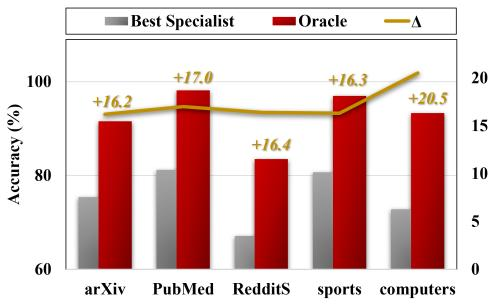
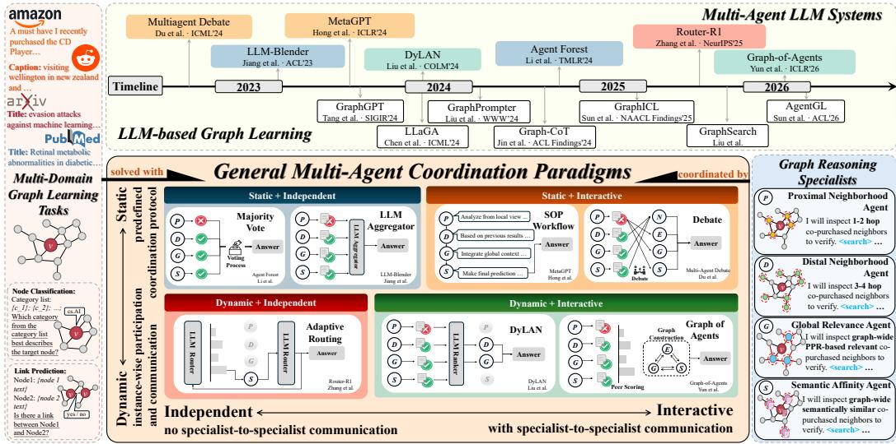
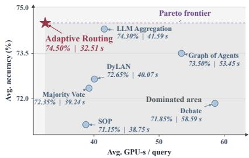

# GRAPHMAS: A SYSTEMATIC BENCHMARK OF MULTI-AGENT COORDINATION FOR GRAPH LEARNING

Jiayi Yang1, Yifang Chen1, Yuanfu Sun2, Xinyan Ge3, Qiaoyu Tan1∗

1New York University Shanghai 2New York University 3Northwestern University {jy4656,qiaoyu.tan}@nyu.edu

## ABSTRACT

Large language model (LLM)-based multi-agent systems coordinate specialized reasoning through aggregation, interaction, and adaptive control, yet their potential for graph learning remains largely unexplored. Graph learning is a natural setting for such systems because useful evidence may arise from heterogeneous local, longrange, global structural, and semantic perspectives whose relevance varies across instances. Existing LLM-based graph learning approaches primarily rely on singleagent reasoning, while multi-agent coordination has been studied mainly in general reasoning settings. Consequently, it remains unclear whether multiple specialized agents can improve graph learning and how different coordination strategies should be designed and evaluated. To address this gap, we introduce GRAPHMAS, a systematic benchmark of multi-agent coordination for graph learning. GRAPHMAS builds a shared pool of graph reasoning specialists and organizes coordination along two dimensions, inter-agent interaction and runtime adaptivity, yielding four paradigms and seven representative coordination methods. Under a unified protocol, we evaluate these methods across seven text-attributed graphs, three domains, and two representative graph learning tasks: node classification and link prediction. Our study shows that heterogeneous graph perspectives are strongly complementary, and that coordinating specialists improves over both individual specialists and single-agent graph reasoning methods, with gains that arise from decomposing reasoning across specialists rather than from broader evidence access alone. However, richer inter-agent interaction does not reliably help, whereas instance-adaptive specialist selection yields the strongest accuracy–efficiency tradeoff. We further show that the coordination policy can be learned over a fixed specialist pool and transfers to held-out graphs. GRAPHMAS therefore provides a controlled evaluation framework and empirical principles for understanding when and how multi-agent coordination benefits graph learning.

## 1 INTRODUCTION

LLM-based multi-agent systems coordinate multiple reasoning processes through role specialization, independent judgments, aggregation, and exchanges of intermediate outputs. Such systems have shown promising results in domains including software development and mathematical reasoning (Hong et al., 2024; Du et al., 2024), motivating a growing range of coordination strategies with different communication structures and agent participation rules (Tran et al., 2025). These strategies determine which agents contribute, what information they share, and when reasoning termi nates. While multi-agent coordination has been increasingly studied in general reasoning settings, its potential for graph learning remains largely unexplored.

Graph learning provides a natural setting for studying multi-agent coordination because useful evidence can arise from heterogeneous graph perspectives whose relevance varies across instances. Predictions on text-attributed graphs may depend on local neighborhoods, longer-range structural relationships, graph-wide relevance, or node semantics. Classical graph learning has long recognized that different receptive fields and structural contexts can be useful for different nodes, for example by adapting neighborhood ranges (Xu et al., 2018) or combining local message passing with global attention (Rampa´sek et al., 2022). More recently, LLM-based graph learning methods have incorporatedˇ graph structure through instruction tuning, structured prompting, and active graph exploration (Chen et al., 2024; Sun et al., 2025; Liu et al., 2026; Sun et al., 2026). However, these approaches primarily rely on a single reasoning agent to integrate heterogeneous structural and semantic evidence within one trajectory. When different graph perspectives provide complementary signals, a single reasoning process may not exploit them equally well.

This observation motivates a different formulation: assigning distinct graph perspectives to specialized reasoning agents and coordinating their judgments for a shared graph learning task. Specialization, however, creates a new coordination problem. An evidence perspective that is informative for one instance may be unhelpful for another, and specialists may therefore exhibit both complementary strengths and conflicting predictions. As illustrated by the oracle gap in Figure 1, specialist success varies across instances, leaving considerable coordination headroom: instances missed by the best individual specialist can often be resolved by another graph perspective. The central question is therefore not simply whether more agents improve graph learning, but when complementary specialists should participate and how their reasoning should be coordinated.

Despite this opportunity, systematically understanding multi-agent coordination for graph learning remains challenging for three reasons. 1) There is no controlled benchmark for comparing coordination strategies in graph learning. Existing LLMbased graph learning methods differ substantially in how they access and reason over graph information, while general multi-agent methods differ in agent participation, communication, and runtime control. Consequently, directly comparing complete systems can conflate the effects of the underlying graph reasoning capability with those of the coordination mechanism. A meaningful comparison therefore requires a shared specialist pool, consistent graph evidence interfaces, and controlled inference conditions. 2) The source of multi-agent gains is unclear. Improvement from multiple agents may arise from several factors: access to different graph evidence, decomposition of reasoning across multiple trajectories, specialized role conditioning, or the coordination mechanism. Moreover, comparisons with individual specialists alone cannot establish an advantage over strong single-agent graph learning systems. Controlled analysis is therefore needed to determine whether multi-agent reasoning provides benefits beyond broader evidence access and to understand how graph evidence and specialist roles interact. 3) It remains unclear when additional coordination is actually useful. Multi-agent systems often increase communication or invoke additional agents uniformly across instances. Yet the need for coordination is inherently instance dependent: specialists may already agree on easy cases, while disagreement may indicate that different graph perspectives support competing predictions. More interaction may therefore increase computation without necessarily improving accuracy. Understanding which specialists should participate and whether they should communicate is essential for both effective and efficient multi-agent graph learning.

  
Figure 1: Performance gap between the best specialist and oracle on five LP tasks. The oracle is correct if any specialist is correct; the best specialist is selected per dataset. Exact results are reported in Appendix C.1.

To address these challenges, we introduce GraphMAS, a systematic benchmark of multi-agent coordination for graph learning. GraphMAS evaluates representative coordination approaches over a shared pool of graph reasoning specialists under consistent experimental conditions. The specialists capture four complementary graph perspectives—proximal neighborhoods, distal neighborhoods, graph-wide structural relevance, and semantic affinity—while sharing the same agentic backbone, retrieval budget, and LLM configuration. We organize coordination along two dimensions: interagent interaction, which distinguishes independent specialist reasoning from reasoning conditioned on other specialists’ intermediate outputs; and runtime adaptivity, which distinguishes predefined coordination procedures from instance-dependent participation, communication, or stopping decisions. Crossing these dimensions yields four paradigms: Static Independent, Static Interactive, Dynamic Independent, and Dynamic Interactive. GraphMAS instantiates seven representative coordination methods across these paradigms and evaluates them alongside strong LLM reasoning, agentic graph learning, and individual specialist baselines on node classification and link prediction.

Our study reveals several consistent empirical patterns. First, heterogeneous graph perspectives exhibit substantial instance-dependent complementarity, creating clear headroom for coordination beyond any individual specialist. Second, controlled ablations show that agent specialization is most effective when graph evidence and reasoning roles are differentiated jointly, and distributing complementary perspectives across specialists provides gains beyond single-agent reasoning over the same evidence sources. Third, richer inter-agent interaction does not consistently improve performance or efficiency; instead, instance-adaptive specialist selection achieves a favorable accuracy–efficiency trade-off, with coordination methods differentiating most strongly under specialist disagreement. Finally, we show that the coordination policy itself can be learned while keeping the underlying graph specialists fixed, and that learned coordination can transfer to held-out graphs.

Our main contributions are summarized as follows:

• A systematic benchmark for multi-agent coordination in graph learning. We introduce GraphMAS, which studies how a shared pool of graph reasoning specialists can be coordinated for graph learning. We characterize coordination along inter-agent interaction and runtime adaptivity, yielding four paradigms instantiated by seven representative coordination methods.

• A unified and comprehensive evaluation protocol. GraphMAS evaluates multi-agent coordination methods across seven text-attributed graphs spanning three domains and two representative graph learning tasks. The benchmark measures predictive performance and compares against strong non-agentic, agentic, and individual-specialist baselines.

• Controlled diagnostic analyses. We isolate the contributions of evidence allocation, role specialization, and reasoning decomposition through controlled ablations, and analyze coordination behavior through oracle gaps, agreement-stratified evaluation, and cost accounting.

• Extension to learned coordination. We demonstrate that coordination can be optimized while keeping graph specialists fixed, establishing learned routing as a strong extension of the benchmark and showing that coordination behavior can generalize on unseen graphs.

## 2 RELATED WORK

Multi-Agent LLM Systems. Multi-agent LLM systems coordinate agents through task decomposition, role specialization, and intermediate exchanges (Tran et al., 2025). Such coordination has improved software-generation quality in MetaGPT (Hong et al., 2024) and reasoning accuracy and factuality in Multi-Agent Debate (Du et al., 2024). Despite these shared benefits, existing systems adopt different mechanisms for information exchange and execution control. Some aggregate independently generated responses (Jiang et al., 2023; Li et al., 2024), while others incorporate one agent’s output into another’s reasoning. Participation and communication may follow predefined protocols or depend on model-generated control decisions. For example, DyLAN (Liu et al., 2024b) selects agents through response rankings, while Graph-of-Agents (Yun et al., 2026) uses response evaluations to select relevant agents and construct communication graphs. Inter-agent interaction and runtime adaptivity are thus distinct. Fixed workflows can support intermediate exchanges, while adaptive selection can preserve independent reasoning.

LLM-based Graph Learning. LLM-based graph learning requires integrating attribute semantics with relational structure (Jin et al., 2024a). GraphGPT (Tang et al., 2024), LLaGA (Chen et al., 2024), and GraphICL (Sun et al., 2025) address this challenge through graph instruction tuning, structureaware projection, and structured prompting, respectively. Agentic methods further acquire graph evidence during inference. Graph-CoT (Jin et al., 2024b) interleaves reasoning with graph interaction, while GraphSearch (Liu et al., 2026) and AgentGL (Sun et al., 2026) use graph-aware retrieval and learned navigation, respectively. More recently, GLM (Huan et al., 2025) and MAAGL (Qu et al., 2026) introduced specialized-agent designs for graph question answering and node classification, respectively. Although these studies demonstrate the potential of multi-agent graph reasoning, their focus on specific architectures and task settings leaves systematic comparisons across coordination paradigms and graph learning tasks limited.

  
Figure 2: Overview of GraphMAS. A shared pool of graph reasoning specialists is coordinated across representative multi-agent paradigms organized by inter-agent interaction and runtime adaptivity. The timeline shows prior LLM-based graph learning and general multi-agent systems.

## 3 GRAPHMAS

GraphMAS provides a systematic framework for studying multi-agent coordination in graph learning. As illustrated in Figure 2, it builds on a shared pool of graph reasoning specialists with heterogeneous graph perspectives, detailed in Section 3.2. Section 3.3 then characterizes the coordination space along two dimensions, and Section 3.4 instantiates representative methods within this space.

## 3.1 PRELIMINARIES

We consider a text-attributed graph $\mathcal { G } = ( \nu , \mathcal { E } , \mathcal { T } )$ , where each node v ∈ V carries a textual attribute $t _ { v } \in \mathcal { T }$ , and study two representative tasks. In node classification (NC), the goal is to predict the label $y _ { v } \in \mathcal { V }$ of a target node v. In link prediction (LP), the goal is to predict whether an edge exists between a node pair $( u , v )$ . We write q for a generic prediction instance, a target node for NC or a node pair for LP, and $y _ { q }$ for its ground-truth label, which is never observable during inference.

## 3.2 GRAPH SPECIALISTS

Graph prediction may require local, distant, or semantically related evidence, with the most useful perspective varying by instance. Earlier LLM-based graph methods use fixed-hop subgraphs or predefined neighborhood templates (Liu et al., 2024a; Chen et al., 2024), while agentic methods let a single agent search across structural and semantic perspectives (Liu et al., 2026; Sun et al., 2026). Within one reasoning trajectory, however, complementary perspectives may receive uneven attention, making their contributions difficult to distinguish. GraphMAS assigns these perspectives to specialized agents and studies how to coordinate their predictions.

Shared agentic backbone. All specialists use the same retrieval pipeline, search budget, decoding configuration, and a frozen LLM backbone consistent with prior graph learning works (Liu et al., 2026). Given an instance $q ,$ a specialist alternates between reasoning, issuing graph queries, and inspecting the returned evidence through a <think> / <search> / <information> interaction loop until it produces a prediction or reaches its search budget. Each query is handled by a graphaware retriever that constructs candidates according to the specialist’s requested evidence scope and ranks them using structural and semantic relevance signals.

Specialized roles. We select specialists based on structural relationships and semantic similarity. Structural exploration separates proximal and distal neighborhoods to examine local and longerrange context independently, complemented by graph-wide relevance without a fixed hop constraint. Semantic exploration retrieves textually related nodes regardless of graph proximity. We assign these four views to separate specialists, building on the retrieval modes of prior agentic graph learning (Liu et al., 2026; Sun et al., 2026), and study how to coordinate their predictions:

• Proximal Neighborhood Agent focuses on relational evidence close to q. Nearby nodes often provide direct contextual signals through homophily, shared interactions, or local structural patterns. We instantiate this perspective using 1- and 2-hop retrieval.

• Distal Neighborhood Agent examines relational evidence beyond the immediate neighborhood, capturing dependencies that require a broader structural receptive field. We instantiate this perspective using 3- and 4-hop retrieval excluding the proximal neighbors.

• Global Relevance Agent targets structurally relevant nodes that need not fall within a fixed hop radius. We operationalize this perspective by ranking graph-wide candidates according to Personalized PageRank (Page et al., 1999) with respect to the target, thereby prioritizing nodes with high structural relevance even when they are topologically distant.

• Semantic Affinity Agent prioritizes attribute-level relevance over graph proximity, retrieving graph-wide nodes with semantically similar textual attributes, including informative examples that may be weakly connected or structurally distant.

For a node-classification instance $q = v ,$ , each specialist applies its corresponding scope with respect to the target node v. For a link-prediction instance $\boldsymbol { q } = \left( \boldsymbol { u } , \boldsymbol { v } \right)$ , the same scope is applied to both endpoints, and the retrieved evidence is presented jointly to the specialist. Together, these agents enable broad graph exploration through distinct yet complementary structural and semantic perspectives.

Specialist interface. To support different coordination mechanisms, all specialists expose a common interface. A single invocation of specialist $A _ { i }$ receives a prediction instance q and an optional coordination context z, and returns

$$
o = A _ { i } \big ( q , z \big ) = \big ( \hat { y } , r \big ) ,\tag{1}
$$

where $\hat { y }$ is the predicted label and r is a textual response summarizing the evidence and reasoning supporting the prediction. When $z = \emptyset$ , the specialist reasons independently. Otherwise, z contains responses made available by the coordination mechanism. The specialist may use these responses to reconsider its prediction, while graph evidence remains restricted to its assigned perspective. This interface allows the same specialist pool to be used across heterogeneous coordination structures.

## 3.3 THE COORDINATION DESIGN SPACE

Given a specialist pool $\mathcal { A } = \{ A _ { 1 } , \dotsc , A _ { M } \}$ , we represent the execution of a multi-agent system on an instance q as a typed coordination graph

$$
\mathcal { H } ( q ) = \big ( \mathcal { N } _ { q } , \mathcal { E } _ { q } ^ { \mathrm { m s g } } , \mathcal { E } _ { q } ^ { \mathrm { c t r l } } \big ) .\tag{2}
$$

The node set contains both specialist and coordination invocations, $\mathcal { N } _ { q } = \mathcal { N } _ { q } ^ { \mathrm { s p } } \cup \mathcal { N } _ { q } ^ { \mathrm { c o o r d } }$ . A specialist node $n \in \mathcal { N } _ { q } ^ { \mathrm { s p } }$ invokes a specialist $A _ { a ( n ) }$ and produces $o _ { n } = A _ { a ( n ) } { \left( q , z _ { n } \right) }$ . A coordination node $n \in \mathcal { N } _ { q } ^ { \mathrm { c o o r d } }$ invokes a graph-blind coordination module $C _ { c ( n ) }$ , such as a router, aggregator, or ranker, and produces $o _ { n } = C _ { c ( n ) } { \left( q , z _ { n } \right) }$ . Coordination modules may condition on the prediction instance, ( )specialist descriptions, and responses made available to them, but cannot invoke retrieval on graphs.

The two edge types distinguish information flow from execution control. A message edge $( n ^ { \prime } $ $n ) \in \mathcal { E } _ { q } ^ { \mathrm { m s g } }$ indicates that $o _ { n ^ { \prime } }$ is included in the reasoning context $z _ { n }$ . A control edge $( n ^ { \prime } \to n ) \in { \mathcal E } _ { q } ^ { \mathrm { c t r l } }$ indicates that the output of $n ^ { \prime }$ affects whether or how n is executed, for example through routing, selection, pruning, or stopping. The final prediction is obtained by a fixed readout $\rho$ over the realized execution, $\hat { y } _ { q } ~ = ~ \rho ( \mathcal { H } ( q ) , \{ o _ { n } \} _ { n \in \mathcal { N } _ { q } } )$ . Any LLM-based aggregation or synthesis is represented ∈Nexplicitly as a coordination node rather than being absorbed into $\rho .$

Inter-agent interaction. A mechanism is interactive if the response of one specialist can enter the reasoning context of another specialist before the latter produces or revises its prediction. It is independent otherwise. Coordination modules may therefore aggregate, rank, or route specialist responses without making the specialists themselves interactive.

Runtime adaptivity. A mechanism is static when specialist participation and communication follow a predefined protocol shared across instances, possibly with fixed deterministic stopping rules. A mechanism is dynamic when model-generated control decisions determine part of the realized execution graph, such as which specialists are invoked or which communication links are formed.

Crossing the two dimensions yields four coordination paradigms: SI Static Independent, SX Static Interactive, DI Dynamic Independent, and DX Dynamic Interactive.

Table 1: Coordination methods instantiated in GraphMAS.
<table><tr><td>Paradigm</td><td>Method</td><td>Participation</td><td>Specialist communication Runtime adaptation</td><td></td><td>Final decision</td></tr><tr><td>SI Static Independent</td><td>Majority Vote LLM Aggregation all M</td><td>all M</td><td>none none</td><td>none none</td><td>plurality vote LLM aggregator</td></tr><tr><td>SX Static Interactive</td><td>SOP Debate</td><td>all M in fixed order all M per round</td><td>sequential all-to-all</td><td>none none</td><td>final specialist plurality vote</td></tr><tr><td>DI Dynamic Independent</td><td>Adaptive Routing</td><td>selected sequentially</td><td>none</td><td>routing and stopping</td><td>router</td></tr><tr><td>DX Dynamic Interactive</td><td>DyLAN Graph of Agents</td><td>all M, then top-k all M, then top-k</td><td>all-to-all weighted directed graph</td><td>agent pruning graph construction and pruning meta-LLM pooling</td><td>agreement/ranker</td></tr></table>

## 3.4 INSTANTIATED COORDINATION METHODS

We instantiate seven representative coordination methods spanning the four paradigms over the same specialist pool, as illustrated in Figure 2. They differ in specialist participation, inter-specialist communication, runtime adaptation, and final decision-making. Table 1 summarizes these structures.

Static Independent. All specialists participate according to a fixed protocol and produce their responses without observing the reasoning contexts of one another.

SI Majority Vote follows the sampling-and-voting paradigm of Agent Forest (Li et al., 2024). Each specialist independently produces $o _ { i } = A _ { i } { \left( q , \emptyset \right) }$ , and the final prediction is $\hat { y } _ { q } = \mathrm { m o d e } \{ \hat { y } _ { i } \} _ { i = 1 } ^ { M }$

SI LLM Aggregation adapts the generative-fusion component of LLM-Blender (Jiang et al., 2023). Each specialist independently produces a response $o _ { i }$ , after which an aggregator node conditions on the original instance and the response set to generate the final prediction $\hat { y } _ { q } = C _ { \mathrm { a g g } } \big ( q , \{ o _ { i } \} _ { i = 1 } ^ { M } \big )$ .

Static Interactive. All specialists participate under a fixed communication structure, and subsequent specialist invocations may condition on responses produced earlier in the execution.

SX SOP Workflow is inspired by the standardized operating procedures of MetaGPT (Hong et al., 2024). Specialists act in the fixed order $\pi = \left( { \mathrm { P R O X I M A L } } \right.$ , DISTAL, GLOBAL, SEMANTIC). At step t, specialist $\pi _ { t }$ observes all preceding responses and produces $O _ { \pi _ { t } } = A _ { \pi _ { t } } \bigl ( q , \{ o _ { \pi _ { s } } \} _ { s < t } \bigr )$ . The response of the final specialist is returned as the prediction.

SX Multi-Agent Debate adapts the iterative debate protocol of multiagent debate (Du et al., 2024). Specialists first respond independently, $o _ { i } ^ { ( 0 ) } = A _ { i } ( q , \emptyset )$ . At revision round t, each specialist observes its peers’ responses and produces $o _ { i } ^ { ( t ) } = A _ { i } ( q , \{ o _ { j } ^ { ( t - 1 ) } \} _ { j \neq i } )$ with the assigned graph perspective unchanged. Debate terminates upon unanimous agreement or after R revision rounds. If disagreement remains, the final prediction is determined by plurality over the specialists’ latest predictions.

Dynamic Independent. Specialist participation is determined at runtime, while each invoked specialist reasons without access to other specialists’ responses.

DI Adaptive Routing is conceptually inspired by the sequential routing formulation of Router-R1 (Zhang et al., 2025). At step t, the router conditions on the instance, specialist descriptions, and collected responses, and either selects an unqueried specialist $a _ { t }$ or stops with a final prediction. A selected specialist is invoked independently as $o _ { t } = A _ { a _ { t } } ( q , \emptyset )$ . If the budget is exhausted, the same coordination model synthesizes the collected responses into the final answer.

Dynamic Interactive. Specialist participation and communication structure may be determined during execution, and active specialists can revise their predictions using other specialists’ responses. DX DyLAN (Liu et al., 2024b) adapts temporal feed-forward interaction and inference-time team reformation to the GraphMAS specialist pool. Specialists first produce independent responses, $o _ { i } ^ { ( 0 ) } = A _ { i } ( q , \emptyset )$ . If at least three agree, inference terminates. Otherwise, a listwise ranker selects $S = C _ { \mathrm { r a n k } } \big ( q , \{ o _ { i } ^ { ( 0 ) } \} _ { i = 1 } ^ { M } \big )$ , with $| S | = k$ . The retained specialists then revise their predictions using the other retained responses, $o _ { i } ^ { ( 1 ) } = A _ { i } { ( q , \{ o _ { j } ^ { ( 0 ) } \} } _ { j \in S \setminus \{ i \} } )$ . The system terminates upon agreement. Otherwise, the ranker selects among the final retained responses.

DX Graph of Agents (Yun et al., 2026) is adapted to the GraphMAS specialist pool using responseconditioned graph construction and message passing. Specialists first produce independent responses, $o _ { i } ^ { ( 0 ) } = A _ { i } ( q , \emptyset )$ , and score the relevance of one another’s responses. The top-k specialists form a weighted directed graph $G _ { q } = \left( S _ { q } , E _ { q } , w _ { q } \right)$ , where $| S _ { q } | = k$ . They then refine their responses through forward and reverse message passing over the graph. Finally, a meta-agent uses mean pooling to synthesize the refined responses and relevance scores into the final prediction.

Table 2: Accuracy (%) of LLM reasoning, agentic baselines, graph specialists, and multi-agent methods, with all LLM-based methods using Qwen2.5-32B-Instruct. Avg. averages seven datasets; Avg. Rank averages ranks across 15 methods and 14 dataset–task settings. Top 2 counts settings reaching either of the two highest distinct accuracies. Best and second-best values are bold and underlined, respectively. See App. B for implementation details.
<table><tr><td>Method</td><td colspan="8">Link Prediction</td><td colspan="7">Node Classification</td><td colspan="2">Overall</td></tr><tr><td></td><td colspan="8">arXiv products PubMed Reddit sports arXiv-23 computers Avg. arXiv products PubMed Reddit sports arXiv-23 computers Avg. Avg. Rank Top 2</td><td colspan="8"></td></tr><tr><td></td><td></td><td></td><td></td><td></td><td></td><td>LLM Reasoning</td><td></td><td></td><td></td><td></td><td></td><td></td><td></td><td></td><td></td><td></td><td></td></tr><tr><td>Chain-of-Thought</td><td>76.1 63.8</td><td>80.4</td><td></td><td>64.8</td><td>78.0</td><td>63.7</td><td>68.9 | 56.5</td><td></td><td>66.1</td><td>91.6</td><td>60.1</td><td>53.8</td><td>60.1</td><td>59.4</td><td>63.9</td><td>10.8</td><td>0</td></tr><tr><td></td><td></td><td></td><td></td><td></td><td></td><td>66.6</td><td>Agentic Methods</td><td></td><td></td><td></td><td></td><td></td><td></td><td></td><td></td><td></td><td></td></tr><tr><td>Search-o1</td><td>63.8</td><td>79.5</td><td>69.8</td><td>64.7</td><td>65.3 62.0</td><td></td><td>69.8|</td><td>57.3</td><td>68.1</td><td>89.1</td><td>62.0</td><td>59.7</td><td>60.4</td><td>60.9</td><td>65.4</td><td>11.0</td><td>0</td></tr><tr><td>Graph-CoT</td><td>60.2</td><td>78.6</td><td>60.9</td><td>60.4</td><td>79.1 70.8</td><td></td><td>65.0</td><td>54.5</td><td>64.6</td><td>70.5</td><td>56.1</td><td>57.2</td><td>59.7</td><td>62.6</td><td>60.7</td><td>13.7</td><td>0</td></tr><tr><td>GraphSearch</td><td>70.3</td><td>79.5</td><td>75.2</td><td>62.7</td><td>74.5</td><td></td><td>62.2 68.3 71.6</td><td>57.6</td><td>71.7</td><td>89.8</td><td>67.4</td><td>59.8</td><td>55.8</td><td>69.9</td><td>67.4</td><td>9.4</td><td>1</td></tr><tr><td></td><td></td><td></td><td></td><td></td><td></td><td></td><td>Specialist Agents</td><td></td><td></td><td></td><td></td><td></td><td></td><td></td><td></td><td></td><td></td></tr><tr><td>Proximal Neighborhood</td><td>75.4</td><td>76.7</td><td>74.8</td><td>67.1</td><td>78.8 71.6</td><td>71.6</td><td>73.7|</td><td>56.1</td><td>70.4</td><td>90.7</td><td>68.3</td><td>60.1</td><td>58.3</td><td>69.3</td><td>67.6</td><td>8.4</td><td>1</td></tr><tr><td>Distal Neighborhood</td><td>72.2</td><td>83.2</td><td>71.0</td><td>50.7</td><td>75.5</td><td></td><td>68.1 70.4</td><td>57.7</td><td>71.8</td><td>90.5</td><td>58.1</td><td>62.8</td><td>58.0</td><td>63.6</td><td>66.1</td><td>10.3</td><td>1</td></tr><tr><td>Global Relevance</td><td>68.2</td><td>82.7</td><td>76.4</td><td>58.7</td><td>78.6</td><td>69.9</td><td>72.5</td><td>57.5</td><td>72.8</td><td>91.1</td><td>65.9</td><td>59.6</td><td>57.5</td><td>69.3</td><td>67.7</td><td>8.8</td><td>0</td></tr><tr><td>Semantic Affinity</td><td>72.6</td><td>82.6</td><td>81.2</td><td>60.8</td><td>80.7 73.5</td><td>72.8 68.8</td><td>74.3</td><td>59.4</td><td>70.6</td><td>90.5</td><td>61.2</td><td>58.5</td><td>59.3</td><td>62.3</td><td>66.0</td><td>9.2</td><td>1</td></tr><tr><td colspan="10">General Multi-Agent Methods</td><td></td><td></td><td></td><td></td><td></td><td></td><td></td><td></td></tr><tr><td></td><td></td><td></td><td></td><td></td><td></td><td></td><td>Static Independent</td><td></td><td></td><td></td><td></td><td></td><td></td><td></td><td></td><td></td><td></td></tr><tr><td>Majority Vote</td><td>74.6</td><td>84.3 88.8</td><td>81.0</td><td>61.0</td><td>84.8 87.2</td><td>74.5</td><td>76.0|</td><td>58.7</td><td>73.2</td><td>91.6</td><td>67.1</td><td>61.4</td><td>59.9</td><td>68.8</td><td>68.7</td><td>5.8</td><td>3</td></tr><tr><td>LLM Aggregation 82.9</td><td></td><td>75.6</td><td></td><td>69.0</td><td>81.7</td><td>74.9</td><td>80.0</td><td>59.3</td><td>71.9</td><td>92.2</td><td>67.0</td><td>59.2</td><td>61.0</td><td>69.3</td><td>68.6</td><td>3.9</td><td>7</td></tr><tr><td></td><td></td><td></td><td></td><td></td><td></td><td>71.0</td><td>Static Interactive</td><td></td><td></td><td></td><td></td><td></td><td></td><td></td><td></td><td></td><td></td></tr><tr><td>SOP Workflow Multi-Agent Debate</td><td>73.5 72.8</td><td>86.5 87.7</td><td>71.3 75.8</td><td>62.3 58.5</td><td>81.8 86.3</td><td>75.7 73.9</td><td>74.6|</td><td>56.6 59.4</td><td>73.8 71.7</td><td>90.1 91.1</td><td>66.1 67.5</td><td>60.4</td><td>57.4</td><td>69.2</td><td>67.7 68.1</td><td>8.1</td><td>1 0</td></tr><tr><td></td><td></td><td></td><td></td><td></td><td></td><td></td><td>75.6 Dynamic Independent</td><td></td><td></td><td></td><td></td><td>58.2</td><td>59.8</td><td>69.0</td><td></td><td>7.1</td><td></td></tr><tr><td>Adaptive Routing 83.5</td><td></td><td>89.8</td><td>76.7</td><td>67.2</td><td>86.9 83.3</td><td>74.3</td><td>80.2| 60.1</td><td></td><td>72.7</td><td>92.0</td><td>67.7</td><td>59.0</td><td>61.0</td><td>68.9</td><td>68.8</td><td>3.3</td><td>7</td></tr><tr><td></td><td></td><td></td><td></td><td></td><td></td><td></td><td>Dynamic Interactive</td><td></td><td></td><td></td><td></td><td></td><td></td><td></td><td></td><td></td><td></td></tr><tr><td>DyLAN</td><td>79.7</td><td>86.9</td><td>73.7</td><td>58.1</td><td>86.4</td><td>76.2</td><td>76.2|</td><td>60.0</td><td>72.5</td><td>91.5</td><td>67.3</td><td>61.5</td><td>61.3</td><td>69.8</td><td>69.1</td><td>5.1</td><td>4</td></tr><tr><td>Graph of Agents</td><td>82.3</td><td>89.4</td><td>75.7</td><td>63.0</td><td>87.4</td><td>79.8</td><td>78.8</td><td>59.5</td><td>71.4</td><td>92.1</td><td>66.5</td><td>58.9</td><td>61.0</td><td>68.3</td><td>68.2</td><td>5.2</td><td>4</td></tr></table>

## 4 EXPERIMENTS

In this section, we conduct extensive experiments to systematically investigate multi-agent coordination for graph learning through the following research questions (RQs): RQ1: How effective is multi-agent graph learning compared with single-agent reasoning? RQ2: What drives the gains of multi-agent graph learning? RQ3: How do different coordination strategies compare in effectiveness and efficiency? RQ4: How does learning affect multi-agent graph learning?

Roadmap. We compare multi-agent and single-agent methods across backbones (§4.2; App. C.2, C.6), identify sources of multi-agent gains across coordination methods (§4.3; App. C.3– C.4), evaluate coordination effectiveness and efficiency under specialist disagreement (§4.4; App. C.5, C.7), and study learned coordination (§4.5). The appendix reports dataset statistics (App. A), implementation details (App. B), oracle gaps (App. C.1), and prompts (App. D).

## 4.1 EXPERIMENTAL SETUP

Datasets. We evaluate on Node Classification (NC) and Link Prediction (LP) across 7 textattributed graph (TAG) benchmarks spanning 3 domains: 1) citation networks: ogbn-Arxiv (2020), PubMed (2008), and Arxiv-2023 (2024); 2) e-commerce networks: ogbn-Products (2020), Amazon-Sports (2023), and Amazon-Computers (2023); and 3) social networks: Reddit (2025). Dataset statistics and task construction are provided in Appendix A.

Baselines. We compare the multi-agent coordination methods instantiated in GraphMAS against representative baselines spanning direct LLM reasoning and LLM-based graph learning. 1) LLM reasoning. Chain-of-Thought (CoT) (2022) predicts directly without access to graph information. 2) Agentic methods. We include Search-o1 (2025), a general-purpose agentic retrieval method, together with Graph-CoT (2024b) and GraphSearch (2026), which explicitly interact with graph information. Beyond these baselines, we evaluate all four GraphMAS specialists individually and systematically compare the seven multi-agent coordination methods introduced in Section 3.4: Majority Vote (2024), LLM Aggregation (2023), SOP Workflow (2024), Multi-Agent Debate (2024), Adaptive Routing (2025), DyLAN (2024b), and Graph of Agents (2026).

## 4.2 PERFORMANCE OF MULTI-AGENT GRAPH LEARNING (RQ1)

Table 2 compares direct LLM reasoning, agentic graph reasoning, individual graph specialists, and multi-agent coordination across seven datasets and both graph learning tasks.

★ Finding 1: Graph specialists are individually competitive and exhibit distinct strengths across datasets and tasks. The specialist agents already provide strong standalone graph reasoning. The best specialist-level average reaches 74.3% on LP and 67.7% on NC, compared with 71.6% and 67.4% for GraphSearch, respectively. More importantly, the strongest specialist varies across datasets and tasks, indicating that different graph evidence perspectives capture complementary predictive signals rather than a universally superior graph view.

★ Finding 2: Coordinating graph specialists consistently improves over individual specialist reasoning, especially on link prediction. On LP, all seven multi-agent methods outperform the strongest individual specialist on average, with the best result improving from 74.3% to 80.2%. On NC, six methods improve, and one matches the strongest specialist, raising the best average from 67.7% to 69.1%. Multi-agent methods also achieve better overall ranks, ranging from 3.3 to 8.1, compared with 8.4 for the strongest single-agent method. This shows that coordinating specialist judgments provides gains beyond individual specialists and conventional single-agent reasoning.

## 4.3 SOURCES OF MULTI-AGENT GAINS (RQ2)

We examine two sources of multi-agent gains: specialist design, which varies evidence and reasoning roles, and reasoning decomposition, which compares joint versus separate reasoning over complementary graph perspectives. To isolate these effects, we use the non-interactive LLM Aggregation. See Appendix C.3–C.4 for details and additional results.

★ Finding 3: Agent-specific evidence and specialized roles are most effective when combined. We vary whether agents receive distinct graph evidence and specialized roles, while fixing the number of agents, backbone, and coordination mechanism. As shown in Table 3(a), specialized roles alone do not help with shared evidence, reducing LP accuracy from 73.0% to 69.9%, while agent-specific evidence with generic roles yields only marginal gains. Combining both gives the strongest results, reaching 80.0% on LP and 67.7% on NC. These results suggest that effective specialization arises from aligning distinct graph evidence with each agent’s reasoning role, rather than from either component in isolation

Table 3: Multi-agent gains under LLM Aggregation. ✓/✗ denote specialized/shared evidence or roles. Results are average accuracy (%).
<table><tr><td>Evidence</td><td>Role</td><td>LP</td><td>NC</td></tr><tr><td>(a) Specialist Design</td><td></td><td></td><td></td></tr><tr><td>x</td><td>x</td><td>73.0</td><td>66.0</td></tr><tr><td>x</td><td>√</td><td>69.9</td><td>65.4</td></tr><tr><td>√</td><td>x</td><td>73.7</td><td>66.1</td></tr><tr><td>√</td><td>√</td><td>80.0</td><td>67.7</td></tr><tr><td colspan="4">(b) Reasoning decomposition</td></tr><tr><td colspan="2">Single-agent reasoning Multi-agent reasoning 80.0</td><td>74.6</td><td>65.6 67.7</td></tr></table>

★ Finding 4: Reasoning decomposition provides gains beyond access to diverse graph evidence. We next examine whether reasoning decomposition provides benefits by comparing a multi-agent system with a single agent that receives the same four evidence sources jointly in one reasoning context. As shown in Table 3(b), single-agent reasoning achieves 74.6% on LP and 65.6% on NC, while multi-agent reasoning reaches 80.0% and 67.7%. Thus, the gains extend beyond broader evidence access to decomposing complementary perspectives across separate reasoning processes.

## 4.4 EFFECTIVENESS AND EFFICIENCY OF COORDINATION (RQ3)

We compare the seven GraphMAS coordination methods along two questions: which coordination designs provide the strongest predictive and computational trade-offs, and under what conditions their performance differs most.

★ Finding 5: Instance-adaptive specialist selection is more effective than simply increasing inter-agent interaction. Despite sharing the same specialist pool, different coordination paradigms exhibit substantial performance differences. Among them, Adaptive Routing achieves the best overall average rank of 3.3 and the highest LP accuracy of 80.2%, while DyLAN obtains the highest NC accuracy of 69.1%. Interestingly, the simpler static-independent LLM Aggregation remains highly competitive, reaching 80.0%

  
Figure 3: Accuracy–cost trade-offs averaged across NC and LP.

on LP with an average rank of 3.9. In contrast, the static-interactive SOP Workflow and Multi-Agent Debate do not consistently outperform independent coordination.

Figure 3 further compares the accuracy–efficiency trade-off across coordination paradigms. Overall, Adaptive Routing is the only method on the Pareto frontier, achieving strong predictive performance with lower inference cost than methods that invoke the full specialist pool. By contrast, interactionheavy methods such as SOP Workflow, Multi-Agent Debate, and Graph of Agents incur higher computation without corresponding accuracy improvements. Detailed task-specific results and statistics are reported in Appendix C.7.

★ Finding 6: Coordination strategies differentiate most strongly on instances with specialist disagreement. We stratify instances by agreement among the four initial specialist predictions. On LP, the accuracy range across methods grows from 4.4 points under unanimous agreement to 7.1 points in the 3/4 group and 19.3 points in the ≤ 2/4 group, where Adaptive Routing reaches 69.4% while Multi-Agent Debate obtains 50.1%. NC follows the same trend at a smaller scale, with the range increasing from 1.0 to 5.0 points (Appendix C.5). Thus, disagreement does not by itself guarantee coordination gains; rather, it is where the choice of coordination mechanism matters most.

<table><tr><td rowspan=1 colspan=1>Majority</td><td rowspan=1 colspan=1>88.7</td><td rowspan=1 colspan=1>68.9</td><td rowspan=1 colspan=1>53.9</td></tr><tr><td rowspan=2 colspan=1>LLM Agg.SOP</td><td rowspan=1 colspan=1>88.7</td><td rowspan=1 colspan=1>71.4</td><td rowspan=1 colspan=1>66.5</td></tr><tr><td rowspan=1 colspan=1>84.3</td><td rowspan=1 colspan=1>64.6</td><td rowspan=1 colspan=1>56.6</td></tr><tr><td rowspan=1 colspan=1>Debate</td><td rowspan=1 colspan=1>88.7</td><td rowspan=1 colspan=1>64.3</td><td rowspan=1 colspan=1>50.1</td></tr><tr><td rowspan=2 colspan=1>RoutingDyLAN</td><td rowspan=1 colspan=1>88.7</td><td rowspan=1 colspan=1>71.1</td><td rowspan=1 colspan=1>69.4</td></tr><tr><td rowspan=1 colspan=1>87.9</td><td rowspan=1 colspan=1>65.9</td><td rowspan=1 colspan=1>55.3</td></tr><tr><td rowspan=1 colspan=1>GoA</td><td rowspan=1 colspan=1>88.6</td><td rowspan=1 colspan=1>69.7</td><td rowspan=1 colspan=1>63.7</td></tr></table>

Figure 4: LP accuracy (%) by initial specialist agreement. Parentheses show each group’s share.

## 4.5 EXTENDING GRAPHMAS TO LEARNED COORDINATION (RQ4)

We further study whether learning the coordination policy improves multi-agent graph reasoning. Since Adaptive Routing offers the strongest accuracy–cost trade-off among training-free methods, we optimize its router with PPO (Schulman et al., 2017) while keeping the four graph specialists frozen. We compare the learned router with its training-free counterpart and trained baselines, including GNN, LLM-based, and agentic graph-learning baselines, under a shared train–transfer split. Separate NC and LP routers are trained on four datasets and evaluated on seen and three held-out graphs. Training details and baseline protocols are provided in Appendices B.2 and B.3.

Table 4: Accuracy (%) of learned graph-learning methods under a shared in-domain/transfer split. All LLM-based baselines use Qwen2.5-7B-Instruct; GraphMAS uses a 7B router with four frozen Qwen2.5-32B-Instruct specialists. In-domain/Transfer denote seen/unseen datasets during training. Our method is highlighted. Best and second-best results are bold and underlined.
<table><tr><td rowspan="3">Category</td><td rowspan="3">Method</td><td colspan="7">Node Classification</td><td colspan="8">Link Prediction</td></tr><tr><td colspan="4">In-domain</td><td colspan="4">Transfer</td><td colspan="4">In-domain arXiv products PubMed computers Reddit sports arXiv-23</td><td colspan="4">Transfer</td></tr><tr><td>arXiv products PubMed computers Reddit sports arXiv-23 53.2</td><td></td><td></td><td></td><td></td><td></td><td></td><td>Avg.</td><td></td><td></td><td></td><td></td><td></td><td></td><td></td><td>Avg.</td></tr><tr><td rowspan="3">GNN</td><td>GCN RevGAT</td><td></td><td>62.5</td><td>73.9 81.5</td><td>69.4</td><td>4.1</td><td>4.4</td><td>1.8 0.7</td><td>38.5 38.3</td><td>74.6 73.6</td><td>59.9</td><td>49.8</td><td>72.4 69.9</td><td>50.1 49.9</td><td>49.9</td><td>54.8 49.9</td><td>58.8</td></tr><tr><td></td><td>47.1</td><td>48.4</td><td></td><td>68.8</td><td>3.9</td><td>17.5</td><td></td><td></td><td></td><td>57.1</td><td>58.6</td><td></td><td></td><td>49.3</td><td></td><td>58.3</td></tr><tr><td>GraphSAGE</td><td>62.0</td><td>60.4</td><td>51.6</td><td>75.2</td><td>5.9</td><td>6.6</td><td>1.6</td><td>37.6</td><td>71.1</td><td>77.2</td><td>78.1</td><td>70.3</td><td>55.0</td><td>52.1</td><td>47.5</td><td>64.5</td></tr><tr><td>LLM-based GL</td><td>GraphPrompter</td><td>55.2</td><td>68.8</td><td>90.3</td><td>60.6</td><td>54.8</td><td>30.6</td><td>23.6</td><td>54.8</td><td>91.7</td><td>91.4</td><td>87.5</td><td>79.9</td><td>61.5</td><td>85.2</td><td>89.2</td><td>83.8</td></tr><tr><td></td><td>LLaGA</td><td>64.2</td><td>56.4</td><td>86.5</td><td>72.1</td><td>7.8</td><td>0.3</td><td>18.8</td><td>43.7</td><td>79.5</td><td>68.1</td><td>81.9</td><td>65.6</td><td>59.9</td><td>60.2</td><td>62.5</td><td>68.2</td></tr><tr><td rowspan="2">Agentic GL</td><td>AgentGL-7B-GRPO</td><td>67.8</td><td>75.3</td><td>92.2</td><td>64.8</td><td>43.2</td><td>55.6</td><td>69.8</td><td>67.0</td><td>87.3</td><td>91.1</td><td>86.7</td><td>74.8</td><td>72.8</td><td>82.6</td><td>87.4</td><td>83.2</td></tr><tr><td>Routing (Training-free)</td><td>59.1</td><td>72.9</td><td>90.7</td><td>68.3</td><td>67.5</td><td>59.9</td><td>60.5</td><td>68.4</td><td>83.5</td><td>89.4</td><td>76.2</td><td>72.8</td><td>64.7</td><td>87.4</td><td>83.3</td><td>79.6</td></tr><tr><td>GraphMAS</td><td>Routing (PPO)</td><td>68.4</td><td>73.9</td><td>93.1</td><td>72.2</td><td>68.0</td><td>61.3</td><td>70.0</td><td>72.4</td><td>94.8</td><td>93.6</td><td>90.8</td><td>76.2</td><td>73.3</td><td>89.1</td><td>93.0</td><td>87.3</td></tr></table>

★ Finding 7: Learning the coordination policy improves multi-agent graph learning with fixed specialists. PPO raises average LP accuracy from 79.6% to 87.3%. On NC, the learned router achieves 72.4%, compared with 68.4% for its training-free counterpart. Because the specialists remain frozen, these gains reflect improved coordination rather than changes in specialist capability.

★ Finding 8: Learned coordination generalizes beyond router-training graphs. The learned router improves on both training and held-out datasets. On LP, it raises average accuracy on Reddit, Sports, and arXiv-23 from 78.5% to 85.1% and outperforms AgentGL-7B-GRPO on all seven datasets. These results show that the learned specialist-selection policy extends beyond the training graphs and provides a strong learned-coordination baseline for GraphMAS.

## 5 CONCLUSION

We presented GRAPHMAS, a controlled framework for studying multi-agent coordination in graph learning. Our results suggest that the value of multi-agent reasoning lies less in simply adding more agents or communication, and more in how complementary graph perspectives are decomposed, specialized, and selectively coordinated. Across tasks and coordination paradigms, carefully structured specialist reasoning can outperform both individual specialists and strong single-agent systems, while adaptive coordination can achieve competitive performance with substantially less specialist computation. Moreover, further gains from learning suggest that coordination itself can be a learnable component of graph reasoning systems. These findings position multi-agent graph learning as a problem of coordination design rather than agent scaling alone. We hope GRAPHMAS provides a common foundation for developing coordination mechanisms that more effectively exploit complementary graph evidence across diverse graph reasoning settings.

## AI USE STATEMENT

In this work, we used generative AI tools solely for proofreading and improving the readability of the manuscript. We did not use generative AI to clean or reformat datasets, conduct qualitative or thematic analyses, or interpret results. The remaining disclosure categories do not apply to this work. We independently reviewed the final manuscript to ensure that it accurately reflects our intended meaning. We take full responsibility for all content in this work, including any text, claims, or artifacts produced with the assistance of generative AI.

## REPRODUCIBILITY STATEMENT

We have made efforts to ensure the reproducibility of our results. The benchmark code is available at the anonymous repository linked in the abstract. Section 3.2 describes the graph reasoning specialists and their shared interface, and Section 3.4 and Table 1 specify all seven coordination methods. Appendix A describes the datasets, preprocessing, evaluation sampling, and link prediction construction. Appendix B.1 reports the backbone models, decoding settings, retrieval configurations, and coordination hyperparameters; Appendix B.2 details learned-router training, with hyperparameters in Table 6; and Appendix B.3 describes the baseline protocols. Appendix D provides the core prompt templates for all specialists and coordination methods. All models are publicly available Hugging Face checkpoints, explicitly mentioned in Appendix B.

## REFERENCES

Runjin Chen, Tong Zhao, Ajay Kumar Jaiswal, Neil Shah, and Zhangyang Wang. LLaGA: Large language and graph assistant. In Proceedings ofthe 41st International Conference on Machine Learning, volume 235 of Proceedings of Machine Learning Research, pp. 7809–7823. PMLR, 2024. URL https://proceedings.mlr.press/v235/chen24bh.html.

Yilun Du, Shuang Li, Antonio Torralba, Joshua B. Tenenbaum, and Igor Mordatch. Improving factuality and reasoning in language models through multiagent debate. In Proceedings of the 41st International Conference on Machine Learning, volume 235 of Proceedings of Machine Learning Research, pp. 11733–11763. PMLR, 2024. URL https://proceedings.mlr. press/v235/du24e.html.

Johannes Gasteiger, Aleksandar Bojchevski, and Stephan Gunnemann. Combining neural networks¨ with personalized pagerank for classification on graphs. In International Conference on Learning Representations, 2019. URL https://openreview.net/forum?id=H1gL-2A9Ym.

Team GLM, Aohan Zeng, Bin Xu, Bowen Wang, Chenhui Zhang, Da Yin, Diego Rojas, Guanyu Feng, Hanlin Zhao, Hanyu Lai, Hao Yu, Hongning Wang, Jiadai Sun, Jiajie Zhang, Jiale Cheng, Jiayi Gui, Jie Tang, Jing Zhang, Juanzi Li, Lei Zhao, Lindong Wu, Lucen Zhong, Mingdao Liu, Minlie Huang, Peng Zhang, Qinkai Zheng, Rui Lu, Shuaiqi Duan, Shudan Zhang, Shulin Cao, Shuxun Yang, Weng Lam Tam, Wenyi Zhao, Xiao Liu, Xiao Xia, Xiaohan Zhang, Xiaotao Gu, Xin Lv, Xinghan Liu, Xinyi Liu, Xinyue Yang, Xixuan Song, Xunkai Zhang, Yifan An, Yifan Xu, Yilin Niu, Yuantao Yang, Yueyan Li, Yushi Bai, Yuxiao Dong, Zehan Qi, Zhaoyu Wang, Zhen Yang, Zhengxiao Du, Zhenyu Hou, and Zihan Wang. Chatglm: A family of large language models from glm-130b to glm-4 all tools, 2024.

William L. Hamilton, Rex Ying, and Jure Leskovec. Inductive representation learning on large graphs. In Proceedings ofthe 31st International Conference on Neural Information Processing Systems, NIPS’17, pp. 1025–1035, Red Hook, NY, USA, 2017. Curran Associates Inc. ISBN 9781510860964.

Xiaoxin He, Xavier Bresson, Thomas Laurent, Adam Perold, Yann LeCun, and Bryan Hooi. Harnessing explanations: LLM-to-LM interpreter for enhanced text-attributed graph representation learning. In The Twelfth International Conference on Learning Representations, 2024. URL https://openreview.net/forum?id=RXFVcynVe1.

Sirui Hong, Mingchen Zhuge, Jonathan Chen, Xiawu Zheng, Yuheng Cheng, Jinlin Wang, Ceyao Zhang, Zili Wang, Steven Yau, Zijuan Lin, Liyang Zhou, Chenyu Ran, Lingfeng Xiao, Chenglin

Wu, and Jurgen Schmidhuber. MetaGPT: Meta programming for a multi-agent collaborative¨ framework. In The Twelfth International Conference on Learning Representations, 2024. URL https://openreview.net/forum?id=VtmBAGCN7o.

Weihua Hu, Matthias Fey, Marinka Zitnik, Yuxiao Dong, Hongyu Ren, Bowen Liu, Michele Catasta, and Jure Leskovec. Open graph benchmark: Datasets for machine learning on graphs. In Advances in Neural Information Processing Systems, volume 33, pp. 22118–22133, 2020.

Chengying Huan, Ziheng Meng, Yongchao Liu, Zhengyi Yang, Yun Zhu, Yue Yun, Shipeng Li, Rong Gu, Xiabao Wu, Haitao Zhang, Chuntao Hong, Shaonan Ma, Guihai Chen, and Chen Tian. Scaling graph chain-of-thought reasoning: A multi-agent framework with efficient LLM serving. arXiv preprint arXiv:2511.01633, 2025. URL https://arxiv.org/abs/2511.01633.

Dongfu Jiang, Xiang Ren, and Bill Yuchen Lin. LLM-blender: Ensembling large language models with pairwise ranking and generative fusion. In Proceedings of the 61st Annual Meeting of the Associationfor Computational Linguistics (Volume 1: Long Papers), pp. 14165–14178, Toronto, Canada, 2023. Association for Computational Linguistics. doi: 10.18653/v1/2023.acl-long.792. URL https://aclanthology.org/2023.acl-long.792/.

Bowen Jin, Gang Liu, Chi Han, Meng Jiang, Heng Ji, and Jiawei Han. Large language models on graphs: A comprehensive survey. IEEE Transactions on Knowledge and Data Engineering, 36 (12):8622–8642, 2024a. doi: 10.1109/TKDE.2024.3469578.

Bowen Jin, Chulin Xie, Jiawei Zhang, Kashob Kumar Roy, Yu Zhang, Zheng Li, Ruirui Li, Xianfeng Tang, Suhang Wang, Yu Meng, and Jiawei Han. Graph chain-of-thought: Augmenting large language models by reasoning on graphs. In Findings of the Association for Computational Linguistics: ACL 2024, pp. 163–184, Bangkok, Thailand, 2024b. Association for Computational Linguistics. doi: 10.18653/v1/2024.findings-acl.11. URL https://aclanthology.org/ 2024.findings-acl.11/.

Thomas N. Kipf and Max Welling. Semi-supervised classification with graph convolutional networks. In International Conference on Learning Representations, 2017. URL https://openreview. net/forum?id=SJU4ayYgl.

Guohao Li, Matthias Muller, Bernard Ghanem, and Vladlen Koltun. Training graph neural networks¨ with 1000 layers. In Marina Meila and Tong Zhang (eds.), Proceedings ofthe 38th International Conference on Machine Learning, volume 139 of Proceedings ofMachine Learning Research, pp. 6437–6449. PMLR, 18–24 Jul 2021. URL https://proceedings.mlr.press/v139/ li21o.html.

Junyou Li, Qin Zhang, Yangbin Yu, Qiang Fu, and Deheng Ye. More agents is all you need. Transactions on Machine Learning Research, 2024. URL https://openreview.net/ forum?id=bgzUSZ8aeg.

Xiaoxi Li, Guanting Dong, Jiajie Jin, Yuyao Zhang, Yujia Zhou, Yutao Zhu, Peitian Zhang, and Zhicheng Dou. Search-o1: Agentic search-enhanced large reasoning models. In Proceedings of the 2025 Conference on Empirical Methods in Natural Language Processing, pp. 5420–5438, Suzhou, China, 2025. Association for Computational Linguistics. doi: 10.18653/v1/2025.emnlp-main.276. URL https://aclanthology.org/2025.emnlp-main.276/.

Jiajin Liu, Yuanfu Sun, Dongzhe Fan, and Qiaoyu Tan. GraphSearch: Agentic search-augmented reasoning for zero-shot graph learning. arXiv preprint arXiv:2601.08621, 2026. URL https: //arxiv.org/abs/2601.08621.

Zheyuan Liu, Xiaoxin He, Yijun Tian, and Nitesh V. Chawla. Can we soft prompt llms for graph learning tasks? In Companion Proceedings ofthe ACM Web Conference 2024, WWW ’24, pp. 481–484, New York, NY, USA, 2024a. Association for Computing Machinery. ISBN 9798400701726. doi: 10.1145/3589335.3651476. URL https://doi.org/10.1145/3589335.3651476.

Zijun Liu, Yanzhe Zhang, Peng Li, Yang Liu, and Diyi Yang. A dynamic LLM-powered agent network for task-oriented agent collaboration. In First Conference on Language Modeling, 2024b. URL https://openreview.net/forum?id=XII0Wp1XA9.

Lawrence Page, Sergey Brin, Rajeev Motwani, and Terry Winograd. The PageRank citation ranking: Bringing order to the web. Technical Report 1999-66, Stanford InfoLab, 1999.

Liang Qu, Jianxin Li, and Hua Wang. Multi-agent agentic graph learning via structural signatures. arXiv preprint arXiv:2609.09565, 2026. URL https://arxiv.org/abs/2609.09565.

Ladislav Rampa´sek, Mikhail Galkin, Vijay Prakash Dwivedi, Anh Tuan Luu, Guy Wolf, and Do-ˇ minique Beaini. Recipe for a general, powerful, scalable graph transformer. In Advances in Neural Information Processing Systems, volume 35, 2022. URL https://arxiv.org/abs/2205. 12454.

Nils Reimers and Iryna Gurevych. Sentence-BERT: Sentence embeddings using siamese BERTnetworks. In Proceedings ofEMNLP-IJCNLP, pp. 3982–3992, 2019. doi: 10.18653/v1/D19-1410.

John Schulman, Filip Wolski, Prafulla Dhariwal, Alec Radford, and Oleg Klimov. Proximal policy optimization algorithms, 2017. URL https://arxiv.org/abs/1707.06347.

John Schulman, Philipp Moritz, Sergey Levine, Michael Jordan, and Pieter Abbeel. High-dimensional continuous control using generalized advantage estimation, 2018. URL https://arxiv.org/ abs/1506.02438.

Prithviraj Sen, Galileo Namata, Mustafa Bilgic, Lise Getoor, Brian Gallagher, and Tina Eliassi-Rad. Collective classification in network data. AI Magazine, 29(3):93–106, 2008. doi: 10.1609/aimag. v29i3.2157.

Kaitao Song, Xu Tan, Tao Qin, Jianfeng Lu, and Tie-Yan Liu. MPNet: Masked and permuted pre-training for language understanding. In Advances in Neural Information Processing Systems, volume 33, pp. 16857–16867, 2020.

Yuanfu Sun, Zhengnan Ma, Yi Fang, Jing Ma, and Qiaoyu Tan. GraphICL: Unlocking graph learning potential in LLMs through structured prompt design. In Findings of the Association for Computational Linguistics: NAACL 2025, pp. 2440–2459, Albuquerque, New Mexico, 2025. Association for Computational Linguistics. doi: 10.18653/v1/2025.findings-naacl.131. URL https://aclanthology.org/2025.findings-naacl.131/.

Yuanfu Sun, Kang Li, Dongzhe Fan, Jiajin Liu, and Qiaoyu Tan. AgentGL: Towards agentic graph learning with LLMs via reinforcement learning. In Proceedings of the 64th Annual Meeting of the Association for Computational Linguistics (Volume 1: Long Papers), pp. 25313–25335, San Diego, California, United States, 2026. Association for Computational Linguistics. doi: 10.18653/ v1/2026.acl-long.1161. URL https://aclanthology.org/2026.acl-long.1161/.

Jiabin Tang, Yuhao Yang, Wei Wei, Lei Shi, Lixin Su, Suqi Cheng, Dawei Yin, and Chao Huang. GraphGPT: Graph instruction tuning for large language models. In Proceedings of the 47th International ACM SIGIR Conference on Research and Development in Information Retrieval, pp. 491–500. Association for Computing Machinery, 2024. doi: 10.1145/3626772.3657775. URL https://doi.org/10.1145/3626772.3657775.

Khanh-Tung Tran, Dung Dao, Minh-Duong Nguyen, Quoc-Viet Pham, Barry O’Sullivan, and Hoang D. Nguyen. Multi-agent collaboration mechanisms: A survey of LLMs. arXiv preprint arXiv:2501.06322, 2025. URL https://arxiv.org/abs/2501.06322.

Jason Wei, Xuezhi Wang, Dale Schuurmans, Maarten Bosma, Brian Ichter, Fei Xia, Ed Chi, Quoc V. Le, and Denny Zhou. Chain-of-thought prompting elicits reasoning in large language models. In Advances in Neural Information Processing Systems, volume 35, 2022. doi: 10.52202/068431-1800. URL https://proceedings.neurips.cc/paper/2022/ hash/9d5609613524ecf4f15af0f7b31abca4-Abstract-Conference.html.

Keyulu Xu, Chengtao Li, Yonglong Tian, Tomohiro Sonobe, Ken-ichi Kawarabayashi, and Stefanie Jegelka. Representation learning on graphs with jumping knowledge networks. In Proceedings of the 35th International Conference on Machine Learning, volume 80 of Proceedings of Machine Learning Research, pp. 5453–5462. PMLR, 2018. URL https://proceedings.mlr. press/v80/xu18c.html.

Hao Yan, Chaozhuo Li, Ruosong Long, Chao Yan, Jianan Zhao, Wenwen Zhuang, Jun Yin, Peiyan Zhang, Weihao Han, Hao Sun, Weiwei Deng, Qi Zhang, Lichao Sun, Xing Xie, and Senzhang Wang. A comprehensive study on text-attributed graphs: Benchmarking and rethinking. Advances in Neural Information Processing Systems, 36:17238–17264, 2023.

Hao Yan, Chaozhuo Li, Jun Yin, Zhigang Yu, Weihao Han, Mingzheng Li, Zhengxin Zeng, Hao Sun, and Senzhang Wang. When graph meets multimodal: Benchmarking and meditating on multimodal attributed graph learning. In Proceedings ofthe 31st ACM SIGKDD Conference on Knowledge Discovery and Data Mining V.2, pp. 5842–5853. Association for Computing Machinery, 2025. doi: 10.1145/3711896.3737404.

An Yang, Baosong Yang, Beichen Zhang, Binyuan Hui, Bo Zheng, Bowen Yu, Chengyuan Li, Dayiheng Liu, Fei Huang, Haoran Wei, Huan Lin, Jian Yang, Jianhong Tu, Jianwei Zhang, Jianxin Yang, Jiaxi Yang, Jingren Zhou, Junyang Lin, Kai Dang, Keming Lu, Keqin Bao, Kexin Yang, Le Yu, Mei Li, Mingfeng Xue, Pei Zhang, Qin Zhu, Rui Men, Runji Lin, Tianhao Li, Tianyi Tang, Tingyu Xia, Xingzhang Ren, Xuancheng Ren, Yang Fan, Yang Su, Yichang Zhang, Yu Wan, Yuqiong Liu, Zeyu Cui, Zhenru Zhang, and Zihan Qiu. Qwen2.5 technical report. arXiv preprint arXiv:2412.15115, 2024. URL https://arxiv.org/abs/2412.15115.

Sukwon Yun, Jie Peng, Pingzhi Li, Wendong Fan, Jie Chen, James Zou, Guohao Li, and Tianlong Chen. Graph-of-Agents: A graph-based framework for multi-agent LLM collaboration. In The Fourteenth International Conference on Learning Representations, 2026. URL https: //openreview.net/forum?id=34cANdsHKV.

Haozhen Zhang, Tao Feng, and Jiaxuan You. Router-R1: Teaching LLMs multiround routing and aggregation via reinforcement learning. In Advances in Neural Information Processing Systems, volume 38, 2025. doi: 10.52202/085713-4719. URL https://proceedings.nips.cc/paper\_files/paper/2025/hash/ ceaa137fce916aba5c65fceb1309088b-Abstract-Conference.html.

## A DATASET DETAILS

We evaluate on seven text-attributed graph (TAG) benchmarks spanning three domains: citation networks, e-commerce graphs, and social networks. Each node is associated with natural-language attributes, such as paper titles and abstracts, product descriptions, or social-media text, while edges encode the native relations of the corresponding graph. These benchmarks therefore require reasoning jointly over node semantics and graph structure. We consider both node classification (NC), which predicts the original multi-class node label, and link prediction (LP), which predicts whether an edge exists between a pair of nodes. We follow the dataset splits aligned with past research (Sun et al., 2025; 2026; Liu et al., 2026) and use the official test split when available. For Reddit, which originates from a multimodal graph benchmark, we remove image attributes and retain only textual node attributes, yielding a TAG setting. We provide the same processed graph and textual attributes to every method. Table 5 summarizes the statistics of TAG datasets used in our experiments.

Following prior agentic graph learning research (Liu et al., 2026; Sun et al., 2026), we subsample the evaluation sets to control inference cost. For each dataset–task pair, we randomly sample 1,000 instances from its designated test set, where an instance is a target node for NC and a node pair for LP. For LP, evaluation sets are balanced within each dataset, with 500 positive pairs, sampled from held-out edges, and 500 negative pairs, sampled uniformly from unconnected node pairs. All evaluation edges are removed from the graph exposed to specialists and baselines, so retrieval cannot directly reveal the queried link. When fewer than 1,000 eligible test instances are available, we evaluate on the full available set. The resulting sampled instances are fixed across all compared methods to ensure that performance and inference cost are measured on identical queries.

## B IMPLEMENTATION DETAILS AND HYPERPARAMETERS

## B.1 GENERAL AND TRAINING-FREE METHODS

Following prior work (Chen et al., 2024; Sun et al., 2026; 2025; Jin et al., 2024b; Liu et al., 2026), we use accuracy as the primary metric for all graph reasoning tasks. All results are reported from single runs conducted under the same experimental setup on 2 \* NVIDIA A100 80 GB GPUs. We follow standard training and evaluation protocols for all baselines (Chen et al., 2024; Liu et al., 2024a).

Table 5: Statistics of the seven text-attributed graphs used in GraphMAS. #Classes denotes the node-classification label space; link prediction is formulated as binary prediction.
<table><tr><td>Domain</td><td>Dataset</td><td>#Nodes</td><td>#Edges</td><td>#Classes</td></tr><tr><td rowspan="3">Citation Network</td><td>ogbn-Arxiv</td><td>169,343</td><td>1,166,245</td><td>40</td></tr><tr><td>PubMed</td><td>19,717</td><td>44,338</td><td>3</td></tr><tr><td>Arxiv-2023</td><td>46,198</td><td>78,548</td><td>40</td></tr><tr><td rowspan="3">E-commerce</td><td>ogbn-Products (subset)</td><td>54,025</td><td>74,420</td><td>47</td></tr><tr><td>Amazon-Sports</td><td>173,055</td><td>1,946,555</td><td>13</td></tr><tr><td>Amazon-Computers</td><td>87,229</td><td>808,310</td><td>10</td></tr><tr><td>Social Network</td><td>Reddit</td><td>13,037</td><td>566,160</td><td>20</td></tr></table>

For a controlled comparison across LLM-based graph learning methods and multi-agent systems, we use the same official Hugging Face checkpoint, Qwen/Qwen2.5-32B-Instruct (Yang et al., 2024), for training-free methods. We use a decoding temperature of 0.7 for all Qwen2.5 inference calls, including those made by baselines, graph specialists, and coordination modules.

For Proximal and Distal Neighborhood retrieval, we cap the candidate set at 200 nodes, augment each search query with the target node’s title for candidate ranking, and return the top 3 nodes as evidence. Semantic affinity retrieval uses the SentenceTransformer model all-mpnet-base-v2 (Reimers & Gurevych, 2019; Song et al., 2020). We precompute 768-dimensional corpus embeddings and rank candidates by cosine similarity between ℓ -normalized representations. For each query node, the semantic neighbor list contains the top 10 nodes after excluding the query node itself, of which the first 3 are provided to the agent. For the Global Relevance specialist, we approximate personalized PageRank (PPR) using APPNP (Gasteiger et al., 2019) with $\alpha = 0 . 1 5$ and $K = 3 0$ . Here, α denotes the teleport probability to the personalization seed at each propagation step, and K is the number of propagation iterations. The resulting scores determine the PPR-ranked node lists.

Each specialist may issue at most 4 <search> calls per instance, after which it must commit to a prediction. Adaptive Routing may invoke at most M=4 specialist calls before final synthesis, matching the learned router. Multi-Agent Debate runs at most R=2 revision rounds. DyLAN and Graph of Agents both retain the top k=3 specialists after ranking and relevance scoring, respectively.

## B.2 TRAINING DETAILS OF THE LEARNED ROUTER

Routing formulation. We train only the router agent of Adaptive Routing, while keeping the four graph specialists frozen. Each episode corresponds to one prediction instance (a node for NC or a node pair for LP). At each turn, the router observes the target information, label space, previously collected specialist reports, and remaining call budget, and chooses either to invoke one specialist or to produce the final prediction. The router can make at most four specialist calls and must invoke at least one specialist before producing the final answer.

Reward. We optimize a terminal reward that jointly encourages prediction accuracy and efficient specialist usage:

$$
r = \left\{ \begin{array} { l l } { r _ { \mathrm { f m t } } , } & { \mathrm { i f ~ t h e ~ o u t p u t ~ f o r m a t ~ i s ~ i n v a l i d } , } \\ { ( 1 - \alpha ) R _ { \mathrm { o u t } } + \alpha R _ { \mathrm { c o s t } } , } & { \mathrm { o t h e r w i s e } , } \end{array} \right.\tag{3}
$$

where $R _ { \mathrm { o u t } } \in \{ 0 , 1 \}$ denotes answer correctness and

$$
R _ { \mathrm { c o s t } } = R _ { \mathrm { o u t } } \cdot \frac { 4 - n _ { \mathrm { c a l l s } } } { 3 } .
$$

We reward call efficiency only on correct trajectories, preventing the router from reducing cost through premature stopping at the expense of accuracy.

Training data. For each task, we sample 3,000 training instances per graph from the four in-domain graphs (arXiv, products, PubMed, computers), and hold out a further 256 instances per graph for validation; both are disjoint from the test instances. Dataset construction is detailed in Appendix A. To make RL training tractable, each specialist’s response to each training instance is precomputed once and replayed; at evaluation time, the frozen specialists are invoked online.

Optimization. The router is initialized from Qwen/Qwen2.5-7B-Instruct, which also serves as the KL-reference model, and is optimized with PPO (Schulman et al., 2017) using a learned value head and GAE (Schulman et al., 2018). All specialists use Qwen2.5-32B-Instruct. NC and LP share the configuration in Table 6. Checkpoints are selected by accuracy on the in-domain validation split; the held-out transfer graphs are never used for training or model selection.

Table 6: Main hyperparameters for learned-router training.
<table><tr><td>Hyperparameter</td><td>Value</td></tr><tr><td>Router initialization / reference</td><td>Qwen2.5-7B-Instruct</td></tr><tr><td>Frozen specialists</td><td>Qwen2.5-32B-Instruct</td></tr><tr><td>Training iterations</td><td>150</td></tr><tr><td>Trajectories per iteration</td><td>128</td></tr><tr><td>Maximum specialist calls</td><td>4</td></tr><tr><td>Actor / critic learning rate</td><td> $5 \times 1 0 ^ { - 7 } / 1 \times 1 0 ^ { - 5 }$ </td></tr><tr><td>PPO epochs</td><td>2</td></tr><tr><td>Mini-batch size</td><td>32</td></tr><tr><td>Policy / value clip ratio</td><td>0.2 / 0.2</td></tr><tr><td>KL coefficient</td><td>0.002</td></tr><tr><td> $\operatorname { G A E } \gamma / \lambda$ </td><td>1.0 / 0.95</td></tr><tr><td>Format reward  $r _ { \mathrm { f m t } }$ </td><td>-1</td></tr><tr><td>Cost weight α</td><td>0.1</td></tr></table>

## B.3 IMPLEMENTATION OF LEARNED BASELINES

Shared protocol. Table 4 compares learned GraphMAS with conventional GNN, LLM-based graph-learning, and agentic baselines. All learned methods are trained on the four in-domain graphs (arXiv, products, PubMed, computers). In-domain results are measured on test instances of these graphs that are disjoint from training and validation; transfer results are measured on Reddit, sports, and arXiv-23, which are never seen during training or model selection and receive no fine-tuning or adaptation. All methods are evaluated on the same 1,000 test instances per dataset.

Backbone and compute. All LLM-based learned methods use Qwen2.5-7B-Instruct as the trainable backbone. GraphMAS additionally queries four frozen Qwen2.5-32B-Instruct specialists at inference time, so its trainable parameters match those of the baselines but its inference-time model capacity does not. We therefore treat the comparison against external baselines as a system-level reference, and isolate the effect of router training with the controlled comparison below.

Baseline Details. We include GCN (Kipf & Welling, 2017), GraphSAGE (Hamilton et al., 2017), and RevGAT (Li et al., 2021) as conventional graph-learning baselines. GraphPrompter (Liu et al., 2024a) and LLaGA (Chen et al., 2024) are trained and evaluated following their original procedures under the shared split, on the same processed graph structures and node texts used by GraphMAS. Since both predict labels in text, target label names are provided in the prompt and no label-space mapping is needed. We further compare with AgentGL-7B-GRPO (Sun et al., 2026) as a learned agentic graph-reasoning baseline. We retain its original training and inference procedure while using the same in-domain training graphs, held-out transfer graphs, and evaluation instances.

Controlled comparison: learned vs. training-free routing. Learned GraphMAS is compared with its training-free counterpart under identical conditions: the same Qwen2.5-7B-Instruct router backbone, the same four frozen specialists, the same retrieval settings, the same decoding temperature, and the same test instances.

Table 7: Accuracy (%) of the best individual specialist and the specialist oracle. Best Specialist selects the highest-performing specialist separately for each dataset, and Oracle counts an instance as correct if any specialist is correct. ∆ denotes the Oracle–Best Specialist gap in percentage points. Avg. denotes the mean across the seven datasets.
<table><tr><td rowspan="2">Dataset</td><td colspan="3">Link Prediction</td><td colspan="3">Node Classification</td></tr><tr><td>Best Specialist</td><td>Oracle</td><td>∆</td><td>Best Specialist</td><td>Oracle</td><td>∆</td></tr><tr><td>arXiv</td><td>75.4</td><td>91.6</td><td>+16.2</td><td>59.4</td><td>74.4</td><td>+15.0</td></tr><tr><td>products</td><td>83.2</td><td>96.0</td><td>+12.8</td><td>72.8</td><td>80.6</td><td>+7.8</td></tr><tr><td>PubMed</td><td>81.2</td><td>98.2</td><td>+17.0</td><td>91.1</td><td>94.8</td><td>+3.7</td></tr><tr><td>Reddit</td><td>67.1</td><td>83.5</td><td>+16.4</td><td>68.3</td><td>74.8</td><td>+6.5</td></tr><tr><td>sports</td><td>80.7</td><td>97.0</td><td>+16.3</td><td>62.8</td><td>75.3</td><td>+12.5</td></tr><tr><td>arXiv-23</td><td>73.5</td><td>92.4</td><td>+18.9</td><td>59.3</td><td>72.1</td><td>+12.8</td></tr><tr><td>computers</td><td>72.8</td><td>93.3</td><td>+20.5</td><td>69.3</td><td>81.0</td><td>+11.7</td></tr><tr><td>Avg.</td><td>76.3</td><td>93.1</td><td>+16.9</td><td>69.0</td><td>79.0</td><td>+10.0</td></tr></table>

Table 8: Accuracy (%) of baseline variants. Avg. denotes the mean across the seven datasets.
<table><tr><td>Method</td><td>arXiv</td><td>products</td><td>PubMed</td><td>Reddit</td><td>sports</td><td>arXiv-23</td><td>computers</td><td>Avg.</td></tr><tr><td colspan="9">Link Prediction</td></tr><tr><td>GraphSearch-R</td><td>63.8</td><td>82.2</td><td>70.6</td><td>67.8</td><td>76.7</td><td>63.5</td><td>67.2</td><td>70.3</td></tr><tr><td>GoA-max</td><td>83.7</td><td>90.3</td><td>74.2</td><td>67.9</td><td>85.6</td><td>82.3</td><td>73.7</td><td>79.7</td></tr><tr><td colspan="9">Node Classification</td></tr><tr><td>GraphSearch-R</td><td>57.6</td><td>70.8</td><td>90.4</td><td>63.5</td><td>61.9</td><td>52.8</td><td>68.1</td><td>66.4</td></tr><tr><td>GoA-max</td><td>59.3</td><td>71.4</td><td>92.2</td><td>66.2</td><td>59.2</td><td>60.9</td><td>68.3</td><td>68.2</td></tr></table>

## C DETAILED EXPERIMENT RESULTS

## C.1 SPECIALIST COMPLEMENTARITY AND ORACLE GAP

Table 7 details the performance of the best individual specialist and the specialist oracle across all datasets. The average gap of 16.9 percentage points on link prediction and 10.0 percentage points on node classification reveals substantial complementary strengths and motivates effective coordination among specialists.

## C.2 ADDITIONAL RESULTS FOR BASELINE VARIANTS

GraphSearch (Liu et al., 2026) and Graph of Agents (Yun et al., 2026) each provide two variants. GraphSearch-R expands neighborhoods recursively, whereas GraphSearch-F flexibly retrieves across local and global neighborhoods. GoA-mean aggregates refined responses, whereas GoA-max selects the refined response of the most influential agent. Table 2 uses GraphSearch-F and GoA-mean. We ran these variants on the same datasets, and the results are detailed in Table 8.

GraphSearch-R achieves lower average accuracy than GraphSearch-F on both tasks and remains below all evaluated multi-agent methods in average accuracy. GoA-max improves average LP accuracy over GoA-mean from 78.8% to 79.7%, approaching LLM Aggregation (80.0%) and Adaptive Routing (80.2%), while both GoA variants achieve 68.2% on NC. However, neither alternative exceeds the strongest multi-agent method in average accuracy on either task.

## C.3 DETAILED RESULTS FOR SPECIALIST DESIGN

We study specialist design through a controlled 2 × 2 ablation over evidence allocation (shared vs. agent-specific) and role conditioning (generic vs. specialized). Under shared evidence, all four agents receive the same graph evidence, collected from the four available perspectives within a fixed overall evidence budget. Under agent-specific evidence, the four agents receive different graph views, with each agent restricted to one of the proximal neighborhood, distal neighborhood, graph-wide relevance, and semantic-affinity perspectives. Under generic roles, all agents follow the same general graph-reasoning instruction, whereas under specialized roles, each agent is explicitly conditioned to reason according to its assigned graph perspective. The number of agents, backbone, evidence budget, and coordination mechanism are held fixed across settings. Table 9 reports the specialist-design analysis across all seven coordination methods, using 100 randomly sampled evaluation instances per dataset and task.

Table 9: Per-dataset accuracy (%) under different specialist designs. Shared/Agent-specific denote common/specialist-specific evidence; Generic/Specialized denote general/specialist-specific role instructions. Bold and underlined values indicate the highest and second-highest accuracies within each method and column.
<table><tr><td rowspan="2">Method</td><td rowspan="2">Evidence</td><td rowspan="2">Role</td><td colspan="7">Link Prediction</td><td colspan="8">Node Classification</td></tr><tr><td></td><td>arXiv products PubMed Reddit sports arXiv-23</td><td></td><td></td><td></td><td></td><td>computers Avg.|</td><td></td><td>arXiv products PubMed Reddit sports arXiv-23 computers Avg.</td><td></td><td></td><td></td><td></td><td></td><td></td><td></td></tr><tr><td rowspan="4">Majority Vote</td><td>Shared</td><td>Generic</td><td>82</td><td>75</td><td>74</td><td>58</td><td>78</td><td>74</td><td>71</td><td>73.1</td><td></td><td>68</td><td>92</td><td>70</td><td>55</td><td>51</td><td>63 62</td><td>66.0</td></tr><tr><td>Shared</td><td>Specialized</td><td>83</td><td>77</td><td>70</td><td>62</td><td>76</td><td>80</td><td>66</td><td>73.4</td><td>64</td><td>66</td><td>91</td><td>72</td><td>55</td><td>51</td><td></td><td>65.9</td></tr><tr><td>Agent-specific</td><td>Generic</td><td>82</td><td>80</td><td>78</td><td>56</td><td>83</td><td>82</td><td>76</td><td>76.7</td><td>68</td><td>69</td><td>89</td><td>70</td><td>59</td><td>54</td><td></td><td>67.6</td></tr><tr><td>Agent-specific Specialized</td><td></td><td>80</td><td>85</td><td>80</td><td>62</td><td>85</td><td>82</td><td>80</td><td>79.1</td><td>69</td><td>70</td><td>87</td><td>70</td><td>57</td><td>57</td><td>65</td><td>67.9</td></tr><tr><td rowspan="4">LLM Aggregation</td><td>Shared</td><td>Generic</td><td>77</td><td>76</td><td>72</td><td>67</td><td>69</td><td></td><td>68</td><td>73.0 61 62</td><td>68</td><td></td><td>88</td><td>70</td><td>57</td><td>56</td><td>62</td><td>66.0</td></tr><tr><td>Shared</td><td>Specialized</td><td>69</td><td>76</td><td>60</td><td>66</td><td>73</td><td>82</td><td>73</td><td>69.9</td><td></td><td>67</td><td>91</td><td>67</td><td>58</td><td>53</td><td>60</td><td>65.4</td></tr><tr><td>Agent-specific</td><td>Generic</td><td>87</td><td>77</td><td>70</td><td>62</td><td>67</td><td>86</td><td>67</td><td>73.7</td><td>65</td><td>68</td><td>89</td><td>68</td><td>55</td><td>56</td><td>62</td><td>66.1</td></tr><tr><td>Agent-specific Specialized</td><td></td><td>87</td><td>85</td><td>77</td><td>68</td><td>89</td><td>77</td><td>77</td><td>80.0</td><td>66</td><td>69</td><td>91</td><td>71</td><td>58</td><td>54</td><td>65</td><td>67.7</td></tr><tr><td rowspan="4">SOP Workflow</td><td>Shared</td><td>Generic</td><td>75</td><td>73</td><td>66</td><td>50</td><td>70</td><td>78</td><td>67</td><td>68.4 57</td><td></td><td>66</td><td>89</td><td>53</td><td>49</td><td>49</td><td>55</td><td>59.7</td></tr><tr><td>Shared</td><td>Specialized</td><td>58</td><td>63</td><td>48</td><td>47</td><td>59</td><td>64</td><td>55</td><td>56.3</td><td></td><td>64</td><td>88</td><td>52</td><td>48</td><td>46</td><td>53</td><td>57.4</td></tr><tr><td>Agent-specific</td><td>Generic</td><td>82</td><td>75</td><td>63</td><td>55</td><td>61</td><td>73</td><td>67</td><td>68.0</td><td></td><td>67</td><td>89</td><td>35</td><td>52</td><td>49</td><td>54</td><td>57.4</td></tr><tr><td>Agent-specific</td><td>Specialized</td><td>72</td><td>86</td><td>73</td><td>59</td><td>74</td><td>83</td><td>68</td><td>73.6</td><td>62</td><td>68</td><td>88</td><td>67</td><td>58</td><td>47</td><td>57</td><td>63.9</td></tr><tr><td rowspan="4">Multi-Agent Debate</td><td>Shared</td><td>Generic</td><td>88</td><td>77</td><td>79</td><td>54</td><td>85</td><td>79</td><td>68</td><td>75.7 65</td><td></td><td>61</td><td>91</td><td>73</td><td>51</td><td>53</td><td>63</td><td>65.3</td></tr><tr><td>Shared</td><td>Specialized</td><td>83</td><td>80</td><td>76</td><td>54</td><td>78</td><td>83</td><td>68</td><td>74.6</td><td></td><td>62</td><td>92</td><td>68</td><td>51</td><td>52</td><td>68</td><td>65.3</td></tr><tr><td>Agent-specific</td><td>Generic</td><td>83</td><td>82</td><td>82</td><td>56</td><td>76</td><td>86</td><td>72</td><td>76.7</td><td></td><td>64</td><td>91</td><td>60</td><td>53</td><td>54</td><td>63</td><td>65.0</td></tr><tr><td>Agent-specific</td><td>Specialized</td><td>89</td><td>81</td><td>78</td><td>57</td><td>85</td><td>88</td><td>78</td><td>79.4</td><td>70</td><td>67</td><td>93</td><td>73</td><td>54</td><td>55</td><td>70</td><td>68.9</td></tr><tr><td rowspan="4">Adaptive Routing</td><td>Shared</td><td>Generic</td><td>87</td><td>77</td><td>77</td><td>62</td><td>85</td><td>81</td><td>70</td><td>77.0 66</td><td></td><td>65</td><td>91</td><td>71</td><td>55</td><td>55</td><td>60</td><td>66.1</td></tr><tr><td>Shared</td><td>Specialized</td><td>89</td><td>80</td><td>76</td><td>70</td><td>80</td><td>89</td><td>66</td><td>78.6 66</td><td></td><td>64</td><td>91</td><td>71</td><td>52</td><td>52</td><td></td><td>66.0</td></tr><tr><td>Agent-specific</td><td>Generic</td><td>83</td><td>82</td><td>83</td><td>60</td><td>83</td><td>86</td><td>77</td><td>79.1 71</td><td></td><td>69</td><td>90</td><td>69</td><td>58</td><td>54</td><td>63</td><td>67.7</td></tr><tr><td>Agent-specific Specialized</td><td></td><td>86</td><td>84</td><td>76</td><td>66</td><td>87</td><td>80</td><td>78</td><td>79.6 73</td><td></td><td>68</td><td>90</td><td>71</td><td>60</td><td>52</td><td>61</td><td>67.9</td></tr><tr><td rowspan="4">DyLAN</td><td>Shared</td><td>Generic</td><td>82</td><td>75</td><td>73</td><td>57</td><td>78</td><td>77</td><td>68</td><td>72.9 64</td><td></td><td>65</td><td>93</td><td>72</td><td>57 54</td><td>53 53</td><td>63 66</td><td>66.7 66.7</td></tr><tr><td>Shared Agent-specific</td><td>Specialized Generic</td><td>82 81</td><td>77 78</td><td>69 83</td><td>61 54</td><td>75</td><td>77</td><td>67 77</td><td>72.6 66 76.4 69</td><td></td><td>67 70</td><td>90</td></table>

## C.4 DETAILED RESULTS FOR REASONING DECOMPOSITION

Table 10 reports per-dataset accuracy of single-agent reasoning, where one agent receives all four evidence sources jointly, and multi-agent reasoning with LLM Aggregation, using the same 100 sampled instances per dataset and task.

## C.5 COORDINATION UNDER SPECIALIST DISAGREEMENT

Table 11 details the performance of each coordination method across levels of initial specialist agreement on both link prediction and node classification. Agreement is measured by the largest number of specialists producing the same initial prediction. The results show that coordination has little effect under unanimous agreement, while differences grow as agreement decreases.

## C.6 ADDITIONAL BACKBONE ABLATION

We further examine whether the observed multi-agent gains persist under different LLM backbones. In addition to the main Qwen2.5-32B setting, we rerun all inference calls with Qwen/Qwen2.5-7B-Instruct (Yang et al., 2024), a smaller model from the same family, and zai-org/GLM-4-32B-0414 (GLM et al., 2024), a similarly sized model from a different family. Due to computational resource constraints, we use a compact subset of three datasets, including Reddit, Sports, and Computers, and randomly sample 100 instances per dataset and task.

Table 12 shows that the multi-agent advantage persists under both backbones. Within this ablation, Adaptive Routing achieves the highest three-dataset average for both NC and LP under both backbones. Compared with the strongest single-agent baseline, its gains are 6.4 and 7.3 points with

Table 10: Per-dataset accuracy (%) of single-agent and multi-agent reasoning over the same four evidence sources. Single-agent reasoning receives all evidence sources jointly in one reasoning context; multi-agent reasoning uses LLM Aggregation. Avg. denotes the mean across the seven datasets. The best results within each column are shown in bold.
<table><tr><td>Method</td><td>arXiv</td><td>products</td><td>PubMed</td><td>Reddit</td><td>sports</td><td>arXiv-23</td><td>computers</td><td>Avg.</td></tr><tr><td colspan="9">Link Prediction</td></tr><tr><td>Single-agent reasoning</td><td>78</td><td>83</td><td>76</td><td>57</td><td>75</td><td>83</td><td>70</td><td>74.6</td></tr><tr><td>Multi-agent reasoning</td><td>87</td><td>85</td><td>77</td><td>68</td><td>89</td><td>77</td><td>77</td><td>80.0</td></tr><tr><td colspan="9">Node Classification</td></tr><tr><td>Single-agent reasoning</td><td>65</td><td>68</td><td>88</td><td>64</td><td>57</td><td>54</td><td>63</td><td>65.6</td></tr><tr><td>Multi-agent reasoning</td><td>66</td><td>69</td><td>91</td><td>71</td><td>58</td><td>54</td><td>65</td><td>67.7</td></tr></table>

Table 11: Accuracy (%) conditioned on agreement among the four graph specialists. Percentages in parentheses denote the share of instances in each agreement group. The best and second-best results within each group are shown in bold and underlined respectively.
<table><tr><td rowspan="2">Method</td><td colspan="3">Link Prediction</td><td colspan="3">Node Classification</td></tr><tr><td>4/4 (54.5%)</td><td>3/4 (31.4%)</td><td>≤ 2/4 (14.1%)</td><td>4/4 (67.5%)</td><td>3/4 (19.0%)</td><td>≤ 2/4 (13.5%)</td></tr><tr><td>Majority</td><td>88.7</td><td>68.9</td><td>53.9</td><td>79.7</td><td>49.7</td><td>39.5</td></tr><tr><td>LLM Agg.</td><td>88.7</td><td>71.4</td><td>66.5</td><td>79.7</td><td>49.4</td><td>39.1</td></tr><tr><td>SOP</td><td>84.3</td><td>64.6</td><td>56.6</td><td>78.7</td><td>49.5</td><td>36.1</td></tr><tr><td>Debate</td><td>88.7</td><td>64.3</td><td>50.1</td><td>79.7</td><td>47.7</td><td>38.5</td></tr><tr><td>Routing</td><td>88.7</td><td>71.1</td><td>69.4</td><td>79.7</td><td>50.0</td><td>39.7</td></tr><tr><td>DyLAN</td><td>87.9</td><td>65.9</td><td>55.3</td><td>79.5</td><td>51.5</td><td>41.1</td></tr><tr><td>GoA</td><td>88.6</td><td>69.7</td><td>63.7</td><td>79.5</td><td>51.3</td><td>38.9</td></tr></table>

Qwen2.5-7B, and 8.0 and 12.0 points with GLM-4-32B on NC and LP, respectively. These results suggest that the benefits of coordinating graph specialists are not restricted to the backbone used.

Table 12: Backbone ablation on three datasets using 100 randomly sampled instances per dataset and task. Results report accuracy (%). Avg. is the mean across the three datasets. Best and second-best distinct values within each backbone and column are bold and underlined respectively.
<table><tr><td rowspan="3">Method</td><td colspan="6">Qwen2.5-7B</td><td colspan="9"></td></tr><tr><td colspan="5">Link Prediction</td><td colspan="3">Node Classification</td><td colspan="3">Link Prediction</td><td colspan="4">Node Classification</td></tr><tr><td>|Reddit sports computers Avg.|</td><td></td><td></td><td></td><td>[Reddit sports computersAvg.</td><td></td><td></td><td></td><td>Reddit sports computersAvg.</td><td></td><td></td><td></td><td></td><td>|Reddit sports computersAvg.</td><td></td></tr><tr><td></td><td colspan="10"></td><td></td><td></td><td></td><td></td><td>54</td><td></td></tr><tr><td>Chain-of-Thought 52</td><td>60</td><td></td><td>60</td><td>57.3| 44</td><td>LLM Reasoning 32</td><td>52</td><td>42.7|</td><td>49</td><td>65</td><td>54</td><td>56.0|</td><td>63</td><td></td><td>68</td><td>61.7</td></tr><tr><td colspan="10">Agentic Graph Learning</td><td colspan="7"></td></tr><tr><td>Graph-CoT</td><td>48</td><td>48</td><td>45</td><td>47.0</td><td>26</td><td>46</td><td>37.3</td><td>48</td><td>51</td><td>57</td><td>52.0</td><td>50</td><td>59</td><td>54</td><td>54.3</td></tr><tr><td>Search-o1</td><td>59</td><td>71</td><td>64</td><td>40 64.7 57152</td><td>45</td><td>48</td><td>50.0</td><td>59</td><td>71</td><td>59</td><td>63.0</td><td>62</td><td>69</td><td>62</td><td>64.3</td></tr><tr><td>GraphSearch-F</td><td>65</td><td>70</td><td>63</td><td>66.0</td><td>48</td><td>51</td><td>50.3</td><td>52</td><td>56</td><td>58</td><td>55.3</td><td>68</td><td>65</td><td>67</td><td>66.7</td></tr><tr><td colspan="10">General Multi-Agent Methods</td><td colspan="7"></td></tr><tr><td>Majority Vote</td><td>55</td><td>76</td><td>69</td><td>66.7</td><td>56 52</td><td>58</td><td>55.3</td><td>54</td><td>84</td><td>65</td><td>67.7</td><td>68</td><td>73</td><td>71</td><td>70.7</td></tr><tr><td>LLM Aggregation</td><td>67</td><td>75</td><td>56</td><td>66.0</td><td>53 49</td><td>55</td><td>52.3</td><td>60</td><td>83</td><td>67</td><td>70.0</td><td>70</td><td>74</td><td>73</td><td>72.3</td></tr><tr><td>SOP Workflow</td><td>61</td><td>60</td><td>53</td><td>58.0</td><td>41</td><td>57</td><td>50.0</td><td>62</td><td>78</td><td>67</td><td>69.0</td><td>69</td><td>75</td><td>64</td><td>69.3</td></tr><tr><td>Multi-Agent Debate</td><td>54</td><td>70</td><td>56</td><td>60.0</td><td>52 41</td><td>58</td><td>52.0</td><td>54</td><td>82</td><td>56</td><td>64.0</td><td>70</td><td>72</td><td>72</td><td>71.3</td></tr><tr><td>DyLAN</td><td>53</td><td>73</td><td>60</td><td>62.0</td><td>51-5154 54</td><td>58</td><td>56.3</td><td>60</td><td>73</td><td>66</td><td>66.3</td><td>65</td><td>70</td><td>67</td><td>67.3</td></tr><tr><td>Graph of Agents</td><td>62</td><td>78</td><td>66</td><td>68.7</td><td>51</td><td>61</td><td>55.3</td><td>54</td><td>71</td><td>62</td><td>62.3</td><td>71</td><td>73</td><td>69</td><td>71.0</td></tr><tr><td>Adaptive Routing</td><td>67</td><td>84</td><td>69</td><td>73.3</td><td>51</td><td>61</td><td>56.7</td><td>68</td><td>83</td><td>74</td><td>75.0</td><td>71</td><td>78</td><td>75</td><td>74.7</td></tr></table>

## C.7 COMPUTATIONAL COST RESULTS

We randomly sampled 100 evaluation instances and ran all seven coordination methods on this shared sample. Table 13 reports per-question costs, measured under consistent experimental settings across methods and datasets.

Specialist operations count specialist rollouts and standalone revision, message, or peer-judgment attempts. Each rollout counts as one operation, which may include multiple model requests.

LLM calls count individual prompts dispatched to the model, including all specialist and coordination requests; prompts within a batch are counted separately.

Input and output tokens are summed from the actual token IDs recorded by the inference engine. These include repeated input histories, intermediate generations, and discarded responses, but exclude retrieval encoder tokens.

GPU-seconds measure allocated GPU time: twice the elapsed wall time of the measured workload, divided by the number of questions. This includes inference, retrieval, internal queueing, and accounting overhead, but excludes startup, warmup, and waiting before GPU allocation. Precomputed corpus embedding costs are excluded.

Table 13: Per-question computational costs on node classification (NC) and link prediction (LP). GPU-s denotes allocated A100 GPU-seconds. The minimum within each task is shown in bold.  
Method Specialist ops LLM calls Input tokens Output tokens GPU-s
<table><tr><td colspan="5">Node Classification</td></tr><tr><td>Adaptive Routing</td><td>1.80</td><td>7.12</td><td>6,836</td><td>787 21.28</td></tr><tr><td>Majority Vote</td><td>4.00</td><td>8.93 9,395</td><td>1,364</td><td>33.53</td></tr><tr><td>LLM Aggregation</td><td>4.00</td><td>9.94 10,536</td><td>1,433</td><td>36.13</td></tr><tr><td>SOP Workflow</td><td>4.00</td><td>9.18 11,662</td><td>1,324</td><td>33.53</td></tr><tr><td>Multi-Agent Debate</td><td>5.32</td><td>11.93 13,823</td><td>1,842</td><td>42.57</td></tr><tr><td>DyLAN</td><td>4.18</td><td>9.24</td><td>9,625</td><td>1,415 34.89</td></tr><tr><td>Graph of Agents</td><td>12.00</td><td>15.92</td><td>16,780 2,189</td><td>48.32</td></tr><tr><td colspan="5">Link Prediction</td></tr><tr><td>Adaptive Routing</td><td>3.35</td><td>14.15 15,263</td><td>1,559</td><td>43.73</td></tr><tr><td>Majority Vote</td><td>4.00</td><td>11.84</td><td>14,121</td><td>1,648 44.94</td></tr><tr><td>LLM Aggregation</td><td>4.00</td><td>12.53</td><td>14,767</td><td>1,689 47.04</td></tr><tr><td>SOP Workflow</td><td>4.00</td><td>11.14</td><td>15,395</td><td>1,533 43.97</td></tr><tr><td>Multi-Agent Debate</td><td>6.96</td><td>19.49</td><td>26,140</td><td>2,809 74.60</td></tr><tr><td>DyLAN</td><td>4.14</td><td>11.70</td><td>13,666</td><td>1,649 45.25</td></tr><tr><td>Graph of Agents</td><td>12.00</td><td>17.89</td><td>19,944</td><td>2,383 58.57</td></tr></table>

## D PROMPT TEMPLATES

We provide the core prompt instructions used by GraphMAS for reproducibility. To improve readability, we omit repeated task inputs, candidate-label lists, and structured output schemas that are inserted mechanically at runtime. Blue text denotes method-specific content instantiated at inference time, such as specialist roles or peer responses. Majority Vote requires no additional LLM prompt and is therefore omitted.

All graph specialists share the same reasoning template and differ only in their assigned retrieval scope. Coordination methods either append method-specific instructions to this template or invoke separate coordination-only LLM calls.

## D.1 GRAPH REASONING SPECIALISTS

All four specialists share the same reasoning protocol and differ only in their retrieval scope. Table 14 summarizes the shared prompt and role-specific search instructions.

## D.2 STATIC COORDINATION

Table 15 reports the prompts for LLM Aggregation, SOP Workflow, and Multi-Agent Debate. LLM Aggregation uses a separate coordinator, whereas SOP and Debate append peer information to the specialist prompt.

Table 14: Core prompt instructions for GraphMAS graph reasoning specialists. All specialists share the same reasoning protocol and differ in their admissible retrieval scope.
<table><tr><td>Component</td><td>Stage</td><td>Core Prompt Instruction</td></tr><tr><td>Graph Specialist</td><td>Reasoning</td><td>You are the specialist role, a reasoning assistant for graph prediction. You have access to ONE graph search scope: assigned scope. Reason inside &lt;think&gt; . . . &lt;/think&gt;; use &lt;search&gt;. . . &lt;/search&gt; when additional graph evidence is needed; after receiving &lt;information&gt;...&lt;/information&gt;, reason over the</td></tr><tr><td>Proximal Neighborhood</td><td>Retrieval</td><td>new evidence before making the final prediction. Search the target node&#x27;s 1-hop and 2-hop neighbors using</td></tr><tr><td>Distal Neighborhood</td><td>Retrieval</td><td>mode=1ocal and hop=1|2. Search the target node&#x27;s 3-hop and 4-hop neighbors using mode=local and hop=3|4.</td></tr><tr><td>Global Relevance</td><td>Retrieval</td><td>Search globally structure-relevant nodes selected by Personalized PageRank using mode=globa1.</td></tr><tr><td>Semantic Affinity</td><td>Retrieval</td><td>Search nodes whose attributes are semantically similar to the target node using mode=attribute.</td></tr></table>

Table 15: Core prompt instructions for static coordination methods. LLM Aggregation combines independent responses, while SOP and Debate expose specialists to intermediate peer judgments.
<table><tr><td>Method</td><td>Stage</td><td>Core Prompt Instruction</td></tr><tr><td>LLM Aggregation</td><td>Aggregation</td><td>You are the coordinator of a multi-agent graph prediction system and have no search tool. Aggregate the specialist judgments and target information. Prefer agreement supported by relevant evidence; weight specialists by confidence and evidence quality.</td></tr><tr><td>SOP Workflow</td><td>Handoff</td><td>Earlier specialists reported: preceding specialist reports. Use their findings as context, then add evidence from YOUR own scope and correct earlier conclusions when your evidence disagrees. The final specialist additionally weighs all previous findings and produces the pipeline&#x27;s final prediction.</td></tr><tr><td>Multi-Agent Debate</td><td>Revision</td><td>You previously predicted previous prediction. Other specialists reported: peer responses. Re-examine the case from YOUR scope. You may search again within your scope; revise your answer if persuaded by another specialist, otherwise defend it with evidence from your scope.</td></tr></table>

## D.3 ADAPTIVE ROUTING

Table 16 shows the routing and final-synthesis prompts. The router observes previously collected specialist reports, while newly invoked specialists remain independent of the routing history.

## D.4 DYLAN

Table 17 reports the ranking, revision, and final-selection prompts used in our DyLAN instantiation.   
Revision reuses the specialists’ initially retrieved evidence and performs no additional graph retrieval.

## D.5 GRAPH OF AGENTS

Table 18 reports the prompts for peer scoring, bidirectional message passing, and final pooling.   
Message-passing calls reuse the specialists’ initially retrieved graph evidence.

Table 16: Core prompts for Adaptive Routing. Specialists are consulted sequentially, while the router adapts participation and stopping to the current instance.
<table><tr><td>Method</td><td>Stage</td><td>Core Prompt Instruction</td></tr><tr><td>Adaptive Routing</td><td>Routing</td><td>You are the adaptive router of a multi-agent graph prediction system. Available specialists are: specialist roles and retrieval scopes. After reading the specialist reports collected so far, either CALL another specialist to gather or corroborate evidence, or ANSWER if the evidence is already sufficient. At</td></tr><tr><td>Adaptive Routing</td><td>Final synthesis</td><td>most remaining calls additional specialist calls are allowed. The routing budget is exhausted. Commit to a final prediction using the collected specialist reports: consulted specialist reports. Do not invoke graph retrieval.</td></tr></table>

Table 17: Core prompts for the DyLAN instantiation. Ranking and revision are triggered only when the initial specialist responses do not satisfy the early-agreement criterion.
<table><tr><td>Method</td><td>Stage</td><td>Core Prompt Instruction</td></tr><tr><td>DyLAN</td><td>Ranking</td><td>Compare the candidate specialist responses according to evidence relevance, specificity, logical consistency, output validity, robustness to noisy graph context, and absence of unsupported assumptions. Do not solve the task or produce a new prediction. Rank the provided responses and retain the</td></tr><tr><td>DyLAN</td><td>Revision</td><td>top-k specialists. You are the retained specialist role. Reconsider your previous response using your own specialist evidence and other retained responses. Preserve your assigned role and do not claim access to graph evidence outside your scope. Incorporate useful peer evidence and explicitly resolve disagreements.</td></tr><tr><td>DyLAN</td><td>Final selection</td><td>Compare the retained revised responses and select the single response best supported by its stated graph evidence. Do not create a new answer or combine responses.</td></tr></table>

Table 18: Core prompts for Graph of Agents, covering peer scoring, bidirectional message passing, and final pooling.
<table><tr><td>Method</td><td>Stage</td><td>Core Prompt Instruction</td></tr><tr><td>Graph of Agents</td><td>Peer scoring</td><td>As the judge specialist, evaluate the other selected specialists according to evidence relevance, reasoning consistency, specificity, robustness, and output validity. Assign non-negative relevance scores that sum to 1. Do not score yourself or produce a new prediction.</td></tr><tr><td>Graph of Agents</td><td>Source-to-target</td><td>As the target specialist, refine your response using messages from higher-relevance specialists. Treat peer messages as communicated conclusions rather than graph evidence you directly retrieved. Incorporate useful information and reject unsupported claims.</td></tr><tr><td>Graph of Agents</td><td>Target-to-source</td><td>As the source specialist, use the revised responses of lower-relevance specialists to finalize your own response. Preserve your original evidence scope and critically incorporate useful corrections or consensus.</td></tr><tr><td>Graph of Agents</td><td>Pooling</td><td>Produce the final prediction from refined specialist responses and relevance scores. Use relevance scores as guidance rather than proof of correctness, and compare the stated evidence and reasoning. Do not invoke graph tools or introduce new graph evidence.</td></tr></table>