# GRPO Training Dynamics for Small Language Models

Rajat Ghosh<sup>1,∗</sup>, Vaishnavi Bhargava<sup>1</sup>, Henry Wong<sup>1</sup>, Aryan Singhal<sup>1</sup>, Debojyoti Dutta<sup>1</sup>

<sup>1</sup>Nutanix

Correspondence: rajat.ghosh11@gmail.com

## Abstract

Group Relative Policy Optimization (GRPO) has emerged as a memory-efficient reinforcement fine-tuning (RFT) technique for reasoning-intensive tasks. However, GRPO training dynamics on small language models (SLMs) remain poorly understood, limiting its reliable adoption and reproducibility in open and resourceconstrained environments. In this work, we present a systematic study of GRPO fine-tuning for SLMs ranging from 1.5B to 7B parameters under a practical singlenode 8×A100 compute budget. Our study spans multiple model families and reasoning domains, including mathematics, coding, and multiple-choice question answering (MCQ) in science. Across these settings, we analyze how group size affects policy convergence, training stability, and downstream benchmark performance. We further characterize tensor-level update dynamics during GRPO training and investigate whether the choice of LoRA target modules and layers can improve the performance of GRPO-tuned models. While our initial GRPO-tuned models outperform their base counterparts on approximately 80% of mathematical benchmark evaluations, they demonstrate limited capability on MCQ and code reasoning tasks. Guided by our mechanistic evaluations, we refined our LoRA and reward-shaping configurations to improve performance in latter domains. These findings provide practical guidance for GRPO training for SLMs.

## 1 Introduction

Group Relative Policy Optimization (GRPO) has emerged as an efficient RLHF technique [39, 10]. By replacing the separate value function with a sample-based advantage mechanism, GRPO strictly reduces memory requirements, making advanced reasoning alignment viable for resource-constrained environments. Crucially, because it relies on comparing actual outcomes rather than a learned critic’s estimations, GRPO inherently requires tasks with objective, verifiable rewards. This makes it an ideal framework for reasoning domains such as mathematics and code generation. GRPO has emerged as a promising alternative due to its computational efficiency. Open-source efforts such as Open-R1/TRL [15], HybridFlow/Verl [40], and NVIDIA-NeMo/RL [28] have accelerated experimentation with GRPO. Despite this growing ecosystem, the training dynamics of GRPO remain poorly understood, especially for SLMs operating under tight compute budgets. In contrast to PPO and related methods, there is limited empirical and theoretical analysis characterizing convergence behavior, reward saturation, or compute–performance trade-offs. Moreover, the mechanistic interpretability continues to be a critical gap in deep learning research.

Agentic and edge AI systems increasingly rely on SLMs [5] with fewer than 8B parameters to reduce latency, lower energy consumption, and minimize operational costs [23, 1]. As interest in SLMs grows, memory-efficient reinforcement learning fine-tuning methods such as GRPO and GRPO-LoRA [47, 14] are becoming an increasingly important research direction for improving reasoning under constrained resources. However, SLMs face unique challenges during this post-training phase. Due to a restricted parametric surface area, SLMs lack the representational bandwidth required to adapt to complex downstream reasoning tasks while maintaining their pre-trained general capabilities [11, 25]. Under the strong optimization pressure of GRPO, maintaining a diverse output distribution becomes inefficient for the policy; consequently, the distribution sharply narrows, discarding pre-trained behaviors to over-optimize for a single, high-reward output pattern [54, 26]. This dynamic exposes SLM GRPO training to severe failure modes, primarily mode collapse, catastrophic forgetting, and naive reward hacking [9, 34]. Unlike standard supervised fine-tuning, hyperparameter optimization and performance tuning in GRPO present a greater formidable challenge in absence of value functions due to the non-stationary dynamics of on-policy rollouts, reward sparsity, and the delicate equilibrium required between reward maximization and KL-regularization [46, 51]. Traditional hyperparameter optimization relies predominantly on behavioral metrics and validation loss, which can inadvertently select for models that rely on brittle heuristics rather than robust internal representations. To address this, recent approaches advocate for performance improvement through hyperparameter tuning guided by mechanistic evaluation. By leveraging tools such as causal interventions and monitoring the emergence of specific induction circuits during training, practitioners can move beyond black-box optimization [2, 42]. This mechanistic feedback provides a high-resolution signal, ensuring that hyperparameter configurations such as learning rate schedules, and sparsity constraints explicitly drive the model to learn generalizable, algorithmically sound mechanisms rather than surface-level statistical mimicry. Incorporation of mechanistic feedback for improving GRPO fine-tuning is largely missing from GRPO fine-tuning especially in resource-constraint environments [33]. Addressing these challenges, the main contributions of this paper are as follows:

• Empirical characterization of GRPO dynamics. We provide a comprehensive analysis of training dynamics across three distinct SLM families trained on three diverse reasoning datasets: GSM8K (mathematical reasoning), ARC-Challenge (closed-book QA), and OpenCoder (code generation).

• Performance improvement guided by mechanistic evaluation. Informed by mechanistic evaluations, we tune hyper-parameters to enable targeted GRPO performance improvement.

• Reproducible pipeline. We open-source our GRPO post-training pipeline.

## 2 Preliminaries

Group Relative Policy Optimization (GRPO) [10, 39] is an approximate policy optimization method that replaces the learned critic with intra-group baselines estimated directly from sampled rollouts for each prompt. Critic-based methods such as PPO use learned value functions to reduce gradient variance and stabilize training [38, 29]; without this stabilizer, GRPO can be more sensitive to the choice of reward scaling, clipping threshold, KL regularization coefficient, and group size.

We formulate GRPO training design challenge as a bilevel optimization problem. The inner problem performs GRPO training for a fixed design parameter space λ, while the outer problem refines λ to maximize target performance subject to behavioral, output-level, activation-level, and weightlevel constraints. This outer optimization problem (also known as hyperparameter tuning) can use randomized grid search [8] and Bayesian search [41]. However, GRPO is notably more complex than standard supervised learning, requiring a precise calibration of reward signals, group-based advantage estimators, and KL constraints to stabilize the non-stationary training dynamics. The GRPO training design parameter space includes different training hyper-parameters, data curation parameters, and reward shaping weights, as shown below:

$$
\lambda = ( \eta , \epsilon , \beta , G , B , W _ { \mathrm { L o R A } } , L _ { \mathrm { L o R A } } , r _ { \mathrm { L o R A } } , \alpha _ { \mathrm { L o R A } } , \mathcal { D } _ { \operatorname* { m i x } } , w _ { R } )\tag{1}
$$

Here η is the learning rate, ϵ is the clipping threshold, β is the KL coefficient, G is the GRPO group size, B is the batch size, $W _ { \mathrm { L o R A } }$ is LoRA modules, $L _ { \mathrm { L o R A } }$ is LoRA layers, $r _ { \mathrm { L o R A } }$ is LoRA rank, $\alpha _ { \mathrm { L o R A } }$ is scaling factor, $\mathcal { D } _ { \mathrm { m i x } }$ is the data mixture, and w denotes reward weights. The outer optimization problem of searching an optimal parameter space, λ, can use traditional black-box methods. However, these methods could be cost-prohibitive. An alternative approach could be mechanistic evaluation-guided tuning. The metrics, including weight displacement and activation shift, can be used to diagnose training behavior and guide targeted hyperparameter refinement. A full discussion of these diagnostics is presented in A.2.

Formally, for each query $q \sim P ( Q )$ , GRPO samples G outputs $\{ o _ { 1 } , \dots , o _ { G } \} \sim \pi _ { \theta _ { \mathrm { o l d } } } ( O \mid q )$ with rewards $\{ r _ { 1 } , \ldots , r _ { G } \}$ . The group-relative advantage $A _ { i } = ( r _ { i } - \bar { r } ) / \sigma _ { r }$ , where $\bar { r }$ and $\sigma _ { r }$ denote the intra-group reward mean and standard deviation, normalizes each output relative to its group. The policy π<sub>θ</sub> is updated by maximizing:

$$
\begin{array} { r l } & { \mathcal { I } _ { \mathrm { G R P O } } ( \theta ) = \mathbb { E } _ { q , \{ o _ { i } \} } \biggl [ \frac { 1 } { G } \sum _ { i = 1 } ^ { G } \operatorname* { m i n } \Bigl ( \rho _ { i } A _ { i } , ~ \mathrm { c l i p } ( \rho _ { i } , 1 - \epsilon , 1 + \epsilon ) A _ { i } \Bigr ) - \beta D _ { \mathrm { K L } } ( \pi _ { \theta } \parallel \pi _ { \mathrm { r e f } } ) \biggr ] , } \end{array}\tag{2}
$$

where $\rho _ { i } = \pi _ { \theta } ( o _ { i } \mid q ) / \pi _ { \theta _ { \mathrm { o l d } } } ( o _ { i } \mid q )$ is the importance sampling ratio and $\pi _ { \mathrm { r e f } }$ is a fixed reference policy. A complete formulation is provided in Appendix A.1.

## 3 Experimental design

This work is situated at the intersection of the empirical characterization of GRPO training dynamics and mechanistic interpretability. In consonance with that, we pose the following research questions:

• RQ1. Does GRPO-only post-training improve reasoning capabilities for small language models?

• RQ2. Can we use mechanistic feedback to improve training performance?

To investigate these research questions and ensure empirical robustness, we select three SLMs spanning diverse parameter scales, architectures, and training paradigms: DeepSeek-R1-Distill-Qwen-1.5B (hereafter, DeepSeek-R1-Qwen-1.5B) [17], Nemotron-Mini-4B-Instruct (hereafter, Nemotron-4B) [18], and DeepSeek-LLM-7B-Chat (hereafter, DeepSeek-7B) [16]. To maximize the generalizability of our analysis across distinct cognitive domains, we evaluate these models on three specialized reasoning datasets: GSM8K [6] for mathematical problem-solving, ARC-Challenge (hereafter, ARC) for closed-book scientific reasoning, and the OpenCoder educational instruction split (hereafter, OpenCoder) for code generation. Across all model-dataset combinations, we systematically analyze the sensitivity of GRPO training dynamics to the group size hyperparameter, G, by evaluating two distinct values.

Finally, to solidify the reproducibility and statistical stability of our findings, all experiments are carried out across two independent random seeds. For each training run, we monitor four evaluationtime metrics (accuracy (eval), total reward (eval), entropy (eval), completion length (eval)) and four training-time metrics (reward (train), reward coefficient of variance (CV) (train), KL divergence (train), and completion clipped ratio (train)). For out-of-distribution evaluation, we have used different benchmarks: for GSM8K, we have used GSM-Plus [20], Math-500 [21], AIME-2026 [4], MetaMathQA [49], NuminaMath [19], OpenMath2 [44]; for ARC, we have used MMLU-STEM [13], BigBenchHard [43], LogiQA[22], and GPQA-main[36]; and for OpenCoder, we have used MBPP [3] and CodeParrot APPS [12], and Open-R1 Codeforces [31]. The hyperparameters used are mentioned in Appendix A.4. To handle reward sparsity, we have used reward functions mentioned in Appendix A.3.

## 4 Results

## 4.1 GRPO Training Dynamics on GSM8K

Figure 1 summarizes GRPO training dynamics on GSM8K across model families, group sizes $G ,$ and seeds. The evaluation accuracy in Figure 1(a) and the training reward in Figure 1(b) improve rapidly during early optimization and then exhibit diminishing returns, with most gains occurring within the first ∼ 500 steps. However, reward and accuracy are only partially aligned: DeepSeek-R1-Qwen-1.5B with G = 16 achieves the highest evaluation accuracy, whereas DeepSeek-7B attains the highest training and evaluation reward. This discrepancy suggests that the optimized reward is not a fully reliable proxy for accuracy on GSM8K, and there is further scope to improve reward design.

The effect of group size G is governed by model capacity and advantage estimation stability. For 7B and 4B models, larger G provides diminishing returns due to early reward saturation in highercapacity policies. In contrast, the 1.5B model benefits from $G = { \bar { 1 6 } } .$ , which provides a stronger learning signal under its constrained update dynamics and higher entropy.

The diagnostic metrics reveal distinct effective optimization regimes across models. The reward coefficient of variation in Figure 1(d) decreases sharply during early training and stabilizes after ∼ 500 steps, indicating reduced variability in group-level rewards. However, the CV remains nonzero throughout training, suggesting that the group-relative reward signal remains non-degenerate.

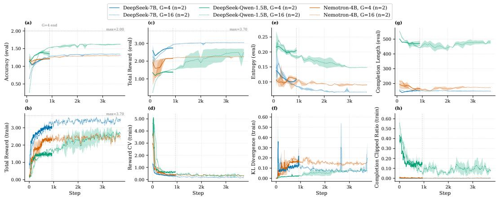  
Figure 1: GRPO training dynamics on GSM8K across models and group sizes (G ∈ {4, 16}). Evaluation accuracy improves rapidly before plateauing, with DeepSeek-R1-Qwen-1.5B achieving the highest final accuracy, particularly under G = 16. Reward and accuracy are only partially aligned: DeepSeek-7B obtains the highest training and evaluation reward, whereas DeepSeek-R1- Qwen-1.5B attains the best accuracy with lower reward. The diagnostics reveal model-dependent behavior: DeepSeek-R1-Qwen-1.5B maintains higher entropy, longer completions, lower KL, and more persistent clipping than DeepSeek-7B and Nemotron-4B.

Table 1: Out-of-distribution evaluation of GRPO models trained on GSM8K dataset across math benchmarks using pass@k (%). Results are reported as mean ± standard deviation over random seeds. For MetaMathQA and OpenMath2 datasets, we randomly sample 2000 examples for evaluation. For NuminaMath, we skip one proof problem that is not objectively verifiable.
<table><tr><td rowspan="2">Benchmark</td><td rowspan="2"></td><td colspan="3">DeepSeek-7B</td><td colspan="3">DeepSeek-R1-Qwen-1.5B</td><td colspan="3">Nemotron-4B</td></tr><tr><td>Metric Base</td><td>G=16</td><td>G=4</td><td>Base</td><td>G=16</td><td>G=4</td><td>Base</td><td>G=16</td><td>G=4</td></tr><tr><td>GSM-Plus (2400)</td><td>pass@1 pass@5</td><td>25.64 49.25</td><td>30.83±0.71 52.19±0.91</td><td>40.25±0.08 60.50±0.41</td><td>33.48 55.54</td><td>36.52±1.32 57.86±0.67</td><td>34.80±1.50 56.44±1.15</td><td>9.11 21.92</td><td>20.32±5.55 40.86±8.52</td><td>19.46±2.92 42.02±3.86</td></tr><tr><td>Math-500 (500)</td><td>pass@1 pass@5</td><td>15.00</td><td>16.12±0.11</td><td>15.48±1.07</td><td>70.80</td><td>75.74±0.59</td><td>73.18±0.08</td><td>11.64</td><td>13.34±0.31</td><td>12.62±0.93</td></tr><tr><td>AIME-2026 (30)</td><td>pass@1 pass@5</td><td>32.40 0.00 0.00</td><td>33.50±0.14 0.00±0.00 0.00±0.00</td><td>33.30±3.54 0.34±0.47</td><td>85.20 1.33</td><td>89.60±0.85 6.17±0.23</td><td>88.70±1.84 4.50±0.24</td><td>31.40 0.00</td><td>31.50±0.42 0.00±0.00</td><td>31.60±1.98 0.00±0.00</td></tr><tr><td>MetaMathQA (2000)</td><td>pass@1 pass@5</td><td>66.93 90.65</td><td>73.07±0.42 91.78±0.46</td><td>1.67±2.35 70.30±0.91 90.88±0.81</td><td>5.19 82.71 95.95</td><td>11.78±0.66 86.93±1.10 96.53±0.04</td><td>9.82±0.14 85.01±0.79 96.45±0.21</td><td>0.00 46.54 74.05</td><td>0.00±0.00 52.55±0.01 75.43±0.04</td><td>0.00±0.00 49.73±0.38 75.15±0.64</td></tr><tr><td>NuminaMath (99)</td><td>pass@1 pass@5</td><td>16.97 30.30</td><td>15.96±0.86 28.79±0.71</td><td>17.57±1.14 35.35±0.00</td><td>42.42 61.62</td><td>45.96±0.14 60.61±1.43</td><td>44.95±0.71 60.11±0.71</td><td>14.55 33.33</td><td>17.37±2.86 32.32±2.86</td><td>14.55±2.28 30.81±7.85</td></tr><tr><td>OpenMath2 (2000)</td><td>pass@1 pass@5</td><td>26.88 49.15</td><td>29.26±0.68 49.65±0.85</td><td>27.84±0.29 48.35±0.78</td><td>54.42 75.95</td><td>62.15±0.09 79.58±0.81</td><td>59.05±1.12 77.88±0.04</td><td>20.91 42.00</td><td>24.52±0.19 44.35±0.28</td><td>22.51±0.59 42.73±0.39</td></tr><tr><td>IMO-Bench (400)</td><td>pass@1 pass@5</td><td>2.00 7.50</td><td>2.23±0.32 7.88±1.24</td><td>2.20±0.07 8.25±0.71</td><td>3.75 10.75</td><td>4.88±0.81 14.38±2.65</td><td>4.67±0.46 13.38±1.24</td><td>2.35 9.00</td><td>2.17±0.11 9.00±0.35</td><td>2.60±0.64 8.88±1.24</td></tr><tr><td>HMMT-2025 (30)</td><td>pass@1 pass@5</td><td>0.00 0.00</td><td>0.34±0.47 1.67±2.35</td><td>0.00±0.00 0.00±0.00</td><td>6.00 10.00</td><td>6.33±0.47 16.67±0.00</td><td>7.33±0.94 15.00±2.36</td><td>0.00 0.00</td><td>0.00±0.00 0.00±0.00</td><td>0.00±0.00 0.00±0.00</td></tr></table>

The entropy in Figure 1(e) decreases across models, reflecting increasingly concentrated output distributions, but remains highest for DeepSeek-R1-Qwen-1.5B. The KL divergence in Figure 1(f) remains bounded overall but is model-dependent: DeepSeek-7B and Nemotron-4B exhibit larger KL movement and occasional spikes, whereas DeepSeek-R1-Qwen-1.5B maintains relatively low measured KL despite achieving the highest accuracy.

Finally, Figure 1(g) shows pronounced differences in completion length. DeepSeek-R1-Qwen-1.5B produces substantially longer completions, roughly 450-500 tokens, whereas DeepSeek-7B and Nemotron-4B remain closer to ∼ 150-180 tokens. This difference is mirrored by the completion clipped ratio in Figure 1(h): DeepSeek-7B and Nemotron-4B remain near zero, while DeepSeek-R1- Qwen-1.5B exhibits persistent clipping, especially early in training. We hypothesize this disparity stems from the fact that DeepSeek-R1-Distill-Qwen-1.5B is already fine-tuned for reasoning-intensive tasks. Together, these diagnostics show that GSM8K training is not governed solely by reward improvement; models differ substantially in reward–accuracy alignment, output concentration, verbosity, policy movement, and the fraction of updates operating in the clipped regime.

Benchmarking. Table 1 reports out-of-distribution math evaluation for GRPO-trained models relative to their corresponding base models. Green entries denote improvements over the base model, while red entries denote regressions; bold green marks the model with the largest relative improvement for each benchmark metric. Overall, GRPO improves performance in 58 out of 72 model–benchmark–metric configurations (∼ 80%), and every benchmark metric has at least one GRPO-trained model that outperforms its base counterpart. This suggests that GRPO training often transfers beyond the GSM8K training distribution. Qualitative inspection of generated solutions (AppendixA.5.1) shows the improvement in answer quality for math reasoning problems.

The gains are nevertheless heterogeneous. DeepSeek-R1-Qwen-1.5B achieves the strongest absolute performance on several benchmarks and is the only model family with substantial gains on AIME-2026. Nemotron-4B obtains the largest relative improvement in 8 out of 12 benchmark metrics, reflecting larger headroom from its lower base performance. Larger group size is not uniformly beneficial: G = 16 often helps DeepSeek-R1-Qwen-1.5B, whereas several DeepSeek-7B and Nemotron-4B results are comparable or better under G = 4. Thus, GRPO improves OOD math generalization in most cases, but its effectiveness depends on the base model, target benchmark, and group size.

## 4.2 GRPO Training Dynamics on ARC

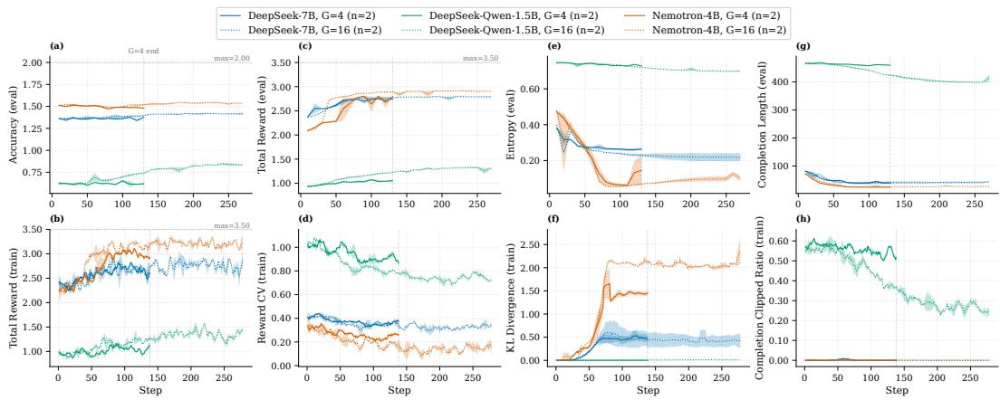  
Figure 2: GRPO training dynamics on ARC across models and group sizes $( G \in \{ 4 , 1 6 \} )$ . Reward and accuracy are largely aligned, with Nemotron-4B performing best, followed by DeepSeek-7B and DeepSeek-R1-Qwen-1.5B. Increasing G yields limited gains for the stronger models but modestly improves DeepSeek-R1-Qwen-1.5B. Diagnostics reveal model-dependent regimes: Nemotron-4B exhibits low entropy with large KL movement, whereas DeepSeek-R1-Qwen-1.5B maintains high entropy, long completions, and persistent clipping.

Figure 2 summarizes GRPO training dynamics on ARC. The evaluation accuracy in Figure 2(a) changes modestly over training, while the training reward in Figure 2(b) increases more substantially before plateauing. Nemotron-4B performs best, followed by DeepSeek-7B and DeepSeek-R1-Qwen-1.5B on both evaluation accuracy and reward. This suggests stronger reward–accuracy alignment on ARC, with DeepSeek-R1-Qwen-1.5B remaining separated from the other two models across both metrics.

Increasing the group size from G = 4 to G = 16 has a varied effect. For DeepSeek-7B and Nemotron-4B, a larger G yields limited additional improvement in final accuracy or reward, indicating diminishing returns relative to the increased sampling cost. For DeepSeek-R1-Qwen-1.5B, however, $G = 1 6$ improves both reward and accuracy over $G = 4$ , although the gap to the stronger models remains large. The consistency between training and evaluation rewards in Figures 2(b) and (c) further suggests that reward gains transfer to evaluation more reliably in this setting.

The diagnostic metrics reveal distinct effective optimization regimes across models. The reward coefficient of variation in Figure 2(d) decreases over training but remains non-zero, indicating that sampled completions continue to receive distinguishable rewards and that the group-relative advantage signal does not fully collapse. The entropy in Figure 2(e) decreases sharply for Nemotron 4B and more gradually for DeepSeek-7B, reflecting increasingly concentrated output distributions, while DeepSeek-R1-Qwen-1.5B maintains substantially higher entropy throughout training. The KL divergence in Figure 2(f) is also strongly model-dependent: it remains near zero for DeepSeek-R1- Qwen-1.5B, and increasing for DeepSeek-7B and Nemotron-4B, especially under G = 16.

Finally, Figure 2(g) shows pronounced differences in response length, similar to GSM8K dataset. This is a inherent property of model. These diagnostics show that ARC training is not governed solely by reward improvement; rather, models differ substantially in policy movement, output concentration, verbosity, and the fraction of updates operating in the clipped regime.

Benchmarking. Table 2 reports out-of-distribution MCQ evaluation for GRPO-trained models relative to their corresponding base models. Overall, GRPO improves performance in 28 out of 72 model–benchmark–metric configurations (∼ 39%), and nearly every benchmark metric contains at least one GRPO-trained configuration that outperforms its corresponding base model. The gains, however, are highly heterogeneous across model families and evaluation settings. DeepSeek-R1- Qwen-1.5B achieves the strongest overall performance on several benchmarks and is the only model family exhibiting substantial improvements on GPQA-Main. It also attains the most frequent improvements (16 out of 24 benchmark metrics), potentially reflecting greater optimization headroom from its lower baseline performance. Larger group size is generally beneficial (e.g., G = 16 improves GPQA-Main performance for Nemotron-4B). Overall, these results suggest that GRPO can improve out-of-distribution MCQ generalization, but its effectiveness remains strongly dependent on the underlying model family and training configuration.

Table 2: Out-of-distribution evaluation of models trained on ARC dataset across Reasoning benchmarks using pass@k (%). Results are reported as mean ± standard deviation over random seeds. For BigBenchHard (BBH), we use 4 subsets: logical\_deduction\_five\_objects, tracking\_shuffled\_objects\_five\_objects, formal\_fallacies, and temporal\_sequences to ensure a diversity of questions.
<table><tr><td rowspan="2">Benchmark</td><td rowspan="2">Metric</td><td colspan="3">DeepSeek-7B</td><td colspan="3">DeepSeek-R1-Qwen-1.5B</td><td colspan="3">Nemotron-4B</td></tr><tr><td>Base</td><td>G=16</td><td>G=4</td><td>Base</td><td>G=16</td><td>G=4</td><td>Base</td><td>G=16</td><td>G=4</td></tr><tr><td rowspan="3">MMLU-STEM (3153)</td><td>pass@1</td><td>40.14</td><td>41.64±0.25</td><td>40.97±0.01</td><td>56.18</td><td>55.44±0.18</td><td>55.23±0.05</td><td>48.56</td><td>47.82±0.05</td><td>46.92±0.16</td></tr><tr><td>pass@3</td><td>59.95</td><td>57.09±0.66</td><td>57.82±0.36</td><td>79.31</td><td>79.82±0.05</td><td>79.73±0.03</td><td>62.92</td><td>58.17±0.09</td><td>59.64±0.31</td></tr><tr><td>pass@5</td><td>68.79</td><td>63.62±0.64</td><td>65.16±0.59</td><td>86.36</td><td>87.33±0.21</td><td>87.28±0.16</td><td>68.92</td><td>62.43±0.11</td><td>65.23±0.52</td></tr><tr><td rowspan="3">BBH (1000)</td><td>pass@1</td><td>30.82</td><td>30.83±0.21</td><td>31.12±0.02</td><td>40.76</td><td>41.97±0.55</td><td>41.72±0.16</td><td>31.40</td><td>30.67±0.85</td><td>30.78±0.54</td></tr><tr><td>pass@3</td><td>51.17</td><td>46.78±1.24</td><td>47.95±0.30</td><td>69.43</td><td>69.04±0.24</td><td>69.14±0.12</td><td>51.45</td><td>44.80±1.91</td><td>49.58±0.71</td></tr><tr><td>pass@5</td><td>60.70</td><td>53.35±1.65</td><td>55.15±0.25</td><td>80.20</td><td>79.10±0.20</td><td>78.70±0.10</td><td>61.10</td><td>51.65±2.65</td><td>58.65±0.85</td></tr><tr><td rowspan="3">LogiQA (651)</td><td>pass@1</td><td>37.70</td><td>37.38±0.02</td><td>37.66±0.09</td><td>33.21</td><td>32.09±0.32</td><td>32.09±0.54</td><td>35.94</td><td>37.25±0.35</td><td>36.17±0.32</td></tr><tr><td>pass@3</td><td>51.18</td><td>47.54±0.26</td><td>49.88±0.00</td><td>60.18</td><td>60.65±0.07</td><td>60.59±0.44</td><td>52.67</td><td>49.80±0.91</td><td>52.87±0.63</td></tr><tr><td>pass@5</td><td>57.14</td><td>52.15±0.38</td><td>54.84±0.15</td><td>72.66</td><td>73.19±0.38</td><td>73.50±0.38</td><td>60.22</td><td>55.14±0.93</td><td>60.06±1.07</td></tr><tr><td rowspan="3">GPQA-Main (448)</td><td>pass@1</td><td>20.58</td><td>21.56±0.40</td><td>21.77±0.34</td><td>7.90</td><td>10.69±0.02</td><td>9.05±0.33</td><td>14.20</td><td>18.46±0.25</td><td>12.43±0.16</td></tr><tr><td>pass@3</td><td>41.27</td><td>39.39±0.01</td><td>42.45±0.14</td><td>15.22</td><td>18.34±0.19</td><td>16.61±0.38</td><td>30.89</td><td>35.83±0.93</td><td>27.66±0.53</td></tr><tr><td>pass@5</td><td>52.90</td><td>48.11±1.00</td><td>52.90±0.22</td><td>19.64</td><td>21.88±0.00</td><td>20.88±0.34</td><td>41.07</td><td>46.32±1.45</td><td>37.61±0.78</td></tr></table>

Refinement Treatments. We use mechanistic evaluation metrics to decide on the choice of refinement treatment for Nemotron-4B and DeepSeek-7B. Table 3 shows different refinement treatments employed on Nemotron-4B: Reduced Layer Count (R. Layer), Reduced Module (R. Module), β = 0.01 (0.003 is typical baseline value), and a combination of all three. We choose to increase β after observing high KL-divergence (train) for Nemotron-4B. In R. Layer, we choose to fine-tune only the first and last two layers (four in total out of 32 layers). This is informed by the weight displacement and activation shift analysis (Figures 4 and 5). From Table 3, we observe improvements in performance with lower performance degradation from the base model.

Table 3 shows the treatment of DeepSeek-7B by changing clipping coefficient from 0.2 to 0.3, in order to improve the sample diversity (Figure 2 shows relatively high reward but low coefficient of variance). We observe in many cases it is getting nearer to the base model. Empirical examples (Appendix A.5.2) corroborate these findings.

Table 3: Different hyperparameter refinement treatments for improving fine-tuning performance (pass@k score) on MCQ benchmarks. DeepSeek-7B treatment changes the clipping coefficient from $\varepsilon _ { h i g h } = 0 . 2$ to 0.3. Nemotron-4B treatments include reducing LoRA fine-tuning layers (R. Layer), reducing LoRA fine-tuning modules (R. Module), increasing KL regularization from $\beta = 0 . 0 0 3$ to 0.01, and combining all refinements. GRPO-baseline $( G = 4 )$ reports the mean over random seeds. Overall, we observe hyperparameter refinements improving GRPO-tuned model performance.
<table><tr><td></td><td></td><td colspan="3">DeepSeek-7B</td><td colspan="6">Nemotron-4B</td></tr><tr><td>Benchmark</td><td>Metric</td><td>Base</td><td>G=4</td><td> $\varepsilon _ { h i g h } = 0 . 3$  (G=4)</td><td>Base</td><td>G=4</td><td>R. Layer (G=4)</td><td>R. Module (G=4)</td><td> $\beta = 0 . 0 1$  (G=4)</td><td>All (G=4)</td></tr><tr><td rowspan="3">MMLU-STEM (3153)</td><td>pass@1</td><td>40.14</td><td>40.97</td><td>40.29</td><td>48.56</td><td>46.92</td><td>47.76</td><td>48.21</td><td>47.57</td><td>48.37</td></tr><tr><td>pass@3</td><td>59.95</td><td>57.82</td><td>59.65</td><td>62.92</td><td>59.64</td><td>62.27</td><td>62.12</td><td>61.12</td><td>62.56</td></tr><tr><td>pass@5</td><td>68.79</td><td>65.16</td><td>68.22</td><td>68.92</td><td>65.23</td><td>68.25</td><td>67.90</td><td>66.73</td><td>68.60</td></tr><tr><td rowspan="3">BBH (1000)</td><td>pass@1</td><td>30.82</td><td>31.12</td><td>30.98</td><td>31.40</td><td>30.78</td><td>30.66</td><td>30.80</td><td>31.04</td><td>30.68</td></tr><tr><td>pass@3</td><td>51.17</td><td>47.95</td><td>50.69</td><td>51.45</td><td>49.58</td><td>51.54</td><td>50.90</td><td>50.78</td><td>49.55</td></tr><tr><td>pass@5</td><td>60.70</td><td>55.15</td><td>59.70</td><td>61.10</td><td>58.65</td><td>62.20</td><td>61.30</td><td>60.20</td><td>58.70</td></tr><tr><td rowspan="3">LogiQA (651)</td><td>pass@1</td><td>37.70</td><td>37.67</td><td>37.45</td><td>35.94</td><td>36.17</td><td>36.13</td><td>36.41</td><td>35.82</td><td>35.98</td></tr><tr><td>pass@3</td><td>51.18</td><td>49.88</td><td>50.63</td><td>52.67</td><td>52.87</td><td>53.06</td><td>52.52</td><td>52.76</td><td>52.84</td></tr><tr><td>pass@5</td><td>57.14</td><td>54.84</td><td>56.68</td><td>60.22</td><td>60.06</td><td>59.91</td><td>58.53</td><td>59.60</td><td>60.52</td></tr><tr><td rowspan="3">GPQA-Main (448)</td><td>pass@1</td><td>20.58</td><td>21.77</td><td>21.25</td><td>14.20</td><td>12.43</td><td>13.53</td><td>13.17</td><td>13.79</td><td>13.44</td></tr><tr><td>pass@3</td><td>41.27</td><td>42.46</td><td>40.45</td><td>30.89</td><td>27.66</td><td>30.36</td><td>29.40</td><td>30.92</td><td>30.07</td></tr><tr><td>pass@5</td><td>52.90</td><td>52.90</td><td>49.55</td><td>41.07</td><td>37.61</td><td>41.07</td><td>40.40</td><td>41.52</td><td>40.85</td></tr></table>

## 4.3 GRPO Training Dynamics for OpenCoder

Figure 3 summarizes GRPO training dynamics on OpenCoder across model families, group sizes G, and seeds. The evaluation accuracy in Figure 3(a) and the training reward in Figure 3(b) improve rapidly during early optimization and then exhibit diminishing returns, with most gains occurring within the first ∼ 500-1000 steps.

The performance drop in the 7B model, accompanied by increased KL divergence in Figure 3, indicates that excessive optimization pressure can induce mode collapse, where the policy overfits to superficial high-reward patterns at the expense of pretrained reasoning. The diagnostic metrics reveal substantial differences in effective optimization behavior. The reward coefficient of variation in Figure 3(d) decreases sharply for DeepSeek-R1-Qwen-1.5B and remains low for DeepSeek-7B and Nemotron-4B, suggesting that sampled completions receive increasingly similar rewards and that the group-relative advantage signal becomes less variable. The entropy in Figure 3(e) generally decreases over training, indicating reduced sampling diversity, while KL divergence remains bounded, suggesting no clear policy instability under these settings. Finally, Figure 3(g) shows strong modeldependent differences in completion length.

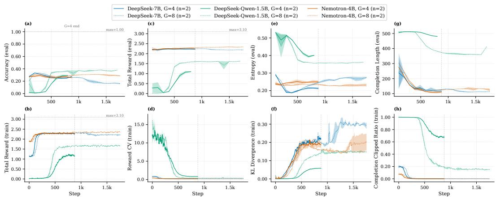  
Figure 3: GRPO training dynamics on OpenCoder across models and group sizes $( G \in \{ 4 , 8 \} )$ Performance and reward improve rapidly before reaching diminishing returns, while larger G provides only model-dependent gains. KL remains bounded, entropy generally decreases, and completion lengths vary substantially across models.

Benchmarking. Table 4 reports out-of-distribution evaluation on three code-generation benchmarks: MBPP, CodeParrot APPS (introductory subset), and Open-R1 Codeforces (rating 800 - 1600). Transfer to code generation is substantially more heterogeneous than to mathematical reasoning. GRPO improves performance in 17 of 36 model–benchmark–metric configurations, and the gains are primarily driven by two of the three models. First, DeepSeek-R1-Qwen-1.5B exhibits consistent and significant improvements across all three benchmarks, with pass@1 gains of +4.86% on MBPP. Second, DeepSeek-7B achieves strongest transfer on the most challenging benchmark, Codeforces, where G = 8 improves pass@1 from 0.76 to 2.60. In contrast, Nemotron-4B generally regresses on MBPP and APPS.

Despite achieving the largest quantitative gains, DeepSeek-R1-Qwen-1.5B exhibits notable structural inconsistencies in its outputs. The model rarely produced well-formed <reasoning> tags and instead defaults to <think> tags with verbose, often repetitive chain-of-thought traces that overflow the token budget. Its generated answers are seldom wrapped in explicit <answer> tags, and code solutions tend to be embedded within large unstructured blocks. However, the model reliably produced proper code fences, which facilitates straightforward extraction of the final solution.

In contrast, Nemotron-4B and DeepSeek-7B produce more structurally consistent outputs and adhere more closely to the expected formatting schema. Qualitative inspection of generated solutions (see Appendices A.5.3 and A.5.4) reveals that the GRPO-trained variants of these models exhibit stylistic shifts towards more efficient code and targeted use of built-in library functions, patterns largely absent in their base counterparts. This suggests that GRPO can also shape solution quality along with correctness, even when aggregate pass@k improvements are modest.

Table 4: Out-of-distribution evaluation of models trained on OpenCoder dataset across coding benchmarks using pass@k (%). Results are reported as mean ± standard deviation over random seed
<table><tr><td rowspan="2">Benchmark</td><td rowspan="2">Metric</td><td colspan="3">DeepSeek-7B</td><td colspan="3">DeepSeek-R1-Qwen-1.5B</td><td colspan="3">Nemotron-4B</td></tr><tr><td>Base</td><td>G=8</td><td>G=4</td><td>Base</td><td>G=8</td><td>G=4</td><td>Base</td><td>G=8</td><td>G=4</td></tr><tr><td rowspan="2">MBPP (500)</td><td>pass@1</td><td>34.98</td><td>34.87±0.78</td><td>35.73±0.21</td><td>32.38</td><td>34.46±0.34</td><td>37.24±0.14</td><td>32.70</td><td>33.83±0.64</td><td>32.23±0.30</td></tr><tr><td>pass@5</td><td>51.27</td><td>47.01±0.72</td><td>49.40±1.09</td><td>49.51</td><td>53.48±0.08</td><td>54.43±0.04</td><td>48.30</td><td>42.17±0.57</td><td>41.29±0.48</td></tr><tr><td rowspan="2">APPS (1000)</td><td>pass@1</td><td>10.23</td><td>9.33±0.17</td><td>10.58±0.37</td><td>20.90</td><td>26.14±0.35</td><td>24.14±0.16</td><td>8.79</td><td>6.59±0.69</td><td>6.28±0.39</td></tr><tr><td>pass@5</td><td>18.35</td><td>15.37±0.13</td><td>16.85±0.46</td><td>34.27</td><td>40.39±0.33</td><td>37.48±0.56</td><td>19.86</td><td>12.56±1.65</td><td>13.28±1.13</td></tr><tr><td rowspan="2">Codeforces (198)</td><td>pass@1</td><td>0.76</td><td>2.60±0.10</td><td>1.70±0.30</td><td>4.29</td><td>6.20±0.10</td><td>5.10±0.00</td><td>3.33</td><td>2.20±0.60</td><td>2.30±0.57</td></tr><tr><td>pass@5</td><td>2.64</td><td>6.10±0.50</td><td>4.30±0.30</td><td>5.67</td><td>10.90±0.10</td><td>8.00±0.10</td><td>6.33</td><td>4.40±0.00</td><td>5.10±0.68</td></tr></table>

Refinement Treatments. Table 5 report the effect of mechanistically-informed refinement on the out-of-distribution code evaluation for Nemotron-4B and DeepSeek-7B, respectively. Treatment selection is guided by analyzing diagnostic metrics (Figures 4 and 5).

The GRPO baseline for Nemotron-4B G = 4 degrades performance relative to the base model on nearly all benchmark–metric pairs, showing severe regressions on APPS (pass@1: −28.6%) and Codeforces (pass@1: −30.9%). We apply three cumulative treatments informed by mechanistic diagnostics. First, guided by weight displacement, Reduced Layer (R. Layer) restricts LoRA adapta tion to the first and last two transformer layers (4 of 28). This treatment alone recovers most of the regression on MBPP and APPS. Second, we reshape the rewards(R. Layer + RR), specifically update weight for code correctness from 1.0 to 2.0. This yields further gains, bringing APPS pass@1 to +17.8% and narrowing the Codeforces pass@1 gap to −4.5%. Third, Reduced Module (R. Module + RR) restricts adaptation to the value and output projection matrices and achieves the strongest pass@1 on both MBPP (33.92, +3.7%) and APPS (11.83, +34.6%). However, the pass@5 metrics do not see similar gains, suggesting that the treatments improve greedy accuracy at some cost to sample diversity.

Similarly, the GRPO baseline for DeepSeek-7B already showed positive transfer on several metrics, particularly on Codeforces (pass@1: +123.7%). The R. Layer treatment further improves pass@1 on MBPP and APPS. This pattern suggests that restricting trainable layers can stabilize transfer to benchmarks distributionally closer to the training data but can reduce gains on more challenging, distributionally distant tasks (e.g. Codeforces). Across both models, our mechanistically-guided refinement treatments convert regressions to improvements in many cases. The results validate the utility of weight displacement and activation shift diagnostics as actionable signals for hyperparameter and architecture decisions in GRPO post-training.

Table 5: Different hyperparameter refinement treatments for improving fine-tuning performance (pass@k score) on coding benchmarks. DeepSeek-7B treatment reduces LoRA fine-tuning layers (R. Layer). Nemotron-4B treatments include reducing LoRA fine-tuning layers (R. Layer), increasing weight of correctness reward on top it (R. Layer + RR), and reducing LoRA fine-tuning modules (R. Module). GRPO-baseline (G=4) reports the mean over random seeds. Overall, we observe hyperparameter refinements improving GRPO-tuned model performance.
<table><tr><td rowspan="2"></td><td rowspan="2"></td><td colspan="3">DeepSeek-7B</td><td colspan="5">Nemotron-4B</td></tr><tr><td>Base</td><td>G=4</td><td>R. Layer (G=4)</td><td>Base</td><td>G=4</td><td>(G=4)</td><td>(G=4)</td><td>R. Layer R. Layer + RR R. Module + RR (G=4)</td></tr><tr><td rowspan="2">MBPP (500)</td><td>pass@1</td><td>34.98</td><td>35.73</td><td>36.46</td><td></td><td>32.7032.23</td><td>32.86</td><td>33.56</td><td>33.92</td></tr><tr><td>pass@5</td><td>51.27</td><td>49.40</td><td>51.44</td><td>48.30</td><td>41.29</td><td>46.47</td><td>46.85</td><td>45.99</td></tr><tr><td rowspan="2">APPS (1000)</td><td>pass@1</td><td>10.23</td><td>10.58</td><td>10.80</td><td>8.79</td><td>6.28</td><td>10.13</td><td>10.35</td><td>11.83</td></tr><tr><td>pass@5</td><td>18.35</td><td>16.85</td><td>17.62</td><td>19.86</td><td>13.28</td><td>20.65</td><td>20.34</td><td>20.31</td></tr><tr><td rowspan="2">Codeforces (198)</td><td>pass@1</td><td>0.76</td><td>1.70</td><td>0.76</td><td>3.33</td><td>2.30</td><td>2.83</td><td>3.18</td><td>3.03</td></tr><tr><td>pass@5</td><td>2.64</td><td>4.30</td><td>2.86</td><td>6.33</td><td>5.10</td><td>5.16</td><td>4.50</td><td>5.26</td></tr></table>

## 5 Related Work

Prior work on RLHF has extensively analyzed optimization stability, reward modeling, and policy training dynamics, primarily within the context of PPO-based alignment pipelines [30, 53, 45, 32, 48]. These studies underscore the critical role that a parameterized value function plays in stabilizing training and improving overall performance. Ensuring the stability and performance of GRPO remains an active area of research. While recent literature has introduced several new variants of the GRPO algorithm [50, 52, 24], optimizing their implementation remains challenging.

To address the inherent instability of actor-only methods, recent work has begun to explore mechanistic evaluation as a complementary signal for hyperparameter optimization and training diagnostics in large-scale post-training pipelines [35, 27, 37]. This direction is exceptionally relevant for GRPO, where optimization stability and downstream performance are highly sensitive to a high-dimensional hyperparameter space and lack the grounding of a traditional baseline estimator [7].

## 6 Conclusion

Through systematic characterization of GRPO for SLMs (1.5B - 7B) under single-node compute constraints, we find that GRPO effectively enhances mathematical reasoning, while MCQ and coding tasks require targeted hyperparameter refinement. Code reasoning responds well to these refinements, but MCQ performance shows limited improvement, possible due to the knowledge intensive nature of these tasks. We summarize our findings as follows:

• Targeted Hyperparameter Optimization: We established that layer-wise and module-level contributions in LoRA-based GRPO are highly non-uniform. Strategic selection of target modules, informed by weight displacement analysis, improves optimization efficiency and downstream generalization compared to uniform adaptation.

• GRPO Training Guidance: We propose a set of GRPO training signals including four evaluationtime outcome metrics (accuracy, eval. reward, entropy, completion length) and training-time process metrics (training reward, reward CV, KL divergence, completion clipped ratio). They help in diagnosing training bottlenecks such as reward/accuracy misalignment and taking corrective actions. For example, when reward CV is low, hyperparameters such as temperature can be increased to improve sample diversity.

We provide a blueprint for the reliable adoption of GRPO in resource-constrained environments. These results suggest that for SLMs to truly excel in agentic and edge AI applications, RFT must move beyond behavioral metrics and toward a deeper understanding of internal representation dynamics. Future work will explore the scaling laws of these mechanistic interventions as SLMs continue to shrink in size but grow in task complexity.

## References

[1] Marah Abdin, Sam Ade Jacobs, A. A. Awan, J. Aneja, Ahmed Awadallah, H. Awadalla, Nguyen Bach, Amit Bahree, Arash Bakhtiari, Harkirat Singh Behl, et al. Phi-3 technical report: A highly capable language model locally on your phone. arXiv.org, 2024.

[2] Aryaman Arora, Neil Rathi, Nikil Selvam, R’obert Cs’ordas, Daniel Jurafsky, and Christopher Potts. Mechanistic evaluation of transformers and state space models, 2025.

[3] Jacob Austin, Augustus Odena, Maxwell Nye, Maarten Bosma, H. Michalewski, David Dohan, Ellen Jiang, Carrie J. Cai, Michael Terry, Quoc V. Le, et al. Program synthesis with large language models. arXiv.org, 2021.

[4] Mislav Balunovi’c, Jasper Dekoninck, Ivo Petrov, Nikola Jovanovi’c, and Martin T. Vechev. Matharena: Evaluating llms on uncontaminated math competitions, 2025.

[5] Peter Belcak, Greg Heinrich, Shizhe Diao, Yonggan Fu, Xin Dong, Saurav Muralidharan, Yingyan Celine Lin, and Pavlo Molchanov. Small language models are the future of agentic ai. arXiv.org, 2025.

[6] Karl Cobbe, Vineet Kosaraju, Mohammad Bavarian, Mark Chen, Heewoo Jun, Lukasz Kaiser, Matthias Plappert, Jerry Tworek, Jacob Hilton, Reiichiro Nakano, et al. Training verifiers to solve math word problems. arXiv.org, 2021.

[7] Wenlong Deng, Yi Ren, Muchen Li, Danica J Sutherland, Xiaoxiao Li, and Christos Thrampoulidis. On the effect of negative gradient in group relative deep reinforcement optimization. arXiv preprint arXiv:2505.18830, 2025.

[8] Adrian-Catalin Florea and Razvan Andonie. Weighted random search for hyperparameter optimization. International Journal of Computers Communications & Control, 14(2):154–169, 2019.

[9] Leo Gao, John Schulman, and Jacob Hilton. Scaling laws for reward model overoptimization. In International Conference on Machine Learning, pages 10835–10866. PMLR, 2022.

[10] Daya Guo, Dejian Yang, Haowei Zhang, Junxiao Song, Peiyi Wang, Qihao Zhu, Runxin Xu, Ruoyu Zhang, Shirong Ma, Xiao Bi, et al. Deepseek-r1: Incentivizing reasoning capability in llms via reinforcement learning. arXiv.org, 2025.

[11] Andreas A Hadji-Kyriacou and Ognjen Arandjelovic. Would i lie to you? inference time alignment of language models using direct preference heads. Neural Information Processing Systems, pages 95380–95405, 2024.

[12] Dan Hendrycks, Steven Basart, Saurav Kadavath, Mantas Mazeika, Akul Arora, Ethan Guo, Collin Burns, Samir Puranik, Horace He, Dawn Song, et al. Measuring coding challenge competence with apps. NeurIPS Datasets and Benchmarks, 2021.

[13] Dan Hendrycks, Collin Burns, Steven Basart, Andy Zou, Mantas Mazeika, Dawn Song, and Jacob Steinhardt. Measuring massive multitask language understanding, 2020.

[14] Edward J. Hu, Yelong Shen, Phillip Wallis, Zeyuan Allen-Zhu, Yuanzhi Li, Shean Wang, Lu Wang, and Weizhu Chen. Lora: Low-rank adaptation of large language models, 2021.

[15] Hugging Face. Open r1: A fully open reproduction of deepseek-r1, January 2025.

[16] Hugging Face. Deepseek-7b, May 2026.

[17] Hugging Face. Deepseek-r1-distill-qwen-1.5b, May 2026.

[18] Hugging Face. Nemotron-4b, May 2026.

[19] Jia LI, Edward Beeching, Lewis Tunstall, Ben Lipkin, Roman Soletskyi, Shengyi Costa Huang, Kashif Rasul, Longhui Yu, Albert Jiang, Ziju Shen, Zihan Qin, Bin Dong, Li Zhou, Yann Fleureau, Guillaume Lample, and Stanislas Polu. Numinamath. [https://huggingface.co/AI-MO/NuminaMath-CoT](https://github.com/ project-numina/aimo-progress-prize/blob/main/report/numina\_dataset.pdf), 2024.

[20] Qintong Li, Leyang Cui, Xueliang Zhao, Lingpeng Kong, and Wei Bi. Gsm-plus: A comprehensive benchmark for evaluating the robustness of llms as mathematical problem solvers. In Annual Meeting of the Association for Computational Linguistics, pages 2961–2984. Association for Computational Linguistics, 2024.

[21] Hunter Lightman, Vineet Kosaraju, Yura Burda, Harri Edwards, Bowen Baker, Teddy Lee, Jan Leike, John Schulman, Ilya Sutskever, and Karl Cobbe. Let’s verify step by step, 2023.

[22] Jian Liu, Leyang Cui, Hanmeng Liu, Dandan Huang, Yile Wang, and Yue Zhang. Logiqa: A challenge dataset for machine reading comprehension with logical reasoning. Proceedings of the Twenty-Ninth International Joint Conference on Artificial Intelligence, pages 3622–3628, 2020.

[23] Zechun Liu, Changsheng Zhao, Forrest N. Iandola, Chen Lai, Yuandong Tian, Igor Fedorov, Yunyang Xiong, Ernie Chang, Yangyang Shi, Raghuraman Krishnamoorthi, et al. Mobilellm: Optimizing sub-billion parameter language models for on-device use cases. International Conference on Machine Learning, 2024.

[24] Zichen Liu, Changyu Chen, Wenjun Li, Penghui Qi, Tianyu Pang, Chao Du, Wee Sun Lee, and Min Lin. Understanding r1-zero-like training: A critical perspective, 2025.

[25] Rui Luo, Jing Li, Chenghao Huang, and Wei Lu. Through the valley: Path to effective long cot training for small language models. Conference on Empirical Methods in Natural Language Processing, pages 4972–4992, 2025.

[26] Bahador Mohammadi. Creativity has left the chat: The price of debiasing language models. arXiv.org, 2024.

[27] Usman Naseem. Mechanistic interpretability for large language model alignment: Progress, challenges, and future directions. arXiv preprint arXiv:2602.11180, 2026.

[28] RL NeMo. Nemo rl: A scalable and efficient post-training library. https://github.com/ NVIDIA-NeMo/RL, 2025. GitHub repository.

[29] OpenAI. Spinning up in deep rl: Policy gradient methods. https://spinningup.openai. com/en/latest/spinningup/rl\_intro3.html, 2018.

[30] Long Ouyang, Jeff Wu, Xu Jiang, Diogo Almeida, Carroll L. Wainwright, Pamela Mishkin, Chong Zhang, S. Agarwal, Katarina Slama, Alex Ray, et al. Training language models to follow instructions with human feedback. Neural Information Processing Systems, 35:27730–27744, 2022.

[31] Guilherme Penedo, Anton Lozhkov, Hynek Kydlícek, Loubna Ben Allal, Edward Beeching,ˇ Agustín Piqueres Lajarín, Quentin Gallouédec, Nathan Habib, Lewis Tunstall, and Leandro von Werra. Codeforces. https://huggingface.co/datasets/open-r1/codeforces, 2025.

[32] Baolin Peng, Linfeng Song, Ye Tian, Lifeng Jin, Haitao Mi, and Dong Yu. Stabilizing rlhf through advantage model and selective rehearsal. arXiv.org, 2023.

[33] Benjamin Pikus, Pratyush Ranjan Tiwari, and Burton Ye. Hard examples are all you need: Maximizing grpo post-training under annotation budgets, 2025.

[34] Rafael Rafailov, Yash Chittepu, Ryan Park, Harshit Sikchi, Joey Hejna, W Bradley Knox, Chelsea Finn, and Scott Niekum. Scaling laws for reward model overoptimization in direct alignment algorithms. Neural Information Processing Systems, pages 126207–126242, 2024.

[35] Daking Rai, Yilun Zhou, Shi Feng, Abulhair Saparov, and Ziyu Yao. A practical review of mechanistic interpretability for transformer-based language models. arXiv preprint arXiv:2407.02646, 2024.

[36] David Rein, Betty Li Hou, Asa Cooper Stickland, Jackson Petty, Richard Yuanzhe Pang, Julien Dirani, Julian Michael, and Samuel R Bowman. Gpqa: A graduate-level google-proof q&a benchmark. arXiv.org, 2023.

[37] Llewyn Salt and Marcus Gallagher. Hyperparameter optimisation with practical interpretability and explanation methods in probabilistic curriculum learning. arXiv preprint arXiv:2504.06683, 2025.

[38] John Schulman, Filip Wolski, Prafulla Dhariwal, Alec Radford, and Oleg Klimov. Proximal policy optimization algorithms. arXiv preprint arXiv:1707.06347, 2017.

[39] Zhihong Shao, Peiyi Wang, Qihao Zhu, Runxin Xu, Junxiao Song, Xiao Bi, Haowei Zhang, Mingchuan Zhang, YK Li, Yang Wu, et al. Deepseekmath: Pushing the limits of mathematical reasoning in open language models. arXiv.org, 2024.

[40] Guangming Sheng, Chi Zhang, Zilingfeng Ye, Xibin Wu, Wang Zhang, Ru Zhang, Yanghua Peng, Haibin Lin, and Chuan Wu. Hybridflow: A flexible and efficient rlhf framework. In European Conference on Computer Systems, pages 1279–1297, 2024.

[41] Jasper Snoek, Hugo Larochelle, and Ryan P. Adams. Practical bayesian optimization of machine learning algorithms, 2012.

[42] Jiuding Sun, Jing Huang, Sidharth Baskaran, Karel D’Oosterlinck, Christopher Potts, M. Sklar, and Atticus Geiger. Hyperdas: Towards automating mechanistic interpretability with hypernetworks, 2025.

[43] Mirac Suzgun, Nathan Scales, Nathanael Scharli, Sebastian Gehrmann, Yi Tay, Hyung Won Chung, A. Chowdhery, Quoc V. Le, Ed H. Chi, Denny Zhou, et al. Challenging big-bench tasks and whether chain-of-thought can solve them. Annual Meeting of the Association for Computational Linguistics, 2022.

[44] Shubham Toshniwal, Wei Du, Ivan Moshkov, Branislav Kisacanin, Alexan Ayrapetyan, and Igor Gitman. Openmathinstruct-2: Accelerating ai for math with massive open-source instruction data. International Conference on Learning Representations, 2024.

[45] Binghai Wang, Rui Zheng, Lu Chen, Yan Liu, Shihan Dou, Caishuang Huang, Wei Shen, Senjie Jin, Enyu Zhou, Chenyu Shi, et al. Secrets of rlhf in large language models part ii: Reward modeling, 2024.

[46] Hongcheng Wang, Yinuo Huang, Sukai Wang, Guanghui Ren, and Hao Dong. Why tree-style branching matters for thought advantage estimation in grpo, 2025.

[47] Shangshang Wang, Julian Asilis, Ömer Faruk Akgül, Enes Burak Bilgin, Ollie Liu, and Willie Neiswanger. Tina: Tiny reasoning models via lora. arXiv preprint arXiv:2504.15777, 2025.

[48] Thomas Wolf et al. Reward model overoptimization in iterated reinforcement learning from human feedback. In International Conference on Learning Representations (ICLR), 2025.

[49] Longhui Yu, Weisen Jiang, Han Shi, Jincheng Yu, Zhengying Liu, Yu Zhang, James T Kwok, Zhenguo Li, Adrian Weller, and Weiyang Liu. Metamath: Bootstrap your own mathematical questions for large language models. International Conference on Learning Representations, 2023.

[50] Qiying Yu, Zheng Zhang, Ruofei Zhu, Yufeng Yuan, Xiaochen Zuo, Yu Yue, Weinan Dai, Tiantian Fan, Gaohong Liu, Lingjun Liu, et al. Dapo: An open-source llm reinforcement learning system at scale. arXiv preprint arXiv:2503.14476, 2025.

[51] Kaichen Zhang, Yuzhong Hong, Junwei Bao, Hongfei Jiang, Yang Song, Dingqian Hong, and Hui Xiong. Gvpo: Group variance policy optimization for large language model post-training, 2025.

[52] Chujie Zheng, Shixuan Liu, Mingze Li, Xiong-Hui Chen, Bowen Yu, Chang Gao, Kai Dang, Yuqiong Liu, Rui Men, An Yang, Jingren Zhou, and Junyang Lin. Group sequence policy optimization, 2025.

[53] Rui Zheng, Shihan Dou, Songyang Gao, Yuan Hua, Wei Shen, Binghai Wang, Yan Liu, Senjie Jin, Qin Liu, Yuhao Zhou, et al. Secrets of rlhf in large language models part i: Ppo, 2023.

[54] Daniel M Ziegler, Nisan Stiennon, Jeffrey Wu, Tom B Brown, Alec Radford, Dario Amodei, Paul Christiano, and Geoffrey Irving. Fine-tuning language models from human preferences. arXiv.org, 2019.

## A Appendix

## A.1 GRPO Formulation

For a prompt $x \sim \mathcal { D } _ { \mathrm { t r a i n } }$ , let $\pi _ { \boldsymbol { \theta } } ( \boldsymbol { y } \mid \boldsymbol { x } )$ be the trainable policy. At GRPO step k, we sample a group of completions from the current policy:

$$
y _ { 1 } , \ldots , y _ { G } \sim \pi _ { \theta _ { k } } ( \cdot \mid x ) , \qquad y _ { i } = ( y _ { i , 1 } , \ldots , y _ { i , T _ { i } } ) .\tag{3}
$$

Each completion receives a scalar reward

$$
r _ { i } = R _ { \lambda } ( x , y _ { i } ) , \qquad i = 1 , \dots , G .\tag{4}
$$

The group-relative advantage of completion $y _ { i }$ and policy ratio are respectively,

$$
\hat { A } _ { i } = \frac { r _ { i } - \mathrm { m e a n } ( r _ { x } ) } { \mathrm { s t d } ( r _ { x } ) } , \qquad \rho _ { i , t } ( \theta ) = \frac { \pi _ { \theta } ( y _ { i , t } \mid x , y _ { i , < t } ) } { \pi _ { \theta _ { k } } ( y _ { i , t } \mid x , y _ { i , < t } ) }\tag{5}
$$

We penalize deviation from a fixed reference policy $\pi _ { \mathrm { r e f } }$ . A sample-level KL penalty is

$$
\widehat K _ { i , t } ( \theta ) = \frac { \pi _ { \mathrm { r e f } } ( y _ { i , t } \mid s _ { i , t } ) } { \pi _ { \theta } ( y _ { i , t } \mid s _ { i , t } ) } - \log \frac { \pi _ { \mathrm { r e f } } ( y _ { i , t } \mid s _ { i , t } ) } { \pi _ { \theta } ( y _ { i , t } \mid s _ { i , t } ) } - 1 .\tag{6}
$$

The GRPO lower-level objective for fixed design λ is

$$
\mathcal { I } _ { \mathrm { G R P O } } ^ { \lambda } ( \theta ; \theta _ { k } ) = \mathbb { E } _ { x \sim \mathcal { D } _ { \mathrm { t r a i n } } , \{ y _ { i } \} _ { i = 1 } ^ { G } \sim \pi _ { \theta _ { k } } } \left[ \frac { 1 } { G } \sum _ { i = 1 } ^ { G } \frac { 1 } { T _ { i } } \sum _ { t = 1 } ^ { T _ { i } } \left( \operatorname* { m i n } \left[ \rho _ { i , t } ( \theta ) \widehat { A } _ { i } , \mathrm { c l i p } \left( \rho _ { i , t } ( \theta ) , 1 - \epsilon , 1 + \epsilon \right) \widehat { A } _ { i } \right] - \sum _ { t = 1 } ^ { G } \frac { 1 } { T _ { i } } \sum _ { t = 1 } ^ { T _ { i } } \left( \operatorname* { m i n } \left[ \rho _ { i , t } ( \theta ) \widehat { A } _ { i } , \mathrm { c l i p } \left( \rho _ { i , t } ( \theta ) , 1 - \epsilon , 1 - \epsilon \right) \widehat { A } _ { i } \right] \right) \right) \right]
$$

$$
- \beta \widehat { K } _ { i , t } ( \theta ) ) ] .\tag{7}
$$

The inner GRPO training dynamics are

$$
\theta _ { k + 1 } ( \lambda ) \approx \arg \operatorname* { m a x } _ { \theta \in \Theta _ { \lambda } } \mathcal { I } _ { \mathrm { G R P O } } ^ { \lambda } \left( \theta ; \theta _ { k } ( \lambda ) \right) , \qquad k = 0 , \dots , T ( \lambda ) - 1 ,\tag{8}
$$

with initialization

$$
\theta _ { 0 } ( \lambda ) = \theta _ { \mathrm { r e f } } .\tag{9}
$$

## A.2 Mechanistic Feedback and Evaluation

To estimate weight-level drift, let $\boldsymbol { W } _ { g } ^ { \theta }$ denote the weight tensor of parameter group g under model θ. A group g may correspond to a layer-module pair, such as an attention projection, MLP projection, embedding matrix, or language-model head. For a collection of parameter groups G, define the normalized weight displacement

$$
\mathrm { W D i s p } _ { \mathcal { G } } \left( \theta , \theta _ { \mathrm { r e f } } \right) = \frac { \sqrt { \sum _ { g \in \mathcal { G } } \left\| W _ { g } ^ { \theta } - W _ { g } ^ { \theta _ { \mathrm { r e f } } } \right\| _ { F } ^ { 2 } } } { \sqrt { \sum _ { g \in \mathcal { G } } \left\| W _ { g } ^ { \theta _ { \mathrm { r e f } } } \right\| _ { F } ^ { 2 } + \delta _ { w } } } ,\tag{10}
$$

where $\delta _ { w } > 0$ is a numerical stabilizer.

For LoRA adaptation, the effective adapted weight can be written as

$$
W _ { g } ^ { \theta } = W _ { g } ^ { \theta _ { \mathrm { r e f } } } + \frac { \alpha _ { g } } { r _ { g } } B _ { g } A _ { g } ,\tag{11}
$$

where $r _ { g }$ is the LoRA rank and $\alpha _ { g }$ is the LoRA scaling parameter. In this case, the weight displacement becomes

$$
\mathrm { W D i s p } _ { \mathcal { G } } ^ { \mathrm { L o R A } } \left( \theta , \theta _ { \mathrm { r e f } } \right) = \frac { \sqrt { \sum _ { g \in \mathcal { G } } \left\| \frac { \alpha _ { g } } { r _ { g } } B _ { g } A _ { g } \right\| _ { F } ^ { 2 } } } { \sqrt { \sum _ { g \in \mathcal { G } } \left\| W _ { g } ^ { \theta _ { \mathrm { r e f } } } \right\| _ { F } ^ { 2 } + \delta _ { w } } } .\tag{12}
$$

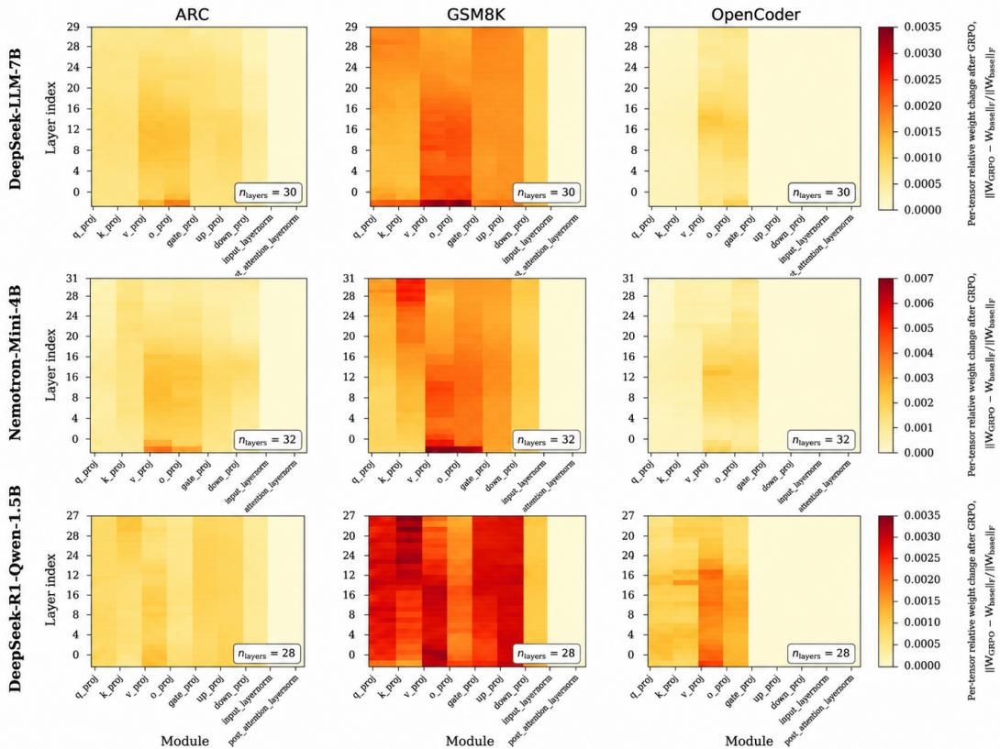  
Figure 4: Layer-wise parameter displacement after GRPO across model families and tasks. Each heatmap reports the per-tensor relative Frobenius change $\lVert W _ { \mathrm { G R P O } } - W _ { \mathrm { b a s e } } \rVert _ { F } / \lVert W _ { \mathrm { b a s e } } \rVert _ { F }$ for each module and layer. Rows correspond to model families and columns correspond to reasoning datasets. GRPO induces structured rather than uniform parameter movement: updates are concentrated in attention and MLP projection tensors, while layer-normalization parameters change little. GSM8K produces the largest displacement across models, especially for DeepSeek-R1-Qwen-1.5B, whereas ARC and OpenCoder induce more localized changes.

To estimate activation-level drift, let $h _ { \ell , x , t , d } ^ { \theta }$ denote the hidden activation of model $\pi _ { \theta }$ at layer $\ell ,$ prompt $x ,$ token $t ,$ and dimension d. Let $m _ { x , t } \in \{ 0 , 1 \}$ be a token mask. The normalized activation shift is

$$
\mathrm { S h i f t } _ { \mathcal { C } , \ell } \left( \theta , \theta _ { \mathrm { r e f } } \right) = \frac { \sqrt { \sum _ { x \in \mathcal { C } } \sum _ { t = 1 } ^ { T _ { x } } \sum _ { d = 1 } ^ { D } m _ { x , t } \left( h _ { \ell , x , t , d } ^ { \theta } - h _ { \ell , x , t , d } ^ { \theta _ { \mathrm { r e f } } } \right) ^ { 2 } } } { \sqrt { \sum _ { x \in \mathcal { C } } \sum _ { t = 1 } ^ { T _ { x } } \sum _ { d = 1 } ^ { D } m _ { x , t } \left( h _ { \ell , x , t , d } ^ { \theta _ { \mathrm { r e f } } } \right) ^ { 2 } + \delta _ { h } } } ,\tag{13}
$$

where $\delta _ { h } > 0$ prevents division by zero.

These two metrics weight displacement, $\mathrm { W D i s p } _ { \mathcal { G } } ^ { \mathrm { L o R A } }$ , and activation shift, ${ \mathrm { S h i f t } } _ { C , \ell }$ provide insight into GRPO training health.

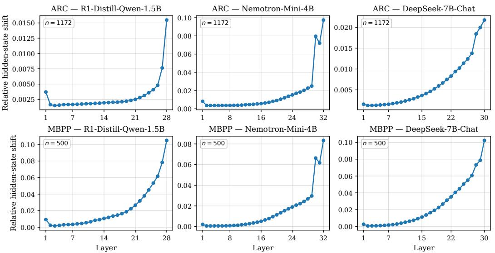  
Figure 5: Layer-wise relative hidden-state shift induced by GRPO finetuning, base model vs. LoRAadapted GRPO checkpoint. For each prompt p and transformer block ℓ (post-block residual stream; the embedding layer is excluded), we compute ${ \bf \dot { \boldsymbol { s } } } _ { p , \ell } = | ( \mathbf { H } ^ { \mathrm { g r p o } } p , \ell - \mathbf { H } ^ { \mathrm { b a s e } } p , \ell ) \odot \mathbf { m } _ { p } | F , / , | \mathbf { H } ^ { \mathrm { b a s e } } p , \ell \odot$ $\mathbf { m } _ { p } | F$ , where $\mathbf { H } p , \ell \in \mathbb { R } ^ { T \times d }$ is the layer-ℓ hidden state of prompt $p ,$ mp is the attention mask zeroing padding positions, and $| \cdot | F$ is the Frobenius norm. Each panel reports the per-layer mean $\begin{array} { r } { \bar { s } \ell = \frac { \top } { N } \sum _ { p } s p , } \end{array}$ ℓ over the dataset’s full prompt set $\scriptstyle ( N = 1 1 7 2$ for AI2-ARC test, $N { = } 5 0 0$ for MBPP test). Rows: evaluation dataset (top: AI2-ARC, bottom: MBPP). Columns: base model (left to right: DeepSeek-R1-Distill-Qwen-1.5B, Nemotron-Mini-4B-Instruct, DeepSeek-LLM-7B-Chat). Across all six combinations the shift is small and roughly flat through the bulk of the network and grows sharply in the last 2–3 layers, indicating that GRPO concentrates its representational change near the output, leaving early- and mid-stack features almost unchanged.

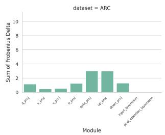

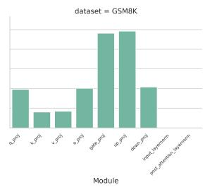  
(a) DeepSeek-R1-Qwen-1.5

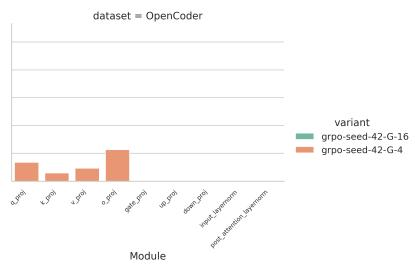

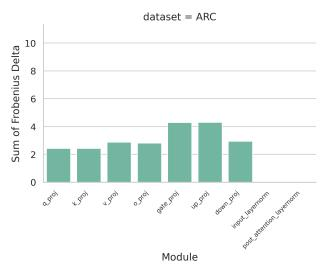

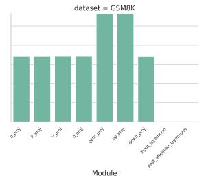

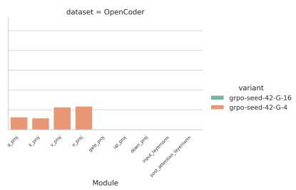  
(b) DeepSeek-LLM-7B-chat

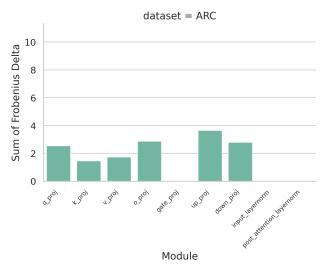

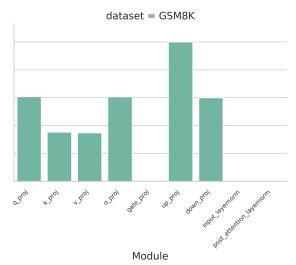  
(c) Nemotron4B

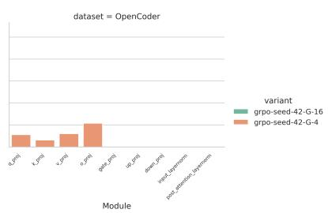  
Figure 6: Module-wise weight update mass across models. Each subplot shows how GRPOinduced updates are distributed across transformer modules, revealing consistent patterns in specific blocks across architectures.

Figure 4 visualizes the relative parameter displacement induced by GRPO across model families, tasks, layers, and modules. Each heatmap reports the per-tensor relative Frobenius change $\lVert W _ { \mathrm { G R P O } } -$ $W _ { \mathrm { b a s e } } \Vert _ { F } ^ { \bullet } / \Vert W _ { \mathrm { b a s e } } \Vert _ { F }$ for a given module and layer, with rows corresponding to model families and columns corresponding to ARC, GSM8K, and OpenCoder. Across all models, the largest changes are concentrated in attention and MLP projection matrices, while layer-normalization parameters exhibit comparatively small movement. The magnitude and localization of these updates are strongly taskdependent: GSM8K induces substantially larger parameter displacement than ARC or OpenCoder, especially in the projection modules.

The pattern is also model-dependent. DeepSeek-R1-Qwen-1.5B exhibits the broadest and most intense weight changes on GSM8K, with high relative movement across several projection modules and many layers. Nemotron-Mini-4B shows a similarly task-sensitive pattern but with a larger overall scale, particularly on GSM8K, as reflected by its wider color range. DeepSeek-LLM-7B exhibits more moderate changes, with GSM8K again producing the strongest displacement, but ARC and OpenCoder remaining comparatively localized. Overall, the figure shows that GRPO does not update the model uniformly: parameter movement is structured by task, architecture, module type, and layer depth, suggesting that the optimization primarily adapts a subset of projection tensors rather than producing diffuse global drift.

## A.3 Reward Shaping Scores

Table 6: Reward shaping components used in GRPO training.
<table><tr><td>Component</td><td>Value</td><td>Behavior</td></tr><tr><td>GSM8K</td><td></td><td></td></tr><tr><td>Correctness Reward</td><td></td><td>2.0 Final answer matches ground truth</td></tr><tr><td>XML Count Reward</td><td>0.5</td><td>All required XML tags and sections are present</td></tr><tr><td>Numeric Answer Present Reward</td><td>0.5</td><td>Response contains a numeric answer</td></tr><tr><td>Format Reward</td><td></td><td>0.5 Output follows expected structure</td></tr><tr><td>Reasoning Present Reward</td><td>0.1</td><td>Reasoning block is non-empty</td></tr><tr><td>Answer Present Reward</td><td>0.1</td><td>Answer block is non-empty</td></tr><tr><td>ARC</td><td></td><td></td></tr><tr><td>Correctness Reward</td><td></td><td>2.0 Selected option matches ground truth</td></tr><tr><td>Valid Option Reward</td><td></td><td>0.5 Answer is one of the valid choices</td></tr><tr><td>XML Count Reward</td><td></td><td>0.5 All required XML tags and sections present</td></tr><tr><td>Format Reward</td><td></td><td>0.5 Output follows expected structure</td></tr><tr><td>OpenCoder</td><td></td><td></td></tr><tr><td>Correctness Reward</td><td></td><td>1.0 Code passes all test cases</td></tr><tr><td>Code Complexity Reward</td><td></td><td>1.0 Penalizes trivial or degenerate solutions</td></tr><tr><td>XML Count Reward</td><td></td><td>0.5 All required XML tags and sections present</td></tr><tr><td>Syntax Reward</td><td></td><td>0.5 Generated code parses without errors</td></tr><tr><td>Reasoning Present Reward</td><td></td><td>0.1 Reasoning block is non-empty</td></tr></table>

## A.4 Training Hyperparameters

Table 7: GRPO training configurations across GSM8K, OpenCoder, and ARC-Challenge.
<table><tr><td>Category</td><td>GSM8K</td><td>OpenCoder</td><td>ARC-Challenge</td></tr><tr><td>Training</td><td></td><td></td><td></td></tr><tr><td>Learning Rate</td><td> $1 \times 1 0 ^ { - 5 }$ </td><td> $5 \times 1 0 ^ { - 6 }$ </td><td> $1 \times 1 0 ^ { - 5 }$ </td></tr><tr><td>Epochs</td><td>2</td><td>1</td><td>2</td></tr><tr><td>Batch Size</td><td>4</td><td>1</td><td>4</td></tr><tr><td>Gradient Accumulation</td><td>4</td><td>64</td><td>4</td></tr><tr><td>Temperature</td><td>0.8</td><td>0.8</td><td>0.8</td></tr><tr><td>Max Prompt Length</td><td>256</td><td>256</td><td>256</td></tr><tr><td>Max Completion Length</td><td>512</td><td>512</td><td>512</td></tr><tr><td>Eval Steps</td><td>100</td><td>100</td><td>100</td></tr><tr><td>KL Coefficient (β)</td><td>0.005</td><td>0.005</td><td>0.003</td></tr><tr><td>Clipping Coefficient (€)</td><td>0.2</td><td>0.2</td><td>0.2</td></tr><tr><td>Train/Test Split</td><td>train/test</td><td>train[95% split]</td><td>train/validation</td></tr><tr><td>LoRA</td><td></td><td></td><td></td></tr><tr><td>Use LoRA</td><td>True</td><td>True</td><td>True</td></tr><tr><td>Rank (r)</td><td>16</td><td>8</td><td>16</td></tr><tr><td>Alpha</td><td>64</td><td>16</td><td>64</td></tr><tr><td>Dropout</td><td>0.05</td><td>0.1</td><td>0.05</td></tr><tr><td>Target Modules</td><td>q,k,v,o,up,down,gate</td><td>q,k,v,0</td><td>q,k,v,o,up,down,gate</td></tr><tr><td>Optimizer</td><td></td><td></td><td></td></tr><tr><td>Optimizer</td><td>adamw_8bit</td><td>adamw_8bit</td><td>adamw_8bit</td></tr><tr><td>Adam β1</td><td>0.9</td><td>0.9</td><td>0.9</td></tr><tr><td>Adam β2</td><td>0.99</td><td>0.99</td><td>0.99</td></tr><tr><td>Weight Decay</td><td>0.1</td><td>0.1</td><td>0.1</td></tr><tr><td>Warmup Ratio</td><td>0.1</td><td>0.1</td><td>0.1</td></tr><tr><td>LR Scheduler</td><td>cosine</td><td>cosine</td><td>cosine</td></tr><tr><td>Max Grad Norm</td><td>0.1</td><td>0.1</td><td>0.1</td></tr></table>

## A.5 Qualitative Comparison: Base vs. GRPO Predictions

## A.5.1 GSM8K Dataset

We provide two representative GSM8K samples that illustrate how GRPO fine-tuning improves over the base checkpoint. Sample 1 shows a correction of an arithmetic slip in Deepseek-LLM-7B; Sample 2 shows GRPO fixing a final-answer formatting failure in Nemotron-Mini-4B.

Table 8: GSM8K sample where GRPO fine-tuning corrects an arithmetic error made by the base Deepseek-LLM-7B-Chat. Both GRPO seeds (G16, s=42 and s=3407) recover the correct answer with the same explicit decomposition.

Question. Josh decides to try flipping a house. He buys a house for \$80,000 and then puts in \$50,000 in repairs. This increased the value of the house by 150%. How much profit did he make? Ground truth: \$70,000

Deepseek-LLM-7B-Chat (base) ✗ Deepseek-LLM-7B GRPO ✓   
Predicted: \$150,000 Predicted: \$70,000   
Josh bought the house for \$80.000 and inyested Josh bought the house for \$80,000.   
\$50,000 in repairs, so the total cost was \$80,000 He spent \$50,000 on repairs.   
+ \$50,000 = \$130,000. The total cost was \$80,000 + \$50,000 = \$130,000.   
The repairs increased the value of the house by After the repairs, the value of the house   
150%, so the new value of the house is \$80,000 + increased by 150%, so the new value is \$80,000 +   
1.5 × \$80,000 = \$280,000. (\$80,000 × 1.5) = \$80,000 + \$120,000 = \$200,000.   
To calculate the profit, we subtract the total The profit Josh made is the new value of the   
cost from the new value of the house, so \$280,000 house minus the cost, so it is \$200,000 −   
− \$130,000 = \$150,000. \$130,000 = \$70,000.   
Therefore, Josh made a profit of \$150,000. The answer is: 70000   
The answer is: 150000

Observation. The base model selects the correct high-level plan but commits an arithmetic slip when summing \$80,000 + \$120,000. The GRPO checkpoint inserts an explicit intermediate sum before subtracting, eliminating the error.

Table 9: GSM8K sample where GRPO fine-tuning fixes a final-answer formatting failure in Nemotron-Mini-4B. The base reaches the correct intermediate value (\$18) but emits a malformed final token 1}; the GRPO checkpoint produces a clean final answer.

Question. Janet’s ducks lay 16 eggs per day. She eats three for breakfast every morning and bakes muffins for her friends every day with four. She sells the remainder at the farmers’ market daily for \$2 per fresh duck egg. How much in dollars does she make every day at the farmers’ market? Ground truth: \$18

<table><tr><td>Nemotron-4B (base) X Predicted: 1 (malformed)</td><td>Nemotron-4B GRPO√ Predicted: 18</td></tr><tr><td>The ducks lay 16 eggs per day. Janet eats 3 eggs per day so the number of eggs available to her is 16 — 3 = 13 eggs. She bakes muffins with 4 eggs, so the number of eggs left is 13 - 4 = 9 eggs. Out of these 9 eggs, she sells 9 × 2 = 18 dollars worth of eggs at the farmers&#x27;market. Thus she makes 1} dollars every day at the farmers&#x27;market. 9 × 2 = $18 at the farmers&#x27;market per day. Therefore, the answer is $18.</td><td>Sure! Let&#x27;s break down the problem step by step. 1. Janet&#x27;s ducks lay 16 eggs per day. 2. She eats 3 eggs for breakfast every morning, so she eats 3 eggs per day. 3. She bakes muffins for her friends every day with 4 eggs. So she uses 4 eggs per day for baking. 4. In total, she uses 3 + 4 = 7 eggs per day. 5. She has 16 – 7 = 9 eggs left to sell at the farmers&#x27;market. 6. She sells 9 eggs at $2 per egg, so she makes</td></tr></table>

Observation. The base model performs the arithmetic correctly but truncates the final answer to the malformed token 1}, which the answer extractor reads as “1”. GRPO fine-tuning eliminates this failure mode and emits a well-formed \$18.

Table 10: GSM8K sample where GRPO fine-tuning corrects a self-doubt / reasoning-loop failure in DeepSeek-R1-Distill-Qwen-1.5B. The base checkpoint reaches the correct intermediate answer (20) but oscillates between two interpretations of “three cups” and ultimately commits to the wrong final value. The GRPO checkpoint (G4, s= 42) executes a single clean budget calculation.

Question. Every day, Wendi feeds each of her chickens three cups of mixed chicken feed, containing seeds, mealworms and vegetables to help keep them healthy. She gives the chickens their feed in three separate meals. In the morning, she gives her flock of chickens 15 cups of feed. In the afternoon, she gives her chickens another 25 cups of feed. How many cups of feed does she need to give her chickens in the final meal of the day if the size of Wendi’s flock is 20 chickens?   
Ground truth: 20

DS-R1-Qwen-1.5B (base) ✗ DS-R1-Qwen-1.5B GRPO (G4, s=42) ✓   
Predicted: 25 Predicted: 20   
Okay, so I need to figure out how many cups of Wendi feeds her 20 chickens three cups of mixed   
feed Wendi needs to give her 20 chickens in the feed each day, divided into three meals.   
final meal of the day. Total feed required per day:   
Each chicken gets three cups per day, split into 3 cups/chicken/day × 20 chickens = 60 cups/day.   
three meals. So total feed per day is 3×20 = 60 Total feed given in the morning and afternoon:   
cups. 15 + 25 = 40 cups.   
She already gave 15 + 25 = 40 cups, so the Subtract the feed already given from the total   
remaining is 60 − 40 = 20 cups. 60 − 40 = 20   
Alternatively, maybe she feeds each chicken 3 Thus, the final meal of the day requires 20   
cups every day, but the 3 cups are per meal, not cups of feed.   
per chicken.   
If each meal is 1 cup per chicken, then for 20   
chickens each meal is 20 cups. Morning: gave   
15, short by 5. Afternoon: gave 25, over by   
5...   
Wait, this is getting confusing.   
Maybe she can’t give 5 cups over, so she can only   
give 20 cups in the afternoon, but the problem   
says she gave 25...   
[oscillates between the two readings for several   
more paragraphs]   
The answer is: 25

Observation. Unlike Samples 1 and 2, where the base model fails through a single arithmetic slip or a malformed final token, here the base failure is qualitatively different: the model derives the correct answer (20) early in its chain of thought, then re-interprets the problem statement (“three cups” as per-meal rather than per-day), produces a contradictory per-meal accounting, and oscillates between the two readings for the remainder of its trace before committing to the afternoon quantity (25) as the final answer. The GRPO checkpoint, by contrast, commits to a single decomposition — daily budget minus feed already delivered — and terminates as soon as that calculation is complete. This illustrates a third mode of GRPO improvement on GSM8K beyond arithmetic correction (Sample 1) and format repair (Sample 2): suppression of self-doubt loops, in which the verifiable reward signal pushes the policy away from long, vacillating chains of thought toward shorter, committed reasoning that retains the first correct derivation.

## A.5.2 ARC Dataset

We present representative ARC examples to highlight differences between base and GRPO-tuned models on conceptual and reasoning-intensive questions. The comparisons focus on common failure modes in base models, including conceptual confusion, shallow reasoning, and reliance on surface-level associations. GRPO fine-tuning improves performance by promoting better conceptual grounding, clearer reasoning structure, and more accurate alignment between question semantics and final predictions.

Table 11: ARC sample where GRPO fine-tuning corrects a conceptual confusion between rotation and revolution. The base model conflates Earth’s orbital period with its rotational period, while the GRPO checkpoint correctly identifies axial rotation.
<table><tr><td colspan="3">Question. The period of rotation for each planet in our solar system is different. The period of rotation</td></tr><tr><td>for Earth is: Ground truth: (A)</td><td>(A) 24 hours (B) 28 days (C) 13 weeks (D) 1 year</td><td></td></tr><tr><td>DS-R1-Qwen-1.5B (base) X Predicted: (D)</td><td>DS-R1-Qwen-1.5B GRPO √ Predicted: (A)</td><td>To determine the period of rotation for Earth, I need to recall the definition of a day. A day is the time it takes for Earth to complete one full</td></tr><tr><td>To determine the period of rotation for Earth, I need to recall the definition of a year. A year is the time it takes for Earth to complete one full orbit around the Sun Next, I should consider the options provided. Option A is 24 hours, which is the duration of a day, not a year. Option B is 28 days, which is approximately the length of a month, not a year. Option C is 13 weeks, which is about the duration of a month as well. Option D is 1 year, which aligns perfectly with the definition of a year. Therefore, the correct answer is D, 1 year. &lt;/think&gt; To determine the period of rotation for Earth, let&#x27;s analyze the options provided: Choices: - (A) 24 hours - (B) 28 days - (C) 13 weeks - (D) 1 year Step-by-Step Explanation: 1. Understanding the Term &quot;Period of Rotation&quot;: - The period of rotation refers to the time it takes for a celestial body to complete one full orbit around its axis. 2. Definition of a Year: - A year is the time it takes for Earth to complete one full orbit around the Sun. 3. Analyzing the Options: - Option A (24</td><td>&lt;/think&gt; 13 weeks - (D) 1 year</td><td>rotation on its axis, which is 24 hours. Next, I should consider the options provided. Option A is 24 hours, which directly matches the definition of a day. Option B is 28 days, which is longer than a year and doesn&#x27;t represent Earth&#x27;s rotation period. Option C is 13 weeks, which is approximately 91 days, also not matching Earth&#x27;s rotation. Option D is 1 year, which is much longer than Earth&#x27;s rotation period. Therefore, the correct answer is A, 24 hours. To determine the period of rotation for Earth, let&#x27;s analyze the options step by step. 1. Understanding the Question: - The question asks for the period of rotation of Earth. - The options are: - (A) 24 hours - (B) 28 days - (C) 2. Recalling the Definition of a Day: - A day is defined as the time it takes for Earth to complete one full rotation on its axis. - This duration is exactly 24 hours. 3. Evaluating the Options: - Option A (24 hours): This matches the definition of a day, making it the correct answer. - Option B (28 days): This is longer than a year and does not represent Earth&#x27;s rotation period. - Option C (13 weeks): This is approximately 91 days, which is not the period of Earth&#x27;s rotation.- Option</td></tr></table>

Observation. The base model conflates rotation with revolution, selecting the Earth’s orbital period (1 year) instead of its rotational period. The GRPO checkpoint correctly grounds rotation as axial motion (a day), demonstrating improved conceptual disambiguation and alignment with the question’s intent.

(A) There was once more water in the area. (B) The area was once grassland.  
Table 12: ARC sample where GRPO fine-tuning corrects a reasoning ambiguity. The base model misattributes evidence to water presence, while the GRPO checkpoint correctly identifies climatic implication.  
Question. Petrified palm trees are found in sedimentary rock near glaciers. The presence of the petrified palm trees most likely provides evidence for which statement?
<table><tr><td>DeepSeek-LLM-7B-Chat (base) X Predicted: (A)</td><td>GRPO model √ Predicted: (C)</td></tr><tr><td>The correct answer is (A) There was once more water in the area. The presence of petrified palm trees near glaciers suggests that the area was once near a tropical forest. This would indicate that there was once more water in the area, which is conducive to the growth of palm trees. ... (C) The climate in the area was likely not tropical at the time the palm trees were alive, as they are now fossilized.</td><td>The presence of petrified palm trees in the vicinity of a glacier indicates that the area was once warmer and wetter, which is consistent with a tropical climate. This supports the statement that the area was once tropical. Therefore, the correct answer is (C) The climate in the area was once tropical.</td></tr></table>

Observation. The base model outputs only a final label without any supporting reasoning, selecting option (A) based on a superficial association with “support.” In contrast, the GRPO checkpoint correctly identifies the stem as a transport mechanism and maps it to an elevator, which performs an analogous function. This reflects improved abstraction over functional similarity rather than surface-level matching.

Table 13: ARC sample where GRPO fine-tuning improves analogical reasoning by correctly identifying functional similarity rather than superficial association. The base model produces a shallow incorrect choice with no reasoning, while the GRPO checkpoint identifies the correct transportfunction mapping with structured explanation.

Question. The stem is an important part of many plants. Which of the following is most similar to the role performed by the stem of a plant?

<table><tr><td>Nemotron-Mini-4B (base) X Predicted: (A)</td><td>GRPO model √ Predicted: (D)</td></tr><tr><td>The answer is A) an anchor holding a boat in place</td><td>The answer is (D) an elevator transporting supplies from one floor to another The stem of a plant performs a similar function as an elevator in a building. It transports materials (water and nutrients) from the roots to the leaves and other parts of the plant, just like how an elevator carries people and supplies from one floor to another. Here&#x27;s a brief comparison: - Stem (plant): Transports water and nutrients from roots to leaves and other parts of the plant. - Elevator (building): Transports people and supplies from one floor to another. Option (A) is incorrect because an anchor holds a boat in place, not performs a transport function. Option (B) is incorrect because a snack company</td></tr></table>

Observation. The base model selects option (A), attributing petrified palm trees primarily to historical water presence rather than climatic conditions, reflecting a weaker distinction between hydrological and climatic inference. In contrast, the GRPO checkpoint correctly associates petrified palm trees near glaciers with a past tropical climate and selects option (C). This demonstrates improved reasoning alignment in distinguishing environmental causality from proxy evidence.

## A.5.3 MBPP

Table 14: MBPP Task 23 sample comparing Nemotron-Mini-4B base and GRPO models.

Question. Write a python function to find the maximum sum of elements of list in a list of lists.

Nemotron Base ✗ Nemotron GRPO ✓   
Pass Rate: 0/10 Pass Rate: 7/10   
<reasoning> <reasoning>   
To find the maximum sum of elements in a list of This problem can be solved using a dictionary   
lists, we can iterate through each sublist and to store the elements and their indices. If an   
find the maximum sum for that sublist. We can element is already in the dictionary, it means it   
do this by iterating through each element in the has been seen before, so we return its index. If   
sublist and adding it to a running total, and not, we add it to the dictionary and return -1.   
then updating the maximum sum if necessary. </reasoning>   
</reasoning> <answer>   
<answer> def find first duplicate(arr):   
def maximum\_Sum(matrix): return next((i for i, x in enumerate(arr) if   
max\_sum = 0 arr.count(x) > 1), -1)   
for sublist in matrix: </answer>   
current\_sum = 0   
for num in sublist:   
current\_sum += num   
if current\_sum > max\_sum:   
max\_sum = current\_sum   
return max\_sum   
</answer>

Observation. The base model produces an incorrect logic loop, while the GRPO checkpoint passes the evaluation.

Table 15: MBPP Task 445 sample comparing Deepseek 7B base and GRPO models.  
Question. Write a function to perform index wise multiplication of tuple elements in the given two tuples.   
Deepseek 7B Base ✗ Deepseek 7B GRPO ✓   
Pass Rate: 0/10 Pass Rate: 10/10   
<reasoning> <reasoning>   
The function takes two tuples as input and The index\_multiplication function takes two   
returns a new tuple where the i-th element is tuples as input and returns a new tuple with the   
the product of the i-th elements of the two input index-wise multiplication of the elements of the   
tuples. input tuples.   
</reasoning> </reasoning>   
<answer> <answer>   
def index\_multiplication(t1, t2): def index\_multiplication(t1, t2):   
result = [] return tuple(tuple(i \* j for i, j in zip(t1[i],   
for i in range(len(t1)): t2[i])) for i in range(len(t1)))   
result.append(t1[i] \* t2[i]) </answer>   
return tuple(result)   
</answer>

Observation. The base model writes a standard loop that fails test constraints, while the GRPO model uses a concise and correct generator approach.

Table 16: MBPP Task 72 sample comparing DeepSeek-R1-Qwen-1.5B base and GRPO models.

Question. Write a python function to check whether the given number can be represented as difference of two squares or not.

DeepSeek-R1-Qwen-1.5B Base ✗ DeepSeek-R1-Qwen-1.5B GRPO ✓   
Pass Rate: 0/10 Pass Rate: 8/10   
Okay, I need to write a Python function called Alright, I need to write a Python function called   
dif\_Square that checks whether a given number can dif\_Square that checks if a given number can be   
be represented as difference of two squares or represented as the difference of two squares.   
not. Let’s think about how to approach this. The function should return True if it can, and   
False otherwise. Let’s think about how to   
First, I should understand what it means for approach this.   
a number to be expressed as the difference of two   
squares. The difference of two squares can be [... thinking overflow truncated for brevity   
written as a<sup>2</sup> - b<sup>2</sup>... ...]   
[... thinking overflow truncated for brevity ### Solution Code:   
...] “‘python   
def dif\_Square(n):   
Ah, because in the code, D must be less than if n <= 0:   
S. In this case, D=1, S=1. So, D is not less return False   
than S. for x in range(1, int(n\*\*0.5) + 1):   
if n % x == 0:   
y = n // x   
if (x % 2) == (y % 2):   
return True   
return False

Observation. The base model exhibits thinking overflow via repetition and fails to produce code.   
The GRPO checkpoint produces structured reasoning and an executable solution.

Table 17: APPS-Intro Task 4524 sample comparing Nemotron base and GRPO models.

Question. You are given two huge binary integer numbers a and b of lengths n and m respectively. You will repeat the following process: if b > 0, then add to the answer the value a & b and divide b by 2 rounding down, and repeat the process again... Your task is to calculate the answer modulo 998244353.

Nemotron Base ✗ Nemotron GRPO ✓   
Pass Rate: 0/10 Pass Rate: 7/10   
<reasoning> <reasoning>   
We can solve this problem using a while loop. We The problem can be solved by repeatedly computing   
iterate through the binary numbers a and b from the bitwise AND of a and b, adding the result to   
right to left, performing a bitwise AND operation the answer, and then dividing b by 2 and rounding   
on them and adding the result to the answer... down. We need to ensure that the result is added   
</reasoning> modulo 998244353.   
<answer> </reasoning>   
“‘python <answer>   
def add\_binary(a, b): “‘python   
n = len(a) def add\_and\_divide(a, b):   
m = len(b) ans = 0   
ans = 0 while b > 0:   
while m > 0: ans += (a & b) % 998244353   
ans = (ans << 1) + (a[-1] - ’0’) & (b[-1] - b //= 2   
’0’) return ans % 998244353   
a = a[:-1]   
b = b[:-1] n, m = map(int, input().split())   
m -= 1 a = int(input(), 2)   
return ans % 998244353 b = int(input(), 2)   
print(add\_and\_divide(a, b))   
n, m = map(int, input().split()) “   
a = input() </answer>   
b = input()   
print(add\_binary(a, b))   
“   
</answer>

Observation. The base model struggles while GRPO cleanly executes the bitwise operations and modulo requirements.

Table 18: APPS-Intro Task 4176 sample comparing Deepseek 7B base and GRPO models.

Question. Takahashi is organizing a party. At the party, each guest will receive one or more snack pieces. Takahashi predicts that the number of guests at this party will be A or B. Find the minimum number of pieces that can be evenly distributed to the guests in both of the cases predicted.

Deepseek 7B Base ✗ Deepseek 7B GRPO ✓   
Pass Rate: 0/10 Pass Rate: 9/10   
<reasoning> <reasoning>   
To minimize the number of snack pieces, we need We need to find the smallest cost of a route that   
to distribute them in a way that maximizes the takes not longer than time T. We can sort the   
number of guests they can be evenly distributed routes by time and then select the one with the   
to. In the worst-case scenario, we need to smallest cost.   
distribute the pieces to both A guests and B </reasoning>   
guests. Therefore, we need to find the least <answer>   
common multiple (LCM) of A and B... def main():   
</reasoning> n, t = map(int, input().split())   
<answer> routes = sorted([list(map(int,   
def main(): input().split())) for \_ in range(n)], key=lambda   
A, B = map(int, input().split()) x: x[1])   
lcm = abs(A\*B) // math.gcd(A, B) min\_cost = t   
print(lcm) for c, t in routes:   
if t <= t:   
main() min\_cost = min(min\_cost, c)   
</answer> if min\_cost == t:   
print(’TLE’)   
else:   
print(min\_cost)   
main()   
</answer>

Observation. The base model utilizes an incorrect LCM logic, whereas GRPO resolves the task successfully.

Table 19: APPS-Intro Task 4288 sample comparing DeepSeek-R1-Qwen-1.5B base and GRPO models.

Question. A triple of numbers is said to be poor when two of those numbers are equal but the other number is different from those two numbers. You will be given three integers A, B, and C. If this triple is poor, print Yes; otherwise, print No.

```csv
DeepSeek-R1-Qwen-1.5B Base ✗ DeepSeek-R1-Qwen-1.5B GRPO ✓
Pass Rate: 0/10 Pass Rate: 9/10
Okay, I need to solve this problem where I have Okay, I need to solve this problem where I have
to determine if a triple of numbers is "poor." to determine if a given triple of numbers is
Let me read the problem statement again to make ’poor’. Let’s see what the problem says.
sure I understand it correctly.
So, a triple is considered poor if exactly
So, a triple is considered poor if two of the two of the numbers are equal, and the third
numbers are equal, but the third is different. is different. That means, for example, if the
For example... numbers are 5,7,5, then two are 5 and one is 7.
So it’s poor. But if all three are the same,
[... thinking overflow truncated for brevity like 5,5,5, then it’s not poor.
...]
[... thinking overflow truncated for brevity
Another test case: 5,5,5,5,5,5,5,5,5,5 → len is ...]
1 → no.
### Solution Code
Another test case: 5,5,5,5,5,5,5,5,5,5,5 → “‘python
len is 1 → no. from collections import Counter
# Read the input
a, b, c = map(int, input().split())
# Create a frequency counter
freq = Counter([a, b, c])
# Determine the maximum frequency and the sum
of the remaining frequencies
max_freq = max(freq.values())
sum_remaining = sum(freq.values()) - max_freq
# Check if the triple is poor
if max_freq == 2 and sum_remaining == 1:
print("Yes")
else:
print("No")
“‘
```

Observation. The base model overthinks until its context window limit is reached without producing executable code, while the GRPO model outputs structured rationale and a working Python solution using Counter.

## A.6 Societal Impact

Positive impact By optimizing 1.5B–7B parameter models on consumer-grade or single-node hardware (8×A100), this work enables universities, startups, and researchers in resource-constrained environments to develop high-performing reasoning models without needing massive GPU clusters. SLMs require significantly less power for both training and inference. Advancing GRPO dynamics helps reduce the carbon footprint of AI by proving that "smaller" models can achieve "larger" model reasoning capabilities through smarter alignment.

Efficient SLMs are also ideal for edge applications. This allows for sophisticated reasoning (coding, math, logic) to happen locally on personal devices (phones/laptops), protecting user privacy by removing the need to send data to the cloud.

Negative impacts Lowering the hardware requirements for fine-tuning reasoning models makes it cheaper for malicious actors to create specialized agents for sophisticated phishing, automated exploit generation, or the mass production of convincing misinformation. The study highlights how easily models can fall into "reward hacking" or "mode collapse." If these models are deployed in agentic workflows (e.g., automated financial or legal reasoning) without addressing these instabilities, they may produce confidently incorrect or biased results that are difficult for humans to audit.