# General Performance Guarantee for Human Torque Estimation-Based Task-Agnostic Assistive Exoskeleton Control

Duy Hoang , Bastien Berret , Olivier Bruneau , and Laurent Fribourg

Abstract—Accurate human torque estimation is crucial for enabling task-agnostic control in robotic exoskeleton systems. However, estimation errors may cause mismatches between the robot assistance and the human intention, degrading controllability and task performance. In this paper, we address this issue by formally defining matched assistance as scenarios in which the robot positively contributes to human movement. Based on this definition, we develop a theoretical framework to design the robot’s desired interaction torque that guarantees a lower bound on the matched assistance probability. Importantly, the proposed guarantee holds over the entire torque distribution, including unseen data beyond the training tasks. This provides our method with strong reliability and generalization, both of which are critical for effective exoskeleton control. The proposed strategy is implemented on the ABLE upper-limb exoskeleton and evaluated in a multi-task setup. Experimental results validate the theoretical guarantees and demonstrate that the proposed strategy achieves effective general performance across several tasks, guaranteeing movement smoothness while reducing human physical effort.

Index Terms—Prosthetics and exoskeletons, human intention recognition, human–robot interaction, task-agnostic control, electromyography (EMG).

## I. INTRODUCTION

Assistive exoskeletons have attracted increasing attention as a means of providing physical assistance during human movement, with the control strategy playing a critical role in ensuring effective assistance while preserving natural human behavior [1]–[3]. Conventional exoskeleton controllers, however, are often designed for specific tasks, with assistance strategies tailored to predefined task requirements. For example, trajectorytracking exoskeletons [4], [5] rely on a predefined reference movement, point-reaching exoskeletons [6], [7] require a target position, and load-carrying exoskeletons require either prior knowledge of the load weight [8] or an estimation of it [9], [10]. While such task-specific approaches can provide effective assistance under their well-defined conditions, their reliance on predefined task information may limit their applicability when users perform movements beyond these prescribed scenarios. For instance, a controller optimized for reaching a specific target may provide less effective assistance when applied to reaching tasks with different targets [11], or the assistance designed for load-carrying tasks [12] may result in less smooth and intuitive assistance when applied to pick-and-place movements [13]. These limitations have motivated the development of task-agnostic control strategies [14], [15], which aim to provide effective and intuitive assistance without requiring prior knowledge of the task being performed.

Task-agnostic exoskeleton control refers to the capability of the robot to achieve the desired behavior across a wide range of human activities, rather than being limited to a finite set of tested tasks or trajectories [14], [15]. To design such task-agnostic controllers, recent approaches rely on accurate estimation of human torque throughout the movement to determine the robot action [15]. While the method proposed in [15] relies on a large dataset encompassing multiple human tasks to train the torque estimation model, [14] introduced an alternative approach that requires data from only a single training task while still achieving good generalization across the entire torque distribution. Building on the ideas of [14], our objective is to design a task-agnostic exoskeleton controller trained on a limited task dataset while maintaining reliable performance on previously unseen tasks.

To ensure effective generalization, the authors of [14] formulated an upper bound on the generalization error over the entire data distribution based on Rademacher complexity theory [16], [17] and trained the torque estimation model to minimize this bound. Although [14] achieves promising performance on unseen tasks by deriving a tight generalization error upper bound, errors remain unavoidable and probably lead to discrepancies between robot assistance and human intention. These discrepancies can result in two common forms of mismatch: (i) reversed assistance, in which the robot actually opposes the human’s motion, and (ii) excessive assistance, in which a large torque produced by the exoskeleton causes the user to counteract the robot to maintain stability. Such interaction mismatches are undesirable since they can degrade user comfort, reduce control efficiency, and increase human effort, as observed in [13], [18]. In contrast, matched assistance describes scenarios in which the robot assists the movement in the correct direction without exceeding the level of assistance required for the task, allowing control to be shared with the human without resisting or taking over their actions. Accordingly, increasing the rate of matched assistance provides a potential solution for achieving compliant and smooth human-robot interaction (HRI).

Motivated by these considerations, the present paper aims to achieve effective general control performance by ensuring a high probability of matched assistance for the user. Given a human torque estimation model with a known generalization error upper bound [14], we employ a dead-zone mechanism [12], [13] to generate the robot’s desired torque $\tau _ { r }$ from the estimated human torque $\hat { \tau } _ { h }$ . A dead-zone threshold $T _ { d z }$ is utilized to separate the estimated human intention into lowand high-torque scenarios. Under the dead-zone, $\tau _ { r }$ is set to zero in low-torque scenarios to let the human be fully in charge of the movement and increases in high-torque scenarios to allow the robot’s assistance. The dead-zone threshold $T _ { d z }$ is determined based on the generalization error upper bound to derive a lower bound on the matched assistance probability, thereby guaranteeing the robot’s general performance. The desired interaction torque $\tau _ { r }$ is finally tracked using a lowlevel controller. Our contributions are summarized as follows:

1) While human torque estimation has been employed for task-agnostic exoskeleton control [13]–[15], recent studies show limited attention to how estimation errors impact HRI and potentially lead to undesirable assistance. To address this gap, we introduce the concept of matched assistance, referring to assistance that positively contributes to human movement, and use it as a criterion to characterize and mitigate the drawback of torque estimation errors.

2) To obtain a high matched assistance probability, we propose a dead-zone mechanism [12], [13]. However, unlike [12], [13], which combine the dead-zone with an integral module for load-carrying tasks, we show that effective and generalizable assistance can be achieved using the dead-zone mechanism alone with an appropriately selected threshold $T _ { d z }$ . We also develop a theoretical approach to determine $T _ { d z }$ that guarantees a lower bound on the matched assistance probability. This conservative approach ensures smoothness across a broad range of tasks while allowing the robot to contribute to the movement.

3) We implement and evaluate the proposed strategy on the ABLE exoskeleton [13], [14] in a multi-task setting. Four test tasks are used to assess control generalization. Experimental results show that the proposed method preserves movement smoothness while reducing human physical effort by an average of 8.9% compared to the transparent mode, across a wide range of tasks.

The rest of this paper is organized as follows. Section II introduces the proposed control strategy, in which the formal definition of matched assistance, the dead-zone mechanism, and the theoretical approach for selecting the dead-zone threshold are detailed. In Section III, we describe the experimental setup and evaluation protocol. Experimental results are summarized in Section IV, and Section V concludes our paper.

## II. EXOSKELETON CONTROL WITH GENERAL PERFORMANCE GUARANTEE

## A. Exoskeleton Control Strategy

Our control strategy is developed from [14] with three control levels as illustrated in Fig. 1. We use electromyography (EMG) signals as the input x of the torque estimation model since they reflect muscle activation associated with human movement exertion [19], [20] and can provide information about motor intention before movement onset [13], [14], thereby enabling torque estimation slightly before the actual motion. From EMG signals, the high-level controller incorporates an estimation model $f _ { x } ( \cdot )$ to predict human torque. The output $\hat { \tau } _ { h }$ of the EMG-to-torque model is then modulated by a middle-level controller to derive the desired HRI torque $\tau _ { r }$ that ensures compliant and smooth interaction between human and robot. The desired torque for the robot $\tau _ { r }$ can thus be considered as a function of EMG signals and denoted as $\tau _ { r } ( { \pmb x } )$ . At the low-level controller, the control signal $\tau _ { e }$ is synthesized to regulate the HRI torque $\tau _ { i }$ such that it tracks the desired reference torque produced by the mid-level layer. For this purpose, we employ a proportional–integral (PI) controller combined with a gravity compensator $\tau _ { g c } ,$ as in [14].

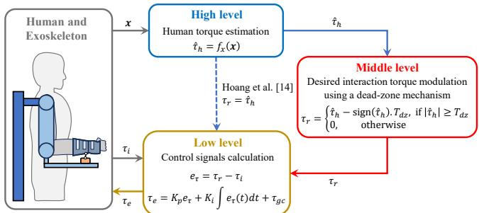  
Figure 1: Exoskeleton control strategy. Rather than directly passing the output of the high-level torque estimation model to the low-level controller as in [14], we introduce a middle-level controller where the estimated torque is modulated by a dead-zone mechanism to ensure a high matched assistance probability before being applied to the low-level controller.

The main contribution of this work lies in the design of the middle-level controller. Given a high-level torque estimation model, our objective is to modulate its output into a safe desired interaction torque that can be delivered by the robot. To this end, Section II-B introduces the concept of matched assistance, whereby the robot contributes positively to the user’s intended movement. A higher probability of matched assistance is expected to promote smoother and more intuitive HRI. Building upon this concept, Section II-C presents a theoretical approach for designing the torque modulation strategy using a dead-zone mechanism to guarantee a high matched assistance probability over the entire data distribution.

## B. Matched Assistance Probability

To formally characterize the correlation between the real human torque $\tau _ { h }$ and the robot’s desired torque $\tau _ { r } ( { \pmb x } )$ calculated from EMG signals x, we consider a probability space $( \Omega , { \mathcal { F } } , P )$ in which Ω is the sample space containing all possible pairs of outcomes $( { \pmb x } , \tau _ { h } ) , { \mathscr F }$ is the event space of three assistance events: matched assistance $( M _ { a } )$ , reversed assistance $( R _ { a } )$ , and excessive assistance $( E _ { a } )$ defined as:

$$
\bullet \ M _ { a } \colon \tau _ { r } ( { \pmb x } ) \cdot \tau _ { h } \geq 0 \ \mathrm { a n d } \ | \tau _ { r } ( { \pmb x } ) | \leq | \tau _ { h } | ,
$$

$$
\bullet \ R _ { a } \colon \tau _ { r } ( { \pmb x } ) \cdot \tau _ { h } < 0 ,
$$

$$
\bullet \ E _ { a } \colon \tau _ { r } ( { \pmb x } ) \cdot \tau _ { h } \geq 0 \ \mathrm { a n d } \ | \tau _ { r } ( { \pmb x } ) | > | \tau _ { h } | ,
$$

and $P$ is the probability function. The matched assistance probability $P ( M _ { a } )$ is defined as:

$$
P ( M _ { a } ) = P \left( \left( \pmb { x } , \tau _ { h } \right) \in M _ { a } \right) .\tag{1}
$$

In the context of general performance, the exoskeleton should interact effectively with the user while preserving controllability and natural movement execution across a broad range of tasks. Achieving such performance requires minimizing interaction mismatches that may interfere with the user’s intended movement. Accordingly, we characterize general performance by a high matched assistance probability, which quantifies the likelihood that the robot’s assistance is consistent with the human’s intended movement. Having a guarantee on general performance is therefore equivalent to having a guarantee on the matched assistance probability $P ( M _ { a } )$

We next show how the matched assistance probability can be used to interpret the HRI behavior produced by two taskagnostic controllers: the direct assistance [14] and the scaled assistance [15], as well as our proposed dead-zone-based assistance. The relation between the desired torque applied by each approach and the matched assistance probability is illustrated in Fig. 2.

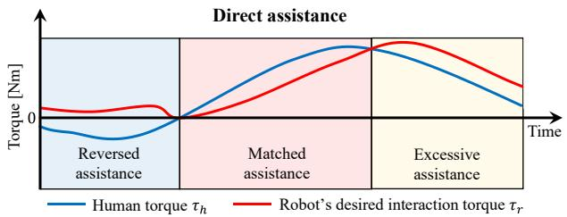

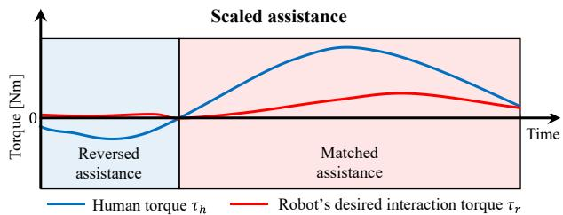

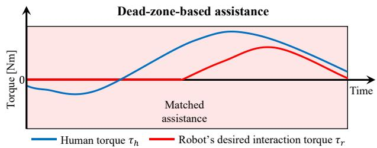  
Figure 2: Illustration of assistance behavior derived from the relationship between the human’s intended and the robot’s desired interaction torque under modulation approaches: direct assistance [14] (top plot), scaled assistance [15] (middle plot), and the proposed dead-zone-based assistance (bottom plot).

The direct assistance strategy proposed in [14] directly uses the output of the torque estimation model as the desired HRI torque. Without any further modulation, its effectiveness therefore depends strongly on the accuracy of the high-level torque estimator. When estimation accuracy is insufficient, estimation errors can lead to reversed or excessive assistance (see the top plot of Fig. 2), thereby degrading movement smoothness. To promote smoother HRI, Molinaro et al. [15] proposed a scaled-assistance strategy, in which the torque estimated by the high-level controller is scaled by a factor of 0.15 to 0.2 before being provided to the low-level controller. From the perspective of matched assistance, this strategy can be interpreted as reducing the magnitude of the torque applied under reversed mismatch. At the same time, scaling down the estimated torque reduces the likelihood of excessive assistance, thereby increasing the matched assistance probability (see the middle plot of Fig. 2). However, this approach cannot remove reversed mismatches and limits the capacity of generating strong matched assistance. Another relevant condition is the transparent mode, in which $\tau _ { r } = 0$ theoretically, allowing the robot to follow the user without assistance. This condition corresponds to fully matched assistance and can preserve smooth and intuitive movement, as the user retains full control. Nevertheless, the lack of assistance requires greater human effort to perform a movement. Based on these observations, the objective of our proposed dead-zone-based assistance is to increase the matched assistance probability $P ( M _ { a } )$ while preserving a meaningful contribution of the robot during the task. With the dead-zone, we can reduce both reversed and excessive mismatches, as shown in the bottom plot of Fig. 2.

## C. Guarantee on Matched Assistance Probability

To increase the matched assistance probability $P ( M _ { a } )$ given by (1), we design $\tau _ { r }$ by modulating the estimated torque $\hat { \tau } _ { h }$ from a high-level torque estimation model using a dead-zone. The dead-zone is defined with a positive threshold $T _ { d z }$ as:

$$
\tau _ { r } = \left\{ \begin{array} { l l } { \hat { \tau } _ { h } - \mathrm { s i g n } ( \hat { \tau } _ { h } ) . T _ { d z } , } & { \mathrm { i f } ~ | \hat { \tau } _ { h } | \geq T _ { d z } } \\ { 0 , } & { \mathrm { o t h e r w i s e } } \end{array} \right.\tag{2}
$$

The main challenge of this approach is selecting the threshold $T _ { d z }$ , which should be sufficiently large to ensure a high matched assistance probability while remaining as small as possible to preserve assistance availability. In conventional studies [12], [13], and [15], modulation parameters are tuned empirically by experts through experimental trials with the exoskeleton. This process requires conducting experiments and results in parameters whose performance is limited to the evaluated tasks, without guarantees for unexamined scenarios. In contrast, the proposed approach determines the dead-zone threshold $T _ { d z }$ analytically without requiring task-specific experiments on the robot while ensuring general guarantees on control performance. Consider the data distribution $\mathcal { D } = \mathcal { X } \times \mathcal { T }$ of all possible EMG-torque pairs $( x , \tau _ { h } )$ with $\textbf { \em x } \in { \mathcal { X } }$ and $\tau _ { h } \in \mathcal { T } .$ , we define the generalization error over $\mathcal { D } _ { : }$ , denoted by $L _ { D }$ as:

$$
L _ { \mathcal { D } } = \mathbb { E } _ { ( \pmb { x } , \tau _ { h } ) \sim \mathcal { D } } \left( | \tau _ { h } - f _ { x } ( \pmb { x } ) | \right)\tag{3}
$$

or briefly $L _ { \mathcal { D } } = \mathbb { E } \left( \left| \tau _ { h } - \hat { \tau } _ { h } \right| \right)$ . Our approach exploits the fact that $L _ { \mathcal { D } }$ is upper bounded by $L _ { B } \mathrm { : }$ ∗ with high probability, as established in [14]. The formulation of $L _ { B ^ { * } }$ is presented in Section II-C1. Accordingly, using $L _ { B ^ { * } }$ , Section II-C2 delivers an analytical approach to design the dead-zone threshold $T _ { d z }$ automatically.

1) Guarantee on torque estimation generalization error: Adapted from [14], [16], we present a framework to determine the upper bound $L _ { B ^ { * } }$ on the generalization error of the torque estimation model. The method applies to a class of estimation models with a linear output layer and consists of two main steps: (i) feature extraction and (ii) model retraining with bounded generalization error.

a) Feature extraction: Consider a torque estimation model $f _ { x } ( \cdot )$ with a linear output layer given by:

$$
f _ { x } ( { \pmb x } ) = { \pmb a } ^ { \top } h ( { \pmb x } ) = { \pmb a } ^ { \top } h\tag{4}
$$

where $\pmb { x } \in \mathbb { R } ^ { d }$ is the input vector, $h ( { \pmb x } )$ represents the feature extractor from the input x that contains all layers before the last linear output layer of model $f _ { x } ( \cdot )$ , the feature extractor produces a feature vector $\pmb { h } \in \mathbb { R } ^ { m }$ , which is finally converted into the human torque via a linear output layer with the weight $\pmb { a } \in \mathbb { R } ^ { m }$ . In this step, the model $f _ { x } ( \cdot )$ is trained using any conventional training strategy to obtain a feature extractor $h ( \cdot )$ from the training dataset, without considering constraints on general performance.

b) Model retraining with bounded generalization error: We freeze the feature extractor derived from the previous step and retrain the last linear output layer to obtain the tightest upper bound on the generalization error. Since the feature extractor is fixed, the training of $f _ { x } ( \cdot )$ is equivalent to fitting a linear model $f _ { h } ( h ) = \pmb { a } ^ { \top } h$ with input h from the feature space to the corresponding output torque $\tau _ { h }$ from $\tau$ . The training of $f _ { h } ( h )$ is performed to minimize the generalization error $L _ { D }$ defined by (3). Since is not accessible, the estimation model is trained on a training subset $S = \mathcal { X } _ { S } \times \mathcal { T } _ { S }$ of n samples drawn independently and identically distributed from with $\mathcal { X } _ { S } \subset \mathcal { X }$ and $\mathcal { T } _ { \mathcal { S } } \subset \mathcal { T }$

Similar to [14], [16], we use gradient descent (GD) to train the linear model $f _ { h } ( \cdot )$ to minimize the quadratic loss function $\begin{array} { r } { \mathcal { L } ( W ) = \frac { 1 } { 2 } \sum _ { i = 1 } ^ { n } | v _ { i } | ^ { 2 } } \end{array}$ in which the training error $v _ { i } ( k ) =$ $\mathbf { \pmb { a } } ( k ) ^ { \top } h ( \mathbf { \pmb { x } } _ { i } ) - \tau _ { h , i }$ represents the estimation error of the $i ^ { t h }$ sample. At each step k of GD, with a probability at least $1 - \delta ,$ the upper bound $L _ { B } ( k )$ on $L _ { D }$ is formulated as:

$$
L _ { \mathcal { B } } ( k ) = \frac { 1 } { n } \sum _ { i = 1 } ^ { n } | v _ { i } ( k ) | + \frac { 2 \mathcal { C } } { \sqrt { n } } \| \pmb { a } ( k ) \| + 3 R \sqrt { \frac { \log \frac { 2 } { \delta } } { 2 n } }\tag{5}
$$

where ${ \pmb a } ( k )$ is the output weight at $k ^ { t h }$ GD step, the parameters ${ \mathcal C } \ = \ \operatorname* { m a x } _ { i \in [ n ] , \pmb { x } _ { i } \in \mathcal { X } _ { S } } \| h ( \pmb { x } _ { i } ) \|$ and $R \ \geq \ | f _ { h } ( h ( \pmb { x } ) ) - \tau _ { h } |$ $\forall \left( \boldsymbol { \mathbf { \mathit { x } } } , \boldsymbol { \tau } _ { h } \right) \sim \dot { \mathcal { D } }$ . Following the early stopping strategy [16], the training process is subsequently halted at the step $k ^ { * }$ when L starts increasing to obtain a tight upper bound $L _ { B ^ { * } } = L _ { B } ( k ^ { * } )$ From [21], we have:

Proposition 1. With a probability at least $1 - \delta$ over the sample of size n, the generalization error $L _ { D }$ satisfies:

$$
L _ { \mathcal { D } } ( f _ { h } ) \leq L _ { B ^ { * } } .\tag{6}
$$

Proof. See Appendix A.

2) Analytical approach for designing the dead-zone: With the generalization error upper bound $L _ { B ^ { * } }$ obtained from Section II-C1, we now present our theoretical approach to set the threshold $T _ { d z }$ . We first consider the relation between the matched assistance probability $P ( M _ { a } )$ defined by (1) and the dead-zone threshold $T _ { d z }$ , given by the following proposition:

Proposition 2. For a given dead-zone threshold $T _ { d z }$ , the matched assistance probability $P ( M _ { a } )$ satisfies:

$$
P ( M _ { a } ) \geq P \left( \left| \hat { \tau } _ { h } - \tau _ { h } \right| \leq T _ { d z } \right) .\tag{7}
$$

Proof. We divide the human torque $\tau _ { h }$ from the entire data distribution into 2 cases: $\tau _ { h } < 0$ and $\tau _ { h } \geq 0$ . Considering the case $\tau _ { h } < 0$ , the dead-zone provides a matched $\tau _ { h } \leq \tau _ { r } \leq 0$ if $\tau _ { h } - T _ { d z } \leq \hat { \tau } _ { h } \leq T _ { d z }$ . Suppose that $\tau _ { h } < 0$ is already held, the matched probability in this case satisfies:

$$
\begin{array} { r l } & { P ( M _ { a } ) = P ( \tau _ { h } - T _ { d z } \leq \hat { \tau } _ { h } \leq T _ { d z } ) } \\ & { \qquad = P ( \hat { \tau } _ { h } \leq T _ { d z } ) - P ( \tau _ { h } - T _ { d z } \leq \hat { \tau } _ { h } ) } \\ & { \qquad = P ( \hat { \tau } _ { h } - \tau _ { h } \leq T _ { d z } - \tau _ { h } ) - P ( \tau _ { h } - \hat { \tau } _ { h } \leq T _ { d z } ) } \\ & { \qquad \geq P ( \hat { \tau } _ { h } - \tau _ { h } \leq T _ { d z } ) - P ( \hat { \tau } _ { h } - \tau _ { h } \geq - T _ { d z } ) } \\ & { \qquad = P \left( | \hat { \tau } _ { h } - \tau _ { h } | \leq T _ { d z } \right) . } \end{array}\tag{8}
$$

By applying a similar process to the case $\tau _ { h } \geq 0$ , we also have $P ( M _ { a } ) \geq P \left( \left| \hat { \tau } _ { h } - \tau _ { h } \right| \leq T _ { d z } \right)$ . Since these two cases cover the entire torque distribution, we derive (7). □

Proposition 2 indicates that the matched probability $P ( M _ { a } )$ does not only depend on $T _ { d z }$ but also on the distribution of the estimation error $\left( \tau _ { h } - \hat { \tau } _ { h } \right)$ . While the exact distribution of the estimation error is generally unknown, empirical observations in Fig. 5 suggest that, for a high-quality torque estimation model, the error can be reasonably characterized by a zeromean normal distribution. Accordingly, we assume:

$$
\left( \tau _ { h } - \hat { \tau } _ { h } \right) \sim \mathcal { N } \left( 0 , \sigma ^ { 2 } \right) .\tag{9}
$$

From this assumption, the selection of $T _ { d z }$ is undertaken based on the following theorem:

Theorem 1. If the estimation error of the estimation model follows a normal distribution with zero mean ${ \mathcal { N } } ( 0 , \sigma ^ { 2 } )$ and generalization error $L _ { \mathcal { D } } = \mathbb { E } \left( \vert \tau _ { h } - \hat { \tau } _ { h } \vert \right)$ satisfies $L _ { \mathcal { D } } \leq L _ { B ^ { * } }$ then, by using the dead-zone mechanism with the threshold $T _ { d z }$ , the matched assistance probability $P ( M _ { a } )$ is guaranteed to satisfy:

$$
P \left( M _ { a } \right) \ge 2 \Phi \left( \sqrt { \frac { 2 } { \pi } } \frac { T _ { d z } } { L _ { B ^ { * } } } \right) - 1\tag{10}
$$

where $\Phi \left( \cdot \right)$ is the standard normal cumulative distribution function (CDF).

Proof. From the distribution $( \tau _ { h } - \hat { \tau } _ { h } ) \sim \mathcal { N } \left( 0 , \sigma ^ { 2 } \right)$ , we have:

$$
L _ { \mathcal { D } } = \mathbb { E } \left( \left| \tau _ { h } - \hat { \tau } _ { h } \right| \right) = \sqrt { \frac { 2 } { \pi } } \sigma .\tag{11}
$$

Accordingly, since $L _ { \mathcal { D } } \leq L _ { B ^ { * } }$ , we derive:

$$
\sigma = \sqrt { \frac { \pi } { 2 } } L _ { \mathcal { D } } \leq \sqrt { \frac { \pi } { 2 } } L _ { { \mathcal { B } } ^ { * } } .\tag{12}
$$

Next, from Proposition 2 we have:

$$
\begin{array} { r l } & { P ( M _ { a } ) = P \left( | \hat { \tau } _ { h } - \tau _ { h } | \leq T _ { d z } \right) } \\ & { \qquad = P \left( \tau _ { h } - \hat { \tau } _ { h } \leq T _ { d z } \right) - P \left( \tau _ { h } - \hat { \tau } _ { h } \geq - T _ { d z } \right) } \\ & { \qquad = \Phi \left( \displaystyle \frac { T _ { d z } } { \sigma } \right) - \Phi \left( \displaystyle \frac { - T _ { d z } } { \sigma } \right) = \ 2 \Phi \left( \displaystyle \frac { T _ { d z } } { \sigma } \right) - 1 . } \end{array}\tag{13}
$$

Substituting (12) into (13), note that the CDF function $\Phi ( \cdot )$ is non-decreasing, we obtain (10). □

Remark 1. From Theorem 1, by formulating an upper bound $L _ { B ^ { * } }$ on the generalization error, we can guarantee a lower bound on the matched assistance probability $P ( M _ { a } )$ for any given dead-zone threshold $T _ { d z }$ , and this is obtained without explicitly knowing σ. Theorem 1 thus provides a practical guideline for selecting the dead-zone threshold $T _ { d z }$

In practice, the dead-zone threshold introduces a tradeoff between movement smoothness and the level of robotic assistance. For intuitive and safe HRI, we prioritize movement smoothness over maximizing assistance. The threshold $T _ { d z }$ should be designed as small as possible to avoid a lack of assistance but large enough to suppress mismatched interaction and thereby improve human controllability and movement smoothness. Accordingly, we suggest setting $T _ { d z } ~ = ~ 2 L _ { B ^ { * } }$ , which provides a guaranteed matched assistance probability of $P ( M _ { a } )$ of at least:

$$
P _ { B ^ { * } } = 2 \Phi \left( 2 \sqrt { \frac { 2 } { \pi } } \right) - 1 = 0 . 8 9 .\tag{14}
$$

Remark 2. Although we assume that the estimation error follows a zero-mean normal distribution ${ \mathcal { N } } ( 0 , \sigma ^ { 2 } )$ , which is in accordance with our empirical observations in Fig. 5, a less restrictive form of Theorem 1 can be derived without imposing the zero-mean assumption. This is illustrated in Appendix B.

## III. EXPERIMENTAL METHOD

We consider two experiments to validate: (i) the guarantee of the proposed method on the matched assistance probability $P ( M _ { a } )$ , and (ii) the performance of the control strategy in practical exoskeleton control under a task-agnostic setup.

## A. Experiment on General Performance Guarantee

This experiment aims to examine the impact of using the dead-zone in increasing matched assistance probability and validate the theoretical choice of the dead-zone threshold to guarantee a lower bound on the matched assistance probability given by Theorem 1 and Remark 1.

1) Participant and task: We conducted this experiment using the 17-subject multi-joint dataset provided in [22]. The data collection process and the calculation of the human torque label $\tau _ { h }$ are described in [23] and summarized in Section III-B2. Participants were connected to the exoskeleton at the wrist level via an orthosis mounted at the end of the forearm of the exoskeleton, as in [24]. Each participant performed 10 trials of random trajectory tracking while wearing an upper-limb exoskeleton. All movements were executed in the parasagittal plane and involved only shoulder and elbow flexion/extension.

2) Torque estimation models: We applied the boundedgeneralization-error framework (Section II-C1) to five EMGto-torque architectures, including: the multivariate linear regression (MVLR) model [25], which directly maps filtered EMG signals to human torque without feature extraction; the nonlinear mapping (NLMap) model [13], which uses a nonlinear activation for feature extraction; the feedforward neural network [26] with four hidden layers (4HNN) model, which utilizes four hidden layers as the feature extractor; the LSTM model [27], which employs a sequence of LSTM block followed by fully connected layers as the feature extractor;

and the CNN-LSTM model [28], which uses a hybrid CNN-LSTM architecture to extract spatio-temporal information from filtered EMG signals followed by fully connected layers as the feature extractor.

3) Evaluation of generalization guarantee: For each subject, the 10 trials were split into a training set of 3 trials and a test set of 7 trials. A larger test set was intentionally adopted since the generalization error cannot be directly accessed; therefore, a large test set enables estimation of these quantities, as suggested in [16], [29]. Consider the test set of $n _ { t e s t }$ EMG-torque samples $\{ ( \pmb { x } _ { j } , \tau _ { h , j } ) \} _ { j = 1 } ^ { n _ { t e s t } }$ , for the $j ^ { t h }$ test sample, we denote the corresponding estimation given by the torque estimation model as $\hat { \tau } _ { h , j }$ and the corresponding robot torque obtained by (2) as $\tau _ { r , j } .$ The generalization error is estimated by the test error $L _ { t e s t }$ defined as the mean absolute error:

$$
L _ { t e s t } = \frac { 1 } { n _ { t e s t } } \sum _ { j = 1 } ^ { n _ { t e s t } } | \tau _ { h , j } - \hat { \tau } _ { h , j } |\tag{15}
$$

We first verify if $L _ { t e s t } \leq L _ { B ^ { \ast } }$ as indicated by Proposition 1. Then, using the generalization error upper bound $L _ { B ^ { * } }$ , we set the dead-zone $T _ { d z } ~ = ~ 2 L _ { B ^ { * } }$ and calculate the matched assistance probability $P ( M _ { a } )$ of each model as:

$$
P ( M _ { a } ) = { \frac { n _ { M _ { a } } } { n _ { t e s t } } } ,\tag{16}
$$

in which $n _ { M _ { a } }$ is the number of matched assistance time sampled by comparing $\tau _ { r , j }$ to the corresponding $\tau _ { h , j }$ in the test set. From (16) and (14), we further verify if $P ( M _ { a } ) \geq 0 . 8 9 $ as indicated by Remark 1 and Theorem 1.

4) Matched assistance probability versus assistance: To quantify the contribution of the desired HRI torque $\tau _ { r } ( { \pmb x } )$ relative to the human torque $\tau _ { h }$ , we introduce the positive contribution index (PCI). Inspired by the assistance index [30], the PCI is adapted to the proposed concept of matched assistance. For each pair of $\tau _ { r } ( { \pmb x } )$ and $\tau _ { h }$ , the PCI takes a positive value when the robot assistance is matched with the human’s intended movement and a negative value when the assistance is mismatched. The PCI is defined as follows:

$$
\begin{array} { r } { \mathrm { P C I } = \left\{ \begin{array} { l l } { | \tau _ { r } ( \pmb { x } ) | , \quad \mathrm { i f ~ } ( \pmb { x } , \tau _ { h } ) \in M _ { a } } \\ { - | \tau _ { r } ( \pmb { x } ) | , \quad \mathrm { i f ~ } ( \pmb { x } , \tau _ { h } ) \in R _ { a } } \\ { - | \tau _ { r } ( \pmb { x } ) - \tau _ { h } | \quad \mathrm { i f ~ } ( \pmb { x } , \tau _ { h } ) \in E _ { a } } \end{array} \right. } \end{array}\tag{17}
$$

Since mismatched assistance can adversely affect human controllability, $P ( M _ { a } )$ is treated as the primary performance criterion for the controller design. On the other hand, PCI provides complementary information regarding the magnitude of the robot’s contribution but does not replace the requirement for reliable matched assistance. Thus, $P ( M _ { a } )$ is prioritized, and PCI is considered only when the corresponding $P ( M _ { a } )$ values are comparable. Among such configurations, the one yielding a higher PCI is preferred.

## B. Experiment on EMG Assistance

This experiment aims to validate the generalizability and effectiveness of the proposed control strategy in a multitask setup. The controller training and design were based on a single standard trajectory tracking task, whereas four additional tasks were used for testing.

1) Participant and task: The assistance experiment was conducted with 5 healthy subjects (4 males, average height of 1.72m, average weight of 70kg) performing a series of motor tasks in the parasagittal plane involving shoulder and elbow flexion/extension. Participants had no prior experience with the robot. Written informed consent was provided, and the protocol was approved by the ethics committee of Universite´ Paris-Saclay. Each participant completed two sessions.

In the first session, data were collected to train the high-level torque estimation model. Following [14], [23], we consider the random trajectory tracking task as the training task. The participant tracked a randomly generated trajectory projected on a screen. Each trajectory lasted 30 seconds, and 3 trajectories were performed in this step. During the training task, the robot was set to viscous mode [23] to increase the effort required from the participant. This allows capturing a large range of muscle activation.

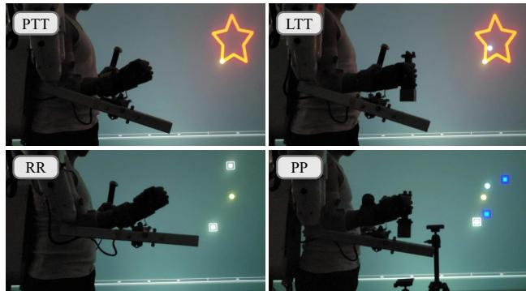  
Figure 3: Testing tasks: PTT = Pure trajectory tracking, LTT = Load trajectory tracking, RR = Reach and return, $\mathrm { P P } = \mathrm { P i c k }$ and place.

In the second session, the participant performed four testing tasks (see Fig. 3) under three control conditions: the proposed dead-zone-based assistance (DZA) with $\tau _ { r }$ calculated by (2), the direct assistance (DA) that directly use $\tau _ { r } ~ = ~ \hat { \tau } _ { h }$ (or with $T _ { d z } ~ = ~ 0 )$ as in [14], and the transparent (TR) mode in which $\tau _ { r } = 0$ . The TR mode is used as the baseline for evaluating human controllability and movement smoothness, since it allows the human to remain fully in charge of task execution. We consider four testing tasks:

Pure trajectory tracking (PTT): The participant tracks a star trajectory, repeated 3 times.

Load trajectory tracking (LTT): Similar to PTT, but the participant holds a load of 1.5 kg during the task.

Reach and return (RR): The participant moves to a point at a high position, then returns to a point at a low position, repeated 5 times.

Pick and place (PP): The participant picks a 1.5 kg load from the higher platform, moves it to the lower platform, then picks the load again and returns it to the higher platform, repeated 5 times.

The testing tasks and control conditions were organized in a random order.

2) Data collection and processing: We employ the methodology of [23] for the processing of EMG signals, the recording of human motion, and the calculation of the human torque. The EMG signals are collected using MiniWave sensors (Cometa,

Bareggio MI, Italy) on eight muscles: the brachioradialis, brachialis, the long, medial, and lateral heads of the triceps, and the anterior, posterior, and medial deltoids. Raw EMG data were filtered by a fourth-order Butterworth bandpass filter (20–450 Hz), then centered, rectified, processed to extract the envelope using a 3 Hz low-pass filter, and finally normalized by the maximum voluntary contraction (MVC) of the corresponding muscle. Human motion is recorded using a tencamera motion capture system. The human–robot interaction force is measured using a force/torque sensor mounted at the robot’s end effector. The motion and interaction data are then sent to the OpenSim Inverse Dynamics tool to calculate the human joint torque labels $\tau _ { h }$ exerted during the task.

3) Assistive controller design: The assistive controller was designed to support both shoulder and elbow flexion/extension. The two-output 4HNN model was employed as the high-level controller to estimate the shoulder and elbow torques. Each hidden layer of the 4HNN model contains 32 neurons with the tanh( ) activation function. The 4HNN model was selected for the experiments because it provides a tighter upper bound on the generalization error than the MVLR and NLMap models for both shoulder and elbow torque estimation, as shown in Fig. 4A. Although the 4HNN yields a less favorable $L _ { B ^ { * } }$ ∗ than the deeper LSTM and CNN-LSTM models, it requires substantially less training time, taking less than 5 min compared with more than 45 min for the deep models. This trade-off between generalization performance and computational cost makes the 4HNN a more practical choice for the experimental setup, particularly by reducing the waiting time required for participant-specific model training.

For each subject, we trained the 4HNN model on the corresponding dataset collected from the random trajectory tracking training task. After obtaining the estimation model, a dead-zone with threshold $T _ { d z } ~ = ~ 2 L _ { B }$ ∗ was applied at the middle-level controller. Across 5 testing subjects, average dead-zone thresholds of 8.12 N m and 5.76 N m were used for shoulder and elbow torque, respectively. At the low-level controller, we set $K _ { P } = 0 . 3$ and $K _ { I } = 1$ , as used in [13].

4) Evaluation of assistance performance: We compare the proposed DZA control strategy with the DA controller of [14] and the TR mode across the four testing tasks in terms of movement smoothness and human physical effort. On the one hand, movement smoothness is quantified as the integral of the squared jerk (ISJ) over the movement duration. On the other hand, human physical effort is evaluated as the average activation of the eight muscles during task execution. To eliminate task-dependent bias, the activation of each muscle was first normalized by its task-specific maximum voluntary contraction (task MVC), defined as the maximum activation recorded during the task under the TR condition, before averaging across muscles.

## IV. RESULTS

## A. Results on General Performance Guarantee

1) Guarantee on generalization error: Fig. 4A reports the test errors of the shoulder and elbow torques for the five considered models, along with the corresponding upper bounds on the generalization error $L _ { B ^ { * } }$ computed by (5). It can be observed that, for all considered models, the test error of both shoulder and elbow torque was consistently below its corresponding generalization error upper bound, in agreement with Proposition 1.

A  
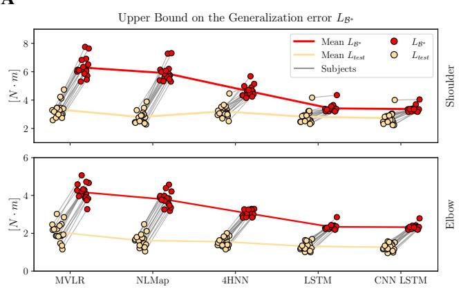

B  
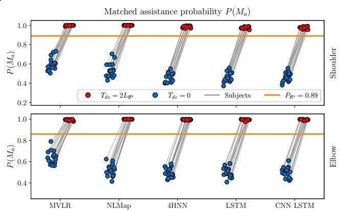  
Figure 4: Results on generalization performance guarantee across 17 subjects for the shoulder and elbow torques. The gray lines denote evaluated values from the same subject. (A) Torque estimation error of considered estimation models with corresponding generalization error upper bounds $L _ { B ^ { * } \cdot } ( \mathbf { B } )$ Matched assistance probability $P ( M _ { a } )$ of considered estimation models without the dead-zone $( T _ { d z } = 0 )$ , with the dead-zone $( T _ { d z } = 2 L _ { B ^ { * } } ) ;$ the horizontal lines indicate the lower guarantee $\stackrel { \cdot } { P } _ { B ^ { * } } = 0 . 8 9$ given by (14).

2) Guarantee on matched assistance probability: Fig. 4B compares the matched assistance probability $P ( M _ { a } )$ obtained from the outputs of the five considered EMG-to-torque models before and after dead-zone modulation with $T _ { d z } = 2 L _ { B ^ { * } }$ . Note that $L _ { B ^ { * } }$ is calculated separately for each model, each subject, and each joint, as in Fig. 4A. Across all five model architectures and 17 subjects for both shoulder and elbow torque, deadzone modulation substantially improved the matched assistance probabilities compared with the no-dead-zone condition, with average improvements of 0.38, 0.47, 0.51, 0.50, and 0.51 for the MVLR, NLMap, 4HNN, LSTM, and CNN-LSTM models, respectively.

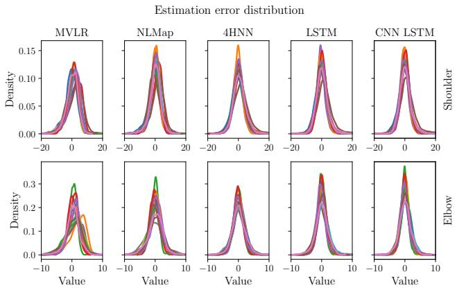  
Figure 5: The distribution of estimation error $( \tau _ { h } \mathrm { ~ - ~ } \hat { \tau } _ { h } )$ obtained from 5 considered models across 17 subjects. Each curve corresponds to one subject.

To assess the guarantee on the matched assistance probability, we first examine the validity of the zero-mean normality assumption for the torque estimation error $\left( \tau _ { h } \mathrm { ~ - ~ } \hat { \tau } _ { h } \right)$ . In Fig. 5, we illustrate the distributions of torque estimation errors obtained from the test sets of all 17 subjects for shoulder and elbow torque across the considered estimation models.

The resulting error distributions exhibit a closely Gaussian shape with zero mean, notably for the 4HNN, LSTM, and CNN-LSTM models. This provides empirical evidence that supports the assumption in (9) and, consequently, the practical relevance of the proposed theoretical analysis. After dead-zone modulation with the threshold $T _ { d z } = 2 L _ { B ^ { * } }$ , it can be observed from Fig. 4B that $P ( M _ { a } )$ remains above both theoretical lower bounds $P _ { B ^ { * } } ~ = ~ 0 . 8 9$ for all considered models and subjects, in accordance with Theorem 1 and Remarks 1. Moreover, although the proposed design theoretically guarantees $P ( M _ { a } ) \ge 0 . 8 9$ , the experimental results demonstrate a substantially higher matched assistance probability. Specifically, across the 17 subjects, two joint torques, and all considered models, the minimum observed $P ( M _ { a } )$ was 0.97, indicating that the theoretical bound is conservatively satisfied in practice.

3) Smoothness versus assistance: For each torque estimation model, the dead-zone threshold was individually determined as $T _ { d z } ~ = ~ 2 L _ { B ^ { * } }$ , using the corresponding error bound $L _ { B ^ { * } }$ . This model-specific thresholding allows the five considered models to achieve a comparable matched assistance probability, as illustrated in Fig. 4B. Accordingly, the PCI given by (17) is used as a secondary metric to assess the magnitude of the robot’s positive contribution.

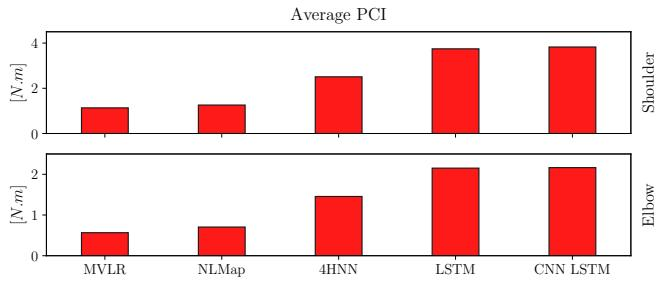  
Figure 6: Average PCI across 17 subjects and two joint torques derived by five considered torque estimation models: MVLR, NLMap, 4HNN, LSTM, and CNN-LSTM.

Fig. 6 presents the average PCI obtained on the test set of 17 subjects under the five considered estimation models. With the dead-zone modulation, all models show a positive contribution. The level of positive contribution increases from MVLR and NLMap to the 4HNN, LSTM, and CNN-LSTM models. This indicates that higher-accuracy estimation models require a lower dead-zone threshold to guarantee matched assistance, thereby achieving a higher positive contribution.

A  
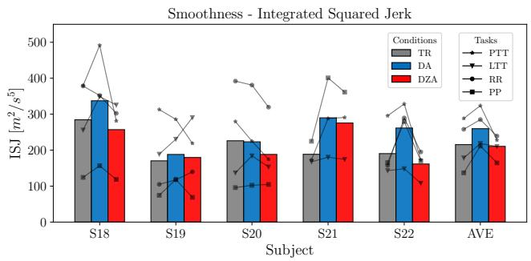

B  
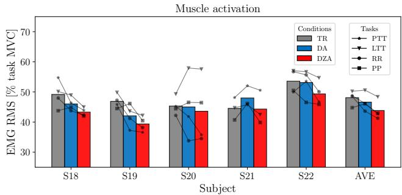  
Figure 7: Results on (A) motion smoothness and (B) muscle activation of 5 subjects across all testing tasks: PTT = Pure trajectory tracking, LTT = Load trajectory tracking, RR = Reach and return, PP = Pick and place. The last column, AVE, shows the average of the 5 subjects.

## B. Results on EMG Assistance

We assessed assistance performance against the baseline transparent condition TR, in which the robot typically follows the user without assisting. Consequently, the user retains full control of the motion, and natural trajectories are expected under this condition. However, the absence of robotic assistance in TR mode requires the user to generate their own effort to complete the task. Accordingly, this condition results in relatively high muscle activation [13], [14]. Therefore, an effective assistive controller should provide a level of movement smoothness comparable to that of the TR condition while reducing the user’s muscular effort.

Fig. 7A illustrates the movement smoothness obtained by the three considered control conditions across all testing tasks. Since smoothness was quantified using the integrated squared jerk ISJ, lower values indicate smoother trajectories. On average, the proposed DZA achieves a smoothness level comparable to that of the TR mode, suggesting that the proposed strategy preserves human control of the task. In contrast, the DA controller yields the highest ISJ in four of the five testing subjects (i.e., all except S20) and the highest average value across subjects, indicating less smooth movements compared with both the TR mode and the proposed DZA.

In terms of muscle activation, Fig. 7B shows that, averaged across all testing tasks, the two assistive conditions DA and DZA resulted in lower muscle activation than TR for four of the five testing subjects (i.e., all except S21). Compared with DA, the proposed DZA consistently achieved lower muscle activation across all five subjects. These results suggest that, although DA can generally reduce muscle activation relative to TR, its potential assistance mismatch may cause the robot to provide excessive or reversed torque relative to the user’s intent, leading the user to generate counteracting torque to maintain movement stability, thereby diminishing the amount of muscle activation reduction. On the other hand, by limiting the effect of torque estimation errors, the proposed DZA aims to reduce this mismatch while maintaining effective assistance.

Overall, when averaged across subjects and tasks, the DZA reduced muscle activation by 8.9% relative to the TR mode, and 6.0% relative to the DA condition.

## C. Discussion

This study characterizes the general control performance of the exoskeleton by a formal definition of matched assistance probability. Using a dead-zone mechanism, we provide a theoretical approach to set the dead-zone threshold that guarantees a lower bound on the matched assistance probability, which is verified in Fig. 4B. This improves the reliability of our method in assistive exoskeleton control by ensuring system performance even for previously unexamined tasks.

From a control perspective, the proposed strategy prioritizes human controllability and movement smoothness over robot assistance. In other words, the objective is not to maximize the amount of assistance, but to provide assistance that remains consistent with the user’s intended movement and preserves natural task execution. For this purpose, in low-torque scenarios, the robot behaves similarly to TR mode, allowing the human to maintain movement smoothness. In contrast, reliable assistance is provided in high-torque scenarios to reduce human effort. This behavior was reflected in the experimental results, where the proposed EMG-assisted controller achieved smoother trajectories than DA while deriving lower muscle activation than both TR and DA.

The design of our dead-zone threshold is related to the general performance of the EMG-to-torque model, as shown in Theorem 1. A small generalization error upper bound $L _ { B ^ { * } }$ enables achieving a high matched assistance probability with a small dead-zone threshold $T _ { d z } ,$ allowing the robot to contribute more in assisting the task (see Fig. 4 and 6). These results demonstrate that the proposed framework can provide matched assistance even when the high-level EMG-to-torque estimation model varies in prediction quality. Nevertheless, the overall assistance performance may benefit from more accurate torque estimation. For the 4HNN model, Fig. 6 shows an average positive contribution of 2.5 N m and 1.5 N m for the shoulder and elbow torques, respectively. This level of robotic contribution was associated with an 8.9% reduction in muscle activation compared with the TR mode. The LSTM and CNN-LSTM models yielded higher average positive contributions of 3.8 N m and 2.1 N m for the shoulder and elbow, respectively, suggesting the potential for a greater reduction in muscle activation than that achieved with 4HNN. While deep learningbased torque estimation models were not included in our practical robotic experiments due to their time-consuming training process, evaluating the proposed framework with such models in real-world human–robot experiments is still an important direction for future work.

In comparison with the scaled assistance (SCA) of [15], an offline experiment was conducted using the same 17-subject dataset [22]. In Fig. 8, we compare SCA and the proposed DZA across 17 subjects in terms of the matched assistance probability $P ( M _ { a } )$ and the average PCI. For both shoulder and elbow torque, DZA achieves higher $P ( M _ { a } )$ and average PCI than SCA, suggesting potential advantages could be achieved with DZA over SCA. Future work will further establish a physical human–robot experiment between DZA and SCA to validate this statement.

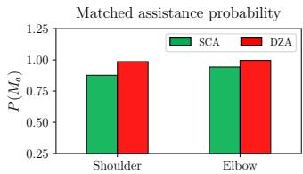

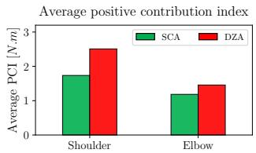  
Figure 8: Comparison between SCA and DZA across 17 subjects in terms of $P \mathbf { \check { ( } } M _ { a } \mathbf { ) }$ and average PCI.

## V. CONCLUSION

In this paper, we presented a theoretical framework for designing the robot’s desired interaction torque that guarantees a high probability of matched assistance. By integrating a deadzone mechanism with a bounded-generalization-error EMGto-torque model, our approach provides provable reliability in exoskeleton assistance with a formal guarantee on control performance. Unlike previous studies, our dead-zone threshold is derived theoretically from a general performance evaluation based solely on the training task, without conducting additional testing tasks on the robot. Practical experiments on the ABLE exoskeleton across multiple testing tasks verified the general effectiveness of the proposed approach, demonstrating guaranteed movement smoothness while reducing human physical effort. Future work will investigate the integration of the proposed method with deep learning-based torque estimation models (LSTM [27] and CNN-LSTM [28]) in physical human–robot experiments, as well as compare the proposed method with other control strategies, such as the SCA [15], to further validate its effectiveness.

## APPENDIX A: PROOF OF PROPOSITION 1

At step $k ^ { * }$ of GD, we define the hypothesis class $\mathcal { F } _ { k }$ containing $f _ { h } ( \cdot )$

$$
\mathcal { F } _ { k ^ { * } } = \Big \{ h \mapsto b ^ { \top } h | b \in \mathbb { R } ^ { m } , \| b \| \leq \| \pmb { a } ( k ^ { * } ) \| \Big \}\tag{18}
$$

From Theorem 5.5 of [21], we have the Rademacher complexity $\mathcal { R } _ { S } ( \mathcal { F } _ { k ^ { * } } )$ of $\mathcal { F } _ { k }$ ∗ satisfies:

$$
\mathcal { R } _ { S } ( \mathcal { F } _ { k ^ { * } } ) \leq \frac { \| \pmb { a } ( k ^ { * } ) \| } { \sqrt { n } } \mathcal { C } .\tag{19}
$$

Subsequently, according to Proposition 1 of [16] for the case $p = 1$ , with a probability at least $1 - \delta$ over the sample  of size n, we have:

$$
L _ { \mathcal { D } } ( f _ { h } ) \leq \frac { 1 } { n } \sum _ { i = 1 } ^ { n } | v _ { i } ( k ^ { * } ) | + 2 \mathcal { R } _ { S } ( \mathcal { F } _ { k ^ { * } } ) + 3 R \sqrt { \frac { \log \frac { 2 } { \delta } } { 2 n } } .\tag{20}
$$

Substituting (19) into (20), we obtain (6) and this completes the proof.

## APPENDIX B: EXTENDED VERSION OF THEOREM 1

Theorem 2. If the estimation error follows a normal distribution ${ \mathcal { N } } ( \mu , \sigma ^ { 2 } )$ and generalization error $L _ { \mathcal { D } } = \mathbb { E } \left( \left| \tau _ { h } - \hat { \tau } _ { h } \right| \right)$ satisfies $L _ { \mathcal { D } } \leq L _ { B ^ { * } }$ , then, by using the dead-zone mechanism with the threshold $T _ { d z } \geq L _ { B } ,$ ∗ , the matched assistance probability $P ( M _ { a } )$ is guaranteed to satisfy:

$$
P \left( M _ { a } \right) \geq \Phi \left( \sqrt { \frac { 2 } { \pi } } \frac { T _ { d z } - L _ { B ^ { * } } } { L _ { B ^ { * } } } \right) + \Phi \left( \sqrt { \frac { 2 } { \pi } } \frac { T _ { d z } + L _ { B ^ { * } } } { L _ { B ^ { * } } } \right) - 1\tag{21}
$$

Proof. From Proposition 2 and $( \tau _ { h } - \hat { \tau } _ { h } ) \sim \mathcal { N } ( \mu , \sigma ^ { 2 } )$

$$
\begin{array} { r l } & { P ( M _ { a } ) = P \left( \tau _ { h } - \hat { \tau } _ { h } \leq T _ { d z } \right) - P \left( \tau _ { h } - \hat { \tau } _ { h } \geq - T _ { d z } \right) } \\ & { \qquad = \Phi \left( \displaystyle \frac { T _ { d z } - | \mu | } { \sigma } \right) + \Phi \left( \displaystyle \frac { T _ { d z } + | \mu | } { \sigma } \right) - 1 . } \end{array}\tag{22}
$$

We next introduce the auxiliary function

$$
\mathcal { G } ( u , v ) = \Phi \bigg ( \frac { T _ { d z } - u } { v } \bigg ) + \Phi \bigg ( \frac { T _ { d z } + u } { v } \bigg ) - 1 ,\tag{23}
$$

where $u \in [ 0 , \beta ]$ and $v \in ( 0 , \gamma ]$ and prove that for $T _ { d z } \geq \beta ;$

$$
\mathcal { G } ( u , v ) \geq \mathcal { G } ( \beta , \gamma ) \forall ( u , v ) \in [ 0 , \beta ] \times ( 0 , \gamma ] .\tag{24}
$$

For any fixed $v \in ( 0 , \gamma ]$ , taking the derivative of $\mathcal { G } ( u , v )$ with respect to u yields:

$$
\frac { \partial \mathcal { G } } { \partial u } = \frac { 1 } { v } \left[ \phi \left( \frac { T _ { d z } + u } { v } \right) - \phi \left( \frac { T _ { d z } - u } { v } \right) \right]\tag{25}
$$

where $\phi ( \cdot )$ is the probability density function (PDF) of the standard normal distribution.

Since $T _ { d z } \ \geq \ \beta ,$ we have $T _ { d z } + u \ge T _ { d z } - u \ge 0$ for all $u \in [ 0 , \beta ] ;$ ; therefore $\begin{array} { r } { \phi \left( \frac { T _ { d z } + u } { v } \right) \leq \phi \left( \frac { \bar { T _ { d z } } - \bar { u } } { v } \right) } \end{array}$ and:

$$
\frac { \partial \mathcal { G } } { \partial u } \leq 0 \forall ( u , v ) \in [ 0 , \beta ] \times ( 0 , \gamma ] .\tag{26}
$$

For any fixed $u \in [ 0 , \beta ]$ , taking the derivative of $\mathcal { G } ( u , v )$ with respect to v yields:

$$
\frac { \partial \mathcal { G } } { \partial v } = - \frac { T _ { d z } + u } { v ^ { 2 } } \phi \left( \frac { T _ { d z } + u } { v } \right) - \frac { T _ { d z } - u } { v ^ { 2 } } \phi \left( \frac { T _ { d z } - u } { v } \right) .
$$

Since $T _ { d z } + u \ge T _ { d z } - u \ge 0$ and $\phi ( \cdot ) \geq 0$ , we have:

$$
\frac { \partial \mathcal { G } } { \partial v } \leq 0 \forall ( u , v ) \in [ 0 , \beta ] \times ( 0 , \gamma ] .\tag{27}
$$

From (26) and (27), we derive (24).

We now prove that $| \mu | \leq L _ { B ^ { * } }$ and $\sigma \le \sqrt { \pi / 2 } L _ { B ^ { \ast } }$ ∗. From the normal distribution ${ \mathcal { N } } \left( { \boldsymbol { \mu } } , \sigma ^ { 2 } \right)$ , we have:

$$
| \mu | = \left| \mathbb { E } \left( \tau _ { h } - \hat { \tau } _ { h } \right) \right| \leq \mathbb { E } \left( | \tau _ { h } - \hat { \tau } _ { h } | \right) \leq L _ { \mathcal { B } ^ { * } }\tag{28}
$$

We also have:

$$
\mathbb { E } \left( \left| \tau _ { h } - \hat { \tau } _ { h } \right| \right) = 2 \sigma \phi \left( \frac { \left| \mu \right| } { \sigma } \right) + \left| \mu \right| \left( 2 \Phi \left( \frac { \left| \mu \right| } { \sigma } \right) - 1 \right)\tag{29}
$$

Let $g ( s )$ a function of non-negative variable s defined by:

$$
g ( s ) = 2 \phi \left( s \right) + s \left( 2 \Phi \left( s \right) - 1 \right) .\tag{30}
$$

By differentiating $g ( s )$ with respect to s, we obtain:

$$
g ^ { \prime } ( s ) = 2 \phi ^ { \prime } \left( s \right) + 2 \Phi \left( s \right) - 1 + 2 s \Phi ^ { \prime } \left( s \right) .\tag{31}
$$

Using the property of the PDF function, $\phi ^ { \prime } \left( s \right) = - s \phi ( s )$ , and $\Phi ^ { \prime } \left( s \right) = \phi \left( s \right)$ , we derive $g ^ { \prime } ( s ) = 2 \Phi \left( s \right) - 1 \geq 0$ for all $s \geq 0 .$ Accordingly, $g ( s ) \geq g ( 0 ) \forall s \geq 0$ . Combine with (29) yields:

$$
\mathbb { E } \left( | \tau _ { h } - \hat { \tau } _ { h } | \right) = \sigma g \left( \frac { | \mu | } { \sigma } \right) \geq \sigma g ( 0 ) = \sigma \sqrt { \frac { 2 } { \pi } } .\tag{32}
$$

Thus, we obtain:

$$
\sigma \leq \sqrt { \frac { \pi } { 2 } } \mathbb { E } \left( | \tau _ { h } - \hat { \tau } _ { h } | \right) \leq \sqrt { \frac { \pi } { 2 } } L _ { B ^ { * } } .\tag{33}
$$

Finally, from (22), (24), (28) and (33), replacing $\beta$ and $\gamma$ in (24) by $L _ { B ^ { * } }$ and $\sqrt { \pi / 2 } L _ { B ^ { * } }$ , respectively, we have:

$$
\begin{array} { l } { \displaystyle P ( { M _ { a } } ) = \mathcal { G } ( | \mu | , \sigma ) \geq \mathcal { G } ( L _ { \mathcal { B } ^ { * } } , \sqrt { \pi / 2 } L _ { \mathcal { B } ^ { * } } ) } \\ { \displaystyle \quad = \Phi \left( \sqrt { \frac { 2 } { \pi } } \frac { T _ { d z } - L _ { \mathcal { B } ^ { * } } } { L _ { \mathcal { B } ^ { * } } } \right) + \Phi \left( \sqrt { \frac { 2 } { \pi } } \frac { T _ { d z } + L _ { \mathcal { B } ^ { * } } } { L _ { \mathcal { B } ^ { * } } } \right) - 1 } \end{array}
$$

i.e. (21).

## REFERENCES

[1] T. Proietti, V. Crocher, A. Roby-Brami, and N. Jarrasse, “Upperlimb robotic exoskeletons for neurorehabilitation: A review on control strategies,” IEEE reviews in biomedical engineering, vol. 9, pp. 4–14, 2016.

[2] W. Wang, H. Ren, Z. Ci, X. Yuan, P. Zhang, and C. Wang, “Control Method of Upper Limb Rehabilitation Exoskeleton for Better Assistance: A Comprehensive Review,” Journal of Field Robotics, vol. 42, no. 4, pp. 1373–1387, 2025.

[3] A. Guatibonza, L. Solaque, A. Velasco, and L. Penuela, “Assistive˜ robotics for upper limb physical rehabilitation: A systematic review and future prospects,” Chinese Journal of Mechanical Engineering, vol. 37, no. 1, p. 69, 2024.

[4] M. S. Amiri and R. Ramli, “Fuzzy adaptive controller of a wearable assistive upper limb exoskeleton using a disturbance observer,” IEEE Transactions on Human-Machine Systems, vol. 55, no. 2, pp. 197–206, 2025.

[5] B. Sarani, R. Ardakanian, G. Dorri, I. Kardan, A. Akbarzadeh, and A. Akbari, “Finite-time adaptive robust disturbance observer and filterbased controller for human–robot interaction in rehabilitation robots,” IEEE Transactions on Human-Machine Systems, 2026.

[6] A. Orhan, D. Hoang, O. Bruneau, B. Berret, and F. Geffard, “Using artificial demonstrations emulating human movement variability for a learning-based exoskeleton flow controller,” IEEE Robotics and Automation Letters, vol. 10, no. 9, pp. 9430–9437, 2025.

[7] C. Wang, L. Peng, Z.-G. Hou, J. Li, L. Luo, S. Chen, and W. Wang, “Kinematic redundancy analysis during goal-directed motion for trajectory planning of an upper-limb exoskeleton robot,” in 2019 41st Annual International Conference of the IEEE Engineering in Medicine and Biology Society (EMBC). IEEE, 2019, pp. 5251–5255.

[8] X. Wang, Q. Song, S. Zhou, J. Tang, K. Chen, and H. Cao, “Multiconnection load compensation and load information calculation for an upper-limb exoskeleton based on a six-axis force/torque sensor,” International Journal of Advanced Robotic Systems, vol. 16, no. 4, p. 1729881419863186, 2019.

[9] D. Liu, Y. Li, J. Liu, Z. Wang, J. Zhao, and Y. Zhu, “Using upper limb carrying exoskeleton with dual-model torque control strategy to reduce load impact,” in 2025 IEEE/RSJ International Conference on Intelligent Robots and Systems (IROS). IEEE, 2025, pp. 8224–8231.

[10] R. Nasiri, H. Aftabi, and M. N. Ahmadabadi, “Human-in-the-loop weight compensation in upper limb wearable robots towards total muscles’ effort minimization,” IEEE Robotics and Automation Letters, vol. 7, no. 2, pp. 3273–3278, 2022.

[11] M. Jamsek, T. Kunavar, U. Bobek, E. Rueckert, and J. Babiˇ c, “Predictiveˇ exoskeleton control for arm-motion augmentation based on probabilistic movement primitives combined with a flow controller,” IEEE Robotics and Automation Letters, vol. 6, no. 3, pp. 4417–4424, 2021.

[12] B. Treussart, F. Geffard, N. Vignais, and F. Marin, “Controlling an upperlimb exoskeleton by EMG signal while carrying unknown load,” in 2020 IEEE international conference on Robotics and automation (ICRA). IEEE, 2020, pp. 9107–9113.

[13] L. Quesada, D. Verdel, O. Bruneau, B. Berret, M.-A. Amorim, and N. Vignais, “Less is more: uncompensated gravity torques for intuitive EMG-based assistance with a robotic exoskeleton,” bioRxiv, 2025. [Online]. Available: https://www.biorxiv.org/content/early/2025/11/24/ 2025.11.21.689589

[14] D. Hoang, L. Quesada, B. Berret, O. Bruneau, and L. Fribourg, “EMGbased torque prediction for assistive exoskeleton control using neural networks with bounded generalization error,” in 2026 IEEE International Conference on Robotics and Automation (ICRA). IEEE, 2026.

[15] D. D. Molinaro, K. L. Scherpereel, E. B. Schonhaut, G. Evangelopoulos, M. K. Shepherd, and A. J. Young, “Task-agnostic exoskeleton control via biological joint moment estimation,” Nature, vol. 635, no. 8038, pp. 337–344, 2024.

[16] D. Martin Xavier, L. Chamoin, and L. Fribourg, “Early stopping strategy using neural tangent kernel theory and Rademacher complexity,” in 2025 American Control Conference (ACC). IEEE, 2025, pp. 1301–1306.

[17] P. L. Bartlett and S. Mendelson, “Rademacher and gaussian complexities: Risk bounds and structural results,” J. Mach. Learn. Res., vol. 3, pp. 463–482, 2002.

[18] I. Kang, H. Hsu, and A. Young, “The effect of hip assistance levels on human energetic cost using robotic hip exoskeletons,” IEEE Robotics and Automation Letters, vol. 4, no. 2, pp. 430–437, 2019.

[19] J.-i. Furukawa, S. Chiyohara, T. Teramae, A. Takai, and J. Morimoto, “A collaborative filtering approach toward plug-and-play myoelectric robot control,” IEEE Transactions on Human-Machine Systems, vol. 51, no. 5, pp. 514–523, 2021.

[20] Y. Liu, J. Berman, A. Dodson, J. Park, M. Zahabi, H. Huang, J. Ruiz, and D. B. Kaber, “Human-centered evaluation of EMG-based upperlimb prosthetic control modes,” IEEE Transactions on Human-Machine Systems, vol. 54, no. 3, pp. 271–281, 2024.

[21] T. Ma, “Lecture notes for machine learning theory,” 2022.

[22] L. Quesada, D. Verdel, O. Bruneau, B. Berret, M.-A. Amorim, and N. Vignais, “A dataset for the investigation of upper limb torque prediction from EMG signals,” Zenodo, 2024.

[23] L. Quesada, D. Verdel, O. Bruneau, B. Berret, M.-A. Amorim, and N. Vignais, “EMG-to-torque models for exoskeleton assistance: a framework for the evaluation of in situ calibration,” The International Journal of Robotics Research, p. 02783649251414884, 2026.

[24] D. Verdel, G. Sahm, S. Bastide, O. Bruneau, B. Berret, and N. Vignais, “Influence of the physical interface on the quality of human–exoskeleton interaction,” IEEE Transactions on Human-Machine Systems, vol. 53, no. 1, pp. 44–53, 2022.

[25] C. Camardella, M. Barsotti, D. Buongiorno, A. Frisoli, and V. Bevilacqua, “Towards online myoelectric control based on muscle synergies-toforce mapping for robotic applications,” Neurocomputing, vol. 452, pp. 768–778, 2021.

[26] L. Zhang, Z. Li, Y. Hu, C. Smith, E. M. G. Farewik, and R. Wang, “Ankle joint torque estimation using an EMG-driven neuromusculoskeletal model and an artificial neural network model,” IEEE Transactions on Automation Science and Engineering, vol. 18, no. 2, pp. 564–573, 2020.

[27] L. Zhang, D. Soselia, R. Wang, and E. M. Gutierrez-Farewik, “Lowerlimb joint torque prediction using lstm neural networks and transfer learning,” IEEE Transactions on Neural Systems and Rehabilitation Engineering, vol. 30, pp. 600–609, 2022.

[28] D. Hoang, L. Quesada, B. Berret, O. Bruneau, and L. Fribourg, “From linear to deep models: The role of anthropometric similarity in intersubject EMG-based torque estimation,” in 2026 International Conference on Advanced Robotics and Mechatronics (ICARM). IEEE, 2026.

[29] C. Zhang, S. Bengio, M. Hardt, B. Recht, and O. Vinyals, “Understanding deep learning requires rethinking generalization,” in International Conference on Learning Representations, 2017.

[30] V. Fanti, V. Sanguineti, D. G. Caldwell, J. Ortiz, and C. Di Natali, “Assessment methodology for human-exoskeleton interactions: Kinetic analysis based on muscle activation,” Frontiers in Neurorobotics, vol. 16, p. 982950, 2022.