# Generalized Geometry Block Proximal Linearized Method for Multiblock Nonconvex and Nonsmooth Optimization

Weifeng Yang

Corresponding author(s). E-mail(s): ywf841673182@gmail.com;

## Abstract

This paper considers a class of multiblock nonconvex and nonsmooth optimization problems arising in many applications. Existing methods construct proximal linearized operators or their variants within standard Euclidean geometry to solve this class of problems, forcing their block variable updates to rely on the standard inner product and its induced norm. Nevertheless, this construction fails to capture the geometric structure of the target problem, leading to low numerical eficiency. To overcome these drawbacks, we propose a generalized geometry proximal linearized operator for updating block variables, and develop the Generalized Geometry Block Proximal Linearized (GGBPL) method based on this operator. Compared with existing proximal linearized operators, the proposed operator allows the block surrogate functions to be constructed using arbitrary inner products and general admissible metrics, thereby enabling the GGBPL method to adapt its updates to the geometric structure of various problems. We also introduce the inertial version of GGBPL, named the inertial GGBPL (iGGBPL) method. We further establish a new unified convergence framework under this generalized geometry, within which we prove that our methods guarantee convergence of the objective function values, establish global convergence of the generated sequence to a critical point, and derive the convergence rate of our methods. We also establish an $\mathcal { O } ( \varepsilon ^ { - 2 } )$ iteration complexity bound for obtaining an ε-stationary point. We apply our methods to two nonconvex and nonsmooth problems: sparse nonnegative matrix factorization with $\ell _ { 0 } .$ -constraints and sparse nonnegative CP decomposition with $\ell _ { 0 } .$ -constraints. Numerical results demonstrate the superior numerical performance of our proposed methods over several state-of-the-art methods.

Keywords: Multiblock optimization, Nonconvex and nonsmooth optimization, Generalized geometry, Proximal linearized methods, Global convergence, Iteration complexity

## 1 Introduction

In this paper, we consider a class of nonconvex and nonsmooth optimization problems as follows.

$$
\operatorname* { m i n } _ { ( \{ x _ { i } \} _ { i = 1 } ^ { N } ) } J ( \{ x _ { i } \} _ { i = 1 } ^ { N } ) = H ( \{ x _ { i } \} _ { i = 1 } ^ { N } ) + \sum _ { i = 1 } ^ { N } F _ { i } ( x _ { i } ) ,\tag{1}
$$

where $\begin{array} { r } { d _ { i } \texttt { \small e } \texttt { N } , \ H \texttt { : } \mathbb { D } _ { H } \ \to \ \mathbb { R } , \ \mathbb { D } _ { H } \ = \ \prod _ { i = 1 } ^ { N } \mathbb { R } ^ { d _ { i } } , \ F _ { i } \texttt { : } \mathbb { D } _ { F _ { i } } \ \to \ \overline { { \mathbb { R } } } , \ \mathbb { D } _ { F _ { i } } \subseteq \mathbb { D } _ { H _ { i } } \mathbb { R } . } \end{array}$ $\mathbb { R } ^ { d _ { i } }$ , dom $\begin{array} { r } { J = \mathbb { D } _ { H } \cap \prod _ { i = 1 } ^ { N } \mathbb { D } _ { F _ { i } } . \ F _ { i } } \end{array}$ is a proper, lower semicontinuous (possibly nonconvex and nonsmooth) function (e.g., $\ell _ { 0 }$ norm), H is a continuously diferentiable (possibly nonconvex) function. Eq. (1) covers many application scenarios, e.g., analysis of earthquake abnormal data [1, 2], sparse PCA [3, 4], tensor decomposition [5, 6], matrix completion [7, 8], etc.

Obviously, Eq. (1) represents a class of nonconvex and nonsmooth multiblock optimization problems. Commonly used methods for multiblock nonconvex optimization, including proximal alternating minimization (PAM) methods [9, 10] and some smoothing methods [11, 12], struggle to provide closed-form block updates for Eq. (1) and incur high computational costs. To overcome these issues, the Proximal Alternating Linearized Minimization (PALM) method [13] introduces a block proximal linearized operator based on the standard Euclidean geometry as follows.

$$
\begin{array} { r l r } {  { x _ { j } ^ { k + 1 } \in \arg \operatorname* { m i n } \Big [ F _ { j } ( x ) + \frac { 1 } { 2 \sigma _ { j } ^ { k } } \| x - x _ { j } ^ { k } \| ^ { 2 } } } \\ & { } & { \qquad +  \langle x - x _ { j } ^ { k } , \nabla _ { x _ { j } } H ( \{ x _ { i } ^ { k + 1 } \} _ { i = 1 } ^ { j - 1 } , x _ { j } ^ { k } , \{ x _ { i } ^ { k } \} _ { i = j + 1 } ^ { N } )  \Big ] . } \end{array}\tag{2}
$$

The proximal linearized operator Eq. (2) is constructed under the standard inner product (Euclidean inner product), and its proximal term is defined by the standard metric induced by this standard inner product (i.e., the Euclidean norm). Therefore, by utilizing the favorable mathematical properties of the Euclidean norm and the standard inner product, [13] proposed a convergence analysis framework based on the standard Euclidean geometry for the PALM-type methods. Following this convergence analysis framework, many researchers have also proposed numerous improved PALM-type methods. For example, since incorporating inertial terms (extrapolation terms) is an efective technique to accelerate convergence, subsequent researchers have proposed inertial PALM methods that incorporate extrapolation terms into Eq. (2). By imposing coupled constraints on the parameters (e.g., extrapolation parameters, step sizes, and Lipschitz parameters) and proving the descent of a Lyapunov auxiliary function instead of the original objective function, or by employing restart and backtracking steps, the convergence analyses of these inertial PALM methods can still be carried out within this standard Euclidean geometry convergence analysis framework, e.g., [14] proposed an inertial PALM method with two extrapolation points, [15] proposed a stochastic version of the Gauss–Seidel type inertial PALM method for the case N = 2, [16] introduced an inertial PALM method with backtracking steps, [17] proposed an inertial PALM method that uses restart steps to ensure the independence of the extrapolation parameter, among other methods not detailed here due to space limitations [18–20]. Besides inertial PALM methods, some works also use Bregman distance regularization as the proximal term in Eq. (2) to extend the theoretical form of the proximal linearized operator. Similarly, in order to ensure convergence, these Bregman PALM methods construct the Bregman distance using a kernel function under the standard inner product, and require both the kernel function and its resulting Bregman distance to satisfy global strong convexity and locally Lipschitz gradient continuity with respect to the Euclidean norm, thereby allowing the convergence analyses of these Bregman PALM methods to still be carried out within the standard Euclidean geometry convergence analysis framework proposed by [13], e.g., [21] proposed a two-step inertial Bregman PALM method for the case N = 2, [22] proposed an inertial Bregman PALM method, among other methods not detailed here due to space limitations [23–26].

However, the above methods have to strictly confine the construction of their block updates to the standard Euclidean geometry. This restriction allows their convergence analyses to be carried out within this standard Euclidean geometry convergence analysis framework, but introduces geometric distortion and metric distortion when the geometries of the target problem are diferent from the Euclidean one. Moreover, there are some Bregman PALM methods (including those mentioned above) that use Bregman distance regularization as the proximal term in Eq. (2), but they still define the Bregman distance induced by the standard inner product and require it to be uniformly equivalent to the squared Euclidean norm, thereby also introducing geometric and metric distortion. Although diferent finite-dimensional topological spaces may be topologically equivalent, the geometric distortion and metric distortion between them can still be substantial [27, 28]. Therefore, constructing all block updates within standard Euclidean geometry forces their proximal regularization and parameter selection to rely exclusively on the standard inner product and its induced norm, preventing these updates from capturing the local geometry, scaling, and coupling structures of the corresponding subproblems across diferent target problems, thereby reducing the applicability of these methods and diminishing their numerical efectiveness.

To overcome these drawbacks, we propose a novel generalized geometry proximal linearized operator to update block variables and develop the Generalized Geometry Block Proximal Linearized (GGBPL) method based on this operator. The proposed operator constructs each block surrogate function using arbitrary inner products and general admissible metrics, enabling the proposed method to adapt its block updates to the local geometry, scaling, and coupling structures of the corresponding subproblems across diferent target problems, thereby improving the numerical eficiency and extending the applicability of the proposed GGBPL method. We further develop an inertial variant of GGBPL, termed iGGBPL. To provide theoretical guarantees in this generalized geometric setting, we further establish a new unified convergence framework. Within this framework, we prove that our methods guarantee convergence of the objective function values, establish global convergence of the generated sequence to a first-order critical point, and derive the convergence rate of our methods. We further establish a finite-iteration guarantee under the same generalized geometry, showing that our methods obtain an ε-stationary point within $\mathcal { O } ( \varepsilon ^ { - 2 } )$ iterations. Sparse nonnegative matrix factorization (SNMF) and sparse nonnegative CP decomposition (SNCP) are important tools for feature extraction [6, 29], but their formulations with $\ell _ { 0 }$ constraints are NP-hard, nonconvex and nonsmooth. Therefore, we apply our methods to solve these problems.

## 1.1 Contributions

The main contributions are summarized as follows.

(1) We propose a novel generalized geometry proximal linearized operator, thereby obtaining the Generalized Geometry Block Proximal Linearized (GGBPL) method based on this operator. Unlike existing proximal linearized operators strictly confined to standard Euclidean geometry, the proposed operator allows each block surrogate function to be constructed using arbitrary inner products and general admissible metrics. Consequently, the block updates can be adapted to the local geometry, scaling, and coupling structures of the corresponding subproblems across diferent target problems, thereby improving numerical eficiency and extending the applicability of the proposed methods. Additionally, we introduce an inertial version of GGBPL, named the inertial GGBPL (iGGBPL) method.

(2) We establish a unified convergence framework in a generalized geometric setting that accommodates arbitrary inner products and general admissible metrics. Within this framework, we prove that our methods guarantee convergence of the objective function values, establish global convergence of the generated sequence to a first-order critical point, and derive the corresponding convergence rate. We also establish an $\mathcal { O } ( \varepsilon ^ { - 2 } )$ iteration complexity bound for obtaining an ε-stationary point.

(3) We apply our methods to solve the SNMF with $\ell _ { 0 } .$ -constraints and the SNCP with ℓ -constraints problems. Numerical results across all datasets and ranks demonstrate that GGBPL consistently outperforms PALM and several state-of-the-art inertial methods, while iGGBPL achieves the best overall performance by a clear margin among all compared methods.

## 2 Symbol definitions and preliminaries

We first introduce some definitions and properties [30, 31]. Additionally, Table 1 summarizes the notation used in this paper.

Definition 1 Let X be a non-empty set. A function d : $X \times X \to \mathbb { R }$ is called a metric on X if, for all $x , y , z \in X$ , the following conditions hold.

$( i ) d ( x , y ) \geq 0 \quad$ , with equality if and only if $x = y$

(ii) $d ( x , y ) = d ( y , x ) { \mathrm { ~ } } f o r { \mathrm { ~ } } a l l { \mathrm { ~ } } x , y \in X .$

(iii) $d ( x , y ) + d ( y , z ) \geq d ( x , z ) .$

Then $( X , d )$ is a metric space, we abbreviate it as $X$

<table><tr><td>Notation</td><td>Definition</td></tr><tr><td>{xi}i=1 }n</td><td> $\overline { { \{ x _ { 1 } , x _ { 2 } , . . . . . , x _ { n } \} } }$ </td></tr><tr><td>[n]</td><td> $\grave { \{ i \} } _ { i - 1 } ^ { n }$   $\stackrel { ( \iota ) } { \mathop { \cdot } } \stackrel { \iota } { \mathop { \cdot } } \stackrel { \iota } { \mathop { \cdot } } \stackrel { \mathop { \cdot } } { \mathop { n } }$ </td></tr><tr><td> $x _ { ( n ) }$ </td><td> $\{ x _ { i } \} _ { i = 1 } ^ { n }$ </td></tr><tr><td> $x _ { ( n ) } + y _ { ( n ) }$ </td><td> $\{ x _ { i } + y _ { i } \} _ { i = 1 } ^ { n }$ </td></tr><tr><td> $L _ { \nabla _ { x _ { j } } H }$ </td><td>the Lipschitz constant of  $\nabla _ { x _ { j } } H ( \{ x _ { i } \} _ { i = 1 } ^ { N } )$ </td></tr><tr><td> $x _ { i } ^ { k }$ </td><td>the i-th block of  $\{ x _ { i } \} _ { i = 1 } ^ { n }$  within the k-th outer loop</td></tr><tr><td> $h _ { j } ( x _ { j } )$ </td><td> $H ( \{ x _ { i } ^ { k + 1 } \} _ { i = 1 } ^ { j - 1 } , x _ { j } , \{ x _ { i } ^ { k } \} _ { i = j + 1 } ^ { \hat { N } } )$ </td></tr><tr><td> $\mathcal { C } _ { L } ^ { 1 } ( X )$ </td><td>the set of functions satisfying the block-wise local gradi-</td></tr><tr><td> $\scriptstyle { \mathrm { d o m } } J$ </td><td>ent Lipschitz continuity the domain of function J</td></tr><tr><td> $\langle \cdot , \cdot \rangle$ </td><td>standard inner product (dot product)</td></tr><tr><td> $\langle \cdot , \cdot \rangle _ { i , k }$ </td><td>an arbitrary inner product defined on the i-th block at</td></tr><tr><td> $\| \cdot \| _ { i , k }$ </td><td>iteration k the norm induced by  $\langle \cdot , \cdot \rangle _ { i , k }$ </td></tr><tr><td> $\mathcal { D } _ { i }$ </td><td>the family of admissible metrics for the i-th block, it</td></tr><tr><td> $d _ { i } ^ { k } ( \cdot , \cdot )$ </td><td>satisfies Assumption 2 the admissible metric  $d _ { i } ^ { k } \in { \mathcal { D } } _ { i }$  for the i-th block at iter-</td></tr><tr><td> $L _ { i , k }$ </td><td>ation k  $h _ { i }$  under  $d _ { i } ^ { k }$ </td></tr></table>

Table 1: Summary of frequently used notations

Proposition 1 Let $( X , d )$ be a metric space. Then the metric function $d : X \times X \to \mathbb { R } \ i s$ continuous with respect to the topology induced by d. That is, $i f x _ { k } \to x$ and $y _ { k } \to y$ in $( X , d )$ then lim $\iota _ { k \to \infty } d ( x _ { k } , y _ { k } ) = d ( x , y )$ .

Definition 2 $B ( x , \epsilon )$ is an open ball which is defined as $B ( x , \epsilon ) : = \{ y : d ( x , y ) < \epsilon \}$

Proposition 2 A bounded closed set in finite-dimensional space is a compact set.

Proposition 3 Let $f : \mathbb { R } ^ { n }  \mathbb { R }$ and $x _ { 0 } \in \mathbb { R } ^ { n }$ . Then

$$
\begin{array} { r } { \operatorname* { l i m } _ { x \to x \infty } f ( x ) = f ( x _ { 0 } ) \Leftrightarrow ( \forall \{ x _ { k } \} _ { k \in \mathbb { N } } \subseteq \mathbb { R } ^ { n } , \operatorname* { l i m } _ { k \to \infty } x _ { k } = x _ { 0 } \Rightarrow \operatorname* { l i m } _ { k \to \infty } f ( x _ { k } ) = f ( x _ { 0 } ) ) . } \end{array}
$$

Definition 3 For $S \subseteq \mathbb { R } ^ { n }$ , we define the distance between the set S and the point x as dis ${ \mathrm { : } } ( x , S ) : = \operatorname* { i n f } \left\{ \left\| x - y \right\| : y \in S \right\}$

## 2.1 Notation and preliminaries for nonconvex analysis

Next, we introduce some preliminaries for nonconvex analysis [13, 30].

Definition 4 Proper function: a function $g : \mathbb { R } ^ { n }  ( - \infty , + \infty ]$ is said to be proper if dom $g \neq \emptyset$ , where dom $g = \{ x \in \mathbb { R } ^ { n } : g ( x ) < \infty \}$

Definition 5 A function $f : \mathbb { R } ^ { n } \to ( - \infty , + \infty ]$ is lower semicontinuous if, for every sequence $\{ x _ { k } \} _ { k \in \mathbb { N } } \subseteq \mathbb { R } ^ { n }$ satisfying $x _ { k } \to x _ { \mathrm { ~ } }$ , we have

$$
f ( x ) \leq \operatorname* { l i m } \operatorname* { i n f } _ { k \to \infty } f ( x _ { k } ) .
$$

Definition 6 Coercive function: a function $f : \mathbb { R } ^ { n } \to ( - \infty , + \infty ]$ is coercive if $\dot { f } ( x )  + \infty$ as $\| x \| \to \infty$ . Equivalently, for every $a \in \mathbb { R }$ , the sublevel set $\{ x \in \mathbb { R } ^ { n } : f ( x ) \leq a \}$ is bounded.

Definition 7 Let f be a proper lower semicontinuous function, The Fr´echet subdiferential of f at $x ,$ written $\hat { \partial } f ( \boldsymbol { x } )$ , is the set of all vectors u which satisfy

$$
\begin{array} { r } { \operatorname* { l i m } \operatorname* { i n f } _ { y \neq x , y  x } \frac { f ( y ) - f ( x ) - \langle u , y - x \rangle } { \| y - x \| } \ge 0 , } \end{array}
$$

when x $\notin$ dom f, then set ${ \hat { \partial } } f ( x ) = \emptyset$

Definition 8 The limiting subdiferential $\partial f ( x ) : = \{ u \in \mathbb { R } ^ { n } : \exists x ^ { k } \to x , f ( x ^ { k } ) \to f ( x ) , u ^ { k } \to $ $u , u ^ { k } \in { \widehat { \partial } } f ( x ^ { k } ) ]$ .

Proposition 4 Let f be a proper lower semicontinuous function. If f has a local minimum at $x ^ { * }$ , then $0 \in \partial f ( x ^ { * } )$

Proposition 5 Let f be a proper lower semicontinuous function, and g be a continuously diferentiable function. Then $\forall x \in$ dom $\begin{array} { r } { f , \partial ( f + g ) ( x ) = \partial f ( x ) + \nabla g ( x ) } \end{array}$

Definition 9 Set $f : X \to \mathbb { R } , \ X \subseteq \mathbb { R } ^ { n }$ . We say that $f \in \mathcal { C } _ { L } ^ { 1 } ( X )$ if, for any xi-section $X _ { i }$ of X and the corresponding xi-section $f _ { i }$ of $f , \exists L _ { \nabla _ { x _ { i } } f } > 0 , \forall y _ { i } , z _ { i } \in X _ { i } , s . t .$

$$
\| \nabla _ { x _ { i } } f _ { i } ( z _ { i } ) - \nabla _ { x _ { i } } f _ { i } ( y _ { i } ) \| \leq L _ { \nabla _ { x _ { i } } f } \| z _ { i } - y _ { i } \| ,
$$

and, for any bounded set $B \subseteq X , \exists L _ { \nabla f } > 0 , \forall y , z \in B $ , s.t.

$$
\| \nabla f ( z ) - \nabla f ( y ) \| \leq L _ { \nabla f } \| z - y \| .
$$

Here, $L _ { \nabla _ { x _ { i } } f }$ is the block-wise Lipschitz constant $o f \nabla _ { x _ { i } } f .$ , and $L _ { \nabla f }$ is the Lipschitz constant of $\nabla f$ on $B . \stackrel { \cdot } { C } _ { L } ^ { 1 } ( X )$ is the set of functions satisfying the block-wise gradient Lipschitz continuity and the gradient Lipschitz continuity on bounded sets.

Proposition 6 Set f : X → R, X ⊆ Rn. $I f f \in { \mathcal { C } } _ { L } ^ { 1 } ( X )$ , then, for any xi-section Xi of X and the corresponding xi-section $f _ { i }$ of $f , \forall x _ { i } , y _ { i } \in X _ { i }$ satisfying $\{ ( 1 - t ) x _ { i } + t y _ { i } : t \in [ 0 , 1 ] \} \subseteq X _ { i } ,$ $s . t .$

$$
f _ { i } ( y _ { i } ) \leq f _ { i } ( x _ { i } ) + \langle \nabla f _ { i } ( x _ { i } ) , y _ { i } - x _ { i } \rangle + \frac { L _ { \nabla _ { x _ { i } } f } } { 2 } \| y _ { i } - x _ { i } \| ^ { 2 } .
$$

Proposition 7 All norms on a finite-dimensional space are equivalent. That is, for any two norms $\| \cdot \| _ { a }$ and $\| \cdot \| _ { b }$ on $\mathbb { R } ^ { n }$ , there exist constants $c _ { 1 } , c _ { 2 } > 0$ such that $c _ { 1 } \| x \| _ { a } \leq \| x \| _ { b } \leq$ $c _ { 2 } \| x \| _ { a } , \quad \forall x \in \mathbb { R } ^ { n }$

Proposition 8 Every finite-dimensional normed space is complete. Therefore, every Cauchy sequence in a finite-dimensional normed space is convergent.

Proposition 9 Set $f : X \to \mathbb { R } , X \subseteq \mathbb { R } ^ { n } . I f f \in \mathcal { C } _ { L } ^ { 1 } ( X )$ , then, for any x -section $X _ { i }$ of X and the corresponding x -section f of $f , \forall x _ { i } , y _ { i } \in X _ { i }$ satisfying $\{ ( 1 , - t ) x _ { i } + t y _ { i } : t \in [ 0 , 1 ] \} \subseteq X _ { i }$ any selected inner product $\langle \cdot , \cdot \rangle _ { i , k } ,$ , and any admissible metric $d _ { i } ^ { k }$ on the i-th block space, there exists a constant $L _ { i , k } > 0$ such that

$$
f _ { i } ( y _ { i } ) \leq f _ { i } ( x _ { i } ) + \langle R _ { i , k } ^ { - 1 } \nabla _ { i } f _ { i } ( x _ { i } ) , y _ { i } - x _ { i } \rangle _ { i , k } + \frac { L _ { i , k } } { 2 } ( d _ { i } ^ { k } ( y _ { i } , x _ { i } ) ) ^ { 2 } .
$$

where $\| z \| _ { i , k } = \sqrt { \langle z , z \rangle _ { i , k } }$ , and $R _ { i , k } ^ { - 1 } \nabla _ { i } f _ { i } ( x _ { i } )$ denotes the gradient of $f _ { i }$ with respect to $\langle \cdot , \cdot \rangle _ { i , k }$

Proposition 10 Let $f : \mathbb { R } ^ { n } \to ( - \infty , + \infty ]$ be a proper lower semicontinuous convex function. Then $\partial f$ is locally bounded on int(dom f). That $i s ,$ for any compact set $K \subset \operatorname { i n t } ( \operatorname { d o m } f )$ there exists $C _ { K } > 0$ such that $\| u \| \leq C _ { K }$ $\forall x \in K$ $\forall u \in \partial f ( x )$

Definition 10 Desingularization function: we denote the desingularization function $\phi : \pentagon$ $[ 0 , \eta ) \to \mathbb { R } _ { + }$ which satisfies the following conditions.

(i) $\phi ( 0 ) = 0$

(ii) ϕ is continuous on $[ 0 , \eta )$ , continuously diferentiable on $( 0 , \eta )$ , and satisfies $\phi ^ { \prime } ( s ) > 0$ for every $s \in ( 0 , \eta )$

(iii) ϕ is concave on $[ 0 , \eta )$

The Kurdyka- Lojasiewicz (K L) property [32, 33], described below, serves as a key tool for global convergence analysis and establishing convergence rate.

Definition 11 Let f be a proper lower semicontinuous function. The function f is said to have the K L property at $\bar { u } \in \mathrm { d o m } ( \partial f )$ if there exist $\eta \in ( 0 , + \infty ]$ , a neighborhood $U \ o f \bar { u } ,$ , and a desingularization function $\phi$ such that, for every $u \in U$ satisfying $f ( \bar { u } ) < f ( u ) < f ( \bar { u } ) + \eta _ { \mathit { \Phi } }$ we have

$$
\phi ^ { \prime } ( f ( u ) - f ( \bar { u } ) ) \operatorname { d i s t } ( 0 , \partial f ( u ) ) \geq 1 .
$$

If f has the K L property at each point of dom $( \partial f )$ , then f is a K L function.

Proposition 11 (Uniformized K L property) Let Ω be a compact set and $f \colon \mathbb { R } ^ { n }  \mathbb { R } \cup \{ \infty \}$ be a proper and lower semicontinuous function. Assume that f is constant on Ω and is a K L function. Then, there exist $\epsilon > 0 , \eta > 0$ , and a desingularization function ϕ such that, for every $\bar { x } \in \Omega$ and every x satisfying dist $( x , \Omega ) < \epsilon$ and $f ( \bar { x } ) < f ( x ) < f ( \bar { x } ) + \eta _ { \ l }$ , we have

$$
\phi ^ { \prime } ( f ( x ) - f ( \bar { x } ) ) \mathrm { d i s t } ( 0 , \partial f ( x ) ) \geq 1 .
$$

## 3 The proposed methods

In this section, we present the technical details of our proposed generalized geometry proximal linearized operator and the GGBPL and iGGBPL methods.

First, we make the following assumptions about Eq. (1).

$$
\begin{array} { r } { ( i ) \mathbb { D } _ { H } = \prod _ { i = 1 } ^ { N } \mathbb { R } ^ { d _ { i } } , H : \mathbb { D } _ { H }  \mathbb { R } , H \in \mathcal { C } _ { L } ^ { 1 } ( \mathbb { D } _ { H } ) . } \end{array}
$$

$( i i ) F _ { i } : \mathbb { D } _ { F _ { i } }  \overline { { \mathbb { R } } }$ is a proper, lower semicontinuous function with a lower bound. $F _ { i } ( x ) =$ $+ \infty \ f o r \ x \notin \mathbb { D } _ { F _ { i } }$

(iii) J is a Kurdyka- Lojasiewicz (K L) function, and J is also a coercive proper function with a lower bound.

Assumption 1 is the standard assumption for $\operatorname { E q . } \left( 1 \right)$ . We also assume the following conditions for the metrics of our proposed methods.

Assumption $\textbf { 2 } \ ( i ) \ T h$ ere exist a norm $\| \cdot \| _ { d }$ and a positive constant $C _ { d } ~ s . t . ~ C _ { d } \| x - y \| _ { d } \leq$ $d _ { i } ^ { k } ( x , y ) \enspace ( \forall x , y \in  { \mathbb { R } } ^ { d _ { i } } , \forall d _ { i } ^ { k } ( \cdot , \cdot ) \in \mathcal { D } _ { i } )$

$( i i ) d _ { i } ^ { k } ( \cdot , y )$ is convex $( \forall y \in \mathbb { R } ^ { d _ { i } } )$

$( i i i ) \ \forall i \in [ N ]$ , define the upper envelope $\omega _ { i } ( x , y ) : = \operatorname* { s u p } _ { d \in { \mathscr { D } _ { i } } } d ( x , y )$ . Then, ωi is bounded on every compact subset of $\mathbb { R } ^ { d _ { i } } \times \mathbb { R } ^ { d _ { i } }$

Then, we replace the standard inner product and the squared Euclidean norm proximal term in Eq. (2) with an arbitrary inner product $\langle \cdot , \cdot \rangle _ { i , k }$ and a squared admissible metric $( d _ { i } ^ { k } ( \cdot , \cdot ) ) ^ { 2 }$ . This yields our generalized geometry proximal linearized operator, which can be expressed as follows.

$$
\begin{array} { r l } & { x _ { i } ^ { k + 1 } \in G p r o x _ { \sigma _ { i } ^ { k } F _ { i } } ^ { d _ { i } ^ { k } } \left( x _ { i } ^ { k } ; R _ { i , k } ^ { - 1 } \nabla _ { x _ { i } } h _ { i } ( x _ { i } ^ { k } ) \right) } \\ & { \qquad : = \underset { x \in \mathbb { D } _ { F _ { i } } } { \arg \operatorname* { m i n } } \Big [ F _ { i } ( x ) + \frac { 1 } { 2 \sigma _ { i } ^ { k } } ( d _ { i } ^ { k } ( x , x _ { i } ^ { k } ) ) ^ { 2 } } \\ & { \qquad + \langle R _ { i , k } ^ { - 1 } \nabla _ { x _ { i } } H ( \{ x _ { j } ^ { k + 1 } \} _ { j = 1 } ^ { i - 1 } , x _ { i } ^ { k } , \{ x _ { j } ^ { k } \} _ { j = i + 1 } ^ { N } ) , x - x _ { i } ^ { k } \rangle _ { i , k } \Big ] , } \end{array}\tag{3}
$$

where $\begin{array} { r l r } { \langle \boldsymbol { u } , \boldsymbol { v } \rangle _ { i , k } } & { { } = } & { \langle R _ { i , k } \boldsymbol { u } , \boldsymbol { v } \rangle , \quad R _ { i , k } } \end{array}$ is the Riesz map. Let $\begin{array} { r l r l } { h _ { i } ( c ) } & { { } = } & { } \end{array}$ $H ( \{ x _ { j } ^ { k + 1 } \} _ { j = 1 } ^ { i - 1 } , c , \{ x _ { j } ^ { k } \} _ { j = i + 1 } ^ { N } )$ , next, we present our method: GGBPL (Algorithm 1).

As outlined in the Introduction, incorporating the inertial term is a popular and efective first-order accelerated convergence method. To accelerate convergence of the GGBPL algorithm, we also propose its inertial version combined with the inertial term: iGGBPL (Algorithm 2).

## 4 Convergence analysis

In this section, we demonstrate that our proposed methods guarantee convergence of the objective function values, establish the global convergence of the generated sequence to a first-order critical point, as well as derive the convergence rate of our proposed methods. Since the proposed methods construct block updates under general admissible metrics, the convergence analysis has to be carried out in a generalized geometric setting rather than within the standard Euclidean geometry. Consequently, the standard Euclidean geometry convergence analysis framework is not applicable to this broader geometry. Therefore, we develop a new convergence analysis framework under this generalized geometric setting.

Algorithm 1: GGBPL: Generalized Geometry Block Proximal Linearized   
method   
Input: $\overline { { \{ x _ { i } ^ { 1 } \} _ { i = 1 } ^ { N } = \{ x _ { i } ^ { 0 } \} _ { i = 1 } ^ { N } } }$ ∈ dom J   
1 for $k = 1 , 2 , 3 , . . . , k _ { m a x }$ do   
2 for $i = 1$ to N do   
3 $\begin{array} { r } { s _ { i } ^ { k } \in ( L _ { i , k } , \infty ) , \ \gamma _ { i } ^ { k } \in ( 1 , \infty ) , \ \sigma _ { i } ^ { k } = \frac { 1 } { \gamma _ { i } ^ { k } s _ { i } ^ { k } } , } \end{array}$   
4 $x _ { i } ^ { k + 1 } \in G p r o x _ { \sigma _ { i } ^ { k } F _ { i } } ^ { d _ { i } ^ { k } } \left( x _ { i } ^ { k } ; R _ { i , k } ^ { - 1 } \nabla _ { x _ { i } } h _ { i } ( x _ { i } ^ { k } ) \right)$   
5 end   
6 end   
7 Return $\{ x _ { i } ^ { k + 1 } \} _ { i = 1 } ^ { N }$

Algorithm 2: iGGBPL: inertial Generalized Geometry Block Proximal   
Linearized method   
Input: $\{ x _ { i } ^ { 1 } \} _ { i = 1 } ^ { N } = \{ x _ { i } ^ { 0 } \} _ { i = 1 } ^ { N } \in \mathrm { d o m } ~ J , \rho _ { 1 } > 0 , \beta ^ { 1 } = 0 , t _ { 1 } = 1$   
1 for $k = 1 , 2 , 3 , \cdots , k _ { m a x }$ do   
2 $\{ y _ { i } ^ { k } \} _ { i = 1 } ^ { N } = \{ x _ { i } ^ { k } \} _ { i = 1 } ^ { N } + \beta ^ { k } \times ( \{ x _ { i } ^ { k } \} _ { i = 1 } ^ { N } - \{ x _ { i } ^ { k - 1 } \} _ { i = 1 } ^ { N } )$   
3 for $i = 1$ to N do   
4 $\begin{array} { r } { s _ { i } ^ { k } \in ( L _ { i , k } , \infty ) , \ \gamma _ { i } ^ { k } \in ( 1 , \infty ) , \ \sigma _ { i } ^ { k } = \frac { 1 } { \gamma _ { i } ^ { k } s _ { i } ^ { k } } } \end{array}$   
5 $x _ { i } ^ { k + 1 } \in G p r o x _ { \sigma _ { i } ^ { k } F _ { i } } ^ { d _ { i } ^ { k } } \left( y _ { i } ^ { k } ; R _ { i , k } ^ { - 1 } \nabla _ { x _ { i } } h _ { i } ( y _ { i } ^ { k } ) \right)$   
6 end   
7 if $\begin{array} { r } { J ( x _ { ( N ) } ^ { k + 1 } ) > J ( x _ { ( N ) } ^ { k } ) - \rho _ { 1 } \sum _ { i = 1 } ^ { N } ( d _ { i } ^ { k } ( x _ { i } ^ { k + 1 } , x _ { i } ^ { k } ) ) ^ { 2 } } \end{array}$ then   
8 1 $\beta ^ { k } = 0 ;$ , re-update $x _ { ( N ) } ^ { k + 1 }$ through steps 2 to 6.   
9 end   
10 $\begin{array} { r } { t _ { k + 1 } = \frac { 1 + \sqrt { 1 + 4 t _ { k } ^ { 2 } } } { 2 } , \beta ^ { k + 1 } = \frac { t _ { k } } { t _ { k + 1 } } . } \end{array}$   
11 end   
12 Return $\{ x _ { i } ^ { k + 1 } \} _ { i = 1 } ^ { N } .$

Property 1 (Convergence analysis framework in a generalized geometric space) The main steps for proving the convergence properties, including the global convergence of the generated sequence, in this generalized geometric setting are as follows.

(i) There exists a positive constant $\rho$ such that $\rho \sum _ { i = 1 } ^ { N } ( d _ { i } ^ { k } ( x _ { i } ^ { k + 1 } , x _ { i } ^ { k } ) ) ^ { 2 } \ \leq \ J ( x _ { ( N ) } ^ { k } ) \ - $ $J ( x _ { ( N ) } ^ { k + 1 } )$

(ii) There exists a positive constant $\rho _ { d }$ such that $\exists \eta _ { i } ^ { k + 1 } ~ \in ~ \partial _ { 1 } d _ { i } ^ { k } ( x _ { i } ^ { k + 1 } , y _ { i } ^ { k } )$ ) satisfying $\begin{array} { r l } & { - \nabla _ { i } h _ { i } ( y _ { i } ^ { k } ) - \frac { d _ { i } ^ { k } ( x _ { i } ^ { k + 1 } , y _ { i } ^ { k } ) } { \sigma _ { \it \hat { s } } ^ { k } } \eta _ { i } ^ { k + 1 } \in \partial F _ { i } ( x _ { i } ^ { k + 1 } ) } \end{array}$ and $\| \eta _ { i } ^ { k + 1 } \| \le \rho _ { d }$

(iii) There exists a positive constant $\rho _ { b }$ such that $\rho _ { b } \sum _ { i = 1 } ^ { N } ( d _ { i } ^ { k } ( x _ { i } ^ { k + 1 } , y _ { i } ^ { k } ) + d _ { i } ^ { k } ( x _ { i } ^ { k + 1 } , x _ { i } ^ { k } ) ) \ge$ $\| p _ { x ^ { k + 1 } } \|$ , where $p _ { x ^ { k + 1 } } \in \partial J ( x _ { ( N ) } ^ { k + 1 } )$

(iv) By combining the favorable metric and topological properties of finite-dimensional spaces, the generated sequence $\left\{ x _ { ( N ) } ^ { k } \right\} _ { k \in \mathbb { N } }$ converges to a point $x ^ { * }$ ∈ dom J within this metric space.

When $d _ { i } ^ { k } ( x _ { i } , y _ { i } )$ reduces to the standard Euclidean norm and $\langle \cdot , \cdot \rangle _ { i , k }$ reduces to the standard inner product, the proposed convergence analysis framework (Property 1) reduces to the standard Euclidean geometry convergence analysis framework used by PALM-type methods. Consequently, the proposed framework subsumes the PALMtype Euclidean convergence analysis as a special case and extends it to a generalized geometric setting.

Notably, Algorithm 1 is recovered from Algorithm 2 by setting $\beta ^ { k } \equiv 0$ . Therefore, it sufices to analyze the convergence of Algorithm 2, since the convergence results for Algorithm 1 follow directly as a special case. Throughout the convergence analysis, the step sizes are selected such that $\begin{array} { r } { \operatorname* { i n f } _ { i \in [ N ] , \ k \geq 1 } ( \gamma _ { i } ^ { k } - 1 ) s _ { i } ^ { k } > 0 } \end{array}$ and $\mathrm { i n f } _ { i \in [ N ] , \ k \geq 0 } \sigma _ { i } ^ { k } > 0$

## 4.1 Suficient decrease of the objective function

We first prove Property 1(i). Since the proposed method is constructed under arbitrary inner products and admissible metrics, the convergence analysis has to be carried out in a generalized metric geometric setting rather than within the standard Euclidean geometry. Therefore, we first establish the suficient decrease property of the objective function J under this generalized metric geometric setting, and then derive the global convergence of the generated sequence.

Theorem 1 Let $\left\{ x _ { ( N ) } ^ { k } \right\} _ { k \in \mathbb { N } }$ be the sequence generated by Algorithm 2.

(i) $\begin{array} { r } { J ( x _ { ( N ) } ^ { k + 1 } ) \leq J ( x _ { ( N ) } ^ { k } ) - \rho \sum _ { i = 1 } ^ { N } ( d _ { i } ^ { k } ( x _ { i } ^ { k + 1 } , x _ { i } ^ { k } ) ) ^ { 2 } } \end{array}$ , where ρ is a positive constant.

(ii) lim $\iota _ { k \to \infty } d _ { i } ^ { k } ( x _ { i } ^ { k + 1 } , x _ { i } ^ { k } ) = 0 .$

Proof (i) We first define

$$
h _ { j } ( x _ { j } ) = H ( \{ x _ { i } ^ { k + 1 } \} _ { i = 1 } ^ { j - 1 } , x _ { j } , \{ x _ { i } ^ { k } \} _ { i = j + 1 } ^ { N } ) .
$$

If $\begin{array} { r } { J ( x _ { ( N ) } ^ { k + 1 } ) \leq J ( x _ { ( N ) } ^ { k } ) - \rho _ { 1 } \sum _ { i = 1 } ^ { N } ( d _ { i } ^ { k } ( x _ { i } ^ { k + 1 } , x _ { i } ^ { k } ) ) ^ { 2 } } \end{array}$ , then Theorem 1(i) is true. If not, from Proposition 9, we have

$$
H ( x _ { 1 } ^ { k + 1 } , \{ x _ { j } ^ { k } \} _ { j = 2 } ^ { N } ) \le H ( x _ { ( N ) } ^ { k } ) + \Big \langle R _ { 1 , k } ^ { - 1 } \nabla _ { x _ { 1 } } H ( x _ { ( N ) } ^ { k } ) , x _ { 1 } ^ { k + 1 } - x _ { 1 } ^ { k } \Big \rangle _ { 1 , k }
$$

$$
+ \frac { L _ { 1 , k } } { 2 } \left( d _ { 1 } ^ { k } ( x _ { 1 } ^ { k + 1 } , x _ { 1 } ^ { k } ) \right) ^ { 2 } .\tag{4}
$$

From Eq. (3), we obtain

$$
F _ { 1 } ( x _ { 1 } ^ { k } ) \geq F _ { 1 } ( x _ { 1 } ^ { k + 1 } ) + \Big \langle R _ { 1 , k } ^ { - 1 } \nabla _ { x _ { 1 } } H ( x _ { ( N ) } ^ { k } ) , x _ { 1 } ^ { k + 1 } - x _ { 1 } ^ { k } \Big \rangle _ { 1 , k } + { \frac { 1 } { 2 \sigma _ { 1 } ^ { k } } } ( d _ { 1 } ^ { k } ( x _ { 1 } ^ { k + 1 } , x _ { 1 } ^ { k } ) ) ^ { 2 } .\tag{5}
$$

Then sum of Eq. (4) and $\mathrm { E q . ~ ( 5 ) }$ , we have

$$
H ( x _ { ( N ) } ^ { k } ) + F _ { 1 } ( x _ { 1 } ^ { k } ) \geq F _ { 1 } ( x _ { 1 } ^ { k + 1 } ) + H ( x _ { 1 } ^ { k + 1 } , \{ x _ { j } ^ { k } \} _ { j = 2 } ^ { N } ) + ( \frac { 1 } { 2 \sigma _ { 1 } ^ { k } } - \frac { L _ { 1 , k } } { 2 } ) ( d _ { 1 } ^ { k } ( x _ { 1 } ^ { k + 1 } , x _ { 1 } ^ { k } ) ) ^ { 2 } .\tag{6}
$$

Since $\begin{array} { r } { \sigma _ { j } ^ { k } = \frac { 1 } { \gamma _ { j } ^ { k } s _ { i } ^ { k } } , \gamma _ { j } ^ { k } > 1 } \end{array}$ , and $s _ { j } ^ { k } > L _ { j , k }$ , we have $\begin{array} { r } { \frac { 1 } { 2 \sigma _ { j } ^ { k } } - \frac { L _ { j , k } } { 2 } = \frac { \gamma _ { j } ^ { k } s _ { j } ^ { k } - L _ { j , k } } { 2 } > \frac { ( \gamma _ { j } ^ { k } - 1 ) s _ { j } ^ { k } } { 2 } } \end{array}$ Assume that the result holds when $i = n$ , i.e.,

$$
J ( \{ x _ { j } ^ { k + 1 } \} _ { j = 1 } ^ { n } , \{ x _ { j } ^ { k } \} _ { j = n + 1 } ^ { N } ) \leq J ( x _ { ( N ) } ^ { k } ) - \sum _ { j = 1 } ^ { n } \frac { ( \gamma _ { j } ^ { k } - 1 ) s _ { j } ^ { k } } { 2 } ( d _ { j } ^ { k } ( x _ { j } ^ { k + 1 } , x _ { j } ^ { k } ) ) ^ { 2 } .\tag{7}
$$

Since Eq. (3), we also have

$$
\begin{array} { l } { { F _ { n + 1 } ( x _ { n + 1 } ^ { k } ) \geq F _ { n + 1 } ( x _ { n + 1 } ^ { k + 1 } ) + \langle R _ { n + 1 , k } ^ { - 1 } \nabla _ { x _ { n + 1 } } h _ { n + 1 } ( x _ { n + 1 } ^ { k } ) , x _ { n + 1 } ^ { k + 1 } - x _ { n + 1 } ^ { k } \rangle _ { n + 1 , k } } } \\ { { \qquad + \displaystyle \frac { 1 } { 2 \sigma _ { n + 1 } ^ { k } } ( d _ { n + 1 } ^ { k } ( x _ { n + 1 } ^ { k + 1 } , x _ { n + 1 } ^ { k } ) ) ^ { 2 } . } } \end{array}\tag{8}
$$

From Proposition 9, we infer

$$
\begin{array} { r l } & { H ( \{ x _ { j } ^ { k + 1 } \} _ { j = 1 } ^ { n + 1 } , \{ x _ { j } ^ { k } \} _ { j = n + 2 } ^ { N } ) \leq H ( \{ x _ { j } ^ { k + 1 } \} _ { j = 1 } ^ { n } , \{ x _ { j } ^ { k } \} _ { j = n + 1 } ^ { N } ) } \\ & { \qquad + \langle R _ { n + 1 , k } ^ { - 1 } \nabla _ { x _ { n + 1 } } h _ { n + 1 } ( x _ { n + 1 } ^ { k } ) , x _ { n + 1 } ^ { k + 1 } - x _ { n + 1 } ^ { k } \rangle _ { n + 1 , k } } \\ & { \qquad + \frac { L _ { n + 1 , k } } { \gamma } ( d _ { n + 1 } ^ { k } ( x _ { n + 1 } ^ { k + 1 } , x _ { n + 1 } ^ { k } ) ) ^ { 2 } . } \end{array}\tag{9}
$$

Then, sum of Eq. (7), Eq. (8) and Eq. (9), when $n + 1 = N ,$ we have

$$
J ( x _ { ( N ) } ^ { k + 1 } ) \le J ( x _ { ( N ) } ^ { k } ) - \sum _ { j = 1 } ^ { N } \frac { ( \gamma _ { j } ^ { k } - 1 ) s _ { j } ^ { k } } { 2 } ( d _ { j } ^ { k } ( x _ { j } ^ { k + 1 } , x _ { j } ^ { k } ) ) ^ { 2 } .\tag{10}
$$

Let

$$
\rho : = \operatorname* { m i n } \left\{ \rho _ { 1 } , \frac { 1 } { 2 } \operatorname* { i n f } _ { i \in [ N ] , k \geq 1 } ( \gamma _ { i } ^ { k } - 1 ) s _ { i } ^ { k } \right\} > 0 .
$$

If the inertial update is accepted, the acceptance condition gives

$$
J ( x _ { ( N ) } ^ { k + 1 } ) \le J ( x _ { ( N ) } ^ { k } ) - \rho \sum _ { i = 1 } ^ { N } ( d _ { i } ^ { k } ( x _ { i } ^ { k + 1 } , x _ { i } ^ { k } ) ) ^ { 2 } .
$$

If the inertial update is rejected, Eq. (10) gives the same inequality.

(ii) From Theorem 1(i), we have

$$
\rho \sum _ { j = 1 } ^ { N } ( d _ { j } ^ { k } ( x _ { j } ^ { k + 1 } , x _ { j } ^ { k } ) ) ^ { 2 } \leq J ( x _ { ( N ) } ^ { k } ) - J ( x _ { ( N ) } ^ { k + 1 } ) .
$$

Summing both sides from $k = 1$ to ∞, and since J has a lower bound, we have

$$
\rho \sum _ { k = 1 } ^ { \infty } \sum _ { j = 1 } ^ { N } ( d _ { j } ^ { k } ( x _ { j } ^ { k + 1 } , x _ { j } ^ { k } ) ) ^ { 2 } \leq \sum _ { k = 1 } ^ { \infty } ( J ( x _ { ( N ) } ^ { k } ) - J ( x _ { ( N ) } ^ { k + 1 } ) )
$$

$$
\begin{array} { r l } {  { \le J ( x _ { ( N ) } ^ { 1 } ) - \operatorname* { i n f } J } } \\ & { < \infty . } \end{array}
$$

Therefore, we have

$$
\operatorname* { l i m } _ { k  \infty } \sum _ { j = 1 } ^ { N } \rho ( d _ { j } ^ { k } ( x _ { j } ^ { k + 1 } , x _ { j } ^ { k } ) ) ^ { 2 } = 0 ,
$$

Since each term $\rho ( d _ { j } ^ { k } ( x _ { j } ^ { k + 1 } , x _ { j } ^ { k } ) ) ^ { 2 }$ is nonnegative, we have

$$
\operatorname* { l i m } _ { k  \infty } \rho ( d _ { j } ^ { k } ( x _ { j } ^ { k + 1 } , x _ { j } ^ { k } ) ) ^ { 2 } = 0 , \forall j \in [ N ] ,
$$

which implies

$$
\operatorname* { l i m } _ { k \to \infty } d _ { j } ^ { k } ( x _ { j } ^ { k + 1 } , x _ { j } ^ { k } ) = 0 , \forall j \in [ N ] .
$$

By Assumption 2, we have

$$
\operatorname* { l i m } _ { k \to \infty } C _ { d } \| x _ { j } ^ { k + 1 } - x _ { j } ^ { k } \| _ { d } \leq \operatorname* { l i m } _ { k \to \infty } d _ { j } ^ { k } ( x _ { j } ^ { k + 1 } , x _ { j } ^ { k } ) , \ \forall j \in [ N ] .
$$

Thus, we have

$$
\operatorname* { l i m } _ { k \to \infty } \| x _ { ( N ) } ^ { k + 1 } - x _ { ( N ) } ^ { k } \| _ { d } = 0 .
$$

## 4.2 Subgradient bound and cluster point characterization

We next prove Property 1(ii) and (iii).

Lemma 1 Suppose that Assumption $\mathcal { Q } ( i i )$ and (iii) hold and the sequences $\{ x _ { i } ^ { k + 1 } \} _ { k \geq 0 }$ and $\{ y _ { i } ^ { k } \} _ { k \geq 0 }$ generated by Algorithm 2 are bounded. Let $\begin{array} { r } { \underline { { \sigma } } : = \operatorname* { i n f } _ { i \in [ N ] , \ k \geq 0 } \sigma _ { i } ^ { k } > 0 } \end{array}$ . Then, there exists a positive constant $\rho _ { d } \ s . t .$ $\forall i \in [ N ] , k \geq 0 ,$ and $\eta _ { i } ^ { k + 1 } \in \dot { \partial _ { 1 } } \dot { d _ { i } ^ { k } } ( x _ { i } ^ { k + 1 } , y _ { i } ^ { k } )$ , we have

$$
\| \frac { d _ { i } ^ { k } ( x _ { i } ^ { k + 1 } , y _ { i } ^ { k } ) } { \sigma _ { i } ^ { k } } \eta _ { i } ^ { k + 1 } \| \le \rho _ { d } d _ { i } ^ { k } ( x _ { i } ^ { k + 1 } , y _ { i } ^ { k } ) .
$$

Proof Fix $i \in [ N ]$ . Since $\{ x _ { i } ^ { k + 1 } \} _ { k \geq 0 }$ and $\{ y _ { i } ^ { k } \} _ { k \geq 0 }$ are bounded, there exists $R _ { i } > 0 ~ \mathrm { s . t }$

$$
\| x _ { i } ^ { k + 1 } \| _ { d } \leq R _ { i } , \qquad \| y _ { i } ^ { k } \| _ { d } \leq R _ { i } , \quad \forall k \geq 0 .
$$

Define the compact sets

$$
\begin{array} { r l } & { K _ { i } : = \{ u \in \mathbb { R } ^ { d _ { i } } : \| u \| _ { d } \leq R _ { i } + 1 \} , } \\ & { \widehat { K } _ { i } : = \{ y \in \mathbb { R } ^ { d _ { i } } : \| y \| _ { d } \leq R _ { i } \} . } \end{array}
$$

By Assumption 2(iii),

$$
M _ { i } : = \operatorname* { s u p } _ { \substack { u \in K _ { i } } } \operatorname* { s u p } _ { \substack { y \in \widehat { K } _ { i } } } \omega _ { i } ( u , y ) = \operatorname* { s u p } _ { \substack { d \in \mathcal { D } _ { i } } \atop \substack { u \in K _ { i } , \ : y \in \widehat { K } _ { i } } } d ( u , y ) < + \infty .
$$

Let $\eta _ { i } ^ { k + 1 } \in \partial _ { 1 } d _ { i } ^ { k } ( x _ { i } ^ { k + 1 } , y _ { i } ^ { k } )$ and take any $\boldsymbol { v } \in \mathbb { R } ^ { d _ { i } }$ satisfying $\| v \| _ { d } \leq 1$ . By Assumption 2(ii),

$$
d _ { i } ^ { k } ( x _ { i } ^ { k + 1 } + v , y _ { i } ^ { k } ) \geq d _ { i } ^ { k } ( x _ { i } ^ { k + 1 } , y _ { i } ^ { k } ) + \langle \eta _ { i } ^ { k + 1 } , v \rangle ,
$$

$$
d _ { i } ^ { k } ( x _ { i } ^ { k + 1 } - v , y _ { i } ^ { k } ) \geq d _ { i } ^ { k } ( x _ { i } ^ { k + 1 } , y _ { i } ^ { k } ) - \langle \eta _ { i } ^ { k + 1 } , v \rangle .
$$

Since $x _ { i } ^ { k + 1 } + v , x _ { i } ^ { k + 1 } - v \in K _ { i }$ and $y _ { i } ^ { k } \in { \widehat { K } } _ { i }$ , we have

$$
d _ { i } ^ { k } ( x _ { i } ^ { k + 1 } + v , y _ { i } ^ { k } ) \leq M _ { i } , \qquad d _ { i } ^ { k } ( x _ { i } ^ { k + 1 } - v , y _ { i } ^ { k } ) \leq M _ { i } .
$$

Moreover, $d _ { i } ^ { k } ( x _ { i } ^ { k + 1 } , y _ { i } ^ { k } ) \geq 0 .$ . Combining the above inequalities gives

$$
- M _ { i } \leq \langle \eta _ { i } ^ { k + 1 } , v \rangle \leq M _ { i } , \quad \forall \| v \| _ { d } \leq 1 .
$$

Therefore,

$$
\| \eta _ { i } ^ { k + 1 } \| _ { d , * } = \operatorname* { s u p } _ { \| v \| _ { d } \leq 1 } | \langle \eta _ { i } ^ { k + 1 } , v \rangle | \leq M _ { i } , \quad \forall k \geq 0 .
$$

Since $\mathbb { R } ^ { d _ { i } }$ is finite-dimensional, there exists $\kappa _ { i } > 0 ~ \mathrm { s . t }$

$$
\| z \| \leq \kappa _ { i } \| z \| _ { d , * } , \quad \forall z \in \mathbb { R } ^ { d _ { i } } .
$$

It follows that

$$
\begin{array} { r l r } {  { \| \frac { d _ { i } ^ { k } ( x _ { i } ^ { k + 1 } , y _ { i } ^ { k } ) } { \sigma _ { i } ^ { k } } \eta _ { i } ^ { k + 1 } \| \le \frac { \kappa _ { i } } { \sigma _ { i } ^ { k } } d _ { i } ^ { k } ( x _ { i } ^ { k + 1 } , y _ { i } ^ { k } ) \| \eta _ { i } ^ { k + 1 } \| _ { d , * } } } \\ & { } & { \le \frac { \kappa _ { i } M _ { i } } { \underline { { \sigma } } } d _ { i } ^ { k } ( x _ { i } ^ { k + 1 } , y _ { i } ^ { k } ) . ~ } \end{array}
$$

Since $N$ is finite, define

$$
\rho _ { d } : = \operatorname* { m a x } _ { i \in [ N ] } \frac { \kappa _ { i } M _ { i } } { \underline { { \sigma } } } .
$$

Then,

$$
\| \frac { d _ { i } ^ { k } ( x _ { i } ^ { k + 1 } , y _ { i } ^ { k } ) } { \sigma _ { i } ^ { k } } \eta _ { i } ^ { k + 1 } \| \le \rho _ { d } d _ { i } ^ { k } ( x _ { i } ^ { k + 1 } , y _ { i } ^ { k } ) , \quad \forall i \in [ N ] , \quad \forall k \ge 0 .
$$

Theorem 2 In Algorithm 2, if we define

$$
p _ { x ^ { k + 1 } } = \{ \nabla _ { x _ { j } } H ( x _ { ( N ) } ^ { k + 1 } ) - \nabla _ { x _ { j } } h _ { j } ( y _ { j } ^ { k } ) - \frac { d _ { j } ^ { k } ( x _ { j } ^ { k + 1 } , y _ { j } ^ { k } ) } { \sigma _ { j } ^ { k } } \eta _ { j } ^ { k + 1 } \} _ { j = 1 } ^ { N } ,
$$

where $\eta _ { j } ^ { k + 1 } \in \partial _ { 1 } d _ { j } ^ { k } ( x _ { j } ^ { k + 1 } , y _ { j } ^ { k } )$ , then we have $p _ { x ^ { k + 1 } } \in \partial J ( x _ { ( N ) } ^ { k + 1 } )$ and

$$
\| p _ { x ^ { k + 1 } } \| \leq \rho _ { b } \sum _ { i = 1 } ^ { N } ( d _ { i } ^ { k } ( x _ { i } ^ { k + 1 } , y _ { i } ^ { k } ) + d _ { i } ^ { k } ( x _ { i } ^ { k + 1 } , x _ { i } ^ { k } ) ) ,\tag{11}
$$

where $\rho _ { b }$ is a positive constant.

Proof By Proposition 1, Proposition 4 and Proposition 5, Eq. (3) follows that

$$
\begin{array} { l } { { 0 \in \partial _ { x _ { i } } F _ { i } ( x _ { i } ^ { k + 1 } ) + \nabla _ { x _ { i } } H ( \{ x _ { j } ^ { k + 1 } \} _ { j = 1 } ^ { i - 1 } , y _ { i } ^ { k } , \{ x _ { j } ^ { k } \} _ { j = i + 1 } ^ { N } ) + \displaystyle \frac { 1 } { 2 \sigma _ { i } ^ { k } } \partial _ { 1 } ( d _ { i } ^ { k } ( x _ { i } ^ { k + 1 } , y _ { i } ^ { k } ) ) ^ { 2 } } } \\ { { \mathrm { } } } \\ { { = \partial _ { x _ { i } } F _ { i } ( x _ { i } ^ { k + 1 } ) + \nabla _ { x _ { i } } H ( \{ x _ { j } ^ { k + 1 } \} _ { j = 1 } ^ { i - 1 } , y _ { i } ^ { k } , \{ x _ { j } ^ { k } \} _ { j = i + 1 } ^ { N } ) + \displaystyle \frac { 1 } { \sigma _ { i } ^ { k } } d _ { i } ^ { k } ( x _ { i } ^ { k + 1 } , y _ { i } ^ { k } ) \partial _ { 1 } ( d _ { i } ^ { k } ( x _ { i } ^ { k + 1 } , y _ { i } ^ { k } ) ) . } } \end{array}\tag{12}
$$

Thus, there exists $\eta _ { i } ^ { k + 1 } \in \partial _ { 1 } d _ { i } ^ { k } ( x _ { i } ^ { k + 1 } , y _ { i } ^ { k } )$ such that

$$
- \nabla _ { x _ { i } } H ( \{ x _ { j } ^ { k + 1 } \} _ { j = 1 } ^ { i - 1 } , y _ { i } ^ { k } , \{ x _ { j } ^ { k } \} _ { j = i + 1 } ^ { N } ) - \frac { d _ { i } ^ { k } ( x _ { i } ^ { k + 1 } , y _ { i } ^ { k } ) } { \sigma _ { i } ^ { k } } \eta _ { i } ^ { k + 1 } \in \partial _ { x _ { i } } F _ { i } ( x _ { i } ^ { k + 1 } ) .
$$

From that, we can get that

$$
\begin{array} { r l r } {  { \nabla x _ { i } H ( \{ x _ { j } ^ { k + 1 } \} _ { j = 1 } ^ { i - 1 } , x _ { i } ^ { k + 1 } , \{ x _ { j } ^ { k } \} _ { j = i + 1 } ^ { N } ) - \nabla x _ { i } H ( \{ x _ { j } ^ { k + 1 } \} _ { j = 1 } ^ { i - 1 } , y _ { i } ^ { k } , \{ x _ { j } ^ { k } \} _ { j = i + 1 } ^ { N } ) - \frac { d _ { i } ^ { k } ( x _ { i } ^ { k + 1 } , y _ { i } ^ { k } ) } { \sigma _ { i } ^ { k } } \eta _ { i } ^ { k + 1 } } } \\ & { } & { \in \partial _ { x _ { i } } F _ { i } ( x _ { i } ^ { k + 1 } ) + \nabla x _ { i } H ( \{ x _ { j } ^ { k + 1 } \} _ { j = 1 } ^ { i - 1 } , x _ { i } ^ { k + 1 } , \{ x _ { j } ^ { k } \} _ { j = i + 1 } ^ { N } ) . } \end{array}
$$

This implies

$$
p _ { x _ { j } ^ { k + 1 } } \in \partial _ { x _ { j } } J ( \{ x _ { i } ^ { k + 1 } \} _ { i = 1 } ^ { j - 1 } , x _ { j } ^ { k + 1 } , \{ x _ { i } ^ { k } \} _ { i = j + 1 } ^ { N } ) .
$$

From Eq. (12), Assumption 2, Proposition 7, Proposition 10 and Lemma $1 , \exists \rho _ { d } > 0$ and $\exists L _ { \nabla H } > 0$ s.t.

$$
\begin{array} { r l } { \| P _ { x _ { j } ^ { k } } ( \cdot | \cdot | = | \nabla _ { x _ { j } } h _ { j } ( \hat { x } _ { j } ^ { k + 1 } ) - \nabla _ { x _ { j } } h _ { j } ( \hat { x } _ { j } ^ { k } ) - \frac { \theta _ { j } ^ { k } ( x _ { j } ^ { k + 1 } , y _ { j } ^ { k } ) } { \theta _ { j } ^ { k } } \frac { \theta _ { j } ^ { k + 1 } } { \theta _ { j } ^ { k } } \| } & { } \\ { \leq | \nabla _ { x _ { j } } h _ { j } ( \hat { x } _ { j } ^ { k + 1 } ) - \nabla _ { x _ { j } } h _ { j } ( \hat { x } _ { j } ^ { k } ) | + \| \frac { \theta _ { j } ^ { k } ( x _ { j } ^ { k + 1 } , y _ { j } ^ { k } ) } { \theta _ { j } ^ { k } } \frac { \theta _ { j } ^ { k } } { \theta _ { j } ^ { k } } \| } & { } \\ { \leq L _ { \mathrm { T r e l } } | \hat { x } _ { j } ^ { k + 1 } - \theta _ { j } ^ { k } | + \| \frac { \delta _ { j } ^ { k } ( x _ { j } ^ { k + 1 } , y _ { j } ^ { k } ) } { \theta _ { j } ^ { k } } \frac { \theta _ { j } ^ { k + 1 } } { \theta _ { j } ^ { k } } \| } & { } \\ { \leq G ( L _ { \mathrm { T r e l } } | \hat { x } _ { j } ^ { k + 1 } - \hat { x } _ { j } ^ { k } | ) + \| \frac { \delta _ { j } ^ { k } ( x _ { j } ^ { k + 1 } , y _ { j } ^ { k } ) } { \theta _ { j } ^ { k } } \frac { \theta _ { j } ^ { k + 1 } } { \theta _ { j } ^ { k } } \| } & { } \\  \leq G ( L _ { \mathrm { T r e l } } | \hat { x } _ { j } ^ { k + 1 } - \hat { x } _ { j } ^ { k } | ) + \| \frac  \delta _ { j } ^ { k } ( x _  j \end{array}\tag{14}
$$

where $C _ { 1 } > 0$ . Since the generated sequence is contained in a bounded level set (Assumption 1 and Definition 6) and the step-size related quantities are uniformly bounded, there exists a positive constant $\rho _ { b 1 }$ such that

$$
\frac { C _ { 1 } L _ { \nabla H } } { C _ { d } } + \rho _ { d } \le \rho _ { b 1 } , \ \forall i \in [ N ] , \ k \ge 0 .
$$

From Eq. (14), Assumption 2, we have

$$
\| \{ p _ { i } ^ { k + 1 } \} _ { i = 1 } ^ { N } \| \leq \rho _ { b 1 } \sum _ { i = 1 } ^ { N } d _ { i } ^ { k } ( x _ { i } ^ { k + 1 } , y _ { i } ^ { k } ) ,\tag{15}
$$

where $\begin{array} { r } { \rho _ { b 1 } : = \frac { C _ { 1 } L _ { \nabla H } } { C _ { d } } + \rho _ { d } } \end{array}$ . Similarly, from Eq. (13), we also have

$$
\nabla _ { \boldsymbol { x } _ { i } } H ( \{ x _ { j } ^ { k + 1 } \} _ { j = 1 } ^ { N } ) - \nabla _ { \boldsymbol { x } _ { i } } H ( \{ x _ { j } ^ { k + 1 } \} _ { j = 1 } ^ { i - 1 } , y _ { i } ^ { k } , \{ x _ { j } ^ { k } \} _ { j = i + 1 } ^ { N } ) - \frac { d _ { i } ^ { k } ( x _ { i } ^ { k + 1 } , y _ { i } ^ { k } ) } { \sigma _ { i } ^ { k } } \eta _ { i } ^ { k + 1 }
$$

$$
\begin{array} { r l } {  { \in \partial _ { x _ { i } } F _ { i } ( x _ { i } ^ { k + 1 } ) + \nabla _ { x _ { i } } H ( \{ x _ { j } ^ { k + 1 } \} _ { j = 1 } ^ { N } ) . } } \\ & { = \partial _ { x _ { i } } \sum _ { j = 1 } ^ { N } F _ { j } ( x _ { j } ^ { k + 1 } ) + \nabla _ { x _ { i } } H ( \{ x _ { j } ^ { k + 1 } \} _ { j = 1 } ^ { N } ) . } \\ & { = \partial _ { x _ { i } } J ( \{ x _ { j } ^ { k + 1 } \} _ { j = 1 } ^ { N } ) . } \end{array}\tag{16}
$$

We also define

$$
p ^ { k + 1 } = \{ \nabla _ { x _ { i } } H ( \{ x _ { j } ^ { k + 1 } \} _ { j = 1 } ^ { N } ) - \nabla _ { x _ { i } } H ( \{ x _ { j } ^ { k + 1 } \} _ { j = 1 } ^ { i - 1 } , y _ { i } ^ { k } , \{ x _ { j } ^ { k } \} _ { j = i + 1 } ^ { N } ) - \frac { d _ { i } ^ { k } ( x _ { i } ^ { k + 1 } , y _ { i } ^ { k } ) } { \sigma _ { i } ^ { k } } \eta _ { i } ^ { k + 1 } \} _ { i = 1 } ^ { N }
$$

Thus, from Assumption 1, Eq. (13), Eq. (16) and Eq. (17), we have

$$
\| p ^ { k + 1 } \| \leq \rho _ { b } \sum _ { i = 1 } ^ { N } \left( d _ { i } ^ { k } ( x _ { i } ^ { k + 1 } , y _ { i } ^ { k } ) + d _ { i } ^ { k } ( x _ { i } ^ { k + 1 } , x _ { i } ^ { k } ) \right) .
$$

where $\rho _ { b }$ is a positive constant.

Let $z ^ { k } = \left\{ x _ { i } ^ { k } \right\} _ { i = 1 } ^ { N }$ . Next, we prove the following lemma.

Lemma 2 Let $z ^ { \prime }$ denote the set of cluster points of $\{ z ^ { k } \} _ { k \in \mathbb { N } }$ . Then $z ^ { \prime }$ is nonempty and compact.

Proof From Theorem 1(i), the sequence $\{ J ( z ^ { k } ) \} _ { k \in \mathbb { N } }$ is monotonically decreasing. Hence,

$$
J ( z ^ { k } ) \leq J ( z ^ { 1 } ) , \ \forall k \in \mathbb { N } .
$$

Therefore, the generated set $A = \{ z ^ { k } : k \in \mathbb { N } \}$ is contained in the sublevel set

$$
A \subseteq { \mathcal { L } } ( z ^ { 1 } ) : = \{ z \in \operatorname { d o m } J : J ( z ) \leq J ( z ^ { 1 } ) \} .
$$

Since J is coercive by Assumption 1, the sublevel set $ { \mathcal { L } } ( z ^ { 1 } )$ is bounded. Thus A is bounded.   
Thus, $\{ z ^ { k } \} _ { k \in \mathbb { N } }$ is bounded, $z ^ { \bar { \prime } }$ is nonempty and bounded.

Next, we prove that $z ^ { \prime }$ is closed. Let $\{ u ^ { m } \} _ { m \in \mathbb { N } } \subseteq z ^ { \prime }$ satisfy $u ^ { m } \to u$ . Since $u ^ { m } \in z ^ { \prime }$ , for every m $\in \mathbb { N } .$ , there exists an integer $k _ { m } > k _ { m - 1 }$ such that

$$
\| z ^ { k _ { m } } - u ^ { m } \| _ { d } < \frac { 1 } { m } .
$$

Therefore,

$$
\begin{array} { r } { \| { z } ^ { k _ { m } } - u \| _ { d } \leq \| { z } ^ { k _ { m } } - u ^ { m } \| _ { d } + \| u ^ { m } - u \| _ { d } \longrightarrow 0 . } \end{array}
$$

Hence, $u \in z ^ { \prime } ,$ and thus $z ^ { \prime }$ is closed. Since $z ^ { \prime }$ is bounded and closed in a finite-dimensional normed space, it is compact. □

Next, before continuing with the proof, we first prove the following lemma.

Lemma 3 If d is a metric and satisfies Assumption 2, then $d ( x + z , y + z ) = d ( x , y )$ and $d ( a x , a y ) = | a | d ( x , y ) \ ( \forall a \in \mathbb { R } , \ \forall x , y , z \in \mathbb { R } ^ { n } )$

Proof $\forall i \in [ N ] , k \geq 0$ and $d _ { i } ^ { k } ( \cdot , \cdot ) \in \mathcal { D } _ { i }$ , let $d = d _ { i } ^ { k }$ , since d is a metric and Definition 1, we have

$$
d ( x , y ) = d ( y , x ) .
$$

Moreover, Assumption 2 shows that $d ( \cdot , y )$ is convex for every fixed y. Thus, from the symmetry of $d , \forall \lambda \in [ 0 , 1 ]$ , we have

$$
\begin{array} { r l } & { d ( x , \lambda y + ( 1 - \lambda ) z ) = d ( \lambda y + ( 1 - \lambda ) z , x ) } \\ & { \qquad \leq \lambda d ( y , x ) + ( 1 - \lambda ) d ( z , x ) } \\ & { \qquad = \lambda d ( x , y ) + ( 1 - \lambda ) d ( x , z ) . } \end{array}
$$

Therefore, d is convex with respect to both arguments.

We first prove the homogeneity of d. For any $\lambda \in ( 0 , 1 )$ , from the convexity of d with respect to the first argument, we have

$$
\begin{array} { r l } & { d ( x + \lambda u , x ) = d ( \lambda ( x + u ) + ( 1 - \lambda ) x , x ) } \\ & { \qquad \leq \lambda d ( x + u , x ) + ( 1 - \lambda ) d ( x , x ) } \\ & { \qquad = \lambda d ( x + u , x ) . } \end{array}\tag{18}
$$

On the other hand, from Definition 1 and the convexity of d with respect to the second argument, we have

$$
\begin{array} { r l } & { d ( x + u , x ) - d ( x + \lambda u , x ) \leq d ( x + u , x + \lambda u ) } \\ & { \qquad = d ( x + u , \lambda ( x + u ) + ( 1 - \lambda ) x ) } \\ & { \qquad \leq \lambda d ( x + u , x + u ) + ( 1 - \lambda ) d ( x + u , x ) } \\ & { \qquad = ( 1 - \lambda ) d ( x + u , x ) . } \end{array}\tag{19}
$$

Eq. (19) implies

$$
\lambda d ( x + u , x ) \leq d ( x + \lambda u , x ) .\tag{20}
$$

Thus, from Eq. (18) and Eq. (20), we obtain

$$
d ( x + \lambda u , x ) = \lambda d ( x + u , x ) , \forall \lambda \in [ 0 , 1 ] .\tag{21}
$$

For $\lambda > 1$ , applying $\operatorname { E q } .$ (21) to $\textstyle { \frac { 1 } { \lambda } }$ and λu, we have

$$
\begin{array} { c } { { d ( x + u , x ) = d ( x + \displaystyle \frac { 1 } { \lambda } ( \lambda u ) , x ) } } \\ { { = \displaystyle \frac { 1 } { \lambda } d ( x + \lambda u , x ) . } } \end{array}
$$

Therefore,

$$
d ( x + \lambda u , x ) = \lambda d ( x + u , x ) , \forall \lambda \geq 0 .\tag{22}
$$

Next, we prove the translation invariance of d. For any $\alpha > 0 ,$ , from $\mathrm { E q . } \left( 2 2 \right)$ and Definition 1, we have

$$
\begin{array} { l } { d ( x , y ) = \displaystyle \frac { 1 } { \alpha } d ( y + \alpha ( x - y ) , y ) } \\ { \displaystyle \qquad \leq \displaystyle \frac { 1 } { \alpha } d ( y + \alpha ( x - y ) , y + u ) + \displaystyle \frac { 1 } { \alpha } d ( y + u , y ) } \\ { \displaystyle \qquad = d ( x + u - \frac { u } { \alpha } , y + u ) + \frac { 1 } { \alpha } d ( y + u , y ) } \\ { \displaystyle \qquad \leq d ( x + u - \frac { u } { \alpha } , x + u ) + d ( x + u , y + u ) + \frac { 1 } { \alpha } d ( y + u , y ) } \end{array}
$$

$$
= \frac { 1 } { \alpha } d ( x , x + u ) + d ( x + u , y + u ) + \frac { 1 } { \alpha } d ( y + u , y ) .\tag{23}
$$

Letting $\alpha \to \infty$ in Eq. (23), we obtain

$$
d ( x , y ) \leq d ( x + u , y + u ) .\tag{24}
$$

Replacing x, y and u in Eq. (24) with $x + u ,$ y + u and −u, respectively, we also obtain

$$
d ( x + u , y + u ) \leq d ( x , y ) .\tag{25}
$$

Therefore,

$$
d ( x + u , y + u ) = d ( x , y ) .\tag{26}
$$

Finally, for any $a \geq 0 ,$ from Eq. (22) and Eq. (26), we have

$$
\begin{array} { c } { { d ( a x , a y ) = d ( a y + a ( x - y ) , a y ) } } \\ { { \ } } \\ { { \qquad = a d ( a y + x - y , a y ) } } \\ { { \ } } \\ { { \qquad = a d ( x , y ) . } } \end{array}\tag{27}
$$

For any $a < 0 ,$ since $- a > 0 ,$ Eq. (27), the translation invariance and the symmetry of d imply

$$
\begin{array} { l } { d ( a x , a y ) = d ( ( - a ) ( - x ) , ( - a ) ( - y ) ) } \\ { \qquad = ( - a ) d ( - x , - y ) } \\ { \qquad = ( - a ) d ( y , x ) } \\ { \qquad = | a | d ( x , y ) . } \end{array}
$$

Hence,

$$
d ( a x , a y ) = | a | d ( x , y ) , \ \forall a \in \mathbb { R } .
$$

This means Lemma 3 is true.

Next, we prove the following theorem.

Theorem 3 (i) Let $\left\{ z ^ { k } \right\} _ { k \in \mathbb { N } }$ be generated by Algorithm 2, then J is constant on $z ^ { \prime }$

$( i i ) ~ z ^ { \prime } \subseteq$ crit $^ { J , }$ where crit $J = \{ x : 0 \in \partial J ( x ) \}$

Proof $\mathrm { ( i ) } \forall \overline { { x } } \in z ^ { \prime }$ , there exists a subsequence $x _ { ( N ) } ^ { k _ { j } }$ such that

$$
\begin{array} { r } { \operatorname* { l i m } _ { j \to \infty } x _ { ( N ) } ^ { k _ { j } } = \overline { x } . } \end{array}
$$

Let

$$
F ( x _ { ( N ) } ^ { k _ { j } } ) = \sum _ { i = 1 } ^ { N } F _ { i } ( x _ { i } ^ { k _ { j } } ) .\tag{28}
$$

Since $F _ { i }$ is lower semicontinuous, from Definition 5 and Eq. (28), we obtain that

$$
\operatorname* { l i m } _ { j  \infty } \operatorname* { i n f } F ( x _ { ( N ) } ^ { k _ { j } } ) \geq F ( \overline { { x } } ) .\tag{29}
$$

Choosing $k = k _ { j } - 1$ , from Eq. (3), we infer

$$
F _ { i } ( x _ { i } ^ { k _ { j } } ) \leq F _ { i } ( \overline { { x _ { i } } } ) + \frac { 1 } { 2 \sigma _ { i } ^ { k _ { j } - 1 } } \left( d _ { i } ^ { k _ { j } - 1 } ( \overline { { x _ { i } } } , y _ { i } ^ { k _ { j } - 1 } ) \right) ^ { 2 }
$$

$$
\begin{array} { r l } & { + \left. R _ { i , k _ { j } - 1 } ^ { - 1 } \nabla _ { x _ { i } } H \left( \{ x _ { n } ^ { k _ { j } } \} _ { n = 1 } ^ { i - 1 } , y _ { i } ^ { k _ { j } - 1 } , \{ x _ { n } ^ { k _ { j } - 1 } \} _ { n = i + 1 } ^ { N } \right) , \overline { { x _ { i } } } - x _ { i } ^ { k _ { j } } \right. _ { i , k _ { j } - 1 } . } \end{array}\tag{30}
$$

Since $x _ { i } ^ { k _ { j } }  \overline { { x _ { i } } }$ and, by Theorem 1(ii) and Assumption 2(i),

$$
\| x _ { i } ^ { k _ { j } } - x _ { i } ^ { k _ { j } - 1 } \| _ { d } \longrightarrow 0 ,
$$

we have $x _ { i } ^ { k _ { j } - 1 } \to { \overline { { x _ { i } } } }$ . Moreover, since

$$
y _ { i } ^ { k _ { j } - 1 } = x _ { i } ^ { k _ { j } - 1 } + \beta ^ { k _ { j } - 1 } \left( x _ { i } ^ { k _ { j } - 1 } - x _ { i } ^ { k _ { j } - 2 } \right)
$$

and $\beta ^ { k _ { j } - 1 } < 1$ , we obtain

$$
\begin{array} { r } { \| \overline { { \boldsymbol { x } _ { i } } } - \boldsymbol { y } _ { i } ^ { k _ { j } - 1 } \| _ { d } \leq \| \overline { { \boldsymbol { x } _ { i } } } - \boldsymbol { x } _ { i } ^ { k _ { j } - 1 } \| _ { d } + \beta ^ { k _ { j } - 1 } \| \boldsymbol { x } _ { i } ^ { k _ { j } - 1 } - \boldsymbol { x } _ { i } ^ { k _ { j } - 2 } \| _ { d } \longrightarrow 0 . } \end{array}\tag{31}
$$

which also means that li ${ \mathfrak { a } } _ { j  \infty } y _ { i } ^ { k _ { j } - 1 } = { \overline { { x _ { i } } } }$ . From Eq. (30), Lemma 4, and Eq. (31), we infer

$$
\begin{array} { r l r } {  { \operatorname* { l i m s u p } _ { j \to \infty } F _ { i } ( x _ { i } ^ { k _ { j } } ) \leq \operatorname* { l i m s u p } ( F _ { i } ( \overline { { x _ { i } } } ) + \frac { 1 } { 2 \sigma _ { i } ^ { k _ { j } - 1 } } ( d _ { i } ^ { k _ { j } - 1 } ( \overline { { x _ { i } } } , y _ { i } ^ { k _ { j } - 1 } ) ) ^ { 2 } } } \\ & { } & { +  R _ { i , k _ { j } - 1 } ^ { - 1 } \nabla _ { x _ { i } } H ( \{ x _ { n } ^ { k _ { j } } \} _ { n = 1 } , y _ { i } ^ { k _ { j } - 1 } , \{ x _ { n } ^ { k _ { j } - 1 } \} _ { n = i + 1 } ^ { N } ) , \overline { { x _ { i } } } - x _ { i } ^ { k _ { j } } \rangle _ { i , k _ { j } - 1 } ) } \\ & { } & { \leq F _ { i } ( \overline { { x _ { i } } } ) + \operatorname* { l i m s u p } ( \frac { 1 } { 2 \sigma _ { i } ^ { k _ { j } - 1 } } ( d _ { i } ^ { k _ { j } - 1 } ( \overline { { x _ { i } } } , y _ { i } ^ { k _ { j } - 1 } ) ) ^ { 2 } } \\ & { } & { +  R _ { i , k _ { j } - 1 } ^ { - 1 } \nabla _ { x _ { i } } H ( \{ x _ { n } ^ { k _ { j } } \} _ { n = 1 } ^ { i - 1 } , y _ { i } ^ { k _ { j } - 1 } , \{ x _ { n } ^ { k _ { j } - 1 } \} _ { n = i + 1 } ^ { N } ) , \overline { { x _ { i } } } - x _ { i } ^ { k _ { j } } \rangle _ { i , k _ { j } - 1 } ) } \\ & { } & { \quad = F _ { i } ( \overline { { x _ { i } } } ) . } \end{array}\tag{32}
$$

Therefore, from Eq. (28) and Eq. (32), we have

$$
\operatorname* { l i m } _ { j \to \infty } F ( x _ { ( N ) } ^ { k _ { j } } ) \leq \operatorname* { l i m } _ { j \to \infty } F ( \overline { { x } } ) .\tag{33}
$$

From Eq. (28), Eq. (33) and Eq. (29), we infer

$$
\operatorname * { l i m } _ { j  \infty } F ( x _ { ( N ) } ^ { k _ { j } } ) = F ( \overline { { x } } ) .\tag{34}
$$

From Theorem 1 and Proposition 3, we have

$$
\operatorname* { l i m } _ { j  \infty } H ( x _ { ( N ) } ^ { k _ { j } } ) = H ( \overline { { x } } ) .\tag{35}
$$

Thus from Eq. (34) and Eq. (35), we infer

$$
\begin{array} { r l } { \displaystyle \operatorname* { l i m } _ { j \to \infty } H ( x _ { ( N ) } ^ { k _ { j } } ) + \operatorname* { l i m } _ { j \to \infty } F ( x _ { ( N ) } ^ { k _ { j } } ) = \displaystyle \operatorname* { l i m } _ { j \to \infty } ( H ( x _ { ( N ) } ^ { k _ { j } } ) + F ( x _ { ( N ) } ^ { k _ { j } } ) ) } & \\ { = \displaystyle \operatorname* { l i m } _ { j \to \infty } J ( x _ { ( N ) } ^ { k _ { j } } ) } & \\ { = J ( \overline { { x } } ) . } \end{array}
$$

This means J is constant on $z ^ { \prime } .$

(ii) From Theorem 2, we know that

$$
p _ { x ^ { k + 1 } } \in \partial J ( x _ { ( N ) } ^ { k + 1 } ) .\tag{36}
$$

Moreover, from Theorem 1(ii), Assumption $2 ,$ Proposition $^ { 1 , }$ Lemma 3 and Theorem $^ { 2 , }$ we have

$$
\operatorname* { l i m } _ { k \to \infty } \| p _ { x ^ { k + 1 } } \| \le \operatorname* { l i m } _ { k \to \infty } \rho _ { b } \sum _ { i = 1 } ^ { N } ( d _ { i } ^ { k } ( x _ { i } ^ { k + 1 } , y _ { i } ^ { k } ) + d _ { i } ^ { k } ( x _ { i } ^ { k + 1 } , x _ { i } ^ { k } ) )
$$

$$
\begin{array} { r l } & { \leq \underset { k  \infty } { \operatorname* { l i m } } \rho _ { b } \underset { i = 1 } { \overset { N } { \sum } } d _ { i } ^ { k } ( x _ { i } ^ { k + 1 } , x _ { i } ^ { k } ) + \underset { k  \infty } { \operatorname* { l i m } } \rho _ { b } \underset { i = 1 } { \overset { N } { \sum } } d _ { i } ^ { k } ( \beta ^ { k } ( x _ { i } ^ { k } - x _ { i } ^ { k - 1 } ) , 0 ) } \\ & { \leq \underset { k  \infty } { \operatorname* { l i m } } \rho _ { b } \underset { i = 1 } { \overset { N } { \sum } } \omega _ { i } ( x _ { i } ^ { k + 1 } , x _ { i } ^ { k } ) + \underset { k  \infty } { \operatorname* { l i m } } \rho _ { b } \underset { i = 1 } { \overset { N } { \sum } } \omega _ { i } ( \beta ^ { k } ( x _ { i } ^ { k } - x _ { i } ^ { k - 1 } ) , 0 ) } \\ & { = \underset { k  \infty } { \operatorname* { l i m } } \rho _ { b } \underset { i = 1 } { \overset { N } { \sum } } \omega _ { i } ( x _ { i } ^ { k + 1 } , x _ { i } ^ { k } ) + \rho _ { b } \underset { i = 1 } { \overset { N } { \sum } } \underset { k  \infty } { \operatorname* { l i m } } \omega _ { i } ( \beta ^ { k } ( x _ { i } ^ { k } - x _ { i } ^ { k - 1 } ) , 0 ) } \\ & { = 0 } \end{array}\tag{37}
$$

Let $\overline { { x } } \in z ^ { \prime }$ . Then there exists a subsequence $\{ x _ { ( N ) } ^ { k _ { j } } \} _ { j \in \mathbb { N } }$ such that

$$
x _ { ( N ) } ^ { k _ { j } } \to \overline { { x } } .\tag{38}
$$

By Theorem 3(i), we have

$$
J ( x _ { ( N ) } ^ { k _ { j } } ) \to J ( \overline { { x } } ) .\tag{39}
$$

Taking the subsequence in Eq. (36) and Eq. (37), we obtain

$$
p _ { x ^ { k _ { j } } } \in \partial J ( x _ { ( N ) } ^ { k _ { j } } ) , \quad p _ { x ^ { k _ { j } } } \to 0 .\tag{40}
$$

Therefore, from the fact that the limiting subdiferential has a sequentially closed graph, Eq. (38), Eq. (39) and Eq. (40) imply

$$
0 \in \partial J ( { \overline { { x } } } ) .
$$

## 4.3 Global convergence

Before continuing with the proof of the Lemma and Theorems in the manuscript, we prove the following lemma.

Lemma 4 Suppose that Assumption ${ \mathcal { Z } } ( i i ) - ( i i i )$ holds. For every $i \in [ N ]$ and every compact set $K _ { i } \subseteq \mathbb { R } ^ { d _ { i } }$ , there exists a positive constant $L _ { i , K _ { i } } ~ s . t$

$$
| d ( x , y ) - d ( z , y ) | \leq L _ { i , K _ { i } } \| x - z \| _ { d } , \quad \forall d \in \mathcal { D } _ { i } , \quad \forall x , z , y \in K _ { i } .
$$

Moreover,

$$
\| \eta \| _ { d , * } \le L _ { i , K _ { i } } , \quad \forall d \in \mathcal { D } _ { i } , \quad \forall x , y \in K _ { i } , \quad \forall \eta \in \partial _ { 1 } d ( x , y ) ,
$$

where $\| \cdot \| _ { d , * }$ ∗ denotes the dual norm of $\| \cdot \| _ { d }$

Proof Fix $i \in [ N ]$ and a compact set $K _ { i } \subseteq \mathbb { R } ^ { d _ { i } }$ . Since $K _ { i }$ is bounded, there exists $R _ { i } > 0 ~ \mathrm { s . t }$

$$
K _ { i } \subseteq \{ x \in \mathbb { R } ^ { d _ { i } } : \| x \| _ { d } \leq R _ { i } \} .
$$

Define

$$
\widehat { K } _ { i } : = \{ u \in \mathbb { R } ^ { d _ { i } } : \| u \| _ { d } \leq R _ { i } + 1 \} .
$$

The set ${ \widehat { K } } _ { i } \times K _ { i }$ is compact. By Assumption 2(iii),

$$
M _ { i , K _ { i } } : = \operatorname* { s u p } _ { \substack { u \in \widehat { K } _ { i } } } \omega _ { i } ( u , y ) = \operatorname* { s u p } _ { \substack { d \in \mathcal { D } _ { i } } } d ( u , y ) < + \infty .
$$

Let $d \in \mathcal { D } _ { i } , x , y \in K _ { i }$ , and $\eta ~ \in ~ \partial _ { 1 } d ( x , y )$ . For every $\boldsymbol { v } \in \mathbb { R } ^ { d _ { i } }$ satisfying $\| v \| _ { d } \leq 1$ Assumption 2(ii) gives

$$
\begin{array} { r } { d ( x + v , y ) \geq d ( x , y ) + \langle \eta , v \rangle , } \\ { d ( x - v , y ) \geq d ( x , y ) - \langle \eta , v \rangle . } \end{array}
$$

Since $x + v , x - v \in { \widehat { K } } _ { i } .$ the definition of $M _ { i , K _ { i } }$ gives

$$
d ( x + v , y ) \leq M _ { i , K _ { i } } , \qquad d ( x - v , y ) \leq M _ { i , K _ { i } } .
$$

Moreover, $d ( x , y ) \geq 0 .$ Therefore,

$$
- M _ { i , K _ { i } } \leq \langle \eta , v \rangle \leq M _ { i , K _ { i } } , \quad \forall \| v \| _ { d } \leq 1 .
$$

By the definition of the dual norm,

$$
\| \eta \| _ { d , * } = \operatorname* { s u p } _ { \| v \| _ { d } \leq 1 } | \langle \eta , v \rangle | \leq M _ { i , K _ { i } } .
$$

Since $d ( \cdot , y )$ is finite and convex on $\mathbb { R } ^ { d _ { i } }$ , its subdiferential is nonempty at every point. For any $x , z , y \in K _ { i }$ , take $\eta _ { x } \in \partial _ { 1 } d ( x , y )$ and $\eta _ { z } \in \partial _ { 1 } d ( z , y )$ . The corresponding subgradient inequalities give

$$
\begin{array} { r l } & { d ( z , y ) - d ( x , y ) \geq \langle \eta _ { x } , z - x \rangle , } \\ & { d ( z , y ) - d ( x , y ) \leq \langle \eta _ { z } , z - x \rangle . } \end{array}
$$

Using the uniform subgradient bound, we obtain

$$
\begin{array} { r } { - M _ { i , K _ { i } } \| x - z \| _ { d } \leq d ( z , y ) - d ( x , y ) } \\ { \leq M _ { i , K _ { i } } \| x - z \| _ { d } . } \end{array}
$$

Hence,

$$
| d ( x , y ) - d ( z , y ) | \leq M _ { i , K _ { i } } \| x - z \| _ { d } .
$$

The results follow by setting ${ \cal L } _ { i , K _ { i } } = M _ { i , K _ { i } }$

Next, we prove Property 1(iv) that the sequence generated by our methods has global convergence and quantify the convergence rate of the proposed methods.

Theorem 4 The sequence $\{ z ^ { k } \} _ { k \in \mathbb { N } }$ generated by Algorithm $\mathcal { Q }$ converges, i.e., $\begin{array} { r } { \operatorname* { l i m } _ { k  \infty } \operatorname* { s u p } _ { p \in \mathbb { N } } \| z ^ { k + p } - z ^ { k } \| _ { d } = \dot { 0 } } \end{array}$ and the finite-dimensional normed space induced $ b y \parallel \cdot \parallel _ { c }$ d is complete.

Proof Let $\overline { { z } } \in z ^ { \prime } . \operatorname { I f } J ( z ^ { k } ) = J ( \overline { { z } } )$ for some $k ,$ then Theorem 1(i) implies that $d _ { i } ^ { k } ( x _ { i } ^ { k + 1 } , x _ { i } ^ { k } ) = 0$ for all $i \in [ N ]$ , and the sequence remains constant thereafter. Therefore, we assume that $J ( z ^ { k } ) > J ( \dot { \overline { { z } } } )$ for all $k .$

Since $z ^ { \prime }$ is compact and J is constant on $z ^ { \prime }$ by Theorem 3, and dist $\ : ( z ^ { k } , z ^ { \prime } )  0 \ :$ , the uniformized K L property (Proposition 11) yields a concave function $\phi$ and an integer $l \geq 1$ such that

$$
\phi ^ { ' } ( J ( z ^ { k } ) - J ( \overline { { z } } ) ) \operatorname { d i s t } ( 0 , \partial J ( z ^ { k } ) ) \geq 1 , \quad \forall k \geq l .\tag{41}
$$

Since $\phi$ is a concave function, we have

$$
\begin{array} { r } { \phi ( J ( z ^ { k + 1 } ) - J ( \overline { { z } } ) ) \leq \phi ( J ( z ^ { k } ) - J ( \overline { { z } } ) ) + \phi ^ { ' } ( J ( z ^ { k } ) - J ( \overline { { z } } ) ) ( J ( z ^ { k + 1 } ) - J ( z ^ { k } ) ) . } \end{array}\tag{42}
$$

From Theorem 2, we infer

$$
\begin{array} { r l } & { \mathrm { d i s t } ( 0 , \partial J ( z ^ { k } ) ) \leq \| \left\{ p _ { x _ { i } ^ { k } } \right\} _ { i = 1 } ^ { N } \| } \\ & { \qquad \leq \rho _ { b } \displaystyle \sum _ { i = 1 } ^ { N } ( d _ { i } ^ { k - 1 } ( x _ { i } ^ { k } , y _ { i } ^ { k - 1 } ) + d _ { i } ^ { k - 1 } ( x _ { i } ^ { k } , x _ { i } ^ { k - 1 } ) ) . } \end{array}\tag{43}
$$

Since the $\operatorname { E q }$ . (41) and Eq. (43), we have

$$
\begin{array} { r l } & { \boldsymbol { \phi } ^ { ' } ( J ( z ^ { k } ) - J ( \overline { { z } } ) ) \ge \frac { 1 } { \mathrm { d i s t } ( 0 , \partial J ( z ^ { k } ) ) } } \\ & { \qquad \ge \frac { 1 } { \rho _ { b } \sum _ { i = 1 } ^ { N } ( d _ { i } ^ { k - 1 } ( x _ { i } ^ { k } , y _ { i } ^ { k - 1 } ) + d _ { i } ^ { k - 1 } ( x _ { i } ^ { k } , x _ { i } ^ { k - 1 } ) ) } . } \end{array}\tag{44}
$$

Let $G ( k ) = J ( z ^ { k } ) - J ( \overline { { z } } )$ , from Eq. (42), Eq. (43) and Eq. (44), we have

$$
\begin{array} { r l } & { \boldsymbol { \phi } ( G ( k ) ) - \boldsymbol { \phi } ( G ( k + 1 ) ) \ge \boldsymbol { \phi } ^ { ' } ( G ( k ) ) ( G ( k ) - G ( k + 1 ) ) } \\ & { \qquad \ge \frac { G ( k ) - G ( k + 1 ) } { \rho _ { b } \sum _ { i = 1 } ^ { N } ( d _ { i } ^ { k - 1 } ( x _ { i } ^ { k } , y _ { i } ^ { k - 1 } ) + d _ { i } ^ { k - 1 } ( x _ { i } ^ { k } , x _ { i } ^ { k - 1 } ) ) } } \\ & { \qquad \ge \frac { \rho \sum _ { i = 1 } ^ { N } ( d _ { i } ^ { k } ( x _ { i } ^ { k + 1 } , x _ { i } ^ { k } ) ) ^ { 2 } } { \rho _ { b } \sum _ { i = 1 } ^ { N } ( d _ { i } ^ { k - 1 } ( x _ { i } ^ { k } , x _ { i } ^ { k - 1 } ) + d _ { i } ^ { k - 1 } ( x _ { i } ^ { k } , y _ { i } ^ { k - 1 } ) ) } . } \end{array}
$$

Thus, we infer

$$
\rho \sum _ { i = 1 } ^ { N } ( d _ { i } ^ { k } ( x _ { i } ^ { k + 1 } , x _ { i } ^ { k } ) ) ^ { 2 } \leq ( \phi ( G ( k ) ) - \phi ( G ( k + 1 ) ) ) \rho _ { b } \sum _ { i = 1 } ^ { N } ( d _ { i } ^ { k - 1 } ( x _ { i } ^ { k } , x _ { i } ^ { k - 1 } ) + d _ { i } ^ { k - 1 } ( x _ { i } ^ { k } , y _ { i } ^ { k - 1 } ) ) .\tag{45}
$$

From Definition 1, Definition $6 ,$ Lemma $s ,$ Lemma 4 and Proposition $^ { 7 , }$ in this bounded subset, there exists a positive constant $C _ { D }$ such that

$$
\begin{array} { r l } & { d _ { i } ^ { k - 1 } ( x _ { i } ^ { k } , x _ { i } ^ { k - 1 } ) + d _ { i } ^ { k - 1 } ( x _ { i } ^ { k } , y _ { i } ^ { k - 1 } ) \leq 2 d _ { i } ^ { k - 1 } ( x _ { i } ^ { k } , x _ { i } ^ { k - 1 } ) + d _ { i } ^ { k - 1 } ( \beta ^ { k - 1 } ( x _ { i } ^ { k - 1 } - x _ { i } ^ { k - 2 } ) , 0 ) } \\ & { \qquad \leq 2 ( d _ { i } ^ { k - 1 } ( x _ { i } ^ { k } , x _ { i } ^ { k - 1 } ) + d _ { i } ^ { k - 1 } ( \beta ^ { k - 1 } ( x _ { i } ^ { k - 1 } - x _ { i } ^ { k - 2 } ) , 0 ) ) } \\ & { \qquad \leq C _ { D } ( \| x _ { i } ^ { k } - x _ { i } ^ { k - 1 } \| _ { d } + \beta ^ { k - 1 } \| x _ { i } ^ { k - 1 } - x _ { i } ^ { k - 2 } \| _ { d } ) } \end{array}\tag{46}
$$

Therefore, from the above formulation, $\beta ^ { k } < 1$ , Assumption 2 and $\operatorname { E q }$ . (45), define $T _ { k } =$ $\textstyle \sum _ { i = 1 } ^ { N } \| x _ { i } ^ { k + 1 } - x _ { i } ^ { k } \| _ { d }$ and $\begin{array} { r } { C _ { a } = \frac { N \rho _ { b } } { \rho C _ { d } ^ { 2 } } } \end{array}$ , we infer

$$
\begin{array} { r l } & { T _ { k } ^ { 2 } \le \displaystyle \frac { N } { C _ { d } ^ { 2 } } \sum _ { i = 1 } ^ { N } ( d _ { i } ^ { k } ( x _ { i } ^ { k + 1 } , x _ { i } ^ { k } ) ) ^ { 2 } } \\ & { \quad \le \displaystyle \frac { N \rho _ { b } } { \rho C _ { d } ^ { 2 } } ( \phi ( G ( k ) ) - \phi ( G ( k + 1 ) ) ) \sum _ { i = 1 } ^ { N } ( d _ { i } ^ { k - 1 } ( x _ { i } ^ { k } , y _ { i } ^ { k - 1 } ) + d _ { i } ^ { k - 1 } ( x _ { i } ^ { k } , x _ { i } ^ { k - 1 } ) ) } \\ & { \quad \le C _ { a } C _ { D } ( \phi ( G ( k ) ) - \phi ( G ( k + 1 ) ) ) ( T _ { k - 1 } + T _ { k - 2 } ) , } \end{array}
$$

Let $C = 2 C _ { a } C _ { D }$ , then using the fact that 2ab $\leq a ^ { 2 } + b ^ { 2 }$

$$
\begin{array} { r } { 2 T _ { k } \leq C ( \phi ( G ( k ) ) - \phi ( G ( k + 1 ) ) ) + \frac { 1 } { 2 } ( T _ { k - 1 } + T _ { k - 2 } ) . } \end{array}
$$

Sum both sides

$$
\begin{array} { r l } & { 2 \displaystyle \sum _ { k = l + 1 } ^ { K } T _ { k } \leq \frac { 1 } { 2 } \sum _ { k = l + 1 } ^ { K } T _ { k - 1 } + \frac { 1 } { 2 } \displaystyle \sum _ { k = l + 1 } ^ { K } T _ { k - 2 } + C ( \phi ( G ( l + 1 ) ) - \phi ( G ( K + 1 ) ) ) } \\ & { \qquad \leq C ( \phi ( G ( l + 1 ) ) - \phi ( G ( K + 1 ) ) ) + T _ { l } + T _ { l - 1 } + \displaystyle \sum _ { k = l + 1 } ^ { K } T _ { k } . } \end{array}\tag{47}
$$

From Assumption 1 and Eq. (47), we can get that

$$
\begin{array} { l } { \displaystyle \operatorname* { l i m } _ { K \to \infty } \sum _ { k = l + 1 } ^ { K } T _ { k } \leq T _ { l } + T _ { l - 1 } + C \phi ( G ( l + 1 ) ) - \displaystyle \operatorname* { l i m } _ { K \to \infty } C \phi ( G ( K + 1 ) ) } \\ { \displaystyle \quad = C \phi ( G ( l + 1 ) ) + T _ { l } + T _ { l - 1 } - C \phi ( \displaystyle \operatorname* { l i m } _ { K \to \infty } G ( K + 1 ) ) } \\ { \displaystyle \quad < \infty . } \end{array}
$$

Thus we have

$$
\sum _ { k = l + 1 } ^ { \infty } T _ { k } < \infty .\tag{48}
$$

From Assumption 2 and $\operatorname { E q . }$ (48), it shows that

$$
\begin{array} { r l } { \underset { K  \infty } { \operatorname* { l i m } } \underset { p \in \mathbb { N } } { \operatorname* { s u p } } \| z ^ { K + p } - z ^ { K } \| _ { d } \leq \underset { K  \infty } { \operatorname* { l i m } } \underset { k = K } { \sum } \| z ^ { k + 1 } - z ^ { k } \| _ { d } } & { } \\ { \leq \underset { K  \infty } { \operatorname* { l i m } } \underset { k = K } { \sum } \ T _ { k } } & { } \\ { = 0 . } \end{array}
$$

Given that $\| \cdot \| _ { d }$ is a norm and Proposition $^ { 7 , }$ the above formulation means that Theorem 4 is true.

Theorem 5 (Convergence rate) Let $\{ z ^ { k } \} _ { k \in \mathbb { N } }$ be the sequence generated by Algorithm 2. Suppose that the desingularizing function has the form $\begin{array} { r } { \dot { \phi } ( t ) ~ = ~ \dot { \frac { C } { \theta } } t ^ { \theta } } \end{array}$ , where $\theta \in ( 0 , 1 ]$ and $C > 0$ . Let $r ^ { k } = | J ( z ^ { k } ) - J ^ { * } |$ , where $J ^ { * } = \operatorname* { l i m } _ { k \to \infty } J ( z ^ { k } )$ . The following assertions hold.

(i) $I f \theta = 1$ , Algorithm 2 terminates in finite steps.

$( i i ) \ I f \theta \in [ \frac { 1 } { 2 } , 1 )$ , then there exist positive constants $c _ { 1 } , q \in ( 0 , 1 )$ , and an integer $k _ { 2 }$ such that $r ^ { k } \leq c _ { 1 } q ^ { k - k _ { 2 } } , \quad \forall k \geq k _ { 2 }$

(iii) $I f \ \theta \in \ ( 0 , \frac { 1 } { 2 } )$ , then there exist a positive constant $c _ { 2 }$ and an integer $k _ { 3 }$ such that $r ^ { k } \leq c _ { 2 } ( k - k _ { 3 } ) ^ { - \frac { 1 } { 1 - 2 \theta } } , \quad \forall k > k _ { 3 }$

Proof If $r ^ { k } = 0$ for some $k \in \mathbb { N } ,$ , the result follows directly from Theorem 1. Therefore, we assume that $r ^ { k } > 0$ for every $k \in \mathbb N$ . From Proposition 11, there exists an integer k0 such that

$$
\phi ^ { \prime } ( r ^ { k } ) \mathrm { d i s t } ( 0 , \partial J ( x _ { ( N ) } ^ { k } ) ) \geq 1 , \quad \forall k \geq k _ { 0 } .\tag{49}
$$

Define

$$
A _ { k } : = \sum _ { i = 1 } ^ { N } \left( d _ { i } ^ { k - 1 } ( x _ { i } ^ { k } , x _ { i } ^ { k - 1 } ) \right) ^ { 2 } .
$$

Since the generated sequence is bounded, Lemma 4, Assumption 2(i), and $y _ { i } ^ { k - 1 } = x _ { i } ^ { k - 1 } +$ $\beta ^ { k - 1 } ( x _ { i } ^ { k - 1 } - x _ { i } ^ { k - 2 } )$ show that there exists a positive constant $C _ { y }$ such that

$$
\begin{array} { r l } & { d _ { i } ^ { k - 1 } ( x _ { i } ^ { k } , y _ { i } ^ { k - 1 } ) \leq C _ { y } \| x _ { i } ^ { k } - y _ { i } ^ { k - 1 } \| _ { d } } \\ & { \qquad \leq C _ { y } \left( \| x _ { i } ^ { k } - x _ { i } ^ { k - 1 } \| _ { d } + \beta ^ { k - 1 } \| x _ { i } ^ { k - 1 } - x _ { i } ^ { k - 2 } \| _ { d } \right) } \\ & { \qquad \leq \frac { C _ { y } } { C _ { d } } \left( d _ { i } ^ { k - 1 } ( x _ { i } ^ { k } , x _ { i } ^ { k - 1 } ) + d _ { i } ^ { k - 2 } ( x _ { i } ^ { k - 1 } , x _ { i } ^ { k - 2 } ) \right) . } \end{array}\tag{50}
$$

Therefore, from Theorem 2, Eq. (50), and the Cauchy–Schwarz inequality, there exists a positive constant $C _ { b }$ such that

$$
d i s t ^ { 2 } ( 0 , \partial J ( x _ { ( N ) } ^ { k } ) ) \leq C _ { b } ( A _ { k } + A _ { k - 1 } ) .\tag{51}
$$

Moreover, Theorem 1 gives

$$
\begin{array} { c } { { \rho A _ { k } \leq r ^ { k - 1 } - r ^ { k } , } } \\ { { \rho A _ { k - 1 } \leq r ^ { k - 2 } - r ^ { k - 1 } . } } \end{array}
$$

Combining these inequalities with Eq. (49), we obtain

$$
\begin{array} { r } { 1 \leq \left( \phi ^ { \prime } ( r ^ { k } ) \operatorname { d i s t } ( 0 , \partial J ( x _ { ( N ) } ^ { k } ) ) \right) ^ { 2 } } \\ { \leq \displaystyle \frac { C _ { b } } { \rho } \left( \phi ^ { \prime } ( r ^ { k } ) \right) ^ { 2 } ( r ^ { k - 2 } - r ^ { k } ) . } \end{array}\tag{52}
$$

Let $d _ { 1 } = C _ { b } / \rho$ . Since $\begin{array} { r } { \phi ( t ) = \frac { C } { \theta } t ^ { \theta } } \end{array}$ , we have $\phi ^ { \prime } ( t ) = C t ^ { \theta - 1 }$ . Hence,

$$
1 \leq d _ { 1 } C ^ { 2 } ( r ^ { k } ) ^ { 2 \theta - 2 } ( r ^ { k - 2 } - r ^ { k } ) .\tag{53}
$$

We next discuss the three possible cases of θ.

(i) Let $\theta = 1$ . From Eq. (53), we obtain

$$
r ^ { k - 2 } - r ^ { k } \geq \frac { 1 } { d _ { 1 } C ^ { 2 } } , \quad \forall k \geq k _ { 0 } .
$$

If $r ^ { k } > 0$ for infinitely many $k ,$ each of the two nonnegative subsequences $\{ r ^ { 2 k } \}$ and $\{ r ^ { 2 k + 1 } \}$ decreases by at least the fixed positive constant $1 / \bar { ( d _ { 1 } C ^ { 2 } ) }$ at every step. This is impossible. Therefore, $r ^ { k } = 0$ for some finite $k .$ Theorem 1 then implies that all subsequent block increments vanish, and Algorithm 2 terminates in finite steps.

(ii) Let $\theta \in [ \frac { 1 } { 2 } , 1 )$ . Since $r ^ { k } \to 0$ , there exists an integer $k _ { 2 } \geq k _ { 0 }$ such that

$$
0 < r ^ { k } \leq 1 , \quad \forall k \geq k _ { 2 } .
$$

Since $2 - 2 \theta \in ( 0 , 1 ]$ , we have $r ^ { k } \leq ( r ^ { k } ) ^ { 2 - 2 \theta }$ . Therefore, Eq. (53) gives

$$
\begin{array} { r l } & { r ^ { k } \leq ( r ^ { k } ) ^ { 2 - 2 \theta } } \\ & { \quad \leq d _ { 1 } C ^ { 2 } ( r ^ { k - 2 } - r ^ { k } ) , \quad \forall k \geq k _ { 2 } . } \end{array}
$$

Thus,

$$
r ^ { k } \leq q _ { 0 } r ^ { k - 2 } , \qquad q _ { 0 } : = { \frac { d _ { 1 } C ^ { 2 } } { 1 + d _ { 1 } C ^ { 2 } } } \in ( 0 , 1 ) .\tag{54}
$$

Applying Eq. (54) separately to the even and odd subsequences, we obtain

$$
r ^ { k } \leq q _ { 0 } ^ { \lfloor ( k - k _ { 2 } ) / 2 \rfloor } r ^ { k _ { 2 } } , \quad \forall k \geq k _ { 2 } .
$$

Let $q = \sqrt { q _ { 0 } }$ and $c _ { 1 } = r ^ { k _ { 2 } } / q$ . Since $q _ { 0 } ^ { \lfloor ( k - k _ { 2 } ) / 2 \rfloor } \leq q ^ { - 1 } q ^ { k - k _ { 2 } }$ , we have

$$
r ^ { k } \leq c _ { 1 } q ^ { k - k _ { 2 } } , \quad \forall k \geq k _ { 2 } .
$$

(iii) Let $\theta \in ( 0 , \frac { 1 } { 2 } )$ and define

$$
\delta : = 1 - 2 \theta > 0 , \quad \quad a : = \frac { 1 } { d _ { 1 } C ^ { 2 } } .
$$

Eq. (53) can be equivalently written as

$$
r ^ { k - 2 } - r ^ { k } \geq a ( r ^ { k } ) ^ { 1 + \delta } .\tag{55}
$$

For $\ell \in \{ 0 , 1 \}$ , define

$$
s _ { m } ^ { ( \ell ) } : = r ^ { k _ { 0 } + 2 m + \ell } .
$$

From Eq. (55), we have

$$
s _ { m - 1 } ^ { ( \ell ) } - s _ { m } ^ { ( \ell ) } \geq a \left( s _ { m } ^ { ( \ell ) } \right) ^ { 1 + \delta } , \quad \forall m \geq 1 .\tag{56}
$$

We consider two cases. If $s _ { m } ^ { ( \ell ) } \leq \frac { 1 } { 2 } s _ { m - 1 } ^ { ( \ell ) }$ , then

$$
\begin{array} { r } { \left( s _ { m } ^ { ( \ell ) } \right) ^ { - \delta } - \left( s _ { m - 1 } ^ { ( \ell ) } \right) ^ { - \delta } \geq ( 2 ^ { \delta } - 1 ) \left( s _ { m - 1 } ^ { ( \ell ) } \right) ^ { - \delta } } \\ { \geq ( 2 ^ { \delta } - 1 ) \left( s _ { 0 } ^ { ( \ell ) } \right) ^ { - \delta } . } \end{array}\tag{57}
$$

If $s _ { m } ^ { ( \ell ) } > \frac { 1 } { 2 } s _ { m - 1 } ^ { ( \ell ) }$ , the mean value theorem and Eq. (56) give

$$
\begin{array} { r l } { \left( s _ { m } ^ { ( \ell ) } \right) ^ { - \delta } - \left( s _ { m - 1 } ^ { ( \ell ) } \right) ^ { - \delta } \geq \delta \left( s _ { m - 1 } ^ { ( \ell ) } \right) ^ { - 1 - \delta } \left( s _ { m - 1 } ^ { ( \ell ) } - s _ { m } ^ { ( \ell ) } \right) } & { } \\ & { \geq \delta a \left( s _ { m - 1 } ^ { ( \ell ) } \right) ^ { - 1 - \delta } \left( s _ { m } ^ { ( \ell ) } \right) ^ { 1 + \delta } } \\ & { \geq \frac { \delta a } { 2 ^ { 1 + \delta } } . } \end{array}\tag{58}
$$

Define

$$
c _ { \ell } : = \operatorname* { m i n } \left\{ \left( 2 ^ { \delta } - 1 \right) \left( s _ { 0 } ^ { ( \ell ) } \right) ^ { - \delta } , \frac { \delta a } { 2 ^ { 1 + \delta } } \right\} > 0 .
$$

From Eq. (57) and Eq. (58), we obtain

$$
\left( s _ { m } ^ { ( \ell ) } \right) ^ { - \delta } \geq \left( s _ { 0 } ^ { ( \ell ) } \right) ^ { - \delta } + c _ { \ell } m .
$$

Consequently,

$$
s _ { m } ^ { ( \ell ) } \leq ( c _ { \ell } m ) ^ { - 1 / \delta } , \quad \forall m \geq 1 .
$$

Let $c _ { 0 } ^ { \prime } = \operatorname* { m i n } \{ c _ { 0 } , c _ { 1 } \}$ . Since $\lfloor ( k - k _ { 0 } ) / 2 \rfloor \ge ( k - k _ { 0 } ) / 3$ for every $k \geq k _ { 0 } + 2$ , we obtain

$$
r ^ { k } \leq \left( \frac { c _ { 0 } ^ { \prime } } { 3 } \right) ^ { - 1 / \delta } ( k - k _ { 0 } ) ^ { - 1 / \delta } , \quad \forall k \geq k _ { 0 } + 2 .
$$

The result follows by setting

$$
k _ { 3 } : = k _ { 0 } + 1 , \qquad c _ { 2 } : = \left( { \frac { c _ { 0 } ^ { \prime } } { 3 } } \right) ^ { - { \frac { 1 } { 1 - 2 \theta } } } .
$$

This completes the proof.

## 4.4 Iteration complexity

As an immediate consequence of the suficient decrease in Theorem 1 and the subgradient bound in Theorem $2 ,$ we further establish a global finite-iteration complexity guarantee under the arbitrary inner products and general admissible metrics considered in this paper.

Theorem 6 (Iteration complexity) Let $\{ z ^ { k } \} _ { k \in \mathbb { N } }$ be the sequence generated by Algorithm ${ \mathcal { Q } } ,$ and let $J ^ { * } = \mathrm { l i m } _ { k \to \infty } J ( z ^ { k } )$ . There exists a positive constant $C _ { \mathrm { i t } }$ , independent of $K$ , such that, for every integer $K \geq 1$

$$
\operatorname* { m i n } _ { 1 \leq k \leq K } \mathrm { d i s t } ^ { 2 } ( 0 , \partial J ( z ^ { k + 1 } ) ) \leq \frac { C _ { \mathrm { i t } } ( J ( z ^ { 1 } ) - J ^ { * } ) } { K } .\tag{59}
$$

Thus, the minimum squared stationarity residual within the first K iterations is bounded by $\mathcal { O } ( K ^ { - 1 } )$ . Consequently, under the criterion dist $^ 2 ( 0 , \partial J ( z ^ { k + 1 } ) ) \leq \varepsilon ,$ , the iteration complexity is $\stackrel { \cdot } { \mathcal { O } } ( \varepsilon ^ { - 1 } )$ ). Equivalently, under the criterion dist $( \mathrm { 0 } , \partial J ( z ^ { k + 1 } ) ) \leq \varepsilon$ , the iteration complexity is $\mathcal { O } ( \varepsilon ^ { - 2 } )$ . The same assertions hold for Algorithm 1.

Proof Define

$$
A _ { k } : = \sum _ { i = 1 } ^ { N } \left( d _ { i } ^ { k - 1 } ( x _ { i } ^ { k } , x _ { i } ^ { k - 1 } ) \right) ^ { 2 } .
$$

From Eq. (51), for every $k \geq 1$ , we have

$$
\mathrm { d i s t } ^ { 2 } ( 0 , \partial J ( z ^ { k + 1 } ) ) \leq C _ { b } ( A _ { k + 1 } + A _ { k } ) .
$$

Since $z ^ { 1 } = z ^ { 0 }$ , we have $A _ { 1 } = 0$ . Therefore, for every integer $K \geq 1$

$$
\begin{array} { r l } {  { \sum _ { k = 1 } ^ { K } \operatorname { d i s t } ^ { 2 } ( 0 , \partial J ( \boldsymbol { z } ^ { k + 1 } ) ) \leq 2 C _ { b } \sum _ { k = 2 } ^ { K + 1 } A _ { k } } } \\ & { \leq \frac { 2 C _ { b } } { \rho } ( J ( \boldsymbol { z } ^ { 1 } ) - J ( \boldsymbol { z } ^ { K + 1 } ) ) } \\ & { \leq \frac { 2 C _ { b } } { \rho } ( J ( \boldsymbol { z } ^ { 1 } ) - J ^ { * } ) . } \end{array}
$$

Dividing both sides by K and setting $C _ { \mathrm { i t } } : = 2 C _ { b } / \rho$ give Eq. (59).

## 5 Numerical experiments

In this section, we evaluate the performance of the proposed GGBPL and iGGBPL methods on both sparse nonnegative matrix factorization with $\ell _ { 0 }$ constraints and sparse nonnegative CP decomposition with $\ell _ { 0 }$ constraints problems. The experiments are carried out in MATLAB 2021b on a computer with an Intel(R) Core(TM) i7- 10850H CPU @ 2.70GHz and 16.0 GB RAM. For tensor computations, we use Tensor Toolbox 3.5 [34]. Our code is publicly available at https://github.com/Weifeng-Yang/ GGBPL.

## 5.1 Baseline Methods

To verify the numerical efectiveness of the proposed methods, we compare them with the following methods for solving Eq. (1).

1) PALM [13]: The Proximal Alternating Linearized Minimization method.

2) BPL [16]: Randomized/deterministic block prox-linear method.

3) IBPG [22]: Inertial block proximal gradient method.

4) TITAN [26]: inerTIal block majorizaTion minimizAtioN method.

5) ABPL [17]: Randomized/deterministic accelerated block proximal linear method with adaptive momentum.

6) PGels [18]: Proximal gradient method with extrapolation and line search.

7) iPAL [35]: inertial Proximal Alternating Linearized method. This method provides a more flexible version of the ABPL method that simplifies the two restart steps required in ABPL to a single restart step.

All parameters of the compared methods are set according to the corresponding reference papers. Although several ADMM algorithms [36–38] and some nonsmooth optimization algorithms [39–41] can also handle some multiblock nonconvex optimization problems, these problem formulations are diferent from Eq. (1), smoothing methods even only yield approximate solutions. Therefore, these ADMM algorithms and nonsmooth optimization algorithms are out of the scope of this paper.

## 5.2 Sparse nonnegative matrix factorization with ℓ -constraints $( \ell _ { 0 } { \ - } \mathbf { S N M F } )$

## 5.2.1 $\mathbf { \ell _ { 0 } { - } S N M F }$ model

Nonnegative matrix factorization (NMF) and its sparse variants are popular and powerful tools for feature extraction [29]. To obtain sparse and interpretable solutions, sparsity constraints are usually imposed on the factor matrices, and the $\ell _ { 0 } { \mathrm { - n o r m ~ c o n - } }$ straint gives a more explicit sparsity description since it directly controls the number of nonzero entries [42, 43]. However, optimizing the sparse NMF with $\ell _ { 0 } { \mathrm { - n o r m } }$ constraints $\left( \ell _ { 0 } { \mathrm { - S N M F } } \right)$ is known to be NP-hard, nonconvex and nonsmooth, and the factor form of NMF allows the metric used for one factor to be constructed from the other factor. Therefore, instead of using the standard inner product and its induced Euclidean norm, we construct a variable-geometry form of the proposed methods by introducing nonstandard inner products and metrics derived from the local geometric structure of $ { \ell _ { 0 } } \mathrm { { - S N M F } }$ . This construction enables each block update to use the local scaling information induced by the corresponding block variables, and leads to a practical convergent scheme for solving $ { \ell _ { 0 } } \mathrm { { - S N M F } }$

Mathematically, $ { \ell _ { 0 } } \mathrm { { - S N M F } }$ can be presented as follows.

$$
\operatorname* { m i n } _ { U , V } \frac { 1 } { 2 } \| X - U V \| _ { F } ^ { 2 } + \frac { \alpha _ { 1 } } { 2 } \| U \| _ { F } ^ { 2 } + \frac { \alpha _ { 2 } } { 2 } \| V \| _ { F } ^ { 2 } ,\tag{60}
$$

where $\boldsymbol { X } \in \mathbb { R } ^ { m \times n } , \boldsymbol { U } \in \mathbb { R } ^ { m \times r }$ and $V \in \mathbb { R } ^ { r \times n }$

## 5.2.2 Solving ℓ0-SNMF using iGGBPL

If we write Eq. (60) in the form of Eq. (1), then we have

$$
\begin{array} { l } { { H ( U , V ) = \displaystyle \frac { 1 } { 2 } \| X - U V \| _ { F } ^ { 2 } + \frac { \alpha _ { 1 } } { 2 } \| U \| _ { F } ^ { 2 } + \frac { \alpha _ { 2 } } { 2 } \| V \| _ { F } ^ { 2 } , } } \\ { { F _ { 1 } ( U ) = \delta _ { 1 } ( U ) , ~ F _ { 2 } ( V ) = \delta _ { 2 } ( V ) , } } \end{array}\tag{61}
$$

where

$$
\delta _ { i } ( x ) = \left\{ \begin{array} { l l } { 0 , } & { x \geq 0 , \| x \| _ { 0 } \leq s _ { i } , } \\ { \infty , } & { e l s e . } \end{array} \right.\tag{62}
$$

It is easy to see that $\nabla _ { U } H ( U , V )$ and $\nabla _ { V } H ( U , V )$ are

$$
\nabla _ { U } H ( U , V ) = ( U V - X ) V ^ { T } + \alpha _ { 1 } U , \nabla _ { V } H ( U , V ) = U ^ { T } ( U V - X ) + \alpha _ { 2 } V .
$$

From the above formulation, it is easy to see that the local geometric structure of $H ( U , V )$ with respect to U is characterized by $V V ^ { T } { + } \alpha _ { 1 } I .$ . Similarly, the local geometric structure with respect to V is characterized by $U ^ { T } U + \alpha _ { 2 } I$ . Therefore, instead of using the standard inner product and its induced Euclidean norm, we construct metrics for block variables based on this local geometric information as follows.

$$
\begin{array} { r l } & { M _ { U } ^ { k } = \mathrm { D i a g } \left( V ^ { k } ( V ^ { k } ) ^ { T } \mathbf { 1 } \right) + ( \alpha _ { 1 } + \varepsilon ) I , } \\ & { M _ { V } ^ { k } = \mathrm { D i a g } \left( ( U ^ { k + 1 } ) ^ { T } U ^ { k + 1 } \mathbf { 1 } \right) + ( \alpha _ { 2 } + \varepsilon ) I , } \end{array}
$$

where $\varepsilon > 0$ and 1 denotes the all-one vector with a proper dimension. Then the nonstandard inner products and their induced metrics are defined as

$$
\begin{array} { r l } & { \langle A , B \rangle _ { U } ^ { k } = \mathrm { t r } ( A M _ { U } ^ { k } B ^ { T } ) , \langle A , B \rangle _ { V } ^ { k } = \mathrm { t r } ( A ^ { T } M _ { V } ^ { k } B ) , } \\ & { { d } _ { U } ^ { k } ( A , B ) = \| A - B \| _ { M _ { U } ^ { k } } = \sqrt { \mathrm { t r } ( ( A - B ) M _ { U } ^ { k } ( A - B ) ^ { T } ) } , } \\ & { { d } _ { V } ^ { k } ( A , B ) = \| A - B \| _ { M _ { V } ^ { k } } = \sqrt { \mathrm { t r } ( ( A - B ) ^ { T } M _ { V } ^ { k } ( A - B ) ) } . } \end{array}
$$

Since $M _ { \boldsymbol { { \tau } } / \boldsymbol { { J } } } ^ { k }$ and $M _ { V } ^ { k }$ are derived from the local geometric structures characterized by $V ^ { k } ( V ^ { k } ) ^ { \breve { T } } + \alpha _ { 1 } I$ and $( U ^ { k + 1 } ) ^ { T } U ^ { k + 1 } + \alpha _ { 2 } I$ , the block update scheme of the proposed methods can utilize the local scaling information of the corresponding subproblem of the $\ell _ { 0 } { \mathrm { - S N M F } }$ model.

Moreover, the Frobenius norm is obviously a K L function, Eq. (62) is a proper and lower semicontinuous K L function [32]. Thus, Eq. (61) satisfies Assumption 1, $d _ { U } ^ { k } ( A , B )$ and $d _ { V } ^ { k } ( A , B )$ also obviously satisfy Assumption 2. By applying the generalized geometry proximal linearized operator $\left( \mathrm { E q . \ ( 3 ) } \right)$ to Eq. (60), the update scheme of the proposed methods for solving the $ { \ell _ { 0 } } \mathrm { { - S N M F } }$ can be expressed as follows.

$$
U ^ { k + 1 } \in G p r o x _ { \sigma _ { 1 } ^ { k } F _ { 1 } } ^ { d _ { U } ^ { k } } \left( Y _ { U } ^ { k } ; \nabla _ { U } H ( Y _ { U } ^ { k } , V ^ { k } ) ( M _ { U } ^ { k } ) ^ { - 1 } \right)
$$

$$
\begin{array} { r l r } & { } & { = \underset { \cal A } { \arg \operatorname* { m i n } } \left\{ \| { \cal A } - { \cal B } _ { U } ^ { k } \| _ { M _ { U } ^ { k } } ^ { 2 } : { \cal A } \geq 0 , \ \| { \cal A } \| _ { 0 } \leq s _ { 1 } \right\} , } \\ & { } & { V ^ { k + 1 } \in G p r o x _ { \sigma _ { 2 } ^ { k } F _ { 2 } } ^ { d _ { V } ^ { k } } \left( Y _ { V } ^ { k } ; ( M _ { V } ^ { k } ) ^ { - 1 } \nabla _ { V } H ( U ^ { k + 1 } , Y _ { V } ^ { k } ) \right) \qquad } \\ & { } & { = \underset { \cal A } { \arg \operatorname* { m i n } } \left\{ \| { \cal A } - { \cal B } _ { V } ^ { k } \| _ { M _ { V } ^ { k } } ^ { 2 } : { \cal A } \geq 0 , \ \| { \cal A } \| _ { 0 } \leq s _ { 2 } \right\} , } \end{array}
$$

where $\begin{array} { r } { \sigma _ { 1 } ^ { k } = \frac { 1 } { \gamma _ { 1 } ^ { k } } , \sigma _ { 2 } ^ { k } = \frac { 1 } { \gamma _ { 2 } ^ { k } } , \gamma _ { 1 } ^ { k } > 1 , \gamma _ { 2 } ^ { k } > 1 } \end{array}$ and

$$
\begin{array} { r l } & { B _ { U } ^ { k } = Y _ { U } ^ { k } - \sigma _ { 1 } ^ { k } \nabla _ { U } H ( Y _ { U } ^ { k } , V ^ { k } ) ( M _ { U } ^ { k } ) ^ { - 1 } , } \\ & { B _ { V } ^ { k } = Y _ { V } ^ { k } - \sigma _ { 2 } ^ { k } ( M _ { V } ^ { k } ) ^ { - 1 } \nabla _ { V } H ( U ^ { k + 1 } , Y _ { V } ^ { k } ) , } \end{array}\tag{63}
$$

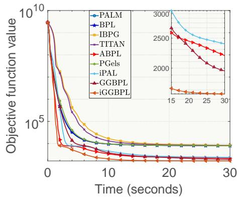

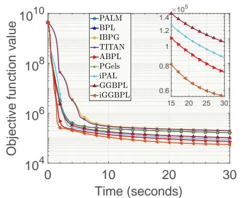  
Fig. 1: Average convergence behavior on the lp ship12l (left) and BASEHOCK (right) datasets. The inset enlarges the final stage objective function values of the four best performing methods.

## 5.2.3 Numerical results

In this experiment, we test the methods on the dataset from SuiteSparse1 [44]: lp ship12l (R1151×5533), and we also test the methods on the BASEHOCK2 dataset $( \mathrm { \tilde { { R } } ^ { 1 9 9 \bar { 3 } \times 4 8 6 \bar { 2 } } } ) \ [ 4 5 ]$

For parameter settings, we set the initial parameters as $\gamma _ { i } ^ { k } = 1 . 0 1 , \rho _ { 1 } = \varepsilon =$ $1 0 ^ { - 1 0 } , \alpha _ { 1 } = \alpha _ { 2 } = 1$ , and the number of non-zero elements in each matrix cannot exceed 30% of the total number of elements. The initial matrix is generated by the uniform distribution. For evaluation metrics, we define relative error (Rel) as $\begin{array} { r } { \mathrm { R e l } { } = \frac { \| { \boldsymbol { X } } - { \boldsymbol { U } } { \boldsymbol { V } } \| _ { F } } { \| { \boldsymbol { X } } \| _ { F } } } \end{array}$ . W ins is defined as the number of times that the corresponding method obtains the lowest relative error among all methods across all independent runs. We adopt these metrics to quantitatively describe the numerical performance of all methods.

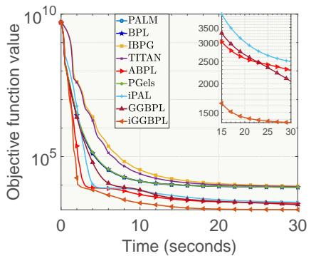

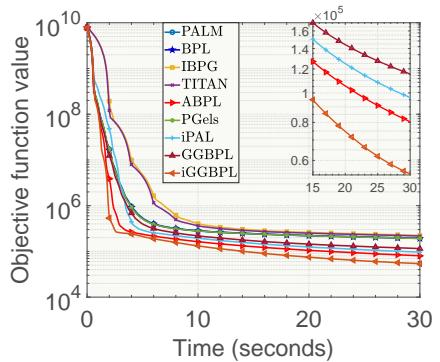  
Fig. 2: Average convergence behavior on the lp ship12l (left) and BASEHOCK (right) datasets with $r = 4 0 0$ . The inset enlarges the final stage objective function values of the four best-performing methods.

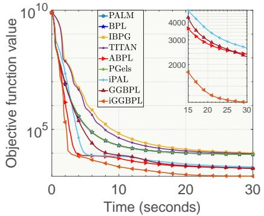

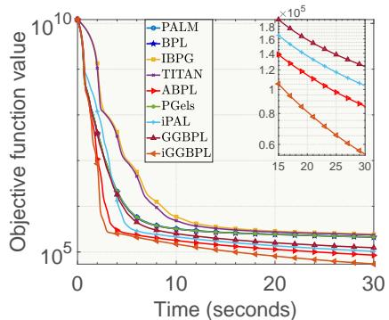  
Fig. 3: Average convergence behavior on the lp ship12l (left) and BASEHOCK (right) datasets with $r = 5 0 0$ . The inset enlarges the final stage objective function values of the four best-performing methods.

We define the maximum running time as $t _ { m a x }$ (s) and set $t _ { m a x } = 3 0$ in this experiment. Table 2 reports the average results over 20 independent runs with r varying among {300, 400, 500} on these datasets. Figure 1, Figure 2 and Figure 3 record the evolution of the average objective function value over 20 independent runs with respect to time for $r = 3 0 0 , r = 4 0 0$ and $r = 5 0 0$ , respectively. From Table 2, Figure 1, Figure 2 and Figure 3, we observe that GGBPL consistently outperforms PALM and several state-of-the-art inertial methods, while iGGBPL achieves the best overall performance among all compared methods by a clear margin on all datasets. These results demonstrate that the proposed generalized geometry operator, constructed using arbitrary inner products and general admissible metrics beyond the standard Euclidean geometry, enables the block updates to capture the local geometry, scaling, and coupling structures of the corresponding subproblems, while iGGBPL utilizes an inertial term to further enhance the convergence performance of GGBPL, thereby improving the numerical eficiency of the proposed methods.

Table 2: Average and standard deviation results on the matrix datasets. The best performance is highlighted in bold.
<table><tr><td rowspan="2">Rank Method</td><td colspan="2"> $r = 3 0 0$ </td><td colspan="2"> $r = 4 0 0$ </td><td colspan="2"> $r = 5 0 0$ </td></tr><tr><td>Rel</td><td> $\overline { { W i n s } }$ </td><td>Rel</td><td> $\overline { { W i n s } }$ </td><td>Rel</td><td> $\overline { { W i n s } }$ </td></tr><tr><td>PALM</td><td> $\overline { { 4 . 5 3 1 \pm 0 . 0 3 1 } }$ </td><td>0</td><td> $\overline { { 4 . 8 8 3 \pm 0 . 0 4 0 } }$ </td><td>0</td><td> $\overline { { 5 . 1 2 8 \pm 0 . 0 4 6 } }$ </td><td>0</td></tr><tr><td>BPL</td><td> $4 . 5 1 7 \pm 0 . 0 3 5$ </td><td>0</td><td> $4 . 8 6 5 \pm 0 . 0 4 1$ </td><td>0</td><td> $5 . 1 0 5 \pm 0 . 0 4 0$ </td><td>0</td></tr><tr><td>IBPG</td><td> $5 . 0 0 9 \pm 0 . 0 5 1$ </td><td>0</td><td> $5 . 2 4 7 \pm 0 . 0 7$ </td><td>0</td><td> $5 . 4 6 8 \pm 0 . 0 5 9$ </td><td>0</td></tr><tr><td>TITAN</td><td> $4 . 9 3 1 \pm 0 . 0 4 5$ </td><td>0</td><td> $5 . 1 5 1 \pm 0 . 0 4 4$ </td><td>0</td><td> $5 . 3 7 8 \pm 0 . 0 5 2$ </td><td>0</td></tr><tr><td>ABPL</td><td> $3 . 0 1 6 \pm 0 . 0 2 0$ </td><td>0</td><td> $3 . 1 4 1 \pm 0 . 0 2 8$ </td><td>0</td><td> $3 . 2 3 3 \pm 0 . 0 3 1$ </td><td>0</td></tr><tr><td>PGels</td><td> $4 . 5 0 3 \pm 0 . 0 2 6$ </td><td>0</td><td> $4 . 8 5 8 \pm 0 . 0 2 7$ </td><td>0</td><td> $5 . 1 0 5 \pm 0 . 0 3 6$ </td><td>0</td></tr><tr><td>iPAL</td><td> $3 . 2 8 1 \pm 0 . 0 2 7$ </td><td>0</td><td> $3 . 4 4 0 \pm 0 . 0 2 5$ </td><td>0</td><td> $3 . 5 6 2 \pm 0 . 0 5 3$ </td><td>0</td></tr><tr><td>GGBPL</td><td> $3 . 5 8 9 \pm 0 . 0 3 7$ </td><td>0</td><td> $3 . 7 6 4 \pm 0 . 0 3$ </td><td>0</td><td> $3 . 9 0 1 \pm 0 . 0 3 7$ </td><td>0</td></tr><tr><td>iGGBPL</td><td> $\mathbf { 2 . 7 7 0 \pm 0 . 0 1 2 }$ </td><td>20</td><td> $\mathbf { 2 . 7 1 3 \pm 0 . 0 0 4 }$ </td><td>20</td><td> $\mathbf { 2 . 7 2 9 \pm 0 . 0 4 3 }$ </td><td>20</td></tr></table>

(a) Average results by methods on the lp ship12l dataset.
<table><tr><td rowspan="2">Rank Method</td><td colspan="2"> $r = 3 0 0$ </td><td colspan="2"> $r = 4 0 0$ </td><td colspan="2"> $r = 5 0 0$ </td></tr><tr><td>Rel</td><td> $\overline { { W i n s } }$ </td><td>Rel</td><td> $\overline { { W i n s } }$ </td><td>Rel</td><td> $\overline { { W i n s } }$ </td></tr><tr><td>PALM</td><td> $\overline { { 0 . 7 1 3 \pm 0 . 0 0 5 } }$ </td><td>0</td><td> $\overline { { 0 . 7 6 8 \pm 0 . 0 0 6 } }$ </td><td>0</td><td> $\overline { { 0 . 8 0 7 \pm 0 . 0 0 7 } }$ </td><td>0</td></tr><tr><td>BPL</td><td> $0 . 7 1 1 \pm 0 . 0 0 6$ </td><td>0</td><td> $0 . 7 6 6 \pm 0 . 0 0 7$ </td><td>0</td><td> $0 . 8 0 3 \pm 0 . 0 0 6$ </td><td>0</td></tr><tr><td>IBPG</td><td> $0 . 7 8 8 \pm 0 . 0 0 8$ </td><td>0</td><td> $0 . 8 2 6 \pm 0 . 0 1 1$ </td><td>0</td><td> $0 . 8 6 0 \pm 0 . 0 0 9$ </td><td>0</td></tr><tr><td>TITAN</td><td> $0 . 7 7 6 \pm 0 . 0 0 7$ </td><td>0</td><td> $0 . 8 1 1 \pm 0 . 0 0 7$ </td><td>0</td><td> $0 . 8 4 6 \pm 0 . 0 0 8$ </td><td>0</td></tr><tr><td>ABPL</td><td> $0 . 4 7 5 \pm 0 . 0 0 3$ </td><td>0</td><td> $0 . 4 9 4 \pm 0 . 0 0 4$ </td><td>0</td><td> $0 . 5 0 9 \pm 0 . 0 0 5$ </td><td>0</td></tr><tr><td>PGels</td><td> $0 . 7 0 9 \pm 0 . 0 0 4$ </td><td>0</td><td> $0 . 7 6 4 \pm 0 . 0 0 4$ </td><td>0</td><td> $0 . 8 0 3 \pm 0 . 0 0 6$ </td><td>0</td></tr><tr><td>iPAL</td><td> $0 . 5 1 6 \pm 0 . 0 0 4$ </td><td>0</td><td> $0 . 5 4 1 \pm 0 . 0 0 4$ </td><td>0</td><td> $0 . 5 6 0 \pm 0 . 0 0 8$ </td><td>0</td></tr><tr><td>GGBPL</td><td> $0 . 5 6 5 \pm 0 . 0 0 5$ </td><td>0</td><td> $0 . 5 9 2 \pm 0 . 0 0 5$ </td><td>0</td><td> $0 . 6 1 4 \pm 0 . 0 0 6$ </td><td>0</td></tr><tr><td>iGGBPL</td><td> $\mathbf { 0 . 4 3 6 \pm 0 . 0 0 2 }$ </td><td>20</td><td> $\mathbf { 0 . 4 2 7 \pm 0 . 0 0 4 }$ </td><td>20</td><td> $\mathbf { 0 . 4 2 9 \pm 0 . 0 0 7 }$ </td><td>20</td></tr></table>

(b) Average results by methods on the BASEHOCK dataset.

## 5.3 Sparse nonnegative CP decomposition with $\ell _ { 0 }$ -constraints (ℓ0-SNCP)

## 5.3.1 ℓ0-SNCP model

Nonnegative CP decomposition (NCP) is widely used to extract latent features from nonnegative multi-way data [6]. To obtain sparse and interpretable factor matrices, the ℓ0-norm constraint can be imposed on the factor matrices since it directly controls the number of nonzero entries. However, solving sparse NCP with $\ell _ { 0 } { \mathrm { - n o r m } }$ constraints $( \ell _ { 0 } -$ SNCP) is also NP-hard, nonsmooth, and nonconvex. Additionally, for this problem, the multilinear structure of the CP model provides useful local geometric information of corresponding block variables. Therefore, we construct a variable-geometry form of the proposed methods for $\ell _ { 0 } { \mathrm { - S N C P } }$ by introducing nonstandard inner products and metrics derived from the multilinear structure of the $\ell _ { 0 } { \mathrm { - S N C P } }$ model.

The $\ell _ { 0 } { \mathrm { - S N C P } }$ model can be presented as follows.

$$
\begin{array} { r l } & { \underset { \{ A _ { i } \} _ { i = 1 } ^ { N } } { \operatorname* { m i n } } \frac { 1 } { 2 } \| \mathcal { X } - \mathbb { I } \{ A _ { i } \} _ { i = 1 } ^ { N } \mathbb { I } \| _ { F } ^ { 2 } + \displaystyle \sum _ { i = 1 } ^ { N } \frac { \alpha _ { i } } { 2 } \| A _ { i } \| _ { F } ^ { 2 } , } \\ & { s . t . ~ A _ { i } \geq 0 , ~ \| A _ { i } \| _ { 0 } \leq s _ { i } , } \end{array}\tag{64}
$$

where $\mathcal { X } \ \in \ \mathbb { R } ^ { d _ { 1 } \times d _ { 2 } \times \cdots \times d _ { N } }$ and $A _ { i } ~ \in ~ \mathbb { R } ^ { d _ { i } \times R }$ ,   represents Kruskal operator, ⊙ represents the Khatri-Rao product.

## 5.3.2 Solving ℓ0-SNCP using iGGBPL

Similarly, if we write Eq. (64) in the form of Eq. (1), then we have

$$
H ( \{ A _ { i } \} _ { i = 1 } ^ { N } ) = \frac { 1 } { 2 } \| \mathcal { X } - \mathbb { I } \{ A _ { i } \} _ { i = 1 } ^ { N } \mathbb { I } \| _ { F } ^ { 2 } + \sum _ { i = 1 } ^ { N } \frac { \alpha _ { i } } { 2 } \| A _ { i } \| _ { F } ^ { 2 } , \ F _ { i } ( A _ { i } ) = \delta _ { i } ( A _ { i } ) .\tag{65}
$$

The definition of $\delta _ { i } ( A _ { i } )$ is the same as that in Eq. (62).

Let $\begin{array} { r } { X ^ { ( n ) } \in \mathbb { R } ^ { d _ { n } \times \prod _ { i = 1 , i \neq n } ^ { N } d _ { i } } } \end{array}$ represent the mode-n unfolding of the original tensor $\mathcal { X } .$ , the mode-n unfolding of the $\mathbb { I } \{ A _ { i } \} _ { i = 1 } ^ { N } ]$ can be written as $A _ { n } B _ { n } ^ { T }$ , where $B _ { n } \ =$ $\begin{array} { r } { \prod _ { j = 1 , j \ne n } ^ { N } \odot A _ { j } , } \end{array}$ . Therefore, Eq. (64) can be decomposed into some sub-problems, so the $\overset { \cdot } { \nabla _ { A _ { i } } H } ( \{ A _ { i } \} _ { i = 1 } ^ { N } )$ is

$$
\nabla _ { A _ { i } } H ( \{ A _ { i } \} _ { i = 1 } ^ { N } ) = A _ { i } ( B _ { i } ) ^ { T } ( B _ { i } ) - X ^ { ( i ) } B _ { i } + \alpha _ { i } A _ { i } .\tag{66}
$$

From the above formulation, it is also easy to see that the local geometric structure of $H ( \{ A _ { i } \} _ { i = 1 } ^ { N } )$ with respect to $A _ { i }$ is characterized by $( B _ { i } ) ^ { T } B _ { i } + \alpha _ { i } I$ , which is induced by the multilinear structure of the $\mathrm { C P }$ model and the quadratic regularization term. Therefore, instead of using the standard inner product and its induced Euclidean norm, we construct the metrics for block variables based on this local geometric information as follows.

$$
M _ { i } ^ { k } = \mathrm { D i a g } \left( ( B _ { i } ^ { k } ) ^ { T } B _ { i } ^ { k } \mathbf { 1 } \right) + ( \alpha _ { i } + \varepsilon ) I ,
$$

where $\varepsilon > 0$ , 1 also denotes the all-one vector with a proper dimension. Then the nonstandard inner product and its induced metric are defined as

$$
\begin{array} { r l } & { \langle A , B \rangle _ { i } ^ { k } = \mathrm { t r } ( A M _ { i } ^ { k } B ^ { T } ) , } \\ & { d _ { i } ^ { k } ( A , B ) = \| A - B \| _ { M _ { i } ^ { k } } = \sqrt { \mathrm { t r } ( ( A - B ) M _ { i } ^ { k } ( A - B ) ^ { T } ) } . } \end{array}
$$

Since $M _ { i } ^ { k }$ is derived from the local geometric structure characterized by $( B _ { i } ^ { k } ) ^ { T } B _ { i } ^ { k } +$ $\alpha _ { i } I$ , the block update scheme of the proposed methods can utilize the local scaling information of the corresponding subproblem of the $\ell _ { 0 } { \mathrm { - S N C P } }$ model.

As a result, Eq. (65) also satisfies Assumption 1, $d _ { i } ^ { k } ( A , B )$ also obviously satisfies Assumption 2. By applying the generalized geometry proximal linearized operator $( \mathrm { E q } .$ (3)) to Eq. (64), the update scheme of the proposed methods for solving $\ell _ { 0 } { \mathrm { - S N C P } }$ can be expressed as follows.

$$
\begin{array} { r l } & { A _ { i } ^ { k + 1 } \in G p r o x _ { \sigma _ { i } ^ { k } F _ { i } } ^ { d _ { i } ^ { k } } \left( y _ { i } ^ { k } ; \nabla _ { A _ { i } } h _ { i } ( y _ { i } ^ { k } ) ( M _ { i } ^ { k } ) ^ { - 1 } \right) } \\ & { \qquad = \underset { A } { \arg \operatorname* { m i n } } \left\{ \| A - U _ { i } ^ { k } \| _ { M _ { i } ^ { k } } ^ { 2 } : A \ge 0 , \ \| A \| _ { 0 } \le s _ { i } \right\} , } \end{array}
$$

where $\begin{array} { r } { \sigma _ { i } ^ { k } = \frac { 1 } { \gamma _ { i } ^ { k } } , \ \gamma _ { i } ^ { k } > 1 } \end{array}$ and

$$
\begin{array} { r } { U _ { i } ^ { k } = y _ { i } ^ { k } - \sigma _ { i } ^ { k } \nabla _ { A _ { i } } h _ { i } ( y _ { i } ^ { k } ) ( M _ { i } ^ { k } ) ^ { - 1 } , } \end{array}
$$

## 5.3.3 Numerical results

We test the methods on the BreastMNIST3, and microPNW4 datasets. The BreastM-NIST dataset is a three-dimensional tensor $( \mathbb { R } ^ { 7 8 0 \times 2 2 4 \times 2 2 4 } )$ . For the microPNW dataset, each sample in the microPNW dataset is transformed into the form of time frames × frequency bins × channels, thus the microPNW dataset is a fourdimensional tensor $\mathsf { \tilde { ( } } \mathbb { R } ^ { 1 0 0 \times 1 5 0 \times 3 \times 5 0 } )$ , and we also normalize the value of each feature in the microPNW dataset to the range of 0 to 1.

We set $\alpha _ { i } = 1 \ ( \forall i \in [ N ] )$ , all other parameter settings are the same as those in the previous experiment. We also define relative error (Rel) as ${ \mathrm { R e l } } = { \frac { \| { \mathcal { X } } - \mathbb { I } \{ A _ { i } \} _ { i = 1 } ^ { N } \mathbb { I } \| _ { F } } { \| { \mathcal { X } } \| _ { F } } }$ . The definition of Wins is the same as that in the previous experiment.

We set $t _ { m a x } = 4 0$ in this experiment. Table 3 reports the average results over 20 independent runs with R varying among {50, 60, 70} on these datasets. Figure 4, Figure 5 and Figure 6 record the evolution of the average objective function value over 20 independent runs with respect to time for $R = 5 0 , R = 6 0$ and $R = 7 0$ , respectively. From Table 3, Figure 4, Figure 5 and Figure 6, GGBPL again outperforms PALM and several state-of-the-art inertial methods, while iGGBPL also achieves the best overall performance among all compared methods by a clear margin on all datasets. Together with the results for $ { \ell _ { 0 } } \mathrm { { - S N M F } }$ , these experimental results demonstrate that the proposed generalized geometry operator is not restricted to matrix factorization but remains numerically efective for higher-order tensor decomposition, where the corresponding block subproblems exhibit more complex local geometry, scaling, and coupling structures, thereby further confirming the efectiveness of the proposed methods. Combined with the results for $\ell _ { 0 } .$ -SNMF, these results demonstrate that the numerical advantages of the proposed generalized geometry operator are not limited to two-block matrix factorization problems, but extend to higher-order multiblock tensor decomposition problems with more complex multilinear coupling structures. This further demonstrates the adaptability and scalability of the proposed method across diferent problem structures and CP ranks.

Table 3: Average and standard deviation results on the tensor datasets. The best performance is highlighted in bold.
<table><tr><td rowspan="2">Rank Method</td><td colspan="2"> $R = 5 0$ </td><td colspan="2">R = 60</td><td colspan="2"> $R = 7 0$ </td></tr><tr><td>Rel</td><td>Wins</td><td>Rel</td><td> $\overline { { W i n s } }$ </td><td>Rel</td><td>Wins</td></tr><tr><td>PALM</td><td> $\overline { { 0 . 3 1 6 \pm 0 . 0 0 6 } }$ </td><td>0</td><td> $\overline { { 0 . 3 1 1 \pm 0 . 0 0 4 } }$ </td><td>0</td><td> $\overline { { 0 . 3 1 2 \pm 0 . 0 0 5 } }$ </td><td>0</td></tr><tr><td>BPL</td><td> $0 . 3 1 3 \pm 0 . 0 1 2$ </td><td>0</td><td> $0 . 3 1 0 \pm 0 . 0 1 0$ </td><td>0</td><td> $0 . 3 1 3 \pm 0 . 0 0 7$ </td><td>0</td></tr><tr><td>IBPG</td><td> $0 . 3 0 1 \pm 0 . 0 1 1$ </td><td>0</td><td> $0 . 2 9 7 \pm 0 . 0 0 9$ </td><td>0</td><td> $0 . 2 9 6 \pm 0 . 0 1 0$ </td><td>0</td></tr><tr><td>TITAN</td><td> $0 . 2 9 8 \pm 0 . 0 1 2$ </td><td>0</td><td> $0 . 2 9 4 \pm 0 . 0 1 0$ </td><td>0</td><td> $0 . 2 9 2 \pm 0 . 0 0 7$ </td><td>0</td></tr><tr><td>ABPL</td><td> $0 . 2 9 0 \pm 0 . 0 1 1$ </td><td>0</td><td> $0 . 2 8 6 \pm 0 . 0 0 5$ </td><td>0</td><td> $0 . 2 8 4 \pm 0 . 0 1 1$ </td><td>0</td></tr><tr><td>PGels</td><td> $0 . 3 1 5 \pm 0 . 0 0 6$ </td><td>0</td><td> $0 . 3 1 0 \pm 0 . 0 0 4$ </td><td>0</td><td> $0 . 3 1 1 \pm 0 . 0 0 5$ </td><td>0</td></tr><tr><td>iPAL</td><td> $0 . 2 7 9 \pm 0 . 0 0 3$ </td><td>0</td><td> $0 . 2 7 3 \pm 0 . 0 0 2$ </td><td>0</td><td> $0 . 2 6 9 \pm 0 . 0 0 2$ </td><td>0</td></tr><tr><td>GGBPL</td><td> $0 . 2 8 6 \pm 0 . 0 0 3$ </td><td>0</td><td> $0 . 2 8 0 \pm 0 . 0 0 3$ </td><td>0</td><td> $0 . 2 7 7 \pm 0 . 0 0 2$ </td><td>0</td></tr><tr><td>iGGBPL</td><td> $\mathbf { 0 . 2 5 3 \pm 0 . 0 0 1 }$ </td><td>20</td><td> $\mathbf { 0 . 2 4 6 \pm 0 . 0 0 1 }$ </td><td>20</td><td> $\mathbf { 0 . 2 4 0 \pm 0 . 0 0 1 }$ </td><td>20</td></tr></table>

(a) Average results by methods on the BreastMNIST dataset.
<table><tr><td rowspan="2">Rank Method</td><td colspan="2">R = 50</td><td colspan="2">R = 60</td><td colspan="2"> $R = 7 0$ </td></tr><tr><td>Rel</td><td>Wins</td><td>Rel</td><td>Wins</td><td>Rel</td><td>Wins</td></tr><tr><td>PALM</td><td> $\overline { { 0 . 1 0 7 \pm 0 . 0 0 4 } }$ </td><td>0</td><td> $\overline { { 0 . 1 0 8 \pm 0 . 0 0 3 } }$ </td><td>0</td><td> $\overline { { 0 . 1 0 7 \pm 0 . 0 0 6 } }$ </td><td>0</td></tr><tr><td>BPL</td><td> $0 . 1 1 1 \pm 0 . 0 0 6$ </td><td>0</td><td> $0 . 1 0 9 \pm 0 . 0 0 5$ </td><td>0</td><td> $0 . 1 0 7 \pm 0 . 0 0 7$ </td><td>0</td></tr><tr><td>IBPG</td><td> $0 . 1 0 4 \pm 0 . 0 0 5$ </td><td>0</td><td> $0 . 1 0 3 \pm 0 . 0 0 4$ </td><td>0</td><td> $0 . 1 0 2 \pm 0 . 0 0 7$ </td><td>0</td></tr><tr><td>TITAN</td><td> $0 . 1 0 3 \pm 0 . 0 0 4$ </td><td>0</td><td> $0 . 1 0 1 \pm 0 . 0 0 3$ </td><td>0</td><td> $0 . 1 0 1 \pm 0 . 0 0 5$ </td><td>0</td></tr><tr><td>ABPL</td><td> $0 . 0 9 5 \pm 0 . 0 0 1$ </td><td>0</td><td> $0 . 0 9 2 \pm 0 . 0 0 1$ </td><td>0</td><td> $0 . 0 8 9 \pm 0 . 0 0 1$ </td><td>0</td></tr><tr><td>PGels</td><td> $0 . 1 0 7 \pm 0 . 0 0 4$ </td><td>0</td><td> $0 . 1 0 7 \pm 0 . 0 0 4$ </td><td>0</td><td> $0 . 1 0 7 \pm 0 . 0 0 6$ </td><td>0</td></tr><tr><td>iPAL</td><td> $0 . 0 9 6 \pm 0 . 0 0 1$ </td><td>0</td><td> $0 . 0 9 2 \pm 0 . 0 0 1$ </td><td>0</td><td> $0 . 0 8 9 \pm 0 . 0 0 1$ </td><td>0</td></tr><tr><td>GGBPL</td><td> $0 . 0 9 5 \pm 0 . 0 0 1$ </td><td>0</td><td> $0 . 0 9 2 \pm 0 . 0 0 2$ </td><td>0</td><td> $0 . 0 9 0 \pm 0 . 0 0 2$ </td><td>0</td></tr><tr><td>iGGBPL</td><td> $\mathbf { 0 . 0 8 6 \pm 0 . 0 0 1 }$ </td><td>20</td><td> $\mathbf { 0 . 0 8 6 \pm 0 . 0 0 1 }$ </td><td>20</td><td> $\mathbf { 0 . 0 8 3 \pm 0 . 0 0 4 }$ </td><td>20</td></tr></table>

(b) Average results by methods on the microPNW dataset.

## 6 Conclusion

In this paper, we proposed a generalized geometry proximal linearized operator and developed the Generalized Geometry Block Proximal Linearized (GGBPL) method based on this operator. The proposed operator allows the block surrogate functions to be constructed using arbitrary inner products and general admissible metrics, rather than being restricted to the standard Euclidean geometry. We also introduced the inertial version of GGBPL named iGGBPL to accelerate convergence. This design enables the block updates of the proposed methods to utilize the local geometric information of various target problems and yields practical convergent schemes for directly solving these problems, thereby improving the flexibility and applicability of the proposed methods. We further established a unified convergence framework under this generalized geometry, within which we proved that our methods guarantee convergence for this class of problems, established the global convergence of the generated sequence to a critical point, and derived the convergence rate. We also established an $\mathcal { O } ( \varepsilon ^ { - 2 } )$ iteration complexity bound for obtaining an ε-stationary point, providing a finite-iteration guarantee under this generalized geometry. We applied our proposed methods to solve two nonconvex and nonsmooth problems: $ { \ell _ { 0 } } \mathrm { { - S N M F } }$ and $\ell _ { 0 } { \mathrm { - S N C P } }$ Numerical results demonstrated the superior numerical performance of our proposed methods over several state-of-the-art methods.

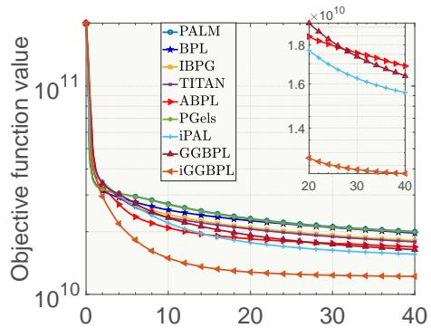  
Time (seconds)

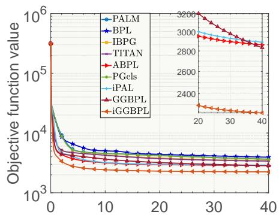  
Time (seconds)  
Fig. 4: Average convergence behavior on the BreastMNIST (left) and microPNW (right) datasets. The inset enlarges the final stage objective function values of the four best-performing methods.

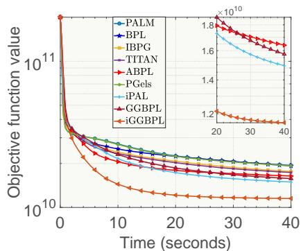

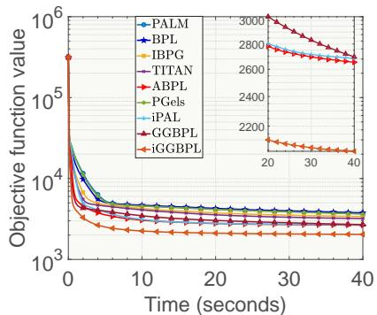  
Fig. 5: Average convergence behavior on the BreastMNIST (left) and microPNW (right) datasets with $R = 6 0$ . The inset enlarges the final stage objective function values of the four best-performing methods.

## Statements and Declarations

Funding. This work was supported by the CEA Youth Key Project on Earthquake Information (No. CEAITNS202607), the Spark Program of Earthquake Sciences of China Earthquake Administration (XH25033YB), and the Earthquake Science Technology Innovation Team Project of Yunnan Province (CXTD202507).

Competing interests. The author declares no competing interests.

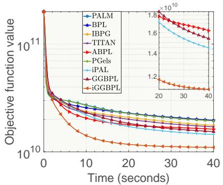

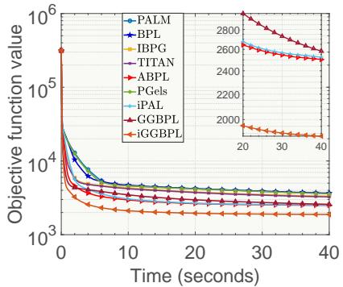  
Fig. 6: Average convergence behavior on the BreastMNIST (left) and microPNW (right) datasets with R = 70. The inset enlarges the final stage objective function values of the four best-performing methods.

Data availability. The datasets used in this study are publicly available: lp ship12l from the SuiteSparse Matrix Collection (https://sparse.tamu.edu/), BASEHOCK from the scikit-feature dataset repository (https://jundongl.github.io/ scikit-feature/datasets.html), BreastMNIST from MedMNIST (https://github.com/ MedMNIST/MedMNIST), and microPNW from PNW-ML (https://github.com/ niyiyu/PNW-ML).

## References

[1] Zhu, K., Fan, M., He, X., Marchetti, D., Li, K., Yu, Z., Chi, C., Sun, H., Cheng, Y.: Analysis of swarm satellite magnetic field data before the 2016 ecuador (mw= 7.8) earthquake based on non-negative matrix factorization. Front. Earth Sci. 9, 621976 (2021)

[2] Lv, S., Peng, Y.: Dtpp:an eficient depthwise separable tcn for seismic phase picking. Artif. Intell. Geosci. 7(1), 100189 (2026) https://doi.org/10.1016/j.aiig. 2026.100189

[3] Li, Z., Nie, F., Bian, J., Wu, D., Li, X.: Sparse pca via $\ell _ { 2 , p } .$ -norm regularization for unsupervised feature selection. IEEE Trans. Pattern Anal. Mach. Intell. 45(4), 5322–5328 (2023)

[4] Zhao, S., Yan, T., Zhu, Y.: Proximal gradient algorithm with trust region scheme on riemannian manifold. J. Glob. Optim., 1–26 (2023)

[5] Zhang, X., Ng, M.K.: Sparse nonnegative tensor factorization and completion with noisy observations. IEEE Trans. Inf. Theory 68(4), 2551–2572 (2022)

[6] Chen, B., Guan, J., Li, Z.: Unsupervised feature selection via graph regularized nonnegative cp decomposition. IEEE Trans. Pattern Anal. Mach. Intell. 45(2),

[7] Fan, J., Zhao, M., Chow, T.W.: Matrix completion via sparse factorization solved by accelerated proximal alternating linearized minimization. IEEE Trans. Big Data 6(1), 119–130 (2020)

[8] Jia, Z., Jin, Q., Ng, M.K., Zhao, X.-L.: Non-local robust quaternion matrix completion for large-scale color image and video inpainting. IEEE Trans. Image Process. 31, 3868–3883 (2022)

[9] Attouch, H., Bolte, J., Redont, P., Soubeyran, A.: Proximal alternating minimization and projection methods for nonconvex problems: An approach based on the kurdyka- lojasiewicz inequality. Math. Oper. Res. 35(2), 438–457 (2010)

[10] Dang, Y.Z., Sun, J., Teo, K.L.: Two inertial proximal coordinate algorithms for a family of nonsmooth and nonconvex optimization problems. Automatica 171, 111992 (2025)

[11] Li, X., Bian, W.: Smoothing randomized block-coordinate proximal gradient algorithms for nonsmooth nonconvex composite optimization. Numer. Algorithms, 1–30 (2024)

[12] Chen, X.: Smoothing methods for nonsmooth, nonconvex minimization. Math. Program. 134(1), 71–99 (2012)

[13] Bolte, J., Sabach, S., Teboulle, M.: Proximal alternating linearized minimization for nonconvex and nonsmooth problems. Math. Program. 146(1), 459–494 (2014)

[14] Pock, T., Sabach, S.: Inertial proximal alternating linearized minimization (iPALM) for nonconvex and nonsmooth problems. SIAM J. Imaging Sci. 9(4), 1756–1787 (2016)

[15] Wang, Q., Han, D.: Stochastic gauss–seidel type inertial proximal alternating linearized minimization and its application to proximal neural networks. Math. Methods Oper. Res., 1–36 (2024)

[16] Xu, Y., Yin, W.: A globally convergent algorithm for nonconvex optimization based on block coordinate update. J. Sci. Comput. 72(2), 700–734 (2017)

[17] Yang, W., Min, W.: An accelerated block proximal framework with adaptive momentum for nonconvex and nonsmooth optimization. arXiv preprint arXiv:2308.12126 (2023)

[18] Yang, L.: Proximal gradient method with extrapolation and line search for a class of non-convex and non-smooth problems. J. Optim. Theory Appl. 200(1), 68–103 (2024)

[19] Jia, Z., Hou, J., Dong, P., Liu, Z.: A fast computational gauss–seidel type ipalm

algorithm using an incremental aggregated gradient strategy for weakly convex composite optimization problems with application in image processing. J. Comput. Appl. Math., 116973 (2025)

[20] Wang, Q., Han, D.: A generalized inertial proximal alternating linearized minimization method for nonconvex nonsmooth problems. Appl. Numer. Math. 189, 66–87 (2023)

[21] Guo, C., Zhao, J.: Two-step inertial bregman proximal alternating linearized minimization algorithm for nonconvex and nonsmooth problems. arXiv preprint arXiv:2306.07614 (2023)

[22] Le, H., Gillis, N., Patrinos, P.: Inertial block proximal methods for non-convex non-smooth optimization. In: Proc. Int. Conf. Mach. Learn., pp. 5671–5681 (2020). PMLR

[23] Ahookhosh, M., Hien, L.T.K., Gillis, N., Patrinos, P.: Multi-block bregman proximal alternating linearized minimization and its application to orthogonal nonnegative matrix factorization. Comput. Optim. Appl. 79(3), 681–715 (2021)

[24] Gao, X., Cai, X., Wang, X., Han, D.: An alternating structure-adapted bregman proximal gradient descent algorithm for constrained nonconvex nonsmooth optimization problems and its inertial variant. J. Glob. Optim. 87(1), 277–300 (2023)

[25] Wang, Q., Liu, Z., Cui, C., Han, D.: A bregman proximal stochastic gradient method with extrapolation for nonconvex nonsmooth problems. In: Proceedings of the AAAI Conference on Artificial Intelligence, vol. 38, pp. 15580–15588 (2024)

[26] Hien, L.T.K., Phan, D.N., Gillis, N.: An inertial block majorization minimization framework for nonsmooth nonconvex optimization. J. Mach. Learn. Res. 24, 1–41 (2023)

[27] Bauschke, H.H., Bolte, J., Teboulle, M.: A descent lemma beyond lipschitz gradient continuity: first-order methods revisited and applications. Math. Oper. Res. 42(2), 330–348 (2017)

[28] Lu, H., Freund, R.M., Nesterov, Y.: Relatively smooth convex optimization by first-order methods, and applications. SIAM J. Optim. 28(1), 333–354 (2018)

[29] Li, D., Zhang, X., Zhang, Y., Liang, L., Chen, X., Jia, L.: Superpixel-guided manifold sparse nonnegative matrix factorization for hyperspectral unmixing. J. Appl. Remote Sens. 19(1), 016506–016506 (2025)

[30] Ciarlet, P.G.: Linear and Nonlinear Functional Analysis with Applications, (2013)

[31] Armstrong, M.A.: Basic Topology. Springer, New York, NY (2013)

[32] Attouch, H., Bolte, J., Svaiter, B.F.: Convergence of descent methods for semialgebraic and tame problems: proximal algorithms, forward–backward splitting, and regularized gauss–seidel methods. Math. Program. 137(1), 91–129 (2013)

[33] Xu, Y., Yin, W.: A block coordinate descent method for regularized multiconvex optimization with applications to nonnegative tensor factorization and completion. SIAM J. Imaging Sci. 6(3), 1758–1789 (2013)

[34] Bader, B.W., Kolda, T.G.: Algorithm 862: Matlab tensor classes for fast algorithm prototyping. ACM Trans. Math. Softw. 32(4), 635–653 (2006)

[35] Yang, W., Xu, T., Min, W.: Sparse nonnegative cp decomposition with graph regularization and ℓ -constraints for clustering. Chin. J. Electron. 34(5), 1641– 1651 (2025)

[36] Wang, Y., Yin, W., Zeng, J.: Global convergence of admm in nonconvex nonsmooth optimization. J. Sci. Comput. 78, 29–63 (2019)

[37] Li, B., Liu, P., Shao, H., Wu, T., Xu, J.: A proximal alternating direction method of multipliers with a proximal-perturbed lagrangian function for nonconvex and nonsmooth structured optimization. Optim. Lett., 1–14 (2025)

[38] Bai, J., Cui, X., Wu, Z.: A proximal-perturbed bregman admm for solving nonsmooth and nonconvex composite optimization. Numer. Math. Theor. Meth. Appl. (2026)

[39] Jiang, X., Fang, Y., Zeng, X., Sun, J., Chen, J.: Inexact proximal gradient algorithm with random reshufling for nonsmooth optimization. Sci. China Inf. Sci. 68(1), 112201 (2025)

[40] Lyaqini, S., Hadri, A., Afraites, L.: Non-smooth optimization algorithm to solve the linex soft support vector machine. ISA Trans. 153, 322–333 (2024)

[41] Xiao, N., Hu, X., Liu, X., Toh, K.-C.: Adam-family methods for nonsmooth optimization with convergence guarantees. J. Mach. Learn. Res. 25(48), 1–53 (2024)

[42] Weston, J., Elisseef, A., Sch¨olkopf, B., Tipping, M.: Use of the zero norm with linear models and kernel methods. J. Mach. Learn. Res. 3, 1439–1461 (2003)

[43] Shi, Z.-L., Li, X.P., Leung, C.-S., So, H.C.: Cardinality constrained portfolio optimization via alternating direction method of multipliers. IEEE Trans. Neural Netw. Learn. Syst. 35(2), 2901–2909 (2022)

[44] Davis, T.A., Hu, Y.: The university of florida sparse matrix collection. ACM Trans. Math. Softw. 38(1) (2011) https://doi.org/10.1145/2049662.2049663

[45] Lang, K.: Learning to filter netnews. In: Proceedings of the 12th International Conference on Machine Learning (ICML), pp. 331–339 (1995)