# Gromov–Wasserstein Distillation for Inductive Multi-View Embedding

Rafael Pereira Eufrazio   
Instituto Federal do Ceará (IFCE)   
Canindé, Ceará, Brazil   
Federal University of Ceará (UFC)   
Fortaleza, Ceará, Brazil   
rafael.eufrazio@ifce.edu.br

Eduardo Fernandes Montesuma Sigma Nova Paris, France eduardo.montesuma@sigmanova.ai

Charles Casimiro Cavalcante Federal University of Ceará (UFC) Fortaleza, Ceará, Brazil charles@ufc.br

## Abstract

Gromov–Wasserstein multidimensional scaling (GW-MDS) learns lowdimensional representations from relational data but remains transductive, providing no explicit mapping for unseen samples. We introduce an inductive framework based on barycentric distillation. A GW-MDS teacher learns a latent support and an optimal transport plan from the training data, and barycentric projection converts the resulting coupling into sample-aligned targets. A neural student then learns an explicit out-of-sample mapping, avoiding additional relational-matrix construction and GW optimization at inference. We formulate the approach for single-view data and extend it to Mean-GWMDS and Multi-GWMDS teachers through consensus and selected-projection targets learned by a multi-view student with view-specific encoders. We also investigate a direct neural baseline trained solely with a GW objective. Experiments on synthetic and real-world data using Euclidean, geodesic, and cosine relations show that the distilled models preserve the teacher geometry on unseen samples and consistently outperform direct neural GW training in sample-indexed relational preservation. These results establish barycentric projection as an effective bridge between transductive GW embeddings and inductive neural mappings.

## 1 Introduction

Dimensionality reduction seeks compact representations that preserve the relevant structure of highdimensional data. This problem becomes more challenging in multi-view settings, where the same observations are described through heterogeneous features, dimensions, or measurement modalities. In this context, comparing coordinates directly may be inappropriate. The Gromov-Wasserstein (GW) discrepancy provides a natural alternative because it compares within-domain relational structures without requiring the domains to share a common ambient space [1, 2].

GW-MDS uses this principle to optimize a low-dimensional support whose induced geometry matches that of the input data [3–6] . Despite its flexibility, GW-MDS is transductive: it optimizes coordinates only for the observed samples and does not learn a mapping for unseen data. Moreover, the correspondence between the input samples and the optimized latent support is represented by a transport plan and need not coincide with the identity assignment.

Consequently, obtaining an inductive extension is not as simple as training a neural network directly with a GW objective. Such an objective compares two unindexed relational structures after optimizing their coupling. A small GW loss may therefore indicate structural agreement under a non-identity correspondence, without ensuring that the coordinate predicted for each sample matches its sampleindexed position in the teacher representation.

We address this ambiguity through a teacher–student framework based on barycentric distillation. Building upon the standard optimal transport mapping estimation proposed by Seguy et al. [7], the coupling learned by a transductive GW-MDS teacher is used to project the optimized latent support onto sample-aligned targets. A neural student then learns to predict these targets from the original observations. Once trained, it embeds unseen samples through a forward pass, without constructing new pairwise relational matrices or solving another GW problem. The same principle is extended to corresponding multi-view data using Mean-GWMDS and Multi-GWMDS [5].

Our main contributions are:

• a barycentric distillation mechanism that resolves the sample-correspondence ambiguity of GW embeddings and converts transductive representations into explicit inductive mappings;

• single-view and multi-view inductive formulations derived from GW-MDS, Mean-GWMDS and Multi-GWMDS teachers; and

• an evaluation on synthetic and real-world data across multiple relational geometries, showing consistent improvements over direct neural GW training and competitive or superior performance relative to PCA-based inductive baselines.

The remainder of this paper is organized as follows. Section 2 reviews the GW discrepancy, GW-MDS, its multi-view extensions, and barycentric projections. Section 3 introduces the proposed barycentric distillation framework for single-view and multi-view data, provides its theoretical justification, and summarizes the complete procedure. Section 4 describes the experimental protocol and reports the results on synthetic and real-world datasets. Finally, Section 5 presents the main conclusions and directions for future work. Additional proofs, results, and visualizations are provided in the supplementary material.

## 2 Background

This section briefly reviews the Gromov–Wasserstein discrepancy and its use in relational dimensionality reduction.

## 2.1 Gromov–Wasserstein Discrepancy

Consider two discrete relational spaces $\begin{array} { r } { \mu = \sum _ { i = 1 } ^ { n } a _ { i } \delta _ { x _ { i } } } \end{array}$ and $\begin{array} { r } { \nu = \sum _ { j = 1 } ^ { m } b _ { j } \delta _ { y _ { j } } } \end{array}$ , with probability vectors $a \in \Delta _ { n }$ and $b \in \Delta _ { m }$ , and pairwise dissimilarity matrices $D _ { X } \in \mathbb { R } ^ { n \times n }$ and $D _ { Y } \in \mathbb { R } ^ { m \times m } .$ . Their admissible transport plans form the polytope $\Pi ( a , \bar { b } ) = \bigl \{ T \in \mathbb { R } _ { + } ^ { \bar { n } \times m } : T \mathbf { 1 } _ { m } = a , \ T ^ { \top } \mathbf { 1 } _ { n } = b \bigr \}$ . The squared Gromov–Wasserstein (GW) discrepancy is

$$
\mathrm { G W } ^ { 2 } \left( ( D _ { X } , a ) , ( D _ { Y } , b ) \right) = \operatorname* { m i n } _ { T \in \Pi ( a , b ) } \sum _ { i , i ^ { \prime } = 1 } ^ { n } \sum _ { j , j ^ { \prime } = 1 } ^ { m } \left( ( D _ { X } ) _ { i i ^ { \prime } } - ( D _ { Y } ) _ { j j ^ { \prime } } \right) ^ { 2 } T _ { i j } T _ { i ^ { \prime } j ^ { \prime } } .\tag{1}
$$

Unlike standard optimal transport, GW compares internal relational structures and therefore does not require the supports to share the same ambient space. The optimal plan $T ^ { \star }$ encodes the resulting structural correspondence [1, 2, 8].

## 2.2 Gromov–Wasserstein Multidimensional Scaling

Classical multidimensional scaling learns low-dimensional coordinates whose pairwise distances approximate an input dissimilarity matrix under a fixed pointwise correspondence. Recent optimaltransport formulations have related dimensionality reduction to Gromov–Wasserstein and semirelaxed Gromov–Wasserstein problems [9, 10]. GW-MDS replaces this fixed correspondence with an optimized transport plan [3, 4].

Given a dataset $\boldsymbol { X } = [ x _ { 1 } , \ldots , x _ { n } ] ^ { \intercal } \in \mathbb { R } ^ { n \times p }$ , a relational matrix $D _ { X } \in \mathbb { R } ^ { n \times n }$ , and an embedding dimension $d ,$ GW-MDS learns a latent support $Z = [ z _ { 1 } , \ldots , z _ { n } ] ^ { \top } \in \mathbb { R } ^ { n \times d }$ by solving

$$
Z ^ { \star } \in \underset { Z \in \mathbb { R } ^ { n \times d } } { \mathrm { a r g m i n ~ } } \mathrm { G W } ^ { 2 } \left( ( D _ { X } , a ) , ( D _ { Z } , b ) \right) , \qquad ( D _ { Z } ) _ { j j ^ { \prime } } = \| z _ { j } - z _ { j ^ { \prime } } \| _ { 2 } ,\tag{2}
$$

where $\ a \ = \ b \ = \ { \textstyle { \frac { 1 } { n } } } { \bf 1 } _ { n }$ in the full-support setting considered here. The matrix $D _ { X }$ may encode Euclidean, cosine, geodesic, or other application-dependent dissimilarities. The transport plan and latent coordinates are typically estimated by alternating between the GW transport problem and gradient-based updates of $Z .$ . Although $Z ^ { \star }$ preserves the relational structure of the input, its rows are not intrinsically aligned with the input indices, since their correspondence is mediated by the optimal plan $T ^ { \star } \in \Pi ( \dot { a } , b )$ . A sample-indexed representation is obtained through the barycentric projection

$$
\widetilde { Y } ^ { \star } = \mathcal { B } _ { T ^ { \star } } ( Z ^ { \star } ) = \mathrm { D i a g } ( a ) ^ { - 1 } T ^ { \star } Z ^ { \star } , \qquad \widetilde { y } _ { i } ^ { \star } = \frac { 1 } { a _ { i } } \sum _ { j = 1 } ^ { n } T _ { i j } ^ { \star } z _ { j } ^ { \star } .\tag{3}
$$

Thus, $\widetilde { y } _ { i } ^ { \star }$ is the transport-weighted barycenter of the latent points associated with the source observation $x _ { i }$ , making $\widetilde { Y } ^ { \star }$ explicitly aligned with the original samples.

Nevertheless, GW-MDS remains transductive: it optimizes coordinates for the observed dataset but does not learn an explicit mapping for unseen observations. Section 3 addresses this limitation by distilling the barycentric representation into an inductive neural mapping.

## 2.3 Multi-View Relational Data

In the corresponding multi-view setting, the same n observations are represented through $V$ views, $\mathcal { X } = \{ X ^ { ( 1 ) } , \ldots , \bar { X ^ { ( V ) } } \} , X ^ { ( v ) } \in \mathbb { R } ^ { n \bar { \times } p _ { v } }$ . The rows of all views refer to the same samples in the same order, although their feature dimensions $p _ { v }$ and ambient spaces may differ. Each view induces a relational matrix $D _ { X } ^ { ( v ) } \in \mathbb { R } ^ { n \times n }$ . Consequently, different views may encode complementary relational structures for the same observations [11–14].

Multi-view relational embedding seeks a shared low-dimensional representation that exploits these complementary structures without requiring coordinate-wise comparability across views. GW-based methods are naturally suited to this setting because they compare intra-view relations rather than the original feature coordinates. However, their resulting embeddings remain transductive, motivating the inductive multi-view formulations introduced in Section 3.

## 3 Proposed Methods

We transform transductive GW-MDS into an inductive mapping through teacher–student distillation. The teacher transport plan is used to construct sample-aligned barycentric targets, which supervise a neural student. We first present the single-view formulation and then extend it to corresponding multi-view data.

## 3.1 Single-View Inductive GW-MDS

Let $\ b X = [ x _ { 1 } , \dots , x _ { n } ] ^ { \top } \in \mathbb { R } ^ { n \times p }$ be the training data and $D _ { X } \in \mathbb { R } ^ { n \times n }$ its relational dissimilarity matrix. We divide $D _ { X }$ by its maximum entry and reuse the notation $D _ { X }$ for the normalized matrix. As in Section 2.2, we consider uniform full-support measures, i.e. $\begin{array} { r } { a = \stackrel { \ldots } { b } = \frac { 1 } { n } \mathbf { 1 } _ { n } } \end{array}$

The GW-MDS teacher then solves Eq. (2). After the final latent-support update, the transport plan is recomputed, yielding $T ^ { \star } \in \Pi ( a , b )$ associated with $Z ^ { \star }$ . Because the rows of $Z ^ { \star }$ are not intrinsically aligned with the input indices, directly pairing $x _ { i }$ with $z _ { i } ^ { \star }$ would impose an arbitrary correspondence. We therefore apply the barycentric projection introduced in Eq. (3) to define the sample-indexed teacher targets: $\widetilde Y = { \cal B } _ { T ^ { \star } } ( Z ^ { \star } ) = \mathrm { D i a g } ( a ) ^ { - 1 } T ^ { \star } Z ^ { \star }$ ⋆. Each row $\widetilde { y } _ { i }$ is consequently aligned with the source sample $x _ { i }$ and can be used to supervise the neural student.

Although Eq. (3) provides sample-indexed targets, it remains to justify why this representation is appropriate for distillation. For a fixed transport plan and a fixed coordinate realization of the latent support, the following proposition shows that the barycentric projection is the unique minimizer of the quadratic reconstruction cost induced by the transport plan. It therefore provides a principled sample-indexed representative of the selected teacher solution.

Proposition 3.1 (Optimality of barycentric targets). Let $T \in \Pi ( a , b )$ be afixed transport plan, with $a _ { i } > 0 f o r$ every i, and let $Z = [ z _ { 1 } , \ldots , z _ { m } ] ^ { \top }$ . Then the barycentric projection $\widetilde Y = \mathrm { D i a g } ( a ) ^ { - 1 } T Z .$ $\begin{array} { r } { \widetilde { y } _ { i } = \frac { 1 } { a _ { i } } \sum _ { j = 1 } ^ { m } \dot { T } _ { i j } z _ { j } } \end{array}$ , is the unique minimizer of $\begin{array} { r } { \mathcal { Q } _ { T } ( Y ; Z ) \dot { = } \sum _ { i = 1 } ^ { n } \dot { \sum _ { j = 1 } ^ { m } } T _ { i j } \| y _ { i } - z _ { j } \| _ { 2 } ^ { 2 } } \end{array}$ . Moreover, for every $\begin{array} { r } { Y = [ y _ { 1 } , \dots , y _ { n } ] ^ { \top } , \mathcal { Q } _ { T } ( Y ; Z ) = \mathcal { Q } _ { T } ( \widetilde { Y } ; Z ) + \sum _ { i = 1 } ^ { n } a _ { i } \| y _ { i } - \widetilde { y } _ { i } \| _ { 2 } ^ { 2 } } \end{array}$

The proof of Proposition 3.1 is provided in Appendix A.1. This uniqueness is conditional on the selected transport plan and on the coordinate realization of the latent support. If the latent support is translated, rotated, or reflected, its barycentric projection undergoes the same global transformation. Therefore, across isometrically equivalent teacher solutions, the projected representation is determined only up to a global Euclidean isometry, while its pairwise distances remain unchanged.

## 3.1.1 Neural student

Following the teacher–student distillation paradigm [15] and its representation-matching variants [16], let $\overline { { f } } _ { \theta } : \mathbb { R } ^ { p }  \mathbb { R } ^ { d }$ denote the neural student. The barycentric targets are standardized using statistics computed exclusively from the training set. With a slight abuse of notation, $\widetilde { y } _ { i }$ continues to denote the standardized barycentric target associated with $x _ { i }$ . The student is trained by minimizing $\begin{array} { r } { \mathcal { L } _ { \mathrm { d i s t i l l } } ( \theta ) = \frac { 1 } { n } \sum _ { i = 1 } ^ { n } \| f _ { \theta } ( x _ { i } ) - \widetilde { y } _ { i } \| _ { 2 } ^ { 2 } } \end{array}$ . As established in Proposition A.3 in the Appendix, under the uniform empirical weights considered in this work, minimizing this pointwise objective also controls an upper bound on the average squared discrepancy between the pairwise Euclidean distances induced by the student predictions and those induced by the standardized barycentric targets. Thus, although the student is trained through pointwise regression, its objective is directly connected to the relational geometry transferred from the teacher. Early stopping is based on a validation subset. Once trained, the student provides an inductive out-of-sample mapping and embeds an unseen sample directly as $y _ { \mathrm { n e w } } = f _ { \theta } ( x _ { \mathrm { n e w } } )$

## 3.2 Multi-View Barycentric Distillation

For the multi-view data introduced in Section 2.3, let $D _ { X } ^ { ( v ) }$ denote the normalized relational matrix of view $v ,$ and let ${ \lambda } _ { v } \geq 0$ , with $\sum _ { v = 1 } ^ { V } \lambda _ { v } = 1$ , denote its contribution to the shared objective. We use Mean-GWMDS and Multi-GWMDS [5] as complementary multi-view teachers.

## 3.2.1 Inductive Mean-GWMDS

Mean-GWMDS first averages the relational matrices, $\begin{array} { r } { \overline { { D } } _ { X } = \sum _ { v = 1 } ^ { V } \lambda _ { v } D _ { X } ^ { ( v ) } } \end{array}$ , and then computes the teacher support and its consensus barycentric target: $Z _ { \mathrm { m e a n } } ^ { \star } \in \underset { Z \in \mathbb { R } ^ { n \times d } } { \mathrm { a r g m i n } } \ \widetilde { \mathrm { G W } } ^ { 2 } \left( ( \overline { { D } } _ { X } , a ) , ( D _ { Z } , b ) \right)$ $\widetilde { Y } _ { \mathrm { m e a n } } = \mathrm { D i a g } ( a ) ^ { - 1 } T _ { \mathrm { m e a n } } ^ { \star } Z _ { \mathrm { m e a n } } ^ { \star }$ where $T _ { \mathrm { m e a n } } ^ { \star }$ is the corresponding optimal plan.

## 3.2.2 Inductive Multi-GWMDS

Multi-GWMDS instead learns a shared support by jointly minimizing the view-dependent GW discrepancies: $\begin{array} { r } { Z _ { \mathrm { m u l t i } } ^ { \star } \in \underset { Z \in \mathbb { R } ^ { n \times d } } { \mathrm { a r g m i n } } \sum _ { v = 1 } ^ { V } \lambda _ { v } \stackrel {  } { \mathrm { G W } } ^ { 2 } ( ( \hat { D } _ { X } ^ { ( v ) } , a ) , ( D _ { Z } , b ) ) } \end{array}$ . Each optimal plan $T ^ { ( v ) \star }$ induces a view-specific sample-indexed projection $\widetilde { Y } ^ { ( v ) } = \mathrm { D i a g } ( a ) ^ { - 1 } T ^ { ( v ) \star } Z _ { \mathrm { m u l t i } } ^ { \star } , v = 1 , \ldots , V .$ These projections are retained separately because they encode distinct view-dependent correspondences. When a single representation is required, the candidate projections are evaluated using the Pearson correlation between their induced distance matrices and the relational structures of the training views. The resulting view-wise correlations are combined using a prespecified aggregation criterion. We then select the projection with the highest aggregated agreement with the training views:

$$
s _ { v } = \mathrm { A g g } _ { u = 1 , \ldots , V } \rho _ { \mathrm { P } } \left( D _ { \widetilde { Y } ^ { ( v ) } } , D _ { X } ^ { ( u ) } \right) , \qquad v ^ { \star } = \underset { v \in \{ 1 , \ldots , V \} } { \mathrm { a r g m a x } } s _ { v } ,\tag{4}
$$

where $\rho$ is the Pearson correlation between the upper-triangular entries of the two distance matrices.   
This selection uses training data only.

## 3.2.3 Multi-view student

The multi-view student processes each view with a view-specific encoder, concatenates the resulting features, and maps them to the teacher coordinates through a shared output head. Given the Mean-GWMDS target $Y ^ { \dagger } = \widetilde { Y } _ { \mathrm { m e a n } }$ or the selected Multi-GWMDS target $Y ^ { \dagger } = { \widetilde { Y } } ^ { ( v ^ { \star } ) }$ , its parameters are learned through min ${ \begin{array} { r } { { \frac { 1 } { n } } \sum _ { i = 1 } ^ { n } \left\| f _ { \theta } ( \mathbf { x } _ { i } ) - y _ { i } ^ { \dagger } \right\| _ { \circ } ^ { 2 } , \mathbf { x } _ { i } = ( x _ { i } ^ { ( 1 ) } , \dots , x _ { i } ^ { ( V ) } ) } \end{array} }$ . Thus, fusion is performed on learned view-specific features while preserving the sample-aligned supervision provided by the teacher.

## 3.3 Direct Neural GW Baseline

To assess the contribution of barycentric supervision, we compare distillation with direct neural minimization of min $\begin{array} { r } { \sum _ { v = 1 } ^ { V } \lambda _ { v } \operatorname { G W } ^ { 2 } \Big ( \big ( D _ { X } ^ { ( v ) } , a \big ) , \big ( D _ { f _ { \theta } ( \mathcal { X } ) } , b \big ) \Big ) } \end{array}$ , an approach analogous to the optimization of generative networks via Gromov-Wasserstein losses [17]. The single-view case follows by setting $\bar { V _ { \mathrm { } } } = 1$ . At each iteration, the transport plans are recomputed from the current output and treated as fixed during backpropagation. The embeddings are centered and scaled by their diameter using training-set statistics.

## 4 Experiments and Discussion

We first evaluate Single-View Inductive GW-MDS on a controlled synthetic manifold and then investigate its multi-view extensions on real-world datasets. The source code, notebooks, and data used in the experiments are publicly available on GitHub.1

## 4.1 Single-View Evaluation on a Synthetic Manifold

We use an S-curve with 1,250 samples and noise level 0.05, split into 1,000 training and 250 test samples. Euclidean, cosine, and geodesic relations are considered, with the latter computed using 12 nearest neighbors. Each relational matrix is normalized by its maximum. For geodesic evaluation, the teacher uses only the training graph, while test relations are extracted from the test–test block of the full graph, used exclusively for evaluation. The GW-MDS teacher is optimized for 100 iterations using Adam with learning rate 0.1. The student has two 64-unit ReLU layers and learns the teacher’s barycentric targets. Direct neural GW uses the same architecture, while PCA is fitted only to the training data. Evaluation uses Pearson correlation, Spearman correlation, trustworthiness $( k = 1 0 )$ and scale-adjusted stress.

Table 1: Out-of-sample relational preservation on the S-curve. Bold indicates the best result for each geometry.
<table><tr><td>Geometry</td><td>Method</td><td>Pearson r ↑</td><td>Spearman  $\rho \uparrow$ </td><td>Trust. ↑</td><td>Stress↓</td></tr><tr><td rowspan="3">Euclidean</td><td>Ind. GW-MDS</td><td>0.8869</td><td>0.8911</td><td>0.9300</td><td>0.2003</td></tr><tr><td>Direct neural GW</td><td>0.7533</td><td>0.7462</td><td>0.8387</td><td>0.2791</td></tr><tr><td>PCA</td><td>0.8959</td><td>0.9075</td><td>0.9149</td><td>0.1971</td></tr><tr><td rowspan="3">Geodesic</td><td>Ind. GW-MDS</td><td>0.9980</td><td>0.9974</td><td>0.9981</td><td>0.0337</td></tr><tr><td>Direct neural GW</td><td>0.7142</td><td>0.7248</td><td>0.9233</td><td>0.3905</td></tr><tr><td>PCA</td><td>0.7314</td><td>0.7601</td><td>0.9369</td><td>0.3575</td></tr><tr><td rowspan="3">Cosine</td><td>Ind. GW-MDS</td><td>0.9513</td><td>0.9635</td><td>0.9963</td><td>0.2644</td></tr><tr><td>Direct neural GW</td><td>0.1904</td><td>0.2738</td><td>0.7772</td><td>0.6648</td></tr><tr><td>PCA</td><td>0.6817</td><td>0.7310</td><td>0.8786</td><td>0.4613</td></tr></table>

Table 1 shows that geodesic relations provide the best overall performance, with Inductive GW-MDS reaching Pearson and Spearman correlations of 0.9980 and 0.9974, trustworthiness of 0.9981, and stress of 0.0337. Cosine relations also yield strong correlation and neighborhood preservation, whereas, under Euclidean relations, Inductive GW-MDS performs comparably to PCA and achieves the highest trustworthiness.

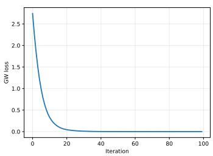  
(a) GW-MDS teacher loss.

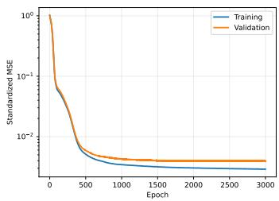  
(b) Student distillation loss.

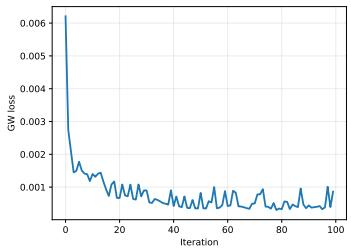  
(c) Direct neural GW loss.

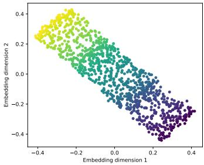  
(d) Teacher training embedding.

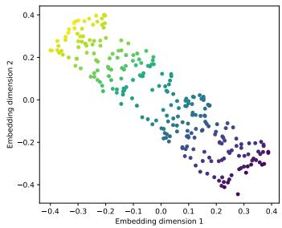  
(e) Distilled test embedding.

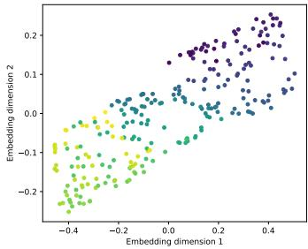  
(f) Direct GW test embedding.  
Figure 1: Single-view results on the S-curve using geodesic dissimilarities.

Inductive GW-MDS consistently outperforms direct neural GW. For the geodesic setting, Pearson correlation increases from 0.7142 to 0.9980, while stress decreases from 0.3905 to 0.0337. This indicates that a low direct GW loss does not necessarily recover the sample-indexed organization, since the optimized coupling may encode a non-identity correspondence. Barycentric distillation removes this ambiguity by providing sample-aligned targets that can be extended to unseen data.

Figure 1 shows that both neural approaches learn structured representations of the unseen samples. Differences in global orientation should not be interpreted as errors, since GW-based objectives are invariant to rotations and reflections. The relevant distinction lies in the local sample organization, the distilled student more closely reproduces the structure induced by the teacher’s barycentric projection, whereas the direct baseline obtains a low GW loss without recovering the same sample-indexed arrangement. This qualitative result suggests that a low direct GW objective does not necessarily ensure preservation of the teacher’s sample-level correspondence.

## 4.2 Real-World Datasets

We evaluate the proposed framework on two real-world datasets from distinct scientific domains: ERA5 and rMD17–Aspirin.

ERA5. ERA5 is the fifth-generation atmospheric reanalysis produced by the European Centre for Medium-Range Weather Forecasts (ECMWF) [18]. We use hourly data on single levels obtained from the Copernicus Climate Change Service Climate Data Store (CDS). We consider hourly observations from January 2024 over a regular grid containing $2 3 \times 2 1 = 4 8 3$ spatial locations and 744 time instants. Each spatial location constitutes one sample, represented by its complete hourly time series. Four co-registered views are constructed from 2-m temperature (t2m), 2-m dew-point temperature (d2m), surface pressure (sp), and total precipitation (tp). Consequently, each view is represented by a matrix $X ^ { ( v ) } \in \mathbb { R } ^ { 4 8 3 \times 7 4 \bar { 4 } }$ . Although the views share the same locations and sample ordering, each atmospheric variable induces a distinct relational geometry.

rMD17–Aspirin. We select 1,000 approximately equidistant conformations from the temporally ordered rMD17 aspirin trajectory, which contains 100,000 conformations of a 21-atom molecule [19]. Each conformation is represented by two rotation-invariant views: the 210 pairwise interatomic distances and the 231 upper-triangular entries of the force Gram matrix $F _ { i } F _ { i } ^ { \top }$ , including its diagonal, where $F _ { i } \in \mathbb { R } ^ { 2 1 \times 3 }$

Table 2: Out-of-sample relational preservation on ERA5 and rMD17–Aspirin. ERA5 results are uniform averages over four views on 97 held-out locations, whereas rMD17 results are averaged over two views. Bold indicates the best result for each dataset and relational geometry.
<table><tr><td></td><td></td><td colspan="4">ERA5</td><td colspan="4">rMD17-Aspirin</td></tr><tr><td>Geometry</td><td>Method</td><td>r ↑</td><td>ρ↑</td><td>Trust.↑</td><td>Stress↓</td><td>r ↑</td><td>ρ↑</td><td>Trust.↑</td><td>Stress↓</td></tr><tr><td>Euclidean</td><td>Ind. Mean-GWMDS</td><td>0.7853</td><td>0.7958</td><td>0.8975</td><td>0.2798</td><td>0.4736</td><td>0.4635</td><td>0.6852</td><td>0.3899</td></tr><tr><td></td><td>Ind. Multi-GWMDS</td><td>0.7470</td><td>0.7572</td><td>0.8643</td><td>0.3137</td><td>0.4065</td><td>0.4018</td><td>0.6783</td><td>0.4014</td></tr><tr><td></td><td>Concatenated PCA</td><td>0.7790</td><td>0.7892</td><td>0.8924</td><td>0.2916</td><td>0.4256</td><td>0.4266</td><td>0.6761</td><td>0.4364</td></tr><tr><td></td><td>Direct multi-view GW</td><td>0.4576</td><td>0.5372</td><td>0.8590</td><td>0.4670</td><td>0.3540</td><td>0.3552</td><td>0.6531</td><td>0.4142</td></tr><tr><td>Geodesic</td><td>Ind. Mean-GWMDS</td><td>0.8507</td><td>0.8439</td><td>0.9373</td><td>0.2603</td><td>0.4787</td><td>0.4701</td><td>0.6877</td><td>0.3897</td></tr><tr><td></td><td>Ind. Multi-GWMDS</td><td>0.7855</td><td>0.7826</td><td>0.9049</td><td>0.3106</td><td>0.4226</td><td>0.4135</td><td>0.6849</td><td>0.3984</td></tr><tr><td></td><td>Concatenated PCA</td><td>0.7879</td><td>0.7825</td><td>0.8765</td><td>0.3131</td><td>0.4126</td><td>0.4080</td><td>0.6630</td><td>0.4153</td></tr><tr><td></td><td>Direct multi-view GW</td><td>0.3409</td><td>0.4062</td><td>0.7303</td><td>0.5349</td><td>0.3471</td><td>0.3486</td><td>0.6466</td><td>0.4272</td></tr><tr><td>Cosine</td><td>Ind. Mean-GWMDS</td><td>0.5394</td><td>0.6582</td><td>0.8736</td><td>0.5641</td><td>0.5242</td><td>0.5132</td><td>0.6812</td><td>0.3926</td></tr><tr><td></td><td>Ind. Multi-GWMDS</td><td>0.4830</td><td>0.5875</td><td>0.8322</td><td>0.5712</td><td>0.4437</td><td>0.4379</td><td>0.6810</td><td>0.4188</td></tr><tr><td></td><td>Concatenated PCA</td><td>0.4799</td><td>0.5959</td><td>0.7971</td><td>0.5890</td><td>0.4222</td><td>0.4247</td><td>0.6761</td><td>0.4340</td></tr><tr><td></td><td>Direct multi-view GW</td><td>0.4416</td><td>0.5597</td><td>0.8070</td><td>0.5997</td><td>0.2942</td><td>0.2972</td><td>0.6371</td><td>0.4703</td></tr></table>

## 4.3 Experimental Protocol

ERA5 and rMD17–Aspirin are split into 80% training and 20% test samples, yielding 386/97 locations for ERA5 and 800/200 conformations for rMD17–Aspirin. Fifteen percent of each training set is reserved for validation during student distillation.

For both datasets, Euclidean, cosine, and geodesic relational matrices are constructed, with graphgeodesic distances computed from a 12-nearest-neighbor graph. Each matrix is normalized by its maximum entry.

The Mean-GWMDS and Multi-GWMDS teachers are optimized for 100 outer iterations using Adam with learning rate 0.1. Each inner GW problem is solved for at most 100 iterations with tolerance $1 0 ^ { - 5 }$ . For Multi-GWMDS, the barycentric projection with the highest mean agreement across the training views is used for distillation. The students employ two-layer view-specific encoders with 64 ReLU units per layer, followed by a 64-unit fusion layer and a two-dimensional output. They are trained against the barycentric targets using Adam (learning rate $1 0 ^ { - 3 }$ , weight decay $1 0 ^ { - 5 } )$ for at most 3,000 epochs, with a 15% validation split and early stopping patience of 250 epochs. Direct GW uses the same architecture, while concatenated PCA serves as the conventional baseline.

Results are uniformly averaged over the four ERA5 views or the two rMD17–Aspirin views. Higher correlation and trustworthiness and lower stress indicate better preservation. Additional viewwise results, projection-selection scores, GW objective values, computational costs, and qualitative analyses are provided in Appendix A.

## 4.4 ERA5 Results

Table 2 shows that Inductive Mean-GWMDS achieves the best value for all four metrics under every relational geometry. Its advantage over concatenated PCA is modest for Euclidean relations, with improvements of 0.0063 in Pearson correlation and 0.0118 in stress, but becomes more pronounced for cosine and geodesic dissimilarities. The geodesic configuration yields the strongest overall performance, with $r = 0 . 8 5 0 7 , \rho = 0 . 8 4 3 9$ , trustworthiness 0.9373, and stress 0.2603. This indicates that geodesic-based relations better capture the nonlinear spatial organization shared by the meteorological variables.

The view-wise results show that this advantage is not uniform across variables. Under Euclidean geometry, Inductive Mean-GWMDS obtains Pearson correlations of 0.8995, 0.9232, and 0.8981 for temperature, dewpoint temperature, and surface pressure, respectively, but only 0.4203 for total precipitation. Geodesic relations increase the precipitation correlation to 0.7021, while maintaining correlations above 0.87 for the other three views. Thus, their superior averaged performance arises partly from a better integration of the precipitation view, whose relational structure is less compatible with the remaining meteorological variables. Cosine dissimilarity presents a different limitation for surface pressure: its Pearson correlation is 0.2667, whereas its Spearman correlation remains 0.6706.

Inductive  
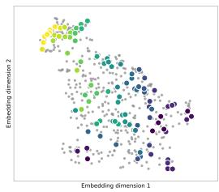  
(a) Inductive  
GWMDS.  
Mean- (b)

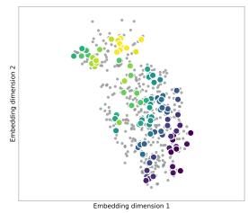  
GWMDS.

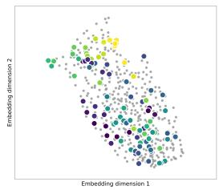  
(c) Direct multi-view GW.

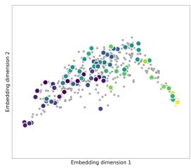  
(d) Concatenated PCA.  
Figure 2: Joint training and out-of-sample embeddings for ERA5 under geodesic relations. Training locations are shown in gray, whereas the 97 held-out locations are colored by latitude using a common color scale.

This discrepancy suggests that the relational ordering is partially retained, but its linear distance magnitudes are poorly reproduced, as also reflected by the higher stress.

Inductive Multi-GWMDS remains competitive with PCA, particularly under geodesic geometry, for which it provides higher trustworthiness and lower stress. The training-only selection criterion chooses the temperature-induced projection (view 1) for all three geometries. Under geodesic relations, for example, the selected student obtains Pearson correlations of 0.9393, 0.7821, 0.7772, and 0.6436 across the four views, whereas Inductive Mean-GWMDS obtains 0.9194, 0.9045, 0.8767, and 0.7021. Mean-GWMDS therefore sacrifices a small amount of temperature-view fidelity while substantially improving the representation of the other three views.

Finally, direct multi-view GW performs markedly worse despite reaching almost the same final GW objective as the Multi-GWMDS teacher. Most notably, the direct model attains a slightly lower geodesic objective but only r = 0.3409, compared with 0.7855 for Inductive Multi-GWMDS and 0.8507 for Inductive Mean-GWMDS. This result confirms that minimizing the GW objective can recover structural agreement under an optimized coupling without recovering the required sample-indexed organization. Barycentric distillation addresses this ambiguity by transferring the correspondence encoded by the teacher’s transport plan to the inductive student.

Figure 2 complements the quantitative results by showing how the held-out ERA5 locations are positioned relative to the representations learned from the training data. Both distilled models place the unseen locations within the structured regions occupied by the training observations and exhibit a coherent progression with latitude. Inductive Mean-GWMDS produces the clearest consensus organization. Inductive Multi-GWMDS also reflects a consensus geometry learned jointly from all views, although its sample-indexed arrangement is inherited from the selected barycentric projection. In contrast, the direct multi-view GW representation is more diffuse and shows greater mixing among locations with different latitudes.

## 4.5 Results on rMD17–Aspirin

The rMD17–Aspirin results in Table 2 show that Inductive Mean-GWMDS outperforms all competing methods across every geometry and metric. Its advantage over concatenated PCA is particularly clear for cosine dissimilarity, for which the Pearson correlation increases from 0.4222 to 0.5242. Cosine dissimilarity provides the highest global correlations, whereas geodesic relations yield the highest trustworthiness and lowest stress. The latter differences relative to Euclidean geometry are small, however, indicating a modest trade-off: cosine relations favor global distance agreement, while Euclidean and geodesic relations provide slightly better local-neighborhood and metric preservation.

The averaged results conceal a strong asymmetry between the molecular views. The training-only selection criterion chooses the projection induced by the interatomic-distance view under all three geometries. Under cosine dissimilarity, Inductive Multi-GWMDS consequently attains correlations of 0.8204 and 0.0669 with the interatomic-distance and force-derived structures, respectively, whereas Inductive Mean-GWMDS obtains 0.7740 and 0.2743. The same pattern occurs under Euclidean and geodesic relations: Mean-GWMDS consistently improves preservation of the force-derived view while retaining high fidelity to the interatomic-distance view. Its superior averaged performance therefore results from a more balanced relational consensus, suggesting that the two molecular structures are only partially compatible within a shared two-dimensional representation.

Inductive  
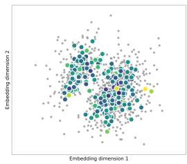  
(a) Inductive  
GWMDS.  
Mean- (b)

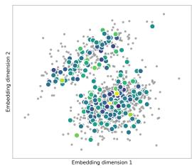  
GWMDS.

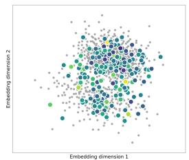  
(c) Direct multi-view GW.

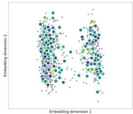  
(d) Concatenated PCA.  
Figure 3: Joint training and out-of-sample embeddings for rMD17–Aspirin under cosine relations. Training conformations are shown in gray, whereas the 200 held-out conformations are colored by normalized potential energy using a common color scale.

The training-set diagnostics further show that distillation closely preserves the teachers’ relational performance. Across the three geometries, the difference in weighted Pearson correlation between each teacher and its student is at most 0.0197 for Mean-GWMDS and 0.0045 for the selected Multi-GWMDS projection. In contrast, direct multi-view GW remains inferior despite reaching objective values nearly identical to those of the Multi-GWMDS teacher; under cosine dissimilarity, for example, the values are 0.00920 and 0.00919, respectively. This near equality rules out insufficient GW optimization as the main explanation for the performance gap. A low GW loss ensures structural agreement only under the optimized coupling and does not guarantee the required sample-indexed organization.

Figure 3 illustrates the joint training and out-of-sample representations obtained under cosine relations. The held-out conformations generally occupy regions supported by the training observations in all four embeddings, but the resulting organizations differ substantially. Inductive Mean-GWMDS preserves a branched consensus structure, with the test conformations distributed coherently along its principal regions. Inductive Multi-GWMDS instead produces two more clearly separated groups, reflecting the view-dependent organization inherited from the selected barycentric projection. The direct multi-view GW embedding is considerably more diffuse, with much of the data concentrated in a broad central region, whereas PCA captures a coarse separation into two dominant branches without explicitly balancing the two relational views. Potential energy is used only as an auxiliary coloring variable and not as supervision; therefore, its partial mixing across the embeddings is expected. As in the ERA5 analysis, the relevant comparison concerns local organization and the placement of held-out observations relative to the training support, rather than global orientation or scale.

## 5 Conclusion

We introduced an inductive extension of GW-MDS based on barycentric distillation. The framework separates relational representation learning from out-of-sample prediction: a transductive teacher optimizes a latent support and its GW coupling, the barycentric projection converts this coupling into sample-aligned targets, and a neural student learns an explicit mapping to these targets. This principle was developed for single-view GW-MDS and extended to the multi-view setting using the consensus target of Mean-GWMDS and the selected-projection target of Multi-GWMDS. Experiments on the S-curve, ERA5, and rMD17–Aspirin show that the distilled students effectively preserve relational structure on unseen samples and consistently outperform direct neural GW training. In the multiview experiments, Inductive Mean-GWMDS achieves the strongest view-averaged preservation by balancing partially compatible relational structures, whereas Inductive Multi-GWMDS favors the structure associated with its training-selected projection. Moreover, direct GW training can reach objective values close to those of the transductive teacher while producing substantially worse sample-indexed representations. This confirms that structural agreement under an optimized coupling does not by itself ensure the correspondence required for out-of-sample prediction; the information encoded by the transport plan must also be transferred. Future work will investigate scalable teacher optimization, a clustering-oriented variant of the proposed framework equipped with mini-batch optimization, and broader evaluations involving larger datasets, repeated data splits, and additional multi-view settings.

## Acknowledgments

This work was partially supported by CNPq under Grants 308512/2023-5 and 420341/2025-0; CNPq/INCT STREAM (Signal Processing and Transmission for Environmental Analysis and Moni toring) under Grant 409179/2024-8; and CAPES, Brazil, under Finance Code 001.

## References

[1] F. Mémoli, “Gromov–Wasserstein distances and the metric approach to object matching,” Foundations ofComputational Mathematics, vol. 11, pp. 417–487, 2011.

[2] G. Peyré and M. Cuturi, “Computational optimal transport: With applications to data science,” Foundations and Trends® in Machine Learning, vol. 11, no. 5-6, pp. 355–607, 2019.

[3] R. P. Eufrazio, E. F. Montesuma, and C. C. Cavalcante, “A dimensionality reduction technique based on the Gromov-Wasserstein distance,” in International Conference on Geometric Science of Information. Springer, 2025, pp. 111–120.

[4] R. P. Eufrazio, E. F. Montesuma, and C. C. Cavalcante, “Nonlinear dimensionality reduction through optimal transport between incomparable spaces,” Information Geometry, pp. 1–36, 2026.

[5] R. P. Eufrazio, E. F. Montesuma, and C. C. Cavalcante, “Structure-preserving multiview embedding using gromov-wasserstein optimal transport,” 2026. [Online]. Available: https://arxiv.org/abs/2604.02610

[6] R. P. Eufrazio, E. F. Montesuma, and C. C. Cavalcante, “Gromov-wasserstein methods for multi-view relational embedding and clustering,” 2026. [Online]. Available: https://arxiv.org/abs/2604.23912

[7] V. Seguy, B. B. Damodaran, R. Flamary, N. Courty, A. Rolet, and M. Blondel, “Large-scale optimal transport and mapping estimation,” arXiv preprint arXiv:1711.02283, 2017.

[8] G. Peyré, M. Cuturi, and J. Solomon, “Gromov-wasserstein averaging of kernel and distance matrices,” in International conference on machine learning. PMLR, 2016, pp. 2664–2672.

[9] R. A. Clark, T. Needham, and T. Weighill, “Generalized dimension reduction using semi-relaxed Gromov-Wasserstein distance,” in Proceedings ofthe AAAI Conference on Artificial Intelligence, vol. 39, no. 15, 2025, pp. 16 082–16 090.

[10] H. Van Assel, Cédric Vincent-Cuaz, Nicolas Courty, Rémi Flamary, Pascal Frossard, Titouan Vayer, “Distributional Reduction: Unifying Dimensionality Reduction and Clustering with Gromov-Wasserstein,” Transactions on Machine Learning Research, 2025. [Online]. Available: https://openreview.net/forum?id=cllm6SS354

[11] Z. Yu, Z. Dong, C. Yu, K. Yang, Z. Fan, and C. P. Chen, “A review on multi-view learning,” Frontiers ofComputer Science, vol. 19, no. 7, p. 197334, 2025.

[12] Y. Qin, X. Zhang, S. Yu, and G. Feng, “A survey on representation learning for multi-view data,” Neural Networks, vol. 181, p. 106842, 2025.

[13] A. R. Chowdhury, A. Gupta, and S. Das, “Deep multi-view clustering: A comprehensive survey of the contemporary techniques,” Information Fusion, p. 103012, 2025.

[14] C. Xu, D. Tao, and C. Xu, “A survey on multi-view learning,” arXiv preprint arXiv:1304.5634, 2013.

[15] G. Hinton, O. Vinyals, and J. Dean, “Distilling the knowledge in a neural network,” arXiv preprint arXiv:1503.02531, 2015.

[16] A. Romero, N. Ballas, S. E. Kahou, A. Chassang, C. Gatta, and Y. Bengio, “Fitnets: Hints for thin deep nets,” 2015. [Online]. Available: https://arxiv.org/abs/1412.6550

[17] C. Bunne, D. Alvarez-Melis, A. Krause, and S. Jegelka, “Learning generative models across incomparable spaces,” in International conference on machine learning. PMLR, 2019, pp. 851–861.

[18] H. Hersbach, B. Bell, P. Berrisford, G. Biavati, A. Horányi, J. Muñoz Sabater, J. Nicolas, C. Peubey, R. Radu, I. Rozum, D. Schepers, A. Simmons, C. Soci, D. Dee, and J.-N. Thépaut, “ERA5 hourly data on single levels from 1940 to present,” Copernicus Climate Change Service (C3S) Climate Data Store (CDS), 2023, accessed on 28 July 2026. [Online]. Available: https://doi.org/10.24381/cds.adbb2d47

[19] A. S. Christensen and O. A. von Lilienfeld, “Revised MD17 dataset (rMD17),” Dataset, 2020. [Online]. Available: https://doi.org/10.6084/m9.figshare.12672038.v4

[20] R. Flamary, N. Courty, A. Gramfort, M. Z. Alaya, A. Boisbunon, S. Chambon, L. Chapel, A. Corenflos, K. Fatras, N. Fournier et al., “POT: Python Optimal Transport,” Journal of Machine Learning Research, vol. 22, no. 78, pp. 1–8, 2021.

## A Supplementary Methodological and Experimental Analysis

This appendix provides additional theoretical and methodological details, together with extended experimental evidence supporting the main results. We first establish the optimality of the barycentric targets used for teacher–student distillation. We then examine the proposed inductive formulations on ERA5, including teacher–student transfer, projection selection, objective values, and computational cost. Finally, we evaluate their applicability beyond climate data through complementary experiments on rMD17-Aspirin.

## A.1 Theoretical Properties of Barycentric Distillation

This subsection establishes three theoretical properties underlying the barycentric distillation procedure used in the proposed teacher–student framework. First, for a fixed transport plan and latent support, the barycentric projection is the unique sample-indexed representation that minimizes the corresponding quadratic reconstruction cost. Second, the projection is equivariant under Euclidean isometries of the latent support, thereby preserving its pairwise relational geometry under global rotations, reflections, and translations. Finally, the pointwise distillation error controls an upper bound on the discrepancy between the pairwise Euclidean distances induced by the student predictions and those of the barycentric targets.

Proposition A.1 (Optimality of barycentric targets). Let $T \in \Pi ( a , b )$ be afixed transport plan, with $a _ { i } > 0 f o r e \nu e r y i ,$ and let $Z = [ z _ { 1 } , \ldots , z _ { m } ] ^ { \top }$ . Then the barycentric projection $\widetilde Y = \mathrm { D i a g } ( a ) ^ { - 1 } T Z ,$ $\begin{array} { r } { \widetilde { y } _ { i } = \frac { 1 } { a _ { i } } \sum _ { j = 1 } ^ { m } \dot { T } _ { i j } z _ { j } } \end{array}$ , is the unique minimizer of $\begin{array} { r } { \mathcal { Q } _ { T } ( Y ; Z ) \dot { = } \sum _ { i = 1 } ^ { n } \dot { \sum _ { j = 1 } ^ { m } } T _ { i j } \| y _ { i } - z _ { j } \| _ { 2 } ^ { 2 } } \end{array}$ . Moreover, for every $\begin{array} { r } { Y = [ y _ { 1 } , \dots , y _ { n } ] ^ { \top } , \mathcal { Q } _ { T } ( Y ; Z ) = \mathcal { Q } _ { T } ( \widetilde { Y } ; Z ) + \sum _ { i = 1 } ^ { n } a _ { i } \| y _ { i } - \widetilde { y } _ { i } \| _ { 2 } ^ { 2 } } \end{array}$

Proof. Because $T \in \Pi ( a , b )$ , its row sums satisfy $\begin{array} { r } { \sum _ { j = 1 } ^ { m } T _ { i j } = a _ { i } , i = 1 , . . . , n } \end{array}$ . Since $a _ { i } > 0$ , the i-th row of the barycentric projection is well defined and can be written as

$$
\widetilde { y } _ { i } = \frac { 1 } { a _ { i } } \sum _ { j = 1 } ^ { m } T _ { i j } z _ { j } \Rightarrow a _ { i } \widetilde { y } _ { i } = \sum _ { j = 1 } ^ { m } T _ { i j } z _ { j } .
$$

Now fix an arbitrary $Y = [ y _ { 1 } , \dots , y _ { n } ] ^ { \intercal }$ . For each pair $( i , j )$ , write

$$
y _ { i } - z _ { j } = ( y _ { i } - { \widetilde { y } } _ { i } ) + ( { \widetilde { y } } _ { i } - z _ { j } ) .
$$

Expanding the squared Euclidean norm gives

$$
\| y _ { i } - z _ { j } \| _ { 2 } ^ { 2 } = \| y _ { i } - \widetilde { y } _ { i } \| _ { 2 } ^ { 2 } + \| \widetilde { y } _ { i } - z _ { j } \| _ { 2 } ^ { 2 } + 2 \left. y _ { i } - \widetilde { y } _ { i } , \widetilde { y } _ { i } - z _ { j } \right. .
$$

Multiplying by $T _ { i j }$ and summing over $j ,$ , we obtain

$$
\sum _ { j = 1 } ^ { m } T _ { i j } \| y _ { i } - z _ { j } \| _ { 2 } ^ { 2 } = \left( \sum _ { j = 1 } ^ { m } T _ { i j } \right) \| y _ { i } - \widetilde { y } _ { i } \| _ { 2 } ^ { 2 } + \sum _ { j = 1 } ^ { m } T _ { i j } \| \widetilde { y } _ { i } - z _ { j } \| _ { 2 } ^ { 2 } + 2 \sum _ { j = 1 } ^ { m } T _ { i j } \left. y _ { i } - \widetilde { y } _ { i } , \widetilde { y } _ { i } - z _ { j } \right. .
$$

The first term becomes

$$
\left( \sum _ { j = 1 } ^ { m } T _ { i j } \right) \| y _ { i } - \widetilde { y } _ { i } \| _ { 2 } ^ { 2 } = a _ { i } \| y _ { i } - \widetilde { y } _ { i } \| _ { 2 } ^ { 2 } .
$$

For the cross term, linearity of the inner product yields

$$
\sum _ { j = 1 } ^ { m } T _ { i j } \left. y _ { i } - { \widetilde { y } } _ { i } , { \widetilde { y } } _ { i } - z _ { j } \right. = \left. y _ { i } - { \widetilde { y } } _ { i } , \sum _ { j = 1 } ^ { m } T _ { i j } \left( { \widetilde { y } } _ { i } - z _ { j } \right) \right. .
$$

The vector inside the second argument is zero because

$$
\sum _ { j = 1 } ^ { m } T _ { i j } ( \widetilde { y } _ { i } - z _ { j } ) = \left( \sum _ { j = 1 } ^ { m } T _ { i j } \right) \widetilde { y } _ { i } - \sum _ { j = 1 } ^ { m } T _ { i j } z _ { j }
$$

Consequently,

$$
\sum _ { j = 1 } ^ { m } T _ { i j } \| y _ { i } - z _ { j } \| _ { 2 } ^ { 2 } = a _ { i } \| y _ { i } - \widetilde { y } _ { i } \| _ { 2 } ^ { 2 } + \sum _ { j = 1 } ^ { m } T _ { i j } \| \widetilde { y } _ { i } - z _ { j } \| _ { 2 } ^ { 2 } .
$$

Summing this identity over i gives

$$
\mathcal { Q } _ { T } ( Y ; Z ) = \mathcal { Q } _ { T } ( \widetilde { Y } ; Z ) + \sum _ { i = 1 } ^ { n } a _ { i } \Vert y _ { i } - \widetilde { y } _ { i } \Vert _ { 2 } ^ { 2 } .
$$

Since $a _ { i } > 0 ,$ , every term in the final sum is nonnegative. Therefore, $\mathcal { Q } _ { T } ( Y ; Z ) \ge \mathcal { Q } _ { T } ( \widetilde { Y } ; Z )$ Equality holds if and only if $\| y _ { i } - \widetilde { y } _ { i } \| _ { 2 } ^ { 2 } = 0$ for every i, which is equivalent to $Y = { \widetilde { Y } }$ . Hence $\widetilde { Y }$ is the unique minimizer for the fixed transport plan $T .$ □

Therefore, for a fixed transport plan, the barycentric projection is the unique sample-indexed Euclidean representative minimizing the corresponding reconstruction cost. In Mean-GWMDS, this result applies to its single consensus plan. In Multi-GWMDS, it applies separately to each view-dependent plan $T ^ { ( v ) }$ , producing one unique barycentric projection per view. These view-dependent projections constitute the candidate targets used by the subsequent projection-selection procedure.

Proposition A.2 (Equivariance under Euclidean isometries). Let $T \in \mathbb { R } _ { + } ^ { n \times m }$ be a fixed transport plan with $T \mathbf { 1 } _ { m } = a ,$ , and let

$$
\widetilde Y = { \cal B } _ { T } ( Z ) = \mathrm { D i a g } ( a ) ^ { - 1 } T Z .
$$

For any orthogonal matrix $Q \in \mathbb { R } ^ { d \times d }$ and translation vector $c \in \mathbb { R } ^ { d }$ , consider the isometrically transformed latent support

$$
\begin{array} { r } { Z ^ { \prime } = Z Q + \mathbf { 1 } _ { m } c ^ { \top } . } \end{array}
$$

Then its barycentric projection satisfies

$$
\begin{array} { r } { B _ { T } ( Z ^ { \prime } ) = \widetilde { Y } Q + \mathbf { 1 } _ { n } c ^ { \top } . } \end{array}
$$

Consequently, the projected representation undergoes the same global rotation, reflection, or translation, while all pairwise Euclidean distances remain unchanged:

$$
D _ { B _ { T } ( Z ^ { \prime } ) } = D _ { B _ { T } ( Z ) } .
$$

Proof. Using $T \mathbf { 1 } _ { m } = a ,$ , we obtain

$$
\begin{array} { r l } & { \mathcal { B } _ { T } ( Z ^ { \prime } ) = \mathrm { D i a g } ( a ) ^ { - 1 } T \left( Z Q + \mathbf { 1 } _ { m } c ^ { \top } \right) } \\ & { \qquad = \mathrm { D i a g } ( a ) ^ { - 1 } T Z Q + \mathrm { D i a g } ( a ) ^ { - 1 } T \mathbf { 1 } _ { m } c ^ { \top } } \\ & { \qquad = \mathcal { B } _ { T } ( Z ) Q + \mathrm { D i a g } ( a ) ^ { - 1 } a c ^ { \top } } \\ & { \qquad = \widetilde { Y } Q + \mathbf { 1 } _ { n } c ^ { \top } . } \end{array}
$$

Let $\widetilde { y } _ { i }$ and $\widetilde { y } _ { j }$ denote two rows of ${ \widetilde { Y } } _ { \cdot }$ , and let $\widetilde { y } _ { i } ^ { \prime }$ and $\widetilde { y } _ { j } ^ { \prime }$ denote the corresponding rows of $B _ { T } ( Z ^ { \prime } )$ Then

$$
\begin{array} { r l } & { \left\| \widetilde { y } _ { i } ^ { \prime } - \widetilde { y } _ { j } ^ { \prime } \right\| _ { 2 } ^ { 2 } = \left\| \left( \widetilde { y } _ { i } Q + c ^ { \top } \right) - \left( \widetilde { y } _ { j } Q + c ^ { \top } \right) \right\| _ { 2 } ^ { 2 } } \\ & { \qquad = \| ( \widetilde { y } _ { i } - \widetilde { y } _ { j } ) Q \| _ { 2 } ^ { 2 } } \\ & { \qquad = ( \widetilde { y } _ { i } - \widetilde { y } _ { j } ) Q Q ^ { \top } ( \widetilde { y } _ { i } - \widetilde { y } _ { j } ) ^ { \top } } \\ & { \qquad = \| \widetilde { y } _ { i } - \widetilde { y } _ { j } \| _ { 2 } ^ { 2 } , } \end{array}
$$

where the last equality follows from the orthogonality of $Q ,$ that is, $Q Q ^ { \top } = I $ . Therefore, every pairwise Euclidean distance is preserved, and hence

$$
D _ { B _ { T } ( Z ^ { \prime } ) } = D _ { B _ { T } ( Z ) } .
$$

Proposition A.2 clarifies the scope of the uniqueness established in Proposition A.1. Although the sample-indexed coordinates depend on the coordinate realization selected by the teacher, globally isometric realizations yield barycentric targets related by the same isometry and therefore preserve exactly the same pairwise relational geometry.

Proposition A.3 (Control of relational distortion by distillation error). Let $\widetilde { Y } = ( \widetilde { y } _ { 1 } , \dots , \widetilde { y } _ { n } ) ^ { \top }$ denote the barycentric targets and let $\widehat { Y } = ( \widehat { y } _ { 1 } , \ldots , \widehat { y } _ { n } ) ^ { \top }$ be the corresponding student predictions. For weights $a \in \Delta _ { n }$ , define the weighted distillation error as

$$
\mathcal { L } _ { \mathrm { d i s t } } = \sum _ { i = 1 } ^ { n } a _ { i } \left\| \widehat { y } _ { i } - \widetilde { y } _ { i } \right\| _ { 2 } ^ { 2 } .
$$

Then the induced pairwise Euclidean distances satisfy

$$
\sum _ { i , j = 1 } ^ { n } a _ { i } a _ { j } \left( \left\| \widehat { y } _ { i } - \widehat { y } _ { j } \right\| _ { 2 } - \left\| \widetilde { y } _ { i } - \widetilde { y } _ { j } \right\| _ { 2 } \right) ^ { 2 } \leq 4 \mathcal { L } _ { \mathrm { d i s t } } .
$$

Proof. For each sample i, define the student prediction error as

$$
e _ { i } = \widehat { y } _ { i } - \widetilde { y } _ { i } . \Rightarrow \widehat { y } _ { i } = \widetilde { y } _ { i } + e _ { i } .
$$

Fix an arbitrary pair of indices $i , j$ . We first compare the student-induced distance with the corresponding distance between the barycentric targets. Recall that the reverse triangle inequality states that, for any vectors u and v,

$$
\left| \| u \| _ { 2 } - \| v \| _ { 2 } \right| \leq \| u - v \| _ { 2 } .
$$

Applying this inequality with $u = \widehat { y } _ { i } - \widehat { y } _ { j }$ and $v = \widetilde { y } _ { i } - \widetilde { y } _ { j }$ , we obtain

$$
\begin{array} { r } { \left| \| \widehat { y } _ { i } - \widehat { y } _ { j } \| _ { 2 } - \| \widetilde { y } _ { i } - \widetilde { y } _ { j } \| _ { 2 } \right| \le \| ( \widehat { y } _ { i } - \widehat { y } _ { j } ) - ( \widetilde { y } _ { i } - \widetilde { y } _ { j } ) \| _ { 2 } . } \end{array}
$$

The vector inside the norm can be rewritten as

$$
\begin{array} { c } { { ( \widehat { y } _ { i } - \widehat { y } _ { j } ) - ( \widetilde { y } _ { i } - \widetilde { y } _ { j } ) = ( \widehat { y } _ { i } - \widetilde { y } _ { i } ) - ( \widehat { y } _ { j } - \widetilde { y } _ { j } ) } } \\ { { = e _ { i } - e _ { j } . } } \end{array}
$$

Therefore,

$$
\begin{array} { r } { \left| \| \widehat { y } _ { i } - \widehat { y } _ { j } \| _ { 2 } - \| \widetilde { y } _ { i } - \widetilde { y } _ { j } \| _ { 2 } \right| \leq \| e _ { i } - e _ { j } \| _ { 2 } . } \end{array}
$$

Using the triangle inequality once more gives

$$
\| e _ { i } - e _ { j } \| _ { 2 } = \| e _ { i } + ( - e _ { j } ) \| _ { 2 } \leq \| e _ { i } \| _ { 2 } + \| e _ { j } \| _ { 2 } .
$$

Combining the preceding inequalities yields

$$
\begin{array} { r } { \left| \| \widehat { y } _ { i } - \widehat { y } _ { j } \| _ { 2 } - \| \widetilde { y } _ { i } - \widetilde { y } _ { j } \| _ { 2 } \right| \leq \| e _ { i } \| _ { 2 } + \| e _ { j } \| _ { 2 } . } \end{array}\tag{5}
$$

Squaring both sides of (5), and using

$$
( r + s ) ^ { 2 } = r ^ { 2 } + 2 r s + s ^ { 2 } \leq 2 r ^ { 2 } + 2 s ^ { 2 } ,
$$

which follows from 2rs $\le r ^ { 2 } + s ^ { 2 }$ , we obtain

$$
\begin{array} { r } { \left( \| \widehat { y } _ { i } - \widehat { y } _ { j } \| _ { 2 } - \| \widetilde { y } _ { i } - \widetilde { y } _ { j } \| _ { 2 } \right) ^ { 2 } \leq \left( \| e _ { i } \| _ { 2 } + \| e _ { j } \| _ { 2 } \right) ^ { 2 } } \\ { \leq 2 \| e _ { i } \| _ { 2 } ^ { 2 } + 2 \| e _ { j } \| _ { 2 } ^ { 2 } . } \end{array}
$$

Since $a _ { i } , a _ { j } \geq 0$ , multiplying both sides by $a _ { i } a _ { j }$ preserves the inequality. Summing over all pairs $i , j$ gives

$$
\sum _ { i , j = 1 } ^ { n } a _ { i } a _ { j } \left( \left\| \widehat { y } _ { i } - \widehat { y } _ { j } \right\| _ { 2 } - \left\| \widetilde { y } _ { i } - \widetilde { y } _ { j } \right\| _ { 2 } \right) ^ { 2 } \leq 2 \sum _ { i , j = 1 } ^ { n } a _ { i } a _ { j } \left\| e _ { i } \right\| _ { 2 } ^ { 2 } + 2 \sum _ { i , j = 1 } ^ { n } a _ { i } a _ { j } \left\| e _ { j } \right\| _ { 2 } ^ { 2 } .
$$

We now simplify the two terms on the right-hand side. In the first term, $\| e _ { i } \| _ { 2 } ^ { 2 }$ does not depend on $j .$ Hence,

$$
\begin{array} { c } { { 2 \displaystyle \sum _ { i , j = 1 } ^ { n } a _ { i } a _ { j } \| e _ { i } \| _ { 2 } ^ { 2 } = 2 \displaystyle \sum _ { i = 1 } ^ { n } a _ { i } \| e _ { i } \| _ { 2 } ^ { 2 } \left( \displaystyle \sum _ { j = 1 } ^ { n } a _ { j } \right) } } \\ { { = 2 \displaystyle \sum _ { i = 1 } ^ { n } a _ { i } \| e _ { i } \| _ { 2 } ^ { 2 } , } } \end{array}
$$

where we used $\textstyle \sum _ { j = 1 } ^ { n } a _ { j } = 1$ . Similarly, in the second term, $\| e _ { j } \| _ { 2 } ^ { 2 }$ does not depend on $i ,$ so

$$
\begin{array} { c } { 2 \displaystyle \sum _ { i , j = 1 } ^ { n } a _ { i } a _ { j } \| e _ { j } \| _ { 2 } ^ { 2 } = 2 \left( \displaystyle \sum _ { i = 1 } ^ { n } a _ { i } \right) \displaystyle \sum _ { j = 1 } ^ { n } a _ { j } \| e _ { j } \| _ { 2 } ^ { 2 } } \\ { = 2 \displaystyle \sum _ { j = 1 } ^ { n } a _ { j } \| e _ { j } \| _ { 2 } ^ { 2 } . } \end{array}
$$

The index used in a finite sum is arbitrary. Therefore,

$$
\sum _ { j = 1 } ^ { n } a _ { j } \| e _ { j } \| _ { 2 } ^ { 2 } = \sum _ { i = 1 } ^ { n } a _ { i } \| e _ { i } \| _ { 2 } ^ { 2 } .
$$

Consequently,

$$
\sum _ { i , j = 1 } ^ { n } a _ { i } a _ { j } \left( \| \widehat { y } _ { i } - \widehat { y } _ { j } \| _ { 2 } - \| \widetilde { y } _ { i } - \widetilde { y } _ { j } \| _ { 2 } \right) ^ { 2 } \leq 4 \sum _ { i = 1 } ^ { n } a _ { i } \| e _ { i } \| _ { 2 } ^ { 2 } .
$$

Finally, by the definition of the weighted distillation loss,

$$
\mathcal { L } _ { \mathrm { d i s t } } = \sum _ { i = 1 } ^ { n } a _ { i } \| \widehat { y } _ { i } - \widetilde { y } _ { i } \| _ { 2 } ^ { 2 } = \sum _ { i = 1 } ^ { n } a _ { i } \| e _ { i } \| _ { 2 } ^ { 2 } .
$$

Thus,

$$
\sum _ { i , j = 1 } ^ { n } a _ { i } a _ { j } \left( \Vert \widehat { y } _ { i } - \widehat { y } _ { j } \Vert _ { 2 } - \Vert \widetilde { y } _ { i } - \widetilde { y } _ { j } \Vert _ { 2 } \right) ^ { 2 } \leq 4 \mathcal { L } _ { \mathrm { d i s t } } ,
$$

which proves the result.

For the uniform empirical measures considered in this work, $a _ { i } = 1 / n$ , Proposition A.3 specializes to

$$
\frac { 1 } { n ^ { 2 } } \left\| D _ { \widehat { Y } } - D _ { \widetilde { Y } } \right\| _ { F } ^ { 2 } \leq \frac { 4 } { n } \left\| \widehat { Y } - \widetilde { Y } \right\| _ { F } ^ { 2 } .
$$

Therefore, the mean-squared pointwise distillation error controls an upper bound on the average discrepancy between the pairwise Euclidean distance matrices induced by the student predictions and the barycentric targets.

## A.2 Algorithmic Summary

When the Multi-GWMDS teacher produces multiple view-dependent barycentric projections and a single representation is required, the candidate projections are evaluated using the Pearson correlation between their induced distance matrices and the relational structures of the training views. The resulting view-wise correlations are combined using a prespecified aggregation criterion:

$$
s _ { v } = \mathrm { A g g } _ { u = 1 , \ldots , V } \rho _ { \mathrm { P } } \left( D _ { \widetilde { Y } ^ { ( v ) } } , D _ { X } ^ { ( u ) } \right) , \qquad v ^ { \star } = \underset { v \in \{ 1 , \ldots , V \} } { \mathrm { a r g m a x } } s _ { v } ,\tag{6}
$$

where $\rho _ { \mathrm { P } }$ denotes the Pearson correlation computed between the off-diagonal entries of the two distance matrices, and $\mathrm { A g g }$ may be the arithmetic mean, the median, or the minimum. Choosing the minimum yields a maximin selection rule, since the selected candidate maximizes its worst agreement across the views. In our experiments, Agg is instantiated as the arithmetic mean.

Algorithm 1 Multi-view barycentric distillation   
Require: Corresponding training views $\{ X ^ { ( v ) } \} _ { v = 1 } ^ { V }$ , view weights $\{ \lambda _ { v } \} _ { v = 1 } ^ { V }$ , embedding dimension   
d, teacher type $q \in \{ \mathrm { M e a n } , \mathrm { \bar { M } u l t i } \}$ , and aggregation criterion Agg   
Ensure: Inductive mapping $f _ { \theta ^ { \star } }$   
1: Fit and apply all preprocessing transformations using training data only   
2: for $v = \dot { 1 } , \dotsc , \dot { V }$ do   
3: Construct and normalize the relational matrix $D _ { X } ^ { ( v ) }$   
4: end for   
5: if $\quad q =$ Mean then   
6: $\begin{array} { r } { \overline { { D } } _ { X }  \sum _ { v = 1 } ^ { V } \lambda _ { v } D _ { X } ^ { ( v ) } } \end{array}$   
7: $( Z ^ { \star } , T ^ { \star } ) \gets \bar { \mathbf { G } } \mathbf { W } \mathbf { \cdot } \mathbf { M D S } ( \overline { { D } } _ { X } , d )$   
8: $\tilde { Y } \gets B _ { T ^ { \star } } ( Z ^ { \star } )$   
9: else   
10: $\begin{array} { r } { \big ( Z ^ { \star } , \{ T _ { \boldsymbol { \cdot } } ^ { ( v ) \star } \} _ { v = \bot } ^ { V } \big ) _ { \boldsymbol { \cdot } } ^ { \phantom { \star } } \\bigcup \mathbf { U L T I - G W M D S } ( \{ D _ { X } ^ { ( v ) } \} _ { v = 1 } ^ { V } , \{ \lambda _ { v } \} _ { v = 1 } ^ { V } , d ) } \end{array}$   
11: for $v = 1 , \ldots , V$ do   
12: $\widetilde { Y } ^ { \left( v \right) } \gets B _ { T ^ { \left( v \right) \star } } ( Z ^ { \star } )$   
13: $s _ { v } \gets \mathrm { A g g } _ { u = 1 , \ldots , V } \rho _ { \mathrm { P } } \left( D _ { \widetilde { Y } ^ { ( v ) } } , D _ { X } ^ { ( u ) } \right)$   
14: end for   
15: $v ^ { \star }  \arg \operatorname* { m a x } _ { v \in \{ 1 , \ldots , V \} } s _ { v }$   
16: $\widetilde { Y }  \widetilde { Y } ^ { ( v ^ { \star } ) }$   
17: end if   
18: Split the training indices into fitting and validation subsets   
19: Standardize $\widetilde { Y }$ using statistics from the fitting subset   
20: Train $f _ { \theta }$ on the fitting subset by minimizing   
$\mathcal { L } _ { \mathrm { d i s t i l l } } ( \theta ) = \sum _ { i \in \mathcal { T } _ { \varepsilon \ast \ast } } \left\| f _ { \theta } \Big ( x _ { i } ^ { ( 1 ) } , \dots , x _ { i } ^ { ( V ) } \Big ) - \widetilde { y } _ { i } \right\| _ { 2 } ^ { 2 }$   
21: Set $\theta ^ { \star }$ to the checkpoint with the lowest validation loss   
22: return $f _ { \theta ^ { \star } }$

For $V = 1$ , Algorithm 1 recovers the single-view barycentric distillation formulation. At inference time, the preprocessing transformations fitted on the training data are first applied to the unseen observation. Its embedding is then obtained directly through a forward pass of the trained student, without constructing test relational matrices, estimating test-set couplings, or solving additional GW problems.

## A.3 Additional Experimental Analysis on ERA5

Teacher–student transfer. Table 3 confirms that barycentric distillation closely reproduces the relational behavior of both teachers on the training observations. For Euclidean and geodesic relations, the weighted Pearson correlation of the Mean-GWMDS student differs from that of its teacher by at most 0.0002. The largest difference occurs under cosine dissimilarity, for which the correlation decreases from 0.5175 to 0.4960, while Spearman correlation, trustworthiness, and stress remain close to their teacher values. The selected-projection student is similarly faithful: across all geometries and metrics, its largest difference from the corresponding Multi-GWMDS teacher is 0.0081.

The test-set results remain comparable to the corresponding training values and exhibit no systematic deterioration in the global correlations or stress. The occasionally higher test correlations should not be interpreted as an improvement over the training representations, since the metrics are computed from different sets of pairwise relations: 386 training locations and 97 held-out locations. Nevertheless, their consistency indicates that the student does not merely memorize the barycentric targets and can transfer their relational organization to unseen locations.

Table 3: Teacher-to-student transfer on ERA5. All metrics are uniformly averaged over the four views. Teacher representations are available only for the training observations.
<table><tr><td>Geometry</td><td>Representation</td><td>Split</td><td>r ↑</td><td>ρ↑</td><td>Trust.↑</td><td>Stress↓</td></tr><tr><td rowspan="4">Euclidean</td><td>Mean-GWMDS teacher</td><td>Train</td><td>0.7661</td><td>0.7640</td><td>0.9065</td><td>0.2914</td></tr><tr><td>Ind. Mean-GWMDS</td><td>Train</td><td>0.7661</td><td>0.7638</td><td>0.9050</td><td>0.2915</td></tr><tr><td>Ind. Mean-GWMDS</td><td>Test</td><td>0.7853</td><td>0.7958</td><td>0.8975</td><td>0.2798</td></tr><tr><td>Multi-GWMDS teacher, selected Ind. Multi-GWMDS</td><td>Train Train</td><td>0.7009 0.7070</td><td>0.6977</td><td>0.8617</td><td>0.3388 0.3357</td></tr><tr><td rowspan="5">Geodesic</td><td>Ind. Multi-GWMDS</td><td>Test</td><td>0.7470</td><td>0.7025 0.7572</td><td>0.8653 0.8643</td><td>0.3137</td></tr><tr><td>Mean-GWMDS teacher</td><td>Train</td><td>0.8139</td><td>0.8012</td><td>0.9531</td><td>0.2761</td></tr><tr><td>Ind. Mean-GWMDS</td><td>Train</td><td>0.8137</td><td>0.8010</td><td>0.9531</td><td>0.2762</td></tr><tr><td>Ind. Mean-GWMDS</td><td>Test</td><td>0.8507</td><td>0.8439</td><td>0.9373</td><td>0.2603</td></tr><tr><td>Multi-GWMDS teacher, selected</td><td>Train</td><td>0.7357</td><td>0.7233</td><td>0.9105</td><td>0.3334</td></tr><tr><td rowspan="5">Cosine</td><td>Ind. Multi-GWMDS Ind. Multi-GWMDS</td><td>Train Test</td><td>0.7423 0.7855</td><td>0.7314</td><td>0.9151</td><td>0.3306</td></tr><tr><td></td><td></td><td></td><td>0.7826</td><td>0.9049</td><td>0.3106</td></tr><tr><td>Mean-GWMDS teacher</td><td>Train</td><td>0.5175</td><td>0.6326</td><td>0.9129</td><td>0.5743</td></tr><tr><td>Ind. Mean-GWMDS</td><td>Train</td><td>0.4960</td><td>0.6265</td><td>0.9121</td><td>0.5757</td></tr><tr><td>Ind. Mean-GWMDS Multi-GWMDS teacher, selected</td><td>Test</td><td>0.5394</td><td>0.6582</td><td>0.8736</td><td>0.5641</td></tr><tr><td rowspan="4"></td><td></td><td>Train</td><td>0.4550</td><td>0.5539</td><td>0.8515</td><td>0.5878</td></tr><tr><td>Ind. Multi-GWMDS</td><td>Train</td><td>0.4594</td><td>0.5573</td><td>0.8513</td><td></td></tr><tr><td>Ind. Multi-GWMDS</td><td>Test</td><td>0.4830</td><td>0.5875</td><td>0.8322</td><td>0.5869</td></tr><tr><td></td><td></td><td></td><td></td><td></td><td>0.5712</td></tr></table>

Table 4: View-wise out-of-sample correlations on ERA5. Each entry reports Pearson/Spearman correlation, r/ρ.
<table><tr><td>Geometry</td><td>Method</td><td>Temperature</td><td>Dewpoint</td><td>Pressure</td><td>Precipitation</td></tr><tr><td rowspan="2">Euclidean</td><td>Ind. Mean-GWMDS</td><td>0.8995/0.9057</td><td>0.9232/0.9186</td><td>0.8981/0.8811</td><td>0.4203/0.4777</td></tr><tr><td>Ind. Multi-GWMDS</td><td>0.9210/0.9291</td><td>0.8239/0.8187</td><td>0.8444/0.8400</td><td>0.3988/0.4411</td></tr><tr><td rowspan="2">Geodesic</td><td>Ind. Mean-GWMDS</td><td>0.9194/0.9290</td><td>0.9045/0.9033</td><td>0.8767/0.8565</td><td>0.7021/0.6867</td></tr><tr><td>Ind. Multi-GWMDS</td><td>0.9393/0.9313</td><td>0.7821/0.7950</td><td>0.7772/0.7626</td><td>0.6436/0.6416</td></tr><tr><td rowspan="2">Cosine</td><td>Ind. Mean-GWMDS</td><td>0.7575/0.7770</td><td>0.5337/0.5589</td><td>0.2667/0.6706</td><td>0.5995/0.6263</td></tr><tr><td>Ind. Multi-GWMDS</td><td>0.8967/0.8935</td><td>0.2920/0.3448</td><td>0.2612/0.6197</td><td>0.4821/0.4919</td></tr></table>

View-wise behavior. Table 4 shows that the advantage of geodesic relations is particularly pronounced for total precipitation. For Inductive Mean-GWMDS, its Pearson correlation increases from 0.4203 under Euclidean relations to 0.7021 under geodesic relations. This improvement explains a substantial part of the superior view-averaged geodesic result. Under cosine dissimilarity, surface pressure instead exhibits a large discrepancy between Pearson and Spearman correlation, 0.2667 versus 0.6706. Thus, its relational ordering is partially preserved, whereas the magnitudes of its pairwise dissimilarities are poorly reproduced.

The selected Multi-GWMDS projection remains more strongly associated with temperature. Under geodesic relations, it improves the temperature correlation from 0.9194 to 0.9393 relative to Mean-GWMDS, but decreases the correlations for dewpoint temperature, surface pressure, and precipitation. Mean-GWMDS therefore provides a more balanced consensus by accepting a small reduction in temperature-view fidelity.

Projection selection and objective ambiguity. As reported in Table 5, the temperature-induced projection is selected for all three relational geometries. Its Euclidean score exceeds that of the dewpoint projection by only 0.0061, however, whereas the corresponding margins are 0.0362 and 0.0540 for geodesic and cosine relations.

Finally, Table 6 shows that the final objectives of the Multi-GWMDS teacher and direct neural GW differ by less than 1% under every geometry. For geodesic relations, the direct model even attains a slightly lower objective while producing a substantially smaller test correlation. The resul confirms that GW agreement under an optimized coupling does not determine the sample-indexed correspondence required for prediction.

Table 5: Training-only selection scores for the four Multi-GWMDS barycentric projections. Each score is the mean Pearson correlation across the four ERA5 relational matrices.
<table><tr><td>Projection</td><td>Euclidean</td><td>Geodesic</td><td>Cosine</td></tr><tr><td>View 1: temperature</td><td>0.7009</td><td>0.7357</td><td>0.4550</td></tr><tr><td>View 2: dewpoint</td><td>0.6948</td><td>0.6995</td><td>0.3762</td></tr><tr><td>View 3: pressure</td><td>0.6570</td><td>0.6780</td><td>0.4010</td></tr><tr><td>View 4: precipitation</td><td>0.5626</td><td>0.6453</td><td>0.2993</td></tr></table>

Table 6: Last recorded training objective after 100 outer iterations and out-of-sample Pearson correlation. The objective values are uniformly averaged over the four views.
<table><tr><td rowspan="2">Geometry</td><td colspan="2">GW objective</td><td colspan="2">Test r</td></tr><tr><td>Teacher</td><td>Direct</td><td>Ind. Multi</td><td>Direct</td></tr><tr><td>Euclidean</td><td>0.01552</td><td>0.01565</td><td>0.7470</td><td>0.4576</td></tr><tr><td>Geodesic</td><td>0.01176</td><td>0.01169</td><td>0.7855</td><td>0.3409</td></tr><tr><td>Cosine</td><td>0.10290</td><td>0.10328</td><td>0.4830</td><td>0.4416</td></tr></table>

## A.3.1 Computational Cost

Table 7: ERA5 execution times in seconds for a single run with seed 0. Timings are implementationand hardware-dependent.
<table><tr><td>Stage</td><td>Euclidean</td><td>Geodesic</td><td>Cosine</td><td>Mean</td></tr><tr><td>Mean-GWMDS teacher</td><td>76.45</td><td>80.58</td><td>82.00</td><td>79.68</td></tr><tr><td>Multi-GWMDS teacher</td><td>238.00</td><td>229.60</td><td>244.23</td><td>237.28</td></tr><tr><td>Mean student</td><td>1.97</td><td>2.18</td><td>1.34</td><td>1.83</td></tr><tr><td>Selected-projection student</td><td>1.39</td><td>1.23</td><td>1.41</td><td>1.34</td></tr><tr><td>Direct multi-view GW</td><td>193.72</td><td>192.84</td><td>240.32</td><td>208.96</td></tr></table>

Let n denote the number of training observations, V the number of views, $K _ { T }$ the number of teacher iterations, and ${ \mathcal { C } } _ { \mathrm { G W } } ( n )$ the cost of one dense GW-plan update, including its conditional-gradient and linear optimal-transport subproblems. Mean-GWMDS performs one such update per outer iteration, leading to the dominant cost

$$
\mathcal { O } \left( K _ { T } \mathcal { C } _ { \mathrm { G W } } ( n ) \right) ,
$$

whereas Multi-GWMDS performs one update for each view:

$$
\mathcal { O } ( V K _ { T } \mathcal { C } _ { \mathrm { G W } } ( n ) ) .
$$

The final barycentric projections require $\mathcal { O } ( V n ^ { 2 } d )$ operations. Storing the relational matrices and transport plans requires $\mathcal { O } ( V n ^ { 2 } )$ memory, which constitutes the principal scalability limitation of the teacher stage.

Let $P _ { \theta }$ denote the effective cost of a forward and backward pass through the student network. Full-batch distillation over $K _ { S }$ epochs has cost approximately $\bar { \mathcal { O } } ( K _ { S } n P _ { \theta } )$ , without additional GW problems. After training, embedding m unseen observations requires only $\mathcal { O } ( m P _ { \theta } )$ operations and does not require storing an $m \times m$ relational matrix.

The timings in Table 7 agree with this analysis. Student distillation takes less than 3% of its teacher’s runtime. The complete Inductive Mean-GWMDS pipeline is approximately 2.3–2.9 times faster than direct multi-view GW in these experiments. Multi-GWMDS and direct multi-view GW have comparable training times because both repeatedly solve one GW problem per view. The advantage of distillation therefore lies primarily in the reusability of the teacher targets and in inexpensive out-of-sample inference.

We compute the unregularized squared-loss GW transport plans using the conditional-gradient solver provided by the POT library [20]. For this solver, $\mathcal { C } _ { \mathrm { G W } } \dot { ( } n \big ) \dot { = } \mathcal { O } ( K _ { \mathrm { G W } } n ^ { 3 } )$ , where $K _ { \mathrm { G W } } \leq 1 0 0$ is the number of inner conditional-gradient iterations; hence, for a fixed iteration budget, GW computation scales cubically with n [8].

## A.3.2 Qualitative Results and Optimization Behavior

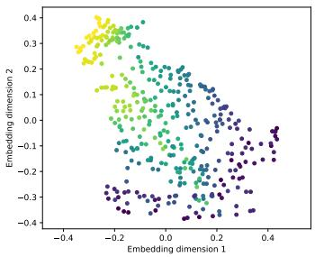  
(a) Mean-GWMDS consensus.

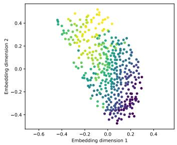  
(b) Temperature projection.

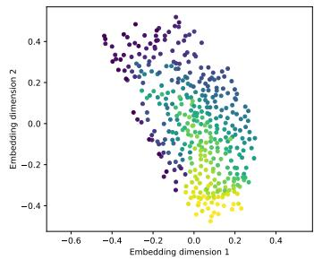  
(c) Dewpoint projection.

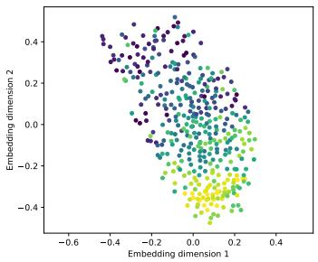  
(d) Surface-pressure projection.

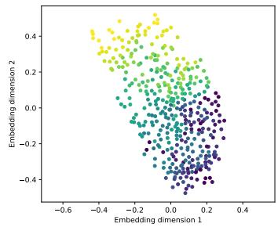  
(e) Total-precipitation projection.  
Figure 4: Geodesic teacher representations for ERA5.

We complement the quantitative results with a qualitative examination of the teacher and out-ofsample representations, followed by an empirical analysis of the optimization behavior of the proposed methods and the direct neural GW baseline.

Teacher representations and barycentric projections. Figure 4 illustrates the representations obtained from the geodesic ERA5 relations. The Mean-GWMDS barycentric target exhibits a consensus organization that combines the relational information provided by the four meteorological variables. In contrast, the Multi-GWMDS projections are generated from the same latent support but through different view-dependent transport plans. They therefore differ in their sample-indexed organization, demonstrating that a shared latent geometry does not imply a unique correspondence with the original observations.

The temperature-induced projection provides the highest average training correlation and is consequently selected for distillation. Nevertheless, this projection favors the relational structure of temperature, whereas the Mean-GWMDS target provides a more balanced compromise across temperature, dewpoint temperature, surface pressure, and total precipitation. Differences in global orientation should not be interpreted as errors, since GW-based objectives are invariant to rotations and reflections. The relevant distinction lies in the local organization of the observations and in the correspondence between latent points and sample indices.

Out-of-sample representations. Figure 5 compares the representations produced for the held-out locations. Both distilled models generate coherent out-of-sample embeddings without constructing a test-set transport plan. Inductive Mean-GWMDS retains the consensus structure of its teacher and provides the most balanced preservation across the four views. Inductive Multi-GWMDS instead reproduces the selected temperature-induced projection, yielding stronger preservation of the temperature geometry but weaker agreement with the remaining views.

The direct neural GW model produces a substantially less informative sample-indexed organization, despite attaining a final GW objective close to that of the Multi-GWMDS teacher. This visual discrepancy reinforces the quantitative results in Table 6: optimizing structural agreement under a freely estimated coupling does not ensure that the network output is aligned with the original sample identities. The PCA baseline captures part of the dominant global variation, but it does not explicitly balance the distinct relational geometries encoded by the four views.

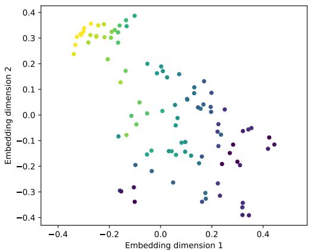  
(a) Inductive Mean-GWMDS.

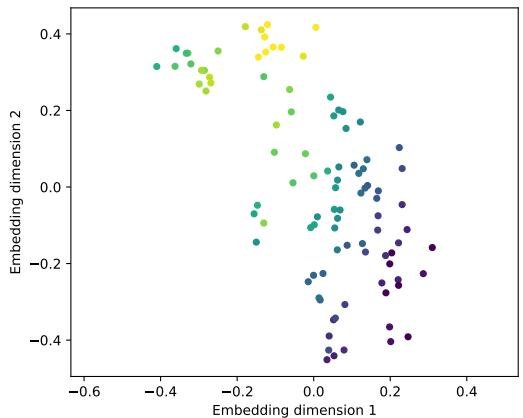  
(b) Inductive Multi-GWMDS.

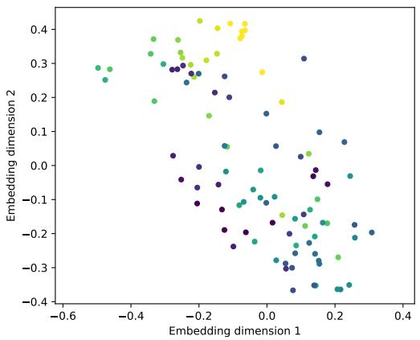  
(c) Direct multi-view GW.

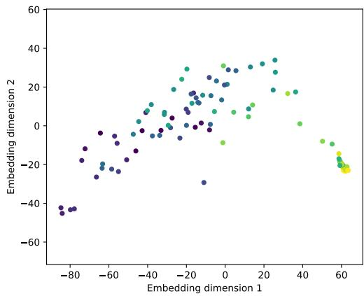  
(d) Concatenated PCA.  
Figure 5: Out-of-sample embeddings of the held-out ERA5 locations under geodesic relations.

Optimization behavior. Figure 6 reports the optimization trajectories of the geodesic models. The Mean-GWMDS and Multi-GWMDS teacher objectives decrease and stabilize over the outer iterations, indicating that the barycentric targets are extracted from converged relational representations. Multi-GWMDS is more expensive because each outer iteration requires a separate GW-plan update for every view.

The student losses decrease rapidly and smoothly, showing that the sample-indexed barycentric targets can be accurately approximated by the neural mapping. The direct neural GW objective also decreases to a value comparable to that of the transductive teacher. Its convergence therefore does not resolve the correspondence ambiguity; a small GW objective may coexist with poor sample-indexed preservation. Taken together, the curves indicate that the performance difference is caused by the supervision provided by the barycentric targets rather than by a failure to optimize the direct objective.

## A.4 Additional Experimental Analysis on rMD17-Aspirin

Teacher–student transfer. The distilled students closely reproduce their corresponding barycentric targets on the training data. Across the three relational geometries, the difference in view-averaged Pearson correlation between the Mean-GWMDS teacher and the Inductive Mean-GWMDS student ranges from 0.0148 to 0.0197. For the student associated with the projection selected by Multi-GWMDS, the largest difference from its teacher is 0.0045. These results show that the neural mappings accurately approximate both the consensus target and the selected view-dependent projection.

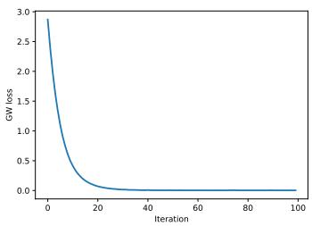  
(a) Mean-GWMDS teacher.

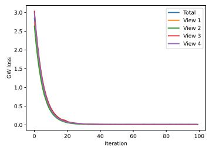  
(b) Multi-GWMDS teacher.

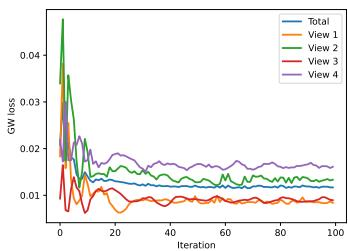  
(c) Direct multi-view GW.

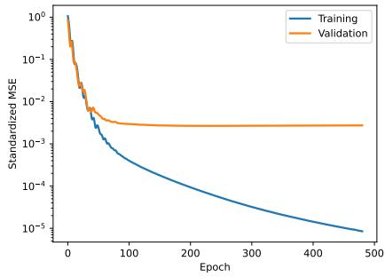  
(d) Inductive Mean-GWMDS distillation.

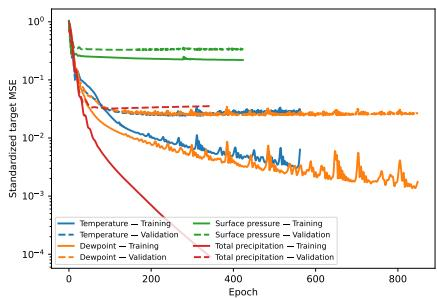  
(e) Multi-GWMDS projection distillation.  
Figure 6: Optimization trajectories for the geodesic ERA5 experiment.

Table 8: View-wise test Pearson correlations on rMD17-Aspirin. The reported embeddings are produced by the two inductive teacher–student formulations.
<table><tr><td>Geometry</td><td>Method</td><td>Interatomic-distance view</td><td>Force-Gram view</td></tr><tr><td rowspan="2">Euclidean</td><td>Inductive Mean-GWMDS</td><td>0.7294</td><td>0.2178</td></tr><tr><td>Inductive Multi-GWMDS</td><td>0.7506</td><td>0.0624</td></tr><tr><td rowspan="2">Geodesic</td><td>Inductive Mean-GWMDS</td><td>0.7860</td><td>0.1715</td></tr><tr><td>Inductive Multi-GWMDS</td><td>0.7928</td><td>0.0524</td></tr><tr><td rowspan="2">Cosine</td><td>Inductive Mean-GWMDS</td><td>0.7740</td><td>0.2743</td></tr><tr><td>Inductive Multi-GWMDS</td><td>0.8204</td><td>0.0669</td></tr></table>

The molecular experiment is nevertheless more challenging than ERA5 from an out-of-sample perspective. Although the training losses approach zero, the validation losses stabilize at higher values, with the best validation losses ranging approximately from 0.105 to 0.214. This separation indicates that interpolating the barycentric organization of unseen molecular conformations is more difficult than fitting the training targets. Validation-based early stopping is therefore particularly important for this experiment, especially for students trained exclusively from the force-Gram projection.

Out-of-sample performance. The view-averaged results are reported in Table 2. We next complement those results by examining teacher–student transfer, view-wise behavior, projection selection, GW objective values, and computational cost.

View-wise behavior. The view-wise results in Table 8 reveal a substantial imbalance between the two molecular representations.

For Inductive Mean-GWMDS, the test Pearson correlations with the interatomic-distance view are 0.7294, 0.7860, and 0.7740 under Euclidean, geodesic, and cosine relations, respectively. The corresponding correlations with the force-Gram view are considerably lower: 0.2178, 0.1715, and 0.2743.

Table 9: Training-only evaluation of the Multi-GWMDS barycentric projections on rMD17-Aspirin. For each candidate projection, $\rho _ { 1 }$ and $\rho _ { 2 }$ denote the Pearson correlations with the interatomic-distance and Force-Gram views, respectively. The mean is computed uniformly across the two views and used as the selection score. The selected projection is shown in bold. The last row reports the selected-minus-other difference.
<table><tr><td></td><td colspan="3">Euclidean</td><td colspan="3">Geodesic</td><td colspan="3">Cosine</td></tr><tr><td>Barycentric projection</td><td> $\rho _ { 1 }$ </td><td> $\rho _ { 2 }$ </td><td>Mean</td><td> $\rho _ { 1 }$ </td><td> $\rho _ { 2 }$ </td><td>Mean</td><td> $\rho _ { 1 }$ </td><td> $\rho _ { 2 }$ </td><td>Mean</td></tr><tr><td>Interatomic-distance view</td><td>0.7966</td><td>0.1318</td><td>0.4642</td><td>0.8468</td><td>0.1057</td><td>0.4762</td><td>0.8610</td><td>0.1695</td><td>0.5153</td></tr><tr><td>Force-Gram view</td><td>0.0926</td><td>0.5902</td><td>0.3414</td><td>0.0682</td><td>0.5918</td><td>0.3300</td><td>0.1195</td><td>0.7203</td><td>0.4199</td></tr><tr><td>Selected-minus-other difference</td><td>0.7040</td><td>-0.4584</td><td>0.1228</td><td>0.7786</td><td>-0.4861</td><td>0.1462</td><td>0.7415</td><td>-0.5508</td><td>0.0954</td></tr></table>

The selected Multi-GWMDS projection is even more strongly associated with the interatomic-distance view. Its correlations with this view reach 0.7506, 0.7928, and 0.8204, whereas its correlations with the force-Gram view decrease to 0.0624, 0.0524, and 0.0669. Consequently, the stronger preservation of the dominant interatomic-distance view by Inductive Multi-GWMDS is accompanied by a substantial loss of information from the force-based representation.

Mean-GWMDS provides a more balanced multi-view compromise. It accepts a small reduction in the preservation of interatomic distances in exchange for markedly stronger agreement with the force-Gram relations. This behavior explains why Inductive Mean-GWMDS achieves the best viewaveraged results under every relational geometry, despite not attaining the highest correlation with the dominant view individually.

Projection selection. Table 9 reports the training-only Pearson correlations of the two viewdependent Multi-GWMDS barycentric projections with each molecular view. As expected, each projection preserves primarily the relational geometry of the view from which it is derived. Nevertheless, when the correlations are averaged uniformly across the two views, the interatomic-distance projection achieves the highest selection score under all three relational geometries: 0.4642, 0.4762, and 0.5153 for Euclidean, geodesic, and cosine relations, respectively. The corresponding scores of the Force-Gram projection are 0.3414, 0.3300, and 0.4199, yielding selection margins of 0.1228, 0.1462, and 0.0954.

Unlike the nearly tied Euclidean selection observed for ERA5, the rMD17 selection is unambiguous under the present split. Importantly, this result does not indicate that the selected projection is superior for both views individually. Rather, its larger advantage with respect to the interatomic-distance geometry outweighs its lower agreement with the Force-Gram geometry under the mean-based selection criterion.

GW objective and sample-indexed preservation. Table 10 compares the final Multi-GWMDS teacher objective with that of direct neural multi-view GW.

Table 10: Final GW objectives and view-averaged test Pearson correlations on rMD17-Aspirin.
<table><tr><td></td><td>Euclidean</td><td>Geodesic</td><td>Cosine</td></tr><tr><td>Multi-GWMDS teacher objective</td><td>0.035079</td><td>0.025891</td><td>0.009187</td></tr><tr><td>Direct GW objective</td><td>0.036273</td><td>0.025977</td><td>0.009195</td></tr><tr><td>Inductive Multi-GWMDS test Pearson</td><td>0.4065</td><td>0.4226</td><td>0.4437</td></tr><tr><td>Direct GW test Pearson</td><td>0.3540</td><td>0.3471</td><td>0.2942</td></tr></table>

Under geodesic relations, the Multi-GWMDS teacher and direct-GW objectives are 0.025891 and 0.025977, respectively. Under cosine relations, they are 0.009187 and 0.009195. Their relative differences are approximately 0.33% and 0.09%, indicating that both methods attain almost identical structural objectives. The Euclidean relative difference is somewhat larger, approximately 3.4%, but the final values remain of the same order.

Despite this objective-level agreement, the out-of-sample representations differ substantially. In the cosine experiment, Inductive Multi-GWMDS achieves a test Pearson correlation of 0.4437, compared with only 0.2942 for direct multi-view GW, producing a difference of 0.1495. The weaker direct-GW result therefore cannot be explained merely by insufficient minimization of its training objective.

This result reinforces the distinction between structural agreement under an optimized coupling and sample-indexed prediction. A small GW objective can be obtained through a coupling that reorganizes the observations, whereas a neural predictor must associate each input conformation with the appropriate latent point. Barycentric distillation explicitly supplies this sample-indexed supervision, while the direct objective does not uniquely determine the required correspondence.

Computational cost. Table 11 reports the execution times averaged across the three relational geometries.

Table 11: Average execution times on rMD17-Aspirin. Teacher and student times are reported separately to distinguish the initial relational optimization from neural distillation.
<table><tr><td>Formulation</td><td>Optimization stage</td><td>Time (s)</td></tr><tr><td>Inductive Mean-GWMDS</td><td>Mean-GWMDS teacher</td><td>323.59</td></tr><tr><td>Inductive Mean-GWMDS</td><td>Consensus-target student</td><td>1.63</td></tr><tr><td>Inductive Multi-GWMDS</td><td>Multi-GWMDS teacher</td><td>607.56</td></tr><tr><td>Inductive Multi-GWMDS</td><td>Selected-projection student</td><td>1.36</td></tr><tr><td>Direct multi-view GW</td><td>Direct neural optimization</td><td>546.63</td></tr></table>

The Mean-GWMDS teacher requires an average of 323.59 seconds, whereas the Multi-GWMDS teacher requires 607.56 seconds because a separate transport plan is updated for each view. The corresponding student-training times are only 1.63 and 1.36 seconds. Distillation therefore represents less than 0.6% of the corresponding teacher-optimization time.

The complete Inductive Mean-GWMDS pipeline requires approximately 325.22 seconds on average, while direct neural multi-view GW requires 546.63 seconds. Thus, the direct formulation requires approximately 1.68 times the runtime of the Inductive Mean-GWMDS pipeline. The complete Inductive Multi-GWMDS pipeline requires approximately 608.92 seconds and is therefore about 11.4% slower than direct multi-view GW during initial training.

## A.5 Limitations

The proposed framework transfers out-of-sample prediction to a neural student, but its teacher remains transductive and requires dense pairwise relational matrices and transport plans. Consequently, the training-stage memory requirement grows quadratically with the number of observations, and repeated GW updates remain expensive for large datasets.