# GroundAnything: Reconciling Parallel Decoding with Precise Visual Grounding at Flash Speed

Qize Yu1,2,∗,‡, Lianrui Fan1,∗, Bowen Ping2,∗, Xini Ding1,∗, Zetian Song1,2,∗, Junbo Niu2, Kaixuan Wang3, Tianxing Chen3, Yue Chen2, Minghua He2, Yuran Wang2,6, Jie Huang2, Haojun Zhang1, Min Chen1, Hao Li1, Wenxuan Song7, Ruihai Wu4, Xianming Liu1, Shilong Liu5, Shuchang Zhou1, Ping Luo3,†, Shiyu Huang1,†

1XPeng Inc., 2Peking University, 3The University of Hong Kong, 4University of California, Berkeley, 5Princeton University, 6National University of Singapore, 7HKUST (GZ)

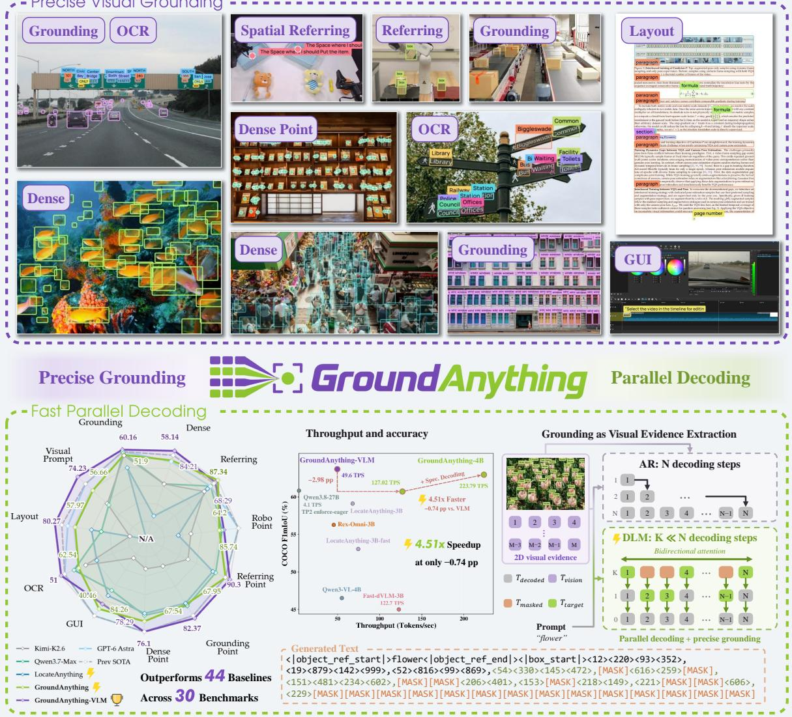  
Figure 1 GroundAnything: broad, precise grounding with fast parallel decoding. Top: diverse tasks challenge localization in dense scenes and complex layouts. Bottom: given a 2D image and prompt, bidirectional difusion extracts visual evidence into 1D structured grounding tokens in parallel. Self-speculative decoding achieves a 4.51× speedup over GroundAnything-VLM with only a 0.74 pp COCO F1mIoU drop.

## Abstract

Autoregressive (AR) grounding models serialize spatial predictions, introducing sequential latency and imposing a causal order on output tokens. We view grounding as visual evidence extraction: objects, locations, and spatial relations are jointly constrained by the image and query, yet their dependencies do not imply an intrinsic left-to-right generation order. This distinction makes bidirectional difusion a natural fit, allowing spatial hypotheses to emerge in parallel and be jointly refined through iterative denoising. We introduce GroundAnything, a 4B-parameter grounding foundation model that reconciles fast parallel decoding with precise localization through blockwise denoising. Training combines grounding pretraining from public datasets and dedicated data engines, direct AR-to-difusion conversion with joint AR and difusion objectives, supervised fine-tuning, and GRPO-based reinforcement post-training. Across 30 grounding benchmarks, our autoregressive variant, GroundAnything-VLM, establishes a new overall state of the art among similarly sized models at 72.42%, remaining competitive with GPT-6 Astra (71.35%). With entropy-guided decoding, GroundAnything also surpasses the prior state of the art at this scale, averaging 61.75% versus 53.32% for the fast MTP-based LocateAnything model. We further explore decoding strategies, showing that an optional self-speculative mode achieves a 4.51× speedup over the AR counterpart with a 0.74 percentage-point drop in COCO F1mIoU. Infrastructure experiments show that progressive inference optimizations translate parallel decoding into practical speedups. These support eficient visual grounding in latency-sensitive real-world systems.

## Contents

Abstract   
Introduction   
Related Work   
2.1 Visual Grounding   
2.2 Difusion Vision-Language Models   
2.3 Parallel Decoding   
3 Method   
3.1 Problem Formulation: Grounding as Structured Visual Evidence Extraction   
3.2 Model Architecture   
3.3 GroundAnything Data   
3.4 Training Design   
3.4.1 Base VLM Training   
3.4.2 AR-to-Difusion Conversion   
3.4.3 Reinforcement Post-Training   
3.5 Eficient Parallel Inference   
Experiments   
4.1 Implementation Details and Evaluation Setup.   
4.2 Main Results   
4.3 Speed Evaluation 11   
4.3.1 Decoding Strategy Analysis 11   
4.3.2 DLM vs. MTP 14   
4.3.3 Infrastructure Analysis 15   
4.4 Ablation Studies 15   
4.5 Discussion 16   
Conclusion 17

## Appendix Contents

A Model and Training Details 22   
A.1 Input/Output Protocol   
A.2 Architecture, Tokenizer, and Visual Processing   
A.3 Expert-Driven Data Engine   
A.4 Training Pipeline .   
A.5 Base VLM Training (Pretrain 1)   
A.6 Coordinate Alignment (Pretrain 2 / SFT)   
A.7 AR-to-Difusion Conversion (GroundAnything Only)   
A.8 Reinforcement Learning (RL): Causal GRPO   
A.9 GroundAnything-VLM Reinforcement Setting   
A.10 Task Rewards   
A.10.1 Box Grounding   
A.10.2 OCR   
A.10.3 Pointing   
B Parallel Inference   
B.1 Direct Difusion Decoding   
B.2 Optional Self-Speculative Decoding   
B.3 Execution Optimizations 31   
C DLM–MTP Comparison: Experimental Details   
C.1 Controlled Model Comparisons   
C.2 Draft Acceptance and Token Cost   
C.3 Refinement and Fixed-Deadline Decoding   
C.4 Structural and Geometric Diagnostics   
D Additional Experimental Analysis .   
D.1 Speed Reporting and Decoding Sensitivity   
D.2 Infrastructure Analysis   
D.3 Architecture and Training Ablations 35   
D.3.1 Multi-level Visual Injection and Coordinate Readout 35   
D.4 Output Token Eficiency and Generation Cost   
E Comprehensive Grounding Benchmark Results   
E.1 Common and Long-tailed Object Detection   
E.2 Dense and Tiny Object Detection   
E.3 Referring Object Detection   
E.4 Object Pointing   
E.5 Robot and Spatial Pointing   
E.6 OCR   
E.7 GUI Grounding   
E.8 Layout Grounding   
E.9 Visual Prompting   
E.10 Potential Application Scenarios   
E.11 Qualitative Analysis   
E.11.1 General Object Grounding   
E.11.2 Dense Object Grounding   
E.11.3 Referring Grounding and Complex Visual Configurations   
E.11.4 Referring Point-in-Mask Grounding   
E.11.5 Dense Point Grounding .   
E.11.6 Dense Point-in-Mask Grounding   
E.11.7 GUI Grounding   
E.11.8 OCR and Artistic Text Understanding   
E.11.9 Visual-Prompt Grounding

## 1 Introduction

Visual grounding turns visual inputs into structured spatial predictions across object detection, referring expression comprehension, OCR, GUI interaction, and embodied perception. Next-token prediction has become a mainstream paradigm for generative grounding, with models such as Pix2Seq, Florence-2, and Rex-Omni expressing visual predictions as structured token sequences (Jiang et al., 2026; Chen et al., 2022; Xiao et al., 2024). However, autoregressive (AR) decoding serializes labels and coordinates, introducing sequential latency and restricting output interactions to the generated prefix(Chen et al., 2022; Cheng et al., 2024). These limitations are particularly costly in dense scenes and complex layouts.

To reduce AR decoding latency, LocateAnything uses multi-token prediction (MTP) for parallel box decoding (Wang et al., 2026). Difusion VLMs support parallel generation and bidirectional refinement, with advances in multimodal understanding (You et al., 2026b; Wu et al., 2026a), GUI grounding (Kumbhar et al., 2026), and document OCR (Dong et al., 2026). Yet these grounding applications remain domain-specific, leaving difusion’s broader potential for unified structured prediction across diverse visual tasks largely untapped.

To unlock this potential and reconcile fast parallel decoding with broad and precise visual grounding, we start from a familiar observation: we may notice objects or read separate signs in diferent orders, yet reach the same judgment about what is present and where. We therefore view grounding as structured visual evidence extraction: spatial variables are jointly constrained by the image and query, without an intrinsic left-to-right generation order. Bidirectional masked difusion naturally supports this process, allowing hypotheses to emerge in parallel and be refined using shared visual evidence and partially recovered structure (Figure 1).

We introduce GroundAnything, a 4B-parameter grounding foundation model combining broad perceptual capabilities with blockwise parallel decoding. A shared vocabulary with quantized coordinates unifies diverse grounding tasks. Its decoder combines bidirectional attention within blocks with causal dependencies across blocks, enabling parallel prediction and KV-cache reuse (Arriola et al., 2025).

Grounding pretraining draws on public datasets and dedicated data engines. We build GroundAnything-VLM and GroundAnything from a shared pretrained checkpoint, applying AR-to-difusion conversion with joint AR and difusion objectives to the latter. Both variants then undergo supervised fine-tuning and GRPO-based reinforcement post-training.

Across 30 grounding benchmarks, GroundAnything-VLM establishes a new overall state of the art among similarly sized models at 72.42%, remaining competitive with GPT-6 Astra (71.35%). With entropy-guided decoding, GroundAnything is, to our knowledge, the first difusion language model to surpass the prior overall AR state of the art at this scale, averaging 61.75% at over 2× the speed of GroundAnything-VLM. We use this mode throughout the main benchmarks to evaluate pure difusion decoding without AR verification. Additional ablations examine key model and training design choices.

We further conduct a systematic speed analysis of decoding strategies and their trade-ofs, including comparisons with MTP-based generation (Wang et al., 2026). An optional self-speculative mode combines difusion drafting with AR verification and improves both speed and accuracy over entropy-guided decoding on COCO, achieving a 4.51× speedup over GroundAnything-VLM with only a 0.74 pp F1mIoU drop. Systematic infrastructure experiments with SGLang, CUDA Graph, and FP8 demonstrate further practical speedups through progressive inference optimizations, supporting eficient visual grounding in real-world applications.

In summary, our major contributions are as follows:

• Unlocking diffusion for broad visual grounding. We introduce GroundAnything, a 4B foundation model that unifies diverse grounding tasks with precise localization and parallel decoding, trained through grounding pretraining, AR-to-difusion conversion with joint objectives, supervised fine-tuning, and GRPO-based reinforcement learning.

• State-of-the-art grounding at 4B scale. Across 30 benchmarks, GroundAnything surpasses the prior overall state of the art among similarly sized AR models and outperforms the larger Qwen3.7-Max. GroundAnything-VLM establishes a new overall state of the art at this scale and remains competitive with GPT-6 Astra.

• Systematic acceleration studies. We analyze decoding strategies in detail, compare with MTP-based generation, and evaluate progressive infrastructure optimizations for practical deployment.

## 2 Related Work

## 2.1 Visual Grounding

Object detectors such as YOLO establish eficient localization within predefined category vocabularies (Redmon et al., 2016). Grounded vision–language pretraining extends detection to language-conditioned, open-set localization (Li et al., 2022; Liu et al., 2024). Generative approaches formulate detection as autoregressive next-token prediction (Chen et al., 2022) and integrate spatial grounding into multimodal language modeling (Peng et al., 2023). Structured generation unifies diverse perception tasks (Xiao et al., 2024), while quantized coordinates, large-scale grounding data, and reinforcement post-training strengthen localization (Jiang et al., 2026). However, AR generation serializes spatial predictions, increasing decoding costs for dense outputs. MTP-based parallel box decoding reduces this overhead by treating boxes and points as atomic generation units (Wang et al., 2026). This progression motivates exploring alternative parallel generation mechanisms for broad and precise grounding.

## 2.2 Diffusion Vision-Language Models

Masked difusion ofers a complementary route to parallel generation through bidirectional conditioning and iterative token recovery. Difusion VLMs demonstrate its potential for visual instruction following and multimodal understanding (You et al., 2026b; Li et al., 2026b). Direct AR-to-difusion conversion adapts pretrained VLMs for eficient blockwise generation (Wu et al., 2026a). Beyond general understanding, specialized applications include GUI grounding with geometry-aware masking (Kumbhar et al., 2026) and structured document OCR with blockwise denoising (Dong et al., 2026). These studies demonstrate the promise of difusion in both general multimodal understanding and specialized visual tasks. Nevertheless, a unified difusion grounding foundation that preserves precise localization across heterogeneous tasks remains underexplored. GroundAnything addresses this gap through grounding-focused training and a shared structured output interface, combining broad perceptual capabilities with eficient parallel decoding.

## 2.3 Parallel Decoding

Prior work explores blockwise generation (Arriola et al., 2025), adaptive parallel sampling (Wu et al., 2026b; Ben-Hamu et al., 2026), and difusion-based speculative decoding (Liu et al., 2026; Wu et al., 2026a). Further work emphasizes practical acceleration through optimized inference infrastructure (Liu et al., 2025). Motivated by these advances, we examine decoding choices for GroundAnything in detail, studying their speed–accuracy trade-ofs and extending the analysis to comparisons with MTP-based generation and progressive infrastructure optimizations.

## 3 Method

## 3.1 Problem Formulation: Grounding as Structured Visual Evidence Extraction

Given an image I and a task query Q, grounding extracts semantic identifiers and their spatial evidence, represented by boxes, points, or ordered point sequences. We serialize this evidence as $Y = \left( y _ { 1 } , \dots , y _ { L } \right)$ using a shared vocabulary of text, structural markers, and quantized coordinates (Jiang et al., 2026); input/output conventions are detailed in Section A.1.

These variables are jointly constrained by the image and query, but need not be recovered in a fixed left-to-right order (Figure 1). We therefore use blockwise masked difusion (Arriola et al., 2025; Wu et al., 2026a; You et al., 2026a; Yu et al., 2026), modeling

$$
{ p _ { \theta } ( Y \mid I , Q ) = \prod _ { k = 1 } ^ { K } p _ { \theta } \Big ( Y ^ { ( k ) } \mid I , Q , Y ^ { ( < k ) } \Big ) }\tag{1}
$$

over K consecutive response blocks. Bidirectional attention supports parallel token recovery within each block, while completed blocks form a causal prefix. Semantic ordering, including trajectory time order, is preserved.

## 3.2 Model Architecture

GroundAnything is a difusion grounding model obtained by directly converting GroundAnything-VLM, an autoregressive grounding model trained through multimodal and spatial pretraining, supervised fine-tuning, and reinforcement post-training. It combines a MoonViT-V2 (Kimi K3) visual encoder (Team et al., 2026), a projector with 2 × 2 spatial aggregation and a two-layer MLP, and a Qwen3-4B language decoder (Yang et al., 2025) (Figure 2). Its variable-length output interface uses a shared vocabulary for semantic labels, protocol markers, and 1,000 quantized coordinate tokens $\scriptstyle \left( < 0 > - < 9 9 9 > \right)$ ; absent queried categories receive a None payload. The conversion introduces a mask token and jointly trains causal prediction and blockwise denoising with B = 32; both modes share the decoder and vocabulary head, enabling parallel grounding and optional self-speculative decoding (Section 3.4.2).

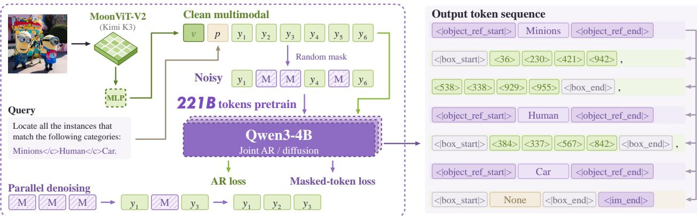  
Figure 2 GroundAnything architecture. Clean multimodal inputs and response-corrupted text views share one visual encoding and jointly supervise causal prediction and masked denoising. One noisy view is illustrated, with its uncorrupted prompt copy omitted for clarity. The bottom-left panel illustrates parallel denoising, and the grounding example includes two minions and one human and an absent car category. Architecture specifications and parameter counts are provided in Section A.2.

## 3.3 GroundAnything Data

Training data combines public datasets with annotations produced by our data engine.

Our data engine (Figure 3) fuses multi-teacher annotations at the field level and applies task-specific validation. Accepted labels train a unified grounding expert for iterative annotation; complementary teachers and local observations resolve uncertain cases. This process expands supervision while refining existing labels. Field validity and query-level coverage are checked separately, so an empty result alone does not establish absence. Fusion, validation, and expert iteration are detailed in Section A.3.

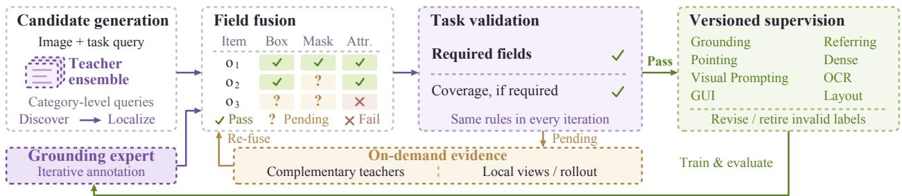  
Figure 3 Data engine. Field-level teacher fusion and task-specific validation guide expert iteration, with targeted observations resolving uncertain annotations.

## 3.4 Training Design

## 3.4.1 Base VLM Training

Base pretraining has three stages. Vision–language connector alignment trains the projector on image– text pairs with both backbones frozen. Joint multimodal pretraining updates all modules using text and multimodal supervision. General visual and video understanding develops instruction following and image/video understanding. This autoregressive foundation supports subsequent spatial specialization through supervised fine-tuning (SFT) and reinforcement post-training. GroundAnything additionally undergoes the conversion below; training settings are provided in Sections A.4 and A.5.

## 3.4.2 AR-to-Diffusion Conversion

Following multimodal AR-to-difusion conversion (Wu et al., 2026a; Dong et al., 2026), we retain the pretrained backbone and grounding vocabulary and add a mask token. For a clean sequence $x = [ V , P , Y ]$ of visual embeddings, text prompt, and response, we partition Y into $B = 3 2$ token blocks, independently of geometric-tuple boundaries. Sampling $t _ { b } \sim \mathcal { U } ( 0 , 1 )$ independently per block, we corrupt only response positions to form complementary noisy views $w ^ { ( a ) } = [ \bar { P , } \widetilde { Y } ^ { ( a ) } ] , a \in \{ 1 , 2 \}$ EOS is masked in both. The joint input $[ \dot { w ^ { ( 1 ) } } ; w ^ { ( 2 ) } ; x ]$ contains visual embeddings only in x.

Under the mask in Figure 4, each noisy response block attends bidirectionally within itself and reads the clean image/prompt context and strictly preceding clean response blocks. Clean tokens use causal attention and cannot read noisy views. The shared decoder minimizes

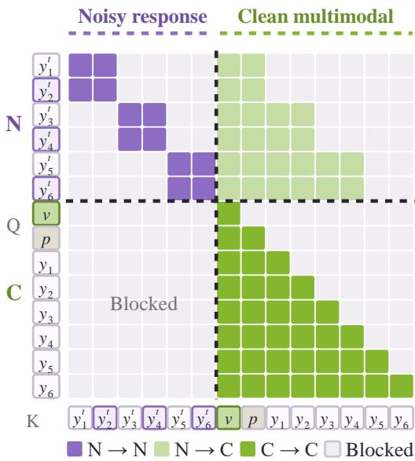

$$
\begin{array} { r } { \mathcal { L } = 0 . 5 \mathcal { L } _ { \mathrm { M D M } } + 0 . 5 \mathcal { L } _ { \mathrm { A R } } , } \end{array}\tag{2}
$$

where ${ \mathcal { L } } _ { \mathrm { M D M } }$ supervises masked response targets and $\mathcal { L } _ { \mathrm { A R } }$ supervises clean next-token prediction. Both retain the pretrained token shift. Full loss definitions and training settings appear in Sections A.4 and A.7.

## 3.4.3 Reinforcement Post-Training

We apply GRPO (Shao et al., 2024; Ping et al., 2026) using causal rollouts and exact causal token likelihoods (Figure 5). Box grounding combines set-completeness $R _ { \mathrm { s e t } }$ and strict localization $R _ { \mathrm { s t r i c t } } ; \mathrm { O C R }$ scores annotation-aware text–geometry agreement; pointing scores location, count, label, and format. For each

Figure 4 Conversion attention mask. Rows/- columns are queries/keys. Purple denotes within-block bidirectionality, light green the permitted clean prefix, and green clean-stream causality. Other entries are blocked. The symbols v and p condense visual and prompt tokens. One noisy view with two-token blocks is shown; noisy prompt copies are omitted. Training uses $B = 3 2$

prompt group, advantages are $\begin{array} { r } { A _ { i } = Z _ { G } ( \sum _ { c } w _ { c } Z _ { G } ( R _ { c , i } ) ) } \end{array}$ , where $Z _ { G }$ standardizes within the group. Boxreward weights are (0.7, 0.3); OCR and pointing each provide one scalar reward. We optimize the clipped objective

$$
\mathcal { L } _ { \mathrm { G R P O } } = - \mathbb { E } _ { i } \Big [ | \mathcal { T } _ { i } | ^ { - 1 } \sum _ { t \in \mathcal { T } _ { i } } \operatorname* { m i n } \bigr ( r _ { i , t } A _ { i } , \mathrm { c l i p } ( r _ { i , t } , 1 - \epsilon , 1 + \epsilon ) A _ { i } \bigr ) \Big ] ,\tag{3}
$$

where ${ r } _ { i , t }$ is the current-to-old causal token-probability ratio at the rollout temperature, $\mathcal { T } _ { i }$ contains valid response tokens including EOS, and $\epsilon = 0 . 2$ . One update per rollout trains the projector and language parameters with the vision encoder frozen and no reference-policy KL term. The updated weights are reused for difusion inference. Reward definitions and variant-specific reinforcement settings appear in Sections A.8 to A.10.

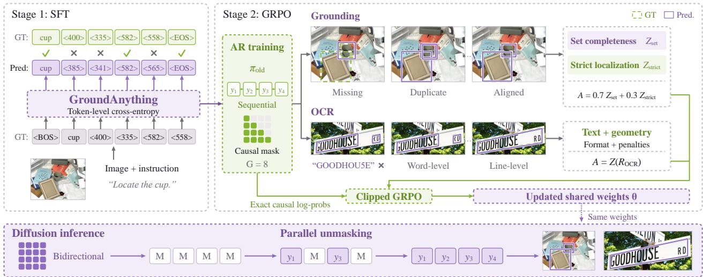  
Figure 5 Training and inference pipeline. SFT and causal GRPO update shared parameters reused for blockwise difusion inference. The schematic illustrates token-level supervision and grounding/OCR reward aggregation; the final advantage includes the additional group normalization in Equation (9). Rollouts and unmasking states are illustrative.

## 3.5 Efficient Parallel Inference

Parallel diffusion decoding. After image/query prefill, GroundAnything denoises response blocks with bidirectional attention and caches the completed prefix. Sub-blocks are processed from left to right. Our default Entropy-Guided Decoding (Liu et al., 2025) commits masked positions with $H _ { j } \leq \tau$ , where $\begin{array} { r } { H _ { j } = - \sum _ { v } p _ { j } ( v ) \log p _ { j } ( v ) } \end{array}$ is the entropy of the unmodified token distribution. If none qualifies, the lowestentropy position is committed to ensure progress. Committed tokens remain fixed, and a causal pass constructs the completed block’s cache without AR verification. Dynamic and Static Decoding instead use confidence thresholds and fixed quotas; commitment and cache construction are detailed in Section B.1.

Optional self-speculative decoding. The shared weights also support difusion drafting with causal verification (Wu et al., 2026a), accepting the longest matching prefix (Figure 6). Linear decoding uses two network function evaluations (NFEs) and 2B query tokens per round; quadratic decoding fuses verification and proposal generation in one NFE after initialization, using $B ( B + 1 )$ query tokens. These counts describe queries, not Transformer FLOPs. Acceptance and proposal reuse are detailed in Section B.2; CUDA Graph and selective FP8 optimizations appear in Section B.3.

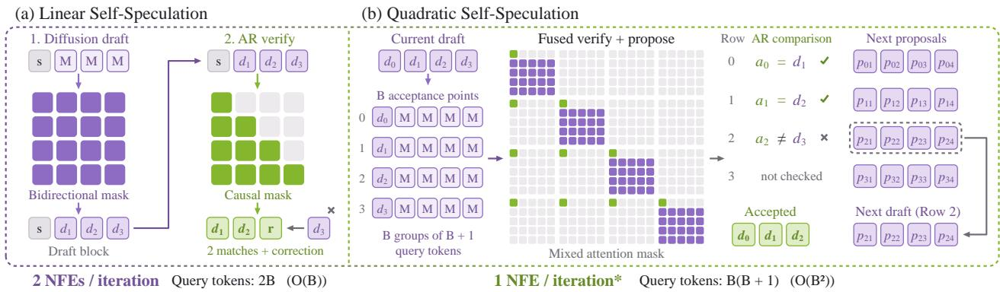  
Figure 6 Self-speculative decoding with shared model weights (B = 4). Linear decoding separates drafting from causal verification: $d _ { 1 }$ and $d _ { 2 }$ are accepted, while the mismatched $d _ { 3 }$ is replaced by the AR correction r. Quadratic decoding compares $a _ { i }$ with $d _ { i + 1 } \colon { a _ { 0 } } = d _ { 1 } , { a _ { 1 } } = d _ { 2 } .$ and $a _ { 2 } \neq d _ { 3 }$ , thereby committing $[ d _ { 0 } , d _ { 1 } , d _ { 2 } ]$ and reusing Row 2 as the next still-unverified proposal. Purple denotes bidirectional proposals and green causal verification. Matrix rows and columns denote queries and keys, respectively; the cached prefix is omitted. M denotes [MASK], s the last accepted seed, and $p _ { i j }$ proposal token j from row i. One NFE per quadratic round applies after initialization.

## 4 Experiments

In this section, we ask:

Question 1: Grounding capability. How far can GroundAnything push the breadth and precision of visual grounding?

Question 2: Speed. How far can parallel grounding accelerate inference with minimal loss of precision, and what makes its speedups practical?

Question 3: Design. Which model, training, and output choices support precise and eficient parallel grounding?

## 4.1 Implementation Details and Evaluation Setup.

We evaluate GroundAnything-VLM and GroundAnything against 44 baselines on 30 benchmarks spanning 11 perceptual capabilities, covering specialized detectors, general-purpose VLMs, grounding specialists, and embodied foundations. All numerical results and conclusions involving our models are based on the mean of ten runs, using five random seeds with two runs per seed. Owing to the high computational cost, other baselines that we evaluate locally for the main leaderboard are averaged over three runs, using three random seeds with one run per seed. GPT-6 Astra uses thinking efort High. We report F1mIoU for box grounding and OCR, F1@Point for object pointing, and task-specific accuracy for spatial and GUI grounding.

For a fair comparison of difusion language model (DLM) decoding, all GroundAnything results in the main benchmark tables (Tables 1–4) use entropy-guided difusion decoding, without self-speculative decoding. The self-speculative setting provides higher throughput and quality at the reported operating point, but combines difusion drafting with causal autoregressive (AR) verification and correction; it is therefore not pure DLM decoding. We analyze this setting separately in Section 4.3 and highlight it in the teaser (Figure 1).

## 4.2 Main Results

Benchmark suite. Detection covers common and long-tailed objects on COCO (Lin et al., 2014) and LVIS (Gupta et al., 2019), and dense and tiny objects on Dense200 (Jiang et al., 2026) and VisDrone (Zhu et al., 2018). Referring grounding uses RefCOCO, RefCOCO+, and RefCOCOg (Yu et al., 2016; Mao et al., 2016; Nagaraja et al., 2016); object pointing covers the four detection datasets and RefCOCOg. Spatial and GUI grounding use RoboSpatial (Song et al., 2025), RefSpatial (Zhou et al., 2026), ScreenSpot-V2 (Wu et al., 2025), ScreenSpot-Pro (Li et al., 2025), and OSWorld-G (Xie et al., 2026). OCR uses HierText (Long et al., 2022), ICDAR2015 (Karatzas et al., 2015), TotalText (Ch’Ng & Chan, 2017), and SROIE (Huang et al., 2019); layout grounding uses DocLayNet (Pfitzmann et al., 2022) and M6Doc (Cheng et al., 2023). Exemplar-based visual prompting on FSC147 (Ranjan et al., 2021) and Dense200 is also included in the main results.

GroundAnything-VLM establishes a new overall best among similarly sized models at 72.42%, remaining competitive with GPT-6 Astra (71.35%). GroundAnything reaches 61.75% with pure difusion decoding, surpassing the prior overall AR state of the art at comparable scale. Figure 7 summarizes this breadth; the comparisons below examine localization precision and task-dependent difusion–AR gaps.

Reporting conventions. Scores are percentages; bold marks column bests, including ties (lower is better only for parse error). Model-name stars denote externally reported rows; entry-level stars denote source or task-interface exceptions. –, N/A, and UNK indicate unreported values, unsupported or unresolved evaluations, and unspecified zero-shot status, respectively. Daggers flag uncertain prompt/protocol alignment, so afected scores are descriptive. Under our protocols, GroundingDINO lacks GUI/OCR/layout interfaces, and Kimi-K3 lacks compatible pointing/OCR/layout outputs; SenseNova-Vision’s GUI evaluation remains unresolved. LocateAnything lacks a supported visual-prompt interface. Starred SenseNova-Vision HierText/IC-DAR2015 scores follow Han et al. (2026); its other OCR scores are local. Complete sources and exceptions appear in Section E.

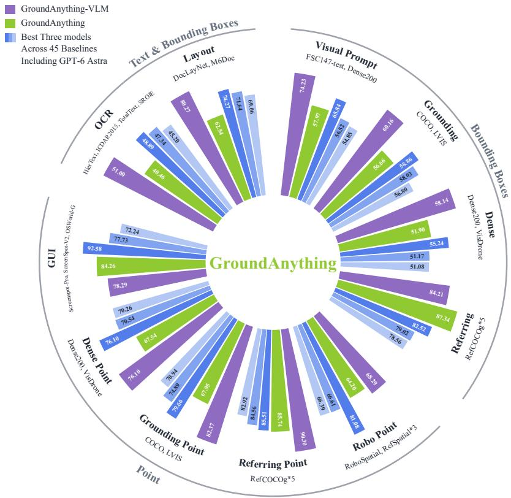  
Figure 7 Grounding across task groups. GroundAnything-VLM, GroundAnything, and leading baselines across box, point, text, and exemplar-conditioned tasks. Complete results: Section E.

Detection and referring grounding. GroundAnything reaches 70.04 F1mIoU on Dense200 and 91.61/91.10 on RefCOCOg val/test

(Table 1), extending precise difusion grounding to crowded scenes and language-conditioned targets, although tiny-object localization remains challenging. RefCOCO avg is the unweighted mean of RefCOCO, RefCOCOg, and RefCOCO+.

Robot, spatial, andGUIgrounding. GroundAnything matches its AR counterpart on RefSpatial Unseen (62.34%) and improves ScreenSpot-Pro from 65.34% to 75.96% (Table 2), while Astra remains stronger on RefSpatial and GUI tasks. RefSpatial avg averages the Location and Placement splits.

OCR, layout, and visual prompting. The shared interface extends to text, document regions, and exemplarmatched instances: GroundAnything-VLM reaches 85.78 on DocLayNet and 74.76 on M6Doc, while GroundAnything scores 63.52 on Dense200 visual prompting (Table 3). OCR and layout exhibit larger difusion–AR gaps than referring and GUI grounding, identifying where parallel generation still sacrifices precision.

Object pointing. Following Jiang et al. (2026), SAM-derived masks (Kirillov et al., 2023) determine point correctness, with F1@Point balancing misses and false positives. GroundAnything-VLM leads five of the six selected comparisons.

Finding 1: Across 30 benchmarks, GroundAnything extends broad and precise grounding to pure difusion, surpassing the prior overall AR state of the art at comparable scale. GroundAnything-VLM sets a new overall best at this scale, remaining competitive with GPT-6 Astra.

Table 1 Detection and referring grounding (F1mIoU). External rows follow Jiang et al. (2026). Full results appear in Sections E.1 to E.3.
<table><tr><td rowspan="2">Model</td><td>Common</td><td>Long-tailed</td><td colspan="2">Dense &amp; Tiny</td><td colspan="3">Referring grounding</td></tr><tr><td>COCO</td><td>LVIS</td><td>Dense200 VisDrone</td><td></td><td>RefCOCOg RefCOCOg RefCOCO</td><td></td><td></td></tr><tr><td></td><td></td><td></td><td></td><td></td><td>val</td><td>test</td><td>avg</td></tr><tr><td>Closed-set Specialized Detectors DINO-R50* (Zhang et al., 2022)</td><td>55.60</td><td></td><td></td><td></td><td></td><td></td><td></td></tr><tr><td>DETR-R50* (Carion et al., 2020)</td><td>48.30</td><td></td><td></td><td></td><td></td><td></td><td></td></tr><tr><td>Open-set Specialized Detectors</td><td></td><td></td><td></td><td></td><td></td><td></td><td></td></tr><tr><td>GroundingDINO (Liu et al., 2024)</td><td>60.56</td><td>52.61</td><td>24.92</td><td>34.47</td><td>49.77</td><td>50.43</td><td>45.15</td></tr><tr><td>Vision-Language Models (&lt;10B)</td><td></td><td></td><td></td><td></td><td></td><td></td><td></td></tr><tr><td>Qwen3-VL-4B (Bai et al., 2025a)</td><td>46.53</td><td>49.86</td><td>14.02</td><td>31.14</td><td>75.27</td><td>75.88</td><td>75.24</td></tr><tr><td>Qwen3.5-9B (Qwen Team, 2026a)</td><td>51.99</td><td>48.87</td><td>30.02</td><td>32.84</td><td>76.20</td><td>76.28</td><td>76.08</td></tr><tr><td>Rex-Omni (Jiang et al., 2026)</td><td>56.28</td><td>46.74</td><td>53.29</td><td>27.19</td><td>73.90</td><td>74.76</td><td>69.29</td></tr><tr><td>LocateAnything Fast (Wang et al., 2026)</td><td>53.06</td><td>42.90</td><td>20.70</td><td>9.82</td><td>75.30</td><td>76.50</td><td>76.62</td></tr><tr><td>LocateAnything Hybrid (Wang et al., 2026)</td><td>59.12</td><td>49.56</td><td>50.07</td><td>28.57</td><td>76.43</td><td>77.67</td><td>78.06</td></tr><tr><td>SenseNova-Vision (Han et al., 2026)</td><td>57.49</td><td>56.12</td><td>68.13</td><td>42.35</td><td>78.69</td><td>79.48</td><td>77.55</td></tr><tr><td>RynnBrain1.1 (Li et al., 2026a)</td><td>35.15</td><td>26.01</td><td>0.12</td><td>8.29</td><td>67.66</td><td>68.24</td><td>63.63</td></tr><tr><td>GroundAnything-VLM</td><td>63.70</td><td>56.63</td><td>75.55</td><td>40.74</td><td>84.37</td><td>83.56</td><td>83.43</td></tr><tr><td>GroundAnything</td><td>60.72</td><td>52.59</td><td>70.04</td><td>33.76</td><td>91.61</td><td>91.10</td><td>85.33</td></tr><tr><td>Vision-Language Models (10B-1T)</td><td></td><td></td><td></td><td></td><td></td><td></td><td></td></tr><tr><td>SEED1.5-VL* (Guo et al., 2025)</td><td>51.40</td><td>46.70</td><td>53.20</td><td>27.40</td><td>71.90</td><td>73.20</td><td></td></tr><tr><td>Qwen3.8-27B (Qwen Team, 2026d)</td><td>60.84</td><td>49.99</td><td>34.30</td><td>33.33</td><td>76.03</td><td>77.37</td><td>77.89</td></tr><tr><td>Vision-Language Models (&gt;1T)</td><td></td><td></td><td></td><td></td><td></td><td></td><td></td></tr><tr><td>Qwen3.7-Max (Qwen Team, 2026c)</td><td>62.79</td><td>53.28</td><td>31.20</td><td>41.59</td><td>80.54</td><td>81.71</td><td>80.20</td></tr><tr><td>Kimi-K2.6</td><td>61.16</td><td>51.19</td><td>42.67</td><td>29.95</td><td>70.33</td><td>71.87</td><td>69.66</td></tr><tr><td>Kimi-K3 (Team et al., 2026)</td><td>60.89</td><td>47.73</td><td>51.64</td><td>30.31</td><td>73.39</td><td>73.99</td><td>72.86</td></tr><tr><td>GPT-6 Astra</td><td>62.75</td><td>54.97</td><td>65.04</td><td>37.12</td><td>74.98</td><td>78.91</td><td>77.81</td></tr></table>

## 4.3 Speed Evaluation

## 4.3.1 Decoding Strategy Analysis

Question 2.1: Which decoding choices govern the speed–accuracy trade-of?

We report tokens per forward (TPF), output tokens per second (TPS), and COCO F1mIoU. Decoding protocols and additional analysis appear in Section D.1.

Forward efficiency versus latency. At $\begin{array} { r l r } { B } & { { } = } & { 3 2 , } \end{array}$ quadratic selfspeculation reaches higher TPF than the linear schedule (3.17 versus 2.18), yet substantially lower throughput (49.9 versus 223.8 TPS; Figure 8).

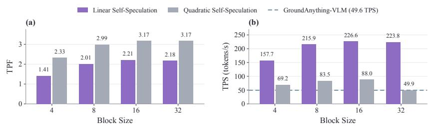  
Figure 8 Self-speculative schedules. TPF and TPS across block sizes; dashed lines denote GroundAnything-VLM.

Its $O ( B ^ { 2 } )$ query-token cost ofsets the reduction in forward calls, favoring the linear schedule at this operating point.

Entropy threshold and block size. Relaxing the entropy threshold increases parallel commitment, but COCO quality falls sharply beyond $\tau = 0 . 8 \ ( \mathrm { F i g u r e \ 9 } )$ . At B = 32, τ = 0.8 achieves the highest F1mIoU in this threshold sweep (60.72) at 127.0 TPS, or 2.56× GroundAnything-VLM throughput. Block size also changes this balance: entropy-guided quality peaks at $B = 1 6$ in this COCO sweep, whereas linear self-speculation

Table 2 Robot, spatial, and GUI grounding (accuracy). External RefSpatial and JEDI/UI-R1 scores follow Jiang et al. (2026); GUI-Owl scores follow Wang et al. (2026). Full results appear in Sections E.5 and E.7.
<table><tr><td rowspan="2">Model</td><td colspan="3">Robot and spatial pointing</td><td colspan="3">GUI grounding</td></tr><tr><td>(avg)</td><td>RefSpatial RefSpatial RoboSpatial Unseen</td><td>Context</td><td></td><td>ScreenSpot-Pro ScreenSpot-V2 OSWorld-G</td><td></td></tr><tr><td>Open-set Specialized Detectors</td><td></td><td></td><td></td><td></td><td></td><td></td></tr><tr><td>GroundingDINO (Liu et al., 2024)</td><td>14.25</td><td>4.33</td><td>4.92</td><td> $\mathrm { { N } / \mathrm { { A } } ^ { * } }$ </td><td> $\mathrm { { N } / \mathrm { { A } } ^ { * } }$ </td><td> $\mathrm { { N } / \mathrm { { A } } ^ { * } }$ </td></tr><tr><td>Vision-Language Models (&lt;10B)</td><td></td><td></td><td></td><td></td><td></td><td></td></tr><tr><td>JEDI* (Xie et al., 2026)</td><td></td><td></td><td></td><td>36.10</td><td>88.60</td><td></td></tr><tr><td>UI-R1* (Lu et al., 2026)</td><td></td><td></td><td></td><td>17.80</td><td>85.40</td><td></td></tr><tr><td>Qwen3-VL-4B (Bai et al., 2025a)</td><td>49.00</td><td>27.27</td><td>64.75</td><td>56.74</td><td>92.30</td><td>56.91</td></tr><tr><td>Qwen3.5-9B (Qwen Team, 2026a)</td><td>55.92</td><td>37.01</td><td>60.66</td><td>53.13</td><td>90.57</td><td>60.99</td></tr><tr><td>Rex-Omni (Jiang et al., 2026)</td><td>51.75</td><td>37.01</td><td>59.02</td><td>36.75</td><td>88.29</td><td>46.10</td></tr><tr><td>LocateAnything Fast (Wang et al., 2026)</td><td>36.00</td><td>16.88</td><td>15.57</td><td>56.04</td><td>88.44</td><td>59.93</td></tr><tr><td>LocateAnything Hybrid (Wang et al., 2026)</td><td>36.17</td><td>20.78</td><td>14.75</td><td>57.05</td><td>89.94</td><td>60.46</td></tr><tr><td>SenseNova-Vision (Han et al., 2026)</td><td>20.38</td><td>8.54</td><td>0.82</td><td>N/A†</td><td>N/A†</td><td>N/A†</td></tr><tr><td>RynnBrain1.1 (Li et al., 2026a)</td><td>50.60</td><td>36.90</td><td>54.10</td><td>34.66</td><td>70.44</td><td>33.33</td></tr><tr><td>RoboRefer* (Zhou et al., 2026)</td><td>50.00</td><td>39.00</td><td></td><td></td><td></td><td></td></tr><tr><td>GroundAnything-VLM</td><td>69.00</td><td>62.34</td><td>72.13</td><td>65.34</td><td>94.89</td><td>74.65</td></tr><tr><td>GroundAnything</td><td>63.00</td><td>62.34</td><td>69.67</td><td>75.96</td><td>95.60</td><td>81.21</td></tr><tr><td>Vision-Language Models (10B-1T)</td><td></td><td></td><td></td><td></td><td></td><td></td></tr><tr><td>RoboPoint* (Yuan et al., 2024)</td><td>16.10</td><td>8.40</td><td></td><td></td><td></td><td></td></tr><tr><td>GUI-Owl* (Ye et al., 2025)</td><td></td><td></td><td></td><td>58.00</td><td></td><td></td></tr><tr><td>Gemini-2.5-Pro* (Comanici et al., 2025)</td><td>35.60</td><td>27.10</td><td></td><td></td><td></td><td></td></tr><tr><td>Molmo-72B* (Deitke et al., 2025)</td><td>30.25</td><td>21.20</td><td></td><td></td><td></td><td></td></tr><tr><td>Qwen3.8-27B (Qwen Team, 2026d)</td><td>60.00</td><td>46.75</td><td>63.93</td><td>58.76</td><td>94.50</td><td>63.48</td></tr><tr><td>Vision-Language Models (&gt;1T)</td><td></td><td></td><td></td><td></td><td></td><td></td></tr><tr><td>Qwen3.7-Max (Qwen Team, 2026c)</td><td>68.75</td><td>57.14</td><td>69.67</td><td>55.06</td><td>81.13</td><td>49.29</td></tr><tr><td>Kimi-K2.6</td><td>41.33</td><td>41.56</td><td>30.33</td><td>6.07†</td><td>52.36†</td><td>10.11†</td></tr><tr><td>Kimi-K3 (Team et al., 2026)</td><td>58.92</td><td>54.98</td><td>54.92</td><td>25.36†</td><td>82.70†</td><td>68.26†</td></tr><tr><td>GPT-6 Astra</td><td>85.93</td><td>81.93</td><td>65.69</td><td>93.17</td><td>97.88</td><td>86.70</td></tr></table>

peaks at B = 32 (Figure 10); larger blocks are therefore not uniformly better.  
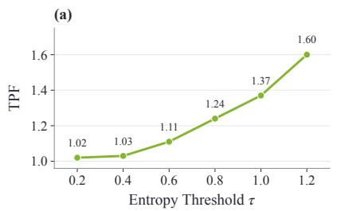

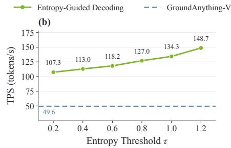

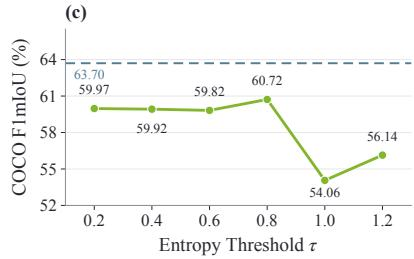  
Figure 9 Entropy-threshold sensitivity. TPF, TPS, and COCO F1mIoU at B = 32 with sub-block size 4. Dashed lines denote GroundAnything-VLM.

Finding 2.1: In direct DLM decoding, the entropy threshold controls the speed–precision trade-of, providing a decoding-efort knob analogous to thinking efort. We favor τ = 0.8 in the B = 32 COCO sweep. Optional self-speculation improves both quality and throughput over this direct-decoding point, reaching 4.51× AR throughput with a 0.74 pp F1mIoU gap.

Table 3 OCR, layout, and visual prompting (F1mIoU). External rows follow Jiang et al. (2026). SenseNova-Vision uses published HierText/ICDAR2015 scores (Han et al., 2026) and locally evaluated TotalText/SROIE scores. Full results appear in Sections E.6, E.8 and E.9.
<table><tr><td rowspan="2">Model</td><td colspan="4">OCR</td><td colspan="2">Layout grounding</td><td colspan="2">Visual prompting</td></tr><tr><td>HierText</td><td>ICDAR2015</td><td>TotalText</td><td>SROIE</td><td>DocLayNet M6Doc</td><td></td><td>FSC147</td><td>Dense200</td></tr><tr><td colspan="9">Closed-set Specialized Detectors</td></tr><tr><td>DocLayout-YOLO* (Zhao et al., 2024)</td><td></td><td></td><td></td><td></td><td>81.10</td><td></td><td></td><td></td></tr><tr><td>PaddleOCRv5* (Cui et al., 2025)</td><td>30.50</td><td>25.60</td><td>25.70</td><td>58.60</td><td></td><td></td><td></td><td></td></tr><tr><td colspan="9">Vision-Language Models (&lt;10B)</td></tr><tr><td>Qwen3-VL-4B (Bai et al., 2025a)</td><td>23.48</td><td>28.41</td><td>38.35</td><td>40.41</td><td>40.81</td><td>24.73</td><td>18.90</td><td>2.49</td></tr><tr><td>Qwen3.5-9B (Qwen Team, 2026a)</td><td>29.63</td><td>29.90</td><td>37.26</td><td>26.74</td><td>34.65</td><td>17.35</td><td>20.56</td><td>26.93</td></tr><tr><td>Rex-Omni (Jiang et al., 2026)</td><td>34.46</td><td>45.65</td><td>52.35</td><td>48.35</td><td>68.06</td><td>54.95</td><td>57.15</td><td>55.50</td></tr><tr><td>LocateAnything Fast (Wang et al., 2026)</td><td>22.59</td><td>26.73</td><td>44.40</td><td>24.89</td><td>49.37</td><td>47.03</td><td>N/A*</td><td>N/A*</td></tr><tr><td>LocateAnything Hybrid (Wang et al., 2026)</td><td>26.65</td><td>27.48</td><td>45.49</td><td>30.05</td><td>77.34</td><td>65.94</td><td>N/A*</td><td>N/A*</td></tr><tr><td>SenseNova-Vision (Han et al., 2026)</td><td>31.20*</td><td>49.50*</td><td>11.40</td><td>36.26</td><td>85.53</td><td>35.62</td><td>62.51</td><td>62.84</td></tr><tr><td>RynnBrain1.1 (Li et al., 2026a)</td><td>2.07</td><td>17.81</td><td>16.90</td><td>3.59</td><td>6.02</td><td>4.53</td><td>4.78</td><td>1.45</td></tr><tr><td>GroundAnything-VLM</td><td>41.33</td><td>42.50</td><td>49.03</td><td>71.15</td><td>85.78</td><td>74.76</td><td>60.29</td><td>75.26</td></tr><tr><td>GroundAnything</td><td>33.31</td><td>41.81</td><td>43.08</td><td>43.64</td><td>68.38</td><td>56.69</td><td>52.43</td><td>63.52</td></tr><tr><td colspan="9">Vision-Language Models (10B-1T)</td></tr><tr><td>SEED1.5-VL* (Guo et al., 2025)</td><td>12.00</td><td>18.70</td><td>19.50</td><td>28.10</td><td>28.70</td><td>28.00</td><td></td><td></td></tr><tr><td>Qwen3.8-27B (Qwen Team, 2026d)</td><td>32.95</td><td>39.72</td><td>41.57</td><td>37.24</td><td>42.21</td><td>19.92</td><td>16.80</td><td>28.19</td></tr><tr><td colspan="9">Vision-Language Models (&gt;1T)</td></tr><tr><td>Qwen3.7-Max (Qwen Team, 2026c)</td><td>42.95</td><td>43.07</td><td>48.64</td><td>38.54</td><td>46.93</td><td>32.31</td><td>21.62</td><td>31.81</td></tr><tr><td>Kimi-K2.6</td><td>25.26†</td><td>32.25†</td><td>40.99†</td><td>46.83†</td><td>15.59†</td><td>13.50†</td><td>32.47</td><td>32.41</td></tr><tr><td>GPT-6 Astra</td><td>39.58</td><td>48.87</td><td>53.55</td><td>53.57</td><td>77.54</td><td>60.59</td><td>61.04</td><td>68.94</td></tr></table>

Table 4 Object pointing (F1@Point). External rows follow Jiang et al. (2026), where Molmo denotes Molmo-7B-D. Full results appear in Section E.4.
<table><tr><td>Model</td><td colspan="2">Referring object pointing</td><td colspan="2">Common / long-tailed</td><td colspan="2">Dense / tiny</td></tr><tr><td></td><td></td><td>RefCOCOg val RefCOCOg test</td><td>COCO</td><td>LVIS</td><td>Dense200 VisDrone</td><td></td></tr><tr><td colspan="7">Open-set Specialized Detectors</td></tr><tr><td>GroundingDINO (Liu et al., 2024)</td><td>49.34</td><td>49.97</td><td>70.41</td><td>55.07</td><td>32.93</td><td>39.45</td></tr><tr><td colspan="7">Vision-Language Models (&lt;10B)</td></tr><tr><td>Qwen3-VL-4B (Bai et al., 2025a)</td><td>76.43</td><td>77.64</td><td>65.33</td><td>55.08</td><td>21.72</td><td>23.50</td></tr><tr><td>Qwen3.5-9B (Qwen Team, 2026a)</td><td>77.59</td><td>77.85</td><td>72.21</td><td>64.00</td><td>65.35</td><td>44.73</td></tr><tr><td>Rex-Omni (Jiang et al., 2026)</td><td>84.96</td><td>85.32</td><td>79.74</td><td>70.04</td><td>76.66</td><td>51.97</td></tr><tr><td>LocateAnything Fast (Wang et al., 2026)</td><td>73.84</td><td>74.94</td><td>71.53</td><td>62.13</td><td>65.63</td><td>56.36</td></tr><tr><td>LocateAnything Hybrid (Wang et al., 2026)</td><td>75.89</td><td>76.65</td><td>73.78</td><td>64.89</td><td>78.07</td><td>57.30</td></tr><tr><td>SenseNova-Vision (Han et al., 2026)</td><td>74.63</td><td>75.42</td><td>72.96</td><td>62.66</td><td>78.71</td><td>61.81</td></tr><tr><td>RynnBrain1.1 (Li et al., 2026a)</td><td>74.42</td><td>74.17</td><td>25.70</td><td>17.56</td><td>3.95</td><td>13.18</td></tr><tr><td>Molmo-7B* (Deitke et al., 2025)</td><td>83.70</td><td>83.60</td><td>77.30</td><td>40.30</td><td>33.10</td><td>29.20</td></tr><tr><td>GroundAnything-VLM</td><td>90.44</td><td>91.03</td><td>84.92</td><td>79.81</td><td>84.16</td><td>68.03</td></tr><tr><td>GroundAnything</td><td>85.75</td><td>85.73</td><td>71.32</td><td>64.57</td><td>77.14</td><td>57.94</td></tr><tr><td colspan="7">Vision-Language Models (10B-1T)</td></tr><tr><td>SEED1.5-VL* (Guo et al., 2025)</td><td>83.60</td><td>84.20</td><td>78.20</td><td>70.70</td><td>72.10</td><td>56.70</td></tr><tr><td>Qwen3.8-27B (Qwen Team, 2026d)</td><td>75.84</td><td>75.86</td><td>74.01</td><td>67.65</td><td>74.55</td><td>51.16</td></tr><tr><td colspan="7">Vision-Language Models (&gt;1T)</td></tr><tr><td>Qwen3.7-Max (Qwen Team, 2026c)</td><td>71.21</td><td>72.40</td><td>72.13</td><td>66.94</td><td>66.28</td><td>59.04</td></tr><tr><td>Kimi-K2.6</td><td>39.59†</td><td>39.60†</td><td>30.65†</td><td>25.51†</td><td>35.18†</td><td>13.63†</td></tr><tr><td>GPT-6 Astra</td><td>87.80</td><td>84.90</td><td>82.17</td><td>77.14</td><td>86.57</td><td>65.62</td></tr></table>

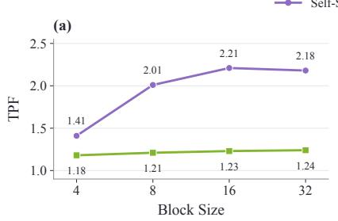

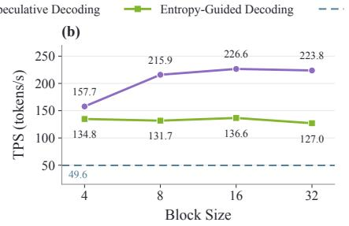

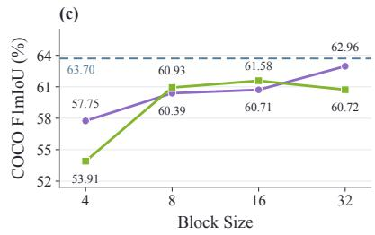  
Figure 10 Decoding strategy and block size. Linear self-speculation and entropy guidance $( \tau = 0 . 8 ,$ sub-block size 4) compared on COCO. Dashed lines denote GroundAnything-VLM.

## 4.3.2 DLM vs. MTP

Question 2.2: Why use difusion rather than MTP when both can draft for the same AR verifier?

We match visual inputs, adaptation data, tokenization, and prefixes, and freeze the same converted model’s causal branch as verifier. The primary MTP baseline is an in-house causal drafter; bidirectional block-MTP and retrained causal-DLM controls test the role of attention (Section C).

We address four questions:

Question 2.2.1: At the same candidate length, which drafter achieves higher acceptance?

Question 2.2.2: How much wall-clock time does each accepted draft token cost?

Question 2.2.3: Can additional DLM refinement repay its extra forward-pass cost?

Question 2.2.4: Which grounding failures benefit from bidirectional attention?

Draft acceptance. At $K \_ { } =$ 16, one-step DLM accepts 3.48 draft tokens per round versus 2.69 for causal MTP (Figure 11), yielding more useful proposals at the same candidate length.

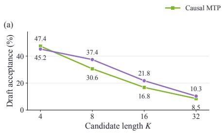

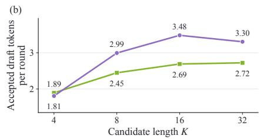

## Cost per accepted draft token.

Including drafting, verification, and rejected work, one-step DLM reduces full-round cost per accepted draft token from 7.71 to 5.38 ms (Figure 12). Higher acceptance therefore translates into lower wall-clock cost at this operating point.

Refinement versus latency. At K = 16, a second DLM refinement step lowers this cost to 4.70 ms; further refinement increases it. With validationselected policies on the longoutput subset, DLM commits

Figure 11 Acceptance at matched candidate length. One-step DLM and causal MTP share prefixes and a frozen AR verifier. Accepted tokens exclude verifier corrections and bonuses.  
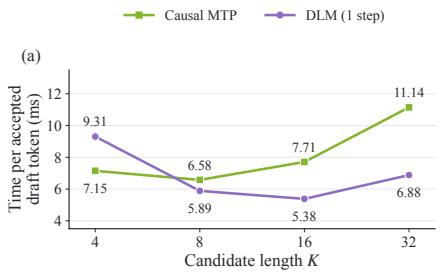

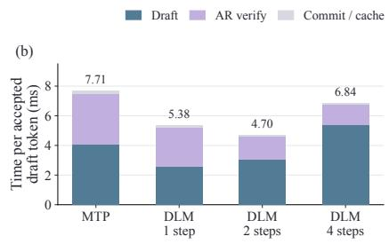  
Figure 12 Cost per accepted draft token. Full-round latency includes rejected work; the stage breakdown uses K = 16.

97.1 versus 84.6 tokens within 400 ms, although MTP leads at 50 ms (Figure 13). Refinement is thus useful when its acceptance gain repays its additional latency.

Bidirectional attention and grounding failures. Bidirectional DLM reduces Dense200’s unmatched valid-proposal rate from 24.89% for causal MTP to 14.79%; its retrained causal counterpart scores 21.74% (Figure 14). This supports bidirectional attention for drafting jointly constrained spatial predictions. Bidirectional block-MTP also improves draft quality, so the benefit is not exclusive to difusion.

These gains concern draft eficiency and reliability; exact shared verification preserves the AR verifier’s completed output.

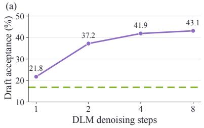

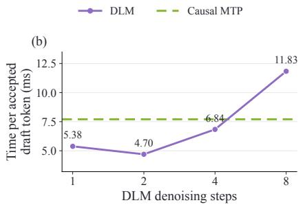

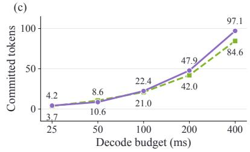  
Figure 13 Refinement and available decode time. (a,b) Varying refinement depth at $K = 1 6 .$ (c) Committed tokens under equal deadlines on long-output prefixes, using validation-selected policies.

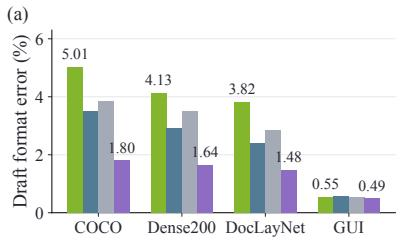

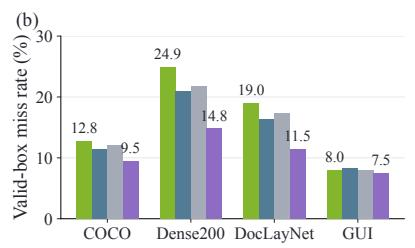

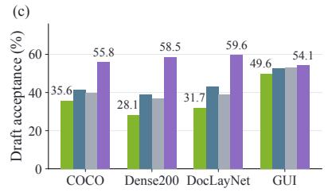  
Figure 14 Draft diagnostics before verification. Comparisons at $K = 8 ;$ both DLMs use two refinement steps. Valid-box misses count unmatched proposals, not missed ground-truth instances. GUI denotes ScreenSpot-Pro.

Finding 2.2: Bidirectional difusion with a limited number of refinement steps improves draft-generation eficiency over the tested causal MTP baseline. At $K = 1 6$ , two passes reduce cost per accepted draft token to 4.70 ms; further refinement raises the cost.

## 4.3.3 Infrastructure Analysis

Question 2.3: How can parallel decoding translate into practical inference speedups?

Progressive integration with SGLang, CUDA Graph, and FP8 reduces time per output token across all four decoding modes (Figure 15). The complete stack yields 3.45–4.06× speedups over each mode’s native PyTorch implementation, with self-speculation reaching 3.73 ms/token. Implementation gains are measured within each decoding mode, separately from algorithmic speedups (Section D.2).

## 4.4 Ablation Studies

Coordinate representation. Quantized coordi-

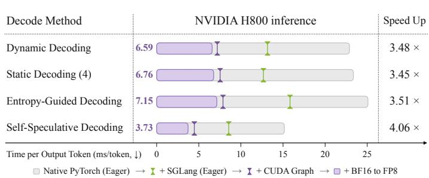  
Figure 15 Progressive inference optimization. Time per output token (↓) and cumulative speedup relative to each decoding mode’s native PyTorch implementation.

nates improve the reported ablation average by 1.43 pp for GroundAnything-VLM and 5.68 pp for GroundAnything over textual coordinates (Figure 16).

ViT choice. MoonViT-V2 gives the strongest AR and DLM scores among the tested encoders. Section D.3.1 analyzes when multi-level visual evidence can help coordinate prediction; the encoder ablation supports our choice under this recipe.

Training. Removing Stage III causes the largest DLM drop (16.62 pp).

Compact outputs and dense scenes. The shared output format uses 7.6 tokens/box on COCO and 5.1 on Dense200, compared with 148.8 and 74.5 for the SEED1.5-VL reference reported by Jiang et al. (2026) (Table 5). Figure 17 shows how generation time and output length vary with predicted object count: GroundAnything reduces generation time across the displayed ranges, with larger absolute savings for longer outputs (Section D.4).

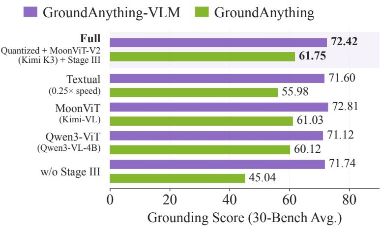  
Figure 16 Architecture and training ablations. Coordinate representation, visual encoder, and Stage III under the ablation protocol (Section D.3).

Table 5 Output token efficiency. Mean boxes and tokens per image, and tokens per box. SEED1.5-VL values are external references from Jiang et al. (2026); output-length ratios are not runtime speedups.
<table><tr><td></td><td colspan="3">COCO</td><td colspan="3">Dense200</td></tr><tr><td>Model</td><td>Boxes/img</td><td>Tokens/img</td><td>Tokens/box</td><td>Boxes/img</td><td>Tokens/img</td><td>Tokens/box</td></tr><tr><td>SEED1.5-VL (Guo et al., 2025)</td><td>4.2</td><td>631.0</td><td>148.8</td><td>73.1</td><td>5446.3</td><td>74.5</td></tr><tr><td>GroundAnything-VLM</td><td>6.1</td><td>46.4</td><td>7.6</td><td>87.6</td><td>446.8</td><td>5.1</td></tr><tr><td>GroundAnything</td><td>6.1</td><td>46.4</td><td>7.6</td><td>87.6</td><td>446.8</td><td>5.1</td></tr></table>

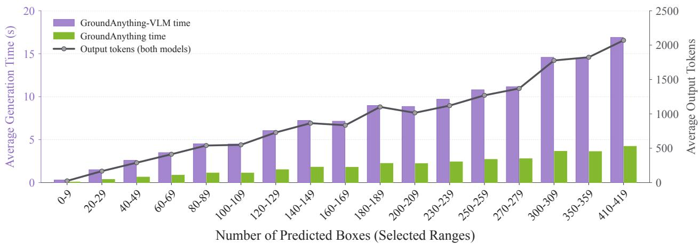  
Figure 17 Generation cost versus predicted object count. Average generation time for GroundAnything-VLM and GroundAnything, with output-token counts across box-count ranges.

## 4.5 Discussion

Takeaway 1: Grounding as visual evidence extraction naturally suits bidirectional difusion: related spatial fields share the same image evidence and can be filled jointly, then selectively refined before commitment. This connects the task’s structure to parallel decoding.

Takeaway 2: Difusion is a generation strategy within a Transformer backbone (Wu et al., 2026a). Its distinctive value lies in suitable workloads, such as parallel filling and structured outputs, where joint prediction and limited refinement can repay their computational cost.

## 5 Conclusion

We introduced GroundAnything, reconciling fast parallel decoding with broad and precise visual grounding. Structured grounding naturally suits DLMs: its predictions are jointly constrained by shared visual evidence. Difusion complements the Transformer backbone through a generation process with distinctive strengths in parallel filling and structured outputs. Causal conditioning supports long outputs across blocks, while difusion accelerates prediction within them. GroundAnything thus highlights a broader principle: generation should follow task structure, and spatial evidence need not be inferred in the order it is serialized.

## AI Use Statement

In this work, we used generative AI tools to assist with code development, to polish the writing, and to produce some of the figures. We also used generative AI models as part of the data annotation pipeline to generate pseudo-labels for model training. We did not use generative AI tools to develop the research ideas or methodology, to design or interpret the experiments, or to outline the paper. We have reviewed all AI-assisted work. We take responsibility for the final content of this work, including text, claims, data annotations, or artifacts produced with the aid of generative AI.

## Ethics Statement

This work does not involve human-subject studies. All datasets and evaluation benchmarks used in this work were obtained from publicly available or appropriately licensed sources in accordance with their respective terms and licenses. The experiments focus on visual grounding and structured visual understanding and do not involve real-world robotic control, autonomous driving, or interaction with people. GroundAnything is developed as a general-purpose visual grounding model for research rather than for safety-critical real-world deployment. Any future integration into embodied or autonomous systems should be subject to appropriate safety evaluation and human oversight. The authors declare no conflicts of interest.

## Reproducibility Statement

We will publicly release the code, model weights of GroundAnything and GroundAnything-VLM, and evaluation data to support systematic and reproducible evaluation. The release will include training and decoding configurations, inference implementations, and evaluation scripts with standardized task prompts, output parsers, and metric implementations. The shared architecture, tokenizer, visual processing, and input/output protocol are specified in Sections A.1 and A.2; the data engine and validation pipeline in Section A.3; and base VLM training, AR-to-difusion conversion, and continued supervised fine-tuning in Sections A.4, A.5 and A.7. Variant-specific GRPO configurations and task rewards are detailed in Sections A.8 to A.10. Direct difusion decoding, optional self-speculative decoding, and execution optimizations are described in Sections B.1 to B.3. Controlled DLM–MTP comparisons are documented in Section C, while speed metrics, decoding sensitivity, and infrastructure comparisons appear in Sections D.1 and D.2. Architecture and training ablations and output-token eficiency analyses are provided in Sections D.3 and D.4. The benchmark suite, evaluation metrics, reporting conventions, and complete task-level results are given in Section E.

## Research Scope, Data Use, and Institutional Disclaimer

This work originated from exploratory academic research undertaken by the project leader Qize Yu during their internship at Xpeng Inc. The project was conducted exclusively for scientific investigation and academic publication and does not involve commercial applications, product development, or commercial deployment. All data used in this project were used solely for academic research and maintained under strict segregation from the company’s commercial model development and deployment activities. No project data were used to train, fine-tune, evaluate, or otherwise support commercial models, products, or services. Internal legal review of the dataset materials was completed on September 21, 2026. This work neither uses nor discloses business data containing users’ private or personally identifiable information. The research-only scope described here does not modify or supersede the applicable terms and licenses of the source datasets.

The views, methods, findings, and conclusions presented in this paper are those of the authors and do not represent the oficial positions, technical direction, product roadmap, or commercial commitments of Xpeng Inc. The company’s support for this research should not be construed as endorsement of any commercial application. Neither the research findings nor their publication constitute a claim of readiness, safety, or suitability for commercial deployment.

## Acknowledgments

We thank Xpeng Inc. for providing computational and data resources in support of this academic research, and the data team for their assistance with data preparation and research support. We are particularly grateful to Professor Ping Luo for his guidance on the research ideas and manuscript writing. We also thank Xinghang Li, Qing Li, Baiqiao Yin, Xinyu Wei, Jiadi You, Linhao Zhou, Qiman Wu, Ziteng Cui, Yi Zou, Wei Wei, Hanzhen Zhang and Zhuo Li for their valuable suggestions and constructive feedback.

## References

[1] Arriola, M., Gokaslan, A., Chiu, J., Yang, Z., Qi, Z., Han, J., Sahoo, S., and Kuleshov, V. Block difusion: Interpolating between autoregressive and difusion language models. In International Conference on Learning Representations, volume 2025, pp. 50726–50753, 2025.

[2] Bai, S., Cai, Y., Chen, R., Chen, K., Chen, X., Cheng, Z., Deng, L., Ding, W., Gao, C., Ge, C., Ge, W., Guo, Z., Huang, Q., Huang, J., Huang, F., Hui, B., Jiang, S., Li, Z., Li, M., Li, M., Li, K., Lin, Z., Lin, J., Liu, X., Liu, J., Liu, C., Liu, Y., Liu, D., Liu, S., Lu, D., Luo, R., Lv, C., Men, R., Meng, L., Ren, X., Ren, X., Song, S., Sun, Y., Tang, J., Tu, J., Wan, J., Wang, P., Wang, P., Wang, Q., Wang, Y., Xie, T., Xu, Y., Xu, H., Xu, J., Yang, Z., Yang, M., Yang, J., Yang, A., Yu, B., Zhang, F., Zhang, H., Zhang, X., Zheng, B., Zhong, H., Zhou, J., Zhou, F., Zhou, J., Zhu, Y., and Zhu, K. Qwen3-vl technical report, 2025a. URL https://arxiv.org/abs/2511.21631.

[3] Bai, S., Chen, K., Liu, X., Wang, J., Ge, W., Song, S., Dang, K., Wang, P., Wang, S., Tang, J., Zhong, H., Zhu, Y., Yang, M., Li, Z., Wan, J., Wang, P., Ding, W., Fu, Z., Xu, Y., Ye, J., Zhang, X., Xie, T., Cheng, Z., Zhang, H., Yang, Z., Xu, H., and Lin, J. Qwen2.5-vl technical report, 2025b. URL https://arxiv.org/abs/2502.13923.

[4] Ben-Hamu, H., Gat, I., Severo, D., Nolte, N. S., and Karrer, B. Accelerated sampling from masked difusion models via entropy bounded unmasking. Advances in Neural Information Processing Systems, 38:55981–56007, 2026.

[5] Carion, N., Massa, F., Synnaeve, G., Usunier, N., Kirillov, A., and Zagoruyko, S. End-to-end object detection with transformers. In European conference on computer vision, pp. 213–229. Springer, 2020.

[6] Chen, T., Saxena, S., Li, L., Fleet, D. J., and Hinton, G. Pix2seq: A language modeling framework for object detection, 2022. URL https://arxiv.org/abs/2109.10852.

[7] Cheng, H., Zhang, P., Wu, S., Zhang, J., Zhu, Q., Xie, Z., Li, J., Ding, K., and Jin, L. M6doc: A large-scale multi-format, multi-type, multi-layout, multi-language, multi-annotation category dataset for modern document layout analysis, 2023. URL https://arxiv.org/abs/2305.08719.

[8] Cheng, Z., Li, K., Jin, P., Li, S., Ji, X., Yuan, L., Liu, C., and Chen, J. Parallel vertex difusion for unified visual grounding. In Proceedings of the AAAI conference on artificial intelligence, volume 38, pp. 1326–1334, 2024.

[9] Ch’Ng, C. K. and Chan, C. S. Total-text: A comprehensive dataset for scene text detection and recognition. In 2017 14th IAPR international conference on document analysis and recognition (ICDAR), volume 1, pp. 935–942. IEEE, 2017.

[10] Comanici, G., Bieber, E., Schaekermann, M., Pasupat, I., Sachdeva, N., Dhillon, I., Blistein, M., Ram, O., Zhang, D., Rosen, E., et al. Gemini 2.5: Pushing the frontier with advanced reasoning, multimodality, long context, and next generation agentic capabilities. arXiv preprint arXiv:2507.06261, 2025.

[11] Cui, C., Sun, T., Lin, M., Gao, T., Zhang, Y., Liu, J., Wang, X., Zhang, Z., Zhou, C., Liu, H., Zhang, Y., Lv, W., Huang, K., Zhang, Y., Zhang, J., Zhang, J., Liu, Y., Yu, D., and Ma, Y. Paddleocr 3.0 technical report, 2025. URL https://arxiv.org/abs/2507.05595.

[12] Dai, X., Chen, Y., Xiao, B., Chen, D., Liu, M., Yuan, L., and Zhang, L. Dynamic head: Unifying object detection heads with attentions. In 2021 IEEE/CVF Conference on Computer Vision and Pattern Recognition (CVPR), pp. 7369–7378. ieee, 2021.

[13] Dang, R., Guo, J., Hou, B., Leng, S., Li, K., Li, X., Liu, J., Mao, Y., Wang, Z., Yuan, Y., Zhu, M., Lin, X., Bai, Y., Jiang, Q., Zhao, Y., Zeng, M., Gao, J., Jiang, Y., Cen, J., Huang, S., Wang, L., Zhang, W., Liu, C., Yang, J., Lu, S., and Zhao, D. Rynnbrain: Open embodied foundation models, 2026. URL https://arxiv.org/abs/2602.14979.

[14] Deitke, M., Clark, C., Lee, S., Tripathi, R., Yang, Y., Park, J. S., Salehi, M., Muennighof, N., Lo, K., Soldaini, L., et al. Molmo and pixmo: Open weights and open data for state-of-the-art vision-language models. In 2025 IEEE/CVF Conference on Computer Vision and Pattern Recognition (CVPR), pp. 91–104. IEEE, 2025.

[15] Deng, C., Zhu, D., Li, K., Gou, C., Li, F., Wang, Z., Zhong, S., Yu, W., Nie, X., Song, Z., Shi, G., and Fan, H. Emerging properties in unified multimodal pretraining, 2025. URL https://arxiv.org/abs/2505.14683.

[16] Dong, H., Niu, J., Wang, B., Zeng, W., Zhang, W., and He, C. Mineru-difusion: Rethinking document ocr as inverse rendering via difusion decoding. In European Conference on Computer Vision, pp. 439–456. Springer, 2026.

[17] Guo, D., Wu, F., Zhu, F., Leng, F., Shi, G., Chen, H., Fan, H., Wang, J., Jiang, J., Wang, J., et al. Seed1. 5-vl technical report. arXiv preprint arXiv:2505.07062, 2025.

[18] Gupta, A., Dollar, P., and Girshick, R. Lvis: A dataset for large vocabulary instance segmentation. In 2019 IEEE/CVF Conference on Computer Vision and Pattern Recognition (CVPR), pp. 5351–5359. IEEE, 2019.

[19] Han, X., Li, J., Deng, K., Chen, Z., Shi, X., Wang, S., Li, B., Wang, L., Xie, S., You, X., Quan, J., Cai, Z., Diao, H., Liu, Z., Yang, L., Lin, D., and Wang, Q. Vision as unified multimodal generation, 2026. URL https://arxiv.org/abs/2607.06560.

[20] Huang, Z., Chen, K., He, J., Bai, X., Karatzas, D., Lu, S., and Jawahar, C. Icdar2019 competition on scanned receipt ocr and information extraction. In 2019 International Conference on Document Analysis and Recognition (ICDAR), pp. 1516–1520. IEEE, 2019.

[21] Jiang, Q., Huo, J., Chen, X., Xiong, Y., Zeng, Z., Chen, Y., Ren, T., Yu, J., and Zhang, L. Detect anything via next point prediction. In Proceedings of the IEEE/CVF Conference on Computer Vision and Pattern Recognition, pp. 25472–25483, 2026.

[22] Karatzas, D., Gomez-Bigorda, L., Nicolaou, A., Ghosh, S., Bagdanov, A., Iwamura, M., Matas, J., Neumann, L., Chandrasekhar, V. R., Lu, S., Shafait, F., Uchida, S., and Valveny, E. Icdar 2015 competition on robust reading. In 2015 13th International Conference on Document Analysis and Recognition (ICDAR), pp. 1156–1160, 2015. doi: 10.1109/ICDAR.2015.7333942.

[23] Kirillov, A., Mintun, E., Ravi, N., Mao, H., Rolland, C., Gustafson, L., Xiao, T., Whitehead, S., Berg, A. C., Lo, W.-Y., et al. Segment anything. In 2023 IEEE/CVF international conference on computer vision (ICCV), pp. 3992–4003. IEEE, 2023.

[24] Kumbhar, S., Liao, H., Appalaraju, S., and Singh, K. Y. Towards gui agents: Vision-language difusion models for gui grounding, 2026. URL https://arxiv.org/abs/2603.26211.

[25] Li, K., Meng, Z., Lin, H., Luo, Z., Tian, Y., Ma, J., Huang, Z., and Chua, T.-S. Screenspot-pro: Gui grounding for professional high-resolution computer use. In Proceedings of the 33rd ACM International Conference on Multimedia, pp. 8778–8786, 2025.

[26] Li, K., Hou, B., Zhu, M., Zhang, T., Cheng, Z., Wang, Z., Leng, S., Li, X., Lin, X., Yao, B., Zeng, M., Liu, J., Dang, R., Guo, J., Huang, S., Zhao, H., Ping, H., Zhao, Y., Zhao, T., Wang, K., Lu, T., Xue, S., Tang, J., Wang, Y., Wang, Z., Gao, J., Lu, S., Liu, C., Yang, J., Chen, M., and Zhao, D. Rynnbrain 1.1: Towards more capable and generalizable embodied foundation model, 2026a. URL https://arxiv.org/abs/2607.17977.

[27] Li, L. H., Zhang, P., Zhang, H., Yang, J., Li, C., Zhong, Y., Wang, L., Yuan, L., Zhang, L., Hwang, J.-N., et al. Grounded language-image pre-training. In 2022 IEEE/CVF Conference on Computer Vision and Pattern Recognition (CVPR), pp. 10955–10965. IEEE, 2022.

[28] Li, S., Kallidromitis, K., Bansal, H., Gokul, A., Kato, Y., Kozuka, K., Kuen, J., Lin, Z., Chang, K.-W., and Grover, A. Lavida: A large difusion language model for multimodal understanding. Advances in Neural Information Processing Systems, 38:105101–105134, 2026b.

[29] Lin, T.-Y., Maire, M., Belongie, S., Hays, J., Perona, P., Ramanan, D., Dollár, P., and Zitnick, C. L. Microsoft coco: Common objects in context. In European conference on computer vision, pp. 740–755. Springer, 2014.

[30] Liu, A., He, M., Zeng, S., Zhang, S., Zhang, L., Wu, C., Jia, W., Liu, Y., Zhou, X., and Zhou, J. Wedlm: Reconciling difusion language models with standard causal attention for fast inference, 2025. URL https://arxiv. org/abs/2512.22737.

[31] Liu, J., Dong, X., Ye, Z., Mehta, R., Fu, Y., Singh, V., Zhang, C., and Molchanov, P. Tidar: Think in difusion, talk in autoregression. Proceedings of Machine Learning and Systems, 8:748–762, 2026.

[32] Liu, S., Zeng, Z., Ren, T., Li, F., Zhang, H., Yang, J., Jiang, Q., Li, C., Yang, J., Su, H., et al. Grounding dino: Marrying dino with grounded pre-training for open-set object detection. In European conference on computer vision, pp. 38–55. Springer, 2024.

[33] Long, S., Qin, S., Panteleev, D., Bissacco, A., Fujii, Y., and Raptis, M. Towards end-to-end unified scene text detection and layout analysis. In 2022 IEEE/CVF Conference on Computer Vision and Pattern Recognition (CVPR), pp. 1039–1049. IEEE, 2022.

[34] Lu, Z., Chai, Y., Guo, Y., Yin, X., Liu, L., Wang, H., Xiao, H., Ren, S., Zhao, P., Liu, G., et al. Ui-r1: Enhancing eficient action prediction of gui agents by reinforcement learning. In Proceedings of the AAAI Conference on Artificial Intelligence, volume 40, pp. 17608–17616, 2026.

[35] Mao, J., Huang, J., Toshev, A., Camburu, O., Yuille, A. L., and Murphy, K. Generation and comprehension of unambiguous object descriptions. In Proceedings of the IEEE conference on computer vision and pattern recognition, pp. 11–20, 2016.

[36] Meng, L., Yang, J., Tian, R., Dai, X., Wu, Z., Gao, J., and Jiang, Y.-G. Deepstack: Deeply stacking visual tokens is surprisingly simple and efective for lmms. Advances in Neural Information Processing Systems, 37:23464–23487, 2024.

[37] Nagaraja, V. K., Morariu, V. I., and Davis, L. S. Modeling context between objects for referring expression understanding. In European conference on computer vision, pp. 792–807. Springer, 2016.

[38] Peng, Z., Wang, W., Dong, L., Hao, Y., Huang, S., Ma, S., and Wei, F. Kosmos-2: Grounding multimodal large language models to the world, 2023. URL https://arxiv.org/abs/2306.14824.

[39] Pfitzmann, B., Auer, C., Dolfi, M., Nassar, A. S., and Staar, P. Doclaynet: A large human-annotated dataset for document-layout segmentation. In Proceedings of the 28th ACM SIGKDD conference on knowledge discovery and data mining, pp. 3743–3751, 2022.

[40] Ping, B., Chen, Z., Hui, T., Yu, Q., Li, C., Yan, J., and Chang, B. LongAct: Harnessing intrinsic activation patterns for long-context reinforcement learning, 2026. URL https://arxiv.org/abs/2604.14922.

[41] Qin, Y., Ye, Y., Fang, J., Wang, H., Liang, S., Tian, S., Zhang, J., Li, J., Li, Y., Huang, S., Zhong, W., Li, K., Yang, J., Miao, Y., Lin, W., Liu, L., Jiang, X., Ma, Q., Li, J., Xiao, X., Cai, K., Li, C., Zheng, Y., Jin, C., Li, C., Zhou, X., Wang, M., Chen, H., Li, Z., Yang, H., Liu, H., Lin, F., Peng, T., Liu, X., and Shi, G. Ui-tars: Pioneering automated gui interaction with native agents, 2025. URL https://arxiv.org/abs/2501.12326.

[42] Qwen Team. Qwen3.5: Towards native multimodal agents, February 2026a. URL https://qwen.ai/blog?id= qwen3.5.

[43] Qwen Team. Qwen3.6-27B: Flagship-level coding in a 27B dense model, April 2026b. URL https://qwen.ai/blog? id=qwen3.6-27b.

[44] Qwen Team. Qwen3.7: The agent frontier, May 2026c. URL https://qwen.ai/blog?id=qwen3.7.

[45] Qwen Team. Qwen3.8-Max: A new bar for coding and cowork, August 2026d. URL https://qwen.ai/blog?id= qwen3.8.

[46] Ranjan, V., Sharma, U., Nguyen, T., and Hoai, M. Learning to count everything. In 2021 IEEE/CVF Conference on Computer Vision and Pattern Recognition (CVPR), pp. 3393–3402. IEEE, 2021.

[47] Redmon, J., Divvala, S., Girshick, R., and Farhadi, A. You only look once: Unified, real-time object detection. In Proceedings of the IEEE conference on computer vision and pattern recognition, pp. 779–788, 2016.

[48] Shao, Z., Wang, P., Zhu, Q., Xu, R., Song, J., Bi, X., Zhang, H., Zhang, M., Li, Y. K., Wu, Y., and Guo, D. Deepseekmath: Pushing the limits of mathematical reasoning in open language models, 2024. URL https: //arxiv.org/abs/2402.03300.

[49] Song, C. H., Blukis, V., Tremblay, J., Tyree, S., Su, Y., and Birchfield, S. Robospatial: Teaching spatial understanding to 2d and 3d vision-language models for robotics. In 2025 IEEE/CVF Conference on Computer Vision and Pattern Recognition (CVPR), pp. 15768–15780. IEEE, 2025.

[50] Team, K., Bai, T., Bai, Y., Bao, Y., Cai, J., Cai, X., Cao, P., Cao, Y., Chai, Z., Charles, Y., et al. Kimi k3: Open frontier intelligence. arXiv preprint arXiv:2607.24653, 2026.

[51] Wang, S., Liu, S., Kuang, Y., Wei, X., Liu, Y., Li, Z., Man, Y., Chen, G., Tao, A., Liu, G., et al. Locateanything: Fast and high-quality vision-language grounding with parallel box decoding. In European Conference on Computer Vision, pp. 336–357. Springer, 2026.

[52] Wu, C., Lan, S., Fu, Y., Gao, S., Wang, J., Yu, J., Alvarez, J. M., Molchanov, P., Luo, P., Han, S., Zhu, L., and Xie, E. Fast-dvlm: Eficient block-difusion vlm via direct conversion from autoregressive vlm, 2026a. URL https://arxiv.org/abs/2604.06832.

[53] Wu, C., Zhang, H., Xue, S., Liu, Z., Diao, S., Zhu, L., Luo, P., Han, S., and Xie, E. Fast-dllm: Training-free acceleration of difusion llm by enabling kv cache and parallel decoding. In International Conference on Learning Representations, volume 2026, pp. 57027–57051, 2026b.

[54] Wu, Z., Chen, X., Pan, Z., Liu, X., Liu, W., Dai, D., Gao, H., Ma, Y., Wu, C., Wang, B., et al. Deepseek-vl2: Mixture-of-experts vision-language models for advanced multimodal understanding. arXiv preprint arXiv:2412.10302, 2024.

[55] Wu, Z., Wu, Z., Xu, F., Wang, Y., Sun, Q., Jia, C., Cheng, K., Ding, Z., Chen, L., Liang, P. P., et al. Os-atlas: Foundation action model for generalist gui agents. In International Conference on Learning Representations, volume 2025, pp. 5090–5108, 2025.

[56] Xiao, B., Wu, H., Xu, W., Dai, X., Hu, H., Lu, Y., Zeng, M., Liu, C., and Yuan, L. Florence-2: Advancing a unified representation for a variety of vision tasks. In 2024 IEEE/CVF Conference on Computer Vision and Pattern Recognition (CVPR), pp. 4818–4829. IEEE, 2024.

[57] Xie, T., Deng, J., Li, X., Yang, J., Wu, H., Chen, J., Hu, W., Wang, X., Xu, Y., Wang, Z., et al. Scaling computer-use grounding via user interface decomposition and synthesis. Advances in Neural Information Processing Systems, 38, 2026.

[58] Yang, A., Li, A., Yang, B., Zhang, B., Hui, B., Zheng, B., Yu, B., Gao, C., Huang, C., Lv, C., et al. Qwen3 technical report. arXiv preprint arXiv:2505.09388, 2025.

[59] Ye, J., Zhang, X., Xu, H., Liu, H., Wang, J., Zhu, Z., Zheng, Z., Gao, F., Cao, J., Lu, Z., Liao, J., Zheng, Q., Huang, F., Zhou, J., and Yan, M. Mobile-agent-v3: Fundamental agents for gui automation, 2025. URL https://arxiv.org/abs/2508.15144.

[60] You, J., Yu, Q., Chen, Y., Cai, M., Zhong, Z., Wang, Y., Ping, B., Liang, J., Shen, Z., Yan, H., Li, Y., Wu, R., Qi, X., and Chen, Y. AfordanceWAM: Afordance-aware joint world-action modeling for robot manipulation, 2026a. URL https://arxiv.org/abs/2609.22332.

[61] You, Z., Nie, S., Zhang, X., ZHOU, J., Lu, Z., Wen, J.-R., and Li, C. Llada-v: Large language difusion models with visual instruction tuning. In Proceedings of the IEEE/CVF Conference on Computer Vision and Pattern Recognition, pp. 10093–10105, 2026b.

[62] Yu, L., Poirson, P., Yang, S., Berg, A. C., and Berg, T. L. Modeling context in referring expressions. In European conference on computer vision, pp. 69–85. Springer, 2016.

[63] Yu, Q., You, J., Wang, Y., Liang, J., Ping, B., Tian, Y., Chen, Y., Cai, M., Gong, Z., Wu, R., Li, Y., Liang, J., and Chen, Y. AfordanceVLA: A vision-language-action model empowering action generation through afordance-aware understanding, 2026. URL https://arxiv.org/abs/2606.06155.

[64] Yuan, W., Duan, J., Blukis, V., Pumacay, W., Krishna, R., Murali, A., Mousavian, A., and Fox, D. Robopoint: A vision-language model for spatial afordance prediction for robotics, 2024. URL https://arxiv.org/abs/2406.10721.

[65] Yue, Z., Lin, Z., Song, Y., Wang, W., Ren, S., Gu, S., Li, S., Li, P., Zhao, L., Li, L., et al. Mimo-vl technical report. arXiv preprint arXiv:2506.03569, 2025.

[66] Zhang, H., Li, F., Liu, S., Zhang, L., Su, H., Zhu, J., Ni, L. M., and Shum, H.-Y. Dino: Detr with improved denoising anchor boxes for end-to-end object detection, 2022. URL https://arxiv.org/abs/2203.03605.

[67] Zhao, Z., Kang, H., Wang, B., and He, C. Doclayout-yolo: Enhancing document layout analysis through diverse synthetic data and global-to-local adaptive perception, 2024. URL https://arxiv.org/abs/2410.12628.

[68] Zhou, E., An, J., Chi, C., Han, Y., Rong, S., Zhang, C., Wang, P., Wang, Z., Huang, T., Sheng, L., et al. Roborefer: Towards spatial referring with reasoning in vision-language models for robotics. Advances in Neural Information Processing Systems, 38:28404–28481, 2026.

[69] Zhu, P., Wen, L., Bian, X., Ling, H., and Hu, Q. Vision meets drones: A challenge, 2018. URL https: //arxiv.org/abs/1804.07437.

## Appendix

## A Model and Training Details

## A.1 Input/Output Protocol

GroundAnything and GroundAnything-VLM share a structured interface: the query specifies what evidence to extract, and each response entry associates a semantic identifier with spatial coordinates. The geometry is task-dependent, while the enclosing grammar remains unchanged, following the unified grounding formulation of Jiang et al. (2026).

Query templates. Table 6 lists the task instructions. Bracketed terms are placeholders. A category list joins the requested names with ${ < } / { \mathsf { c } } { > }$ , without intervening spaces; for example, person ${ < } / { \mathsf { c } } { > } { \mathsf { c a r } }$ . Visual reference boxes use the same coordinate tokens as outputs. The image and instruction form the user turn; the structured response forms the assistant turn.

Table 6 Task-specific input instructions. Category names and referring expressions are preserved in the response identifiers.
<table><tr><td>Task</td><td>Instruction</td></tr><tr><td>Category grounding</td><td>Locate all the instances that match the following categories: [CATEGORIES].</td></tr><tr><td>Referring grounding</td><td>Locate the target referred to by the following description: [EXPRESSION].</td></tr><tr><td>Category pointing</td><td>Point to: [CATEGORIES].</td></tr><tr><td>Referring pointing</td><td>Point to the target referred to by the following description: [EXPRESSION].</td></tr><tr><td>GUI grounding</td><td>Point to the UI element to click for the following instruction: [INSTRUCTION].</td></tr><tr><td>OCR</td><td>OCR task detect all the text in box format.</td></tr><tr><td>Layout grounding</td><td>Detect all document layout elements that match the following categories: [CATE- GORIES].</td></tr><tr><td>Visual prompting</td><td>Given reference boxes &lt;|box_start|&gt;[BOXES]&lt;|box_end|&gt; indicating one or more objects, find all similar objects in the image and output their bounding boxes.</td></tr></table>

Response grammar. The entry template and illustrative payloads are shown below. Displayed line breaks are for readability and are omitted in the serialized response.

Entry template   
<|object\_ref\_start|>[IDENTIFIER]<|object\_ref\_end|>   
<|box\_start|>[PAYLOAD]<|box\_end|>   
Boxes: two instances of one category   
<|object\_ref\_start|>person<|object\_ref\_end|>   
<|box\_start|><10><20><30><40>,<50><60><70><80><|box\_end|>   
Point: one target location   
<|object\_ref\_start|>button<|object\_ref\_end|>   
<|box\_start|><512><384><|box\_end|>   
OCR: transcription as identifier   
<|object\_ref\_start|>OPEN<|object\_ref\_end|>   
<|box\_start|><100><200><300><260><|box\_end|>   
Explicitly queried but absent category   
<|object\_ref\_start|>car<|object\_ref\_end|>   
<|box\_start|>None<|box\_end|>

Boxes use four atomic coordinate tokens in $( x _ { 1 } , y _ { 1 } , x _ { 2 } , y _ { 2 } )$ order; points use two in $( x , y )$ order. Instances sharing an identifier occupy one wrapper, with tuples separated by commas without spaces. Distinct entries are separated by a comma and a space. Ordered point sequences retain their temporal order. The ordinary text None denotes an absent queried target, not a padding element. OCR transcriptions occupy the identifier field rather than a separate text channel.

Coordinates and canonicalization. Coordinates are normalized by image width and height and quantized to <0>–<999>. For annotations on a [0, 1000] grid, the conversion is

$$
q ( v ) = \left\lfloor { \frac { 9 9 9 v + 5 0 0 } { 1 0 0 0 } } \right\rfloor .\tag{4}
$$

Input xywh boxes are converted to xyxy; polygons used for box supervision become axis-aligned enclosing boxes. Non-finite or out-of-range coordinates and inverted or degenerate boxes fail validation. Box instances are stably sorted by x , and unordered points by x; semantic sequence order is never replaced by spatial sorting.

Structural tokens and termination. Table 7 distinguishes entry boundaries from response termination. Structural and coordinate tokens are retained when decoding text for the parser. The difusion mask is an internal input token and is excluded from the generatable vocabulary.

Table 7 Grounding and multimodal token conventions.

<table><tr><td>Token(s)</td><td>Function</td></tr><tr><td>&lt;|object_ref_start|&gt;, &lt;|object_ref_end|&gt;</td><td>Delimit a semantic identifier</td></tr><tr><td>&lt;|box_start|&gt;, &lt;|box_end|&gt;</td><td>Delimit a geometric payload</td></tr><tr><td>&lt;0&gt;-&lt;999&gt;</td><td>Atomic quantized coordinates</td></tr><tr><td>&lt;/c&gt;</td><td>Separate requested categories</td></tr><tr><td>&lt;|vision_start|&gt;, &lt;|vision_end|&gt;</td><td>Delimit visual input</td></tr><tr><td>&lt;|image_pad|&gt;</td><td>Image placeholder in the input template</td></tr><tr><td>&lt;|im_start|&gt;, &lt;|im_end|&gt;</td><td>Turn boundaries; the latter terminates the response</td></tr><tr><td>|&lt;MASK&gt;I</td><td>Internal diffusion mask</td></tr></table>

## A.2 Architecture, Tokenizer, and Visual Processing

The variants share a MoonViT-V2 (Kimi K3) visual encoder, a multimodal projector, and a Qwen3-4B language architecture. All language layers use full attention and one-dimensional rotary position indices. Dynamic image processing supplies at most 1024 projected visual tokens, corresponding to 4096 patches before 2 × 2 aggregation; channel means and standard deviations are both (0.5, 0.5, 0.5). Table 8 gives the module specifications.

Table 8 Shared backbone architecture. Positional capacity is independent of the training sequence lengths.

<table><tr><td>Component</td><td>Configuration</td></tr><tr><td>Vision encoder</td><td>27 layers; width 1024; FFN width 4096; 12 heads; QKV width 1536; patch size 14</td></tr><tr><td>Projector</td><td>LayerNorm(1024), 2 × 2 aggregation, bias-free linear layers 4096 → 4096 → 2560 with GELU, then RMSNorm(2560); normalization € = 10−⁵</td></tr><tr><td>Language backbone</td><td>36 layers; width 2560; FFN width 9728; 32 query heads and 8 KV heads; head dimension 128</td></tr><tr><td>Language numerics</td><td>SiLU; attention dropout 0; RMSNorm € = 10−6; RoPE base 5,000,000</td></tr><tr><td>Positional capacity</td><td>262,144 positions</td></tr></table>

Vocabulary and parameter sharing. GroundAnything-VLM extends the 151,669-entry base vocabulary with 1000 coordinate tokens and ${ < } / { \mathsf { c } } { > }$ , giving 152,670 entries. Coordinate IDs are 151669– 152668; the category delimiter has ID 152669. GroundAnything adds $\scriptstyle \left| < \mathrm { M A S K } > \right|$ at ID 152670, giving

Table 9 Parameter counts. The 4B designation refers to the language backbone.
<table><tr><td>Module</td><td>GroundAnything-VLM</td><td>GroundAnything</td></tr><tr><td>Vision encoder</td><td>401,214,464</td><td>401,214,464</td></tr><tr><td>Projector</td><td>27,267,584</td><td>27,267,584</td></tr><tr><td>Decoder excluding vocabulary</td><td>3,633,511,936</td><td>3,633,511,936</td></tr><tr><td>Input embedding</td><td>390,835,200</td><td>390,837,760</td></tr><tr><td>Output head</td><td>390,835,200</td><td>390,837,760</td></tr><tr><td>Total</td><td>4,843,664,384</td><td>4,843,669,504</td></tr></table>

152,671 entries. EOS and padding have distinct IDs, 151645 and 151643; the image, vision-start, and vision-end IDs are 151655, 151652, and 151653.

Input embeddings and output heads are untied. Within GroundAnything, causal and difusion modes share all model weights. The new mask row is initialized separately in each vocabulary matrix using the FP32 mean of the rows for <|im\_start|>, <|im\_end|>, <|vision\_start|>, and <|vision\_end|>, then cast to the model dtype. This adds 5120 parameters. The complete multimodal model has approximately 4.844B parameters (Table 9).

## A.3 Expert-Driven Data Engine

Field-level fusion. Complementary teachers provide semantic, localization, segmentation, text, interface, and layout evidence. Category discovery precedes category-conditioned localization; category names are normalized while attributes needed for referring expressions are retained. Predictions are mapped back to the original image and aligned only when their query scope and annotation granularity agree. Fusion operates on individual fields, allowing reliable text or geometry to be retained without accepting an entire inconsistent annotation.

Validation and coverage. Task-specific checks assess geometric validity, semantic consistency, text–region agreement, and cross-view support. Each dependency has a validation state $a ( f ) \in$ {pass, fail, pending}; query-level coverage $c ( I , Q )$ uses the same state space. Coverage checks whether the required query scope has been examined and relevant unresolved proposals and matching conflicts have been addressed. Unresolved dependencies trigger complementary teachers or targeted local observations.

Required dependencies and acceptance. Let $\mathcal { F } ( I , Q , Y )$ contain the fields and semantic facts required to validate candidate Y, including query–target correspondence. The task protocol and query semantics determine these requirements, which are then instantiated for the candidate. Missing required fields remain in $\mathcal { F }$ with status pending: omitting a field cannot remove its validation requirement. Let $h ( Q ) \in \{ 0 , 1 \}$ indicate whether the query requires exhaustive instance coverage. Acceptance requires

$$
\begin{array} { r } { A ( I , Q , Y ) = { \bf 1 } [ \forall f \in \mathcal { F } ( I , Q , Y ) , \ a ( f ) = \mathrm { p a s s } ] { \bf 1 } [ h ( Q ) = 0 \ \vee \ c ( I , Q ) = \mathrm { p a s s } ] , } \end{array}\tag{5}
$$

so every required dependency must pass, and exhaustive queries additionally require validated coverage. For example, validating the returned boxes does not establish that every queried instance has been found; an all-instance query remains unaccepted while coverage is pending.

Empty-target claims. An answer with no instances still requires verification of its query–answer relation. Its dependency set explicitly includes a query-scoped absence fact $f _ { \mathrm { a b s } } \in \mathcal { F } ( I , Q , Y )$ , so an empty prediction never yields an empty dependency set. An unsupported absence claim remains pending; contrary evidence makes it fail. It passes only when absence is verified and $c ( I , Q ) = { \mathrm { p a s s } }$ , even when $h ( Q ) = 0$ . Missing outputs, failed annotation runs, and unresolved empty predictions do not constitute evidence of absence. These requirements prevent empty predictions from being accepted through a vacuously true check over an empty set.

Derived box, point, referring, and visual-prompt supervision preserves its dependencies on the validated source evidence; crops and coordinate transforms remain consistent with visible content.

Expert iteration. Accepted annotations train a unified grounding expert, which then proposes annotations for further validation. Dificult cases receive targeted crops or complementary teacher evidence. New evidence can correct or retire previous labels, with versioned annotation snapshots keeping each training input fixed. This loop improves both coverage and field consistency rather than merely accumulating predictions.

## A.4 Training Pipeline

GroundAnything follows four training phases: Base VLM Training (Pretrain 1), Coordinate Alignment (Pretrain 2, also termed SFT), AR-to-Difusion conversion, and reinforcement learning (RL). GroundAnything-VLM follows three phases: Base VLM Training, Coordinate Alignment, and RL. The Stage 1–4 numbering below refers specifically to pretraining and alignment: Stages 1–3 belong to Pretrain 1, while Stage 4 is Pretrain 2. Table 10 summarizes the two pipelines and their relation to Figure 5.

Table 10 Training pipelines. GroundAnything has four phases; GroundAnything-VLM has three and proceeds directly from coordinate alignment to RL.
<table><tr><td>Training phase</td><td>GroundAnything-VLM</td><td>GroundAnything</td></tr><tr><td>Base VLM Training (Pretrain 1)</td><td>Stages 1–3; causal cross-entropy</td><td>Stages 1–3; causal cross-entropy</td></tr><tr><td>Coordinate Alignment (Pretrain 2 / SFT)</td><td>entropy</td><td>Stage 4; assistant-only spatial cross- Stage 4; assistant-only spatial cross- entropy</td></tr><tr><td>AR-to-Diffusion conversion</td><td></td><td> $0 . 5 \mathcal { L } _ { \mathrm { M D M } } + 0 . 5 \mathcal { L } _ { \mathrm { A R } } ;$  shared weights</td></tr><tr><td>Reinforcement learning (RL)</td><td>Causal GRPO</td><td>Causal GRPO; shared AR/diffusion weights</td></tr></table>

## A.5 Base VLM Training (Pretrain 1)

Stage 1: vision–language connector alignment. The vision encoder and language backbone are frozen, and only the projector is trained on image-caption data. Assistant-only causal cross-entropy aligns the visual features with the language input space.

Stage 2: joint multimodal pretraining. All modules are unfrozen and jointly trained on pure text and general image–text data. Pure-text examples supervise all valid causal text targets; multimodal examples supervise assistant responses, excluding visual inputs, prompts, and masked template positions. The text and multimodal losses are normalized separately over their valid target tokens and then summed, $\mathcal { L } _ { \mathrm { m i x } } = \mathcal { L } _ { \mathrm { t e x t } } + \mathcal { L } _ { \mathrm { v l m } }$ . Counts are aggregated across data-parallel workers so that each domain contributes its global token mean. Packing preserves independent subsequence boundaries and supervision masks.

Stage 3: general visual and video understanding. All modules continue training on general visual question answering and instruction-following data, image captions, and video data with assistant-only causal crossentropy. The configured context and packing lengths are both 32K. This stage has no separate pure-text quota or dedicated spatial-specialization mixture; spatial supervision is concentrated in Pretrain 2. Aggregate base-pretraining exposure exceeds 700B tokens.

## A.6 Coordinate Alignment (Pretrain 2 / SFT)

Stage 4: spatial specialization. Initialized from the Stage 3 checkpoint, coordinate alignment updates the vision encoder, projector, and language parameters on eight spatial task groups: detection, GUI grounding, referring grounding, referring pointing, OCR, document layout, dense pointing and counting, and visual prompting. Boxes, points, semantic identifiers, and protocol markers are supervised jointly as assistant-response tokens. The coordinate tokens <0> through <999> use the same causal cross-entropy objective as the other valid response tokens. This single alignment phase is the supervised fine-tuning (SFT) phase referred to in the main text. Its context and packing lengths are 8K.

Table 11 gives the configured recipe for both pretraining phases. After coordinate alignment, GroundAnything-VLM proceeds to RL, while GroundAnything first undergoes the AR-to-Difusion conversion in Section A.7.

Table 11 Configured pretraining and alignment recipe. Base VLM Training (Pretrain 1) comprises Stages 1–3; Coordinate Alignment (Pretrain 2 / SFT) is Stage 4. Context and packing lengths count complete multimodal sequences.
<table><tr><td colspan="4">Base VLM Training (Pretrain 1)</td><td rowspan="2">Pretrain 2 Stage 4</td></tr><tr><td>Setting</td><td>Stage 1</td><td>Stage 2</td><td>Stage 3</td></tr><tr><td>Trainable modules</td><td>Projector</td><td>All</td><td>All</td><td>All</td></tr><tr><td>Language peak LR</td><td>Frozen</td><td> $1 0 ^ { - 5 }$ </td><td> $1 0 ^ { - 5 }$ </td><td> $1 0 ^ { - 5 }$ </td></tr><tr><td>Vision peak LR</td><td>Frozen</td><td> $1 0 ^ { - 6 }$ </td><td> $1 0 ^ { - 6 }$ </td><td> $1 0 ^ { - 6 }$ </td></tr><tr><td>Projector peak LR</td><td> $5 \times 1 0 ^ { - 5 }$ </td><td> $1 0 ^ { - 6 }$ </td><td> $1 0 ^ { - 6 }$ </td><td> $1 0 ^ { - 6 }$ </td></tr><tr><td>Per-device batch / accumulation</td><td> $6 ~ / ~ 1$ </td><td> $2 ~ / ~ 1$ </td><td> $2 ~ / ~ 1$ </td><td> $2 ~ / ~ 1$ </td></tr><tr><td> $\mathrm { G P U s ~ / }$  global batch</td><td> $1 2 8 \ / \ 7 6 8 $ </td><td> $1 2 8 \ / \ 2 5 6$ </td><td> $1 2 8 \ / \ 2 5 6$ </td><td>128 / 256</td></tr><tr><td>Context / packing</td><td> $8 \mathrm { K } ~ / ~ 8 \mathrm { K }$ </td><td> $8 \mathrm { K } ~ / ~ 8 \mathrm { K }$ </td><td> $3 2 \mathrm { K } ~ / ~ 3 2 \mathrm { K }$ </td><td> $8 \mathrm { K } ~ / ~ 8 \mathrm { K }$ </td></tr><tr><td>Weight decay / gradient clipping</td><td> $0 ~ / ~ 1 . 0$ </td><td> $0 . 1 ~ / ~ 1 . 0$ </td><td> $0 . 1 ~ / ~ 1 . 0$ </td><td>0.1 / 1.0</td></tr><tr><td>LR schedule / minimum ratio</td><td> $\mathrm { C o s i n e } ~ / ~ 2 \%$ </td><td> $\mathrm { C o s i n e } ~ / ~ 1 0 \%$ </td><td> $\mathrm { C o s i n e } ~ / ~ 1 0 \%$ </td><td> $\mathrm { C o s i n e } ~ / ~ 1 0 \%$ </td></tr><tr><td>Warmup / configured budget</td><td> $3 \% / \mathrm { ~ 1 ~ e p o c h }$ </td><td> $3 \% / \mathrm { ~ 1 ~ e p o c h }$ </td><td>3% / 1 epoch</td><td> $3 \% / \mathrm { ~ 1 ~ e p o c h }$ </td></tr></table>

All four pretraining/alignment stages use BF16, ZeRO-1, AdamW with $( \beta _ { 1 } , \beta _ { 2 } ) = ( 0 . 9 , 0 . 9 5 )$ , FlashAttention, and activation checkpointing. Global batches count packed sequences and equal the number of GPUs times the per-device batch times gradient accumulation. Here 8K and 32K denote 8192 and 32768 tokens, respectively, and one epoch denotes the configured training budget. Language parameters include the untied input embedding and output head.

## A.7 AR-to-Diffusion Conversion (GroundAnything Only)

GroundAnything is initialized from the autoregressive checkpoint after coordinate alignment. Direct multimodal conversion (Wu et al., 2026a) retains its grounding vocabulary and output grammar. Let $x = [ V , P , Y ]$ contain visual embeddings $V ,$ the text prompt $P$ encoding query $Q ,$ and response $Y$ . Supervised response spans are partitioned into consecutive blocks of $B = 3 2$ tokens. Blocks may cross geometric-tuple boundaries, stop at response-span boundaries, and have a shorter final block; they require no semantic padding.

Complementary corruption. For each response block $b ,$ sample $t _ { b } \sim \mathcal { U } ( 0 , 1 )$ . For every supervised non-EOS position i in that block, draw $m _ { i } ^ { ( 1 ) } \sim \mathrm { B e r n o u l l i } ( t _ { b } )$ and set $m _ { i } ^ { ( 2 ) } = 1 - m _ { i } ^ { ( 1 ) }$ . View a replaces the target by $\begin{array} { r } { | { < } \mathrm { { M A S K } } { > } | \mathrm { { \ i f \ } } m _ { i } ^ { ( a ) } = 1 } \end{array}$ , giving $w ^ { ( a ) } = [ P , \widetilde { Y } ^ { ( a ) } ]$ . EOS is masked in both views. Images, prompts, headers, unsupervised turns, and empty thinking prefixes are not corrupted.

Attention visibility. The joint input $[ w ^ { ( 1 ) } ; w ^ { ( 2 ) } ; x ]$ shares one clean multimodal stream and one visual encoding; each noisy view retains an uncorrupted prompt copy. Within a view, a noisy response block attends bidirectionally to itself and reads the clean visual/prompt context and strictly preceding clean response blocks. It cannot read current or future clean response targets or the other noisy view. Clean tokens use token-level causal attention and cannot attend to either noisy view. Figure 4 illustrates one view with two-token blocks for clarity.

Joint objective. For masked target sets $\mathcal { M } ^ { ( 1 ) }$ and $\mathcal { M } ^ { ( 2 ) }$ , and valid clean response targets $\tau ,$ the two losses are

$$
\mathcal { L } _ { \mathrm { M D M } } = - \frac { \sum _ { a = 1 } ^ { 2 } \sum _ { i \in \mathcal { M } ^ { ( a ) } } \log p _ { \theta } ( y _ { i } \mid x , w ^ { ( a ) } ; \mathcal { A } _ { a } ) } { \left| \mathcal { M } ^ { ( 1 ) } \right| + \left| \mathcal { M } ^ { ( 2 ) } \right| } ,\tag{6}
$$

$$
\mathcal { L } _ { \mathrm { A R } } = - \frac { 1 } { | T | } \sum _ { i \in \mathcal { T } } \log p _ { \theta } ( y _ { i } \mid V , P , y _ { < i } ) .\tag{7}
$$

Here $\mathcal { A } _ { a }$ enforces the visibility rules above, so writing x as an input does not expose the clean target. The MDM mean includes both masked EOS targets and has no inverse-noise weighting. Both losses retain the next-token shift: hidden position i − 1 predicts target i. Prompts, visual positions, headers, padding, unsupervised turns, and empty thinking prefixes are excluded. Valid target losses are averaged across the training batch and combined as in Equation (2).

Conversion optimization. Within this conversion phase, optimization has two substages: Phase I freezes the vision encoder and trains the projector and language parameters; Phase II updates all modules. Both retain the fixed block size and joint objective. The optimizer and scheduler restart between phases. Table 12 reports the settings.

Table 12 GroundAnything conversion configuration.
<table><tr><td>Setting</td><td>Phase I</td><td>Phase II</td></tr><tr><td>GPUs</td><td>256</td><td>256</td></tr><tr><td>Per-device / global batch</td><td>32  / 8192</td><td>32  / 8192</td></tr><tr><td>Clean sequence length</td><td>4096</td><td>4096</td></tr><tr><td>Trainable modules</td><td>Projector and language</td><td>All</td></tr><tr><td>Language / projector peak LR</td><td> $2 \times 1 0 ^ { - 5 } ~ / ~ 2 \times 1 0 ^ { - 5 }$ </td><td> $2 \times 1 0 ^ { - 5 } ~ / ~ 2 \times 1 0 ^ { - 5 }$ </td></tr><tr><td>Vision peak LR</td><td>Frozen</td><td> $2 \times 1 0 ^ { - 6 }$ </td></tr><tr><td>Gradient checkpointing</td><td>Language</td><td>Language and vision</td></tr><tr><td>Seed / data seed</td><td>32  / 32</td><td>42 / 42</td></tr></table>

Conversion uses BF16, ZeRO-1, one gradient-accumulation step, and AdamW with betas (0.9, 0.95), epsilon $1 0 ^ { - 8 }$ , weight decay 0.1, and gradient clipping at 1.0. Both phases use cosine decay with 3% warmup.

## A.8 Reinforcement Learning (RL): Causal GRPO

RL is the final training phase for both variants, following coordinate alignment for GroundAnything-VLM and AR-to-Difusion conversion for GroundAnything. GroundAnything uses causal attention for both rollout generation and likelihood evaluation. For each prompt, $G = 8$ responses are sampled at temperature $T = 0 . 7$ Before updating, a no-gradient teacher-forcing pass records detached old-policy log-probabilities; a second pass computes current-policy gradients. Both use FP32 log-softmax at the rollout temperature. These are exact likelihoods of the causal policy, not likelihoods of a difusion denoising trajectory.

Advantage normalization. For a scalar component u within one prompt group, define

$$
Z _ { G } ( u _ { i } ) = \frac { u _ { i } - \bar { u } } { \sqrt { G ^ { - 1 } \sum _ { j = 1 } ^ { G } ( u _ { j } - \bar { u } ) ^ { 2 } } + 1 0 ^ { - 6 } } , \qquad \bar { u } = G ^ { - 1 } \sum _ { j = 1 } ^ { G } u _ { j } .\tag{8}
$$

Each active reward component is normalized before weighting, and their sum is normalized again within the same group:

$$
A _ { i } = Z _ { G } \Bigg ( \sum _ { c \in \mathcal { C } _ { \mathrm { t a s k } } } w _ { c } Z _ { G } ( R _ { c , i } ) \Bigg ) .\tag{9}
$$

Box rewards have weights (0.7, 0.3); OCR and pointing each supply one complete scalar reward with unit weight. Internal OCR subterms are not normalized separately. Constant groups produce zero advantage.

Policy objective. Let $\pi _ { \boldsymbol { \theta } , T }$ denote the causal policy at temperature $T ,$ and let $\mathcal { T } _ { i }$ contain response tokens including EOS, excluding prompts and post-EOS padding. Expanding the response-wise averaging in Equation (3), the update minimizes

$$
r _ { i , t } ( \theta ) = \frac { \pi _ { \theta , T } ( y _ { i , t } \mid I , Q , y _ { i , < t } ) } { \pi _ { \mathrm { o l d } , T } ( y _ { i , t } \mid I , Q , y _ { i , < t } ) } ,\tag{10}
$$

$$
\mathcal { L } _ { \mathrm { G R P O } } = - \frac { 1 } { G } \sum _ { i = 1 } ^ { G } \frac { 1 } { | \mathcal { T } _ { i } | } \sum _ { t \in \mathcal { T } _ { i } } \operatorname* { m i n } ( r _ { i , t } A _ { i } , \mathrm { c l i p } ( r _ { i , t } , 1 - \epsilon , 1 + \epsilon ) A _ { i } ) ,\tag{11}
$$

with $\epsilon = 0 . 2$ . There is one update per rollout and no reference-policy KL term. The vision encoder is frozen; the projector and language parameters are updated. Causal and difusion attention modes subsequently reuse these parameters without changing the output protocol.

## A.9 GroundAnything-VLM Reinforcement Settings

GroundAnything-VLM uses the same task-reward definitions but a distinct optimization configuration. It freezes both the vision encoder and projector and retains a frozen supervised reference with KL coeficient 0.02. Active reward components are standardized within each prompt group using the sample standard deviation and epsilon $1 0 ^ { - 8 } ;$ after weighted summation, advantages are standardized across the complete response batch. GroundAnything instead uses population standard deviations and a second within-group normalization. Table 13 keeps these recipes separate.

Table 13 Variant-specific GRPO settings. Global batches count generated responses, not distinct prompts.
<table><tr><td>Setting</td><td>GroundAnything</td><td>GroundAnything-VLM</td></tr><tr><td>GPUs</td><td>256</td><td>256</td></tr><tr><td>Per-device response batch / accumulation 1 / 1</td><td></td><td>1 /1</td></tr><tr><td>Responses per prompt</td><td>8</td><td>8</td></tr><tr><td>Prompt / response batch</td><td>32  / 256</td><td>32  / 256</td></tr><tr><td>Updates per rollout</td><td>1</td><td>1</td></tr><tr><td>Learning rate</td><td> $2 \times 1 0 ^ { - 6 }$ </td><td> $5 \times 1 0 ^ { - 7 }$ </td></tr><tr><td>Schedule / warmup</td><td>Constant / none</td><td>Constant / none</td></tr><tr><td>AdamW betas / epsilon</td><td> $\left( 0 . 9 , 0 . 9 9 9 \right) / 1 0 ^ { - 8 }$ </td><td>(0.9, 0.999) / 10−8</td></tr><tr><td>Weight decay / gradient clipping</td><td>0 /  1.0</td><td>0.01 / 1.0</td></tr><tr><td>Policy clipping</td><td>0.2</td><td>0.2</td></tr><tr><td>Reference-policy KL</td><td>No reference</td><td>0.02</td></tr><tr><td>Trainable modules</td><td>Projector and language</td><td>Language</td></tr><tr><td>Precision / sharding</td><td>BF16 / ZeRO-1</td><td>BF16 / ZeRO-2</td></tr><tr><td>Seed</td><td>20260902</td><td>20260812</td></tr></table>

GroundAnything maintains FP32 optimizer states. Its rollout and gradient passes use the same causal policy;   
the inference implementations described below do not alter this training factorization.

## A.10 Task Rewards

The rewards below evaluate complete structured responses. We write n and m for the numbers of predictions and reference instances, respectively, and $\mathrm { c l i p } _ { [ 0 , 1 ] }$ for clipping to the unit interval. Content scores below assume nonempty references; missing predictions receive zero content agreement.

## A.10.1 Box Grounding

Set completeness. For each reference box $g _ { j }$ , select the predicted box with maximum IoU before checking its label:

$$
i ^ { * } ( j ) = \arg \operatorname* { m a x } _ { i } \mathrm { I o U } ( b _ { i } , g _ { j } ) , \qquad s _ { j } = \mathrm { I o U } ( b _ { i ^ { * } ( j ) } , g _ { j } ) { \bf 1 } [ \ell _ { i ^ { * } ( j ) } = \ell _ { j } ] .\tag{12}
$$

With $S = \textstyle \sum _ { j } s _ { j }$ , soft precision and recall are $P = S / n$ and $R = S / m$ , and

$$
R _ { \mathrm { s e t } } = \frac { 2 P R } { P + R + 1 0 ^ { - 8 } } .\tag{13}
$$

This GT-wise matching permits a prediction to support multiple references. Consequently, $R _ { \mathrm { s e t } }$ is a completeness proxy rather than a bounded one-to-one F1 metric. It is combined with a stricter reward that penalizes duplicate and oversized predictions.

Strict localization. Let $\bar { F }$ average localization F1 at IoU thresholds 0.50, 0.75, and 0.95. The strict reward is

$$
\begin{array} { r l } & { R _ { \mathrm { s t r i c t } } = \mathrm { c l i p } _ { [ 0 , 1 ] } \big ( 0 . 1 0 R _ { \mathrm { f m t } } + 0 . 1 0 R _ { \mathrm { c o u n t } } + 0 . 5 0 \bar { F } + 0 . 2 5 R _ { \mathrm { I o U } } + 0 . 0 5 R _ { \mathrm { s o r t } } } \\ & { \qquad - 0 . 0 7 P _ { \mathrm { b i g } } - 0 . 0 3 P _ { \mathrm { d u p } } \big ) . } \end{array}\tag{14}
$$

The auxiliary terms score protocol validity, instance-count agreement, matched IoU, and canonical ordering. Penalties discourage unsupported large boxes and duplicate predictions. The set and strict rewards are normalized separately before combination, rather than treating their raw weighted sum as a single reward.

## A.10.2 OCR

Text–geometry matching. OCR uses one-to-one Hungarian matching. The main text key applies Unicode NFKC normalization and case folding and retains alphanumeric characters; symbol-only strings retain codepoint-based keys. Let $E _ { i j }$ be one minus normalized Levenshtein distance between the resulting keys, and $I _ { i j }$ the box IoU. For an afinity matrix A, define

$$
F ( A ) = \frac { 2 } { n + m } \operatorname* { m a x } _ { \mathcal { M } } \sum _ { ( i , j ) \in \mathcal { M } } A _ { i j } ,\tag{15}
$$

where $\mathcal { M }$ is a one-to-one assignment. Hard afinity requires equal text keys and $I _ { i j } \geq \tau$ . Write its score as $H _ { \tau }$ and its average over $\tau \in \{ 0 . 5 0 , 0 . 5 5 , \ldots , 0 . 9 5 \}$ as H¯ . The soft afinity and single-reference score are

$$
A _ { i j } ^ { \mathrm { s o f t } } = \sqrt { I _ { i j } } E _ { i j } { \bf 1 } [ I _ { i j } \geq 0 . 1 0 , E _ { i j } \geq 0 . 2 0 ] ,\tag{16}
$$

$$
V ( P , T ) = \mathrm { c l i p } _ { [ 0 , 1 ] } \left( 0 . 4 5 \bar { H } + 0 . 3 5 F ( A ^ { \mathrm { s o f t } } ) + 0 . 1 0 H _ { 0 . 5 0 } + 0 . 1 0 C \right) ,\tag{17}
$$

with count agreement $C = \operatorname* { m i n } ( n , m ) / \operatorname* { m a x } ( n , m )$

Word/line consistency. Let $V _ { \mathrm { h i } }$ and $V _ { \mathrm { l o } }$ be the higher and lower scores against complete word- and linelevel references. For a region with alternative granularities, local agreement selects the better complete representation, not independently chosen fragments. Singleton consensus uses the maximum text and box similarities among the reference alternatives, followed by one-to-one assignment, with score $0 . 6 0 \bar { H } ^ { * } + 0 . 4 0 S ^ { * }$ Aggregating local agreements gives Γ, with lower weights for text-conflict regions. The global and local terms are combined as

$$
D = \alpha V _ { \mathrm { h i } } + ( 1 - \alpha ) V _ { \mathrm { l o } } , \qquad Q _ { g } = \beta D + ( 0 . 9 0 - \beta ) \Gamma ,\tag{18}
$$

with $( \alpha , \beta ) = ( 0 . 9 0 , 0 . 3 5 )$ for conflicting granularities and (0.75, 0.50) otherwise. Define

$$
m _ { g } = \operatorname * { m a x } ( | T _ { \mathrm { w o r d } } | , | T _ { \mathrm { l i n e } } | , 1 ) , \qquad C _ { g } = \frac { \operatorname * { m i n } ( n , m _ { g } ) } { m _ { g } } .
$$

The reward is

$$
R _ { g } = \mathrm { c l i p } _ { [ 0 , 1 ] } \left( ( Q _ { g } + 0 . 1 0 f _ { g } C _ { g } ) f _ { g } ^ { 2 } - 0 . 0 5 P _ { \mathrm { d u p } } - 0 . 1 0 P _ { \mathrm { o v e r } } - 0 . 0 5 P _ { \mathrm { i n v a l i d } } \right) .\tag{19}
$$

Complementary-reference consistency. For complex text, each reference score additionally preserves surfaceform accuracy: $W = 0 . 8 5 V + 0 . 1 5 U$ , where U is exact-string F1 after NFKC and case folding, retaining punctuation and requiring IoU at least 0.50. Two primary references and a complementary reference yield

$$
W _ { \mathrm { t e x t } } = 0 . 8 2 ( 0 . 7 0 \operatorname * { m a x } ( W _ { a } , W _ { b } ) + 0 . 3 0 \operatorname * { m i n } ( W _ { a } , W _ { b } ) ) + 0 . 1 8 W _ { c } .\tag{20}
$$

When auxiliary geometry is available, $Q _ { c } = 0 . 9 5 W _ { \mathrm { t e x t } } + 0 . 0 5 G _ { \mathrm { a u x } } ;$ otherwise $Q _ { c } = W _ { \mathrm { t e x t } }$ . The geometry-only score is $G _ { \mathrm { a u x } } = 0 . 6 0 \bar { H } _ { \mathrm { g e o } } + 0 . 3 0 S _ { \mathrm { g e o } } + 0 . 1 0 C _ { \mathrm { g e o } }$ , excluding transcription agreement. Let $m _ { c }$ be the rounded median reference count and $C _ { c } = \operatorname* { m i n } ( n , m _ { c } ) / m _ { c }$ . Then

$$
\begin{array} { r l } & { R _ { c } = \mathrm { c l i p } _ { [ 0 , 1 ] } \big ( ( 0 . 9 0 Q _ { c } + 0 . 1 0 f _ { c } C _ { c } ) f _ { c } ^ { 2 } - 0 . 0 5 P _ { \mathrm { d u p } } - 0 . 1 0 P _ { \mathrm { o v e r } } } \\ & { \qquad - 0 . 0 5 P _ { \mathrm { i n v a l i d } } - 0 . 0 8 P _ { \mathrm { l a r g e } } \big ) . } \end{array}\tag{21}
$$

Format gating and penalties. The parse grades in Table 14 gate the full content score quadratically. Penalties measure duplicated, excessive, or invalid predictions; $P _ { \mathrm { l a r g e } }$ additionally penalizes boxes covering over 80% of the image without geometric reference support. The annotation structure selects $R _ { g }$ or $R _ { c } .$ , which enters GRPO as one scalar reward.

Table 14 OCR format grades used for squared reward gating.
<table><tr><td>Branch</td><td>Parse status</td><td>Grade</td></tr><tr><td rowspan="4">Word/line</td><td>Complete, valid structure with no invalid instances</td><td>1.00</td></tr><tr><td>Incomplete structure with reliably parsed instances</td><td>0.60</td></tr><tr><td>Only some valid instances can be recovered</td><td>0.30</td></tr><tr><td>No reliable parse</td><td>0.00</td></tr><tr><td rowspan="5">Complementary references</td><td>Strictly valid structure with no invalid content</td><td>1.00</td></tr><tr><td>Complete main structure with extraneous content</td><td>0.45</td></tr><tr><td>Incomplete structure with parseable instances</td><td>0.35</td></tr><tr><td>Recoverable instances without a compliant overall structure</td><td>0.15</td></tr><tr><td>No reliable parse</td><td>0.00</td></tr></table>

## A.10.3 Pointing

Point predictions are matched one-to-one within each label. For distance d on the normalized 0–999 coordinate grid, similarity is

$$
s ( d ) = { \left\{ \begin{array} { l l } { \exp [ - { \frac { 1 } { 2 } } ( d / 7 5 ) ^ { 2 } ] , } & { d \leq 2 0 0 , } \\ { 0 , } & { d > 2 0 0 . } \end{array} \right. }\tag{22}
$$

The matched similarities define soft precision P and recall R. With $F _ { 2 } = 5 P R / ( 4 P + R )$ , defined as zero when the denominator vanishes, the reward is

$$
R _ { \mathrm { p o i n t } } = 0 . 5 5 F _ { 2 } + 0 . 2 5 R _ { \mathrm { c o u n t } } + 0 . 1 0 F _ { \mathrm { 1 , l a b e l } } + 0 . 1 0 R _ { \mathrm { f m t } } .\tag{23}
$$

Count agreement is the smaller-to-larger count ratio when the larger count is positive. Format validity is 1 for a valid response, 0.5 when valid points remain recoverable from a malformed response, and 0 otherwise.

## B Parallel Inference

## B.1 Direct Diffusion Decoding

Block state and token alignment. Image/query prefill establishes a causal prefix cache and the first anchor token. A physical block contains this known anchor followed by B − 1 mask positions. Predictions retain the training token shift. Sub-blocks are completed from left to right; every denoising forward still evaluates the full physical block. Completed tokens remain visible to subsequent masked positions, and the prefix cache is reused throughout.

Entropy-guided commitment. Following the use of entropy as a reliability signal in difusion decoding (Liu et al., 2025), we compute

$$
p _ { j } = \mathrm { s o f t m a x } ( z _ { j } ) , \qquad H _ { j } = - \sum _ { v \in \mathcal { V } _ { \mathrm { g e n } } } p _ { j } ( v ) \log p _ { j } ( v ) ,\tag{24}
$$

over the generatable vocabulary, excluding the mask token. For the still-masked positions U of the active sub-block, commit all positions in $S = \{ j \in \mathcal { U } : H _ { j } \leq \tau \}$ . If S is empty, commit only arg $\mathrm { m i n } _ { j \in \mathcal { U } } H _ { j }$ Candidate sampling and reliability assessment are separate operations. The procedure repeats until the sub-block is complete; committed tokens are neither remasked nor revised.

Causal cache construction. Bidirectional hidden states depend on positions to their right and cannot serve directly as causal history. After completing a block, one causal forward recomputes its authoritative KV entries and predicts the next anchor. This pass does not verify, reject, or replace the completed block. Thus, a block requiring D denoising passes uses D + 1 NFEs, excluding initial prefill. The number of passes depends on commitment decisions rather than a fixed per-response denoising count.

Other commitment policies. Dynamic Decoding uses a confidence threshold with a forced best-position fallback. Static Decoding commits the highest-confidence remaining positions under a prescribed perpass quota, distributing the remaining positions across the remaining passes. These policies change token commitment, while preserving blockwise generation. They are distinct from AR verification; their confidence scores should not be identified with the unmodified-logit entropy used above.

## B.2 Optional Self-Speculative Decoding

Self-speculative decoding (Wu et al., 2026a) uses GroundAnything’s shared weights for bidirectional drafting and causal verification, as illustrated in Figure 6. Verification accepts only the longest consecutive draft prefix agreeing with the causal predictions. The first disagreement ends acceptance; later coincidental matches are discarded. Rejected sufix states are removed from the cache.

Linear schedule. Given a committed seed, a bidirectional pass predicts a candidate block, and a causal pass verifies it in parallel. Accepted draft tokens are committed with the verifier correction at the first mismatch. Each round uses two NFEs and 2B query tokens. The seed is counted once and is excluded from draft-acceptance statistics.

Quadraticschedule. The fused query contains B groups of B+1 tokens, with group i arranged as $[ d _ { i } , M , \dots , M ]$ at overlapping positions $[ t + i , \dots , t + i + B ]$ . Row leaders support causal verification; each row’s mask positions form a bidirectional proposal group. All queries read the cached prefix. Compare row prediction $a _ { i }$ with $d _ { i + 1 }$ , starting the accepted count at one for the known leading token d0. At the first mismatch, select that row’s proposal as the next draft. This selection reuses computation but does not verify the selected proposal. After initialization, each round uses one NFE and $B ( B + 1 )$ query tokens. The linear/quadratic terminology concerns query-token counts, not total Transformer FLOPs or a fixed number of accepted tokens.

These schedules use greedy causal comparisons. Their verification semantics concern the converted model’s causal branch and do not establish equivalence to sampling an arbitrary autoregressive distribution or to an earlier model’s outputs.

## B.3 Execution Optimizations

The implementation progresses from Native PyTorch (Eager) to SGLang (Eager), CUDA Graph replay, and selective FP8 execution. Denoising and causal passes retain their respective attention and cache semantics. FP8 applies to eligible language-model linear operations, with the remaining components kept in BF16. These changes reduce execution overhead or arithmetic cost; quantization can still alter logits and decoding decisions. The corresponding latency results are analyzed in Section D.2.

## C DLM–MTP Comparison: Experimental Details

## C.1 Controlled Model Comparisons

The drafters share visual preprocessing, the projector, coordinate vocabulary, serialization, and autoregressive backbone initialization. A single frozen causal branch of GroundAnything verifies all proposals. Adaptation matches ordered examples, supervised-token exposure, optimizer updates, efective batch size, and candidate length sampling. These controls do not imply equal trainable parameter counts or training FLOPs.

The primary in-house MTP baseline uses a causal recurrent future-token module with weights shared across prediction horizons. It is distinct from LocateAnything, which uses bidirectional attention within box-aligned MTP blocks and autoregressive fallback in Hybrid Mode (Wang et al., 2026). An additional in-house block-MTP control predicts a fully masked candidate block in one bidirectional pass; it shares our data and token format but is not a reproduction of LocateAnything.

The attention ablation compares separately trained causal and bidirectional DLMs with the same architecture, initialization, denoising objective, corruption distribution, training exposure, and refinement schedule. Only candidate-block attention difers during training and inference. All candidate positions can read the committed prefix; the prefix cannot read candidates. This pair isolates attention, whereas comparing block MTP with DLM also changes the objective and refinement procedure.

## C.2 Draft Acceptance and Token Cost

All configurations receive the same bank of verifier-generated prefixes from held-out COCO prompts, with validation and test prefixes separated by image. The deadline comparison uses long-output prefixes and therefore characterizes decode progress on that subset rather than full-dataset request throughput. Candidate length $K$ counts newly proposed tokens, excluding the committed anchor, padding, and verifier correction or bonus. Greedy verification accepts the longest matching prefix, then emits a correction at the first mismatch or a bonus after complete acceptance, subject to response termination.

For round $r ,$ let $K _ { r } , A _ { r }$ , and $C _ { r }$ denote proposed, accepted-draft, and committed-output token counts, and let $T _ { r }$ be full-round latency in milliseconds. We report

$$
R _ { \mathrm { d r a f t } } = \frac { \sum _ { r } A _ { r } } { \sum _ { r } K _ { r } } , \qquad \bar { A } = \frac { 1 } { N _ { r } } \sum _ { r } A _ { r } , \qquad \bar { C } = \frac { 1 } { N _ { r } } \sum _ { r } C _ { r } ,\tag{25}
$$

$$
c _ { A } = \frac { \sum _ { r } T _ { r } } { \sum _ { r } A _ { r } } , \qquad c _ { C } = \frac { \sum _ { r } T _ { r } } { \sum _ { r } C _ { r } } , \qquad \bar { T } = \frac { 1 } { N _ { r } } \sum _ { r } T _ { r } ,\tag{26}
$$

where $N _ { r } > 0$ is the number of rounds; each ratio requires a positive denominator. Ratios of totals retain the cost of zero-acceptance and malformed-proposal rounds. For a full nonterminal round, $C _ { r } = A _ { r } + 1 ;$ terminal rounds use actual emitted counts. Output throughput is $1 0 0 0 / c _ { C }$ , while $1 0 0 0 / c _ { A }$ measures accepted draft tokens per second.

Round timing begins after the shared prefix cache is ready and ends after output and cache commitment. It includes drafting, verification, rejected work, candidate selection, scheduling, and cache maintenance; shared visual encoding and prefix prefill are outside this decode-only cost. All methods use the same execution conditions.

Acceptance and latency results. At $K = 1 6$ , one-step DLM accepts 21.76% of candidates (3.48 tokens per round), compared with 16.81% (2.69 tokens) for causal MTP. This reduces $c _ { A }$ from 7.71 to 5.38 ms, a 30.2% reduction at matched candidate length. Across the tested lengths, DLM’s lowest cost is 5.38 ms at $K = 1 6$ while MTP’s is 6.58 ms at $K = 8 .$ . However, MTP is preferable at $K = 4 \colon$ its cost is 7.15 ms versus 9.31 ms for DLM. At $K = 3 2$ , DLM’s accepted prefix decreases to 3.30 tokens despite the longer proposal. These results favor selecting candidate length by accepted work and elapsed time rather than nominal parallelism.

## C.3 Refinement and Fixed-Deadline Decoding

The refinement comparison fills all K candidate positions on the first pass. Before pass $j \in \{ 2 , \dots , S \}$ , it remasks the lowest-confidence

$$
m _ { j } = \left\lceil { \frac { K ( S - j + 1 ) } { S } } \right\rceil\tag{27}
$$

positions and predicts them jointly. Both DLM attention variants use this schedule, followed by causal verification. This controlled draft-refinement experiment is distinct from monotone entropy-guided commitment in direct generation.

For two refinement depths $S$ and $S ^ { \prime }$ with positive mean latency and accepted-token counts, extra refinement lowers accepted-token cost precisely when

$$
\frac { \bar { T } _ { S ^ { \prime } } } { \bar { T } _ { S } } < \frac { \bar { A } _ { S ^ { \prime } } } { \bar { A } _ { S } } .\tag{28}
$$

The condition for committed-token cost replaces $\bar { A }$ by $\bar { C } .$ Thus, improved draft acceptance alone does not establish a wall-clock benefit.

For a deadline $D ,$ candidate length and denoising depth are selected on validation prefixes and fixed for testing. Methods may execute repeated rounds, and only rounds completed by the deadline contribute:

$$
\bar { N } ( D ) = \frac { 1 } { N } \sum _ { i = 1 } ^ { N } \sum _ { r } C _ { i , r } \mathbf { 1 } [ t _ { i , r } ^ { \mathrm { f i n i s h } } \leq D ] .\tag{29}
$$

This measures progress at equal elapsed time, counting verifier corrections and bonuses.

Refinement and deadline results. At K = 16, two DLM passes reduce $c _ { A }$ from 5.38 to 4.70 ms, whereas four and eight passes increase it to 6.84 and 11.83 ms. Cost per committed output token decreases by only 3.8%, because the verifier contributes a correction or bonus token in each full round. At 400 ms, DLM commits 97.1 tokens versus 84.6 for MTP; at 50 ms, MTP leads with 10.6 versus 8.6. Thus, refinement is beneficial over part of the latency range, but additional passes and very short budgets can reverse the advantage.

## C.4 Structural and Geometric Diagnostics

Each drafter receives the same diagnostic windows: category transitions from COCO, crowded objects from Dense200, document regions from DocLayNet, and GUI targets from ScreenSpot-Pro. Candidate length is matched, both DLM variants use two refinement steps, and the bidirectional block-MTP control uses one pass. Diagnostic windows are selected from the common reference serialization before inspecting proposals. Raw format error detects illegal structural transitions, token types, or coordinate arity, using the parser state inherited from the prefix. Ending partway through an otherwise valid tuple at the candidate boundary is not itself a format error. Diagnostics precede grammar filtering, fallback, and verification.

The valid-box miss rate is

$$
M _ { \mathrm { b o x } } = { \frac { \# \ \mathrm { u n m a t c h e d ~ c o m p l e t e } , \ \mathrm { s y n t a c t i c a l l y ~ v a l i d ~ p r o p o s e d ~ b o x e s } } { \# \ \mathrm { c o m p l e t e } , \ \mathrm { s y n t a c t i c a l l y ~ v a l i d ~ p r o p o s e d ~ b o x e s } } } .\tag{30}
$$

Matching is one-to-one against relevant remaining references, constrained by category or referring target and IoU at least 0.5. Unmatched duplicates, reversed corners, and zero-area boxes count as geometric misses. The numerator counts unmatched complete, syntactically valid proposed boxes; the denominator counts all complete, syntactically valid proposed boxes. The rate is undefined when this denominator is zero. It measures the fraction of eligible proposals that remain unmatched and is interpreted alongside format errors; it is not a ground-truth miss rate.

Verifier agreement, structural validity, and geometric accuracy measure diferent properties. Exact greedy verification produces the same sequence as the shared causal verifier; a finite deadline can yield diferent-length prefixes of that sequence. These diagnostics therefore assess draft reliability and rejected computation, rather than improved final localization under a fixed exact verifier.

Where bidirectional refinement helps. Relative to causal MTP, bidirectional DLM reduces COCO format errors from 5.01% to 1.80%. Its valid-box miss rate decreases by 10.10 pp on Dense200 and 7.52 pp on DocLayNet, compared with only 0.46 pp on GUI. These diferences are consistent with greater benefits for proposals containing several spatially related elements. The retrained DLM pair provides the attention control: bidirectional attention lowers the Dense200 rate from 21.74% to 14.79% at the same refinement depth. Bidirectional block-MTP also improves over causal MTP, so bidirectionality itself is not a uniquely difusion-based advantage. Its one-pass comparison with two-step DLM changes objective and refinement cost; it does not isolate difusion training at equal elapsed time. The separate deadline analysis provides the matched-time comparison.

Relation to the grounding formulation. Together, the acceptance, cost, and deadline results support Finding 2.2: bidirectional difusion with limited refinement makes draft generation more eficient than the tested causal MTP baseline over the reported operating range. The attention control supports joint access to visual evidence, while the refinement sweep identifies when an additional denoising pass repays its cost; neither establishes superiority over every MTP design. The geometric diagnostic measures proposal reliability before verification, separately from ScreenSpot accuracy, F1mIoU, and ground-truth recall. Exact verification preserves the shared causal model’s completed output.

## D Additional Experimental Analysis

## D.1 Speed Reporting and Decoding Sensitivity

Metrics and scope. TPF denotes committed output tokens per model forward; TPS denotes output tokens per second. Forward counts must include the causal cache-construction or verification passes required by the relevant schedule. The physical block size B in the decoding sweeps includes the known anchor, whereas candidate length K in the DLM–MTP comparison counts newly proposed tokens. The two quantities should not be identified. All quality values in the decoding sweeps are COCO F1mIoU, and their speed–accuracy trade-ofs should not be extrapolated to a 30-benchmark quality average.

Reference operating points. The AR reference is 49.6 TPS with 63.70 F1mIoU. At B = 32, throughput is 223.8 TPS for linear self-speculation, 49.9 TPS for quadratic self-speculation, and 127.0 TPS for entropy guidance at $\tau = 0 . 8$ . The corresponding COCO quality is 62.96 for linear self-speculation and 60.72 for entropy guidance. Thus, the two main speedups are 223.8/49.6 = 4.51× and $1 2 7 . 0 / 4 9 . 6 = 2 . 5 6 \times$ , with quality gaps of 0.74 and 2.98 pp.

## Interpreting the Decoding Sweeps

Linear versus quadratic self-speculation. Linear TPF rises from 1.41 at B = 4 to 2.21 at B = 16, then changes little at B = 32 (2.18). Quadratic TPF reaches 3.17 at both B = 16 and B = 32. At B = 32, its 45.4% higher TPF nevertheless accompanies much lower TPS than the linear schedule. Fusing verification and proposal reduces forward-call count but increases the number of query tokens, illustrating why TPF alone is not a latency metric. From B = 16 to B = 32, linear throughput changes from 226.6 to 223.8 TPS, whereas quadratic throughput falls from 88.0 to 49.9 TPS.

Entropy threshold. As τ increases from 0.2 to 1.2, TPF increases from 1.02 to 1.60 and TPS from 107.3 to 148.7. COCO F1mIoU remains near 60 for $\tau \leq 0 . 8$ , peaks at 60.72 at $\tau = 0 . 8 .$ falls to 54.06 at $\tau = 1 . 0 { \ : } _ { \mathrm { : } }$ , and partly recovers to 56.14 at τ = 1.2. The non-monotonic quality curve supports a speed–accuracy trade-of rather than a universal monotonic accuracy law. Increasing τ permits more uncertain tokens to be committed together; the observed quality drop is consistent with the risk of premature commitment.

Block size and decoding mode. Entropy-guided TPF changes only from 1.18 to 1.24 over the tested block sizes, while its best COCO score is 61.58 at B = 16. Linear self-speculation attains its best tested COCO score at $B = 3 2$ . Consequently, the B = 32 operating point used for the headline comparison is not the maximum-quality choice for every decoding strategy. Block-size selection therefore depends on task quality and output length; the COCO sweep alone does not establish a universal optimum.

What exact verification preserves. Self-speculation verifies against the converted model’s causal branch. Exact greedy verification preserves that branch’s outputs, not necessarily the outputs of the separately trained GroundAnything-VLM. The 0.74 pp gap to GroundAnything-VLM therefore does not imply that the verifier accepts mismatching tokens. Direct entropy-guided decoding has no AR acceptance test and remains the appropriate main-table setting for assessing difusion generation itself.

## D.2 Infrastructure Analysis

Figure 15 adds SGLang (Eager), CUDA Graph, and FP8 sequentially to each decoding mode. The final time per output token is 6.59 ms for Dynamic Decoding, 6.76 ms for Static Decoding, 7.15 ms for Entropy-Guided Decoding, and 3.73 ms for Self-Speculative Decoding. Relative to each mode’s Native PyTorch (Eager) implementation, the cumulative speedups are 3.48×, 3.45×, 3.51×, and 4.06×, respectively. The consistent reductions support the claim that parallel decoding requires corresponding execution support to realize practical acceleration.

These ratios compare implementations within a decoding mode. They are not multiplied by the separate 4.51× algorithmic comparison, whose denominator is GroundAnything-VLM at a diferent reported operating point. The figure reports latency rather than a matched quality ablation for every infrastructure stage. In particular, it does not establish that FP8 preserves accuracy; selective quantization can change logits and thus commitment or verification decisions. The implementation-level distinction is described in Section B.3.

## D.3 Architecture and Training Ablations

Coordinate representation. In Figure 16, replacing quantized coordinates with textual coordinates reduces the AR score from 73.03 to 71.60 and the DLM score from 61.66 to 55.98. The respective 1.43 and 5.68 pp drops support the compact coordinate vocabulary as a useful part of both variants, with a larger efect in the difusion setting. The figure’s 0.25× annotation concerns the textual-representation comparison; it should not be identified with the external SEED1.5-VL token-count ratios.

Visual encoder. With MoonViT (Kimi-VL), the AR and DLM scores are 72.81 and 61.03; with Qwen3-ViT, they are 71.12 and 60.12. MoonViT-V2 is consistently strongest among these tested choices. These comparisons support the selected encoder within this training recipe; they do not establish a universal ranking across vision architectures. Section D.3.1 analyzes the task-dependent value of multi-level visual injection at the coordinate-token readout; this is a separate design question from the encoder comparison.

Training-phase ablation. The ablation labeled “Stage III” in Figure 16 gives 71.74 for GroundAnything-VLM and 45.04 for GroundAnything, drops of 1.29 and 16.62 pp. We retain the figure’s ablation label here; it is distinct from the Stage 1–4 pretraining/alignment numbering above. The larger DLM sensitivity indicates that the ablated training phase contributes substantially to useful grounding behavior after conversion. The experiment changes a complete phase and does not isolate individual reward components or optimization choices within it.

Comparison scope. The full ablation scores (73.03/61.66) difer from the final 30-benchmark summary (72.42/61.75). We retain the ablation values and interpret only within-comparison changes, without replacing either set of scores or assuming identical aggregation.

## D.3.1 Multi-level Visual Injection and Coordinate Readout

Connection to the encoder choice. GroundAnything uses MoonViT-V2 with an input-level projector and no intermediate visual injection. DeepStack supplies additional visual evidence at intermediate language layers (Meng et al., 2024); Qwen3-VL adds three projected ViT feature levels to its first three language layers and reports fine-grained understanding gains (Bai et al., 2025a). The relevant question here is whether grounding adaptation makes this evidence useful to the coordinate-token readout under both causal and masked contexts. Our encoder ablation supports MoonViT-V2 under the current recipe but does not isolate the injection scheme.

Readout sensitivity. Fix model parameters, image, query, and one decoding context: an AR prefix or a DLM block with fixed masks and visible tokens. For vectorized hidden states, write $h _ { \ell + 1 } = F _ { \ell } ( h _ { \ell } ) + S _ { \ell } u _ { \ell }$ and $q = g ( h _ { L } )$ , where $u _ { \ell }$ contains projected visual features, $S _ { \ell }$ inserts them at visual-token positions, and $q \in \mathbb { R } ^ { V }$ contains logits over a fixed vocabulary at one coordinate position. The readout g includes final normalization and the output head; I indexes injection layers. With $h _ { 0 }$ fixed, changing injected features by δuℓ gives

$$
\begin{array} { r c l } { { } } & { { } } & { { d = \displaystyle \sum _ { \ell \in \mathcal { Z } } B _ { \ell } \delta u _ { \ell } + { \cal O } ( \| \delta u \| _ { 2 } ^ { 2 } ) , } } \\ { { } } & { { } } & { { } } \\ { { } } & { { } } & { { B _ { \ell } = D g ( h _ { L } ) J _ { L - 1 } \cdot \cdot \cdot J _ { \ell + 1 } S _ { \ell } , \qquad J _ { j } = D F _ { j } ( h _ { j } ) . } } \end{array}\tag{31}
$$

Here d is the exact logit change, δu concatenates the feature changes, and empty products are identities; all derivatives are evaluated at the unchanged interface. The chain rule gives each path contribution; locally bounded second derivatives give the remainder. This is sensitivity relative to the specified interface, not prediction error relative to an ideal alignment.

Task alignment. Let y denote the reference coordinate token and $\mathcal { L } _ { y } ( q ) = - \log p _ { y }$ its cross-entropy loss. Write p = softmax(q) and $p ^ { \prime } = \operatorname { s o f t m a x } ( q + d )$ for the original and updated token distributions. For the exact change d,

$$
\begin{array} { r l r } & { } & { \mathcal { L } _ { y } ( q + d ) - \mathcal { L } _ { y } ( q ) = \log \left( \displaystyle \sum _ { v = 1 } ^ { V } p _ { v } e ^ { d _ { v } } \right) - d _ { y } } \\ & { } & { ~ = ( p - e _ { y } ) ^ { \top } d + D _ { \mathrm { K L } } ( p \| p ^ { \prime } ) , } \end{array}\tag{32}
$$

where $e _ { y }$ is the one-hot target and $\begin{array} { r } { D _ { \mathrm { K L } } ( p \Vert p ^ { \prime } ) = \sum _ { v } p _ { v } \log ( p _ { v } / p _ { v } ^ { \prime } ) } \end{array}$ . The first equality follows from log-softmax; expanding the KL divergence gives the second. Additional evidence lowers coordinate loss precisely when its contribution opposing the current loss gradient exceeds the nonnegative KL remainder. Averaging over matched reference coordinate positions and decoding contexts gives the corresponding token-loss comparison. The loss identity is exact; substituting the linearized change from Equation (31) requires controlling its remainder.

If additional branches can be zeroed with all other components unchanged, the multi-injection model retains the single-interface model as a special case; path count alone cannot raise optimal task loss. The testable issue is whether finite grounding data and optimization learn useful contributions across causal and masked contexts. A controlled comparison should fix encoder and language-backbone initialization, coordinate vocabulary, data, and training budget, then compare input-only and multi-level interfaces with comparable capacity. Coordinate loss across adaptation budgets and dense/tiny-object localization would test this hypothesis; entropy-based commitment and final box metrics require separate evaluation beyond the fixed-context analysis. Disabling branches after training measures sensitivity only. Thus, the current ablation supports our encoder choice, while attributing its advantage to the absence of DeepStack requires an injection-specific experiment.

## D.4 Output Token Efficiency and Generation Cost

Compact serialization. Table 5 follows the output-length analysis of Jiang et al. (2026). Its SEED1.5-VL row is taken from that work. The GroundAnything variants use the same structured vocabulary and have identical reported output statistics: 7.6 tokens/box on COCO and 5.1 on Dense200. Compared with 148.8 and 74.5 tokens/box for SEED1.5-VL, these are approximately 19.6× and 14.6× lower token counts per box. The ratios reflect serialization length, not matched-hardware latency; diferences in detected instance counts and model execution preclude reading them as speedups.

Generation cost across object counts. Figure 17 groups outputs by predicted box count and reports average generation time alongside output-token count. Longer coordinate lists increase decoding work for both variants, while GroundAnything reduces generation time across the displayed ranges, with larger absolute savings for longer outputs. The token-eficiency table characterizes serialization length; this figure characterizes generation cost as the number of predicted instances grows. The speed–quality comparisons in Section D.1 complement this output-length analysis.

## E Comprehensive Grounding Benchmark Results

We expand the selected main-text comparisons with complete baseline tables, threshold-specific localization metrics, and task-level analysis. GroundAnything uses Entropy-Guided Decoding throughout these tables; GroundAnything-VLM uses AR decoding. External results and unresolved evaluations retain their original qualifications.

## Benchmark Suite and Metrics

Tasks and datasets. The suite covers common and long-tailed detection on COCO (Lin et al., 2014) and LVIS (Gupta et al., 2019); dense and tiny-object detection on Dense200 (Jiang et al., 2026) and VisDrone (Zhu et al., 2018); referring grounding on RefCOCO, RefCOCO+, and RefCOCOg (Yu et al., 2016; Mao et al., 2016; Nagaraja et al., 2016); and object pointing on COCO, LVIS, Dense200, VisDrone, and RefCOCOg val/test. Spatial pointing uses RefSpatial (Zhou et al., 2026) and RoboSpatial (Song et al., 2025), while GUI grounding uses ScreenSpot-V2 (Wu et al., 2025), ScreenSpot-Pro (Li et al., 2025), and OSWorld-G (Xie et al.,

2026). OCR covers HierText (Long et al., 2022), ICDAR2015 (Karatzas et al., 2015), TotalText (Ch’Ng & Chan, 2017), and SROIE (Huang et al., 2019); layout grounding uses DocLayNet (Pfitzmann et al., 2022) and M6Doc (Cheng et al., 2023); visual prompting uses FSC147 (Ranjan et al., 2021) and Dense200.

Metrics and aggregation. Following the grounding evaluation convention of Jiang et al. (2026), box tasks report recall, precision, and F1 at IoU 0.50 and 0.95, together with their reported aggregates over IoU thresholds from 0.50 to 0.95. F1mIoU denotes the threshold-aggregated F1 score, not mean matched-box IoU. OCR additionally requires transcription agreement under the loose-match evaluation protocol and reports parse-error rates separately. Object pointing uses point-in-mask F1; spatial pointing uses point-in-mask accuracy, ScreenSpot uses action accuracy, and OSWorld-G uses exact accuracy. RefCOCO avg is the unweighted mean of the three family entries; RefSpatial avg averages Location and Placement. Reported benchmark entries are preserved, and missing metrics are not reconstructed from other scores.

Reporting conventions and external scores. The notation in Section 4.2 applies throughout. R and P denote recall and precision; lower is better only for parse error. Model-name stars identify external-only rows, while entry-level stars identify individual substitutions or task-interface exceptions. The relevant captions specify their sources. In particular, selected detector, SEED1.5-VL, Molmo, spatial, and GUI references are taken from Jiang et al. (2026); GUI-Owl references follow Wang et al. (2026). Size groups refer to language-backbone configurations; the 7B understanding branch is used for MoT models and total language parameters for MoE models. Qwen3.7-Max, Kimi-K2.6, Kimi-K3, and GPT-6 Astra are grouped separately in the > 1T category.

Interpreting unsupported or uncertain evaluations. N/A means that the required task interface or a reliable prompt/parser combination was unavailable; it does not establish that a model intrinsically lacks the capability. The † marker identifies uncertain prompt/protocol alignment, including the afected Kimi, DeepSeek, and SenseNova-Vision evaluations. Repeated DeepSeek GUI attempts did not yield a suitable prompt/parser combination. Starred BAGEL and MiMo observations under suspected protocol incompatibility are retained descriptively. Where external scores replace unreproduced local results, only the matching model and available metrics are used: DeepSeek-VL2-Small scores are never substituted for the full model, and missing parse-error rates remain unreported. The following comparisons use the reported compatible entries.

## E.1 Common and Long-tailed Object Detection

COCO. GroundAnything-VLM achieves 63.70 F1mIoU, while direct difusion retains 60.72, exceeding Rex-Omni by 4.44 pp. The threshold breakdown qualifies this result: GroundAnything’s F1 at IoU 0.95 is 22.39, below LocateAnything Hybrid’s 27.61, despite its higher aggregate. Thus, the overall gain does not imply uniformly tighter boxes at the strictest threshold.

LVIS. GroundAnything reaches 52.59 F1mIoU, above Rex-Omni (46.74) and LocateAnything Fast (42.90), while GroundAnything-VLM reaches 56.63. This extends competitive grounding beyond common categories, although SenseNova-Vision remains stronger than the DLM variant at 56.12. The AR variant’s 75.46 F1 at IoU 0.50 versus 23.23 at IoU 0.95 also shows that rare-category coverage and very tight localization remain distinct challenges.

## E.2 Dense and Tiny Object Detection

Dense200. GroundAnything-VLM and GroundAnything reach 75.55 and 70.04 F1mIoU, respectively, both above GPT-6 Astra (65.04), Rex-Omni (53.29), and LocateAnything Hybrid (50.07). GroundAnything also scores 26.86 at IoU 0.95 versus 12.64 for GPT-6 Astra, so its advantage is not restricted to coarse overlap. These results directly support precise visual evidence extraction when many neighboring instances must be represented in one response.

VisDrone. GroundAnything improves over Rex-Omni from 27.19 to 33.76 F1mIoU, but remains below GroundingDINO (34.47) and SenseNova-Vision (42.35). GroundAnything-VLM scores 40.74. Both variants have low F1 at IoU 0.95 (3.42 and 2.24), identifying precise tiny-object boundaries as a remaining limitation despite the stronger Dense200 results.

Table 15 COCO. Complete box-grounding metrics. Model-name stars denote external scores from Table 2 of Jiang et al. (2026).
<table><tr><td rowspan="2">Model</td><td rowspan="2">Zero-shot</td><td colspan="3">loU 0.50</td><td colspan="3">loU 0.95</td><td colspan="3">mloU</td></tr><tr><td>R</td><td>P</td><td>F1</td><td>R</td><td>P</td><td>F1</td><td>R</td><td>P</td><td>F1</td></tr><tr><td colspan="10">Closed-set Specialized Detectors</td></tr><tr><td>DINO-R50* (Zhang et al., 2022)</td><td>NO</td><td>62.60</td><td>76.50</td><td>68.80</td><td>17.80</td><td>25.80</td><td>21.10</td><td>50.00</td><td>62.40 55.60</td><td></td></tr><tr><td>DETR-R50* (Carion et al., 2020)</td><td>NO</td><td>59.60</td><td>73.90</td><td>65.90</td><td>10.60</td><td>19.00</td><td>13.60</td><td>42.90</td><td>55.30</td><td>48.30</td></tr><tr><td>DyHead-R50* (Dai et al., 2021)</td><td>NO</td><td>58.10</td><td>76.60</td><td>66.10</td><td>11.90</td><td>20.60</td><td>15.00</td><td>44.80</td><td>60.10</td><td>51.30</td></tr><tr><td colspan="10">Open-set Specialized Detectors</td></tr><tr><td>GroundingDINO (Liu et al., 2024)</td><td>YES</td><td>79.60</td><td>83.23</td><td>81.37</td><td>24.66</td><td>28.07</td><td>26.25</td><td>61.13</td><td>63.65</td><td>60.56</td></tr><tr><td colspan="9">Vision-Language Models (&lt;10B)</td></tr><tr><td>Rex-Omni (Jiang et al., 2026)</td><td>YES</td><td>69.90</td><td>80.99</td><td>75.04</td><td>17.93</td><td>21.73</td><td>19.65</td><td>53.92</td><td>59.36 56.28</td><td></td></tr><tr><td>LocateAnything Fast (Wang et al., 2026)</td><td>YES</td><td>66.15</td><td>73.34</td><td>69.56</td><td>24.73</td><td>26.90</td><td>25.77</td><td>50.89</td><td>59.26</td><td>53.06</td></tr><tr><td>LocateAnything Hybrid (Wang et al., 2026)</td><td>YES</td><td>74.67</td><td>80.80</td><td>77.61</td><td>26.64</td><td>28.66</td><td>27.61</td><td>52.40</td><td>65.16</td><td>59.12</td></tr><tr><td>LocateAnything Slow NTP (Wang et al., 2026)</td><td>YES</td><td>75.02</td><td>81.87</td><td>78.30</td><td>24.97</td><td>27.19</td><td>26.03</td><td>54.70</td><td>65.09</td><td>59.37</td></tr><tr><td>Qwen2.5-VL-7B (Bai et al., 2025b)</td><td>UNK</td><td>57.18</td><td>62.87</td><td>59.89</td><td>12.16</td><td>13.23</td><td>12.67</td><td>44.67</td><td>49.05</td><td>46.27</td></tr><tr><td>Qwen3-VL-2B (Bai et al., 2025a)</td><td>UNK</td><td>63.50</td><td>67.14</td><td>65.27</td><td>21.77</td><td>22.57</td><td>22.16</td><td>42.64</td><td>44.86</td><td>42.48</td></tr><tr><td>Qwen3-VL-4B (Bai et al., 2025a)</td><td>UNK</td><td>66.05</td><td>70.64</td><td>68.27</td><td>23.69</td><td>24.87</td><td>24.27</td><td>44.87</td><td>47.76</td><td>46.53</td></tr><tr><td>Qwen3-VL-8B (Bai et al., 2025a)</td><td>UNK</td><td>65.70</td><td>69.48</td><td>67.54</td><td>23.91</td><td>25.11</td><td>24.49</td><td>44.80</td><td>47.29</td><td>46.30</td></tr><tr><td>Qwen3.5-4B (Qwen Team, 2026a)</td><td>UNK</td><td>65.86</td><td>67.75</td><td>66.79</td><td>22.94</td><td>23.67</td><td>23.30</td><td>48.40</td><td>45.71</td><td>47.58</td></tr><tr><td>Qwen3.5-9B (Qwen Team, 2026a)</td><td>UNK</td><td>73.17</td><td>68.13</td><td>70.56</td><td>23.83</td><td>24.48</td><td>24.15</td><td>58.50</td><td>46.30</td><td>51.99</td></tr><tr><td>RynnBrain1.1 (Li et al., 2026a)</td><td>UNK</td><td>36.49</td><td>60.51</td><td>45.53</td><td>11.56</td><td>16.53</td><td>13.60</td><td>28.72</td><td>45.31</td><td>35.15</td></tr><tr><td>SenseNova-Vision (Han et al., 2026)</td><td>UNK</td><td>79.07</td><td>80.54</td><td>79.80</td><td>27.19</td><td>30.19</td><td>28.61</td><td>63.13</td><td>55.37</td><td>57.49</td></tr><tr><td>MiMo-VL-7B-SFT (Yue et al., 2025)</td><td>UNK</td><td>65.48</td><td>72.18</td><td>68.67</td><td>10.02</td><td>11.11</td><td>10.54</td><td>45.72</td><td>50.47</td><td>47.98</td></tr><tr><td>MiMo-VL-7B-RL (Yue et al., 2025)</td><td>UNK</td><td>65.64</td><td>74.52</td><td>69.79</td><td>9.17</td><td>10.29</td><td>9.69</td><td>44.48</td><td>50.24</td><td>47.18</td></tr><tr><td>BAGEL (Deng et al., 2025)</td><td>UNK</td><td>65.57</td><td>75.20</td><td>70.06</td><td>11.04</td><td>13.01</td><td>11.94</td><td>46.30</td><td>47.15</td><td>45.98</td></tr><tr><td>RynnBrain (Dang et al., 2026)</td><td>UNK</td><td>21.27</td><td>49.89</td><td>29.82</td><td>4.89</td><td>10.87</td><td>6.74</td><td>15.46</td><td>35.37</td><td>21.51</td></tr><tr><td>GroundAnything-VLM</td><td>YES</td><td>81.53</td><td>81.43</td><td>81.48</td><td>23.91</td><td>23.83</td><td>23.87</td><td>63.75</td><td>63.64</td><td>63.70</td></tr><tr><td>GroundAnything</td><td>YES</td><td>81.02</td><td>70.38</td><td>75.33</td><td>26.38</td><td>19.45</td><td>22.39</td><td>63.70</td><td>54.91</td><td>60.72</td></tr><tr><td colspan="9">Vision-Language Models (10B-1T)</td></tr><tr><td>Qwen3.6-27B (Qwen Team, 2026b)</td><td>UNK</td><td>78.19</td><td>79.00</td><td>78.59</td><td>25.02</td><td>25.68</td><td>25.35</td><td>61.26</td><td>62.19</td><td>61.72</td></tr><tr><td>Qwen3-VL-32B (Bai et al., 2025a)</td><td>UNK</td><td>76.47</td><td>77.79</td><td>77.12</td><td>23.05</td><td>23.84</td><td>23.44</td><td>59.50</td><td>60.84</td><td>60.16</td></tr><tr><td>Qwen3.8-27B (Qwen Team, 2026d)</td><td>UNK</td><td>77.48</td><td>79.51</td><td>78.48</td><td>23.60</td><td>24.44</td><td>24.01</td><td>59.97</td><td>61.72</td><td>60.84</td></tr><tr><td>Qwen3.5-35B-A3B (Qwen Team, 2026a)</td><td>UNK</td><td>78.37</td><td>79.65</td><td>79.00</td><td>25.20</td><td>25.92</td><td>25.56</td><td>61.45</td><td>62.71</td><td>62.07</td></tr><tr><td>DeepSeek-VL2-Small-16B (Wu et al., 2024)</td><td>UNK</td><td>20.86</td><td>45.22</td><td>28.55</td><td>0.85</td><td>1.73</td><td>1.14</td><td>10.12</td><td>21.19</td><td>13.70</td></tr><tr><td>DeepSeek-VL2-27B (Wu et al., 2024)</td><td>UNK</td><td>34.58</td><td>84.65</td><td>49.10</td><td>12.89</td><td>28.12</td><td>17.67</td><td>28.60</td><td>67.97</td><td>40.25</td></tr><tr><td>SEED1.5-VL (Guo et al., 2025)</td><td>YES</td><td>65.30</td><td>78.60</td><td>71.30</td><td>12.70</td><td>16.40</td><td>14.30</td><td>46.80</td><td>56.90</td><td>51.40</td></tr><tr><td colspan="9">Vision-Language Models (&gt;1T)</td></tr><tr><td>Qwen3.7-Max (Qwen Team, 2026c)</td><td>UNK</td><td>78.98</td><td>82.62</td><td>80.76</td><td>24.19</td><td>25.15</td><td>24.66</td><td>60.97</td><td>64.72</td><td>62.79</td></tr><tr><td>Kimi-K2.6</td><td>UNK</td><td>72.27</td><td>80.10</td><td>75.99</td><td>25.04</td><td>27.19</td><td>26.07</td><td>58.28</td><td>64.34</td><td>61.16</td></tr><tr><td>Kimi-K3 (Team et al., 2026)</td><td>UNK</td><td>72.69</td><td>84.33</td><td>78.08</td><td>23.40</td><td>26.13</td><td>24.69</td><td>56.99</td><td>65.37</td><td>60.89</td></tr><tr><td>GPT-6 Astra</td><td>UNK</td><td>82.65</td><td>77.22</td><td>79.81</td><td>26.50</td><td>25.74</td><td>26.11</td><td>64.61</td><td>61.03</td><td>62.75</td></tr></table>

Why strict overlap is difficult for small objects. For equal axis-aligned boxes of width $w > 0$ and height $h > 0$ separated only horizontally by δ, with $| \delta | < w$

$$
\mathrm { I o U } ( \delta ) = \frac { w - | \delta | } { w + | \delta | } , \qquad \mathrm { I o U } \ge \eta \iff | \delta | \le w \frac { 1 - \eta } { 1 + \eta } , \quad 0 < \eta < 1 .\tag{33}
$$

The intersection and union areas are $( w - | \delta | ) h$ and $( w + | \delta | ) h ;$ IoU is zero for $| \delta | \ge w$ . At $\eta = 0 . 7 5$ , the permissible shift is only $w / 7 .$ . Under this translation-only model, the failure rate at a given width equals the probability of exceeding this displacement threshold, a prediction testable from measured ofsets. The calculation explains size sensitivity without identifying its architectural cause; size errors and missed instances require separate analysis.

Table 16 LVIS. Complete box-grounding metrics. The starred SEED1.5-VL scores are from Table 3 of Jiang et al. (2026).
<table><tr><td rowspan="2">Model</td><td rowspan="2">Zero-shot</td><td colspan="3">loU 0.50</td><td rowspan="2"></td><td colspan="2">loU 0.95</td><td colspan="3">mloU</td></tr><tr><td>R</td><td>P</td><td>F1</td><td>R</td><td>P</td><td>F1</td><td>R</td><td>P F1</td></tr><tr><td>Open-set Specialized Detectors</td><td></td><td></td><td></td><td></td><td></td><td></td><td></td><td></td><td></td><td></td></tr><tr><td>GroundingDINO (Liu et al., 2024)</td><td>YES</td><td>52.64</td><td>82.61</td><td>64.30</td><td>23.34</td><td>26.55</td><td>24.84</td><td>44.30</td><td>59.58</td><td>52.61</td></tr><tr><td>Vision-Language Models (&lt;10B)</td><td></td><td></td><td></td><td></td><td></td><td></td><td></td><td></td><td></td><td></td></tr><tr><td>Rex-Omni (Jiang et al., 2026)</td><td>YES</td><td>58.50</td><td>73.11</td><td>64.99</td><td>17.76</td><td>20.04</td><td>18.83</td><td>44.02</td><td>46.58</td><td>46.74</td></tr><tr><td>LocateAnything Fast (Wang et al., 2026)</td><td>YES</td><td>48.06</td><td>61.58</td><td>53.98</td><td>20.37</td><td>25.12</td><td>22.50</td><td>38.43</td><td>48.55</td><td>42.90</td></tr><tr><td>LocateAnything Hybrid (Wang et al., 2026)</td><td>YES</td><td>55.98</td><td>71.98</td><td>62.98</td><td>22.43</td><td>27.72</td><td>24.79</td><td>44.30</td><td>56.25</td><td>49.56</td></tr><tr><td>LocateAnything Slow NTP (Wang et al., 2026)</td><td>YES</td><td>57.98</td><td>75.03</td><td>65.41</td><td>20.96</td><td>26.03</td><td>23.22</td><td>44.95</td><td>57.46</td><td>50.44</td></tr><tr><td>Qwen2.5-VL-7B (Bai et al., 2025b)</td><td>UNK</td><td>49.52</td><td>66.52</td><td>56.78</td><td>8.16</td><td>9.87</td><td>8.93</td><td>33.37</td><td>43.60</td><td>37.80</td></tr><tr><td>Qwen3-VL-2B (Bai et al., 2025a)</td><td>UNK</td><td>55.20</td><td>68.93</td><td>61.30</td><td>16.50</td><td>19.12</td><td>17.71</td><td>40.66</td><td>49.71</td><td>44.73</td></tr><tr><td>Qwen3-VL-4B (Bai et al., 2025a)</td><td>UNK</td><td>59.60</td><td>76.16</td><td>66.87</td><td>18.71</td><td>22.25</td><td>20.32</td><td>44.84</td><td>56.15</td><td>49.86</td></tr><tr><td>Qwen3-VL-8B (Bai et al., 2025a)</td><td>UNK</td><td>59.47</td><td>74.39</td><td>66.10</td><td>18.00</td><td>21.19</td><td>19.46</td><td>44.25</td><td>54.49</td><td>48.84</td></tr><tr><td>Qwen3.5-4B (Qwen Team, 2026a)</td><td>UNK</td><td>58.19</td><td>70.41</td><td>63.72</td><td>17.87</td><td>20.52</td><td>19.10</td><td>42.65</td><td>50.95</td><td>46.43</td></tr><tr><td>Qwen3.5-9B (Qwen Team, 2026a)</td><td>UNK</td><td>60.86</td><td>72.03</td><td>65.98</td><td>19.33</td><td>22.00</td><td>20.58</td><td>45.28</td><td>53.07</td><td>48.87</td></tr><tr><td>RynnBrain1.1 (Li et al., 2026a)</td><td>UNK</td><td>26.86</td><td>52.27</td><td>35.48</td><td>8.76</td><td>13.56</td><td>10.64</td><td>20.18</td><td>36.64</td><td>26.01</td></tr><tr><td>SenseNova-Vision (Han et al., 2026)</td><td>UNK</td><td>64.50</td><td>75.97</td><td>69.76</td><td>27.09</td><td>30.94</td><td>28.88</td><td>52.08</td><td>60.84</td><td>56.12</td></tr><tr><td>MiMo-VL-7B-SFT (Yue et al., 2025)</td><td>UNK</td><td>42.88</td><td>60.78</td><td>50.28</td><td>6.26</td><td>8.50</td><td>7.21</td><td>28.39</td><td>39.89</td><td>33.17</td></tr><tr><td>MiMo-VL-7B-RL (Yue et al., 2025)</td><td>UNK</td><td>43.50</td><td>61.87</td><td>51.09</td><td>5.55</td><td>7.52</td><td>6.38</td><td>27.53</td><td>38.74</td><td>32.18</td></tr><tr><td>BAGEL (Deng et al., 2025)</td><td>UNK</td><td>34.68</td><td>51.47</td><td>41.44</td><td>8.74</td><td>11.58</td><td>9.96</td><td>24.88</td><td>35.76</td><td>29.34</td></tr><tr><td>RynnBrain (Dang et al., 2026)</td><td>UNK</td><td>15.06</td><td>43.29</td><td>22.35</td><td>3.24</td><td>8.90</td><td>4.75</td><td>10.34</td><td>28.98</td><td>15.25</td></tr><tr><td>GroundAnything-VLM</td><td>YES</td><td>72.91</td><td>78.18</td><td>75.46</td><td>22.75</td><td>23.72</td><td>23.23</td><td>54.94</td><td>58.42</td><td>56.63</td></tr><tr><td>GroundAnything</td><td>YES</td><td>69.98</td><td>67.68</td><td>68.81</td><td>27.01</td><td>19.78</td><td>22.84</td><td>53.50</td><td>54.73</td><td>52.59</td></tr><tr><td>Vision-Language Models (10B-1T)</td><td></td><td></td><td></td><td></td><td></td><td></td><td></td><td></td><td></td><td></td></tr><tr><td>Qwen3.6-27B (Qwen Team, 2026b)</td><td>UNK</td><td>62.89</td><td>75.25</td><td>68.52</td><td>19.87</td><td>22.54</td><td>21.12</td><td>47.15</td><td>55.67</td><td>51.05</td></tr><tr><td>Qwen3-VL-32B (Bai et al., 2025a)</td><td>UNK</td><td>61.21</td><td>72.44</td><td>66.36</td><td>18.01</td><td>20.44</td><td>19.15</td><td>45.41</td><td>53.20</td><td>48.99</td></tr><tr><td>Qwen3.8-27B (Qwen Team, 2026d)</td><td>UNK</td><td>62.86</td><td>74.17</td><td>68.05</td><td>18.79</td><td>21.14</td><td>19.90</td><td>46.43</td><td>54.15</td><td>49.99</td></tr><tr><td>Qwen3.5-35B-A3B (Qwen Team, 2026a)</td><td>UNK</td><td>62.87</td><td>74.82</td><td>68.33</td><td>20.04</td><td>22.75</td><td>21.31</td><td>47.14</td><td>55.41</td><td>50.94</td></tr><tr><td>DeepSeek-VL2-Small-16B (Wu et al., 2024)</td><td>UNK</td><td>12.80</td><td>28.41</td><td>17.65</td><td>0.50</td><td>1.20</td><td>0.71</td><td>6.10</td><td>13.05</td><td>8.31</td></tr><tr><td>DeepSeek-VL2-27B (Wu et al., 2024)</td><td>UNK</td><td>26.13</td><td>70.96</td><td>38.19</td><td>10.40</td><td>24.05</td><td>14.52</td><td>21.06</td><td>54.62</td><td>30.39</td></tr><tr><td>SEED1.5-VL (Guo et al., 2025)</td><td>YES</td><td>54.70</td><td>82.00</td><td>65.60</td><td>15.00</td><td>28.10</td><td>19.50</td><td>38.50</td><td>59.30</td><td>46.70</td></tr><tr><td>Vision-Language Models (&gt;1T)</td><td></td><td></td><td></td><td></td><td></td><td></td><td></td><td></td><td></td><td></td></tr><tr><td>Qwen3.7-Max (Qwen Team, 2026c)</td><td>UNK</td><td>63.86</td><td>79.06</td><td>70.65</td><td>20.27</td><td>23.49</td><td>21.76</td><td>48.54</td><td>59.04</td><td>53.28</td></tr><tr><td>Kimi-K2.6</td><td>UNK</td><td>57.79</td><td>76.44</td><td>65.82</td><td>21.58</td><td>26.91</td><td>23.95</td><td>45.23</td><td>58.95</td><td>51.19</td></tr><tr><td>Kimi-K3 (Team et al., 2026) GPT-6 Astra</td><td>UNK</td><td>57.17</td><td>76.66</td><td>65.50</td><td>17.46</td><td>21.54</td><td>19.29</td><td>42.08</td><td>55.14</td><td>47.73</td></tr><tr><td></td><td>UNK</td><td>71.35</td><td>73.85</td><td>72.58</td><td>23.47</td><td>24.60</td><td>24.02</td><td>54.23</td><td>55.73</td><td>54.97</td></tr><tr><td></td><td></td><td></td><td></td><td></td><td></td><td></td><td></td><td></td><td></td><td></td></tr></table>

## E.3 Referring Object Detection

RefCOCOg val/test. On RefCOCOg, GroundAnything reaches 91.61 F1mIoU on validation and 91.10 on test, versus 84.37 and 83.56 for its AR counterpart. LocateAnything Hybrid scores 76.43 and 77.67. The reported gains persist at IoU 0.95, where GroundAnything scores 88.63/87.15. Within this evaluation, the improvement therefore reflects precise language-conditioned localization rather than only successful target identification.

RefCOCO family. GroundAnything scores 88.49, 83.06, and 84.43 on RefCOCO, RefCOCOg, and RefCOCO+, giving an 85.33 mean versus 83.43 for GroundAnything-VLM. All three exceed LocateAnything Fast, although the larger DeepSeek-VL2-27B remains stronger on these family entries. These results support broad referring competence without claiming a universal lead over every model size or evaluation split.

## E.4 Object Pointing

Following Jiang et al. (2026), SAM (Kirillov et al., 2023) converts ground-truth boxes to object masks. A predicted point is correct when it lies inside the corresponding mask; F1@Point balances point precision and

Table 17 Dense200. Complete box-grounding metrics. Local BAGEL and DeepSeek runs did not reproduce the reference results, so only available external scores are reported for these models. The starred BAGEL scores are taken from Table 1 of Han et al. (2026). No matching external result is available for full DeepSeek-VL2; Small and Tiny checkpoint results are not substituted. The starred DeepSeek-VL2-Small and SEED1.5-VL scores are from Table 4 of Jiang et al. (2026), also reported in Table 2 of Wang et al. (2026).
<table><tr><td rowspan="2">Model</td><td colspan="2">loU 0.50</td><td rowspan="2"></td><td colspan="2">loU 0.95</td><td rowspan="2"></td><td colspan="2">mloU</td><td rowspan="2"></td></tr><tr><td>R</td><td>P</td><td>F1</td><td>R P</td><td>F1</td><td>R</td></tr><tr><td>Open-set Specialized Detectors</td><td></td><td></td><td></td><td></td><td></td><td></td><td></td><td>P</td><td>F1</td></tr><tr><td>GroundingDINO (Liu et al., 2024)</td><td>22.43</td><td>36.30</td><td>27.73</td><td>10.92</td><td>18.38</td><td>13.70</td><td>20.16</td><td>32.62</td><td>24.92</td></tr><tr><td>Vision-Language Models (&lt;10B)</td><td></td><td></td><td></td><td></td><td></td><td></td><td></td><td></td><td></td></tr><tr><td>Rex-Omni (Jiang et al., 2026)</td><td>70.61</td><td>75.13</td><td>72.80</td><td>8.66</td><td>9.17</td><td>8.91</td><td>51.79</td><td>54.88</td><td>53.29</td></tr><tr><td>LocateAnything Fast (Wang et al., 2026)</td><td>22.45</td><td>26.12</td><td>24.15</td><td>9.16</td><td>10.50</td><td>9.78</td><td>19.30</td><td>22.31</td><td>20.70</td></tr><tr><td>LocateAnything Hybrid (Wang et al., 2026)</td><td>58.06</td><td>63.32</td><td>60.57</td><td>21.52</td><td>22.90</td><td>22.19</td><td>48.13</td><td>52.18</td><td>50.07</td></tr><tr><td>LocateAnything Slow NTP (Wang et al., 2026)</td><td>74.89</td><td>81.46</td><td>78.03</td><td>20.64</td><td>22.11</td><td>21.35</td><td>59.65</td><td>64.62</td><td>62.04</td></tr><tr><td>Qwen2.5-VL-7B (Bai et al., 2025b)</td><td>0.50</td><td>0.57</td><td>0.53</td><td>0.00</td><td>0.00</td><td>0.00</td><td>0.22</td><td>0.24</td><td>0.23</td></tr><tr><td>Qwen3-VL-2B (Bai et al., 2025a)</td><td>9.93</td><td>13.28</td><td>11.36</td><td>1.27</td><td>1.93</td><td>1.53</td><td>7.18</td><td>9.65</td><td>8.23</td></tr><tr><td>Qwen3-VL-4B (Bai et al., 2025a)</td><td>17.61</td><td>22.94</td><td>19.92</td><td>2.68</td><td>3.76</td><td>3.13</td><td>12.33</td><td>16.23</td><td>14.02</td></tr><tr><td>Qwen3-VL-8B (Bai et al., 2025a)</td><td>15.42</td><td>16.40</td><td>15.90</td><td>2.26</td><td>2.58</td><td>2.41</td><td>11.13</td><td>11.77</td><td>11.44</td></tr><tr><td>Qwen3.5-4B (Qwen Team, 2026a)</td><td>43.44</td><td>48.47</td><td>45.82</td><td>8.20</td><td>9.01</td><td>8.58</td><td>32.20</td><td>36.12</td><td>34.04</td></tr><tr><td>Qwen3.5-9B (Qwen Team, 2026a)</td><td>39.02</td><td>42.00</td><td>40.46</td><td>7.37</td><td>8.19</td><td>7.76</td><td>28.82</td><td>31.33</td><td>30.02</td></tr><tr><td>RynnBrain1.1 (Li et al., 2026a)</td><td>0.10</td><td>4.00</td><td>0.19</td><td>0.02</td><td>0.50</td><td>0.04</td><td>0.06</td><td>2.40</td><td>0.12</td></tr><tr><td>SenseNova-Vision (Han et al., 2026)</td><td>79.18</td><td>86.84</td><td>82.83</td><td>24.52</td><td>25.72</td><td>25.10</td><td>65.31</td><td>71.20</td><td>68.13</td></tr><tr><td>MiMo-VL-7B-SFT (Yue et al., 2025)</td><td>11.75</td><td>12.38</td><td>12.06</td><td>0.14</td><td>0.14</td><td>0.14</td><td>5.62</td><td>5.95</td><td>5.78</td></tr><tr><td>MiMo-VL-7B-RL (Yue et al., 2025)</td><td>13.10</td><td>14.14</td><td>13.60</td><td>0.08</td><td>0.07</td><td>0.07</td><td>6.31</td><td>6.88</td><td>6.58</td></tr><tr><td>BAGEL* (Deng et al., 2025)</td><td></td><td></td><td></td><td></td><td></td><td></td><td></td><td></td><td>42.40</td></tr><tr><td>RynnBrain (Dang et al., 2026)</td><td>0.03</td><td>1.50</td><td>0.06</td><td>0.00</td><td>0.00</td><td>0.00</td><td>0.02</td><td>0.80</td><td>0.03</td></tr><tr><td>GroundAnything-VLM</td><td>90.38</td><td>92.93</td><td>91.64</td><td>27.75</td><td>28.45</td><td>28.09</td><td>74.58</td><td>76.54</td><td>75.55</td></tr><tr><td>GroundAnything</td><td>83.16</td><td>89.25</td><td>86.10</td><td>26.3027.45</td><td></td><td>26.86</td><td>69.73</td><td>70.35</td><td>70.04</td></tr><tr><td>Vision-Language Models (10B-1T)</td><td></td><td></td><td></td><td></td><td></td><td></td><td></td><td></td><td></td></tr><tr><td>Qwen3.6-27B (Qwen Team, 2026b)</td><td>51.74</td><td>56.09</td><td>53.83</td><td>9.91</td><td>10.76</td><td>10.32</td><td>39.12</td><td>42.56</td><td>40.77</td></tr><tr><td>Qwen3-VL-32B (Bai et al., 2025a)</td><td>24.97</td><td>28.35</td><td>26.56</td><td>2.89</td><td>4.04</td><td>3.37</td><td>17.78</td><td>20.69</td><td>19.12</td></tr><tr><td>Qwen3.8-27B (Qwen Team, 2026d)</td><td>44.31</td><td>47.44</td><td>45.82</td><td>8.92</td><td>9.56</td><td>9.23</td><td>33.28</td><td>35.40</td><td>34.30</td></tr><tr><td>Qwen3.5-35B-A3B (Qwen Team, 2026a)</td><td>46.43</td><td>49.58</td><td>47.95</td><td>9.22</td><td>10.00</td><td>9.60</td><td>35.18</td><td>37.36</td><td>36.24</td></tr><tr><td>DeepSeek-VL2-Small-16B* (Wu et al., 2024)</td><td></td><td></td><td>16.00</td><td></td><td></td><td>3.90</td><td></td><td></td><td>12.70</td></tr><tr><td>DeepSeek-VL2-27B* (Wu et al., 2024)</td><td></td><td>一</td><td></td><td></td><td></td><td></td><td></td><td></td><td></td></tr><tr><td>SEED1.5-VL (Guo et al., 2025)</td><td></td><td></td><td>76.90</td><td></td><td></td><td>5.30</td><td></td><td></td><td>53.20</td></tr><tr><td>Vision-Language Models (&gt;1T)</td><td></td><td></td><td></td><td></td><td></td><td></td><td></td><td></td><td></td></tr><tr><td>Qwen3.7-Max (Qwen Team, 2026c)</td><td>37.56</td><td>43.69</td><td>40.40</td><td></td><td></td><td></td><td></td><td>33.84</td><td></td><td>31.20</td></tr><tr><td>Kimi-K2.6</td><td>55.64</td><td>59.00</td><td>57.27</td><td>7.20 9.21</td><td>8.65 9.91</td><td>7.86 9.55</td><td>28.94 41.38</td><td>44.04</td><td></td><td>42.67</td></tr><tr><td>Kimi-K3 (Team et al., 2026)</td><td>65.95</td><td>78.99</td><td>71.88</td><td>10.40</td><td>11.88</td><td>11.09</td><td></td><td>47.61</td><td>56.40</td><td>51.64</td></tr><tr><td>GPT-6 Astra</td><td>89.01</td><td>84.63</td><td>86.76</td><td>12.90</td><td>12.39</td><td>12.64</td><td></td><td></td><td></td><td></td></tr><tr><td></td><td></td><td></td><td></td><td></td><td></td><td></td><td></td><td>66.54</td><td>63.61</td><td>65.04</td></tr></table>

recall.

Referring pointing. On RefCOCOg val/test, GroundAnything-VLM reaches 90.44 and 91.03 F1@Point. GroundAnything scores 85.75/85.73, modestly exceeding Rex-Omni (84.96/85.32) while remaining below its AR counterpart. Unlike referring boxes, referring points do not improve after conversion in these results, demonstrating that the difusion–AR trade-of depends on the output primitive.

Table 18 VisDrone. Complete box-grounding metrics. Local BAGEL and DeepSeek runs did not reproduce the reference results, so only available external scores are reported for these models. The starred BAGEL scores are taken from Table 1 of Han et al. (2026). No matching external result is available for full DeepSeek-VL2; Small and Tiny checkpoint results are not substituted. The starred DeepSeek-VL2-Small and SEED1.5-VL scores are from Table 4 of Jiang et al. (2026), also reported in Table 2 of Wang et al. (2026).

<table><tr><td rowspan=1 colspan=10>Model                                                          loU 0.50            loU 0.95             mloUR    P    F1   R   P  F1   R    P    F1</td></tr><tr><td rowspan=1 colspan=10>Open-set Specialized Detectors</td></tr><tr><td rowspan=1 colspan=4>GroundingDINO(Liu et al., 2024)                 32.3887.0947.21</td><td rowspan=1 colspan=1>2.81</td><td rowspan=1 colspan=5>7.424.0823.6563.5434.47</td></tr><tr><td rowspan=1 colspan=4>Vision-Language Models (&lt;10B)</td><td rowspan=1 colspan=1></td><td rowspan=1 colspan=4></td><td rowspan=1 colspan=1></td></tr><tr><td rowspan=16 colspan=2>Rex-Omni (Jiang et al., 2026)                       42.47LocateAnything Fast (Wang et al., 2026)         13.58LocateAnything Hybrid (Wang et al., 2026)     40.66LocateAnything Slow NTP (Wang et al., 2026) 59.28Qwen2.5-VL-7B (Bai et al., 2025b)Qwen3-VL-2B(Bai et al., 2025a)Qwen3-VL-4B(Bai et al., 2025a)Qwen3-VL-8B(Bai et al., 2025a)Qwen3.5-4B(Qwen Team, 2026a)Qwen3.5-9B(Qwen Team, 2026a)RynnBrain1.1 (Li et al., 2026a)SenseNova-Vision (Han et al., 2026)MiMo-VL-7B-SFT (Yue et al., 2025)MiMo-VL-7B-RL (Yue et al., 2025)BAGEL*(Deng et al., 2025)RynnBrain (Dang et al., 2026)</td><td rowspan=1 colspan=1>52.33</td><td rowspan=1 colspan=1>46.89</td><td rowspan=1 colspan=1>1.07</td><td rowspan=1 colspan=1>1.27</td><td rowspan=1 colspan=1>1.16</td><td rowspan=1 colspan=1>24.78</td><td rowspan=1 colspan=1>30.12</td><td rowspan=1 colspan=1>27.19</td></tr><tr><td rowspan=1 colspan=1>15.44</td><td rowspan=1 colspan=1>14.45</td><td rowspan=1 colspan=1>0.85</td><td rowspan=1 colspan=1>0.97</td><td rowspan=1 colspan=1>0.90</td><td rowspan=1 colspan=1>9.27</td><td rowspan=1 colspan=1>10.44</td><td rowspan=1 colspan=1>9.82</td></tr><tr><td rowspan=1 colspan=1>46.99</td><td rowspan=1 colspan=1>43.59</td><td rowspan=1 colspan=1>2.34</td><td rowspan=1 colspan=1>2.64</td><td rowspan=1 colspan=1>2.48</td><td rowspan=1 colspan=1>26.78</td><td rowspan=1 colspan=1>30.62</td><td rowspan=1 colspan=1>28.57</td></tr><tr><td rowspan=1 colspan=1>70.06</td><td rowspan=1 colspan=1>64.22</td><td rowspan=1 colspan=1>2.73</td><td rowspan=1 colspan=1>3.13</td><td rowspan=1 colspan=1>2.91</td><td rowspan=1 colspan=1>37.32</td><td rowspan=1 colspan=1>43.81</td><td rowspan=1 colspan=1>40.31</td></tr><tr><td rowspan=1 colspan=1>27.63</td><td rowspan=1 colspan=1>42.83</td><td rowspan=1 colspan=1>33.59</td><td rowspan=1 colspan=1>0.44</td><td rowspan=1 colspan=1>0.63</td><td rowspan=1 colspan=1>0.52</td><td rowspan=1 colspan=1>15.48</td><td rowspan=1 colspan=1>23.55</td><td rowspan=1 colspan=1>18.67</td></tr><tr><td rowspan=1 colspan=1>37.16</td><td rowspan=1 colspan=1>46.15</td><td rowspan=1 colspan=1>41.17</td><td rowspan=1 colspan=1>1.16</td><td rowspan=1 colspan=1>1.46</td><td rowspan=1 colspan=1>1.29</td><td rowspan=1 colspan=1>23.01</td><td rowspan=1 colspan=1>28.23</td><td rowspan=1 colspan=1>25.36</td></tr><tr><td rowspan=1 colspan=1>47.85</td><td rowspan=1 colspan=1>52.36</td><td rowspan=1 colspan=1>50.00</td><td rowspan=1 colspan=1>1.78</td><td rowspan=1 colspan=1>1.86</td><td rowspan=1 colspan=1>1.82</td><td rowspan=1 colspan=1>29.92</td><td rowspan=1 colspan=1>32.47</td><td rowspan=1 colspan=1>31.14</td></tr><tr><td rowspan=1 colspan=1>46.61</td><td rowspan=1 colspan=1>44.84</td><td rowspan=1 colspan=1>45.71</td><td rowspan=1 colspan=1>1.74</td><td rowspan=1 colspan=1>1.70</td><td rowspan=1 colspan=1>1.72</td><td rowspan=1 colspan=1>28.80</td><td rowspan=1 colspan=1>27.81</td><td rowspan=1 colspan=1>28.29</td></tr><tr><td rowspan=1 colspan=1>54.93</td><td rowspan=1 colspan=1>50.78</td><td rowspan=1 colspan=1>52.77</td><td rowspan=1 colspan=1>2.60</td><td rowspan=1 colspan=1>2.53</td><td rowspan=1 colspan=1>2.57</td><td rowspan=1 colspan=1>34.91</td><td rowspan=1 colspan=1>32.71</td><td rowspan=1 colspan=1>33.77</td></tr><tr><td rowspan=1 colspan=1>57.52</td><td rowspan=1 colspan=1>45.04</td><td rowspan=1 colspan=1>50.52</td><td rowspan=1 colspan=1>2.87</td><td rowspan=1 colspan=1>2.48</td><td rowspan=1 colspan=1>2.66</td><td rowspan=1 colspan=1>36.75</td><td rowspan=1 colspan=1>29.69</td><td rowspan=1 colspan=1>32.84</td></tr><tr><td rowspan=1 colspan=1>7.42</td><td rowspan=1 colspan=1>46.41</td><td rowspan=1 colspan=1>12.80</td><td rowspan=1 colspan=1>0.38</td><td rowspan=1 colspan=1>2.05</td><td rowspan=1 colspan=1>0.64</td><td rowspan=1 colspan=1>4.83</td><td rowspan=1 colspan=1>29.23</td><td rowspan=1 colspan=1>8.29</td></tr><tr><td rowspan=1 colspan=1>65.10</td><td rowspan=1 colspan=1>69.99</td><td rowspan=1 colspan=1>67.45</td><td rowspan=1 colspan=1>2.86</td><td rowspan=1 colspan=1>3.07</td><td rowspan=1 colspan=1>2.96</td><td rowspan=1 colspan=1>40.91</td><td rowspan=1 colspan=1>43.88</td><td rowspan=1 colspan=1>42.35</td></tr><tr><td rowspan=1 colspan=1>26.42</td><td rowspan=1 colspan=1>28.73</td><td rowspan=1 colspan=1>27.53</td><td rowspan=1 colspan=1>0.14</td><td rowspan=1 colspan=1>0.15</td><td rowspan=1 colspan=1>0.15</td><td rowspan=1 colspan=1>12.60</td><td rowspan=1 colspan=1>13.88</td><td rowspan=1 colspan=1>13.21</td></tr><tr><td rowspan=1 colspan=1>27.94</td><td rowspan=1 colspan=1>32.86</td><td rowspan=1 colspan=1>30.20</td><td rowspan=1 colspan=1>0.28</td><td rowspan=1 colspan=1>0.34</td><td rowspan=1 colspan=1>0.31</td><td rowspan=1 colspan=1>13.79</td><td rowspan=1 colspan=1>16.62</td><td rowspan=1 colspan=1>15.07</td></tr><tr><td rowspan=1 colspan=1></td><td rowspan=1 colspan=1></td><td rowspan=1 colspan=1></td><td rowspan=1 colspan=1></td><td rowspan=1 colspan=1>一</td><td rowspan=1 colspan=1>一</td><td rowspan=1 colspan=1></td><td rowspan=1 colspan=1></td><td rowspan=1 colspan=1>23.00</td></tr><tr><td rowspan=1 colspan=1>8.78</td><td rowspan=1 colspan=1>32.85</td><td rowspan=1 colspan=1>13.86</td><td rowspan=1 colspan=1>0.20</td><td rowspan=1 colspan=1>0.75</td><td rowspan=1 colspan=1>0.32</td><td rowspan=1 colspan=1>4.97</td><td rowspan=1 colspan=1>18.52</td><td rowspan=1 colspan=1>7.84</td></tr><tr><td rowspan=1 colspan=1>GroundAnything-VLM</td><td rowspan=1 colspan=1>57.81</td><td rowspan=1 colspan=1>69.16</td><td rowspan=1 colspan=1>62.98</td><td rowspan=1 colspan=1>3.17</td><td rowspan=1 colspan=1>3.71</td><td rowspan=1 colspan=1>3.42</td><td rowspan=1 colspan=1>37.55</td><td rowspan=1 colspan=1>44.52</td><td rowspan=1 colspan=1>40.74</td></tr><tr><td rowspan=2 colspan=1>GroundAnythingVision-Language Models (10B-1T)</td><td rowspan=1 colspan=1>46.94</td><td rowspan=1 colspan=1>54.60</td><td rowspan=1 colspan=1>50.48</td><td rowspan=1 colspan=1>2.09</td><td rowspan=1 colspan=1>2.42</td><td rowspan=1 colspan=1>2.24</td><td rowspan=1 colspan=1>32.52</td><td rowspan=1 colspan=1>35.10</td><td rowspan=1 colspan=1>33.76</td></tr><tr><td rowspan=1 colspan=1></td><td rowspan=1 colspan=1></td><td rowspan=1 colspan=1></td><td rowspan=1 colspan=1></td><td rowspan=1 colspan=1></td><td rowspan=1 colspan=1></td><td rowspan=1 colspan=1></td><td rowspan=1 colspan=1></td><td rowspan=1 colspan=1></td></tr><tr><td rowspan=7 colspan=1>Qwen3.6-27B (Qwen Team, 2026b)Qwen3-VL-32B (Bai et al., 2025a)Qwen3.8-27B (Qwen Team, 2026d)Qwen3.5-35B-A3B (Qwen Team, 2026a)DeepSeek-VL2-Small-16B (Wu et al., 2024)DeepSeek-VL2-27B* (Wu et al., 2024)SEED1.5-VL  (Guo et al., 2025)</td><td rowspan=1 colspan=1>57.36</td><td rowspan=1 colspan=1>56.32</td><td rowspan=1 colspan=1>56.83</td><td rowspan=1 colspan=1>2.61</td><td rowspan=1 colspan=1>2.73</td><td rowspan=1 colspan=1>2.67</td><td rowspan=1 colspan=1>36.44</td><td rowspan=1 colspan=1>36.43</td><td rowspan=1 colspan=1>36.44</td></tr><tr><td rowspan=1 colspan=1>48.94</td><td rowspan=1 colspan=1>46.14</td><td rowspan=1 colspan=1>47.50</td><td rowspan=1 colspan=1>1.48</td><td rowspan=1 colspan=1>1.46</td><td rowspan=1 colspan=1>1.47</td><td rowspan=1 colspan=1>29.51</td><td rowspan=1 colspan=1>28.24</td><td rowspan=1 colspan=1>28.86</td></tr><tr><td rowspan=1 colspan=1>56.44</td><td rowspan=1 colspan=1>49.01</td><td rowspan=1 colspan=1>52.46</td><td rowspan=1 colspan=1>2.76</td><td rowspan=1 colspan=1>2.62</td><td rowspan=1 colspan=1>2.69</td><td rowspan=1 colspan=1>35.48</td><td rowspan=1 colspan=1>31.42</td><td rowspan=1 colspan=1>33.33</td></tr><tr><td rowspan=1 colspan=1>59.78</td><td rowspan=1 colspan=1>50.81</td><td rowspan=1 colspan=1>54.93</td><td rowspan=1 colspan=1>2.92</td><td rowspan=1 colspan=1>2.76</td><td rowspan=1 colspan=1>2.84</td><td rowspan=1 colspan=1>37.97</td><td rowspan=1 colspan=1>32.86</td><td rowspan=1 colspan=1>35.23</td></tr><tr><td rowspan=1 colspan=1></td><td rowspan=1 colspan=1></td><td rowspan=1 colspan=1>35.80</td><td rowspan=1 colspan=1></td><td rowspan=1 colspan=1></td><td rowspan=1 colspan=1>1.70</td><td rowspan=1 colspan=1></td><td rowspan=1 colspan=1></td><td rowspan=1 colspan=1>23.30</td></tr><tr><td rowspan=1 colspan=1></td><td rowspan=1 colspan=1></td><td rowspan=1 colspan=1></td><td rowspan=1 colspan=1></td><td rowspan=1 colspan=1></td><td rowspan=1 colspan=1></td><td rowspan=1 colspan=1></td><td rowspan=1 colspan=1></td><td rowspan=1 colspan=1></td></tr><tr><td rowspan=1 colspan=1></td><td rowspan=1 colspan=1></td><td rowspan=1 colspan=1>55.90</td><td rowspan=1 colspan=1></td><td rowspan=1 colspan=1></td><td rowspan=1 colspan=1>0.60</td><td rowspan=1 colspan=1></td><td rowspan=1 colspan=1></td><td rowspan=1 colspan=1>27.40</td></tr><tr><td rowspan=1 colspan=2>Vision-Language Models (&gt;1T)</td><td rowspan=1 colspan=1></td><td rowspan=1 colspan=1></td><td rowspan=1 colspan=1></td><td rowspan=1 colspan=1></td><td rowspan=1 colspan=1></td><td rowspan=1 colspan=1></td><td rowspan=1 colspan=1></td><td rowspan=1 colspan=1></td></tr><tr><td rowspan=4 colspan=2>Qwen3.7-Max (Qwen Team, 2026c)Kimi-K2.6Kimi-K3 (Team et al., 2026)GPT-6 Astra</td><td rowspan=1 colspan=1>60.27</td><td rowspan=1 colspan=1>71.40</td><td rowspan=1 colspan=1>65.36</td><td rowspan=1 colspan=1>2.84</td><td rowspan=1 colspan=1>3.45</td><td rowspan=1 colspan=1>3.11</td><td rowspan=1 colspan=1>38.28</td><td rowspan=1 colspan=1>45.52</td></tr><tr><td rowspan=1 colspan=1>41.36</td><td rowspan=1 colspan=1>65.79</td><td rowspan=1 colspan=1>50.79</td><td rowspan=1 colspan=1>1.20</td><td rowspan=1 colspan=1>1.73</td><td rowspan=1 colspan=1>1.42</td><td rowspan=1 colspan=1>24.42</td><td rowspan=1 colspan=1>38.73</td><td rowspan=1 colspan=1>29.95</td></tr><tr><td rowspan=1 colspan=1>41.51</td><td rowspan=1 colspan=1>76.49</td><td rowspan=1 colspan=1>53.81</td><td rowspan=1 colspan=1>0.98</td><td rowspan=1 colspan=1>1.59</td><td rowspan=1 colspan=1>1.21</td><td rowspan=1 colspan=1>23.57</td><td rowspan=1 colspan=1>42.47</td><td rowspan=1 colspan=1>30.31</td></tr><tr><td rowspan=1 colspan=1>64.60</td><td rowspan=1 colspan=1>65.83</td><td rowspan=1 colspan=1>65.18</td><td rowspan=1 colspan=1>2.69</td><td rowspan=1 colspan=1>2.80</td><td rowspan=1 colspan=1>2.74</td><td rowspan=1 colspan=1>36.70</td><td rowspan=1 colspan=1>37.58</td><td rowspan=1 colspan=1>37.12</td></tr></table>

Common and long-tailed pointing. GroundAnything-VLM attains 84.92 on COCO and 79.81 on LVIS; GroundAnything decreases to 71.32 and 64.57. For the DLM variant, precision is lower than recall on both datasets: 66.42 versus 77.00 on COCO and 58.67 versus 71.80 on LVIS. This imbalance points to excess or incorrectly localized point predictions as an important source of the gap, rather than missed instances alone.

Table 19 RefCOCOg validation and test. Complete recorded F1 metrics at IoU 0.50, 0.95, and mIoU. The starred BAGEL scores are taken from Table 1 of Han et al. (2026), because local runs did not reproduce the reported performance. The starred SEED1.5-VL scores are from Table 5 of Jiang et al. (2026).
<table><tr><td rowspan="2">Model</td><td colspan="3">RefCOCOg val</td><td colspan="3">RefCOCOg test</td></tr><tr><td>F1@.50 F1@.95 F1mIoU</td><td></td><td></td><td></td><td></td><td>F1@.50 F1@.95 F1mIoU</td></tr><tr><td>Open-set Specialized Detectors</td><td></td><td></td><td></td><td></td><td></td><td></td></tr><tr><td>GroundingDINO (Liu et al., 2024)</td><td>58.37</td><td>22.47</td><td>49.77</td><td>58.52</td><td>24.38</td><td>50.43</td></tr><tr><td>Vision-Language Models (&lt;10B)</td><td></td><td></td><td></td><td></td><td></td><td></td></tr><tr><td>Rex-Omni (Jiang et al., 2026)</td><td>87.01</td><td>35.23</td><td>73.90</td><td>87.36</td><td>36.51</td><td>74.76</td></tr><tr><td>LocateAnything Fast (Wang et al., 2026)</td><td>87.99</td><td>39.39</td><td>75.30</td><td>88.34</td><td>42.08</td><td>76.50</td></tr><tr><td>LocateAnything Hybrid (Wang et al., 2026)</td><td>88.50</td><td>40.40</td><td>76.43</td><td>88.91</td><td>42.63</td><td>77.67</td></tr><tr><td>LocateAnything Slow NTP (Wang et al., 2026)</td><td>88.18</td><td>34.81</td><td>74.93</td><td>88.64</td><td>36.99</td><td>76.46</td></tr><tr><td>Qwen2.5-VL-7B (Bai et al., 2025b)</td><td>78.19</td><td>15.10</td><td>61.86</td><td>78.49</td><td>16.31</td><td>62.93</td></tr><tr><td>Qwen3-VL-2B (Bai et al., 2025a)</td><td>85.25</td><td>32.13</td><td>71.80</td><td>85.87</td><td>33.88</td><td>72.64</td></tr><tr><td>Qwen3-VL-4B (Bai et al., 2025a)</td><td>88.53</td><td>36.61</td><td>75.27</td><td>88.69</td><td>36.61</td><td>75.88</td></tr><tr><td>Qwen3-VL-8B (Bai et al., 2025a)</td><td>88.92</td><td>35.61</td><td>75.79</td><td>89.26</td><td>37.03</td><td>76.26</td></tr><tr><td>Qwen3.5-4B (Qwen Team, 2026a)</td><td>89.24</td><td>34.89</td><td>75.03</td><td>89.00</td><td>35.14</td><td>75.54</td></tr><tr><td>Qwen3.5-9B (Qwen Team, 2026a)</td><td>89.89</td><td>36.63</td><td>76.20</td><td>89.42</td><td>36.89</td><td>76.28</td></tr><tr><td>RynnBrain1.1 (Li et al., 2026a)</td><td>83.21</td><td>24.36</td><td>67.66</td><td>83.75</td><td>25.14</td><td>68.24</td></tr><tr><td>SenseNova-Vision (Han et al., 2026)</td><td>89.94</td><td>43.58</td><td>78.69</td><td>89.85</td><td>44.91</td><td>79.48</td></tr><tr><td>MiMo-VL-7B-SFT (Yue et al., 2025)</td><td>86.51</td><td>14.72</td><td>66.44</td><td>86.59</td><td>15.26</td><td>66.78</td></tr><tr><td>MiMo-VL-7B-RL (Yue et al., 2025)</td><td>88.28</td><td>12.56</td><td>64.89</td><td>87.69</td><td>12.92</td><td>64.19</td></tr><tr><td>BAGEL* (Deng et al., 2025)</td><td></td><td></td><td>76.40</td><td></td><td></td><td>77.80</td></tr><tr><td>RynnBrain (Dang et al., 2026)</td><td>73.72</td><td>17.32</td><td>57.99</td><td>73.77</td><td>18.29</td><td>58.38</td></tr><tr><td>GroundAnything-VLM</td><td>94.11</td><td>51.46</td><td>84.37</td><td>93.75</td><td>48.32</td><td>83.56</td></tr><tr><td>GroundAnything</td><td>92.66</td><td>88.63</td><td>91.61</td><td>92.78</td><td>87.15</td><td>91.10</td></tr><tr><td>Vision-Language Models (10B-1T)</td><td></td><td></td><td></td><td></td><td></td><td></td></tr><tr><td>Qwen3.6-27B (Qwen Team, 2026b)</td><td>91.66</td><td>38.19</td><td>77.76</td><td>91.36</td><td>38.80</td><td>78.43</td></tr><tr><td>Qwen3-VL-32B (Bai et al., 2025a)</td><td>86.27</td><td>34.17</td><td>73.79</td><td>86.03</td><td>34.83</td><td>74.02</td></tr><tr><td>Qwen3.8-27B (Qwen Team, 2026d)</td><td>90.14</td><td>35.69</td><td>76.03</td><td>90.86</td><td>36.98</td><td>77.37</td></tr><tr><td>Qwen3.5-35B-A3B (Qwen Team, 2026a)</td><td>90.92</td><td>38.46</td><td>77.32</td><td>90.88</td><td>39.09</td><td>78.38</td></tr><tr><td>DeepSeek-VL2-Small-16B (Wu et al., 2024)</td><td>59.86</td><td>0.90</td><td>26.18</td><td>61.06</td><td>0.89</td><td>27.49</td></tr><tr><td>DeepSeek-VL2-27B (Wu et al., 2024)</td><td>92.46</td><td>55.36</td><td>82.73</td><td>92.19</td><td>58.33</td><td>84.07</td></tr><tr><td>SEED1.5-VL* (Guo et al., 2025)</td><td>84.70</td><td>30.90</td><td>71.90</td><td>85.20</td><td>32.10</td><td>73.20</td></tr><tr><td>Vision-Language Models (&gt;1T)</td><td></td><td></td><td></td><td></td><td></td><td></td></tr><tr><td>Qwen3.7-Max (Qwen Team, 2026c)</td><td>91.56</td><td>48.45</td><td>80.54</td><td>92.36</td><td>48.75</td><td>81.71</td></tr><tr><td>Kimi-K2.6</td><td>80.15</td><td>41.17</td><td>70.33</td><td>81.19</td><td>42.36</td><td>71.87</td></tr><tr><td>Kimi-K3 (Team et al., 2026)</td><td>88.02</td><td>34.39</td><td>73.39</td><td>87.92</td><td>35.06</td><td>73.99</td></tr><tr><td>GPT-6 Astra</td><td>92.13</td><td>35.89</td><td>74.98</td><td>89.93</td><td>40.25</td><td>78.91</td></tr></table>

Dense and tiny-object pointing. GroundAnything scores 77.14 on Dense200 and 57.94 on VisDrone, exceeding Rex-Omni on both. GroundAnything-VLM reaches 84.16 and 68.03, while GPT-6 Astra remains stronger on Dense200 at 86.57. The remaining gap to the AR variant confirms that strong dense box grounding does not automatically guarantee equally strong point-set prediction.

Table 20 RefCOCO family. The three datasets are reported separately; their F1mIoU arithmetic mean is RefCOCO avg in the main text.
<table><tr><td rowspan="2">Model</td><td colspan="3">RefCOCO</td><td colspan="3">RefCOCOg</td><td colspan="3">RefCOCOplus</td></tr><tr><td>F1@.50</td><td>F1@.95</td><td>F1mIoU</td><td>F1@.50</td><td>F1@.95</td><td>F1mIoU</td><td>F1@.50</td><td>F1@.95 F1mIoU</td><td></td></tr><tr><td colspan="10">Open-set Specialized Detectors</td></tr><tr><td>GroundingDINO (Liu et al., 2024)</td><td>51.19</td><td>23.28</td><td>44.33</td><td>57.99</td><td>23.17</td><td>49.69</td><td>49.20</td><td>20.89</td><td>41.42</td></tr><tr><td colspan="10">Vision-Language Models (&lt;10B)</td></tr><tr><td>Rex-Omni (Jiang et al., 2026)</td><td>84.37</td><td>32.85</td><td>71.43</td><td>84.74</td><td>34.74</td><td>72.34</td><td>76.92</td><td>29.53</td><td>64.10</td></tr><tr><td>LocateAnything Fast (Wang et al., 2026)</td><td>92.48</td><td>43.95</td><td>80.61</td><td>88.47</td><td>40.69</td><td>76.17</td><td>84.43</td><td>39.53</td><td>73.08</td></tr><tr><td>LocateAnything Hybrid (Wang et al., 2026)</td><td>92.73</td><td>44.32</td><td>81.37</td><td>89.42</td><td>41.46</td><td>77.73</td><td>85.80</td><td>40.57</td><td>75.08</td></tr><tr><td>LocateAnything Slow NTP (Wang et al., 2026)</td><td>92.43</td><td>38.43</td><td>80.21</td><td>88.65</td><td>35.63</td><td>76.08</td><td>85.22</td><td>35.69</td><td>73.90</td></tr><tr><td>Qwen2.5-VL-7B (Bai et al., 2025b)</td><td>82.42</td><td>17.71</td><td>66.93</td><td>75.28</td><td>15.56</td><td>60.28</td><td>73.04</td><td>16.39</td><td>59.27</td></tr><tr><td>Qwen3-VL-2B (Bai et al., 2025a)</td><td>88.33</td><td>26.65</td><td>72.39</td><td>85.89</td><td>25.73</td><td>69.81</td><td>81.21</td><td>24.34</td><td>66.47</td></tr><tr><td>Qwen3-VL-4B (Bai et al., 2025a)</td><td>92.09</td><td>32.75</td><td>77.63</td><td>88.79</td><td>32.25</td><td>74.73</td><td>86.76</td><td>30.94</td><td>73.36</td></tr><tr><td>Qwen3-VL-8B (Bai et al., 2025a)</td><td>91.11</td><td>29.87</td><td>75.83</td><td>88.74</td><td>28.82</td><td>73.33</td><td>86.43</td><td>29.02</td><td>71.98</td></tr><tr><td>Qwen3.5-4B (Qwen Team, 2026a)</td><td>90.11</td><td>29.07</td><td>74.46</td><td>88.42</td><td>26.98</td><td>71.61</td><td>84.13</td><td>27.79</td><td>69.48</td></tr><tr><td>Qwen3.5-9B (Qwen Team, 2026a)</td><td>91.97</td><td>35.09</td><td>78.31</td><td>89.53</td><td>33.47</td><td>75.27</td><td>87.45</td><td>33.90</td><td>74.64</td></tr><tr><td>RynnBrain1.1 (Li et al., 2026a)</td><td>82.61</td><td>20.88</td><td>65.80</td><td>84.28</td><td>21.48</td><td>67.57</td><td>72.45</td><td>19.18</td><td>57.52</td></tr><tr><td>SenseNova-Vision (Han et al., 2026)</td><td>90.12</td><td>45.07</td><td>79.66</td><td>89.18</td><td>44.73</td><td>78.69</td><td>84.40</td><td>41.68</td><td>74.28</td></tr><tr><td>MiMo-VL-7B-SFT (Yue et al., 2025)</td><td>86.05</td><td>14.45</td><td>66.26</td><td>84.87</td><td>14.33</td><td>64.76</td><td>76.79</td><td>13.13</td><td>58.86</td></tr><tr><td>MiMo-VL-7B-RL (Yue et al., 2025)</td><td>90.44</td><td>14.15</td><td>68.45</td><td>87.69</td><td>13.11</td><td>64.80</td><td>84.83</td><td>13.55</td><td>64.42</td></tr><tr><td>BAGEL (Deng et al., 2025)</td><td>79.39</td><td>25.09</td><td>65.23</td><td>77.69</td><td>22.20</td><td>62.30</td><td>68.34</td><td>20.45</td><td>54.45</td></tr><tr><td>RynnBrain (Dang et al., 2026)</td><td>73.99</td><td>13.60</td><td>55.59</td><td>76.49</td><td>14.29</td><td>57.91</td><td>65.51</td><td>11.72</td><td>48.88</td></tr><tr><td>GroundAnything-VLM</td><td>95.54</td><td>48.01</td><td>85.53</td><td>92.66</td><td>43.78</td><td>81.62</td><td>92.65</td><td>48.01</td><td>83.15</td></tr><tr><td>GroundAnything</td><td>91.52</td><td>78.64</td><td>88.49</td><td>88.00</td><td>68.78</td><td>83.06</td><td>87.73</td><td>73.94</td><td>84.43</td></tr><tr><td colspan="10">Vision-Language Models (10B-1T)</td></tr><tr><td>Qwen3.6-27B (Qwen Team, 2026b)</td><td>93.46</td><td>39.83</td><td>80.78</td><td>91.33</td><td>38.69</td><td>78.37</td><td>89.57</td><td>38.36</td><td>77.44</td></tr><tr><td>Qwen3-VL-32B (Bai et al., 2025a)</td><td>90.33</td><td>34.50</td><td>77.21</td><td>84.49</td><td>31.54</td><td>71.75</td><td>85.34</td><td>33.08</td><td>73.17</td></tr><tr><td>Qwen3.8-27B (Qwen Team, 2026d)</td><td>92.93</td><td>38.44</td><td>79.83</td><td>90.37</td><td>37.15</td><td>76.91</td><td>89.07</td><td>37.76</td><td>76.91</td></tr><tr><td>Qwen3.5-35B-A3B (Qwen Team, 2026a)</td><td>92.57</td><td>36.44</td><td>79.30</td><td>90.62</td><td>34.77</td><td>76.49</td><td>87.61</td><td>34.38</td><td>75.06</td></tr><tr><td>DeepSeek-VL2-Small-16B (Wu et al., 2024)</td><td>66.95</td><td>1.10</td><td>30.95</td><td>64.47</td><td>1.29</td><td>29.60</td><td>64.93</td><td>1.25</td><td>30.58</td></tr><tr><td>DeepSeek-VL2-27B (Wu et al., 2024)</td><td>94.73</td><td>74.35</td><td>90.43</td><td>94.02</td><td>65.74</td><td>87.32</td><td>91.33</td><td>71.62</td><td>87.19</td></tr><tr><td colspan="10">Vision-Language Models (&gt;1T)</td></tr><tr><td>Qwen3.7-Max (Qwen Team, 2026c)</td><td>95.11</td><td>45.55</td><td>82.99</td><td>92.78</td><td>44.87</td><td>80.38</td><td>91.78</td><td>32.41</td><td>77.23</td></tr><tr><td>Kimi-K2.6</td><td>82.55</td><td>39.91</td><td>72.27</td><td>82.06</td><td>40.18</td><td>71.83</td><td>76.00</td><td>33.87</td><td>64.89</td></tr><tr><td>Kimi-K3 (Team et al., 2026)</td><td>88.46</td><td>35.78</td><td>75.12</td><td>88.57</td><td>34.51</td><td>74.14</td><td>81.86</td><td>33.77</td><td>69.31</td></tr><tr><td>GPT-6 Astra</td><td>93.61</td><td>37.14</td><td>79.45</td><td>87.21</td><td>44.27</td><td>76.15</td><td>90.45</td><td>36.30</td><td>77.84</td></tr></table>

## E.5 Robot and Spatial Pointing

Relational localization and placement. GroundAnything retains the AR variant’s 62.34% RefSpatial Unseen accuracy and reaches 69.67% on RoboSpatial Context, above GPT-6 Astra’s 65.69%. Its RefSpatial Location/Placement scores are 59.00/67.00, below the AR variant’s 67.00/71.00 and GPT-6 Astra’s 86.00/85.86. Parallel grounding therefore transfers to relational and free-space targets, while more dificult spatial reasoning remains a clear source of headroom. The external RoboRefer comparison uses the setting without a depth prior.

## E.6 OCR

HierText and ICDAR2015. GroundAnything obtains 33.31/41.81 F1mIoU, compared with 41.33/42.50 for GroundAnything-VLM. Both variants have zero reported parse errors on these two datasets, so their quality gap cannot be explained by malformed responses alone. The DLM variant exceeds LocateAnything Fast and Hybrid on both datasets but trails Rex-Omni; the external SenseNova-Vision entries provide F1mIoU only and do not support conclusions about its parsing reliability.

Table 21 Referring object pointing. Starred BAGEL scores are retained despite unreliable support for the unified pointing protocol. Kimi-K3, both MiMo variants, and both DeepSeek variants are N/A under that protocol. These outcomes do not establish intrinsic pointing capability. The starred Molmo and SEED1.5-VL scores are from Table 7 of Jiang et al. (2026); its Molmo checkpoint is Molmo-7B-D.
<table><tr><td rowspan="2">Model</td><td>RefCOCOg val</td><td>RefCOCOg test</td></tr><tr><td>F1@Point</td><td>F1@Point</td></tr><tr><td>Open-set Specialized Detectors</td><td></td><td></td></tr><tr><td>GroundingDINO (Liu et al., 2024)</td><td>49.34</td><td>49.97</td></tr><tr><td>Vision-Language Models (&lt;10B)</td><td></td><td></td></tr><tr><td>Rex-Omni (Jiang et al., 2026)</td><td>84.96</td><td>85.32</td></tr><tr><td>LocateAnything Fast (Wang et al., 2026)</td><td>73.84</td><td>74.94</td></tr><tr><td>LocateAnything Hybrid (Wang et al., 2026)</td><td>75.89</td><td>76.65</td></tr><tr><td>LocateAnything Slow NTP (Wang et al., 2026)</td><td>77.17</td><td>77.59</td></tr><tr><td>Qwen2.5-VL-7B (Bai et al., 2025b)</td><td>81.65</td><td>82.48</td></tr><tr><td>Qwen3-VL-2B (Bai et al., 2025a)</td><td>76.17</td><td>76.01</td></tr><tr><td>Qwen3-VL-4B (Bai et al., 2025a)</td><td>76.43</td><td>77.64</td></tr><tr><td>Qwen3-VL-8B (Bai et al., 2025a)</td><td>81.97</td><td>82.09</td></tr><tr><td>Qwen3.5-4B (Qwen Team, 2026a)</td><td>79.35</td><td>79.31</td></tr><tr><td>Qwen3.5-9B (Qwen Team, 2026a)</td><td>77.59</td><td>77.85</td></tr><tr><td>RynnBrain1.1 (Li et al., 2026a)</td><td>74.42</td><td>74.17</td></tr><tr><td>SenseNova-Vision (Han et al., 2026)</td><td>74.63</td><td>75.42</td></tr><tr><td>MiMo-VL-7B-SFT (Yue et al., 2025)</td><td> $\mathrm { { N } / \mathrm { { A } } ^ { * } }$ </td><td> $\mathrm { { N } / \mathrm { { A } } ^ { \ast } }$ </td></tr><tr><td>MiMo-VL-7B-RL (Yue et al., 2025)</td><td> $\mathrm { { N } / \mathrm { { A } } ^ { * } }$ </td><td> $\mathrm { { N } / \mathrm { { A } } ^ { \ast } }$ </td></tr><tr><td>BAGEL (Deng et al., 2025)</td><td> $5 5 . 9 2 ^ { * }$ </td><td> $5 4 . 5 7 ^ { * }$ </td></tr><tr><td>RynnBrain (Dang et al., 2026)</td><td>73.34</td><td>73.67</td></tr><tr><td>Molmo-7B* (Deitke et al., 2025)</td><td>83.70</td><td>83.60</td></tr><tr><td>GroundAnything-VLM</td><td>90.44</td><td>91.03</td></tr><tr><td>GroundAnything</td><td>85.75</td><td>85.73</td></tr><tr><td>Vision-Language Models (10B-1T)</td><td></td><td></td></tr><tr><td>Qwen3.6-27B (Qwen Team, 2026b)</td><td>82.73</td><td>82.88</td></tr><tr><td>Qwen3-VL-32B (Bai et al., 2025a)</td><td>76.52</td><td>76.23</td></tr><tr><td>Qwen3.8-27B (Qwen Team, 2026d)</td><td>75.84</td><td>75.86</td></tr><tr><td>Qwen3.5-35B-A3B (Qwen Team, 2026a)</td><td>75.35</td><td>76.09</td></tr><tr><td>DeepSeek-VL2-Small-16B (Wu et al., 2024)</td><td> $\mathrm { { N } / \mathrm { { A } } ^ { * } }$ </td><td> $\mathrm { { N } / \mathrm { { A } } ^ { \ast } }$ </td></tr><tr><td>DeepSeek-VL2-27B (Wu et al., 2024)</td><td> $\mathrm { { N } / \mathrm { { A } } ^ { * } }$ </td><td> $\mathrm { { N } / \mathrm { { A } } ^ { \ast } }$ </td></tr><tr><td>SEED1.5-VL* (Guo et al., 2025)</td><td>83.60</td><td>84.20</td></tr><tr><td>Vision-Language Models (&gt;1T)</td><td></td><td></td></tr><tr><td>Qwen3.7-Max (Qwen Team, 2026c)</td><td></td><td></td></tr><tr><td>Kimi-K2.6</td><td>71.21</td><td>72.40</td></tr><tr><td></td><td>39.59†</td><td>39.60†  $\mathrm { { N } / \mathrm { { A } } ^ { \ast } }$ </td></tr><tr><td>Kimi-K3 (Team et al., 2026)</td><td> $\mathrm { { N } / \mathrm { { A } } ^ { * } }$ </td><td></td></tr><tr><td>GPT-6 Astra</td><td>87.80</td><td>84.90</td></tr></table>

TotalText and SROIE. GroundAnything scores 43.08 on TotalText and 43.64 on SROIE, versus 49.03 and 71.15 for its AR counterpart. The 27.51 pp SROIE gap is substantially larger than the 5.95 pp TotalText gap, showing that difusion’s quality cost varies markedly across OCR settings. Although GroundAnything exceeds LocateAnything Hybrid on SROIE, it remains below Rex-Omni and the dedicated PaddleOCRv5 reference. Its parse-error rates are unreported on these datasets and must not be treated as zero.

Table 22 Object pointing on COCO and LVIS. Starred BAGEL scores are retained despite unreliable support for the unified pointing protocol. Kimi-K3, both MiMo variants, and both DeepSeek variants are N/A under that protocol. These outcomes do not establish intrinsic pointing capability. The starred Molmo and SEED1.5-VL scores are from Table 7 of Jiang et al. (2026); its Molmo checkpoint is Molmo-7B-D.
<table><tr><td rowspan="2">Model</td><td colspan="3">COCO</td><td colspan="3">LVIS</td></tr><tr><td></td><td></td><td></td><td>R@Point P@Point F1@Point R@Point</td><td>P@Point F1@Point</td><td></td></tr><tr><td>Open-set Specialized Detectors</td><td></td><td></td><td></td><td></td><td></td><td></td></tr><tr><td>GroundingDINO (Liu et al., 2024)</td><td>68.92</td><td>71.97</td><td>70.41</td><td>44.91</td><td>71.15</td><td>55.07</td></tr><tr><td>Vision-Language Models (&lt;10B)</td><td></td><td></td><td></td><td></td><td></td><td></td></tr><tr><td>Rex-Omni (Jiang et al., 2026)</td><td>77.81</td><td>81.77</td><td>79.74</td><td>63.46</td><td>78.14</td><td>70.04</td></tr><tr><td>LocateAnything Fast (Wang et al., 2026)</td><td>68.99</td><td>74.26</td><td>71.53</td><td>55.81</td><td>70.05</td><td>62.13</td></tr><tr><td>LocateAnything Hybrid (Wang et al., 2026)</td><td>73.80</td><td>73.77</td><td>73.78</td><td>60.96</td><td>69.36</td><td>64.89</td></tr><tr><td>LocateAnything Slow NTP (Wang et al., 2026)</td><td>74.68</td><td>75.05</td><td>74.86</td><td>62.36</td><td>72.42</td><td>67.01</td></tr><tr><td>Qwen2.5-VL-7B (Bai et al., 2025b)</td><td>61.24</td><td>65.76</td><td>63.42</td><td>46.46</td><td>56.82</td><td>51.12</td></tr><tr><td>Qwen3-VL-2B (Bai et al., 2025a)</td><td>55.65</td><td>54.98</td><td>55.31</td><td>43.70</td><td>50.11</td><td>46.69</td></tr><tr><td>Qwen3-VL-4B (Bai et al., 2025a)</td><td>63.13</td><td>67.69</td><td>65.33</td><td>49.45</td><td>62.17</td><td>55.08</td></tr><tr><td>Qwen3-VL-8B (Bai et al., 2025a)</td><td>64.92</td><td>66.76</td><td>65.83</td><td>52.25</td><td>61.41</td><td>56.46</td></tr><tr><td>Qwen3.5-4B (Qwen Team, 2026a)</td><td>70.15</td><td>68.85</td><td>69.50</td><td>55.61</td><td>64.72</td><td>59.82</td></tr><tr><td>Qwen3.5-9B (Qwen Team, 2026a)</td><td>71.87</td><td>72.56</td><td>72.21</td><td>58.90</td><td>70.07</td><td>64.00</td></tr><tr><td>RynnBrain1.1 (Li et al., 2026a)</td><td>21.06</td><td>32.96</td><td>25.70</td><td>13.35</td><td>25.63</td><td>17.56</td></tr><tr><td>SenseNova-Vision (Han et al., 2026)</td><td>70.85</td><td>75.21</td><td>72.96</td><td>57.21</td><td>69.26</td><td>62.66</td></tr><tr><td>MiMo-VL-7B-SFT (Yue et al., 2025)</td><td>N/A*</td><td>N/A*</td><td>N/A*</td><td>N/A*</td><td>N/A*</td><td>N/A*</td></tr><tr><td>MiMo-VL-7B-RL (Yue et al., 2025)</td><td>N/A*</td><td>N/A*</td><td>N/A*</td><td>N/A*</td><td>N/A*</td><td>N/A*</td></tr><tr><td>BAGEL (Deng et al., 2025)</td><td>33.57*</td><td>39.16*</td><td>36.15*</td><td>22.73*</td><td>31.65*</td><td>26.46*</td></tr><tr><td>RynnBrain (Dang et al., 2026)</td><td>9.46</td><td>17.73</td><td>12.33</td><td>5.38</td><td>13.73</td><td>7.73</td></tr><tr><td>Molmo-7B* (Deitke et al., 2025)</td><td></td><td></td><td>77.30</td><td></td><td></td><td>40.30</td></tr><tr><td>GroundAnything-VLM</td><td>84.77</td><td>85.08</td><td>84.92</td><td>76.56</td><td>83.35</td><td>79.81</td></tr><tr><td>GroundAnything</td><td>77.00</td><td>66.42</td><td>71.32</td><td>71.80</td><td>58.67</td><td>64.57</td></tr><tr><td>Vision-Language Models (10B-1T)</td><td></td><td></td><td></td><td></td><td></td><td></td></tr><tr><td>Qwen3.6-27B (Qwen Team, 2026b)</td><td>74.01</td><td>71.98</td><td>72.98</td><td>62.98</td><td>72.61</td><td>67.45</td></tr><tr><td>Qwen3-VL-32B (Bai et al., 2025a)</td><td>72.70</td><td>70.24</td><td>71.45</td><td>60.44</td><td>66.42</td><td>63.29</td></tr><tr><td>Qwen3.8-27B (Qwen Team, 2026d)</td><td>72.69</td><td>75.38</td><td>74.01</td><td>61.98</td><td>74.47</td><td>67.65</td></tr><tr><td>Qwen3.5-35B-A3B (Qwen Team, 2026a)</td><td>72.21</td><td>71.42</td><td>71.81</td><td>61.05</td><td>70.99</td><td>65.65</td></tr><tr><td>DeepSeek-VL2-Small-16B (Wu et al., 2024)</td><td>N/A*</td><td>N/A*</td><td>N/A*</td><td>N/A*</td><td>N/A*</td><td>N/A*</td></tr><tr><td>DeepSeek-VL2-27B (Wu et al., 2024)</td><td>N/A*</td><td>N/A*</td><td>N/A*</td><td>N/A*</td><td>N/A*</td><td>N/A*</td></tr><tr><td>SEED1.5-VL* (Guo et al., 2025)</td><td></td><td></td><td>78.20</td><td></td><td></td><td>70.70</td></tr><tr><td>Vision-Language Models (&gt;1T)</td><td></td><td></td><td></td><td></td><td></td><td></td></tr><tr><td>Qwen3.7-Max (Qwen Team, 2026c)</td><td>71.61</td><td>72.65</td><td>72.13</td><td>60.97</td><td>74.22</td><td>66.94</td></tr><tr><td>Kimi-K2.6</td><td>29.83†</td><td>31.52†</td><td>30.65†</td><td>23.20†</td><td>28.32†</td><td>25.51†</td></tr><tr><td>Kimi-K3 (Team et al., 2026)</td><td>N/A*</td><td>N/A*</td><td>N/A*</td><td>N/A*</td><td>N/A*</td><td>N/A*</td></tr><tr><td>GPT-6 Astra</td><td>86.56</td><td>78.14</td><td>82.17</td><td>74.92</td><td>79.50</td><td>77.14</td></tr></table>

## E.7 GUI Grounding

ScreenSpot-Pro. GroundAnything improves overall action accuracy from 65.34% for GroundAnything-VLM to 75.96%, with gains in every reported text/icon domain subset. For example, CAD icon accuracy rises from 48.44% to 71.88%, and scientific-interface icon accuracy from 61.82% to 81.82%. These gains support precise parallel localization in complex interfaces, although GPT-6 Astra remains stronger overall at 93.17%. Uncertain prompt/protocol results are not used to infer intrinsic GUI capability.

Table 23 Object pointing on Dense200 and VisDrone. Starred BAGEL scores are retained despite unreliable support for the unified pointing protocol. Kimi-K3, both MiMo variants, and both DeepSeek variants are $\mathrm { { N } / A }$ under that protocol. These outcomes do not establish intrinsic pointing capability. The starred Molmo and SEED1.5-VL scores are from Table 7 of Jiang et al. (2026); its Molmo checkpoint is Molmo-7B-D.
<table><tr><td rowspan="2">Model</td><td colspan="3">Dense200</td><td colspan="3">VisDrone</td></tr><tr><td></td><td></td><td></td><td>R@Point P@Point F1@Point R@Point</td><td></td><td>P@Point F1@Point</td></tr><tr><td>Open-set Specialized Detectors</td><td></td><td></td><td></td><td></td><td></td><td></td></tr><tr><td>GroundingDINO (Liu et al., 2024)</td><td>22.00</td><td>65.45</td><td>32.93</td><td>27.20</td><td>71.76</td><td>39.45</td></tr><tr><td>Vision-Language Models (&lt;10B)</td><td></td><td></td><td></td><td></td><td></td><td></td></tr><tr><td>Rex-Omni (Jiang et al., 2026)</td><td>75.59</td><td>77.76</td><td>76.66</td><td>47.81</td><td>56.92</td><td>51.97</td></tr><tr><td>LocateAnything Fast (Wang et al., 2026)</td><td>64.63</td><td>66.65</td><td>65.63</td><td>55.22</td><td>57.55</td><td>56.36</td></tr><tr><td>LocateAnything Hybrid (Wang et al., 2026)</td><td>77.43</td><td>78.73</td><td>78.07</td><td>59.18</td><td>55.54</td><td>57.30</td></tr><tr><td>LocateAnything Slow NTP (Wang et al., 2026)</td><td>78.87</td><td>81.39</td><td>80.11</td><td>61.17</td><td>60.77</td><td>60.97</td></tr><tr><td>Qwen2.5-VL-7B (Bai et al., 2025b)</td><td>12.12</td><td>36.42</td><td>18.19</td><td>12.81</td><td>18.21</td><td>15.04</td></tr><tr><td>Qwen3-VL-2B (Bai et al., 2025a)</td><td>14.06</td><td>15.95</td><td>14.95</td><td>10.64</td><td>11.98</td><td>11.27</td></tr><tr><td>Qwen3-VL-4B (Bai et al., 2025a)</td><td>14.13</td><td>46.93</td><td>21.72</td><td>21.27</td><td>26.25</td><td>23.50</td></tr><tr><td>Qwen3-VL-8B (Bai et al., 2025a)</td><td>20.61</td><td>32.96</td><td>25.36</td><td>17.68</td><td>18.54</td><td>18.10</td></tr><tr><td>Qwen3.5-4B (Qwen Team, 2026a)</td><td>56.82</td><td>60.30</td><td>58.51</td><td>32.72</td><td>31.57</td><td>32.13</td></tr><tr><td>Qwen3.5-9B (Qwen Team, 2026a)</td><td>61.02</td><td>70.33</td><td>65.35</td><td>44.42</td><td>45.04</td><td>44.73</td></tr><tr><td>RynnBrain1.1 (Li et al., 2026a)</td><td>2.10</td><td>34.50</td><td>3.95</td><td>7.68</td><td>46.55</td><td>13.18</td></tr><tr><td>SenseNova-Vision (Han et al., 2026)</td><td>74.86</td><td>82.98</td><td>78.71</td><td>59.36</td><td>64.48</td><td>61.81</td></tr><tr><td>MiMo-VL-7B-SFT (Yue et al., 2025)</td><td> $\mathrm { { N } / \mathrm { { A } } ^ { * } }$ </td><td> $\mathrm { { N } / \mathrm { { A } } ^ { \ast } }$ </td><td> $\mathrm { { N } / \mathrm { { A } } ^ { * } }$ </td><td> $\mathrm { { N } / \mathrm { { A } } ^ { \ast } }$ </td><td> $\mathrm { { N } / \mathrm { { A } } ^ { \ast } }$ </td><td> $\mathrm { { N } / \mathrm { { A } } ^ { * } }$ </td></tr><tr><td>MiMo-VL-7B-RL (Yue et al., 2025)</td><td> $\mathrm { { N } / \mathrm { { A } } ^ { * } }$ </td><td> $\mathrm { { N } / \mathrm { { A } } ^ { \ast } }$ </td><td> $\mathrm { { N } / \mathrm { { A } } ^ { * } }$ </td><td> $\mathrm { { N } / \mathrm { { A } } ^ { \ast } }$ </td><td> $\mathrm { { N } / \mathrm { { A } } ^ { \ast } }$ </td><td> $\mathrm { { N } / \mathrm { { A } } ^ { * } }$ </td></tr><tr><td>BAGEL (Deng et al., 2025)</td><td> $8 . 4 8 ^ { * }$ </td><td> $1 6 . 8 4 ^ { * }$ </td><td> $1 1 . 2 8 ^ { * }$ </td><td> $5 . 0 9 ^ { * }$ </td><td> $7 . 3 3 ^ { * }$ </td><td> $6 . 0 1 ^ { * }$ </td></tr><tr><td>RynnBrain (Dang et al., 2026)</td><td>0.51</td><td>1.00</td><td>0.68</td><td>5.64</td><td>34.46</td><td>9.69</td></tr><tr><td>Molmo  $\boldsymbol { \cdot } \boldsymbol { 7 } \mathrm { B } ^ { * }$  (Deitke et al., 2025)</td><td></td><td></td><td>33.10</td><td></td><td></td><td>29.20</td></tr><tr><td>GroundAnything-VLM</td><td>81.93</td><td>86.51</td><td>84.16</td><td>61.77</td><td>75.70</td><td>68.03</td></tr><tr><td>GroundAnything</td><td>76.50</td><td>77.79</td><td>77.14</td><td>56.27</td><td>59.72</td><td>57.94</td></tr><tr><td>Vision-Language Models (10B-1T)</td><td></td><td></td><td></td><td></td><td></td><td></td></tr><tr><td>Qwen3.6-27B (Qwen Team, 2026b)</td><td>70.52</td><td>75.69</td><td>73.01</td><td>46.68</td><td>43.94</td><td>45.27</td></tr><tr><td>Qwen3-VL-32B (Bai et al., 2025a)</td><td>44.04</td><td>46.11</td><td>45.05</td><td>27.88</td><td>25.71</td><td>26.75</td></tr><tr><td>Qwen3.8-27B (Qwen Team, 2026d)</td><td>73.97</td><td>75.15</td><td>74.55</td><td>51.07</td><td>51.25</td><td>51.16</td></tr><tr><td>Qwen3.5-35B-A3B (Qwen Team, 2026a)</td><td>68.54</td><td>72.89</td><td>70.65</td><td>45.64</td><td>43.92</td><td>44.76</td></tr><tr><td>DeepSeek-VL2-Small-16B (Wu et al., 2024)</td><td> $\mathrm { { N } / \mathrm { { A } } ^ { * } }$ </td><td> $\mathrm { N } / \mathrm { A } ^ { * }$ </td><td> $\mathrm { { N } / \mathrm { { A } } ^ { * } }$ </td><td> $\mathrm { { N } / \mathrm { { A } } ^ { \ast } }$ </td><td> $\mathrm { { N } / \mathrm { { A } } ^ { \ast } }$ </td><td> $\mathrm { { N } / \mathrm { { A } } ^ { * } }$ </td></tr><tr><td>DeepSeek-VL2-27B (Wu et al., 2024)</td><td> $\mathrm { { N } / \mathrm { { A } } ^ { * } }$ </td><td> $\mathrm { N } / \mathrm { A } ^ { * }$ </td><td> $\mathrm { { N } / \mathrm { { A } } ^ { * } }$ </td><td> $\mathrm { { N } / \mathrm { { A } } ^ { \ast } }$ </td><td> $\mathrm { { N } / \mathrm { { A } } ^ { \ast } }$ </td><td> $\mathrm { { N } / \mathrm { { A } } ^ { * } }$ </td></tr><tr><td>SEED1  ${ . 5 \mathrm { - } } \mathrm { V L } ^ { \ast }$  (Guo et al., 2025)</td><td></td><td></td><td>72.10</td><td></td><td></td><td>56.70</td></tr><tr><td>Vision-Language Models (&gt;1T)</td><td colspan="2"></td><td colspan="2"></td><td colspan="2"></td></tr><tr><td>Qwen3.7-Max (Qwen Team, 2026c)</td><td>57.56</td><td>78.12</td><td>66.28</td><td>55.04</td><td>63.65</td><td>59.04</td></tr><tr><td>Kimi-K2.6</td><td> $3 6 . 1 4 ^ { \dagger }$ </td><td> $3 4 . 2 7 ^ { \dagger }$ </td><td> $3 5 . 1 8 ^ { \dagger }$ </td><td>11.22†</td><td> $1 7 . 3 7 ^ { \dagger }$ </td><td> $1 3 . 6 3 ^ { \dagger }$ </td></tr><tr><td>Kimi-K3 (Team et al., 2026)</td><td> $\mathrm { { N } / \mathrm { { A } } ^ { * } }$ </td><td> $\mathrm { N } / \mathrm { A } ^ { * }$ </td><td> $\mathrm { { N } / \mathrm { { A } } ^ { * } }$ </td><td> $\mathrm { { N } / \mathrm { { A } } ^ { \ast } }$ </td><td> $\mathrm { { N } / \mathrm { { A } } ^ { \ast } }$ </td><td> $\mathrm { { N } / \mathrm { { A } } ^ { * } }$ </td></tr><tr><td>GPT-6 Astra</td><td>89.52</td><td>83.74</td><td>86.57</td><td>64.39</td><td>66.99</td><td>65.62</td></tr></table>

ScreenSpot-V2 and OSWorld-G. GroundAnything reaches 95.60% ScreenSpot-V2 accuracy and 81.21% OSWorld-G exact accuracy, improving over GroundAnything-VLM by 0.71 and 6.56 pp. The smaller gain on ScreenSpot-V2 reflects a setting where the AR baseline already scores 94.89%; OSWorld-G leaves more room for improvement. GroundAnything does not improve every individual text/icon subset, and GPT-6 Astra still leads both overall metrics. Unreported DLM parse-error rates remain unavailable.

Table 24 Robot and spatial pointing. Point-in-mask accuracy is reported for each dataset. The starred RefSpatial baselines follow Table 11 of Jiang et al. (2026); RoboRefer uses the setting without a depth prior. Values retain the precision recorded in our evaluation tables.
<table><tr><td>Model</td><td colspan="4">Point-in-mask accuracy</td></tr><tr><td></td><td>RefSpatial Location</td><td>RefSpatial Placement</td><td>RefSpatial Unseen</td><td>RoboSpatial Context</td></tr><tr><td colspan="5">Open-set Specialized Detectors</td></tr><tr><td>GroundingDINO (Liu et al., 2024)</td><td>26.50</td><td>2.00</td><td>4.33</td><td>4.92</td></tr><tr><td>Vision-Language Models (&lt;10B)</td><td></td><td></td><td></td><td></td></tr><tr><td>Rex-Omni (Jiang et al., 2026)</td><td>51.00</td><td>52.50</td><td>37.01</td><td>59.02</td></tr><tr><td>LocateAnything Fast (Wang et al., 2026)</td><td>53.00</td><td>19.00</td><td>16.88</td><td>15.57</td></tr><tr><td>LocateAnything Hybrid (Wang et al., 2026)</td><td>55.00</td><td>17.33</td><td>20.78</td><td>14.75</td></tr><tr><td>LocateAnything Slow NTP (Wang et al., 2026)</td><td>54.00</td><td>27.20</td><td>16.88</td><td>16.39</td></tr><tr><td>Qwen2.5-VL-7B (Bai et al., 2025b)</td><td>43.00</td><td>15.50</td><td>18.18</td><td>26.23</td></tr><tr><td>Qwen3-VL-2B (Bai et al., 2025a)</td><td>42.00</td><td>24.00</td><td>11.69</td><td>32.79</td></tr><tr><td>Qwen3-VL-4B (Bai et al., 2025a)</td><td>48.00</td><td>50.00</td><td>27.27</td><td>64.75</td></tr><tr><td>Qwen3-VL-8B (Bai et al., 2025a)</td><td>51.00</td><td>45.00</td><td>28.57</td><td>59.02</td></tr><tr><td>Qwen3.5-4B (Qwen Team, 2026a)</td><td>65.00</td><td>38.00</td><td>38.96</td><td>50.82</td></tr><tr><td>Qwen3.5-9B (Qwen Team, 2026a)</td><td>65.00</td><td>46.83</td><td>37.01</td><td>60.66</td></tr><tr><td>RynnBrain1.1 (Li et al., 2026a)</td><td>49.70</td><td>51.50</td><td>36.90</td><td>54.10</td></tr><tr><td>SenseNova-Vision (Han et al., 2026)</td><td>34.51</td><td>6.25</td><td>8.54</td><td>0.82</td></tr><tr><td>MiMo-VL-7B-SFT (Yue et al., 2025)</td><td>1.00†</td><td>8.03†</td><td>4.64†</td><td>4.10†</td></tr><tr><td>MiMo-VL-7B-RL (Yue et al., 2025)</td><td>1.00†</td><td>2.20†</td><td>2.61†</td><td>4.92†</td></tr><tr><td>BAGEL (Deng et al., 2025)</td><td>51.79</td><td>12.01</td><td>23.38</td><td>13.93</td></tr><tr><td>RynnBrain (Dang et al., 2026)</td><td>42.00</td><td>37.00</td><td>22.08</td><td>28.69</td></tr><tr><td>Molmo-7B* (Deitke et al., 2025)</td><td>21.90</td><td>12.80</td><td>12.20</td><td></td></tr><tr><td>RoboRefer* (Zhou et al., 2026)</td><td>51.00</td><td>49.00</td><td>39.00</td><td></td></tr><tr><td>GroundAnything-VLM</td><td>67.00</td><td>71.00</td><td>62.34</td><td>72.13</td></tr><tr><td>GroundAnything</td><td>59.00</td><td>67.00</td><td>62.34</td><td>69.67</td></tr><tr><td>Vision-Language Models (10B-1T)</td><td></td><td></td><td></td><td></td></tr><tr><td>Qwen3.6-27B (Qwen Team, 2026b)</td><td>72.00</td><td>66.00</td><td>61.04</td><td>63.93</td></tr><tr><td>Qwen3-VL-32B (Bai et al., 2025a)</td><td>62.00</td><td>52.00</td><td>41.56</td><td>63.93</td></tr><tr><td>Qwen3.8-27B (Qwen Team, 2026d)</td><td>64.00</td><td>56.00</td><td>46.75</td><td>63.93</td></tr><tr><td>Qwen3.5-35B-A3B (Qwen Team, 2026a)</td><td>70.00</td><td>58.00</td><td>53.25</td><td>71.31</td></tr><tr><td>DeepSeek-VL2-Small-16B (Wu et al., 2024)</td><td>2.11†</td><td>1.33†</td><td>0.32†</td><td>5.74†</td></tr><tr><td>DeepSeek-VL2-27B (Wu et al., 2024)</td><td>3.75†</td><td>0.66†</td><td>0.72†</td><td>5.74†</td></tr><tr><td>SpaceLLaVA*</td><td>5.80</td><td>4.30</td><td>4.00</td><td></td></tr><tr><td>RoboPoint* (Yuan et al., 2024)</td><td>22.90</td><td>9.30</td><td>8.40</td><td></td></tr><tr><td>Molmo-72B* (Deitke et al., 2025)</td><td>45.80</td><td>14.70</td><td>21.20</td><td></td></tr><tr><td>Gemini-2.5-Pro* (Comanici et al., 2025)</td><td>47.00</td><td>24.20</td><td>27.10</td><td></td></tr><tr><td>Vision-Language Models (&gt;1T)</td><td></td><td></td><td></td><td></td></tr><tr><td>Qwen3.7-Max (Qwen Team, 2026c)</td><td>71.50</td><td>66.00</td><td>57.14</td><td>69.67</td></tr><tr><td>Kimi-K2.6</td><td>54.09</td><td>28.57</td><td>41.56</td><td>30.33</td></tr><tr><td>Kimi-K3 (Team et al., 2026)</td><td>67.85</td><td>50.00</td><td>54.98</td><td>54.92</td></tr><tr><td>GPT-6 Astra</td><td>86.00</td><td>85.86</td><td>81.93</td><td>65.69</td></tr></table>

Table 25 OCR on HierText and ICDAR2015. Each dataset reports four loose-match F1 measures and parse-error rate. GroundingDINO is N/A because OCR is unsupported. Kimi-K3 and both DeepSeek variants are N/A because their outputs do not satisfy the evaluation protocol; this does not establish a lack of OCR capability. SenseNova-Vision uses the HierText and ICDAR2015 F1mIoU scores of 31.20 and 49.50 reported in Table 1 of Han et al. (2026), because its local evaluation prompts could not be aligned. Other metrics for these datasets are unavailable; TotalText and SROIE use local results. The starred PaddleOCRv5 and SEED1.5-VL scores use the BBOX results in Table 10 of Jiang et al. (2026).
<table><tr><td rowspan="2">Model</td><td colspan="5">HierText</td><td colspan="5">ICDAR2015</td></tr><tr><td>F1@.50 F1@.75 F1@.95 F1mIoU</td><td></td><td></td><td></td><td>Parse err.</td><td>F1@.50 F1@.75 F1@.95 F1mIoU</td><td></td><td></td><td></td><td>Parse err.</td></tr><tr><td>Closed-set Specialized Detectors</td><td></td><td></td><td></td><td></td><td></td><td></td><td></td><td></td><td></td><td></td></tr><tr><td>PaddleOCRv5* (Cui et al., 2025)</td><td>45.20</td><td></td><td>3.40</td><td>30.50</td><td></td><td>38.20</td><td></td><td>1.20</td><td>25.60</td><td></td></tr><tr><td>Open-set Specialized Detectors</td><td></td><td></td><td></td><td></td><td></td><td></td><td></td><td></td><td></td><td></td></tr><tr><td>GroundingDINO (Liu et al., 2024)</td><td>N/A*</td><td>N/A*</td><td>N/A*</td><td>N/A*</td><td>N/A*</td><td>N/A*</td><td>N/A*</td><td>N/A*</td><td>N/A*</td><td>N/A*</td></tr><tr><td>Vision-Language Models (&lt;10B)</td><td></td><td></td><td></td><td></td><td></td><td></td><td></td><td></td><td></td><td></td></tr><tr><td>Rex-Omni (Jiang et al., 2026)</td><td>54.16</td><td>35.67</td><td>2.10</td><td>34.46</td><td>1.92</td><td>73.39</td><td>50.07</td><td>0.96</td><td>45.65</td><td>0.00</td></tr><tr><td>LocateAnything Fast (Wang et al., 2026)</td><td>29.91</td><td>25.83</td><td>3.13</td><td>22.59</td><td>31.46</td><td>44.51</td><td>28.32</td><td>0.40</td><td>26.73</td><td>3.43</td></tr><tr><td>LocateAnything Hybrid (Wang et al., 2026)</td><td>35.50</td><td>30.43</td><td>3.61</td><td>26.65</td><td>19.04</td><td>45.61</td><td>29.41</td><td>0.40</td><td>27.48</td><td>1.21</td></tr><tr><td>LocateAnything Slow NTP (Wang et al., 2026)</td><td>58.34</td><td>48.65</td><td>5.28</td><td>42.94</td><td>1.10</td><td>53.07</td><td>33.29</td><td>0.65</td><td>31.81</td><td>0.00</td></tr><tr><td>Qwen2.5-VL-7B (Bai et al., 2025b)</td><td>29.61</td><td>14.28</td><td>0.51</td><td>15.49</td><td>0.00</td><td>55.50</td><td>23.37</td><td>1.19</td><td>27.72</td><td>0.00</td></tr><tr><td>Qwen3-VL-2B (Bai et al., 2025a)</td><td>25.08</td><td>11.38</td><td>0.33</td><td>12.65</td><td>1.74</td><td>49.47</td><td>24.52</td><td>1.93</td><td>27.43</td><td>0.40</td></tr><tr><td>Qwen3-VL-4B (Bai et al., 2025a)</td><td>41.06</td><td>23.42</td><td>0.97</td><td>23.48</td><td>0.93</td><td>51.52</td><td>26.37</td><td>1.67</td><td>28.41</td><td>0.20</td></tr><tr><td>Qwen3-VL-8B (Bai et al., 2025a)</td><td>42.32</td><td>23.47</td><td>0.99</td><td>23.89</td><td>0.29</td><td>54.20</td><td>29.71</td><td>1.40</td><td>30.82</td><td>0.00</td></tr><tr><td>Qwen3.5-4B (Qwen Team, 2026a)</td><td>30.47</td><td>16.50</td><td>0.76</td><td>17.00</td><td>12.65</td><td>41.16</td><td>16.20</td><td>0.37</td><td>19.61</td><td>0.00</td></tr><tr><td>Qwen3.5-9B (Qwen Team, 2026a)</td><td>48.60</td><td>30.10</td><td>1.90</td><td>29.63</td><td>13.93</td><td>56.02</td><td>26.65</td><td>0.87</td><td>29.90</td><td>0.00</td></tr><tr><td>RynnBrain1.1 (Li et al., 2026a)</td><td>3.55</td><td>2.04</td><td>0.11</td><td>2.07</td><td>30.24</td><td>36.78</td><td>15.63</td><td>0.20</td><td>17.81</td><td>6.05</td></tr><tr><td>SenseNova-Vision* (Han et al., 2026)</td><td></td><td></td><td></td><td>31.20</td><td></td><td></td><td></td><td></td><td>49.50</td><td></td></tr><tr><td>MiMo-VL-7B-SFT (Yue et al., 2025)</td><td>24.77</td><td>12.82</td><td>0.36</td><td>13.44</td><td>1.33</td><td>64.31</td><td>30.58</td><td>0.46</td><td>34.33</td><td>1.01</td></tr><tr><td>MiMo-VL-7B-RL (Yue et al., 2025)</td><td>26.13</td><td>13.01</td><td>0.32</td><td>13.88</td><td>0.29</td><td>56.84</td><td>24.32</td><td>0.37</td><td>28.79</td><td>7.86</td></tr><tr><td>BAGEL (Deng et al., 2025)</td><td>11.91</td><td>3.30</td><td>0.05</td><td>4.87</td><td>0.75</td><td>36.29</td><td>10.41</td><td>0.17</td><td>15.48</td><td>0.20</td></tr><tr><td>RynnBrain (Dang et al., 2026)</td><td>4.08</td><td>1.92</td><td>0.06</td><td>2.13</td><td>0.64</td><td>36.05</td><td>15.15</td><td>0.47</td><td>17.81</td><td>0.60</td></tr><tr><td>GroundAnything-VLM</td><td>60.18</td><td>45.45</td><td>3.82</td><td>41.33</td><td>0.00</td><td>64.52</td><td>46.35</td><td>2.02</td><td>42.50</td><td>0.00</td></tr><tr><td>GroundAnything</td><td>46.97</td><td>39.47</td><td>4.97</td><td>33.31</td><td>0.00</td><td>58.53</td><td>50.80</td><td>2.09</td><td>41.81</td><td>0.00</td></tr><tr><td>Vision-Language Models (10B-1T)</td><td>36.27</td><td>25.16</td><td></td><td></td><td></td><td></td><td></td><td></td><td></td><td></td></tr><tr><td>Qwen3.6-27B (Qwen Team, 2026b) Qwen3-VL-32B (Bai et al., 2025a)</td><td>15.55</td><td>9.08</td><td>1.94 0.49</td><td>23.49 9.00</td><td>4.12 54.32</td><td>53.83 42.26</td><td>32.09 26.11</td><td>1.75 1.69</td><td>31.64 25.42</td><td>0.20</td></tr><tr><td>Qwen3.8-27B (Qwen Team, 2026d)</td><td>51.50</td><td>35.06</td><td>2.46</td><td>32.95</td><td>0.06</td><td>68.67</td><td>39.98</td><td>0.95</td><td>39.72</td><td>25.40</td></tr><tr><td>Qwen3.5-35B-A3B (Qwen Team, 2026a)</td><td>49.83</td><td>33.22</td><td>2.16</td><td>31.38</td><td>3.71</td><td>51.85</td><td>25.41</td><td>1.22</td><td>28.04</td><td>0.00</td></tr><tr><td></td><td>N/A*</td><td>N/A*</td><td>N/A*</td><td>N/A*</td><td>N/A*</td><td>N/A*</td><td>N/A*</td><td></td><td></td><td>3.02</td></tr><tr><td>DeepSeek-VL2-Small-16B (Wu et al., 2024)</td><td>N/A*</td><td></td><td></td><td></td><td></td><td></td><td></td><td>N/A*</td><td>N/A*</td><td>N/A*</td></tr><tr><td>DeepSeek-VL2-27B (Wu et al., 2024)</td><td></td><td>N/A*</td><td>N/A*</td><td>N/A*</td><td>N/A*</td><td>N/A*</td><td>N/A*</td><td>N/A*</td><td>N/A*</td><td>N/A*</td></tr><tr><td>SEED1.5-VL* (Guo et al., 2025)</td><td>27.10</td><td></td><td>0.20</td><td>12.00</td><td></td><td>38.60</td><td></td><td>0.00</td><td>18.70</td><td></td></tr><tr><td>Vision-Language Models (&gt;1T)</td><td></td><td></td><td></td><td></td><td></td><td></td><td></td><td></td><td></td><td></td></tr><tr><td>Qwen3.7-Max (Qwen Team, 2026c)</td><td>62.98</td><td>47.45</td><td>3.93</td><td>42.95</td><td>0.00</td><td>69.09</td><td>45.15</td><td>1.97</td><td>43.07</td><td>0.00</td></tr><tr><td>Kimi-K2.6 Kimi-K3 (Team et al., 2026)</td><td>45.89† N/A*</td><td>24.25†</td><td>1.25†</td><td>25.26†</td><td>0.12†</td><td>56.81†</td><td>31.14†</td><td>1.95†</td><td>32.25†</td><td>0.00†</td></tr><tr><td>GPT-6 Astra</td><td>61.35</td><td>N/A* 41.89</td><td>N/A* 3.38</td><td>N/A* 39.58</td><td>N/A* 0.23</td><td>N/A* 79.02</td><td>N/A* 55.72</td><td>N/A* 0.87</td><td>N/A* 48.87</td><td>N/A* 0.00</td></tr><tr><td></td><td></td><td></td><td></td><td></td><td></td><td></td><td></td><td></td><td></td><td></td></tr></table>

## E.8 Layout Grounding

Layout grounding predicts labeled document regions and uses the box evaluation convention of Jiang et al.   
(2026).

DocLayNet. GroundAnything-VLM reaches 85.78 F1mIoU, slightly above SenseNova-Vision (85.53) and above the external DocLayout-YOLO reference (81.10). GroundAnything scores 68.38, close to Rex-Omni (68.06) but below LocateAnything Hybrid (77.34). Its 37.78 F1 at IoU 0.95 nevertheless exceeds GPT-6 Astra’s 34.93, illustrating that strict boundary accuracy and overall region detection can rank models diferently.

Table 26 OCR on TotalText and SROIE. Each dataset reports four loose-match F1 measures and parse-error rate. GroundingDINO is N/A because OCR is unsupported. Kimi-K3 and both DeepSeek variants are N/A because their outputs do not satisfy the evaluation protocol; this does not establish a lack of OCR capability. The starred PaddleOCRv5 and SEED1.5-VL scores use the BBOX results in Table 10 of Jiang et al. (2026).
<table><tr><td rowspan="2">Model</td><td colspan="5">TotalText</td><td colspan="5">SROIE</td></tr><tr><td>F1@.50 F1@.75 F1@.95 F1mIoU</td><td></td><td></td><td></td><td>Parse err.</td><td>F1@.50 F1@.75 F1@.95 F1mIoU</td><td></td><td></td><td></td><td>Parse err.</td></tr><tr><td>Closed-set Specialized Detectors</td><td></td><td></td><td></td><td></td><td></td><td></td><td></td><td></td><td></td><td></td></tr><tr><td>PaddleOCRv5* (Cui et al., 2025)</td><td>40.20</td><td></td><td>0.70</td><td>25.70</td><td></td><td>77.70</td><td></td><td>5.60</td><td>58.60</td><td></td></tr><tr><td>Open-set Specialized Detectors</td><td></td><td></td><td></td><td></td><td></td><td></td><td></td><td></td><td></td><td></td></tr><tr><td>GroundingDINO (Liu et al., 2024)</td><td>N/A*</td><td>N/A*</td><td>N/A*</td><td>N/A*</td><td>N/A*</td><td>N/A*</td><td>N/A*</td><td>N/A*</td><td>N/A*</td><td>N/A*</td></tr><tr><td>Vision-Language Models (&lt;10B)</td><td></td><td></td><td></td><td></td><td></td><td></td><td></td><td></td><td></td><td></td></tr><tr><td>Rex-Omni (Jiang et al., 2026)</td><td>74.04</td><td>59.21</td><td>4.47</td><td>52.35</td><td>0.00</td><td>72.28</td><td>47.65</td><td>2.49</td><td>48.35</td><td>3.61</td></tr><tr><td>LocateAnything Fast (Wang et al., 2026)</td><td>60.96</td><td>49.64</td><td>5.48</td><td>44.40</td><td>3.00</td><td>33.18</td><td>29.73</td><td>1.86</td><td>24.89</td><td>45.83</td></tr><tr><td>LocateAnything Hybrid (Wang et al., 2026)</td><td>62.40</td><td>51.07</td><td>5.66</td><td>45.49</td><td>1.33</td><td>40.53</td><td>35.84</td><td>2.12</td><td>30.05</td><td>34.17</td></tr><tr><td>LocateAnything Slow NTP (Wang et al., 2026)</td><td>70.79</td><td>53.40</td><td>4.88</td><td>49.13</td><td>0.33</td><td>88.23</td><td>77.85</td><td>4.49</td><td>65.49</td><td>1.11</td></tr><tr><td>Qwen2.5-VL-7B (Bai et al., 2025b)</td><td>56.62</td><td>28.47</td><td>2.54</td><td>31.13</td><td>0.00</td><td>30.76</td><td>14.04</td><td>0.35</td><td>15.58</td><td>0.00</td></tr><tr><td>Qwen3-VL-2B (Bai et al., 2025a)</td><td>60.76</td><td>29.25</td><td>6.45</td><td>33.55</td><td>0.00</td><td>34.86</td><td>12.51</td><td>0.15</td><td>15.93</td><td>0.00</td></tr><tr><td>Qwen3-VL-4B (Bai et al., 2025a)</td><td>65.02</td><td>36.49</td><td>7.75</td><td>38.35</td><td>0.00</td><td>68.73</td><td>41.96</td><td>0.98</td><td>40.41</td><td>0.00</td></tr><tr><td>Qwen3-VL-8B (Bai et al., 2025a)</td><td>61.40</td><td>35.44</td><td>7.40</td><td>36.70</td><td>0.00</td><td>49.41</td><td>24.33</td><td>0.46</td><td>25.88</td><td>0.00</td></tr><tr><td>Qwen3.5-4B (Qwen Team, 2026a)</td><td>54.40</td><td>28.83</td><td>4.75</td><td>31.56</td><td>0.00</td><td>45.96</td><td>20.70</td><td>0.30</td><td>23.21</td><td>1.11</td></tr><tr><td>Qwen3.5-9B (Qwen Team, 2026a)</td><td>63.78</td><td>35.22</td><td>4.51</td><td>37.26</td><td>1.00</td><td>51.52</td><td>20.59</td><td>0.81</td><td>26.74</td><td>1.94</td></tr><tr><td>RynnBrain1.1 (Li et al., 2026a)</td><td>30.38</td><td>13.04</td><td>4.29</td><td>16.90</td><td>10.67</td><td>7.23</td><td>3.24</td><td>0.06</td><td>3.59</td><td>0.83</td></tr><tr><td>SenseNova-Vision (Han et al., 2026)</td><td>18.30</td><td>11.21</td><td>1.02</td><td>11.40</td><td>0.00</td><td>46.97</td><td>41.90</td><td>4.23</td><td>36.26</td><td>0.00</td></tr><tr><td>MiMo-VL-7B-SFT (Yue et al., 2025)</td><td>64.24</td><td>42.31</td><td>1.79</td><td>39.76</td><td>0.00</td><td>30.13</td><td>13.02</td><td>0.36</td><td>15.01</td><td>5.28</td></tr><tr><td>MiMo-VL-7B-RL (Yue et al., 2025)</td><td>65.24</td><td>40.22</td><td>2.19</td><td>39.55</td><td>0.67</td><td>39.77</td><td>15.71</td><td>0.47</td><td>19.00</td><td>0.28</td></tr><tr><td>BAGEL (Deng et al., 2025)</td><td>51.19</td><td>19.02</td><td>1.02</td><td>24.25</td><td>0.00</td><td>18.63</td><td>4.94</td><td>0.07</td><td>7.74</td><td>1.11</td></tr><tr><td>RynnBrain (Dang et al., 2026)</td><td>35.58</td><td>17.41</td><td>1.57</td><td>18.90</td><td>0.00</td><td>7.08</td><td>2.37</td><td>0.02</td><td>3.19</td><td>4.72</td></tr><tr><td>GroundAnything-VLM</td><td>72.66</td><td>53.35</td><td>4.95</td><td>49.03</td><td>0.00</td><td>91.85</td><td>83.60</td><td>7.06</td><td>71.15</td><td>0.00</td></tr><tr><td>GroundAnything</td><td>60.46</td><td>46.01</td><td>5.41</td><td>43.08</td><td></td><td>49.31</td><td>44.85</td><td>3.02</td><td>43.64</td><td></td></tr><tr><td>Vision-Language Models (10B-1T)</td><td></td><td></td><td></td><td></td><td></td><td></td><td></td><td></td><td></td><td></td></tr><tr><td>Qwen3.6-27B (Qwen Team, 2026b) Qwen3-VL-32B (Bai et al., 2025a)</td><td>63.52 44.51</td><td>42.49 28.93</td><td>5.38 8.27</td><td>41.21</td><td>2.33</td><td>52.05 10.12</td><td>29.37 6.31</td><td>0.63 0.20</td><td>29.37</td><td>0.00</td></tr><tr><td>Qwen3.8-27B (Qwen Team, 2026d)</td><td>65.73</td><td>42.57</td><td>3.99</td><td>28.84 41.57</td><td>18.67 0.00</td><td>61.27</td><td>38.97</td><td>1.70</td><td>6.02 37.24</td><td>73.89</td></tr><tr><td>Qwen3.5-35B-A3B (Qwen Team, 2026a)</td><td>59.86</td><td>34.72</td><td>5.31</td><td>35.95</td><td>1.67</td><td>65.83</td><td>36.31</td><td>0.92</td><td></td><td>0.28</td></tr><tr><td>DeepSeek-VL2-Small-16B (Wu et al., 2024)</td><td>N/A*</td><td>N/A*</td><td>N/A*</td><td>N/A*</td><td>N/A*</td><td></td><td>N/A*</td><td></td><td>36.64</td><td>0.28</td></tr><tr><td></td><td></td><td></td><td></td><td></td><td></td><td>N/A*</td><td></td><td>N/A*</td><td>N/A*</td><td>N/A*</td></tr><tr><td>DeepSeek-VL2-27B (Wu et al., 2024)</td><td>N/A*</td><td>N/A*</td><td>N/A*</td><td>N/A*</td><td>N/A*</td><td>N/A*</td><td>N/A*</td><td>N/A*</td><td>N/A*</td><td>N/A*</td></tr><tr><td>SEED1.5-VL* (Guo et al., 2025)</td><td>35.00</td><td></td><td>0.30</td><td>19.50</td><td></td><td>51.90</td><td></td><td>0.80</td><td>28.10</td><td></td></tr><tr><td>Vision-Language Models (&gt;1T)</td><td></td><td></td><td></td><td></td><td></td><td></td><td></td><td></td><td></td><td></td></tr><tr><td>Qwen3.7-Max (Qwen Team, 2026c)</td><td>72.58</td><td>52.18</td><td>7.92</td><td>48.64</td><td>0.00</td><td>57.72</td><td>44.25</td><td>1.50</td><td>38.54</td><td>0.00</td></tr><tr><td>Kimi-K2.6</td><td>67.66†</td><td>40.90†</td><td>5.52†</td><td>40.99†</td><td>0.00†</td><td>76.94†</td><td>49.43†</td><td>1.92†</td><td>46.83†</td><td>0.00†</td></tr><tr><td>Kimi-K3 (Team et al., 2026)</td><td>N/A*</td><td>N/A* 62.13</td><td>N/A*</td><td>N/A*</td><td>N/A*</td><td>N/A*</td><td>N/A*</td><td>N/A*</td><td>N/A*</td><td>N/A*</td></tr><tr><td>GPT-6 Astra</td><td>74.61</td><td></td><td>4.96</td><td>53.55</td><td>0.00</td><td>70.81</td><td>62.54</td><td>5.27</td><td>53.57</td><td>0.00</td></tr></table>

M6Doc. GroundAnything-VLM obtains 74.76 F1mIoU, exceeding LocateAnything Slow NTP (68.35). GroundAnything reaches 56.69, above Rex-Omni (54.95) but below LocateAnything Hybrid (65.94). Together with DocLayNet, these results establish coverage of document-region grounding while identifying a substantial difusion–AR gap in structured layout extraction.

## E.9 Visual Prompting

FSC147. GroundAnything-VLM and GroundAnything achieve 60.29 and 52.43 F1mIoU, respectively, below SenseNova-Vision’s 62.51. The DLM variant has higher F1 at IoU 0.95 than its AR counterpart (9.37 versus 4.48), despite the lower aggregate. This threshold dependence again cautions against equating a single strict-overlap score with overall grounding quality. LocateAnything’s N/A entries indicate an unavailable visual-prompt interface, not zero accuracy.

Table 27 ScreenSpot-Pro. Action accuracy is broken down by domain and target type, followed by overall action accuracy and parse-error rate. GroundingDINO is N/A because GUI grounding is unsupported. BAGEL is N/A because its outputs do not satisfy the unified protocol. The starred JEDI, UI-R1, and UI-TARS scores are from Table 8 of Jiang et al. (2026); GUI-Owl-32B scores are from Table 3 of Wang et al. (2026).
<table><tr><td rowspan=1 colspan=16>Model                                        Dev       Creative      CAD        Sci        Office        oS       OverallActionParseText Icon Text Icon TextIcon Text Icon Text Icon Text Iconacc.  err.</td></tr><tr><td></td><td rowspan=2 colspan=15>Open-set Specialized DetectorsN/A N/A* N/A* N/A N/A*N/A*N/A N/A</td></tr><tr><td></td><td rowspan=1 colspan=3></td><td rowspan=1 colspan=1>N/A*</td><td rowspan=1 colspan=1>N/A*</td><td rowspan=1 colspan=2>N/A*N/A*</td></tr><tr><td></td><td rowspan=1 colspan=2>Vision-Language Models (&lt;10B)</td><td rowspan=1 colspan=1></td><td rowspan=1 colspan=1></td><td rowspan=1 colspan=1></td><td rowspan=1 colspan=1></td><td rowspan=1 colspan=1></td><td rowspan=1 colspan=1></td><td rowspan=1 colspan=1></td><td rowspan=1 colspan=1></td><td rowspan=1 colspan=1></td><td rowspan=1 colspan=1></td><td rowspan=1 colspan=1></td><td rowspan=1 colspan=2></td></tr><tr><td></td><td rowspan=1 colspan=2>Rex-Omni (Jiang et al., 2026)               61.04</td><td rowspan=1 colspan=1>9.66</td><td rowspan=1 colspan=1>53.03</td><td rowspan=1 colspan=1>12.59</td><td rowspan=1 colspan=1>23.35</td><td rowspan=1 colspan=1>9.38</td><td rowspan=1 colspan=1>57.64</td><td rowspan=1 colspan=1>26.36</td><td rowspan=1 colspan=1>65.54</td><td rowspan=1 colspan=1>24.53</td><td rowspan=1 colspan=1>42.06</td><td rowspan=1 colspan=1>13.48</td><td rowspan=1 colspan=2>36.75</td></tr><tr><td></td><td rowspan=1 colspan=2>LocateAnything Fast (Wang et al., 2026)    68.18</td><td rowspan=1 colspan=1>44.83</td><td rowspan=1 colspan=1>59.60</td><td rowspan=1 colspan=1>32.87</td><td rowspan=1 colspan=1>58.38</td><td rowspan=1 colspan=1>35.94</td><td rowspan=1 colspan=1>71.53</td><td rowspan=1 colspan=1>53.64</td><td rowspan=1 colspan=1>75.14</td><td rowspan=1 colspan=1>56.60</td><td rowspan=1 colspan=1>51.40</td><td rowspan=1 colspan=1>37.08</td><td rowspan=1 colspan=2>56.04</td></tr><tr><td></td><td rowspan=1 colspan=2>LocateAnything Hybrid (Wang et al., 2026)  70.13</td><td rowspan=1 colspan=1>44.83</td><td rowspan=1 colspan=1>59.60</td><td rowspan=1 colspan=1>36.36</td><td rowspan=1 colspan=1>58.88</td><td rowspan=1 colspan=1>37.50</td><td rowspan=1 colspan=1>71.53</td><td rowspan=1 colspan=1>51.82</td><td rowspan=1 colspan=1>72.88</td><td rowspan=1 colspan=1>58.49</td><td rowspan=1 colspan=1>58.88</td><td rowspan=1 colspan=1>40.45</td><td rowspan=1 colspan=2>57.05</td></tr><tr><td></td><td rowspan=1 colspan=2>LocateAnything Slow NTP (Wang et al., 2026)70.78</td><td rowspan=1 colspan=1>48.28</td><td rowspan=1 colspan=1>61.11</td><td rowspan=1 colspan=1>39.86</td><td rowspan=1 colspan=1>60.41</td><td rowspan=1 colspan=1>39.06</td><td rowspan=1 colspan=1>75.69</td><td rowspan=1 colspan=1>51.82</td><td rowspan=1 colspan=1>74.58</td><td rowspan=1 colspan=1>54.72</td><td rowspan=1 colspan=1>57.94</td><td rowspan=1 colspan=1>40.45</td><td rowspan=1 colspan=2>58.57</td></tr><tr><td></td><td rowspan=1 colspan=2>Qwen2.5-VL-7B (Bai et al., 2025b)          40.91</td><td rowspan=1 colspan=1>3.45</td><td rowspan=1 colspan=1>36.36</td><td rowspan=1 colspan=1>9.09</td><td rowspan=1 colspan=1>18.27</td><td rowspan=1 colspan=1>3.12</td><td rowspan=1 colspan=1>47.22</td><td rowspan=1 colspan=1>6.36</td><td rowspan=1 colspan=1>56.50</td><td rowspan=1 colspan=1>13.21</td><td rowspan=1 colspan=1>34.58</td><td rowspan=1 colspan=1>11.24</td><td rowspan=1 colspan=2>26.57</td></tr><tr><td></td><td rowspan=1 colspan=2>Qwen3-VL-2B (Bai et al., 2025a)            47.40</td><td rowspan=1 colspan=1>7.59</td><td rowspan=1 colspan=1>29.29</td><td rowspan=1 colspan=1>8.39</td><td rowspan=1 colspan=1>23.86</td><td rowspan=1 colspan=1>7.81</td><td rowspan=1 colspan=1>38.89</td><td rowspan=1 colspan=1>18.18</td><td rowspan=1 colspan=1>49.15</td><td rowspan=1 colspan=1>22.64</td><td rowspan=1 colspan=1>37.38</td><td rowspan=1 colspan=1>20.22</td><td rowspan=1 colspan=2>27.77</td></tr><tr><td></td><td rowspan=1 colspan=2>Qwen3-VL-4B (Bai et al., 2025a)            72.73</td><td rowspan=1 colspan=1>31.72</td><td rowspan=1 colspan=1>66.67</td><td rowspan=1 colspan=1>25.17</td><td rowspan=1 colspan=1>57.87</td><td rowspan=1 colspan=1>26.56</td><td rowspan=1 colspan=1>77.08</td><td rowspan=1 colspan=1>35.45</td><td rowspan=1 colspan=1>84.75</td><td rowspan=1 colspan=1>47.17</td><td rowspan=1 colspan=1>78.50</td><td rowspan=1 colspan=1>34.83</td><td rowspan=1 colspan=2>56.74</td></tr><tr><td></td><td rowspan=1 colspan=2>Qwen3-VL-8B(Bai et al., 2025a)            75.32</td><td rowspan=1 colspan=1>30.34</td><td rowspan=1 colspan=1>71.21</td><td rowspan=1 colspan=1>20.98</td><td rowspan=1 colspan=1>60.91</td><td rowspan=1 colspan=1>26.56</td><td rowspan=1 colspan=1>76.39</td><td rowspan=1 colspan=1>40.00</td><td rowspan=1 colspan=1>83.62</td><td rowspan=1 colspan=1>37.74</td><td rowspan=1 colspan=1>73.83</td><td rowspan=1 colspan=1>33.71</td><td rowspan=1 colspan=2>56.86</td></tr><tr><td></td><td rowspan=1 colspan=2>Qwen3.5-4B(Qwen Team, 2026a)           79.22</td><td rowspan=1 colspan=1>42.07</td><td rowspan=1 colspan=1>67.68</td><td rowspan=1 colspan=1>25.17</td><td rowspan=1 colspan=1>65.99</td><td rowspan=1 colspan=1>35.94</td><td rowspan=1 colspan=1>74.31</td><td rowspan=1 colspan=1>34.55</td><td rowspan=1 colspan=1>82.49</td><td rowspan=1 colspan=1>50.94</td><td rowspan=1 colspan=1>69.16</td><td rowspan=1 colspan=1>43.82</td><td rowspan=1 colspan=2>59.27</td></tr><tr><td></td><td rowspan=1 colspan=2>Qwen3.5-9B (Qwen Team, 2026a)           70.78</td><td rowspan=1 colspan=1>37.93</td><td rowspan=1 colspan=1>64.14</td><td rowspan=1 colspan=1>30.77</td><td rowspan=1 colspan=1>40.10</td><td rowspan=1 colspan=1>28.12</td><td rowspan=1 colspan=1>72.92</td><td rowspan=1 colspan=1>33.64</td><td rowspan=1 colspan=1>74.58</td><td rowspan=1 colspan=1>49.06</td><td rowspan=1 colspan=1>69.16</td><td rowspan=1 colspan=1>38.20</td><td rowspan=1 colspan=2>53.13</td></tr><tr><td></td><td rowspan=1 colspan=2>RynnBrain1.1 (Li et al., 2026a)             52.60</td><td rowspan=1 colspan=1>15.86</td><td rowspan=1 colspan=1>45.96</td><td rowspan=1 colspan=1>12.59</td><td rowspan=1 colspan=1>21.32</td><td rowspan=1 colspan=1>10.94</td><td rowspan=1 colspan=1>52.08</td><td rowspan=1 colspan=1>21.82</td><td rowspan=1 colspan=1>60.45</td><td rowspan=1 colspan=1>20.75</td><td rowspan=1 colspan=1>47.66</td><td rowspan=1 colspan=1>20.22</td><td rowspan=1 colspan=2>34.66 0.38</td></tr><tr><td></td><td rowspan=1 colspan=2>SenseNova-Vision (Han et al., 2026)         N/A†</td><td rowspan=1 colspan=1>N/A†</td><td rowspan=1 colspan=1>N/A†</td><td rowspan=1 colspan=1>N/A†</td><td rowspan=1 colspan=1>N/A†</td><td rowspan=1 colspan=1>N/A†</td><td rowspan=1 colspan=1>N/A†</td><td rowspan=1 colspan=1>N/A†</td><td rowspan=1 colspan=1>N/A†</td><td rowspan=1 colspan=1>N/A†</td><td rowspan=1 colspan=1>N/A†</td><td rowspan=1 colspan=1>N/A†</td><td rowspan=1 colspan=2>N/A†N/A†</td></tr><tr><td></td><td rowspan=1 colspan=2>MiMo-VL-7B-SFT (Yue et al., 2025)         28.57</td><td rowspan=1 colspan=1>4.83</td><td rowspan=1 colspan=1>31.82</td><td rowspan=1 colspan=1>4.20</td><td rowspan=1 colspan=1>19.29</td><td rowspan=1 colspan=1>7.81</td><td rowspan=1 colspan=1>52.78</td><td rowspan=1 colspan=1>12.73</td><td rowspan=1 colspan=1>40.11</td><td rowspan=1 colspan=1>20.75</td><td rowspan=1 colspan=1>24.30</td><td rowspan=1 colspan=1>6.74</td><td rowspan=1 colspan=2>23.21 6.83</td></tr><tr><td rowspan=6 colspan=3>BAGEL (Deng et al., 2025)                N/A*RynnBrain (Dang et al., 2026)              44.81JEDI* (Xie et al., 2026)UI-R1* (Lu et al., 2026)UI-TARS*(Qin et al., 2025)</td><td rowspan=1 colspan=7></td><td rowspan=1 colspan=1>2.07</td><td rowspan=1 colspan=1>38.38</td><td rowspan=1 colspan=1>4.20</td><td rowspan=1 colspan=1>27.41</td><td rowspan=1 colspan=1>9.38</td><td rowspan=1 colspan=1>57.64</td></tr><tr><td rowspan=1 colspan=1>N/A*</td><td rowspan=1 colspan=1>N/A*</td><td rowspan=1 colspan=1>N/A*</td><td rowspan=1 colspan=1>N/A*</td><td rowspan=1 colspan=1>N/A*</td><td rowspan=1 colspan=1>N/A*</td><td rowspan=1 colspan=1>N/A*</td><td rowspan=1 colspan=1>N/A*</td><td rowspan=1 colspan=1>N/A*</td><td rowspan=1 colspan=1>N/A*</td><td rowspan=1 colspan=1>N/A*</td><td rowspan=1 colspan=1>N/A*</td><td rowspan=1 colspan=1>N/A*</td></tr><tr><td rowspan=1 colspan=1>7.59</td><td rowspan=1 colspan=1>35.35</td><td rowspan=1 colspan=1>5.59</td><td rowspan=1 colspan=1>15.23</td><td rowspan=1 colspan=1>7.81</td><td rowspan=1 colspan=1>40.28</td><td rowspan=1 colspan=1>13.64</td><td rowspan=1 colspan=1>54.80</td><td rowspan=1 colspan=1>18.87</td><td rowspan=1 colspan=1>42.06</td><td rowspan=1 colspan=1>11.24</td><td rowspan=1 colspan=1>27.07</td><td rowspan=1 colspan=1>2.47</td></tr><tr><td rowspan=1 colspan=1>61.00</td><td rowspan=1 colspan=1>13.80</td><td rowspan=1 colspan=1>53.50</td><td rowspan=1 colspan=1>8.40</td><td rowspan=1 colspan=1>27.40</td><td rowspan=1 colspan=1>9.40</td><td rowspan=1 colspan=1>54.20</td><td rowspan=1 colspan=1>18.20</td><td rowspan=1 colspan=1>64.40</td><td rowspan=1 colspan=1>32.10</td><td rowspan=1 colspan=1>38.30</td><td rowspan=1 colspan=1>9.00</td><td rowspan=1 colspan=1>36.10</td><td rowspan=1 colspan=1></td></tr><tr><td rowspan=1 colspan=1>22.70</td><td rowspan=1 colspan=1>4.10</td><td rowspan=1 colspan=1>27.30</td><td rowspan=1 colspan=1>3.50</td><td rowspan=1 colspan=1>11.20</td><td rowspan=1 colspan=1>6.30</td><td rowspan=1 colspan=1>42.40</td><td rowspan=1 colspan=1>11.80</td><td rowspan=1 colspan=1>32.20</td><td rowspan=1 colspan=1>11.30</td><td rowspan=1 colspan=1>13.10</td><td rowspan=1 colspan=1>4.50</td><td rowspan=1 colspan=1>17.80</td><td rowspan=1 colspan=1></td></tr><tr><td rowspan=1 colspan=1>47.40</td><td rowspan=1 colspan=1>4.10</td><td rowspan=1 colspan=1>42.90</td><td rowspan=1 colspan=1>6.30</td><td rowspan=1 colspan=1>17.80</td><td rowspan=1 colspan=1>4.70</td><td rowspan=1 colspan=1>56.90</td><td rowspan=1 colspan=1>17.30</td><td rowspan=1 colspan=1>50.30</td><td rowspan=1 colspan=1>17.00</td><td rowspan=1 colspan=1>21.50</td><td rowspan=1 colspan=1>5.60</td><td rowspan=1 colspan=1>27.70</td><td rowspan=1 colspan=1></td></tr><tr><td rowspan=1 colspan=2>GroundAnything-VLM</td><td rowspan=1 colspan=1>75.97</td><td rowspan=1 colspan=1>55.86</td><td rowspan=1 colspan=1>72.73</td><td rowspan=1 colspan=1>58.04</td><td rowspan=1 colspan=1>55.84</td><td rowspan=1 colspan=1>48.44</td><td rowspan=1 colspan=1>86.11</td><td rowspan=1 colspan=1>61.82</td><td rowspan=1 colspan=1>74.58</td><td rowspan=1 colspan=1>62.26</td><td rowspan=1 colspan=1>62.62</td><td rowspan=1 colspan=1>48.31</td><td rowspan=1 colspan=1>65.34</td><td rowspan=1 colspan=1>0.06</td></tr><tr><td rowspan=2 colspan=2>GroundAnythingVision-Language Models (10B-1T)</td><td rowspan=1 colspan=1>77.92</td><td rowspan=1 colspan=1>70.34</td><td rowspan=1 colspan=1>85.86</td><td rowspan=1 colspan=1>66.43</td><td rowspan=1 colspan=1>71.57</td><td rowspan=1 colspan=1>71.88</td><td rowspan=1 colspan=1>90.97</td><td rowspan=1 colspan=1>81.82</td><td rowspan=1 colspan=1>83.62</td><td rowspan=1 colspan=1>66.04</td><td rowspan=1 colspan=1>64.49</td><td rowspan=1 colspan=1>60.67</td><td rowspan=1 colspan=1>75.96</td><td rowspan=1 colspan=1></td></tr><tr><td rowspan=1 colspan=1></td><td rowspan=1 colspan=1></td><td rowspan=1 colspan=1></td><td rowspan=1 colspan=1></td><td rowspan=1 colspan=1></td><td rowspan=1 colspan=1></td><td rowspan=1 colspan=1></td><td rowspan=1 colspan=1></td><td rowspan=1 colspan=1></td><td rowspan=1 colspan=1></td><td rowspan=1 colspan=1></td><td rowspan=1 colspan=1></td><td rowspan=1 colspan=1></td><td rowspan=1 colspan=1></td></tr><tr><td rowspan=12 colspan=3>Qwen3.6-27B (Qwen Team, 2026b)Qwen3-VL-32B (Bai et al., 2025a)           73.38Qwen3.8-27B (Qwen Team, 2026d)Qwen3.5-35B-A3B (Qwen Team, 2026a)DeepSeek-VL2-Small-16B (Wu et al., 2024)DeepSeek-VL2-27B (Wu et al., 2024)        0.00†GUI-Owl*(Ye et al., 2025)                 84.40Vision-Language Models (&gt;1T)Qwen3.7-Max (Qwen Team, 2026c)Kimi-K2.6Kimi-K3 (Team et al., 2026)               29.87†GPT-6 Astra                             96.10</td><td rowspan=1 colspan=1>87.01</td><td rowspan=1 colspan=1>53.79</td><td rowspan=1 colspan=1>76.77</td><td rowspan=1 colspan=1>44.76</td><td rowspan=1 colspan=1>75.13</td><td rowspan=1 colspan=1>46.88</td><td rowspan=1 colspan=1>81.25</td><td rowspan=1 colspan=1>48.18</td><td rowspan=1 colspan=1>87.57</td><td rowspan=1 colspan=1>64.15</td><td rowspan=1 colspan=1>79.44</td><td rowspan=1 colspan=1>57.30</td><td rowspan=1 colspan=1>69.64</td></tr><tr><td rowspan=1 colspan=1>73.38</td><td rowspan=1 colspan=1>20.00</td><td rowspan=1 colspan=1>76.26</td><td rowspan=1 colspan=1>24.48</td><td rowspan=1 colspan=1>59.39</td><td rowspan=1 colspan=1>34.38</td><td rowspan=1 colspan=1>86.11</td><td rowspan=1 colspan=1>30.91</td><td rowspan=1 colspan=1>83.62</td><td rowspan=1 colspan=1>41.51</td><td rowspan=1 colspan=1>60.75</td><td rowspan=1 colspan=1>22.47</td><td rowspan=1 colspan=1>55.66</td><td rowspan=1 colspan=1>0.13</td></tr><tr><td rowspan=1 colspan=1>85.71</td><td rowspan=1 colspan=1>64.83</td><td rowspan=1 colspan=1>45.45</td><td rowspan=1 colspan=1>41.96</td><td rowspan=1 colspan=1>50.76</td><td rowspan=1 colspan=1>14.06</td><td rowspan=1 colspan=1>67.36</td><td rowspan=1 colspan=1>36.36</td><td rowspan=1 colspan=1>87.57</td><td rowspan=1 colspan=1>56.60</td><td rowspan=1 colspan=1>74.77</td><td rowspan=1 colspan=1>47.19</td><td rowspan=1 colspan=1>58.76</td><td rowspan=1 colspan=1>0.76</td></tr><tr><td rowspan=1 colspan=1>82.47</td><td rowspan=1 colspan=1>44.83</td><td rowspan=1 colspan=1>56.57</td><td rowspan=1 colspan=1>27.97</td><td rowspan=1 colspan=1>54.82</td><td rowspan=1 colspan=1>14.06</td><td rowspan=1 colspan=1>53.47</td><td rowspan=1 colspan=1>29.09</td><td rowspan=1 colspan=1>61.58</td><td rowspan=1 colspan=1>41.51</td><td rowspan=1 colspan=1>53.27</td><td rowspan=1 colspan=1>20.22</td><td rowspan=1 colspan=1>49.08</td><td rowspan=1 colspan=1>0.38</td></tr><tr><td rowspan=1 colspan=1>0.00†</td><td rowspan=1 colspan=1>0.00†</td><td rowspan=1 colspan=1>0.00†</td><td rowspan=1 colspan=1>0.00†</td><td rowspan=1 colspan=1>0.00†</td><td rowspan=1 colspan=1>0.00†</td><td rowspan=1 colspan=1>0.00†</td><td rowspan=1 colspan=1>0.00†</td><td rowspan=1 colspan=1>0.00†</td><td rowspan=1 colspan=1>1.89†</td><td rowspan=1 colspan=1>0.93†</td><td rowspan=1 colspan=1>0.00†</td><td rowspan=1 colspan=1>0.13†</td><td rowspan=1 colspan=1>25.62†</td></tr><tr><td rowspan=1 colspan=1>0.00†</td><td rowspan=1 colspan=1>0.00†</td><td rowspan=1 colspan=1>0.00†</td><td rowspan=1 colspan=1>0.51†</td><td rowspan=1 colspan=1>0.00†</td><td rowspan=1 colspan=1>0.00†</td><td rowspan=1 colspan=1>0.00†</td><td rowspan=1 colspan=1>0.00†</td><td rowspan=1 colspan=1>0.00†</td><td rowspan=1 colspan=1>0.00†</td><td rowspan=1 colspan=1>0.00†</td><td rowspan=1 colspan=1>0.06†</td><td rowspan=1 colspan=1>34.28†</td></tr><tr><td rowspan=1 colspan=1>39.30</td><td rowspan=1 colspan=1>65.20</td><td rowspan=1 colspan=1>18.20</td><td rowspan=1 colspan=1>62.40</td><td rowspan=1 colspan=1>28.10</td><td rowspan=1 colspan=1>82.60</td><td rowspan=1 colspan=1>39.10</td><td rowspan=1 colspan=1>81.40</td><td rowspan=1 colspan=1>39.60</td><td rowspan=1 colspan=1>70.10</td><td rowspan=1 colspan=1>36.00</td><td rowspan=1 colspan=1>58.00</td><td rowspan=1 colspan=1></td></tr><tr><td rowspan=1 colspan=1></td><td rowspan=1 colspan=1></td><td rowspan=1 colspan=1></td><td rowspan=1 colspan=1></td><td rowspan=1 colspan=1></td><td rowspan=1 colspan=1></td><td rowspan=1 colspan=1></td><td rowspan=1 colspan=1></td><td rowspan=1 colspan=1></td><td rowspan=1 colspan=1></td><td rowspan=1 colspan=1></td><td rowspan=1 colspan=1></td><td rowspan=1 colspan=1></td></tr><tr><td rowspan=1 colspan=1>79.22</td><td rowspan=1 colspan=1>37.50</td><td rowspan=1 colspan=1>62.63</td><td rowspan=1 colspan=1>34.27</td><td rowspan=1 colspan=1>46.19</td><td rowspan=1 colspan=1>31.25</td><td rowspan=1 colspan=1>77.08</td><td rowspan=1 colspan=1>31.82</td><td rowspan=1 colspan=1>78.53</td><td rowspan=1 colspan=1>47.17</td><td rowspan=1 colspan=1>61.68</td><td rowspan=1 colspan=1>38.20</td><td rowspan=1 colspan=1>55.06</td><td rowspan=1 colspan=1>10.57</td></tr><tr><td rowspan=1 colspan=1></td><td rowspan=1 colspan=1></td><td rowspan=1 colspan=1></td><td rowspan=1 colspan=1></td><td rowspan=1 colspan=1></td><td rowspan=1 colspan=1></td><td rowspan=1 colspan=1></td><td rowspan=1 colspan=1></td><td rowspan=1 colspan=1></td><td rowspan=1 colspan=1></td><td rowspan=1 colspan=1></td><td rowspan=1 colspan=1></td><td rowspan=1 colspan=1>6.07†</td><td rowspan=1 colspan=1>8.22†</td></tr><tr><td rowspan=1 colspan=1>29.87†</td><td rowspan=1 colspan=1>20.00†</td><td rowspan=1 colspan=1>43.94†2</td><td rowspan=1 colspan=1>5.17†</td><td rowspan=1 colspan=1>25.38†</td><td rowspan=1 colspan=1>3.12†</td><td rowspan=1 colspan=1>29.86†</td><td rowspan=1 colspan=1>12.73†</td><td rowspan=1 colspan=1>27.12†</td><td rowspan=1 colspan=1>13.21†</td><td rowspan=1 colspan=1>28.97†</td><td rowspan=1 colspan=1>8.99†</td><td rowspan=1 colspan=1>25.36†</td><td rowspan=1 colspan=1>3.73†</td></tr><tr><td rowspan=1 colspan=1>84.83</td><td rowspan=1 colspan=1>95.45</td><td rowspan=1 colspan=1>89.51</td><td rowspan=1 colspan=1>95.43</td><td rowspan=1 colspan=1>85.94</td><td rowspan=1 colspan=1>94.44</td><td rowspan=1 colspan=1>87.27</td><td rowspan=1 colspan=1>98.87</td><td rowspan=1 colspan=1>96.23</td><td rowspan=1 colspan=1>97.20</td><td rowspan=1 colspan=3>89.89 93.17 0.00</td></tr></table>

Dense200 with exemplars. GroundAnything-VLM scores 75.26 F1mIoU, while GroundAnything reaches 63.52, above Rex-Omni (55.50) and SenseNova-Vision (62.84). GroundAnything’s F1 at IoU 0.95 is 25.97 versus 12.29 for GPT-6 Astra, but its IoU-0.50 recall is lower than the AR variant’s (67.13 versus 88.68). Thus, the DLM model can localize exemplar-matched instances precisely, while recovering the full instance set remains more dificult.

## E.10 Potential Application Scenarios

The following prospective workflows combine changing queries with substantial spatial output; they are opportunities for evaluation rather than demonstrated deployments.

High-throughput industrial inspection. Language or exemplar queries can specify defects, components, assembly checks, and labels across changing product lines. Parallel output is particularly relevant when each image requires many localized results.

Embodied and driving data annotation. Batch processing of robot views, manipulation keyframes, and road images can produce candidate object, part, text, and relation-conditioned spatial annotations. Lower decoding

Table 28 ScreenSpot-V2 and OSWorld-G. ScreenSpot-V2 includes text/icon results for mobile, desktop, and web environments, overall action accuracy, and parse-error rate; OSWorld-G reports exact accuracy and parse-error rate. GroundingDINO is N/A because GUI grounding is unsupported. BAGEL is N/A because its outputs do not satisfy the unified protocol. The starred ScreenSpot-V2 scores are from Table 8 of Jiang et al. (2026).
<table><tr><td rowspan="2">Model</td><td colspan="8">ScreenSpot-V2</td><td colspan="2">OSWorld-G</td></tr><tr><td>Mobile text</td><td>Mobile icon</td><td>Desktop text</td><td>Desktop icon</td><td>Web text</td><td>Web icon</td><td>Action acc.</td><td>Parse err.</td><td>Exact acc.</td><td>Parse err.</td></tr><tr><td>Open-set Specialized Detectors</td><td></td><td></td><td></td><td></td><td></td><td></td><td></td><td></td><td></td><td></td></tr><tr><td>GroundingDINO (Liu et al., 2024)</td><td>N/A*</td><td>N/A*</td><td>N/A*</td><td>N/A*</td><td>N/A*</td><td>N/A*</td><td>N/A*</td><td>N/A*</td><td>N/A*</td><td>N/A*</td></tr><tr><td>Vision-Language Models (&lt;10B)</td><td></td><td></td><td></td><td></td><td></td><td></td><td></td><td></td><td></td><td></td></tr><tr><td>Rex-Omni (Jiang et al., 2026)</td><td>96.90</td><td>82.46</td><td>97.94</td><td>80.71</td><td>89.74</td><td>76.35</td><td>88.29</td><td></td><td>46.10</td><td></td></tr><tr><td>LocateAnything Fast (Wang et al., 2026)</td><td>94.48</td><td>81.04</td><td>93.81</td><td>86.43</td><td>88.89</td><td>83.25</td><td>88.44</td><td></td><td>59.93</td><td></td></tr><tr><td>LocateAnything Hybrid (Wang et al., 2026)</td><td>96.21</td><td>83.89</td><td>92.78</td><td>89.29</td><td>88.89</td><td>86.21</td><td>89.94</td><td></td><td>60.46</td><td></td></tr><tr><td>LocateAnything Slow NTP (Wang et al., 2026)</td><td>95.86</td><td>83.41</td><td>93.30</td><td>89.29</td><td>90.60</td><td>85.22</td><td>90.02</td><td></td><td>61.17</td><td></td></tr><tr><td>Qwen2.5-VL-7B (Bai et al., 2025b)</td><td>98.28</td><td>82.94</td><td>91.75</td><td>67.86</td><td>92.74</td><td>79.31</td><td>87.34</td><td></td><td>34.22</td><td></td></tr><tr><td>Qwen3-VL-2B (Bai et al., 2025a)</td><td>93.10</td><td>70.62</td><td>79.90</td><td>61.43</td><td>79.91</td><td>62.07</td><td>76.49</td><td></td><td>33.51</td><td></td></tr><tr><td>Qwen3-VL-4B (Bai et al., 2025a)</td><td>97.93</td><td>87.20</td><td>96.91</td><td>87.14</td><td>94.44</td><td>86.21</td><td>92.30</td><td></td><td>56.91</td><td></td></tr><tr><td>Qwen3-VL-8B (Bai et al., 2025a)</td><td>98.62</td><td>89.57</td><td>98.45</td><td>87.86</td><td>94.87</td><td>89.16</td><td>93.71</td><td></td><td>56.91</td><td></td></tr><tr><td>Qwen3.5-4B (Qwen Team, 2026a)</td><td>98.97</td><td>88.15</td><td>97.94</td><td>89.29</td><td></td><td>95.73 90.15</td><td>93.95</td><td></td><td>54.61</td><td></td></tr><tr><td>Qwen3.5-9B (Qwen Team, 2026a)</td><td>96.55</td><td>88.15</td><td>97.94</td><td>93.57</td><td>87.61</td><td>78.82</td><td>90.57</td><td></td><td>60.99</td><td></td></tr><tr><td>RynnBrain1.1 (Li et al., 2026a)</td><td>82.07</td><td>71.09</td><td>75.26</td><td>52.86</td><td>73.08</td><td>57.64</td><td>70.44</td><td>4.25</td><td>33.33</td><td>4.96</td></tr><tr><td>SenseNova-Vision (Han et al., 2026)</td><td>N/A†</td><td>N/At</td><td>N/A†</td><td>N/A†</td><td>N/A†</td><td>N/A†</td><td>N/A†</td><td>N/A↑</td><td>N/A†</td><td>N/A†</td></tr><tr><td>MiMo-VL-7B-SFT (Yue et al., 2025)</td><td>91.03</td><td>68.25</td><td>86.60</td><td>50.00</td><td>63.68</td><td>56.65</td><td>71.54</td><td>8.18</td><td>34.04</td><td>6.38</td></tr><tr><td>MiMo-VL-7B-RL (Yue et al., 2025)</td><td>90.69</td><td>67.30</td><td>85.57</td><td>49.29</td><td>78.21</td><td>62.56</td><td>74.69</td><td>5.66</td><td>37.06</td><td>2.30</td></tr><tr><td>BAGEL (Deng et al., 2025)</td><td>N/A*</td><td>N/A*</td><td>N/A*</td><td>N/A*</td><td>N/A*</td><td>N/A*</td><td>N/A*</td><td>N/A*</td><td>N/A*</td><td>N/A*</td></tr><tr><td>RynnBrain (Dang et al., 2026)</td><td>89.31</td><td>69.19</td><td>80.93</td><td>56.43</td><td>79.91</td><td>60.10</td><td>74.69</td><td>5.27</td><td>35.99</td><td>1.77</td></tr><tr><td>JEDI* (Xie et al., 2026)</td><td>96.60</td><td>81.50</td><td>96.90</td><td>78.60</td><td>88.50</td><td>83.70</td><td>88.60</td><td></td><td></td><td></td></tr><tr><td>UI-R1* (Lu et al., 2026)</td><td>84.30</td><td>96.20</td><td>75.40</td><td>89.20</td><td>63.60</td><td>92.30</td><td>85.40</td><td></td><td></td><td></td></tr><tr><td>UI-TARS* (Qin et al., 2025)</td><td>95.20</td><td>79.10</td><td>90.70</td><td>68.60</td><td>87.20</td><td>78.30</td><td>84.70</td><td></td><td></td><td></td></tr><tr><td>GroundAnything-VLM</td><td>97.24</td><td>89.10</td><td>98.45</td><td>94.29</td><td>95.73</td><td>93.60</td><td>94.89</td><td>0.00</td><td>74.65</td><td>0.00</td></tr><tr><td>GroundAnything</td><td>98.62</td><td>91.00</td><td>97.94</td><td>95.00</td><td>94.87</td><td>95.07</td><td>95.60</td><td></td><td>81.21</td><td></td></tr><tr><td>Vision-Language Models (10B-1T)</td><td></td><td></td><td></td><td></td><td></td><td></td><td></td><td></td><td></td><td></td></tr><tr><td>Qwen3.6-27B (Qwen Team, 2026b)</td><td>98.97</td><td>92.42</td><td>98.45</td><td>92.86</td><td>96.58</td><td>89.16</td><td>95.13</td><td></td><td>68.44</td><td></td></tr><tr><td>Qwen3-VL-32B (Bai et al., 2025a)</td><td>98.62</td><td>90.05</td><td>98.45</td><td>86.43</td><td>96.58</td><td>91.63</td><td>94.34</td><td>0.08</td><td>60.28</td><td>0.71</td></tr><tr><td>Qwen3.8-27B (Qwen Team, 2026d)</td><td>97.93</td><td>90.52</td><td>98.45</td><td>94.29</td><td>94.87</td><td>89.66</td><td>94.50</td><td>0.24</td><td>63.48</td><td>0.00</td></tr><tr><td>Qwen3.5-35B-A3B (Qwen Team, 2026a)</td><td>97.59</td><td>89.10</td><td>96.39 4.64†</td><td>92.14 1.43†</td><td>94.02</td><td>86.70</td><td>93.00</td><td>1.42</td><td>62.23</td><td>0.18</td></tr><tr><td>DeepSeek-VL2-Small-16B (Wu et al., 2024)</td><td>2.07†</td><td>0.00†</td><td></td><td></td><td>0.85†</td><td>0.49†</td><td>1.57†</td><td>41.82†</td><td>0.89†</td><td>11.52†</td></tr><tr><td>DeepSeek-VL2-27B (Wu et al., 2024)</td><td>6.90†</td><td>1.42†</td><td>2.58†</td><td>0.00†</td><td>2.56†</td><td>1.48†</td><td>2.91†</td><td>25.63†</td><td>0.00†</td><td>32.62†</td></tr><tr><td>Vision-Language Models (&gt;1T)</td><td></td><td></td><td></td><td></td><td></td><td></td><td></td><td></td><td></td><td></td></tr><tr><td>Qwen3.7-Max (Qwen Team, 2026c) Kimi-K2.6</td><td>89.31</td><td>82.94</td><td>71.13</td><td>76.43</td><td>81.62</td><td>79.80</td><td>81.13 52.36†</td><td>13.21 7.15†</td><td>49.29 10.11†</td><td>24.47 7.98†</td></tr><tr><td>Kimi-K3 (Team et al., 2026)</td><td>95.86†</td><td>88.63†</td><td>97.42†</td><td>89.29†</td><td>63.68†</td><td>61.08†</td><td>82.70†</td><td>1.57†</td><td>68.26†</td><td>4.96†</td></tr><tr><td>GPT-6 Astra</td><td>98.97</td><td>95.26</td><td>98.97</td><td>98.57</td><td>98.29</td><td>97.04</td><td>97.88</td><td>0.24</td><td>86.70</td><td>0.18</td></tr><tr><td></td><td></td><td></td><td></td><td></td><td></td><td></td><td></td><td></td><td></td><td></td></tr></table>

cost could expand annotation and review capacity as images, queries, and instances multiply.

Dense remote sensing. Image tiles of ports, car parks, airports, and urban areas require locating many queried instances. Open queries and long coordinate lists make this a useful setting for evaluating parallel spatial extraction.

Batch OCR and document processing. Receipts, forms, archives, and complex pages require text together with region locations. Long transcriptions and multi-region outputs make this a practical test of decoding savings at matched extraction quality.

Medical and microscopy annotation. Candidate boxes or points for cells, nuclei, and repeated structures could assist research counting and expert review. Domain-specific reliability requires separate evaluation before

Table 29 DocLayNet. Complete box-grounding metrics. GroundingDINO lacks a compatible document-region interface; it, Kimi-K3, and both DeepSeek variants are N/A. Starred MiMo and BAGEL scores retain observations under suspected output-protocol incompatibility and are not formal capability measurements. The starred DocLayout-YOLO and SEED1.5-VL scores are from Table 9 of Jiang et al. (2026).
<table><tr><td rowspan="2">Model</td><td colspan="3">loU 0.50</td><td colspan="3">loU 0.95</td><td colspan="3">mloU</td></tr><tr><td>R</td><td>P</td><td>F1</td><td>R</td><td>P</td><td>F1</td><td>R</td><td>P</td><td>F1</td></tr><tr><td colspan="10">Closed-set Specialized Detectors</td></tr><tr><td>DocLayout-YOLO (Zhao et al., 2024)</td><td></td><td></td><td>91.20</td><td></td><td></td><td>52.10</td><td></td><td></td><td>81.10</td></tr><tr><td colspan="10">Open-set Specialized Detectors</td></tr><tr><td>GroundingDINO (Liu et al., 2024)</td><td>N/A*</td><td>N/A*</td><td>N/A*</td><td>N/A*</td><td>N/A*</td><td>N/A*</td><td>N/A*</td><td>N/A*</td><td>N/A*</td></tr><tr><td colspan="10">Vision-Language Models (&lt;10B)</td></tr><tr><td>Rex-Omni (Jiang et al., 2026)</td><td>83.48</td><td>88.85</td><td>86.08</td><td>27.13</td><td>27.95</td><td>27.53</td><td>66.25</td><td>69.98</td><td>68.06</td></tr><tr><td>LocateAnything Fast (Wang et al., 2026)</td><td>55.10</td><td>59.26</td><td>57.11</td><td>25.03</td><td>26.55</td><td>25.77</td><td>47.73</td><td>51.12</td><td>49.37</td></tr><tr><td>LocateAnything Hybrid (Wang et al., 2026)</td><td>87.95</td><td>90.90</td><td>89.40</td><td>38.72</td><td>39.82</td><td>39.26</td><td>76.14</td><td>78.57</td><td>77.34</td></tr><tr><td>LocateAnything Slow NTP (Wang et al., 2026)</td><td>91.55</td><td>94.58</td><td>93.04</td><td>39.56</td><td>40.64</td><td>40.09</td><td>78.98</td><td>81.45</td><td>80.19</td></tr><tr><td>Qwen2.5-VL-7B (Bai et al., 2025b)</td><td>30.23</td><td>29.07</td><td>29.64</td><td>2.52</td><td>2.92</td><td>2.70</td><td>16.41</td><td>16.72</td><td>16.55</td></tr><tr><td>Qwen3-VL-2B (Bai et al., 2025a)</td><td>40.38</td><td>35.70</td><td>37.89</td><td>2.80</td><td>2.83</td><td>2.81</td><td>21.10</td><td>19.19</td><td>20.09</td></tr><tr><td>Qwen3-VL-4B (Bai et al., 2025a)</td><td>64.86</td><td>69.50</td><td>67.10</td><td>8.40</td><td>8.68</td><td>8.54</td><td>39.90</td><td>41.76</td><td>40.81</td></tr><tr><td>Qwen3-VL-8B (Bai et al., 2025a)</td><td>60.09</td><td>57.80</td><td>58.92</td><td>7.13</td><td>7.18</td><td>7.15</td><td>37.76</td><td>36.58</td><td>37.16</td></tr><tr><td>Qwen3.5-4B (Qwen Team, 2026a)</td><td>59.37</td><td>47.02</td><td>52.48</td><td>5.04</td><td>4.47</td><td>4.74</td><td>35.03</td><td>28.51</td><td>31.43</td></tr><tr><td>Qwen3.5-9B (Qwen Team, 2026a)</td><td>63.44</td><td>49.12</td><td>55.37</td><td>6.96</td><td>6.09</td><td>6.50</td><td>39.12</td><td>31.10</td><td>34.65</td></tr><tr><td>RynnBrain1.1 (Li et al., 2026a)</td><td>5.50</td><td>24.01</td><td>8.96</td><td>1.52</td><td>6.68</td><td>2.48</td><td>3.70</td><td>16.21</td><td>6.02</td></tr><tr><td>SenseNova-Vision (Han et al., 2026)</td><td>95.45</td><td>95.78</td><td>95.61</td><td>49.23</td><td>49.43</td><td>49.33</td><td>85.38</td><td>85.67</td><td>85.53</td></tr><tr><td>MiMo-VL-7B-SFT (Yue et al., 2025)</td><td>3.37*</td><td>5.01*</td><td>4.03*</td><td>0.17*</td><td>0.24*</td><td>0.20*</td><td>1.21*</td><td>1.99*</td><td>1.50*</td></tr><tr><td>MiMo-VL-7B-RL (Yue et al., 2025)</td><td>5.43*</td><td>8.01*</td><td>6.47*</td><td>0.11*</td><td>0.19*</td><td>0.14*</td><td>1.98*</td><td>3.15*</td><td>2.43*</td></tr><tr><td>BAGEL (Deng et al., 2025)</td><td>10.83*</td><td>10.93*</td><td>10.88*</td><td>0.60*</td><td>0.69*</td><td>0.64*</td><td>4.34*</td><td>4.64*</td><td>4.48*</td></tr><tr><td>RynnBrain (Dang et al., 2026)</td><td>7.16</td><td>17.74</td><td>10.20</td><td>0.98</td><td>1.88</td><td>1.29</td><td>4.01</td><td>9.40</td><td>5.62</td></tr><tr><td>GroundAnything-VLM</td><td>96.29</td><td>96.22</td><td>96.26</td><td>44.80</td><td>44.75</td><td>44.77</td><td>85.83</td><td>85.73</td><td>85.78</td></tr><tr><td>GroundAnything</td><td>78.77</td><td>72.76</td><td>75.65</td><td>38.07</td><td>37.50</td><td>37.78</td><td>71.25</td><td>65.74</td><td>68.38</td></tr><tr><td colspan="10">Vision-Language Models (10B-1T)</td></tr><tr><td>Qwen3.6-27B (Qwen Team, 2026b)</td><td>73.85</td><td>72.14</td><td>72.98</td><td>10.44</td><td>10.10</td><td>10.27</td><td>47.15</td><td>46.10</td><td>46.62</td></tr><tr><td>Qwen3-VL-32B (Bai et al., 2025a)</td><td>40.07</td><td>36.22</td><td>38.05</td><td>4.08</td><td>4.22</td><td>4.15</td><td>21.49</td><td>20.37</td><td>20.91</td></tr><tr><td>Qwen3.8-27B (Qwen Team, 2026d)</td><td>69.25</td><td>70.21</td><td>69.73</td><td>8.62</td><td>8.74</td><td>8.68</td><td>41.97</td><td>42.46</td><td>42.21</td></tr><tr><td>Qwen3.5-35B-A3B (Qwen Team, 2026a)</td><td>63.83</td><td>56.73</td><td>60.07</td><td>7.40</td><td>6.99</td><td>7.19</td><td>40.02</td><td>36.03</td><td>37.92</td></tr><tr><td>DeepSeek-VL2-Small-16B (Wu et al., 2024)</td><td>N/A*</td><td>N/A*</td><td>N/A*</td><td>N/A*</td><td>N/A*</td><td>N/A*</td><td>N/A*</td><td>N/A*</td><td>N/A*</td></tr><tr><td>DeepSeek-VL2-27B (Wu et al., 2024)</td><td>N/A*</td><td>N/A*</td><td>N/A*</td><td>N/A*</td><td>N/A*</td><td>N/A*</td><td>N/A*</td><td>N/A*</td><td>N/A*</td></tr><tr><td>SEED1.5-VL* (Guo et al., 2025)</td><td></td><td></td><td>54.90</td><td></td><td></td><td>4.30</td><td></td><td></td><td>28.70</td></tr><tr><td colspan="10">Vision-Language Models (&gt;1T)</td></tr><tr><td>Qwen3.7-Max (Qwen Team, 2026c)</td><td>75.85</td><td>65.60</td><td>70.35</td><td>12.76</td><td>12.08</td><td>12.41</td><td>49.90</td><td>44.31</td><td>46.93</td></tr><tr><td>Kimi-K2.6</td><td>29.23†</td><td>28.21†</td><td>28.71†</td><td>2.29†</td><td>2.43†</td><td>2.36†</td><td>15.64†</td><td>15.55†</td><td>15.59†</td></tr><tr><td>Kimi-K3 (Team et al., 2026)</td><td>N/A*</td><td>N/A*</td><td>N/A*</td><td>N/A*</td><td>N/A*</td><td>N/A*</td><td>N/A*</td><td>N/A*</td><td>N/A*</td></tr><tr><td>GPT-6 Astra</td><td>97.45</td><td>95.72</td><td>96.58</td><td>35.04</td><td>34.83</td><td>34.93</td><td>78.24</td><td>76.86</td><td>77.54</td></tr></table>

using these annotations in specialist workflows.

Sports and video analysis. Sampled frames can be queried for players, balls, oficials, and jersey numbers, including appearance or spatial conditions. Cheaper frame-level extraction could support denser sampling; temporal association remains a downstream task.

Retail inventory and agricultural counting. Crowded shelves, logistics bins, orchards, and nurseries combine repeated instances with changing appearance or region queries. Exemplar conditioning provides a useful interface when category names alone are insuficient.

Table 30 M6Doc. Complete box-grounding metrics. GroundingDINO lacks a compatible document-region interface; it, Kimi-K3, and both DeepSeek variants are N/A. Starred MiMo and BAGEL scores retain observations under suspected output-protocol incompatibility and are not formal capability measurements. The starred SEED1.5-VL scores are from Table 9 of Jiang et al. (2026).
<table><tr><td rowspan="2">Model</td><td colspan="3">loU 0.50</td><td colspan="3">loU 0.95</td><td colspan="3">mloU</td></tr><tr><td>R</td><td>P</td><td>F1</td><td>R</td><td>P</td><td>F1</td><td>R</td><td>P</td><td>F1</td></tr><tr><td>Open-set Specialized Detectors</td><td></td><td></td><td></td><td></td><td></td><td></td><td></td><td></td><td></td></tr><tr><td>GroundingDINO (Liu et al., 2024)</td><td>N/A*</td><td>N/A*</td><td>N/A*</td><td>N/A*</td><td>N/A*</td><td>N/A*</td><td>N/A*</td><td>N/A*</td><td>N/A*</td></tr><tr><td colspan="10">Vision-Language Models (&lt;10B)</td></tr><tr><td>Rex-Omni (Jiang et al., 2026)</td><td>73.09</td><td>78.27</td><td>75.59</td><td>18.16</td><td>18.78</td><td>18.46</td><td>53.36</td><td>56.64</td><td>54.95</td></tr><tr><td>LocateAnything Fast (Wang et al., 2026)</td><td>59.82</td><td>61.54</td><td>60.67</td><td>18.06</td><td>18.50</td><td>18.28</td><td>46.39</td><td>47.69</td><td>47.03</td></tr><tr><td>LocateAnything Hybrid (Wang et al., 2026)</td><td>83.54</td><td>84.94</td><td>84.23</td><td>26.18</td><td>26.59</td><td>26.39</td><td>65.38</td><td>66.50</td><td>65.94</td></tr><tr><td>LocateAnything Slow NTP (Wang et al., 2026)</td><td>88.16</td><td>89.64</td><td>88.89</td><td>25.62</td><td>26.08</td><td>25.85</td><td>67.78</td><td>68.94</td><td>68.35</td></tr><tr><td>Qwen2.5-VL-7B (Bai et al., 2025b)</td><td>19.20</td><td>22.91</td><td>20.89</td><td>2.24</td><td>2.65</td><td>2.43</td><td>11.86</td><td>14.26</td><td>12.95</td></tr><tr><td>Qwen3-VL-2B (Bai et al., 2025a)</td><td>22.31</td><td>24.68</td><td>23.44</td><td>2.24</td><td>2.58</td><td>2.40</td><td>12.61</td><td>14.08</td><td>13.31</td></tr><tr><td>Qwen3-VL-4B (Bai et al., 2025a)</td><td>37.94</td><td>44.13</td><td>40.80</td><td>4.88</td><td>5.62</td><td>5.22</td><td>23.03</td><td>26.69</td><td>24.73</td></tr><tr><td>Qwen3-VL-8B (Bai et al., 2025a)</td><td>35.84</td><td>36.64</td><td>36.23</td><td>4.73</td><td>5.01</td><td>4.87</td><td>21.56</td><td>22.36</td><td>21.95</td></tr><tr><td>Qwen3.5-4B (Qwen Team, 2026a)</td><td>17.32</td><td>15.67</td><td>16.45</td><td>1.47</td><td>1.54</td><td>1.50</td><td>8.44</td><td>8.13</td><td>8.28</td></tr><tr><td>Qwen3.5-9B (Qwen Team, 2026a)</td><td>30.92</td><td>28.08</td><td>29.43</td><td>4.08</td><td>4.17</td><td>4.12</td><td>17.80</td><td>16.94</td><td>17.35</td></tr><tr><td>RynnBrain1.1 (Li et al., 2026a)</td><td>4.11</td><td>26.77</td><td>7.13</td><td>0.89</td><td>6.20</td><td>1.56</td><td>2.60</td><td>17.51</td><td>4.53</td></tr><tr><td>SenseNova-Vision (Han et al., 2026)</td><td>50.01</td><td>63.15</td><td>55.82</td><td>8.87</td><td>10.60</td><td>9.66</td><td>32.12</td><td>39.99</td><td>35.62</td></tr><tr><td>MiMo-VL-7B-SFT (Yue et al., 2025)</td><td>2.88*</td><td>5.77*</td><td>3.84*</td><td>0.03*</td><td>0.10*</td><td>0.05*</td><td>0.91*</td><td>2.14*</td><td>1.28*</td></tr><tr><td>MiMo-VL-7B-RL (Yue et al., 2025)</td><td>4.63*</td><td>9.36*</td><td>6.19*</td><td>0.07*</td><td>0.12*</td><td>0.09*</td><td>1.53*</td><td>3.24*</td><td>2.07*</td></tr><tr><td>BAGEL (Deng et al., 2025)</td><td>10.62*</td><td>15.75*</td><td>12.68*</td><td>0.40*</td><td>0.62*</td><td>0.48*</td><td>4.94*</td><td>7.61*</td><td>5.99*</td></tr><tr><td>RynnBrain (Dang et al., 2026)</td><td>3.98</td><td>21.54</td><td>6.72</td><td>0.32</td><td>2.06</td><td>0.55</td><td>2.00</td><td>10.88</td><td>3.38</td></tr><tr><td>GroundAnything-VLM</td><td>91.91</td><td>93.15</td><td>92.53</td><td>31.57</td><td>31.90</td><td>31.74</td><td>74.29</td><td>75.24</td><td>74.76</td></tr><tr><td>GroundAnything</td><td>69.65</td><td>73.29</td><td>71.42</td><td>25.96 24.09</td><td></td><td>24.99</td><td>55.91</td><td>57.49</td><td>56.69</td></tr><tr><td colspan="10">Vision-Language Models (10B-1T)</td></tr><tr><td>Qwen3.6-27B (Qwen Team, 2026b)</td><td>45.19</td><td>47.32</td><td>46.23</td><td>6.69</td><td>6.91</td><td>6.80</td><td>27.92</td><td>29.17</td><td>28.53</td></tr><tr><td>Qwen3-VL-32B (Bai et al., 2025a)</td><td>46.89</td><td>48.85</td><td>47.85</td><td>7.02</td><td>7.37</td><td>7.19</td><td>29.66</td><td>31.02</td><td>30.32</td></tr><tr><td>Qwen3.8-27B (Qwen Team, 2026d)</td><td>34.42</td><td>35.88</td><td>35.13</td><td>4.19</td><td>4.47</td><td>4.33</td><td>19.43</td><td>20.43</td><td>19.92</td></tr><tr><td>Qwen3.5-35B-A3B (Qwen Team, 2026a)</td><td>44.90</td><td>46.66</td><td>45.76</td><td>6.63</td><td>6.99</td><td>6.81</td><td>28.07</td><td>29.32</td><td>28.68</td></tr><tr><td>DeepSeek-VL2-Small-16B (Wu et al., 2024)</td><td>N/A*</td><td>N/A*</td><td>N/A*</td><td>N/A*</td><td>N/A*</td><td>N/A*</td><td>N/A*</td><td>N/A*</td><td>N/A*</td></tr><tr><td>DeepSeek-VL2-27B (Wu et al., 2024)</td><td>N/A*</td><td>N/A*</td><td>N/A* 48.00</td><td>N/A*</td><td>N/A*</td><td>N/A* 3.40</td><td>N/A*</td><td>N/A*</td><td>N/A* 28.00</td></tr><tr><td colspan="10">SEED1.5-VL* (Guo et al., 2025)</td></tr><tr><td colspan="10">Vision-Language Models (&gt;1T)</td></tr><tr><td>Qwen3.7-Max (Qwen Team, 2026c)</td><td>48.23 21.96†</td><td>50.84</td><td>49.50</td><td>9.36</td><td>9.87</td><td>9.61</td><td>31.50</td><td>33.16</td><td>32.31</td></tr><tr><td>Kimi-K2.6</td><td></td><td>23.87†</td><td>22.87†</td><td>2.80†</td><td>3.16†</td><td>2.97†</td><td>12.89†</td><td>14.16†</td><td>13.50†</td></tr><tr><td>Kimi-K3 (Team et al., 2026) GPT-6 Astra</td><td>N/A* 78.30</td><td>N/A* 83.51</td><td>N/A* 80.84</td><td>N/A* 19.68</td><td>N/A* 21.54</td><td>N/A* 20.58</td><td>N/A* 58.50</td><td>N/A* 62.78</td><td>N/A* 60.59</td></tr><tr><td></td><td></td><td></td><td></td><td></td><td></td><td></td><td></td><td></td><td></td></tr></table>

Interactive annotation and GUI grounding. Users can revise descriptions and confirm candidate boxes, points, or click locations through repeated queries. Short responses should be assessed by end-to-end interaction latency, including visual processing and prefill.

## E.11 Qualitative Analysis

We examine selected visualizations across grounding tasks, emphasizing the spatial and semantic demands visible in each example. Source images and their displayed annotations are preserved. Panels marked “Usercurated candidate” are curated illustrations; panels marked “GT-completed display” include ground-truth completion and are not presented as raw model predictions. These examples provide qualitative context, not additional estimates of accuracy or recall. A panel marked N/A denotes an unavailable comparison.

Table 31 FSC147 visual prompting. Complete box-grounding metrics. LocateAnything variants lack a supported visual-prompt interface; both DeepSeek variants have incompatible output protocols. Their entries are N/A. Starred GroundingDINO scores come from an unsupported visual-prompt task interface; starred MiMo and BAGEL scores are retained observations under suspected output-protocol incompatibility.
<table><tr><td rowspan="2">Model</td><td colspan="3">loU 0.50</td><td colspan="3">loU 0.95</td><td colspan="3">mloU</td></tr><tr><td>R</td><td>P</td><td>F1</td><td>R</td><td>P</td><td>F1</td><td>R</td><td>P</td><td>F1</td></tr><tr><td>Open-set Specialized Detectors</td><td></td><td></td><td></td><td></td><td></td><td></td><td></td><td></td><td></td></tr><tr><td>GroundingDINO (Liu et al., 2024)</td><td>7.94*</td><td>20.16*</td><td>11.39*</td><td>1.56*</td><td>4.94*</td><td>2.37*</td><td>6.34*</td><td>16.01*</td><td>9.08*</td></tr><tr><td colspan="10">Vision-Language Models (&lt;10B)</td></tr><tr><td>Rex-Omni (Jiang et al., 2026)</td><td>78.97</td><td>77.92</td><td>78.44</td><td>9.13</td><td>9.01</td><td>9.07</td><td>57.56</td><td>56.75</td><td>57.15</td></tr><tr><td>LocateAnything Fast (Wang et al., 2026)</td><td>N/A*</td><td>N/A*</td><td>N/A*</td><td>N/A*</td><td>N/A*</td><td>N/A*</td><td>N/A*</td><td>N/A*</td><td>N/A*</td></tr><tr><td>LocateAnything Hybrid (Wang et al., 2026)</td><td>N/A*</td><td>N/A*</td><td>N/A*</td><td>N/A*</td><td>N/A*</td><td>N/A*</td><td>N/A*</td><td>N/A*</td><td>N/A*</td></tr><tr><td>LocateAnything Slow NTP (Wang et al., 2026)</td><td>N/A*</td><td>N/A*</td><td>N/A*</td><td>N/A*</td><td>N/A*</td><td>N/A*</td><td>N/A*</td><td>N/A*</td><td>N/A*</td></tr><tr><td>Qwen2.5-VL-7B (Bai et al., 2025b)</td><td>14.70</td><td>34.29</td><td>20.57</td><td>0.09</td><td>1.20</td><td>0.16</td><td>7.54</td><td>17.39</td><td>10.49</td></tr><tr><td>Qwen3-VL-2B (Bai et al., 2025a)</td><td>22.55</td><td>39.85</td><td>28.80</td><td>0.30</td><td>0.73</td><td>0.42</td><td>11.21</td><td>19.07</td><td>14.11</td></tr><tr><td>Qwen3-VL-4B (Bai et al., 2025a)</td><td>18.74</td><td>83.98</td><td>30.65</td><td>0.59</td><td>1.60</td><td>0.86</td><td>11.60</td><td>51.16</td><td>18.90</td></tr><tr><td>Qwen3-VL-8B (Bai et al., 2025a)</td><td>19.80</td><td>74.93</td><td>31.33</td><td>0.39</td><td>0.85</td><td>0.53</td><td>11.09</td><td>40.67</td><td>17.41</td></tr><tr><td>Qwen3.5-4B (Qwen Team, 2026a)</td><td>27.06</td><td>41.98</td><td>32.91</td><td>0.14</td><td>0.21</td><td>0.17</td><td>11.70</td><td>18.62</td><td>14.37</td></tr><tr><td>Qwen3.5-9B (Qwen Team, 2026a)</td><td>29.37</td><td>60.29</td><td>39.49</td><td>0.64</td><td>1.21</td><td>0.84</td><td>15.31</td><td>31.30</td><td>20.56</td></tr><tr><td>RynnBrain1.1 (Li et al., 2026a)</td><td>5.25</td><td>47.70</td><td>9.47</td><td>0.02</td><td>0.14</td><td>0.03</td><td>2.68</td><td>22.33</td><td>4.78</td></tr><tr><td>SenseNova-Vision (Han et al., 2026)</td><td>78.56</td><td>88.88</td><td>83.40</td><td>10.25</td><td>10.78</td><td>10.51</td><td>59.46</td><td>65.89</td><td>62.51</td></tr><tr><td>MiMo-VL-7B-SFT (Yue et al., 2025)</td><td>13.59*</td><td>16.68*</td><td>14.98*</td><td>0.04*</td><td>0.04*</td><td>0.04*</td><td>4.65*</td><td>5.79*</td><td>5.15*</td></tr><tr><td>MiMo-VL-7B-RL (Yue et al., 2025)</td><td>13.58*</td><td>21.88*</td><td>16.76*</td><td>0.01*</td><td>0.02*</td><td>0.01*</td><td>4.51*</td><td>7.23*</td><td>5.56*</td></tr><tr><td>BAGEL (Deng et al., 2025)</td><td>10.94*</td><td>52.39*</td><td>18.09*</td><td>0.31*</td><td>1.06*</td><td>0.48*</td><td>6.62*</td><td>31.67*</td><td>10.95*</td></tr><tr><td>RynnBrain (Dang et al., 2026)</td><td>2.04</td><td>37.23</td><td>3.87</td><td>0.02</td><td>0.17</td><td>0.03</td><td>1.00</td><td>17.12</td><td>1.88</td></tr><tr><td>GroundAnything-VLM</td><td>87.40</td><td>88.52</td><td>87.95</td><td>4.50</td><td>4.46</td><td>4.48</td><td>60.09</td><td>60.49</td><td>60.29</td></tr><tr><td>GroundAnything</td><td>66.73</td><td>72.09</td><td>69.31</td><td>9.24</td><td>9.51</td><td>9.37</td><td>51.03</td><td>53.90</td><td>52.43</td></tr><tr><td colspan="10">Vision-Language Models (10B-1T)</td></tr><tr><td>Qwen3.6-27B (Qwen Team, 2026b)</td><td>28.56</td><td>53.78</td><td>37.31</td><td>1.60</td><td>3.45</td><td>2.19</td><td>19.05</td><td>35.48</td><td></td><td>24.78</td></tr><tr><td>Qwen3-VL-32B (Bai et al., 2025a)</td><td>29.33</td><td>79.24</td><td>42.82</td><td>1.25</td><td>1.90</td><td>1.51</td><td>18.24</td><td></td><td>47.65</td><td>26.36</td></tr><tr><td>Qwen3.8-27B (Qwen Team, 2026d)</td><td>14.80</td><td>86.51</td><td>25.27</td><td>0.60</td><td>2.42</td><td>0.97</td><td></td><td>9.84</td><td>57.57</td><td>16.80</td></tr><tr><td>Qwen3.5-35B-A3B (Qwen Team, 2026a)</td><td>37.48</td><td>80.34</td><td>51.12</td><td>1.44</td><td>2.31</td><td></td><td>1.77</td><td>23.36</td><td>49.13</td><td>31.65</td></tr><tr><td>DeepSeek-VL2-Small-16B (Wu et al., 2024)</td><td>N/A*</td><td>N/A*</td><td>N/A*</td><td>N/A*</td><td>N/A*</td><td></td><td>N/A*</td><td>N/A*</td><td>N/A*</td><td>N/A*</td></tr><tr><td>DeepSeek-VL2-27B (Wu et al., 2024)</td><td>N/A*</td><td>N/A*</td><td>N/A*</td><td>N/A*</td><td>N/A*</td><td>N/A*</td><td></td><td>N/A*</td><td>N/A*</td><td>N/A*</td></tr><tr><td colspan="10">Vision-Language Models (&gt;1T)</td></tr><tr><td>Qwen3.7-Max (Qwen Team, 2026c)</td><td>19.91</td><td>90.30</td><td>32.62</td><td></td><td>0.82</td><td>1.92</td><td>1.15</td><td>13.31</td><td>57.98</td><td>21.62</td></tr><tr><td>Kimi-K2.6</td><td>52.17</td><td>55.60</td><td>53.83</td><td>2.75</td><td>3.06</td><td></td><td>2.89</td><td>31.33</td><td>33.69</td><td>32.47</td></tr><tr><td>Kimi-K3 (Team et al., 2026)</td><td>67.29</td><td>76.03 87.12</td><td>71.39</td><td>3.98</td><td></td><td>4.16</td><td>4.07</td><td>40.56</td><td>44.83</td><td>42.59</td></tr><tr><td>GPT-6 Astra</td><td>89.83</td><td></td><td>88.48</td><td>8.34</td><td></td><td>8.03</td><td>8.18</td><td>61.83</td><td>60.25</td><td>61.04</td></tr></table>

E.11.1 General Object Grounding  
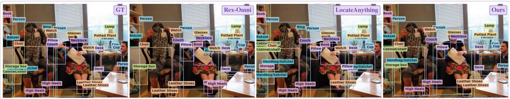  
Figure 18 Multi-scale object grounding in a cluttered indoor scene.

Table 32 Dense200 visual prompting. Complete box-grounding metrics. LocateAnything variants lack a supported visual-prompt interface; both DeepSeek variants have incompatible output protocols. Their entries are N/A. Kimi-K3 is N/A because the required prompt format is unsupported. Starred GroundingDINO scores come from an unsupported visual-prompt task interface; starred MiMo and BAGEL scores are retained observations under suspected outputprotocol incompatibility.
<table><tr><td rowspan="2">Model</td><td colspan="3">loU 0.50</td><td colspan="3">loU 0.95</td><td colspan="3">mloU</td></tr><tr><td>R</td><td>P</td><td>F1</td><td>R</td><td>P</td><td>F1</td><td>R</td><td>P</td><td>F1</td></tr><tr><td>Open-set Specialized Detectors</td><td></td><td></td><td></td><td></td><td></td><td></td><td></td><td></td><td></td></tr><tr><td>GroundingDINO (Liu et al., 2024)</td><td>2.03*</td><td>9.98*</td><td>3.38*</td><td>1.35*</td><td>5.64*</td><td>2.18*</td><td>1.90*</td><td>9.00*</td><td>3.14*</td></tr><tr><td>Vision-Language Models (&lt;10B)</td><td></td><td></td><td></td><td></td><td></td><td></td><td></td><td></td><td></td></tr><tr><td>Rex-Omni (Jiang et al., 2026)</td><td>73.05</td><td>74.81</td><td>73.92</td><td>10.89</td><td>11.12</td><td>11.00</td><td>54.93</td><td>56.08</td><td>55.50</td></tr><tr><td>LocateAnything Fast (Wang et al., 2026)</td><td>N/A*</td><td>N/A*</td><td>N/A*</td><td>N/A*</td><td>N/A*</td><td>N/A*</td><td>N/A*</td><td>N/A*</td><td>N/A*</td></tr><tr><td>LocateAnything Hybrid (Wang et al., 2026)</td><td>N/A*</td><td>N/A*</td><td>N/A*</td><td>N/A*</td><td>N/A*</td><td>N/A*</td><td>N/A*</td><td>N/A*</td><td>N/A*</td></tr><tr><td>LocateAnything Slow NTP (Wang et al., 2026)</td><td>N/A*</td><td>N/A*</td><td>N/A*</td><td>N/A*</td><td>N/A*</td><td>N/A*</td><td>N/A*</td><td>N/A*</td><td>N/A*</td></tr><tr><td>Qwen2.5-VL-7B (Bai et al., 2025b)</td><td>0.75</td><td>23.66</td><td>1.46</td><td>0.00</td><td>0.00</td><td>0.00</td><td>0.44</td><td>13.33</td><td>0.86</td></tr><tr><td>Qwen3-VL-2B (Bai et al., 2025a)</td><td>7.76</td><td>60.82</td><td>13.76</td><td>0.69</td><td>1.78</td><td>1.00</td><td>5.08</td><td>33.85</td><td>8.79</td></tr><tr><td>Qwen3-VL-4B (Bai et al., 2025a)</td><td>1.76</td><td>93.00</td><td>3.45</td><td>0.21</td><td>8.00</td><td>0.41</td><td>1.27</td><td>62.90</td><td>2.49</td></tr><tr><td>Qwen3-VL-8B (Bai et al., 2025a)</td><td>8.26</td><td>87.71</td><td>15.10</td><td>0.99</td><td>3.91</td><td>1.58</td><td>5.79</td><td>55.05</td><td>10.45</td></tr><tr><td>Qwen3.5-4B (Qwen Team, 2026a)</td><td>2.82</td><td>78.69</td><td>5.44</td><td>0.34</td><td>7.71</td><td>0.65</td><td>2.01</td><td>54.25</td><td>3.87</td></tr><tr><td>Qwen3.5-9B (Qwen Team, 2026a)</td><td>26.66</td><td>65.61</td><td>37.91</td><td>4.19</td><td>10.33</td><td>5.96</td><td>19.00</td><td>46.27</td><td>26.93</td></tr><tr><td>RynnBrain1.1 (Li et al., 2026a)</td><td>1.16</td><td>62.50</td><td>2.28</td><td>0.07</td><td>4.00</td><td>0.14</td><td>0.74</td><td>38.25</td><td>1.45</td></tr><tr><td>SenseNova-Vision (Han et al., 2026)</td><td>69.56</td><td>84.68</td><td>76.38</td><td>19.15</td><td>22.06</td><td>20.50</td><td>57.21</td><td>69.70</td><td>62.84</td></tr><tr><td>MiMo-VL-7B-SFT (Yue et al., 2025)</td><td>2.87*</td><td>20.40*</td><td>5.03*</td><td>0.01*</td><td>0.00*</td><td>0.00*</td><td>1.08*</td><td>6.38*</td><td>1.83*</td></tr><tr><td>MiMo-VL-7B-RL (Yue et al., 2025)</td><td>2.58*</td><td>14.41*</td><td>4.38*</td><td>0.01*</td><td>0.01*</td><td>0.01*</td><td>0.89*</td><td>5.40*</td><td>1.51*</td></tr><tr><td>BAGEL (Deng et al., 2025)</td><td>1.28*</td><td>56.29*</td><td>2.50*</td><td>0.02*</td><td>1.25*</td><td>0.05*</td><td>0.74*</td><td>29.87*</td><td>1.45*</td></tr><tr><td>RynnBrain (Dang et al., 2026)</td><td>1.26</td><td>64.50</td><td>2.47</td><td>0.02</td><td>1.00</td><td>0.03</td><td>0.74</td><td>36.35</td><td>1.44</td></tr><tr><td>GroundAnything-VLM</td><td>88.68</td><td>92.85</td><td>90.72</td><td>28.51</td><td>30.01</td><td>29.24</td><td>73.59</td><td>77.00</td><td>75.26</td></tr><tr><td>GroundAnything</td><td>67.13</td><td>79.38</td><td></td><td></td><td></td><td>72.74 24.97 27.06 25.97</td><td>58.16</td><td>69.96</td><td>63.52</td></tr><tr><td>Vision-Language Models (10B-1T)</td><td></td><td></td><td></td><td></td><td></td><td></td><td></td><td></td><td></td><td></td></tr><tr><td>Qwen3.6-27B (Qwen Team, 2026b)</td><td>31.92</td><td>59.87</td><td>41.64</td><td>5.79</td><td>7.69</td><td>6.61</td><td></td><td>23.81 45.89</td><td></td><td>31.33</td></tr><tr><td>Qwen3-VL-32B (Bai et al., 2025a)</td><td>18.96</td><td>55.73</td><td>28.30</td><td>2.51</td><td>6.05</td><td></td><td>3.55</td><td>13.84</td><td>41.11</td><td>20.69</td></tr><tr><td>Qwen3.8-27B (Qwen Team, 2026d)</td><td>25.08</td><td>68.06</td><td>36.65</td><td>4.61</td><td>14.62</td><td></td><td>7.01</td><td>19.15</td><td>53.40</td><td>28.19</td></tr><tr><td>Qwen3.5-35B-A3B (Qwen Team, 2026a)</td><td>41.09</td><td>71.35</td><td>52.15</td><td>5.85</td><td></td><td>7.14</td><td>6.43</td><td>29.95</td><td>51.04</td><td>37.73</td></tr><tr><td>DeepSeek-VL2-Small-16B (Wu et al., 2024)</td><td>N/A*</td><td>N/A*</td><td>N/A*</td><td>N/A*</td><td></td><td>N/A*</td><td>N/A*</td><td>N/A*</td><td>N/A*</td><td>N/A*</td></tr><tr><td>DeepSeek-VL2-27B 3 (Wu et al., 2024)</td><td>N/A*</td><td>N/A*</td><td>N/A*</td><td>N/A*</td><td></td><td>N/A*</td><td>N/A*</td><td>N/A*</td><td>N/A*</td><td>N/A*</td></tr><tr><td>Vision-Language Models (&gt;1T)</td><td></td><td></td><td></td><td></td><td></td><td></td><td></td><td></td><td></td><td></td></tr><tr><td>Qwen3.7-Max (Qwen Team, 2026c)</td><td>28.05</td><td>72.46</td><td>40.44</td><td></td><td>5.40</td><td>9.51</td><td>6.89</td><td>22.37</td><td>55.16</td><td>31.81</td></tr><tr><td>Kimi-K2.6</td><td>43.14</td><td>51.19</td><td>46.82</td><td></td><td>5.48</td><td>6.84</td><td>6.09</td><td>29.90</td><td>35.39</td><td>32.41</td></tr><tr><td>Kimi-K3 (Team et al., 2026)</td><td>N/A*</td><td>N/A*</td><td>N/A*</td><td>N/A*</td><td></td><td>N/A*</td><td>N/A*</td><td>N/A*</td><td>N/A*</td><td>N/A*</td></tr><tr><td>GPT-6 Astra</td><td>95.44</td><td>88.71</td><td>92.04</td><td></td><td>12.84</td><td>11.75</td><td>12.29</td><td>71.48</td><td>66.44</td><td>68.94</td></tr><tr><td></td><td></td><td></td><td></td><td></td><td></td><td></td><td></td><td></td><td></td><td></td></tr></table>

Grounding in a cluttered indoor scene. The indoor scene in Figure 18 combines people, furniture, books, containers, and small accessories. Large objects provide scene context, while partially visible items and accessories require finer spatial discrimination. The displayed annotations illustrate the need to retain instance identity across scale and occlusion, rather than replacing a collection of nearby objects with one broad region. In particular, distinguishing an accessory from its wearer requires semantic association as well as localization. The supplied Ours panel is explicitly marked as a GT-completed display and is treated as an illustrative rendering, not as an unedited prediction set.

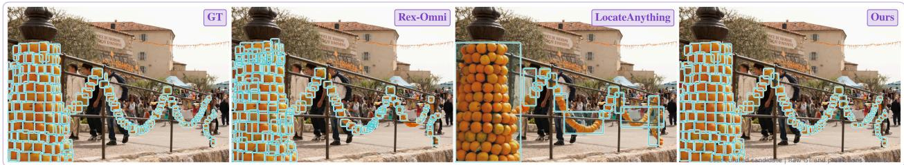  
Figure 19 Dense instance grounding of fruit decorations.

## E.11.2 Dense Object Grounding

Dense instances under occlusion. The repeated fruit decorations in Figure 19 vary in apparent size and overlap along a central support and surrounding garlands. The comparison illustrates a distinction between localizing individual fruits and enclosing an entire decorated structure. Several broad boxes in the comparison panels merge multiple instances, whereas the displayed Ours panel retains finer instance granularity. Adjacent fruits with similar color make both duplicate suppression and boundary separation dificult. The curated visualization illustrates these error modes without assigning additional detection scores.

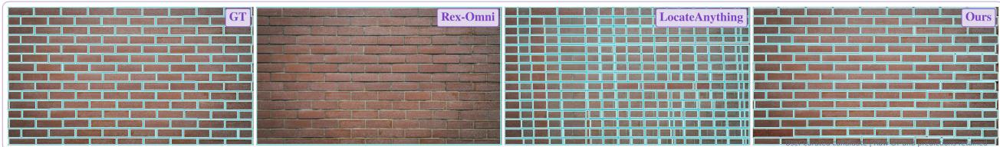  
Figure 20 Dense grounding of repeated bricks.

Repeated boundaries and fine spatial structure. Figure 20 uses a brick wall to probe repeated structures with small appearance diferences. The displayed Ours boxes follow individual bricks and preserve the staggered rows, whereas crossing or oversized boxes in the comparison panels mix neighboring units. Success here requires aligning the queried unit with local mortar boundaries while maintaining consistency across a large set of nearly interchangeable instances. The figure is a qualitative illustration of spatial granularity; an unannotated comparison panel alone does not identify the underlying cause of a missing display.

E.11.3 Referring Grounding and Complex Visual Configurations  
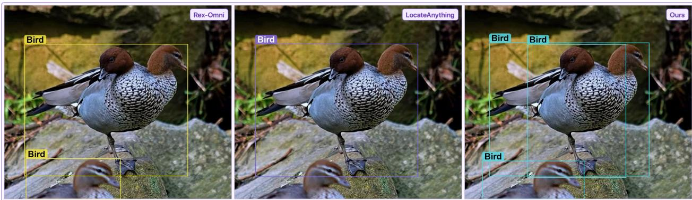  
Figure 21 Separating overlapping birds with deceptive silhouettes.

Complex case: visually deceptive overlap. Figure 21 presents a visually deceptive configuration: two birds overlap so closely that their similar feather textures and aligned body contours can resemble a single twoheaded bird. A third bird is only partly visible at the lower image boundary. The Rex-Omni panel encloses the overlapping pair in one large box and marks the foreground bird separately; LocateAnything shows one broad box; the Ours panel distinguishes the two overlapping instances and the truncated foreground instance.

The relevant evidence includes two distinct heads and beaks, diferently oriented necks, and the relationship between each head and its body contour. A purely salient-region interpretation can merge those cues into one object. Resolving the ambiguity calls for instance-level semantic understanding, occlusion reasoning, and spatial part association, motivating a strong vision–language foundation rather than localization based on isolated texture or outline alone. This example illustrates a demanding capability; a single selected case does not establish a particular internal reasoning mechanism or a universal advantage over all competing models.

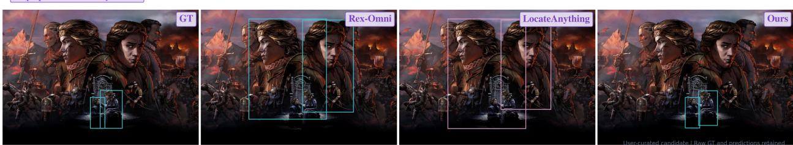  
Figure 22 Grounding a pair specified by a visual relationship.

Relational referring beyond visual salience. The query in Figure 22 asks for two people who can make eye contact. The relevant pair occupies a small area near the bottom of a poster dominated by much larger portraits. The displayed Ours regions select that pair, while other panels emphasize the larger faces. The challenge is to interpret a relation between two instances and their orientation, rather than rank people by size or salience. This example concerns the visible relational configuration, not an inference about the depicted people’s identity or mental state.

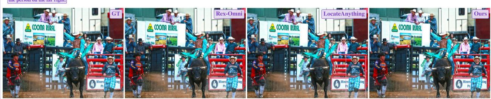  
Figure 23 Grounding a spatially specified, partially visible person.

Referring at the image boundary. In Figure 23, the phrase “the person on the far right” refers to a partially truncated spectator at the image boundary, rather than the prominent foreground participant. The scene contains many people with similar hats and clothing, making category recognition alone insuficient. The displayed Ours box follows the boundary instance. The example illustrates the need to resolve a relative spatial expression over all visible candidates, including small and partly occluded instances, before predicting the target extent.

E.11.4 Referring Point-in-Mask Grounding  
  
Figure 24 Point grounding within an occluded person’s visible mask.

Referring points inside visible target regions. Figure 24 separates semantic target selection from the geometric requirement that a point lie inside the target’s visible mask. The child is partially hidden by a float, so the enclosing box center can fall on an occluder. The displayed Ours point lies on the visible face, while the comparison points fall on the float or another person. A valid point therefore requires both identifying the intended instance and selecting visible evidence belonging to it, rather than using a generic scene center or box-center heuristic.

## E.11.5 Dense Point Grounding

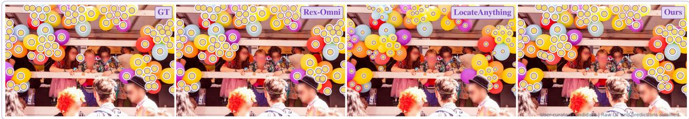  
Figure 25 Dense point grounding of overlapping balloons.

Dense pointing with repeated appearances. Figure 25 contains many balloons with repeated colors, touching outlines, partial occlusions, and instances cut by the image boundary. The displayed points span the arch rather than collapsing the group to a few salient locations. The task combines set coverage with one-pointper-instance consistency: missing small balloons and placing repeated points on the same balloon are distinct errors. Marker size is part of the visualization and should not be interpreted as localization uncertainty or predicted object size.

## E.11.6 Dense Point-in-Mask Grounding

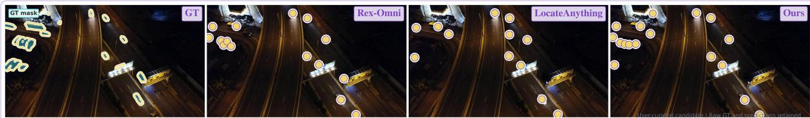  
Figure 26 Dense point grounding of vehicles in a night scene.

Dense point placement in low light. Figure 26 shows vehicles from above under low illumination, including moving vehicles on the road and a compact parked group. Ground-truth masks identify the visible vehicle regions, while point predictions must remain within those regions despite shadows and bright headlights. The displayed Ours points cover both isolated and clustered vehicles. The example illustrates why coverage and interior-point placement must be evaluated together: a point on a light streak or adjacent road surface can be close to a vehicle while missing its visible mask.

## E.11.7 GUI Grounding

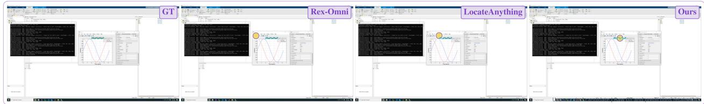  
Figure 27 GUI target grounding in a multi-window desktop.

GUI grounding among overlapping windows. The desktop in Figure 27 contains an editor, a terminal, a plot window, and a property inspector. The marked reference region is the small plot-title area, surrounded by nearby menu and toolbar controls. The displayed Ours point lies in that region, whereas the comparison points are displaced toward neighboring controls. This case requires assigning a target to the correct window and interpreting local interface structure. It illustrates visual target grounding, not successful execution of an unshown action sequence.

## E.11.8 OCR and Artistic Text Understanding

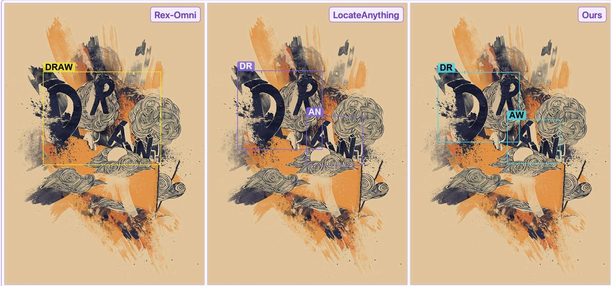  
Figure 28 OCR of artistic lettering embedded in illustration.

Complex case: artistic letters and decorative texture. The word “DRAW” in Figure 28 is distributed across staggered, tilted letters embedded in brush strokes and dense line art. Decorative contours resemble character strokes, while the letters do not share a conventional horizontal baseline. The Ours panel reads the two spatial groups as “DR” and “AW”; LocateAnything shows “DR” and “AN”, and Rex-Omni uses a single “DRAW” region. This distinction matters: a complete word box and two correct fragments can both be reasonable annotation granularities, so the split alone is not evidence of superior recognition. The informative feature is maintaining the correct letter identity and its spatial support despite stylization, especially the final W. Such reading requires integrating local strokes with word-level context and distinguishing typography from illustration. It motivates strong visual–linguistic representations while also showing why OCR comparisons must specify both transcription and grouping conventions.

Complex case: shape-based typography. In Figure 29, the poster combines small conventional words with the oversized, heavily deformed word “FAN” and an illustrated electric fan. Rounded, interlocking glyphs and decorative stars blur the boundary between text and drawing. The Ours panel preserves the large “FAN” region while also identifying smaller words such as “BE”, “YOUR”, and “OWN”. Reading the slogan requires tracking character order across sizes and styles rather than treating all blue shapes as one object. The fan illustration supplies useful semantic context, but a grounded transcription must still be supported by visible letter strokes. This is a demanding vision–language reading example; it does not imply that contextual plausibility can substitute for character evidence or that every small printed line is recovered perfectly.

Scene text with perspective and scale variation. Figure 30 includes large lettering along a curved entrance, a hanging business sign, and smaller roadside text. Perspective changes character orientation and spacing, while foliage and uneven contrast complicate localization. The displayed Ours regions retain separate text groups across these scales; comparison panels illustrate merged phrases and transcription changes. The case highlights joint text–geometry consistency: a plausible phrase in a region that spans multiple signs is diferent from a transcription aligned to the intended word or line.

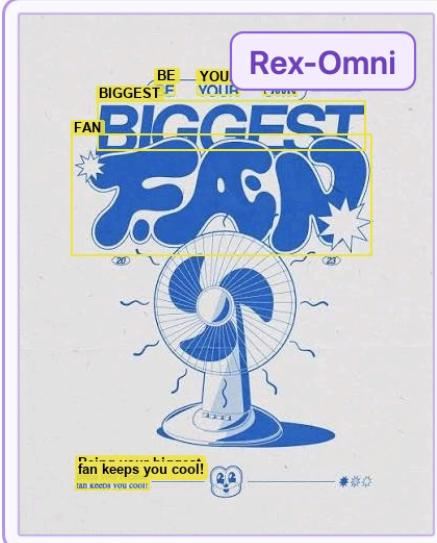

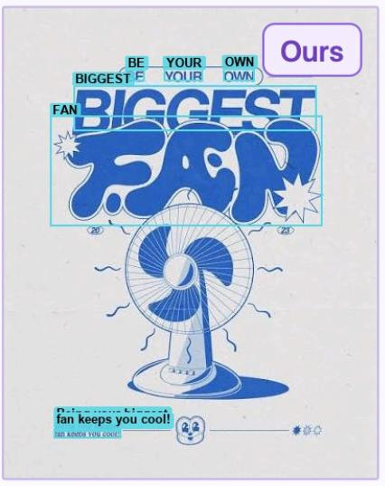

Figure 29 OCR of highly stylized poster lettering.  
  
Figure 30 OCR of outdoor signs with perspective distortion.

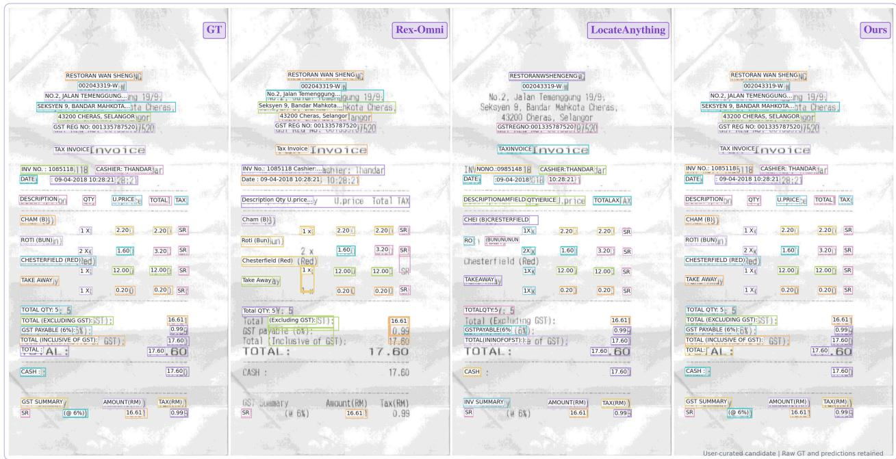  
Figure 31 OCR of a low-contrast receipt with aligned fields.

Document text and tabular alignment. The faded receipt in Figure 31 contains headings, item descriptions, quantities, unit prices, totals, and tax fields. The displayed Ours regions preserve separate text cells and repeated numerical entries across the document, while comparison panels illustrate merged headers and missed or fragmented lines. Useful OCR must retain both character identity and the layout that associates each value with its row and column. The visualization concerns recognition and localization; it does not establish arithmetic verification or downstream financial correctness.

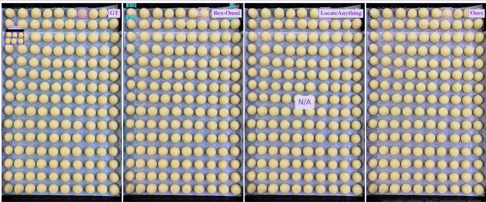

Figure 32 Exemplar-guided grounding of repeated rounded objects.  
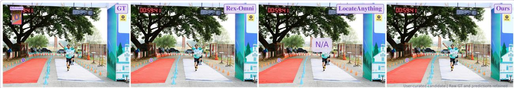  
Figure 33 Exemplar-guided grounding of trafic cones.

## E.11.9 Visual-Prompt Grounding

Visual exemplars in highly repetitive scenes. In Figure 32, a boxed visual exemplar specifies the repeated rounded objects without relying on a category name. The target instances form dense rows with mild shape and size variation. The displayed Ours boxes cover instances across the tray, while the Rex-Omni panel contains sparse and repeated edge-aligned proposals. The LocateAnything panel is explicitly marked N/A and is not treated as a scored failure. The example illustrates transferring an exemplar’s visual identity to many instances while avoiding duplicate localization.

Visual prompting with perspective variation. Figure 33 uses a local visual reference to specify cones distributed around a running course. Their apparent size changes strongly with depth, and the scene includes both orange and blue cones. The displayed Ours boxes follow instances from the foreground toward the distant gate, illustrating visual category transfer beyond the exact reference crop. The comparison highlights partial coverage and repeated localization. The panel marked N/A denotes an unavailable comparison, not an observed zero score.