# A BROADER LOOK AT MODEL MERGING: RETHINK-ING IMPLICIT REGULARIZATION INDUCED BY TASK ARITHMETIC

Sin-Han Yang1∗ Shih-Cheng Huang1∗ Chieh-Yen Lin1 Yun-Nung Chen2† Shao-Hua Sun1,2† Hung-yi Lee2†

1Appier AI Research 2National Taiwan University sinhan.yang@appier.com, andy.huang@appier.com

## ABSTRACT

Model merging aims to build a multi-task model cheaply by combining the weights of individual task-specific models. To perform well across multiple tasks, most existing merging methods use an additional dataset to find the coefficients for the best linear combination of task-specific weight updates. However, we identify an implicit regularization in this standard practice: searching over coefficients restricts the candidate models to a subspace spanned by taskspecific weight updates. In this work, we investigate whether this regularization is actually useful. Surprisingly, empirical results show that optimizing mergedmodel weights without this regularization significantly boosts the performance of common merging methods across multiple architectures, domains, and even in an extremely data-limited scenario where only one instance is available per class. Moreover, directly optimizing the pretrained model weights even outperforms some existing merging methods. Analysis shows that better multi-task weights exist outside the subspace and can be found using multiple methods. We study different strategies for using the additional dataset, discussing their practical use and implications for model merging. Overall, this work calls for revisiting the existing model-merging pipeline, motivating a broader exploration of the weight space and a reconsideration of the implicit regularization induced by task arithmetic. Source code: https://github.com/appier-research/ broader\_model\_merging.

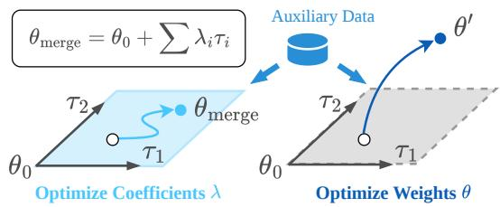

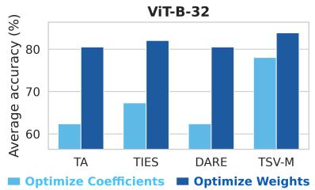  
Figure 1: A new perspective on the model-merging pipeline. The existing model-merging pipeline builds the merged model $\theta _ { m e r g e }$ by adding a linear combination of task-specific weight updates $\tau _ { i }$ to the pretrained model $\theta _ { 0 }$ . Standard practice uses an additional dataset, which we term auxiliary data, to optimize the coefficients λ for multi-task performance. This coefficient optimization regularizes model updates to the subspace spanned by $\tau _ { i }$ . We challenge this pipeline by using the same auxiliary data to optimize the merged-model weights, allowing optimization beyond this subspace. Experimental results show that exploring the broader weight space generally leads to significant performance improvements across merging methods (TA, TIES, DARE, and TSV-M).

## 1 INTRODUCTION

Model merging aims to build a unified model by combining the weights of individual task-specific models without retraining on full training data. It enables a wide range of applications, including multi-task model construction (Ilharco et al., 2023; Yadav et al., 2023), cross-lingual capability transfer (Huang et al., 2024; Bandarkar et al., 2025), and multi-objective preference alignment (Rame et al., 2023; Jang et al., 2024; Liang et al., 2026).

Task Arithmetic (Ilharco et al., 2023) is a widely adopted framework for model merging, which builds a multi-task model by linearly combining task vectors. A task vector is defined as $\tau _ { i } = \theta _ { i } - \theta _ { 0 }$ where $\theta _ { i }$ is a model fine-tuned on task i from the pre-trained model $\theta _ { 0 }$ . Such linear combinations have been shown to produce effective multi-task models (Ilharco et al., 2023; Ortiz-Jimenez et al., 2023). Recent studies follow this formulation and focus on refining the task vectors to reduce interference among tasks (Yadav et al., 2023; Yu et al., 2024; Gargiulo et al., 2025). However, the merged model can be sensitive to the coefficients of the linear combination (Yang et al., 2024b; Tam et al., 2026), so most merging methods rely on auxiliary data to select coefficients (Chaves et al., 2026), either through grid search on hold-out data (Ilharco et al., 2023; Yadav et al., 2023; Yu et al., 2024) or through test-time adaptation on unlabeled test data (Yang et al., 2024b; Touayouch et al., 2026). Despite these advances, a performance gap remains between merged models and individual task-specific models (Yang et al., 2026).

To mitigate this gap, we revisit the current model merging pipeline and ask whether the existing framework fully uses the auxiliary data. Optimizing the coefficients of the linear combination is equivalent to restricting weight optimization to the subspace spanned by the task vectors. We refer to this subspace as the task-vector subspace. From this perspective, we identify coefficient optimization under task arithmetic as a constrained optimization that implicitly regularizes candidate models to the task-vector subspace. While the empirical success of task arithmetic shows that effective multi-task weights exist within the task-vector subspace, its implicit regularization has not been examined. Thus, the research question is: For model merging, is the implicit regularization induced by task arithmetic actually useful, or does it exclude better multi-task weights?

To find out the answer, we investigate direct optimization in the weight space beyond the task-vector subspace. We apply the most common optimization method, gradient descent, in standard model merging benchmarks across computer vision and natural language processing. Surprisingly, we find that optimization in the weight space consistently and significantly improves the performance of various model-merging methods beyond optimizing the coefficients, as shown in Figure 1. We further downsample the auxiliary dataset and find that the conclusion still holds when data are scarce, with only one sample per class. The results confirm that the optimization flexibility does not lead to overfitting in model-merging benchmarks. Moreover, even gradient descent directly from the pretrained model can outperform some existing merging methods. Nevertheless, merged methods still provide stronger initializations for gradient descent. These findings imply that the task arithmetic’s implicit regularization may lead to the underuse of auxiliary data and limit merged models’ performance.

We further analyze geometric properties of gradient descent on the merged models. We first find that gradient descent consistently leaves the task-vector subspace, suggesting that better multi-task weights exist outside this restricted region. Motivated by this finding and Gan & Isola (2026), we propose S-RandOpt that samples weights outside the subspace. By allowing just one additional degree of freedom, S-RandOpt outperforms coefficient optimization, further supporting the idea that the implicit regularization of task arithmetic overly restricts model complexity. It also implies that finding better multi-task weights does not rely on gradient descent. We also investigate the memory and computational costs of different strategies for using auxiliary data. Finally, we study different strategies for using the auxiliary data under various conditions, revealing the bias-variance tradeoff as a key principle for determining how auxiliary data should be used. Our analysis motivates future merging methods to provide strong initializations that enable more effective use of auxiliary data and, more broadly, calls for rethinking how to build a strong multi-task model via model merging.

## 2 OVERVIEW OF MODEL MERGING METHODS

The goal of model merging is to build a multi-task model by leveraging models that are separately fine-tuned on different tasks. In this work, we focus on merging models that share the same architecture and are fine-tuned from the same pretrained model on different tasks. While multi-task learning (Ruder, 2017) and multi-task fine-tuning (Chung et al., 2024) also aim to build multi-task models, model merging focuses on the specific scenario where task-specific models are available. This work centers around the model merging scenario, but applies the multi-task learning algorithm.

Table 1: Summary of prior works in terms of compute and data usage. Backprop. refers to backpropagation. Data Source refers to the source of auxiliary data. Existing works leverage backpropagation and auxiliary data to build merged models.
<table><tr><td rowspan="2"></td><td rowspan="2">Backprop.</td><td rowspan="2">Data Source</td><td colspan="2">Auxiliary Data</td></tr><tr><td>Inputs</td><td>Labels</td></tr><tr><td>TA (Ilharco et al., 2023)</td><td>X</td><td>Valid</td><td>V</td><td>√</td></tr><tr><td>Fisher averaging (Matena &amp; Raffel, 2022)</td><td>√</td><td>Train</td><td>√</td><td>X</td></tr><tr><td>TIES (Yadav et al., 2023)</td><td>X</td><td>Valid</td><td>√</td><td>√</td></tr><tr><td>Uncertainty-based (Daheim et al., 2024)</td><td>√</td><td>Train</td><td>√</td><td>√</td></tr><tr><td>DARE (Yu et al., 2024)</td><td>X</td><td>Valid</td><td>√</td><td>√</td></tr><tr><td>TSV-M (Gargiulo et al., 2025)</td><td>X</td><td>X</td><td>X</td><td>X</td></tr><tr><td>AdaMerging (Yang et al., 2024b)</td><td>V</td><td>Test</td><td>V</td><td>X</td></tr><tr><td>DivMerge (Touayouch et al., 2026)</td><td>√</td><td>Test</td><td>√</td><td>X</td></tr></table>

Most model merging methods are based on task vectors (Ilharco et al., 2023), defined as $\tau _ { i } =$ $\theta _ { i , f t } - \theta _ { 0 }$ , where $\theta _ { i , f t }$ is the model weight fine-tuned on the i-th task and $\theta _ { 0 }$ is the pretrained model they share. Given T tasks, the merged model is then formed as

$$
\theta _ { \mathrm { m e r g e d } } = \theta _ { 0 } + \sum _ { i = 1 } ^ { T } \lambda _ { i } \tilde { \tau } _ { i } .\tag{1}
$$

Prior works build better merged models by transforming task vectors into variants $\widetilde { \tau } _ { i } ,$ , which we call advanced task vectors. One branch of existing methods constructs advanced task vectors by leveraging information from the original task vectors, including sparsification (Yadav et al., 2023; Yu et al., 2024) and low-rank decomposition (Gargiulo et al., 2025; Marczak et al., 2025). Another branch of methods requires data, including calculating gradients to estimate curvature information (Matena & Raffel, 2022; Daheim et al., 2024), or estimating activations to reduce the conflict between tasks (Yang et al., 2024a). We further discuss more existing merging methods in Appendix B.

After building the (advanced) task vectors, the next step is to determine the coefficients $\{ \lambda _ { i } \}$ of each task vector. As shown in the existing works (Yang et al., 2024b; Tam et al., 2026), merging methods’ performance is highly sensitive to the coefficients. The simplest baseline to obtain good coefficients is grid search (Ilharco et al., 2023), which uses a hold-out data set to pick the best set of coefficients. However, when merging many tasks, grid search in the T-dimensional space requires extensive inference, making it impractical. Therefore, most existing works instead perform diagonal search, using a single shared coefficient for all task vectors. Another line of work develops methods to optimize the coefficients using this hold-out dataset, including gradient descent on coefficients (Yang et al., 2024b; Touayouch et al., 2026) and Bayesian optimization (Lee et al., 2025). Notably, optimizing the coefficients is equivalent to optimizing the model within the subspace spanned by (advanced) task vectors. In this work, we ask if this is the best way to leverage this hold-out dataset.

## 2.1 COMPUTE AND DATA USAGE OF EXISTING MODEL MERGING METHODS

As the goal of model merging is to build a multi-task model without retraining on the whole training data, the computational cost and data usage are practical considerations. We collectively refer to additional data used for different purposes as auxiliary data, including the hold-out (valid) dataset and unlabeled test set used for coefficient optimization, as well as the data used to build advanced task vectors. Adapted from Gargiulo et al. (2025), Table 1 summarizes the existing model merging methods. Prior work has separately used backpropagation on model weights and auxiliary data to optimize merging coefficients, so we investigate using auxiliary data to optimize model weights.

## 3 DOES OPTIMIZING WITHIN TASK-VECTOR SUBSPACE SUFFICE?

In this section, we compare optimization within the task-vector subspace and the broader weight space. Under standard model-merging benchmarks in vision and language, we evaluate the performance of merged models from common model-merging methods under two optimization choices.

## 3.1 EXPERIMENTAL SETUP

Data. Following the original setup (Ilharco et al., 2023), we split 10% of the training set as the auxiliary data, and leave the rest as the training data for fine-tuning the task-specific model. We evaluate 9 vision tasks: MNIST (LeCun, 1998), GTSRB (Stallkamp et al., 2011), FER2013 (Goodfellow et al., 2013), Stanford Cars (Krause et al., 2013), DTD (Cimpoi et al., 2014), Food101 (Bossard et al., 2014), SUN397 (Xiao et al., 2016), RESISC45 (Cheng et al., 2017), and EuroSAT (Helber et al., 2019). For language, we evaluate 4 tasks: DDXPlus (Tchango et al., 2022), Banking77 (Loukas et al., 2023), IFEval (Zhou et al., 2023), and Usefulness Judge (Chen et al., 2026).

Models. We evaluate 3 CLIP-ViT variants (Radford et al., 2021) for vision, Qwen3-0.6B, 1.7B and 4B (Yang et al., 2025) and Llama-3.2-1B (Grattafiori et al., 2024) for language. Training details of task-specific models are provided in Appendix A.1.

Model merging methods. We test 4 common model merging methods: vanilla Task Arithmetic, which we refer to as TA (Ilharco et al., 2023), TIES (Yadav et al., 2023), DARE (Yu et al., 2024) and TSV-M (Gargiulo et al., 2025). Section 2 provides a detailed introduction to these methods.

## 3.1.1 TWO WAYS FOR OPTIMIZING MERGED MODELS

Coefficient search and subspace best. Existing methods search for good coefficients $\{ \lambda _ { i } \}$ in the final step. In this work, we denote Naive as setting all coefficients $\lambda _ { i }$ to 1 or 1, and Naive baseline as the best between the two. Coefficient search refers specifically to diagonal coefficient search in this work. To estimate the empirical best performance achievable within the task-vector subspace using auxiliary data, we report the best result among three coefficient optimization methods (denoted as subspace best): gradient descent on coefficients, fine-grained grid search, and Bayesian optimization. See Appendix Section C.1 for details. We simply refer to the task-vector subspace as the subspace in this section, where optimizing the coefficients is equivalent to optimizing the model weights within this subspace. Therefore, we call gradient descent on the coefficients Subspace GD.

Optimizing model weights. We minimize the multi-task loss with gradient descent (denoted a GD), initialized from the Naive baseline. Specifically, we fine-tune the model using auxiliary data from each task. For the main results, we use AdamW (Loshchilov & Hutter, 2019), and discuss hyperparameters in Appendix A. We also evaluate SGD in Appendix A.5. We perform full-weight fine-tuning for vision models and LoRA fine-tuning (Hu et al., 2022) for LLMs.

## 3.2 RESULTS AND DISCUSSIONS

All methods benefit from optimizing coefficients. Figure 2 shows that optimizing the coefficients of all merged methods improves their performance. Meanwhile, optimizing the coefficient beyond the diagonal search can further boost performance, which is consistent with existing work (Yang et al., 2024b; Touayouch et al., 2026). Notably, coefficient optimization improves every method, including TSV-M, which is relatively insensitive to coefficient choices (Gargiulo et al., 2025).

Optimizing weights is better than optimizing coefficients. Figure 2 shows that gradient descent (GD) on weights consistently outperforms the subspace’s best performance and improves all merged models. While TSV-M does not require auxiliary data for coefficient tuning (Gargiulo et al., 2025), GD still improves its performance when such data are available. We further discuss the correlation between each merging method’s naive performance and its performance after GD in Section 5.2.

GD from the pretrained model is surprisingly good. For vision tasks (Figure 2 first row), GD from the pretrained model (GD from pretrained) is even better than TA, TIES, and DARE with optimized coefficients. These results support our claim that the use and importance of auxiliary data have been underestimated. Nonetheless, GD from base is still worse than GD from the merged model, which demonstrates the effectiveness of merging methods.

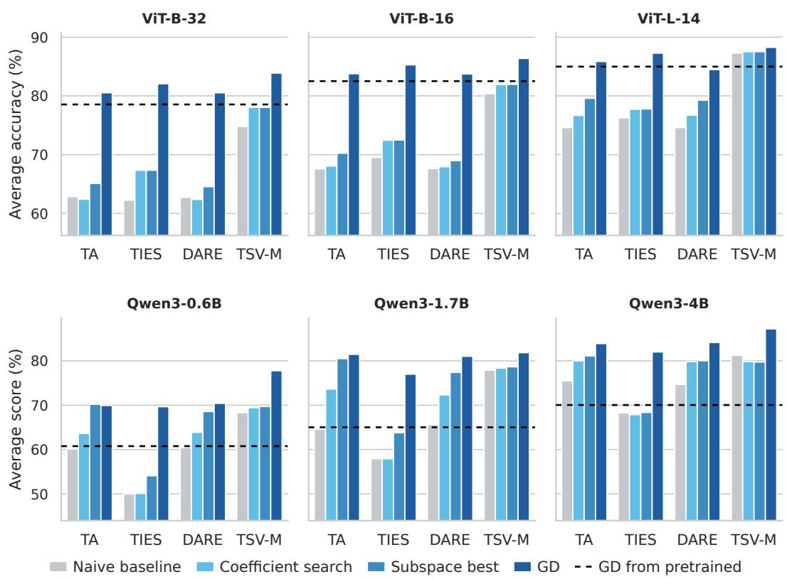

Figure 2: Average test accuracy under different uses of auxiliary data. Across vision tasks (top) and language tasks (bottom) with different models, Gradient Descent (GD) from the merged models consistently outperforms both coefficient search and the empirical best performance of its search space (Subspace best) for every merging method (TA, TIES, DARE, and TSV-M).  
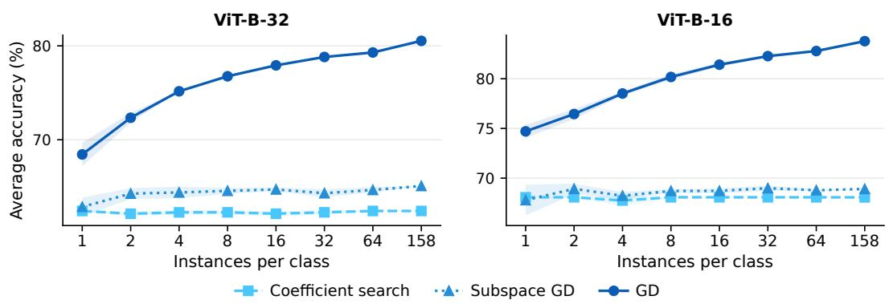  
Figure 3: Average test accuracy under different sizes and uses of auxiliary data for TA. We downsample the auxiliary data and compare different uses of auxiliary data for TA. We run three random seeds for downsampling, and report error bars as the shaded regions. Gradient Descent (GD) consistently outperforms the other two approaches that optimize weights within the subspace.

Conclusions hold with limited data. We downsample the auxiliary dataset and report vision results for TA in Figure 3; TIES results are in Appendix C.3. Weight-space gradient descent still outperforms optimization within the task-vector subspace. This implies that in standard model merging benchmarks, optimizing flexibility does not lead to worse performance even when the data are scarce. Another observation is that weight-space gradient descent better leverages auxiliary data: its performance continues to improve as more data become available, whereas coefficient optimization quickly saturates. We further challenge the limits of gradient descent in Section 5.3.

## 4 LEAVING THE TASK-VECTOR SUBSPACE IMPROVES PERFORMANCE

Section 3 shows that directly optimizing the model weights with gradient descent consistently outperforms coefficient optimization within the task-vector subspace. In this section, we investigate the source of this improvement. In Section 4.1, we first examine the geometric relationship between the solutions found by gradient descent and the task-vector subspace. In Section 4.2, we propose another method showing that this improvement does not depend on gradient descent.

## 4.1 ANALYSIS OF GRADIENT DESCENT FOR MODEL MERGING

To understand whether the performance gain requires leaving the task-vector subspace, we first visualize gradient descent in a 2-task setting. We run gradient descent from several merged models $\theta _ { \mathrm { { m e r g e } } }$ on this plane, and denote the resulting update by $\Delta = \theta _ { \mathrm { G D } } - \theta _ { \mathrm { m e r g e } } .$ . For each run, we project the trajectory onto three axes centered at $\theta _ { 0 }$ : two axes spanning the subspace, $\tau _ { 1 }$ and $\tau _ { 2 } ^ { \perp }$ (the component of $\tau _ { 2 }$ orthogonal to $\tau _ { 1 } )$ , and a third axis $\Delta _ { \perp }$ , the component of $\Delta$ orthogonal to the subspace. As shown in Figure 4, gradient descent consistently leaves the subspace regardless of the initialization.

We next quantify this behavior in the 9-task setting used in Section 3. For each merging method, we run gradient descent from its merged model and decompose the update into $\Delta _ { \perp }$ and the in-subspace component $\Delta _ { \parallel }$ . Table 2 shows that $\Delta _ { \perp }$ dominates the update. Moreover, the in-subspace component alone does not improve performance: adding only $\Delta _ { \parallel }$ to the merged model barely changes the accuracy, whereas the full update improves it by up to 20 points. Together with Figure $^ { 4 , }$ these results show that the performance gain of gradient descent requires leaving the task-vector subspace.

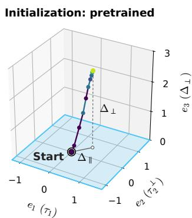

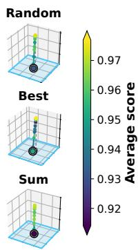  
Table 2: Decomposition of the gradient descent update (ViT-B-32, 9 tasks). We decompose the fine-tuning update $\Delta \ =$ $\theta _ { \mathrm { G D } } - \theta _ { \mathrm { m e r g e } }$ into its projection onto the task-vector subspace, $\Delta _ { \parallel }$ , and the orthogonal component, $\Delta _ { \perp } = \mathrm { \ddot { \Delta } } \Delta - \Delta _ { \| }$ . Adding only $\Delta _ { \parallel }$ to the merged model yields no accuracy gain (Acc. Gain), whereas the full update improves accuracy by 9 to 20 points. The empirical results indicate that the performance improvement requires leaving the task-vector subspace.

Figure 4: Gradient descent trajectories in the 2-task setting (ViT-B-32, EuroSAT and GTSRB). Each panel shows one run initialized on the task-vector subspace (blue plane). The axes $e _ { 1 } , e _ { 2 } ,$ , and $e _ { 3 }$ are the directions of $\tau _ { 1 } , \tau _ { 2 } ^ { \perp }$ , and each run’s update’s orthogonal component to the subspace $\Delta _ { \perp }$ . In all runs, gradient descent leaves the subspace as the score (accuracy) increases.
<table><tr><td rowspan="2">Method</td><td rowspan="2"> $\| \Delta _ { \perp } \| / \| \Delta _ { \| } \|$ </td><td colspan="2">Acc. Gain (%)</td></tr><tr><td> $+ \Delta _ { \parallel }$ </td><td> $+ \Delta _ { \parallel } + \Delta _ { \perp }$ </td></tr><tr><td>TA</td><td>11.14</td><td>-0.04</td><td>17.66</td></tr><tr><td>TIES</td><td>21.60</td><td>0.07</td><td>19.81</td></tr><tr><td>DARE</td><td>14.50</td><td>-0.01</td><td>17.78</td></tr><tr><td>TSV-M</td><td>78922.16</td><td>0.00</td><td>9.09</td></tr></table>

## 4.2 S-RANDOPT: A SIMPLE METHOD TO BOOST MODEL MERGING

Gradient descent trajectory analysis shows that better multi-task weights are outside the task-vector subspace. Next, we ask: Is it easy tofind these weights? Gan & Isola (2026) show that task-specific model weights are dense around the pretrained model weights, and random sampling can find effective model weights. Specifically, they propose RandOpt that randomly samples weights and selects the top-performing weights using training data. Inspired by these findings, we ask whether sampling outside the task-vector subspace can find multi-task weights that outperform those within the sub space. We propose Subspace-RandOpt (S-RandOpt), which uses the auxiliary data to compute the gradient from the task-vector subspace, extends the task-vector subspace by this direction, and then randomly samples within the expanded region. Finally, it uses auxiliary data for evaluation to select the best sampled weight. Appendix C.5 discusses the implementation details.

Table 3: S-RandOpt results across vision and language models. For two merging methods (TA and DARE), we report the average performance of top-5 sampled weights from S-RandOpt. It frequently outperforms the best performance on the task-vector subspace.
<table><tr><td rowspan="2">Method Strategy</td><td rowspan="2"></td><td colspan="2">Vision</td><td colspan="2">Language</td></tr><tr><td>ViT-B-32</td><td>ViT-B-16</td><td>Qwen3-0.6B</td><td>Qwen3-1.7B</td></tr><tr><td>TA</td><td>Subspace best S-RandOpt</td><td>65.07 68.76 ± 0.32</td><td>68.90  $7 0 . 7 3 \pm 0 . 4 3$ </td><td>70.20  $7 0 . 5 3 \pm 0 . 5 5$ </td><td>80.51  $8 0 . 2 2 \pm 1 . 1 0$ </td></tr><tr><td>DARE</td><td>Subspace best S-RandOpt</td><td>64.55 68.66 ± 0.32</td><td>68.97 70.70 ± 0.34</td><td>68.58  $6 9 . 6 0 \pm 0 . 5 8$ </td><td>77.41 79.53 ± 0.52</td></tr></table>

## Qwen3-0.6B

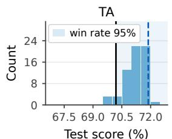

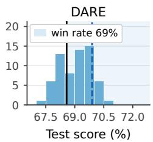

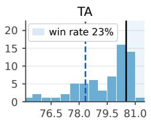  
Test score (%)

Qwen3-1.7B  
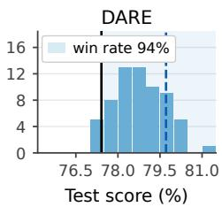  
Subspace best Selected by auxiliary data acc  
Figure 5: S-RandOpt sampled weights’ test performance. We sample 64 random weights in language models using S-RandOpt, and compare their test performance with the best point on the task-vector subspace (subspace best). A high proportion of sampled weights from outside the subspace outperforms the best weight on the subspace (Subspace best).

As reported in Table 3, S-RandOpt frequently outperforms the best weights in the task-vector subspace. Meanwhile, Figure 5 shows that better multi-task weights are dense outside the task-vector subspace. S-RandOpt not only improves the merged models, but also demonstrates that finding better multi-task weights does not depend on gradient descent.

By adding just one additional degree of freedom beyond the task-vector subspace, even random sampling can outperform the best performance in the subspace. These results further confirm that coefficient optimization of task arithmetic might impose unnecessarily strong regularization in model merging benchmarks. As a proof-of-concept, S-RandOpt also motivates future work on developing model-merging algorithms that make better use of auxiliary data by leaving the task-vector subspace.

## 5 ANALYSIS FOR PRACTICAL USE

In this section, we further analyze different strategies for using the auxiliary data, and discuss the practical implications. Specifically, we examine the computational costs of different strategies in Section 5.1, the role of model merging methods in Section 5.2, the trade-off of the regularization in Section 5.3, and test-time adaptation of the merged model in Section 5.4.

## 5.1 COMPUTATIONAL USAGE

As the goal of model merging is to build a multi-task model efficiently, ”training” seems to be an action with high cost. To fairly investigate the cost and provide practical recommendations, we analyze different strategies of using auxiliary data from three perspectives: memory, time, and compute. The results are shown in Figure 6.

Memory. Gradient descent induces larger peak GPU memory usage as it requires backpropagation, while coefficient search and Bayesian optimization only require inference. However, extra memory usage is not huge compared to optimizing coefficients using gradient descent (Subspace GD), where existing work (Yang et al., 2024b; Touayouch et al., 2026) leverages this technique.

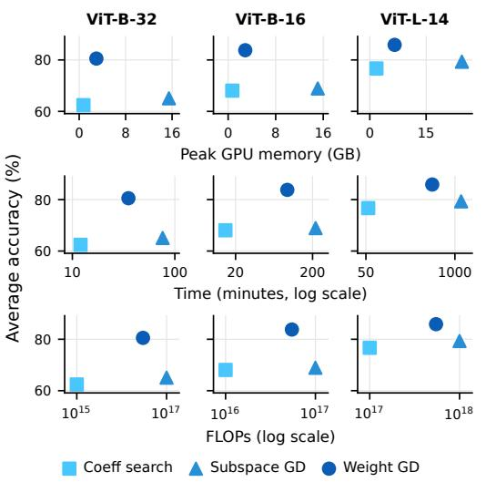  
(a) Vision

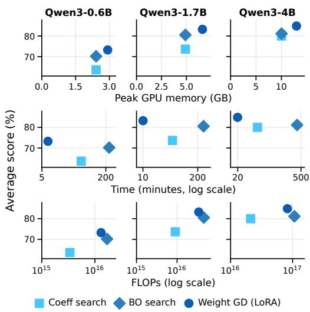  
(b) Language  
Figure 6: Computational usage of different ways to use the auxiliary data. Gradient descent on weights (Weight GD) uses slightly more memory than coefficient search. While doing gradient descent requires more compute effort (time/FLOPs), it trades compute for better performance.

Time and Compute. Gradient descent trades compute for better performance. For vision models, both time and FLOPs follow the same pattern: Subspace GD > Weight GD > Coefficient search. For language models, gradient descent is more time-efficient because coefficient search and Bayesian optimization require repeated inference rollouts with autoregressive decoding.

In summary, gradient descent requires slightly more GPU memory in the standard implementation 1, and trades compute for better performance. We tested SGD in Appendix A.5 to reduce the GPU memory usage. We recommend that practitioners select the strategy and the compute effect to achieve the Pareto frontier in each scenario.

## 5.2 MERGING METHODS PROVIDE STRONG INITIALIZATION

While Section 3 suggests that gradient descent is the better way to use auxiliary data, this finding does not dismiss the importance of model merging methods. Figure 7 shows the results of ViT-L-14, and Appendix Section D.1 provides more results of other vision and language models. The empirical results show that merging methods with higher initial accuracy also tend to achieve better performance after Gradient Descent (GD). Meanwhile, merging methods provide necessary initialization points for gradient descent, since random initialization yields weak performance. Moreover, this clearly distinguishes this work’s contribution from simple multi-task learning or fine-tuning, as starting from merged models performs significantly better than starting from the pretrained model or random initializations. This result motivates future work on stronger model merging methods to provide stronger initialization for gradient descent and other strategies for using auxiliary data.

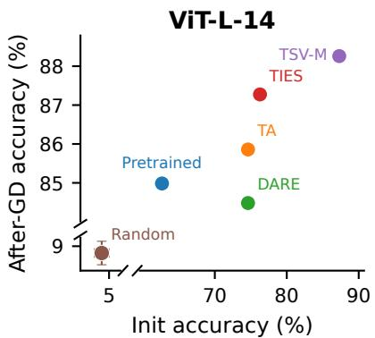  
Figure 7: Positive correlation between Init accuracy of merged models and their after-GD accuracy. Existing model merging methods provide strong initializations for gradient descent, and stronger methods have better after-GD performance.

## 5.3 EXTREME CASES AND UNDERLYING CONCEPTS

To understand the big picture, we analyze when gradient descent fails in model merging. Figure 8 shows that in the 2-task setting, where the auxiliary data size is smaller than in the 9-task setting in Section 3, GD can perform worse than coefficient search when data are downsampled. As more data are provided, GD eventually outperforms coefficient search. Adding regularization for GD makes low-data scenarios better. However, it slightly decreases performance when data are sufficient. More analysis is in Appendix D.2.

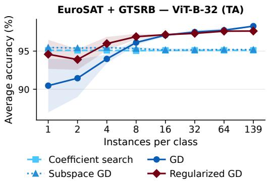

Together with results of coefficient search versus weight-space fine-tuning (Section 3), S-RandOpt (Section 4.2), and full fine-tuning versus LoRA fine-tuning (Appendix C.2), these results reflect a machine learning principle: bias-variance tradeoff. With less data available, stronger regularization (higher bias) prevents overfitting; with more data available, variance decreases, so greater model flexibility has less risk of overfitting. Coefficient optimization allows limited degrees of freedom and thus imposes stronger regularization, whereas weight-space fine-tuning al-

Figure 8: Auxiliary data scaling for TA in 2- task setting. The number of classes (53) is smaller than in the 9-task setting (856). Gradient descent’s performance is worse than coefficient search when data is extremely limited, but still outperforms it when more data are provided. Adding regularization for GD mitigates the issue. The results indicate that generalization is a key factor when using auxiliary data.

lows greater flexibility. On standard model merging benchmarks, we have shown that gradient descent does not severely overfit. We recommend practitioners consider the generalization trade-off when deciding how to use auxiliary data.

## 5.4 TEST-TIME ADAPTATION

One way to address the generalization issue is test-time adaptation (Wang et al., 2021; Liang et al., 2025). Some previous model merging works (Yang et al., 2024b; Touayouch et al., 2026) have leveraged unlabeled test data to adapt the merged models on test data. However, they only optimize the coefficients. For TA (Ilharco et al., 2023), Table 4 shows that using gradient descent to adapt the unlabeled test data outperforms coefficient optimization. Detailed settings and more results are in Appendix D.3, further supporting the bias-variance tradeoff as a key principle for using auxiliary data.

Table 4: Test-time adaptation methods’ performance. All methods are applied on top of TA. Compared with existing methods that use an unlabeled test set to optimize the task-wise coefficients, using this auxiliary data to perform Gradient Descent (GD) on weights leads to better accuracy across all models.
<table><tr><td>Method</td><td>ViT-B-32</td><td>ViT-B-16</td><td>ViT-L-14</td></tr><tr><td>AdaMerging</td><td>62.21</td><td>66.80</td><td>76.63</td></tr><tr><td>DivMerge</td><td>65.43</td><td>69.62</td><td>78.49</td></tr><tr><td>GD</td><td>82.43</td><td>85.51</td><td>88.15</td></tr></table>

## 6 CONCLUSION

This work identifies that optimizing weights in the task-vector subspace is a potentially overlooked bottleneck in model merging. Through extensive experiments, we call for a broader look at model merging: reconsider whether the implicit regularization of task arithmetic is useful, and the need to explore beyond the task-vector subspace. Across standard model merging benchmarks, we find that this regularization often limits the merged model’s performance. By relaxing the regularization, simple gradient descent or even sampling can improve the merged model’s performance. We reveal that generalization is a key factor to consider when determining how strongly the regularization should be applied. That said, we did not identify a one-size-fits-all method for model merging, as the appropriate method depends on the models, auxiliary data, and scenarios. Overall, our findings motivate future work on developing stronger merging methods and model-merging pipelines that jointly consider auxiliary-data usage and optimization flexibility.

## REPRODUCIBILITY STATEMENT

Experiment details are clearly described in the main paper and Appendix A to reproduce the empirical results. We have also provided the source code at https://github.com/ appier-research/broader\_model\_merging. The datasets used are all publicly available.

## ACKNOWLEDGMENTS

We would like to thank Yu-Ang Lee, Ren-Wei Liang, Zhi Rui Tam, and Cheng-Kuang Wu for their feedback on this work. We would also like to thank Zhi Rui Tam for his help with fine-tuning several language models. This work was supported in part by the National Science and Technology Council, Taiwan, under Grants 114-2628-E-002-021-, 114-2628-E-A49-002, 115-2634-F-002-012- , 115-2223-E-002-005-MY3, and 115-2218-E-002-026-, and the Taiwan Centers of Excellence in Artificial Intelligence. Shao-Hua Sun was supported by the Yushan Fellow Program of the Ministry of Education, Taiwan.

## REFERENCES

Jacob Austin, Augustus Odena, Maxwell Nye, Maarten Bosma, Henryk Michalewski, David Dohan, Ellen Jiang, Carrie Cai, Michael Terry, Quoc Le, et al. Program synthesis with large language models. arXiv preprint arXiv:2108.07732, 2021.

Lucas Bandarkar, Benjamin Muller, Pritish Yuvraj, Rui Hou, Nayan Singhal, Hongjiang Lv, and Bing Liu. Layer swapping for zero-shot cross-lingual transfer in large language models. In The Thirteenth International Conference on Learning Representations, 2025.

Lukas Bossard, Matthieu Guillaumin, and Luc Van Gool. Food-101–mining discriminative components with random forests. In European conference on computer vision, 2014.

Levy Chaves, Eduardo Valle, and Sandra Avila. Weight weaving: Parameter pooling for data-free model merging. In Proceedings of UniReps: the Third Edition of the Workshop on Unifying Representations in Neural Models, 2026.

Tianqi Chen, Bing Xu, Chiyuan Zhang, and Carlos Guestrin. Training deep nets with sublinear memory cost. arXiv preprint arXiv:1604.06174, 2016.

Yen-Shan Chen, Zhi Rui Tam, Cheng-Kuang Wu, and Yun-Nung Chen. Expected harm: Rethinking safety evaluation of (mis) aligned llms. arXiv preprint arXiv:2602.01600, 2026.

Gong Cheng, Junwei Han, and Xiaoqiang Lu. Remote sensing image scene classification: Benchmark and state of the art. Proceedings ofthe IEEE, 2017.

Runxi Cheng, Feng Xiong, Yongxian Wei, Wanyun Zhu, and Chun Yuan. Whoever started the interference should end it: Guiding data-free model merging via task vectors. In Forty-second International Conference on Machine Learning, 2025.

Hyung Won Chung, Le Hou, Shayne Longpre, Barret Zoph, Yi Tay, William Fedus, Yunxuan Li, Xuezhi Wang, Mostafa Dehghani, Siddhartha Brahma, et al. Scaling instruction-finetuned language models. Journal of machine learning research, 2024.

Mircea Cimpoi, Subhransu Maji, Iasonas Kokkinos, Sammy Mohamed, and Andrea Vedaldi. Describing textures in the wild. In Proceedings of the IEEE conference on computer vision and pattern recognition, 2014.

Karl Cobbe, Vineet Kosaraju, Mohammad Bavarian, Mark Chen, Heewoo Jun, Lukasz Kaiser, Matthias Plappert, Jerry Tworek, Jacob Hilton, Reiichiro Nakano, et al. Training verifiers to solve math word problems. arXiv preprint arXiv:2110.14168, 2021.

Nico Daheim, Thomas Mollenhoff, Edoardo M Ponti, Iryna Gurevych, and Mohammad Emtiyaz ¨ Khan. Model merging by uncertainty-based gradient matching. In International Conference on Learning Representations, 2024.

Yulu Gan and Phillip Isola. Neural thickets: Diverse task experts are dense around pretrained weights. In Forty-third International Conference on Machine Learning, 2026.

Antonio Andrea Gargiulo, Donato Crisostomi, Maria Sofia Bucarelli, Simone Scardapane, Fabrizio Silvestri, and Emanuele Rodola. Task singular vectors: Reducing task interference in model merg-\` ing. In Proceedings of the IEEE/CVF Conference on Computer Vision and Pattern Recognition (CVPR), 2025.

Ian J Goodfellow, Dumitru Erhan, Pierre Luc Carrier, Aaron Courville, Mehdi Mirza, Ben Hamner, Will Cukierski, Yichuan Tang, David Thaler, Dong-Hyun Lee, et al. Challenges in representation learning: A report on three machine learning contests. In International conference on neural information processing, 2013.

Aaron Grattafiori, Abhimanyu Dubey, Abhinav Jauhri, Abhinav Pandey, Abhishek Kadian, Ahmad Al-Dahle, Aiesha Letman, Akhil Mathur, Alan Schelten, Alex Vaughan, et al. The llama 3 herd of models. arXiv preprint arXiv:2407.21783, 2024.

Patrick Helber, Benjamin Bischke, Andreas Dengel, and Damian Borth. Eurosat: A novel dataset and deep learning benchmark for land use and land cover classification. IEEE Journal ofSelected Topics in Applied Earth Observations and Remote Sensing, 2019.

Pin-Lun Hsu, Yun Dai, Vignesh Kothapalli, Qingquan Song, Shao Tang, Siyu Zhu, Steven Shimizu, Shivam Sahni, Haowen Ning, Yanning Chen, and Zhipeng Wang. Liger-kernel: Efficient triton kernels for LLM training. In Championing Open-source DEvelopment in ML Workshop @ ICML25, 2025.

Edward J Hu, yelong shen, Phillip Wallis, Zeyuan Allen-Zhu, Yuanzhi Li, Shean Wang, Lu Wang, and Weizhu Chen. LoRA: Low-rank adaptation of large language models. In International Conference on Learning Representations, 2022. URL https://openreview.net/forum? id=nZeVKeeFYf9.

Shih-Cheng Huang, Pin-Zu Li, Yu-Chi Hsu, Kuang-Ming Chen, Yu Tung Lin, Shih-Kai Hsiao, Richard Tsai, and Hung-yi Lee. Chat vector: A simple approach to equip llms with instruction following and model alignment in new languages. In Proceedings ofthe 62nd Annual Meeting of the Associationfor Computational Linguistics (Volume 1: Long Papers), pp. 10943–10959, 2024.

Gabriel Ilharco, Marco Tulio Ribeiro, Mitchell Wortsman, Ludwig Schmidt, Hannaneh Hajishirzi, and Ali Farhadi. Editing models with task arithmetic. In The Eleventh International Conference on Learning Representations, 2023.

Joel Jang, Seungone Kim, Bill Yuchen Lin, Yizhong Wang, Jack Hessel, Luke Zettlemoyer, Hannaneh Hajishirzi, Yejin Choi, and Prithviraj Ammanabrolu. Personalized soups: Personalized large language model alignment via post-hoc parameter merging. In Adaptive Foundation Models: Evolving AIfor Personalized and Efficient Learning, 2024. URL https://openreview. net/forum?id=EMrnoPRvxe.

Jonathan Krause, Michael Stark, Jia Deng, and Li Fei-Fei. 3d object representations for fine-grained categorization. In Proceedings of the IEEE international conference on computer vision workshops, 2013.

Yann LeCun. The mnist database of handwritten digits. http://yann. lecun. com/exdb/mnist/, 1998.

Chanhyuk Lee, Jiho Choi, Chanryeol Lee, Donggyun Kim, and Seunghoon Hong. Adarank: Adaptive rank pruning for enhanced model merging. In The Fourteenth International Conference on Learning Representations, 2026.

Sanwoo Lee, Jiahao Liu, Qifan Wang, Jingang Wang, Xunliang Cai, and Yunfang Wu. Dynamic fisher-weighted model merging via bayesian optimization. In Proceedings ofthe 2025 Conference of the Nations of the Americas Chapter of the Association for Computational Linguistics: Human Language Technologies (Volume 1: Long Papers), 2025.

Jian Liang, Ran He, and Tieniu Tan. A comprehensive survey on test-time adaptation under distribution shifts. International Journal ofComputer Vision, 2025.

Ren-Wei Liang, Chin Ting Hsu, Chan-Hung Yu, Saransh Agrawal, Shih-Cheng Huang, Chieh-Yen Lin, Shang-Tse Chen, Kuan-Hao Huang, and Shao-Hua Sun. Adaptive helpfulness–harmlessness alignment with preference vectors. In Proceedings of the 19th Conference of the European Chapter ofthe Associationfor Computational Linguistics (Volume 1: Long Papers), 2026.

Ilya Loshchilov and Frank Hutter. Decoupled weight decay regularization. In International Conference on Learning Representations, 2019.

Lefteris Loukas, Ilias Stogiannidis, Odysseas Diamantopoulos, Prodromos Malakasiotis, and Stavros Vassos. Making llms worth every penny: Resource-limited text classification in banking. In Proceedings ofthe Fourth ACM International Conference on AI in Finance, 2023.

Yun Luo, Zhen Yang, Fandong Meng, Yafu Li, Jie Zhou, and Yue Zhang. An empirical study of catastrophic forgetting in large language models during continual fine-tuning. IEEE Transactions on Audio, Speech and Language Processing, 2025.

Daniel Marczak, Simone Magistri, Sebastian Cygert, Bartłomiej Twardowski, Andrew D. Bagdanov, and Joost van de Weijer. No task left behind: Isotropic model merging with common and taskspecific subspaces. In Forty-second International Conference on Machine Learning, 2025.

Michael S Matena and Colin Raffel. Merging models with fisher-weighted averaging. Advances in Neural Information Processing Systems, 2022.

Guillermo Ortiz-Jimenez, Alessandro Favero, and Pascal Frossard. Task arithmetic in the tangent space: Improved editing of pre-trained models. In Thirty-seventh Conference on Neural Information Processing Systems, 2023.

Alec Radford, Jong Wook Kim, Chris Hallacy, Aditya Ramesh, Gabriel Goh, Sandhini Agarwal, Girish Sastry, Amanda Askell, Pamela Mishkin, Jack Clark, et al. Learning transferable visual models from natural language supervision. In International conference on machine learning, 2021.

Alexandre Rame, Guillaume Couairon, Corentin Dancette, Jean-Baptiste Gaya, Mustafa Shukor, Laure Soulier, and Matthieu Cord. Rewarded soups: towards pareto-optimal alignment by interpolating weights fine-tuned on diverse rewards. Advances in Neural Information Processing Systems, 36:71095–71134, 2023.

Sebastian Ruder. An overview of multi-task learning in deep neural networks. arXiv preprint arXiv:1706.05098, 2017.

Johannes Stallkamp, Marc Schlipsing, Jan Salmen, and Christian Igel. The german traffic sign recognition benchmark: a multi-class classification competition. In The 2011 international joint conference on neural networks, 2011.

Wenju Sun, Qingyong Li, Wen Wang, Yang Liu, Yangliao Geng, and Boyang Li. Towards minimizing feature drift in model merging: Layer-wise task vector fusion for adaptive knowledge integration. In The Thirty-ninth Annual Conference on Neural Information Processing Systems, 2025.

Derek Tam, Yash Kant, Brian Lester, Igor Gilitschenski, and Colin Raffel. Realistic evaluation of model merging for compositional generalization. Transactions on Machine Learning Research, 2026.

Anke Tang, Li Shen, Yong Luo, Nan Yin, Lefei Zhang, and Dacheng Tao. Merging multi-task models via weight-ensembling mixture of experts. In Forty-first International Conference on Machine Learning, 2024.

Arsene Fansi Tchango, Rishab Goel, Zhi Wen, Julien Martel, and Joumana Ghosn. DDXPlus: A new dataset for automatic medical diagnosis. In Thirty-sixth Conference on Neural Information Processing Systems Datasets and Benchmarks Track, 2022.

Brahim Touayouch, Lo¨ıc Fosse, Geraldine Damnati, and Gw´ enol´ e Lecorv´ e. Divmerge: A´ divergence-based model merging method for multi-tasking. In Proceedings of the 19th Conference of the European Chapter of the Association for Computational Linguistics (Volume 1: Long Papers), pp. 7157–7180, 2026.

Dequan Wang, Evan Shelhamer, Shaoteng Liu, Bruno Olshausen, and Trevor Darrell. Tent: Fully test-time adaptation by entropy minimization. In International Conference on Learning Representations, 2021.

Jianxiong Xiao, Krista A Ehinger, James Hays, Antonio Torralba, and Aude Oliva. Sun database: Exploring a large collection of scene categories. International Journal of Computer Vision, 2016.

Jing Xu, Jiazheng Li, and Jingzhao Zhang. Scalable model merging with progressive layer-wise distillation. In Forty-second International Conference on Machine Learning, 2025.

Prateek Yadav, Derek Tam, Leshem Choshen, Colin A Raffel, and Mohit Bansal. Ties-merging: Resolving interference when merging models. Advances in neural information processing systems, 2023.

An Yang, Anfeng Li, Baosong Yang, Beichen Zhang, Binyuan Hui, Bo Zheng, Bowen Yu, Chang Gao, Chengen Huang, Chenxu Lv, et al. Qwen3 technical report. arXiv preprint arXiv:2505.09388, 2025.

Enneng Yang, Li Shen, Zhenyi Wang, Guibing Guo, Xiaojun Chen, Xingwei Wang, and Dacheng Tao. Representation surgery for multi-task model merging. In Forty-first International Conference on Machine Learning, 2024a.

Enneng Yang, Zhenyi Wang, Li Shen, Shiwei Liu, Guibing Guo, Xingwei Wang, and Dacheng Tao. Adamerging: Adaptive model merging for multi-task learning. In The Twelfth International Conference on Learning Representations, 2024b.

Enneng Yang, Li Shen, Guibing Guo, Xingwei Wang, Xiaochun Cao, Jie Zhang, and Dacheng Tao. Model merging in llms, mllms, and beyond: Methods, theories, applications, and opportunities. ACM Computing Surveys, 2026.

Le Yu, Bowen Yu, Haiyang Yu, Fei Huang, and Yongbin Li. Language models are super mario: Absorbing abilities from homologous models as a free lunch. In Forty-first International Conference on Machine Learning, 2024.

Jeffrey Zhou, Tianjian Lu, Swaroop Mishra, Siddhartha Brahma, Sujoy Basu, Yi Luan, Denny Zhou, and Le Hou. Instruction-following evaluation for large language models. arXiv preprint arXiv:2311.07911, 2023.

## APPENDIX

## Table of Contents

A Training details 14   
A.1 Training individual fine-tuned models . 14   
A.2 Data details and split . . 15   
A.3 Subspace GD learning rate sweep and initialization point . 16   
A.4 Weight GD learning rate sweep and initialization point . 16   
A.5 Different optimizers 17   
A.6 LLM efficiency implementation details 18   
A.7 Hyperparameters of strategies 18   
B More related works 20   
B.1 Variants of task-wise merging . 20   
B.2 Detailed discussion regarding compute and data usage 20   
C Main results details 21   
C.1 Finding Subspace Best Performance . 21   
C.2 Full-weight vs. LoRA fine-tuning and the effect of initialization points . 22   
C.3 More data scaling results 23   
C.4 Main results in Tables 23   
C.5 S-RandOpt implementation details 24   
D More analyses 25   
D.1 Complete analysis of initializations for gradient descent 25   
D.2 2-task setting . 26   
D.3 Test-time adaptation full results 28   
D.4 LLM performance on control tasks 29

## A TRAINING DETAILS

## A.1 TRAINING INDIVIDUAL FINE-TUNED MODELS

## A.1.1 VISION MODELS

We fine-tune CLIP (Radford et al., 2021) image encoders (ViT-B-32, ViT-B-16, ViT-L-14) separately on each of nine image-classification tasks: DTD (Cimpoi et al., 2014), EuroSAT (Helber et al., 2019), FER2013 (Goodfellow et al., 2013), Food101 (Bossard et al., 2014), GTSRB (Stallkamp et al., 2011), MNIST (LeCun, 1998), RESISC45 (Cheng et al., 2017), Stanford Cars (Krause et al., 2013), and SUN397 (Xiao et al., 2016). Following Ilharco et al. (2023), the classification head of each task is the CLIP zero-shot head: we encode every class name with the task’s prompt templates using the CLIP text encoder, and the (logit-scaled) normalized text embeddings serve as the weights of a linear layer with zero bias. Both the text encoder and this head stay frozen, so only the image encoder is updated, and every task vector lives in the same parameter space. We minimize the cross-entropy loss with AdamW (learning rate $1 0 ^ { - 5 }$ , no weight decay, batch size 32) for 10,000 steps. The learning rate warms up linearly over the first 10% of steps and then decays linearly. Images are preprocessed with the standard CLIP processor and no data augmentation.

## A.1.2 LANGUAGE MODELS

We fully fine-tune four base models: Qwen3-0.6B-Base, Qwen3-1.7B-Base, Qwen3-4B-Base (Yang et al., 2025), and Llama-3.2-1B-Instruct (Grattafiori et al., 2024), on each of four tasks: Banking77 (Loukas et al., 2023), DDXPlus (Tchango et al., 2022), IFEval (Zhou et al., 2023), and Usefulness Judge (Chen et al., 2026). Training uses Axolotl2 with supervised fine-tuning on chat-formatted data. The loss covers only assistant turns, including the end-of-turn token. We use AdamW $( \beta =$ $( 0 . 9 , 0 . 9 9 9 ) , \epsilon = 1 0 ^ { - 8 }$ , no weight decay), a peak learning rate of $4 \times 1 0 ^ { - 5 }$ with 10% linear warmup and cosine decay, an effective batch size of 36, 6 epochs, bf16 precision. The maximum sequence length is 4,096 (8,192 for DDXPlus). We select the checkpoints with best evaluation accuracies on a held-out set.

## A.2 DATA DETAILS AND SPLIT

Each task has three disjoint splits. The train split is used only to fine-tune the individual models. The validation split is the only data merging strategies can access and is referred to as the auxiliary data in this paper. The test split is used only for the final evaluations. All random splits use a fixed seed (42).

Vision. We randomly hold out 10% of each dataset’s official training split as the validation set, fine-tune on the remaining 90%, and test on the complete official test split (Food101 has no test split, so we use its official validation split). In the data-scaling experiments, we subsample $k \in$ {1, 2, 4, 8, 16, 32, 64} examples per class from this fixed validation set, using three seeds. When a class has fewer than k instances, we use all instances. The number of classes and samples of each split is listed in Table 5.

Table 5: Vision data splits.
<table><tr><td>Task</td><td>#Classes</td><td>#Train</td><td>#Valid</td><td>#Test</td></tr><tr><td>DTD</td><td>47</td><td>3,384</td><td>376</td><td>1,880</td></tr><tr><td>EuroSAT</td><td>10</td><td>19,440</td><td>2,160</td><td>2,700</td></tr><tr><td>FER2013</td><td>7</td><td>25,838</td><td>2,871</td><td>7,178</td></tr><tr><td>Food101</td><td>101</td><td>68,175</td><td>7,575</td><td>25,250</td></tr><tr><td>GTSRB</td><td>43</td><td>23,976</td><td>2,664</td><td>12,630</td></tr><tr><td>MNIST</td><td>10</td><td>54,000</td><td>6,000</td><td>10,000</td></tr><tr><td>RESISC45</td><td>45</td><td>17,010</td><td>1,890</td><td>6,300</td></tr><tr><td>Stanford Cars</td><td>196</td><td>7,330</td><td>814</td><td>8,041</td></tr><tr><td>SUN397</td><td>397</td><td>17,865</td><td>1,985</td><td>19,850</td></tr></table>

Language. Table 6 lists the data source for each task, and Table 7 lists the number of samples of each split. Except for IFEval, validation and test are a random split of the same held-out pool. Every task uses a validation:test ratio of 1:9, because weight GD and subspace GD train on the validation set and a larger one would favor them over coefficient search.

Table 6: Data sources for the language tasks (Hugging Face dataset IDs). IFEval has no reference answers, so its fine-tuning data and validation set both come from argilla/ifeval-like-data. We keep only validation responses that pass strict prompt-level accuracy, and test on the complete original IFEval benchmark.
<table><tr><td>Task</td><td>Dataset</td><td>Used for</td></tr><tr><td rowspan="2">Banking77</td><td>theblackcat102/bank77_m</td><td>Train</td></tr><tr><td>appier-ai-research/bank-77(in_domain)</td><td>Valid, Test</td></tr><tr><td rowspan="2">DDXPlus</td><td>appier-ai-research/StreamBench(validate)</td><td>Train</td></tr><tr><td>appier-ai-research/StreamBench(test)</td><td>Valid, Test</td></tr><tr><td rowspan="2">IFEval</td><td>argilla/ifeval-like-data(filtered)</td><td>Train, Valid</td></tr><tr><td>google/IFEval</td><td>Test</td></tr><tr><td rowspan="2">Usefulness Judge</td><td>miulab/usefulness-judge(train)</td><td>Train</td></tr><tr><td>miulab/usefulness-judge(test)</td><td>Valid, Test</td></tr></table>

Table 7: Language data splits.
<table><tr><td>Task</td><td>#Train</td><td>#Valid</td><td>#Test</td></tr><tr><td>Banking77</td><td>15,004</td><td>100</td><td>900</td></tr><tr><td>DDXPlus</td><td>1,372</td><td>176</td><td>1,588</td></tr><tr><td>IFEval</td><td>14,448</td><td>60</td><td>541</td></tr><tr><td>Usefulness Judge</td><td>30,732</td><td>25</td><td>225</td></tr></table>

## A.3 SUBSPACE GD LEARNING RATE SWEEP AND INITIALIZATION POINT

To find the task vector subspace’s best performance, we tested different learning rates for subspace GD. Table 8 shows that accuracy is stable across learning rates, and we chose $1 0 ^ { - 2 }$ to balance accuracy and speed. We report the subspace GD from coefficient best (Coeff. Best) since it generally has higher performance.

Table 8: Subspace GD with different learning rates on Task Arithmetic and TIES for ViT-B-32. The performance is stable for learning rate from $1 0 ^ { - 4 } \mathrm { t o } 1 0 ^ { - 1 }$
<table><tr><td rowspan="2">LR/Initialization point</td><td rowspan="2">Task Arithmetic Avg</td><td rowspan="2">Coeff. Best</td><td colspan="2">TIES</td></tr><tr><td>Merged</td><td>Coeff. Best</td></tr><tr><td> $1 0 ^ { - 4 }$ </td><td>65.22</td><td>65.26</td><td>67.05</td><td>66.75</td></tr><tr><td> $1 0 ^ { - 3 }$ </td><td>65.00</td><td>65.07</td><td>66.73</td><td>66.71</td></tr><tr><td> $1 0 ^ { - 2 } \ : ( \mathrm { d e f . ) }$ </td><td>65.15</td><td>64.99</td><td>66.71</td><td>66.81</td></tr><tr><td> $1 0 ^ { - 1 }$ </td><td>65.00</td><td>64.75</td><td>66.83</td><td>67.03</td></tr><tr><td>1</td><td>63.08</td><td>61.78</td><td>67.07</td><td>66.78</td></tr></table>

## A.4 WEIGHT GD LEARNING RATE SWEEP AND INITIALIZATION POINT

To test the robustness of gradient descent on model weights, we tested different learning rates for GD. Across several settings in Table 9 and Table 10, setting learning rate to $1 0 ^ { - 5 }$ mostly has best performance. Meanwhile, GD from better initialization (best coefficient found by coefficient search, Coeff. Best) has better performance. In the main paper (Section 3), we report the GD performance from the Naive baseline, so it does not depend on the coefficient search.

Table 9: Effect of learning rate across architectures and merging methods for gradient descent on weights. Gradient descent’s initialization points affect the performance.
<table><tr><td></td><td colspan="4">ViT-B-32</td><td colspan="4">ViT-B-16</td></tr><tr><td></td><td colspan="2">Task Arithmetic</td><td colspan="2">TIES</td><td colspan="2">Task Arithmetic</td><td colspan="2">TIES</td></tr><tr><td>LR</td><td>Avg</td><td>Coeff. Best</td><td>Avg</td><td>Coeff. Best</td><td>Avg</td><td>Coeff. Best</td><td>Avg</td><td>Coeff. Best</td></tr><tr><td> $1 0 ^ { - 6 }$ </td><td>79.52</td><td>79.41</td><td>77.82</td><td>81.25</td><td>82.58</td><td>83.07</td><td>81.18</td><td>84.94</td></tr><tr><td> $1 0 ^ { - 5 } ( \mathrm { d e f . } )$ </td><td>80.61</td><td>80.37</td><td>79.49</td><td>82.08</td><td>83.42</td><td>84.14</td><td>82.81</td><td>84.71</td></tr><tr><td> $1 0 ^ { - 4 }$ </td><td>71.98</td><td>71.41</td><td>71.54</td><td>72.35</td><td>69.24</td><td>69.29</td><td>69.03</td><td>68.96</td></tr></table>

Table 10: Effect of learning rate across different optimization budgets for gradient descent on weights. Same conclusion with the Table 9.
<table><tr><td rowspan="2">Budget</td><td rowspan="2">LR</td><td colspan="2">ViT-B-32</td><td colspan="2">ViT-B-16</td></tr><tr><td>Avg</td><td>Coeff. Best</td><td>Avg</td><td>Coeff. Best</td></tr><tr><td rowspan="3">1 / class</td><td> $1 0 ^ { - 6 }$ </td><td>69.12</td><td>68.32</td><td>73.65</td><td>75.35</td></tr><tr><td> $1 0 ^ { - 5 } ( \mathrm { d e f . } )$ </td><td>67.02</td><td>66.17</td><td>73.83</td><td>75.91</td></tr><tr><td>10⁻4</td><td>49.41</td><td>47.49</td><td>52.64</td><td>50.32</td></tr><tr><td rowspan="3">4 / class</td><td>10⁻⁶</td><td>74.03</td><td>75.74</td><td>77.44</td><td>79.41</td></tr><tr><td>10−5 (def.)</td><td>75.03</td><td>76.89</td><td>78.24</td><td>80.37</td></tr><tr><td>10⁻4</td><td>63.45</td><td>64.37</td><td>59.21</td><td>61.17</td></tr><tr><td rowspan="3">16 / class</td><td>10⁻⁶</td><td>76.92</td><td>76.66</td><td>80.22</td><td>81.85</td></tr><tr><td> $1 0 ^ { - 5 } ( \mathrm { d e f . } )$ </td><td>77.98</td><td>77.66</td><td>81.35</td><td>82.54</td></tr><tr><td> $1 0 ^ { - 4 }$ </td><td>68.79</td><td>68.91</td><td>68.12</td><td>68.77</td></tr></table>

## A.5 DIFFERENT OPTIMIZERS

In this section, we analyze whether gradient descent for model merging depends on specific optimizers. As shown in Table 11, optimizing using SGD does not decrease the performance much. Since AdamW is more efficient than SGD, we report AdamW’s results in the main paper. Nonetheless, practitioners could choose SGD if the GPU memory size is limited.

Table 11: Comparison of weight-space optimizers across different data-size merging methods for ViT-B-32. Coefficient search and Subspace GD are provided for reference. The empirical results show that Weight GD does not depend on specific optimizers. Meanwhile, they mostly outperform coefficient search and subspace GD, which optimize within the task vector subspace.
<table><tr><td></td><td colspan="8">Task Arithmetic</td><td>TIES</td></tr><tr><td>Method / Data size</td><td>1 / class</td><td>2 / class</td><td>4 / class</td><td>8 / class</td><td>16 / class</td><td>32 / class</td><td>64 / class</td><td>Full</td><td>Full</td></tr><tr><td>Coefficient search</td><td>62.41</td><td>61.97</td><td>61.97</td><td>62.41</td><td>62.41</td><td>62.41</td><td>62.41</td><td>62.41</td><td>67.35</td></tr><tr><td>Subspace GD</td><td>63.74</td><td>64.27</td><td>65.06</td><td>64.88</td><td>64.94</td><td>64.72</td><td>64.71</td><td>65.08</td><td>66.73</td></tr><tr><td>Weight GD (AdamW)</td><td>67.23</td><td>72.05</td><td>75.17</td><td>76.93</td><td>77.97</td><td>78.85</td><td>79.43</td><td>80.53</td><td>82.07</td></tr><tr><td>Weight GD (SGD)</td><td>62.17</td><td>68.86</td><td>72.53</td><td>75.23</td><td>76.68</td><td>77.66</td><td>78.62</td><td>79.68</td><td>81.79</td></tr><tr><td>SGD – AdamW</td><td>-5.06</td><td>-3.19</td><td>-2.64</td><td>-1.70</td><td>-1.29</td><td>-1.19</td><td>-0.81</td><td>-0.85</td><td>-0.28</td></tr></table>

## A.6 LLM EFFICIENCY IMPLEMENTATION DETAILS

A naive implementation of full-weight gradient descent (GD) can require prohibitive GPU memory for modern large language models. Standard techniques substantially reduce this cost with little loss in speed. We use two of them, gradient checkpointing (Chen et al., 2016) and a fused linear crossentropy kernel (Hsu et al., 2025), and apply them identically to every gradient-based strategy (fullweight, LoRA, and subspace GD). They therefore reduce the memory of all GD methods equally and leave their relative ordering unchanged.

Gradient checkpointing3 stores only the input hidden state of each decoder layer during the forward pass and recomputes the remaining activations as needed during the backward pass. For a batch of B sequences of length L and a model with hidden size H, this reduces activation memory from all per-layer intermediates to a single $B \times L \times H$ tensor per layer, at the cost of one extra forward pass per step. We include this cost explicitly in the reported FLOPs (backward = 2× forward + 1× recomputation).

Fused linear cross-entropy4 avoids materializing the $B \times L \times | V |$ logits tensor, where $| V |$ is the vocabulary size. The default next-token loss keeps this tensor in fp32, along with its log-softmax and gradient, until the backward pass. For Qwen3 $( | \dot { V } | = 1 5 1 , 9 3 6 )$ , it occupies about 3.7 GiB per 2048- token sequence, regardless of model size. The fused kernel instead computes the output projection, log-softmax, and gradient in chunks directly from the final hidden states and the lm head weight. It produces the same loss and gradients (within $1 0 ^ { - 4 }$ relative error in fp32) with no extra FLOPs. Decoding already enjoys an analogous saving by default, since generation computes logits only at the last position. Applying the kernel during training therefore restores parity between search-based and gradient-based strategies rather than favoring the latter.

Apart from these two techniques, we use no optimization that trades speed for memory. Every strategy runs with the same per-step batch size and keeps its full working set on a single GPU, so the reported peak memory reflects what each method requires rather than the hardware it ran on.

## A.7 HYPERPARAMETERS OF STRATEGIES

Table 12 and Table 13 provide the hyperparameters for the Section 3.

Table 12: Hyperparameters used for vision experiment.
<table><tr><td>Hyperparameter</td><td>ViT-B-32</td><td>ViT-B-16</td><td>ViT-L-14</td></tr><tr><td>Batch size</td><td>32</td><td>8</td><td>4</td></tr><tr><td>Coefficient search  $\lambda _ { \operatorname* { m i n } }$ </td><td>0.0</td><td>0.0</td><td>0.0</td></tr><tr><td>Coefficient search  $\lambda _ { \mathrm { m a x } }$ </td><td>1.0</td><td>1.0</td><td>1.0</td></tr><tr><td>Coefficient search steps</td><td>11</td><td>11</td><td>11</td></tr><tr><td>Weight GD optimizer</td><td>AdamW</td><td> $\mathrm { A d a m W }$ </td><td>AdamW</td></tr><tr><td>Weight GD learning rate</td><td> $1 0 ^ { - 5 }$ </td><td> $1 0 ^ { - 5 }$ </td><td> $1 0 ^ { - 5 }$ </td></tr><tr><td>Weight GD epochs</td><td>10</td><td>10</td><td>10</td></tr><tr><td>Weight GD warmup ratio</td><td>0.1</td><td>0.1</td><td>0.1</td></tr><tr><td>Weight GD scheduler</td><td>cosine</td><td>cosine</td><td>cosine</td></tr><tr><td>Weight GD patience</td><td>5</td><td>5</td><td>5</td></tr><tr><td>Subspace GD optimizer</td><td>AdamW</td><td>AdamW</td><td>AdamW</td></tr><tr><td>Subspace GD learning rate</td><td>10⁻2</td><td> $1 0 ^ { - 2 }$ </td><td> $1 0 ^ { - 2 }$ </td></tr><tr><td>Subspace GD epochs</td><td>20</td><td>20</td><td>20</td></tr><tr><td>Subspace GD warmup ratio</td><td>0.1</td><td>0.1</td><td>0.1</td></tr><tr><td>Subspace GD scheduler</td><td>cosine</td><td>cosine</td><td>cosine</td></tr><tr><td>Subspace GD patience</td><td>5</td><td>5</td><td>5</td></tr><tr><td>TIES density</td><td>0.2</td><td>0.2</td><td>0.2</td></tr><tr><td>DARE drop rate</td><td>0.5</td><td>0.5</td><td>0.5</td></tr></table>

Table 13: Hyperparameters used for language models.
<table><tr><td>Hyperparameter</td><td>Qwen3-0.6B</td><td>Qwen3-1.7B</td><td>Qwen3-4B</td></tr><tr><td>Coefficient search  $\lambda _ { \mathrm { m i n } }$ </td><td>0.1</td><td>0.1</td><td>0.1</td></tr><tr><td>Coefficient search  $\lambda _ { \mathrm { m a x } }$ </td><td>1.0</td><td>1.0</td><td>1.0</td></tr><tr><td>Coefficient search steps</td><td>10</td><td>10</td><td>10</td></tr><tr><td>Weight GD optimizer</td><td> $\mathrm { A d a m W }$ </td><td> $\mathrm { A d a m W }$ </td><td> $\mathrm { A d a m W }$ </td></tr><tr><td>Weight GD learning rate</td><td> $3 \times 1 0 ^ { - 5 }$ </td><td> $3 \times 1 0 ^ { - 5 }$ </td><td> $3 \times 1 0 ^ { - 5 }$ </td></tr><tr><td>Weight GD epochs</td><td>5</td><td>5</td><td>5</td></tr><tr><td>Weight GD warmup ratio</td><td>0.1</td><td>0.1</td><td>0.1</td></tr><tr><td>Weight GD scheduler</td><td>cosine</td><td>cosine</td><td>cosine</td></tr><tr><td>Weight GD patience</td><td>none</td><td>none</td><td>none</td></tr><tr><td>Weight GD micro-batch size</td><td>1</td><td>1</td><td>1</td></tr><tr><td>Weight GD grad accum steps</td><td>4</td><td>4</td><td>4</td></tr><tr><td>Weight GD effective batch size</td><td>4</td><td>4</td><td>4</td></tr><tr><td>Weight GD max sequence length</td><td>2048</td><td>2048</td><td>2048</td></tr><tr><td>Weight GD LoRA learning rate</td><td> $3 \times 1 0 ^ { - 4 }$ </td><td> $3 \times 1 0 ^ { - 4 }$ </td><td> $3 \times 1 0 ^ { - 4 }$ </td></tr><tr><td>LoRA rank</td><td>16</td><td>16</td><td>16</td></tr><tr><td>LoRA alpha</td><td>32</td><td>32</td><td>32</td></tr><tr><td>LoRA dropout</td><td>0.05</td><td>0.05</td><td>0.05</td></tr><tr><td>Subspace GD optimizer</td><td> $\mathrm { A d a m W }$ </td><td> $\mathrm { A d a m W }$ </td><td>AdamW</td></tr><tr><td>Subspace GD learning rate</td><td> $1 0 ^ { - 2 }$ </td><td> $1 0 ^ { - 2 }$ </td><td> $1 0 ^ { - 2 }$ </td></tr><tr><td>Subspace GD epochs</td><td>5</td><td>5</td><td>5</td></tr><tr><td>Subspace GD warmup ratio</td><td>0.1</td><td>0.1</td><td>0.1</td></tr><tr><td>Subspace GD scheduler</td><td>cosine</td><td>cosine</td><td>cosine</td></tr><tr><td>Subspace GD micro-batch size</td><td>1</td><td>1</td><td>1</td></tr><tr><td>Subspace GD grad accum steps</td><td>4</td><td>4</td><td>4</td></tr><tr><td>Subspace GD effective batch size</td><td>4</td><td>4</td><td>4</td></tr><tr><td>Generation temperature</td><td></td><td></td><td>0.01</td></tr><tr><td>Generation top-p</td><td>0.01 0.95</td><td>0.01 0.95</td><td>0.95</td></tr><tr><td>Generation thinking</td><td>off</td><td>off</td><td>off</td></tr><tr><td>Max new tokens</td><td></td><td>256 (IFEval), 16 (other datasets)</td><td></td></tr><tr><td></td><td></td><td></td><td></td></tr><tr><td>TIES density</td><td>0.2</td><td>0.2</td><td>0.2</td></tr><tr><td>DARE drop rate</td><td>0.5</td><td>0.5</td><td>0.5</td></tr></table>

## B MORE RELATED WORKS

In this section, we discuss more details of the related work.

## B.1 VARIANTS OF TASK-WISE MERGING

Equation (1) mainly discusses the task-wise merging, where each task has its own coefficient. We now discuss other variants.

Global-wise merging produces a single advanced task vector $\tilde { \tau } = f ( \{ \tau _ { i } \} _ { i = 1 } ^ { T } )$ . A single coefficient $\lambda \in \mathbb { R }$ is shared across all tasks:

$$
\theta _ { \mathrm { m e r g e d } } = \theta _ { 0 } + \lambda \cdot \tilde { \tau } .\tag{2}
$$

TIES (Yadav et al., 2023) and TSV-M (Gargiulo et al., 2025) belong to this class. Their task vector subspace is a one-dimensional subspace, and optimizing this single coefficient also implicitly regularizes the candidate models into this one-dimensional task-vector subspace. One can rewrite Equation (2) into Equation (1) (task-wise merging).

Layer-wise merging (Yang et al., 2024b; Sun et al., 2025; Xu et al., 2025) further merged parameters at each layer l independently:

$$
\theta _ { \mathrm { m e r g e } } ^ { ( l ) } = \theta _ { 0 } ^ { ( l ) } + \sum _ { i = 1 } ^ { T } \lambda _ { i , l } \cdot \tilde { \tau } _ { i , l } , \quad \forall l = 1 , \ldots , L ,\tag{3}
$$

where $L$ is the number of layers. The final merged model is

$$
\theta _ { \mathrm { m e r g e } } = \theta _ { 0 } + \sum _ { i = 1 } ^ { T } \sum _ { l = 1 } ^ { L } \lambda _ { i , l } \cdot \widetilde { \tau } _ { i , l } ,\tag{4}
$$

where $\tilde { \tau } _ { i , l } \in \mathbb { R } ^ { d }$ denotes the layer-l component of task vector $i ,$ embedded in the full weight space with d parameters, and can be viewed as a type of advanced task vector. Layer-wise merging uses $L * T$ coefficients, compared with at most $\dot { T }$ coefficients for task-wise merging. Therefore, it has more trainable parameters (coefficients) than task-wise merging. However, it still allows fewer trainable parameters (coefficients) than full-weight fine-tuning. Essentially, layer-wise merging creates a larger task-vector subspace that regularizes candidate models into this subspace.

Notably, Xu et al. (2025) compared their layer-wise merging method with full-weight fine-tuning with auxiliary data. However, they did not specify the initialization of the fine-tuning with gradient descent, and our studies in Section 3, Section 5.2, Section A.4 and Section C.2 have demonstrated the importance of the initialization point for gradient descent. However, results in Section D.2 and Appendix D.3 shows that full-weight fine-tuning can underperform task-wise or layer-wise merging due to overfitting when data are scarce. How strong the regularization should be depends on the auxiliary dataset.

## B.2 DETAILED DISCUSSION REGARDING COMPUTE AND DATA USAGE

Besides the related work discussed in Section 5.1, we also identify other existing works (Tang et al., 2024; Lee et al., 2026) doing backpropagation through the model weights. This suggests that, when computational resources allow, practitioners may trade additional computation for better performance.

We also clarify that model merging methods classified as data-free in prior work (Cheng et al., 2025; Chaves et al., 2026; Yang et al., 2026) are typically insensitive to coefficient choices (Gargiulo et al., 2025) or have no tunable coefficients or hyperparameters (Cheng et al., 2025). Section 3 shows that for methods that have coefficients, carefully tuning them leads to better performance. Even for merging methods without tunable coefficients, auxiliary data can still be used to further improve performance through gradient descent. As shown in Section 5.2, merged models provide strong initialization points for gradient descent. Thus, when auxiliary data are available, further optimization may help close the performance gap between a merged model and individual taskspecific models.

## C MAIN RESULTS DETAILS

## C.1 FINDING SUBSPACE BEST PERFORMANCE

We tried three methods to find the best performance on the task-vector subspace by using auxiliary data: gradient descent on coefficients (Subspace GD), fine-grained diagonal search, and Bayesian optimization. For a fair comparison with gradient descent on weights, we aim to find the best performance on the subspace through training data. This separates the question of optimization capacity from train-test generalization and gives the task-vector subspace a favorable comparison. Nonetheless, we still report the best test performance among these methods as the subspace best. For Bayesian optimization (BO), we use 2 ∗ T + 1 warmup points and sample 50 points in total, where T is the number of task vectors, except for TIES and TSV-M on language models, for which we sample 20 points in total. To the best of our knowledge, we are the first to apply Bayesian Optimization to the coefficients of vision model merging.

For vision models, the results are in Table 14. BO and subspace GD have similar performance. Since Subspace GD is optimized based on cross-entropy loss, there is an accuracy-loss mismatch that makes BO have better accuracy. Nonetheless, Subspace GD always has the lowest training loss. The fine-grained diagonal search and BO have similar performance on TIES, since it only has one coefficient. Since BO and subspace GD have similar performance, we only run subspace GD for DARE, and only run fine-grained grid search for TSV-M.

For language models, the results are in Table 15. BO has higher scores (accuracy) than subspace GD since the accuracy-loss mismatch is more severe in LLMs. We did not do Subspace GD on Qwen3-4B since it requires huge GPU memory that is beyond our computational resources.

Table 14: Finding the best average accuracy on the task-vector subspace for vision models. Bayesian Optimization (BO) and Subspace GD have similar performance.
<table><tr><td>Merging</td><td>Method</td><td>ViT-B-32</td><td>ViT-B-16</td><td>ViT-L-14</td></tr><tr><td rowspan="2">TA</td><td>BO</td><td>65.10</td><td>70.24</td><td>79.58</td></tr><tr><td>Subspace GD</td><td>65.07</td><td>68.90</td><td>79.31</td></tr><tr><td rowspan="2">TIES</td><td>BO</td><td>67.34</td><td>72.49</td><td>77.75</td></tr><tr><td>Subspace GD</td><td>66.72</td><td>71.84</td><td></td></tr></table>

Table 15: Finding the best average score on the task-vector subspace for language models. If Subspace GD is worse than coefficient search, we do grid search instead. Bayesian Optimization (BO) generally has the best performance.
<table><tr><td>Merging</td><td>Method</td><td>Qwen3-0.6B</td><td>Qwen3-1.7B</td><td>Qwen3-4B</td><td>Llama-3.2-1B</td></tr><tr><td rowspan="2">TA</td><td>BO</td><td>70.20</td><td>80.51</td><td>81.13</td><td>76.40</td></tr><tr><td>Subspace GD / Grid Search</td><td>66.84</td><td>73.25</td><td></td><td>77.19</td></tr><tr><td rowspan="2">TIES</td><td>BO</td><td>54.09</td><td>63.50</td><td>68.38</td><td>57.72</td></tr><tr><td>Subspace GD / Grid Search</td><td>53.55</td><td>63.78</td><td></td><td>57.67</td></tr><tr><td rowspan="2">DARE</td><td>BO</td><td>68.58</td><td>77.41</td><td>80.04</td><td>76.57</td></tr><tr><td>Subspace GD / Grid Search</td><td>68.52</td><td>73.57</td><td></td><td>77.52</td></tr><tr><td rowspan="2">TSV-M</td><td>BO</td><td>69.71</td><td>78.52</td><td>79.74</td><td>79.34</td></tr><tr><td>Subspace GD / Grid Search</td><td>69.52</td><td>78.67</td><td></td><td>80.48</td></tr></table>

## C.2 FULL-WEIGHT VS. LORA FINE-TUNING AND THE EFFECT OF INITIALIZATION POINTS

In this section, we compare the performance of full-weight fine-tuning and LoRA fine-tuning (Hu et al., 2022) for the LLM model merging. As shown in Table 16, LoRA fine-tuning usually has better performance on merging tasks. We believe this is because the auxiliary dataset is small, and LoRA has fewer parameters than the full weights, reducing the risk of overfitting. We report the LoRA fine-tuning results in Figure 2. We also test two initialization points.

Table 16: Average score of full-weight fine-tuning and LoRA fine-tuning across different merging methods and initialization points. We set the rank of LoRA to 16, and test two initialization points in the task-vector subspace: all coefficients set to the average 1/T or 1.0. We did not evaluate full-weight fine-tuning on Qwen3-4B due to computational resource constraints. Overall, LoRA fine-tuning has better performance on the merging tasks.
<table><tr><td>Merging</td><td>Method</td><td>Qwen3-0.6B</td><td>Qwen3-1.7B</td><td>Qwen3-4B</td><td>Llama-3.2-1B</td></tr><tr><td rowspan="2">Pretrained</td><td>full-weight fine-tuning</td><td>53.76</td><td>58.42</td><td></td><td>51.83</td></tr><tr><td>LoRA fine-tuning</td><td>60.77</td><td>65.02</td><td>70.05</td><td>53.11</td></tr><tr><td rowspan="4">TA</td><td>full-weight fine-tuning (1/T)</td><td>70.22</td><td>75.05</td><td></td><td>61.03</td></tr><tr><td>full-weight fine-tuning (1.0)</td><td>70.98</td><td>76.10</td><td></td><td>78.83</td></tr><tr><td>LoRA fine-tuning (1/T)</td><td>69.94</td><td>76.93</td><td>83.91</td><td>80.77</td></tr><tr><td>LoRA fine-tuning (1.0)</td><td>73.02</td><td>81.48</td><td>83.40</td><td>82.04</td></tr><tr><td rowspan="4">TIES</td><td>full-weight fine-tuning (1/T)</td><td>56.68</td><td>62.92</td><td></td><td>60.86</td></tr><tr><td>full-weight fine-tuning (1.0)</td><td>67.72</td><td>71.87</td><td></td><td>76.38</td></tr><tr><td>LoRA fine-tuning (1/T)</td><td>62.88</td><td>69.29</td><td>77.26</td><td>68.48</td></tr><tr><td>LoRA fine-tuning (1.0)</td><td>69.67</td><td>77.01</td><td>82.02</td><td>79.83</td></tr><tr><td rowspan="4">DARE</td><td>full-weight fine-tuning (1/T)</td><td>70.68</td><td>74.84</td><td></td><td>59.89</td></tr><tr><td>full-weight fine-tuning (1.0)</td><td>71.18</td><td>75.31</td><td></td><td>77.53</td></tr><tr><td>LoRA fine-tuning (1/T)</td><td>70.42</td><td>77.40</td><td>84.16</td><td>82.42</td></tr><tr><td>LoRA fine-tuning (1.0)</td><td>73.19</td><td>81.03</td><td>82.99</td><td>81.26</td></tr><tr><td rowspan="4">TSV-M</td><td>full-weight fine-tuning (1/T)</td><td>68.48</td><td>70.27</td><td></td><td>57.75</td></tr><tr><td>full-weight fine-tuning (1.0)</td><td>75.78</td><td>81.77</td><td></td><td>83.39</td></tr><tr><td>LoRA fine-tuning (1/T)</td><td>68.63</td><td>73.82</td><td>80.23</td><td>76.67</td></tr><tr><td>LoRA fine-tuning (1.0)</td><td>77.78</td><td>81.85</td><td>87.23</td><td>82.99</td></tr></table>

## C.3 MORE DATA SCALING RESULTS

Figure 9 shows the performance of different strategies for using auxiliary data under different dataset sizes for TIES. Since TIES only has one coefficient, the subspace GD and coefficient search have similar performance. However, doing gradient descent on weights (GD) consistently has better accuracy across different dataset sizes.

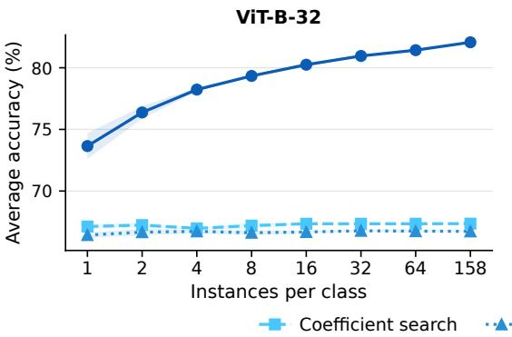

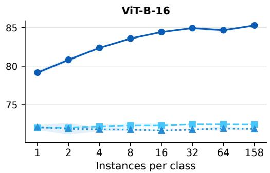  
Figure 9: Average test accuracy under different sizes and uses of auxiliary data for TIES. We downsample the auxiliary data and compare three different uses of auxiliary data for TIES. We run three random seeds for downsampling, and report error bars as shaded regions. The findings are consistent with the TA’s result in Figure 3.

## C.4 MAIN RESULTS IN TABLES

Figure 2’s numerical values are shown in Table 17. We also include the results on Llama-3.2-1B, and the findings are consistent with Qwen3 models: gradient descent on model weights outperforms optimizing within the task-vector subspace. Table 18 and Table 19 report the data-scaling results for TA and TIES, respectively.

Table 17: Numerical values of Figure 2. We also provide the Llama-3.2-1B results, and the results are consistent.
<table><tr><td rowspan="2">Merging Method</td><td rowspan="2">Baseline</td><td colspan="3">Vision</td><td colspan="4">Language</td></tr><tr><td>ViT-B-32</td><td>ViT-B-16</td><td>ViT-L-14</td><td>Qwen3-0.6B</td><td>Qwen3-1.7B</td><td>Qwen3-4B</td><td>Llama-3.2-1B</td></tr><tr><td>Pretrained</td><td>gradient descent</td><td>78.54</td><td>82.51</td><td>84.98</td><td>60.77</td><td>65.02</td><td>70.05</td><td>53.11</td></tr><tr><td>TA</td><td>naive baseline</td><td>62.87</td><td>67.57</td><td>74.61</td><td>60.13</td><td>64.58</td><td>75.49</td><td>74.87</td></tr><tr><td></td><td>coefficient search</td><td>62.41</td><td>68.06</td><td>76.68</td><td>63.62</td><td>73.65</td><td>79.99</td><td>76.22</td></tr><tr><td></td><td>subspace best</td><td>65.10</td><td>70.24</td><td>79.58</td><td>70.20</td><td>80.51</td><td>81.13</td><td>77.19</td></tr><tr><td></td><td>gradient descent</td><td>80.53</td><td>83.77</td><td>85.85</td><td>69.94</td><td>81.48</td><td>83.91</td><td>80.77</td></tr><tr><td>TIES</td><td>naive baseline</td><td>62.25</td><td>69.52</td><td>76.27</td><td>49.98</td><td>57.93</td><td>68.26</td><td>57.84</td></tr><tr><td></td><td>coefficient search</td><td>67.35</td><td>72.45</td><td>77.72</td><td>50.09</td><td>57.93</td><td>67.87</td><td>58.22</td></tr><tr><td></td><td>subspace best</td><td>67.35</td><td>72.49</td><td>77.78</td><td>54.09</td><td>63.78</td><td>68.38</td><td>57.72</td></tr><tr><td></td><td>gradient descent</td><td>82.06</td><td>85.28</td><td>87.27</td><td>69.67</td><td>77.01</td><td>82.02</td><td>79.83</td></tr><tr><td>DARE</td><td>naive baseline</td><td>62.73</td><td>67.63</td><td>74.61</td><td>60.46</td><td>65.64</td><td>74.70</td><td>75.15</td></tr><tr><td></td><td>coefficient search</td><td>62.38</td><td>67.94</td><td>76.71</td><td>63.88</td><td>72.30</td><td>79.86</td><td>77.07</td></tr><tr><td></td><td>subspace best</td><td>64.55</td><td>68.97</td><td>79.27</td><td>68.58</td><td>77.41</td><td>80.04</td><td>77.52</td></tr><tr><td></td><td>gradient descent</td><td>80.52</td><td>83.72</td><td>84.48</td><td>70.42</td><td>81.03</td><td>84.16</td><td>82.42</td></tr><tr><td>TSV-M</td><td>naive baseline</td><td>74.79</td><td>80.38</td><td>87.29</td><td>68.32</td><td>77.89</td><td>81.26</td><td>70.36</td></tr><tr><td></td><td>coefficient search</td><td>78.05</td><td>81.91</td><td>87.53</td><td>69.43</td><td>78.37</td><td>79.85</td><td>79.77</td></tr><tr><td></td><td>subspace best</td><td>78.05</td><td>81.96</td><td>87.53</td><td>69.71</td><td>78.67</td><td>79.74</td><td>80.48</td></tr><tr><td></td><td>gradient descent</td><td>83.88</td><td>86.37</td><td>88.26</td><td>77.78</td><td>81.85</td><td>87.23</td><td>82.99</td></tr></table>

Table 18: Numerical values of Figure 3: data scaling for TA.
<table><tr><td>Method / Data size</td><td>1</td><td>2</td><td>4</td><td>8</td><td>16</td><td>32</td><td>64</td><td>158</td></tr><tr><td>ViT-B-32</td><td></td><td></td><td></td><td></td><td></td><td></td><td></td><td></td></tr><tr><td>Coefficient search</td><td> $6 2 . 4 2 \pm 0 . 0 0$ </td><td> $6 2 . 1 2 \pm 0 . 2 5$ </td><td> $6 2 . 2 7 \pm 0 . 2 6$ </td><td> $6 2 . 2 7 \pm 0 . 2 5$ </td><td> $6 2 . 1 3 \pm 0 . 2 5$ </td><td> $6 2 . 2 7 \pm 0 . 2 5$ </td><td> $6 2 . 4 2 \pm 0 . 0 0$ </td><td>62.41</td></tr><tr><td>Subspace GD</td><td> $6 2 . 8 6 \pm 0 . 9 9$ </td><td> $6 4 . 2 6 \pm 0 . 5 9$ </td><td> $6 4 . 3 9 \pm 0 . 6 2$ </td><td> $6 4 . 5 6 \pm 0 . 3 1$ </td><td> $6 4 . 7 1 \pm 0 . 2 0$ </td><td> $6 4 . 3 1 \pm 0 . 4 2$ </td><td> $6 4 . 6 6 \pm 0 . 2 9$ </td><td>65.08</td></tr><tr><td>GD</td><td> $6 8 . 4 4 \pm 1 . 2 4$ </td><td> $7 2 . 3 4 \pm 0 . 5 2$ </td><td> $7 5 . 1 6 \pm 0 . 0 2$ </td><td> $7 6 . 7 6 \pm 0 . 1 7$ </td><td> $7 7 . 9 2 \pm 0 . 0 5$ </td><td> $7 8 . 8 1 \pm 0 . 0 6$ </td><td> $7 9 . 2 9 \pm 0 . 1 2$ </td><td>80.53</td></tr><tr><td>ViT-B-16</td><td></td><td></td><td></td><td></td><td></td><td></td><td></td><td></td></tr><tr><td>Coefficient search</td><td> $6 8 . 0 7 \pm 0 . 0 1$ </td><td> $6 8 . 0 7 \pm 0 . 0 1$ </td><td> $6 7 . 7 5 \pm 0 . 5 6$ </td><td> $6 8 . 0 7 \pm 0 . 0 1$ </td><td> $6 8 . 0 7 \pm 0 . 0 1$ </td><td> $6 8 . 0 7 \pm 0 . 0 1$ </td><td> $6 8 . 0 7 \pm 0 . 0 1$ </td><td>68.07</td></tr><tr><td>Subspace GD</td><td> $6 7 . 7 8 \pm 1 . 5 5$ </td><td> $6 8 . 9 2 \pm 0 . 5 3$ </td><td> $6 8 . 2 3 \pm 0 . 3 8$ </td><td> $6 8 . 7 1 \pm 0 . 1 9$ </td><td> $6 8 . 7 2 \pm 0 . 2 3$ </td><td> $6 8 . 9 9 \pm 0 . 2 8$ </td><td> $6 8 . 7 8 \pm 0 . 0 9$ </td><td>68.91</td></tr><tr><td>GD</td><td> $7 4 . 7 0 \pm 0 . 6 6$ </td><td> $7 6 . 4 5 \pm 0 . 4 9$ </td><td> $7 8 . 5 1 \pm 0 . 2 3$ </td><td> $8 0 . 1 7 \pm 0 . 2 8$ </td><td> $8 1 . 4 1 \pm 0 . 2 0$ </td><td> $8 2 . 2 7 \pm 0 . 1 3$ </td><td> $8 2 . 7 8 \pm 0 . 1 1$ </td><td>83.78</td></tr></table>

Table 19: Numerical values of Figure 9: data scaling for TIES.
<table><tr><td>Method / Data size</td><td>1</td><td>2</td><td>4</td><td>8</td><td>16</td><td>32</td><td>64</td><td>158</td></tr><tr><td>ViT-B-32</td><td></td><td></td><td></td><td></td><td></td><td></td><td></td><td></td></tr><tr><td>Coefficient search</td><td> $6 7 . 1 2 \pm 0 . 2 0$ </td><td> $6 7 . 2 3 \pm 0 . 2 0$ </td><td> $6 6 . 9 7 \pm 0 . 0 6$ </td><td> $6 7 . 1 9 \pm 0 . 2 7$ </td><td> $6 7 . 3 5 \pm 0 . 0 0$ </td><td> $6 7 . 3 5 \pm 0 . 0 0$ </td><td> $6 7 . 3 5 \pm 0 . 0 0$ </td><td>67.35</td></tr><tr><td>Subspace GD</td><td> $6 6 . 4 3 \pm 0 . 2 5$ </td><td> $6 6 . 6 6 \pm 0 . 2 6$ </td><td> $6 6 . 7 3 \pm 0 . 1 5$ </td><td> $6 6 . 6 2 \pm 0 . 1 9$ </td><td> $6 6 . 6 8 \pm 0 . 1 1$ </td><td> $6 6 . 7 7 \pm 0 . 0 8$ </td><td> $6 6 . 7 4 \pm 0 . 1 4$ </td><td>66.73</td></tr><tr><td>GD</td><td> $7 3 . 6 5 \pm 1 . 0 4$ </td><td> $7 6 . 3 7 \pm 0 . 5 1$ </td><td> $7 8 . 2 3 \pm 0 . 1 6$ </td><td> $7 9 . 3 4 \pm 0 . 0 6$ </td><td> $8 0 . 2 5 \pm 0 . 1 6$ </td><td> $8 0 . 9 6 \pm 0 . 0 2$ </td><td> $8 1 . 4 3 \pm 0 . 0 2$ </td><td>82.07</td></tr><tr><td>ViT-B-16</td><td></td><td></td><td></td><td></td><td></td><td></td><td></td><td></td></tr><tr><td>Coefficient search</td><td> $7 2 . 0 1 \pm 0 . 0 0$ </td><td> $7 2 . 0 1 \pm 0 . 0 0$ </td><td> $7 2 . 1 7 \pm 0 . 2 7$ </td><td> $7 2 . 3 2 \pm 0 . 2 7$ </td><td> $7 2 . 3 2 \pm 0 . 2 7$ </td><td> $7 2 . 4 8 \pm 0 . 0 0$ </td><td> $7 2 . 4 8 \pm 0 . 0 0$ </td><td>72.45</td></tr><tr><td>Subspace GD</td><td> $7 2 . 0 8 \pm 0 . 3 5$ </td><td> $7 1 . 8 7 \pm 0 . 7 7$ </td><td> $7 1 . 7 9 \pm 0 . 2 5$ </td><td> $7 1 . 7 7 \pm 0 . 1 5$ </td><td> $7 1 . 6 5 \pm 0 . 0 7$ </td><td> $7 1 . 7 7 \pm 0 . 0 5$ </td><td> $7 1 . 9 1 \pm 0 . 3 0$ </td><td>71.85</td></tr><tr><td>GD</td><td> $7 9 . 1 5 \pm 0 . 2 5$ </td><td> $8 0 . 8 1 \pm 0 . 2 2$ </td><td> $8 2 . 3 7 \pm 0 . 1 1$ </td><td> $8 3 . 5 8 \pm 0 . 1 6$ </td><td> $8 4 . 4 2 \pm 0 . 0 3$ </td><td> $8 4 . 9 3 \pm 0 . 1 7$ </td><td> $8 4 . 6 6 \pm 0 . 2 3$ </td><td>85.29</td></tr></table>

## C.5 S-RANDOPT IMPLEMENTATION DETAILS

In Section 4.2, we calculate the gradient from the best coefficient search point for vision models, and from the subspace best for the language models. From this initialization point $\theta _ { i n i t } .$ , we construct a bounded region, which we call the Sample Space. Let d denote the component of gradient descent that is orthogonal to the task-vector subspace. We define the Sample Space as

$$
\mathcal { S } = \left\{ \theta _ { \mathrm { i n i t } } + \sum _ { i = 1 } ^ { T } a _ { i } \tilde { \tau } _ { i } + b d : a _ { i } \in [ - \alpha , \alpha ] , b \in [ 0 , \beta ] \right\} .
$$

Thus, each task-vector coefficient is allowed to vary within $[ - \alpha , \alpha ]$ , while the coefficient along the additional descent direction varies within $[ 0 , \beta ]$ . We set $( \alpha , \bar { \beta } ) = ( \bar { 0 } . 1 , 0 . 0 1 )$ for vision models and $( \alpha , \beta ) = ( 0 . 0 5 , 0 . 0 0 0 5 )$ for language models.

## D MORE ANALYSES

## D.1 COMPLETE ANALYSIS OF INITIALIZATIONS FOR GRADIENT DESCENT

Figure 10 shows the full results of gradient descent with different initializations. Across all models, the message is consistent: merging methods provide strong initializations for gradient descent, and they are better than fine-tuning from the pretrained model or random initializations.

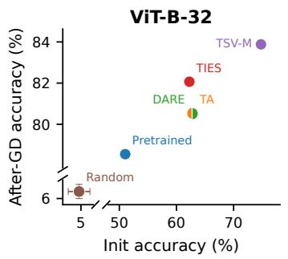

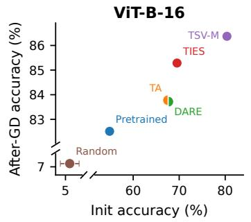

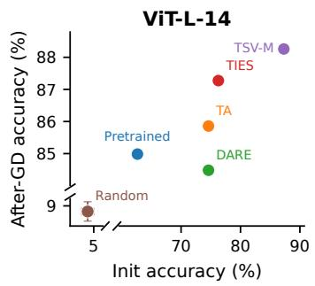

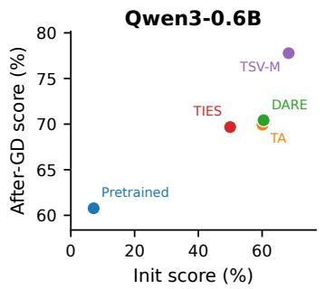

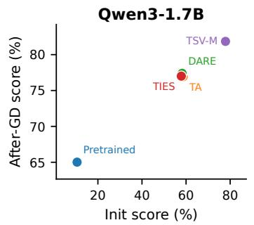

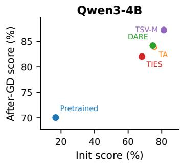  
Figure 10: Gradient Descent (GD) Initialization results across vision and language models. For vision, we measure average test accuracy, and report the average accuracy of three random initialization points. Init accuracy is the naive coefficient’s performance.

## D.2 2-TASK SETTING

For the two-task scenario, we evaluate two task combinations: EuroSAT (Helber et al., 2019) and GTSRB (Stallkamp et al., 2011), as well as MNIST (LeCun, 1998) and FER2013 (Goodfellow et al., 2013). We tested both regularized and unregularized versions of gradient descent. We apply the $\ell _ { 2 }$ norm from the starting point, L2-SP, as the regularization added to the loss function: $\begin{array} { r l r } {  { \frac { \alpha } { 2 } \| \bar { \theta } - \bar { \theta } _ { i n i t } \| _ { 2 } ^ { 2 } } } \end{array}$ $\theta _ { i n i t }$ is the initialization point for gradient descent, and we set $\alpha = 3 \AA$

Figure 11 shows the experimental results. GD and regularized GD learn the training set perfectly across all data sizes in two scenarios, while coefficient search and subspace GD struggle even with more data. Overall, when data are scarce, GD may lead to overfitting, but the risk is smaller when data are sufficient. In contrast, coefficient search and subspace GD do not fit the training set well, so their test performance changes little as more data become available. The appropriate regularization strength for balancing the bias-variance trade-off is a key factor in determining how auxiliary data should be used.

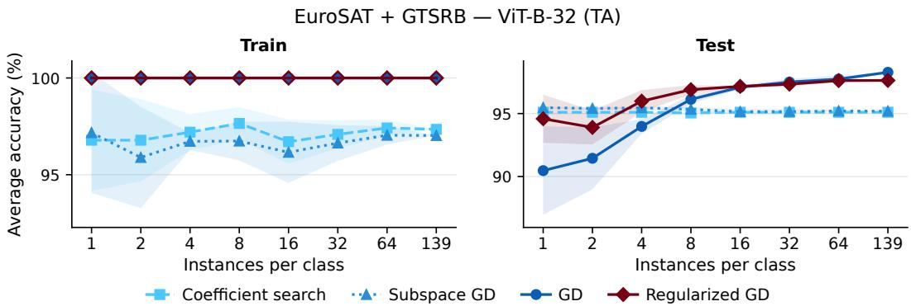

FER2013 + MNIST — ViT-B-32 (TA)  
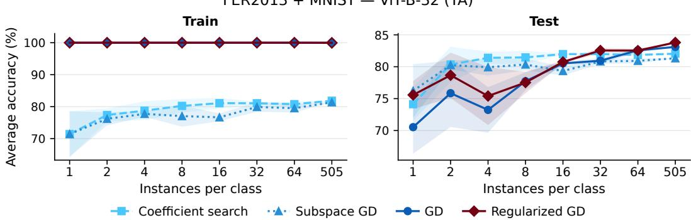  
Figure 11: Train and test set accuracy of different strategies in 2-task scenarios. GD overfits when data are scarce, and additional regularization improves performance. On the other hand, the test accuracy of coefficient search and subspace GD is largely insensitive to data size.

## D.2.1 ABLATION STUDY: TASK DIVERSITY

While the 9-task setting in Figure 3 shows that gradient descent outperforms coefficient optimization across all downsampling scenarios, the 2-task setting in Figure 11 yields a different conclusion. The two settings differ in both dataset size and task diversity. In this section, we control the dataset size across the two settings, and investigate whether task diversity determines which optimization strategy performs better.

Since we control the dataset size by fixing the number of instances per class, we control the number of classes to keep the dataset size the same across the 2-task and 9-task settings. We downsample the number of classes in the 9-task setting to match the 2-task setting. Specifically, we keep the number of classes approximately the same across 9 tasks. In Figure 11, EuroSAT + GTSRB has 53 classes, and FER2013 + MNIST has 17 classes. We test 3 random seeds for class selection. If

Coefficient searchSubspace GDGD

Coefficient searchSubspace GDGD

having more tasks makes merging easier, then we will see that GD remains consistently better even after downsampling classes.

Figure 12 shows the results. In the full-class 9-task setting in Figure 3, GD consistently outperforms coefficient optimization regardless of instance selection. However, when the number of classes is downsampled, the two methods perform similarly, and GD can even perform worse. The results indicate that dataset size, rather than task diversity, is the main factor determining which strategy best leverages the auxiliary data.

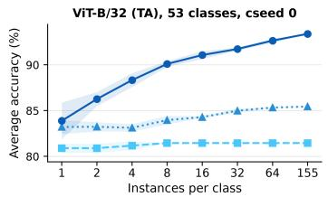

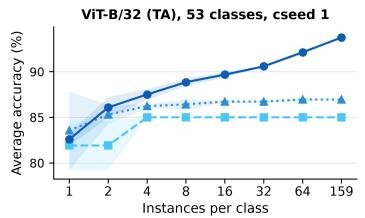

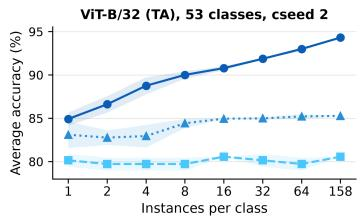

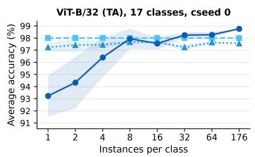  
Coefficient searchSubspace GDGD

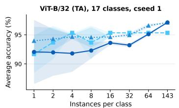  
Coefficient searchSubspace GDGD

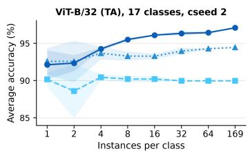  
Coefficient searchSubspace GDGD

Figure 12: Downsampling classes in the 9-task setting for TA on ViT-B-32. We test 3 class selection seeds (cseed) for downsampling classes. The first row matches dataset size of EuroSAT + GTSRB in Figure 11, and the second row matches FER2013 + MNIST. The trends are similar to Figure 11.

## D.3 TEST-TIME ADAPTATION FULL RESULTS

Experiment Setup. We compare GD with two test-time adaptation methods for model merging, AdaMerging (Yang et al., 2024b) and DivMerge (Touayouch et al., 2026). Both methods learn the merging coefficients on unlabeled test data: AdaMerging minimizes the prediction entropy of the merged model, while DivMerge minimizes the Jensen–Shannon divergence between the predictions of the merged model and those of the task-specific models. We apply both task-wise and layer-wise merging, which are described in detail in Section B, and initialize the merging coefficients to 1/T.

For GD, we use the predictions of the task-specific models on the unlabeled test data as supervision. We consider two types of labels: soft labels use the softmax outputs of the task-specific models directly, while hard labels convert them into one-hot labels. All methods use 1,000 unlabeled test samples per task.

Experiment results. Table 20 reports the full experiment results. GD on weights has the best performance in smaller models. Layer-wise DivMerge has more trainable parameters than the taskwise version, yet fewer trainable parameters than full-weight fine-tuning. Therefore, it has less risk of overfitting the unlabeled test data, which turns out to achieve the best performance in ViT-L-14. We expect applying regularization on GD will improve its performance, as shown in Section 5.3. Overall, the empirical results demonstrate that the bias-variance tradeoff is the key principle in deciding how strong the regularization should be when using auxiliary data.

Table 20: Full comparison results of test-time adaptation methods for TA.
<table><tr><td>Method</td><td>ViT-B-32</td><td>ViT-B-16</td><td>ViT-L-14</td></tr><tr><td>(task-wise) AdaMerging</td><td>62.21</td><td>66.80</td><td>76.63</td></tr><tr><td>(task-wise) DivMerge</td><td>65.43</td><td>69.62</td><td>78.49</td></tr><tr><td>(layer-wise) AdaMerging</td><td>75.67</td><td>79.67</td><td>87.42</td></tr><tr><td>(layer-wise) DivMerge</td><td>80.56</td><td>84.48</td><td>89.90</td></tr><tr><td>GD Soft</td><td>82.43</td><td>85.51</td><td>88.15</td></tr><tr><td>GD Hard</td><td>82.08</td><td>85.12</td><td>88.33</td></tr></table>

## D.4 LLM PERFORMANCE ON CONTROL TASKS

When merging LLMs, the merged model should not only acquire the capabilities of the expert models, but also retain the general capabilities of the pre-trained model. For example, a multilingual medical assistant merged from a multilingual expert and a medical expert should still retain capabilities such as mathematical reasoning and code generation. Since gradient descent optimizes the model weights on the target tasks only, it may cause forgetting of such capabilities (Luo et al., 2025). We therefore compare it with merging within the task-vector subspace on control tasks, i.e., tasks not targeted by any expert model. We use GSM8K (Cobbe et al., 2021) and MBPP (Austin et al., 2021) as control tasks, which evaluate mathematical reasoning and code generation, respectively.

Table 21 reports the results on Qwen3 models. Overall, gradient descent does not systematically cause more forgetting than coefficient search. On the Qwen3-1.7B model, it improves the average accuracy on both control tasks (GSM8K: 64.8 → 74.5; MBPP: 41.7 → 49.8), reaching a level comparable to the pre-trained model. On the Qwen3-0.6B model, it improves GSM8K (40.7 → 50.6) but degrades MBPP (30.7 → 25.7). Moreover, coefficient search itself can cause severe forgetting: on the Qwen3-1.7B model, TA drops to 21.7 on MBPP, whereas gradient descent from the same merged model reaches 50.0. Staying within the task-vector subspace thus does not guarantee the retention of general capabilities.

Table 21: Performance on target and control tasks for merged LLMs. We compare coefficient search within the task-vector subspace (Coeff.) with gradient descent on LoRA parameters (GD). Seen denotes the average performance on the target tasks; GSM8K and MBPP are control tasks not targeted by any expert model. All results are evaluated on 300 samples per task. †The pretrained model is evaluated with raw few-shot prompts instead of the chat template and serves only as a reference. Avg. denotes the average over the four merging methods, excluding the pre-trained model. The better result of each pair is shown in bold.
<table><tr><td rowspan="2">Model</td><td rowspan="2">Method</td><td colspan="2">Seen</td><td colspan="2">GSM8K</td><td colspan="2">MBPP</td></tr><tr><td>Coeff.</td><td>GD</td><td>Coeff.</td><td>GD</td><td>Coeff.</td><td>GD</td></tr><tr><td rowspan="6">Qwen3-0.6B</td><td>Pre-trained†</td><td></td><td></td><td>48.0</td><td></td><td>32.0</td><td></td></tr><tr><td>TA</td><td>63.6</td><td>69.9</td><td>42.0</td><td>55.7</td><td>32.3</td><td>26.7</td></tr><tr><td>DARE</td><td>63.9</td><td>70.4</td><td>32.3</td><td>52.0</td><td>31.7</td><td>25.7</td></tr><tr><td>TIES</td><td>50.1</td><td>69.7</td><td>58.3</td><td>49.7</td><td>30.0</td><td>32.7</td></tr><tr><td>TSV-M</td><td>69.4</td><td>77.8</td><td>30.3</td><td>45.0</td><td>28.7</td><td>17.7</td></tr><tr><td>Avg.</td><td>61.8</td><td>72.0</td><td>40.7</td><td>50.6</td><td>30.7</td><td>25.7</td></tr><tr><td rowspan="6">Qwen3-1.7B</td><td>Pre-trained†</td><td></td><td></td><td>73.7</td><td></td><td>50.7</td><td></td></tr><tr><td>TA</td><td>73.6</td><td>76.9</td><td>61.3</td><td>77.0</td><td>21.7</td><td>50.0</td></tr><tr><td>DARE</td><td>72.3</td><td>77.4</td><td>72.7</td><td>72.7</td><td>44.3</td><td>51.3</td></tr><tr><td>TIES</td><td>57.9</td><td>77.0</td><td>55.0</td><td>78.0</td><td>51.3</td><td>48.7</td></tr><tr><td>TSV-M</td><td>78.4</td><td>81.8</td><td>70.0</td><td>70.3</td><td>49.3</td><td>49.3</td></tr><tr><td>Avg.</td><td>70.6</td><td>78.3</td><td>64.8</td><td>74.5</td><td>41.7</td><td>49.8</td></tr></table>