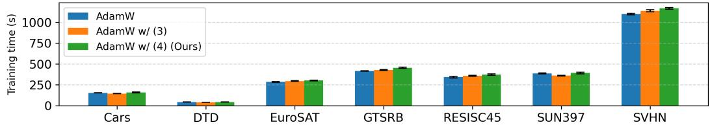

# A Riemannian Geometry for Low-rank Adaptation

Shoichiro Takeda NTT, Inc. shoichiro.takeda@ntt.com

Shin’ya Yamaguchi NTT, Inc. shinya.yamaguchi@ntt.com

Satoshi Suzuki NTT, Inc. satoshixv.suzuki@ntt.com

Yasunori Akagi NTT, Inc. yasunori.akagi@ntt.com

## Abstract

Low-rank adaptation (LoRA) is widely used as a parameter-efficient fine-tuning technique for pre-trained deep neural networks, which approximates the weight update via full fine-tuning by a low-rank matrix BA⊤. This parameterization leads to the equivalence relation $\mathsf { \bar { \Psi } } ( B , A ) \sim ( B G ^ { - 1 } , A G ^ { \top } )$ for any invertible matrix G because $B A ^ { \top } = B G ^ { - 1 } ( A G ^ { \top } ) ^ { \top }$ and thus both pairs yield the same loss value. This relation induces a quotient manifold where matrices $( B G ^ { - 1 } , A G ^ { \top } )$ for all G are identified, eliminating redundant directions along which the loss value remains unchanged. To respect the geometry of this manifold, the original search space is endowed with a Riemannian metric that is invariant under the equivalence relation. Such a metric induces preconditioning at each gradient step and ensures that each weight update via LoRA changes the loss value, leading to efficient optimization. In this paper, we propose a new Riemannian metric that is specifically tailored to LoRA to close the gap to full fine-tuning at the weight level. We theoretically show that LoRA with our preconditioning induced by this metric satisfies the following two properties at each iteration: (i) The weight update follows the direction closest to the gradient of full fine-tuning within the subspace of first-order weight changes allowed by the LoRA parameterization. (ii) The updated weight matrix is closer in Frobenius norm to that of full fine-tuning than the updated weight matrices of LoRA with conventional preconditioning and without preconditioning. These theoretical insights suggest that our preconditioning makes LoRA better approximate full fine-tuning, thereby leading to more efficient optimization. Experiments show the effectiveness and efficiency of our preconditioning for LoRA on fine-tuning tasks with language and vision domains.

## 1 Introduction

Recent progress of foundation models with deep neural networks, such as large vision and large language models, has been remarkable [39, 17, 10, 61, 2]. When transferring these pre-trained models to a specific downstream task, one popular technique is full fine-tuning that updates all the model parameters. However, full fine-tuning of large foundation models is impractical due to their large number of parameters, requiring high computational and storage costs for each task-specific model.

To address this issue, parameter-efficient fine-tuning techniques have become a promising alternative to full fine-tuning [25, 44, 21, 22, 18]. Among these techniques, low-rank adaptation (LoRA) is the de facto standard thanks to its simplicity and effectiveness [21]. Let $W _ { 0 } , \bar { W } \in \mathbb { R } ^ { m \times n }$ denote the weight matrices of a layer in the pre-trained and fine-tuned models, respectively. In LoRA, the weight update of full fine-tuning $\Delta W \in \mathbb { R } ^ { m \times n }$ from $W _ { 0 }$ to W is approximated by low-rank matrix

factorization1 as follows:

$$
\begin{array} { r } { W = W _ { 0 } + \Delta W \approx W _ { 0 } + B A ^ { \top } , } \end{array}\tag{1}
$$

where $B \in \mathbb { R } ^ { m \times r }$ and $A \in \mathbb { R } ^ { n \times r }$ are trainable factors. Let $\mathcal { L } : \mathbb { R } ^ { m \times n } $ R denote the loss function for a downstream task. Then, LoRA is formulated as

$$
\operatorname* { m i n } _ { ( B , A ) \in \mathcal { X } } \mathcal { L } \left( W _ { 0 } + B A ^ { \top } \right) ,\tag{2}
$$

where $\mathcal { X } : = \mathbb { R } ^ { m \times r } \times \mathbb { R } ^ { n \times r }$ denotes the original search space for this problem. By choosing a sufficiently small $r \ll \operatorname* { m i n } ( m , n )$ , LoRA yields fewer trainable parameters and lower computational and storage costs than full fine-tuning, i.e., $\mathrm { m i n } _ { W \in \mathbb { R } ^ { m \times n } } \mathcal { L } \left( W \right)$

Due to the fewer trainable parameters, LoRA often exhibits a performance gap compared to full finetuning. To fill this gap, various approaches have been studied for improving the performance of LoRA, $\mathrm { e . g . }$ , modeling (architecture) improvements [58, 26, 41, 13], leveraging multiple LoRA modules [15, 32, 16, 50, 59, 28, 30], learning-rate tuning [19], and refined initialization schemes [33, 54, 16, 55, 67]. As another line of approach, exploiting the invariance of LoRA has been studied [63, 50]. Specifically, the loss function $\mathcal { L }$ is invariant under the equivalence relation $( B , A ) \sim ( B G ^ { - 1 } , A G ^ { \top } )$ , in the sense that $\mathcal { L } \left( W _ { 0 } + B A ^ { \top } \right) = \mathcal { L } \left( W _ { 0 } + B G ^ { - 1 } ( A G ^ { \top } ) ^ { \top } \right)$ for all $G \in \mathrm { G L } ( r )$ This equivalence relation induces the quotient manifold $\mathcal { X } / \mathrm { G L } ( r )$ where matrices $( B G ^ { - 1 } , \dot { A } \dot { G } ^ { \top } )$ for all G are identified, eliminating redundant directions along which the value of $\mathcal { L }$ remains unchanged. To respect the geometry of this manifold, the original search space $\mathcal { X }$ is endowed with a Riemannian metric that is invariant under the equivalence relation. Such a metric induces preconditioning at each gradient step and ensures that each weight update via LoRA changes the value of ${ \mathcal { L } } ,$ leading to efficient optimization. Conventional studies [63, 50] adopt a well-known invariant metric proposed in [36], and this metric induces preconditioning

$$
\nabla _ { B } \mathcal { L } \ \mapsto \ ( \nabla _ { B } \mathcal { L } ) ( A ^ { \top } A ) ^ { - 1 } , \quad \nabla _ { A } \mathcal { L } \ \mapsto \ ( \nabla _ { A } \mathcal { L } ) ( B ^ { \top } B ) ^ { - 1 } ,\tag{3}
$$

where $\nabla _ { B } \mathcal { L }$ and $\nabla _ { A } \mathcal { L }$ denote the Euclidean gradients of $\mathcal { L }$ with respect to B and $A ,$ , respectively. LoRA with this preconditioning outperforms the original LoRA in multiple fine-tuning tasks. However, the adopted Riemannian metric is classical and tuned to the low-rank matrix completion setting [36]. Therefore, there remains room to tailor this metric to LoRA.

In this paper, we propose a new Riemannian metric to improve the performance of LoRA. Specifically, we tailor the metric to LoRA to close the gap to full fine-tuning at the weight level. As a result, this metric induces new preconditioning

$$
\begin{array} { r } { \nabla _ { B } \mathcal { L } \mapsto ( I - \frac { 1 } { 2 } P _ { B } ) ( \nabla _ { B } \mathcal { L } ) ( A ^ { \top } A ) ^ { - 1 } , \quad \nabla _ { A } \mathcal { L } \mapsto ( I - \frac { 1 } { 2 } P _ { A } ) ( \nabla _ { A } \mathcal { L } ) ( B ^ { \top } B ) ^ { - 1 } , } \end{array}\tag{4}
$$

where $P _ { B } : = B ( B ^ { \top } B ) ^ { - 1 } B ^ { \top }$ and $P _ { A } : = A ( A ^ { \top } A ) ^ { - 1 } A ^ { \top }$ are the orthogonal projections onto the column spaces of $B$ and $A ,$ respectively. We theoretically show that LoRA with this preconditioning satisfies the following two properties at each iteration t: (i) The weight update from $W _ { t }$ to $W _ { t + 1 }$ follows the direction closest to the gradient of full fine-tuning within the subspace of first-order weight changes (i.e., first-order changes in W) allowed by the LoRA parameterization (1). (ii) The updated weight matrix $W _ { t + 1 }$ is closer in Frobenius norm to that of full fine-tuning than the updated weight matrices of LoRA with (3) and without preconditioning. These theoretical insights suggest that our preconditioning makes LoRA better approximate full fine-tuning, thereby improving the performance of LoRA. In addition, our preconditioning (4) admits an efficient implementation with the same time complexity of (3). We validated the practical effectiveness and efficiency of our preconditioning for LoRA on several fine-tuning tasks with language and vision domains, including natural language generation, image classification, and commonsense reasoning tasks.

## 2 Related Works

LoRA was initially formulated by Hu et al. [21] and achieves comparable full fine-tuning performance despite having very few trainable parameters. However, it often exhibits a performance gap compared to full fine-tuning. We here summarize several studies to improve the performance of LoRA.

Modeling (Architecture). Beyond the standard two-factor factorization [21, 41, 36, 24] as described in (1), three-factor factorization has been proposed recently [58, 26, 41], which inserts a small trainable matrix between B and A to fuse more information and flexibly. Other approaches have also been explored, such as adapting low-rank values at each module [66], incorporating the mixture-ofexperts architecture [15, 32, 16, 50], exploiting multiple LoRA modules [59, 28, 30], and introducing non-linear mapping [13]. In this paper, we adopt the standard two-factor modeling (1) as a first step and leave the expansion for other advanced modelings to future work.

Initialization. Hu et al. [21] originally proposed to use a random Gaussian initialization for A and set zero for B to ensure that $B \bar { A } ^ { \top }$ is zero at the beginning of training. Later, several initialization strategies have proposed to utilize the pre-trained weight characteristics [33, 54]. These methods differ in how they initialize B and $A ,$ using the largest singular values and corresponding vectors of the pre-trained weight matrix [33] or smaller ones [54]. On the other hand, Wang et al. [55] and Zhang et al. [67] initialized B and A using the singular values and corresponding vectors of the one-step gradient of full fine-tuning. In this paper, we follow the standard initialization proposed in [21] and the combination with the advanced initialization strategies is left for future work.

Optimization. Several optimization approaches for LoRA have been proposed [56, 69, 26, 41]. For example, Wang et al. [56] aligned the gradient of LoRA with that of full fine-tuning by solving a minimization problem for this gap2. To fully exploit low-dimensional subspaces spanned by the columns of B and $A ,$ Zhu et al. [69] regularized those subspaces to capture complementary information. Along this, Li et al. [26] and Park et al. [41] exploited the geometry of Stiefel manifold that imposes the orthogonal constraints on B and/or A. On the other hand, exploiting the invariance of LoRA has been studied [63, 50]. As explained in Sec. 1, this approach induces preconditioning at each gradient step described in (3) and achieves efficient optimization compared to the original LoRA. This approach is the first Riemannian preconditioning study for LoRA, and its underlying idea is inspired by the classical low-rank matrix completion problem [36]. Note that, in the literature on low-rank matrix (or tensor) completion problem, several preconditioning variants have been proposed [51, 65, 64]. Our work follows the Riemannian preconditioning for LoRA proposed in $[ 6 \bar { 3 } , 5 \bar { 0 } ]$ but designs a Riemannian metric tailored to LoRA for more efficient optimization.

Others. To improve the performance of LoRA, several LoRA variants have been proposed. Hayou et al. [19] applied different learning rates to B and A and shows fast convergence. Liu et al. [29] decomposed the pre-trained weight into magnitude and direction, and then employed LoRA for directional updates to reduce the number of trainable parameters. Xia et al. [59] trained multiple LoRA sequentially like the residual learning to improve the performance of LoRA. Dettmers et al. [11] applied quantization to the pre-trained models with LoRA to save memory usage without sacrificing performance. We leave the combination of these studies with our method to future work.

## 3 Preliminary

## 3.1 Notations

The set of real numbers is denoted by R. We denote the identity matrix and the zero matrix by I and O, respectively, that omit the dimensional subscripts for simplicity. The Frobenius norm for $\bar { X _ { } } \in \mathbb { R } ^ { m \times n }$ is denoted by $\begin{array} { r } { \| X \| _ { F } : = \sqrt { \mathrm { t r } ( X ^ { \top } X ) } = \sqrt { \sum _ { i = 0 } ^ { m - 1 } \sum _ { j = 0 } ^ { n - 1 } X _ { i j } ^ { 2 } } } \end{array}$ . We denote the general linear group with size $r \times r$ by ${ \mathrm { G L } } ( r ) = \{ G \in \mathbb { R } ^ { r \times r } \ | ^ { * } { \mathrm { d e t } } ( G ) \neq 0 \}$ , where det(G) is the determinant of G.

## 3.2 Riemannian Optimization

We review Riemannian optimization following [1, 34, 4], which will be used throughout this paper. Let M be a Riemannian manifold endowed with a Riemannian metric $g _ { X } : T _ { X } { \mathcal { M } } \times T _ { X } { \mathcal { M } } $ R for each $X \in { \mathcal { M } }$ , where $T _ { X } { \mathcal { M } }$ denotes the tangent space of M at X. This metric defines an inner product between two tangent vectors in $T _ { X } { \mathcal { M } }$ . We consider an optimization problem

$$
\operatorname* { m i n } _ { X \in { \mathcal { M } } } f ( X ) ,\tag{5}
$$

where $f : \mathcal { M }  \mathbb { R }$ is a smooth function. The Riemannian gradient of $f$ at $X \in { \mathcal { M } }$ , denoted as grad $x f ,$ is defined as the unique tangent vector in $T _ { X } { \mathcal { M } }$ satisfying

$$
\begin{array} { r } { \mathrm { D } f ( X ) [ \xi _ { X } ] = g _ { X } \big ( \mathrm { g r a d } _ { X } f , \xi _ { X } \big ) , \quad \forall \xi _ { X } \in T _ { X } \mathcal { M } , } \end{array}\tag{6}
$$

where $\operatorname { D } f ( X ) [ \xi _ { X } ]$ denotes the directional derivative of $f$ at $X$ along $\xi _ { X }$ . Then, the t-th update of the Riemannian gradient descent method for (5) is given by

$$
X _ { t + 1 } = \mathcal { R } _ { X _ { t } } { \big ( } - \alpha \operatorname { g r a d } _ { X _ { t } } f { \big ) } ,\tag{7}
$$

where $\mathcal { R } _ { X } : T _ { X } \mathcal { M }  \mathcal { M }$ is a retraction mapping to $\mathcal { M }$ and $\alpha > 0$ is a step size.

Let $\sim$ be an equivalence relation on M and consider the quotient manifold $\mathcal { M } / \sim$ where each point is an equivalence class $[ X ] = \{ Y \in { \mathcal { M } } \mid Y \sim X \}$ . In this setting, $T _ { X } { \mathcal { M } }$ decomposes as

$$
T _ { X } { \mathcal { M } } = V _ { X } { \mathcal { M } } \oplus H _ { X } { \mathcal { M } } ,
$$

where $\oplus$ is the direct sum. The vertical space $V _ { X } { \mathcal { M } }$ is the tangent space of the equivalence class [X] at $X$ , and the horizontal space $H _ { X } { \mathcal { M } }$ is its orthogonal complement with respect to the metric, i.e.,

$$
V _ { X } { \mathcal { M } } = T _ { X } [ X ] , \qquad H _ { X } { \mathcal { M } } = \{ \xi _ { X } \in T _ { X } { \mathcal { M } } \mid g _ { X } ( \xi _ { X } , \zeta _ { X } ) = 0 , \forall \zeta _ { X } \in V _ { X } { \mathcal { M } } \} .\tag{8}
$$

Although $\mathcal { M } / \sim$ is abstract since each point is an equivalence class, each tangent vector $\xi _ { [ X ] } \in$ $T _ { [ X ] } ( { \mathcal { M } } / { \sim } )$ can be represented by a unique tangent vector $\xi _ { X } \in H _ { X } { \mathcal { M } }$ satisfying

$$
\mathrm { D } \pi ( X ) [ \xi _ { X } ] = \xi _ { [ X ] } ,\tag{9}
$$

where $\pi : { \mathcal { M } }  { \mathcal { M } } / { \sim }$ is the natural projection. This unique tangent vector is called the horizontal lift of $\xi _ { [ X ] }$ at $X$ . If the metric $g _ { X }$ on M is invariant under the equivalence relation, $\mathrm { i . e . , } g _ { X } ( \xi _ { X } , \zeta _ { X } ) =$ $g _ { Y } ( \xi _ { Y } , \zeta _ { Y } )$ whenever $X \sim Y$ , we can define a metric $g _ { \left[ X \right] }$ on $\mathcal { M } / \sim$ as follows:

$$
g _ { [ X ] } ( \xi _ { [ X ] } , \zeta _ { [ X ] } ) : = g _ { X } ( \xi _ { X } , \zeta _ { X } ) ,
$$

where $\xi _ { X } , \zeta _ { X } \in \ H _ { X } { \mathcal { M } }$ are the horizontal lifts of $\xi _ { [ X ] } , \zeta _ { [ X ] } \in \mathcal { T } _ { [ X ] } ( \mathcal { M } / \sim )$ at X, respectively. Endowed with this invariant metric, $\mathcal { M } / \sim$ is called a Riemannian quotient manifold, and the natural projection π is a Riemannian submersion. Let the function $f$ on M be invariant under the equivalence relation, i.e., $f ( X ) = f ( Y )$ whenever $X \sim Y$ . This induces a well-defined function $\tilde { f } : { \mathcal { M } } / { \sim } \to$ R, which satisfies $f = \ddot { f } \circ \pi$ . In this case, grad $_ { X } f$ lies in $H _ { X } { \mathcal { M } }$ and is the horizontal lift of $\operatorname { g r a d } _ { [ X ] } { \tilde { f } }$ at X. Let the retraction $\mathcal { R } _ { X }$ preserve the equivalence relation, i.e., $\mathcal { R } _ { X } ( \xi _ { X } ) \sim \mathcal { R } _ { Y } ( \xi _ { Y } )$ whenever $X \sim Y$ , where $\xi _ { X }$ and $\xi _ { Y }$ are the horizontal lifts of $\xi _ { [ X ] }$ at $X$ and $Y _ { \pm }$ , respectively. Then, the t-th update for (5), described in (7), respects the geometry of $\mathcal { M } / \sim$ and rigorously corresponds to the t-th update for minimizing $\tilde { f }$ with respect to $[ X ]$ on $\mathcal { M } / \sim$

## 4 Riemannian Preconditioning for LoRA

In this section, we review the pioneered Riemannian preconditioning study for LoRA [63], which is based on the classical low-rank matrix completion problem [36].

The loss function L in (2) is invariant under the equivalence relation

$$
( B , A ) \sim ( B G ^ { - 1 } , A G ^ { \top } ) ,\tag{10}
$$

in the sense that $\mathcal { L } \left( W _ { 0 } + B A ^ { \top } \right) = \mathcal { L } \left( W _ { 0 } + B G ^ { - 1 } ( A G ^ { \top } ) ^ { \top } \right)$ for all $G \in \operatorname { G L } ( r )$ . This invariance implies that the original search space X admits redundant directions along which the value of $\mathcal { L }$ remains unchanged. To eliminate this redundancy, Zhang and Pilanci [63] have proposed to exploit the quotient manifold

$$
\mathcal { X } / \mathrm { G L } ( r ) ,
$$

where each point is an equivalence class

$$
[ ( B , A ) ] = \{ ( B G ^ { - 1 } , A G ^ { \top } ) | G \in \mathrm { G L } ( r ) \} .
$$

On this manifold, all matrices in $[ ( B , A ) ]$ are identified and thus the redundant directions are eliminated. To respect the geometry of this manifold, the original search space X is endowed with a

Riemannian metric that is invariant under the equivalence relation (10). Following [36], Zhang and Pilanci [63] adopted the well-known invariant metric

$$
\begin{array} { r } { g _ { ( B , A ) }  { \left( ( \xi _ { B } , \xi _ { A } ) , ( \zeta _ { B } , \zeta _ { A } ) \right) } = \mathrm { t r } \left( A ^ { \top } A \xi _ { B } ^ { \top } \zeta _ { B } \right) + \mathrm { t r } \left( B ^ { \top } B \xi _ { A } ^ { \top } \zeta _ { A } \right) , } \end{array}\tag{11}
$$

where $( \zeta _ { B } , \zeta _ { A } ) , ( \xi _ { B } , \xi _ { A } ) \in T _ { ( B , A ) } \mathcal { X }$ . In this setting, the horizontal space is given by

$$
H _ { ( B , A ) } \mathcal { X } = \left\{ \left( \xi _ { B } , \xi _ { A } \right) \in T _ { ( B , A ) } \mathcal { X } \mid B ^ { \top } \xi _ { B } A ^ { \top } A = B ^ { \top } B \xi _ { A } ^ { \top } A \right\} ,\tag{12}
$$

see [36, (13)]. By solving (6) with this invariant metric, we obtain the Riemannian gradient $( \operatorname { g r a d } _ { B } { \mathcal { L } } , \operatorname { g r a d } _ { A } { \mathcal { L } } )$ , which lies in the horizontal space $H _ { ( B , A ) } \mathcal { X }$ , as follows:

$$
\begin{array} { r } { \mathrm { g r a d } _ { B } \mathcal { L } = ( \nabla _ { B } \mathcal { L } ) ( A ^ { \top } A ) ^ { - 1 } , \qquad \mathrm { g r a d } _ { A } \mathcal { L } = ( \nabla _ { A } \mathcal { L } ) ( B ^ { \top } B ) ^ { - 1 } , } \end{array}\tag{13}
$$

where $\nabla _ { B } \mathcal { L }$ and $\nabla _ { A } \mathcal { L }$ denote the Euclidean gradients of L with respect to B and A, respectively. Given a widely used simple retraction $\mathcal { R } _ { ( B , A ) } ( \xi _ { B } , \xi _ { A } ) = ( B + \xi _ { B } , \overset { \cdot } { A } + \xi _ { A } )$ which preserves the equivalence relation (10), plugging (13) into (7) yields the t-th update of the Riemannian gradient descent method for (2) that respects the geometry of $\mathcal { X } / \mathrm { G L } ( r )$

$$
B _ { t + 1 } = B _ { t } - \alpha ( \nabla _ { B _ { t } } \mathcal { L } ) ( A _ { t } ^ { \top } A _ { t } ) ^ { - 1 } , \qquad A _ { t + 1 } = A _ { t } - \alpha ( \nabla _ { A _ { t } } \mathcal { L } ) ( B _ { t } ^ { \top } B _ { t } ) ^ { - 1 } ,
$$

where $\nabla _ { B _ { t } } \mathcal { L }$ and $\nabla _ { A , } \mathcal { L }$ are evaluated at $( B _ { t } , A _ { t } )$ . Considering the plain gradient descent update, $\mathrm { i . e . , } B _ { t + 1 } \stackrel { \cdot } { = } B _ { t } - \alpha ( \bar { \nabla } _ { B _ { t } } \mathcal { L } )$ and $A _ { t + 1 } = A _ { t } - \alpha ( \nabla _ { A _ { t } } \mathcal { L } )$ , the above update can be interpreted as the gradient descent update with preconditioning (3). For details, see [36, 63].

## 5 Proposed Method: Riemannian Preconditioning for LoRA with New Metric

Instead of the classical metric (11), we propose to endow the search space X with a new metric

$$
g _ { \left( B , A \right) } \left( \left( \xi _ { B } , \xi _ { A } \right) , \left( \zeta _ { B } , \zeta _ { A } \right) \right) = \mathrm { t r } \left( A ^ { \top } A \xi _ { B } ^ { \top } \left( I + P _ { B } \right) \zeta _ { B } \right) + \mathrm { t r } \left( B ^ { \top } B \xi _ { A } ^ { \top } \left( I + P _ { A } \right) \zeta _ { A } \right) .\tag{14}
$$

We first show that this metric is invariant under the equivalence relation (10), with reference to [34, Propositions 3.1 and 3.2].

## Lemma 1. The manifold X endowed with the metric (14) induces the horizontal space (12).

Proposition 1. The manifold X is endowed with the metric (14). Let $\xi _ { [ ( B , A ) ] }$ be a tangent vector to the quotient manifold $\mathcal { X } / \mathrm { G L } ( r )$ at $[ ( B , A ) ]$ . The horizontal lifts $o f \xi _ { [ ( B , A ) ] }$ at $( B , A )$ , denoted as $( \xi _ { B } , \xi _ { A } )$ , and at $( B G ^ { - 1 } , A G ^ { \top } )$ , denoted as $\left( \xi _ { B G ^ { - 1 } } , \xi _ { A G ^ { \top } } \right)$ , have a relation $( \xi _ { B G ^ { - 1 } } , \xi _ { A G ^ { \top } } ) =$ $( \xi _ { B } G ^ { - 1 } , \xi _ { A } G ^ { \top } )$ . Then, the metric (14) is invariant under the equivalence relation (10).

These proofs are provided in Secs. A.1 and $\mathrm { A . 2 } ,$ respectively. From Proposition 1, by solving (6) with our invariant metric (14), we obtain the Riemannian gradient $( \operatorname { g r a d } _ { B } { \bar { \mathcal { L } } } , \operatorname { g r a d } _ { A } { \mathcal { L } } )$ , which lies in the horizontal space $H _ { ( B , A ) } \mathcal { X }$ , as follows:

$$
\begin{array} { r } { \mathrm { g r a d } _ { B } \mathscr { L } = ( I - \frac { 1 } { 2 } P _ { B } ) ( \nabla _ { B } \mathcal { L } ) ( A ^ { \top } A ) ^ { - 1 } , \quad \mathrm { g r a d } _ { A } \mathscr { L } = ( I - \frac { 1 } { 2 } P _ { A } ) ( \nabla _ { A } \mathcal { L } ) ( B ^ { \top } B ) ^ { - 1 } . } \end{array}\tag{15}
$$

This derivation is provided in Sec. B.1. Compared to (13), this is multiplied from the left by $\left( I - { \textstyle { \frac { 1 } { 2 } } } P _ { B } \right)$ and $\begin{array} { r } { ( I - \frac { 1 } { 2 } P _ { A } ) } \end{array}$ , respectively. These matrices can be rewritten as $\left( I - { \textstyle { \frac { 1 } { 2 } } } P _ { B } \right) = { \textstyle { \frac { 1 } { 2 } } } P _ { B } + Q _ { B } ^ { \phantom { - } }$ and $\left( I - { \textstyle { \frac { 1 } { 2 } } } P _ { A } \right) = { \textstyle { \frac { 1 } { 2 } } } P _ { A } + Q _ { A }$ , where $Q _ { B } : = ( I - P _ { B } )$ and $Q _ { A } : = ( I - P _ { A } )$ are the complements of $P _ { B }$ and $P _ { A } .$ , which project onto the orthogonal column spaces of B and A, denoted by $\operatorname { c o l } ( B ) ^ { \perp }$ and $\operatorname { c o l } ( A ) ^ { \perp }$ . Considering the identity maps are given by $P _ { B } + Q _ { B }$ and $P _ { A } + Q _ { A }$ , our Riemannian gradient (15) can be interpreted as a subspace-guided extension of (13) that attenuates by half the gradient directions along col(B) and $\operatorname { c o l } ( { \bar { A } } )$ , while preserving those along $\mathrm { c o l } ( B ) ^ { \perp } \mathrm { a n d } \mathrm { c o l } ( A ) ^ { \perp }$

Given the same retraction in Sec. 4, plugging (15) into (7) yields the t-th update of the Riemannian gradient descent method for (2) that respects the geometry of $\mathcal { X } / \mathrm { G L } ( r )$ :

$$
\begin{array} { r } { B _ { t + 1 } = B _ { t } - \alpha ( I - \frac 1 2 P _ { B _ { t } } ) ( \nabla _ { B _ { t } } \mathcal { L } ) ( A _ { t } ^ { \top } A _ { t } ) ^ { - 1 } , \ A _ { t + 1 } = A _ { t } - \alpha ( I - \frac 1 2 P _ { A _ { t } } ) ( \nabla _ { A _ { t } } \mathcal { L } ) ( B _ { t } ^ { \top } B _ { t } ) ^ { - 1 } . } \end{array}
$$

This update can be interpreted as the gradient descent update with preconditioning (4).

## 5.1 An Efficient Implementation of Our Preconditioning

The computation of the conventional preconditioning for $\nabla _ { B } \mathcal { L }$ in (3), i.e., $( \nabla _ { B } \mathcal { L } ) ( A ^ { \top } A ) ^ { - 1 }$ , requires $O ( n r ^ { 2 } )$ time to form $A ^ { \top } A , O ( \bar { r ^ { 3 } } )$ for its inversion, and $O ( m r ^ { 2 } )$ for the remaining matrix multiplication, resulting in a total time complexity of $O ( ( m + n ) \dot { r } ^ { 2 } + \dot { r } ^ { 3 } )$ . Surprisingly, our preconditioning for $\nabla _ { B } \mathcal { L }$ in (4), i.e., $\begin{array} { r } { ( I - \frac { 1 } { 2 } P _ { B } ) ( \nabla _ { B } \dot { \mathcal { L } } ) ( A ^ { \top } \dot { A } ) ^ { - 1 } } \end{array}$ , admits an efficient implementation with the same time complexity, even though $\left( I - { \textstyle { \frac { 1 } { 2 } } } P _ { B } \right)$ is added. A naive implementation requires $O ( m ^ { 2 } r )$ time to explicitly form $\left( I - { \textstyle { \frac { 1 } { 2 } } } P _ { B } \right)$ . However, this preconditioning can be rewritten as $\begin{array} { r } { ( \nabla _ { B } \mathcal { L } ) ( A ^ { \top } A ) ^ { - 1 } - \frac { 1 } { 2 } B ( B ^ { \top } B ) ^ { - 1 } ( B ^ { \top } ( \mathbf { \tilde { \nabla } } _ { B } \mathcal { L } ) ( A ^ { \top } A ) ^ { - 1 } ) } \end{array}$ ), which avoids forming any m × m matrices. The second term requires $O ( ( m + n ) r ^ { 2 } )$ time to form $B ^ { \top } ( \nabla _ { B } { \mathcal { L } } ) ( A ^ { \top } A ) ^ { - 1 } , O ( m r ^ { 2 } )$ for $B ^ { \top } B$ $O ( r ^ { 3 } )$ for its inversion, and $O ( m r ^ { 2 } )$ for the remaining matrix multiplication, resulting in the same total time complexity of $O ( ( m \dot { + } n ) \dot { r } ^ { 2 } + r ^ { 3 } )$ . Note that this bound simplifies to $O ( ( m \bar { + } n ) r ^ { 2 } )$ since $r \ll \operatorname* { m i n } ( m , n )$ . A similar discussion holds in preconditioning for $\nabla _ { A } \mathcal { L }$

## 6 Theoretical Insights

We here investigate how LoRA with our preconditioning (4) affect the weight matrix W at each iteration t. Specifically, let $W _ { t }$ denote the t-th weight matrix, we analyze (i) the t-th weight update from $W _ { t }$ to $W _ { t + 1 }$ and (ii) the t-th updated weight matrix $W _ { t + 1 }$ . For this purpose, we first show the t-th weight update via full fine-tuning and LoRA with different preconditioning: the conventional preconditioning (3) and our preconditioning (4). Hereafter, we ignore terms of order $O ( \alpha ^ { 2 } )$ by assuming that the step size α is sufficiently small, and use the chain rule: $\nabla _ { B } \mathcal { L } = ( \nabla _ { W } \mathcal { L } ) A$ and $\nabla _ { A } \mathcal { L } = \overset { \vartriangle } { ( \nabla _ { W } \mathcal { L } ) ^ { \intercal } } B$ , where $\nabla _ { W } \mathcal { L }$ denote the Euclidean gradient of $\mathcal { L }$ with respect to W. Also, we assume the scaling factor for $B A ^ { \top }$ as $s = 1$ , no dropout, and no weight decay.

Let $W _ { t + 1 } ^ { \mathrm { F F T } }$ denote the t-th updated weight matrix of full fine-tuning. Then, the t-th weight update via full fine-tuning is given by $W _ { t + 1 } ^ { \mathrm { F F T } } = W _ { t } - \alpha \nabla _ { W _ { t } } \mathcal { L }$ using the plain gradient descent update, where $\nabla _ { \boldsymbol { W } _ { t } } \mathcal { L }$ is evaluated at $\bar { W _ { t } }$ . Considering $\nabla _ { W _ { t } } \mathcal { L } = ( P _ { B _ { t } } + Q _ { \dot { B _ { t } } } ) ( \nabla _ { W _ { t } } ^ { - } \mathcal { L } ) ( P _ { A _ { t } } + Q _ { A _ { t } } )$ , this update can be rewritten as

$$
\begin{array} { r } { W _ { t + 1 } ^ { \mathrm { F F T } } = W _ { t } - \alpha P _ { B _ { t } } ( \nabla _ { W _ { t } } \mathcal { L } ) - \alpha ( \nabla _ { W _ { t } } \mathcal { L } ) P _ { A _ { t } } + \alpha P _ { B _ { t } } ( \nabla _ { W _ { t } } \mathcal { L } ) P _ { A _ { t } } - \alpha Q _ { B _ { t } } ( \nabla _ { W _ { t } } \mathcal { L } ) Q _ { A _ { t } } . } \end{array}\tag{16}
$$

Thus, the t-th weight update via full fine-tuning follows the gradient of full fine-tuning $\nabla _ { \boldsymbol { W } _ { t } } \mathcal { L }$ that can be decomposed into components involving projections onto the subspaces induced by $B _ { t }$ and $A _ { t }$

On the other hand, let $W _ { t + 1 } ^ { \mathrm { L o R A } }$ denote the t-th updated weight matrix of LoRA, and then the t-th weight update via LoRA is given by $W _ { t + 1 } ^ { \mathrm { L o R A } } = W _ { 0 } + B _ { t + 1 } A _ { t + 1 } ^ { \top }$ because of the LoRA parameterization (1). By using the plain gradient descent update for $B _ { t + 1 }$ and $A _ { t + 1 }$ , this update can be rewritten as

$$
W _ { t + 1 } ^ { \mathrm { L o R A } } = W _ { 0 } + ( B _ { t } - \alpha \nabla _ { B _ { t } } \mathcal { L } ) ( A _ { t } - \alpha \nabla _ { A _ { t } } \mathcal { L } ) ^ { \top }\tag{17}
$$

$$
\approx \boldsymbol { W } _ { t } - \alpha \boldsymbol { B } _ { t } \boldsymbol { B } _ { t } ^ { \top } ( \nabla _ { \boldsymbol { W } _ { t } } \mathcal { L } ) - \alpha ( \nabla _ { \boldsymbol { W } _ { t } } \mathcal { L } ) \boldsymbol { A } _ { t } \boldsymbol { A } _ { t } ^ { \top } ,\tag{18}
$$

where we used the relation $W _ { t } = W _ { 0 } + B _ { t } A _ { t } ^ { \top }$ . This update follows the gradient of full finetuning $\nabla _ { \boldsymbol { W } _ { t } } \mathcal { L }$ projected approximately onto the column spaces of $B _ { t }$ and $A _ { t }$ , as $B _ { t } B _ { t } ^ { \top } ( \nabla _ { W _ { t } } { \mathcal { L } } )$ and $( \nabla _ { W _ { t } } \mathcal { L } ) A _ { t } \boldsymbol { A } _ { t } ^ { \intercal }$ , respectively.

Applying the conventional preconditioning (3) to (17) yields

$$
\boldsymbol { W } _ { t + 1 } ^ { \mathrm { L o R A - C P } } \approx \boldsymbol { W } _ { t } - \alpha P _ { B _ { t } } ( \nabla _ { W _ { t } } \mathcal { L } ) - \alpha ( \nabla _ { W _ { t } } \mathcal { L } ) P _ { A _ { t } } ,\tag{19}
$$

where $W _ { t + 1 } ^ { \mathrm { L o R A - C P } }$ denotes $W _ { t + 1 } ^ { \mathrm { L o R A } }$ with (3). This result has been reported in [63, Sec. 3], and we provide this deviation in Sec. B.2. Compared to (18), this update follows the gradient of full fine-tuning $\nabla _ { \boldsymbol { W } _ { t } } \mathcal { L }$ projected onto the column spaces of $B _ { t }$ and $A _ { t }$ by $P _ { B _ { 1 } }$ and $P _ { A _ { t } }$ , respectively, and it matches the first three terms in (16).

Applying our preconditioning (4) to (17) yields

$$
\boldsymbol { W } _ { t + 1 } ^ { \mathrm { L o R A - O P } } \approx \boldsymbol { W } _ { t } - \alpha P _ { B _ { t } } ( \nabla _ { W _ { t } } \mathcal { L } ) - \alpha ( \nabla _ { W _ { t } } \mathcal { L } ) P _ { A _ { t } } + \alpha P _ { B _ { t } } ( \nabla _ { W _ { t } } \mathcal { L } ) P _ { A _ { t } } ,\tag{20}
$$

where $W _ { t + 1 } ^ { \mathrm { L o R A - O P } }$ denotes $W _ { t + 1 } ^ { \mathrm { L o R A } }$ with (4). This derivation is provided in Sec. B.3. Compared to (19), this update successfully incorporates the term $P _ { B _ { t } } ( \nabla _ { W _ { t } } \mathcal { L } ) \bar { P } _ { A }$ and matches the first four terms in (16). For further analysis, we show the following proposition.

Proposition 2. The first-order weight changes allowed by the LoRA parameterization (1) form the subspace $\overset { \triangledown } { S _ { ( B , A ) } } = \{ \mathrm { d } W \in \mathbb { R } ^ { \tilde { m } \times n } \ \vert \ Q _ { B } ( \mathrm { d } W ) Q _ { A } = \overset { \cdot } { O } \}$ . Then, the orthogonal projection of $\boldsymbol { X } \in \mathbb { R } ^ { m \times n }$ onto $\mathcal { S } _ { ( B , A ) }$ , denoted as $\mathrm { P r o j } _ { S _ { ( B , A ) } } ( X )$ , in terms of the Frobenius norm is given by ${ \mathrm { P r o j } } _ { S _ { ( B , A ) } } ( X ) = P _ { B } X + X P _ { A } - P _ { B } X P _ { A }$

This proof is provided in Sec. A.3. Then, we can define the t-th weight update via the projected full fine-tuning onto $\boldsymbol { \mathcal { S } } _ { ( B _ { t } , A _ { t } ) }$ as follows:

$$
\begin{array} { r l } & { W _ { t + 1 } ^ { \mathrm { F F T - P r o j } } = W _ { t } - \alpha \operatorname { P r o j } _ { \mathcal { S } _ { ( B _ { t } , A _ { t } ) } } ( \nabla _ { W _ { t } } \mathcal { L } ) } \\ & { \qquad = W _ { t } - \alpha P _ { B _ { t } } ( \nabla _ { W _ { t } } \mathcal { L } ) - \alpha ( \nabla _ { W _ { t } } \mathcal { L } ) P _ { A _ { t } } + \alpha P _ { B _ { t } } ( \nabla _ { W _ { t } } \mathcal { L } ) P _ { A _ { t } } , } \end{array}
$$

where $W _ { t + 1 } ^ { \mathrm { F F T - P r o j } }$ denotes $W _ { t + 1 } ^ { \mathrm { F F T } }$ with the projection. Obviously, this is identical to (20). Therefore, the t-th weight update via LoRA with our preconditioning, described in (20), follows the direction closest to the gradient of full fine-tuning $\bar { \nabla } _ { W _ { t } } \mathcal { L }$ within the subspace of first-order weight changes allowed by the LoRA parameterization, i.e., $\boldsymbol { S } _ { ( B _ { t } , A _ { t } ) }$ , compared with (18) and (19). Moreover, we show the following proposition.

Proposition 3. The t-th updated weight matrix ofLoRA with (4), i.e., $W _ { t + 1 } ^ { \mathrm { L o R A - O P } }$ , satisfies

$$
\left. \boldsymbol { W } _ { t + 1 } ^ { \mathrm { F F T } } - { \boldsymbol { W } } _ { t + 1 } ^ { \mathrm { L o R A . O P } } \right. _ { F } \leq \left. \boldsymbol { W } _ { t + 1 } ^ { \mathrm { F F T } } - { \boldsymbol { W } } _ { t + 1 } ^ { \mathrm { L o R A } } \right. _ { F } ,
$$

and its inequality is strict whenever $( B _ { t } B _ { t } ^ { \top } \ - \ P _ { B _ { t } } ) ( \nabla _ { W _ { t } } \mathcal { L } ) \ + \ ( \nabla _ { W _ { t } } \mathcal { L } ) ( A _ { t } A _ { t } ^ { \top } \ - \ P _ { A _ { t } } ) \ +$ $P _ { B _ { t } } ( \nabla _ { W _ { t } } \mathcal { L } ) \bar { P } _ { A _ { t } } \overset { . } { \neq } O$ . Also, it satisfies

$$
\left. W _ { t + 1 } ^ { \mathrm { F F T } } - W _ { t + 1 } ^ { \mathrm { L o R A - O P } } \right. _ { F } \leq \left. W _ { t + 1 } ^ { \mathrm { F F T } } - W _ { t + 1 } ^ { \mathrm { L o R A - C P } } \right. _ { F } ,
$$

and its inequality is strict whenever $P _ { B _ { t } } ( \nabla _ { W _ { t } } \mathcal { L } ) P _ { A _ { t } } \neq O$

This proof is provided in Sec. A.4. Proposition 3 indicates that our preconditioning (4) makes the t-th updated weight matrix of LoRA closer to that of full fine-tuning in terms of the Frobenius norm, compared with using (3) and no preconditioning. We also empirically validate this proposition in Sec. F. From the above discussions, our preconditioning makes LoRA better approximates full fine-tuning, and therefore is plausible to further improve the performance of LoRA.

## 7 Experiments

To validate the effectiveness of our preconditioning (4) for LoRA, we conducted LoRA fine-tuning experiments on natural language generation, image classification, and commonsense reasoning tasks, following the existing LoRA studies [21, 63, 56, 41, 26]. All experiments were performed in PyTorch [42] on a single H100 GPU with 80 GB VRAM. We downloaded the pre-trained models using Hugging Face Transformers library [57].

## 7.1 Methods for Comparison

In the experiments, we implemented the two widely used optimization methods, the stochastic gradient descent (SGD) [46] and the AdamW [31] methods, with different preconditioning: (i) no preconditioning (i.e., the original SGD and AdamW methods), (ii) the conventional preconditioning (3), and (iii) our preconditioning (4). For each method, preconditioning was applied at each gradient step. Note that, as in prior Riemannian optimization approaches for LoRA [21, 63, 50, 26, 41], we did not employ standard geometric operations such as the exponential map and parallel transport in the AdamW methods, since incorporating these operations would be computationally prohibitive for large-scale models. Instead, we performed gradient preconditioning and then followed the standard AdamW scheme. Following [63], we replaced the computation of $( B ^ { \top } B ) ^ { - 1 }$ and $( A ^ { \top } A ) ^ { - 1 }$ with $( B ^ { \top } B + \lambda I ) ^ { - 1 }$ and $( A ^ { \top } A + \lambda I ) ^ { - 1 }$ where a small $\lambda > 0$ addresses the case when either $( \overset { \cdot } { B } ^ { \top } B ) ^ { - 1 }$ or $( A ^ { \top } A ) ^ { - 1 }$ is not invertible. For all experiments, we set $\lambda = 1 . 0 \times 1 0 ^ { - 6 }$ . In the AdamW methods, we set the exponential decay rates $( \beta _ { 1 } , \bar { \beta } _ { 2 } )$ to (0.9, 0.999) for the original AdamW and (0.7, 0.8) for others following the setup in [63]. In our experiments, we tuned the learning rate of each method and followed other hyperparameter settings in previous works [21, 63, 41, 26, 50]. However, unlike these previous works that use only train and test sets in each dataset, we prepared train, validation, and test sets in each dataset, and then tuned the learning rates of each method on the validation set for a fair comparison. We summarize the details of the datasets and hyperparameters in Secs. C and D.

Table 1: Scores in LoRA fine-tuning for the GPT-2 medium model on E2E natural language generation challenge task with different preconditioning. $^ { 6 6 } \mathrm { w } / ^ { 9 }$ denotes “with”. Bold and underlined values indicate the highest and second-highest scores, respectively.
<table><tr><td>Method</td><td>BLEU</td><td>NIST</td><td>METEOR</td><td>ROUGE-L</td><td>CIDEr</td></tr><tr><td>SGD</td><td>0.6698</td><td>8.5505</td><td>0.4479</td><td>0.6908</td><td>2.2996</td></tr><tr><td>w/(3)</td><td>0.6852</td><td>8.6371</td><td>0.4641</td><td>0.7097</td><td>2.4367</td></tr><tr><td>w/ (4) (Ours)</td><td>0.6944</td><td>8.7449</td><td>0.4632</td><td>0.7127</td><td>2.5082</td></tr><tr><td>AdamW</td><td>0.7020</td><td>8.8433</td><td>0.4676</td><td>0.7193</td><td>2.5500</td></tr><tr><td>w/(3)</td><td>0.7003</td><td>8.8170</td><td>0.4671</td><td>0.7181</td><td>2.5312</td></tr><tr><td>w/ (4) (Ours)</td><td>0.7047</td><td>8.8527</td><td>0.4697</td><td>0.7209</td><td>2.5454</td></tr></table>

Table 2: Top-1 test accuracy in LoRA fine-tuning for the CLIP ViT-B/32 model on the seven image classification datasets with different preconditioning. “Ave.” denotes “Average”.
<table><tr><td>Method</td><td>Cars</td><td>DTD</td><td>EuroSAT</td><td>GTRSB</td><td>RESISC45</td><td>SUN397</td><td>SVHN</td><td>Ave.</td></tr><tr><td>AdamW</td><td>71.82</td><td>70.53</td><td>98.35</td><td>97.84</td><td>94.48</td><td>72.04</td><td>96.79</td><td>85.98</td></tr><tr><td>w/(3)</td><td>72.14</td><td>71.28</td><td>98.19</td><td>98.32</td><td>94.49</td><td>72.64</td><td>96.83</td><td>86.27</td></tr><tr><td>w/ (4) (Ours)</td><td>72.03</td><td>71.86</td><td>98.52</td><td>98.54</td><td>94.70</td><td>72.57</td><td>96.92</td><td>86.45</td></tr></table>

## 7.2 Natural Language Generation

Following [21, 63], we conducted LoRA fine-tuning for the GPT-2 medium model [45] on E2E natural language generation challenge task [38], which assesses the fine-tuned model’s ability to generate fluent and semantically accurate sentences from meaning representations. We followed the same experimental setup as in [63], except that we tuned the learning rate over $\{ 0 . 0 2 , 0 . 0 4 , \ldots , 0 . 3 0 \}$ for SGD and {0.0002, 0.0004, . . . , 0.0030} for AdamW methods on the validation set. For all methods, we inserted the low-rank matrix $B A ^ { \top }$ into the query and value matrices of the attention layers in the GPT-2 model. We also fixed the rank to $r = 4 ,$ , the scaling factor of $B A ^ { \top }$ to 32, the batch size to $^ { 8 , }$ the dropout to 0.1, and the train epoch to 5 with a linear learning-rate schedule. We set the weigh decay to 0.01 for the SGD and AdamW methods. We evaluated all methods by five metrics, BLEU [40], NIST [12], METEOR [3], ROUGE-L [27], and CIDEr [53], on the test set.

Table 1 shows the results. We observed that our SGD and AdamW methods outperform other SGD and AdamW methods, respectively, across almost all metrics. Especially, our AdamW method achieves the highest scores in four metrics and the second-highest in the remaining one. These results validate the effectiveness of our preconditioning for LoRA on the language generation task.

## 7.3 Image Classification

Following [26, 16], we conducted LoRA fine-tuning for the CLIP ViT-B/32 [14] on the seven image classification datasets, such as Cars [23], DTD [7], EuroSAT [20], GTSRB [49], RESISC45 [6], SUN397 [60], and SVHN [37]. In these datasets, we measured the top-1 test accuracy. We tuned the learning rate over {0.0001, $0 . 0 0 0 2 , \ldots , 0 . 0 0 1 \}$ } for each method on the validation set in each dataset separately. Because Zhang et al. [68] reported that ViT-base models heavily depend on the Adam-based optimizers, we here tested only the AdamW methods with preconditioning. For all methods, we inserted the low-rank matrix $\dot { B } A ^ { \top }$ into the query and value matrices of the attention layers in the vision model of CLIP ViT-B/32. We also fixed the rank to $r = 1 6 ,$ , the scaling factor of $\bar { B A ^ { \top } }$ to 16, the batch size to 64, the weight decay to zero, the dropout to 0.05, and the train epoch to 5 with a linear learning-rate schedule.

Table 2 shows the results. We observed that our AdamW method achieves either the highest or second-highest top-1 test accuracy across datasets, leading to the highest average. These results validate the effectiveness of our preconditioning for LoRA on the image classification task.

Table 3: Top-1 test accuracy in LoRA fine-tuning for the LLaMA2-7B model on the eight commonsense reasoning datasets with different preconditioning.
<table><tr><td>Method</td><td>BoolQ</td><td>PIQA</td><td>SIQA</td><td>HellaS</td><td>WinoG</td><td>ARC-e</td><td>ARC-c</td><td>OBQA</td><td>Ave.</td></tr><tr><td>AdamW</td><td>73.33</td><td>83.41</td><td>79.38</td><td>92.36</td><td>83.74</td><td>85.77</td><td>72.87</td><td>82.60</td><td>81.68</td></tr><tr><td>w/ (3)</td><td>74.31</td><td>84.17</td><td>77.99</td><td>93.12</td><td>83.43</td><td>86.28</td><td>74.23</td><td>82.20</td><td>81.97</td></tr><tr><td>w/ (4) (Ours)</td><td>73.55</td><td>83.62</td><td>79.02</td><td>92.95</td><td>85.48</td><td>86.41</td><td>74.32</td><td>83.40</td><td>82.34</td></tr></table>

  
Figure 1: Training time comparison of the CLIP ViT-B/32 model on the seven image classification datasets when using the AdamW methods with different preconditioning.

## 7.4 Commonsense Reasoning

Following [26, 41, 16], we conducted LoRA fine-tuning for the LLaMA2-7B [52] on the commonsense reasoning benchmark, which assesses the reasoning capabilities of the fine-tuned model across the eight datasets, such as BoolQ [8], PIQA [5], SIQA [48], HellaS [62], WinoG [47], ARC-e [9], ARC-c [9], and OBQA [35]. In these datasets, we measured the top-1 test accuracy. For fair comparison, we first split a combined dataset of all train sets, i.e., Commonsense170K, into the train and validation sets, tuned the learning rate on the validation set, and then evaluated the fine-tuned model on the test set in each dataset. In this experiment, we tested the Adam methods with preconditioning. We tuned the learning rate over $\{ 0 . 0 0 0 \bar { 1 } , 0 . 0 0 0 2 , \ldots , 0 . 0 0 1 \}$ for each method on the validation set, similar to Sec. 7.3. For all methods, we inserted the low-rank matrix $B A ^ { \top }$ into the query, key, and value projections of the attention layers and the up and down projections of the feed-forward layers. We also fixed the rank to $r = 3 2$ , the scaling factor of $B A ^ { \top }$ to 64, the batch size to 16, the weight decay to zero, the dropout to 0.05, and the train epoch to 3 with a linear learning-rate schedule.

Table 3 shows the results. We observed that our AdamW method achieves either the highest or second-highest top-1 test accuracy across datasets, leading to the highest average. These results validate the effectiveness of our preconditioning for LoRA on the commonsense reasoning task.

## 7.5 Empirical Validation: Training Time Comparison

To validate the time complexity analysis in Sec. 5.1 empirically, we investigate how preconditioning affects training time. For this purpose, we compared training times of the CLIP ViT-B/32 model on the seven image classification datasets when using the AdamW methods with different preconditioning. The experimental setup was the same as that described in Sec. 7.3. The difference in training times mainly stems from dataset size and the computational cost of preconditioning. Figure 1 shows the results. Each method shows the mean and standard deviation of training times over all learning rates we used for validation. We observed that, although there are some differences due to constant time factors, the results are almost the same across all methods, including the AdamW with our preconditioning (4) as it admits the efficient implementation described in Sec. 5.1. Consequently, these results validate the time complexity analysis in Sec. 5.1 empirically and show the computational efficiency of our preconditioning (4).

## 8 Discussions and Limitations

Throughout this paper, we confirmed that our preconditioning improves the performance of LoRA. For further progress, we discuss the following future issues. (I) As a first step, we tested our preconditioning in the widely used SGD and AdamW optimizers. Extending our approach to other sophisticated optimizers is a promising direction for future research. (II) Our method is based on the standard two-factor factorization of LoRA. Combining other modeling, e.g., three-factor factorization [58, 26, 16], with our method is left for future work. (III) Combining the state-of-the-art initialization strategies for LoRA with our method has excellent potential but is nontrivial because our approach may break those strategy concepts. We will explore this potential in the future. (IV) Our method is inspired by the first-order approximation of the weight update of full fine-tuning, which means each update is sufficiently small. We must consider the higher-order effective and will design more efficient preconditioning approaches in the future. (V) Testing our method on various models and tasks, e.g., image generation tasks for qualitative visual evaluation, is a promising direction for further assessing its practical utility.

## 9 Conclusions

In this paper, we proposed a Riemannian metric that is specifically tailored to LoRA to close the gap to full fine-tuning at the weight level. This metric induces new preconditioning, and we theoretically showed that this preconditioning makes LoRA better approximates full fine-tuning compared with the conventional preconditioning and no preconditioning. Diverse experiments showed the effectiveness and efficiency of our preconditioning in the language and vision domains. This paper is the first to explore the possibility of tailoring a Riemannian metric to LoRA, paving the way for future followers.

## References

[1] Pierre-Antoine Absil, Robert Mahony, and Rodolphe Sepulchre. Optimization Algorithms on Matrix Manifolds. Princeton University Press, 2008.

[2] Shuai Bai, Yuxuan Cai, Ruizhe Chen, Keqin Chen, Xionghui Chen, Zesen Cheng, Lianghao Deng, Wei Ding, Chang Gao, Chunjiang Ge, Wenbin Ge, Zhifang Guo, Qidong Huang, Jie Huang, Fei Huang, Binyuan Hui, Shutong Jiang, Zhaohai Li, Mingsheng Li, Mei Li, Kaixin Li, Zicheng Lin, Junyang Lin, Xuejing Liu, Jiawei Liu, Chenglong Liu, Yang Liu, Dayiheng Liu, Shixuan Liu, Dunjie Lu, Ruilin Luo, Chenxu Lv, Rui Men, Lingchen Meng, Xuancheng Ren, Xingzhang Ren, Sibo Song, Yuchong Sun, Jun Tang, Jianhong Tu, Jianqiang Wan, Peng Wang, Pengfei Wang, Qiuyue Wang, Yuxuan Wang, Tianbao Xie, Yiheng Xu, Haiyang Xu, Jin Xu, Zhibo Yang, Mingkun Yang, Jianxin Yang, An Yang, Bowen Yu, Fei Zhang, Hang Zhang, Xi Zhang, Bo Zheng, Humen Zhong, Jingren Zhou, Fan Zhou, Jing Zhou, Yuanzhi Zhu, and Ke Zhu. Qwen3-vl technical report. arXiv preprint arXiv:2511.21631, 2025.

[3] Satanjeev Banerjee and Alon Lavie. METEOR: An automatic metric for MT evaluation with improved correlation with human judgments. In Proceedings ofthe ACL Workshop on Intrinsic and Extrinsic Evaluation Measuresfor Machine Translation and/or Summarization, 2005.

[4] Thomas Bendokat, Ralf Zimmermann, and Pierre-Antoine Absil. A grassmann manifold handbook: Basic geometry and computational aspects. arXiv preprint arXiv:2011.13699, 2023.

[5] Yonatan Bisk, Rowan Zellers, Ronan Le bras, Jianfeng Gao, and Yejin Choi. Piqa: Reasoning about physical commonsense in natural language. In Proceedings of the AAAI Conference on Artificial Intelligence, 2020.

[6] Gong Cheng, Junwei Han, and Xiaoqiang Lu. Remote sensing image scene classification: Benchmark and state of the art. Proceedings ofthe IEEE, 2017.

[7] Mircea Cimpoi, Subhransu Maji, Iasonas Kokkinos, Sammy Mohamed, and Andrea Vedaldi. Describing textures in the wild. In Proceedings ofthe IEEE Conference on Computer Vision and Pattern Recognition, 2014.

[8] Christopher Clark, Kenton Lee, Ming-Wei Chang, Tom Kwiatkowski, Michael Collins, and Kristina Toutanova. BoolQ: Exploring the surprising difficulty of natural yes/no questions. In Proceedings of the Conference of the North American Chapter of the Association for Computational Linguistics: Human Language Technologies, Volume 1 (Long and Short Papers), 2019.

[9] Peter Clark, Isaac Cowhey, Oren Etzioni, Tushar Khot, Ashish Sabharwal, Carissa Schoenick, and Oyvind Tafjord. Think you have solved question answering? try ARC, the AI2 reasoning challenge. arXiv preprint arXiv:1803.05457, 2018.

[10] DeepSeek-AI, Aixin Liu, Bei Feng, Bing Xue, Bingxuan Wang, Bochao Wu, Chengda Lu, Chenggang Zhao, Chengqi Deng, Chenyu Zhang, Chong Ruan, Damai Dai, Daya Guo, Dejian Yang, Deli Chen, Dongjie Ji, Erhang Li, Fangyun Lin, Fucong Dai, Fuli Luo, Guangbo Hao, Guanting Chen, Guowei Li, H. Zhang, Han Bao, Hanwei Xu, Haocheng Wang, Haowei Zhang, Honghui Ding, Huajian Xin, Huazuo Gao, Hui Li, Hui Qu, J. L. Cai, Jian Liang, Jianzhong Guo, Jiaqi Ni, Jiashi Li, Jiawei Wang, Jin Chen, Jingchang Chen, Jingyang Yuan, Junjie Qiu, Junlong Li, Junxiao Song, Kai Dong, Kai Hu, Kaige Gao, Kang Guan, Kexin Huang, Kuai Yu, Lean Wang, Lecong Zhang, Lei Xu, Leyi Xia, Liang Zhao, Litong Wang, Liyue Zhang, Meng Li, Miaojun Wang, Mingchuan Zhang, Minghua Zhang, Minghui Tang, Mingming Li, Ning Tian, Panpan Huang, Peiyi Wang, Peng Zhang, Qiancheng Wang, Qihao Zhu, Qinyu Chen, Qiushi Du, R. J. Chen, R. L. Jin, Ruiqi Ge, Ruisong Zhang, Ruizhe Pan, Runji Wang, Runxin Xu, Ruoyu Zhang, Ruyi Chen, S. S. Li, Shanghao Lu, Shangyan Zhou, Shanhuang Chen, Shaoqing Wu, Shengfeng Ye, Shengfeng Ye, Shirong Ma, Shiyu Wang, Shuang Zhou, Shuiping Yu, Shunfeng Zhou, Shuting Pan, T. Wang, Tao Yun, Tian Pei, Tianyu Sun, W. L. Xiao, Wangding Zeng, Wanjia Zhao, Wei An, Wen Liu, Wenfeng Liang, Wenjun Gao, Wenqin Yu, Wentao Zhang, X. Q. Li, Xiangyue Jin, Xianzu Wang, Xiao Bi, Xiaodong Liu, Xiaohan Wang, Xiaojin Shen, Xiaokang Chen, Xiaokang Zhang, Xiaosha Chen, Xiaotao Nie, Xiaowen Sun, Xiaoxiang Wang, Xin Cheng, Xin Liu, Xin Xie, Xingchao Liu, Xingkai Yu, Xinnan Song, Xinxia Shan, Xinyi Zhou, Xinyu Yang, Xinyuan Li, Xuecheng Su, Xuheng Lin, Y. K. Li, Y. Q. Wang, Y. X. Wei, Y. X. Zhu, Yang Zhang, Yanhong Xu, Yanhong Xu, Yanping Huang, Yao Li, Yao Zhao, Yaofeng Sun, Yaohui Li, Yaohui Wang, Yi Yu, Yi Zheng, Yichao Zhang, Yifan Shi, Yiliang Xiong, Ying He, Ying Tang, Yishi Piao, Yisong Wang, Yixuan Tan, Yiyang Ma, Yiyuan Liu, Yongqiang Guo, Yu Wu, Yuan Ou, Yuchen Zhu, Yuduan Wang, Yue Gong, Yuheng Zou, Yujia He, Yukun Zha, Yunfan Xiong, Yunxian Ma, Yuting Yan, Yuxiang Luo, Yuxiang You, Yuxuan Liu, Yuyang Zhou, Z. F. Wu, Z. Z. Ren, Zehui Ren, Zhangli Sha, Zhe Fu, Zhean Xu, Zhen Huang, Zhen Zhang, Zhenda Xie, Zhengyan Zhang, Zhewen Hao, Zhibin Gou, Zhicheng Ma, Zhigang Yan, Zhihong Shao, Zhipeng Xu, Zhiyu Wu, Zhongyu Zhang, Zhuoshu Li, Zihui Gu, Zijia Zhu, Zijun Liu, Zilin Li, Ziwei Xie, Ziyang Song, Ziyi Gao, and Zizheng Pan. Deepseek-v3 technical report. arXiv preprint arXiv:2412.19437, 2025.

[11] Tim Dettmers, Artidoro Pagnoni, Ari Holtzman, and Luke Zettlemoyer. Qlora: efficient finetuning of quantized llms. In Proceedings of the Advances in Neural Information Processing Systems, 2023.

[12] George Doddington. Automatic evaluation of machine translation quality using n-gram cooccurrence statistics. In Proceedings of the Second International Conference on Human Language Technology Research, 2002.

[13] Haonan Dong, Wenhao Zhu, Guojie Song, and Liang Wang. AuroRA: Breaking low-rank bottleneck of lora with nonlinear mapping. In Proceedings ofthe Advances in Neural Information Processing Systems, 2025.

[14] Alexey Dosovitskiy, Lucas Beyer, Alexander Kolesnikov, Dirk Weissenborn, Xiaohua Zhai, Thomas Unterthiner, Mostafa Dehghani, Matthias Minderer, Georg Heigold, Sylvain Gelly, Jakob Uszkoreit, and Neil Houlsby. An image is worth 16x16 words: Transformers for image recognition at scale. In Proceedings of the International Conference on Learning Representations, 2021.

[15] Shihan Dou, Enyu Zhou, Yan Liu, Songyang Gao, Wei Shen, Limao Xiong, Yuhao Zhou, Xiao Wang, Zhiheng Xi, Xiaoran Fan, Shiliang Pu, Jiang Zhu, Rui Zheng, Tao Gui, Qi Zhang, and Xuanjing Huang. LoRAMoE: Alleviating world knowledge forgetting in large language models via MoE-style plugin. In Proceedings of the Annual Meeting of the Association for Computational Linguistics, 2024.

[16] Chenghao Fan, Zhenyi Lu, Sichen Liu, Chengfeng Gu, Xiaoye Qu, Wei Wei, and Yu Cheng. Make LoRA great again: Boosting LoRA with adaptive singular values and mixture-of-experts optimization alignment. In Proceedings of the International Conference on Machine Learning, 2025.

[17] Aaron Grattafiori, Abhimanyu Dubey, Abhinav Jauhri, Abhinav Pandey, Abhishek Kadian, Ahmad Al-Dahle, Aiesha Letman, Akhil Mathur, Alan Schelten, Alex Vaughan, Amy Yang, Angela

Fan, Anirudh Goyal, Anthony Hartshorn, Aobo Yang, Archi Mitra, Archie Sravankumar, Artem Korenev, Arthur Hinsvark, Arun Rao, Aston Zhang, Aurelien Rodriguez, Austen Gregerson Ava Spataru, Baptiste Roziere, Bethany Biron, Binh Tang, Bobbie Chern, Charlotte Caucheteux, Chaya Nayak, Chloe Bi, Chris Marra, Chris McConnell, Christian Keller, Christophe Touret, Chunyang Wu, Corinne Wong, Cristian Canton Ferrer, Cyrus Nikolaidis, Damien Allonsius, Daniel Song, Danielle Pintz, Danny Livshits, Danny Wyatt, David Esiobu, Dhruv Choudhary Dhruv Mahajan, Diego Garcia-Olano, Diego Perino, Dieuwke Hupkes, Egor Lakomkin, Ehab AlBadawy, Elina Lobanova, Emily Dinan, Eric Michael Smith, Filip Radenovic, Francisco Guzmán, Frank Zhang, Gabriel Synnaeve, Gabrielle Lee, Georgia Lewis Anderson, Govind Thattai, Graeme Nail, Gregoire Mialon, Guan Pang, Guillem Cucurell, Hailey Nguyen, Hannah Korevaar, Hu Xu, Hugo Touvron, Iliyan Zarov, Imanol Arrieta Ibarra, Isabel Kloumann, Ishan Misra, Ivan Evtimov, Jack Zhang, Jade Copet, Jaewon Lee, Jan Geffert, Jana Vranes, Jason Park, Jay Mahadeokar, Jeet Shah, Jelmer van der Linde, Jennifer Billock, Jenny Hong, Jenya Lee, Jeremy Fu, Jianfeng Chi, Jianyu Huang, Jiawen Liu, Jie Wang, Jiecao Yu, Joanna Bitton, Joe Spisak, Jongsoo Park, Joseph Rocca, Joshua Johnstun, Joshua Saxe, Junteng Jia, Kalyan Va suden Alwala, Karthik Prasad, Kartikeya Upasani, Kate Plawiak, Ke Li, Kenneth Heafield Kevin Stone, Khalid El-Arini, Krithika Iyer, Kshitiz Malik, Kuenley Chiu, Kunal Bhalla, Kusha Lakhotia, Lauren Rantala-Yeary, Laurens van der Maaten, Lawrence Chen, Liang Tan, Liz Jenkins, Louis Martin, Lovish Madaan, Lubo Malo, Lukas Blecher, Lukas Landzaat, Luke de Oliveira, Madeline Muzzi, Mahesh Pasupuleti, Mannat Singh, Manohar Paluri, Marcin Kardas, Maria Tsimpoukelli, Mathew Oldham, Mathieu Rita, Maya Pavlova, Melanie Kam badur, Mike Lewis, Min Si, Mitesh Kumar Singh, Mona Hassan, Naman Goyal, Narjes Torabi Nikolay Bashlykov, Nikolay Bogoychev, Niladri Chatterji, Ning Zhang, Olivier Duchenne, Onur Çelebi, Patrick Alrassy, Pengchuan Zhang, Pengwei Li, Petar Vasic, Peter Weng, Prajjwal Bhargava, Pratik Dubal, Praveen Krishnan, Punit Singh Koura, Puxin Xu, Qing He, Qingxiao Dong, Ragavan Srinivasan, Raj Ganapathy, Ramon Calderer, Ricardo Silveira Cabral, Robert Stojnic, Roberta Raileanu, Rohan Maheswari, Rohit Girdhar, Rohit Patel, Romain Sauvestre, Ronnie Polidoro, Roshan Sumbaly, Ross Taylor, Ruan Silva, Rui Hou, Rui Wang, Saghar Hos seini, Sahana Chennabasappa, Sanjay Singh, Sean Bell, Seohyun Sonia Kim, Sergey Edunov, Shaoliang Nie, Sharan Narang, Sharath Raparthy, Sheng Shen, Shengye Wan, Shruti Bhosale Shun Zhang, Simon Vandenhende, Soumya Batra, Spencer Whitman, Sten Sootla, Stephane Collot, Suchin Gururangan, Sydney Borodinsky, Tamar Herman, Tara Fowler, Tarek Sheasha Thomas Georgiou, Thomas Scialom, Tobias Speckbacher, Todor Mihaylov, Tong Xiao, Ujjwa Karn, Vedanuj Goswami, Vibhor Gupta, Vignesh Ramanathan, Viktor Kerkez, Vincent Gonguet, Virginie Do, Vish Vogeti, Vítor Albiero, Vladan Petrovic, Weiwei Chu, Wenhan Xiong, Wenyin Fu, Whitney Meers, Xavier Martinet, Xiaodong Wang, Xiaofang Wang, Xiaoqing Ellen Tan, Xide Xia, Xinfeng Xie, Xuchao Jia, Xuewei Wang, Yaelle Goldschlag, Yashesh Gaur, Yasmine Babaei, Yi Wen, Yiwen Song, Yuchen Zhang, Yue Li, Yuning Mao, Zacharie Delpierre Coudert, Zheng Yan, Zhengxing Chen, Zoe Papakipos, Aaditya Singh, Aayushi Srivastava, Abha Jain Adam Kelsey, Adam Shajnfeld, Adithya Gangidi, Adolfo Victoria, Ahuva Goldstand, Ajay Menon, Ajay Sharma, Alex Boesenberg, Alexei Baevski, Allie Feinstein, Amanda Kallet, Amit Sangani, Amos Teo, Anam Yunus, Andrei Lupu, Andres Alvarado, Andrew Caples, Andrew Gu, Andrew Ho, Andrew Poulton, Andrew Ryan, Ankit Ramchandani, Annie Dong, Annie Franco Anuj Goyal, Aparajita Saraf, Arkabandhu Chowdhury, Ashley Gabriel, Ashwin Bharambe, Assaf Eisenman, Azadeh Yazdan, Beau James, Ben Maurer, Benjamin Leonhardi, Bernie Huang Beth Loyd, Beto De Paola, Bhargavi Paranjape, Bing Liu, Bo Wu, Boyu Ni, Braden Hancock, Bram Wasti, Brandon Spence, Brani Stojkovic, Brian Gamido, Britt Montalvo, Carl Parker, Carly Burton, Catalina Mejia, Ce Liu, Changhan Wang, Changkyu Kim, Chao Zhou, Cheste Hu, Ching-Hsiang Chu, Chris Cai, Chris Tindal, Christoph Feichtenhofer, Cynthia Gao, Damon Civin, Dana Beaty, Daniel Kreymer, Daniel Li, David Adkins, David Xu, Davide Testuggine Delia David, Devi Parikh, Diana Liskovich, Didem Foss, Dingkang Wang, Duc Le, Dustin Holland, Edward Dowling, Eissa Jamil, Elaine Montgomery, Eleonora Presani, Emily Hahn Emily Wood, Eric-Tuan Le, Erik Brinkman, Esteban Arcaute, Evan Dunbar, Evan Smothers Fei Sun, Felix Kreuk, Feng Tian, Filippos Kokkinos, Firat Ozgenel, Francesco Caggioni, Frank Kanayet, Frank Seide, Gabriela Medina Florez, Gabriella Schwarz, Gada Badeer, Georgia Swee Gil Halpern, Grant Herman, Grigory Sizov, Guangyi, Zhang, Guna Lakshminarayanan, Hakan Inan, Hamid Shojanazeri, Han Zou, Hannah Wang, Hanwen Zha, Haroun Habeeb, Harrison Rudolph, Helen Suk, Henry Aspegren, Hunter Goldman, Hongyuan Zhan, Ibrahim Damlaj Igor Molybog, Igor Tufanov, Ilias Leontiadis, Irina-Elena Veliche, Itai Gat, Jake Weissman

James Geboski, James Kohli, Janice Lam, Japhet Asher, Jean-Baptiste Gaya, Jeff Marcus, Jeff Tang, Jennifer Chan, Jenny Zhen, Jeremy Reizenstein, Jeremy Teboul, Jessica Zhong, Jian Jin, Jingyi Yang, Joe Cummings, Jon Carvill, Jon Shepard, Jonathan McPhie, Jonathan Torres, Josh Ginsburg, Junjie Wang, Kai Wu, Kam Hou U, Karan Saxena, Kartikay Khandelwal, Katayoun Zand, Kathy Matosich, Kaushik Veeraraghavan, Kelly Michelena, Keqian Li, Kiran Jagadeesh, Kun Huang, Kunal Chawla, Kyle Huang, Lailin Chen, Lakshya Garg, Lavender A, Leandro Silva, Lee Bell, Lei Zhang, Liangpeng Guo, Licheng Yu, Liron Moshkovich, Luca Wehrstedt, Madian Khabsa, Manav Avalani, Manish Bhatt, Martynas Mankus, Matan Hasson, Matthew Lennie, Matthias Reso, Maxim Groshev, Maxim Naumov, Maya Lathi, Meghan Keneally, Miao Liu, Michael L. Seltzer, Michal Valko, Michelle Restrepo, Mihir Patel, Mik Vyatskov, Mikayel Samvelyan, Mike Clark, Mike Macey, Mike Wang, Miquel Jubert Hermoso, Mo Metanat, Mohammad Rastegari, Munish Bansal, Nandhini Santhanam, Natascha Parks, Natasha White, Navyata Bawa, Nayan Singhal, Nick Egebo, Nicolas Usunier, Nikhil Mehta, Nikolay Pavlovich Laptev, Ning Dong, Norman Cheng, Oleg Chernoguz, Olivia Hart, Omkar Salpekar, Ozlem Kalinli, Parkin Kent, Parth Parekh, Paul Saab, Pavan Balaji, Pedro Rittner, Philip Bontrager, Pierre Roux, Piotr Dollar, Polina Zvyagina, Prashant Ratanchandani, Pritish Yuvraj, Qian Liang, Rachad Alao, Rachel Rodriguez, Rafi Ayub, Raghotham Murthy, Raghu Nayani, Rahul Mitra, Rangaprabhu Parthasarathy, Raymond Li, Rebekkah Hogan, Robin Battey, Rocky Wang, Russ Howes, Ruty Rinott, Sachin Mehta, Sachin Siby, Sai Jayesh Bondu, Samyak Datta, Sara Chugh, Sara Hunt, Sargun Dhillon, Sasha Sidorov, Satadru Pan, Saurabh Mahajan, Saurabh Verma, Seiji Yamamoto, Sharadh Ramaswamy, Shaun Lindsay, Shaun Lindsay, Sheng Feng, Shenghao Lin, Shengxin Cindy Zha, Shishir Patil, Shiva Shankar, Shuqiang Zhang, Shuqiang Zhang, Sinong Wang, Sneha Agarwal, Soji Sajuyigbe, Soumith Chintala, Stephanie Max, Stephen Chen, Steve Kehoe, Steve Satterfield, Sudarshan Govindaprasad, Sumit Gupta, Summer Deng, Sungmin Cho, Sunny Virk, Suraj Subramanian, Sy Choudhury, Sydney Goldman, Tal Remez, Tamar Glaser, Tamara Best, Thilo Koehler, Thomas Robinson, Tianhe Li, Tianjun Zhang, Tim Matthews, Timothy Chou, Tzook Shaked, Varun Vontimitta, Victoria Ajayi, Victoria Montanez, Vijai Mohan, Vinay Satish Kumar, Vishal Mangla, Vlad Ionescu, Vlad Poenaru, Vlad Tiberiu Mihailescu, Vladimir Ivanov, Wei Li, Wenchen Wang, Wenwen Jiang, Wes Bouaziz, Will Constable, Xiaocheng Tang, Xiaojian Wu, Xiaolan Wang, Xilun Wu, Xinbo Gao, Yaniv Kleinman, Yanjun Chen, Ye Hu, Ye Jia, Ye Qi, Yenda Li, Yilin Zhang, Ying Zhang, Yossi Adi, Youngjin Nam, Yu, Wang, Yu Zhao, Yuchen Hao, Yundi Qian, Yunlu Li, Yuzi He, Zach Rait, Zachary DeVito, Zef Rosnbrick, Zhaoduo Wen, Zhenyu Yang, Zhiwei Zhao, and Zhiyu Ma. The Llama 3 herd of models. arXiv preprint arXiv:2407.21783, 2024.

[18] Zeyu Han, Chao Gao, Jinyang Liu, Jeff Zhang, and Sai Qian Zhang. Parameter-efficient finetuning for large models: A comprehensive survey. Transactions on Machine Learning Research, 2024.

[19] Soufiane Hayou, Nikhil Ghosh, and Bin Yu. LoRA+: Efficient low rank adaptation of large models. In Proceedings ofthe International Conference on Machine Learning, 2024.

[20] Patrick Helber, Benjamin Bischke, Andreas Dengel, and Damian Borth. Introducing eurosat: A novel dataset and deep learning benchmark for land use and land cover classification. In Proceedings ofthe IEEE International Geoscience and Remote Sensing Symposium, 2018.

[21] Edward J. Hu, Yelong Shen, Phillip Wallis, Zeyuan Allen-Zhu, Yuanzhi Li, Shean Wang, Lu Wang, and Weizhu Chen. Lora: Low-rank adaptation of large language models. In Proceedings of the International Conference on Learning Representations, 2022.

[22] Zhiqiang Hu, Lei Wang, Yihuai Lan, Wanyu Xu, Ee-Peng Lim, Lidong Bing, Xing Xu, Soujanya Poria, and Roy Lee. LLM-adapters: An adapter family for parameter-efficient fine-tuning of large language models. In Proceedings of the Conference on Empirical Methods in Natural Language Processing, 2023.

[23] Jonathan Krause, Michael Stark, Jia Deng, and Li Fei-Fei. 3d object representations for finegrained categorization. In Proceedings of the IEEE International Conference on Computer Vision Workshops, 2013.

[24] Tao Li, Zhengbao He, Yujun Li, Yasheng Wang, Lifeng Shang, and Xiaolin Huang. Flat-lora: Low-rank adaptation over a flat loss landscape. In Proceedings of the International Conference on Machine Learning, 2025.

[25] Xiang Lisa Li and Percy Liang. Prefix-tuning: Optimizing continuous prompts for generation. In Proceedings of the Annual Meeting of the Association for Computational Linguistics and the 11th International Joint Conference on Natural Language Processing (Volume 1: Long Papers), 2021.

[26] Zhizhong Li, Sina Sajadmanesh, Jingtao Li, and Lingjuan Lyu. Stella: Subspace learning in lowrank adaptation using stiefel manifold. In Proceedings ofthe Advances in Neural Information Processing Systems, 2025.

[27] Chin-Yew Lin. ROUGE: A package for automatic evaluation of summaries. In Proceedings of Workshop on Text Summarization Branches Out, 2004.

[28] Tianwei Lin, Jiang Liu, Wenqiao Zhang, Yang Dai, Haoyuan Li, Zhelun Yu, Wanggui He, Juncheng Li, Jiannan Guo, Hao Jiang, Siliang Tang, and Yueting Zhuang. TeamLoRA: Boosting low-rank adaptation with expert collaboration and competition. In Proceedings ofthe Annual Meeting ofthe Associationfor Computational Linguistics (Volume 1: Long Papers), 2025.

[29] Shih-Yang Liu, Chien-Yi Wang, Hongxu Yin, Pavlo Molchanov, Yu-Chiang Frank Wang, Kwang-Ting Cheng, and Min-Hung Chen. DoRA: Weight-decomposed low-rank adaptation. In Proceedings of the International Conference on Machine Learning, 2024.

[30] Yong Liu, Di Fu, Shenggan Cheng, Zirui Zhu, Yang Luo, Minhao Cheng, Cho-Jui Hsieh, and Yang You. Seedlora: A fusion approach to efficient LLM fine-tuning. In Proceedings of the International Conference on Machine Learning, 2025.

[31] Ilya Loshchilov and Frank Hutter. Decoupled weight decay regularization. In Proceedings of the International Conference on Learning Representations, 2019.

[32] Tongxu Luo, Jiahe Lei, Fangyu Lei, Weihao Liu, Shizhu He, Jun Zhao, and Kang Liu. Moelora: Contrastive learning guided mixture of experts on parameter-efficient fine-tuning for large language models. arXiv preprint arXiv:2402.12851, 2024.

[33] Fanxu Meng, Zhaohui Wang, and Muhan Zhang. PiSSA: Principal singular values and singular vectors adaptation of large language models. In Proceedings of the Advances in Neural Information Processing Systems, 2024.

[34] Gilles Meyer, Silvère Bonnabel, and Rodolphe Sepulchre. Linear regression under fixed-rank constraints: a riemannian approach. In Proceedings of the International Conference on Machine Learning, 2011.

[35] Todor Mihaylov, Peter Clark, Tushar Khot, and Ashish Sabharwal. Can a suit of armor conduct electricity? a new dataset for open book question answering. In Proceedings of the Conference on Empirical Methods in Natural Language Processing, 2018.

[36] Bamdev Mishra, K. Adithya Apuroop, and Rodolphe Sepulchre. A riemannian geometry for low-rank matrix completion. arXiv preprint arXiv:1211.1550, 2012.

[37] Yuval Netzer, Tao Wang, Adam Coates, Alessandro Bissacco, Bo Wu, and Andrew Y. Ng. Reading digits in natural images with unsupervised feature learning. In Proceedings of the NeurIPS Workshop on Deep Learning and Unsupervised Feature Learning, 2011.

[38] Jekaterina Novikova, Ondˇrej Dušek, and Verena Rieser. The E2E dataset: New challenges for end-to-end generation. In Proceedings ofthe Annual SIGdial Meeting on Discourse and Dialogue, 2017.

[39] OpenAI, Josh Achiam, Steven Adler, Sandhini Agarwal, Lama Ahmad, Ilge Akkaya, Florencia Leoni Aleman, Diogo Almeida, Janko Altenschmidt, Sam Altman, Shyamal Anadkat, Red Avila, Igor Babuschkin, Suchir Balaji, Valerie Balcom, Paul Baltescu, Haiming Bao, Mohammad Bavarian, Jeff Belgum, Irwan Bello, Jake Berdine, Gabriel Bernadett-Shapiro, Christopher Berner, Lenny Bogdonoff, Oleg Boiko, Madelaine Boyd, Anna-Luisa Brakman, Greg Brockman, Tim Brooks, Miles Brundage, Kevin Button, Trevor Cai, Rosie Campbell, Andrew Cann, Brittany Carey, Chelsea Carlson, Rory Carmichael, Brooke Chan, Che Chang, Fotis Chantzis, Derek Chen, Sully Chen, Ruby Chen, Jason Chen, Mark Chen, Ben Chess, Chester

Cho, Casey Chu, Hyung Won Chung, Dave Cummings, Jeremiah Currier, Yunxing Dai, Cory Decareaux, Thomas Degry, Noah Deutsch, Damien Deville, Arka Dhar, David Dohan, Steve Dowling, Sheila Dunning, Adrien Ecoffet, Atty Eleti, Tyna Eloundou, David Farhi, Liam Fedus, Niko Felix, Simón Posada Fishman, Juston Forte, Isabella Fulford, Leo Gao, Elie Georges, Christian Gibson, Vik Goel, Tarun Gogineni, Gabriel Goh, Rapha Gontijo-Lopes, Jonathan Gordon, Morgan Grafstein, Scott Gray, Ryan Greene, Joshua Gross, Shixiang Shane Gu, Yufei Guo, Chris Hallacy, Jesse Han, Jeff Harris, Yuchen He, Mike Heaton, Johannes Heidecke, Chris Hesse, Alan Hickey, Wade Hickey, Peter Hoeschele, Brandon Houghton, Kenny Hsu, Shengli Hu, Xin Hu, Joost Huizinga, Shantanu Jain, Shawn Jain, Joanne Jang, Angela Jiang, Roger Jiang, Haozhun Jin, Denny Jin, Shino Jomoto, Billie Jonn, Heewoo Jun, Tomer Kaftan, Łukasz Kaiser, Ali Kamali, Ingmar Kanitscheider, Nitish Shirish Keskar, Tabarak Khan, Logan Kilpatrick, Jong Wook Kim, Christina Kim, Yongjik Kim, Jan Hendrik Kirchner, Jamie Kiros, Matt Knight, Daniel Kokotajlo, Łukasz Kondraciuk, Andrew Kondrich, Aris Konstantinidis, Kyle Kosic, Gretchen Krueger, Vishal Kuo, Michael Lampe, Ikai Lan, Teddy Lee, Jan Leike, Jade Leung, Daniel Levy, Chak Ming Li, Rachel Lim, Molly Lin, Stephanie Lin, Mateusz Litwin, Theresa Lopez, Ryan Lowe, Patricia Lue, Anna Makanju, Kim Malfacini, Sam Manning, Todor Markov, Yaniv Markovski, Bianca Martin, Katie Mayer, Andrew Mayne, Bob McGrew, Scott Mayer McKinney, Christine McLeavey, Paul McMillan, Jake McNeil, David Medina, Aalok Mehta, Jacob Menick, Luke Metz, Andrey Mishchenko, Pamela Mishkin, Vinnie Monaco, Evan Morikawa, Daniel Mossing, Tong Mu, Mira Murati, Oleg Murk, David Mély, Ashvin Nair, Reiichiro Nakano, Rajeev Nayak, Arvind Neelakantan, Richard Ngo, Hyeonwoo Noh, Long Ouyang, Cullen O’Keefe, Jakub Pachocki, Alex Paino, Joe Palermo, Ashley Pantuliano, Giambattista Parascandolo, Joel Parish, Emy Parparita, Alex Passos, Mikhail Pavlov, Andrew Peng, Adam Perelman, Filipe de Avila Belbute Peres, Michael Petrov, Henrique Ponde de Oliveira Pinto, Michael, Pokorny, Michelle Pokrass, Vitchyr H. Pong, Tolly Powell, Alethea Power, Boris Power, Elizabeth Proehl, Raul Puri, Alec Radford, Jack Rae, Aditya Ramesh, Cameron Raymond, Francis Real, Kendra Rimbach, Carl Ross, Bob Rotsted, Henri Roussez, Nick Ryder, Mario Saltarelli, Ted Sanders, Shibani Santurkar, Girish Sastry, Heather Schmidt, David Schnurr, John Schulman, Daniel Selsam, Kyla Sheppard, Toki Sherbakov, Jessica Shieh, Sarah Shoker, Pranav Shyam, Szymon Sidor, Eric Sigler, Maddie Simens, Jordan Sitkin, Katarina Slama, Ian Sohl, Benjamin Sokolowsky, Yang Song, Natalie Staudacher, Felipe Petroski Such, Natalie Summers, Ilya Sutskever, Jie Tang, Nikolas Tezak, Madeleine B. Thompson, Phil Tillet, Amin Tootoonchian, Elizabeth Tseng, Preston Tuggle, Nick Turley, Jerry Tworek, Juan Felipe Cerón Uribe, Andrea Vallone, Arun Vijayvergiya, Chelsea Voss, Carroll Wainwright, Justin Jay Wang, Alvin Wang, Ben Wang, Jonathan Ward, Jason Wei, CJ Weinmann, Akila Welihinda, Peter Welinder, Jiayi Weng, Lilian Weng, Matt Wiethoff, Dave Willner, Clemens Winter, Samuel Wolrich, Hannah Wong, Lauren Workman, Sherwin Wu, Jeff Wu, Michael Wu, Kai Xiao, Tao Xu, Sarah Yoo, Kevin Yu, Qiming Yuan, Wojciech Zaremba, Rowan Zellers, Chong Zhang, Marvin Zhang, Shengjia Zhao, Tianhao Zheng, Juntang Zhuang, William Zhuk, and Barret Zoph. Gpt-4 technical report. arXiv preprint arXiv:2303.08774, 2024.

[40] Kishore Papineni, Salim Roukos, Todd Ward, and Wei-Jing Zhu. Bleu: a method for automatic evaluation of machine translation. In Proceedings of the Annual Meeting of the Association for Computational Linguistics, 2002.

[41] JuneYoung Park, Minjae Kang, Seongbae Lee, Haegang Lee, Seongwan Kim, and Jaeho Lee. Riemannian optimization for LoRA on the stiefel manifold. In Proceedings of the Findings of the Associationfor Computational Linguistics: EMNLP 2025, 2025.

[42] Adam Paszke, Sam Gross, Francisco Massa, Adam Lerer, James Bradbury, Gregory Chanan, Trevor Killeen, Zeming Lin, Natalia Gimelshein, Luca Antiga, Alban Desmaison, Andreas Köpf, Edward Yang, Zach DeVito, Martin Raison, Alykhan Tejani, Sasank Chilamkurthy, Benoit Steiner, Lu Fang, Junjie Bai, and Soumith Chintala. Pytorch: an imperative style, high-performance deep learning library. In Proceedings ofthe Advances in Neural Information Processing Systems, 2019.

[43] Fabian Pedregosa, Gaël Varoquaux, Alexandre Gramfort, Vincent Michel, Bertrand Thirion, Olivier Grisel, Mathieu Blondel, Peter Prettenhofer, Ron Weiss, Vincent Dubourg, Jake Vander plas, Alexandre Passos, David Cournapeau, Matthieu Brucher, Matthieu Perrot, and Édouard Duchesnay. Scikit-learn: Machine learning in Python. Journal of Machine Learning Research, 2011.

[44] Jonas Pfeiffer, Aishwarya Kamath, Andreas Rücklé, Kyunghyun Cho, and Iryna Gurevych. AdapterFusion: Non-destructive task composition for transfer learning. In Proceedings of the Conference ofthe European Chapter ofthe Associationfor Computational Linguistics: Main Volume, 2021.

[45] Alec Radford, Jeff Wu, Rewon Child, David Luan, Dario Amodei, and Ilya Sutskever. Language models are unsupervised multitask learners. Technical report, OpenAI, 2019.

[46] Herbert Robbins and Sutton Monro. A stochastic approximation method. The Annals of Mathematical Statistics, 1951.

[47] Keisuke Sakaguchi, Ronan Le Bras, Chandra Bhagavatula, and Yejin Choi. Winogrande: an adversarial winograd schema challenge at scale. Communications ofthe ACM, 2021.

[48] Maarten Sap, Hannah Rashkin, Derek Chen, Ronan Le Bras, and Yejin Choi. Social IQa: Commonsense reasoning about social interactions. In Proceedings of the Conference on Empirical Methods in Natural Language Processing and the International Joint Conference on Natural Language Processing, 2019.

[49] Johannes Stallkamp, Marc Schlipsing, Jan Salmen, and Christian Igel. The german traffic sign recognition benchmark: A multi-class classification competition. In Proceedings of the International Joint Conference on Neural Networks, 2011.

[50] Mengyang Sun, Yihao Wang, Tao Feng, Dan Zhang, Yifan Zhu, and Jie Tang. A stronger mixture of low-rank experts for fine-tuning foundation models. In Proceedings of the International Conference on Machine Learning, 2025.

[51] Tian Tong, Cong Ma, Ashley Prater-Bennette, Erin Tripp, and Yuejie Chi. Scaling and scalability: provable nonconvex low-rank tensor estimation from incomplete measurements. Journal of Machine Learning Research, 2022.

[52] Hugo Touvron, Louis Martin, Kevin Stone, Peter Albert, Amjad Almahairi, Yasmine Babaei, Nikolay Bashlykov, Soumya Batra, Prajjwal Bhargava, Shruti Bhosale, Dan Bikel, Lukas Blecher, Cristian Canton Ferrer, Moya Chen, Guillem Cucurull, David Esiobu, Jude Fernandes, Jeremy Fu, Wenyin Fu, Brian Fuller, Cynthia Gao, Vedanuj Goswami, Naman Goyal, Anthony Hartshorn, Saghar Hosseini, Rui Hou, Hakan Inan, Marcin Kardas, Viktor Kerkez, Madian Khabsa, Isabel Kloumann, Artem Korenev, Punit Singh Koura, Marie-Anne Lachaux, Thibaut Lavril, Jenya Lee, Diana Liskovich, Yinghai Lu, Yuning Mao, Xavier Martinet, Todor Mihaylov, Pushkar Mishra, Igor Molybog, Yixin Nie, Andrew Poulton, Jeremy Reizenstein, Rashi Rungta, Kalyan Saladi, Alan Schelten, Ruan Silva, Eric Michael Smith, Ranjan Subramanian, Xiaoqing Ellen Tan, Binh Tang, Ross Taylor, Adina Williams, Jian Xiang Kuan, Puxin Xu, Zheng Yan, Iliyan Zarov, Yuchen Zhang, Angela Fan, Melanie Kambadur, Sharan Narang, Aurelien Rodriguez, Robert Stojnic, Sergey Edunov, and Thomas Scialom. Llama 2: Open foundation and fine-tuned chat models. arXiv preprint arXiv:2307.09288, 2023.

[53] Ramakrishna Vedantam, C. Lawrence Zitnick, and Devi Parikh. Cider: Consensus-based image description evaluation. In Proceedings ofthe IEEE Conference on Computer Vision and Pattern Recognition, 2015.

[54] Hanqing Wang, Yixia Li, Shuo Wang, Guanhua Chen, and Yun Chen. MiLoRA: Harnessing minor singular components for parameter-efficient LLM finetuning. In Proceedings of the Conference of the Nations of the Americas Chapter of the Association for Computational Linguistics: Human Language Technologies (Volume 1: Long Papers), 2025.

[55] Shaowen Wang, Linxi Yu, and Jian Li. LoRA-GA: Low-rank adaptation with gradient approximation. In Proceedings ofthe Advances in Neural Information Processing Systems, 2024.

[56] Zhengbo Wang, Jian Liang, Ran He, Zilei Wang, and Tieniu Tan. LoRA-pro: Are low-rank adapters properly optimized? In Proceedings of the International Conference on Learning Representations, 2025.

[57] Thomas Wolf, Lysandre Debut, Victor Sanh, Julien Chaumond, Clement Delangue, Anthony Moi, Pierric Cistac, Tim Rault, Rémi Louf, Morgan Funtowicz, Joe Davison, Sam Shleifer, Patrick von Platen, Clara Ma, Yacine Jernite, Julien Plu, Canwen Xu, Teven Le Scao, Sylvain Gugger, Mariama Drame, Quentin Lhoest, and Alexander M. Rush. Transformers: State-of-theart natural language processing. In Proceedings of the Conference on Empirical Methods in Natural Language Processing: System Demonstrations, 2020.

[58] Taiqiang Wu, Jiahao Wang, Zhe Zhao, and Ngai Wong. Mixture-of-subspaces in low-rank adaptation. In Proceedings of the Conference on Empirical Methods in Natural Language Processing, 2024.

[59] Wenhan Xia, Chengwei Qin, and Elad Hazan. Chain of lora: Efficient fine-tuning of language models via residual learning. In Proceedings of the ICML 2024 Workshop on LLMs and Cognition, 2024.

[60] Jianxiong Xiao, Krista A. Ehinger, James Hays, Antonio Torralba, and Aude Oliva. Sun database: Exploring a large collection of scene categories. International Journal of Computer Vision, 2016.

[61] An Yang, Anfeng Li, Baosong Yang, Beichen Zhang, Binyuan Hui, Bo Zheng, Bowen Yu, Chang Gao, Chengen Huang, Chenxu Lv, Chujie Zheng, Dayiheng Liu, Fan Zhou, Fei Huang, Feng Hu, Hao Ge, Haoran Wei, Huan Lin, Jialong Tang, Jian Yang, Jianhong Tu, Jianwei Zhang, Jianxin Yang, Jiaxi Yang, Jing Zhou, Jingren Zhou, Junyang Lin, Kai Dang, Keqin Bao, Kexin Yang, Le Yu, Lianghao Deng, Mei Li, Mingfeng Xue, Mingze Li, Pei Zhang, Peng Wang, Qin Zhu, Rui Men, Ruize Gao, Shixuan Liu, Shuang Luo, Tianhao Li, Tianyi Tang, Wenbiao Yin, Xingzhang Ren, Xinyu Wang, Xinyu Zhang, Xuancheng Ren, Yang Fan, Yang Su, Yichang Zhang, Yinger Zhang, Yu Wan, Yuqiong Liu, Zekun Wang, Zeyu Cui, Zhenru Zhang, Zhipeng Zhou, and Zihan Qiu. Qwen3 technical report. arXiv preprint arXiv:2505.09388, 2025.

[62] Rowan Zellers, Ari Holtzman, Yonatan Bisk, Ali Farhadi, and Yejin Choi. HellaSwag: Can a machine really finish your sentence? In Proceedings ofthe Annual Meeting ofthe Association for Computational Linguistics, 2019.

[63] Fangzhao Zhang and Mert Pilanci. Riemannian preconditioned LoRA for fine-tuning foundation models. In Proceedings of the International Conference on Machine Learning, 2024.

[64] Gavin Zhang, Salar Fattahi, and Richard Y. Zhang. Preconditioned gradient descent for overparameterized nonconvex burer—monteiro factorization with global optimality certification. Journal ofMachine Learning Research, 2023.

[65] Jialun Zhang, Richard Y Zhang, and Hong-Ming Chiu. Fast and accurate estimation of lowrank matrices from noisy measurements via preconditioned non-convex gradient descent. In Proceedings ofthe International Conference on Artificial Intelligence and Statistics, 2024.

[66] Qingru Zhang, Minshuo Chen, Alexander Bukharin, Pengcheng He, Yu Cheng, Weizhu Chen, and Tuo Zhao. Adaptive budget allocation for parameter-efficient fine-tuning. In Proceedings of the International Conference on Learning Representations, 2023.

[67] Yuanhe Zhang, Fanghui Liu, and Yudong Chen. LoRA-one: One-step full gradient could suffice for fine-tuning large language models, provably and efficiently. In Proceedings ofthe International Conference on Machine Learning, 2025.

[68] Yushun Zhang, Congliang Chen, Tian Ding, Ziniu Li, Ruoyu Sun, and Zhi-Quan Luo. Why transformers need adam: A hessian perspective. In Proceedings of the Advances in Neural Information Processing Systems, 2024.

[69] Yue Zhu, Haiwen Diao, Shang Gao, Jiazuo Yu, Jiawen Zhu, Yunzhi Zhuge, Shuai Hao, Xu Jia, Lu Zhang, Ying Zhang, and Huchuan Lu. Regularizing subspace redundancy of low-rank adaptation. In Proceedings ofthe ACM International Conference on Multimedia, 2025.

## A Proofs

## A.1 Proof of Lemma 1

With the equivalence relation (10), the vertical space $V _ { ( B , A ) } \mathcal { X }$ is given by

$$
V _ { ( B , A ) } \mathcal { X } = \left\{ ( - B \Omega , A \Omega ^ { \top } ) \ | \ \Omega \in \mathbb { R } ^ { r \times r } \right\} .
$$

For details, see [36, Sec. 3]. Then, the definition (8) leads to the horizontal space

$$
\begin{array} { r l } & { H _ { ( B , A ) } \mathcal { X } = \{ ( \xi _ { B } , \xi _ { A } ) \in T _ { X } \mathcal { X } \mid g _ { ( B , A ) } \big ( ( \xi _ { B } , \xi _ { A } ) , ( \zeta _ { B } , \zeta _ { A } ) \big ) = 0 , \forall ( \zeta _ { B } , \zeta _ { A } ) \in V _ { ( B , A ) } \mathcal { X } \} } \\ & { \qquad = \{ ( \xi _ { B } , \xi _ { A } ) \in T _ { X } \mathcal { X } \mid g _ { ( B , A ) } \big ( ( \xi _ { B } , \xi _ { A } ) , ( - B \Omega , A \Omega ^ { \top } ) \big ) = 0 , \forall \Omega \in \mathbb { R } ^ { r \times r } \} . } \end{array}
$$

With our metric (14), we obtain

$$
\begin{array} { r l } & { g _ { ( B , A ) } \big ( ( \xi _ { B } , \xi _ { A } ) , ( - B \Omega , A \Omega ^ { \top } ) \big ) = - \mathrm { t r } \left( A ^ { \top } A \xi _ { B } ^ { \top } \left( I + P _ { B } \right) B \Omega \right) + \mathrm { t r } \left( B ^ { \top } B \xi _ { A } ^ { \top } \left( I + P _ { A } \right) A \Omega ^ { \top } \right) } \\ & { \phantom { a a a a a a a a a a a a a a a a a a a a a a a a a a a a a a a a a a a a a a a a a a a a a a a a a a } } \\ & { \phantom { a a a a a a a a a a a a a a a a a a a a a a a a a a a a a a a a a a a a a a a a a } = - 2 \mathrm { t r } \left( A ^ { \top } A \xi _ { B } ^ { \top } B \Omega \right) + 2 \mathrm { t r } \left( B ^ { \top } B \xi _ { A } ^ { \top } A \Omega ^ { \top } \right) } \\ & { \phantom { a a a a a a a a a a a a a a a a a a a a a a a a a a a a a a a a a a a a a a a a a a a a a a a a a a a a a a a a a a a a a a a a a a a a a } } \\ & { \phantom { a a a a a a a a a a a a a a a a a a a a a a a a a a a a a a a a a a a a a a a a a a a a a a a a a a a a a a a a a a a a a a a a a a a a a a } } \\ & { = 2 \mathrm { t r } \left( \left( - B ^ { \top } \xi _ { B } A ^ { \top } A + B ^ { \top } B \xi _ { A } A \right) ^ { \top } \Omega \right) , } \end{array}
$$

because $( I + P _ { B } ) B = 2 B$ and $( I + P _ { A } ) A = 2 A$ . For the above expression to be zero for all $\Omega ,$ it is necessary that

$$
B ^ { \top } \xi _ { B } A ^ { \top } A = B ^ { \top } B \xi _ { A } ^ { \top } A .
$$

Thus, we obtain the horizontal space

$$
H _ { ( B , A ) } \mathcal { X } = \left\{ ( \xi _ { B } , \xi _ { A } ) \in T _ { ( B , A ) } \mathcal { X } \mid B ^ { \top } \xi _ { B } A ^ { \top } A = B ^ { \top } B \xi _ { A } ^ { \top } A \right\} ,
$$

which is identical to (12).

## A.2 Proof of Proposition 1

With the uniqueness of the horizontal lifts described in (9), the horizontal lifts $( \xi _ { B } , \xi _ { A } ) \in H _ { ( B , A ) } \chi$ and $( \xi _ { B G ^ { - 1 } } , \xi _ { A G ^ { \top } } ) \in H _ { ( B G ^ { - 1 } , A G ^ { \top } ) } \mathcal { X }$ have the relationship

$$
\mathrm { D } \pi ( B , A ) [ ( \xi _ { B } , \xi _ { A } ) ] = \mathrm { D } \pi ( B G ^ { - 1 } , A G ^ { \top } ) [ ( \xi _ { B G ^ { - 1 } } , \xi _ { A G ^ { \top } } ) ] ,\tag{21}
$$

where $\pi : \mathcal { X } \to \mathcal { X } / \mathrm { G L } ( r )$ is a natural projection. By (12), $( \xi _ { B G ^ { - 1 } } , \xi _ { A G ^ { \top } } ) \in H _ { ( B G ^ { - 1 } , A G ^ { \top } ) } \mathcal { X }$ satisfies the horizontal space condition

$$
\begin{array} { r } { G ^ { - \top } B ^ { \top } ( \xi _ { B G ^ { - 1 } } ) G A ^ { \top } A G ^ { \top } = G ^ { - \top } B ^ { \top } B G ^ { - 1 } ( \xi _ { A G ^ { \top } } ^ { \top } ) A G ^ { \top } , } \end{array}\tag{22}
$$

where $G ^ { - \top } : = ( G ^ { \top } ) ^ { - 1 } = ( G ^ { - 1 } ) ^ { \top }$ . Given a fixed $G \in \operatorname { G L } ( r )$ , define a linear map $\phi : ( B , A ) \mapsto$ $( B G ^ { - 1 } , A G ^ { \top } )$ . Then, $[ ( B , A ) ] = \pi ( B , A ) = \pi ( \phi ( B , A ) )$ and, by the chain rule,

$$
\begin{array} { r l } & { \mathrm { D } \pi ( B , A ) [ ( \xi _ { B } , \xi _ { A } ) ] = \mathrm { D } \pi ( \phi ( B , A ) ) [ \mathrm { D } \phi ( B , A ) ( \xi _ { B } , \xi _ { A } ) ] } \\ & { \qquad = \mathrm { D } \pi ( B G ^ { - 1 } , A G ^ { \top } ) [ ( \xi _ { B } G ^ { - 1 } , \xi _ { A } G ^ { \top } ) ] . } \end{array}\tag{23}
$$

The pair $( \xi _ { B } G ^ { - 1 } , \xi _ { A } G ^ { \top } )$ ) satisfies the horizontal space condition (22) because

$$
\begin{array} { r } { G ^ { - \top } B ^ { \top } ( \xi _ { B } G ^ { - 1 } ) G A ^ { \top } A G ^ { \top } = G ^ { - \top } \left( B ^ { \top } \xi _ { B } A ^ { \top } A \right) G ^ { \top } , } \end{array}
$$

$$
\begin{array} { r } { G ^ { - \top } B ^ { \top } B G ^ { - 1 } ( \xi _ { A } G ^ { \top } ) ^ { \top } A G ^ { \top } = G ^ { - \top } \left( B ^ { \top } B \xi _ { A } ^ { \top } A \right) G ^ { \top } = G ^ { - \top } \left( B ^ { \top } \xi _ { B } A ^ { \top } A \right) G ^ { \top } \quad ( \cdot \cdot ( 1 2 ) ) . } \end{array}
$$

Thus, $( \xi _ { B } G ^ { - 1 } , \xi _ { A } G ^ { \top } )$ is also in the horizontal space $H _ { ( B G ^ { - 1 } , A G ^ { \top } ) } \mathcal { X }$ . Because (21) and (23), and the uniqueness of the horizontal lifts, we obtain $( \xi _ { B G ^ { - 1 } } , \xi _ { A G ^ { \top } } ) = ( \xi _ { B } G ^ { - 1 } , \xi _ { A } G ^ { \top } )$ . Considering $P _ { B G ^ { - 1 } } = P _ { B }$ and $P _ { A G ^ { \top } } = P _ { A }$ , our metric (14) yields

$$
\begin{array} { r l } & { g _ { ( B G ^ { - 1 } , A G ^ { \top } ) } \big ( ( \xi _ { B G ^ { - 1 } } , \xi _ { A G ^ { \top } } ) , ( \zeta _ { B G ^ { - 1 } } , \zeta _ { A G ^ { \top } } ) \big ) } \\ & { = \mathrm { t r } \left( ( A G ^ { \top } ) ^ { \top } A G ^ { \top } ( \xi _ { B } G ^ { - 1 } ) ^ { \top } \left( I + P _ { B } \right) \zeta _ { B } G ^ { - 1 } \right) } \\ & { \qquad + \mathrm { t r } \left( \big ( B G ^ { - 1 } \big ) ^ { \top } B G ^ { - 1 } ( \xi _ { A } G ^ { \top } ) ^ { \top } \left( I + P _ { A } \right) \zeta _ { A } G ^ { \top } \right) } \\ & { = \mathrm { t r } \left( A ^ { \top } A \xi _ { B } ^ { \top } \left( I + P _ { B } \right) \zeta _ { B } \right) + \mathrm { t r } \left( B ^ { \top } B \xi _ { A } ^ { \top } \left( I + P _ { A } \right) \zeta _ { A } \right) } \\ & { = g _ { ( B , A ) } \big ( ( \xi _ { B } , \xi _ { A } ) , ( \zeta _ { B } , \zeta _ { A } ) \big ) . } \end{array}
$$

Therefore, our metric (14) is invariant under the equivalence relation (10).

## A.3 Proof of Proposition 2

The first-order change in (i.e., differential of) $W = W _ { 0 } + B A ^ { \top }$ with respect to B and A, denoted as dW, is given by

$$
\mathrm { d } W = B ( \mathrm { d } A ) ^ { \top } + ( \mathrm { d } B ) A ^ { \top } ,
$$

where $\mathrm { d } A \in \mathbb { R } ^ { n \times r }$ and $\mathrm { d } \boldsymbol { B } \in \mathbb { R } ^ { m \times r }$ . Therefore, the first-order weight changes allowed by the LoRA parameterization (1) form the subspace

$$
\mathcal { S } _ { ( B , A ) } = \{ B ( \mathrm { d } A ) ^ { \top } + ( \mathrm { d } B ) A ^ { \top } \mid \mathrm { d } A \in \mathbb { R } ^ { n \times r } , \mathrm { d } B \in \mathbb { R } ^ { m \times r } \} .\tag{24}
$$

We here show the following lemma.

Lemma 2. Let $S _ { 1 } = S _ { ( B , A ) }$ and S2 = {Y ∈ Rm×n | QBY QA = O}. Then, S1 = S2.

Proof. First, we show $S _ { 1 } \subset S _ { 2 }$ . Let $Y = B ( \mathrm { d } A ) ^ { \top } + ( \mathrm { d } B ) A ^ { \top } \in { \mathcal { S } } _ { 1 }$ . Then, it holds that $Q _ { B } Y Q _ { A } =$ O because $Q _ { B } B = O$ and $A ^ { \top } Q _ { A } = O$ . This indicates that $Y$ can be written in the form defining $S _ { 2 }$ and thus $Y \in S _ { 2 }$ . Therefore, $S _ { 1 } \subset S _ { 2 } .$ . Next, we show $S _ { 2 } \subset S _ { 1 }$ . Let $Y \in S _ { 2 }$ , and it satisfies

$$
Q _ { B } Y Q _ { A } = ( I - P _ { B } ) Y ( I - P _ { A } ) = Y - P _ { B } Y - Y P _ { A } + P _ { B } Y P _ { A } = O .
$$

Thus, Y can be written as

$$
Y = P _ { B } Y + Y P _ { A } - P _ { B } Y P _ { A } = P _ { B } Y + ( I - P _ { B } ) Y P _ { A } .
$$

Consider $P _ { B } = B ( B ^ { \top } B ) ^ { - 1 } B ^ { \top }$ and $P _ { A } = A ( A ^ { \top } A ) ^ { - 1 } A ^ { \top }$ , and define

$$
\mathrm { d } A : = Y ^ { \top } B ( B ^ { \top } B ) ^ { - 1 } , \qquad \mathrm { d } B : = ( I - P _ { B } ) Y A ( A ^ { \top } A ) ^ { - 1 } .
$$

Then, we get

$$
P _ { B } Y = B ( \mathrm { d } A ) ^ { \top } , \qquad ( I - P _ { B } ) Y P _ { A } = ( \mathrm { d } B ) A ^ { \top } ,
$$

and hence

$$
Y = B ( \mathrm { d } A ) ^ { \top } + ( \mathrm { d } B ) A ^ { \top } .
$$

Thus, $Y$ can be written in the form defining $S _ { 1 }$ , and thus $Y \in S _ { 1 }$ . Therefore, $S _ { 2 } \subset S _ { 1 }$ . From the above, we conclude $S _ { 1 } = S _ { 2 }$ □

Therefore, using $\mathrm { d } W \in \mathbb { R } ^ { m \times n }$ , (24) can be rewritten as

$$
S _ { ( B , A ) } = \{ \mathrm { d } W \in \mathbb { R } ^ { m \times n } \mid Q _ { B } ( \mathrm { d } W ) Q _ { A } = O \} .
$$

Next, we consider the orthogonal projection of $\ b X \in \mathbb { R } ^ { m \times n }$ onto the subspace $\mathcal { S } _ { ( B , A ) }$ in terms of the Frobenius norm, defined as

$$
{ \mathrm { P r o j } } _ { S _ { ( B , A ) } } ( X ) : = \operatorname * { a r g m i n } _ { Y \in S _ { ( B , A ) } } \| X - Y \| _ { F } ^ { 2 } .
$$

Considering $X = ( P _ { B } + Q _ { B } ) X ( P _ { A } + Q _ { A } )$ , we obtain

$$
\begin{array} { c } { { \| X - Y \| _ { F } ^ { 2 } = \| P _ { B } X + X P _ { A } - P _ { B } X P _ { A } + Q _ { B } X Q _ { A } - Y \| _ { F } ^ { 2 } } } \\ { { = \| P _ { B } X + X P _ { A } - P _ { B } X P _ { A } - Y \| _ { F } ^ { 2 } + \| Q _ { B } X Q _ { A } \| _ { F } ^ { 2 } } } \end{array}
$$

because $P _ { B } X + X P _ { A } - P _ { B } X P _ { A }$ is orthogonal to $Q _ { B } X Q _ { A }$ , and $Y$ is also orthogonal to $Q _ { B } X Q _ { A }$ 1 by Lemma 2, so that the corresponding traces are zeros. Thus, we get

$$
\begin{array} { r l } & { \mathrm { P r o j } _ { { \cal S } _ { ( B , A ) } } ( X ) = \underset { Y \in { \cal S } _ { ( B , A ) } } { \mathrm { a r g m i n } } ~ \| X - Y \| _ { F } ^ { 2 } } \\ & { \qquad = \underset { Y \in { \cal S } _ { ( B , A ) } } { \mathrm { a r g m i n } } ~ \| P _ { B } X + X P _ { A } - P _ { B } X P _ { A } - Y \| _ { F } ^ { 2 } } \\ & { \qquad = P _ { B } X + X P _ { A } - P _ { B } X P _ { A } . } \end{array}
$$

Obviously, $P _ { B } X + X P _ { A } - P _ { B } X P _ { A } \in { \cal S } _ { ( B , A ) }$ because $Q _ { B } ( P _ { B } X + X P _ { A } - P _ { B } X P _ { A } ) Q _ { A } = O$

## A.4 Proof of Proposition 3

From (16) and (18) to (20), we get

$$
\begin{array} { r l } & { W _ { t + 1 } ^ { \mathrm { F F T } } - W _ { t + 1 } ^ { \mathrm { L o R A } } = \alpha \big ( P _ { B _ { t } } ^ { \prime } ( \nabla _ { W _ { t } } \mathcal { L } ) + ( \nabla _ { W _ { t } } \mathcal { L } ) P _ { A _ { t } } ^ { \prime } + P _ { B _ { t } } ( \nabla _ { W _ { t } } \mathcal { L } ) P _ { A _ { t } } \big ) - \alpha Q _ { B _ { t } } ( \nabla _ { W _ { t } } \mathcal { L } ) Q _ { A _ { t } } , } \\ & { W _ { t + 1 } ^ { \mathrm { F F T } } - W _ { t + 1 } ^ { \mathrm { L o R A . C P } } = \alpha P _ { B _ { t } } ( \nabla _ { W _ { t } } \mathcal { L } ) P _ { A _ { t } } - \alpha Q _ { B _ { t } } ( \nabla _ { W _ { t } } \mathcal { L } ) Q _ { A _ { t } } , } \\ & { W _ { t + 1 } ^ { \mathrm { F F T } } - W _ { t + 1 } ^ { \mathrm { L o R A . O P } } = - \alpha Q _ { B _ { t } } ( \nabla _ { W _ { t } } \mathcal { L } ) Q _ { A _ { t } } , } \end{array}
$$

where $P _ { B _ { t } } ^ { \prime } : = B _ { t } B _ { t } ^ { \top } - P _ { B _ { t } }$ and $P _ { A _ { t } } ^ { \prime } : = A _ { t } A _ { t } ^ { \top } - P _ { A _ { t } }$ for simplicity here. Because $Q _ { B _ { t } } P _ { B _ { t } } =$ $Q _ { B _ { t } } P _ { B _ { t } } ^ { \prime } \stackrel { \cdot } { = } O$ and $Q _ { A _ { t } } P _ { A _ { t } } = Q _ { A _ { t } } \dot { P _ { A _ { t } } ^ { \prime } } = O$ , the trace of any matrix expression involving these products is zero. Then, we get

$$
\begin{array} { r l } & { \left\| W _ { t + 1 } ^ { \mathrm { F F T } } - W _ { t + 1 } ^ { \mathrm { L o R A } } \right\| _ { F } ^ { 2 } = \alpha ^ { 2 } \left\| P _ { B _ { t } } ^ { \prime } ( \nabla _ { W _ { t } } \mathcal { L } ) + ( \nabla _ { W _ { t } } \mathcal { L } ) P _ { A _ { t } } ^ { \prime } + P _ { B _ { t } } ( \nabla _ { W _ { t } } \mathcal { L } ) P _ { A _ { t } } \right\| _ { F } ^ { 2 } + \alpha ^ { 2 } \left\| Q _ { B _ { t } } ( \nabla _ { W _ { t } } \mathcal { L } ) Q _ { A _ { t } } \right\| _ { F } ^ { 2 } , } \\ & { \left\| W _ { t + 1 } ^ { \mathrm { F F T } } - W _ { t + 1 } ^ { \mathrm { L o R A } \setminus \mathrm { C p } } \right\| _ { F } ^ { 2 } = \alpha ^ { 2 } \left\| P _ { B _ { t } } ( \nabla _ { W _ { t } } \mathcal { L } ) P _ { A _ { t } } \right\| _ { F } ^ { 2 } + \alpha ^ { 2 } \left\| Q _ { B _ { t } } ( \nabla _ { W _ { t } } \mathcal { L } ) Q _ { A _ { t } } \right\| _ { F } ^ { 2 } , } \\ & { \left\| W _ { t + 1 } ^ { \mathrm { F F T } } - W _ { t + 1 } ^ { \mathrm { L o R A } \setminus \mathrm { O p } } \right\| _ { F } ^ { 2 } = \alpha ^ { 2 } \left\| Q _ { B _ { t } } ( \nabla _ { W _ { t } } \mathcal { L } ) Q _ { A _ { t } } \right\| _ { F } ^ { 2 } . } \end{array}
$$

Therefore,

$$
\begin{array} { r l } & { \left\| W _ { t + 1 } ^ { \mathrm { F F T } } - W _ { t + 1 } ^ { \mathrm { L o R A } } \right\| _ { F } ^ { 2 } - \left\| W _ { t + 1 } ^ { \mathrm { F F T } } - W _ { t + 1 } ^ { \mathrm { L o R A . O P } } \right\| _ { F } ^ { 2 } } \\ & { \quad = \alpha ^ { 2 } \left\| P _ { B _ { t } } ^ { \prime } ( \nabla _ { W _ { t } } \mathcal { L } ) + ( \nabla _ { W _ { t } } \mathcal { L } ) P _ { A _ { t } } ^ { \prime } + P _ { B _ { t } } ( \nabla _ { W _ { t } } \mathcal { L } ) P _ { A _ { t } } \right\| _ { F } ^ { 2 } \geq 0 . } \end{array}
$$

Thus,

$$
\left. \boldsymbol { W } _ { t + 1 } ^ { \mathrm { F F T } } - { \boldsymbol { W } } _ { t + 1 } ^ { \mathrm { L o R A . O P } } \right. _ { F } \leq \left. \boldsymbol { W } _ { t + 1 } ^ { \mathrm { F F T } } - { \boldsymbol { W } } _ { t + 1 } ^ { \mathrm { L o R A } } \right. _ { F } ,
$$

and its inequality is strict whenever $P _ { B _ { t } } ^ { \prime } ( \nabla _ { W _ { t } } \mathcal { L } ) + ( \nabla _ { W _ { t } } \mathcal { L } ) P _ { A _ { t } } ^ { \prime } + P _ { B _ { t } } ( \nabla _ { W _ { t } } \mathcal { L } ) P _ { A _ { t } } \not = O . \ \mathrm { A l s o } ,$

$$
\begin{array} { r } { \left\| W _ { t + 1 } ^ { \mathrm { F F T } } - W _ { t + 1 } ^ { \mathrm { L o R A - C P } } \right\| _ { F } ^ { 2 } - \left\| W _ { t + 1 } ^ { \mathrm { F F T } } - W _ { t + 1 } ^ { \mathrm { L o R A - O P } } \right\| _ { F } ^ { 2 } = \alpha ^ { 2 } \left\| P _ { B _ { t } } ( \nabla _ { W _ { t } } \mathcal { L } ) P _ { A _ { t } } \right\| _ { F } ^ { 2 } \geq 0 . } \end{array}
$$

Thus,

$$
\left. \boldsymbol { W } _ { t + 1 } ^ { \mathrm { F F T } } - \boldsymbol { W } _ { t + 1 } ^ { \mathrm { L o R A - O P } } \right. _ { F } \leq \left. \boldsymbol { W } _ { t + 1 } ^ { \mathrm { F F T } } - \boldsymbol { W } _ { t + 1 } ^ { \mathrm { L o R A - C P } } \right. _ { F } ,
$$

and its inequality is strict whenever $P _ { B _ { t } } ( \nabla _ { W _ { t } } \mathcal { L } ) P _ { A _ { t } } \neq O$

Note that

$$
\begin{array} { r l } & { \big \| { \boldsymbol W } _ { t + 1 } ^ { \mathrm { F F T } } - { \boldsymbol W } _ { t + 1 } ^ { \mathrm { L o R A } } \big \| _ { F } ^ { 2 } - \big \| { \boldsymbol W } _ { t + 1 } ^ { \mathrm { F F T } } - { \boldsymbol W } _ { t + 1 } ^ { \mathrm { L o R A . C P } } \big \| _ { F } ^ { 2 } } \\ & { = \alpha ^ { 2 } \left\| P _ { B _ { t } } ^ { \prime } ( \nabla _ { { \boldsymbol W } _ { t } } \mathcal { L } ) + ( \nabla _ { { \boldsymbol W } _ { t } } \mathcal { L } ) P _ { A _ { t } } ^ { \prime } + P _ { B _ { t } } ( \nabla _ { { \boldsymbol W } _ { t } } \mathcal { L } ) P _ { A _ { t } } \right\| _ { F } ^ { 2 } - \alpha ^ { 2 } \left\| P _ { B _ { t } } ( \nabla _ { { \boldsymbol W } _ { t } } \mathcal { L } ) P _ { A _ { t } } \right\| _ { F } ^ { 2 } } \\ & { = \alpha ^ { 2 } \left\| P _ { B _ { t } } ^ { \prime } ( \nabla _ { { \boldsymbol W } _ { t } } \mathcal { L } ) + ( \nabla _ { { \boldsymbol W } _ { t } } \mathcal { L } ) P _ { A _ { t } } ^ { \prime } \right\| _ { F } ^ { 2 } + 2 \alpha ^ { 2 } \mathrm { t r } \left( \big ( P _ { B _ { t } } ^ { \prime } ( \nabla _ { { \boldsymbol W } _ { t } } \mathcal { L } ) + ( \nabla _ { { \boldsymbol W } _ { t } } \mathcal { L } ) P _ { A _ { t } } ^ { \prime } \big ) ^ { \top } P _ { B _ { t } } ( \nabla _ { { \boldsymbol W } _ { t } } \mathcal { L } ) P _ { A _ { t } } \right) . } \end{array}
$$

This second trace term can be either positive or negative, and thus its sign (and hence the ordering) cannot be determined in general.

## B Derivations

In this section, we use the chain rule $\nabla _ { B } \mathcal { L } = ( \nabla _ { W } \mathcal { L } ) A$ and $\nabla _ { A } \mathcal { L } = ( \nabla _ { W } \mathcal { L } ) ^ { \top } B$ , and the relationship $W _ { t } = W _ { 0 } + B _ { t } A _ { t } ^ { \top }$

## B.1 Deviation of (15)

Under the LoRA case defined in (2), (6) can be written as

$$
\mathrm { D } \mathcal { L } ( W _ { 0 } + B A ^ { \top } ) [ ( \xi _ { B } , \xi _ { A } ) ] = g _ { ( B , A ) } \big ( ( \mathrm { g r a d } _ { B } \mathcal { L } , \mathrm { g r a d } _ { A } \mathcal { L } ) , ( \xi _ { B } , \xi _ { A } ) \big ) ,\tag{25}
$$

for all $( \xi _ { B } , \xi _ { A } ) \in { \cal T } _ { ( B , A ) } \chi .$ . The left side of (25) is written as

$$
\begin{array} { r l } & { \mathrm { D } \mathcal { L } ( W _ { 0 } + B A ^ { \top } ) [ ( \xi _ { B } , \xi _ { A } ) ] } \\ & { = \underset { h  0 } { \operatorname* { l i m } } \frac { C ( W _ { 0 } + ( B + h \xi _ { B } ) ( A + h \xi _ { A } ) ^ { \top } ) - \mathcal { L } ( W _ { 0 } + B A ^ { \top } ) } { h } } \\ & { = \underset { h  0 } { \operatorname* { l i m } } \frac { \mathcal { L } ( W _ { 0 } + B A ^ { \top } ) + h \langle \nabla _ { W } \mathcal { L } , B \xi _ { A } ^ { \top } + \xi _ { B } A ^ { \top } \rangle + O ( h ^ { 2 } ) - \mathcal { L } ( W _ { 0 } + B A ^ { \top } ) } { h } } \\ & { = \langle \nabla _ { W } \mathcal { L } , B \xi _ { A } ^ { \top } + \xi _ { B } A ^ { \top } \rangle } \\ & { = \mathrm { t r } ( ( ( \nabla _ { W } \mathcal { L } ) A ^ { \top } \xi _ { B } ) + \mathrm { t r } ( B ^ { \top } ( \nabla _ { W } \mathcal { L } ) \xi _ { A } )  } \\ & { = \mathrm { t r } ( ( \nabla _ { B } \mathcal { L } ) ^ { \top } \xi _ { B } ) + \mathrm { t r } ( ( \nabla _ { A } \mathcal { L } ) ^ { \top } \xi _ { A } ) } \\ & { = \langle \langle \nabla _ { B } \mathcal { L } , \nabla _ { A } \mathcal { L } \rangle , ( \xi _ { B } , \xi _ { A } ) \rangle . } \end{array}
$$

With our metric (14), the right side of (25) is written as

$$
\begin{array} { r l } & { g _ { ( B , A ) } \left( ( \mathrm { g r a d } _ { B } \mathcal { L } , \mathrm { g r a d } _ { A } \mathcal { L } ) , ( \xi _ { B } , \xi _ { A } ) \right) } \\ & { \ = \mathrm { t r } \left( A ^ { \top } A ( \mathrm { g r a d } _ { B } \mathcal { L } ) ^ { \top } \left( I + P _ { B } \right) \xi _ { B } \right) + \mathrm { t r } \left( B ^ { \top } B ( \mathrm { g r a d } _ { A } \mathcal { L } ) ^ { \top } \left( I + P _ { A } \right) \xi _ { A } \right) } \\ & { \ = \big \langle \big ( ( I + P _ { B } ) ( \mathrm { g r a d } _ { B } \mathcal { L } ) A ^ { \top } A , ( I + P _ { A } ) ( \mathrm { g r a d } _ { A } \mathcal { L } ) B ^ { \top } B \big ) , ( \xi _ { B } , \xi _ { A } ) \big \rangle . } \end{array}
$$

Therefore, (25) is rewritten as

$$
\begin{array} { r } { \big \langle ( \nabla _ { B } \mathcal { L } - ( I + P _ { B } ) ( \mathrm { g r a d } _ { B } \mathcal { L } ) A ^ { \top } A , \nabla _ { A } \mathcal { L } - ( I + P _ { A } ) ( \mathrm { g r a d } _ { A } \mathcal { L } ) B ^ { \top } B ) , ( \xi _ { B } , \xi _ { A } ) \big \rangle = 0 , } \end{array}
$$

for all $( \xi _ { B } , \xi _ { A } ) \in { \cal T } _ { ( B , A ) } \chi$ . Because $T _ { ( B , A ) } \mathcal { X } = T _ { ( B , A ) } ( \mathbb { R } ^ { m \times r } \times \mathbb { R } ^ { n \times r } ) = \mathbb { R } ^ { m \times r } \times \mathbb { R } ^ { n \times r }$ , it is necessary that

$$
\nabla _ { B } \mathcal { L } - ( I + P _ { B } ) ( \mathrm { g r a d } _ { B } \mathcal { L } ) A ^ { \top } A = O , \quad \nabla _ { A } \mathcal { L } - ( I + P _ { A } ) ( \mathrm { g r a d } _ { A } \mathcal { L } ) B ^ { \top } B = O .
$$

Considering $\begin{array} { r } { ( I + P _ { B } ) ^ { - 1 } = ( I - \frac { 1 } { 2 } P _ { B } ) \mathrm { a n d } ( I + P _ { A } ) ^ { - 1 } = ( I - \frac { 1 } { 2 } P _ { A } ) | } \end{array}$ , we obtain

$$
\begin{array} { r } { \mathrm { g r a d } _ { B } \mathcal { L } = ( I - \frac 1 2 P _ { B } ) \nabla _ { B } \mathcal { L } ( A ^ { \top } A ) ^ { - 1 } , \quad \mathrm { g r a d } _ { A } \mathcal { L } = ( I - \frac 1 2 P _ { A } ) \nabla _ { A } \mathcal { L } ( B ^ { \top } B ) ^ { - 1 } . } \end{array}
$$

This Riemannian gradient $( \operatorname { g r a d } _ { B } { \mathcal { L } } , \operatorname { g r a d } _ { A } { \mathcal { L } } )$ lies in the horizontal space $H _ { ( B , A ) } \mathcal { X }$ defined by (12) because it satisfies the horizontal space condition $B ^ { \top } ( \mathrm { g r a d } _ { B } { \mathcal { L } } ) A ^ { \top } A = B ^ { \top } B ( \mathrm { g r a d } _ { A } { \mathcal { L } } ) ^ { \top } A \colon$

$$
\begin{array} { r l } & { B ^ { \top } ( \mathrm { g r a d } _ { B } \mathcal { L } ) A ^ { \top } A = \frac { 1 } { 2 } B ^ { \top } ( \nabla _ { B } \mathcal { L } ) = \frac { 1 } { 2 } B ^ { \top } ( \nabla _ { W } \mathcal { L } ) A , } \\ & { B ^ { \top } B ( \mathrm { g r a d } _ { A } \mathcal { L } ) ^ { \top } A = \frac { 1 } { 2 } ( \nabla _ { A } \mathcal { L } ) ^ { \top } A = \frac { 1 } { 2 } B ^ { \top } ( \nabla _ { W } \mathcal { L } ) A . } \end{array}
$$

## B.2 Derivation of (19)

$$
\begin{array} { r l } & { W _ { t + 1 } ^ { \mathrm { L o R A - C P } } = W _ { 0 } + \left( B _ { t } - \alpha ( \nabla _ { B _ { t } } \mathcal { L } ) ( A _ { t } ^ { \top } A _ { t } ) ^ { - 1 } \right) \left( A _ { t } - \alpha ( \nabla _ { A _ { t } } \mathcal { L } ) ( B _ { t } ^ { \top } B _ { t } ) ^ { - 1 } \right) ^ { \top } } \\ & { \qquad = W _ { 0 } + B _ { t } A _ { t } ^ { \top } - \alpha B _ { t } ( B _ { t } ^ { \top } B _ { t } ) ^ { - 1 } ( \nabla _ { A _ { t } } \mathcal { L } ) ^ { \top } - \alpha ( \nabla _ { B _ { t } } \mathcal { L } ) ( A _ { t } ^ { \top } A _ { t } ) ^ { - 1 } A _ { t } ^ { \top } + O ( \alpha ^ { 2 } ) } \\ & { \qquad = W _ { t } - \alpha B _ { t } ( B _ { t } ^ { \top } B _ { t } ) ^ { - 1 } B _ { t } ^ { \top } ( \nabla _ { W _ { t } } \mathcal { L } ) - \alpha ( \nabla _ { W _ { t } } \mathcal { L } ) A _ { t } ( A _ { t } ^ { \top } A _ { t } ) ^ { - 1 } A _ { t } ^ { \top } + O ( \alpha ^ { 2 } ) } \\ & { \qquad = W _ { t } - \alpha P _ { B _ { t } } ( \nabla _ { W _ { t } } \mathcal { L } ) - \alpha ( \nabla _ { W _ { t } } \mathcal { L } ) P _ { A _ { t } } + O ( \alpha ^ { 2 } ) } \\ & { \qquad \approx W _ { t } - \alpha P _ { B _ { t } } ( \nabla _ { W _ { t } } \mathcal { L } ) - \alpha ( \nabla _ { W _ { t } } \mathcal { L } ) P _ { A _ { t } } . } \end{array}
$$

## B.3 Derivation of (20)

$$
\begin{array} { r l } & { W _ { t + 1 } ^ { \mathrm { L o R A - O P } } = W _ { 0 } + \left( B _ { t } - \alpha ( I - \frac 1 2 P _ { B _ { t } } ) ( \nabla _ { B _ { t } } \mathcal { L } ) ( A _ { t } ^ { \top } A _ { t } ) ^ { - 1 } \right) \left( A _ { t } - \alpha ( I - \frac 1 2 P _ { A _ { t } } ) ( \nabla _ { A _ { t } } \mathcal { L } ) ( B _ { t } ^ { \top } B _ { t } ) ^ { - 1 } \right) ^ { \top } } \\ & { \qquad = W _ { 0 } + B _ { t } A _ { t } ^ { \top } - \alpha B _ { t } ( B _ { t } ^ { \top } B _ { t } ) ^ { - 1 } ( \nabla _ { A _ { t } } \mathcal { L } ) ^ { \top } - \alpha ( \nabla _ { B _ { t } } \mathcal { L } ) ( A _ { t } ^ { \top } A _ { t } ) ^ { - 1 } A _ { t } ^ { \top } } \\ & { \qquad + \frac { \alpha } { 2 } P _ { B _ { t } } ( \nabla _ { B _ { t } } \mathcal { L } ) ( A _ { t } ^ { \top } A _ { t } ) ^ { - 1 } A _ { t } ^ { \top } + \frac { \alpha } { 2 } B _ { t } ( B _ { t } ^ { \top } B _ { t } ) ^ { - 1 } ( \nabla _ { A _ { t } } \mathcal { L } ) ^ { \top } P _ { A _ { t } } + O ( \alpha ^ { 2 } ) } \\ & { \qquad = W _ { t } - \alpha B _ { t } ( B _ { t } ^ { \top } B _ { t } ) ^ { - 1 } B _ { t } ^ { \top } ( \nabla _ { W _ { t } } \mathcal { L } ) - \alpha ( \nabla _ { W _ { t } } \mathcal { L } ) A _ { t } ( A _ { t } ^ { \top } A _ { t } ) ^ { - 1 } A _ { t } ^ { \top } } \\ &  \qquad + \frac { \alpha } { 2 } P _ { B _ { t } } ( \nabla _ { W _ { t } } \mathcal { L } ) A _ { t } ( A _ { t } ^ { \top } A _ { t } ) ^ { - 1 } A _ { t } ^ { \top }  \end{array}
$$

## C Datasets

## C.1 Natural Language Generation

In Sec. 7.2, we used the E2E dataset for the natural language generation challenge proposed in [38]. This dataset provides information about restaurants and consists of 51,426 dialogue-act-based meaning representations, each with an average of 8.1 reference sentences. The dataset is split into train, validation, and test sets, with 42,061, 4,672, and 4,693 instances, respectively. This splitting keeps a similar distribution of meaning representation and reference text lengths on each set.

## C.2 Image Classification

In Sec. 7.3, we used the seven image classification datasets, such as Cars [23], DTD [7], EuroSAT [20], GTSRB [49], RESISC45 [6], SUN397 [60], and SVHN [37]. These datasets are split into the train and test sets, except for EuroSAT and RESISC45. For such datasets, we first split the train set into the train and validation sets in a 9-1 ratio, and then prepared the train, validation, and test sets. EuroSAT consists of 27,000 samples, and we split it into the train, validation, and test sets in a 6-1-3 ratio. RESISC45 originally provides the train, validation, and test sets. Thus, we used these sets. Note that we used train\_test\_split function with the stratify parameter in the scikit-learn library [43] for the splitting because it can ensure the same proportion of classes (or labels) in the split sets. We summarize the number of samples in each dataset as follows.

Table 4: The number of samples in the train, validation, and test sets of each image classification dataset used in Sec. 7.3
<table><tr><td># of Samples</td><td>Cars</td><td>DTD</td><td>EuroSAT</td><td>GTRSB</td><td>RESISC45</td><td>SUN397</td><td>SVHN</td></tr><tr><td>Train</td><td>7,329</td><td>1,692</td><td>16,200</td><td>23,976</td><td>18,900</td><td>17,865</td><td>65,931</td></tr><tr><td>Validation</td><td>815</td><td>188</td><td>2,700</td><td>2,664</td><td>6,300</td><td>1,985</td><td>7,326</td></tr><tr><td>Test</td><td>8,041</td><td>1,880</td><td>8,100</td><td>12,630</td><td>6,300</td><td>19,850</td><td>26,032</td></tr></table>

## C.3 Commonsense Reasoning

In Sec. 7.4, we used the eight commonsense reasoning datasets, such as BoolQ [8], PIQA [5], SIQA [48], HellaSwag (HellaS in the main paper) [62], WinoGrande (WinoG in the main paper) [47], ARC-e [9], ARC-c [9], and OBQA [35]. Following [26, 41, 16], we also used the combined dataset of all train sets, i.e., Commonsense170K, which consists of 170,420 samples. However, for fair comparison, we split Commonsense170K randomly into the train and validation sets in 160,420 and 10,000 samples, respectively, and then tuned the learning rate of each method using the validation set. After the train and validation, we evaluated each fine-tuned model on each individual test set. We summarize the number of samples in the each individual test set as follows.

Table 5: The number of samples in the test set of each commonsense reasoning dataset used in Sec. 7.4
<table><tr><td># of Samples</td><td>BoolQ PIQA</td><td>SIQA</td><td>HellaS</td><td>WinoG</td><td>ARC-e</td><td>ARC-c</td><td>OBQA</td></tr><tr><td>Test</td><td>1172</td><td>2376 3270</td><td>10042</td><td>500</td><td>1838</td><td>1954</td><td>1267</td></tr></table>

## D Details of Hyperparameters

We provide the details of hyperparameters used in our experiments to ensure reproducibility. For each task, all compared methods share a common set of hyperparameters, such as the rank, batch size, weight decay, and training schedule, which are outlined in Sec. 7. When decoding a sentence in Sec. 7.2, we used the beam search with the beam size to 10, the length penalty to 0.8, and the no-repeat-Ngram-size to 4, following [63]. For answer generation in Sec. 7.4, we used greedy decoding with a maximum of 30 generated tokens. As mentioned in Sec. 7, we individually tune the learning rate for each method on each validation set to ensure fair comparison. Table 6 lists the tuned learning rates for the natural language generation task in Sec. 7.2. In this task, we tuned the learning rate over $\{ 0 . 0 2 , 0 . 0 4 , \ldots , 0 . 3 0 \}$ for SGD and $\{ 0 . 0 0 0 2 , 0 . 0 0 0 4 , \ldots , 0 . 0 0 3 0 \}$ for AdamW methods on the validation set. Tables 7 and 8 list the tuned learning rates for the image classification task in Sec. 7.3 and the commonsense reasoning task in Sec. 7.4, respectively. In these tasks, we tuned the learning rate over {0.0001, 0.0002, . . . , 0.001} for AdamW methods on the validation set. Note that, in the natural language generation task of Sec. 7.2, we selected the learning rate that achieves the highest average rank (and the lowest rank variance in case of ties in the highest average rank) across the five evaluation metrics (BLEU [40], NIST [12], METEOR [3], ROUGE-L [27], and CIDEr [53]) on the validation set. In the image classification task of Sec. 7.3, we selected the learning rate that achieves the top-1 validation accuracy on each dataset. In the commonsense reasoning task of Sec. 7.4, we selected the learning rate that achieves the top-1 validation accuracy on the validation set which is obtained by splitting Commonsense170K.

Table 6: Learning rates for the natural language generation task in Sec. 7.2
<table><tr><td>Method</td><td>Learning rate</td></tr><tr><td>SGD w/(3)</td><td>0.08 0.06</td></tr><tr><td>w/ (4) (Ours)</td><td>0.02</td></tr><tr><td>AdamW</td><td>0.0028</td></tr><tr><td>w/(3)</td><td>0.0028</td></tr><tr><td>w/ (4) (Ours)</td><td>0.0030</td></tr></table>

Table 7: Learning rates for the image classification task in Sec. 7.3
<table><tr><td># of Samples</td><td>Cars</td><td>DTD</td><td>EuroSAT</td><td>GTRSB</td><td>RESISC45</td><td>SUN397</td><td>SVHN</td></tr><tr><td>AdamW</td><td>0.0008</td><td>0.0006</td><td>0.001</td><td>0.0007</td><td>0.001</td><td>0.0005</td><td>0.001</td></tr><tr><td>w/(3)</td><td>0.0009</td><td>0.0008</td><td>0.0009</td><td>0.0009</td><td>0.001</td><td>0.0007</td><td>0.001</td></tr><tr><td>w/ (4) (Ours)</td><td>0.0009</td><td>0.001</td><td>0.001</td><td>0.001</td><td>0.001</td><td>0.0007</td><td>0.001</td></tr></table>

Table 8: Learning rates for the commonsense reasoning task in Sec. 7.4
<table><tr><td>Method</td><td>Learning rate</td></tr><tr><td>AdamW</td><td>0.0001</td></tr><tr><td>w/(3)</td><td>0.0001</td></tr><tr><td>w/ (4) (Ours)</td><td>0.0001</td></tr></table>

## E Relationship with LoRA-Pro [56]

LoRA-Pro [56] aims to align the gradients of LoRA with those of full fine-tuning, and then proposes to adjust the Euclidean gradients $\breve { \nabla } _ { B } \mathcal { L }$ and $\nabla _ { A } \mathcal { L }$ at each step. This aim differs from but is similar to our metric design principle, i.e., closing the gap to full fine-tuning at the weight level. In this section, we discuss the relationship between the adjusted gradients of LoRA-Pro and our preconditioned gradients, i.e., our Riemannian gradients (15).

Let $\nabla _ { B } ^ { \mathrm { P r o } } \mathcal { L }$ and $\nabla _ { A } ^ { \mathrm { P r o } } \mathcal { L }$ be the adjusted gradients of B and A of LoRA-Pro. Then, from [56, (33, 34) in Appendix B.2], these gradients can be written under our LoRA parametrization (1) as

$$
\begin{array} { r l } & { \nabla _ { B } ^ { \mathrm { P r o } } \mathcal { L } = ( I - P _ { B } ) ( \nabla _ { B } \mathcal { L } ) ( A ^ { \top } A ) ^ { - 1 } + B X , } \\ & { \nabla _ { A } ^ { \mathrm { P r o } } \mathcal { L } = ( \nabla _ { A } \mathcal { L } ) ( B ^ { \top } B ) ^ { - 1 } - A X ^ { \top } , } \end{array}\tag{26}
$$

where $X \in \mathbb { R } ^ { r \times r }$ represents an arbitrary matrix. We here set the scaling factor $s = 1$ for simplicity. To obtain a unique X at each gradient step, Wang et al. [56] proposed to solve the following Sylvester equation at each gradient step:

$$
B ^ { \top } B X + X A ^ { \top } A = - ( B ^ { \top } B ) ^ { - 1 } ( \nabla _ { A } { \mathcal { L } } ) ^ { \top } A .
$$

For details, see [56, Theorem 2.3.]. This equation is derived from the motivation that $\nabla _ { B } ^ { \mathrm { P r o } } \mathcal { L }$ and $\nabla _ { A } ^ { \mathrm { P r o } } \mathcal { L }$ remain close to $\nabla _ { B } \mathcal { L }$ and $\nabla _ { A } { \mathcal { L } } .$ , respectively. To obtain a unique X, we instead consider that $( \dot { \nabla } _ { B } ^ { \mathrm { { P r o } } } \mathcal { L } , \nabla _ { A } ^ { \mathrm { { P r o } } } \mathcal { L } )$ is on the horizontal space defined by (12). For this, it is necessary that

$$
\begin{array} { r } { B ^ { \top } ( \nabla _ { B } ^ { \mathrm { P r o } } \mathcal { L } ) A ^ { \top } A = B ^ { \top } B ( \nabla _ { A } ^ { \mathrm { P r o } } \mathcal { L } ) ^ { \top } A . } \end{array}
$$

By solving this, we get

$$
X = { \frac { 1 } { 2 } } ( B ^ { \top } B ) ^ { - 1 } ( \nabla _ { A } { \mathcal { L } } ) ^ { \top } A ( A ^ { \top } A ) ^ { - 1 } = { \frac { 1 } { 2 } } ( B ^ { \top } B ) ^ { - 1 } B ^ { \top } ( \nabla _ { B } { \mathcal { L } } ) ( A ^ { \top } A ) ^ { - 1 } .\tag{27}
$$

Plugging (27) into (26) yields

$$
\begin{array} { r } { \nabla _ { B } ^ { \mathrm { P r o } } \mathcal { L } = ( I - \frac { 1 } { 2 } P _ { B } ) ( \nabla _ { B } \mathcal { L } ) ( A ^ { \top } A ) ^ { - 1 } , \quad \nabla _ { A } ^ { \mathrm { P r o } } \mathcal { L } = ( I - \frac { 1 } { 2 } P _ { A } ) ( \nabla _ { A } \mathcal { L } ) ( B ^ { \top } B ) ^ { - 1 } . } \end{array}
$$

Obviously, this is identical to our Riemannian gradient (15). This result indicates that our preconditioning is the variant of the gradient adjustment in LoRA-Pro so that exploits the geometry of the quotient manifold $\mathcal { X } / \mathrm { G L } ( r )$ inherent to the LoRA parametrization (1). Notably, this result does not imply that LoRA-Pro can be directly interpreted as Riemannian preconditioning. This is because $( I { \bar { - } } P _ { B } )$ in (26) is not invertible. Since Riemannian preconditioning is given by an invertible linear transformation induced by a Riemannian metric, no such metric on $\bar { \mathcal X }$ can induce (26) on $T _ { ( B , A ) } \mathcal { X }$

## F Empirical Validation of Proposition 3

To validate Proposition 3 empirically, we compared the updated weight matrices of full fine-tuning and LoRA with different preconditioning, i.e., $\big \| \overline { { W _ { t + 1 } ^ { \mathrm { F F T } } } } - \mathring { W } _ { t + 1 } ^ { \mathrm { L o R A } } \big \| _ { F } , \ : \overline { { \left\| W _ { t + 1 } ^ { \mathrm { F F T } } - W _ { t + 1 } ^ { \mathrm { L o R A - C P } } \right\| _ { F } } } ,$ and $\left. W _ { t + 1 } ^ { \mathrm { F F T } } - W _ { t + 1 } ^ { \mathrm { L o R A - O P } } \right. _ { F } .$ Proposition 3 depends on that all methods share the common t-th weight matrix $W _ { t }$ and trainable factors $B _ { t }$ and $A _ { t } .$ . To implement this setting, we conducted a single-step fine-tuning task for the GPT2-medium model on the E2E natural language generation challenge dataset, like Sec. 7.2. In this experiment, we added uniformly random perturbations to $W _ { 0 } , B _ { 0 }$ , and $A _ { 0 }$ in the range $[ - 0 . 0 1 , 0 . 0 1 )$ , and shared them across all methods. Each method then performed a single optimization step using the same randomly sampled batch. As a result, we obtained $W _ { 1 } ^ { \mathrm { F F T } }$ $W _ { 1 } ^ { \mathrm { { L o R A } ^ { \bullet } } } , W _ { 1 } ^ { \mathrm { { L o R A - C P } } }$ , and $W _ { 1 } ^ { \mathrm { { L o R A - O P } } }$ from the common random initialization and batch. We used the SGD methods because Proposition 3 is based on the gradient descent update. We here tested three learning rates {0.02, 0.06, 0.08} that were tuned and selected on the validation set as described in Tab. 6. To follow the assumption in Sec. 6, we fixed the scaling factor of $B A ^ { \top }$ to 1, the dropout to 0.0, and the weight decay to 0.0. All other hyperparameters were set as described in Sec. 7.2. We repeated this experiment 500 times and computed the average Frobenius norm over all runs and layers of the model.

Table 9 shows the results. We observed that $\left. W _ { 1 } ^ { \mathrm { F F T } } - W _ { 1 } ^ { \mathrm { L o R A . O P } } \right. _ { F } \leq \left. W _ { 1 } ^ { \mathrm { F F T } } - W _ { 1 } ^ { \mathrm { L o R A } } \right. _ { F }$ and $\left. W _ { 1 } ^ { \mathrm { F F T } } - W _ { 1 } ^ { \mathrm { L o R A - O P } } \right. _ { F } \leq \left. W _ { 1 } ^ { \mathrm { F F T } } - W _ { 1 } ^ { \mathrm { L o R A - C P } } \right. _ { F }$ at each learning rate setting. Although a more detailed analysis across various experimental settings would be desirable, these results provide some empirical evidence for Proposition 3.

Table 9: Comparisons of the Frobenius norm.
<table><tr><td>Learning rate</td><td>0.02</td><td>0.06</td><td>0.08</td></tr><tr><td> $\left\| W _ { 1 } ^ { \mathrm { F F T } } - W _ { 1 } ^ { \mathrm { L o R A } } \right\| _ { F }$ </td><td> $1 0 6 4 7 . 3 5 \times 1 0 ^ { - 5 }$ </td><td> $1 6 5 4 2 . 1 6 \times 1 0 ^ { - 5 }$ </td><td> $2 0 3 3 4 . 7 6 \times 1 0 ^ { - 5 }$ </td></tr><tr><td> $\left. W _ { 1 } ^ { \mathrm { F F T } } - W _ { 1 } ^ { \mathrm { L o R A - C P } } \right. _ { F }$ </td><td> $1 0 6 4 6 . 0 5 \times 1 0 ^ { - 5 }$ </td><td> $1 6 5 3 4 . 7 3 \times 1 0 ^ { - 5 }$ </td><td> $2 0 3 2 4 . 0 8 \times 1 0 ^ { - 5 }$ </td></tr><tr><td> $\left. W _ { 1 } ^ { \mathrm { F F T } } - W _ { 1 } ^ { \mathrm { L o R A - O P } } \right. _ { F }$ </td><td> $1 0 6 4 6 . 0 4 \times 1 0 ^ { - 5 }$ </td><td> $1 6 5 3 4 . 6 9 \times 1 0 ^ { - 5 }$ </td><td> $2 0 3 2 4 . 0 2 \times 1 0 ^ { - 5 }$ </td></tr></table>