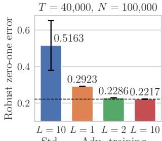
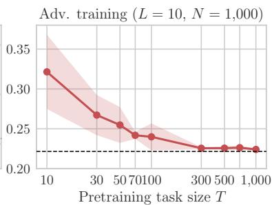
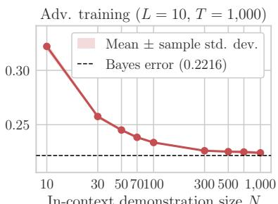
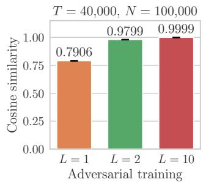
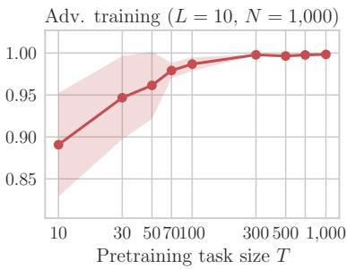
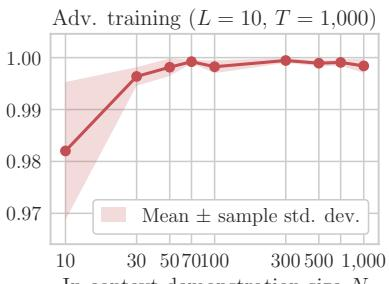

# ADVERSARIALLY TRAINED LINEAR TRANSFORMERS ARE OPTIMAL ROBUST IN-CONTEXT LEARNERS FOR GAUSSIAN MIXTURES

Soichiro Kumano

LY Corporation

sokumano@lycorp.co.jp

## ABSTRACT

Adversarial training is one of the most reliable defenses against adversarial attacks, but its high computational cost must generally be paid anew for each task. Robust foundation models offer a promising alternative: adversarially pretrain a model once and then transfer its robustness to downstream tasks through lightweight adap tation. However, a fundamental question remains open: can robustness acquired during pretraining transfer to unseen tasks without further adversarial training? In this study, we answer this question affirmatively. A single model adversarially pretrained at scale can achieve optimal robustness on new tasks without additional task-specific training. Specifically, we show that, for a family of Gaussian-mixture classification tasks, a sufficiently deep linear transformer adversarially trained across tasks can asymptotically attain the robust Bayes error on previously unseen tasks through in-context learning from clean demonstrations. By contrast, a standardly trained model cannot. We further analyze convergence under gradient flow, an accuracy–robustness trade-off, and demonstration complexity.

## 1 INTRODUCTION

Adversarial examples, inputs that are slightly perturbed to cause machine learning models to make incorrect predictions, expose a fundamental vulnerability of deep learning systems (Szegedy et al., 2014). Adversarial training is one of the most reliable defenses against adversarial attacks (Goodfellow et al., 2015; Madry et al., 2018). It improves robustness by minimizing the loss under worst-case perturbations. However, the resulting min–max optimization makes adversarial training substantially more expensive than standard training. While many cheaper defenses have been proposed, some offer only apparent robustness that disappears under stronger attacks (Carlini & Wagner, 2017a;b; Athalye et al., 2018; Croce & Hein, 2020; Tramer et al., 2020). Consequently, obtaining reliable robustness generally requires paying the cost of adversarial training anew for each task.

Meanwhile, foundation models have transformed how models are developed and deployed. Rather than training a separate model for each task, practitioners pretrain a single model at scale and adapt it to downstream tasks using lightweight methods. This paradigm suggests a compelling possibility: robust foundation models. Adversarial training would be performed only once during pretraining, and the resulting robustness could then be transferred to downstream tasks at little additional cost. Although adversarial pretraining incurs an initial cost, model developers (typically large organizations) could recoup it by licensing the model. The fundamental question here is: Can an adversarially pretrained model adapt to unseen downstream tasks while retaining robustness, without further adversarial training?

Kumano et al. (2026) provided the first theoretical evidence that such transfer might be possible. They showed that an adversarially pretrained single-layer transformer with linear attention can adapt robustly to unseen classification tasks through in-context learning. In-context learning is a particularly lightweight adaptation method that enables transformers to learn from demonstrations in the prompt without updating their parameters (Brown et al., 2020). This result suggests that robustness acquired during pretraining can transfer to new tasks without additional training. However, their analysis is limited to a restricted data model and a single-layer architecture. Moreover, they provided only bounds on the expected robust margin. Thus, it does not provide direct guarantees on robust accuracy or evaluate robust optimality. Consequently, our central question remains open in broader settings.

In this study, we provide a stronger affirmative answer to this question under substantially more general conditions. We consider multilayer linear transformers adversarially pretrained on a family of Gaussian-mixture classification tasks. We focus on the robust zero-one error of these transformers on tasks not encountered during pretraining. In particular, we investigate whether this error approaches the robust Bayes error, which is the minimum robust error attainable by any classifier, even one with full knowledge of the task distribution.

Specifically, we show that, through in-context learning from clean demonstrations, a sufficiently deep linear transformer can asymptotically attain the robust Bayes error on every task in this Gaussian family, including tasks unseen during pretraining. In other words, using only standard samples and without task-specific adversarial training or access to adversarial examples, a single linear transformer can asymptotically serve as an optimal robust predictor for each task. We should note that the transformer’s parameters remain fixed and shared across all downstream tasks. Nevertheless, the transformer can adapt to each task and implement its optimal robust prediction rule.

Moreover, we show that a standardly pretrained transformer cannot achieve optimal robustness, even with infinite pretraining tasks and in-context demonstrations. This result indicates that optimal robust in-context learning cannot be attributed solely to model capacity or task diversity; rather, it stems from an inherent advantage of adversarial pretraining.

We further investigate several properties of robust in-context learning. Whereas the discussion above focuses on empirical-risk minimizers, we also prove that gradient flow in a two-layer architecture converges to a predictor that attains robust Bayes optimality. We also identify two fundamental challenges in developing robust transformers. The first is an inherent accuracy–robustness trade-off: adversarial pretraining can degrade clean accuracy even in the infinite-data limit. The second is greater demonstration complexity: even at the same Bayes excess risk, robust prediction requires more demonstrations than standard prediction.

In summary, we prove the following:

• A sufficiently deep linear transformer asymptotically achieves optimal robustness across a family of Gaussian-mixture classification tasks through in-context learning from clean demonstrations.

• Adversarial pretraining makes the transformer an optimal robust in-context learner, whereas standard pretraining does not, even with unlimited data.

• Under mild conditions, (i) gradient flow leads the transformer to become such an in-context learner, (ii) an accuracy–robustness trade-off arises, and (iii) robust in-context prediction requires more demonstrations than standard prediction.

## 2 RELATED WORK

Adversarial training. Numerous defenses against adversarial examples (Szegedy et al., 2014) have been proposed, but many have subsequently been circumvented by stronger attacks (Carlini & Wagner, 2017a;b; Athalye et al., 2018; Croce & Hein, 2020; Tramer et al., 2020). Although adversarial training (Goodfellow et al., 2015; Madry et al., 2018) is one of the most reliable defenses against a wide range of strong attacks, its computational cost is high due to multiple additional backpropagation steps beyond those needed for standard training. Prior work has sought to reduce this cost by approximating multi-step backpropagation (Shafahi et al., 2019; Zhang et al., 2019; Zheng et al., 2020), reducing the number of backpropagation steps (Andriushchenko & Flammarion, 2020; Wong et al., 2020; Kim et al., 2021; Park & Lee, 2021; Jia et al., 2022), or adversarially finetuning models after standard training (Jeddi et al., 2021; Hou et al., 2022; Suzuki et al., 2023; Gowda et al., 2024). Nevertheless, all these approaches still require adversarial training to be performed separately for each task. In contrast, we adversarially pretrain a linear transformer once and adapt it to downstream tasks through in-context learning from clean demonstrations. This approach requires neither new adversarial examples nor adversarial training during downstream-task adaptation.

In-context learning. In-context learning enables a transformer to learn a task from demonstrations in the prompt, without updating its parameters (Brown et al., 2020). Existing theoretical work on in-context learning has largely focused on the algorithms that transformers can implement in context. For example, appropriately parameterized transformers can implement one gradient descent step per layer in context, so that propagation through multiple layers corresponds to multiple gradient descent steps (Ahn et al., 2023; Bai et al., 2023; Cheng et al., 2024; Gatmiry et al., 2024; Mahankali et al., 2024; Zhang et al., 2024). In-context learning can also simulate second-order optimization (Fu et al., 2024; Giannou et al., 2024), reinforcement learning algorithms (Lee et al., 2023; Lin et al., 2024), and Bayesian inference (Xie et al., 2022; Zhang et al., 2025). Unlike these studies, we do not seek to identify the algorithms that in-context learning can simulate. Instead, we study the ability of in-context learning to transfer robustness acquired in adversarial pretraining to downstream tasks.

Adversarial robustness of in-context learning. The adversarial robustness of in-context learning remains relatively underexplored from a theoretical perspective. Anwar et al. (2025) studied context hijacking and showed that modifying in-context tokens can cause a transformer to output an arbitrary value for a clean query. Li et al. (2025) showed that deeper transformers are more robust to context hijacking. Fu et al. (2025) showed that adversarial training with short adversarial suffixes in the context and clean queries can improve robustness to longer adversarial suffixes at test time. Fu & Wang (2026) used the theory of in-context learning to analyze continuous adversarial training (Xhonneux et al., 2024). Both our work and that of Kumano et al. (2026) differ from these studies in terms of problem setting and objective. Specifically, we ask whether a transformer can learn in context from clean demonstrations to make robust predictions on adversarially perturbed queries. Following our theoretical results, we provide a detailed comparison with Kumano et al. (2026) in Section 3.5.

## 3 THEORETICAL RESULTS

Notation. For each $n \in \mathbb { N } .$ , define $[ n ] : = \{ 1 , \dots , n \}$ . We denote the i-th element of a vector a by $a _ { i }$ and the entry in row i and column j of a matrix A by $A _ { i , j }$ . For $m , n \in \mathbb { N } ,$ , let $\mathbf { 0 } _ { n } , \mathbf { 0 } _ { m , n } ,$ and ${ { I } _ { n } }$ denote the n-dimensional zero vector, the $m \times n$ zero matrix, and the $n \times n$ identity matrix, respectively. For $d \in \mathbb { N }$ , define the real orthogonal group in dimension d by $\mathcal { O } ( d ) : = \{ R \in \mathbb { R } ^ { d \times d } : R ^ { \top } R = I _ { d } \}$ We write $\| \cdot \| _ { 2 }$ for the Euclidean norm and $\Vert \cdot \Vert _ { \mathrm { F } }$ for the Frobenius norm. Let $( X _ { n } ) _ { n \in \mathbb { N } ^ { n } }$ be nonnegative random variables and $( a _ { n } ) _ { n \in \mathbb { N } ^ { m } }$ be positive deterministic values; we write $X _ { n } \lsim \ l \mathbb { P } a _ { n }$ if, for every $\delta \in ( 0 , 1 )$ , there exists $c _ { \delta } > 0$ such that $\mathbb { P } ( X _ { n } \leq c \delta a _ { n } ) \geq 1 - \delta$ for all $\pmb { n } \in \mathbb { N } ^ { m }$

## 3.1 PROBLEM SETTING

Overview. We consider pretraining an L-layer linear transformer f on $T$ tasks. For each $t \in [ T ]$ the t-th task consists of N in-context demonstrations $\mathcal { D } _ { t , N } : = \{ ( \boldsymbol { x } _ { t , n } , y _ { t , n } ) \} _ { n = 1 } ^ { N }$ and a test pair $\left( x _ { t , N + 1 } , y _ { t , N + 1 } \right)$ . Given the clean demonstrations $\mathcal { D } _ { t , N }$ , the transformer uses in-context learning to predict the binary label of the adversarially perturbed query $\pmb { x } _ { t , N + 1 } + \Delta$ . The adversary chooses $\pmb { \Delta }$ subject to $\| \Delta \| _ { 2 } \le \epsilon \sqrt { d }$ . We train the transformer parameters $\Theta _ { L }$ by minimizing the empirical risk $\mathcal { R } _ { \epsilon , T , N } ( \Theta _ { L } )$ . We then evaluate the resulting predictor on a freshly sampled test task using the taskwise zero-one error $\mathcal { E } _ { \epsilon , U } ( f ( \cdot ; \Theta _ { L } , \mathcal { D } _ { N } ) )$ , where U denotes the task-specific variable. Our main interest is the excess error $\mathcal { E } _ { \epsilon , U } \big ( f \big ( \cdot ; \Theta _ { L } , \mathcal { D } _ { N } \big ) \big ) - \mathcal { E } _ { \epsilon , U } ^ { \star }$ , where $\mathcal { E } _ { \epsilon , U } ^ { \star }$ denotes the corresponding taskwise Bayes error.

Task structure. Let $T , N \in \mathbb { N }$ denote the number of pretraining tasks and the number of incontext demonstrations per task, respectively. For each $t ~ \in ~ [ T ]$ , the t-th task consists of $N$ demonstrations $\mathcal { D } _ { t , N } : = \{ ( \boldsymbol { x } _ { t , n } , \boldsymbol { y } _ { t , n } ) \} _ { n = 1 } ^ { N } \bar { \subset } \mathbb { R } ^ { d } \times \{ \pm 1 \}$ and a test pair $( x _ { t , N + 1 } , y _ { t , N + 1 } )$ . Let $U _ { t } : = [ \pmb { u } _ { t , 1 } , \dots , \pmb { u } _ { t , d } ] \in \partial ( d )$ denote an orthogonal matrix whose columns form a task-specific orthonormal basis. For each $( t , n ) \in [ T ] \times [ N + 1 ]$ , let $\mathbf { \delta } _ { \mathbf { \alpha } } \mathbf { a } _ { t , n } : = [ a _ { t , n , 1 } , \ldots , a _ { t , n , d } ] ^ { \top } \in \mathbb { R } ^ { d }$ denote the coefficient vector for the n-th sample of the t-th task, and define the corresponding input vector as

$$
\pmb { x } _ { t , n } : = y _ { t , n } \pmb { U } _ { t } \pmb { a } _ { t , n } = y _ { t , n } ( a _ { t , n , 1 } \pmb { u } _ { t , 1 } + \cdot \cdot \cdot + a _ { t , n , d } \pmb { u } _ { t , d } ) .\tag{1}
$$

Task distribution. The matrices $\{ U _ { t } \} _ { t = 1 } ^ { T }$ are independently drawn according to the normalized Haar measure on $\mathcal O ( d )$ . In other words, the columns of each $U _ { t }$ form an orthonormal basis chosen uniformly at random. The labels $\{ y _ { t , n } \} _ { t \in [ T ] , n \in [ N + 1 ] }$ are independently drawn from the uniform distribution on $\{ \pm 1 \}$ . The coefficient vectors $\{ \mathbf { { a } } _ { t , n } \} _ { t \in [ T ] , n \in [ N + 1 ] }$ are independently drawn from the multivariate normal distribution with mean $\pmb { \mu } \in \mathbb { R } ^ { d }$ and covariance $\pmb { \Sigma } \in \mathbb { R } ^ { d \times d }$ . These three collections are mutually independent. The parameters $\pmb { \mu }$ and Σ are common across tasks.

Dimension of the Krylov subspace. Let $r \in [ d ]$ denote the dimension of ${ \cal { K } } _ { d } ( \pmb { \Sigma } , \pmb { \mu } )$ , the order-d Krylov subspace generated by Σ and $\pmb { \mu } .$ . More precisely, define

$$
{ \displaystyle K _ { d } ( { \bf { \boldsymbol { \Sigma } } } , \mu ) : = \mathrm { s p a n } ( \mu , { \Sigma } \mu , { \Sigma } ^ { 2 } \mu , \ldots , { \Sigma } ^ { d - 1 } \mu ) } , \qquad r : = \dim { \cal K } _ { d } ( { \Sigma } , \mu ) .\tag{2}
$$

Equivalently, r is the largest integer $k \in [ d ]$ such that the vectors $\mu , \Sigma \mu , \dots , \Sigma ^ { k - 1 } \mu$ are linearly independent. Consequently, ${ \mathcal K } _ { d } ( \Sigma , \mu ) = \bar { \mathcal K } _ { r } ( \Sigma , \mu )$ . Moreover, r equals the number of distinct eigenvalues of Σ for which $\pmb { \mu }$ has a nonzero projection onto the corresponding eigenspace. $ { \mathbb { f } } \Sigma = I _ { d }$ so that the Gaussian coordinates are mutually independent and have unit variance, then $r = 1 .$ . If $\pmb { \mu }$ is the all-ones vector and Σ is diagonal, then r equals the number of distinct diagonal entries of $\Sigma .$ In general, r characterizes the representational complexity of the Bayes classifier for the Gaussian data $z : = y \mathbf { a }$ . Without adversarial perturbations, this classifier is $( \Sigma ^ { - 1 } \pmb { \mu } ) ^ { \top } \pmb { z }$ . Its weight vector $\pmb { \Sigma } ^ { - 1 } \pmb { \mu }$ belongs to $\textstyle { \mathcal { K } } _ { r } ( \Sigma , \mu )$ , and r is the smallest Krylov order required to represent this vector.

Input sequence. Given the clean in-context demonstrations $\mathcal { D } _ { N }$ and a possibly perturbed query $z \in \mathbb { R } ^ { d }$ , we define the input sequence ${ Z ^ { ( 0 ) } }$ for a linear transformer as

$$
\pmb { Z } ^ { ( 0 ) } : = \left[ \pmb { x } _ { 1 } \quad \pmb { x } _ { 2 } \quad \cdots \quad \pmb { x } _ { N } \quad \pmb { z } \right] \in \mathbb { R } ^ { ( d + 1 ) \times ( N + 1 ) } .\tag{3}
$$

The bottom-right entry serves as a placeholder for the query prediction.

Linear transformer. In this study, we focus on transformers with linear self-attention, which are commonly used in recent theoretical work (Ahn et al., 2023; Mahankali et al., 2024; Gatmiry et al., 2024; Cheng et al., 2024; Zhang et al., 2024; Kumano et al., 2026). Let $L \in \mathbb { N }$ denote the number of layers. For each $\ell \in [ L ]$ , we recursively define

$$
\pmb { Z } ^ { ( \ell ) } : = \pmb { Z } ^ { ( \ell - 1 ) } + \frac { 1 } { N } P _ { \ell } \pmb { Z } ^ { ( \ell - 1 ) } \pmb { M } \pmb { Z } ^ { ( \ell - 1 ) \top } \pmb { Q } _ { \ell } \pmb { Z } ^ { ( \ell - 1 ) } , \qquad \pmb { M } : = \left[ \pmb { \operatorname { \mathbf { I } } } _ { N } \quad \pmb { \operatorname { \mathbf { 0 } } } _ { N } \right] ,\tag{4}
$$

where $P _ { \ell } , Q _ { \ell } \in \mathbb { R } ^ { ( d + 1 ) \times ( d + 1 ) }$ are, respectively, the trainable value and key–query matrices in layer ℓ. As in prior work on in-context learning (Ahn et al., 2023; Gatmiry et al., 2024; Cheng et al., $2 0 2 4 ;$ Kumano et al., 2026), we use the masking matrix M to prevent the tokens from attending to the query token. The resulting scalar predictor and the collection of trainable parameters are defined as

$$
f ( z ; \Theta _ { L } , \mathcal { D } _ { N } ) : = \Big [ Z ^ { ( L ) } \Big ] _ { d + 1 , N + 1 } , \qquad \Theta _ { L } : = \{ ( P _ { \ell } , Q _ { \ell } ) \} _ { \ell = 1 } ^ { L } .\tag{5}
$$

Training objective. Let $\mathcal { L } : \mathbb { R } \to [ 0 , \infty )$ be a loss function. Based on prior work (Bai et al., 2023; Ahn et al., 2023; Mahankali et al., 2024; Zhang et al., 2024; Kumano et al., 2026), we define the empirical risk over $T$ pretraining tasks, each with N demonstrations, as follows:

$$
\mathcal { R } _ { \epsilon , T , N } ( \Theta _ { L } ) : = \frac { 1 } { T } \sum _ { t = 1 } ^ { T } \operatorname* { m a x } _ { \| \Delta \| _ { 2 } \leq \epsilon \sqrt { d } } \mathcal { L } \Big ( y _ { t , N + 1 } f ( x _ { t , N + 1 } + \Delta ; \Theta _ { L } , \mathcal { D } _ { t , N } ) \Big ) .\tag{6}
$$

Minimizing $\mathcal { R } _ { 0 , T , N }$ corresponds to standard training, whereas minimizing $\mathcal { R } _ { \epsilon , T , N }$ for $\epsilon > 0$ corresponds to adversarial training. Training the transformer on multiple tasks with a single shared set of parameters encourages it to adaptively infer the task-specific structure from the demonstrations and generalize across tasks, rather than specialize in any particular task.

Taskwise zero-one error. For each fixed $U \in { \mathcal { O } } ( d )$ , let $( { \pmb x } , y )$ be a fresh test pair independently drawn from the same task-conditional distribution as the pretraining samples. We define the taskwise robust zero-one error of a predictor $g : \mathbb { R } ^ { d }  \mathbb { R }$ by

$$
\mathcal { E } _ { \epsilon , U } ( g ) : = \mathbb { P } _ { ( \pmb { x } , y ) | U } \left( \operatorname* { i n f } _ { \| \Delta \| _ { 2 } \leq \epsilon \sqrt { d } } y g ( \pmb { x } + \Delta ) \leq 0 \right) .\tag{7}
$$

Setting $\epsilon = 0$ yields the taskwise standard zero-one error $\mathcal { E } _ { 0 , U }$

Taskwise Bayes error. Let $\mathcal { G }$ denote the class of all measurable functions $g : \mathbb { R } ^ { d }  \mathbb { R }$ . For each $U \in { \mathcal { O } } ( d )$ , we define the taskwise robust Bayes error by $\mathcal { E } _ { \epsilon , U } ^ { \star } : = \operatorname* { i n f } _ { g \in \mathcal { G } } \bar { \mathcal { E } } _ { \epsilon , U } ( g )$ . Setting $\epsilon = 0$ yields the taskwise standard Bayes error $\mathcal { E } _ { 0 , U } ^ { \star }$

Assumptions. The assumptions used in this study are as follows:

## Assumption 3.1.

(a) The mean vector $\pmb { \mu }$ is nonzero, and the covariance matrix Σ is symmetric and positive definite; $\pm \ : \mathbf { 0 } _ { d }$ and $\pmb { \Sigma } = \mathbf { \dot { Z } } ^ { \top } \succ \mathbf { 0 } _ { d , d }$

(b) The perturbation radius $\epsilon \sqrt { d }$ is smaller than the norm of the mean vector $\mu ; 0 \leq \epsilon \sqrt { d } < \| \mu \| _ { 2 }$

(c) The number of layers L is at least the dimension r of the Krylov subspace; $L \geq r$

(d) The loss function $\mathcal { L } : \mathbb { R } \to [ 0 , \infty )$ is twice differentiable and satisfies $\mathcal { L } ^ { \prime } ( z ) < 0$ and $\mathcal { L } ^ { \prime \prime } ( z ) > 0$ for every $z \in \mathbb { R }$ , and $\begin{array} { r } { \operatorname* { s u p } _ { z \in \mathbb { R } } \{ | \mathcal { L } ^ { \prime } ( z ) | + \mathcal { L } ^ { \prime \prime } ( z ) \} < \infty } \end{array}$

Condition (a) rules out degenerate classification problems. Condition (b) prevents an adversary from completely canceling the mean signal. The role of Condition (c) is explained in the next section. Condition (d) ensures that the empirical risk minimization problem is well-posed. The logistic loss is an example satisfying Condition (d).

## 3.2 A SINGLE LINEAR TRANSFORMER CAN REPRESENT ROBUST BAYES CLASSIFIERS ACROSS TASKS

In this section, we first show that, given sufficient depth, a single linear transformer can asymptotically achieve the taskwise robust Bayes error through in-context learning. At this stage, we do not address whether the required parameters can be learned by empirical risk minimization.

Theorem 3.2 (A single linear transformer can be Bayes optimal across tasks). Suppose that $( a ) t o \left( c \right)$ in Assumption 3.1 hold. Then, there exists a parameter $\Theta _ { L }$ such that, for every $\bar { \pmb { U } } \in \mathcal { O } ( d )$

$$
\mathcal { E } _ { \epsilon , U } \Big ( f ( \cdot ; \Theta _ { L } , \mathcal { D } _ { N } ) \Big ) - \mathcal { E } _ { \epsilon , U } ^ { \star } \lesssim _ { \mathbb { P } } \frac { 1 } { N } .\tag{8}
$$

The implied constant may depend on $d , \epsilon , \mu ,$ and Σ.

The proof is given in Section B. The theorem establishes that a single linear transformer with a shared parameter asymptotically attains the robust Bayes error for every task as the number of demonstrations grows. In other words, without any task-specific parameter updates, the same linear transformer can adapt to every task through in-context learning and match the performance of the corresponding task-specific robust Bayes classifier. This uniform guarantee demonstrates the expressive capacity of linear transformers for in-context adaptation across tasks. Moreover, the excess error decays at a rate of $N ^ { - 1 }$ . The rate is consistent with empirical observations of strong few-shot performance in in context learning. Recall that r reflects the complexity of the Gaussian mixture model and the resulting difficulty of representing its robust Bayes classifier. Accordingly, the condition $L \geq r$ suggests that more complex data models call for deeper linear transformers to achieve Bayes optimality.

We next provide intuition about how a linear transformer can attain the Bayes error and why the depth condition $L \geq r$ arises.

Lemma 3.3 (Proof sketch of Theorem 3.2). Suppose that (a) and (b) in Assumption 3.1 hold. Suppose also that $N \to \infty ;$ write $\mathcal { D } _ { \infty } : = \mathcal { D } _ { N } . \ L e t \tau \ge 0$ be the unique solution of

$$
\tau \| ( \pmb { \Sigma } + \tau \pmb { I } _ { d } ) ^ { - 1 } \pmb { \mu } \| _ { 2 } = \epsilon \sqrt { d } .\tag{9}
$$

(Bayes classifier) For every $U \in { \mathcal { O } } ( d )$

$$
g ( \pmb { x } ) : = \{ ( \pmb { \Sigma } + \tau \pmb { I } _ { d } ) ^ { - 1 } \pmb { \mu } \} ^ { \top } \pmb { U } ^ { \top } \pmb { x } , \qquad \mathscr { E } _ { \epsilon , U } ( g ) = \mathscr { E } _ { \epsilon , U } ^ { \star } .\tag{10}
$$

(Krylov order of the optimal direction) Let $K _ { 0 } ( \Sigma , \mu ) : = \{ \mathbf { 0 } \}$ . Then,

$$
( \Sigma + \tau I _ { d } ) ^ { - 1 } \pmb { \mu } \in \mathcal { K } _ { r } ( \pmb { \Sigma } , \pmb { \mu } ) \setminus \mathcal { K } _ { r - 1 } ( \pmb { \Sigma } , \pmb { \mu } ) .\tag{11}
$$

(Effective weights of a linear transformer) There exists a parameter family $\{ \Theta _ { L , \xi } : \xi \in \mathbb { R } \}$ whose corresponding effective weights $\pmb \theta ( \Theta _ { L , \xi } )$ satisfy, for every $\xi \in \mathbb { R } , U \in { \mathcal { O } } ( d )$ , and $\pmb { x } \in \mathbb { R } ^ { d }$

$$
f ( \pmb { x } ; \pmb { \Theta } _ { L , \xi } , \mathcal { D } _ { \infty } ) = \pmb { \theta } ( \pmb { \Theta } _ { L , \xi } ) ^ { \top } \pmb { U } ^ { \top } \pmb { x } .\tag{12}
$$

(Span of the effective weights) For the same parameter family,

$$
\operatorname { s p a n } \{ \pmb \theta ( \Theta _ { L , \xi } ) : \xi \in \mathbb { R } \} = \mathcal { K } _ { L } ( \Sigma , \mu ) .\tag{13}
$$

The proof is given in Section B. Although this lemma does not constitute a complete proof of Theorem 3.2, it provides a roadmap for the proof.

Bayes classifier. The first part of the lemma gives the Bayes classifier for $( { \pmb x } , y )$ generated according to Eq. (1). The form of this function provides two insights into this classifier.

First, the optimal weight is the solution to the following regularized mean–variance problem:

$$
\operatorname { a r g m i n } _ { { \boldsymbol w } \in \mathbb R ^ { d } } \left\{ \frac { 1 } { 2 } \mathbb { V } _ { ( { \boldsymbol x } , { \boldsymbol y } ) \mid { \boldsymbol U } } [ { \boldsymbol y } { \boldsymbol w } ^ { \top } { \boldsymbol x } ] - \mathbb { E } _ { ( { \boldsymbol x } , { \boldsymbol y } ) \mid { \boldsymbol U } } [ { \boldsymbol y } { \boldsymbol w } ^ { \top } { \boldsymbol x } ] + \frac { \tau } { 2 } \| { \boldsymbol w } \| _ { 2 } ^ { 2 } \right\} = U ( \Sigma + \tau I _ { d } ) ^ { - 1 } \mu .\tag{14}
$$

The regularization parameter $\tau$ is determined by the perturbation level $\epsilon { : }$ it is zero when $\epsilon = 0$ and increases monotonically with $\epsilon .$ This $\ell _ { 2 }$ regularization controls the sensitivity to adversarial perturbations, since $| \pmb { w } ^ { \top } \pmb { \Delta } | \overset { { } } { \leq } \| \pmb { w } \| _ { 2 } \| \pmb { \Delta } \| _ { 2 }$ . The taskwise Bayes classifier minimizing $\mathcal { E } _ { \epsilon , U }$ is a linear classifier obtained from a perturbation-dependent $\ell _ { 2 }$ -regularized optimization problem.

Second, the classifier makes predictions while accounting for both variance and the effects of adversarial attacks. Substituting $\mathbf { \Delta } x = y \mathbf { \Delta } U \mathbf { a }$ gives

$$
g ( \pmb { x } ) : = \big \{ ( \pmb { \Sigma } + \tau \pmb { I } _ { d } ) ^ { - 1 } \pmb { \mu } \big \} ^ { \top } \pmb { U } ^ { \top } \pmb { x } = y \big \{ ( \pmb { \Sigma } + \tau \pmb { I } _ { d } ) ^ { - 1 } \pmb { \mu } \big \} ^ { \top } \pmb { a } .\tag{15}
$$

For simplicity, suppose that $\pmb { \Sigma } = \mathrm { d i a g } ( \lambda _ { 1 } , \ldots , \lambda _ { d } )$ for $\lambda _ { 1 } , \ldots , \lambda _ { d } > 0$ . Then the i-th term in the inner product, for $i \in [ d ]$ , can be expressed as $\mu _ { i } a _ { i } / ( \lambda _ { i } + \tau )$ . When the perturbation level is small and hence τ is small, this term can be approximated by $\mu _ { i } a _ { i } / \lambda _ { i }$ . Thus, components with large variance have less influence on the prediction, whereas components with small variance have greater influence. In contrast, when $\tau$ is large, $g ( \pmb { x } ) \approx y \pmb { \mu } ^ { \top } \pmb { a } / \tau$ . The classifier relies more directly on strong features in the data without accounting for their variances.

Krylov order of the optimal direction. The second part of the lemma shows that the optimal direction belongs to the order-r Krylov subspace generated by Σ and $\pmb { \mu } .$ This vector cannot belong to the order- $( r - 1 )$ Krylov subspace. The proof uses the Cayley–Hamilton theorem. This result suggests that, to attain the taskwise Bayes error for arbitrary Σ and $\mu ,$ a linear transformer must be expressive enough to internally represent weight vectors in the order-r Krylov subspace.

Effective weights of a linear transformer. The third part of the lemma shows that a suitable parameter family makes a linear transformer behave as a context-dependent linear classifier. We restrict $P _ { \ell , \xi }$ and $\mathbf { } Q _ { \ell , \xi }$ for $\ell \in [ L ]$ as follows, and, under $N \to \infty$ , the context matrix is as follows:

$$
P _ { \ell , \xi } : = \left[ \begin{array} { l l } { \mathbf { 0 } _ { d , d } } & { \mathbf { 0 } _ { d } } \\ { \mathbf { 0 } _ { d } ^ { \top } } & { 1 } \end{array} \right] , Q _ { \ell , \xi } : = \left[ \begin{array} { l l } { \xi I _ { d } } & { \mathbf { 0 } _ { d } } \\ { \mathbf { 0 } _ { d } ^ { \top } } & { 0 } \end{array} \right] , \frac { Z ^ { ( 0 ) } M Z ^ { ( 0 ) \top } } { N } = \left[ \begin{array} { l l } { U ( \Sigma + \mu \mu ^ { \top } ) U ^ { \top } } & { U \mu } \\ & { 1 } \end{array} \right] .\tag{16}
$$

The outputs after the first, second, and third layers are

$$
{ \bf Z } ^ { ( 1 ) } = \left\{ I _ { d + 1 } + \frac { 1 } { N } P _ { 1 , \xi } { \bf Z } ^ { ( 0 ) } M { \bf Z } ^ { ( 0 ) \top } { \bf Q } _ { 1 , \xi } \right\} { \bf Z } ^ { ( 0 ) } = \left[ I _ { d } \qquad { \bf 0 } _ { d } \right] { \bf Z } ^ { ( 0 ) } ,\tag{17}
$$

$$
\pmb { Z } ^ { ( 2 ) } = \left[ \mathinner { \{ 2 \xi \pmb { \mu } ^ { \top } + \xi ^ { 2 } \pmb { \mu } ^ { \top } ( \pmb { \Sigma } + \pmb { \mu } \pmb { \mu } ^ { \top } ) } \} \pmb { U } ^ { \top } \right. \left. \begin{array} { c c } { \pmb { 0 } _ { d } } \\ { 1 } \end{array} \right] \pmb { Z } ^ { ( 0 ) } ,\tag{18}
$$

$$
\pmb { Z } ^ { ( 3 ) } = \left[ \phantom { \frac { 1 } { 2 } } 0 \xi \pmb { \mu } ^ { \top } + 3 \xi ^ { 2 } \pmb { \mu } ^ { \top } ( \pmb { \Sigma } + \pmb { \mu } \pmb { \mu } ^ { \top } ) + \xi ^ { 3 } \pmb { \mu } ^ { \top } ( \pmb { \Sigma } + \pmb { \mu } \pmb { \mu } ^ { \top } ) ^ { 2 } \} \pmb { U } ^ { \top } \right. ^ { \left. \pmb { 0 } \right] } \mathbf { Z } ^ { ( 0 ) } .\tag{19}
$$

Consequently, the three-layer model’s output on a query x and its effective weight are

$$
f ( \boldsymbol { x } ; \boldsymbol { \Theta } _ { 3 , \xi } , \mathcal { D } _ { \infty } ) = \theta ( \boldsymbol { \Theta } _ { 3 , \xi } ) ^ { \top } \boldsymbol { U } ^ { \top } \boldsymbol { x } , \theta ( \boldsymbol { \Theta } _ { 3 , \xi } ) : = 3 \xi \mu + 3 \xi ^ { 2 } \big ( \Sigma + \mu \mu ^ { \top } \big ) \mu + \xi ^ { 3 } \big ( \Sigma + \mu \mu ^ { \top } \big ) ^ { 2 } \mu .\tag{20}
$$

The same construction shows inductively that, with suitable parameters, a linear transformer of any depth can act as a context-dependent linear classifier whose effective weight θ is independent of $\dot { U }$

Span of the effective weights. The fourth part of the lemma states that, as $\xi$ varies, the effective weights associated with this parameter family span the order-L Krylov subspace. The equations above illustrate this mechanism: stacking L layers yields effective weights that are linear combinations of $\mu , \Sigma \mu , \ldots , \Sigma ^ { L - 1 } \mu .$ As shown in the second part, the optimal direction lies in the order-r Krylov subspace. Hence, when $L \geq r .$ , the optimal direction lies in the span of the effective weights. These results explain how linear transformers achieve Bayes optimality and why the depth condition is required. Note that, even when $L \geq r$ , this lemma alone does not establish that an effective weight θ can exactly match the optimal direction $( \pmb { \Sigma } + \tau \pmb { I } _ { d } ) ^ { - 1 } \pmb { \mu } .$ . See Section B for the complete proof.

## 3.3 ADVERSARIAL TRAINING ENABLES LINEAR TRANSFORMERS TO ACHIEVE ROBUST BAYES OPTIMALITY ACROSS TASKS; STANDARD TRAINING DOES NOT

The preceding section establishes that sufficiently deep linear transformers have the expressive capacity to asymptotically attain robust Bayes optimality across tasks. However, this existence result does not show whether such parameters can be learned by a training procedure. We address this question by analyzing empirical risk minimization under adversarial and standard training.

Theorem 3.4 (Adversarial training yields robust linear transformers). Suppose that Assumption 3.1 holds. For sufficiently large $B > \bar { 0 }$ , choose any empirical risk minimizer

$$
\widehat { \Theta } _ { L , \epsilon , T , N } \in \mathop { \mathrm { a r g m i n } } _ { \substack { \operatorname* { m a x } _ { \ell \in [ L ] } \{ \| P _ { \ell } \| _ { \mathrm { F } } , \| Q _ { \ell } \| _ { \mathrm { F } } \} \leq B } } \mathcal { R } _ { \epsilon , T , N } \bigl ( \Theta _ { L } \bigr ) .\tag{21}
$$

Then, for every $U \in { \mathcal { O } } ( d )$

$$
\mathcal { E } _ { \epsilon , U } \left( f \Big ( \cdot ; \widehat { \Theta } _ { L , \epsilon , T , N } , \mathcal { D } _ { N } \Big ) \right) - \mathcal { E } _ { \epsilon , U } ^ { \star } \lesssim _ { \mathbb { P } } \frac { 1 } { \sqrt { T } } + \frac { 1 } { N } .\tag{22}
$$

The implied constant may depend on d, $B , L , \mathcal { L } , \epsilon , \mu ,$ and $\pmb { \Sigma }$

The proof is given in Section C. This theorem complements the representability result in Theorem 3.2 by showing that adversarial training can produce a transformer that asymptotically achieves robust Bayes optimality across tasks. For $d \ge 2$ , a test-task basis U differs almost surely from every pretraining basis under the Haar measure on $\mathcal O ( d )$ , even when there are countably infinitely many pretraining tasks. Thus, the theorem establishes robust generalization to previously unseen tasks, which cannot be attributed to exact memorization of the pretraining bases. Moreover, the excess-error bound decomposes into a term depending on $T$ and a term depending on $N ,$ rather than taking a joint form such as $1 / ( T N )$ . This decomposition isolates the contributions of cross-task learning from pretraining and within-task inference from in-context demonstrations. The bound converges to zero only as both the number of pretraining tasks and the number of in-context demonstrations grow; increasing either one alone might be insufficient for the convergence to Bayes optimality.

We next contrast this result with standard training.

Theorem 3.5 (Standard training does not yield robust linear transformers). Suppose that Assumption $3 . I$ holds. Suppose also that $T , N \to \infty ;$ write $\mathcal { D } _ { \infty } : = \mathcal { D } _ { N }$ and $\mathcal { R } _ { 0 , \infty , \infty } : = \mathcal { R } _ { 0 , T , N }$ . For sufficiently large $B > 0 ,$ , choose any population risk minimizer

$$
\widehat { \Theta } _ { L , 0 , \infty , \infty } \in \mathop { \mathrm { a r g m i n } } _ { \substack { \operatorname* { m a x } _ { \ell \in [ L ] } \{ \| P _ { \ell } \| _ { \mathrm { F } } , \| Q _ { \ell } \| _ { \mathrm { F } } \} \leq B } } \mathcal { R } _ { 0 , \infty , \infty } ( \Theta _ { L } ) .\tag{23}
$$

Then, there exists a constant $C > 0$ such that, for every $U \in { \mathcal { O } } ( d )$

$$
\mathcal { E } _ { \epsilon , U } \left( f \Big ( \cdot ; \widehat { \Theta } _ { L , 0 , \infty , \infty } , \mathcal { D } _ { \infty } \Big ) \right) - \mathcal { E } _ { \epsilon , U } ^ { \star } = \left\{ \begin{array} { l l } { 0 } & { \left( \epsilon = 0 \mathrm { o r } r = 1 \right) } \\ { C } & { \left( \epsilon > 0 \mathrm { a n d } r \geq 2 \right) } \end{array} \right. .\tag{24}
$$

The constant C may depend on d, $\epsilon , \mu ,$ , and $\pmb { \Sigma } .$

The proof is given in Section C. In contrast to Theorem 3.4, this theorem establishes an impossibility result for standard training: when $\epsilon > 0$ and $r \geq 2$ , standard training cannot produce a linear transformer whose predictions attain robust Bayes optimality. This impossibility is not due to a finite amount of training data; it persists in the population limit, even when both the number of pretraining tasks and the number of demonstrations per task tend to infinity. These results reveal a fundamental difference between standard and adversarial training and suggest that, at least for linear transformers, adversarial training is necessary to obtain adversarially robust in-context learners.

In-context demonstration size N  

  
Figure 1: Robust zero-one errors for $d = 1 0 0 , r = 1 0$ , and $\epsilon = 0 . 0 8$ . Means and sample standard deviations are shown over three runs in the left panel and five runs in the other panels.

## 3.4 OTHER THEORETICAL RESULTS

Gradient flow to Bayes optimality. The preceding sections show that global minimizers of the adversarial empirical risk asymptotically achieve taskwise Bayes optimality. However, practical optimization algorithms such as gradient descent are not guaranteed to find a global minimizer. To bridge this gap, Theorem D.1 analyzes the case $L = 2$ and $r \leq 2 .$ , in which only the final key–query matrix is trained. We show that gradient flow yields predictors whose robust errors converge to the corresponding Bayes errors.

Accuracy–robustness trade-off. Robustness often comes at the cost of clean accuracy. In particular, adversarially trained models may be less accurate on unperturbed samples than their standardly trained counterparts (Su et al., 2018; Tsipras et al., 2019; Ilyas et al., 2019). In Theorem E.1, we establish that the same trade-off arises in our setting. Moreover, the trade-off persists even with infinitely many pretraining tasks and infinitely many demonstrations per task. This result highlights a fundamental challenge in developing robust foundation models.

Demonstration complexity. Achieving a target level of robust accuracy often requires more training samples than achieving the corresponding level of standard accuracy (Schmidt et al., 2018; Dan et al., 2020). In Theorem F.1, we establish an analogous gap in the number of in-context demonstrations. Attaining the same fixed excess error relative to the respective Bayes errors requires only one demonstration for standard prediction but $\Theta ( { \sqrt { d } } )$ demonstrations for robust prediction. This result reveals another fundamental challenge in developing robust foundation models.

## 3.5 COMPARISON WITH PRIOR WORK

Compared to Kumano et al. (2026), we substantially relax their assumptions on the data distribution and the model architecture while establishing stronger robustness guarantees for linear transformers.

Data distribution. Their data model restricts feature scales to two discrete levels, such as ${ \mathbf { } } y { \mathbf { } } x =$ $[ \alpha , \dotsc , \alpha , \beta , \dotsc , \beta ]$ , where $\alpha , \beta > 0$ represent large and small values, respectively. This is a major limitation they acknowledge. Our framework allows arbitrary feature scales. They also consider only the standard basis, which roughly corresponds to fixing $\dot { \pmb { U } }$ to a particular value in our framework. In contrast, our theory applies to any orthonormal basis. Although they allow a broader class of coefficient distributions than our Gaussian family, they impose strong constraints on the covariance structure, whereas we do not. Overall, our framework broadens the class of admissible data models.

Architecture. Theoretically, their analysis is limited to single-layer linear transformers, whereas ours applies to multilayer linear transformers. Their experiments are also limited to single-layer linear transformers trained on relatively small datasets, including MNIST (Deng, 2012), Fashion-MNIST (Xiao et al., 2017), and CIFAR-10 (Krizhevsky, 2009). By contrast, we conduct experiments with multilayer transformers equipped with softmax attention on larger datasets, including CIFAR-100 (Krizhevsky, 2009), Tiny ImageNet (Le & Yang, 2015), and Caltech-256 (Griffin et al., 2007), thereby evaluating the effectiveness of robust foundation models in more realistic settings.

Robustness guarantees. Although differences in assumptions make direct comparisons difficult, our results provide more direct and comprehensive robustness guarantees. First, they establish only bounds on the expected robust margin $\mathbb { E } [ y f ( { \pmb x } + { \pmb \Delta } ) ]$ ]. Because the expected robust margin does not generally determine robust accuracy, these bounds alone do not provide a direct guarantee of robustness. By contrast, we prove that the robust zero-one error converges to the taskwise robust Bayes error, thereby directly guaranteeing transformer robustness. Second, their analysis does not determine whether linear transformers are robust or vulnerable in certain data regimes. As they acknowledge, their single-layer restriction limits model capacity and prevents their analysis from capturing the full robustness potential of linear transformers. By considering a multilayer model, we show that linear transformers asymptotically achieve taskwise robust Bayes optimality when they are sufficiently deep relative to the data complexity $( \mathrm { i } . \mathrm { e } . , L \ge r )$ . Overall, our analysis provides more definitive guarantees and more fully characterizes the robustness of linear transformers.

Table 1: Clean/robust accuracy (%) of six-layer transformers with softmax attention on real-world data, reported as mean sample standard deviation across five independent runs.
<table><tr><td>Training</td><td>CIFAR-100</td><td>Tiny ImageNet</td><td>Caltech-256</td></tr><tr><td>Standard</td><td> ${ \bf 7 9 . 1 \pm 2 . 0 / 2 6 . 8 \pm 3 . 4 }$ </td><td> $7 7 . 4 \pm 3 . 4 / 2 7 . 6 \pm 7 . 6$ </td><td> $7 8 . 0 \pm 3 . 6 / 2 3 . 8 \pm 6 . 5$ </td></tr><tr><td>Adversarial</td><td> $7 7 . 9 \pm 1 . 7 / 6 3 . 2 \pm 1 . 8$ </td><td> $6 7 . 0 \pm 6 . 0 / 5 2 . 8 \pm 2 . 2$ </td><td> $7 4 . 6 \pm 3 . 9 / 6 2 . 4 \pm 4 . 6$ </td></tr></table>

## 4 EXPERIMENTAL RESULTS

Detailed experimental settings and additional results are provided in Section A.

Synthetic datasets. We first empirically validate our theoretical results using synthetic datasets generated according to Eq. (1). We set $d = 1 0 0 , r = 1 0$ , and $\epsilon = 0 . 0 8$ . We train the linear transformer in Eq. (5) by minimizing the logistic loss with Adam. Each model is evaluated on 40,000 test tasks with 200 queries per task. The left panel of Fig. 1 compares robust zero-one errors for $T = 4 0 , 0 0 0$ and $N = 1 0 0 { , } 0 0 0$ . Under adversarial training, the robust zero-one error decreases with depth, and the depth-10 model essentially attains the robust Bayes error, supporting Theorems 3.2 and 3.4. The near-optimal performance of the depth-2 model does not contradict the theorem because $L \geq r$ is a sufficient but not necessary condition. In contrast, despite having sufficient depth and being trained on abundant data, the depth-10 model obtained by standard training remains far from optimal, consistent with Theorem 3.5. The center and right panels show that the depth-10 adversarially trained model approaches the robust Bayes error as T and N increase, respectively, supporting Theorem 3.4.

Real-world datasets. We then evaluate six-layer transformers with softmax attention on binary classification tasks from CIFAR-100, Tiny ImageNet, and Caltech-256. The pretraining, validation, and test classes are mutually disjoint. Clean and robust test accuracies are shown in Tab. 1. Adversarial training substantially improves robust accuracy, albeit at the cost of lower clean accuracy.

## 5 CONCLUSION AND LIMITATIONS

We showed that adversarial pretraining can enable a sufficiently deep linear transformer to adapt to unseen Gaussian-mixture classification tasks through in-context learning from clean demonstrations and asymptotically attain the taskwise robust Bayes error. By contrast, standard pretraining does not, even in the population limit. We further established convergence under gradient flow and identified two challenges in robust in-context learning. These results provide theoretical evidence that robustness acquired once during pretraining can transfer to downstream tasks without additional adversarial training, supporting the feasibility of robust foundation models.

Our analysis is restricted to Gaussian-mixture tasks that share a common latent mean and covariance, so the unseen tasks considered in our theory still belong to a structured task family. Although such cross-task sharing is common in theoretical analyses of in-context learning (Ahn et al., 2023; Mahankali et al., 2024; Kumano et al., 2026), extending our guarantees to settings with task-dependent means or covariances and to non-Gaussian inputs is an important direction for future theoretical work. Moreover, the practical utility of robust foundation models remains unknown at the scale of modern foundation-model pretraining. We hope that our theoretical results will motivate large-scale empirical studies by large organizations with the computational resources required to conduct them.

## AI USE STATEMENT

In this work, we used generative AI tools to formulate mathematical claims, provide critical ingredients for proving mathematical claims, assist in the writing of proofs, implement methods, and assist with translation. We have not used generative AI tools to generate synthetic data sets, help develop theoretical models or conceptual frameworks, propose or refine hypotheses, design or provide feedback on research methodology or experiments, and interpret results. Dataset cleaning and reformatting, and support for qualitative or thematic data analysis are not applicable to this work. Additionally, we used generative AI tools to create or edit software code, draft parts of a research paper, summarize or analyze existing literature, brainstorm, source or search for information, edit a research paper to improve readability, identify relevant literature, and suggest a structure for a research paper. We did not use generative AI tools to create or modify scientific figures or images, suggest experimental parameters, create artifacts, discover research topics or identify gaps, format references, and propose a title or keywords for a research paper. Formulating questions for surveys or interviews and transcribing recordings of research materials are not applicable to this work. We have reviewed all AI-assisted work. We independently checked all proofs for mathematical correctness, tested all experimental code, and read and evaluated every cited work. We take responsibility for the final content of this work, including text, claims, or artifacts produced with the aid of generative AI.

## ETHICS STATEMENT

This work is a theoretical study of adversarial robustness supported by experiments on synthetic and real-world benchmark datasets. We use only publicly available datasets and do not collect new data or involve human participants. Our experiments do not interact with deployed systems.

## REPRODUCIBILITY STATEMENT

We state all assumptions explicitly in the main text and provide complete proofs of all theoretical results in the appendix. Detailed experimental settings are provided in Section A. The supplementary material contains the code to reproduce the reported experimental results.

## REFERENCES

Kwangjun Ahn, Xiang Cheng, Hadi Daneshmand, and Suvrit Sra. Transformers learn to implement preconditioned gradient descent for in-context learning. In NeurIPS, volume 36, pp. 45614–45650, 2023.

Maksym Andriushchenko and Nicolas Flammarion. Understanding and improving fast adversarial training. In NeurIPS, volume 33, pp. 16048–16059, 2020.

Usman Anwar, Johannes Von Oswald, Louis Kirsch, David Krueger, and Spencer Frei. Understanding in-context learning of linear models in transformers through an adversarial lens. TMLR, 2025. ISSN 2835-8856.

Anish Athalye, Nicholas Carlini, and David Wagner. Obfuscated gradients give a false sense of security: Circumventing defenses to adversarial examples. In ICML, pp. 274–283, 2018.

Yu Bai, Fan Chen, Huan Wang, Caiming Xiong, and Song Mei. Transformers as statisticians: Provable in-context learning with in-context algorithm selection. In NeurIPS, volume 36, pp. 57125–57211, 2023.

Arjun Nitin Bhagoji, Daniel Cullina, and Prateek Mittal. Lower bounds on adversarial robustness from optimal transport. In NeurIPS, volume 32, 2019.

Tom Brown, Benjamin Mann, Nick Ryder, Melanie Subbiah, Jared D Kaplan, Prafulla Dhariwal, Arvind Neelakantan, Pranav Shyam, Girish Sastry, Amanda Askell, et al. Language models are few-shot learners. In NeurIPS, volume 33, pp. 1877–1901, 2020.

Nicholas Carlini and David Wagner. Towards evaluating the robustness of neural networks. In SP, pp. 39–57, 2017a.

Nicholas Carlini and David Wagner. Adversarial examples are not easily detected: Bypassing ten detection methods. In ACM Workshop, pp. 3–14, 2017b.

Xiang Cheng, Yuxin Chen, and Suvrit Sra. Transformers implement functional gradient descent to learn non-linear functions in context. In ICML, 2024.

Francesco Croce and Matthias Hein. Reliable evaluation of adversarial robustness with an ensemble of diverse parameter-free attacks. In ICML, pp. 2206–2216, 2020.

Chen Dan, Yuting Wei, and Pradeep Ravikumar. Sharp statistical guaratees for adversarially robust gaussian classification. In ICML, pp. 2345–2355, 2020.

Li Deng. The MNIST database of handwritten digit images for machine learning research. Signal Processing Magazine, 29(6):141–142, 2012.

Deqing Fu, Tian-qi Chen, Robin Jia, and Vatsal Sharan. Transformers learn to achieve second-order convergence rates for in-context linear regression. In NeurIPS, volume 37, pp. 98675–98716, 2024.

Shaopeng Fu and Di Wang. Understanding and improving continuous LLM adversarial training via in-context learning theory. In ICLR, 2026.

Shaopeng Fu, Liang Ding, Jingfeng Zhang, and Di Wang. Short-length adversarial training helps LLMs defend long-length jailbreak attacks: Theoretical and empirical evidence. In NeurIPS, volume 38, pp. 64351–64391, 2025.

Khashayar Gatmiry, Nikunj Saunshi, Sashank J Reddi, Stefanie Jegelka, and Sanjiv Kumar. Can looped transformers learn to implement multi-step gradient descent for in-context learning? In ICML, 2024.

Angeliki Giannou, Liu Yang, Tianhao Wang, Dimitris Papailiopoulos, and Jason D Lee. How well can transformers emulate in-context newton’s method? arXiv:2403.03183, 2024.

Ian J. Goodfellow, Jonathon Shlens, and Christian Szegedy. Explaining and harnessing adversarial examples. In ICLR, 2015.

Shruthi Gowda, Bahram Zonooz, and Elahe Arani. Conserve-update-revise to cure generalization and robustness trade-off in adversarial training. In ICLR, pp. 15465–15485, 2024.

Gregory Griffin, Alex Holub, and Pietro Perona. Caltech-256 object category dataset. Technical report, 2007.

Trevor Hastie, Robert Tibshirani, and Jerome Friedman. The elements of statistical learning: data mining, inference, and prediction. Springer, 2 edition, 2009.

Pengyue Hou, Ming Zhou, Jie Han, Petr Musilek, and Xingyu Li. Adversarial fine-tune with dynamically regulated adversary. In IJCNN, pp. 1–8, 2022.

Andrew Ilyas, Shibani Santurkar, Dimitris Tsipras, Logan Engstrom, Brandon Tran, and Aleksander Madry. Adversarial examples are not bugs, they are features. In NeurIPS, volume 32, pp. 125–136, 2019.

Ahmadreza Jeddi, Mohammad Javad Shafiee, and Alexander Wong. A simple fine-tuning is all you need: Towards robust deep learning via adversarial fine-tuning. In CVPR Workshop, 2021.

Xiaojun Jia, Yong Zhang, Xingxing Wei, Baoyuan Wu, Ke Ma, Jue Wang, and Xiaochun Cao. Prior-guided adversarial initialization for fast adversarial training. In ECCV, pp. 567–584, 2022.

Hoki Kim, Woojin Lee, and Jaewook Lee. Understanding catastrophic overfitting in single-step adversarial training. In AAAI, volume 35, pp. 8119–8127, 2021.

Alex Krizhevsky. Learning multiple layers of features from tiny images. Technical report, University of Toronto, 2009.

Soichiro Kumano, Hiroshi Kera, and Toshihiko Yamasaki. Adversarially pretrained transformers may be universally robust in-context learners. In ICLR, pp. 124615–124659, 2026.

Ya Le and Xuan Yang. Tiny ImageNet visual recognition challenge. CS231N course report, Stanford University, 2015.

Jonathan Lee, Annie Xie, Aldo Pacchiano, Yash Chandak, Chelsea Finn, Ofir Nachum, and Emma Brunskill. Supervised pretraining can learn in-context reinforcement learning. In NeurIPS, volume 36, pp. 43057–43083, 2023.

Tianle Li, Chenyang Zhang, Xingwu Chen, Yuan Cao, and Difan Zou. On the robustness of transformers against context hijacking for linear classification. In NeurIPS, volume 38, pp. 69373– 69411, 2025.

Licong Lin, Yu Bai, and Song Mei. Transformers as decision makers: Provable in-context reinforcement learning via supervised pretraining. In ICLR, 2024.

Aleksander Madry, Aleksandar Makelov, Ludwig Schmidt, Dimitris Tsipras, and Adrian Vladu. Towards deep learning models resistant to adversarial attacks. In ICLR, 2018.

Arvind Mahankali, Tatsunori B Hashimoto, and Tengyu Ma. One step of gradient descent is provably the optimal in-context learner with one layer of linear self-attention. In ICLR, 2024.

Geon Yeong Park and Sang Wan Lee. Reliably fast adversarial training via latent adversarial perturbation. In ICCV, pp. 7758–7767, 2021.

Ludwig Schmidt, Shibani Santurkar, Dimitris Tsipras, Kunal Talwar, and Aleksander Madry. Adversarially robust generalization requires more data. In NeurIPS, volume 31, 2018.

Ali Shafahi, Mahyar Najibi, Amin Ghiasi, Zheng Xu, John Dickerson, Christoph Studer, Larry S Davis, Gavin Taylor, and Tom Goldstein. Adversarial training for free! In NeurIPS, volume 32, 2019.

Dong Su, Huan Zhang, Hongge Chen, Jinfeng Yi, Pin-Yu Chen, and Yupeng Gao. Is robustness the cost of accuracy?–a comprehensive study on the robustness of 18 deep image classification models. In ECCV, pp. 631–648, 2018.

Satoshi Suzuki, Shin’ya Yamaguchi, Shoichiro Takeda, Sekitoshi Kanai, Naoki Makishima, Atsushi Ando, and Ryo Masumura. Adversarial finetuning with latent representation constraint to mitigate accuracy-robustness tradeoff. In ICCV, pp. 4367–4378, 2023.

Christian Szegedy, Wojciech Zaremba, Ilya Sutskever, Joan Bruna, Dumitru Erhan, Ian Goodfellow, and Rob Fergus. Intriguing properties of neural networks. In ICLR, 2014.

Florian Tramer, Nicholas Carlini, Wieland Brendel, and Aleksander Madry. On adaptive attacks to adversarial example defenses. In NeurIPS, volume 33, pp. 1633–1645, 2020.

Dimitris Tsipras, Shibani Santurkar, Logan Engstrom, Alexander Turner, and Aleksander Madry. Robustness may be at odds with accuracy. In ICLR, 2019.

Eric Wong, Leslie Rice, and J Zico Kolter. Fast is better than free: Revisiting adversarial training. In ICLR, 2020.

Sophie Xhonneux, Alessandro Sordoni, Stephan Gunnemann, Gauthier Gidel, and Leo Schwinn.¨ Efficient adversarial training in llms with continuous attacks. In NeurIPS, volume 37, pp. 1502– 1530, 2024.

Han Xiao, Kashif Rasul, and Roland Vollgraf. Fashion-MNIST: a novel image dataset for benchmarking machine learning algorithms. arXiv:1708.07747, 2017.

Sang Michael Xie, Aditi Raghunathan, Percy Liang, and Tengyu Ma. An explanation of in-context learning as implicit bayesian inference. In ICLR, 2022.

Dinghuai Zhang, Tianyuan Zhang, Yiping Lu, Zhanxing Zhu, and Bin Dong. You only propagate once: Accelerating adversarial training via maximal principle. In NeurIPS, volume 32, 2019.

Ruiqi Zhang, Spencer Frei, and Peter L Bartlett. Trained transformers learn linear models in-context. JMLR, 25(49):1–55, 2024.

Yufeng Zhang, Fengzhuo Zhang, Zhuoran Yang, and Zhaoran Wang. What and how does in-context learning learn? bayesian model averaging, parameterization, and generalization. In AISTATS, 2025.

Haizhong Zheng, Ziqi Zhang, Juncheng Gu, Honglak Lee, and Atul Prakash. Efficient adversarial training with transferable adversarial examples. In CVPR, pp. 1178–1187, 2020.

A Additional Experimental Results 14   
A.1 Synthetic Experiments 14   
A.2 Real-World Experiments 16   
B Robust Bayes Implementation by Linear Transformers: Proof of Theorem 3.2 17   
B.1 Robust Bayes classifier 17   
B.2 Query-Linear Representation 21   
B.3 Krylov structure and sufficient-depth realization 21   
C Adversarial and Standard Training: Proofs of Theorems 3.4 and 3.5 25   
C.1 Directions selected by infinite-sample margin risks 25   
C.2 Infinite-sample minimizers and finite-context transfer 26   
C.3 Finite-task adversarial risk minimization 27   
D Gradient Flow to Robust Bayes Optimality 31   
E Accuracy–Robustness Trade-Off 33   
F Demonstration Complexity 34

## A ADDITIONAL EXPERIMENTAL RESULTS

All experiments were conducted on a Linux server with an x86 64 CPU architecture and four NVIDIA A100-SXM4-80GB GPUs.

## A.1 SYNTHETIC EXPERIMENTS

Experimental design. We choose an anisotropic Gaussian distribution for which the standard and robust Bayes directions differ, allowing the experiments to distinguish standard from robust direction recovery. Specifically, we set $d = 1 0 0$ and $\epsilon = 0 . 0 8$ and, for every $i \in [ 1 0 ]$ , define the mean and diagonal covariance entries by

$$
\mu _ { i } : = \frac { i } { 1 0 } , \quad \quad \Sigma _ { i , i } : = \mu _ { i } 1 0 ^ { - 1 + 2 ( i - 1 ) / 9 } .\tag{A1}
$$

For every $i \in [ d ] \setminus [ 1 0 ]$ , we set $\mu _ { i } : = 0$ and $\Sigma _ { i , i } : = 1 0 ^ { - 6 }$ . The active signal-to-variance ratios $\mu _ { i } / \Sigma _ { i , i } = 1 0 ^ { 1 - 2 ( i - 1 ) / 9 }$ therefore range logarithmically from 10 to $1 0 ^ { - 1 }$ . Because the ten active coordinates have distinct covariance eigenvalues, this construction has Krylov dimension $r = 1 0$ We independently draw each task basis U from the normalized Haar distribution on $\mathcal O ( d )$ and then sample demonstrations and queries from Eq. (1). Each fixed pretraining dataset contains $T$ task bases, N clean demonstrations per task, and one clean query per task. For evaluation, we use 40,000 independently drawn test tasks, a fresh context with the same value of N for each task, and 200 independent queries per context. We conduct three independent runs for $T = 4 0 , 0 0 0$ and $N = 1 0 0 { , } 0 0 0$ and five independent runs otherwise. Each run uses separate training and evaluation random streams, and we report means and sample standard deviations across runs.

Model and training. We use the one-head masked linear-attention architecture in Eq. (4) and restrict its parameters to a rotation-equivariant family that respects the symmetry of the task distribution. In particular, every layer has the form

$$
\begin{array} { r } { { \cal P } _ { \ell } : = p _ { \ell , x } \pmb { \Pi } _ { x } + p _ { \ell , y } \pmb { \Pi } _ { y } , } \end{array}
$$

$$
\pmb { Q } _ { \ell } : = q _ { \ell , x } \pmb { \Pi } _ { x } + q _ { \ell , y } \pmb { \Pi } _ { y } ,\tag{A2}
$$

$$
\begin{array} { r } { \pmb { \Pi } _ { x } : = \mathrm { d i a g } ( \pmb { I } _ { d } , 0 ) , } \end{array}
$$

$$
\begin{array} { r } { \Pi _ { y } : = \mathrm { d i a g } ( \mathbf { 0 } _ { d } , 1 ) . } \end{array}\tag{A3}
$$

In-context demonstration size N  

  
Figure A1: Cosine similarity between the population-context effective direction of an adversarially trained transformer and the robust Bayes direction. The distribution and the three experimental conditions are the same as in Fig. 1. The left panel varies the depth at $T = 4 0 { , } 0 0 0$ and $N = 1 0 0 { , } 0 0 0$ the center panel varies $T$ with $L = 1 0$ and $\mathbf { \dot { \boldsymbol { N } } } = 1 { , } 0 0 0$ , and the right panel varies $N$ with $L = 1 0$ and $T = \bar { 1 , 0 0 0 }$ . Means and sample standard deviations are shown over three runs in the left panel and five runs in the other panels.

The four coefficients in each layer are trainable and initialized independently from $\mathcal { N } ( 0 , 0 . 0 1 ^ { 2 } )$ . We minimize the logistic loss $\mathcal { L } ( z ) = \log ( 1 + \exp ( - z ) )$ , which satisfies Assumption 3.1(d), by full-batch Adam for at most 2,500 updates on the fixed pretraining dataset. The learning rate increases linearly to 0.01 over the first 30 updates and subsequently either remains constant or follows cosine annealing to 0.001 without restarts. For each schedule, we retain the checkpoint with the smallest training loss and report the better of the two retained checkpoints under the same criterion.

Robust evaluation and Bayes baselines. Masked linear attention is linear in the query, so both adversarial training and robust evaluation can use the exact worst-case perturbation rather than an approximate attack such as the fast gradient sign method (Goodfellow et al., 2015) or projected gradient descent (PGD) (Madry et al., 2018). The adversary perturbs only the query and leaves all in-context demonstrations fixed and clean. Writing w $( \Theta _ { L } , { \cal D } _ { N } )$ for the context-dependent effective query direction, the exact perturbation for $\pmb { w } ( \Theta _ { L } , \mathcal { D } _ { N } ) \neq \mathbf { 0 } _ { d }$ is

$$
\Delta = - y \epsilon \sqrt { d } \frac { w ( \Theta _ { L } , \mathcal { D } _ { N } ) } { \lVert w ( \Theta _ { L } , \mathcal { D } _ { N } ) \rVert _ { 2 } } .\tag{A4}
$$

When the effective direction is zero, we instead set $\begin{array} { r } { \Delta = \mathbf { 0 } _ { d } , } \end{array}$ , and during adversarial training we recompute the perturbation from the current model at every update. For comparison with the theoretical optimum, we obtain the robust Bayes direction $( \Sigma ^ { ' } + { \bar { \tau } } I _ { d } ) ^ { - 1 } \mu$ by numerically solving

$$
\tau \| ( \pmb { \Sigma } + \tau \pmb { I } _ { d } ) ^ { - 1 } \pmb { \mu } \| _ { 2 } = \epsilon \sqrt { d }\tag{A5}
$$

and compute all Bayes risks analytically from the resulting Gaussian margins.

Alignment with the robust Bayes direction. To examine whether adversarial training recovers the optimal classifier rather than merely its error, Fig. A1 compares the effective direction of linear transformers with the robust Bayes direction characterized in Lemma B.4. At $T = 4 0 { , } 0 0 0$ and $N = 1 0 0 { , } 0 0 0$ , the cosine similarity increases with depth and approaches one at depth ten. Thus, the depth-10 model recovers not only the robust Bayes error but also the unique optimal direction up to positive scaling. Increasing the number of pretraining tasks similarly improves the cosine similarity, while the values throughout the demonstration sweep remain close to one. Together with the robust errors in Fig. 1, these results support the convergence to the robust Bayes predictor established in Theorem 3.4.

Accuracy–robustness trade-off and demonstration complexity. To assess the accuracy–robustness trade-off and the qualitative dependence on context length, Tab. A1 compares clean and robust accuracy as the number of demonstrations increases. Standard training gives higher clean accuracy overall, whereas adversarial training gives substantially higher robust accuracy, supporting the accuracy–robustness trade-off in Theorems 3.5 and E.1. Moreover, standard clean accuracy saturates with relatively few demonstrations, while adversarial robust accuracy continues to improve toward the robust Bayes accuracy. This behavior is qualitatively consistent with Theorem F.1.

Table A1: Clean and robust accuracies (%), reported as mean sample standard deviation across five runs, for depth-10 models trained on $T = 1$ ,000 tasks. Each row uses the displayed number of demonstrations in both pretraining and evaluation. Robust accuracy uses $\epsilon = 0 . 0 8 .$ , and every model is evaluated on 40,000 test tasks with 200 queries per task.
<table><tr><td rowspan="2">N</td><td colspan="2">Standard training</td><td colspan="2">Adversarial training</td></tr><tr><td>Clean</td><td>Robust</td><td>Clean</td><td>Robust</td></tr><tr><td>10</td><td> $8 4 . 6 \pm 4 . 2$ </td><td> $6 3 . 5 \pm 4 . 5$ </td><td> $8 4 . 8 \pm 0 . 7$ </td><td> $6 7 . 8 \pm 0 . 3$ </td></tr><tr><td>50</td><td> $9 5 . 1 \pm 4 . 3$ </td><td> $5 2 . 8 \pm 2 0 . 6$ </td><td> $9 2 . 4 \pm 0 . 3$ </td><td> $7 5 . 5 \pm 0 . 1$ </td></tr><tr><td>100</td><td> $9 8 . 0 \pm 0 . 6 $ </td><td> $4 5 . 1 \pm 1 5 . 9$ </td><td> $9 3 . 6 \pm 0 . 3$ </td><td> $7 6 . 6 \pm 0 . 1$ </td></tr><tr><td>500</td><td> $9 8 . 7 \pm 0 . 2 $ </td><td> $3 9 . 6 \pm 7 . 0$ </td><td> $9 4 . 1 \pm 0 . 3 $ </td><td> $7 7 . 5 \pm 0 . 1$ </td></tr><tr><td>1,000</td><td> $9 8 . 4 \pm 0 . 6 $ </td><td> $4 5 . 1 \pm 1 3 . 0$ </td><td> $9 4 . 0 \pm 0 . 1$ </td><td> $7 7 . 6 \pm 0 . 1$ </td></tr></table>

## A.2 REAL-WORLD EXPERIMENTS

Datasets and class splits. We evaluate whether the benefit of adversarial pretraining extends beyond the theoretical Gaussian model by considering CIFAR-100 (Krizhevsky, 2009), Tiny ImageNet (Le & Yang, 2015), and Caltech-256 (Griffin et al., 2007). In each of the five independent runs, the respective pretraining splits contain 80, 180, and 236 classes, while each validation and test split contains ten classes, with all three partitions mutually disjoint. We draw a different class partition in each run.

PCA features. We represent each image by an unwhitened principal component analysis (PCA) features to reduce the input dimension before constructing the in-context episodes. Let $d _ { \mathrm { P C A } }$ denote the number of retained components and hence the dimension of each PCA feature. For every dataset and run, we scale RGB values to [0, 1] and flatten each image in channel–height–width order. We fit the coordinatewise mean and PCA components using only images from that run’s pretraining classes, excluding all images from validation and test classes. We compute PCA with 32 oversampling dimensions and seven power iterations. After fitting PCA, we use the same mean and components to project every image in the training and query splits. We retain $d _ { \mathrm { P C A } } = 2 5 6$ components for CIFAR-100 and $d _ { \mathrm { P C A } } = 5 1 2$ components for Tiny ImageNet and Caltech-256. For Caltech-256, we exclude the clutter class and select 60 training images and 20 query images from each of the remaining 256 classes. Before computing its PCA feature, we convert each Caltech-256 image to RGB, center it on a square canvas padded with the RGB value (128, 128, 128), and resize it to 64 64 pixels using bicubic interpolation with antialiasing.

Binary in-context episodes. Each episode is a binary classification task whose two classes determine the meaning of the labels within that context. At the beginning of every pretraining epoch, we randomly permute the pretraining classes and pair consecutive classes, ensuring that each class appears in exactly one task during that epoch. For each class in a task, we sample 50 demonstrations and 10 queries without replacement from its training features, with the demonstration and query sets disjoint within the task. Validation and testing instead enumerate all 45 unordered pairs of the corresponding ten held-out classes. For each pair, we form one fixed context from 50 training features per class and evaluate it on 10 query-split features per class, yielding 900 queries in each final test.

Transformer and optimization. We use a six-layer pre-normalization transformer with softmax attention, residual connections, and GELU feed-forward networks, thereby testing whether the qualitative prediction of the linear-attention theory persists in a standard nonlinear architecture. Each PCA feature is augmented with one of three learned embeddings that identifies a demonstration with label 1, a demonstration with label +1, or an unlabeled query. CIFAR-100 uses four attention heads and a feed-forward dimension of 1,024, whereas Tiny ImageNet and Caltech-256 use eight attention heads and a feed-forward dimension of 2,048; every attention head has dimension 64. A linear head applied after the final layer normalization produces the scalar score optimized with the logistic loss. We use Xavier uniform initialization for linear weights, zero linear biases, independent $\tilde { \mathcal { N } } ( 0 , 0 . 0 2 ^ { 2 } )$ initialization for the three embeddings, and unit scales and zero biases for layer normalization. We train for 300 epochs with AdamW, exponential decay rates 0.9 and 0.95, numerical stability constant $1 0 ^ { - 8 }$ , weight decay 0.05, and global gradient clipping at 1.0. The standard and adversarial runs use peak learning rates of $3 \times 1 0 ^ { - 4 }$ and $1 0 ^ { - 3 }$ , respectively, with linear warmup over the first 5% of updates followed by cosine decay to zero. We initialize the standard model from scratch and the adversarial model from the corresponding standardly trained model. Model selection minimizes the clean validation logistic loss for standard training and the 20-step PGD validation loss for adversarial training.

Adversarial training and evaluation. The real-world threat model follows the theoretical setting by perturbing only the query while keeping all demonstrations clean and fixed. Specifically, the adversary may change a query PCA feature within an $L _ { 2 }$ ball of radius $\epsilon \sqrt { d _ { \mathrm { P C A } } }$ , where $\epsilon = 0 . 1$ in both training and evaluation. Adversarial training uses untargeted 10-step PGD with one uniformly sampled random start and step size $\epsilon \sqrt { d _ { \mathrm { P C A } } } / 4$ . For final evaluation, we measure robust accuracy using APGD-CE and binary FAB (Croce & Hein, 2020), each run for 100 iterations. We omit the remaining AutoAttack components because the DLR loss is undefined for scalar binary scores and Square Attack relies on spatial image structure.

## B ROBUST BAYES IMPLEMENTATION BY LINEAR TRANSFORMERS: PROOF OF THEOREM 3.2

## B.1 ROBUST BAYES CLASSIFIER

In this section, we characterize the robust Bayes classifier and its error for a fixed task independently of the linear-transformer architecture. For $U = I _ { d }$ and thus $\mathbf { \Delta x } = y \mathbf { a }$ , we derive the robust zero-one error of every linear function in Lemma B.1, the standard Bayes error in Lemma B.2, and the robust Bayes error and all linear functions attaining it in Lemma B.3. Then, for every $U \in { \mathcal { O } } ( d )$ and $\mathbf { \Delta } x = y \mathbf { \pmb { U } } \mathbf { a }$ , we generalize these results in Lemma B.4.

Variants or equivalent formulations of these results appear in Hastie et al. (2009); Bhagoji et al. (2019); Dan et al. (2020). These lemmas are auxiliary to our main results, and we do not claim them as novel contributions. For completeness, we provide self-contained proofs, since adapting the existing results to our setting would require essentially as much exposition as proving them directly.

Lemma B.1 (Robust error of linear functions for the identity-basis task). Suppose that y is uniform on $\{ \pm 1 \}$ and $\boldsymbol { x } \mid \boldsymbol { y } \sim \mathcal { N } ( \boldsymbol { y } \mu , \Sigma )$ , where $\Sigma \succ \mathbf { 0 } _ { d , d }$ . For every $\pmb { h } \in \mathbb { R } ^ { d }$ , define $g _ { h } : \mathbb { R } ^ { d } $ R by $g _ { h } ( \pmb { x } ) : = h ^ { \top } \pmb { x } .$ . Then, for every $\epsilon \geq 0$ and $\pmb { h } \in \mathbb { R } ^ { d } \setminus \{ \mathbf { 0 } _ { d } \}$ ，

$$
\mathbb { P } \Bigg ( \operatorname* { i n f } _ { \| \boldsymbol { \Delta } \| _ { 2 } \le \epsilon \sqrt { d } } y g _ { h } ( \boldsymbol { x } + \boldsymbol { \Delta } ) \le 0 \Bigg ) = \Phi \Bigg ( { - \frac { \mu ^ { \top } h - \epsilon \sqrt { d } \| h \| _ { 2 } } { \sqrt { h ^ { \top } \Sigma h } } } \Bigg ) ,\tag{A6}
$$

where Φ denotes the cumulative distribution function of the standard normal distribution.

Proof. For every perturbation $\pmb { \Delta } \in \mathbb { R } ^ { d }$ , the signed margin is

$$
y g _ { h } ( x + \Delta ) = y h ^ { \top } x + y h ^ { \top } \Delta .\tag{A7}
$$

Cauchy–Schwarz shows that its minimum over the perturbation ball is

$$
\operatorname* { i n f } _ { \| \pmb { \Delta } \| _ { 2 } \le \epsilon \sqrt { d } } y g _ { h } ( \pmb { x } + \pmb { \Delta } ) = y \pmb { h } ^ { \top } \pmb { x } - \epsilon \sqrt { d } \| \pmb { h } \| _ { 2 } .\tag{A8}
$$

The class-conditional model implies

$$
y h ^ { \top } x \sim { \mathcal { N } } ( \mu ^ { \top } h , h ^ { \top } \Sigma h ) .\tag{A9}
$$

Since $\pm \ : \mathbf { 0 } _ { d }$ and $\Sigma \succ \mathbf { 0 } _ { d , d }$ , the variance $\boldsymbol { h } ^ { \intercal } \boldsymbol { \Sigma } \boldsymbol { h }$ is strictly positive. Therefore, standardizing the Gaussian signed margin gives

$$
\mathbb { P } \left( \operatorname* { i n f } _ { \| \pmb { \Delta } \| _ { 2 } \le \epsilon \sqrt { d } } y g _ { h } ( \pmb { x } + \pmb { \Delta } ) \le 0 \right)\tag{A10}
$$

$$
= \mathbb { P } ( y h ^ { \top } x \leq \epsilon \sqrt { d } \| h \| _ { 2 } )\tag{A11}
$$

$$
= \mathbb { P } _ { z \sim \mathcal { N } ( 0 , 1 ) } \bigg ( z \leq \frac { \epsilon \sqrt { d } \| h \| _ { 2 } - \mu ^ { \top } h } { \sqrt { h ^ { \top } \Sigma h } } \bigg )\tag{A12}
$$

$$
\mathbf { \Sigma } = \Phi \left( - \frac { \boldsymbol { \mu } ^ { \top } \boldsymbol { h } - \epsilon \sqrt { d } \| \boldsymbol { h } \| _ { 2 } } { \sqrt { h ^ { \top } \Sigma h } } \right) .\tag{A13}
$$

Lemma B.2 (Bayes error for the identity-basis task). Suppose that $y$ is uniform on $\{ \pm 1 \}$ and $\mathbf { \boldsymbol { x } } \mid \boldsymbol { y } \sim \mathcal { N } ( \boldsymbol { y } \mu , \Sigma )$ ), where $\pmb { \mu } \neq \mathbf { 0 } _ { d }$ and $\Sigma \succ \mathbf { 0 } _ { d , d }$ . Then, for every measurable function $\varphi : \mathbb { R } ^ { d }  \mathbb { R }$

$$
\begin{array} { r } { \mathbb { P } \big ( y \varphi ( \pmb { x } ) \le 0 \big ) \ge \Psi \Big ( - \sqrt { \pmb { \mu } ^ { \top } \pmb { \Sigma } ^ { - 1 } \pmb { \mu } } \Big ) , } \end{array}\tag{A14}
$$

where Φ denotes the cumulative distribution function of the standard normal distribution.

Proof. Lower bound. Let $p _ { + }$ and $p _ { - }$ denote the conditional densities of x given $y = + 1$ and $y = - 1$ , respectively. Since the two labels have equal probability, conditioning on y gives

$$
\mathbb { P } ( y \varphi ( \pmb { x } ) \le 0 ) = \frac { 1 } { 2 } \int _ { \pmb { x } \in \mathbb { R } ^ { d } } [ \mathbb { 1 } \{ \varphi ( \pmb { x } ) \le 0 \} p _ { + } ( \pmb { x } ) + \mathbb { 1 } \{ \varphi ( \pmb { x } ) \ge 0 \} p _ { - } ( \pmb { x } ) ] d \pmb { x } .\tag{A15}
$$

For every $\pmb { x } \in \mathbb { R } ^ { d }$ , the integrand satisfies

$$
\mathbb { 1 } \{ \varphi ( \pmb { x } ) \le 0 \} p _ { + } ( \pmb { x } ) + \mathbb { 1 } \{ \varphi ( \pmb { x } ) \ge 0 \} p _ { - } ( \pmb { x } ) \ge \operatorname* { m i n } \{ p _ { + } ( \pmb { x } ) , p _ { - } ( \pmb { x } ) \} .\tag{A16}
$$

Consequently,

$$
\mathbb { P } ( y \varphi ( \pmb { x } ) \leq 0 ) \geq \frac { 1 } { 2 } \int _ { \pmb { x } \in \mathbb { R } ^ { d } } \operatorname* { m i n } \{ p _ { + } ( \pmb { x } ) , p _ { - } ( \pmb { x } ) \} d \pmb { x } .\tag{A17}
$$

Function that attains the lower bound. The Gaussian density formula gives

$$
\log \left( { \frac { p _ { + } ( { \pmb x } ) } { p _ { - } ( { \pmb x } ) } } \right) = - \frac { 1 } { 2 } ( { \pmb x } - { \pmb \mu } ) ^ { \top } { \pmb \Sigma } ^ { - 1 } ( { \pmb x } - { \pmb \mu } ) + \frac { 1 } { 2 } ( { \pmb x } + { \pmb \mu } ) ^ { \top } { \pmb \Sigma } ^ { - 1 } ( { \pmb x } + { \pmb \mu } ) = 2 { \pmb \mu } ^ { \top } { \pmb \Sigma } ^ { - 1 } { \pmb x } .\tag{A18}
$$

Therefore, the linear function $\varphi ^ { \star } ( { \pmb x } ) : = { \pmb \mu } ^ { \top } { \pmb \Sigma } ^ { - 1 } { \pmb x }$ is positive exactly when $p _ { + } ( { \pmb x } ) > p _ { - } ( { \pmb x } )$ and negative exactly when $p _ { + } ( { \pmb x } ) < p _ { - } ( { \pmb x } )$ . Because $\pmb { \Sigma } ^ { - 1 } \bar { \pmb { \mu } } \neq \mathbf { 0 } _ { d }$ , the hyperplane on which $\varphi ^ { \star } ( { \pmb x } ) = 0$ has Lebesgue measure zero. Thus,

$$
\frac { 1 } { 2 } \int _ { \pmb { x } \in \mathbb { R } ^ { d } } \operatorname* { m i n } \{ p _ { + } ( \pmb { x } ) , p _ { - } ( \pmb { x } ) \} d \pmb { x }\tag{A19}
$$

$$
= \frac { 1 } { 2 } \int _ { \pmb { x } \in \mathbb { R } ^ { d } } [ \mathbb { 1 } \{ \varphi ^ { \star } ( \pmb { x } ) \leq 0 \} p _ { + } ( \pmb { x } ) + \mathbb { 1 } \{ \varphi ^ { \star } ( \pmb { x } ) \geq 0 \} p _ { - } ( \pmb { x } ) ] d \pmb { x }\tag{A20}
$$

$$
\begin{array} { r } { = \mathbb { P } ( y \varphi ^ { \star } ( \pmb { x } ) \leq 0 ) . } \end{array}\tag{A21}
$$

Value of the lower bound. The class-conditional model and the definition of $\varphi ^ { \star }$ imply

$$
y \varphi ^ { \star } ( \pmb { x } ) \sim \mathcal { N } ( \pmb { \mu } ^ { \top } \pmb { \Sigma } ^ { - 1 } \pmb { \mu } , \pmb { \mu } ^ { \top } \pmb { \Sigma } ^ { - 1 } \pmb { \mu } ) .\tag{A22}
$$

The mean and variance are both equal to ${ \pmb { \mu } } ^ { \top } { \pmb { \Sigma } } ^ { - 1 } { \pmb { \mu } } ,$ which is strictly positive because $\pmb { \mu } \neq \mathbf { 0 } _ { d }$ and $\Sigma \succ \mathbf { 0 } _ { d , d }$ . Standardizing therefore yields

$$
\mathbb { P } ( y \boldsymbol { \varphi } ^ { \star } ( \boldsymbol { x } ) \le 0 ) = \Phi \left( - \frac { \mu ^ { \top } \Sigma ^ { - 1 } \mu } { \sqrt { \mu ^ { \top } \Sigma ^ { - 1 } \mu } } \right) = \Phi \left( - \sqrt { \mu ^ { \top } \Sigma ^ { - 1 } \mu } \right) .\tag{A23}
$$

Lemma B.3 (Robust Bayes characterization for the identity-basis task). Suppose that y is uniform on $\{ \pm 1 \}$ and x $\mid y \sim \mathcal { N } ( y \pmb { \mu } , \pmb { \Sigma } )$ , where $\pmb { \mu } \neq \mathbf { 0 } _ { d }$ and $\Sigma \succ \mathbf { 0 } _ { d , d }$ . Suppose also that $0 \leq \epsilon \sqrt { d } < \| \mu \| _ { 2 } .$ There exists a unique $\tau \geq 0 ~ s a t i s f y i n g$

$$
\tau \| ( \pmb { \Sigma } + \tau \pmb { I } _ { d } ) ^ { - 1 } \pmb { \mu } \| _ { 2 } = \epsilon \sqrt { d } .\tag{A24}
$$

For this τ , define

$$
\pmb { h } _ { \tau } : = ( \pmb { \Sigma } + \tau \pmb { I } _ { d } ) ^ { - 1 } \pmb { \mu } .\tag{A25}
$$

Then, for every measurable function $\varphi : \mathbb { R } ^ { d }  \mathbb { R } ,$

$$
\mathbb { P } \left( \operatorname* { i n f } _ { \| \Delta \| _ { 2 } \leq \epsilon \sqrt { d } } y \varphi ( \boldsymbol x + \Delta ) \leq 0 \right) \geq \Phi \left( - \sqrt { h _ { \tau } ^ { \top } \Sigma h _ { \tau } } \right) .\tag{A26}
$$

Among linear functions, equality is attained exactly by the functions $\mathbf { \delta } \mathbf { x } \mapsto \omega  { \boldsymbol { h } } _ { \tau } ^ { \top }$ x with $\omega > 0 .$

Proof. Existence and uniqueness of $\tau .$ . Let $\lambda _ { 1 } , \ldots , \lambda _ { d } > 0$ be the eigenvalues of Σ, let $\pmb { u } _ { 1 } , \ldots , \pmb { u } _ { d }$ be corresponding orthonormal eigenvectors, and write $\begin{array} { r } { \pmb { \mu } = \sum _ { i = 1 } ^ { d } m _ { i } \pmb { u } _ { i } } \end{array}$ . For $\tau \geq 0$ , the spectral theorem gives

$$
q ( \tau ) : = \tau ^ { 2 } \| \big ( \Sigma + \tau I _ { d } \big ) ^ { - 1 } \pmb { \mu } \| _ { 2 } ^ { 2 } = \sum _ { i = 1 } ^ { d } m _ { i } ^ { 2 } \bigg ( \frac { \tau } { \lambda _ { i } + \tau } \bigg ) ^ { 2 } .\tag{A27}
$$

Since both sides of the equation defining $\tau$ are nonnegative, that equation is equivalent to $q ( \tau ) = \epsilon ^ { 2 } d .$ Each map $\tau \mapsto \tau / ( \lambda _ { i } + \tau )$ is continuous and strictly increasing from zero to one on $[ 0 , \infty )$ . Because $\pmb { \mu } \neq \mathbf { 0 } _ { d } .$ , at least one $m _ { i }$ is nonzero, and hence $q$ is continuous and strictly increasing with

$$
q ( 0 ) = 0 , \qquad \operatorname * { l i m } _ { \tau  \infty } q ( \tau ) = \sum _ { i = 1 } ^ { d } m _ { i } ^ { 2 } = \| \pmb { \mu } \| _ { 2 } ^ { 2 } .\tag{A28}
$$

$\mathrm { ~ I f ~ } \epsilon ~ = ~ 0$ , the equation $q ( \tau ) = \epsilon ^ { 2 } d$ has the unique solution $\tau = 0 , \mathrm { ~ \textit ~ { ~ H ~ } ~ } \epsilon > 0$ , the inequality $0 < \epsilon ^ { 2 } d < \| \pmb { \mu } \| _ { 2 } ^ { 2 }$ and the intermediate value theorem give a unique solution $\tau > 0$

Lower bound. For the resulting $\scriptstyle h _ { \tau }$ , define the label-dependent perturbation $\Delta _ { y } : = - y \tau h _ { \tau }$ . This perturbation is admissible because

$$
\| \pmb { \Delta } _ { y } \| _ { 2 } = \tau \| \pmb { h } _ { \tau } \| _ { 2 } = \epsilon \sqrt { d } .\tag{A29}
$$

Therefore, for every measurable function $\varphi ,$

$$
\mathbb { P } \Bigg ( \operatorname* { i n f } _ { \| \Delta \| _ { 2 } \le \epsilon \sqrt { d } } y \varphi ( \pmb { x } + \Delta ) \le 0 \Bigg ) \ge \mathbb { P } ( y \varphi ( \pmb { x } + \Delta _ { y } ) \le 0 ) .\tag{A30}
$$

The definition of $\scriptstyle h _ { \tau }$ implies

$$
\pmb { \mu } - \tau \pmb { h } _ { \tau } = \pmb { \Sigma } \pmb { h } _ { \tau } .\tag{A31}
$$

Consequently, the perturbed input has the class-conditional distribution

$$
\begin{array} { r } { { \pmb x } + \Delta _ { y } \mid { \pmb y } \sim \mathcal { N } ( { \pmb y } { \pmb \Sigma } { \pmb h } _ { \tau } , { \pmb \Sigma } ) . } \end{array}\tag{A32}
$$

Since $\Sigma h _ { \tau } \neq \mathbf { 0 } _ { d }$ , applying Lemma B.2 to this symmetric Gaussian mixture gives

$$
\mathbb { P } \big ( y \varphi ( \boldsymbol { x } + \Delta _ { y } ) \leq 0 \big ) \geq \Phi \left( - \sqrt { \big ( \boldsymbol { \Sigma } h _ { \tau } \big ) ^ { \top } \boldsymbol { \Sigma } ^ { - 1 } \big ( \boldsymbol { \Sigma } h _ { \tau } \big ) } \right) = \Phi \left( - \sqrt { h _ { \tau } ^ { \top } \boldsymbol { \Sigma } h _ { \tau } } \right) .\tag{A33}
$$

Attainment of the lower bound. Applying Eq. (A6) with $\begin{array} { r } { h = h _ { \tau } } \end{array}$ to the linear function $\varphi ^ { \star } ( { \pmb x } ) =$ ${ h } _ { \tau } ^ { \top }$ x gives

$$
\mathbb { P } \left( \operatorname* { i n f } _ { \| \boldsymbol { \Delta } \| _ { 2 } \le \epsilon \sqrt { d } } y \boldsymbol { \varphi } ^ { \star } ( \boldsymbol { x } + \boldsymbol { \Delta } ) \le 0 \right) = \Phi \left( - \frac { \mu ^ { \top } h _ { \tau } - \epsilon \sqrt { d } \| h _ { \tau } \| _ { 2 } } { \sqrt { h _ { \tau } ^ { \top } \Sigma h _ { \tau } } } \right) .\tag{A34}
$$

The definitions of τ and $\boldsymbol { h } _ { \tau }$ give

$$
\begin{array} { r } { \mu ^ { \top } \pmb { h } _ { \tau } - \epsilon \sqrt { d } \| \pmb { h } _ { \tau } \| _ { 2 } = \pmb { h } _ { \tau } ^ { \top } ( \pmb { \Sigma } + \tau \pmb { I } _ { d } ) \pmb { h } _ { \tau } - \tau \| \pmb { h } _ { \tau } \| _ { 2 } ^ { 2 } = \pmb { h } _ { \tau } ^ { \top } \pmb { \Sigma } \pmb { h } _ { \tau } . } \end{array}\tag{A35}
$$

Substitution into the preceding robust-error formula yields

$$
\mathbb { P } \left( \operatorname* { i n f } _ { \| \Delta \| _ { \tau } \leq \epsilon \sqrt { d } } y \varphi ^ { \star } ( x + \Delta ) \leq 0 \right) = \Phi \left( - \frac { h _ { \tau } ^ { \top } \Sigma h _ { \tau } } { \sqrt { h _ { \tau } ^ { \top } \Sigma h _ { \tau } } } \right) = \Phi \left( - \sqrt { h _ { \tau } ^ { \top } \Sigma h _ { \tau } } \right) .\tag{A36}
$$

Thus, $\varphi ^ { \star }$ attains the lower bound.

Uniqueness among linear functions. Positive scale invariance in Eq. (A6) shows that every positive multiple of $\scriptstyle h _ { \tau }$ attains the same lower bound. Fix ${ \pmb v } \in \mathbb { R } ^ { d } \backslash \{ { \bf 0 } _ { d } \}$ . The identities $\pmb { \mu } = ( \pmb { \Sigma } + \tau \pmb { I } _ { d } ) \pmb { h } ,$ τ and $\epsilon \sqrt { d } = \tau \| h _ { \tau } \| _ { 2 }$ , followed by the Euclidean Cauchy–Schwarz inequality and the Cauchy–Schwarz inequality for the inner product induced by Σ, give

$$
\begin{array} { r } { \pmb { \mu } ^ { \top } \pmb { v } - \epsilon \sqrt { d } \| \pmb { v } \| _ { 2 } = \pmb { h } _ { \tau } ^ { \top } \pmb { \Sigma } \pmb { v } + \tau ( \pmb { h } _ { \tau } ^ { \top } \pmb { v } - \| \pmb { h } _ { \tau } \| _ { 2 } \| \pmb { v } \| _ { 2 } ) } \end{array}\tag{A37}
$$

$$
\leq h _ { \tau } ^ { \top } \Sigma v\tag{A38}
$$

$$
\leq \sqrt { h _ { \tau } ^ { \top } \Sigma h _ { \tau } } \sqrt { v ^ { \top } \Sigma v } .\tag{A39}
$$

The denominator $\sqrt { \mathbf { \boldsymbol { v } } ^ { \top } \pmb { \Sigma } \mathbf { \boldsymbol { v } } }$ is strictly positive because $\Sigma \succ \mathbf { 0 } _ { d , d }$ . Dividing by this denominator and using the strict monotonicity of Φ in Eq. (A6) show that the robust error of $g _ { v }$ is at least the lower bound. The robust error equals the lower bound only if both inequalities in the preceding display hold with equality. $\mathrm { I f } \ \tau > \ 0$ , equality in the first inequality requires $h _ { \tau } ^ { \top } v = \| \dot { \pmb { h } } _ { \tau } \| _ { 2 } \| \pmb { v } \| _ { 2 }$ , which holds exactly when $v = \omega h ,$ for some $\omega > 0$ . If $\tau = 0$ , the first inequality is automatically an equality, while equality in the Σ-inner-product Cauchy–Schwarz inequality again holds exactly when $\begin{array} { r } { \pmb { v } = \omega \pmb { h } _ { \tau } } \end{array}$ for some $\omega > 0$ . Conversely, every such positive multiple attains equality, as observed above. Finally, $g _ { \mathbf { 0 } _ { d } }$ is identically zero and therefore has robust error one, whereas the lower bound is strictly less than one half because $h _ { \tau } ^ { \top } \Sigma h _ { \tau } > 0$ □

Lemma B.4 (Taskwise robust Bayes characterization). Suppose that (a) and (b) in Assumption 3.1 hold. For every $U \in { \mathcal { O } } ( d )$ and $\boldsymbol { h } \in \mathbb { R } ^ { d }$ , define the linear function $g _ { U , h } : \mathbb { R } ^ { d }  \mathbb { R }$ by

$$
g _ { U , h } ( \pmb { x } ) : = \pmb { h } ^ { \top } \pmb { U } ^ { \top } \pmb { x } .
$$

(a) For every $U \in { \mathcal { O } } ( d )$ and $\pmb { h } \in \mathbb { R } ^ { d } \setminus \{ \mathbf { 0 } _ { d } \}$ ,

$$
\mathcal { E } _ { \epsilon , U } ( g _ { U , h } ) = \Phi \left( - \frac { \boldsymbol { \mu } ^ { \top } \boldsymbol { h } - \epsilon \sqrt { d } \| \boldsymbol { h } \| _ { 2 } } { \sqrt { h ^ { \top } \Sigma h } } \right) ,\tag{A40}
$$

(b) For every $U \in { \mathcal { O } } ( d )$

$$
\mathscr { E } _ { \epsilon , U } ( g _ { U , h _ { \tau } } ) = \Phi \bigg ( - \sqrt { h _ { \tau } ^ { \top } \Sigma h _ { \tau } } \bigg ) = \mathscr { E } _ { \epsilon , U } ^ { \star } .\tag{A41}
$$

Among linear functions, the robust Bayes error is attained exactly by the functions $\textbf { \em x } \mapsto$ $\omega \pmb { h } _ { \tau } ^ { \top } \breve { \pmb { U } } ^ { \top }$ x with $\omega > 0 .$

Proof. Define $z : = U ^ { \top }$ x and $\widetilde { \pmb { \Delta } } : = \pmb { U } ^ { \top } \pmb { \Delta }$ . Conditional on $U$ , the transformed input satisfies

$$
z \mid y \sim { \mathcal { N } } ( y \mu , \Sigma ) .\tag{A42}
$$

Orthogonality of U gives

$$
\| \widetilde { \Delta } \| _ { 2 } = \| \Delta \| _ { 2 } , \qquad g _ { U , h } ( \boldsymbol { x } + \Delta ) = g _ { h } ( \boldsymbol { z } + \widetilde { \Delta } ) .\tag{A43}
$$

The map $\Delta \mapsto \widetilde { \Delta }$ is a bijection of the perturbation ball onto itself.

Part (a). Applying Eq. (A6) to $g _ { h }$ in the transformed coordinates proves Eq. (A40).

Part (b). For every measurable function $\varphi : \mathbb { R } ^ { d }  \mathbb { R }$ , define $\widetilde { \varphi } : \mathbb { R } ^ { d } \to \mathbb { R } \mathfrak { b } \mathbf { y } \widetilde { \varphi } ( z ) : = \varphi ( U z )$ The map $\varphi \mapsto \widetilde { \varphi }$ is a bijection on the class of measurable functions, and the preceding change of coordinates gives

$$
\mathcal { E } _ { \epsilon , U } ( \varphi ) = \mathbb { P } \left( \operatorname* { i n f } _ { \| \widetilde { \Delta } \| _ { 2 } \leq \epsilon \sqrt { d } } y \widetilde { \varphi } ( z + \widetilde { \Delta } ) \leq 0 \right) .\tag{A44}
$$

Applying Lemma B.3 in the transformed coordinates proves Eq. (A41). Its uniqueness conclusion for linear functions proves the final statement of part (b). □

## B.2 QUERY-LINEAR REPRESENTATION

Define the population second moment by

$$
\pmb { S } : = \pmb { \Sigma } + \pmb { \mu \mu } ^ { \top } .\tag{A45}
$$

The latent finite-context matrix and its population limit are

$$
G _ { a , N } : = \left[ \begin{array} { c c } { N ^ { - 1 } \sum _ { n = 1 } ^ { N } { \pmb a } _ { n } { \pmb a } _ { n } ^ { \top } } & { N ^ { - 1 } \sum _ { n = 1 } ^ { N } { \pmb a } _ { n } } \\ { N ^ { - 1 } \sum _ { n = 1 } ^ { N } { \pmb a } _ { n } ^ { \top } } & { 1 } \end{array} \right] , \qquad G _ { \star } : = \left[ \begin{array} { c c } { S } & { \mu } \\ { \mu ^ { \top } } & { 1 } \end{array} \right] .\tag{A46}
$$

The strong law gives $G _ { a , N } \to G ,$ almost surely. The corresponding ambient context matrix is

$$
G _ { N } ( U ) : = \frac { 1 } { N } { Z ^ { ( 0 ) } } { M Z ^ { ( 0 ) } } ^ { \top } = \mathrm { d i a g } ( U , 1 ) G _ { a , N } \mathrm { d i a g } ( U ^ { \top } , 1 ) .\tag{A47}
$$

For a context matrix G, define $A _ { \Theta _ { L } } ^ { ( 0 ) } ( G ) : = { \cal I } _ { d + 1 }$ and, for $\ell \in [ L ]$ , recursively define

$$
\begin{array} { r } { \boldsymbol A _ { \boldsymbol \Theta _ { L } } ^ { ( \ell ) } ( \boldsymbol G ) : = \{ \boldsymbol I _ { d + 1 } + \boldsymbol P _ { \ell } \boldsymbol A _ { \boldsymbol \Theta _ { L } } ^ { ( \ell - 1 ) } ( \boldsymbol G ) \boldsymbol G \boldsymbol A _ { \boldsymbol \Theta _ { L } } ^ { ( \ell - 1 ) } ( \boldsymbol G ) ^ { \top } \boldsymbol Q _ { \ell } \} \boldsymbol A _ { \boldsymbol \Theta _ { L } } ^ { ( \ell - 1 ) } ( \boldsymbol G ) . } \end{array}\tag{A48}
$$

For any context matrix $G ,$ define the depth-L effective direction by

$$
\pmb { \theta } _ { \pmb { \Theta } _ { L } } ( \pmb { G } ) : = [ \pmb { I } _ { d } \quad \pmb { 0 } _ { d } ] \pmb { A } _ { \pmb { \Theta } _ { L } } ^ { ( L ) } ( \pmb { G } ) ^ { \top } \pmb { e } _ { d + 1 } .\tag{A49}
$$

Here, $e _ { d + 1 }$ is the last standard basis vector of $\mathbb { R } ^ { d + 1 }$ . The mask in Eq. (4) removes the query column from every context matrix. Induction over the layers therefore shows that every depth-L transformer is linear in its query:

$$
f ( \pmb { x } + \pmb { \Delta } ; \pmb { \Theta } _ { L } , \mathcal { D } _ { N } ) = \pmb { \theta } _ { \pmb { \Theta } _ { L } } ( \pmb { G } _ { N } ( \pmb { U } ) ) ^ { \top } ( \pmb { x } + \pmb { \Delta } ) .\tag{A50}
$$

## B.3 KRYLOV STRUCTURE AND SUFFICIENT-DEPTH REALIZATION

Define the feature and label projectors by

$$
\Pi _ { x } : = \left[ \begin{array} { c c } { { { \cal I } _ { d } } } & { { { \bf 0 } _ { d } } } \\ { { { \bf 0 } _ { d } ^ { \top } } } & { { 0 } } \end{array} \right] , \qquad \Pi _ { y } : = \left[ \begin{array} { c c } { { { \bf 0 } _ { d , d } } } & { { { \bf 0 } _ { d } } } \\ { { { \bf 0 } _ { d } ^ { \top } } } & { { 1 } } \end{array} \right] .\tag{A51}
$$

We first relate the active spectra of Σ and S.

Lemma B.5 (Active spectrum under the rank-one update). The matrix S has exactly r distinct active eigenvalues, where an eigenvalue s is active when its orthogonal spectral projector $\pmb { F _ { s } }$ satisfies $\pmb { F } _ { s } \pmb { \mu } \neq \pmb { 0 } _ { d }$ and r is defined in Eq. (2).

Proof. Since $\begin{array} { r } { S v = \Sigma v + \mu \mu ^ { \top } v , } \end{array}$ , induction in both directions gives

$$
\operatorname { s p a n } \{ \mu , S \mu , S ^ { 2 } \mu , \ldots \} = \operatorname { s p a n } \{ \mu , \Sigma \mu , \Sigma ^ { 2 } \mu , \ldots \} .\tag{A52}
$$

The spectral decomposition of $\pmb { \Sigma }$ and the Vandermonde determinant show that the right-hand side has dimension $r ,$ the number of distinct covariance eigenvalues with nonzero projection of $\mu .$ For any symmetric matrix, the dimension of the Krylov space generated by a vector equals the number of distinct eigenvalues whose spectral projectors do not annihilate that vector. Applying this fact to S proves the claim. □

We characterize the population output induced by block-selective parameters. We then choose their scalar coefficients to interpolate the desired response on the active spectrum.

Lemma B.6 (Population response of block-selective processing layers). Fix an integer m $\geq 0 .$ For $1 \leq \ell \leq m$ , let $\kappa _ { \ell } , \eta _ { \ell } \in \mathbb { R }$ and define

$$
\begin{array} { r } { { P } _ { \ell } : = \kappa _ { \ell } \mathbf { I I } _ { x } + \eta _ { \ell } \mathbf { I I } _ { y } , \qquad Q _ { \ell } : = \mathbf { I I } _ { x } . } \end{array}\tag{A53}
$$

Set $\Theta _ { m } : = \{ ( P \ell , Q \ell ) \} _ { \ell = 1 } ^ { m }$ . Set $a _ { 0 } ( s ) : = 1$ and $b _ { 0 } ( s ) : = 0 ,$ , and, for $1 \leq \ell \leq m ,$ , recursively define

$$
a _ { \ell } ( s ) : = a _ { \ell - 1 } ( s ) \{ 1 + \kappa _ { \ell } s a _ { \ell - 1 } ( s ) ^ { 2 } \} , \qquad b _ { \ell } ( s ) : = b _ { \ell - 1 } ( s ) + \eta _ { \ell } a _ { \ell - 1 } ( s ) ^ { 2 } \{ 1 + s b _ { \ell - 1 } ( s ) \} .\tag{A54}
$$

Then,

$$
\pmb { A } _ { \pmb { \Theta } _ { m } } ^ { ( m ) } ( \pmb { G } _ { \star } ) = \left[ \begin{array} { c c } { a _ { m } ( \pmb { S } ) } & { \pmb { 0 } _ { d } } \\ { \pmb { \mu } ^ { \top } b _ { m } ( \pmb { S } ) } & { 1 } \end{array} \right] .\tag{A55}
$$

Consequently,

$$
\pmb { \theta } _ { \Theta _ { m } } ( \pmb { G } _ { \star } ) = b _ { m } ( \pmb { S } ) \pmb { \mu } .\tag{A56}
$$

Proof. The claim is immediate at $m = 0$ . Suppose that the claimed block form holds after ℓ layers, where $0 \leq \ell < m$ , and denote this cumulative transformation by $\mathbf { \delta } _ { \mathbf { \mathcal { T } } _ { \ell } }$ . Direct block multiplication gives

$$
{ \cal T } _ { \ell } G _ { \star } { \cal T } _ { \ell } ^ { \top } { \mit \Pi } _ { x } = \left[ \underset { \mu ^ { \top } \{ { \cal I } _ { d } + b _ { \ell } ( S ) S \} } { S a _ { \ell } ( S ) } ~ 0 _ { d } \right] .\tag{A57}
$$

Substituting this expression and the $( \ell + 1 )$ -st parameters from Eq. (A53) into Eq. (A48) gives the recursion in Eq. (A54) and proves Eq. (A55) by induction. The definition in Eq. (A49) gives $\pmb { \theta } _ { \Theta _ { m } } ( \pmb { G } _ { \star } ) = b _ { m } ( \pmb { \hat { S } } ) \pmb { \mu }$ □

Lemma B.7 (Sufficient-depth population optimal-direction comparator). Fix $\tau \geq 0$ and $\omega > 0 ,$ define $h ^ { \star } : = \omega ( \Sigma + \tau I _ { d } ) ^ { - 1 } \mu ,$ and suppose that $L \geq r .$ . There is a parameter tuple $\Theta _ { L , \ast }$ ⋆ such that, for every $U \in { \mathcal { O } } ( d )$

$$
U ^ { \top } \theta _ { \Theta _ { L , \star } } ( \mathrm { d i a g } ( U , 1 ) G _ { \star } \mathrm { d i a g } ( U ^ { \top } , 1 ) ) = h ^ { \star } .\tag{A58}
$$

Proof. Let $s _ { 1 } , \ldots , s _ { r }$ r be the active eigenvalues of S, whose number is r by Lemma B.5, and set

$$
C : = \omega \{ 1 + \pmb \mu ^ { \top } ( \pmb \Sigma + \tau \pmb I _ { d } ) ^ { - 1 } \pmb \mu \} .\tag{A59}
$$

It is enough to construct the first r layers in latent coordinates at the population context $G _ { \star }$ . For the first $r - 1$ layers, use the notation and response recursion of Lemma B.6 with $m = r - 1$

These layers process $r - 1$ active eigenvalues sequentially. At the beginning of stage ℓ, let $\mathcal { T } _ { \ell }$ be the indices not yet processed and define

$$
z _ { i } ^ { ( \ell ) } : = s _ { i } a _ { \ell } ( s _ { i } ) ^ { 2 } , \qquad i \in \mathcal { T } _ { \ell } .\tag{A60}
$$

We maintain the invariant that these numbers are positive and pairwise distinct. This holds initially because $z _ { i } ^ { ( 0 ) } = s _ { i }$ . Let $k _ { \ell }$ be the unique index attaining their minimum and set

$$
\kappa _ { \ell + 1 } : = - \frac { 1 } { z _ { k _ { \ell } } ^ { ( \ell ) } } , \qquad \eta _ { \ell + 1 } : = \frac { c / \big ( s _ { k _ { \ell } } + \tau \big ) - b _ { \ell } \big ( s _ { k _ { \ell } } \big ) } { a _ { \ell } \big ( s _ { k _ { \ell } } \big ) ^ { 2 } \big \{ 1 + s _ { k _ { \ell } } b _ { \ell } \big ( s _ { k _ { \ell } } \big ) \big \} } ,\tag{A61}
$$

where $c > 0$ will be chosen sufficiently small. Equation Eq. (A54) then gives

$$
a _ { \ell + 1 } ( s _ { k _ { \ell } } ) = 0 , \qquad b _ { \ell + 1 } ( s _ { k _ { \ell } } ) = \frac { c } { s _ { k _ { \ell } } + \tau } .\tag{A62}
$$

Every later increment of either response at this eigenvalue contains a factor $a _ { j } ( s _ { k _ { \ell } } )$ , so the response remains fixed. For every remaining index $i \neq k _ { \ell }$ , the next transformed value is

$$
z _ { i } ^ { ( \ell + 1 ) } = z _ { i } ^ { ( \ell ) } \left( 1 - \frac { z _ { i } ^ { ( \ell ) } } { z _ { k _ { \ell } } ^ { ( \ell ) } } \right) ^ { 2 } .\tag{A63}
$$

The function $z \mapsto z { ( 1 - z / z _ { k _ { \ell } } ^ { ( \ell ) } ) } ^ { 2 }$ is positive and strictly increasing for $z > z _ { k _ { \ell } } ^ { ( \ell ) }$ , because its derivative is $( 3 z / z _ { k _ { \ell } } ^ { ( \ell ) } - 1 ) ( z / z _ { k _ { \ell } } ^ { ( \ell ) } - 1 ) > 0$ . Thus, positivity and pairwise distinctness hold at the next stage. When $c = 0$ , induction gives $b _ { \ell } ( s _ { i } ) = 0$ and $\eta _ { \ell } = 0$ at every stage. The finitely many responses and denominators in Eq. (A61) depend continuously on c near zero, so some sufficiently small $c > 0$ makes every denominator nonzero.

Suppose first that $r \geq 2$ , and let $k _ { \star }$ denote the single index left after these $r - 1$ stages. Let $\pmb { T } _ { r - 1 } : = \pmb { A } _ { \Theta _ { r - 1 } } ^ { ( r - 1 ) } ( \pmb { G } _ { \star } )$ and define

$$
g _ { r - 1 } : = e _ { d + 1 } ^ { \top } T _ { r - 1 } G _ { \star } T _ { r - 1 } ^ { \top } e _ { d + 1 } > 0 .\tag{A64}
$$

The strict inequality holds because the Schur complement of the bottom-right entry of $G _ { \star }$ is $\Sigma \succ \mathbf { 0 } _ { d , d }$ and $\pmb { T } _ { r - 1 } ^ { \top } e _ { d + 1 }$ 1 has final coordinate one. In the final layer, choose

$$
P _ { r } : = \Pi _ { y } , \qquad Q _ { r } : = \alpha \Pi _ { x } + \beta \Pi _ { y } .\tag{A65}
$$

Direct block multiplication gives $\pmb { \theta } _ { \Theta _ { r } } ( \pmb { G } _ { \star } ) = b _ { r } ( \pmb { S } ) \pmb { \mu } .$ , where

$$
b _ { r } ( s ) : = ( 1 + \beta g _ { r - 1 } ) b _ { r - 1 } ( s ) + \alpha a _ { r - 1 } ( s ) ^ { 2 } \{ 1 + s b _ { r - 1 } ( s ) \} .\tag{A66}
$$

Shrinking $c > 0$ if necessary ensures that $1 + s _ { k _ { \star } } b _ { r - 1 } ( s _ { k _ { \star } } ) \neq 0$ , because this expression is continuous in c and equals one at $c = 0$ . Set

$$
\beta : = \frac { C / c - 1 } { g _ { r - 1 } } , \qquad \alpha : = \frac { C / ( s _ { k _ { \star } } + \tau ) - ( C / c ) b _ { r - 1 } ( s _ { k _ { \star } } ) } { a _ { r - 1 } { ( s _ { k _ { \star } } ) } ^ { 2 } \{ 1 + s _ { k _ { \star } } b _ { r - 1 } ( s _ { k _ { \star } } ) \} } .\tag{A67}
$$

The denominator defining α is therefore nonzero because the induction invariant also gives $a _ { r - 1 } ( s _ { k _ { \star } } ) \neq 0$ . Equations Eqs. (A62), (A66) and (A67) imply

$$
b _ { r } ( s _ { i } ) = \frac { C } { s _ { i } + \tau } , \qquad i \in [ r ] .\tag{A68}
$$

If $r = 1$ , the same conclusion follows directly by choosing ${ P } _ { 1 } : = \Pi _ { y }$ and $\pmb { Q } _ { 1 } : = \boldsymbol { C } \big ( s _ { 1 } + \tau \big ) ^ { - 1 } \mathbf { I } \mathbf { I } _ { x }$ The spectral theorem and activity of $s _ { 1 } , \ldots , s _ { r }$ give

$$
b _ { r } ( { \pmb S } ) { \pmb \mu } = { \cal C } ( { \pmb S } + \tau { \pmb I } _ { d } ) ^ { - 1 } { \pmb \mu } ,\tag{A69}
$$

and the Sherman–Morrison identity gives

$$
C ( S + \tau I _ { d } ) ^ { - 1 } \pmb { \mu } = \omega ( \pmb { \Sigma } + \tau \pmb { I } _ { d } ) ^ { - 1 } \pmb { \mu } = \pmb { h } ^ { \star } .\tag{A70}
$$

Every constructed parameter commutes with dia $\mathrm { g } ( U , 1 )$ , so rotation equivariance gives Eq. (A58) at depth r. If $L > r ,$ , set $\pmb { P } _ { \ell } = \pmb { Q } _ { \ell } = \mathbf { 0 } _ { d + 1 , d + 1 }$ for $r < \ell \leq L$ . These additional zero layers leave the effective direction unchanged, completing the proof for every $L \geq r$ □

We finally transfer the constructed comparator from the population context to finite contexts.

Lemma B.8 (Finite-context accuracy of the sufficient-depth comparator). Under the conditions of Lemma B.7, let $\mathbf { \Theta } _ { \mathbf { { E } } } ^ { } .$ and $h ^ { \star }$ be the comparator and target direction constructed there. There is a constant $C _ { \mathrm { c m p } } > 0$ such that, for every $U \in { \mathcal { O } } ( d )$ and $\bar { N } \in \mathbb { N }$

$$
\mathbb { E } _ { \mathcal { D } _ { N } | U } [ \| U ^ { \top } \pmb { \theta } _ { \Theta _ { L , \star } } ( \pmb { G } _ { N } ( U ) ) - \pmb { h } ^ { \star } \| _ { 2 } ^ { 2 } ] \leq \frac { C _ { \mathrm { c m p } } } { N } .\tag{A71}
$$

Proof. Conditional on any fixed $U ,$ induction in Eq. (A48) gives

$$
\begin{array} { r } { \boldsymbol { U } ^ { \top } \pmb { \theta } _ { \Theta _ { L , \star } } ( \pmb { G } _ { N } ( \pmb { U } ) ) = \pmb { \theta } _ { \Theta _ { L , \star } } ( \pmb { G } _ { a , N } ) . } \end{array}\tag{A72}
$$

The right-hand side is a fixed polynomial in the entries of $\begin{array} { r } { N ^ { - 1 } \sum _ { n = 1 } ^ { N } { \pmb { a } _ { n } } } \end{array}$ and $\begin{array} { r } { N ^ { - 1 } \sum _ { n = 1 } ^ { N } \pmb { a } _ { n } \pmb { a } _ { n } ^ { \top } } \end{array}$ whose value at $( \mu , S )$ is $h ^ { \star }$ . For every fixed integer $k \geq 1$ , Gaussian sample-moment bounds give

$$
\mathbb { E } _ { a _ { 1 : N } } \left[ \| \frac { 1 } { N } \sum _ { n = 1 } ^ { N } \pmb { a } _ { n } - \pmb { \mu } \| _ { 2 } ^ { 2 k } + \| \frac { 1 } { N } \sum _ { n = 1 } ^ { N } \pmb { a } _ { n } \pmb { a } _ { n } ^ { \top } - \pmb { S } \| _ { \mathrm { F } } ^ { 2 k } \right] \le \frac { C _ { k } } { N ^ { k } } , \qquad N \in \mathbb { N } ,\tag{A73}
$$

for a constant $C _ { k } > 0$ . Expanding the polynomial difference around $( \mu , S )$ and applying these bounds to its finitely many monomials proves Eq. (A71). □

Lemma 3.3 (Proof sketch of Theorem 3.2). Suppose that (a) and (b) in Assumption 3.1 hold. Suppose also that $N \to \infty ;$ ; write $\mathcal { D } _ { \infty } : = \mathcal { D } _ { N }$ . Let $\tau \geq 0$ be the unique solution of

$$
\tau \| ( \pmb { \Sigma } + \tau \pmb { I } _ { d } ) ^ { - 1 } \pmb { \mu } \| _ { 2 } = \epsilon \sqrt { d } .\tag{9}
$$

(Bayes classifier) For every $U \in { \mathcal { O } } ( d )$

$$
g ( \pmb { x } ) : = \{ ( \pmb { \Sigma } + \tau \pmb { I } _ { d } ) ^ { - 1 } \pmb { \mu } \} ^ { \top } \pmb { U } ^ { \top } \pmb { x } , \qquad \mathscr { E } _ { \epsilon , U } ( g ) = \mathscr { E } _ { \epsilon , U } ^ { \star } .\tag{10}
$$

(Krylov order of the optimal direction) Let $K _ { 0 } ( \Sigma , \mu ) : = \{ \mathbf { 0 } \}$ . Then,

$$
( \Sigma + \tau I _ { d } ) ^ { - 1 } \pmb { \mu } \in \mathcal { K } _ { r } ( \pmb { \Sigma } , \pmb { \mu } ) \setminus \mathcal { K } _ { r - 1 } ( \pmb { \Sigma } , \pmb { \mu } ) .\tag{11}
$$

(Effective weights of a linear transformer) There exists a parameter family $\{ \Theta _ { L , \xi } : \xi \in \mathbb { R } \}$ whose corresponding effective weights $\pmb \theta ( \Theta _ { L , \xi } )$ satisfy, for every $\xi \in \mathbb { R } , U \in { \mathcal { O } } ( d )$ , and $\pmb { x } \in \mathbb { R } ^ { d }$

$$
f ( \pmb { x } ; \pmb { \Theta } _ { L , \xi } , \mathcal { D } _ { \infty } ) = \pmb { \theta } ( \pmb { \Theta } _ { L , \xi } ) ^ { \top } \pmb { U } ^ { \top } \pmb { x } .\tag{12}
$$

(Span of the effective weights) For the same parameter family,

$$
\operatorname { s p a n } \{ \pmb \theta ( \Theta _ { L , \xi } ) : \xi \in \mathbb { R } \} = \mathcal { K } _ { L } ( \Sigma , \mu ) .\tag{13}
$$

Proof. Part (i) is the optimal-direction conclusion of Lemma B.4.

For part (ii), let $\lambda _ { 1 } , \ldots , \lambda _ { r }$ be the distinct active eigenvalues of Σ. Polynomial interpolation gives a polynomial p of degree at most $r - 1$ satisfying $p ( \lambda _ { i } ) = ( \lambda _ { i } + \tau ) ^ { - 1 }$ for every $i \in [ r ]$ . The spectral theorem gives

$$
{ ( \pmb { \Sigma } + \tau \pmb { I } _ { d } ) } ^ { - 1 } \pmb { \mu } = p ( \pmb { \Sigma } ) \pmb { \mu } \in \mathcal { K } _ { r } ( \pmb { \Sigma } , \pmb { \mu } ) .\tag{A74}
$$

The polynomial $p$ has degree exactly $r - 1$ . This is immediate when $r \ = \ 1$ $\mathrm { ~ I f ~ } r \geq 2$ and p had smaller degree, then $( s + \tau ) p ( s ) - 1$ would have degree at most $r - 1$ and vanish at the r distinct points $\lambda _ { 1 } , \ldots , \lambda _ { r } ,$ , so it would vanish identically. This contradicts its value 1 at $s = - \tau$ Since $\mu , \Sigma \mu , \dots , \Sigma ^ { r - 1 } \mu$ are linearly independent, the nonzero leading coefficient of p implies $p ( \Sigma ) \mu \notin { \mathcal K } _ { r - 1 } ( \Sigma , \mu )$ , proving part (ii).

For parts (iii) and (iv), fix $t \in \mathbb { R }$ and define the shared parameter tuple $\Theta _ { L } ( t )$

$$
\begin{array} { r } { \pmb { P } _ { \ell } ( t ) : = \pmb { \Pi } _ { y } , \qquad \pmb { Q } _ { \ell } ( t ) : = t \pmb { \Pi } _ { x } , \qquad \ell \in [ L ] . } \end{array}\tag{A75}
$$

These parameters do not depend on U. Set $q _ { 0 , t } ( s ) : = 0$ . Direct induction in Eq. (A48) at the latent population context G⋆ gives

$$
A _ { \bigcirc _ { L } ( t ) } ^ { ( \ell ) } ( G _ { \star } ) = \left[ \mu ^ { \top } { } _ { q _ { \ell , t } } ( S ) \begin{array} { c c } { \mathbf { 0 } _ { d } } \\ { 1 } \end{array} \right] , \qquad q _ { \ell , t } ( s ) = q _ { \ell - 1 , t } ( s ) + t \{ 1 + s q _ { \ell - 1 , t } ( s ) \} .\tag{A76}
$$

Solving this scalar recursion yields

$$
q _ { L , t } ( s ) = \sum _ { j = 1 } ^ { L } { \binom { L } { j } } t ^ { j } s ^ { j - 1 } .\tag{A77}
$$

Since $\Pi _ { x }$ and $\Pi _ { y }$ commute with di $\scriptstyle \log ( U , 1 )$ , rotation equivariance and Eq. (A49) give

$$
\pmb { \theta } _ { \Theta _ { L } ( t ) } ( \mathrm { d i a g } ( U , 1 ) \pmb { G } _ { \star } \mathrm { d i a g } ( U ^ { \top } , 1 ) ) = U q _ { L , t } ( \pmb { S } ) \pmb { \mu } .\tag{A78}
$$

Therefore, the population-context version of Eq. (A50) gives

$$
f ( \pmb { x } ; \pmb { \Theta } _ { L } ( t ) , \mathcal { D } _ { N } ) = \pmb { \mu } ^ { \top } q _ { L , t } ( \pmb { S } ) \pmb { U } ^ { \top } \pmb { x } , \qquad N  \infty ,\tag{A79}
$$

which proves part (iii).

Choose distinct nonzero numbers $t _ { 1 } , \ldots , t _ { L }$ . Relative to the monomial basis $1 , s , \ldots , s ^ { L - 1 }$ , the coefficient matrix of $q _ { L , t _ { 1 } } , \ldots , q _ { L , t _ { L } }$ has entries $\binom { L } { j } t _ { i } ^ { j }$ and reduces to an invertible Vandermonde matrix after nonzero row and column scalings. Hence, $\{ q _ { L , t } : t \in \mathbb { R } \}$ spans all polynomials of degree

at most $L - 1$ . Since $\pmb { S } = \pmb { \Sigma } + \pmb { \mu \mu } ^ { \top }$ , induction on the Krylov order gives $\mathcal { K } _ { L } ( S , \pmb { \mu } ) = \mathcal { K } _ { L } ( \pmb { \Sigma } , \pmb { \mu } )$ Combining these facts yields

$$
\begin{array} { r l } & { \operatorname { s p a n } \{ q _ { L , t } ( S ) \pmb { \mu } : t \in \mathbb { R } \} = \operatorname { s p a n } ( \pmb { \mu } , S \pmb { \mu } , \dots , S ^ { L - 1 } \pmb { \mu } ) } \\ & { \qquad = { \mathcal { K } _ { L } } ( \Sigma , \pmb { \mu } ) , } \end{array}\tag{A80}
$$

proving part (iv).

Theorem 3.2 (A single linear transformer can be Bayes optimal across tasks). Suppose that $( a ) t o \left( c \right)$ in Assumption 3.1 hold. Then, there exists a parameter $\Theta _ { L }$ such that, for every $\bar { \pmb { U } } \in \mathcal { O } ( d )$

$$
\mathcal { E } _ { \epsilon , U } \Big ( f ( \cdot ; \Theta _ { L } , \mathcal { D } _ { N } ) \Big ) - \mathcal { E } _ { \epsilon , U } ^ { \star } \lesssim _ { \mathbb { P } } \frac { 1 } { N } .\tag{8}
$$

The implied constant may depend on d, $\epsilon , \mu ,$ and Σ.

Proof. Fix $U \in { \mathcal { O } } ( d ) , N \in \mathbb { N }$ , and $\delta \in ( 0 , 1 )$ . Let $\mathbf { \Theta } _ { \mathbf { { \alpha } } } \Theta _ { L , \mathbf { { \alpha } } }$ be the parameter tuple from Lemma B.7 with the solution τ of Eq. (A24) and $\omega = 1$ . Define $\psi ( \pmb { h } ) : = \mathcal { E } _ { \epsilon , U } ( \pmb { x } \mapsto \pmb { h } ^ { \top } \pmb { U } ^ { \top } \pmb { x } )$ for $\pmb { h } \in \mathbb { R } ^ { d }$ By Eq. (A40), this function does not depend on $U .$ . By Lemma B $. 4 , \psi ( { h } _ { \tau } ) = \mathcal { E } _ { \epsilon , U } ^ { \star }$ and $\scriptstyle h _ { \tau }$ is a global minimizer of ψ. The vector $\scriptstyle h _ { \tau }$ is nonzero, so $\psi$ is twice continuously differentiable on a neighborhood of $h _ { \tau }$ . Its gradient vanishes at this global minimizer, and Taylor’s theorem gives a quadratic upper bound for $\psi ( h ) - \psi ( h _ { \tau } )$ on a sufficiently small ball centered at $\scriptstyle h _ { \tau }$ . Outside that ball, the same bound holds after increasing its constant because $0 \leq \psi \leq 1$ and the distance from $\boldsymbol { h } _ { \tau }$ is bounded away from zero. Consequently, there is a constant $C _ { \psi } > 0$ such that

$$
0 \leq \psi ( h ) - \psi ( h _ { \tau } ) \leq C _ { \psi } \operatorname* { m i n } \{ \| h - h _ { \tau } \| _ { 2 } ^ { 2 } , 1 \} , \qquad h \in \mathbb { R } ^ { d } .\tag{A81}
$$

Let $X _ { N }$ denote the excess error on the left-hand side of Eq. (8) with $\begin{array} { r } { \Theta _ { L } = \Theta _ { L , \ i } } \end{array}$ . Conditional on a realized context, Lemma B.4 and Eq. (A81) give

$$
\begin{array} { r } { 0 \leq X _ { N } \leq C _ { \psi } \| U ^ { \top } \pmb \theta _ { \Theta _ { L , \star } } ( G _ { N } ( U ) ) - \pmb h _ { \tau } \| _ { 2 } ^ { 2 } . } \end{array}\tag{A82}
$$

Taking the conditional expectation and applying Lemma B.8 yield

$$
\mathbb { E } _ { \mathcal { D } _ { N } | U } [ X _ { N } ] \le \frac { C _ { \psi } C _ { \mathrm { c m p } } } { N } .\tag{A83}
$$

Markov’s inequality therefore gives

$$
\mathbb { P } _ { \mathcal { D } _ { N } | U } \bigg ( X _ { N } > \frac { C _ { \psi } C _ { \mathrm { c m p } } } { \delta N } \bigg ) \leq \delta .\tag{A84}
$$

Since U was arbitrary and the constants are independent of U, this proves Eq. (8) with $C : =$ $C _ { \psi } C _ { \mathrm { c m p } }$ □

## C ADVERSARIAL AND STANDARD TRAINING: PROOFS OF THEOREMS 3.4 AND 3.5

## C.1 DIRECTIONS SELECTED BY INFINITE-SAMPLE MARGIN RISKS

For $\epsilon \geq 0 ,$ , define the population margin risk

$$
\mathcal { I } _ { \epsilon } ( h ) : = \mathbb { E } _ { a \sim \mathcal { N } ( \pmb { \mu } , \Sigma ) } [ \mathcal { L } ( \pmb { h } ^ { \top } \pmb { a } - \epsilon \sqrt { d } \| h \| _ { 2 } ) ] .\tag{A85}
$$

The following result shows that minimizing this population surrogate risk selects the corresponding Bayes-optimal direction.

Lemma C.1 (Population margin-risk minimizers align with Bayes-optimal directions). Suppose that $0 \leq \epsilon \sqrt { d } < \| \mu \| _ { 2 }$ . Then the function $\mathcal { T } _ { \epsilon }$ is strictly convex and coercive and therefore has a unique

minimizer $h _ { \epsilon } ^ { \star } ,$ , which is nonzero. There is a constant $\omega _ { \epsilon } > 0$ such that

$$
\underset { \pmb { h } \in \mathbb { R } ^ { d } } { \mathrm { a r g m i n } } \mathcal { I } _ { \epsilon } ( \pmb { h } ) = \lbrace \pmb { h } _ { \epsilon } ^ { \star } \rbrace = \lbrace \omega _ { \epsilon } \pmb { h } _ { \tau } \rbrace = \lbrace \omega _ { \epsilon } ( \pmb { \Sigma } + \tau \pmb { I } _ { d } ) ^ { - 1 } \pmb { \mu } \rbrace .\tag{A86}
$$

Proof. For every fixed ${ \mathbf { } } ^ { a , }$ the map $\pmb { h } \mapsto \pmb { h } ^ { \top } \pmb { a } - \epsilon \sqrt { d } \| \pmb { h } \| _ { 2 }$ is concave, so its composition with the convex nonincreasing function $\mathcal { L }$ is convex. For two distinct directions, the corresponding random margins differ almost surely because $\Sigma \succ \mathbf { 0 } _ { d , d }$ . Strict convexity of ${ \mathcal { L } } ,$ together with concavity of the margin map, therefore makes the expected risk strictly convex. Moreover, for every unit vector u and $t > 0$

$$
\mathcal { I } _ { \epsilon } ( t u ) \geq - \mathcal { L } ^ { \prime } ( 0 ) t \mathbb { E } _ { a \sim \mathcal { N } ( \mu , \Sigma ) } [ ( \epsilon \sqrt { d } - u ^ { \top } \pmb { a } ) _ { + } ] .\tag{A87}
$$

This bound follows from the tangent inequality for $\mathcal { L }$ on the event $\pmb { u } ^ { \top } \pmb { a } < \epsilon \sqrt { d }$ and nonnegativity of $\mathcal { L }$ on its complement. The expectation on the right is positive and continuous in ${ \mathbf { } } ^ { \mathbf { } } \mathbf { \Delta } ^ { \mathbf { } } \mathbf { u } ,$ so compactness of the unit sphere gives a positive uniform lower bound. Hence, $\mathcal { I } _ { \epsilon }$ is coercive and has a unique minimizer. Its one-sided derivative at the origin along $\mu / \| \boldsymbol { \mu } \| _ { 2 }$ equals $\mathcal { L } ^ { \prime } ( 0 ) ( \| \pmb { \mu } \| _ { 2 } - \epsilon \sqrt { d } ) < 0$ , so the minimizer is nonzero.

Let $h : = h _ { \epsilon } ^ { \star }$ and set $Z : = h ^ { \top } { \pmb a } - \epsilon \sqrt { d } \| { \pmb h } \| _ { 2 }$ . The derivative bounds and Gaussian moments justify differentiation under the expectation and the Gaussian integration by parts below. The first-order condition at the nonzero minimizer is

$$
\mathbb { E } _ { a \sim \mathcal { N } ( \mu , \Sigma ) } \bigg [ \mathcal { L } ^ { \prime } ( Z ) \bigg ( a - \epsilon \sqrt { d } \frac { h } { \| h \| _ { 2 } } \bigg ) \bigg ] = \mathbf { 0 } _ { d } .\tag{A88}
$$

Gaussian integration by parts gives

$$
\mathbb { E } _ { a \sim \mathcal { N } ( \mu , \Sigma ) } [ \mathcal { L } ^ { \prime } ( Z ) a ] = \mathbb { E } _ { a \sim \mathcal { N } ( \mu , \Sigma ) } [ \mathcal { L } ^ { \prime } ( Z ) ] \mu + \mathbb { E } _ { a \sim \mathcal { N } ( \mu , \Sigma ) } [ \mathcal { L } ^ { \prime \prime } ( Z ) ] \Sigma h .\tag{A89}
$$

Substitution into the first-order condition yields

$$
\left( c \pm \mathrm { \Delta } + \frac { \epsilon \sqrt { d } } { \| h \| _ { 2 } } I _ { d } \right) h = \mu , \qquad c : = \frac { \mathbb { E } _ { a \sim \mathcal { N } ( \mu , \Sigma ) } [ \mathcal { L } ^ { \prime \prime } ( Z ) ] } { - \mathbb { E } _ { a \sim \mathcal { N } ( \mu , \Sigma ) } [ \mathcal { L } ^ { \prime } ( Z ) ] } > 0 .\tag{A90}
$$

Setting $\lambda : = \epsilon \sqrt { d } / ( c \| h \| _ { 2 } )$ gives

$$
\pmb { h } = \frac { 1 } { c } \big ( \pmb { \Sigma } + \lambda \pmb { I } _ { d } \big ) ^ { - 1 } \pmb { \mu } , \qquad \lambda \| \big ( \pmb { \Sigma } + \lambda \pmb { I } _ { d } \big ) ^ { - 1 } \pmb { \mu } \| _ { 2 } = \epsilon \sqrt { d } .\tag{A91}
$$

Uniqueness in Lemma B.3 gives $\lambda = \tau$ . Setting $\omega _ { \epsilon } : = 1 / c$ proves Eq. (A86).

## C.2 INFINITE-SAMPLE MINIMIZERS AND FINITE-CONTEXT TRANSFER

The infinite-task, infinite-context risk is

$$
\mathcal { R } _ { \epsilon , \infty , \infty } ( \Theta _ { L } ) = \mathbb { E } _ { U \in \mathcal { O } ( d ) } [ \mathcal { I } _ { \epsilon } ( U ^ { \top } \pmb { \theta } _ { \Theta _ { L } } ( \mathrm { d i a g } ( U , 1 ) \pmb { G } _ { \star } \mathrm { d i a g } ( U ^ { \top } , 1 ) ) ) ] .\tag{A92}
$$

The preceding result also identifies the infinite-sample global optimum of the unrestricted transformer risk, independently of gradient dynamics.

Theorem C.2 (Functional identification of unrestricted fixed-depth infinite-sample minimizers). Suppose that $L \geq r$ and $0 \leq \epsilon \sqrt { d } < \| \mu \| _ { 2 }$ . The unrestricted infinite-task, infinite-context risk in Eq. (A92) attains the lower bound

$$
\operatorname* { i n f } _ { \Theta _ { L } } \mathcal { R } _ { \epsilon , \infty , \infty } ( \Theta _ { L } ) = \mathcal { I } _ { \epsilon } ( h _ { \epsilon } ^ { \star } ) .\tag{A93}
$$

Every global minimizer satisfies

$$
\pmb { U } ^ { \top } \pmb { \theta } _ { \Theta _ { L } } ( \mathrm { d i a g } ( \pmb { U } , 1 ) \pmb { G } _ { \star } \mathrm { d i a g } ( \pmb { U } ^ { \top } , 1 ) ) = \pmb { h } _ { \epsilon } ^ { \star }\tag{A94}
$$

for every $U \in { \mathcal { O } } ( d )$ . In particular, standard training identifies the direction $\Sigma ^ { - 1 } \boldsymbol { \mu } ,$ , whereas adversarial training identifies the direction $\scriptstyle h _ { \tau }$ in $E q .$ . (A25).

Proof. Fix $\epsilon \geq 0$ satisfying $\epsilon \sqrt { d } < \| \mu \| _ { 2 }$ . Conditional on $U .$ , orthogonality gives

$$
\mathcal { I } _ { \boldsymbol { \epsilon } } ( U ^ { \top } \theta _ { \Theta _ { L } } ( \mathrm { d i a g } ( U , 1 ) G _ { \boldsymbol { \star } } \mathrm { d i a g } ( U ^ { \top } , 1 ) ) ) \geq \mathcal { I } _ { \boldsymbol { \epsilon } } ( h _ { \boldsymbol { \epsilon } } ^ { \boldsymbol { \star } } ) .\tag{A95}
$$

Apply Lemma B.7 with the solution τ of Eq. (A24) and $\omega = \omega _ { \epsilon }$ . Equation Eq. (A86) shows that the resulting comparator attains equality simultaneously for every U. Hence, the lower bound in Eq. (A95) is attainable simultaneously for every U, proving Eq. (A93). If a parameter tuple attains this value, the nonnegative conditional optimality gap in Eq. (A95) has expectation zero. The effective direction in Eq. (A49) is continuous in ${ \dot { \boldsymbol { \mathbf { U } } } } ,$ so this conditional optimality gap is continuous on $\mathcal O ( d )$ Since normalized Haar measure has full support, a nonnegative continuous function with zero Haar integral vanishes everywhere. Strict convexity from Lemma C.1 therefore gives Eq. (A94) for every U.

For $\epsilon \geq 0$ and $\pmb { h } \neq \mathbf { 0 } _ { d }$ , define

$$
\Gamma _ { \epsilon } ( h ) : = \frac { \pmb { \mu } ^ { \top } \pmb { h } - \epsilon \sqrt { d } \| \pmb { h } \| _ { 2 } } { \sqrt { \pmb { h } ^ { \top } \pmb { \Sigma } h } } ,\tag{A96}
$$

and set $\Gamma _ { \epsilon } ( \mathbf { 0 } _ { d } ) : = - \infty$

Lemma C.3 (Uniform finite-context transfer). Fix a depth-L parameter tuple $\Theta _ { L }$ and suppose that there is a nonzero vector $\pmb { h } \in \mathbb { R } ^ { d }$ such that its population-context effective direction in $E q .$ . (A49) satisfies

$$
U ^ { \top } \theta _ { \Theta _ { L } } ( \mathrm { d i a g } ( U , 1 ) G _ { \star } \mathrm { d i a g } ( U ^ { \top } , 1 ) ) = h , \qquad U \in \mathcal { O } ( d ) .\tag{A97}
$$

Then, for every $\epsilon \geq 0$ satisfying $\epsilon \sqrt { d } < \| \mu \| _ { 2 }$ ,

$$
\operatorname* { l i m } _ { N \to \infty } \operatorname* { s u p } _ { U \in \mathcal { O } ( d ) } \left| \mathbb { E } _ { \mathcal { D } _ { N } \mid U } [ \mathcal { E } _ { \epsilon , U } ( f ( \cdot ; \Theta _ { L } , \mathcal { D } _ { N } ) ) ] - \Phi ( - \Gamma _ { \epsilon } ( h ) ) \right| = 0 .\tag{A98}
$$

Proof. Couple the contexts for all task bases using the same latent vectors $\pmb { a } _ { 1 } , \ldots , \pmb { a } _ { N }$ . Equations Eqs. (A46) and (A47) and the strong law give

$$
\operatorname* { s u p } _ { U \in \mathcal { O } ( d ) } \Vert G _ { N } ( U ) - \mathrm { d i a g } ( U , 1 ) G _ { \star } \mathrm { d i a g } ( U ^ { \top } , 1 ) \Vert _ { \mathrm { F } } = \Vert G _ { a , N } - G _ { \star } \Vert _ { \mathrm { F } } \to 0\tag{A99}
$$

almost surely. Continuity of the fixed-depth recursion in Eq. (A48) and compactness of $\mathcal O ( d )$ imply that the finite-context latent direction converges to h uniformly over U almost surely. Since $\dot { \boldsymbol { h } } \neq \mathbf { 0 } _ { d } ,$ the map ${ \pmb v } \mapsto \Phi ( - \Gamma _ { \epsilon } ( { \pmb v } ) )$ is continuous on a neighborhood of the limiting directions. By Lemma B.4, the conditional robust-error formula therefore converges uniformly over U almost surely. Since the robust errors and their limit belong to [0, 1], bounded convergence gives

$$
\mathbb { E } _ { a _ { 1 } , \dots , a _ { N } } [ \operatorname* { s u p } _ { U \in \mathcal { O } ( d ) } | \mathcal { E } _ { \epsilon , U } ( f ( \cdot ; \Theta _ { L } , \mathcal { D } _ { N } ) ) - \Phi ( - \Gamma _ { \epsilon } ( h ) ) | ]  0 .\tag{A100}
$$

Under the coupling above, the distribution of each context agrees with that of $\mathcal { D } _ { N }$ conditional on its task basis, and hence

$$
\operatorname* { s u p } _ { U \in { \cal O } ( d ) } \left| \mathbb { E } _ { { \cal D } _ { N } | U } [ \mathcal { E } _ { \epsilon , U } ( f ( \cdot ; \Theta _ { L } , \mathcal { D } _ { N } ) ) ] - \Phi ( - \Gamma _ { \epsilon } ( h ) ) \right| \le \mathbb { E } _ { a _ { 1 } , \ldots , a _ { N } } \left[ \operatorname* { s u p } _ { U \in { \cal O } ( d ) } \left| \mathcal { E } _ { \epsilon , U } ( f ( \cdot ; \Theta _ { L } , \mathcal { D } _ { N } ) ) - \Phi ( - \Gamma _ { \epsilon } ( h ) ) \right| \right] ,
$$

which proves Eq. (A98).

## C.3 FINITE-TASK ADVERSARIAL RISK MINIMIZATION

In statements and arguments involving a single generic task, we suppress the task index t from $U _ { t }$ $\mathcal { D } _ { t , N } , \pmb { x } _ { t , n } , y _ { t , n }$ , and derived quantities, whereas we retain t when the $\mathbf { \bar { \rho } } _ { T }$ training tasks are considered jointly. The parameter constraint in Eq. (21) makes the empirical minimum attainable and is assumed to contain the comparator from Lemma B.7. For parameter tuples, $\Vert \Theta _ { L } \Vert _ { \mathrm { F } }$ denotes the Euclidean product of the 2L matrix Frobenius norms.

Let $\mathbb { P } _ { \mathrm { t a s k } }$ denote the distribution of a generic task $( \mathcal { D } _ { N } , \pmb { x } , y )$ induced by the generative process. Let $\mathcal { S } _ { T , N } : = \{ ( \mathcal { D } _ { t , N } , \pmb { x } _ { t } , y _ { t } ) \} _ { t = 1 } ^ { T }$ consist of $T$ independent tasks drawn from $\mathbb { P } _ { \mathrm { t a s k } }$ . For the finite-context representation above, the finite-sample risk in Eq. (6) at perturbation level ϵ is

$$
\mathcal { R } _ { \epsilon , T , N } ( \boldsymbol { \Theta } _ { L } ) = \frac { 1 } { T } \sum _ { t = 1 } ^ { T } \mathcal { L } ( y _ { t } \theta _ { \boldsymbol { \Theta } _ { L } } ( G _ { N } ( U _ { t } ) ) ^ { \top } \boldsymbol { x } _ { t } - \epsilon \sqrt { d } \| \theta _ { \boldsymbol { \Theta } _ { L } } ( G _ { N } ( U _ { t } ) ) \| _ { 2 } ) .\tag{A102}
$$

Its infinite-task counterpart at context length N is

$$
\mathcal { R } _ { \epsilon , \infty , N } ( \Theta _ { L } ) : = \mathbb { E } _ { ( U , \mathcal { D } _ { N } ) } [ \mathcal { I } _ { \epsilon } ( U ^ { \top } \pmb { \theta } _ { \Theta _ { L } } ( \pmb { G } _ { N } ( U ) ) ) ] .\tag{A103}
$$

Theorem 3.4 (Adversarial training yields robust linear transformers). Suppose that Assumption 3.1 holds. For sufficiently large $B > 0$ , choose any empirical risk minimizer

$$
\widehat { \Theta } _ { L , \epsilon , T , N } \in \mathop { \mathrm { a r g m i n } } _ { \substack { \operatorname* { m a x } _ { \ell \in [ L ] } \{ \| P _ { \ell } \| _ { \mathrm { F } } , \| Q _ { \ell } \| _ { \mathrm { F } } \} \leq B } } \mathcal { R } _ { \epsilon , T , N } \bigl ( \Theta _ { L } \bigr ) .\tag{21}
$$

Then, for every $U \in { \mathcal { O } } ( d )$

$$
\mathcal { E } _ { \epsilon , U } \left( f \Big ( \cdot ; \widehat { \Theta } _ { L , \epsilon , T , N } , \mathcal { D } _ { N } \Big ) \right) - \mathcal { E } _ { \epsilon , U } ^ { \star } \lesssim _ { \mathbb { P } } \frac { 1 } { \sqrt { T } } + \frac { 1 } { N } .\tag{22}
$$

The implied constant may depend on d, B, L, , ϵ, µ, and $\pmb { \Sigma } .$

Proof. Let $\mathbf { \Theta } _ { \mathbf { { \alpha } } } \Theta _ { L , \mathbf { { \alpha } } }$ ⋆ be the comparator from Lemma B.7 with the solution τ of Eq. (A24) and $\omega = \omega _ { \epsilon }$ from Eq. (A86).

Uniform concentration over training tasks. Let $q _ { \Theta _ { L } } ( \mathcal { Z } _ { N } )$ denote the summand in Eq. (A102), where ${ \mathcal { Z } } _ { N }$ contains one context and its independent query. Equations Eqs. (A48) and (A49) show that $\pmb { \theta } _ { \Theta _ { L } } ( \pmb { G } _ { N } ( \pmb { U } ) )$ is a polynomial of fixed degree in $\Theta _ { L }$ and $\bar { G } _ { N } ( U )$ . Compactness of the parameter constraint in Eq. (21) and boundedness of $\bar { \mathcal { L } ^ { \prime } }$ imply the existence of nonnegative envelopes $F$ and M such that

$$
\begin{array} { r l r l } & { | q _ { \Theta _ { L } } ( \mathcal { Z } _ { N } ) | \le F ( \mathcal { Z } _ { N } ) , } & & { | q _ { \Theta _ { L } } ( \mathcal { Z } _ { N } ) - q _ { \widetilde { \Theta } _ { L } } ( \mathcal { Z } _ { N } ) | \le M ( \mathcal { Z } _ { N } ) \| \Theta _ { L } - \widetilde { \Theta } _ { L } \| _ { \mathrm { F } } . } \end{array}\tag{A104}
$$

The envelopes can be chosen as fixed polynomials in $1 + \| G _ { N } ( U ) \| _ { \mathrm { F } }$ and $1 + \| { \pmb x } \| _ { 2 }$ , with coefficients independent of T and N. The Gaussian task model and the averaging in $G _ { N } ( \pmb { U } )$ give

$$
\operatorname* { s u p } _ { N \in \mathbb { N } } \mathbb { E } _ { \mathcal { Z } _ { N } } [ F ( \mathcal { Z } _ { N } ) ^ { 2 } + M ( \mathcal { Z } _ { N } ) ^ { 2 } ] < \infty .\tag{A105}
$$

The constrained parameter set is compact and finite-dimensional and hence has logarithmic Euclidean covering entropy in the covering radius. Define

$$
\Delta _ { T , N } : = \underset { \mathbf { m a x } _ { \ell \in [ L ] } \{ \| P _ { \ell } \| _ { \mathrm { F } } , \| Q _ { \ell } \| _ { \mathrm { F } } \} \leq B } { \operatorname* { m a x } } | \mathcal { R } _ { \epsilon , T , N } ( \Theta _ { L } ) - \mathcal { R } _ { \epsilon , \infty , N } ( \Theta _ { L } ) | .\tag{A106}
$$

Symmetrization, the Euclidean covering bound, and Cauchy–Schwarz with Eq. (A105) yield a constant $C _ { \mathrm { c o n c } } > 0$ such that, for every $T , N \in \mathbb { N }$

$$
\mathbb { E } _ { S _ { T , N } \sim \mathbb { P } _ { \mathrm { t a s k } } ^ { \otimes T } } [ \Delta _ { T , N } ] \le C _ { \mathrm { c o n c } } T ^ { - 1 / 2 } .\tag{A107}
$$

Loss geometry and calibration. Define $\psi ( \pmb { h } ) : = \Phi ( - \Gamma _ { \epsilon } ( \pmb { h } ) ) , \psi ^ { \star } : = \psi ( \pmb { h } _ { \epsilon } ^ { \star } )$ , and

$$
m ( h ) : = \operatorname* { m i n } \{ \| h - h _ { \epsilon } ^ { \star } \| _ { 2 } ^ { 2 } , 1 \} .\tag{A108}
$$

By Lemma C.1, $h _ { \epsilon } ^ { \star } = \omega _ { \epsilon } h _ { \tau }$ . Positive scale invariance of $\Gamma _ { \epsilon }$ and Eqs. (A40), (A41) and (A96) therefore give

$$
\psi ^ { \star } = \Phi ( - \Gamma _ { \epsilon } ( \mathfrak { h } _ { \tau } ) ) = \mathcal { E } _ { \epsilon , U } ( \boldsymbol { x } \mapsto \boldsymbol { h } _ { \tau } ^ { \top } U ^ { \top } \boldsymbol { x } ) = \mathcal { E } _ { \epsilon , U } ^ { \star } , \qquad U \in \mathcal { O } ( d ) .\tag{A109}
$$

The function $\mathcal { I } _ { \epsilon } ( \cdot )$ is twice continuously differentiable near the nonzero vector $h _ { \epsilon } ^ { \star }$ , and its gradient vanishes there. Set $u ^ { \star } : = h _ { \epsilon } ^ { \star } / \| h _ { \epsilon } ^ { \star } \| _ { 2 }$ and $Z ^ { \star } : = \boldsymbol { h _ { \epsilon } ^ { \star } } ^ { \top } \boldsymbol { a } - \epsilon \sqrt { d } \| \boldsymbol { h _ { \epsilon } ^ { \star } } \| _ { 2 }$ . Direct differentiation at $h _ { \epsilon } ^ { \star }$ gives, for every $\begin{array} { r } { \pmb { v } \neq \mathbf { 0 } _ { d } . } \end{array}$

$$
\pmb { v } ^ { \top } \nabla ^ { 2 } \mathcal { T } _ { \epsilon } ( \pmb { h } _ { \epsilon } ^ { \star } ) \pmb { v }\tag{A110}
$$

$$
= \mathbb { E } _ { \pmb { a } \sim \mathcal { N } ( \pmb { \mu } , \pmb { \Sigma } ) } [ \mathcal { L } ^ { \prime \prime } ( Z ^ { \star } ) ( \pmb { v } ^ { \top } ( \pmb { a } - \epsilon \sqrt { d } \pmb { u } ^ { \star } ) ) ^ { 2 } ]\tag{A111}
$$

$$
- \frac { \epsilon \sqrt { d } \mathbb { E } _ { a \sim \mathcal { N } ( \pmb { \mu } , \pmb { \Sigma } ) } [ \mathcal { L } ^ { \prime } ( Z ^ { \star } ) ] } { \| \pmb { h } _ { \epsilon } ^ { \star } \| _ { 2 } } ( \| \pmb { v } \| _ { 2 } ^ { 2 } - \big ( \pmb { v } ^ { \top } \pmb { u } ^ { \star } \big ) ^ { 2 } )\tag{A112}
$$

(A113)

The strict inequality holds because the first expectation is positive by $\mathcal { L } ^ { \prime \prime } > 0$ and $\Sigma \succ \mathbf { 0 } _ { d , d } .$ , while the second term is nonnegative by $\smash { \mathcal { L } ^ { \prime } } < 0$ . Taylor’s theorem gives a quadratic upper and lower bound for the margin-risk gap on a neighborhood of $h _ { \epsilon } ^ { \star }$ . Boundedness of $\mathcal { L } ^ { \prime }$ makes $\mathcal { I } _ { \epsilon } ( \cdot )$ globally Lipschitz, so its quadratic upper bound extends outside this neighborhood because $\| h - h _ { \epsilon } ^ { \star } \| _ { 2 }$ is then bounded away from zero. Uniqueness and coercivity of $\bar { \mathcal { I } } _ { \epsilon } ( \cdot )$ extend the truncated lower bound. Positive scale invariance of ψ, the identity $h _ { \epsilon } ^ { \star } = \omega _ { \epsilon } h _ { \tau }$ from Eq. (A86), and Eq. (A81) give $\psi ( h ) - \psi ^ { \star } \leq C _ { \psi }$ max $\{ \omega _ { \epsilon } ^ { - 2 } , 1 \} m ( h )$ . Consequently, there are constants $C _ { \mathcal { I } } , c _ { m } , C _ { m } > 0$ such that, for every $\pmb { h } \in \mathbb { R } ^ { d }$

$$
0 \leq { \mathcal { T } } _ { \epsilon } ( h ) - { \mathcal { T } } _ { \epsilon } ( h _ { \epsilon } ^ { \star } ) \leq C _ { { \mathcal { T } } } \| h - h _ { \epsilon } ^ { \star } \| _ { 2 } ^ { 2 } ,\tag{A114}
$$

$$
c _ { m } m ( \boldsymbol { h } ) \leq \mathcal { T } _ { \epsilon } ( \boldsymbol { h } ) - \mathcal { T } _ { \epsilon } ( h _ { \epsilon } ^ { \star } ) ,\tag{A115}
$$

$$
0 \leq \psi ( h ) - \psi ^ { \star } \leq C _ { m } m ( h ) .\tag{A116}
$$

Finite-context comparator and finite-sample risk. Set $\delta _ { N } : = \theta _ { \Theta _ { L , \star } } ( G _ { a , N } ) - h _ { \epsilon } ^ { \star }$ . Applying Lemma B.8 with ${ \boldsymbol { U } } \bar { = } { \boldsymbol { I } } _ { d }$ gives

$$
\mathbb { E } _ { a _ { 1 } , \dots , a _ { N } } [ \| \pmb { \delta } _ { N } \| _ { 2 } ^ { 2 } ] \le \frac { C _ { \mathrm { c m p } } } { N } .\tag{A117}
$$

The infinite-context direction of $\Theta _ { L , \cdot }$ ⋆ is $h _ { \epsilon } ^ { \star }$ , so Eq. (A92) gives $\mathcal { R } _ { \epsilon , \infty , \infty } ( \Theta _ { L , \star } ) = \mathcal { I } _ { \epsilon } ( h _ { \epsilon } ^ { \star } )$ . The quadratic upper bound in Eq. (A116) therefore gives

$$
\mathcal { R } _ { \epsilon , \infty , N } ( \Theta _ { L , \star } ) - \mathcal { R } _ { \epsilon , \infty , \infty } ( \Theta _ { L , \star } ) \leq \frac { C _ { \mathcal { I } } C _ { \mathrm { c m p } } } { N } .\tag{A118}
$$

Every conditional latent risk is at least $\mathcal { I } _ { \epsilon } ( h _ { \epsilon } ^ { \star } )$ by Lemma C.1. The minimizing property in Eq. (21) and the definition of $\Delta _ { T , N }$ yield

$$
\begin{array} { r l } & { 0 \leq \mathcal { R } _ { \epsilon , \infty , N } ( \widehat { \Theta } _ { L , \epsilon , T , N } ) - \mathcal { I } _ { \epsilon } ( h _ { \epsilon } ^ { \star } ) } \\ & { \quad \leq 2 \Delta _ { T , N } + \mathcal { R } _ { \epsilon , \infty , N } ( \Theta _ { L , \star } ) - \mathcal { R } _ { \epsilon , \infty , \infty } ( \Theta _ { L , \star } ) } \\ & { \quad \leq 2 \Delta _ { T , N } + \frac { C _ { \mathcal { I } } C _ { \mathrm { c m p } } } { N } . } \end{array}\tag{A119}
$$

Uniform calibration over the task basis. We next record the finite-dimensional comparison that turns Haar averages into worst-task bounds without changing the rate. Let $D _ { L } \in$ N be an upper bound on the total degree in the entries of U of the latent direction $U ^ { \top } \pmb \theta _ { \Theta _ { L } } ( G _ { N } ( U ) )$ ), and let $\gamma _ { d , L }$ be the vector space of restrictions to $\mathcal O ( d )$ of $\mathbb { R } ^ { d } .$ -valued polynomials of degree at most $D _ { L }$ . Since $\gamma _ { d , L }$ is finite dimensional and normalized Haar measure has full support, its uniform norm and its $L ^ { 2 }$ norm under Haar measure are equivalent. Hence, there is $C _ { d , L } > \bar { 0 }$ such that

$$
\| \pmb { q } \| _ { \infty } ^ { 2 } \le C _ { d , L } \mathbb { E } _ { U \in \mathcal { O } ( d ) } [ \| \pmb { q } ( U ) \| _ { 2 } ^ { 2 } ] , \qquad \pmb { q } \in \mathcal { V } _ { d , L } .\tag{A120}
$$

Consequently,

$$
\mathbb { E } _ { U \in \mathcal { O } ( d ) } [ \operatorname* { m i n } \{ \| q ( U ) \| _ { 2 } ^ { 2 } , 1 \} ] \ge \frac { \mathbb { E } _ { U \in \mathcal { O } ( d ) } [ \| q ( U ) \| _ { 2 } ^ { 2 } ] } { \operatorname* { m a x } \{ \| q \| _ { \infty } ^ { 2 } , 1 \} } \ge \frac { \operatorname* { m i n } \{ \| q \| _ { \infty } ^ { 2 } , 1 \} } { C _ { d , L } } .\tag{A121}
$$

Since min $\{ \| \pmb { q } \| _ { \infty } ^ { 2 } , 1 \} = \operatorname* { s u p } _ { U \in \mathcal { O } ( d ) }$ min $\{ \| \pmb q ( U ) \| _ { 2 } ^ { 2 } , 1 \}$ , every $\pmb { q } \in \mathcal { V } _ { d , L }$ satisfies

$$
\operatorname* { s u p } _ { U \in \mathcal { O } ( d ) } \operatorname* { m i n } \{ \| \pmb { q } ( U ) \| _ { 2 } ^ { 2 } , 1 \} \leq C _ { d , L } \mathbb { E } _ { U \in \mathcal { O } ( d ) } [ \operatorname* { m i n } \{ \| \pmb { q } ( U ) \| _ { 2 } ^ { 2 } , 1 \} ] .\tag{A122}
$$

Using the coupled latent context matrix $G _ { a , N }$ from Eq. (A46), the ambient context is $G _ { N } ( { \pmb U } ) =$ $\mathrm { d i a g } ( U , 1 ) { \cal G } _ { a , N } \mathrm { d i a g } ( U ^ { \top } , 1 )$ . The recursion in Eq. (A48) uses only matrix addition and multiplication, so for fixed latent vectors and fixed $\Theta _ { L }$ , the map

$$
U \mapsto U ^ { \top } \pmb \theta _ { \Theta _ { L } } ( \pmb G _ { N } ( U ) ) - \pmb h _ { \epsilon } ^ { \star }\tag{A123}
$$

belongs to $\gamma _ { d , L }$ , with a degree bound independent of $N , \Theta _ { L }$ , and the realized latent vectors. Applying Eqs. (A116) and (A122) for each fixed latent context and then taking expectations gives

$$
\begin{array} { r l } & { 0 \leq \underset { U \in \mathcal { O } ( d ) } { \operatorname* { s u p } } \mathbb { E } _ { \mathcal { D } _ { N } | U } [ \mathcal { E } _ { \epsilon , U } ( f ( \cdot ; \Theta _ { L } , \mathcal { D } _ { N } ) ) - \mathcal { E } _ { \epsilon , U } ^ { \star } ] } \\ & { \quad \leq C _ { m } \mathbb { E } _ { a _ { 1 : N } } \Bigg [ \underset { U \in \mathcal { O } ( d ) } { \operatorname* { s u p } } m ( U ^ { \top } \theta _ { \Theta _ { L } } ( G _ { N } ( U ) ) ) \Bigg ] } \\ & { \quad \leq C _ { m } C _ { d , L } \mathbb { E } _ { ( U , a _ { 1 : N } ) } [ m ( U ^ { \top } \theta _ { \Theta _ { L } } ( G _ { N } ( U ) ) ) ] } \\ & { \quad \leq \frac { C _ { m } C _ { d , L } } { c _ { m } } \{ \mathcal { R } _ { \epsilon , \infty , N } ( \Theta _ { L } ) - \mathcal { I } _ { \epsilon } ( h _ { \epsilon } ^ { \star } ) \} . } \end{array}\tag{A124}
$$

Conditional on the pretraining sample, apply Eq. (A119) to Eq. (A124) with $\Theta _ { L } = \widehat { \Theta } _ { L , \epsilon , T , N }$ , and then take the expectation over the pretraining sample. Define

$$
C : = \frac { C _ { m } C _ { d , L } } { c _ { m } } ( 2 C _ { \mathrm { c o n c } } + C _ { \mathcal { I } } C _ { \mathrm { c m p } } ) .\tag{A125}
$$

Then, for every fixed $U \in { \mathcal { O } } ( d )$

$$
\begin{array} { r } { \mathbb { E } _ { \mathcal { S } _ { T , N } , \mathcal { D } _ { N } | U } \big [ \mathcal { E } _ { \epsilon , U } \big ( f \big ( \cdot ; \widehat { \Theta } _ { L , \epsilon , T , N } , \mathcal { D } _ { N } \big ) \big ) - \mathcal { E } _ { \epsilon , U } ^ { \star } \big ] \leq C ( T ^ { - 1 / 2 } + N ^ { - 1 } ) . } \end{array}\tag{A126}
$$

Since the excess error is nonnegative, Markov’s inequality shows that, for every $\delta \in ( 0 , 1 )$

$$
\mathbb { P } _ { \mathcal { S } _ { T , N } , \mathcal { D } _ { N } | U } \bigg ( \mathcal { E } _ { \epsilon , U } \big ( f \big ( \cdot ; \widehat { \Theta } _ { L , \epsilon , T , N } , \mathcal { D } _ { N } \big ) \big ) - \mathcal { E } _ { \epsilon , U } ^ { \star } > \frac { C } { \delta } \big ( T ^ { - 1 / 2 } + N ^ { - 1 } \big ) \bigg ) \leq \delta .\tag{A127}
$$

This proves Eq. (22).

Theorem 3.5 (Standard training does not yield robust linear transformers). Suppose that Assumption 3.1 holds. Suppose also that $T , N \stackrel { \cdot } {  } \infty ;$ write $\mathcal { D } _ { \infty } : = \mathcal { D } _ { N }$ and $\mathcal { R } _ { 0 , \infty , \infty } : = \mathcal { R } _ { 0 , T , N }$ For sufficiently large $B > 0 ,$ , choose any population risk minimizer

$$
\widehat { \Theta } _ { L , 0 , \infty , \infty } \in \mathop { \mathrm { a r g m i n } } _ { \substack { \operatorname* { m a x } _ { \ell \in [ L ] } \{ \| P _ { \ell } \| _ { \mathrm { F } } , \| Q _ { \ell } \| _ { \mathrm { F } } \} \leq B } } \mathcal { R } _ { 0 , \infty , \infty } ( \Theta _ { L } ) .\tag{23}
$$

Then, there exists a constant $C > 0$ such that, for every $U \in { \mathcal { O } } ( d )$

$$
\mathcal { E } _ { \epsilon , U } \left( f \Big ( \cdot ; \widehat { \Theta } _ { L , 0 , \infty , \infty } , \mathcal { D } _ { \infty } \Big ) \right) - \mathcal { E } _ { \epsilon , U } ^ { \star } = \left\{ \begin{array} { l l } { 0 } & { \left( \epsilon = 0 \mathrm { o r } r = 1 \right) } \\ { C } & { \left( \epsilon > 0 \mathrm { a n d } r \geq 2 \right) } \end{array} \right. .\tag{24}
$$

The constant C may depend on d, ϵ, µ, and Σ.

Proof. Define $h _ { 0 } : = \Sigma ^ { - 1 } \mu$ . Applying Eq. (A86) at $\epsilon = 0$ , the unique minimizer of the standard latent margin risk is $h _ { 0 } ^ { \star } = \omega _ { 0 } h _ { 0 }$ . Let $\mathbf { \Theta } _ { \Theta _ { L , \mathrm { s t d } } }$ be the comparator from Lemma B.7 with $\tau = 0$ and $\omega = \omega _ { 0 }$ , and take B sufficiently large that this comparator is feasible in Eq. (23). The conditional lower bound in Eq. (A95) and the comparator construction give

$$
\mathcal { R } _ { 0 , \infty , \infty } ( \Theta _ { L } ) \geq \mathcal { I } _ { 0 } ( h _ { 0 } ^ { \star } ) = \mathcal { R } _ { 0 , \infty , \infty } ( \Theta _ { L , \mathrm { s t d } } ) ,\tag{A128}
$$

for every parameter tuple $\Theta _ { L }$ . Therefore, the minimizing property in Eq. (23) implies that $\widehat { \Theta } _ { L , 0 , \infty , \infty }$ is also an unrestricted global minimizer of the infinite-sample standard risk. Applying Theorem C.2 yields, for every $U \in \bar { \mathcal { O } } ( d )$

$$
\begin{array} { r } { U ^ { \top } \theta _ { \widehat { \Theta } _ { L , 0 , \infty , \infty } } ( \mathrm { d i a g } ( U , 1 ) G _ { \star } \mathrm { d i a g } ( U ^ { \top } , 1 ) ) = \omega _ { 0 } h _ { 0 } . } \end{array}\tag{A129}
$$

Hence, query linearity, positive scale invariance of $\Gamma _ { \epsilon }$ , and Lemma B.4 give

$$
\begin{array} { r l } & { \mathcal { E } _ { \epsilon , U } \big ( f \big ( \cdot ; \widehat { \Theta } _ { L , 0 , \infty , \infty } , { \mathcal { D } _ { \infty } } ) \big ) - \mathcal { E } _ { \epsilon , U } ^ { \star } } \\ & { \qquad = \Phi \big ( - \Gamma _ { \epsilon } ( h _ { 0 } ) \big ) - \Phi \big ( - \sqrt { h _ { \tau } ^ { \top } \Sigma h _ { \tau } } \big ) . } \end{array}\tag{A130}
$$

In particular, the right-hand side is independent of $U .$

$\epsilon = 0 .$ , then $\tau = 0$ and $ { \boldsymbol { h } } _ { \tau } =  { \boldsymbol { h } } _ { 0 }$ , so Eq. (A130) is zero. Suppose next that $r = 1$ , and let $\lambda > 0$ be the unique active eigenvalue of Σ. Then $\pmb { \Sigma } ^ { - 1 } \pmb { \mu } = \lambda ^ { - 1 } \pmb { \mu }$ and $h _ { \tau } = ( \lambda + \tau ) ^ { - 1 } \mu .$ , so the two directions are positive multiples of each other and Eq. (A130) is again zero.

It remains to consider $\epsilon > 0$ and $r \geq 2$ . Equation Eq. (A24) implies $\tau > 0$ . Choose two distinct active eigenvalues $\lambda _ { i } \neq \lambda _ { j }$ of $\Sigma$ , with spectral projectors $\mathbf { \mathcal { E } } _ { i }$ and $\mathbf { } E _ { j }$ . If $\begin{array} { r } { h _ { 0 } = c h _ { \tau } } \end{array}$ for some $c > 0$ then projecting this identity onto either active eigenspace gives

$$
c = \frac { \lambda _ { k } + \tau } { \lambda _ { k } } = 1 + \frac { \tau } { \lambda _ { k } } , \qquad k \in \{ i , j \} .\tag{A131}
$$

This is impossible because $\tau > 0$ and $\lambda _ { i } \neq \lambda _ { j }$ . Thus, $h _ { 0 }$ is not a positive multiple of $\scriptstyle h _ { \tau }$ , so the uniqueness conclusion of Lemma B.4 shows that its robust error is strictly larger than the robust Bayes error. Consequently, the constant

$$
C : = \Phi ( - \Gamma _ { \epsilon } ( \pmb { h } _ { 0 } ) ) - \Phi ( - \sqrt { \pmb { h } _ { \tau } ^ { \top } \pmb { \Sigma } \pmb { h } _ { \tau } } )\tag{A132}
$$

is strictly positive, and Eq. (A130) equals $C$ for every $U \in { \mathcal { O } } ( d )$ . In the zero-gap cases, any positive choice of $C$ is admissible because that constant does not appear in the corresponding branch of Eq. (24). □

## D GRADIENT FLOW TO ROBUST BAYES OPTIMALITY

For each task t, the adversarial loss as a function of the last-layer parameter takes the form

$$
\pmb { Q } \mapsto \pmb { \mathcal { L } } ( y _ { t } \pmb { \theta } _ { t } ( \pmb { Q } ) ^ { \top } \pmb { x } _ { t } - \epsilon \sqrt { d } \Vert \pmb { \theta } _ { t } ( \pmb { Q } ) \Vert _ { 2 } ) .
$$

Because the Euclidean norm is nondifferentiable at $\mathbf { 0 } _ { d } .$ this objective need not be differentiable when $\pmb \theta _ { t } ( \pmb Q ) = \mathbf 0 _ { d } ;$ we therefore use subgradient flow, which agrees with ordinary gradient flow wherever all effective directions are nonzero.

Theorem D.1 (Bayes consistency of last-layer gradient flow). Assume $L = 2$ and $P _ { 1 } = P _ { 2 } =$ $Q _ { 1 } = I _ { d + 1 }$ . Suppose that Assumption 3.1 holds. For sufficiently large $B > 0 ,$ , let $\mathcal { Q } _ { B } : = \{ Q \in$ $\mathbb { R } ^ { ( d + 1 ) \times ( d + 1 ) } : \| Q \| _ { \mathrm { F } } \le B \}$ . Fix any $Q _ { 0 } \in \mathbb { R } ^ { ( d + 1 ) \times ( \hat { d } + 1 ) }$ . Let $Q _ { T , N } ( s )$ be the unique global solution to the Frobenius subgradient flow

$$
\begin{array} { r } { \dot { \mathbf { Q } } _ { T , N } ( s ) \in - \partial _ { Q } \mathcal { R } _ { \epsilon , T , N } ( \pmb { Q } _ { T , N } ( s ) ) , \qquad \pmb { Q } _ { T , N } ( 0 ) = \pmb { Q } _ { 0 } . } \end{array}\tag{A133}
$$

Assume that $\mathcal { Q } _ { B }$ contains a population-risk minimizer and, almost surely, the entire unconstrained subgradient-flow trajectory $\zeta ( \bar { Q } _ { T , N } ( s ) : s \geq 0 \}$ . Then, for every $U \in \dot { \mathcal { O } } ( d )$ and $s > 0$

$$
\mathcal { E } _ { \epsilon , U } ( f ( \cdot ; Q _ { T , N } ( s ) , \mathcal { D } _ { N } ) ) - \mathcal { E } _ { \epsilon , U } ^ { \star } \lesssim _ { \mathbb { S } } \frac { 1 } { s } + \frac { 1 } { \sqrt { T } } + \frac { 1 } { N } .\tag{A134}
$$

Proof. For task t, let $G _ { t , N }$ be its finite-context matrix in Eq. (A47).

$$
\begin{array} { r } { \pmb { A } _ { t , 1 } : = \pmb { I } _ { d + 1 } + \pmb { G } _ { t , N } , \qquad \pmb { G } _ { t , 1 } : = \pmb { A } _ { t , 1 } \pmb { G } _ { t , N } \pmb { A } _ { t , 1 } ^ { \top } . } \end{array}\tag{A135}
$$

The final cumulative transformation and its effective direction are

$$
A _ { t , 2 } ( Q ) = \{ I _ { d + 1 } + G _ { t , 1 } Q \} A _ { t , 1 } , \qquad \theta _ { t } ( Q ) : = \lbrack I _ { d } \quad { \bf 0 } _ { d } \rbrack A _ { t , 2 } ( Q ) ^ { \top } e _ { d + 1 } .\tag{A136}
$$

Thus, $\theta _ { t } ( Q )$ is affine in $Q .$ Since $\mathcal { L }$ is decreasing, query linearity gives

$$
\mathcal { R } _ { \epsilon , T , N } ( \pmb { Q } ) = \frac { 1 } { T } \sum _ { t = 1 } ^ { T } \mathcal { L } \Big ( y _ { t , N + 1 } \pmb { \theta } _ { t } ( \pmb { Q } ) ^ { \top } \pmb { x } _ { t , N + 1 } - \epsilon \sqrt { d } \lVert \pmb { \theta } _ { t } ( \pmb { Q } ) \rVert _ { 2 } \Big ) .\tag{A137}
$$

For every t, the argument of $\mathcal { L }$ in $\operatorname { E q . }$ (A137) is concave in $Q$ . Because $\mathcal { L }$ is convex and decreasing, its composition with this argument is convex. Hence, $\mathcal { R } _ { \epsilon , T , N } ( \cdot )$ is finite, continuous, and convex.

We next show that the restricted last-layer class contains an infinite-sample optimal comparator. For $q _ { x } , q _ { y } \in \mathbb { R }$ , define $\pmb { Q } ( q _ { x } , q _ { y } ) : = q _ { x } \pmb { \Pi } _ { x } + q _ { y } \pmb { \Pi } _ { y }$ . Replacing the finite-context matrix in Eq. (A136) by the population context and multiplying the blocks at $U \overset { \_ } { = } I _ { d }$ gives the population latent direction

$$
\begin{array} { r } { \pmb { h } ( q _ { x } , q _ { y } ) = ( 1 + z q _ { y } ) \pmb { \mu } + q _ { x } \pmb { v } , } \end{array}\tag{A138}
$$

$$
z : = \pmb { \mu } ^ { \top } S \pmb { \mu } + 4 \| \pmb { \mu } \| _ { 2 } ^ { 2 } + 4 > 0 ,\tag{A139}
$$

$$
\pmb { v } : = ( \pmb { I } _ { d } + \pmb { S } ) \{ \pmb { S } ^ { 2 } + 3 \pmb { S } + ( \| \pmb { \mu } \| _ { 2 } ^ { 2 } + 4 ) \pmb { I } _ { d } \} \pmb { \mu } .\tag{A140}
$$

The same latent direction is realized for every $U \in { \mathcal { O } } ( d )$ because the fixed prefix and $Q ( q _ { x } , q _ { y } )$ commute with diag(U, 1). Let ${ \mathcal { K } } : = { \mathcal { K } } _ { r } ( \Sigma , \mu )$ and recall that $r \leq 2$ by assumption. The subspace contains $\pmb { \mu }$ and, by Eq. (A86), $h _ { \epsilon } ^ { \star }$ , and it is invariant under $S .$ . By Lemma B.5, S has exactly r distinct active eigenvalues on . Write

$$
\begin{array} { r } { v = p ( S ) \mu , \qquad p ( s ) : = ( 1 + s ) ( s ^ { 2 } + 3 s + \| \mu \| _ { 2 } ^ { 2 } + 4 ) , \qquad p ^ { \prime } ( s ) = 3 s ^ { 2 } + 8 s + \| \mu \| _ { 2 } ^ { 2 } + 7 > 0 . } \end{array}\tag{A141}
$$

$\boldsymbol { \mathrm { f f } } \ r = 1$ , then $\pmb { \mu }$ spans $K . \operatorname { I f } r = 2 .$ , the spectral theorem and strict monotonicity of p on the positive active eigenvalues make $\pmb { \mu }$ and v linearly independent. Thus, span $\{ \pmb { \mu } , \pmb { v } \} = \mathcal { K }$ in both cases. Since $z > 0$ , Eq. (A140) therefore gives scalars $q _ { x } ^ { \star } , q _ { y } ^ { \star }$ such that $h ( q _ { x } ^ { \star } , q _ { u } ^ { \star } ) = h _ { \epsilon } ^ { \star }$ . Set $Q ^ { \star } : = Q ( q _ { x } ^ { \star } , q _ { u } ^ { \star } )$ which belongs to $\mathcal { Q } _ { B }$ by the choice of $B .$ . Equation Eq. (A92) and the optimality of $\boldsymbol { h } _ { \epsilon } ^ { \star }$ show that $\breve { Q } ^ { \star }$ minimizes $\mathcal { R } _ { \epsilon , \infty , \infty }$ even within the unrestricted depth-two class.

Continuity of the finite-sample risk and compactness of $\mathcal { Q } _ { B }$ give a finite-sample minimizer

$$
\widehat { \pmb { Q } } _ { T , N } \in \mathop { \mathrm { a r g m i n } } _ { \pmb { Q } \in \mathcal { Q } _ { B } } \mathcal { R } _ { \epsilon , T , N } ( \pmb { Q } ) .\tag{A142}
$$

Since the finite-sample risk is finite, continuous, and convex, its subdifferential is maximal monotone. Therefore, the flow in Eq. (A133) exists uniquely for all $s \geq 0$

Because $Q _ { T , N } ( s )$ and $\widehat { Q } _ { T , N }$ belong to $\mathcal { Q } _ { B }$ , the finite-sample risk gap between them is nonnegative. The subgradient inequality gives, for almost every $s \geq 0$

$$
\frac { \mathrm { d } } { \mathrm { d } s } \frac 1 2 \lVert Q _ { T , N } ( s ) - \widehat { Q } _ { T , N } \rVert _ { \mathrm { F } } ^ { 2 } \leq - \{ \mathcal { R } _ { \epsilon , T , N } ( Q _ { T , N } ( s ) ) - \mathcal { R } _ { \epsilon , T , N } ( \widehat { Q } _ { T , N } ) \} .\tag{A143}
$$

The convex subgradient-flow chain rule shows that the finite-sample risk is nonincreasing along the flow. Integrating the preceding inequality and using this monotonicity and $\Vert Q _ { 0 } - \widehat { Q } _ { T , N } \Vert _ { \mathrm { F } } \leq 2 B$ gives, for every $s > 0$

$$
0 \leq \mathcal { R } _ { \epsilon , T , N } ( \pmb { Q } _ { T , N } ( s ) ) - \mathcal { R } _ { \epsilon , T , N } ( \widehat { \pmb { Q } } _ { T , N } ) \leq \frac { \Vert \pmb { Q } _ { 0 } - \widehat { \pmb { Q } } _ { T , N } \Vert _ { \mathrm { F } } ^ { 2 } } { 2 s } \leq \frac { 2 B ^ { 2 } } { s } .\tag{A144}
$$

It remains to transfer empirical optimization to robust Bayes error. Since $Q ^ { \star }$ is fixed, Eq. (A48) makes its finite-context direction a fixed polynomial in the empirical latent moments whose population value is $\boldsymbol { h } _ { \epsilon } ^ { \star }$ . The Gaussian sample-moment bound in Eq. (A73) therefore gives, for every $\bar { \pmb { U } } \in \mathcal { O } ( d )$

$$
\mathbb { E } _ { \mathcal { D } _ { N } | U } [ \| U ^ { \top } \pmb { \theta } _ { Q ^ { \star } } ( G _ { N } ( U ) ) - \pmb { h } _ { \epsilon } ^ { \star } \| _ { 2 } ^ { 2 } ] \lesssim \frac { 1 } { N } .\tag{A145}
$$

The quadratic upper bound in Eq. (A116) therefore yields

$$
\mathcal { R } _ { \epsilon , \infty , N } ( \pmb { Q } ^ { \star } ) - \mathcal { R } _ { \epsilon , \infty , \infty } ( \pmb { Q } ^ { \star } ) \lesssim \frac { 1 } { N } .\tag{A146}
$$

Define the restricted uniform deviation

$$
\Delta _ { T , N } : = \operatorname* { m a x } _ { \pmb { Q } \in \mathcal { Q } _ { B } } | \mathcal { R } _ { \epsilon , T , N } ( \pmb { Q } ) - \mathcal { R } _ { \epsilon , \infty , N } ( \pmb { Q } ) | .\tag{A147}
$$

The uniform concentration argument in the proof of Theorem 3.4, with parameter bound max $\{ B , \sqrt { d + 1 } \}$ and restricted to the compact last-layer class, gives

$$
\mathbb { E } _ { S _ { T , N } \sim \mathbb { P } _ { \operatorname { t a s k } } ^ { \otimes T } } [ \Delta _ { T , N } ] \lesssim \frac { 1 } { \sqrt { T } } ,\tag{A148}
$$

uniformly over N. Fix any $U \in { \mathcal { O } } ( d )$ . Since $\widehat { Q } _ { T , N }$ minimizes the finite-sample risk over $\mathcal { Q } _ { B }$ and $Q ^ { \star } \in \mathcal { Q } _ { B }$ , Eqs. (A124) and (A144) give

$$
\begin{array} { r l } & { 0 \leq \mathbb { E } _ { \mathcal { D } _ { N } \mid U } \big [ \mathcal { E } _ { \epsilon , U } \big ( f \big ( \cdot ; Q _ { T , N } ( s ) , \mathcal { D } _ { N } \big ) \big ) - \mathcal { E } _ { \epsilon , U } ^ { \star } \big ] } \\ & { \quad \leq \frac { C _ { m } C _ { d , 2 } } { c _ { m } } \{ 2 \Delta _ { T , N } + 2 B ^ { 2 } s ^ { - 1 } + \mathcal { R } _ { \epsilon , \infty , N } ( Q ^ { \star } ) - \mathcal { R } _ { \epsilon , \infty , \infty } ( Q ^ { \star } ) \} . } \end{array}\tag{A149}
$$

Taking the expectation over the pretraining sample and applying Eqs. (A146) and (A148) give a constant $C > 0$ such that

$$
\mathbb { E } _ { S _ { T , N } , \mathcal { D } _ { N } | U } \big [ \mathcal { E } _ { \epsilon , U } \big ( f \big ( \cdot ; Q _ { T , N } ( s ) , \mathcal { D } _ { N } \big ) \big ) - \mathcal { E } _ { \epsilon , U } ^ { \star } \big ] \leq C \bigg ( \frac { 1 } { s } + \frac { 1 } { \sqrt { T } } + \frac { 1 } { N } \bigg ) .\tag{A150}
$$

Markov’s inequality therefore gives, for every $\delta \in ( 0 , 1 )$ ,

$$
\mathbb { P } _ { \mathcal { S } _ { T , N } , \mathcal { D } _ { N } | U } \bigg ( \mathcal { E } _ { \epsilon , U } \big ( f \big ( \cdot ; Q _ { T , N } \big ( s \big ) , \mathcal { D } _ { N } \big ) \big ) - \mathcal { E } _ { \epsilon , U } ^ { \star } > \frac { C } { \delta } \bigg ( \frac { 1 } { s } + \frac { 1 } { \sqrt { T } } + \frac { 1 } { N } \bigg ) \bigg ) \leq \delta ,\tag{A151}
$$

which proves Eq. (A134).

## E ACCURACY–ROBUSTNESS TRADE-OFF

Theorem E.1 (Adversarial training loses standard accuracy). Suppose that Assumption 3.1 holds. Suppose also that $T , N \to \infty ;$ write $\mathcal { D } _ { \infty } : = \mathcal { D } _ { N }$ and $\mathcal { R } _ { \epsilon , \infty , \infty } : = \mathcal { R } _ { \epsilon , T , N }$ . For sufficiently large $B > 0$ , choose any population risk minimizer

$$
\widehat { \Theta } _ { L , \epsilon , \infty , \infty } \in \mathop { \mathrm { a r g m i n } } _ { \substack { \operatorname* { m a x } _ { \ell \in [ L ] } \lbrace \| P _ { \ell } \| _ { \mathrm { F } } , \| Q _ { \ell } \| _ { \mathrm { F } } \rbrace \leq B } } \mathcal { R } _ { \epsilon , \infty , \infty } ( \Theta _ { L } ) .\tag{A152}
$$

Then, there exists a constant $C > 0$ such that, for every $U \in { \mathcal { O } } ( d )$

$$
\mathcal { E } _ { 0 , U } ( f ( \cdot ; \widehat { \Theta } _ { L , \epsilon , \infty , \infty } , \mathcal { D } _ { \infty } ) ) - \mathcal { E } _ { 0 , U } ^ { \star } = \left\{ \begin{array} { l l } { 0 } & { ( \epsilon = 0 \mathrm { ~ o r ~ } r = 1 ) , } \\ { C } & { ( \epsilon > 0 \mathrm { ~ a n d ~ } r \geq 2 ) . } \end{array} \right.\tag{A153}
$$

The constant C may depend on $d , \epsilon , \mu ,$ , and Σ.

Proof. Define $h _ { 0 } : = \Sigma ^ { - 1 } \mu$ . By Eq. (A86), the unique minimizer of the adversarial latent margin risk is $h _ { \epsilon } ^ { \star } = \omega _ { \epsilon } h _ { \tau }$ for some $\omega _ { \epsilon } > 0$ . Let $\Theta _ { L , \mathrm { a d v } }$ be the comparator from Lemma B.7 with the solution τ of Eq. (A24) and $\omega = \omega _ { \epsilon }$ , and take B sufficiently large that this comparator is feasible in Eq. (A152). The conditional lower bound in Eq. (A95) and the comparator construction give

$$
\mathcal { R } _ { \epsilon , \infty , \infty } ( \Theta _ { L } ) \geq \mathcal { I } _ { \epsilon } ( h _ { \epsilon } ^ { \star } ) = \mathcal { R } _ { \epsilon , \infty , \infty } ( \Theta _ { L , \mathrm { a d v } } )\tag{A154}
$$

for every parameter tuple $\Theta _ { L }$ . Therefore, the minimizing property in Eq. (A152) implies that $\widehat { \Theta } _ { L , \epsilon , \infty , \infty }$ is also an unrestricted global minimizer of the infinite-sample adversarial risk. Applying Theorem C.2 yields, for every $U \bar { \in } \mathcal { O } ( d )$

$$
\begin{array} { r } { U ^ { \top } \theta _ { \widehat { \Theta } _ { L , \epsilon , \infty , \infty } } ( \mathrm { d i a g } ( U , 1 ) G _ { \star } \mathrm { d i a g } ( U ^ { \top } , 1 ) ) = \omega _ { \epsilon } h _ { \tau } . } \end{array}\tag{A155}
$$

Hence, query linearity, positive scale invariance of $\Gamma _ { 0 } .$ , and Lemma B.4 give

$$
\begin{array} { r l } & { \mathcal { E } _ { 0 , U } ( f ( \cdot ; \widehat { \Theta } _ { L , \epsilon , \infty , \infty } , \mathcal { D } _ { \infty } ) ) - \mathcal { E } _ { 0 , U } ^ { \star } } \\ & { \quad \quad = \Phi \left( - \frac { \mu ^ { \top } h _ { \tau } } { \sqrt { h _ { \tau } ^ { \top } \Sigma h _ { \tau } } } \right) - \Phi ( - \sqrt { \mu ^ { \top } \Sigma ^ { - 1 } \mu } ) . } \end{array}\tag{A156}
$$

In particular, the right-hand side is independent of $U$

$\mathrm { I f } \epsilon = 0 ,$ , then $\tau = 0$ and $ { \boldsymbol { h } } _ { \tau } =  { \boldsymbol { h } } _ { 0 }$ , so Eq. (A156) is zero. Suppose next that $r = 1$ , and let $\lambda > 0$ be the unique active eigenvalue of Σ. Then $h _ { 0 } = \lambda ^ { - 1 } \mu$ and $h _ { \tau } ^ { - } = ( \lambda + \tau ) ^ { - 1 } \mu$ , so the two directions are positive multiples of each other and Eq. (A156) is again zero.

It remains to consider $\epsilon > 0$ and $r \geq 2$ . Equation Eq. (A24) implies $\tau > 0$ . Choose two distinct active eigenvalues $\lambda _ { i } \neq \lambda _ { j }$ of $\Sigma$ , with spectral projectors $\mathbf { \mathcal { E } } _ { i }$ and $E _ { j }$ . If $\boldsymbol { h } _ { \tau } = c \boldsymbol { h } _ { 0 }$ for some $c > 0$ then projecting this identity onto either active eigenspace gives

$$
c = \frac { \lambda _ { k } } { \lambda _ { k } + \tau } , \qquad k \in \{ i , j \} .\tag{A157}
$$

This is impossible because $\tau > 0$ and $\lambda _ { i } \neq \lambda _ { j }$ . Thus, $\scriptstyle h _ { \tau }$ is not a positive multiple of $h _ { \mathrm { 0 } } .$ , so the uniqueness conclusion of Lemma B.4, applied at perturbation radius zero, shows that its standard error is strictly larger than the standard Bayes error. Consequently, the constant

$$
\boldsymbol { C } : = \Phi \left( - \frac { \boldsymbol { \mu } ^ { \top } \boldsymbol { h } _ { \tau } } { \sqrt { h _ { \tau } ^ { \top } \Sigma h _ { \tau } } } \right) - \Phi ( - \sqrt { \boldsymbol { \mu } ^ { \top } \Sigma ^ { - 1 } \boldsymbol { \mu } } )\tag{A158}
$$

is strictly positive, and $\operatorname { E q . }$ (A156) equals C for every $U \in { \mathcal { O } } ( d )$

## F DEMONSTRATION COMPLEXITY

Theorem F.1 (Robust prediction requires more demonstrations). Suppose that,for constants $0 <$ $c < C < \infty$

$$
c \sqrt { d } \leq \| \pmb { \mu } \| _ { 2 } \leq C \sqrt { d } , \qquad c I _ { d } \preceq \Sigma \preceq C I _ { d } , \qquad c \leq \| \pmb { \mu } \| _ { 2 } - \epsilon \sqrt { d } \leq C .\tag{A159}
$$

Fix any depth $L \in \mathbb { N } .$ . For every target error η $\begin{array} { r } { { \bf \Pi } } \end{array} > \mathcal { E } _ { \epsilon , U } ^ { \star } ,$ define

$$
N _ { \epsilon } ( \eta ) : = \operatorname* { m i n } \{ N \in { \mathbb { N } } : \operatorname* { i n f } _ { \Theta _ { L } } \operatorname* { s u p } _ { U \in { \mathcal { O } } ( d ) } \mathbb { E } _ { { \mathcal { D } } _ { N } \mid U } [ { \mathcal { E } } _ { \epsilon , U } ( f ( \cdot ; \Theta _ { L } , { \mathcal { D } } _ { N } ) ) ] \leq \eta \} .\tag{A160}
$$

Then, for every fixed $\delta \in ( 0 , 1 / 2 )$ and all sufficiently large d,

$$
N _ { 0 } ( \mathcal { E } _ { 0 , U } ^ { \star } + \delta ) = 1 , \qquad N _ { \epsilon } ( \mathcal { E } _ { \epsilon , U } ^ { \star } + \delta ) = \Theta ( \sqrt { d } ) .\tag{A161}
$$

The constants hidden in Θ depend only on $c , C ,$ and δ.

Proof. Write $\overline { { \mu } } : = \mu / \| \mu \| _ { 2 }$

The robust Bayes error is asymptotically attained by the mean direction. For every unit vector $\pmb q \in \mathbb { R } ^ { d }$ , define its robust standardized margin by

$$
M ( \pmb { q } ) : = \frac { \pmb { \mu } ^ { \top } \pmb { q } - \epsilon \sqrt { d } } { \sqrt { \pmb { q } ^ { \top } \pmb { \Sigma } \pmb { q } } } = \frac { \| \pmb { \mu } \| _ { 2 } - \epsilon \sqrt { d } - \| \pmb { \mu } \| _ { 2 } ( 1 - \overline { { \pmb { \mu } } } ^ { \top } \pmb { q } ) } { \sqrt { \pmb { q } ^ { \top } \pmb { \Sigma } \pmb { q } } } .\tag{A162}
$$

By Lemma B.4, the robust Bayes error is $\Phi ( - M ^ { \star } )$ , where $M ^ { \star } : = \operatorname* { m a x } _ { \| \pmb { q } \| _ { 2 } = 1 } M ( \pmb { q } )$ . Substituting $\mathbf { \nabla } \mathbf { q } = \overline { { \mu } }$ gives

$$
M ^ { \star } \geq \frac { \| \pmb { \mu } \| _ { 2 } - \epsilon \sqrt { d } } { \sqrt { \pmb { \mu } } ^ { \top } \pmb { \Sigma } \overline { { \pmb { \mu } } } } > 0 .\tag{A163}
$$

Every maximizer $\pmb q ^ { \star }$ therefore has a positive numerator in Eq. (A162), and hence

$$
\| \pmb { q } ^ { \star } - \pmb { \overline { { \mu } } } \| _ { 2 } ^ { 2 } = 2 ( 1 - \pmb { \overline { { \mu } } } ^ { \top } \pmb { q } ^ { \star } ) < \frac { 2 ( \| \pmb { \mu } \| _ { 2 } - \epsilon \sqrt { d } ) } { \| \pmb { \mu } \| _ { 2 } } = O ( d ^ { - 1 / 2 } ) .\tag{A164}
$$

The spectral bounds and $\operatorname { E q . }$ (A164) imply

$$
\begin{array} { r } { | \boldsymbol { q } ^ { \star \top } \boldsymbol { \Sigma } \boldsymbol { q } ^ { \star } - \overline { { \boldsymbol { \mu } } } ^ { \top } \boldsymbol { \Sigma } \overline { { \boldsymbol { \mu } } } | \leq 2 C \| \boldsymbol { q } ^ { \star } - \overline { { \boldsymbol { \mu } } } \| _ { 2 } = O ( d ^ { - 1 / 4 } ) . } \end{array}\tag{A165}
$$

The numerator of $M ( q ^ { \star } )$ is at most $\| \mu \| _ { 2 } - \epsilon { \sqrt { d } } ,$ , while every denominator in Eq. (A162) is at least ${ \sqrt { c } } .$ It follows that

$$
0 \leq M ^ { \star } - \frac { \| \pmb { \mu } \| _ { 2 } - \epsilon \sqrt { d } } { \sqrt { \pmb { \mu } ^ { \top } \pmb { \Sigma } \overline { { \pmb { \mu } } } } } = O ( d ^ { - 1 / 4 } ) .\tag{A166}
$$

Since the standard normal density is bounded, Eq. (A166) yields

$$
\mathcal { E } _ { \epsilon , U } ^ { \star } = \Phi \left( - \frac { \| \pmb { \mu } \| _ { 2 } - \epsilon \sqrt { d } } { \sqrt { \pmb { \mu } } ^ { \top } \Sigma \overline { { \pmb { \mu } } } } \right) + O ( d ^ { - 1 / 4 } )\tag{A167}
$$

uniformly over $U \in { \mathcal { O } } ( d )$

The empirical-mean predictor. Given N demonstrations, define

$$
\overline { { \pmb { v } } } _ { N } : = \frac { 1 } { N } \sum _ { n = 1 } ^ { N } y _ { n } \pmb { x } _ { n } , \qquad f _ { \mathrm { m e a n } } ( \pmb { x } ; \mathcal { D } _ { N } ) : = \overline { { \pmb { v } } } _ { N } ^ { \top } \pmb { x } .\tag{A168}
$$

For every depth $L \in \mathbb { N }$ , this predictor is realized by setting $P _ { \ell } = Q _ { \ell } = \mathbf { 0 } _ { d + 1 , d + 1 }$ for $1 \le \ell < L$ $P _ { L } = \Pi _ { y } ,$ , and $Q _ { L } = I _ { d + 1 }$ . Conditional on a task basis $U$ , its latent direction is

$$
\overline { { \ b { a } } } _ { N } : = \pmb { \mu } + \pmb { \xi } _ { N } , \qquad \pmb { \xi } _ { N } \sim \mathcal { N } \bigg ( \mathbf { 0 } _ { d } , \frac { \Sigma } { N } \bigg ) , \qquad \overline { { \ b { v } } } _ { N } = U \overline { { \ b { a } } } _ { N } .\tag{A169}
$$

One demonstration suffices for standard prediction. For $N = 1$ , Eq. (A169) and the spectral bounds give

$$
\mu ^ { \top } \overline { { \ b { a } } } _ { 1 } = \| \pmb { \mu } \| _ { 2 } ^ { 2 } + O _ { \mathbb { P } } ( \| \pmb { \mu } \| _ { 2 } ) , \qquad \overline { { \ b { a } } } _ { 1 } ^ { \top } \pmb { \Sigma } \overline { { \ b { a } } } _ { 1 } = O _ { \mathbb { P } } ( d ) .\tag{A170}
$$

Hence, the standardized clean margin diverges in probability:

$$
\frac { \pmb { \mu } ^ { \top } \overline { { \pmb { a } } } _ { 1 } } { \sqrt { \overline { { \pmb { a } } } _ { 1 } ^ { \top } \pmb { \Sigma } \overline { { \pmb { a } } } _ { 1 } } } \stackrel { \mathbb { P } } {  } \infty .\tag{A171}
$$

Equations Eqs. (A40) and (A171), boundedness of the error, and convergence in probability imply

$$
\operatorname* { s u p } _ { U \in \mathcal { O } ( d ) } \mathbb { E } _ { \mathcal { D } _ { 1 } | U } [ \mathcal { E } _ { 0 , U } \big ( f _ { \mathrm { m e a n } } \big ( \cdot ; \mathcal { D } _ { 1 } \big ) \big ) ] \to 0 .\tag{A172}
$$

The standard Bayes error is nonnegative, so Eq. (A172) shows that, for every fixed $\delta > 0$ and all sufficiently large d,

$$
N _ { 0 } ( \mathcal { E } _ { 0 , U } ^ { \star } + \delta ) = 1 .\tag{A173}
$$

Upper bound for robust prediction. Fix $a > 0$ , set $N : = \lceil a \sqrt { d } \rceil$ , and define $\widehat { \pmb q } : = \overline { { \pmb a } } _ { N } / \| \overline { { \pmb a } } _ { N } \| _ { 2 }$ . Let $\hat { \mathsf { A } } \hat { \mathsf { : = } } \left\{ \| \pmb { \xi } _ { N } \| _ { 2 } \leq \| \pmb { \mu } \| _ { 2 } / 2 \right\}$ . Markov’s inequality and $\operatorname { E q . } \left( \operatorname { A l } 5 9 \right)$ give

$$
\mathbb { P } ( \mathcal { A } ^ { \sf c } ) \leq \frac { 4 \mathbb { E } [ \| \pmb { \xi } _ { N } \| _ { 2 } ^ { 2 } ] } { \| \pmb { \mu } \| _ { 2 } ^ { 2 } } = \frac { 4 \operatorname { t r } ( \pmb { \Sigma } ) } { N \| \pmb { \mu } \| _ { 2 } ^ { 2 } } = O ( d ^ { - 1 / 2 } ) .\tag{A174}
$$

On , normalization is Lipschitz and therefore

$$
\| \pmb { \mu } \| _ { 2 } ( 1 - \overline { { \pmb { \mu } } } ^ { \top } \widehat { \pmb q } ) = \frac { \| \pmb { \mu } \| _ { 2 } } { 2 } \| \widehat { \pmb q } - \overline { { \pmb { \mu } } } \| _ { 2 } ^ { 2 } \leq \frac { 2 \| \pmb { \xi } _ { N } \| _ { 2 } ^ { 2 } } { \| \pmb { \mu } \| _ { 2 } } .\tag{A175}
$$

Taking expectations in Eq. (A175) yields

$$
\mathbb { E } [ \| \pmb { \mu } \| _ { 2 } ( 1 - \overline { { \pmb { \mu } } } ^ { \top } \widehat { \pmb { q } } ) \mathbb { 1 } \{ \pmb { \mathcal { A } } \} ] \le \frac { 2 \operatorname { t r } ( \pmb { \Sigma } ) } { N \| \pmb { \mu } \| _ { 2 } } \le \frac { K } { a }\tag{A176}
$$

for a constant $K > 0$ depending only on c and C. Moreover, Cauchy–Schwarz, Eq. (A174), and the same normalization bound give

$$
\mathbb { E } [ \| \widehat { \pmb q } - \overline { { \pmb \mu } } \| _ { 2 } \mathbb { 1 } \{ \pmb { \mathscr { A } } \} ] = O ( d ^ { - 1 / 4 } ) , \qquad \mathbb { P } ( \pmb { \mathscr { A } } ^ { \sf c } ) = O ( d ^ { - 1 / 2 } ) .\tag{A177}
$$

The map $\pmb { q } \mapsto ( \pmb { q } ^ { \top } \pmb { \Sigma q } ) ^ { - 1 / 2 }$ is uniformly Lipschitz on the unit sphere under Eq. (A159). Combining Eqs. (A40), (A167), (A174), (A176) and (A177) with the Lipschitz continuity of Φ gives

$$
\operatorname* { s u p } _ { U \in \mathcal { O } ( d ) } \mathbb { E } _ { \mathcal { D } _ { N } | U } [ \mathcal { E } _ { \epsilon , U } \bigl ( f _ { \mathrm { m e a n } } \bigl ( \cdot ; \mathcal { D } _ { N } \bigr ) \bigr ) ] - \mathcal { E } _ { \epsilon , U } ^ { \star } \leq \frac { K ^ { \prime } } { a } + o ( 1 )\tag{A178}
$$

for a constant $K ^ { \prime } > 0$ depending only on c and $C .$ Choosing $a > 2 K ^ { \prime } / \delta$ proves

$$
N _ { \epsilon } ( \mathcal { E } _ { \epsilon , U } ^ { \star } + \delta ) = O ( \sqrt { d } )\tag{A179}
$$

uniformly over $L .$

Lower bound for robust prediction. A standard volumetric packing argument gives unit vectors ${ \pmb v } _ { 1 } , \ldots , { \pmb v } _ { J _ { d } } \in \overline { { \pmb \mu } } ^ { \perp }$ such that

$$
J _ { d } \geq \exp ( k d ) , \qquad \| { \pmb v } _ { i } - { \pmb v } _ { j } \| _ { 2 } \geq 1 \quad ( i \neq j )\tag{A180}
$$

for a numerical constant $k > 0 ,$ . Fix a constant $B \geq 3 2 C / c ,$ to be chosen sufficiently large below, set $\beta _ { d } : = \sqrt { B } d ^ { - 1 / 4 }$ , and, for each $j \in [ J _ { d } ]$ , let $U _ { j }$ be the rotation through angle $\beta _ { d }$ in the plane spanned by $\overline { { \pmb { \mu } } }$ and ${ \pmb v } _ { j }$ that maps $\overline { { \pmb { \mu } } }$ to

$$
{ \pmb u } _ { j } : = \cos ( \beta _ { d } ) \overline { { { \pmb \mu } } } + \sin ( \beta _ { d } ) { \pmb v } _ { j }\tag{A181}
$$

and acts as the identity on the orthogonal complement of this plane. For all sufficiently large $d ,$ Eq. (A180) implies

$$
\Vert { \pmb u } _ { i } - { \pmb u } _ { j } \Vert _ { 2 } \ge \frac { \beta _ { d } } { 2 } \quad ( i \neq j ) .\tag{A182}
$$

Let $\mathbb { P } _ { j }$ be the distribution of one labeled demonstration under task $U _ { j }$ . The label is independent of the task, while the signed feature has distribution

$$
y \mathbf { x } \sim \mathcal { N } ( U _ { j } \mu , U _ { j } \Sigma U _ { j } ^ { \top } ) .\tag{A183}
$$

Each difference $U _ { i } - U _ { j }$ has rank at most four and Frobenius norm $O ( \beta _ { d } )$ . In particular,

$$
\| U _ { i } \pmb { \mu } - U _ { j } \pmb { \mu } \| _ { 2 } = O ( \| \pmb { \mu } \| _ { 2 } \beta _ { d } ) , \qquad \| U _ { i } \pmb { \Sigma } U _ { i } ^ { \top } - U _ { j } \pmb { \Sigma } U _ { j } ^ { \top } \| _ { \mathrm { F } } = O ( \beta _ { d } ) .\tag{A184}
$$

To control the covariance contribution to the Gaussian relative entropy, apply $x - 1 - \log x \leq$ $K _ { 0 } ( x - 1 ) ^ { 2 }$ on the compact interval $[ c / C , C / c ]$ to the eigenvalues of

$$
\begin{array} { r } { \big ( U _ { j } \Sigma U _ { j } ^ { \top } \big ) ^ { - 1 / 2 } U _ { i } \Sigma U _ { i } ^ { \top } \big ( U _ { j } \Sigma U _ { j } ^ { \top } \big ) ^ { - 1 / 2 } . } \end{array}\tag{A185}
$$

The Gaussian relative-entropy formula, Eqs. (A159) and (A184), and this scalar bound give

$$
\operatorname* { m a x } _ { i , j \in [ J _ { d } ] } \mathrm { K L } ( \mathbb { P } _ { i } \| \mathbb { P } _ { j } ) \leq K ^ { \prime \prime } \| \pmb { \mu } \| _ { 2 } ^ { 2 } \beta _ { d } ^ { 2 } \leq K ^ { \prime \prime } C ^ { 2 } B \sqrt { d }\tag{A186}
$$

for a constant $K ^ { \prime \prime } > 0$ depending only on c and $C .$ . Fix $\alpha > 0$ and suppose that $N \leq \alpha { \sqrt { d } } .$ Tensorization, Eqs. (A180) and (A186), and Fano’s inequality show that every estimator $\widehat { J }$ based on N demonstrations satisfies

$$
\frac { 1 } { J _ { d } } \sum _ { j = 1 } ^ { J _ { d } } \mathbb { P } _ { j } ^ { \otimes N } ( \widehat { J } \neq j ) \geq 1 - \frac { K ^ { \prime \prime } C ^ { 2 } { \alpha } B d + \log 2 } { k d } .\tag{A187}
$$

By Eq. (A50), every linear transformer has an effective direction determined by the demonstrations. Assign an arbitrary unit direction when this effective direction is zero, and otherwise normalize it to obtain ${ \widehat { \pmb q } } .$ Decode the task by choosing the element of $\{ \pmb { u } _ { 1 } , \dotsc , \pmb { u } _ { J _ { d } } \}$ nearest to ${ \widehat { \pmb q } } .$ Whenever this decoder is incorrect, Eq. (A182) gives

$$
1 - \pmb { u } _ { j } ^ { \top } \widehat { \pmb { q } } = \frac { 1 } { 2 } \| \widehat { \pmb { q } } - \pmb { u } _ { j } \| _ { 2 } ^ { 2 } \geq \frac { \beta _ { d } ^ { 2 } } { 3 2 } .\tag{A188}
$$

On this event, the numerator in the conditional robust-error formula is bounded below by

$$
\epsilon \sqrt { d } - \| \pmb { \mu } \| _ { 2 } \pmb { u } _ { j } ^ { \top } \pmb { \hat { q } } = \| \pmb { \mu } \| _ { 2 } ( 1 - \pmb { u } _ { j } ^ { \top } \pmb { \hat { q } } ) - ( \| \pmb { \mu } \| _ { 2 } - \epsilon \sqrt { d } ) \geq \frac { c B } { 3 2 } - C .\tag{A189}
$$

The choice $B \geq 3 2 C / c$ makes this lower bound nonnegative. Its standard deviation is at most $\sqrt { C }$ by Eq. (A159). Thus, Eqs. (A40), (A187) and (A189) lower-bound the robust error averaged over the packed tasks by

$$
\left( 1 - \frac { K ^ { \prime \prime } C ^ { 2 } \alpha B } { k } - o ( 1 ) \right) \Phi \left( \frac { c B / 3 2 - C } { \sqrt { C } } \right) .\tag{A190}
$$

The zero effective direction itself has robust error one, so the arbitrary assignment made above does not weaken the lower bound. The mean direction is a feasible robust classifier, so

$$
\mathcal { E } _ { \epsilon , U } ^ { \star } \leq \Phi \left( - \frac { \| \pmb { \mu } \| _ { 2 } - \epsilon \sqrt { d } } { \sqrt { \pmb { \mu } ^ { \top } } \pmb { \Sigma } \overline { { \pmb { \mu } } } } \right) \leq \Phi \left( - \frac { c } { \sqrt { C } } \right) < \frac { 1 } { 2 } .\tag{A191}
$$

Since $\Phi ( - c / \sqrt { C } ) + \delta < 1$ , first choose $B \geq 3 2 C / c$ sufficiently large and then α sufficiently small that the lower bound in Eq. (A190) is strictly larger than $\Phi ( - c / \sqrt { C } ) + \delta$ for all sufficiently large d. The worst-task error is at least the average over the packed tasks, so Eq. (A191) implies

$$
N _ { \epsilon } ( \mathcal { E } _ { \epsilon , U } ^ { \star } + \delta ) = \Omega ( \sqrt { d } )\tag{A192}
$$

uniformly over L. Combining Eqs. (A173), (A179) and (A192) proves Eq. (A161).