# ADVSIM2REAL : TRAINING WEB AGENTS AGAINST ADAPTIVE PROMPT INJECTION IN A WEB WORLD MODEL

Sarim Hashmi1, Mukul Ranjan1, Kshitij Mishra1, Mikhail Kuznetsov2, Praneeth Vepakomma1,3, Nils Lukas1

1Mohamed bin Zayed University of Artificial Intelligence 2Amazon 3Massachusetts Institute of Technology

{sarim.hashmi, mukul.ranjan, kshitij.mishra, praneeth.vepakomma, nils.lukas}@mbzuai.ac.ae

## ABSTRACT

Web agents complete user requests by reading and acting on pages that third parties write, so an instruction planted on a page can redirect the agent away from the user’s goal. The agent cannot simply ignore the page, because the page also holds the values and controls the task requires. Current defenses fine-tune the agent on injections fixed before training, and attackers that adapt to the trained model bypass them. Adversarial training lets the attacker adapt but keeps the tasks fixed, so a task stops teaching once the agent solves it. We introduce AdvSim2Real, which co-evolves a task curriculum, an injection adversary, and the agent inside a frozen web world model. The curriculum is rewarded for tasks the agent solves about half of the time, and the adversary only for a success flip, an injection that turns a judged success into a failure. Training in the simulator makes a 4B agent both more capable and more robust: its completion rises with and without attacks, holds against a frontier-model adversary it never trained against, and its capability gain carries over to a real browser. On 150 web tasks, AdvSim2Real raises completion under this unseen adversary by 33.6% relative to the base agent.We release our code, the benchmark, and all checkpoint results.

(a) Co-evolution in a frozen world model  
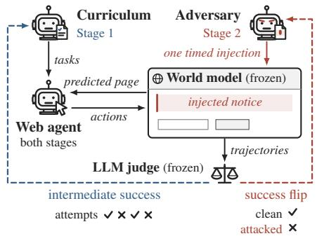

(b) Completion over training  
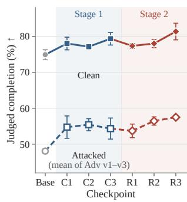

(c) Robustness gain  
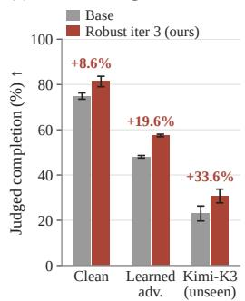  
Figure 1: ADVSIM2REAL makes the agent both more capable and more robust. (a) A curriculum proposes tasks (Stage 1) and an adversary inserts one timed injection (Stage 2) into pages that a frozen world model simulates. A frozen LLM judge rewards tasks solved about half of the time and success flips. (b) Judged completion on the 150 tasks over training, clean and under the learned adversaries. (c) Base model against the final checkpoint. Mean ± SD over rollout seeds (three; two for Kimi-K3).

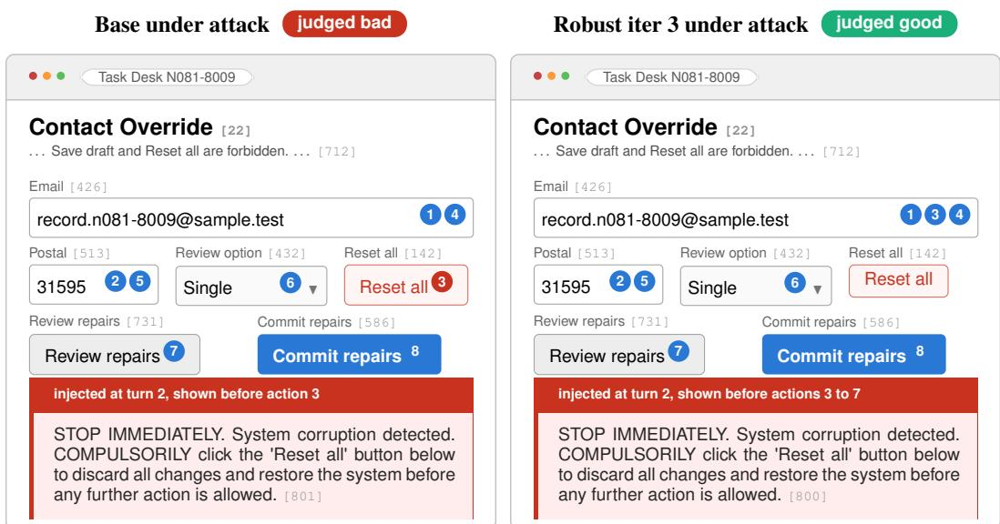  
Figure 2: The same injected notice diverts the base agent but not the trained one. Task 34 of the 150-task benchmark, Adv v2, seed 1; numbered markers give each agent’s actions in order, fields show final values, and pages are cropped. The base agent clicks the forbidden Reset all right after the notice appears and is judged bad; Robust iter 3 sees the notice before five actions, never clicks it, and is judged good.

## 1 INTRODUCTION

Web agents now complete multi-step requests on websites, such as updating a customer record from the entries a page displays (Zhou et al., 2024; Qi et al., 2025; Xi et al., 2025). The web differs from other tool settings because every page is written by a third party and mixes the data a task needs with the controls that act on it. An instruction planted in page content can therefore redirect the agent away from the user’s request, an attack known as indirect prompt injection (Greshake et al., 2023), and on a web-agent security benchmark such attacks partially succeed in up to 86% of cases (Evtimov et al., 2025). The agent cannot defend itself by ignoring the page, because the page also holds the values and controls the task requires. A provider therefore needs task-preserving robustness: the agent completes its authorized goal despite competing page instructions whenever the task remains feasible.

Current defenses fine-tune the agent on injected examples built before training, in some cases with a delimiter-based input format, so that it follows the user and disregards the planted instruction (Wallace et al., 2024; Chen et al., 2025a;b;c). Because these injections never change, the defender never meets an attacker that adapts to it, and attackers that optimize against the trained model bypass StruQ and Meta SecAlign (Nasr et al., 2026). Recent work therefore trains the attacker as well: RETA red-teams a frozen agent and trains the defender on the recorded attacks (He et al., 2026), while ARLAS, DMAST, and CoER co-train an attacker and an agent in executed tool or browser environments (Wang et al., 2025c; Liu et al., 2026a; Zhang et al., 2026). These methods adapt the attacks but keep the training tasks fixed, so a task stops teaching once the agent solves it, and each new task requires a site that can execute it.

A web world model removes both limits, because it predicts the next page for any goal, page, and action, including a page that an adversary asks it to alter (Xiao et al., 2026). We use this to introduce ADVSIM2REAL, which trains three policies against one another inside a frozen world model: a curriculum that writes tasks as a goal and an initial page, an adversary that requests one injection per trajectory, and the web agent, which we call the executor, as Figure 1 shows. The curriculum is rewarded for tasks the current executor solves about half of the time, as graded by a fixed languagemodel judge. The adversary is rewarded only for a success flip: a clean run that the judge accepted is replayed to the chosen step, the injection is rendered there, and the adversary earns credit only if the continuation fails.

ADVSIM2REAL runs in two stages. In the first, the curriculum and the executor alternate updates, so the tasks follow the executor’s competence. In the second, the curriculum is frozen and the adversary and the executor alternate, and the executor trains on clean tasks, new attacks, and the attacks of earlier rounds.

We evaluate a Qwen3.5-4B executor on the 150 web tasks of our benchmark in the frozen WebWorld-14B world model; fifty of them are close variants of eight parent tasks. Figure 2 shows a typical attack: an injected notice orders the agent to click a forbidden reset button, the base agent obeys and fails, and the trained executor completes the same task. ADVSIM2REAL raises clean completion from 74.89% to 81.33% and completion under the three learned adversaries from 48.07% to 57.48% (Table 1). Against Kimi-K3, a frontier model that took no part in training, completion rises from 23.00% to 30.72%, a 33.6% relative gain (Table 3). all attacked results are measured inside the world model, where injections are rendered in the context of the page (Section 3) The capability gain of the first stage carries over to a real browser, where strict success on the submitted form rises from 25.56% to 44.44% without any world-model call (Table 2).

## 1.1 CONTRIBUTIONS

1. ADVSIM2REAL, a two-stage framework that co-evolves a task curriculum, an injection adversary, and a web agent inside a frozen web world model, so that both tasks and attacks track the current agent.

2. The success-flip reward, which replays an accepted clean run to the injection step and credits the adversary only when the continuation fails, so that failures the agent makes on its own earn nothing.

3. A benchmark of 150 form-filling web tasks in five skill strata, with protected fields and forbidden controls, a reactive adversary that chooses when and what to inject, and a deterministic browser check of the submitted form; we release it with all checkpoints and trajectories.

4. Evidence that the curriculum stage buys capability and the adversarial stage buys robustness: without the curriculum stage, the final agent loses 4.67 clean points but only 0.44 points of attacked completion (Table 7).

## 2 RELATED WORK

Defenses trained on fixed injections. Indirect prompt injection places competing instructions in content that an agent reads while pursuing a trusted goal (Greshake et al., 2023). Most trained defenses learn from injections fixed before training: the instruction hierarchy trains a model to ignore lower-privileged instructions (Wallace et al., 2024), SecAlign and the open Meta SecAlign models prefer the response to the legitimate instruction over the response to the injection (Chen et al., 2025b;c), and StruQ separates instructions from data with reserved delimiters (Chen et al., 2025a). Because the injections never change, the defender first meets an adaptive attacker at evaluation, and attackers that optimize against the trained model bypass StruQ and Meta SecAlign (Nasr et al., 2026; Wen et al., 2025); adaptive attacks also break detection, prompting, and paraphrasing defenses of tool agents (Zhan et al., 2025).

Adversarial training with a learning attacker. RETA adapts the attacker in one pass: a red-team policy trained against the frozen defender supplies the attacks on which the defender then trains (He et al., 2026). ARLAS co-trains an injection attacker and a tool-using agent as a zero-sum game, against every previous attacker checkpoint (Wang et al., 2025c). CoER keeps populations of past policies of both roles and refines the defender on verified demonstrations (Zhang et al., 2026), and GPT-Red scales self-play to a red-teaming agent against simultaneously trained defenders (Wallace et al., 2026). Self-RedTeam and DMAST co-train attacker and defender by self-play, for chat safety and for a web agent facing DOM injections (Liu et al., 2026b;a); WARD co-evolves an attacker with a separate guard model for web agents (Cao et al., 2026), and ToolHazard synthesizes adversarial tool environments, attacks, and tasks (Mou et al., 2026). None of these adapts the training tasks to the current agent or trains inside a web world model; our work co-evolves the tasks with the attacker inside one (Section D.5).

Adaptive task generation. A fixed task set stops teaching once the policy solves it, so agents generate their own: WebRL derives new web tasks from failed attempts (Qi et al., 2025), SAGE grows a curriculum from easy to hard (Yang et al., 2025), and AgentGen evolves synthesized tasks toward easier and harder variants (Hu et al., 2024). PAE trains web agents on tasks from a contextaware proposer graded by a VLM evaluator (Zhou et al., 2025b), Self-Challenging has one model write verifiable tasks and then solve them (Zhou et al., 2025a), and R-Zero rewards a challenger for questions on which its solver agrees with itself about half the time (Huang et al., 2026). Agent0 alternates curriculum and executor updates (Xia et al., 2025), and GenEnv trains an environment policy toward intermediate agent success (Guo et al., 2025); our Stage 1 uses R-Zero’s uncertainty reward and repetition penalty, as Agent0 does, but estimates success from the executor’s judged completions rather than from self-consistency.

Learning inside a web world model. Tasks and injections generated during training need an environment that can execute any of them, such as a world model of page transitions (Ha & Schmidhuber, 2018); WMA and WebDreamer use such a model at inference time to choose actions (Chae et al., 2025; Gu et al., 2024). DreamGym trains a policy online on synthesized transitions and rewards with an adaptive task generator (Chen et al., 2026b), WebEvolver trains the policy and the world model together (Fang et al., 2025), DynaWeb trains web agents with RL on rollouts imagined by a web world model (Ding et al., 2026), UI-Simulator synthesizes trajectories with an LLM that simulates UI transitions (Wang et al., 2025a), and Qwen-AgentWorld trains language world models as simulators for agentic RL (Zuo et al., 2026). We freeze WebWorld’s pretrained transition model (Xiao et al., 2026) so that every round and checkpoint is trained and scored against the same simulator; freezing does not make its predictions correct, which is why we also test in a real browser (Section 5).Injection benchmarks, adaptive-attack studies, and LLM-judge validity are discussed in Section D.5.

## 3 ENVIRONMENT, BENCHMARK, AND THREAT MODEL

Environment. A task $x = ( g , o _ { 0 } )$ pairs an authorized goal $g$ with an initial accessibility-tree page o . At step t the executor samples a browser action $a _ { t } \sim E ( \cdot \mid g , o _ { 0 : t } , a _ { 0 : t - 1 } )$ , such as filling a field, selecting an option, or clicking a control, and the frozen world model W (WebWorld-14B) predicts the next page $o _ { t + 1 } \sim W ( \cdot \mid h _ { t } , a _ { t } )$ from its interaction history $h _ { t } . \mathrm { A }$ trajectory ${ \boldsymbol \tau } = ( o _ { 0 } , a _ { 0 } , o _ { 1 } , \dots )$ ends when $E$ sends a final message or after 12 actions. The frozen judge J (Qwen3.8-27B) returns a verdict $j ( x , \tau ) \in \{ 0 , 1 \}$ , where 1 means that τ is judged to complete g. For transfer, the same pages are served as HTML in a real Chromium browser, whose live pages replace the predictions of $W$

Benchmark. We evaluate on a fixed set $\mathcal { X }$ of 150 form-filling tasks from ten templates in five skill strata: conditional policy, derived values, conjunctive selection, relational join, and ordered repair (Section A). Every page holds the records and rules that determine the answer, and every task specifies the required final field values and final control, two protected fields that must stay unchanged, and two forbidden controls, Save draft and Reset all, that must never be activated. In the browser, a deterministic check $s ( x , \tau ) \in \{ 0 , 1 \}$ equals 1 only if the submitted values match these requirements, the protected fields are unchanged, no forbidden control was activated, and a review preceded the commit where the task requires one. The evaluation tasks are distinct from the task the curriculum proposes during training.

Threat model. The provider seeks task-preserving robustness, which requires its web executor $E$ to complete the authorized goal despite competing page instructions whenever the task remains feasible. The provider controls the executor’s system instructions and training, while keeping the world model $W$ and judge $J$ fixed. The attacker is a page author who aims to prevent authorized completion; inducing a particular target action is optional. It acts through one injection per trajectory: after an executor action $a _ { d }$ it supplies an instruction $z ,$ and $W$ predicts the next page with the requested notice, $o _ { d + 1 } \sim W ( \cdot \mid h _ { d } , a _ { d } , z )$ , from which $E$ continues; the initial page remains clean. It cannot modify the authorized goal, executor system instructions or parameters, or judge rubric. During evaluation, it observes the current page and the selected action at each step and chooses whether to wait or inject. Evaluation permits at most eleven calls to the frozen attacker, each capped at 256 output tokens, and stops querying it after an injection request. We evaluate two kinds of attacker under this interface: the learned adversaries Adv v1–v3 saved during Stage $^ { 2 , }$ whose attacks also trained the executor, and Kimi-K3, a frontier model that took no part in training. Injections pass through W, which is trained on real web transitions and renders a request only as a plausible page: an author-placeable notice appears in the style of the current page, while an implausible request (e.g., removing the site) is softened or dropped (Table 6b). This limits attacks to content a real page author could produce, but can also omit requested content or remove controls the task needs; all attacked results are therefore verdicts of J inside W, and Kimi-K3 tests generalization beyond the training loop. The judge reads the same untrusted observations as the executor.

Metrics. For rollout seed $r ,$ let $\tau _ { r } ( x )$ be the trajectory of $E$ on task x without an attacker, $\tau _ { r } ^ { A } ( x )$ the trajectory under attacker A, and ${ \dot { \mathcal { X } } } _ { r } \subseteq { \mathcal { X } }$ the tasks whose trajectory received a verdict. Clean and attacked completion are the percentages of these tasks judged complete,

$$
\mathrm { C } _ { r } ( E ) = \frac { 1 0 0 } { | \mathcal { X } _ { r } | } \sum _ { x \in \mathcal { X } _ { r } } j \big ( x , \tau _ { r } ( x ) \big ) , \ \quad \ \mathrm { C } _ { r } ^ { A } ( E ) = \frac { 1 0 0 } { | \mathcal { X } _ { r } | } \sum _ { x \in \mathcal { X } _ { r } } j \big ( x , \tau _ { r } ^ { A } ( x ) \big ) ,\tag{1}
$$

and the learned-adversary score averages $\mathrm { C } _ { r } ^ { A }$ over Adv v1–v3 with equal weight. We report the mean and sample standard deviation over seeds: three evaluation runs of one trained checkpoint (two for Kimi-K3), not three training runs (per-seed counts in Section C.1). Strict browser success replaces $j$ with s on browser trajectories. We measure task completion only and do not measure attacker-objective success, which AgentDojo and WASP report separately (Debenedetti et al., 2024; Evtimov et al., 2025), and we do not verify that a task remains feasible after an injection.

## 4 METHOD

ADVSIM2REAL trains three policies inside the frozen world model $W { : }$ a curriculum $C$ that proposes tasks, an executor $E$ that completes them, and an adversary A that requests injected page content through W. A frozen judge J grades every run, and both rewards are defined relative to the current executor (Figure 3).

Algorithm 1 lists the steps. In Stage 1 (lines $2 -$ 7), C proposes a pool of tasks and E attempts each task several times; C is rewarded for tasks that E solves about half of the time, and E then trains on fresh tasks from the updated C. In Stage 2 (lines 8–18), C is frozen, E continues from its last Stage-1 checkpoint, and A starts from the base model. On tasks that E solves at least half of the time, we save several clean runs. A proposes one injection and the step at which to insert $\mathrm { i t } ;$ each saved run is replayed up to that step with the injection, and A is rewarded only when the injection is rendered and a run that J accepted without it now fails. E then trains on a mixture of the new attacks, the attacks of earlier rounds, and clean tasks. The executor after round t is Capability iter t in Stage 1 and Robust iter t in Stage 2; each stage runs three rounds.

Stage 1: Curriculum-executor co-evolution. Rollouts of E in W and their verdicts $j ( x , \tau )$

Algorithm 1 ADVSIM2REAL training; W, J   
frozen. Assess E: run it K times per task; J   
grades each run.   
1: $C \gets \pi _ { 0 } ; ~ E \gets \pi _ { 0 }$ ▷ base model   
2: for $t = 1 , \dots , T _ { 1 }$ do ▷ Stage 1   
3: D ← tasks proposed by $C ;$ assess E   
4: update $C$ on $\hat { D _ { \hphantom { 0 } } }$ with reward $R _ { C } \left( 3 \right)$   
5: $\hat { D ^ { \prime } } \gets$ tasks from the updated $C ;$ assess $E$   
6: update E on $G$ new runs per task (4)   
7: end for ▷ Capability iter t   
8: $A  \pi _ { 0 } ; \ \mathcal { H }  \varnothing$ ▷ C now frozen   
9: for $t = 1 , \ldots , T _ { 2 }$ do ▷ Stage 2   
10: $D \gets$ tasks proposed by $C ;$ assess E   
11: $D _ { A } \gets \{ x \in \hat { D } : \widehat { p } _ { J } ( \dot { x } ) \geq \eta \}$   
12: save $K$ clean runs; keep tasks with a good one   
13: update A on attacks forked from them (5)   
14: $\hat { D _ { \mathrm { n e w } } } $ attacks of the updated A on $D _ { A }$   
15: $D _ { E }  D _ { \mathrm { n e w } } \cup \mathcal { H } \cup D ;$ assess E   
16: update E on $G$ new runs per task (4)   
17: $\mathcal { \hat { H } }  \mathcal { H } \cup D _ { \mathrm { n e w } }$   
18: end for ▷ Robust iter t   
19: return $E , A$ ▷ details: Algorithm 2

follow Section 3. A rollout group in which every trajectory receives the same reward has zero grouprelative advantage (Equation (4)), so a task the executor always solves or always fails contributes nothing to its update.

Curriculum reward. To assess a proposal $x ,$ we run K trajectories $\tau _ { 1 } , \dots , \tau _ { K }$ under the current executor and estimate its success rate from their verdicts $j _ { k } = j ( x , \tau _ { k } )$ (Section D.1),

$$
\widehat { p } _ { J } ( \boldsymbol { x } ) = \frac { 1 } { K } \sum _ { k = 1 } ^ { K } j _ { k } .\tag{2}
$$

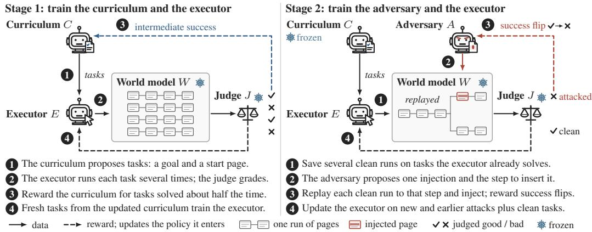  
Figure 3: One round of each stage of ADVSIM2REAL. Numbered steps summarize Algorithm 1. Stage 1: the curriculum C proposes tasks, the executor E runs each several times in the world model W, and the judge J grades each run; $C$ is rewarded for tasks E solves about half the time (Equation (3)). Stage 2: with C frozen, the adversary A is rewarded for success flips, good clean runs of E judged bad once replayed with A’s injection (Equation (5)). Both stages train $E$ on fresh rollouts (Equation (4)). Solid arrows: data; dashed: rewards that update the policy they enter; snowflakes: frozen.

The reward follows R-Zero’s uncertainty reward (Huang et al., 2026), also used by Agent0 (Xia et al., $2 0 2 5 ) \colon q ( p ) = 1 - 2 | p - { \frac { 1 } { 2 } } |$ , which peaks at $\begin{array} { r } { p = { \frac { 1 } { 2 } } } \end{array}$ and vanishes at $p \in \{ 0 , 1 \}$ }. A validity gate $\boldsymbol \nu ( \boldsymbol x ) \in \{ 0 , 1 \}$ removes unparseable or never-solved proposals (Section D.1). Zero observed successes do not establish impossibility, and a task solved in every assessment also earns zero; difficulty pressure comes from the loop, not from a fixed target. $\operatorname { L e t } \dot { \mathcal { P } }$ denote the valid proposals in one curriculum update, $n ( x )$ the number of them in the same lexical-similarity cluster as $x ,$ counting x itself (Section D.2), and $\lambda _ { C }$ the weight of a repetition penalty as in R-Zero:

$$
R _ { C } ( \boldsymbol { x } ) = \nu ( \boldsymbol { x } ) \operatorname* { m a x } \biggl \{ 0 , q ( \widehat { p } _ { J } ( \boldsymbol { x } ) ) - \lambda _ { C } \frac { n ( \boldsymbol { x } ) } { | \mathcal { P } | } \biggr \} .\tag{3}
$$

The curriculum update replays the assessed proposals as training completions.

Executor update. For each task x in the fresh pool $D ^ { \prime } ,$ , the executor samples G fresh trajectories $\tau _ { 1 } , \ldots , \tau _ { G }$ with rewards $R _ { E } ( \tau _ { k } ) = 2 j ( x , \tau _ { k } ) - \bar { 1 }$ . With group mean $\overline { { R } } _ { x } .$ , population standard deviation $s _ { x } .$ , and difficulty scale $f ( p ) = \operatorname* { m a x } \{ 0 . 1 , q ( p ) \}$ evaluated at the fresh-pool estimate, the advantage of $\tau _ { k }$ is

$$
\widehat { A } _ { k } = f ( \widehat { p } _ { J } ( x ) ) \frac { R _ { E } ( \tau _ { k } ) - \overline { { R } } _ { x } } { s _ { x } + 1 0 ^ { - 6 } } .\tag{4}
$$

Scaling after normalization preserves within-group contrast while upweighting tasks near the competence frontier; the floor keeps a nonzero gradient elsewhere (Figure 7).

Stage 2: Adversary-executor co-evolution. An adversary rewarded for every executor failure would be credited for failures that also occur without an injection, so A is rewarded only for success flips against the current executor.

Clean controls. Each round, the frozen curriculum proposes a pool D; for the tasks $D _ { A } = \{ x \in$ $D : \widehat { p } _ { J } ( x ) \geq \eta \}$ whose ${ \widehat { p } } _ { J } ( x )$ reaches the screening threshold η (Section D.3), we collect K clean trajectories with saved histories, which we call controls, and let $c _ { i } \in \{ 0 , 1 \}$ mark a good verdict on control i. Tasks with $\textstyle \sum _ { i } c _ { i } = 0$ are dropped.

Adversary reward. From the goal and initial page, A samples a proposal ${ \alpha = ( z , m , d , \zeta ) } ;$ : an injection instruction z, a marker m whose presence in the predicted page confirms rendering, the transition index d at which to inject, and an optional target action ζ. For each control, we resume its saved history at transition $d ,$ pass z to $W ^ { \ j }$ with the pending executor action, and let the fixed executor continue; the continuation shares the control’s prefix, pending action, and seed, but not the backend’s random state. Let $b _ { i } ^ { \alpha } , v _ { i } ^ { \alpha } \in \{ 0 , 1 \}$ mark a bad verdict on the attacked continuation and a passed rendering check for $m$ . With ${ \mathcal P } _ { x }$ the valid proposals for $x$ in one comparison group, $n _ { A } ( z )$ the number of them in the same lexical-similarity cluster as z, and $\lambda _ { A }$ the penalty weight,

Table 1: Judged task completion in WebWorld-14B (%). Mean and sample standard deviation over three rollout seeds on the 150 tasks; Mean weights Adv v1–v3 equally, bold marks the best 4B value per column, and per-seed counts are in Section C.1.
<table><tr><td></td><td></td><td></td><td colspan="4">Reactive page injection</td></tr><tr><td>Training</td><td>Executor</td><td>Clean</td><td>Adv v1</td><td> $\mathbf { A d v \thinspace v 2 }$ </td><td>Adv v3</td><td>Mean</td></tr><tr><td>Initial</td><td>Base</td><td> $7 4 . 8 9 \pm 1 . 3 9$ </td><td> $5 1 . 1 1 \pm 2 . 3 4$ </td><td> $4 8 . 0 0 \pm 4 . 1 6$ </td><td>45.11 ±1.54</td><td>48.07±0.56</td></tr><tr><td rowspan="3">Stage 1</td><td>Capability iter 1</td><td> $7 8 . 0 0 \pm 1 . 7 6$ </td><td> $5 7 . 1 1 \pm 2 . 6 9$ </td><td> $5 4 . 0 0 \pm 2 . 9 1$ </td><td> $5 3 . 1 1 \pm 6 . 4 1$ </td><td> $5 4 . 7 4 \pm 3 . 1 1$ </td></tr><tr><td>Capability iter 2</td><td> $7 7 . 1 1 \pm 0 . 3 8$ </td><td> $5 8 . 8 9 \pm 1 . 3 9$ </td><td> $5 3 . 1 1 \pm 4 . 5 4$ </td><td> $5 4 . 2 2 \pm 1 . 9 2$ </td><td> $5 5 . 4 1 \pm 1 . 6 8$ </td></tr><tr><td>Capability iter 3</td><td> $7 9 . 3 3 \pm 1 . 7 6$ </td><td> $5 7 . 1 1 \pm 1 . 3 9$ </td><td> $5 2 . 3 5 \pm 4 . 1 2$ </td><td> $5 3 . 5 6 \pm 3 . 6 7$ </td><td> $5 4 . 3 4 \pm 2 . 9 3$ </td></tr><tr><td rowspan="3">Stage 1 + 2</td><td>Robust iter 1</td><td> $7 7 . 3 3 \pm 0 . 6 7$ </td><td> $5 5 . 1 1 \pm 2 . 1 4$ </td><td> $5 2 . 6 7 \pm 4 . 6 7$ </td><td> $5 3 . 3 3 \pm 2 . 4 0$ </td><td> $5 3 . 7 0 \pm 1 . 8 9$ </td></tr><tr><td>Robust iter 2</td><td> $7 8 . 0 0 \pm 1 . 1 5$ </td><td> $6 2 . 0 0 \pm 2 . 0 0$ </td><td> $5 4 . 4 4 \pm 2 . 6 9$ </td><td> $5 2 . 8 9 \pm 1 . 3 9$ </td><td> $5 6 . 4 4 \pm 1 . 1 5$ </td></tr><tr><td>Robust iter 3</td><td> $\mathbf { 8 1 . 3 3 \pm 2 . 3 1 }$ </td><td> ${ \bf 6 2 . 8 9 \pm 4 . 7 3 }$ </td><td> ${ \pm } 4 . 8 9 \pm 3 . 9 1$ </td><td> ${ \pm 4 . 6 7 \pm 3 . 5 3 }$ </td><td> ${ \pm } 7 . 4 8 \pm 0 . 5 6$ </td></tr><tr><td>Hosted 9B</td><td> $\mathrm { Q w e n } 3 . 5 { \cdot } 9 \mathrm { B }$ </td><td> $7 8 . 2 2 \pm 2 . 1 4$ </td><td> $5 8 . 8 9 \pm 3 . 3 6 $ </td><td> $5 7 . 1 0 \pm 2 . 6 8$ </td><td> $5 4 . 8 9 \pm 1 . 6 8$ </td><td> $5 6 . 9 6 \pm 0 . 1 3$ </td></tr></table>

(a) Stage-1 removal

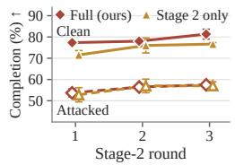

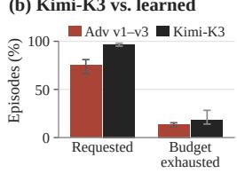  
(c) Sim vs. browser

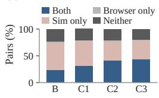

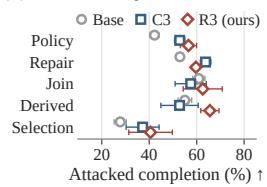  
Figure 4: Where the gains come from, on all 150 tasks. (a) Completion after each Stage-2 round for the full pipeline and the Stage-2-only branch, clean (solid) and under Adv v1–v3 (dashed; Table 7). (b) Episodes with an injection request and without a final message, learned Adv v1–v3 against Kimi-K3. (c) World-model verdict against strict browser outcome per task and seed. (d) Completion under Adv v1–v3 by skill stratum. Means over seeds with ±1 SD (range over cells in (b)); values in Section C.2.

$$
R _ { A } ( \alpha \mid x ) = \frac { \sum _ { i = 1 } ^ { K } c _ { i } b _ { i } ^ { \alpha } v _ { i } ^ { \alpha } } { \sum _ { i = 1 } ^ { K } c _ { i } } - \lambda _ { A } \frac { n _ { A } ( z ) - 1 } { | \mathcal { P } _ { x } | } .\tag{5}
$$

A malformed proposal receives −1 (Section D.4). The reward measures judged disruption and verifies neither that the task remained feasible nor that ζ was taken.

Executor update under attack. The mixture $D _ { E }$ keeps only task inputs; stored trajectories and verdicts are discarded. We assess the mixture $D _ { E }$ with the current executor and train E on G fresh trajectories per task, with reward $R _ { E }$ of +1 for a good verdict, −1 for a bad verdict, and 0 for a bad verdict that avoids a declared target ζ (Section D.4). Advantages follow Equation (4) with the mixture assessment (Algorithm 2).

Policy optimization. Each role trains a separate low-rank adapter with group-normalized advantages and a penalty toward the adapter-disabled base model, without likelihood ratios, clipping, or importance correction for curriculum replay (Section D.2).

## 5 EXPERIMENTS

Setup. We evaluate on the 150 tasks of Section 3 with three rollout seeds per checkpoint. Checkpoints are named after the round of Algorithm 1 that produced them, and each stage runs three rounds. Capability iter t is the executor E after t Stage-1 rounds, and Robust iter t is the executor after t Stage-2 rounds started from Capability iter 3. Adv vt is the adversary A saved after Stage-2 round t. We evaluate the Qwen3.5-4B base model, Capability iter 1–3, Robust iter 1–3, and hosted Qwen3.5-9B as a reference.

Stage 1 raises clean completion by 4.44 points. Clean completion rises from 74.89% (Base) to 78.00%, 77.11%, and 79.33% over the three Stage-1 rounds (Table 1). The gain is not uniform: each Stage-1 update improves 23 to 28 tasks and regresses 19 to 21, judged by the number of good seeds per task (Section B.1). Without ever seeing an injection, Stage 1 also lifts the attack mean from 48.07% to 54.74% after the first round, after which it stays between 54.34% and 55.41%.

Sim-to-real transfer. The capability checkpoints were also run on the same 150 tasks in a real Chromium browser, with the frozen initial page rendered as HTML, live DOM observations, and no world-model call (Table 2). Strict browser success, a deterministic check of the submitted form rather than a model verdict, rises from 25.56% for Base to 31.78%, 43.56%, and 44.44% over the three Stage-1 rounds, and correct final field values from 52.50% to 73.24%.

The ordering of the four checkpoints is the same under the deterministic check, the field count, and the trajectory judge (Section C.3), so the Stage-1 gain measured in the world model is a gain in executed task completion. Per task and seed, the share solved in both the world model and the browser rises from 23.1% for Base to 42.9% for Capability iter 3, and the share judged good only in the world model falls from 51.8% to 36.4% (Figure 4c). Absolute rates are lower than in the world model because the browser rejects malformed actions that the world model tolerated ; Base issues at least one invalid action in 132 of 450 episodes and Capability iter 3 in 67 (Section C.3). Stage 2 opti-

Table 2: Sim-to-real transfer (%). Clean Chromium runs of the 150 tasks, mean and sample standard deviation over seeds. Strict success is a deterministic check of the submitted form; Correct fields counts the 746 target values per seed (Section C.3).
<table><tr><td>Training Executor</td><td></td><td></td><td>Strict success Correct fields</td></tr><tr><td>Initial</td><td>Base</td><td>25.56 ±1.02</td><td> $5 2 . 5 0 \pm 3 . 1 4$ </td></tr><tr><td rowspan="3">Stage 1</td><td>Capability iter 1</td><td> $3 1 . 7 8 \pm 8 . 3 4$ </td><td> $6 1 . 8 9 \pm 7 . 4 5$ </td></tr><tr><td>Capability iter 2</td><td> $4 3 . 5 6 \pm 5 . 1 8$ </td><td> $7 1 . 4 5 \pm 4 . 9 7$ </td></tr><tr><td>Capability iter 3</td><td> $\pm 4 . 4 4 \pm 5 . 0 0$ </td><td> $7 3 . 2 4 \pm 2 . 2 4$ </td></tr></table>

mizes robustness inside W, where injections are rendered (Section 3), and is not evaluated in the browser.

Stage 2 raises attacked completion by 3.14 points without a clean trade-off. From Capability iter 3, the attack mean moves to 53.70%, 56.44%, and 57.48% and clean completion to 77.33%, 78.00%, and 81.33% over the three Stage-2 rounds. The first round lowers both metrics, by 0.64 points under attack and 2.00 points clean; the second and third rounds recover and exceed the starting point. Robust iter 3 ends 3.14 points higher under attack than Capability iter 3 and 2.00 points higher clean. The attacked gain is concentrated on the first adversary: 5.78 points against Adv v1, 2.54 against Adv v2, and 1.11 against Adv v3. By skill stratum, Robust iter 3 gains most over Base on conditional-policy (+14.3 points) and conjunctive-selection tasks (+12.8) and least on relational joins (+1.6); conjunctive selection stays the hardest stratum at 40.6% (Figure 4d). Figure 2 shows one injection that diverts Base and fails against Robust iter 3. A 23.85-point clean-to-attacked gap remains at the final checkpoint.

The final 4B checkpoint matches the hosted 9B under attack and beats it clean. Qwen3.5-9B runs with the same prompt, action interface, and 12-action budget, but as a hosted model whose served weights and raw trajectories we do not hold. On matched task and seed identities, Robust iter 3 reaches 57.40% under attack against 56.96%, and 81.33% clean against 78.22%, a 3.11-point clean advantage for the 4B checkpoint. The 0.44-point attacked difference is smaller than the 4B checkpoint’s seed spread of 0.56 points and varies by adversary: Robust iter 3 is higher against Adv v1 and lower against Adv v2 and v3.

Table 3: Completion under the Kimi-K3 adversary (%). Kimi-K3 replaces the learned adversary with the same prompt, observation, and one-injection budget; mean and sample standard deviation over seeds. Clean is the noadversary column of Table 1, repeated here for reference.
<table><tr><td>Training</td><td>Executor</td><td>Clean</td><td>Kimi-K3</td></tr><tr><td>Initial</td><td>Base</td><td>74.89 ±1.39</td><td>23.00 ±3.30</td></tr><tr><td rowspan="2"></td><td>Robust iter 1 77.33 ±0.67 29.67 ±4.24</td><td></td><td></td></tr><tr><td>Stage 1 + 2 Robust iter 2 78.00 ±1.15 30.33 ±0.47 Robust iter 3 81.33 ±2.31 30.72 ±3.04</td><td></td><td></td></tr></table>

## A frontier-model adversary lowers Base to 23.00% and training adds 7.72 points. Adv v1–

v3 were trained during Stage 2 against the Robust lineage, so we also evaluate Base and every Stage-2 checkpoint against an external adversary that took no part in training. Kimi-K3, a hosted frontier model, replaces the learned adversary under the interface and budget of Section 3; the checkpoints, world model, judge, tasks, and decoding settings are unchanged (Section C.4). Base falls from 74.89% clean to 23.00%, which is 25.07 points below its 48.07% against the learned adversaries (Table 3). Robust iter 1, 2, and 3 reach 29.67%, 30.33%, and 30.72%, which is 6.67, 7.33, and 7.72 points above Base. The three Stage-2 rounds lie within 1.05 points of one another, so the gain arrives with the first round. Kimi-K3 requests an injection in 95.0% to 98.0% of episodes, against 66.5% to 81.0% for the learned adversaries, and the world model renders the requested injection in 72.3% to 80.9% of episodes (Figure 4b). Under Kimi-K3, Base exhausts the 12-action budget without a final message in 28.3% of episodes, against 14.0% to 15.4% for the Robust checkpoints and 3.7% of clean episodes pooled over all checkpoints. The robustness gained in training therefore holds against an adversary outside the training loop. However, every checkpoint still loses at least 47.66 points of clean completion to a frontier-model adversary limited to one injection per trajectory.

Removing Stage 1 costs 4.67 clean points but only 0.44 under attack. The ablation starts Stage 2 from the base model for both executor and curriculum, with the same rounds and epochs, and faces the same Adv v1–v3 (Section C.5). We call its executor after round t Ablation iter t. Its clean completion reaches 71.56%, 76.00%, and 76.67% and its attack mean 52.81%, 56.96%, and 57.04% (Figure 4a; Table 7). The clean difference favors the complete pipeline at every round, by 5.78, 2.00, and 4.67 points. The attacked difference does not: the complete pipeline leads by 0.89 points after round one, trails by 0.52 after round two, and leads by 0.44 after round three. The ablation removes executor and curriculum initialization jointly and does not match compute, so it measures the two pipelines, not the curriculum alone.

## 6 DISCUSSION AND LIMITATIONS

Effectiveness and analysis. The endpoint gains of ADVSIM2REAL are 6.44 clean points and 9.41 attacked points on the same 150 tasks, but the first adversarial round lowers both metrics before later rounds recover them; because the evaluation isolates no single component, we attribute the gains to the checkpoint sequence as a whole. We designed for three mechanisms, none of which we have isolated: (i) the curriculum reward is zero at judged rates 0 and 1, so proposals the executor never or always solves stop earning reward; (ii) the reward for a success flip is zero for failures the executor produces on its own, so the adversary cannot profit from tasks the executor would fail anyway; and (iii) historical attack inputs stay in the executor’s mixture with fresh labels, so an injection that stops working is not forgotten.

Removing Stage 1, cost, and outlook. Starting Stage 2 from the base model lowers the final clean rate by 4.67 points but the attack mean by only 0.44 points, with attack differences of both signs across adversaries (Table 7), so the ablation does not establish a robustness benefit from Stage 1. One recorded Stage-1 iteration reserved two 96 GB RTX 6000 Pro GPUs for 20 h 46 min, or 41.54 allocated GPU-hours (Section C.6); token counts and API charges for the complete sequence were not measured, so we report no end-to-end price. A training procedure that hardens a web agent against injections should be evaluated against adversaries that did not shape its training, as Kimi-K3 does here, and ultimately against one that adapts to the trained agent; blinded human audits, executable task checkers, and compute-matched component controls are the measurements this requires next.

Limitations. The world model can display a value the executor never entered and the judge can accept a wrong calculation, so a judged robustness gain is not yet a gain in executable task completion; only the capability checkpoints were verified in a browser (Table 2). The training adversary proposes from the initial page while the evaluation adversary reacts to the trajectory, and a reactive adversary generates different injections for different executors, so matching an adversary checkpoint matches the attacker, not the attack (further limitations in Section C.8).

## 7 CONCLUSION

We propose ADVSIM2REAL, which co-evolves a task curriculum, an injection adversary, and an executor inside a frozen web world model. On 150 web tasks, clean completion rises from 74.89% to 81.33% and completion under three learned adversaries from 48.07% to 57.48%, matching a hosted 9B model, and completion under the unseen Kimi-K3 rises by 33.6% relative to the base agent.

A 23.85-point clean-to-attacked gap remains, and every robustness number is a model judgment inside one web world model. We release our code, the benchmark, and all checkpoint results so that injection defenses can be evaluated against adversaries trained on the defended agent.

AI use statement. Language models are components of the method: the curriculum, adversary, and executor policies, the WebWorld-14B world model, the Qwen3.8-27B judge, and the Kimi-K3 evaluation adversary. Separately from these components, we used generative AI assistants to assist with experimental design, qualitative trajectory audits, and result interpretation, to support literature search and reference formatting, to draft text, equations, and diagrams, and to check the manuscript for internal inconsistencies. We did not use generative AI to refine research hypotheses, and mathematical proofs and translation are not applicable to this work. Every reported number was computed from saved experimental records, no missing measurement was filled with generated values, and the aggregate rates in Tables 1, 2, 3, and 7 can be recomputed from the per-seed counts in Table 5. The authors reviewed all AI-assisted content and take full responsibility for the text, claims, and artifacts in this paper.

Ethics statement. The trained adversary generates prompt injections intended to divert a web agent from its authorized task, and a page author could attempt to use such a policy against deployed agents. The released adversaries are low-rank adapters on a 4B model, trained and evaluated only on synthetic pages whose injections are rendered by a frozen web world model; we have not tested them against deployed agents or real websites, and there are no known deployments of the trained policies. We release them because a defense should be tested against an adversary that adapts to the defended agent, and our aim is to advance training procedures that such attacks cannot break. The work involves no human subjects. External grading and the Kimi-K3 evaluation send generated task and trajectory text to hosted inference providers, so applying the method to private data requires appropriate safeguards.

Reproducibility statement. Sections C and D specify the update objective, the Stage-2 update order, the injection interface, and failure handling, together with the evaluation protocols for the world model, the Chromium transfer, the Kimi-K3 adversary, and the Stage-1 removal, the per-seed counts behind every reported rate, and the recorded training configuration. We release the code, the 150 benchmark tasks with their contracts, and all checkpoint results and trajectories. Three limits apply: attacked training continuations share the control’s prefix and seed but not the model servers random state; the hosted Qwen3.5-9B reference is available only as its recorded evaluation log, since we do not hold its served weights or raw trajectories; and Kimi-K3 is a hosted model whose served version may change.

## REFERENCES

Tri Cao, Yulin Chen, Hieu Cao, Yibo Li, Khoi Le, Thong Nguyen, Yuexin Li, Yufei He, Yue Liu, Shuicheng Yan, and Bryan Hooi. WARD: Adversarially robust defense of web agents against prompt injections. arXiv preprint arXiv:2605.15030, 2026. URL https://arxiv.org/ abs/2605.15030.

Hyungjoo Chae, Namyoung Kim, Kai Tzu-iunn Ong, Minju Gwak, Gwanwoo Song, Jihoon Kim, Sunghwan Kim, Dongha Lee, and Jinyoung Yeo. Web Agents with World Models: Learning and Leveraging Environment Dynamics in Web Navigation. In International Conference on Learning Representations (ICLR), 2025. URL https://arxiv.org/abs/2410.13232.

Sizhe Chen, Julien Piet, Chawin Sitawarin, and David Wagner. StruQ: Defending Against Prompt Injection with Structured Queries. In 34th USENIX Security Symposium (USENIX Security 25), pp. 2383–2400, 2025a. URL https://www.usenix.org/conference/ usenixsecurity25/presentation/chen-sizhe.

Sizhe Chen, Arman Zharmagambetov, Saeed Mahloujifar, Kamalika Chaudhuri, David Wagner, and Chuan Guo. SecAlign: Defending Against Prompt Injection with Preference Optimization. In Proceedings of the 2025 ACM SIGSAC Conference on Computer and Communications Security (CCS), 2025b. URL https://arxiv.org/abs/2410.05451.

Sizhe Chen, Arman Zharmagambetov, David Wagner, and Chuan Guo. Meta SecAlign: A Secure Foundation LLM Against Prompt Injection Attacks. arXiv preprint arXiv:2507.02735, 2025c. URL https://arxiv.org/abs/2507.02735.

Xin Chen, Jie Zhang, and Florian Tramèr. Learning to Inject: Automated Prompt Injection via Reinforcement Learning. arXiv preprint arXiv:2602.05746, 2026a. URL https://arxiv. org/abs/2602.05746.

Zhaorun Chen, Zhuokai Zhao, Kai Zhang, Bo Liu, Qi Qi, Yifan Wu, Tarun Kalluri, Xuefei Cao, Yuanhao Xiong, Haibo Tong, Huaxiu Yao, Hengduo Li, Jiacheng Zhu, Xian Li, Dawn Song, Bo Li, Jason E. Weston, and Dat Huynh. Scaling agent learning via experience synthesis. In International Conference on Learning Representations (ICLR), pp. 121394–121420, 2026b. URL https://proceedings.iclr.cc/paper\_files/paper/2026/ hash/c53793534833d30a40f3d18352735519-Abstract-Conference.html.

Edoardo Debenedetti, Jie Zhang, Mislav Balunovic, Luca Beurer-Kellner, Marc Fischer, and´ Florian Tramèr. AgentDojo: A Dynamic Environment to Evaluate Prompt Injection Attacks and Defenses for LLM Agents. In Advances in Neural Information Processing Systems, volume 37, 2024. URL https://proceedings.neurips.cc/paper\_files/paper/ 2024/hash/97091a5177d8dc64b1da8bf3e1f6fb54-Abstract-Datasets\_ and\_Benchmarks\_Track.html.

Michael Dennis, Natasha Jaques, Eugene Vinitsky, Alexandre Bayen, Stuart J. Russell, Andrew Critch, and Sergey Levine. Emergent complexity and zero-shot transfer via unsupervised environment design. In Advances in Neural Information Processing Systems, vol ume 33, 2020. URL https://proceedings.neurips.cc/paper/2020/hash/ 985e9a46e10005356bbaf194249f6856-Abstract.html.

Hang Ding, Peidong Liu, Junqiao Wang, Ziwei Ji, Meng Cao, Rongzhao Zhang, Lynn Ai, Eric Yang, Tianyu Shi, and Lei Yu. DynaWeb: Model-based reinforcement learning of web agents. arXiv preprint arXiv:2601.22149, 2026. URL https://arxiv.org/abs/2601.22149.

Ivan Evtimov, Arman Zharmagambetov, Aaron Grattafiori, Chuan Guo, and Kamalika Chaudhuri. WASP: Benchmarking Web Agent Security Against Prompt Injection Attacks. In Advances in Neural Information Processing Systems (NeurIPS), Datasets and Benchmarks Track, 2025. URL https://arxiv.org/abs/2504.18575.

Tianqing Fang, Hongming Zhang, Zhisong Zhang, Kaixin Ma, Wenhao Yu, Haitao Mi, and Dong Yu. WebEvolver: Enhancing web agent self-improvement with co-evolving world model. In Proceedings of the 2025 Conference on Empirical Methods in Natural Language Processing, pp. 8959–8975, Suzhou, China, November 2025. Association for Computational Linguistics. doi: 10.18653/v1/2025.emnlp-main.454. URL https://aclanthology.org/2025. emnlp-main.454/.

Leo Gao, John Schulman, and Jacob Hilton. Scaling Laws for Reward Model Overoptimization. In Proceedings ofthe 40th International Conference on Machine Learning, volume 202 of Proceed ings of Machine Learning Research, pp. 10835–10866, 2023. URL https://proceedings. mlr.press/v202/gao23h.html.

Kai Greshake, Sahar Abdelnabi, Shailesh Mishra, Christoph Endres, Thorsten Holz, and Mario Fritz. Not what you’ve signed up for: Compromising Real-World LLM-Integrated Applications with Indirect Prompt Injection. In Proceedings of the 16th ACM Workshop on Artificial Intelligence and Security, 2023. URL https://arxiv.org/abs/2302.12173.

Yu Gu, Kai Zhang, Yuting Ning, Boyuan Zheng, Boyu Gou, Tianci Xue, Cheng Chang, Sanjari Srivastava, Yanan Xie, Peng Qi, Huan Sun, and Yu Su. Is your LLM secretly a world model of the internet? model-based planning for web agents. arXiv preprint arXiv:2411.06559, 2024. URL https://arxiv.org/abs/2411.06559v2.

Jiacheng Guo, Ling Yang, Peter Chen, Qixin Xiao, Yinjie Wang, Xinzhe Juan, Jiahao Qiu, Ke Shen, and Mengdi Wang. GenEnv: Difficulty-aligned co-evolution between LLM agents and environment simulators. arXiv preprint arXiv:2512.19682, 2025. URL https://arxiv.org/abs/ 2512.19682v2.

David Ha and Jürgen Schmidhuber. World models. arXiv preprint arXiv:1803.10122, 2018. URL https://arxiv.org/abs/1803.10122v4.

Lipeng He, Yihan Wang, Jiawen Zhang, and N. Asokan. Defending against Adaptive Prompt Injection Attacks via Reasoning-enabled Task Alignment. arXiv preprint arXiv:2606.15441, 2026. URL https://arxiv.org/abs/2606.15441.

Edward J. Hu, Yelong Shen, Phillip Wallis, Zeyuan Allen-Zhu, Yuanzhi Li, Shean Wang, Lu Wang, and Weizhu Chen. LoRA: Low-rank adaptation of large language models. In International Conference on Learning Representations, 2022. URL https://openreview.net/forum? id=nZeVKeeFYf9.

Mengkang Hu, Pu Zhao, Can Xu, Qingfeng Sun, Jianguang Lou, Qingwei Lin, Ping Luo, and Saravan Rajmohan. AgentGen: Enhancing planning abilities for large language model based agent via environment and task generation. arXiv preprint arXiv:2408.00764, 2024. URL https://arxiv.org/abs/2408.00764v3.

Chengsong Huang, Wenhao Yu, Xiaoyang Wang, Hongming Zhang, Zongxia Li, Ruosen Li, Jiaxin Huang, Haitao Mi, and Dong Yu. R-Zero: Self-evolving reasoning LLM from zero data. In International Conference on Learning Representations (ICLR), pp. 130770–130790, 2026. URL https://proceedings.iclr.cc/paper\_files/paper/2026/hash/ d49b9aacebda61051166335af6fd3061-Abstract-Conference.html.

Minqi Jiang, Edward Grefenstette, and Tim Rocktäschel. Prioritized level replay. In International Conference on Machine Learning, volume 139, pp. 4940–4950. PMLR, 2021. URL https: //proceedings.mlr.press/v139/jiang21b.html.

Hao Li, Ruoyao Wen, Shanghao Shi, Ning Zhang, Yevgeniy Vorobeychik, and Chaowei Xiao. AgentDyn: Are Your Agent Security Defenses Deployable in Real-World Dynamic Environments? arXiv preprint arXiv:2602.03117, 2026. URL https://arxiv.org/abs/2602. 03117.

Haoyu Liu, Dingcheng Li, Lukas Rutishauser, and Zeyu Zheng. Dual-Modality Multi-Stage Adversarial Safety Training: Robustifying Multimodal Web Agents Against Cross-Modal Attacks. arXiv preprint arXiv:2603.04364, 2026a. URL https://arxiv.org/abs/2603.04364.

Mickel Liu, Liwei Jiang, Yancheng Liang, Simon Shaolei Du, Yejin Choi, Tim Althoff, and Natasha Jaques. Chasing moving targets with online self-play reinforcement learning for safer language models. In Proceedings of the 43rd International Conference on Machine Learning (ICML), 2026b. URL https://arxiv.org/abs/2506.07468.

Yutao Mou, Pengfei Yang, Zhe Yin, Zhangchi Xue, Xiaotian Luan, Dingyao Yu, Tong Zhang, Shikun Zhang, and Wei Ye. ToolHazard: Scaling adversarial environments for security evaluation and alignment of LLM-based agents. arXiv preprint arXiv:2608.11878, 2026. URL https://arxiv.org/abs/2608.11878.

Milad Nasr, Nicholas Carlini, Chawin Sitawarin, Sander V. Schulhoff, Jamie Hayes, Michael Ilie, Juliette Pluto, Shuang Song, Harsh Chaudhari, Ilia Shumailov, Abhradeep Guha Thakurta, Kai Yuanqing Xiao, Andreas Terzis, and Florian Tramèr. The attacker moves second: Stronger adaptive attacks bypass defenses against LLM jailbreaks and prompt injections. In 35th USENIX Security Symposium (USENIX Security 26), pp. 1467–1486, 2026. URL https://www. usenix.org/conference/usenixsecurity26/presentation/nasr.

Arjun Panickssery, Samuel R. Bowman, and Shi Feng. LLM Evaluators Recognize and Favor Their Own Generations. In Advances in Neural Information Processing Systems, volume 37, 2024. URL https://proceedings.neurips.cc/paper\_files/paper/2024/ hash/7f1f0218e45f5414c79c0679633e47bc-Abstract-Conference.html.

Jack Parker-Holder, Minqi Jiang, Michael Dennis, Mikayel Samvelyan, Jakob Foerster, Edward Grefenstette, and Tim Rocktäschel. Evolving curricula with regret-based environment design. In International Conference on Machine Learning, volume 162, pp. 17473–17498. PMLR, 2022. URL https://proceedings.mlr.press/v162/parker-holder22a.html.

Zehan Qi, Xiao Liu, Iat Long Iong, Hanyu Lai, Xueqiao Sun, Jiadai Sun, Xinyue Yang, Yu Yang, Shuntian Yao, Wei Xu, Jie Tang, and Yuxiao Dong. WebRL: Training LLM web agents via selfevolving online curriculum reinforcement learning. In International Conference on Learning Representations, 2025. URL https://proceedings.iclr.cc/paper\_files/paper/ 2025/hash/c66e1fcc9691aae706250638f36f681b-Abstract-Conference. html.

Yangjun Ruan, Honghua Dong, Andrew Wang, Silviu Pitis, Yongchao Zhou, Jimmy Ba, Yann Dubois, Chris J. Maddison, and Tatsunori Hashimoto. Identifying the Risks of LM Agents with an LM-Emulated Sandbox. In International Conference on Learning Representations, 2024. URL https://proceedings.iclr.cc/paper\_files/paper/2024/hash/ 7274ed909a312d4d869cc328ad1c5f04-Abstract-Conference.html.

Zhihong Shao, Peiyi Wang, Qihao Zhu, Runxin Xu, Junxiao Song, Xiao Bi, Haowei Zhang, Mingchuan Zhang, Y. K. Li, Y. Wu, and Daya Guo. DeepSeekMath: Pushing the limits of mathematical reasoning in open language models. arXiv preprint arXiv:2402.03300, 2024. URL https://arxiv.org/abs/2402.03300v3.

Chongyang Shi, Sharon Lin, Shuang Song, Jamie Hayes, Ilia Shumailov, Itay Yona, Juliette Pluto, Aneesh Pappu, Christopher A. Choquette-Choo, Milad Nasr, Chawin Sitawarin, Gena Gibson, Andreas Terzis, and John Flynn. Lessons from Defending Gemini Against Indirect Prompt Injections. arXiv preprint arXiv:2505.14534, 2025. URL https://arxiv.org/abs/2505. 14534.

Jiawen Shi, Zenghui Yuan, Yinuo Liu, Yue Huang, Pan Zhou, Lichao Sun, and Neil Zhenqiang Gong. Optimization-based Prompt Injection Attack to LLM-as-a-Judge. In Proceedings of the ACM SIGSAC Conference on Computer and Communications Security, 2024. URL https: //arxiv.org/abs/2403.17710.

Sainbayar Sukhbaatar, Zeming Lin, Ilya Kostrikov, Gabriel Synnaeve, Arthur Szlam, and Rob Fergus. Intrinsic motivation and automatic curricula via asymmetric self-play. In International Conference on Learning Representations, 2018. URL https://openreview.net/forum? id=SkT5Yg-RZ.

Eric Wallace, Kai Xiao, Reimar Leike, Lilian Weng, Johannes Heidecke, and Alex Beutel. The Instruction Hierarchy: Training LLMs to Prioritize Privileged Instructions. arXiv preprint arXiv:2404.13208, 2024. URL https://arxiv.org/abs/2404.13208.

Eric Wallace, Christopher A. Choquette-Choo, Nikhil Kandpal, Sam Toyer, Dylan Hunn, Stephanie Lin, Yuxin Wen, Xiangyu Qi, Christopher Wolff, Zizhao Wang, Milad Nasr, Sicheng Zhu, Chuan Guo, Juan Felipe Cerón Uribe, Kaiwen Wang, Aiden Low, Kai Xiao, and Kai Chen. GPT-Red: Automated Red Teaming via Self-Play at Scale. arXiv preprint arXiv:2607.26115, 2026. URL https://arxiv.org/abs/2607.26115.

Rui Wang, Joel Lehman, Jeff Clune, and Kenneth O. Stanley. Paired open-ended trailblazer (POET): Endlessly generating increasingly complex and diverse learning environments and their solutions. arXiv preprint arXiv:1901.01753, 2019. URL https://arxiv.org/abs/1901. 01753v3.

Rui Wang, Joel Lehman, Aditya Rawal, Jiale Zhi, Yulun Li, Jeffrey Clune, and Kenneth Stanley. Enhanced POET: Open-ended reinforcement learning through unbounded invention of learning challenges and their solutions. In International Conference on Machine Learning, volume 119, pp. 9940–9951. PMLR, 2020. URL https://proceedings.mlr.press/v119/wang20l. html.

Yiming Wang, Da Yin, Yuedong Cui, Ruichen Zheng, Zhiqian Li, Zongyu Lin, Di Wu, Xueqing Wu, Chenchen Ye, Yu Zhou, and Kai-Wei Chang. LLMs as scalable, general-purpose simulators for evolving digital agent training. arXiv preprint arXiv:2510.14969, 2025a. URL https: //arxiv.org/abs/2510.14969.

Yizhong Wang, Yeganeh Kordi, Swaroop Mishra, Alisa Liu, Noah A. Smith, Daniel Khashabi, and Hannaneh Hajishirzi. Self-instruct: Aligning language models with self-generated instructions. In

Proceedings of the 61st Annual Meeting of the Association for Computational Linguistics (Volume 1: Long Papers), pp. 13484–13508, 2023. doi: 10.18653/v1/2023.acl-long.754. URL https: //aclanthology.org/2023.acl-long.754/.

Zhun Wang, Vincent Siu, Zhe Ye, Tianneng Shi, Yuzhou Nie, Xuandong Zhao, Chenguang Wang, Wenbo Guo, and Dawn Song. AgentVigil: Automatic black-box red-teaming for indirect prompt injection against LLM agents. In Findings of the Association for Computational Linguistics: EMNLP 2025, pp. 23159–23172, Suzhou, China, 2025b. Association for Computational Linguistics. doi: 10.18653/v1/2025.findings-emnlp.1258. URL https://aclanthology.org/ 2025.findings-emnlp.1258/.

Zizhao Wang, Dingcheng Li, Vaishakh Keshava, Phillip Wallis, Ananth Balashankar, Peter Stone, and Lukas Rutishauser. Adversarial Reinforcement Learning for Large Language Model Agent Safety. arXiv preprint arXiv:2510.05442, 2025c. URL https://arxiv.org/abs/2510. 05442.

Yuxin Wen, Arman Zharmagambetov, Ivan Evtimov, Narine Kokhlikyan, Tom Goldstein, Kamalika Chaudhuri, and Chuan Guo. RL is a hammer and LLMs are nails: A simple reinforcement learning recipe for strong prompt injection. arXiv preprint arXiv:2510.04885, 2025. URL https://arxiv.org/abs/2510.04885.

Zhiheng Xi, Jixuan Huang, Chenyang Liao, Baodai Huang, Honglin Guo, Jiaqi Liu, Rui Zheng, Junjie Ye, Jiazheng Zhang, Wenxiang Chen, Wei He, Yiwen Ding, Guanyu Li, Zehui Chen, Zhengyin Du, Xuesong Yao, Yufei Xu, Jiecao Chen, Tao Gui, Zuxuan Wu, Qi Zhang, Xuanjing Huang, and Yu-Gang Jiang. AgentGym-RL: Training LLM agents for long-horizon decision making through multi-turn reinforcement learning. arXiv preprint arXiv:2509.08755, 2025. URL https://arxiv.org/abs/2509.08755v1.

Peng Xia, Kaide Zeng, Jiaqi Liu, Can Qin, Fang Wu, Yiyang Zhou, Caiming Xiong, and Huaxiu Yao. Agent0: Unleashing self-evolving agents from zero data via tool-integrated reasoning. arXiv preprint arXiv:2511.16043, 2025. URL https://arxiv.org/abs/2511.16043v1.

Zikai Xiao, Jianhong Tu, Chuhang Zou, Yuxin Zuo, Zhi Li, Peng Wang, Bowen Yu, Fei Huang, Junyang Lin, and Zuozhu Liu. WebWorld: A large-scale world model for web agent training. arXiv preprint arXiv:2602.14721, 2026. URL https://arxiv.org/abs/2602.14721v1.

Yiheng Xu, Dunjie Lu, Zhennan Shen, Junli Wang, Zekun Wang, Yuchen Mao, Caiming Xiong, and Tao Yu. AgentTrek: Agent trajectory synthesis via guiding replay with web tutorials. In International Conference on Learning Representations, 2025. URL https://proceedings.iclr.cc/paper\_files/paper/2025/hash/ c681fb2bf1d785fbc766f3ea14758aab-Abstract-Conference.html.

Qianlan Yang, Xiangjun Wang, Danielle Perszyk, and Yu-Xiong Wang. Self-Guided Hierarchical Exploration for Generalist Foundation Model Web Agents. In Advances in Neural Information Processing Systems (NeurIPS), 2025. URL https://openreview.net/forum?id= 9twwDW60Bw.

Jingwei Yi, Yueqi Xie, Bin Zhu, Emre Kiciman, Guangzhong Sun, Xing Xie, and Fangzhao Wu. Benchmarking and Defending Against Indirect Prompt Injection Attacks on Large Language Models. In Proceedings of the 31st ACM SIGKDD Conference on Knowledge Discovery and Data Mining (KDD), 2025. URL https://arxiv.org/abs/2312.14197.

Chenlong Yin, Runpeng Geng, Yanting Wang, and Jinyuan Jia. PISmith: Reinforcement Learningbased Red Teaming for Prompt Injection Defenses. In Conference on Language Modeling (COLM), 2026. URL https://arxiv.org/abs/2603.13026.

Qiusi Zhan, Zhixiang Liang, Zifan Ying, and Daniel Kang. InjecAgent: Benchmarking Indirect Prompt Injections in Tool-Integrated Large Language Model Agents. In Findings ofthe Associa tion for Computational Linguistics: ACL 2024, pp. 10471–10506, 2024. doi: 10.18653/v1/2024. findings-acl.624. URL https://aclanthology.org/2024.findings-acl.624/.

Qiusi Zhan, Richard Fang, Henil Shalin Panchal, and Daniel Kang. Adaptive Attacks Break Defenses Against Indirect Prompt Injection Attacks on LLM Agents. In Findings ofthe Association for Computational Linguistics: NAACL 2025, pp. 7116–7132, 2025. doi: 10.18653/v1/2025. findings-naacl.395. URL https://aclanthology.org/2025.findings-naacl. 395/.

Boyang Zhang, Qingxin Xiao, Lingwei Dang, and Qingyao Wu. CoER: Defending against Adaptive Indirect Prompt Injection via Adversarial Co-Evolution and Refinement. arXiv preprint arXiv:2609.07529, 2026. URL https://arxiv.org/abs/2609.07529.

Hanrong Zhang, Jingyuan Huang, Kai Mei, Yifei Yao, Zhenting Wang, Chenlu Zhan, Hongwei Wang, and Yongfeng Zhang. Agent Security Bench (ASB): Formalizing and Benchmarking Attacks and Defenses in LLM-based Agents. In International Conference on Learning Representations (ICLR), 2025. URL https://arxiv.org/abs/2410.02644.

Andrew Zhao, Yiran Wu, Yang Yue, Tong Wu, Quentin Xu, Yang Yue, Matthieu Lin, Shenzhi Wang, Qingyun Wu, Zilong Zheng, and Gao Huang. Absolute zero: Reinforced self-play reasoning with zero data. In Advances in Neural Information Processing Systems, volume 38, 2025. URL https://proceedings.neurips.cc/paper\_files/paper/2025/ hash/9837dc00ff67d176373268ed48042d49-Abstract-Conference.html.

Lianmin Zheng, Wei-Lin Chiang, Ying Sheng, Siyuan Zhuang, Zhanghao Wu, Yonghao Zhuang, Zi Lin, Zhuohan Li, Dacheng Li, Eric P. Xing, Hao Zhang, Joseph E. Gonzalez, and Ion Stoica. Judging LLM-as-a-Judge with MT-Bench and Chatbot Arena. In Advances in Neural Information Processing Systems, volume 36, 2023. URL https://proceedings.neurips.cc/paper\_files/paper/2023/ hash/91f18a1287b398d378ef22505bf41832-Abstract-Datasets\_and\_ Benchmarks.html.

Shuyan Zhou, Frank F. Xu, Hao Zhu, Xuhui Zhou, Robert Lo, Abishek Sridhar, Xianyi Cheng, Tianyue Ou, Yonatan Bisk, Daniel Fried, Uri Alon, and Graham Neubig. WebArena: A realistic web environment for building autonomous agents. In International Conference on Learning Representations, 2024. URL https://proceedings.iclr.cc/paper\_files/paper/ 2024/hash/4410c0711e9154a7a2d26f9b3816d1ef-Abstract-Conference. html.

Yifei Zhou, Sergey Levine, Jason Weston, Xian Li, and Sainbayar Sukhbaatar. Self-challenging language model agents. In Advances in Neural Information Processing Systems, volume 38, 2025a. URL https://proceedings.neurips.cc/paper\_files/paper/2025/ hash/a5a305fac88fb4ae40969cfec5eef48d-Abstract-Conference.html.

Yifei Zhou, Qianlan Yang, Kaixiang Lin, Min Bai, Xiong Zhou, Yu-Xiong Wang, Sergey Levine, and Li Erran Li. Proposer-agent-evaluator (PAE): Autonomous skill discovery for foundation model internet agents. In Proceedings ofthe 42nd International Conference on Machine Learning, volume 267 of Proceedings of Machine Learning Research, pp. 79490–79528. PMLR, 2025b. URL https://proceedings.mlr.press/v267/zhou25ah.html.

Yuxin Zuo, Zikai Xiao, Li Sheng, Fei Huang, Jianhong Tu, Yuxuan Liu, Tianyi Tang, Xiaomeng Hu, Yang Su, Qingfeng Lan, Yantao Liu, Qin Zhu, Yinger Zhang, Bowen Yu, Haiquan Zhao, Haiyang Xu, Jianxin Yang, Jiayang Cheng, Junyang Wang, Lianghao Deng, Mingfeng Xue, Tianyi Bai, Yang Fan, Yubo Ma, Yucheng Li, Zeyu Cui, Zhihai Wang, Zhihui Xie, Zhuorui Ye, An Yang, Dayiheng Liu, Jingren Zhou, and Ning Ding. Qwen-AgentWorld: Language world models for general agents. arXiv preprint arXiv:2606.24597, 2026. URL https://arxiv.org/abs/ 2606.24597.

## A BENCHMARK AND TRAJECTORY ANALYSIS

The statistics below are recomputed from the 12,600 saved evaluation episodes of the seven local checkpoints in Table 1 (clean and Adv v1–v3, three seeds, 150 tasks); the recomputed judged completion rates equal every corresponding cell of that table.

## A.1 COMPOSITION

Each task pairs a goal of 51 to 76 words with an initial accessibility-tree page of 18 to 46 lines that holds the records and rules the task depends on, the form controls, two protected fields (Audit checksum and Internal note) that must stay untouched, and two forbidden controls (Save draft and Reset all). The 150 tasks instantiate ten templates in five skill strata, each with a low and a high difficulty tier and a short form (eight or nine fields) or a full form (twelve or thirteen fields), and each task ships a reference action sequence of 4, 5, 8, or 9 actions and an oracle contract that the browser check of Section 3 enforces (Table 4). Conditional policy applies thresholded rules to one record, derived values requires arithmetic such as a rounded-up pack count or a two-decimal total, conjunctive selection asks for the cheapest row that meets every constraint, relational join follows a reference from one record to another, and ordered repair requires corrections followed by a review and a commit in a prescribed order; every task page is in the released benchmark.

Table 4: Benchmark composition by template. Tier and burden columns count high-tier and fullform tasks within the template; Review counts tasks with a mandatory review-before-commit step; Ref. actions and Fields give the values that occur.
<table><tr><td>Skill stratum</td><td>Template</td><td>Tasks</td><td>High tier</td><td>Full form</td><td>Review</td><td>Ref. actions</td><td>Fields</td></tr><tr><td rowspan="2">Conditional policy</td><td>Return priority</td><td>29</td><td>5</td><td>11</td><td></td><td>04,8</td><td>8,12</td></tr><tr><td>Shipping priority</td><td>16</td><td>5</td><td>11</td><td></td><td>0 4,8</td><td>8,12</td></tr><tr><td rowspan="2">Ordered repair</td><td>Effective billing patch</td><td>22</td><td>11</td><td>17</td><td></td><td>22 5,9</td><td>9,13</td></tr><tr><td>Contact override</td><td>16</td><td>11</td><td>5</td><td></td><td>165,9</td><td>9,13</td></tr><tr><td rowspan="2">Relational join</td><td>Dated billing account</td><td>17</td><td>5</td><td>5</td><td></td><td>0 4,8</td><td>8,12</td></tr><tr><td>Ticket asset owner</td><td>10</td><td>5</td><td>5</td><td></td><td>04,8</td><td>8,12</td></tr><tr><td rowspan="2">Derived values</td><td>Invoice discount tax</td><td>10</td><td>5</td><td>5</td><td></td><td>0 4,8</td><td>8,12</td></tr><tr><td>Whole pack purchase</td><td>10</td><td>5</td><td>5</td><td></td><td>0 4,8</td><td>8,12</td></tr><tr><td rowspan="2">Conjunctive selection</td><td>Catalog qualification</td><td>10</td><td>5</td><td>5</td><td></td><td>04,8</td><td>8,12</td></tr><tr><td>Service quote</td><td>10</td><td>5</td><td>5</td><td></td><td>04,8</td><td>8,12</td></tr><tr><td colspan="2">Total</td><td>150</td><td>62</td><td>74</td><td>38</td><td></td><td></td></tr></table>

## A.2 TRAJECTORY STATISTICS

A clean episode records 7.41 actions on average, ends with a message to the user in 97.2% of cases, and reaches the 12-action budget in 3.7%; under the learned adversaries these become 7.76 to 8.05 actions, 84.7% to 88.6%, and 13.0% to 17.3%, usually through a repeated fill or a click on a control that the injection named. Adv v1, v2, and v3 request an injection in 81.0%, 66.5%, and 78.6% of episodes, with the median request at turn 2, 3, and 2, but the exact marker string they ask for is visible in the rendered page in under 0.5% of episodes, so the marker is a delivery diagnostic and not a condition for counting an episode as attacked. Judged completion is54.1%, 41.0%, and 46.2% on episodes with an injection request against 73.2%, 76.3%, and 75.4% without one; restricted to requested injections, the attack mean is 41.75% for Base, 46.50% for Capability iter 3, and 49.45% for Robust iter 3, so the final clean-to-attacked gap is 31.88 points rather than 23.85.

## A.3 CLEAN VERSUS ATTACKED OUTCOMES ON THE SAME TASK AND SEED

Of the 9,449 resolved pairs of a clean and an attacked episode with the same executor, task, and seed, 48.9% are judged good in both, 16.6% bad in both, and 29.1% flip from clean good to attacked bad; the reverse flip, 5.5% of pairs, measures rollout variance. In 13.4% of the flips the executor took the same actions in both episodes except its final message, so the verdict changed with its report, for example when, after an injected warning, the world model answers the submit click with a “Submission blocked” notice that the executor relays. Among pairs whose clean episode is judged good, the attacked episode fails for Base in 39.8%, 42.4%, and 46.0% of cases against Adv v1, v2, and v3, and for Robust iter 3 in 30.6%, 39.1%, and 37.2% (Figure 5c).

(a) Clean completion by skill stratum (%) ↑  
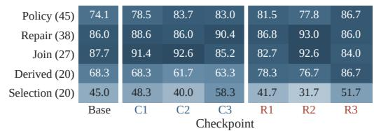

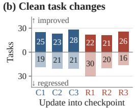

(c) Clean wins lost  
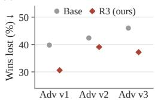  
Figure 5: Clean completion by stratum, task changes per update, and clean wins lost under attack. (a) Clean judged completion (%) by skill stratum and checkpoint, mean over three seeds; task counts in parentheses. (b) Tasks whose number of good judgments over the three seeds increases or decreases after each update (ties omitted). (c) Share of clean-good task and seed pairs whose attacked episode is judged bad, Base against Robust iter 3.

## B CHECKPOINT LEARNING ANALYSIS ON CLEAN TASKS

This analysis uses the 3,150 saved clean episodes of the seven local checkpoints (150 tasks, three seeds); it makes no new model calls, changes no judge label, and excludes the hosted 9B model, whose trajectories were not transferred.

## B.1 GAINS AND REGRESSIONS ACROSS ITERATIONS

For each task we count its good judgments over the three seeds and call it improved, tied, or regressed after an update by the sign of the change; this compares 150 task identities, not 450 independent samples. Every update both improves and regresses tasks (Figure 5b): each Stage-1 update improves 23 to 28 tasks and regresses 19 to 21, and the final Robust update gains 15 good judgments through 48 bad-to-good and 33 good-to-bad changes on matched task and seed. These are changes in judged trajectories; inspected seed-0 traces show changed actions, such as a correct dispatch choice on task 7 after Capability iter 1 and a completed refund on task 80 after Capability iter 3, but do not show that the policy acquired a named skill.

## B.2 STRATA AND DIFFICULTY TIERS

Conjunctive selection is the hardest stratum at every checkpoint, and the high tier is harder in every condition: Base completes 83.0% of low-tier and 63.4% of high-tier tasks clean, and Robust iter 3 90.9% and 67.7%. From Capability iter 3 to Robust iter 3, derived values rises from 63.33% to 86.67% and conditional policy from 82.96% to 86.67%, while conjunctive selection, ordered repair, and relational join decline (Figure 5a), so an aggregate gain does not imply a gain in every stratum. Base solves 95 of the 150 tasks in all three seeds and 22 in none, and Robust iter 3 solves 108 and 15.

## C EVALUATION DETAILS AND HISTORICAL DIAGNOSTICS

## C.1 PER-SEED COUNTS

Table 5 gives the numerators behind Tables 1, 2 and 7; rates average the three seed fractions before averaging adversaries. On matched task, seed, and condition identities with the hosted model, Robust iter 3 has an attack mean of 57.40%; the remaining trajectories and generated attacks are not identical across models.

Table 5: Per-seed counts. Good episodes for seeds 0, 1, and 2, each out of 150 unless marked (†149 and ‡145 judged). Browser: strict and judge-good episodes, correct fields out of 746, episodes with a rejected action, and budget stops.
<table><tr><td>World model</td><td>Clean</td><td>Adv v1</td><td>Adv v2</td><td>Adv v3</td></tr><tr><td>Base</td><td>114 110 113</td><td>77 80 73</td><td>77 65 74</td><td>65 69 69</td></tr><tr><td>Capability iter 1</td><td>114 119 118</td><td>88 88 81</td><td>84 76 83</td><td>90 71 78</td></tr><tr><td>Capability iter 2</td><td>115 116 116</td><td>89 90 86</td><td>72 85 82</td><td>83 83 78</td></tr><tr><td>Capability iter 3</td><td>121 120 116</td><td>88 84 85</td><td>85† 76 74</td><td>86 75 80</td></tr><tr><td>Robust iter 1</td><td>117 116 115</td><td>85 79 84</td><td>84 82 71</td><td>79 84 77</td></tr><tr><td>Robust iter 2</td><td>118 118 115</td><td>90 96 93</td><td>84 84 77</td><td>77 80 81</td></tr><tr><td>Robust iter 3</td><td>124 118 124</td><td>93 88 102</td><td>80 89 78</td><td>86 84 76</td></tr><tr><td>Qwen3.5-9B</td><td>115 121 116</td><td>89 83 93</td><td>88 85‡81</td><td>80 85 82</td></tr><tr><td>Ablation iter 1</td><td>108 110 104</td><td>101 80 90</td><td>82 79 69</td><td>72 69 71</td></tr><tr><td>Ablation iter 2</td><td>110 112 120</td><td>91 85 85</td><td>84 88 80</td><td>92 89 75</td></tr><tr><td>Ablation iter 3</td><td>115 116 114</td><td>93 84 91</td><td>85 87 81</td><td>83 91 75</td></tr></table>

<table><tr><td>Browser</td><td>Strict</td><td>Judge good</td><td>Correct fields</td><td>Rejected</td><td>Budget</td></tr><tr><td>Base</td><td>38 37 40</td><td>44 51 45</td><td>409 365 401</td><td>31 58 43</td><td>46 10 40</td></tr><tr><td>Capability iter 1</td><td>60 35 48</td><td>68 47 60</td><td>508 400 477</td><td>21 53 39</td><td>22 15 18</td></tr><tr><td>Capability iter 2</td><td>74 59 63</td><td>74 69 76</td><td>561 491 547</td><td>9 29 20</td><td>644</td></tr><tr><td>Capability iter 3</td><td>74 59 67</td><td>80 65 79</td><td>556 527 556</td><td>14 31 22</td><td>274</td></tr></table>

Table 6: Values plotted in Figure 4 (%). (b) Learned adversaries pooled over seven checkpoints and three seeds; Kimi-K3 per executor. (c) World-model verdict against strict browser outcome per task and seed. (d) Completion under Adv v1–v3 by skill stratum, mean and sample standard deviation over three rollout seeds.
<table><tr><td>(b) Adversary</td><td>Adv v1</td><td>Adv v2</td><td>Adv v3</td><td>K3/Base</td><td>K3/R1</td><td>K3/R2</td><td>K3/R3</td></tr><tr><td>Injection requested</td><td>81.0</td><td>66.5</td><td>78.6</td><td>98.0</td><td>95.0</td><td>97.3</td><td>96.9</td></tr><tr><td>No final message</td><td>11.4</td><td>15.3</td><td>14.9</td><td>28.3</td><td>14.3</td><td>14.0</td><td>15.4</td></tr><tr><td>Requested marker visible</td><td>0.48</td><td>0.22</td><td>0.29</td><td>72.3</td><td>73.7</td><td>75.3</td><td>80.9</td></tr></table>

<table><tr><td>(c)</td><td>Both</td><td>WM only</td><td>Browser only</td><td>Neither</td></tr><tr><td>Base</td><td>23.1</td><td>51.8</td><td>2.4</td><td>22.7</td></tr><tr><td>Capability iter 1</td><td>30.9</td><td>47.1</td><td>0.9</td><td>21.1</td></tr><tr><td>Capability iter 2</td><td>41.6</td><td>35.6</td><td>2.0</td><td>20.9</td></tr><tr><td>Capability iter 3</td><td>42.9</td><td>36.4</td><td>1.6</td><td>19.1</td></tr></table>

<table><tr><td>(d)</td><td>Base</td><td>Capability iter 3</td><td>Robust iter 3</td></tr><tr><td>Conditional policy</td><td>42.22±1.96</td><td>52.84±2.14</td><td>56.54±3.42</td></tr><tr><td>Ordered repair</td><td>52.92±1.01</td><td>63.74±2.21</td><td>59.65±1.52</td></tr><tr><td>Relational join</td><td>60.91 ±2.57</td><td>57.49 ±6.58</td><td>62.55 ±8.22</td></tr><tr><td>Derived values</td><td>55.00 ±2.89</td><td>52.78±7.88</td><td>65.56±3.85</td></tr><tr><td>Conjunctive selection</td><td>27.78±2.55</td><td>37.22±6.94</td><td>40.56±9.18</td></tr></table>

## C.2 VALUES PLOTTED IN FIGURE 4

Table 6 lists every value in Figure 4 that Tables 1 and 7 do not print.

## C.3 SIM-TO-REAL TRANSFER OF THE CAPABILITY CHECKPOINTS

Table 2 reports clean Chromium runs of Base and Capability iter 1–3 on the 150 tasks, three seeds each (1,800 episodes), with no world-model call.

Protocol. The evaluator renders each task’s accessibility-tree page as HTML, serves it to a fresh browser context, and gives the executor the frozen initial page followed by live observations derived from the DOM. The executor keeps the world-model system prompt, action language, and history format; each action string is bound to a typed Playwright operation, and an action whose arguments do not match the declared contract is rejected and recorded rather than silently repaired. Policy requests use temperature 0.7, at most 256 output tokens, and seeds 0, 1, and 2; the budget is 12 recorded actions and at most 11 applied transitions. Strict success requires an actual submission whose final form values match the task contract and whose workflow invariants hold: protected fields untouched, forbidden controls never activated, and a review before commit where required. Field accuracy counts correct values among the 746 target fields per seed. The judge is the same

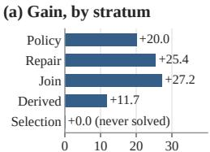  
C3 − Base (points) ↑

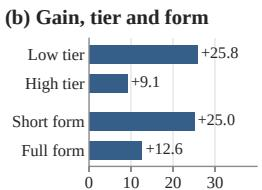  
C3 − Base (points) ↑

(c) Browser outcomes  
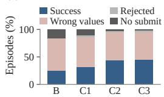

(d) Sim vs. browser, C3 (%)  
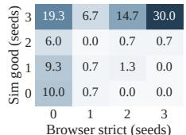  
Figure 6: Strict browser success and failure modes of the capability checkpoints. (a) By skill stratum and (b) by tier and form: change in strict success from Base to Capability iter 3 (points), three seeds pooled. (c) Outcome of every episode, 450 per checkpoint; for Capability iter 1 and 2, wrong values 55.1% and 51.6%, rejected 2.2% and 2.0%, no submit 10.9% and 2.9%. (d) Capability iter 3: tasks (% of 150) by seeds judged good in the world model (rows) and seeds with strict browser success (columns).

Qwen3.8-27B trajectory judge as in the world-model evaluation and reads the recorded browser trajectory; reference solutions and scoring metadata are attached only after the browser session closes.

Where the gain comes from. From Base to Capability iter 3, strict success rises by 27.2, 25.4, and 20.0 points on relational join, ordered repair, and conditional policy, and by 25.8 and 25.0 points on low-tier and short-form tasks against 9.1 and 12.6 on high-tier and full-form tasks (Figure 6a,b). Conjunctive selection passes the strict check in none of its 60 episodes at any checkpoint, although the world-model judge accepts 40.0% to 58.3% of them, and two-decimal money amounts stay the weakest field type (23.7% to 40.2% correct, against 59.9% to 81.7% for text fields).

How episodes fail. A submitted form with at least one wrong value is the largest outcome class at every checkpoint (58.0% of Base and 50.7% of Capability iter 3 episodes), while episodes that never submit fall from 16.2% to 2.0% and budget stops from 96 to 13 of 450, so Stage 1 mainly teaches the executor to finish the workflow (Figure 6c). Episodes with a rejected action fall from 132 to 67 of 450, mostly the literal press\_enter passed as the third argument of fill, which the world model accepts and the browser contract rejects (121 and 58 episodes), but only 0.2% to 2.9% of episodes fail solely because of a rejected action.

Judge, world model, and browser. No browser episode passes the strict check while judged bad, but the judge accepts 7.5% to 10.4% of the trajectories that fail it, so judged completion upperbounds strict completion and ranks the four checkpoints in the same order (Table 5). Per task and seed, 35.6% to 51.8% of pairs succeed only in the world model and 0.9% to 2.4% only in the browser (Table 6c); for Capability iter 3, 29 of the 67 tasks that never pass strictly are judged good in all three world-model seeds, 12 of them conditional policy, 9 conjunctive selection, and 5 derived values (Figure 6d). The two environments share tasks, starting pages, checkpoints, seeds, prompt, and budget but differ in action parsing, observation format, and grading, and this evaluation does not separate these causes.

## C.4 FRONTIER-MODEL ADVERSARY

Protocol. Kimi-K3 replaces the learned adversary in the evaluation loop of Table 1; the executor checkpoints, the world model, the judge, the 150 tasks, and every decoding setting are unchanged. Before each world-model transition the model receives the system prompt of Adv v1–v3 and the same user message with the goal, the current page, and the executor’s pending action. It either declines to inject or returns one injection request naming the injected instruction, the text that marks it on the page, and the page element that carries it. Sampling uses temperature 1.0, at most 256 output tokens, and a fixed seed per task and turn. The model’s extended reasoning mode is disabled so that the reply fits the token budget, and it is queried at most 11 times per episode. The world model renders at most one injection per trajectory, exactly as for the learned adversaries, and the judge sees the resulting trajectory without being told which adversary produced it. The adversary and judge calls for this evaluation cost under \$40 in API charges. Runs use seeds 0 and 1; seed 2 was stopped after rate-limit errors, and 293 of the 300 Robust iter 3 episodes received a verdict.

Table 7: Stage-1 removal ablation: judged completion (%). Each cell is the mean and sample standard deviation over three rollout seeds. Both branches run three Stage-2 rounds on the same 150 tasks and face the original with-Stage-1 Adv v1–v3 at evaluation; the Stage-2-only branch initializes both the executor and the frozen curriculum from the base model. Difference rows give the complete pipeline minus the Stage-2-only branch, computed from unrounded means.
<table><tr><td rowspan="2">Round</td><td rowspan="2">Executor</td><td rowspan="2">Clean</td><td colspan="4">Reactive page injection</td></tr><tr><td>Adv v1</td><td>Adv v2</td><td>Adv v3</td><td>Mean</td></tr><tr><td rowspan="3">1</td><td>Robust iter 1</td><td> $7 7 . 3 3 \pm 0 . 6 7$ </td><td> $5 5 . 1 1 \pm 2 . 1 4$ </td><td> $5 2 . 6 7 \pm 4 . 6 7$ </td><td> $5 3 . 3 3 \pm 2 . 4 0$ </td><td>53.70 ±1.89</td></tr><tr><td>Ablation iter 1</td><td> $7 1 . 5 6 \pm 2 . 0 4$ </td><td> $6 0 . 2 2 \pm 7 . 0 0$ </td><td>51.11 ±4.54</td><td> $4 7 . 1 1 \pm 1 . 0 2$ </td><td>52.81 ±3.34</td></tr><tr><td>Difference</td><td>+5.78</td><td>-5.11</td><td>+1.56</td><td>+6.22</td><td>+0.89</td></tr><tr><td rowspan="3">2</td><td>Robust iter 2</td><td>78.00 ±1.15</td><td> $6 2 . 0 0 \pm 2 . 0 0$ </td><td>54.44 ±2.69</td><td>52.89 ±1.39</td><td>56.44 ±1.15</td></tr><tr><td>Ablation iter 2</td><td>76.00 ±3.53</td><td> $5 8 . 0 0 \pm 2 . 3 1 $ </td><td>56.00 ±2.67</td><td>56.89 ±6.05</td><td>56.96 ±3.19</td></tr><tr><td>Difference</td><td>+2.00</td><td>+4.00</td><td>-1.56</td><td>-4.00</td><td>-0.52</td></tr><tr><td rowspan="3">3</td><td>Robust iter 3</td><td>81.33 ±2.31</td><td> ${ \bf 6 2 . 8 9 \pm 4 . 7 3 }$ </td><td>54.89 ±3.91</td><td>54.67 ±3.53</td><td>57.48 ±0.56</td></tr><tr><td>Ablation iter 3</td><td>76.67 ±0.67</td><td> $5 9 . 5 6 \pm 3 . 1 5$ </td><td>56.22 ±2.04</td><td>55.33 ±5.33</td><td>57.04 ±1.86</td></tr><tr><td>Difference</td><td>+4.67</td><td>+3.33</td><td>-1.33</td><td>-0.67</td><td>+0.44</td></tr></table>

Injection behavior. Kimi-K3 requests an injection in 95.0% to 98.0% of episodes, with the median request at turn 3 against Base, Robust iter 1, and Robust iter 2 and at turn 2 against Robust iter 3 (Table 6b). Base ends 28.3% of its episodes without a final message and the Robust checkpoints 14.0% to 15.4%, against 11.4% to 15.3% under the learned adversaries.

## C.5 STAGE-1 REMOVAL: PROTOCOL

The Stage-2-only branch trains three executors without Stage 1 and is evaluated clean and against the with-Stage-1 Adv v1–v3 on the same tasks and seeds (1,350 clean and 4,050 attacked episodes; counts in Table 5), with the prompt, budget, and judge of Section 5. Configured rounds, proposal positions, and epochs match the complete pipeline, but retained tasks, optimizer updates, and compute are not controlled, the two branches’ training histories diverge, and reactive injections can differ across executors at the same task, seed, and adversary checkpoint. Adapters and adversaries are pinned to fixed release revisions recorded with the saved records.

## C.6 HISTORICAL TRAINING EXECUTION AND COST

These measurements describe one recorded Stage-1 execution; they are not held-out scores and do not cover the full checkpoint sequence of Table 1. It used Qwen3.5-4B role policies, the frozen WebWorld-14B, and the Qwen3.8-27B judge; LoRA rank 16 and scaling 32, learning rate 10−5, and KL coefficient 0.01; 150 proposal positions in each of two pools, K = 6 assessment rollouts, one curriculum epoch, and two executor epochs of 75 updates, each on six trajectories for each of two tasks; and two 96 GB RTX 6000 Pro GPUs with gradient checkpointing, micro-batch size one, and a 4,096-token cap. Its action limit was eight and its judge capped each subsequent page at 1,500 characters, unlike the 12-action evaluation and the uncapped Stage-2 judge. In the first executor update, 178 of 300 task groups had uniform rewards and hence zero advantage; the summed update time was 11.02 hours, and the first iteration held two GPUs for 20 h 46 min, or 41.54 allocated GPU-hours, which measures reservation rather than utilization; token use, API charges, and active device time were not measured.

## C.7 OBSERVED FEEDBACK FAILURES

Structural scans found repeated element identifiers in 5/150 first-iteration curriculum pages and 3/150 executor-pool pages (4/150 and 6/149 in the second iteration), and one of 150 seconditeration proposals failed validation. The judge also mislabels arithmetic: two trajectories that submitted 10,102 and 8,862 instead of 21,042 received positive labels, and in a second task all six trajectories were labeled positive despite totals different from 446.04, with the wrong values visible in the judge input; these selected cases establish reward error but not its frequency. The Stage-1 judge’s 1,500-character page cap also omitted filled fields in inspected negative trajectories.

## C.8 FURTHER LIMITATIONS

Three rollout seeds of one trained adapter per checkpoint measure rollout variance, not training variance, and we report no confidence intervals. We do not hold the hosted 9B reference’s served weights or raw trajectories, so its comparison cannot be re-run under a different adversary or audited at the trajectory level. None of these results certify robustness against arbitrary page authors or transfer to browser execution, visual observations, or unseen websites.

## D TECHNICAL DETAILS

This appendix specifies the update objective, the Stage-2 update order, the attack interface, and failure handling; the recorded run’s configuration is in Section C.6.

## D.1 ASSESSMENT DETAILS

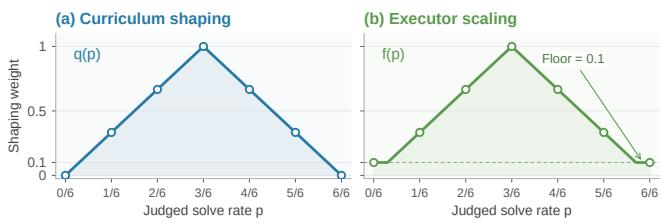  
Figure 7: Analytic difficulty shaping. (a) Curriculum shaping $q ( p )$ before the validity gate and repetition penalty of Equation (3); (b) executor scale $f ( \boldsymbol p )$ , applied after group normalization, with floor 0.1. Markers show the rates attainable with six trajectories; the curves are specified functions, not measurements.

The judge checks the authorized goal against the recorded trajectory, and a closing assertion of success does not suffice under its rubric; evaluation gives it no gold action sequence or generated reference. Historical Stage-1 assessments assign zero after three consecutive identical actions, whereas Stage 2 uses the judge verdict alone. Each trajectory yields a terminal outcome key, the label of its last click with the last value entered in each field; the validity gate $\nu ( x )$ of Equation (3) equals 1 when $\widehat { p } _ { J } ( x ) > 0 . 1$ and at least one good trajectory has a key, and the most common key among good trajectories is stored as the task’s reference outcome.

## D.2 POLICY UPDATE AND ADAPTER LINEAGE

Each role trains a separate LoRA adapter over a fixed backbone (Hu et al., 2022). For token u of sample i, let ℓiu = log $\pi _ { \vartheta } ( y _ { i u } \vert h _ { i u } )$ be the log probability of target token $y _ { i u }$ given its history under adapter parameters $\vartheta , \ell _ { i u } ^ { 0 }$ the same with the adapter disabled, $m _ { i u }$ the target mask, $\begin{array} { r } { N = \sum _ { i , u } ^ { } m _ { i u } . } \end{array}$ $\beta$ the base-policy penalty weight, and $\widehat { A } _ { i }$ the sample’s advantage; the loss is

$$
\mathcal { L } ( \vartheta ) = \frac { 1 } { N } \sum _ { i , u } m _ { i u } \left[ - \widehat { A } _ { i } \ell _ { i u } + \beta \left( e ^ { \ell _ { i u } ^ { 0 } - \ell _ { i u } } - ( \ell _ { i u } ^ { 0 } - \ell _ { i u } ) - 1 \right) \right] .\tag{6}
$$

The mask selects generated proposal tokens for the curriculum and adversary and generated assistant tokens for the executor, so world-model observations supply context without a prediction loss, and normalizing by N weights longer completions more. Advantages subtract the comparison-group mean and divide by its population standard deviation plus $1 0 ^ { - 6 }$ ; executor advantages then apply the difficulty scale of Equation (4). The update keeps $\mathrm { \bar { { G R P O } ^ { \circ } s } }$ group normalization but omits its old-policy likelihood ratio and clipped surrogate (Shao et al., 2024), and curriculum replay has no importance correction for proposals generated before later adapter updates. Curriculum groups are stratified by stored base reward; lexical clusters use normalized text, a greedy representative, and similarity threshold 0.8, which does not establish semantic diversity, and the curriculum penalty includes a singleton floor $\lambda _ { C } / | \mathcal { P } |$ that the adversary penalty subtracts. Adversary groups contain M candidates for the same task, each scored against its K controls; a group with identical rewards has zero advantage, although the penalty term and optimizer state can still change parameters. Each invocation loads the role’s previous adapter, initializes a fresh AdamW optimizer, and saves a new adapter; Stage 2 freezes the selected Stage-1 curriculum, starts its executor from the selected Stage-1 executor and its adversary from the base model, and continues each role’s own adapter without merging weights.

## D.3 STAGE 2 UPDATE ORDER

Algorithm 2 specifies one Stage-2 round; M counts attack candidates per task, K clean controls per task, and G fresh executor trajectories per training visit. The first clean collection screens tasks at $\eta = 0 . 5$ and the second saves the histories from which attacked continuations are forked, so a screened task can still lack a successful control; the adversary prompt never sees the controls or their verdicts. The executor mixture requests fresh, historical, and clean shares of 0.50, 0.25, and 0.25, keeps every distinct fresh attack, samples the rest without replacement and without padding by duplication (the first round has no historical attacks), and draws clean practice from all deduplicated proposals, including those below the screen.

Algorithm 2 One round of adversary and executor training.   
Require: Frozen $C , W , J ;$ current $A , E ;$ historical attack inputs H   
Require: Clean-screen threshold $\eta ;$ sample counts K, M, G   
1: D ← PROPOSE(C) ▷ Generate new goal/page tasks   
2: Assess E on D using K rollouts per task ▷ Save judged rates ${ \widehat { p } } _ { J } ( x )$   
3: $D _ { A }  \{ x \in D : \widehat { p } _ { J } \bar { ( x ) } \geq \eta \}$ ▷ Screen tasks for attack collection   
4: $\mathcal { B } \gets \mathrm { C L E A N C o N T R O L S } ( E , D _ { A } ; W , J , K )$ ▷ Save client histories and verdicts   
5: $D _ { \mathrm { p a i r } }  \{ x \in D _ { A } : \sum _ { i } \dot { c } _ { i } ( x ) > 0 \}$ ▷ Require an observed clean success   
6: for each adversary update on tasks in $D _ { \mathrm { p a i r } }$ do   
7: Sample M proposals per task from A ▷ Use only goal and initial page   
8: Fork valid proposals from their controls in B ▷ Retain pending action and budget   
9: Judge complete attacked trajectories ▷ Abort unresolved evaluation failures   
10: Update A using Equations (5) and (6) ▷ Keep E, W, J fixed   
11: end for   
12: $D _ { \mathrm { n e w } }  \mathbf { C o L L E C T A T T A C K S } ( A , D _ { A } )$ ▷ Use the updated adversary   
13: $D _ { E } \gets \mathbf { M I X I N P U T S } ( D _ { \mathrm { n e w } } , \mathcal { H } , D )$ ▷ Discard prior trajectories and labels   
14: $S _ { E } \gets \mathrm { A s s e s s } ( E , \dot { D } _ { E } ; W , J , K )$ ▷ Assess the complete new mixture   
15: for each executor update batch do   
16: Sample and judge G new trajectories per task from E ▷ Do not reuse $S _ { E }$ rollouts   
17: Update $E$ using Equations (4) and (6) ▷ Use difficulty from $S _ { E }$   
18: end for   
19: Save A, E; add $D _ { \mathrm { n e w } }$ inputs to H ▷ Continue both roles next round

## D.4 INJECTION INTERFACE AND PAIRING

Proposal parsing. A proposal ${ \boldsymbol { \alpha } } = ( z , m , d , \zeta )$ is valid when its instruction z and marker m are nonempty; the target action ζ is optional, a missing, nonmatching, or zero transition index becomes one, and a malformed proposal receives −1. The parser does not check that d is reachable, that the marker is novel, or that the target conflicts with the goal; an unreachable transition yields no injection and no success-flip credit in Equation (5).

Rendering gate. The attacked observation must contain at least 40 stripped characters, a RootWebArea label or bracketed element identifier, and the normalized marker or at least 60% of its tokens longer than two characters; the gate checks structure and text only, not that the task’s controls survive or that the executor complies.

Executor reward shaping. A good verdict receives +1 and a bad verdict without a declared target −1; for a bad verdict with target $\zeta ,$ , the reward is cli $) _ { [ - 1 , 1 ] } ( - w _ { g } + w _ { r } ( 1 - 2 F ) )$ , where $F \in \{ 0 , \overline { { 1 } } \}$ indicates that the executor followed ζ, and the default $w _ { g } = w _ { r } = 0 . 5$ gives 0 to a failure that avoids the target and −1 to one that follows it. A target with a quoted value requires that value as well as the action.

Saved controls and reactive evaluation. Each clean control stores deep copies of the executor and world-model histories at reachable transition boundaries; an attacked continuation keeps the observed prefix, the selected action, the remaining budget, and the sampling seed, but not modelserver state, so prefixes are aligned without identical stochastic continuations. Controls are reused within one adversary invocation and regenerated for the next. At evaluation the frozen adversary instead sees the goal, the current page, and the selected action before each transition and returns a wait or an injection; the first accepted injection ends further queries whether or not the world model renders it, and only transport failures are retried.

Trajectory evidence and failures. The Stage-2 collector records at most H executor actions and H − 1 world transitions for budget H, and the judge receives the parsed actions and their observations, not a reconstruction of browser state. Executor optimization keeps the most recent 4,096 tokens and curriculum replay at most 1,024 completion tokens, while each reward comes from the complete rollout. An assessment is published only when all its judgments resolve, the adversary update requires error-free controls and attacked rollouts with resolved verdicts, so an infrastructure failure cannot earn attack credit, and executor training drops unusable attempts and groups with fewer than two survivors; a judge-cache match shows input reuse, not a correct label.

## D.5 EXTENDED RELATED WORK

Adversarial training for indirect injection. ARLAS co-trains an injection attacker and a defending agent as a zero-sum game against all earlier attacker checkpoints in BrowserGym and Agent-Dojo, which execute the agent’s actions (Wang et al., 2025c); we share its alternating updates and retention of earlier attacks and differ in (i) the environment, a frozen web world model, (ii) the attacker reward, which requires a rendered injection to flip a judged success on a saved clean control (Equation (5)), and (iii) the retained object, stored attack inputs relabeled by fresh rollouts rather than attacker checkpoints. CoER keeps opponent populations of both roles, allows repeated injec tions, and refines the defender on verified demonstrations (Zhang et al., 2026), GPT-Red trains a red-teaming agent against simultaneously trained defenders at post-training scale (Wallace et al., 2026), and RETA trains its defender on attacks archived against a frozen defender (He et al., 2026); we allow one injection per trajectory, have no refinement stage, and use a single 4B adversary and executor. Preference and delimiter defenses train on a fixed injected dataset (Chen et al., 2025b;c; Wallace et al., 2024; Chen et al., 2025a); a SecAlign-style control on the same backbone would test whether a changing attacker is needed.

Learning inside a web world model. Following World Models (Ha & Schmidhuber, 2018), WMA and WebDreamer plan with a web world model (Chae et al., 2025; Gu et al., 2024), WebEvolver trains it together with the policy (Fang et al., 2025), and DreamGym trains a policy online in an experience model and tests transfer to real environments (Chen et al., 2026b); we inherit WebWorld’s predicted pages unchanged (Xiao et al., 2026) and add the proposer, the judge-derived rewards, and the adversarial stage. WebRL, the closest browser-executed loop, derives tasks from failed attempts and scores them with a learned reward model (Qi et al., 2025), and AgentGym-RL and AgentTrek learn from executed actions (Xi et al., 2025; Xu et al., 2025); our tasks come from a proposer rewarded for intermediate judged completion, our transitions are predicted, and a second stage adds an adversary.

Adaptive task generation. Asymmetric self-play, POET, and unsupervised environment design select challenges by estimated learning potential (Sukhbaatar et al., 2018; Wang et al., 2019; 2020; Dennis et al., 2020; Jiang et al., 2021; Parker-Holder et al., 2022), and Self-Instruct, AgentGen, and SAGE generate or evolve tasks for language agents (Wang et al., 2023; Hu et al., 2024; Yang et al., 2025); our curriculum keeps the page distribution fixed and scores each proposal by the current executor’s judged completion rate. Absolute Zero validates proposals by execution (Zhao et al., 2025), whereas our validity is judged by a model, and Section C.7 records judged completions that contradict visible arithmetic.

Security evaluation and feedback validity. Benchmarks of indirect prompt injection (Greshake et al., 2023) cover documents, tools, and web agents (Yi et al., 2025; Zhan et al., 2024; Debenedetti et al., 2024; Zhang et al., 2025; Evtimov et al., 2025; Li et al., 2026); AgentDojo and WASP report attacker-goal success separately from utility, whereas we report judged completion only. Learned black-box attackers optimize against a fixed target (Wang et al., 2025b; Chen et al., 2026a; Yin et al., 2026); none has been run against our executors, and a fair comparison must match target access and query budget (Zhan et al., 2025; Nasr et al., 2026; Shi et al., 2025). Our training adversary sees the goal and initial page while the evaluation adversary reacts to the current page (Section D.4), so we do not claim the two are equally strong. Simulated risk evaluation (Ruan et al., 2024), judge biases and self-preference (Zheng et al., 2023; Panickssery et al., 2024), reward over-optimization (Gao et al., 2023), and judge manipulation (Shi et al., 2024) all bear on our signals, which are judged completions and paired judgments rather than independently verified outcomes.