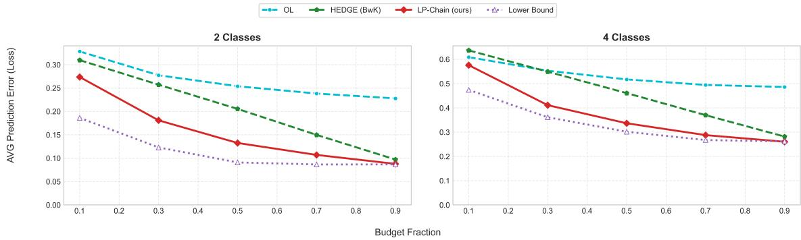
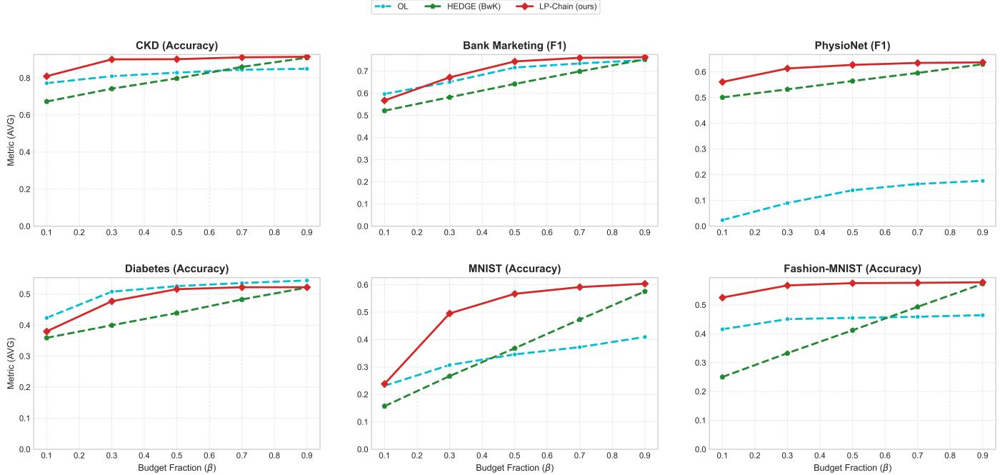
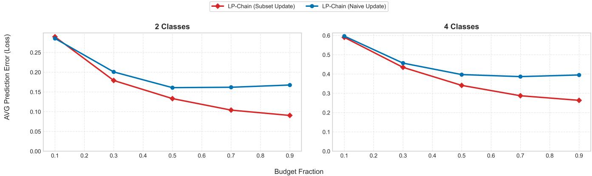

# AFA-BANDIT: PROVABLY NEAR-OPTIMAL ONLINE MULTI-FEATURE CLASSIFICATION UNDER BUDGET CONSTRAINTS

AbdAlRahman Odeh, Teng-Hui Huang

The University of Sydney School of Electrical and Computer Engineering Sydney 2006, NSW, Australia

## ABSTRACT

Active Feature Acquisition (AFA) is a classification problem in which an agent decides which costly features to acquire before predicting each sample’s label. Unlike batch AFA, which trains a fixed policy and classifier offline on fully observed data, online AFA updates its predictor from revealed labels as samples arrive. Existing online methods either use deep reinforcement learning (RL) without performance guarantees or maximize cost-adjusted reward rather than enforce a global budget. We formulate online AFA as a combinatorial Bandits with Knapsacks (BwK) problem that couples acquisition and prediction. Unlike prior bandit-based AFA and classical BwK, our setting has combinatorial complexity, evolving rewards, a global budget, and structured side information. We obtain an improved regret upper bound over standard BwK bounds in this framework, leveraging a cardinality-aware confidence bound and the subset update structure. To avoid an exponentially large action space, we propose LP-Chain, a variant that searches a cost-aware chain of feature subsets with a size that grows linearly with the number of features. While the regret upper bound is specific to the combinatorial framework, LP-Chain empirically achieves comparable predictive performance. On synthetic data, LP-Chain outperforms HEDGE-based BwK and deep RL-based online AFA baselines and scales favorably to more features.

Index Terms— Multi-Armed Bandits, Online Learning, Active Feature Acquisition, Classification, Optimization

## 1. INTRODUCTION

Real-world intelligent systems must make decisions with limited resources. Acquiring information reduces uncertainty at a cost, e.g., in battery energy, latency, computation, or capacity [1, 2]. Active Feature Acquisition (AFA) studies a sequential, resource-constrained decision-making problem: at each round, the learner acquires a subset of features at a cost and predicts the sample’s label; it then uses the revealed label and acquired features to update its predictor before moving on to a new sample [3].

The University of Sydney Faculty of Engineering Sydney 2006, NSW, Australia

In batch-learning AFA, an agent has access to a labeled training dataset in which all features are observed for every sample. The agent jointly learns an acquisition policy and a classifier subject to an acquisition cost constraint [4]. The policy and the classifier are then deployed at inference time for cost-efficient classification of unseen samples [5]. However, this standard train–test paradigm is impractical for many decision-making applications. An agent often observes only on-policy outcomes, leaving off-policy outcomes unobserved [6]. Moreover, when the environment is time-varying, an agent optimized during training suffers from generalization error at

Hesham El Gamal

inference time [7].

Online AFA addresses these limitations by continuously updating the acquisition policy as the agent interacts with the environment. In [8], the authors proposed a method that maximizes potential merit (predictive utility per unit cost) over data streams, but compared it empirically only against a random acquisition policy in a limited request-or-not setting. More recent works have adopted neuralnetwork-based reinforcement learning (RL) approaches, owing to their ability to approximate the complex acquisition–prediction relation in online AFA. Kachuee et al. [9] proposed a two-network architecture in which a Deep Q-Network (DQN) learns the acquisition policy by maximizing the marginal certainty gain per unit cost, while a feed-forward network is trained to maximize prediction accuracy. However, such highly non-linear black-box architectures generally do not provide performance guarantees.

Toward provably efficient solvers for online AFA, a body of work has adopted a multi-armed bandit (MAB) approach. In [10], a two-step formulation was proposed in which first-step actions correspond to feature acquisitions and second-step actions correspond to predictions, with accuracy as the unknown reward. Although a regret analysis was provided, the acquisition cost is subtracted from the reward, so no global budget constraint is enforced. Rahbar et al. [11] applied a combinatorial MAB to the acquisition of test outcomes generated by a binary hidden state. Because they focus on minimizing acquisition costs, their regret result does not apply to prediction performance under a budget constraint.

MAB-based online AFA with a global budget constraint is closely related to Bandits with Knapsacks (BwK) [12]. In BwK, each arm is associated with a random reward and random resource costs drawn from unknown distributions. Pulling an arm yields a sample of its reward and costs, and the agent aims to maximize the cumulative reward until the budget of any resource is exhausted. A well-known result is that BwK algorithms achieve an optimal regret bound relative to an optimal policy with full knowledge of the reward and cost distributions [13]. However, to the best of our knowledge, no BwK-based framework exists for online AFA.

Our contributions are summarized as follows. First, we formulate the online AFA problem as a predictor-coupled combinatorial BwK problem, distinguishing our setting from existing bandit-based AFA formulations through its evolving rewards, structured feedback, and global acquisition budget. Second, in this combinatorial framework, we establish an upper bound on regret relative to the reward achieved by an optimal policy that knows the data-generating distributions, and show that it is tighter than a direct application of the classical BwK bound. Third, to reduce the exponential complexity (i.e., the size of the power set), our LP-Chain uses a cost-aware greedy incremental subset-construction step that builds a chain of candidate subsets whose size grows linearly with the number of features, and empirically attains comparable predictive performance to that of its combinatorial, provable counterpart. Finally, we empirically demonstrate that $L \bar { P } .$ -Chain achieves better predictive performance than a BwK baseline and the closest online AFA baseline, which is based on deep RL.

## 2. PROBLEM FORMULATION

We consider online multiclass classification over T rounds $( T$ is known). At round t, an example $( X _ { t } , Y _ { t } )$ is drawn from an unknown distribution $\mathcal { P }$ , where $\bar { Y } _ { t } ~ \in ~ [ K ]$ is the label, and $X _ { t } ~ =$ $( X _ { t , 1 } , \ldots , X _ { t , V } )$ is an observation consisting of V features. We assume $\mathcal { P }$ is a parametric mixture distribution, and for each $y \in [ K ]$ $\begin{array} { l } { \bar { x } _ { N , v | y } \ = \ ( 1 / N ) \sum _ { i = 1 } ^ { N } x _ { i , v | y } } \end{array}$ is an unbiased estimator of the ycomponent parameter $\theta _ { y } .$ . Such an assumption applies to a general class of distributions, e.g., mixtures of exponential-family distributions [14].

Feature v has a known acquisition cost $c _ { v } \geq 0$ . Furthermore, we assume that a set $S _ { 0 } \subseteq [ V ]$ of features is available at no cost, and define the action space as $\mathcal { A } : \stackrel { \cdot } { = } \{ s | ( s \subseteq [ V ] ) \cap ( S _ { 0 } \subseteq s ) \}$ , i.e., every acquisition includes the free features. The cost of an action $S \in { \mathcal { A } }$ is $\begin{array} { r } { c ( S ) : = \sum _ { v \in S } c _ { v } } \end{array}$ , where $c _ { v } = 0$ for all $v \in S _ { 0 }$ . Acquisitions are subject to a global budget B over the T rounds.

Let $\mathcal { H } _ { t - 1 }$ denote the information available before round t. At the beginning of round $t , ( X _ { t } , Y _ { t } )$ is drawn independently from $\mathcal { P } _ { \cdot }$ but neither $\dot { X _ { t } }$ nor $Y _ { t }$ is observed by the learner. Based on $\mathcal { H } _ { t - 1 }$ , the learner selects a feature subset $S _ { t } \in \mathcal A$ and observes only $X _ { t , S _ { t } }$ . It then predicts the label using its current predictor $h _ { t , S _ { t } }$ corresponding to $S _ { t } .$ . For any feasible subset $S \in { \mathcal { A } } .$ , define its potential round-t reward, evaluated using the predictor before its round-t update, as

$$
r _ { t } ( S ) : = \mathbb { 1 } \left\{ h _ { t , S } ( X _ { t , S } ) = Y _ { t } \right\} .\tag{1}
$$

After the prediction, the true label $Y _ { t }$ is revealed, and the learner observes the reward $r _ { t } ( S _ { t } )$ of its selected action. The acquired observations $X _ { t , S _ { t } }$ are retained and can be used by the learner arbitrarily. The round-t conditional expected reward of action S is

$$
\mu _ { t } ( S ) : = \mathbb { E } \left[ r _ { t } ( S ) \mid { \mathcal { H } } _ { t - 1 } \right] .\tag{2}
$$

Note that $\mu _ { t } ( S )$ changes over time as the predictor $h _ { t , S }$ is updated, and that it is non-atomic, i.e., $\mu _ { t } ( S ) \neq \sum _ { s \in S } \mu _ { t } ( s )$ , in contrast to Semi-BwK [15]. For each $S \in { \cal A } ,$ let $h _ { S } ^ { * }$ denote the optimal predictor given $X _ { S }$ under ${ \mathcal { P } } ,$ and define the oracle round-t reward and its expectation as

$$
r _ { t } ^ { \ast } ( S ) : = \mathbb { 1 } \left\{ h _ { S } ^ { \ast } ( X _ { t , S } ) = Y _ { t } \right\} , \quad \mu ^ { \ast } ( S ) : = \mathbb { E } _ { \mathcal { P } } [ r _ { t } ^ { \ast } ( S ) ] .\tag{3}
$$

For the formulated problem, the optimal reward is achieved by a dynamic oracle that knows $\mathcal { P }$ and predicts with $h _ { S } ^ { * }$

$$
\mathrm { O P T } : = \operatorname* { s u p } _ { \pi \in \Pi } \mathbb { E } p , \pi \left[ \sum _ { t = 1 } ^ { \tau _ { \pi } } r _ { t } ^ { * } ( S _ { t } ) \right] ,\tag{4}
$$

where $\tau _ { \pi } \leq T$ is a stopping time induced by the acquisition budget, and the feasible policy set is defined as $\begin{array} { r } { \operatorname { I I } : = \dot { \left\{ \pi : \sum _ { t = 1 } ^ { \tau _ { \pi } } c ( S _ { t } ) \leq { B } \right\} } } \end{array}$ Evaluating OPT is intractable since it requires enumerating all possible acquisitions over $T$ rounds and comparing the rewards of those that respect the budget constraint. Instead, following [12], a tractable benchmark is obtained by the optimal static oracle, whose reward is the value of the linear program (LP)

$$
\begin{array} { r l } & { \mathrm { O P T } _ { \mathrm { L P } } : = \displaystyle \operatorname* { m a x } _ { p \in \Delta ( A ) } T \sum _ { S \in \mathcal { A } } p ( S ) \mu ^ { * } ( S ) } \\ & { \quad \quad \mathrm { s . t . } \quad T \sum _ { S \in \mathcal { A } } p ( S ) c ( S ) \le B , } \end{array}\tag{5}
$$

where we denote the maximizer by $p ^ { * }$ . Note that the feasible solution set $\Delta ( \mathcal { A } )$ is a simplex of dimension $| { \mathcal { A } } | - 1$ , where $| { \mathcal { A } } | =$ $2 ^ { V - | S _ { 0 } | }$ . The solution $p ^ { * }$ is a distribution over actions that satisfies the budget only on average, $\mathrm { i . e . , } B / T$ per round; hence, the above LP is a relaxation of the problem in (4). It is well known that $\mathrm { O P T } _ { \mathrm { L P } } \geq$ $\mathrm { O P T }$ [12, Lemma 3.1] since any feasible action sequence of (4) is a feasible solution of the relaxed $\mathrm { L P } \left( 5 \right)$ . Hence, denoting the reward of any algorithm by $\begin{array} { r } { \mathrm { R E W } = \sum _ { t = 1 } ^ { \tau } r _ { t } ( S _ { t } ) } \end{array}$ , where $\tau \leq T$ is the stopping time, we have $\mathrm { O P T } _ { \mathrm { L P } } \stackrel { = } - \mathbb { E } [ \mathrm { R E W } ] \geq \mathrm { O P T } - \mathbb { E } [ \mathrm { R E W } ]$ so it suffices to bound the regret with respect to $\mathrm { O P T } _ { \mathrm { L P } }$

## 3. PROPOSED METHOD

We propose solving online AFA as a BwK problem in which each feasible subset $S \in { \mathcal { A } }$ is an arm with cost $c ( S )$ .

## 3.1. Dimension-aware confidence bounds

Our algorithm first estimates an upper confidence bound (UCB [16]) on the expected reward of each subset. We derive the following confidence interval to account for drifting rewards due to the dependency on prediction parameters, following [17, 18]. With a slight abuse of notation, we write $\mu ( \pmb \theta _ { S } ) : = \mu ( S )$ . For a fixed $S$ and the vector parameter $\pmb { \theta } _ { S } = \left[ \pmb { \theta } _ { S , 1 } ^ { T } \quad \cdots \quad \pmb { \theta } _ { S , K } ^ { T } \right] ^ { T }$ , the L-smooth reward implies $| \mu ( \pmb \theta _ { S } ) - \mu ( \pmb \theta _ { S } ^ { \ast } ) | \leq L | \pmb \theta _ { S } - \pmb \theta _ { S } ^ { \ast } |$ . Since $\hat { \pmb { \theta } } _ { S } \ : = $ $\left[ \hat { \pmb { \theta } } _ { S , 1 } ^ { T } \quad \ldots \quad \hat { \pmb { \theta } } _ { S , K } ^ { T } \right] ^ { T }$ is an unbiased estimator of $\pmb { \theta } _ { S }$ , concentration bounds apply.

Definition 1 (Lipschitz Descent Lemma [19]). Let $g : \mathcal { X }  \mathbb { R }$ be differentiable and L-smooth with Lipschitz constant $L > 0 .$ . Then,

$$
g ( x ) \leq g ( y ) + \langle \nabla g ( y ) , y - x \rangle + \frac { L } { 2 } \| y - x \| ^ { 2 } .\tag{6}
$$

Lemma 1 (Lemma 3.1 of [20]). Let X be a closed convex set in a normed vector space (well-defined ∥·∥). If a function $f : \mathcal { X } \to \mathbb { R } _ { + } \cup$ {0} is L-smooth and non-negative, then $\| \nabla f ( x ) \| _ { * } \leq \sqrt { 4 L f ( x ) } .$ where ∥·∥∗ denotes the dual norm.

Lemma 2 (Dimension-aware confidence bound). Suppose $\mu { _ t }$ is L-Lipschitz smooth. For an action $S \in { \mathcal { A } } ,$ let $d ( S ) : = | S |$ denote the dimension ofits observation vector. Define

$$
\beta _ { t } ( S ) : = \sqrt { \frac { d ( S ) + 2 \log ( t + 1 ) } { N _ { t } ^ { \mathrm { r e w } } ( S ) } } .\tag{7}
$$

The corresponding upper confidence bound is

$$
f _ { t } ( S ) : = \widehat { \mu } _ { t } ( S ) + \beta _ { t } ( S ) \sqrt { L \cdot \widehat { \mu } _ { t } ( S ) } + c _ { b } \beta _ { t } ^ { 2 } ( S ) ,\tag{8}
$$

where $\begin{array} { r } { c _ { b } > 0 , N _ { t } ^ { \mathrm { r e w } } ( S ) = \sum _ { a \supset S } N _ { t } ( a ) } \end{array}$ , and $N _ { t } ( a )$ denotes the number oftimes that action a has been taken before round t.

Proof. For a bounded and Lipschitz smooth function, $| \nabla \mu ( \theta ) | \le$ $2 \sqrt { L \mu ( \theta ) }$ (Lemma 1 and [20]). Under the high-probability event, consider the following inequalities:

$$
\lVert \mu ( \theta ) - \mu ( \hat { \theta } _ { N } ) \rVert \leq \lVert \frac { d \mu ( \hat { \theta } _ { N } ) } { d \theta } \rVert \lVert \theta - \hat { \theta } _ { N } \rVert + \frac { L } { 2 } \lVert \theta - \hat { \theta } _ { N } \rVert ^ { 2 }\tag{9}
$$

$$
\leq \sqrt { 4 L \mu ( \hat { \theta } _ { N } ) } \| \theta - \hat { \theta } _ { N } \| + \frac { L } { 2 } \| \theta - \hat { \theta } _ { N } \| ^ { 2 }\tag{10}
$$

$$
\leq \sqrt { L \frac { c _ { r a d } \cdot \mu ( \hat { \theta } _ { N } ) } { N } } + \frac { L c _ { r a d } } { N } ,\tag{11}
$$

where we use the self-bounding property of $\mu ( \theta )$ for the second inequality, and the last one follows from the Hoeffding inequality.

## 3.2. Acquisition policy and global budget constraint

## 3.2.1. Combinatorial: Primal-dual steps

Following [13], solving the dual problem of the LP (5) with a Lagrange multiplier reveals the primal-dual structure:

$$
\operatorname* { m a x } _ { i \in \mathcal { A } } \mu ( i ) + \operatorname* { m i n } _ { \lambda } \lambda \left[ \frac { B } { T } - c ( i ) \right] ,\tag{12}
$$

where $\lambda \geq 0$ is a multiplier for the average budget constraint $B / T$ Based on this insight, we introduce a dual variable $\lambda _ { t } \in [ 0 , \lambda _ { m a x } ]$ and the round-t acquisition decision (primal step) is

$$
S _ { t } = \mathop { \underset { S \subseteq A } { \operatorname { a r g m a x } } } \ f _ { t } ( S ) - \lambda _ { t } c ( S ) .\tag{13}
$$

After subtracting the cost $c ( S _ { t } )$ from the budget, and after observing the reward, the dual variable is updated (dual step) by Online Mirror Descent (OMD) [21]:

$$
\lambda _ { t + 1 } = \operatorname * { a r g m i n } _ { \lambda \in [ 0 , \lambda _ { m a x } ] } \lambda \left[ \frac { B } { T } - c ( S _ { t } ) \right] + \frac { \eta _ { t } } { 2 } \| \lambda - \lambda _ { t } \| ^ { 2 } ,\tag{14}
$$

where $\eta _ { t } = 1 / \sqrt { ( t + 1 ) }$ is a step size. As in the BwK literature, $\lambda$ balances over- and underspending of the budget through OMD updates, which in turn affects the primal step [22].

## 3.2.2. LP-Chain: Greedy chain construction

Clearly, direct optimization over A would require searching among $2 ^ { V - | S _ { 0 } | }$ | feature subsets, and therefore scales exponentially with the number of features. LP-Chain avoids this complexity by constructing a chain containing only $V - | S _ { 0 } | + 1$ candidate actions.

Definition 2 (Feature chain). A feature chain at round t is an ordered family

$$
\mathcal { C } _ { t } : = \{ S _ { t , 0 } , S _ { t , 1 } , \ldots , S _ { t , V - | S _ { 0 } | } \} \subseteq A ,\tag{15}
$$

where $S _ { t , 0 } = S _ { 0 } \subset S _ { t , 1 } \subset \cdots \subset S _ { t , V - | S _ { 0 } | } = [ V ]$ with each successive action adding exactly one feature: $| S _ { t , j } \setminus S _ { t , j - 1 } | = 1$

The chain is constructed greedily using the optimistic rewards. Starting from $S _ { t , 0 } = S _ { 0 }$ , at step j LP-Chain selects

$$
v _ { t , j } \in \arg \operatorname* { m a x } _ { v \notin S _ { t , j - 1 } } \frac { f _ { t } ( S _ { t , j - 1 } \cup \{ v \} ) - f _ { t } ( S _ { t , j - 1 } ) } { c _ { v } } ,\tag{16}
$$

and sets $S _ { t , j } : = S _ { t , j - 1 } \cup \{ v _ { t , j } \} , { \mathrm { ~ f o r ~ } } j = 1 , \ldots , V - | S _ { 0 } | .$

After constructing the chain, the algorithm allocates the remaining budget over its candidate actions. Before round t, the remaining budget is

$$
B _ { \mathrm { r e m } , t } : = B - \sum _ { i = 1 } ^ { t - 1 } c ( S _ { i } ) ,\tag{17}
$$

and the per-round allowance over the remaining rounds is:

$$
b _ { t } : = \frac { B _ { \mathrm { r e m } , t } } { T - t + 1 } .\tag{18}
$$

LP-Chain then obtains an acquisition distribution by solving

$$
p _ { t } \in \arg \operatorname* { m a x } _ { p \in \Delta ( \mathcal { C } _ { t } ) } \sum _ { S \in \mathcal { C } _ { t } } p ( S ) f _ { t } ( S ) \quad \mathrm { s . t . } \quad \sum _ { S \in \mathcal { C } _ { t } } p ( S ) c ( S ) \leq b _ { t } ,\tag{19}
$$

where $\Delta ( \mathcal { C } _ { t } )$ denotes the probability simplex over $\mathcal { C } _ { t }$ . The learner then samples $S _ { t } \sim p _ { t } ; \mathrm { i f } \bar { c } ( S _ { t } ) > B _ { \mathrm { r e m } , t } ,$ it instead plays the zerocost action $S _ { 0 } ,$ which guarantees $\textstyle \sum _ { t = 1 } ^ { T } c ( S _ { t } ) \leq B$ almost surely. Thus, in contrast to the OMD dual update [21], LP-Chain enforces the budget directly through the per-round allowance $b _ { t } ,$ , while rebuilding the chain at every round lets the acquisition policy adapt to the evolving predictor.

## 3.3. Online learning and subset feedback

This subsection applies to both settings in Section 3.2. Suppose that action $S _ { t }$ is selected at round t. After observing $X _ { t , S _ { t } }$ , the predictor assigns an observation to its nearest estimated class mean: $h _ { t , S } ( x _ { S } ) : = \arg \operatorname* { m i n } _ { k \in [ K ] } \Big \| x _ { S } - \widehat { \pmb \theta } _ { t , k , S } \Big \| _ { 2 } ^ { 2 } .$ After the prediction, the environment returns $r _ { t } ( S _ { t } )$ , and the cost $c ( S _ { t } )$ is subtracted from the budget. Recall that $N _ { t } ^ { \mathrm { r e w } } ( S )$ is the number of observed rewards for action S before round t, and let $\widehat { \mu } _ { t } ( S )$ denote their reward estimate. The reward estimates are updated as

$$
\widehat { \mu } _ { t + 1 } ( S ) = \widehat { \mu } _ { t } ( S ) + \frac { r _ { t } ( S ) - \widehat { \mu } _ { t } ( S ) } { N _ { t } ^ { \mathrm { r e w } } ( S ) + 1 } , \quad S \subseteq S _ { t } ,\tag{20}
$$

and $N _ { t + 1 } ^ { \mathrm { r e w } } ( S ) = N _ { t } ^ { \mathrm { r e w } } ( S ) + 1$ for these subsets. Since every feature in any $S \subseteq S _ { t }$ has been acquired, the learner can evaluate the reward of all such subsets, not only of $S _ { t } .$ , using the predictors $h _ { t , S }$ before any round-t update. Following this, since the label $Y _ { t }$ is also revealed, the learner updates its predictor accordingly. For each class k and feature $v \in [ V ] ,$ , let $N _ { t } ^ { \mathrm { f e a t } } \hat { ( k , v ) }$ be the number of observations of feature v from class k available before round t, and let $\widehat { \theta } _ { t , k , v }$ be the corresponding empirical class mean. When $Y _ { t } = k$ and $v \in S _ { t }$ the class mean is updated according to

$$
\widehat { \theta } _ { t + 1 , k , v } = \widehat { \theta } _ { t , k , v } + \frac { X _ { t , v } - \widehat { \theta } _ { t , k , v } } { N _ { t } ^ { \mathrm { f e a t } } ( k , v ) + 1 } .\tag{21}
$$

The associated count is increased by one, while the estimates for unobserved features and other classes remain unchanged.

## 4. REGRET ANALYSIS

We derive a regret upper bound specific to the combinatorial setting in Section 3.2.1. While the theoretical result does not apply to $L P  – C h a i n$ , our empirical results show comparable predictive performance (see Section 5). The regret analysis for LP-Chain is left for future work. As in the BwK literature, we measure regret against the LP relaxation rather than the dynamic oracle. With REW defined in Section 2, the regret is given by

$$
\mathrm { r e g r e t } ( T ) : = \mathrm { O P T } _ { \mathrm { L P } } - \mathbb { E } [ \mathrm { R E W } ] .\tag{22}
$$

  
Fig. 1. Average prediction error versus budget fraction q on synthetic data. OL: Opportunistic Learning [9]; HEDGE (BwK): HEDGE-based BwK policy [12]; LP-Chain (ours): the proposed method; Lower Bound: prediction error of the full-action oracle $\mathrm { O P T } _ { \mathrm { L P } }$ . Lower is better.

Assumption A. The following conditions hold:

• The observations $X _ { i } , \forall i \in [ V ]$ , the reward $r ( s ; \theta ) \in [ 0 , 1 ] .$ and the costs $c ( S ) \in [ 0 , 1 ]$ are bounded.

• The expected reward $\mu ( s ; \theta ) , \forall s \subseteq [ V ]$ , is L-Lipschitz smooth with respect to $\theta \in \Theta .$

Our algorithm achieves a tighter regret bound, with an $\mathcal { O } ( V ^ { \frac { 1 } { 4 } } )$ factor improvement, than that obtained by directly applying BwK.

Theorem 1. Let the reward achieved by the optimal static policy be $\mathrm { O P T } _ { \mathrm { L P } } ,$ , and suppose Assumption A holds. Then the regret (22) of the proposed algorithm satisfies

$$
\mathrm { r e g r e t } ( T ) \leq \mathcal { O } \left( \sqrt { \frac { 2 ^ { V } K } { \sqrt { V } } } \mathrm { O P T } _ { \mathrm { L P } } + \mathrm { O P T } _ { \mathrm { L P } } \sqrt { \frac { 1 } { B } } \right) .
$$

Proofsketch. Given $S _ { t } ,$ , the proposed algorithm evaluates the reward $r ( s )$ for all the subsets $s \subseteq S _ { t }$ . Consider the action counters $N _ { A } ( s )$ and their total updates $N _ { t } ^ { \mathrm { r e w } } ( s )$ . By Lemma 2, the key quantity in bounding the error between UCB and the actual reward is:

$$
Q _ { t } : = \sum _ { a _ { t } \in \mathcal { A } } \frac { \phi _ { a _ { t } } } { \sum _ { q \supseteq a _ { t } } \phi _ { q } } , \phi _ { a _ { t } } : = \frac { N _ { t } ( a _ { t } ) } { N _ { t } ^ { \mathrm { r e w } } ( a _ { t } ) } .\tag{23}
$$

The structure is equivalent to a reverse graded partially ordered set G [23]. Using the result from [24], the error is bounded by the size of the maximum independent set of $G _ { \ast }$ . This maximum size is approximately $2 ^ { V } / \sqrt { V }$ by Sperner’s theorem [25]. The update applies to each class $y \in \ [ K ]$ , hence the factor K. See Appendix B for details. □

## 5. EXPERIMENTS

## 5.1. Experimental setup

We evaluate LP-Chain on synthetic Gaussian-mixture data with $V =$ 10 features and $K \in \{ 2 , 4 \}$ classes; the Gaussian model only generates the data and is not assumed by the formulation, method, or analysis. Feature costs are heterogeneous and normalized so that $c ( [ V ] ) = 1$ , with one free feature. For a budget fraction $q \in [ 0 , 1 ]$ the total budget is $B = q T c ( [ V ] ) = q T$ . Samples arrive as a single online stream, and results are averaged over 50 independent trials.1

Table 1. Ablation: Runtime (seconds) and prediction-error discrepancy.
<table><tr><td>V</td><td>LP-Chain (s)</td><td>Combinatorial (s)</td><td>MSE↓</td></tr><tr><td>5</td><td>6.71</td><td>4.38</td><td>0.00005</td></tr><tr><td>10</td><td>19.91</td><td>10.01</td><td>0.00015</td></tr><tr><td>15</td><td>126.72</td><td>118.60</td><td>0.00162</td></tr><tr><td>20</td><td>2,461.93</td><td>5,397.70</td><td>0.00318</td></tr></table>

We compare LP-Chain with the HEDGE-based BwK policy [12] and with Opportunistic Learning (OL) [9] (see Section 1), the AFA method closest to our setting, since it jointly trains its acquisition policy and predictor online. For a fair comparison, OL is run under the same global acquisition budget (see Appendix A.3). We also report $\mathrm { O P T } _ { \mathrm { L P } }$ , a full-action oracle that knows the true expected rewards $\mu ^ { * } ( S )$ and solves (5) over the full action space A. We report the average prediction error, i.e., the fraction of misclassified samples over the T rounds (lower is better). Additional results, including comparisons on real-world data, are deferred to Appendix A.

## 5.2. Synthetic data results

Figure 1 reports the average prediction error across budget fractions. For both $K = 2$ and $K = 4$ , the error decreases as the budget grows, since a larger budget allows more informative feature subsets to be acquired. Additionally, LP-Chain attains lower average error than both HEDGE and OL at every budget fraction, and its gap to the lower bound narrows as the budget increases.

## 5.3. Ablation: chain restriction vs. combinatorial search

To evaluate the chain restriction, we compare LP-Chain with Combinatorial (Section 3.2.1), which treats every feasible feature subset as an action. It searches a space of size $2 ^ { V - \mid S _ { 0 } }$ |, whereas LP-Chain considers only $V - \left| S _ { 0 } \right| + \bar { 1 }$ nested actions. We quantify the difference in predictive performance using the mean squared error (MSE) between their average errors across budget fractions.

Table 1 shows that the prediction-error discrepancy between $L P \mathrm { . }$ Chain and Combinatorial grows with V but remains small, indicating that the chain restriction preserves most of the predictive performance of the full subset search. For $V \leq 1 5$ , constructing the chain and solving its LP result in similar or slightly longer training times. $\mathrm { { A t } } \ V = 2 0$ , however, the cost of full enumeration dominates, and LP-Chain is approximately 2.2× faster. This computational advantage is expected to increase with V.

## 6. CONCLUSION

We cast online AFA as a predictor-coupled BwK problem, where each acquisition decision shapes both the current prediction and the data from which the predictor continues to learn. Exploiting the extra feedback from acquired subsets, we improve the regret bound on prediction error relative to the classical BwK bound by a factor of order $V ^ { \frac { 1 } { 4 } }$ in the combinatorial setting. To reduce complexity, our $L P \mathrm { . }$ -Chain constructs a cost-aware chain whose size grows linearly with the number of features. Empirically, it outperforms both BwK and deep RL-based online AFA baselines under the same budget. In future work, we will extend the proposed method to bandit-label settings, where only a correct/incorrect outcome is returned instead of the true label. In this case, we can apply unbiased risk estimators from weakly supervised learning to update the prediction parameters [26].

## 7. REFERENCES

[1] Gabriel Bernardino, Anders Jonsson, Filip Loncaric, Pablo-Miki Mart´ı Castellote, Marta Sitges, Patrick Clarysse, and Nicolas Duchateau, “Reinforcement learning for active modality selection during diagnosis,” in Medical Image Computing and Computer Assisted Intervention – MICCAI 2022, Linwei Wang, Qi Dou, P. Thomas Fletcher, Stefanie Speidel, and Shuo Li, Eds., Cham, 2022, pp. 592–601, Springer Nature Switzerland.

[2] James H. Cole, Romy Lorenz, Fatemeh Geranmayeh, Tobias Wood, Peter Hellyer, Steven Williams, Federico Turkheimer, and Robert Leech, “Active acquisition for multimodal neuroimaging,” Wellcome Open Res, vol. 3, pp. 145, 2019.

[3] Valter Schutz, Han Wu, Reza Rezvan, Linus Aronsson, and¨ Morteza Haghir Chehreghani, “Afabench: A generic framework for benchmarking active feature acquisition,” 2026.

[4] Maytal Saar-Tsechansky, Prem Melville, and Foster Provost, “Active feature-value acquisition,” Management Science, vol. 55, no. 4, pp. 664–684, 2009.

[5] Jarom´ır Janisch, Toma´s Pevnˇ y, and Viliam Lis´ y, “Classifica-´ tion with costly features as a sequential decision-making problem,” Machine Learning, vol. 109, no. 8, pp. 1587–1615, Feb. 2020.

[6] Michael Valancius, Max Lennon, and Junier Oliva, “Acquisition conditioned oracle for nongreedy active feature acquisition,” arXiv preprint arXiv:2302.13960, 2023.

[7] Yang Li, Siyuan Shan, Qin Liu, and Junier B Oliva, “Towards robust active feature acquisition,” arXiv preprint arXiv:2107.04163, 2021.

[8] Christian Beyer, Maik Buttner, Vishnu Unnikrishnan, Miro¨ Schleicher, Eirini Ntoutsi, and Myra Spiliopoulou, “Active feature acquisition on data streams under feature drift,” Annals of Telecommunications, vol. 75, no. 9-10, pp. 597–611, 2020.

[9] Mohammad Kachuee, Orpaz Goldstein, Kimmo Karkkainen, Sajad Darabi, and Majid Sarrafzadeh, “Opportunistic learning: Budgeted cost-sensitive learning from data streams,” 2019.

[10] Onur Atan, Saeed Ghoorchian, Setareh Maghsudi, and Mihaela van der Schaar, “Data-driven online recommender systems with costly information acquisition,” IEEE Transactions on Services Computing, vol. 16, no. 1, pp. 235–245, 2023.

[11] Arman Rahbar, Niklas Akerblom, and Morteza Haghir˚ Chehreghani, “Cost-efficient online decision making: A combinatorial multi-armed bandit approach,” 2025.

[12] Ashwinkumar Badanidiyuru, Robert Kleinberg, and Aleksandrs Slivkins, “Bandits with knapsacks,” Journal of the ACM (JACM), vol. 65, no. 3, pp. 1–55, 2018.

[13] Aleksandrs Slivkins, “Introduction to multi-armed bandits,” 2024.

[14] David Michael Titterington, Adrian FM Smith, and Udi E Makov, “Statistical analysis of finite mixture distributions,” (No Title), 1985.

[15] Karthik Abinav Sankararaman and Aleksandrs Slivkins, “Combinatorial semi-bandits with knapsacks,” in Proceedings of the Twenty-First International Conference on Artificial Intelligence and Statistics, Amos Storkey and Fernando Perez-Cruz, Eds. 09–11 Apr 2018, vol. 84 of Proceedings ofMachine Learning Research, pp. 1760–1770, PMLR.

[16] Peter Auer, Nicolo Cesa-Bianchi, and Paul Fischer, “Finite-\` time analysis of the multiarmed bandit problem,” Machine Learning, vol. 47, no. 2, pp. 235–256, 5 2002.

[17] Robert Kleinberg, Aleksandrs Slivkins, and Eli Upfal, “Multiarmed bandits in metric spaces,” in Proceedings of the fortieth annual ACM symposium on Theory of computing, 2008, pp. 681–690.

[18] Moshe Babaioff, Shaddin Dughmi, Robert Kleinberg, and Aleksandrs Slivkins, “Dynamic pricing with limited supply,” 2015.

[19] Yurii Nesterov, Introductory lectures on convex optimization: A basic course, Springer Science & Business Media, 2013.

[20] Nathan Srebro, Karthik Sridharan, and Ambuj Tewari, “Smoothness, low noise and fast rates,” Advances in neural information processing systems, vol. 23, 2010.

[21] Elad Hazan, “Introduction to online convex optimization,” Foundations and Trends in Optimization, vol. 2, no. 3-4, pp. 157–325, 2016.

[22] Shipra Agrawal and Nikhil Devanur, “Linear contextual bandits with knapsacks,” in Advances in Neural Information Processing Systems, D. Lee, M. Sugiyama, U. Luxburg, I. Guyon, and R. Garnett, Eds. 2016, vol. 29, Curran Associates, Inc.

[23] Dennis Stanton and Dennis White, “Constructive combinatorics,” Undergraduate Texts in Mathematics, 1986.

[24] Noga Alon, Nicolo Cesa-Bianchi, Claudio Gentile, Shie Mannor, Yishay Mansour, and Ohad Shamir, “Nonstochastic multiarmed bandits with graph-structured feedback,” SIAM Journal on Computing, vol. 46, no. 6, pp. 1785–1826, 2017.

[25] David Guichard, “An introduction to combinatorics and graph theory,” Whitman College-Creative Commons, 2017.

[26] Zhi-Hua Zhou, “A brief introduction to weakly supervised learning,” National Science Review, vol. 5, no. 1, pp. 44–53, 01 2018.

[27] L. Rubini, P. Soundarapandian, and Eswaran P., “Chronic Kidney Disease,” UCI Machine Learning Repository, 2015, DOI: https://doi.org/10.24432/C5G020.

[28] S. Moro, P. Rita, and P. Cortez, “Bank Marketing,” UCI Machine Learning Repository, 2014, DOI: https://doi.org/10.24432/C5K306.

[29] Ary L. Goldberger, Luis A. N. Amaral, Leon Glass, Jeffrey M. Hausdorff, Plamen Ch. Ivanov, Roger G. Mark, Joseph E. Mietus, George B. Moody, Chung-Kang Peng, and H. Eugene Stanley, “Physiobank, physiotoolkit, and physionet: Components of a new research resource for complex physiologic signals,” Circulation, vol. 101, no. 23, pp. e215–e220, 2000.

[30] Centers for Disease Control and Prevention (CDC), “National health and nutrition examination survey (nhanes), 2017–2018 data,” https://cdc.gov, 2018, National Center for Health Statistics (NCHS).

[31] Y. Lecun, L. Bottou, Y. Bengio, and P. Haffner, “Gradientbased learning applied to document recognition,” Proceedings of the IEEE, vol. 86, no. 11, pp. 2278–2324, 1998.

[32] Han Xiao, Kashif Rasul, and Roland Vollgraf, “Fashion-mnist: a novel image dataset for benchmarking machine learning algorithms,” ArXiv, vol. abs/1708.07747, 2017.

## A. EXTENDED EVALUATION

This appendix supplements Section 5. We describe the comparison methods and real-world datasets, explain how Opportunistic Learning (OL) was run under the budgeted online protocol, and compare LP-Chain’s subset reward update with an ablation that updates only the selected action. Results on real data are reported in $\mathsf { A p - }$ pendix A.4.

## A.1. Baselines

We compare LP-Chain with the HEDGE-based BwK policy and Opportunistic Learning (OL). A synthetic-only oracle provides an additional reference. The learned methods use the same dataset splits, feature costs, free feature, budget fractions, and total training acquisition budget $B = q T$ . Their acquisition and prediction rules remain method-specific; in particular, OL also enforces a hard per-encounter spending cap of $q ,$ whereas $L P _ { - }$ Chain and HEDGE constrain spending over the horizon.

HEDGE is the full-action budgeted policy motivated by the BwK framework of Badanidiyuru et al. [12]. Our implementation scores every feasible feature subset by its empirical reward estimate plus an upper-confidence bonus, divided by a resource-weighted effective cost. It updates the resource weights after each action. HEDGE and LP-Chain use the same online nearest-class-mean predictor and, in the reported full-label-feedback runs, update empirical rewards for every subset contained in the acquired set. Thus, their comparison primarily tests full-action resource-weighted selection against LP-Chain’s nested-chain selection and per-round LP allocation; it is not a selected-arm-only feedback comparison.

OL (Opportunistic Learning) [9] is an online cost-sensitive acquisition method designed for data streams. Its shared prediction/Qnetwork architecture combines a classifier (P-Net) with a featureacquisition value function (Q-Net). For each sample, it begins with the free feature and sequentially acquires affordable, previously unobserved features. Its default exploitation rule ranks paid acquisition actions by Q-value divided by feature cost, with ϵ-greedy exploration. Acquisition rewards measure the change in class confidence estimated by Monte Carlo dropout, rather than the sample’s classification correctness. The method predicts after acquisition and then learns from the revealed label and stored transitions. Unlike

Table 2. Source dataset statistics and metrics used in the OL comparison. The sample counts and feature counts shown are before the experiment-specific caps, image pooling, and reduction to $V = 1 6$ features.
<table><tr><td>Dataset</td><td># Samples</td><td># Feat.</td><td># Cls</td><td>Metric</td></tr><tr><td>CKD</td><td>400</td><td>24</td><td>2</td><td>Accuracy</td></tr><tr><td>BankMarketing</td><td>45,211</td><td>16</td><td>2</td><td>F1</td></tr><tr><td>PhysioNet</td><td>12,000</td><td>41</td><td>2</td><td>F1</td></tr><tr><td>Diabetes</td><td>92,062</td><td>45</td><td>3</td><td>Accuracy</td></tr><tr><td>MNIST</td><td>60,000</td><td>784</td><td>10</td><td>Accuracy</td></tr><tr><td>FashionMNIST</td><td>60,000</td><td>784</td><td>10</td><td>Accuracy</td></tr></table>

HEDGE, OL uses its own neural classifier, so the OL comparison evaluates a complete acquisition-and-prediction method rather than an acquisition policy with LP-Chain’s predictor held fixed.

$\mathbf { O P T } _ { \mathbf { L P } }$ is the synthetic-only oracle reference introduced in Section 5. The implementation uses the true synthetic class means to evaluate feasible subset actions on the generated training data, solves the full-action LP once under the budget, and samples from its fixed solution. The required true class means are unavailable for the real datasets, so this reference is reported only for synthetic experiments.

## A.2. Real-world datasets

We evaluate on six real-world benchmarks used in AFA studies and included in AFABench [3]: three binary tabular datasets (CKD [27], BankMarketing [28], and PhysioNet [29]) and three multiclass datasets (Diabetes [30], MNIST [31], and FashionMNIST [32]). Table 2 gives the source dataset sizes and the metrics used in the OL comparison. We report F1 for the two imbalanced binary datasets, BankMarketing and PhysioNet, and accuracy for the other four datasets.

The comparison uses $V ~ = ~ 1 6$ features per dataset, including one zero-cost feature. For tabular datasets, these are the first 16 preprocessed features. MNIST and FashionMNIST images are first block-averaged to $4 \times 4$ features, then restricted to the first 16. BankMarketing, PhysioNet, Diabetes, MNIST, and FashionMNIST are capped at 10,000 examples with balanced subsampling; CKD uses all 400 examples. Each seeded run uses a 60/20/20 training/validation/test split. Costs are normalized so that the full set has cost one, and the experiments use $q \in \{ 0 . 1 , 0 . 3 , 0 . 5 , 0 . 7 , 0 . 9 \}$ with five seeds (42–46).

## A.3. Adapting OL to the budgeted comparison

OL already follows an online acquire–predict–update protocol, so we preserve its sequential acquisition process. Our implementation ports the authors’ OL DQN demonstration to the shared datasets and feature representation. Each encounter starts with the free feature. At every acquisition step, actions for observed features and actions that exceed either the remaining per-encounter allowance q or the remaining global training budget are masked out. With the reported defaults, greedy selection suppresses the stop action while a paid feature is affordable, although ϵ-greedy exploration can stop earlier. The prediction is recorded before the current label is used for learning.

After each encounter, its acquisition transitions are added to a replay buffer. P-Net is updated from replay throughout training; Q-Net updates begin after a P-Net-only warm-up comprising the first 10% of encounters. The reported configuration uses the Bayesian-L1

  
Fig. 2. Online training performance on six real-world datasets as a function of the budget fraction. BankMarketing and PhysioNet report F1; the remaining datasets report accuracy. Each curve averages five trials with V = 16 features. Predictions are evaluated before the corresponding encounter updates; higher values are better.

Monte Carlo dropout confidence-change reward, 100 dropout samples, ϵ-greedy action selection, one replay update per encounter, and a discount factor of zero. A fresh model and budget pool are used for every seed and budget fraction. The standard run has as many encounters as training rows. Its class-balanced stream cycles through class-specific row pools, so this encounter count does not guarantee that every training row is seen exactly once. Validation and test inference use the frozen model, greedy acquisition, and separate budget pools.

The distinction between the methods matters for interpretation. LP-Chain and HEDGE share a nearest-class-mean predictor and subset reward updates, whereas OL learns a neural classifier and acquisition Q-function from replay. OL’s hard per-encounter cap also makes its feasible decisions more restrictive than those of the policies constrained only by the total budget. All reported online training metrics are based on predictions made before the corresponding encounter updates.

## A.4. Results on real data

Figure 2 shows that performance generally improves as the acquisition budget increases. LP-Chain achieves the highest or approximately equal performance across the displayed budgets on CKD, BankMarketing, PhysioNet, MNIST, and FashionMNIST. Its advantage is particularly pronounced on MNIST. On BankMarketing, OL is slightly ahead at the smallest budget, while the methods converge at the largest budget. HEDGE also approaches LP-Chain on several datasets as more features become affordable.

On Diabetes, OL achieves higher online training accuracy at every displayed budget, while LP-Chain remains comparable and the gap narrows as the budget increases. OL’s balanced training stream cycles through class-specific sample pools; when a pool is exhausted, it reshuffles and reuses its samples. This repeated exposure to minority-class examples, together with OL’s replay-based predictor updates, likely contributes to its advantage on Diabetes. LP-Chain does not use the same class-balanced stream, and adapting its acquisition and prediction updates to imbalanced data is left for future work.

The PhysioNet panel illustrates the importance of the evaluation metric for imbalanced binary data. OL’s F1 remains substantially below that of LP-Chain and HEDGE across the displayed budgets, despite its comparatively high training accuracy. These curves report online training performance and do not establish the same ordering on held-out test data.

## A.5. Subset versus Naive reward updates

LP-Chain maintains empirical reward estimates for feasible feature subsets. When it acquires $S _ { t }$ and observes the label $Y _ { t } ,$ every feasible $S \subseteq S _ { t }$ can be evaluated using only the features already revealed. In the Subset Update version used for the main comparisons, we apply the current nearest-class-mean predictor to the features restricted to each such S and update that subset’s empirical reward estimate with the resulting correctness indicator ${ r } _ { t } ( S ) = \mathbb { 1 } \{ h _ { t , S } ( X _ { t , S } ) =$ $Y _ { t } \}$ in (1). These counterfactual subset scores are computed before the predictor is updated on the current sample. No additional features are acquired or charged to the budget.

To isolate the value of this subset feedback, we also consider LP-Chain with a Naive Update. After initialization, Naive updates the empirical reward estimate of the acquired action $S _ { t }$ using only

LP-Chain Update Comparison (10 features, averaged over 10 trials)

  
Fig. 3. Comparison of LP-Chain with Subset Update and Naive Update on synthetic data. Subset Update revises reward estimates for every feasible subset of the acquired action; Naive Update revises only the acquired action’s reward estimate. Average online prediction error is shown against the budget fraction for $K \in \{ 2 , 4 \}$ with $V = 1 0$ features, over ten trials. Lower values indicate better performance.

the correctness indicator of the prediction actually made with $S _ { t } ; \mathrm { i t }$ does not update the reward estimates of other subsets contained in $S _ { t }$ in that round. During the forced full-feature initialization, the recorded prediction is uniform-random, so Naive skips the actionreward update rather than treating that prediction as the subset classifier’s reward. The acquisition policy, nearest-class-mean predictor, class-label feedback, budget, and confidence-bound rule remain the same. Naive still uses the revealed $Y _ { t }$ to update the predictor on the acquired features; only the information used to estimate action rewards differs.

Subset Update may provide many action-reward observations from one acquisition when $S _ { t }$ is large, while Naive Update obtains one. Both versions remain online: they use only features observed on the current sample, the current predictor, and the label revealed after prediction. Comparing their online error at matched budgets measures the benefit of reusing this nested subset information in $L P \mathrm { . }$ Chain’s reward estimates.

Figure 3 shows lower average prediction error with Subset $\mathrm { U p \mathrm { - } }$ date across the displayed budgets in both class settings, apart from the smallest budget for two classes, where the errors are similar. The gap grows at higher budgets, particularly for four classes. This is consistent with the additional reward observations from contained subsets improving LP-Chain’s acquisition decisions, without requiring extra feature acquisitions.

## B. PROOF OF THEOREM 1

The proof follows the steps of BwK and LinCBwK [12, 22]; parts of the proof steps are included in the sequel for completeness.

Reward Definition and Initialization We start with the definition of the reward achieved by the algorithm:

$$
\mathbb { E } [ \mathrm { R E W } ] : = \sum _ { t = 1 } ^ { \tau } \mu _ { t } ( S _ { t } , \hat { \theta } _ { t } ) ,\tag{24}
$$

and the reward it would achieve under the optimistic upper bound:

$$
\mathbb { E } [ \mathrm { R E W } _ { \mathrm { U C B } } ] = \sum _ { t = m + 1 } ^ { \tau } \tilde { \mu } _ { t } ( S _ { t } , \hat { \theta } _ { t } ) .\tag{25}
$$

We denote by m the end of the initialization phase, during which all features are acquired; accordingly, the budget is adjusted to $B ^ { \prime } : =$ $B - m$ . Then, following [12], we have

$$
\begin{array} { r l } { \mathrm { R E W } = \displaystyle \sum _ { t = 1 } ^ { m } \mu _ { t } ( [ V ] , \hat { \theta } _ { t } ) - \sum _ { t = m + 1 } ^ { \tau } E _ { t } ^ { T } s _ { t } + \mathrm { R E W } _ { \mathrm { U C B } } } & { } \\ { \geq \mathrm { R E W } _ { \mathrm { U C B } } - \displaystyle \sum _ { t = m + 1 } ^ { \tau } E _ { t } ^ { T } s _ { t } , } \end{array}\tag{26}
$$

where we define $E _ { t } : = \tilde { r } _ { t } ( h _ { t } , S _ { t } ) - r _ { t } ( h _ { t } , S _ { t } )$ , and $s _ { t } \in \{ e _ { j } \} _ { j \in [ 2 ^ { V } - 1 ] }$ denotes the selected feature subset.

Decision and Confidence Interval By construction, under the clean event, the subset selected at round t satisfies

$$
\tilde { \mu } _ { t } ( S _ { t } , \hat { \theta } _ { t } ) - Z \lambda _ { t } ^ { T } c ( S _ { t } ) \geq \tilde { \mu } _ { t } ( S _ { t } ^ { \ast } , \hat { \theta } _ { t } ) - Z \lambda _ { t } ^ { T } c ( S _ { t } ^ { \ast } ) .\tag{27}
$$

Rearranging, we have

$$
\tilde { \mu } _ { t } ( S _ { t } , \hat { \theta } _ { t } ) \geq \tilde { \mu } _ { t } ( S _ { t } ^ { \ast } , \hat { \theta } _ { t } ) - Z \lambda _ { t } ^ { T } \left[ c ( S _ { t } ^ { \ast } ) - c ( S _ { t } ) \right] .\tag{28}
$$

Taking expectations over the data-generating distribution, we obtain

$$
\begin{array} { r l } & { \tilde { \mu } _ { t } ( \pi _ { t } , \hat { \theta } _ { t } ) \geq \tilde { \mu } _ { t } ( \pi ^ { * } , \hat { \theta } _ { t } ) } \\ & { \qquad - \ Z \lambda _ { t } ^ { T } \left( \displaystyle \frac { B ^ { \prime } } { T } \mathbf { 1 } _ { d } - \mathbb { E } [ c ( \pi _ { t } ) ] \right) . } \end{array}\tag{29}
$$

$\boldsymbol { \mathrm { B y } }$ construction, the confidence interval holds with probability at least $1 - \delta \colon$

$$
\mu _ { t } ( \pi , \theta ^ { * } ) \leq \widehat { \mu } _ { t } ( \pi , \widehat { \theta } _ { t } ) + L _ { \cal D } \sqrt { \frac { | { \cal S } | + \gamma \log t } { N _ { \cal S } ( t ) } } .\tag{30}
$$

Substituting the above into (29), we have

$$
\tilde { \mu } _ { t } ( \pi _ { t } , \hat { \theta } _ { t } ) \geq \mu _ { t } ( \pi ^ { * } , \theta ^ { * } ) - Z \lambda _ { t } ^ { T } \left[ \frac { B ^ { \prime } } { T } \mathbf { 1 } _ { d } - \mathbb { E } [ c ( \pi _ { t } ) ] \right]\tag{31}
$$

Summing both sides from $t = m + 1$ to a stopping time $\tau \leq T { \mathrm { : } }$

$$
\begin{array} { r l r } {  { \sum _ { t = m + 1 } ^ { T } \tilde { \mu } _ { t } ( \pi _ { t } , \hat { \theta } _ { t } ) \geq \sum _ { t = m + 1 } ^ { T } \mu _ { t } ( \pi ^ { * } , \theta ^ { * } ) } } \\ & { } & { - \sum _ { t = m + 1 } ^ { \tau } Z \lambda _ { t } ^ { T } [ \frac { B ^ { \prime } } { T } \mathbf { 1 } - \mathbb { E } [ c ( \pi _ { t } ) ] ] . } \end{array}\tag{32}
$$

(33)

Online Mirror Descent Regret By the regret bound of online mirror descent, define $\begin{array} { r } { g _ { t } ( \lambda _ { t } ) : = \lambda _ { t } ^ { T } \big ( \frac { B ^ { \prime } } { T } { \bf 1 } - \mathbb { E } [ c ( \pi _ { t } ) ] \big ) } \end{array}$ ), then we have:

$$
\begin{array} { r l } & { \displaystyle \sum _ { t = m + 1 } ^ { \tau } \tilde { \mu } _ { t } ( \pi _ { t } , \hat { \theta } _ { t } ) } \\ & { \geq ( \tau - m ) \mathrm { O P T } _ { \mathrm { L P } } - Z \mathcal { O } ( R _ { \mathrm { O M D } } ) } \\ & { + Z \cdot \displaystyle \operatorname* { m a x } _ { \lambda \in \Delta _ { d } } \lambda ^ { T } \left[ \displaystyle \sum _ { t = m + 1 } ^ { \tau } \mathbb { E } [ c ( \pi _ { t } ) ] - \frac { B ^ { \prime } ( \tau - m ) } { T } \mathbf { 1 } \right] } \end{array}\tag{34}
$$

For the last term on the right-hand side, (i) if $\tau \ < \ T$ , let $j ^ { * }$ denote the index of the depleted resource and set $\lambda ^ { \prime } = e _ { j ^ { \ast } }$ ; then we have: $\begin{array} { r } { \sum _ { t = m + 1 } ^ { \tau } \mathbb { E } [ c _ { j ^ { * } } ( \pi _ { t } ) ] \ge B ^ { \prime } } \end{array}$ , so that:

$$
\frac { B ^ { \prime } ( \tau - m ) } { T } - \sum _ { t = m + 1 } ^ { \tau } \mathbb { E } [ c _ { j ^ { * } } ( \pi _ { t } ) ] \leq 0 .\tag{35}
$$

(ii) If $\tau = T$ (clean event), since $\begin{array} { r } { \sum _ { t = m + 1 } ^ { T } \mathbb { E } [ c _ { j } ( \pi _ { t } ) ] \leq B ^ { \prime } , \forall j \in \mathbb { } } \end{array}$ [d], the maximum occurs at $\lambda = 0$ . Combining both cases, we have:

$$
\operatorname* { m a x } _ { \lambda \in \Delta _ { d } } \lambda ^ { T } \left[ \sum _ { t = m + 1 } ^ { \tau } \mathbb { E } [ c ( \pi _ { t } ) ] - \frac { B ^ { \prime } ( \tau - m ) } { T } \mathbf { 1 } _ { d } \right] \geq \frac { B ^ { \prime } } { T } ( T - \tau + m ) .\tag{36}
$$

Error Upper Bound Next, we focus on developing a tight upper bound on the error terms $E _ { t } ^ { T } s _ { t }$ . The key insight is that, at each round t, the reward of every subset of the acquired feature subset $\forall A _ { t } \subseteq S _ { t }$ can be evaluated and updated. Based on this insight, we have Lemma 4. The following graph-theoretic definitions are needed to prove the lemma [24].

Definition 3. For an undirected graph $G ( X , E )$ , a subset $U \subseteq X$ is an independent set of G if no two $i , j \in U$ are connected by an edge, i.e., $( i , j ) \notin E$

Definition 4. An independent set U is maximal ifno superset other than U itself is an independent set of G. The independence number ofG, denoted by $\alpha ( G )$ , is the largest size ofany U ofG.

With these definitions, the key lemma used to prove the main result is borrowed from [24]:

Lemma 3 (Lemma 10 of [24]). Let $G \ : = \ : ( X , D )$ be an acyclic directed graph with vertex set $X = [ V ]$ and arc set D. Then,for any distribution p over X, we have

$$
\sum _ { i = 1 } ^ { V } { \frac { p _ { i } } { \sum _ { j : j \to i } p _ { j } } } \leq \alpha ( G ) ,\tag{37}
$$

where $i  j$ denotes a directed edge in D from node i to node j.

Based on the above results, we derive the following lemma, which bounds the regret of the proposed algorithm.

Lemma 4. Let $E _ { t } : = ( \mu _ { t } - r _ { t } ) ^ { T } z _ { t }$ , where $\{ \mu _ { t } \} _ { t \le \tau }$ is a sequence obtained from the optimistic estimates of the proposed algorithm in Section 3.2.1 (combinatorial setting), whereas $\{ r _ { t } \} _ { t \le }$ τ denotes the sequence ofthe obtained rewards. Then

$$
\left| \sum _ { t = m + 1 } ^ { \tau } E _ { t } \right| \leq O \left( \sqrt { \frac { K 2 ^ { V } \sum _ { t = m + 1 } ^ { \tau } u _ { t } } { \sqrt { V } } } \right) .\tag{38}
$$

Proof. The steps follow Lemma 5.6 of [12], with a modification of the effective counters from the confidence bound. Since we consider the full-label-information setting, we can define the vector of subset counters for each class as:

$$
\pmb { n } ( t ) : = \left[ \pmb { n } _ { 1 } ^ { T } ( t ) \quad \cdots \quad \pmb { n } _ { 2 V - 1 } ^ { T } ( t ) \right] ^ { T } ,\tag{39}
$$

where each $\mathbf { \nabla } _ { \mathbf { \eta } ^ { n _ { s } } }$ is a K-dimensional vector whose j-th element counts action s when the label is $j \in [ K ]$ . With this notation, we have $\begin{array} { r } { { \pmb n } ( t ) = \sum _ { s = 1 } ^ { t } { \pmb z } _ { s } , } \end{array}$ , where $\approx _ { s }$ is the elementary vector $e _ { s } ( j )$ for action s and label j. Moreover,

$$
\begin{array} { l } { \displaystyle | ( r _ { 0 } - \bar { r } _ { t } ) ^ { T } n ( t ) | } \\ { \displaystyle \le \sum _ { j = 1 } ^ { K } \sum _ { A \subseteq \{ V \} _ { + } } L _ { r a d } ( \bar { r } _ { t , A , j } , \displaystyle \sum _ { S \subseteq A } N _ { S , j } ) N _ { A , j } ( t ) } \\ { \displaystyle \le \sum _ { j = 1 } ^ { K } \sum _ { A \subseteq \{ V \} _ { + } } L _ { r a d } ( \bar { r } _ { t , A , j } , \displaystyle \sum _ { S \ge A } N _ { S , j } ) N _ { A , j } ( t ) } \\ { \displaystyle = \sum _ { j = 1 } ^ { K } \sum _ { A _ { t } \subseteq \{ V \} _ { + } } \sqrt { \frac { L _ { r a d } \bar { r } _ { t , A , j } N _ { A , j } ^ { 2 } ( t ) } { \sum _ { S \geq A _ { t } } N _ { S , j } ( t ) } } + \frac { L _ { r a d } N _ { A , j } ( t ) } { \sum _ { S \geq A _ { t } } N _ { S , j } ( t ) } , } \end{array}\tag{40}
$$

where $S \supseteq A$ ranges over all supersets of $A ,$ and we define $[ V ] _ { + } =$ $[ V ] \backslash \{ \emptyset \}$ . For $A \subseteq [ V ] { \mathrm { - } }$ + and $j \in [ K ]$ , define:

$$
p _ { A , j } : = \frac { N _ { A , j } } { \sum _ { S \supseteq A } N _ { S , j } } ,\tag{41}
$$

and

$$
Q _ { t , j } : = \sum _ { A _ { t } \subseteq [ V ] _ { + } } \frac { N _ { A _ { t } , j } } { \sum _ { S \supseteq A _ { t } } N _ { S , j } } = \sum _ { A _ { t } \subseteq [ V ] _ { + } } \frac { p _ { A _ { t } , j } } { \sum _ { S \supseteq A _ { t } } p _ { S , j } } .\tag{42}
$$

Then, by the Cauchy-Schwarz inequality, we obtain an upper bound on the first term of (40):

$$
\begin{array} { r l } & { \displaystyle \sum _ { A _ { t } \subseteq [ V ] _ { + } } \sqrt { \bar { r } _ { t , A _ { t } , j } N _ { A _ { t } , j } \frac { p _ { A _ { t } , j } } { \sum _ { S \geq A _ { t } } p _ { S , j } } } } \\ & { \leq \sqrt { \left( \displaystyle \sum _ { A _ { t } \subseteq [ V ] _ { + } } \bar { r } _ { t , A _ { t } , j } N _ { A _ { t } , j } \right) Q _ { t , j } } . } \end{array}\tag{43}
$$

Observe that, due to the update rule $N _ { A , j } ( t + 1 ) = N _ { A , j } ( t ) +$ $\mathbf { 1 } \{ S _ { t } \supseteq A , Y _ { t } = j \}$ for all $j \in [ K ]$ , and that $[ V ] _ { + }$ consists of all non-empty subsets, the update rule can therefore be described by a reversed graded partially ordered set [23], ordered by inclusion, and directed from the full set {[V]} to the singletons $\{ i \} _ { i \in [ V ] }$ . Define this graph as $G ( X _ { [ V ] _ { + } } , D _ {  } ^ { \mathrm { ~ . ~ } } )$ , where

(44)

$$
D _ {  } : = \{ i  j | ( | i | - | j | = 1 ) \cap ( j \subset i ) , \forall i \neq j \in X _ { [ V ] _ { + } } \} .\tag{45}
$$

Note that the update graph is the same for all labels $j \in [ K ]$ . Then, by Lemma $3 , Q _ { t } \leq \alpha ( G )$ . Following this, by Sperner’s theorem [25, Chapter 1.7], the maximum size of an independent set of G is attained by the family of subsets whose cardinality is half that of the full set. Therefore,

$$
\alpha ( G ) \leq \operatorname* { m a x } \left\{ { \binom { V } { \lfloor V / 2 \rfloor } } , { \binom { V } { \lceil V / 2 \rfloor } } \right\} .\tag{46}
$$

Lastly, by Stirling’s approximation $n !$ ≈ ${ \sqrt { 2 \pi n } } ( n / e ) ^ { n }$ , and assuming $V$ is even (without loss of generality), we have:

$$
{ \binom { V } { V / 2 } } = { \frac { V ! } { ( V / 2 ) ! ( V / 2 ) ! } } \approx 2 ^ { V } { \sqrt { \frac { 2 } { \pi V } } } .\tag{47}
$$

The dependence on $K$ follows from the Cauchy-Schwarz inequality over the classes:

$$
\sum _ { j = 1 } ^ { K } \sqrt { L _ { r a d } R _ { j } \frac { 2 ^ { V } } { \sqrt { V } } } \leq \sqrt { L _ { r a d } \left( \sum _ { j = 1 } ^ { K } R _ { j } \right) \left( \sum _ { j = 1 } ^ { K } 1 \right) \frac { 2 ^ { V } } { \sqrt { V } } } ,\tag{48}
$$

where we define $\begin{array} { r } { R _ { j } = \sum _ { A _ { t } \subseteq [ V ] _ { + } } \bar { r } _ { t , A _ { t } , j } N _ { A _ { t } , j } . } \end{array}$

Overall Regret Combining the previous steps, we obtain

$$
\begin{array} { r l } & { \mathbb { E } [ \mathrm { R E W } ] \geq \mathbb { E } [ \mathrm { R E W } _ { \mathrm { U C B } } ] - \displaystyle \sum _ { t = m + 1 } ^ { \tau } E _ { t } ^ { T } s _ { t } } \\ & { ~ \geq ( \tau - m ) \mathrm { O P T } _ { \mathrm { L P } } - Z \mathcal { O } \big ( R _ { \mathrm { O M D } } \big ) } \\ & { ~ + ~ \displaystyle \frac { Z B ^ { \prime } } { T } ( T - \tau + m ) - \left| \sum _ { t = m + 1 } ^ { \tau } E _ { t } ^ { T } s _ { t } \right| . } \end{array}\tag{49}
$$

By choosing $\begin{array} { r } { Z = \frac { \mathrm { O P T } _ { \mathrm { L P } } } { B ^ { \prime } } } \end{array}$ , we get:

$$
\mathrm { R E W } \geq \mathrm { O P T } _ { \mathrm { L P } } - \mathcal { O } \left( \frac { \mathrm { O P T } _ { \mathrm { L P } } } { B ^ { \prime } } R _ { \mathrm { O M D } } \right) - \Bigg | \sum _ { t = m + 1 } ^ { \tau } E _ { t } ^ { T } s _ { t } \Bigg | .\tag{50}
$$

Finally, with the time-varying step size $\eta _ { t } = \mathcal { O } ( \sqrt { \frac { 1 } { t } } )$ , the OMD regret is known to be $R _ { \mathrm { O M D } } = \mathcal { O } ( T )$ [21]. Combining this with Lemma 4, we obtain

$$
\mathbb { E } [ \mathrm { R E W } ] \geq \mathrm { O P T } _ { \mathrm { L P } } - \mathcal { O } \left( \frac { \mathrm { O P T } _ { \mathrm { L P } } } { B ^ { \prime } } \sqrt { T } + \sqrt { \frac { K 2 ^ { V } } { \sqrt { V } } \mathbb { E } [ \mathrm { R E W } ] } \right)\tag{51}
$$

$$
\geq \mathrm { O P T } _ { \mathrm { L P } } - \mathcal { O } \left( \mathrm { O P T } _ { \mathrm { L P } } \sqrt { \frac { 1 } { B } } + \sqrt { \frac { K 2 ^ { V } } { \sqrt { V } } \mathrm { O P T } _ { \mathrm { L P } } } \right)\tag{52}
$$

where we use the assumption $B = \Omega ( T )$ and set $d = 1$ , since we consider a single budget constraint.