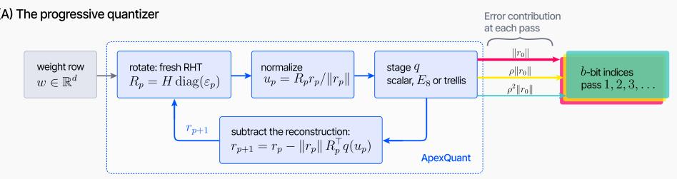
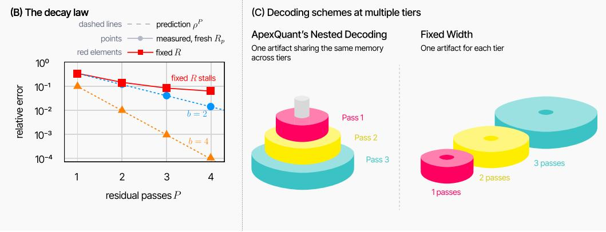
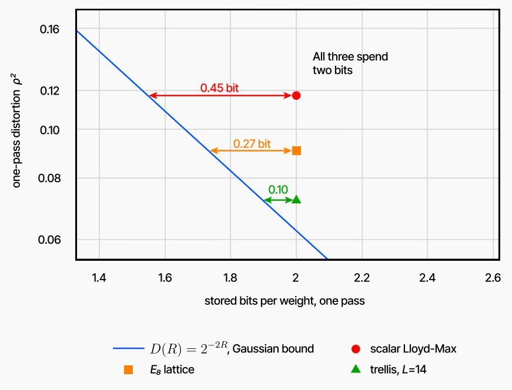
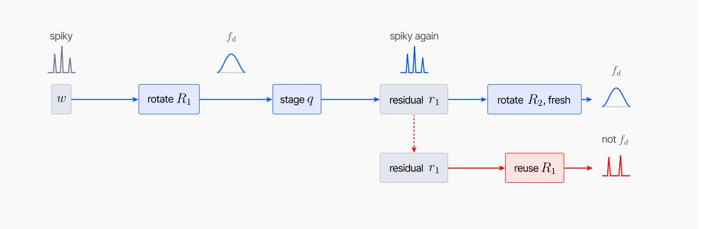
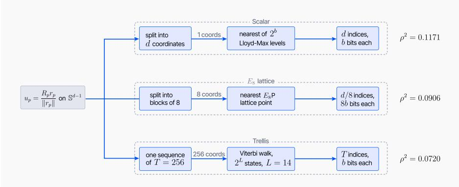
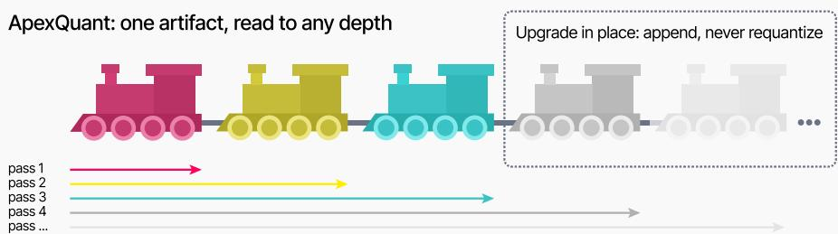
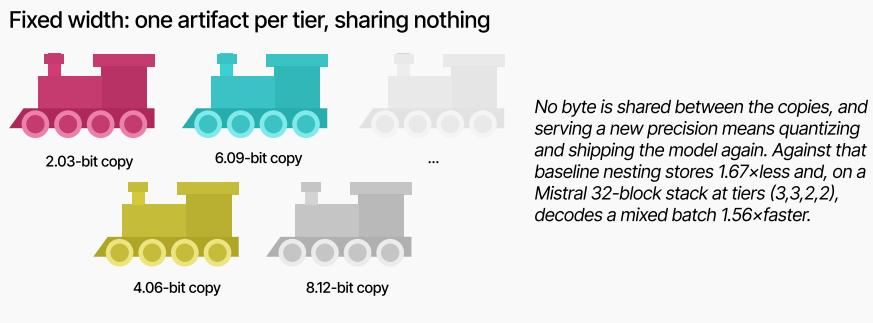
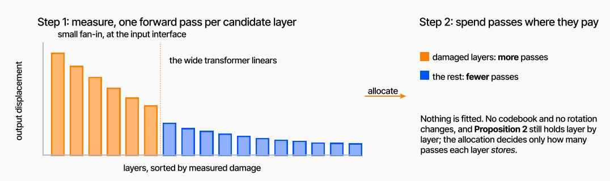

# APEXQUANT: DATA-FREE ELASTIC QUANTIZATION BY RESIDUAL RE-ISOTROPIZATION

Aksel Fristrup   
Department of Computer Science   
University of Copenhagen   
Denmark   
aksel@henselian.com   
Ankit Kariryaa   
Department of Computer Science   
University of Copenhagen   
Denmark   
ak@di.ku.dk

Sumit Pandey Towards Deep Learning sumitpandey171@gmail.com

## ABSTRACT

We introduce ApexQuant, a calibration-free quantization method that recursively re-quantizes the residual error, serving as a refinement layer on top of existing quantizers. We establish that a fresh random rotation returns each residual to the uniform distribution on the hypersphere, which characterizes the rate of progressive error decay across successive passes. This result lets us determine, before any weight is read, how many passes a layer needs for a target weight-space error. Every prefix is itself a valid lower-rate model, so one artifact serves several precisions. We instantiate ApexQuant with three interchangeable stages, scalar, $E _ { 8 }$ and trellis, and validate it on four open-weight LLMs and on Earth-observation and medical domains where in-distribution data is often unattainable as imagery arrives under restrictive licences or due to patient material under privacy constraints. Progressive re-isotropization comes within a few percent of full precision at four bits and gives the best two-bit arm we measure, in a completely data-free setting.

## 1 INTRODUCTION

Large neural networks have become indispensable across scientific computing, software development and natural-language applications, and their resource demands are growing at least as fast as their capabilities (Selvan, 2025). Weight-only post-training quantization (PTQ), which replaces high-precision weights with a compact low-precision representation while requiring neither retraining nor architectural change, has therefore become the dominant route to memory- and computeefficient inference.

PTQ methods differ most consequentially in the data they require. Calibration-dependent methods fit quantization parameters to a held-out calibration set; calibration-free methods require no data at all, and can therefore quantize a model the moment its weights exist. Calibration-free approaches avoid calibration-data bias entirely and remain applicable even when suitable calibration corpora cannot be assembled. Model hubs such as Hugging Face (Fioravanti, 2025) now host over three million models spanning language, vision, audio and scientific domains; assembling a representative calibration set for these models is a challenging task and often infeasible due to legal restrictions. Earth-observation imagery, for instance, is often subject to licensing restrictions that prohibit redistribution, and sensitive clinical data remain confined to the institutions that collect them. A quantizer that requires no data sidesteps these obstacles entirely. Nonetheless, at low bit-widths calibrationfree quantizers have trailed calibration-dependent ones.

  
Every pass draws a fresh rotation and reuses the same codebook (Proposition 1), so each contributes a factor ρ (Proposition 2)

  
Figure 1: ApexQuant: the progressive quantizer end to end. (A) The three arrows into the index store are the error each pass contributes, $1 : \rho : \rho ^ { 2 }$ , so later passes cost the same bits and correct geometrically less. (B) Dashed: the prediction $\rho ^ { F }$ , a quadrature over $f _ { d }$ as established in proposition 2, with b=2 bits in blue, and b=4 bits in orange. Markers: difference measured on eight Clay v1.5 layers, agreeing to at least three decimals at every pass. Red: b = 2 bits with the rotation held fixed, the counterfactual to Proposition 1. (C) A prefix of the passes is bit-for-bit a valid lower-rate model, so one artifact serves every tier from one weight stream and a mixed batch reads each pass once. Storing one artifact per tier instead shares nothing, which is the six blocks against ten: measured on a Mistral block stack at tiers (3, 3, 2, 2), nesting stores 6.09 against 10.16 bits per weight and decodes 1.56× faster (section 5.2, section H).

Rotation-based methods, which dominate the state of the art at low bit-widths, show that the distribution can be fixed by construction. Multiplying the weights by a random orthogonal transform, known as incoherence processing, suppresses outliers, after which the rotated weights are quantized, either by adaptive rounding (Ashkboos et al., 2024) or codebook lookup (Tseng et al., 2024b; Chee et al., 2023). The consequence we exploit is that rotation renders the source distribution known a priori, so optimal codebooks can be designed analytically, without observing any data. However, these codebooks are tied to a single bit-width chosen at quantization time. Several methods do support multiple bit-widths, including Any-Precision LLM (Park et al., 2024), MoBiQuant (Wang et al., 2026) and AnyBCQ (Park et al., 2026), but all require calibration or training data. To our knowledge, no calibration-free elastic method exists.

In this paper we introduce ApexQuant, a progressive PTQ method whose central contribution is calibration-free elasticity, formalized by the progressive decay law (proposition 2). A single stored model exposes a ladder of bit-widths to be chosen on demand. The method rests on the classical principle of successive refinement of information (Equitz & Cover, 1991): each pass rotates the current residual into a fresh frame, rounds it with the same data-free density-matched codebook, and subtracts the reconstruction, so $P$ passes yield a nested code whose every prefix is itself a valid quantized model. We bring this elasticity to three stages, the scalar Lloyd–Max codebook, QuIP#’s $E _ { 8 }$ lattice and QTIP’s trellis. To make this elasticity hardware-efficient, we ship custom Triton kernels for the full pipeline: a register-resident Viterbi encoder that quantizes at 198M weights per second (68× over a reference implementation), and fused dequantizemultiply kernels that serve mixed-precision batches from packed indices without reconstructing 16- bit weights. An optional single-batch calibration pass can further tighten the per-layer bit allocation with minimal data dependence (section I). Code, kernels and reproduction scripts are available here: https://github.com/afristrup/ApexQuant.

Table 1: The methods closest to ours, on the three axes of this section. The data column is what a method must read besides the weights, and the last is how many bit-widths one stored model serves. ApexQuant reads none, with the single optional exception of section I.
<table><tr><td>Method</td><td>Data used</td><td>Quantizer</td><td>Bit-widths</td></tr><tr><td>GPTQ, AWQ, OmniQuant</td><td>calibration set</td><td>scalar</td><td>one</td></tr><tr><td>AQLM</td><td>calibration set</td><td>vector</td><td>one</td></tr><tr><td>QuaRot</td><td>calibration set</td><td>scalar</td><td>one</td></tr><tr><td>QuIP#, QTIP</td><td>calibration set (Hessian)</td><td>vector</td><td>one</td></tr><tr><td>HQQ</td><td>none</td><td>scalar</td><td>one</td></tr><tr><td>SINQ</td><td>none</td><td>scalar</td><td>one</td></tr><tr><td>TurboQuant</td><td>none</td><td>scalar</td><td>one</td></tr><tr><td>Any-Precision LLM</td><td>calibration set (seed)</td><td>scalar</td><td>several</td></tr><tr><td>MatQuant</td><td>10–100M tokens</td><td>scalar</td><td>several</td></tr><tr><td>Drop-by-Drop</td><td>1024 samples</td><td>vector</td><td>several</td></tr><tr><td>MoBiQuant</td><td>128 sequences, 20 epochs</td><td>scalar</td><td>several</td></tr><tr><td>AnyBCQ</td><td>512 sequences</td><td>scalar</td><td>several</td></tr><tr><td>ApexQuant (ours)</td><td>none</td><td>scalar or vector</td><td>several</td></tr></table>

First, we establish the optimality of progressive refinement at every pass. The enabling result is re-isotropization (proposition 1): a fresh Haar rotation restores the residual’s spherical marginal $f _ { d } .$ Whichever codebook is optimal in its class is still optimal at every pass, so nothing is ever re-fitted (corollary 1), and since the argument never uses coordinate structure it covers the lattice and trellis stages too. Without the fresh rotation the decay stalls, the residual retaining the structure the previous stage left behind (fig. 1B). Our theory is stated for Haar rotations; in practice, like QuIP# and QTIP, we use the randomized Hadamard transform, which keeps the rotation O(d log d). The gap between the two is at most two parts in a thousand on real weights (section B).

Second, we derive the resulting progressive decay law in closed form (proposition 2): $\mathrm { e r r } ( P ) = \rho ^ { P }$ in relative root-mean-square error, the constant from a quadrature over a density that is fully determined prior to observing any weights. This prediction agrees with the error measured on pretrained weights to three decimal places (fig. 1B), and the same constant, without refitting, generalizes to non-language domains (section 5.3).

Third, we extend the theory to deployment. Because the two-bit representation is the first pass of the four-bit one, a deployment that needs both precisions stores a single artifact rather than two independent files, and the model can be upgraded in place by appending indices. We demonstrate this nesting on Mistral-7B, where each transformer block is assigned one of two precisions (two or three passes, corresponding to approximately 4 or 6 bits per weight), yielding a mixed-precision configuration (3, 3, 2, 2) across blocks. Compared to the baseline of storing and loading one independent artifact per precision, the fused kernels decode this mixed-precision batch in 13.95 ms versus 21.76 ms (1.56× faster) and require 6.09 versus 10.16 bits per weight (1.67× less storage), because the shared prefix is read from memory only once (section 5.2). The two-bit prefix alone is not competitive as a standalone model; a calibrated trellis at that rate is far better (section G). Against five published data-free baselines at measured storage, ApexQuant achieves the lowest KL at two bits on all four language models and, at four bits, the lowest among methods stored at our rate; against the published elastic methods it leads at four bits and trails a calibrated trellis at both rates (section G). As the method requires only weight access, it applies without modification to Earth observation and medical imaging (section 5.3).

## 2 BACKGROUND AND RELATED WORK

We consider three design axes for PTQ: the data requirement, the quantization dimension and the elasticity. Table 1 places the methods closest to ours on all three.

The majority of post-training quantization methods require calibration data: GPTQ, AWQ and OmniQuant round each weight with parameters fitted on a calibration set (Frantar et al., 2023; Lin et al.,

2024; Shao et al., 2024) and AQLM learns additive vector codebooks from data (Egiazarian et al.,   
2024). Other works removes this requirement, either through analytic bias correction (Nagel et al.,   
2019) or through a synthesized calibration set (Cai et al., 2020; Xu et al., 2020).

Among calibration based methods, the lowest reconstruction errors at low-bit results are achieved by rotation-based approaches, which transform the weight matrix with a random orthogonal matrix, in practice a randomized Hadamard transform (RHT), before quantizing it (Ashkboos et al., 2024). The rotation suppresses outliers by rendering it unlikely that any single entry is large relative to the matrix’s Frobenius norm, a property called incoherence (Chee et al., 2023), and QuIP# showed the RHT delivers it with high probability at $\Theta ( d )$ sign flips and $\Theta ( d \log d )$ additions (Tseng et al., 2024a). The rotation has a second, distributional consequence rooted in classical spherical geometry: under a Haar-random rotation the transformed vector is uniform on the sphere, so each coordinate’s marginal density is known in closed form (Fang et al., 1990).

Lemma 1 (Spherical marginal). If u is uniform on $\mathbb { S } ^ { d - 1 } = \left\{ \mathbf { x } \in \mathbb { R } ^ { d } : \| \mathbf { x } \| _ { 2 } = 1 \right\}$ , each coordinate $u _ { i }$ has density

$$
f _ { d } ( t ) = { \frac { \Gamma { \bigl ( } { \frac { d } { 2 } } { \bigr ) } } { \sqrt { \pi } \Gamma { \bigl ( } { \frac { d - 1 } { 2 } } { \bigr ) } } } { \bigl ( } 1 - t ^ { 2 } { \bigr ) } ^ { \frac { d - 3 } { 2 } } , \qquad t \in [ - 1 , 1 ] ,\tag{1}
$$

$$
\begin{array} { r } { s o \left( u _ { i } + 1 \right) / 2 \sim \mathrm { B e t a } ( \frac { d - 1 } { 2 } , \frac { d - 1 } { 2 } ) , \mathbb { E } [ u _ { i } ] = 0 a n d \mathrm { V a r } ( u _ { i } ) = 1 / d . } \end{array}
$$

As d grows this Beta distribution, rescaled by ${ \sqrt { d } } ,$ converges to a Gaussian, a fact exploited by Tseng et al. (2024a) and Tseng et al. (2024b) in their codebook design. The second design axis is quantization dimension: encoding blocks of weights jointly rather than individuals yields lower distortion at a given rate, which is the classical advantage of vector quantization (Gersho & Gray, 1992). QuIP# encodes blocks of eight rotated weights with the fixed $E _ { 8 }$ lattice codebook (Tseng et al., 2024a), and QTIP encodes sequences of about 256 weights with a trellis code whose codewords are computed on the fly rather than stored in a table (Tseng et al., 2024b). Both operate at one fixed bit-width, so serving another means re-quantizing and re-distributing the model.

Orthogonal to the rotation based-approaches, two data-free methods quantize unrotated weights and instead exploit structure that the rotation deliberately removes. HQQ fits a per-group affine mapping by minimising an $l _ { p }$ norm with $p { < } 1$ , whose sub-quadratic penalty on large residuals is better matched to the heavy-tailed marginals of unrotated weights than a least-squares objective (Badri & Shaji, 2023); the method operates at group size 64, which adds approximately $0 . 4 7$ bits per weight relative to $g { = } 5 1 2$ but reduces the sensitivity of its min–max scale estimate to outliers. SINQ estimates per-column scales by Sinkhorn-normalising the row and column variances of $W$ obtaining a data-free approximation to the activation-aware column scaling of AWQ (Muller et al.,¨ 2025); its calibrated variant A-SINQ replaces those variance-derived scales with activation-fitted ones. Both methods appear as baselines in section 5 at their native and at matched bit-budgets. Since the rotation that provides us with a closed-form density also eliminates the tail shape and variance heterogeneity on which HQQ and SINQ rely, the three approaches represent structurally distinct strategies within data-free quantization.

Several methods support precision that can be selected after training, though all require calibration or training data to do so. Any-Precision LLM constructs an 8-bit model whose leading bits already form the lower-bit models (Park et al., 2024), MatQuant trains integer weights such that their leading bits remain functional at $^ { 8 , }$ 4 and 2 bits(Nair et al., 2025), and Drop-by-Drop learns additive codebooks in which each stage refines the reconstruction of the previous one (Babaoglu et al., 2026). MoBiQuant quantizes the residuals into 1-bit slices and trains a router to select each token’s precision at inference time (Wang et al., 2026). AnyBCQ extends binary-coded quantization to the multi-precision setting by progressively adding residual bit-planes whose binary codes are frozen at each level, so a single model supports 2- through 4-bit inference with a hardware-friendly bit-plane kernel (Park et al., 2026).

The residual quantization mechanism we employ has a long history. Multi-stage vector quantization originated in speech coding (Juang & Gray, 1982), and modern neural audio codecs are built on the same principle: SoundStream and EnCodec quantize each residual with a further codebook, so a prefix of the stages already decodes at a lower rate (Zeghidour et al., 2022; Defossez et al., 2023).´ The distinction from prior work is that those systems train their codebooks on on the data being compressed and apply a single rotation fitted once and retained, whereas in our construction the rotation is redrawn independently at every pass and fitted to no data, which enables proposition 1 and yields a closed form expression for the distortion curve .

## 3 RE-ISOTROPIZATION AND THE PROGRESSIVE DECAY LAW

Proposition 1 (Re-isotropization). Let $r ~ \in ~ \mathbb { R } ^ { d } ~ \backslash$ {0} be a random vector and let R be Haardistributed on $O ( d )$ (drawn uniformly at random from the group of $d \times d$ orthogonal matrices), independent of r. Then $u : = R r / \| R r \|$ is uniform on $\mathbb { S } ^ { d - 1 }$ and independent of $\| r \| ;$ in particular each coordinate ofu has marginal $f _ { d } ,$ regardless ofthe distribution ofr.

Intuitively, a uniformly random rotation scrambles any input direction so that the result points uniformly in all directions on the sphere, regardless of where it started.

Since r may have any distribution, and in particular may be the original weight vector or the residual of a previous pass, the statement applies at every pass (proof in section $\mathbf { A } )$ . Setting $r _ { 0 } ~ = ~ w$ and drawing mutually independent Haar rotations $R _ { 0 } , R _ { 1 } , \ldots ,$ , each also independent of $w ,$ pass $p$ computes

$$
s _ { p } = \Vert r _ { p } \Vert , \qquad u _ { p } = R _ { p } r _ { p } / s _ { p } , \qquad r _ { p + 1 } = r _ { p } - s _ { p } R _ { p } ^ { \top } q ( u _ { p } ) ,\tag{2}
$$

where $q$ is the fixed stage quantizer, applied coordinate-wise in the scalar case and to blocks otherwise. Each $r _ { p + 1 }$ is a deterministic function of $( w , R _ { 0 } , \ldots , R _ { p } )$ , which makes $R _ { p + 1 }$ independent of it, so the proposition applies inductively at every pass.

In practice, as in QuaRot, QuIP# and QTIP, we use the randomized Hadamard transform $R =$ $H \bar { \mathrm { d i a g } } ( \varepsilon )$ , a finite family inside $O ( d )$ , so the orbit of a point under it is finite and proposition 1 is false for it as stated. The gap is quantitative: on pretrained weights the deployed per-pass ratio departs from the Haar prediction by at most 1.6% on individual layers at the first pass and by less than three parts in ten thousand at every later pass. Substituting a dense random-orthogonal rotation, which does satisfy proposition 1, moves the end-to-end error by at most two parts in a thousand at every $P$ (section B).

Corollary 1 (One codebook is optimal at every pass). Under equation 2 the law (probability distribution) of $u _ { p }$ is the same for every $p \geq 0$ . Let C be any class of codebooks $C \subset \mathbb { R } ^ { d } ( e . g .$ ., all $2 ^ { b }$ -level product codebooks, or all $E _ { 8 }$ lattice codebooks) and write $D ( C ) = \mathbb { E } _ { u } \operatorname { d i s t } ( u , C ) ^ { 2 }$ for the expected squared distance from u uniform on $\mathbb { S } ^ { d - 1 }$ to its nearest codeword. $H C ^ { \star }$ minimizes $D$ over ${ \mathcal { C } } ,$ then nearest-codeword rounding to $C ^ { \star }$ minimizes $\mathbb { E } \Vert u _ { p } - q ( u _ { p } ) \Vert ^ { 2 }$ at every residual pass among all quantizers with values in a member $o f { \mathcal { C } } ,$ , and no per-pass re-fitting ofthe codebook can improve on it in expectation. For $\mathcal { C }$ the $2 ^ { b }$ -level product codebooks, $C ^ { \star }$ is the Lloyd–Max codebookfor $f _ { d }$ in every coordinate; for blocks of eight $\mathcal { C }$ ranges over $E _ { 8 }$ codebooks such as E8P, andfor blocks ofT over trellis codes.

Since the class $\mathcal { C }$ is unrestricted, each stage listed in table 2 is a direct instantiation of the corollary: setting $\mathcal { C }$ to the set of $2 ^ { b }$ -level product codebooks yields the Lloyd–Max codebook for $f _ { d }$ as $C ^ { \star }$ setting it to $E _ { 8 }$ codebooks or to trellis codes of a given constraint length yields the corresponding optimum. In each case the optimal codebook is computed once, independently of the model weights, and reused without modification at every pass.

Two qualifications apply, and neither of which concern the scale $s _ { p } .$ , which is unconstrained and is re-estimated at every pass. First, the corollary compares codebooks within a class and does not rank codebooks across classes: it establishes that the optimum within a class is invariant across passes, but the ordering between the scalar, $E _ { 8 }$ and trellis stages is determined by the empirical $\rho ^ { 2 }$ values reported in table 2. Second, the distortion measure is squared error on the normalized residual direction, a weight-space proxy rather than end-to-end quality, which is why section 5 reports KL alongside $\rho .$

Proposition 2 (Progressive decay law). Let q be any measurable stage quantizer with stage distortion $\dot { \rho } ^ { 2 } = \mathbb { E } _ { u } \Vert u - \check { q } ( u ) \Vert ^ { 2 }$ , u uniform on $\mathbb { S } ^ { d - \hat { 1 } }$ . Then under equation $2 , \mathbb { E } \big [ \| r _ { p + 1 } \| ^ { 2 } \big ] = \rho ^ { 2 } \mathbb { E } \big [ \| r _ { p } \| ^ { 2 } \big ]$ for every $p ,$ and hence $\sqrt { \mathbb { E } \| r _ { P } \| ^ { 2 } } / \| w \| = \rho ^ { P }$ . If q applies one block quantizer $q _ { B }$ to each of the $d / B$ blocks of B coordinates, then with $f _ { d , B }$ the law of any B coordinates of u,

$$
\rho ^ { 2 } \ = \ \frac { \mathbb { E } _ { x \sim f _ { d , B } } \lVert x - q _ { B } ( x ) \rVert ^ { 2 } } { \mathbb { E } _ { x \sim f _ { d , B } } \lVert x \rVert ^ { 2 } } \ = \ \frac { d } { B } \mathbb { E } _ { x \sim f _ { d , B } } \lVert x - q _ { B } ( x ) \rVert ^ { 2 } ,\tag{3}
$$

  
Figure 2: The rate loss of table 2, read off the rate–distortion bound. Each stage sits above the Gaussian bound $D ( R ) = 2 ^ { - 2 R }$ by a horizontal distance measured in bits, and strengthening the stage, from rounding one coordinate at a time to choosing 256 together, closes that distance from 0.45 to 0.10 bits. That distance is proposition 3’s $\Delta _ { 1 }$ , and $P$ passes pay exactly $P$ of them: successive refinement is costless for a Gaussian source, but only for a stage that achieves $D ( R )$ exactly. Measured rather than argued in section D.

$$
w h i c h a t B = 1 r e a d s \rho ^ { 2 } = d \mathbb { E } _ { t \sim f _ { d } } [ ( t - q ( t ) ) ^ { 2 } ] .
$$

Both integrals in equation 3 are quadratures over a density known in closed form (lemma 2), so the error curve and the pass rule $P \overset { \cdot } { = } \lceil \ln \varepsilon / \ln \rho \rceil$ are available before any weight is read. The proof (section A) depends only on the fact that $R _ { p }$ is an isometry and that $u _ { p }$ is independent of $s _ { p }$ with a law that does not vary with $p ;$ it never uses the coordinate structure of $q .$ Consequently, a stage that does not factor over blocks, such as a trellis code over $T$ coordinates, is accommodated by the definition of $\rho ^ { 2 }$ directly. The quantity $\rho ^ { P }$ measures the gap between the achieved distortion and the rate–distortion bound, incurred once per pass, and is therefore a property of the stage quantiser rather than of the recursion itself; it is reduced by improving the stage, as reflected in the rate-loss column of table 2.

Lean 4 check. All results in this section except proposition 3, which is arithmetic, is machinechecked against Mathlib with no axiom of its own (section A).

Proposition 3 (The price of elasticity). Let a stage have per-pass ratio $\rho ^ { 2 }$ at b bits per coordinate, and write $\Delta _ { 1 } \ : = \ : b ^ { \ : ^ { . } } + \ : \frac { 1 } { 2 } \log _ { 2 } \rho ^ { 2 }$ for its distance in bits to the Gaussian rate–distortion function $D ( R ) = 2 ^ { - 2 R }$ . Then $P$ passes store Pb bits and reach $\rho ^ { 2 P }$ , which an optimal code reaches at $P b - P \Delta _ { 1 }$ , so the greedy penalty is exactly $P \Delta _ { 1 }$ 1.

Successive refinement is free for a Gaussian source under an optimal stage (Equitz & Cover, 1991); proposition 3 shows that a suboptimal stage incurs exactly $\Delta _ { 1 }$ additional bits per pass, with the penalty accumulating additively rather than multiplicatively. The rate-loss column of table 2 reports $\Delta _ { 1 }$ for each stage, and it is this quantity that improved stage design reduces, as visualized in fig. 2. Corollary 1 establishes optimality within a codebook class, not relative to the rate–distortion function $D ( R )$ ; the property the construction preserves is that every pass operates in the same fixed format.

Table 2: The three stages evaluated at two bits per weight. $\rho ^ { 2 }$ is the single-pass error of equation 3, the published column reports the values given by QTIP and QuIP# for a Gaussian source; and rate loss denotes the additional bits per pass relative to the final row, computed as $\textstyle \frac { 1 } { 2 } \log _ { 2 } ( \rho ^ { 2 } / \rho _ { \mathrm { R D } } ^ { 2 } )$ from our measured column. The trellis row uses $L = 1 4$ , the widest our kernel accelerates (section C).
<table><tr><td>Stage</td><td>Dim.</td><td> $\rho ^ { 2 } \ \mathrm { ( o u r s ) }$ </td><td> $\rho ^ { 2 } \ \mathrm { ( p u b l . ) }$ </td><td>Rate loss (bits/pass)</td><td>Encoding</td></tr><tr><td>Scalar Lloyd–Max</td><td>1</td><td>0.1171</td><td>0.118</td><td>0.45</td><td>nearest of  $2 ^ { b }$  values</td></tr><tr><td> $E _ { 8 }$  lattice</td><td>8</td><td>0.0906</td><td>0.089</td><td>0.27</td><td>nearest lattice point</td></tr><tr><td>Trellis  $( L = 1 4 )$ </td><td>256</td><td>0.0720</td><td>0.069</td><td>0.10</td><td>Viterbi search</td></tr><tr><td>Rate-distortion bound</td><td>∞</td><td></td><td>0.0625</td><td>0</td><td></td></tr></table>

## 4 APEXQUANT

ApexQuant acts as a refinement layer on top of existing quantizers, in the spirit of multistage quantization (Juang & Gray, 1982): because the decay law constrains the stage quantizer only through its distortion (proposition 2), equation 3 fixes the error curve of whichever stage is dropped in. We instantiate the layer with three data-free quantizers, called stages as in the multistage literature, in increasing order of strength; table 2 collects their $\rho ^ { 2 }$ constants, and fig. 4 visualizes the encoding flow.

## 4.1 THREE DATA-FREE STAGES

Scalar. The scalar stage rounds each coordinate of u to the nearest value of the Lloyd–Max codebook for $f _ { d }$ from section 2, giving $\rho ^ { 2 } = 0 . 1 1 7 1$ at b = 2 and $d = 5 1 2$ , which is within one percent of the 0.118 that TurboQuant published Zandieh et al. (2025). The codebook is the same as in TurboQuant, which proposed it for KV cache quantization, and is determined entirely by $f _ { d } .$ Since quantization requires no optimization, the quantized model is available immediately upon encoding.

$E _ { 8 }$ lattice. The lattice stage rounds eight coordinates at a time to the nearest point of the $E _ { 8 }$ lattice, the densest sphere packing in eight dimensions (Viazovska, 2017), using the compact codebook of QuIP# (Tseng et al., 2024a). On rotated unit vectors we measure $\rho ^ { \bar { 2 } } \ : = \ : 0 . 0 9 \bar { 0 6 }$ , within two percent of the 0.089 that QuIP# publishes. At three or more bits, QuIP# also recurses on the residual but without a fresh rotation between rounds, which is the key ingredient that enables the data-free elasticity of section 4.2 and without which the decay stall. As with the scalar stage, the quantized model is available immediately upon encoding.

Trellis. Trellis coded quantization (Marcellin & Fischer, 1990) encodes T coordinates as a walk on a $2 ^ { L }$ -state graph, the minimum-error walk being found by the Viterbi algorithm (Forney, 1973) in $O ( 2 ^ { L } T )$ time rather than the $2 ^ { b T }$ of an unstructured codebook. We adopt QTIP’s bitshift trellis with lookup-free computed codes (Tseng et al., 2024b), which stores neither graph nor codebook and so is as data-free as the other two stages, and we replace its Hessian-guided rounding step with our residual passes. On rotated unit vectors we measure $\rho ^ { 2 } = 0 . 0 7 2 0$ at $L = 1 4$ , a configuration reached by the Triton Viterbi encoder we contribute (section C).

The rate-loss column of table 2 is proposition 3’s $\Delta _ { 1 }$ , against the Gaussian bound $\rho ^ { 2 } = 2 ^ { - 4 } =$ 0.0625 at two bits (Cover & Thomas, 1991). It falls with the dimension quantized jointly, 0.45 bits for the scalar stage, 0.27 for $E _ { 8 }$ , 0.10 for the trellis.

## 4.2 ELASTIC INFERENCE

Since each pass quantizes only the residual and never changes the output of previous passes, a model quantized with $\dot { P }$ passes can be read at any prefix $P ^ { \prime } \leq \mathsf { \bar { \boldsymbol { P } } }$ and the result is bit-identical to a run stopped at $P ^ { \prime }$ . We call this nested decoding. Reading the first $P ^ { \prime }$ passes of the stored payload is not an approximation of the $P ^ { \prime }$ -pass artifact, it is that artifact, checked by byte comparison in section 5.2. Therefore, one stored file serves several precisions, a deployed model upgrades to $P + 1$ passes in place by appending indices, and a batch may mix quality tiers at the cost of its deepest tier alone.

Table 3: Language models, $\mathrm { K L } ( p _ { \mathrm { f p 1 6 } } \parallel p _ { \mathrm { q u a n t } } )$ in nats per token on WikiText-2 raw at sequence length 2048, lower is better. Bits per weight is measured storage including side information, which puts the group-size-64 arms of HQQ and SINQ at 4.50 and 4.53 against our 4.06; both also appear at $g = 5 1 2$ , matched to ours. SINQ’s overhead is shape-dependent, so its entries are bounds. In the 4-bit class the scalar stage is one pass at four bits and the vector stages two passes at two, the only 4-bit form here keeping a valid 2-bit prefix. Every variant here is data-free; and section D includes the extended results with the calibrated counterpart A-SINQ as well as perplexity, tail percentiles, the $l _ { p }$ codebook and a group-size sweep. Model abbreviations: TL = TinyLlama-1.1B, Phi=Phi-1.5, Mist.=Mistral-7B, and Qwen = Qwen2.5-7B.
<table><tr><td></td><td colspan="5">4-bit class</td><td colspan="5">2-bit class</td></tr><tr><td>Method</td><td>b/w</td><td>TL</td><td>Phi</td><td>Mist.</td><td>Qwen</td><td>b/w</td><td>TL</td><td>Phi</td><td>Mist.</td><td>Qwen</td></tr><tr><td>RTN-absmax</td><td>4.03</td><td>4.419</td><td>0.130</td><td>0.247</td><td>0.148</td><td>2.03</td><td>8.056</td><td>6.742</td><td>8.939</td><td>14.532</td></tr><tr><td>QuaRot-RTN</td><td>4.03</td><td>0.116</td><td>0.059</td><td>0.054</td><td>0.072</td><td>2.03</td><td>8.144</td><td>2.552</td><td>8.543</td><td>4.217</td></tr><tr><td>SINQ, g = 64</td><td>≤4.53</td><td>0.035</td><td>0.028</td><td>0.019</td><td>0.039</td><td>2.53</td><td>4.537</td><td>1.431</td><td>2.107</td><td>6.152</td></tr><tr><td>SINQ, g = 512</td><td>≤ 4.09</td><td>0.069</td><td>0.050</td><td>0.040</td><td>0.096</td><td>2.09</td><td>10.230</td><td>4.476</td><td>8.887</td><td>9.985</td></tr><tr><td>HQQ, g = 64</td><td>4.50</td><td>0.046</td><td>0.033</td><td>0.025</td><td>0.044</td><td>2.50</td><td>8.115</td><td>1.912</td><td>6.361</td><td>4.091</td></tr><tr><td>HQQ,  $g = 5 1 2$ </td><td>4.06</td><td>0.095</td><td>0.068</td><td>0.050</td><td>0.096</td><td>2.06</td><td>8.223</td><td>6.731</td><td>8.215</td><td>12.294</td></tr><tr><td>ApexQuant, scalar</td><td>4.03</td><td>0.074</td><td>0.040</td><td>0.037</td><td>0.049</td><td>2.03</td><td>7.188</td><td>1.160</td><td>4.392</td><td>1.334</td></tr><tr><td>ApexQuant,  $E _ { 8 } \mathrm { P }$ </td><td>4.06</td><td>0.062</td><td>0.035</td><td>0.030</td><td>0.043</td><td>2.03</td><td>5.756</td><td>0.693</td><td>2.836</td><td>0.681</td></tr><tr><td>ApexQuant, trellis</td><td>4.06</td><td>0.040</td><td>0.022</td><td>0.019</td><td>0.027</td><td>2.03</td><td>3.201</td><td>0.447</td><td>1.903</td><td>0.477</td></tr></table>

That last property is where nesting provides its principal advantage, as it nests the execution path and not merely the stored representation. Rows are sorted by descending precision tier, so that the rows consuming pass $p$ form a contiguous prefix; the matrix multiplication then proceeds through passes in order, with pass one read once for the entire batch and pass two read only for rows requiring two or more passes. The resulting weight traffic equals that of the highest-precision tier alone, rather than the sum across individual rows. By contrast, fixed-width elasticity, i.e. one artifact per tier, shares no data between tiers and incurs precisely that sum (section 5.2, section H, which also distinguishes this mechanism from speculative decoding).

At inference, the stored representation is never decompressed into 16-bit weights: since $x ^ { \top } \widehat { w } =$ $s ( R x ) ^ { \top } q ( u )$ , the fused kernels rotate the activation once per pass and multiply directly against codebook values gathered from the stored Pb-bit indices.

## 5 EXPERIMENTS

Setup. We evaluate TinyLlama-1.1B (Zhang et al., 2024), Phi-1.5 (Li et al., 2023), Mistral-7B (Jiang et al., 2023) and Qwen2.5-7B (Qwen Team, 2024) on WikiText-2 raw at sequence length 2048 (Merity et al., 2017), and beyond language (section 5.3), the Earth observation foundation model Clay v1.5 (Clay Foundation, 2024) on EuroSAT (Helber et al., 2019) and the pathology foundation model UNI (Chen et al., 2024) on PatchCamelyon (Veeling et al., 2018). Our primary metric is $\mathrm { K L } ( p _ { \mathrm { o r i g } } \parallel p _ { \mathrm { q u a n t } } )$ per token against the unquantized model, following the model-preservation view of Dutta et al. (2024).

Table 3 compares ApexQuant against five published baselines at comparable bit use. The complexity ladder of table 2 is preserved throughout: trading the scalar stage for the trellis is worth 1.8 to 1.9× in KL at four bits and 2.2 to 2.8× at two. The same ordering holds end to end on Gemma-3- 12B (section F). ApexQuant, trellis performs best in the 2-bit class. In the 4-bit class, SINQ at $\scriptstyle \mathbf { g } = 6 4$ matches it on Mistral and surpasses it on TinyLlama, albeit at half a bit more budget. At comparable bit budget, ApexQuant, trellis outperforms all baselines. Classification accuracy on standard benchmarks confirms this ordering (table 8).

## 5.1 THE PROGRESSIVE DECAY LAW HOLDS ON REAL WEIGHTS

The prediction of proposition 2, derived without access to any model weights, agrees with the empirical values on pretrained weights to at least three decimal places at every pass. Over eight Clay v1.5 layers at $d = 5 1 2$ the measured relative error runs 0.3419, 0.1170, 0.0400, 0.0137 across one to four passes at $b = 2$ against a predicted $0 . 3 4 2 2 ^ { P }$ . At b = 4 it runs 0.0973, 0.0095, 0.0009, 0.0001 against $0 . 0 9 7 2 ^ { P }$ (fig. 1B). The per-pass ratios remain constant at 0.342 and 0.097, consistent with exact geometric decay rather than an empirically fitted trend.

Table 4: Results beyond language modeling, evaluated at the three precision tiers (2.06, 4.13 and 6.19 bits). KL divergence is against the same model at full precision. The Clay probe carries a standard error of 0.43 points, so only KL divergence separates its tiers. The KL protocol, the sampling procedure and each model’s quantized fraction are available in section E.
<table><tr><td>Model</td><td></td><td>full</td><td colspan="3">task metric (↑)</td><td colspan="3"> $\mathrm { K L } \left( \downarrow \right)$ </td></tr><tr><td></td><td>Task</td><td></td><td> $P { = } 1$ </td><td> $P { = } 2$ </td><td> $P { = } 3$ </td><td> $P { = } 1$ </td><td> $P { = } 2$ </td><td> $P { = } 3$ </td></tr><tr><td>Clay v1.5</td><td>EuroSAT</td><td>96.30</td><td>96.00</td><td>96.15</td><td>96.35</td><td>0.224</td><td>0.010</td><td>0.002</td></tr><tr><td>UNI</td><td>PatchCamelyon</td><td>87.81</td><td>85.34</td><td>86.68</td><td>87.56</td><td>0.641</td><td>0.033</td><td>0.003</td></tr></table>

In case the rotation is fixed across passes, the ratios climb 0.418, 0.597, 0.734 towards one, thus the decay stalls once the residual is no longer returned to $f _ { d } .$ Replacing the Hadamard transform with a dense random-orthogonal rotation, for which proposition 1 is exact, moves the error by at most two parts in a thousand at every pass count (section B). Perplexity shows the same order but by far smaller margins, which establishes the importance of KL as the primary metric (section D).

## 5.2 ELASTICITY IN OPERATION

Next, we show that elasticity comes at no cost to performance. Reading the first $P ^ { \prime }$ passes of a P-pass payload is bit-identical to quantizing with ${ \bf { \bar { \boldsymbol { P } } } } ^ { \prime }$ , checked by byte comparison on three published tiered models, thus raising the precision is an append operation and not a requantization. On Mistral-7B with 32 blocks assigned to two precisions in a (3, 3, 2, 2) configuration, our fused kernels decode a mixed-precision batch in 13.95 ms versus 21.76 ms when each precision is served from an independent artifact (1.56× faster), and require 6.09 versus 10.16 bits per weight (1.67× less stor age). Section H reports five serving scenarios, including the memory-bound regime where nesting provides no latency gain: inside that window every request costs the same regardless of precision, so the latency advantage requires a deep batch; the storage reduction holds unconditionally.

## 5.3 BEYOND LANGUAGE

Our construction is domain-agnostic as it only requires the weight metrics. Table 4 demonstrates this generality on foundation models from Earth observation and pathology. The tiers behave as predicted by the theory. Both encoders’ KL falls by roughly an order of magnitude per tier, 0.641 to 0.033 to 0.003 on UNI and 0.224 to 0.010 to 0.002 on Clay. The geometric decay of proposition 2 is thus observable in a downstream model-preservation metric, not solely in the weight-space $\rho .$

## 6 LIMITATIONS

Calibration data allows a quantizer to learn which weight perturbations are costly to the model’s output and steer rounding error away from them. ApexQuant treats all directions equally, and this is its dominant cost: on LLaMA2-7B a calibrated trellis (QTIP) reaches 5.17 perplexity versus our 5.61 at four bits and 5.86 versus 71.80 at two (section G). Proposition 1 is proved for Haar rotations; the deployed Hadamard transform does not satisfy its hypotheses, and the empirical gap of under two parts per thousand (section B) is a measurement, not a bound. The largest model we evaluate end to end is 7B parameters; the decay law has not been verified on a full forward pass at frontier scale.

## 7 CONCLUSION

In this paper we introduce ApexQuant, a calibration-free quantizier that recursively re-quantizes the residual. We establish that a fresh Haar rotation returns each residual to the same spherical marginal, so one codebook stays optimal at every pass, the error curve is available in the closed form before a weight is read, and every prefix is a valid lower-rate artifact. A model can therefore be quantized the moment its weights exist and the quantization is free from any calibration set bias.

In addition, the quantization is near-instant with the scalar, and E8 stages, and we introduce a fast Triton Viterbi encoder quantizes the models up to 68 times faster than the baseline. The resulting models outperform all calibration-free baselines at matched bit-budgets and substantially narrow the gap to their calibrated counterparts.

## AI USE STATEMENT

In this work, we used generative AI tools (such as Claude Opus 4.6, Claude Opus 5, Claude Fable 5 and others) for code development (Python/Triton kernels and Lean 4 formalization), drafting of parts of some sections based on author-provided structure, editing of text, and discovery of recent literature in the quantization domain. Additionally, we used generative AI tools for assistance with figure layout and styling. All proofs were done by hand originally but refined and verified with lean4 and LLMs in the loop. All generated code, and textual edits were manually reviewed by the authors. We take responsibility for the final content of this work, including text, claims or artifacts produced with the aid of generative AI.

## REFERENCES

Saleh Ashkboos, Amirkeivan Mohtashami, Maximilian L. Croci, Bo Li, Pashmina Cameron, Martin Jaggi, Dan Alistarh, Torsten Hoefler, and James Hensman. QuaRot: Outlier-free 4-bit inference in rotated LLMs. In Advances in Neural Information Processing Systems (NeurIPS), 2024.

Levent Babaoglu, Sheng Chen, and Ashish Khisti. Multi-bitwidth quantization for LLMs using additive codebooks. arXiv:2606.12876, 2026.

Hicham Badri and Appu Shaji. Half-quadratic quantization of large machine learning models, November 2023. URL https://mobiusml.github.io/hqq\_blog/.

Yaohui Cai, Zhewei Yao, Zhen Dong, Amir Gholami, Michael W. Mahoney, and Kurt Keutzer. ZeroQ: A novel zero shot quantization framework. In IEEE/CVF Conference on Computer Vision and Pattern Recognition (CVPR), pp. 13169–13178, 2020.

Jerry Chee, Yaohui Cai, Volodymyr Kuleshov, and Christopher De Sa. QuIP: 2-bit quantization of large language models with guarantees. In Advances in Neural Information Processing Systems (NeurIPS), 2023.

Richard J. Chen, Tong Ding, Ming Y. Lu, Drew F. K. Williamson, Guillaume Jaume, Andrew H. Song, Bowen Chen, Andrew Zhang, Daniel Shao, Muhammad Shaban, Mane Williams, Lukas Oldenburg, Luca L. Weishaupt, Judy J. Wang, Anurag Vaidya, Long Phi Le, Georg Gerber, Sharifa Sahai, Walt Williams, and Faisal Mahmood. Towards a general-purpose foundation model for computational pathology. Nature Medicine, 30:850–862, 2024.

Peter Clark, Isaac Cowhey, Oren Etzioni, Tushar Khot, Ashish Sabharwal, Carissa Schoenick, and Oyvind Tafjord. Think you have solved question answering? try arc, the ai2 reasoning challenge. arXiv preprint arXiv:1803.05457, 2018.

Clay Foundation. Clay foundation model v1.5: An open source AI model for earth observation, 2024. https://github.com/Clay-foundation/model.

Thomas M. Cover and Joy A. Thomas. Elements of Information Theory. Wiley-Interscience, New York, 1991.

Alexandre Defossez, Jade Copet, Gabriel Synnaeve, and Yossi Adi. High fidelity neural audio´ compression. Transactions on Machine Learning Research (TMLR), 2023.

Abhinav Dutta, Sanjeev Krishnan, Nipun Kwatra, and Ramachandran Ramjee. Accuracy is not all you need. Advances in Neural Information Processing Systems, 37:124347–124390, 2024.

Vage Egiazarian, Andrei Panferov, Denis Kuznedelev, Elias Frantar, Artem Babenko, and Dan Alistarh. Extreme compression of large language models via additive quantization. In International Conference on Machine Learning (ICML), 2024.

William H. R. Equitz and Thomas M. Cover. Successive refinement of information. IEEE Transac tions on Information Theory, 37(2):269–275, 1991.

Kai-Tai Fang, Samuel Kotz, and Kai Wang Ng. Symmetric Multivariate and Related Distributions. Chapman and Hall, London, 1990.

Ivan Fioravanti. Three million models and counting. https://huggingface.co/blog/ ivanfioravanti/three-million-models-and-counting, 2025. Hugging Face Blog, accessed 2026-09-25.

G David Forney. The viterbi algorithm. Proceedings of the IEEE, 61(3):268–278, 1973.

Elias Frantar, Saleh Ashkboos, Torsten Hoefler, and Dan Alistarh. GPTQ: Accurate post-training quantization for generative pre-trained transformers. In International Conference on Learning Representations (ICLR), 2023.

Allen Gersho and Robert M. Gray. Vector Quantization and Signal Compression. Kluwer Academic Publishers, 1992.

Aaron Grattafiori, Abhimanyu Dubey, Abhinav Jauhri, Abhinav Pandey, Abhishek Kadian, Ahmad Al-Dahle, Aieleen Letman, Akhil Mathur, Alan Schelten, et al. The LLaMA 3 herd of models. arXiv:2407.21783, 2024.

Patrick Helber, Benjamin Bischke, Andreas Dengel, and Damian Borth. Eurosat: A novel dataset and deep learning benchmark for land use and land cover classification. IEEE Journal ofSelected Topics in Applied Earth Observations and Remote Sensing, 12(7):2217–2226, 2019.

Albert Q. Jiang, Alexandre Sablayrolles, Arthur Mensch, Chris Bamford, Devendra Singh Chaplot, Diego de las Casas, et al. Mistral 7B. arXiv:2310.06825, 2023.

Biing-Hwang Juang and Augustine H. Gray. Multiple stage vector quantization for speech coding. In IEEE International Conference on Acoustics, Speech, and Signal Processing (ICASSP), volume 7, pp. 597–600, 1982.

Sakaguchi Keisuke, Ronan Le Bras, Bhagavatula Chandra, and Choi Yejin. Winogrande: An adversarial winograd schema challenge at scale. Proceedings of the AAAI Conference on Artificial Intelligence, 34(05):8732–8740, 04 2020. ISSN 2159-5399. doi: 10.1609/aaai.v34i05.6399. URL https://cir.nii.ac.jp/crid/1360579820082293504.

Yuanzhi Li, Sebastien Bubeck, Ronen Eldan, Allie Del Giorno, Suriya Gunasekar, and Yin Tat Lee.´ Textbooks are all you need II: phi-1.5 technical report. arXiv:2309.05463, 2023.

Ji Lin, Jiaming Tang, Haotian Tang, Shang Yang, Xingyu Dang, and Song Han. AWQ: Activationaware weight quantization for on-device LLM compression and acceleration. In Proceedings of Machine Learning and Systems (MLSys), 2024.

Zechun Liu, Changsheng Zhao, Igor Fedorov, Bilge Soran, Dhruv Choudhary, Raghuraman Krishnamoorthi, Vikas Chandra, Yuandong Tian, and Tijmen Blankevoort. SpinQuant: LLM quantization with learned rotations. arXiv:2405.16406, 2024.

Michael W Marcellin and Thomas R Fischer. Trellis coded quantization of memoryless and gaussmarkov sources. IEEE transactions on communications, 38(1):82–93, 1990.

Stephen Merity, Caiming Xiong, James Bradbury, and Richard Socher. Pointer sentinel mixture models. In International Conference on Learning Representations (ICLR), 2017.

Lorenz K. Muller, Philippe Bich, Jiawei Zhuang, Ahmet Celik, Luca Benfenati, and Lukas Cavigelli.¨ SINQ: Sinkhorn-normalized quantization for calibration-free low-precision LLM weights, 2025.

Markus Nagel, Mart van Baalen, Tijmen Blankevoort, and Max Welling. Data-free quantization through weight equalization and bias correction. In IEEE/CVF International Conference on Computer Vision (ICCV), pp. 1325–1334, 2019.

Pranav Nair, Puranjay Datta, Jeff Dean, Prateek Jain, and Aditya Kusupati. Matryoshka quantization. In International Conference on Machine Learning (ICML), 2025.

Gunho Park, Jeongin Bae, Beomseok Kwon, Byeongwook Kim, Se Jung Kwon, and Dongsoo Lee. AnyBCQ: Hardware efficient flexible binary-coded quantization for multi-precision LLMs. In International Conference on Learning Representations (ICLR), 2026.

Yeonhong Park, Jake Hyun, SangLyul Cho, Bonggeun Sim, and Jae W. Lee. Any-precision LLM: Low-cost deployment of multiple, different-sized LLMs. In International Conference on Machine Learning (ICML), 2024.

Qwen Team. Qwen2.5 technical report. arXiv:2412.15115, 2024.

Raghav Selvan. Sustainable AI: Tools for moving toward Green AI. O’Reilly, 2025. ISBN 978-1- 098-15551-3.

Wenqi Shao, Mengzhao Chen, Zhaoyang Zhang, Peng Xu, Lirui Zhao, Zhiqian Li, Kaipeng Zhang, Peng Gao, Yu Qiao, and Ping Luo. OmniQuant: Omnidirectionally calibrated quantization for large language models. In International Conference on Learning Representations (ICLR), 2024.

Gemma Team, Aishwarya Kamath, Johan Ferret, Shreya Pathak, Nino Vieillard, Ramona Merhej, Sarah Perrin, Tatiana Matejovicova, Alexandre Rame, Morgane Rivi´ ere, et al. Gemma 3 technical\` report. arXiv preprint arXiv:2503.19786, 2025.

Hugo Touvron, Louis Martin, Kevin Stone, Peter Albert, Amjad Almahairi, Yasmine Babaei, Nikolay Bashlykov, Soumya Batra, Prajjwal Bhargava, Shruti Bhosale, et al. LLaMA 2: Open foundation and fine-tuned chat models. arXiv:2307.09288, 2023.

Albert Tseng, Jerry Chee, Qingyao Sun, Volodymyr Kuleshov, and Christopher De Sa. QuIP#: Even better LLM quantization with hadamard incoherence and lattice codebooks. In International Conference on Machine Learning (ICML), 2024a.

Albert Tseng, Qingyao Sun, David Hou, and Christopher De Sa. QTIP: Quantization with trellises and incoherence processing. In Advances in Neural Information Processing Systems (NeurIPS), 2024b.

Bastiaan S Veeling, Jasper Linmans, Jim Winkens, Taco Cohen, and Max Welling. Rotation equivariant CNNs for digital pathology. In International Conference on Medical image computing and computer-assisted intervention, pp. 210–218. Springer, 2018.

Maryna Viazovska. The sphere packing problem in dimension 8. Annals of Mathematics, 185(3): 991–1015, 2017.

Dongwei Wang, Jinhee Kim, Seokho Han, Denis Gudovskiy, Yohei Nakata, Tomoyuki Okuno, KhayTze Peong, Kang Eun Jeon, Jong Hwan Ko, Yiran Chen, and Huanrui Yang. MoBiQuant: Mixture-of-bits quantization for token-adaptive any-precision LLM. arXiv:2602.20191, 2026.

Shoukai Xu, Haokun Li, Bohan Zhuang, Jing Liu, Jiezhang Cao, Chuangrun Liang, and Mingkui Tan. Generative low-bitwidth data free quantization. In European Conference on Computer Vision (ECCV), pp. 1–17, 2020.

Amir Zandieh, Majid Daliri, Majid Hadian, and Vahab Mirrokni. TurboQuant: Online vector quantization with near-optimal distortion rate. arXiv:2504.19874, 2025.

Neil Zeghidour, Alejandro Luebs, Ahmed Omran, Jan Skoglund, and Marco Tagliasacchi. Sound-Stream: An end-to-end neural audio codec. IEEE/ACM Transactions on Audio, Speech, and Language Processing, 30:495–507, 2022.

Rowan Zellers, Ari Holtzman, Yonatan Bisk, Ali Farhadi, and Yejin Choi. Hellaswag: Can a machine really finish your sentence? In Proceedings of the 57th annual meeting of the association for computational linguistics, pp. 4791–4800, 2019.

Peiyuan Zhang, Guangtao Zeng, Tianduo Wang, and Wei Lu. TinyLlama: An open-source small language model. arXiv:2401.02385, 2024.

## A PROOFS

Notation. We reintroduce the symbols here for clarity. $\rho ^ { 2 }$ is the stage distortion of proposition $^ { 2 , }$ $\mathbb { E } _ { u } \Vert u - q ( u ) \Vert ^ { 2 }$ for u uniform on $\mathbb { S } ^ { d - 1 }$ : a property of the codebook alone, computed by quadrature before any weight exists, and tabulated in table 2. $\rho$ is defined as its positive square root. The per-pass ratio measured on real weights is an estimate of that same $\rho ^ { 2 } .$ . Finally err(P) is a relative root-mean-square error, $\sqrt { \mathbb { E } \lVert r _ { P } \rVert ^ { 2 } } / \lVert w \rVert$ , which is why $\mathrm { e r r } ( P ) = \rho ^ { P }$ and proposition 2’s $\mathbb { E } \Vert r _ { P } \Vert ^ { 2 } = \rho ^ { 2 P } \mathbb { E } \Vert w \Vert ^ { 2 }$ are the same statement. Bit-widths follow the same split: b is the stage’s bits per coordinate, Pb the payload, and the bits per weight quoted in every table are measured storage including side information, so they exceed Pb by the scale overhead.

Proof of Proposition 1. We condition on r. For fixed $r \ne 0$ and any $Q \in O ( d )$ , Haar measure is invariant under left multiplication, so $Q R$ has the same law (probability distribution) as R and hence $Q \left( R r / \| R r \| \right) = ( { \dot { Q } } R ) r / \| ( Q R ) r { \bar { \| } }$ has the same law as $R r / | | R r | |$ The conditional law of $u \ : = \ : R r / \| R r \|$ on $\mathbb { S } ^ { d - 1 }$ is therefore invariant under the action of $O ( d )$ , and the unique such probability measure is the uniform one (since any distribution on the sphere that is unchanged by every rotation cannot favor any region over another of equal area). The conditional law does not depend on r, so it is also the unconditional law and u is independent of r, in particular of ∥r∥, using $\| R r \| = \| r \|$ . The coordinate marginal of the uniform distribution on $\mathbb { S } ^ { d - 1 }$ is $f _ { d }$ by Lemma 1.

ProofofProposition 2. Fix $p$ and abbreviate $s = s _ { p } , u = u _ { p } , R = R _ { p }$ . Since R is an isometry $( \| \boldsymbol { R } \dot { \boldsymbol { x } } \| = \| \dot { \boldsymbol { x } } \|$ for all x, so multiplying by R inside a norm does not change it),

$$
\begin{array} { r } { \| r _ { p + 1 } \| ^ { 2 } = \| r _ { p } - s R ^ { \top } q ( u ) \| ^ { 2 } = \| R r _ { p } - s q ( u ) \| ^ { 2 } = s ^ { 2 } \| u - q ( u ) \| ^ { 2 } , } \end{array}
$$

since $R r _ { p } = s \ i$ u by definition of $u _ { p }$ . By Proposition 1 the direction u is uniform on $\mathbb { S } ^ { d - 1 }$ and independent of $s = \| r _ { p } \|$ , so

$$
\begin{array} { r } { {  { \mathbb E } } \big [ \| r _ { p + 1 } \| ^ { 2 } \big ] = {  { \mathbb E } } [ s ^ { 2 } ] {  { \mathbb E } } \big [ \| u - q ( u ) \| ^ { 2 } \big ] = {  { \mathbb E } } \big [ \| r _ { p } \| ^ { 2 } \big ] d {  { \mathbb E } } _ { t \sim f _ { d } } \big [ ( t - q ( t ) ) ^ { 2 } \big ] , } \end{array}
$$

where the last equality decomposes $\| u - q ( u ) \| ^ { 2 }$ into d coordinate terms, each with marginal $f _ { d } ,$ , and using $\mathbb { E } _ { t \sim f _ { d } } [ t ^ { 2 } ] \stackrel { * } { = } 1 / \stackrel { * } { d }$ . The bracketed factor equals $\rho ^ { 2 }$ as defined in equation 3 and does not depend on $p .$ Induction from $r _ { 0 } = w$ gives $\mathbb { E } \| r _ { P } \| ^ { 2 } = \bar { \rho } ^ { 2 P } \| w \| ^ { 2 }$ , hence the stated form. Only the isometry of $R ,$ , the independence of u from s and the constancy of the law of u in p were used; the coordinate structure of q was not, so replacing the quadrature by $\rho ^ { 2 } = \mathbb { E } _ { u } \Vert u - q ( \dot { u ) } \Vert ^ { 2 }$ carries the statement to a lattice or trellis stage verbatim. □

Lemma 2 (Block marginal). Let u be uniform on $\mathbb { S } ^ { d - 1 }$ and let $\boldsymbol { x } \in \mathbb { R } ^ { B }$ collect any $B < d$ of its coordinates. Then x has density

$$
f _ { d , B } ( x ) = \frac { \Gamma ( d / 2 ) } { \pi ^ { B / 2 } \Gamma \big ( ( d - B ) / 2 \big ) } \big ( 1 - \| x \| ^ { 2 } \big ) ^ { \frac { d - B - 2 } { 2 } }\tag{4}
$$

on the unit ball $o f \mathbb { R } ^ { B }$ , and $B = 1$ recovers lemma 1.

This is the law the $E _ { 8 }$ and trellis stages integrate against in equation 3, so the quadrature that fixes $\rho ^ { 2 }$ is available in closed form at every block size and not only in the scalar case. Both the density and its normalising constant are machine-checked.

What the Lean 4 development machine-checks. The development comprises 154 public theorems against Mathlib. It introduces no axiom of its own and contains no sorry: #print axioms on every public result returns propext, Classical.choice and Quot.sound and nothing else. Each result below is either proved outright or carries its hypotheses in its own signature.

Proposition 1 is checked at the concrete setting of this paper, not only in the abstract. $O ( d )$ is built as Matrix.orthogonalGroup, shown compact, equipped with its normalised Haar measure, shown right-invariant, acting on $\mathbb { R } ^ { d }$ by isometries and transitively on the unit sphere; Orthogonal.orbitLaw haar is then proposition 1 in full. The uniqueness step the informal proof invokes is proved separately: the uniform law is the only rotation-invariant probability measure carried by the sphere (Orthogonal.eq sphereUniformAmbient of invariant).

  
Figure 3: Why the rotation has to be fresh? A stage leaves a residual that is structured in the frame it was just quantized in, so the marginal the codebook was designed for is destroyed by the very act of using it. Drawing a fresh rotation restores that marginal exactly (proposition 1), which is what lets the same codebook be optimal at pass two as at pass one, so nothing is refitted (corollary 1) and the error is $\rho ^ { P }$ (proposition 2). Reusing the previous rotation does not: the residual is already adapted to it, the coordinates it produces are not $f _ { d } .$ , and the geometric decay stalls, its measured per-pass ratios climbing 0.418, 0.597, 0.734 towards one (fig. 1B). Freshness, not orthogonality, is the active ingredient. The coordinate laws are drawn schematically.

Lemma 1 is proved as a distributional statement about Mathlib’s normalised surface measure, together with its block form equation 4 and that form’s constant (sphereUniform map block, blockLaw eq withDensity).

Corollary 1 is checked in the class-indexed form of section 3, for an arbitrary class of codebooks in an arbitrary real normed measurable space: rounding to the class-optimal codebook beats every stage taking values in that class (stageDistortion le of codebook optimal), and the statement is carried through to the residual after $P$ passes (integral norm resid sq le of codebook optimal). That per-block nearest rounding is nearest in the product codebook is checked too (isNearest blockStage), which is what makes coordinate-wise Lloyd–Max and per-block E8P instances rather than analogies.

Proposition 2 is not assumed isotropic per pass; the isotropy is derived. Its hypotheses are bundled, and every field of that bundle is discharged from hypotheses that speak only about the algorithm’ inputs, namely that the rotations are mutually independent of each other and of the weights, each drawn from one right-invariant law, that the acting group is transitive on the unit sphere, and that no pass is exact (isotropicPasses of rotationStream). Two consequences follow that a conditional form could not state. The residual after p passes is a measurable function of the weight row and the earlier rotations, so the fresh rotation is independent of everything the residual depends on, which is the induction the prose argues. And $\rho$ ceases to be a free parameter: it is identified as the stage distortion of the codebook against the direction law, which is what ties proposition $2 \mathrm { { : } } \mathrm { { s } }$ constant to the stage-agnostic quantity of table 2. The hypotheses are then shown satisfiable at $O ( d )$ for every $d \geq \mathrm { i }$ (exists rotationStream Od, exists witness decay Od), and integral norm resid sq paper is precisely proposition 2 as stated in section 3: Haar rotations on $O ( d )$ , a scalar codebook applied coordinate-wise, and $\rho ^ { 2 }$ the quadrature of equation 3.

## B HAAR IN THEORY, HADAMARD IN PRACTICE

Proposition 1 is exact for Haar rotations. The deployed rotation is $R = H \mathrm { d i a g } ( \varepsilon )$ with H flat and orthogonal and ε i.i.d. signs, a finite subset of $O ( d )$ of size $2 ^ { d } .$ , so the orbit of any point under it is finite and the hypotheses of proposition 1 are not satisfied. The resulting discrepancy is directiondependent and vanishes after a single pass on real weights (fig. 3). We quantify the end-to-end cost of this substitution below. Note that the difference here is limited to weights and may not hold for embeddings and activations.

Substituting a true Haar rotation. To isolate the effect of the discrete rotation we replace it with a dense random-orthogonal matrix, which satisfies proposition 1 exactly, and compare the reconstruction error end to end. On eight Clay v1.5 encoder layers, at $d = 5 1 2$ and $b = 2$ with a fresh rotation per pass:
<table><tr><td> $P$ </td><td>Hadamard</td><td>dense random-orthogonal</td><td>relative gap</td></tr><tr><td>1</td><td>0.3419</td><td>0.3424</td><td> $1 . 4 \times 1 0 ^ { - 3 }$ </td></tr><tr><td>2</td><td>0.1170</td><td>0.1173</td><td> $2 . 0 \times 1 0 ^ { - 3 }$ </td></tr><tr><td>3</td><td>0.0401</td><td>0.0401</td><td> $1 . 8 \times 1 0 ^ { - 3 }$ </td></tr><tr><td>4</td><td>0.0137</td><td>0.0137</td><td> $8 . 5 \times 1 0 ^ { - 4 }$ </td></tr></table>

The substitution changes the error by at most two parts in a thousand, and the gap does not grow with the pass count. The same measurement on Phi-1.5’s decoder linears at both deployed group sizes confirms that the conclusion is not specific to the vision encoder:
<table><tr><td rowspan="2"></td><td colspan="3">d = 512</td><td colspan="3">d = 256</td></tr><tr><td>Hadamard</td><td>dense r.o.</td><td>gap</td><td>Hadamard</td><td>dense r.o.</td><td>gap</td></tr><tr><td>1</td><td>0.3419</td><td>0.3422</td><td> $9 . 2 \times 1 0 ^ { - 4 }$ </td><td>0.3412</td><td>0.3417</td><td> $1 . 4 \times 1 0 ^ { - 3 }$ </td></tr><tr><td>2</td><td>0.1170</td><td>0.1171</td><td> $1 . 3 \times 1 0 ^ { - 3 }$ </td><td>0.1166</td><td>0.1167</td><td> $1 . 5 \times 1 0 ^ { - 3 }$ </td></tr><tr><td>3</td><td>0.0400</td><td>0.0401</td><td> $1 . 4 \times 1 0 ^ { - 3 }$ </td><td>0.0398</td><td>0.0399</td><td> $1 . 7 \times 1 0 ^ { - 3 }$ </td></tr><tr><td>4</td><td>0.0137</td><td>0.0137</td><td> $1 . 2 \times 1 0 ^ { - 3 }$ </td><td>0.0136</td><td>0.0136</td><td> $2 . 0 \times 1 0 ^ { - 3 }$ </td></tr></table>

The substitution gap stays at or below two parts in a thousand at every pass count and at both group sizes. At $d \ = \ 2 5 6$ it grows mildly with $P ,$ from 1.4 to 2.0 parts in a thousand, consistent with a smaller group affording less averaging, but well below the level at which the quantized model would be affected. The deployed Hadamard column is itself unchanged across the two model families, 0.3419, 0.1170, 0.0400 and 0.0137 on Phi-1.5 against Clay’s 0.3419, 0.1170, 0.0401 and 0.0137, agreeing to every digit but the fourth of the third pass, confirming that proposition 2’s constant is independent of the weight distribution to the precision we measure (experiments/haar substitution llm.py).

Deployment consideration. Each pass draws a fresh sign pattern, as the recursion requires, but that pattern is shared across all groups within the pass rather than drawn independently per group. This sharing preserves the unbiasedness of the per-pass rate but reduces concentration at the layer level; the model-level average nevertheless tracks $\rho ^ { \dot { P } }$ to three decimals (fig. 1B).

## C KERNEL IMPLEMENTATION

The Viterbi encoder. We contribute a Triton kernel for the Viterbi encoder used by the trellis stage (fig. 4). Encoding is the one step of the pipeline whose cost depends on the weights rather than on the format, and it is therefore the step that most benefits from acceleration. Trellis coded quantization represents $T$ coordinates as a walk on a $2 ^ { L }$ -state graph, and the minimum-distortion walk is found by the Viterbi algorithm: at each time step every state selects its best incoming path by the add-compare-select operation, and the selection is recorded for traceback at the end. The recursion is serial in time but fully parallel across states, a structure that maps naturally to a GPU.

The kernel exploits this parallelism by keeping the $2 ^ { L }$ path costs for the current time step in registers rather than in DRAM. Each Triton program processes a chunk of weight rows, and within each program the add-compare-select sweep reduces to a register permutation and a pairwise minimum, avoiding any round trip to global memory. Traceback is handled by a separate kernel; because each step is a single dependent load, its latency is hidden by maintaining many rows in flight within one program rather than by launching many programs. Traceback accounts for approximately four percent of encoding time.

The register-resident design imposes two constraints. First, the path-cost array must fit in the register file, which limits the trellis width to $2 ^ { L } \leq 2 ^ { 1 4 }$ in this implementation. At $L = 1 6$ the array spills to DRAM, the register-resident kernel cannot be used, and the fallback reference implementation runs at 2.5× rather than 68×; this is why table 2 reports L = 14 as the shipped width. Second, Triton requires tensor shapes to be known at compile time, so the state count is fixed as a compile-time constant and every stage of the sweep operates on identically shaped tensors.

  
Figure 4: The three data-free stages as one dataflow. Every lane takes the same input, the rotated residual normalized onto the sphere, and every lane emits the same thing, b bits per weight plus one fp16 scale for the group, so a stage can be swapped for another without changing the format, the rotation or anything downstream. The lanes differ in exactly one place, the middle box: how many coordinates are quantized jointly. That is the only axis along which they differ and it is what moves $\rho ^ { 2 }$ , from 0.1171 when coordinates are rounded one at a time to 0.0720 when 256 are chosen together by a Viterbi search. The constants are those of table 2 and are computed from the marginal before any weight is read; section C reports what the trellis lane costs to run.

Benchmark protocol. To isolate the kernel’s contribution we compare it against a reference implementation of the same Viterbi recursion that stores the cost vector in DRAM. Table 5 reports throughput at $d = 5 1 2 , b = 2$ , over one chunk of 1024 rows on a single RTX 4090 (256 rows at $L = 1 6 ,$ where the register budget is exhausted). Both arms encode the same weights and are compared on the distortion they achieve rather than on symbol agreement, since distinct walks of equal path metric are equally valid: add-compare-select ties are broken differently by the two implementations, producing approximately one differing symbol per 3000 at $L = 1 \dot { 2 }$ while $\rho ^ { 2 }$ agrees to six decimal places.

Table 5: Viterbi encoder throughput in millions of weights per second, d = 512, b = 2, one RTX 4090. At L = 16 the path-cost array exceeds the register budget, so the reference implementation runs and the speedup collapses. Bold marks the shipped configuration rather than a column best: L = 16 reaches a lower $\rho ^ { 2 }$ but cannot use the register-resident kernel. L = 14 is the width table 2 reports and the encoder ships; the tiered artifacts of table 9 predate the kernel and use $L = 1 2$ , which is why that table carries both. $\rho ^ { 2 }$ is quoted to six places here and rounded to four in table 2.
<table><tr><td> $L$ </td><td>states</td><td>reference</td><td>kernel</td><td>speedup</td><td> $\rho ^ { 2 }$ </td></tr><tr><td>8</td><td>256</td><td>16.30</td><td>532.06</td><td>32.7×</td><td>0.090871</td></tr><tr><td>10</td><td>1,024</td><td>16.22</td><td>304.78</td><td>18.8×</td><td>0.080997</td></tr><tr><td>12</td><td>4,096</td><td>13.38</td><td>587.35</td><td>43.9×</td><td>0.075239</td></tr><tr><td>14</td><td>16,384</td><td>2.90</td><td>197.61</td><td>68.1×</td><td>0.071999</td></tr><tr><td>16</td><td>65,536</td><td>0.72</td><td>1.83</td><td>2.5×</td><td>0.070240</td></tr></table>

## D LANGUAGE-MODEL BASELINES: EXTENDED RESULTS

Tables 6 and 7 extend table 3 with perplexity and the 99.9th KL percentile. KL discriminates more sharply than perplexity: at four bits the arms span 8% in perplexity but a factor of 3.5 in KL, and on our three stages the gap is 1–3% against 83–90%. The tail percentile agrees with the mean KL on the leading two arms in seven of eight columns.

Table 6: Extended results for the two models near 1B, adding perplexity and the 99.9th-percentile KL to table 3’s mean KL. Bits per weight is measured per arm; SINQ’s bit-width is an upper bound because its dual-scale overhead depends on the layer shape.
<table><tr><td rowspan="2">Method</td><td rowspan="2">bits/w</td><td colspan="3">TinyLlama-1.1B</td><td colspan="3"> $\mathrm { P h i } 1 . 5$ </td></tr><tr><td>PPL</td><td>KL</td><td> $\mathrm { K L _ { 9 9 . 9 } }$ </td><td>PPL</td><td>KL</td><td> $\mathrm { K L _ { 9 9 . 9 } }$ </td></tr><tr><td>4-bit class</td><td></td><td></td><td></td><td></td><td></td><td></td><td></td></tr><tr><td>QuaRot-RTN</td><td>4.03</td><td>8.75</td><td>0.116</td><td>2.51</td><td>22.75</td><td>0.059</td><td>0.66</td></tr><tr><td> $\mathrm { S I N Q } , g = 6 4 $ </td><td>≤4.53</td><td>8.09</td><td>0.035</td><td>0.79</td><td>22.30</td><td>0.028</td><td>0.37</td></tr><tr><td> $\mathrm { S I N Q } , g = 5 1 2$ </td><td>4.09</td><td>8.41</td><td>0.069</td><td>1.60</td><td>22.46</td><td>0.050</td><td>0.60</td></tr><tr><td> ${ \mathrm { H Q Q } } , g = 6 4 $ </td><td>4.50</td><td>8.18</td><td>0.046</td><td>1.47</td><td>22.35</td><td>0.033</td><td>0.41</td></tr><tr><td> ${ \mathrm { H Q Q } } , g = 5 1 2$ </td><td>4.06</td><td>8.63</td><td>0.095</td><td>2.28</td><td>22.88</td><td>0.068</td><td>0.87</td></tr><tr><td>ApexQuant, scalar</td><td>4.03</td><td>8.38</td><td>0.074</td><td>1.86</td><td>22.45</td><td>0.040</td><td>0.47</td></tr><tr><td> $\mathrm { \Delta A p e x Q u a n t , \it E s P }$ </td><td>4.06</td><td>8.32</td><td>0.062</td><td>2.02</td><td>22.33</td><td>0.035</td><td>0.41</td></tr><tr><td>ApexQuant, trellis</td><td>4.06</td><td>8.15</td><td>0.040</td><td>1.30</td><td>22.23</td><td>0.022</td><td>0.25</td></tr><tr><td>ApexQuant, scalar,  $P { = } 2$ </td><td>4.06</td><td>8.82</td><td>0.120</td><td>3.06</td><td>22.64</td><td>0.062</td><td>0.70</td></tr><tr><td> $\mathrm { A p e x Q u a n t } , l _ { p }$  codebook</td><td>4.03</td><td>10.10</td><td>0.261</td><td>4.71</td><td>23.51</td><td>0.099</td><td>1.17</td></tr><tr><td colspan="8"> $2 - b i t c l a s s$ </td></tr><tr><td> $\mathrm { Q u a R o t { - } R T N }$ </td><td>2.03</td><td> $2 . 8 { \cdot } 1 0 ^ { 4 }$ </td><td>8.144</td><td>19.13</td><td>233.79</td><td>2.552</td><td>11.14</td></tr><tr><td> $\mathrm { S I N } \mathbf { Q } , g = 6 4 $ </td><td> $\leq 2 . 5 3$ </td><td> $7 4 6 . 1 4$ </td><td>4.537</td><td>14.85</td><td>78.34</td><td>1.431</td><td>8.46</td></tr><tr><td> $\mathrm { S I N Q } , g = 5 1 2$ </td><td>2.09</td><td> $2 . 2 { \cdot } 1 0 ^ { 5 }$ </td><td>10.230</td><td>17.95</td><td> $1 . 5 { \cdot } 1 0 ^ { 3 }$ </td><td>4.476</td><td>14.91</td></tr><tr><td> ${ \mathrm { H Q Q } } , g = 6 4 $ </td><td>2.50</td><td> $2 . 7 { \cdot } 1 0 ^ { 4 }$ </td><td>8.115</td><td>17.72</td><td> $1 2 0 . 4 9 $ </td><td>1.912</td><td>9.66</td></tr><tr><td> ${ \mathrm { H Q Q } } , g = 5 1 2$ </td><td>2.06</td><td> $3 . 0 { \cdot } 1 0 ^ { 4 }$ </td><td>8.223</td><td>17.30</td><td> $1 . 6 { \cdot } 1 0 ^ { 4 }$ </td><td>6.731</td><td>19.26</td></tr><tr><td>ApexQuant, scalar</td><td>2.03</td><td> $\mathrm { 1 . 1 { \cdot } 1 0 ^ { 4 } }$ </td><td>7.188</td><td>18.44</td><td>61.52</td><td>1.160</td><td>8.05</td></tr><tr><td>ApexQuant,  $ { \boldsymbol { E } } _ { \mathrm { 8 } }  { \mathrm { P } }$ </td><td>2.03</td><td> $2 . 6 { \cdot } 1 0 ^ { 3 }$ </td><td>5.756</td><td>17.95</td><td>38.61</td><td>0.693</td><td>5.52</td></tr><tr><td>ApexQuant, trellis</td><td>2.03</td><td>196.02</td><td>3.201</td><td>13.07</td><td>31.55</td><td>0.447</td><td>4.20</td></tr><tr><td> $\mathrm { A p e x Q u a n t } , l _ { p }$  codebook</td><td>2.03</td><td> $1 . 9 { \cdot } 1 0 ^ { 4 }$ </td><td>7.729</td><td>18.97</td><td>592.86</td><td>3.507</td><td>14.34</td></tr></table>

Table 7: The same results at 7B, scored by the protocol described below.
<table><tr><td></td><td colspan="4">Mistral-7B-v0.1</td><td colspan="3"> $\mathrm { Q w e n } 2 . 5 – 7 \mathrm { B }$ </td></tr><tr><td>Method</td><td>bits/w</td><td>PPL</td><td>KL</td><td> $\mathrm { K L _ { 9 9 . 9 } }$ </td><td>PPL</td><td>KL</td><td> $\mathrm { K L _ { 9 9 . 9 } }$ </td></tr><tr><td colspan="8">4-bit class</td></tr><tr><td>QuaRot-RTN</td><td>4.03</td><td>5.65</td><td>0.054</td><td>1.99</td><td>7.36</td><td>0.072</td><td>1.43</td></tr><tr><td> $\mathrm { S I N Q } , g = 6 4 $ </td><td>4.51</td><td>5.43</td><td>0.019</td><td>0.53</td><td>7.16</td><td>0.039</td><td>0.89</td></tr><tr><td> $\mathrm { S I N Q } , g = 5 1 2$ </td><td>4.07</td><td>5.52</td><td>0.040</td><td>1.23</td><td>7.51</td><td>0.096</td><td>2.26</td></tr><tr><td> ${ \mathrm { H Q Q } } , g = 6 4 $ </td><td>4.50</td><td>5.46</td><td>0.025</td><td>0.79</td><td>7.19</td><td>0.044</td><td>1.04</td></tr><tr><td> ${ \mathrm { H Q Q } } , g = 5 1 2$ </td><td>4.06</td><td>5.57</td><td>0.050</td><td>1.65</td><td>7.48</td><td>0.096</td><td>1.69</td></tr><tr><td>ApexQuant, scalar</td><td>4.03</td><td>5.51</td><td>0.037</td><td>1.06</td><td>7.21</td><td>0.049</td><td>1.27</td></tr><tr><td>ApexQuant,  $E _ { \mathrm { 8 } } \mathrm { P }$ </td><td>4.06</td><td>5.47</td><td>0.030</td><td>0.84</td><td>7.17</td><td>0.043</td><td>0.97</td></tr><tr><td>ApexQuant, trellis</td><td>4.06</td><td>5.43</td><td>0.019</td><td>0.57</td><td>7.06</td><td>0.027</td><td>0.57</td></tr><tr><td> $\mathrm { \bf A p e x Q u a n t } ,$  scalar,  $P { = } 2$ </td><td>4.06</td><td>5.64</td><td>0.057</td><td>1.95</td><td>7.33</td><td>0.072</td><td>1.42</td></tr><tr><td> $\mathrm { A p e x Q u a n t } , l _ { p }$  codebook</td><td>4.03</td><td>6.14</td><td>0.143</td><td>3.56</td><td>7.64</td><td>0.112</td><td>2.64</td></tr><tr><td colspan="8"> $2 - b i t c l a s s$ </td></tr><tr><td> $\mathrm { Q u a R o t { - } R T N }$ </td><td>2.03</td><td> $2 . 9 { \cdot } 1 0 ^ { 4 }$ </td><td>8.543</td><td>16.45</td><td> $4 4 9 . 5 3 $ </td><td>4.217</td><td>14.08</td></tr><tr><td> $\mathrm { S I N } \mathbf { Q } , g = 6 4 $ </td><td>2.51</td><td> $4 5 . 2 0$ </td><td>2.107</td><td>10.88</td><td> $3 . 1 { \cdot } 1 0 ^ { 3 }$ </td><td>6.152</td><td>15.68</td></tr><tr><td> $\mathrm { S I N Q } , g = 5 1 2$ </td><td>2.07</td><td> $3 . 9 \cdot 1 0 ^ { 4 }$ </td><td>8.887</td><td>15.60</td><td> $\mathrm { 1 . 4 { \cdot } 1 0 ^ { 5 } }$ </td><td>9.985</td><td>19.99</td></tr><tr><td> ${ \mathrm { H Q Q } } , g = 6 4 $ </td><td>2.50</td><td> $3 . 2 { \cdot } 1 0 ^ { 3 }$ </td><td>6.361</td><td>15.95</td><td> $4 0 2 . 0 6$ </td><td>4.091</td><td>14.92</td></tr><tr><td> ${ \mathrm { H Q Q } } , g = 5 1 2$ </td><td>2.06</td><td> $2 . 0 { \cdot } 1 0 ^ { 4 }$ </td><td>8.215</td><td>13.34</td><td> $1 . 4 { \cdot } 1 0 ^ { 6 }$ </td><td>12.294</td><td>21.99</td></tr><tr><td>ApexQuant, scalar</td><td>2.03</td><td>450.06</td><td>4.392</td><td>15.10</td><td>24.81</td><td>1.334</td><td>9.71</td></tr><tr><td>ApexQuant,  $ { \boldsymbol { E } } _ { 8 }  { \mathrm { P } }$ </td><td>2.03</td><td>92.93</td><td>2.836</td><td>11.68</td><td>13.01</td><td>0.681</td><td>8.58</td></tr><tr><td> $\mathrm { \bf A p e x Q u a n t } ,$  trellis</td><td>2.03</td><td>36.60</td><td>1.903</td><td>11.15</td><td>10.64</td><td>0.477</td><td>7.01</td></tr><tr><td> $\mathrm { A p e x Q u a n t } , l _ { p }$  codebook</td><td>2.03</td><td> $\mathrm { 1 . 5 { \cdot } 1 0 ^ { 4 } }$ </td><td>7.933</td><td>20.57</td><td>314.35</td><td>3.852</td><td>13.31</td></tr></table>

Baselines. RTN-absmax at $g { = } 5 1 2$ collapses on both 1B models (perplexity above 600 at four bits) and is omitted; QuaRot-RTN at the same group size serves as the data-free baseline. The QuaRot-RTN row implements only the rotation, not the full method’s Hessian-guided rounding; the SINQ and HQQ rows use those authors’ implementations unmodified. HQQ stores a scale and zero point per group in fp16, raising its $g { = } 6 4$ arm to 4.50 bits; SINQ stores a scale per group plus a row and column vector, putting its g=64 arm at ≤ 4.53. ApexQuant stores one fp16 scale per group of 512 per pass, yielding 4.03 bits at one pass and 4.06 at two; the scale is rounded to fp16 before the residual is subtracted, so the rounding error enters the residual and is quantized by the next pass. The $l _ { p }$ codebook row replaces the Lloyd–Max objective with $\mathrm { H Q Q ^ { \prime } s } \ p { = } 0 . 7$ penalty; it is worse on all eight columns, indicating that the group size rather than the objective accounts for HQQ’s advantage at $g { = } 6 4$

The per-pass rate loss, measured. A Gaussian source is successively refinable at zero cost under an optimal stage (Equitz & Cover, 1991). As shown in fig. 2, our stages do not achieve the rate– distortion bound $D ( { \bar { R } } )$ ; table 2 reports a per-pass rate loss $\Delta _ { 1 }$ of 0.45 bits for the scalar, 0.27 for $E _ { 8 }$ and 0.10 for the trellis, and proposition 3 shows that P passes accumulate $P \Delta _ { 1 }$ . Two 2-bit passes are therefore less efficient than one 4-bit pass at matched storage, and the gap shrinks as the stage improves. The table confirms this: on TinyLlama two 2-bit scalar passes reach KL 0.120 where one 4-bit scalar pass reaches 0.074, at 4.06 against 4.03 stored bits, and the KL ratio is stable across models at 1.61, 1.55, 1.55 and 1.46 from TinyLlama to Qwen. The P=2 artifact is kept not as a rate–distortion improvement but because it contains its 2-bit tier as a free prefix.

Scoring at 7B. The 7B models exceed single-GPU memory for two resident copies, so the reference’s per-window log-probabilities are cached to disk in fp16 and the quantized arm scored against the cache. On TinyLlama, where both models fit simultaneously, the two paths agree to the last printed digit.

Classification accuracy. Table 8 supplements the perplexity and KL metrics with classification accuracy on three standard benchmarks: ARC-Easy (Clark et al., 2018), WinoGrande (Keisuke et al., 2020) and HellaSwag (Zellers et al., 2019), evaluating whether the KL ordering from table 3 carries over to downstream tasks.

Table 8: Classification accuracy (mean of ARC-Easy, WinoGrande, HellaSwag), scored by lengthnormalized log-likelihood; chance is 33.3. Binomial standard error per cell is 0.58–0.69 points. At four bits all gaps are within noise of full precision. Bold at two bits marks the best data-free arm. The last row reports the trellis arm’s above-chance margin as a percentage of full precision’s.
<table><tr><td>Method</td><td>TinyLlama</td><td>Phi-1.5</td><td>Mistral-7B</td><td>Qwen2.5-7B</td></tr><tr><td>Reference</td><td></td><td></td><td></td><td></td></tr><tr><td>Full precision</td><td>55.7</td><td>68.5</td><td>76.7</td><td>75.2</td></tr><tr><td>4-bit class</td><td></td><td></td><td></td><td></td></tr><tr><td> ${ \mathrm { H Q Q } } , g = 6 4 $ </td><td>54.9</td><td>68.1</td><td>75.9</td><td>75.0</td></tr><tr><td>ApexQuant, scalar</td><td>54.9</td><td>68.4</td><td>75.1</td><td>74.1</td></tr><tr><td>ApexQuant, trellis</td><td>55.2</td><td>68.1</td><td>76.0</td><td>74.4</td></tr><tr><td>2-bit class</td><td></td><td></td><td></td><td></td></tr><tr><td> ${ \mathrm { H Q Q } } , g = 6 4 $ </td><td>33.7</td><td>48.2</td><td>33.6</td><td>39.7</td></tr><tr><td>ApexQuant, trellis</td><td>36.8</td><td>61.8</td><td>50.9</td><td>68.9</td></tr><tr><td>retained over chance</td><td>15.6</td><td>81.0</td><td>40.5</td><td>84.9</td></tr></table>

At four bits all arms fall within 1.6 points of full precision, confirming that four-bit quantization preserves downstream task quality. At two bits the trellis arm retains between 15.6% and 84.9% of full precision’s above-chance margin depending on the model, consistent with the KL results in table 3.

## E BEYOND LANGUAGE: EVALUATION PROTOCOL

This appendix details the evaluation protocol behind table 4 in section 5.3. Both Clay v1.5 and UNI are evaluated as frozen encoders with a linear probe, following the standard protocol in their respective domains, so that the quantization is the only variable across arms. Embeddings are zscored and a multinomial logistic regression is fitted by L-BFGS; every arm sees the same inputs and the same probe recipe.

Clay is evaluated on 10,000 EuroSAT chips over ten classes in an $8 0 / 2 0$ train/test split, read from the thirteen-band L1C product and reduced to the ten Sentinel-2 wavelengths the model expects. UNI is evaluated on 8,000 training and 8,000 test PatchCamelyon patches, resized from $9 6 \times 9 6$ to $2 2 4 \times 2 2 4$ . Under this protocol UNI’s full-precision probe reaches 87.81%, below its published accuracy, because the probe is fitted on 8,000 patches rather than the full 262,144-patch training split. The comparison across tiers is unaffected, since all arms share the protocol, but the absolute figure should not be taken as UNI’s published PatchCamelyon result.

For each model table 4 reports two evaluation modes. In the task column the probe is refitted at every tier, measuring how well a fresh classifier can decode the quantized representation. In the KL column the probe is fitted once on full-precision features and the same head is applied unchanged to each tier, measuring whether the quantized encoder still produces the representation the head was trained on rather than merely one a new head can recover.

All 96 of UNI’s transformer linear layers are quantized while its single convolution, the patch projection, is held dense. Clay likewise quantizes its 96 transformer linears at two bits with group size 512, holding its seven patch-embedding linears dense, six of which have fan-in 128 and therefore admit no full-width group. As section 5.3 notes, the KL column on both encoders falls by roughly an order of magnitude per tier, consistent with the geometric decay of proposition 2.

## F STAGE ORDERING END TO END

Table 2 assigns each stage a data-free constant ρ that measures weight-space distortion per pass. Table 9 tests whether the ordering induced by ρ carries through to an end-to-end metric by scoring all four stages on Gemma-3-12B (Team et al., 2025) under identical conditions, varying only the stage. In weight space the ordering is confirmed: the measured constants $\rho ^ { 2 } = 0 . \dot { 1 } 1 6 \dot { 7 } , 0 . \dot { 0 } 9 0 7 .$ 0.0771 and 0.0742 on Gemma’s $\mathrm { \Phi _ { \mathrm { q - p r o j } } }$ reproduce table 2’s scalar and $E _ { 8 } \mathrm { P }$ rows to three decimal places. The two trellis rows cannot be compared as directly: table 2 reports only $L = 1 4$ , so no tabulated value exists for $L = 1 2$ , and the $L = 1 4$ measurement on these weights is 3.1% above the tabulated 0.0720. The four constants nevertheless establish a clear ordering in weight space; what remains to be determined is whether that ordering carries through to the model’s output.

Because all tiers are scored on the same 32 windows of 2048 tokens, the comparison is paired. Pairing is essential here, as the variance across windows substantially exceeds the differences between stages. At $P { = } 1$ every pair separates: the $L = 1 4$ trellis produces the lowest KL and the scalar stage the highest, both by wide margins, while $ { \boldsymbol { E } } _ { 8 }  { \mathrm { P } }$ falls below the $L = 1 2$ trellis by 0.348 nats $\left( t = 2 . 3 8 \right.$ lower on 21 of 32 windows), the one point at which the measured order departs from $\rho \mathbf { \dot { s } }$ prediction. At $P { = } 2$ both trellis rows fall below $E _ { 8 } \mathrm { P }$ and the scalar stage, but $E _ { 8 } \mathrm { P }$ and the scalar stage are no longer separated from each other $( t = 0 . 5 2 )$ , nor are the two trellis rows $( t = 1 . 1 9 )$ . At $P { = } 3$ only the scalar stage remains distinguishable: the three vector stages are statistically tied, and the $L = 1 4$ row carries the higher mean despite being lower than $L = 1 2$ on 19 of 32 windows, its mean elevated by a heavier tail. We report the ordering only at tiers where the paired test resolves it. The overall pattern is monotone: as the bit budget grows the stage’s influence on end-to-end KL progressively diminishes, and at six bits per weight no pair of stages remains statistically distinguishable.

## G COMPARISON WITH ELASTIC AND STATIC QUANTIZATION BASELINES

This appendix compares ApexQuant against published elastic and static methods on LLaMA2-7B (Touvron et al., 2023) and LLaMA3-8B (Grattafiori et al., 2024), the two models the elastic methods all report. Table 10 collects the results. The MoBiQuant and AnyBCQ (Park et al., 2026) rows are from Wang et al. (2026)’s tables without reproduction, as neither has released code; MoBiQuant’s bit-widths are averages over routed tokens whose router parameters are excluded from the reported rate. Because no published row reports KL divergence, the table uses perplexity throughout; on our rows the two metrics produce the same ranking. Our measured full-precision perplexity is 5.503 against 5.5 printed on LLaMA2-7B and 6.1982 against 6.1 on LLaMA3-8B; the LLaMA3 discrepancy exceeds any four-bit difference in table 10, so that column supports an ordering but not a precise margin.

Table 9: Gemma-3-12B, KL $_ { 1 } ( p _ { \mathrm { b f 1 6 } } \parallel p _ { \mathrm { q u a n t } } )$ in nats per token on held-out WikiText-2, lower is better, reported as mean (standard error) over 32 windows of 2048 tokens. Every arm is data-free and differs only in the stage of table $2 ; g = 2 5 6$ . The unquantized reference is scored once with its tower offloaded and its log-probabilities cached; all four quantized rows are then evaluated against that single cache, ensuring an identical reference across rows (experiment $s / \mathrm { k } 1$ two phase.py). The $P { = } 1$ and $P { = } 2$ columns are prefixes of the same $P { = } 3$ artifact, verified to be bit-identical to encoding at that depth directly (experiments/prefix identity gemma.py). The first three rows read the published artifacts; the $L = 1 4$ row is quantized here with all other settings matched, because table 2 reports $L = 1 4$ while the published artifact uses $L = 1 2$ . No cell is bolded, as the stages are separated at 2 bits but not at 6 (experiments/kl separability.py).
<table><tr><td>Stage</td><td> $P = 1 ( 2 . 0 6 \mathrm { b i t } )$ </td><td> $P = 2 \ : ( 4 . 1 2 5 \ : \mathrm { b i t } )$ </td><td> $P = 3 ( 6 . 1 9 \mathrm { b i t } )$ </td></tr><tr><td>Scalar Lloyd–Max</td><td>6.472 (0.131)</td><td>0.4157 (0.0324)</td><td>0.1154 (0.0194)</td></tr><tr><td> $ { \boldsymbol { E } } _ { \mathrm { 8 } }  { \mathrm { P } }$  lattice</td><td>3.648 (0.120)</td><td>0.3850 (0.0533)</td><td>0.0502 (0.0070)</td></tr><tr><td>Trellis, 1MAD (L = 12)</td><td>3.996 (0.168)</td><td>0.2626 (0.0300)</td><td>0.0440 (0.0075)</td></tr><tr><td>Trellis, 1MAD  $( L = 1 4 )$ </td><td>3.068 (0.134)</td><td>0.2312 (0.0279)</td><td>0.0581 (0.0151)</td></tr></table>

Table 10: WikiText-2 perplexity at sequence length 2048; lower is better. Our rows use the harness of table $_ { 3 ; }$ all others are from Wang et al. (2026) (Tables 1 and 2). Bit-widths for published elastic rows are averages over routed tokens excluding router parameters; ours are stored bits per weight (4.03 scalar, 4.06 vector, 2.03 throughout). Bold marks the lowest quantized entry per column, excluding full precision. ∗Reproduced using the released quantizer and evaluation script (experiments/anyprecision llama2 7b.txt); the 6.05 and 2e3 in Wang et al. (2026) do not match the 5.624 and 35.21 we obtain.
<table><tr><td>Method</td><td>Data</td><td>Elast.</td><td colspan="2">LLaMA2-7B ≈4 bit ≈2 bit</td><td colspan="2">LLaMA3-8B ≈4 bit ≈2 bit</td></tr><tr><td>Full precision</td><td></td><td></td><td>5.503</td><td>5.503</td><td>6.198</td><td>6.198</td></tr><tr><td>ApexQuant trellis (ours)</td><td>none</td><td>yes</td><td>5.613</td><td>71.80</td><td>6.550</td><td>52.51</td></tr><tr><td>ApexQuant  $E _ { \mathrm { 8 } } \mathrm { P }$  (ours)</td><td>none</td><td>yes</td><td>5.723</td><td>218.7</td><td>6.735</td><td>165.7</td></tr><tr><td>ApexQuant scalar (ours)</td><td>none</td><td>yes</td><td>5.750</td><td>2046</td><td>6.817</td><td>3134</td></tr><tr><td>MoBiQuant</td><td>128 seq., 20 ep.</td><td>yes</td><td>5.82</td><td>10.91</td><td>7.31</td><td>58.12</td></tr><tr><td>AnyBCQ</td><td>calibration set</td><td>yes</td><td>5.91</td><td>15.38</td><td>6.84</td><td>19.01</td></tr><tr><td>Any-Precision LLM*</td><td>calibration set</td><td>yes</td><td>5.624</td><td>35.21</td><td>6.70</td><td>1e3</td></tr><tr><td>QTIP</td><td>Hessian</td><td>no</td><td>5.17</td><td>5.86</td><td>6.06</td><td>7.25</td></tr><tr><td>QuIP#</td><td>Hessian</td><td>no</td><td>5.66</td><td>12.3</td><td>6.64</td><td>15.20</td></tr><tr><td>SpinQuant</td><td>calibration set</td><td>no</td><td>5.60</td><td></td><td>6.40</td><td></td></tr><tr><td>QuaRot</td><td>calibration set</td><td>no</td><td>5.61</td><td>一</td><td>7.20</td><td></td></tr></table>

Any-Precision LLM. Of the three elastic methods only Any-Precision LLM has released code. Quantizing with its authors’ pipeline reproduces their published 5.62 at four bits as 5.624 and their 6.13 at three bits as 6.153; the 6.05 and 2e3 that Wang et al. (2026) reports do not match, the two-bit discrepancy being a factor of 57. At four bits ApexQuant achieves 5.613 against Any-Precision LLM’s 5.624; at two bits Any-Precision LLM achieves 35.21 against our 71.80. ApexQuant is datafree while Any-Precision LLM uses a calibration set. Against MoBiQuant and AnyBCQ ApexQuant achieves lower four-bit perplexity on both models (5.613 against 5.82 and 5.91 on LLaMA2-7B, 6.550 against 7.31 and 6.84 on LLaMA3-8B), though these margins should be interpreted with caution given the discrepancies observed under reproduction.

Static methods and QTIP. At 4bits, on LLaMA2-7B ApexQuant achieves 5.613, within 0.01 of SpinQuant’s 5.60 (Liu et al., 2024) and QuaRot’s 5.61 (Ashkboos et al., 2024), and falls below QuIP#’s 5.66. On LLaMA3-8B it falls below QuIP# (6.550 against 6.64) but lies above SpinQuant’s 6.40. QTIP achieves lower perplexity on both models: by 0.44–0.49 points at four bits and by a factor of seven to twelve at two bits. The four-bit gap reflects the absence of interblock feedback: QTIP propagates Hessian-guided corrections across blocks, whereas ApexQuant rounds each group

  
Each of those reads is bit-identical to having quantized at that depth in the first place, checked by byte comparison on three published tiered models. One stream serves every tier, so a mixed batch moves its deepest tier’s bytes and no more.

  
Figure 5: What “elastic” means in bytes. The passes of one weight row are stored back to back, so the first $P ^ { \prime }$ of them are a contiguous prefix: reading it yields exactly the artifact a $P ^ { \prime } .$ -pass run would have produced, checked by byte comparison on three published tiered models, and raising a deployed model’s rate appends indices rather than rebuilding it. The reads shown yield 2.03, 4.06 and 6.09 bits per weight at $P ^ { \prime } = 1 , 2 , 3 ,$ and the one stream that serves them all costs its deepest tier alone. Fixed-width elasticity has to keep one independent copy per tier: on the Mistral 32-block stack at tiers (3, 3, 2, 2) that is a 6.09 and a 4.06 copy, 10.16 bits per weight against nesting’s 6.09, which is where the 1.67× storage factor comes from. That factor holds unconditionally, while the 1.56× latency factor needs a batch deep enough for the extra passes to stop being free (section H).

independently. At two bits all methods except QTIP produce unusable models on both architectures.   
Table 8 reports the same pattern on downstream tasks.

ApexQuant is the only elastic method in table 10 that requires no data, and the only one whose lower-rate artifact is a prefix of the higher-rate one, incurring no additional cost.

## H NESTED DECODING IN SERVICE

This appendix details the serving measurements behind table 11 and complements the elastic storage discussion in section 5.2 and fig. 5. Each pass of the quantizer appends a fixed number of index bits to the stored payload, and because each pass quantizes the current residual under a rotation drawn independently of all subsequent passes, the indices written by pass t are fully determined before pass t+1 is ever computed. Adding a further pass therefore appends to the byte stream but never alters any previously written byte, which means that the first t passes of a $P \cdot$ -pass artifact are bit-for-bit identical to the output of a standalone t-pass quantization.

This nesting property enables mixed-precision batched serving from a single weight stream. Rows in the batch are sorted by descending tier so that the consumers of pass p form a contiguous prefix, and one split-K kernel launch per pass covers exactly those rows. Each pass is read from memory once and applied to every row whose tier reaches it, so the batch’s total weight traffic equals that of its deepest tier alone, rather than the sum over individual rows.

Correctness of the batched path rests on two empirically verified properties. The first is data nesting as described above: truncating the stored stream to t passes must yield the same bytes as a standalone t-pass quantization, so that every row in the batch receives exactly the indices it would have received had it been quantized independently at its requested pass count. The second is kernel correctness: the fused tiered kernel processes the entire mixed batch in a single launch, and for each row it must produce the same dequantized output as loading that row’s weight at its requested pass count and multiplying against the activation in isolation. We compare these two outputs row by row and observe worst-case agreement to $1 . 8 \times 1 0 ^ { - 3 }$ , a tolerance consistent with floating-point nonassociativity arising from the different accumulation orders in the batched and per-row code paths.

We verify data nesting against the published artifacts on the Hub. For each of the three model families released as tiered artifacts, Llama-3.1-70B-Instruct, Qwen3.5-35B-A3B and Gemma-3-12B, separate repositories are published at each pass count: three passes storing 6.09 bits per weight, two passes at 4.06, and one pass at 2.03. The test reads one shard of the three-pass repository, truncates to its first two passes, and compares the result byte for byte against the standalone twopass repository; it then repeats the comparison at one pass against the one-pass repository. All 213 code tensors and 213 scale tensors agree with no tolerance, and each tier’s recorded bits per weight matches $P ^ { \prime } ( b + 1 6 / g )$ exactly. Any tensor that the format passes through unquantized is required to be identical as well, so a slicing bug cannot hide in the metadata. The script is serving evals/prefix check.py, and it reports a failure list rather than a summary, be cause a check that compares nothing must not print success.

Table 11 measures the latency consequence on a Mistral 32-block stack at tiers (3, 3, 2, 2), graphcaptured so the comparison is not distorted by launch overhead. Eager single-round timing reverses the sign of this comparison, so the graph capture is necessary.

The scope of this measurement is narrower than a full decode latency. The harness times the five linear shapes of one Mistral block at a single decode step, on random weights, and multiplies by the 32-block depth; there is no attention, no KV cache, no normalization, rotary, embedding or sampling in the reported number, and no sequence length, since none enters. Every row uses our own kernels rather than an external baseline, so the comparisons are internal: they establish that nesting achieves lower latency than storing one artifact per tier through the same code path, which is the claim being made, and not that either configuration is faster than a production serving stack. The 85% of roofline quoted below is likewise a weight-traffic roofline of the quantized format rather than of the dense model.

Table 11: Decode latency for one batch, Mistral 32-block stack, tiers (3, 3, 2, 2), graph-captured under two autotune scopes. M is the batch size. Row D is ours.
<table><tr><td></td><td>Scenario</td><td>fast (ms)</td><td>max (ms)</td></tr><tr><td>A</td><td>Naive sequential, four batch-1 decodes</td><td>28.11</td><td>28.19</td></tr><tr><td>B</td><td>Premium-only batch, M =2, three passes</td><td>19.38</td><td>13.46</td></tr><tr><td>C</td><td>Homogeneous premium batch,  $M { = } 4$ </td><td>19.20</td><td>14.02</td></tr><tr><td>D</td><td>Tiered batch, M =4, mixed (ours)</td><td>19.47</td><td>13.95</td></tr><tr><td>E</td><td>Separate artifacts, three-pass plus a distinct two-pass</td><td>31.81</td><td>21.76</td></tr></table>

We report three readings from table 11, all at the max autotune scope.

Adding two standard-tier requests to a premium batch incurs a marginal cost of $D - B = 0 . 4 9 \mathrm { m s } ,$ against roughly 9 ms for those two requests to decode on their own, approximately one eighteenth of their standalone cost. A sweep over every mixture at M = 4 and $M = 8$ places the riders’ marginal cost between 0.7% and 6.9% of standalone, with one cell at −5.0% that we read as noise about zero rather than as a saving, so the ratio is representative rather than a chosen operating point.

Serving a mixed-quality batch incurs the same cost as a homogeneous premium batch: $D / C =$ 0.995, and the mixture is if anything marginally cheaper because the deepest pass covers fewer rows.

Nesting also achieves lower latency and smaller storage than fixed-width elasticity. Against storing one artifact per tier, which shares no bytes between tiers, nesting is 1.56× faster $( E / D )$ and 1.67× smaller (6.09 against 10.16 bits per weight), with kernel-identical comparisons. Serving the tiers sequentially instead incurs a 2.02× penalty (A/D).

At matched storage, a single wider pass achieves lower distortion than multiple narrow passes, because each stage quantizes above the rate–distortion bound and the per-pass rate loss $\Delta _ { 1 }$ reported in table 2 therefore accumulates linearly with the number of passes (proposition 3); section D confirms the ordering on every model. The nested artifact is therefore not retained as a rate–distortion improvement over a single wider quantizer at the same bit budget. Its value is operational: one stored artifact serves every tier from premium to standard as a contiguous prefix read, upgrading precision is an append rather than a requantization, and the 1.67× storage saving over fixed-width elasticity holds regardless of the batch regime. These properties have no analogue in a single-rate quantizer, which must be rebuilt entirely to change its operating point.

The scope sensitivity of these results bounds the claim in two ways. Triton’s wider autotune sweep (the max column of table 11) improves every mid-M scenario by roughly 1.4× over the narrower sweep, but yields no further improvement on the batch-1 sequential path, whose three-pass token already utilizes 85% of the available memory bandwidth for weight reads; its one- and two-pass tokens reach 63% and 77%. Inside the memory-bound window, serving every request at premium precision is as cheap as tiering, so the latency advantage requires a batch large enough that the premium tier’s extra passes are no longer free. What tiering provides unconditionally is the 1.67× storage factor and the ability to serve a mixture from one artifact.

Every scenario in table 11 is on the decode path, where the arithmetic is memory-bound and the extra passes ride in the shadow of the weight read. Prefill is compute-bound, so there the passes lie on the critical path and a P-pass layer performs P times the dequantize-multiply work; we measure no prefill scenario and claim none.

Distinction from speculative decoding. A speculative draft is a separate, smaller model with its own weights, and correctness rests on an acceptance test that preserves the target distribution, with a rollback when the draft is rejected. A nested prefix is the same weights read to fewer passes, so it requires no additional storage, and there is no verifier and nothing to roll back: a request is served at the precision it asked for. A P′-prefix can also act as the draft for a P-pass target without requiring extra storage. We evaluate that composition: with our own kernels making the target 1.9× faster, the measured cycle runs at 0.67 to 0.76× of plain decoding, so prefix speculation does not pay. The reason is structural and persists regardless of engineering improvements: progress on the target raises the bar the draft must clear in exact proportion, so the faster the kernels the worse weightprefix speculation performs. The elasticity and the kernels are the contribution; the draft reuse is not.

## I THE CALIBRATION PASS

Mechanism. The calibration pass is the single optional step that reads data (fig. 6). Sensitivity is measured by a leave-one-out protocol: for each candidate layer l the encoder runs with l quantized and every other layer at full precision, and the displacement of the model’s output is recorded. This requires one forward pass per candidate layer plus one full-precision reference, totalling 97 forwards on Clay’s 96-layer encoder.

The resulting ranking is consumed by a greedy allocator: all layers receive a base number of passes, and the top-k% most sensitive layers receive additional passes. For example, “base 2 +3 at 25%” assigns two passes to every layer and three extra passes to the most sensitive quarter. No codebook is re-estimated, no rotation changes, and proposition 2 continues to hold per layer; the allocation decides only how many passes each layer stores.

Results on the vision encoder. Figure 6 summarises the outcome on Clay v1.5, measured end to end as embedding relative error against the full-precision forward:

  
Figure 6: The calibration pass, the single exception to reading only weights. Layers differ in how much a given quantization error hurts the model, so the allocation measures that directly rather than inferring it: each candidate layer is quantized alone with the rest left at full precision and the displacement of the model’s output is recorded, 97 forward passes on Clay rather than one in total. The ranking is then spent as pass counts, and nothing is refitted. What it buys is a strict Pareto improvement in embedding error, 0.0406 at 4.99 bits per weight against 0.0534 at 6.19 for uniform: lower error and less storage. What it does not buy is the downstream task, where the allocated arm sits 0.15 points below uniform on the EuroSAT probe, about a third of one standard error, for 0.8 more stored bits; on language models the sign flips between models. The gain concentrates on a small slice of layers rather than spreading evenly, which is the structure an unweighted weight-space objective cannot see. Which slice we do not claim: this run keeps the patch-embedding linears dense throughout, so it is not the input interface the panel labels (section I).

<table><tr><td>Allocation</td><td>avg bits/weight</td><td>rel. embedding error</td></tr><tr><td>uniform, one pass</td><td>2.06</td><td>0.4990</td></tr><tr><td>uniform, two passes</td><td>4.13</td><td>0.1576</td></tr><tr><td>uniform, three passes</td><td>6.19</td><td>0.0534</td></tr><tr><td>calibrated, base 2 +2 at 10%</td><td>4.48</td><td>0.0831</td></tr><tr><td>calibrated, base 2 +2 at 15%</td><td>4.60</td><td>0.0652</td></tr><tr><td>calibrated, base 2 +3 at 25%</td><td>4.99</td><td>0.0406</td></tr></table>

The last row Pareto-dominates the uniform three-pass allocation: lower error (0.0406 against 0.0534) at 1.2 fewer bits per weight. The ranking is stable across probe draws, with Spearman correlation between 0.978 and 0.987 over eight independent synthetic inputs and the top-76 layer set identical across all pairs. However, on the downstream EuroSAT probe of section 5.3 the allocation does not improve accuracy: the allocated arm reaches 96.10% against the uniform two-pass arm’s 96.25% at 4.92 against 4.13 stored bits, a difference well within the test set’s standard error of 0.43 points. The Pareto gain is therefore confined to embedding error and does not extend to downstream task accuracy on this benchmark.

Failure on language models. The same approach does not transfer to language models. On WikiText-2 KL against FP16, measured over eight chunks at sequence length 2048 with the 2-bit scalar stage at g = 512:
<table><tr><td>Model</td><td>Budget</td><td>uniform KL</td><td>allocated KL</td><td>ratio</td></tr><tr><td rowspan="2">TinyLlama-1.1B</td><td>4.06 bit</td><td>0.1276</td><td>0.0817</td><td>1.56× better</td></tr><tr><td>6.09 bit</td><td>0.0120</td><td>0.0067</td><td>1.78× better</td></tr><tr><td rowspan="2">Phi-1.5</td><td>4.06 bit</td><td>0.0573</td><td>0.0951</td><td>1.66× worse</td></tr><tr><td>6.09 bit</td><td>0.0064</td><td>0.0077</td><td>1.20× worse</td></tr></table>

On TinyLlama the allocation improves KL at both budgets, but on Phi-1.5 at four bits the allocated artifact is 1.66× worse than uniform. A validation gate that compares the two and retains the allocation only when it improves correctly rejects this case and falls back to uniform. At six bits the degradation is smaller (1.20×), within the range a single-evaluation gate does not reliably detect, and the allocation is shipped. A multi-evaluation gate or a more robust sensitivity estimator could close this gap, but we leave both to future work and restrict the calibration pass to the vision encoder in its current form.