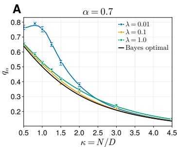
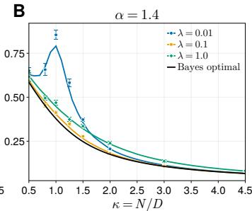
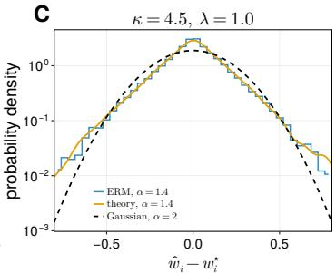
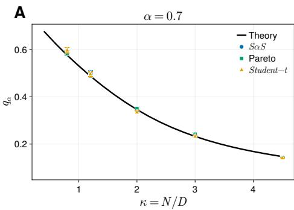
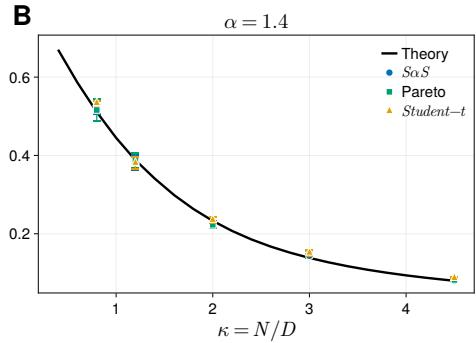
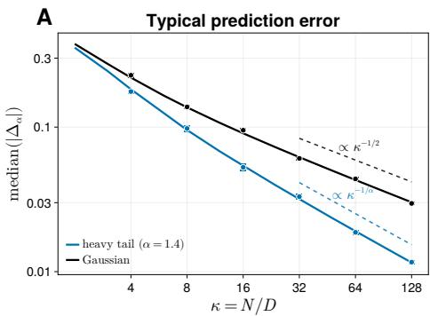
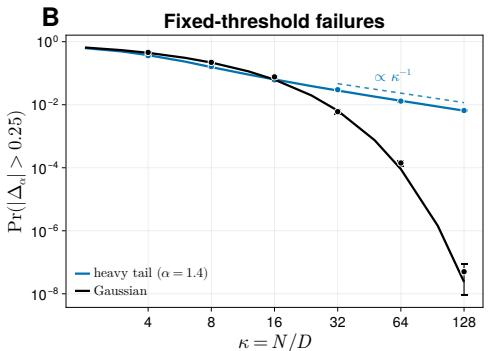

# ASYMPTOTIC ANALYSIS OF EMPIRICAL RISK MINI-MIZATION ON ENTRY-WISE I.I.D. HEAVY-TAILED DATA

Kaito Takanami1∗, Takashi Takahashi2, Yoshiyuki Kabashima2,3

1 Graduate School of Science, The University of Tokyo

2 Institute for Physics of Intelligence, The University of Tokyo

3 Trans-Scale Quantum Science Institute, The University of Tokyo

## ABSTRACT

Many real-world datasets exhibit unusually large values far more frequently than predicted by Gaussian models. Heavy-tailed distributions capture this behavior, yet evaluating learning performance under them remains challenging because rare, large feature entries retain non-vanishing effects even in high dimensions. Even in the canonical setting of empirical risk minimization for linear regression with entry-wise i.i.d. symmetric α-stable data, a precise asymptotic characterization of prediction has been lacking. In this work, we introduce a functional order parameter that describes the random effective problem associated with each coefficient. Using the replica method, we fully characterize the generalization error in the proportional high-dimensional limit where the sample size and feature dimension diverge at a fixed ratio. Additionally, this analysis establishes a heavy-tail universality law, scaling laws relating typical errors to prediction reliability, and the Bayes-optimal prediction error. In addition to characterizing the effects of extreme entries on the learning process, our method applies broadly to other systems with persistent local heterogeneity.

## 1 INTRODUCTION

Real-world data in finance (Mandelbrot, 1963), communications (Ilow & Hatzinakos, 1998; Middleton, 1977), natural images (Wainwright & Simoncelli, 1999), and the life sciences (Furusawa & Kaneko, 2003) often contain outliers and extreme observations much more frequently than predicted by a Gaussian distribution. When even the feature variance does not exist, the Gaussian universality suggested by the usual central limit theorem may no longer hold, and tail behavior can have a nonvanishing effect on learning even in the high-dimensional limit. Heavy-tailedness therefore not only poses a robustness issue, but can fundamentally change the statistical theory of high-dimensional learning.

The theory of learning from heavy-tailed data has mainly developed in two directions. The first is non-asymptotic statistics, which provides error guarantees under weak moment assumptions (Brownlees et al., 2015; Mendelson, 2014; 2018; Lecue & Mendelson, 2018; Lecu´ e & Lerasle,´ 2020). These results apply to a broad class of data distributions, including models with independent heavy-tailed coordinates. However, they mainly provide worst-case error bounds and do not precisely characterize typical high-dimensional errors or their dependence on the loss, regularization strength, and tail index.

The second direction studies typical high-dimensional behavior in the proportional limit, where the dimension D and sample size $\bar { N }$ grow at the same rate. For heavy-tailed features, existing precise results rely almost exclusively on elliptical models ${ \pmb x } _ { \mu } = \sigma _ { \mu } { \pmb z } _ { \mu }$ with $z _ { \mu } \sim \mathcal { N } ( \mathbf { 0 } , I / D )$ , where a single random variable $\sigma _ { \mu }$ scales all coordinates of sample $\mu$ (Adomaityte et al., 2023; 2024). However, this reliance on elliptical symmetry has two major limitations: First, from a theoretical standpoint, prior elliptical models introduce heavy-tailedness through a single random scale $\sigma _ { \mu }$ per sample. Conditioning on this scale restores a Gaussian feature vector, making these models a more restricted class of high-dimensional heavy-tailed distributions. In contrast, when coordinates are independently heavy-tailed, extreme values appear in isolated entries, so existing analytical techniques inapplicable. Second, in high-dimensional sensing and measurement systems, including communication, signal detection, and imaging applications, localized interference and physical events can generate extreme observations concentrated in a small number of coordinates (Karakus¸ et al., 2020; Chopra & Evans, 2012; Shen & Qin, 2016). For such applications, an entry-wise heavy-tailed model is far more realistic than an elliptical one that scales all features through a shared random factor.

To bridge this gap, we first study empirical risk minimization (ERM) with coordinate-wise i.i.d. symmetric α-stable features $( 0 < \alpha < 2 )$ in the proportional high-dimensional limit, where N, $D \to \infty$ and $N / D \to \kappa \in ( 0 , \infty )$ The corresponding Gaussian-feature problem is a canonical setting in high-dimensional statistics, and its typical performance has been studied for many years (Sompolinsky et al., 1990; Seung et al., 1992; Watkin et al., 1993; El Karoui et al., 2013; Donoho & Montanari, 2016; Thrampoulidis et al., 2018). Yet, after replacing Gaussian features with independent heavytailed features, no general asymptotic theory is available for this canonical problem. We therefore ask how the typical performance of the learned estimator can be characterized in this setting.

We use the replica method (Mezard et al., 1987; Charbonneau et al., 2023) from statistical physics´ to reduce the problem to an effective one-dimensional optimization. For Gaussian features, as in many standard replica calculations, this effective problem is described by a finite set of scalar order parameters. By contrast, for coordinate-wise independent heavy-tailed features, a single extreme entry can preserve the full nonlinear response of the loss in the effective problem. The samples producing such extremes differ across coordinates, and this heterogeneity persists in high dimensions. The system therefore requires a functional order parameter $\hat { \mathcal { P } }$ , defined as the distribution of these random response functions. We derive a self-consistent equation for this functional order parameter and use it to compute the learned coefficient distribution and typical estimation error.

Our main results are as follows.

• Section 4 characterizes the high-dimensional ERM through a functional order parameter, reducing it to a random one-dimensional effective optimization problem and determining its asymptotic generalization error.

• Section 5.1 establishes heavy-tail universality: the learned behavior depends on the feature distribution only through its tail index and total tail constant.

• Section 5.2 shows that typical prediction errors decrease as $\kappa ^ { - 1 / \alpha }$ , faster than the Gaussian $\kappa ^ { - 1 / 2 }$ rate, while the probability of a fixed large error decreases only as $\kappa ^ { - 1 }$ rather than exponentially.

• Section 5.3 characterizes Bayes-optimal prediction performance and shows that entry-wise heavy-tailed features outperform their elliptical counterparts at finite $\kappa ,$ although both exhibit the same leading-order scaling for $\kappa \gg 1$

## 2 RELATED WORK

Analysis with functional order parameters. Heterogeneous systems with sparse or heavy-tailed interactions remain locally nonuniform even in the high-dimensional limit, and their fluctuations cannot generally be described by finitely many scalar order parameters (Mezard & Parisi, 2001;´ Franz et al., 2001; Neri et al., 2010; Jung, 2018). Discrete-variable models can often be described by distributions of local effective fields, whereas the unbounded continuous variables and genera nonlinear convex losses considered here make the local effective problems themselves random functions. Moreover, heavy-tailed features produce a few strong contributions together with infinitely many small ones, making the order parameters probability distributions on function spaces. We derive the corresponding saddle-point equations, and the same approach may extend to other general heterogeneous continuous-variable systems. Further details are provided in Appendix A.

Learning from heavy-tailed data. Learning from entry-wise i.i.d. heavy-tailed data with squaredloss ridge regression reduces to a resolvent calculation for a heavy-tailed sample covariance matrix. The spectral distributions and resolvents of such matrices have been studied (Belinschi et al., 2009; Jung, 2018). In this quadratic setting, the local effective problems can be represented by finitely many coefficients, whereas general nonlinear convex losses require an order parameter that specifies the distribution of the entire random function. Our analysis extends this quadratic description to general nonlinear convex losses and characterizes the limiting estimator distribution and prediction error.

## 3 NOTATION AND PROBLEM SETUP

We study high-dimensional linear regression with coordinate-wise independent symmetric α-stable features using regularized ERM.

## 3.1 NOTATION

We denote by $S \alpha S ( \sigma )$ the symmetric α-stable distribution with scale parameter $\sigma ,$ whose characteristic function is E $\exp ( i t X ) = \exp ( - \sigma ^ { \alpha } | t | ^ { \alpha } )$ where $X \sim S \alpha S ( \sigma ) $ For a random vector $\pmb { x } = ( x _ { 1 } , \ldots , x _ { D } ) ^ { \top }$ , we write x $\sim P ^ { \otimes D }$ when its coordinates are independently distributed according to $P .$ . We use $\xrightarrow { \mathrm { p } }$ and $\xrightarrow { \mathrm { d } }$ to denote convergence in probability and convergence in distribution, respectively. At a nondifferentiable point, $f ^ { \prime } ( \bar { x ) }$ denotes a subgradient of $f$ at $x ,$ and $\partial f ( x )$ denotes the subdifferential of $f$ at x.

## 3.2 PROBLEM SETUP

We consider linear regression with N training examples in D dimensions. For $0 < \alpha < 2 $ , the training inputs are generated as

$$
\pmb { x } _ { 1 } , \dots , \pmb { x } _ { N } \overset { \mathrm { i . i . d . } } { \sim } ( S \alpha S ( 1 ) ) ^ { \otimes D } .\tag{1}
$$

Independently of the inputs, the teacher and label noise satisfy $\pmb { w } ^ { * } \sim p _ { w } ^ { \otimes D }$ and $\epsilon _ { \mu } \stackrel { \mathrm { i . i . d . } } { \sim } p _ { \epsilon }$ , where both distributions are centered, nondegenerate, and sub-Gaussian, and $p _ { \epsilon }$ additionally has a bounded density. The labels are

$$
y _ { \mu } = \frac { 1 } { D ^ { 1 / \alpha } } x _ { \mu } ^ { \top } w ^ { * } + \epsilon _ { \mu } ,\tag{2}
$$

where $D ^ { - 1 / \alpha }$ keeps the linear predictor of order one. Given a convex loss $\ell ,$ a strongly convex penalty function $\gamma ,$ and $\lambda > 0$ , we define the regularized ERM estimator by

$$
\hat { w } : = \operatorname * { a r g m i n } _ { w \in \mathbb { R } ^ { D } } \Biggl \{ \sum _ { \mu = 1 } ^ { N } \ell \biggl ( \frac { 1 } { D ^ { 1 / \alpha } } x _ { \mu } ^ { \top } w - y _ { \mu } \biggr ) + \lambda \sum _ { i = 1 } ^ { D } \gamma ( w _ { i } ) \Biggr \} .\tag{3}
$$

To evaluate the learned estimator, we draw an independent test example $( x _ { 0 } , y _ { 0 } )$ from the same model. Its label and prediction are

$$
y _ { 0 } = \frac { 1 } { D ^ { 1 / \alpha } } x _ { 0 } ^ { \top } w ^ { * } + \epsilon _ { 0 } , \qquad \hat { y } _ { 0 } = \frac { 1 } { D ^ { 1 / \alpha } } x _ { 0 } ^ { \top } \hat { w } .\tag{4}
$$

For a test loss $\ell _ { \mathrm { t e s t } }$ , we define the noise-free test prediction error and the generalization error by

$$
\Delta _ { N , D } ^ { ( \alpha ) } : = \hat { y } _ { 0 } - ( y _ { 0 } - \epsilon _ { 0 } ) = \frac { 1 } { D ^ { 1 / \alpha } } x _ { 0 } ^ { \top } ( \hat { w } - w ^ { * } )\tag{5}
$$

$$
\mathcal { E } _ { N , D } ^ { ( \alpha ) } : = \mathbb { E } \left[ \ell _ { \mathrm { t e s t } } ( \hat { y } _ { 0 } - y _ { 0 } ) \right] ,\tag{6}
$$

where the expectation is over the test example. The test noise is excluded from $\Delta _ { N , D } ^ { ( \alpha ) }$ but included $\mathcal { E } _ { N , D } ^ { ( \alpha ) }$ . We study these quantities in the proportional high-dimensional limit:

$$
N , D \to \infty , \qquad { \frac { N } { D } } \to \kappa \in ( 0 , \infty ) .\tag{7}
$$

## 3.3 REGULARITY CONDITIONS

We impose the following assumptions to guarantee a unique ERM minimizer and to ensure that the population loss has a well-defined minimum at zero residual.

Assumption 1 (Training loss). The training loss $\ell : \mathbb { R } \to$ R is convex and is either globally Lipschitz or the squared loss $\ell ( r ) = r ^ { 2 } / 2 .$ . Assume

$$
\underset { r \in \mathbb { R } } { \mathrm { a r g m i n } } \mathbb { E } _ { \epsilon } \ell ( r - \epsilon ) = \{ 0 \} , \quad 0 < \frac { \mathrm { d } ^ { 2 } } { \mathrm { d } r ^ { 2 } } \mathbb { E } _ { \epsilon } \ell ( r - \epsilon ) \bigg | _ { r = 0 } < \infty .\tag{8}
$$

This assumption imposes the local strict convexity required for stable parameter estimation. Consequently, this assumption accommodates a wide range of standard objectives, including the squared loss, Huber and pseudo-Huber losses, and $L _ { p }$ losses $( 1 \leq p \leq 2 )$

## 4 PRECISE ASYMPTOTIC CHARACTERIZATION

Our goal is to characterize the generalization error of ERM estimator in the proportional highdimensional limit. The key observation is that prediction on an independent test example depends on the learned coefficient errors only through a single scalar. Determining this scalar from the training problem, however, requires a function-valued order parameter.

Define the empirical α-error of the learned coefficients by

$$
q _ { \alpha , D } : = \frac { 1 } { D } \sum _ { i = 1 } ^ { D } \big | \hat { w } _ { i } - w _ { i } ^ { * } \big | ^ { \alpha } .\tag{9}
$$

In the proportional high-dimensional limit, there exists a deterministic $q _ { \alpha }$ such that $q _ { \alpha , D } \ { \stackrel { \mathrm { p } } { \to } } \ q _ { \alpha } .$ In this limit, by the stability property of symmetric α-stable distributions, the noise-free test prediction error in Equation (5) satisfies

$$
\begin{array} { r } { \Delta _ { N , D } ^ { ( \alpha ) } \stackrel { \mathrm { ~ d ~ } } { \to } \Delta ^ { ( \alpha ) } ( \kappa ) : = q _ { \alpha } ^ { 1 / \alpha } S _ { \alpha } , } \end{array}\tag{10}
$$

where $S _ { \alpha } \sim S \alpha S ( 1 )$ . This yields the following expression for the asymptotic generalization error. Proposition 2 (Generalization error of ERM estimator). Let $0 < \alpha < 2$ and $S _ { \alpha } \sim S \alpha S ( 1 )$ . Then, the asymptotic generalization error (6) is given by

$$
\begin{array} { r } { \mathcal { E } _ { N , D } ^ { ( \alpha ) } \stackrel { \mathrm { ~ p ~ } } {  } \mathcal { E } ^ { ( \alpha ) } ( \kappa ) : = \mathbb { E } _ { S _ { \alpha } , \epsilon _ { 0 } } [ \ell _ { \mathrm { t e s t } } ( q _ { \alpha } ^ { 1 / \alpha } S _ { \alpha } - \epsilon _ { 0 } ) ] . } \end{array}\tag{11}
$$

Proposition 2 shows that $q _ { \alpha }$ is the only scalar needed to evaluate the asymptotic generalization error. To compute this scalar, we need the distribution of the coefficient errors $\hat { w } _ { i } - w _ { i } ^ { * }$

For Gaussian features, the contribution of each data point to an individual coefficient is infinitesimally small, so the collective effect of the data becomes statistically uniform across all coefficients. As is well known, their combined effect, and consequently the coefficient distribution and $q _ { \alpha }$ , is fully determined by a finite set of scalar equations.

However, for heavy-tailed features, a small number of exceptionally large entries retain a finite influence. Which entries are extreme and how strongly they affect the loss differ across coefficients, so their effects do not reduce to common scalar values. The coefficient-specific effective problem must therefore remain random. It consists of a random scale $\hat { Q } \in [ 0 , \infty )$ and a standardized Gaussian fluctuation $\zeta ,$ which together determine the linear data fluctuation, and a random convex data response function $\mathcal { R } : \mathbb { R }  \mathbb { R }$ that quantifies the nonlinear loss change induced by a perturbation of the coefficient. We denote their joint distribution by the functional order parameter $\hat { \mathcal { P } } _ { . }$ . Under the model in Section 3 and Assumption 1, with $0 < \alpha < \mathrm { \dot { 2 } }$ , draw

$$
\begin{array} { r } { ( \hat { Q } , \zeta , \hat { \mathcal { R } } ) \sim \hat { \mathcal { P } } , \quad w ^ { * } \sim p _ { w } . } \end{array}\tag{12}
$$

Here $w ^ { * }$ is independent of the first triple, $\hat { Q }$ is a nonnegative $\alpha / 2$ -stable random variable, $\zeta \sim$ $\mathcal { N } ( 0 , 1 )$ is independent of $\hat { Q } .$ and $\hat { \mathcal { R } }$ is convex with $\hat { \mathcal { R } } ( 0 ) = 0$ and $0 \in \partial \hat { \mathcal { R } } ( 0 )$ . Although $\zeta$ is independent of $\hat { Q } .$ , it is generally dependent on $\hat { \mathcal { R } }$ . Its full definition is given in Appendix B.

For each sample of the effective surrogate randomness, define uˆ as the minimizer of an effective objective consisting of the change in regularization, a random linear fluctuation, and the nonlinear

  
Figure 1: Empirical validation of the theoretical coefficient-error predictions. (A, B) Solid colored lines show the theoretical predictions of $q _ { \alpha }$ (Equation 15), while markers represent numerical results obtained via finite-dimensional ERM. The solid black line shows the theoretical prediction of $q _ { \alpha }$ under the Bayes–optimal setting in Section 5.3. (C) Comparison between the theoretical distribution (Equation 14) and the empirical coefficient-error distribution obtained by finite-dimensional ERM. The dashed black curve shows the theoretical coefficient-error distribution at $\alpha = 2 ,$ which is Gaussian. (A-C) Huber loss with $\delta = 1 , p _ { w } = \mathcal { N } ( 0 , 1 )$ , and $p _ { \epsilon } = \mathcal { N } ( 0 , 0 . 5 ^ { 2 } ) ; ( \mathbf { A } , \mathbf { B } ) D = 2 5 6 ;$ (C) $D = 4 0 9 6 , \lambda = 1$ , and the empirical distribution is averaged over 8 independent trials. (A,B) Error bars indicate the standard error over 8 independent trials for each point.

response of the training loss:

$$
\begin{array} { r } { \hat { u } : = \underset { u \in \mathbb { R } } { \arg \operatorname* { m i n } } \left\{ \underbrace { \lambda \big [ \gamma \big ( w ^ { * } + u \big ) - \gamma \big ( w ^ { * } \big ) \big ] } _ { \mathrm { r e g u l a r i z a t i o n } } + \underbrace { \sqrt { \hat { Q } } \zeta u } _ { \mathrm { d a t a f l u c t u a t i o n } } + \underbrace { \hat { \mathcal { R } } ( u ) } _ { \mathrm { d a t a r e s p o n s e } } \right\} . } \end{array}\tag{13}
$$

The uˆ constructed in this way has the same limiting distribution as the learned coefficient error $\hat { w } _ { i } - w _ { i } ^ { * }$ . The corresponding statement is the following result.

Result 3 (Statistics of the learned parameters). With $\mathbb { E } \left| \hat { u } \right| ^ { \alpha } < \infty _ { : }$ , the empirical coefficient distribution and its α-moment satisfy

$$
\hat { w } _ { i } - w _ { i } ^ { * } \xrightarrow { } \hat { u }\tag{14}
$$

$$
q _ { \alpha , D } \stackrel { \mathrm { p } } {  } q _ { \alpha } : = \mathbb { E } | \hat { u } | ^ { \alpha } ,\tag{15}
$$

where the expectation is over the joint distribution $o f \zeta , \hat { \mathcal { R } } , \hat { Q } ,$ , and $w ^ { * }$

The detailed derivation is provided in Appendix C. Figure 1 confirms that both the predicted α- moment and the full coefficient-error distribution closely match finite-dimensional ERM simulations. Thus, $\hat { \mathcal { P } }$ determines both the full limiting coefficient-error distribution and its scalar summary $q _ { \alpha }$ . Combined with Equation (11), this result provides a precise characterization of the generalization error on test data.

The decomposition in Equation (13) further clarifies how heavy-tailed features affect each learned coefficient. The regularization term penalizes coefficient values according to $\gamma ,$ while the linear data-fluctuation term generates a random gradient that can cause the coefficient $\hat { w } _ { i }$ to deviate from its true value $\boldsymbol { w } _ { i } ^ { * }$ , thereby increasing the estimation error $| \hat { w } _ { i } - w _ { i } ^ { * } |$ . The nonlinear data-response term counteracts this deviation and tends to keep the coefficient error near zero. Because the latter two terms are generated from the same heavy-tailed samples, they are statistically dependent, and their magnitudes vary across coordinates. Consequently, an extreme data fluctuation can produce a large linear term. If $\hat { \mathcal { R } } ( u )$ increases sufficiently away from $u = 0$ , the minimizer uˆ remains close to zero; otherwise, the coefficient error can be large and increase the generalization error.

Comparison with Gaussian features. When $\alpha = 2$ , the Gaussian counterpart of the heavy-tailed coefficient problem in Equation (13) is

$$
\hat { u } _ { \mathrm { G } } : = \underset { u \in \mathbb { R } } { \mathrm { a r g m i n } } \left. \underbrace { \lambda [ \gamma ( w ^ { * } + u ) - \gamma ( w ^ { * } ) ] } _ { \mathrm { r e g u l a r i z a t i o n } } + \underbrace { \sqrt { \hat { q } } \xi u } _ { \mathrm { d a t a f l u c t u a t i o n } } + \underbrace { \frac { \hat { \chi } } { \lambda } u ^ { 2 } } _ { \mathrm { d a t a r e s p o n s e } } \right. ,\tag{16}
$$

where $\xi \sim \mathcal { N } ( 0 , 1 )$ and $\hat { q }$ and $\hat { \chi }$ are some positive constants. Gaussian features average these effects into a common fluctuation scale $\sqrt { \hat { q } }$ and a common quadratic data response $\hat { \chi } u ^ { 2 } / 2$ . For heavy-tailed features, by contrast, the relative magnitudes of the linear and nonlinear terms vary randomly across coordinates, so some coefficients have small errors whereas others are poorly estimated within the same model.

## 5 BROADER IMPLICATIONS OF THE ASYMPTOTIC THEORY

Result 3 in Section 4 characterized the asymptotic coefficient distribution and generalization error of regularized ERM with entry-wise i.i.d. α-stable features. Using this characterization, we next investigate three questions that have been extensively studied for Gaussian features: universality, the scaling of the typical and extreme error, and the performance attainable by Bayes-optimal inference.

## 5.1 UNIVERSALITY LAW

A central question in high-dimensional learning is which properties of the feature distribution determine the asymptotic performance of trained models. For finite-variance features, Gaussian universality states that, under suitable regularity conditions, replacing the feature distribution with any other distribution matching the same mean and covariance leaves the asymptotic generalization error unchanged. The following proposition formalizes this classical result.

Proposition 4 (Gaussian universality for regularized ERM). Let the feature coordinates be i.i.d. from a sub-Gaussian distribution $P _ { X }$ satisfying $\mathbb { E } _ { P _ { X } } X = { \mathrm { ~ 0 ~ } }$ and $\mathbb { E } _ { P _ { X } } X ^ { 2 } = 1$ , and suppose that Assumption 1 holds with $\alpha = 2 .$ . Let $q _ { 2 } ^ { P _ { X } }$ and $q _ { 2 } ^ { \mathrm { G } }$ denote the limiting coefficient-error moments under $P _ { X }$ and standard Gaussian features, respectively. Then

$$
q _ { 2 } ^ { P x } = q _ { 2 } ^ { \mathrm { G } } .\tag{17}
$$

Thus, within the sub-Gaussian class, the limiting coefficient error, and therefore the generalization error, depends on the feature distribution only through its mean and variance. While Proposition 4 was established rigorously by Montanari & Saeed (2022), an equivalent moment universality was already classically known via non-rigorous replica calculations for finite-variance patterns (Seung et al., 1992; Watkin et al., 1993).

However, when the feature variance is infinite, this Gaussian universality law no longer applies. Nevertheless, we claim that an analogous universality principle holds through replica calculations for coordinate-wise i.i.d. heavy-tailed feature distributions.

Result 5 (Heavy-tail universality for regularized ERM). Let $0 < \alpha < 2 $ , and let thefeature coordi nates be i.i.d. from a symmetric distribution $P _ { X }$ satisfying

$$
\operatorname* { P r } ( | X | > x ) = C _ { \alpha } ^ { \mathrm { S } } x ^ { - \alpha } + o ( x ^ { - \alpha } ) \qquad ( x \to \infty ) ,\tag{18}
$$

where $C _ { \alpha } ^ { \mathrm { S } } : = 2 \Gamma ( \alpha )$ sin(πα/2)/π is the total tail constant of $S \alpha S ( 1 ) ^ { \ 1 }$ , and suppose that Assumption 1 holds. Let $\grave { q } _ { \alpha } ^ { P _ { X } }$ and $q _ { \alpha } ^ { \mathrm { S } }$ denote the limiting coefficient-error moments under $P _ { X }$ and $S \alpha { \cal S } ( 1 )$ features, respectively. Then

$$
q _ { \alpha } ^ { P _ { X } } = q _ { \alpha } ^ { \mathrm { S } } .\tag{19}
$$

The detailed derivation is provided in Appendix D. Result 5 demonstrates that, for the broad class of losses under Assumption 1, the limiting coefficient error and generalization error depend on the feature distribution solely through its tail index α and total tail constant. This universality principle is numerically confirmed in Figure 2.

  
Figure 2: Empirical validation of universality across heavy-tailed feature distributions. The solid line shows the theoretical prediction of $q _ { \alpha }$ for $S \alpha S ( 1 )$ features, while markers represent numerical results obtained via Huber–ridge ERM with symmetric α-stable, Pareto, and Student-t coordinates. The Pareto and Student-t distributions are rescaled to satisfy $\operatorname* { P r } ( | X | > x ) \sim C _ { \alpha } ^ { \mathrm { S } } x ^ { - \alpha }$ Parameters: (A, B) $D = 2 5 6$ $\delta = 1$ $\lambda = 1$ $p _ { w } = \mathcal { N } ( 0 , 1 )$ , and $p _ { \epsilon } = \mathcal { N } ( 0 , 0 . 5 ^ { 2 } )$ . Error bars indicate the standard error over 6 independent trials for each point.

Together, Proposition 4 and Result 5 establish two distinct universality classes: the finite-variance regime, represented by the Gaussian distribution and determined by the first two moments; and the infinite-variance regime, represented by the α-stable distribution and specified by the tail index and total tail constant. In both cases, these parameters completely determine the dependence of the limiting coefficient error on the feature distribution.

## 5.2 SCALING LAWS AND PREDICTION RELIABILITY

How does prediction performance improve as the training sample size increases? In this subsection, we evaluate this improvement as the sampling ratio $\kappa \doteq N / \bar { D }$ grows, using two key metrics: the typical test prediction error and the probability of an error exceeding a fixed threshold. According to Proposition 2, the prediction error induced by the estimator wˆ converges in distribution to $q _ { \alpha } ( \kappa ) ^ { 1 / \alpha } S _ { \alpha }$ . Using this convergence, we derive the asymptotic expansion of $q _ { \alpha } ( \kappa )$ in the regime $\kappa \gg 1$ and obtain the following main results on typical performance and tail error probabilities in comparison with the finite-variance (Gaussian) baseline.

Result 6 (Typical prediction error and tail reliability with many training examples). Suppose that Assumption 1 holds. Let $\Delta ^ { ( 2 ) } ( \kappa )$ denote the Gaussian counterpart of $\Delta ^ { ( \alpha ) } ( \kappa )$ in Equation (5). Then,for every $0 < \alpha < 2 ,$ , there exists a constant $c _ { \alpha } \in ( 0 , \infty )$ such that

$$
q _ { \alpha } ( \kappa ) = \frac { c _ { \alpha } } { \kappa } + o ( \kappa ^ { - 1 } ) , \qquad \kappa  \infty .\tag{20}
$$

Consequently, for every fixed $t > 0$

$$
\mathrm { m e d i a n } \Big ( \Big | \Delta ^ { ( \alpha ) } ( \kappa ) \Big | \Big ) = \Theta \Big ( \kappa ^ { - 1 / \alpha } \Big ) , \quad \mathrm { P r } \Big ( \Big | \Delta ^ { ( \alpha ) } ( \kappa ) \Big | > t \Big ) = \Theta \big ( \kappa ^ { - 1 } \big ) .\tag{21}
$$

For Gaussian features,

$$
\mathrm { m e d i a n } \Big ( \Big | \Delta ^ { ( 2 ) } ( \kappa ) \Big | \Big ) = \Theta \Big ( \kappa ^ { - 1 / 2 } \Big ) , \quad \mathrm { P r } \Big ( \Big | \Delta ^ { ( 2 ) } ( \kappa ) \Big | > t \Big ) = \exp [ - \Theta ( \kappa ) ] ,\tag{22}
$$

where $f = \Theta ( g )$ means that f and g have the same asymptotic order up to constantfactors.

The detailed derivation is provided in Appendix E. Figure 3 shows that the predictions of both scaling laws agree remarkably well with finite-dimensional ERM results.

This result shows that the typical prediction error decreases faster under heavy-tailed features than under Gaussian features. Intuitively, rare training observations with large feature magnitudes contain substantial information for estimating the coefficients. In contrast, the probability of exceeding a fixed error threshold is $\Theta ( \kappa ^ { - 1 } )$ under heavy-tailed features, whereas it is exponentially small under Gaussian features. This is because the model can exploit the extreme coordinates observed during training, whereas an extreme value in a new test example may occur in a different coordinate and amplify the residual error in the corresponding coefficient.

  
Figure 3: Empirical validation of prediction-error scaling and reliability. (A) The solid colored and black lines show the theoretical predictions for median $\left( \left| \Delta ^ { ( \alpha ) } ( \kappa ) \right| \right)$ and median $( | \Delta ^ { ( 2 ) } ( \kappa ) | )$ under heavy-tailed and Gaussian features, respectively, while markers represent the finite-dimensional ERM results. (B) The solid colored and black lines show the theoretical predictions for $\operatorname* { P r } ( | \Delta ^ { ( \alpha ) } ( \kappa ) | > t )$ and $\mathrm { P r } ( | \Delta ^ { ( 2 ) } ( \kappa ) | > t )$ under heavy-tailed and Gaussian features, respectively, while markers represent the finite-dimensional ERM results. Parameters: (A, B) Huber loss with $\delta = 1 , \lambda = 1 , \bar { p _ { w } } = \mathcal { N } ( 0 , 1 ) , p _ { \epsilon } = \mathcal { N } ( 0 , 0 . 5 ^ { 2 } )$ , and $D = 1 2 8$ . Error bars indicate the standard error over 8 independent trials for each point.

## 5.3 BAYES-OPTIMAL SETTING

In this subsection, we study prediction under Bayes-optimal inference, where the prior and noise distributions used by the learner match the data-generating model. This setting enables a more tractable analytical characterization. Moreover, for any specified test loss, the corresponding Bayes risk lower-bounds the risk of any predictor based on the same training data, including more flexible approaches such as kernel methods, ensembles, and deep neural networks. It thereby helps distinguish limitations due to heavy-tailed features from those due to the choice of inference method.

For simplicity, we assume a Gaussian teacher prior and Gaussian label noise:

$$
p _ { w } = \mathcal { N } \big ( 0 , \tau ^ { 2 } \big ) , \quad p _ { \epsilon } = \mathcal { N } \big ( 0 , \sigma ^ { 2 } \big ) .\tag{23}
$$

Combining the Gaussian likelihood with this prior gives

$$
p ( { \pmb w } \mid { \boldsymbol X } , { \pmb y } ) \propto \exp \biggl \{ - \frac { 1 } { 2 \sigma ^ { 2 } } \left\| { \pmb y } - { \boldsymbol D } ^ { - 1 / \alpha } { \boldsymbol X } { \pmb w } \right\| _ { 2 } ^ { 2 } - \frac { 1 } { 2 \tau ^ { 2 } } \| { \pmb w } \| _ { 2 } ^ { 2 } \biggr \} ,\tag{24}
$$

where $\boldsymbol { X } \in \mathbb { R } ^ { N \times D }$ has rows $\pmb { x } _ { 1 } ^ { \top } , \dots , \pmb { x } _ { N } ^ { \top }$ , and $\pmb { y } = ( y _ { 1 } , \dots , y _ { N } ) ^ { \top }$ is the label vector. Completing the square shows that the posterior is Gaussian:

$$
\mathbf { w } ^ { * } \mid X , \mathbf { y } \sim { \mathcal { N } } ( { \hat { w } } _ { \mathrm { B } } , { \Sigma } _ { \mathrm { B } } ) ,\tag{25}
$$

where the posterior mean and covariance are

$$
\hat { w } _ { \mathrm { B } } : = \mathbb { E } [ { \pmb w } ^ { * } \mid { \boldsymbol X } , { \pmb y } ] = \bigg ( D ^ { - 2 / \alpha } { \boldsymbol X } ^ { \top } { \boldsymbol X } + \frac { \sigma ^ { 2 } } { \tau ^ { 2 } } I _ { D } \bigg ) ^ { - 1 } D ^ { - 1 / \alpha } { \boldsymbol X } ^ { \top } { \pmb y }\tag{26}
$$

$$
\Sigma _ { \mathrm { B } } : = \sigma ^ { 2 } \biggl ( D ^ { - 2 / \alpha } X ^ { \top } X + \frac { \sigma ^ { 2 } } { \tau ^ { 2 } } I _ { D } \biggr ) ^ { - 1 } .\tag{27}
$$

Thus $\hat { \pmb { w } } _ { \mathrm { B } }$ is the squared-loss ridge estimator with $\lambda _ { \mathrm { B } } = \sigma ^ { 2 } / \tau ^ { 2 }$ . We introduce its proportional-limit coefficient error as

$$
q _ { \alpha , \mathrm { B } } ( \boldsymbol { \kappa } ) : = \mathbb { E } \left[ \frac { 1 } { D } \sum _ { i = 1 } ^ { D } \left| \hat { w } _ { \mathrm { B } , i } - w _ { i } ^ { * } \right| ^ { \alpha } \right] .\tag{28}
$$

When $\alpha = 2$ , the coefficient error is determined by the average posterior variance and can be analyzed through the usual Stieltjes transform of the empirical covariance matrix. For $0 < \alpha < 2 ,$ however, the error also depends on how the posterior variances vary across coordinates. Hence the normalized trace alone is insufficient, and we must characterize the distribution of the local diagonal resolvent entries. The required local-resolvent analysis nevertheless reduces to a scalar fixed-point equation for $q _ { \alpha , \mathrm { B } }$ . The following result states this equation together with its data-rich asymptotics.

Result 7 (Coefficient error of the Bayes ridge estimator). The coefficient error satisfies

$$
\begin{array} { r l r } & { \displaystyle { q _ { \alpha , \mathrm { B } } ( \kappa ) = \frac { 2 ^ { \alpha / 2 } \Gamma ( ( \alpha + 1 ) / 2 ) \sigma ^ { \alpha } } { \sqrt { \pi } \Gamma ( 1 + \alpha / 2 ) } } } \\ & { \displaystyle { \qquad \times \int _ { 0 } ^ { \infty } \exp \Bigg \{ - \frac { \sigma ^ { 2 } } { \tau ^ { 2 } } u ^ { \frac { 2 } { \alpha } } - \frac { \kappa 2 ^ { \alpha } \Gamma \big ( \frac { \alpha + 1 } { 2 } \big ) } { \sqrt { \pi } \Gamma ( 1 + \alpha / 2 ) } u \int _ { 0 } ^ { \infty } \exp \bigg ( - v ^ { \frac { 2 } { \alpha } } - \frac { 2 ^ { \frac { \alpha } { 2 } } q _ { \alpha , \mathrm { B } } ( \kappa ) } { \sigma ^ { \alpha } } v \bigg ) \mathrm { d } v \Bigg \} \mathrm { d } u . } } \end{array}\tag{29}
$$

In particular, expanding Equation (29)for large κ gives

$$
q _ { \alpha , \mathrm { B } } ( \kappa ) = \frac { 2 ^ { - \alpha / 2 } } { \Gamma ( 1 + \alpha / 2 ) } \frac { \sigma ^ { \alpha } } { \kappa } + o \big ( \kappa ^ { - 1 } \big ) .\tag{30}
$$

The detailed derivation is provided in Appendix F. The black curves in Figures 1A and B show the theoretical Bayes-optimal error, which indeed provides a tight lower bound for the errors achieved by the Huber-loss estimator.

Comparison with elliptical heavy-tailed features. Following Adomaityte et al. (2024), we consider elliptical features written in our scaling convention as

$$
\begin{array} { r } { \pmb { x } _ { \mu } ^ { \mathrm { e l l } } = D ^ { 1 / \alpha } R _ { \mu } z _ { \mu } , \qquad z _ { \mu } \sim \mathcal { N } ( \mathbf { 0 } , I _ { D } / D ) , } \end{array}\tag{31}
$$

The labels are generated from Equation (2), with $\mathbfit { \Delta } \mathbf { x } _ { \mu }$ replaced by $\pmb { x } _ { \mu } ^ { \mathrm { e l l } }$ . To isolate the effect of feature dependence, we choose $R _ { \mu } ^ { 2 } .$ , independently of $z _ { \mu } .$ , to have the limiting distribution of the normalized squared row norm in the coordinate-wise independent model. Then

$$
\begin{array} { r } { D ^ { - 2 / \alpha } \| \pmb { x } _ { \mu } \| _ { 2 } ^ { 2 } \xrightarrow [ D  \infty ] { \mathrm { d } } R _ { \mu } ^ { 2 } , \quad D ^ { - 2 / \alpha } \| \pmb { x } _ { \mu } ^ { \mathrm { e l l } } \| _ { 2 } ^ { 2 } \xrightarrow [ D  \infty ] { \mathrm { d } } R _ { \mu } ^ { 2 } . } \end{array}\tag{32}
$$

Both ${ \pmb x } _ { \mu }$ and $\pmb { x } _ { \mu } ^ { \mathrm { e l l } }$ are multivariate symmetric α-stable.

Let $q _ { \alpha , \mathrm { B } } ^ { \mathrm { e l l } } ( \kappa )$ denote the corresponding coefficient α-error. Specializing the Bayes-optimal equations of Adomaityte et al. (2024) to the Gaussian prior and noise in Equation (23) gives

$$
1 = \frac { 1 } { \tau ^ { 2 } } \left[ \frac { \sqrt { \pi } q _ { \alpha , \mathrm { B } } ^ { \mathrm { e l l } } ( \kappa ) } { 2 ^ { \alpha / 2 } \Gamma ( ( \alpha + 1 ) / 2 ) } \right] ^ { \frac { 2 } { \alpha } } + \kappa \left[ 1 - \sigma ^ { 2 } \int _ { 0 } ^ { \infty } \exp \Bigl ( - \sigma ^ { 2 } u - 2 ^ { \alpha / 2 } q _ { \alpha , \mathrm { B } } ^ { \mathrm { e l l } } ( \kappa ) u ^ { \alpha / 2 } \Bigr ) \mathrm { d } u \right] .\tag{33}
$$

Comparison with Equation (29) yields the following result.

Result 8 (Coordinate-wise versus elliptical heavy tails). For $0 < \alpha < 2$ and $\kappa > 0$

$$
q _ { \alpha , \mathrm { B } } ( \boldsymbol { \kappa } ) < q _ { \alpha , \mathrm { B } } ^ { \mathrm { e l l } } ( \boldsymbol { \kappa } ) .\tag{34}
$$

Nevertheless, their data-rich asymptotics agree including the leading coefficient:

$$
q _ { \alpha , \mathrm { B } } ( \kappa ) \sim q _ { \alpha , \mathrm { B } } ^ { \mathrm { e l l } } ( \kappa ) \sim \frac { 2 ^ { - \alpha / 2 } } { \Gamma ( 1 + \alpha / 2 ) } \frac { \sigma ^ { \alpha } } { \kappa } .\tag{35}
$$

A derivation of Equation (33) and Result 8 is provided in Appendix G. This ordering has a simple interpretation. In the entry-wise independent model, large feature magnitudes occur at different coordinates of different samples and are therefore distributed among parameter directions. In the elliptical model, by contrast, the common radial variable $R _ { \mu }$ scales all coordinates of a sample simultaneously. At finite κ, large feature magnitudes are therefore concentrated in fewer samples and parameter directions, leading to a larger coefficient error in the elliptical model. As $\kappa  \infty$ the number of independently observed directions is sufficient for this difference not to affect the leading-order error, so the two models have the same $1 / \kappa$ asymptotics.

## 6 DISCUSSION

We developed an asymptotic theory for regularized ERM in linear regression with independent symmetric α-stable feature coordinates. Using the replica method with a functional order parameter, we characterized the coefficient-error distribution and generalization error in the proportional highdimensional limit. This characterization reveals a heavy-tail universality law: the asymptotic prediction behavior is determined only by the tail index and scale of the feature distribution. The typical prediction errors exhibit the favorable scaling $\kappa ^ { - 1 / \alpha }$ , where κ denotes the number of data per dimension, whereas the probability of a fixed-magnitude error decays only as $\kappa ^ { - 1 }$ . The theory also characterizes Bayes-optimal performance and clarifies how extreme observations distinguish entry-wise and elliptical heavy-tailed models.

A promising direction for future work is to develop the present results into inference algorithms for heavy-tailed data. In particular, it would be interesting to derive an approximate message passing algorithm (Kabashima, 2003; Donoho et al., 2009). Such an algorithm would provide a computationally efficient iterative inference procedure, whose macroscopic properties at fixed-point are expected to be described by the replica saddle-point equations derived in this work. More broadly, the functional order parameter provides a framework for high-dimensional systems in which local environments remain random. Retaining the distribution of these environments may enable precise asymptotic analyses of other spin glass, learning, and optimization problems with persistent local heterogeneity.

## AI USE STATEMENT

Generative AI tools assisted with manuscript drafting, editing, translation, paper organization, numerical code, and the exploration and checking of mathematical derivations. All material was reviewed and verified by the authors, who take responsibility for the final manuscript.

## REPRODUCIBILITY STATEMENT

Detailed derivations are provided in the appendices. Code for reproducing the numerical experiments is available at https://github.com/taka255/ iid-heavy-tail-reproduction.

## ACKNOWLEDGMENTS

K.T. was supported by JST BOOST NAIS Grant Number JPMJBS2418. T.T. and Y.K. were supported by JSPS KAKENHI Grant Number 26K02981. T.T. was supported by JST ACT-X Grant Number JPMJAX24CG and JSPS KAKENHI Grant Number 23K16960. Y.K. was supported by JSPS KAKENHI Grant Numbers 22H05117 and 26K02981, and JST, ARiSE, Japan Grant Number JPMJAR2633.

## REFERENCES

Urte Adomaityte, Gabriele Sicuro, and Pierpaolo Vivo. Classification of heavy-tailed features in high dimensions: a superstatistical approach. In A. Oh, T. Naumann, A. Globerson, K. Saenko, M. Hardt, and S. Levine (eds.), Advances in Neural Information Processing Systems, volume 36, pp. 43880–43893. Curran Associates, Inc., 2023. doi: 10.52202/ 075280-1903. URL https://proceedings.neurips.cc/paper\_files/paper/ 2023/file/88be023075a5a3ff3dc3b5d26623fa22-Paper-Conference.pdf.

Urte Adomaityte, Leonardo Defilippis, Bruno Loureiro, and Gabriele Sicuro. High-dimensional robust regression under heavy-tailed data: asymptotics and universality. Journal of Statistical Mechanics: Theory and Experiment, 2024(11):114002, nov 2024. doi: 10.1088/1742-5468/ad65e6. URL https://doi.org/10.1088/1742-5468/ad65e6.

Serban Belinschi, Amir Dembo, and Alice Guionnet. Spectral measure of heavy tailed band and covariance random matrices. Communications in Mathematical Physics, 289(3):1023–1055, 2009. doi: 10.1007/s00220-009-0822-4.

Christian Brownlees, Emilien Joly, and Gabor Lugosi. Empirical risk minimization for heavy-tailed´ losses. The Annals of Statistics, 43(6):2507–2536, December 2015. ISSN 0090-5364. doi: 10.1214/15-AOS1350. URL https://doi.org/10.1214/15-AOS1350.

Patrick Charbonneau, Enzo Marinari, Marc Mezard, Giorgio Parisi, Federico Ricci-Tersenghi,´ Gabriele Sicuro, and Francesco Zamponi (eds.). Spin Glass Theory and Far Beyond: Replica Symmetry Breaking After 40 Years. World Scientific, 2023. doi: 10.1142/13341.

Aditya Chopra and Brian L. Evans. Joint statistics of radio frequency interference in multi-antenna receivers. IEEE Transactions on Signal Processing, 60(7):3588–3603, 2012. doi: 10.1109/TSP. 2012.2192431.

Luca Maria Del Bono, Flavio Nicoletti, and Federico Ricci-Tersenghi. Analytical solution to Heisenberg spin glass models on sparse random graphs and their de Almeida–Thouless line. Physical Review B, 110(18):184205, 2024. doi: 10.1103/PhysRevB.110.184205.

David Donoho and Andrea Montanari. High dimensional robust M-estimation: Asymptotic variance via approximate message passing. Probability Theory and Related Fields, 166(3–4):935–969, 2016. doi: 10.1007/s00440-015-0675-z.

David L. Donoho, Arian Maleki, and Andrea Montanari. Message-passing algorithms for compressed sensing. Proceedings of the National Academy of Sciences, 106(45):18914– 18919, 2009. doi: 10.1073/pnas.0909892106. URL https://doi.org/10.1073/pnas. 0909892106.

Noureddine El Karoui, Derek Bean, Peter J. Bickel, Chinghway Lim, and Bin Yu. On robust regression with high-dimensional predictors. Proceedings of the National Academy of Sciences, 110 (36):14557–14562, 2013. doi: 10.1073/pnas.1307842110. URL https://www.pnas.org/ doi/abs/10.1073/pnas.1307842110.

Silvio Franz, Michele Leone, Federico Ricci-Tersenghi, and Riccardo Zecchina. Exact solutions for diluted spin glasses and optimization problems. Physical Review Letters, 87(12):127209, August 2001. ISSN 1079-7114. doi: 10.1103/PhysRevLett.87.127209. URL https://doi.org/ 10.1103/PhysRevLett.87.127209.

Chikara Furusawa and Kunihiko Kaneko. Zipf’s law in gene expression. Phys. Rev. Lett., 90:088102, Feb 2003. doi: 10.1103/PhysRevLett.90.088102. URL https://link.aps.org/doi/10. 1103/PhysRevLett.90.088102.

J. Ilow and D. Hatzinakos. Analytic alpha-stable noise modeling in a Poisson field of interferers or scatterers. IEEE Transactions on Signal Processing, 46(6):1601–1611, 1998. doi: 10.1109/78. 678475.

Paul Jung. Levy–Khintchine random matrices and the Poisson weighted infinite skeleton tree.´ Transactions ofthe American Mathematical Society, 370(1):641–668, 2018. doi: 10.1090/tran/6977.

Yoshiyuki Kabashima. A cdma multiuser detection algorithm on the basis of belief propagation. Journal of Physics A: Mathematical and General, 36(43):11111, oct 2003. doi: 10.1088/ 0305-4470/36/43/030. URL https://doi.org/10.1088/0305-4470/36/43/030.

Oktay Karakus¸, Ercan E. Kuruoglu, and Mustafa A. Altınkaya. Modelling impulsive noise in indoor˘ powerline communication systems. Signal, Image and Video Processing, 14(8):1655–1661, 2020. doi: 10.1007/s11760-020-01708-1.

Guillaume Lecue and Matthieu Lerasle. Robust machine learning by median-of-means: theory´ and practice. The Annals of Statistics, 48(2):906–931, 2020. doi: 10.1214/19-AOS1828. URL https://doi.org/10.1214/19-AOS1828.

Guillaume Lecue and Shahar Mendelson. Regularization and the small-ball method I: sparse re-´ covery. The Annals of Statistics, 46(2):611–641, 2018. doi: 10.1214/17-AOS1562. URL https://doi.org/10.1214/17-AOS1562.

Cosimo Lupo and Federico Ricci-Tersenghi. Approximating the XY model on a random graph with a q-state clock model. Physical Review B, 95(5):054433, 2017. doi: 10.1103/PhysRevB.95. 054433.

Benoit Mandelbrot. The variation of certain speculative prices. The Journal of Business, 36(4): 394–419, 1963. ISSN 00219398, 15375374. URL http://www.jstor.org/stable/ 2350970.

Shahar Mendelson. Learning without concentration. In Maria Florina Balcan, Vitaly Feldman, and Csaba Szepesvari (eds.), ´ Proceedings of The 27th Conference on Learning Theory, volume 35 of Proceedings of Machine Learning Research, pp. 25–39, Barcelona, Spain, 13–15 Jun 2014. PMLR. URL https://proceedings.mlr.press/v35/mendelson14.html.

Shahar Mendelson. Learning without concentration for general loss functions. Probability Theory and Related Fields, 171(1–2):459–502, 2018. doi: 10.1007/s00440-017-0784-y.

Marc Mezard and Giorgio Parisi. The Bethe lattice spin glass revisited. ´ The European Physical Journal B, 20(2):217–233, 2001. doi: 10.1007/PL00011099.

Marc Mezard, Giorgio Parisi, and Miguel Angel Virasoro. ´ Spin Glass Theory and Beyond: An Introduction to the Replica Method and Its Applications, volume 9 of World Scientific Lecture Notes in Physics. World Scientific, 1987. doi: 10.1142/0271. URL https://doi.org/10. 1142/0271.

David Middleton. Statistical-physical models of electromagnetic interference. IEEE Transactions on Electromagnetic Compatibility, EMC-19(3):106–127, 1977. doi: 10.1109/TEMC.1977.303527.

Andrea Montanari and Basil N. Saeed. Universality of empirical risk minimization. In Po-Ling Loh and Maxim Raginsky (eds.), Proceedings of the 35th Conference on Learning Theory, volume 178 of Proceedings of Machine Learning Research, pp. 4310–4312. PMLR, 2022. URL https://proceedings.mlr.press/v178/montanari22a.html. Full version: arXiv:2202.08832.

I. Neri, F. L. Metz, and D. Bolle. The phase diagram of L ´ evy spin glasses. ´ Journal of Statistical Mechanics: Theory and Experiment, 2010(1):P01010, 2010. doi: 10.1088/1742-5468/2010/01/ P01010.

Tim Rogers, Isaac Perez Castillo, Reimer K ´ uhn, and Koujin Takeda. Cavity approach to the spectral¨ density of sparse symmetric random matrices. Physical Review E, 78(3):031116, 2008. doi: 10.1103/PhysRevE.78.031116.

H. S. Seung, H. Sompolinsky, and N. Tishby. Statistical mechanics of learning from examples. Phys. Rev. A, 45:6056–6091, Apr 1992. doi: 10.1103/PhysRevA.45.6056. URL https:// link.aps.org/doi/10.1103/PhysRevA.45.6056.

Z.-N. Shen and G. Qin. A study of cosmic ray flux based on the noise in raw CCD data from solar images. Journal of Geophysical Research: Space Physics, 121(11):10712–10727, 2016. doi: 10.1002/2016JA023376. URL https://doi.org/10.1002/2016JA023376.

H. Sompolinsky, N. Tishby, and H. S. Seung. Learning from examples in large neural networks. Phys. Rev. Lett., 65:1683–1686, Sep 1990. doi: 10.1103/PhysRevLett.65.1683. URL https: //link.aps.org/doi/10.1103/PhysRevLett.65.1683.

Christos Thrampoulidis, Ehsan Abbasi, and Babak Hassibi. Precise error analysis of regularized M-estimators in high dimensions. IEEE Transactions on Information Theory, 64(8):5592–5628, 2018. doi: 10.1109/TIT.2018.2840720.

Martin J. Wainwright and Eero P. Simoncelli. Scale mixtures of Gaussians and the statistics of natural images. In S. Solla, T. Leen, and K. Muller (eds.), ¨ Advances in Neural Information Processing Systems, volume 12, pp. 855–861. MIT Press, 1999. URL https://proceedings.neurips.cc/paper\_files/paper/1999/ file/6a5dfac4be1502501489fc0f5a24b667-Paper.pdf.

Timothy L. H. Watkin, Albrecht Rau, and Michael Biehl. The statistical mechanics of learning a rule. Rev. Mod. Phys., 65:499–556, Apr 1993. doi: 10.1103/RevModPhys.65.499. URL https: //link.aps.org/doi/10.1103/RevModPhys.65.499.

K. Y. Michael Wong and David Saad. Equilibration through local information exchange in networks. Physical Review E, 74(1):010104, 2006. doi: 10.1103/PhysRevE.74.010104.

K. Y. Michael Wong and David Saad. Inference and optimization of real edges on sparse graphs: A statistical physics perspective. Physical Review E, 76(1):011115, 2007. doi: 10.1103/PhysRevE. 76.011115.

K. Y. Michael Wong, David Saad, and Zhuo Gao. Message passing for task redistribution on sparse graphs. In Y. Weiss, B. Scholkopf, and J. Platt (eds.),¨ Advances in Neural Information Processing Systems, volume 18, pp. 1529–1536. MIT Press, 2005. URL https://proceedings.neurips.cc/paper\_files/paper/2005/ file/dc20d1211f3e7a99d775b26052e0163e-Paper.pdf.

## Appendix

## Contents

A Additional Related Work 14   
B Self-Consistent Equations for Result 3 15   
B.1 Gaussian reference equations 15   
B.2 Poisson point processes 15   
B.3 Fixed-point equation 16   
B.4 Limiting coefficient and preactivation distributions 17   
C Derivation of Result 3 18   
C.1 Replicated partition function 18   
C.2 Replica symmetry . 20   
C.3 RS saddle-point equations of the Πˆ β → Πβ update 21   
C.4 RS saddle-point equations of the Πβ → Πˆ β update 22   
C.5 RS saddle-point equations of the P → Pˆ update 25   
C.6 RS saddle-point equations of the P → Pˆ update 27   
C.7 From the RS saddle to observable marginals 29   
D Derivation of Result 5 31   
E Derivation of Result 6 31   
F Derivation of Result 7 34   
F.1 Quadratic specialization of the fixed point . 34   
F.2 Data-rich expansion 36   
G Derivation of Result 8 38   
G.1 Elliptical Bayes fixed point 38   
G.2 Comparison with elliptical features 39

## A ADDITIONAL RELATED WORK

The functional order parameters used in this work were first developed for heterogeneous systems whose coordinate-specific effective quantities remain nonuniform even in the high-dimensional limit. In spin glasses, optimization problems, and random matrices with sparse or heavy-tailed interactions, this heterogeneity cannot generally be summarized by finitely many scalar order parameters; instead, the distribution of the coordinate-specific effective quantities must be specified (Mezard &´ Parisi, 2001; Franz et al., 2001; Neri et al., 2010; Jung, 2018).

In discrete-variable models such as diluted spin glasses, local effects can often be parameterized by finitely many effective fields, so that the order parameter is a probability distribution over these fields (Mezard & Parisi, 2001; Franz et al., 2001). For continuous-variable models, when the local effective´ problem cannot be represented by a finite-dimensional family, it must instead be represented as a function of the continuous variable, and the order parameter becomes a probability distribution on a function space. Previous studies have primarily considered cases in which the effective functions can be represented by finitely many coefficients because of a quadratic structure, their domains are compact and hence amenable to numerical discretization, or each variable has only finitely many interactions in a strictly sparse model (Rogers et al., 2008; Lupo & Ricci-Tersenghi, 2017; Del Bono et al., 2024; Wong et al., 2005; Wong & Saad, 2006; 2007).

In contrast, our model combines general convex losses and unbounded continuous variables with heavy-tailed interactions, for which there are a few contributions of large magnitude and infinitely many of small magnitude. We derive probability distributions on function spaces and their saddlepoint equations, whose solutions characterize the limiting coefficient distribution and prediction error. This construction provides a basis for analyzing continuous-variable systems with infinitely many heterogeneous interactions.

## B SELF-CONSISTENT EQUATIONS FOR RESULT 3

## B.1 GAUSSIAN REFERENCE EQUATIONS

For comparison, we state only the resulting scalar saddle-point equations for Gaussian features, with the feature variance included in the definitions of the order parameters. Let $z , \hat { z } \sim \mathcal { N } ( 0 , 1 )$ be independent of each other and of $w ^ { * } \sim p _ { w }$ and $\epsilon \sim p _ { \epsilon }$ . Introduce an external field h and define

$$
u _ { * } ( h ) : = \underset { u \in \mathbb { R } } { \mathrm { a r g m i n } } \biggl \{ \lambda [ \gamma ( w ^ { * } + u ) - \gamma ( w ^ { * } ) ] + \frac { \hat { \chi } } { 2 } u ^ { 2 } + \sqrt { \hat { q } } \hat { z } u - h u \biggr \} .\tag{36}
$$

The coefficient-side saddle equations are

$$
q = \mathbb { E } \Big [ u _ { * } ( 0 ) ^ { 2 } \Big ]\tag{37}
$$

$$
\chi = \mathbb { E } \left[ \left. \frac { \partial u _ { * } ( h ) } { \partial h } \right| _ { h = 0 } \right] .\tag{38}
$$

Using h again as a local perturbation variable, the sample-side problem is

$$
v _ { * } ( h ) : = \underset { v \in \mathbb { R } } { \mathrm { a r g m i n } } \Biggl \{ \ell ( v ) + \frac { \left( v - \sqrt { q } z + \epsilon - h \right) ^ { 2 } } { 2 \chi } \Biggr \} .\tag{39}
$$

Its saddle equations are

$$
\hat { q } = \kappa \mathbb { E } \left[ \ell ^ { \prime } ( v _ { * } ( 0 ) ) ^ { 2 } \right]\tag{40}
$$

$$
\hat { \chi } = \kappa \mathbb { E } \bigg [ \frac { \partial } { \partial h } \ell ^ { \prime } ( v _ { * } ( h ) ) \bigg | _ { h = 0 } \bigg ] .\tag{41}
$$

Thus the two scalar problems define the coupled updates

$$
\left( \hat { q } , \hat { \chi } \right) \xrightarrow { u _ { * } \left( h \right) } \left( q , \chi \right)\tag{42}
$$

$$
\begin{array} { r } { ( q , \chi ) \xrightarrow { v _ { * } ( h ) } ( \hat { q } , \hat { \chi } ) . } \end{array}\tag{43}
$$

The heavy-tailed equations below also consist of two problems, but use random nonlinear response functions instead of scalar quadratic responses.

## B.2 POISSON POINT PROCESSES

Define the convex conjugate of ℓ by

$$
\ell ^ { * } ( p ) : = \operatorname* { s u p } _ { r \in \mathbb { R } } \{ p r - \ell ( r ) \} ,\tag{44}
$$

and the effective domain of $\ell ^ { * }$ by

$$
K _ { \ell } : = \{ p \in \mathbb { R } : \ell ^ { * } ( p ) < \infty \} = \mathrm { d o m } \ell ^ { * } .\tag{45}
$$

Set

$$
d _ { \alpha } : = \frac { \Gamma ( \alpha + 1 ) \sin ( \pi \alpha / 2 ) } { 2 ^ { \alpha / 2 } \sqrt { \pi } \Gamma ( ( \alpha + 1 ) / 2 ) } .\tag{46}
$$

We use two independent Poisson point processes $\{ s _ { j } \} _ { j \ge 1 }$ and $\{ \hat { s } _ { l } \} _ { l \ge 1 }$ on $( 0 , \infty )$ . Their points, ordered by decreasing magnitude, satisfy

$$
\# \{ j : s _ { j } > t \} \stackrel { \mathrm { d } } { = } \mathrm { P o i s s o n } \bigg ( \frac { 2 d _ { \alpha } } { \alpha } t ^ { - \alpha / 2 } \bigg ) ,\tag{47}
$$

$$
\# \{ l : \hat { s } _ { l } > t \} \triangleq \operatorname { P o i s s o n } \left( \frac { 2 \kappa d _ { \alpha } } { \alpha } t ^ { - \alpha / 2 } \right)\tag{48}
$$

for $t > 0$ . Independently, let

$$
g _ { j } , \hat { g } _ { l } \stackrel { \mathrm { i . i . d . } } { \sim } { \cal N } ( 0 , 1 ) .\tag{49}
$$

These are independent Gaussian variables attached to the Poisson points $s _ { j }$ and $\hat { s } _ { l }$ , respectively;   
such attached variables are called marks.

## B.3 FIXED-POINT EQUATION

Fix $0 < \alpha < 2$ and suppose that Assumption 1 holds. We seek a pair of probability distributions $\mathcal { P }$ for $( Q , \xi , \mathcal { R } )$ and $\hat { \mathcal { P } }$ for $( \hat { Q } , \zeta , \hat { \mathcal { R } } )$ , such that each distribution is generated from the other by the following two updates.

## B.3.1 FROM $\hat { \mathcal { P } }$ TO P

Here $\hat { Q } \ge 0$ , and $\hat { \mathcal { R } }$ is a random convex function satisfying $\hat { \mathcal { R } } ( 0 ) = 0$ and $0 \in \partial \hat { \mathcal { R } } ( 0 )$ . Draw independent copies

$$
\left( \hat { Q } _ { j } , \zeta _ { j } , \hat { \mathcal { R } } _ { j } \right) \overset { \mathrm { i . i . d . } } { \sim } \hat { \mathcal { P } }\tag{50}
$$

$$
w _ { j } ^ { \ast } \stackrel { \mathrm { i . i . d . } } { \sim } p _ { w }\tag{51}
$$

independently of $\{ ( s _ { j } , g _ { j } ) \} _ { j \geq 1 }$ , with the $\boldsymbol { w } _ { j } ^ { * }$ independent of the triples. As in the Gaussian coefficient problem, introduce an external field $h$ and define

$$
u _ { j , * } ( h ) : = \underset { u \in \mathbb { R } } { \mathrm { a r g m i n } } \bigg \{ \lambda \big [ \gamma \big ( w _ { j } ^ { * } + u \big ) - \gamma \big ( w _ { j } ^ { * } \big ) \big ] + \sqrt { \hat { Q } _ { j } } \zeta _ { j } u + \hat { \mathcal { R } } _ { j } ( u ) - h u \bigg \} .\tag{52}
$$

The coefficient-side saddle-point equations are

$$
Q = \sum _ { j \geq 1 } s _ { j } u _ { j , * } ( 0 ) ^ { 2 }\tag{53}
$$

$$
\xi = \frac { 1 } { \sqrt { Q } } \sum _ { j \ge 1 } \sqrt { s _ { j } } g _ { j } u _ { j , * } ( 0 )\tag{54}
$$

$$
\mathcal { R } ^ { \prime } ( h ) = \sum _ { j \geq 1 } \sqrt { s _ { j } } g _ { j } \big [ u _ { j , * } \big ( - \sqrt { s _ { j } } g _ { j } h \big ) - u _ { j , * } ( 0 ) \big ] ,\tag{55}
$$

where $\mathcal { R } ( 0 ) = 0$

The first update requires the resulting joint distribution to satisfy

$$
\begin{array} { r } { ( Q , \xi , \mathcal { R } ) \sim \mathcal { P } . } \end{array}\tag{56}
$$

## B.3.2 FROM P TO $\hat { \mathcal { P } }$

Draw independent copies

$$
\left( Q _ { l } , \xi _ { l } , \mathcal { R } _ { l } \right) \overset { \mathrm { i . i . d . } } { \sim } \mathcal { P }\tag{57}
$$

$$
\epsilon _ { l } \stackrel { \mathrm { i . i . d . } } { \sim } p _ { \epsilon } ,\tag{58}
$$

independently of $\{ ( \hat { s } _ { l } , \hat { g } _ { l } ) \} _ { l \ge 1 }$ . As in the Gaussian sample problem, introduce an external field h and define

$$
v _ { l , * } ( h ) \in \underset { v \in \mathbb { R } } { \mathrm { a r g m i n } } \Bigl \{ \ell ( v ) + ( - \mathcal { R } _ { l } ) ^ { * } \Bigl ( \sqrt { Q _ { l } } \xi _ { l } - \epsilon _ { l } + h - v \Bigr ) \Bigr \} .\tag{59}
$$

The sample-side saddle-point equations are

$$
\hat { Q } = \sum _ { l \geq 1 } \hat { s } _ { l } \ell ^ { \prime } \big ( v _ { l , * } ( 0 ) \big ) ^ { 2 }\tag{60}
$$

$$
\zeta = \frac { 1 } { \sqrt { \hat { Q } } } \sum _ { l \geq 1 } \sqrt { \hat { s } _ { l } } \hat { g } _ { l } \ell ^ { \prime } ( v _ { l , * } ( 0 ) )\tag{61}
$$

$$
\hat { \mathcal { R } } ^ { \prime } ( h ) = \sum _ { l \geq 1 } \sqrt { \hat { s } _ { l } } \hat { g } _ { l } \Big [ \ell ^ { \prime } \Big ( v _ { l , * } \Big ( \sqrt { \hat { s } _ { l } } \hat { g } _ { l } h \Big ) \Big ) - \ell ^ { \prime } ( v _ { l , * } ( 0 ) ) \Big ] ,\tag{62}
$$

where $\hat { \mathcal { R } } ( 0 ) = 0$

The second update requires the resulting joint distribution to satisfy

$$
\left( \hat { Q } , \zeta , \hat { \mathcal { R } } \right) \sim \hat { \mathcal { P } } .\tag{63}
$$

Equations (56) and (63) are the two coupled saddle-point equations. Thus the two random scalar problems define the coupled updates

$$
\hat { \mathcal { P } } \xrightarrow { { u _ { j , * } ( h ) } } \mathcal { P }\tag{64}
$$

$$
\mathcal { P } \xrightarrow {  { v } _ { l , * } ( h ) } \hat { \mathcal { P } } .\tag{65}
$$

These equations also consist of two problems, but use the joint distributions of a random scale, a standard Gaussian field, and a random nonlinear response function instead of scalar order parameters.

## B.4 LIMITING COEFFICIENT AND PREACTIVATION DISTRIBUTIONS

At the fixed point, draw fresh effective variables

$$
\left( \hat { Q } , \zeta , \hat { \mathcal { R } } \right) \sim \hat { \mathcal { P } }\tag{66}
$$

$$
w ^ { \ast } \sim p _ { w } ,\tag{67}
$$

independently. The coefficient-side one-body problem is

$$
u _ { * } ( h ) : = \underset { u \in \mathbb { R } } { \mathrm { a r g m i n } } \bigg \{ \lambda [ \gamma ( w ^ { * } + u ) - \gamma ( w ^ { * } ) ] + \sqrt { \hat { Q } } \zeta u + \hat { \mathcal { R } } ( u ) - h u \bigg \} .\tag{68}
$$

Its unperturbed solution gives the limiting coefficient displacement:

$$
\hat { w } _ { i } - w _ { i } ^ { * } \stackrel { \mathrm { d } } {  } u _ { * } ( 0 ) .\tag{69}
$$

For the sample side, draw fresh effective variables

$$
( Q , \xi , \mathcal { R } ) \sim \mathcal { P }\tag{70}
$$

$$
\epsilon \sim p _ { \epsilon } ,\tag{71}
$$

independently, and define

$$
v _ { * } ( h ) \in \underset { v \in \mathbb { R } } { \mathrm { a r g m i n } } \Bigl \{ \ell ( v ) + \left( - \mathcal { R } \right) ^ { * } \Bigl ( \sqrt { Q } \xi - \epsilon + h - v \Bigr ) \Bigr \} .\tag{72}
$$

Its unperturbed solution gives the limiting training preactivation, or equivalently the fitted residual entering the loss:

$$
\frac { 1 } { D ^ { 1 / \alpha } } x _ { \mu } ^ { \top } \hat { w } - y _ { \mu } = \frac { 1 } { D ^ { 1 / \alpha } } x _ { \mu } ^ { \top } ( \hat { w } - w ^ { * } ) - \epsilon _ { \mu } \overset { \mathrm { d } } {  } v _ { * } ( 0 ) .\tag{73}
$$

## C DERIVATION OF RESULT 3

This appendix derives the self-consistent equations in Appendix B.

## C.1 REPLICATED PARTITION FUNCTION

Set $\mathbf { \nabla } u = w - w ^ { \ast }$ and introduce the partition function

$$
Z _ { \beta } : = \int _ { \mathbb { R } ^ { D } } \mathrm { d } \boldsymbol { u } \exp \Bigg \{ - \beta \sum _ { \mu = 1 } ^ { N } \ell \Big ( D ^ { - 1 / \alpha } \boldsymbol { x } _ { \mu } ^ { \intercal } \boldsymbol { u } - \epsilon _ { \mu } \Big ) - \beta \lambda \sum _ { i = 1 } ^ { D } \gamma ( \boldsymbol { w } _ { i } ^ { * } + \boldsymbol { u } _ { i } ) \Bigg \} .\tag{74}
$$

Its zero-temperature free energy is the optimized training objective:

$$
- \operatorname* { l i m } _ { \beta \to \infty } \frac { 1 } { \beta D } \mathbb { E } \log Z _ { \beta } = \frac { 1 } { D } \mathbb { E } \operatorname* { m i n } _ { u \in \mathbb { R } ^ { D } } \Biggl \{ \sum _ { \mu = 1 } ^ { N } \ell \Bigl ( D ^ { - 1 / \alpha } x _ { \mu } ^ { \top } u - \epsilon _ { \mu } \Bigr ) + \lambda \sum _ { i = 1 } ^ { D } \gamma ( w _ { i } ^ { * } + u _ { i } ) \Biggr \} .\tag{75}
$$

The replica identity replaces the logarithm by integer moments:

$$
\mathbb { E } \log Z _ { \beta } = \operatorname* { l i m } _ { n  0 } \frac { \log \mathbb { E } Z _ { \beta } ^ { n } } { n } .\tag{76}
$$

The right-hand side is first evaluated for integer n $\geq 1$ and then analytically continued to a neighborhood of $n = 0$ . From this point, our goal is to evaluate the data average of the replicated partition function $Z _ { \beta } ^ { n }$ for integer n.

Set

$$
g _ { \beta } ( r ) \mathrel { \mathop : } = e ^ { - \beta \ell ( r ) } .\tag{77}
$$

For integer $n ,$ let $u _ { i } ^ { a }$ denote coordinate $i ( i \in \{ 1 , \ldots , D \} )$ in replica a $\mathbf { \Omega } , \mathbf { \Omega } ( a \in \{ 1 , \ldots , n \} )$ ). Direct multiplication of the n copies of Equation (74) gives

$$
Z _ { \beta } ^ { n } = \int \prod _ { a = 1 } ^ { n } \prod _ { i = 1 } ^ { D } \mathrm { d } u _ { i } ^ { a } \ \exp \left( - \beta \lambda \sum _ { a = 1 } ^ { n } \sum _ { i = 1 } ^ { D } \gamma ( w _ { i } ^ { * } + u _ { i } ^ { a } ) \right) \prod _ { \mu = 1 } ^ { N } \prod _ { a = 1 } ^ { n } g _ { \beta } \left( D ^ { - 1 / \alpha } \sum _ { i = 1 } ^ { D } x _ { \mu i } u _ { i } ^ { a } - \epsilon _ { \mu } \right) .\tag{78}
$$

Write $\pmb { u } _ { i } = ( u _ { i } ^ { 1 } , \dots , u _ { i } ^ { n } ) ^ { \top }$ and introduce the empirical distribution of the replicated coordinate vectors,

$$
\rho _ { D } ( \pmb { u } ) : = \frac { 1 } { D } \sum _ { i = 1 } ^ { D } \delta ( \pmb { u } - \pmb { u } _ { i } ) .\tag{79}
$$

For one factor in the product over $\mu ,$ , let $\pmb { k } = ( k _ { 1 } , \ldots , k _ { n } ) ^ { \top } \in \mathbb { R } ^ { n }$ . Independence over the feature coordinates and the characteristic function of SαS(1) give

$$
\mathbb { E } _ { { \pmb x } _ { \mu } } \exp \left( i D ^ { - 1 / \alpha } \sum _ { a = 1 } ^ { n } k _ { a } \sum _ { i = 1 } ^ { D } x _ { \mu i } u _ { i } ^ { a } \right) = \prod _ { i = 1 } ^ { D } \mathbb { E } _ { x _ { \mu i } } \exp \left( i D ^ { - 1 / \alpha } x _ { \mu i } \sum _ { a = 1 } ^ { n } k _ { a } u _ { i } ^ { a } \right)\tag{80}
$$

$$
= \prod _ { i = 1 } ^ { D } \exp \left( - { \frac { 1 } { D } } \left| \sum _ { a = 1 } ^ { n } k _ { a } u _ { i } ^ { a } \right| ^ { \alpha } \right)\tag{81}
$$

$$
= \exp \left( - { \frac { 1 } { D } } \sum _ { i = 1 } ^ { D } \left| \pmb { k } ^ { \top } \pmb { u } _ { i } \right| ^ { \alpha } \right)\tag{82}
$$

$$
= \exp \bigg ( - \int _ { \mathbb { R } ^ { n } } \mathrm { d } \pmb { v } \rho _ { D } ( \pmb { v } ) \left| \pmb { k } ^ { \top } \pmb { v } \right| ^ { \alpha } \bigg ) .\tag{83}
$$

Use the Fourier convention

$$
\widetilde { g } _ { \beta } ( \boldsymbol { k } ) : = \int _ { \mathbb { R } } \mathrm { d } r g _ { \beta } ( r ) e ^ { - i \boldsymbol { k } r } ,\tag{84}
$$

$$
g _ { \beta } ( r ) = \int _ { \mathbb { R } } \frac { \mathrm { d } k } { 2 \pi } \widetilde { g } _ { \beta } ( k ) e ^ { i k r } .\tag{85}
$$

This step assumes that Fourier inversion is valid; otherwise the following formula is interpreted distributionally. Applying it to all $n$ loss factors in Equation (78) and then using Equation (83) yields

$$
{ \mathbb E } _ { { \pmb x } , { \epsilon } } \prod _ { a = 1 } ^ { n } g _ { \beta } \left( D ^ { - 1 / \alpha } \sum _ { i = 1 } ^ { D } x _ { i } u _ { i } ^ { a } - { \epsilon } \right)\tag{86}
$$

$$
\begin{array} { r l } & { = \displaystyle \int _ { \mathbb R ^ { n } } \displaystyle \prod _ { a = 1 } ^ { n } \frac { \mathrm { d } k _ { a } } { 2 \pi } \widetilde { g } _ { \beta } ( k _ { a } ) \mathbb { E } _ { \epsilon } \exp \left( - i \epsilon \sum _ { a = 1 } ^ { n } k _ { a } \right) \exp \left( - \int _ { \mathbb R ^ { n } } \mathrm { d } v \rho _ { D } ( v ) \left| k ^ { \top } v \right| ^ { \alpha } \right) } \\ & { = : \mathcal { T } _ { n } [ \rho _ { D } ] . } \end{array}\tag{87}
$$

(88)

The integral in the second line, with $\rho _ { D }$ replaced by an arbitrary probability density $\rho$ on $\mathbb { R } ^ { n }$ , defines ${ \mathcal { T } } _ { n } [ \rho ]$

The training examples are independent. Therefore, conditioning on $\pmb { w } ^ { * }$ and using the same empirical measure for every factor,

$$
{ \mathbb E } _ { \{ \pmb { x } _ { \mu } , \epsilon _ { \mu } \} _ { \mu = 1 } ^ { N } } \left[ Z _ { \beta } ^ { n } \mid \pmb { w } ^ { * } \right]\tag{89}
$$

$$
= \int \prod _ { a = 1 } ^ { n } \prod _ { i = 1 } ^ { D } \mathrm { d } u _ { i } ^ { a } \exp \left( - \beta \lambda \sum _ { a = 1 } ^ { n } \sum _ { i = 1 } ^ { D } \gamma ( w _ { i } ^ { * } + u _ { i } ^ { a } ) \right) \prod _ { \mu = 1 } ^ { N } \mathcal { Z } _ { n } [ \rho _ { D } ]\tag{90}
$$

$$
= \int \prod _ { a = 1 } ^ { n } \prod _ { i = 1 } ^ { D } \mathrm { d } u _ { i } ^ { a } \exp \Biggl ( - \beta \lambda \sum _ { a = 1 } ^ { n } \sum _ { i = 1 } ^ { D } \gamma ( w _ { i } ^ { * } + u _ { i } ^ { a } ) \Biggr ) \mathcal { T } _ { n } [ \rho _ { D } ] ^ { N } .\tag{91}
$$

We enforce Equation (79) before integrating over the replicated coordinates. The Fourier representation of the functional delta gives

$$
1 = \int \mathcal { D } \rho \delta \Bigg [ D \rho ( \cdot ) - \sum _ { i = 1 } ^ { D } \delta ( \cdot - u _ { i } ) \Bigg ] \propto \int \mathcal { D } \rho \mathcal { D } \hat { \rho } \exp \Bigg \{ - D \int _ { \mathbb { R } ^ { n } } \mathrm { d } u \rho ( u ) \hat { \rho } ( u ) + \sum _ { i = 1 } ^ { D } \hat { \rho } ( u _ { i } ) \Bigg \} .\tag{92}
$$

The second representation initially integrates the conjugate field along an imaginary contour. The omitted proportionality factor is independent of the replicated coordinates and is subexponential in D. Define the one-coordinate integral

$$
\mathcal { Z } _ { \gamma } ( w ; \hat { \rho } ) : = \int _ { \mathbb { R } ^ { n } } \mathrm { d } \pmb { u } \exp \Biggl \{ \hat { \rho } ( \pmb { u } ) - \beta \lambda \sum _ { a = 1 } ^ { n } \gamma ( w + \pmb { u } ^ { a } ) \Biggr \} .\tag{93}
$$

Substituting Equation (92) into Equation (91) and averaging the independent teacher coordinates gives

$$
\begin{array} { l } { \displaystyle \mathbb { E } Z _ { \beta } ^ { n } \doteq \int \mathcal { D } \rho \mathcal { D } \hat { \rho } \exp \biggl \{ - D \int \mathrm { d } u \rho ( u ) \hat { \rho } ( u ) + N \log \mathcal { T } _ { n } [ \rho ] \biggr \} \displaystyle \prod _ { i = 1 } ^ { D } \mathbb { E } _ { w _ { i } ^ { * } } \mathcal { Z } _ { \gamma } ( w _ { i } ^ { * } ; \hat { \rho } ) } \\ { \displaystyle \qquad = \int \mathcal { D } \rho \mathcal { D } \hat { \rho } \exp \biggl \{ - D \int \mathrm { d } u \rho ( u ) \hat { \rho } ( u ) + N \log \mathcal { T } _ { n } [ \rho ] + D \log \mathbb { E } _ { w ^ { * } } \mathcal { Z } _ { \gamma } ( w ^ { * } ; \hat { \rho } ) \biggr \} } \\ { \displaystyle \qquad = \int \mathcal { D } \rho \mathcal { D } \hat { \rho } \exp ( D S _ { n } [ \rho , \hat { \rho } ] + o ( D ) ) , } \end{array}\tag{94}
$$

where = denotes equality on the exponential scale and $N / D \to \kappa$ . Here we define the action as

(95)

$$
= - \int \mathrm { d } \boldsymbol { u } \rho ( \boldsymbol { u } ) \hat { \rho } ( \boldsymbol { u } ) + \kappa \log \mathcal { T } _ { n } [ \rho ] + \log \mathbb { E } _ { \boldsymbol { w } ^ { * } } \mathcal { Z } _ { \gamma } ( \boldsymbol { w } ^ { * } ; \hat { \rho } )\tag{96}
$$

$$
= - \int \mathrm { d } u \rho ( u ) \hat { \rho } ( u ) + \kappa \log \bar { Z } _ { n } [ \rho ] + \log \mathbb { E } _ { w ^ { * } } \int _ { \mathbb { R } ^ { n } } \mathrm { d } u \exp \Bigg \{ \hat { \rho } ( u ) - \beta \lambda \sum _ { a = 1 } ^ { n } \gamma ( w ^ { * } + u ^ { a } ) \Bigg \} .\tag{97}
$$

Next, we take the $D \to \infty$ limit of the action. The saddle point assumption gives

$$
\operatorname* { l i m } _ { D \to \infty } \frac { 1 } { D } \log \mathbb { E } Z _ { \beta } ^ { n } = \underset { \rho , \hat { \rho } } { \mathrm { e x t r } } S _ { n } [ \rho , \hat { \rho } ] .\tag{98}
$$

Differentiating the action with respect to $\hat { \rho }$ gives

$$
\rho ( \pmb { u } ) = \frac { \mathbb { E } _ { w ^ { * } } \exp \{ \hat { \rho } ( \pmb { u } ) - \beta \lambda \sum _ { a = 1 } ^ { n } \gamma ( w ^ { * } + u ^ { a } ) \} } { \mathbb { E } _ { w ^ { * } } \int _ { \mathbb { R } ^ { n } } \mathrm { d } v \exp \{ \hat { \rho } ( \pmb { v } ) - \beta \lambda \sum _ { a = 1 } ^ { n } \gamma ( w ^ { * } + v ^ { a } ) \} }\tag{99}
$$

and the variation with respect to $\rho$ gives

$$
\hat { \rho } (  { \boldsymbol { \mathsf { u } } } ) = \kappa \frac { \delta \log \mathcal { T } _ { n } [ \rho ] } { \delta \rho (  { \boldsymbol { \mathsf { u } } } ) } = \frac { \kappa } { \mathcal { T } _ { n } [ \rho ] } \frac { \delta \mathcal { T } _ { n } [ \rho ] } { \delta \rho (  { \boldsymbol { \mathsf { u } } } ) } .\tag{100}
$$

For variations of $\rho$ with zero total mass, the functional derivative is defined up to an additive constant. A representative obtained directly from Equation (88) is

$$
\frac { \delta \mathcal { T } _ { n } [ \rho ] } { \delta \rho ( u ) } = - \int _ { \mathbb { R } ^ { n } } \prod _ { a = 1 } ^ { n } \frac { \mathrm { d } k _ { a } } { 2 \pi } \widetilde { g } _ { \beta } ( k _ { a } ) \mathbb { E } _ { \epsilon } \exp \left( - i \epsilon \sum _ { a = 1 } ^ { n } k _ { a } \right) \big | k ^ { \top } u \big | ^ { \alpha } \exp \left( - \int _ { \mathbb { R } ^ { n } } \mathrm { d } v \rho ( v ) \big | k ^ { \top } v \big | ^ { \alpha } \right) ,\tag{101}
$$

and hence

$$
\hat { \rho } ( \boldsymbol { u } ) = - \frac { \kappa } { \mathcal { T } _ { n } [ \rho ] } \int _ { \mathbb { R } ^ { n } } \prod _ { a = 1 } ^ { n } \frac { \mathrm { d } k _ { a } } { 2 \pi } \widetilde { g } _ { \beta } ( \boldsymbol { k } _ { a } ) \mathbb { E } _ { \epsilon } \exp \left( - i \epsilon \sum _ { a = 1 } ^ { n } k _ { a } \right) \left| \boldsymbol { k } ^ { \top } \boldsymbol { u } \right| ^ { \alpha } \exp \left( - \int _ { \mathbb { R } ^ { n } } \mathrm { d } \boldsymbol { v } \rho ( \boldsymbol { v } ) \left| \boldsymbol { k } ^ { \top } \boldsymbol { v } \right| ^ { \alpha } \right) .\tag{102}
$$

Equation (99) gives R du $\rho ( { \pmb u } ) = 1$ . Consequently, for every constant $c ,$

$$
S _ { n } [ \rho , \hat { \rho } + c ] = S _ { n } [ \rho , \hat { \rho } ] - c \int \mathrm { d } \pmb { u } \rho ( \pmb { u } ) + c = S _ { n } [ \rho , \hat { \rho } ] .\tag{103}
$$

Thus an additive constant in $\hat { \rho }$ is immaterial.

Summary: Saddle-point equations for $\rho$ and $\hat { \rho }$ on $\mathbb { R } ^ { n }$

$$
\begin{array} { r l } & { \rho ( u ) = \frac { \mathbb { E } _ { w ^ { * } } \exp \left\{ \hat { \rho } ( u ) - \beta \lambda \sum _ { a = 1 } ^ { n } \gamma ( w ^ { * } + u ^ { a } ) \right\} } { \mathbb { E } _ { w ^ { * } } \int _ { \mathbb { R } ^ { n } } \mathrm { d } v \ : \exp \left\{ \hat { \rho } ( v ) - \beta \lambda \sum _ { a = 1 } ^ { n } \gamma ( w ^ { * } + v ^ { a } ) \right\} } } \\ & { \hat { \rho } ( u ) = - \frac { \kappa } { \mathcal { T } _ { n } [ \rho ] } \displaystyle \int _ { \mathbb { R } ^ { n } } \displaystyle \prod _ { a = 1 } ^ { n } \frac { \mathrm { d } k _ { a } } { 2 \pi } \tilde { g } _ { \beta } ( k _ { a } ) \mathbb { E } _ { \epsilon } \exp \left( - i \epsilon \displaystyle \sum _ { a = 1 } ^ { n } k _ { a } \right) \left| k ^ { \top } u \right| ^ { \alpha } \exp \left( - \displaystyle \int _ { \mathbb { R } ^ { n } } \mathrm { d } v \rho ( v ) \left| k ^ { \top } v \right| ^ { \alpha } \right) . } \end{array}
$$

## C.2 REPLICA SYMMETRY

Equations (99) and (102) are saddle equations for functions on $\mathbb { R } ^ { n }$ . To analyze these equations in the $n  0$ limit, we assume replica symmetry (RS). Although RS remains an assumption rather than a theorem for the present model, to our knowledge there is no known convex problem in the proportional high-dimensional limit for which it gives incorrect predictions. This expectation is also consistent with rigorous analyses of related convex estimators with Gaussian features (Thrampoulidis et al., 2018; Donoho & Montanari, 2016) and with the numerical agreement in Figure 1 for the present model. Under this assumption, the replicated coordinates are conditionally independent Gibbs draws from a common random one-dimensional objective. We write this assumption as

$$
\rho ( { \pmb u } ) : = \int \Pi _ { \beta } ( \mathrm { d } \mathcal { V } ) \prod _ { a = 1 } ^ { n } \mu _ { \mathcal { V } } ( { \pmb u } ^ { a } ) ,\tag{104}
$$

$$
\mu _ { \mathcal { V } } ( u ) : = \frac { e ^ { - \beta \mathcal { V } ( u ) } } { \int _ { \mathbb { R } } e ^ { - \beta \mathcal { V } ( v ) } \mathrm { d } v } .\tag{105}
$$

Here $\Pi _ { \beta }$ is a probability distribution on random one-dimensional coefficient objectives $\mathcal { V } : \mathbb { R }  \mathbb { R }$ Because

$$
\mu _ { \mathcal { V } + c } ( u ) = \frac { e ^ { - \beta \left[ \mathcal { V } ( u ) + c \right] } } { \int _ { \mathbb { R } } e ^ { - \beta \left[ \mathcal { V } ( v ) + c \right] } \mathrm { d } v } = \frac { e ^ { - \beta \mathcal { V } ( u ) } } { \int _ { \mathbb { R } } e ^ { - \beta \mathcal { V } ( v ) } \mathrm { d } v } = \mu _ { \mathcal { V } } ( u ) ,\tag{106}
$$

the Gibbs measure determines $\nu$ only up to an additive constant. We select a unique representative by imposing $\mathcal { V } ( 0 ) = 0$

Similarly, let $\hat { \Pi } _ { \beta }$ be the distribution of a random function $\hat { \mathcal { V } } _ { \beta } : \mathbb { R } \to \mathbb { R }$ with $\hat { \mathcal { V } } _ { \beta } ( 0 ) = 0$ , and write the conjugate RS ansatz as

$$
e ^ { \hat { \rho } ( \boldsymbol { u } ) } : = \int \hat { \Pi } _ { \beta } \left( \mathrm { d } \hat { \mathcal { V } } \right) \prod _ { a = 1 } ^ { n } e ^ { - \beta \hat { \mathcal { V } } ( \boldsymbol { u } ^ { a } ) } .\tag{107}
$$

Thus, under the RS ansatz, the saddle-point problem for the order parameters $\rho$ and $\hat { \rho }$ becomes a problem of determining the probability distributions $\Pi _ { \beta }$ and $\hat { \Pi } _ { \beta }$ of the random functions $\nu _ { \beta }$ and $\hat { \mathcal { V } } _ { \beta }$

Summary: RS parametrization by $\Pi _ { \beta }$ and $\hat { \Pi } _ { \beta }$

$$
\begin{array} { r l } & { \displaystyle \rho ( \pmb { u } ) = \mathbb { E } _ { \pmb { \nu } _ { \beta } \sim \Pi _ { \beta } } \prod _ { a = 1 } ^ { n } \mu _ { \mathcal { V } _ { \beta } } ( \pmb { u } ^ { a } ) = \mathbb { E } _ { \gamma _ { \beta } \sim \Pi _ { \beta } } \prod _ { a = 1 } ^ { n } \frac { e ^ { - \beta \mathcal { V } _ { \beta } ( \pmb { u } ^ { a } ) } } { \int _ { \mathbb { R } } e ^ { - \beta \mathcal { V } _ { \beta } ( \pmb { v } ) } \mathrm { d } \pmb { v } } , } \\ & { \displaystyle e ^ { \hat { \rho } ( \pmb { u } ) } = \mathbb { E } _ { \hat { \mathcal { V } } _ { \beta } \sim \hat { \Pi } _ { \beta } } \prod _ { a = 1 } ^ { n } e ^ { - \beta \hat { \mathcal { V } } _ { \beta } ( \pmb { u } ^ { a } ) } . } \end{array}
$$

## C.3 RS SADDLE-POINT EQUATIONS OF THE ${ \hat { \Pi } } _ { \beta } \to \Pi _ { \beta }$ UPDATE

We first substitute the conjugate RS ansatz (107) into the $\rho \mathrm { - }$ stationarity condition (99). For independent $w ^ { * } \sim p _ { w }$ and $\hat { \mathcal { V } } _ { \beta } \sim \hat { \Pi } _ { \beta }$ , this gives

$$
\rho ( u ) = \frac { \mathbb { E } \left[ \prod _ { a = 1 } ^ { n } e ^ { - \beta \left[ \lambda \gamma ( w ^ { * } + u ^ { a } ) + \hat { \mathcal { V } } _ { \beta } ( u ^ { a } ) \right] } \right] } { \mathbb { E } \left[ \prod _ { a = 1 } ^ { n } \int _ { \mathbb { R } } e ^ { - \beta \left[ \lambda \gamma ( w ^ { * } + v ^ { a } ) + \hat { \mathcal { V } } _ { \beta } ( v ^ { a } ) \right] } \mathrm { d } v ^ { a } \right] } .\tag{108}
$$

The exponent in (108) can be rewritten as

$$
\lambda \gamma ( w ^ { * } + u ) + \hat { \mathcal { V } } _ { \beta } ( u ) = \lambda \gamma ( w ^ { * } ) + \lambda [ \gamma ( w ^ { * } + u ) - \gamma ( w ^ { * } ) ] + \hat { \mathcal { V } } _ { \beta } ( u ) .\tag{109}
$$

The u-dependent part on the right-hand side of (109) vanishes at $u = 0$ . Define the random coefficient objective

$$
\mathcal { V } _ { \beta } ( u ) : = \lambda [ \gamma ( w ^ { * } + u ) - \gamma ( w ^ { * } ) ] + \hat { \mathcal { V } } _ { \beta } ( u ) .\tag{110}
$$

Using (110) in (108) gives

$$
\rho ( u ) = \frac { \mathbb { E } \left[ e ^ { - n \beta \lambda \gamma ( w ^ { * } ) } \prod _ { a = 1 } ^ { n } e ^ { - \beta \mathcal { V } _ { \beta } ( u ^ { a } ) } \right] } { \mathbb { E } \left[ e ^ { - n \beta \lambda \gamma ( w ^ { * } ) } \prod _ { a = 1 } ^ { n } \int _ { \mathbb { R } } e ^ { - \beta \mathcal { V } _ { \beta } ( v ^ { a } ) } \mathrm { d } v ^ { a } \right] }\tag{111}
$$

(112)

$$
\xrightarrow { n \to 0 } \mathbb { E } \prod _ { a = 1 } ^ { n } \mu \nu _ { \beta } ( u ^ { a } )\tag{113}
$$

$$
= \int \operatorname { L a w } ( \mathcal { V } _ { \beta } ) ( \mathrm { d } \mathcal { V } ) \prod _ { a = 1 } ^ { n } \mu _ { \mathcal { V } } ( u ^ { a } ) .\tag{114}
$$

Comparing (114) with (104) yields the first distributional relation

$$
\hat { \mathcal { V } } _ { \beta } \sim \hat { \Pi } _ { \beta } , \quad \boldsymbol { w } ^ { * } \sim \boldsymbol { p } _ { w } \quad \Longrightarrow \quad \boldsymbol { \mathcal { V } } _ { \beta } = \lambda [ \gamma ( \boldsymbol { w } ^ { * } + \cdot ) - \gamma ( \boldsymbol { w } ^ { * } ) ] + \hat { \mathcal { V } } _ { \beta } \sim \Pi _ { \beta } .\tag{115}
$$

Summary: Distributional RS saddle-point equation for $\Pi _ { \beta }$

$$
\Pi _ { \beta } = \operatorname { L a w } \Big ( u \mapsto \lambda [ \gamma ( w ^ { * } + u ) - \gamma ( w ^ { * } ) ] + \hat { \mathcal { V } } _ { \beta } ( u ) \Big ) ,
$$

where $w ^ { * } \sim p _ { w }$ and $\hat { \mathcal { V } } _ { \beta } \sim \hat { \Pi } _ { \beta }$ are independently distributed.

## C.4 RS SADDLE-POINT EQUATIONS OF THE $\Pi _ { \beta }  \hat { \Pi } _ { \beta }$ UPDATE

We now substitute the primal RS ansatz (104) into the $\hat { \rho } \mathrm { - }$ -stationarity condition (102). We first rewrite its stable exponent in a form that makes this substitution explicit. For $\rho$ with finite α-moment, the stable exponent in Equation (102) has the Levy–Khintchine representation´

$$
\int _ { \mathbb R ^ { n } } \mathrm { d } \boldsymbol { v } \rho ( \boldsymbol { v } ) \left. \boldsymbol { k } ^ { \top } \boldsymbol { v } \right. ^ { \alpha } = d _ { \alpha } \int _ { 0 } ^ { \infty } \mathbb { E } _ { \boldsymbol { g } , \boldsymbol { v } \sim \boldsymbol { \rho } } \big [ 1 - \cos \big ( \sqrt { s } \boldsymbol { g } \boldsymbol { k } ^ { \top } \boldsymbol { v } \big ) \big ] s ^ { - 1 - \alpha / 2 } \mathrm { d } s .\tag{116}
$$

Here $d _ { \alpha }$ is defined in Appendix B and $g \sim \mathcal { N } ( 0 , 1 )$ . The identity follows from $\mathbb { E } _ { g } \cos ( { \sqrt { s } } g z ) =$ $e ^ { - s z ^ { 2 } / 2 }$ . The following formula identifies the exponential of the negative stable exponent with the characteristic function of a Poisson sum.

Proposition 9 (Campbell formula). Assume that $\rho$ hasfinite α-moment. Let $\{ s _ { j } \} _ { j \ge 1 }$ be the Poisson process in (48), ordered by decreasing size. Independently draw $g _ { j } \stackrel { \mathrm { i . i . d . } } { \sim } \mathcal { N } ( 0 , 1 )$ and $\pmb { v } _ { j } \stackrel { \mathrm { i . i . d . } } { \sim } \rho .$ The series $\textstyle \sum _ { j } { \sqrt { s _ { j } } } g _ { j } { \pmb v } _ { j }$ converges almost surely and

$$
\mathbb { E } \exp \left( i \sum _ { j } { \sqrt { s _ { j } } g _ { j } k ^ { \top } v _ { j } } \right) = \exp \Biggl \{ - d _ { \alpha } \int _ { 0 } ^ { \infty } \mathbb { E } _ { g , v } \left[ 1 - \cos ( { \sqrt { s } g } k ^ { \top } v ) \right] s ^ { - 1 - \alpha / 2 } \mathrm { d } s \Biggr \}\tag{117}
$$

$$
= \exp { \biggl \{ - \int \mathrm { d } { \boldsymbol { v } } \rho ( { \boldsymbol { v } } ) \left| { \boldsymbol { k } } ^ { \top } { \boldsymbol { v } } \right| ^ { \alpha } \biggr \} } .\tag{118}
$$

Proof. First recall the Poisson product identity, including its short proof. For disjoint sets $B _ { r }$ of finite intensity $\nu ( B _ { r } )$ , their counts $N _ { r }$ are independent Poisson variables. Thus a function equal to $f _ { r }$ on $B _ { r }$ and to one elsewhere satisfies

$$
\mathbb { E } \prod _ { j } f ( X _ { j } ) = \prod _ { r } \mathbb { E } f _ { r } ^ { N _ { r } } = \prod _ { r } \sum _ { k = 0 } ^ { \infty } e ^ { - \nu ( B _ { r } ) } \frac { \nu ( B _ { r } ) ^ { k } f _ { r } ^ { k } } { k ! } = \exp \Biggl \{ \int ( f - 1 ) \mathrm { d } \nu \Biggr \} .\tag{119}
$$

Approximation by simple functions gives this identity for $f = e ^ { - h } , h \geq 0$ , by monotone convergence, and for other integrands whenever both sides and the approximation are integrable. Independent marks are included by replacing ν with intensity times mark distribution. The same simple-function calculation gives $\begin{array} { r } { \mathbb { E } \sum _ { j } h ( \check { X } _ { j } ) = \int } \end{array}$ h dν for $h \geq 0$

For any independent scalar or vector mark c, substitution $r = s \| c \| ^ { 2 }$ gives

$$
d _ { \alpha } \int _ { 0 } ^ { \infty } \mathbb { E } [ 1 \wedge s \| c \| ^ { 2 } ] s ^ { - 1 - \alpha / 2 } \mathrm { d } s = d _ { \alpha } \mathbb { E } \| c \| ^ { \alpha } \left[ \int _ { 0 } ^ { 1 } r ^ { - \alpha / 2 } \mathrm { d } r + \int _ { 1 } ^ { \infty } r ^ { - 1 - \alpha / 2 } \mathrm { d } r \right]\tag{120}
$$

$$
= { \frac { 4 d _ { \alpha } } { \alpha ( 2 - \alpha ) } } \mathbb { E } \| c \| ^ { \alpha } .\tag{121}
$$

If this quantity is finite, there are almost surely only finitely many terms with $s _ { j } \| c _ { j } \| ^ { 2 } > 1$ , and the sum of the remaining terms has finite expectation. Consequently, $\begin{array} { r } { \sum _ { j } s _ { j } \| c _ { j } \| ^ { 2 } < } \end{array}$ ∞ almost surely. Taking ${ \bf { } } c _ { j } = { \bf { } } v _ { j } .$ , the partial Gaussian sums, conditional on $\{ s _ { j } , \pmb { v } _ { j } \}$ , form an $L ^ { 2 }$ -bounded martingale and converge almost surely and in conditional $L ^ { 2 }$ . Their characteristic function is

$$
\mathbb { E } \exp \left( i \sum _ { j } \sqrt { s _ { j } } g _ { j } \pmb { k } ^ { \top } \pmb { v } _ { j } \right) = \mathbb { E } \exp \left( - \frac { 1 } { 2 } \sum _ { j } s _ { j } ( \pmb { k } ^ { \top } \pmb { v } _ { j } ) ^ { 2 } \right)\tag{122}
$$

$$
= \exp \Biggl \{ d \alpha \int _ { 0 } ^ { \infty } \mathbb { E } _ { v } \Bigl [ e ^ { - s ( \pmb { k } ^ { \top } \pmb { v } ) ^ { 2 } / 2 } - 1 \Bigr ] s ^ { - 1 - \alpha / 2 } \mathrm { d } s \Biggr \} .\tag{123}
$$

Here the second equality is (119). Using $\mathbb { E } _ { g } e ^ { i { \sqrt { s } } g z } = e ^ { - s z ^ { 2 } / 2 }$ and then (116) proves (118).

Draw the Poisson points and Gaussian marks in (48), independent objectives $\mathcal { V } _ { j , \beta } \sim \Pi _ { \beta }$ , and $\epsilon \sim p _ { \epsilon }$ For fixed values of these objects, draw independently over j and a

$$
U _ { j } ^ { a } \mid \mathcal { V } _ { j , \beta } \sim \mu _ { \mathcal { V } _ { j , \beta } } ,\tag{124}
$$

where $\mu _ { \nu }$ is the Gibbs measure defined in (105). Below, $\mathbb { E } _ { U }$ averages only these Gibbs draws, while the outer expectation averages the objectives, Poisson points, Gaussian marks, and noise. Substituting (118) into (88) and using (85) gives

$$
{ \mathcal { T } } _ { n } [ \rho ] = \mathbb { E } \mathbb { E } _ { U } \prod _ { a = 1 } ^ { n } \left[ \int _ { \mathbb { R } } { \frac { \mathrm { d } k _ { a } } { 2 \pi } } { \widetilde { g } } _ { \beta } { \big ( } k _ { a } { \big ) } e ^ { i k _ { a } ( \sum _ { j } { \sqrt { s _ { j } } } g _ { j } U _ { j } ^ { a } - \epsilon ) } \right]\tag{125}
$$

$$
= \mathbb { E } \prod _ { a = 1 } ^ { n } \mathbb { E } _ { U ^ { a } } e ^ { - \beta \ell ( \sum _ { j } \sqrt { s _ { j } } g _ { j } U _ { j } ^ { a } - \epsilon ) }\tag{126}
$$

$$
\begin{array} { r } { = \mathbb { E } \bigg [ \bigg ( \mathbb { E } _ { U } e ^ { - \beta \ell ( \sum _ { j } \sqrt { s _ { j } } g _ { j } U _ { j } - \epsilon ) } \bigg ) ^ { n } \bigg ] . } \end{array}\tag{127}
$$

Here the product separates because the replicas are independent conditional on the same objectives and marks.

We next transform the prefactor in (102). Symmetry of g and (116) give

$$
- \left| \boldsymbol { k } ^ { \top } \boldsymbol { u } \right| ^ { \alpha } = d _ { \alpha } \int _ { 0 } ^ { \infty } \mathbb { E } _ { g } [ \cos ( \sqrt { s } g k ^ { \top } \boldsymbol { u } ) - 1 ] s ^ { - 1 - \alpha / 2 } \mathrm { d } s\tag{128}
$$

$$
= d _ { \alpha } \int _ { 0 } ^ { \infty } \mathbb { E } _ { g } [ e ^ { i { \sqrt { s } } g \sum _ { a } k _ { a } u ^ { a } } - 1 ] s ^ { - 1 - \alpha / 2 } \mathrm { d } s .\tag{129}
$$

The additional exponential shifts each Fourier integral explicitly as

$$
\begin{array} { l l } { \displaystyle \int _ { \mathbb { R } } \frac { \mathrm { d } k _ { a } } { 2 \pi } \widetilde { g } _ { \beta } ( k _ { a } ) e ^ { i k _ { a } ( \sum _ { j } \sqrt { s _ { j } } g _ { j } U _ { j } ^ { a } - \epsilon ) } e ^ { i k _ { a } \sqrt { s } g { u ^ { a } } } = g _ { \beta } \left( \sqrt { s } g { u ^ { a } } + \sum _ { j } \sqrt { s _ { j } } g _ { j } U _ { j } ^ { a } - \epsilon \right) } \\ { \displaystyle } \\ { \displaystyle } \end{array}\tag{130}
$$

(131)

Thus (102), (127), and (131) yield

$$
\hat { \rho } ( u ) = \frac { \kappa d _ { \alpha } } { { \mathcal { T } } _ { n } [ \rho ] } \int _ { 0 } ^ { \infty } { s ^ { - 1 - \alpha / 2 } } \mathrm { d } s { \mathbb { E } } \Bigg [ \prod _ { a = 1 } ^ { n } { \mathbb { E } } _ { U ^ { a } } e ^ { - \beta \ell ( \sqrt { s } g u ^ { a } + \sum _ { j } \sqrt { s _ { j } } g _ { j } U _ { j } ^ { a } - \epsilon ) }\tag{132}
$$

$$
- \left( \mathbb { E } _ { U } e ^ { - \beta \ell ( \sum _ { j } \sqrt { s _ { j } } g _ { j } U _ { j } - \epsilon ) } \right) ^ { n } \Bigg ]\tag{133}
$$

$$
= \frac { \kappa d _ { \alpha } } { { \cal T } _ { n } [ \rho ] } \int _ { 0 } ^ { \infty } s ^ { - 1 - \alpha / 2 } \mathrm { d } s \mathbb { E } \Bigg [ \bigg ( \mathbb { E } _ { U } e ^ { - \beta \ell ( \sum _ { j } \sqrt { s _ { j } } g _ { j } U _ { j } - \epsilon ) } \bigg ) ^ { n }\tag{134}
$$

$$
\times \{ \prod _ { a = 1 } ^ { n } \frac { \mathbb { E } _ { U ^ { a } } e ^ { - \beta \ell ( \sqrt { s } g u ^ { a } + \sum _ { j } \sqrt { s _ { j } } g _ { j } U _ { j } ^ { a } - \epsilon ) } } { \mathbb { E } _ { U ^ { a } } e ^ { - \beta \ell ( \sum _ { j } \sqrt { s _ { j } } g _ { j } U _ { j } ^ { a } - \epsilon ) } } - 1 \} ] .\tag{135}
$$

The ρˆ-stationarity equation therefore contains this ratio directly. It compares the contribution of one training example when the outer coefficient is fixed at u with its contribution at $u = 0$ . Define its normalized negative logarithm by

$$
\hat { \mathcal { W } } _ { s , g , \beta } ( u ) : = - \frac { 1 } { \beta } \log \frac { \mathbb { E } _ { U } e ^ { - \beta \ell ( \sqrt { s } g u + \sum _ { j } \sqrt { s _ { j } } g _ { j } U _ { j } - \epsilon ) } } { \mathbb { E } _ { U } e ^ { - \beta \ell ( \sum _ { j } \sqrt { s _ { j } } g _ { j } U _ { j } - \epsilon ) } }\tag{136}
$$

$$
= - { \frac { 1 } { \beta } } \log \mathbb { E } _ { U } e ^ { - \beta \ell ( { \sqrt { s } } g u + \sum _ { j } { \sqrt { s _ { j } } } g _ { j } U _ { j } - \epsilon ) } + { \frac { 1 } { \beta } } \log \mathbb { E } _ { U } e ^ { - \beta \ell ( \sum _ { j } { \sqrt { s _ { j } } } g _ { j } U _ { j } - \epsilon ) } .\tag{137}
$$

Substituting (137) into (135), and using (127) for ${ \mathcal { T } } _ { n } [ \rho ]$ , gives

$$
\hat { \rho } ( u ) = \kappa d _ { \alpha } \int _ { 0 } ^ { \infty } \frac { \mathbb { E } \Big [ \Big ( \mathbb { E } _ { U } e ^ { - \beta \ell ( \sum _ { j } \sqrt { s _ { j } } g _ { j } U _ { j } - \epsilon ) } \Big ) ^ { n } \Big ( e ^ { - \beta \sum _ { a } \hat { W } _ { s , g , \beta } ( u ^ { a } ) } - 1 \Big ) \Big ] } { \mathbb { E } \Big [ \Big ( \mathbb { E } _ { U } e ^ { - \beta \ell ( \sum _ { j } \sqrt { s _ { j } } g _ { j } U _ { j } - \epsilon ) } \Big ) ^ { n } \Big ] } s ^ { - 1 - \alpha / 2 } \mathrm { d } s .\tag{138}
$$

The replica weight tends to one:

$$
\left( \mathbb { E } _ { U } e ^ { - \beta \ell ( \sum _ { j } { \sqrt { s _ { j } } g _ { j } U _ { j } } - \epsilon ) } \right) ^ { n } \xrightarrow { n \to 0 } 1 .\tag{139}
$$

After this limit, (138) becomes

$$
\hat { \rho } ( \pmb { \mathscr { u } } ) = \kappa d _ { \alpha } \int _ { 0 } ^ { \infty } \mathbb { E } \Big [ e ^ { - \beta \sum _ { a } \hat { \mathscr { W } } _ { s , g , \beta } ( \pmb { u } ^ { a } ) } - 1 \Big ] s ^ { - 1 - \alpha / 2 } \mathrm { d } s .\tag{140}
$$

Exponentiating (140) and applying (119) with intensity $\kappa d _ { \alpha } s ^ { - 1 - \alpha / 2 }$ ds gives

$$
e ^ { \hat { \rho } ( { \pmb u } ) } = \exp \Biggl \{ \kappa d _ { \alpha } \int _ { 0 } ^ { \infty } { \mathbb E } \Bigl [ e ^ { - \beta \sum _ { a } \hat { \mathcal { W } } _ { s , g , \beta } ( { \pmb u } ^ { a } ) } - 1 \Bigr ] s ^ { - 1 - \alpha / 2 } { \mathrm { d } } s \Biggr \}\tag{141}
$$

$$
= \mathbb { E } \prod _ { l } e ^ { - \beta \sum _ { a } \hat { \mathcal { W } } _ { \hat { s } _ { l } , \hat { g } _ { l } , \beta } ^ { ( l ) } \left( { u } ^ { a } \right) }\tag{142}
$$

$$
= \mathbb { E } e ^ { - \beta \sum _ { a } \sum _ { l } \hat { \mathcal { W } } _ { \hat { s } _ { l } , \hat { g } _ { l } , \beta } ^ { ( l ) } \left( u ^ { a } \right) } .\tag{143}
$$

Intuition. We have substituted the primal RS ansatz

$$
\rho ( \boldsymbol { \mathsf { u } } ) = \mathbb { E } _ { \boldsymbol { \nu } } \prod _ { a } \mu _ { \boldsymbol { \nu } } ( \boldsymbol { u } ^ { a } )
$$

into the equation for ${ \hat { \rho } } .$ The Levy–Khintchine representation then gives (140): ´

$$
\hat { \rho } ( \pmb { \mathscr { u } } ) = \kappa d _ { \alpha } \int _ { 0 } ^ { \infty } \left[ \mathbb { E } \prod _ { a } e ^ { - \beta \hat { \mathcal { W } } _ { s , g , \beta } ( \pmb { u } ^ { a } ) } - 1 \right] s ^ { - 1 - \alpha / 2 } \mathrm { d } s .
$$

Campbell’s formula turns its exponential into an expectation over a shared marked Poisson field $\mathcal { P } .$ . Writing $W _ { l } ( u ) : = \hat { \mathcal { W } } _ { \hat { s } _ { l } , \hat { g } _ { l } , \beta } ^ { ( l ) } ( u )$ for its points,

$$
e ^ { \hat { \rho } ( \boldsymbol { u } ) } = \mathbb { E } _ { \mathcal { P } } \prod _ { l } \prod _ { a } e ^ { - \beta W _ { l } ( \boldsymbol { u } ^ { a } ) } = \mathbb { E } _ { \mathcal { P } } \prod _ { a } e ^ { - \beta \hat { \mathcal { V } } _ { \mathcal { P } } ( \boldsymbol { u } ^ { a } ) } , \quad \hat { \mathcal { V } } _ { \mathcal { P } } ( \boldsymbol { u } ) : = \sum _ { l } W _ { l } ( \boldsymbol { u } ) .
$$

Finally, for a fixed ${ \mathcal { P } } ,$ the factors for different replicas separate.

Intuitively, although these steps are involved, the final product is natural. The primal RS ansatz makes $\rho$ unchanged by any permutation π of the replicas:

$$
\rho ( u ^ { \pi ( 1 ) } , \ldots , u ^ { \pi ( n ) } ) = \rho ( \mathbf { u } ) .
$$

The equation for $\hat { \rho }$ treats the replicas in the same way, so we expect $e ^ { \hat { \rho } }$ to have this symmetry as well. As in de Finetti’s theorem, this symmetry suggests a common random field given which the replica factors separate. The Poisson field $\mathcal { P }$ plays exactly that role above. In this sense, the product form in (143) is a natural consequence of RS. In the present heavy-tailed model, obtaining this form required the Levy–Khintchine ´ representation, Campbell’s formula, and a marked Poisson point process. Other heterogeneous models may require very different and equally involved calculations. Even so, we expect their final expressions to factor over a after conditioning on an appropriate shared random field.

Gaussian comparison: Hubbard–Stratonovich decoupling. For Gaussian features, the counterpart of the steps from (140) to (143) is

$$
\begin{array} { l } { { \displaystyle e ^ { \hat { \rho } _ { \mathrm { G } } ( { \boldsymbol { u } } ) } = \exp \Biggl \{ - \frac { \beta \hat { \chi } _ { \mathrm { G } } } { 2 } \sum _ { a } ( { \boldsymbol { u } } ^ { a } ) ^ { 2 } + \frac { \beta ^ { 2 } \hat { q } _ { \mathrm { G } } } { 2 } \biggl ( \sum _ { a } u ^ { a } \biggr ) ^ { 2 } \Biggr \} } } \\ { { \displaystyle ~ = \mathbb { E } _ { z \sim \mathcal { N } ( 0 , 1 ) } \prod _ { a } \exp \Biggl \{ - \beta \biggl ( \frac { \hat { \chi } _ { \mathrm { G } } } { 2 } ( { \boldsymbol { u } } ^ { a } ) ^ { 2 } + \sqrt { \hat { q } _ { \mathrm { G } } } z { \boldsymbol { u } } ^ { a } \biggr ) \Biggr \} } } \\ { { \displaystyle ~ = \mathbb { E } _ { z } \exp \Biggl \{ - \beta \sum _ { a } \biggl ( \frac { \hat { \chi } _ { \mathrm { G } } } { 2 } ( { \boldsymbol { u } } ^ { a } ) ^ { 2 } + \sqrt { \hat { q } _ { \mathrm { G } } } z { \boldsymbol { u } } ^ { a } \biggr ) \Biggr \} } . }  \end{array}
$$

The second line uses the Hubbard–Stratonovich identity. It introduces the shared Gaussian field z and exposes $\Pi _ { a } { \mathrm { : } }$ for fixed $z ,$ each factor depends on only one $u ^ { a }$ In the present heavy-tailed model, the marked Poisson point process plays the role of this shared field. The $\operatorname { L e v y } .$ –Khintchine representation and Campbell’s formula together serve the same purpose as the Hubbard–Stratonovich step: they turn $e ^ { \hat { \rho } ( \pmb { u } ) }$ into an expectation of a product over replicas, as in (143).

Comparing (143) with the conjugate RS ansatz (107), we identify the random function and its distribution as

$$
\hat { \mathcal { V } } _ { \beta } ( u ) : = \sum _ { l } \hat { \mathcal { W } } _ { \hat { s } _ { l } , \hat { g } _ { l } , \beta } ^ { ( l ) } ( u ) ,
$$

$$
\operatorname { L a w } ( { \hat { \mathcal { V } } } _ { \beta } ) = { \hat { \Pi } } _ { \beta } .\tag{144}
$$

The copies indexed by l are independent, and $\hat { \mathcal { W } } _ { \hat { s } _ { l } , \hat { g } _ { l } , \beta } ^ { ( l ) } ( 0 ) = 0 .$ , so $\hat { \mathcal { V } } _ { \beta } ( 0 ) = 0$ . For each outer Poisson point $\hat { s } _ { l }$ let $\{ ( s _ { l j } , g _ { l j } , \mathcal { V } _ { l j , \beta } , U _ { l j } ) \} _ { j \ge 1 } , \epsilon _ { l }$ be an independent copy of the sample environment used in (137). Thus $\nu _ { l j , \beta }$ has distribution $\Pi _ { \beta }$ , and, conditional on it, $U _ { l j }$ has Gibbs distribution $\mu _ { \nu _ { l j , \beta } }$ . With $\mathbb { E } _ { U _ { l } }$ denoting expectation only over $\{ U _ { l j } \} _ { j \ge 1 }$ , conditional on the objectives, Poisson points, Gaussian mar ${ \bf \nabla } ( { \bf S } ,$ and noise, the complete update is

$$
\begin{array} { r l r } {  { \mathcal { V } _ { l j , \beta } \stackrel { \mathrm { i . i . d . } } { \sim } \Pi _ { \beta } , } } \\ & { } & { U _ { l j } \mid \mathcal { V } _ { l j , \beta } \sim \mu \nu _ { l j , \beta } , } \\ & { } & { \hat { \mathcal { V } } _ { \beta } ( u ) : = - \frac { 1 } { \beta } \sum _ { l } \log \frac { \mathbb { E } _ { U _ { l } } \exp \Big \{ - \beta \ell \Big ( \sqrt { \hat { s } _ { l } } \hat { g } _ { l } u + \sum _ { j } \sqrt { s _ { l j } } g _ { l j } U _ { l j } - \epsilon _ { l } \Big ) \Big \} } { \mathbb { E } _ { U _ { l } } \exp \Big \{ - \beta \ell \Big ( \sum _ { j } \sqrt { s _ { l j } } g _ { l j } U _ { l j } - \epsilon _ { l } \Big ) \Big \} } , } \end{array}\tag{145}
$$

$$
\operatorname { L a w } \left( { \hat { \mathcal { V } } } _ { \beta } \right) = { \hat { \Pi } } _ { \beta } .
$$

Together, (115) and (145) are the two finite-temperature RS updates:

$$
\hat { \Pi } _ { \beta } \xrightarrow { ( 1 1 5 ) } \Pi _ { \beta } ,
$$

$$
\Pi _ { \beta } \xrightarrow { ( 1 4 5 ) } { \hat { \Pi } } _ { \beta } .\tag{146}
$$

(147)

Summary: Distributional RS saddle-point equation for $\hat { \Pi } _ { \beta }$

$$
\hat { \Pi } _ { \beta } = \operatorname { L a w } \left( u \mapsto - \frac { 1 } { \beta } \sum _ { l } \log \frac { \mathbb { E } _ { U _ { l } } \exp \left\{ - \beta \ell \left( \sqrt { \hat { s } _ { l } } \hat { g } _ { l } u + \sum _ { j } \sqrt { s _ { l j } } g _ { l j } U _ { l j } - \epsilon _ { l } \right) \right\} } { \mathbb { E } _ { U _ { l } } \exp \left\{ - \beta \ell \left( \sum _ { j } \sqrt { s _ { l j } } g _ { l j } U _ { l j } - \epsilon _ { l } \right) \right\} } \right) ,
$$

where $\mathcal { V } _ { l j , \beta } \stackrel { \mathrm { ~ i . i . d . } } { \sim } \Pi _ { \beta }$ , and the expectation over the conditionally independent variables $U _ { l j }$ is

$$
\mathbb { E } _ { U _ { l } } f ( \{ U _ { l j } \} _ { j } ) : = \int \prod _ { j } \left[ \mathrm { d } u _ { l j } \frac { e ^ { - \beta \mathcal { V } _ { l j , \beta } ( u _ { l j } ) } } { \int _ { \mathbb { R } } e ^ { - \beta \mathcal { V } _ { l j , \beta } ( v ) } \mathrm { d } v } \right] f ( \{ u _ { l j } \} _ { j } ) .
$$

## C.5 RS SADDLE-POINT EQUATIONS OF THE $\hat { \mathcal { P } }  \mathcal { P }$ UPDATE

Up to this point, the RS order parameters have been the distributions Π and $\hat { \Pi }$ of the random functions V and $\hat { \mathcal { V } } .$ . At zero temperature, we will show that the randomness relevant to the saddle-point

equations can instead be represented by $( Q , \xi , \mathcal { R } )$ and $( \hat { Q } , \zeta , \hat { \mathcal { R } } )$ . We therefore take their joint distributions

$$
\mathcal { P } : = \mathrm { L a w } ( Q , \xi , \mathcal { R } )\tag{148}
$$

$$
\hat { \mathcal { P } } : = \operatorname { L a w } ( \hat { Q } , \zeta , \hat { \mathcal { R } } )\tag{149}
$$

as the new zero-temperature order parameters. This subsection derives the update $\hat { \mathcal { P } }  \mathcal { P }$ , and the next subsection derives the reverse update $\mathcal { P }  \hat { \mathcal { P } }$

Fix a candidate input distribution $\begin{array} { r } { \hat { \mathcal P } , } \end{array}$ and draw independently

$$
( \hat { Q } , \zeta , \hat { \mathcal { R } } ) \sim \hat { \mathcal { P } } ,
$$

$$
w ^ { \ast } \sim p _ { w } .\tag{150}
$$

We parameterize the zero-temperature conjugate objective by

$$
\hat { \mathcal { V } } ( u ) : = \sqrt { \hat { Q } } \zeta u + \hat { \mathcal { R } } ( u ) .\tag{151}
$$

The next subsection derives this representation from the sample-side update. The zero-temperature coefficient-side relation (110) gives

$$
\mathcal { V } ( u ) : = \lambda [ \gamma ( w ^ { * } + u ) - \gamma ( w ^ { * } ) ] + \hat { \mathcal { V } } ( u )\tag{152}
$$

$$
= \lambda [ \gamma ( w ^ { \ast } + u ) - \gamma ( w ^ { \ast } ) ] + \sqrt { \hat { Q } } \zeta u + \hat { \mathcal { R } } ( u ) .\tag{153}
$$

Introducing an external field $h ,$ define

$$
\begin{array} { r l } & { u _ { * } ( h ) : = \underset { u } { \mathrm { a r g m i n } } \{ \mathcal V ( u ) - h u \} } \\ & { \qquad = \underset { u } { \mathrm { a r g m i n } } \bigg \{ \lambda [ \gamma ( w ^ { * } + u ) - \gamma ( w ^ { * } ) ] + \sqrt { \hat { Q } } \zeta u + \hat { \mathcal R } ( u ) - h u \bigg \} . } \end{array}\tag{154}
$$

(155)

For the Poisson points, let $( \nu _ { j } , u _ { j , * } )$ be independent copies of $( \nu , u _ { * } )$ . We introduce the following quantities in anticipation of the scalar reduction in the next subsection, which will show that the remaining saddle-point equation depends on the random objectives $\{ \gamma _ { j } \}$ drawn from Π only through $( Q , \xi , \mathcal { R } )$

$$
Q : = \sum _ { j } s _ { j } u _ { j , * } ( 0 ) ^ { 2 } ,\tag{156}
$$

$$
\xi : = \frac { 1 } { \sqrt { Q } } \sum _ { j } \sqrt { s _ { j } } g _ { j } u _ { j , * } ( 0 ) ,\tag{157}
$$

$$
\mathcal { R } ( p ) : = \sum _ { j } \left[ \operatorname* { m i n } _ { u } \{ \mathcal { V } _ { j } ( u ) + \sqrt { s _ { j } } g _ { j } p u \} - \mathcal { V } _ { j } ( u _ { j , * } ( 0 ) ) - \sqrt { s _ { j } } g _ { j } p u _ { j , * } ( 0 ) \right] .\tag{158}
$$

For fixed $p ,$ Equation (155) gives

$$
\underset { u } { \arg \operatorname* { m i n } } \{ \mathcal { V } _ { j } ( u ) + \sqrt { s _ { j } } g _ { j } p u \} = \underset { u } { \arg \operatorname* { m i n } } \{ \mathcal { V } _ { j } ( u ) - ( - \sqrt { s _ { j } } g _ { j } p ) u \} = u _ { j , * } ( - \sqrt { s _ { j } } g _ { j } p ) .\tag{159}
$$

The envelope identity therefore gives

$$
\partial _ { p } \operatorname* { m i n } _ { u } \{ \mathcal { V } _ { j } ( u ) + \sqrt { s _ { j } } g _ { j } p u \} = \sqrt { s _ { j } } g _ { j } u _ { j , * } ( - \sqrt { s _ { j } } g _ { j } p ) .\tag{160}
$$

Differentiating the remaining linear term in Equation (158) and summing over j yields

$$
\mathcal { R } ^ { \prime } ( p ) = \sum _ { j } \sqrt { s _ { j } } g _ { j } [ u _ { j , * } ( - \sqrt { s _ { j } } g _ { j } p ) - u _ { j , * } ( 0 ) ] , \qquad \mathcal { R } ( 0 ) = \mathcal { R } ^ { \prime } ( 0 ) = 0 .\tag{161}
$$

The function $\mathcal { R }$ is concave because each minimized term in its definition is an infimum of affine functions of $p .$ . Consequently, the input distribution $\hat { \mathcal { P } }$ determines the coefficient-side output distribution through

$$
{ \hat { \mathcal { P } } } \longmapsto { \mathcal { P } } : = \operatorname { L a w } ( Q , \xi , { \mathcal { R } } ) .\tag{162}
$$

Summary: Distributional RS saddle-point equation for P

$$
{ \mathcal { P } } = \operatorname { L a w } ( Q , \xi , { \mathcal { R } } ) ,
$$

where

$$
Q = \sum _ { j } s _ { j } u _ { j , * } ( 0 ) ^ { 2 } ,
$$

$$
\xi = \frac { 1 } { \sqrt { Q } } \sum _ { j } \sqrt { s _ { j } } g _ { j } u _ { j , * } ( 0 ) ,
$$

$$
\mathcal { R } ^ { \prime } ( h ) = \sum _ { j } \sqrt { s _ { j } } g _ { j } [ u _ { j , * } ( - \sqrt { s _ { j } } g _ { j } h ) - u _ { j , * } ( 0 ) ] ,
$$

with $\mathcal { R } ( 0 ) = 0$ . Here, we introduced

$$
u _ { j , * } ( h ) = \underset { u } { \mathrm { a r g m i n } } \biggl \{ \lambda [ \gamma ( w _ { j } ^ { * } + u ) - \gamma ( w _ { j } ^ { * } ) ] + \sqrt { \hat { Q } _ { j } } \zeta _ { j } u + \hat { \mathcal { R } } _ { j } ( u ) - h u \biggr \} .
$$

where $( \hat { Q } _ { j } , \zeta _ { j } , \hat { \mathcal { R } } _ { j } ) \overset { \mathrm { i . i . d . } } { \sim } \hat { \mathcal { P } }$ and $w _ { j } ^ { * } \stackrel { \mathrm { i . i . d . } } { \sim } p _ { w }$

## C.6 RS SADDLE-POINT EQUATIONS OF THE $\mathcal { P }  \hat { \mathcal { P } }$ UPDATE

Fix the input distribution $\mathcal { P } .$ Although the finite-temperature update is written in terms of $\Pi _ { \beta }$ , the reduction below will show that its zero-temperature limit depends on the coefficient-side objectives only through $( Q , \xi , \mathcal { R } ) \sim \mathcal { P }$ . The finite-temperature update (145) draws every $U _ { l j }$ from the normalized Gibbs measure $\mu _ { \nu _ { l j , \beta } }$ defined in (105). We must therefore begin by taking the zero-temperature limit of this normalized density. For one generic objective $\nu _ { j , \beta }$ , its negative logarithm divided by $\beta$ is

$$
- \frac { 1 } { \beta } \log \frac { e ^ { - \beta \mathcal { V } _ { j , \beta } ( \boldsymbol { u } ) } } { \int _ { \mathbb { R } } e ^ { - \beta \mathcal { V } _ { j , \beta } ( \boldsymbol { v } ) } \mathrm { d } \boldsymbol { v } } = \mathcal { V } _ { j , \beta } ( \boldsymbol { u } ) + \frac { 1 } { \beta } \log \int _ { \mathbb { R } } e ^ { - \beta \mathcal { V } _ { j , \beta } ( \boldsymbol { v } ) } \mathrm { d } \boldsymbol { v }\tag{163}
$$

$$
\xrightarrow { \beta  \infty } \mathcal { V } _ { j } ( u ) - \operatorname* { m i n } _ { v } \mathcal { V } _ { j } ( v ) = \mathcal { V } _ { j } ( u ) - \mathcal { V } _ { j } ( u _ { j , * } ( 0 ) ) .\tag{164}
$$

The first equality in (164) is the negative logarithm of (105). Its normalizing integral contributes $- \operatorname* { m i n } _ { v } \mathcal { V } _ { j } ( v )$ in the limit, and (155) with $h = 0$ gives mi $\mathbf { \boldsymbol { \mathbf { \rho } } } _ { 1 v } \mathcal { V } _ { j } ( v ) = \mathcal { V } _ { j } ( u _ { j , * } ( 0 ) )$ . Thus the normalized Gibbs factor contributes precisely the centered objective appearing on the last line of (164). The two logarithms in (137) therefore give

$$
\hat { \mathcal { W } } _ { s , g } ( u ) = \operatorname* { m i n } _ { \{ u _ { j } \} } \left\{ \ell \left( \sqrt { s } g u + \sum _ { j } \sqrt { s _ { j } } g _ { j } u _ { j } - \epsilon \right) + \sum _ { j } [ \mathcal { V } _ { j } ( u _ { j } ) - \mathcal { V } _ { j } ( u _ { j , * } ( 0 ) ) ] \right\}
$$

$$
- \operatorname* { m i n } _ { \{ u _ { j } \} } \Biggl \{ \ell \left( \sum _ { j } \sqrt { s _ { j } } g _ { j } u _ { j } - \epsilon \right) + \sum _ { j } [ \mathcal { V } _ { j } ( u _ { j } ) - \mathcal { V } _ { j } ( u _ { j , * } ( 0 ) ) ] \Biggr \} .\tag{165}
$$

Taking $\beta \to \infty$ in (144) gives

$$
\hat { \mathcal { V } } ( u ) : = \sum _ { l } \hat { \mathcal { W } } _ { \hat { s } _ { l } , \hat { g } _ { l } } ^ { ( l ) } ( u ) ,
$$

$$
\operatorname { L a w } ( { \hat { \mathcal { V } } } ) = { \hat { \Pi } } .\tag{166}
$$

We first simplify each sample contribution in Equation (165). Passing to the dual problem reduces its coupled minimization over $\{ u _ { j } \}$ to a minimization over the scalar residual $v .$

Proposition 10 (Scalar reduction of the sample problem). Define

$$
F ( h ) : = \operatorname* { m i n } _ { \{ u _ { j } \} } \Biggl \{ \ell \left( h + \sum _ { j } \sqrt { s _ { j } } g _ { j } u _ { j } - \epsilon \right) + \sum _ { j } [ \mathcal { V } _ { j } ( u _ { j } ) - \mathcal { V } _ { j } ( u _ { j , * } ( 0 ) ) ] \Biggr \} .\tag{167}
$$

We have

$$
F ( h ) = \operatorname* { m i n } _ { v \in \mathbb { R } } \Bigl \{ \ell ( v ) + ( - \mathcal { R } ) ^ { \ast } ( \sqrt { Q } \xi - \epsilon + h - v ) \Bigr \} .\tag{168}
$$

Proof.

$$
F ( h ) = \operatorname* { m i n } _ { \{ u _ { j } \} } \operatorname* { s u p } _ { p \in K _ { \ell } } \left\{ ( h - \epsilon ) p - \ell ^ { * } ( p ) + \sum _ { j } [ \mathcal { V } _ { j } ( u _ { j } ) + \sqrt { s _ { j } } g _ { j } p u _ { j } - \mathcal { V } _ { j } ( u _ { j , * } ( 0 ) ) ] \right\}\tag{169}
$$

$$
= \operatorname* { s u p } _ { p \in K _ { \ell } } \left\{ ( h - \epsilon ) p - \ell ^ { * } ( p ) + \sum _ { j } \left[ \operatorname* { m i n } _ { u } \{ \mathcal { V } _ { j } ( u ) + \sqrt { s _ { j } } g _ { j } p u \} - \mathcal { V } _ { j } ( u _ { j , * } ( 0 ) ) \right] \right\}\tag{170}
$$

$$
= \operatorname* { s u p } _ { p \in K _ { \ell } } \Big \{ ( \sqrt { Q } \xi - \epsilon + h ) p - \ell ^ { * } ( p ) + \mathcal { R } ( p ) \Big \}\tag{171}
$$

$$
= ( \ell ^ { * } - \mathcal { R } ) ^ { * } ( \sqrt { Q } \xi - \epsilon + h )\tag{172}
$$

$$
= \operatorname* { m i n } _ { v \in \mathbb { R } } \Bigl \{ \ell ( v ) + ( - \mathcal { R } ) ^ { \ast } ( \sqrt { Q } \xi - \epsilon + h - v ) \Bigr \} .\tag{173}
$$

Here the first equality uses $\begin{array} { r } { \ell ( r ) = \operatorname* { s u p } _ { p \in K _ { \rho } } \{ p r - \ell ^ { * } ( p ) \} } \end{array}$ , the second formally interchanges the minimum and supremum and separates the minimizations over $u _ { j } ,$ the third uses the definitions of $Q , \xi ,$ and $\mathcal { R } _ { : }$ , and the last two use the definition of the convex conjugate and the infimal-convolution identity. □

For each $l ,$ independently draw $( Q _ { l } , \xi _ { l } , \mathcal { R } _ { l } ) \sim \mathcal { P }$ and $\epsilon _ { l } \sim p _ { \epsilon }$ , and let $F _ { l }$ be the corresponding copy of $F .$ . Applying Proposition 10 immediately to the two minimizations in Equation (165) gives

$$
\hat { \mathcal { W } } _ { \hat { s } _ { l } , \hat { g } _ { l } } ^ { ( l ) } ( u ) = F _ { l } ( \sqrt { \hat { s } _ { l } } \hat { g } _ { l } u ) - F _ { l } ( 0 ) .\tag{174}
$$

Let $v _ { * } ( h )$ denote a minimizer in Equation (168), and let $p$ be the corresponding dual optimizer. The optimality and envelope identities give

$$
v _ { * } ( h ) = \sqrt { Q } \xi - \epsilon + h + \mathcal { R } ^ { \prime } ( p ) , \quad p \in \partial \ell ( v _ { * } ( h ) ) .\tag{175}
$$

$$
F ^ { \prime } ( h ) = p = \ell ^ { \prime } ( v _ { * } ( h ) ) .\tag{176}
$$

Let $v _ { l , }$ ∗ be the corresponding copy of $v _ { * }$ . We use Equation (176) to separate the linear part of each contribution from its centered remainder:

$$
\hat { \mathcal { W } } _ { \hat { s } _ { l } , \hat { g } _ { l } } ^ { ( l ) } ( u ) = \int _ { 0 } ^ { u } \sqrt { \hat { s } _ { l } } \hat { g } _ { l } \ell ^ { \prime } \big ( v _ { l , * } \big ( \sqrt { \hat { s } _ { l } } \hat { g } _ { l } t \big ) \big ) \mathrm { d } t\tag{177}
$$

$$
= \sqrt { \hat { s } _ { l } } \hat { g } _ { l } \ell ^ { \prime } ( v _ { l , * } ( 0 ) ) u + \int _ { 0 } ^ { u } \sqrt { \hat { s } _ { l } } \hat { g } _ { l } [ \ell ^ { \prime } ( v _ { l , * } ( \sqrt { \hat { s } _ { l } } \hat { g } _ { l } t ) ) - \ell ^ { \prime } ( v _ { l , * } ( 0 ) ) ] \mathrm { d } t .\tag{178}
$$

Thus the linear part and the centered remainder define

$$
\hat { Q } : = \sum _ { l } \hat { s } _ { l } \ell ^ { \prime } ( v _ { l , * } ( 0 ) ) ^ { 2 } , \quad \zeta : = \frac { 1 } { \sqrt { \hat { Q } } } \sum _ { l } \sqrt { \hat { s } _ { l } } \hat { g } _ { l } \ell ^ { \prime } ( v _ { l , * } ( 0 ) ) ,\tag{179}
$$

$$
\hat { \mathcal { R } } ( u ) : = \sum _ { l } \int _ { 0 } ^ { u } \sqrt { \hat { s } _ { l } } \hat { g } _ { l } [ \ell ^ { \prime } ( v _ { l , * } ( \sqrt { \hat { s } _ { l } } \hat { g } _ { l } t ) ) - \ell ^ { \prime } ( v _ { l , * } ( 0 ) ) ] \mathrm { d } t ,\tag{180}
$$

$$
\hat { \mathcal { R } } ^ { \prime } ( u ) = \sum _ { l } \sqrt { \hat { s } _ { l } } \hat { g } _ { l } [ \ell ^ { \prime } ( v _ { l , * } ( \sqrt { \hat { s } _ { l } } \hat { g } _ { l } u ) ) - \ell ^ { \prime } ( v _ { l , * } ( 0 ) ) ] .\tag{181}
$$

Substituting these definitions into Equation (166) gives

$$
\hat { \mathcal { V } } ( u ) = \sum _ { l } \hat { \mathcal { W } } _ { \hat { s } _ { l } , \hat { g } _ { l } } ^ { ( l ) } ( u ) = \sqrt { \hat { Q } } \zeta u + \hat { \mathcal { R } } ( u ) .\tag{182}
$$

Conditional on $\left\{ \hat { s } _ { l } \right\}$ and the sample problems, $\zeta$ is standard Gaussian and independent of $\hat { Q } ;$ on $\hat { Q } = 0$ , take an independent standard Gaussian. Consequently, the input distribution $\mathcal { P }$ determines the sample-side output distribution through

$$
\mathcal { P } \longmapsto \hat { \mathcal { P } } : = \operatorname { L a w } ( \hat { Q } , \zeta , \hat { \mathcal { R } } ) .\tag{183}
$$

Together with $\mathrm { L a w } ( \hat { \mathcal { V } } ) = \hat { \Pi }$ , Equation (182) now identifies $\hat { \Pi }$ with the distribution induced by $\hat { \mathcal { P } }$ This proves the parametrization of $\hat { \mathcal { V } }$ introduced in the preceding subsection. Together with the coefficient-side update (162), this closes the two maps $\hat { \mathcal { P } }  \mathcal { P }$ and $\mathcal { P }  \hat { \mathcal { P } }$ . These equations reproduce the two distributional updates in Appendix $\mathbf { B } .$

Summary: Distributional RS saddle-point equation for $\hat { \mathcal { P } }$

$$
\begin{array} { r } { \hat { \mathcal { P } } = \operatorname { L a w } ( \hat { Q } , \zeta , \hat { \mathcal { R } } ) , } \end{array}
$$

where

$$
\hat { Q } = \sum _ { l } \hat { s } _ { l } \ell ^ { \prime } ( v _ { l , * } ( 0 ) ) ^ { 2 } ,
$$

$$
\zeta = \frac { 1 } { \sqrt { \hat { Q } } } \sum _ { l } \sqrt { \hat { s } _ { l } } \hat { g } _ { l } \ell ^ { \prime } ( v _ { l , * } ( 0 ) ) ,
$$

$$
\hat { \mathcal { R } } ^ { \prime } ( h ) = \sum _ { l } \sqrt { \hat { s } _ { l } } \hat { g } _ { l } [ \ell ^ { \prime } ( v _ { l , * } ( \sqrt { \hat { s } _ { l } } \hat { g } _ { l } h ) ) - \ell ^ { \prime } ( v _ { l , * } ( 0 ) ) ] ,
$$

with $\hat { \mathcal { R } } ( 0 ) = 0$ . Here, we introduced

$$
v _ { l , * } ( h ) \in \mathop { \mathrm { a r g m i n } } _ { v } \Bigl ( \ell ( v ) + ( - \mathcal { R } _ { l } ) ^ { * } ( \sqrt { Q _ { l } } \xi _ { l } - \epsilon _ { l } + h - v ) \Bigr ) .
$$

where $\left( Q _ { l } , \xi _ { l } , \mathcal { R } _ { l } \right) \overset { \mathrm { i . i . d . } } { \sim } \mathcal { P }$ and $\epsilon _ { l } \stackrel { \mathrm { i . i . d . } } { \sim } p _ { \epsilon }$ , independently of the Poisson points and Gaussian variables.

Intuition: Is the reduction from a multivariable problem to a scalar problem inevitable? Initially, the components associated with data row l must be optimized jointly:

$$
\operatorname* { m i n } _ { \{ u _ { l j } \} } \Bigg \{ \ell \Bigg ( h + \sum _ { j } \sqrt { s _ { l j } } g _ { l j } u _ { l j } - \epsilon _ { l } \Bigg ) + \sum _ { j } [ \mathcal { V } _ { l j } ( u _ { l j } ) - \mathcal { V } _ { l j } ( u _ { l j , * } ( 0 ) ) ] \Bigg \} .
$$

Proposition 10 reduces this problem to an optimization over the scalar residual v:

$$
v _ { l , * } ( h ) \in \mathop { \mathrm { a r g m i n } } _ { v } \Bigl \{ \ell ( v ) + ( - \mathcal { R } _ { l } ) ^ { * } ( \sqrt { Q _ { l } } \xi _ { l } - \epsilon _ { l } + h - v ) \Bigr \} .
$$

The heterogeneity across components remains in the random function $\mathcal { R } _ { l }$ . Indeed,

$$
\mathcal { R } _ { l } ^ { \prime } ( p ) = \sum _ { j } \sqrt { s _ { l j } } g _ { l j } \big [ u _ { l j , * } \big ( - \sqrt { s _ { l j } } g _ { l j } p \big ) - u _ { l j , * } ( 0 ) \big ] ,
$$

$$
v _ { l , * } ( h ) = \sqrt { Q _ { l } } \xi _ { l } - \epsilon _ { l } + h + \mathcal { R } _ { l } ^ { \prime } ( p ) , \quad p \in \partial \ell ( v _ { l , * } ( h ) ) .
$$

The components respond differently, but their responses are linked through the same scalar $p ,$ and hence through one residual v. This structure explains why their joint optimization reduces to a scalar problem. In other heterogeneous models, we can expect a similar reduction when the effect of removing one data row is a sum of componentwise objectives and adding that row couples the components only through one residual. If the remaining effective cost instead retains couplings between components and cannot be written as $\textstyle \sum _ { j } \mathcal { V } _ { j } ( u _ { j } )$ , as may happen with a regularizer that keeps neighboring coefficients close, fixing p does not separate the componentwise optimizations. The same reduction to a scalar problem may then no longer be possible.

## C.7 FROM THE RS SADDLE TO OBSERVABLE MARGINALS

The preceding subsection derived the closed RS saddle equations and the two associated onedimensional problems. At that stage, however, $u _ { * } ( 0 )$ and $v _ { * } ( 0 )$ are only solutions of the effective coefficient and sample problems; their relation to the original high-dimensional estimator has not yet been established. We now show that their distributions are, respectively, the limiting one-coordinate distribution of the coefficient error and the limiting empirical distribution of the training residual. This identifies the one-dimensional saddle problems with observable distributions of the original estimator.

Recall from (155) and (168) that the two effective solutions at zero external field are

$$
u _ { * } ( 0 ) = \underset { u } { \mathrm { a r g m i n } } \bigg \{ \lambda [ \gamma ( w ^ { * } + u ) - \gamma ( w ^ { * } ) ] + \sqrt { \hat { Q } } \zeta u + \hat { \mathcal { R } } ( u ) \bigg \} ,\tag{184}
$$

$$
v _ { * } ( 0 ) \in \underset { v } { \mathrm { a r g m i n } } \Big \{ \ell ( v ) + ( - \mathcal { R } ) ^ { * } ( \sqrt { Q } \xi - \epsilon - v ) \Big \} .\tag{185}
$$

We now identify the first random variable in (185) with a coefficient error and the second with a training residual.

For a bounded continuous test function $\phi ,$ the one-coordinate Gibbs marginal in (114) gives

$$
\mathbb { E } \int _ { \mathbb { R } } \mathrm { d } u \phi ( u ) \mu \nu _ { \beta } ( u ) = \mathbb { E } \frac { \int _ { \mathbb { R } } \phi ( u ) e ^ { - \beta \mathcal { V } _ { \beta } ( u ) } \mathrm { d } u } { \int _ { \mathbb { R } } e ^ { - \beta \mathcal { V } _ { \beta } ( u ) } \mathrm { d } u }\tag{186}
$$

$$
\xrightarrow { \beta \to \infty } \mathbb { E } \phi \biggl ( \underset { u } { \mathrm { a r g m i n } } \mathcal { V } ( u ) \biggr ) = \mathbb { E } \phi \bigl ( u _ { * } ( 0 ) \bigr ) .\tag{187}
$$

The minimizer is unique by (153). Therefore the coefficient-error conclusion is explicitly

$$
\hat { w } _ { i } - w _ { i } ^ { * } \stackrel { \mathrm { d } } {  } u _ { * } ( 0 ) .\tag{188}
$$

This is the distribution stated in (69).

For the training residual, insert the source $J \phi$ into each loss factor. At finite $D ,$ this multiplies (74) by the Gibbs expectation

$$
Z _ { \beta , J } : = Z _ { \beta } \left. e ^ { J \sum _ { \mu } \phi \left( D ^ { - 1 / \alpha } { \pmb x } _ { \mu } ^ { \top } { \pmb u } - \epsilon _ { \mu } \right) } \right. _ { \beta } ,\tag{189}
$$

$$
\frac { 1 } { N } \partial _ { J } \log Z _ { \beta , J } \bigg | _ { J = 0 } = \frac { 1 } { N } \sum _ { \mu } \left. \phi ( D ^ { - 1 / \alpha } x _ { \mu } ^ { \top } { \pmb u } - \epsilon _ { \mu } ) \right. _ { \beta }\tag{190}
$$

$$
\xrightarrow [ ] { \beta \to \infty } \frac { 1 } { N } \sum _ { \mu } \phi \Bigl ( D ^ { - 1 / \alpha } x _ { \mu } ^ { \top } ( \pmb { \hat { w } } - \pmb { w ^ { * } } ) - \epsilon _ { \mu } \Bigr ) .\tag{191}
$$

The same source changes (127) to

$$
\begin{array} { r } { \mathcal { T } _ { n , J } [ \rho ] = \mathbb { E } \left[ \left( \mathbb { E } _ { U } e ^ { - \beta \ell ( \sum _ { j } \sqrt { s _ { j } } g _ { j } U _ { j } - \epsilon ) + J \phi ( \sum _ { j } \sqrt { s _ { j } } g _ { j } U _ { j } - \epsilon ) } \right) ^ { n } \right] . } \end{array}\tag{192}
$$

At the saddle, the variations with respect to $\rho$ and $\hat { \rho }$ vanish, so only the explicit source dependence contributes when differentiating (97):

$$
\frac { 1 } { N } \partial _ { J } \mathbb { E } \log Z _ { \beta , J } \bigg | _ { J = 0 } = \operatorname* { l i m } _ { n \to 0 } \frac { 1 } { \kappa n } \partial _ { J } S _ { n } \big [ \rho , \hat { \rho } ; J \big ] \bigg | _ { J = 0 } = \operatorname* { l i m } _ { n \to 0 } \frac { 1 } { n } \partial _ { J } \log \mathcal { T } _ { n , J } \big [ \rho \big ] \bigg | _ { J = 0 }\tag{193}
$$

$$
\begin{array} { r l r } & { } & { = \left. \partial _ { J } \mathbb { E } \log \mathbb { E } _ { U } e ^ { - \beta \ell ( \sum _ { j } \sqrt { s _ { j } } g _ { j } U _ { j } - \epsilon ) + J \phi ( \sum _ { j } \sqrt { s _ { j } } g _ { j } U _ { j } - \epsilon ) } \right| _ { J = 0 } } \end{array}\tag{194}
$$

$$
= \mathbb { E } \frac { \mathbb { E } _ { U } \left[ \phi ( \sum _ { j } \sqrt { s _ { j } } g _ { j } U _ { j } - \epsilon ) e ^ { - \beta \ell ( \sum _ { j } \sqrt { s _ { j } } g _ { j } U _ { j } - \epsilon ) } \right] } { \mathbb { E } _ { U } e ^ { - \beta \ell ( \sum _ { j } \sqrt { s _ { j } } g _ { j } U _ { j } - \epsilon ) } } \xrightarrow { \beta \to \infty } \mathbb { E } \phi ( v _ { * } ( 0 ) ) .\tag{195}
$$

The last limit uses the residual minimizer in (168) at $h \ = \ 0 .$ . Together with (191), the saddle prediction is

$$
\frac { 1 } { N } \sum _ { \mu } \phi \Big ( D ^ { - 1 / \alpha } x _ { \mu } ^ { \top } ( \hat { w } - w ^ { * } ) - \epsilon _ { \mu } \Big ) \overset { \mathrm { p } } {  } \mathbb { E } \phi ( v _ { * } ( 0 ) ) ,\tag{196}
$$

$$
\begin{array} { r } { D ^ { - 1 / \alpha } \pmb { x } _ { \mu } ^ { \top } \hat { \pmb { w } } - y _ { \mu } = D ^ { - 1 / \alpha } \pmb { x } _ { \mu } ^ { \top } ( \hat { \pmb { w } } - \pmb { w } ^ { * } ) - \epsilon _ { \mu } \overset { \mathrm { d } } {  } v _ { * } ( 0 ) . } \end{array}\tag{197}
$$

This proves the training-residual distribution stated in (73). Combining (188) and (197), the observable content of the RS saddle is

$$
\begin{array} { r } { \hat { w } _ { i } - w _ { i } ^ { * } \stackrel { \mathrm { \tiny ~ d } } { \to } u _ { * } ( 0 ) , } \\ { D ^ { - 1 / \alpha } \pmb { x } _ { \mu } ^ { \top } \hat { \pmb { w } } - y _ { \mu } \stackrel { \mathrm { \tiny ~ d } } { \to } v _ { * } ( 0 ) . } \end{array}\tag{198}
$$

## D DERIVATION OF RESULT 5

In this section, we derive Result 5. The replica calculation uses the feature distribution when averaging one training example in Equation (83). We show that a general feature distribution satisfying Equation (18) gives the same average up to $o _ { D } ( 1 )$ . The remaining saddle-point calculation is then exactly the one in Appendix C, which gives the university law.

Derivation ofResult 5. Let the generative function of $X$ as $\phi _ { X } ( t ) = \mathbb { E } e ^ { i t X }$ . Symmetry and the normalized tail in Equation (18) give

$$
\log \phi _ { X } ( t ) = - \left| t \right| ^ { \alpha } + \left| t \right| ^ { \alpha } \eta ( t ) ,\tag{199}
$$

where $\eta ( t ) \longrightarrow 0$ as $t \to 0$

For the replicated empirical measures considered in the saddle calculation, assume for each fixed n and $\boldsymbol { k } \in \hat { \mathbb { R } } ^ { n }$ that

$$
D ^ { - 1 / \alpha } \operatorname* { m a x } _ { 1 \leq i \leq D } \left| k ^ { \top } { \pmb u } _ { i } \right| \longrightarrow 0\tag{200}
$$

$$
\operatorname* { s u p } _ { D } \frac { 1 } { D } \sum _ { i = 1 } ^ { D } \left| \boldsymbol { k } ^ { \top } \boldsymbol { u } _ { i } \right| ^ { \alpha } < \infty .\tag{201}
$$

Independence across feature coordinates and Equation (199) then give

$$
\mathbb { E } \exp \left( i D ^ { - 1 / \alpha } \sum _ { i = 1 } ^ { D } X _ { i } \pmb { k } ^ { \top } \pmb { u } _ { i } \right) = \exp \left( - \frac { 1 } { D } \sum _ { i = 1 } ^ { D } \left| \pmb { k } ^ { \top } \pmb { u } _ { i } \right| ^ { \alpha } + o _ { D } ( 1 ) \right)\tag{202}
$$

$$
= \exp { \left( - \int _ { \mathbb { R } ^ { n } } \rho _ { D } ( \mathrm { d } \pmb { v } ) \left| \pmb { k } ^ { \top } \pmb { v } \right| ^ { \alpha } + o _ { D } ( 1 ) \right) } .\tag{203}
$$

Indeed, the absolute remainder in the exponent is bounded by

$$
\operatorname* { m a x } _ { 1 \leq i \leq D } \left. \eta \Bigl ( D ^ { - 1 / \alpha } k ^ { \top } { \pmb u } _ { i } \Bigr ) \right. \frac { 1 } { D } \sum _ { i = 1 } ^ { D } \left. { \pmb k } ^ { \top } { \pmb u } _ { i } \right. ^ { \alpha } .
$$

which vanishes by Equation (201). Equation (203) is Equation (83) up to $o _ { D } ( 1 )$ . Assuming this error is uniform under the Fourier integral in Equation (88), the one-sample factor satisfies

$$
\begin{array} { r } { \mathcal { T } _ { n , D } ^ { P _ { X } } [ \rho _ { D } ] = \mathcal { T } _ { n } ^ { S \alpha S ( 1 ) } [ \rho _ { D } ] + o _ { D } ( 1 ) . } \end{array}\tag{204}
$$

The other terms in the replica action do not depend on the feature distribution. Since $N / D \to \kappa ,$ Equation (204) therefore gives

$$
\begin{array} { r } { S _ { n } ^ { P _ { X } } [ \rho , \hat { \rho } ] = S _ { n } ^ { S \alpha S ( 1 ) } [ \rho , \hat { \rho } ] + o _ { D } ( 1 ) . } \end{array}\tag{205}
$$

From Equation (205) onward, the saddle variation, replica-symmetric ansatz, replica limit, and zerotemperature limit are exactly those in Appendix C. The RS solution therefore gives Equation (19).

## E DERIVATION OF RESULT 6

In this section, we derive Results 6. Write $C : = C _ { \alpha } ^ { \mathrm { S } }$ for the tail constant in Equation (18). The coefficient one-body equation and the sample-side saddle equations first determine the scale of its solution and hence the decay of $q _ { \alpha } ( \kappa )$ . The stable prediction distribution then gives the probability of a large prediction error.

For quantities in Appendix B, a subscript κ below indicates the fixed point at sample ratio $\kappa ,$ and $u _ { \kappa , * } ( h )$ denotes one copy of the coefficient solution (52) at that fixed point. At zero external field, this one-body problem is

$$
u _ { \kappa , * } ( 0 ) = \underset { u \in \mathbb { R } } { \mathrm { a r g m i n } } \bigg \{ \lambda [ \gamma ( w ^ { * } + u ) - \gamma ( w ^ { * } ) ] + \sqrt { \hat { Q } _ { \kappa } } \zeta _ { \kappa } u + \hat { \mathcal { R } } _ { \kappa } ( u ) \bigg \} .\tag{206}
$$

Its optimality condition is

$$
0 \in \lambda \partial \gamma ( w ^ { * } + u _ { \kappa , * } ( 0 ) ) + \sqrt { \hat { Q } _ { \kappa } } \zeta _ { \kappa } + \hat { \mathcal { R } } _ { \kappa } ^ { \prime } ( u _ { \kappa , * } ( 0 ) ) .\tag{207}
$$

Thus the scale of the coefficient displacement is determined by the stationarity equation involving the regularization derivative and the complete data derivative $\sqrt { \hat { Q } _ { \kappa } } \zeta _ { \kappa } + \hat { \mathcal { R } } _ { \kappa } ^ { \prime } ( u )$

First, we evaluate the scale of $\sqrt { \hat { Q } _ { \kappa } } \zeta _ { \kappa } + \hat { \mathcal { R } } _ { \kappa } ^ { \prime } ( u )$ . Equations (61) and (62) express the two parts of this data derivative through the same sample-side one-body solutions. Adding them cancels their values at zero and gives

$$
\sqrt { \hat { Q } _ { \kappa } } \zeta _ { \kappa } + \hat { \mathcal { R } } _ { \kappa } ^ { \prime } ( u ) = \sum _ { l \geq 1 } \sqrt { \hat { s } _ { \kappa , l } } \hat { g } _ { l } \ell ^ { \prime } \biggl ( v _ { \kappa , l , * } \biggl ( \sqrt { \hat { s } _ { \kappa , l } } \hat { g } _ { l } u \biggr ) \biggr ) .\tag{208}
$$

The Poisson points at ratio κ satisfy

$$
\# \{ l : \hat { s } _ { \kappa , l } > t \} \stackrel { \mathrm { d } } { = } \mathrm { P o i s s o n } \Bigg ( \frac { 2 \kappa d _ { \alpha } } { \alpha } t ^ { - \alpha / 2 } \Bigg ) .\tag{209}
$$

If $\{ \hat { s } _ { 1 , l } \} _ { l \ge 1 }$ denotes the same process at ratio one, then

$$
\psi \Big \{ l : \kappa ^ { 2 / \alpha } \hat { s } _ { 1 , l } > t \Big \} = \# \Big \{ l : \hat { s } _ { 1 , l } > \kappa ^ { - 2 / \alpha } t \Big \}\tag{210}
$$

$$
\stackrel { \mathrm { d } } { = } \mathrm { P o i s s o n } \left( \frac { 2 d _ { \alpha } } { \alpha } \left( \kappa ^ { - 2 / \alpha } t \right) ^ { - \alpha / 2 } \right)\tag{211}
$$

$$
= \mathrm { P o i s s o n } \bigg ( \frac { 2 \kappa d _ { \alpha } } { \alpha } t ^ { - \alpha / 2 } \bigg ) .\tag{212}
$$

Hence the two point processes and their square roots obey

$$
\left\{ \hat { s } _ { \kappa , l } \right\} _ { l \geq 1 } \stackrel { \mathrm { d } } { = } \left\{ \kappa ^ { 2 / \alpha } \hat { s } _ { 1 , l } \right\} _ { l \geq 1 } ,\tag{213}
$$

$$
\left\{ \sqrt { \hat { s } _ { \kappa , l } } \right\} _ { l \geq 1 } \stackrel { \mathrm { d } } { = } \left\{ \kappa ^ { 1 / \alpha } \sqrt { \hat { s } _ { 1 , l } } \right\} _ { l \geq 1 } .\tag{214}
$$

Both occurrences of $\sqrt { \hat { s } _ { \kappa , l } }$ are normalized by evaluating the derivative at $\kappa ^ { - 1 / \alpha } u$ and dividing its value by $\kappa ^ { 1 / \alpha }$ . Define this normalized derivative by

$$
\Phi _ { \kappa } ( u ) : = \kappa ^ { - 1 / \alpha } \biggl [ \sqrt { \hat { Q } _ { \kappa } } \zeta _ { \kappa } + \hat { \mathcal { R } } _ { \kappa } ^ { \prime } \biggl ( \kappa ^ { - 1 / \alpha } u \biggr ) \biggr ]\tag{215}
$$

$$
\equiv \sum _ { l \geq 1 } \sqrt { \hat { s } _ { 1 , l } } \hat { g } _ { l } \ell ^ { \prime } \biggl ( v _ { \kappa , l , * } \biggl ( \sqrt { \hat { s } _ { 1 , l } } \hat { g } _ { l } u \biggl ) \biggl ) .\tag{216}
$$

The right side contains no explicit powers of $\kappa .$ It depends on κ only through the sample-side solutions $v _ { \kappa , l , * } ,$ , whose distribution is determined by the fixed point. To show that $\Phi _ { \kappa }$ remains $O _ { \mathbb { P } } ( 1 )$ on bounded intervals under Assumption 1, we consider its two loss classes.

(i) Globally Lipschitz loss. If $L _ { \ell }$ is a Lipschitz constant of $\ell ,$ then

$$
\left| \ell ^ { \prime } \Bigl ( v _ { \kappa , l , * } \Bigl ( \sqrt { \hat { s } _ { 1 , l } } \hat { g } _ { l } u \Bigr ) \Bigr ) \right| \le L _ { \ell } .\tag{217}
$$

(ii) Squared loss. Here $\ell ^ { \prime } ( v ) = v ,$ , and applying monotonicity of $\partial ( - \mathcal { R } _ { l } )$ to Equation (175) at h and 0 gives

$$
| v _ { \kappa , l , * } ( h ) - v _ { \kappa , l , * } ( 0 ) | ^ { 2 } \leq h [ v _ { \kappa , l , * } ( h ) - v _ { \kappa , l , * } ( 0 ) ] .\tag{218}
$$

Therefore,

$$
\begin{array} { r } { \left| v _ { \kappa , l , * } \mathopen { } \mathclose \bgroup \left( \sqrt { \hat { s } _ { 1 , l } } \hat { g } _ { l } u \aftergroup \egroup \right) - v _ { \kappa , l , * } ( 0 ) \right| \leq \sqrt { \hat { s } _ { 1 , l } } \left| \hat { g } _ { l } u \right| . } \end{array}\tag{219}
$$

Under the coupling in Equation (214), the finite sample-side scale gives

$$
\sum _ { l \ge 1 } \hat { s } _ { 1 , l } v _ { \kappa , l , * } ( 0 ) ^ { 2 } = \kappa ^ { - 2 / \alpha } \hat { Q } _ { \kappa } < \infty .\tag{220}
$$

Since $\textstyle \sum _ { l } \hat { s } _ { 1 , l } \hat { g } _ { l } ^ { 2 } <$ ∞ almost surely, Equation (219) gives, under this coupling, for every $M < \infty ,$

$$
\operatorname* { s u p } _ { | u | \leq M } | \Phi _ { \kappa } ( u ) - \Phi _ { \kappa } ( 0 ) | \leq M \sum _ { l \geq 1 } \hat { s } _ { 1 , l } \hat { g } _ { l } ^ { 2 } < \infty \quad \mathrm { a l m o s t ~ s u r e l y } .\tag{221}
$$

Thus the variation of $\Phi _ { \kappa }$ on any bounded interval is bounded by a random constant independent of $\kappa .$

For both loss classes in Assumption 1, the data-rich RS fixed-point limit gives local-uniform convergence of $\Phi _ { \kappa }$ to a continuous random monotone function Φ with an almost surely unique zero $U \in \mathbb { R }$ . Consequently, for every $M < \infty$

$$
\operatorname* { s u p } _ { | u | \leq M } | \Phi _ { \kappa } ( u ) | = O _ { \mathbb { P } } ( 1 ) .\tag{222}
$$

The limiting zero satisfies

$$
0 < \mathbb { E } | U | ^ { \alpha } < \infty .\tag{223}
$$

Derivation of Result 6. Substituting the definition of $\Phi _ { \kappa }$ into Equation (207) and dividing by $\kappa ^ { 1 / \alpha }$ gives

$$
0 \in \frac { \lambda } { \kappa ^ { 1 / \alpha } } \partial \gamma ( w ^ { * } + u _ { \kappa , * } ( 0 ) ) + \Phi _ { \kappa } \Big ( \kappa ^ { 1 / \alpha } u _ { \kappa , * } ( 0 ) \Big ) .\tag{224}
$$

The finite convex regularizer has a locally bounded subdifferential. Thus, for every $M < \infty$

$$
\frac { \lambda } { \kappa ^ { 1 / \alpha } } \operatorname* { s u p } _ { | u | \leq M } \operatorname* { s u p } _ { s \in \partial \gamma ( w ^ { * } + \kappa ^ { - 1 / \alpha } u ) } | s | \longrightarrow 0 .\tag{225}
$$

The local-uniform RS limit of $\Phi _ { \kappa }$ makes the data term in Equation (224) remain of order one. Each $\Phi _ { \kappa }$ is nondecreasing because it is the rescaled subgradient of the convex data contribution; its localuniform limit Φ is therefore also nondecreasing. Since Φ is continuous and monotone with unique zero $U ,$ for every $\varepsilon > 0$

$$
\Phi ( U - \varepsilon ) < 0 < \Phi ( U + \varepsilon ) \quad { \mathrm { a l m o s t ~ s u r e l y } } .\tag{226}
$$

The locally uniform $o ( 1 )$ regularizer term preserves these signs in Equation (224). Monotonicity therefore implies that its zero lies between $\bar { U } - \varepsilon$ and $U + \varepsilon$ with probability tending to one. Hence

$$
\kappa ^ { 1 / \alpha } u _ { \kappa , * } ( 0 ) \stackrel { \mathrm { d } } { \to } U ,\tag{227}
$$

where $U$ is the solution of $\Phi ( U ) = 0$ . Taking the corresponding RS order-parameter limit gives convergence of the α-moments:

$$
\kappa q _ { \alpha } ( \kappa ) = \mathbb { E } \left| \kappa ^ { 1 / \alpha } u _ { \kappa , * } ( 0 ) \right| ^ { \alpha } \longrightarrow \mathbb { E } \left| U \right| ^ { \alpha } = : c _ { \alpha } .\tag{228}
$$

Hence

$$
q _ { \alpha } ( \kappa ) = \frac { c _ { \alpha } } { \kappa } + o \big ( \kappa ^ { - 1 } \big ) .\tag{229}
$$

Proposition 2 now gives

$$
\kappa ^ { 1 / \alpha } q _ { \alpha } ( \kappa ) ^ { 1 / \alpha } S _ { \alpha } = ( \kappa q _ { \alpha } ( \kappa ) ) ^ { 1 / \alpha } S _ { \alpha } \stackrel { \mathrm { d } } { \to } c _ { \alpha } ^ { 1 / \alpha } S _ { \alpha } .\tag{230}
$$

Since $| S _ { \alpha } |$ has a finite positive median,

$$
\mathrm { m e d i a n } \Big ( q _ { \alpha } ( \kappa ) ^ { 1 / \alpha } | S _ { \alpha } | \Big ) = q _ { \alpha } ( \kappa ) ^ { 1 / \alpha } \mathrm { m e d i a n } ( | S _ { \alpha } | ) = \Theta \Big ( \kappa ^ { - 1 / \alpha } \Big ) .\tag{231}
$$

The Gaussian fixed-point equations give $q _ { 2 } ^ { \mathrm { G } } ( \kappa ) = c _ { 2 } / \kappa + o ( \kappa ^ { - 1 } )$ . Since $| S _ { 2 } |$ also has a finite positive median,

$$
\mathrm { m e d i a n } \Big ( q _ { 2 } ^ { \mathrm { G } } ( \kappa ) ^ { 1 / 2 } | S _ { 2 } | \Big ) = \Theta \Big ( \kappa ^ { - 1 / 2 } \Big ) .\tag{232}
$$

This proves the median statements.

For every fixed $t > 0$ , Equation (229) gives

$$
t q _ { \alpha } ( \kappa ) ^ { - 1 / \alpha } = t \biggl ( \frac { \kappa } { c _ { \alpha } } \biggr ) ^ { 1 / \alpha } ( 1 + o ( 1 ) ) \longrightarrow \infty .\tag{233}
$$

The stable-tail relation $\operatorname* { P r } ( | S _ { \alpha } | > x ) \sim C x ^ { - \alpha }$ can therefore be applied at this threshold:

$$
\mathrm { P r } \Big ( q _ { \alpha } ( \kappa ) ^ { 1 / \alpha } | S _ { \alpha } | > t \Big ) = \mathrm { P r } \Big ( | S _ { \alpha } | > t q _ { \alpha } ( \kappa ) ^ { - 1 / \alpha } \Big )\tag{234}
$$

$$
\sim C q _ { \alpha } ( \kappa ) t ^ { - \alpha }\tag{235}
$$

$$
\sim \frac { C c _ { \alpha } } { \kappa t ^ { \alpha } } .\tag{236}
$$

This is Equation (21).

For Gaussian features, write $S _ { 2 } = \sqrt { 2 } Z$ with $Z \sim { \mathcal { N } } ( 0 , 1 )$ . The standard Gaussian tail asymptotic gives

$$
\operatorname* { P r } \Bigl ( q _ { 2 } ^ { \mathrm { G } } ( \kappa ) ^ { 1 / 2 } | S _ { 2 } | > t \Bigr ) \sim \frac { 2 \sqrt { q _ { 2 } ^ { \mathrm { G } } ( \kappa ) } } { t \sqrt { \pi } } \exp { \biggl ( - \frac { t ^ { 2 } } { 4 q _ { 2 } ^ { \mathrm { G } } ( \kappa ) } \biggr ) } .\tag{237}
$$

Therefore

$$
\frac { 1 } { \kappa } \log \mathrm { P r } \Bigl ( q _ { 2 } ^ { \mathrm { G } } ( \kappa ) ^ { 1 / 2 } | S _ { 2 } | > t \Bigr ) = - \frac { t ^ { 2 } } { 4 \kappa q _ { 2 } ^ { \mathrm { G } } ( \kappa ) } + { \cal O } \biggl ( \frac { \log \kappa } { \kappa } \biggr ) \longrightarrow - \frac { t ^ { 2 } } { 4 c _ { 2 } } ,\tag{238}
$$

which proves the Gaussian statement in Result 6.

## F DERIVATION OF RESULT 7

In this section, we prove Result 7. We specialize the two fixed-point updates in Appendix B to the matched quadratic model and then expand the resulting curvature equations as $\kappa  \infty$

## F.1 QUADRATIC SPECIALIZATION OF THE FIXED POINT

Equations (24)–(27) show that the Bayes estimator is the regularized ERM with squared loss, quadratic regularization, and $\lambda = \sigma ^ { 2 } / \tau ^ { 2 }$ . We therefore specialize the two updates in Appendix B to

$$
\ell ( r ) = \frac { r ^ { 2 } } { 2 } , \quad \gamma ( w ) = \frac { w ^ { 2 } } { 2 } , \quad \lambda = \frac { \sigma ^ { 2 } } { \tau ^ { 2 } } .\tag{239}
$$

Both fixed-point updates preserve the family of centered quadratic functions. We may therefore write the Bayes fixed point as

$$
\mathcal { R } ( h ) = \frac { \mathcal { R } ^ { \prime \prime } } { 2 } h ^ { 2 } , \quad \hat { \mathcal { R } } ( h ) = \frac { \hat { \mathcal { R } } ^ { \prime \prime } } { 2 } h ^ { 2 } , \quad \mathcal { R } ^ { \prime \prime } \leq 0 , \quad \hat { \mathcal { R } } ^ { \prime \prime } \geq 0 .\tag{240}
$$

Substituting these forms into the two one-body problems and saddle equations gives their complete quadratic specialization. On the coefficient side, Equation (52) becomes

$$
\begin{array} { r l } & { u _ { j , * } ( h ) = \underset { u \in \mathbb { R } } { \mathrm { a r g m i n } } \Biggl \{ \cfrac { \lambda + \hat { \mathcal { R } } _ { j } ^ { \prime \prime } } { 2 } u ^ { 2 } + \biggl ( \lambda w _ { j } ^ { * } + \sqrt { \hat { Q } _ { j } } \zeta _ { j } - h \biggr ) u \Biggr \} } \\ & { \quad \quad = \cfrac { h - \lambda w _ { j } ^ { * } - \sqrt { \hat { Q } _ { j } } \zeta _ { j } } { \lambda + \hat { \mathcal { R } } _ { j } ^ { \prime \prime } } . } \end{array}\tag{241}
$$

(242)

In particular,

$$
u _ { j , * } \bigl ( - \sqrt { s _ { j } } g _ { j } h \bigr ) - u _ { j , * } ( 0 ) = - \frac { \sqrt { s _ { j } } g _ { j } h } { \lambda + \hat { \mathscr { R } } _ { j } ^ { \prime \prime } } .\tag{243}
$$

Equations (53)–(55) therefore reduce to

$$
Q = \sum _ { j \geq 1 } s _ { j } u _ { j , * } ( 0 ) ^ { 2 }\tag{244}
$$

$$
\sqrt { Q } \xi = \sum _ { j \ge 1 } \sqrt { s _ { j } } g _ { j } u _ { j , * } ( 0 )\tag{245}
$$

$$
\mathcal { R } ^ { \prime \prime } = - \sum _ { j \geq 1 } \frac { s _ { j } g _ { j } ^ { 2 } } { \lambda + \hat { \mathcal { R } } _ { j } ^ { \prime \prime } } \leq 0 .\tag{246}
$$

On the sample side, for $\mathcal { R } _ { l } ^ { \prime \prime } < 0 , ( - \mathcal { R } _ { l } ) ^ { * } ( h ) = - h ^ { 2 } / ( 2 \mathcal { R } _ { l } ^ { \prime \prime } )$ . Hence Equation (59) becomes

$$
v _ { l , * } ( h ) = \underset { v \in \mathbb { R } } { \mathrm { a r g m i n } } \Biggl \{ \frac { v ^ { 2 } } { 2 } - \frac { \left( \sqrt { Q _ { l } } \xi _ { l } - \epsilon _ { l } + h - v \right) ^ { 2 } } { 2 \mathcal { R } _ { l } ^ { \prime \prime } } \Biggr \}\tag{247}
$$

$$
= \frac { \sqrt { Q _ { l } } \xi _ { l } - \epsilon _ { l } + h } { 1 - \mathcal { R } _ { l } ^ { \prime \prime } } .\tag{248}
$$

This solution satisfies

$$
v _ { l , * } \Big ( \sqrt { \hat { s } _ { l } } \hat { g } _ { l } h \Big ) - v _ { l , * } ( 0 ) = \frac { \sqrt { \hat { s } _ { l } } \hat { g } _ { l } h } { 1 - \mathcal { R } _ { l } ^ { \prime \prime } } .\tag{249}
$$

Since $\ell ^ { \prime } ( v ) = v ,$ , Equations (60)–(62) reduce to

$$
\hat { Q } = \sum _ { l \geq 1 } \hat { s } _ { l } v _ { l , * } ( 0 ) ^ { 2 }\tag{250}
$$

$$
\sqrt { \hat { Q } } \zeta = \sum _ { l \ge 1 } \sqrt { \hat { s } _ { l } } \hat { g } _ { l } v _ { l , * } ( 0 )\tag{251}
$$

$$
\hat { \mathcal { R } } ^ { \prime \prime } = \sum _ { l \ge 1 } \frac { \hat { s } _ { l } \hat { g } _ { l } ^ { 2 } } { 1 - \mathcal { R } _ { l } ^ { \prime \prime } } \ge 0 .\tag{252}
$$

The one-body solutions still contain the coefficient-side field $\lambda w ^ { * } + \sqrt { \hat { Q } } \zeta$ and the sample-side field $\sqrt { Q } \xi - \epsilon .$ . Next, we substitute the one-body solutions into the two linear-field updates. Equations (242) and (245) give

$$
\sqrt { Q } \xi - \epsilon = - \sum _ { j \ge 1 } \frac { \sqrt { s _ { j } } g _ { j } } { \lambda + \hat { \mathcal { R } } _ { j } ^ { \prime \prime } } \biggl ( \lambda w _ { j } ^ { * } + \sqrt { \hat { Q } _ { j } } \zeta _ { j } \biggr ) ,\tag{253}
$$

while Equation (248) and the sample-side linear-field update give

$$
\lambda w ^ { * } + \sqrt { \hat { Q } } \zeta = \lambda w ^ { * } + \sum _ { l \geq 1 } \frac { \sqrt { \hat { s } _ { l } } \hat { g } _ { l } } { 1 - \mathcal { R } _ { l } ^ { \prime \prime } } \Big ( \sqrt { Q _ { l } } \xi _ { l } - \epsilon _ { l } \Big ) .\tag{254}
$$

The sources $w ^ { * }$ and ϵ are independent centered Gaussian variables, and the two updates are linear. Hence the two updates preserve the family of conditionally centered Gaussian fields. At the fixed point, their conditional variances satisfy

$$
\mathrm { V a r } \Big ( \sqrt { Q } \xi - \epsilon \mid \big \{ s _ { j } , g _ { j } , \hat { \mathcal { R } } _ { j } ^ { \prime \prime } \big \} _ { j \geq 1 } \Big ) = \sigma ^ { 2 } + \sum _ { j \geq 1 } \frac { s _ { j } g _ { j } ^ { 2 } } { \Big ( \lambda + \hat { \mathcal { R } } _ { j } ^ { \prime \prime } \Big ) ^ { 2 } } \mathrm { V a r } \Bigg ( \lambda w _ { j } ^ { * } + \sqrt { \hat { Q } _ { j } } \zeta _ { j } \Big | \hat { \mathcal { R } } _ { j } ^ { \prime \prime } \Bigg )\tag{255}
$$

$$
\mathrm { V a r } \Bigg ( \lambda w ^ { * } + \sqrt { \hat { Q } } \zeta | \{ \hat { s } _ { l } , \hat { g } _ { l } , \mathcal { R } _ { l } ^ { \prime \prime } \} _ { l \geq 1 } \Bigg ) = \lambda ^ { 2 } \tau ^ { 2 } + \sum _ { l > 1 } \frac { \hat { s } _ { l } \hat { g } _ { l } ^ { 2 } } { ( 1 - \mathcal { R } _ { l } ^ { \prime \prime } ) ^ { 2 } } \mathrm { V a r } \Big ( \sqrt { Q _ { l } } \xi _ { l } - \epsilon _ { l } \Big | \mathcal { R } _ { l } ^ { \prime \prime } \Big )\tag{256}
$$

The two curvature equations determine these variance recursions without additional quantities. Substituting the sample-side variance $\sigma ^ { 2 } ( 1 - \mathcal { R } ^ { \prime \prime } )$ or the coefficient-side variance $\sigma ^ { 2 } ( \lambda + \hat { \mathcal { R } } ^ { \prime \prime } )$ cancels one power of the corresponding denominator, and the remaining sum equals the corresponding curvature. Explicitly,

$$
\sigma ^ { 2 } + \sum _ { j \geq 1 } \frac { s _ { j } g _ { j } ^ { 2 } } { \left( \lambda + \hat { \mathcal { R } } _ { j } ^ { \prime \prime } \right) ^ { 2 } } \sigma ^ { 2 } \left( \lambda + \hat { \mathcal { R } } _ { j } ^ { \prime \prime } \right) = \sigma ^ { 2 } \left( 1 + \sum _ { j \geq 1 } \frac { s _ { j } g _ { j } ^ { 2 } } { \lambda + \hat { \mathcal { R } } _ { j } ^ { \prime \prime } } \right)\tag{257}
$$

$$
= \sigma ^ { 2 } ( 1 - \mathcal { R } ^ { \prime \prime } ) ,\tag{258}
$$

$$
\lambda ^ { 2 } \tau ^ { 2 } + \sum _ { l \ge 1 } \frac { \hat { s } _ { l } \hat { g } _ { l } ^ { 2 } } { \left( 1 - \mathcal { R } _ { l } ^ { \prime \prime } \right) ^ { 2 } } \sigma ^ { 2 } ( 1 - \mathcal { R } _ { l } ^ { \prime \prime } ) = \sigma ^ { 2 } \lambda + \sigma ^ { 2 } \sum _ { l \ge 1 } \frac { \hat { s } _ { l } \hat { g } _ { l } ^ { 2 } } { 1 - \mathcal { R } _ { l } ^ { \prime \prime } }\tag{259}
$$

$$
= \sigma ^ { 2 } \Big ( \lambda + \hat { \mathcal { R } } ^ { \prime \prime } \Big ) ,\tag{260}
$$

where we used Equations (246) and (252), together with $\lambda ^ { 2 } \tau ^ { 2 } = \sigma ^ { 2 } \lambda$ , which follows from $\lambda =$ $\sigma ^ { 2 } / \tau ^ { 2 }$ . Thus the conditional distributions reduce to

$$
\sqrt { Q } \xi - \epsilon \mid \mathcal { R } ^ { \prime \prime } \sim \mathcal { N } \big ( 0 , \sigma ^ { 2 } ( 1 - \mathcal { R } ^ { \prime \prime } ) \big ) ,\tag{261}
$$

$$
\lambda w ^ { * } + \sqrt { \hat { Q } } \zeta \mid \hat { \mathcal { R } } ^ { \prime \prime } \sim \mathcal { N } \Big ( 0 , \sigma ^ { 2 } \Big ( \lambda + \hat { \mathcal { R } } ^ { \prime \prime } \Big ) \Big ) .\tag{262}
$$

Substituting the second relation into Equation (242) gives

$$
u _ { * } ( 0 ) \mid \hat { \mathcal { R } } ^ { \prime \prime } \sim \mathcal { N } \Bigg ( 0 , \frac { \sigma ^ { 2 } } { \lambda + \hat { \mathcal { R } } ^ { \prime \prime } } \Bigg ) .\tag{263}
$$

The coefficient distribution (69), Equation (263), and Equation (28) now reduce the coefficient error to a negative moment of $\lambda + \hat { \mathcal { R } } ^ { \prime \prime }$ . Indeed,

$$
\mathbb { E } \Big [ | u _ { * } ( 0 ) | ^ { \alpha } | \hat { \mathcal { R } } ^ { \prime \prime } \Big ] = \frac { 2 ^ { \alpha / 2 } \Gamma ( ( \alpha + 1 ) / 2 ) } { \sqrt { \pi } } \sigma ^ { \alpha } \Big ( \lambda + \hat { \mathcal { R } } ^ { \prime \prime } \Big ) ^ { - \alpha / 2 } .\tag{264}
$$

Averaging over $\hat { \mathcal { R } } ^ { \prime \prime }$ gives

$$
q _ { \alpha , \mathrm { B } } ( \kappa ) = \frac { 2 ^ { \alpha / 2 } \Gamma ( ( \alpha + 1 ) / 2 ) } { \sqrt { \pi } } \sigma ^ { \alpha } \mathbb { E } \Big ( \lambda + \hat { \mathcal { R } } ^ { \prime \prime } \Big ) ^ { - \alpha / 2 } .\tag{265}
$$

## F.2 DATA-RICH EXPANSION

It remains to evaluate the negative curvature moment in Equation (265). The marked-Poisson representation in Equation (116) implies that the signed points $\sqrt { s _ { j } } g _ { j }$ have total tail constant $C _ { \alpha } ^ { \mathrm { S } }$ . Define the squared points

$$
Y _ { j } : = s _ { j } g _ { j } ^ { 2 } , \quad \hat { Y } _ { l } : = \hat { s } _ { l } \hat { g } _ { l } ^ { 2 } .\tag{266}
$$

The mapping theorem shows that $\{ Y _ { j } \} _ { j \ge 1 }$ and $\{ \hat { Y } _ { l } \} _ { l \ge 1 }$ are positive Poisson processes with respective Levy measures´

$$
\nu ( \mathrm { d } y ) = \frac { \alpha } { 2 } C _ { \alpha } ^ { \mathrm { S } } y ^ { - 1 - \alpha / 2 } \mathrm { d } y , \quad \hat { \nu } ( \mathrm { d } y ) = \kappa \nu ( \mathrm { d } y ) .\tag{267}
$$

Equation (252) and the exponential formula for a marked Poisson process first give

$$
\begin{array} { r l } {  { \mathbb { E } \exp \Bigl ( - t \hat { \mathcal { R } } ^ { \prime \prime } \Bigr ) = \mathbb { E } \exp ( - t \sum _ { l \ge 1 } \frac { \hat { Y } _ { l } } { 1 - \mathcal { R } _ { l } ^ { \prime \prime } } ) } } \\ & { = \exp \Bigg \{ - \kappa \frac { \alpha } { 2 } C _ { \alpha } ^ { \mathrm { S } } \int _ { 0 } ^ { \infty } \mathbb { E } [ 1 - \exp ( - \frac { t y } { 1 - \mathcal { R } ^ { \prime \prime } } ) ] y ^ { - 1 - \alpha / 2 } \mathrm { d } y \Bigg \} . } \end{array}\tag{268}
$$

(269)

The integral in this exponent comes from the $\mathrm { L e v y }$ measure. For fixed $r \leq 0$ and $t > 0$ , the change of variables $u = t y / ( 1 - r )$ and integration by parts yield

$$
{ \frac { \alpha } { 2 } } \int _ { 0 } ^ { \infty } { \Bigl ( } 1 - e ^ { - t y / ( 1 - r ) } { \Bigr ) } y ^ { - 1 - \alpha / 2 } \mathrm { d } y = { \biggl ( } { \frac { t } { 1 - r } } { \biggr ) } ^ { \alpha / 2 } { \frac { \alpha } { 2 } } \int _ { 0 } ^ { \infty } { \bigl ( } 1 - e ^ { - u } { \bigr ) } u ^ { - 1 - \alpha / 2 } \mathrm { d } u\tag{270}
$$

$$
= \left( \frac { t } { 1 - r } \right) ^ { \alpha / 2 } \int _ { 0 } ^ { \infty } e ^ { - u } u ^ { - \alpha / 2 } \mathrm { d } u\tag{271}
$$

$$
= \Gamma ( 1 - \alpha / 2 ) \bigg ( \frac { t } { 1 - r } \bigg ) ^ { \alpha / 2 } .\tag{272}
$$

Substituting this identity at $r = \mathcal { R } ^ { \prime \prime }$ gives

$$
\begin{array} { r l } & { \mathbb { E } \exp \bigg ( - t \hat { \mathcal { R } } ^ { \prime \prime } \bigg ) = \exp \Bigg \{ - \kappa C _ { \alpha } ^ { \mathrm { S } } \Gamma ( 1 - \alpha / 2 ) \mathbb { E } \bigg ( \frac { t } { 1 - \mathcal { R } ^ { \prime \prime } } \bigg ) ^ { \alpha / 2 } \Bigg \} } \\ & { \quad \quad \quad = \exp \Bigg \{ - \kappa C _ { \alpha } ^ { \mathrm { S } } \Gamma ( 1 - \alpha / 2 ) \mathbb { E } ( 1 - \mathcal { R } ^ { \prime \prime } ) ^ { - \alpha / 2 } t ^ { \alpha / 2 } \Bigg \} , } \end{array}\tag{273}
$$

(274)

Similarly, Equation (246) gives

$$
\mathbb { E } \exp ( t \mathcal { R } ^ { \prime \prime } ) = \mathbb { E } \exp \left( - t \sum _ { j \geq 1 } \frac { Y _ { j } } { \lambda + \hat { \mathcal { R } } _ { j } ^ { \prime \prime } } \right)\tag{275}
$$

$$
= \exp \left\{ \phantom { \frac { 1 } { 2 } } - \frac { \alpha } { 2 } C _ { \alpha } ^ { \mathrm { S } } \int _ { 0 } ^ { \infty } \mathbb { E } \biggl [ 1 - \exp \biggl ( - \frac { t y } { \lambda + \hat { \mathcal { R } } ^ { \prime \prime } } \biggr ) \biggr ] y ^ { - 1 - \alpha / 2 } \mathrm { d } y \right\}\tag{276}
$$

$$
= \exp \Bigg \{ - C _ { \alpha } ^ { \mathrm { S } } \Gamma ( 1 - \alpha / 2 ) \mathbb { E } \Big ( \lambda + \hat { \mathcal { R } } ^ { \prime \prime } \Big ) ^ { - \alpha / 2 } t ^ { \alpha / 2 } \Bigg \} .\tag{277}
$$

We then substitute these Laplace transforms into

$$
z ^ { - \alpha / 2 } = { \frac { 1 } { \Gamma ( \alpha / 2 ) } } \int _ { 0 } ^ { \infty } t ^ { \alpha / 2 - 1 } e ^ { - t z } \mathrm { d } t , \qquad z > 0 .\tag{278}
$$

This gives the two closed moment equations

$$
\mathbb { E } \Big ( \lambda + \hat { \mathcal { R } } ^ { \prime \prime } \Big ) ^ { - \alpha / 2 } = \frac { 1 } { \Gamma ( \alpha / 2 ) } \int _ { 0 } ^ { \infty } t ^ { \alpha / 2 - 1 } \exp \Bigg \{ - \lambda t - \kappa C _ { \alpha } ^ { \mathrm { S } } \Gamma ( 1 - \alpha / 2 ) \mathbb { E } ( 1 - \mathcal { R } ^ { \prime \prime } ) ^ { - \alpha / 2 } t ^ { \alpha / 2 } \Bigg \} \mathrm { d } t ,\tag{279}
$$

$$
\mathbb { E } ( 1 - \mathcal { R } ^ { \prime \prime } ) ^ { - \alpha / 2 } = \frac { 1 } { \Gamma ( \alpha / 2 ) } \int _ { 0 } ^ { \infty } t ^ { \alpha / 2 - 1 } \exp \left\{ - t - C _ { \alpha } ^ { \mathrm { S } } \Gamma ( 1 - \alpha / 2 ) \mathbb { E } \big ( \lambda + \hat { \mathcal { R } } ^ { \prime \prime } \big ) ^ { - \alpha / 2 } t ^ { \alpha / 2 } \right\} \mathrm { d } t .\tag{280}
$$

Using $\lambda = \sigma ^ { 2 } / \tau ^ { 2 }$ , making the changes of variables $u = t ^ { \alpha / 2 }$ and $v = t ^ { \alpha / 2 }$ in the two respective integrals, substituting Equation (280) into Equation (279), and using Equation (265) gives Equation (29).

Since $\hat { \mathcal { R } } ^ { \prime \prime } \geq 0 .$

$$
\mathbb { E } \Big ( \lambda + \hat { \mathcal { R } } ^ { \prime \prime } \Big ) ^ { - \alpha / 2 } \leq \lambda ^ { - \alpha / 2 } .\tag{281}
$$

Equation (280) therefore gives the κ-independent lower bound

$$
\mathbb { E } ( 1 - { \mathcal { R } ^ { \prime \prime } } ) ^ { - \alpha / 2 } \ge \frac { 1 } { \Gamma ( \alpha / 2 ) } \int _ { 0 } ^ { \infty } t ^ { \alpha / 2 - 1 } \exp \Bigg \{ - t - C _ { \alpha } ^ { \mathrm { S } } \Gamma ( 1 - \alpha / 2 ) \lambda ^ { - \alpha / 2 } t ^ { \alpha / 2 } \Bigg \} \mathrm { d } t = : b _ { \lambda } > 0 .\tag{282}
$$

Substituting this lower bound into Equation (279) yields

$$
\mathbb { E } \Big ( \lambda + \hat { \mathcal { R } } ^ { \prime \prime } \Big ) ^ { - \alpha / 2 } \leq \frac { 1 } { \Gamma ( \alpha / 2 ) } \int _ { 0 } ^ { \infty } t ^ { \alpha / 2 - 1 } \exp \Bigg \{ - \kappa C _ { \alpha } ^ { \mathrm { S } } \Gamma ( 1 - \alpha / 2 ) b _ { \lambda } t ^ { \alpha / 2 } \Bigg \} \mathrm { d } t\tag{283}
$$

$$
= { \frac { 1 } { \kappa C _ { \alpha } ^ { \mathrm { S } } \Gamma ( 1 - \alpha / 2 ) \Gamma ( 1 + \alpha / 2 ) b _ { \lambda } } } \longrightarrow 0 .\tag{284}
$$

Dominated convergence in Equation (280) then gives

$$
\mathbb { E } { \left( 1 - \mathcal { R } ^ { \prime \prime } \right) } ^ { - \alpha / 2 } \longrightarrow 1 .\tag{285}
$$

Substituting this limit into Equation (279) and setting $t = \kappa ^ { - 2 / \alpha } s$ gives

$$
\mathbb { E } \Big ( \lambda + \hat { \mathcal { R } } ^ { \prime \prime } \Big ) ^ { - \alpha / 2 } = \frac { 1 } { \kappa \Gamma ( \alpha / 2 ) } \int _ { 0 } ^ { \infty } s ^ { \alpha / 2 - 1 }
$$

$$
\times \exp \left\{ - \lambda \kappa ^ { - 2 / \alpha } s - C _ { \alpha } ^ { \mathrm { S } } \Gamma ( 1 - \alpha / 2 ) \mathbb { E } ( 1 - \mathcal { R } ^ { \prime \prime } ) ^ { - \alpha / 2 } s ^ { \alpha / 2 } \right\} \mathrm { d } s\tag{286}
$$

$$
= \frac { 1 } { \kappa \Gamma ( \alpha / 2 ) } \int _ { 0 } ^ { \infty } \boldsymbol { s } ^ { \alpha / 2 - 1 } \exp \Bigg \{ - C _ { \alpha } ^ { \mathrm { S } } \Gamma ( 1 - \alpha / 2 ) \boldsymbol { s } ^ { \alpha / 2 } \Bigg \} \mathrm { d } \boldsymbol { s } + o \big ( \kappa ^ { - 1 } \big )\tag{287}
$$

$$
= \frac { 1 } { \kappa C _ { \alpha } ^ { \mathrm { S } } \Gamma ( 1 - \alpha / 2 ) \Gamma ( 1 + \alpha / 2 ) } + o ( \kappa ^ { - 1 } ) .\tag{288}
$$

Substituting Equation (288) into Equation (265) gives

$$
q _ { \alpha , { \mathrm B } } ( \kappa ) = \frac { 2 ^ { \alpha / 2 } \Gamma ( ( \alpha + 1 ) / 2 ) } { \sqrt { \pi } } \sigma ^ { \alpha } \bigg [ \frac { 1 } { \kappa C _ { \alpha } ^ { \mathrm { S } } \Gamma ( 1 - \alpha / 2 ) \Gamma ( 1 + \alpha / 2 ) } + o \big ( \kappa ^ { - 1 } \big ) \bigg ]\tag{289}
$$

$$
= \frac { 2 ^ { \alpha / 2 } \Gamma ( ( \alpha + 1 ) / 2 ) } { \alpha \sqrt { \pi } \Gamma ( \alpha ) } \frac { \sigma ^ { \alpha } } { \kappa } + o \left( \kappa ^ { - 1 } \right)\tag{290}
$$

$$
= \frac { 2 ^ { - \alpha / 2 } } { \Gamma ( 1 + \alpha / 2 ) } \frac { \sigma ^ { \alpha } } { \kappa } + o \big ( \kappa ^ { - 1 } \big ) .\tag{291}
$$

The last two equalities use the definition of $C _ { \alpha } ^ { \mathrm { S } }$ and the Gamma duplication formula.

## G DERIVATION OF RESULT 8

In this section, we derive Result 8 by obtaining the elliptical Bayes fixed point and comparing its coefficient error with that of the entry-wise independent model.

## G.1 ELLIPTICAL BAYES FIXED POINT

Since $x _ { \mu i } \sim S \alpha S ( 1 ) , \mathrm { P r } ( x _ { \mu i } ^ { 2 } > y ) \sim C _ { \alpha } ^ { \mathrm { S } } y ^ { - \alpha / 2 }$ . The normalization in Equation (32) therefore gives $R _ { \mu } ^ { 2 }$ the positive $\alpha / 2$ -stable distribution

$$
\begin{array} { l } { { \mathbb { E } e ^ { - t R _ { \mu } ^ { 2 } } = \displaystyle \operatorname* { l i m } _ { D \to \infty } \left[ \mathbb { E } e ^ { - t D ^ { - 2 / \alpha } x _ { \mu 1 } ^ { 2 } } \right] ^ { D } } } \\ { { = \displaystyle \exp \left( - C _ { \alpha } ^ { \mathrm { S } } \Gamma ( 1 - \alpha / 2 ) t ^ { \alpha / 2 } \right) = \exp \left( - \frac { 2 ^ { \alpha } \Gamma ( ( \alpha + 1 ) / 2 ) } { \sqrt { \pi } } t ^ { \alpha / 2 } \right) } . } \end{array}
$$

The stable-limit exponent follows from the squared-coordinate tail; its simplification uses the Gamma reflection and duplication formulas.

Let $X ^ { \mathrm { e l l } }$ have rows $( \pmb { x } _ { \mu } ^ { \mathrm { e l l } } ) ^ { \top }$ . Write $\chi$ for the proportional-limit normalized resolvent

$$
\chi = \operatorname* { l i m } _ { D \to \infty } \frac { 1 } { D } \mathrm { T r } \bigg ( D ^ { - 2 / \alpha } ( X ^ { \mathrm { e l l } } ) ^ { \top } X ^ { \mathrm { e l l } } + \frac { \sigma ^ { 2 } } { \tau ^ { 2 } } I _ { D } \bigg ) ^ { - 1 } .\tag{292}
$$

In our notation, the Gaussian-prior/noise Bayes equations of Adomaityte et al. (2024) give the fixed point

$$
1 = \frac { \sigma ^ { 2 } } { \tau ^ { 2 } } \chi + \kappa \left[ 1 - \mathbb { E } \frac { 1 } { 1 + \chi R _ { \mu } ^ { 2 } } \right] .\tag{293}
$$

Rotational invariance makes the diagonal posterior variances converge to $\sigma ^ { 2 } \chi .$ . Thus, for $Z \sim$ $\mathcal { N } ( 0 , 1 )$ ,

$$
q _ { \alpha , \mathrm { B } } ^ { \mathrm { e l l } } = \mathbb { E } | Z | ^ { \alpha } \sigma ^ { \alpha } \chi ^ { \alpha / 2 } = \frac { 2 ^ { \alpha / 2 } \Gamma ( ( \alpha + 1 ) / 2 ) } { \sqrt { \pi } } \sigma ^ { \alpha } \chi ^ { \alpha / 2 } .\tag{294}
$$

Consequently, the prior term becomes

$$
\frac { \sigma ^ { 2 } } { \tau ^ { 2 } } \chi = \frac { 1 } { \tau ^ { 2 } } \left[ \frac { \sqrt { \pi } q _ { \alpha , \mathrm { B } } ^ { \mathrm { e l l } } } { 2 ^ { \alpha / 2 } \Gamma ( ( \alpha + 1 ) / 2 ) } \right] ^ { 2 / \alpha } ,\tag{295}
$$

while the Laplace representation of $( 1 + \chi R _ { \mu } ^ { 2 } ) ^ { - 1 }$ gives

$$
\mathbb { E } \frac { 1 } { 1 + \chi R _ { \mu } ^ { 2 } } = \int _ { 0 } ^ { \infty } \exp \left( - s - \frac { 2 ^ { \alpha } \Gamma ( ( \alpha + 1 ) / 2 ) } { \sqrt { \pi } } \chi ^ { \alpha / 2 } s ^ { \alpha / 2 } \right) \mathrm { d } s\tag{296}
$$

$$
= \sigma ^ { 2 } \int _ { 0 } ^ { \infty } \exp \Bigl ( - \sigma ^ { 2 } u - 2 ^ { \alpha / 2 } q _ { \alpha , \mathrm { B } } ^ { \mathrm { e l l } } u ^ { \alpha / 2 } \Bigr ) \mathrm { d } u .\tag{297}
$$

Substituting these two expressions into the known fixed point yields Equation (33):

$$
1 = \frac { 1 } { \tau ^ { 2 } } \left[ \frac { \sqrt { \pi } q _ { \alpha , \mathrm { B } } ^ { \mathrm { e l l } } ( \kappa ) } { 2 ^ { \alpha / 2 } \Gamma ( ( \alpha + 1 ) / 2 ) } \right] ^ { 2 / \alpha } + \kappa \left[ 1 - \sigma ^ { 2 } \int _ { 0 } ^ { \infty } \exp \Bigl ( - \sigma ^ { 2 } u - 2 ^ { \alpha / 2 } q _ { \alpha , \mathrm { B } } ^ { \mathrm { e l l } } ( \kappa ) u ^ { \alpha / 2 } \Bigr ) \mathrm { d } u \right]\tag{298}
$$

## G.2 COMPARISON WITH ELLIPTICAL FEATURES

Finally, we derive Result 8. Equation (298) gives the elliptical coefficient error, and the coordinatewise independent coefficient error satisfies

$$
\begin{array} { r l r } {  { q _ { \alpha , \mathrm { B } } ( \kappa ) = \frac { 2 ^ { \alpha / 2 } \Gamma ( ( \alpha + 1 ) / 2 ) \sigma ^ { \alpha } } { \sqrt { \pi } \Gamma ( 1 + \alpha / 2 ) } \int _ { 0 } ^ { \infty } \exp ( - \frac { \sigma ^ { 2 } } { \tau ^ { 2 } } u ^ { 2 / \alpha } ) } } \\ & { } & { \times \exp \{ - \frac { \kappa 2 ^ { \alpha } \Gamma ( ( \alpha + 1 ) / 2 ) } { \sqrt { \pi } \Gamma ( 1 + \alpha / 2 ) } u \int _ { 0 } ^ { \infty } \exp ( - v ^ { 2 / \alpha } - \frac { 2 ^ { \alpha / 2 } q _ { \alpha , \mathrm { B } } ( \kappa ) } { \sigma ^ { \alpha } } v ) \mathrm { d } v \} \mathrm { d } u . } \end{array}\tag{299}
$$

Our strategy is to show that the right-hand side of Equation (298) is strictly increasing in the coefficient error q. We then use Equation (299) to show that this right-hand side, evaluated at $q = q _ { \alpha , \mathrm { B } } ( \kappa )$ is strictly less than 1. Since it equals 1 at $q = q _ { \alpha , \mathrm { B } } ^ { \mathrm { e l l } } ( \kappa )$ , the desired ordering $q _ { \alpha , \mathrm { B } } ( \boldsymbol { \kappa } ) < q _ { \alpha , \mathrm { B } } ^ { \mathrm { e l l } } ( \boldsymbol { \kappa } )$ follows.

First, we rewrite the right-hand side of Equation (298) and show that it is strictly increasing in $q .$ For any $q > 0$ , the second term in Equation (298) is

$$
\kappa \left[ 1 - \sigma ^ { 2 } \int _ { 0 } ^ { \infty } \exp \Bigl ( - \sigma ^ { 2 } u - 2 ^ { \alpha / 2 } q u ^ { \alpha / 2 } \Bigr ) \mathrm { d } u \right]\tag{300}
$$

$$
= \kappa \left[ 1 - \int _ { 0 } ^ { \infty } \exp \left( - x - \frac { 2 ^ { \alpha / 2 } q } { \sigma ^ { \alpha } } x ^ { \alpha / 2 } \right) \mathrm { d } x \right]\tag{301}
$$

$$
= - \kappa \int _ { 0 } ^ { \infty } e ^ { - x } { \frac { \mathrm { d } } { \mathrm { d } x } } \exp \left( - { \frac { 2 ^ { \alpha / 2 } q } { \sigma ^ { \alpha } } } x ^ { \alpha / 2 } \right) \mathrm { d } x\tag{302}
$$

$$
= \frac { \alpha 2 ^ { \alpha / 2 } \kappa q } { 2 \sigma ^ { \alpha } } \int _ { 0 } ^ { \infty } x ^ { \alpha / 2 - 1 } \exp \left( - x - \frac { 2 ^ { \alpha / 2 } q } { \sigma ^ { \alpha } } x ^ { \alpha / 2 } \right) \mathrm { d } x\tag{303}
$$

$$
= \frac { 2 ^ { \alpha / 2 } \kappa q } { \sigma ^ { \alpha } } \int _ { 0 } ^ { \infty } \exp \left( - v ^ { 2 / \alpha } - \frac { 2 ^ { \alpha / 2 } q } { \sigma ^ { \alpha } } v \right) \mathrm { d } v .\tag{304}
$$

Consequently, Equation (298) is equivalently

$$
1 = \frac { 1 } { \tau ^ { 2 } } \left[ \frac { \sqrt { \pi } q _ { \alpha , \mathrm { B } } ^ { \mathrm { e l l } } } { 2 ^ { \alpha / 2 } \Gamma ( ( \alpha + 1 ) / 2 ) } \right] ^ { 2 / \alpha } + \frac { 2 ^ { \alpha / 2 } \kappa q _ { \alpha , \mathrm { B } } ^ { \mathrm { e l l } } } { \sigma ^ { \alpha } } \int _ { 0 } ^ { \infty } \exp \left( - v ^ { 2 / \alpha } - \frac { 2 ^ { \alpha / 2 } q _ { \alpha , \mathrm { B } } ^ { \mathrm { e l l } } } { \sigma ^ { \alpha } } v \right) \mathrm { d } v .\tag{305}
$$

The first term on the right-hand side of Equation (305) is strictly increasing in the coefficient error, and the second term satisfies

$$
\frac { \mathrm { d } } { \mathrm { d } q } \kappa \left[ 1 - \int _ { 0 } ^ { \infty } \exp \left( - x - \frac { 2 ^ { \alpha / 2 } q } { \sigma ^ { \alpha } } x ^ { \alpha / 2 } \right) \mathrm { d } x \right]\tag{306}
$$

$$
= \frac { 2 ^ { \alpha / 2 } \kappa } { \sigma ^ { \alpha } } \int _ { 0 } ^ { \infty } x ^ { \alpha / 2 } \exp \left( - x - \frac { 2 ^ { \alpha / 2 } q } { \sigma ^ { \alpha } } x ^ { \alpha / 2 } \right) \mathrm { d } x > 0 .\tag{307}
$$

Thus the entire right-hand side is strictly increasing in $q .$

We next put Equation (299) in the same form. For $q _ { \alpha , \mathrm { B } } = q _ { \alpha , \mathrm { B } } ( \boldsymbol { \kappa } )$ , let T be the positive $\alpha / 2$ -stable random variable with

$$
\mathbb E e ^ { - x T } = \exp \Bigg \{ - \frac { \kappa 2 ^ { \alpha } \Gamma ( ( \alpha + 1 ) / 2 ) } { \sqrt { \pi } \Gamma ( 1 + \alpha / 2 ) } x ^ { \alpha / 2 } \int _ { 0 } ^ { \infty } \exp \left( - v ^ { 2 / \alpha } - \frac { 2 ^ { \alpha / 2 } q _ { \alpha , \mathrm { B } } } { \sigma ^ { \alpha } } v \right) \mathrm { d } v \Bigg \} .\tag{308}
$$

Using this notation gives

$$
\frac { \sqrt { \pi } q _ { \alpha , \mathrm { B } } } { 2 ^ { \alpha / 2 } \Gamma ( ( \alpha + 1 ) / 2 ) \sigma ^ { \alpha } }\tag{309}
$$

$$
= \frac { 1 } { \Gamma ( 1 + \alpha / 2 ) } \int _ { 0 } ^ { \infty } \exp \left( - \frac { \sigma ^ { 2 } } { \tau ^ { 2 } } u ^ { 2 / \alpha } \right) \mathbb { E } e ^ { - u ^ { 2 / \alpha } T } \mathrm { d } u\tag{310}
$$

$$
= \frac { 1 } { \Gamma ( \alpha / 2 ) } \int _ { 0 } ^ { \infty } x ^ { \alpha / 2 - 1 } \exp { \left( - \frac { \sigma ^ { 2 } } { \tau ^ { 2 } } x \right) } \mathbb { E } e ^ { - x T } \mathrm { d } x\tag{311}
$$

$$
\stackrel { } { = } \mathbb { E } \left( \frac { \sigma ^ { 2 } } { \tau ^ { 2 } } + T \right) ^ { - \alpha / 2 } .\tag{312}
$$

From the same Laplace transform, we have the following identity:

$$
\mathbb { E } \frac { T } { \sigma ^ { 2 } / \tau ^ { 2 } + T }\tag{313}
$$

$$
= \int _ { 0 } ^ { \infty } \exp { \biggl ( } - { \frac { \sigma ^ { 2 } } { \tau ^ { 2 } } } x { \biggr ) } \mathbb { E } { \bigl ( } T e ^ { - x T } { \bigr ) } \mathrm { d } x\tag{314}
$$

$$
= - \int _ { 0 } ^ { \infty } \exp \left( - \frac { \sigma ^ { 2 } } { \tau ^ { 2 } } x \right) \frac { \mathrm { d } } { \mathrm { d } x } \mathbb { E } e ^ { - x T } \mathrm { d } x\tag{315}
$$

$$
= \frac { \alpha \kappa 2 ^ { \alpha } \Gamma ( ( \alpha + 1 ) / 2 ) } { 2 \sqrt { \pi } \Gamma ( 1 + \alpha / 2 ) } \int _ { 0 } ^ { \infty } \exp \biggl ( - v ^ { 2 / \alpha } - \frac { 2 ^ { \alpha / 2 } q _ { \alpha , \mathrm { B } } } { \sigma ^ { \alpha } } v \biggr ) \mathrm { d } v \int _ { 0 } ^ { \infty } x ^ { \alpha / 2 - 1 } \exp \biggl ( - \frac { \sigma ^ { 2 } } { \tau ^ { 2 } } x \biggr ) \mathbb { E } e ^ { - x T } \mathrm { d } x\tag{316}
$$

$$
= \frac { \kappa 2 ^ { \alpha } \Gamma ( ( \alpha + 1 ) / 2 ) } { \sqrt { \pi } \Gamma ( 1 + \alpha / 2 ) } \int _ { 0 } ^ { \infty } \exp \biggl ( - v ^ { 2 / \alpha } - \frac { 2 ^ { \alpha / 2 } q _ { \alpha , \mathrm { B } } } { \sigma ^ { \alpha } } v \biggr ) \mathrm { d } v \int _ { 0 } ^ { \infty } \exp \biggl ( - \frac { \sigma ^ { 2 } } { \tau ^ { 2 } } u ^ { 2 / \alpha } \biggr ) \mathbb { E } e ^ { - u ^ { 2 / \alpha } T } \mathrm { d } u\tag{317}
$$

$$
= \frac { 2 ^ { \alpha / 2 } \kappa q _ { \alpha , \mathrm { B } } } { \sigma ^ { \alpha } } \int _ { 0 } ^ { \infty } \exp \left( - v ^ { 2 / \alpha } - \frac { 2 ^ { \alpha / 2 } q _ { \alpha , \mathrm { B } } } { \sigma ^ { \alpha } } v \right) \mathrm { d } v .\tag{318}
$$

The last equality uses Equation (299). Therefore

$$
1 = \mathbb { E } \frac { \sigma ^ { 2 } / \tau ^ { 2 } + T } { \sigma ^ { 2 } / \tau ^ { 2 } + T }\tag{319}
$$

$$
= { \frac { \sigma ^ { 2 } } { \tau ^ { 2 } } } \mathbb { E } { \left( { \frac { \sigma ^ { 2 } } { \tau ^ { 2 } } } + T \right) } ^ { - 1 } + \mathbb { E } { \frac { T } { \sigma ^ { 2 } / \tau ^ { 2 } + T } }\tag{320}
$$

$$
= \frac { \sigma ^ { 2 } } { \tau ^ { 2 } } \mathbb { E } \bigg ( \frac { \sigma ^ { 2 } } { \tau ^ { 2 } } + T \bigg ) ^ { - 1 } + \frac { 2 ^ { \alpha / 2 } \kappa q _ { \alpha , \mathrm { B } } } { \sigma ^ { \alpha } } \int _ { 0 } ^ { \infty } \exp \bigg ( { - v ^ { 2 / \alpha } - \frac { 2 ^ { \alpha / 2 } q _ { \alpha , \mathrm { B } } } { \sigma ^ { \alpha } } v } \bigg ) \mathrm { d } v .\tag{321}
$$

We now use Equation (321) and the strict monotonicity of $L ^ { p }$ norms for $0 < \alpha / 2 < 1  { \mathrm { : } }$

$$
1 = { \frac { \sigma ^ { 2 } } { \tau ^ { 2 } } } \mathbb { E } { \left( { \frac { \sigma ^ { 2 } } { \tau ^ { 2 } } } + T \right) } ^ { - 1 } + { \frac { 2 ^ { \alpha / 2 } \kappa q _ { \alpha , \mathrm { B } } } { \sigma ^ { \alpha } } } \int _ { 0 } ^ { \infty } \exp { \left( - v ^ { 2 / \alpha } - { \frac { 2 ^ { \alpha / 2 } q _ { \alpha , \mathrm { B } } } { \sigma ^ { \alpha } } } v \right) } \mathrm { d } v\tag{322}
$$

$$
> \frac { \sigma ^ { 2 } } { \tau ^ { 2 } } \left[ \mathbb { E } \left( \frac { \sigma ^ { 2 } } { \tau ^ { 2 } } + T \right) ^ { - \alpha / 2 } \right] ^ { 2 / \alpha } + \frac { 2 ^ { \alpha / 2 } \kappa q _ { \alpha , \mathrm { B } } } { \sigma ^ { \alpha } } \int _ { 0 } ^ { \infty } \exp \left( - v ^ { 2 / \alpha } - \frac { 2 ^ { \alpha / 2 } q _ { \alpha , \mathrm { B } } } { \sigma ^ { \alpha } } v \right) \mathrm { d } v\tag{323}
$$

$$
= \frac { 1 } { \tau ^ { 2 } } \left[ \frac { \sqrt { \pi } q _ { \alpha , \mathrm { B } } } { 2 ^ { \alpha / 2 } \Gamma ( ( \alpha + 1 ) / 2 ) } \right] ^ { 2 / \alpha } + \frac { 2 ^ { \alpha / 2 } \kappa q _ { \alpha , \mathrm { B } } } { \sigma ^ { \alpha } } \int _ { 0 } ^ { \infty } \exp \left( - v ^ { 2 / \alpha } - \frac { 2 ^ { \alpha / 2 } q _ { \alpha , \mathrm { B } } } { \sigma ^ { \alpha } } v \right) \mathrm { d } v .\tag{324}
$$

The strict inequality follows from the strict monotonicity of $L ^ { p }$ norms for $0 < \alpha / 2 < 1$ . It is strict because the Laplace exponent in Equation (308) is positive for $\kappa > 0$ , so $T$ is nonconstant. The last equality uses Equation (312).

Thus the elliptical right-hand side at $q _ { \alpha , \mathrm { B } }$ is strictly less than one. By the strict monotonicity established above, it equals one only at a larger coefficient error:

$$
q _ { \alpha , \mathrm { B } } ^ { \mathrm { e l l } } ( \kappa ) > q _ { \alpha , \mathrm { B } } ( \kappa ) ,\tag{325}
$$

which proves Equation (34).

It remains to compare the leading data-rich terms of $q _ { \alpha , \mathrm { B } } ^ { \mathrm { e l l } } ( \kappa )$ . Equation (305) first implies $q _ { \alpha , \mathrm { B } } ^ { \mathrm { e l l } } ( \kappa ) $ 0. Hence

$$
\int _ { 0 } ^ { \infty } \exp \left( - v ^ { 2 / \alpha } - \frac { 2 ^ { \alpha / 2 } q _ { \alpha , \mathrm { B } } ^ { \mathrm { e l l } } ( \kappa ) } { \sigma ^ { \alpha } } v \right) \mathrm { d } v = \int _ { 0 } ^ { \infty } e ^ { - v ^ { 2 / \alpha } } \mathrm { d } v + o ( 1 )\tag{326}
$$

$$
= \frac { \alpha } { 2 } \int _ { 0 } ^ { \infty } e ^ { - x } x ^ { \alpha / 2 - 1 } \mathrm { d } x + o ( 1 )\tag{327}
$$

$$
= \Gamma ( 1 + \alpha / 2 ) + o ( 1 ) .\tag{328}
$$

Substitution into the same fixed point gives

$$
1 = \frac { 1 } { \tau ^ { 2 } } \left[ \frac { \sqrt { \pi } q _ { \alpha , \mathrm { B } } ^ { \mathrm { e l l } } ( \kappa ) } { 2 ^ { \alpha / 2 } \Gamma ( ( \alpha + 1 ) / 2 ) } \right] ^ { 2 / \alpha } + \frac { 2 ^ { \alpha / 2 } \kappa q _ { \alpha , \mathrm { B } } ^ { \mathrm { e l l } } ( \kappa ) } { \sigma ^ { \alpha } } \left[ \Gamma ( 1 + \alpha / 2 ) + o ( 1 ) \right]\tag{329}
$$

$$
= o ( 1 ) + { \frac { 2 ^ { \alpha / 2 } \kappa q _ { \alpha , \mathrm { B } } ^ { \mathrm { e l l } } ( \kappa ) } { \sigma ^ { \alpha } } } \left[ \Gamma ( 1 + \alpha / 2 ) + o ( 1 ) \right] ,\tag{330}
$$

which gives

$$
q _ { \alpha , \mathrm { B } } ^ { \mathrm { e l l } } ( \kappa ) = \frac { 2 ^ { - \alpha / 2 } } { \Gamma ( 1 + \alpha / 2 ) } \frac { \sigma ^ { \alpha } } { \kappa } + o \big ( \kappa ^ { - 1 } \big ) .\tag{331}
$$

Together with Equation (30), this proves Equation (35).