# ATOM-JEPA: JOINT-EMBEDDING PREDICTIVE ARCHI-TECTURE FOR 3D ATOMISTIC SYSTEMS

Kasper Helverskov Petersen\*, Rasmus Hannibal Tirsgaard\*, François R J Cornet, Mikkel Jordahn\*, Mikkel N. Schmidt

Department of Applied Mathematics and Computer Science

Technical University of Denmark

Corresponding authors: {khepe, rhti,mikkjo}@dtu. dk

## ABSTRACT

Large-scale self-supervised pretraining has reshaped modern machine learning, substantially advancing the ability of language and vision models to generalize across downstream tasks. While deep learning has driven considerable progress in modeling atomistic systems in recent years, self-supervised pretraining in this domain has not yet achieved comparable downstream generalization. To address this, we introduce Atom-JEPA, a self-supervised pretraining framework that learns latent representations from unlabeled 3D structures through complementary atom-level and substructure-level objectives inspired by joint-embedding predictive architectures. We pretrain Atom-JEPA on large-scale molecular and crystalline datasets and evaluate its transfer performance by fine-tuning on a diverse set of downstream property prediction tasks. Atom-JEPA achieves stateof-the-art performance on molecular ADMET and quantum-chemical property prediction tasks, and is highly competitive in predicting the physical properties of crystalline materials. These results demonstrate the potential of latent-space predictive pretraining to support broad downstream generalization from structural data alone. Code and pretrained model checkpoints are publicly available at https://github.com/khelverskovp/atom-jepa.

## 1 INTRODUCTION

In recent years, machine learning has been adopted at an accelerating rate in molecular and materials discovery. Generative models enable inverse design through candidate generation (Hoogeboom et al., 2022; Cornet et al., 2024; Zeni et al., 2025), structure prediction (Abramson et al., 2024; Wohlwend et al., 2025; Chai Discovery Team et al., 2025) and property-guided optimization, complementing traditional workflows reliant on expert-guided design, computational screening, and experimental structure determination. Machine-learning interatomic-potentials (MLIPs) (Schütt et al., 2021; Batatia et al., 2022; Rhodes et al., 2025; Fu et al., 2025; Wood et al., 2026; Kavanagh et al., 2026) serve as surrogates for electronic structure methods such as DFT, while predictive models are increasingly used to screen promising candidates across a wide range of properties (Kellenberger et al., 2007; Zhuang et al., 2014; Pillai et al., 2023; Wong et al., 2024; Sun et al., 2024; Bai et al., 2025) before running costly computational or experimental evaluation. Historically, many of these approaches have relied on tailored models trained from scratch on individual datasets, often using molecular fingerprints (Rogers & Hahn, 2010) or string-based representations (Weininger, 1988). Recently, increasing computational resources and growing availability of structural data has enabled the training of deep neural networks directly on 3D atomistic structures (Schütt et al., 2017; Gilmer et al., 2017), offering the potential to learn representations that capture chemically relevant information directly from atomistic structure. However, a central question that remains unanswered is how to effectively leverage massive unlabelled datasets to improve performance on sparsely labeled downstream tasks, where less complex approaches such as simple fingerprint baselines often remain competitive

Foundation models, i.e. neural networks pretrained on large-scale datasets and subsequently adapted to downstream tasks, have been central to recent advances in deep learning. Many modern computer vision models (Siméoni et al., 2026), large-language models (Chiang et al., 2022), and tabular data models (Hollmann et al., 2022; Qu et al., 2025) increasingly rely on large-scale pretraining. In machine learning for atomistic systems, there is a similar growing interest in developing foundation models (Pyzer-Knapp et al., 2025; Yuan et al., 2026) that can exhibit strong generalization across different chemical systems and tasks. Existing approaches either pretrain via supervised regression on quantum-chemical properties such as energies, forces, stress, and electronic characteristics, or through self-supervised structural objectives such as denoising, masking, and environment prediction. Based on the success of self-supervised learning (SSL) in computer vision and language models, we posit that SSL is the way forward for strong foundation models for atomistic systems as well.

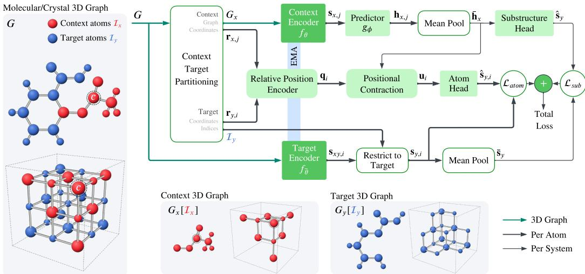  
Figure 1: Overview of Atom-JEPA. Molecular and crystalline structures are partitioned into complementary context (red) and target (blue) subgraphs by sampling a k-hop neighborhood around an anchor atom. A 3D equivariant graph neural network encodes the context, which is then used to predict target representations at two scales: individual atoms and mean-pooled substructures. Target representations are extracted from the full structure after using a target encoder updated as an exponential moving average of the context encoder. Pretraining minimizes prediction errors in latent space, with the two subgraphs alternating as context and target. The pretrained context encoder is subsequently fine-tuned for downstream property prediction.

In this work, we propose and demonstrate Atom-JEPA, a performant adaptation of the joint-embedding predictive architecture framework (LeCun, 2022) to 3D atomistic systems. Specifically, Atom-JEPA combines complementary atom-level and substructure-level predictive objectives in latent space, using only 3D positions and atom types. In contrast, existing approaches based on 3D atomistic structure primarily formulate self-supervision through prediction or reconstruction in the input space, combining 3D information with other modalities, or employing latent-space predictive objectives only at the substructure level. For an overview of Atom-JEPA, we refer to Fig. 1. We train Atom-JEPA models on both molecular and crystalline structures, analyse their learned embedding spaces, and finally evaluate their performance on supervised downstream tasks spanning ADMET, quantumchemical, and crystalline material properties. To summarise:

1. We propose Atom-JEPA, to the best of our knowledge, the first JEPA-style loss that operates both on the atom- and substructure level of 3D atomistic systems alone.

2. We show that Atom-JEPA outperforms most existing open-source models and methods across ADMET, quantum-chemical and crystalline material property predictions.

3. We analyse the learned embeddings of Atom-JEPA trained models, illustrating where they do (and do not) separate atomistic systems by higher-order structural and functional groups.

## 2 RELATED WORK

Supervised pretraining Supervised pretraining trains a neural network on a large labeled dataset, before finetuning or adapting it to downstream tasks (Shoghi et al., 2024; Ivković et al., 2024; Kong et al., 2025; Kim et al., 2026). For atomistic systems, models are typically pretrained on energies and forces computed using density functional theory (DFT), and while these labels provide rich supervision about the underlying potential-energy surface, this pretraining objective may not capture all information relevant to diverse downstream properties. Another limitation is scalability: generating high-quality labels for molecules or crystals is computationally expensive. OMol25, for example, contains labels for 150 million configurations of atomistic systems at the ωB97M-V/def2-TZVPD level of theory and required approximately 6.6 billion CPU hours to generate (Levine et al., 2026). In contrast, SSL provides a route to exploiting structural data without requiring expensive label simulations.

Self-supervised pretraining Self-supervised learning as pretraining has also seen increasing attention in recent years. One of the earliest methods used VAEs, where the authors learn a latent representation of molecules by training a VAE on SMILES strings (Gómez-Bombarelli et al., 2018). Since then, the development has been wide and varied. Several works have done SSL on 2D graphs, using both masking and contrastive learning losses (Hu et al., 2020; Li et al., 2022; Wang et al., 2023; Xia et al., 2023; Xue et al., 2026) and more recently, similar losses have been proposed for 3D molecular graphs, with the expectation that features incorporating geometry should allow better downstream performance (Zhu et al., 2022; Zhou et al., 2023; Wu et al., 2025). Finally, a recent surge of papers has proposed using positional 3D denoising, sometimes in combination with masking losses, as a pretraining objective (Zaidi et al., 2023; Feng et al., 2023; Liu et al., 2025; Perez & Gomez-Bombarelli, 2026; Morehead et al., 2026).

Joint-Embedding Predictive Architecture Joint-embedding predictive architectures (JEPA) (Le-Cun, 2022) predict directly in latent space rather than in the input domain, and rely on generating views of data which teaches the model to focus on higher, more abstract level features of datapoints by using a predictor network. Graph-JEPA (Skenderi et al., 2025) divides 2D graphs into sub-graphs, and uses these sub-graphs as context and target views, but without a node-level objective. Polymer-JEPA (Piccoli et al., 2026) extends the Graph-JEPA framework to 2D polymers by changing the target encoder to encode the full polymer, while only computing the loss over a target subgraph, by pooling the embeddings of the nodes in that subgraph that are not contained within the context subgraph, again with no node-level objective, and on 2D graphs. Crys-JEPA (Liu et al., 2026) operates on sequences (created from the 3D crystal graph) using a Transformer and generates contexts by rotating and translating original target graphs, whilst using formation energy in the loss to produce energyaware embeddings. C-Free (Ariguib et al., 2026) is most similar to our method, but with significant differences: C-Free operates on 2D and 3D graphs jointly and generates contexts via k-hops along covalent bonds, where the targets are the complements to the context subgraph. In comparison, we sidestep the need for multiple modalities by introducing an atom-level JEPA objective, and generating contexts via k-hops on a cutoff radius based graph. Most recently, Mol-JEPA (Rottach et al., 2026) is a framework in which representations from multiple pretrained models, computed descriptors, and experimental measurements define different molecular modalities, with masked modalities predicted in latent space from the remaining modalities. To summarise, our method is to the best of our knowledge, the first JEPA model for atomistic systems to learn atomic representations solely through latent-space prediction between 3D structural views.

## 3 METHOD

The core idea of Atom-JEPA is analogous to I-JEPA for images (Assran et al., 2023), but tailored to atomistic systems in 3D space: given part of a molecule or crystal (context view), predict the representation of the remaining part (target view) using context and target encoders coupled through an exponential moving average (EMA). We consider two prediction objectives: (1) an atom-level objective that predicts the representation of each atom in the target view, and (2) a substructure-level objective that predicts the mean-pooled representation of all target atoms. For the context encoder, target encoder, and predictor, we use an SE(3)-equivariant graph neural network (GNN).

We restrict our training data to structures that are close to local minima of the potential energy surface, as including off-equilibrium structures without information about their relative stability (e.g. total energy), could make the learning problem ambiguous. We discuss this choice further in Section A.4.

## 3.1 3D GRAPH REPRESENTATION AND PARTITIONING

We represent an atomistic system with N atoms by a 3D graph $G = ( V , E )$ . The node set $V =$ $\{ ( z _ { i } , \mathbf { \bar { r } } _ { i } ) \} _ { i = 1 } ^ { N }$ represents atoms by their species $z _ { i }$ and coordinates $\mathbf { r } _ { i } ~ \in ~ \mathbb { R } ^ { 3 }$ , while the edge set $\dot { E } = \{ ( i , j ) \mid i \neq j , \| { \bf r } _ { i } - { \bf r } _ { j } \| < \dot { r } _ { c } \}$ encodes spatial proximity defined by a cutoff radius $r _ { c }$ For crystalline systems, the edge set is constructed under periodic boundary conditions, including edges to periodic images within the cutoff radius.

Given an atomistic system, we partition atom indices into a k-hop EgoNet $\mathcal { T } _ { \mathrm { a } }$ and its complement $\mathcal { T } _ { \mathrm { b } }$ we sample an anchor atom $c \sim { \mathrm { U n i f } } \{ 1 , \ldots , N \}$ and a hop count k ～ Unif K from a predefined set of hop counts $\kappa .$ and define the EgoNet centered at c and its complement as

$$
{ \mathcal { T } } _ { \mathrm { a } } = \{ i \in \{ 1 , \dots , N \} \mid d ( c , i ) \leq k \} , \quad { \mathcal { T } } _ { \mathrm { b } } = \{ 1 , \dots , N \} \setminus { \mathcal { T } } _ { \mathrm { a } } ,\tag{1}
$$

where $d ( c , i )$ denotes the shortest-path distance between atoms c and $i ,$ measured in number of edges. The corresponding induced subgraphs are $G _ { \mathrm { a } } = G [ \mathcal { T } _ { \mathrm { a } } ]$ and $G _ { \mathrm { b } } = G [ \mathcal { T } _ { \mathrm { b } } ]$ where

$$
{ \cal G } [ { \cal Z } ] = ( V _ { \cal Z } , E _ { \cal Z } ) , \quad V _ { \cal Z } = \{ ( z _ { i } , { \bf r } _ { i } ) \mid i \in { \cal Z } \} , \quad E _ { \cal Z } = \{ ( i , j ) \in { \cal E } \mid i , j \in { \cal Z } \} .\tag{2}
$$

For each partition, we train in both prediction directions, defining the context and target graphs $( G _ { \mathrm { x } } , G _ { \mathrm { y } } )$ as either $( G _ { \mathrm { a } } , G _ { \mathrm { b } } )$ or $( G _ { \mathrm { b } } , G _ { \mathrm { a } } )$

## 3.2 CONTEXT, TARGET AND PREDICTOR MODELS

The context and target encoders, $f _ { \theta }$ and $f _ { \bar { \theta } }$ respectively, share the same 3D equivariant GNN architecture, taking 3D graphs as inputs and producing atom-level features. The parameters of the context encoder, $\theta ,$ are updated via gradients, whereas the target encoder parameters, ${ \bar { \theta } } ,$ are an exponential moving average of $\theta .$ The context encoder is only given context graph $G _ { x } ,$ , whilst the target encoder is given the full graph G; the JEPA loss is only computed over the target graph $G _ { y }$ We label the context encoder output as ${ \bf s } _ { x }$ and the target encoder output on the $G _ { y }$ graph as $\mathbf { s } _ { y } .$

Given the context representations $\mathbf { s } _ { x } .$ , the predictor, $g _ { \phi } .$ predicts representations produced by the target encoder. The predictor consists of a shallow 3D equivariant GNN backbone followed by objective-specific readout heads. We consider two prediction objectives: (1) a substructure objective, $\mathcal { L } _ { \mathrm { s u b } }$ , that targets a global representation of the target subgraph, and (2) an atom-level objective, $\mathcal { L } _ { \mathrm { a t o m } }$ , that targets the representation of each target atom. We write the atom features produced by the predictor as $\mathbf { h } _ { x }$ and the mean-pooled features as $\bar { \mathbf { h } } _ { x }$

## 3.3 PREDICTION OBJECTIVES & ATOM-JEPA LOSS

Substructure Objective In the substructure objective, the target is the mean-pooled invariant scalar features produced by the target encoder indexed over the target subgraph, whereas the prediction is constructed by passing the invariant component of the pooled context through a two-layer MLP mapping into the feature space of the target encoder,

$$
\bar { \bf s } _ { \mathrm { y } } = \frac { 1 } { | \mathcal { T } _ { \mathrm { y } } | } \sum _ { i \in \mathcal { T } _ { \mathrm { y } } } { \bf s } _ { \mathrm { y } , i } ^ { ( 0 ) } \mathrm { a n d } \hat { \bar { \bf s } } _ { \mathrm { y } } = R _ { \phi } ^ { \mathrm { s u b } } ( \bar { \bf h } _ { \mathrm { x } } ) = { \bf M } { \bf L } { \bf P } ( \bar { \bf h } _ { \mathrm { x } } ^ { ( 0 ) } ) ,\tag{3}
$$

where $( \cdot ) ^ { ( 0 ) }$ denotes the zero-th degree (invariant) features alone.

Atom-level Objective The atom-level objective instead produces one prediction $\hat { \mathbf { s } } _ { \mathrm { y } , i }$ for every target atom $i \in \mathcal { T } _ { \mathrm { y } }$ , which is compared against the corresponding target encoder representation ${ \bf s } _ { \mathrm { y } , i }$ In addition to the context features, the atom-level readout head of the predictor is provided with an equivariant relative positional encoding $\mathbf { q } _ { i }$ of the target atom's position relative to the context subgraph,

$$
\hat { \mathbf { s } } _ { \mathrm { y } , i } = R _ { \phi } ^ { \mathrm { a t o m } } ( \bar { \mathbf { h } } _ { \mathrm { x } } , \mathbf { q } _ { i } ) = \mathbf { M } \mathbf { L } \mathrm { P } ( \mathbf { u } _ { i } ) , \quad i \in \mathcal { T } _ { \mathrm { y } } ,\tag{4}
$$

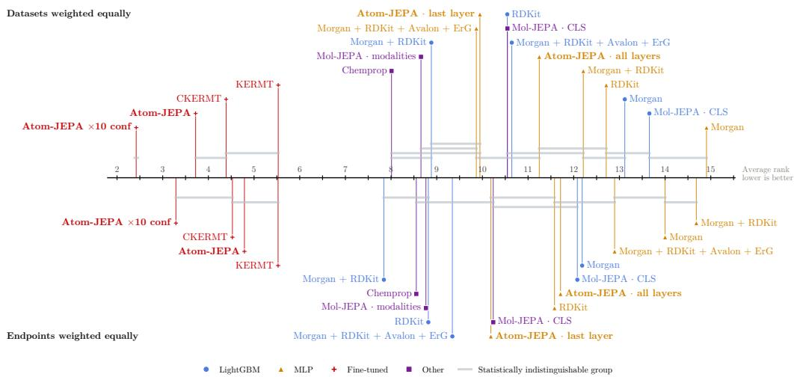  
Figure 2: Average rank across 38 endpoints from three benchmarks (Biogen 4 endpoints, ChEMBL-MT 25 endpoints, ExpansionRx 9 endpoints). Top part weights each dataset equally, whereas bottom part weighs each endpoint equally. Bars join models whose paired rank difference could not be distinguished from zero by a stratified seed/fold bootstrap over endpoints $( 1 0 ^ { 6 }$ replicates, resampled within dataset, 95% BCa interval). Tables with individual results can be found in Section E.

where $\mathbf { u } _ { i }$ is constructed by computing the inner product between each feature channel in $\mathbf { q } _ { i }$ and $\bar { \mathbf { h } } _ { \mathrm { x } }$ and concatenating the individual inner products. We refer to Appendix Sections A.3.2 and A.3.3 for details on the construction of $\mathbf { u } _ { i }$ and $\mathbf { q } _ { i }$ respectively.

Atom-JEPA Loss We use mean squared error between predicted and target representations, $\begin{array} { r } { \ell ( { \bf a } , { \bf b } ) = \frac { 1 } { C } \| { \bf a } - { \bf b } \| _ { 2 } ^ { 2 } } \end{array}$ , where $C$ is the feature dimension as the loss. The substructure and atom-level objectives are thus defined as

$$
\mathcal { L } _ { \mathrm { s u b } } ^ { x  y } = \frac { 1 } { B } \sum _ { g = 1 } ^ { B } \ell ( \hat { \mathbf { s } } _ { \mathrm { y } } ^ { ( g ) } , \bar { \mathbf { s } } _ { \mathrm { y } } ^ { ( g ) } ) \quad \mathrm { a n d } \quad \mathcal { L } _ { \mathrm { a t o m } } ^ { x  y } = \frac { 1 } { \sum _ { g = 1 } ^ { B } | \mathcal { Z } _ { \mathrm { y } } ^ { ( g ) } | } \sum _ { g = 1 } ^ { B } \sum _ { i \in \mathcal { Z } _ { \mathrm { y } } ^ { ( g ) } } \ell ( \hat { \mathbf { s } } _ { \mathrm { y } , i } , \mathbf { s } _ { \mathrm { y } , i } ) ,\tag{5}
$$

where $x  y$ denotes the prediction direction in which $G _ { x }$ is used as the context graph and $G _ { y }$ as the target graph and B is the batch size. The subgraph loss is a mean over the B graphs in a batch, whilst the atom-level loss is a mean over all the target atoms in a batch $B .$ The final loss is then,

$$
\mathcal { L } _ { \mathrm { A t o m \mathrm { J E P A } } } = \lambda _ { \mathrm { a t o m } } \mathcal { L } _ { \mathrm { a t o m } } + \lambda _ { \mathrm { s u b } } \mathcal { L } _ { \mathrm { s u b } } ,\tag{6}
$$

where $\lambda _ { \{ \mathrm { a t o m , s u b } \} }$ control the weight of each objective.

## 4 EXPERIMENTS

We use EquiformerV3 (Liao et al., 2026) as the SE(3) equivariant GNN architecture for the context encoder, target encoder, and predictor. For molecular pretraining, we use \~19 million molecules from Uni-Mol (Zhou et al., 2023); for crystal pretraining, we use \~1.7 million structures from Alexandria (Cavignac et al., 2026) with energies less than 50 meV/atom above the convex hull. Details about datasets and preprocessing are provided in App. C. Pretraining details are provided in App. G. After pretraining, we finetune the context encoder for downstream property prediction across both domains. For molecules, we consider ADMET prediction and quantum-chemical property prediction on QM9 (Ramakrishnan et al., 2014). For crystals, we evaluate materials-property prediction using the Matbench benchmark suite (Dunn et al., 2020). We further conduct ablation studies to assess the effects of pretraining, varying the pretraining prediction objective, and the scale and composition of the pretraining data (Section 4.2).

Table 1: ADMET results. For each endpoint, the model with the lowest mean error across folds is designated as Best, and an unpaired Tukey's test is used to identify additional models that are statistically indistinguishable (Indist.) from the best model at the 95% confidence level (see Appendix E.1). Sum denotes the total best or indistinguishable endpoints. \* reports only the mean error across splits; these values are treated as constant in the statistical tests. † did not report Biogen results for two targets and is therefore excluded from the statistical tests for these targets.
<table><tr><td rowspan="2">Model</td><td colspan="2">Biogen (6)</td><td colspan="2">ChEMBL MT (25)</td><td colspan="2">ExpansionRx (9)</td><td rowspan="2">Total (40)</td></tr><tr><td>Best/Indist.</td><td>Sum</td><td>Best/Indist.</td><td>Sum</td><td>Best/Indist.</td><td>Sum</td></tr><tr><td>Atom-JEPA × 10 conf</td><td>3/3</td><td>6</td><td>6/10</td><td>16</td><td>7/2</td><td>9</td><td>31</td></tr><tr><td>Atom-JEPA</td><td>0/6</td><td>6</td><td>0/15</td><td>15</td><td>019</td><td>9</td><td>30</td></tr><tr><td>CKERMT (Xue et al., 2026)</td><td>0/6</td><td>6</td><td>11/8</td><td>19</td><td>1/3</td><td>4</td><td>29</td></tr><tr><td>KERMT* (Adrian et al., 2025)</td><td>1/1†</td><td>2</td><td>3/9</td><td>12</td><td>0/1</td><td>1</td><td>15†</td></tr><tr><td>Chemprop (Graff et al., 2026)</td><td>1/3</td><td>4</td><td>0/12</td><td>12</td><td>0/1</td><td>1</td><td>17</td></tr><tr><td>Mol-JEPA · modalities (Rottach et al., 2026)</td><td>1/2</td><td>3</td><td>2/5</td><td>7</td><td>0/3</td><td>3</td><td>13</td></tr><tr><td>LightBGM Morgan + RDKit</td><td>0/2</td><td>2</td><td>3/9</td><td>12</td><td>1/2</td><td>3</td><td>17</td></tr></table>

## 4.1 EXPERIMENTAL RESULTS

Results on ADMET We extensively investigate the transfer learning for ADMET tasks on three different datasets, spanning various amounts of data, label sparsity, and splitting methods:

1. ChEMBL-MT (Adrian et al., 2025): Multi-task, multiple sources of data, 25 targets, Taylor-Butina clustering on Morgan fingerprints with pre-defined splits.

2. ExpansionRx (MacDermott-Opeskin & Castellanos, 2026): Multi-task, single source for collection, 10 targets, temporal split of training and test data.

3. Biogen ADME (Fang et al., 2023): Multi-task, internal source, 6 targets, Bemis–Murcko scaffold and Taylor-Butina clustering on Morgan fingerprints.

For completeness, we also include results on TDC-ADMET (Huang et al., 2021) in Section E, but exclude them from the statistical analysis, due to reported data acquisition and leaderboard inconsistencies (Koleiev et al., 2026). As Atom-JEPA requires 3D structures, we use the Uni-Mol pipeline to generate conformers (described in Section H.1.2). To ensure a fair comparison, we tune the hyperparameters using the training data from a cluster split on Biogen from Adrian et al. (2025). We use the average validation MAE over endpoints as our selection criteria (details in Section H.1). We follow the transfer learning setup of multi-head multi-target training strategy used by CKERMT (Xue et al., 2026) with some minor changes (see Section H).

We present the aggregated results from the three main ADMET datasets in Fig. 2 and Table 1. Atom-JEPA reaches on par or significantly better performance than the next best model, CKERMT, and outperforms fingerprint-based models. Notably, Atom-JEPA has no explicitly coded expert chemical knowledge in comparison to all other models, including the self-supervised models of KERMT and CKERMT. This also explains why we find that Atom-JEPA's predictions are the least correlated with other models tested, see Appendix E.2. This is especially useful for the common ADMET practice of ensembling models. We additionally observe significantly improved prediction accuracy when averaging predictions over our 10 generated conformers (Atom-JEPA × 10 conf) for each molecule, suggesting that different conformers can provide different information to the prediction.

Interestingly, Atom-JEPA performs especially well on ExpansionRX, a dataset that differs notably from other benchmarks (Xue et al., 2026), including our pretraining data Uni-Mol, where only a single molecule shares the same scaffold (see Table 6). This suggests that the features learned by Atom-JEPA are more robust at transferring, compared to existing models.

Results on QM9 QM9 consists of ～130k small organic molecules with 12 quantum-chemical target properties. We use the random 110k/10k/11k split most commonly used in the literature; finetuning details are given in Section H.2. The same optimization protocol and hyperparameters are used for all targets, and all readout heads use sum aggregation over per-atom features.

Table 2 compares Atom-JEPA with previous models. 3D-EMGP, DenoiseVAE, TriForces and JMP-L use different random data partitions; their results are shown in grey for reference and excluded from highlighting. Atom-JEPA outperforms all SSL pretraining methods on 11/12 targets and ties with SliDe on the remaining target, $C _ { \nu } .$ Overall, Atom-JEPA achieves the best results on 8/12 targets with tied performance on α and $C _ { \nu }$ . On G and $U _ { 0 }$ it is within 0.3% of the best result, making it best or within 0.3% of the best on 10/12 targets. Relative to Equiformerv2, the predecessor of our Equiformery3 backbone, Atom-JEPA reduces MAE on all 12 targets, with a mean relative reduction of 36%.

Table 2: QM9 results. The evaluation metric is MAE (↓). Bold: best result in each column; underline: within 10% of the best. Grey rows with † use a different random train/validation/test split from 110k/10k/11k and are shown for reference only, excluded from highlighting.“"denotes unreported targets.
<table><tr><td>Task Units</td><td>α ma3</td><td>∆ε meV</td><td>εHOMO meV</td><td>€LUMO meV</td><td>µ mD</td><td>Cν mcal</td><td>G meV</td><td>H meV</td><td>R2 ma2</td><td>U meV</td><td>U0 meV</td><td>ZPVE meV</td></tr><tr><td>No pretraining</td><td></td><td></td><td></td><td></td><td></td><td>mol K</td><td></td><td></td><td></td><td></td><td></td><td></td></tr><tr><td>MACE (Batatia et al., 2022)</td><td>38</td><td>42</td><td>22</td><td>19</td><td>15</td><td>21</td><td>5.5</td><td>4.7</td><td>210</td><td>4.1</td><td>4.1</td><td>1.23</td></tr><tr><td>Equiformery2 (Liao et al., 2024)</td><td>47</td><td>29.0</td><td>14.4</td><td>13.3</td><td>9.9</td><td>23</td><td>7.57</td><td>6.22</td><td>186</td><td>6.49</td><td>6.17</td><td>1.47</td></tr><tr><td>GotenNetL (Aykent &amp; Xia, 2025)</td><td>28</td><td>19.8</td><td>13.4</td><td>12.2</td><td>6.7</td><td>19</td><td>4.98</td><td>3.30</td><td>24</td><td>3.41</td><td>3.37</td><td>1.08</td></tr><tr><td>Supervised pretraining</td><td></td><td></td><td></td><td></td><td></td><td></td><td></td><td></td><td></td><td></td><td></td><td></td></tr><tr><td>Transformer-M (Luo et al., 2023)</td><td>41</td><td>27.4</td><td>17.5</td><td>16.2</td><td>37</td><td>22</td><td>9.63</td><td>9.39</td><td>75</td><td>9.41</td><td>9.37</td><td>1.18</td></tr><tr><td>JMP-L† (Shoghi et al., 2024)</td><td>32</td><td>19.1</td><td>8.8</td><td>8.6</td><td>8.0</td><td>17</td><td>4.3</td><td>2.8</td><td>163</td><td>2.8</td><td>2.9</td><td>0.9</td></tr><tr><td>Self-supervised pretraining only</td><td></td><td></td><td></td><td></td><td></td><td></td><td></td><td></td><td></td><td></td><td></td><td></td></tr><tr><td>3D-EMGP† (Jiao et al., 2023)</td><td>57</td><td>37.1</td><td>21.3</td><td>18.2</td><td>20</td><td>26</td><td>9.30</td><td>8.70</td><td>92</td><td>8.60</td><td>8.60</td><td>1.38</td></tr><tr><td>GeoSSL-DDM (Liu et al., 2023)</td><td>46</td><td>40.2</td><td>23.5</td><td>19.4</td><td>15</td><td>24</td><td>7.65</td><td>7.09</td><td>122</td><td>6.99</td><td>6.92</td><td>1.31</td></tr><tr><td>Coord (Zaidi et al., 2023; Feng et al., 2023)</td><td>52</td><td>31.8</td><td>17.7</td><td>14.3</td><td>12</td><td>20</td><td>6.91</td><td>6.45</td><td>450</td><td>6.11</td><td>6.57</td><td>1.71</td></tr><tr><td>Frad (VRN) (Ni et al., 2024a)</td><td>42</td><td>27.7</td><td>17.9</td><td>13.8</td><td>11</td><td>21</td><td>6.03</td><td>6.01</td><td>354</td><td>5.35</td><td>5.41</td><td>1.63</td></tr><tr><td>Frad (RN) (Feng et al., 2023)</td><td>37</td><td>27.8</td><td>15.3</td><td>13.7</td><td>10</td><td>20</td><td>6.19</td><td>5.55</td><td>342</td><td>5.62</td><td>5.33</td><td>1.42</td></tr><tr><td>DenoiseVAE† (Liu et al., 2025)</td><td>65</td><td>26.0</td><td>14.2</td><td>11.9</td><td>7.9</td><td>15</td><td>5.35</td><td>4.19</td><td>62</td><td>4.03</td><td>4.31</td><td>1.03</td></tr><tr><td>SliDe (Ni et al., 2024b)</td><td>37</td><td>26.2</td><td>13.6</td><td>12.3</td><td>8.7</td><td>19</td><td>5.37</td><td>4.26</td><td>341</td><td>4.29</td><td>4.28</td><td>1.52</td></tr><tr><td>TriForces† (Ramlaoui et al., 2026)</td><td>75</td><td>38.8</td><td>20.2</td><td>20.4</td><td>18.0</td><td>31</td><td></td><td></td><td></td><td></td><td>8.9</td><td></td></tr><tr><td>Atom-JEPA</td><td>28</td><td>24.6</td><td>12.2</td><td>10.9</td><td>6.1</td><td>19</td><td>4.99</td><td>3.28</td><td>29</td><td>3.38</td><td>3.38</td><td>1.06</td></tr></table>

GotenNetL, trained from scratch, remains strong, achieving the best performance on 4/12 targets, which suggests that this architecture is particularly well suited to QM9. As GotenNet is a 3D equivariant GNN, Atom-JEPA pretraining could in principle be applied to its backbone. Beyond using a different random split with a smaller test set and correspondingly larger training set, JMP-L is not directly comparable, as it is pretrained with supervised DFT labels aligned with several QM9 targets, on molecules that overlap with QM9. Even so, Atom-JEPA achieves lower error on α, μ, and R2, three targets not aligned with JMP-L's supervised pretraining labels, suggesting stronger transfer.

Results on Matbench Table 3 reports means and standard deviations across the five official folds for 8 Matbench tasks; training details are in Section H.3. Baseline results are taken from the official leaderboard for CGCNN, ALIGNN, and coGN; from the original papers for Crystal Twins (CT) and JMP-L; and from the Triforces paper for MACE, Orb, eSEN, and both TriForces variants.

Table 3: Matbench results. The evaluation metric is MAE (↓) for all tasks except MP Is Metal, which uses F1 (↑). Values are means over five folds, with standard deviations where available. Pretrained models are ordered by increasing pretraining dataset size, shown in parentheses after each method. Bold: best result in each task.“" denotes targets not reported by the original authors. \* results from (Ramlaoui et al., 2026).
<table><tr><td>Tasks</td><td>Phonons cm−1 1,265</td><td>Dielectric</td><td>Log GVRH log10(GPa)</td><td>Log KVRH log10(GPa)</td><td>Perovskites meV</td><td>MP Gap eV</td><td>MP E Form meV/atom</td><td>MP Is Metal</td></tr><tr><td>Units #Samples</td><td></td><td>一 4,764</td><td>10,987</td><td>10,987</td><td>18,928</td><td>106,113</td><td>132,752</td><td>F1 106,113</td></tr><tr><td>No pretraining</td><td></td><td></td><td></td><td></td><td></td><td></td><td></td><td></td></tr><tr><td>ĆGCNN (Xie &amp; Grossman, 2018)</td><td>57.8±12.3</td><td>.599±.083</td><td>.090±.002</td><td>.071±.003</td><td>45.2±.7</td><td>.297±.004</td><td>33.7±.6</td><td>.946±.008</td></tr><tr><td>ALIGNN (Choudhary &amp; DeCost, 2021)</td><td>29.5±2.1</td><td>.345±.087</td><td>.072±.001</td><td>.057±.003</td><td>28.8±.9</td><td>.186±.003</td><td>21.5±.5</td><td>.902±.002</td></tr><tr><td>coGN (Ruff et al., 2024)</td><td>29.7±2.0</td><td>.309±.086</td><td>.069±.001</td><td>.054±.003</td><td>26.9±.8</td><td>.156±.002</td><td>17.0±.3</td><td>.901±.003</td></tr><tr><td></td><td></td><td></td><td></td><td></td><td></td><td></td><td></td><td></td></tr><tr><td>With pretraining</td><td></td><td></td><td></td><td></td><td></td><td></td><td></td><td></td></tr><tr><td>CTSimSiam (Magar et al., 2022) (0.43M) Atom-JEPA (1.7M)</td><td>48.9±7.7</td><td>.417±.079</td><td>.087±.003</td><td>.067±.003</td><td>42.0±1.0 29.1±1.0</td><td>.281±.025</td><td>37.0±.0</td><td>.908±.002</td></tr><tr><td>Orb* (Neumann et al., 2024) (4M)</td><td>23.3±4.5</td><td>.268±.074 .251</td><td>.067±.001 .063</td><td>.047±.002 .051</td><td>30.7</td><td>.162±.002</td><td>20.3±.2 21.1</td><td>.895</td></tr><tr><td>MACE* (Batatia et al., 2022)(4M)</td><td>26.2 36.7</td><td>.279</td><td>.082</td><td>.055</td><td>61.4</td><td>.194 .370</td><td>40.8</td><td>.858</td></tr><tr><td>eSEN* (Fu et al., 2025) (4M)</td><td>57.8</td><td>.205</td><td>.093</td><td>.072</td><td>40.1</td><td>.392</td><td>83.5</td><td>.811</td></tr><tr><td>TriForces MACE (Ramlaoui et al., 2026) (5M)</td><td>27.6</td><td>.159</td><td>.073</td><td>.050</td><td>35.1</td><td>.250</td><td>34.4</td><td>.876</td></tr><tr><td>TriForces eSEN (Ramlaoui et al., 2026) (5M)</td><td>19.5</td><td>.232</td><td>.058</td><td>.043</td><td>25.6</td><td>.139</td><td>20.2</td><td>.888</td></tr><tr><td></td><td></td><td></td><td>.059</td><td>.045</td><td>26.0</td><td>.091</td><td>10.1</td><td></td></tr><tr><td>JMP-L (Shoghi et al., 2024) (120M)</td><td>20.6</td><td>.249</td><td></td><td></td><td></td><td></td><td></td><td></td></tr></table>

Compared with models trained from scratch, Atom-JEPA achieves the lowest error on the four smaller tasks, with improvements of up to 21%. On the larger MP regression tasks, coGN remains stronger, although pretraining improves our encoder by 12–15% on these tasks relative to training from scratch (Section 4.2). Among pretrained models with at most 4M pretraining structures, Atom-JEPA achieves the lowest error on 6/8 tasks, and outperforms Crystal Twins on all tasks. This holds even though MACE, Orb, and eSEN are pretrained on 4M structures with energy and force labels, while Atom-JEPA is pretrained on 1.7M structures without any labels.

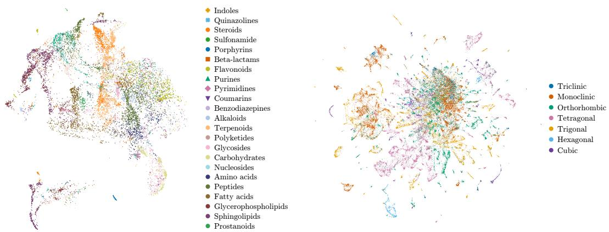  
Figure 3: UMAP projections of Atom-JEPA representations for molecules annotated as belonging to one chemical family from the 32,252 molecules in the manually annotated three-star subset of ChEBI (Malik et al., 2026), colored by chemical family, and 50,000 randomly sampled crystals from the Alexandria pretraining dataset, colored by crystal system.

Comparison to TriForces (5M structures) highlights the importance of the backbone architecture: Atom-JEPA outperforms TriForces MACE on 7/8 tasks, whereas compared to TriForces eSEN it performs worse, with the exception of MP Is Metal (.908 versus .888 F1) and MP E Form, which is essentially tied (20.3 versus 20.2 meV/atom). JMP-L, pretrained with supervision on 120M structures achieves lower MAE than Atom-JEPA on all seven regression tasks.

## 4.2 ABLATION STUDIES

Effect of Atom-JEPA pretraining We compare the Atom-JEPA pretrained encoder to a randomly initialized counterpart on both ADMET and Matbench, using the training procedures described in Sections H.1 and H.3. Atom-JEPA pretraining improves downstream performance for both molecular and crystalline tasks (Table 4). On the molecular ADMET benchmarks, pretraining reduces error by 9.6% on Biogen and 8.5% on ExpansionRx. ChEMBL-MT does not see an improvement, but we suspect that it is confounded by hyperparameters not generalizing well from Biogen to the much larger dataset size. On Matbench, pretraining improves all eight tasks and all 40 task-fold combinations, yielding mean foldwise relative MAE reductions of 10.1–14.5% across the seven regression tasks and increasing mean classification F1 from 0.9010 to 0.9083. These gains span datasets ranging from 1,265 to 132,752 samples and persist on the largest regression benchmarks: MP Gap and MP E Form improve by 14.5% and 12.0%, respectively. Even without pretraining, the encoder is competitive with established from-scratch models, matching or exceeding their performance on several tasks (Table 3 & Table 4) . This confirms that the gains from pretraining do not simply stem from a weak baseline.

We hypothesize that these performance gains arise because Atom-JEPA pretraining encourages representations to organize according to high-level features that transfer well across downstream tasks in both domains. The UMAP visualizations in Fig. 3 suggest such organization may be by chemical family or crystal system, providing a qualitative indication consistent with this hypothesis. In contrast, an encoder trained from scratch starts from representations shaped by the inductive biases of the backbone architecture, which primarily organize systems according to size and composition initially. For a deeper analysis of the learned representations of Atom-JEPA in Section D.

Pretraining objective Next, we examine how the choice of pretraining prediction objective affects downstream performance. In addition to the joint-objective encoder pretrained on the 19M molecules from Uni-Mol, we pretrain an encoder using only the atom-level objective on the same data. We also pretrain three encoders on the 130K molecules from the QM9 dataset using atom-only, substructureonly, and joint objectives. All encoders are evaluated using all-layer MLP probes on frozen features, on the 12 QM9 properties. With QM9 pretraining, atom-only achieves the lowest MAE on 10/12 properties, while substructure-only performs best on εLumo and the joint objective performs best on $R ^ { 2 } \left( \mathrm { F i g . 4 a } \right)$ . With Uni-Mol pretraining, the joint objective improves over atom-only on 10/12 properties, ties on $\mathrm { Z P V E , }$ and performs worse only on $\mu$ (Fig. 4b). We additionally compare the two Uni-Mol-pretrained encoders on the six Biogen ADME tasks. The joint objective performs better on average, although atom-only remains competitive, performing better or similarly on 3/6 tasks (Fig. 4d). These results suggest that the benefit of combining atom-level and substructure-level objectives depends on both the pretraining dataset and the downstream task.

Table 4: Effect of Atom-JEPA pretraining. Identical encoder architecture is compared with and without pretraining on identical official folds; values are means and standard deviations across the five folds or endpoints for ADMET tasks. $\Delta$ (rel.) is the mean fold-wise or endpoint relative improvement. “Impr." counts folds or endpoints on which pretraining wins; $p$ is a two-sided paired t-test over the five Matbench folds or mean MAE over the folds in the endpoints for ADMET tasks.
<table><tr><td>Task (Units)</td><td>#Samples</td><td>No pretraining</td><td>Atom-JEPA</td><td>∆ (rel.)</td><td>Impr..</td><td>p</td></tr><tr><td colspan="7">ADMET datasets</td></tr><tr><td>Biogen</td><td>3,521</td><td>.3825</td><td>.3458</td><td>9.6%</td><td>6/6</td><td>.011</td></tr><tr><td>ExpansionRX</td><td>7,608</td><td>.3673</td><td>.3361</td><td>8.5%</td><td>9/9</td><td>&lt; .001</td></tr><tr><td>ChEMBL-MT</td><td>114,112</td><td>.4543</td><td>.4567</td><td>-.5%</td><td>12/25</td><td>.57</td></tr><tr><td colspan="7">Matbench</td></tr><tr><td>Phonons  $( \mathrm { c m } ^ { - 1 } )$ </td><td>1,265</td><td>26.9±4.0</td><td>23.3±4.5</td><td>13.5%</td><td>5/5</td><td>.015</td></tr><tr><td>Dielectric (−)</td><td>4,764</td><td>.298±.084</td><td>.268±.074</td><td>10.1%</td><td>5/5</td><td>.011</td></tr><tr><td>Log  $\mathrm { G V R H ( \log _ { 1 0 } ( G P a ) ) }$ </td><td>10,987</td><td>.0773±.0010</td><td> $\mathbf { 0 6 7 0 } \div . 0 0 1 0$ </td><td>13.3%</td><td>5/5</td><td>&lt; .001</td></tr><tr><td>Log KVRH (log10(GPa))</td><td>10,987</td><td> $. 0 5 3 9 { \scriptstyle \pm . 0 0 3 4 }$ </td><td> $\mathbf { 0 4 7 3 } \pm . 0 0 2 1$ </td><td>12.3%</td><td>5/5</td><td>.001</td></tr><tr><td>Perovskites (meV)</td><td>18,928</td><td>32.5±.6</td><td> $\mathbf { 2 9 . 1 } \pm 1 . 0$ </td><td>10.5%</td><td>5/5</td><td>&lt; .001</td></tr><tr><td>MP Gap (eV)</td><td>106,113</td><td> $. 1 8 9 6 { \scriptstyle \pm . 0 0 2 2 }$ </td><td> $\mathbf { . 1 6 2 2 } \div . 0 0 2 2$ </td><td>14.5%</td><td>5/5</td><td>&lt; .001</td></tr><tr><td>MP E Form (meV/atom)</td><td>132,752</td><td>23.03±.29</td><td> $\mathbf { 2 0 . 2 6 } \mathbf { \div . } 1 9$ </td><td>12.0%</td><td>5/5</td><td>&lt; .001</td></tr><tr><td>MP Is Metal (F1)</td><td>106,113</td><td>.9010±.0021</td><td>.9083±.0024</td><td>.8%</td><td>5/5</td><td>&lt; .001</td></tr></table>

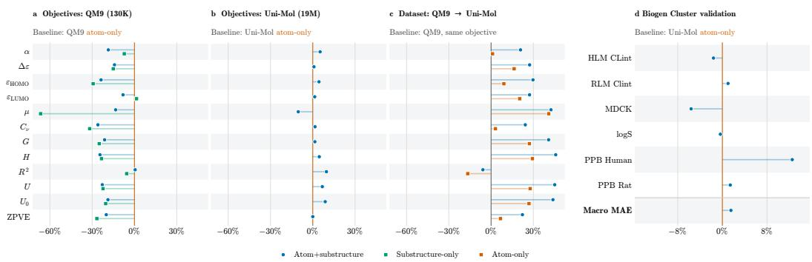  
Figure 4: Effect of pretraining objectives and dataset. Frozen-feature MLP probes across 12 QM9 targets. The horizontal axis shows relative MAE reduction to the baseline of each panel. Positive values indicate improvement. (a) Joint (Atom+substructure) and substructure-only objectives relative to atom-only pretraining on QM9. (b) The joint objective relative to atom-only pretraining on Uni-Mol. (c) Uni-Mol pretraining relative to QM9 pretraining, with the objective held fixed. (d) The joint objective relative to atom-only pretraining on Uni-Mol on Biogen ADME validation objective

Data scaling Increasing the pretraining dataset from 130k (QM9) to 19M molecules (Uni-Mol) improves both atom-only and joint-objective pretraining on 11/12 QM9 properties, with $R ^ { 2 }$ as the sole exception (Fig. 4c). The gains are particularly pronounced for the joint objective, including MAE reductions of 27% for $\Delta \varepsilon , 4 2 . 5 \%$ for $\mu ,$ and 45.9% for H. Notably, Uni-Mol pretraining substantially improves performance even though QM9 pretraining already exactly matches the molecular domain of the downstream evaluation. While this comparison changes both dataset size and composition, the results suggest that scaling Atom-JEPA pretraining to larger and more chemically and structurally diverse datasets could further improve downstream performance.

## 5 CONCLUSION

In this work, we proposed Atom-JEPA, a self-supervised pretraining framework for 3D atomic systems that combines atom-level and substructure-level prediction in latent space. Using structural data alone without expensive property labels nor molecular attributes as the pretraining signal, Atom-JEPA learns representations that transfer effectively to molecular ADMET, quantum-chemical, and crystalline materials property prediction. Ablation studies demonstrate consistent improvement over training the same encoder from scratch, and indicate potential for further increasing downstream performance by scaling to larger and more diverse pretraining data. Overall, Atom-JEPA establishes latent-space prediction from 3D structure as a promising approach to learning transferable representations for molecules and materials, reducing reliance on property-labeled pretraining data.

## ACKNOWLEDGEMENTS

This work was supported by the Novo Nordisk Foundation under grant no NNF25OC0095542 by funding KHS, FRJC and MNS (AI-driven materials optimization for light trapping in thin-film solar cells). This work was supported by the Novo Nordisk Foundation (Grant ID: NNF25OC0105141) by funding RHT, MJ and MNS and via access to the Gefion AI Supercomputer, operated by the Danish Centre for AI Innovation (DCAI).

## REPRODUCIBILITY STATEMENT

To facilitate full reproducibility, we report all hyperparameters used in our pretraining and downstream fine-tuning experiments. The source code for pretraining and all finetuning experiments can be found at https://github.com/khelverskovp/atom-jepa together with experimental results across all folds. Pretrained model checkpoints can be found at https : //huggingface. co/a tom-jepa/atom-jepa.

## REFERENCES

Josh Abramson, Jonas Adler, Jack Dunger, Richard Evans, Tim Green, Alexander Pritzel, Olaf Ronneberger, Lindsay Willmore, Andrew J. Ballard, Joshua Bambrick, Sebastian W. Bodenstein, David A. Evans, Chia-Chun Hung, Michael O'Neill, David Reiman, Kathryn Tunyasuvunakool, Zachary Wu, Akvilė Žemgulytė, Eirini Arvaniti, Charles Beattie, Ottavia Bertolli, Alex Bridgland, Alexey Cherepanov, Miles Congreve, Alexander I. Cowen-Rivers, Andrew Cowie, Michael Figurnov, Fabian B. Fuchs, Hannah Gladman, Rishub Jain, Yousuf A. Khan, Caroline M. R. Low, Kuba Perlin, Anna Potapenko, Pascal Savy, Sukhdeep Singh, Adrian Stecula, Ashok Thillaisundaram, Catherine Tong, Sergei Yakneen, Ellen D. Zhong, Michal Zielinski, Augustin Žídek, Victor Bapst, Pushmeet Kohli, Max Jaderberg, Demis Hassabis and John M. Jumper. Accurate structure prediction of biomolecular interactions with alphafold 3. Nature, 630(8016):493–500, 2024. doi: 10.1038/s41586-024-07487-w. URL https://doi.org/10.1038/s41586-024-07487-w.

Matthew Adrian, Yunsie Chung, Kevin Boyd, Saee Paliwal, Srimukh Prasad Veccham, and Alan C. Cheng. Multitask finetuning and acceleration of chemical pretrained models for small molecule drug property prediction. CoRR, abs/2510.12719, 2025. doi: 10.48550/ARXIV.2510.12719. URL https://doi.org/10.48550/arXiv.2510.12719.

Kumar K Agrawal, Arnab Kumar Mondal, Arna Ghosh, and Blake Richards. \alpha-req : Assessing representation quality in self-supervised learning by measuring eigenspectrum decay. In S. Koyejo, S. Mohamed, A. Agarwal, D. Belgrave, K. Cho, and A. Oh (eds.), Advances in Neural Information Processing Systems, volume 35, pp. 17626–17638. Curran Associates, Inc., 2022. doi: 10.52202 /068431-1281. URL https://proceedings.neurips.cc/paper\_files/paper/2 022/file/70596d70542c51c8d9b4e423f4bf2736-Paper-Conference.pdf.

Boshra Ariguib, Mathias Niepert, and Andrei Manolache. Learning the neighborhood: Contrast-free multimodal self-supervised molecular graph pretraining. In Forty-third International Conference on Machine Learning, 2026. URL https://openreview.net/forum?id=Vbj1jSaqTo.

Mahmoud Assran, Quentin Duval, Ishan Misra, Piotr Bojanowski, Pascal Vincent, Michael Rabbat, Yann LeCun, and Nicolas Ballas. Self-supervised learning from images with a joint-embedding predictive architecture. In 2023 IEEE/CVF Conference on Computer Vision and Pattern Recognition (CVPR), pp. 15619–15629. IEEE, 2023.

Sarp Aykent and Tian Xia. Gotennet: Rethinking efficient 3d equivariant graph neural networks. In The Thirteenth International Conference on Learning Representations, 2025. URL https : //openreview.net/forum?id=5wxCQDtbMo.

Ruilin Bai, Yu Yao, Qiaosong Lin, Lize Wu, Zhen Li, Huijuan Wang, Mingze Ma, Di Mu, Lingxiang Hu, Hai Yang, Weihan Li, Shaolong Zhu, Xiaojun Wu, Xianhong Rui, and Yan Yu. Preferable single-atom catalysts enabled by natural language processing for high energy density Na-S batteries. Nature Communications, 16(1):5827, 7 2025. ISSN 2041-1723. doi: 10.1038/s41467-025-60931-x. URLhttps://www.nature.com/articles/s41467-025-60931-x.

Ilyes Batatia, David Peter Kovacs, Gregor N. C. Simm, Christoph Ortner, and Gabor Csanyi. MACE: Higher order equivariant message passing neural networks for fast and accurate force fields. In Alice H. Oh, Alekh Agarwal, Danielle Belgrave, and Kyunghyun Cho (eds.), Advances in Neural Information ProcessingSystems, 2022. URL https ://openreview. net/forum?id=YP pSngE-ZU.

Théo Cavignac, Jonathan Schmidt, Pierre-Paul De Breuck, Antoine Loew, Tiago F. T. Cerqueira, Hai-Chen Wang, Anton Bochkarev, Yury Lysogorskiy, Aldo H. Romero, Ralf Drautz, Silvana Botti, and Miguel A. L. Marques. AI-driven expansion and application of the Alexandria database. Journal of Physics: Materials, 9(2):025014, 2026. doi: 10.1088/2515-7639/ae6620. URL https://doi.org/10.1088/2515-7639/ae6620.

Chai Discovery Team, Jacques Boitreaud, Jack Dent, Danny Geisz, Matthew McPartlon, Joshua Meier, Zhuoran Qiao, Alex Rogozhnikov, Nathan Rollins, Paul Wollenhaupt, and Kevin Wu. Zero-shot antibody design in a 24-well plate. bioRxiv, 2025. doi: 10.1101/2025.07.05.663018. URL ht tps : //www.biorxiv.org/content/early/2025/07/06/2025.07.05.663018.

Cheng-Han Chiang, Yung-Sung Chuang, and Hung-yi Lee. Recent advances in pre-trained language models: Why do they work and how do they work. In Miguel A. Alonso and Zhongyu Wei (eds.), Proceedings of the 2nd Conference of the Asia-Pacific Chapter of the Association for Computational Linguistics and the 12th International Joint Conference on Natural Language Processing: Tutorial Abstracts, pp. 8–15, Taipei, November 2022. Association for Computational Linguistics. doi: 10.18653/v1/2022.aacl-tutorials.2. URL https://aclanthology.org/2 022.aacl-tutorials.2/.

Kamal Choudhary and Brian DeCost. Atomistic line graph neural network for improved materials property predictions. npj Computational Materials, 7(1), November 2021. ISSN 2057-3960. doi: 10.1038/s41524-021-00650-1.URLhttp://dx.doi.org/10.1038/s41524-021-006 50-1.

François R J Cornet, Grigory Bartosh, Mikkel N. Schmidt, and Christian A. Naesseth. Equivariant neural diffusion for molecule generation. In The Thirty-eighth Annual Conference on Neural Information Processing Systems, 2024. URL https ://openreview. net/forum?id=40 pE5pFhW1.

Alexander Dunn, Qi Wang, Alex Ganose, Daniel Dopp, and Anubhav Jain. Benchmarking materials property prediction methods: the matbench test set and automatminer reference algorithm. npj Computational Materials, 6(1), 2020. ISSN 2057-3960. doi: 10.1038/s41524-020-00406-3. URL http://dx.doi.0rg/10.1038/s41524-020-00406-3.

Cheng Fang, Ye Wang, Richard Grater, Sudarshan Kapadnis, Cheryl Black, Patrick Trapa, and Simone Sciabola. Prospective validation of machine learning algorithms for absorption, distribution. metabolism, and excretion prediction: An industrial perspective. Journal of Chemical Information and Modeling, 63(11):3263–3274, 05 2023. ISSN 1549-9596. doi: 10.1021/acs.jcim.3c00160. URLhttps://doi.org/10.1021/acs.jcim.3c00160.

Shikun Feng, Yuyan Ni, Yanyan Lan, Zhi-Ming Ma, and Wei-Ying Ma. Fractional denoising for 3D molecular pre-training. In Andreas Krause, Emma Brunskill, Kyunghyun Cho, Barbara Engelhardt, Sivan Sabato, and Jonathan Scarlett (eds.), Proceedings of the 40th International Conference on Machine Learning, volume 202 of Proceedings of Machine Learning Research, pp. 9938–9961. PMLR,23-29Jul 2023. URL https://proceedings.mlr.press/v202/feng23c.h tml.

Xiang Fu, Brandon M Wood, Luis Barroso-Luque, Daniel S. Levine, Meng Gao, Misko Dzamba, and C. Lawrence Zitnick. Learning smooth and expressive interatomic potentials for physical property prediction. In Forty-second International Conference on Machine Learning, 2025. URL https://openreview.net/forum?id=R0PBjxIbgm.

Quentin Garrido, Randall Balestriero, Laurent Najman, and Yann Lecun. Rankme: Assessing the downstream performance of pretrained self-supervised representations by their rank, 2023. URL https://arxiv.org/abs/2210.02885.

Justin Gilmer, Samuel S. Schoenholz, Patrick F. Riley, Oriol Vinyals, and George E. Dahl. Neural message passing for quantum chemistry. In Proceedings of the 34th International Conference on Machine Learning - Volume 70, ICML’17, pp. 1263–1272. JMLR.org, 2017.

David E Graff, Nathan K Morgan, Jackson W Burns, Anna C Doner, Brian Li, Shih-Cheng Li, Joel Manu, Angiras Menon, Hao-Wei Pang, Haoyang Wu, et al. Chemprop v2: An efficient, modular machine learning package for chemical property prediction. Journal of Chemical Information and Modeling, 66(1):28–33, 2026.

Rafael Gómez-Bombarelli, Jennifer N. Wei, David Duvenaud, José Miguel Hernández-Lobato, Benjamín Sánchez-Lengeling, Dennis Sheberla, Jorge Aguilera-Iparraguirre, Timothy D. Hirzel, Ryan P. Adams, and Alán Aspuru-Guzik. Automatic chemical design using a data-driven continuous representation of molecules. ACS Central Science, 4(2):268–276, January 2018. ISSN 2374-7951. doi: 10.1021/acscentsci.7b00572. URL http://dx.doi.org/10.1021/acs centsci.7b00572.

Noah Hollmann, Samuel Müller, Katharina Eggensperger, and Frank Hutter. Tabpfn: A transformer that solves small tabular classification problems in a second. In International Conference on LearningRepresentations, 2022.URL https://api.semanticscholar.org/Corpus ID:252683429.

Emiel Hoogeboom, Victor Garcia Satorras, Clément Vignac, and Max Welling. Equivariant diffusion for molecule generation in 3d. In Thirty-ninth International Conference on Machine Learning, 2022.URLhttps://arxiv.org/abs/2203.17003.

Weihua Hu, Bowen Liu, Joseph Gomes, Marinka Zitnik, Percy Liang, Vijay Pande, and Jure Leskovec. Strategies for pre-training graph neural networks. In International Conference on Learning Representations, 2020. URL https://openreview.net/forum?id=HJlWWJSFDH.

Kexin Huang, Tianfan Fu, Wenhao Gao, Yue Zhao, Yusuf H. Roohani, Jure Leskovec, Connor W. Coley, Cao Xiao, Jimeng Sun, and Marinka Zitnik. Therapeutics data commons: Machine learning datasets and tasks for drug discovery and development. In Joaquin Vanschoren and Sai-Kit Yeung (eds.), Proceedings of the Neural Information Processing Systems Track on Datasets and Benchmarks 1, NeurIPS Datasets and Benchmarks 2021, December 2021, virtual, 2021. URL https://datasets-benchmarks-proceedings.neurips.cc/paper/2021/h ash/4c56ff4ce4aaf9573aa5dff913df997a-Abstract-round1.html.

Žarko Ivković, Jesús Jover, and Jeremy Harvey. Transfer learning based on atomic feature extraction for the prediction of experimental 13c chemical shifts. Digital Discovery, 3(11):2242–2251, 11 2024. ISSN 2635-098X. doi: 10.1039/d4dd00168k. URL https://doi.org/10.1039/d4 dd00168k.

Rui Jiao, Jiaqi Han, Wenbing Huang, Yu Rong, and Yang Liu. Energy-motivated equivariant pretraining for 3d molecular graphs. AAAI'23/IAAI'23/EAAI'23. AAAI Press, 2023. ISBN 978-1-57735-880-0. doi: 10.1609/aaai.v37i7.25978. URL https://doi.org/10.1609/aa ai.v37i7.25978.

Seán R. Kavanagh, Chuin Wei Tan, Menghang Wang, Marc L. Descoteaux, Gabriel de Miranda Nascimento, Ulrik Unneberg, Laura Zichi, Francesco Libbi, Norma Rivano, Austin Glover, Vivek Bharadwaj, Anders Johansson, William C. Witt, Albert Musaelian, and Boris Kozinsky. Fast and accurate equivariant foundation models for atomistic simulation, 2026. URL https://arxiv.org/abs/2607.28461.

Esther Kellenberger, Jean-Yves Springael, Marc Parmentier, Muriel Hachet-Haas, Jean-Luc Galzi and Didier Rognan. Identification of Nonpeptide CCR5 Receptor Agonists by Structure-based Virtual Screening. Journal of Medicinal Chemistry, 50(6):1294–1303, 3 2007. ISSN 0022-2623. doi: 10.1021/jm061389p. URL https://pubs.acs.org/doi/ful1/10.1021/jm06 1389p.

Alex Kendall, Yarin Gal, and Roberto Cipolla. Multi-task learning using uncertainty to weigh losses for scene geometry and semantics. In 2018 IEEE Conference on Computer Vision and Pattern Recognition, CVPR 2018, Salt Lake City, UT, USA, June 18-22, 2018, pp. 7482–7491. Computer Vision Foundation / IEEE Computer Society, 2018. doi: 10.1109/CVPR.2018.00781. URL http://openaccess.thecvf.com/content\_cvpr\_2018/html/Kendall\_Mul ti-Task\_Learning\_Using\_CVPR\_2018\_paper.html.

So Yeon Kim, Yang Jeong Park, and Ju Li. Leveraging neural network interatomic potentials for a foundation model of chemistry. npj Computational Materials, 2026. doi: 10.1038/s41524-026-0 2167-x.URLhttps://doi.org/10.1038/s41524-026-02167-x.

Ihor Koleiev, Roman Stratiichuk, Nazar Shevchuk, Mykola Melnychenko, Alex Nyporko, Daniil Todoryshyn, Vladyslav Husak, Sergii Starosyla, Semen Yesylevskyy, and Alan Nafiiev. An enduser audit of reproducibility, data leakage, and overfitting of the top-ranked admet prediction models in tdc leaderboards. Journal of Chemical Information and Modeling, 2026.

Lingyu Kong, Nima Shoghi, Guoxiang Hu, Pan Li, and Victor Fung. Mattertune: an integrated, userfriendly platform for fine-tuning atomistic foundation models to accelerate materials simulation and discovery. Digital Discovery, 4(8):2253–2262, 08 2025. ISSN 2635-098X. doi: 10.1039/d5dd 00154d.URLhttps://doi.org/10.1039/d5dd00154d.

Yann LeCun. A path towards autonomous machine intelligence. 2022. URL https : / /api. se manticscholar.org/CorpusID:251881108.

Daniel S. Levine, Muhammed Shuaibi, Evan Walter Clark Spotte-Smith, Michael G. Taylor, Muhammad R. Hasyim, Kyle Michel, Ilyes Batatia, Gábor Csányi, Misko Dzamba, Peter Eastman, Nathan C. Frey, Xiang Fu, Vahe Gharakhanyan, Aditi S. Krishnapriyan, Joshua A. Rackers, Sanjeev Raja, Ammar Rizvi, Andrew S. Rosen, Zachary Ulissi, Santiago Vargas, C. Lawrence Zitnick, Samuel M. Blau, and Brandon M. Wood. The open molecules 2025 (omol25) dataset, evaluations. and models,2026.URL https://arxiv.org/abs/2505.08762.

Han Li, Dan Zhao, and Jianyang Zeng. Kpgt: Knowledge-guided pre-training of graph transformer for molecular property prediction. In Proceedings of the 28th ACM SIGKDD Conference on Knowledge Discovery and Data Mining, KDD '22, pp. 857–867. ACM, August 2022. doi: 10.1145/3534678.3539426.URL http://dx.doi.org/10.1145/3534678.3539426.

Yi-Lun Liao, Brandon M Wood, Abhishek Das, and Tess Smidt. Equiformerv2: Improved equivariant transformer for scaling to higher-degree representations. In The Twelfth International Conference on LearningRepresentations, 2024. URL https://openreview.net/forum?id=mCOB KZmrzD.

Yi-Lun Liao, Alexander J. Hoffman, Sabrina C. Shen, Alexandre Duval, Sam Walton Norwood, and Tess Smidt. Equiformerv3: Scaling efficient, expressive, and general se(3)-equivariant graph attention transformers, 2026.URL https://arxiv.org/abs/2604.09130.

Nian Liu, Nikita Kazeev, Stephen Gregory Dale, Artem Maevskiy, Yuwei Zeng, Ryoji Kubo, Pengru Huang, Thomas Laurent, Yann LeCun, Kostya S. Novoselov, and Xavier Bresson. Crys-jepa: Accelerating crystal discovery via embedding screening and generative refinement, 2026. URL https://arxiv.org/abs/2605.14759.

Shengchao Liu, Hongyu Guo, and Jian Tang. Molecular geometry pretraining with SE(3)-invariant denoising distance matching. In The Eleventh International Conference on Learning Representations 2023.URLhttps://openreview.net/forum?id=CjTHVo1dvR.

Yurou Liu, Jiahao Chen, Rui Jiao, Jiangmeng Li, Wenbing Huang, and Bing Su. Denoisevae: Learning molecule-adaptive noise distributions for denoising-based 3d molecular pre-training. In Y. Yue,

A. Garg, N. Peng, F. Sha, and R. Yu (eds.), International Conference on Learning Representations, volume 2025, pp. 22078–22101, 2025. URL https://proceedings.iclr.cc/paper\_ files/paper/2025/file/37e9e62294ff6607f6f7c170cc993f2c-Paper-Con ference.pdf.

Shengjie Luo, Tianlang Chen, Yixian Xu, Shuxin Zheng, Tie-Yan Liu, Liwei Wang, and Di He. One transformer can understand both 2d & 3d molecular data. In The Eleventh International Conference on LearningRepresentations, 2023. URL https://openreview.net/forum?id=vZTp 1oPV3PC.

Hugo MacDermott-Opeskin and Maria Castellanos. Announcement 1: Expansionrx-openadmet blind challenge, August 2026.URL https://doi.org/10.5281/zenodo.21784075.

Rishikesh Magar, Yuyang Wang, and Amir Barati Farimani. Crystal Twins: self-supervised learning for crystalline material property prediction. npj Computational Materials, 8(1):231, 2022. doi: 10.1038/s41524-022-00921-5.

Adnan Malik, Muhammad Arsalan, Carlos Moreno, Juan Mosquera, Eloy Félix, Tevfik Kizilören, Venkatesh Muthukrishnan, Barbara Zdrazil, Andrew R Leach, and Noel M O'Boyle. Chebi: re-engineered for a sustainable future. Nucleic Acids Research, 54(D1):D1768–D1778, 01 2026. ISSN 1362-4962. doi: 10.1093/nar/gkaf1271. URL https://doi.org/10.1093/nar/gk af1271.

Alex Morehead, Miruna Cretu, Antonia Panescu, Rishabh Anand, Maurice Weiler, Ty Perez, Samuel M Blau, Steven Farrell, Wahid Bhimji, Anubhav Jain, Hrushikesh Sahasrabuddhe, Pietro Lio, Tommi Jaakkola, Rafael Gomez-Bombarelli, Rex Ying, N. Benjamin Erichson, and Michael W. Mahoney. Zatom-1: A multimodal flow foundation model for 3d molecules and materials. In ICLR 2026 Workshop on Foundation Models for Science: Real-World Impact and Science-First Design, 2026.URLhttps://openreview.net/forum?id=60PQ9fQFew.

Mark Neumann, James Gin, Benjamin Rhodes, Steven Bennett, Zhiyi Li, Hitarth Choubisa, Arthur Hussey, and Jonathan Godwin. Orb: A fast, scalable neural network potential, 2024. URL https://arxiv.org/abs/2410.22570.

Yuyan Ni, Shikun Feng, Xin Hong, Yuancheng Sun, Wei-Ying Ma, Zhi-Ming Ma, Qiwei Ye, and Yanyan Lan. Pre-training with fractional denoising to enhance molecular property prediction. Nature Machine Intelligence, 6(10):1169–1178, 2024a.

Yuyan Ni, Shikun Feng, Wei-Ying Ma, Zhi-Ming Ma, and Yanyan Lan. Sliced denoising: A physicsinformed molecular pre-training method. In The Twelfth International Conference on Learning Representations, 2024b. URL https://openreview.net/forum?id=liKkG1zcWq.

Tynan Perez and Rafael Gomez-Bombarelli. Self-conditioned denoising for atomistic representation learning,2026.URL https://arxiv.org/abs/2603.17196.

Francesco Piccoli, Gabriel Vogel, and Jana M. Weber. Joint embedding predictive architecture for self-supervised pretraining on polymer molecular graphs. Digital Discovery, 5(2):819–834, 02 2026.ISSN 2635-098X. doi: 10.1039/d5dd00308c. URL https://doi.org/10.1039/d5 dd00308c.

Hemanth Somarajan Pillai, Yi Li, Shih-Han Wang, Noushin Omidvar, Qingmin Mu, Luke E K Achenie, Frank Abild-Pedersen, Juan Yang, Gang Wu, and Hongliang Xin. Interpretable design of Ir-free trimetallic electrocatalysts for ammonia oxidation with graph neural networks. Nature Communications, 14(1):792, 2023. ISSN 2041-1723. doi: 10.1038/s41467-023-36322-5. URL https://doi.org/10.1038/s41467-023-36322-5.

Edward O. Pyzer-Knapp, Matteo Manica, Peter Staar, Lucas Morin, Patrick Ruch, Teodoro Laino, John R. Smith, and Alessandro Curioni. Foundation models for materials discovery -current state and future directions. npj Computational Materials, 11(1):61, 2025. doi: 10.1038/s41524-025-0 1538-0.URLhttps://doi.org/10.1038/s41524-025-01538-0.

Jingang Qu, David Holzmüller, Gaël Varoquaux, and Marine Le Morvan. TabICL: A tabular foundation model for in-context learning on large data. In Forty-second International Conference on Machine Learning, 2025. URL https://openreview.net/forum?id=0VvD1PmNzM.

Raghunathan Ramakrishnan, Pavlo O. Dral, Matthias Rupp, and O. Anatole von Lilienfeld. Quantum chemistry structures and properties of 134 kilo molecules. Scientific Data, 1:140022, 2014. doi: 10.1038/sdata.2014.22.

Ali Ramlaoui, Alexandre Duval, Hannah Bull, Victor Schmidt, Hugues Talbot, Fragkiskos D. Malliaros, and Joseph Musielewicz. Triforces: Augmenting atomistic GNNs for transferable representations. In Forty-third International Conference on Machine Learning, 2026. URL https://openreview.net/forum?id=dVgMUSGPN3.

Benjamin Rhodes, Sander Vandenhaute, Vaidotas Šimkus, James Gin, Jonathan Godwin, Tim Duignan, and Mark Neumann. Orb-v3: atomistic simulation at scale, 2025. URL https : //arxiv.org/abs/2504.06231.

David Rogers and Mathew Hahn. Extended-connectivity fingerprints. Journal of Chemical Information and Modeling, 50(5):742–754, 05 2010. ISSN 1549-9596. doi: 10.1021/ci100050t. URL https://doi.org/10.1021/ci100050t.

Florian Rottach, Sebastian Schieferdecker, William Rudman, Randall Balestriero, and Carsten Eickhoff. Mol-jepa: A multimodal joint embedding predictive architecture for molecules, 2026. URLhttps://arxiv.org/abs/2608.22642.

Robin Ruff, Patrick Reiser, Jan Stühmer, and Pascal Friederich. Connectivity optimized nested line graph networks for crystal structures. Digital Discovery, 3(3):594–601, 03 2024. ISSN 2635-098X. doi: 10.1039/d4dd00018h.URL https://doi.org/10.1039/d4dd00018h.

K. T. Schütt, P.-J. Kindermans, H. E. Sauceda, S. Chmiela, A. Tkatchenko, and K.-R. Müller. Schnet: a continuous-filter convolutional neural network for modeling quantum interactions. In Proceedings of the 31st International Conference on Neural Information Processing Systems, NIPS’17, pp. 992–1002, Red Hook, NY, USA, 2017. Curran Associates Inc. ISBN 9781510860964.

Kristof T Schütt, Huziel E Sauceda, P-J Kindermans, Alexandre Tkatchenko, and K-R Müller. Schnet-a deep learning architecture for molecules and materials. The Journal of chemical physics, 148(24), 2018.

Kristof T. Schütt, Oliver T. Unke, and Michael Gastegger. Equivariant message passing for the prediction of tensorial properties and molecular spectra. In Thirty-eighth International Conference on Machine Learning, 2021. URL https://arxiv.org/abs/2102.03150.

Nima Shoghi, Adeesh Kolluru, John R. Kitchin, Zachary Ward Ulissi, C. Lawrence Zitnick, and Brandon M Wood. From molecules to materials: Pre-training large generalizable models for atomic property prediction. In The Twelfth International Conference on Learning Representations, 2024.URLhttps://openreview.net/forum?id=PfPnugdxup.

Oriane Siméoni, Huy V. Vo, Maximilian Seitzer, Federico Baldassarre, Maxime Oquab, Cijo Jose, Vasil Khalidov, Marc Szafraniec, Seungeun Yi, Michaël Ramamonjisoa, Francisco Massa, Daniel Haziza, Luca Wehrstedt, Jianyuan Wang, Timothée Darcet, Théo Moutakanni, Leonel Sentana, Claire Roberts, Andrea Vedaldi, Jamie Tolan, John Brandt, Camille Couprie, Julien Mairal, Hervé Jégou, Patrick Labatut, and Piotr Bojanowski. DINOv3. Transactions on Machine Learning Research, 2026. ISSN 2835-8856.URL https://openreview.net/forum?id=2NlG ygN jns. Featured Certification.

Geri Skenderi, Hang Li, Jiliang Tang, and Marco Cristani. Graph-level representation learning with joint-embedding predictive architectures. Transactions on Machine Learning Research, 2025. ISSN2835-8856.URL https://openreview.net/forum?id=v47f4DwYZb.

Jikai Sun, Rui Tu, Yuchun Xu, Hongyan Yang, Tie Yu, Dong Zhai, Xiuqin Ci, and Weiqiao Deng. Machine learning aided design of single-atom alloy catalysts for methane cracking. Nature Communications, 15(1):6036,2024.URL https://www.nature.com/articles/s414 67-024-50417-7.

Nathaniel Thomas, Tess Smidt, Steven Kearnes, Lusann Yang, Li Li, Kai Kohlhoff, and Patrick Riley. Tensor field networks: Rotation-and translation-equivariant neural networks for 3d point clouds. arXiv preprint arXiv:1802.08219, 2018.

Tamás Lajos Tompa, Eszter Varga-Umbrich, Ilyes Batatia, Alin M Elena, Noam Bernstein, and Gábor Csányi. Fine-tuning mlip foundation models: strategies for accuracy and transferability. arXiv preprint arXiv:2606.12704, 2026.

Zhen Wang, Zheng Feng, Yanjun Li, Bowen Li, Yongrui Wang, Chulin Sha, Min He, and Xiaolin Li. Batmannet: bi-branch masked graph transformer autoencoder for molecular representation. Briefings in Bioinformatics, 25(1), November 2023. ISSN 1477-4054. doi: 10.1093/bib/bbad400. URLhttp://dx.doi.org/10.1093/bib/bbad400.

David Weininger. Smiles, a chemical language and information system. 1. introduction to methodology and encoding rules. Journal of Chemical Information and Computer Sciences, 28(1):31–36, 02 1988. ISSN 0095-2338. doi: 10.1021/ci00057a005. URL https://doi.org/10.1021/ ci00057a005.

Jeremy Wohlwend, Gabriele Corso, Saro Passaro, Noah Getz, Mateo Reveiz, Ken Leidal, Wojtek Swiderski, Liam Atkinson, Tally Portnoi, Itamar Chinn, Jacob Silterra, Tommi Jaakkola, and Regina Barzilay. Boltz-1 democratizing biomolecular interaction modeling. bioRxiv, 2025. doi: 10.1101/2024.11.19.624167. URL https://www.biorxiv.org/content/early/20 25/05/06/2024.11.19.624167.

Felix Wong, Erica J. Zheng, Jacqueline A. Valeri, Nina M. Donghia, Melis N. Anahtar, Satotaka Omori, Alicia Li, Andres Cubillos-Ruiz, Aarti Krishnan, Wengong Jin, Abigail L. Manson, Jens Friedrichs, Ralf Helbig, Behnoush Hajian, Dawid K. Fiejtek, Florence F. Wagner, Holly H. Soutter, Ashlee M. Earl, Jonathan M. Stokes, Lars D. Renner, and James J. Collins. Discovery of a structural class of antibiotics with explainable deep learning. Nat., 626(7997):177–185, 2024. doi: 10.1038/ S41586-023-06887-8.URLhttps://doi.org/10.1038/s41586-023-06887-8.

Brandon Wood, Misko Dzamba, Xiang Fu, Meng Gao, Muhammed Shuaibi, Luis Barroso-Luque, Kareem Abdelmaqsoud, Vahe Gharakhanyan, John Kitchin, Daniel Levine, et al. Uma: A family of universal models for atoms. In Advances in Neural Information Processing Systems, volume 38, pp. 129391–129427, 2026.

Chang Wu, Zhiyuan Liu, Wen Shu, Liang Wang, Yanchen Luo, Wenqiang Lei, Yatao Bian, Junfeng Fang, and Xiang Wang. 3d-GSRD: 3d molecular graph auto-encoder with selective re-mask decoding. In The Thirty-ninth Annual Conference on Neural Information Processing Systems, 2025.URL https://openreview.net/forum?id=PZ7YLONKiI.

Jun Xia, Chengshuai Zhao, Bozhen Hu, Zhangyang Gao, Cheng Tan, Yue Liu, Siyuan Li, and Stan Z. Li. Mole-BERT: Rethinking pre-training graph neural networks for molecules. In The Eleventh International Conference on Learning Representations, 2023. URL https : //openreview . n et/forum?id=jevY-DtiZTR.

Tian Xie and Jeffrey C. Grossman. Crystal graph convolutional neural networks for an accurate and interpretable prediction of material properties. Physical Review Letters, 120(14), April 2018. ISSN 1079-7114. doi: 10.1103/physrevlett.120.145301. URL http://dx.doi.org/10.1103/P hysRevLett.120.145301.

Yifan Xue, Srimukh Prasad Veccham, Saee Paliwal, Tyler Shimko, and Micha Livne. Probabilistic contrastive pretraining for multi-task ADME property prediction. CoRR, abs/2606.11508, 2026. doi:10.48550/ARXIV.2606.11508.URL https://doi.org/10.48550/arXiv.2606. 11508.

LI Xuhong, Yves Grandvalet, and Franck Davoine. Explicit inductive bias for transfer learning with convolutional networks. In International conference on machine learning, pp. 2825–2834. PMLR, 2018.

E. C. Yuan, Y. Liu, J. Chen, P. Zhong, S. Raja, T. Kreiman, S. Vargas, W. Xu, M. Head-Gordon, C. Yang, S. M. Blau, B. Cheng, A. Krishnapriyan, and T. Head-Gordon. Foundation models for atomistic simulation of chemistry and materials. Nature Reviews Chemistry, 10(3):212–230, March 2026.doi: 10.1038/s41570-025-00793-5.URL https://doi.org/10.1038/s41570-0 25-00793-5.

Sheheryar Zaidi, Michael Schaarschmidt, James Martens, Hyunjik Kim, Yee Whye Teh, Alvaro Sanchez-Gonzalez, Peter Battaglia, Razvan Pascanu, and Jonathan Godwin. Pre-training via denoising for molecular property prediction. In The Eleventh International Conference on Learning Representations, 2023. URL https://openreview.net/forum?id=tYIMtogyee.

Claudio Zeni, Robert Pinsler, Daniel Zügner, Andrew Fowler, Matthew Horton, Xiang Fu, Zilong Wang, Aliaksandra Shysheya, Jonathan Crabbé, Shoko Ueda, Roberto Sordillo, Lixin Sun, Jake Smith, Bichlien Nguyen, Hannes Schulz, Sarah Lewis, Chin-Wei Huang, Ziheng Lu, Yichi Zhou, Han Yang, Hongxia Hao, Jielan Li, Chunlei Yang, Wenjie Li, Ryota Tomioka, and Tian Xie. A generative model for inorganic materials design. Nature, 639(8055):624–632, 2025. doi: 10.1038/ s41586-025-08628-5.URL https://doi.org/10.1038/s41586-025-08628-5.

Gengmo Zhou, Zhifeng Gao, Qiankun Ding, Hang Zheng, Hongteng Xu, Zhewei Wei, Linfeng Zhang, and Guolin Ke. Uni-mol: A universal 3d molecular representation learning framework. In The Eleventh International Conference on Learning Representations, 2023. URL https : //openreview.net/forum?id=6K2RM6wVqKu.

Jinhua Zhu, Yingce Xia, Lijun Wu, Shufang Xie, Tao Qin, Wengang Zhou, Houqiang Li, and Tie-Yan Liu. Unified 2d and 3d pre-training of molecular representations. In KDD 2022, July 2022. URL https://www.microsoft.com/en-us/research/publication/unified-2 d-and-3d-pre-training-of-molecular-representations/.

Chunlin Zhuang, Sreekanth Narayanapillai, Wannian Zhang, Yuk Yin Sham, and Chengguo Xing. Rapid Identification of Keap1–Nrf2 Small-Molecule Inhibitors through Structure-Based Virtual Screening and Hit-Based Substructure Search. Journal of Medicinal Chemistry, 57(3):1121–1126, 22014. ISSN 0022-2623. doi: 10.1021/jm4017174. URL https://pubs. acs.org/doi/f ul1/10.1021/jm4017174.

## APPENDIX CONTENTS

A Detailed Methodology 19   
A.1 Atomic 3D Graph Representation and Partitioning . 19   
A.2 Context and Target Encoders 20   
A.3 Prediction 20   
A.4 Data Curation 22   
B Limitations 22   
C Datasets 23   
C.1 Structural Overlap . 23   
D Analysis of Learned Representations 26   
D.1 Structure and Property Organization in the Embedding Space 26   
D.2 Effect of Pretraining on Molecular Representations 35   
E ADMET Full Results 38   
E.1 Statistical Tests Setup 38   
E.2 Model Prediction Correlation 38   
E.3 Biogen ADME 39   
E.4 ExpansionRX and ChEMBL-MT. 39   
E.5 TDC ADMET 42   
F Effect of Pretraining Objectives and Data Scale Full Results 45   
G Pretraining Implementation Details 45   
G.1 Hyperparameters 45   
G.2 Representation Collapse Metrics 45   
H Finetuning Implementation Details 48   
H.1 ADMET Finetuning . 48   
H.2 QM9 Finetuning 52   
H.3 Matbench Finetuning 53   
I Tukey HSD Plots 55   
I.1 Biogen . 55   
1.2 ExpansionRX 56   
I.3 ChEMBL-MT 57

## A DETAILED METHODOLOGY

The overall idea of Atom-JEPA is analogous to I-JEPA for images (Assran et al., 2023), but redesigned for atomic systems in 3-dimensional space: Given part of a molecule or crystal (context view), predict the representation of the remaining part (target view). We consider two prediction objectives: (1) an atom-level objective that predicts the feature representation of each atom in the target view, and (2) a substructure-level objective that predicts the mean-pooled representation of all target atoms. For the context encoder, target encoder and predictor, we use a 3D geometric graph neural network (GNN). We only use data that are either in ground-state or close to local minima of the potential energy surface. We posit that using data in off-equilibrium states (either rattled systems or from MD trajectories) without explicitly telling the model something about the stability of the system (e.g. via total energy of the system) could make the learning problem much more ambigious.

## A.1 ATOMIC 3D GRAPH REPRESENTATION AND PARTITIONING

We represent atomic systems as 3D graphs and partition each system into complementary context and target subgraphs. An atomic system containing $N$ atoms can be represented by a 3D graph $G = ( { \breve { V } } , E )$ with the node set $V \doteq \{ ( z _ { i } , \mathbf { r } _ { i } ) \} _ { i = 1 } ^ { N }$ , where $z _ { i }$ denotes the atom type of atom i and $\mathbf { r } _ { i } \in \mathbb { R } ^ { 3 }$ its 3D position. The edge set E encodes spatial proximity between atoms within a cutoff radius $r _ { c }$ . Given a partition of the atomic indices into a context set $\mathcal { T } _ { x }$ and a target set $\mathcal { T } _ { y } .$ we define the corresponding induced subgraphs as

$$
G _ { x } = G [ \mathbb { Z } _ { x } ] = ( V _ { x } , E _ { x } ) , \quad G _ { y } = G [ \mathbb { Z } _ { y } ] = ( V _ { y } , E _ { y } ) ,
$$

where $V _ { x } = \{ ( z _ { i } , \mathbf { r } _ { i } ) : i \in \mathcal { T } _ { x } \}$ and $V _ { y } = \{ ( z _ { i } , \mathbf { r } _ { i } ) : i \in \mathcal { T } _ { y } \}$ . The two index sets form a partition of the atoms in the atomic system, such that $\mathcal { T } _ { x } \cap \mathcal { T } _ { y } = \emptyset$ and $\mathcal { T } _ { x } \cup \mathcal { T } _ { y } = \{ 1 , \ldots , N \}$

Molecular Graphs. For a molecule containing N atoms, the neighborhood of atom i is defined by all atoms within the cutoff radius $r _ { c }$

$$
\begin{array} { r } { \mathcal { N } ( i ) = \{ j \in \{ 1 , \ldots , N \} \setminus \{ i \} \mid \| \mathbf { r } _ { j } - \mathbf { r } _ { i } \| < r _ { c } \} . } \end{array}
$$

The edge set $E$ is obtained from these neighborhoods. For each neighboring pair $( i , j )$ , we define the relative displacement vector $\mathbf { r } _ { i j } = \mathbf { r } _ { j } - \mathbf { r } _ { i }$ , together with the interatomic distance $\| \mathbf { r } _ { i j } \|$ and unit direction $\begin{array} { r } { \hat { \mathbf { r } } _ { i j } = \frac { \mathbf { r } _ { i j } } { \Vert \mathbf { r } _ { i j } \Vert } } \end{array}$

Crystal Graphs.Crystalline systems are represented analogously, with the additional requirement that periodic images of atoms in neighboring unit cells are taken into account. Let the lattice be specified by three lattice vectors $1 _ { 1 } , 1 _ { 2 } , 1 _ { 3 }$ , collected in the lattice matrix L. A periodic image of atom $i ,$ indexed by the integer translation vector n $\in \mathbb { Z } ^ { 3 }$ , has position $\mathbf { r } _ { i } + \mathbf { n L }$ . The periodic neighborhood of atom i is therefore

$$
\mathcal { N } ( i ) = \{ ( j , \mathbf { n } ) \in \{ 1 , \ldots , N \} \times \mathbb { Z } ^ { 3 } | 0 < \| \mathbf { r } _ { j } + \mathbf { n } \mathbf { l } - \mathbf { r } _ { i } \| < r _ { c } \} .
$$

Although the underlying crystal is infinite, the graph contains only the N atoms of the reference unit cell as nodes. Periodicity is represented through edges connecting these atoms to neighboring periodic images within the cutoff radius $r _ { c } .$ Similarly to molecules, for each such edge, we define the periodic displacement vector $\mathbf { r } _ { i j \mathbf { n } } = \mathbf { r } _ { j } + \mathbf { n } \mathbf { L } - \mathbf { r } _ { i }$ , along with the distance $\| \mathbf { r } _ { i j \mathbf { n } } \|$ and unit direction $\hat { \mathbf { r } } _ { i j \mathbf { n } }$ •

Context and Target Partitioning. Given an atomic system, we partition it into the context and target index sets $\check { \mathcal { T } _ { x } }$ and $\mathcal { T } _ { y }$ introduced above by partitioning the atoms using a k-EgoNet subgraph. We first sample an anchor atom $c \sim \operatorname { U n i f } ( \{ 1 , \cdot \dots , N \} )$ and a hop count $k \sim \mathrm { U n i t } ( K )$ from a predefined set of hop counts K. The k-hop EgoNet centered at c is then defined by the index set

$$
\mathcal { N } _ { k } ( c ) = \{ i \in \{ 1 , . . . , N \} \mid d ( c , i ) \leq k \} ,
$$

where $d ( c , i )$ denotes the shortest-path distance between atoms c and i, measured in number of edges. We take the atoms of the sampled EgoNet $\mathcal { N } _ { k } ( c )$ as the context graph $G _ { x } .$ , and the atoms in the complementary part as the target graph $G _ { y }$ If the sampled value of k produces an EgoNet containing all atoms in the system, we instead use the largest value in K for which the target graph remains non-empty. During training, the two subgraphs are used symmetrically: each subgraph acts once as the context $G _ { x }$ and once as the target $G _ { y }$ , and the loss is evaluated in both directions. The anchor atom c and hop count k are resampled at each training epoch, yielding different partitions of the atomic system throughout training. To encourage spatially local partitions, the graph used to determine the k-hop EgoNet is constructed using a smaller cutoff radius $r _ { k } \ll r _ { c } .$ This auxillary graph is used only to determine the partition $( \mathcal { T } _ { x } , \mathcal { \bar { Z } } _ { y } )$ . Once the partition has been obtained, the full graph $G ,$ context graph $G _ { x }$ , and target graph $G _ { y }$ are constructed using the larger interaction cutoff $r _ { c } .$ Thus, $r _ { k }$ controls the locality of the sampled partition, whereas $r _ { c }$ determines the atomic interactions represented in the graphs provided to the models.

## A.2 CONTEXT AND TARGET ENCODERS

The context encoder $f _ { \theta }$ and target encoder $f _ { \bar { \theta } }$ are both graph neural networks that take a 3D graph as input and produce atom-level feature representations. We use an equivariant architecture and write $\mathbf { s } _ { i } = \{ \mathbf { s } _ { i } ^ { ( l ) } \} _ { l = 0 } ^ { L _ { \mathrm { m a x } } }$ to denote atomic features, where ${ \bf s } _ { i } ^ { ( 0 ) }$ denote the invariant scalar features and $\mathbf { s } _ { i } ^ { ( l ) } , l > 0$ denote the higher-order equivariant features from $l = 1 , \ldots , L _ { \mathrm { m a x } }$ . The parameters of the context encoder $\theta$ are updated via gradient based optimization during training, while the parameters of the target encoder $\dot { \bar { \theta } }$ are an exponential moving average of the context encoder parameters: $\bar { \theta }  \tau \bar { \theta } + \mathbf { \bar { ( } 1 } - \tau ) \theta .$ , where $\tau \in [ 0 , 1 ]$ controls the rate of the exponential moving average. The context encoder is given only the context graph $G _ { x }$ and produces a representation for each context atom,

$$
\begin{array} { r } { \mathbf { s } _ { x } = f _ { \theta } ( G _ { x } ) = \{ \mathbf { s } _ { x _ { i } } \} _ { i \in \mathcal { T } _ { x } } . } \end{array}
$$

In contrast, the target encoder operates on the full atomic graph G. It therefore produces representations for all N atoms.

$$
\begin{array} { r } { \tilde { \bf s } _ { y } = f _ { \bar { \theta } } ( G ) = \{ \tilde { \bf s } _ { y _ { i } } \} _ { i = 1 } ^ { N } . } \end{array}
$$

After encoding the full graph, only the representations corresponding to atoms in the target subgraph are retained as prediction targets,

$$
\begin{array} { r } { { \bf s } _ { y } = \{ \tilde { \bf s } _ { y _ { i } } \} _ { i \in \mathcal { T } _ { y } } . } \end{array}
$$

Thus, although the learning objective is defined only over atoms belonging to the target graph $G _ { y } ,$ their target representations are computed from the full atomic system. Each target representation can therefore incorporate information from the surrounding atomic environment through the messagepassing operations of the target encoder, rather than being restricted to information contained within $G _ { y }$ alone. We argue that this provides richer target representations that encode the target atoms in the context of the complete atomic system.

## A.3 PREDICTION

Given the context representations ${ \bf s } _ { x }$ , a shallow graph neural network $g _ { \phi }$ predicts representations produced by the target encoder. The predictor consists of a GNN body followed by objective-specific readout heads. Since the GNN body of the predictor operates on the atom features produced by the context encoder it does not contain an embedding layer. We consider two prediction objectives: a substructure objective that predicts a global representation of the target subgraph and an atom-level objective that predicts the representation of each individual target atom. First, the GNN body of the predictor produces further refined context-atom features $\mathbf { h } _ { x }$ , which are then mean-pooled and passed to the respective readout heads:

$$
\mathbf { h } _ { x } = g _ { \phi } ^ { \mathrm { G N N } } ( G _ { x } , \mathbf { s } _ { x } ) , \quad \bar { \mathbf { h } } _ { x } = \frac { 1 } { | \mathcal { T } _ { x } | } \sum _ { i \in \mathcal { T } _ { x } } \mathbf { h } _ { x _ { i } } .
$$

## A.3.1 SUBSTRUCTURE TARGET PREDICTION

In the substructure objective, the target is the mean-pooled invariant scalar features produced by the target encoder indexed over the target subgraph

$$
\bar { \mathbf { s } } _ { y } = \frac { 1 } { | \mathcal { T } _ { y } | } \sum _ { i \in \mathcal { T } _ { y } } \mathbf { s } _ { y _ { i } } ^ { ( 0 ) } ,
$$

and the substructure readout head is a two-layer MLP with SiLU activation applied to the invariant component of the pooled context

$$
\hat { \mathbf { s } } _ { y } = R _ { \phi } ^ { \mathrm { s u b } } ( \bar { \mathbf { h } } _ { x } ) = \mathrm { M L P } ( \bar { \mathbf { h } } _ { x } ^ { ( 0 ) } ) ,
$$

mapping into the feature space of the target encoder.

## A.3.2 ATOM-LEVEL TARGET PREDICTION

The atom-level objective instead produces one prediction $\hat { \mathbf { s } } _ { y _ { i } }$ for every atom $i \in \mathcal { T } _ { y } ,$ which is compared against the corresponding target encoder representation $\mathbf { s } _ { y _ { i } }$ . In addition to the context features, the atom-level readout head is provided with a positional encoding $\mathbf { q } _ { i }$ of the target atom's position relative to the context subgraph:

$$
\hat { \mathbf { s } } _ { y _ { i } } = R _ { \phi } ^ { \mathrm { a t o m } } ( \mathbf { h } _ { x } , \mathbf { q } _ { i } ) , \quad i \in \mathcal { T } _ { y } .
$$

We construct the positional encoding so that it has the same degree structure as the atom features, with each $\mathbf { q } _ { i } ^ { ( l ) }$ transforming under rotation exactly as $\mathbf { h } _ { x } ^ { ( l ) }$ does. For each degree $l \geq 1$ we then take the inner product of the two over the $2 l + 1$ components seperately in each feature channel and concatenate them with the invariant parts to form

$$
\mathbf { u } _ { i } = \left[ \bar { \mathbf { h } } _ { x } ^ { ( 0 ) } \lVert \mathbf { q } _ { i } ^ { ( 0 ) } \rVert \langle \bar { \mathbf { h } } _ { x } ^ { ( 1 ) } , \mathbf { q } _ { i } ^ { ( 1 ) } \rangle \rVert \cdots \lVert \langle \bar { \mathbf { h } } _ { x } ^ { ( L _ { \operatorname* { m a x } } ) } , \mathbf { q } _ { i } ^ { ( L _ { \operatorname* { m a x } } ) } \rangle \right] \in \mathbb { R } ^ { C ( L _ { \operatorname* { m a x } } + 2 ) } ,
$$

where $\cdot \| \cdot$ denotes concatenation and $\langle \bar { \mathbf { h } } _ { x } ^ { ( l ) } , \mathbf { q } _ { i } ^ { ( l ) } \rangle \in \mathbb { R } ^ { C }$ denote the channel-wise inner product, with c-th entry

$$
\langle \bar { \mathbf { h } } _ { x } ^ { ( l ) } , \mathbf { q } _ { i } ^ { ( l ) } \rangle _ { c } = \sum _ { m = - l } ^ { l } \bar { h } _ { x , m c } ^ { ( l ) } q _ { i , m c } ^ { ( l ) } .
$$

The invariant term $\bar { \mathbf { h } } _ { i } ^ { ( 0 ) }$ carries only the content of the context, the term ${ \bf q } _ { i } ^ { ( 0 ) }$ depends only on the distance to the target atom, and the remaining terms couple the directional components of the context to the direction of the query. A two-layer MLP maps this feature into the target encoder's feature space

$$
\hat { \mathbf { s } } _ { y _ { i } } = \mathbf { M L P } ( \mathbf { u } _ { i } ) .
$$

## A.3.3 EQUIVARIANT RELATIVE POSITIONAL ENCODING

We encode target positions relative to the context using a radial-spherical-harmonic construction following Tensor Field Networks (Thomas et al., 2018), with distances expanded in a Gaussian radial basis as in SchNet (Schütt et al., 2017).

For molecules, we define the position of each target atom i relative to the context graph. First, the centroid of the context atoms is computed as $\begin{array} { r } { \mathbf { r } _ { x } = \frac { 1 } { \left| \mathcal { T } _ { x } \right| } \sum _ { j \in \mathcal { T } _ { x } } \mathbf { r } _ { j } } \end{array}$ . The relative displacement of target atom i from the context centroid is then $\mathbf { r } _ { x i } = \mathbf { r } _ { i } - \mathbf { r } _ { x }$ . We expand the distance $\| \mathbf { r } _ { x i } \|$ in a Gaussian radial basis $\varphi ( \| \mathbf { r } _ { x i } \| ) \in \mathbb { R } ^ { K }$ , with

$$
\varphi _ { k } ( \| \mathbf { r } _ { x i } \| ) = \exp \left( \frac { - ( \| \mathbf { r } _ { x i } \| - \mu _ { k } ) ^ { 2 } } { 2 \sigma ^ { 2 } } \right) ,
$$

where the centers $\mu _ { k }$ are spaced over $[ 0 , r _ { q } ]$ . The direction $\hat { \mathbf { r } } _ { x i } = \mathbf { r } _ { x i } / \lVert \mathbf { r } _ { x i } \rVert$ is encoded using spherical harmonics, giving

$$
q _ { i , m c } ^ { ( l ) } = Y _ { m } ^ { ( l ) } ( \hat { \mathbf { r } } _ { x i } ) ( \mathbf { W } ^ { ( l ) } \varphi ( \| \mathbf { r } _ { x i } \| ) + \mathbf { b } ^ { ( l ) } ) _ { c } ,
$$

where $l = 0 , \ldots , L _ { \mathrm { m a x } } , | m | \leq l , c = 1 , \ldots C$ . The parameters $\mathbf { W } ^ { ( l ) } \in \mathbb { R } ^ { C \times K } , \mathbf { b } ^ { ( l ) } \in \mathbb { R } ^ { C }$ are a separate learned linear layer for each degree.

For crystals, the relative displacement $\mathbf { r } _ { x i }$ is defined differently to account for periodic boundary conditions. The centroid of the context atoms is not well defined from the coordinates of a unit cell, since atoms that are spatially close may lie on opposite sides of a periodic boundary. We therefore define a reference atom $c _ { x } \in \mathcal { T } _ { x }$ for the context graph. When the context graph is the sampled $k \mathrm { - }$ EgoNet $c _ { x } = c$ , while when the complementary subgraph forms the context, $c _ { x }$ is sampled uniformly from $\mathcal { T } _ { x }$ . The relative displacement of target atom i is then defined using its closest periodic image with respect to $c _ { x }$

$$
\mathbf { r } _ { x i } = \mathbf { r } _ { i } + \mathbf { n } ^ { * } \mathbf { L } - \mathbf { r } _ { c _ { x } } , \quad \mathbf { n } ^ { * } = \underset { n \in \mathbb { Z } ^ { 3 } } { \arg \operatorname* { m i n } } \left\| \mathbf { r } _ { i } + \mathbf { n L } - \mathbf { r } _ { c _ { x } } \right\| .
$$

Thus, for crystals $\mathbf { r } _ { x i }$ is the minimum-image displacement from the context reference atom $c _ { x }$ to target atom i. The resulting displacement is then encoded in the same way as in the molecular case.

## A.3.4 Loss

We use mean squared error between predicted and target representations, $\begin{array} { r } { \ell ( { \bf a } , { \bf b } ) = \frac { 1 } { C } \| { \bf a } - { \bf b } \| _ { 2 } ^ { 2 } . } \end{array}$ where C is the feature dimension. For the substructure objective, the loss is averaged over the B graphs in the batch

$$
\mathcal { L } _ { \mathrm { s u b } } ^ { x  y } = \frac { 1 } { B } \sum _ { g = 1 } ^ { B } \ell ( \hat { \mathbf { s } } _ { y } ^ { ( g ) } , \bar { \mathbf { s } } _ { y } ^ { ( g ) } ) ,
$$

where $x  y$ denotes the prediction direction in which $G _ { x }$ is used as the context graph and $G _ { y }$ as the target graph. For the atom-level objective, the loss is averaged over all target atoms across all graphs in the batch

$$
\mathcal { L } _ { \mathrm { a t o m } } ^ { x  y } = \frac { 1 } { \sum _ { g = 1 } ^ { B } | \mathcal { T } _ { y } ^ { ( g ) } | } \sum _ { g = 1 } ^ { B } \sum _ { i \in \mathcal { T } _ { y } ^ { ( g ) } } \ell ( \hat { \mathbf { s } } _ { y _ { i } } , \mathbf { s } _ { y _ { i } } ) .
$$

Both objectives are evaluated symmetrically in both directions, with the two complementary subgraphs alternating as context and target. Thus, for o ∈ {sub, atom },

$$
\mathcal { L } _ { o } = \frac { 1 } { 2 } ( \mathcal { L } _ { o } ^ { x  y } + \mathcal { L } _ { o } ^ { y  x } ) ,
$$

and the complete loss is $\mathcal { L } = \lambda _ { \mathrm { s u b } } \mathcal { L } _ { \mathrm { s u b } } + \lambda _ { \mathrm { a t o m } } \mathcal { L } _ { \mathrm { a t o m } }$ . We train models with each objective individually and jointly, setting $\lambda _ { \mathrm { p o o l } } = \lambda _ { \mathrm { a t o m } } = 1$

## A.4 DATA CURATION

We use structures at or near local energy minima because we expect their geometry to help constrain the identity of the target sub-structure and atom. The intuition is that, in a relaxed structure, the atomic arrangement must be compatible with the interactions between the constituent atom types. Strong distortions of the system can weaken this connection, making the target embedding of a specific atom significantly harder to predict from the context $\mathcal { T } _ { x }$ . Restricting the data to near-minimum structures should reduce such ambiguity, even though several atom types could still be compatible with the same context. An alternative to this approach would be to include off-equilibrium structures and then condition the model on the system's potential energy, as this would likely also help constrain the learning problem.

## B LIMITATIONS

Throughout our experiments, we have used the Equiformer V3 architecture for all tasks. While we do observe a strong effect from using our SSL objective, we do not have a direct comparison to other SSL objectives with the same architecture. For ADMET datasets, other SSL objectives are not directly translatable due to their reliance on chemical bond encoding, whereas our SSL objective relies on the 3D structure of molecules. An additional nuance to this, is that Atom-JEPA is the only ADMET method tested that explicitly uses a 3D structure as input from conformers. We hypothesise that in addition to the Atom-JEPA loss, the ADMET performance could be driven by the strong implicit biases present in Equiformer V3 such as rotational equivariance or the data augmentation benefit of generating multiple conformers.

We found a strong influence from the conformer choices as highlighted in Appendix H.1.3. Notably, the number of conformers used during training and averaging the model prediction over multiple conformers improve prediction accuracy. At the same time the quality of the conformer (as judged by the energy), seems to not have an impact on the performance. This suggest that it is rather the diversity of the conformers that improve the model not better conformers. This could be a problem when using weak conformer generation methods such as ours (see Appendix H.1.2), as their strong biases restrict the true conformer space. We have not investigated more accurate conformer generation strategies through higher order theory here.

ADMET tasks are notoriously difficult to benchmark correctly, due to their heavy generalization requirements from non-uniformly random splits, small test samples, and noisy labels. To asses optimal performance for each model, their hyperparameters would have been tuned through 2-fold crossvalidation. It would have been computationally infeasible to do this for finetuning of Atom-JEPA and costly to do for all the MLP baselines. While it would be possible to do 2-fold cross-validation for the LGBT models, we opted to use our shared hyperparameter setup consistent across all models to make cross-model comparisons more fair.

## C DATASETS

Table 5 summarizes the datasets used for large-scale pretraining and downstream evaluation. In addition to its use as a downstream benchmark, we use QM9 for a separate set of pretraining ablations of the loss objectives.

We subsample the Alexandria PBE dataset by retaining only near-stable relaxed crystal structures with an energy above the convex hull of at most 0.05 eV/atom and containing between 2 and 100 atoms per unit cell. These filtering criteria reduce the dataset from 5,952,515 to 1,696,344 structures.

The Uni-Mol dataset contains 10 3D conformers per molecule. We use only a single conformer per molecule (the first), resulting in 18,837,320 training samples.

Table 5: Summary of datasets. Uni-Mol and Alexandria are used for large-scale pretraining. The remaining datasets are used for downstream evaluation. QM9 is additionally used for pretraining in the separate ablation experiments.
<table><tr><td>Dataset</td><td>Samples</td><td>Tasks</td><td>Description</td></tr><tr><td>Large-scale pretraining datasets</td><td></td><td></td><td></td></tr><tr><td>Uni-Mol (Zhou et al., 2023)</td><td>18,837,320</td><td></td><td>3D molecular conformers</td></tr><tr><td>Alexandria PBE (Cavignac et al., 2026)</td><td>1,696,344</td><td></td><td>DFT-relaxed inorganic crystals</td></tr><tr><td>Downstream evaluation datasets</td><td></td><td></td><td></td></tr><tr><td>ChEMBL-MT (Adrian et al., 2025)</td><td>114,000</td><td>25</td><td>Multi-task ADMET</td></tr><tr><td>ExpansionRx (MacDermott-Opeskin &amp; Castellanos, 2026)</td><td>7,608</td><td>10</td><td>Multi-task ADMET</td></tr><tr><td>Biogen ADME (Fang et al., 2023)</td><td>3,521</td><td>6</td><td>Multi-task ADME</td></tr><tr><td>TDC-ADMET (Huang et al., 2021)</td><td>475-13,130</td><td>22</td><td>Individual-task ADMET</td></tr><tr><td>QM9 (Ramakrishnan et al., 2014)</td><td>130,831</td><td>12</td><td>Quantum-chemical properties</td></tr><tr><td>Matbench (Dunn et al., 2020)</td><td>1,265–132,752</td><td>8</td><td>Materials-property prediction</td></tr></table>

## C.1 STRUCTURAL OVERLAP

Due to the size of Unimol and Alexandria, some of the structures used for pretraining of Atom-JEPA are also present in datasets of ADMET, QM9, and Matbench datasets. While self-supervised training has not been observed to bias accuracy noticeably (Xue et al., 2026), we still report the overlaps for transparency of the test sets for ADMET tasks in Table 6, full datasets of QM9 in Table 7, and full dataset of Matbench in Table 8. For most ADMET endpoints, Unimol contains somewhere around 35% — 75% of the structures of molecules seen in the endpoints. Due to the temporal split of ExpansionRX, only 1 test point is found in Unimol and at most 2% of the molecules have the same scaffold. We found that Atom-JEPA's improvement over other models is the largest on specifically ExpansionRX, but that the accuracy cannot be attributed to structural overlap between the pretraining data and ExpansionRX. For QM9 the overlap is also quite small at 4%. For Matbench the overlap to Alexandria varies for the endpoints.

Table 6: Uni-Mol pretraining-set overlap in downstream evaluation data. Dataset rows are unions over their evaluation test membership. "Unique molecules" and "Found in Uni-Mol" use the Exact definition and with an observed label for that endpoint. Exact denotes identical RDKit canonical isomeric molecular graphs and retains stereochemistry, isotopes, formal charge, and disconnected fragments. Parent compares cleaned fragment parents, ignoring salts and solvents while retaining stereochemistry. Broad parent also normalizes charge and isotopes, removes stereochemistry, and uses a heteroatom-tautomer hash. Murcko scaffold is the percentage of unique Bemis-Murcko scaffolds observed in Uni-Mol and measures structural relatedness. Percentage rounded to nearest percentage.
<table><tr><td rowspan="2">Evaluation dataset</td><td rowspan="2">Unique molecules</td><td rowspan="2">Found in Uni-Mol</td><td colspan="4">Overlap (%)</td></tr><tr><td>Exact</td><td>Parent</td><td>Broad parent</td><td>Murcko scaffold</td></tr><tr><td>ChEMBL-MT</td><td>23,213</td><td>11,964</td><td>52</td><td>52</td><td>73</td><td>90</td></tr><tr><td>CL Microsome Human</td><td>968</td><td>632</td><td>65</td><td>67</td><td>73</td><td>88</td></tr><tr><td>CL Microsome Mouse</td><td>136</td><td>84</td><td>62</td><td>66</td><td>69</td><td>92</td></tr><tr><td>CL Microsome Rat</td><td>341</td><td>226</td><td>66</td><td>66</td><td>69</td><td>87</td></tr><tr><td>CL Total Dog</td><td>90</td><td>54</td><td>60</td><td>71</td><td>94</td><td>97</td></tr><tr><td>CL Total Human</td><td>241</td><td>150</td><td>62</td><td>71</td><td>94</td><td>97</td></tr><tr><td>CL Total Monkey</td><td>42</td><td>21</td><td>50</td><td>55</td><td>95</td><td>97</td></tr><tr><td>CL Total Rat</td><td>124</td><td>72</td><td>58</td><td>65</td><td>94</td><td>95</td></tr><tr><td>CYP2C8 Inhibition</td><td>53</td><td>28</td><td>53</td><td>55</td><td>60</td><td>77</td></tr><tr><td>CYP2C9 Inhibition</td><td>515</td><td>264</td><td>51</td><td>53</td><td>60</td><td>81</td></tr><tr><td>CYP2D6 Inhibition</td><td>449</td><td>252</td><td>56</td><td>60</td><td>67</td><td>88</td></tr><tr><td>CYP3A4 Inhibition</td><td>1,084</td><td>615</td><td>57</td><td>58</td><td>64</td><td>79</td></tr><tr><td>Fraction unbound plasma (Dog)</td><td>50</td><td>23</td><td>46</td><td>62</td><td>96</td><td>95</td></tr><tr><td>Fraction unbound plasma (Human)</td><td>603</td><td>274</td><td>45</td><td>49</td><td>83</td><td>74</td></tr><tr><td>Fraction unbound plasma (Monkey)</td><td>24</td><td>10</td><td>42</td><td>50</td><td>96</td><td>95</td></tr><tr><td>Fraction unbound plasma (Rat)</td><td>70</td><td>40</td><td>57</td><td>67</td><td>96</td><td>95</td></tr><tr><td>Papp Caco2</td><td>1,216</td><td>495</td><td>41</td><td>42</td><td>74</td><td>90</td></tr><tr><td>Pgp (Human)</td><td>419</td><td>296</td><td>71</td><td>73</td><td>77</td><td>93</td></tr><tr><td>hERG binding</td><td>757</td><td>322</td><td>43</td><td>44</td><td>75</td><td>90</td></tr><tr><td>LogD pH 7.4</td><td>763</td><td>516</td><td>68</td><td>72</td><td>79</td><td>94</td></tr><tr><td>LogSaq Kinetic</td><td>11,350</td><td>6,528</td><td>58</td><td>58</td><td>82</td><td>94</td></tr><tr><td>LogSaq Thermo</td><td>6,750</td><td>2,835</td><td>42</td><td>43</td><td>59</td><td>86</td></tr><tr><td>VDss Dog</td><td>87</td><td>53</td><td>61</td><td>71</td><td>94</td><td>97</td></tr><tr><td>VDss Human</td><td>245</td><td>152</td><td>62</td><td>71</td><td>94</td><td>97</td></tr><tr><td>VDss Monkey</td><td>41</td><td>20</td><td>49</td><td>54</td><td>95</td><td>97</td></tr><tr><td>VDss Rat</td><td>111</td><td>61</td><td>55</td><td>63</td><td>95</td><td>95</td></tr><tr><td>ExpansionRx</td><td>2,282</td><td>1</td><td>0</td><td>0</td><td>0</td><td>2</td></tr><tr><td>LogD</td><td>2,270</td><td>1</td><td>0</td><td>0</td><td>0</td><td>2</td></tr><tr><td>KSOL</td><td>2,170</td><td>1</td><td>0</td><td>0</td><td>0</td><td>1</td></tr><tr><td>HLM CLint</td><td>782</td><td>0</td><td>0</td><td>0</td><td>0</td><td>1</td></tr><tr><td>MLM CLint</td><td>1,170</td><td>0</td><td>0</td><td>0</td><td>0</td><td>1</td></tr><tr><td>Caco-2 Permeability Papp A&gt;B</td><td>1,616</td><td>0</td><td>0</td><td>0</td><td>0</td><td>2</td></tr><tr><td>Caco-2 Permeability Efux</td><td>1,616</td><td>0</td><td>0</td><td>0</td><td>0</td><td>2</td></tr><tr><td>MPPB</td><td>454</td><td>0</td><td>0 0</td><td>0</td><td>0</td><td>1</td></tr><tr><td>MBPB MGMB</td><td>451</td><td>0</td><td>0</td><td>0</td><td>0</td><td>1</td></tr><tr><td></td><td>209</td><td>0</td><td></td><td>0</td><td>0</td><td>0</td></tr><tr><td>Biogen ADME</td><td>1,830</td><td>907</td><td>50</td><td>50</td><td>63</td><td>83</td></tr><tr><td>Log HLM CLint (mL/min/kg)</td><td>1,620</td><td>809</td><td>50 51</td><td>50 51</td><td>63</td><td>83</td></tr><tr><td>Log MDR1-MDCK</td><td>1,384</td><td>703</td><td>46</td><td>47</td><td>63</td><td>83</td></tr><tr><td>Log SOLUBILITY PH 6.8 (ug/mL)</td><td>1,097</td><td>508</td><td>44</td><td>44</td><td>60</td><td>83</td></tr><tr><td>Log Plasma Protein Binding Human</td><td>120</td><td>53</td><td>45</td><td>45</td><td>64</td><td>75</td></tr><tr><td>Log Plasma Protein Binding Rat</td><td>93</td><td>42</td><td>50</td><td>51</td><td>67</td><td>81</td></tr><tr><td>Log RLM CLint (mL/min/kg)</td><td>1,596</td><td>804</td><td></td><td></td><td>64</td><td>84</td></tr><tr><td>TDC-ADMET</td><td>13,816</td><td>7,406</td><td>54</td><td>56</td><td>71</td><td>89</td></tr><tr><td>AMES BBB Martins</td><td>1,453</td><td>513</td><td>35 63</td><td>36 72</td><td>51</td><td>73</td></tr><tr><td>Bioavailability Ma</td><td>394 128</td><td>248</td><td>70</td><td>83</td><td>84 94</td><td>93</td></tr><tr><td></td><td>181</td><td>89</td><td>37</td><td>39</td><td>66</td><td>99</td></tr><tr><td>Caco2 Wang Clearance Hepatocyte AZ</td><td></td><td>67</td><td>70</td><td>73</td><td></td><td>86</td></tr><tr><td>Clearance Microsome AZ</td><td>203 221</td><td>142</td><td>70</td><td>72</td><td>82 76</td><td>94</td></tr><tr><td>CYP2C9 Substrate Carbon-Mangels</td><td></td><td>155</td><td>66</td><td>69</td><td></td><td>94</td></tr><tr><td>CYP2C9 Veith</td><td>135</td><td>89</td><td>64</td><td></td><td>88 82</td><td>96</td></tr><tr><td>CYP2D6 Substrate Carbon-Mangels</td><td>2,419</td><td>1,541</td><td>69</td><td>66 77</td><td></td><td>93</td></tr><tr><td>CYP2D6 Veith</td><td>134 2,626</td><td>93 1,707</td><td>65</td><td>67</td><td>92 84</td><td>100 94</td></tr></table>

Table 7: Full QM9 overlap with Uni-Mol pretraining data. Exact denotes an identical canonical isomeric molecular graph. Parent removes salts and solvents while retaining stereochemistry. Broad parent additionally normalizes charge, isotopes, stereochemistry, and common heteroatom tautomers. Murcko scaffold measures structural relatedness rather than molecule identity and excludes acyclic molecules from its denominator. All QM9 properties share this molecular inventory. The graph-based profiles exclude 1,819 PyG QM9 entries whose explicit-hydrogen SMILES cannot be sanitized by RDKit; Unique molecules therefore denotes unique valid graph identities.
<table><tr><td rowspan="2">Evaluation dataset Unique molecules</td><td rowspan="2"></td><td rowspan="2">Found in Uni-Mol</td><td colspan="4">Overlap (%)</td></tr><tr><td>Exact</td><td>Parent</td><td>Broad parent</td><td>Murcko scaffold</td></tr><tr><td>QM9</td><td>128,822</td><td>4,742</td><td>4</td><td>4</td><td>5</td><td>9</td></tr></table>

Table 8: Matbench overlap with Alexandria PBE pretraining data. Strict requires the same elemental composition and a tight primitive-cell match without lattice rescaling. Relaxed uses lattice rescaling and moderate geometric tolerances to accommodate relaxation differences. Prototype permits element substitution but requires the same canonical anonymous formula, Pearson symbol, space group, and Wyckoff sequence. Composition requires only the same reduced elemental composition. The latter two columns measure structural or chemical relatedness, not identical materials.
<table><tr><td rowspan="2">Evaluation dataset</td><td rowspan="2">Unique structures</td><td rowspan="2">Found in Alexandria</td><td colspan="4">Overlap (%)</td></tr><tr><td>Strict</td><td>Relaxed</td><td>Prototype</td><td>Composition</td></tr><tr><td>Matbench</td><td>151,731</td><td>59,032</td><td>39</td><td>44</td><td>76</td><td>59</td></tr><tr><td>Phonons</td><td>1,265</td><td>1,190</td><td>94</td><td>96</td><td>100</td><td>99</td></tr><tr><td>Dielectric</td><td>4,764</td><td>3,399</td><td>71</td><td>80</td><td>93</td><td>92</td></tr><tr><td>Log GVRH</td><td>10,987</td><td>8,697</td><td>79</td><td>83</td><td>99</td><td>93</td></tr><tr><td>Log KVRH</td><td>10,987</td><td>8,697</td><td>79</td><td>83</td><td>99</td><td>93</td></tr><tr><td>Perovskites</td><td>18,928</td><td>26</td><td>0</td><td>0</td><td>64</td><td>5</td></tr><tr><td>MP Gap</td><td>106,113</td><td>58,659</td><td>55</td><td>63</td><td>84</td><td>78</td></tr><tr><td>MP E Form</td><td>132,752</td><td>58,959</td><td>44</td><td>51</td><td>78</td><td>67</td></tr><tr><td>MP Is Metal</td><td>106,113</td><td>58,659</td><td>55</td><td>63</td><td>84</td><td>78</td></tr></table>

## D ANALYSIS OF LEARNED REPRESENTATIONS

Here we examine the learned representation space of Atom-JEPA using visualizations, nearestneighbor analysis and probes on frozen features. First, for each of the two main models trained for molecules and crystals respectively, we randomly sample 50,000 structures from the corresponding pretraining dataset and mean-pool over the final-layer scalar atom features. For all embedding visualizations, we standardize the features and apply principal component analysis (PCA), retaining components that explain at least 90% of the variance, followed by UMAP with 60 neighbors and a minimum distance of 0.4 to obtain a two-dimensional projection. We color crystals by crystallographic symmetry and molecules by physicochemical properties and structural features. We further assess structural similarity within embedding neighborhoods and use probes to quantify the structural, geometric and physical-property information captured beyond what can be predicted from atomic composition, system size and geometry descriptor baselines. For the molecular model, we extend the analysis to 32,252 molecules from the manually annotated three-star subset of ChEBI (Chemical Entities of Biological Interest) (Malik et al., 2026), coloring their embeddings by chemical family. Finally, on QM9 molecules, we compare the pretrained molecular model with a randomly initialized counterpart through visualizations and probes of each QM9 target using final-layer and all-layer features, assessing Atom-JEPA pretraining's contribution beyond the 3D equivariant GNN backbone's inductive biases.

## D.1 STRUCTURE AND PROPERTY ORGANIZATION IN THE EMBEDDING SPACE

## D.1.1 CRYSTAL REPRESENTATIONS

Figures 5 and 6 visualize the Atom-JEPA features of 50,000 random samples from the Alexandria pretraining dataset. Figure 5 colors each crystal by its corresponding crystal system and Figure 6 colors by the six most frequent space groups in the sample.

To quantify structural organization in the embedding space, we evaluate the 10 nearest neighbors of 1,000 randomly selected samples using Euclidean distance in Table 9. We compare these neighborhoods with nearest neighbors measured by composition (118-dimensional vector of elemental fractions), random crystals with matching atom count, and unrestricted random crystals. Embedding neighborhoods exhibit substantially greater space-group agreement than all three controls. Only 0.05% of embedding-neighbor pairs in the sample share the same reduced composition (elemental counts divided by their greatest common divisor), indicating that this symmetry organization extends across different chemical compositions.

Table 9: Structural neighborhood agreement.
<table><tr><td>Neighbor selection</td><td>Same space group</td></tr><tr><td>Embedding neighbors</td><td>69.7%</td></tr><tr><td>Composition-only neighbors</td><td>14.4%</td></tr><tr><td>Random crystals with matching atom count</td><td>12.4%</td></tr><tr><td>Unmatched random crystals</td><td>4.9%</td></tr></table>

Next, we assess the information accessible through linear probes on the frozen features by predicting geometric quantities and physical properties. We partition the 50,000 sample into training, validation, and test sets containing 70%, 15%, and 15% of the structures, respectively, with reduced compositions kept disjoint across partitions. We then fit ridge-regression probes with regularization selected by validation mean squared error. Features are standardized using training-set statistics, and performance is reported as $R ^ { 2 }$ , the coefficient of determination on the test set.

Table 10 compares embeddings with a composition-and-size baseline for predicting log-volume per atom ln $( V / N )$ , where $V$ is the unit-cell volume and N is the number of atoms in the cell as well as predicting mean coordination within 3 Å. The baseline represents each crystal using 122 features: 118 elemental fractions and four size features given by N, ln N, $N ^ { 2 }$ and $N ^ { \mathrm { { 3 } } }$ allowing the regression to model nonlinear relationships between cell size and the target. Coordination is calculated using periodic neighbours, including qualifying self-images. Combining embeddings with composition and size improves prediction of both quantities, indicating that the learned features include complementary geometric information that can be accessed by linear probes. While the embeddings alone slightly outperform the baseline for coordination, they perform worse for log-volume per atom.

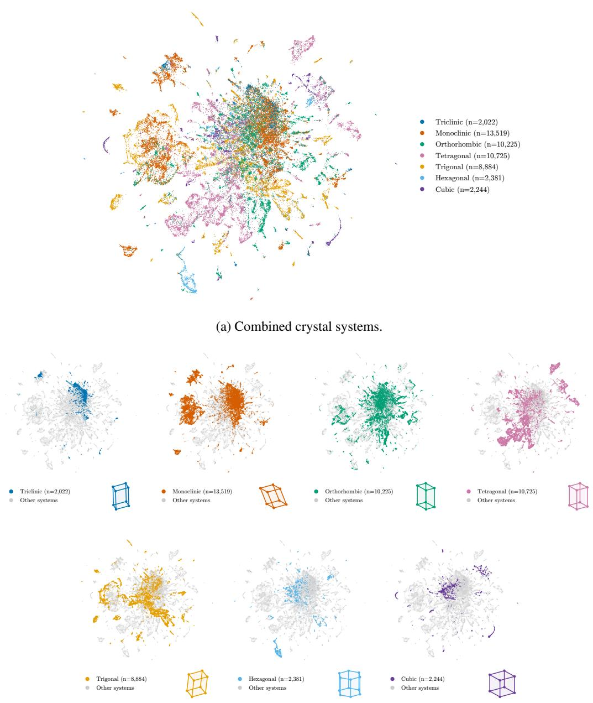  
(b) Each crystal system highlighted against the others in gray.  
Figure 5: UMAP visualization of crystal representations by crystal system.

(b) Each of the six most frequent space groups highlighted against the others in gray. Figure 6: UMAP visualization of crystal representations by space group.  
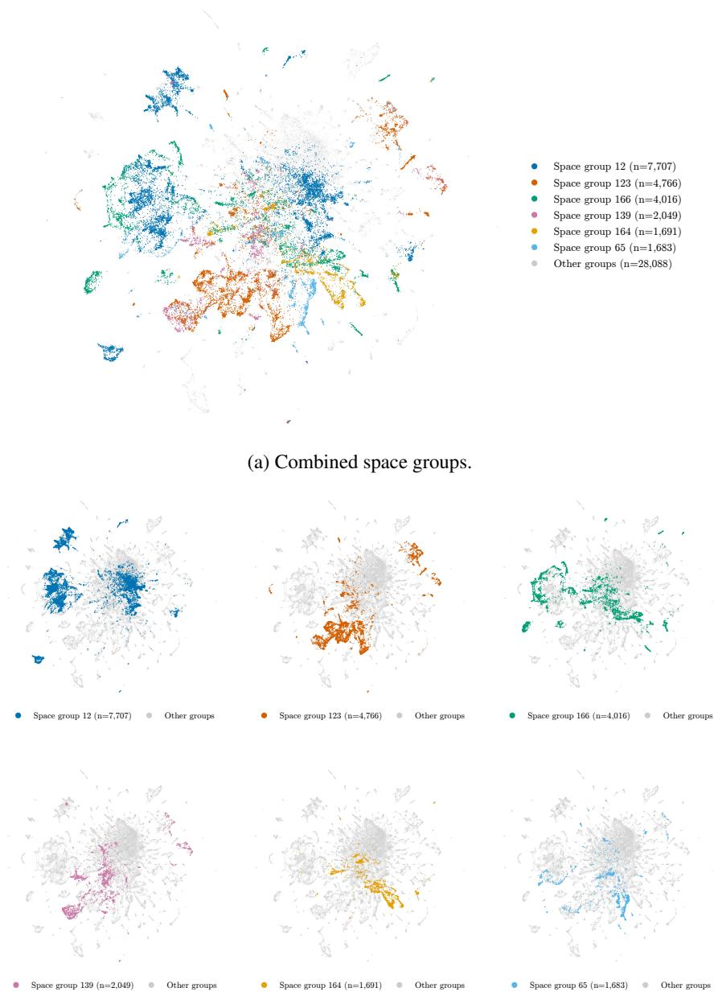

Table 10: Test-set coefficient of determination $R ^ { 2 }$ for geometric quantities.
<table><tr><td>Predictor</td><td>Log-volume-per-atom</td><td>Coordination</td></tr><tr><td>Composition + atom count</td><td>.942</td><td>.794</td></tr><tr><td>Embeddings</td><td>.854</td><td>.814</td></tr><tr><td>Both together</td><td>.973</td><td>.894</td></tr></table>

Table 11 reports linear-probe performance for energy above hull, formation energy, and indirect band gap with targets taken from the corresponding Alexandria record. We compare embeddings with composition-and-size baselines, additionally incorporating nine geometric descriptors that summarize cell geometry and local atomic environments. Embeddings alone outperform these baselines for energy above hull but underperform for formation energy and band gap. However, combining embeddings with composition, size, and geometry yields the highest test $\overline { { R ^ { 2 } } } ^ { \bullet }$ for all three targets. This suggests that the embeddings provide complementary predictive features, rather than consistently replacing explicit descriptors in the setting of linear probing.

Formation energy is predicted most strongly, with the combined model improving $R ^ { 2 }$ from 0.861 to 0.908 over the baseline including geometry. Energy-above-hull prediction remains weak, despite achieving the largest relative improvement over that baseline: the combined model reaches $R ^ { \hat { 2 } } =$ 0.136, which corresponds to an MAE of 11.7 meV/atom, compared with 13.2 meV/atom for a training-mean predictor. These results concern the near-stable subset used for pretraining, restricted to relaxed structures with energy above hull at most 0.05 eV/atom. The probe therefore assesses fine differences within the narrow 0–50 meV/atom interval, rather than discrimination across a broad range of crystal stabilities.

The nine geometric descriptors that we use are log-volume per atom; the ratio of the longest to shortest lattice-vector length; the root-mean-square cosine of the cell angles; the mean, standard deviation, minimum, and maximum coordination within 3 Å; and the mean and standard deviation of nearest-neighbor distances.

Table 11: Test-set coefficient of determination $R ^ { 2 }$ for physical properties.
<table><tr><td>Predictor</td><td>Energy above hull</td><td>Formation energy</td><td>Indirect band gap</td></tr><tr><td>Composition + size</td><td>.072</td><td>.821</td><td>.493</td></tr><tr><td>Composition + size + geometry</td><td>.079</td><td>.861</td><td>.507</td></tr><tr><td>Embeddings</td><td>.109</td><td>.712</td><td>.446</td></tr><tr><td>Embeddings + composition + size + geometry</td><td>.136</td><td>.908</td><td>.542</td></tr></table>

## D.1.2 MOLECULAR REPRESENTATIONS

Next, we examine molecular representations using 50,000 randomly sampled molecules from the Unimol pretraining dataset. Figures 7, 8, and 9 shows visualizations colored by molecular weight, net formal charge, ring count, aromatic heavy-atom fraction, the six most frequent functional groups, and molecular scaffolds. At the low level, we observe limited separation according to molecular properties and no clear clustering by functional group. A small exception is negatively charged molecules, which are concentrated around two localized islands, whereas neutral and positively charged molecules are distributed broadly. At the mid-level, molecular scaffolds show clearer separation, with some distinguishable local clusters, although many scaffolds remain scattered. Thus, scaffold identity is more apparent in the organization of the representations than individual low-level features, but does not fully determine it.

To assess whether low-level information remains accessible despite this limited visual separation, table 12 evaluates linear ridge-regression probes for ring count, aromatic heavy atom fraction and radius of gyration, and compare to a composition-and-size baseline. We use a 70/15/15% train/val/test split of scaffold groups defined by Murcko scaffold, with acyclic molecules grouped by canonical SMILES. Again features are standardized using training-set statistics, and regularization is selected for each target by validation mean squared error, and we report the test-set coefficient of determination. Embeddings outperform composition and size for all three targets, with the largest improvement for radius of gyration. Combined features achieve the highest scores, although gains over embeddings alone are small for aromatic fraction and radius of gyration. Thus, despite limited visual separation in the UMAP projections, the representations make molecular structural and geometric properties accessible to linear prediction across scaffold-disjoint partitions.

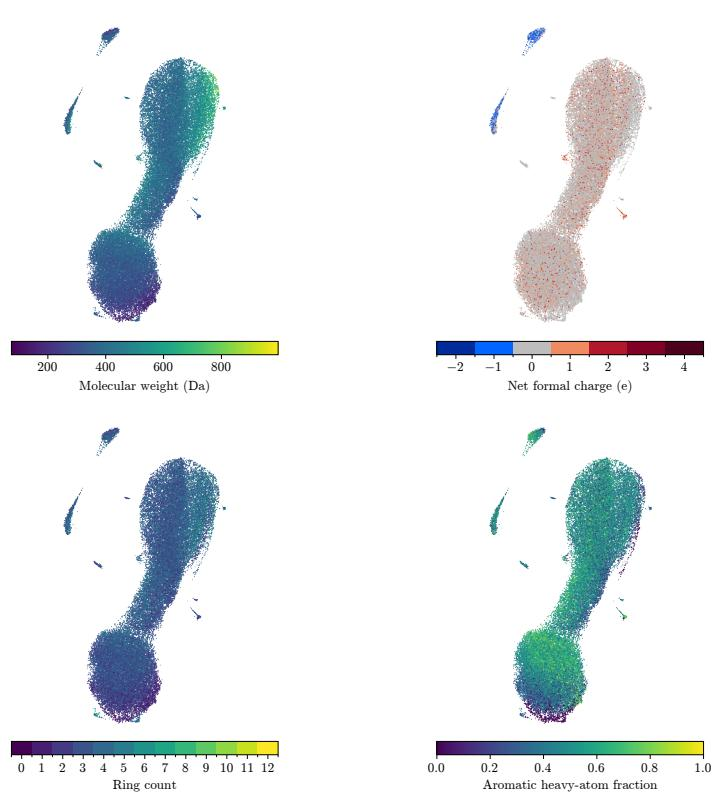  
Figure 7: Uni-Mol representations colored by molecular weight, formal charge, ring count, and aromatic heavy-atom fraction.

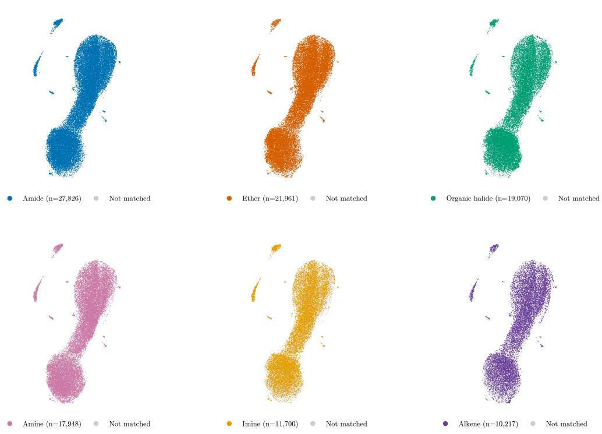  
Figure 8: Uni-Mol representations with six functional groups highlighted individually.

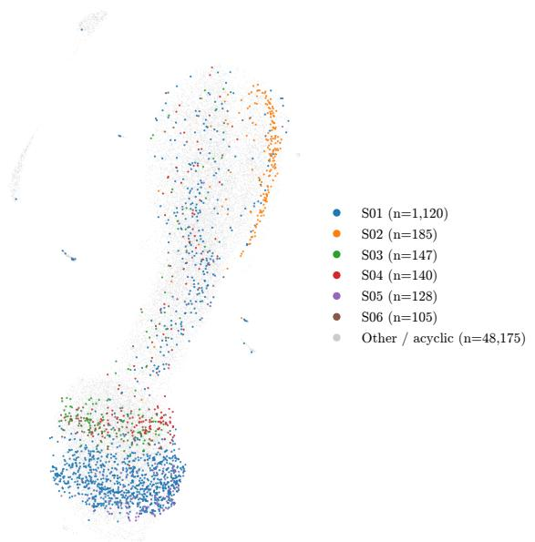

(a) 6 most frequent scaffolds combined  
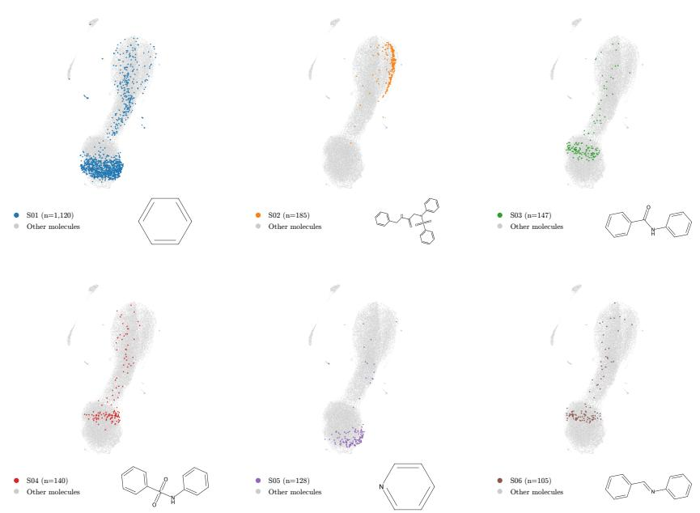  
(b) 6 most frequent scaffolds highlighted individually  
Figure 9: Uni-Mol representations with the 6 most frequent molecular scaffolds highlighted, shown combined and individually (remaining points in grey).

Table 12: Uni-Mol structural probe results.
<table><tr><td>Input</td><td>Ring count</td><td>Aromatic fraction</td><td>Radius of gyration</td></tr><tr><td>Composition + size</td><td>.706</td><td>.642</td><td>.615</td></tr><tr><td>Embeddings</td><td>.909</td><td>.848</td><td>.964</td></tr><tr><td>Combined</td><td>.958</td><td>.856</td><td>.969</td></tr></table>

Next, we encode and plot approximately 32,252 molecules from the manually annotated three-star subset of ChEBI Malik et al. (2026) and color them by chemical family in figures 10 and 11. Here, the projections exhibit clearer clustering than the low-level property and mid-level scaffold colorings of the Uni-Mol sample. Table 13 quantifies this using linear ridge scores fitted to binary membership labels. We use the same scaffold-group splitting procedure and training-set standardization, and regularization as above, selecting regularization separately for each family by validation average precision. Evaluation includes families with at least 50 annotated positives in training, 20 in validation, and 20 in testing, together with at least 20 unannotated examples in each of validation and testing. We report average precision and AUROC averaged equally across eligible families. The outputs are ranking scores, and unannotated membership is treated as the negative class for evaluation. Embeddings substantially outperform composition and size in recovering annotated chemical-family membership, while their combination yields only small further gains. Together, these results suggest a hierarchy in the organization of the learned representations: low-level properties and functional groups show no or very limited visual separation, mid-level scaffolds exhibit partial clustering, and high-level chemical families show the clearest organization. This pattern is consistent with the hypothesized effect of Atom-JEPA pretraining, with latent-space prediction encouraging representations to prioritize higher-level chemical features while reducing the influence of low-level details. The strong structural probe results further suggest that this emphasis does not require discarding low-level information entirely; such information remains recoverable.

Table 13: ChEBI family probe results.
<table><tr><td>Input</td><td>Mean average precision</td><td>Mean AUROC</td></tr><tr><td>Composition + size</td><td>.186</td><td>.874</td></tr><tr><td>Embeddings</td><td>.547</td><td>.964</td></tr><tr><td>Combined</td><td>.554</td><td>.966</td></tr></table>

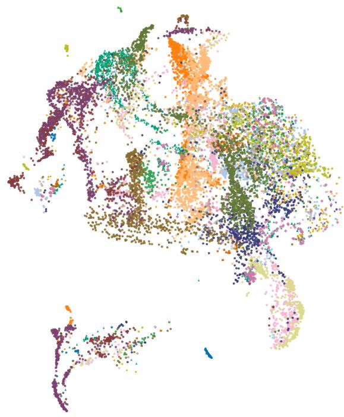

Indoles (n=310)   
Quinazolines (n=76)   
Steroids (n=944)   
Sulfonamide (n=202)   
Porphyrins (n=105)   
Beta-lactams (n=158)   
Flavonoids (n=774)   
Purines (n=980)   
Pyrimidines (n=345)   
Coumarins (n=82)   
Benzodiazepines (n=34)   
Alkaloids (n=656)   
Terpenoids (n=1,596)   
Polyketides (n=245)   
Glycosides (n=774)   
Carbohydrates (n=495)   
Nucleosides (n=25)   
Amino acids (n=651)   
Peptides (n=1,305)   
Fatty acids (n=888)   
Glycerophospholipids (n=844)   
Sphingolipids (n=993)   
Prostanoids (n=106)

Figure 10: UMAP visualization of ChEBI representations, with exclusive chemical families highlighted.

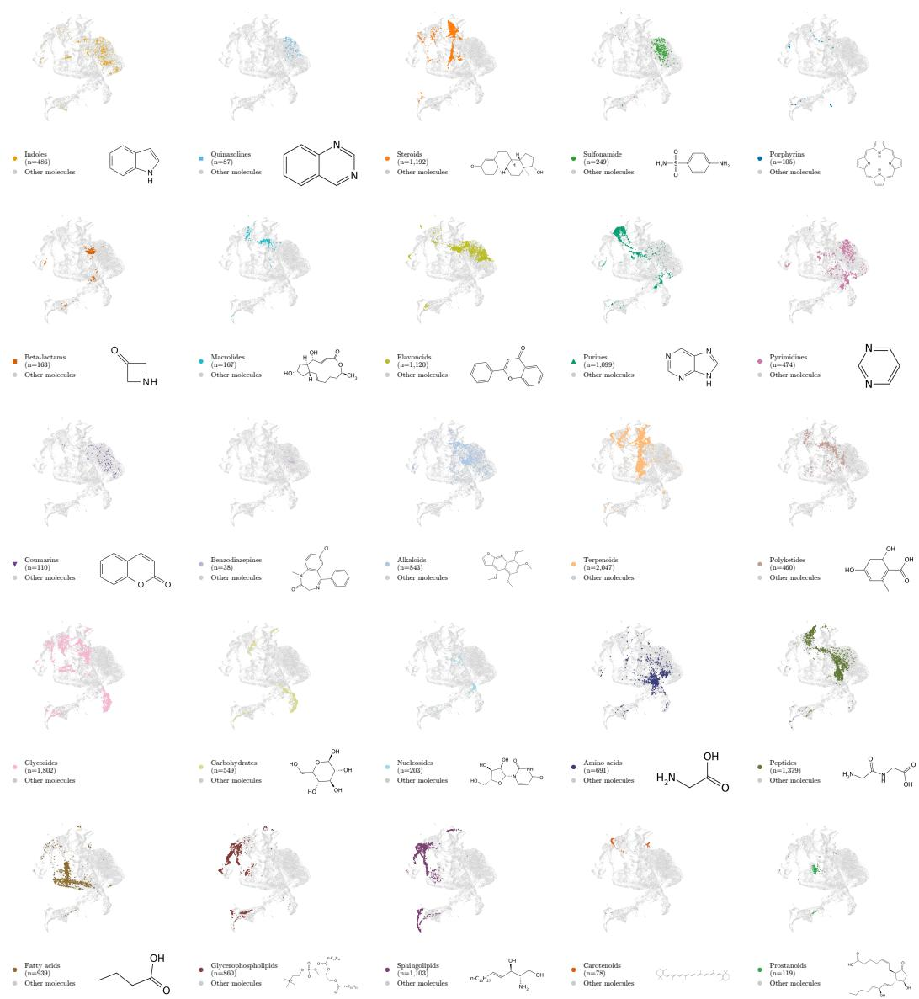  
Figure 11: Visualization of ChEBI representations, with chemical families highlighted individually and the rest in grey.

## D.2 EFFECT OF PRETRAINING ON MOLECULAR REPRESENTATIONS

Finally, to assess how Atom-JEPA pretraining shapes molecular representations beyond the inductive biases of the GNN backbone, we compare pretrained and randomly initialized encoders with identical architectures on the QM9 dataset. For each, we train frozen-backbone probes using the dataset split specified in H and visualize representations of the test set molecules to relate their organization to predictive performance.

Figure 12 highlights the three most frequent chemical formulas in the test set. The randomly initialized encoder separates these formulas into 3 distinct clusters, suggesting that without pretraining representations are organized entirely by molecular size and elemental composition. In contrast, as found above Atom-JEPA representations are not separated by low-level features such as size and composition. Coloring the embeddings by the twelve QM9 properties (Figure 13) also reveals clear patterns for several targets in the random representations. These patterns are consistent with a simple organization by size and composition, which already accounts for substantial variation in several properties. Again, the Atom-JEPA representations do not exhibit the same apparent patterns.

To assess how these visual differences translate to downstream performance, we train all-layer MLP probes on frozen per-atom features from both encoders and report results in Table 14. All probes outperform the training-set mean predictor on every target, confirming that the backbone's inductive biases alone provide useful predictive features. Nevertheless, Atom-JEPA achieves substantially lower MAE across all twelve targets with both probe types. With all-layer features, pretraining reduces MAE by approximately three- to fourfold for polarizability, the HOMO-LUMO gap, HOMO and LUMO energies, and heat capacity, and by seven- to eightfold for the atom-referenced energies G, H, U, and $U _ { 0 }$ . Gains are smaller for dipole moment, where random features already perform comparatively well. An additional finding is that all-layer probes outperform last-layer probes on every target for Atom-JEPA and on eleven of twelve targets for the random encoder, with particularly pronounced gains for Atom-JEPA energy predictions.

These results show that clear visual separation by target value does not indicate greater predictive utility. The patterns in the random representations reflect a simple organization by molecular size and elemental composition, whereas Atom-JEPA supports substantially more accurate prediction without comparable formula-based clustering. Together with the chemical-family analysis, these findings are consistent with latent-space predictive pretraining shifting representations beyond these basic attributes toward higher-level, property-relevant molecular information that is not readily apparent in two-dimensional projections, but nevertheless improve downstream performance.

Table 14: QM9 frozen-backbone MLP probe test MAE results using all-layer or last-layer features for a pretrained encoder vs random initialization, with a training-set mean predictor as a baseline (atom-referenced for U, U0, H, G).
<table><tr><td>Model</td><td>α a3</td><td>∆ε eV</td><td>εHOMO eV</td><td>ELUMO eV</td><td>µ D</td><td> $\begin{array} { c } { { C _ { v } } } \\ { { \frac { \mathrm { c a l } } { \mathrm { m o l } \mathrm { K } } } } \end{array}$ </td><td>G eV</td><td>H eV</td><td>(R2) a2</td><td>U eV</td><td>U0 eV</td><td>ZPVE eV</td></tr><tr><td>Training-set mean</td><td>6.343</td><td>1.077</td><td>.434</td><td>1.055</td><td>1.165</td><td>3.195</td><td>7.511</td><td>8.304</td><td>203.364</td><td>8.244</td><td>8.170</td><td>.720</td></tr><tr><td>All layers</td><td></td><td></td><td></td><td></td><td></td><td></td><td></td><td></td><td></td><td></td><td></td><td></td></tr><tr><td>Atom-JEPA Random initialization</td><td>.091 .371</td><td>.095 .279</td><td>.061 .171</td><td>.064 .221</td><td>.032 .039</td><td>.031 .108</td><td>.013 .091</td><td>.012 .089</td><td>.419 1.850</td><td>.012 .089</td><td>.012 .091</td><td>.001 .004</td></tr><tr><td>Last layer</td><td></td><td></td><td></td><td></td><td></td><td></td><td></td><td></td><td></td><td></td><td></td><td></td></tr><tr><td>Atom-JEPA</td><td>.217</td><td>.141</td><td>.094</td><td>.099</td><td>.034</td><td>.071</td><td>.061</td><td>.070</td><td>1.579</td><td>.068</td><td>.072</td><td>.004</td></tr><tr><td>Random initialization</td><td>.479</td><td>.327</td><td>.192</td><td>.246</td><td>.038</td><td>.135</td><td>.114</td><td>.110</td><td>2.444</td><td>.114</td><td>.110</td><td>.005</td></tr></table>

C7H11NOOther molecules

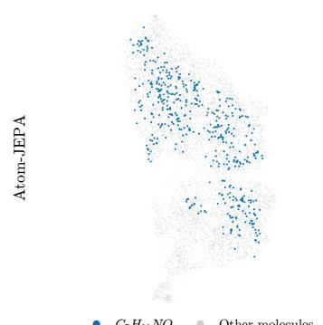

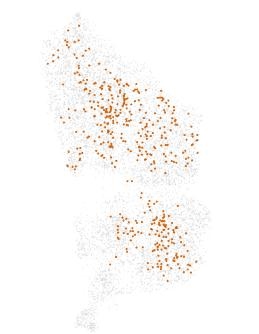  
C6HgNO2Other molecules

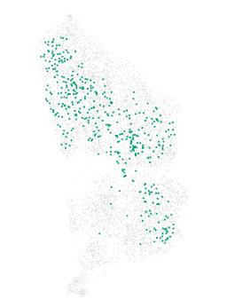  
C7H10O2Other molecules

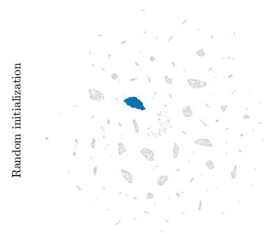

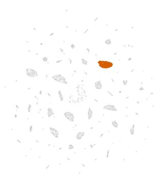

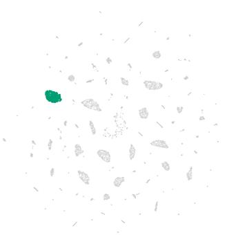  
C7H10O2Other molecules

Figure 12: The three most frequent size/composition profiles highlighted in the randomly initialized and the Atom-JEPA pretrained QM9 representation, respectively

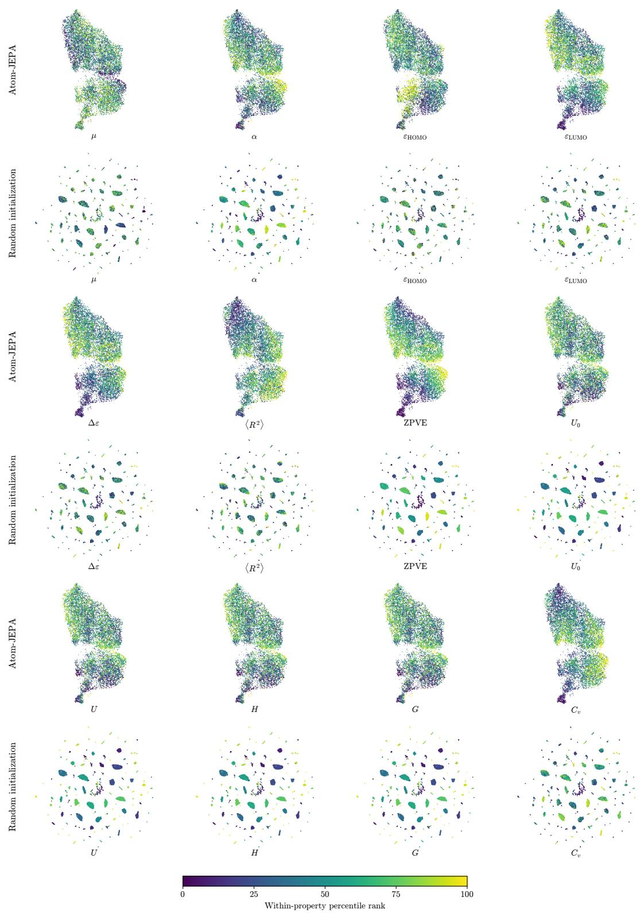  
Figure 13: Pretrained and randomly initialized QM9 representations colored by within-property percentile rank for all twelve targets.

## E ADMET FULL RESULTS

## E.1 STATISTICAL TESTS SETUP

To compute statistical indistinguishable models in Table 1, we compute an ANOVA test over each endpoint. For Biogen and ChEMBL the design is blocked across folds, whereas ExpansionRX is unpaired due to using the same test set each run. The best model that is compared against is the model with the lowest mean error over the respective endpoint folds. For runs where we have the individual fold errors, we check if each models computed 95% confidence intervals do not overlap using a pairwise Tukey test. Because we only have the mean run error for KERMT, we instead compare using a single-sided t-test with Holm-Bonferroni correction.

## E.2 MODEL PREDICTION CORRELATION

We present the full analysis of the differences between the ADMET models. We quantify difference between the prediction of models by their spearman correlation (r). We use residuals instead of direct predictions to reduce model strength as a confounder. In the interest of ensembling model predictions, we also control against the case where one model happens to be weakly correlated with other models, but strongly correlated with the sum of the other models. For completeness we calculate the uniqueness score as follows: For endpoint t and run s, let $e _ { m } \in \mathbb { R } ^ { n }$ denote model m's residual vector ${ \hat { y } } - y$ over the n test molecules with an observed label for $t ,$ and let $\mathcal { P } ( m )$ be one representative of each of the four model families other than m's own. We regress $e _ { m }$ on $\{ e _ { \boldsymbol { k } } \} _ { \boldsymbol { k } \in \mathcal { P } ( m ) }$ with an intercept by ordinary least squares and define

$$
U _ { m } ( t , s ) = 1 - R _ { \mathrm { a d j } } ^ { 2 } = \left( 1 - R ^ { 2 } \right) \frac { n - 1 } { n - p - 1 } ,\tag{7}
$$

where $p = | \mathcal { P } ( m ) | = 4$ for our for model comparisons, $R ^ { 2 }$ is the coefficient of determination of that fit. $U _ { m }$ is the share of model $m \mathrm { { s } }$ squared error that no linear combination of the other families reproduces,. We do not include endpoints with less than 30 test datapoints for robustness. We only compare other models to Atom-JEPA averaged over 10 conformers to not bias the results by also including the the non-conformer averaged Atom-JEPA model. The single and 10× conformer predictions correlate with over 0.99. The results can be seen in Table 15.

Table 15: Model distinctiveness. How reproducible each model's errors are from the other four model families, measured two ways on the same per-molecule test residuals. Residual correlation is the averaged pairwise correlation between other models, averaged over test data-points, Uniqueness is the $1 - \breve { R } _ { \mathrm { a d j } } ^ { 2 }$ from regressing a model's residuals on all four peers' residuals at once. Per-benchmark columns are means over each benchmark's endpoints. Mean rank ranks the families within each benchmark and endpoint cell and averages with equal weight per benchmark, with rank 1 = most distinct. The brackets are a stratified cluster bootstrap over endpoints. Group shows the group of models that cannot separated by the paired 95% bootstrap interval on their mean-rank difference.
<table><tr><td>Model</td><td>Biogen</td><td>ChEMBL-MT</td><td>ExpansionRx</td><td>Mean rank across endpoints</td><td>Group</td></tr><tr><td colspan="6">Residual correlation τ to peers (lower is more distinct)</td></tr><tr><td>Atom-JEPA × 10 conf</td><td>.723</td><td>.791</td><td>.730</td><td>1.98 [1.66, 2.34]</td><td>a</td></tr><tr><td>Chemprop</td><td>.719</td><td>.803</td><td>.681</td><td>2.53 [2.02, 2.88]</td><td>ab</td></tr><tr><td>Mol-JEPA · modalities</td><td>.738</td><td>.801</td><td>.749</td><td>2.78 [2.42, 3.14]</td><td>b</td></tr><tr><td>Morgan + RDKit · LGBM</td><td>.724</td><td>.814</td><td>.761</td><td>2.98 [2.59, 3.31]</td><td>b</td></tr><tr><td>CKERMT</td><td>.779</td><td>.829</td><td>.787</td><td>4.73 [4.48, 4.86]</td><td>C</td></tr><tr><td colspan="6">Uniqueness 1 –  $R _ { \mathrm { a d } } ^ { 2 }$  (higher is more distinct)</td></tr><tr><td>Atom-JEPA ×10 conf</td><td>.327</td><td>.253</td><td>.283</td><td>1.97 [1.65, 2.32]</td><td>a</td></tr><tr><td>Chemprop</td><td>.325</td><td>.221</td><td>.392</td><td>2.53 [2.02, 2.89]</td><td>ab</td></tr><tr><td>Mol-JEPA· modalities</td><td>.285</td><td>.221</td><td>.246</td><td>2.89  $[ 2 . 5 2 , 3 . 2 3 ]$ </td><td>b</td></tr><tr><td>Morgan + RDKit · LGBM</td><td>.312</td><td>.192</td><td>.228</td><td>2.99 [2.57, 3.39]</td><td>b</td></tr><tr><td>CKERMT</td><td>.214</td><td>.171</td><td>.187</td><td>4.63 [4.39, 4.78]</td><td>C</td></tr></table>

## E.3 BIOGEN ADME

Table 16: Test MAE mean ± standard deviation across scaffold splits across tasks for Biogen dataset. †: Data from Figure 13 in Xue et al. (2026).
<table><tr><td>Model</td><td>HLM CLint</td><td>RLM CLint</td><td>MDCK</td><td>logS</td><td>PPB Human</td><td>PPB Rat</td><td>Mean</td></tr><tr><td>GBT models</td><td></td><td></td><td></td><td></td><td></td><td></td><td></td></tr><tr><td>RDKit</td><td>.3773±.0190</td><td>.4347±.0268</td><td>.3493±.0116</td><td>.3725±.0204</td><td>.4713±.1293</td><td>.4872±.0594</td><td>.4154±.0298</td></tr><tr><td>Morgan</td><td>.4115±.0242</td><td>.4616±.0182</td><td>.3682±.0131</td><td>.3838±.0230</td><td>.5085±.1062</td><td>.6293±.0828</td><td>.4605±.0260</td></tr><tr><td>Morgan + RDKit</td><td>.3712±.0140</td><td>.4136±.0239</td><td>.3362±.0103</td><td>.3663±.0143</td><td>.4462±.1109</td><td>.5125±.0984</td><td>.4077±.0339</td></tr><tr><td>Morgan + RDKit + Avalon + ErG</td><td>.3863±.0186</td><td>.4160±.0196</td><td>.3497±.0154</td><td>.3882±.0252</td><td>.5454±.1507</td><td>.5686±.0660</td><td>.4424±.0247</td></tr><tr><td>Mol-JEPA CLS</td><td>.4051±.0218</td><td>.4523±.0187</td><td>.3689±.0096</td><td>.3887±.0262</td><td>.5302±.1025</td><td>.5264±.0835</td><td>.4453±.0317</td></tr><tr><td>Atom-JEPA Last Layer</td><td>.4300±.0221</td><td>.4869±.0206</td><td>.3791±.0127</td><td>.3813±.0201</td><td>.5182±.0828</td><td>.5090±.0991</td><td>.4507±.0213</td></tr><tr><td>Atom-JEPA All Layer</td><td>.4021±.0134</td><td>.4613±.0198</td><td>.3563±.0039</td><td>.3691±.0229</td><td>.4798±.1242</td><td>.4753±.0763</td><td>.4240±.0266</td></tr><tr><td>MLP models</td><td></td><td></td><td></td><td></td><td></td><td></td><td></td></tr><tr><td>RDKit</td><td>.3772±.0249</td><td>.4400±.0239</td><td>.3383±.0192</td><td>.3798±.0272</td><td>.4112±.0802</td><td>.4227±.0932</td><td>.3949±.0292</td></tr><tr><td>Morgan</td><td>.4323±.0271</td><td>.5055±.0343</td><td>.3917±.0215</td><td>.4159±.0221</td><td>.4793±.0778</td><td>.4794±.0793</td><td>.4507±.0218</td></tr><tr><td>Morgan + RDKit</td><td>.3469±.0197</td><td>.3998±.0202</td><td>.3344±.0238</td><td>.3772±.0133</td><td>.4034±.0778</td><td>.4412±.0778</td><td>.3838±.0194</td></tr><tr><td>Morgan + RDKit + Avalon + ErG</td><td>.3336±.0161</td><td>.3892±.0139</td><td>.3197±.0193</td><td>.3679±.0241</td><td>.4538±.0758</td><td>.4651±.0205</td><td>.3882±.0137</td></tr><tr><td>Mol-JEPA CLS</td><td>.3710±.0209</td><td>.4148±.0205</td><td>.3357±.0172</td><td>.3660±.0176</td><td>.4000±.0441</td><td>.3810±.0375</td><td>.3781±.0137</td></tr><tr><td>Mol-JEPA modalities</td><td>.3423±.0115</td><td>.3932±.0221</td><td>.3237±.0143</td><td>.3293±.0174</td><td>.4048±.0585</td><td>.3782±.0409</td><td>.3619±.0141</td></tr><tr><td>Atom-JEPA Last Layer</td><td>.3754±.0244</td><td>.4304±.0144</td><td>.3383±.0086</td><td>.3594±.0238</td><td>.4297±.0637</td><td>.4516±.0503</td><td>.3975±.0181</td></tr><tr><td>Atom-JEPA All Layer</td><td>.3757±.0230</td><td>.4322±.0257</td><td>.3153±.0115</td><td>.3518±.0197</td><td>.4282±.0883</td><td>.4320±.0772</td><td>.3892±.0270</td></tr><tr><td>Finetuning</td><td></td><td></td><td></td><td></td><td></td><td></td><td></td></tr><tr><td>No Pretrain</td><td>.3232±.0170</td><td>.3781±.0082</td><td>.3322±.0114</td><td>.3274±.0091</td><td>.4696±.1024</td><td>.4623±.0711</td><td>.3821±.0281</td></tr><tr><td>Atom-JEPA</td><td>.2950±.0146</td><td>.3548±.0185</td><td>.2816±.0107</td><td>.3246±.0110</td><td>.4221±.0922</td><td>.3970±.0747</td><td>.3458±.0260</td></tr><tr><td>Atom-JEPA (10-conf. ensemble)</td><td>.2931±.0147</td><td>.3523±.0186</td><td>.2796±.0110</td><td>.3231±.0112</td><td>.4199±.0940</td><td>.3932±.0759</td><td>.3435±.0267</td></tr><tr><td>Literature models</td><td></td><td></td><td></td><td></td><td></td><td></td><td></td></tr><tr><td>Chemprop</td><td>.3133±.0058</td><td>.3683±.0141</td><td>.2954±.0070</td><td>.3305±.0143</td><td>.3968±.1017</td><td>.4062±.1136</td><td>.3518±.0317</td></tr><tr><td>CKERMT Our runs</td><td>.2996±.0095</td><td>.3646±.0194</td><td>.2892±.0136</td><td>.3265±.0104</td><td>.4093±.0820</td><td>.4451±.0953</td><td>.3557±.0290</td></tr><tr><td>KERMT base†</td><td>.320</td><td>.402</td><td>.289</td><td>.344</td><td>一</td><td></td><td>一</td></tr><tr><td>KERMT task-specific†</td><td>.309</td><td>.402</td><td>.278</td><td>.339</td><td>1</td><td></td><td>一</td></tr><tr><td>CKERMT base{</td><td>.302</td><td>.389</td><td>.275</td><td>.329</td><td></td><td></td><td>1</td></tr><tr><td>CKERMT task-specific†</td><td>.294</td><td>.389</td><td>.268</td><td>.333</td><td></td><td></td><td>1</td></tr></table>

Table 17: Test Pearson $r ^ { 2 } \pm$ standard deviation across cluster splits across tasks for Biogen dataset. All literature model data from Adrian et al. (2025).
<table><tr><td>Model</td><td>HLM CLint</td><td>RLM CLint</td><td>MDCK</td><td>logS</td><td>PPB Human</td><td>PPB Rat</td><td>Mean</td></tr><tr><td colspan="8">GBT models</td></tr><tr><td>RDKit</td><td>.3846±.0170</td><td>.4337±.0041</td><td>.3921±.0071</td><td>.2143±.0069</td><td>.3666±.0005</td><td>.3733±.0807</td><td>.3608±.0134</td></tr><tr><td>Morgan</td><td>.3256±.0244</td><td>.3722±.0079</td><td>.3635±.0093</td><td>.1569±.0032</td><td>.3720±.0551</td><td>.0372±.0293</td><td>.2712±.0103</td></tr><tr><td>Morgan + RDKit</td><td>.4411±.0020</td><td>.4950±.0055</td><td>.4397±.0073</td><td>.2346±.0007</td><td>.4152±.0089</td><td>.3111±.0075</td><td>.3895±.0008</td></tr><tr><td>Morgan + RDKit + Avalon + ErG</td><td>.4469±.0229</td><td>.4800±.0083</td><td>.3881±.0075</td><td>.2428±.0125</td><td>.3454±.0115</td><td>.2428±.0730</td><td>.3577±.0146</td></tr><tr><td>Atom-JEPA Last Layer</td><td>.2940±.0205</td><td>.3840±.0111</td><td>.2995±.0118</td><td>.2293±.0027</td><td>.3661±.0463</td><td>.2613±.0799</td><td>.3057±.0057</td></tr><tr><td>Atom-JEPA All Layer</td><td>.3598±.0168</td><td>.4226±.0057</td><td>.4018±.0167</td><td>.2429±.0378</td><td>.4674±.0436</td><td>.4564±.0267</td><td>.3918±.0008</td></tr><tr><td colspan="8">MLP models</td></tr><tr><td>RDKit</td><td>.4821±.0022</td><td>.5182±.0073</td><td>.4707±.0073</td><td>.2141±.0092</td><td>.4479±.0370</td><td>.4347±.0364</td><td>.4279±.0141</td></tr><tr><td>Morgan</td><td>.2489±.0071</td><td>.3001±.0031</td><td>.2284±.0060</td><td>.2256±.0144</td><td>.3418±.0352</td><td>.2555±.0316</td><td>.2667±.0119</td></tr><tr><td>Morgan + RDKit</td><td>.4223±.0139</td><td>.4911±.0116</td><td>.4131±.0040</td><td>.1898±.0021</td><td>.4922±.0395</td><td>.4088±.0663</td><td>.4029±.0123</td></tr><tr><td>Morgan + RDKit + Avalon + ErG</td><td>.4639±.0092</td><td>.5312±.0098</td><td>.5027±.0168</td><td>.2164±.0070</td><td>.4828±.0407</td><td>.3682±.0311</td><td>.4275±.0135</td></tr><tr><td>Atom-JEPA Last Layer</td><td>.4515±.0043</td><td>.4706±.0036</td><td>.4180±.0013</td><td>.3240±.0147</td><td>.4224±.0350</td><td>.3639±.0450</td><td>.4084±.0159</td></tr><tr><td>Atom-JEPA All Layer</td><td>.4566±.0053</td><td>.4836±.0078</td><td>.5208±.0054</td><td>.3518±.0005</td><td>.5498±.0067</td><td>.5042±.0059</td><td>.4778±.0011</td></tr><tr><td colspan="8">Finetuning</td></tr><tr><td>Atom-JEPA</td><td>.6384±.0048</td><td>.6417±.0053</td><td>.6021±.0104</td><td>.3728±.0154</td><td>.5808±.0187</td><td>.4332±.0532</td><td>.5448±.0146</td></tr><tr><td>Atom-JEPA (10-conf. ensemble)</td><td>.6444±.0048</td><td>.6465±.0052</td><td>.6070±.0105</td><td>.3777±.0153</td><td>.5881±.0190</td><td>.4380±.0534</td><td>.5503±.0146</td></tr><tr><td colspan="8">Literature models</td></tr><tr><td>MolFormer ST</td><td>.510±.004</td><td>.570±.015</td><td>.415±.007</td><td>.181±.010</td><td>.269±.035</td><td>.119±.023</td><td>.344</td></tr><tr><td>Chemprop ST</td><td>.566±.022</td><td>.596±.014</td><td>.475±.009</td><td>.296±.027</td><td>.190±.012</td><td>.121±.085</td><td>.374</td></tr><tr><td>KPGT STcomplex</td><td>.505±.004</td><td>.548±.013</td><td>.520±.007</td><td>.337±.003</td><td>.291±.031</td><td>.269±.043</td><td>.412</td></tr><tr><td>KPGT ST</td><td>.580±.009</td><td>.597±.013</td><td>.538±.012</td><td>.369±.012</td><td>.358±.062</td><td>.284±.064</td><td>.454</td></tr><tr><td>KERMT ST</td><td>.600±.019</td><td>.577±.017</td><td>.525±.009</td><td>.343±.009</td><td>.381±.018</td><td>.314±.064</td><td>.457</td></tr><tr><td>Chemprop MT</td><td>.558±.019</td><td>.602±.011</td><td>.519±.012</td><td>.380±.012</td><td>.572±.059</td><td>.501±.046</td><td>.522</td></tr><tr><td>KPG MT</td><td>.562±.007</td><td>.580±.020</td><td>.529±.007</td><td>.318±.013</td><td>.362±.019</td><td>.315±.020</td><td>.444</td></tr><tr><td>KERMT MT</td><td>.634±.010</td><td>.602±.011</td><td>.535±.009</td><td>.365±.008</td><td>.481±.040</td><td>.427±.038</td><td>.507</td></tr></table>

## E.4 EXPANSIONRX AND CHEMBL-MT

s  :t es sd s   s s   s  at   : a
<table><tr><td>Model</td><td>log D</td><td>KSOL</td><td>HLM CLint</td><td>MLM CLint</td><td>Caco-2 Papp A→B</td><td>Caco-2 Efflux</td><td>MPPB</td><td>MBPB</td><td>MGMB</td><td>Macro test</td></tr><tr><td colspan="9">GBDT models</td></tr><tr><td>Morgan†</td><td>.517±.011</td><td>.490±.028</td><td>.382±.007</td><td>.406±.011</td><td>.511±.013</td><td>.518±.032</td><td>.313±.020</td><td>.317±.007</td><td>.396±.012</td><td>.428±.004</td></tr><tr><td>RDKit</td><td>.567±.009</td><td>.535±.007</td><td>.363±.004</td><td>.401±.008</td><td>.468±.005</td><td>.494±.010</td><td>.346±.011</td><td>.322±.005</td><td>.353±.014</td><td>.428±.002</td></tr><tr><td>Morgan + RDKit</td><td>.523±.009</td><td>.540±.010</td><td>.355±.009</td><td>.409±.008</td><td>.458±.009</td><td>.514±.012</td><td>.332±.006</td><td>.277±.008</td><td>.357±.013</td><td>.418±.003</td></tr><tr><td>Morgan + RDKit + Avalon + ErG</td><td>.511±.019</td><td>.477±.010</td><td>.371±.009</td><td>.445±.017</td><td>.464±.022</td><td>.482±.032</td><td>.333±.012</td><td>.311±.021</td><td>.328±.022</td><td>.414±.005</td></tr><tr><td>Mol-JEPA cls</td><td>.586±.005</td><td>.521±.007</td><td>.381±.006</td><td>.435±.007</td><td>.530±.005</td><td>.524±.004</td><td>.337±.015</td><td>.376±.018</td><td>.331±.007</td><td>.447±.005</td></tr><tr><td>Atom-JEPA Last Layer</td><td>.613±.017</td><td>.495±.004</td><td>.389±.004</td><td>.426±.003</td><td>.586±.020</td><td>.556±.008</td><td>.328±.018</td><td>.327±.014</td><td>.374±.010</td><td>.455±.004</td></tr><tr><td>Atom-JEPA All Layers</td><td>.577±.015</td><td>.509±.004</td><td>.357±.008</td><td>.431±.008</td><td>.533±.017</td><td>.522±.009</td><td>.354±.007</td><td>.331±.009</td><td>.309±.009</td><td>.436±.003</td></tr><tr><td colspan="9">MLP models</td><td></td></tr><tr><td></td><td></td><td></td><td></td><td></td><td></td><td></td><td></td><td></td><td></td><td></td></tr><tr><td>Morgan RDKit</td><td>.635±.014</td><td>.464±.032</td><td>.417±.013</td><td>.448±.006</td><td>.630±.021</td><td>.579±.019</td><td>.261±.003</td><td>.306±.014</td><td>.292±.011</td><td>.448±.006</td></tr><tr><td>Morgan + RDKit</td><td>.647±.010 .494±.004</td><td>.598±.008 .418±.014</td><td>.406±.006</td><td>.440±.006</td><td>.516±.004</td><td>.548±.004</td><td>.437±.016</td><td>.391±.011</td><td>.414±.013</td><td>.489±.006</td></tr><tr><td>Morgan + RDKit + Avalon + ErG</td><td>.476±.010</td><td>.389±.004</td><td>.373±.011 .396±.004</td><td>.454±.020</td><td>.558±.012</td><td>.522±.010 .454±.007</td><td>.259±.009 .229±.008</td><td>.263±.009 .244±.004</td><td>.300±.006</td><td>.405±.006 .378±.004</td></tr><tr><td>Mol-JEPA CLS</td><td></td><td>.509±.020</td><td>.374±.004</td><td>.419±.019 .456±.007</td><td>.512±.011 .457±.005</td><td>.483±.010</td><td>.338±.017</td><td>.372±.021</td><td>.282±.003</td><td></td></tr><tr><td>Mol-JEPA Modalities</td><td>.573±.013</td><td>.486±.010</td><td>.396±.011</td><td>.434±.018</td><td></td><td>.457±.012</td><td></td><td></td><td>.394±.014</td><td>.440±.009</td></tr><tr><td>Atom-JEPA All Layers</td><td>.545±.014 .624±.015</td><td>.522±.012</td><td>.361±.009</td><td>.445±.007</td><td>.477±.010 .520±.010</td><td>.551±.012</td><td>.356±.007 .337±.011</td><td>.369±.007 .265±.005</td><td>.337±.003 .283±.004</td><td>.428±.003 .434±.006</td></tr><tr><td colspan="9"></td><td></td></tr><tr><td>Finetuning</td><td></td><td></td><td></td><td></td><td></td><td></td><td></td><td></td><td></td><td></td></tr><tr><td>No Pretrain</td><td>.390±.007</td><td>.376±.005</td><td>.347±.007</td><td>.411±.005</td><td>.529±.005</td><td>.486±.007</td><td>.258±.007</td><td>.227±.007</td><td>.282±.004</td><td>.367±.004</td></tr><tr><td>Atom-JEPA</td><td>.363±.006</td><td>.346±.003 .344±.003</td><td>.316±.006 .316±.006</td><td>.403±.006</td><td>.475±.006</td><td>.439±.006</td><td>.218±.006</td><td>.188±.003</td><td>.259±.004</td><td>.334±.002</td></tr><tr><td colspan="9">Atom-JEPA (10-conf. ensemble)</td></tr><tr><td>Literature models</td><td></td><td></td><td></td><td></td><td>.475±.006</td><td>.439±.006</td><td>.218±.005</td><td>.188±.003</td><td>.259±.004</td><td>.334±.002</td></tr><tr><td>Chemprop</td><td></td><td>.404±.006</td><td>.552±.105</td><td>.487±.025</td><td>.528±.032</td><td>.456±.024</td><td>.251±.016</td><td>.339±.019</td><td>.371±.031</td><td>.426±.012</td></tr><tr><td>CKERMT Our runs</td><td>.449±.009 .407±.009</td><td>.406±.008</td><td>.350±.010</td><td>.385±.009</td><td>.472±.009</td><td>.466±.007</td><td>.250±.003</td><td>.273±.011</td><td>.333±.023</td><td>.372±.003</td></tr><tr><td>KERMT base‡</td><td>.393</td><td>.417</td><td>.429</td><td>.458</td><td>.472</td><td>.489</td><td>.247</td><td>.225</td><td>.287</td><td>.380</td></tr><tr><td>KERMT task-specific‡</td><td>.396</td><td>.396</td><td>.400</td><td>.423</td><td>.469</td><td>.479</td><td>.263</td><td>.251</td><td>.299</td><td>.375</td></tr><tr><td>CMIM only task-specific</td><td>.461</td><td>.477</td><td>.418</td><td>.420</td><td>.468</td><td>.479</td><td>.284</td><td>.247</td><td>.293</td><td>.394</td></tr><tr><td>CKERMT base</td><td>1</td><td>1</td><td>=</td><td>1</td><td></td><td>=</td><td>一</td><td>一</td><td>一</td><td>1</td></tr><tr><td>CKERMT task-specific‡</td><td>.390</td><td>.387</td><td>.405</td><td>.396</td><td>.470</td><td>.471</td><td>.252</td><td>.232</td><td>.286</td><td>.365</td></tr><tr><td>CKERMT upscale task-specific†</td><td>.382</td><td>.385</td><td>.401</td><td>.394</td><td>.463</td><td>.455</td><td>.259</td><td>.233</td><td>.288</td><td>.362</td></tr><tr><td>CKERMT Biogen task-specific†</td><td>.388</td><td>.395</td><td>.393</td><td>.406</td><td>.457</td><td>.460</td><td>.257</td><td>.234</td><td>.289</td><td>.364</td></tr><tr><td>CKERMT Biogen sampled-30k task-specific†</td><td>.393</td><td>.373</td><td>.413</td><td>.410</td><td>.453</td><td>.447</td><td>.228</td><td>.220</td><td>.290</td><td>.359</td></tr><tr><td>CKERMT Biogen+OA+CM task-specific CKERMT upscale+Biogen task-specific†</td><td>.377 .388</td><td>.375 .375</td><td>.397 .411</td><td>.395 .403</td><td>.460 .452</td><td>.459 .458</td><td>.255 .249</td><td>.226 .225</td><td>.300 .288</td><td>.360 .361</td></tr></table>

<table><tr><td rowspan=4 colspan=35>Table 19: Test MAE on the ChEMBL-MT benchmark. Values marked with ‡ are taken from Figure 15 in Xue et al. (2026). Mic-H, Mic-M, and Mic-R denotemicrosomal clearance in human, mouse, and rat, respectively. Tot-D, Tot-H, Tot-M, and Tot-R denote total clearance in dog, human, monkey, and rat. fu-D, fu-H,fu-M, and fu-R denote the fraction unbound in plasma for the corresponding species. VD-D, VD-H, VD-M, and VD-R denote steady-state volume of distribution.Kin-S and Therm-S denote kinetic and thermodynamic log Saq. Mean is the Overall value reported in Figure 15. The figure reports means to three decimal placeswithout numerical standard deviations. Lower is better.</td></tr><tr><td rowspan=2 colspan=2></td><td rowspan=1 colspan=2>microson</td></tr><tr><td rowspan=1 colspan=2>VD-R</td></tr><tr><td rowspan=1 colspan=5>ote kinetic and tl</td><td rowspan=1 colspan=3>thorm</td><td rowspan=1 colspan=1>The</td></tr><tr><td rowspan=1 colspan=34>Model                     Mic-H Mic-M Mic-R Tot-D Tot-HTot-MTot-R2C82C92D63A4fu-Dfu-Hlog Dfu-MPappP-gpfu-RVD-DVD-HVD-MVD-R hERG Kin-S Therm-S Mean</td><td rowspan=1 colspan=1></td></tr><tr><td rowspan=1 colspan=15>LBGM</td><td rowspan=1 colspan=2></td><td rowspan=1 colspan=17></td><td rowspan=1 colspan=1></td></tr><tr><td rowspan=1 colspan=11>Morgan                   .421 .452 .502.463</td><td rowspan=1 colspan=1>.512</td><td rowspan=1 colspan=1>.347</td><td rowspan=1 colspan=1>.470</td><td rowspan=1 colspan=1>.506</td><td rowspan=1 colspan=1>.570</td><td rowspan=1 colspan=1>.617</td><td rowspan=1 colspan=2>.649.504</td><td rowspan=1 colspan=1>.458</td><td rowspan=1 colspan=2>.766.537</td><td rowspan=1 colspan=1>.476</td><td rowspan=1 colspan=1>.456</td><td rowspan=1 colspan=1>.504</td><td rowspan=1 colspan=2>.430</td><td rowspan=1 colspan=2>.466.362</td><td rowspan=1 colspan=2>.488.514</td><td rowspan=1 colspan=3>.379 1.135.519</td><td rowspan=1 colspan=1></td></tr><tr><td rowspan=1 colspan=11>RDKit                    .400 .406.506.421</td><td rowspan=1 colspan=1>.472</td><td rowspan=1 colspan=1>.313</td><td rowspan=1 colspan=1>.459</td><td rowspan=1 colspan=1>.513</td><td rowspan=1 colspan=1>.554</td><td rowspan=1 colspan=1>.589</td><td rowspan=1 colspan=2>.660.434</td><td rowspan=1 colspan=1>.392</td><td rowspan=1 colspan=1>.630</td><td rowspan=1 colspan=1>.539</td><td rowspan=1 colspan=1>.467</td><td rowspan=1 colspan=1>.436</td><td rowspan=1 colspan=1>.512</td><td rowspan=1 colspan=2>.389</td><td rowspan=1 colspan=2>.403.356</td><td rowspan=1 colspan=2>.444.530</td><td rowspan=1 colspan=3>.369 .813 .480</td><td rowspan=1 colspan=1></td></tr><tr><td rowspan=1 colspan=11>RDKit + Morgan             .399 .385 .513.411</td><td rowspan=1 colspan=1>.464</td><td rowspan=1 colspan=1>.335</td><td rowspan=1 colspan=1>.456</td><td rowspan=1 colspan=1>.496</td><td rowspan=1 colspan=1>.556</td><td rowspan=1 colspan=1>.576</td><td rowspan=1 colspan=2>.633.443</td><td rowspan=1 colspan=1>.390</td><td rowspan=1 colspan=1>.614</td><td rowspan=1 colspan=1>.549</td><td rowspan=1 colspan=1>.457</td><td rowspan=1 colspan=1>.433</td><td rowspan=1 colspan=1>.504</td><td rowspan=1 colspan=2>.377</td><td rowspan=1 colspan=2>.409.425</td><td rowspan=1 colspan=2>.443.509</td><td rowspan=1 colspan=3>.352 .809 .478</td><td rowspan=1 colspan=1></td></tr><tr><td rowspan=1 colspan=11>Morgan + RDKit + Avalon + ErG.401 .442.498.453</td><td rowspan=1 colspan=1>.508</td><td rowspan=1 colspan=1>.317</td><td rowspan=1 colspan=1>.454</td><td rowspan=1 colspan=1>.523</td><td rowspan=1 colspan=1>.551</td><td rowspan=1 colspan=1>.608</td><td rowspan=1 colspan=1>.634</td><td rowspan=1 colspan=1>.433</td><td rowspan=1 colspan=1>.402</td><td rowspan=1 colspan=1>.616</td><td rowspan=1 colspan=1>.507</td><td rowspan=1 colspan=1>.480</td><td rowspan=1 colspan=1>.431</td><td rowspan=1 colspan=1>.516</td><td rowspan=1 colspan=2>.421</td><td rowspan=1 colspan=1>.424</td><td rowspan=1 colspan=1>.416</td><td rowspan=1 colspan=1>.468</td><td rowspan=1 colspan=1>.506</td><td rowspan=1 colspan=3>.361 .840 .488</td><td rowspan=1 colspan=1></td></tr><tr><td rowspan=1 colspan=11>Mol-JEPA CLS             .431 .415 .542.417</td><td rowspan=1 colspan=1>.506</td><td rowspan=1 colspan=1>.304</td><td rowspan=1 colspan=1>.449</td><td rowspan=1 colspan=1>.515</td><td rowspan=1 colspan=1>.567</td><td rowspan=1 colspan=1>.605</td><td rowspan=1 colspan=1>.665</td><td rowspan=1 colspan=1>.483</td><td rowspan=1 colspan=1>.449</td><td rowspan=1 colspan=1>.772</td><td rowspan=1 colspan=1>.573</td><td rowspan=1 colspan=1>.534</td><td rowspan=1 colspan=1>.438</td><td rowspan=1 colspan=1>.468</td><td rowspan=1 colspan=2>.442</td><td rowspan=1 colspan=1>.445</td><td rowspan=1 colspan=1>.392</td><td rowspan=1 colspan=1>.477</td><td rowspan=1 colspan=1>.545</td><td rowspan=1 colspan=3>.389 1.149 .519</td><td rowspan=1 colspan=1></td></tr><tr><td rowspan=1 colspan=5>Atom-JEPA Last Layers       .455</td><td rowspan=1 colspan=1>.436</td><td rowspan=1 colspan=3>.531</td><td rowspan=1 colspan=2>.413</td><td rowspan=1 colspan=1>.506</td><td rowspan=1 colspan=1>.333</td><td rowspan=1 colspan=1>.445</td><td rowspan=1 colspan=1>.509</td><td rowspan=1 colspan=1>.602</td><td rowspan=1 colspan=1>.635</td><td rowspan=1 colspan=1>.729</td><td rowspan=1 colspan=1>.479</td><td rowspan=1 colspan=1>.436</td><td rowspan=1 colspan=1>.868</td><td rowspan=1 colspan=1>.563</td><td rowspan=1 colspan=1>.536</td><td rowspan=1 colspan=1>.467</td><td rowspan=1 colspan=1>.518</td><td rowspan=1 colspan=2>.419</td><td rowspan=1 colspan=1>.463</td><td rowspan=1 colspan=1>.459</td><td rowspan=1 colspan=1>.465</td><td rowspan=1 colspan=1>.581</td><td rowspan=1 colspan=2>.407 .932</td><td rowspan=1 colspan=1>.527</td><td rowspan=1 colspan=1></td></tr><tr><td rowspan=1 colspan=5>Atom-JEPA All Layers        .425</td><td rowspan=1 colspan=1>.431</td><td rowspan=1 colspan=3>.502</td><td rowspan=1 colspan=2>.413</td><td rowspan=1 colspan=1>.496</td><td rowspan=1 colspan=1>.339</td><td rowspan=1 colspan=1>.450</td><td rowspan=1 colspan=1>.519</td><td rowspan=1 colspan=1>.574</td><td rowspan=1 colspan=1>.606</td><td rowspan=1 colspan=1>.673</td><td rowspan=1 colspan=1>.454</td><td rowspan=1 colspan=1>.399</td><td rowspan=1 colspan=1>.751</td><td rowspan=1 colspan=1>.600</td><td rowspan=1 colspan=1>.508</td><td rowspan=1 colspan=1>.445</td><td rowspan=1 colspan=1>.491</td><td rowspan=1 colspan=2>.428</td><td rowspan=1 colspan=1>.436</td><td rowspan=1 colspan=1>.420</td><td rowspan=1 colspan=1>.457</td><td rowspan=1 colspan=1>.541</td><td rowspan=1 colspan=2>.382 .895</td><td rowspan=1 colspan=1>.505</td><td rowspan=1 colspan=1></td></tr><tr><td rowspan=1 colspan=5>MLP</td><td rowspan=1 colspan=1></td><td rowspan=1 colspan=3></td><td rowspan=1 colspan=2></td><td rowspan=1 colspan=1></td><td rowspan=1 colspan=1></td><td rowspan=1 colspan=1></td><td rowspan=1 colspan=1></td><td rowspan=1 colspan=1></td><td rowspan=1 colspan=1></td><td rowspan=1 colspan=1></td><td rowspan=1 colspan=1></td><td rowspan=1 colspan=1></td><td rowspan=1 colspan=1></td><td rowspan=1 colspan=1></td><td rowspan=1 colspan=1></td><td rowspan=1 colspan=1></td><td rowspan=1 colspan=1></td><td rowspan=1 colspan=2></td><td rowspan=1 colspan=1></td><td rowspan=1 colspan=1></td><td rowspan=1 colspan=1></td><td rowspan=1 colspan=1></td><td rowspan=1 colspan=1></td><td rowspan=1 colspan=1></td><td rowspan=1 colspan=1></td><td rowspan=1 colspan=1></td></tr><tr><td rowspan=1 colspan=5>Morgan                   .443</td><td rowspan=1 colspan=1>.503</td><td rowspan=1 colspan=3>.467</td><td rowspan=1 colspan=2>.451</td><td rowspan=1 colspan=1>.548</td><td rowspan=1 colspan=1>.385</td><td rowspan=1 colspan=1>.476</td><td rowspan=1 colspan=1>.480</td><td rowspan=1 colspan=1>.597</td><td rowspan=1 colspan=1>.672</td><td rowspan=1 colspan=1>.669</td><td rowspan=1 colspan=1>.460</td><td rowspan=1 colspan=1>.478</td><td rowspan=1 colspan=1>.842</td><td rowspan=1 colspan=1>.475</td><td rowspan=1 colspan=1>.545</td><td rowspan=1 colspan=1>.495</td><td rowspan=1 colspan=1>.468</td><td rowspan=1 colspan=2>.465</td><td rowspan=1 colspan=1>.459</td><td rowspan=1 colspan=1>.488</td><td rowspan=1 colspan=1>.471</td><td rowspan=1 colspan=1>.598</td><td rowspan=1 colspan=1>.442</td><td rowspan=1 colspan=1>1.365</td><td rowspan=1 colspan=1>.550</td><td rowspan=1 colspan=1></td></tr><tr><td rowspan=1 colspan=4>RDKit</td><td rowspan=1 colspan=1>.413</td><td rowspan=1 colspan=1>.556</td><td rowspan=1 colspan=3>.566</td><td rowspan=1 colspan=2>.437</td><td rowspan=1 colspan=1>.481</td><td rowspan=1 colspan=1>.320</td><td rowspan=1 colspan=1>.421</td><td rowspan=1 colspan=1>.585</td><td rowspan=1 colspan=1>.591</td><td rowspan=1 colspan=1>.651</td><td rowspan=1 colspan=1>.688</td><td rowspan=1 colspan=1>.460</td><td rowspan=1 colspan=1>.408</td><td rowspan=1 colspan=1>.666</td><td rowspan=1 colspan=1>.391</td><td rowspan=1 colspan=1>.502</td><td rowspan=1 colspan=1>.430</td><td rowspan=1 colspan=1>.477</td><td rowspan=1 colspan=2>.365</td><td rowspan=1 colspan=1>.430</td><td rowspan=1 colspan=1>.336</td><td rowspan=1 colspan=1>.450</td><td rowspan=1 colspan=1>.559</td><td rowspan=1 colspan=1>.398</td><td rowspan=1 colspan=1>.893</td><td rowspan=1 colspan=1>.499</td><td rowspan=1 colspan=1></td></tr><tr><td rowspan=1 colspan=4>RDKit + Morgan</td><td rowspan=1 colspan=1>.513</td><td rowspan=1 colspan=1>.485</td><td rowspan=1 colspan=3>.560</td><td rowspan=1 colspan=2>.467</td><td rowspan=1 colspan=1>.553</td><td rowspan=1 colspan=1>.346</td><td rowspan=1 colspan=1>.479</td><td rowspan=1 colspan=1>.528</td><td rowspan=1 colspan=1>.599</td><td rowspan=1 colspan=1>.677</td><td rowspan=1 colspan=1>.730</td><td rowspan=1 colspan=1>.598</td><td rowspan=1 colspan=1>.681</td><td rowspan=1 colspan=1>1.040</td><td rowspan=1 colspan=1>.581</td><td rowspan=1 colspan=1>.613</td><td rowspan=1 colspan=1>.507</td><td rowspan=1 colspan=1>.558</td><td rowspan=1 colspan=2>.542</td><td rowspan=1 colspan=1>.514</td><td rowspan=1 colspan=1>.526</td><td rowspan=1 colspan=1>.556</td><td rowspan=1 colspan=1>.672</td><td rowspan=1 colspan=1>.554</td><td rowspan=1 colspan=1>1.818</td><td rowspan=1 colspan=1>.628</td><td rowspan=1 colspan=1></td></tr><tr><td rowspan=1 colspan=5>Morgan + RDKit + Avalon + ErG.510</td><td rowspan=1 colspan=1>.480</td><td rowspan=1 colspan=3>.559</td><td rowspan=1 colspan=2>.459</td><td rowspan=1 colspan=1>.548</td><td rowspan=1 colspan=1>.347</td><td rowspan=1 colspan=1>.476</td><td rowspan=1 colspan=1>.521</td><td rowspan=1 colspan=1>.599</td><td rowspan=1 colspan=1>.675</td><td rowspan=1 colspan=1>.729</td><td rowspan=1 colspan=1>.554</td><td rowspan=1 colspan=1>.623</td><td rowspan=1 colspan=1>.981</td><td rowspan=1 colspan=1>.598</td><td rowspan=1 colspan=1>.606</td><td rowspan=1 colspan=1>.508</td><td rowspan=1 colspan=1>.512</td><td rowspan=1 colspan=2>.517</td><td rowspan=1 colspan=1>.491</td><td rowspan=1 colspan=1>.506</td><td rowspan=1 colspan=1>.521</td><td rowspan=1 colspan=1>.672</td><td rowspan=1 colspan=1>.485</td><td rowspan=1 colspan=1>1.391</td><td rowspan=1 colspan=1>.595</td><td rowspan=1 colspan=1></td></tr><tr><td rowspan=1 colspan=5>Mol-JEPA cls               .428</td><td rowspan=1 colspan=1>.460</td><td rowspan=1 colspan=3>.553</td><td rowspan=1 colspan=2>.388</td><td rowspan=1 colspan=1>.513</td><td rowspan=1 colspan=1>.394</td><td rowspan=1 colspan=1>.446</td><td rowspan=1 colspan=1>.564</td><td rowspan=1 colspan=1>.560</td><td rowspan=1 colspan=1>.619</td><td rowspan=1 colspan=1>.652</td><td rowspan=1 colspan=1>.410</td><td rowspan=1 colspan=1>.382</td><td rowspan=1 colspan=1>.682</td><td rowspan=1 colspan=1>.363.</td><td rowspan=1 colspan=1>543</td><td rowspan=1 colspan=1>.451</td><td rowspan=1 colspan=1>.389</td><td rowspan=1 colspan=2>.383</td><td rowspan=1 colspan=1>.427</td><td rowspan=1 colspan=1>.414</td><td rowspan=1 colspan=1>.461</td><td rowspan=1 colspan=1>.550</td><td rowspan=1 colspan=1>.378</td><td rowspan=1 colspan=1>1.019</td><td rowspan=1 colspan=1>.497</td><td rowspan=1 colspan=1></td></tr><tr><td rowspan=1 colspan=5>Mol-JEPA Modalities         .405</td><td rowspan=1 colspan=1>.444</td><td rowspan=1 colspan=3>.545</td><td rowspan=1 colspan=2>.395</td><td rowspan=1 colspan=1>.510</td><td rowspan=1 colspan=1>.358</td><td rowspan=1 colspan=1>.428</td><td rowspan=1 colspan=1>.536</td><td rowspan=1 colspan=1>.533</td><td rowspan=1 colspan=1>.584</td><td rowspan=1 colspan=1>.647</td><td rowspan=1 colspan=1>.477</td><td rowspan=1 colspan=1>.388</td><td rowspan=1 colspan=1>.619</td><td rowspan=1 colspan=1>.445</td><td rowspan=1 colspan=1>.505</td><td rowspan=1 colspan=1>.444</td><td rowspan=1 colspan=1>.434</td><td rowspan=1 colspan=2>.379</td><td rowspan=1 colspan=1>.411</td><td rowspan=1 colspan=1>.381</td><td rowspan=1 colspan=1>.460</td><td rowspan=1 colspan=1>.521</td><td rowspan=1 colspan=1>.369</td><td rowspan=1 colspan=1>.979</td><td rowspan=1 colspan=1>.488</td><td rowspan=1 colspan=1></td></tr><tr><td rowspan=1 colspan=5>Atom-JEPA Last Layers       .443</td><td rowspan=1 colspan=1>.482</td><td rowspan=1 colspan=3>.559</td><td rowspan=1 colspan=2>.390</td><td rowspan=1 colspan=1>.478</td><td rowspan=1 colspan=1>.337</td><td rowspan=1 colspan=1>.435</td><td rowspan=1 colspan=1>.492</td><td rowspan=1 colspan=1>.597</td><td rowspan=1 colspan=1>.614</td><td rowspan=1 colspan=1>.716</td><td rowspan=1 colspan=1>.437</td><td rowspan=1 colspan=1>.415</td><td rowspan=1 colspan=1>.737</td><td rowspan=1 colspan=1>.523</td><td rowspan=1 colspan=1>.544</td><td rowspan=1 colspan=1>.457</td><td rowspan=1 colspan=1>.495</td><td rowspan=1 colspan=2>.435</td><td rowspan=1 colspan=1>.476</td><td rowspan=1 colspan=1>.416</td><td rowspan=1 colspan=1>.454</td><td rowspan=1 colspan=1>.572</td><td rowspan=1 colspan=1>.395</td><td rowspan=1 colspan=1>.861</td><td rowspan=1 colspan=1>.510</td><td rowspan=1 colspan=1></td></tr><tr><td rowspan=1 colspan=5>Atom-JEPA All Layers        .451</td><td rowspan=1 colspan=1>.459</td><td rowspan=1 colspan=3>.577</td><td rowspan=1 colspan=2>.402</td><td rowspan=1 colspan=1>.505</td><td rowspan=1 colspan=1>.359</td><td rowspan=1 colspan=1>.447</td><td rowspan=1 colspan=1>.502</td><td rowspan=1 colspan=1>.597</td><td rowspan=1 colspan=1>.617</td><td rowspan=1 colspan=1>.711</td><td rowspan=1 colspan=1>.437</td><td rowspan=1 colspan=1>.412</td><td rowspan=1 colspan=1>.746</td><td rowspan=1 colspan=1>.471.</td><td rowspan=1 colspan=1>556</td><td rowspan=1 colspan=1>.446</td><td rowspan=1 colspan=1>.462</td><td rowspan=1 colspan=2>.490</td><td rowspan=1 colspan=1>.482</td><td rowspan=1 colspan=1>.411</td><td rowspan=1 colspan=1>.468</td><td rowspan=1 colspan=1>.578</td><td rowspan=1 colspan=1>.405</td><td rowspan=1 colspan=1>.948</td><td rowspan=1 colspan=1>.518</td><td rowspan=1 colspan=1></td></tr><tr><td rowspan=1 colspan=5>Finetuning</td><td rowspan=1 colspan=1></td><td rowspan=1 colspan=3></td><td rowspan=1 colspan=2></td><td rowspan=1 colspan=1></td><td rowspan=1 colspan=1></td><td rowspan=1 colspan=1></td><td rowspan=1 colspan=1></td><td rowspan=1 colspan=1></td><td rowspan=1 colspan=1></td><td rowspan=1 colspan=2></td><td rowspan=1 colspan=1></td><td rowspan=1 colspan=1></td><td rowspan=1 colspan=1></td><td rowspan=1 colspan=1></td><td rowspan=1 colspan=1></td><td rowspan=1 colspan=1></td><td rowspan=1 colspan=2></td><td rowspan=1 colspan=1></td><td rowspan=1 colspan=1></td><td rowspan=1 colspan=1></td><td rowspan=1 colspan=1></td><td rowspan=1 colspan=1></td><td rowspan=1 colspan=1></td><td rowspan=1 colspan=1></td><td rowspan=1 colspan=1></td></tr><tr><td rowspan=1 colspan=5>No Pretrain                 .376</td><td rowspan=1 colspan=1>.417</td><td rowspan=1 colspan=3>.473</td><td rowspan=1 colspan=2>.414</td><td rowspan=1 colspan=1>.488</td><td rowspan=1 colspan=1>.301</td><td rowspan=1 colspan=1>.443</td><td rowspan=1 colspan=1>.472</td><td rowspan=1 colspan=1>.565</td><td rowspan=1 colspan=1>.575</td><td rowspan=1 colspan=1>.585</td><td rowspan=1 colspan=1>.442</td><td rowspan=1 colspan=1>.382</td><td rowspan=1 colspan=1>.442</td><td rowspan=1 colspan=1>.384.</td><td rowspan=1 colspan=1>457</td><td rowspan=1 colspan=1>.443</td><td rowspan=1 colspan=1>.461</td><td rowspan=1 colspan=2>.561</td><td rowspan=1 colspan=1>.281</td><td rowspan=1 colspan=1>.755</td><td rowspan=1 colspan=1>.406</td><td rowspan=1 colspan=1>.407</td><td rowspan=1 colspan=1>.400</td><td rowspan=1 colspan=1>.427</td><td rowspan=1 colspan=1>.454</td><td rowspan=1 colspan=1></td></tr><tr><td rowspan=1 colspan=5>Atom-JEPA                 .365</td><td rowspan=1 colspan=1>.447</td><td rowspan=1 colspan=3>.472</td><td rowspan=1 colspan=2>.402</td><td rowspan=1 colspan=1>.472</td><td rowspan=1 colspan=1>.319</td><td rowspan=1 colspan=1>.436</td><td rowspan=1 colspan=1>.451</td><td rowspan=1 colspan=1>.534</td><td rowspan=1 colspan=1>.607</td><td rowspan=1 colspan=1>.592</td><td rowspan=1 colspan=1>.420</td><td rowspan=1 colspan=1>.378</td><td rowspan=1 colspan=1>.409</td><td rowspan=1 colspan=1>.390.</td><td rowspan=1 colspan=1>471</td><td rowspan=1 colspan=1>.459</td><td rowspan=1 colspan=1>.484</td><td rowspan=1 colspan=2>.560</td><td rowspan=1 colspan=1>.279</td><td rowspan=1 colspan=1>.781</td><td rowspan=1 colspan=1>.422</td><td rowspan=1 colspan=1>.416</td><td rowspan=1 colspan=1>.423</td><td rowspan=1 colspan=1>.427</td><td rowspan=1 colspan=1>.457</td><td rowspan=1 colspan=1></td></tr><tr><td rowspan=1 colspan=5>Atom-JEPA (10-conf. ensemble) .360</td><td rowspan=1 colspan=1>.443</td><td rowspan=1 colspan=3>.468</td><td rowspan=1 colspan=2>.401</td><td rowspan=1 colspan=1>.470</td><td rowspan=1 colspan=1>.316</td><td rowspan=1 colspan=1>.433</td><td rowspan=1 colspan=1>.447</td><td rowspan=1 colspan=1>.527</td><td rowspan=1 colspan=1>.599</td><td rowspan=1 colspan=1>.585</td><td rowspan=1 colspan=1>.419</td><td rowspan=1 colspan=1>.374</td><td rowspan=1 colspan=1>.408</td><td rowspan=1 colspan=1>.388</td><td rowspan=1 colspan=1>.466</td><td rowspan=1 colspan=1>.453</td><td rowspan=1 colspan=1>.477</td><td rowspan=1 colspan=2>.552</td><td rowspan=1 colspan=1>.274</td><td rowspan=1 colspan=1>.774</td><td rowspan=1 colspan=1>.420</td><td rowspan=1 colspan=1>.414</td><td rowspan=1 colspan=1>.420</td><td rowspan=1 colspan=1>.426</td><td rowspan=1 colspan=1>.453</td><td rowspan=1 colspan=1></td></tr><tr><td rowspan=1 colspan=5>Literature models</td><td rowspan=1 colspan=1></td><td rowspan=1 colspan=3></td><td rowspan=1 colspan=2></td><td rowspan=1 colspan=1></td><td rowspan=1 colspan=1></td><td rowspan=1 colspan=1></td><td rowspan=1 colspan=1></td><td rowspan=1 colspan=1></td><td rowspan=1 colspan=1></td><td rowspan=1 colspan=1></td><td rowspan=1 colspan=1></td><td rowspan=1 colspan=1></td><td rowspan=1 colspan=1></td><td rowspan=1 colspan=1></td><td rowspan=1 colspan=1></td><td rowspan=1 colspan=1></td><td rowspan=1 colspan=1></td><td rowspan=1 colspan=2></td><td rowspan=1 colspan=1></td><td rowspan=1 colspan=1></td><td rowspan=1 colspan=1></td><td rowspan=1 colspan=1></td><td rowspan=1 colspan=1></td><td rowspan=1 colspan=1></td><td rowspan=1 colspan=1></td><td></td></tr><tr><td rowspan=1 colspan=5>Chemprop                 .368</td><td rowspan=1 colspan=1>.490</td><td rowspan=1 colspan=3>.476</td><td rowspan=1 colspan=2>.427</td><td rowspan=1 colspan=1>.483</td><td rowspan=1 colspan=1>.377</td><td rowspan=1 colspan=1>.465</td><td rowspan=1 colspan=1>.494</td><td rowspan=1 colspan=1>.534</td><td rowspan=1 colspan=1>.621</td><td rowspan=1 colspan=1>.626</td><td rowspan=1 colspan=1>.429</td><td rowspan=1 colspan=1>.368</td><td rowspan=1 colspan=1>.536</td><td rowspan=1 colspan=1>.438</td><td rowspan=1 colspan=1>.409</td><td rowspan=1 colspan=1>.449</td><td rowspan=1 colspan=1>.431</td><td rowspan=1 colspan=2>.498</td><td rowspan=1 colspan=1>.401</td><td rowspan=1 colspan=1>.452</td><td rowspan=1 colspan=1>.472</td><td rowspan=1 colspan=1>.484</td><td rowspan=1 colspan=1>.271</td><td rowspan=1 colspan=1>.920</td><td rowspan=1 colspan=1>.477</td><td></td></tr><tr><td rowspan=1 colspan=5>CKERMT Our runs           .361</td><td rowspan=1 colspan=1>.464</td><td rowspan=1 colspan=3>.459</td><td rowspan=1 colspan=2>.420</td><td rowspan=1 colspan=1>.484</td><td rowspan=1 colspan=1>.317</td><td rowspan=1 colspan=1>.463</td><td rowspan=1 colspan=1>.492</td><td rowspan=1 colspan=1>.509</td><td rowspan=1 colspan=1>.586</td><td rowspan=1 colspan=1>.582</td><td rowspan=1 colspan=1>.395</td><td rowspan=1 colspan=1>.350</td><td rowspan=1 colspan=1>.401</td><td rowspan=1 colspan=1>.443</td><td rowspan=1 colspan=1>.408</td><td rowspan=1 colspan=1>.414</td><td rowspan=1 colspan=1>.470</td><td rowspan=1 colspan=2>.516</td><td rowspan=1 colspan=1>.266</td><td rowspan=1 colspan=1>.869</td><td rowspan=1 colspan=1>.422</td><td rowspan=1 colspan=1>.398</td><td rowspan=1 colspan=1>.354</td><td rowspan=1 colspan=1>.463</td><td rowspan=1 colspan=1>.452</td><td></td></tr><tr><td rowspan=1 colspan=5>KERMT base†               .357</td><td rowspan=1 colspan=1>.441</td><td rowspan=1 colspan=3>.439</td><td rowspan=1 colspan=2>.454</td><td rowspan=1 colspan=1>.482</td><td rowspan=1 colspan=1>.414</td><td rowspan=1 colspan=1>.482</td><td rowspan=1 colspan=1>.486</td><td rowspan=1 colspan=1>.509</td><td rowspan=1 colspan=1>.576</td><td rowspan=1 colspan=1>.604</td><td rowspan=1 colspan=1>.409</td><td rowspan=1 colspan=1>.376</td><td rowspan=1 colspan=1>.514</td><td rowspan=1 colspan=1>.442</td><td rowspan=1 colspan=1>.426</td><td rowspan=1 colspan=1>.430</td><td rowspan=1 colspan=1>.449</td><td rowspan=1 colspan=2>.417</td><td rowspan=1 colspan=1>.408</td><td rowspan=1 colspan=1>.369</td><td rowspan=1 colspan=1>.454</td><td rowspan=1 colspan=1>.480</td><td rowspan=1 colspan=1>.287</td><td rowspan=1 colspan=1>.959</td><td rowspan=1 colspan=1>.466</td><td></td></tr><tr><td rowspan=1 colspan=5>KERMT task-specific†        .360</td><td rowspan=1 colspan=1>.435</td><td rowspan=1 colspan=3>.455</td><td rowspan=1 colspan=2>.460</td><td rowspan=1 colspan=1>.473</td><td rowspan=1 colspan=1>.353</td><td rowspan=1 colspan=1>.488</td><td rowspan=1 colspan=1>.495</td><td rowspan=1 colspan=1>.512</td><td rowspan=1 colspan=1>.573</td><td rowspan=1 colspan=1>.598</td><td rowspan=1 colspan=1>.413</td><td rowspan=1 colspan=1>.361</td><td rowspan=1 colspan=1>.525</td><td rowspan=1 colspan=1>.436</td><td rowspan=1 colspan=1>.428</td><td rowspan=1 colspan=1>.424</td><td rowspan=1 colspan=1>.418</td><td rowspan=1 colspan=2>.405</td><td rowspan=1 colspan=1>.387</td><td rowspan=1 colspan=1>.371</td><td rowspan=1 colspan=1>.460</td><td rowspan=1 colspan=1>.476</td><td rowspan=1 colspan=1>.276</td><td rowspan=1 colspan=1>.910</td><td rowspan=1 colspan=1>.460</td><td></td></tr><tr><td rowspan=1 colspan=5>CMIM only task-specific†      .369</td><td rowspan=1 colspan=1>.433</td><td rowspan=1 colspan=3>.467</td><td rowspan=1 colspan=2>.439</td><td rowspan=1 colspan=1>.456</td><td rowspan=1 colspan=1>.324</td><td rowspan=1 colspan=1>.423</td><td rowspan=1 colspan=1>.514</td><td rowspan=1 colspan=1>.512</td><td rowspan=1 colspan=1>.593</td><td rowspan=1 colspan=1>.606</td><td rowspan=1 colspan=1>.388</td><td rowspan=1 colspan=1>.376</td><td rowspan=1 colspan=1>.576</td><td rowspan=1 colspan=1>.420</td><td rowspan=1 colspan=1>.448</td><td rowspan=1 colspan=1>.432</td><td rowspan=1 colspan=1>.432</td><td rowspan=1 colspan=2>.402</td><td rowspan=1 colspan=1>.385</td><td rowspan=1 colspan=1>.354</td><td rowspan=1 colspan=1>.447</td><td rowspan=1 colspan=1>.491</td><td rowspan=1 colspan=1>.293</td><td rowspan=1 colspan=1>.856</td><td rowspan=1 colspan=1>.458</td><td></td></tr><tr><td rowspan=1 colspan=5>CKERMT task-specific†        .362</td><td rowspan=1 colspan=1>.442</td><td rowspan=1 colspan=3>.432</td><td rowspan=1 colspan=2>.423</td><td rowspan=1 colspan=1>.471</td><td rowspan=1 colspan=1>.326</td><td rowspan=1 colspan=1>.453</td><td rowspan=1 colspan=1>.499</td><td rowspan=1 colspan=1>.506</td><td rowspan=1 colspan=1>.592</td><td rowspan=1 colspan=1>.586</td><td rowspan=1 colspan=1>.414</td><td rowspan=1 colspan=1>.348</td><td rowspan=1 colspan=1>.515</td><td rowspan=1 colspan=1>.394</td><td rowspan=1 colspan=1>.424</td><td rowspan=1 colspan=1>.427</td><td rowspan=1 colspan=1>.415</td><td rowspan=1 colspan=2>.409</td><td rowspan=1 colspan=1>.383</td><td rowspan=1 colspan=1>.360</td><td rowspan=1 colspan=1>.455</td><td rowspan=1 colspan=1>.475</td><td rowspan=1 colspan=1>.267</td><td rowspan=1 colspan=1>.878</td><td rowspan=1 colspan=1>.450</td><td></td></tr><tr><td rowspan=1 colspan=3>CKERMT upscale task-specific†</td><td rowspan=1 colspan=2>.354</td><td rowspan=1 colspan=1>.433</td><td rowspan=1 colspan=3>.439</td><td rowspan=1 colspan=2>.425</td><td rowspan=1 colspan=1>.479</td><td rowspan=1 colspan=1>.338</td><td rowspan=1 colspan=1>.442</td><td rowspan=1 colspan=1>.490</td><td rowspan=1 colspan=1>.495</td><td rowspan=1 colspan=1>.568</td><td rowspan=1 colspan=1>.582</td><td rowspan=1 colspan=1>.402</td><td rowspan=1 colspan=1>.348</td><td rowspan=1 colspan=1>.507</td><td rowspan=1 colspan=1>.401</td><td rowspan=1 colspan=1>.412</td><td rowspan=1 colspan=1>.420</td><td rowspan=1 colspan=1>.410</td><td rowspan=1 colspan=2>.406</td><td rowspan=1 colspan=1>.393</td><td rowspan=1 colspan=1>.370</td><td rowspan=1 colspan=1>.448</td><td rowspan=1 colspan=1>.469</td><td rowspan=1 colspan=1>.265</td><td rowspan=1 colspan=1>.834</td><td rowspan=1 colspan=1>.445</td><td></td></tr><tr><td rowspan=1 colspan=3>CKERMT Biogen task-specific†</td><td rowspan=1 colspan=2>.360</td><td rowspan=1 colspan=1>.446</td><td rowspan=1 colspan=3>.436</td><td rowspan=1 colspan=2>.424</td><td rowspan=1 colspan=1>.466</td><td rowspan=1 colspan=1>.330</td><td rowspan=1 colspan=1>.445</td><td rowspan=1 colspan=1>.499</td><td rowspan=1 colspan=1>.508</td><td rowspan=1 colspan=1>.578</td><td rowspan=1 colspan=1>.580</td><td rowspan=1 colspan=1>.414</td><td rowspan=1 colspan=1>.348</td><td rowspan=1 colspan=1>.516</td><td rowspan=1 colspan=1>.388</td><td rowspan=1 colspan=1>.413</td><td rowspan=1 colspan=1>.425</td><td rowspan=1 colspan=1>.417</td><td rowspan=1 colspan=2>.404</td><td rowspan=1 colspan=1>.388</td><td rowspan=1 colspan=1>.366</td><td rowspan=1 colspan=1>.442</td><td rowspan=1 colspan=1>.474</td><td rowspan=1 colspan=1>.269</td><td rowspan=1 colspan=1>.885</td><td rowspan=1 colspan=1>.449</td><td></td></tr><tr><td rowspan=1 colspan=3>CKERMT Biogen sampled-30k</td><td rowspan=1 colspan=2></td><td rowspan=1 colspan=1></td><td rowspan=1 colspan=3></td><td rowspan=1 colspan=2></td><td rowspan=1 colspan=1></td><td rowspan=1 colspan=1></td><td rowspan=1 colspan=1></td><td rowspan=1 colspan=1></td><td rowspan=1 colspan=1></td><td rowspan=1 colspan=1></td><td rowspan=1 colspan=1></td><td rowspan=1 colspan=1>111</td><td rowspan=1 colspan=1></td><td rowspan=1 colspan=1></td><td rowspan=1 colspan=1></td><td rowspan=1 colspan=1>.110</td><td rowspan=1 colspan=1>:120</td><td rowspan=1 colspan=1></td><td rowspan=1 colspan=2></td><td></td><td></td><td></td><td></td><td></td><td></td><td></td><td></td></tr><tr><td rowspan=1 colspan=1></td><td rowspan=1 colspan=4>task-specific</td><td rowspan=1 colspan=1>† .361</td><td rowspan=1 colspan=3>.471</td><td rowspan=1 colspan=2>.436</td><td rowspan=1 colspan=1>.421</td><td rowspan=1 colspan=1>.474</td><td rowspan=1 colspan=1>.332</td><td rowspan=1 colspan=1>.447</td><td rowspan=1 colspan=1>.494</td><td rowspan=1 colspan=1>.500</td><td rowspan=1 colspan=1>.576</td><td rowspan=1 colspan=1>.571</td><td rowspan=1 colspan=1>.427</td><td rowspan=1 colspan=1>.343</td><td rowspan=1 colspan=1>.510</td><td rowspan=1 colspan=1>.399</td><td rowspan=1 colspan=1>.407</td><td rowspan=1 colspan=1>.429</td><td rowspan=1 colspan=2>.397</td><td rowspan=1 colspan=1>.404</td><td rowspan=1 colspan=1>.387</td><td rowspan=1 colspan=1>.363</td><td rowspan=1 colspan=1>.444</td><td rowspan=1 colspan=1>.459</td><td rowspan=1 colspan=1>.263</td><td rowspan=1 colspan=1>.816</td><td rowspan=1 colspan=1>.445</td></tr><tr><td rowspan=1 colspan=1></td><td rowspan=1 colspan=6>CKERMT Biogen+OA+CMtask-specific                .355</td><td rowspan=1 colspan=3>.443</td><td rowspan=1 colspan=2>.432</td><td rowspan=1 colspan=1>.420</td><td rowspan=1 colspan=1>.473</td><td rowspan=1 colspan=1>.345</td><td rowspan=1 colspan=1>.446</td><td rowspan=1 colspan=1>.480</td><td rowspan=1 colspan=1>.499</td><td rowspan=1 colspan=1>.572</td><td rowspan=1 colspan=1>.569</td><td rowspan=1 colspan=1>.409</td><td rowspan=1 colspan=1>.349</td><td rowspan=1 colspan=1>.506</td><td rowspan=1 colspan=1>.370</td><td rowspan=1 colspan=1>.410</td><td rowspan=1 colspan=2>.420</td><td rowspan=1 colspan=1>.402</td><td rowspan=1 colspan=1>.400</td><td rowspan=1 colspan=1>.386</td><td rowspan=1 colspan=1>.356</td><td rowspan=1 colspan=1>.452</td><td rowspan=1 colspan=1>.469</td><td rowspan=1 colspan=1>.262</td><td rowspan=1 colspan=1>.814</td></tr><tr><td rowspan=1 colspan=1></td><td rowspan=1 colspan=6>task-specific                .365</td><td rowspan=1 colspan=3>.443</td><td rowspan=1 colspan=2>.436.</td><td rowspan=1 colspan=2>413.467</td><td rowspan=1 colspan=1>.345</td><td rowspan=1 colspan=1>.456</td><td rowspan=1 colspan=1>.490</td><td rowspan=1 colspan=2>.496.582</td><td rowspan=1 colspan=1>.588</td><td rowspan=1 colspan=1>.417</td><td rowspan=1 colspan=1>.353</td><td rowspan=1 colspan=1>.506</td><td rowspan=1 colspan=1>.394</td><td rowspan=1 colspan=1>.422</td><td rowspan=1 colspan=2>.426</td><td rowspan=1 colspan=1>.412</td><td rowspan=1 colspan=1>.392</td><td rowspan=1 colspan=2>.383.347</td><td rowspan=1 colspan=1>.448</td><td rowspan=1 colspan=1>.467</td><td rowspan=1 colspan=1>.265</td><td rowspan=1 colspan=1>.841</td></tr></table>

## E.5 TDC ADMET

Table 20: Results on the TDC-ADMET benchmark: absorption. Columns correspond, from left to right, to caco2\_wang, hia\_hou, pgp\_broccatelli, bioavailability\_ma, lipophilicity\_astrazeneca, and solubility\_aqsoldb. Numbers from Koleiev et al. (2026).
<table><tr><td>Model Unit</td><td>Caco2 MAE↓</td><td>HIA AUROC↑</td><td>P-gp AUROC↑</td><td>Bioav. AUROC↑</td><td>Lipo. MAE↓</td><td>Solub. MAE↓</td></tr><tr><td>GBDT models</td><td></td><td></td><td></td><td></td><td></td><td></td></tr><tr><td>Morgan</td><td></td><td></td><td>.3530±.0370 .8170±.0300 .8650±.0230 .5690±.0730 .6060±.0170</td><td></td><td></td><td>.9700±.0060</td></tr><tr><td>RDKit</td><td>.3020±.0110.8900±.0500</td><td></td><td>.8690±.0190</td><td>.5800±.0430</td><td>.5690±.0110</td><td>.7630±.0110</td></tr><tr><td>Morgan + RDKit</td><td>.2950±.0060</td><td>.8940±.0400</td><td>.8590±.0080</td><td>.5960±.0550</td><td>.5420±.0050</td><td>.7760±.0280</td></tr><tr><td>Morgan + RDKit + Avalon + ErG</td><td>.3290±.0150</td><td>.9410±.0170</td><td>.8690±.0160</td><td>.5790±.0770</td><td>.5400±.0110</td><td>.8030±.0050</td></tr><tr><td>Atom-JEPA Last Layer</td><td>.3390±.0040</td><td>.9380±.0330</td><td>.8760±.0110</td><td>.6100±.0560</td><td>.7640±.0190</td><td>.9270±.0150</td></tr><tr><td>Atom-JEPA All Layers</td><td>.3090±.0150</td><td>.9410±.0280</td><td>.8670±.0210</td><td>.5850±.0550</td><td>.6490±.0050</td><td>.8620±.0130</td></tr><tr><td>MLP models</td><td></td><td></td><td></td><td></td><td></td><td></td></tr><tr><td>Morgan</td><td></td><td></td><td>.4410±.0050.8940±.0050.8900±.0240</td><td>.5990±.0540</td><td>.6720±.0080</td><td>1.1700±.0080</td></tr><tr><td>RDKit</td><td>.3590±.0100</td><td>.9790±.0050</td><td>.8990±.0050</td><td>.6890±.0080</td><td>.5640±.0080</td><td>.7930±.0380</td></tr><tr><td>RDKit + Morgan</td><td>.3160±.0100</td><td>.9400±.0180</td><td>.9120±.0130</td><td>.6730±.0240</td><td>.5310±.0020</td><td>.8320±.0060</td></tr><tr><td>RDKit + Morgan + Avalon + ErG</td><td>.3620±.1170</td><td>.9490±.0040</td><td>.9280±.0030</td><td>.6060±.0540</td><td>.6800±.2390</td><td>.9390±.2730</td></tr><tr><td>Atom-JEPA Last Layer</td><td>.2970±.0050</td><td>.9440±.0140</td><td>.8850±.0090</td><td>.6370±.0330</td><td>.6310±.0100</td><td>.8000±.0130</td></tr><tr><td>Atom-JEPA All Layers</td><td>.2970±.0010</td><td>.9600±.0190</td><td>.8810±.0070</td><td>.6040±.0150</td><td>.5430±.0230</td><td>.7720±.0190</td></tr><tr><td>Other models</td><td></td><td></td><td></td><td></td><td></td><td></td></tr><tr><td>MapLight</td><td>.276±.005</td><td>.983±.001</td><td>.932±.001</td><td>.741±.007</td><td>.542±.003</td><td>.787±.006</td></tr><tr><td>MapLight+GNN</td><td>.290±.008</td><td>.989±.001</td><td>.938±.0</td><td>.740±.01</td><td>.525±.003</td><td>.795±.004</td></tr><tr><td>CaliciBoost</td><td>.256±.006</td><td></td><td></td><td></td><td></td><td></td></tr><tr><td>Atom-JEPA</td><td>.2910±.0100 .9800±.0100</td><td></td><td></td><td>.9180±.0100 .6900±.0370 .3970±.0030</td><td></td><td>.7800±.0180</td></tr></table>

Table 21: Results on the TDC-ADMET benchmark: distribution. Columns correspond, from left to right, to bbb\_martins, ppbr\_az, and vdss\_lombardo. Numbers from Koleiev et al. (2026). RDKit + Morgan and RDKit + Morgan + Avalon + ErG MLP diverged during training on VDSS Lombardo
<table><tr><td>Model Unit</td><td>BBB AUROC↑</td><td>PPBR MAE↓</td><td>VDss Spear↑</td></tr><tr><td>GBDT models</td><td></td><td></td><td></td></tr><tr><td>Morgan</td><td>.8300±.0110</td><td>8.6780±.1380</td><td>.6070±.0230</td></tr><tr><td>RDKit</td><td>.8770±.0150</td><td>7.5460±.1110</td><td>.6220±.0090</td></tr><tr><td>Morgan + RDKit</td><td>.8600±.0140</td><td>7.5100±.0980</td><td>.6250±.0260</td></tr><tr><td>Morgan + RDKit + Avalon + ErG</td><td>.8600±.0260</td><td>8.1450±.3010</td><td>.5750±.0230</td></tr><tr><td>Atom-JEPA Last Layer</td><td>.8540±.0080</td><td>8.8830±.1440</td><td>.5800±.0260</td></tr><tr><td>Atom-JEPA All Layers</td><td>.8500±.0210</td><td>8.1380±.0690</td><td>.5840±.0400</td></tr><tr><td>MLP models</td><td></td><td></td><td></td></tr><tr><td>Morgan</td><td>.8380±.0110</td><td>8.5710±.0550</td><td>.5070±.0460</td></tr><tr><td>RDKit</td><td>.8910±.0140</td><td>7.6240±.0730</td><td>.5550±.0110</td></tr><tr><td>RDKit + Morgan</td><td>.9040±.0060</td><td>8.1030±.0880</td><td>nan±nan</td></tr><tr><td>RDKit + Morgan + Avalon + ErG</td><td>.9020±.0090</td><td>9.9660±1.4280</td><td>nan±nan</td></tr><tr><td>Atom-JEPA Last Layer</td><td>.8690±.0150</td><td>8.1870±.1250</td><td>.5370±.0430</td></tr><tr><td>Atom-JEPA All Layers</td><td>.8920±.0230</td><td>7.9370±.0390</td><td>.5770±.0460</td></tr><tr><td>Other models</td><td></td><td></td><td></td></tr><tr><td>MapLight</td><td>.920±.002</td><td>7.622±.065</td><td>.716±.005</td></tr><tr><td>MapLight+GNN</td><td>.916±.002</td><td>7.573±.163</td><td>.716±.006</td></tr><tr><td>Atom-JEPA</td><td> $. 8 9 6 0 \pm . 0 1 5 0$ </td><td>7.6690±.2530</td><td>.6800±.0360</td></tr></table>

Table 22: Results on the TDC-ADMET benchmark: metabolism. Columns correspond, from left to right, to cyp2c9\_veith, cyp2d6\_veith, cyp3a4\_veith, cyp2c9\_substrate\_carbonmangels, cyp2d6\_substrate\_carbonmangels, and cyp3a4\_substrate\_carbonmangels. Numbers from Koleiev et al. (2026).
<table><tr><td>Model Unit</td><td>2C9-I AUPRC↑</td><td>2D6-I AUPRC↑</td><td>3A4-I AUPRC↑</td><td>2C9-S AUPRC↑</td><td>2D6-S AUPRC↑</td><td>3A4-S AUROC↑</td></tr><tr><td>GBDT models</td><td></td><td></td><td></td><td></td><td></td><td></td></tr><tr><td>Morgan</td><td></td><td></td><td></td><td></td><td></td><td>.6730±.0590.5300±.0100.7800±.0050.2810±.0000.4660±.0960.5990±.0190</td></tr><tr><td>RDKit</td><td></td><td></td><td></td><td></td><td></td><td>.7110±.0090.5880±.0150.7840±.0100.2970±.0250.5420±.1280.6170±.0280</td></tr><tr><td>Morgan + RDKit</td><td></td><td></td><td></td><td></td><td></td><td>.7120±.0100 .6000±.0110 .8090±.0060 .2810±.0090 .5560±.0500 .6310±.0090</td></tr><tr><td>Morgan + RDKit + Avalon + ErG.6930±.0120.5630±.0290.8100±.0110.2930±.0150.5140±.1230</td><td></td><td></td><td></td><td></td><td></td><td>.6210±.0300</td></tr><tr><td>Atom-JEPA Last Layer</td><td></td><td></td><td></td><td>.6450±.0750 .3360±.0790 .7740±.0100 .3090±.0370 .5330±.0780</td><td></td><td>.5880±.0390</td></tr><tr><td>Atom-JEPA All Layers</td><td></td><td></td><td></td><td>.7000±.0180 .5100±.0050 .7950±.0040 .2940±.0170 .5170±.1090</td><td></td><td>.6130±.0340</td></tr><tr><td>MLP models</td><td></td><td></td><td></td><td></td><td></td><td></td></tr><tr><td>Morgan</td><td></td><td></td><td></td><td>.7110±.0050 .6040±.0050 .8320±.0050.4320±.0330.6420±.0370 .6240±.0130</td><td></td><td></td></tr><tr><td>RDKit</td><td>.7390±.0130.6260±.0030.8350±.0050.3900±.0140.6680±.0290.5990±.0160</td><td></td><td></td><td></td><td></td><td></td></tr><tr><td>RDKit + Morgan</td><td>.7510±.0040 .6520±.0050</td><td></td><td>.8700±.0020.4310±.0280.7200±.0210</td><td></td><td></td><td>.6290±.0470</td></tr><tr><td>RDKit + Morgan + Avalon + ErG.7460± . 0200</td><td></td><td>.5660±.2060</td><td>.8450±.0640</td><td>.4220±.0560</td><td>.6280±.1530</td><td>.5840±.0500</td></tr><tr><td>Atom-JEPA Last Layer</td><td>.7560±.0060</td><td>.6480±.0060</td><td>.8400±.0050 .3680±.0190</td><td></td><td>.5870±.0530</td><td>.5950±.0230</td></tr><tr><td>Atom-JEPA All Layers</td><td>.7620±.0040</td><td>.6470±.0050</td><td></td><td>.8480±.0020 .4150±.0710</td><td>.6420±.0300</td><td>.5900±.0120</td></tr><tr><td>Other models</td><td></td><td></td><td></td><td></td><td></td><td></td></tr><tr><td>MapLight</td><td>.786±.004</td><td>.720±.002</td><td>.881±.001</td><td>.411±.005</td><td>.718±.008</td><td>.649±.006</td></tr><tr><td>MapLight+GNN</td><td>.859±.001</td><td>.790±.001</td><td>.916±.00</td><td>.446±.015</td><td>.716±.007</td><td>.642±.004</td></tr><tr><td>Atom-JEPA</td><td></td><td></td><td>.7720±.0060 .6610±.0180 .8680±.0050 .4560±.0270 .6840±.0550 .5790±.0230</td><td></td><td></td><td></td></tr></table>

Table 23: Results on the TDC-ADMET benchmark: excretion. Columns correspond, from left to right, to half\_life\_obach, clearance\_microsome\_az, and clearance\_hepatocyte\_az. Numbers from Koleiev et al. (2026).
<table><tr><td>Model Unit</td><td>Half-life Spear↑</td><td>Cl-Mic Spear↑</td><td>Cl-Hep Spear↑</td></tr><tr><td colspan="4">GBDT models</td></tr><tr><td>Morgan</td><td></td><td>.4130±.0430.4670±.0290 .3690±.0250</td><td></td></tr><tr><td>RDKit</td><td></td><td>.3520±.0350 .5710±.0310 .4030±.0480</td><td></td></tr><tr><td>Morgan + RDKit</td><td></td><td></td><td>.4150±.0370 .5510±.0190 .4270±.0330</td></tr><tr><td>Morgan + RDKit + Avalon + ErG.3810± .0440.4620± .0680.3750± .0190</td><td></td><td></td><td></td></tr><tr><td>Atom-JEPA Last Layer</td><td></td><td>.4120±.1510 .4560±.0470</td><td>.2500±.0390</td></tr><tr><td>Atom-JEPA All Layers</td><td>.4310±.0740 .4980±.0280 .2480±.0760</td><td></td><td></td></tr><tr><td colspan="4">MLP models</td></tr><tr><td>Morgan</td><td></td><td></td><td>.3440±.0360 .4990±.0160.2910±.0520</td></tr><tr><td>RDKit</td><td></td><td>.3350±.0700 .5890±.0330 .3670±.0180</td><td></td></tr><tr><td>RDKit + Morgan</td><td></td><td>.2550±.1480 .5570±.0150 .3840±.0090</td><td></td></tr><tr><td>RDKit + Morgan + Avalon + ErG.2400± .1120 .4090± .2030 .2290± .2250</td><td></td><td></td><td></td></tr><tr><td>Atom-JEPA Last Layer</td><td></td><td>.4560±.0480 .5650±.0310 .3460±.0250</td><td></td></tr><tr><td>Atom-JEPA All Layers</td><td>.3830±.1100 .5450±.0270 .3020±.0320</td><td></td><td></td></tr><tr><td colspan="4">Other models</td></tr><tr><td>MapLight</td><td>.559±.011</td><td>.625±.009</td><td>.469±.016</td></tr><tr><td>MapLight+GNN</td><td> $. 5 6 3 \pm . 0 0 9$ </td><td> $. 6 3 5 \pm . 0 0 7$ </td><td> $. 5 0 0 \pm . 0 1 2$ </td></tr><tr><td>CaliciBoost</td><td></td><td></td><td></td></tr><tr><td>Atom-JEPA</td><td></td><td>.4910±.0900 .6020±.0210 .4990±.0230</td><td></td></tr></table>

Table 24: Results on the TDC-ADMET benchmark: toxicity. Columns correspond, from left to right, to herg, ames, dili, and 1d50\_zhu. Numbers from Koleiev et al. (2026).
<table><tr><td>Model Unit</td><td>hERG AUROC↑</td><td>AMES AUROC↑</td><td>DILI AUROC↑</td><td>LD50 MAE↓</td></tr><tr><td>GBDT models</td><td></td><td></td><td></td><td></td></tr><tr><td>Morgan</td><td>.8100±.0180.7690±.0170.8640±.0170.6750±.0170</td><td></td><td></td><td></td></tr><tr><td>RDKit</td><td>.7910±.0220.8050±.0050</td><td></td><td>.8920±.0230</td><td>.6370±.0120</td></tr><tr><td>Morgan + RDKit</td><td></td><td>.8120±.0170.8160±.0100</td><td>.8870±.0180</td><td>.6500±.0090</td></tr><tr><td>Morgan + RDKit + Avalon + ErG.7680± .0530 .8050 ± .0130</td><td></td><td></td><td>.8300±.0470</td><td>.6400±.0130</td></tr><tr><td>Atom-JEPA Last Layer</td><td></td><td>.7600±.0210 .7660±.0110</td><td>.8830±.0480</td><td>.6970±.0090</td></tr><tr><td>Atom-JEPA All Layers</td><td>.8080±.0160</td><td>.8050±.0050</td><td>.9130±.0390</td><td>.6540±.0100</td></tr><tr><td>MLP models</td><td></td><td></td><td></td><td></td></tr><tr><td>Morgan</td><td></td><td></td><td></td><td>.7770±.0150 .7920±.0140 .8520±.0180 .6670±.0120</td></tr><tr><td>RDKit</td><td></td><td>.8360±.0040.8160±.0070</td><td></td><td>.8480±.0310.6750±.0130</td></tr><tr><td>RDKit + Morgan</td><td>.8170±.0300</td><td>.8380±.0190</td><td>.8590±.0100</td><td>.6030±.0150</td></tr><tr><td>RDKit + Morgan + Avalon + ErG.6460± . 2500</td><td></td><td>.8330±.0080</td><td>.8290±.0210</td><td>.5530±.0210</td></tr><tr><td>Atom-JEPA Last Layer</td><td>.7930±.0080</td><td>.8190±.0070</td><td>.9270±.0090</td><td>.6520±.0110</td></tr><tr><td>Atom-JEPA All Layers</td><td>.8250±.0250</td><td>.8320±.0020</td><td>.9070±.0020</td><td>.6230±.0210</td></tr><tr><td>Other models</td><td></td><td></td><td></td><td></td></tr><tr><td>MapLight</td><td>.873±.004</td><td>.865±.001</td><td>.883±.003</td><td>.618±.005</td></tr><tr><td>MapLight+GNN</td><td>.880±.003</td><td>.872±.001</td><td>.918±.005</td><td>.563±.009</td></tr><tr><td>Atom-JEPA</td><td>.8450±.0190 .8400±.0120 .8980±.0180 .5590±.0100</td><td></td><td></td><td></td></tr></table>

## F EFFECT OF PRETRAINING OBJECTIVES AND DATA SCALE FULL RESULTS

Table 25 shows the full results for the MLP probe evaluation of each pretrained encoder as described in Section 4.2. The pretraining configurations differ to some degree between QM9 and Uni-Mol to accommodate differences in dataset size and molecular composition, as detailed in Table 26. These differences include architectural, graph-partitioning, and optimization hyperparameters. Within QM9, the three objective variants share the exact same pretraining hyperparameters. Within Uni-Mol, the atom-only encoder was pretrained using multiple nodes to speed up training time, with the global batch size increased from 128 to 384 and the maximum learning rate increased from $1 . 4 \times \overline { { 1 0 ^ { - 4 } } }$ to $2 . 4 2 \times 1 0 ^ { - 4 }$ , approximately following square-root scaling with batch size. This adjustment accommodates the distributed training configuration.

All encoders are evaluated using the same all-layer MLP probing protocol on frozen features. The results therefore support the observed performance trends across the evaluated configurations including the stronger relative performance of the joint objective with Uni-Mol pretraining and the broad improvements from pretraining on the larger dataset.

Table 25: All-layer MLP probes on frozen encoder features pretrained on the QM9 dataset and Unimol dataset respectively across combinations of the pretraining objectives. The evaluation metric is MAE (↓). Bold: best result within each pretraining group; bold and underline: best overall. “atom" and “sub" denote atom-level and substructure-level objectives, respectively.
<table><tr><td>Task Units</td><td> $\begin{array} { c } { { \alpha } } \\ { { m a _ { 0 } ^ { 3 } } } \end{array}$ </td><td>∆ε meV</td><td>EHOMO meV</td><td>εLUMO meV</td><td>µ mD</td><td>Cν mcal mol K</td><td>G meV</td><td>H meV</td><td> $R ^ { 2 }$  ma2</td><td>U meV</td><td> $U _ { 0 }$  meV</td><td>ZPVE meV</td></tr><tr><td colspan="10">Pretrained on QM9 (130k)</td><td></td><td></td><td></td></tr><tr><td>atom+sub</td><td>115</td><td>130.6</td><td>86.1</td><td>88.0</td><td>56.0</td><td>40.8</td><td>22.3</td><td>22.9</td><td>396</td><td>22.6</td><td>22.1</td><td>1.8</td></tr><tr><td>atom-only</td><td>97</td><td>114.4</td><td>69.6</td><td>81.4</td><td>49.4</td><td>32.4</td><td>18.4</td><td>18.4</td><td>398</td><td>18.4</td><td>18.6</td><td>1.5</td></tr><tr><td>sub-only</td><td>104</td><td>131.6</td><td>90.0</td><td>80.2</td><td>82.3</td><td>42.7</td><td>23.0</td><td>22.7</td><td>420</td><td>22.5</td><td>22.4</td><td>1.9</td></tr><tr><td colspan="10">Pretrained on Uni-Mol (19M)</td><td></td><td></td><td></td></tr><tr><td>atom+sub</td><td>91</td><td>94.9</td><td>60.5</td><td>64.0</td><td>32.2</td><td>30.9</td><td>13.2</td><td>12.4</td><td>419</td><td>12.4</td><td>12.4</td><td>1.4</td></tr><tr><td>atom-only</td><td>96</td><td>95.7</td><td>63.3</td><td>64.9</td><td>29.2</td><td>31.4</td><td>13.4</td><td>13.0</td><td>464</td><td>13.3</td><td>13.6</td><td>1.4</td></tr></table>

## G PRETRAINING IMPLEMENTATION DETAILS

## G.1 HYPERPARAMETERS

Table 26 contains the hyperparameters used for the pretraining on Uni-Mol and Alexandria as well as the hyperparameters used for pretraining the three encoders on QM9, which we use for the ablation studies on prediction objectives and data scale. We use EquiformerV3 (Liao et al., 2026) for the context encoder, target encoder, and predictor throughout, following the notation of Equiformer V3 for the architectural hyperparameters. The context and target encoders use identical architectures. The predictor uses the same configuration as the encoders except for the hyperparameters explicitly listed in the predictor section of the table. In particular, the predictor GNN body is more shallow with 3 transformer blocks instead of 8 and a feature dimension of 128 rather than 256.

Pretraining was performed on 8 NVIDIA H100 80GB HBM3 GPUs per run. The Uni-Mol run took approximately 309 hours (2,475 GPU-hours) for 1,364,000 training steps, and the Alexandria run took approximately 268 hours (2,147 GPU-hours) for 1,321,000 training steps.

## G.2 REPRESENTATION COLLAPSE METRICS

To monitor representation collapse during pretraining, we track RankMe (Garrido et al., 2023) and α- reQ (Agrawal et al., 2022) computed on the pooled representations of the target encoder. Both metrics operate on an embedding matrix $D \in \mathbb { R } ^ { \boldsymbol { B } ^ { \star } \boldsymbol { d } _ { e m b e d } }$ formed by stacking the pooled representations across the batch, including both evaluation directions of the symmetric loss (i.e., each partition acting once as $G _ { y }$ against the other as context, and vice versa), gathered across all 8 GPUs used for pretraining. With a per-GPU batch size of 16, this gives $B = 2 5 6$ , matching the target encoder's feature dimension $d _ { e m b e d } = 2 5 6$ . RankMe is an estimate of the effective rank of D via the Shannon entropy of its singular value distribution, bounded by min $( B , d _ { e m b e d } ) = 2 5 6$ in our setting. A RankMe value collapsing towards 1 indicates that the target encoder is producing near-constant or low-dimensional outputs, which would mean representation collapse. α-ReQ instead fits a power-law exponent α to the decay of $D ' \mathrm { s }$ covariance eigen spectrum, such that a large α is an indication of a small number of directions dominating the representation, and small α indicates an overly flat, noise-dominated spectrum.

Table 26: Hyperparameters used for pretraining on Uni-Mol, Alexandria, and QM9. We use EquiformerV3 for the context encoder, target encoder, and predictor. The context and target encoders use identical architectures. Predictor hyperparameters not explicitly listed are identical to those of the corresponding encoder
<table><tr><td>Hyperparameter</td><td>Uni-Mol</td><td>Alexandria</td><td>QM9</td></tr><tr><td>Encoder</td><td></td><td></td><td></td></tr><tr><td>Maximum degree  $L _ { \mathrm { m a x } }$ </td><td>2</td><td>2</td><td>6</td></tr><tr><td>Maximum order  $M _ { \mathrm { m a x } }$ </td><td>2</td><td>2</td><td>2</td></tr><tr><td>Number of Transformer blocks</td><td>8</td><td>8</td><td>8</td></tr><tr><td>Embedding dimension dembed</td><td>(2,256)</td><td>(2, 256)</td><td>(6, 256)</td></tr><tr><td>Attention hidden dimension dattn-hidden</td><td>(2,64)</td><td>(2,64)</td><td>(6, 64)</td></tr><tr><td>Number of attention heads h</td><td>8</td><td>8</td><td>8</td></tr><tr><td>Attention alpha dimension  $d _ { \mathrm { a t t n - } \alpha }$ </td><td>(0,64)</td><td>(0, 64)</td><td>(0,64)</td></tr><tr><td>Attention value dimension dattn-value</td><td>(2, 16)</td><td>(2, 16)</td><td>(6, 16)</td></tr><tr><td>FFN hidden dimension dffn</td><td>(2,512)</td><td>(2,512)</td><td>(6, 512)</td></tr><tr><td>Attention grid resolution  $( R _ { \phi } , R _ { \theta } )$ </td><td>(8, 14)</td><td>(8,14)</td><td>(8,20)</td></tr><tr><td>FFN grid resolution  $( R _ { \phi } , R _ { \theta } )$ </td><td>(14,14)</td><td>(14, 14)</td><td>(20, 20)</td></tr><tr><td>Radial basis function</td><td>Gaussian</td><td>Gaussian</td><td>Gaussian</td></tr><tr><td>Number of radial bases</td><td>128</td><td>128</td><td>128</td></tr><tr><td>Radial hidden scalar dimension  $d _ { \mathrm { e d g e } }$ </td><td>(0,128)</td><td>(0,128)</td><td>(0,128)</td></tr><tr><td>Predictor</td><td></td><td></td><td></td></tr><tr><td>Number of Transformer blocks</td><td>3</td><td>3</td><td>3</td></tr><tr><td>Embedding dimension  $d _ { \mathrm { e m b e d } }$ </td><td>(2,128)</td><td>(2,128)</td><td>(6, 128)</td></tr><tr><td>Encoder-to-predictor projection</td><td>(2, 256) → (2, 128)</td><td>(2, 256) → (2, 128)</td><td>(6, 256) → (6, 128)</td></tr><tr><td>Pooling readout hidden dimension</td><td>128</td><td>128</td><td>128</td></tr><tr><td>Pooling readout output dimension</td><td>256</td><td>256</td><td>256</td></tr><tr><td>Number of positional radial bases</td><td>128</td><td>128</td><td>128</td></tr><tr><td>Positional radial range (Å)</td><td>12</td><td>12</td><td>12</td></tr><tr><td>Positional embedding dimension</td><td>(2,128)</td><td>(2, 128)</td><td>(6, 128)</td></tr><tr><td>Atom-head input dimension</td><td>512</td><td>512</td><td>1024</td></tr><tr><td>Atom-head hidden dimension</td><td>128</td><td>128</td><td>128</td></tr><tr><td>Atom-head output dimension</td><td>256</td><td>256</td><td>256</td></tr><tr><td>Graph Construction and Partitioning</td><td></td><td></td><td></td></tr><tr><td>Radius-graph cutoff  $r _ { c } ( \mathring \mathrm { A } )$ </td><td>6</td><td>6</td><td>6</td></tr><tr><td>k-EgoNet cutoff rk (Å)</td><td>1.8</td><td>3.5</td><td>1.8</td></tr><tr><td>k-EgoNet hops</td><td>{1, 3, 5, 10}</td><td>{1, 2, 3, 5}</td><td>{1,2}</td></tr><tr><td>Optimization</td><td></td><td></td><td></td></tr><tr><td>Optimizer</td><td>AdamW</td><td>AdamW</td><td>AdamW</td></tr><tr><td>Learning-rate schedule</td><td>Cosine + linear warmup</td><td>Cosine + linear warmup</td><td>Cosine + linear warmup</td></tr><tr><td>Warmup fraction</td><td>.15  $1 . 4 \times 1 0 ^ { - 4 } \left( \mathrm { a t o m + p o o l } \right)$ </td><td>.15</td><td>.15</td></tr><tr><td>Maximum learning rate</td><td> $2 . 4 2 \times 1 0 ^ { - 4 } \left( \mathrm { a t o m \mathrm { - } o n l y } \right)$ </td><td> $1 . 4 \times 1 0 ^ { - 4 }$ </td><td> $1 . 0 \times 1 0 ^ { - 4 }$ </td></tr><tr><td>Batch size</td><td>128 (atom+pool) 384 (atom-only)</td><td>128</td><td>64</td></tr><tr><td>Number of epochs</td><td>10</td><td>100</td><td>200</td></tr><tr><td>Weight decay</td><td>.04</td><td>.04</td><td>.04</td></tr><tr><td>Dropout rate</td><td>.0</td><td>.0</td><td>.0</td></tr><tr><td>Stochastic depth</td><td>.05</td><td>.05</td><td>.05</td></tr><tr><td>Gradient clipping norm</td><td>100</td><td>100</td><td>100</td></tr><tr><td>Target EMA decay τ</td><td>.995 → 1.0 (linear)</td><td>.995 → 1.0 (linear)</td><td>.995 → 1.0 (linear)</td></tr></table>

Figure 14 shows both metrics over the course of pretraining on the Uni-Mol and Alexandria datasets for the joint-objective encoder. In both cases, we observe that the RankMe metric rises sharply from the initial value and then plateaus at around (\~80 for Uni-Mol, \~130–140 for Alexandria). On Uni-Mol α-ReQ falls from its initial value and then stabilizes in a moderate range. For Alexandria it also falls from its initial value, and then slowly increases throughout training, remaining still within a moderate range. Overall, both metrics remain stable throughout training, indicating that the context and target encoders do not undergo representation collapse over the course of pretraining.

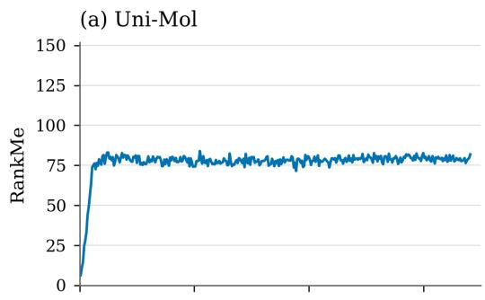

(b) Alexandria  
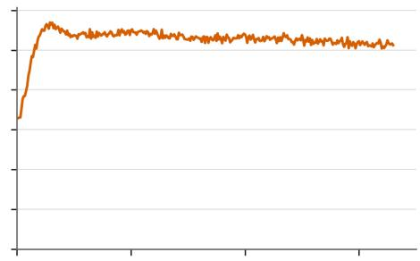

(c) Uni-Mol  
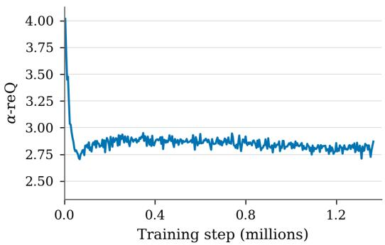

(d) Alexandria  
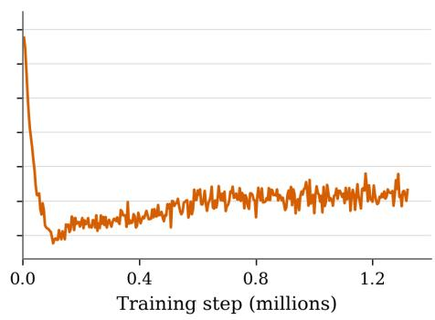  
Figure 14: Evolution of RankMe (top) and α-reQ (bottom) during pretraining for the Uni-Mol (left) and Alexandria (right) encoders.

(a) Uni-Mol  
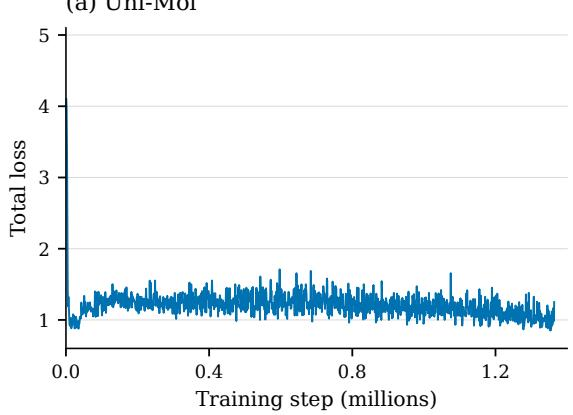

(b) Alexandria  
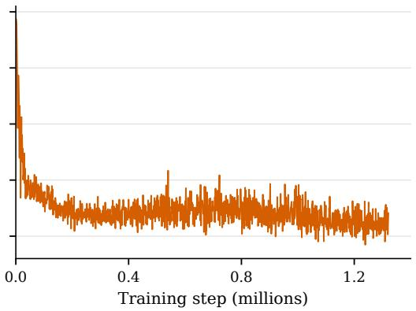  
Figure 15: Total training loss during pretraining for the Uni-Mol (left) and Alexandria (right) encoders.

Figure 15 shows the total loss for both runs during training. In both cases we observe a pattern of a sharp initial decline as the predictor and encoders leave initialization, followed by a period of gradual increase as the EMA target encoder drifts away form the context encoder, and finally a convergence phase towards the end of training as the target and context encoders are brought back into closer alignment, allowing the loss to decrease again.

## H FINETUNING IMPLEMENTATION DETAILS

## H.1 ADMET FINETUNING

Atom-JEPA Due to the label imbalances and objective differences between targets present in the multi-task datasets, we follow CKERMT (Xue et al., 2026) and employ two tricks; an individual MLP head for each of the individual tasks, and homoscedastic uncertainty task weighting of the loss (Kendall et al., 2018). We follow the learning from Tompa et al. (2026), relying on freezing the pretrained model for better generalisation, and otherwise only tune the learning rate. We deviate from their recommendations to avoid weight decay on the pre-trained model by instead using L2- SP (Xuhong et al., 2018) to avoid the model from drifting too far from the pretrained model.

LGBT and MLP Baselines For baselines, we implement a gradient boosted tree (LGBT) and a 3-layer MLP model using different combination of features: Morgan fingerprints, RDKit features, ErG, and Avalon features. In addition, we also experiment with adding frozen Atom-JEPA features.

CKERMT As Xue et al. (2026) does not provide test MAE of individual folds, we reran their experiments to get the uncertainty for statistical tests. We use their model with the largest selfsupervised dataset called "CKERMT Biogen+OA+CM task-specific". Our results agree closely with the published mean MAEs across datasets.

Mol-JEPA We also use Mol-JEPA with the same MLP and LGBT setup, either using their pooled molecule level embedding (CLS) or their full 12 modality output (modalities).

Chemprop We use the Chemprop v2 version, with Biogen tuned hyperparameters from Adrian et al. (2025). We also tried default parameters but found them to perform worse.

For all models except Atom-JEPA and Chemprop, we run a hyper-parameter tuning setup with Optuna using a budget of 500 iterations.

## H.1.1 HYPERPARAMETER TUNING

We take the training split of one of the first split in Adrian et al. (2025) on Biogen split by clusters, which we part into a training and validation split. We select the validation macro MAE as our optimisation target. over all targets using Optuna for hyperparameter tuning. For all models except Atom-JEPA and CKERMT, we use a budget of 500 iterations with the TPE optimizer and hyperband pruning. All with a warm start of 15 iterations. For each feature extract(s) + feature processor, we run the full hyperparameter pipeline. If multiple feature extractors are used in the same model, all their hyperparameters are tuned at the same time. For the LGBM models we fixed the number of estimators high at 2000, as the complexity of the model is already protected by early stopping. The ranges for the LGBM was based on the values from Fang et al. (2023) and Optuna's LightGBMTuner, but by design left slightly larger. We use CDF-normalized RDKit features.

We allow a higher amount of optimisation iterations for the baseline models based on LightBGM and MLP heads compared to Atom-JEPA due to the difference in computational overhead. Instead we reuse the hyperparameters found by CKERMT for the architectures. Instead, we perform tuning in two sweeps: first the L2SP weight decay of the encoder $\{ 0 , 1 0 ^ { - 5 } , 1 0 ^ { - 4 } , 1 0 ^ { - 3 } , 1 0 ^ { - 2 } , 1 0 ^ { - 1 } , 1 0 ^ { - 0 } \}$ versus $L _ { 2 }$ weight decay of the other parameters $\{ 0 , 1 0 ^ { - 5 } , \dot { 1 } 0 ^ { - 4 } , 1 0 ^ { - 3 } , 1 0 ^ { - 2 } , 1 0 ^ { - 1 } , 1 0 ^ { - 0 } \}$ , for a total of 49 iterations. Then the learning rate $( \{ 1 \cdot 1 0 ^ { - 5 } , 2 . 5 \cdot 1 0 ^ { - 5 } , 5 \cdot 1 0 ^ { - 5 } , 1 \cdot 1 0 ^ { - 4 } , 2 . 5 \cdot 1 0 ^ { - 4 } , \hat { 5 } \cdot 1 0 ^ { - 4 } , 1 \cdot 1 0 ^ { - 3 } \} )$ the number of epochs {100, 50, 25, 10} and number of epochs the Atom-JEPA encoder is frozen for {20, 10, 5, 0 } for a total of 98 iterations excluding impossible combinations. We accommodate the much larger data size of ChEMBL-MT by setting the encoder freezing and encoder L2SP to 0.

For the baselines and Atom-JEPA we do not use early stopping on a validation set, instead we train on the full training set as we have already selected the number of epochs.. For the literature models Chemprop, CKERMT, and Mol-JEPA we follow their respective described setups. Using a single set of hyperparameters for all datasets reduces model performance, but significantly reduces the computational burden.

Table 27: Intervals and priors for the hyperparameters of the specific feature processor tuned over using Optuna.
<table><tr><td>Processor Hyperparameter</td><td>Interval</td><td>Prior</td></tr><tr><td>MLP</td><td></td><td></td></tr><tr><td>Learning rate</td><td> $( 1 0 ^ { - 4 } , 1 0 ^ { - 2 } )$ </td><td>Log-uniform</td></tr><tr><td>Epochs</td><td> $( 5 , 5 0 0 )$ </td><td>Log-uniform</td></tr><tr><td>Weight decay</td><td> $( 1 0 ^ { \cdot } ^ { - 4 } , 1 0 ^ { \cdot } ^ { - 1 } )$ </td><td>Log-uniform</td></tr><tr><td>Head dropout</td><td>(0,0.5)</td><td>Uniform</td></tr><tr><td>Head hidden units Trunk hidden units</td><td>(32, 256)</td><td>Log-uniform</td></tr><tr><td></td><td>{128, 256, 512, 1024}</td><td>Categorical</td></tr><tr><td>Trunk layers</td><td>{2, 3, 4, 5}</td><td>Categorical</td></tr><tr><td>Trunk dropout Trunk activations</td><td>(0,0.5)</td><td>Uniform</td></tr><tr><td></td><td>{ReLU, GELU. SiLU}</td><td>Categorical</td></tr><tr><td>LGBM</td><td></td><td></td></tr><tr><td>Learning rate</td><td> $( 5 \cdot 1 0 ^ { - 3 } , 3 \cdot 1 0 ^ { - 1 } )$ </td><td>Log-uniform</td></tr><tr><td>Number of leaves</td><td>(8, 128)</td><td>Log-uniform</td></tr><tr><td>Minimum child sample</td><td>(5, 100)</td><td>Log-uniform</td></tr><tr><td>Subsample fraction</td><td>(0.5, 1.)</td><td>Úniform</td></tr><tr><td>Colsample bytree</td><td>(0.4, 1)</td><td>Uniform</td></tr><tr><td>Reguralizer α</td><td> $( 1 \dot { 0 } ^ { - 8 } , 1 \dot { 0 } ^ { 1 } )$ </td><td></td></tr><tr><td>Reguralizer λ</td><td> $\dot { ( 1 0 ^ { - 8 } , 1 0 ^ { 1 } ) }$ </td><td>Log-uniform Log-uniform</td></tr></table>

Table 28: Intervals and priors for the hyperparameters of the specific feature extractor tuned over using Optuna.
<table><tr><td>Feature Hyperparameter</td><td>Interval</td><td>Prior</td></tr><tr><td>Morgan Radius</td><td>{2,3}</td><td>Categorical</td></tr><tr><td>Number of bits Use Counts</td><td>{1024, 2048} (False, True)</td><td>Categorical Boolean</td></tr><tr><td>RDKit</td><td></td><td></td></tr><tr><td>ErG</td><td></td><td></td></tr><tr><td>Fuzz Increase Avelon</td><td>(0.1,0.5)</td><td>Uniform</td></tr><tr><td>Use Counts Atom-JEPA</td><td>(False, True)</td><td>Boolean</td></tr><tr><td>Node Aggregation</td><td>(Mean, Sum)</td><td>Categorical</td></tr><tr><td>Higher Order Features</td><td>(False, True)</td><td>Boolean</td></tr><tr><td>Feature Scaling Mol-JEPA</td><td>(None, Standard, Quantile)</td><td>Categorical</td></tr></table>

## H.1.2 CONFORMER GENERATION DETAILS

For datasets where the 3D structure of the compound is not given, we generate conformers following the same setup as Unimol. For completeness we detail the setup here. To convert a SMILE string to a 3D conformer, we import the SMILE string in RDKit. If the importing fails with sanitation we retry without sanitation and afterwards sanitise it.

To get the 3D coordinates we use ETKDGv3 to generate up to 10 conformers. We first use attempt to generate with enforced chirality, but in case of failure we start from random coordinates. Since Atom-JEPA uses the SE(3) equivariant GNN EquiformerV3, the model can in theory learn to distinguish between enantiomers. The conformers are only used during training as a form of training augmentation.

Table 29: Molecules in the TDC ADMET benchmark group that RDKit parses as more than one connected component (salts, hydrates, mixtures), over the de-duplicated train\_val + test SMILES of each dataset. “Extra atoms" is the mean, over fragmented molecules only, of the share of atoms outside the largest fragment.
<table><tr><td>Dataset</td><td>N</td><td>Fragmented</td><td>Fragmented (%)</td><td>Extra atoms (%)</td></tr><tr><td>Caco2 Wang</td><td>906</td><td>9</td><td>1.0</td><td>4.6</td></tr><tr><td>HIA Hou</td><td>578</td><td>0</td><td>0.0</td><td>0.0</td></tr><tr><td>Pgb Broccatelli</td><td>1212</td><td>0</td><td>0.0</td><td>0.0</td></tr><tr><td>Bioavailability Ma</td><td>640</td><td>1</td><td>0.2</td><td>52.5</td></tr><tr><td>Lipophilicity AstraZeneca</td><td>4200</td><td>1</td><td>0.0</td><td>4.9</td></tr><tr><td>Solubility AqSolDB</td><td>9982</td><td>1098</td><td>11.0</td><td>30.2</td></tr><tr><td>BBB Martins</td><td>1975</td><td>105</td><td>5.3</td><td>11.7</td></tr><tr><td>PPBR AZ</td><td>1797</td><td>0</td><td>0.0</td><td>0.0</td></tr><tr><td>VDss Lombardo</td><td>1111</td><td>0</td><td>0.0</td><td>0.0</td></tr><tr><td>CYP2D6 Veith</td><td>13130</td><td>549</td><td>4.2</td><td>16.6</td></tr><tr><td>CYP3A4 Veith</td><td>12328</td><td>549</td><td>4.5</td><td>16.8</td></tr><tr><td>CYP2C9 Veith</td><td>12092</td><td>538</td><td>4.4</td><td>17.0</td></tr><tr><td>CYP2D6 Substrate Carbon-Mangels</td><td>664</td><td>0</td><td>0.0</td><td>0.0</td></tr><tr><td>CYP3A4 Substrate Carbon-Mangels</td><td>667</td><td>0</td><td>0.0</td><td>0.0</td></tr><tr><td>CYP2C9 Substrate Carbon-Mangels</td><td>666</td><td>0</td><td>0.0</td><td>0.0</td></tr><tr><td>Half-life Obach</td><td>665</td><td>10</td><td>1.5</td><td>13.2</td></tr><tr><td>Clearance Microsome AZ</td><td>1102</td><td>0</td><td>0.0</td><td>0.0</td></tr><tr><td>Clearance Mepatocyte AZ</td><td>1020</td><td>0</td><td>0.0</td><td>0.0</td></tr><tr><td>hERG</td><td>648</td><td>12</td><td>1.9</td><td>20.8</td></tr><tr><td>AMES</td><td>7255</td><td>0</td><td>0.0</td><td>0.0</td></tr><tr><td>DILI</td><td>475</td><td>18</td><td>3.8</td><td>30.0</td></tr><tr><td>LD50 Zhu</td><td>7342</td><td>0</td><td>0.0</td><td>0.0</td></tr></table>

For several of the ADMET-TDC datasets, the SMILE string contains multiple fragmented components, such as salt forms of CN(C)C(...)Cc1ccc(Cl)c(Cl)c1.[Cl-].[H+]. This is a problem during conformer relaxation, as the disconnected components can arbitrarily be moved around, thus geometrically ill-defined.

## H.1.3 CONFORMER SCALING

Generation of conformers can be seen as a way of generating multiple 3D views of the same molecule. Previous work (Zhou et al., 2023) generates multiple conformers, specifically 11, as a type of augmentation for training. In this section we investigate the impact on performance these parameters have. To avoid leakage of data, we use the same data for the train and validation split as the hyperparameter tuning. First, we investigate the impact of the number of conformers available during training and test time. Some of the targets have only 7 datapoints in the validation set, so instead of averaging the over the tasks, we present error over the datapoints. For this experiment we generate up to 50 conformers (from 10) which equivalates a new conformer seen each epoch. In addition to using conformers during training, we also investigate the impact of ensembling the predictions over conformers. We average over 10 conformers for each run. The results are shown in Figure 16. In the figure, we see a large drop in validation MAE when going from training on 1 to 2 conformers, while the run to run variance dominates higher conformer numbers. This shows the importance of having multiple (>1) conformer available during training. Generating many conformers is a good trade-off for many ADMET tasks as cost of generating multiple conformers is comparatively cheap compared to the training time. In addition to training conformers, the figure reveals moderate gains from averaging multiple model predictions from conformers. This can be thought of as a way of performing test-time augmentations or ensemble averaging. Curiously, the figure reveals a weak trend of increasing error when ensembling conformer predictions when training on more conformers although not statistically significant. We hypothesize, that the variance of the model's predictions over conformers is reduced when trained with more conformers, which could negatively impact the ensembles prediction.

We also investigate the impact of the conformer generation quality. Lower potential energy of conformers are typically associated with higher quality as they are more probable. To avoid a cofounding generation artifacts from the relaxation process of MMFF94 and using it to judge the same energies, we instead use the interatomic potential model UMA-s-1p2 (Wood et al., 2026) model to predict energy. The results are shown in Figure 17. Surprisingly, the figures shows no correlation between the error of the conformer prediction versus the conformer quality. Only for conformers of very high energy compared to the mean (～ 10%) we see some small increase in error.

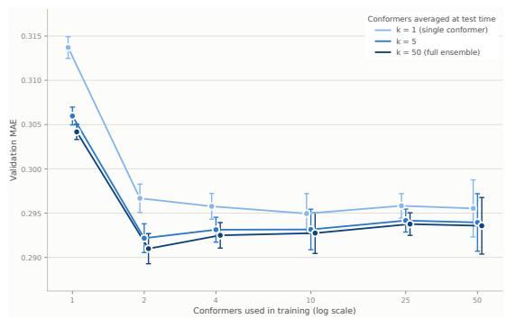  
Figure 16: The validation error on the validation error (MAE) against the number of conformers used during training. The different curves represent different numbers of predictions from conformers averaged over during test time (test time augmentations).

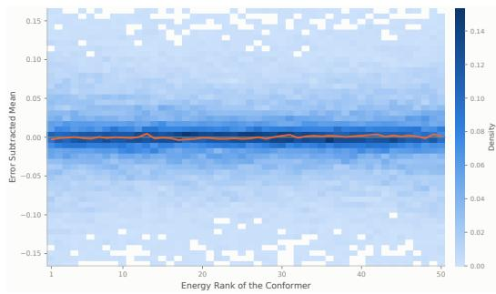

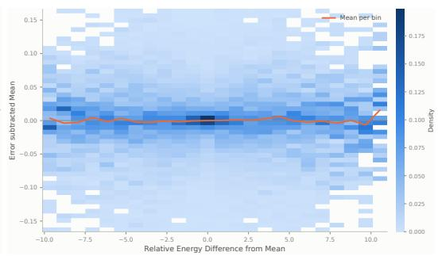  
Figure 17: Histogram of the prediction error of validation datapoints versus the energy of the conformer. Left plot is the relative energy of the conformer from the mean, right plot is the rank of the conformer. For none of the plots a strong correlation between error and conformer energy was observed.

## H.1.4 ADMET PARAMETERS FOR ATOM-JEPA

The optimal hyperparameters obtained from hyperparameter tuning can be found in Table 30.

Table 30: Hyperparameters used for Atom-JEPA fine-tuning on Biogen ADME, ChEMBL-MT, ExpansionRX, and ADMET-TDC. All three start from the same Uni-Mol-pretrained context encoder; encoder architecture is unchanged from Table 26. Every task gets its own MLP head on top of a shared trunk that takes the atom-pooled representation.
<table><tr><td>Hyperparameter</td><td>Biogen ADME</td><td>ChEMBL-MT</td><td>ExpansionRX</td></tr><tr><td>Prediction Head</td><td></td><td></td><td></td></tr><tr><td>Number of tasks</td><td>6</td><td>25</td><td>9</td></tr><tr><td>Trunk Architecture</td><td>Linear (768, 256) → SiLU → Dropout</td><td></td><td></td></tr><tr><td>Per Task Head Architecture</td><td>Linear (256, 64) → SiLU → Linear (64, 1)</td><td></td><td></td></tr><tr><td>Shared Trunk dropout</td><td></td><td>.1</td><td></td></tr><tr><td>Pooling readout</td><td></td><td>Mean</td><td></td></tr><tr><td>Higher-order invariants</td><td></td><td>Yes</td><td></td></tr><tr><td>Conformers</td><td></td><td></td><td></td></tr><tr><td>Conformers generated per molecule</td><td></td><td>10</td><td></td></tr><tr><td>Conformers used in training</td><td></td><td>10</td><td></td></tr><tr><td>Objective</td><td></td><td></td><td></td></tr><tr><td>Per-task loss</td><td></td><td>Huber</td><td></td></tr><tr><td>Label standardization</td><td></td><td>Per-task train</td><td></td></tr><tr><td></td><td></td><td>mean/std</td><td></td></tr><tr><td>Log-transformed targets</td><td>None</td><td>None</td><td>All but LogD</td></tr><tr><td>Regularization</td><td></td><td></td><td></td></tr><tr><td>L2-SP coefficient λ</td><td> $1 \times 1 0 ^ { - 5 }$ </td><td>0</td><td> $1 \times 1 0 ^ { - 5 }$ </td></tr><tr><td>Shared Trunk weight decay</td><td></td><td>.5</td><td></td></tr><tr><td>MTL log-σ weight decay</td><td></td><td>.1</td><td></td></tr><tr><td>Encoder stochastic depth</td><td></td><td>.05</td><td></td></tr><tr><td>Encoder normalization layers</td><td></td><td>Eval mode</td><td></td></tr><tr><td>Optimization</td><td></td><td></td><td></td></tr><tr><td>Optimizer</td><td></td><td>AdamW</td><td></td></tr><tr><td>Learning-rate schedule</td><td></td><td>Cosine + linear warmup</td><td></td></tr><tr><td>Encoder learning rate</td><td></td><td> $5 \times 1 0 ^ { - 5 }$ </td><td></td></tr><tr><td>Head learning-rate multiplier</td><td></td><td>10</td><td></td></tr><tr><td>MTL log-σ learning rate</td><td></td><td> $5 \times 1 0 ^ { - 5 }$ </td><td></td></tr><tr><td>Minimum learning rate</td><td></td><td> $1 \times 1 0 ^ { - 7 }$ </td><td></td></tr><tr><td>Warmup epochs</td><td></td><td>10</td><td></td></tr><tr><td>Encoder-only warmup epochs</td><td></td><td>10</td><td></td></tr><tr><td>Frozen-encoder epochs</td><td>10</td><td>0</td><td>10</td></tr><tr><td>Batch size</td><td></td><td>8</td><td></td></tr><tr><td>Number of epochs</td><td></td><td>50</td><td></td></tr><tr><td>Gradient clipping norm</td><td></td><td>10</td><td></td></tr><tr><td></td><td></td><td></td><td></td></tr><tr><td>Weight EMA decay</td><td></td><td>.99</td><td></td></tr></table>

## H.2 QM9 FINETUNING

Table 31 summarizes the hyperparameters used for QM9 finetuning. We use three target-specific readouts operating on the encoder's final atom representations following SchNet/SchNetPack-style atomwise and electronic spatial-extent constructions (Schütt et al., 2018) and a PaiNN-style gated equivariant dipole construction (Schütt et al., 2021), adapted from the GotenNet implementation (Aykent & Xia, 2025). Let C denote the encoder feature width and $\mathbf { r } _ { i }$ the position of atom i. All readouts use sum aggregation of atom-wise contributions.

Dipole moment $\operatorname { \rho } ( \mu ) .$ Two gated equivariant blocks combine the last layer scalar $( \ell = 0 )$ and vector (l = 1) features, with SiLU activations, to predict an atomic scalar $q _ { i }$ and dipole vector $\mathbf { d } _ { i }$ . The

molecular dipole magnitude is then

$$
\hat { \mu } = \left\| \sum _ { i } \left( \mathbf { d } _ { i } + q _ { i } \mathbf { r } _ { i } \right) \right\| _ { 2 } .
$$

Electronic spatial extent $( R ^ { 2 } )$ . A two-layer atomwise MLP with dimensions $C  C  1$ and shifted-softplus activation predicts scalar weights $a _ { i }$ . The molecular prediction is

$$
\hat { R } ^ { 2 } = \sum _ { i } a _ { i } \left. \mathbf { r } _ { i } - \mathbf { r } _ { \mathrm { C M } } \right. _ { 2 } ^ { 2 } ,
$$

where $\mathbf { r } _ { \mathrm { { C M } } }$ is the molecular center of mass.

Remaining targets. A two-layer atomwise MLP with dimensions $C  C  1$ and SiLU activation maps scalar atom features to scalar contributions, which are summed to obtain the molecular prediction. For $U , U _ { 0 } , H$ , and G, summed atomic reference energies are subtracted during training and restored for evaluation, following standard practice. No targets are standardized.

Table 31: Hyperparameters used for QM9 fine-tuning. All targets share the same optimization settings, with target-specific readout architectures for $\mu$ and $R ^ { 2 }$ . Encoder architecture hyperparameters are inherited from the pretrained model
<table><tr><td>Hyperparameter</td><td>All targets</td></tr><tr><td>Optimization</td><td></td></tr><tr><td>Optimizer</td><td>AdamW</td></tr><tr><td>Adam €</td><td> $1 0 ^ { - 7 }$ </td></tr><tr><td>Maximum training epochs</td><td>1,000</td></tr><tr><td>Batch size</td><td>32</td></tr><tr><td>Encoder base learning rate</td><td> $1 0 ^ { - 4 }$ </td></tr><tr><td>Readout base learning rate</td><td> $1 0 ^ { - 4 }$ </td></tr><tr><td>Weight decay</td><td> $_ 0$ </td></tr><tr><td>Learning-rate schedule</td><td>Linear warmup + ReduceLROnPlateau</td></tr><tr><td>Global learning-rate warmup (optimizer steps)</td><td>10,000</td></tr><tr><td>Learning-rate reduction factor</td><td>.8</td></tr><tr><td>Learning-rate reduction patience (epochs) Minimum scheduler learning rate</td><td>15  $1 0 ^ { - 7 }$ </td></tr><tr><td>Initial encoder freezing (epochs)</td><td></td></tr><tr><td>Encoder ramp after unfreezing (epochs)</td><td>10</td></tr><tr><td>Gradient clipping norm</td><td>10 5</td></tr><tr><td></td><td></td></tr><tr><td>Objective and Model Selection</td><td></td></tr><tr><td>Training loss</td><td>MSE</td></tr><tr><td>Scheduler and early-stopping metric</td><td>Validation MSE</td></tr><tr><td>Early-stopping patience (epochs)</td><td>150</td></tr><tr><td>Checkpoint-selection metric</td><td>Validation MAE</td></tr><tr><td>Reproducibility</td><td></td></tr><tr><td>Training seed</td><td>42</td></tr><tr><td>Split seed</td><td>1</td></tr></table>

## H.3 MATBENCH FINETUNING

We use a common training configuration for the five small-to-medium tasks (phonons, dielectric, Log GVRH, Log KVRH and Perovskites), and a second configuration for the three large tasks (MP Gap, MP E Form, and MP Is Metal) as summarized in Table 32. MP Is Metal is the only classification task.

All tasks use an atom-wise readout consisting of a two-layer MLP with SiLU activation with one output for regression or two logits for classification. The final layer has a bias only for classification, and no dropout is used. Atom-wise outputs are mean-pooled, except for phonons, which uses max pooling. Classification probabilities are obtained by applying softmax after pooling.

We standardize targets for all regression tasks and not for classification. Training uses separate encoder and readout learning rates, with linear warmup followed by cosine decay. After the initial encoder-freezing phase, the encoder learning rate is ramped over ten epochs for small-to-medium tasks and 1 epoch for large tasks. We do not use L2-SP regularization for Matbench.

For each official Matbench fold, we reserve 10% of the training fold for validation using split seed 42 and set the PyTorch random seed to 0. Regression normalization statistics are computed from the training fold. We select EMA weights by the lowest validation MAE for regression or highest validation F1 for classification. Scratch baselines use the same architecture and settings, but initialize the encoder randomly and train it from the first epoch without freezing.

Table 32: Hyperparameters used for Matbench fine-tuning. Small-to-medium tasks comprise phonons, dielectric, Log GVRH, Log KVRH and Perovskites; large tasks comprise MP Gap, MP E Form, and MP Is Metal. Classification settings apply only to MP Is Metal. Encoder freezing applies only to pretrained runs; encoders trained from scratch are trainable from the first epoch.
<table><tr><td>Hyperparameter</td><td>Small-to-medium tasks</td><td>Large tasks</td></tr><tr><td>Optimization</td><td></td><td></td></tr><tr><td>Optimizer</td><td>AdamW</td><td>AdamW</td></tr><tr><td>Adam coefficients  $( \beta _ { 1 } , \beta _ { 2 } )$ </td><td>(.9, .95)</td><td>(.9, .95)</td></tr><tr><td>Adam €</td><td>10-8</td><td>10−8</td></tr><tr><td>Number of epochs</td><td>100</td><td>12</td></tr><tr><td>Training batch size</td><td>4</td><td>32</td></tr><tr><td>Evaluation batch size</td><td>32</td><td>32</td></tr><tr><td>Encoder base learning rate</td><td> $5 \times 1 0 ^ { - 5 }$ </td><td> $1 . 5 \times 1 0 ^ { - 4 }$ </td></tr><tr><td>Readout learning-rate multiplier</td><td>10</td><td>10</td></tr><tr><td>Readout base learning rate</td><td> $5 \times 1 0 ^ { - 4 }$ </td><td> $1 . 5 \times 1 0 ^ { - 3 }$ </td></tr><tr><td>Learning-rate schedule</td><td></td><td>Linear warmup + cosine decay Linear warmup + cosine decay</td></tr><tr><td>Global learning-rate warmup (epochs)</td><td>10</td><td>2</td></tr><tr><td>Initial warmup factor</td><td>.1</td><td>.5</td></tr><tr><td>Encoder learning-rate floor</td><td> $1 0 ^ { - 7 }$ </td><td> $1 0 ^ { - 7 }$ </td></tr><tr><td>Readout learning-rate floor</td><td> $1 0 ^ { - 6 }$ </td><td> $1 0 ^ { - 6 }$ </td></tr><tr><td>Initial encoder freezing (epochs)</td><td>10</td><td>2</td></tr><tr><td>Encoder ramp after unfreezing (epochs)</td><td>10</td><td>1</td></tr><tr><td>Encoder / readout weight decay</td><td>0/0</td><td>0/0</td></tr><tr><td>Gradient clipping norm</td><td>10</td><td>10</td></tr><tr><td>Model EMA decay</td><td>.99</td><td>.99</td></tr><tr><td>Objectives and Aggregation</td><td></td><td></td></tr><tr><td>Regression training loss</td><td>MAE</td><td>Huber</td></tr><tr><td>Classification training loss</td><td></td><td>Weighted cross-entropy</td></tr><tr><td>Aggregation of atomwise outputs</td><td>Mean max for phonons</td><td>Mean</td></tr></table>

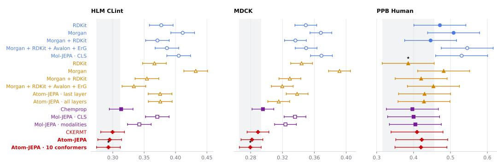

## I TUKEY HSD PLOTS

## I.1 BIOGEN

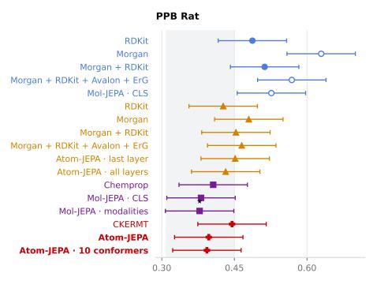

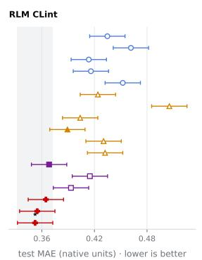

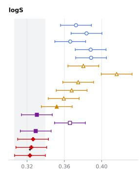  
LightGBMMLPFine-tunedOtherOverlaps best interval Worse than best  Best meanBest interval  
Figure 18: Tukey HSD grid plot across the endpoints of Biogen Scaffold test data over 5 seeds. The analysis was conducted with a blocked ANOVA test followed by Tukey HSD using the Statsmodels Python package.

## I.2 EXPANSIONRX

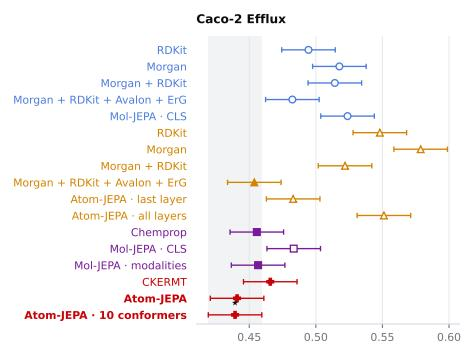

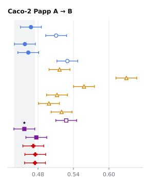

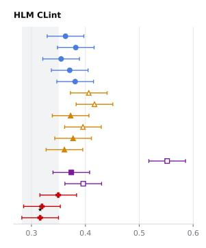

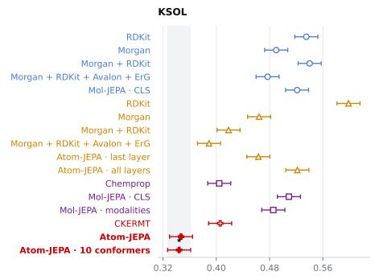

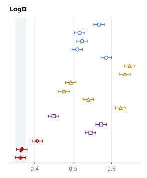

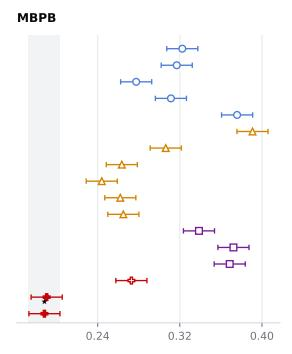

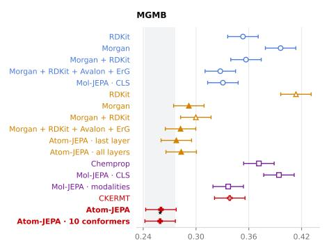

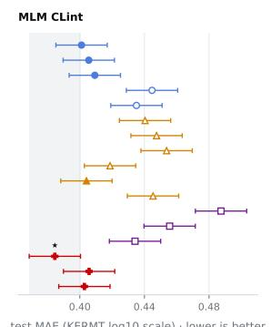

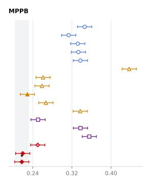  
LightGBMMLPFine-tunedOtherOverlaps best interval Worse than best  Best meanBest interval

Figure 19: Tukey HSD grid plot across the endpoints of ExpansionRX temporal test data over 4 seeds. The analysis was conducted with a one-way ANOVA test followed by Tukey HSD using the Statsmodels Python package.

LightGBMMLPFine-tunedOtherOverlaps best intervalWorse than bestBest meanBest interval

## I.3 CHEMBL-MT

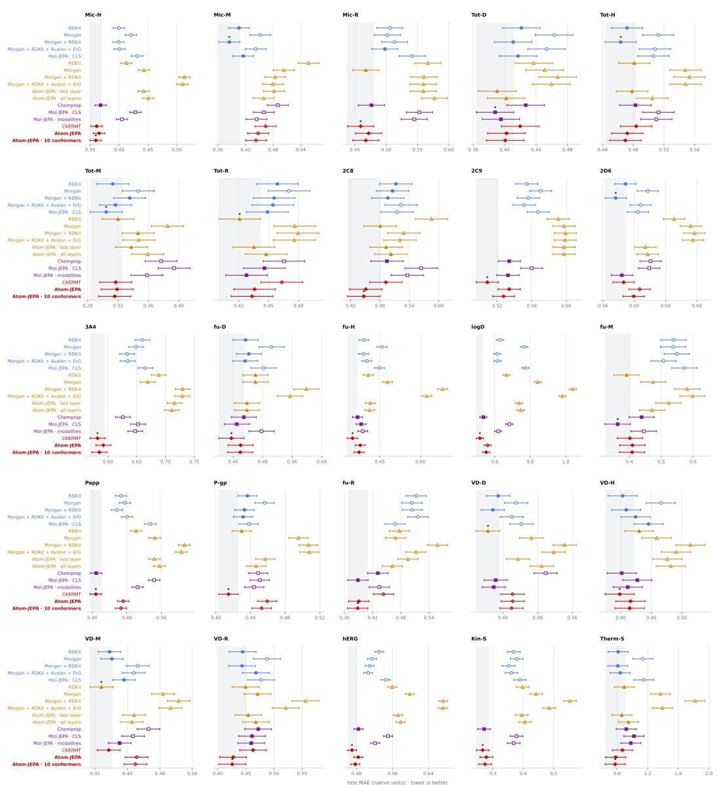  
Figure 20: Tukey HSD grid plot across the endpoints of ChEMBL-MT test data over 4 seeds. The analysis was conducted with a blocked ANOVA test followed by Tukey HSD using the Statsmodels Python package.