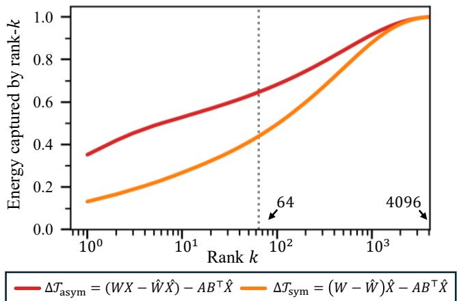
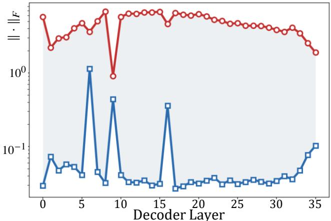
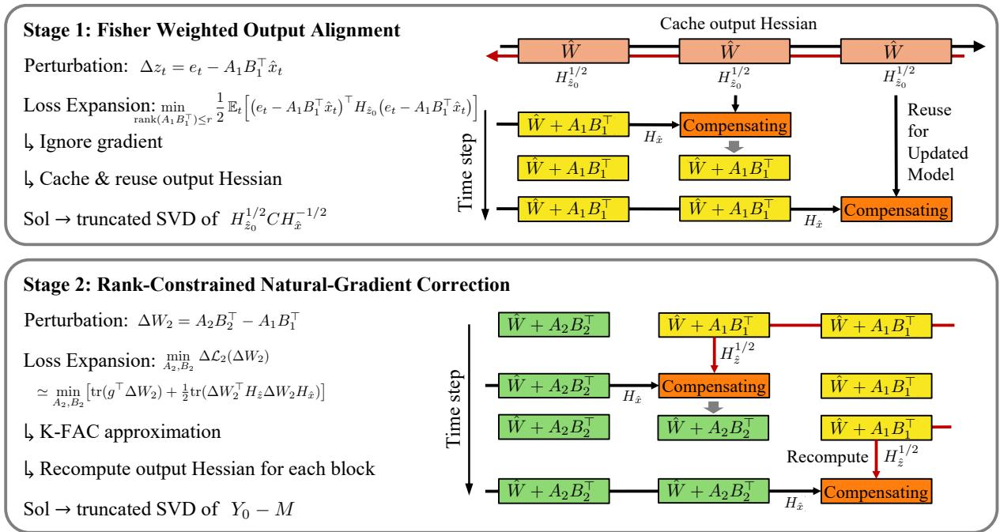
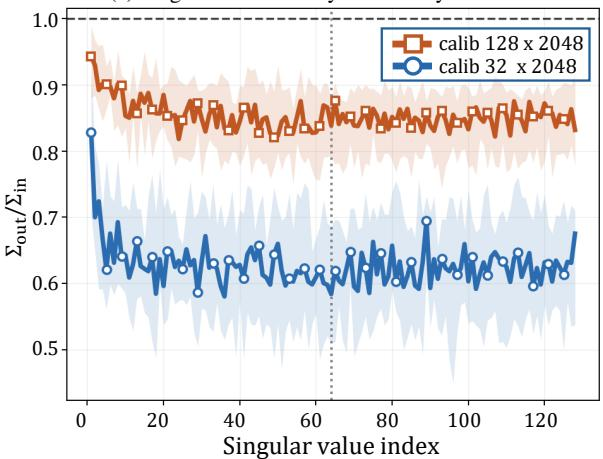
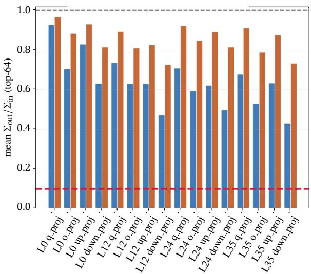
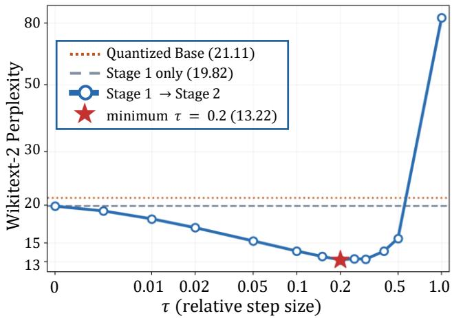

# Align, Then Correct: Training-Free Two-Stage Low-Rank Compensation for Extremely Quantized Large Language Models

Seobin Song<sup>1</sup>, Geonho Lee<sup>1</sup>, Janghwan Lee<sup>2∗</sup>, Jungwook Choi<sup>1†</sup>

<sup>1</sup>Hanyang University, Seoul, Republic of Korea

<sup>2</sup>Qualcomm AI Research, Qualcomm Korea YH, Seoul, Republic of Korea

{skmssb, thisisho, choij}@hanyang.ac.kr, janghwan@qti.qualcomm.com

## Abstract

Low-rank quantization error compensation (LQEC) recovers the accuracy lost under aggressive weight quantization by attaching a closed-form rank-r adapter beside each frozen quantized weight, without any training. We show that existing compensators are limited by two shared simplifications. They calibrate symmetrically, evaluating the full-precision and compensated weights on the same activation, which yields a compensation target that is inherently high-rank—so a fixed rank budget captures only a small fraction of it. And they minimize only the second-order term of the loss, although the compensated model is not stationary: a first-order descent direction larger than the applied compensation itself remains in every layer, and no reconstruction objective can absorb it. We propose a two-stage closed-form framework that removes both simplifications. Stage 1 aligns each layer’s output with the fullprecision model under a Fisher-weighted asymmetric objective, concentrating the rank budget on a rank-compressible target. Stage 2 re-measures statistics on the compensated model and applies a rank-constrained natural-gradient step that absorbs the remaining first-order signal. Every adapter is the result of a single truncated SVD; backward passes serve only to collect statistics. At 2 bits under QuIP#, our method reduces WikiText-2 perplexity from 12.43 to 10.26 on Qwen3-8B and from 21.11 to 13.22 on Qwen3-4B. On the held-out C4 corpus, it recovers 51% and 84% of the gap to FP16, versus 31% and 63% for the strongest baseline, with consistent gains in the seven-task zero-shot average, at higher bit-widths, and under a distinct quantizer.

## 1 Introduction

As large language models (LLMs) are increasingly deployed on memory-constrained on-device platforms, compressing pretrained models into a smaller memory footprint has become essential, and weight quantization is the primary means of doing so. Post-training quantization (PTQ) (Frantar et al. 2023; Tseng et al. 2024; Li et al. 2021, 2025) is now nearlossless at 4 bits, but at 2 bits it still incurs severe accuracy degradation. LoRA-based quantization error compensation (QEC) addresses this gap by attaching a low-rank adapter $\bar { A B } ^ { \top }$ beside each frozen quantized weight, absorbing the quantization error in continuous precision at a small memory overhead. The compensation objective has evolved steadily:

QLoRA (Dettmers et al. 2023) initializes the adapters of a quantized backbone to zero, leaving compensation to finetuning; LoftQ (Li et al. 2024) fits the best rank-r approximation of the weight error $W - { \hat { W } }$ in closed form (Eckart and Young 1936); LQ-LoRA (Guo et al. 2024) adds loss sensitivity through a diagonal Fisher weighting; and LQER (Zhang et al. 2024), QERA (Zhang et al. 2025), EoRA (Liu et al. 2024), CLoQ (Deng et al. 2025), and ProjQ (Yu et al. 2026) target the layer output error under the full input second moment. The appeal of this line is that it is training-free: each adapter is a closed-form solution, computed from a small calibration set in minutes on a single GPU and composable with any quantizer. Training-based alternatives (Lee et al. 2025) recover more accuracy but forfeit exactly this property, requiring renewed training for every bit-width, rank, and model.

Despite this progress, existing training-free compensators share two structural simplifications. First, they calibrate symmetrically: the full-precision and compensated weights are evaluated on the same activation, so the adapter’s target reduces to $( W - { \hat { W } } ) { \hat { X } }$ . This target is poorly matched to a small rank budget—its energy spreads across many singular directions, so a rank-64 adapter captures only a small fraction of it. The asymmetric target $W X - { \hat { W } } { \hat { X } }$ , formed from the activations the full-precision and quantized models actually produce, concentrates its energy in far fewer directions, yet no existing objective distinguishes the two activations. Second, these methods minimize only the quadratic term of the loss expansion, keeping the convergence assumption that the gradient vanishes even though quantization has displaced the model from its converged point (Li et al. 2021). In practice, the first-order descent direction that remains after even a strong second-order compensation exceeds the applied compensation in every layer—by more than an order of magnitude in most layers—and no reconstruction objective can absorb it, because such objectives contain no first-order term.

We propose a two-stage low-rank compensation method that removes each simplification in turn, entirely in closed form. Stage 1 solves the Fisher-weighted asymmetric objective: each adapter acts on the quantized activation it actually receives and is solved to match the full-precision output, with the output axis weighted by the full empirical Fisher so that the rank budget follows loss sensitivity; the blocks are solved front to back with input statistics refreshed at each step. Stage 2 re-measures every statistic on the compensated model, block by block, and updates each adapter with a single natural-gradient step (Amari 1998; Martens and Grosse 2015), recovering the first-order term; carrying the existing adapter inside the target makes this a generalized rank-constrained approximation (Friedland and Torokhti 2007) whose solution has rank r by construction. In this framework, every existing training-free compensator solves a Stage-1-type reconstruction objective under coarser statistics—none uses the full output Fisher, and none distinguishes the two activations—whereas Stage 2, a closed-form step taken against the task loss on the compensated model itself, has no counterpart in prior work. Unlike asymmetric quantizer-side calibration (Li et al. 2025; Arai and Ichikawa 2025), whose correction must ultimately be absorbed by the quantization grid, our correction resides in continuous parameters beside the grid and composes with any quantizer. Throughout, backward passes serve only to collect statistics; no iterative optimization is performed.

We evaluate across models and quantizers—QuIP# (Tseng et al. 2024) at 2–4 bits and groupwise round-to-nearest— with the same rank budget as all baselines. At 2 bits under QuIP#, our method lowers WikiText-2 perplexity from 12.43 to 10.26 on Qwen3-8B and from 21.11 to 13.22 on Qwen3- 4B. On the held-out C4 corpus, it closes 51% and 84% of the gap to FP16 where the strongest baseline closes 31% and 63%, and the gains carry over to seven zero-shot commonsense tasks, higher bit-widths, and the distinct quantizer.

Our contributions are summarized as follows:

• Analysis. Identification of two simplifications shared by all training-free compensators, with direct measurements of their cost: symmetric calibration yields a target that resists low-rank approximation, and a dominant first-order signal survives any second-order compensation (Sec. 3).

• Stage 1. A closed-form Fisher-weighted asymmetric alignment, the first LQEC objective to use the full output Fisher and to distinguish the full-precision and quantized activations (Sec. 4).

• Stage 2. To our knowledge, the first training-free compensation step solved against the compensated model itself, recovering the first-order loss term in closed form under the rank constraint (Sec. 4).

• Results. Best perplexity and seven-task average accuracy among training-free compensators across bit-widths and quantizers: at 2 bits on Qwen3, 51–84% of the held-out C4 gap to FP16 is recovered versus at most 63% for the strongest baseline, with Stage 2 contributing the largest gain using only 8K calibration tokens (Sec. 5).

## 2 Background

## Second-Order Analysis of Quantization Error

To reduce the accuracy degradation of a quantized model, a principled approach is to quantify how the weight perturbation ∆w introduced by quantization changes the expected loss . Writing $w = \mathrm { v e c } ( \bar { W } )$ for the vectorized weights of a linear layer, a second-order Taylor expansion of the loss degradation $\Delta \mathcal { L }$ around the pretrained model gives:

$$
\mathbb { E } [ \mathcal { L } ( w + \Delta w ) ] - \mathbb { E } [ \mathcal { L } ( w ) ] \approx \bar { g } ^ { \top } \Delta w + \frac { 1 } { 2 } \Delta w ^ { \top } \bar { H } \Delta w ,\tag{1}
$$

where $\bar { \boldsymbol { g } } \ = \ \mathbb { E } [ \nabla _ { \boldsymbol { w } } \mathcal { L } ]$ and $\bar { H } = \mathbb { E } [ \nabla _ { w } ^ { 2 } \mathcal { L } ]$ are the expected gradient and Hessian. Existing quantization methods assume the pretrained model has converged, so that $\bar { g } \approx 0$ , and retain only the quadratic term.

The weight-space Hessian $\bar { H }$ is too large to compute at LLM scale. For a linear layer, the quadratic term is therefore approximated in two steps:

$$
\Delta \mathcal { L } \approx \frac { 1 } { 2 } \mathbb { E } _ { t } \big [ \Delta z _ { t } ^ { \top } H _ { z , t } \Delta z _ { t } \big ] \approx \frac { 1 } { 2 } \mathbb { E } _ { t } \big [ \Delta z _ { t } ^ { \top } H _ { z } \Delta z _ { t } \big ] ,\tag{2}
$$

where t indexes calibration tokens. The first step rewrites the quadratic term in the layer’s output space (Li et al. 2021): $\Delta z _ { t } = z _ { t } - \hat { z } _ { t }$ is the diference between the outputs of the full-precision and quantized linear layers, and $H _ { z , t }$ is the loss Hessian with respect to the output $z _ { t } ,$ , which is small enough to compute but varies with every token. The second step therefore replaces $H _ { z , t }$ with the calibration-averaged empirical Fisher $H _ { z } = \mathbb { E } _ { t } [ \boldsymbol { g } _ { t } \boldsymbol { g } _ { t } ^ { \top } ]$ , where $g _ { t } = \nabla _ { z _ { t } } \mathcal { L } _ { t }$ (Singh and Alistarh 2020; Li et al. 2021); $H _ { z }$ is positive semidefinite by construction and requires only per-token output gradients from a backward pass over the calibration set. Unless otherwise specified, $H _ { z }$ denotes this matrix throughout the paper. Eq. (2) quantifies the quantization-induced loss degradation that PTQ techniques aim to minimize (Frantar et al. 2023; Li et al. 2021; Tseng et al. 2024).

At a high level, the curvature approximation used here follows three steps. The intractable weight Hessian is first replaced by the weight Fisher, which is then estimated on calibration tokens by the empirical Fisher. For a linear layer, K-FAC (Martens and Grosse 2015) further approximates this empirical weight Fisher by a Kronecker product, $F _ { W } ^ { \mathrm { e m p } }$ ≈ ${ H } _ { x } ^ { \phantom { \dagger } } \otimes { H } _ { z } ,$ , where $H _ { x }$ is the input second moment and the output factor $H _ { z }$ is the empirical Fisher defined above. Thus, the factors used throughout this paper arise from the sequence Hessian Fisher empirical Fisher K-FAC.

## Low-Rank Quantization Error Compensation

Even state-of-the-art PTQ methods incur severe accuracy degradation under aggressive quantization at around 2 bits. Low-rank quantization error compensation (LQEC) addresses this gap by attaching a rank-r adapter $A B ^ { \top }$ beside each frozen quantized weight $\hat { W }$ , absorbing part of the quantization error in continuous precision at a small memory overhead. With the adapter attached, the output perturbation becomes:

$$
\Delta z = W x - ( \hat { W } + A B ^ { \top } ) \hat { x } ,\tag{3}
$$

where x and xˆ denote the inputs this layer receives in the fullprecision and quantized models, respectively. Existing LQEC methods obtain A and B in closed form from calibration statistics; they difer only in which approximations of Eq. (1) they solve.

� <sub>�</sub> = �<sub>�ƶ</sub><sup>−1/2</sup> � �<sub>�ƶ</sub><sup>−1/2</sup> natural-gradient step E �<sub>0 �</sub> = �<sup>1</sup> / <sup>2</sup>�<sub>1</sub>�<sub>1</sub><sup>⊤</sup>�<sub>�ƶ</sub><sup>1/2</sup> second-order only �

  
Figure 1: Captured energy of the rank-k truncation, $\textstyle { \bigl ( } \sum _ { i = 1 } ^ { k } \sigma _ { i } ^ { 2 } { \bigr ) } / { \bigl ( } \sum _ { i = 1 } ^ { d } \sigma _ { i } ^ { 2 } { \bigr ) }$ , for the symmetric and asymmetric compensation objectives, where $\sigma _ { i }$ denotes the i-th singular value and $d = \operatorname* { m i n } ( m , n )$ $\mathrm { { A t } } ~ k = 6 4$ , the asymmetric objective captures substantially more energy than the symmetric one, indicating that a fixed rank budget discards less information under the asymmetric objective. The asymmetric objective is therefore inherently more compatible with low-rank compensation. Computed on mlp.down\_ $\tt { p r o j }$ of layer 0 in Qwen3-8B quantized to 2 bits, calibrated on $8 \times 2 0 4 8 = 1 6 { , } 3 8 4$ WikiText-2 tokens.

Common assumptions. All existing methods share two simplifications. First, they calibrate activations symmetrically: the full-precision and compensated weights are evaluated on a shared input $\bar { x } \in \{ x , \hat { x } \}$ , collapsing the perturbation to $\Delta z = ( W - \hat { W } - A B ^ { \top } ) \bar { x }$ . The discrepancy between x and xˆ, discussed on the quantizer side by GPTAQ (Li et al. 2025), has not been addressed in any LQEC objective. Second, they minimize only the quadratic term of Eq. (1), keeping the convergence assumption $\bar { g } \approx 0$ even though quantization has already moved the model away from its converged point.

Diferences in approximation. Within this shared form, the methods are distinguished by how they treat the outputside empirical Fisher $\breve { H } _ { z }$ and the input second moment via K-FAC approximation (Martens and Grosse 2015). LoftQ (Li et al. 2024) sets both to identity, reducing the problem to a truncated SVD of the weight error $W - { \hat { W } }$ . LQER (Zhang et al. 2024), QERA (Zhang et al. 2025), EoRA (Liu et al. 2024), and CLoQ (Deng et al. 2025) keep $H _ { z } ~ = ~ I$ but weight the input axis with the full activation second moment, yielding a whitened SVD; ProjQ (Yu et al. 2026) additionally re-optimizes Wˆ jointly with the adapter. LQ-LoRA (Guo et al. 2024) instead introduces loss sensitivity, approximating $H _ { z }$ by its diagonal through a rank-one factorization of the empirical Fisher. No existing method uses the full $H _ { z }$ . We revisit the two shared simplifications above in Sec. 3.

## 3 Motivations

Sec. 2 showed that existing LQEC methods share two simplifications: symmetric calibration and the omission of the first-order term. This section examines each of them in the regime where LQEC is needed most—recovering accuracy under aggressive 2-bit quantization—and shows that neither is justified there. First, under symmetric calibration the compensation target is inherently high-rank, so a rank-r adapter captures only a small fraction of it. Second, after strong compensation the model no longer sits at a stationary point, so the neglected first-order term still provides a descent direction for the task loss.

  
Figure 2: Layer-wise whitened Frobenius norms of the Stage-1 adapter, $\| Y _ { 0 } \| _ { F } = \| H _ { \hat { z } } ^ { 1 / 2 } A _ { 1 } B _ { 1 } ^ { \top } H _ { \hat { x } } ^ { 1 / 2 } \| _ { F }$ (blue; the secondorder compensation), and of the natural-gradient step on the compensated model, $\| M \| _ { F } ~ = ~ \| H _ { \hat { z } } ^ { - 1 \bar { / 2 } } g H _ { \hat { x } } ^ { - 1 / 2 } \| _ { F } ^ { \phantom { - } }$ (red). Both are expressed in the whitened coordinates induced by the curvature metric of Eq. (2), so their magnitudes are directly comparable; each point averages the seven linear modules of a decoder layer, and the vertical axis is logarithmic. The natural-gradient step is larger in every layer, indicating that the second-order objective alone leaves substantial losssensitive information unexploited. Measured on Qwen3-4B quantized to 2 bits with QuIP#, using $1 6 \times 5 1 2 = 8 { , } 1 9 2$ WikiText-2 training tokens and one forward and backward pass per block.

## High-Rank Targets under Symmetric Calibration

Because LQEC deploys a fixed-rank adapter, its attainable quality is bounded by how much of the compensation target a rank-r matrix can represent. Written over T calibration tokens, the perturbation of Eq. (3) splits into an adapter-independent target and an adapter term, ∆Z = $( W X - \hat { W } \hat { X } ) - A B ^ { \top } \hat { X }$ , and the target the rank-r adapter must approximate takes one of two forms depending on the calibration:

$$
{ \mathcal { T } } _ { \mathrm { s y m } } = ( W - { \hat { W } } ) { \hat { X } } , \qquad { \mathcal { T } } _ { \mathrm { a s y m } } = W X - { \hat { W } } { \hat { X } } ,\tag{4}
$$

where $X ~ = ~ [ x _ { 1 } , \dots , x _ { T } ]$ and $\hat { X } ~ = ~ [ \hat { x } _ { 1 } , \dots , \hat { x } _ { T } ]$ collect the per-token activations of $\mathrm { E q . } ( 3 ) . \ T _ { \mathrm { s y m } }$ is the target prior

LQEC methods adopt under the symmetric calibration x $\approx \hat { x }$ of Sec. 2, whereas $\bar { \mathcal { T } } _ { \mathrm { a s y m } }$ retains both activations and thus keeps the portion of the error that the symmetric target discards. $\Delta \mathcal { T } _ { \bullet } = \mathcal { T } _ { \bullet } - A B ^ { \top } \hat { X }$ is accordingly the residual each objective leaves for the rank-r adapter to still account for, and its singular spectrum determines how much of that residual a given rank can capture. Fig. 1 compares this spectrum for the two targets: at the operating rank $r = 6 4$ , the asymmetric target concentrates substantially more of its energy in the leading directions than the symmetric one, so a rank-r adapter fit to $\mathcal { T } _ { \mathrm { a s y m } }$ discards less information than one fit to $\begin{array} { r } { \mathcal { T } _ { \mathrm { s y m } } , } \end{array}$ making the asymmetric objective inherently more compatible with low-rank compensation. Compressibility alone does not guarantee accuracy, however: which of the retained directions matter is decided by the loss weighting, and the asymmetric target pays of only when combined with the full output Fisher (Sec. 5).

## Remaining First-Order Signal after Compensation

The second simplification of Sec. 2 is to drop the first-order term of Eq. (1) under the convergence assumption $\bar { g } \approx 0 .$ Quantization, however, displaces the model from its converged point, and compensation restores it only partially. We therefore ask: after second-order compensation is applied, how large is the gradient that remains?

Fig. 2 answers this by comparing two quantities in each layer: the low-rank compensation obtained from the secondorder objective, and the descent step that the remaining gradient prescribes on the compensated model. Both are measured under the curvature metric induced by Eq. (2), so their norms are directly comparable in loss-sensitive units. The remaining first-order step is larger in every layer—by more than an order of magnitude in most layers—showing that the convergence assumption fails on the compensated model. Moreover, no reconstruction objective can absorb this signal, because such objectives contain no first-order term. This untapped signal motivates an explicit first-order correction stage.

## 4 Methodology

Sec. 3 identified two sources of accuracy that existing LQEC leaves unused: the compensation target becomes far more rank-compressible once symmetric calibration is dropped, and a substantial first-order signal survives any second-order solve. Our framework (Fig. 3) converts each observation into one closed-form stage, keeping the quantized weights frozen and writing only the rank-r adapters. Stage 1 aligns each layer’s output with the full-precision model under the Fisherweighted asymmetric objective, spending the rank budget on the compact target $\mathcal { T } _ { \mathrm { a s y m } } .$ Stage 2 then absorbs the firstorder signal remaining on the compensated model through a rank-constrained natural-gradient step. Both stages reduce to a single SVD per layer, with no iterative optimization and no training. The complete procedure is summarized in Algorithm 1 in Appendix E.

## Stage 1: Fisher-Weighted Output Alignment

Fisher-weighted asymmetric objective. To account for asymmetric calibration, we optimize the output perturbation in Eq. (3) using the Fisher-weighted quadratic objective in Eq. (2). For a rank-r adapter $\check { A _ { 1 } } B _ { 1 } ^ { \intercal }$ attached to the frozen quantized weight $\hat { W }$ , define the token-level compensation target as $e _ { t } = W x _ { t } - { \hat { W } } { \hat { x } } _ { t }$ , the t-th column of $\mathcal { T } _ { \mathrm { a s y m } }$ in Eq. (4). Since the adapter acts on the quantized input, the remaining output perturbation is $\Delta \boldsymbol { z } _ { t } = \boldsymbol { \bar { e } } _ { t } - A _ { 1 } B _ { 1 } ^ { \top } \boldsymbol { \hat { x } } _ { t }$ , yielding

$$
\operatorname* { m i n } _ { \mathrm { \ r a n k } ( A _ { 1 } B _ { 1 } ^ { \top } ) \leq r } \frac { 1 } { 2 } \mathbb { E } _ { t } \Big [ \big ( e _ { t } - A _ { 1 } B _ { 1 } ^ { \top } \hat { x } _ { t } \big ) ^ { \top } H _ { \hat { z } _ { 0 } } \big ( e _ { t } - A _ { 1 } B _ { 1 } ^ { \top } \hat { x } _ { t } \big ) \Big ] .\tag{5}
$$

Here, $H _ { \hat { z } _ { 0 } } = \mathbb { E } _ { t } [ \gamma _ { t } \gamma _ { t } ^ { \top } ]$ , with $\gamma _ { t } = \partial \ell _ { t } / \partial \hat { z } _ { 0 , t }$ , is the full output-side empirical Fisher: it instantiates the $H _ { z }$ of Eq. (2) at the pre-adapter quantized output $\hat { z } _ { 0 }$ . We estimate $H _ { \hat { z } _ { 0 } }$ once on the original quantized model and reuse it throughout Stage 1.

Let $\tilde { H } _ { x } ~ = ~ \mathbb { E } _ { t } [ x _ { t } \hat { x } _ { t } ^ { \top } ]$ ], $\begin{array} { r c l } { H _ { \hat { x } } } & { = } & { \mathbb { E } _ { t } [ \hat { x } _ { t } \hat { x } _ { t } ^ { \top } ] } \end{array}$ , and $\begin{array} { r l } { C } & { { } = } \end{array}$ $\mathbb { E } _ { t } [ e _ { t } \hat { x } _ { t } ^ { \top } ] \ = \ W \tilde { H } _ { x } - \hat { W } H _ { \hat { x } }$ . Then, Eq. (5) is a Fisherweighted reduced-rank regression problem. Its optimal rankr solution is obtained from a single truncated SVD (Theorem 1; proof in Appendix B):

$$
\boldsymbol { U } \boldsymbol { \Sigma } \boldsymbol { V } ^ { \intercal } = \mathrm { S V D } _ { r } \left( \boldsymbol { H } _ { \hat { z } _ { 0 } } ^ { 1 / 2 } \boldsymbol { C } \boldsymbol { H } _ { \hat { x } } ^ { - 1 / 2 } \right) .\tag{6}
$$

The adapter factors are recovered as:

$$
A _ { 1 } = H _ { \hat { z } _ { 0 } } ^ { - 1 / 2 } U \Sigma ^ { 1 / 2 } , \qquad B _ { 1 } ^ { \top } = \big ( H _ { \hat { x } } ^ { - 1 / 2 } V \Sigma ^ { 1 / 2 } \big ) ^ { \top } .\tag{7}
$$

The left whitening by $H _ { \hat { z } _ { 0 } } ^ { 1 / 2 }$ ranks output-error directions by their contribution to the loss rather than by their Euclidean magnitude. Setting $H _ { \hat { z } _ { 0 } } = I$ reduces Eq. (5) to unweighted output reconstruction and the decomposition in Eq. (6) to an SVD of $C H _ { \hat { x } } ^ { - 1 / 2 }$

Shrinking the closed-form solution. Because the moments in Eq. (6) are estimated from a finite calibration set, the retained singular values can overestimate their population counterparts. We therefore apply only a fraction η of the closed-form update by replacing $A _ { 1 }  \eta A _ { 1 }$ after Eq. (7). All subsequent occurrences of $A _ { 1 } B _ { 1 } ^ { \intercal }$ , including those in Stage 2, refer to this shrunk adapter. This uniform shrinkage follows the principle that singular values selected from noisy observations are systematically inflated (Gavish and Donoho 2017). An out-of-sample diagnostic confirms this inflation directly: singular values re-evaluated on held-out calibration data fall consistently below their in-sample counterparts, and the gap narrows as the calibration set grows (Appendix F).

Sequential block-wise calibration. We solve decoder blocks from front to back and remeasure the input moments $\tilde { H } _ { x }$ and $H _ { \hat { x } }$ before each block. All linear layers within the same block are solved from the same measurements. Because compensating an upstream block changes the quantized activations received downstream, refreshing these moments prevents later adapters from fitting stale input distributions. This procedure follows the layer-wise calibration principle of post-training quantization (Hubara et al. 2021), while explicitly retaining the cross moment $\tilde { H } _ { x } = \mathbb { E } _ { t } [ x _ { t } \hat { x } _ { t } ^ { \top } ]$ required by the asymmetric objective.

  
<sup>2</sup>  <sup>2</sup> 2 → <sup>1</sup> 1<sup>2</sup>  <sup>2 2</sup> → <sup>1 1</sup>Figure 3: The proposed two-stage procedure on a three-block model. Every linear layer keeps its quantized weight Wˆ frozen and attaches a rank-r adapter $A \bar { B } ^ { \top }$ . (a) Stage 1 sweeps the decoder front to back. The output Fisher $H _ { \hat { z } _ { 0 } }$ is computed once and reused, whereas the input moments $H _ { \hat { x } }$ and ${ \tilde { H } } _ { x }$ are refreshed before each block. (b) Stage 2 repeats the sweep, collecting $g , H _ { \hat { x } } ,$ and $H _ { \hat { z } }$ with one forward and backward pass per block before applying the natural-gradient correction. Red outlines indicate the adapters being updated.

## Stage 2: Low-Rank Natural-Gradient Correction

First-order objective. Stage 2 replaces the Stage-1 adapter by a new rank-r adapter $A _ { 2 } B _ { 2 } ^ { \top }$ and optimizes their diference in weight space:

$$
\Delta { W _ { 2 } } = A _ { 2 } B _ { 2 } ^ { \top } - A _ { 1 } B _ { 1 } ^ { \top } ,\tag{8}
$$

which changes the layer output by $\Delta W _ { 2 } \hat { x } _ { t }$ . The rank constraint applies to the final adapter $A _ { 2 } B _ { 2 } ^ { \intercal }$ , not to the increment itself.

Let $\Delta \mathcal { L } _ { 2 } ( \Delta W _ { 2 } )$ denote the loss change about the Stage-1 efective weight $\hat { W } + A _ { 1 } B _ { 1 } ^ { \top }$ . Because the compensated model is not stationary (Sec. 3), the first-order term must now be kept. For a linear layer, K-FAC (Martens and Grosse 2015) factors the weight-space empirical Fisher (Singh and Alistarh 2020) into input and output moments:

$$
F _ { W } = \mathbb { E } _ { t } \big [ \big ( \hat { x } _ { t } \hat { x } _ { t } ^ { \top } \big ) \otimes \big ( \gamma _ { t } \gamma _ { t } ^ { \top } \big ) \big ] \approx H _ { \hat { x } } \otimes H _ { \hat { z } } ,
$$

where $H _ { \hat { x } } = \mathbb { E } _ { t } [ \hat { x } _ { t } \hat { x } _ { t } ^ { \top } ]$ and $H _ { \hat { z } } = \mathbb { E } _ { t } [ \gamma _ { t } \gamma _ { t } ^ { \top } ]$ is the outputspace empirical Fisher. The resulting quadratic model is:

$$
\begin{array} { r l } & { \underset { A _ { 2 } , B _ { 2 } } { \operatorname* { m i n } } \ \Delta \mathcal { L } _ { 2 } ( \Delta W _ { 2 } ) } \\ & { \overset { \mathrm { F i s h e r } } { \simeq } \underset { A _ { 2 } , B _ { 2 } } { \operatorname* { m i n } } \big [ \mathrm { t r } ( g ^ { \top } \Delta W _ { 2 } ) + \frac { 1 } { 2 } \mathbb { E } _ { t } ( \gamma _ { t } ^ { \top } \Delta W _ { 2 } \hat { x } _ { t } ) ^ { 2 } \big ] } \\ & { \overset { \mathrm { K . F A C } } { \simeq } \underset { A _ { 2 } , B _ { 2 } } { \operatorname* { m i n } } \big [ \mathrm { t r } ( g ^ { \top } \Delta W _ { 2 } ) + \frac { 1 } { 2 } \mathrm { t r } ( \Delta W _ { 2 } ^ { \top } H _ { \hat { z } } \Delta W _ { 2 } H _ { \hat { x } } ) \big ] , } \end{array}\tag{9}
$$

where $g = \mathbb { E } _ { t } [ \gamma _ { t } \hat { x } _ { t } ^ { \top } ]$ is the calibration-averaged weight gradient, which is also the gradient with respect to $\Delta \bar { W _ { 2 } }$ since the increment translates the efective weight. Intuitively, the linear term is exactly the first-order signal of Sec. 3 that reconstruction objectives omit, and the quadratic term prices every weight move by the loss curvature.

Closed-form solution. Being quadratic, (9) completes the square about its unconstrained minimizer $- { H _ { \widehat z } ^ { - 1 } } g { H _ { \widehat x } ^ { - 1 } }$ , the K-FAC natural-gradient direction (Amari 1998). Adding that step to the adapter already in place gives the target $\bar { T } =$ $\bar { A _ { 1 } B _ { 1 } ^ { \top } } - H _ { \hat { z } } ^ { - 1 } \bar { g } H _ { \hat { x } } ^ { - 1 }$ , and writing $R \doteq A _ { 2 } B _ { 2 } ^ { \top } - \dot { T }$ reduces (9) to:

$$
\operatorname* { m i n } _ { A _ { 2 } , B _ { 2 } } \Delta \mathcal { L } _ { 2 } ( \Delta W _ { 2 } ) \simeq \operatorname* { m i n } _ { A _ { 2 } , B _ { 2 } } \frac { 1 } { 2 } \mathrm { t r } \big [ R ^ { \top } H _ { \widehat { z } } R H _ { \widehat { x } } \big ] + c ,\tag{10}
$$

where c is a constant. In words, the best rank-r adapter is the one closest—in the curvature-weighted metric—to the Stage-1 adapter moved by one natural-gradient step. Both weighting factors are invertible, so this is a generalized rank-constrained approximation problem (Friedland and Torokhti 2007). Define the whitened Stage-1 adapter and natural-gradient step as $Y _ { 0 } = H _ { \hat { z } } ^ { 1 / 2 } A _ { 1 } B _ { 1 } ^ { \top } H _ { \hat { x } } ^ { 1 / 2 }$ and $M = H _ { \hat { z } } ^ { - 1 / 2 } g H _ { \hat { x } } ^ { - 1 / 2 } $ —the whitening realizes the curvature metric of Sec. 3, under which $\mathrm { F i g } . \ 2$ compares these two quantities. The solution (Theorem 2; proof in Appendix C) takes

$$
U ^ { \prime } \Sigma ^ { \prime } V ^ { \prime \top } = \mathrm { S V D } ( Y _ { 0 } - M ) .\tag{11}
$$

Writing $U _ { r } ^ { \prime } , \Sigma _ { r } ^ { \prime }$ , and $V _ { r } ^ { \prime }$ for the leading r factors gives

$$
A _ { 2 } = H _ { \hat { z } } ^ { - 1 / 2 } U _ { r } ^ { \prime } \left( \Sigma _ { r } ^ { \prime } \right) ^ { 1 / 2 } , \qquad B _ { 2 } ^ { \top } = \left( H _ { \hat { x } } ^ { - 1 / 2 } V _ { r } ^ { \prime } \left( \Sigma _ { r } ^ { \prime } \right) ^ { 1 / 2 } \right) ^ { \top } .\tag{12}
$$

<table><tr><td></td><td colspan="3">Qwen3-8B</td><td colspan="3">Qwen3-4B</td></tr><tr><td>Method</td><td>WT2</td><td>C4</td><td>CSQA</td><td>WT2</td><td>C4</td><td>CSQA</td></tr><tr><td>FP16</td><td>9.73</td><td>15.24</td><td>69.38</td><td>13.64</td><td>19.84</td><td>66.73</td></tr><tr><td>QuIP#</td><td>12.43</td><td>19.19</td><td>62.81</td><td>21.11</td><td>29.21</td><td>57.47</td></tr><tr><td>+EoRA</td><td>12.20</td><td>18.98</td><td>63.03</td><td>20.92</td><td>27.71</td><td>58.69</td></tr><tr><td>+ QERA</td><td>12.22</td><td>18.97</td><td>63.06</td><td>20.91</td><td>27.67</td><td>58.63</td></tr><tr><td>+ ProjQ</td><td>12.15</td><td>18.91</td><td>63.07</td><td>21.16</td><td>27.81</td><td>58.41</td></tr><tr><td>+ LQ-LoRA</td><td>11.62</td><td>17.95</td><td>64.29</td><td>16.75</td><td>23.34</td><td>59.66</td></tr><tr><td>+ Ours</td><td>10.26</td><td>17.17</td><td>64.51</td><td>13.22</td><td>21.36</td><td>60.05</td></tr></table>

Table 1: Main results at 2 bits: WikiText-2 and C4 perplexity ( ) and the CSQA Avg, the mean of the seven zero-shot common-sense QA accuracies ( ), under QuIP# quantization. Calibration uses WikiText-2 only, so C4 is held out. Best per model in bold; the FP16 row is a reference and is excluded. Qwen3 uses a diferent tokenizer, so its perplexity should be read against its own family. Per-model tables covering all three bit-widths and the per-task breakdowns are given in Appendix I.

Truncating only the natural-gradient step M and adding it to the Stage-1 adapter could produce rank 2r; truncating the adapter and step as a whole keeps $A _ { 2 } B _ { 2 } ^ { \top }$ at rank r by construction, with no re-projection.

Trust-ratio step scaling. Taking the full step is not always warranted, so we scale the step in (11) by $\alpha =$ min $\left( 1 , \tau \frac { \| Y _ { 0 } \| _ { F } } { \| M \| _ { F } } \right)$ , so that the decomposition becomes:

$$
U ^ { \prime } \Sigma ^ { \prime } V ^ { \prime \top } = \mathrm { S V D } ( Y _ { 0 } - \alpha M ) ,\tag{13}
$$

with $A _ { 2 }$ and $B _ { 2 }$ recovered exactly as before. The ratio α is the trust ratio of LARS (You, Gitman, and Ginsburg 2017); the size of the update is governed by the parameters it updates— here the Stage-1 adapter $Y _ { 0 } .$ —rather than by the magnitude of the step M. The clip at 1 is not a tuned constant: at $\alpha = 1$ the decomposed matrix is the target $T = Y _ { 0 } - M$ itself, so $A _ { 2 } B _ { 2 } ^ { \top }$ is already the exact minimizer of (10), and nothing in the quadratic model justifies stepping past it. A sweep over τ supports this design: re-truncation alone $( \tau =$ 0) reproduces the Stage-1 perplexity exactly, a broad stable optimum appears at $\tau = 0 . 2 – 0 . 3 .$ , and the full step $( \tau = 1 )$ leaves the regime where the local quadratic model is accurate (Appendix F).

Block-wise re-measurement. The statistics g, $H _ { \hat { z } }$ , and $H _ { \hat { x } }$ are measured on the current model, with the Stage-1 adapters merged, and are collected afresh at every block by one forward and one backward pass. Unlike in Stage 1, the output statistic cannot be collected once and reused: updating one block changes not only the inputs the downstream blocks receive but also the gradients that reach them, so both sides must be re-measured together.

## 5 Experiments

## Experimental Setup

Models and tasks. We evaluate Qwen3-8B and Qwen3-4B (Yang et al. 2025), as well as LLaMA-3.1-8B (Dubey et al.

<table><tr><td></td><td colspan="3">3 bits</td><td colspan="3">4 bits</td></tr><tr><td>Method</td><td>WT2</td><td>C4</td><td>CSQA</td><td>WT2</td><td>C4</td><td>CSQA</td></tr><tr><td>FP16</td><td>9.73</td><td>15.24</td><td>69.38</td><td>9.73</td><td>15.24</td><td>69.38</td></tr><tr><td>QuIP#</td><td>10.48</td><td>16.30</td><td>68.10</td><td>9.99</td><td>15.54</td><td>68.83</td></tr><tr><td>+ EoRA</td><td>10.37</td><td>16.22</td><td>68.54</td><td>9.94</td><td>15.53</td><td>68.76</td></tr><tr><td>+ QERA</td><td>10.38</td><td>16.21</td><td>68.55</td><td>9.95</td><td>15.53</td><td>68.91</td></tr><tr><td>+ ProjQ</td><td>10.36</td><td>16.21</td><td>68.49</td><td>9.96</td><td>15.55</td><td>68.84</td></tr><tr><td>+ LQ-LoRA</td><td>10.24</td><td>15.90</td><td>68.22</td><td>9.87</td><td>15.46</td><td>69.00</td></tr><tr><td>+ Ours</td><td>8.54</td><td>14.56</td><td>69.11</td><td>8.22</td><td>14.15</td><td>69.41</td></tr></table>

Table 2: Qwen3-8B across bit-widths: WikiText-2 and C4 perplexity ( ) and CSQA Avg ( ). The gain persists at every bit-width and on both corpora, including the held-out C4. Best per bit-width in bold; the FP16 row is a reference and is excluded.
<table><tr><td>Method</td><td>RTN</td><td>+EoRA</td><td>+QERA</td><td>+ProjQ</td><td>+LQ-LoRA +Ours</td><td></td></tr><tr><td>avg. CSQA</td><td>56.26</td><td>62.26</td><td>62.29</td><td>62.16</td><td>61.45</td><td>62.50</td></tr></table>

Table 3: Average zero-shot accuracy over the seven CSQA tasks ( ) for LLaMA-3.1-8B under 3-bit groupwise RTN quantization (group size 128), with $\eta = 0 . 3$ and $\tau = 0 . 1$ Best in bold.

2024) and LLaMA-3.2-1B (Meta AI 2024), and report perplexity at sequence length 2048 on two corpora: WikiText-2 (Merity et al. 2017) (“WT2”) and C4 (Rafel et al. 2020). We further report zero-shot accuracy on seven common-sense tasks: ARC-Challenge and ARC-Easy (Clark et al. 2018), BoolQ (Clark et al. 2019), HellaSwag (Zellers et al. 2019), OpenBookQA (Mihaylov et al. 2018), PIQA (Bisk et al. 2020), and WinoGrande (Sakaguchi et al. 2020), scored with the LM Evaluation Harness (Gao et al. 2023) (acc\_norm for ARC-C/E, HellaSwag, OpenBookQA, and PIQA; acc for BoolQ and WinoGrande). “CSQA” is their unweighted mean.

Quantization. We use QuIP# (Tseng et al. 2024) at 2, 3 and 4 bits, sourced from the oficial repository.<sup>1</sup> We apply incoherence processing with the randomized Hadamard transform and LDLQ, use codebook E8P12 at 2 bits and E8P12RVQ3B/4B at 3/4 bits, and perform no layerwise finetuning. We additionally evaluate groupwise round-to-nearest (RTN) quantization at 3 bits with group size 128. For this RTN setting, the baselines and Stage 1 use 128 2048 = 262K WikiText-2 calibration tokens, while Stage 2 uses $1 6 \times 5 1 2 = 8 \mathrm { K }$ tokens, and we set $\eta = 0 . 3$ and $\tau = 0 . 1$ for this RTN setting only. All QuIP# experiments instead use the values in Table 7 (Appendix D).

Baselines. We compare against EoRA (Liu et al. 2024), QERA (Zhang et al. 2025) (its QERA-Approx variant), ProjQ (Yu et al. 2026), and LQ-LoRA (Guo et al. 2024) with Fisher information, all at the same uniform rank budget of 64 per linear layer and all calibrated on 128 2048 = 262K WikiText-2 tokens. From ProjQ we take only the low-rank compensation stage, so that all methods share one quantizer.

<table><tr><td>Use  $H _ { \hat { z } _ { 0 } } ^ { 1 / 2 }$ </td><td>Objective</td><td>WT2↓</td><td>C4↓</td><td>CSQA Avg ↑</td></tr><tr><td>-</td><td>Sym</td><td>12.34</td><td>19.13</td><td>62.79</td></tr><tr><td>-</td><td>Asym</td><td>12.50</td><td>19.33</td><td>63.22</td></tr><tr><td>√</td><td>Sym</td><td>12.26</td><td>19.04</td><td>62.92</td></tr><tr><td>√</td><td>Asym</td><td>10.26</td><td>17.17</td><td>64.51</td></tr></table>

Table 4: Stage-1 ablation on Qwen3-8B at 2 bits with QuIP#. Without the output Fisher $H _ { \hat { z } _ { 0 } }$ , the asymmetric objective does not improve perplexity over the symmetric one; combined with the full output Fisher, it is best on all three metrics. The last row is the configuration used throughout the paper, i.e., the full two-stage method (Stage 1 followed by Stage 2), and therefore matches the last row of Table 5.

Table 5: Stage Ablation on Qwen3-8B at 2 bits, rank 64, 128 2048 calibration tokens. Perplexity on WikiText-2 and on the held-out C4 (lower is better); CSQA is the average of seven tasks (higher is better). The last row is the configuration used everywhere else in the paper.
<table><tr><td>Configuration</td><td>WT2↓</td><td>C4↓</td><td>CSQA Avg ↑</td></tr><tr><td>S1-only</td><td>12.48</td><td>19.33</td><td>63.28</td></tr><tr><td>S2-only</td><td>12.81</td><td>19.87</td><td>62.67</td></tr><tr><td>S2 → S1</td><td>12.55</td><td>19.31</td><td>63.21</td></tr><tr><td>S1 → S2 (ours)</td><td>10.26</td><td>17.17</td><td>64.51</td></tr></table>

Our method. Every linear layer carries a rank-64 adapter, matching the rank budget given to the baselines. Both stages draw calibration data from the WikiText-2 training split, the same source the baselines use. For both Qwen3-8B and Qwen3-4B, Stage 1 uses $1 2 8 \times 2 0 4 8 = 2 6 2 8$ calibration tokens, while Stage 2 uses $1 6 \times 5 1 2 = 8 \mathrm { K }$ tokens. Every solve and evaluation runs on a single NVIDIA A100-SXM4 GPU (40 GB), and the remaining hyperparameters are listed in the appendix.

## Main Results

Performance across quantizers and bit-widths. Tables 1–3 show that our method attains the best perplexity and CSQA average in every setting; full per-model and per-task results, including LLaMA-3.2-1B, are given in Appendix I.

Table 1 reports the 2-bit QuIP# setting, where compensation is needed most. Our method reduces WikiText-2 perplexity from 12.43 to 10.26 on Qwen3-8B, closing about 80% of the gap to the FP16 reference versus 30% for the strongest baseline, and from 21.11 to 13.22 on Qwen3-4B, below the FP16 reference of 13.64. Because WikiText-2 is also the calibration corpus, we take the held-out C4 corpus as the primary measure: perplexity drops to 17.17 and 21.36 (versus 17.95 and 23.34 for the strongest baseline), closing 51% and 84% of the gap to FP16 versus 31% and 63%. The CSQA average likewise rises from 62.81 to 64.51 on Qwen3- 8B and from 57.47 to 60.05 on Qwen3-4B; on Qwen3-4B a clear gap to FP16 (66.73) remains on both C4 and CSQA.

Table 2 extends the comparison to 3 and 4 bits on Qwen3- 8B. The compensated model reaches lower perplexity than the FP16 reference (8.54 and 8.22 versus 9.73). This is not only an artifact of fitting the calibration corpus: the held-out C4 perplexity also falls below FP16 (14.56 and 14.15 versus 15.24), and the CSQA average reaches 69.11 and 69.41, within 0.3 of the FP16 reference (69.38) and above every baseline, indicating that the Stage-2 gradient correction acts as a mild, generalizing adaptation on top of error compensation.

Table 3 changes the quantizer to 3-bit groupwise RTN on LLaMA-3.1-8B. Compensation lifts the CSQA average from 56.26 to 62.50, the highest among all methods. Because the correction resides in the adapter rather than in the quantization grid, the same procedure applies to either quantizer unchanged.

Where the gains come from. The ordering of the baselines at 2 bits mirrors the taxonomy of Sec. 2. EoRA, QERA, and ProjQ, which all solve the symmetric objective under an identity output metric, land within 0.07 perplexity of one another—consistent with the view that they are nearoptimal solutions of the same objective, so that further recovery requires changing the objective rather than solving it better. LQ-LoRA, which weights the output axis by a diagonal Fisher, improves to 11.62. Removing the two shared simplifications identified in Sec. 3—symmetric calibration and the omission of the first-order term—accounts for the remaining improvement to 10.26.

Ablations. Table 4 dissects Stage 1. The asymmetric target by itself does not lower perplexity (12.50 versus 12.34 for the symmetric one): the additional error it exposes becomes useful only when the full output Fisher directs the rank budget toward loss-sensitive directions, in which case the combination reaches 10.26. This matches Sec. 3: the value of <sub>asym</sub> lies in how its energy is distributed, which an unweighted objective cannot exploit. Table 5 shows that the two stages are complementary rather than additive: Stage 1 alone (12.48), Stage 2 alone (12.81), and the reversed order (12.55) each recover little, whereas Stage 1 followed by Stage 2 reaches 10.26. Stage 1’s role is thus not to minimize perplexity on its own but to supply the aligned initialization from which the natural-gradient step of Stage 2 is efective—the behavior anticipated by the first-order analysis of Sec. 3.

Cost and data eficiency. Every adapter is the value of a closed-form expression, so the full procedure involves no iterative optimization and runs on a single A100 (40 GB); construction times and memory are reported in Appendix G. Notably, Stage 2—which contributes the largest share of the gain—uses only 8K calibration tokens, 1/32 ofthe 262K consumed by Stage 1 and by every baseline LQEC technique, indicating that the gradient statistics it collects are substantially more sample-eficient than reconstruction statistics.

## 6 Conclusion

We present a training-free, closed-form framework for lowrank quantization error compensation via truncated SVD. Stage 1 applies Fisher-weighted asymmetric alignment to capture rank-compressible targets, while Stage 2 leverages a rank-constrained natural-gradient step to recover remaining first-order loss signals. At 2 bits, our method recovers 51–84% of the held-out C4 perplexity gap to FP16 on the Qwen3 models, versus at most 63% for the strongest baseline, with consistent gains across bit-widths and quantizers. Our framework still relies on layer-wise K-FAC curvature approximations and a fixed quantized backbone, and Stage 2’s per-block forward and backward passes add construction cost; jointly optimizing the quantizer and the compensator is a natural next step.

## References

Amari, S.-I. 1998. Natural Gradient Works Eficiently in Learning. Neural Computation, 10(2): 251–276.

Arai, Y.; and Ichikawa, Y. 2025. Quantization Error Propagation: Revisiting Layer-Wise Post-Training Quantization. In Advances in Neural Information Processing Systems (NeurIPS), volume 38, 151916–151951.

Bisk, Y.; Zellers, R.; Le Bras, R.; Gao, J.; and Choi, Y. 2020. PIQA: Reasoning about Physical Commonsense in Natural Language. In AAAI Conference on Artificial Intelligence.

Clark, C.; Lee, K.; Chang, M.-W.; Kwiatkowski, T.; Collins, M.; and Toutanova, K. 2019. BoolQ: Exploring the Surprising Dificulty of Natural Yes/No Questions. In Conference of the North American Chapter of the Association for Computational Linguistics (NAACL).

Clark, P.; Cowhey, I.; Etzioni, O.; Khot, T.; Sabharwal, A.; Schoenick, C.; and Tafjord, O. 2018. Think You Have Solved Question Answering? Try ARC, the AI2 Reasoning Challenge. arXiv:1803.05457.

Deng, Y.; Zhang, A.; Gurses, S.; Wang, N.; Yang, Z.; and Yin, P. 2025. CLoQ: Enhancing Fine-Tuning of Quantized LLMs via Calibrated LoRA Initialization. Transactions on Machine Learning Research (TMLR).

Dettmers, T.; Pagnoni, A.; Holtzman, A.; and Zettlemoyer, L. 2023. QLoRA: Eficient Finetuning of Quantized LLMs. In Advances in Neural Information Processing Systems (NeurIPS).

Dubey, A.; Jauhri, A.; Pandey, A.; et al. 2024. The Llama 3 Herd of Models. arXiv:2407.21783.

Eckart, C.; and Young, G. 1936. The approximation of one matrix by another of lower rank. Psychometrika, 1(3): 211– 218.

Frantar, E.; Ashkboos, S.; Hoefler, T.; and Alistarh, D. 2023. GPTQ: Accurate Post-Training Quantization for Generative Pre-trained Transformers. In International Conference on Learning Representations (ICLR).

Friedland, S.; and Torokhti, A. 2007. Generalized rankconstrained matrix approximations. SIAM Journal on Matrix Analysis and Applications, 29(2): 656–659.

Gao, L.; Tow, J.; Abbasi, B.; et al. 2023. A Framework for Few-Shot Language Model Evaluation. https://github.com/ EleutherAI/lm-evaluation-harness.

Gavish, M.; and Donoho, D. L. 2017. Optimal shrinkage of singular values. IEEE Transactions on Information Theory, 63(4): 2137–2152.

Guo, H.; Greengard, P.; Xing, E. P.; and Kim, Y. 2024. LQ-LoRA: Low-Rank Plus Quantized Matrix Decomposition for Eficient Language Model Finetuning. In International Conference on Learning Representations (ICLR).

Hubara, I.; Nahshan, Y.; Hanani, Y.; Banner, R.; and Soudry, D. 2021. Accurate post training quantization with small calibration sets. In International Conference on Machine Learning (ICML), 4466–4475.

Lee, G.; Lee, J.; Hong, S.; Kim, M.; Ahn, E.; Chang, D.- S.; and Choi, J. 2025. RILQ: Rank-Insensitive LoRA-Based Quantization Error Compensation for Boosting 2-Bit Large Language Model Accuracy. In Proceedings of the AAAI Conference on Artificial Intelligence, volume 39, 18091– 18100.

Li, Y.; Gong, R.; Tan, X.; Yang, Y.; Hu, P.; Zhang, Q.; Yu, F.; Wang, W.; and Gu, S. 2021. BRECQ: Pushing the Limit of Post-Training Quantization by Block Reconstruction. In International Conference on Learning Representations (ICLR).

Li, Y.; Yin, R.; Lee, D.; Xiao, S.; and Panda, P. 2025. GPTAQ: Eficient Finetuning-Free Quantization for Asymmetric Calibration. In International Conference on Machine Learning (ICML), volume 267 of Proceedings of Machine Learning Research, 36690–36706.

Li, Y.; Yu, Y.; Liang, C.; He, P.; Karampatziakis, N.; Chen, W.; and Zhao, T. 2024. LoftQ: LoRA-Fine-Tuning-Aware Quantization for Large Language Models. In International Conference on Learning Representations (ICLR).

Liu, S.-Y.; Khadkevich, M.; Fung, N. C.; Sakr, C.; Yang, C.-H. H.; Wang, C.-Y.; Muralidharan, S.; Yin, H.; Cheng, K.-T.; Kautz, J.; Wang, Y.-C. F.; Molchanov, P.; and Chen, M.-H. 2024. EoRA: Fine-Tuning-Free Compensation for Compressed LLM with Eigenspace Low-Rank Approximation. arXiv:2410.21271.

Martens, J.; and Grosse, R. 2015. Optimizing Neural Networks with Kronecker-Factored Approximate Curvature. In International Conference on Machine Learning (ICML), 2408–2417.

Merity, S.; Xiong, C.; Bradbury, J.; and Socher, R. 2017. Pointer Sentinel Mixture Models. In International Conference on Learning Representations (ICLR).

Meta AI. 2024. Llama 3.2: Revolutionizing Edge AI and Vision with Open, Customizable Models. https://ai.meta.com/blog/llama-3-2-connect-2024-visionedge-mobile-devices/.

Mihaylov, T.; Clark, P.; Khot, T.; and Sabharwal, A. 2018. Can a Suit of Armor Conduct Electricity? A New Dataset for Open Book Question Answering. In Conference on Empirical Methods in Natural Language Processing (EMNLP).

Mirsky, L. 1960. Symmetric Gauge Functions and Unitarily Invariant Norms. The Quarterly Journal of Mathematics, 11(1): 50–59.

Rafel, C.; Shazeer, N.; Roberts, A.; Lee, K.; Narang, S.; Matena, M.; Zhou, Y.; Li, W.; and Liu, P. J. 2020. Exploring the Limits of Transfer Learning with a Unified Text-to-Text Transformer. Journal of Machine Learning Research, 21(140): 1–67.

Sakaguchi, K.; Le Bras, R.; Bhagavatula, C.; and Choi, Y. 2020. WinoGrande: An Adversarial Winograd Schema Challenge at Scale. In AAAI Conference on Artificial Intelligence.

Singh, S. P.; and Alistarh, D. 2020. WoodFisher: Eficient Second-Order Approximation for Neural Network Compression. In Advances in Neural Information Processing Systems (NeurIPS), volume 33, 18098–18109.

Tseng, A.; Chee, J.; Sun, Q.; Kuleshov, V.; and De Sa, C. 2024. QuIP#: Even Better LLM Quantization with Hadamard Incoherence and Lattice Codebooks. In International Conference on Machine Learning (ICML).

Yang, A.; et al. 2025. Qwen3 Technical Report. arXiv:2505.09388.

You, Y.; Gitman, I.; and Ginsburg, B. 2017. Large Batch Training of Convolutional Networks. arXiv:1708.03888.

Yu, W.; Zhang, C.; Wang, L.; Lasaulce, S.; and Debbah, M. 2026. ProjQ: Project-and-Quantize for Adapter-Aware LLM Compression. In International Conference on Machine Learning (ICML).

Zellers, R.; Holtzman, A.; Bisk, Y.; Farhadi, A.; and Choi, Y. 2019. HellaSwag: Can a Machine Really Finish Your Sentence? In Annual Meeting of the Association for Computational Linguistics (ACL).

Zhang, C.; Cheng, J.; Constantinides, G. A.; and Zhao, Y. 2024. LQER: Low-Rank Quantization Error Reconstruction for LLMs. In International Conference on Machine Learning (ICML).

Zhang, C.; Wong, J. T. H.; Xiao, C.; Constantinides, G. A.; and Zhao, Y. 2025. QERA: An Analytical Framework for Quantization Error Reconstruction. In International Conference on Learning Representations (ICLR).

## A Notation and Preliminaries

<table><tr><td>Symbol</td><td>Definition</td><td>Shape Type</td></tr><tr><td colspan="3">Sizes and indices</td></tr><tr><td> $m , n$ </td><td>output, input dimension</td><td>scalar</td></tr><tr><td>r</td><td>rank budget</td><td>scalar</td></tr><tr><td> $N$ </td><td>calibration-token count</td><td>scalar</td></tr><tr><td> $N _ { b } , b$ </td><td>number of blocks, block index</td><td>scalar</td></tr><tr><td> $N _ { m }$ </td><td>number of linear layers per block</td><td>scalar scalar</td></tr><tr><td> $t , i , j$ </td><td>token, output, input index</td><td></td></tr><tr><td colspan="3">Weights and adapter</td></tr><tr><td> $w , \Delta w$ </td><td>weight vector, perturbation</td><td> $m n \times 1$  vector</td></tr><tr><td> $W , \hat { W }$ </td><td>full-precision, quantized weight</td><td> $m \times n$  matrix</td></tr><tr><td> $W _ { \mathrm { e f f } }$ </td><td> $\hat { W } + A B ^ { \top }$  , current effective weight</td><td> $m \times n$  matrix</td></tr><tr><td> $A , B$ </td><td>low-rank factors</td><td>m  $\times \textit { r } , \textit { n } \times \textit { r }$  matrix</td></tr><tr><td> $A _ { 1 } B _ { 1 } ^ { \top }$ </td><td>adapter after Stage 1</td><td> $m \times n$  matrix</td></tr><tr><td> $A _ { 2 } B _ { 2 } ^ { \intercal }$ </td><td>adapter after Stage 2</td><td> $m \times n$  matrix</td></tr><tr><td> $\Delta W _ { 2 }$ </td><td> $A _ { 2 } B _ { 2 } ^ { \top } - A _ { 1 } B _ { 1 } ^ { \top }$  , Stage-2 increment</td><td> $m \times n$  matrix</td></tr><tr><td> $D _ { \mathrm { N G } }$ </td><td>natural-gradient direction</td><td> $m \times n$  matrix</td></tr><tr><td> $_ T$ </td><td>Stage-2 target</td><td> $m \times n$  matrix</td></tr><tr><td> $R$ </td><td> $A _ { 2 } B _ { 2 } ^ { \top } - T$ </td><td> $m \times n$  matrix</td></tr><tr><td colspan="3">Loss and per-token quantities</td></tr><tr><td> $\mathcal { L }$ </td><td> $\mathbb { E } _ { t } [ \ell _ { t } ] ,$  average calibration loss</td><td>scalar</td></tr><tr><td> $\Delta \mathcal { L } _ { 2 }$ </td><td>Stage-2 loss change</td><td>scalar</td></tr><tr><td> $L _ { 2 } ( \Delta W _ { 2 } )$ </td><td>Stage-2 K-FAC quadratic model</td><td>scalar</td></tr><tr><td> $^ c$ </td><td>term independent of  $A _ { 2 } , B _ { 2 }$ </td><td>scalar</td></tr><tr><td> $\ell _ { t }$ </td><td>cross-entropy at token t</td><td>scalar</td></tr><tr><td> $\gamma _ { t }$ </td><td> $\partial \ell _ { t } / \partial \hat { z } _ { 0 , t } \mathrm { i n } { \mathrm { S t a g e } } 1 ; \partial \ell _ { t } / \partial \hat { z } _ { t }$  in Stage 2</td><td> $m \times 1$  vector</td></tr><tr><td> $g$ </td><td> $\partial \mathcal { L } / \partial W _ { \mathrm { e f f } } = \mathbb { E } _ { t } [ \gamma _ { t } \hat { x } _ { t } ^ { \top } ]$ </td><td> $m \times n$  matrix</td></tr><tr><td colspan="3">Activations</td></tr><tr><td> $x _ { t }$ </td><td>full-precision input</td><td> $n \times 1$  vector</td></tr><tr><td> $\hat { x } _ { t }$ </td><td>current low-precision input</td><td> $n \times 1$  vector</td></tr><tr><td> $X , { \hat { X } }$ </td><td> $\left[ x _ { 1 } \cdots x _ { N } \right]$  per model</td><td> $n \times N$  matrix</td></tr><tr><td> $z _ { t }$ </td><td> $W x _ { t } .$  full-precision output</td><td> $m \times 1$  vector</td></tr><tr><td> $\hat { z } _ { 0 , t }$ </td><td>Ît, no adapter</td><td> $m \times 1$  vector</td></tr><tr><td> $\hat { z } _ { t }$ </td><td>output with current adapter</td><td> $m \times 1$  vector</td></tr><tr><td> $e _ { t }$ </td><td> $W x _ { t } - { \hat { W } } { \hat { x } } _ { i }$  , output error</td><td> $m \times 1$  vector</td></tr><tr><td> $\Delta z _ { t }$ </td><td>output perturbation</td><td> $m \times 1$  vector</td></tr><tr><td colspan="3">Stage-1 compensation targets</td></tr><tr><td> $\mathcal { T } _ { \mathrm { s y m } }$ </td><td> $( W - { \hat { W } } ) { \hat { X } }$ </td><td> $m \times N$  matrix</td></tr><tr><td> $\tau _ { \mathrm { a s y m } }$ </td><td> $W X - { \hat { W } } { \hat { X } }$ </td><td> $m \times N$  matrix</td></tr><tr><td colspan="3">Statistics</td></tr><tr><td> $H _ { \hat { x } }$ </td><td> $\mathbb { E } _ { t } [ \hat { x } _ { t } \hat { x } _ { t } ^ { \top } ]$ </td><td> $n \times n$  matrix</td></tr><tr><td> $\tilde { H } _ { x }$ </td><td> $\mathbb { E } _ { t } [ x _ { t } \hat { x } _ { t } ^ { \top } ]$ </td><td> $n \times n$  matrix</td></tr><tr><td> $H _ { \hat { z } _ { 0 } }$ </td><td> $\mathbb { E } _ { t } [ \gamma _ { t } \gamma _ { t } ^ { \top } \cdot$  at  $\hat { z } _ { 0 , t }$  before sweep</td><td> $m \times m$  matrix</td></tr><tr><td> $H _ { \hat { z } }$ </td><td> $\mathbb { E } _ { t } [ \gamma _ { t } \gamma _ { t } ^ { \top } ] \mathrm { a t } \hat { z } _ { t }$  per block</td><td>m × m matrix</td></tr><tr><td> $C$ </td><td> $\mathbb { E } _ { t } [ e _ { t } \hat { { x } } _ { t } ^ { \top } ] = W \tilde { H } _ { x } - \hat { W } H _ { \hat { x } }$ </td><td>m × n matrix</td></tr><tr><td colspan="3">Factors and whitened quantities</td></tr><tr><td> $U , \Sigma , V$  factors of</td><td> $\mathrm { S V D } _ { r } ( H _ { \hat { z } _ { 0 } } ^ { 1 / 2 } C H _ { \hat { x } } ^ { - 1 / 2 } )$ </td><td>m × r, r × r, n × r matrix</td></tr><tr><td> $U ^ { \prime } , \Sigma ^ { \prime } , V ^ { \prime }$ </td><td>factors of  $\because \mathrm { S V D } ( Y _ { 0 } - \alpha M )$ </td><td>m × r, r × r, n × r matrix</td></tr><tr><td> $U _ { r } ^ { \prime } , \Sigma _ { r } ^ { \prime } , V _ { r } ^ { \prime }$ </td><td></td><td>m × r, r × r, n × r matrix</td></tr><tr><td></td><td>leading rank-r factors</td><td></td></tr><tr><td> $Y _ { 0 }$  M</td><td> $H _ { \hat { z } } ^ { 1 / 2 } A _ { 1 } B _ { 1 } ^ { \top } H _ { \hat { x } } ^ { 1 / 2 }$   $H _ { \hat { z } } ^ { - 1 / 2 } g H _ { \hat { x } } ^ { - 1 / 2 }$ </td><td> $m \times n$  matrix m × n matrix</td></tr><tr><td colspan="3"></td></tr><tr><td>Constants η</td><td>Stage-1 shrinkage</td><td></td></tr><tr><td>T</td><td>Stage-2 relative step</td><td>scalar</td></tr><tr><td>α</td><td> $\operatorname* { m i n } ( 1 , \tau \| Y _ { 0 } \| _ { F } / \| M \| _ { F } )$ </td><td>scalar</td></tr><tr><td> $\varepsilon _ { i } , \varepsilon _ { o }$ </td><td>damping coefficients</td><td>scalar</td></tr></table>

Table 6: Symbols used throughout the paper. Hatted inputs come from the quantized model in Stage 1 and the compensated model in Stage 2. A subscript 0 marks the pre-adapter state, and a tilde a cross-model statistic.

All symbols refer to a single linear layer. All second moments are made positive definite by the damping described in Appendix D. The two output statistics difer in their measurement points: $H _ { \hat { z } _ { 0 } }$ is collected before Stage 1, whereas $H _ { \hat { z } }$ is re-measured on the compensated model during Stage 2. We write $\mathrm { S V D } _ { r } ( M ) = U \dot { \Sigma } V ^ { \top }$ for the best rank-r truncated ${ \mathrm { S V D } } ;$ thus $U , \Sigma ,$ , and V already contain only the retained factors.

Lemma 1 (Eckart–Young–Mirsky (Eckart and Young 1936; Mirsky 1960)). For a matrix K, let $\begin{array} { r l } { U \Sigma V ^ { \top } } & { { } = } \end{array}$ SVD (K). Then

$$
\begin{array} { r } { U \Sigma V ^ { \top } \in \underset { \operatorname { r a n k } ( Y ) \leq r } { \arg \operatorname* { m i n } } \ : \| Y - K \| _ { F } ^ { 2 } . } \end{array}
$$

Lemma 2 (rank invariance). For invertible $P$ and $Q ,$

$$
\operatorname { r a n k } ( P A Q ) = \operatorname { r a n k } ( A ) .
$$

## B Proof of Theorem 1

Theorem 1. Define

$$
C = W \tilde { H } _ { x } - \hat { W } H _ { \hat { x } } ,
$$

with $H _ { \hat { x } }$ and $H _ { \hat { z } _ { 0 } }$ made positive definite by damping, and let

$$
\boldsymbol { U } \boldsymbol { \Sigma } \boldsymbol { V } ^ { \top } = \mathrm { S V D } _ { r } \left( \boldsymbol { H } _ { \hat { z } _ { 0 } } ^ { 1 / 2 } \boldsymbol { C } \boldsymbol { H } _ { \hat { x } } ^ { - 1 / 2 } \right) .
$$

Then, before shrinkage, a minimizer of (5) is $A _ { 1 } B _ { 1 } ^ { \intercal }$ with

$$
\begin{array} { r } { A _ { 1 } = H _ { \hat { z } _ { 0 } } ^ { - 1 / 2 } U \Sigma ^ { 1 / 2 } , } \\ { B _ { 1 } = H _ { \hat { x } } ^ { - 1 / 2 } V \Sigma ^ { 1 / 2 } . } \end{array}
$$

Proof. Step 1 (expand the objective). By Eq. (3) the tokenlevel output perturbation is $\Delta \boldsymbol { z } _ { t } = \boldsymbol { e } _ { t } - A _ { 1 } \boldsymbol { B } _ { 1 } ^ { \top } \hat { \boldsymbol { x } } _ { t }$ with $e _ { t } =$ $W x _ { t } - { \hat { W } } { \hat { x } } _ { t }$ . Dropping the positive factor $1 / 2$ from (5) and expanding the quadratic form, we obtain the following expression, where the two cross terms are equal because each is the transpose of the other scalar:

$$
\begin{array} { r l } & { \mathbb { E } _ { t } \big [ ( e _ { t } - A _ { 1 } B _ { 1 } ^ { \top } \hat { x } _ { t } ) ^ { \top } H _ { \hat { z } _ { 0 } } ( e _ { t } - A _ { 1 } B _ { 1 } ^ { \top } \hat { x } _ { t } ) \big ] } \\ & { = \mathbb { E } _ { t } [ ( A _ { 1 } B _ { 1 } ^ { \top } \hat { x } _ { t } ) ^ { \top } H _ { \hat { z } _ { 0 } } ( A _ { 1 } B _ { 1 } ^ { \top } \hat { x } _ { t } ) ] } \\ & { \quad - 2 \mathbb { E } _ { t } [ e _ { t } ^ { \top } H _ { \hat { z } _ { 0 } } A _ { 1 } B _ { 1 } ^ { \top } \hat { x } _ { t } ] + \mathrm { c o n s t . } } \end{array}
$$

Both $A _ { 1 } , B _ { 1 }$ -dependent terms are scalars, so they may be written as traces and the expectation moved inside. For the quadratic term,

$$
\begin{array} { r l } & { \mathbb { E } _ { t } [ ( A _ { 1 } B _ { 1 } ^ { \top } \hat { x } _ { t } ) ^ { \top } H _ { \hat { z } _ { 0 } } ( A _ { 1 } B _ { 1 } ^ { \top } \hat { x } _ { t } ) ] = \mathbb { E } _ { t } \big [ \mathrm { t r } \big ( B _ { 1 } A _ { 1 } ^ { \top } H _ { \hat { z } _ { 0 } } A _ { 1 } B _ { 1 } ^ { \top } \hat { x } _ { t } \hat { x } _ { t } ^ { \top } \big ) \big ] } \\ & { \qquad = \mathrm { t r } ( B _ { 1 } A _ { 1 } ^ { \top } H _ { \hat { z } _ { 0 } } A _ { 1 } B _ { 1 } ^ { \top } H _ { \hat { x } } ) , } \end{array}
$$

For the cross term, the token-dependent outer product has expectation

$$
\begin{array} { r } { \mathbb { E } _ { t } [ e _ { t } \hat { x } _ { t } ^ { \top } ] = \mathbb { E } _ { t } [ ( W x _ { t } - \hat { W } \hat { x } _ { t } ) \hat { x } _ { t } ^ { \top } ] } \\ { = W \tilde { H } _ { x } - \hat { W } H _ { \hat { x } } = C . } \end{array}
$$

Therefore,

$$
\begin{array} { r l } & { \mathbb { E } _ { t } [ e _ { t } ^ { \top } H _ { \hat { z } _ { 0 } } A _ { 1 } B _ { 1 } ^ { \top } \hat { x } _ { t } ] = \mathbb { E } _ { t } \big [ \mathrm { t r } \big ( B _ { 1 } A _ { 1 } ^ { \top } H _ { \hat { z } _ { 0 } } e _ { t } \hat { x } _ { t } ^ { \top } \big ) \big ] } \\ & { \qquad = \mathrm { t r } ( B _ { 1 } A _ { 1 } ^ { \top } H _ { \hat { z } _ { 0 } } C ) . } \end{array}
$$

Step 2 (complete the square in the whitened coordinates). Damping makes $H _ { \hat { x } }$ and $H _ { \hat { z } _ { 0 } }$ positive definite, so their symmetric square roots are invertible. Using the expansions from Step 1, cyclicity of the trace and symmetry of the square roots give the first equality below; completing the square gives the second:

$$
\begin{array} { r l } & { \mathbb { E } _ { t } \big [ \big ( e _ { t } - A _ { 1 } B _ { 1 } ^ { \top } \hat { x } _ { t } \big ) ^ { \top } H _ { \hat { z } _ { 0 } } ( e _ { t } - A _ { 1 } B _ { 1 } ^ { \top } \hat { x } _ { t } ) \big ] } \\ & { \quad = \mathrm { t r } ( B _ { 1 } A _ { 1 } ^ { \top } H _ { \hat { z } _ { 0 } } A _ { 1 } B _ { 1 } ^ { \top } H _ { \hat { x } } ) - 2 \mathrm { t r } ( B _ { 1 } A _ { 1 } ^ { \top } H _ { \hat { z } _ { 0 } } C ) + \mathrm { c o n s t } } \\ & { \quad = \big \| H _ { \hat { z } _ { 0 } } ^ { 1 / 2 } A _ { 1 } B _ { 1 } ^ { \top } H _ { \hat { x } } ^ { 1 / 2 } - H _ { \hat { z } _ { 0 } } ^ { 1 / 2 } C H _ { \hat { x } } ^ { - 1 / 2 } \big \| _ { F } ^ { 2 } + \mathrm { c o n s t } , } \end{array}
$$

Since the omitted terms are independent of $A _ { 1 } , B _ { 1 }$ completing the square reduces Eq. (5) to approximating $H _ { \hat { z } _ { \alpha } } ^ { 1 / 2 } C H _ { \hat { x } } ^ { - 1 / 2 }$ in the Frobenius norm.

Step 3 (transfer the rank constraint). Multiplication by the invertible square roots is a bijection and preserves rank (Lemma 2). The feasible whitened adapters are thus exactly the matrices of rank at most r, and the problem becomes

$$
\operatorname* { m i n } _ { \substack { \mathrm { r a n k } ( A _ { 1 } B _ { 1 } ^ { \top } ) \leq r } } \left\| H _ { \hat { z } _ { 0 } } ^ { 1 / 2 } A _ { 1 } B _ { 1 } ^ { \top } H _ { \hat { x } } ^ { 1 / 2 } - H _ { \hat { z } _ { 0 } } ^ { 1 / 2 } C H _ { \hat { x } } ^ { - 1 / 2 } \right\| _ { F } ^ { 2 } .
$$

Step 4 (truncate and transform back). By Lemma 1 (Eckart–Young), a minimizer is the rank-r truncated SVD, so

$$
\begin{array} { r l } & { H _ { \hat { z } _ { 0 } } ^ { 1 / 2 } A _ { 1 } B _ { 1 } ^ { \top } H _ { \hat { x } } ^ { 1 / 2 } = \mathrm { S V D } _ { r } \left( H _ { \hat { z } _ { 0 } } ^ { 1 / 2 } C H _ { \hat { x } } ^ { - 1 / 2 } \right) } \\ & { ~ = U \Sigma V ^ { \top } . } \end{array}
$$

Undoing the whitening and splitting $\Sigma = \Sigma ^ { 1 / 2 } \Sigma ^ { 1 / 2 }$

$$
\begin{array} { r l } & { A _ { 1 } B _ { 1 } ^ { \top } = H _ { \widehat { z } _ { 0 } } ^ { - 1 / 2 } U \Sigma V ^ { \top } H _ { \widehat { x } } ^ { - 1 / 2 } } \\ & { \qquad = \big ( H _ { \widehat { z } _ { 0 } } ^ { - 1 / 2 } U \Sigma ^ { 1 / 2 } \big ) \big ( H _ { \widehat { x } } ^ { - 1 / 2 } V \Sigma ^ { 1 / 2 } \big ) ^ { \top } , } \end{array}
$$

using the symmetry of $H _ { \hat { x } } ^ { - 1 / 2 }$ . Reading of the factors gives $A _ { 1 } = H _ { \hat { z } \mathrm { n } } ^ { - 1 / 2 } U \Sigma ^ { 1 / 2 }$ and $B _ { 1 } = H _ { \hat { r } } ^ { - 1 / 2 } V \Sigma ^ { 1 / 2 }$ , which is the closed form (6)–(7) before shrinkage. ■

## C Proof of Theorem 2

Weight gradient. Since $\begin{array} { r } { \hat { z } _ { t , i } = \sum _ { j } ( W _ { \mathrm { e f f } } ) _ { i j } \hat { x } _ { t , j } } \end{array}$ for the current efective weight $W _ { \mathrm { e f f } }$ , the chain rule gives

$$
\begin{array} { r l } & { \frac { \partial \mathcal { L } } { \partial \left( W _ { \mathrm { e f f } } \right) _ { i j } } = \mathbb { E } _ { t } \left[ \underbrace { \frac { \partial \ell _ { t } } { \partial \hat { z } _ { t , i } } } _ { \gamma _ { t , i } } \underbrace { \frac { \partial \hat { z } _ { t , i } } { \partial \left( W _ { \mathrm { e f f } } \right) _ { i j } } } _ { \hat { x } _ { t , j } } \right] } \\ & { = \mathbb { E } _ { t } [ \gamma _ { t , i } \hat { x } _ { t , j } ] . } \end{array}
$$

which in matrix form is

$$
g = \frac { \partial \mathcal { L } } { \partial W _ { \mathrm { e f f } } } = \mathbb { E } _ { t } [ \gamma _ { t } \hat { x } _ { t } ^ { \top } ] .
$$

Because the quantized weight is frozen and the Stage-1 adapter is held fixed while the increment varies, the maps from the adapter and from the increment to the efective weight are both translations, so the same g serves as the gradient with respect to all three.

The quadratic model. We approximate the change in the loss caused by the Stage-2 increment $W _ { \mathrm { e f f } } \mapsto W _ { \mathrm { e f f } } + \bar { \Delta } W _ { 2 }$ by a quadratic model. The increment acts on the output exactly as

$$
( W _ { \mathrm { e f f } } + \Delta W _ { 2 } ) \hat { x } _ { t } - W _ { \mathrm { e f f } } \hat { x } _ { t } = \Delta W _ { 2 } \hat { x } _ { t } .
$$

A second-order Taylor expansion in the layer output, evaluated at the current efective weight, gives

$$
\begin{array} { r l } & { \Delta \mathcal { L } _ { 2 } ( \Delta W _ { 2 } ) \approx \mathrm { t r } ( \boldsymbol { g } ^ { \top } \Delta W _ { 2 } ) } \\ & { \qquad + \displaystyle \frac { 1 } { 2 } \mathbb { E } _ { t } \big [ ( \Delta W _ { 2 } \hat { \boldsymbol { x } } _ { t } ) ^ { \top } \nabla _ { \hat { z } _ { t } } ^ { 2 } \ell _ { t } ( \Delta W _ { 2 } \hat { \boldsymbol { x } } _ { t } ) \big ] . } \end{array}
$$

We next replace the exact output-space Hessian contribution by the empirical-Fisher outer product,

$$
\nabla _ { \hat { z } _ { t } } ^ { 2 } { \ell _ { t } } \overset { \mathrm { F i s h e r } } { \approx } \gamma _ { t } \gamma _ { t } ^ { \top } .
$$

Since $( \Delta W _ { 2 } \hat { x } _ { t } ) ^ { \top } \gamma _ { t } \gamma _ { t } ^ { \top } ( \Delta W _ { 2 } \hat { x } _ { t } ) = \big ( \gamma _ { t } ^ { \top } \Delta W _ { 2 } \hat { x } _ { t } \big ) ^ { 2 } ,$ , this gives

$$
\Delta \mathcal { L } _ { 2 } ( \Delta W _ { 2 } ) \stackrel { \mathrm { F i s h e r } } { \approx } \mathrm { t r } ( g ^ { \top } \Delta W _ { 2 } ) + \frac { 1 } { 2 } \mathbb { E } _ { t } \left[ \left( \gamma _ { t } ^ { \top } \Delta W _ { 2 } \hat { x } _ { t } \right) ^ { 2 } \right] .
$$

The quadratic term corresponds to the weight-space empirical Fisher

$$
F _ { W } = \mathbb { E } _ { t } \big [ ( \hat { x } _ { t } \hat { x } _ { t } ^ { \top } ) \otimes ( \gamma _ { t } \gamma _ { t } ^ { \top } ) \big ] ,
$$

whose input and output factors remain coupled inside the expectation. K-FAC (Martens and Grosse 2015) replaces this expected Kronecker product by the product of the expectations:

$$
\begin{array} { r } { F _ { W } \approx \underbrace { \mathbb { E } _ { t } [ \hat { x } _ { t } \hat { x } _ { t } ^ { \top } ] } _ { H _ { \hat { x } } } \otimes \underbrace { \mathbb { E } _ { t } [ \gamma _ { t } \gamma _ { t } ^ { \top } ] } _ { H _ { \hat { z } } } . } \end{array}
$$

Consequently, using column-wise vectorization,

$$
\begin{array} { r l } & { \frac { 1 } { 2 } \mathbb { E } _ { t } \Big [ \big ( \gamma _ { t } ^ { \top } \Delta W _ { 2 } \hat { x } _ { t } \big ) ^ { 2 } \Big ] } \\ & { = \frac { 1 } { 2 } \mathbb { E } _ { t } \big [ \mathrm { t r } \big ( \Delta W _ { 2 } ^ { \top } \gamma _ { t } \gamma _ { t } ^ { \top } \Delta W _ { 2 } \hat { x } _ { t } \hat { x } _ { t } ^ { \top } \big ) \big ] } \\ & { \stackrel { \mathrm { K \cdot R A C } } { \approx } \frac { 1 } { 2 } \mathrm { ~ v e c } ( \Delta W _ { 2 } ) ^ { \top } \Big ( \underbrace { \mathbb { E } _ { t } \big [ \hat { x } _ { t } \hat { x } _ { t } ^ { \top } \big ] } _ { H _ { \sharp } } \otimes \underbrace { \mathbb { E } _ { t } \big [ \gamma _ { t } \gamma _ { t } ^ { \top } \big ] } _ { H _ { \sharp } } \Big ) \mathrm { ~ v e c } ( \Delta W _ { 2 } ) } \\ & { = \frac { 1 } { 2 } \mathrm { ~ v e c } ( \Delta W _ { 2 } ) ^ { \top } \big ( H _ { \hat { x } } \otimes H _ { \hat { z } } \big ) \mathrm { ~ v e c } ( \Delta W _ { 2 } ) } \\ & { = \frac { 1 } { 2 } \mathrm { t r } \big ( \Delta W _ { 2 } ^ { \top } H _ { \sharp } \Delta W _ { 2 } H _ { \hat { x } } \big ) . } \end{array}
$$

Combining the first- and second-order terms gives the quadratic model of (9):

$$
\begin{array} { r l } & { \Delta \mathcal { L } _ { 2 } ( \Delta W _ { 2 } ) \stackrel { \mathrm { K \mathrm { - } F A C } } { \approx } L _ { 2 } ( \Delta W _ { 2 } ) } \\ & { \qquad = \mathrm { t r } ( g ^ { \top } \Delta W _ { 2 } ) } \\ & { \qquad \quad + \frac { 1 } { 2 } \mathrm { t r } \big ( \Delta W _ { 2 } ^ { \top } H _ { \hat { z } } \Delta W _ { 2 } H _ { \hat { x } } \big ) . } \end{array}
$$

The K-FAC approximation makes the model tractable without storing the full mn  mn weight-space curvature.

Theorem 2. Let $A _ { 1 } B _ { 1 } ^ { \intercal }$ be the adapter Stage 1 produced and write

$$
\begin{array} { l } { { Y _ { 0 } = H _ { \hat { z } } ^ { 1 / 2 } A _ { 1 } B _ { 1 } ^ { \top } H _ { \hat { x } } ^ { 1 / 2 } , } } \\ { { M = H _ { \hat { z } } ^ { - 1 / 2 } g H _ { \hat { x } } ^ { - 1 / 2 } . } } \end{array}
$$

For the unscaled solution $\alpha = 1$ , let $U ^ { \prime } \Sigma ^ { \prime } V ^ { \prime \top } = \mathrm { S V D } ( Y _ { 0 } -$ $M )$ , and let $U _ { r } ^ { \prime } , \Sigma _ { r } ^ { \prime } .$ , and $V _ { r } ^ { \prime }$ be its leading rank-r factors. Then a minimizer of

$$
\operatorname* { m i n } _ { A _ { 2 } , B _ { 2 } } ~ L _ { 2 } \big ( A _ { 2 } B _ { 2 } ^ { \top } - A _ { 1 } B _ { 1 } ^ { \top } \big )
$$

is attained at

$$
\begin{array} { r } { A _ { 2 } = H _ { \hat { z } } ^ { - 1 / 2 } U _ { r } ^ { \prime } \left( \Sigma _ { r } ^ { \prime } \right) ^ { 1 / 2 } , } \\ { B _ { 2 } = H _ { \hat { x } } ^ { - 1 / 2 } V _ { r } ^ { \prime } \left( \Sigma _ { r } ^ { \prime } \right) ^ { 1 / 2 } . } \end{array}
$$

Proof. Step 1 (complete the square). Recall the definitions used in the main text,

$$
\begin{array} { r l } & { \Delta W _ { 2 } = A _ { 2 } B _ { 2 } ^ { \top } - A _ { 1 } B _ { 1 } ^ { \top } , } \\ & { \qquad T = A _ { 1 } B _ { 1 } ^ { \top } - H _ { \hat { z } } ^ { - 1 } g H _ { \hat { x } } ^ { - 1 } , } \\ & { \qquad R = A _ { 2 } B _ { 2 } ^ { \top } - T = \Delta W _ { 2 } + H _ { \hat { z } } ^ { - 1 } g H _ { \hat { x } } ^ { - 1 } . } \end{array}
$$

The quadratic model derived above is

$$
\begin{array} { r l } & { \Delta \mathcal { L } _ { 2 } ( \Delta W _ { 2 } ) \stackrel { \mathrm { K \mathrm { - } F A C } } { \approx } L _ { 2 } ( \Delta W _ { 2 } ) } \\ & { \qquad = \mathrm { t r } ( g ^ { \top } \Delta W _ { 2 } ) } \\ & { \qquad \quad + \frac { 1 } { 2 } \mathrm { t r } \big ( \Delta W _ { 2 } ^ { \top } H _ { \hat { z } } \Delta W _ { 2 } H _ { \hat { x } } \big ) . } \end{array}
$$

From the definition of $R , \Delta W _ { 2 } = R - H _ { \hat { z } } ^ { - 1 } g H _ { \hat { x } } ^ { - 1 }$ . Substituting this expression into $L _ { 2 }$ and expanding gives

$$
\begin{array} { r l } & { L _ { 2 } ( \Delta W _ { 2 } ) = \mathrm { t r } ( g ^ { \top } R ) - \mathrm { t r } \big ( g ^ { \top } H _ { \widehat { z } } ^ { - 1 } g H _ { \widehat { x } } ^ { - 1 } \big ) } \\ & { \qquad + \frac { 1 } { 2 } \mathrm { t r } ( R ^ { \top } H _ { \widehat { z } } R H _ { \widehat { x } } ) - \mathrm { t r } ( g ^ { \top } R ) } \\ & { \qquad + \frac { 1 } { 2 } \mathrm { t r } \big ( g ^ { \top } H _ { \widehat { z } } ^ { - 1 } g H _ { \widehat { x } } ^ { - 1 } \big ) } \\ & { \qquad = \frac { 1 } { 2 } \mathrm { t r } \big ( R ^ { \top } H _ { \widehat { z } } R H _ { \widehat { x } } \big ) - \frac { 1 } { 2 } \mathrm { t r } \big ( g ^ { \top } H _ { \widehat { z } } ^ { - 1 } g H _ { \widehat { x } } ^ { - 1 } \big ) } \\ & { \qquad = \frac { 1 } { 2 } \mathrm { t r } \big ( R ^ { \top } H _ { \widehat { z } } R H _ { \widehat { x } } \big ) + \mathrm { c o n s t . } } \end{array}
$$

Here the two terms linear in R cancel; the expansion uses cyclicity of the trace, symmetry of the second moments, and $\begin{array} { r } { \dot { H } _ { \hat { z } } ( H _ { \hat { z } } ^ { - 1 } g H _ { \hat { x } } ^ { - 1 } ) H _ { \hat { x } } = \dot { g } . } \end{array}$ . The second term is independent of $A _ { 2 }$ and $B _ { 2 }$ . The minimizer is therefore obtained by minimizing the first term.

Step 2 (whiten the approximation error). The whitened target is

$$
\begin{array} { r l } & { H _ { \hat { z } } ^ { 1 / 2 } T H _ { \hat { x } } ^ { 1 / 2 } = H _ { \hat { z } } ^ { 1 / 2 } A _ { 1 } B _ { 1 } ^ { \top } H _ { \hat { x } } ^ { 1 / 2 } } \\ & { \qquad - H _ { \hat { z } } ^ { - 1 / 2 } g H _ { \hat { x } } ^ { - 1 / 2 } = Y _ { 0 } - M . } \end{array}
$$

Consequently,

$$
\begin{array} { r } { H _ { \hat { z } } ^ { 1 / 2 } R H _ { \hat { x } } ^ { 1 / 2 } = H _ { \hat { z } } ^ { 1 / 2 } A _ { 2 } B _ { 2 } ^ { \top } H _ { \hat { x } } ^ { 1 / 2 } } \\ { - ( Y _ { 0 } - M ) , \quad } \end{array}
$$

and, using the symmetry of the square roots,

$$
\begin{array} { r l } & { \mathrm { t r } ( R ^ { \top } H _ { \hat { z } } R H _ { \hat { x } } ) = \big \| H _ { \hat { z } } ^ { 1 / 2 } R H _ { \hat { x } } ^ { 1 / 2 } \big \| _ { F } ^ { 2 } } \\ & { \qquad = \big \| H _ { \hat { z } } ^ { 1 / 2 } A _ { 2 } B _ { 2 } ^ { \top } H _ { \hat { x } } ^ { 1 / 2 } - ( Y _ { 0 } - M ) \big \| _ { F } ^ { 2 } . } \end{array}
$$

This target has a direct natural-gradient interpretation. Since $D _ { \mathrm { N G } } = - H _ { \widehat { z } } ^ { - 1 } g H _ { \widehat { x } } ^ { - 1 }$ ，

$$
\begin{array} { r } { T = A _ { 1 } B _ { 1 } ^ { \top } + D _ { \mathrm { N G } } , \quad \quad \quad \quad } \\ { Y _ { 0 } - M = H _ { \hat { z } } ^ { 1 / 2 } \big ( A _ { 1 } B _ { 1 } ^ { \top } + D _ { \mathrm { N G } } \big ) H _ { \hat { x } } ^ { 1 / 2 } . } \end{array}
$$

Thus $Y _ { 0 } - M$ is the whitened adapter obtained by adding the unconstrained K-FAC natural-gradient step (Amari 1998) to the Stage-1 adapter.

Step 3 (transfer the rank constraint). Combining Steps 1 and $^ { 2 , }$ the K-FAC quadratic model is, up to an additive constant independent of $A _ { 2 }$ and $B _ { 2 }$

$$
\begin{array} { r l } & { \Delta \mathcal { L } _ { 2 } ( \Delta W _ { 2 } ) \overset { \mathrm { K \mathrm { - } F A C } } { \approx } L _ { 2 } ( \Delta W _ { 2 } ) } \\ & { \qquad = \frac { 1 } { 2 } \mathrm { t r } ( R ^ { \top } H _ { \hat { z } } R H _ { \hat { x } } ) + \mathrm { c o n s t . } } \\ & { \qquad = \frac { 1 } { 2 } \big \| H _ { \hat { z } } ^ { 1 / 2 } A _ { 2 } B _ { 2 } ^ { \top } H _ { \hat { x } } ^ { 1 / 2 } - ( Y _ { 0 } - M ) \big \| _ { F } ^ { 2 } + \mathrm { c o n s t . } } \end{array}
$$

The additive constant and the positive factor $1 / 2$ do not afect the minimizer, so they may be dropped in the rankconstrained problem below. The matrices expressible as $A _ { 2 } B _ { 2 } ^ { \top }$ , with $\mathbf { \bar { \boldsymbol { A } } _ { 2 } } \in \mathbb { R } ^ { m \times r }$ and $B _ { 2 } \in \mathbb { R } ^ { n \times r }$ , are exactly the matrices of rank at most r. Since multiplication by the invertible square roots preserves rank (Lemma 2), the problem becomes

$$
\operatorname* { m i n } _ { \substack { \mathrm { r a n k } ( A _ { 2 } B _ { 2 } ^ { \top } ) \leq r } } \left\| H _ { \hat { z } } ^ { 1 / 2 } A _ { 2 } B _ { 2 } ^ { \top } H _ { \hat { x } } ^ { 1 / 2 } - ( Y _ { 0 } - M ) \right\| _ { F } ^ { 2 } .
$$

Step 4 (truncate and transform back). By Lemma 1 (Eckart–Young), a minimizer is the rank-r truncated SVD:

$$
\begin{array} { r l } { H _ { \hat { z } } ^ { 1 / 2 } A _ { 2 } B _ { 2 } ^ { \top } H _ { \hat { x } } ^ { 1 / 2 } = \mathrm { S V D } _ { r } ( Y _ { 0 } - M ) } & { } \\ { = U _ { r } ^ { \prime } \Sigma _ { r } ^ { \prime } ( V _ { r } ^ { \prime } ) ^ { \top } . } \end{array}
$$

Multiplying by the inverse square roots and splitting the re tained singular values symmetrically then gives

$$
\begin{array} { r l } & { A _ { 2 } B _ { 2 } ^ { \top } = H _ { \hat { z } } ^ { - 1 / 2 } U _ { r } ^ { \prime } \Sigma _ { r } ^ { \prime } ( V _ { r } ^ { \prime } ) ^ { \top } H _ { \hat { x } } ^ { - 1 / 2 } } \\ & { \qquad = \big ( H _ { \hat { z } } ^ { - 1 / 2 } U _ { r } ^ { \prime } ( \Sigma _ { r } ^ { \prime } ) ^ { 1 / 2 } \big ) } \\ & { \qquad \cdot \big ( H _ { \hat { x } } ^ { - 1 / 2 } V _ { r } ^ { \prime } ( \Sigma _ { r } ^ { \prime } ) ^ { 1 / 2 } \big ) ^ { \top } . } \end{array}
$$

Thus the factors are precisely the $A _ { 2 }$ and $B _ { 2 }$ stated above. ■

Remark (why the constraint is placed on the sum). An alternative is to constrain the increment, ran $\begin{array} { r } { \mathrm { k } ( \Delta W _ { 2 } ) \leq r } \end{array}$ solve for $\Delta W _ { 2 }$ , and then project the sum back onto the budget. That is not equivalent. The constraint deployment imposes is on the stored adapter, and rank $\left( \Delta W _ { 2 } \right) \leq { \dot { r } }$ is neither suficient for it—the sum of two rank-r matrices reaches rank 2r—nor necessary, since a full-rank $\Delta W _ { 2 }$ can leave the sum at rank r. Constraining the increment therefore requires a projection outside the optimization, after which the result is no longer the minimizer of any stated objective and no descent guarantee follows. Constraining the sum avoids both.

## D Damping and Constants

Numerical damping is applied only to the two secondmoment factors: the input factor $H _ { \hat { x } }$ and the output factor $H _ { \hat { z } _ { 0 } }$ in Stage 1 or $H _ { \hat { z } }$ in Stage 2. It is applied immediately before constructing their matrix square roots or inverse square roots. Neither the gradient g nor the cross moment $C$ is damped. We use $\varepsilon _ { i }$ for the input factor and $\varepsilon _ { o }$ for the output factor.

```latex
Stage 2. Unlike Stage 1, Stage 2 applies damping after
eigendecomposition. For each second-moment factor, neg
ative eigenvalues are first clamped to zero, after which the
corresponding damping factor times the largest eigenvalue
is added uniformly to the spectrum. We use $\bar { \varepsilon } _ { i } = \check { 1 } 0 ^ { - 2 }$ for
$H _ { \hat { x } }$ and $\varepsilon _ { o } = 1 0 ^ { - 2 }$ for $H _ { \hat { z } }$ . The damped factors are used to
construct both $H _ { \hat { x } } ^ { \pm 1 / 2 }$ and $H _ { \hat { z } } ^ { \pm 1 / 2 }$
Constants. All methods use rank $r = 6 4$ for every com
pensated linear layer. Table 7 reports the Stage-1 shrinkage
factor, Stage-2 relative step size, and Stage-1 calibration size
used for each model and bit-width. Stage 2 uses 16  512
calibration tokens in all settings.
```

Stage 1. Before eigendecomposition, Stage 1 damps each second-moment factor by adding a ridge proportional to its mean diagonal:

$$
\widetilde H _ { \hat { x } } = H _ { \hat { x } } + \varepsilon _ { i } \frac { \mathrm { t r } ( H _ { \hat { x } } ) } { n } I _ { n } ,
$$

$$
\widetilde { H } _ { \hat { z } _ { 0 } } = H _ { \hat { z } _ { 0 } } + \varepsilon _ { o } \frac { \mathrm { t r } ( H _ { \hat { z } _ { 0 } } ) } { m } I _ { m } .
$$

$$
\varepsilon _ { i } = 3 \times 1 0 ^ { - 2 }
$$

$$
\varepsilon _ { o } = 1 0 ^ { - 2 }
$$

$$
H _ { \hat { x } } ^ { - 1 / 2 }
$$

$$
H _ { \hat { z } _ { 0 } } ^ { 1 / 2 }
$$

$$
H _ { \hat { z } _ { 0 } } ^ { - 1 / 2 }
$$

<table><tr><td>Model</td><td>Bits</td><td>Stage-1 η</td><td>Stage-2 τ</td><td>S1 calib.</td></tr><tr><td>Qwen3-4B</td><td>2</td><td>0.1</td><td>0.2</td><td> $1 2 8 \times 2 0 4 8$ </td></tr><tr><td>Qwen3-8B</td><td></td><td></td><td>2/3/4 0.1/0.1/0.1 0.2/0.3/0.5 128 × 2048</td><td></td></tr><tr><td>LLaMA-3.2-1B</td><td>2</td><td>0.1</td><td>0.2</td><td> $1 2 8 \times 2 0 4 8$ </td></tr></table>

$$
\eta = 0 . 1
$$

$$
\eta = 0 . 3
$$

$$
\tau = 0 . 1
$$

## E Algorithm

Algorithm 1 summarizes the complete two-stage procedure of Sec. 4: the Stage-1 sweep that solves the Fisher-weighted asymmetric objective for the target linear layers in each block, followed by the Stage-2 sweep that applies the rankconstrained natural-gradient correction to the same layers.

## F Diagnostics for the Two Stages

This appendix reports the two diagnostics referenced in Sec. 4: the out-of-sample stability of the Stage-1 singular values, which motivates the shrinkage factor η, and the sweep of the Stage-2 relative step size τ , which motivates the trustratio scaling and its clip at one.

## Stage-1 Shrinkage Diagnostic

For calibration sizes $3 2 \times 2 0 4 8 = 6 5 { , } 5 3 6$ and $1 2 8 \times 2 0 4 8 =$ 262,144 WikiText-2 training tokens, we divide the calibration sequences evenly into disjoint subsets $S _ { \mathrm { i n } }$ and $S _ { \mathrm { o u t } }$ . Each subset contains 16 sequences in the 32-sequence setting and

```latex
Algorithm 1 Two-stage closed-form low-rank compensation
Input: original model $\mathcal { M } ,$ quantized model $\hat { \mathcal { M } } ,$ Stage-1 and
Stage-2 calibration sets $\mathcal { D } _ { 1 } , \mathcal { D } _ { 2 }$ , rank r, shrinkage η, relative
step τ
Output: final factors $A _ { 2 } , B _ { 2 }$ for every linear layer
$( \bar { \boldsymbol { A } } \in \mathbb { R } ^ { m \times r } , \boldsymbol { B } \in \mathbb { R } ^ { \bar { n } \times r }$ , rank r)
Convention: all collected statistics are averages over calibra
tion tokens
1: Stage 1 {Theorem 1}
2: forward and backward on $\hat { \mathcal { M } }$ using $\mathcal { D } _ { 1 } \to H _ { \hat { z } _ { 0 } }$ {once,
without adapters}
3: for block $b \dot { = } 0 , \dot { . } . . , N _ { b } { - } 1$ do
4: forward on $\mathcal { M } , \hat { \mathcal { M } }$ using $\mathcal { D } _ { 1 }  H _ { \hat { x } } , \tilde { H } _ { x }$
5: for each of the $N _ { m }$ linear layers in block b do
6: $C \gets W \tilde { H } _ { x } - \hat { W } H _ { \hat { x } }$
7: $U \Sigma V ^ { \top }  \mathrm { \bar { S V D } } _ { r } ( \bar { H } _ { \hat { z } _ { 0 } } ^ { 1 / 2 } C H _ { \hat { x } } ^ { - 1 / 2 } )$
8: $A _ { 1 }  \eta H _ { \hat { z } _ { 0 } } ^ { - 1 / 2 } U \Sigma ^ { 1 / 2 }$
9: $B _ { 1 }  H _ { \hat { x } } ^ { - 1 / 2 } V \Sigma ^ { 1 / 2 }$
10: attach $A _ { 1 } B _ { 1 } ^ { \top }$ to the layer
11: end for
12: end for
13: Stage 2 {Theorem 2}
14: for block $b = 0 , \ldots , N _ { b } - 1$ do
15: forward and backward on $\hat { \mathcal { M } }$ using $\mathcal { D } _ { 2 }  H _ { \hat { x } } , H _ { \hat { z } } , g$
16: for each of the $N _ { m }$ linear layers in block b do
17: $Y _ { 0 } \gets H _ { \hat { z } } ^ { 1 / 2 } A _ { 1 } B _ { 1 } ^ { \top } H _ { \hat { x } } ^ { 1 / 2 }$
18: $M \gets H _ { \hat { z } } ^ { - 1 / 2 } g H _ { \hat { x } } ^ { - 1 / 2 }$
19: $\alpha  \operatorname* { m i n } _ { - } ( 1 , \breve { \tau } \| \breve { Y _ { 0 } } \| _ { F } / \| M \| _ { F } )$
20: $U ^ { \prime } \Sigma ^ { \prime } V ^ { \prime \top }  \mathrm { \dot { S V D } } ( Y _ { 0 } - \alpha \ddot { M } )$
21: $A _ { 2 }  H _ { \hat { z } } ^ { - 1 / 2 } U _ { r } ^ { \prime } ( \Sigma _ { r } ^ { \prime } ) ^ { 1 / 2 }$
22: $B _ { 2 }  H _ { \hat { x } } ^ { - 1 / 2 } V _ { r } ^ { \prime } ( \Sigma _ { r } ^ { \prime } ) ^ { 1 / 2 }$
23: $\Delta { W _ { 2 } }  { \tilde { A } _ { 2 } } { B _ { 2 } ^ { \top } } - { \tilde { A } _ { 1 } } { B _ { 1 } ^ { \top } }$
24: replace the layer’s adapter with $A _ { 2 } B _ { 2 } ^ { \top }$
25: end for
26: end for
27: return $A _ { 2 } , B _ { 2 }$ for every linear layer
```

64 sequences in the 128-sequence setting. We define the split-specific cross moments as

$$
\begin{array} { r l } & { C _ { \mathrm { i n } } = \mathbb { E } _ { t \in S _ { \mathrm { i n } } } [ e _ { t } \hat { x } _ { t } ^ { \top } ] , } \\ & { C _ { \mathrm { o u t } } = \mathbb { E } _ { t \in S _ { \mathrm { o u t } } } [ e _ { t } \hat { x } _ { t } ^ { \top } ] . } \end{array}
$$

Thus, $C _ { \mathrm { i n } }$ and $C _ { \mathrm { o u t } }$ are computed from non-overlapping halves containing $1 6 \times 2 0 4 8$ tokens each in the smaller setting and 64 2048 tokens each in the larger setting. Using the shared $H _ { \hat { z } _ { 0 } }$ and $H _ { \hat { x } }$ , we compute

$$
\begin{array} { r } { U \Sigma _ { \mathrm { i n } } V ^ { \top } = \mathrm { S V D } _ { 1 2 8 } \left( H _ { \hat { z } _ { 0 } } ^ { 1 / 2 } C _ { \mathrm { i n } } H _ { \hat { x } } ^ { - 1 / 2 } \right) , } \\ { U \Sigma _ { \mathrm { o u t } } V ^ { \top } = \mathrm { S V D } _ { 1 2 8 } \left( H _ { \hat { z } _ { 0 } } ^ { 1 / 2 } C _ { \mathrm { o u t } } H _ { \hat { x } } ^ { - 1 / 2 } \right) . } \end{array}
$$

Here, the diagonal entries of $\Sigma _ { \mathrm { i n } }$ and $\Sigma _ { \mathrm { o u t } }$ are the in-sample and held-out singular values, respectively. A ratio below one indicates that selection on $S _ { \mathrm { i n } }$ inflated the fitted singular value.

(a) Signular values are systematically inflated(a) Singular values are systematically inflated  
  
in  out in,out  �∈�in,o(b) Mean ratio over the top-64 directions

  
Figure 4: Out-of-sample stability of the singular values used by Stage 1 on Qwen3-4B quantized to 2 bits. (a) Held-outto-in-sample ratio $\Sigma _ { \mathrm { o u t } } / \Sigma _ { \mathrm { i n } } ^ { \overline { { } } }$ as a function of the singularvalue index for the first 128 directions. (b) Its mean over the retained top-64 directions for each sampled linear layer; the dashed line marks the shrinkage factor $\eta = 0 . 1$ used in all QuIP# experiments. Quadrupling the calibration set moves every linear layer toward one, indicating that finite-sample estimation inflates the fitted spectrum and motivating the shrinkage factor η.

Fig. 4(a) reports the first 128 directions from 16 sampled linear layers: layers 0, 12, 24, and 35, each with $\mathtt { q \_ p r o j }$ $\mathsf { o \_ p r o j , u p \_ p r o j }$ , and $\mathsf { d o w n \_ p r o j }$ . Panel (b) and all summary statistics use only the retained top-64 directions, matching the adapter rank. Only 0.68% of these ratios exceed one. Increasing the calibration data fourfold raises their mean from 0.6403 to 0.8517, with every sampled linear layer mov-

  
Figure 5: WikiText-2 test perplexity as a function of the Stage-2 relative step size τ on Qwen3-4B quantized to 2 bits with QuIP#. The ordinate is logarithmic. At $\tau = 0 ,$ , Stage 2 only re-truncates the rank-64 Stage-1 adapter and reproduces its perplexity. The broad minimum at $\tau = 0 . 2 – 0 . 3$ shows the benefit of the gradient correction, while an excessively large step exceeds the regime in which the local quadratic model is accurate.

ing toward one. The value $\eta = 0 . 1$ used in our experiments lies below these spectral ratios, suggesting that it controls not only finite-sample inflation but also the magnitude of the cascaded Stage-1 updates.
<table><tr><td>Stage-1 shrinkage η</td><td>C4 perplexity ↓</td></tr><tr><td>No adapter</td><td>29.2146</td></tr><tr><td>0.1</td><td>27.5103</td></tr><tr><td>0.2</td><td>27.1697</td></tr><tr><td>0.3</td><td>27.6247</td></tr><tr><td>0.5</td><td>35.7916</td></tr></table>

Table 8: Stage-1-only shrinkage sweep on held-out C4 for Qwen3-4B quantized to 2 bits with QuIP#. Bold denotes the lowest perplexity.

Table 8 provides an end-to-end complement to the spectral diagnostic. Moderate shrinkage consistently improves over the uncompensated model, whereas the larger value $\eta = 0 . 5$ is unstable. Although $\eta = 0 . 2$ gives the best C4 perplexity after Stage 1 alone, we use $\eta = 0 . 1$ in the complete method because η is selected for the two-stage pipeline rather than to optimize the intermediate Stage-1 model: the more conservative Stage-1 adapter leaves greater scope for the subsequent Stage-2 natural-gradient correction.

## Stage-2 Relative Step Size

Fig. 5 directly evaluates the scaling in Eq. (13). We fix the rank-64 Stage-1 adapter obtained with $\eta = 0 . 1$ from 128 $2 0 4 8 = 2 6 2$ ,144 WikiText-2 training tokens. For each of 12 values

$$
\begin{array} { c } { { \tau \in \{ 0 , 0 . 0 0 5 , 0 . 0 1 , 0 . 0 2 , 0 . 0 5 , 0 . 1 , } } \\ { { 0 . 2 , 0 . 2 5 , 0 . 3 , 0 . 4 , 0 . 5 , 1 . 0 \} , } } \end{array}
$$

we solve Stage 2 independently, collecting $g , H _ { \hat { x } } ,$ and $H _ { \hat { z } }$ from $1 6 \times 5 \bar { 1 } 2 = 8 , \bar { 1 } 9 2$ WikiText-2 training tokens, and evaluate perplexity on the disjoint WikiText-2 test split with sequence length 2048.

$\mathrm { A t } \tau = 0 , \alpha = 0$ and the SVD target is $Y _ { 0 } ,$ , which already has rank at most 64. The measured perplexity 19.8200 therefore matches Stage 1 (19.8194), confirming that re-truncation alone provides no gain. Turning on the gradient term lowers perplexity to 13.22, 13.28, and 13.24 at $\tau = 0 . 2 , 0 . 2 5$ , and 0.3, respectively, giving a broad stable region rather than a sharp optimum. Perplexity increases rapidly for larger steps, reaching 14.07 at $\tau = 0 . 4 , 1 5 . 5 1 \mathrm { a t } \tau = 0 . 5$ , and 83.38 at $\tau = 1$ . This sweep supports scaling the step relative to the current adapter and clipping the full-step coeficient at one.

## G Adapter Construction Cost

At inference, every method considered here stores one rank-64 adapter per linear layer, so the additional cost of our method is confined to ofline adapter construction. All timings below are for one run on a single NVIDIA A100 GPU with 40 GB of memory.

## Construction Time

For Qwen3-8B at 2 bits, the two stages take approximately 53m with a precomputed $H _ { \hat { z } _ { 0 } }$ cache. Constructing this $H _ { \hat { z } _ { 0 } }$ cache takes approximately 10 minutes, raising the first-run total to 1h 3m. The cache is built once and can be reused while the model, calibration data, and calibration size remain unchanged, so this overhead is a one-time cost rather than a per-run cost. The baseline methods take 16–37 minutes for Qwen3-8B.

<table><tr><td>Bit width</td><td>EoRA</td><td>QERA</td><td>ProjQ</td><td>LQ-LoRA</td></tr><tr><td>2 bit</td><td>22m</td><td>21m</td><td>16m</td><td> $3 7 \mathrm { m }$ </td></tr></table>

Table 9: Measured Qwen3-8B 2-bit baseline construction time, rounded to the nearest minute. Each run uses rank 64 and 128 2048 WikiText-2 calibration tokens.
<table><tr><td>Bit width</td><td>Stage 1 (cached)</td><td>Stage 2</td></tr><tr><td>2 bit</td><td>35m</td><td>18m</td></tr></table>

Table 10: Qwen3-8B construction time 2-bit. Stage 1 assumes a precomputed $H _ { \hat { z } _ { 0 } }$ cache. Stage 1 uses 128 2048 calibration tokens, whereas Stage 2 uses $1 6 \times 5 1 2$ tokens; both use rank 64.

## Storage and Memory

<table><tr><td>Artifact</td><td>Size</td></tr><tr><td>Stage 1 adapter (η = 0.1, rank 64, FP16)</td><td>349MB</td></tr><tr><td>Stage 2 adapter (τ = 0.2, rank 64, FP16)</td><td>349MB</td></tr></table>

Table 11: Qwen3-8B adapter sizes after Stage 1 and Stage 2 at 2 bits.

<table><tr><td>Qwen3-8B component</td><td>Peak GPU</td></tr><tr><td> $H _ { \hat { z } _ { 0 } }$  cache construction</td><td>30.2 GiB</td></tr><tr><td>Stage 1, cache hit</td><td>≈ 33 GB</td></tr><tr><td>Stage 1, FP offload</td><td>31.8 GB</td></tr><tr><td>Stage 2</td><td>28-31 GB</td></tr></table>

Table 12: Observed memory use on one NVIDIA A100 GPU with 40 GB of device memory.

The rank-64 adapters occupy 264–349 MB. The reusable output-statistic cache is substantially larger, at 29.7 GiB for Qwen3-4B and 47.5 GiB for Qwen3-8B. Peak Qwen3-8B device memory remains within the 40 GB capacity of the test GPU.

## H Computation Count

One pass processes the entire calibration set. Let $N _ { b }$ be the number of decoder blocks and $N _ { m }$ the number of target linear layers per block $( N _ { m } = 7$ for the Qwen3 models). A forward pass denotes a standard forward evaluation, and a backward pass denotes the corresponding gradient computation. Stage 1 first performs one forward and one backward pass on the quantized model without adapters to collect $H _ { \hat { z } _ { 0 } }$ . It then sweeps the blocks from front to back. At each block, the same calibration tokens are passed once through the full-precision model and once through the progressively compensated quantized model, yielding $2 N _ { b }$ forward passes that provide $H _ { \hat { x } }$ and ${ \tilde { H } } _ { x }$ . Together with the initial quantizedonly forward pass, Stage 1 therefore uses $2 N _ { b } + 1$ forward passes and one backward pass. Stage 2 operates on a single quantized model with the Stage-1 adapters already installed and performs one forward and one backward pass together at each block, jointly collecting $g , H _ { \hat { x } } ,$ and $H _ { \hat { z } }$ for all $N _ { m }$ target linear layers. It therefore uses $N _ { b }$ forward and $N _ { b }$ backward passes.

<table><tr><td></td><td colspan="3">General</td><td colspan="3"> $\mathrm { Q w e n 3 - } 4 \mathrm { B } \left( N _ { b } = 3 6 \right)$ </td></tr><tr><td>Stage</td><td>Forward</td><td>Backward</td><td>SVD</td><td>Forward</td><td>Backward</td><td>SVD</td></tr><tr><td>Stage 1</td><td> $2 N _ { b } + 1$ </td><td>1</td><td> $N _ { b } N _ { m }$ </td><td>73</td><td>1</td><td>252</td></tr><tr><td>Stage 2</td><td> $N _ { b }$ </td><td> $N _ { b }$ </td><td> $N _ { b } N _ { m }$ </td><td>36</td><td>36</td><td>252</td></tr><tr><td>Total</td><td> $3 N _ { b } + 1$ </td><td> $N _ { b } + 1$ </td><td> $2 N _ { b } N _ { m }$ </td><td>109</td><td>37</td><td>504</td></tr></table>

Table 16: Pass and SVD counts for constructing one rank-64 adapter set. Each block-level backward pass jointly supplies statistics for all $N _ { m }$ target linear layers.

The pass sizes difer substantially: Stage 1 uses $1 2 8 \ \times$ 2048 = 262,144 tokens per pass, whereas Stage 2 uses $1 6 \times$ $^ { 5 1 2 } = 8 , 1 9 2$ , which is 32 times smaller. For Qwen3-4B this corresponds to 19,136,512 versus 294,912 forward tokens, a factor of approximately 65, while the backward volumes are similar (262,144 versus 294,912 tokens). Thus the paired full-precision and quantized forwards in Stage 1 dominate the total computation, despite Stage 2 performing a backward pass at every block. When a compatible $H _ { \hat { z } _ { 0 } }$ cache is reused, the single Stage-1 backward pass is omitted.

<table><tr><td>Method</td><td>WT2↓</td><td></td></tr><tr><td>Full precision</td><td>15.2365</td><td>C4↓ ARC-C 56.66</td><td>ARC-E 80.85</td><td>BoolQ 86.67</td><td>HellaS 75.04</td><td>OBQA PIQA 41.20</td><td>77.53</td><td>WinoG CSQA Avg ↑ 67.72</td></tr><tr><td>FP16 9.7276</td></tr><tr><td>4-bit QuIP#</td><td></td><td></td><td></td><td></td><td></td><td></td><td></td><td></td></tr><tr><td>QuIP#</td><td>9.9923</td><td>15.5443</td><td>55.46 79.38</td><td>86.64</td><td>74.10</td><td>40.40</td><td>77.64 68.19</td><td>68.83</td></tr><tr><td>+ EoRA</td><td>9.9443</td><td>15.5276</td><td>55.20 79.55</td><td>86.57</td><td>74.10</td><td>40.00</td><td>77.64 68.27</td><td>68.76</td></tr><tr><td>+ QERA</td><td>9.9455</td><td>15.5286</td><td>54.86 79.55</td><td>86.70</td><td>74.18</td><td>40.80</td><td>77.86 68.43</td><td>68.91</td></tr><tr><td>+ ProjQ</td><td>9.9639</td><td>15.5482</td><td>55.20 78.87</td><td>86.48</td><td>74.17</td><td>40.40 77.31</td><td>69.46</td><td>68.84</td></tr><tr><td>+ LQ-LoRA</td><td>9.8663</td><td>15.4630</td><td>56.06 79.71</td><td>86.70</td><td>74.18</td><td>40.60</td><td>77.31 68.43</td><td>69.00</td></tr><tr><td>+ Ours</td><td>8.2172</td><td>14.1476</td><td>55.63</td><td>79.17 86.36</td><td>75.84</td><td>41.40</td><td>77.64 69.85</td><td>69.41</td></tr><tr><td colspan="9">3-bit QuIP#</td></tr><tr><td>QuIP#</td><td>10.4808</td><td>16.2979</td><td>53.33</td><td>78.70 86.12</td><td>72.00</td><td>42.40</td><td>76.01</td><td>68.11 68.10</td></tr><tr><td>+ EoRA</td><td>10.3730</td><td>16.2178</td><td>54.18</td><td>79.46 86.02</td><td>72.11</td><td>42.60</td><td>76.28</td><td>69.14 68.54</td></tr><tr><td>+ QERA</td><td>10.3764</td><td>16.2117</td><td>53.92</td><td>79.08 85.96</td><td>72.08</td><td>42.60</td><td>76.33</td><td>69.85 68.55</td></tr><tr><td>+ ProjQ</td><td>10.3624</td><td>16.2127</td><td>54.52</td><td>79.38 86.18</td><td>72.02</td><td>42.20</td><td>76.22 68.90</td><td>68.49</td></tr><tr><td>+ LQ-LoRA</td><td>10.2391</td><td>15.9019</td><td>53.41</td><td>78.75 85.93</td><td>72.50</td><td>41.80</td><td>76.77 68.35</td><td>68.22</td></tr><tr><td>+ Ours</td><td>8.5375</td><td>14.5620</td><td>53.84</td><td>79.25 86.09</td><td>74.12</td><td>43.20</td><td>77.15 70.09</td><td>69.11</td></tr><tr><td colspan="9">2-bit QuIP#</td></tr><tr><td>QuIP#</td><td>12.4285</td><td>19.1851</td><td>45.39</td><td>69.23 83.15</td><td>65.16</td><td>35.60</td><td>74.43</td><td>66.69</td></tr><tr><td>+ EoRA</td><td>12.1971</td><td>18.9834</td><td>45.56</td><td>70.75 83.00</td><td>65.51</td><td>35.80</td><td>74.43</td><td>62.81 66.14 63.03</td></tr><tr><td>+ QERA</td><td>12.2233</td><td>18.9668</td><td>45.31</td><td>70.96 83.00</td><td>65.60</td><td>36.00</td><td>74.65 65.90</td><td>63.06</td></tr><tr><td>+ ProjQ</td><td>12.1526</td><td>18.9088</td><td>46.42</td><td>70.75 82.81</td><td>65.31</td><td>35.20</td><td>74.32 66.69</td><td>63.07</td></tr><tr><td>+ LQ-LoRA</td><td>11.6161</td><td>17.9490</td><td>47.44</td><td>74.54 83.76</td><td>66.55</td><td>36.20</td><td>74.21 67.32</td><td>64.29</td></tr><tr><td>+ Ours</td><td>10.2592</td><td>17.1713</td><td>47.53</td><td>71.51 83.61</td><td>67.96</td><td>37.20</td><td>75.08 68.67</td><td>64.51</td></tr></table>

Table 13: Full Qwen3-8B results under QuIP# quantization. WT2 and C4 report perplexity; the seven task columns report zero-shot accuracy, and CSQA Avg is their unweighted mean. Best results within each bit-width are in bold.

## I Full Per-Model and Per-Task Results

The following tables provide the complete breakdown behind the aggregate results in Sec. 5. We report all three bit-widths for Qwen3-8B and the 2-bit setting for Qwen3-4B and LLaMA-3.2-1B, including the seven individual zero-shot tasks used to compute CSQA Avg. For the Qwen3 models, we additionally report perplexity on WikiText-2 and the held-out C4 corpus.

<table><tr><td>Method</td><td>WT2↓</td><td></td><td>C4↓ ARC-C</td><td>ARC-E</td><td>BoolQ</td><td>HellaS</td><td></td><td>OBQA PIQA</td><td>WinoG</td><td>CSQA Avg ↑</td></tr><tr><td colspan="7">2-bit QuIP#</td><td></td><td></td><td></td><td></td></tr><tr><td>QuIP#</td><td>21.1093</td><td>29.2146</td><td>39.59</td><td>63.38</td><td>77.98</td><td>57.10</td><td>35.60</td><td>68.44</td><td>60.22</td><td>57.47</td></tr><tr><td>+ EoRA</td><td>20.9228</td><td>27.7091</td><td>41.38</td><td>65.66</td><td>76.82</td><td>57.64</td><td>38.20</td><td>70.67</td><td>60.46</td><td>58.69</td></tr><tr><td>+ QERA</td><td>20.9066</td><td>27.6689</td><td>41.30</td><td>65.24</td><td>76.91</td><td>57.75</td><td>37.60</td><td>70.51</td><td>61.09</td><td>58.63</td></tr><tr><td>+ ProjQ</td><td>21.1621</td><td>27.8139</td><td>40.70</td><td>65.15</td><td>76.97</td><td>57.77</td><td>37.00</td><td>70.40</td><td>60.85</td><td>58.41</td></tr><tr><td>+ LQ-LoRA</td><td>16.7533</td><td>23.3417</td><td>39.93</td><td>68.01</td><td>81.68</td><td>59.93</td><td>36.20</td><td>72.03</td><td>59.83</td><td>59.66</td></tr><tr><td>+ Ours</td><td>13.2193</td><td>21.3614</td><td>41.89</td><td>68.06</td><td>77.43</td><td>61.03</td><td>37.40</td><td>72.09</td><td>62.43</td><td>60.05</td></tr></table>

Table 14: Full Qwen3-4B results at 2 bits under QuIP# quantization. WT2 and C4 report perplexity; the seven task columns report zero-shot accuracy, and CSQA Avg is their unweighted mean. Best results are in bold.

<table><tr><td>Method ARC-C ARC-E BoolQ</td><td colspan="6">HellaS OBQA PIQA WinoG CSQA Avg ↑</td></tr><tr><td>FP16</td><td>36.77</td><td>61.91</td><td>63.91</td><td>64.18</td><td>37.60 74.92</td><td>60.77</td></tr><tr><td>QuIP#</td><td>27.73</td><td>43.73</td><td>52.02</td><td>46.00 30.40</td><td>64.58</td><td>55.17 45.66</td></tr><tr><td>+ EoRA</td><td>27.47</td><td>46.09</td><td>52.20</td><td>47.59 31.80</td><td>66.00</td><td>53.83 46.43</td></tr><tr><td>+ QERA</td><td>27.30</td><td>46.00</td><td>52.17</td><td>47.65 32.00</td><td>65.89</td><td>53.04 46.29</td></tr><tr><td>+ ProjQ</td><td>28.58</td><td>46.13</td><td>51.77</td><td>47.30 31.20</td><td>65.89</td><td>54.14 46.43</td></tr><tr><td>+ LQ-LoRA</td><td>29.10</td><td>48.15</td><td>53.61</td><td>49.09 31.00</td><td>67.30</td><td>55.80 47.72</td></tr><tr><td>+ Ours</td><td>28.92</td><td>47.60</td><td>54.83</td><td>49.35 33.20</td><td>67.14</td><td>56.67 48.25</td></tr></table>

Table 15: Full zero-shot results for LLaMA-3.2-1B at 2 bits under QuIP# quantization. Stage 1 uses $1 2 8 \times 2 0 4 8$ WikiText-2 calibration tokens with $\eta = 0 . 1$ , and Stage 2 uses $1 6 \times 5 1 2$ tokens with $\tau = 0 . 2 . \mathrm { C S Q A }$ Avg is the unweighted mean of the seven tasks. Best quantized results are in bold; FP16 is shown only as a reference.