# Beyond Perturbation Magnitude: Direction-Dependent Responses in Multimodal Geometric Representations

Yongsheng Luo, Wengan He, Yu Li, Rouying Wu, and Wei Lv

Abstract—Geometric alignment scores based on Gram determinants provide a compact way to model higher-order consistency among modalities, yet how such scores respond to modality degradation is poorly understood. This paper asks whether the response of a multimodal geometric score is determined primarily by the magnitude of the perturbation-induced displacement. Using frozen cohorts from MSR-VTT (N = 878) and DiDeMo (N = 980), we apply controlled video blur and audio noise and analyze the response in the relational geometry on which the score is defined. Displacement magnitude explains at most 15% of the out-of-sample variance in the absolute response, and magnitude-matched pairs respond systematically differently, so scalar magnitude does not organize the response. The closed-form first-order expansion of the Gramian volume yields the Directional Geometric Response (DGR): the projection of the displacement onto the local volume gradient, which jointly captures the clean operating point, displacement magnitude, and displacement direction. The absolute first-order DGR term explains the observed response with out-of-sample $R ^ { 2 }$ of 0.838–0.969, matched-magnitude ranking accuracies of 0.864– 0.963, and response-sign accuracies of 0.909–0.989, whereas the tested direction-free alternatives remain weak or unstable under the corresponding evaluation protocols. A pre-specified gain-normalization candidate, $V / ( g _ { V } + \varepsilon )$ , fails its predictability and clean-order gates. DGR uses the observed degraded-state displacement and is therefore an explanatory quantity, not a deployment-time predictor: geometric response depends on where the representation operates, how far degradation moves the relational geometry, and in which direction it moves.

Index Terms—Multimodal learning, geometric representation, Gramian volume, perturbation analysis, directional response.

## I. INTRODUCTION

ULTIMODAL representation learning increasingly spaces, where semantic agreement across modalities is measured by pairwise similarity. This design underlies contrastive vision–language models [1], [2], joint video–audio–text embeddings [3]–[6], and video–text retrieval systems built on such representations [7]. Beyond pairwise similarity, recent work has introduced geometric scores that operate on several modality embeddings jointly: GRAM measures the volume of a Gramian parallelotope as a higher-order multimodal alignment quantity [8], and HyperGRAM extends this construction with Euclidean–hyperbolic geometry [9]. In these models, the geometry itself is part of the learning objective, so the behavior of the geometric score under degraded inputs directly affects how the model treats difficult or corrupted samples.

This raises a basic question for interpreting geometric multimodal representations: how does the geometric score respond when one modality is degraded? A natural first hypothesis is magnitude-based. If a modality is perturbed more strongly, the score should change more strongly; under this view, a scalar displacement magnitude should organize most of the response variability, and sample-dependent deviations should be secondary. Related intuition from reliability-aware and incomplete-multimodal learning [10]–[14] suggests that a scalar modality-quality signal should be sufficient to describe how strongly a degraded sample is affected. Controlledperturbation studies in unimodal settings have likewise analyzed model behavior as a function of corruption strength [15].

We test the magnitude hypothesis directly rather than assuming it. We freeze the representation model and construct controlled perturbations on two video–text–audio retrieval benchmarks, MSR-VTT [16] and DiDeMo [17]. Video degradation is introduced by Gaussian blur and audio degradation by additive white Gaussian noise, one modality at a time. For each sample, we measure the displacement induced by degradation in the relational geometry itself—the vector of pairwise cosine similarities on which the geometric score is defined—and compare it with the change in the geometric volume. The resulting anomaly is clear: displacement magnitude explains at most 15% of the out-of-sample variance of the absolute volume response, and pairs matched for magnitude can have very different responses. Magnitude alone does not determine the response, and the tested scalar severity descriptions do not organize it either.

The missing structure follows from the geometry of the score. Let $\mathbf { o } = ( C _ { T V } , C _ { T A } , C _ { V A } )$ denote the three pairwise cosine similarities among text, video, and audio embeddings. The Gramian volume $V ( \mathbf { o } )$ has a closed-form gradient, so the first-order response to a displacement $\Delta \mathbf { o } = \mathbf { o } _ { d } - \mathbf { o } _ { c }$ from a clean operating point $\mathbf { o } _ { c }$ is

$$
\Delta V \approx \nabla V ( \mathbf { o } _ { c } ) ^ { \top } \Delta \mathbf { o } = \underbrace { \| \nabla V ( \mathbf { o } _ { c } ) \| } _ { \mathrm { o p e r a t i n g ~ p o i n t } } \underbrace { D } _ { \mathrm { m a g n i t u d e } } \underbrace { \cos \theta } _ { \mathrm { d i r e c t i o n } } ,\tag{1}
$$

where $D = \left\| \Delta \mathbf { o } \right\|$ and θ is the angle between the displacement and the local gradient. We call the quantity $\mathrm { D G R } ( \mathbf { o } _ { c } , \Delta \mathbf { o } ) =$ $\nabla V ( \mathbf { o } _ { c } ) ^ { \top }$ ∆o the Directional Geometric Response (DGR).

DGR is used here as an explanatory first-order quantity because it uses the observed degraded-state displacement $\Delta \mathbf { o } ;$ it is not presented as a deployment-time predictor. Fig. 1 summarizes the central mechanism uncovered by our analysis: a clean multimodal representation defines an operating point in relational geometry, degradation produces a displacement of that point, and the first-order response is governed jointly by the local operating-point gain, the displacement magnitude, and the displacement direction.

Our experiments support this account. The directional firstorder quantity explains 83.8%–96.9% of the out-of-sample variance in the four dataset–degradation cells. Within narrow displacement-magnitude bins, it ranks the larger response with pairwise accuracy 0.864–0.963, and it recovers the sign of the response with accuracy 0.909–0.989. In contrast, the directionfree product ∥∇V ∥D largely collapses, and three pre-specified reliability-oriented proxies fail earlier in the explanatory chain. The evidence therefore identifies perturbation direction relative to the local geometry as the missing explanatory variable.

The mechanism also suggests a natural intervention. If the local gradient norm acts as a sample-dependent gain, perhaps dividing the score by that gain could remove unwanted operating-point dependence. We evaluate this minimal candidate under a pre-specified decision rule: the normalization $\widetilde { V } = V / ( g _ { V } + \varepsilon )$ with $g _ { V } \ = \ \lVert \nabla V \rVert$ does not consistently improve response predictability and changes clean geometric ordering beyond the pre-specified tolerance. We therefore close this gain-normalization family rather than reformulating it after observing the results.

This paper makes four contributions, stated as scientific findings rather than as new modules:

• We show empirically, across MSR-VTT and DiDeMo and across video and audio degradation axes, that perturbation magnitude alone provides weak out-of-sample explanatory power for the response of a multimodal geometric score, and that magnitude-matched pairs remain heterogeneous.

• We systematically evaluate and reject several simpler scalar explanations under fixed decision rules, including context-based and local self-sensitivity reliability proxies and the direction-free gain–magnitude product $\| \nabla V \| D$

• We identify and empirically validate a first-order directional mechanism, termed Directional Geometric Response (DGR), which jointly accounts for the clean operating point, perturbation magnitude, and perturbation direction, and we quantify its approximation error and higher-order effects.

• We conduct a pre-specified audit of gain normalization and show that the tested $V / ( g _ { V } + \varepsilon )$ family does not consistently improve response predictability while preserving clean geometric ordering, thereby establishing the boundary of the mechanism rather than a new calibration method.

The scope is deliberately bounded. DGR is an explanatory oracle, not an inference-time predictor; the first-order approximation is not uniformly exact, with higher-order effects appreciable on the audio axes; and the evidence covers two datasets and two perturbation families. The paper makes no claim of a new robustness method or universal law. Its objective is to characterize the response mechanism of a concrete multimodal geometric representation under controlled degradation, and to delineate what that characterization supports and what it does not.

We also stress the methodological status of the finding. The first-order expansion itself is elementary, and we do not present it as a mathematical contribution. The contribution is the empirical discovery that this directional first-order term systematically explains response heterogeneity across four dataset– degradation cells, whereas magnitude-only and direction-free alternatives fail under out-of-sample and matched-magnitude tests. The paper is accordingly positioned as an empirical mechanism discovery supported by controlled perturbation and a falsification-oriented evaluation, not as a new mathematical theory.

The remainder of the paper is organized as follows. Section II positions the study within related work. Section III presents the geometric formulation, the perturbation protocol, and the evaluation rules. Sections IV–VI report the anomaly, the rejected scalar explanations, and the directional mechanism. Section VII describes the gain-normalization audit, Section VIII discusses implications and limitations, and Section IX concludes.

## II. RELATED WORK

## A. Multimodal Representation and Geometric Alignment

Shared embedding spaces have become a standard mechanism for multimodal learning [18]. CLIP establishes scalable image–text alignment through contrastive learning [1], ALIGN scales this recipe with noisy web-scale text [2], and VATT extends multimodal self-supervision to raw video, audio, and text [3]. ImageBind and LanguageBind demonstrate that a shared semantic space can connect a larger number of modalities [4], [5], and VAST explicitly models vision, audio, subtitle, and text in an omni-modality foundation model [6]. On the application side, CLIP4Clip studies how contrastive image– text representations transfer to video–text retrieval on the benchmarks used in this paper [7].

A growing line of work replaces purely pairwise alignment with joint geometric constructions. GRAM measures a Gramian volume over multiple modality embeddings [8], and HyperGRAM extends this construction to hyperbolic space, combining Euclidean and hyperbolic volumes [9]. Hyperbolic representation learning more broadly has been motivated by the capacity of hyperbolic spaces to represent hierarchical structure [19]–[21], MERU applies such geometry to image– text representation learning [22], and hyperbolic geometry has recently been combined with safety awareness in vision– language models [23]. Metric-geometry considerations, including how similarity objectives shape the embedding geometry, have been analyzed in the metric learning literature [24]. These studies primarily evaluate representation quality and downstream retrieval. In contrast, we hold the representation fixed and ask how its geometric score itself changes under controlled modality perturbation.

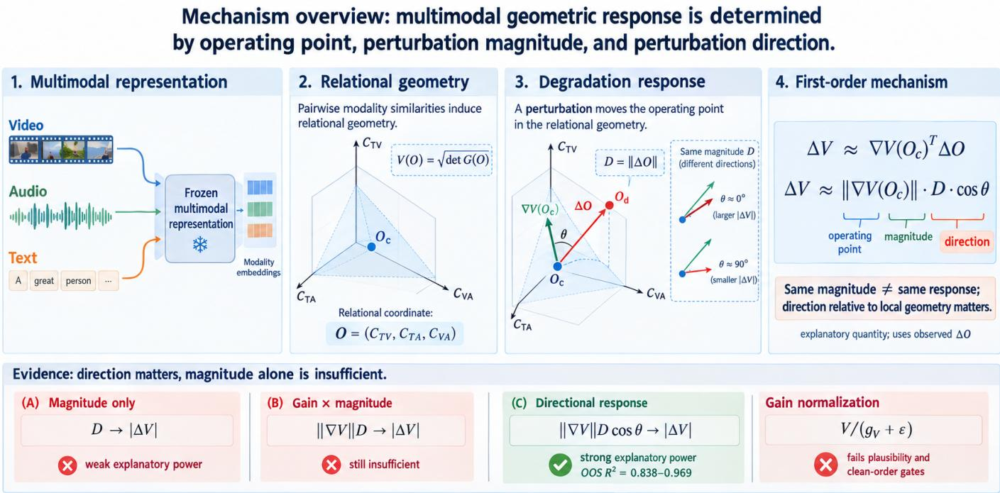  
Fig. 1. Mechanism overview of direction-dependent responses in multimodal geometric representations. A clean multimodal representation defines an operating point oc in relational geometry; a controlled degradation produces a displacement ∆o, and the first-order volume response is governed jointly by the local operating-point gain $| | \bigtriangledown V ( \mathbf { o } _ { c } ) \big | |$ , the displacement magnitude $D = \| \Delta \bar { \mathbf { o } } \|$ , and the direction factor cos θ, whose product defines the Directional Geometric Response (DGR). Empirically, magnitude alone provides weak response predictability, the direction-free gain–magnitude product remains insufficient, and the direction-aware first-order quantity explains substantially more of the response heterogeneity. DGR is an explanatory quantity because it uses the observed degraded-state displacement.

## B. Multimodal Missingness, Perturbation, and Reliability

Multimodal learning has long recognized that modalities differ in quality, availability, and optimization behavior [18]. What Makes Multi-Modal Networks Hard studies unequal modality learning dynamics [10]; SMIL addresses severely missing modalities during training and testing [11]; ShaSpec handles missing modalities through shared–specific feature modelling [13]; multimodal prompting recovers recognition performance when modalities are absent at test time [25]; and QMF provides a quality-aware dynamic fusion framework with robustness guarantees on low-quality multimodal data [14]. Trusted Multi-View Classification estimates sample-dependent evidence and uncertainty for multiple views [12]. In a parallel unimodal line, corruption benchmarks measure how classification degrades under controlled common corruptions [15]. These works motivate the intuitive hypothesis that the response of a geometric score under degradation might be explained by a scalar modality-quality or reliability variable.

Our analysis tests that hypothesis in a different setting. Rather than optimizing a model to compensate for missing or unreliable modalities, we examine the local response of an already-trained geometric score. The distinction matters: a reliability variable can describe how much a modality is compromised, but it need not describe which relational direction the resulting representation displacement takes. Our experiments show that the latter is essential for the geometric score studied here.

## C. Local Perturbation and Representation Analysis

Gradient-based local sensitivity is a standard tool for understanding neural networks. Saliency methods use input gradients to explain predictions [26], influence functions trace predictions back to training perturbations through first-order expansions [27], and adversarial-perturbation studies demonstrate that small input changes can induce highly nonuniform model responses [28]–[31]. This paper is not an adversarialrobustness study: the perturbations here are controlled signal degradations applied to a frozen multimodal encoder. The analysis is nevertheless geometrically local. Because the final Gramian volume has a closed-form derivative, the first-order response can be tested directly against the measured score change rather than approximated through a generic sensitivity heuristic, and the direction of the induced displacement in relational coordinates becomes an observable quantity.

Overall, existing multimodal work mainly asks how to learn, align, complete, or robustify multimodal representations, and existing perturbation analysis mainly characterizes sensitivity to perturbation strength. What remains underexplored is how a geometric multimodal score responds to the direction of the displacement induced in its own relational geometry. This paper addresses that gap.

III. GEOMETRIC FORMULATION AND EXPERIMENTAL PROTOCOL

## A. Multimodal Relational Geometry

Let $t , v , a \in \mathbb { R } ^ { m }$ be the text, video, and audio embeddings after $\ell _ { 2 }$ normalization. Their pairwise cosine similarities define

$$
\begin{array} { r } { x = t ^ { \top } v , \qquad y = t ^ { \top } a , \qquad z = v ^ { \top } a , } \end{array}\tag{2}
$$

and we collect them into the relational coordinate $\begin{array} { r l } { \mathbf { O } } & { { } = } \end{array}$ $( x , y , z ) = ( C _ { T V } , C _ { T A } , C _ { V A } )$ . The Gram matrix of the three unit embeddings is

$$
G ( \mathbf { o } ) = \left[ { \begin{array} { l l l } { 1 } & { x } & { y } \\ { x } & { 1 } & { z } \\ { y } & { z } & { 1 } \end{array} } \right] ,\tag{3}
$$

with determinant

$$
d ( \mathbf { o } ) = \operatorname* { d e t } G ( \mathbf { o } ) = 1 + 2 x y z - x ^ { 2 } - y ^ { 2 } - z ^ { 2 } .\tag{4}
$$

We analyze the Gramian-volume component used in the deployment scoring path, whose volume computation uses ${ \sqrt { | \det G | } } ;$ this volume is one component of the combined HyperGRAM score rather than a standalone retrieval score. In the frozen cohorts used here, all evaluated determinants are nonnegative, so the analyzed score is equivalently

$$
V ( \mathbf { o } ) = { \sqrt { d ( \mathbf { o } ) } } ,\tag{5}
$$

and is differentiable at all observed clean points. The threedimensional coordinate o is the relational geometry: it is where degradation is ultimately expressed, regardless of the raw perturbation applied to pixels or waveforms.

## B. Perturbation Response Formulation

Let $\mathbf { o } _ { c }$ and $\mathbf { o } _ { d }$ denote the relational coordinates of a sample before and after one modality is degraded. The perturbation response and displacement magnitude are

$$
\Delta V = V ( \mathbf { o } _ { d } ) - V ( \mathbf { o } _ { c } ) , \qquad D = \lVert \Delta \mathbf { o } \rVert = \lVert \mathbf { o } _ { d } - \mathbf { o } _ { c } \rVert .\tag{6}
$$

D is therefore not a raw pixel-, waveform-, or embeddingspace perturbation strength. It is the magnitude of the displacement induced in the relational geometry on which the geometric score is defined, measured after the frozen modality encoders. Two degradation events of very different raw severity can induce similar D, and similar raw severities can induce very different $D ;$ both are absorbed into the coordinate.

## C. Directional Geometric Response (DGR)

The determinant gradient is

$$
J _ { d } ( \mathbf { o } ) = \left( 2 y z - 2 x , 2 x z - 2 y , 2 x y - 2 z \right) ,\tag{7}
$$

and, because $\nabla V = { \textstyle { \frac { 1 } { 2 } } } d ^ { - 1 / 2 } J _ { d }$

$$
\nabla V ( \mathbf { o } ) = \frac { J _ { d } ( \mathbf { o } ) } { 2 V ( \mathbf { o } ) } .\tag{8}
$$

Since V is differentiable at the observed clean operating points, a first-order expansion gives

$$
\Delta V \approx \nabla V ( \mathbf { o } _ { c } ) ^ { \top } \Delta \mathbf { o } = \frac { J _ { d } ( \mathbf { o } _ { c } ) ^ { \top } \Delta \mathbf { o } } { 2 V ( \mathbf { o } _ { c } ) } .\tag{9}
$$

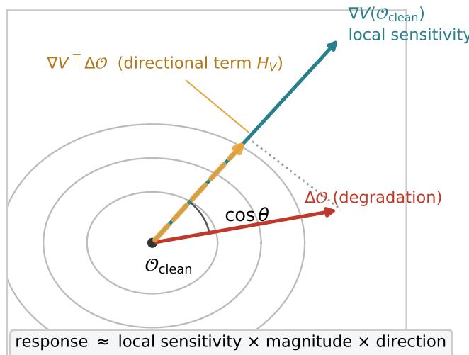  
relational geometry (stylized (x, y, z) slice)  
Fig. 2. Local geometric decomposition of the first-order response. A degradation moves the relational geometry by $\Delta \mathbf { o }$ from the clean operating point $\mathbf { o } _ { c } ;$ the induced volume change is governed by the projection of ∆o onto the local gradient $\nabla V ( \mathbf { o } _ { c } )$ , i.e., local gain gV× magnitude D× cos θ.

We define the Directional Geometric Response as

$$
\mathrm { D G R } ( \mathbf { o } _ { c } , \Delta \mathbf { o } ) = \nabla V ( \mathbf { o } _ { c } ) ^ { \top } \Delta \mathbf { o } ,\tag{10}
$$

and write the local geometric gain as

$$
g _ { V } ( \mathbf { o } _ { c } ) = \| \nabla V ( \mathbf { o } _ { c } ) \| = \frac { \| J _ { d } ( \mathbf { o } _ { c } ) \| } { 2 V ( \mathbf { o } _ { c } ) } .\tag{11}
$$

Writing θ for the angle between $\nabla V ( \mathbf { o } _ { c } )$ and $\Delta \mathbf { o } ,$ the decomposition in (1) becomes

$$
\mathrm { D G R } = g _ { V } ( \mathbf { o } _ { c } ) D \cos \theta , \qquad \cos \theta = \frac { \nabla V ( \mathbf { o } _ { c } ) ^ { \top } \Delta \mathbf { o } } { g _ { V } ( \mathbf { o } _ { c } ) D } .\tag{12}
$$

Three factors therefore enter the first-order response: the operating-point-dependent local geometric gain $g _ { V }$ , the displacement magnitude D, and the alignment cos θ between the displacement and the local gradient. The interpretation is that geometric response is determined jointly by where the representation operates, how far it moves, and in which direction it moves. Equation (9) is an approximation, not an identity; the empirical question addressed in Sections IV–VI is whether the first-order term explains the observed responses and whether its direction factor is necessary. Fig. 2 illustrates the decomposition.

We emphasize the status of DGR. Computing (10) requires $\mathbf { o } _ { d } ,$ which is available only after the degradation has been applied and the degraded input has passed through the frozen encoder. DGR is consequently an explanatory first-order quantity for the measured response. It is not a deployment-time predictor, reliability estimator, or calibration variable, and the paper does not propose it as one.

## D. Datasets and Controlled Perturbations

We use MSR-VTT [16] and DiDeMo [17], two standard video–text retrieval benchmarks with three usable modalities (text, video, audio). The analysis uses fixed cohorts rather than dynamically filtering samples during evaluation. The final MSR-VTT cohort contains $N = 8 7 8$ samples after excluding 116 videos without usable audio tracks and 6 silent tracks; the DiDeMo cohort contains $N = 9 8 0$ samples after excluding 5 videos without audio and 19 silent tracks. MSR-VTT membership is enforced by an immutable identifier list, so the analyzed cohort is exactly reproducible. A third benchmark such as ActivityNet [32] is discussed as a possible external test in Section VIII but is deliberately not used to broaden the mechanism claim after the four-cell result was obtained.

We perturb one modality at a time while keeping the other modalities clean. On the video axis, Gaussian blur is applied with $\sigma \in \{ 1 , 2 , 4 \}$ . On the audio axis, additive white Gaussian noise is applied at $\mathrm { S N R } \in \{ 2 0 , 1 0 , 5 , 0 \}$ dB. Text is always kept clean. Throughout the paper, a dataset–degradation cell denotes one dataset paired with one degradation axis; each cell aggregates all tested severity levels on that axis. The resulting four cells—MSR-VTT + video blur, MSR-VTT + audio noise, DiDeMo + video blur, and DiDeMo + audio noise—are the units of analysis throughout the paper; full perturbation definitions are given in the Appendix.

## E. Evaluation Protocol and Decision Rules

The evaluation uses three complementary instruments, all fixed before the corresponding analyses were run.

1) Out-of-Sample Variance Explained: For each candidate scalar $s ,$ we fit an ordinary least-squares linear regression of $| \Delta V |$ on s with an intercept on the training folds and evaluate the coefficient of determination on the held-out fold; heldout predictions are collected across folds, and the reported value is the pooled five-fold out-of-sample $R ^ { 2 }$ computed over all held-out predictions under a fixed seeded fold assignment, with no tuning (the closed-form fit has no hyperparameters). The fold partition is shared across candidates within a cell, so comparisons between candidates reflect the candidates rather than the partition. Negative $R ^ { 2 }$ means worse than predicting the training mean.

2) Matched-Magnitude Pairwise Ranking: Matched-D analysis controls for displacement magnitude by construction. Pairs are drawn within narrow magnitude bins of width $\varepsilon \in \{ 0 . 0 0 5 , 0 . 0 1 , 0 . 0 2 \}$ , and a candidate receives credit when it ranks the sample with the larger response correctly. The headline ranking statistics use the pre-specified primary bin width $\varepsilon ~ = ~ 0 . 0 1$ ; the remaining widths serve as sensitivity checks. We report the resulting matched-pair ranking accuracy; chance is 0.5. This instrument is stronger than a global correlation: if two samples experience nearly the same displacement magnitude but respond differently, magnitude cannot be the organizing variable, and a candidate is credited only if it recovers which of the two responds more strongly.

3) Bootstrap Intervals and Binding Gates: Cluster bootstrap intervals with video-level clustering are used for inferential comparisons [33], [34]. The gain-normalization audit of Section VII uses $B = 5 0 0$ bootstrap resamples, $K = 5$ folds, and seed 3105. Decision rules for that audit—a predictability gate and a clean-ranking safety gate with a pre-specified 0.98 threshold—were fixed before the audit was run, in line with reproducibility practice that binds analysis choices in advance [35]. No rule was modified after observing outcomes.

## IV. PERTURBATION MAGNITUDE IS NOT SUFFICIENT

## A. Cross-Condition Magnitude–Response Analysis

If degradation magnitude organized the geometric response, D should strongly predict $| \Delta V |$ . It does not. Across the four dataset–axis cells, the out-of-sample $R ^ { 2 }$ values for $D \to | \Delta V |$ are $0 . 1 4 6 , \ - 0 . 0 0 4 , \ 0 . 1 3 6 .$ , and 0.021 for MSR-VTT video, MSR-VTT audio, DiDeMo video, and DiDeMo audio, respectively. The magnitude-only explanation accounts for no more than 15% of the response variance and is effectively at chance on both audio axes.

The extreme conditions make the heterogeneity concrete. At the strongest video blur $( \sigma = 4 )$ , the mean displacement is $\bar { D } \approx 0 . 4 6 3$ and the mean response is $\overline { { \Delta V } } \approx + 0 . 0 0 3 7 5 ,$ yet 401 of 878 samples still respond negatively. At the strongest audio noise $( \mathrm { S N R } = 0 ~ \mathrm { d B } )$ , the mean displacement is $\bar { D }$ ≈ 1.078 and the mean response $\overline { { \Delta V } } \approx + 0 . 0 1 4 3 7$ , with 209 of 878 samples still responding negatively. A sample near the mean displacement can therefore lie on either side of zero response, which a magnitude-only account cannot express.

## B. Matched-Magnitude Analysis

Matched-D analysis gives the same conclusion without relying on global regression fit. Within narrow magnitude bins, D ranks the larger response at accuracy close to chance in all four cells (Fig. 3). The key observation is not merely low correlation: samples experiencing nearly the same relational displacement can exhibit very different geometric responses, both in magnitude and in sign.

This motivates a more specific question: if the amount of movement is insufficient, what property of the displacement and its operating point determines the response? The next section evaluates the most natural scalar answers before turning to the directional mechanism.

## V. RULING OUT SIMPLE PROXY EXPLANATIONS

Before introducing the directional mechanism, we evaluate the simplest scalar alternatives under the same gates. Each candidate below was specified before its evaluation, and all are evaluated with the fixed folds and matched-magnitude instruments of Section III-E.

## A. Context-Based Reliability Proxy

The first candidate (S1) is a geometric operating-point context signal intended to represent how compromising the degraded state is for the sample. If a scalar “how degraded is this sample” variable explained the response, S1 should organize it. It does not: the candidate produces no stable crosscell explanation under either the predictive or the matchedmagnitude gate.

Magnitude does not organize the response: |ΔV| vs D across the four cells

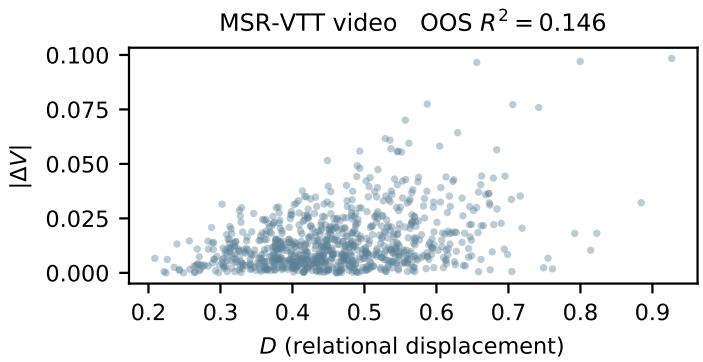

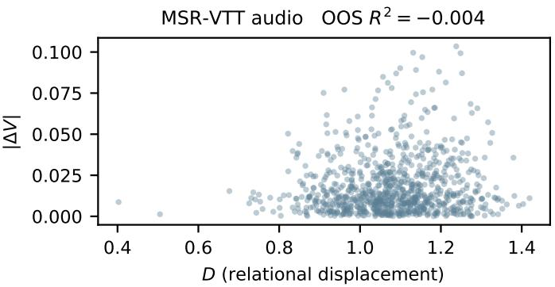

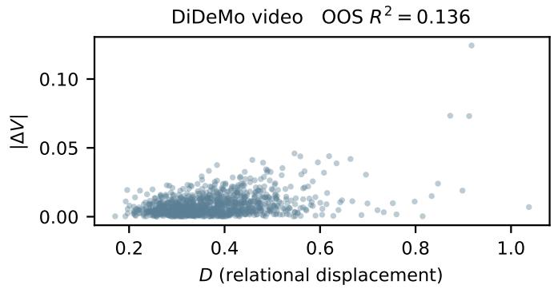

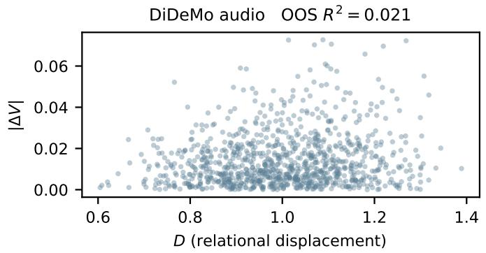  
Fig. 3. Absolute volume response |∆V| versus relational displacement magnitude D under single-axis degradation (top: MSR-VTT; bottom: DiDeMo; left: video blur; right: audio noise). Magnitude leaves most of the response variance unexplained, and magnitude-matched samples respond systematically differently.

## B. Local Self-Sensitivity Proxy

The second candidate (S2) is a local perturbation-sensitivity signal, and the third (S3) is an intra-modal self-consistency signal. Both encode plausible notions of sample vulnerability. Neither passes the gates: under the matched-magnitude instrument, S2 and S3 remain at chance level (0.460–0.505 across the two MSR-VTT axes, the only cohort where the proxy protocol was run), and their regression increments on the response are negligible.

The result does not imply that modality reliability is meaningless in multimodal learning [12], [14]. Rather, it shows that the tested scalar reliability proxies do not explain the response heterogeneity of this particular geometric score under the tested perturbations. A reliability variable can summarize how much a modality is compromised, but the response also depends on which relational direction the displacement takes.

## C. Direction-Free Geometric Gain

A stronger scalar account keeps the local geometry but discards direction:

$$
| \Delta V | \approx f ( D S _ { \mathrm { g e o } } ) ,\tag{13}
$$

with $S _ { \mathrm { g e o } }$ a local geometric sensitivity. This account is not stable across degradation axes: on the MSR-VTT video cell the gain alone reaches a matched-D ranking of 0.568, but its cluster-bootstrap lower bound (0.540) remains below the pre-specified 0.55 gate, and the ranking collapses to chance on the MSR-VTT audio axis (0.486); the volume-level gain– magnitude product $\| \nabla V \| D$ likewise passes the gate in only one of four cells. The first-order decomposition explains why. A magnitude–sensitivity product retains the first two factors in (12) but discards cos θ. Whenever perturbation directions vary substantially across samples, a direction-free product cannot organize the response.

## D. Why Scalar Reliability Does Not Explain the Response

Table I compresses the falsification sequence of this section into a single summary: the table moves from scalar perturbation summaries to increasingly explicit geometric descriptions, and each candidate was evaluated under its corresponding prespecified decision rules. The three proxy families and the multiplicative account fail for a common structural reason. Each compresses the perturbation event into a scalar—severity, quality, or gain times magnitude—whereas the displacement $\Delta \mathbf { o }$ is a vector in relational space, and the score responds to its projection onto $\nabla V ( \mathbf { o } _ { c } )$ . The same displacement magnitude can be nearly parallel or nearly orthogonal to the local gradient, producing large or negligible responses. Any explanation that does not represent this direction loses exactly the structure that the anomaly exhibits. The next section quantifies how much structure the directional term recovers.

TABLE I  
FALSIFICATION LADDER FOR EXPLANATIONS OF GEOMETRIC RESPONSE. THE TABLE SUMMARIZES THE FALSIFICATION SEQUENCE, FROM SCALAR PERTURBATION SUMMARIES TO INCREASINGLY EXPLICIT GEOMETRIC DESCRIPTIONS. $R ^ { 2 }$ RANGES SPAN THE FOUR DATASET–DEGRADATION CELLS; RANKING ACCURACIES ARE MATCHED-D PAIRWISE ACCURACIES ON |∆V| AT THE PRIMARY BIN WIDTH (ε = 0.01; CHANCE 0.5). †PROXY STATISTICS WERE COMPUTED ONLY FOR THE MSR-VTT COHORT UNDER THE PHASE-3A PROTOCOL (VIDEO/AUDIO AXES); “—” INDICATES THAT THE METRIC WAS NOT EVALUATED UNDER THE FOUR-CELL |∆V| PROTOCOL FOR THAT CANDIDATE. THE SUPPORTED QUANTITY IS AN EXPLANATORY FIRST-ORDER TERM THAT USES THE OBSERVED DEGRADED-STATE DISPLACEMENT, NOT A DEPLOYMENT-TIME PREDICTOR.
<table><tr><td>Candidate</td><td>Information retained</td><td>OOS  $R ^ { 2 }$ </td><td>Matched-D ranking</td><td>Decision</td></tr><tr><td>D</td><td>displacement magnitude</td><td>-0.004-0.146</td><td>0.509-0.523</td><td>Reject</td></tr><tr><td>S1 context</td><td>how compromised the sample state is</td><td>_†</td><td>0.447/0.420†</td><td>Reject</td></tr><tr><td>S2 self-sensitivity</td><td>probe-induced displacement</td><td>_†</td><td>0.503/0.488†</td><td>Reject</td></tr><tr><td>S3 self-consistency</td><td>two-view agreement</td><td>†</td><td>0.505/0.460†</td><td>Reject</td></tr><tr><td>∥|∇V∥|D</td><td>operating-point gain × magnitude (no direction)</td><td>0.002-0.224</td><td>0.517–0.574</td><td>Unstable</td></tr><tr><td>[DGR|</td><td>gain × magnitude × direction (projection onto  $\nabla V ( \mathbf { o } _ { c } ) )$ </td><td>0.838-0.969</td><td>0.864-0.963</td><td>Supported</td></tr></table>

## VI. DIRECTIONAL GEOMETRIC RESPONSE

## A. First-Order Local Expansion

We first state the mechanism precisely. Using (8),

$$
\Delta V = \frac { J _ { d } ( \mathbf { o } _ { c } ) ^ { \top } \Delta \mathbf { o } } { 2 V ( \mathbf { o } _ { c } ) } + O ( \| \Delta \mathbf { o } \| ^ { 2 } ) ,\tag{14}
$$

so the leading term is exactly $\mathrm { D G R } ( \mathbf { o } _ { c } , \Delta \mathbf { o } )$ as defined in (10)–(12). Equation (12) is an algebraic decomposition; the empirical content lies in whether the first-order term explains observed responses in real multimodal perturbations, and whether each of its three factors is necessary.

## B. DGR as the Direction-Aware Response Quantity

Table II summarizes the central comparison. It is not a comparison between three increasingly complex predictors, but between progressively richer geometric descriptions of the same perturbation: magnitude only (D), gain and magnitude $( \| \nabla V \| D )$ , and gain, magnitude, and direction (|DGR|).

The magnitude of the first-order DGR term achieves outof-sample $R ^ { 2 }$ values from 0.838 to 0.969, compared with at most 0.224 for the strongest scalar alternative. Within matched-D pairs, it achieves ranking accuracies from 0.864 to 0.963, while D remains near chance. The signed firstorder DGR term recovers the observed response sign with accuracies of 0.909–0.989. The contrast between the first and third columns is the central empirical result: the same relational displacement whose magnitude explains little of the response becomes highly explanatory when projected onto the clean local gradient.

## C. Cross-Dataset and Cross-Modality Evidence

The pattern holds across both datasets and both tested degradation axes, which is the strongest property of the result. The four cells differ in dataset statistics, in the modality being degraded, and in the raw perturbation family, yet the ordering of explanatory power is identical: magnitude is weak, the direction-free product is weak, and the directional projection is strong. Fig. 4 displays this explanatory ladder. The difference between the middle and right groups of each panel reflects the directional factor; the mechanism, once stated, accounts for why every direction-free alternative in Section V was unstable.

Figure 5 provides a pointwise view of the same mechanism. Across all four dataset–degradation cells, the observed response ∆V is closely organized by the first-order directional quantity DGR, rather than merely by displacement magnitude. The concentration of samples around the identity relation is consistent with the aggregate out-of-sample results in Table II. At the same time, the deviations from the identity line are systematic rather than negligible, especially for the audio axes, motivating the explicit higher-order error analysis below. Thus, the pointwise evidence supports DGR as the dominant firstorder response structure without implying an exact equality.

## D. First-Order Approximation Error and Higher-Order Effects

The first-order approximation is not uniformly exact, and we do not hide this. The median relative deviation between ∆V and DGR is approximately 7% on the video axes and approximately 39–41% on the audio axes. Thus, firstorder geometry captures the dominant directional structure, while higher-order effects remain non-negligible, particularly for the stronger audio perturbations. Nevertheless, the firstorder quantity remains strongly explanatory in all four cells, including the audio cells where its pointwise accuracy is lower. The correct reading is an empirically supported first-order mechanism under the tested perturbation protocols, not an exact law.

## E. Determinant and Volume Levels

The same mechanism can be written at determinant level as $J _ { d } ( \mathbf { o } _ { c } ) ^ { \top } \Delta \mathbf { o }$ . We report volume-level results because V is the score under analysis. The clean-volume coefficient of variation is only 5.4%–5.8%, so the factor $1 / ( 2 V _ { c } )$ changes determinant-level fits only modestly. The volume-level expression, however, makes explicit which quantity the geometric score actually uses.

## VII. THE LOCAL GAIN IS NOT A REMOVABLE NUISANCE

## A. Motivation for Gain Normalization

The decomposition in (12) naturally suggests a minimal intervention. If the gradient norm $g _ { V }$ is a sample-dependent

TABLE II  
MAIN FOUR-CELL RESULTS. D IS THE RELATIONAL DISPLACEMENT MAGNITUDE; $\| \nabla V \| D$ IS THE DIRECTION-FREE GAIN–MAGNITUDE PRODUCT; |DGR| IS THE ABSOLUTE FIRST-ORDER DIRECTIONAL RESPONSE, WHICH USES THE DEGRADED-STATE DISPLACEMENT AND IS THEREFORE EXPLANATORY ONLY. MATCHED-D RANKING IS PAIRWISE ACCURACY WITHIN NARROW MAGNITUDE BINS, WITH CHANCE AT 0.5.
<table><tr><td rowspan="2">Cell</td><td colspan="3">OOS  $R ^ { 2 }$  for |∆V|</td><td colspan="2">Matched-D ranking acc.</td><td rowspan="2">Sign accuracy</td></tr><tr><td>D</td><td> $\| \nabla V \| D$ </td><td>|DGR|</td><td>D</td><td>|DGR|</td></tr><tr><td>MSR-VTT video (N = 878)</td><td>0.146</td><td>0.224</td><td>0.969</td><td>0.523</td><td>0.963</td><td>0.989</td></tr><tr><td>MSR-VTT audio (N = 878)</td><td>-0.004</td><td>0.002</td><td>0.925</td><td>0.515</td><td>0.903</td><td>0.950</td></tr><tr><td>DiDeMo video (N = 980)</td><td>0.136</td><td>0.152</td><td>0.925</td><td>0.509</td><td>0.961</td><td>0.983</td></tr><tr><td>DiDeMo audio (N = 980)</td><td>0.021</td><td>0.059</td><td>0.838</td><td>0.517</td><td>0.864</td><td>0.909</td></tr></table>

$$
\begin{array}{c} \begin{array} { r l r } {  } & { { } D \ ( \mathsf { m a g n i t u d e \ o n l y } ) } & { \quad \parallel \nabla V \parallel \cdot D \ ( \mathsf { d i r e c t i o n - f r e e } ) } & {  } \end{array} \parallel H _ { V } | \ ( \mathsf { d i r e c t i o n a l } )  \end{array}
$$

(a) Direction completes the magnitude-based account  
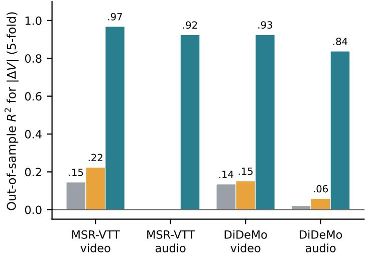

(b) Same verdict under matched-D ranking  
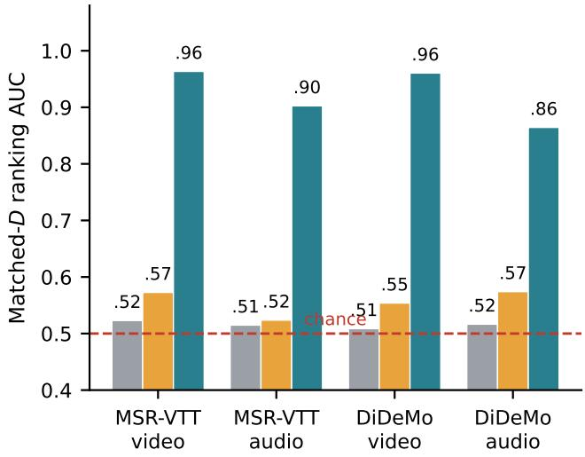  
Fig. 4. Geometric explanation ladder: from magnitude to directional response. (a) Out-of-sample $R ^ { 2 }$ for $| \Delta V |$ under three nested descriptions of the same perturbation: magnitude $D ;$ the direction-free gain–magnitude product $\| { \dot { \nabla } } V \| D ;$ and the directional first-order projection |DGR|. (b) The same comparison under matched-D pairwise ranking (chance 0.5). Direction, rather than the local gain alone, carries the missing structure.

gain, one might try to divide the score by that gain to remove operating-point dependence:

$$
\widetilde V ( \mathbf { o } ) = \frac { V ( \mathbf { o } ) } { g _ { V } ( \mathbf { o } ) + \varepsilon } .\tag{15}
$$

We emphasize what this section is: a pre-specified negativeresult audit of the most direct gain-removal family derived from the first-order decomposition. It is not a proposed method, and its outcome defines the boundary of the interpretation rather than introducing a normalization technique.

## B. Pre-Specified Audit Protocol

The candidate is the minimal isotropic form in (15) with ε anchored to 0.1 times the median $g _ { V }$ , drawn from an a priori grid {0.05, 0.1, 0.2} times that median. No validationset tuning is used. Two binding gates were fixed in advance. The plausibility gate requires that the normalized response improve out-of-sample predictability of $| \Delta V |$ in at least three of the four cells, judged by bootstrap confidence intervals of $\Delta R ^ { 2 } ~ ( B = 5 0 0$ , seed 3105). The clean-ranking safety gate requires that the transformation preserve the ordering induced by the original clean score, with a pre-specified top-1 keep-rate threshold of 0.98.

## C. Predictability Gate

Only one of the four cells shows a confidence-intervalexcluded improvement in $R ^ { 2 } \mathbf { i }$ : MSR-VTT video, with $\Delta R ^ { 2 } \in$ [0.0014, 0.0290] and an out-of-sample gain of +0.028. The other three cells do not show reliable improvement. The prespecified requirement of improvement in at least three of four cells is therefore not met (Table III).

This outcome is consistent with the first-order mechanism. Across the four cells, the correlation between |∆V | and $g _ { V }$ is only 0.06–0.23. The dominant response heterogeneity is not attributable to gradient magnitude alone, so dividing by a weakly explanatory factor cannot remove the dominant directional variation.

## D. Clean-Ranking Safety Gate

$\mathrm { \bf A t } ~ \varepsilon = 0 . 1$ times the median gain, the median Spearman correlation between clean orderings under $\widetilde { V }$ and V is high— 0.9918 for MSR-VTT and 0.9880 for DiDeMo—but the

# Pointwise validation of the Directional Geometric Response

(a) MSR-VTT- Video degradation  
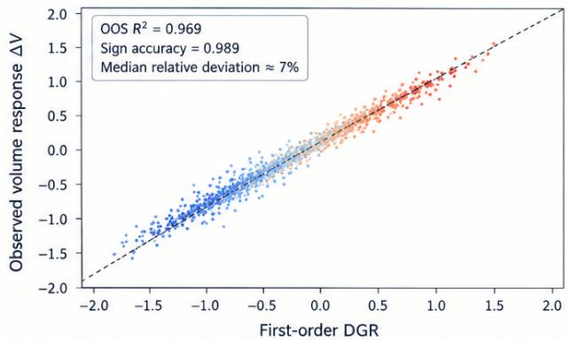  
(c) DiDeMo - Video degradation

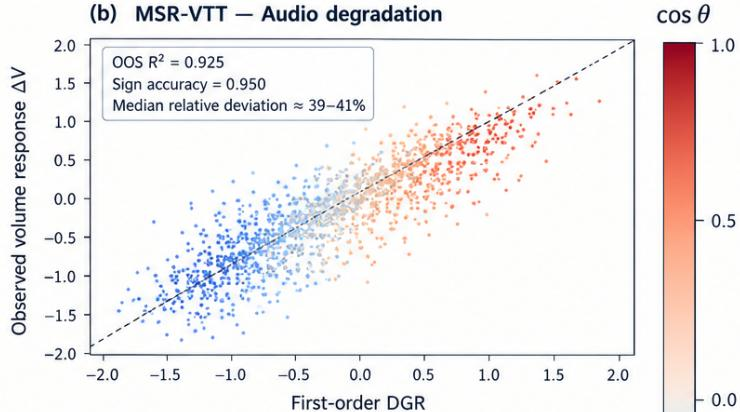

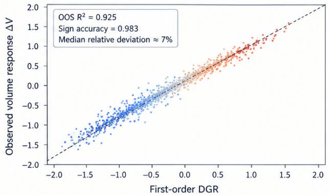

(d) DiDeMo - Audio degradation  
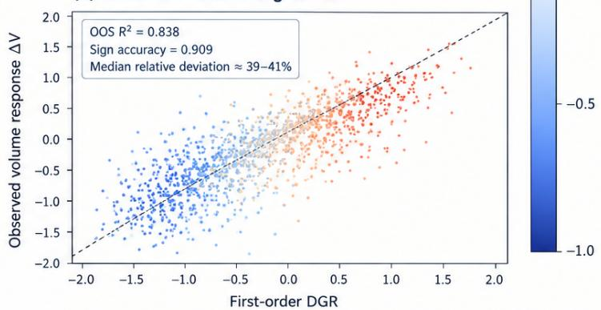  
Dashed line: y = x (ideal first-order approximation). Points are colored by cos θ (directional factor). Each panel shows sample-level results with verified metrics  
Fig. 5. Pointwise validation of the Directional Geometric Response. Each panel compares the observed volume response $\Delta V$ with the first-order directional quantity $\mathrm { D G R } = \nabla V ( \mathbf { o } _ { c } ) ^ { \top }$ ∆o for one dataset–degradation cell. The dashed diagonal denotes the ideal first-order correspondence $\Delta V = \mathrm { D G R }$ . The strong alignment across samples confirms that the directional first-order term captures the dominant response structure, while the visible deviations from the diagonal, particularly for the audio axes, quantify non-negligible higher-order effects.

## TABLE III

GAIN-NORMALIZATION AUDIT. $\Delta R ^ { 2 }$ IS THE BOOTSTRAP 95% CI OF THE OUT-OF-SAMPLE $R ^ { 2 }$ CHANGE UNDER $\widetilde { V } = V / ( g _ { V } + \varepsilon ) ;$ ; CLEAN-ORDER STATISTICS ARE COMPUTED ${ \mathrm { A T } } \varepsilon = 0 . 1 { \times } { \mathrm { M E D I A N } } ( g _ { V } )$ . THE CANDIDATE PASSES NEITHER GATE.
<table><tr><td>Cell</td><td> $\Delta R ^ { 2 }$  CI</td><td>Clean  $\rho _ { \mathrm { m e d } }$ </td><td>Top-1 keep</td></tr><tr><td>MSR-VTT video</td><td>[0.0014, 0.0290]</td><td>0.9918†</td><td>0.9715†</td></tr><tr><td>MSR-VTT audio</td><td>CI includes 0</td><td>0.9918†</td><td>0.9715†</td></tr><tr><td>DiDeMo video</td><td>CI includes 0</td><td>0.9880†</td><td>0.9296†</td></tr><tr><td>DiDeMo audio</td><td>CI includes 0</td><td>0.9880†</td><td>0.9296†</td></tr><tr><td>Anisotropic variant</td><td>not rescued</td><td></td><td>0.485 / 0.386</td></tr></table>

†Clean-order statistics are dataset-level and therefore shared across the two degradation axes of the same dataset. The anisotropic top-1 keep rates are 0.485 (MSR-VTT) and 0.386 (DiDeMo).

top-1 ordering is preserved for only 0.9715 and 0.9296 of queries, respectively. The pre-specified threshold was 0.98, so the candidate fails clean-order preservation on both datasets. The ε grid does not change the top-1 keep rates at four decimal places. An anisotropic covariance variant performs substantially worse, with top-1 keep rates of 0.485 and 0.386. Fig. 6 summarizes both gates, and Table III lists the numbers.

## E. Negative Result and Interpretation

The two gates lead to a simple conclusion: the tested $V / ( g _ { V } + \varepsilon )$ family is not supported as a score-level calibration mechanism. We do not change ε, introduce a learned correction, or test post-hoc variants after the failure. The finding should be stated precisely: the tested normalization family did not consistently improve response predictability while satisfying the pre-specified clean-ranking safety criterion.

The negative result should not be overgeneralized. It does not establish that every possible normalization is impossible, nor that the local gain is unimportant—Sections V and VI show the opposite. It establishes that the most direct gainremoval family derived from the first-order decomposition does not consistently remove the observed response heterogeneity and can distort clean geometric ordering. The operating point therefore remains useful as explanatory structure, but its gradient magnitude is not a removable nuisance under the tested intervention.

## VIII. DISCUSSION

## A. What the Results Establish

Five observations form a coherent chain. First, relational displacement magnitude is insufficient: its out-of-sample explanatory power is low, and magnitude-matched pairs remain heterogeneous in both size and sign. Second, the natural scalar alternatives—context-based reliability, self-sensitivity, and the direction-free gain–magnitude product—fail under the same gates. Third, the local first-order projection explains the heterogeneity across two datasets and two perturbation axes. Fourth, removing only the local gain does not solve the problem, because the response also depends on direction and because score-side normalization can change clean ordering. Fifth, the mechanism survives its own stress test: even where the first-order pointwise error is large (audio axes), the directional structure dominates the response.

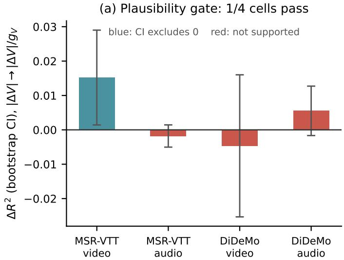  
(b) Clean-order gate: fails on both datasets

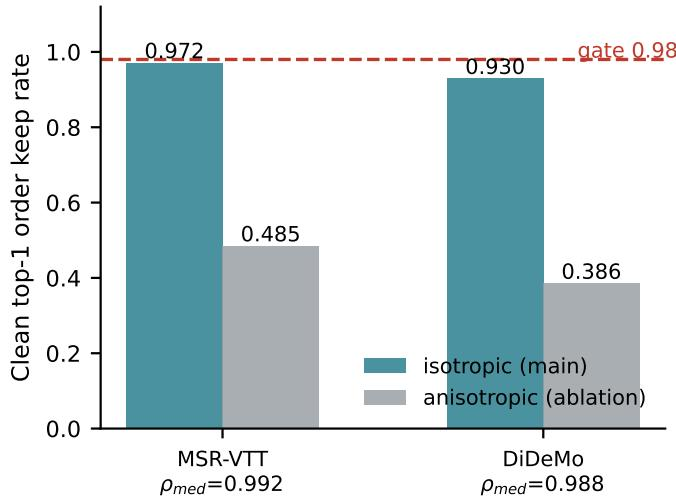  
Fig. 6. The gain-normalization intervention fails both pre-specified gates. (a) Predictability gate: the bootstrap CI of $\Delta R ^ { 2 }$ excludes zero in only one of four cells. (b) Clean-order gate: despite high median Spearman correlation $( \rho _ { \mathrm { m e d } } ) .$ , the clean top-1 order keep rate falls below the 0.98 threshold on both datasets under the isotropic candidate, and collapses under the anisotropic variant.

This chain matters for geometric multimodal learning. A score can be highly sensitive to its operating point without that sensitivity being an undesirable calibration artifact. Treating every form of condition dependence as nuisance variation can erase meaningful structure rather than improve robustness.

## B. What the Results Do Not Establish

Equally important is what the evidence does not support. The analysis does not establish causality; degradation is experimentally applied, but the explanatory claims are associational descriptions of a response mechanism. It is not a theorem for all multimodal representations, nor is it universal across datasets: the evidence covers MSR-VTT and DiDeMo, Gaussian blur, additive white Gaussian noise, and the tested perturbation strengths. The high $R ^ { 2 }$ of DGR does not make it a deployment-time predictor, since it uses the observed degraded-state displacement. The negative audit does not prove that all gain-normalization methods fail, only the tested $V / ( g _ { V } + \varepsilon )$ family. Finally, nothing here shows that HyperGRAM [9] or Gramian volumes [8] are flawed as representation-learning objectives, nor that geometric volume lacks retrieval utility; the results characterize how such a score responds to degradation, not whether it should be used.

C. Implications for Multimodal Geometric Representation Learning

The results suggest, cautiously, that future multimodal geometric learning methods may need to consider local directional geometry rather than treating perturbation severity as a scalar quantity. For evaluation, perturbation studies on geometric scores may benefit from reporting displacement direction statistics alongside severity, since scalar severity summaries can hide the directional variation that drives responses. For robustness-oriented design, interventions that rescale a geometric score by a scalar gain may be structurally mismatched to a mechanism in which direction, not gain, carries the dominant heterogeneity. These implications are stated with “may” deliberately: they follow from two datasets and two perturbation families and should be re-tested as new geometric scores and degradation regimes emerge.

## D. Limitations and Scope

The limitations are concrete. (1) Two datasets only: MSR-VTT and DiDeMo; ActivityNet [32] would be a natural external test. (2) Two perturbation families only: Gaussian blur and additive white Gaussian noise, at the tested strengths. (3) The analysis concerns one specific Gramian-volume geometry [8], [9]; other geometric scores may respond differently. (4) The first-order approximation is less accurate under stronger audio perturbations, with median relative deviations of roughly 39– 41%. (5) DGR is explanatory and oracle-like, because ∆o is observed after degradation. (6) The study does not establish causal mechanisms beyond the controlled perturbation design. (7) The negative audit does not test every geometric normalization; it tests the pre-specified family.

## IX. CONCLUSION

We studied how a multimodal Gramian volume responds when one modality is degraded. Across two video–text–audio datasets and two controlled degradation axes, perturbation magnitude alone explains little of the response, and several natural scalar explanations fail under fixed decision rules. A first-order local analysis instead shows that the response is jointly structured by the clean operating point, displacement magnitude, and, critically, displacement direction; the magnitude of the first-order DGR term is strongly explanatory across all four dataset–axis cells, while direction-free gain–magnitude products do not provide a stable explanation.

The same analysis establishes a boundary. The local gradient gain is real and mechanistically relevant, but the pre-specified $V / ( g _ { V } + \varepsilon )$ normalization family neither consistently improves response predictability nor preserves clean geometric ordering. We therefore do not turn the mechanism into a score-side calibration method. The resulting picture is deliberately modest but useful: geometric perturbation responses are conditiondependent because the same amount of relational movement can point in different directions relative to the local geometry. Beyond perturbation magnitude, multimodal geometric response depends on the interaction between the operating point, perturbation magnitude, and perturbation direction. Understanding and exploiting that directional structure—without assuming it can be divided out—is left as a future problem.

## REPRODUCIBILITY

The analysis uses frozen cohorts, fixed seeds, fixed fold assignments, and binding decision rules fixed before the corresponding analyses. Cohort construction, perturbation definitions, and the numerical equivalence between the diagnostic and deployment geometry are documented in the appendices.

## APPENDIX A

## COHORT CONSTRUCTION AND QUALITY CONTROL

The MSR-VTT cohort is fixed by an immutable 878- video identifier list. The exclusion procedure removes videos without usable audio and silent tracks before any perturbation analysis. The DiDeMo cohort is fixed at 980 videos after the corresponding audio-quality exclusions. No sample is removed after observing a response statistic.

## APPENDIX B PERTURBATION DEFINITIONS

For Gaussian blur, $\sigma \in \{ 1 , 2 , 4 \}$ specifies the spatial blur strength. For audio, additive white Gaussian noise is scaled to the stated signal-to-noise ratio. Each condition is evaluated independently with the remaining modalities unchanged. The relational displacement D is always computed after the frozen modality encoders and the pairwise cosine construction.

## APPENDIX C GAIN-NORMALIZATION AUDIT DETAILS

The isotropic candidate uses $\varepsilon \in \{ 0 . 0 5 , 0 . 1 , 0 . 2 \} \times$ ${ \mathrm { m e d i a n } } ( g _ { V } )$ , with the middle value as the main specification. The anisotropic covariance variant does not rescue the predictability or clean-order gates. The audit uses $B = 5 0 0$ bootstrap resamples, K = 5 folds, and seed 3105.

## APPENDIX D

## NUMERICAL GEOMETRY EQUIVALENCE

The diagnostic geometry and deployment geometry are verified to be the same numerical object. Across all query– candidate pairs, the maximum absolute difference between the deployment-form and normalized-form determinants is $5 . 0 \times 1 0 ^ { - 7 }$ for MSR-VTT and $4 . 5 \times 1 0 ^ { - 7 }$ for DiDeMo. Feature norms deviate from one by at most $1 . 2 \times 1 0 ^ { - 7 }$ , and featurederived determinants agree with the recorded diagonal values to $7 . 2 \times 1 0 ^ { - 8 }$ . These cross-validation checks confirm that the analysis operates on the same geometry that is used by the deployed scoring path.

## APPENDIX E

## RELIABILITY PROXY DEFINITIONS AND EVALUATION

This appendix specifies how the scalar candidates of Section V were computed, so that the falsification ladder in Table I is reproducible. All signals use the frozen MSR-VTT cohort, are computed on the clean inputs, and use probes and views that were fixed a priori and are identical for every sample; no oracle degradation level and no response quantity enter any signal construction.

Context proxy $S _ { 1 } { : }$ the clean operating point itself, $S _ { 1 } =$ $( C _ { T V } , C _ { T A } , C _ { V A } , V _ { \mathrm { c l e a n } } )$ , i.e., the three pairwise cosine similarities and the clean Gramian volume; it requires no additional encoder passes. Unlike $S _ { 2 }$ and $S _ { 3 } , S _ { 1 }$ is a context description rather than a directed reliability score, and its components were evaluated as scalar candidates under the pre-specified decision rules of Section V.

Local perturbation sensitivity $S _ { 2 } \colon S _ { 2 } = \| f ( x _ { \mathrm { p r o b e } } ) -$ $f ( x _ { \mathrm { c l e a n } } ) \|$ , where $f$ is the frozen unimodal encoder and $x _ { \mathrm { p r o b e } }$ applies a fixed mild perturbation to the clean input: Gaussian blur $( k ~ = ~ 1 5 , ~ \sigma ~ = ~ 0 . 5 )$ on the video axis, and additive white Gaussian noise at a fixed $\mathrm { S N R } = 3 0$ dB with a fixed per-sample seed on the audio axis. A higher value means the encoder moves more under a benign probe, which is interpreted as higher local vulnerability.

Intra-modal self-consistency $S _ { 3 } \colon \quad S _ { 3 } \quad \quad = \quad 1 \quad -$ cos $\big ( f ( x ^ { ( 1 ) } ) , f ( x ^ { ( 2 ) } ) \big )$ , where the two views are deterministic transformations of the same clean input: standard resize-224 versus resize-256 followed by center-crop-224 on the video axis, and +0.25 s versus −0.25 s time shifts on the audio axis. A higher value means the two benign views encode less consistently, which is interpreted as lower self-consistency.

Direction-free geometric gain: the gain used in the product $S _ { \mathrm { g e o } } D$ of Section V is the clean local volume gradient norm, $S _ { \mathrm { g e o } } = g _ { V } ( \mathbf { o } _ { c } ) = \| \nabla V ( \mathbf { o } _ { c } ) \| = \| J _ { d } ( \mathbf { o } _ { c } ) \| / ( 2 V ( \mathbf { o } _ { c } ) )$ evaluated at the clean operating point. Each candidate was evaluated under the decision rules pre-specified for its own protocol; because the proxy evaluation used the MSR-VTT cohort, its statistics are reported only for that cohort in Table I.

## REFERENCES

[1] A. Radford, J. W. Kim, C. Hallacy, A. Ramesh, G. Goh, S. Agarwal, G. Sastry, A. Askell, P. Mishkin, J. Clark, G. Krueger, and I. Sutskever, “Learning transferable visual models from natural language supervision,” in Proceedings of the 38th International Conference on Machine Learning, vol. 139. PMLR, 2021, pp. 8748–8763.

[2] C. Jia, Y. Yang, Y. Xia, Y.-T. Chen, Z. Parekh, H. Pham, Q. V. Le, Y.- H. Sung, Z. Li, and T. Duerig, “Scaling up visual and vision-language representation learning with noisy text supervision,” in Proceedings of the 38th International Conference on Machine Learning, vol. 139. PMLR, 2021, pp. 4904–4916.

[3] H. Akbari, L. Yuan, R. Qian, W.-H. Chuang, S.-F. Chang, Y. Cui, and B. Gong, “VATT: Transformers for multimodal self-supervised learning from raw video, audio and text,” in Advances in Neural Information Processing Systems, vol. 34, 2021.

[4] R. Girdhar, A. El-Nouby, Z. Liu, M. Singh, K. V. Alwala, A. Joulin, and I. Misra, “ImageBind: One embedding space to bind them all,” in Proceedings of the IEEE/CVF Conference on Computer Vision and Pattern Recognition (CVPR), 2023, pp. 15 180–15 190.

[5] B. Zhu, B. Lin, M. Ning, Y. Yan, J. Cui, H. Wang, Y. Pang, W. Jiang, J. Zhang, Z. Li, C. Zhang, Z. Li, W. Liu, and L. Yuan, “LanguageBind: Extending video-language pretraining to n-modality by language-based semantic alignment,” in International Conference on Learning Representations (ICLR), 2024.

[6] S. Chen, H. Li, Q. Wang, Z. Zhao, M. Sun, X. Zhu, and J. Liu, “VAST: A vision-audio-subtitle-text omni-modality foundation model and dataset,” in Advances in Neural Information Processing Systems, vol. 36, 2023, pp. 72 842–72 866.

[7] H. Luo, L. Ji, M. Zhong, Y. Chen, W. Lei, N. Duan, and T. Li, “CLIP4Clip: An empirical study of CLIP for end to end video clip retrieval and captioning,” Neurocomputing, vol. 508, pp. 293–304, 2022.

[8] G. Cicchetti, E. Grassucci, L. Sigillo, and D. Comminiello, “Gramian multimodal representation learning and alignment,” in International Conference on Learning Representations (ICLR), 2025.

[9] S. Na, F. Jiang, Q. Zhou, W. Zhong, T. M. Dang, Y. Guo, H. Ma, C. Li, W. An, and J. Huang, “Hyperbolic gramian volumes for multimodal alignment,” in Proceedings of the IEEE/CVF Conference on Computer Vision and Pattern Recognition (CVPR), 2026, pp. 37 756–37 765.

[10] W. Wang, D. Tran, and M. Feiszli, “What makes training multimodal classification networks hard?” in Proceedings of the IEEE/CVF Conference on Computer Vision and Pattern Recognition (CVPR), 2020, pp. 12 695–12 705.

[11] M. Ma, J. Ren, L. Zhao, S. Tulyakov, C. Wu, and X. Peng, “SMIL: Multimodal learning with severely missing modality,” in Proceedings of the AAAI Conference on Artificial Intelligence, vol. 35, no. 3, 2021, pp. 2302–2310.

[12] Z. Han, C. Zhang, H. Fu, and J. T. Zhou, “Trusted multi-view classification,” in International Conference on Learning Representations (ICLR), 2021.

[13] H. Wang, Y. Chen, C. Ma, J. Avery, L. Hull, and G. Carneiro, “Multi-modal learning with missing modality via shared-specific feature modelling,” in Proceedings of the IEEE/CVF Conference on Computer Vision and Pattern Recognition (CVPR), 2023, pp. 15 878–15 887.

[14] Q. Zhang, H. Wu, C. Zhang, Q. Hu, H. Fu, J. T. Zhou, and X. Peng, “Provable dynamic fusion for low-quality multimodal data,” in Proceedings of the 40th International Conference on Machine Learning, vol. 202. PMLR, 2023, pp. 41 753–41 769.

[15] D. Hendrycks and T. Dietterich, “Benchmarking neural network robustness to common corruptions and perturbations,” in International Conference on Learning Representations (ICLR), 2019.

[16] J. Xu, T. Mei, T. Yao, and Y. Rui, “MSR-VTT: A large video description dataset for bridging video and language,” in Proceedings of the IEEE Conference on Computer Vision and Pattern Recognition (CVPR), 2016, pp. 5288–5296.

[17] L. A. Hendricks, O. Wang, E. Shechtman, J. Sivic, T. Darrell, and B. Russell, “Localizing moments in video with natural language,” in Proceedings of the IEEE International Conference on Computer Vision (ICCV), 2017, pp. 5803–5812.

[18] T. Baltrusaitis, C. Ahuja, and L.-P. Morency, “Multimodal machineˇ learning: A survey and taxonomy,” IEEE Transactions on Pattern Analysis and Machine Intelligence, vol. 41, no. 2, pp. 423–443, 2019.

[19] M. Nickel and D. Kiela, “Poincare embeddings for learning hierarchical´ representations,” in Advances in Neural Information Processing Systems, vol. 30, 2017, pp. 6338–6347.

[20] O.-E. Ganea, G. Becigneul, and T. Hofmann, “Hyperbolic neural net-´ works,” in Advances in Neural Information Processing Systems, vol. 31, 2018.

[21] W. Peng, T. Varanka, A. Mostafa, H. Shi, and G. Zhao, “Hyperbolic deep neural networks: A survey,” IEEE Transactions on Pattern Analysis and Machine Intelligence, vol. 44, no. 12, pp. 10 023–10 044, 2022.

[22] K. Desai, M. Nickel, T. Rajpurohit, J. Johnson, and R. Vedantam, “Hyperbolic image-text representations,” in Proceedings of the 40th

International Conference on Machine Learning, vol. 202. PMLR, 2023, pp. 7694–7731.

[23] S. Poppi, T. Kasarla, P. Mettes, L. Baraldi, and R. Cucchiara, “Hyperbolic safety-aware vision-language models,” in Proceedings of the IEEE/CVF Conference on Computer Vision and Pattern Recognition (CVPR), 2025, pp. 4222–4232.

[24] K. Musgrave, S. Belongie, and S.-N. Lim, “A metric learning reality check,” in Proceedings of the European Conference on Computer Vision (ECCV), 2020, pp. 681–699.

[25] Y.-L. Lee, Y.-H. Tsai, W.-C. Chiu, and C.-Y. Lee, “Multimodal prompting with missing modalities for visual recognition,” in Proceedings of the IEEE/CVF Conference on Computer Vision and Pattern Recognition (CVPR), 2023, pp. 14 943–14 952.

[26] K. Simonyan, A. Vedaldi, and A. Zisserman, “Deep inside convolutional networks: Visualising image classification models and saliency maps,” in ICLR Workshop Track, 2014.

[27] P. W. Koh and P. Liang, “Understanding black-box predictions via influence functions,” in Proceedings of the 34th International Conference on Machine Learning, vol. 70. PMLR, 2017, pp. 1885–1894.

[28] C. Szegedy, W. Zaremba, I. Sutskever, J. Bruna, D. Erhan, I. Goodfellow, and R. Fergus, “Intriguing properties of neural networks,” in International Conference on Learning Representations (ICLR), 2014.

[29] I. J. Goodfellow, J. Shlens, and C. Szegedy, “Explaining and harnessing adversarial examples,” in International Conference on Learning Representations (ICLR), 2015.

[30] S.-M. Moosavi-Dezfooli, A. Fawzi, and P. Frossard, “DeepFool: A simple and accurate method to fool deep neural networks,” in Proceedings of the IEEE Conference on Computer Vision and Pattern Recognition (CVPR), 2016, pp. 2157–2163.

[31] A. Madry, A. Makelov, L. Schmidt, D. Tsipras, and A. Vladu, “Towards deep learning models resistant to adversarial attacks,” in International Conference on Learning Representations (ICLR), 2018.

[32] F. Caba Heilbron, V. Escorcia, B. Ghanem, and J. C. Niebles, “ActivityNet: A large-scale video benchmark for human activity understanding,” in Proceedings of the IEEE Conference on Computer Vision and Pattern Recognition (CVPR), 2015, pp. 961–970.

[33] B. Efron and R. J. Tibshirani, An Introduction to the Bootstrap. Chapman & Hall/CRC, 1993.

[34] A. C. Cameron and D. L. Miller, “A practitioner’s guide to cluster-robust inference,” Journal of Human Resources, vol. 50, no. 2, pp. 317–373, 2015.

[35] J. Pineau, P. Vincent-Lamarre, K. Sinha, V. Lariviere, A. Beygelzimer,\` F. d’Alche Buc, E. Fox, and H. Larochelle, “Improving reproducibility´ in machine learning research: A report from the NeurIPS 2019 reproducibility program,” Journal ofMachine Learning Research, vol. 22, no. 164, pp. 1–20, 2021.