# CETUS: How Far Do Representations Trained on Earth Transfer to Cassini SAR of Titan?

Kevin Lee

University of California at Los Angeles, Los Angeles, CA NASA Jet Propulsion Laboratory, California Institute of Technology, Pasadena, CA kevinlee69720@g.ucla.edu

## Abstract

Cassini synthetic aperture radar (SAR) images reveal the dunes, plains, and lake basins of Titan, providing an instance of representations learned from Earth imagery for planetary terrain classification. Crossdomain Evaluation of Earth-to-Titan Transfer Using SAR (CETUS) compares features from DINOv2, DOFA and CROMA with classical image measurements and features from an untrained vision transformer on the U.S. Geological Survey’s Cassini SAR mosaic. The classifiers learn terrain labels from an expert geomorphological map and predict those labels in geographically separate Titan regions. Under logistic regression settings, pretrained encoders achieve higher mean macro F1 than the combined classical features. Encoder rankings change when feature scaling, optimization, and regularization change together. Further training on Titan improves DINOv2 performance, degrades DOFA performance, and leads to mixed results for CROMA under the tested settings. Architectural and input processing diferences prevent these comparisons from isolating the efect of pretraining. Classifier fitting and performance on individual terrain classes matter when assessing representation transfer for planetary mapping. Since the map draws partly on the same radar observations, the scores measure agreement with expert interpretation.

## 1 Introduction

Cassini synthetic aperture radar (SAR) images reveal Titan’s plains, dune fields, uplands, labyrinth terrain, lake basins and impact structures [1, 2]. Scientists combine their shapes and radar brightness with complementary observations to reconstruct the moon’s surface history. Image classifiers could help search this extensive collection. CETUS1 tests this possibility with classifiers that learn broad terrain labels from an expert map in one set of regions and predict those map classes from SAR images elsewhere.

Planetary image classification already supports image search. For Mars, Wagstaf et al. [3] evaluated classifiers and deployed them for this purpose. Titan presents a related task, with uneven radar coverage and terrain units that difer greatly in extent. Accurate predictions for widespread plains can coexist with frequent errors on smaller units. A class label for a large image area also provides less detail than a geologist’s account of an individual landform’s shape, position and origin.

Pretraining on terrestrial imagery may provide useful visual features despite diferences in Titan’s surface, observing geometry and image processing. How well a classifier uses those features afects their evaluation. Poor fitting can obscure information in a representation, while an overall mean score can conceal opposing changes among terrain classes. CETUS examines classifier fitting and performance for individual classes using the same Titan mosaic and geomorphological map.

CETUS evaluates DINOv2, a general visual encoder pretrained on natural images; DOFA, which learns across Earth observation sensors; and CROMA, whose pretraining pairs terrestrial radar and optical imagery [4, 5, 6].

Dunes  
Plains  
Hummocky  
Labyrinths  
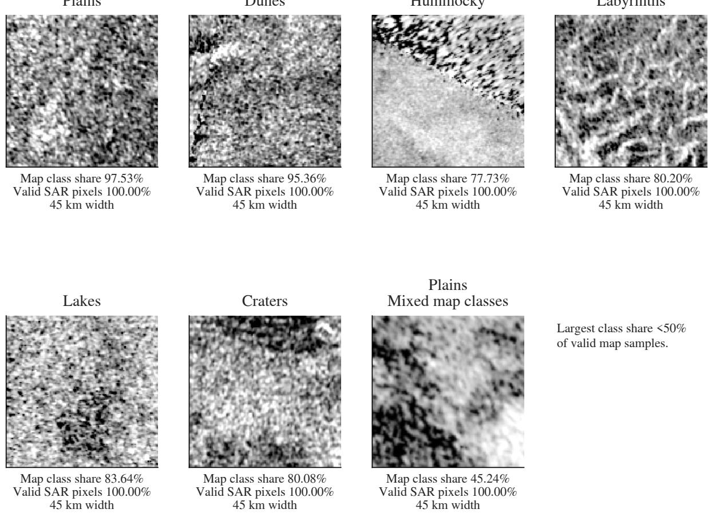  
Figure 1: Titan test images and their map labels. For each class, the example is the test tile whose moda map fraction is closest to that class’s median across the test set; tile ID breaks ties. The mixed example follows the same rule among test tiles whose modal class occupies less than half the valid map samples. Each image covers 45 km by 45 km. Map and SAR percentages use separate validity masks. Brightness spans the 2nd to 98th percentile of each image’s finite positive display DN. Because each image has its own stretch, brightness diferences between subplots have no common radiometric scale. The examples illustrate the images and label mixtures produced by this sampling rule; a geological assessment of their representativeness would require expert interpretation.

Each result describes a complete model configuration, including its architecture, inputs and pretraining. Representation transfer here means predicting map classes in other Titan regions using either the existing image features or encoder weights trained further with Titan labels. The first comparison fits a classifier to each pretrained representation, features from the Untrained ViT and four families of classical image features using the same classifier settings. The next compares two ways of fitting a classifier with the encoder weights unchanged, followed by training the final two transformer layers. A separate experiment replaces some training tiles with tiles nearer the validation or test regions while keeping the number of training examples in each class constant.

These experiments use an expanded Titan dataset that includes valid western image areas omitted by the original map sampler. The sampler mishandled longitudes on a map spanning 0 to 360 degrees east. Training and testing in the expanded dataset are separated geographically. The CETUS repository provides the tile catalog, geographic divisions, predictions and reproduction instructions. Earlier experiments trained classifiers on Earth and included an unlabeled Venus comparison. Section 5 examines them separately because their populations, labels and radar products difer.

## 2 Titan images and terrain labels

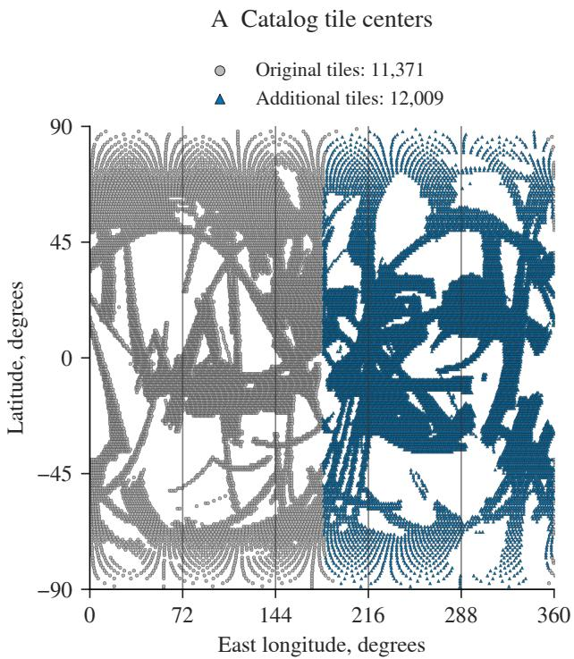

B Test tiles by map class  
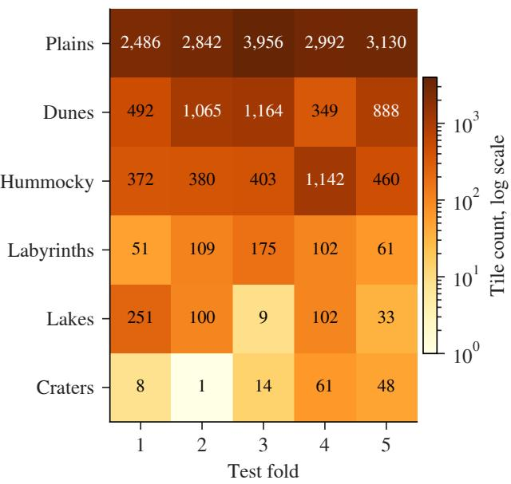  
Figure 2: Geographic coverage and numbers of test tiles. Left: original and additional tile centers on a longitude and latitude grid. Vertical lines delimit the five sectors; markers show image centers. Right: tile counts by map class and fold, with a logarithmic color scale. The Craters class has one tile in fold 2 and 61 in fold 4, although the two folds receive equal weight in the primary scores. Tile counts measure image sampling and may include several images of the same landform

The input tiles sample the U.S. Geological Survey (USGS) Cassini SAR and HiSAR display mosaic [7]. Each image tile contains 128 × 128 pixels over a nominal 45 km by 45 km area in a local metric projection. The mosaic’s digital numbers, or DN, result from an 8 bit logarithmic stretch of calibrated source images. The tiles contain resampled values from that mosaic. Tiles are retained when finite positive SAR values occupy at least 80% of their pixels. These DN describe image brightness; obtaining physical radar backscatter would require radiometric information beyond this stretch. Pixel spacing determines sampling of the mosaic, while efective resolution and observing geometry vary among its constituent images.

The map of Lopes et al. [2] supplies six terrain labels: Plains, Dunes, Hummocky, Labyrinths, Lakes and Craters. The benchmark uses Hummocky for the map’s Mountains layer and Lakes for its Basins layer. Hummocky includes mountains and degraded mountains; Lakes includes filled and empty lakes and seas; Craters includes rims, ejecta, central peaks and fills. A 64 × 64 grid samples the map over each tile, and the most frequent valid class becomes its label. Ties go to the lowest class index. Label assignment retains every tile with a mapped class, even when that class occupies less than half of the valid samples. Its fraction describes the mixture of map classes in the image area, separately from confidence in the expert interpretation. Map samples and SAR pixels use diferent validity masks and may cover diferent portions of a tile.

Label assignment uses the first edition of the digital map polygons [8]. At a scale of 1:20,000,000, the global map simplifies regional mapping by omitting units smaller than approximately 30 km2 [2]. Other

Cassini observations inform the interpretation, especially outside SAR coverage. The sampling grid therefore represents terrain divisions whose location and detail depend on that map. The Dunes class includes linear dunes and sand sheets; the Lakes class can identify either liquid or an empty basin. A classifier learns the predominant mapped unit in an image area, subject to these limits of scale and interpretation.

Figure 1 shows the SAR images together with their modal map labels. The class fractions make the choice reproducible. Whether each example is geologically representative still requires expert assessment.

The expanded catalog contains 23,380 tiles. It preserves all original image arrays, adds 12,009 tiles and changes 15 labels on existing tiles. Independent inverse projection and direct lookup of map pixels agree with the new sampler over the complete grid of possible image centers. Figure 2 shows where the additional images lie and how class counts vary among regions. Since SAR also informed the expert map, agreement with its labels measures reproduction of that interpretation.

## 3 Experimental design

## 3.1 Geographic separation and image normalization

Titan is divided into five longitude sectors delimited by 0, 72, 144, 216, 288 and 360 degrees east. Sectors are numbered from 1 to 5 in increasing longitude. Fold f tests on sector f, uses the next sector cyclically for validation and trains on the remaining three. The Selk holdout contains 65 images within 5◦ of 6◦N, 161◦E. A conservative minimum distance of 108.640 km between centers of images in diferent sets gives a nominal 45 km separation between their square image areas. This excludes another 69 tiles near Selk, validation tiles near the test set and training tiles near the original validation or test sets. The primary split uses the remaining tiles without replacements. Geographic separation reduces proximity between the sets; spatial dependence can persist beyond the imposed distance.

The five test sets contain 23,246 distinct tiles. Training sets contain 12,348 to 14,644 tiles and validation sets contain 3,453 to 5,420; all contain the six classes. In each fold, image normalization uses up to 200 training tiles and 512 finite positive pixels per tile, with random seed zero. DN are scaled between the 1st and 99th sample percentiles and clipped to [0, 1]. Only training pixels determine these limits. Every feature family uses the same initial DN scaling for a given fold.

To test sensitivity to training geography, the replacement experiment reinstates all eligible training tiles removed by the separation rule. For each class, it removes as many retained tiles as it reinstates. Both classifiers use the same five training sets in each fold. Each set changes 2.20% to 3.96% of the training images in a fold. Each replacement set retains the 200 tiles that determine image normalization, so the transform stays the same. Validation and test tiles, training class counts and Selk exclusions also stay the same. For each of four encoders, logistic regression recalculates feature standardization and fits a classifier on each replacement set. The stochastic gradient descent (SGD) classifier uses five training seeds per set. This gives 100 additional logistic regression fits and 500 SGD classifiers. Section 4.5 describes the tile counts and the resulting score diferences.

## 3.2 Image representations and classifiers

Each encoder is a vision transformer (ViT) with 768 output features. DINOv2 and the Untrained ViT use the classification token, the representation assigned to the whole image. DOFA averages the image patch representations, excluding that token, and applies a final normalization layer. DINOv2 ViT-B/14 repeats SAR into three channels and applies ImageNet channel normalization. DOFA ViT-B/16 uses one channel and numeric band identifier 13.78. The upstream Sentinel-1 example standardizes its channels and uses 5.405 [9], whereas Appendix D of Xiong et al. [10] assigns SAR the identifier 3.75. CETUS omits the example’s standardization. How these choices relate to the model’s pretraining inputs remains uncertain. CROMA ViT-B/8 duplicates SAR into two channels, averages patch representations and passes the mean through its learned feedforward network. Both channels contain the same polarization information. Bilinear resizing gives $2 2 4 \times 2 2 4$ inputs, except for CROMA’s $1 2 0 \times 1 2 0$

The Untrained ViT baseline uses one ViT-B/14 with a single input channel and random seed 42. Its encoder receives no training: the supervised classifier learns Titan terrain labels from the features produced by its random weights. All classifier fits reuse this encoder, so the five SGD repeats measure variation in classifier training for that one set of encoder weights. Its single-channel input stem and lack of ImageNet channe normalization difer from DINOv2’s input processing. The comparison therefore combines pretraining with input diferences and cannot isolate the contribution of pretraining.

DOFA’s final feature normalization retains its initial scale of one and bias of zero because the checkpoint lacks those parameters. The layer still normalizes each feature vector. The checkpoint also contains parameters for a separate normalization layer that the evaluated path does not use. These missing and unused normalization parameters motivate checking the original input convention before interpreting DOFA’s performance or trying another training configuration.

For the primary comparison, each feature is standardized by its training mean and population standard deviation (SD) before multinomial logistic regression (LR) is fitted. The classifier uses an intercept, inverse class frequency weights, L2 regularization, $C = 1$ , LBFGS, tolerance $1 0 ^ { - 4 }$ and at most 2,000 iterations. The weights give each class equal total weight in the loss. Each feature family has one fit per fold; validation data do not choose among fits. Classical features comprise 13 intensity statistics, a 32-bin histogram, 1,820 texture features and their 1,865-dimensional concatenation. The texture measurements use cooccurrence matrices, local binary patterns, Gabor filters, histograms of oriented gradients and wavelets. Histogram and texture calculations also rescale each tile between its own 1st and 99th percentiles. Classifier settings are the same across families; feature definitions and dimensions difer.

The combined classical features provide the primary baseline for assessing whether an encoder adds predictive value beyond conventional image measurements. A separate majority predictor assigns every image to the most numerous class in the training fold. It uses class frequency alone, while classifiers using classical features also use image information.

The second linear classifier uses unstandardized encoder features and SGD. Its cross-entropy loss has inverse class frequency weights. The classifier is trained for 100 epochs with learning rate 0.01, momentum 0.9, zero weight decay, cosine decay and batch size 256, then evaluated at the final epoch for five classifier seeds in each fold. The common logistic regression settings were chosen after inspecting these SGD results, but before examining the logistic regression or combined classical results. The comparison changes feature scaling, optimization and regularization together.

A nearest-neighbor classifier provides a further comparison. It takes an unweighted vote among the 20 closest training features by cosine similarity and assigns ties to the lowest class index.

## 3.3 Training part of the encoder on Titan

For each pretrained model, training updates the final two transformer layers and a new linear classifier for all 50 epochs, with five optimization seeds per fold. The 75 fits use AdamW, learning rates of $1 0 ^ { - 4 }$ for the encoder and $1 0 ^ { - 3 }$ for the classifier, weight decay 0.01, cosine decay, microbatches of eight and accumulation over four microbatches. The loss uses inverse class frequency weights, and training uses automatic mixed precision. Image normalization, model inputs and geographic divisions stay the same. Evaluation uses the earliest epoch attaining the highest validation macro recall among epochs with optimizer updates. The new classifier has an independent initialization from the earlier linear classifiers. Appendix A.2 gives the training counts and checks of the saved models.

Table 1 compares the three ways of fitting models. All use inverse class frequency weights and the same image normalization for a given fold.

Table 1: Settings for classifier fitting and partial encoder training. Standardization centers and scales features using the training mean and population SD.
<table><tr><td>Fitting choice</td><td>Common logistic regression SGD classifier</td><td></td><td>Partial fine-tuning</td></tr><tr><td>Model parameters fitted</td><td>Linear classifier</td><td>Linear classifier</td><td>Final two transformer layers and a new linear classifier</td></tr><tr><td>Standardize classifier inputs</td><td>Training mean and population SD</td><td>None</td><td>None</td></tr><tr><td>Optimizer and regularization</td><td>LBFGS with L2, C = 1</td><td>SGD, zero weight decay</td><td>AdamW, weight decay 0.01</td></tr><tr><td>Training duration</td><td>At most 2,000 iterations</td><td>100 epochs</td><td>All 50 epochs</td></tr><tr><td>Model evaluated</td><td>One fit; validation data unused</td><td>Classifier from the final epoch</td><td>Earliest epoch attaining the highest validation macro recall among epochs with optimizer updates</td></tr><tr><td>Fits per fold</td><td>One per feature family</td><td>Five classifier seeds per encoder</td><td>Five optimization seeds per pretrained encoder</td></tr></table>

## 3.4 Performance measures and regional averages

For each of the six classes, precision, recall and F1 are calculated, with undefined ratios set to zero. Macro scores are the arithmetic means of these class scores; in particular, F1 is calculated before averaging classes. For SGD and encoder training, five seeds are averaged in each fold, followed by the mean and sample SD of the five fold values. Diferences involving encoder training compare the same folds, using the same seed for the SGD comparison and one logistic regression fit per fold. For encoder training, validation macro recall determines the epoch; the test results include all three metrics. The SD measures variation among these regions. Overlapping training sets can induce dependence among cross-validation scores [11]. Spatial dependence among Titan images is a further concern when treating these folds as independent geographic repetitions.

The primary average gives each region equal influence for every class, even when class counts difer. Scores are also calculated after combining confusion counts from all test folds separately for each encoder-training seed, then averaging the resulting seed scores. Logistic regression contributes one matrix across all test tiles. This second calculation weights the available test population diferently. Both calculations concern the sampled mosaic, with uneven geographic coverage and potentially several images per landform. Every primary comparison uses regional averages. The alternative weighting, distance checks and map polygon analysis were designed after inspecting the main results and use the existing predictions. The experiment replacing training tiles was specified before its results were examined.

Bold numbers identify the highest displayed mean within the comparison named in each table caption. Ties at the displayed precision receive equal emphasis. Bold type does not establish statistical significance.

## 4 Results and error interpretation

## 4.1 Pretrained features and classical image measurements

CROMA has the highest mean macro F1 in Table 2 and Figure 3. It exceeds the combined classical baseline in every fold and by 5.67 percentage points on average. DINOv2 and DOFA exceed that baseline by 3.14 and 2.24 points in mean F1. Combining intensity and texture improves mean F1 over either alone. Classifier settings and images are the same; input transformations, dimensions and architectures difer. Further tuning could change the ranking.

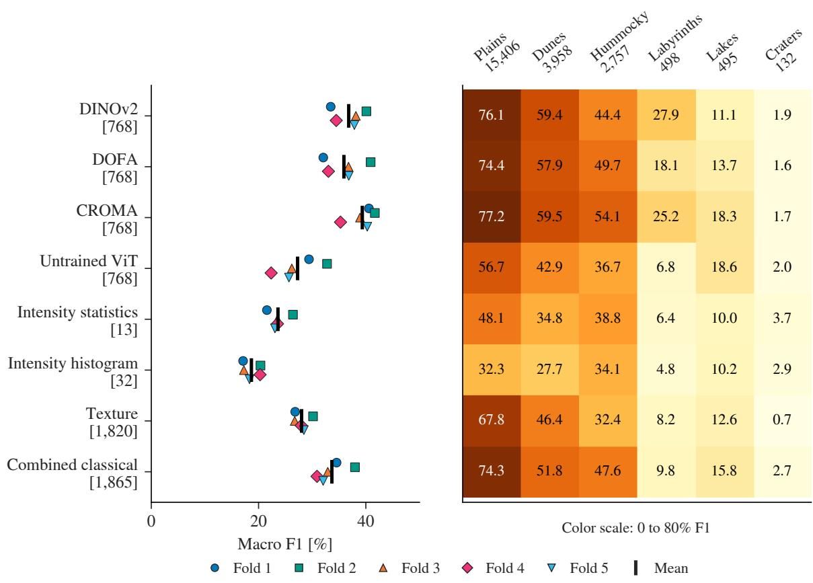

Table 2: Logistic regression applied to eight feature families, with encoder weights unchanged. Training features determine standardization; inverse class frequency weights give every class equal total weight. Precision, recall and F1 are macro averages in percent, followed by their sample SD across five folds. All 40 fits finish in fewer than 2,000 iterations without warnings. Bold indicates the highest mean in each metric column across all eight feature families.
<table><tr><td>Feature family</td><td>Precision</td><td>Recall</td><td>F1</td></tr><tr><td>DINOv2</td><td> $3 5 . 4 9 \pm 2 . 9 4$ </td><td> $4 3 . 0 5 \pm 3 . 8 5$ </td><td> $3 6 . 8 1 \pm 2 . 7 6$ </td></tr><tr><td>DOFA</td><td> $3 5 . 2 4 \pm 2 . 9 7$ </td><td> $4 3 . 1 2 \pm 5 . 4 0$ </td><td> $3 5 . 9 1 \pm 3 . 5 2$ </td></tr><tr><td>CROMA</td><td> ${ \bf 3 8 . 4 6 \pm 2 . 6 2 }$ </td><td> ${ \bf 4 7 . 2 3 \pm 5 . 7 7 }$ </td><td> ${ \bf 3 9 . 3 4 \pm 2 . 4 8 }$ </td></tr><tr><td>Untrained ViT</td><td> $3 0 . 8 0 \pm 4 . 9 8$ </td><td> $3 4 . 8 7 \pm 3 . 9 3$ </td><td> $2 7 . 2 8 \pm 3 . 9 6$ </td></tr><tr><td>Intensity statistics</td><td> $3 0 . 4 6 \pm 2 . 5 9$ </td><td> $3 9 . 2 9 \pm 6 . 8 3$ </td><td> $2 3 . 6 2 \pm 1 . 7 6$ </td></tr><tr><td>Intensity histogram</td><td> $2 5 . 6 0 \pm 2 . 1 2$ </td><td> $3 2 . 8 9 \pm 6 . 9 9$ </td><td> $1 8 . 6 7 \pm 1 . 5 8$ </td></tr><tr><td>Texture</td><td> $2 7 . 6 4 \pm 1 . 1 1$ </td><td> $3 2 . 8 4 \pm 3 . 0 0$ </td><td> $2 8 . 0 2 \pm 1 . 4 0$ </td></tr><tr><td>Combined classical</td><td> $3 3 . 5 1 \pm 3 . 8 4$ </td><td> $3 9 . 5 3 \pm 5 . 0 6$ </td><td> $3 3 . 6 7 \pm 2 . 7 5$ </td></tr></table>

A Geographic fold scores

B Mean class F1 [%]  
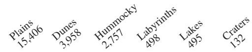  
Figure 3: Logistic regression with each feature family. Left: five geographic fold scores and their mean. Right: mean F1 for each class, with the number of distinct test tiles above each column. All families use the same training and test images and classifier settings. They share the initial DN scaling, but subsequent input transformations difer. Numbers beside family names give feature dimensions. A common color scale spans 0 to 80% F1. Training sets overlap between folds. The Craters class contributes between one and 61 tiles per fold, which limits comparisons among regional class scores.

## 4.2 Classifier fitting changes the encoder ranking

With SGD, DINOv2 leads at 37.71% F1, followed by CROMA at 35.26% and DOFA at 29.04%. Logistic regression puts CROMA first and raises the Untrained ViT result from 7.97% to 27.28%, an increase of 19.3 percentage points. For the Untrained ViT, the SGD classifiers assign at least 95.77% of each test set to one class; logistic regression predicts all six classes in every fold. Both fits learn from Titan labels and use the same encoder features. The higher LR score shows that these features permit better predictions than the nearly constant SGD outputs. Scaling, optimization and regularization change together, leaving their individual contributions unresolved. All pretrained encoders still exceed this particular random initialization in every fold with logistic regression. This comparison with one encoder initialization does not establish the advantage over random encoders in general. Figure 4 shows the change for each region.

Both classifiers include an intercept. In exact arithmetic, an invertible afine rescaling of features leaves the set of possible linear classifications intact. Rescaling changes numerical conditioning and the meaning of an L2 penalty in the original feature coordinates. Fitting choices can therefore change performance even when the representation stays the same. Identifying the contribution of scaling would require varying it separately from optimization and regularization.

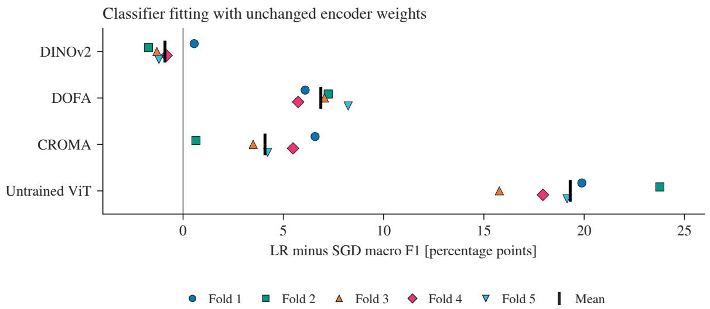  
Figure 4: Change in macro F1 when logistic regression replaces SGD, with identical encoder features and image sets. Colored markers show the diference for each geographic fold in percentage points; black marks give the mean. The SGD score first averages five training seeds. Logistic regression changes feature scaling, optimization, regularization and the training schedule together, so the comparison assesses the fitting procedures as a whole.

The performance measure also changes which encoder leads: DINOv2 has the highest SGD F1, while CROMA has the highest SGD recall in Table 3. For all three pretrained encoders, SGD has higher mean macro recall and lower mean macro precision than nearest neighbors. Its mean F1 exceeds nearest neighbors by 8.85 points for DINOv2, 0.47 for DOFA and 4.43 for CROMA. Thus classifier choice changes both the encoder ranking and the tradeof between precision and recall on these images.

## 4.3 How training on Titan changes performance

Training the last two layers raises DINOv2 to 41.16 ± 2.60% macro F1. This exceeds logistic regression by 4.35 ± 0.34 percentage points and SGD by 3.45 ± 1.10 points, with both improvements present in every fold. DOFA reaches 15.68 ± 3.35%. Its diferences from the two classifiers are $- 2 0 . 2 3 \pm 4 . 4 5$ and $- 1 3 . 3 6 \pm 4 . 1 7$ points, respectively, and both are negative in every fold. CROMA reaches $3 9 . 1 7 \pm 2 . 3 1 \%$ , improving on SGD by $3 . 9 1 \pm 3 . 0 3$ points in the mean and in every fold. Against logistic regression, its diference is $- 0 . 1 7 \pm 1 . 1 2$ points, with two positive and three negative fold diferences. Figure 5 shows both comparisons. CROMA’s macro recall nevertheless increases by $1 . 7 0 \pm 2 . 6 2$ points relative to logistic regression. Whether encoder training improves performance therefore depends on both the comparison classifier and the performance measure.

Table 3: SGD classifiers and nearest neighbors on the same geographic test sets and encoder features. Values give mean macro precision, recall and F1 in percent, with sample SD across five folds. SGD metrics first average the training seeds in each fold. Bold indicates the highest mean in each metric column, separately for SGD and nearest neighbors.
<table><tr><td>Encoder</td><td>Precision</td><td>Recall</td><td>F1</td></tr><tr><td>SGD classifier</td><td></td><td></td><td></td></tr><tr><td>DINOv2</td><td> ${ \bf 3 6 . 0 2 \pm 3 . 5 1 }$ </td><td> $4 4 . 7 0 \pm 4 . 3 0$ </td><td> $\mathbf { 3 7 . 7 1 \pm 3 . 5 6 }$ </td></tr><tr><td>DOFA</td><td> $3 2 . 5 7 \pm 3 . 7 6$ </td><td> $4 5 . 2 5 \pm 7 . 6 7$ </td><td> $2 9 . 0 4 \pm 2 . 9 4$ </td></tr><tr><td>CROMA</td><td> $3 5 . 8 5 \pm 3 . 7 3$ </td><td> ${ \bf 4 8 . 4 5 \pm 7 . 4 0 }$ </td><td> $3 5 . 2 6 \pm 4 . 0 5$ </td></tr><tr><td>Untrained ViT</td><td> $6 . 0 1 \pm 2 . 1 7$ </td><td> $1 6 . 6 6 \pm 0 . 0 0 4$ </td><td> $7 . 9 7 \pm 2 . 4 7$ </td></tr><tr><td colspan="4">Nearest neighbors</td></tr><tr><td>DINOv2</td><td> ${ \bf 4 8 . 8 9 \pm 8 . 9 1 }$ </td><td> $2 7 . 6 2 \pm 3 . 7 9$ </td><td> $2 8 . 8 6 \pm 5 . 0 4$ </td></tr><tr><td>DOFA</td><td> $4 2 . 0 0 \pm 7 . 5 7$ </td><td> $2 6 . 7 9 \pm 2 . 4 8$ </td><td> $2 8 . 5 7 \pm 2 . 7 8$ </td></tr><tr><td>CROMA</td><td> $4 8 . 6 3 \pm 1 1 . 8 5$ </td><td> ${ \bf 2 8 . 8 9 \pm 2 . 5 2 }$ </td><td> $\mathbf { 3 0 . 8 3 \pm 2 . 9 0 }$ </td></tr><tr><td>Untrained ViT</td><td> $2 1 . 4 5 \pm 7 . 8 5$ </td><td> $1 7 . 0 6 \pm 0 . 5 1$ </td><td> $1 4 . 9 9 \pm 0 . 7 6$ </td></tr></table>

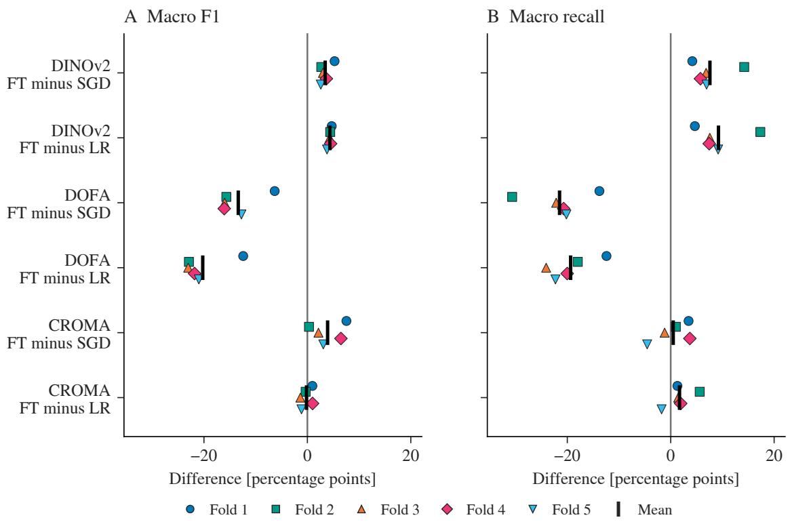  
Figure 5: Training the last two transformer layers, compared with training only a classifier on the same geographic divisions. FT denotes partial fine-tuning. Left: diferences in test macro F1. Right: diferences in test macro recall. Diferences subtract the indicated classifier scores from the FT scores and are expressed in percentage points. Colored symbols show five fold values; black marks give their mean. FT and SGD first average five training seeds per fold, with corresponding seeds compared for the diference. Logistic regression has one fit per fold. Validation macro recall determines the FT epoch. Optimizer and training settings also difer, so these comparisons assess the full training configurations.

Table 4: Partial fine-tuning (FT) compared with classifier training alone. LR denotes logistic regression. Scores are percentages; diferences are FT less the comparison score, in percentage points. Cells give the mean and sample SD of five folds after averaging five FT seeds. SGD diferences compare corresponding seeds; LR has one fit per fold. Validation macro recall determines the FT epoch. Bold indicates the highest mean fine-tuning score in each metric column. Diferences from earlier fits remain in ordinary type.
<table><tr><td>Encoder</td><td></td><td></td><td></td><td>FT F1, % FT recall, % FT minus LR F1, pp FT minus SGD F1, pp</td></tr><tr><td>DINOv2</td><td> ${ \bf 4 1 . 1 6 \pm 2 . 6 0 }$ </td><td> ${ \bf 5 2 . 2 8 \pm 7 . 0 5 }$ </td><td> $4 . 3 5 \pm 0 . 3 4$ </td><td> $3 . 4 5 \pm 1 . 1 0$ </td></tr><tr><td>DOFA</td><td> $1 5 . 6 8 \pm 3 . 3 5$ </td><td> $2 3 . 7 6 \pm 3 . 6 1$ </td><td> $- 2 0 . 2 3 \pm 4 . 4 5$ </td><td> $- 1 3 . 3 6 \pm 4 . 1 7$ </td></tr><tr><td>CROMA</td><td> $3 9 . 1 7 \pm 2 . 3 1$ </td><td> $4 8 . 9 3 \pm 4 . 5 2$ </td><td> $- 0 . 1 7 \pm 1 . 1 2$ </td><td> $3 . 9 1 \pm 3 . 0 3$ </td></tr></table>

## 4.4 Which terrain classes improve?

Relative to logistic regression, DINOv2 improves Dunes, Hummocky and Labyrinths F1 in every fold, with little change in mean Plains F1. CROMA gains on some classes and loses on others. DOFA’s decline spans all six class means. Figure 6 shows the regional variation behind these averages. Explaining why the encoders respond diferently would require experiments that vary the training choices separately.

DINOv2’s largest mean F1 gains are 10.37 percentage points for Labyrinths, 6.33 for Dunes and 4.90 for Hummocky. CROMA gains 2.94 points for Lakes while losing 2.44 for Plains and 2.13 for Dunes. DOFA’s Hummocky F1 falls from 49.71% to 0.42%, and its recall falls from 61.82% to 0.24%. Hummocky contains 2,757 test tiles. DOFA’s deterioration therefore extends to a class represented by many test images.

CROMA’s small change in macro F1 also depends on how regions are weighted. The diference is −0.17 percentage points when each fold receives equal weight and +0.85 when confusion counts from all test folds are combined separately for each training seed. With the latter calculation, DINOv2 still improves and DOFA still declines. Table 5 compares the two calculations; the primary results continue to give every region equal weight.  
Table 5: Efect of regional weighting on the comparison of FT with LR. FT denotes partial fine-tuning and LR logistic regression. F1 scores are percentages; diferences are percentage points. The primary calculation averages the five regional scores equally. The second calculation combines confusion counts across test folds for each seed before calculating F1, then averages seeds.
<table><tr><td>Model</td><td>Primary FT − LR</td><td>All tiles LR</td><td>All tiles FT</td><td>All tiles FT − LR</td></tr><tr><td>DINOv2</td><td>4.35</td><td>38.43</td><td>42.99</td><td>4.55</td></tr><tr><td>DOFA</td><td>-20.23</td><td>37.68</td><td>16.21</td><td>-21.47</td></tr><tr><td>CROMA</td><td>-0.17</td><td>40.98</td><td>41.82</td><td>0.85</td></tr></table>

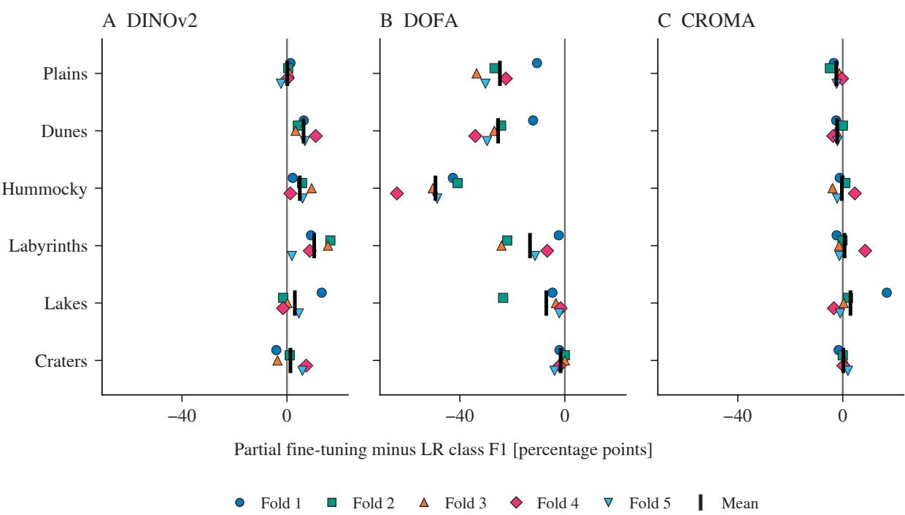  
Figure 6: Change in class F1 after training the last two transformer layers, relative to logistic regression on their original features. Each colored symbol gives one fold’s diference after averaging five training seeds. Black marks give the mean across folds. Positive values indicate closer agreement with the modal map class. The common horizontal scale places DOFA’s broad decline beside the smaller changes for DINOv2 and CROMA. Several images can represent the same physical landform.

Table 6: Class precision (P), recall (R) and F1 for partial fine-tuning (FT) and logistic regression (LR), in percent. Class ratios are calculated for each seed and fold; FT seeds are averaged in each fold, then the five folds receive equal weight. LR has one fit per fold. SD measures variation among folds; the tile count includes each test image once. Undefined ratios are zero. Several tiles may depict portions of the same landform. Bold indicates the higher mean F1 between FT and LR for each encoder and class.
<table><tr><td>Encoder Class</td><td>Tiles FT P, % FT R, %</td><td colspan="6">FT F1, % LR P, % LR R, % LR F1, %</td></tr><tr><td></td><td></td><td></td><td>88.05</td><td>68.03</td><td>76.24</td><td>85.22</td><td>68.92 76.10</td></tr><tr><td rowspan="3">DINOv2</td><td rowspan="3">Plains</td><td>15406</td><td>±2.69</td><td>±7.48</td><td>±4.32</td><td>±1.36 ±5.70</td><td>±3.65</td></tr><tr><td></td><td>61.80</td><td>71.52</td><td>65.76</td><td>53.23 68.04</td><td>59.43</td></tr><tr><td>3958</td><td>±7.60</td><td>±9.70</td><td>±7.47 ±11.12</td><td>±8.21</td><td>±9.37</td></tr><tr><td rowspan="3">DINOv2 DINOv2</td><td rowspan="3">Dunes Hummocky</td><td></td><td>46.21</td><td>57.96</td><td>49.34</td><td>37.36 57.65</td><td>44.43</td></tr><tr><td>2757</td><td>±3.87</td><td>±18.87</td><td>±7.55</td><td>±5.34 ±17.63</td><td>±8.22</td></tr><tr><td></td><td>30.10</td><td></td><td>25.24</td><td>38.88</td><td>27.85</td></tr><tr><td rowspan="3">DINOv2</td><td rowspan="3">Labyrinths</td><td>498</td><td>±10.64</td><td>63.81 ±12.99</td><td>38.23 ±7.48</td><td>±9.92 ±18.40</td><td>±5.32</td></tr><tr><td></td><td>12.78</td><td>32.84</td><td>14.10</td><td></td><td></td></tr><tr><td>495 ±9.88</td><td></td><td></td><td>10.51 ±8.82</td><td>20.87 ±20.69</td><td>11.09 ±12.33</td></tr><tr><td rowspan="3">DINOv2 DINOv2</td><td rowspan="3">Lakes Craters</td><td></td><td>4.64</td><td>±23.53 19.54</td><td>±11.58 3.27</td><td>1.37</td><td></td></tr><tr><td>132</td><td>±6.43</td><td>±23.64</td><td>±3.13</td><td>3.93 ±5.70</td><td>1.94 ±2.67</td></tr><tr><td>68.04</td><td>42.45</td><td>49.67</td><td>±1.95 85.97</td><td>65.75</td><td>74.42</td></tr><tr><td rowspan="2">DOFA</td><td rowspan="2">Plains</td><td>15406</td><td>±4.56</td><td>±9.90</td><td>±8.27</td><td>±0.55</td><td>±5.09</td></tr><tr><td>24.07</td><td>61.79</td><td>32.49</td><td>52.99</td><td>65.97</td><td>±3.33 57.90</td></tr><tr><td rowspan="2">DOFA</td><td rowspan="2">Dunes</td><td>3958</td><td>±10.25</td><td>±4.48</td><td>±10.96</td><td>±10.96</td><td></td></tr><tr><td>1.87</td><td>0.24</td><td>0.42</td><td>44.34</td><td>±12.28 61.82</td><td>±8.50 49.71</td></tr><tr><td rowspan="2">DOFA</td><td rowspan="2">Hummocky</td><td>2757</td><td>±4.19</td><td>±0.53</td><td>±0.94</td><td>±6.07</td><td></td></tr><tr><td>9.38</td><td>10.78</td><td>4.84</td><td>13.83</td><td>±22.25 33.10</td><td>±8.77 18.13</td></tr><tr><td rowspan="2">DOFA</td><td rowspan="2">Labyrinths</td><td>498</td><td>±3.30</td><td>±12.26</td><td>±2.91</td><td>±8.26</td><td></td></tr><tr><td>11.38</td><td>27.29</td><td>6.66</td><td>12.97</td><td>±14.88 27.98</td><td>±8.21 13.73</td></tr><tr><td rowspan="2">DOFA</td><td rowspan="2">Lakes</td><td>495</td><td>±17.47</td><td>±23.42</td><td>±5.68</td><td>±12.01</td><td></td></tr><tr><td>0.00</td><td></td><td></td><td>1.33</td><td>±23.72 4.08</td><td>±14.33 1.61</td></tr><tr><td rowspan="2">DOFA</td><td rowspan="2">Craters</td><td>132</td><td>±0.00</td><td>0.00</td><td>0.00</td><td></td><td></td></tr><tr><td>87.71</td><td>±0.00</td><td>±0.00</td><td>±1.39</td><td>±5.36 69.49</td><td>±1.66</td></tr><tr><td rowspan="2">CROMA</td><td rowspan="2">Plains</td><td>15406</td><td>±1.54</td><td>65.63</td><td>74.78</td><td>87.21</td><td>77.22</td></tr><tr><td></td><td>±4.72</td><td>±2.85</td><td>±1.60</td><td>±5.79</td><td>±3.55 59.49</td></tr><tr><td rowspan="2">CROMA</td><td rowspan="2">Dunes</td><td rowspan="2">3958</td><td>55.28</td><td>61.92</td><td>57.36</td><td>56.14</td><td>64.67</td></tr><tr><td>±12.92</td><td>±9.98</td><td>±9.16</td><td>±8.32 ±12.85</td><td>±8.07</td></tr><tr><td rowspan="2">CROMA</td><td rowspan="2">Hummocky</td><td rowspan="2">2757</td><td>48.69</td><td>65.13</td><td>53.82</td><td>48.63</td><td>65.68 54.14</td></tr><tr><td>±5.71</td><td>±20.27</td><td>±7.53 ±5.55</td><td>±19.00</td><td>±5.66</td></tr><tr><td rowspan="2">CROMA</td><td rowspan="2">Labyrinths</td><td>498</td><td>18.80</td><td>54.09</td><td>25.86</td><td>19.21 44.94</td><td>25.16</td></tr><tr><td>±5.90</td><td>±12.98</td><td>±5.14</td><td>±6.34</td><td>±17.30</td><td>±4.78</td></tr><tr><td rowspan="2">CROMA Lakes</td><td rowspan="2"></td><td></td><td>19.64</td><td>40.64</td><td>21.27</td><td>18.41 33.87</td><td>18.33</td></tr><tr><td>495 ±18.36</td><td>±26.14</td><td>±19.59</td><td>±16.92</td><td>±20.57</td><td>±13.98</td></tr><tr><td rowspan="2">CROMA Craters</td><td rowspan="2"></td><td rowspan="2"></td><td>2.43</td><td>6.20</td><td>1.95</td><td>1.14</td><td>4.73 1.71</td></tr><tr><td>132 ±3.66</td><td>±8.37</td><td>±2.15</td><td>±1.13 ±5.18</td><td>±1.60</td></tr></table>

## 4.4.1 Craters remains dificult to predict

Every feature family has mean Craters F1 below 4% with logistic regression. For pretrained encoders, it ranges from 1.61% to 1.94%, with precision from 1.14% to 1.37%. Better macro F1 can accompany worse prediction of this small class. For example, changing DOFA’s classifier from SGD to logistic regression raises macro F1 from 29.04% to 35.91%, while Craters recall falls from 40.85% to 4.08% and Craters precision from 1.99% to 1.33%. Assessing predictions of crater terrain therefore requires the class scores as well as the overall score.

After encoder training, mean Craters F1 is 3.27% for DINOv2, 0.00% for DOFA and 1.95% for CROMA. DINOv2 reaches 4.64% Craters precision and 19.54% recall. Thus, despite its higher macro F1, most of its Craters predictions disagree with the map. Table 6 gives precision, recall and F1 for every class and encoder.

DINOv2’s Craters F1 becomes 5.15% when confusion counts are combined across test folds for each seed. The finding of F1 below 4% refers specifically to equal regional weights. Combining counts across seeds or weighting fold F1 by test size would answer still diferent statistical questions. These low scores, together with the scale of the map labels, leave practical crater detection to be assessed separately.

The CROMA confusion matrix in Table 7 shows how predictions difer from map labels. Of 132 tiles labeled

Craters by the map, 99 receive Hummocky and seven receive Craters. CROMA predicts Craters for 484 tiles in total. Of 495 Lakes tiles, 157 receive Dunes and 125 receive Lakes. Each test image contributes once to these counts, so they weight regions diferently from the primary class ratios. The matrix identifies frequent disagreements between map labels and predictions; interpreting the structures or materials in those images requires geological inspection.

Table 7: CROMA predictions from logistic regression across all five test folds. Each of 23,246 test tiles appears once. Rows give modal map classes and columns give predictions. These counts weight the test population by tile count, whereas the primary class scores weight the five regions equally. CROMA is the encoder with the highest mean F1 in the common classifier comparison.
<table><tr><td></td><td colspan="6">Predicted map class</td><td></td></tr><tr><td>Map class</td><td>Plains</td><td>Dunes</td><td>Hummocky</td><td>Labyrinths</td><td>Lakes</td><td>Craters</td><td>Test tiles</td></tr><tr><td>Plains</td><td>10,689</td><td>1,687</td><td>1,771</td><td>656</td><td>364</td><td>239</td><td>15,406</td></tr><tr><td>Dunes</td><td>875</td><td>2,660</td><td>141</td><td>110</td><td>117</td><td>55</td><td>3,958</td></tr><tr><td>Hummocky</td><td>425</td><td>87</td><td>1,965</td><td>76</td><td>42</td><td>162</td><td>2,757</td></tr><tr><td>Labyrinths</td><td>143</td><td>57</td><td>70</td><td>203</td><td>14</td><td>11</td><td>498</td></tr><tr><td>Lakes</td><td>98</td><td>157</td><td>76</td><td>29</td><td>125</td><td>10</td><td>495</td></tr><tr><td>Craters</td><td>21</td><td>0</td><td>99</td><td>1</td><td>4</td><td>7</td><td>132</td></tr><tr><td>Prediction total</td><td>12,251</td><td>4,648</td><td>4,122</td><td>1,075</td><td>666</td><td>484</td><td>23,246</td></tr></table>

The five folds contain 8, 1, 14, 61 and 48 Craters test tiles. The fold containing one tile contributes one fifth of mean Craters recall. With one fit per fold, changing that tile from incorrect to correct raises mean six-class macro recall across folds by 3.33 percentage points. The relation between these tile counts and distinct impact structures requires a separate inventory: the Craters class includes rims, ejecta and fills, while an image assigned another modal class may still include some crater terrain. Both scale and class mixture matter when interpreting an individual disagreement.

## 4.4.2 Map concentration and validation sensitivity

Two map polygon components account for 82 of 132 Craters test tiles, as shown in Table 8. A component can include several features, and a physical feature may extend beyond an image whose modal label is Craters. Lakes test counts also vary substantially among regions, with 251, 100, 9, 102 and 33 test tiles.

Table 8: Craters test tiles and the map polygon components they represent. The largest component column identifies the map component with the most test tiles; the last column gives that count. A separate geological inventory is needed to relate these components to distinct impact structures.
<table><tr><td>Fold</td><td>Craters tiles</td><td>Components</td><td>Largest component</td><td>Tiles in largest</td></tr><tr><td>1</td><td>8</td><td>2</td><td>18</td><td>7</td></tr><tr><td>2</td><td>1</td><td>1</td><td>17</td><td>1</td></tr><tr><td>3</td><td>14</td><td>5</td><td>14</td><td>8</td></tr><tr><td>4</td><td>61</td><td>4</td><td>58</td><td>52</td></tr><tr><td>5</td><td>48</td><td>5</td><td>53</td><td>30</td></tr></table>

Fold 1 contains one Craters validation tile. Switching its prediction between correct and incorrect changes six-class validation macro recall by $1 0 0 / 6 \approx 1 6 . 6 7$ percentage points. At the epochs used for evaluation, three DINOv2 seeds, one DOFA seed and no CROMA seed classify that tile correctly. Thus both correct and incorrect predictions occur among the models chosen by validation recall. The saved training histories contain only overall metrics. Evaluating a diferent rule for choosing the epoch would require class predictions for every epoch.

## 4.5 Sensitivity to training geography

Replacing some training tiles changes macro F1 by 0.32 ± 0.77, 0.56 ± 0.81, $0 . 6 8 \pm 0 . 6 3$ and $0 . 2 5 \pm 0 . 3 7$ percentage points for DINOv2, DOFA, CROMA and the Untrained ViT with logistic regression. The corresponding changes with SGD are 0.47 ± 0.65, 0.44 ± 0.35, 0.07 ± 0.47 and $0 . 6 3 \pm 2 . 2 7$ points. These values average five replacement sets per fold; SGD first averages its training seeds for each set. The SD describes the five fold diferences. All 100 logistic fits finish without warnings or reaching the iteration limit. Figure 7 shows each fold. The replacements afect 2.20% to 3.96% of training tiles while retaining class counts. Because they change both location and image content, the results measure sensitivity to those replacements. Isolating the efect of proximity would require a diferent experiment.

Sensitivity to replacing training tiles  
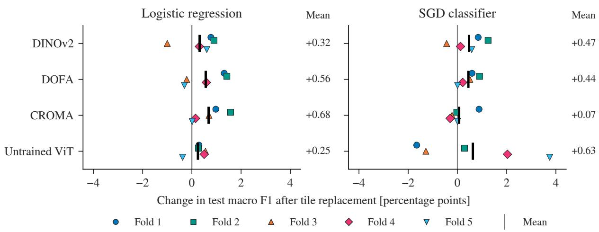  
Figure 7: Efect of replacing training tiles while keeping class counts and test sets constant. Left: logistic regression. Right: SGD. Colored points give the change in macro F1 for each fold, in percentage points; black marks and printed values give the mean. LR averages five replacement sets, each compared with the original fit. Each set reinstates all eligible excluded tiles; the sets vary which retained tiles are removed. SGD compares corresponding training seeds, averages five training seeds per set, then averages five sets. Initial DN scaling stays the same; LR recalculates feature standardization. All fits contribute, and every LR fit finishes without a warning or reaching its iteration limit. Locations and image content both change, and training sets overlap between folds.

The folds reinstate 486, 486, 429, 528 and 322 tiles; their original training sets contain 14,603, 12,542, 12,348, 13,350 and 14,644 tiles. Four folds reinstate no Craters tiles and one reinstates two, limiting what this experiment can reveal about crater terrain. Fold diferences include both positive and negative values, except for CROMA with LR and DOFA with SGD, which improve in all five folds. Table 9 gives the class counts. The experiment changes training geography only through these small replacements. Larger changes in spatial separation could behave diferently.

The overall F1 comparison covers all test images, including those far from the reinstated training images. Only 1,136 of 23,246 test centers lie within the original minimum separation of at least one reinstated training center, representing 3.33% to 6.72% of each fold. Error changes in these nearby images take both signs. Tables 10 and 11 compare them with the remaining test images. Retraining can also change predictions farther away, so this geographic comparison complements the overall score.

Table 9: Training, validation and test counts for the encoder training and tile replacement experiments. Replaced tiles are those reinstated near another region; in each class, the same number of tiles is removed as reinstated. Percentages divide the replacement count by the original training size. The last three columns count Craters tiles. Validation and test sets stay the same. Every count refers to tiles, independent of the number of seeds or replacement sets.
<table><tr><td>Fold</td><td>Training tiles</td><td>Replaced tiles</td><td>Training %</td><td>Reinstated Craters</td><td>Validation Craters</td><td>Test Craters</td></tr><tr><td>1</td><td>14,603</td><td>486</td><td>3.33</td><td>0</td><td>1</td><td>8</td></tr><tr><td>2</td><td>12,542</td><td>486</td><td>3.87</td><td>2</td><td>14</td><td>1</td></tr><tr><td>3</td><td>12,348</td><td>429</td><td>3.47</td><td>0</td><td>59</td><td>14</td></tr><tr><td>4</td><td>13,350</td><td>528</td><td>3.96</td><td>0</td><td>48</td><td>61</td></tr><tr><td>5</td><td>14,644</td><td>322</td><td>2.20</td><td>0</td><td>8</td><td>48</td></tr></table>

## 4.5.1 Test images near reinstated training images

A test image is classified as nearby when the distance along Titan’s spherical surface from its center to at least one reinstated training center is strictly smaller than the original minimum separation. The calculation uses the same Titan radius and coordinates as the geographic split. Some reinstated tiles are near validation images and far from test images, because the original separation rule considered both sets. Table 10 gives the nearby test counts. Center distances describe proximity; image overlap and statistical dependence would require additional checks.

Table 10: Test images near reinstated training images. The training column counts reinstated tiles. The nearby test column counts distinct test centers within the original minimum separation of at least one reinstated training center. Percentages use the full test count of each fold.
<table><tr><td>Fold</td><td>Reinstated</td><td>Test</td><td>Nearby</td><td>Nearby (%)</td></tr><tr><td>1</td><td>486</td><td>3660</td><td>207</td><td>5.66</td></tr><tr><td>2</td><td>486</td><td>4497</td><td>155</td><td>3.45</td></tr><tr><td>3</td><td>429</td><td>5721</td><td>301</td><td>5.26</td></tr><tr><td>4</td><td>528</td><td>4748</td><td>319</td><td>6.72</td></tr><tr><td>5</td><td>322</td><td>4620</td><td>154</td><td>3.33</td></tr></table>

Table 11: Change in test error rate after replacing training tiles for logistic regression, in percentage points. Each cell gives the change among nearby test tiles followed by the change among remaining tiles. Positive values mean more disagreement with the map. Values average five replacement sets, and the table includes every encoder and fold.
<table><tr><td>Fold</td><td>DINOv2 (E/R)</td><td>DOFA (E/R)</td><td>CROMA (E/R) </td><td>Untrained ViT (E/R)</td></tr><tr><td>1</td><td> $- 2 . 5 1 / + 0 . 0 0$ </td><td> $\overline { { - 2 . 4 2 / - 0 . 9 1 } }$ </td><td> $\overline { { - 0 . 4 8 / - 0 . 1 9 } }$ </td><td> $\overline { { + 0 . 9 7 / - 1 . 2 2 } }$ </td></tr><tr><td>2</td><td> $- 1 . 9 4 / - 0 . 1 2$ </td><td> $- 3 . 1 0 / - 0 . 4 9$ </td><td> $- 2 . 4 5 / - 0 . 7 1$ </td><td> $+ 0 . 2 6 / + 1 . 0 7$ </td></tr><tr><td>3</td><td> $- 1 . 3 3 / + 0 . 2 4$ </td><td> $+ 1 . 0 6 / - 0 . 0 1$ </td><td> $- 4 . 3 2 / - 0 . 4 4$ </td><td> $- 2 . 1 9 / - 1 . 0 4$ </td></tr><tr><td>4</td><td> $+ 1 . 6 9 / - 0 . 5 6$ </td><td> $- 1 . 5 0 / - 0 . 4 2$ </td><td> $- 2 . 5 1 / - 0 . 0 5$ </td><td> $- 0 . 9 4 / - 0 . 5 6$ </td></tr><tr><td>5</td><td> $- 4 . 9 4 / + 0 . 0 4$ </td><td> $- 4 . 9 4 / + 0 . 6 6$ </td><td> $- 4 . 0 3 / + 0 . 4 3$ </td><td> $+ 1 . 0 4 / + 0 . 4 4$ </td></tr></table>

Only one fold contains nearby Craters test images, and it contains two. The accompanying results give class counts and errors for each replacement set. With so few Craters examples and simultaneous changes in training locations and image content, these diferences leave the appropriate separation distance and the magnitude of any score inflation unresolved.

## 4.6 Map mixture and geographic variation with SGD

SGD predictions from the geographic evaluation allow errors to be compared by map composition, image coverage and region. Repeating these analyses for logistic regression or encoder training would require separate calculations.

Mixed terrain: The mixture analysis groups test images by map class and fold, then compares images whose modal map fraction is below 0.75 with those whose fraction is at least 0.90. Both groups must contain at least 20 tiles. Twenty of 30 class and fold combinations qualify, all outside Craters. After averaging classifier errors for each tile and weighting these combinations equally, the more mixed images have 19.04, 11.01 and 15.92 percentage points more errors for DINOv2, DOFA and CROMA. The thresholds were set before this analysis, after inspecting the overall scores. Mixed terrain, image conditions and local context can all contribute to the diference. This association motivates reporting class fractions alongside prediction scores. Confidence in the map remains a separate question.

Region and training repeats: For the pretrained encoders, macro F1 varies more among geographic folds than among training seeds in a given fold. Fold SDs are 3.56, 2.94 and 4.05 percentage points for DINOv2, DOFA and CROMA; the mean seed SDs within folds are 0.225, 0.110 and 0.061 points. Training images and class counts also difer among folds, so these quantities describe two kinds of variation without separating their causes. The Untrained ViT behaves diferently: each SGD classifier assigns 95.77% to 100% of test tiles to a single class. Its F1 of 7.97% falls below the 13.27% mean obtained by always predicting Plains, the most numerous training class. This collapse occurs for this random encoder with the stated SGD settings; the logistic regression results show that a diferent fit can use its features more efectively.

Where the mixture comparison applies: The eligible groups contain 5,804 images with modal fractions below 0.75 and 13,206 with fractions at or above 0.90. Plains, Dunes and Hummocky enter in all five folds, Labyrinths in three and Lakes in two. More mixed images have higher error in 17 of 20 groups for DINOv2, 15 for DOFA and 17 for CROMA. Nearby images may share terrain or observing conditions, so these sign counts describe the sampled groups without providing independent repetitions of a causal test. Figure 9 shows the class assignments, and Figure 8 displays variation with geography, training repeats and mixture.

A separate comparison groups images by valid SAR fraction, below 0.95 or at least 0.99, with the same minimum number of tiles. Thirteen class and fold combinations qualify. Mean error diferences are +3.87, +2.17 and −1.09 percentage points for DINOv2, DOFA and CROMA. Lower valid SAR coverage accompanies higher error for two encoders and slightly lower error for the third. Both analyses retain the catalog’s minimum SAR validity of 0.80 and examine mixture and coverage separately. Direct image inspection and an analysis of their combined efects would be needed to distinguish the contributions of each.

Errors in neighboring images: The spatial analysis calculates correlations in SGD errors between tiles of the same map class and fold, using center distances greater than zero and at most 45 km. Raw correlations are positive in 21 of 24 eligible groups for DINOv2, 23 of 25 for DOFA and 24 of 25 for CROMA. This indicates spatial structure in test errors. The smallest Craters groups contain too few images, and constant error values make correlation undefined in some other groups. Dependence remains unassessed in the omitted groups. Appendix A.4 gives the distance intervals, weighting and minimum counts. Measuring whether proximity to training images inflates a score, and by how much, would require an additional experiment.

SGD classifiers; encoder weights unchanged  
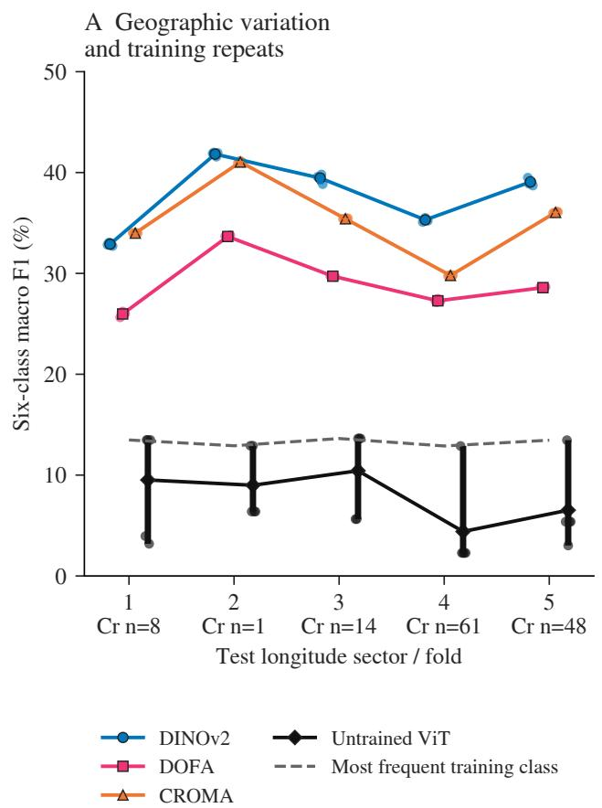

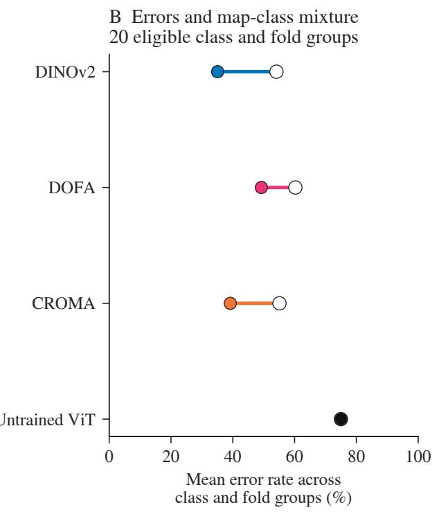  
Figure 8: SGD performance by region, training repeat and map mixture. Left: F1 for five training seeds in each fold, with connected means and the full seed ranges. The dashed baseline always predicts the most numerous training class. Right: error rates for modal map fractions below 0.75 and at least 0.90, across 20 eligible class and fold combinations. Each group contains at least 20 tiles per combination, and combinations receive equal weight. Craters has too few examples to enter this comparison. Untrained ViT’s markers almost coincide because its predictions are nearly constant. The plotted diferences may include efects of both terrain mixture and image conditions.

## 5 Classifiers trained on Earth and a comparison with Venus

The earlier experiments train classifiers on Earth site labels and test them against Titan map classes. They use the original Titan catalog and spatial groups without separation zones. The current experiments instead train classifiers with Titan labels and test their geographic generalization. Table 12 distinguishes the two datasets and designs. The comparisons below equalize training counts and class composition or vary image preprocessing. Diferences in label quality, geographic sampling and radar products still complicate the interpretation of transfer between Earth and Titan.

The original Earth split contains 352 training tiles and 46 validation tiles. Sentinel-1 VV GRD products are converted to physical backscatter, linear $\bar { \sigma } ^ { 0 }$ , with ESA SNAP, then to dB before normalization. Titan images contain display DN. Sampling both at 45 km by 45 km with the same output spacing leaves diferences in native resolution, point-spread functions, incidence angles and speckle. Label curation and geographic sampling also difer. Appendix B describes the images and their geographic divisions.

Table 12: The two datasets and experimental designs. Each score refers to the images and training settings in its column. Several aspects change between the experiments, so a diference in score alone cannot identify the efect of any one change.
<table><tr><td>Property</td><td>Current geographic evaluation</td><td>Earlier Earth transfer experiments</td></tr><tr><td>Titan catalog Geography</td><td>Expanded catalog, 23,380 tiles Five longitude sectors with separation be- Spatial groups without separation zones</td><td>Original catalog, 11,371 tiles</td></tr><tr><td>Prediction task</td><td>tween training, validation and testing</td><td>Six classes within Titan; five for Earth trans-</td></tr><tr><td>Fitting</td><td>Six modal Titan map classes</td><td>fer Original classifier settings and additional</td></tr><tr><td>Other domains</td><td>Logistic regression, SGD and training of the final two encoder layers</td><td>comparisons Earth source labels require curation; Venus</td></tr><tr><td></td><td>Earth and Venus considered separately</td><td>is unlabeled</td></tr><tr><td>Interpretation</td><td>Geographic map agreement and sensitivity to fitting</td><td>Results for the original sample and addi- tional comparisons</td></tr></table>

## 5.1 Equal training counts and alternative image preprocessing

The experiments compare training counts and image preprocessing on the original catalog using five output classes: Plains, Dunes, Labyrinths, Lakes and Craters. Both experiments exclude the 16 Egyptian images incorrectly named Wadi Rum and evaluate the same 10,292 Titan test tiles, including 17 Craters. They retain the original longitude omission and geographic groups without separation zones. The remaining Earth labels still need curation, including 42 Arctic image areas with no mapped land. DOFA uses band identifier 5.405 for Earth and 13.78 for Titan; the original classifier features used 13.78 for both. This follows the repository’s example convention, whose relationship to pretraining remains uncertain. Several other settings also change, leaving the identifier’s individual efect unknown.

The first experiment gives each training domain 334 images, with class counts of 109, 174, 29, 16 and 6. Five subsets are formed using groups of Earth sites and radar products and Titan spatial groups. Equal class counts still permit diferences in geographic diversity. Earth normalization uses the catalog moments for each subset, and Titan normalization uses that subset’s training DN percentiles. The Earth and Titan classifiers in each comparison use the same Titan image transform. Titan labels determine the Titan subset, so the experiment uses information from Titan’s training set. Each classifier is trained for 100 SGD epochs and 200 updates, with inverse frequency weights, learning rate 0.01, momentum 0.9, zero weight decay and cosine decay. The last epoch is evaluated for five training seeds. Training on Titan exceeds training on Earth in F1 by 24.98, 16.50 and 24.51 percentage points for DINOv2, DOFA and CROMA. These diferences persist after equalizing counts, while their physical and sampling causes remain to be separated.

The preprocessing experiment uses all 336 remaining Earth training tiles, with class counts of 109, 174, 29, 16 and 8. One sample of training pixels supplies both moment and percentile scaling limits. Quantization and smoothing vary independently, while Titan features stay the same in a given fold. Titan training pixels determine its normalization, and images from both training domains determine the Earth smoothing scale. Every fit chooses σ = 0.65 output pixels from the alternatives specified in advance. Only training images enter these choices.

Five training seeds per condition use 100 SGD epochs, batch size 256 and the same optimizer settings as the experiment with equal training counts; update traces are unavailable for these runs. Corresponding seeds are compared across conditions. The baseline uses continuous moment scaling without smoothing.

In Table 14, smoothing lowers mean F1 for DINOv2 and raises it slightly for DOFA under each scaling and quantization setting. For CROMA, smoothing lowers mean F1 with moment scaling and raises it with percentile scaling. Both experiments use Titan training images to estimate image statistics. Their conclusions apply to the original sample and the stated SGD fits. Extending them to the expanded catalog or separating geographic and physical causes requires further work. The CETUS reproduction guide identifies the complete class metrics, diferences between corresponding runs and numerical checks for these comparisons.

Table 13: Equal training counts by domain and class in the original dataset. Macro precision, recall and F1 are percentages with sample SD across five fold means. Each fold first averages five training seeds for each subset, then gives the five subsets equal weight. Domains use identical class counts and numbers of training updates. Undefined class scores are zero. Training sets overlap among folds and subsets, limiting inferences that require independent repetitions. Bold indicates the higher mean between Earth and Titan training for each encoder and metric.
<table><tr><td>Encoder</td><td>Classifier training</td><td>Precision</td><td>Recall</td><td>F1</td></tr><tr><td>DINOv2</td><td>Earth</td><td> $2 4 . 7 6 \pm 1 . 7 0$ </td><td> $2 5 . 1 4 \pm 0 . 4 6$ </td><td> $1 8 . 3 1 \pm 0 . 8 7$ </td></tr><tr><td rowspan="2">DOFA</td><td>Titan</td><td> ${ \bf 4 1 . 5 4 \pm 1 . 5 3 }$ </td><td> ${ \bf 5 3 . 2 5 \pm 3 . 9 5 }$ </td><td> ${ \bf 4 3 . 2 9 \pm 1 . 8 4 }$ </td></tr><tr><td>Earth</td><td> $5 . 8 9 \pm 0 . 4 9$ </td><td> $2 2 . 9 9 \pm 1 . 4 4$ </td><td> $9 . 3 3 \pm 0 . 7 1$ </td></tr><tr><td rowspan="2">CROMA</td><td>Titan</td><td> $\mathbf { 3 2 . 5 0 \pm 1 . 6 6 }$ </td><td> ${ \bf 5 7 . 6 5 \pm 7 . 3 9 }$ </td><td> ${ \bf 2 5 . 8 3 \pm 2 . 9 1 }$ </td></tr><tr><td>Earth</td><td> $2 4 . 0 4 \pm 2 . 0 9$ </td><td> $3 1 . 0 3 \pm 7 . 4 5$ </td><td> $1 1 . 4 8 \pm 2 . 0 4$ </td></tr><tr><td rowspan="2">Untrained ViT</td><td>Titan</td><td> $\mathbf { 3 7 . 0 3 \pm 2 . 7 2 }$ </td><td> ${ \bf 6 6 . 2 3 \pm 6 . 3 6 }$ </td><td> ${ \bf 3 5 . 9 9 \pm 3 . 3 5 }$ </td></tr><tr><td>Earth</td><td> ${ \bf 3 . 1 5 \pm 0 . 0 1 }$ </td><td> ${ \bf 2 0 . 0 0 \pm 0 . 0 0 }$ </td><td> ${ \bf 3 . 8 5 \pm 0 . 0 2 }$ </td></tr><tr><td></td><td>Titan</td><td> ${ \bf 3 . 1 5 \pm 0 . 0 1 }$ </td><td> ${ \bf 2 0 . 0 0 \pm 0 . 0 0 }$ </td><td> ${ \bf 3 . 8 5 \pm 0 . 0 2 }$ </td></tr></table>

Table 14: Eight image preprocessing conditions for the original dataset. Macro F1 is in percent, with sample SD of five fold means after averaging five training seeds. Moment scaling uses limits three population SDs below and above the training dB mean; percentile scaling uses the 1st and 99th percentiles. The 256 setting quantizes values before optional smoothing. Continuous retains values without additional quantization. These transformations alter image statistics; physical calibration and averaging of independent radar looks require information unavailable in the Titan DN. Bold indicates the highest mean F1 in each encoder column across the displayed preprocessing conditions.
<table><tr><td>Scaling limits</td><td>Quantization</td><td>Smoothing</td><td>DINOv2</td><td>DOFA</td><td>CROMA</td></tr><tr><td>Moments</td><td>Continuous</td><td>Off</td><td> $1 7 . 6 5 \pm 0 . 9 2$ </td><td> $9 . 4 0 \pm 0 . 8 4$ </td><td> $1 1 . 4 2 \pm 2 . 0 2$ </td></tr><tr><td>Moments</td><td>Continuous</td><td>On</td><td> $1 2 . 7 1 \pm 0 . 6 8$ </td><td> ${ \bf 9 . 5 6 \pm 1 . 9 4 }$ </td><td> $8 . 5 0 \pm 0 . 4 3$ </td></tr><tr><td>Moments</td><td>256</td><td>Off</td><td> $1 7 . 6 2 \pm 0 . 8 9$ </td><td> $9 . 4 0 \pm 0 . 8 4$ </td><td> $1 1 . 4 8 \pm 2 . 0 2$ </td></tr><tr><td>Moments</td><td>256</td><td>On</td><td> $1 2 . 7 3 \pm 0 . 6 9$ </td><td> $9 . 5 5 \pm 1 . 9 3$ </td><td> $8 . 5 1 \pm 0 . 4 3$ </td></tr><tr><td>Percentiles</td><td>Continuous</td><td>Off</td><td> ${ \bf 1 8 . 9 4 \pm 0 . 9 3 }$ </td><td> $8 . 6 7 \pm 1 . 7 1$ </td><td> $1 1 . 6 2 \pm 2 . 7 4$ </td></tr><tr><td>Percentiles</td><td>Continuous</td><td>On</td><td> $1 3 . 2 6 \pm 0 . 7 5$ </td><td> $8 . 9 0 \pm 1 . 9 0$ </td><td> ${ \bf 1 2 . 8 4 \pm 1 . 2 7 }$ </td></tr><tr><td>Percentiles</td><td>256</td><td>Off</td><td> $1 8 . 9 1 \pm 0 . 9 3$ </td><td> $8 . 6 5 \pm 1 . 7 1$ </td><td> $1 1 . 5 9 \pm 2 . 7 3$ </td></tr><tr><td>Percentiles</td><td>256</td><td>On</td><td> $1 3 . 2 3 \pm 0 . 7 6$ </td><td> $8 . 9 0 \pm 1 . 9 0$ </td><td> $1 2 . 8 3 \pm 1 . 2 8$ </td></tr></table>

## 5.2 Transfer using the full original training sets

The Titan training folds contain 6,778 to 6,794 tiles. Both classifiers retain six output logits, but transfer evaluation covers the five classes present in Earth training data, excluding Hummocky. On those same five classes, classifiers trained on Titan attain macro recalls of 54.9%, 57.6% and 64.7% for DINOv2, DOFA and CROMA. Table 15 gives precision, recall and F1 for classifiers trained on Earth. This comparison includes diferences in sample count, class composition, sites, sensors and image processing.

Precision and F1 are calculated from the original confusion matrices and verified against the saved predictions. Table 15 averages the five class scores for each seed, then the seeds in each fold, then the folds. A zero denominator gives a score of zero; macro F1 averages class F1 values. CROMA has the lowest macro F1 among the pretrained encoders despite its highest recall. Its Craters precision is 0.57% and F1 is 1.13%, indicating frequent Craters assignments to images with a diferent modal map label. Raw intensity statistics attain $2 3 . 7 6 \pm 0 . 9 8 \%$ macro F1 under the same averaging scheme.

Table 15: Classifiers trained on Earth and evaluated on Titan for the five classes present in the original Earth training set. Precision, recall and F1 are percentages from the original confusion matrices. Values after ± give the sample SD of five fold means. DOFA uses identifier 13.78 for both domains in these results. Tables 13 and 14 provide additional experiments with diferent training samples and separately estimated image normalization. Bold indicates the highest mean in each metric column.
<table><tr><td>Model</td><td>Macro precision</td><td>Macro recall</td><td>Macro F1</td></tr><tr><td>DINOv2</td><td>23.84</td><td>25.08</td><td> $1 8 . 6 1 \pm 0 . 8 1$ </td></tr><tr><td>DOFA</td><td>26.11</td><td>25.45</td><td> ${ \bf 1 8 . 7 6 \pm 0 . 8 3 }$ </td></tr><tr><td>CROMA</td><td>24.77</td><td>32.32</td><td> $1 0 . 1 7 \pm 2 . 0 2$ </td></tr></table>

## 5.3 Venus as an unlabeled distribution comparison

The Venus comparison uses encoder features from 2,945 tiles of the Magellan SAR FMAP mosaic [12], acquired at 2.385 GHz in S-band. These images lack terrain labels, so the comparison concerns feature distributions. The comparisons in Table 16 draw equal numbers of images from each domain, using 398 Earth, 2,945 Venus and 11,306 Titan tiles outside Selk as the available populations. The input description names the FMAP product from right-looking observations [13]. The raster header confirms one 8 bit band with 75 m spacing; look direction and global coverage remain unverified from that header. Product documentation describes a quantized radar cross section normalized by an angular scattering law. Feature extraction uses its DN encoding directly, without conversion back to physical backscatter.

The comparison uses squared maximum mean discrepancy, MMD2 [14]. MMD measures the distance between kernel mean embeddings. With a characteristic kernel such as the Gaussian radial basis function (RBF), population MMD equals zero exactly when the distributions agree. Estimates from finite samples carry sampling uncertainty. Even agreement between feature distributions would leave the physical interpretation of the images unresolved.

The comparison uses the squared biased estimator with an RBF kernel on feature samples of equal size X and Y:

$$
{ \widehat { \mathrm { M M D } } } _ { \mathrm { b } } ^ { 2 } = { \frac { 1 } { n ^ { 2 } } } \sum _ { i , j = 1 } ^ { n } k ( x _ { i } , x _ { j } ) + { \frac { 1 } { n ^ { 2 } } } \sum _ { i , j = 1 } ^ { n } k ( y _ { i } , y _ { j } ) - { \frac { 2 } { n ^ { 2 } } } \sum _ { i , j = 1 } ^ { n } k ( x _ { i } , y _ { j } ) .\tag{1}
$$

Each table entry averages estimates from 100 repeated samples. Comparisons involving Earth use 398 images per domain; the Venus and Titan comparison uses 2,000 per domain. For a given encoder, all three comparisons use the same bandwidth. Equal sample sizes within each pair do not remove possible diferences in finite-sample bias between comparisons. The estimates describe diferences between feature distributions. Relating them to classification performance, radar frequency, surface composition, atmosphere, incidence angle and image processing requires separate experiments.

Table 16: $\mathrm { M M D ^ { 2 } }$ between planetary image domains, averaged over 100 repeated samples with one RBF bandwidth per encoder. Each repeat uses 398 tiles per domain when Earth enters the comparison and 2,000 for Venus and Titan. Each column uses a diferent feature space, so numerical comparisons across encoders have no common scale. Earth and Titan give the smallest MMD2 for DINOv2, DOFA and CROMA. The images difer in radar products, frequency, surface materials, atmosphere, acquisition and preprocessing, which prevents assigning this ordering to one physical factor.

<table><tr><td>Domains</td><td></td><td>DINOv2</td><td>DOFA</td><td>CROMA</td></tr><tr><td>Earth (C-band) and Venus (S-band)</td><td></td><td>0.216</td><td>0.261</td><td>0.744</td></tr><tr><td>Venus (S-band) and Titan (Ku-band)</td><td></td><td>0.297</td><td>0.497</td><td>0.509</td></tr><tr><td>Earth (C-band) and Titan (Ku-band)</td><td></td><td>0.112</td><td>0.165</td><td>0.412</td></tr></table>

Earth and Titan give the smallest MMD2 for all three pretrained encoders: 0.112 for DINOv2, 0.165 for DOFA and 0.412 for CROMA. Earth and Venus come next for DINOv2 and DOFA; Venus and Titan come next for CROMA.

These estimates use a diferent sampling scheme from Table 23. For the Earth and Titan comparison here, all 398 Earth tiles and all Titan images outside Selk are available, and 398 images are drawn from each of these two domains. Each encoder uses one bandwidth for its three domain comparisons. The fold analysis instead samples 352 Earth training tiles and 352 Titan training tiles per repeat, estimates a new bandwidth each time, and averages five fold means. DOFA is consequently 0.165 here and 0.183 in that calculation. The two values describe diferent comparisons.

The ordering of domain pairs also difers from the ordering of radar frequency separations. Because acquisition, processing, coverage and surface statistics change together, a physical explanation requires additional observations. Testing Venus as an intermediate training domain would further require an experiment in classification or encoder training.

## 6 Discussion

## 6.1 Relation to previous work

Geospatial foundation models: Pretraining on Earth observation data has produced several genera image encoders. DOFA [5] generates patch embedding weights from band identifiers across sensing modalities. CROMA [6] learns from Sentinel-1 radar and Sentinel-2 optical images of the same locations, with losses for cross-modal agreement and image reconstruction. DINOv2 [4] learns from natural images through self-distillation and supplies a general vision comparison. Section 3 gives the inputs and encoder outputs used here. SatMAE [15] and Prithvi [16] extend masked autoencoders to temporal and multispectral satellite imagery. These models establish the terrestrial context for the present experiments, alongside a growing literature on planetary foundation models.

Planetary image analysis: Planetary machine learning spans terrain classification, object detection and segmentation. Burl et al. [17] trained classifiers to detect volcanoes in Magellan SAR images of Venus three decades ago. Studies of Cassini SAR include fuzzy cognitive maps for Titan surface analysis [18] and lake segmentation [19]. Cloud instance segmentation [20] examines Titan’s atmosphere through another imaging modality. For Mars, Wagstaf et al. [21] trained AlexNet with ImageNet pretraining for two tasks: classifying rover images and classifying cropped landmarks in orbital High Resolution Imaging Science Experiment (HiRISE) images. AI4Mars [22] initially collected approximately 326K human annotation submissions for ∼35K rover images, combining multiple annotations per image for terrain segmentation aimed at autonomous driving. Mars-Bench [23] evaluates foundation models on Mars science tasks, and MOMO [24] learns from several Mars orbital sensors.

On Earth, PANGAEA [25] evaluates geospatial foundation models for segmentation, change detection and regression. CrossEarth [26] and CrossEarth-SAR [27] study segmentation in terrestrial domains absent from training, with the latter concentrating on radar. CETUS examines geographic prediction of Titan map classes and considers the Earth and Venus experiments separately in Section 5.

Radar interpretation and terrestrial analogs: Studies of individual Titan landforms combine morphology with physical constraints. Paillou et al. [28] use terrestrial radar and topography to model dune backscatter and examine how those models might apply to Titan. Cartwright and Burr [29] compare terrestrial and Titan radar observations to test fan formation mechanisms. Such interpretations require observations beyond an image classification score. CETUS predicts broad map units from one display mosaic; its disagreements identify images that warrant closer interpretation. Determining a scattering mechanism or surface material requires additional physical evidence.

Evaluating transferred representations: Kornblith et al. [30] compare classifier training on existing image features with fine-tuning across image classification datasets. Kumar et al. [31] identify settings where full fine-tuning performs worse under distribution shift than a linear classifier trained on the original features. These findings motivate evaluating the original representations before training them further. CETUS trains only part of each encoder under one set of settings. Testing the explanation based on feature distortion proposed by Kumar and colleagues would require a separate analysis.

Untrained representations: Saxe et al. [32] showed that random weights in convolutional square-pooling networks could produce useful features for a supervised image classifier. Their experiments also distinguished the contributions of architecture and weight learning and examined variation across random initializations. Those results concern convolutional networks. They motivate evaluating random features as a baseline, while the behavior of CETUS’s Untrained ViT must be assessed from its own predictions.

## 6.2 Model comparisons

Encoder rankings depend on classifier fitting in the geographic evaluation. CROMA has the highest mean F1 with logistic regression, while DINOv2 leads with SGD and after training on Titan. CROMA’s logistic regression result is already similar to its mean F1 after encoder training. DINOv2 improves over both classifiers in every fold, whereas DOFA declines against both. An encoder’s ranking is therefore conditional on the classifier fitting settings, the encoder weights allowed to change and the evaluation images. Encoder training also changes optimization, regularization, batch sizes, numerical precision, training duration and the epoch used for testing. The results do not separate those contributions, and uncertainty about DOFA’s pretraining inputs further limits interpretation of its decline. The scores measure agreement with the map under the evaluated configurations. Geological accuracy and usefulness in practice require independent evaluation.

A direct test of pretraining would compare learned weights with multiple random encoder initializations while holding architecture, input processing and classifier fitting constant. Training a small convolutional neural network (CNN) on the current Titan folds would add a compact supervised comparison. Both experiments remain future work. The existing CNN results in Appendix B use the original dataset and geographic divisions, so they cannot supply that comparison on the current folds.

The MMD and t-SNE analyses describe feature distributions in the original dataset. MMD depends on the encoder, kernel and sampling scheme; t-SNE displays a projection of the sampled features. Classification on separate Titan test images is needed to assess predictive usefulness. CORAL adjusts Earth feature statistics using Titan training features, and its test recalls quantify the predictive efect. The smaller MMD after CORAL uses the fitting samples and a newly estimated bandwidth, leaving a reduction on independent data under a common kernel untested. These comparisons also leave the physical causes of domain diferences unresolved.

## 6.3 Terrain interpretation and data limitations

Terrain predictions follow the categories and mapping scale of the reference map. Better agreement for Labyrinths alone leaves open whether a model recognizes dissection. A Craters prediction can refer to a rim, ejecta or fill within a large image area; identifying distinct impact structures is a separate task. Disagreements can arise from mixed terrain, simplified map edges, information available to the mapping team outside the SAR image, or model error. The scores do not distinguish among these possible causes. Examining the images alongside acquisition metadata and an independent geological interpretation would help distinguish them.

Using the same mosaic makes the inputs comparable across methods. Within that mosaic, SAR and HiSAR modes provide diferent spatial information, efective resolution varies geographically, and image rendering afects brightness and texture. A follow-up analysis could compare errors for the same map classes across verified observing conditions, with the comparison specified before its results are examined. It could test whether acquisition contributes to the observed disagreements between image predictions and map labels.

Nearby SGD test errors often covary within a map class and geographic region. Appendix A.4 gives the counts and assumptions behind those correlations. Quantifying any score inflation or choosing an adequate separation distance requires further experiments.

The expanded catalog and geographic divisions both difer from the original evaluation, so diferences in scores combine changes in longitude handling, regional grouping and spatial separation. The five sectors sample the available display mosaic unevenly in both observing conditions and terrain classes. Class mixture, spatial dependence and the small number of regions limit generalization beyond those images. Independent expert annotations would help assess disagreement with the map. Agreement with those annotations and reproduction of the map’s labels remain distinct evaluations.

An expert label review should distinguish the SAR images available to the classifier from the complementary observations used by the mapping team. It should include mixed images, classes with few examples and multiple regions. Agreement among experts would measure consistency under the stated viewing conditions; it would not set a universal ceiling on a classifier’s agreement with one map. Assessing geological accuracy requires observations with an appropriate independent basis. Further model training would not supply that independent evidence.

The Earth experiments also need better source labels. Their inputs include incorrectly named locations, ofshore images with uncertain terrain assignments and overlapping training and validation areas. Equalizing numerical brightness ranges leaves the underlying radiometric diferences unresolved. The current Titan experiments keep the image product and class definitions common to all models, allowing comparison of geographic map prediction and sensitivity to classifier fitting. Separating radar physics, image rendering and representation learning as causes of errors requires the additional physical and experimental evidence described above.

## 7 Conclusion

In the evaluated configurations, terrestrial representations contain useful information for predicting the terrain classes in Titan’s geomorphological map. Classifier fitting afects how that information translates into predictions: the leading encoder changes when feature scaling, optimization and regularization change together. Training the last two DINOv2 layers improves regional macro F1 over both classifier baselines and improves Dunes, Hummocky and Labyrinths F1 over logistic regression in every fold. CROMA’s small overall change conceals opposing changes among classes, while DOFA declines under its evaluated input and training settings. Craters remains poorly predicted, and its test tiles are concentrated in a small number of map components. The CETUS predictions allow these comparisons to be reproduced and identify disagreements for geological inspection. Independent evaluation is still needed before using the models for mapping or image search.

## References

[1] C. Elachi, M. D. Allison, L. Borgarelli, P. Encrenaz, E. Im, M. A. Janssen, W. T. K. Johnson, R. L. Kirk, R. D. Lorenz, J. I. Lunine, et al. Radar: The Cassini Titan radar mapper. Space Science Reviews, 115:71–110, 2004. doi: 10.1007/s11214-004-1438-9.

[2] R. M. C. Lopes, M. J. Malaska, A. M. Schoenfeld, A. Solomonidou, S. P. D. Birch, M. Florence, A. G. Hayes, D. A. Williams, J. Radebaugh, T. Verlander, et al. A global geomorphologic map of Saturn’s moon Titan. Nature Astronomy, 4:228–233, 2020. doi: 10.1038/s41550-019-0917-6.

[3] Kiri Wagstaf, Steven Lu, Emily Dunkel, Kevin Grimes, Brandon Zhao, Jesse Cai, Shoshanna B. Cole, Gary Doran, Raymond Francis, Jake Lee, and Lukas Mandrake. Mars Image Content Classification: Three Years of NASA Deployment and Recent Advances. Proceedings of the AAAI Conference on Artificial Intelligence, 35(17):15204–15213, 2021. doi: 10.1609/aaai.v35i17.17784. URL https://ojs.aaai.org/index.php/AAAI/article/view/17784.

[4] Maxime Oquab, Timothée Darcet, Théo Moutakanni, Huy Vo, Marc Szafraniec, Vasil Khalidov, Pierre Fernandez, Daniel Haziza, Francisco Massa, Alaaeldin El-Nouby, et al. DINOv2: Learning robust visual features without supervision. Transactions on Machine Learning Research, 2024. URL https://openreview.net/forum?id=a68SUt6zFt.

[5] Zhitong Xiong, Yi Wang, Fahong Zhang, Adam J. Stewart, Joëlle Hanna, Damian Borth, Ioannis Papoutsis, Bertrand Le Saux, Gustau Camps-Valls, and Xiao Xiang Zhu. Neural Plasticity-Inspired Multimodal Foundation Model for Earth Observation, March 2024. URL https://arxiv.org/abs/2403.15356v3. arXiv:2403.15356v3 [cs.CV], revised 15 October 2025; first submitted 22 March 2024.

[6] Anthony Fuller, Koreen Millard, and James R. Green. CROMA: Remote sensing representations with contrastive radar-optical masked autoencoders. In Advances in Neural Information Processing Systems, volume 36, pages 5506–5538. Curran Associates, Inc., 2023. doi: 10.52202/075280-0241.

[7] Cassini SAR Team. Titan Cassini SAR - HiSAR Global Mosaic 351m, 2015. URL https://astrogeology.usgs.gov/search/map/titan\_cassini\_sar\_hisar\_global\_mosaic\_351m.

[8] Ashley Schoenfeld. Titan Global Map Shapefiles. Mendeley Data, version 1, 2024. URL https://data.mendeley.com/datasets/f6jrtyfp66/1.

[9] DOFA authors. DOFA model usage example for Sentinel-1. DOFA repository, Sentinel-1 example, 2026. Accessed 29 September 2026.

[10] Zhitong Xiong et al. Neural plasticity-inspired multimodal foundation model for earth observation, 2024. URL https://arxiv.org/html/2403.15356v2. arXiv:2403.15356, version 2, Appendix D.

[11] Yoshua Bengio and Yves Grandvalet. No unbiased estimator of the variance of k-fold cross-validation. Journal of Machine Learning Research, 5:1089–1105, 2004. URL https://jmlr.csail.mit.edu/papers/v5/grandvalet04a.html.

[12] R. S. Saunders, A. J. Spear, P. C. Allin, et al. Magellan mission summary. Journal of Geophysical Research: Planets, 97(E8):13067–13090, 1992. doi: 10.1029/92JE01397.

[13] USGS Astrogeology Science Center. Venus Magellan SAR FMAP right look global mosaic 75m, August 2015. URL https://astrogeology.usgs.gov/search/map/venus\_magellan\_sar\_fmap\_right\_look\_ global\_mosaic\_75m. Publication date: 2015-08-01; accessed 2026-08-30.

[14] Arthur Gretton, Karsten M. Borgwardt, Malte J. Rasch, Bernhard Schölkopf, and Alexander Smola. A kernel two-sample test. Journal of Machine Learning Research, 13(25):723–773, 2012. URL https://jmlr.org/papers/v13/gretton12a.html.

[15] Yezhen Cong, Samar Khanna, Chenlin Meng, Patrick Liu, Erik Rozi, Yutong He, Marshall Burke, David Lobell, and Stefano Ermon. SatMAE: Pre-training transformers for temporal and multi-spectral satellite imagery. In Advances in Neural Information Processing Systems, volume 35, 2022.

[16] Johannes Jakubik, Sujit Roy, C. E. Phillips, Paolo Fraccaro, Denys Godwin, Bianca Zadrozny, Daniela Szwarcman, Carlos Gomes, Gabby Nyirjesy, Blair Edwards, Daiki Kimura, Naomi Simumba, Linsong

Chu, S. Karthik Mukkavilli, Devyani Lambhate, Kamal Das, Ranjini Bangalore, Dario Oliveira, Michal Muszynski, Kumar Ankur, Muthukumaran Ramasubramanian, Iksha Gurung, Sam Khallaghi, Hanxi Li, Michael Cecil, Maryam Ahmadi, Fatemeh Kordi, Hamed Alemohammad, Manil Maskey, Raghu Ganti, Kommy Weldemariam, and Rahul Ramachandran. Foundation models for generalist geospatial artificial intelligence, November 2023. URL https://arxiv.org/abs/2310.18660. arXiv:2310.18660 [cs.CV]; version 2, 8 Nov 2023.

[17] Michael C. Burl, Lars Asker, Padhraic Smyth, Usama Fayyad, Pietro Perona, Larry Crumpler, and Jayne Aubele. Learning to recognize volcanoes on Venus. Machine Learning, 30(2–3):165–194, 1998. DOI: 10.1023/A:1007400206189.

[18] Roberto Furfaro, Jefrey S. Kargel, Jonathan I. Lunine, Wolfgang Fink, and Michael P. Bishop. Identification of cryovolcanism on Titan using fuzzy cognitive maps. Planetary and Space Science, 58(5): 761–779, 2010. DOI: 10.1016/j.pss.2009.12.003.

[19] Emmanuel Bratsolis. Segmentation of lakes from the local background on the surface of Titan using Cassini SAR images. In IEEE International Geoscience and Remote Sensing Symposium (IGARSS), pages 906–909, 2010. DOI: 10.1109/IGARSS.2010.5650858.

[20] Zachary Yahn et al. Rapid automated mapping of clouds on Titan with instance segmentation. Journal of Geophysical Research: Machine Learning and Computation, 2(1):e2024JH000366, 2025. DOI: 10.1029/2024JH000366.

[21] Kiri L. Wagstaf, You Lu, Alice Stanboli, Kevin Grimes, Thamme Gowda, and Jordan Padams. Deep Mars: CNN classification of Mars imagery for the PDS imaging atlas. Proceedings of the AAAI Conference on Artificial Intelligence, 32(1), 2018.

[22] R. Michael Swan, Deegan Atha, Henry A. Leopold, Matthew Gildner, Stephanie Oij, Cindy Chiu, and Masahiro Ono. AI4MARS: A dataset for terrain-aware autonomous driving on Mars. In Proceedings of the IEEE/CVF Conference on Computer Vision and Pattern Recognition (CVPR) Workshops, pages 1982–1991, June 2021. URL https://openaccess.thecvf.com/content/CVPR2021W/AI4Space/html/Swan\_AI4MARS\_A\_Dataset\_ for\_Terrain-Aware\_Autonomous\_Driving\_on\_Mars\_CVPRW\_2021\_paper.html.

[23] Mirali Purohit, Bimal Gajera, Vatsal Malaviya, Irish Mehta, Kunal Kasodekar, Jacob Adler, Steven Lu, Umaa Rebbapragada, and Hannah Kerner. Mars-Bench: A Benchmark for Evaluating Foundation Models for Mars Science Tasks. In Advances in Neural Information Processing Systems, volume 38, pages 136254–136304, 2025. doi: 10.52202/085713-4098. Datasets and Benchmarks Track; arXiv:2510.24010.

[24] Mirali Purohit, Bimal Gajera, Irish Mehta, Bhanu Tokas, Jacob Adler, Steven Lu, Scott Dickenshied, Serina Diniega, Brian Bue, Umaa Rebbapragada, and Hannah Kerner. MOMO: Mars orbital MOdel foundation model for Mars orbital applications. In Proceedings of the IEEE/CVF Conference on Computer Vision and Pattern Recognition (CVPR), pages 27772–27782, June 2026. URL https://openaccess.thecvf.com/content/CVPR2026/html/Purohit\_MOMO\_Mars\_Orbital\_MOdel\_ Foundation\_Model\_for\_Mars\_Orbital\_Applications\_CVPR\_2026\_paper.html. arXiv:2604.02719.

[25] Valerio Marsocci, Yuru Jia, Georges Le Bellier, David Kerekes, Liang Zeng, Sebastian Hafner, Sebastian Gerard, Eric Brune, Ritu Yadav, Ali Shibli, Heng Fang, Yifang Ban, Maarten Vergauwen, Nicolas Audebert, and Andrea Nascetti. PANGAEA: Assessing Geospatial Foundation Models Capabilities through a Global and Inclusive Benchmark. IEEE Geoscience and Remote Sensing Magazine, 14(1): 245–285, February 2026. doi: 10.1109/MGRS.2025.3628194.

[26] Ziyang Gong, Zhixiang Wei, Di Wang, Xiaoxing Hu, Xianzheng Ma, Hongruixuan Chen, Yuru Jia, Yupeng Deng, Zhenming Ji, Xiangwei Zhu, Xue Yang, Naoto Yokoya, Jing Zhang, Bo Du, Junchi Yan, and Liangpei Zhang. CrossEarth: Geospatial Vision Foundation Model for Domain Generalizable Remote Sensing Semantic Segmentation. IEEE Transactions on Pattern Analysis and Machine Intelligence, 48(5):5147–5164, May 2026. doi: 10.1109/TPAMI.2025.3649001.

[27] Ziqi Ye, Ziyang Gong, et al. CrossEarth-SAR: A SAR-centric and billion-scale geospatial foundation model for domain generalizable semantic segmentation. arXiv preprint arXiv:2603.12008, 2026.

[28] Philippe Paillou et al. Modeling the SAR backscatter of linear dunes on Earth and Titan. Icarus, 230:

208–214, 2014. DOI: 10.1016/j.icarus.2013.04.017.

[29] Richard J. Cartwright and Devon M. Burr. Using Synthetic Aperture Radar data of terrestrial analogs to test alluvial fan formation mechanisms on Titan. Icarus, 284:183–205, 2017. DOI: 10.1016/j.icarus.2016.11.013.

[30] Simon Kornblith, Jonathon Shlens, and Quoc V. Le. Do better ImageNet models transfer better? In Proceedings of the IEEE/CVF Conference on Computer Vision and Pattern Recognition, 2019. doi: 10.1109/CVPR.2019.00277. URL https://arxiv.org/abs/1805.08974v3.

[31] Ananya Kumar, Aditi Raghunathan, Robbie Jones, Tengyu Ma, and Percy Liang. Fine-tuning can distort pretrained features and underperform out-of-distribution. In International Conference on Learning Representations, 2022. URL https://arxiv.org/abs/2202.10054v1.

[32] Andrew M. Saxe, Pang Wei Koh, Zhenghao Chen, Maneesh Bhand, Bipin Suresh, and Andrew Y. Ng. On random weights and unsupervised feature learning. In Proceedings of the 28th International Conference on Machine Learning (ICML-11), pages 1089–1096, 2011. URL https://icml.cc/2011/papers/551\_icmlpaper.pdf.

[33] S. D. Wall et al. Cassini RADAR Users Guide. Jet Propulsion Laboratory, California Institute of Technology, second edition, September 2019. URL https://pds.nasa.gov/data/pds4/misc/ document\_cassini/Cassini\_RADAR\_Users\_Guide\_2nd\_Ed\_191004\_cmp\_200421.pdf. JPL D-102030; copy hosted by NASA Planetary Data System.

[34] Benoît Seignovert, Stéphane Le Mouélic, Robert H. Brown, Erich Karkoschka, Virginia Pasek, Christophe Sotin, and Elizabeth P. Turtle. Titan’s global map combining VIMS and ISS mosaics. CaltechDATA, 2019. URL https://data.caltech.edu/records/8q9an-yt176. Version 1.1.

[35] Stéphane Le Mouélic, Thomas Cornet, Sébastien Rodriguez, et al. The Cassini VIMS archive of Titan: From browse products to global infrared color maps. Icarus, 319:121–132, 2019. doi: 10.1016/j.icarus.2018.09.017.

[36] J. W. Miller et al. Fluvial features on Titan and Earth: Lessons from planform images in low-resolution SAR. The Planetary Science Journal, 2(4):142, 2021. doi: 10.3847/PSJ/ac0245.

[37] Alexey Dosovitskiy, Lucas Beyer, Alexander Kolesnikov, Dirk Weissenborn, Xiaohua Zhai, Thomas Unterthiner, Mostafa Dehghani, Matthias Minderer, Georg Heigold, Sylvain Gelly, Jakob Uszkoreit, and Neil Houlsby. An Image is Worth 16x16 Words: Transformers for Image Recognition at Scale. In International Conference on Learning Representations, 2021. URL https://research.google/pubs/ an-image-is-worth-16x16-words-transformers-for-image-recognition-at-scale/.

[38] Shai Ben-David, John Blitzer, Koby Crammer, Alex Kulesza, Fernando Pereira, and Jennifer Wortman Vaughan. A theory of learning from diferent domains. Machine Learning, 79(1–2):151–175, 2010. doi: 10.1007/s10994-009-5152-4.

[39] Ralph D. Lorenz et al. Selection and characteristics of the Dragonfly landing site near Selk crater, Titan. The Planetary Science Journal, 2(1):24, 2021. doi: 10.3847/PSJ/abd08f.

[40] Léa E. Bonnefoy, Antoine Lucas, Alexander G. Hayes, Sébastien Rodriguez, Valerio Poggiali, Daniel E. Lalich, Ralph D. Lorenz, and Alice Le Gall. Composition, roughness, and topography from radar backscatter at Selk crater, the Dragonfly landing site. The Planetary Science Journal, 3(8):201, 2022. doi: 10.3847/PSJ/ac8428.

[41] Baochen Sun, Jiashi Feng, and Kate Saenko. Return of frustratingly easy domain adaptation. In Proceedings of the AAAI Conference on Artificial Intelligence, volume 30, 2016. doi: 10.1609/aaai.v30i1.10306.

## A Further results from the geographic evaluation

The geographic evaluation compares predictions with an expert map and checks that saved models reproduce those predictions. This appendix gives the training totals, additional class results and spatial analysis of the errors. The complete class metrics and sample counts for training the final two transformer blocks appear in the main Results. Appendix B describes the original dataset and the additional Earth and Venus analyses associated with Section 5.

## A.1 Reproducing predictions

Saved estimators reproduce every predicted class in the common logistic regression comparison, with probabilities agreeing to an absolute tolerance of $1 0 ^ { - 1 2 }$ . Independent calculations also reproduce the original SGD and nearest-neighbor predictions, repeat normalization from raw pixels, and verify the confusion matrices and metrics for training the final two transformer blocks. These calculations reuse saved features, without repeating pretrained inference.

CETUS’s reproduction documentation links the catalog, geographic splits, predictions, metrics for each fold and counts by map polygon part. It also identifies the common logistic regression and classical-feature results, experimental specifications and separate Visual and Infrared Mapping Spectrometer (VIMS) display metadata with corrected coordinates. The files for the original dataset retain their earlier contents.

The documentation also distinguishes the software used for the original experiments from the public software used to reproduce them. It retains all fold values, warnings, fits that reached their iteration limit and sample counts, with the complete training histories and instructions for using saved predictions or starting new training.

## A.2 Training the final two transformer blocks

Section 3 specifies training and metric averaging. The saved models correspond to the evaluation epochs, while the computation totals include training after those epochs.

All 75 saved models chosen by validation reproduced the saved predictions. The epochs used for evaluation range from 1 to 14 for DINOv2, 1 to 21 for DOFA and 1 to 13 for CROMA; every fit continued through epoch 50. Fold 1 contains a single validation tile labeled Craters, so that tile determines Craters recall in the validation metric. Agreement between repeated predictions verifies the calculation. Geological interpretation still depends on the map labels, class mixture, spatial dependence and test counts discussed in the main text. Table 17 gives the complete training totals. Tables 4 and 6 give the macro comparison and class ratios.

Table 17: Training totals when fitting the final two transformer blocks. Epochs start at one. The ranges identify epochs used for evaluation; the computation totals cover all 50 epochs in 25 fits per encoder. Example presentations count each use of an image, including repetitions across epochs and fits. Successful updates and updates skipped by automatic mixed precision (AMP) sum to attempted updates. Comparing computational costs with experiments that keep encoder weights unchanged requires the corresponding totals for those experiments.
<table><tr><td>Encoder</td><td>Epoch range used for evaluation</td><td>Attempted updates</td><td>Successful updates</td><td>AMP skips</td><td>Example presentations</td></tr><tr><td>DINOv2</td><td>1-14</td><td>527,750</td><td>527,475</td><td>275</td><td>16,871,750</td></tr><tr><td>DOFA</td><td>1-21</td><td>527,750</td><td>527,453</td><td>297</td><td>16,871,750</td></tr><tr><td>CROMA</td><td>1-13</td><td>527,750</td><td>527,487</td><td>263</td><td>16,871,750</td></tr></table>

## A.3 Class predictions with SGD

The random encoder gives macro recall close to one-sixth under SGD. When all six classes occur in a test set, predicting any one of those classes for every tile gives exactly one-sixth macro recall. This equality follows from the metric and does not define a chance null distribution. With the classifiers fitted here, the pretrained features give better agreement with the map than this particular random encoder.

In fold 2, each of DOFA’s five SGD classifiers correctly identifies the only Craters tile but assigns that class to 164 to 171 of the 4,497 test tiles. Across folds, mean Craters precision is 1.99%, recall 40.85% and F1 3.57%. The additional Craters predictions disagree with the most common map class in those tiles; some tiles may nevertheless contain mapped crater terrain. A separate geometric check found that each sampled Craters polygon part belongs to only one of training, validation or testing in a given fold. Several parts may describe the same physical crater, so part counts cannot establish the number of independent craters.

Table 18: Precision, recall and F1 by map class for SGD classifiers on the enlarged catalog, in percent. Entries are precision / recall / F1. Each ratio is calculated for each classifier and fold, then averaged over classifier seeds in the fold and equally over folds. Figure 2 gives the class counts. Bold indicates the highest mean F1 across encoders for each class.
<table><tr><td>Class</td><td colspan="4">DINOv2</td><td colspan="3">DOFA</td><td colspan="2">CROMA</td></tr><tr><td>Plains</td><td>85.93</td><td>67.60</td><td>75.54</td><td>86.57</td><td>42.92</td><td>56.61</td><td>88.74</td><td>55.25</td><td>67.78</td></tr><tr><td>Dunes</td><td>53.86</td><td>69.11</td><td>60.21</td><td>48.77</td><td>59.99</td><td>52.67</td><td>48.03</td><td>59.81</td><td>51.78</td></tr><tr><td>Hummocky</td><td>39.06</td><td>59.61</td><td>46.03</td><td>43.49</td><td>47.75</td><td>39.30</td><td>48.22</td><td>58.61</td><td>49.37</td></tr><tr><td>Labyrinths</td><td>24.78</td><td>45.62</td><td>29.85</td><td>6.70</td><td>48.51</td><td>11.45</td><td>12.12</td><td>57.02</td><td>19.12</td></tr><tr><td>Lakes</td><td>9.94</td><td>20.01</td><td>11.29</td><td>7.90</td><td>31.51</td><td>10.67</td><td>16.03</td><td>42.12</td><td>19.97</td></tr><tr><td>Craters</td><td>2.56</td><td>6.24</td><td>3.33</td><td>1.99</td><td>40.85</td><td>3.57</td><td>1.98</td><td>17.90</td><td>3.53</td></tr></table>

## A.4 How errors vary with distance

The spatial analysis groups the original SGD and nearest-neighbor test predictions into 30 combinations of fold and map class. At each tile, the SGD error is the mean of five binary classifier errors. In each group, unordered pairs of tile centers are enumerated using great-circle distance on a sphere of radius 2,574.7 km. Distance bins are (0, 45], (45, 90], (90, 180], (180, 360] and (360, 720] km. Symmetric Pearson correlation is calculated by entering each pair in both orders and correlating the two error values. Pairs receive equal weight, so a tile contributes once for each pair in which it occurs. A coeficient requires at least 20 tiles in the group, 20 participating tiles and variance above 10−12 among the values being correlated. Otherwise the result includes the reason that the coeficient is undefined. This analysis uses the original classifiers; the primary logistic regression fits are evaluated separately.

The analysis also regresses the SGD error fraction or the nearest-neighbor binary error on coordinates on the unit sphere, the fraction of the tile occupied by its modal map class, and the valid SAR fraction, with an intercept and a separate fit for each group. The same correlations are then calculated from the residuals. Removing a fitted trend can create apparent spatial structure. For CROMA’s nearest-neighbor classifier in fold 4, all 76 Lakes tiles participating in the first distance bin are misclassified, giving zero variance before regression. Only one of the 102 tiles in that group is classified correctly. After regression, the residua correlation is 0.99693 across 52 pairs. The high coeficient thus characterizes the residual errors and ofers no evidence for a physical mechanism. CETUS’s reproduction documentation identifies the complete unadjusted and residual coeficients, sample counts, undefined cases and independent numerical reconstruction.

These correlations describe whether nearby test tiles tend to be misclassified together. Estimating leakage between training and testing, inflation of accuracy, or efective sample size would require further analysis. Section 4.5 gives the separate experiment, specified in advance, that changes which nearby tiles enter training.

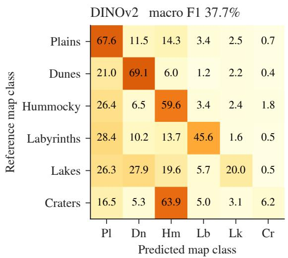

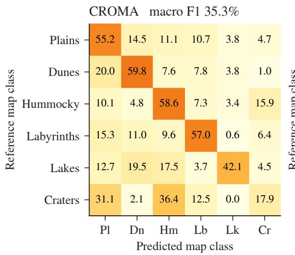

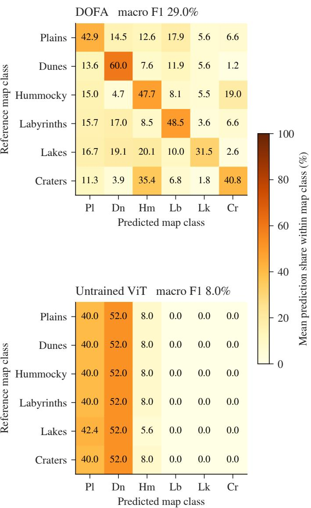  
Figure 9: SGD classification in the current geographic evaluation. Rows give the map class; columns give the predicted class. Percentages first average classifier seeds in each fold, then give all folds equal weight. The count line includes each distinct test tile once across folds, irrespective of the number of classifier seeds. Diagonal values are mean class recall. Precision and F1 also depend on predictions for other map classes; their primary estimates average ratios calculated before combining folds. Craters counts range from one to 6 tiles per fold. The labels describe broad mapped units.

## B Transfer and feature distributions in the original dataset

The original catalog supplies the Earth transfer comparisons and unlabeled Venus measurements in Section 5.   
It uses diferent image samples, geographic divisions and fitting settings from the current Titan evaluation.   
The transfer and distribution results below therefore refer to the original populations.

## B.1 Images and geographic divisions

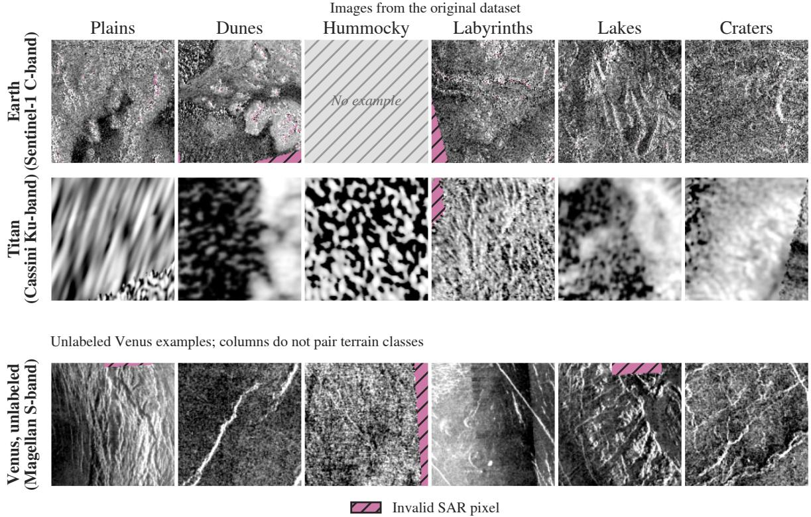  
Figure 10: Examples from the original Earth, Titan and Venus collections. Columns show Earth site labels, whose landform assignments still need review, and Titan classes from the expert map. Earth contains no Hummocky examples. Venus images have no class labels or implied class correspondence across columns. Each image spans a nominal 45 km by 45 km. Earth linear $\sigma ^ { 0 }$ is shown as $1 0 \log _ { 1 0 } ( \sigma ^ { 0 } )$ in dB; Titan and Venus use display digital numbers. Each display stretches the 2nd to 98th percentiles of valid pixels, so brightness is relative to that image. Magenta and diagonal hatching identify invalid SAR pixels, including Earth pixels filled during preprocessing. The examples illustrate image appearance; geological equivalence requires independent evidence.

## B.1.1 Choosing the image examples

The examples retain the original image choices. The statistics used to rank them were calculated from finite, strictly positive pixel values in the stored arrays before conversion for display. For the Earth display, missing-pixel fills are now masked using the catalog validity counts and excluded from the percentile stretch; the original image arrays and selection statistics are unchanged. For Earth and Titan, the score favors larger standard deviation and penalizes variation among row means. Plains examples receive an additional preference for standard deviations near the median among eligible images. For Venus, a contrast filter first removes unsuitable examples; the remaining image with the highest score, including the same row-variation penalty, supplies the first example. Each statistic is scaled linearly to the unit interval over eligible images. Five more images are then chosen successively, maximizing the minimum distance to those already chosen in mean, standard deviation and skewness.

## B.1.2 Cassini SAR imagery

The Titan images in Figure 10 use the USGS HiSAR mosaic through T104 described in Section 2 [1, 7]. Its 8 bit logarithmic display values retain image appearance but do not provide calibrated absolute $\sigma ^ { 0 } .$ . Physical comparisons of radar return would require radiometric products such as the floating point backscatter images in Cassini Basic Image Data Records (BIDR) [33].

Image area and valid pixels: Each Titan and Venus tile is sampled in a local azimuthal equidistant projection whose origin is the tile center. Earth tiles are windows in the local UTM output of SNAP processing. Every tile represents 45 km by 45 km with 128 × 128 pixels and a spacing of 351.5625 m/pixel. Local metric sampling avoids the change in physical width with latitude that would arise from equal pixel windows in the global equirectangular raster. At least 80% of output pixels must satisfy the validity rule for the corresponding image product. The original catalogs contain 11,371 labeled Titan tiles: 11,306 for cross-validation and 65 reserved near Selk. They also contain 398 labeled Earth tiles from 13 analog sites and 2,945 unlabeled Venus tiles. Titan counts range from 7,458 Plains tiles to 25 Craters tiles. Macro recall gives each class equal weight, making the very small Craters sample particularly consequential for interpretation.

The USGS mosaic ends at T104, earlier than the observations used to calculate the mission totals of approximately 46% surface coverage by full-resolution SAR and 74% by SAR with HiSAR [33]. This evaluation covers only the image areas retained from the T104 mosaic.

Image normalization: For each Titan training fold, the 1st and 99th percentiles of a limited sample of display DN define the linear normalization. The Titan transformation uses the display values directly, without an additional logarithm or dB floor. Its output remains display data; recovering calibrated $\sigma ^ { 0 }$ would require a diferent input product. For Earth, calibrated Sentinel-1 $\sigma ^ { 0 }$ is converted to dB and scaled using training statistics. Venus FMAP values are normalized in their encoded DN space. Each transformation prepares model inputs in the units available for that product, retaining the diferences in their radiometric meaning.

## B.1.3 Map labels

Both Titan evaluations use the map classes and modal voting rule described in Section 2. Using the same classes permits comparison of the two evaluations against the map. Extending those labels to Earth also requires evidence about the surface materials and class distributions represented at terrestrial sites.

Recovering omitted western longitudes: The original sampler interpreted the map raster’s 0 to 360 degree longitude convention incorrectly. Reprojection returned missing data for valid western labels, and catalog generation then discarded the corresponding tiles. Explicit longitude wrapping and a smaller warp approximation tolerance recover 12,009 tiles, including 115 Craters. The new catalog preserves all 11,371 original image arrays and centers while changing 15 of their modal labels and 1,727 class fractions. Independent inverse projections and direct indexing of the map raster agree with all 168,501,248 samples at the 41,138 possible tile centers. The resulting catalog contains 23,380 tiles with at least 80% valid SAR coverage and mapped terrain, including 140 Craters. These checks verify sampling of the source map. Geological accuracy and classification performance require separate evidence. The main text evaluates the enlarged catalog using geographic sectors with separation zones; CETUS’s reproduction documentation links the label and catalog checks.

Independent repeat annotations and a numerical estimate of map error remain unavailable. A classifier can reproduce an error in the expert map, so agreement with that map may exceed agreement with independently established geology.

## B.1.4 VIMS and ISS display metadata

The catalog also contains display values from the combined VIMS and ISS mosaic of Seignovert et al. [34]; processing of its VIMS component is described by Le Mouélic et al. [35]. ISS is the Imaging Science Subsystem. The original sampler supplied longitude and latitude in degrees to a raster transform expressed in metres on a Titan sphere of radius 2,575,000 m. It also used coordinates of pixel corners as array indices. Consequently, all 23,380 auxiliary triplets in the enlarged catalog come from just six pixels near the map origin. A separate CETUS file uses the correct coordinate units and pixel centers and passes independent projection and interpolation checks. The previously distributed catalogs retain their original values. These channels describe a rendered composite. Quantitative spectra, radiances and band ratios would require calibrated VIMS products, and describing an entire image area would require an explicit rule for combining measurements across that area. CETUS restricts these triplets to display metadata. Terrain classification, comparisons of feature distributions and Selk scores exclude them. Quantitative use of the imaging systems would require separate validation.

## B.1.5 Earth source sites

The Earth sites were chosen as morphological analogs for Plains, Dunes, Labyrinths, Lakes and Craters. The Earth set contains no Hummocky examples, so transfer metrics omit that class. The site labels describe intended landform analogies. Equivalence in material, radiometry or formation process remains unestablished. Several assignments need review at the scale of individual images. Sixteen training tiles labeled Labyrinths come from an Egyptian region incorrectly named Wadi Rum in the catalog. The Sentinel-1 image extents establish the location error; changing the name alone would leave the terrain assignment unverified. The full-resolution GSHHG shoreline map shows no mapped land in 42 of the 77 Arctic tundra training areas, and marine regions occupy more than half of 65 such areas. One Icelandic Plains tile is mostly ocean in both global and national shoreline maps. These fractions use the nominal image areas without the SAR validity mask. The shoreline maps also leave sea ice and open water indistinguishable at the acquisition dates. A review of the actual image areas is therefore needed before using their uniform site labels as terrestrial Plains examples. The internal geometry analysis is identified in CETUS’s reproduction documentation.2 Appendix C lists the sites and the intended morphological rationale. Earlier SAR studies illustrate how terrestrial landforms can inform comparative geomorphological interpretation [28, 29, 36].

ESA SNAP processing of Sentinel-1 GRD applies a precise orbit file, removes thermal noise, calibrates VV to linear $\sigma ^ { 0 }$ , and applies Range-Doppler terrain correction with the Copernicus 30 m DEM. The terrain-corrected output is then sampled at 351.5625 m/pixel over each 45 km image area. GRD processing already includes detection and averaging of radar looks, called multilooking. The SNAP sequence adds no further averaging before coarse resampling. The source spacing of about 10 m describes the sampling grid, rather than the efective spatial resolution. Pixels that are invalid or marked as layover or shadow by SNAP enter the encoder at the −40 dB floor. They are excluded from each tile’s dB statistics and valid-pixel fraction. For every retained tile, the median local incidence angle and the fraction marked by that mask are also retained.

Earth validation uses whole Sentinel-1 products as groups. Slices from one acquisition and repeat views of the same terrain can nevertheless enter both training and validation. Reconstructing the nominal image areas shows that 21 of 46 validation tiles intersect training areas; two Mistastin pairs overlap by about 99.97%. Grouping by product therefore permits geographic overlap between training and validation. For transfer, a reproducible rule reserves one product per Earth class for validation. The 46 validation tiles include the only product from one site, leaving 352 training tiles across 12 sites. The resulting classifier is evaluated on the five Titan classes represented in Earth training.

2Shoreline documentation: https://www.soest.hawaii.edu/pwessel/gshhg/.

## B.1.6 Geographic folds in the original evaluation

The original Titan evaluation uses five-fold spatial block cross-validation. Here the blocks are metric regions approximately 250 km across, with longitude divisions adjusted for latitude. A reproducible greedy assignment keeps each region together while balancing class counts and total image counts across folds. Each run tests one fold, uses the next for validation and trains on the remaining folds. Neighboring regions may have diferent roles, with no additional separation zone between them. Nearby images can therefore remain correlated between training, validation and testing. Training sets also overlap across runs, so independence of the five test-fold estimates has not been established. The 17 Craters test tiles receive their labels from four polygon parts in the source map. Parts 14 and 18 contribute both training and test tiles in individual runs. These indices describe map geometry and cannot be equated with named or independent physical craters. They establish that training and testing include portions of the same mapped terrain, with an unmeasured efect on performance. Using the benchmark’s spherical Titan radius of 2574.7 km, 1,963 of the 11,306 distinct test centers lie less than 45 km from a training center in the corresponding run; only 79 lie less than 44.9 km away. Many distances are close to the nominal 45 km grid spacing, making counts sensitive to the radius and strict cutof. These measurements describe proximity of centers. Image-area overlap, similarity of radar texture and any inflation of performance require separate measurements.

The Selk region is removed before assigning the other regions to folds and is excluded from every training, validation and test set. Results are summarized over the five test folds. Repeated SGD training runs describe variation from initialization and minibatch order within each fold; they do not create additional independently sampled regions.

## B.2 Encoders and classifiers for the original dataset

## B.2.1 Encoder configurations

The four encoders use ViT-B [37] and return 768-dimensional feature vectors. The comparison evaluates complete configurations: pretraining, patch sizes, input transformations, conditioning and architecture details vary together.

DINOv2 and CROMA use the image dimensions, channel duplication and feature averaging specified in Section 3. DINOv2 was pretrained on 142M natural images [4]. CROMA averages its patch encodings and passes that mean through the learned feedforward transformation for SAR [6].

DOFA ViT-B/16: A hypernetwork generates patch embedding weights from a numeric band identifier [5]. Titan normalization and feature averaging follow Section 3. The original Earth features use a diferent band identifier from the repository example. The DOFA repository example supplies 5.405 for Sentinel-1; CETUS extends this frequency convention to Cassini Ku-band with 13.78. Optical bands use wavelength units. Inspection of the extraction records and arrays establishes that the original five-fold classification used 13.78 for both Earth and Titan. The earlier DOFA paper gives 3.75 for Sentinel-1, leaving the identifiers used in pretraining this checkpoint unresolved [9, 10]. Arrays generated separately for preprocessing comparisons and Venus need their own verification. Section 5.1 describes later experiments using Earth 5.405 and Titan 13.78, together with other changes to the experimental design. Measuring the efect of the identifier alone would require an otherwise identical comparison.

Untrained ViT in the original dataset: The original Untrained ViT configuration specifies a ViT-B/14, a single-channel patch stem and seed 42. Its encoder remains untrained while the classifier learns the labels supplied by the corresponding training domain. Feature standard deviations are approximately $1 0 ^ { - 4 }$ per dimension, and the classifiers perform near the class-frequency benchmarks. Because this result comes from one random state, it gives limited evidence about random features in general. Section B.4.4 separates the valid repeated MMD estimate from the numerical failure in the original permutation calculation. The code specifies seed 42, but the architecture chosen by its fallback branch and the exact initial weights remain unverified. Five classifier seeds therefore cannot be interpreted as five independently initialized encoders.

## B.2.2 Fitting classifiers and calculating metrics

With encoder weights unchanged, each model returns 768 features through the averaging or classification-token representation described in the main methods. All 168 tensors loaded from the original DOFA checkpoint were verified exactly. The normalization constants supplied when the model is constructed and the checkpoint normalization parameters that remain unused are the same as in the current evaluation; their separate efects on performance remain unknown. The linear classifier is fitted for 100 epochs with inverse-frequency class weights, and the final epoch is evaluated on the test images. The SGD implementation does not use the reserved validation fold for model selection. Its main metric is macro recall, the unweighted mean of recall over classes present in the evaluation set, equivalent here to balanced accuracy. Cohen’s κ compares agreement with that expected from the marginal prediction and label frequencies. Its dependence on class frequencies difers from that of macro recall, and per-class precision supplies additional information. Both metrics are calculated for five training seeds in each geographic fold. A cosine k-nearest-neighbor classifier supplies a comparison without fitting a linear decision rule. Appendix D lists the image inputs and weight sources.

For the Titan-only experiment, classifiers are fitted to Titan training data and predict the reserved Titan test fold. For transfer, they fit the grouped Earth training data and are evaluated on the five Titan test classes represented in Earth training. The number of Hummocky images omitted from that evaluation is also reported. Cross-validation statistics use one estimate per fold. Classifier training seeds and repeated MMD samples describe variation within folds; the number of geographic test units remains five.

Additional comparisons on the original dataset include prediction of the majority class, random prediction using class frequencies, raw intensity moments, intensity histograms, gray-level co-occurrence matrix (GLCM), local binary pattern (LBP), Gabor, histogram of oriented gradients (HOG) and wavelet texture features. Logistic regression on combined classical features and a small supervised CNN are also evaluated on that dataset. The class-frequency comparisons use no image information. Classical features and the CNN assess prediction from images, while partial encoder training and correlation alignment (CORAL) test additiona uses of Titan data. The original CNN results do not evaluate the current geographic folds. CORAL uses unlabeled Titan training features for unsupervised domain adaptation and evaluates classification on separate Titan test regions. The metadata call this procedure transductive, but the transformation uses only training features. MMD calculated from the fitting features describes agreement on those training samples.

## B.3 Comparing feature distributions

## B.3.1 Estimator and sampling details

Section 5.3 defines MMD and the comparisons between Earth, Titan and Venus image collections. The primary estimate uses the median heuristic for kernel bandwidth and averages at least 100 reproducible subsamples with equal N from each distribution. Estimator sensitivity is examined with the unbiased U-statistic, a permutation test using one bandwidth throughout, omission of each Earth site in turn, and resampling of Titan geographic regions with replacement. Section B.4.5 gives the results, with complete values in CETUS. The site omissions cover the 12 sites in Earth training; validation contains the only product from the thirteenth site. Titan resampling uses the same geographic regions that define the folds. Dependence between neighboring regions remains unmeasured.

Proxy A-distance [38] provides a second measure of how readily a classifier distinguishes Earth from Titan features. The original calculation used diferent numbers of images from the two domains. The estimates for all twenty combinations of model and fold were subsequently recomputed from the verified original training features, with equal domain counts, a stratified half split, standardization fitted on the training half used for the domain classifier, hinge-loss SGD and balanced test error. Both calculations use the same data population but difer in sampling and classifier fitting. Table 23 reports the original estimates; the later estimates are given below. Both measure domain discrimination; assigning a physical cause requires other evidence. Distances between class centroids are also descriptive and use only classes labeled in both domains.

Attributing these diferences to radar scattering would require compatible calibrated products and measurements that account for incidence, polarization, spatial resolution, roughness, dielectric properties and preprocessing. HiSAR and FMAP supply display values here. The rendering experiments test model sensitivity to those display inputs. Recovering calibrated planetary backscatter would require suitable radiometric products.

## B.4 Further results on the original dataset

## B.4.1 Training and averaging across folds

Feature extraction uses batches of 64 images. Bilinear interpolation resizes each 128 × 128 tile to 224 × 224 pixels for DINOv2, DOFA and the Untrained ViT, or 120 × 120 pixels for CROMA. Linear classifiers train in batches of 256 for 100 epochs, with five training seeds per fold. Averaging estimates from the five training seeds gives one estimate per fold. The reported mean and sample standard deviation are then calculated across the five folds. The 95% Student-t intervals and paired tests supplied with the results assume independent fold estimates. Overlapping training data and possible correlation between neighboring test regions make that assumption uncertain, so these calculations are interpreted as exploratory.3 Diferences use unrounded values and may difer by up to 0.1 from subtracting rounded table entries. The k-NN classifier uses k = 20 and gives the same result each time for a given fold. The distribution comparisons use 100 reproducible MMD subsamples of equal size per fold, the exploratory fold comparisons and the sensitivity calculations in Section B.3.1. All results here use the original population, including the omission of western Titan tiles.

## B.4.2 Training and testing on Titan

Table 19 gives macro recall for classifiers trained and tested on separate Titan regions.

Table 20 compares classification from simple image measurements with predictors based only on class frequencies and a supervised CNN. The supervised CNN reaches 64.4% on Titan and 19.0% when trained on Earth. Raw intensity statistics give the highest transfer mean among these methods, 28.1%. CROMA reaches 32.3%, exceeding it by 4.2 percentage points. With five folds, the exploratory paired test gives p = 0.217, leaving evidence for a transfer advantage inconclusive.

CROMA exceeds the CNN mean by 1.6 percentage points, with an inconclusive exploratory paired comparison. Across twelve model comparisons against raw intensity statistics and the CNN, every Holm-adjusted p-value remains above the 0.05 threshold. Establishing either equivalence or general superiority would require stronger evidence.

## B.4.3 Classifiers trained on Earth

Figure 11 and Table 21 compare classifiers trained on Earth analog sites with classifiers trained on Titan, using the same five Titan test classes in both cases. The six-class means in Table 19 answer a diferent question. Training sets difer in size, planet, surface materials, sensor, frequency, polarization, incidence geometry, native resolution, image product and curation. The transfer comparison therefore combines all of these diferences.

Macro recall and κ emphasize diferent aspects of the predictions. Among the pretrained encoders, CROMA has the highest transfer macro recall, 32.3%, and the lowest κ, 0.034, compared with 0.135 for DINOv2 and 0.121 for DOFA. CROMA’s mean recall is 90.0% for Craters, 36.0% for Dunes, 4.7% for Plains and 3.2% for Lakes. Craters contributes just 17 test tiles across all folds. Macro recall gives each class equal weight, whereas κ also depends on the frequencies of the labels and predictions.

Table 19: Training and testing on Titan in the original catalog. Values give means and sample standard deviations over five geographic folds. For linear classifiers, each metric is first averaged over the five training seeds in each fold; k-NN gives one reproducible result per fold. Among linear classifiers, CROMA has the highest six-class macro recall, 66.1%, and DINOv2 the highest κ, 0.502. Untrained ViT uses an untrained encoder whose original architecture remains incompletely verified, as described in Section B.2.1. Bold indicates the highest mean in each metric column for its classifier.
<table><tr><td rowspan="2">Model</td><td colspan="2">Linear classifier</td><td colspan="2">k-NN</td></tr><tr><td>Macro recall</td><td>κ</td><td>Macro recall</td><td>κ</td></tr><tr><td>DINOv2 ViT-B/14</td><td> $5 6 . 0 \pm 2 . 7$ </td><td> ${ \bf 0 . 5 0 2 } \pm 0 . 0 3 9$ </td><td> $3 2 . 4 \pm 1 . 4$ </td><td> $0 . 3 8 8 \pm 0 . 0 1 6$ </td></tr><tr><td>DOFA ViT-B/16</td><td> $5 8 . 1 \pm 8 . 0$ </td><td> $0 . 2 9 6 \pm 0 . 0 3 0$ </td><td> $3 3 . 5 \pm 0 . 8$ </td><td> $0 . 4 0 0 \pm 0 . 0 2 0$ </td></tr><tr><td>CROMA ViT-B/8</td><td> ${ \bf 6 6 . 1 \pm 2 . 4 }$ </td><td> $0 . 4 3 2 \pm 0 . 0 3 8$ </td><td> ${ \bf 3 8 . 7 \pm 0 . 7 }$ </td><td> $\mathbf { 0 . 4 4 0 \pm 0 . 0 3 4 }$ </td></tr><tr><td>Untrained ViT-B/14</td><td> $1 7 . 0 \pm 0 . 7$ </td><td> $0 . 0 0 3 \pm 0 . 0 0 6$ </td><td> $1 9 . 0 \pm 0 . 9$ </td><td> $0 . 0 2 2 \pm 0 . 0 1 0$ </td></tr></table>

Table 20: Additional classification comparisons on the original dataset. Macro recall is in percent, with mean ± sample standard deviation across five geographic folds after averaging seeds in each fold. Classical-feature classifiers give identical results across seeds; only class-prior random predictions and CNN fits vary with seed. Transfer excludes Hummocky. Classical classifiers fit the five Earth classes, and the CNN’s Hummocky logit is masked before softmax. All CNN predictions before masking already belong to a represented class, so masking leaves the test predictions unchanged. Bold indicates the highest mean recall in each training-domain column among the methods shown.
<table><tr><td>Comparison</td><td></td><td>Titan→Titan Earth→Titan</td></tr><tr><td>Majority class</td><td> $1 6 . 7 \pm 0 . 0$ </td><td> $2 0 . 0 \pm 0 . 0$ </td></tr><tr><td>Class-prior random</td><td> $1 6 . 7 \pm 0 . 2$ </td><td> $2 0 . 0 \pm 0 . 9$ </td></tr><tr><td>Raw intensity statistics</td><td> $5 4 . 8 \pm 7 . 3$ </td><td> ${ \bf 2 8 . 1 \pm 4 . 9 }$ </td></tr><tr><td>Intensity histogram</td><td> $4 2 . 8 \pm 4 . 8$ </td><td> $1 9 . 7 \pm 1 . 0$ </td></tr><tr><td>Texture descriptors</td><td> $3 9 . 3 \pm 2 . 5$ </td><td> $1 9 . 7 \pm 0 . 8$ </td></tr><tr><td>Combined classical</td><td> $4 4 . 8 \pm 1 . 9$ </td><td> $2 0 . 2 \pm 0 . 8$ </td></tr><tr><td>Small supervised CNN</td><td> ${ \bf 6 4 . 4 \pm 6 . 5 }$ </td><td> $1 9 . 0 \pm 1 . 6$ </td></tr></table>

Training-set size and image preparation: Table 22 compares Earth training with Titan subsets of the same total size. Complete Titan training folds contain 6,778 to 6,794 tiles; Earth supplies 352 training tiles and 46 validation tiles. The Titan classifiers still predict six classes, while evaluation averages recall over the five classes present in Earth training. Stratified sampling retains Titan class proportions subject to at least one tile per class. Uniform sampling imposes no such class requirement. These choices equalize total training count while leaving class counts and geographic diversity diferent from those of Earth.

With equal training counts, Titan’s advantage is 13.1 to 20.4 percentage points. Reducing the Titan sample also changes its class counts and geographic composition. The resulting decrease therefore cannot be attributed solely to the number of labels or used to bound a planetary contribution. The 352-tile limit applies to classifier fitting. Image normalization for the saved Titan features still uses the complete training fold and therefore uses more Titan training data. At the same number of epochs, subsampling also changes class weights and the number of optimizer updates.

Three separate image transformations are evaluated: rendering Earth dB values as display DN, quantizing normalized inputs, and smoothing the Earth output grid. Percentile rendering changes DINOv2 and DOFA by less than one percentage point and reduces CROMA by 10.3 points. Quantization to 256 or 64 levels changes each model by at most 0.03 points. Gaussian smoothing with σ = 0.65 pixels changes recall by −2.6,

Original dataset Recall on Titan

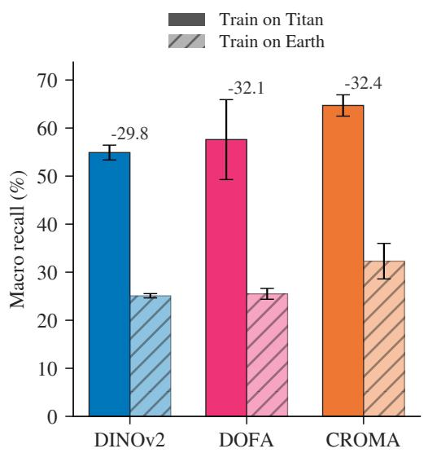

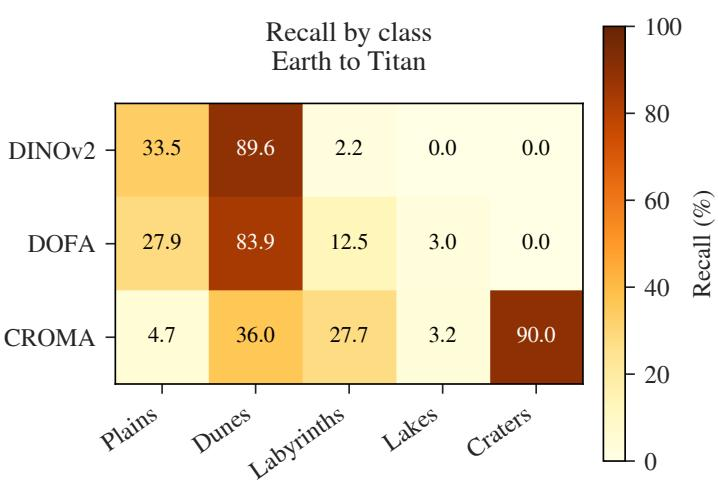  
Figure 11: Linear classifiers with encoder weights unchanged in the original dataset. Left: macro recall after Titan or Earth training, evaluated on the five classes present in Earth. Transfer using pretrained models stays above the 20% five-class benchmark and is 29.8 to 32.4 percentage points below Titan training. Right: transfer recall by class, excluding Hummocky because Earth supplies no examples. Dunes has the highest mean transfer recall for DINOv2 and DOFA, at 89.6% and 83.9%. CROMA’s mean Craters recall is 90.0%, with only 17 distinct test tiles across all folds. Error bars show sample SD across five fold means after averaging classifier seeds. Identifying a physical property that transfers between Earth and Titan would require evidence beyond recall.

Table 21: Classifiers trained on Earth and evaluated on the five Titan classes present in Earth training. Values are mean ± sample standard deviation across five folds. Linear-classifier values are first averaged over seeds in each fold; k-NN gives one reproducible result per fold. ∆ is the diference from the corresponding classifier trained on Titan and evaluated on the same classes. The linear classifiers trained on Earth and on Titan both retain six output logits. Untrained ViT remains near the class-frequency benchmark despite its positive diference, providing no evidence of useful transfer. CROMA has the highest transfer mean at 32.3%, followed by DOFA at 25.5% and DINOv2 at 25.1%. Comparisons require identical normalization, catalogs and image sampling. Bold indicates the highest mean in each recall or kappa column for its classifier. Transfer diferences remain in ordinary type.
<table><tr><td rowspan="2">Model</td><td colspan="2">Linear classifier</td><td rowspan="2">∆ recall</td><td colspan="2">k-NN</td></tr><tr><td>Macro recall</td><td>κ</td><td>Macro recall</td><td>κ</td></tr><tr><td>DINOv2 ViT-B/14</td><td> $2 5 . 1 \pm 0 . 4$ </td><td> ${ \bf 0 . 1 3 5 \pm 0 . 0 1 7 }$ </td><td>-29.8</td><td> $2 5 . 9 \pm 1 . 0$ </td><td> $0 . 1 4 6 \pm 0 . 0 2 4$ </td></tr><tr><td>DOFA ViT-B/16</td><td> $2 5 . 5 \pm 1 . 1$ </td><td> $0 . 1 2 1 \pm 0 . 0 1 4$ </td><td>-32.1</td><td> ${ \bf 2 6 . 1 \pm 0 . 6 }$ </td><td> ${ \bf 0 . 1 8 2 } \pm 0 . 0 1 8$ </td></tr><tr><td>CROMA ViT-B/8</td><td> ${ \bf 3 2 . 3 \pm 3 . 7 }$ </td><td> $0 . 0 3 4 \pm 0 . 0 2 2$ </td><td>-32.4</td><td> $2 4 . 0 \pm 2 . 5$ </td><td> $0 . 0 9 4 \pm 0 . 0 3 2$ </td></tr><tr><td>Untrained ViT-B/14</td><td> $2 0 . 0 \pm 0 . 0$ </td><td> $0 . 0 0 0 \pm 0 . 0 0 0$ </td><td>+3.6</td><td> $2 0 . 2 \pm 0 . 9$ </td><td> $0 . 0 0 4 \pm 0 . 0 2 0$ </td></tr></table>

−0.2 and −3.0 points for DINOv2, DOFA and CROMA, respectively. Combining smoothing and percentile rendering changes CROMA by +1.2 points. These transformations test sensitivity to the available image products. Smoothing an already resampled grid cannot reconstruct native radar looks, and estimating display percentiles cannot recover the USGS stretch. Every comparison leaves some diferences in training count,

Table 22: Efect of training-set size on recall for the five Titan classes present in Earth. Every training subset contains 352 tiles. Values are macro recall in percent, with sample standard deviation across five fold means after averaging five seeds. The experiment equalizes total count while allowing class composition and site diversity to difer. The values reproduce the workshop training-size calculations. Bold indicates the highest mean recall across encoders for each training setting.
<table><tr><td>Model</td><td>Earth</td><td></td><td>Titan stratified Titan uniform</td></tr><tr><td>DINOv2</td><td> $2 5 . 1 \pm 0 . 4$ </td><td> $4 3 . 9 \pm 1 . 1$ </td><td> $4 1 . 3 \pm 2 . 1$ </td></tr><tr><td>DOFA</td><td> $2 5 . 5 \pm 1 . 1$ </td><td> $4 5 . 9 \pm 5 . 2$ </td><td> $4 0 . 6 \pm 3 . 8$ </td></tr><tr><td>CROMA</td><td> ${ \bf 3 2 . 3 \pm 3 . 7 }$ </td><td> ${ \bf 5 1 . 1 \pm 4 . 3 }$ </td><td> ${ \bf 4 5 . 4 } \pm 4 . 4$ </td></tr></table>

class composition, image products or site diversity. DOFA band identifiers in the independently generated image-transformation arrays also require verification. The smoothing scale and the Titan-range rendering variant reuse statistics from fold 1 training images, including images tested in folds 3, 4 and 5. This use of test information limits those experiments to exploratory interpretation. In addition, the standalone DN recall calculation and its later MMD calculation estimate their display percentiles from diferent pixel samples, so they represent diferent renderings. MMD also uses all Titan test classes and recalculates its bandwidth for each condition and resample; recall excludes Hummocky. Population, rendering and kernel diferences must therefore be considered before relating changes in recall to changes in MMD.

## B.4.4 Earth and Titan feature distributions

Figure 12 and Table 23 compare Earth and Titan features separately in each encoder’s coordinate space.

The original Untrained ViT permutation calculation used float32 arithmetic and returned negative observed statistics in four folds. Recalculation from the verified original arrays, using float64 direct squared distances, gives repeated biased $\mathrm { M M D ^ { 2 } }$ of $0 . 1 1 2 \pm 0 . 0 1 9$ . These are the mean and sample standard deviation of five fold means; each averages 100 resamples of 352 Earth and 352 Titan training tiles, with bandwidth estimated anew for each resample. The repeated estimate is numerically valid, whereas the original permutation statistic and the inference drawn from it are invalid.

The original constructor fallback and exact initial weights remain unverified, so the result applies to those original arrays and cannot be assigned to the random encoder used with the enlarged catalog. CETUS’s reproduction documentation identifies the internal calculation and its access limits. Weak classification is a separate result: low feature amplitude alone cannot explain RBF MMD when bandwidth adapts to the features. Spatial exchangeability also remains an assumption after the arithmetic is corrected. Using equal domain counts, classifiers fitted to the same original arrays give proxy A-distances of $1 . 9 6 1 \pm 0 . 0 3 7$ for DINOv2, $1 . 8 2 3 \pm 0 . 0 3 3$ for DOFA, $1 . 9 8 9 \pm 0 . 0 1 6$ for CROMA and 1.516 ± 0.114 for the Untrained ViT. Values are means and sample standard deviations over five folds. Every fit uses 352 tiles per domain, seed zero, a stratified half split, standardization fitted on the classifier training subset, hinge-loss SGD and balanced test error. Sampling, preprocessing and evaluation difer from the original calculation, and DOFA still receives identifier 13.78 for both domains. These distances quantify domain discrimination under those settings.

## B.4.5 Sensitivity of MMD estimates

Table 24 compares the Earth and Titan MMD estimates over five folds. For pretrained encoders, the unbiased U-statistic, the mean after omitting Earth sites in turn, and the mean from resampling Titan geographic regions difer from the primary biased estimate by at most 0.004. With 1,000 permutations, the test results round to $p = 0 . 0 0 1$ , near the calculation’s resolution limit. Their interpretation depends on the implemented exchangeability assumptions; residual spatial dependence is unmeasured. The Untrained ViT’s repeated biased estimate agrees with the stable recalculation of its original arrays. Its original permutation outputs are numerically invalid and cannot establish equality of distributions. The numerical correction leaves the

Earth and Titan: results across five folds
<table><tr><td rowspan=1 colspan=1>Encoder</td><td rowspan=1 colspan=1>Mean $\mathbf { M } \mathbf { M } \mathbf { D } ^ { 2 }$ </td><td rowspan=1 colspan=1>SD across folds</td></tr><tr><td rowspan=1 colspan=1>DINOv2</td><td rowspan=1 colspan=1>0.113</td><td rowspan=1 colspan=1>0.0028</td></tr><tr><td rowspan=1 colspan=1>DOFA</td><td rowspan=1 colspan=1>0.183</td><td rowspan=1 colspan=1>0.0024</td></tr><tr><td rowspan=1 colspan=1>CROMA</td><td rowspan=1 colspan=1>0.430</td><td rowspan=1 colspan=1>0.0046</td></tr></table>

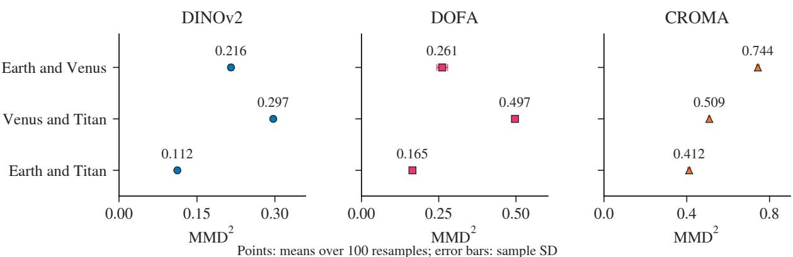  
Compare pairs within each encoder; kernel scales differ between encoders

Figure 12: Feature distributions in the original dataset. Top: Earth and Titan $\mathrm { M M D ^ { 2 } }$ from repeated equal-size samples, shown as mean and sample standard deviation across five fold means for pretrained encoders. The random encoder is omitted from this subplot. Stable arithmetic confirms its repeated estimate, but its original permutation statistic is invalid. Bottom: $\mathrm { M M D ^ { 2 } }$ for Earth, Venus and Titan, shown separately for each encoder. Each encoder uses one bandwidth across domain pairs and equal sample counts in each pair. Error bars give sample SD across 100 draws and describe subsampling variation. Earth and Titan have the smallest estimates for the pretrained encoders under this estimator. Interpretation is restricted to each model’s feature space; physical causes and comparisons of magnitude between models require further evidence.

original catalog’s geographic omission and dependence between samples unchanged, so both continue to limit inference.

## B.4.6 Recall by map class

Figure 13 projects the features into two dimensions using t-SNE. Table 25 reports recall for each class from linear classifiers trained on Titan or Earth. Recall varies strongly by class. Separating the efects of morphology, material properties and other diferences between the image domains requires additional tests.

For training and testing on Titan, linear classifiers give higher macro recall than cosine k-NN for all three pretrained encoders under these settings. This classifier comparison is insuficient to establish linear separability or the local structure of the classes. After Earth training, CROMA gives the highest linear-classifier mean but the lowest pretrained k-NN mean, 24.0%, showing that the encoder ranking depends on the classifier.

With Titan training, DINOv2 has the highest recall for Plains and Dunes, CROMA for Hummocky and Lakes, and DOFA for Labyrinths. These diferences describe agreement with mapped terrain classes. Testing which physical image properties drive them would require a separate analysis.

After Earth training, Dunes gives the highest recall for DINOv2 at 89.6% and DOFA at 83.9%. Among the pretrained encoders, CROMA gives the highest recall for Labyrinths and Craters, 27.7% and 90.0%. The

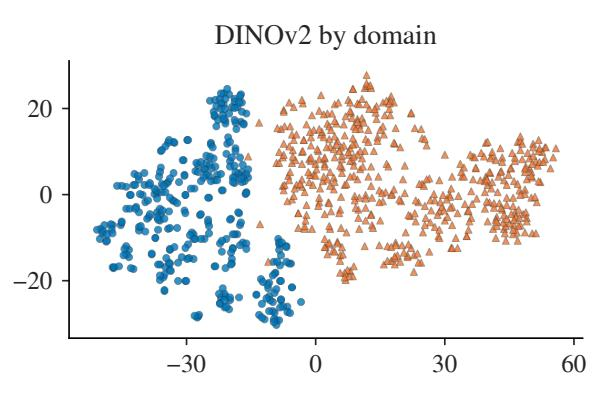

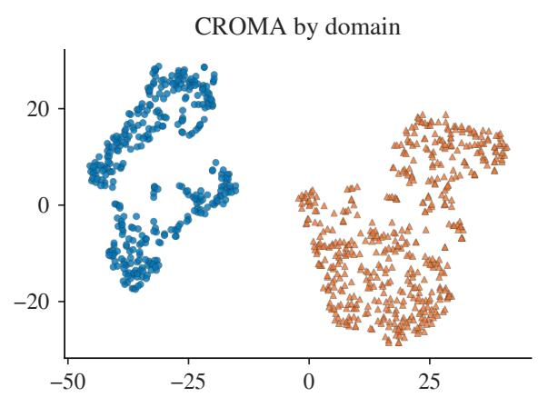

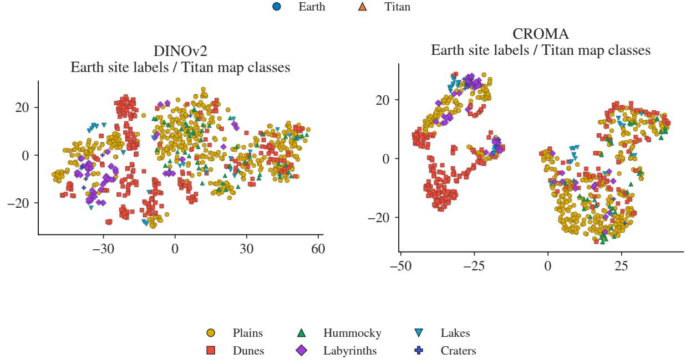  
Figure 13: t-distributed stochastic neighbor embedding (t-SNE) of original fold 1 features: DINOv2 at left and CROMA at right. Each model uses all 352 Earth training tiles and 500 Titan test tiles. A common random stream with seed 42 draws diferent Titan subsets for the models. The same coordinates appear twice, colored by domain above and by Earth site label or Titan map class below. Both fits use perplexity 30 and seed 42. The plotted coordinate systems are arbitrary. Separation or overlap in the original feature spaces, and any relation to transfer performance, require measurements beyond these projections.

Table 23: Earth and Titan feature comparisons for the original dataset, averaged over five geographic folds. $\mathrm { M M D ^ { 2 } }$ is the biased RBF-kernel V-statistic averaged over 100 equal-size resamples in each fold. The Untrained ViT estimate is recalculated from its original arrays using stable arithmetic; its fold standard deviation is given in the text. The proxy A-distance column retains the original estimates with unequal domain counts. The text gives the later estimates using equal domain counts under a diferent fitting design. Centroid distances use the unnormalized coordinates of each model. These comparisons characterize feature distributions; identifying physical causes of transfer error requires additional evidence.
<table><tr><td>Model</td><td>MMD²</td><td>Original  $d _ { A }$ </td><td>Centroid Dist.</td></tr><tr><td>DINOv2 ViT-B/14</td><td>0.113</td><td>1.948</td><td>25.93</td></tr><tr><td>DOFA ViT-B/16</td><td>0.183</td><td>1.918</td><td>2.32</td></tr><tr><td>CROMA ViT-B/8</td><td>0.430</td><td>1.990</td><td>6.18</td></tr><tr><td>Untrained ViT-B/14</td><td>0.112</td><td>1.817</td><td>0.002</td></tr></table>

Table 24: Sensitivity of Earth and Titan $\mathrm { M M D ^ { 2 } }$ to estimation and resampling choices. $\mathrm { M M D ^ { 2 } }$ estimates are means across five Titan geographic folds. The final column gives the largest permutation p-value. Each row uses that model’s feature space, which sets the scale and prevents direct comparisons of magnitude across models.
<table><tr><td>Model</td><td>Biased</td><td>Unbiased</td><td>Omit each Earth site</td><td>Resample Titan regions</td><td>Max perm. p</td></tr><tr><td></td><td></td><td></td><td></td><td></td><td></td></tr><tr><td>DINOv2 DOFA</td><td>0.113 0.183</td><td>0.110 0.180</td><td>0.115 0.182</td><td>0.113 0.183</td><td>0.001 0.001</td></tr><tr><td>CROMA</td><td>0.430</td><td>0.427</td><td>0.430</td><td>0.431</td><td>0.001</td></tr></table>

Craters value depends on only 17 test tiles across all folds and is especially unstable. Hummocky is omitted because Earth training contains none. Table 25 presents recall because its class average defines the original macro metric. Table 15, together with the Craters precision and F1 values, describes the false positives that recall alone leaves out.

## B.4.7 Selk uncertainty and disagreement

The Selk tiles are examined only after model development. They are excluded from every training, validation and test fold. For each tile, linear classifiers trained on Titan produce class probabilities and predictions from encoders whose weights remain unchanged. The ensemble comprises $N = 1 5$ combinations of pretrained model and geographic fold: three models across five folds. Entropy is calculated from the mean probability vector, $\begin{array} { r } { H ( \bar { \bf p } ) = - \sum _ { c = 1 } ^ { 6 } \bar { p } _ { c } \log \bar { p } _ { c } } \end{array}$ , and disagreement as $D = 1 - { n _ { \mathrm { m a x } } } / { N }$ , where $n _ { \mathrm { m a x } }$ is the number of members giving the most frequent class prediction. The Untrained ViT and the VIMS display values are excluded.

Entropy and disagreement are each scaled to [0, 1] using their own minimum and maximum among the 65 Selk tiles. The arithmetic mean of the two scaled quantities ranks the tiles within this set of models and images. A high score may arise from ambiguous map classes, transitions between units, image defects, model limitations or other unresolved causes. The ranking describes variation in classifier uncertainty and disagreement. Using it for anomaly detection, calibrated confidence or risk, geological prioritization or mission operations would require independent validation.

The 65 tiles reserved near Selk lie within 5° of 6°N, 161°E. This area overlaps the Selk exploration region examined in Dragonfly landing-site studies [39, 40]. Figure 14 maps the relative ranking obtained by combining entropy and model disagreement for expert inspection.

The map labels the 65 Selk tiles as 37 Dunes, 17 Plains, 8 Craters and 3 Hummocky. The 15-member ensemble, comprising three models in five fold-dependent feature spaces, predicts 34 Dunes, 13 Plains, 17 Hummocky and 1 Crater. Mean entropy is 0.963 against a maximum of ln 6 = 1.79, mean disagreement is

Table 25: Recall by class for linear classifiers, in ${ \% } ,$ averaged over seeds in each fold and then over five geographic folds. Parentheses give the total number of distinct test tiles outside Selk; each tile is tested once. $\mathrm { { N } / A }$ marks Hummocky because Earth supplies no training examples. Small class counts make estimates unstable, especially for Craters, with $n = 1 7 .$ . Bold indicates the highest mean recall among all four encoders for each class and training domain.
<table><tr><td></td><td colspan="2">Plains (7441)</td><td colspan="2">Dunes (2215)</td><td colspan="2">Hummocky (1014)</td><td colspan="2">Labyrinths (257)</td><td colspan="2">Lakes (362)</td><td colspan="2">Craters (17)</td></tr><tr><td>Model</td><td>T→T</td><td>E→T</td><td>T→T</td><td>E→T</td><td>T→T</td><td>E→T</td><td>T→T</td><td>E→T</td><td> $\mathrm { T } { \to } \mathrm { T }$ </td><td>E→T</td><td> $\mathrm { T } { \to } \mathrm { T }$ </td><td> $\mathrm { E } {  } \mathrm { T }$ </td></tr><tr><td>DINOv2</td><td>71.2</td><td>33.5</td><td>76.0</td><td>89.6</td><td>61.8</td><td>N/A</td><td>50.1</td><td>2.2</td><td>75.3</td><td>0.0</td><td>1.6</td><td>0.0</td></tr><tr><td>DOFA</td><td>39.7</td><td>27.9</td><td>63.5</td><td>83.9</td><td>60.6</td><td>N/A</td><td>67.1</td><td>12.5</td><td>81.7</td><td>3.0</td><td>36.0</td><td>0.0</td></tr><tr><td>CROMA</td><td>57.6</td><td>4.7</td><td>70.8</td><td>36.0</td><td>72.8</td><td>N/A</td><td>67.0</td><td>27.7</td><td>83.4</td><td>3.2</td><td>44.7</td><td>90.0</td></tr><tr><td>Untrained ViT</td><td>44.0</td><td>0.0</td><td>36.0</td><td>20.0</td><td>20.0</td><td>N/A</td><td>0.0</td><td>40.0</td><td>1.9</td><td>20.0</td><td>0.0</td><td>20.0</td></tr></table>

Original dataset: uncertainty and disagreement near Selk  
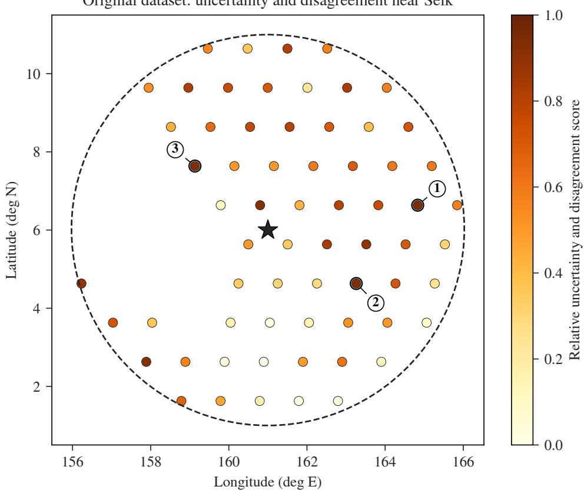  
Figure 14: Model uncertainty and disagreement for the original 65 Selk tiles. The star is the center at $6 ^ { \circ } \mathrm { N } .$ $1 6 1 ^ { \circ } \mathrm { E } ;$ the dashed curve lies $5 ^ { \circ }$ from it on a sphere. Color shows the mean of entropy and disagreement after each is scaled separately to [0, 1] using its minimum and maximum over these 65 tiles. Numbered rings mark the three tiles with the highest scores in rank order. The first is the tile at 6.64°N, 164.83°E. Scores rank only this set of images and models. Interpreting them as calibrated probabilities of anomaly, novelty, scientific value, risk or mission priority would require independent validation.

0.250 and mean relative score is 0.525. These statistics describe the ensemble’s predictions. Interpreting them as geological transitions or operational priorities requires separate evidence.

Table 26: Earth-to-Titan classification before and after CORAL, measured by macro recall in percent over five classes. Metrics average seeds in each fold and then the five folds. CORAL uses unlabeled Titan training features and evaluates classification on separate test regions. Both $\mathrm { M M D ^ { 2 } }$ calculations use the fitting samples and estimate bandwidth separately before and after the transformation. Their ratio describes those changing kernels on training features; measuring a reduction for one kernel on independent data would require a separate calculation. Bold indicates the higher mean recall before or after CORAL for each encoder. MMD values remain in ordinary type.
<table><tr><td>Model</td><td>Before CORAL</td><td>CORAL</td><td>MMD² before/after</td><td></td></tr><tr><td>DINOv2</td><td>25.1</td><td>23.1</td><td>0.113</td><td>0.009</td></tr><tr><td>DOFA</td><td>25.5</td><td>26.4</td><td>0.183 7</td><td>0.006</td></tr><tr><td>CROMA</td><td>32.3</td><td>35.3</td><td>0.430 / 0.009</td><td></td></tr></table>

## B.4.8 Transforming features and training encoder layers

Two ways of using Titan information are compared: CORAL uses unlabeled Titan features to transform Earth features, while supervised training of the final transformer blocks uses Titan labels.

CORAL feature transformation: CORAL [41] aligns Earth feature statistics with those of Titan. The transformation subtracts the Earth mean, transforms the covariances, then adds the Titan mean: $\begin{array} { r } { F _ { \mathrm { a l i g n e d } } = ( F - \mu _ { \mathrm { s r c } } ) \cdot C _ { \mathrm { s r c } } ^ { - 1 / 2 } C _ { \mathrm { t g t } } ^ { 1 / 2 } + \mu _ { \mathrm { t g t } } } \end{array}$ . The transformation is applied to Earth features before fitting the linear classifier; encoder weights remain unchanged. The sample covariance matrices $C _ { \mathrm { s r c } }$ and $C _ { \mathrm { t g t } }$ each receive $1 0 ^ { - 5 } I$ . Eigenvalues are floored at $1 0 ^ { - 5 }$ before taking square roots and inverse square roots. Subtracting the source mean is part of the original formulation; adding the target mean specifies the coordinates used here. Table 26 compares classification before and after this transformation.

CORAL changes macro recall by −2.0 (p = 0.017), +1.0 (p = 0.370) and +2.9 $( p = 0 . 4 1 7 )$ percentage points for DINOv2, DOFA and CROMA, respectively. These exploratory paired tests use overlapping folds without adjustment for multiple comparisons. The small $\mathrm { M M D ^ { 2 } }$ after transformation comes from the same features used to estimate CORAL, with bandwidth estimated again. Measuring a reduction of discrepancy on independent data would require test features and one kernel used for both measurements. The remaining classification errors leave their class-dependent and physical causes undetermined. Aligning physical radar intensity would require compatible calibrated products and accounting for acquisition conditions.

Training the final two transformer blocks: The last two transformer blocks of each encoder are trained on Titan images. Table 27 averages five training seeds in each geographic fold. For comparison, linear classifiers are fitted again on features from encoders whose weights remain unchanged, using the same folds and seeds, so their values difer slightly from Table 19. These experiments used the implementation before weighted gradient accumulation was corrected. Table 4 reports results from the current implementation and enlarged catalog. Because the dataset and training design also changed, comparing these scores cannot isolate the efect of the correction.

Figure 15 shows the changes under the original implementation. DINOv2 gains 4.6 percentage points in macro recall and 0.030 in κ. CROMA loses 3.7 percentage points of macro recall while gaining 0.100 in κ, indicating a redistribution of errors among classes. DOFA declines by 27.2 percentage points and 0.171 in κ. These values apply to the original dataset and training code. The enlarged catalog and corrected implementation are evaluated separately. Attributing the older changes to architecture, conditioning, optimization or class imbalance would require comparisons that vary those factors independently.

Table 27: Training the final two transformer blocks on the original Titan dataset for 50 epochs with AdamW, cosine annealing and batch size 8. Values are mean ± sample standard deviation across five geographic folds after averaging five training seeds per fold. These runs used the implementation before weighted gradient accumulation was corrected. Table 4 gives the current implementation on the enlarged catalog. Bold indicates the higher mean for each encoder and metric between classifier training alone and training the final two encoder blocks.
<table><tr><td rowspan="2">Model</td><td colspan="2">Encoder weights unchanged</td><td colspan="2">Train final 2 blocks</td></tr><tr><td>Recall</td><td>κ</td><td>Recall</td><td>κ</td></tr><tr><td>DINOv2</td><td> $5 5 . 9 \pm 2 . 9$ </td><td> $0 . 5 0 2 \pm 0 . 0 3 8$ </td><td> ${ \bf 6 0 . 5 \pm 1 . 9 }$ </td><td> $\mathbf { 0 . 5 3 1 } \pm 0 . 0 4 1$ </td></tr><tr><td>DOFA</td><td> ${ \bf 5 7 . 8 \pm 8 . 4 }$ </td><td> ${ \bf 0 . 2 9 5 \pm 0 . 0 3 1 }$ </td><td> $3 0 . 6 \pm 2 . 4$ </td><td> $0 . 1 2 4 \pm 0 . 0 1 2$ </td></tr><tr><td>CROMA</td><td> ${ \bf 6 6 . 1 \pm 2 . 5 }$ </td><td> $0 . 4 3 2 \pm 0 . 0 3 8$ </td><td> $6 2 . 4 \pm 2 . 2$ </td><td> ${ \bf 0 . 5 3 2 } \pm 0 . 0 3 6$ </td></tr></table>

Original dataset, before gradient accumulation was corrected

Cohen's κ by training setting  
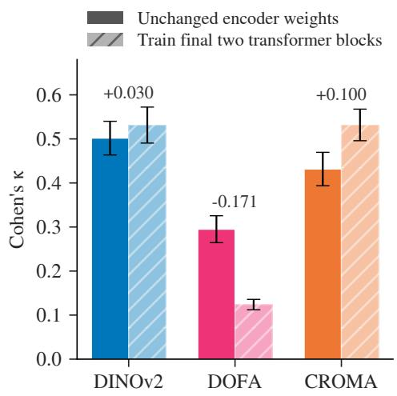

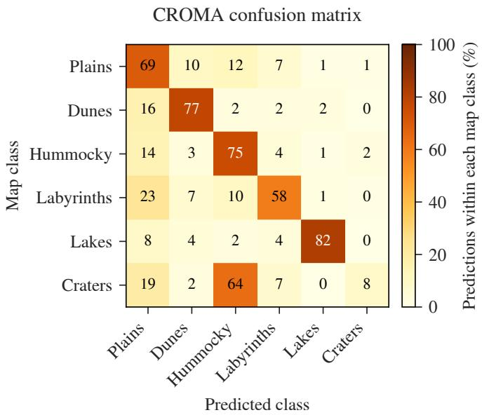  
Figure 15: Results from the original implementation, before weighted gradient accumulation was corrected. Left: Cohen’s κ for linear classifiers using encoders whose weights remain unchanged and for training the final two transformer blocks. Bars are means over five geographic folds; error bars give the sample standard deviation of fold means. Right: CROMA confusion matrix after training the two blocks, combining predictions over all folds and seeds before normalizing each row. For CROMA, higher κ together with lower macro recall reflects a redistribution of errors. The combined counts describe the predictions, while uncertainty calculations use fold means.

## B.4.9 Recall and labeled training-set size

Figure 16 shows how macro recall changes as the number of labeled Titan training tiles increases, with encoder weights unchanged and a linear classifier fitted to their features. Stratified sampling guarantees at least one tile from each represented class. Small subsets therefore contain disproportionately many rare-class examples and require labels before images can be sampled. The curves apply to this sampling rule. Using them to forecast an annotation campaign would require a design that accounts for how labels are acquired. At 10 labels, CROMA reaches 26.8%, DINOv2 25.1% and DOFA 20.2%, compared with the 16.7% six-class benchmark. Using every training tile in each fold, DINOv2 reaches 50.3%, CROMA 44.4% and DOFA 34.9%. DINOv2 improves most consistently as labels are added, while CROMA is nonmonotonic at low counts. The loss here gives examples equal weight, whereas the experiment in Table 19 uses class weights. These diferent losses can yield diferent scores even when both experiments use every training tile.

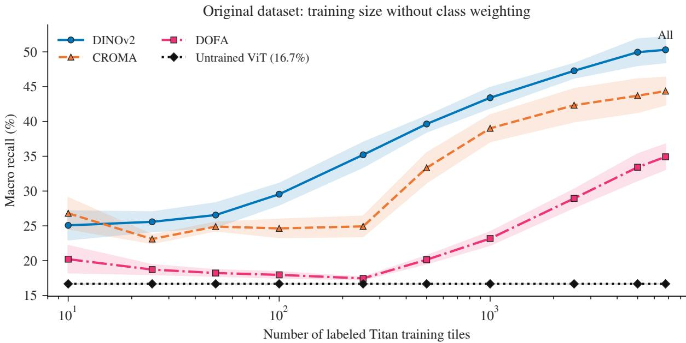  
Figure 16: Sensitivity to the number of labeled Titan training images in the original dataset, using a loss without class weights. Lines give six-class macro recall averaged over five seeds for sampling and training in each fold, then over five geographic folds. Bands show the sample standard deviation across fold means. At n = 10, CROMA has the highest mean, 26.8% versus 25.1% for DINOv2; this diference is small relative to the fold spread. DINOv2 gives the highest result using all training tiles, 50.3%. All denotes each fold’s complete training set, plotted at the mean training size for DINOv2.

## C Image sources and Earth sites

## C.1 Earth site details

Table 28: Earth site labels and intended morphological analogies. Assignments still need verification for individual image areas, especially ofshore Arctic and Icelandic areas and the site incorrectly named Wad Rum. Sentinel-1 IW VV products are processed with ESA SNAP and sampled at 351.5625 m/pixel.
<table><tr><td>Terrain Class</td><td>Site Name</td><td>Location</td><td>Analog Rationale</td></tr><tr><td rowspan="3">Dunes</td><td>Namib Sand Sea</td><td>Namibia</td><td>Linear longitudinal dunes</td></tr><tr><td>Grand Erg Oriental</td><td>Algeria</td><td>Large-scale erg morphology</td></tr><tr><td>Rub&#x27; al Khali</td><td>Saudi Arabia</td><td>Massive sand sea</td></tr><tr><td rowspan="3">Craters</td><td>Manicouagan</td><td>Canada</td><td>Large impact structure</td></tr><tr><td>Mistastin</td><td>Canada</td><td>Complex crater with melt sheet</td></tr><tr><td></td><td></td><td></td></tr><tr><td rowspan="3">Lakes</td><td>Arctic thermokarst</td><td>Siberia</td><td>Shallow depressions</td></tr><tr><td>Salar de Uyuni</td><td>Bolivia</td><td>Low-relief salt flat</td></tr><tr><td>Atacama channels</td><td>Chile</td><td>Dissected plateau terrain</td></tr><tr><td rowspan="3">Labyrinths</td><td>Wadi Rum label</td><td>Egypt, verified source</td><td>Labyrinths assignment needs review</td></tr><tr><td>Madagascar tsingy</td><td>Madagascar</td><td>Karst labyrinth terrain</td></tr><tr><td>Arctic tundra</td><td></td><td></td></tr><tr><td rowspan="3">Plains</td><td>Icelandic sandur</td><td>Canada Iceland</td><td>Low-relief terrain</td></tr><tr><td></td><td></td><td>Outwash plains</td></tr><tr><td>Desert pavement</td><td>California/Nevada, USA</td><td>Flat arid surface</td></tr></table>

## C.2 Radar frequencies and image geometry

Table 29: Radar frequencies and benchmark geometry. Frequencies identify the instruments; the experiments vary several factors together and leave the individual frequency efects undetermined.

<table><tr><td>Parameter</td><td>Value</td><td>Source</td></tr><tr><td>Cassini frequency</td><td>13.78 GHz</td><td>Elachi et al. [1]</td></tr><tr><td>Cassini wavelength</td><td>2.176 cm</td><td>c/f</td></tr><tr><td>Sentinel-1 frequency</td><td>5.405 GHz</td><td>ESA</td></tr><tr><td>Sentinel-1 wavelength</td><td>5.547 cm</td><td>c/f</td></tr><tr><td>Titan sphere radius</td><td>2574.7 km</td><td>Benchmark geometry</td></tr><tr><td>Image width</td><td>45 km</td><td>Benchmark geometry</td></tr><tr><td>Common output spacing</td><td>351.5625 m/pixel</td><td>Benchmark geometry</td></tr></table>

## D Input configurations and computing resources

Table 30 specifies the encoders and inputs used with the original dataset. Section 3 gives the settings for the current evaluation. Computing resources are described below for the enlarged Titan experiments.

## D.1 Model weights and input handling

Table 30: Model configurations used with the original dataset. The architecture chosen by the Untrained ViT fallback and its exact initial weights remain unverified; see Section B.2.1.
<table><tr><td>Model</td><td>Patch size</td><td>Encoder channels</td><td>Supplied SAR input</td><td>Weights source</td></tr><tr><td>DINOv2</td><td>14</td><td>3, RGB</td><td>One SAR channel repeated three times</td><td>Meta AI</td></tr><tr><td>DOFA</td><td>16</td><td>Variable</td><td>One SAR channel; original extraction used 13.78 for Earth and Titan</td><td>earthflow/DOFA</td></tr><tr><td>CROMA</td><td>8</td><td>2, VV and VH</td><td>One SAR channel repeated twice; 120 × 120 pixels</td><td>CROMA authors</td></tr><tr><td>Untrained ViT</td><td>14</td><td>1</td><td>One SAR channel and a single-channel stem</td><td>Seed 42</td></tr></table>

## D.2 Computing resources

Feature extraction and encoder training for the enlarged Titan catalog ran on three NVIDIA RTX 3080 Ti GPUs, each with 12 GB of memory. Independent jobs ran on separate GPUs. Linear classifiers and k-NN ran on CPU using saved features.