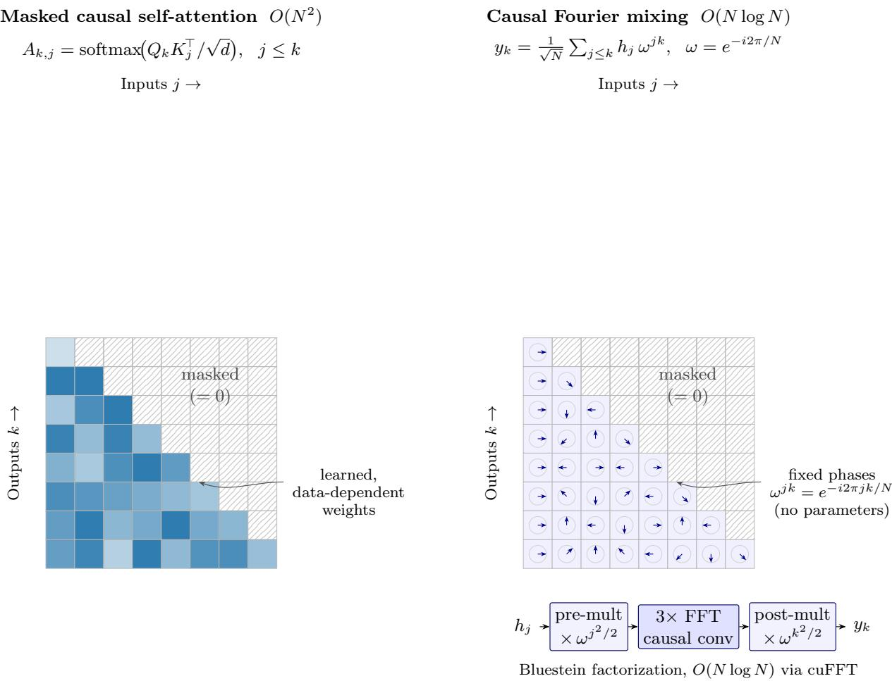

# CNet: A Complex-Valued Deep Learning Framework with Wirtinger Autodiferentiation and FFT–Hadamard Convolution

Marcel Crasmaru

October 7, 2026

Code: https://github.com/crasmarum/CNet

## Abstract

CNet is a C++/CUDA framework for building and researching deep complex-valued neural networks (CVNNs), and for optimizing complex-valued functions by gradient descent with Wirtinger derivatives. Complex-valued models are comparatively underexplored, yet they are a natural fit for domains where data is intrinsically complex—radio-frequency (IQ) communications, MRI k-space, radar/SAR, and audio spectra—and where phase carries information that magnitude-only real networks discard. CNet takes a physics-native stance: a network is a cascade of complex—and often unitary (the DFT)—operations acting on an amplitude vector, and classification is a Born-rule measurement $p _ { k } = | z _ { k } | ^ { 2 } / \| z \| ^ { 2 }$ rather than a softmax over real logits.

This paper documents the framework’s design—a depth-ordered computation graph that is cloned onto the GPU for batched execution—and its library of complex layers. Beyond the original layers it adds a family of signal-processing primitives that make the identity conv(x, k) = IFFT(FFT(x) ⊙ FFT(k)) usable as a learnable convolutional network: local-kernel construction by spectral padding (Pad), the inverse DFT (InverseFourierTrans), a phase-invariant magnitude nonlinearity (CModulus2, |z|2), holomorphic powers (CPower, zM), and mean pooling over time (MeanPool). It also adds GPU implementations of these layers, a true-Adam optimizer on the GPU, and a forward-only inference mode with a reduced memory footprint.

Note. Alongside the framework we present three studies. (1) A fully complex-valued FNet-style causal sequence model, built on a new O(N log N) causal Fourier mixer (Section 6): properly tuned, it matches or exceeds a parameter-matched real-valued causal FNet on character-level tiny-shakespeare, reaching the real model’s converged quality in under half the training steps. (2,3) Two architectural bottleneck analyses—radio-modulation classification on RML2016.10a [4] and the Fourier phase problem of coherent-difraction imaging / crystallography—that isolate exactly where complex-valued networks still need new operators (a temporal-structure feature map and a route through measurement non-uniqueness, respectively). Across all three the complex machinery provably learns the physically correct structure (Section 11); the remaining open problems are concrete and operator-level (Section 12).

## 1 Motivation and Design Philosophy

PyTorch and JAX both support complex tensors and complex-aware autodif, and for mainstream work they are the right tools—far more mature, faster at scale, multi-GPU, and backed by large ecosystems. CNet does not compete on that axis. It exists because, for research on complex-valued networks specifically, a complex-first, transparent substrate has concrete advantages.

• Complex is the default, not a bolted-on dtype. In the mainstream frameworks complex coverage is uneven: many layers, normalizations, activations, initializers, and optimizers assume real tensors, so a CVNN is assembled from real building blocks plus hand-written patches whose gradient conventions must be checked case by case. In CNet every variable, layer, loss, and the optimizer are complex by construction.

• Wirtinger gradients are explicit, first-class objects. Each layer manipulates the pair $( \partial L / \partial z , \ \partial L / \partial { \bar { z } } )$ directly, and the non-holomorphic case $\begin{array} { r l } { ( \mathrm { e . g . } } & { { } | z | ^ { 2 } ) } \end{array}$ is handled in the open rather than hidden behind a conjugation convention [2]. Every layer ships a CPU reference and a GPU kernel checked against each other and against finite diferences, so the complex gradient is auditable, not trusted.

• Spectral structure is built in. The DFT, the Hadamard (spectral) product, the inverse DFT, and the conv = IFFT(FFT · FFT) equivalence are first-class layers. Problems whose natural domain is the frequency plane map onto the framework directly.

• A physics-native model and loss—the Born rule. This is the sharpest departure from the mainstream frameworks. CNet reads a network’s output as a complex amplitude vector z—a state—and defines the class probabilities by the quantum-measurement (Born) rule

$$
p _ { k } = \frac { | z _ { k } | ^ { 2 } } { \| z \| ^ { 2 } } , \qquad \mathcal { L } ( z , y ) = - \sum _ { k } y _ { k } \log \frac { z _ { k } z _ { k } ^ { \star } } { \| z \| ^ { 2 } } .\tag{1}
$$

Classification is a measurement on an amplitude produced by a cascade of complex—often unitary—operations, rather than real logits passed through a softmax. This inductive bias is natural for physical and wave/field data: an IQ baseband sample is the complex envelope of a real passband signal, an MRI k-space sample is a complex Fourier coeficient, and a wavefunction is a complex amplitude. PyTorch and JAX provide no such head or loss out of the box.

• A small, auditable substrate. The full forward/backward of every layer and its CUDA kernel is explicit and readable, and the GPU execution model (a depth-ordered graph cloned across the batch) is visible and controllable.

In short: use PyTorch or JAX to ship; use CNet to study complex-valued learning itself—to model data in its native complex/amplitude form with a Born-rule measurement head, to prototype operators whose complex gradients you need to see and control, and to work natively in the spectral domain. The trade-ofs (single-GPU, Linux/macOS, a smaller op set) are listed in Section 12.1.

A note on why $\mathbb { C } \neq \mathbb { R } ^ { 2 } \colon$ : although $\mathbb { C } \cong \mathbb { R } ^ { 2 }$ as a vector space, the field multiplication couples the two components, so a holomorphic complex layer is not an unconstrained $\mathbb { R } ^ { 2 } \to \mathbb { R } ^ { 2 }$ map. CNet carries this structure end to end via the Wirtinger pair (∂/∂z, ∂/∂z¯).

## 2 Examples

A minimal spectral classifier—complex input, DFT, a learned Hadamard “filter” (a frequencydomain convolution), GELU, a dense head, and a Born-rule measurement—is built declaratively over a length-N signal with K classes (e.g. N = 128 complex IQ, K = 11):

CNet cnet;   
auto inp = cnet.add(new CInput(OutSize(N)));   
auto fft = cnet.add(new FourierTrans(InSize(N)), {inp});   
auto kdata = cnet.add(new CInput(OutSize(N))); // learned filter

auto hdm = cnet.add(new Hadamard(InSize(N), InSize(N)), {fft, kdata});   
auto gelu = cnet.add(new CGelu(InSize(N)), {hdm});   
auto ldata = cnet.add(new CInput(OutSize(N \* K)));   
auto lin = cnet.add(new Linear(InSize(N), InSize(N \* K)), {gelu, ldata});   
auto out = cnet.add(new CrossEntropy(InSize(K)), {lin});

The same graph runs on CPU (reference) or on the GPU (batched; Section 9).

## 3 Adding Custom Complex-Valued Functions / Layers

A layer extends CFunc and implements forward(), backward(), and clone(). For a layer computing $w = f ( z , { \bar { z } } )$ under a real loss $L ,$ the backward accumulates both Wirtinger gradients into the input:

$$
\frac { \partial L } { \partial z } = \frac { \partial L } { \partial w } \frac { \partial w } { \partial z } + \frac { \partial L } { \partial \bar { w } } \frac { \partial \bar { w } } { \partial z } , \qquad \frac { \partial L } { \partial \bar { z } } = \frac { \partial L } { \partial w } \frac { \partial w } { \partial \bar { z } } + \frac { \partial L } { \partial \bar { w } } \frac { \partial \bar { w } } { \partial \bar { z } } ,\tag{2}
$$

where the incoming ${ \partial L } / { \partial w }$ and $\partial L / \partial { \bar { w } }$ arrive from the consumer. For a holomorphic layer $\partial w / \partial { \bar { z } } =$ 0; non-holomorphic layers $\left( \mathrm { e . g . ~ } | z | ^ { 2 } \right)$ genuinely exercise the z¯ term.

Worked example: the CModulus2 layer $( w = | z | ^ { 2 } )$ . This is the canonical non-holomorphic case and makes the z¯ term concrete. The forward is

$$
w = | z | ^ { 2 } = z \bar { z } \in \mathbb { R } \subset \mathbb { C } ,\tag{3}
$$

so, treating z and z¯ as independent variables in the CR-calculus sense [2], the two local Wirtinger derivatives are

$$
\frac { \partial w } { \partial z } = \bar { z } , \qquad \frac { \partial w } { \partial \bar { z } } = z .\tag{4}
$$

Because $w$ is real the consumer returns a pair $( \partial L / \partial w , \ \partial L / \partial \bar { w } )$ that are conjugates of each other; writing their combined efect as $g \triangleq \partial L / \partial w + \partial L / \partial \bar { w }$ (itself real), the general accumulation above collapses to

$$
\frac { \partial L } { \partial z } = \frac { \partial L } { \partial w } \bar { z } + \frac { \partial L } { \partial \bar { w } } \bar { z } = g \bar { z } , \qquad \frac { \partial L } { \partial \bar { z } } = \frac { \partial L } { \partial w } z + \frac { \partial L } { \partial \bar { w } } z = g z ,\tag{5}
$$

i.e. $\partial L / \partial z = \overline { { \partial L / \partial \bar { z } } }$ , as required for a real loss. The gradient flowing back into z therefore scales the conjugate of the activation, which a real-valued $\mathbb { R } ^ { 2 } \to$ R treatment of $| z | ^ { 2 }$ does not express in closed form—this is precisely the term CNet exposes and checks. Higher moments $| z | ^ { 4 } , | z | ^ { 8 } , \ldots$ . follow by chaining this layer. The CPU reference, the CUDA kernel, and a finite-diference probe are required to agree before the layer is admitted.

Each layer is verified by a CPU reference against its GPU kernel, and the newer layers additionally by a finite-diference gradient check. A CUDA layer is a GpuMapping subclass whose kernels read/write the variable’s segments through device accessors and launch over the batch of clones.

## 4 Computation Graph on CUDA

The functional graph is ordered by depth. On an NVIDIA GPU, CNet clones the CPU network batch\_size times and executes forward and backward in parallel across the clones in depth order. Learnable parameters live on the ancestor net and are broadcast to the clones before each forward; per-clone gradients are reduced back to the ancestor before the optimizer step.

## 5 Complex Layers

Vectors are complex, $z \in \mathbb { C } ^ { N }$ . The original layers are: CInput (main input and learnable-parameter source); CEmbedding (token embeddings with padding); the unitary DFT $\begin{array} { r } { \mathrm { F F T } ( z ) _ { p } \mapsto \frac { 1 } { \sqrt { N } } \sum _ { q } z _ { q } e ^ { i 2 \pi p q / N } } \end{array}$ ; Hadamard (element-wise product, realizing circular convolution with the DFT); Residual (elementwise addition); Linear (fully connected); CRelu and CGelu activations; the $\mathrm { L 2 O u t } ( z ) \mapsto \sum _ { k } | z _ { k } | ^ { 2 }$ loss; and the Born-rule cross-entropy head CrossEntropy $\begin{array} { r } { ( z , y ) \mapsto \sum _ { k } - y _ { k } \log ( z _ { k } z _ { k } ^ { \star } / \| z \| ^ { 2 } ) } \end{array}$ , which reads the output as an amplitude and uses the measurement probabilities $p _ { k } = | z _ { k } | ^ { 2 } / \| z \| ^ { 2 }$

New layers. These make a learnable convolutional complex network and support signal-domain features; each has a CPU implementation and a CUDA kernel.

• Pad scatters K free kernel taps into an N-length zero vector at a fixed index set K (e.g. the $7 \times 7$ block $\{ r \cdot 2 8 + c \} )$ : $\mathrm { P a d } ( z ) _ { i } = z _ { j }$ if $i = \kappa _ { j }$ , else 0. Followed by the DFT it produces the frequency-domain filter of a local kernel, so Hadamard(FFT(x), FFT(Pad(k))) is a convolution with only K learnable taps—the local-kernel form of the FFT/Hadamard equivalence [1]. The index set is persisted with the model.

• InverseFourierTrans is the unitary inverse DFT, $\begin{array} { r } { \mathrm { I F F T } ( z ) _ { p } \mapsto \frac { 1 } { \sqrt { N } } \sum _ { q } z _ { q } e ^ { - i 2 \pi p q / N } } \end{array}$ . Because the DFT is unitary, $\mathrm { I F F T } ( X ) = \overline { { \mathrm { F F T } ( \bar { X } ) } }$ , so the layer reuses the forward transform; its backward is the forward unitary DFT on the gradients. Closing the loop FFT → Hadamard → IFFT yields a genuine time-domain convolution.

• CModulus2 is a phase-invariant magnitude nonlinearity $w = | z | ^ { 2 } = z \bar { z }$ (output real). Nonholomorphic: with $g = \partial L / \partial w + \partial L / \partial \bar { w }$ 2 $\partial L / \partial z = g \bar { z }$ and $\partial L / \partial \bar { z } = g z$ . Higher moments $| z | ^ { 4 } , | z | ^ { 8 } , \ldots$ . follow by chaining.

• CPower is the holomorphic power $w = z ^ { M }$ . With ∂w/∂z¯ = 0, $\begin{array} { r } { \partial L / \partial z = \frac { \partial L } { \partial w } M z ^ { M - 1 } } \end{array}$ and $\begin{array} { r } { \partial L / \partial \bar { z } = \frac { \partial L } { \partial \bar { \boldsymbol { \imath } } } M \bar { z } ^ { M - 1 } } \end{array}$ . Raising an M-PSK signal to the M-th power aligns its symbol phases, so $| \overline { { z ^ { M } } } | ^ { 2 }$ (pooled over time) is a carrier-invariant phase-order feature.

• MeanPool reduces length N to P contiguous bins (global average when $P = 1 )$ , MeanPool(z)p 7→ $\begin{array} { r } { \frac { 1 } { w } \sum _ { j < w } z _ { p w + j } } \end{array}$ with $w = N / P \mathrm { - \alpha } \mathrm { a }$ real linear map, so $\partial L / \partial z _ { i } = ( \partial L / \partial z _ { \mathrm { p o o l } ( i ) } ) / w$ for both Wirtinger components.

• TokenwiseLinear is a position-wise linear map: one shared $E _ { \mathrm { i n } } \times E _ { \mathrm { o u t } }$ complex weight W is applied independently to each of the T length- $E _ { \mathrm { i n } }$ token slices, $\begin{array} { r } { \mathrm { { o u t } } ( t ) _ { j } = \sum _ { i } z ( t ) _ { i } W _ { j i } } \end{array}$ . It mixes features within a token but never across tokens, at $O ( T E _ { \mathrm { i n } } E _ { \mathrm { o u t } } )$ cost and only $E _ { \mathrm { i n } } E _ { \mathrm { o u t } }$ parameters (versus a dense Linear’s $O ( ( T E ) ^ { 2 } ) )$ ; the weight gradient is summed over all token positions. This is the Transformer / FNet position-wise feed-forward primitive.

## 6 Fast Causal Fourier Mixing

Fourier token mixing [5] replaces self-attention’s $O ( N ^ { 2 } )$ content-based routing with a single parameterfree transform, but in its original form it is non-causal: every output position sees every input, so it cannot drive a decoder-style (autoregressive) model. We introduce a causal Fourier mixer and a fast algorithm for it (Figure 1).

  
Figure 1: Causal token mixing, two ways, shown on the triangular $( j \leq k )$ support. Left: masked self-attention—each lower-triangular weight $A _ { k , j }$ is learned and input-dependent (content-based routing), at $O ( N ^ { 2 } )$ cost. Right: the causal Fourier mixer (6)—the same triangular sum, but the weights are the fixed roots of unity $\omega ^ { j k }$ (drawn as unit phasors whose rotation rate grows with $j k ,$ , fastest at the bottom-right), so the layer is parameter-free. The triangular mask breaks the FFT butterfly, but the Bluestein / chirp-z factorization (bottom) restores an O(N log N) evaluation—a chirp pre-multiply, a causal linear convolution done with three ordinary FFTs, and a chirp postmultiply—for both the forward pass and its Wirtinger backward.

The causal (triangular-masked) DFT. Define the mixer

$$
\mathrm { M i x } ( h ) _ { k } = \frac { 1 } { \sqrt { N } } \sum _ { j \leq k } h _ { j } \omega ^ { j k } , \qquad \omega = e ^ { - i 2 \pi / N } ,\tag{6}
$$

i.e. the DFT with a lower-triangular mask (TriangFourier). Output position k depends only on inputs $j \leq k ,$ , so the layer mixes tokens like attention—every earlier token can influence the current one—yet carries no parameters and a fixed transform, while preserving the autoregressive mask. This is what lets Fourier mixing run in a decoder, the setting FNet (a non-causal encoder) does not address. The transform is a genuine complex layer: its Wirtinger backward is the (upper-)triangular adjoint of (6).

An O(N log N) algorithm via Bluestein factorization. The triangular mask breaks the FFT butterfly, so the naive form of (6) is a direct $O ( N ^ { 2 } )$ sum. We remove that penalty with a Bluestein / chirp-z factorization of the masked transform. Writing the quadratic exponent as

$$
j k = { \textstyle { \frac { 1 } { 2 } } } \big ( j ^ { 2 } + k ^ { 2 } - ( k - j ) ^ { 2 } \big ) ,\tag{7}
$$

and substituting into (6), the causal DFT becomes a chirp-premultiply, a causal (lower-triangular) linear convolution, and a chirp-postmultiply:

$$
\mathrm { M i x } ( h ) _ { k } = \frac { 1 } { \sqrt { N } } \omega ^ { k ^ { 2 } / 2 } { \sum _ { j \le k } } \bigl ( h _ { j } \omega ^ { j ^ { 2 } / 2 } \bigr ) \omega ^ { - ( k - j ) ^ { 2 } / 2 } .\tag{8}
$$

The lower-triangular convolution is computed in the usual Bluestein way—zero-pad the two sequences to a power of two and evaluate the convolution with three ordinary (butterfly) FFTs: one forward transform of each padded sequence, a pointwise product, and one inverse transform. Both the forward mixer and its Wirtinger backward therefore run in $O ( N \log N )$ . Because CNet’s UnityRoots use the $\omega = e ^ { - i 2 \pi / N }$ convention, the chirp is $e ^ { - i \pi k ^ { 2 } / N }$ with $k ^ { 2 }$ reduced mod 2N on the host to keep the angle small; the factorization was validated $\mathrm { t o } \sim 1 0 ^ { - 1 4 }$ against the direct sum (both the forward and the adjoint) before the CUDA port, which uses batched cuFFT.

Measured speedup. On an NVIDIA A10 at N=128 the exact causal mixer is ≈5× faster than the direct $O ( N ^ { 2 } )$ sum and runs level with the non-causal cuFFT path, so causality is no longer a speed compromise—a decoder-style Fourier mixer costs the same as the encoder-style one. This is, to our knowledge, the first O(N log N) realization of a masked-causal DFT token mixer.

## 7 Optimization

Parameters update by plain SGD, momentum, or true Adam—first and second moment with bias correction and the per-parameter $\sqrt { v } + \epsilon$ step:

$$
m _ { t } = \beta _ { 1 } m _ { t - 1 } + ( 1 - \beta _ { 1 } ) g , \quad v _ { t } = \beta _ { 2 } v _ { t - 1 } + ( 1 - \beta _ { 2 } ) g ^ { 2 } , \quad \theta \ - = \eta \hat { m } _ { t } / ( \sqrt { \hat { v } _ { t } } + \epsilon ) .\tag{9}
$$

Adam runs on both CPU and GPU. On the GPU the moments are stored in the per-variable arena: a variable holds eight contiguous length-N segments $[ \operatorname { R e } z ,$ , Im z, dz, d¯z, v ] (the first moment reuses the dz slots). The real Born-rule loss landscape is ill-conditioned, and Adam is substantially more stable than momentum on it.

## 8 Building the Software

Linux/macOS, via make, with automatic CUDA detection (nvcc if present, else $\mathrm { g } { + + } )$ . The build tracks header dependencies (-MMD -MP), so editing a header recompiles exactly the objects that include it.

## 9 Training on GPU

Training is driven by command-line flags (l\_rate, batch\_size, no\_epochs, true\_adam, . . . ). The loop allocates the net on the GPU, then iterates forward / loss $/$ backward / update, checkpointing the model:

cnet.allocateOnGpu(batch\_size);   
for (int epoch = 0; epoch < no\_epochs; ++epoch) {   
reader.shuffle();   
for (int t = 0; t < reader.size() / batch\_size; ++t) {   
auto batch = reader.nextBatch(batch\_size);   
cnet.gpuForward(inp, cen, batch);   
avg\_loss += cnet.getLoss(cen, &batch);   
cnet.gpuBackward();   
cnet.trueAdamUpdate(l\_rate / batch.size(), beta1, beta2, eps, step++);   
}   
cnet.save(model\_path); // a checkpoint is always written   
}

## 10 Inference

For deployment a restored model runs forward-only with a reduced memory layout: setting Vars::dims\_ = Vars::INFER\_DIMS allocates fewer per-variable segments (no gradient or optimizer bufers), roughly halving the footprint versus training.

Vars::dims\_ = Vars::INFER\_DIMS;   
CNet cnet; cnet.restore(model\_path);   
cnet.allocateOnGpuInfer(batch\_size);   
for (...) { cnet.gpuInfer(inp, cen, batch); correct += cnet.getCorrect(cen); }

## 11 Applications and Results

## 11.1 Radio modulation classification — RML2016.10a

The framework’s primary benchmark is RML2016.10a [4], a standard set of 11 analog and digital modulations in native complex IQ over SNRs from −20 to +18 dB —the kind of problem the framework is built for, since the data are genuinely complex and classes difer in amplitude and phase structure. A single complex network consumes the length-128 IQ window directly (no real/imag split) and combines, in one Born-rule classifier: a learnable complex convolution bank (each channel a FourierTrans → Hadamard → InverseFourierTrans circular convolution, read out by | · |2, | · |4 amplitude features with mean pooling, separating the QAM amplitude distributions); fixed phase-order branches $z ^ { M }$ (M = 2, 4) with pooling and | · |2 (the carrier-invariant M-PSK phase structure); a small MLP head; and the Born-rule CrossEntropy output. Training uses true Adam on the high-SNR (≥ 6 dB) split.

Results (held-out, real RML2016.10a). Evaluated on a disjoint 50% test split of the real DeepSig data (power-normalized IQ, true Adam on the batch-corrected GPU path), accuracy follows the canonical S-curve (11-way, chance ≈ 0.09): near chance below −6 dB, a knee around 0 dB, and a plateau of ≈ 0.70 from ∼4 dB up. Over the full mixed-SNR test split the model reaches ≈ 47%.

The ceiling is the feature construction, not capacity. Scaling the network (n\_channels 32 → 128, pool bins 4 → 8, hidden 64 → 256) does not raise held-out accuracy—train accuracy climbs toward 0.69 while test stays near 0.47, i.e. added capacity only overfits. The bottleneck is the hand-chosen pooled-power read-out $( | \cdot | ^ { 2 } , | \cdot | ^ { 4 }$ with mean pooling plus the $z ^ { M }$ phase-order branches): it captures the amplitude/phase statistics that separate the easy classes but discards the temporal structure needed to split the physically similar groups (QAM16 ↔ QAM64, 8PSK ↔ QPSK, AM-DSB ↔ WBFM). This sits $\approx 2 0 – 2 5$ points below SOTA real-valued CNNs on RML2016.10a (0.60–0.65 overall, 0.92–0.94 at high SNR) [4].

The isolated bottleneck. On RML2016.10a the complex machinery learns the physically correct structure but does not yet match a tuned real-valued CNN. The controlled capacity sweep above localizes why: the gap is not representational power (which only overfits) but the hand-chosen pooled-power read-out, which discards the temporal structure needed to separate the physically similar classes. This is a feature-construction bottleneck with a concrete remedy (Section 12): new complex layers that keep temporal structure—e.g. a learnable multi-tap complex convolution bank feeding a complex sequence head—rather than more of the same pooled features.

## 11.2 A complex-valued FNet for sequence modeling

The convolution layers compose into an attention-free sequence model in the spirit of FNet [5], kept fully complex-valued end to end. A character-level language model over tiny-shakespeare embeds a window of T tokens into $\mathbb { C } ^ { T E }$ (CEmbedding plus a learnable positional parameter) and stacks L identical blocks, each a token-mixing sublayer and a position-wise feed-forward sublayer, every sublayer wrapped in a residual and a post-residual CGelu:

$$
h + = \operatorname { M i x } ( h ) , \ h \gets \operatorname { C G e l u } ( h ) ; \qquad h + = \operatorname { F F N } ( h ) , \ h \gets \operatorname { C G e l u } ( h ) .\tag{10}
$$

A final Linear and Born-rule head predict the next character.

The token mixer is the parameter-free causal Fourier transform of Section 6 (TriangFourier, Eq. (6)), the only operation that couples positions; it respects the autoregressive mask and runs in $O ( N \log N )$ via the Bluestein factorization. The feed-forward sublayer is a position-wise TokenwiseLinear $E  4 E  E$ , which never mixes tokens, so the Fourier transform remains the sole cross-token coupling at $O ( E ^ { 2 } )$ parameters rather than a dense head’s $O ( ( T E ) ^ { 2 } )$ .

Findings (tiny-shakespeare, character level). The architecture trains and learns character statistics (loss descends from the chance level ln 64 ≈ 4.16). Several choices mattered on the complex, Born-rule loss: (i) a post-residual CGelu rather than the global unit-norm $A ( z ) = z / \| z \|$ , which caps the Born-rule logit scale and plateaus the loss; (ii) true Adam with a linear-warmup + cosine learning-rate schedule—the Born-rule loss is ill-conditioned, and under a constant, overly conservative learning rate the model appears to plateau early, a tuning artifact we return to below; (iii) per-block spectral normalization (block\_norm: an $L ^ { 2 }$ normalization of each block’s output, which commutes with the DFT) to train deep stacks—a naive 10-block, ∼10M-parameter model diverges without it. Table 1 summarizes the quantitative efect of these choices.

A matched real-valued baseline, and the decisive role of tuning. To test whether the complex, Born-rule stack is itself a handicap, we built a real-valued causal FNet matched in every controllable respect: the same window (N=64), depth (L=6), per-position next-character objective, the same 90/10 tiny-shakespeare split, and the same real parameter budget (1.61M, versus the complex model’s 1.62M real degrees of freedom), difering only in using real arithmetic with a realpart causal Fourier mix and an ordinary softmax cross-entropy. Trained with a warmup+cosine schedule it converges cleanly to 2.03 nats/char. An earlier version of the complex model appeared to plateau near 2.4; that ceiling was an artifact of under-tuning (a constant learning rate ≈ 10× too low), not of the representation. Retrained with the same warmup+cosine schedule, the complex FNet tracks the real baseline through ∼3k steps and then pulls ahead—it reaches the real model’s fully converged best (2.03) by step ∼5k and ≈ 1.75 nats/char by step 15k, still decreasing. So on matched parameters the complex, Born-rule model is competitive with or better than its realvalued counterpart, and reaches the same quality in under half the steps; the earlier shortfall was optimization, not complex arithmetic. On the richer mixer. The complex model’s token mixer is also stronger than the baseline’s—a full-amplitude causal DFT over the whole flattened token-major stream, versus a token-axis real-part DFT. We regard this not as a confound to apologize for but as the point: operating natively in C afords richer, naturally unitary token transformations that a real-valued network cannot express without doubling its representation and hand-constructing the interaction. That the amplitude-native model both matches its real twin’s eficiency and carries a structurally more expressive mixer for the same parameter budget is precisely the advantage the Born-rule, complex-first design is meant to exploit—it is a feature of the thesis, not a flaw in the comparison.

<table><tr><td>Model</td><td>Training choice</td><td>Val (nats/char)</td></tr><tr><td rowspan="2">6-block, 1.62M</td><td>full (warmup+cosine, CGelu)</td><td>1.75</td></tr><tr><td>constant low lr (no schedule) unit-norm head, no CGelu†</td><td>≈2.4 (stalls) stalls</td></tr><tr><td rowspan="2">10-block, ~10M</td><td>with block_norm</td><td>2.57</td></tr><tr><td>without block_norm</td><td>diverges (→16)</td></tr></table>

Table 1: Efect of the main training choices (character-level tiny-shakespeare, per-position nats/char). Top: the 6-block / 1.62M model—the learning-rate schedule is decisive: a constant, overly small rate stalls near 2.4, while warmup+cosine reaches 1.75. Bottom: the deep 10-block / ∼10M model, where per-block spectral normalization (block\_norm) is required for convergence at all; these deep-net runs predate the tuned schedule, so their absolute losses are not directly comparable to the top block. †The CGelu → global unit-norm change was observed to stall but was not separately tuned to a final loss.

The remaining frontier. Both models—complex and real—are attention-free Fourier mixers, and both still trail a self-attention Transformer of comparable size (which reaches ≈ 1.5 nats/char on this corpus in standard setups). Closing that remaining gap is a matter of content-based routing: a fixed, input-independent token mix cannot do what self-attention’s data-dependent mixing does, and that is the direction the follow-on work targets (Section 12)—a complex, physics-native analogue of content-based mixing. (Earlier capacity/depth/learnable-mixer sweeps that seemed to confirm a hard 2.4 plateau were run under the same under-tuned schedule; we therefore do not draw strong conclusions from them.)

Relation to prior work and novelty. Parameter-free DFT token mixing is due to FNet [5]; learnable complex Fourier-domain filters appear in Global Filter Networks [6] and Fourier neural operators. All are non-causal encoders in real-valued networks that read out the real part. Two elements here are, to our knowledge, new: the causal (triangular-masked) DFT mixer, which respects the autoregressive mask and extends Fourier mixing to decoder-style modeling; and the fully complex-valued realization—complex weights trained by Wirtinger (CR-calculus) autodiferentiation, a position-wise complex feed-forward, and a Born-rule measurement output—with no projection to a real representation anywhere in the stack.

## 11.3 The Fourier phase problem (coherent difraction / crystallography)

A third, exploratory study targets the problem the framework is in principle ideal for: recover a real, non-negative object $\rho$ from the magnitude of its Fourier transform |ρb|—the phase problem of X-ray crystallography and coherent difractive imaging, where detectors measure intensity and the phase is lost. With an oversampled, asymmetric support (which removes the translation and conjugate-flip ambiguities), the problem is a natural fit for a complex spectral network with a magnitude (| · |2) measurement.

Where the dificulty actually lives. We first characterized the classical baseline, Fienup’s hybrid input–output (HIO). On an ensemble of compact multi-Gaussian objects, HIO with an oracle selection (pick, among random restarts, the restart closest to the ground truth) recovers the object in 0.66–0.83 of cases; but blind selection (pick the restart with the lowest Fourier-magnitude residual, the only signal available at test time) succeeds only 0.27–0.38 of the time. The large oracle–blind gap localizes the real obstacle: HIO does find the true basin often, but selecting the right solution blindly is what fails, because the wrong fixed points are themselves valid-looking compact, non-negative objects that fit the measured magnitudes almost as well.

Two learned attacks, both informative negatives. We probed whether learning can close the oracle–blind gap. (1) A learned selector trained to pick the correct HIO restart from features of the candidates does no better than the blind residual (0.24 vs. 0.275)—consistent with the diagnosis that the wrong candidates are genuine impostors, not artifacts a classifier can flag. (2) A learned unrolled solver (deep-unfolding: T iterations of fixed magnitude projection + a learned real-space refinement + support/non-negativity, trained end-to-end) does not learn a sharp inverse either: supervised regression on a provably non-unique map drives the deterministic solver toward a blurry conditional mean (mean correlation ≈ 0.52, success@0.9 ≈ 0). The lesson is structural: non-uniqueness defeats both ends—post-hoc selection cannot tell valid impostors apart, and a single-valued feed-forward map cannot represent a one-to-many inverse. A solver that could match HIO must, like HIO, explore multiple basins (be stochastic/iterative) and then face the same selection problem. We record this as a sharp, reusable problem statement rather than a solved task, and sketch the only avenue we think remains—a jointly trained stochastic solver and diferentiable, data-consistency-defined selector—in Section 12.

## 12 Outlook: a research program

Read together, the three studies tell one story. In every case the complex, physics-native formulation learns the right structure—the correct modulation statistics, genuine character-level language, the true difraction basins. On the sequence model, once properly tuned, that is already enough to match or beat a parameter-matched real-valued FNet (§11); on the other two tasks a measurable gap to a tuned real-valued baseline remains, and in each case we can name exactly what is missing: a temporal-structure feature map for RML, and a way through measurement non-uniqueness for the phase problem (with content-based routing the remaining frontier for any Fourier mixer, complex or real). That these gaps are nameable is the encouraging part; it turns “do CVNNs help?” into a small set of concrete, attackable sub-problems.

The central methodological bet. Our working view—stated as opinion, to be settled empirically in follow-on work—is that the productive direction is not to port existing real-valued architectures into complex arithmetic and hope the inductive bias pays of. Mimicking the real nets (a complex ResNet, a complex Transformer assembled from the usual blocks) is a long, incremental project that mostly re-derives known designs at higher cost. The leverage is in treating “complex and physics-native” as a design space in its own right and searching it along both axes at once: new architectures (how complex amplitudes are composed, measured, and routed) and new layers (operators with no clean real-valued analogue). CNet’s auditable Wirtinger substrate exists precisely so that such operators can be prototyped with their ∂/∂z¯ terms visible and checked.

Concrete follow-on experiments. The studies above each hand us a next step. (i) Contentbased complex mixing: a Born-rule / amplitude-native analogue of attention—e.g. input-dependent spectral gating, or a measurement-based routing where the mix weights come from $| z | ^ { 2 }$ of a learned projection—to close the remaining gap from our causal-Fourier sequence model (now on par with a matched real FNet) to a self-attention Transformer. (ii) Structure-keeping RML features: replace the pooled-power read-out with a learnable multi-tap complex convolution bank feeding a complex sequence head, so temporal structure (not just amplitude/phase statistics) reaches the classifier, targeting the physically similar classes that cap accuracy at $\approx 0 . 7 0 .$ . (iii) Phase retrieval as a stochastic unrolled solver with a jointly-trained diferentiable selector, where “correct” is defined by the data consistency the solver itself enforces rather than by a label—the one avenue the nonuniqueness analysis leaves open. (iv) Faster/deeper spectral stacks building on the Bluestein causal mixer and block\_norm. We also note a framework-level correctness result that unblocks all of the above: a bug in the batched-GPU gradient reduction (per-clone Wirtinger gradients were summed into the ancestor but not cleared between steps, so they accumulated) was found and fixed; batched true-Adam training now matches the single-example reference, which is what makes the scaling experiments trustworthy.

These are hypotheses, not results. We state them to mark CNet as an active research platform: the contribution of this report is a working complex-valued substrate, a new O(N log N) causal Fourier mixer, and—just as deliberately—three honestly characterized gaps that define the next round of experiments.

## 12.1 Limitations and Future Work

CNet is a single-GPU research substrate, and we frame its current limits as targeted engineering goals rather than fundamental constraints. Scaling: multi-GPU data/model parallelism is not yet implemented, which bounds the model sizes reachable in the studies above; it is the natural next step for the scaling experiments of Section 12. Extensibility: adding a CUDA layer is still a manual process (writing the device kernels and registering the layer by hand in the type map, the model serializer, and the GPU dispatch); a single-point registration API is planned to make the operator-design program above frictionless. Kernels: some CUDA layers are not yet performancetuned, leaving speedups on the table beyond the Bluestein mixer. Inference layout: the minimal Vars::dims\_=2 (data-only) layout is exact for standard single-head networks, but fan-out / chained element-wise layers reuse the gradient segments as forward-pass scratch and require dims\_ ≥ 4 (hence the default inference layout is 4). The framework currently targets Linux and macOS.

## References

[1] On the equivalence between convolutional and Hadamard networks using DFT. arXiv:1810.11650.

[2] K. Kreutz-Delgado. The complex gradient operator and the CR-calculus. arXiv:0906.4835, 2009.

[3] C. Trabelsi et al. Deep Complex Networks. ICLR, 2018 (arXiv:1705.09792).

[4] T. J. O’Shea, J. Corgan, T. C. Clancy. Convolutional Radio Modulation Recognition Networks. EANN, 2016; RML2016.10a dataset, DeepSig.

[5] J. Lee-Thorp, J. Ainslie, I. Eckstein, S. Ontañón. FNet: Mixing Tokens with Fourier Transforms. NAACL, 2022 (arXiv:2105.03824).

[6] Y. Rao, W. Zhao, Z. Zhu, J. Lu, J. Zhou. Global Filter Networks for Image Classification. NeurIPS, 2021 (arXiv:2107.00645).