# COMMON-MODE ERRORS LIMIT LOW-TIMESTEPDEEP SPIKING Q-NETWORKS

Zijie Xu, Bingrui Guo, Yiding Sun, Yiting Dong, Zhile Yang, Zhaofei Yu†   
Peking University   
Beijing, 100871, China

## ABSTRACT

Spiking neural networks (SNNs) offer sparse and event-driven computation, making them attractive for energy-constrained reinforcement learning (RL) on edge devices. In value-based RL, deep spiking Q-networks (DSQNs) combine such efficiency with action-value estimation for decision making. However, existing DSQNs often require multiple simulation timesteps for competitive performance, increasing computational and energy costs, whereas reducing the timesteps can cause substantial performance degradation. We investigate this degradation from the perspective of Q-value estimation errors. By decomposing errors across actions into common-mode and differential-mode components, we find that low-timestep DSQNs suffer disproportionately from common-mode errors shared across action values, which are particularly detrimental to temporaldifference learning through bootstrapped targets. Based on this finding, we propose Common-Mode Compensation Deep Spiking Q-Network (CMC-DSQN), which uses an auxiliary ANN to compensate for common-mode errors in the SNN outputs. At inference, greedy action selection can be performed directly from the SNN outputs, allowing the auxiliary ANN to be completely removed and preserving the energy efficiency of SNNs. Extensive experiments on Atari and MiniAtar environments demonstrate substantial performance improvements under low-timestep settings. CMC-DSQN outperforms state-of-the-art DSQN baselines by nearly 20% at $\overset { \smile } { T } = 2$ and further surpasses the ANN baseline at $T = 4$

## 1 INTRODUCTION

Spiking neural networks (SNNs) process information through sparse binary spikes, providing an event-driven alternative to conventional artificial neural networks (ANNs) (Maass, 1997; Gerstner et al., 2014). When deployed on neuromorphic hardware, such sparse computation can substantially reduce the computational cost and inference latency (Merolla et al., 2014; Davies et al., 2018; DeBole et al., 2019). These properties are particularly attractive for reinforcement learning (RL), where agents repeatedly interact with the environment and continuously make decisions. Combining SNNs with RL therefore provides a promising route toward energy-efficient sequential decision making on resourceconstrained edge devices (Yamazaki et al., 2022).

RL has achieved remarkable success in sequential decision-making tasks (Mnih et al., 2015; Schulman et al., 2017; Lillicrap et al., 2015; Haarnoja et al., 2018). Among different RL paradigms, value-based methods learn action values that estimate the expected long-term returns of candidate actions. Deep Q-Networks (DQNs) combine Q-learning with ANNs for function approximation (Mnih et al., 2013; 2015), achieving human-level control on Atari games and establishing a fundamental framework for value-based RL (Mnih et al., 2015; Van Hasselt et al., 2016; Schaul et al., 2015; Hessel et al., 2018). However, conventional DQNs require dense ANN computation to estimate Q-values at every decision step. Replacing the ANN-based Q-function approximator with an SNN gives rise to Deep Spiking Q-Networks (DSQNs), which aim to improve the energy efficiency of value-based RL.

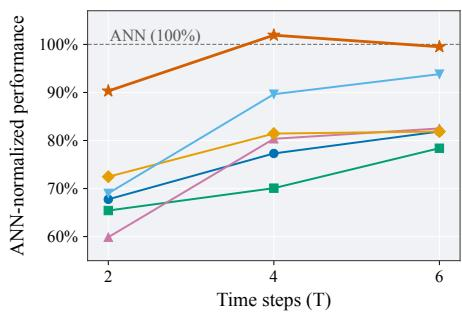  
Figure 1: Comparison of existing directly trained DSQNs on the MiniAtar environments (Young & Tian, 2019), including DSQN (Liu et al., 2022), pbLN (Sun et al., 2022), DATSQN (Ghoreishee et al., 2026), CaRe-BN (Xu et al., 2026c), and TP-DSQN (Chowdhury et al., 2022). Performance is averaged across all environments and normalized by the ANN.

DSQNs have been developed through both ANN-to-SNN conversion (Patel et al., 2019; Tan et al., 2021; Kumar et al., 2025) and direct gradient-based training (Liu et al., 2022; Qin et al., 2022; 2025; Sun et al., 2022; Chen et al., 2022; Ghoreishee et al., 2026), achieving competitive performance or even surpassing ANNs. However, such performance often relies on a relatively large number of SNN simulation timesteps. For each RL decision, a DSQN must simulate its neuronal dynamics for T internal timesteps before outputting Q-values. A larger T therefore increases inference latency and computational cost. Although reducing T is highly desirable, we find that low-timestep DSQNs suffer from substantial performance degradation.

In this work, we investigate this degradation from the perspective of Q-value estimation errors. We decompose the errors across actions into common-mode and differential-mode components. While ANN Q-networks exhibit relatively balanced errors between the two modes, low-timestep DSQNs are dominated by common-mode errors. We further show theoretically that common-mode errors affect temporal-difference learning more directly than differential-mode errors. Experiments on the CliffWalking environment (Sutton & Barto, 2018) confirm their greater impact, showing that removing common-mode errors is more effective than removing differential-mode errors. Together, these results identify common-mode error as a major bottleneck of low-timestep DSQNs.

Motivated by these findings, we propose Common-Mode Compensation Deep Spiking Q-Network (CMC-DSQN). To suppress common-mode errors in the low-timestep SNN, CMC-DSQN replaces the action-wise mean of the SNN outputs with a common-mode estimate produced by an auxiliary ANN. The SNN and ANN are jointly optimized through temporal-difference learning, allowing the ANN to provide a more reliable estimate of the common-mode component. Since this commonmode correction does not change the greedy action, the auxiliary ANN is needed only during train ing and can be removed entirely at inference. CMC-DSQN therefore improves Q-value estimation without introducing additional computational overheads during deployment.

We evaluate CMC-DSQN on both Atari (Mnih et al., 2013) and MiniAtar (Young & Tian, 2019) environments. Under low-timestep settings, CMC-DSQN consistently achieves strong performance and substantially outperforms both directly trained DSQNs and ANN-to-SNN conversion baselines. As shown in Fig. 1, at T = 2, CMC-DSQN exceeds state-of-the-art DSQN baselines by nearly 20%. With T = 4, CMC-DSQN further surpasses the ANN baseline on both Atari and MiniAtar environments. These results demonstrate that mitigating common-mode estimation errors is particularly effective for closing the performance gap of low-timestep DSQNs.

## 2 RELATED WORK

## 2.1 SPIKING NEURAL NETWORKS FOR POLICY-BASED REINFORCEMENT LEARNING

SNNs have been applied to RL through biologically motivated synaptic plasticity (Florian, 2007; Fremaux & Gerstner, 2016; Gerstner et al., 2018; Fr´ emaux et al., 2013; Yang et al., 2024) and´ gradient-based learning (Bellec et al., 2020). For continuous control, numerous studies have developed spiking policies through ANN-to-SNN conversion (Xu et al., 2026b) or actor–critic learning (Tang et al., 2020; 2021; Zhang et al., 2022; Chen et al., 2024; Ding et al., 2022; Van den Berghe et al., 2026; Xu et al., 2026a;c). These studies primarily focus on policy learning, whereas our work investigates value-based RL through DSQNs.

## 2.2 SPIKING NEURAL NETWORKS FOR VALUE-BASED REINFORCEMENT LEARNING

For value-based RL, SNNs have been integrated into Deep Q-Networks through both ANN-to-SNN conversion and direct training. Conversion-based methods transform pretrained DQNs into spiking networks (Patel et al., 2019; Tan et al., 2021; Kumar et al., 2025), whereas directly trained DSQNs use surrogate gradients such as STBP (Wu et al., 2018) to optimize spiking Q-functions end-toend (Liu et al., 2022; Qin et al., 2022). Subsequent work has improved DSQNs through recurrent mechanisms (Qin et al., 2025), normalization (Sun et al., 2022; Xu et al., 2026c), and enhanced spiking-neuron designs (Chen et al., 2022; Ghoreishee et al., 2026). However, Q-value estimation errors in low-timestep DSQNs remain insufficiently understood.

## 2.3 VALUE DECOMPOSITION IN DEEP Q-LEARNING

Value decomposition exploits structures shared across actions. Dueling architectures and their extensions decompose Q-values into a state-dependent shared component and action-dependent advantages (Wang et al., 2016; Hessel et al., 2018; Tavakoli et al., 2018), while VA-learning further studies value–advantage learning under bootstrapping and its relation to the behavior policy (Tang et al., 2023). In contrast to these methods that decompose the Q-function itself, we decompose its estimation errors into common-mode and differential-mode components, and show that commonmode errors dominate in low-timestep DSQNs. Beyond this distinction, CMC-DSQN adopts a hy brid architecture in which a training-only auxiliary ANN estimates the common-mode component without sharing the SNN encoder, differing from typical dueling-style shared-encoder architectures.

## 3 PRELIMINARIES

## 3.1 DEEP Q-LEARNING

Reinforcement learning (RL) considers a Markov decision process (MDP) $\langle S , \mathcal { A } , P , R , \gamma \rangle$ (Sutton & Barto, 2018), where S and A denote the state and action spaces, $P ( s ^ { \prime } | s , a )$ is the transition probability, $R ( s , a )$ is the reward function, and $\gamma \in [ 0 , 1 )$ is the discount factor. At interaction step i, the agent observes state $s _ { i } .$ , selects action $a _ { i } ,$ , receives reward $r _ { i } .$ , and transitions to $s _ { i + 1 }$ . The discounted return $G _ { i }$ and the action-value function $Q ^ { \pi } ( s , a )$ under policy $\pi$ are defined as

$$
G _ { i } = \sum _ { k = 0 } ^ { \infty } \gamma ^ { k } r _ { i + k } ,\tag{1}
$$

$$
Q ^ { \pi } ( s , a ) = \mathbb { E } _ { \pi } \left[ G _ { i } \mid s _ { i } = s , a _ { i } = a \right] .\tag{2}
$$

The objective is to learn the optimal action-value function $Q ^ { * }$ , which satisfies the Bellman equation

$$
Q ^ { * } ( s _ { i } , a _ { i } ) = \mathbb { E } \left[ r _ { i } + \gamma \operatorname* { m a x } _ { a ^ { \prime } } Q ^ { * } ( s _ { i + 1 } , a ^ { \prime } ) \right] .\tag{3}
$$

Deep Q-Networks (DQNs) (Mnih et al., 2013; 2015) approximate $Q ^ { * }$ using a neural network $Q _ { \theta } ( s , a )$ parameterized by θ. Given a transition $( s _ { i } , a _ { i } , r _ { i } , s _ { i + 1 } , d _ { i } )$ , the network is optimized by minimizing the temporal-difference (TD) loss

$$
\mathcal { L } = \mathbb { E } \left[ \left( Q _ { \theta } ( s _ { i } , a _ { i } ) - y _ { i } \right) ^ { 2 } \right] ,\tag{4}
$$

$$
y _ { i } = r _ { i } + \gamma ( 1 - d _ { i } ) \operatorname* { m a x } _ { a ^ { \prime } } Q _ { \theta } \big ( s _ { i + 1 } , a ^ { \prime } \big ) ,\tag{5}
$$

where $y _ { i }$ is the bootstrapped TD target and $d _ { i } \in \{ 0 , 1 \}$ indicates whether the transition terminates the episode. During inference, the agent follows the greedy policy $a _ { i } = \arg \operatorname* { m a x } _ { a \in \mathcal { A } } Q _ { \theta } ( s _ { i } , a )$ . Because the TD target depends on estimated Q-values at the next state, estimation errors can propagate through successive bootstrapped updates, which motivates our analysis in Sec. 4.

## 3.2 SPIKING NEURAL NETWORKS

Spiking neural networks (SNNs) process information through discrete spikes over multiple simulation timesteps. We adopt the commonly used leaky integrate-and-fire (LIF) neuron with hard reset (Gerstner & Kistler, 2002). At SNN timestep t, its dynamics are

$$
\tilde { u } ^ { t } = \lambda u ^ { t - 1 } + I ^ { t } , \qquad o ^ { t } = H ( \tilde { u } ^ { t } - v _ { \mathrm { t h } } ) , \qquad u ^ { t } = \tilde { u } ^ { t } ( 1 - o ^ { t } ) ,\tag{6}
$$

where $\tilde { u } ^ { t }$ and $u ^ { t }$ denote the membrane potentials before and after reset, λ is the membrane decay factor, $I ^ { t }$ is the synaptic input, $v _ { \mathrm { t h } }$ is the firing threshold, and $H ( \cdot )$ denotes the Heaviside function.

A deep spiking Q-network (DSQN) replaces the ANN-based Q-network with an SNN. For each RL observation, the SNN runs for T simulation timesteps to output the action values. A larger $T$ generally improves value representation at higher computational cost, whereas a smaller T makes accurate Q-value estimation more challenging.

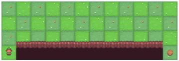  
(a) CliffWalking environment

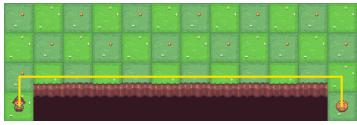  
(b) ANN trajectories

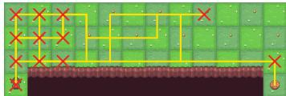  
(c) SNN trajectories

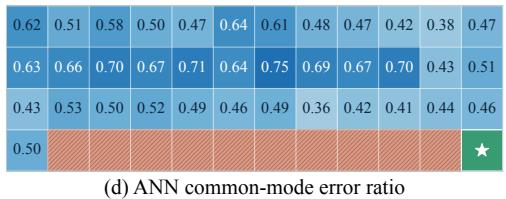

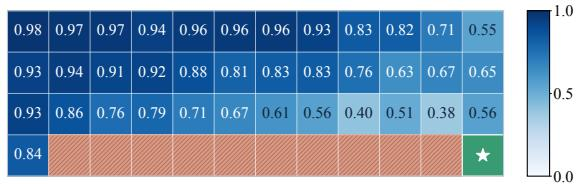  
(e) SNN common-mode error ratio  
100% 80Figure 2: Analysis on deterministic CliffWalking. (a) Environment. (b,c) Greedy trajectories of 80%ed 60.1 55.9the ANN and low-timestep SNN, respectively, aggregated over 20 random seeds. Yellow segments 60%of SE 40.3denote trajectories, and red crosses mark states leading to infinite loops. (d,e) State-wise common-40%ion R 25.0 21.0mode error ratios of the ANN and SNN with respect to the optimal action-value function $Q ^ { * }$

## Environment steps (×10 ) Environment steps (×10 ) 4 COMMON-MODE ERRORS IN DEEP SPIKING Q-NETWORKS

We begin with a case study on the deterministic CliffWalking environment shown in Fig. 2(a), where all transitions are deterministic and entering a cliff cell terminates the episode. Its small state space allows both the optimal action-value function $Q ^ { * }$ and the action-value function $Q ^ { \pi }$ of any policy to be computed exactly from the Bellman equations (Bellman, 1966). This enables direct analysis of Q-value estimation errors and their effects on TD bootstrapping (Sutton, 1988).

## 4.1 COMMON- AND DIFFERENTIAL-MODE ERROR DECOMPOSITION

Consider a discrete action space A with $| { \mathcal { A } } | = K$ . Given a reference action-value function $Q ^ { \mathrm { r e f } }$ , we decompose the estimation error $e ( s , a ) = \hat { Q } ( s , a ) - Q ^ { \mathrm { r e f } } ( s , a )$ across actions as

$$
e _ { c } ( s ) = { \frac { 1 } { K } } \sum _ { a \in \mathcal { A } } e ( s , a ) ,\tag{7}
$$

$$
\begin{array} { r } { e _ { d } ( s , a ) = e ( s , a ) - e _ { c } ( s ) , } \end{array}\tag{8}
$$

where $e _ { c }$ is the common-mode error, representing the error shared across actions, and $e _ { d }$ is the differential-mode error, capturing errors in the relative differences among actions.

We further define the common-mode error ratio $\rho _ { c } ( s )$ to quantify the relative magnitude of the common-mode error compared with the two error components at each state:

$$
\rho _ { c } ( s ) = \frac { E _ { c } ( s ) } { E _ { c } ( s ) + E _ { d } ( s ) } , \qquad E _ { c } ( s ) = | e _ { c } ( s ) | , \qquad E _ { d } ( s ) = \sqrt { \frac { 1 } { K } \sum _ { a } e _ { d } ( s , a ) ^ { 2 } } .\tag{9}
$$

## 4.2 COMMON-MODE ERROR DOMINANCE IN LOW-TIMESTEP SNNS

We first compare a conventional ANN with a low-timestep SNN (T = 2) under the same DQN framework over 20 random seeds. Because both the environment and the greedy evaluation policy are deterministic, each seed either succeeds or fails at each evaluation point. As shown in Figs. 3(a) and (b), the ANN rapidly learns a stable solution, whereas the SNN is substantially less stable. Although many SNN seeds eventually discover a successful policy, only a small fraction remain successful at any given evaluation point, indicating difficulty in maintaining stable value estimates.

Common-mode error dominance. To separate estimation error from policy suboptimality, Fig. 3(c) measures the common- and differential-mode RMSEs with respect to the exact ${ \bar { Q } } ^ { \pi }$ of each learned greedy policy. The SNN exhibits substantially larger errors than the ANN in both modes. More importantly, its common-mode error is much larger than its differential-mode error, whereas the two are relatively balanced in the ANN. Thus, low-timestep SNNs exhibit not only larger Q-value estimation errors, but also a common-mode dominance.

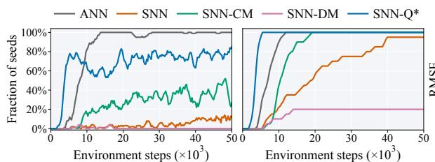  
(a) Successful seeds  
(b) Cumulative solved seeds

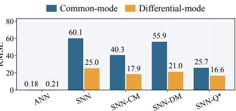  
(c) CM/DM RMSE w.r.t. $\boldsymbol { Q } ^ { \pi }$  
Figure 3: Learning dynamics and Q-value estimation errors on CliffWalking environment. (a) Fraction of successful seeds at each evaluation point. (b) Cumulative fraction of seeds that have solved the task at least once. Curves in (a) and (b) are smoothed for visual clarity. (c) Common- and differential-mode RMSEs with respect to the exact $Q ^ { \pi }$ of each learned deterministic greedy policy.

State-wise common-mode dominance. We further examine the spatial distribution of these errors using the optimal action-value function $Q ^ { * }$ as the reference. Figures 2(d) and (e) show the state-wise common-mode error ratio $\rho _ { c } ( s )$ for the ANN and SNN, respectively. The ANN maintains a relatively balanced error composition, whereas the SNN is dominated by common-mode errors at nearly every state, particularly in the upper-left region. This region also coincides with the cyclic trajectories frequently observed in unsuccessful SNN policies (Fig. 2(c)), suggesting a close association between common-mode error dominance and unstable policy.

## 4.3 ERROR PROPAGATION THROUGH TEMPORAL-DIFFERENCE BOOTSTRAPPING

To determine whether common-mode errors contribute to performance degradation, we next analyze how common-mode and differential-mode errors propagate through TD bootstrapping. Consider the one-step target in Eq. (5) for a non-terminal transition $( d _ { i } = 0 )$ . Given a reference Q-function $Q ^ { \mathrm { r e f } }$ let $\hat { Q } ( s , a ) = Q ^ { \mathrm { r e f } } ( s , a ) + e _ { c } ( s ) + e _ { d } ( s , a )$ . Substituting this decomposition into the TD target gives

$$
\left\{ \begin{array} { l l } { \displaystyle \hat { y } _ { i } = r _ { i } + \gamma e _ { c } \big ( s _ { i + 1 } \big ) + \gamma \operatorname* { m a x } _ { a } \big [ Q ^ { \mathrm { r e f } } \big ( s _ { i + 1 } , a \big ) + e _ { d } \big ( s _ { i + 1 } , a \big ) \big ] , } \\ { \displaystyle y _ { i } ^ { \mathrm { r e f } } = r _ { i } + \gamma \operatorname* { m a x } _ { a } Q ^ { \mathrm { r e f } } \big ( s _ { i + 1 } , a \big ) . } \end{array} \right.\tag{10}
$$

Thus, the error propagated to the bootstrapped target is:

$$
\hat { y } _ { i } - y _ { i } ^ { \mathrm { r e f } } = \gamma e _ { c } ( s _ { i + 1 } ) + \gamma \Delta _ { d } ( s _ { i + 1 } ) .\tag{11}
$$

$$
\Delta _ { d } ( s ) = \operatorname* { m a x } _ { a } \big [ Q ^ { \mathrm { r e f } } ( s , a ) + e _ { d } ( s , a ) \big ] - \operatorname* { m a x } _ { a } Q ^ { \mathrm { r e f } } ( s , a ) .\tag{12}
$$

The common-mode error shifts all action values equally and therefore enters the bootstrap target directly, whereas the differential-mode error affects it only through maximization, with $| \triangle _ { d } ( s ) | \leq$ ma $\mathrm { x } _ { a } \vert e _ { d } ( s , a )$ |. Common-mode errors thus have a more direct pathway into successive TD updates.

Removing Bootstrap Errors. To isolate the effects of the two modes, we modify only the nextstate Q-values used for bootstrapping:

$$
\left\{ \begin{array} { l l } { \hat { Q } _ { \mathrm { C M } } ( s , a ) = \hat { Q } ( s , a ) - e _ { c } ^ { \pi } ( s ) , } \\ { \hat { Q } _ { \mathrm { D M } } ( s , a ) = \hat { Q } ( s , a ) - e _ { d } ^ { \pi } ( s , a ) , } \\ { \hat { Q } _ { Q ^ { * } } ( s , a ) = Q ^ { * } ( s , a ) , } \end{array} \right.\tag{13}
$$

where $e _ { c } ^ { \pi }$ and $e _ { d } ^ { \pi }$ are computed with respect to the exact $Q ^ { \pi }$ of the current learned greedy policy.   
These variants are denoted as SNN-CM, SNN-DM, and SNN- $Q ^ { * }$ , respectively.

Learning dynamics. As shown in Figs. 3(a) and (b), replacing the next-state estimate with exact $Q ^ { * }$ substantially improves learning, confirming the importance of bootstrap Q-value accuracy.

Algorithm 1 CMC-DSQN   
1: Training:   
2: for each sampled transition $( s _ { i } , \underset {  } { a _ { i } } , \underset {  } { r _ { i } } , s _ { i + 1 } )$ do   
3: Compute $\grave { Q } _ { \phi , \theta } ^ { \mathrm { C M C } } ( s _ { i } , \cdot )$ and $Q _ { \phi , \theta } ^ { \mathrm { C M C } } ( s _ { i + 1 } , \cdot )$ using Eq. (16)   
4: Construct the TD target $y _ { i }$ using Eq. (5)   
5: Update θ and ϕ by minimizing $\mathbf { \dot { \mathcal { L } } } = ( \dot { Q } _ { \phi , \theta } ^ { \mathrm { C M C } } ( s _ { i } , a _ { i } ) - y _ { i } ) ^ { 2 }$   
6: end for   
7: Inference:   
8: Compute only $Q _ { \theta } ^ { \mathrm { S N N } } ( s _ { i } , \cdot )$   
9: Select $a _ { i } = \arg \operatorname* { m a x } _ { a } Q _ { \theta } ^ { \mathrm { S N N } } ( s _ { i } , a )$

Removing only the common-mode error also yields a clear improvement, whereas removing the differential-mode error does not improve learning1. This indicates that common-mode errors play a more critical role than differential-mode errors in destabilizing TD learning in low-timestep SNNs.

Q-value estimation errors. The Q-value estimation errors in Fig. 3 (c) further support this observation. Using the exact optimal Q-value $Q ^ { * }$ achieves the lowest estimation errors. Removing either the common-mode or differential-mode error reduces both error components, but correcting the common mode leads to a relatively larger reduction. Together, these results show that common mode errors have a substantially greater impact on TD learning than differential-mode errors.

## 5 COMMON-MODE COMPENSATION FOR DEEP SPIKING Q-NETWORKS

The analysis in Sec. 4 shows that common-mode estimation errors can directly bias bootstrapped TD targets and degrade learning in low-timestep DSQNs. In the simple CliffWalking environment, such errors can be explicitly removed because exact reference Q-functions are available. In practical RL tasks, however, neither $Q ^ { \pi }$ nor $Q ^ { * }$ is accessible during training.

A straightforward alternative is to introduce an auxiliary ANN to estimate and compensate for the entire Q-value estimation error. However, this requires the auxiliary network to model both commonand differential-mode components, introducing unnecessary complexity. As shown in Sec. 6.3, this design improves over the vanilla DSQN but underperforms CMC-DSQN.

## 5.1 CMC-DSQN

Motivated by the analysis in Sec. 4, we propose Common-Mode Compensation Deep Spiking $Q \mathrm { - }$ Network (CMC-DSQN), which introduces an auxiliary ANN $C _ { \phi } ^ { \mathrm { A N N } } ( s )$ parameterized by ϕ to estimate the common-mode component.

Let $Q _ { \theta } ^ { \mathrm { S N N } } ( s , a )$ denote the raw Q-value produced by the SNN with parameters θ. Its common-mode estimation error $e _ { c } ( s )$ with respect to a reference Q-function $Q ^ { \mathrm { r e f } }$ is

$$
e _ { c } ( s ) = \frac { 1 } { K } \sum _ { a \in \mathcal { A } } \left( Q _ { \theta } ^ { \mathrm { S N N } } ( s , a ) - Q ^ { \mathrm { r e f } } ( s , a ) \right) .\tag{14}
$$

Directly predicting $e _ { c } ( s )$ is undesirable because the SNN evolves continuously during training, making the residual error itself a moving target. Instead, the auxiliary ANN directly estimates the corre sponding common-mode Q-value component,

$$
C _ { \phi } ^ { \mathrm { A N N } } ( s ) \approx \frac { 1 } { K } \sum _ { a \in \mathcal { A } } Q ^ { \mathrm { r e f } } ( s , a ) .\tag{15}
$$

Note that $Q ^ { \mathrm { r e f } }$ is unavailable during training. Thus, the auxiliary ANN is learned jointly with the SNN solely through TD learning by constructing the CMC Q-value as

$$
Q _ { \phi , \theta } ^ { \mathrm { C M C } } ( s , a ) = Q _ { \theta } ^ { \mathrm { S N N } } ( s , a ) - \frac { 1 } { K } \sum _ { a ^ { \prime } \in \mathcal { A } } Q _ { \theta } ^ { \mathrm { S N N } } ( s , a ^ { \prime } ) + C _ { \phi } ^ { \mathrm { A N N } } ( s ) .\tag{16}
$$

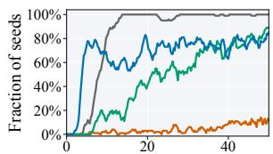  
Environment steps (×103)  
(a) Successful seeds

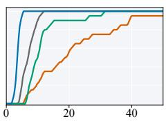  
Environment steps (×103)

(b) Cumulative solved seeds  
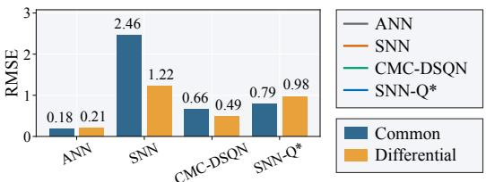  
(c) CM/DM RMSE w.r.t. $\mathbf { Q } ^ { * }$  
Figure 4: Learning dynamics and Q-value estimation errors on CliffWalking. (a) Fraction of successful seeds at each evaluation point. (b) Cumulative fraction of seeds that have solved the task at least once. Curves in (a) and (b) are smoothed for visual clarity. (c) Common- and differential-mode RMSEs with respect to the exact optimal Q-function $Q ^ { * }$ . Unlike Fig. 3(c), which uses the exact $Q ^ { \pi }$ of each learned policy as the reference, this panel evaluates all methods against $Q ^ { * }$

Thus, CMC-DSQN removes the common component of the SNN outputs and replaces it with the estimate produced by the auxiliary ANN. The ANN and SNN process the observation independently without sharing an encoder, and are jointly optimized through the DQN objective in Eq. (4). The overall training and inference procedures of CMC-DSQN are summarized in Algorithm 1.

An important property of Eq. (16) is that the auxiliary ANN does not affect greedy action selection:

$$
\arg \operatorname* { m a x } _ { a } Q _ { \phi , \theta } ^ { \mathrm { C M C } } ( s , a ) = \arg \operatorname* { m a x } _ { a } Q _ { \theta } ^ { \mathrm { S N N } } ( s , a ) .\tag{17}
$$

Therefore, the auxiliary ANN is required only during training and can be removed entirely at inference, where actions are selected directly from the original SNN outputs. CMC-DSQN therefore introduces no additional computational overhead and preserves the energy efficiency of SNNs.

## 5.2 UNDERSTANDING COMMON-MODE COMPENSATION

We revisit CliffWalking to examine whether CMC-DSQN alleviates the error characteristics identified in Sec. 4. As shown in Figs. 4(a) and (b), CMC-DSQN substantially improves learning stability over the vanilla SNN and enables nearly all seeds to solve the task. Figure 4(c) further shows that CMC-DSQN markedly reduces both common- and differential-mode Q-value errors.

Interestingly, CMC-DSQN achieves even lower estimation errors than SNN-Q\*, despite the latter using the exact optimal Q-values for bootstrapping. SNN-Q\* still requires a single low-timestep SNN to reduce both common- and differential-mode errors, whereas CMC-DSQN assigns the common mode error reduction to the ANN and allows the SNN to focus on reducing differential-mode errors. This reduces the representational burden on the SNN and improves estimation of both error modes.

## 6 EXPERIMENTS

## 6.1 EXPERIMENTAL SETUP

We evaluate CMC-DSQN on two commonly used benchmarks: Atari (Mnih et al., 2013) and Mini Atar (Young & Tian, 2019). For Atari, we consider seven games evaluated in the original DQN study (Mnih et al., 2013): BeamRider, Breakout, Enduro, Pong, Q\*bert, Seaquest, and SpaceInvaders. For MiniAtar, we evaluate on all five environments: Asterix, Breakout, Freeway, Seaquest, and SpaceInvaders. We use $T \in \{ 2 , 3 , 4 \}$ for Atari and $T \in \{ 2 , 4 , 6 \}$ for MiniAtar. All models are trained for 30M environment transitions on Atari and 5M transitions on MiniAtar. Results are averaged over three random seeds for Atari and five random seeds for MiniAtar. The main hyperparameters follow Mnih et al. (2015) and Young & Tian (2019), respectively. Detailed implementation settings are provided in the Appendix.

We compare CMC-DSQN with both ANN-to-SNN conversion methods and directly trained DSQNs. The conversion baselines include vanilla ANN-to-SNN conversion with integrate-and-fire (IF) neurons (DSQN-CVT), differential coding with multi-threshold neurons (DCGS) (Huang et al., 2025; 2024), and cross-step residual potential initialization (CRPI) (Xu et al., 2026b) combined with

Table 1: Average maximum return over three random seeds and average performance ratio (APR) on Atari environments after 30M environment transitions.
<table><tr><td>Timesteps</td><td>Method</td><td>BeamRider</td><td>Breakout</td><td>Enduro</td><td>Pong</td><td>Q*bert</td><td>Seaquest</td><td>SpaceInvaders</td><td>APR</td></tr><tr><td></td><td>Random DQN(ANN)</td><td>354.64 6842.99</td><td>0.97 364.51</td><td>0.00 295.79</td><td>-20.26 19.86</td><td>162.08 9224.17</td><td>60.20</td><td>127.83</td><td>0.00%</td></tr><tr><td> $T = 2$ </td><td>DSQN</td><td>4279.90</td><td>276.11</td><td>280.97</td><td>17.60</td><td>1300.21</td><td>1960.44 2101.49</td><td>1492.50 806.36</td><td>100.00% 70.75%</td></tr><tr><td></td><td>CMC-DSQN DSQN</td><td>4136.44 4705.58</td><td>382.90 292.41</td><td>316.87 273.83</td><td>18.34 17.23</td><td>4186.33 4076.25</td><td>2358.57 2863.83</td><td>1183.40 935.96</td><td>87.06% 83.32%</td></tr><tr><td> $T = 3$ </td><td>CMC-DSQN</td><td>5284.37</td><td>398.73</td><td>313.55</td><td>19.59</td><td>8782.83</td><td>1766.93</td><td>1401.10</td><td>95.57%</td></tr><tr><td> $T = 4$ </td><td>DSQN CMC-DSQN</td><td>4676.82 5904.69</td><td>318.01 411.70</td><td>266.15 311.73</td><td>16.13 19.98</td><td>4306.67 8941.17</td><td>3589.00 2399.73</td><td>883.21 1491.77</td><td>88.76% 103.45%</td></tr></table>

Table 2: Average maximum return over five random seeds and average performance ratio (APR) on MiniAtar environments after 5M environment transitions, where ± denotes one standard deviation.
<table><tr><td>Timesteps</td><td>methods</td><td>Asterix</td><td>Breakout</td><td>Freeway</td><td>Seaquest</td><td>SpaceInvaders</td><td>APR</td></tr><tr><td rowspan="2"></td><td>Random</td><td> $0 . 4 9 3 \pm 0 . 9 0 2$ </td><td> $0 . 3 6 6 \pm 0 . 6 1 8$ </td><td> $0 . 3 7 0 \pm 0 . 5 8 6$ </td><td> $0 . 1 1 6 \pm 0 . 4 2 7$ </td><td> $4 . 0 5 7 \pm 3 . 1 9 9$ </td><td>0.00%</td></tr><tr><td>DQN (ANN)</td><td> $3 2 . 2 2 \pm 4 . 9 4$ </td><td> $2 7 . 7 6 \pm 4 . 9 8$ </td><td> $6 2 . 5 8 \pm 0 . 3 4$ </td><td> $4 9 . 7 0 \pm 8 . 1 5$ </td><td> $1 3 8 . 3 4 \pm 3 . 8 7$ </td><td>100.00%</td></tr><tr><td rowspan="8"> $T = 2$ </td><td>DSQN-CVT</td><td> $1 . 8 9 \pm 1 . 1 4$ </td><td> $4 . 1 1 \pm 2 . 4 0$ </td><td> $1 9 . 1 7 \pm 1 7 . 7 2$ </td><td> $1 . 3 6 \pm 0 . 7 5$ </td><td> $3 . 8 2 \pm 3 . 7 7$ </td><td>10.12%</td></tr><tr><td>DCGS</td><td> $1 8 . 3 6 \pm 3 . 5 5$ </td><td> $1 1 . 6 4 \pm 2 . 2 1$ </td><td> $5 9 . 2 2 \pm 0 . 7 7$ </td><td> $2 6 . 1 7 \pm 2 . 8 4$ </td><td> $6 0 . 5 6 \pm 2 0 . 8 9$ </td><td>57.33%</td></tr><tr><td>CRPI</td><td> $2 1 . 0 2 \pm 2 . 3 6$ </td><td> $1 4 . 9 2 \pm 0 . 8 9$ </td><td> $5 9 . 7 0 \pm 0 . 6 4$ </td><td> $2 8 . 5 6 \pm 2 . 4 4$ </td><td> $8 2 . 0 2 \pm 2 1 . 3 8$ </td><td>65.72%</td></tr><tr><td>DSQN</td><td> $1 4 . 5 0 \pm 3 . 0 4$ </td><td> $2 3 . 9 0 \pm 1 . 2 2$ </td><td> $5 6 . 9 2 \pm 1 . 0 6$ </td><td> $2 2 . 8 4 \pm 1 5 . 6 7$ </td><td> $1 0 0 . 7 6 \pm 1 1 . 5 1$ </td><td>67.76%</td></tr><tr><td>pbLN</td><td> $1 6 . 2 0 \pm 1 . 4 0$ </td><td> $2 6 . 4 3 \pm 2 . 5 6$ </td><td> $5 5 . 5 7 \pm 0 . 3 5$ </td><td> $1 3 . 8 7 \pm 2 . 6 9$ </td><td> $9 2 . 7 0 \pm 1 . 8 7$ </td><td>65.43%</td></tr><tr><td>DATSQN</td><td> $1 4 . 6 7 \pm 1 . 2 9$ </td><td> $2 3 . 9 3 \pm 3 . 3 7$ </td><td> $5 8 . 4 7 \pm 0 . 8 4$ </td><td> $2 . 3 3 \pm 0 . 2 1$ </td><td> $9 9 . 1 7 \pm 1 9 . 2 8$ </td><td>59.88%</td></tr><tr><td>CaRe-BN</td><td> $1 7 . 4 6 \pm 1 . 9 9$ </td><td> $2 1 . 3 8 \pm 2 . 1 3$ </td><td> $5 8 . 0 4 \pm 0 . 2 9$ </td><td> $3 4 . 7 6 \pm 5 . 1 3$ </td><td> $9 7 . 4 2 \pm 4 . 2 3$ </td><td>72.46%</td></tr><tr><td>TP-DSQN</td><td> $1 9 . 0 6 \pm 4 . 4 0$ </td><td> $2 3 . 3 4 \pm 2 . 5 4$ </td><td> $5 8 . 3 8 \pm 0 . 7 7$ </td><td> $3 0 . 3 8 \pm 1 0 . 8 4$ </td><td> $6 9 . 0 2 \pm 1 4 . 3 7$ </td><td>69.01%</td></tr><tr><td rowspan="10"></td><td>CMC-DSQN</td><td> $2 7 . 3 0 \pm 4 . 9 4$ </td><td> $2 3 . 5 0 \pm 5 . 0 9$ </td><td> $5 6 . 7 4 \pm 1 . 1 2$ </td><td> $4 1 . 0 6 \pm 1 4 . 9 0$ </td><td> $1 5 0 . 9 2 \pm 3 6 . 3 1$ </td><td>90.30%</td></tr><tr><td>DSQN-CVT</td><td> $5 . 5 6 \pm 3 . 2 2$ </td><td> $6 . 6 7 \pm 2 . 0 7$ </td><td> $5 0 . 9 7 \pm 3 . 6 3$ </td><td> $3 . 9 8 \pm 2 . 0 1$ </td><td> $1 4 . 2 9 \pm 9 . 3 5$ </td><td>27.15%</td></tr><tr><td>DCGS</td><td> $2 1 . 6 5 \pm 6 . 9 6$ </td><td> $1 3 . 8 3 \pm 3 . 9 6$ </td><td> $6 0 . 7 7 \pm 0 . 7 0$ </td><td> $3 3 . 4 3 \pm 6 . 4 1$ </td><td> $7 8 . 5 0 \pm 1 7 . 7 5$ </td><td>67.11%</td></tr><tr><td>CRPI</td><td> $2 6 . 4 2 \pm 3 . 6 5$ </td><td> $1 7 . 8 7 \pm 2 . 3 6$ </td><td> $6 1 . 2 8 \pm 0 . 7 6$ </td><td> $4 3 . 0 6 \pm 8 . 8 4$ </td><td> $1 0 2 . 7 6 \pm 1 7 . 6 6$ </td><td>80.72%</td></tr><tr><td>DSQN</td><td> $2 2 . 0 4 \pm 5 . 5 4$ </td><td> $2 2 . 9 6 \pm 4 . 5 6$ </td><td> $5 7 . 0 4 \pm 1 . 1 0$ </td><td> $3 3 . 1 0 \pm 6 . 9 5$ </td><td> $1 0 9 . 5 0 \pm 1 5 . 9 9$ </td><td>77.31%</td></tr><tr><td>pbLN</td><td> $1 5 . 7 0 \pm 0 . 3 6$ </td><td> $2 5 . 0 3 \pm 2 . 2 3$ </td><td> $5 5 . 5 7 \pm 0 . 6 7$ </td><td> $2 3 . 2 0 \pm 2 . 4 6$ </td><td> $1 0 7 . 6 7 \pm 2 . 6 4$ </td><td>70.08%</td></tr><tr><td>DATSQN</td><td> $2 6 . 9 6 \pm 3 . 7 0$ </td><td> $2 5 . 0 6 \pm 1 . 9 9$ </td><td> $5 8 . 7 6 \pm 3 . 1 3$ </td><td> $3 5 . 9 6 \pm 1 4 . 9 2$ </td><td> $8 7 . 3 8 \pm 1 1 . 3 8$ </td><td>80.35%</td></tr><tr><td>CaRe-BN</td><td> $1 9 . 8 2 \pm 2 . 9 8$ </td><td> $2 7 . 9 2 \pm 3 . 2 0$ </td><td> $5 8 . 5 6 \pm 0 . 7 0$ </td><td> $3 1 . 8 8 \pm 5 . 3 9$ </td><td> $1 2 2 . 3 8 \pm 1 0 . 2 1$ </td><td>81.44%</td></tr><tr><td>TP-DSQN</td><td> $2 8 . 7 4 \pm 4 . 3 4$ </td><td> $2 6 . 6 6 \pm 2 . 3 1$ </td><td> $6 0 . 6 2 \pm 0 . 5 1$ </td><td> $4 5 . 0 4 \pm 6 . 2 4$ </td><td> $1 0 5 . 7 2 \pm 1 4 . 2 7$ </td><td>89.64%</td></tr><tr><td>CMC-DSQN</td><td> $3 5 . 4 0 \pm 2 . 3 6$ </td><td> $2 6 . 9 2 \pm 4 . 3 4$ </td><td> $5 9 . 7 8 \pm 0 . 3 7$ </td><td> $5 5 . 7 8 \pm 8 . 7 8$ </td><td> $1 3 1 . 4 4 \pm 1 3 . 5 0$ </td><td>101.92%</td></tr><tr><td rowspan="8"> $T = 6$ </td><td>DSQN-CVT</td><td> $7 . 6 0 \pm 2 . 8 2$ </td><td> $9 . 1 5 \pm 2 . 7 2$ </td><td> $5 6 . 4 6 \pm 2 . 0 9$ </td><td> $8 . 2 7 \pm 2 . 5 6$ </td><td> $1 9 . 2 7 \pm 1 2 . 4 9$ </td><td>34.48%</td></tr><tr><td>DCGS</td><td> $2 3 . 5 6 \pm 4 . 8 4$ </td><td> $1 5 . 6 8 \pm 3 . 8 8$ </td><td> $6 0 . 3 3 \pm 1 . 1 4$ </td><td> $3 8 . 5 7 \pm 7 . 7 6$ </td><td> $8 9 . 9 8 \pm 1 8 . 4 9$ </td><td>73.30%</td></tr><tr><td>CRPI</td><td> $2 5 . 6 5 \pm 3 . 7 2$ </td><td> $1 8 . 4 1 \pm 2 . 1 7$ </td><td> $6 1 . 0 8 \pm 0 . 9 5$ </td><td> $4 7 . 6 3 \pm 1 0 . 1 1$ </td><td> $1 1 1 . 1 3 \pm 1 6 . 1 1$ </td><td>83.66%</td></tr><tr><td>DSQN</td><td> $2 0 . 9 8 \pm 1 . 9 8$ </td><td> $2 8 . 5 0 \pm 2 . 1 9$ </td><td> $5 7 . 0 4 \pm 0 . 8 2$ </td><td> $3 3 . 9 8 \pm 1 0 . 8 7$ </td><td> $1 1 5 . 1 4 \pm 1 1 . 3 9$ </td><td>81.88%</td></tr><tr><td>pbLN</td><td> $1 8 . 7 0 \pm 3 . 4 2$ </td><td> $2 9 . 2 3 \pm 2 . 4 9$ </td><td> $5 6 . 0 7 \pm 0 . 2 5$ </td><td> $3 3 . 0 0 \pm 8 . 5 1$ </td><td> $1 0 2 . 5 7 \pm 1 1 . 4 2$ </td><td>78.39%</td></tr><tr><td> $\mathrm { D A T S Q N }$ </td><td> $2 9 . 2 0 \pm 3 . 3 7$ </td><td> $2 3 . 2 4 \pm 2 . 9 3$ </td><td> $5 7 . 0 0 \pm 6 . 3 1$ </td><td> $3 8 . 5 6 \pm 1 2 . 7 3$ </td><td> $9 8 . 0 4 \pm 1 6 . 5 9$ </td><td>82.51%</td></tr><tr><td> $_ \mathrm { C a R e - B N }$ </td><td> $2 0 . 4 3 \pm 1 . 6 3$ </td><td> $2 6 . 3 3 \pm 1 . 2 2$ </td><td> $5 8 . 1 0 \pm 0 . 5 3$ </td><td> $3 2 . 4 7 \pm 2 . 7 6$ </td><td> $1 2 9 . 8 3 \pm 1 7 . 0 6$ </td><td>81.87%</td></tr><tr><td>TP-DSQN</td><td> $3 3 . 6 2 \pm 5 . 3 3$ </td><td> $2 4 . 9 0 \pm 2 . 3 5$ </td><td> $6 1 . 2 0 \pm 0 . 8 2$ </td><td> $4 6 . 7 4 \pm 1 3 . 3 5$ </td><td> $1 1 5 . 8 2 \pm 2 4 . 0 9$ </td><td>93.80%</td></tr><tr><td> $\mathrm { C M C - D S Q N }$ </td><td> $3 5 . 4 4 \pm 3 . 6 3$ </td><td> $2 6 . 8 8 \pm 2 . 7 5$ </td><td> $5 9 . 3 8 \pm 0 . 5 0$ </td><td> $5 0 . 1 2 \pm 1 0 . 5 9$ </td><td> $1 3 1 . 4 8 \pm 1 3 . 9 4$ </td><td>99.51%</td></tr></table>

DCGS. The directly trained baselines include vanilla DSQN (Liu et al., 2022), potential-based layer normalization (pbLN) (Sun et al., 2022), deep asymmetric ternary spiking Q-network (DAT-SQN) (Ghoreishee et al., 2026), confidence-adaptive and re-calibration batch normalization (CaRe-BN) (Xu et al., 2026c), and DSQN with temporal pruning (TP-DSQN) (Chowdhury et al., 2022).

In addition to raw scores, we report the average performance ratio (APR):

$$
\mathrm { A P R } _ { m } = \frac { 1 } { \left| \mathcal { E } \right| } \sum _ { e \in \mathcal { E } } \frac { S _ { m , e } - S _ { \mathrm { R a n d o m } , e } } { S _ { \mathrm { A N N } , e } - S _ { \mathrm { R a n d o m } , e } } \times 1 0 0 \% ,\tag{18}
$$

where $\mathcal { E }$ denotes the set of environments and $S _ { m , e }$ is the evaluation score of method m on environment e. An APR of 100% corresponds to the ANN baseline (DQN) on average.

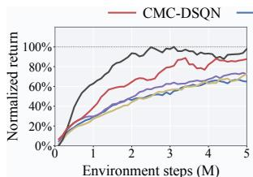  
(a) T=2

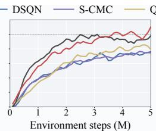  
(b) T=4

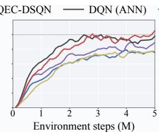  
(c) T=6

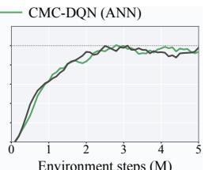  
(d) ANN  
Figure 5: Average normalized return across MiniAtar environments. (a)–(c) Comparison of different DSQN variants at $T = 2 , 4 , 6 ,$ respectively. (d) Comparison of the vanilla ANN DQN and its common-mode compensated variant. All curves are smoothed uniformly for visual clarity.

## 6.2 MAIN RESULTS

As shown in Table 1, CMC-DSQN consistently improves the aggregated performance of lowtimestep DSQNs across the seven Atari games. The improvement is particularly evident at $T = 2 ,$ where CMC-DSQN increases the average performance ratio (APR) by more than 16 percentage points over the vanilla DSQN. The advantage persists as the simulation horizon increases.

Similar improvements are observed on MiniAtar, where we further compare CMC-DSQN with recent directly trained DSQNs and ANN-to-SNN conversion methods, as summarized in Table 2 and Fig. 1. CMC-DSQN consistently outperforms both categories of baselines across different simula tion timesteps. At T = 2, CMC-DSQN reaches an APR of 90.30%, nearly 20 percentage points higher than CaRe-BN (Xu et al., 2026c), the strongest competing DSQN baseline.

Overall, CMC-DSQN achieves average normalized performance exceeding the ANN baseline at T = 4 on both Atari and MiniAtar. These results show that common-mode compensation effectively alleviates the performance degradation caused by reducing the number of SNN simulation timesteps.

## 6.3 ABLATION STUDIES

Is the improvement simply due to additional parameters? We replace the auxiliary ANN with an SNN, denoted as S-CMC. Figures 5(a)–(c) show that S-CMC consistently underperforms CMC-DSQN across different T, indicating that the improvement is not due to introducing additional trainable parameters and highlighting the importance of reliable common-mode compensation.

Why compensate only the common mode? We further consider using the auxiliary ANN to compensate the Q-value error rather than only its common-mode component, denoted as QEC-DSQN. Figures 5(a)–(c) show that QEC-DSQN improves over the vanilla DSQN but consistently underperforms CMC-DSQN, validating the design choice of compensating only the common-mode errors.

Does common-mode compensation also benefit ANN-based DQNs? We apply the same compensation mechanism to an ANN-based DQN, denoted as CMC-DQN. Figure 5(d) shows that CMC-DQN closely matches the vanilla DQN with little additional benefit. This is consistent with Sec. 4, where common-mode error dominance is observed in low-timestep SNNs but not in ANNs. This suggests that the improvement of CMC-DSQN primarily addresses an SNN-specific estimation problem rather than arising from a generic improvement to the underlying RL algorithm.

## 7 CONCLUSION

We investigated the performance degradation of low-timestep DSQNs from the perspective of Qvalue estimation errors and found that common-mode errors dominate and affect TD bootstrapping more strongly than differential-mode errors. Based on this finding, we proposed Common-Mode Compensation Deep Spiking Q-Network (CMC-DSQN), which replaces the SNN common-mode component with an estimate from an auxiliary ANN. Since the auxiliary ANN can be removed entirely at inference, CMC-DSQN preserves the energy-efficiency advantages of SNNs. Experiments on Atari and MiniAtar environments show that CMC-DSQN substantially outperforms state-of-theart DSQN baselines in low-timestep settings and surpasses the ANN baseline at $T = 4$

## REFERENCES

Guillaume Bellec, Franz Scherr, Anand Subramoney, Elias Hajek, Darjan Salaj, Robert Legenstein, and Wolfgang Maass. A solution to the learning dilemma for recurrent networks of spiking neurons. Nature Communications, 11(1):3625, 2020.

Richard Bellman. Dynamic programming. Science, 153(3731):34–37, 1966.

Ding Chen, Peixi Peng, Tiejun Huang, and Yonghong Tian. Deep reinforcement learning with spiking q-learning. arXiv preprint arXiv:2201.09754, 2022.

Ding Chen, Peixi Peng, Tiejun Huang, and Yonghong Tian. Fully spiking actor network with intralayer connections for reinforcement learning. IEEE Transactions on Neural Networks and Learning Systems, 36(2):2881–2893, 2024.

Sayeed Shafayet Chowdhury, Nitin Rathi, and Kaushik Roy. Towards ultra low latency spiking neural networks for vision and sequential tasks using temporal pruning. In European Conference on Computer Vision, pp. 709–726. Springer, 2022.

Mike Davies, Narayan Srinivasa, Tsung-Han Lin, Gautham Chinya, Yongqiang Cao, Sri Harsha Choday, Georgios Dimou, Prasad Joshi, Nabil Imam, Shweta Jain, et al. Loihi: A neuromorphic manycore processor with on-chip learning. IEEE Micro, 2018.

Michael V DeBole, Brian Taba, Arnon Amir, Filipp Akopyan, Alexander Andreopoulos, William P Risk, Jeff Kusnitz, Carlos Ortega Otero, Tapan K Nayak, Rathinakumar Appuswamy, et al. TrueNorth: Accelerating from zero to 64 million neurons in 10 years. Computer, 2019.

Jianchuan Ding, Bo Dong, Felix Heide, Yufei Ding, Yunduo Zhou, Baocai Yin, and Xin Yang. Biologically inspired dynamic thresholds for spiking neural networks. Advances in Neural Information Processing Systems, 35:6090–6103, 2022.

Razvan V Florian. Reinforcement learning through modulation of spike-timing-dependent synaptic˘ plasticity. Neural Computation, 19(6):1468–1502, 2007.

Nicolas Fremaux and Wulfram Gerstner. Neuromodulated spike-timing-dependent plasticity, and´ theory of three-factor learning rules. Frontiers in Neural Circuits, 9:85, 2016.

Nicolas Fremaux, Henning Sprekeler, and Wulfram Gerstner. Reinforcement learning using a con-´ tinuous time actor-critic framework with spiking neurons. PLoS Computational Biology, 9(4): e1003024, 2013.

Wulfram Gerstner and Werner M Kistler. Spiking neuron models: Single neurons, populations, plasticity. Cambridge University Press, 2002.

Wulfram Gerstner, Werner M Kistler, Richard Naud, and Liam Paninski. Neuronal dynamics: From single neurons to networks and models ofcognition. Cambridge University Press, 2014.

Wulfram Gerstner, Marco Lehmann, Vasiliki Liakoni, Dane Corneil, and Johanni Brea. Eligibility traces and plasticity on behavioral time scales: experimental support of neohebbian three-factor learning rules. Frontiers in Neural Circuits, 12:53, 2018.

Aref Ghoreishee, Abhishek Mishra, John MacLaren Walsh, Anup Das, and Nagarajan Kandasamy. Improving performance of spike-based deep q-learning using ternary neurons. In Proceedings of the International Conference on Neuromorphic Systems, pp. 44–51, 2026.

Tuomas Haarnoja, Aurick Zhou, Pieter Abbeel, and Sergey Levine. Soft actor-critic: Off-policy maximum entropy deep reinforcement learning with a stochastic actor. In International conference on machine learning, pp. 1861–1870. Pmlr, 2018.

Matteo Hessel, Joseph Modayil, Hado Van Hasselt, Tom Schaul, Georg Ostrovski, Will Dabney, Dan Horgan, Bilal Piot, Mohammad Azar, and David Silver. Rainbow: Combining improvements in deep reinforcement learning. In Proceedings of the AAAI conference on artificial intelligence, volume 32, 2018.

Zihan Huang, Xinyu Shi, Zecheng Hao, Tong Bu, Jianhao Ding, Zhaofei Yu, and Tiejun Huang. Towards high-performance spiking transformers from ann to snn conversion. In Proceedings of the 32nd ACM international conference on multimedia, pp. 10688–10697, 2024.

Zihan Huang, Wei Fang, Tong Bu, Peng Xue, Zecheng Hao, Wenxuan Liu, Yuanhong Tang, Zhaofei Yu, and Tiejun Huang. Differential coding for training-free ann-to-snn conversion. arXiv preprint arXiv:2503.00301, 2025.

Aakash Kumar, Lei Zhang, Hazrat Bilal, Shifeng Wang, Ali Muhammad Shaikh, Lu Bo, Avinash Rohra, and Alisha Khalid. Dsqn: Robust path planning of mobile robot based on deep spiking q-network. Neurocomputing, 634:129916, 2025.

Timothy P Lillicrap, Jonathan J Hunt, Alexander Pritzel, Nicolas Heess, Tom Erez, Yuval Tassa, David Silver, and Daan Wierstra. Continuous control with deep reinforcement learning. arXiv preprint arXiv:1509.02971, 2015.

Guisong Liu, Wenjie Deng, Xiurui Xie, Li Huang, and Huajin Tang. Human-level control through directly trained deep spiking q-networks. IEEE Transactions on Cybernetics, 53(11):7187–7198, 2022.

Wolfgang Maass. Networks of spiking neurons: the third generation of neural network models. Neural networks, 10(9):1659–1671, 1997.

Paul A Merolla, John V Arthur, Rodrigo Alvarez-Icaza, Andrew S Cassidy, Jun Sawada, Filipp Akopyan, Bryan L Jackson, Nabil Imam, Chen Guo, Yutaka Nakamura, et al. A million spikingneuron integrated circuit with a scalable communication network and interface. Science, 345 (6197):668–673, 2014.

Volodymyr Mnih, Koray Kavukcuoglu, David Silver, Alex Graves, Ioannis Antonoglou, Daan Wierstra, and Martin Riedmiller. Playing atari with deep reinforcement learning. arXiv preprint arXiv:1312.5602, 2013.

Volodymyr Mnih, Koray Kavukcuoglu, David Silver, Andrei A Rusu, Joel Veness, Marc G Bellemare, Alex Graves, Martin Riedmiller, Andreas K Fidjeland, Georg Ostrovski, et al. Human-level control through deep reinforcement learning. nature, 518(7540):529–533, 2015.

Devdhar Patel, Hananel Hazan, Daniel J Saunders, Hava T Siegelmann, and Robert Kozma. Improved robustness of reinforcement learning policies upon conversion to spiking neuronal network platforms applied to atari breakout game. Neural Networks, 120:108–115, 2019.

Lang Qin, Rui Yan, and Huajin Tang. A low latency adaptive coding spiking framework for deep reinforcement learning. arXiv preprint arXiv:2211.11760, 2022.

Lang Qin, Ziming Wang, Runhao Jiang, Rui Yan, and Huajin Tang. Grsn: Gated recurrent spiking neurons for pomdps and marl. In Proceedings of the AAAI Conference on Artificial Intelligence, volume 39, pp. 1483–1491, 2025.

Tom Schaul, John Quan, Ioannis Antonoglou, and David Silver. Prioritized experience replay. arXiv preprint arXiv:1511.05952, 2015.

John Schulman, Filip Wolski, Prafulla Dhariwal, Alec Radford, and Oleg Klimov. Proximal policy optimization algorithms. ArXiv, abs/1707.06347, 2017.

Yinqian Sun, Yi Zeng, and Yang Li. Solving the spike feature information vanishing problem in spiking deep q network with potential based normalization. Frontiers in Neuroscience, 16:953368, 2022.

Richard S Sutton. Learning to predict by the methods of temporal differences. Machine Learning, 3:9–44, 1988.

Richard S Sutton and Andrew G Barto. Reinforcement learning: An introduction. MIT Press, 2018.

Weihao Tan, Devdhar Patel, and Robert Kozma. Strategy and benchmark for converting deep qnetworks to event-driven spiking neural networks. In Proceedings of the AAAI conference on artificial intelligence, volume 35, pp. 9816–9824, 2021.

Guangzhi Tang, Neelesh Kumar, and Konstantinos P Michmizos. Reinforcement co-learning of deep and spiking neural networks for energy-efficient mapless navigation with neuromorphic hardware. In 2020 IEEE/RSJ International Conference on Intelligent Robots and Systems, pp. 6090–6097. IEEE, 2020.

Guangzhi Tang, Neelesh Kumar, Raymond Yoo, and Konstantinos Michmizos. Deep reinforcement learning with population-coded spiking neural network for continuous control. In Conference on Robot Learning, pp. 2016–2029. PMLR, 2021.

Yunhao Tang, Remi Munos, Mark Rowland, and Michal Valko. Va-learning as a more efficient´ alternative to q-learning. In International Conference on Machine Learning, pp. 33739–33757. PMLR, 2023.

Arash Tavakoli, Fabio Pardo, and Petar Kormushev. Action branching architectures for deep reinforcement learning. In Proceedings of the Thirty-Second AAAI Conference on Artificial Intelligence and Thirtieth Innovative Applications ofArtificial Intelligence Conference and Eighth AAAI Symposium on Educational Advances in Artificial Intelligence, pp. 4131–4138, 2018.

Korneel Van den Berghe, Stein Stroobants, Vijay Janapa Reddi, and Guido De Croon. Adaptive surrogate gradients for sequential reinforcement learning in spiking neural networks. Advances in Neural Information Processing Systems, 38:147904–147926, 2026.

Hado Van Hasselt, Arthur Guez, and David Silver. Deep reinforcement learning with double qlearning. In Proceedings ofthe AAAI conference on artificial intelligence, volume 30, 2016.

Ziyu Wang, Tom Schaul, Matteo Hessel, Hado Van Hasselt, Marc Lanctot, and Nando De Freitas. Dueling network architectures for deep reinforcement learning. In Proceedings ofthe 33rd International Conference on Machine Learning, pp. 1995–2003, 2016.

Yujie Wu, Lei Deng, Guoqi Li, Jun Zhu, and Luping Shi. Spatio-temporal backpropagation for training high-performance spiking neural networks. Frontiers in Neuroscience, 12:331, 2018.

Zijie Xu, Tong Bu, Zecheng Hao, Jianhao Ding, and Zhaofei Yu. Proxy target: Bridging the gap between discrete spiking neural networks and continuous control. Advances in Neural Information Processing Systems, 38:159158–159184, 2026a.

Zijie Xu, Zihan Huang, Yiting Dong, Kang Chen, Wenxuan Liu, and Zhaofei Yu. Error amplification limits ann-to-snn conversion in continuous control. arXiv preprint arXiv:2601.21778, 2026b.

Zijie Xu, Xinyu Shi, Yiting Dong, Zihan Huang, and Zhaofei Yu. CaRe-BN: Precise moving statis tics for stabilizing spiking neural networks in reinforcement learning. In The Fourteenth Interna tional Conference on Learning Representations, 2026c.

Kashu Yamazaki, Viet-Khoa Vo-Ho, Darshan Bulsara, and Ngan Le. Spiking neural networks and their applications: A review. Brain Sciences, 12(7):863, 2022.

Zhile Yang, Shangqi Guo, Ying Fang, Zhaofei Yu, and Jian K Liu. Spiking variational policy gradient for brain inspired reinforcement learning. IEEE Transactions on Pattern Analysis and Machine Intelligence, 2024.

Kenny Young and Tian Tian. Minatar: An atari-inspired testbed for thorough and reproducible reinforcement learning experiments. arXiv preprint arXiv:1903.03176, 2019.

Duzhen Zhang, Tielin Zhang, Shuncheng Jia, and Bo Xu. Multi-sacle dynamic coding improved spiking actor network for reinforcement learning. In Proceedings of the AAAI conference on artificial intelligence, volume 36, pp. 59–67, 2022.