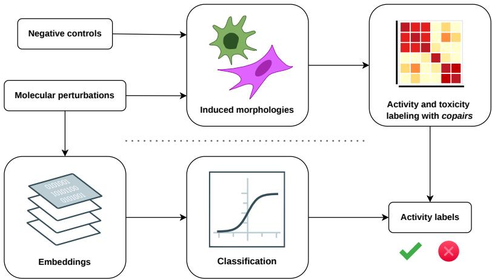
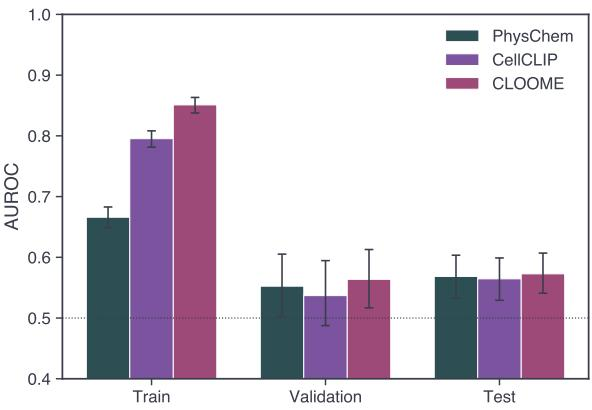
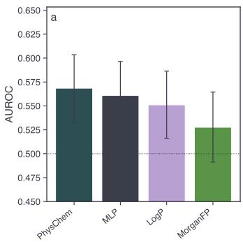
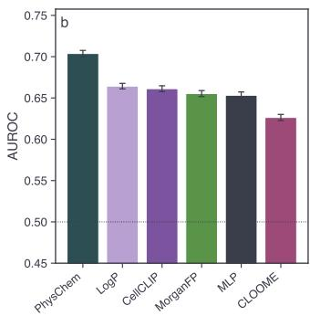
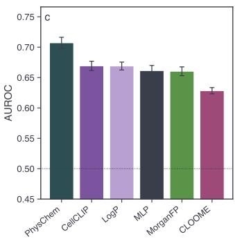
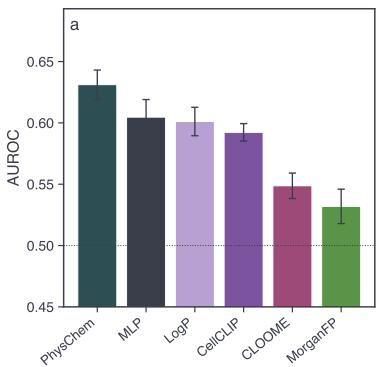
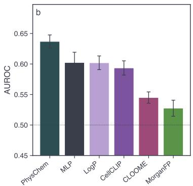
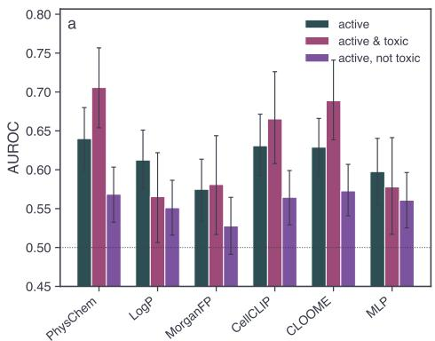
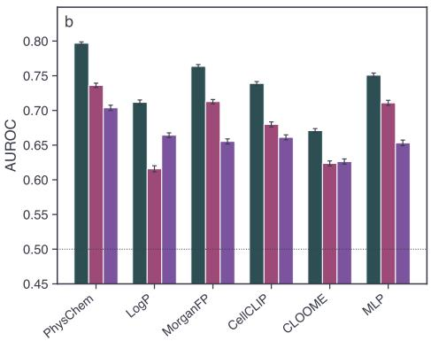

# Can phenotypic activity be predicted without experimental readouts?

Télio Cropsal AI Laboratory for Molecular Engineering (AIME) Department of Computer Science and Engineering Chalmers University of Technology & University of Gothenburg, Gothenburg, Sweden telio@chalmers.se

Rocío Mercado AI Laboratory for Molecular Engineering (AIME) Department of Computer Science and Engineering Chalmers University of Technology & University of Gothenburg and Science for Life Laboratory (SciLifeLab), Gothenburg, Sweden rocio.mercado@chalmers.se

## Abstract

Molecular encoders contrastively pretrained on paired molecule-morphology data, such as CLOOME and CellCLIP, have been proposed as cheap surrogates for phenotypic prediction, avoiding the need to run a Cell Painting assay. We evaluate this idea for these molecular encoders under a protocol designed to control for two confounds that can inflate apparent performance: leakage across an encoder’s own pretraining boundary, and the correlation between phenotypic activity and cytotoxicity. Testing six representations, including a non-pretrained MLP control matching CLOOME’s input and layer count, on two distinct Cell Painting screens, we find that once these confounds are controlled for, the pretrained molecular encoders show no clear advantage over plain physicochemical descriptors, and that toxicity is generally easier to predict than phenotypic activity across representations. Our results suggest leakage-aware, confound-controlled evaluation should be standard practice before phenotype-pretrained encoders are trusted as surrogates for phenotypic drug discovery.

## 1 Introduction

Cell Painting and related high-content assays report how a compound perturbs cell biology across hundreds of morphological features, but most of that effort is spent on compounds that are phenotypi cally inactive [1]. Predicting activity from structure a priori would instead let a campaign prioritize the compounds worth screening [2, 3], but such prediction is hard as morphology and structure carry weak and largely non-overlapping signal [4]. Contrastive molecule-morphology pretraining is presented as the bridge, with encoders such as CLOOME [5] and CellCLIP [6] trained to align structures with their induced profiles and proposed as surrogates for running an assay [7]. Phenotypic activity, however, does not separate a specific response from nonspecific cytotoxicity, and lipophilicity is well known to track the latter [8]; Seal et al. [9] quantified the consequence, showing that cell count alone predicts a substantial share of Cell Painting bioactivity benchmarks and that CLOOME embeddings score no better than a cell-count baseline. Separately, a single train/test split cannot distinguish genuine generalization from an encoder recalling compounds seen in its own pretraining [10] from plate- or batch-specific technical artifacts [11], nor from never being tested far enough out of distribution. Here, we evaluate the molecular encoders of CLOOME and CellCLIP against structure-based baselines under a framework that controls for both confounders.

We make three key contributions with this work:

• A confound-controlled labeling scheme that statistically separates phenotypic activity from toxicity using the same validated permutation-test framework, yielding disentangled activity and toxicity labels (e.g., “active, not toxic”).

• A leakage-aware evaluation protocol for phenotype-pretrained molecular encoders, comparing chemical and batch-generalization splits against their own official pretraining-respecting split, under a repeated cross-validation and Tukey’s HSD comparison protocol suited to the data scale.

• Cross-dataset validation spanning two Cell Painting resources with very different scale, chemical diversity, and laboratory origin, testing whether conclusions about the value of phenotype-pretrained molecular encoders generalize beyond a single screen.

## 2 Methods

  
Figure 1: A molecular perturbation can be used two ways towards the same classification task. Experimentally (top), the compound is applied to cells and its effect is captured as a Cell Painting morphological profile; copairs [12] permutation testing on that profile separates active compounds from inactive ones, and the same test applied to cell count alone flags toxicity, giving the ground-truth label. Computationally (bottom), the same classification is predicted directly from a molecular embedding of the perturbation, or a phenotype-pretrained embedding like CLOOME or CellCLIP.

## 2.1 Data

Both activity and toxicity are tested with copairs [12] permutation testing: activity on the morphological profile, toxicity on cell count alone, restricted to compounds already called active. Every compound is thus inactive, active and toxic, or active and not toxic.

BBBC036v1 [13] is a curated, ∼30,000-compound U2OS screen; the CLOOME/CellCLIP train/validation/test split gives a working population of 10,680 compounds, 91.3 % active, 6.3 % of those additionally toxic. JUMP-CP [14] is a much larger, multi-laboratory screen; we reuse community-published jump\_rr activity p-values and compute toxicity ourselves (47.3 % of actives additionally toxic). One of its data-generating sources, a curated library screened at a different concentration [15], is evaluated separately; the remaining, class-balanced working population is n = 21,946. Full construction details, including compound exclusions, label thresholds, and population balancing, are in Appendix A.

## 2.2 Molecular representations

Every prediction target is evaluated identically across all representations below, each standardized (zero mean, unit variance) before fitting, with statistics computed on the training fold only.

CLOOME is a 4-layer multilayer perceptron mapping chiral Morgan fingerprints (l = 1024, r = 3) to 512-dimensional embeddings, trained via contrastive learning (CL) on BBBC036v1 moleculemorphology pairs, using its publicly released checkpoint (Appendix B). CellCLIP is a BERT-basecased text encoder with a linear projection to 512 dimensions, trained via CL on paired Cell Painting images and text; it is given structure alone as input (a templated SMILES prompt, Appendix B).

Structure-only and physicochemical baselines require no morphology-derived training signal, so any gap between them and CLOOME/CellCLIP that survives the leakage-aware evaluation is due to what the contrastive pretraining actually added, and not to using richer chemical information.

• MLP: a 4-layer multilayer perceptron over the same chiral Morgan fingerprint input as CLOOME, matching its input dimensionality and layer count (though not its exact per-layer widths; Appendix B), trained directly and only on our supervised labels, with no contrastive pretraining.

• MorganFP: a radius-2, 2048-bit Morgan fingerprint, used directly as a linear-probe input and, via its pairwise Tanimoto distance, to construct the chemical-generalization split.

• PhysChem: the full RDKit descriptor set.

• LogP: a single Crippen logP value [16], kept as its own representation to isolate the physicochemical property most classically linked to nonspecific bioactivity and cytotoxicity.

## 2.3 Evaluation protocol

Each representation is evaluated under up to three different splits:

• Chemical: Butina clustering [17] on the pairwise Tanimoto distance matrix of Morgan fingerprints, with whole clusters allocated to cross-validation (CV) folds so that structurally similar compounds are never split across train and test.

• Batch: grouped CV over an experimental-batch identifier, assigned to each compound as the plate (BBBC036v1) or data-generating source (JUMP-CP) where it has the most replicate wells. JUMP-CP’s single-source bioactive-library subset (Section 2.1) uses plate instead.

• Official: for BBBC036v1 only, the compound-level train/validation/test partition published alongside CLOOME and CellCLIP.

Statistical comparison Chemical and batch splits use 5×-repeated, 5-fold grouped CV (25 samples per representation/target/split) [18], compared pairwise via repeated-measures ANOVA and Tukey’s HSD test; the official split is approximated by bootstrap-resampling held-out predictions, so all three are compared under one framework (full details, including the sphericity correction, in Appendix C).

## 3 Results

Unless stated otherwise, all numbers below are for the active, not toxic target.

CLOOME and CellCLIP show a large train-test gap on the official split. Figure 2 shows train, validation, and test AUROC on BBBC036v1’s official split. CLOOME drops from 0.851 on train to 0.573 on test (a gap of 0.278); CellCLIP drops from 0.795 to 0.565 (a gap of 0.230); PhysChem’s gap is much smaller, 0.666 to 0.568. Validation AUROC tracks test AUROC for both, ruling out test-fold noise. The same pattern shows up on BBBC036v1’s chemical and batch CV splits: CLOOME scores 0.709 and 0.670 and CellCLIP scores 0.612 and 0.611, both well above their official-split test AUROC, while PhysChem does not inflate (0.538 and 0.551, at or below its 0.568). The official split is the only one guaranteeing no test compound was in CLOOME’s or CellCLIP’s own pretraining set, and it is where both do worst.

PhysChem matches or beats both pretrained encoders, and a not-pretrained control does better than CLOOME itself. Figure 3 ranks representations on the two evaluations free of the leakage above: BBBC036v1’s official split (a, only representations with no morphology-derived pretraining) and JUMP-CP’s chemical and batch splits (b-c, all six representations). On BBBC036v1 (a), PhysChem (0.568), MLP (0.561), LogP (0.551), and MorganFP (0.528) have heavily overlapping CIs, indistinguishable from CLOOME’s or CellCLIP’s own test AUROC (0.573, 0.565; Figure 2). On JUMP-CP’s chemical split (b, the main population excluding the bioactive-library subset, Section 2.1), PhysChem is clearly best (0.704), followed by LogP, CellCLIP, MorganFP, and MLP (0.664 down to 0.653); CLOOME is last (0.626), below the not-pretrained MLP control, with no CI overlap. On the batch split (c), the pattern sharpens: PhysChem is again best (0.707), CellCLIP and LogP are tied for second (0.669), and CLOOME (0.628) is last with no overlap with any other representation, including MorganFP (0.660). CellCLIP’s ranking varies by split, while CLOOME stays at or near the bottom throughout, significantly worse than every other representation on the batch split specifically.

  
Figure 2: Train, validation, and test AUROC for CLOOME, CellCLIP, and PhysChem on BBBC036v1’s official split, target active, not toxic. Bars: mean AUROC across bootstrap resamples of the corresponding fold’s predictions; error bars: 95% CI (n = 1,000 resamples).

  
Figure 3: Representation ranking, target active, not toxic. (a) BBBC036v1 official split, restricted to the four representations with no morphology-derived pretraining (CLOOME and CellCLIP on this split are shown in Figure 2). (b) JUMP-CP chemical-generalization split, all six representations. (c) JUMP-CP batch-generalization split, all six representations. Bars: mean AUROC; error bars: 95% CI (bootstrap resampling in (a), 5 × 5 repeated grouped CV in (b)-(c)).

The pattern replicates on a third population. Figure 4 repeats the ranking comparison on JUMP-CP’s bioactive-library sub-population (source\_7, Section 2.1), screened at a different concentration and thus structurally and experimentally distinct from both main data sets; its batch-generalization analog uses plate rather than source as the grouping variable, since this subset spans only one source (Section 2.3). PhysChem is again clearly best on both its chemical (0.631) and plate (0.637) splits, and CLOOME is again at the bottom (0.549 and 0.545), tied with MorganFP for last.

Toxicity is easier to predict than phenotypic activity, for every representation. Active-not-toxic is the hardest target on BBBC036v1’s official split for every representation, and on JUMP-CP’s chemical split for four of six; plain activity, uncontrolled for toxicity, is always the easiest target, for structure-only baselines and CLOOME/CellCLIP alike, reflecting the activity/toxicity confound itself, and not specifically phenotype-pretrained encoder performance (Figure 5, Appendix D).

## 4 Discussion

Our results highlight the challenges of contrastive molecule-morphology pretraining. For CLOOME and CellCLIP, the apparent good performance is likely tied to being tested on the same compounds and assay they were pretrained on; once that is accounted for, neither beats physicochemical descriptors that use no phenotypic data at all.

  
Figure 4: Representation ranking on $\mathbf { J U M P - C P ^ { \prime } s }$ bioactive-library sub-data set (source\_7), target active, not toxic. (a) Chemical-generalization split. (b) Plate-generalization split. Bars: mean AUROC; error bars: 95% CI (5 × 5 repeated grouped CV).

The MLP control hints that a network pretrained on one screen’s pairs is fit to that screen’s narrow slice of chemical space (though not a clean ablation, as it is trained end-to-end while CLOOME is probed); on JUMP-CP, a not-pretrained control matching CLOOME’s input and layer count generalizes better than CLOOME itself, as it does on the structurally distinct bioactive-library subset (Section 3). Others report similar observations [19, 10]: CLOOME can decrease downstream performance as an input modality [19], and trails an improved model (MolPhenix) [10] on unseen-data retrieval. In our own experiments, we observe that CellCLIP performance does not drop as much out of distribution.

Toxicity is easier to predict than true activity, and held-out performance can reflect batch recognition instead of biological signal, so a benchmark controlling for neither risks rewarding models for the wrong reasons. Confound and leakage-aware evaluation needs to become a basic reporting standard before such models can be trusted as surrogates for cellular response (rather than for toxicity or source). An encoder should be evaluated the way we evaluate phenotypic profiles themselves: on compounds and assays it could not have seen. We believe these encoders are not yet ready to drive phenotypically-driven molecular generation: a generative loop exploits weaknesses in the surrogate (reward) model, be that similarity to a pretraining set or toxicity and not an interesting phenotype. The risk runs the other way too, as most perturbations produce little phenotypic change, so a structure-to-morphology model such as MorphoDiff [20] can score well in aggregate while missing structure-activity relationships in the active minority.

## 4.1 Limitations and future work

CLOOME and CellCLIP are both pretrained on BBBC036v1, so we cannot separate a general property of contrastive phenotype-pretraining from a property of this one, narrow pretraining set. BBBC036v1’s official test fold is small (2,131 compounds), and $\mathbf { J U M P - C P ^ { \prime } s }$ batch split rests on a modest, unevenly sized set of sources, both of which widen the corresponding CIs. Every representation is scored through a frozen linear probe, so only linearly accessible information is tested (non-linear probes or fine-tuning are future work), and JUMP-CP’s activity labels, unlike its toxicity labels, come from a different pipeline than ours. Toxicity here is a cell-count-based statistical proxy, not an independent cytotoxicity measurement, so LogP and PhysChem may capture residual toxicity. Finally, two things remain untested: the molecular-generation argument put forth in the Discussion is a hypothesis, to be tested in future work; and the effect of concentration remains unexplored, since both activity and toxicity are dose-dependent (JUMP-CP’s bioactive-library subset hints at this, $0 . 6 2 5 \mu \mathrm { M }$ versus $1 0 \mu \mathbf { M }$ for the rest). Neither data used set here varies concentration for the same compound; a data set like RxRx3-core [21] would let the latter point be tested directly in future work.

## 5 Conclusion

We evaluated whether two phenotype-pretrained molecular encoders, CLOOME and CellCLIP, can predict phenotypic activity from structure alone, under a protocol designed to rule out two confounds: pretraining-boundary leakage and the correlation between activity and toxicity. Under that protocol, both encoders lose their apparent advantage: neither outperforms plain physicochemical descriptors on compounds outside their own pretraining set, and CLOOME performs worse than a not-pretrained control matching its input and layer count on an independent screen. Toxicity, meanwhile, is easier to predict than phenotypic activity for every representation tested, so activity-prediction results that do not separate the two should be read with caution. These findings, limited to frozen encoders with linear probes, do not rule out phenotype-pretrained encoders as useful tools, but the two tested here should not yet be trusted as phenotypic surrogates. Similar claims, for these or future encoders, should be checked under a comparable leakage-aware, confound-controlled evaluation.

## Author contributions

TC: Conceptualization, Data curation, Methodology, Software, Formal analysis, Investigation, Validation, Visualization, Writing — original draft. RM: Conceptualization, Methodology, Supervision, Funding acquisition, Resources, Writing — review & editing.

## Acknowledgments and disclosure of funding

TC and RM acknowledge funding provided by the Wallenberg AI, Autonomous Systems, and Software Program (WASP), supported by the Knut and Alice Wallenberg Foundation. Computational resources were provided by the National Academic Infrastructure for Supercomputing in Sweden (NAISS), funded by the Swedish Research Council. Computational resources were provided on the Berzelius system funded by the Knut and Alice Wallenberg foundation and operated by NAISS. The authors declare no competing interests.

## Software and data availability

Code is available at: https://github.com/cctelio/predicting-phenotypic-activity. The full analysis, from raw data to every figure and table in this paper, reruns in a couple of hours on a consumer computer.

## References

[1] Srijit Seal, Maria-Anna Trapotsi, Ola Spjuth, Shantanu Singh, Jordi Carreras-Puigvert, Nigel Greene, Andreas Bender, and Anne E Carpenter. Cell Painting: a decade of discovery and innovation in cellular imaging. Nature Methods, 22(2):254–268, 2025.

[2] Paula A Marin Zapata, Oscar Méndez-Lucio, Tuan Le, Carsten Jörn Beese, Jörg Wichard, David Rouquié, and Djork-Arné Clevert. Cell morphology-guided de novo hit design by conditioning GANs on phenotypic image features. Digital Discovery, 2(1):91–102, 2023.

[3] Johan Fredin Haslum, Charles-Hugues Lardeau, Johan Karlsson, Riku Turkki, Karl-Johan Leuchowius, Kevin Smith, and Erik Müllers. Cell Painting-based bioactivity prediction boosts high-throughput screening hit-rates and compound diversity. Nature Communications, 15(1): 3470, 2024.

[4] Nikita Moshkov, Tim Becker, Kevin Yang, Peter Horvath, Vlado Dancik, Bridget K Wagner, Paul A Clemons, Shantanu Singh, Anne E Carpenter, and Juan C Caicedo. Predicting compound activity from phenotypic profiles and chemical structures. Nature Communications, 14(1):1967, 2023.

[5] Ana Sanchez-Fernandez, Elisabeth Rumetshofer, Sepp Hochreiter, and Günter Klambauer. CLOOME: contrastive learning unlocks bioimaging databases for queries with chemical structures. Nature Communications, 14(1):7339, 2023.

[6] Mingyu Lu, Ethan Weinberger, Chanwoo Kim, and Su-In Lee. CellCLIP-Learning Perturbation Effects in Cell Painting via Text-Guided Contrastive Learning. Advances in Neural Information Processing Systems, 38:124505–124537, 2026.

[7] Philip John Harrison and Rocío Mercado. Biologically-driven generative chemistry: using biological data to guide de novo drug design. 2026.

[8] Shuyan Lu, Bart Jessen, Christopher Strock, and Yvonne Will. The contribution of physicochemical properties to multiple in vitro cytotoxicity endpoints. Toxicology in Vitro, 26(4): 613–620, 2012.

[9] Srijit Seal, William Dee, Adit Shah, Natacha Cerisier, Andrew Zhang, Esteban Miglietta, Katherine Titterton, Ángel Alexander Cabrera, Daniil Boiko, Alex Beatson, et al. Counting cells can accurately predict small-molecule bioactivity benchmarks. Nature Communications, 17(1):2436, 2026.

[10] Philip Fradkin, Puria Azadi, Karush Suri, Frederik Wenkel, Ali Bashashati, Maciej Sypetkowski, and Dominique Beaini. How molecules impact cells: Unlocking contrastive phenomolecular retrieval. Advances in Neural Information Processing Systems, 37:110667–110701, 2024.

[11] Nikita Moshkov, Michael Bornholdt, Santiago Benoit, Matthew Smith, Claire McQuin, Allen Goodman, Rebecca A Senft, Yu Han, Mehrtash Babadi, Peter Horvath, et al. Learning representations for image-based profiling of perturbations. Nature Communications, 15(1):1594, 2024.

[12] Alexandr A Kalinin, John Arevalo, Erik Serrano, Loan Vulliard, Hillary Tsang, Michael Bornholdt, Alán F Muñoz, Suganya Sivagurunathan, Bartek Rajwa, Anne E Carpenter, et al. A versatile information retrieval framework for evaluating profile strength and similarity. Nature Communications, 16(1):5181, 2025.

[13] Mark-Anthony Bray, Sigrun M Gustafsdottir, Mohammad H Rohban, Shantanu Singh, Vebjorn Ljosa, Katherine L Sokolnicki, Joshua A Bittker, Nicole E Bodycombe, Vlado Dancík, Thomas Pˇ Hasaka, et al. A dataset of images and morphological profiles of 30 000 small-molecule treatments using the Cell Painting assay. GigaScience, 6(12):giw014, 2017.

[14] Srinivas Niranj Chandrasekaran, Jeanelle Ackerman, Eric Alix, D Michael Ando, John Arevalo, Melissa Bennion, Nicolas Boisseau, Adriana Borowa, Justin D Boyd, Laurent Brino, et al. JUMP Cell Painting dataset: morphological impact of 136,000 chemical and genetic perturbations. BioRxiv, pages 2023–03, 2023.

[15] Alán F Muñoz, Johan Fredin Haslum, Runxi Shen, Anne E Carpenter, and Shantanu Singh. JUMP-lite: Compact, reproducible benchmarking of cell representations, 2026. URL https: //arxiv.org/abs/2608.07632.

[16] Scott A Wildman and Gordon M Crippen. Prediction of physicochemical parameters by atomic contributions. Journal of Chemical Information and Computer Sciences, 39(5):868–873, 1999.

[17] Darko Butina. Unsupervised data base clustering based on daylight’s fingerprint and Tanimoto similarity: A fast and automated way to cluster small and large data sets. Journal ofChemical Information and Computer Sciences, 39(4):747–750, 1999.

[18] Jeremy R Ash, Cas Wognum, Raquel Rodríguez-Pérez, Matteo Aldeghi, Alan C Cheng, Djork-Arné Clevert, Ola Engkvist, Cheng Fang, Daniel J Price, Jacqueline M Hughes-Oliver, et al. Practically significant method comparison protocols for machine learning in small molecule drug discovery. Journal ofChemical Information and Modeling, 65(18):9398–9411, 2025.

[19] Florian Rottach, Sebastian Schieferdecker, William Rudman, Randall Balestriero, and Carsten Eickhoff. Mol-JEPA: A multimodal Joint Embedding Predictive Architecture for Molecules, 2026. URL https://arxiv.org/abs/2608.22642.

[20] Zeinab Navidi, Jun Ma, Esteban Miglietta, Le Liu, Anne Carpenter, Beth Cimini, Benjamin Haibe-Kains, and Bo Wang. MorphoDiff: Cellular morphology painting with diffusion models. In International Conference on Learning Representations, volume 2025, pages 11613–11637, 2025.

[21] Oren Kraus, Federico Comitani, John Urbanik, Kian Kenyon-Dean, Lakshmanan Arumugam, Saber Saberian, Cas Wognum, Safiye Celik, and Imran S Haque. RxRx3-core: benchmarking drug-target interactions in high-content microscopy, 2025. URL https://arxiv.org/abs/ 2503.20158.

[22] D Michael Ando, Cory Y McLean, and Marc Berndl. Improving phenotypic measurements in high-content imaging screens. BioRxiv, page 161422, 2017.

## A Dataset details

Label construction Both activity and toxicity are tested with copairs [12]: a compound’s replicate wells are scored by average precision against a permutation-derived null (10,000 permutations), using 190 sampled negative control wells per plate as the negative reference and Benjamini-Hochbergcorrected p-values $( \alpha = 0 . 0 5 )$ across compounds. Activity is tested on the morphological profile with cosine distance; toxicity is tested on cell count alone, standardized per plate against negative control, with Euclidean distance instead of cosine. The toxicity test is restricted to compounds already called active, since toxicity in the absence of activity is essentially never observed and the restriction keeps the well level data volume tractable at JUMP-CP’s scale. Every compound is thus assigned to one of three categories evaluated throughout: inactive, active and toxic, or active and not toxic.

BBBC036v1 [13] is a ∼30,000-compound screen of human U2OS cells with CellProfiler-derived morphological profiles (1,449 features per well, DMSO as negative control). We use the well-level profiles distributed with CPMolGAN [2] and the official compound-level train/validation/test split leveraged by CLOOME and CellCLIP (10,683 compounds). Well-level profiles are corrected with typical variation normalization (TVN) [22] against per-plate DMSO controls, with the cell-count feature explicitly excluded from the feature set before whitening. Morphology is aggregated to the compound level as the median TVN-corrected profile across a compound’s replicate wells and both activity and toxicity are computed. After joining to compounds with an available morphological profile, the working population is 10,680 compounds, of which 91.3 % are called active; of those, 6.3 % are additionally called toxic.

JUMP-CP [14] is a much larger, chemically diverse, multi-laboratory compound screen also performed in human U2OS cells. Recomputing multivariate phenotypic activity ourselves at JUMP-CP’s scale would require reprocessing the full well-level profile for on the order of 100k compounds; we instead reuse the community-published corrected p-values as activity labels with jump\_rr, computed with the same style of permutation-testing methodology described above. Toxicity, by contrast, is computed directly by our own procedure, restricted to the resulting active compounds. SMILES and compound metadata are taken from the official JUMP-CP metadata release. We exclude any compound whose first-14-character InChIKey matches a compound in BBBC036v1’s official population (1,540 of 115,779 compounds), so that the BBBC036v1-pretrained encoders are evaluated on JUMP CP on compounds they could not have seen during their own pretraining. Toxicity is computed from the JUMP consortium’s separate interpretable profiles. Under this procedure, 47.3 % of active JUMP CP compounds are additionally called toxic, a substantially higher rate than BBBC036v1’s, consistent with JUMP-CP being a chemically broader, less pre-filtered discovery screen than BBBC036v1’s curated library.

Of JUMP-CP’s twelve data-generating sources, ten have compound-level activity p-values with jump\_rr (the other two run only CRISPR and ORF genetic perturbations). One of these ten, source\_7, is a curated library of compounds, assayed at 0.625 µM versus 10 µM for the other sources [15]; its activity rate reflects this (23.0 % of its 5,207 compounds, roughly twice the rate of any other source). Rather than let this different compound population and concentration confound the batchgeneralization split, we exclude it and evaluate it separately. The remaining population is dominated by inactive compounds (10.1 % active), so we construct the working population as every active compound (10,973) plus a matched, source-stratified random sample of an equal number of inactive compounds, giving n = 21,946, approximately class-balanced by construction and sampled proportionally across the remaining 9 sources.

## B Model details

CLOOME and CellCLIP checkpoints. We use CLOOME’s publicly released bioactivity checkpoint (anasanchezf/cloome) and CellCLIP’s publicly released checkpoint (suinleelab/CellCLIP on Hugging Face). CellCLIP prompts are templated as "SMILES: {smiles}" only, with no compound name and no cell-type conditioning.

Table 1 records how each representation, initially introduced in Section 2.2, is used to make predictions. Five of the six representations are frozen and read out by an ℓ2-regularized logistic regression, so the probe is the only thing fitted on our labels. The MLP control is not: it has no frozen representation and is trained end to end.

The representations span three orders of magnitude in dimensionality, from a single Crippen logP value to a 2,048-bit fingerprint, so the $\ell _ { 2 }$ penalty is selected per fold and per representation on an inner training/validation split over a 3-point grid, $C \in \{ 0 . 0 1 , 1 , 1 \bar { 0 } 0 \}$ . Features are standardized (zero mean, unit variance, fit on the training fold only); the logistic regression probe uses $\mathtt { s o l v e r } { = } " 1 \mathtt { b f } \mathtt { g s } ^ { \prime \prime }$ max\_iter=1000, and class\_weight="balanced". Contrastive embeddings are taken from each encoder’s own final 512-d output (CLOOME’s last MLP layer; $\mathrm { C e l l C L I P ^ { \circ } s }$ linear projection of BERT’s pooled output), not an earlier intermediate representation, and are L2-normalized, matching each model’s own contrastive training objective.

Table 1: Summary of every representation and model evaluated in this work for the various sets of labels. All models are ℓ2-regularized logistic regression probes. Only the MLP control is trained end-to-end; in every other row the representation is fixed and the probe is the only thing fitted.
<table><tr><td>Representation tested</td><td>Input</td><td>Dim.</td><td>Source</td><td>Model</td></tr><tr><td>PhysChem</td><td>SMILES</td><td>217</td><td>RDKit descriptors, deterministic</td><td>Logistic regression</td></tr><tr><td>LogP</td><td>SMILES</td><td>1</td><td>Crippen logP, deterministic</td><td>Logistic regression</td></tr><tr><td>MorganFP</td><td>SMILES</td><td>2,048</td><td>Morgan fingerprint, r = 2</td><td>Logistic regression</td></tr><tr><td>CLOOME</td><td>Morgan FP, r = 3, 1,024 bits</td><td>512</td><td>Frozen pretrained checkpoint</td><td>Logistic regression</td></tr><tr><td>CellCLIP</td><td>Templated SMILES prompt</td><td>512</td><td>Frozen pretrained checkpoint</td><td>Logistic regression</td></tr><tr><td>MLP</td><td>Morgan FP, r = 3, 1,024 bits</td><td>n/a</td><td>n/a</td><td>Entire network (end-to-end)</td></tr></table>

The MLP control takes the same chiral Morgan fingerprint input as CLOOME (radius 3, 1,024 bits) and has the same number of fully connected layers (four), but receives no contrastive pretraining. Its layers taper (hidden widths 512, 256, 128, and 64, ReLU activations), unlike CLOOME’s own published configuration, which uses a constant hidden dimension of 1,024 throughout. The final layer is a single logit, produced end-to-end. CLOOME itself has no classifier: it is a contrastive dualencoder model, so its 512-d embedding is instead read out with the same logistic-regression probe used for every other frozen representation (Section 2.2). Weights use PyTorch’s default nn.Linear initialization; no custom initialization scheme is applied.

Training uses AdamW at an initial learning rate of $1 0 ^ { - 3 }$ , held constant, batch size 256, weight decay $1 0 ^ { - 4 }$ , and dropout 0.4 applied after each hidden layer’s activation. The objective is binary crossentropy with logits, with a per-fold class weighting (pos\_weight set to the inverse class-frequency ratio of the training fold). Training runs for at most 150 epochs with early stopping on validation AUROC evaluated on the inner validation split, patience 15 epochs, and the checkpoint with the best validation AUROC is used for the held-out fold.

The inner validation split holds out 20 % of each training fold (stratified by label) and is drawn at random, not with the same grouping constraint as the outer split, so a structurally similar compound can occasionally inform early stopping even though it cannot inform the held-out fold’s test predictions; this is a real, if comparatively mild, gap relative to the outer split’s grouping guarantee. Hyperparameters (dropout, weight decay, learning rate, batch size) are fixed a priori rather than searched per fold or per representation. Every fold is trained with a single random seed, drawn from the corresponding CV repeat; statistical replication comes from the $5 \times 5$ repeated grouped CV itself (Section 2.3), not from separate seed-averaging within a fold.

## C Statistical comparison details

Reported 95 % confidence intervals in figures come from bootstrap-resampling the held-out test predictions for BBBC036v1’s official split, and from the 25 samples of the 5 × 5 repeated grouped CV for every chemical and batch-generalization split. The same fold assignment is used across every representation within a repeat, so that representations are compared on identical held-out compounds. Logistic-regression probe regularization is selected per fold via an inner training/validation split; the MLP control is trained with dropout, weight decay, and early stopping on an analogous inner split.

Representations are compared pairwise via repeated-measures analysis of variance followed by Tukey’s honestly significant difference test, using the within-subject error term from the repeatedmeasures model rather than a naive independent-samples pooled variance, since every representation is evaluated on identical fold partitions; we report adjusted p-values and Cohen’s d effect sizes for every pairwise comparison. We check the repeated-measures ANOVA’s sphericity assumption with Mauchly’s test for every comparison and apply a Greenhouse-Geisser correction to the error degrees of freedom whenever it is rejected, which is the case for most comparisons in this study. For the official split, which by construction offers only a single train/validation/test partition, we approximate the same repeated-measures comparison by bootstrap-resampling the held-out test predictions, so that all three split types are compared under one consistent statistical framework.

## D Additional results

Figure 5 shows the full task-difficulty comparison across all six representations and all three targets, underlying the active-not-toxic-is-hardest claim discussed in Section 3. PhysChem, for example, reaches 0.706 on active-and-toxic and 0.640 on plain active, but only 0.568 on active-not-toxic on BBBC036v1’s official split; on JUMP-CP’s chemical split, the same order holds for four of six representations (PhysChem, MorganFP, CellCLIP, MLP), while for LogP and CLOOME, active-andtoxic is instead hardest, or tied with active-not-toxic (CLOOME: 0.624 and 0.626).

  
Figure 5: Mean test AUROC by prediction target (active; active and toxic; active, not toxic) for all six representations, on (a) BBBC036v1’s official split and (b) JUMP-CP’s chemical-generalization split. Error bars: 95% CI, as in Figure 3.