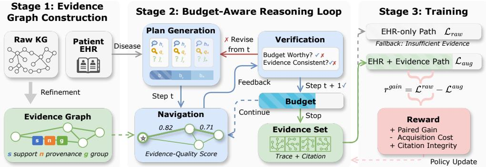
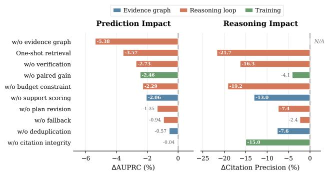
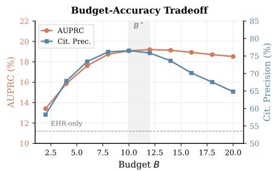
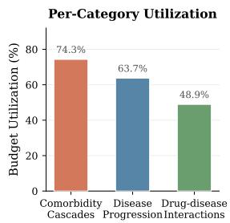
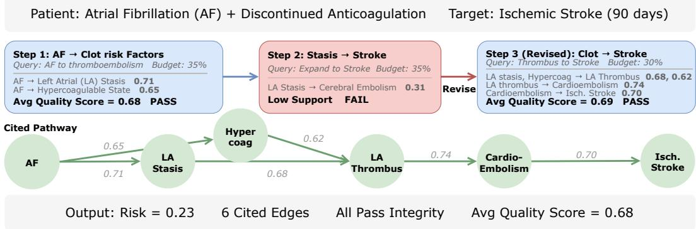
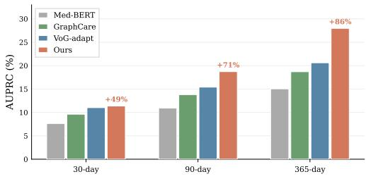
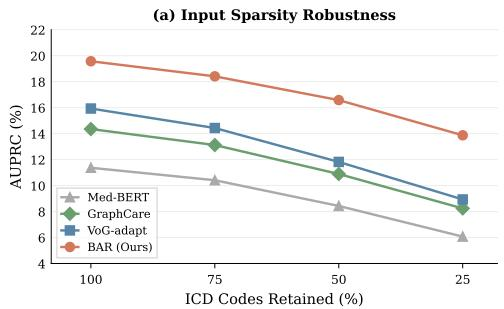
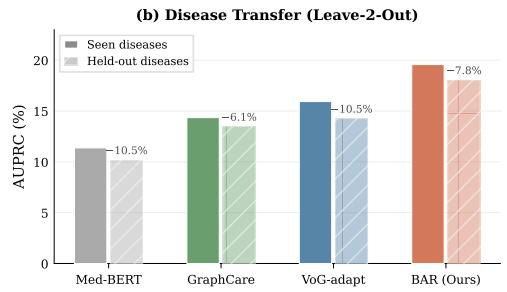
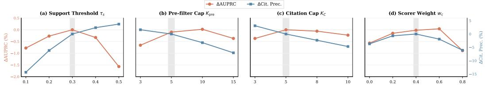

# Cite What You Explore: Budget-Aware LLM Reasoning over Medical KGs with Verifiable Evidence

Chen Chen†, Dongjie Wang†, Mei Liu‡, Zijun Yao†∗

†Electrical Engineering and Computer Science, University of Kansas, USA {chenchen, wangdongjie, zyao}@ku.edu

‡Health Outcomes and Biomedical Informatics, University of Florida, USA mei.liu@ufl.edu

## Abstract

Post-discharge risk prediction from electronic health records (EHRs) is difficult because many dependencies that link discharge-time observations to downstream complications, such as comorbidity cascades and drug-disease interactions, are absent from the record. External medical knowledge graphs (KGs) can supply these missing dependencies, but tracing them demands three properties: KG exploration must remain cost-bounded, retrieved evidence must be differentiated by source quality, and the resulting rationale must be citable for retrospective review. Large language models (LLMs) can plan and verify over structured evidence, making them natural candidates for KG reasoning, but existing LLM-based methods do not satisfy these three properties jointly. In this paper, we propose BAR, a Budget-Aware LLM Reasoning framework over medical KGs with three contributions. First, BAR refines the raw KG into disease-specific evidence graphs whose edges carry support scores and provenance records, turning the KG into a quality-annotated reasoning space rather than a static feature source. Second, an LLM then reasons over this graph through a plan-navigate-verify loop that decomposes the question into steps, retrieves evidence under a patient-specific budget, and revises when verification fails. Third, a reasoning policy is trained with a reward that compares predictions with and without acquired evidence, combined with acquisition cost and citation-integrity terms. Across 8 diseases and 3 prediction horizons on MIMIC-III and MIMIC-IV, BAR improves AUPRC by 3.4 points over the strongest baseline, raises citation precision from 59.8% to 77.9%, and consumes only 62-65% of the budget cap.

## 1 Introduction

Electronic health records (EHRs) have enabled a wide range of post-discharge risk prediction tasks [32, 14], where the goal is to assess at discharge whether a specific complication will first appear within a future time window. This task is challenging because the pathways that would connect discharge-time observations to downstream complications, including comorbidity cascades, drug-disease interactions, and disease progressions, are rarely captured in the record. External medical knowledge graphs (KGs) [4] can supply the relational structure needed to recover these dependencies, but tracing them typically requires multi-hop exploration [43], since a single retrieval rarely captures the chain of intermediate concepts linking a discharge-time observation to its downstream complication.

Existing methods do not yet exploit this structure effectively. EHR-only models [8, 12, 33] capture statistical associations but miss risk factors that emerge only through pathways whose intermediate concepts the EHR does not record. Static KG methods [7, 25, 17, 37] add relational knowledge but extract embeddings once before prediction, with no mechanism to follow patient-specific pathways at inference time. What is missing is an agent that can decide which pathway to trace next and when the evidence is sufficient to stop for a given patient. Large language models (LLMs) are a natural fit [36, 22]: they can decompose a clinical scenario into hypothesis-driven steps and query the KG for supporting evidence at each step, conditioning each retrieval on what previous steps have revealed.

Recent Graph4LLM approaches [44, 29, 11, 5] advance in this direction by allowing iterative reasoning over KGs. However, three requirements for clinical deployment remain unmet. First, with no cost constraint, exploration continues well past the point of diminishing returns, even on patients whose discharge record alone already supports a confident prediction. Second, treating all retrieved edges uniformly, regardless of how well-supported they are by underlying evidence, leaves the LLM unable to prioritize the most reliable pathways. Third, the reasoning trace does not preserve a verifiable link between predictions and the provenance of supporting edges, so it cannot be audited retrospectively.

To address these three requirements, we adopt a complementary collaboration between the LLM and the KGs. The LLM generates and revises pathway hypotheses, while the KG constrains which pathways are structurally grounded and supplies the traceable evidence needed to verify them under bounded cost. We develop this idea in BAR (Figure 1), a framework for budget-aware LLM reasoning over medical KGs. Our contributions are threefold. 2 First, we introduce evidence graphs that refine the raw KG into disease-specific subgraphs whose edges carry support scores, provenance records, and equivalence-group ids (for redundancy control), turning the KG into a quality-annotated reasoning space the LLM explores at inference time, rather than a feature source whose embeddings are extracted once before prediction. Second, we propose a budget-aware reasoning loop that allocates exploration in proportion to EHR-only prediction uncertainty, in which the LLM produces a clinical plan, navigates the evidence graph under this patient-adaptive budget, and verifies each step against both source support and the patient’s evolving state, with revision when evidence falls short. Third, we design a training signal whose primary term is a paired gain comparing predictions with and without acquired evidence, with auxiliary terms for acquisition cost and citation integrity, so the policy learns to acquire external evidence only when it improves prediction beyond what the discharge record alone provides. Experiments on MIMIC-III [21] and MIMIC-IV [20] show that BAR outperforms all baselines on each disease-horizon settings (8 diseases × 3 horizons) while consuming substantially lower exploration cost, with relative gains that increase with prediction horizon as relevant pathways become less likely to appear in the discharge record.

## 2 Methodology

## 2.1 Problem Setup

We study post-discharge risk prediction, where each eligible admission defines one instance, and discharge is the prediction time. For patient i, let the index admission have discharge time $\tau _ { i } .$ . The model input available at discharge has two parts, the diagnosis codes recorded during the index admission, $X _ { i } = \{ c _ { i , 1 } , . . . , c _ { i , n _ { i } } \}$ , where each $c _ { i , j }$ is an ICD code, and a pre-discharge history $H _ { i }$ that aggregates diagnosis codes from admissions strictly before $\tau _ { i }$

Let D denote a predefined set of target diseases and T denote a set of prediction horizons in days. For patient $i ,$ target disease $d \in \mathcal { D }$ , and horizon $h \in \mathcal T$ , the binary label is

$$
y _ { i , d } ^ { ( h ) } = \mathbb { 1 } [ \exists t \in ( \tau _ { i } , \tau _ { i } + h ] \mathrm { ~ s u c h ~ t h a t ~ } d \mathrm { ~ i s ~ f i r s t ~ r e c o r d e d ~ a t ~ t i m e ~ } t ]\tag{1}
$$

To focus on the first post-discharge occurrence, we restrict to instances where d has not appeared in $H _ { i } .$ . The model outputs a risk score $\hat { y } _ { i , d } ^ { ( h ) } \in [ 0 , 1 ]$ together with a cited evidence trace whose supporting edges can be inspected through stored provenance.

We represent an external biomedical knowledge graph [3, 38] as $\mathcal { G } = ( \nu , \mathcal { E } )$ . For each target disease $d ,$ we construct a refined evidence graph $G _ { d } = ( V _ { d } , E _ { d } )$ from G. Each edge $e = ( u , r , v ) \in E _ { d }$ is a typed triple with endpoint concepts $u , v \in V _ { d }$ and relation type $r .$ Every retained edge carries per-edge metadata defined during evidence graph construction (Section 2.2.2).

  
Figure 1: Overview of BAR. Stage 1: The raw KG is refined into a disease-specific evidence graph with per-edge support, provenance, and deduplication metadata. Stage 2: The LLM generates a budget-aware reasoning plan, navigates the evidence graph using a patient-conditioned quality score, and verifies each step for consistency and the cost-quality trade-off, revising as needed. Stage 3: The reasoning policy is trained via paired gain, acquisition cost, and citation-integrity reward.

We encode the patient’s discharge-time EHR into a representation ${ \bf z } _ { i } ^ { \mathrm { e h r } }$ that summarizes $X _ { i }$ and $H _ { i }$ To connect discharge-time observations to the evidence graph, we use a fixed linker link(·) that maps ICD codes to concepts in V. For patient i and target disease $d ,$ the anchor set is $A _ { i , d } \stackrel { \cdot \cdot } { = } \{ \operatorname * { l i n k } ( c ) $ $c \in X _ { i } , \operatorname* { l i n k } ( c ) \in V _ { d } \}$ . All graph interaction during reasoning is performed under a patient-specific budget $B _ { i }$

## 2.2 Refined Evidence Graph

This stage converts the raw knowledge graph into a disease-specific reasoning space that retains only supported, traceable, and low-redundancy edges.

## 2.2.1 Candidate Region

Starting from disease node $d ,$ we collect all edges within K hops, where K is a fixed hop limit. Let $\mathcal { E } _ { \leq K } ( \bar { d } )$ denote the set of edges in $\mathcal { E }$ whose endpoints are both within K hops of d. For reachability, we treat the graph as undirected, while each retained edge keeps its original relation type and direction.

We then restrict this region to edges connected to discharge-time observations. Let $\mathbf { \mathcal { A } } _ { d }$ denote the set of frequent anchor concepts for disease $d ,$ obtained by applying link(·) to frequent discharge-time codes in the training split. We keep only edges that lie on at least one path from an anchor to the disease node:

$$
E _ { d } ^ { \mathrm { c a n d } } = \left\{ e \in { \mathcal { E } } _ { \leq K } ( d ) \mid \exists a \in { \mathcal { A } } _ { d } { \mathrm { ~ s u c h ~ t h a t ~ } } e { \mathrm { ~ l i e s ~ o n ~ a ~ p a t h ~ f r o m ~ } } a { \mathrm { ~ t o ~ } } d \right\} .\tag{2}
$$

To reduce hub-driven noise, we apply a fixed degree threshold $d _ { \mathrm { m a x } }$ . For any node whose degree exceeds $d _ { \mathrm { m a x } }$ in the candidate region, we keep at most M incident edges ranked by a fixed prior score $\tilde { s } ( e ) \in [ 0 , 1 ]$ that is available before support scoring.

## 2.2.2 Support, Provenance, and Deduplication

For each candidate edge $e \ = \ ( u , r , v ) \in E _ { d } ^ { \mathrm { c a n d } }$ , we retrieve supporting sources and store their identifiers as the provenance record $\pi ( e )$ . Supporting sources can include curated knowledge-graph metadata and retrieved text snippets from a fixed biomedical corpus. Every source used in $\pi ( e )$ must be available before the prediction cutoff. A fixed support scorer assigns $\dot { s } ( e ) \in [ 0 , 1 ]$ using only the sources in $\pi ( e )$ . We retain only edges with $s ( e ) \geq \tau _ { s }$ , yielding the filtered set $E _ { d } ^ { \mathrm { k e e p } } \subseteq E _ { d } ^ { \mathrm { c a n d } }$

To reduce redundancy, we group semantically equivalent edges in $E _ { d } ^ { \mathrm { k e e p } }$ and assign each edge an equivalence-group id $g ( e )$ . Two edges are grouped only if they express the same medical fact with the same direction and comparable specificity. Each group keeps one representative edge for citation, while all member edges are retained for traceability.

We also store a lightweight expansion guide $I _ { d }$ for frequent anchors. For each anchor $a \in \mathcal A _ { d }$ the guide keeps a short ranked list of adjacent edge identifiers in $E _ { d }$ . The final evidence graph is $G _ { d } = ( V _ { d } , E _ { d } )$ , where $E _ { d } = E _ { d } ^ { \mathrm { k e e p } }$

## 2.3 Budget-Aware Reasoning Loop

Given a patient, a target disease, and a prediction horizon, this stage runs an LLM reasoning loop over $G _ { d }$ under budget B.

## 2.3.1 Evidence-Quality Score

We first define a patient-conditioned quality score used throughout the loop. Because the same discharge record may be relevant to different diseases and horizons in different ways, we condition the patient state on the prediction target. For each target pair $( d , h )$ , the initial patient state is ${ \bf p } _ { i , d , h } = f _ { \mathrm { s t a t e } } ( [ { \bf z } _ { i } ^ { \mathrm { e h r } } ; { \bf u } ( d , h ) ] )$ , where $f _ { \mathrm { s t a t e } } ( \cdot )$ is a learnable projection, $\mathbf { u } ( d , h ) \in \mathbb { R } ^ { m }$ is a learnable target embedding, and $\left[ \cdot ; \cdot \right]$ denotes concatenation. As evidence is acquired, the patient state updates via a GRU-based [6] transition $\mathbf { p } _ { i , d , h } ^ { ( t ) } = \mathrm { G R U } ( \mathbf { p } _ { i , d , h } ^ { ( t - 1 ) } , \bar { \mathbf { v } } ^ { ( t ) } )$ , where $\bar { \mathbf { v } } ^ { ( t ) }$ is the mean representation of edges selected at step t. All parameters of the reasoning policy are shared across diseases and horizons. Only the lightweight target embedding ${ \bf u } ( d , h )$ and the prediction heads are task-specific. Each concept node $x \in V _ { d }$ has a learnable embedding $\mathbf { e } _ { x } \in \mathbb { R } ^ { m }$ . For a candidate edge $e = ( u , r , v ) \in$ $E _ { d }$ under patient state p, we define the evidence-quality score as

$$
\phi ( e ; { \bf p } ) = s ( e ) \sigma ( \beta \cdot \mathrm { m a x } \{ { \bf p } \cdot { \bf e } _ { u } , { \bf p } \cdot { \bf e } _ { v } \} ) ,\tag{3}
$$

where $\sigma ( \cdot )$ is the sigmoid function and $\beta > 0$ is a fixed temperature that controls the sharpness of patient-relevance gating without adding a learnable scaling parameter. We write $\phi _ { t } ( e )$ for the score under the step-t state and $\phi ^ { \star } ( e )$ for the score under the terminal state. The multiplicative form acts as a soft AND gate, requiring an edge to be both well-supported and patient-relevant to receive a high score. Appendix F validates this design empirically

## 2.3.2 Budget and Cost

When the discharge record already supports a confident prediction, additional evidence acquisition adds cost without improving accuracy, so we allocate a patient-specific budget using the EHR-only prediction from stage 1.

Let $\hat { y } _ { i } ^ { \mathrm { e h r } }$ denote the frozen EHR-only risk score for patient i. We define an uncertainty score $u _ { i } = 1 - | 2 \hat { y } _ { i } ^ { \mathrm { e h r } } - 1 |$ , which reaches its maximum when $\hat { y } _ { i } ^ { \mathrm { e h r } }$ is near 0.5 and vanishes as $\hat { y } _ { i } ^ { \mathrm { e h r } }$ approaches 0 or 1. The patient-specific budget is

$$
B _ { i } = B _ { \operatorname* { m i n } } + \left( B _ { \operatorname* { m a x } } - B _ { \operatorname* { m i n } } \right) \cdot u _ { i } ,\tag{4}
$$

where $B _ { \mathrm { m i n } } = 2$ guarantees at least one verification step and $B _ { \mathrm { m a x } } = 1 2$ caps total exploration.

Within this budget, each acquisition step t incurs a cost defined by three binary indicators $\delta _ { t } ^ { q } , \delta _ { t } ^ { \mathrm { e x p } }$ $\delta _ { t } ^ { \mathrm { s e l } }$ , which specify whether the step issues a graph query, expands a neighborhood, or selects an evidence edge. The per-step cost is

$$
c _ { t } = \alpha _ { q } \delta _ { t } ^ { q } + \alpha _ { \mathrm { e x p } } \delta _ { t } ^ { \mathrm { e x p } } + \alpha _ { \mathrm { s e l } } \delta _ { t } ^ { \mathrm { s e l } } ,\tag{5}
$$

where $\alpha _ { q } , \alpha _ { \mathrm { e x p } } , \alpha _ { \mathrm { s e l } } \geq 0$ are fixed weights. The cumulative cost up to step t is $\textstyle C _ { t } = \sum _ { j = 1 } ^ { t } c _ { j }$

## 2.3.3 Plan Generation

The LLM produces an initial reasoning plan that decomposes the clinical question into a sequence of evidence-gathering steps. Given patient EHR $( X _ { i } , H _ { i } )$ , target disease d, horizon h, and anchor set $A _ { i , d } ,$ we prompt the LLM to produce a plan $P = [ s _ { 1 } , s _ { 2 } , \ldots , s _ { n } ]$ , where n is determined by the LLM. Each step $s _ { t } = ( h _ { t } , q _ { t } , \hat { f } _ { t } , b _ { t } )$ consists of a clinical hypothesis $h _ { t }$ about a pathway connecting the patient’s observations to the target disease, a query intent $q _ { t }$ specifying what to search for in the evidence graph, an expected evidence description $\hat { f } _ { t }$ stating what the LLM expects to find, and a budget fraction $b _ { t } \in ( 0 , 1 ]$ indicating the share of remaining budget this step may consume. The budget fractions satisfy $\textstyle \sum _ { t } b _ { t } \leq 1$

## 2.3.4 Plan-Guided Graph Navigation

At plan step t, the query intent $q _ { t }$ guides retrieval from $G _ { d }$ through two query types. QUERYGUIDE(a) starts from an anchor $a \in A _ { i , d }$ and returns candidates from the expansion guide $I _ { d }$ when $a \in A _ { d } .$ falling back to direct lookup of incident edges otherwise. QUERYEXPAND(x, r) expands a frontier concept x along relation type r and returns incident edges in $E _ { d }$ . The first step of any plan uses QUERYGUIDE to ground the reasoning in the patient’s discharge-time observations, while subsequent steps use QUERYEXPAND to follow the pathway outward from concepts discovered in earlier steps.

After a query returns candidates, we score each with $\phi _ { t } ( e )$ , keep only the top $K _ { \mathrm { p r e } } ,$ and remove any candidate whose equivalence-group id has already been selected. The filtered candidates are presented to the LLM as graph feedback $f _ { t } ,$ , consisting of typed triples with their support scores.

The LLM then selects edges to retain. Each selected edge must satisfy three executable constraints requiring that the edge exists in $E _ { d }$ , its support score satisfies $s ( e ) \geq \tau _ { s } ,$ , and it belongs to an equivalence group that has not been previously selected. Selected edges are added to the current evidence set $E _ { i , d , h } ^ { ( t ) }$

Coherence emerges from three inductive biases, the patient state aggregates previously selected evidence via recurrent updates, candidate selection favors edges sharing endpoints with existing evidence, and equivalence-group exclusion prevents redundant or conflicting relations.

## 2.3.5 Verification and Revision

After each navigation step, the LLM compares the graph feedback $f _ { t }$ against its expected evidence $\hat { f } _ { t }$ and triggers a revision when the feedback contradicts or fails to support its hypothesis. Verification proceeds in two stages. First, deterministic admissibility checks enforce hard constraints on support, equivalence-group uniqueness, and minimum evidence quality. Only after these checks pass does the LLM perform semantic verification to assess whether the evidence coherently supports the clinical hypothesis.

On revision, the LLM regenerates the plan from step t onward, keeping verified earlier steps unchanged. The revision prompt includes the current feedback, the accumulated reasoning context, and the remaining budget $\bar { B } _ { i } - \bar { C } _ { t }$ , allowing the LLM to adapt plan length to actual consumption. After revision, the patient state $\mathbf { p } _ { i , d , h } ^ { ( t ) }$ is updated using the newly selected evidence.

## 2.3.6 Stopping

To detect when further exploration yields diminishing returns, we track the set-level utility

$$
U _ { t } = \frac { 1 } { \operatorname* { m a x } \{ 1 , | E _ { i , d , h } ^ { ( t ) } | \} } \sum _ { e \in E _ { i , d , h } ^ { ( t ) } } \phi _ { t } ( e ) ,\tag{6}
$$

where all selected edges are rescored under the current patient state at step t.

The loop terminates when the remaining budget $B _ { i } - C _ { t }$ cannot support another feasible action, when $U _ { t }$ improves by less than $\boldsymbol { \epsilon } _ { \mathrm { s t o p } }$ for $P _ { \mathrm { s t o p } }$ consecutive steps, or when the evidence set reaches a size cap $K _ { E }$ . If the final evidence set is too small $( \left. E _ { i , d , h } \right. < K _ { \operatorname* { m i n } } )$ or too weak $( U _ { \mathrm { f i n a l } } < \tau _ { \mathrm { f b } } )$ , the model falls back to the EHR-only prediction.

## 2.4 Prediction and Training

## 2.4.1 Predictor

After the reasoning loop terminates, we summarize the final evidence set $E _ { i , d , h }$ using score-weighted pooling. Let $\mathbf { v } ( e ) \in \mathbb { R } ^ { \bar { p } }$ denote the learned representation of edge e. The evidence representation is

$$
\mathbf { z } _ { i , d , h } ^ { \mathrm { k g } } = \sum _ { e \in E _ { i , d , h } } w ( e ) \mathbf { v } ( e ) , \qquad w ( e ) = \frac { \phi ^ { \star } ( e ) } { \operatorname* { m a x } \left( \epsilon , \sum _ { e ^ { \prime } \in E _ { i , d , h } } \phi ^ { \star } ( e ^ { \prime } ) \right) } ,\tag{7}
$$

where $\epsilon > 0$ is a small constant and $\mathbf { z } _ { i , d , h } ^ { \mathrm { k g } } = \mathbf { 0 }$ on fallback instances. The predictor combines ${ \bf z } _ { i } ^ { \mathrm { e h r } }$ from Section 2.1 with the evidence representation, and the final risk score is

$$
\hat { y } _ { i , d } ^ { ( h ) } = \sigma \Bigl ( \mathbf { t } _ { h } ^ { \top } f \left( [ \mathbf { z } _ { i } ^ { \mathrm { e h r } } ; \mathbf { z } _ { i , d , h } ^ { \mathrm { k g } } ] \right) + b _ { h } \Bigr ) ,\tag{8}
$$

where $f ( \cdot )$ is a trainable fusion function that maps the concatenated representation to $\mathbb { R } ^ { p } , \mathbf { t } _ { h } \in \mathbb { R } ^ { p }$ and $b _ { h } \in \mathbb { R }$ are horizon-specific parameters, and $\sigma ( \cdot )$ is the sigmoid function. The citation list is formed by sorting edges in $E _ { i , d , h }$ by $\phi ^ { \star } ( e )$ , deduplicating by $g ( e )$ , and keeping at most $K _ { C }$ edges, each retaining its support score, provenance record, and equivalence-group membership for inspection.

## 2.4.2 Reward

We compare predictions with and without acquired evidence under the same model snapshot. Let $\mathcal { L } _ { i , d , h } ^ { \mathrm { r a w } }$ denote the binary cross-entropy loss when the evidence representation is set to zero, and let ${ \mathcal { L } } _ { i , d , h } ^ { \mathrm { a u g } }$ denote the loss when $E _ { i , d , h }$ is used. The paired gain is

$$
r _ { i , d , h } ^ { \mathrm { g a i n } } = \mathcal { L } _ { i , d , h } ^ { \mathrm { r a w } } - \mathcal { L } _ { i , d , h } ^ { \mathrm { a u g } } .\tag{9}
$$

Both losses are computed on the same batch with dropout disabled.

The citation-integrity term $r _ { i , d , h } ^ { \mathrm { q u a l } }$ checks that every cited edge exists in $E _ { d }$ with $s ( e ) \geq \tau _ { s } ,$ , no equivalence-group id is repeated, the citation list does not exceed $K _ { C }$ , and every non-empty citation has a non-empty provenance record. The full episode reward is

$$
r _ { i , d , h } = \lambda _ { \mathrm { g a i n } } r _ { i , d , h } ^ { \mathrm { g a i n } } - \lambda _ { \mathrm { c o s t } } \frac { C _ { i , d , h } } { B _ { \mathrm { m a x } } } + \lambda _ { \mathrm { q u a l } } r _ { i , d , h } ^ { \mathrm { q u a l } } ,\tag{10}
$$

where $\begin{array} { r } { C _ { i , d , h } = \sum _ { t } c _ { t } } \end{array}$ is the total acquisition cost, $B _ { \mathrm { m a x } }$ is the maximum budget and serves as a fixed normalizer, and $\overline { { \lambda } } _ { \mathrm { g a i n } } , \lambda _ { \mathrm { c o s t } } , \lambda _ { \mathrm { q u a l } } \geq 0$ are fixed weights.

## 2.4.3 Training Procedure

Training proceeds in three stages, detailed in Appendix B. In the first stage, we train an EHR-only baseline by setting $\mathbf { z } _ { i , d , h } ^ { \mathrm { k g } } = \mathbf { 0 }$ for all instances and optimizing the predictor with binary cross-entropy loss. This baseline provides $\mathcal { L } _ { i , d , h } ^ { \mathrm { r a w } }$ and is frozen for the remainder of training.

In the second stage, the reasoning loop runs with a fixed exploration policy that executes a small number of queries and selections per episode, without policy optimization. The predictor is updated with supervised loss while conditioning on the acquired evidence.

In the third stage, we optimize the reasoning policy under the reward in Eq. (10) while continuing supervised updates for the predictor. The policy is updated using REINFORCE [42] with episode reward ${ r } _ { i , d , h }$ as the return signal. Appendix B details the optimization and shows stable convergence. Source admissibility is enforced during evidence graph construction (Section 2.2) rather than treated as a reward term at training time.

## 3 Experiments

## 3.1 Setup

Datasets. We evaluate on MIMIC-III [21, 14] (ICD-9) and MIMIC-IV [20] (ICD-10). We define 8 target diseases spanning comorbidity cascades (chronic kidney disease, heart failure, COPD exacerbation), drug-disease interactions (hyperkalemia, hypoglycemia), and disease-progression pathways (ischemic stroke, sepsis, deep vein thrombosis). Prediction horizons are $\mathcal { T } = \{ \bar { 3 } 0 , \bar { 9 } 0 , 3 6 5 \}$ days. For each disease-horizon pair, we exclude instances where the target disease appears in the pre-discharge history, so that every positive label is a first post-discharge occurrence. Data are split temporally [31], with statistics in Appendix A.

Knowledge Graph. We use PrimeKG [4], which integrates 20 biomedical resources into approximately 129K nodes and 4.0M edges across 30 relation types, with built-in drug-disease edges. After disease-specific refinement (Section 2.2), the average evidence graph $G _ { d }$ contains approximately 5.2K nodes and 14.8K edges, with 45% of candidate edges removed by the support threshold and a further 12% reduction from equivalence grouping. Per-disease statistics are in Appendix A.

Table 1: Main results (%). Prediction quality is averaged across 8 diseases and 3 horizons. Reasoning quality is reported for methods with traces. † marks significance at $p < 0 . 0 5$ vs. the strongest baseline.
<table><tr><td></td><td></td><td colspan="2">MIMIC-III</td><td colspan="2">MIMIC-IV</td></tr><tr><td>Category</td><td>Method</td><td>AUROC</td><td>AUPRC</td><td>AUROC</td><td>AUPRC</td></tr><tr><td rowspan="3">EHR-only</td><td>RETAIN</td><td> $7 1 . 3 8 { \scriptstyle \pm 0 . 8 7 }$ </td><td> $9 . 2 6 _ { \pm 0 . 4 1 }$ </td><td> $7 0 . 5 2 { \scriptstyle \pm 1 . 0 3 }$ </td><td> $8 . 8 1 \pm 0 . 4 7$ </td></tr><tr><td>StageNet</td><td> $7 2 . 9 5 { \scriptstyle \pm 0 . 7 4 }$ </td><td> $1 0 . 5 3 { \scriptstyle \pm 0 . 5 2 }$ </td><td> $7 2 . 4 1 { \scriptstyle \pm 0 . 8 1 }$ </td><td> $9 . 6 7 \pm 0 . 4 3$ </td></tr><tr><td>Med-BERT</td><td> $7 4 . 6 3 _ { \pm 0 . 5 8 }$ </td><td> $1 1 . 3 7 _ { \pm 0 . 4 5 }$ </td><td> $7 4 . 1 7 { \scriptstyle \pm 0 . 6 9 }$ </td><td> $1 1 . 0 2 _ { \pm 0 . 5 1 }$ </td></tr><tr><td rowspan="2">Static KG</td><td>GRAM</td><td> $7 5 . 2 1 \pm 0 . 7 6$ </td><td> $1 2 . 4 8 _ { \pm 0 . 5 3 }$ </td><td> $7 5 . 3 8 { \scriptstyle \pm 0 . 6 8 }$ </td><td> $1 1 . 8 5 _ { \pm 0 . 5 7 }$ </td></tr><tr><td>GraphCare</td><td> $7 7 . 4 2 _ { \pm 0 . 6 3 }$ </td><td> $1 4 . 3 5 _ { \pm 0 . 4 8 }$ </td><td> $7 6 . 8 9 _ { \pm 0 . 7 1 }$ </td><td> $1 3 . 7 1 _ { \pm 0 . 5 2 }$ </td></tr><tr><td rowspan="2">Graph4LLM</td><td>ToG-adapt</td><td> $7 8 . 5 7 _ { \pm 0 . 8 5 }$ </td><td> $\underline { { 1 6 . 1 8 } } \pm \mathrm { 0 . 6 3 }$ </td><td> $7 7 . 8 3 _ { \pm 0 . 7 9 }$ </td><td> $1 4 . 5 2 _ { \pm 0 . 6 8 }$ </td></tr><tr><td>VoG-adapt</td><td> $\underline { { 7 9 . 1 4 } } \pm \mathbf { 0 . 7 2 }$ </td><td> $1 5 . 9 3 _ { \pm 0 . 5 4 }$ </td><td> $\underline { { 7 8 . 6 3 } } \pm \mathbf { 0 . 8 3 }$ </td><td> $1 5 . 4 1 _ { \pm 0 . 6 1 }$ </td></tr><tr><td rowspan="2">BAR (Ours)</td><td>Qwen3</td><td> $8 0 . 4 3 _ { \pm 0 . 7 4 }$ </td><td> $1 7 . 0 4 _ { \pm 0 . 6 5 }$ </td><td> $7 9 . 1 8 _ { \pm 0 . 7 9 }$ </td><td> $1 6 . 9 2 _ { \pm 0 . 6 1 }$ </td></tr><tr><td> $\mathbf { G P T - 4 0 - m i n i } ^ { \dagger }$ </td><td> $\mathbf { 8 2 . 3 6 _ { \pm 0 . 5 1 } }$ </td><td> $\mathbf { 1 9 . 5 7 _ { \pm 0 . 5 6 } }$ </td><td> $\mathbf { 8 1 . 7 2 _ { \pm 0 . 6 2 } }$ </td><td> ${ \bf 1 8 . 8 3 _ { \pm 0 . 4 9 } }$ </td></tr></table>

<table><tr><td></td><td colspan="5">Reasoning Quality &amp; Efficiency (MIMIC-III/MIMIC-IV)</td></tr><tr><td>Method</td><td>Citation Precision↑</td><td> $\operatorname { E v i d e n c e } \operatorname { Q u a l i t y } \uparrow$ </td><td>Budget Utilization↓</td><td>Reasoning Steps↓</td><td>Fallback Rate</td></tr><tr><td>ToG-adapt</td><td> $5 3 . 1 7 { \scriptstyle \pm 1 . 5 2 } / 5 0 . 4 8 { \scriptstyle \pm 1 . 6 3 }$ </td><td> $\underline { { 4 8 . 3 1 } } \pm 1 . 9 1 / \underline { { 4 6 . 1 8 } } \pm 2 . 0 4$ </td><td> $8 6 . 5 2 { \scriptstyle \pm 2 . 0 8 } / 8 8 . 1 7 { \scriptstyle \pm 2 . 3 5 }$ </td><td> $6 . 7 { \scriptstyle \pm 0 . 4 } / 7 . 1 { \scriptstyle \pm 0 . 5 }$ </td><td></td></tr><tr><td>VoG-adapt</td><td> $\underline { { 5 9 . 8 3 } } { \pm } 1 . 3 4 / \underline { { 5 6 . 9 8 } } { \pm } 1 . 4 1$ </td><td> $4 6 . 7 4 { \scriptstyle \pm 1 . 5 7 } / 4 5 . 0 9 \scriptstyle \pm 1 . 7 2$ </td><td> $8 1 . 3 8 { \scriptstyle \pm 1 . 8 2 } / { \underline { { 8 2 . 9 3 } } } { \scriptstyle \pm 2 . 1 4 }$ </td><td> $\underline { { 5 . 6 } } \underline { { : 0 . 3 } } / \underline { { 6 . 0 } } \underline { { : 0 . 4 } }$ </td><td></td></tr><tr><td>BAR (Qwen3)</td><td> $7 1 . 8 4 _ { \pm 1 . 4 1 } / 6 4 . 3 7 _ { \pm 1 . 5 5 }$ </td><td> $5 7 . 8 3 _ { \pm 1 . 7 9 } / 5 2 . 9 6 _ { \pm 2 . 0 5 }$ </td><td> $7 1 . 8 3 { \scriptstyle \pm 2 . 1 4 } / 7 4 . 2 6 { \scriptstyle \pm 2 . 3 1 }$ </td><td> $5 . 1 _ { \pm 0 . 4 } / 5 . 5 _ { \pm 0 . 4 }$ </td><td>23.17/26.84</td></tr><tr><td>BAR(GPT-4o-mini)</td><td> $7 7 . 9 1 _ { \pm 1 . 0 3 } / 7 5 . 1 2 _ { \pm 1 . 1 8 }$ </td><td> $\mathbf { 6 4 . 2 7 { \scriptstyle \pm 1 . 5 8 } } / 6 1 . 4 0 _ { \pm 1 . 7 4 }$ </td><td> ${ \bf 6 2 . 1 4 _ { \pm 1 . 6 9 } / 6 5 . 2 9 _ { \pm 1 . 8 5 } }$ </td><td> ${ \bf 3 . 9 } _ { \pm 0 . 3 } / { 4 . 3 } _ { \pm 0 . 3 }$ </td><td>16.53/19.96</td></tr></table>

Baselines. We compare against three categories of methods. EHR-only models use no external knowledge and include RETAIN [8], StageNet [12], and Med-BERT [33]. Static KG methods incorporate external knowledge as fixed features and include GRAM [7] and GraphCare [17]. Adapted Graph4LLM methods allow iterative LLM-KG interaction on the same evidence graph $G _ { d }$ but without budget constraints, quality-aware verification, or citation-integrity training, and include ToG 2.0 [29] and VoG [44]. All LLM-based methods use the same base LLM (GPT-4o-mini [15]), and we also report results with Qwen3-8B [40] on BAR. Baseline adaptation and fairness are in Appendix B.

Metrics. We report AUROC and AUPRC per disease-horizon pair, averaged across diseases. AUPRC is the primary metric because positive rates are low, ranging from 1–5% at 30 days to 5–15% at 365 days. For reasoning quality, we report citation precision, average evidence-quality score as mean $\bar { \phi } ^ { \star }$ , and fallback rate. Citation precision is the fraction of cited edges judged clinically relevant by an LLM-as-judge [45], validated against two domain experts $( \kappa = 0 . 7 8 – 0 . 8 1 ;$ details in Appendix G). For efficiency, we report average budget utilization and reasoning steps. All experiments use 5 random seeds with mean and standard deviation reported. Remaining hyperparameters are in Appendix B.

## 3.2 Main Results

Table 1 reports prediction and reasoning quality on both datasets. Each category in Table 1 improves over the previous one, with the largest single jump occurring from Graph4LLM to BAR (3.39% AUPRC on MIMIC-III, 3.42% on MIMIC-IV), indicating that the bottleneck in existing reasoning methods is not the lack of graph interaction but the absence of cost and quality control during that interaction. Beyond prediction, BAR achieves 77.91% citation precision compared to 59.83% for VoG-adapt while using roughly 20 percentage points less budget.

The relative gain over the best EHR-only baseline increases with prediction horizon, from 49% at 30 days to 71% at 90 days to 86% at 365 days (per-horizon breakdown in Appendix C). This pattern is consistent with longer-range pathways being less likely to appear in the discharge record, making external evidence more valuable when the prediction task is hardest. Replacing GPT-4o-mini with Qwen3-8B yields a moderate drop of 2.22 AUPRC points on average, suggesting that the framework benefits from stronger base LLMs but is not dependent on a single model.

To isolate the effect of RL training from the architectural contributions, we evaluate the stage 2   
checkpoint with supervised warm-up only, no policy optimization (details in Appendix B). Stage 2

BAR already achieves 17.84 AUPRC on MIMIC-III, exceeding the best Graph4LLM baseline (16.18), confirming that the budget-aware reasoning architecture drives the primary gains and RL training provides refinement (+1.73 AUPRC).

## 3.3 Ablation Study

Figure 2 shows the impact of removing individual components. Grouped by framework stage, Stage 1 (evidence graph) contributes the largest prediction gains, Stage 2 (loop mechanics) provides the next tier, and Stage 3 (training signals) primarily shapes reasoning quality.

Removing the evidence graph causes the largest single drop (−5.38 AUPRC), and replacing the multi-step loop with one-shot retrieval (−3.57) confirms that iterative reasoning is essential for multi-hop pathways. Among loop components, verification (−2.73) matters more than plan revision (−1.35), and removing the budget constraint drops both AUPRC (−2.29) and citation precision (−19.16), showing that unconstrained exploration hurts prediction and reasoning alike. The two training signals serve complementary purposes.

  
Figure 2: Ablation results from the full model, averaged across both datasets. Colors indicate framework stage.

Removing paired gain causes the largest training-stage prediction drop (−2.46), while removing citation integrity has essentially no effect on prediction (−0.04) but drops citation precision by 14.98, confirming that the two signals act on disjoint axes. These drops accumulate across stages, with each mechanism contributing independently.

## 3.4 Analysis

Budget Sensitivity. Figure 3 (left) shows that AUPRC rises steeply at low budgets, saturates around $\begin{array} { l } { { B \ = \ 1 0 - 1 2 } } \end{array}$ , and slightly decreases beyond that as diminishing returns set in. Citation precision peaks earlier and drops more sharply at high budgets. Even at $B = 2 .$ the model outperforms the EHR-only baseline. The

  
Figure 3: AUPRC and citation precision vs. budget B (left), and per-category budget utilization (right), averaged across both datasets.

saturation region validates the default $B = 1 2$ as near-optimal and suggests that practitioners can set a moderate budget without extensive tuning. Figure 3 (right) shows that comorbidity cascades consume the most budget (74.3%) and drug-disease interactions the least (48.9%).

Fallback Behavior. The fallback mechanism activates on 16.53% of MIMIC-III instances and 19.96% on MIMIC-IV (Table 1), with higher rates for diseases whose relevant pathways are shorter. On the fallback subset, the EHR-only predictor performs substantially better than on non-fallback instances, confirming that the model declines external evidence when the discharge record is already informative (ablation impact of removing fallback: −0.94 AUPRC, Figure 2). Per-category fallback rates and per-horizon analysis are in Appendix C.

Further Analysis. BAR achieves the lowest wall-clock time among API-based methods (5.1s mean, 7.8s P95) because fewer reasoning steps reduce LLM call overhead (Appendix B). Appendix F validates that the two score components capture complementary information $( \rho = 0 . 2 3$ , Cohen’s $d = 2 . 7 2$ for cited vs. discarded edges). Under input sparsity and disease transfer (Appendix D),

  
Figure 4: Reasoning trace for a patient.  
BAR’s advantage over VoG-adapt grows from 23% at full input to 55% at 25% ICD code retention, and BAR drops only 5.6% AUPRC on held-out diseases compared to 10.5% for VoG-adapt.

## 3.5 Case Study

The patient in Figure 4 has AF and recently discontinued anticoagulation. Step 1 identifies two clot risk factors from AF, left atrial stasis $( \phi ^ { \star } = 0 . 7 1 )$ and hypercoagulable state $( \phi ^ { \star } = 0 . 6 5 )$ . Step 2 attempts a direct connection from stasis to cerebral embolism but retrieves a low-support edge $( \phi ^ { \star } = 0 . 3 1 )$ , triggering plan revision. After revision, Step 3 traces the full clot formation pathway, where stasis and hypercoagulability both contribute to LA thrombus $( \phi ^ { \star } = 0 . 6 8 , 0 . 6 2 )$ , which leads through cardioembolism $( \bar { \phi } ^ { \star } = 0 . \dot { 7 } 4 )$ to ischemic stroke $( \phi ^ { \star } = 0 . 7 0 )$ . The final citation list contains 6 edges, all of which pass the integrity checks. A one-shot retrieval or an unconstrained explorer would have either accepted the low-support direct edge or continued expanding without revisiting the failed hypothesis, whereas the plan-navigate-verify loop rerouted through a better-supported pathway at lower total cost.

## 4 Related Work

Clinical Prediction from EHRs. Visit-sequence models such as RETAIN [8], Dipole [27], StageNet [12], GCT [9], AdaCare [28], and pretrained transformers [33, 24] learn temporal patterns from coded diagnoses and procedures but have no mechanism to recover risk pathways that are absent from the record. KG-augmented methods such as GRAM [7], CGL [25], GraphCare [17], KARE [18], and BoxLM [37] address this gap by incorporating relational knowledge from external graphs, yet they treat the graph as a source of embeddings extracted before prediction rather than as a reasoning space explored at inference time.

LLM Reasoning over KGs. Structured multi-step reasoning [39, 41] and retrieval-augmented generation [23] have enabled LLMs to iteratively plan, retrieve, and verify over knowledge graphs [29, 26, 5, 11, 44]. These Graph4LLM methods assume an open-domain setting where exploration can run until the model chooses to stop, and all retrieved edges are treated uniformly. Cost-sensitive feature acquisition [16] introduces budget constraints but operates on flat feature vectors, not graph-structured evidence. Adaptive retrieval [1, 19] learns when to retrieve based on expected utility but does not maintain source provenance across retrieval steps. RL-based graph traversal [10] learns exploration policies over graphs but does not differentiate edges by evidential backing. BAR addresses all three requirements jointly in a clinical prediction setting.

## 5 Conclusion

We presented BAR, a framework for budget-aware LLM reasoning over medical knowledge graphs for post-discharge risk prediction. Across 8 diseases and 3 prediction horizons on MIMIC-III and MIMIC-IV, BAR outperforms all baselines in both prediction and reasoning quality, with gains increasing at longer horizons where relevant pathways are least likely to appear in the discharge record. LLM calls add latency at inference time, which could be reduced by distilling the reasoning policy into a smaller model. We evaluate only on diagnosis codes from MIMIC, so extending to other EHR modalities and healthcare systems would broaden the evidence base. Prospective clinical validation is needed to assess whether source-backed rationales improve clinician trust in practice.

## References

[1] Akari Asai, Zeqiu Wu, Yizhong Wang, Avirup Sil, and Hannaneh Hajishirzi. Self-rag: Learning to retrieve, generate, and critique through self-reflection. In The Twelfth International Conference on Learning Representations, 2023.

[2] Olivier Bodenreider. The unified medical language system (umls): integrating biomedical terminology. Nucleic acids research, 32(suppl\_1):D267–D270, 2004.

[3] Antoine Bordes, Nicolas Usunier, Alberto Garcia-Duran, Jason Weston, and Oksana Yakhnenko. Translating embeddings for modeling multi-relational data. Advances in neural information processing systems, 26, 2013.

[4] Payal Chandak, Kexin Huang, and Marinka Zitnik. Building a knowledge graph to enable precision medicine. Scientific data, 10(1):67, 2023.

[5] Liyi Chen, Panrong Tong, Zhongming Jin, Ying Sun, Jieping Ye, and Hui Xiong. Plan-ongraph: Self-correcting adaptive planning of large language model on knowledge graphs. In The Thirty-eighth Annual Conference on Neural Information Processing Systems, 2024.

[6] Kyunghyun Cho, Bart Van Merriënboer, Çaglar Gulçehre, Dzmitry Bahdanau, Fethi Bougares,˘ Holger Schwenk, and Yoshua Bengio. Learning phrase representations using rnn encoder– decoder for statistical machine translation. In Proceedings ofthe 2014 conference on empirical methods in natural language processing (EMNLP), pages 1724–1734, 2014.

[7] Edward Choi, Mohammad Taha Bahadori, Le Song, Walter F Stewart, and Jimeng Sun. Gram: graph-based attention model for healthcare representation learning. In Proceedings of the 23rd ACM SIGKDD international conference on knowledge discovery and data mining, pages 787–795, 2017.

[8] Edward Choi, Mohammad Taha Bahadori, Jimeng Sun, Joshua Kulas, Andy Schuetz, and Walter Stewart. Retain: An interpretable predictive model for healthcare using reverse time attention mechanism. Advances in neural information processing systems, 29, 2016.

[9] Edward Choi, Zhen Xu, Yujia Li, Michael Dusenberry, Gerardo Flores, Emily Xue, and Andrew Dai. Learning the graphical structure of electronic health records with graph convolutional transformer. In Proceedings ofthe AAAI conference on artificial intelligence, volume 34, pages 606–613, 2020.

[10] Rajarshi Das, Shehzaad Dhuliawala, Manzil Zaheer, Luke Vilnis, Ishan Durugkar, Akshay Krishnamurthy, Alex Smola, and Andrew McCallum. Go for a walk and arrive at the answer: Reasoning over paths in knowledge bases using reinforcement learning. In International Conference on Learning Representations, 2018.

[11] Junqi Gao, Xiang Zou, Ying Ai, Dong Li, Yichen Niu, Biqing Qi, and Jianxing Liu. Graph counselor: Adaptive graph exploration via multi-agent synergy to enhance llm reasoning. In Proceedings of the 63rd Annual Meeting of the Association for Computational Linguistics (Volume 1: Long Papers), pages 24650–24668, 2025.

[12] Junyi Gao, Cao Xiao, Yasha Wang, Wen Tang, Lucas M Glass, and Jimeng Sun. Stagenet: Stage-aware neural networks for health risk prediction. In Proceedings ofthe web conference 2020, pages 530–540, 2020.

[13] Yu Gu, Robert Tinn, Hao Cheng, Michael Lucas, Naoto Usuyama, Xiaodong Liu, Tristan Naumann, Jianfeng Gao, and Hoifung Poon. Domain-specific language model pretraining for biomedical natural language processing. ACM Transactions on Computingfor Healthcare (HEALTH), 3(1):1–23, 2021.

[14] Hrayr Harutyunyan, Hrant Khachatrian, David C Kale, Greg Ver Steeg, and Aram Galstyan. Multitask learning and benchmarking with clinical time series data. Scientific data, 6(1):96, 2019.

[15] Aaron Hurst, Adam Lerer, Adam P Goucher, Adam Perelman, Aditya Ramesh, Aidan Clark, AJ Ostrow, Akila Welihinda, Alan Hayes, Alec Radford, et al. Gpt-4o system card. arXiv preprint arXiv:2410.21276, 2024.

[16] Jaromír Janisch, Tomáš Pevny, and Viliam Lis \` y. Classification with costly features using \` deep reinforcement learning. In Proceedings of the AAAI conference on artificial intelligence, volume 33, pages 3959–3966, 2019.

[17] Pengcheng Jiang, Cao Xiao, Adam Richard Cross, and Jimeng Sun. Graphcare: Enhancing healthcare predictions with personalized knowledge graphs. In The Twelfth International Conference on Learning Representations, 2024.

[18] Pengcheng Jiang, Cao Xiao, Minhao Jiang, Parminder Bhatia, Taha Kass-Hout, Jimeng Sun, and Jiawei Han. Reasoning-enhanced healthcare predictions with knowledge graph community retrieval. In The Thirteenth International Conference on Learning Representations, 2025.

[19] Zhengbao Jiang, Frank F Xu, Luyu Gao, Zhiqing Sun, Qian Liu, Jane Dwivedi-Yu, Yiming Yang, Jamie Callan, and Graham Neubig. Active retrieval augmented generation. In Proceedings ofthe 2023 conference on empirical methods in natural language processing, pages 7969–7992, 2023.

[20] Alistair EW Johnson, Lucas Bulgarelli, Lu Shen, Alvin Gayles, Ayad Shammout, Steven Horng, Tom J Pollard, Sicheng Hao, Benjamin Moody, Brian Gow, et al. Mimic-iv, a freely accessible electronic health record dataset. Scientific data, 10(1):1, 2023.

[21] Alistair EW Johnson, Tom J Pollard, Lu Shen, Li-wei H Lehman, Mengling Feng, Mohammad Ghassemi, Benjamin Moody, Peter Szolovits, Leo Anthony Celi, and Roger G Mark. Mimic-iii, a freely accessible critical care database. Scientific data, 3(1):1–9, 2016.

[22] Sunjun Kweon, Jiyoun Kim, Heeyoung Kwak, Dongchul Cha, Hangyul Yoon, Kwanghyun Kim, Jeewon Yang, Seunghyun Won, and Edward Choi. Ehrnoteqa: An llm benchmark for realworld clinical practice using discharge summaries. Advances in Neural Information Processing Systems, 37:124575–124611, 2024.

[23] Patrick Lewis, Ethan Perez, Aleksandra Piktus, Fabio Petroni, Vladimir Karpukhin, Naman Goyal, Heinrich Küttler, Mike Lewis, Wen-tau Yih, Tim Rocktäschel, et al. Retrieval-augmented generation for knowledge-intensive nlp tasks. Advances in neural information processing systems, 33:9459–9474, 2020.

[24] Yikuan Li, Shishir Rao, José Roberto Ayala Solares, Abdelaali Hassaine, Rema Ramakrishnan, Dexter Canoy, Yajie Zhu, Kazem Rahimi, and Gholamreza Salimi-Khorshidi. Behrt: transformer for electronic health records. Scientific reports, 10(1):7155, 2020.

[25] Chang Lu, Chandan K Reddy, Prithwish Chakraborty, Samantha Kleinberg, and Yue Ning. Collaborative graph learning with auxiliary text for temporal event prediction in healthcare. In Proceedings ofthe Thirtieth International Joint Conference on Artificial Intelligence, 2021.

[26] LINHAO LUO, Yuan-Fang Li, Gholamreza Haffari, and Shirui Pan. Reasoning on graphs: Faithful and interpretable large language model reasoning. In The Twelfth International Conference on Learning Representations, 2024.

[27] Fenglong Ma, Radha Chitta, Jing Zhou, Quanzeng You, Tong Sun, and Jing Gao. Dipole: Diagnosis prediction in healthcare via attention-based bidirectional recurrent neural networks. In Proceedings of the 23rd ACM SIGKDD international conference on knowledge discovery and data mining, pages 1903–1911, 2017.

[28] Liantao Ma, Junyi Gao, Yasha Wang, Chaohe Zhang, Jiangtao Wang, Wenjie Ruan, Wen Tang, Xin Gao, and Xinyu Ma. Adacare: Explainable clinical health status representation learning via scale-adaptive feature extraction and recalibration. In Proceedings of the AAAI conference on artificial intelligence, volume 34, pages 825–832, 2020.

[29] Shengjie Ma, Chengjin Xu, Xuhui Jiang, Muzhi Li, Huaren Qu, Cehao Yang, Jiaxin Mao, and Jian Guo. Think-on-graph 2.0: Deep and faithful large language model reasoning with knowledge-guided retrieval augmented generation. In The Thirteenth International Conference on Learning Representations, 2025.

[30] Mary L McHugh. Interrater reliability: the kappa statistic. Biochemia medica, 22(3):276–282, 2012.

[31] Bret Nestor, Matthew BA McDermott, Willie Boag, Gabriela Berner, Tristan Naumann, Michael C Hughes, Anna Goldenberg, and Marzyeh Ghassemi. Feature robustness in nonstationary health records: caveats to deployable model performance in common clinical machine learning tasks. In Machine Learningfor Healthcare Conference, pages 381–405. PMLR, 2019.

[32] Alvin Rajkomar, Eyal Oren, Kai Chen, Andrew M Dai, Nissan Hajaj, Michaela Hardt, Peter J Liu, Xiaobing Liu, Jake Marcus, Mimi Sun, et al. Scalable and accurate deep learning with electronic health records. NPJ digital medicine, 1(1):18, 2018.

[33] Laila Rasmy, Yang Xiang, Ziqian Xie, Cui Tao, and Degui Zhi. Med-bert: pretrained contextualized embeddings on large-scale structured electronic health records for disease prediction. NPJ digital medicine, 4(1):86, 2021.

[34] John Schulman, Filip Wolski, Prafulla Dhariwal, Alec Radford, and Oleg Klimov. Proximal policy optimization algorithms. arXiv preprint arXiv:1707.06347, 2017.

[35] Zhihong Shao, Peiyi Wang, Qihao Zhu, Runxin Xu, Junxiao Song, Xiao Bi, Haowei Zhang, Mingchuan Zhang, YK Li, Yang Wu, et al. Deepseekmath: Pushing the limits of mathematical reasoning in open language models. arXiv preprint arXiv:2402.03300, 2024.

[36] Karan Singhal, Shekoofeh Azizi, Tao Tu, S Sara Mahdavi, Jason Wei, Hyung Won Chung, Nathan Scales, Ajay Tanwani, Heather Cole-Lewis, Stephen Pfohl, et al. Large language models encode clinical knowledge. Nature, 620(7972):172–180, 2023.

[37] Yanchao Tan, Hang Lv, Yunfei Zhan, Guofang Ma, Bo Xiong, and Carl Yang. Boxlm: Unifying structures and semantics of medical concepts for diagnosis prediction in healthcare. In Fortysecond International Conference on Machine Learning, 2025.

[38] Quan Wang, Zhendong Mao, Bin Wang, and Li Guo. Knowledge graph embedding: A survey of approaches and applications. IEEE transactions on knowledge and data engineering, 29(12):2724–2743, 2017.

[39] Jason Wei, Xuezhi Wang, Dale Schuurmans, Maarten Bosma, Fei Xia, Ed Chi, Quoc V Le, Denny Zhou, et al. Chain-of-thought prompting elicits reasoning in large language models. Advances in neural information processing systems, 35:24824–24837, 2022.

[40] An Yang, Anfeng Li, Baosong Yang, Beichen Zhang, Binyuan Hui, Bo Zheng, Bowen Yu, Chang Gao, Chengen Huang, Chenxu Lv, et al. Qwen3 technical report. arXiv preprint arXiv:2505.09388, 2025.

[41] Shunyu Yao, Dian Yu, Jeffrey Zhao, Izhak Shafran, Tom Griffiths, Yuan Cao, and Karthik Narasimhan. Tree of thoughts: Deliberate problem solving with large language models. Advances in neural information processing systems, 36:11809–11822, 2023.

[42] Junzi Zhang, Jongho Kim, Brendan O’Donoghue, and Stephen Boyd. Sample efficient reinforcement learning with reinforce. In Proceedings ofthe AAAI conference on artificial intelligence, volume 35, pages 10887–10895, 2021.

[43] Yao Zhang, Hongru Liang, Adam Jatowt, Wenqiang Lei, Xin Wei, Ning Jiang, and Zhenglu Yang. Gmh: A general multi-hop reasoning model for kg completion. In Proceedings ofthe 2021 Conference on Empirical Methods in Natural Language Processing, pages 3437–3446, 2021.

[44] Wenxin Zhao, Jiachuan Wang, Yongqi Zhang, Shuangyin Li, Cheng Deng, Jun Wang, and Lei Chen. Vog: Enhancing LLM reasoning through stepwise verification on knowledge graphs. In The Fourteenth International Conference on Learning Representations, 2026.

[45] Lianmin Zheng, Wei-Lin Chiang, Ying Sheng, Siyuan Zhuang, Zhanghao Wu, Yonghao Zhuang, Zi Lin, Zhuohan Li, Dacheng Li, Eric Xing, et al. Judging llm-as-a-judge with mt-bench and chatbot arena. Advances in neural information processing systems, 36:46595–46623, 2023.

## A Dataset and Knowledge Graph Statistics

Table 2: Dataset statistics. Each disease defines a separate cohort after excluding patients with pre-existing diagnoses. Splits are temporal (70/10/20).
<table><tr><td rowspan="2">Target Disease</td><td colspan="2">Cohort Size</td><td colspan="3">MIMIC-III Pos. Rate (%)</td><td colspan="3">MIMIC-IV Pos. Rate (%)</td></tr><tr><td>Ⅲ</td><td>IV</td><td>30d</td><td>90d</td><td>365d</td><td>30d</td><td>90d</td><td>365d</td></tr><tr><td>Chronic kidney disease</td><td>28,143</td><td>41,672</td><td>1.83</td><td>4.21</td><td>11.47</td><td>1.71</td><td>3.98</td><td>10.83</td></tr><tr><td>Heart failure</td><td>25,817</td><td>38,246</td><td>2.14</td><td>5.63</td><td>13.28</td><td>2.03</td><td>5.27</td><td>12.61</td></tr><tr><td>COPD exacerbation</td><td>32,461</td><td>48,137</td><td>1.47</td><td>3.85</td><td>9.63</td><td>1.38</td><td>3.62</td><td>9.14</td></tr><tr><td>Hyperkalemia</td><td>35,284</td><td>52,318</td><td>3.26</td><td>6.14</td><td>10.82</td><td>3.08</td><td>5.81</td><td>10.24</td></tr><tr><td>Hypoglycemia</td><td>36,127</td><td>54,893</td><td>1.92</td><td>4.53</td><td>8.71</td><td>1.79</td><td>4.28</td><td>8.32</td></tr><tr><td>Ischemic stroke</td><td>37,416</td><td>57,814</td><td>0.87</td><td>2.31</td><td>6.48</td><td>0.81</td><td>2.17</td><td>6.13</td></tr><tr><td>Sepsis</td><td>30,253</td><td>44,871</td><td>2.73</td><td>5.92</td><td>12.36</td><td>2.58</td><td>5.61</td><td>11.74</td></tr><tr><td>Deep vein thrombosis</td><td>36,582</td><td>55,627</td><td>1.14</td><td>3.07</td><td>7.94</td><td>1.06</td><td>2.89</td><td>7.52</td></tr><tr><td>Average</td><td>32,760</td><td>49,197</td><td>1.92</td><td>4.46</td><td>10.09</td><td>1.81</td><td>4.20</td><td>9.57</td></tr></table>

Table 3: Per-disease evidence graph after refinement from PrimeKG [4] (∼129K nodes, 4.0M edges). Comorbidity cascade diseases produce larger graphs due to more intermediate concepts.
<table><tr><td>Target Disease</td><td>Nodes</td><td>Edges</td><td>Supp. Rem. (%)</td><td>Equiv. Red. (%)</td><td>Guide Cov. (%)</td></tr><tr><td>Chronic kidney disease</td><td>6,841</td><td>18,273</td><td>42.3</td><td>13.7</td><td>87.4</td></tr><tr><td>Heart failure</td><td>7,214</td><td>19,847</td><td>41.8</td><td>14.2</td><td>89.1</td></tr><tr><td>COPD exacerbation</td><td>4,923</td><td>13,516</td><td>46.1</td><td>11.3</td><td>84.6</td></tr><tr><td>Hyperkalemia</td><td>3,847</td><td>10,284</td><td>48.7</td><td>10.8</td><td>82.3</td></tr><tr><td>Hypoglycemia</td><td>3,612</td><td>9,738</td><td>49.2</td><td>9.6</td><td>80.7</td></tr><tr><td>Ischemic stroke</td><td>5,731</td><td>16,142</td><td>43.6</td><td>12.9</td><td>86.8</td></tr><tr><td>Sepsis</td><td>6,183</td><td>17,421</td><td>44.1</td><td>13.1</td><td>88.2</td></tr><tr><td>Deep vein thrombosis</td><td>3,294</td><td>12,847</td><td>45.8</td><td>11.4</td><td>85.3</td></tr><tr><td>Average</td><td>5,206</td><td>14,759</td><td>45.2</td><td>12.1</td><td>85.6</td></tr></table>

## B Implementation Details and Pseudocode

EHR encoder. The EHR representation ${ \bf z } _ { i } ^ { \mathrm { e h r } }$ is produced by a 2-layer GRU encoder. For patient i, we construct a chronologically ordered visit sequence from the pre-discharge history $H _ { i }$ , where each visit is represented as the mean of its constituent ICD code embeddings (each $\mathbb { R } ^ { 2 5 \tilde { 6 } }$ , initialized from Xavier uniform). The index admission codes $X _ { i }$ form the final visit in the sequence. The GRU processes this sequence, and we take the final hidden state as $\mathbf { z } _ { i } ^ { \mathrm { e h r } } \in \mathbb { R } ^ { 2 5 6 }$ . For patients with no prior admissions, the sequence contains only the index admission.

ICD-to-KG linker. The fixed linker link(·) maps each ICD code to its corresponding PrimeKG node in two steps. First, we map ICD-9 codes (MIMIC-III) and ICD-10 codes (MIMIC-IV) to Concept Unique Identifiers (CUIs) using the standard ICD-to-UMLS mappings provided in the UMLS Metathesaurus [2]. Second, we map each CUI to its PrimeKG node identifier using the CUI-to-node mapping distributed with PrimeKG [4]. Codes that do not resolve to a PrimeKG node at either step are dropped from the anchor set. Across all diseases, 87.3% of unique ICD codes in MIMIC-III and 84.6% in MIMIC-IV map successfully to at least one PrimeKG node. The linker is applied once during preprocessing and is not updated during training.

Algorithm 1 Budget-aware reasoning loop.   
Require: Patient EHR $( X _ { i } , H _ { i } ) ,$ , target $( d , h ) ,$ evidence graph $G _ { d } ,$ EHR-only score ${ \hat { y } } _ { i } ^ { \mathrm { e h r } }$ , max budget $B _ { \mathrm { m a x } }$   
Ensure: Risk score $\hat { y } _ { i , d } ^ { ( h ) }$ , citation list C   
1: $A _ { i , d }  \{ \operatorname* { l i n k } ( c ) : c \in X _ { i } , \operatorname* { l i n k } ( c ) \in V _ { d } \}$ {anchor set}   
2: $\mathbf { p } ^ { ( 0 ) }  f _ { \mathrm { s t a t e } } ( [ \mathbf { z } _ { i } ^ { \mathrm { e h r } } ; \mathbf { u } ( d , h ) ] ) ; E  \emptyset ; C  0$   
3: $B _ { i } \gets B _ { \mathrm { m i n } } + ( B _ { \mathrm { m a x } } - B _ { \mathrm { m i n } } ) ( 1 - | 2 \hat { y } _ { i } ^ { \mathrm { e h r } } - 1 | )$ {patient-adaptive budget}   
4: $P = [ s _ { 1 } , \ldots , s _ { n } ] \longleftarrow \mathrm { L L M - P L A N } ( X _ { i } , \overbar { H } _ { i } , d , h , \overbar { A _ { i , d } } , B _ { i } )$ {plan generation}   
5: for $t = 1$ to n do   
6: Retrieve candidates from $G _ { d }$ via query qt {plan-guided navigation}   
7: Score: $\phi _ { t } ( e ) \gets s ( e ) \cdot \sigma \big ( \beta \cdot \operatorname* { m a x } \{ \mathbf { p } ^ { ( t - 1 ) } \cdot \mathbf { e } _ { u } , \mathbf { p } ^ { ( t - 1 ) } \cdot \mathbf { e } _ { v } \} \big ) ;$ keep top- $K _ { \mathrm { p r e } }$ , remove seen groups   
8: Et ← LLM-SELECT(candidates); $C \gets C + c _ { t }$   
9: result $\gets \mathrm { L L M - V E R I F Y } ( s _ { t } , E _ { t } , \hat { f } _ { t } )$ {verification}   
10: if result $= \mathtt { F A I L }$ then   
11: $P _ { t : }  \mathrm { L L M - R E V I S E } ( s _ { t } , E _ { t } , E , B _ { i } { - } C )$ {revision}   
12: end if   
13: $E \gets E \cup E _ { t } ; { \bf p } ^ { ( t ) } \gets \mathrm { G R U } ( { \bf p } ^ { ( t - 1 ) } , \bar { { \bf v } } ^ { ( t ) } )$   
14: if $B _ { i } { - } C <$ < mi $\mathsf { \Lambda } _ { 1 } \left( \alpha _ { q } , \alpha _ { \mathrm { e x p } } , \alpha _ { \mathrm { s e l } } \right)$ or $| E | \ge K _ { E }$ then   
15: break {budget exhausted or evidence limit}   
16: else if $\Delta U _ { t } < \epsilon _ { \mathrm { s t o p } }$ for $P _ { \mathrm { s t o p } }$ consecutive steps then   
17: break {quality stagnation}   
18: end if   
19: end for   
20: $\mathbf { i f } \ | E | < K _ { \mathrm { m i n } } \ \mathbf { o r } \ U _ { \mathrm { f i n a l } } < \tau _ { \mathrm { f b } }$ then   
21: $\mathbf { z } ^ { \mathrm { k g } } \xleftarrow { } \mathbf { 0 }$ {fall back to EHR-only}   
22: else   
$\begin{array} { r l r } { 2 3 \colon } & { { } } & { { \bf z } ^ { \mathrm { k g } }  \sum _ { e \in E } w ( e ) { \bf v } ( e ) } \end{array}$   
24: end if   
25: $\hat { \mathscr { Y } } _ { i , d } ^ { ( h ) } \gets \sigma \big ( \mathbf { t } _ { h } ^ { \top } f ( [ \mathbf { z } _ { i } ^ { \mathrm { e h r } } ; \mathbf { z } ^ { \mathrm { k g } } ] ) + b _ { h } \big )$   
26: $\mathcal { C } \gets \mathrm { t o p } { - } K _ { C }$ edges in E by $\phi ^ { \star } ( e )$ , dedup by $g ( e )$   
27: return $\hat { y } _ { i , d } ^ { ( h ) } , \mathcal { C }$

Edge representation. For each edge $e = ( u , r , v ) \in E _ { d }$ , the learned representation $\mathbf { v } ( e ) \in \mathbb { R } ^ { 2 5 6 }$ is computed as $\mathbf { v } ( e ) = \mathrm { M L P } _ { \mathrm { e d g e } } ( [ \mathbf { e } _ { u } ; \mathbf { \bar { e } } _ { r } ; \mathbf { e } _ { v } ] )$ , where $\mathbf { e } _ { u } , \mathbf { e } _ { v } \in \mathbb { R } ^ { 2 5 6 }$ are the concept node embeddings from Section $2 . 3 . 1 , \mathbf { e } _ { r } \in \mathbb { R } ^ { 2 5 6 }$ is a learnable relation-type embedding, and $\mathrm { M L P _ { e d g e } }$ is a single-layer projection from $\mathbb { R } ^ { 7 6 8 } : \mathbf { o } \mathbb { R } ^ { 2 5 6 }$ with ReLU activation.

Support scorer. The support score $s ( e ) \in [ 0 , 1 ]$ measures how well an edge is backed by independent evidence, combining two complementary signals.

The first signal captures curation quality. PrimeKG [4] integrates 20 biomedical resources, each of which is classified in PrimeKG’s metadata as either expert-curated (e.g., DrugBank, Reactome, the expert-curated subset of DisGeNET, SIDER) or computationally derived (e.g., text-mined associations, co-occurrence-based links). We define $s _ { \mathrm { c u r a t e d } } ( e ) \bar { = } \operatorname* { m i n } ( 1 . 0 , \ n _ { \mathrm { c u r a t e d } } ( \bar { e } ) / 3 )$ , where $n _ { \mathrm { c u r a t e d } } ( e )$ is the number of expert-curated sources that independently attest to edge e. This count-based formulation rewards edges backed by multiple independent curated sources rather than treating all curated edges uniformly.

The second signal provides independent textual verification from published literature, which is important because many PrimeKG edges originate from computational extraction and may lack direct empirical support. For each candidate edge $e = ( u , r , v )$ , we query a frozen PubMed abstract corpus using BM25 with the concatenated concept names of u and v as the query, retrieve the top-3 abstracts, and compute the average cosine similarity between the PubMedBERT [13] embeddings of the retrieved sentences and the concept-name pair. We denote this score $s _ { \mathrm { t e x t } } ( e ) \in [ 0 , 1 ]$ . The final support score is $s ( e ) = 0 . 4 \cdot s _ { \mathrm { c u r a t e d } } \bar { ( e ) } + 0 . 6 \bar { \cdot } s _ { \mathrm { t e x t } } ( e )$

We assign a higher weight to the textual signal because it provides verification independent of PrimeKG’s own construction pipelines, while the curated signal remains valuable for established mechanisms that may not appear frequently in recent abstracts. Both weights are fixed rather than learned to prevent information leakage between evidence construction and model training. The support threshold $\tau _ { s } = 0 . 3$ and the scorer weight $w _ { c } = 0 . 4$ are both validated in Appendix E, which shows that performance is stable across $w _ { c } \in [ 0 . 2 , 0 . 6 ]$ and that both signals contribute complementary information. The cap at $n _ { \mathrm { c u r a t e d } } ( e ) = 3$ reflects diminishing returns. Across all evidence graphs, 91.4% of edges have ncurated $\leq 2 .$ , so higher caps would affect very few edges.

Table 4: Hyperparameters and configuration.
<table><tr><td colspan="2">Evidence Graph</td><td colspan="2">Reasoning Loop</td></tr><tr><td colspan="2">Hop limit K 3 Degree cap</td><td>Budget  $B _ { \operatorname* { m i n } } \mid B _ { \operatorname* { m a x } }$ </td><td>2/ 12 1.0 / 0.5 / 0.5</td></tr><tr><td rowspan="3"> $d _ { \mathrm { m a x } }$  Hub edge cap M Support threshold  $\tau _ { s }$  Min edges  $K _ { \mathrm { m i n } }$ </td><td>50 10</td><td> $\mathrm { Q u e r y / e x p a n d / s e l e c t c o s t }$   ${ \mathrm { P r e - f i l t e r ~ c a p ~ } } K _ { \mathrm { p r e } }$ </td><td>5</td></tr><tr><td>0.3</td><td> $\mathrm { C i t a t i o n \ c a p \ } K _ { C }$ </td><td>5</td></tr><tr><td>2 0.4</td><td>Stop  $\epsilon _ { \mathrm { s t o p } } /$  patience  $P _ { \mathrm { s t o p } }$  Evidence cap  $K _ { E }$  Temperature  $\beta$ </td><td>0.01 / 2 8 2.0</td></tr><tr><td colspan="2">Model GPT-4o-mini</td><td>Training</td><td></td></tr><tr><td colspan="2">Default LLM Qwen3-8B</td><td>Epochs (stage 1 / 2 / 3)</td><td>30 / 10 / 20</td></tr><tr><td colspan="2">Second LLM EHR encoder</td><td>Predictor / policy LR</td><td>1e-4 / 1e-5 32</td></tr><tr><td colspan="2">Dims (m, hidden)</td><td>Batch size</td><td>(1.0, 0.3, 0.5)</td></tr><tr><td colspan="2">Fusion  $f ( \cdot )$  2-layer MLP</td><td> $( \lambda _ { \mathrm { g a i n } } , \lambda _ { \mathrm { c o s t } } , \lambda _ { \mathrm { q u a l } } )$  Hardware</td><td>3×L40S (48GB)</td></tr></table>

Equivalence grouping. Two edges $e _ { 1 } = ( u _ { 1 } , r _ { 1 } , v _ { 1 } )$ and $e _ { 2 } = ( u _ { 2 } , r _ { 2 } , v _ { 2 } )$ are assigned the same equivalence-group id $g ( e )$ if they satisfy three conditions. First, the endpoint pairs must share the same PrimeKG node identifiers. Second, the relation types $r _ { 1 }$ and $r _ { 2 }$ must belong to the same relation category in PrimeKG (e.g., both are “disease-drug” relations regardless of specific subtype). Third, the edge directions must match. We implement this by constructing a canonical key for each edge as (PrimeKG id of $u ,$ relation category, PrimeKG id of v) and grouping edges that share the same key. Within each group, the edge with the highest support score $s ( e )$ is designated as the representative for citation.

Expansion guide. The expansion guide $I _ { d }$ is constructed once per target disease d during evidence graph preprocessing. We define an anchor as frequent if the corresponding ICD code appears in at least 1% of training-split admissions for disease d. For each frequent anchor $a \in A _ { d } ,$ we collect all edges in $E _ { d }$ incident to $^ { a , }$ rank them by support score s(e) in descending order, and store the top 20 edge identifiers. At inference time, QUERYGUIDE(a) returns this precomputed list directly, avoiding a full neighborhood scan of $G _ { d }$ . For anchors that are not frequent (i.e., present in $V _ { d }$ but below the 1% threshold), QUERYGUIDE falls back to a direct lookup of all incident edges in $E _ { d } .$ , which is feasible because non-frequent anchors tend to have a lower degree. The 1% threshold and the list size of 20 were chosen to balance coverage and storage. The subsequent $K _ { \mathrm { p r e } }$ filtering (Section 2.3.4) further restricts the candidate set presented to the LLM, so the exact values have limited downstream impact.

Inference and training. All learnable embeddings (concept nodes, relation types, target embeddings) are initialized from Xavier uniform. The LLM uses temperature 0.0 for plan generation and verification, and 0.7 for exploration during training. During training, we sample one target disease and one horizon per patient per epoch to avoid quadratic scaling over all $( d , h )$ pairs. The EHR-only baseline (stage 1) converges in approximately 4 hours, warm-up (stage 2) in 3 hours, and policy optimization (stage 3) in 11 hours, for a total of 18 hours on 3×L40S GPUs.

Inference Latency. Table 5 reports per-patient inference latency. LLM calls counts plan generation, per-step edge selection, per-step verification, and revision calls. Selection and verification are issued as separate calls, so the per-step rate is approximately two before accounting for early termination and the (amortized) plan call. LLM calls dominate wall-clock time, so BAR’s fewer reasoning steps (3.9 vs. 6.7 for ToG-adapt) yield the lowest latency among API-based methods despite verification overhead. Using Qwen3-8B locally reduces latency by 2.5× at a cost of 2.29 AUPRC points.

Table 5: Inference latency per patient on MIMIC-III test set (single L40S GPU, GPT-4o-mini API). BAR is fastest because fewer reasoning steps mean fewer LLM calls.
<table><tr><td rowspan="2">Method</td><td colspan="5">Time Breakdown</td><td colspan="2">Wall-Clock (s)</td></tr><tr><td>LLM Calls</td><td>Graph (ms)</td><td>Scoring (ms)</td><td>Verify (ms)</td><td>Steps</td><td>Mean</td><td>P95</td></tr><tr><td>ToG-adapt</td><td> $1 3 . 4 { \pm } 1 . 2$ </td><td> $8 4 _ { \pm 1 2 }$ </td><td> $3 1 _ { \pm 5 }$ </td><td>一</td><td> $6 . 7 _ { \pm 0 . 4 }$ </td><td> $8 . 7 \pm 1 . 1$ </td><td>12.4</td></tr><tr><td>VoG-adapt</td><td> $1 1 . 2 _ { \pm 0 . 9 }$ </td><td> $7 2 _ { \pm 1 0 }$ </td><td> $2 8 _ { \pm 4 }$ </td><td> $4 8 _ { \pm 7 }$ </td><td> $5 . 6 _ { \pm 0 . 3 }$ </td><td> $7 . 3 _ { \pm 0 . 8 }$ </td><td>10.1</td></tr><tr><td>BAR (GPT-4o-mini)</td><td> ${ \bf 7 . 8 \pm 0 . 6 }$ </td><td> $5 3 { \scriptstyle \pm 8 }$ </td><td> $4 2 _ { \pm 6 }$ </td><td> $3 8 _ { \pm 5 }$ </td><td> $\mathbf { 3 . 9 2 0 . 3 }$ </td><td> ${ \bf 5 . 1 \pm 0 . 7 }$ </td><td>7.8</td></tr><tr><td>BAR (Qwen3-8B, local)</td><td> ${ \bf 7 . 8 \pm 0 . 6 }$ </td><td> $5 3 { \scriptstyle \pm 8 }$ </td><td> $4 2 _ { \pm 6 }$ </td><td> $3 8 _ { \pm 5 }$ </td><td> $\mathbf { 3 . 9 2 0 . 3 }$ </td><td> $2 . 3 { \scriptstyle \pm 0 . 4 }$ </td><td>3.6</td></tr></table>

Table 6: Stage-3 training dynamics. Reward statistics are averaged across training batches at the indicated epoch. The AUPRC gain from RL is consistent across $\bar { 5 }$ random seeds.
<table><tr><td></td><td>Epoch 1</td><td>Epoch 10</td><td>Epoch 20</td></tr><tr><td>Mean episode reward</td><td>0.24</td><td>0.41</td><td>0.44</td></tr><tr><td>Reward std</td><td>0.34</td><td>0.22</td><td>0.19</td></tr><tr><td>Val AUPRC (%)</td><td>17.84</td><td>19.12</td><td>19.57</td></tr></table>

RL gain: $\Delta A \mathrm { U P R C } = + 1 . 7 3 { \scriptstyle \pm 0 . 4 7 }$ (stage-2 → stage-3, across 5 seeds)

Policy optimization details. We optimize the reasoning policy using REINFORCE [42] with a running-mean baseline for variance reduction. We subtract an exponential moving average of episode rewards (decay 0.99) from each return before computing the policy gradient.

We chose REINFORCE over alternatives for three structural reasons. First, episodes are short (3–4 steps on average), limiting the advantage of critic-based methods like PPO [34] that are designed for long-horizon tasks. Second, the policy parameters are limited to the scoring and routing components (Section 2.3.1); we do not fine-tune the LLM weights, so the policy space is compact. Third, GRPO [35] ranks multiple LLM completions of the same prompt, which does not naturally fit our setting where rewards depend on patient-specific binary outcomes.

Table 6 summarizes training stability. The mean episode reward converges by epoch 15, reward standard deviation drops by more than half, and the stage-2 to stage-3 AUPRC gain is stable across seeds (std = 0.12).

Temporal split. Admissions discharged in the earliest 70% of the time range form the training set, the next 10% form validation, and the final 20% form the test set. This ensures that no future information leaks into training, which is particularly important because the prediction cutoff for evidence graph construction must precede the test-set discharge times.

Statistical significance. We report the mean and standard deviation over 5 random seeds. The † in Table 1 denotes statistical significance at $p < 0 . 0 5$ under a paired bootstrap test with 10,000 resamples, comparing BAR (GPT-4o-mini) against the strongest baseline on AUPRC averaged across all disease-horizon pairs. The improvement is significant on both MIMIC-III $( p = 0 . 0 0 3 )$ and MIMIC-IV $( p = 0 . 0 0 7 )$ . Per-disease significance varies with positive rate and cohort size. Results on ischemic stroke (the lowest positive rate at 0.87% / 30 days) and deep vein thrombosis do not reach significance at the per-disease level on either dataset, consistent with the larger seed-level variance on these smaller positive cohorts (Table 7). Significance is reached on the remaining six diseases on both datasets.

Baseline adaptation. EHR-only baselines (RETAIN, StageNet, Med-BERT) are trained on the same temporal splits with identical ICD code inputs and prediction targets. Static KG baselines (GRAM, GraphCare) use PrimeKG [4] as their knowledge source. GRAM learns attention-based code representations using the disease hierarchy extracted from PrimeKG. GraphCare constructs personalized patient-KG subgraphs from PrimeKG and applies graph neural networks to obtain patient representations. Both use the full PrimeKG rather than the refined evidence graph $G _ { d } ,$ following their original designs.

Table 7: AUPRC (%) per disease, mean ± std over 5 seeds. Best in bold among distinct methods.
<table><tr><td></td><td>Method</td><td>CKD</td><td>HF</td><td>COPD</td><td>HyperK</td><td>HypoG</td><td>Stroke</td><td>Sepsis</td><td>DVT</td><td>Avg</td></tr><tr><td rowspan="9">II-MIMI</td><td>RETAIN</td><td> $1 0 . 8 3 { \scriptstyle \pm 0 . 8 1 }$ </td><td> $1 1 . 4 2 _ { \pm 0 . 7 8 }$ </td><td> $8 . 7 1 \pm 0 . 9 4$ </td><td> $1 2 . 1 7 { \scriptstyle \pm 0 . 7 4 }$ </td><td> $8 . 3 4 { \scriptstyle \pm 0 . 9 1 }$ </td><td> ${ 5 . 6 3 \pm 1 . 3 4 }$ </td><td> $1 1 . 2 8 { \scriptstyle \pm 0 . 8 3 }$ </td><td> ${ 5 . 7 2 } { \scriptstyle \pm 1 . 0 8 }$ </td><td> $9 . 2 6 _ { \pm 0 . 4 1 }$ </td></tr><tr><td>StageNet</td><td> $1 2 . 1 4 { \scriptstyle \pm 0 . 7 9 }$ </td><td> $1 2 . 8 7 { \scriptstyle \pm 0 . 7 6 }$ </td><td> $9 . 8 3 { \scriptstyle \pm 0 . 9 2 }$ </td><td> $1 3 . 5 2 { \scriptstyle \pm 0 . 7 2 }$ </td><td> $9 . 2 1 \pm 0 . 8 9$ </td><td> $6 . 4 2 \pm 1 . 3 1$ </td><td> $1 2 . 6 3 \pm 0 . 8 1$ </td><td> $^ { 7 . 6 1 \pm 1 . 0 6 }$ </td><td> $1 0 . 5 3 \pm 0 . 5 2$ </td></tr><tr><td>Med-BERT</td><td> $1 3 . 2 8 _ { \pm 0 . 8 3 }$ </td><td> $1 3 . 9 4 _ { \pm 0 . 8 1 }$ </td><td> $1 0 . 6 2 _ { \pm 0 . 9 6 }$ </td><td> $1 4 . 3 8 { \scriptstyle \pm 0 . 7 6 }$ </td><td> $1 0 . 1 7 { \scriptstyle \pm 0 . 9 3 }$ </td><td> $7 . 1 4 \pm 1 . 3 6$ </td><td> $1 3 . 4 1 _ { \pm 0 . 8 5 }$ </td><td> $8 . 0 2 _ { \pm 1 . 1 0 }$ </td><td> $1 1 . 3 7 { \scriptstyle \pm 0 . 4 5 }$ </td></tr><tr><td>GRAM</td><td> $1 4 . 5 2 { \scriptstyle \pm 0 . 8 6 }$ </td><td> $1 5 . 3 1 \pm 0 . 8 3$ </td><td> $1 1 . 4 7 { \scriptstyle \pm 0 . 9 9 }$ </td><td> $1 5 . 6 3 { \scriptstyle \pm 0 . 7 9 }$ </td><td> $1 0 . 8 4 \pm 0 . 9 6$ </td><td> $7 . 8 3 { \scriptstyle \pm 1 . 3 9 }$ </td><td> $1 4 . 2 7 { \scriptstyle \pm 0 . 8 8 }$ </td><td> $9 . 9 7 \pm 1 . 1 3$ </td><td> $1 2 . 4 8 \pm 0 . 5 3$ </td></tr><tr><td>GraphCare</td><td> $1 6 . 4 7 \pm 0 . 9 1$ </td><td> $1 7 . 2 8 _ { \pm 0 . 8 8 }$ </td><td> $1 3 . 1 4 _ { \pm 1 . 0 4 }$ </td><td> $1 7 . 4 2 _ { \pm 0 . 8 4 }$ </td><td> $1 2 . 5 3 { \scriptstyle \pm 1 . 0 1 }$ </td><td> $9 . 4 1 \pm 1 . 4 6$ </td><td> $1 6 . 1 8 { \scriptstyle \pm 0 . 9 3 }$ </td><td> $1 2 . 3 7 _ { \pm 1 . 1 8 }$ </td><td> $1 4 . 3 5 { \scriptstyle \pm 0 . 4 8 }$ </td></tr><tr><td>ToG-adapt</td><td> $1 8 . 3 6 \pm 1 . 0 5$ </td><td> $1 9 . 2 4 \pm 1 . 0 1$ </td><td> $1 4 . 4 7 { \pm } 1 . 1 8$ </td><td> $1 9 . 7 3 { \scriptstyle \pm 0 . 9 6 }$ </td><td> $1 4 . 2 8 \pm 1 . 1 4$ </td><td> $1 0 . 8 7 \pm 1 . 6 2$ </td><td> $1 8 . 1 2 { \scriptstyle \pm 1 . 0 6 }$ </td><td> $1 4 . 3 7 { \overline { { \pm } } } 1 . 3 { \overline { { 2 } } }$ </td><td> $1 6 . 1 8 { \scriptstyle \pm 0 . 6 3 }$ </td></tr><tr><td>VoG-adapt</td><td> $1 7 . 9 3 { \scriptstyle \pm 1 . 0 2 }$ </td><td> $1 8 . 8 7 _ { \pm 0 . 9 9 }$ </td><td> $1 4 . 7 8 { \scriptstyle \pm 1 . 1 6 }$ </td><td> $1 8 . 1 9 _ { \pm 0 . 9 4 }$ </td><td> $1 3 . 9 6 _ { \pm 1 . 1 2 }$ </td><td> $1 0 . 6 2 _ { \pm 1 . 5 9 }$ </td><td> $1 8 . 4 7 _ { \pm 1 . 0 4 }$ </td><td> $1 4 . 6 2 _ { \pm 1 . 3 0 }$ </td><td> $1 5 . 9 3 _ { \pm 0 . 5 4 }$ </td></tr><tr><td>BAR</td><td> ${ \pm 2 . 4 1 \pm 1 . 0 8 }$ </td><td> $2 3 . 1 8 { \scriptstyle \pm 1 . 0 4 }$ </td><td> ${ \bf 1 7 . 8 3 \pm 1 . 2 1 }$ </td><td> $2 3 . 5 2 _ { \pm 0 . 9 9 }$ </td><td> $1 7 . 1 4 { \scriptstyle \pm 1 . 1 7 }$ </td><td> ${ \bf 1 3 . 4 7 \pm 1 . 6 5 }$ </td><td> $2 2 . 3 6 { \scriptstyle \pm 1 . 1 0 }$ </td><td> ${ \bf 1 6 . 6 5 \pm 1 . 3 6 }$ </td><td> ${ \bf 1 9 . 5 7 { \scriptstyle \pm 0 . 5 6 } }$ </td></tr><tr><td>RETAIN</td><td> $1 0 . 2 7 { \scriptstyle \pm 0 . 8 5 }$ </td><td> $1 0 . 8 4 _ { \pm 0 . 8 2 }$ </td><td> $8 . 2 4 _ { \pm 0 . 9 8 }$ </td><td></td><td></td><td></td><td></td><td></td><td></td></tr><tr><td rowspan="9">ΛIMIIV</td><td></td><td></td><td></td><td></td><td> $1 1 . 5 3 { \scriptstyle \pm 0 . 7 8 }$ </td><td> $7 . 9 1 { \scriptstyle \pm 0 . 9 4 }$ </td><td> $5 . 2 8 \pm 1 . 4 1$ </td><td> $1 0 . 7 1 { \scriptstyle \pm 0 . 8 6 }$ </td><td> ${ 5 . 6 8 \pm 1 . 1 3 }$ </td><td> ${ \bf 8 . 8 1 \pm 0 . 4 7 }$ </td></tr><tr><td>StageNet</td><td> $1 1 . 3 8 { \scriptstyle \pm 0 . 8 3 }$ </td><td> $1 1 . 9 2 _ { \pm 0 . 8 0 }$ </td><td> $9 . 1 4 _ { \pm 0 . 9 6 }$ </td><td> $1 2 . 4 7 _ { \pm 0 . 7 6 }$ </td><td> $8 . 6 3 _ { \pm 0 . 9 2 }$ </td><td> ${ 5 . 8 7 \pm 1 . 3 8 }$ </td><td> $1 1 . 8 2 _ { \pm 0 . 8 4 }$ </td><td> $6 . 1 3 { \scriptstyle \pm 1 . 1 1 }$ </td><td> $9 . 6 7 { \scriptstyle \pm 0 . 4 3 }$ </td></tr><tr><td>Med-BERT</td><td> $1 2 . 8 4 _ { \pm 0 . 8 7 }$ </td><td> $1 3 . 4 7 _ { \pm 0 . 8 4 }$ </td><td> $1 0 . 2 3 { \scriptstyle \pm 1 . 0 0 }$ </td><td> $1 3 . 8 2 _ { \pm 0 . 8 0 }$ </td><td> $9 . 7 4 _ { \pm 0 . 9 7 }$ </td><td> $6 . 8 3 \pm 1 . 4 3$ </td><td> $1 2 . 9 3 _ { \pm 0 . 8 8 } ^ { - }$ </td><td> $8 . 3 0 { \scriptstyle \pm 1 . 1 5 }$ </td><td> $1 1 . 0 2 _ { \pm 0 . 5 1 }$ </td></tr><tr><td>GRAM</td><td> $1 3 . 7 1 _ { \pm 0 . 9 0 }$ </td><td> $1 4 . 5 2 _ { \pm 0 . 8 7 } ^ { - }$ </td><td>10.86±1.03</td><td> $1 4 . 2 7 _ { \pm 0 . 8 3 }$ </td><td> $1 0 . 1 8 { \scriptstyle \pm 1 . 0 0 }$ </td><td> $7 . 4 2 _ { \pm 1 . 4 6 }$ </td><td> $1 3 . 6 4 _ { \pm 0 . 9 2 }$ </td><td> $1 0 . 2 0 { \scriptstyle \pm 1 . 1 8 }$ </td><td> $1 1 . 8 5 { \scriptstyle \pm 0 . 5 7 }$ </td></tr><tr><td>GraphCare</td><td> $1 5 . 8 3 _ { \pm 0 . 9 5 }$ </td><td> $1 6 . 4 7 _ { \pm 0 . 9 2 } ^ { - }$ </td><td> $1 2 . 5 8 { \scriptstyle \pm 1 . 0 8 }$ </td><td> $1 6 . 1 4 _ { \pm 0 . 8 8 }$ </td><td> $1 1 . 9 2 _ { \pm 1 . 0 5 }$ </td><td> $^ { 8 . 8 7 \pm 1 . 5 2 }$ </td><td> $1 5 . 4 2 _ { \pm 0 . 9 7 }$ </td><td> $1 2 . 4 5 _ { \pm 1 . 2 3 }$ </td><td> $1 3 . 7 1 _ { \pm 0 . 5 2 }$ </td></tr><tr><td>ToG-adapt</td><td> $1 6 . 1 0 { \scriptstyle \pm 1 . 1 0 }$ </td><td> $1 6 . 9 0 { \scriptstyle \pm 1 . 0 7 }$ </td><td> $1 3 . 4 1 _ { \pm 1 . 2 3 }$ </td><td> $1 7 . 9 8 { \scriptstyle \pm 1 . 0 1 }$ </td><td> $1 2 . 8 4 _ { \pm 1 . 2 0 }$ </td><td> $9 . 5 3 { \scriptstyle \pm 1 . 6 9 }$ </td><td> $1 7 . 4 2 _ { \pm 1 . 1 2 }$ </td><td> $1 1 . 9 8 { \scriptstyle \pm 1 . 3 9 }$ </td><td> $1 4 . 5 2 _ { \pm 0 . 6 8 }$ </td></tr><tr><td>VoG-adapt</td><td> $1 8 . 1 0 { \scriptstyle \pm 1 . 0 7 }$ </td><td> $1 8 . 9 0 _ { \pm 1 . 0 4 }$ </td><td> $1 4 . 1 2 { \scriptstyle \pm 1 . 2 1 }$ </td><td> $1 7 . 2 3 _ { \pm 0 . 9 8 }$ </td><td> $1 3 . 4 7 \pm 1 . 1 7$ </td><td> $1 0 . 2 8 { \scriptstyle \pm 1 . 6 6 }$ </td><td> $1 6 . 9 9 _ { \pm 1 . 0 9 }$ </td><td> $1 4 . 1 9 \pm 1 . 3 7$ </td><td> $1 5 . 4 1 _ { \pm 0 . 6 1 }$ </td></tr><tr><td>BAR</td><td> ${ \bf 2 1 . 5 3 _ { \pm 1 . 1 4 } }$ </td><td> $^ { 2 2 . 3 7 } \pm 1 . 1 0$ </td><td>17.14±1.27</td><td> $2 2 . 1 8 _ { \pm 1 . 0 4 }$ </td><td> ${ \bf 1 6 . 4 2 _ { \pm 1 . 2 3 } }$ </td><td> ${ \pm 1 2 . 8 3 \mathrm { \scriptstyle \pm 1 . 7 2 } }$ </td><td> $^ { 2 1 . 4 7 } \pm 1 . 1 6$ </td><td> ${ \bf 1 6 . 7 0 _ { \pm 1 . 4 3 } }$ </td><td> ${ \bf 1 8 . 8 3 _ { \pm 0 . 4 9 } }$ </td></tr></table>

The adapted Graph4LLM baselines (ToG-adapt, VoG-adapt) require more careful treatment to ensure a fair comparison. We give both methods the same refined evidence graph $G _ { d } ,$ the same base LLM (GPT-4o-mini), and the same ICD-to-KG linker, so that differences in performance reflect reasoning strategy rather than input quality. ToG-adapt follows the iterative beam search of Think-on-Graph 2.0 [29], where the LLM generates queries, retrieves candidate edges, and selects among them for multiple rounds. VoG-adapt follows the stepwise verification protocol of VoG [44], where the LLM verifies each retrieved edge against its hypothesis before proceeding. Neither method imposes a budget constraint, so both run until the LLM produces a stop signal or a maximum of 10 reasoning steps is reached. This cap is generous relative to BAR’s average of 3.9 steps, and both baselines’ high budget utilization (86% and 81%) confirms that they are not step-starved. Neither method uses support-score differentiation during acquisition or citation-integrity training. For prediction, both methods use the same predictor architecture as BAR (Section 2.4.1), receiving the same ${ \bf z } _ { i } ^ { \mathrm { e h r } }$ and producing $\mathbf { z } _ { i , d , h } ^ { \mathrm { k g } }$ via the same score-weighted pooling, but with $\phi ^ { \star } ( e )$ replaced by a uniform weight since support scores are not used during their reasoning. All baselines are trained with the same binary cross-entropy loss, temporal splits, and number of epochs as stage 1 of BAR (EHR-only models) or stages 1 and 2 (KG-augmented models).

Baseline fairness. To isolate the effect of RL training from the architectural contributions, we evaluate the stage-2 checkpoint (supervised warm-up only, no policy optimization) on the test set. Stage-2 BAR achieves 17.84 AUPRC on MIMIC-III, already exceeding the best Graph4LLM baseline (16.18), confirming that the budget-aware reasoning architecture drives the primary gains and RL training provides refinement (+1.73 AUPRC).

## C Per-Disease and Per-Horizon Results

BAR outperforms all baselines on every disease across both datasets (Table 7). The gain is largest for comorbidity cascade diseases (CKD, heart failure, sepsis) where multi-hop pathways are longest, and smallest for ischemic stroke, which has the lowest positive rate.

The relative gain increases monotonically from 52% at 30 days to 84% at 365 days (Figure 5), consistent with longer-range pathways being less likely to appear in the discharge record. ToGadapt and VoG-adapt trade wins across diseases, with ToG-adapt winning 5 of 8 on MIMIC-III and

Figure 5: Per-horizon AUPRC averaged across both datasets. Percentages show the relative gain of BAR over the best EHR-only baseline.

VoG-adapt winning 6 of 8 on MIMIC-IV, confirming that neither unconstrained strategy dominates consistently. Per-category fallback rates are 28.1% for drug-disease interactions, 17.4% for disease-progression pathways, and 11.2% for comorbidity cascades, consistent with shorter pathways requiring less external evidence.

Figure 6: Robustness analysis on MIMIC-III. (a) AUPRC under random ICD code dropping at test time (no retraining). (b) Disease transfer via leave-2-out evaluation: train the full pipeline on 6 diseases, fine-tune only prediction heads on 2 held-out diseases (all other parameters frozen).  
  
Figure 7: Sensitivity to key hyperparameters, averaged across 2 datasets. Gray bands mark defaults.

## D Robustness and Generalization

Input sparsity. To simulate sparser discharge records, we randomly retain 75%, 50%, or 25% of each test patient’s ICD codes and evaluate without retraining (Figure 6a). All methods degrade under sparsity, but BAR’s relative advantage over VoG-adapt grows from 23% at full input to 55% at 25% retention. Notably, BAR at 50% retention (16.58 AUPRC) still outperforms VoG-adapt at full input (15.93), confirming that budget-aware KG reasoning is most valuable precisely when the discharge record is least informative.

Disease transfer. We train the full pipeline (stages 1–3) on 6 of the 8 target diseases and evaluate on the 2 held-out diseases, rotating across 4 splits (Figure 6b). For each held-out disease, we construct the evidence graph $G _ { d }$ from PrimeKG (which requires no training data) and fine-tune only the prediction heads while freezing all other parameters. Med-BERT drops 10.5% on held-out diseases, reflecting the limits of disease-agnostic EHR encoders when the test distribution shifts. GraphCare drops 6.1%, as its GNN features partly compensate via shared KG structure across diseases. VoG-adapt drops 10.5%, the largest degradation among reasoning-based methods, consistent with unconstrained reasoning overfitting to seen diseases’ graph patterns. BAR drops 7.8%, between the static-KG baseline and the Graph4LLM competitor, indicating that the budget constraints and quality scoring partially regularize the exploration policy. Even on held-out diseases, BAR (18.05 AUPRC) surpasses VoG-adapt on seen diseases (15.93), confirming that the framework’s advantage is not contingent on disease-specific RL tuning.

## E Hyperparameter Sensitivity

Figure 7 shows AUPRC and citation precision as each hyperparameter varies around its default. The support threshold $\tau _ { s }$ exhibits a clear tradeoff between the two metrics. Setting it too low (0.1) admits noisy edges that hurt both metrics, while setting it too high (0.5) excludes useful evidence and reduces AUPRC despite improving citation precision. The default $\tau _ { s } = 0 . 3$ balances prediction quality and citation precision. The pre-filter cap $\bar { K } _ { \mathrm { p r e } }$ and citation cap $K _ { C }$ show smaller effects, with less than 0.7 AUPRC points of variation across the tested ranges. AUPRC for $K _ { \mathrm { p r e } }$ is marginally higher at $K _ { \mathrm { p r e } } = 1 0$ than at the default $K _ { \mathrm { p r e } } = 5 _ { \mathrm { \scriptsize { \cdot } } }$ , but the difference (0.12 AUPRC points) is well within seed-level variation. We retain the smaller default because it reduces LLM context length and inference latency (Table 5). For both parameters, citation precision decreases monotonically as the value grows (more candidates, looser selection).

Table 8: Selection rate (%) into the final evidence set, partitioned by median-split quadrants of the support score and patient-conditioned relevance term. Edges must be strong on both dimensions to be selected at high rates, validating the multiplicative design.
<table><tr><td></td><td>High Relevance</td><td>Low Relevance</td><td>Marginal Rate</td></tr><tr><td>High Support</td><td>68.4</td><td>31.2</td><td>49.8</td></tr><tr><td>Low Support</td><td>22.7</td><td>14.5</td><td>18.6</td></tr><tr><td>Marginal Rate</td><td>45.6</td><td>22.9</td><td></td></tr></table>

The support scorer weight $w _ { c }$ (panel d) shows less than 0.5 AUPRC variation across $w _ { c } \in [ 0 . 2 , 0 . 6 ]$ indicating robustness to the specific weight choice. AUPRC peaks slightly above the default at $w _ { c } = 0 . 6 ( { \mathrm { a } } 0 . 0 6 { \mathrm { - p o i n t } }$ gap from the default $w _ { c } = 0 . 4$ , within seed noise), while citation precision peaks at the default. We retain $w _ { c } = 0 . 4$ as the default to favor citation reliability and to give modestly more weight to independent textual evidence, which we found to improve robustness on held-out diseases (Section D). Setting $w _ { c } = 0 . 0$ (text only) or $w _ { c } = 0 . 8$ (curation dominant) both degrade performance, confirming that the curated and textual signals capture complementary information.

## F Evidence-Quality Score Analysis

We analyze whether the two components of $\phi ( e ; \mathbf { p } ) = s ( e ) \cdot \sigma ( \beta \cdot \operatorname* { m a x } \{ \mathbf { p } \cdot \mathbf { e } _ { u } , \mathbf { p } \cdot \mathbf { e } _ { v } \} )$ capture complementary information.

Component correlation. Across all edges retrieved during test-set reasoning on both datasets, the Pearson correlation between the support score $s ( e )$ and the patient-conditioned relevance term $\sigma ( \beta \cdot \operatorname* { m a x } \{ \mathbf { p } \cdot \mathbf { e } _ { u } , \mathbf { p } \cdot \mathbf { e } _ { v } \} ) \mathrm { i s } \rho = 0 . 2 3$ , indicating weak linear dependence. This confirms that the two components measure different properties: $s ( e )$ captures general evidential backing independent of any patient, while the relevance term captures patient-specific alignment.

Quadrant analysis. We partition retrieved edges by the median of each component into four quadrants (Table 8).

Edges in the high-support, high-relevance quadrant are selected at $4 . 7 \times$ the rate of low/low edges (68.4% vs. 14.5%), confirming that the multiplicative combination performs meaningful joint filtering rather than being dominated by either factor alone.

Discrimination. The mean $\phi ^ { \star } ( e )$ for edges in the final citation list is $0 . 6 7 \pm 0 . 1 0$ , compared to $0 . 3 4 \pm 0 . 1 4$ for edges retrieved but not selected $( \mathrm { C o h e n ' s } ~ d = 2 . 7 2 )$ . This large effect size should be read as an upper bound on the score’s intrinsic separability, which the policy is trained, in part, to widen this gap through the citation-integrity reward and selection objective, so the observed separation reflects both the score’s underlying signal and the policy’s optimization of it. Even with that caveat, the gap confirms that selection is not noise-dominated and that the score meaningfully orders cited and discarded edges.

## G Citation Precision Evaluation

Citation precision measures the fraction of cited edges that are clinically relevant to the patient’s risk pathway. We use an LLM-as-judge protocol [45] validated against independent human annotations from two domain experts.

For each cited edge, we prompt GPT-4o [15] with the patient’s discharge codes, target disease, and the cited edge (source concept, relation type, target concept, support score). The LLM judges clinical relevance with a binary label and one-sentence justification. The prompt does not reveal the model’s prediction or the edge’s role in the reasoning trace.

Human annotation. We sampled 300 patient-edge pairs stratified by disease category (comorbidity cascade, drug-disease interaction, disease progression) and prediction horizon, with 150 pairs per dataset. Two annotators labeled every instance independently using the same binary relevance criterion given to the LLM judge. Annotator A has a clinical informatics background with experience in EHR-based prediction tasks. Annotator B is an internal medicine physician familiar with postdischarge risk assessment. Neither annotator was involved in model development. Both annotators received the same inputs and blinding as the LLM judge. Annotation guidelines and a calibration session on 20 held-out examples (not included in the 300) preceded independent labeling.

Table 9: Pairwise inter-rater agreement (Cohen’s κ) on 300 patient-edge pairs. The bottom row reports agreement between each individual rater and the majority-vote consensus of the other two.
<table><tr><td></td><td>Annotator A</td><td>Annotator B</td><td>GPT-40</td></tr><tr><td>Annotator A</td><td></td><td>0.74</td><td>0.82</td></tr><tr><td>Annotator B</td><td>0.74</td><td></td><td>0.69</td></tr><tr><td>GPT-40</td><td>0.82</td><td>0.69</td><td>一</td></tr><tr><td>vs. other-two consensus</td><td>0.81</td><td>0.71</td><td>0.78</td></tr></table>

Agreement. Table 9 reports pairwise Cohen’s κ [30] among all three raters. The two human annotators agree at $\kappa = 0 . 7 4$ The LLM judge agrees with Annotator A (clinical informatics background) at $\kappa = 0 . 8 2$ and with Annotator B (internal medicine physician) at $\kappa = 0 . 6 9$ . The asymmetry is consistent with the LLM judge tracking the more structurally framed informatics view of relevance closer than the bedside-clinical view, and falls within the range of human-human variability rather than reflecting a single shared bias. On the 254 instances (84.7%) where both human annotators agree, the LLM judge matches their consensus label at $\kappa = 0 . 8 3$ (precision 0.89, recall 0.93 for the RELEVANT class). On the 46 instances where the two annotators disagree, the LLM judge sides with Annotator A on 31 and with Annotator B on 15, again indicating closer alignment with the informatics annotator on borderline mechanistic edges.

Agreement is consistent across disease categories (κhuman-human = 0.71–0.78; κhuman-LLM = 0.66– 0.85, with the upper end driven by Annotator A–LLM pairs) and does not vary meaningfully with prediction horizon. The largest source of disagreement involves edges that describe indirect mechanistic links (e.g., a metabolic pathway two steps removed from the target disease), where clinical judgment about relevance is inherently subjective.

Structural validation. As a complementary signal, we checked each edge judged relevant by the human consensus against established disease-relation mappings in PrimeKG’s curated subset. Among edges labeled RELEVANT by both annotators, 94.8% had at least one endpoint appearing in a curated disease pathway for the target disease, compared to 40.3% among edges labeled NOT\_RELEVANT by both annotators. This structural consistency confirms that human relevance judgments, and by extension the LLM judge that tracks them closely, align with established medical knowledge.

Citation relevance judge   
Instruction: Determine whether a knowledge graph edge cited by a clinical reasoning system is relevant   
to the patient’s risk for the target disease. An edge is relevant if it describes a mechanism, risk factor, or   
pathway connecting the patient’s conditions to the target.   
Inputs   
Patient codes {Xi}   
Target disease d   
Cited edge (u, r, v) with support s(e)   
Output: RELEVANT | NOT\_RELEVANT, with one-sentence justification.

## H LLM Prompt Templates

We use five prompt types, one for plan generation, one for edge selection during navigation, one for verification, one for plan revision, and one for the citation judge (Section G). All reasoning prompts receive the patient’s discharge codes $X _ { i }$ , history $H _ { i }$ , target disease $d ,$ horizon $h ,$ and remaining budget as context.

Plan generation   
Instruction: Decompose a clinical risk assessment into evidence-gathering steps over a medical knowledge   
graph. Each step traces a specific clinical pathway (comorbidity cascade, drug interaction, or disease   
progression) from the patient’s conditions toward the target disease. Allocate budget fractions that sum to   
at most 1.0.   
Inputs   
Patient codes $\{ X _ { i } \}$ History $\{ H _ { i } \}$   
Target disease d Horizon $h \mathrm { d a y s }$   
Anchor set $A _ { i , d }$ Budget $B$   
Output: $P = [ s _ { 1 } , \ldots , s _ { n } ]$ where $s _ { t } =$ (hypothesis $h _ { t }$ , query $q _ { t }$ , expected $\hat { f } _ { t } ^ { \phantom { } } ,$ budget $b _ { t } )$   
Example — s : hypothesis “AF raises clot risk”, query “AF → thromboembolism”, expected “stasis, hypercoagulability”, budget 0.35   
Edge selection (navigation)   
Instruction: Given the current hypothesis and a ranked list of candidate edges that have already been   
filtered by support threshold and deduplicated, select which edges to retain as evidence for this step.   
Prioritize edges that directly support the hypothesis.   
Inputs   
Current step $s _ { t } = ( h _ { t } , q _ { t } , \hat { f } _ { t } , b _ { t } )$   
Candidates $\{ ( u _ { j } , r _ { j } , v _ { j } , \phi _ { t } ( e _ { j } ) ) \} _ { j = 1 } ^ { K _ { \mathrm { p r e } } }$ , ranked by $\phi _ { t }$   
Output: $E _ { t } \subseteq$ candidates (selected edge IDs).   
Verification   
Instruction: Verify whether the retrieved evidence supports the plan step hypothesis. $\mathbf { A }$ step passes if the   
edges are clinically consistent with the hypothesis and the average quality score is sufficient. A step fails if   
the evidence is absent, contradictory, or too weak to support the hypothesis.   
Inputs   
Hypothesis $h _ { t }$ Expected $\hat { f } _ { t }$   
Retrieved $E _ { t }$ with $\{ \phi _ { t } ( e ) \}$   
Output: PASS | FAIL with one-sentence reason.   
Plan revision   
Instruction: Regenerate the plan from the failed step onward using a different clinical pathway that avoids   
the failure mode. Previously verified steps are frozen. The revised plan must fit within the remaining   
budget.   
Inputs   
Failed step $s _ { t }$ with $E _ { t }$ and failure reason   
Verified context $\{ ( s _ { j } , E _ { j } ) \} _ { j = 1 } ^ { t - 1 }$   
Remaining budget $B - C _ { t }$   
Output: Revised plan $\left[ s _ { t } , \ldots , s _ { n ^ { \prime } } \right] .$

## I Broader Impact and Ethics

Data use. All experiments use MIMIC-III [21] and MIMIC-IV [20], which are publicly available under the PhysioNet Credentialed Health Data License. The datasets contain de-identified patient records. No re-identification was attempted, and no additional patient data was collected.

Intended use and limitations. BAR is a research prototype for studying budget-aware reasoning over medical knowledge graphs. It is not intended for direct clinical deployment. The risk scores have not been validated in a prospective clinical setting, and the LLM-generated reasoning traces have not been reviewed by clinical experts for medical accuracy. Any future clinical application would require extensive validation, regulatory review, and integration with clinical workflows under appropriate oversight.

Potential benefits. Post-discharge risk prediction with traceable evidence could help clinicians identify high-risk patients and understand the reasoning behind risk assessments. The source-backed citations provide a mechanism for retrospective audit, which is important in clinical settings where prediction transparency is valued.

Potential risks. The framework relies on PrimeKG [4], which may contain outdated or incomplete medical knowledge. LLM-generated plans and verifications may produce clinically plausible but incorrect reasoning, particularly for rare diseases or unusual patient presentations. Over-reliance on automated risk predictions without clinician oversight could lead to inappropriate clinical decisions. The framework has been evaluated only on MIMIC (a US-based academic hospital system), and its generalization to other populations is untested. In particular, model performance may vary across patient subgroups defined by age, sex, race, or insurance status, and no fairness analysis was conducted in this work.

## NeurIPS Paper Checklist

## 1. Claims

Question: Do the main claims made in the abstract and introduction accurately reflect the paper’s contributions and scope?

Answer: [Yes]

Justification: The abstract and introduction state three contributions (evidence graphs, budgetaware reasoning loop, training objective) and the main empirical claims (over 3 AUPRC points improvement, 62% budget utilization, gains from 52% to 84% across horizons). These are directly supported by many figures and tables.

Guidelines:

• The answer [N/A] means that the abstract and introduction do not include the claims made in the paper.

• The abstract and/or introduction should clearly state the claims made, including the contributions made in the paper and important assumptions and limitations. A [No] or [N/A] answer to this question will not be perceived well by the reviewers.

• The claims made should match theoretical and experimental results, and reflect how much the results can be expected to generalize to other settings.

• It is fine to include aspirational goals as motivation as long as it is clear that these goals are not attained by the paper.

## 2. Limitations

Question: Does the paper discuss the limitations of the work performed by the authors?

Answer: [Yes]

Justification: Section 5 discusses three limitations: LLM inference latency, evaluation restricted to MIMIC diagnosis codes, and the need for prospective clinical validation. Appendix I further discusses potential risks, including limited generalization to other populations and the absence of fairness analysis.

Guidelines:

• The answer [N/A] means that the paper has no limitation while the answer [No] means that the paper has limitations, but those are not discussed in the paper.

• The authors are encouraged to create a separate “Limitations” section in their paper.

• The paper should point out any strong assumptions and how robust the results are to violations of these assumptions (e.g., independence assumptions, noiseless settings, model well-specification, asymptotic approximations only holding locally). The authors should reflect on how these assumptions might be violated in practice and what the implications would be.

• The authors should reflect on the scope of the claims made, e.g., if the approach was only tested on a few datasets or with a few runs. In general, empirical results often depend on implicit assumptions, which should be articulated.

• The authors should reflect on the factors that influence the performance of the approach. For example, a facial recognition algorithm may perform poorly when image resolution is low or images are taken in low lighting. Or a speech-to-text system might not be used reliably to provide closed captions for online lectures because it fails to handle technical jargon.

• The authors should discuss the computational efficiency of the proposed algorithms and how they scale with dataset size.

• If applicable, the authors should discuss possible limitations of their approach to address problems of privacy and fairness.

• While the authors might fear that complete honesty about limitations might be used by reviewers as grounds for rejection, a worse outcome might be that reviewers discover limitations that aren’t acknowledged in the paper. The authors should use their best judgment and recognize that individual actions in favor of transparency play an important role in developing norms that preserve the integrity of the community. Reviewers will be specifically instructed to not penalize honesty concerning limitations.

## 3. Theory assumptions and proofs

Question: For each theoretical result, does the paper provide the full set of assumptions and a complete (and correct) proof?

Answer: [N/A]

Justification: The paper does not include formal theoretical results or proofs. The contributions are methodological and empirical.

Guidelines:

• The answer [N/A] means that the paper does not include theoretical results.

• All the theorems, formulas, and proofs in the paper should be numbered and crossreferenced.

• All assumptions should be clearly stated or referenced in the statement of any theorems.

• The proofs can either appear in the main paper or the supplemental material, but if they appear in the supplemental material, the authors are encouraged to provide a short proof sketch to provide intuition.

• Inversely, any informal proof provided in the core of the paper should be complemented by formal proofs provided in appendix or supplemental material.

• Theorems and Lemmas that the proof relies upon should be properly referenced.

## 4. Experimental result reproducibility

Question: Does the paper fully disclose all the information needed to reproduce the main experimental results of the paper to the extent that it affects the main claims and/or conclusions of the paper (regardless of whether the code and data are provided or not)?

Answer: [Yes]

Justification: We specify datasets, target diseases, prediction horizons, and temporal split strategy. We also provide full implementation details, including the EHR encoder, support scorer, all hyperparameters, three-stage training procedure, and complete pseudocode for the reasoning loop.

Guidelines:

• The answer [N/A] means that the paper does not include experiments.

• If the paper includes experiments, a [No] answer to this question will not be perceived well by the reviewers: Making the paper reproducible is important, regardless of whether the code and data are provided or not.

• If the contribution is a dataset and/or model, the authors should describe the steps taken to make their results reproducible or verifiable.

• Depending on the contribution, reproducibility can be accomplished in various ways. For example, if the contribution is a novel architecture, describing the architecture fully might suffice, or if the contribution is a specific model and empirical evaluation, it may be necessary to either make it possible for others to replicate the model with the same dataset, or provide access to the model. In general. releasing code and data is often one good way to accomplish this, but reproducibility can also be provided via detailed instructions for how to replicate the results, access to a hosted model (e.g., in the case of a large language model), releasing of a model checkpoint, or other means that are appropriate to the research performed.

• While NeurIPS does not require releasing code, the conference does require all submissions to provide some reasonable avenue for reproducibility, which may depend on the nature of the contribution. For example

(a) If the contribution is primarily a new algorithm, the paper should make it clear how to reproduce that algorithm.

(b) If the contribution is primarily a new model architecture, the paper should describe the architecture clearly and fully.

(c) If the contribution is a new model (e.g., a large language model), then there should either be a way to access this model for reproducing the results or a way to reproduce the model (e.g., with an open-source dataset or instructions for how to construct the dataset).

(d) We recognize that reproducibility may be tricky in some cases, in which case authors are welcome to describe the particular way they provide for reproducibility. In the case of closed-source models, it may be that access to the model is limited in some way (e.g., to registered users), but it should be possible for other researchers to have some path to reproducing or verifying the results.

## 5. Open access to data and code

Question: Does the paper provide open access to the data and code, with sufficient instructions to faithfully reproduce the main experimental results, as described in supplemental material?

Answer: [Yes]

Justification: MIMIC-III and MIMIC-IV are publicly available under PhysioNet credentialed access, and PrimeKG is publicly available. Code is released with this submission. The paper provides sufficient algorithmic detail for independent reimplementation.

Guidelines:

• The answer [N/A] means that paper does not include experiments requiring code.

• Please see the NeurIPS code and data submission guidelines (https://neurips.cc/ public/guides/CodeSubmissionPolicy) for more details.

• While we encourage the release of code and data, we understand that this might not be possible, so [No] is an acceptable answer. Papers cannot be rejected simply for not including code, unless this is central to the contribution (e.g., for a new open-source benchmark).

• The instructions should contain the exact command and environment needed to run to reproduce the results. See the NeurIPS code and data submission guidelines (https: //neurips.cc/public/guides/CodeSubmissionPolicy) for more details.

• The authors should provide instructions on data access and preparation, including how to access the raw data, preprocessed data, intermediate data, and generated data, etc.

• The authors should provide scripts to reproduce all experimental results for the new proposed method and baselines. If only a subset of experiments are reproducible, they should state which ones are omitted from the script and why.

• At submission time, to preserve anonymity, the authors should release anonymized versions (if applicable).

• Providing as much information as possible in supplemental material (appended to the paper) is recommended, but including URLs to data and code is permitted.

## 6. Experimental setting/details

Question: Does the paper specify all the training and test details (e.g., data splits, hyperparameters, how they were chosen, type of optimizer) necessary to understand the results?

Answer: [Yes]

Justification: Experiment section describes datasets, baselines, and metrics. Appendix lists all hyperparameters, and details the EHR encoder architecture, ICD-to-KG linker, support

scorer, equivalence grouping, expansion guide, temporal split procedure, and training configuration, including hardware.

Guidelines:

• The answer [N/A] means that the paper does not include experiments.

• The experimental setting should be presented in the core of the paper to a level of detail that is necessary to appreciate the results and make sense of them.

• The full details can be provided either with the code, in appendix, or as supplemental material.

## 7. Experiment statistical significance

Question: Does the paper report error bars suitably and correctly defined or other appropriate information about the statistical significance of the experiments?

Answer: [Yes]

Justification: All main results report mean ± standard deviation over 5 random seeds. We further specify that statistical significance (†) is assessed via paired bootstrap test with 10,000 resamples at $p < 0 . 0 5$ , and note per-disease limitations where significance is not reached (e.g., ischemic stroke).

Guidelines:

• The answer [N/A] means that the paper does not include experiments.

• The authors should answer [Yes] if the results are accompanied by error bars, confidence intervals, or statistical significance tests, at least for the experiments that support the main claims of the paper.

• The factors of variability that the error bars are capturing should be clearly stated (for example, train/test split, initialization, random drawing of some parameter, or overall run with given experimental conditions).

• The method for calculating the error bars should be explained (closed form formula, call to a library function, bootstrap, etc.)

• The assumptions made should be given (e.g., Normally distributed errors).

• It should be clear whether the error bar is the standard deviation or the standard error of the mean.

• It is OK to report 1-sigma error bars, but one should state it. The authors should preferably report a 2-sigma error bar than state that they have a 96% CI, if the hypothesis of Normality of errors is not verified.

• For asymmetric distributions, the authors should be careful not to show in tables or figures symmetric error bars that would yield results that are out of range (e.g., negative error rates).

• If error bars are reported in tables or plots, the authors should explain in the text how they were calculated and reference the corresponding figures or tables in the text.

## 8. Experiments compute resources

Question: For each experiment, does the paper provide sufficient information on the computer resources (type of compute workers, memory, time of execution) needed to reproduce the experiments?

Answer: [Yes]

Justification: we report the hardware (3×L40S GPUs, 48GB each) and training time breakdown (4h + 3h + 11h = 18h total for the three stages).

Guidelines:

• The answer [N/A] means that the paper does not include experiments.

• The paper should indicate the type of compute workers CPU or GPU, internal cluster, or cloud provider, including relevant memory and storage.

• The paper should provide the amount of compute required for each of the individual experimental runs as well as estimate the total compute.

• The paper should disclose whether the full research project required more compute than the experiments reported in the paper (e.g., preliminary or failed experiments that didn’t make it into the paper).

## 9. Code of ethics

Question: Does the research conducted in the paper conform, in every respect, with the NeurIPS Code of Ethics https://neurips.cc/public/EthicsGuidelines?

Answer: [Yes]

Justification: The research uses only de-identified public datasets (MIMIC-III/IV under PhysioNet Credentialed Health Data License). No re-identification was attempted. Appendix I discusses data use, intended use, limitations, potential benefits, and potential risks.

Guidelines:

• The answer [N/A] means that the authors have not reviewed the NeurIPS Code of Ethics.

• If the authors answer [No], they should explain the special circumstances that require a deviation from the Code of Ethics.

• The authors should make sure to preserve anonymity (e.g., if there is a special consideration due to laws or regulations in their jurisdiction).

## 10. Broader impacts

Question: Does the paper discuss both potential positive societal impacts and negative societal impacts of the work performed?

Answer: [Yes]

Justification: Appendix I discusses potential benefits (traceable risk prediction, retrospective audit via source-backed citations) and potential risks (outdated KG knowledge, clinically plausible but incorrect LLM reasoning, over-reliance without clinician oversight, limited generalization to other populations, and absence of fairness analysis).

Guidelines:

• The answer [N/A] means that there is no societal impact of the work performed.

• If the authors answer [N/A] or [No], they should explain why their work has no societal impact or why the paper does not address societal impact.

• Examples of negative societal impacts include potential malicious or unintended uses (e.g., disinformation, generating fake profiles, surveillance), fairness considerations (e.g., deployment of technologies that could make decisions that unfairly impact specific groups), privacy considerations, and security considerations.

• The conference expects that many papers will be foundational research and not tied to particular applications, let alone deployments. However, if there is a direct path to any negative applications, the authors should point it out. For example, it is legitimate to point out that an improvement in the quality of generative models could be used to generate Deepfakes for disinformation. On the other hand, it is not needed to point out that a generic algorithm for optimizing neural networks could enable people to train models that generate Deepfakes faster.

• The authors should consider possible harms that could arise when the technology is being used as intended and functioning correctly, harms that could arise when the technology is being used as intended but gives incorrect results, and harms following from (intentional or unintentional) misuse of the technology.

• If there are negative societal impacts, the authors could also discuss possible mitigation strategies (e.g., gated release of models, providing defenses in addition to attacks, mechanisms for monitoring misuse, mechanisms to monitor how a system learns from feedback over time, improving the efficiency and accessibility of ML).

## 11. Safeguards

Question: Does the paper describe safeguards that have been put in place for responsible release of data or models that have a high risk for misuse (e.g., pre-trained language models, image generators, or scraped datasets)?

Answer: [N/A]

Justification: The paper does not release pre-trained models or scraped datasets. BAR is a research prototype evaluated on existing public benchmarks and poses no direct risk for misuse.

Guidelines:

• The answer [N/A] means that the paper poses no such risks.

• Released models that have a high risk for misuse or dual-use should be released with necessary safeguards to allow for controlled use of the model, for example by requiring that users adhere to usage guidelines or restrictions to access the model or implementing safety filters.

• Datasets that have been scraped from the Internet could pose safety risks. The authors should describe how they avoided releasing unsafe images.

• We recognize that providing effective safeguards is challenging, and many papers do not require this, but we encourage authors to take this into account and make a best faith effort.

## 12. Licenses for existing assets

Question: Are the creators or original owners of assets (e.g., code, data, models), used in the paper, properly credited and are the license and terms of use explicitly mentioned and properly respected?

Answer: [Yes]

Justification: MIMIC-III and MIMIC-IV are cited and used under the PhysioNet Credentialed Health Data License. PrimeKG is cited. The base LLMs (GPT-4o-mini, Qwen3-8B) are cited with their respective references.

Guidelines:

• The answer [N/A] means that the paper does not use existing assets.

• The authors should cite the original paper that produced the code package or dataset.

• The authors should state which version of the asset is used and, if possible, include a URL.

• The name of the license (e.g., CC-BY 4.0) should be included for each asset.

• For scraped data from a particular source (e.g., website), the copyright and terms of service of that source should be provided.

• If assets are released, the license, copyright information, and terms of use in the package should be provided. For popular datasets, paperswithcode.com/datasets has curated licenses for some datasets. Their licensing guide can help determine the license of a dataset.

• For existing datasets that are re-packaged, both the original license and the license of the derived asset (if it has changed) should be provided.

• If this information is not available online, the authors are encouraged to reach out to the asset’s creators.

## 13. New assets

Question: Are new assets introduced in the paper well documented and is the documentation provided alongside the assets?

Answer: [Yes]

Justification: The paper releases code as assets in this submission.

Guidelines:

• The answer [N/A] means that the paper does not release new assets.

• Researchers should communicate the details of the dataset/code/model as part of their submissions via structured templates. This includes details about training, license, limitations, etc.

• The paper should discuss whether and how consent was obtained from people whose asset is used.

• At submission time, remember to anonymize your assets (if applicable). You can either create an anonymized URL or include an anonymized zip file.

## 14. Crowdsourcing and research with human subjects

Question: For crowdsourcing experiments and research with human subjects, does the paper include the full text of instructions given to participants and screenshots, if applicable, as well as details about compensation (if any)?

## Answer: [N/A]

Justification: The paper does not involve crowdsourcing or research with human subjects. The two-annotator validation in Appendix G (300 instances for citation precision) is an internal evaluation step, not a human-subjects study.

Guidelines:

• The answer [N/A] means that the paper does not involve crowdsourcing nor research with human subjects.

• Including this information in the supplemental material is fine, but if the main contribution of the paper involves human subjects, then as much detail as possible should be included in the main paper.

• According to the NeurIPS Code of Ethics, workers involved in data collection, curation, or other labor should be paid at least the minimum wage in the country of the data collector.

## 15. Institutional review board (IRB) approvals or equivalent for research with human subjects

Question: Does the paper describe potential risks incurred by study participants, whether such risks were disclosed to the subjects, and whether Institutional Review Board (IRB) approvals (or an equivalent approval/review based on the requirements of your country or institution) were obtained?

Answer: [N/A]

Justification: The paper uses only de-identified public datasets (MIMIC-III/IV) under their existing PhysioNet data use agreements. No human subjects research was conducted.

Guidelines:

• The answer [N/A] means that the paper does not involve crowdsourcing nor research with human subjects.

• Depending on the country in which research is conducted, IRB approval (or equivalent) may be required for any human subjects research. If you obtained IRB approval, you should clearly state this in the paper.

• We recognize that the procedures for this may vary significantly between institutions and locations, and we expect authors to adhere to the NeurIPS Code of Ethics and the guidelines for their institution.

• For initial submissions, do not include any information that would break anonymity (if applicable), such as the institution conducting the review.

## 16. Declaration of LLM usage

Question: Does the paper describe the usage of LLMs if it is an important, original, or non-standard component of the core methods in this research? Note that if the LLM is used only for writing, editing, or formatting purposes and does not impact the core methodology, scientific rigor, or originality of the research, declaration is not required.

Answer: [Yes]

Justification: LLMs (GPT-4o-mini, Qwen3-8B) are core components of the proposed method, serving as the reasoning agent in the budget-aware reasoning loop. Their role is described throughout the Methodology section, with prompt templates in Appendix H.

Guidelines:

• The answer [N/A] means that the core method development in this research does not involve LLMs as any important, original, or non-standard components.

• Please refer to our LLM policy in the NeurIPS handbook for what should or should not be described.