# Complementary Supervised and Self-Supervised Representations for Out-of-Distribution Graph Learning

Qingying Hao   
ShanghaiTech University   
Shanghai, China   
haoqy@shanghaitech.edu.cn Jinyuan Jia   
The Pennsylvania State University   
University Park, Pennsylvania, USA jinyuan@psu.edu

Zikang Chen ShanghaiTech University Shanghai, China chenzk2025@shanghaitech.edu.cn

Bo Li University of Illinois Urbana-Champaign Urbana, Illinois, USA lbo@illinois.edu

Carl Gunter University of Illinois Urbana-Champaign Urbana, Illinois, USA cgunter@illinois.edu

Chuxuan Hu University of Illinois Urbana-Champaign Urbana, Illinois, USA chuxuan3@illinois.edu

Gang Wang University of Illinois Urbana-Champaign Urbana, Illinois, USA gangw@illinois.edu

## Abstract

Out-of-distribution (OOD) generalization remains challenging for graph neural networks (GNNs), as graph distributions can vary substantially across time and domains. Supervised and self-supervised graph representation learning are guided by distinct objectives and ofer diferent perspectives on graph representations. In this work, we study whether self-supervised representations (SSL) can provide complementary signals to improve supervised OOD node classification. We develop two backbone-agnostic frameworks that exploit such information at diferent stages of learning and predic tion. Co-Train jointly learns supervised and SSL representations and adaptively integrates them during training, while Dual-Space Retrieval performs non-parametric prediction in the two representation spaces and combines their predictions through confidenceaware fusion at inference time. The supervised and SSL encoders are separately parameterized and need not share the same GNN architecture.

We evaluate multiple GNN backbones and two distinct SSL objectives, DGI and GRACE, on four graph benchmarks spanning temporal and cross-domain distribution shifts. Extensive experiments show that Co-Train consistently outperforms strong supervised OOD baselines, while Dual-Space Retrieval achieves competitive performance as a flexible non-parametric alternative. Results across diferent backbones and SSL objectives, together with representation analyses and ablations, demonstrate that SSL representations provide complementary information to supervised representations and can improve OOD node classification across diverse settings.

## CCS Concepts

• Computing methodologies → Neural networks.

Graph neural networks, Out-of-distribution generalization, Supervised learning, Self-supervised learning

## 1 Introduction

Graph-structured data are ubiquitous in real-world applications, including social platforms, financial systems, trafic networks, and molecular analysis. Graph Neural Networks (GNNs) have become a fundamental approach for learning from such data by capturing relational patterns and structural dependencies. They have been widely applied to large-scale recommendation [35], social network analysis [8], and molecular property prediction [1].

Most GNNs, however, assume that training and test data follow the same distribution, an assumption that rarely holds in practice [41, 42]. Graph distributions may evolve over time or vary substantially across domains. For example, transaction patterns in financial networks can change over time, while social networks from diferent communities may exhibit distinct structural and feature distributions. Such shifts can substantially degrade GNN performance [19, 39], motivating graph out-of-distribution (OOD) generalization.

Existing graph OOD methods have largely focused on supervised learning. A common strategy constructs multiple training environments through graph augmentations and encourages models to learn representations that remain predictive across these environments [32, 33, 36]. Other approaches use causal analysis to separate label-relevant factors from spurious correlations [4, 31]. While efective, supervised representations are optimized directly toward training labels and may capture label-correlated patterns that do not remain stable under distribution shifts [7, 13, 41].

Self-supervised learning (SSL) ofers a complementary source of representation information. Methods such as DGI [28] and GRACE [43] learn graph representations without label supervision by exploiting

structural context or consistency across augmented graph views. However, SSL representations are not explicitly optimized for the downstream classification task. Graph augmentations may discard task-relevant information [25], while SSL representations may retain factors unrelated to the target labels [13, 20]. These diferent learning objectives motivate us to investigate whether SSL rep resentations can provide useful complementary information to supervised representations for graph OOD generalization.

Our empirical analyses support this complementarity: supervised and SSL representations provide distinct signals, and integrating them improves OOD generalization across multiple datasets and settings. Based on this observation, we develop two mechanisms that incorporate SSL information at diferent stages of prediction: training-time adaptive representation integration and inference-time confidence-aware dual-space retrieval.

Our first framework, Co-Train, exploits this complementarity during training. It uses separately parameterized supervised and SSL encoders and jointly optimizes their representations for downstream classification. A gated fusion mechanism adaptively incorporates the SSL representation into the supervised representation, while an alignment objective encourages correspondence between the two representation spaces. Our second framework, Dual-Space Retrieval, operates at inference time without joint optimization of the two branches. It performs non-parametric prediction independently in the supervised and SSL spaces and combines their similarity-weighted prediction scores through confidence-aware fusion. Depending on the prediction setting, we use neighbor-based or class-centroid retrieval to obtain label signals from each representation space.

Both frameworks are backbone-agnostic: the supervised and SSL encoders do not share parameters and are not required to use the same GNN architecture. We instantiate the SSL branch with DGI and GRACE to evaluate whether the benefits generalize across diferent SSL objectives, and further evaluate the frameworks with multiple GNN backbones. This modular design allows SSL representations to complement supervised OOD learning without constraining either branch to a particular backbone or SSL objective.

We evaluate our frameworks on four graph OOD benchmarks, OGB-Arxiv, Elliptic, Twitch-Explicit, and Facebook-100, covering both temporal and cross-domain distribution shifts. Co-Train consistently improves over strong supervised OOD baselines across datasets, backbone architectures, and SSL objectives. Dual-Space Retrieval also achieves competitive performance across diverse settings, often providing the second-best results while ofering a non-parametric alternative to joint training. Representation analyses and extensive ablations further demonstrate the benefit of combining supervised and SSL representations and characterize when each design is most efective. Co-Train is computationally eficient, while the retrieval cost of Dual-Space Retrieval depends on the retrieval set and can be substantially reduced through class centroid retrieval.

## Contributions. Our main contributions are:

• We empirically establish the complementarity of supervised and self-supervised representations for graph OOD generalization, showing that SSL representations can provide useful information beyond label-guided supervised representations.

• Based on this observation, we develop two backbone-agnostic frameworks that exploit this complementarity at diferent stages: Co-Train, which adaptively integrates supervised and SSL representations during training, and Dual-Space Retrieval, which performs confidence-aware non-parametric prediction over the two representation spaces at inference time.

• Extensive experiments across temporal and cross-domain shifts, multiple GNN backbones, and two SSL objectives demonstrate consistent improvements over strong supervised OOD baselines. Representation analyses, ablations, and sensitivity studies further validate the benefits of combining the two representation spaces and the generalizability of our designs across diferent model configurations.

• Co-Train provides an eficient training-time integration mechanism, while Dual-Space Retrieval ofers a flexible non-parametric alternative whose retrieval cost can be substantially reduced through class-centroid representations.

## 2 Related Work

## 2.1 Graph Neural Networks

Graph neural networks (GNNs) have been widely used for graphstructured data. One class of methods builds on spectral graph theory, where graph convolution is defined in the frequency domain [6, 11]. For example, GCN [11] performs convolutional operation using a first-order Chebyshev polynomial approximation. Another class ofmethods is spatial-based GNNs, which define graph convolution over node neighborhoods. GraphSAGE [9] learns representation by sampling and aggregating information from local neighborhoods, while GAT [27] incorporates attention mechanisms to learn weights for neighbors. There are other works that solve vanishing gradients and gradient smoothing in deep GNNS, GCNII [2] introduces residual connections and identity mapping, while GPR-GNN [5] earns a flexible propagation scheme by weighting multi-hop neighborhood information, generalizing Personalized PageRank with learnable coeficients. Additional eforts have focused on other aspects, such as enhancing scalability [37] and improving the trustworthiness of GNNs.

## 2.2 Distribution Shift Detection in Graph Neural Networks

Supervised Learning Approaches. A range of supervised methods have been proposed for graph out-of-distribution (OOD) generalization, often by learning invariant representations across distribution shifts. ERM [26] minimizes classification loss over the training data without explicitly accounting for distribution shifts. DIR [33] constructs synthetic environments by sampling diverse subgraphs and applies causal analysis to learn invariant predictors, while EERM [32] dynamically generates environments through reinforcement learning and minimizes prediction risks across them. LiSA [36] generates label-invariant subgraphs and learns a shiftinvariant encoder through an energy-based objective. GRM [29] further models invariant information by generating continuous invariant subgraphs. Other supervised approaches introduce additional mechanisms: GNNSafe [30] calibrates prediction confidence using energy functions, while KnowGraph [40] incorporates symbolic reasoning and domain knowledge for graph anomaly detection.

Despite their efectiveness, several supervised OOD methods rely on graph augmentations or synthetic environments, introducing additional training complexity and computational overhead. Moreover, representations learned solely through supervision may become specialized to label-correlated patterns in the training distribution that do not remain stable under OOD shifts.

Self-Supervised Learning Approaches. Self-supervised learning (SSL), particularly graph contrastive learning (GCL), provides an alternative way to learn graph representations without label supervision. DGI [28] learns node representations through local– global mutual information maximization, while GRACE [43] contrasts node representations across augmented graph views. Info-Graph [21] extends local–global contrastive learning to graph-level representations. More recent methods explore GCL in OOD settings. GOOD-D [12] targets graph-level OOD detection through local–global contrastive learning with OOD-aware scoring, while DeGEM [3] studies node-level OOD detection on heterophilic graphs using an energy-based model. AD-GCL [23] learns adversarial graph augmentations to improve representation invariance and incorporates an information bottleneck to suppress irrelevant information. MARIO [42] studies invariant graph contrastive learning for node-level OOD generalization under covariate and concept shifts. Beyond OOD generalization, GCAL [17] addresses unsupervised continual adaptation to out-of-distribution graph sequences.

Unlike supervised learning, SSL can capture structural information without being directly driven by task labels, but its representations are not explicitly optimized for the downstream prediction task and may retain task-irrelevant information. This motivates leveraging the strengths of both paradigms, using SSL representations to complement label-guided supervised representations. InfoGraph [21] also combines supervised and unsupervised objectives for graph representation learning. In contrast, we study their representational complementarity under OOD and exploit it through training-time representation fusion and inference-time prediction fusion.

## 2.3 Distance-Based Retrieval Methods for Robust Classification

Distance-based methods improve OOD robustness by comparing test representations with training examples and have been widely studied in vision [14, 16, 22, 38]. DkNN [14] estimates prediction confidence from the consistency of neighboring training repre sentations, while other non-parametric KNN methods incorporate adaptive neighbor selection or test-time calibration [22, 38]. Nearestneighbor similarity has also been used for post-hoc, training-free prediction adjustment [16]. Related ideas have been explored in NLP, where D2U compares model predictions with a uniform distribution to improve OOD robustness [34].

In graph learning, distance-based retrieval remains less explored for OOD generalization. Our Dual-Space Retrieval framework uses a non-parametric predictor over supervised and SSL representation spaces, producing similarity-weighted class scores in each space and combining them through confidence-aware fusion. This allows complementary representation spaces to contribute directly at inference time without training an additional classifier.

## 3 Preliminaries

## 3.1 OOD in Graph Structured Data

Distribution shift occurs when the underlying data distribution difers between training and testing, $\operatorname { i . e . , } P ^ { \mathrm { t r a i n } } ( \mathbf { \bar { X } } , \mathbf { Y } ) \neq P ^ { \mathrm { t e s t } } ( \mathbf { X } , \mathbf { Y } )$ For graph-structured data, such shifts may arise from changes in node features, graph structure, label distributions, or their relation ships. In this work, we consider graph OOD generalization under naturally occurring distribution shifts across diferent domains or time periods.

3.2 Supervised Graph Representation Learning. Given a graph $\mathcal { G } = ( \mathbf { X } , \mathbf { A } , \mathbf { Y } )$ , where X $\in \mathbb { R } ^ { N \times F }$ is the node feature matrix, $\bar { \mathbf { A } } \in \mathbb { R } ^ { N \times N }$ is the adjacency matrix, and Y denotes the node labels, supervised graph representation learning uses label supervision to learn task-discriminative node representations. A GNN encoder $f _ { \theta }$ maps (X, A) to node representations H through iterative message passing over local neighborhoods.

Let $\mathbf { h } _ { v } ^ { ( k ) }$ denote the representation of node � at the �-th GNN layer, with $\mathbf { h } _ { v } ^ { ( 0 ) } \ = \ \mathbf { x } _ { v } . \ A$ general message-passing layer can be expressed as

$$
\mathbf { h } _ { v } ^ { ( k ) } = \mathrm { U p d } ^ { ( k ) } \left( \mathbf { h } _ { v } ^ { ( k - 1 ) } , \mathrm { A g g } ^ { ( k ) } \left\{ \phi ^ { ( k ) } \left( \mathbf { h } _ { v } ^ { ( k - 1 ) } , \mathbf { h } _ { u } ^ { ( k - 1 ) } , \mathbf { e } _ { u v } \right) : u \in N ( v ) \right\} \right) ,\tag{1}
$$

where $N ( v )$ denotes the neighbors of node $\ v , \ e _ { u v }$ denotes optional edge features, $\phi ^ { ( k ) }$ computes messages from neighboring nodes, and $\mathrm { A g g } ^ { ( k ) }$ and $\mathrm { U p d } ^ { ( k ) }$ denote the aggregation and update functions, respectively.

For node classification, a classification head $c _ { \omega }$ maps the learned representations to node predictions, $c _ { \omega } : \mathbf { H }  { \widehat { \mathbf { Y } } }$ . The encoder and classification head are jointly optimized as

$$
( \theta ^ { * } , \omega ^ { * } ) = \arg \operatorname* { m i n } _ { \theta , \omega } \mathbb { E } _ { ( \mathbf { X } , \mathbf { A } , \mathbf { Y } ) \sim P _ { \mathrm { t r a i n } } } [ \mathcal { L } _ { \operatorname* { s u p } } ( c _ { \omega } ( f _ { \theta } ( \mathbf { X } , \mathbf { A } ) ) , \mathbf { Y } ) ] ,\tag{2}
$$

where $\mathcal { L } _ { \mathrm { s u p } }$ denotes the cross-entropy loss for supervised node classification.

## 3.3 Self-Supervised Graph Representation Learning.

Unlike supervised representation learning, self-supervised graph representation learning learns node representations without relying on node labels. We consider two representative approaches, Deep Graph Infomax (DGI) [28] and GRACE [43], representing distinct contrastive learning paradigms: local–global contrast in DGI and node-level cross-view contrast in GRACE.

Deep Graph Infomax (DGI). DGI learns node representations by maximizing the mutual information between local node representations and a global summary of the graph. Given node representations $\mathbf { H } = f _ { \theta } ( \mathbf { X } , \mathbf { A } )$ , the global summary s is obtained through a readout function ${ \bf s } = \mathcal { R } ( { \bf H } )$ . A corruption function $c$ generates a corrupted graph view $( \widetilde { { \mathbf { X } } } , \widetilde { { \mathbf { A } } } ) = C ( { \mathbf { X } } , { \mathbf { A } } )$ , from which corrupted node representations $\widetilde { { \mathbf H } } = f _ { \theta } ( \widetilde { { \mathbf X } } , \widetilde { { \mathbf A } } )$ are obtained. A discriminator

D scores the agreement between the node representations and the global summary. The DGI objective is defined as

$$
\mathcal { T } _ { \mathrm { D G I } } = \frac { 1 } { 2 N } \sum _ { i = 1 } ^ { N } \left[ \log \mathcal { D } ( \mathbf { h } _ { i } , \mathbf { s } ) + \log \left( 1 - \mathcal { D } ( \widetilde { \mathbf { h } } _ { i } , \mathbf { s } ) \right) \right] .\tag{3}
$$

Maximizing this objective encourages high agreement between the original node representations and the global summary while distinguishing representations from the corrupted graph view, thereby promoting local–global mutual information.

GRACE. Unlike DGI, which contrasts local node representations with a global graph summary, GRACE performs node-level contrastive learning across two independently augmented graph views. Specifically, two stochastic graph augmentations produce $( \widetilde { \mathbf { X } } _ { 1 } , \widetilde { \mathbf { A } } _ { 1 } )$ and $( \widetilde { \mathbf { X } } _ { 2 } , \widetilde { \mathbf { A } } _ { 2 } )$ , which are encoded by a shared GNN encoder:

$$
{ \bf U } = f _ { \boldsymbol { \theta } } ( \widetilde { \bf X } _ { 1 } , \widetilde { \bf A } _ { 1 } ) , \qquad { \bf V } = f _ { \boldsymbol { \theta } } ( \widetilde { \bf X } _ { 2 } , \widetilde { \bf A } _ { 2 } ) .\tag{4}
$$

For each node, its representations across the two views form a positive pair, while representations of other nodes serve as negatives. GRACE maximizes the following symmetric node-level InfoNCE objective:

$$
\mathcal { T } _ { \mathrm { G R A C E } } = \frac { 1 } { 2 N } \sum _ { i = 1 } ^ { N } \left[ \ell ( \mathbf { u } _ { i } , \mathbf { v } _ { i } ) + \ell ( \mathbf { v } _ { i } , \mathbf { u } _ { i } ) \right] ,\tag{5}
$$

where $\ell ( \cdot , \cdot )$ denotes the InfoNCE score that encourages agreement between positive pairs relative to negative pairs.

Downstream Node Classification. After self-supervised training with either DGI or GRACE, the learned GNN encoder is frozen and used to extract node representations for downstream classification. A trainable linear classifier $c _ { \omega }$ is then learned on the labeled training nodes:

$$
\omega ^ { * } = \arg \operatorname* { m i n } _ { \omega } \mathbb { E } _ { \left( \mathbf { X } , \mathbf { A } , \mathbf { Y } \right) \sim P _ { \mathrm { t r a i n } } } \left[ \mathcal { L } _ { \mathrm { s u p } } \left( c _ { \omega } \left( f _ { \theta ^ { * } } \left( \mathbf { X } , \mathbf { A } \right) \right) , \mathbf { Y } \right) \right] ,\tag{6}
$$

where $\theta ^ { * }$ denotes the frozen encoder parameters learned by the self-supervised objective.

## 4 Methodology

Our framework uses supervised representations as the primary prediction space and SSL representations as complementary signals for OOD generalization. We develop two mechanisms, illustrated in Figures 1 and 2. Co-Train jointly optimizes and integrates two separately parameterized encoders during training, whereas Dual-Space Retrieval uses a non-parametric predictor over independently learned representations and combines their prediction scores at inference time through confidence-aware fusion. Both frameworks are backbone-agnostic and allow the supervised and SSL branches to use diferent GNN architectures.

## 4.1 Co-Train

Our Co-Train framework jointly learns task-supervised and selfsupervised representations using two GNN encoders. Given an input graph (X, A), the supervised encoder $f _ { \theta _ { s } }$ learns represen tations guided by node labels, while the self-supervised encoder $f _ { \theta _ { u } }$ captures complementary structural information through a selfsupervised objective. Importantly, the two encoders do not share parameters and are not required to use the same backbone architecture, allowing the two branches to learn representations under their respective objectives.

We instantiate the self-supervised branch with either DGI or GRACE, representing local–global and node-level cross-view contrastive learning, respectively. This allows us to examine whether the benefits of Co-Train generalize across distinct self-supervised objectives.

For node �, let $\mathbf { h } _ { s } ^ { ( i ) }$ and $\mathbf { h } _ { s } ^ { ( i ) } s l$ denote the representations produced by the supervised and self-supervised encoders, respectively. We first map them into a common �-dimensional space using two learnable projection functions:

$$
\mathbf { z } _ { s } ^ { ( i ) } = \boldsymbol { p } _ { s } ( \mathbf { h } _ { s } ^ { ( i ) } ) , \qquad \mathbf { z } _ { s s l } ^ { ( i ) } = \boldsymbol { p } _ { s s l } ( \mathbf { h } _ { s s l } ^ { ( i ) } ) .\tag{7}
$$

To combine the supervised and self-supervised representations, we use a gated fusion mechanism. Rather than directly adding the two representations, we compute an embedding-dependent gate from both representations to adaptively weight the SSL embedding before fusion. Let $\bar { \mathbf { z } } _ { s } ^ { ( i ) }$ and $\bar { \mathbf { z } } _ { s s l } ^ { ( i ) }$ denote the $\ell _ { 2 } \cdot$ -normalized projected representations. The gate is computed as

$$
\mathbf { g } ^ { ( i ) } = \sigma \left( f _ { g } \left( \left[ \bar { \mathbf { z } } _ { s } ^ { ( i ) } \lVert \bar { \mathbf { z } } _ { s s l } ^ { ( i ) } \right] \right) \right) ,\tag{8}
$$

where ∥ denotes concatenation, $f _ { g }$ is a learnable gating network, and $\sigma ( \cdot )$ is the sigmoid function. The final representation is

$$
\mathbf { z } _ { \mathrm { f u s e } } ^ { ( i ) } = \mathbf { z } _ { s } ^ { ( i ) } + \mathbf { g } ^ { ( i ) } \odot \mathbf { z } _ { s s l } ^ { ( i ) } ,\tag{9}
$$

where $\odot$ denotes element-wise multiplication. This keeps the supervised representation as the base while adaptively controlling the contribution of the SSL representation. We compare gated fusion with direct addition and concatenation in Section 5.4.

The fused representation $\mathbf { z } _ { \mathrm { f u s e } } ^ { ( i ) }$ is fed into the supervised classification head $c _ { \omega } ,$ and the resulting predictions are optimized using the supervised loss $\mathcal { L } _ { \mathrm { s u p } }$ defined in $\operatorname { E q } .$ . 2. In addition, we encourage the supervised and self-supervised representations to remain compatible through an alignment objective over their normalized projected embeddings:

$$
\mathcal { L } _ { \mathrm { a l i g n } } = \mathrm { M S E } \left( \bar { \boldsymbol { Z } } _ { s } , \bar { \boldsymbol { Z } } _ { s s l } \right) .\tag{10}
$$

The self-supervised branch is jointly optimized using $\mathcal { L } _ { \mathrm { S S L } }$ , which denotes the minimization form ofthe corresponding DGI or GRACE objective defined in Section 3.3; that is, ${ \mathcal { L } } _ { \mathrm { S S L } } = - { \mathcal { T } } _ { \mathrm { D G I } }$ for DGI and $\mathcal { L } _ { \mathrm { S S L } } = - \mathcal { T } _ { \mathrm { G R A C E } }$ for GRACE. The overall Co-Train objective is then

$$
\mathcal { L } _ { \mathrm { C o T r a i n } } = \mathcal { L } _ { \mathrm { s u p } } + \lambda _ { \mathrm { s s l } } \mathcal { L } _ { \mathrm { S S L } } + \lambda _ { \mathrm { a l i g n } } \mathcal { L } _ { \mathrm { a l i g n } } ,\tag{11}
$$

where $\lambda _ { \mathrm { s s l } }$ and $\lambda _ { \mathrm { a l i g n } }$ control the contributions of the self-supervised and alignment objectives, respectively.

## 4.2 Dual-Space Retrieval

Dual-Space Memory Construction. Given a set of labeled training nodes $\mathcal { D } _ { \mathrm { t r } } = \{ ( x _ { i } , y _ { i } ) \} _ { i = 1 } ^ { N } ,$ we obtain the supervised and self-supervised representations following the learning objectives defined in Equations 2 and 6, respectively. Let $\mathbf { h } _ { \mathrm { s u p } } ^ { ( i ) }$ and $\mathbf { \bar { h } } _ { \mathrm { s s l } } ^ { ( i ) }$ denote the representations of node � obtained from the supervised and self-supervised encoders, respectively. We construct two memory banks, one for each representation space:

$$
\mathcal { M } _ { \mathrm { s u p } } = \left\{ \left( \mathbf { h } _ { \mathrm { s u p } } ^ { ( i ) } , y _ { i } \right) \right\} _ { i = 1 } ^ { N } , \qquad \mathcal { M } _ { \mathrm { s s l } } = \left\{ \left( \mathbf { h } _ { \mathrm { s s l } } ^ { ( i ) } , y _ { i } \right) \right\} _ { i = 1 } ^ { N } .\tag{12}
$$

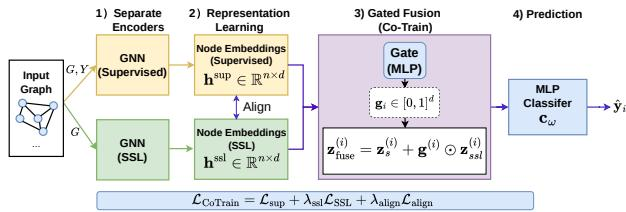  
Figure 1: Overview of Co-Train. The supervised and SSL branches use separate encoders without parameter sharing and are jointly optimized. A learned gate adaptively incorporates the complementary SSL representation into the supervised representation for prediction.

The two memory banks preserve the supervised and self-supervised representation spaces independently, with each training representation paired with its corresponding class label. Importantly, the two encoders are independently parameterized and need not share the same backbone architecture.

Neighbor-Based Retrieval Given a test node �, we perform retrieval independently in the supervised and self-supervised representation spaces. For each branch $b \in \{ \mathrm { s u p } , \mathrm { s s l } \}$ , we retrieve the � nearest training nodes from its corresponding memory bank $\mathcal { M } _ { b }$ according to cosine similarity. Specifically, the similarity between � and a retrieved node � is computed as

$$
s _ { x j } ^ { b } = \frac { \mathbf { h } _ { b } ^ { \left( x \right) ^ { \top } } \mathbf { h } _ { b } ^ { \left( j \right) } } { \vert \vert \mathbf { h } _ { b } ^ { \left( x \right) } \vert \vert _ { 2 } \vert \vert \mathbf { h } _ { b } ^ { \left( j \right) } \vert \vert _ { 2 } } .\tag{13}
$$

Within each representation space, we use the similarity-weighted non-parametric voting scheme of AdaNPC [38] to obtain prediction scores from the retrieved neighbors. Their cosine similarities are normalized into voting weights:

$$
w _ { x j } ^ { b } = \frac { \exp ( s _ { x j } ^ { b } / \tau _ { r } ) } { \sum _ { \ell \in N _ { k } ( x , M _ { b } ) } \exp ( s _ { x \ell } ^ { b } / \tau _ { r } ) } ,\tag{14}
$$

where $\tau _ { r }$ is the retrieval temperature controlling the sharpness of the neighbor weights. We then aggregate the one-hot labels of the retrieved neighbors using their similarity weights:

$$
\eta _ { b } ( x ) = \sum _ { j \in N _ { k } ( x , M _ { b } ) } w _ { x j } ^ { b } \mathbf { y } _ { j } , \qquad b \in \{ \mathrm { s u p } , \mathrm { s s l } \} ,\tag{15}
$$

where $\mathbf { y } _ { j } \in \{ 0 , 1 \} ^ { C }$ denotes the one-hot class label of neighbor $j .$ Applying this procedure independently to the two memory banks yields the class-wise prediction score vectors $\eta _ { \mathrm { s u p } } ( x )$ and $\pmb { \eta } _ { \mathrm { s s l } } ( \boldsymbol { x } )$ from the supervised and self-supervised representation spaces, respectively.

Class-Centroid Retrieval. For multiclass prediction, instancelevel KNN can be dominated by a small set of locally retrieved classes. We therefore consider class-centroid retrieval, which represents each class explicitly in the retrieval space.

For each branch � ∈ {sup, ssl} and class $c ,$ we compute the class centroid as

$$
\pmb { \mu } _ { b , c } = \frac { 1 } { | \mathcal { D } _ { c } | } \sum _ { i \in \mathcal { D } _ { c } } { \bf h } _ { b } ^ { ( i ) } ,\tag{16}
$$

where $\mathcal { D } _ { c }$ denotes the set of training nodes belonging to class �. The � centroids form a class-level memory bank for each representation space. For a test node �, we perform retrieval over the class centroids using the same similarity-weighted scoring in Equations 13–15.

Additionally, we apply graph-aware feature smoothing before centroid construction, where each node representation is averaged with those of its graph neighbors. This reduces local representation variation and encourages neighboring nodes to form more coherent representations, yielding more representative class centroids for retrieval.

Confidence-Aware Dual-Space Fusion. The two representation spaces may provide prediction signals of diferent strengths for the same test node. We therefore adaptively determine their relative contributions based on retrieval confidence, assigning a larger weight to the branch with a more confident prediction. For each branch, we define its confidence as

$$
C _ { b } ( x ) = \operatorname* { m a x } _ { c } [ \pmb { \eta } _ { b } ( x ) ] _ { c } , \qquad b \in \{ \mathrm { s u p , s s l } \} .\tag{17}
$$

The contribution of the supervised branch is then

$$
\alpha _ { \mathrm { s u p } } ( x ) = \frac { \exp ( C _ { \mathrm { s u p } } ( x ) / \tau _ { f } ) } { \exp ( C _ { \mathrm { s u p } } ( x ) / \tau _ { f } ) + \exp ( C _ { \mathrm { s s l } } ( x ) / \tau _ { f } ) } ,\tag{18}
$$

with $\alpha _ { \mathrm { s s l } } ( x ) = 1 - \alpha _ { \mathrm { s u p } } ( x )$

We further account for the agreement between the two prediction signals. Specifically, we measure their hard-label disagreement on the unlabeled target nodes $\textstyle \chi _ { t }$ as

$$
\delta = \frac { 1 } { | X _ { t } | } \sum _ { x \in X _ { t } } \mathbb { I } [ \hat { y } _ { \operatorname* { s u p } } ( x ) \neq \hat { y } _ { \operatorname { s s l } } ( x ) ] , \quad \hat { y } _ { b } ( x ) = \arg \operatorname* { m a x } _ { c } [ \eta _ { b } ( x ) ] _ { c } .\tag{19}
$$

When the two branches exhibit large disagreement $( \delta > 0 . 5 )$ we place greater emphasis on the supervised prediction by setting $\alpha _ { \mathrm { s u p } } ~ = ~ 1$ and using a small fixed $\alpha _ { \mathrm { s s l } } ~ ( \mathrm { e . g . , 0 . 0 1 } )$ , instead of the confidence-based weights. Otherwise, we use the confidence-based weights defined above.

Finally, we combine the two prediction scores as

$$
\pmb { \eta } _ { \mathrm { f i n a l } } ( x ) = \alpha _ { \mathrm { s u p } } ( x ) \pmb { \eta } _ { \mathrm { s u p } } ( x ) + \alpha _ { \mathrm { s s l } } ( x ) \pmb { \eta } _ { \mathrm { s s l } } ( x ) ,\tag{20}
$$

and predict $\hat { y } = \arg \operatorname* { m a x } _ { c } [ \pmb { \eta } _ { \mathrm { f i n a l } } ( \pmb { x } ) ] _ { c }$

## 5 Experiments

## 5.1 Experiment Setups

Datasets. We evaluate OOD node classification under two natural distribution shifts: temporal shifts in dynamic graphs and domain shifts across multiple graphs. Full dataset details are provided in Table 6 in Sec. A.

• Temporal transfer. We use Elliptic [15] for illicit transaction classification across time, and OGB-Arxiv [10] for paper subject classification across publication years.

• Cross-domain transfer. We use Twitch-Explicit (Twitch) [18] for explicit-language classification across regional user interaction graphs, and Facebook-100 (FB-100) [24] for gender classification across university social networks.

Baselines. We compare our method against representative supervised and self-supervised baselines:

Table 1: F1-score (%) on Elliptic across nine temporal test splits and diferent GNN backbones.
<table><tr><td rowspan=1 colspan=1>Method (Backbone)</td><td rowspan=1 colspan=6>T1        T2        T3        T4        T5        T6</td><td rowspan=1 colspan=1>T7</td><td rowspan=1 colspan=1>T8</td><td rowspan=1 colspan=1>T9</td></tr><tr><td rowspan=1 colspan=1>ERM (SAGE)</td><td rowspan=1 colspan=3> $9 1 . 7 4 \pm 1 . 8 5 \ 8 5 . 2 7 \pm 1 . 3 9 \ 7 7 . 4 2 \pm 1 . 4 1</td><td rowspan=1 colspan=1>\ 7 3 . 6 4 \pm 1 . 4 5</td><td rowspan=1 colspan=2>\ 7 5 . 2 4 \pm 2 . 8 8 \ 7 6 . 9 2 \pm 4 . 8 1 8</td><td rowspan=1 colspan=1>0 . 6 8 \pm 1 . 7 4 \ 6 5</td><td rowspan=1 colspan=1>. 9 6 \pm 3 . 9 7 \ 4 9 .</td><td rowspan=1 colspan=1>0 3 \pm 0 . 8 5$ </td></tr><tr><td rowspan=1 colspan=1>EERM (SAGE)</td><td rowspan=1 colspan=2> $\left| 8 6 . 5 9 \pm 2 . 7 1 \ 8 1 . 0 3 \pm 2 . 5 5</td><td rowspan=1 colspan=1>\ 7 6 . 6 8 \pm 1 . 3 9 \ 7</td><td rowspan=1 colspan=1>2 . 2 4 \pm 1 . 9 9 \ 7 5 . 2</td><td rowspan=1 colspan=1>0 \pm 2 . 2 0 \ 7 8 . 2 8 \pm</td><td rowspan=1 colspan=1>3 . 3 3 7 2 . 7 7 \pm 4 . 7</td><td rowspan=1 colspan=1>3 4 . 1 9 8 \right| .$ </td><td rowspan=1 colspan=1>63.83 ± 3.98 4</td><td rowspan=1 colspan=1>9.14 ± 1.01</td></tr><tr><td rowspan=1 colspan=1>LiSA (SAGE)</td><td rowspan=1 colspan=2> $\begin{array} { r } { \left| 9 2 . 5 8 \pm 7 . 9 1 \ 8 5 . 2</td><td rowspan=1 colspan=1>3 \pm 8 . 4 1 \ 7 9 . 0 0 \pm 4 . 7</td><td rowspan=1 colspan=1>0 \ 7 4 . 4 5 \pm 5 . 1 0 \ 7 4 . 9</td><td rowspan=1 colspan=1>5 \pm 1 . 7 5 \ 6 8 . 4 6 \pm 4 . 9</td><td rowspan=1 colspan=1>0 \ 7 0 . 4 2 \pm 2 . 7 4 . 9 0 0 0</td><td rowspan=1 colspan=1>\right| . } \end{array}$ </td><td rowspan=1 colspan=1> $5 5 . 1 2 \pm 2 . 0 9 ~</td><td rowspan=1 colspan=1>4 7 . 1 9 \pm 0 . 9 2$ </td></tr><tr><td rowspan=1 colspan=1>MARIO (SAGE)</td><td rowspan=1 colspan=2> $\left| 9 0 . 5 1 \pm 4 . 1 2 8 4 . 7 3 \pm 2 . 0 2 7 7 . 6 2</td><td rowspan=1 colspan=1>\pm 2 . 4 5 7 2 . 0 5 \pm 3 . 4</td><td rowspan=1 colspan=1>2 7 3 . 1 8 \pm 4 . 6 5 7 7 . 3 5</td><td rowspan=1 colspan=1>\pm 6 . 4 3 4 . 7 7 1 . 5 4 2 \pm</td><td rowspan=1 colspan=1>4 . 0 0 0 4 8 \right| .$ </td><td rowspan=1 colspan=1> $6 3 . 7 1 \pm 8 . 3 6$ </td><td rowspan=1 colspan=1> $6 5 . 0 2 \pm 7 . 1 6 4</td><td rowspan=1 colspan=1>8 . 7 9 \pm 0 . 0 3$ </td></tr><tr><td rowspan=1 colspan=1>DGI (SAGE)</td><td rowspan=1 colspan=2> $| 5 6 . 3 9 \pm 6 . 6 3 ~ 5 3 . 4 6 \pm 5 . 1 7 ~ 5 5 . 1 3 \pm 5 . 1 9 ~ 5 2 . 8 1 \pm 6 . 0 9 ~ 5 9 . 0 9 \pm 5 . 0 1 ~ 5 6 . 1 2 \pm 4 . 0 1 ~ 5 9 . 8 1 + 5 . 0 9 ~ 5 9 . 8 1 + 6 . 0 9 ~ 5 9 . 8 1 + 5 . 0 1 ~ 5 9 .</td><td rowspan=1 colspan=1>8 1 + 5 . 0 1 ~ 5 9 . 8 1 \pm 4 . 0 1 ~ 5 9 . 8 1 + 5 . 0 1 ~ 5 9 . 8 1 + 5 . 0 1 ~ 5 9 . 8 1 + 5 . 0 1 ~ 5 9 .</td><td rowspan=1 colspan=1>8 1 + 5 . 0 1 ~ 5 9 . 8 1 + 5 . 0 1 ~ 5 9 . 8 1 + 5 . 0 1 ~ 5 9 . 8 1 + 5 . 0 1 ~ 5 9 . 8 1 + 5 . 0 1 ~ 5 9 . 8 1 +</td><td rowspan=1 colspan=2>5 . 0 1 ~ 5 9 . 8 1 + 5 . 0 1 ~ 5 9 . 8 1 + 5 . 0 1 ~ 5 9 . 8 1 + 5 . 0 1 ~ 5 9 . 8 1 + 5 . 0 1 ~ 5 9 . 8 1 + 5 . 0 1 ~ 5 9 . 8 1 + 5 . 0 1 ~ 5 9 . 8 1 + 5 . 0 1 ~ 5 9 . 8 1 + 5 . 0 1 + 5 . 0 1 ~ 5 9 . 8 1 + 5 . 0 1 ~ 5 9 .$ </td><td rowspan=1 colspan=1> $5 7 . 9 8 \pm 4 . 7 7$ </td><td rowspan=1 colspan=1> $5 0 . 3 6 \pm 1 . 5 4$ </td><td rowspan=1 colspan=1> $4 9 . 8 8 \pm 1 . 2 5$ </td></tr><tr><td rowspan=1 colspan=1>GRACE (SAGE)</td><td rowspan=1 colspan=2> $\left| 9 0 . 0 7 \pm 3 . 1 4 \ 8 3 . 7 2 \pm 1 . 3 5</td><td rowspan=1 colspan=1>\ 7 8 . 1 1 \pm 1 . 7 2 \ 7</td><td rowspan=1 colspan=1>2 . 2 2 \pm 2 . 1 3 \ 7 5 . 1</td><td rowspan=1 colspan=1>5 \pm 3 . 2 5 \ 8 0 . 5 8 \pm</td><td rowspan=1 colspan=1>2 . 9 8 7 7 . 3 4 \pm 5 . 9</td><td rowspan=1 colspan=1>5 6 7 . 4 4 \right| .$ </td><td rowspan=1 colspan=1> $7 1 . 0 3 \pm 4 . 0 9$ </td><td rowspan=1 colspan=1> $4 8 . 7 0 \pm 0 . 0 8$ </td></tr><tr><td rowspan=1 colspan=1>CoTrain-DGI (SAGE)</td><td rowspan=1 colspan=1> $9 3 . 7 8 \pm 1 . 6 1</td><td rowspan=1 colspan=1>8 6 . 6 0 \pm 1 . 0 7 7 9</td><td rowspan=1 colspan=1>. 4 9 \pm 1 . 3 2 7 4 . 9</td><td rowspan=1 colspan=1>8 \pm 0 . 7 6 7 7 . 8 6 \</td><td rowspan=1 colspan=1>pm 1 . 5 7 8 5 . 0 7 \pm 1</td><td rowspan=1 colspan=1>. 2 7 8 5 . 2 2 \pm 0 . 7</td><td rowspan=1 colspan=1>5 0 9 . 4 9 2 . 2 8$ </td><td rowspan=1 colspan=1> $7 0 . 3 7 \pm 1 . 5 6$ </td><td rowspan=1 colspan=1> $4 9 . 9 1 \pm 0 . 2 4$ </td></tr><tr><td rowspan=1 colspan=1>CoTrain-GRACE (SAGE)</td><td rowspan=1 colspan=1> $\begin{array} { r } { | 9 3 . 9 8 \pm 1 . 3 9 ~ 8 5 . 4</td><td rowspan=1 colspan=1>0 \pm 0 . 9 6 ~ 7 7 . 5 7 \pm 1 . 3 4 ~ 7 1 . 9 8 \pm 1 . 5</td><td rowspan=1 colspan=1>8 ~ 7 5 . 9 1 \pm 1 . 8 5 ~ 8 4 . 5 0 \pm 1 . 6 7 ~ 8 5 . 7</td><td rowspan=1 colspan=1>2 \pm 1 . 1 4 ~ ( \textrm { H } 5 7 . 9 8 9 + 0 . 0 9 8 9 + 0</td><td rowspan=1 colspan=1>. 0 9 8 9 + 0 . 0 9 8 9 + 0 . 0 9 8 9 + 0 . 0 9 8 9 + 0 . 4 0 9 ~</td><td rowspan=1 colspan=1>( 7 . 9 8 9 + 0 . 0 9 8 ) ~ 5 0 . 9 1 9 ~ ( \textrm { H } 7</td><td rowspan=1 colspan=1>. 9 8 9 + 0 . 0 9 8 ) ) | 0 \rangle . } \end{array}$ </td><td rowspan=1 colspan=1>70.33 ± 1.34</td><td rowspan=1 colspan=1> $4 9 . 9 5 \pm 0 . 4 8$ </td></tr><tr><td rowspan=2 colspan=1>Retrieval-DGI (SAGE)Retrieval-GRACE (SAGE)</td><td rowspan=1 colspan=1> $\left| 8 9 . 8 3 \pm 1 .</td><td rowspan=1 colspan=1>2 5 ~ 8 2 . 8 2 \pm 2 . 0 4 ~ 7</td><td rowspan=1 colspan=1>7 . 3 1 \pm 2 . 3 3 ~ 7 1 . 6</td><td rowspan=1 colspan=1>9 \pm 6 . 0 1 ~ 6 9 . 4 0 \pm</td><td rowspan=1 colspan=1>4 . 6 0 ~ 7 7 . 6 8 \pm 2 . 6 9</td><td rowspan=1 colspan=1>~ 6 9 . 4 0 9 \right|$ </td><td rowspan=1 colspan=1> $7 1 . 7 3 \pm 3 . 2 3$ </td><td rowspan=1 colspan=1> $6 6 . 0 9 \pm 3 . 1 1$ </td><td rowspan=1 colspan=1> $5 0 . 2 2 \pm 0 . 8 0$ </td></tr><tr><td rowspan=1 colspan=1> $9 2 . 0 3 \pm 1 . 4</td><td rowspan=1 colspan=1>2 8 4 . 6 2 \pm 0 . 7</td><td rowspan=1 colspan=1>4 7 8 . 3 5 \pm 0 . 7 1</td><td rowspan=1 colspan=1>7 4 . 4 5 \pm 0 . 6 5</td><td rowspan=1 colspan=1>7 2 . 9 4 \pm 0 . 9 3 8</td><td rowspan=1 colspan=1>0 . 6 4 \pm 0 . 8 8 7 7</td><td rowspan=1 colspan=1>. 1 3 \pm 0 . 8 7 6 6 .</td><td rowspan=1 colspan=1>7 0 \pm 1 . 2 0$ </td><td rowspan=1 colspan=1> $5 0 . 2 6 \pm 0 . 8 5$ </td></tr><tr><td rowspan=1 colspan=1>ERM (GCNII)</td><td rowspan=1 colspan=3> $\left| 7 8 . 8 9 \pm 3 . 5 1 7 1 . 0 0 \pm 4 . 6 1 6 4 . 3 7 \pm 5 . 7 2 6 3 . 6 5 \</td><td rowspan=1 colspan=1>pm 7 . 8 1 6 6 . 4 8 \pm 5 . 9</td><td rowspan=1 colspan=1>2 6 7 . 7 2 \pm 5 . 7 2 7 2</td><td rowspan=1 colspan=1>. 1 1 \pm 5 . 0 3 4 . 3 7 1 . 0</td><td rowspan=1 colspan=1>0 0 0 . 3 1 \right| .$ </td><td rowspan=1 colspan=1> $5 9 . 4 3 \pm 3 . 3 6 ~</td><td rowspan=1 colspan=1>4 9 . 0 4 \pm 1 . 0 1$ </td></tr><tr><td rowspan=1 colspan=1>EERM (GCNII)</td><td rowspan=1 colspan=1> $\begin{array} { r } { \lef</td><td rowspan=1 colspan=1>t| 6 1 . 2 7 \pm 2 . 8 1 \ 6 6 . 9 9</td><td rowspan=1 colspan=1>\pm 2 . 4 9 \ 6 3 . 6 6 \pm 2 . 2 0</td><td rowspan=1 colspan=1>\ 6 1 . 5 9 \pm 2 . 6 0 \ 6 0 . 4 9</td><td rowspan=1 colspan=1>\pm 4 . 6 1 \ 5 7 . 3 7 \pm 4 . 9 6 \</td><td rowspan=1 colspan=1>5 6 . 5 8 \pm 3 . 9 2 \ 6 . 0 9 9 9</td><td rowspan=1 colspan=1>\right| . } \end{array}$ </td><td rowspan=1 colspan=1> $4 8 . 1 7 \pm 5 . 7 7 5</td><td rowspan=1 colspan=1>0 . 9 8 \pm 4 . 8 8$ </td></tr><tr><td rowspan=1 colspan=1>LiSA (GCNII)            7</td><td rowspan=1 colspan=1>7.26 ± 5.87</td><td rowspan=1 colspan=1> $7 3 . 8 1 \pm 4 . 3</td><td rowspan=1 colspan=1>5 6 8 . 7 5 \pm 4 . 5 6</td><td rowspan=1 colspan=1>6 7 . 1 8 \pm 3 . 6 4 6</td><td rowspan=1 colspan=1>6 . 9 9 \pm 4 . 1 8 6 7 .</td><td rowspan=1 colspan=1>9 5 \pm 7 . 0 0$ </td><td rowspan=1 colspan=1> $6 6 . 4 6 \pm 5 . 5 9$ </td><td rowspan=1 colspan=1>55.99 ± 6.82</td><td rowspan=1 colspan=1>50.27 ± 3.17</td></tr><tr><td rowspan=2 colspan=1>MARIO (GCNII)DGI (GCNII)</td><td rowspan=1 colspan=1> $\left| 9 3 . 7 2 \pm 2 . 1 2 ~ 8 6 . 9</td><td rowspan=1 colspan=1>2 \pm 0 . 9 1 ~ 7 9 . 8 0 \pm 1 . 2 5 ~ 7</td><td rowspan=1 colspan=1>5 . 8 2 \pm 2 . 4 9 ~ 7 7 . 8 8 \pm 3 . 5</td><td rowspan=1 colspan=1>0 ~ 8 0 . 5 2 \pm 4 . 8 5 ~ \mathrm { T</td><td rowspan=1 colspan=1>} \Theta , 0 . 8 8 9 9 + { \ O } . 4 9 3 ~ \</td><td rowspan=1 colspan=1>mathrm { T } \Theta \right.$ </td><td rowspan=1 colspan=1> $7 1 . 4 1 \pm 1 0 . 1 3$ </td><td rowspan=1 colspan=1> $6 5 . 1 7 \pm 5 . 3 0 4</td><td rowspan=1 colspan=1>8 . 8 8 \pm 0 . 4 6$ </td></tr><tr><td rowspan=1 colspan=1> $| 5 5 . 9 0 \pm 2 . 7 9 5 5 . 5 0 \pm 5 . 4 4 5 0</td><td rowspan=1 colspan=1>. 8 2 \pm 3 . 7 0 5 0 . 9 6 \pm 7 . 1 1 4 9 . 1 8 \p</td><td rowspan=1 colspan=1>m 3 . 6 9 5 2 . 2 0 \pm 3 . 1 1 4 5 . 0 9 5 2 . 2 0</td><td rowspan=1 colspan=1>\pm 2 . 1 1 4 . 2 4 . 5 6 9 5 . 2 1 8 \pm 3 . 0 9 5</td><td rowspan=1 colspan=1>2 . 2 0 \pm 3 . 1 1 4 . 2 4 . 5 6 7 . 5 6 7 . 2 6 8 \p</td><td rowspan=1 colspan=1>m 3 . 0 9 5 2 . 4 2 . 4 . . 6 . 6 . 6 . 7 . 1 8 .$ </td><td rowspan=1 colspan=1> $5 0 . 9 8 \pm 3 . 9 7$ </td><td rowspan=1 colspan=1> $4 9 . 1 3 \pm 1 . 2 6 ~ 4</td><td rowspan=1 colspan=1>9 . 0 1 \pm 2 . 0 0$ </td></tr><tr><td rowspan=1 colspan=1>GRACE (GCNII)</td><td rowspan=1 colspan=1> $\left| 7 2 . 4 2 \pm</td><td rowspan=1 colspan=1>4 . 8 8 7 2 . 8 3 \pm 4 . 2 2</td><td rowspan=1 colspan=1>\ 6 6 . 8 1 \pm 5 . 8 2 \ 6</td><td rowspan=1 colspan=1>5 . 6 4 \pm 5 . 0 1 \ 6 6 . 4</td><td rowspan=1 colspan=1>1 \pm 6 . 8 7 \ 6 4 . 7 8 \</td><td rowspan=1 colspan=1>pm 6 . 1 1 \right.$ </td><td rowspan=1 colspan=1> $6 2 . 6 2 \pm 4 . 6 3$ </td><td rowspan=1 colspan=1> $5 7 . 7 5 \pm 5 . 3 5 4</td><td rowspan=1 colspan=1>8 . 7 6 \pm 0 . 4 1$ </td></tr><tr><td rowspan=1 colspan=1>CoTrain-DGI (GCNII)</td><td rowspan=1 colspan=1> $\begin{array} { r }  | 9</td><td rowspan=1 colspan=1>5 . 3 1 \pm 0 . 6 2 \textrm</td><td rowspan=1 colspan=1>{  { 8 7 . 9 6 \pm 0 . 8 0 \ : 7</td><td rowspan=1 colspan=1>9 . 8 1 \pm 0 . 9 3 \ : 7 4 . 7 4</td><td rowspan=1 colspan=1>\pm 0 . 5 6 \ : 7 7 . 9 0 \pm 2 .</td><td rowspan=1 colspan=1>0 7 \ : 8 6 . 3 7 \pm 1 . 0 8 \ :</td><td rowspan=1 colspan=1>8 7 . 4 7 \pm 1 . 3 4 \ : 7 2 . 7 2</td><td rowspan=1 colspan=1>\pm 2 . 9 7 \ : 4 9 . 7 7 \pm 0</td><td rowspan=1 colspan=1>. 4 0 } } \end{array}$ </td></tr><tr><td rowspan=1 colspan=1>CoTrain-GRACE (GCNII)</td><td rowspan=1 colspan=1> $\begin{array} { r } { \lef</td><td rowspan=1 colspan=1>t| 9 5 . 3 9 \pm 0 . 4 3 \ 8 7 . 8 7</td><td rowspan=1 colspan=1>\pm 0 . 5 2 \ 8 0 . 1 7 \pm 0 . 7</td><td rowspan=1 colspan=1>7 \ 7 4 . 9 3 \pm 0 . 5 8 \ 7 9 . 0</td><td rowspan=1 colspan=1>7 \pm 1 . 3 4 \ 8 7 . 6 1 \pm 0 . 7</td><td rowspan=1 colspan=1>5 \ 8 7 . 6 3 \pm 0 . 7 9 3 \righ</td><td rowspan=1 colspan=1>t| ^ { 2 } . } \end{array}$ </td><td rowspan=1 colspan=1> $7 5 . 6 1 \pm 1 . 0 5 \ 4</td><td rowspan=1 colspan=1>9 . 8 3 \pm 0 . 3 1$ </td></tr><tr><td rowspan=1 colspan=1>Retrieval-DGI (GCNII)</td><td rowspan=1 colspan=1> $\left| 8 2 . 2 9 \pm 3 .</td><td rowspan=1 colspan=1>3 1 7 0 . 4 0 \pm 3 . 5 0 6 5</td><td rowspan=1 colspan=1>. 5 4 \pm 3 . 9 3 6 7 . 3 9 \p</td><td rowspan=1 colspan=1>m 5 . 5 6 7 0 . 8 5 \pm 2 . 8 7</td><td rowspan=1 colspan=1>7 5 . 2 5 \pm 3 . 3 7 4 . 2 4</td><td rowspan=1 colspan=1>6 7 . 3 9 8 \right| .$ </td><td rowspan=1 colspan=1> $7 7 . 8 4 \pm 2 . 1 8$ </td><td rowspan=1 colspan=1> $6 2 . 8 4 \pm 2 . 0 0 \</td><td rowspan=1 colspan=1>4 9 . 3 2 \pm 0 . 9 2$ </td></tr><tr><td rowspan=1 colspan=1>Retrieval-GRACE (GCNII)</td><td rowspan=1 colspan=2>|83.91 ± 4.96 74.57 ± 5.12</td><td rowspan=1 colspan=1>70.19 ± 5.28</td><td rowspan=1 colspan=1>70.62 ± 4.45</td><td rowspan=1 colspan=1>73.11 ± 2.12</td><td rowspan=1 colspan=1>75.57 ± 2.82</td><td rowspan=1 colspan=1> $7 9 . 2 1 \pm 1 . 7 1 $ </td><td rowspan=1 colspan=1> $6 3 . 6 7 \pm 2 . 1 0 \</td><td rowspan=1 colspan=1>4 9 . 3 0 \pm 0 . 8 8$ </td></tr></table>

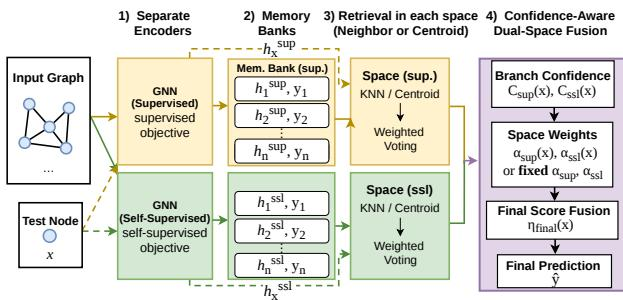  
Figure 2: Overview of the Dual-Space Retrieval framework. Supervised and self-supervised GNNs construct separate embedding memory banks. At test time, neighbor- or centroidbased retrieval produces similarity-weighted prediction scores in each space, which are combined through confidenceaware dual-space score fusion.

• ERM [26]: A standard supervised learning baseline based on empirical risk minimization.

• EERM [32]: A supervised OOD method that constructs augmented environments via reinforcement learning for invariant learning.

• DGI [28]: A self-supervised graph representation learning method based on local–global mutual information maximization.

• GRACE [43]: A self-supervised graph contrastive learning method based on augmented graph views.

• LiSA [36]: A supervised OOD method that learns invariant representations using label-invariant subgraphs and energy-based regularization.

• MARIO [42]: A self-supervised graph OOD method combining adversarial graph augmentation and information bottleneck regularization.

For fair comparison, we follow the same OOD data splits used in EERM and LiSA for final evaluation.

Implementation Details. For each dataset, we evaluate our methods with diferent supervised GNN backbones to examine generalizability across model architectures. Under each setting, all baselines use the same backbone as the supervised branch of our methods for a fair comparison. For the SSL branch, we use either GCN or GraphSAGE based on validation performance. DGI and GRACE use the same SSL encoder architecture within each setting but are trained separately. Once the supervised and SSL architectures are selected, we use the same backbone configuration for Co-Train and Dual-Space Retrieval, enabling a controlled evaluation across diferent backbone architectures. Results with alternative SSL encoder architectures are provided in Sec. C.3.

For Dual-Space Retrieval, we use $k = 3 0 , 1 0 0 , 5 0 0 .$ and 300 for OGB-Arxiv, Elliptic, Twitch, and FB100, respectively, selected based on validation performance. The same � is used for the supervised and SSL retrieval spaces. Sensitivity to � is reported in Sec. C.2. We fix the retrieval similarity temperature $\lambda _ { r }$ to 0.01 and the confidence-fusion temperature $\tau _ { f }$ to 0.5 across all datasets. When the two branches exhibit large disagreement $( \delta > 0 . 5 )$ , we reduce the SSL contribution using a small fixed weight $\alpha _ { \mathrm { s s l } } .$ . This occurs on OGB-Arxiv, where we set $\alpha _ { \mathrm { s s l } } = 0 . 0 1$ . Sensitivity to $\alpha _ { \mathrm { s s l } }$ is reported in Table 11 in Sec. C.1.

For Co-Train, we set $\lambda _ { \mathrm { a l i g n } } = 0 . 0 2$ and warm up $\lambda _ { \mathrm { s s l } }$ from 0.1 to 0.7 during training. All reported performance is evaluated on the test sets and averaged over 10 runs, with mean and standard deviation reported.

## 5.2 Temporal Generalization Performance

We evaluate temporal generalization under two settings: a dynamic graph (Elliptic) that evolves across time snapshots and a static graph (OGB-Arxiv) whose nodes are partitioned by publication time. These settings capture distinct forms of temporal distribution shift. In both cases, incorporating SSL representations benefits supervised OOD generalization, with particularly consistent gains from Co-Train.

Temporal Generalization on Dynamic Graphs. We evaluate temporal distribution shifts on the Elliptic transaction network. We use graph snapshots 7–11 for training and snapshots 17–49 for test ing, chronologically grouped into nine evaluation periods. Table 1 reports F1 scores for illicit transaction classification. We consider GraphSAGE and GCNII as the supervised backbones, paired with GCN and GraphSAGE encoders, respectively, for the SSL branch.

Co-Train achieves strong and consistent performance across both backbone settings. With GraphSAGE, CoTrain-DGI and CoTrain GRACE achieve average F1 scores of 78.14% and 77.26%, outperforming the strongest baseline on average (GRACE, 75.21%) by 2.93 and 2.05 percentage points, respectively. With GCNII, the gains are even more pronounced: CoTrain-DGI and CoTrain-GRACE achieve average F1 scores of 79.12% and 79.79%, exceeding the strongest baseline (MARIO, 75.57%) by 3.55 and 4.22 points. The improvements are sustained across the temporal sequence; for example, at T7, CoTrain-GRACE reaches 85.72% and 87.63% with GraphSAGE and GCNII, compared with the strongest baselines of 80.68% and 71.41%, respectively.

Dual-Space Retrieval is also competitive, particularly in later periods. With GraphSAGE, Retrieval-GRACE achieves an average F1 of 75.24%, comparable to the strongest baseline (75.21%). With GCNII, although retrieval is less competitive on average, Retrieval GRACE reaches 79.21% at T7, outperforming the strongest baseline at that period by 7.80 points. These results demonstrate that incorporating the SSL representation provides substantial benefits for temporal generalization, with particularly consistent gains from Co-Train.

Temporal Generalization on Static Graphs. We next evalu ate temporal generalization on OGB-Arxiv, using papers published before 2011 for training and three future periods, 2014–2016, 2016– 2018, and 2018–2020, for evaluation. Table 2 reports node classification accuracy with GraphSAGE and GAT as the supervised backbones, while the SSL branches use GraphSAGE encoders. For Dual-Space Retrieval, we use class-centroid retrieval to better represent individual classes in this multiclass setting; this choice over neighbor-based KNN is further discussed in Table 8 in Sec. B.2.

Co-Train shows strong and consistent temporal generalization with both DGI and GRACE. With GraphSAGE, CoTrain-DGI improves over LiSA, the strongest existing baseline, by 4.09, 4.56, and 4.14 percentage points across the three temporal splits, while CoTrain-GRACE achieves similar gains of 4.03, 4.58, and 4.18 points. With GAT, both variants also outperform the strongest baselines across all three splits.

Dual-Space Retrieval remains competitive on OGB-Arxiv, although it is less efective with GraphSAGE than with GAT. Feature smoothing consistently improves centroid-based retrieval across both backbones and SSL objectives. With GraphSAGE, Retrieval\* achieves up to 52.01%, 54.15%, and 56.66% across the three splits, exceeding the strongest existing baseline by 6.33, 10.51, and 15.62 percentage points, respectively. With GAT, it reaches up to 54.21%, 52.09%, and 54.03%. Further analysis shows that feature smoothing increases neighborhood label purity in both representation spaces (Table 9 Sec. B.3).

## 5.3 Cross-domain Generalization Performance

We evaluate cross-domain generalization on two social network benchmarks, Twitch and FB-100, where models are trained on selected domains and evaluated on unseen ones. These benchmarks capture domain shifts across online communities and university networks. The results further support the use of SSL representations as complementary signals for supervised OOD generalization, with Co-Train showing consistently strong performance across unseen domains.

Training on a Single Graph. On Twitch, we train on the single-domain graph DE and evaluate generalization to five unseen domains: ES, FR, PTBR, RU, and TW. We report ROC-AUC in Table 3, using GCN and GCNII as the supervised backbones and GCN for the SSL encoders.

Co-Train consistently achieves the strongest performance across the unseen domains. With GCN, CoTrain-DGI and CoTrain-GRACE obtain average ROC-AUC scores of 60.72% and 60.71%, respectively, improving over the strongest baseline on average (MARIO, 58.05%) by 2.66 and 2.65 percentage points. The gains remain consistent with GCNII: CoTrain-DGI and CoTrain-GRACE achieve 62.26% and 61.58% on average, outperforming the strongest baseline (EERM, 59.58%) by 2.68 and 2.01 points, respectively. For example, on FR, CoTrain-DGI reaches 65.07% with GCNII, compared with 60.37% for the strongest baseline.

Dual-Space Retrieval also remains competitive across unseen domains. With GCN, Retrieval-DGI achieves an average ROC-AUC of 59.01%, exceeding the strongest baseline average by 0.95 points. With GCNII, it achieves 59.60%, closely matching the strongest baseline average of 59.58%. We additionally report results with GAT as the supervised backbone in Table 7, Sec. D . Co-Train remains consistently strong, while the performance of Dual-Space Retrieval varies more across backbone architectures.

Training on Multiple Graphs. On FB-100, we train on graphs from three universities and evaluate on unseen university networks. We use GCN as the supervised backbone and GCN encoders for DGI and GRACE, and report test accuracy in Table 4.

Both Co-Train and Dual-Space Retrieval achieve strong performance on Penn and Brown. On Penn, Retrieval-DGI reaches 54.69% under the WUSTL+BRD+CMU source combination, outperforming the strongest baseline (52.99%) by 1.70 percentage points. Co-Train also consistently improves or matches the strongest baselines across the source combinations. Similar gains are observed on Brown: Retrieval-DGI achieves 57.50% and 57.19% under BIN+DUK+PRI and WUSTL+BRD+CMU, exceeding the strongest baselines by 1.57 and 2.41 points, respectively, while Co-Train remains consistently competitive.

Table 2: Node classification accuracy (%) on OGB-Arxiv across temporal splits and GNN backbones.
<table><tr><td>Method (SAGE)</td><td>2014-2016</td><td>2016-2018</td><td>2018-2020</td><td>Method (GAT)</td><td>2014-2016</td><td>2016-2018</td><td>2018-2020</td></tr><tr><td>ERM</td><td> $4 2 . 5 6 \pm 0 . 9 1$ </td><td> $4 0 . 5 3 \pm 2 . 0 3$ </td><td> $3 7 . 1 9 \pm 2 . 2 2 | $ </td><td>ERM</td><td> $4 3 . 3 6 \pm 1 . 0 4$ </td><td> $4 0 . 4 2 \pm 1 . 8 9$ </td><td> $3 7 . 8 4 \pm 1 . 8 8$ </td></tr><tr><td>EERM</td><td> $4 1 . 5 5 \pm 0 . 6 8$ </td><td> $4 0 . 3 6 \pm 1 . 2 9$ </td><td> $3 8 . 9 5 \pm 1 . 5 7$ </td><td>EERM</td><td> $4 9 . 2 4 \pm 0 . 4 7$ </td><td> $4 8 . 5 4 \pm 0 . 6 6$ </td><td> $4 5 . 5 3 \pm 0 . 9 3$ </td></tr><tr><td>LiSA</td><td> $4 5 . 6 8 \pm 2 . 5 5$ </td><td> $4 3 . 6 4 \pm 3 . 2 6$ </td><td> $4 1 . 0 4 \pm 3 . 0 0$ </td><td>LiSA</td><td> $4 9 . 8 2 \pm 0 . 1 3$ </td><td> $4 8 . 3 4 \pm 0 . 0 9$ </td><td> $4 4 . 4 6 \pm 0 . 2 2$ </td></tr><tr><td>MARIO</td><td> $3 2 . 7 5 \pm 1 . 5 8$ </td><td> $2 8 . 6 5 \pm 1 . 8 1$ </td><td> $2 4 . 0 8 \pm 1 . 9 4$ </td><td>MARIO</td><td> $4 1 . 0 8 \pm 1 . 1 2$ </td><td> $3 8 . 3 0 \pm 1 . 0 9$ </td><td> $3 4 . 6 6 \pm 1 . 1 5$ </td></tr><tr><td>DGI</td><td> $3 8 . 6 2 \pm 0 . 7 1$ </td><td> $3 5 . 9 0 \pm 1 . 0 0$ </td><td> $3 3 . 8 0 \pm 1 . 2 9$ </td><td>DGI</td><td> $4 1 . 3 4 \pm 0 . 8 9$ </td><td> $3 8 . 1 3 \pm 1 . 2 7$ </td><td> $3 5 . 7 7 \pm 1 . 4 9$ </td></tr><tr><td>GRACE</td><td> $4 3 . 2 2 \pm 0 . 3 9$ </td><td> $4 0 . 6 8 \pm 0 . 7 2$ </td><td> $3 7 . 0 5 \pm 0 . 6 4$ </td><td>GRACE</td><td> $4 4 . 6 0 \pm 0 . 3 3$ </td><td> $4 2 . 4 2 \pm 0 . 4 8$ </td><td> $3 8 . 6 3 \pm 0 . 7 2$ </td></tr><tr><td>CoTrain-DGI</td><td> $4 9 . 7 7 \pm 0 . 5 5$ </td><td> $4 8 . 2 0 \pm 0 . 6 2$ </td><td> $4 5 . 1 8 \pm 0 . 7 4$ </td><td> $\mathrm { C o T r a i n \mathrm { - D G I } }$ </td><td> $5 0 . 6 2 \pm 0 . 3 6$ </td><td> $4 8 . 7 2 \pm 0 . 4 7$ </td><td> $4 4 . 9 5 \pm 0 . 5 1$ </td></tr><tr><td>CoTrain-GRACE</td><td> $4 9 . 7 1 \pm 0 . 4 0$ </td><td> $4 8 . 2 2 \pm 0 . 7 6$ </td><td>45.22 ± 0.84</td><td> $_ { \mathrm { C o T r a i n - G R A C E } }$ </td><td> $5 0 . 2 1 \pm 0 . 3 2$ </td><td> $4 8 . 3 4 \pm 0 . 4 9$ </td><td> $4 4 . 4 3 \pm 0 . 4 3$ </td></tr><tr><td>Retrieval-DGI</td><td> $4 3 . 4 1 \pm 0 . 5 2$ </td><td> $4 3 . 7 4 \pm 0 . 7 4$ </td><td> $4 1 . 9 9 \pm 0 . 4 7$ </td><td> $\mathrm { R e t r i e v a l - D G I }$ </td><td> $4 8 . 3 3 \pm 0 . 2 2$ </td><td> $4 7 . 4 7 \pm 0 . 2 9$ </td><td> $4 5 . 1 9 \pm 0 . 2 5$ </td></tr><tr><td>Retrieval-GRACE</td><td> $4 1 . 9 8 \pm 0 . 7 5$ </td><td> $4 1 . 9 2 \pm 0 . 9 9$ </td><td> $3 9 . 9 7 \pm 1 . 0 6$ </td><td> $_ { \mathrm { R e t r i e v a l - G R A C E } }$ </td><td> $4 7 . 7 4 \pm 0 . 1 8$ </td><td> $4 7 . 0 7 \pm 0 . 2 5$ </td><td> $4 4 . 9 3 \pm 0 . 2 9$ </td></tr><tr><td> $\mathrm { { R e t r i e v a l } ^ { \star } \mathrm { { - D G I } } }$ </td><td> $5 2 . 0 1 \pm 1 . 4 0$ </td><td> $5 4 . 1 5 \pm 1 . 8 9$ </td><td> $5 6 . 6 6 \pm 1 . 9 0 \|$ </td><td> $\mathrm { R e t r i e v a l } ^ { \star } \mathrm { - D G I }$ </td><td> $5 4 . 2 1 \pm 1 . 1 9$ </td><td> $5 2 . 0 9 \pm 1 . 9 2$ </td><td> $5 3 . 8 6 \pm 2 . 3 8$ </td></tr><tr><td> $\mathrm { R e t r i e v a l } ^ { \star } \substack { - } \mathrm { G R A C E }$ </td><td> $5 1 . 9 2 \pm 0 . 6 9$ </td><td> $5 3 . 7 7 \pm 1 . 1 0$ </td><td> $5 6 . 4 5 \pm 0 . 9 6 |$ </td><td> $\mathrm { R e t r i e v a l } ^ { \star } \substack { - } \mathrm { G R A C E }$ </td><td> $5 3 . 5 3 \pm 0 . 7 1$ </td><td> $5 1 . 7 5 \pm 2 . 0 0$ </td><td> $5 4 . 0 3 \pm 2 . 2 2$ </td></tr></table>

Table 3: ROC-AUC scores (%) on Twitch across domain splits with diferent GNN backbones.
<table><tr><td rowspan=1 colspan=1>Method</td><td rowspan=1 colspan=10>GCN                                                        GCNII</td></tr><tr><td rowspan=1 colspan=1></td><td rowspan=1 colspan=2>ES        FR</td><td rowspan=1 colspan=1>PTBR</td><td rowspan=1 colspan=2>RU        TW</td><td rowspan=1 colspan=2>ES        FR</td><td rowspan=1 colspan=1>PTBR</td><td rowspan=1 colspan=1>RU</td><td rowspan=1 colspan=1>TW</td></tr><tr><td rowspan=1 colspan=1>ERM</td><td rowspan=1 colspan=5> $5 4 . 6 4 \pm 4 . 4 3$  $5 2 . 3 2 \pm 1 . 0 3$  $4 9 . 8 7 \pm 6 . 4 6$  $5 1 . 2 9 \pm 1 . 5 8$  $5 1 . 5 9 \pm 3 . 3 4 | $ </td><td rowspan=1 colspan=2> $6 3 . 2 1 \pm 0 . 3 7$  $5 9 . 4 2 \pm 0 . 2 8$ </td><td rowspan=1 colspan=1> $6 1 . 1 9 \pm 0 . 3 9$ </td><td rowspan=1 colspan=1> $5 4 . 9 9 \pm 0 . 4 1$ </td><td rowspan=1 colspan=1> $5 8 . 1 9 \pm 0 . 2 6$ </td></tr><tr><td rowspan=1 colspan=1>EERM</td><td rowspan=1 colspan=1> $5 5 . 6 3 \pm 4 . 2 1$ </td><td rowspan=1 colspan=1> $5 3 . 7 8 \pm 2 . 4 8$ </td><td rowspan=1 colspan=1> $5 2 . 5 3 \pm 6 . 7 4$ </td><td rowspan=1 colspan=1> $5 1 . 8 7 \pm 1 . 4 0 $ </td><td rowspan=1 colspan=1> $5 2 . 4 3 \pm 2 . 8 3$ </td><td rowspan=1 colspan=1> $6 3 . 3 8 \pm 0 . 8 8$ </td><td rowspan=1 colspan=1> $6 0 . 3 2 \pm 0 . 5 0$ </td><td rowspan=1 colspan=1> $6 1 . 2 2 \pm 0 . 9 4$ </td><td rowspan=1 colspan=1> $5 4 . 8 4 \pm 0 . 6 5$ </td><td rowspan=1 colspan=1> $5 8 . 1 2 \pm 0 . 3 4$ </td></tr><tr><td rowspan=1 colspan=1>LiSA</td><td rowspan=1 colspan=1> $5 6 . 5 1 \pm 4 . 2 6$ </td><td rowspan=1 colspan=1> $5 2 . 4 3 \pm 1 . 6 8$ </td><td rowspan=1 colspan=1> $5 6 . 7 6 \pm 2 . 8 6$ </td><td rowspan=1 colspan=1> $5 1 . 7 7 \pm 1 . 4 1$ </td><td rowspan=1 colspan=1> $5 2 . 1 1 \pm 1 . 3 9$ </td><td rowspan=1 colspan=1> $5 5 . 7 2 \pm 1 . 3 4$ </td><td rowspan=1 colspan=1> $5 4 . 9 5 \pm 2 . 3 2$ </td><td rowspan=1 colspan=1> $5 6 . 1 2 \pm 1 . 7 6$ </td><td rowspan=1 colspan=1> $5 1 . 4 3 \pm 0 . 7 9$ </td><td rowspan=1 colspan=1> $5 2 . 4 7 \pm 0 . 7 3$ </td></tr><tr><td rowspan=1 colspan=1>MARIO</td><td rowspan=1 colspan=1> $6 2 . 0 5 \pm 0 . 9 4$ </td><td rowspan=1 colspan=1> $5 8 . 8 1 \pm 0 . 8 6$ </td><td rowspan=1 colspan=1> $6 2 . 6 9 \pm 0 . 7 9$ </td><td rowspan=1 colspan=1> $5 3 . 5 2 \pm 0 . 8 2$ </td><td rowspan=1 colspan=1> $5 3 . 2 0 \pm 0 . 8 2 \check { | }$ </td><td rowspan=1 colspan=1> $6 1 . 7 8 \pm 1 . 0 8$ </td><td rowspan=1 colspan=1> $5 7 . 8 8 \pm 0 . 7 2$ </td><td rowspan=1 colspan=1> $6 2 . 8 7 \pm 0 . 7 5$ </td><td rowspan=1 colspan=1> $5 3 . 5 4 \pm 0 . 6 4$ </td><td rowspan=1 colspan=1> $5 3 . 6 1 \pm 0 . 3 4$ </td></tr><tr><td rowspan=1 colspan=1>DGI</td><td rowspan=1 colspan=1> $5 4 . 6 0 \pm 4 . 3 1$ </td><td rowspan=1 colspan=1> $5 4 . 3 8 \pm 2 . 9 8$ </td><td rowspan=1 colspan=1> $4 6 . 7 3 \pm 4 . 6 9$ </td><td rowspan=1 colspan=1> $5 0 . 9 7 \pm 1 . 0 4$ </td><td rowspan=1 colspan=1> $4 9 . 7 6 \pm 2 . 1 8$ </td><td rowspan=1 colspan=1> $5 9 . 6 5 \pm 3 . 0 5$ </td><td rowspan=1 colspan=1> $5 9 . 2 9 \pm 2 . 2 1$ </td><td rowspan=1 colspan=1> $5 5 . 9 1 \pm 6 . 5 9$ </td><td rowspan=1 colspan=1> $5 2 . 3 7 \pm 1 . 1 7$ </td><td rowspan=1 colspan=1> $5 1 . 1 3 \pm 1 . 6 9$ </td></tr><tr><td rowspan=1 colspan=1>GRACE</td><td rowspan=1 colspan=1> $5 8 . 2 2 \pm 1 . 7 4$ </td><td rowspan=1 colspan=1> $6 1 . 5 9 \pm 0 . 3 8$ </td><td rowspan=1 colspan=1>56.80 ± 2.07</td><td rowspan=1 colspan=1> $5 2 . 4 6 \pm 0 . 5 1$ </td><td rowspan=1 colspan=1> $5 1 . 7 6 \pm 1 . 3 2$ </td><td rowspan=1 colspan=1> $5 5 . 6 5 \pm 2 . 6 8$ </td><td rowspan=1 colspan=1> $6 0 . 3 7 \pm 1 . 4 3$ </td><td rowspan=1 colspan=1> $5 7 . 7 7 \pm 5 . 8 0$ </td><td rowspan=1 colspan=1> $5 6 . 0 5 \pm 0 . 6 2$ </td><td rowspan=1 colspan=1> $5 3 . 4 2 \pm 1 . 6 7$ </td></tr><tr><td rowspan=1 colspan=1>CoTrain-DGI</td><td rowspan=1 colspan=1> $6 4 . 6 9 \pm 0 . 7 2$ </td><td rowspan=1 colspan=1> $6 3 . 5 7 \pm 0 . 2 9$ </td><td rowspan=1 colspan=1> $6 2 . 7 6 \pm 0 . 4 1$ </td><td rowspan=1 colspan=1> $5 5 . 7 6 \pm 0 . 5 5$ </td><td rowspan=1 colspan=1> $5 6 . 8 0 \pm 0 . 7 3$ </td><td rowspan=1 colspan=1> $6 6 . 0 9 \pm 0 . 5 5$ </td><td rowspan=1 colspan=1> $6 5 . 0 7 \pm 0 . 2 8$ </td><td rowspan=1 colspan=1> $6 4 . 3 7 \pm 0 . 4 6$ </td><td rowspan=1 colspan=1> $5 6 . 4 6 \pm 0 . 3 8$ </td><td rowspan=1 colspan=1> $5 9 . 3 1 \pm 0 . 4 7$ </td></tr><tr><td rowspan=1 colspan=1>CoTrain-GRACE</td><td rowspan=1 colspan=1> $6 4 . 8 0 \pm 0 . 5 2$ </td><td rowspan=1 colspan=1> $6 3 . 5 5 \pm 0 . 4 4$ </td><td rowspan=1 colspan=1> $6 2 . 1 4 \pm 0 . 4 6$ </td><td rowspan=1 colspan=1> $5 6 . 1 2 \pm 0 . 4 0$ </td><td rowspan=1 colspan=1> $5 6 . 9 2 \pm 0 . 8 5 |$ </td><td rowspan=1 colspan=1> $\overline { { 6 5 . 1 9 \pm 1 . 0 2 } }$ </td><td rowspan=1 colspan=1> $\overline { { 6 4 . 7 0 \pm 0 . 6 2 } }$ </td><td rowspan=1 colspan=1> $\overline { { 6 3 . 1 5 \pm 1 . 5 6 } }$ </td><td rowspan=1 colspan=1> $5 6 . 2 2 \pm 0 . 4 6$ </td><td rowspan=1 colspan=1> $\overline { { 5 8 . 6 6 \pm 0 . 7 3 } }$ </td></tr><tr><td rowspan=1 colspan=1>Retrieval-DGI</td><td rowspan=1 colspan=1> $\overline { { 6 3 . 4 0 \pm 0 . 6 9 } }$ </td><td rowspan=1 colspan=1> $5 9 . 3 8 \pm 0 . 5 7$ </td><td rowspan=1 colspan=1> $6 2 . 2 9 \pm 0 . 7 1$ </td><td rowspan=1 colspan=1> $\overline { { 5 4 . 7 3 \pm 0 . 8 3 } }$ </td><td rowspan=1 colspan=1> $\overline { { 5 5 . 2 4 \pm 0 . 6 0 } }$ </td><td rowspan=1 colspan=1> $6 2 . 2 7 \pm 1 . 2 0$ </td><td rowspan=1 colspan=1> $6 1 . 6 0 \pm 0 . 7 0$ </td><td rowspan=1 colspan=1> $6 2 . 7 3 \pm 1 . 4 2$ </td><td rowspan=1 colspan=1> $5 3 . 9 8 \pm 0 . 9 0$ </td><td rowspan=1 colspan=1> $5 7 . 4 2 \pm 0 . 8 5$ </td></tr><tr><td rowspan=1 colspan=1>Retrieval-GRACE</td><td rowspan=1 colspan=1> $6 1 . 3 2 \pm 0 . 9 7$ </td><td rowspan=1 colspan=1> $5 8 . 3 6 \pm 0 . 5 8$ </td><td rowspan=1 colspan=1> $6 0 . 0 3 \pm 1 . 5 5$ </td><td rowspan=1 colspan=1> $5 4 . 3 1 \pm 0 . 6 5$ </td><td rowspan=1 colspan=1> $5 4 . 2 9 \pm 0 . 6 9 \left| \right.$ </td><td rowspan=1 colspan=1> $6 1 . 3 5 \pm 0 . 9 4$ </td><td rowspan=1 colspan=1> $6 0 . 2 3 \pm 0 . 7 2$ </td><td rowspan=1 colspan=1> $5 9 . 8 6 \pm 1 . 1 8$ </td><td rowspan=1 colspan=1> $5 3 . 7 5 \pm 1 . 3 3$ </td><td rowspan=1 colspan=1> $5 6 . 1 0 \pm 0 . 5 5$ </td></tr></table>

Additional results on Texas are reported in Table 16, Sec. D. While the improvements are more modest, Co-Train and Retrieval remain competitive, with Co-Train-DGI achieving the best performance under WUSTL+BRD+CMU (56.89%).

## 5.4 Ablation Study

For Dual-Space Retrieval, Figure 4 reports the results on Twitch with GCNII as the supervised backbone. With DGI, combining the two retrieval spaces outperforms either individual space across all five domains, with gains of up to 2.89 percentage points. With GRACE, the combined prediction improves over both individual spaces on ES, FR, and PTBR, while remaining comparable on RU and TW. These results show that supervised and SSL representations can provide complementary retrieval signals at inference time.

We examine whether self-supervised representations provide complementary information to supervised representations. For both Co-Train and Dual-Space Retrieval, we compare the full method with its supervised-only and SSL-only variants, using DGI and GRACE as the SSL objectives.

We then compare gated fusion in Co-Train with additive and concatenation-based fusion. Using Twitch with GCNII as the supervised backbone, gated fusion achieves a slightly higher average ROC-AUC of 62.16%, compared with 62.04% for addition and 61.95% for concatenation as shown in Table 5. Overall, the three fusion strategies perform comparably. We use gated fusion because it allows adaptive weighting of the supervised and SSL representations.

For Co-Train, Figure 3 reports the results on OGB-Arxiv with GraphSAGE as the supervised backbone. Combining supervised and SSL learning consistently outperforms either individual objective across all three temporal splits. With DGI, Co-Train improves over the stronger individual branch by 2.58, 3.16, and 3.27 percentage points on the three periods (2014–2016, 2016–2018, and 2018–2020), respectively. With GRACE, Co-Train similarly outperforms the stronger individual branch by 2.40, 2.50, and 2.96 points, respectively. These results demonstrate the benefit of incorporating complementary SSL signals during representation learning.

## 5.5 Additional Analysis

Representation Separation. We further examine how Co-Train afects the learned representation space on OGB-Arxiv. Figure 6 visualizes test-node representations from 15 randomly selected classes in the final temporal split (2018–2020) using t-SNE, with GraphSAGE as both the supervised backbone and SSL encoder and

Table 4: Node classification accuracy (%) on FB-100 across diferent training-graph combinations.
<table><tr><td rowspan=1 colspan=3>Method        JHU+CIT+AMH BIN+DUK+PRI WUSTL+BRD+CMU</td></tr><tr><td rowspan=1 colspan=3>Penn</td></tr><tr><td rowspan=1 colspan=1>ERM</td><td rowspan=2 colspan=2> $5 0 . 7 8 \pm 0 . 0 3$  $5 0 . 7 3 \pm 1 . 1 9$   $5 1 . 1 3 \pm 0 . 8 3$  $4 9 . 5 8 \pm 1 . 1 7$  $5 0 . 4 2 \pm 0 . 7 5$    $5 0 . 7 8 \pm 0 . 6 0$ </td></tr><tr><td rowspan=1 colspan=1>EERM</td></tr><tr><td rowspan=1 colspan=1>LiSA</td><td rowspan=1 colspan=2> $5 0 . 8 4 \pm 1 . 2 4$  $5 0 . 9 2 \pm 0 . 1 0$    $5 0 . 8 1 \pm 0 . 0 2$ </td></tr><tr><td rowspan=1 colspan=1>MARIO</td><td rowspan=1 colspan=1> $5 3 . 7 3 \pm 1 . 2 2$  $5 3 . 4 6 \pm 1 . 1 6$ </td><td rowspan=1 colspan=1> $5 2 . 9 9 \pm 1 . 1 8$ </td></tr><tr><td rowspan=1 colspan=1>DGI</td><td rowspan=1 colspan=1> $5 1 . 4 8 \pm 2 . 0 6$  $5 1 . 4 4 \pm 1 . 0 0$ </td><td rowspan=1 colspan=1> $5 0 . 8 4 \pm 1 . 1 3$ </td></tr><tr><td rowspan=1 colspan=1>GRACE</td><td rowspan=1 colspan=1> $5 3 . 0 0 \pm 0 . 8 2$  $5 2 . 2 5 \pm 0 . 5 9$ </td><td rowspan=1 colspan=1> $5 2 . 4 8 \pm 0 . 9 2$ </td></tr><tr><td rowspan=1 colspan=1>CoTrain-DGI</td><td rowspan=1 colspan=1> $5 3 . 7 6 \pm 0 . 9 7$  $5 4 . 0 6 \pm 1 . 5 3$ </td><td rowspan=1 colspan=1> $5 3 . 5 7 \pm 0 . 7 4$ </td></tr><tr><td rowspan=2 colspan=1>CoTrain-GRACERetrieval-DGI</td><td rowspan=1 colspan=1> $\overline { { 5 3 . 6 7 \pm 0 . 7 2 } }$  $\overline { { 5 3 . 1 1 \pm 1 . 6 5 } }$ </td><td rowspan=1 colspan=1> $5 4 . 4 3 \pm 0 . 8 7$ </td></tr><tr><td rowspan=1 colspan=1> $5 3 . 3 2 \pm 0 . 3 7$  $5 3 . 0 4 \pm 0 . 4 9$ </td><td rowspan=1 colspan=1> $5 4 . 6 9 \pm 0 . 3 8$ </td></tr><tr><td rowspan=1 colspan=1>Retrieval-GRACE</td><td rowspan=1 colspan=1> $5 0 . 6 1 \pm 0 . 4 1$  $5 1 . 1 1 \pm 0 . 3 6$ </td><td rowspan=1 colspan=1> $\overline { { 5 0 . 9 4 \pm 0 . 5 3 } }$ </td></tr></table>

Brown
<table><tr><td rowspan=1 colspan=1>ERM</td><td rowspan=1 colspan=3> $5 6 . 8 2 \pm 0 . 2 6$  $5 1 . 3 1 \pm 3 . 1 6$    $5 4 . 2 7 \pm 5 . 7 7$ </td></tr><tr><td rowspan=1 colspan=1>EERM</td><td rowspan=1 colspan=1> $5 6 . 8 2 \pm 0 . 2 6$ </td><td rowspan=1 colspan=2> $5 1 . 4 1 \pm 3 . 1 6$    $5 4 . 2 7 \pm 5 . 7 7$ </td></tr><tr><td rowspan=1 colspan=1>LiSA</td><td rowspan=1 colspan=1> $5 3 . 1 6 \pm 4 . 8 4$ </td><td rowspan=1 colspan=2> $5 5 . 6 7 \pm 1 . 4 6$    $5 4 . 7 0 \pm 4 . 6 5$ </td></tr><tr><td rowspan=1 colspan=1>MARIO</td><td rowspan=1 colspan=1> $5 0 . 1 4 \pm 3 . 1 5$ </td><td rowspan=1 colspan=2> $5 5 . 9 3 \pm 0 . 8 9$    $5 4 . 7 8 \pm 3 . 6 7$ </td></tr><tr><td rowspan=1 colspan=1>DGI</td><td rowspan=1 colspan=1> $4 6 . 3 3 \pm 3 . 6 9$ </td><td rowspan=1 colspan=1> $4 7 . 5 9 \pm 2 . 9 3$ </td><td rowspan=1 colspan=1> $4 5 . 7 1 \pm 2 . 0 7$ </td></tr><tr><td rowspan=1 colspan=1>GRACE</td><td rowspan=1 colspan=1> $5 6 . 0 0 \pm 0 . 7 5$ </td><td rowspan=1 colspan=1> $5 4 . 3 9 \pm 2 . 1 4$ </td><td rowspan=1 colspan=1> $5 6 . 9 8 \pm 0 . 5 3$ </td></tr><tr><td rowspan=1 colspan=1>CoTrain-DGI</td><td rowspan=1 colspan=1> $5 7 . 1 4 \pm 1 . 0 9$ </td><td rowspan=1 colspan=1> $5 6 . 7 8 \pm 0 . 4 6$ </td><td rowspan=1 colspan=1> $5 5 . 3 0 \pm 3 . 4 0$ </td></tr><tr><td rowspan=1 colspan=1>CoTrain-GRACE</td><td rowspan=1 colspan=1> $5 7 . 3 2 \pm 0 . 9 6$ </td><td rowspan=1 colspan=1> $5 6 . 3 0 \pm 1 . 8 6$ </td><td rowspan=1 colspan=1> $5 3 . 9 2 \pm 2 . 7 7$ </td></tr><tr><td rowspan=1 colspan=1>Retrieval-DGI</td><td rowspan=1 colspan=1> $5 6 . 5 3 \pm 0 . 6 9$ </td><td rowspan=1 colspan=1> $5 7 . 5 0 \pm 0 . 5 2$ </td><td rowspan=1 colspan=1> $5 7 . 1 9 \pm 0 . 4 7$ 一</td></tr><tr><td rowspan=1 colspan=1>Retrieval-GRACE</td><td rowspan=1 colspan=1> $5 1 . 9 2 \pm 0 . 6 9$ </td><td rowspan=1 colspan=2> $\overline { { 5 2 . 3 9 \pm 1 . 1 7 } }$    $5 0 . 9 6 \pm 1 . 2 4$ </td></tr></table>

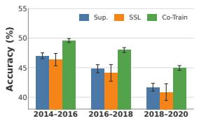  
(a) DGI

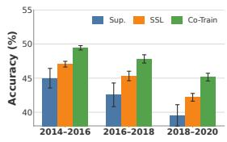  
(b) GRACE  
Figure 3: Accuracy comparison of supervised (Sup.), selfsupervised (SSL), and Co-Train models on OGB-Arxiv across three temporal test periods.

Table 5: ROC-AUC (%) of diferent Co-Train fusion operators across Twitch domains with GCNII.
<table><tr><td>Domain</td><td> $\mathrm { G a t e }$ </td><td>Add.</td><td>Concat.</td></tr><tr><td>ES</td><td> $6 5 . 8 8 \pm 0 . 6 6$ </td><td> ${ \bf 6 5 . 8 8 \pm 0 . 2 6 }$ </td><td> $6 5 . 7 7 \pm 0 . 6 4$ </td></tr><tr><td>FR</td><td> ${ \bf 6 4 . 8 9 \pm 0 . 3 6 }$ </td><td> $6 4 . 6 2 \pm 0 . 4 9$ </td><td> $6 4 . 6 4 \pm 0 . 4 6$ </td></tr><tr><td>PTBR</td><td> ${ \bf 6 4 . 4 0 \pm 0 . 6 3 }$ </td><td> $6 4 . 2 6 \pm 0 . 8 6$ </td><td> $6 4 . 0 3 \pm 0 . 7 0$ </td></tr><tr><td>RU</td><td> ${ \bf 5 6 . 5 7 \pm 0 . 2 9 }$ </td><td> $5 6 . 4 3 \pm 0 . 4 1$ </td><td> $5 6 . 4 9 \pm 0 . 4 9$ </td></tr><tr><td>TW</td><td> ${ \bf 5 9 . 0 7 \pm 0 . 5 2 }$ </td><td> $5 9 . 0 3 \pm 0 . 7 1$ </td><td> $5 8 . 8 2 \pm 0 . 5 7$ </td></tr><tr><td> $\operatorname { A v g } .$ </td><td>62.16</td><td>62.04</td><td> $6 1 . 9 5$ </td></tr></table>

GRACE as the SSL objective. Compared with either representation alone, Co-Train produces more compact class structures with clearer inter-class boundaries, indicating a more discriminative representation space. A corresponding visualization with DGI exhibits a similar pattern (Fig. 7, Sec. B). We further quantify this efect using the separation score in Figure 5, defined as the ratio of interclass to intra-class distance. We first L2-normalize the embeddings and then compute the inter- and intra-class Euclidean distances. A larger score indicates better class separation. Co-Train achieves the highest separation score with both DGI and GRACE, further showing that combining supervised and SSL learning leads to better separated representations.

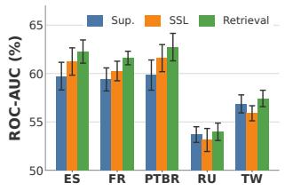  
(a) DGI

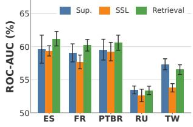  
(b) GRACE

Figure 4: ROC-AUC comparsion of supervised (Sup.), selfsupervised (SSL), and Retrieval models on five Twitch domains.  
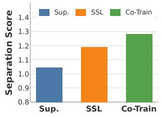

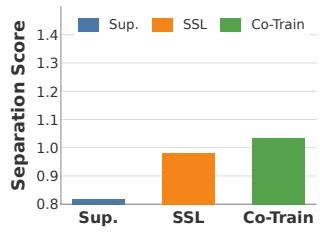  
(a) DGI  
(b) GRACE

Figure 5: Comparison of representation-separation scores for supervised, self-supervised (SSL), and Co-Train models with on OGB-Arxiv.  
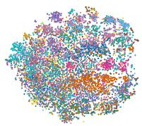  
(a) Supervised

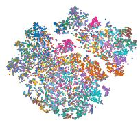  
(b) Self-Supervised

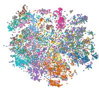  
(c) Co-Train (GRACE)  
Figure 6: t-SNE visualization of supervised, self-supervised (SSL), and Co-Train test-node representations on the 2018– 2020 temporal split of OGB-Arxiv with GRACE.

Eficiency. We compare the runtime and memory usage of diferent methods on OGB-Arxiv using a 64GB GPU. For a fair comparison, GraphSAGE is used as the supervised backbone for our methods and as the backbone for all compared methods; our SSL branch also uses a GraphSAGE encoder. Each method is evaluated under the configuration used to obtain its best reported performance. Co-Train is the fastest method in our comparison while maintaining strong OOD performance, and centroid-based Dual-Space Retrieval achieves runtime comparable to ERM. All methods fit within GPU memory. Detailed results are reported in Table 10, Sec. B.4.

## 6 Conclusion

In this work, we study how self-supervised representations can complement supervised learning for graph OOD generalization. We propose Co-Train, which jointly learns supervised and selfsupervised representations, and Dual-Space Retrieval, which combines predictions from the two representation spaces at inference time. Across multiple graph datasets and distribution shifts, both methods achieve strong performance, with Co-Train consistently outperforming strong OOD generalization baselines.

Our ablation and representation analyses show that SSL provides complementary information to supervised learning and improves representation separation. Overall, our results show that incorporating SSL as a complementary signal can improve supervised graph OOD generalization.

## References

[1] David Buterez, Jon Paul Janet, Steven J. Kiddle, Dino Oglic, and Pietro Liò. 2024. Transfer Learning with Graph Neural Networks for Improved Molecular Property Prediction in the Multi-Fidelity Setting. Nature Communications (2024).

[2] Ming Chen, Zhewei Wei, Zengfeng Huang, Bolin Ding, and Yaliang Li. 2020. Simple and Deep Graph Convolutional Networks. In Proc. ofICML.

[3] Yuhan Chen, Yihong Luo, Yifan Song, Pengwen Dai, Jing Tang, and Xiaochun Cao. 2025. Decoupled Graph Energy-based Model for Node Out-of-Distribution Detection on Heterophilic Graphs. In Proc. of ICLR.

[4] Yongqiang Chen, Yonggang Zhang, Yatao Bian, Han Yang, Kaili Ma, Binghui Xie, Tongliang Liu, Bo Han, and James Cheng. 2022. Learning Causally Invariant Representations for Out-of-Distribution Generalization on Graphs. In Proc. of NeurIPS.

[5] Eli Chien, Jianhao Peng, Pan Li, and Olgica Milenkovic. 2021. Adaptive Universal Generalized PageRank Graph Neural Network. In Proc. ofICLR.

[6] Michaël Deferrard, Xavier Bresson, and Pierre Vandergheynst. 2016. Convolutional neural networks on graphs with fast localized spectral filtering. In Proc. of NeurIPS.

[7] Shaohua Fan, Xiao Wang, Chuan Shi, Peng Cui, and Bai Wang. 2024. Generalizing Graph Neural Networks on Out-of-Distribution Graphs. IEEE Transactions on Pattern Analysis and Machine Intelligence (2024).

[8] Arushi Goel, Keng Teck Ma, and Cheston Tan. 2019. An End-to-End Network for Generating Social Relationship Graphs. In Proc. ofCVPR.

[9] William L. Hamilton, Rex Ying, and Jure Leskovec. 2017. Inductive Representation Learning on Large Graphs. In Proc. ofNeurIPS.

[10] Weihua Hu, Matthias Fey, Marinka Zitnik, Yuxiao Dong, Hongyu Ren, Bowen Liu, Michele Catasta, and Jure Leskovec. 2020. Open Graph Benchmark: Datasets for Machine Learning on Graphs. In Proc. ofNeurIPS.

[11] Thomas N Kipf and Max Welling. 2017. Semi-Supervised Classification with Graph Convolutional Networks. In Proc. ofICLR.

[12] Yixin Liu, Kaize Ding, Huan Liu, and Shirui Pan. 2023. GOOD-D: On Unsupervised Graph Out-Of-Distribution Detection. In Proc. of WSDM.

[13] Yixin Liu, Yu Zheng, Daokun Zhang, Hongxu Chen, Hao Peng, and Shirui Pan. 2022. Towards Unsupervised Deep Graph Structure Learning. In Proc. of WWW.

[14] Nicolas Papernot and Patrick McDaniel. 2018. Deep k-Nearest Neighbors: Towards Confident, Interpretable and Robust Deep Learning. arXiv preprint arXiv:1803.04765 (2018).

[15] Aldo Pareja, Giacomo Domeniconi, Jie Chen, Tengfei Ma, Toyotaro Suzumura, Hiroki Kanezashi, Tim Kaler, Tao B. Schardl, and Charles E. Leiserson. 2020. EvolveGCN: Evolving Graph Convolutional Networks for Dynamic Graphs. In Proc. ofAAAI.

[16] Jaewoo Park, Yoon Gyo Jung, and Andrew Beng Jin Teoh. 2023. Nearest Neighbor Guidance for Out-of-Distribution Detection. In Proc. ofICCV.

[17] Ziyue Qiao, Qianyi Cai, Hao Dong, Jiawei Gu, Pengyang Wang, Meng Xiao, Xiao Luo, and Hui Xiong. 2025. GCAL: Adapting Graph Models to Evolving Domain Shifts. In Proc. ofICML.

[18] Benedek Rozemberczki, Carl Allen, and Rik Sarkar. 2021. Multi-Scale attributed node embedding. Journal ofComplex Networks (2021).

[19] Zheyan Shen, Jiashuo Liu, Yue He, Xingxuan Zhang, Renzhe Xu, Han Yu, and Peng Cui. 2021. Towards Out-Of-Distribution Generalization: A Survey. arXiv preprint arXiv:2108.13624 (2021).

[20] Zhixiang Shen, Shuo Wang, and Zhao Kang. 2024. Beyond Redundancy: Information-aware Unsupervised Multiplex Graph Structure Learning. In Proc. ofNeurIPS.

[21] Fan-Yun Sun, Jordan Hofmann, Vikas Verma, and Jian Tang. 2019. InfoGraph: Unsupervised and Semi-supervised Graph-Level Representation Learning via Mutual Information Maximization. In Proc. ofICLR.

[22] Yiyou Sun, Yifei Ming, Xiaojin Zhu, and Yixuan Li. 2022. Out-of-distribution Detection with Deep Nearest Neighbors. In Proc. ofICML.

[23] Susheel Suresh, Pan Li, Cong Hao, and Jennifer Neville. 2021. Adversarial Graph Augmentation to Improve Graph Contrastive Learning. In Proc. ofNeurIPS

[24] Amanda L. Traud, Peter J. Mucha, and Mason A. Porter. 2012. Social Structure of Facebook Networks. Physica A: Statistical Mechanics and its Applications (2012).

[25] Puja Trivedi, Ekdeep Singh Lubana, Yujun Yan, Yaoqing Yang, and Danai Koutra. 2021. Augmentations in Graph Contrastive Learning: Current Methodological Flaws & Towards Better Practices. arXiv preprint arXiv:2111.03220 (2021).

[26] V. Vapnik. 1991. Principles of Risk Minimization for Learning Theory. In Proc. of NeurIPS.

[27] Petar Veličković, Guillem Cucurull, Arantxa Casanova, Adriana Romero, Pietro Liò, and Yoshua Bengio. 2018. Graph Attention Networks. In Proc. ofICLR.

[28] Petar Veličković, William Fedus, William L. Hamilton, Pietro Liò, Yoshua Bengio, and R Devon Hjelm. 2019. Deep Graph Infomax. In Proc. of ICLR

[29] Song Wang, Zhen Tan, Yaochen Zhu, Chuxu Zhang, and Jundong Li. 2025. Generative Risk Minimization for Out-of-Distribution Generalization on Graphs. TMLR (2025).

[30] Qitian Wu, Yiting Chen, Chenxiao Yang, and Junchi Yan. 2023. Energy-based Out-of-Distribution Detection for Graph Neural Networks. In Proc. ofICLR.

[31] Qitian Wu, Nie Fan, Chenxiao Yang, Tianyi Bao, and Junchi Yan. 2024. Graph Out-of-Distribution Generalization via Causal Intervention. In Proc. ofWWW.

[32] Qitian Wu, Hengrui Zhang, Junchi Yan, and David Wipf. 2022. Handling Distribution Shifts on Graphs: An Invariance Perspective. In Proc. of ICLR.

[34] Eyup Yilmaz and Cagri Toraman. 2022. D2U: Distance-to-Uniform Learning for Out-of-Scope Detection. In Proc. ofNAACL.

[35] Rex Ying, Ruining He, Kaifeng Chen, Pong Eksombatchai, William L. Hamilton, and Jure Leskovec. 2018. Graph Convolutional Neural Networks for Web-Scale Recommender Systems. In Proc. ofKDD.

[36] Junchi Yu, Jian Liang, and Ran He. 2023. Mind the Label Shift of Augmentationbased Graph OOD Generalization. In Proc. ofCVPR.

[37] Hanqing Zeng, Hongkuan Zhou, Ajitesh Srivastava, Rajgopal Kannan, and Viktor Prasanna. 2020. GraphSAINT: Graph Sampling Based Inductive Learning Method. In Proc. ofICLR.

[38] Yi-Fan Zhang, Xue Wang, Kexin Jin, Kun Yuan, Zhang Zhang, Liang Wang, Rong Jin, and Tieniu Tan. 2023. AdaNPC: exploring non-parametric classifier for test-time adaptation. In Proc. ofICML.

[39] Zeyang Zhang, Xin Wang, Ziwei Zhang, Haoyang Li, Zhou Qin, and Wenwu Zhu. 2022. Dynamic Graph Neural Networks Under Spatio-Temporal Distribution Shift. In Proc. ofNeurIPS.

[40] Andy Zhou, Xiaojun Xu, Ramesh Raghunathan, Alok Lal, Xinze Guan, Bin Yu, and Bo Li. 2024. KnowGraph: Knowledge-Enabled Anomaly Detection via Logical Reasoning on Graph Data. In Proc. ofCCS.

[41] Qi Zhu, Natalia Ponomareva, Jiawei Han, and Bryan Perozzi. 2021. Shift-Robust GNNs: Overcoming the Limitations of Localized Graph Training Data. In Proc. of NeurIPS.

[42] Yun Zhu, Haizhou Shi, Zhenshuo Zhang, and Siliang Tang. 2024. MARIO: Model Agnostic Recipe for Improving OOD Generalization of Graph Contrastive Learn ing. In Proc. ofWWW.

[43] Yanqiao Zhu, Yichen Xu, Feng Yu, Qiang Liu, Shu Wu, and Liang Wang. 2020. Deep Graph Contrastive Representation Learning. In Proc. of ICML Workshop on Graph Representation Learning and Beyond.

## A Datasets

Table 6 summarizes the statistics, distribution shifts, and evaluation metrics of the datasets used in our experiments.

Elliptic. The Elliptic dataset records Bitcoin transactions across 49 time steps. Each node represents a transaction, and each edge indicates a payment flow. Around 20% of transactions are labeled as licit or illicit, and the task is to identify illicit transactions in future time steps. We use time steps 7–11 for training, 12–16 for validation, and 17–49 for testing. The 33 test snapshots are grouped into nine chronological test sets to evaluate temporal generalization.

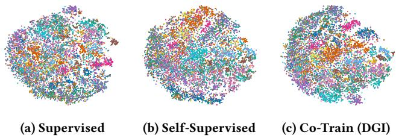  
Figure 7: t-SNE visualization of supervised, self-supervised (SSL), and Co-Train test-node representations on the 2018– 2020 temporal split of OGB-Arxiv with DGI.

OGB-Arxiv. OGB-Arxiv contains 169,343 Arxiv CS papers from 40 subject areas, along with their citation links. Both research topics and citation patterns change over time, resulting in temporal distribution shifts. The task is to predict a paper’s subject area. We use papers published up to 2011 for training, papers published after 2011 and up to 2014 for validation, and three subsequent periods, 2014–2016, 2016–2018, and 2018–2020, for testing.

Twitch-Explicit (Twitch). The Twitch-Explicit dataset contains seven networks, where each node represents a Twitch user and edges denote mutual friendships. Each network corresponds to a geographic region, resulting in cross-domain distribution shifts. The task is to predict whether a Twitch streamer uses explicit language. We use DE for training, ENGB for validation, and ES, FR, PTBR, RU, and TW for testing.

Facebook-100 (FB100). The Facebook-100 dataset comprises 100 Facebook friendship networks collected in 2005, each corresponding to a diferent American university. Nodes represent users, and edges indicate Facebook friendships. The task is to predict the gender of each user. We use the selected training universities for training, Cornell and Yale for validation, and disjoint universities for testing.

## B Additional Analysis

## B.1 Visualization of Learned Representations.

Figure 7 visualizes the supervised, self-supervised, and Co-Train representations on OGB-Arxiv using t-SNE, with DGI as the SSL objective. The corresponding quantitative analysis in the main paper shows that CoTrain-DGI achieves the highest representation separation score, indicating more compact intra-class representations and greater inter-class separation. Consistent with this observation, the t-SNE visualization shows clearer class structure after integrating the supervised and SSL representations. Together with the quantitative results in the main paper, this provides additional evidence that the two representation spaces contain complementary information and that Co-Train can integrate them into a more discriminative representation.

## B.2 Neighbor-Based Retrieval Results on OGB-Arxiv.

We analyze neighbor-based retrieval on OGB-Arxiv to explain our use of class-centroid retrieval in this multiclass setting. We use GAT as the supervised backbone and GraphSAGE as the SSL encoder. Table 8 reports validation results for the supervised, DGI, and GRACE representation spaces with $K = 3 0$ and $K = 1 0 0$

For each query node �, let $\textstyle { \mathcal { N } } _ { K } ( x )$ denote its � retrieved training neighbors, where � indexes a retrieved neighbor and $y _ { x }$ and $y _ { j }$ denote the labels of the query node and neighbor �, respectively. We characterize the retrieved neighborhood using class diversity and label purity:

$$
U _ { K } ( x ) = { \big | } \{ y _ { j } : j \in N _ { K } ( x ) \} { \big | } , \qquad P _ { K } ( x ) = { \frac { 1 } { K } } \sum _ { j \in N _ { K } ( x ) } \mathbb { I } [ y _ { j } = y _ { x } ] .
$$

Here, $U _ { K } ( { \boldsymbol { x } } )$ is the number of unique classes among the retrieved neighbors, while $P _ { K } ( x )$ is the fraction of neighbors sharing the ground-truth label of the query node. We report both quantities averaged over all validation nodes.

We further evaluate the class-level prediction induced by the retrieved neighbors using the same similarity-weighted aggregation as in Dual-Space Retrieval. For representation space � ∈ {sup, ssl}, the class-score vector is

$$
\pmb { \eta } _ { b } ( x ) = \sum _ { j \in N _ { K } ( x , M _ { b } ) } w _ { x j } ^ { b } \mathbf { y } _ { j } ,
$$

where $w _ { x j } ^ { b }$ is the normalized similarity weight and ${ \bf y } _ { j }$ is the one-hot label of neighbor $j .$ Let $\mathrm { T o p } _ { m } ( \pmb { \eta } _ { b } ( x ) )$ denote the � classes with the highest scores in $\eta _ { b } ( x )$ . Top-1 and Top-3 report the percentage of validation nodes satisfying

$$
y _ { x } \in \mathrm { T o p } _ { 1 } ( \pmb { \eta } _ { b } ( x ) ) \quad \mathrm { a n d } \quad y _ { x } \in \mathrm { T o p } _ { 3 } ( \pmb { \eta } _ { b } ( x ) ) ,
$$

respectively.

The results show that neighbor-based retrieval can be highly local in this 40-class setting, particularly in the SSL representation spaces. With $K = 3 0 ,$ , the DGI and GRACE neighborhoods contain approximately 11 unique classes on average, with label purity of only 23.31% and 21.52%, respectively. The ground-truth class appears in Top-1 for 35.14% and 28.97% of validation nodes, and in Top-3 for 56.22% and 49.59%. Increasing � to 100 expands the neighborhoods to approximately 19 classes, but purity remains low and Top-1 performance changes little.

These results suggest that neighbor-based retrieval can be overly local in this multiclass setting, where the retrieved neighborhood covers only a limited subset of classes and may not provide suficiently representative class-level signals. This issue is particularly evident in the SSL spaces, where low neighborhood label purity is accompanied by low Top-1 accuracy, indicating that the ground-truth class is often not well represented among the retrieved neighbors. As a result, similarity-weighted voting is restricted to the classes present in the local neighborhood and cannot efectively compare against classes outside it. We therefore use class-centroid retrieval on OGB-Arxiv, which explicitly represents every class and enables prediction over the full class space.

## B.3 Feature Smoothing for Centroid-Based Retrieval on OGB-Arxiv.

After adopting class-centroid retrieval to provide explicit representatives for all classes, we examine the quality of the underlying representation space. In centroid-based retrieval, prediction depends on how distinctly a node can be associated with diferent class representatives. On OGB-Arxiv, we observe relatively low retrieval confidence, measured by $C _ { b } ( \boldsymbol { x } ) = \operatorname* { m a x } _ { c } [ \eta _ { b } ( \boldsymbol { x } ) ] _ { c } ,$ suggesting that the class-level retrieval signal can remain ambiguous in this multiclass setting. Thus, to improve the local consistency of the representation space, we consider feature smoothing before constructing the class centroids.

Table 6: Dataset statistics, distribution shifts, and evaluation metrics.
<table><tr><td>Dataset</td><td>Distribution Shift</td><td>Nodes</td><td>Edges</td><td>Classes</td><td>Metric</td></tr><tr><td>Elliptic [15]</td><td>Temporal Evolution</td><td>203,769</td><td>234,355</td><td>2</td><td>F1-Score</td></tr><tr><td>OGB-Arxiv [?]</td><td>Temporal Evolution</td><td>169,343</td><td>1,166,243</td><td>40</td><td>Accuracy</td></tr><tr><td>Twitch-explicit [18]</td><td>Cross-Domain Transfers</td><td>1,912 - 9,498</td><td> $3 1 , 2 9 9 - 1 5 3 , 1 3 8$ </td><td>2</td><td>ROC-AUC</td></tr><tr><td>Facebook-100 [24]</td><td>Cross-Domain Transfers</td><td> $7 6 9 - 4 1 , 5 3 6$ </td><td> $1 6 , 6 5 6 - 1 , 5 9 0 , 6 5 5$ </td><td>2</td><td>Accuracy</td></tr></table>

Table 7: ROC-AUC scores (%) on Twitch-Explicit across domain splits with the GAT backbone.
<table><tr><td>Method</td><td>ES</td><td>FR</td><td>PTBR</td><td>RU</td><td>TW</td></tr><tr><td>ERM</td><td> $\lvert 6 2 . 2 8 \pm 0 . 8 8$ </td><td> $6 0 . 0 6 \pm 1 . 0 2$ </td><td> $6 0 . 3 0 \pm 1 . 2 0$ </td><td> $5 5 . 0 0 \pm 0 . 4 0$ </td><td> $5 7 . 5 5 \pm 0 . 5 1$ </td></tr><tr><td>EERM</td><td> $\lvert 6 3 . 6 4 \pm 0 . 7 4$ </td><td> $6 2 . 3 0 \pm 0 . 6 3$ </td><td> $6 1 . 3 3 \pm 1 . 2 8$ </td><td> $5 5 . 5 1 \pm 0 . 5 4$ </td><td> $5 5 . 7 7 \pm 0 . 3 8$ </td></tr><tr><td>LiSA</td><td> $\lvert 6 2 . 9 6 \pm 0 . 4 1$ </td><td> $6 1 . 4 4 \pm 0 . 6 8$ </td><td> $6 1 . 5 8 \pm 1 . 0 1$ </td><td> $5 5 . 2 5 \pm 0 . 6 0$ </td><td> $5 6 . 7 1 \pm 1 . 4 5$ </td></tr><tr><td>MARIO</td><td> $\lvert 6 1 . 1 1 \pm 1 . 2 0$ </td><td> $5 9 . 7 9 \pm 1 . 9 0$ </td><td> $6 1 . 1 2 \pm 0 . 9 1$ </td><td> $5 4 . 7 7 \pm 0 . 2 3$ </td><td> $5 4 . 5 8 \pm 1 . 3 4$ </td></tr><tr><td>DGI</td><td> $\left| 6 1 . 1 9 \pm 1 . 5 7 \right.$ </td><td> $5 7 . 7 7 \pm 0 . 8 5$ </td><td> $5 6 . 5 9 \pm 2 . 7 9$ </td><td> $5 2 . 9 6 \pm 0 . 6 3$ </td><td> $5 4 . 7 0 \pm 1 . 1 3$ </td></tr><tr><td>GRACE</td><td> $\left| 6 3 . 3 6 \pm 1 . 0 1 \right.$ </td><td> $5 9 . 4 0 \pm 1 . 2 0$ </td><td> $6 3 . 9 5 \pm 0 . 8 4$ </td><td> $5 3 . 4 6 \pm 0 . 7 4$ </td><td> $5 4 . 3 9 \pm 0 . 1 8$ </td></tr><tr><td>CoTrain-DGI</td><td> $6 5 . 0 3 \pm 0 . 4 8$ </td><td> $6 2 . 3 6 \pm 0 . 6 0$ </td><td> $6 3 . 9 8 \pm 0 . 9 3$ </td><td> $5 6 . 2 3 \pm 0 . 6 3$ </td><td> $5 6 . 8 8 \pm 0 . 5 2$ </td></tr><tr><td>CoTrain-GRACE</td><td> $\lvert 6 5 . 1 5 \pm 0 . 4 6$ </td><td> $6 2 . 1 2 \pm 0 . 3 3$ </td><td> $6 4 . 1 3 \pm 0 . 5 8$ </td><td> $5 6 . 3 0 \pm 0 . 3 4$ </td><td> $5 6 . 9 7 \pm 0 . 5 7$ </td></tr><tr><td>Retrieval-DGI</td><td> $\lvert 5 9 . 5 7 \pm 0 . 9 8$ </td><td> $5 8 . 3 4 \pm 1 . 0 3$ </td><td> $6 0 . 9 5 \pm 0 . 8 3$ </td><td> $5 2 . 6 4 \pm 0 . 9 8$ </td><td> $5 5 . 0 7 \pm 0 . 6 3$ </td></tr><tr><td>Retrieval-GRACE</td><td> $5 9 . 3 7 \pm 0 . 6 8$ </td><td> $5 7 . 6 8 \pm 0 . 7 5$ </td><td> $6 0 . 1 6 \pm 0 . 7 6$ </td><td> $5 2 . 5 5 \pm 0 . 7 7$ </td><td> $5 5 . 2 1 \pm 0 . 7 9$ </td></tr></table>

Table 8: Neighbor-based retrieval results across supervised and SSL representation spaces on the validation set of OGB-Arxiv.
<table><tr><td rowspan="3">Space</td><td colspan="4"> $K = 3 0$ </td><td colspan="4"> $K = 1 0 0$ </td></tr><tr><td>U</td><td>P</td><td>Top-1</td><td>Top-3</td><td>U</td><td>P</td><td>Top-1</td><td>Top-3</td></tr><tr><td>Supervised</td><td>5.42</td><td>43.06%</td><td>47.16%</td><td>72.83%</td><td>9.34</td><td>40.58%</td><td>47.19%</td><td>73.19%</td></tr><tr><td>DGI-SSL</td><td>10.89</td><td>23.31% 35.14%</td><td></td><td>56.22%</td><td>19.22</td><td></td><td></td><td>21.24%34.88%57.04%</td></tr><tr><td>GRACE-SSL</td><td></td><td></td><td></td><td>10.91 21.52% 28.97% 49.59%</td><td></td><td></td><td></td><td>18.64 20.52%29.43%50.60%</td></tr></table>

Table 9: Training-node label purity before and after feature smoothing on OGB-Arxiv with a GAT backbone.
<table><tr><td>Branch</td><td>Before</td><td>After</td><td>Δ</td></tr><tr><td>GRACE SSL</td><td>26.78%</td><td>33.48%</td><td> $^ { + 6 . 7 0 } \mathrm { p p }$ </td></tr><tr><td>Supervised</td><td>55.46%</td><td>60.15%</td><td> $^ { + 4 . 6 9 } \mathrm { P p }$ </td></tr></table>

Table 9 analyzes this efect on the training nodes, using GAT as the supervised backbone and GraphSAGE as the SSL encoder. We compare neighborhood label purity before and after feature smoothing in both representation spaces. Feature smoothing increases label purity, indicating that neighboring nodes become more locally consistent after smoothing. This provides a more coherent representation space for constructing class centroids and helps produce more distinct class-level retrieval signals. Consistent with this analysis, the main results show substantial improvements from the feature-smoothed variant, Retrieval\*, over the corresponding centroid-based Retrieval results.

## B.4 Eficiency and Memory Usage Comparison.

Table 10 compares the computational eficiency of all methods on OGB-Arxiv. We use GraphSAGE as both the supervised backbone and the SSL encoder for our methods, and GraphSAGE as the backbone for all compared methods to ensure a consistent comparison. All experiments are conducted on the same machine, and we report the total training and inference runtime of each method under the hyperparameter configuration that achieves its reported performance.

Co-Train is the most eficient method in our comparison, requiring only 43.75 seconds, compared with 70.83 seconds for ERM, 50.29 seconds for LiSA, 206.19 seconds for MARIO, and more than two hours for EERM. This eficiency is particularly notable given its strong OOD performance, showing that incorporating complementary SSL representations through Co-Train does not introduce substantial computational overhead. Dual-Space Retrieval is also lightweight, requiring 69.16 seconds, while its feature-smoothed variant requires 96.52 seconds. Both remain substantially faster than more computationally intensive OOD methods such as MARIO and EERM.

The retrieval runtime on OGB-Arxiv is relatively low because we use class-centroid retrieval, where only a small number of class representatives are involved in retrieval. For datasets using neighborbased retrieval, the retrieval cost increases with the number of candidate neighbors and retrieved neighbors �. This additional cost is confined to the retrieval stage and does not increase model training time. All evaluated methods fit within GPU memory, indicating that our proposed frameworks introduce no prohibitive memory overhead.

Table 10: Runtime and memory usage across methods on the OGB-Arxiv dataset using a backbone.
<table><tr><td>Method</td><td>Total Runtime (s)</td><td>Fits in GPU Memory</td></tr><tr><td>ERM</td><td>70.83</td><td>Yes</td></tr><tr><td>EERM</td><td>&gt; 2 hours</td><td>Yes</td></tr><tr><td>LiSA</td><td>50.29</td><td>Yes</td></tr><tr><td>MARIO</td><td>206.19</td><td>Yes</td></tr><tr><td>Co-Train</td><td>43.75</td><td>Yes</td></tr><tr><td>Dual-Space Retrieval</td><td>69.16</td><td>Yes</td></tr><tr><td>Dual-Space Retrieval*</td><td>96.52</td><td>Yes</td></tr></table>

Table 11: Test accuracy (%) under diferent SSL fusion coeficients $\alpha _ { s s l }$ on OGB-Arxiv using Retrieval-GRACE with a GAT backbone.
<table><tr><td> $\alpha _ { s s l }$ </td><td> $2 0 1 4 - 2 0 1 6$ </td><td> $2 0 1 6 \mathrm { - } 2 0 1 8$ </td><td> $2 0 1 8 \substack { - 2 0 2 0 }$ </td></tr><tr><td>0</td><td> $4 7 . 7 5 \pm 0 . 2 2$ </td><td> $4 7 . 0 7 \pm 0 . 2 2$ </td><td> $4 4 . 9 2 \pm 0 . 3 0$ </td></tr><tr><td>0.01</td><td> $4 7 . 7 1 \pm 0 . 2 1$ </td><td> $4 7 . 0 2 \pm 0 . 2 1$ </td><td> $4 5 . 0 4 \pm 0 . 1 8$ </td></tr><tr><td>0.05</td><td> $4 7 . 9 6 \pm 0 . 2 3$ </td><td> $4 7 . 2 5 \pm 0 . 3 1$ </td><td> $4 5 . 1 8 \pm 0 . 3 1$ </td></tr><tr><td>0.1</td><td> $4 7 . 9 1 \pm 0 . 2 5$ </td><td> $4 7 . 3 3 \pm 0 . 2 9$ </td><td> $4 5 . 2 5 \pm 0 . 2 3$ </td></tr></table>

Table 12: Test accuracy (%) with diferent numbers of retrieved centroids � on OGB-Arxiv using Retrieval-GRACE with a GAT backbone.
<table><tr><td>K|</td><td>2014-2016</td><td> $2 0 1 6 - 2 0 1 8$ </td><td> $2 0 1 8 \substack { - 2 0 2 0 }$ </td></tr><tr><td>10</td><td> $4 8 . 0 4 \pm 0 . 1 3$ </td><td> $4 7 . 3 2 \pm 0 . 1 1$ </td><td> $4 5 . 1 7 \pm 0 . 2 0$ </td></tr><tr><td>20</td><td> $4 7 . 8 3 \pm 0 . 1 1$ </td><td> $4 7 . 2 1 \pm 0 . 1 3$ </td><td> $4 5 . 0 7 \pm 0 . 0 3$ </td></tr><tr><td>30</td><td> $4 7 . 8 7 \pm 0 . 0 8$ </td><td> $4 7 . 1 9 \pm 0 . 2 3$ </td><td> $4 5 . 1 3 \pm 0 . 0 4$ </td></tr><tr><td>40</td><td> $4 7 . 7 1 \pm 0 . 2 1$ </td><td> $4 7 . 1 6 \pm 0 . 3 2$ </td><td> $4 5 . 3 3 \pm 0 . 4 6$ </td></tr></table>

## C Sensitivity and Robustness Analysis

## C.1 Sensitivity to the SSL Fusion Weight for Dual-Space Retrieval.

Table 11 evaluates the sensitivity to the SSL fusion weight $\alpha _ { s s 1 }$ in Dual-Space Retrieval on OGB-Arxiv, using GAT as the supervised backbone and GRACE as the SSL encoder. As described in the main paper, the two retrieval branches exhibit large prediction disagreement $( \delta > 0 . 5 )$ on this dataset. We therefore use a small fixed $\alpha _ { s s 1 }$ and vary its value over {0, 0.01, 0.05, 0.1}. Performance remains similar across all three temporal splits; for example, accuracy on 2018–2020 ranges from 44.92% to 45.25%. This shows that the results are not sensitive to the exact choice of a small SSL fusion weight. We therefore set $\alpha _ { \mathrm { s s l } } = 0 . 0 1$ globally for the OGB-Arxiv experiments.

## C.2 Sensitivity to the Retrieval Size �.

We further examine the sensitivity of Dual-Space Retrieval to the retrieval size � under both centroid-based and neighbor-based retrieval.

Table 13: Test-wise sensitivity of Elliptic-SAGE-GRACE to the number of retrieved neighbors �. Each entry reports the mean F1 score (%) and standard deviation over 10 runs.
<table><tr><td>Split |</td><td> $K = 3 0$ </td><td> $K = 1 0 0$ </td><td> $K = 2 0 0$ </td><td> $K = 3 0 0$ </td><td> $K = 5 0 0$ </td></tr><tr><td>Test1</td><td> $9 2 . 6 4 \pm 1 . 1 7$ </td><td> $9 2 . 6 2 \pm 0 . 8 7$ </td><td> $9 2 . 1 0 \pm 0 . 9 1$ </td><td> $9 2 . 3 4 \pm 1 . 0 9$ </td><td> $9 2 . 0 2 \pm 1 . 3 2$ </td></tr><tr><td>Test2</td><td> $8 4 . 3 4 \pm 0 . 5 2$ </td><td> $8 4 . 4 8 \pm 0 . 7 0$ </td><td> $8 4 . 2 9 \pm 0 . 6 7$ </td><td> $8 4 . 6 5 \pm 0 . 7 7$ </td><td> $8 4 . 4 7 \pm 0 . 6 4$ </td></tr><tr><td>Test3</td><td> $7 8 . 0 1 \pm 1 . 1 0$ </td><td> $7 8 . 2 7 \pm 0 . 7 6$ </td><td> $7 7 . 9 2 \pm 0 . 6 4$ </td><td> $7 8 . 0 1 \pm 0 . 7 5$ </td><td> $7 8 . 0 9 \pm 1 . 0 6$ </td></tr><tr><td>Test4</td><td> $7 4 . 4 4 \pm 0 . 6 0$ </td><td> $7 4 . 6 9 \pm 0 . 4 1$ </td><td> $7 4 . 4 1 \pm 0 . 4 0$ </td><td> $7 4 . 4 4 \pm 0 . 4 5$ </td><td> $7 4 . 4 5 \pm 0 . 3 5$ </td></tr><tr><td>Test5</td><td> $7 2 . 5 5 \pm 0 . 7 2$ </td><td> $7 2 . 9 8 \pm 0 . 7 2$ </td><td> $7 2 . 7 4 \pm 0 . 6 8$ </td><td> $7 2 . 6 4 \pm 0 . 7 0$ </td><td> $7 2 . 5 7 \pm 0 . 9 9$ </td></tr><tr><td>Test6</td><td> $8 0 . 3 3 \pm 0 . 9 7$ </td><td> $8 0 . 4 4 \pm 1 . 0 5$ </td><td> $8 0 . 8 9 \pm 0 . 7 3$ </td><td> $8 0 . 4 8 \pm 1 . 0 8$ </td><td> $8 0 . 5 4 \pm 1 . 2 6$ </td></tr><tr><td>Test7</td><td> $7 8 . 1 4 \pm 1 . 3 4$ </td><td> $7 7 . 8 3 \pm 1 . 3 2$ </td><td> $7 8 . 2 4 \pm 1 . 5 2$ </td><td> $7 8 . 0 9 \pm 1 . 4 8$ </td><td> $7 7 . 8 4 \pm 1 . 3 6$ </td></tr><tr><td>Test8</td><td> $6 6 . 8 9 \pm 1 . 3 3$ </td><td> $6 6 . 5 4 \pm 1 . 4 3$ </td><td> $6 7 . 3 4 \pm 1 . 7 4$ </td><td> $6 7 . 1 2 \pm 1 . 7 3$ </td><td> $6 7 . 0 2 \pm 1 . 5 2$ </td></tr><tr><td>Test9</td><td> $5 0 . 5 7 \pm 0 . 7 1$ </td><td> $5 0 . 8 6 \pm 1 . 3 3 $ </td><td> $5 0 . 4 4 \pm 0 . 9 9$ </td><td> $5 0 . 8 0 \pm 0 . 8 5$ </td><td> $5 0 . 8 2 \pm 0 . 8 7$ </td></tr></table>

Table 12 reports results on OGB-Arxiv using GAT as the supervised backbone and GRACE as the SSL encoder. We vary $K \in$ {10, 20, 30, 40} for class-centroid retrieval and observe comparable performance across all three temporal splits. The value used in the main experiments is selected on the validation set. Since OGB-Arxiv contains 40 classes, $K = 4 0$ corresponds to retrieving all class centroids.

Table 13 further evaluates � for neighbor-based retrieval on Elliptic, using GraphSAGE as the supervised backbone and GRACE as the SSL encoder. We use $K = 1 0 0$ based on validation performance and compare � ∈ {30, 100, 200, 300, 500} across the nine test splits. Performance remains stable over a wide range of �, with only small variations across the test splits. Together, these results show that Dual-Space Retrieval is not sensitive to the exact choice of � under either centroid- or neighbor-based retrieval.

## C.3 Sensitivity to the SSL Encoder Architecture.

We further examine the sensitivity of Co-Train-DGI to the SSL encoder architecture. Since the supervised and SSL encoders are separately parameterized without parameter sharing, their backbone architectures can be selected independently. Tables 14 and 15 compare GCN and GraphSAGE as the DGI encoder on Elliptic and OGB-Arxiv, respectively. Based on validation performance, we use GCN for Elliptic and GraphSAGE for OGB-Arxiv in the main experiments. Dual-Space Retrieval uses the same selected supervised and SSL backbone configurations.

On Elliptic, the two SSL encoders achieve comparable performance across the nine test splits, with each performing slightly better on diferent periods. On OGB-Arxiv, GCN performs slightly better on the three test periods, by only 0.41, 0.37, and 0.58 percentage points, respectively, despite GraphSAGE being selected based on validation performance. Overall, the small diferences across both datasets suggest that Co-Train is not highly sensitive to the choice of SSL encoder architecture.

## D Additional Experimental Results

Table 16 reports results on FB-100 with three training-domain combinations and Texas as the test domain, using GCN as both the supervised backbone and SSL encoder. Table 7 reports results on

Table 14: Test accuracy (%) on OGB-Arxiv with diferent SSL encoder architectures for Co-Train-DGI.
<table><tr><td>Test split</td><td> $_ { \mathrm { S S L - G C N } }$ </td><td> ${ \mathrm { S S L } } { \cdot } S { \mathrm { A G E } }$ </td></tr><tr><td>2014-2016</td><td> $5 0 . 7 0 \pm 0 . 2 8$ </td><td> $5 0 . 2 9 \pm 0 . 3 4$ </td></tr><tr><td>2016-2018</td><td> $4 9 . 4 1 \pm 0 . 3 2$ </td><td> $4 9 . 0 4 \pm 0 . 4 8$ </td></tr><tr><td>2018-2020</td><td> $4 6 . 7 1 \pm 0 . 4 2$ </td><td> $4 6 . 1 3 \pm 0 . 5 0$ </td></tr></table>

Table 15: F1-score (%) of Co-Train-DGI to the SSL encoder architecture on Elliptic.
<table><tr><td>Test split</td><td>SSL-GCN</td><td> ${ \mathrm { S S L } } { \cdot } S { \mathrm { A G E } }$ </td></tr><tr><td>Test1</td><td> $9 4 . 5 7 \pm 0 . 8 1$ </td><td> $9 4 . 8 1 \pm 0 . 5 8$ </td></tr><tr><td>Test2</td><td> $8 7 . 1 7 \pm 0 . 9 2$ </td><td> $8 7 . 4 1 \pm 1 . 0 9$ </td></tr><tr><td>Test3</td><td> $7 9 . 5 0 \pm 1 . 2 9$ </td><td> $7 9 . 5 9 \pm 1 . 1 6$ </td></tr><tr><td>Test4</td><td> $7 4 . 3 9 \pm 0 . 8 3$ </td><td> $7 4 . 1 2 \pm 1 . 4 0$ </td></tr><tr><td>Test5</td><td> $7 9 . 0 5 \pm 2 . 1 0$ </td><td> $7 8 . 8 6 \pm 2 . 0 0$ </td></tr><tr><td>Test6</td><td> $8 4 . 9 8 \pm 2 . 1 8$ </td><td> $8 5 . 3 8 \pm 1 . 9 3$ </td></tr><tr><td>Test7</td><td> $8 5 . 9 3 \pm 1 . 9 7$ </td><td> $8 6 . 4 2 \pm 1 . 6 9$ </td></tr><tr><td>Test8</td><td> $7 1 . 3 2 \pm 4 . 7 0$ </td><td> $7 3 . 1 0 \pm 2 . 7 9$ </td></tr><tr><td>Test9</td><td> $5 0 . 0 3 \pm 0 . 5 2$ </td><td> $4 9 . 9 0 \pm 0 . 3 0$ </td></tr></table>

Table 16: Accuracy (%) on the Texas of FB-100 under Diferent Training Graph Combinations.
<table><tr><td rowspan=2 colspan=1>Method</td><td rowspan=1 colspan=3>Texas</td></tr><tr><td rowspan=1 colspan=3>JHU+CIT+AMH BIN+DUK+PRI WUSTL+BRD+CMU</td></tr><tr><td rowspan=1 colspan=1>ERM</td><td rowspan=1 colspan=1> $5 6 . 2 5 \pm 0 . 0 1$ 一</td><td rowspan=1 colspan=1> $5 2 . 1 2 \pm 5 . 5 2$ </td><td rowspan=1 colspan=1> $5 5 . 9 9 \pm 0 . 5 3$ </td></tr><tr><td rowspan=1 colspan=1>EERM</td><td rowspan=1 colspan=1> $\overline { { 5 2 . 6 8 \pm 3 . 1 9 } }$ </td><td rowspan=1 colspan=1> $5 2 . 0 5 \pm 5 . 9 4$ </td><td rowspan=1 colspan=1> $5 3 . 8 3 \pm 5 . 3 3 $ </td></tr><tr><td rowspan=1 colspan=1>LiSA</td><td rowspan=1 colspan=1> $5 3 . 0 1 \pm 4 . 5 9$ </td><td rowspan=1 colspan=1> $5 5 . 2 6 \pm 1 . 4 8$ </td><td rowspan=1 colspan=1> $5 4 . 5 2 \pm 3 . 8 8$ </td></tr><tr><td rowspan=1 colspan=1>MARIO</td><td rowspan=1 colspan=1> $5 0 . 1 8 \pm 3 . 8 0$ </td><td rowspan=1 colspan=1> $5 5 . 7 7 \pm 0 . 7 4$ </td><td rowspan=1 colspan=1> $5 5 . 7 2 \pm 1 . 4 2$ </td></tr><tr><td rowspan=1 colspan=1>DGI</td><td rowspan=1 colspan=1> $4 6 . 4 6 \pm 3 . 6 7$ </td><td rowspan=1 colspan=1> $4 8 . 0 2 \pm 1 . 3 8$ </td><td rowspan=1 colspan=1> $4 6 . 1 9 \pm 2 . 7 6$ </td></tr><tr><td rowspan=1 colspan=1>GRACE</td><td rowspan=1 colspan=1> $5 6 . 1 1 \pm 0 . 6 0$ </td><td rowspan=1 colspan=1> $5 6 . 0 8 \pm 0 . 3 2$ </td><td rowspan=1 colspan=1> $5 6 . 6 3 \pm 0 . 2 2$ </td></tr><tr><td rowspan=1 colspan=1>CoTrain-DGI</td><td rowspan=1 colspan=1> $5 3 . 5 4 \pm 1 . 9 2$ </td><td rowspan=1 colspan=1> $\overline { { 5 3 . 1 8 \pm 2 . 1 1 } }$ </td><td rowspan=1 colspan=1> $5 6 . 8 9 \pm 0 . 4 0$ </td></tr><tr><td rowspan=1 colspan=1>CoTrain-GRACE</td><td rowspan=1 colspan=1> $5 5 . 0 8 \pm 1 . 6 1$ </td><td rowspan=1 colspan=1> $5 3 . 1 2 \pm 2 . 9 8$ </td><td rowspan=1 colspan=1> $5 6 . 6 0 \pm 0 . 7 9$ </td></tr><tr><td rowspan=1 colspan=1>Retrieval-DGI</td><td rowspan=1 colspan=1> $5 3 . 6 5 \pm 0 . 8 5$ </td><td rowspan=1 colspan=1> $5 5 . 2 9 \pm 0 . 3 9$ </td><td rowspan=1 colspan=1> $5 5 . 9 6 \pm 0 . 3 5$ </td></tr><tr><td rowspan=1 colspan=1>Retrieval-GRACE</td><td rowspan=1 colspan=1> $5 1 . 2 1 \pm 0 . 4 7$ </td><td rowspan=1 colspan=1> $5 2 . 4 9 \pm 0 . 8 7$ </td><td rowspan=1 colspan=1> $5 1 . 8 0 \pm 0 . 7 3$ </td></tr></table>

Twitch with GAT as the supervised backbone and GCN as the SSL encoder.

On Twitch, Co-Train achieves the best performance on four of the five target domains, with gains of 1.51, 0.06, 2.55, and 0.72 percentage points over the strongest existing baseline on ES, FR, PTBR, and RU, respectively. Dual-Space Retrieval is less competitive under the GAT backbone, suggesting that retrieval-based prediction can be more sensitive to the learned representation space.

On FB-100, performance varies more noticeably across the three training-domain combinations. GRACE achieves the best results under JHU+CIT+AMH and BIN+DUK+PRI, with accuracies of 56.11% and 56.08%, respectively. Under WUSTL+BRD+CMU, CoTrain-DGI achieves the best overall accuracy of 56.89%, outperforming the strongest baseline by 0.26 percentage points.