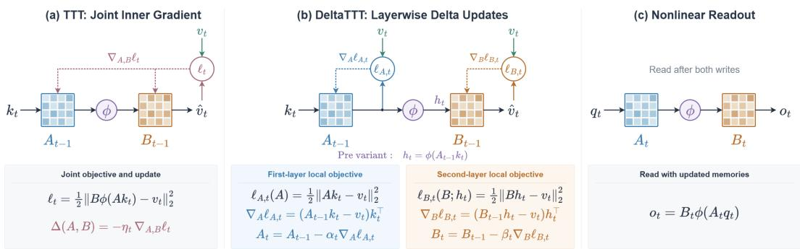
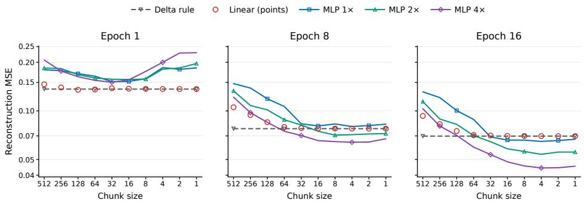
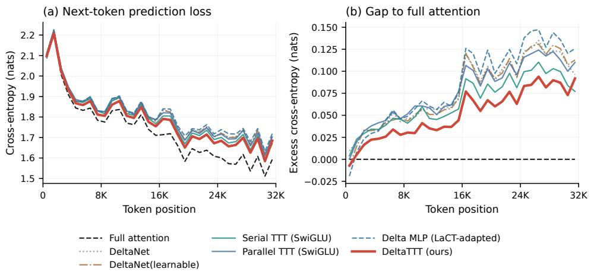
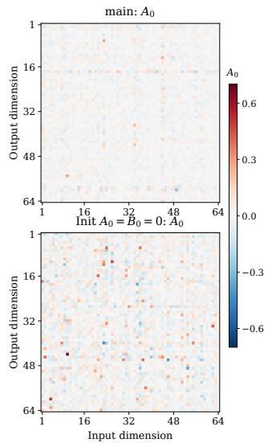
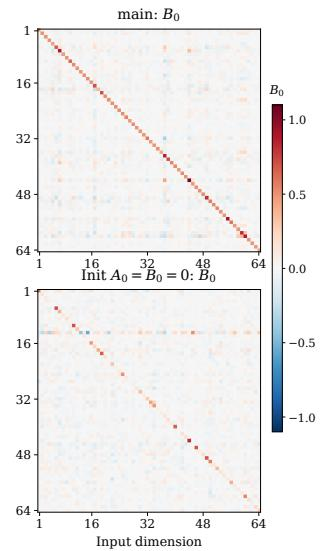

# DELTATTT: LAYERWISE OPTIMIZATION FOR NONLINEAR RECURRENT MEMORY

Yining Li1,2 Dongchen Han2 Jie Fu3 Gao Huang2,†

1Qiuzhen College, Tsinghua University 2LeapLab, Tsinghua University 3IQuest Research

## ABSTRACT

Sequential test-time training adapts a memory network through successive updates, each computing an inner-loop gradient based on the network’s previous state. Intuitively, this state dependence should allow each update to account for what the memory has already learned and better incorporate new information. However, we find that this expected advantage does not consistently materialize in nonlinear memories: a fixed-base parallel TTT baseline outperforms its serial counterpart. Our exploratory experiments point to a key underlying difficulty: nonlinear memories can be harder to optimize than linear ones within a single pass over the sequence. To alleviate this optimization difficulty, we introduce DeltaTTT, which replaces joint inner-loop optimization of a two-layer memory network with layerwise learning. Each layer is assigned a local prediction target and updated through a state-dependent delta rule. This formulation retains a nonlinear readout while enabling chunkwise parallel computation. Experiments on DeltaNet and LaCT backbones show improvements in language modeling and retrieval over their recurrent baselines.

## 1 INTRODUCTION

In sequence modeling, Test-Time Training (TTT) compresses past key–value pairs into the parameters of a small inner network through online updates (Sun et al., 2024). By default, the updates are sequential, each computing an inner-loop gradient based on the network’s previous state. Intuitively, this state dependence should improve memory learning: each update can account for what the network has already learned and better incorporate new information.

This intuition is supported by results on linear memories. DeltaNet replaces the state-independent additive writes of linear attention with residual corrections based on the current memory, achieving stronger associative recall and supporting the value of state-dependent updates (Yang et al., 2024). However, this expected advantage does not consistently materialize for nonlinear memories. In a LaCT-derived language model (Zhang et al., 2025), we compare serial updates, which evaluate each chunk at the current fast weights, with a fixed-base parallel baseline, which evaluates updates at a shared initial state and accumulates them causally. We find that the parallel baseline achieves better downstream results despite computing its updates without considering earlier writes. This result motivates us to revisit how nonlinear memory is optimized in serial TTT.

To examine memory optimization more directly, we fit standalone linear and two-layer MLP memories to fixed K/V sequences extracted from a pretrained full-attention model, using key-value reconstruction as the objective. A linear memory can achieve lower reconstruction error within a single epoch, while the MLP’s advantage emerges with additional epochs. These observations suggest that greater expressivity alone is insufficient: the write rule must also realize that capacity within the limited inner-update budget, usually one epoch for TTT.

We therefore ask: if jointly optimizing a nonlinear memory can be less effective than optimizing a linear one within a single pass, can we optimize it more effectively layer by layer? This motivates DeltaTTT, which retains a nonlinear multilayer memory while equipping each linear layer with a local reconstruction target and its own delta-rule update. Given its inputs and targets, each layer admits efficient chunkwise parallel evaluation, while the nonlinear composition and dependencies between layers are preserved. This design aims to combine the expressive capacity of nonlinear memories with effective single-pass optimization and the computational efficiency of the delta rule.

  
Figure 1: Joint and layerwise optimization of nonlinear recurrent memory. (a) TTT jointly optimizes both layers through a shared reconstruction objective. (b) DeltaTTT assigns a local reconstruction objective to each layer and performs layerwise delta-rule updates. (c) Both method use the nonlinear readout after the writes.

Our contributions are threefold. 1) We show that serial nonlinear TTT can underperform fixed-base parallel TTT, and use fixed-K/V reconstruction experiments to highlight the difficulty of optimizing nonlinear memories within a single pass. 2) To alleviate this optimization difficulty, we propose DeltaTTT, which replaces joint inner-loop optimization of a two-layer memory network with layerwise learning, assigning each layer a local prediction target and a state-dependent delta-rule update. This formulation retains a nonlinear readout and enables chunkwise parallel computation while preserving exact tokenwise updates. 3) We evaluate DeltaTTT with 0.5B-parameter language models trained on 92.5B tokens, demonstrating improvements in language modeling and retrieval over recurrent baselines on both DeltaNet and LaCT backbones.

## 2 BACKGROUND

Test-Time Training. Test-Time Training (TTT) represents sequence context through the parameters W of an inner network $f _ { W }$ , typically an MLP(Sun et al., 2024; Han et al., 2026). Given query, key, and value features $( Q , K , V )$ , TTT compresses key–value associations into W through inner-loop optimization:

$$
W  W - \eta \nabla _ { W } \mathcal { L } \big ( f _ { W } ( K ) , V \big ) ,\tag{1}
$$

where $\mathcal { L }$ is the inner learning objective and η is the learning rate. Queries retrieve information from the resulting memory through

$$
O = f _ { W } ( Q ) .\tag{2}
$$

As the sequence is processed, these updates allow the inner network to accumulate context in a fixed-size parameter state. With a fixed-size inner network and a single pass over the sequence, the total read and update cost scales linearly with sequence length.

Serial and fixed-base parallel TTT. Our serial baseline follows the chunkwise TTT formulation of LaCT (Zhang et al., 2025). Let $\mathcal { L } _ { c } ( W )$ denote the inner loss on chunk c evaluated at memory parameters W. We maintain an unnormalized accumulator $S _ { c }$ and a normalized memory $W _ { c } ,$ initialized with $S _ { 0 } = W _ { 0 }$ . For clarity, we omit momentum. Serial TTT evaluates each gradient at the memory updated by the preceding chunks, whereas fixed-base parallel TTT evaluates every gradient at the shared initialization:

$$
\mathrm { S e r i a l : } \qquad S _ { c } = S _ { c - 1 } - \eta \nabla \mathcal { L } _ { c } ( W _ { c - 1 } ) , \qquad W _ { c } = \mathcal { N } ( S _ { c } ) ,\tag{3}
$$

$$
\mathrm { F i x e d - b a s e } \colon \quad S _ { c } = S _ { c - 1 } - \eta \nabla \mathcal { L } _ { c } ( W _ { 0 } ) , \qquad W _ { c } = \mathcal { N } ( S _ { c } ) ,\tag{4}
$$

Table 1: Serial and parallel TTT with SwishGLU inner models, 0.5B parameters, and 92.5B training tokens. Single denotes mean single-needle retrieval accuracy across S1/S2/S3; 32k denotes the mean accuracy across S1/S2/S3 at 32k context length.
<table><tr><td>Update rule</td><td>Loss ↓</td><td>Single ↑</td><td>32k↑</td></tr><tr><td>Serial</td><td>1.99</td><td>28.25</td><td>11.13</td></tr><tr><td>Parallel</td><td>1.98</td><td>37.87</td><td>30.87</td></tr></table>

where $\eta$ is the inner learning rate and $\mathcal { N }$ means normalization. Serial gradients depend on preceding updates, while fixed-base gradients can be computed independently across chunks and accumulated through a causal prefix sum. Both baselines read before writing the current chunk, using $o _ { t } =$ $f _ { W _ { c - 1 } } ( q _ { t } )$ for tokens t in chunk c.

The linear case: DeltaNet and Linear Attention. The same framework recovers DeltaNet by using a linear memory $f _ { W } ( k ) = W k .$ , the squared loss $\begin{array} { r } { \ell ( y , v ) = \frac { 1 } { 2 } \| y - v \| _ { 2 } ^ { 2 } } \end{array}$ , and one token per update (chunk size=1). Indexing states by token, serial gradient descent gives

$$
\begin{array} { r l } & { W _ { t } = W _ { t - 1 } - \eta _ { t } \nabla \mathcal { L } _ { t } ( W _ { t - 1 } ) } \\ & { \qquad = W _ { t - 1 } + \eta _ { t } ( v _ { t } - W _ { t - 1 } k _ { t } ) k _ { t } ^ { \top } . } \end{array}\tag{5}
$$

This is precisely the delta-rule update used in DeltaNet. For supplied keys, values, and learning rates, this recurrence is affine in the preceding state, enabling efficient chunkwise parallel evaluation (Yang et al., 2024). DeltaNet thus combines tokenwise update granularity (chunk size=1) with computational parallelism, preserving the exact sequence of state-dependent updates. Applying fixed-base evaluation to the same objective instead yields

$$
W _ { t } = W _ { 0 } + \sum _ { i = 1 } ^ { t } \eta _ { i } ( v _ { i } - W _ { 0 } k _ { i } ) \boldsymbol { k } _ { i } ^ { \top } .\tag{6}
$$

With $W _ { 0 } = 0$ and $\eta _ { i } = 1$ , this reduces to $\begin{array} { r } { W _ { t } = \sum _ { i = 1 } ^ { t } v _ { i } k _ { i } ^ { \top } } \end{array}$ , which is exactly linear attention. Thus, DeltaNet and additive linear attention correspond to serial and fixed-base parallel TTT respectively within linear memory.

## 3 MOTIVATION: EFFECTIVE OPTIMIZATION IN A SINGLE PASS

Serial TTT is intuitively promising because this state dependence should allow each update to account for what the memory has already learned and better incorporate new information. This expectation is supported by DeltaNet, which uses the residual $v _ { t } - W _ { t - 1 } k _ { t }$ to perform state-dependent correction (Equation 5) and achieves stronger associative recall than additive linear attention (Yang et al., 2024). Surprisingly, we observe the opposite in nonlinear TTT: serial updates achieve a single-needle accuracy of 28.25, compared with 37.87 for fixed-base parallel updates (Table 1). We consider two possible explanations for this discrepancy.

Nonlinear memories can struggle to fit well within a single pass. Greater expressivity does not necessarily translate into better fitting under a limited optimization budget. To examine this, we conduct a toy experiment in which a linear map and a two-layer MLP fit the same fixed K/V sequence extracted from a full-attention model. We compare their reconstruction errors across epochs. As shown in Figure 2, the linear memory can achieve lower reconstruction error after just one epoch, despite the MLP’s greater capacity. The MLP attains lower error at small chunk sizes by epoch 16 (Figure 2), suggesting that its capacity advantage requires more optimization to emerge under this protocol. However, existing methods such as LaCT (Zhang et al., 2025), TTT (Sun et al., 2024), and DeltaNet (Yang et al., 2024) typically use a single pass over the context for computational efficiency, as additional epochs of inner learning would incur substantial overhead. These results motivate more effective optimization of nonlinear memories within a single-pass budget. Appendix B provides the experimental details.

Smaller chunks can improve fitting but incur high latency in serial nonlinear TTT. Figure 2 highlights a second constraint: at a fixed replay budget, smaller chunks allow more update steps and can yield lower reconstruction error, although the trend is not strictly monotonic; for the tuned MLP, the benefit is more apparent after multiple passes. A related tradeoff was observed by Sun et al. (2024), who found that smaller TTT mini-batches reduce language-model perplexity at the cost of higher latency. In serial nonlinear TTT, each chunk’s gradient depends on the memory updated by preceding chunks, so smaller chunks require more sequential update steps while offering less parallelism within each step. This computational tradeoff motivates LaCT’s use of large chunks (Zhang et al., 2025). Linear recurrent memories with delta updates offer a way around this tradeoff. Given the keys and targets, each delta update is affine in the preceding memory state, enabling efficient chunkwise parallel evaluation while preserving the exact sequence of tokenwise corrections (Yang et al., 2024). The logical update granularity can therefore remain $C = 1$ even when the hardware kernel processes many tokens together.

  
Figure 2: Fitting fixed Full-Attention K/V pairs at different replay budgets.

## 4 DELTATTT: LAYERWISE MEMORY OPTIMIZATION

Given the difficulty of optimizing a nonlinear multilayer memory as a whole within a single epoch, can we optimize it more effectively layer by layer? This motivates DeltaTTT, which retains a nonlinear multilayer memory while equipping each linear layer with a local target and its own delta update. Given its inputs and targets, each layer admits efficient chunkwise parallel evaluation, while the nonlinear composition and dependencies between layers are preserved. This design aims to combine the expressive capacity of nonlinear memories with effective single-pass optimization and the computational efficiency of the delta rule.

## 4.1 LAYERWISE MEMORY OPTIMIZATION

We now introduce DeltaTTT, a layerwise approach to optimizing nonlinear recurrent memory. For one memory head, let $k _ { t } , q _ { t } \in \mathbb { R } ^ { d _ { k } }$ and $v _ { t } \in \mathbb { R } ^ { d _ { v } }$ denote the current key, query, and value. The memory $W ^ {  }$ consists of two dynamic matrices $A \in \mathbb { R } ^ { d _ { v } \times d _ { k } }$ and $B \in \mathbb { R } ^ { \tilde { d } _ { v } \times \tilde { d } _ { \iota } }$ , connected by $\phi =$ SiLU. Classical TTT jointly optimizes this two-layer memory to reconstruct values from keys:

$$
f _ { A , B } ( x ) = B \phi ( A x ) , \qquad \ell _ { t } ( A , B ) = \frac { 1 } { 2 } \| B \phi ( A k _ { t } ) - v _ { t } \| _ { 2 } ^ { 2 } .\tag{7}
$$

Our goal is to make this reconstruction task easier to optimize within a single pass. To this end, we decompose it into two local learning problems, one for each layer. The first layer learns to predict $v _ { t }$ directly from $k _ { t }$ . After updating A, its prediction is passed through the nonlinearity to form an intermediate representation $h _ { t } = \phi ( A _ { t } k _ { t } )$ . The second layer then learns to reconstruct the same value $v _ { t }$ from $\bar { h } _ { t }$ . In this way, the first layer makes an initial prediction, and the second provides another learned reconstruction stage that can compensate for imperfections in the first. Their local objectives are

$$
\ell _ { A , t } ( A ) = \frac 1 2 \| A k _ { t } - v _ { t } \| _ { 2 } ^ { 2 } , \qquad \ell _ { B , t } ( B ) = \frac 1 2 \| B h _ { t } - v _ { t } \| _ { 2 } ^ { 2 } .\tag{8}
$$

Each objective is linear regression in its own matrix, so a gradient step yields a delta-rule update. With learned write rates $\alpha _ { t }$ and $\beta _ { t } ,$ the complete update and readout are

$$
A _ { t } = A _ { t - 1 } + \alpha _ { t } ( v _ { t } - A _ { t - 1 } k _ { t } ) k _ { t } ^ { \top } ,\tag{9}
$$

$$
h _ { t } = \phi ( A _ { t } k _ { t } ) ,\tag{10}
$$

$$
B _ { t } = B _ { t - 1 } + \beta _ { t } ( v _ { t } - B _ { t - 1 } h _ { t } ) h _ { t } ^ { \top } ,\tag{11}
$$

$$
o _ { t } = B _ { t } \phi ( A _ { t } q _ { t } ) .\tag{12}
$$

Thus, the query still reads from a nonlinear memory. Meanwhile, each linear layer is updated using the delta rule, allowing DeltaTTT to reuse DeltaNet’s chunkwise scan algorithm to compute tokenwise updates in parallel within each chunk (Yang et al., 2024). Through layerwise optimization, DeltaTTT combines tokenwise updates with efficient parallel computation for nonlinear memory, while potentially benefiting from the easier optimization of individual linear layers compared with the nonlinear network.

We call formulation above DeltaTTT-post, since $h _ { t }$ uses the updated first-layer state. To avoid waiting for the current A update, DeltaTTT-pre instead uses $h _ { t } = \phi ( A _ { t - 1 } k _ { t } )$ , leaving the remaining equations unchanged. Once this representation is available, the two current-token writes can proceed concurrently. Our ablations show comparable performance between Pre and Post, making DeltaTTTpre attractive for its greater potential concurrency. We therefore adopt DeltaTTT-pre, as illustrated in Figure 1(b), as our default method.

To clarify how this update and readout scheme relates to existing methods, Table 2 compares the states used to evaluate updates, the granularity of memory evolution, and the states used for query readout. Mini-batch TTT and $\mathrm { E ^ { 2 } \mathrm { - } \check { T } T T }$ retain tokenwise state recurrences, but evaluate gradients at fixed batch- or chunk-start states. LaCT and our fixed-base parallel TTT baseline instead evolve memory at chunk boundaries and use chunk-start states for readout. DeltaNet supports statedependent tokenwise updates and current-token readout with a linear memory. DeltaTTT combines these properties with a nonlinear memory, using layerwise delta-rule updates to enable chunkwise parallel computation. Pseudocode for the chunkwise computation is provided in Appendix A.

Table 2: Comparison of memory update schedules. Gradient/write evaluated at denotes the fastweight state used to compute each update; state recurrence denotes the granularity of state evolution; output computed from denotes the state used for query readout. TTT rows assume nonlinear inner models. Parallel TTT adapts fixed-initialization batch-gradient TTT to our chunkwise, read-beforewrite baseline (Eq. 4).
<table><tr><td>Method</td><td>Gradient/write evaluated at</td><td>State recurrence</td><td>Output computed from</td><td>Nonlinear</td><td>Efficient training</td></tr><tr><td>Token-wise TTT (Sun et al., 2024)</td><td>Previous token</td><td>Token-wise</td><td>Current token</td><td>√</td><td>X</td></tr><tr><td>Mini-batch TTT (Sun et al., 2024)</td><td>Batch start</td><td>Token-wise</td><td>Current token</td><td>√</td><td>X</td></tr><tr><td>Chunk-TTT (Zhang et al., 2025)</td><td>Chunk start</td><td>Chunk-wise</td><td>Chunk start</td><td>√</td><td>√</td></tr><tr><td>E2-TTT (Zhong et al., 2026)</td><td>Chunk start</td><td>Token-wise</td><td>Chunk start</td><td>√</td><td>√</td></tr><tr><td>Parallel TTT</td><td>Initial state</td><td>Chunk-wise</td><td>Chunk start</td><td>√</td><td>√</td></tr><tr><td>DeltaNet (Yang et al., 2024)</td><td>Previous token</td><td>Token-wise</td><td>Current token</td><td>X</td><td>√</td></tr><tr><td>DeltaTTT (ours)</td><td>Previous token</td><td>Token-wise</td><td>Current token</td><td>√</td><td>√</td></tr></table>

## 5 EXPERIMENTS

## 5.1 EXPERIMENTAL SETUP

We train on 92.5B tokens from the pretraining split of Long-Data-Collections. Our DeltaTTT models contain approximately 0.54B parameters, with 24 layers and a hidden dimension of 1024. Training uses 32K-token sequences and AdamW with a peak learning rate of $3 \times 1 0 ^ { - 4 }$ and cosine decay. We implement DeltaTTT on DeltaNet (Yang et al., 2024) and LaCT (Zhang et al., 2025) backbones by replacing their memory modules with our DeltaTTT module. Baselines include DeltaNet and a variant with a learnable initial memory $W _ { 0 }$ ; Gated DeltaNet (Yang et al., 2025); serial LaCT and our fixed-base parallel LaCT variant; and Delta MLP (Irie et al., 2021), which uses layer-specific keys and values generated from the same input token to update a multilayer fast-weight memory via the delta rule. For a fair comparison, all recurrent models use sliding-window attention (SWA) with a 512-token window. Following LaCT’s practice, we set both the update chunk size and SWA window size to 512 tokens for all serial and parallel LaCT baselines. A full-attention Transformer (Vaswani et al., 2017) serves as an additional reference. We evaluate single-needle retrieval using RULER (Hsieh et al., 2024) over 4K–32K contexts. Detailed experimental settings are provided in Appendix C.

Table 3: Results grouped by backbone at the 92.5B-token budget. All recurrent configurations use SWA with window 512. Single denotes the mean over S1/S2/S3.
<table><tr><td>Model</td><td>Params (M)</td><td>Train loss ↓ Single ↑</td><td></td><td></td><td colspan="4">S1 ↑</td><td colspan="4">S2↑</td><td colspan="4">S3↑</td></tr><tr><td></td><td></td><td></td><td></td><td>4K</td><td>8K</td><td>16K</td><td>32K</td><td>Avg.</td><td>4K</td><td>8K 16K</td><td>32K</td><td>Avg.</td><td>4K</td><td>8K</td><td>16K</td><td>32K</td><td>Avg.</td></tr><tr><td>Full attention</td><td>536.95</td><td>1.918769</td><td>72.42</td><td>100.0</td><td>100.0</td><td>99.2 95.2</td><td>98.60</td><td>95.4</td><td>91.2</td><td>95.6</td><td>88.2</td><td>92.60</td><td>50.0</td><td>27.8</td><td>22.2</td><td>4.2</td><td>26.05</td></tr><tr><td>DeltaNet backbone</td><td></td><td></td><td></td><td></td><td></td><td></td><td></td><td></td><td></td><td></td><td></td><td></td><td></td><td></td><td></td><td></td><td></td></tr><tr><td>DeltaNet</td><td>537.64</td><td>1.955473</td><td>44.38</td><td>99.8</td><td>98.4</td><td>97.2</td><td>91.8</td><td>96.80 83.0</td><td>32.6</td><td>10.8</td><td></td><td>2.4 32.20</td><td>7.6</td><td>4.2</td><td>2.2</td><td>2.6</td><td>4.15</td></tr><tr><td>Gated DeltaNet</td><td>562.80</td><td>1.967150</td><td>47.60</td><td>100.0</td><td>100.0</td><td>100.0 98.8</td><td>99.70</td><td>76.0</td><td>43.6</td><td>19.4</td><td>5.0</td><td>36.00</td><td>17.6</td><td>7.2</td><td>2.2</td><td>1.4</td><td>7.10</td></tr><tr><td>DeltaTTT</td><td>541.17</td><td>1.950079</td><td>48.78</td><td>100.0</td><td>100.0</td><td>100.0</td><td>99.8</td><td>99.95 93.4</td><td>44.0</td><td>14.2</td><td>4.6</td><td>39.05</td><td>21.4</td><td>4.6</td><td>1.6</td><td>1.8</td><td>7.35</td></tr><tr><td>LaCT backbone</td><td></td><td></td><td></td><td></td><td></td><td></td><td></td><td></td><td></td><td></td><td></td><td></td><td></td><td></td><td></td><td></td><td></td></tr><tr><td>DeltaNet</td><td>538.13</td><td>1.970605</td><td>25.00</td><td>85.2</td><td>64.2</td><td>34.0</td><td>4.0 46.85</td><td>50.0</td><td>29.2</td><td>10.2</td><td></td><td>3.4 23.20</td><td>11.2</td><td>4.2</td><td>2.6</td><td>1.8</td><td>4.95</td></tr><tr><td>DeltaNet (learned init)</td><td>539.70</td><td>1.969120</td><td>40.52</td><td>100.0</td><td>98.8</td><td>72.0 21.4</td><td>73.05</td><td>84.6</td><td>54.6</td><td>22.2</td><td>9.6</td><td>42.75</td><td>15.0</td><td>5.2</td><td>1.6</td><td>1.2</td><td>5.75</td></tr><tr><td>Delta MLP</td><td>592.10</td><td>1.968994</td><td>4.88</td><td>16.6</td><td>5.4</td><td>3.2</td><td>1.2</td><td>6.60 13.8</td><td>6.2</td><td>1.6</td><td>1.8</td><td>5.85</td><td>4.0</td><td>2.2</td><td>1.2</td><td>1.4</td><td>2.20</td></tr><tr><td>LaCT Serial SwishGLU</td><td>546.98</td><td>1.989887</td><td>28.25</td><td>56.4</td><td>52.2</td><td>41.4</td><td>29.4 44.85</td><td>79.4</td><td>21.8</td><td>9.0</td><td>2.2</td><td>28.10</td><td>32.6</td><td>9.0</td><td>3.8</td><td>1.8</td><td>11.80</td></tr><tr><td>LaCT Parallel SwishGLU</td><td>546.98</td><td>1.984051</td><td>37.87</td><td>89.0</td><td>94.6</td><td>91.0</td><td>88.8</td><td>90.85 41.8</td><td>12.0</td><td>7.6</td><td>1.8</td><td>15.80</td><td>16.4</td><td>7.2</td><td>2.2</td><td>2.0</td><td>6.95</td></tr><tr><td>DeltaTTT</td><td>541.67</td><td>1.952344</td><td>50.47</td><td>99.8</td><td>99.6</td><td>97.6</td><td>69.8</td><td>91.70 86.6</td><td>73.0</td><td>34.8</td><td>9.6</td><td>51.00</td><td>22.6</td><td>7.8</td><td>2.6</td><td>1.8</td><td>8.70</td></tr></table>

  
Figure 3: Average Position-wise loss on 43 held-out documents (19 books, 24 papers), each at least 32K tokens long.

## 5.2 MAIN RESULTS

Table 3 shows that DeltaTTT improves both training loss and single-needle retrieval across the two backbones. On the LaCT backbone, fixed-base parallel updates outperform serial updates, but DeltaTTT surpasses both while retaining state-dependent correction, including a 12.60 point gain in single-needle retrieval over parallel LaCT. This suggests that a more effective optimization strategy can help realize the potential of nonlinear, state-dependent memory. Improvements over DeltaNet and Gated DeltaNet on the DeltaNet backbone further support the applicability of layerwise optimization across different backbone designs.

## 5.3 CONTEXT USE AND POSITION-DEPENDENT LOSS

Position-dependent prediction. We select 19 books and 24 arXiv papers from the Long-Data-Collections, which are excluded from training. Each is long enough to provide 32K prediction targets from a single document prefix. We compute teacher-forced next-token loss for each document, then average losses across documents in 1K-token bins. Figure 3 shows both absolute loss and excess loss relative to full attention. DeltaTTT has the lowest average loss among the evaluated LaCT-backbone recurrent models and reduces the gap to full attention, with a larger advantage over parallel LaCT at later positions. Full attention retains the lowest overall loss.

Table 4: Training efficiency relative to full attention (1.00×).
<table><tr><td>Model</td><td>Throughput/GPU ↑</td><td>Peak memory/GPU ↓</td></tr><tr><td>Full attention</td><td>1.00×</td><td>1.00×</td></tr><tr><td>DeltaNet</td><td>1.42×</td><td>0.53×</td></tr><tr><td>LaCT Serial (SwiGLU)</td><td>0.83×</td><td>0.68×</td></tr><tr><td>LaCT Parallel (SwiGLU)</td><td>1.07×</td><td>0.86×</td></tr><tr><td>DeltaTTT(ours)</td><td>1.37×</td><td>0.69×</td></tr></table>

Table 5: Ablations at 0.5B model and 92.5B training tokens, Removals in (b) are cumulative; Single is the mean single-needle retrieval accuracy across S1/S2/S3.
<table><tr><td>Model</td><td>Configuration</td><td>Train loss ↓ Single ↑</td><td></td></tr><tr><td colspan="4">(a) Write address</td></tr><tr><td>DeltaTTT-Pre (selected)</td><td>Address from  $A _ { t - 1 }$ </td><td>1.962162</td><td>54.32</td></tr><tr><td>DeltaTTT-Post</td><td>Address from  $A _ { t }$ </td><td>1.960538</td><td>52.22</td></tr><tr><td colspan="4">(b) Progressive component removal</td></tr><tr><td>DeltaTTT (selected)</td><td>Full model</td><td>1.952344</td><td>50.47</td></tr><tr><td>DeltaTTT</td><td>– B online update</td><td>1.967580</td><td>36.02</td></tr><tr><td>DeltaNet</td><td>– Learnable  $B _ { 0 }$ </td><td>1.969120</td><td>40.52</td></tr><tr><td>DeltaNet</td><td>- Learnable  $A _ { 0 }$ </td><td>1.970605</td><td>25.00</td></tr></table>

## 5.4 TRAINING EFFICIENCY

We measure throughput and peak reserved memory for optimized 0.5B models at a sequence length of 32K at training stage. As shown in Table 4, DeltaTTT is 37% faster than full attention and uses 31% less peak memory. It further outperforms serial and parallel LaCT in throughput by 65% and 28%, respectively, with comparable or lower peak memory usage.

## 5.5 ABLATIONS

Pre versus Post updates. Table 5(a) compares the Pre and Post variants on the DeltaNet backbone. Pre and Post achieve similar training losses and comparable single-needle retrieval accuracy. Pre constructs the second-layer write address from the pre-update state $A _ { t - 1 }$ , removing its dependence on the current first-layer update and enabling concurrent updates of the two memory modules during inference.

Memory components. Starting from the selected DeltaTTT+SWA model in Table 3, we progressively remove memory components in Table 5(b). We first disable online updates to B, retaining its learned initial state $B _ { 0 }$ and the nonlinear readout. We then remove the remaining static second layer and the intermediate nonlinearity, yielding DeltaNet+SWA with a learnable initial memory $A _ { 0 }$ Finally, fixing $A _ { 0 } ~ = ~ 0$ gives the zero-initialized DeltaNet+SWA baseline, while preserving its online delta-rule updates. The full model achieves the lowest training loss and highest retrieval accuracy. Disabling second-layer updates substantially reduces retrieval accuracy, and retaining a static second layer performs worse than the single-layer model. Removing the learnable initialization further degrades single-layer retrieval. These results highlight the benefits of online adaptation in the second layer and a learned initial memory.

  
Figure 4: Learned $A _ { 0 }$ and $B _ { 0 }$ at layer 13, head 1. Top: main configuration; bottom: the variant with both matrices initialized to zero.

Table 6: Initial and final full-sequence reconstruction errors on the same 32K validation sequence. Each checkpoint uses its self-generated K/V features. Reduction denotes the relative decrease in MSE.
<table><tr><td>Model</td><td>Train tokens</td><td>Initial MSE</td><td>Final MSE</td><td>Reduction</td></tr><tr><td>DeltaNet</td><td>92.5B</td><td>0.00408555</td><td>0.00118968</td><td>70.88%</td></tr><tr><td>DeltaNet(learned init)</td><td>92.5B</td><td>0.00466836</td><td>0.00109973</td><td>76.44%</td></tr><tr><td>DeltaTTT</td><td>92.5B</td><td>0.00468315</td><td>0.00084878</td><td>81.88%</td></tr></table>

## 5.6 MECHANISM ANALYSIS

What do the two layers learn? To examine what the two layers learn, we visualize the initial memory matrices $A _ { 0 }$ and $B _ { 0 }$ after outer training (Figure 4). Since our main configuration includes a fixed 0.5I offset in $B _ { 0 }$ , we also inspect a variant in which both $A _ { 0 }$ and $B _ { 0 }$ are initialized to zero. The learned $B _ { 0 }$ in this variant also exhibits a pronounced diagonal structure, suggesting that outer training learns a prior for refinement. This is consistent with the intended division of labor: A produces a value-aligned intermediate representation, and B further adjusts it to recover the value.

How much do online writes reduce reconstruction loss? Table 6 compares the initial and final full-sequence reconstruction errors of DeltaTTT and two DeltaNet baselines on the same 32K validation sequence. Each checkpoint is evaluated using its self-generated K/V pairs. DeltaTTT reduces MSE by 81.88%, compared with 70.88% for zero-initialized DeltaNet and 76.44% for its learned-initialization variant. These within-model reductions show that our layerwise online updates substantially improve memory reconstruction.

## 6 RELATED WORK

TTT and nonlinear fast weights. TTT was introduced for adapting models to distribution shifts through self-supervised updates at test time (Sun et al., 2020). For sequence modeling, TTT layers represent recurrent memory as an inner learner updated through local self-supervised objectives (Sun et al., 2024). LaCT scales nonlinear fast weights using large update chunks (Zhang et al., 2025), while Titans incorporates momentum and forgetting into online neural memory (Behrouz et al., 2025c). TNT addresses the chunk-size tradeoff through hierarchical memories and subsequent fine-tuning at smaller chunk sizes (Li et al., 2026b). E2-TTT preserves token-dependent learning rates, momentum, and decay in a parallel chunk update under shared chunk-start gradient evaluation (Zhong et al., 2026). Modular TTT systematically studies inner-learner design and finds that deeper fast-weight networks can underperform shallow alternatives in its evaluated one-step setting (Tang et al., 2026). Complementing this observation, Liu et al. (2026) show that better inner KV fitting need not improve downstream performance and analyze connections between KV-binding TTT and learned linear attention. Other work changes the adaptation objective: TTT-E2E uses next-token prediction and meta-learns an initialization for adaptation (Tandon et al., 2025), while TTCD supervises fast weights using a long-window teacher and a short-window student (Wang et al., 2026b). TTCD’s off-policy implementation constructs updates from base-weight activations and accumulates them causally, providing a related instance of fixed-base updating. In vision, $\mathrm { V i T ^ { 3 } }$ studies inner architectures and training rules (Han et al., 2026), while $\mathrm { T } ^ { 5 }$ converts pretrained vision Transformers into TTT models through architectural and representational alignment (Li et al., 2026a). Our work focuses on layerwise optimization of nonlinear recurrent memory within a single pass, with reconstruction error serving as a diagnostic alongside downstream evaluation.

Delta-rule memories and online optimization. Linear attention admits a recurrent formulation that accumulates key–value associations (Katharopoulos et al., 2020). Schlag et al. (2021) connect linear attention to fast weight programmers and introduce delta-rule writes that correct existing associations. Yang et al. (2024) develop efficient chunkwise evaluation of this recurrence, and Gated DeltaNet combines delta-rule corrections with adaptive forgetting (Yang et al., 2025). Beyond linear memories, Irie et al. (2021) explore recurrent and multilayer fast networks, including Delta MLPs that use layer-specific keys and values generated from the same input token to update a multilayer fast-weight memory via the delta rule. Test-time regression and MIRAS provide broader frameworks for understanding associative memories through their function classes, objectives, and learning rules (Wang et al., 2026a; Behrouz et al., 2025b). ATLAS optimizes memory over a recent context window (Behrouz et al., 2025a), while MesaNet uses a conjugate-gradient solver for in-context regression (von Oswald et al., 2026). DeltaTTT assigns explicit value-reconstruction targets to each linear layer and constructs the second-layer write address from the first layer’s prediction. Its local objectives replace joint inner-loop optimization, while the nonlinear intermediate representation couples the two memory stages and each stage reuses chunkwise delta-rule evaluation.

Layerwise and local learning. Difficulties in training deep networks motivated early methods that learned representations one layer at a time. Deep belief networks and greedy layerwise pretraining used successive shallow learning problems to initialize deep models before global fine-tuning (Hinton et al., 2006; Bengio et al., 2006). Stacked denoising autoencoders similarly learned deep representations through local reconstruction objectives (Vincent et al., 2010). Later work explored layerwise targets (Lee et al., 2015), synthetic gradients that relax update dependencies (Jaderberg et al., 2017), and greedy supervised learning at ImageNet scale (Belilovsky et al., 2019). Decoupled Greedy Learning further uses local objectives to relax update locking between network modules (Belilovsky et al., 2020). Our motivation shares the idea of making a deep composition easier to optimize through simpler local learning problems. In DeltaTTT, these problems govern the online updates of context-dependent memory states, while the outer language model remains trained end to end.

## 7 CONCLUSION

Our findings suggest that greater memory expressivity alone does not guarantee effective learning within a single pass. We introduced DeltaTTT, which decomposes nonlinear memory optimization into local linear reconstruction objectives with layerwise delta-rule updates, preserving nonlinear composition and enabling chunkwise parallel evaluation. Experiments on two backbones demonstrate improvements in language modeling and associative retrieval.

## 8 LIMITATIONS

Our current DeltaTTT remains slower and uses more memory than DeltaNet. Since the kernels for our two-layer memory are not yet fully optimized, we believe there is room to reduce this overhead through further implementation improvements. In addition, our experiments only consider two-layer MLP memories with a hidden expansion ratio of 1×. Extending the approach to wider intermediate representations and deeper nonlinear memories remains an important direction for assessing whether layerwise optimization can effectively exploit greater memory capacity. Finally, our evaluation is limited to relatively small models and a bounded training-token budget. Further experiments with larger models and more training data are needed to establish the scaling potential of DeltaTTT.

## AI USE STATEMENT

Generative AI assisted with organizing the manuscript and drafting text and equations from existing experiment records in this revision. No new training or evaluation was performed for this manuscript edit.

## REPRODUCIBILITY STATEMENT

Section 4 specifies the memory updates and readout, and Section 5 describes the experimental setup and evaluation. Appendix A provides the chunkwise algorithms for DeltaNet and DeltaTTT-pre. Appendix B details the fixed-KV reconstruction experiments, including data selection, memory architectures, learning-rate tuning, and evaluation. Appendix C documents the shared training configuration, backbone-specific implementations, and main-table DeltaTTT settings. Appendix D reports ablations of the learned initial memory states.

## REFERENCES

Ali Behrouz, Zeman Li, Praneeth Kacham, Majid Daliri, Yuan Deng, Peilin Zhong, Meisam Razaviyayn, and Vahab Mirrokni. ATLAS: Learning to Optimally Memorize the Context at Test Time. arXiv preprint arXiv:2505.23735, 2025a. URL https://arxiv.org/abs/2505.23735.

Ali Behrouz, Meisam Razaviyayn, Peilin Zhong, and Vahab Mirrokni. It’s All Connected: A Journey Through Test-Time Memorization, Attentional Bias, Retention, and Online Optimization. arXiv preprint arXiv:2504.13173, 2025b. URL https://arxiv.org/abs/2504.13173.

Ali Behrouz, Peilin Zhong, and Vahab Mirrokni. Titans: Learning to memorize at test time. arXiv preprint arXiv:2501.00663, 2025c. URL https://arxiv.org/abs/2501.00663.

Eugene Belilovsky, Michael Eickenberg, and Edouard Oyallon. Greedy layerwise learning can scale to ImageNet. In Proceedings ofthe International Conference on Machine Learning, pp. 583–593, 2019. URL https://proceedings.mlr.press/v97/belilovsky19a.html.

Eugene Belilovsky, Michael Eickenberg, and Edouard Oyallon. Decoupled Greedy Learning of CNNs. In Proceedings of the International Conference on Machine Learning, 2020. URL https://arxiv.org/abs/1901.08164.

Yoshua Bengio, Pascal Lamblin, Dan Popovici, and Hugo Larochelle. Greedy layerwise training of deep networks. In B. Scholkopf, J. Platt, and T. Hoffman¨ (eds.), Advances in Neural Information Processing Systems, volume 19. MIT Press, 2006. URL https://proceedings.neurips.cc/paper\_files/paper/2006/ file/5da713a690c067105aeb2fae32403405-Paper.pdf.

Dongchen Han, Yining Li, Tianyu Li, Zixuan Cao, Ziming Wang, Jun Song, Yu Cheng, Bo Zheng, and Gao Huang. ViT3: Unlocking test-time training in vision. In Proceedings of the IEEE/CVF Conference on Computer Vision and Pattern Recognition, 2026. URL https://arxiv.org/ abs/2512.01643.

Geoffrey E. Hinton, Simon Osindero, and Yee-Whye Teh. A fast learning algorithm for deep belief nets. Neural Computation, 2006. URL https://www.cs.toronto.edu/˜hinton/ absps/fastnc.pdf.

Cheng-Ping Hsieh, Simeng Sun, Samuel Kriman, Shantanu Acharya, Dima Rekesh, Fei Jia, Yang Zhang, and Boris Ginsburg. RULER: What’s the real context size of your long-context language models? arXiv preprint arXiv:2404.06654, 2024. URL https://arxiv.org/abs/2404. 06654.

Kazuki Irie, Imanol Schlag, Robert Csord ´ as, and J ´ urgen Schmidhuber. Going beyond linear trans-¨ formers with recurrent fast weight programmers. In Advances in Neural Information Processing Systems, volume 34, 2021. URL https://arxiv.org/abs/2106.06295.

Max Jaderberg, Wojciech Marian Czarnecki, Simon Osindero, Oriol Vinyals, Alex Graves, David Silver, and Koray Kavukcuoglu. Decoupled neural interfaces using synthetic gradients. In Proceedings of ICML, 2017. URL https://proceedings.mlr.press/v70/ jaderberg17a.html.

Angelos Katharopoulos, Apoorv Vyas, Nikolaos Pappas, and Franc¸ois Fleuret. Transformers are RNNs: Fast Autoregressive Transformers with Linear Attention. In Proceedings of the International Conference on Machine Learning, 2020. URL https://arxiv.org/abs/2006. 16236.

Dong-Hyun Lee, Saizheng Zhang, Asja Fischer, and Yoshua Bengio. Difference target propagation. In Machine Learning and Knowledge Discovery in Databases, 2015. URL https://arxiv. org/abs/1412.7525.

Yining Li, Dongchen Han, Zeyu Liu, Hanyi Wang, Yulin Wang, and Gao Huang. Linearizing vision transformer with test-time training. In Proceedings of the International Conference on Machine Learning, 2026a. URL https://arxiv.org/abs/2605.02772.

Zeman Li, Ali Behrouz, Yuan Deng, Peilin Zhong, Praneeth Kacham, Mahdi Karami, Meisam Razaviyayn, and Vahab Mirrokni. TNT: Improving Chunkwise Training for Test-Time Memorization. In International Conference on Learning Representations, 2026b. URL https: //arxiv.org/abs/2511.07343.

Junchen Liu, Sven Elflein, Or Litany, Zan Gojcic, and Ruilong Li. Test-Time Training with KV Binding Is Secretly Linear Attention. In Proceedings ofthe International Conference on Machine Learning, 2026. URL https://arxiv.org/abs/2602.21204.

Imanol Schlag, Kazuki Irie, and Jurgen Schmidhuber. Linear transformers are secretly fast weight¨ programmers. In Proceedings of the International Conference on Machine Learning, pp. 9355– 9366, 2021. URL https://proceedings.mlr.press/v139/schlag21a.html.

Yu Sun, Xiaolong Wang, Zhuang Liu, John Miller, Alexei Efros, and Moritz Hardt. Test-time training with self-supervision for generalization under distribution shifts. In Proceedings of the International Conference on Machine Learning, pp. 9229–9248, 2020. URL https: //proceedings.mlr.press/v119/sun20b.html.

Yu Sun, Xinhao Li, Karan Dalal, Jiarui Xu, Arjun Vikram, Genghan Zhang, Yann Dubois, Xinlei Chen, Xiaolong Wang, Sanmi Koyejo, Tatsunori Hashimoto, and Carlos Guestrin. Learning to (learn at test time): RNNs with expressive hidden states. arXiv preprint arXiv:2407.04620, 2024. URL https://arxiv.org/abs/2407.04620.

Arnuv Tandon, Karan Dalal, Xinhao Li, Daniel Koceja, Marcel Rød, Sam Buchanan, Xiaolong Wang, Jure Leskovec, Sanmi Koyejo, Tatsunori Hashimoto, Carlos Guestrin, Jed Mc-Caleb, Yejin Choi, and Yu Sun. End-to-end test-time training for long context. arXiv preprint arXiv:2512.23675, 2025. URL https://arxiv.org/abs/2512.23675.

Bohao Tang, Zhen Qin, Yuqi Pan, Zheng Li, Pengfei Liu, and Ya Zhang. Modular TTT: Rethinking Test-Time Training as Composable Modules. arXiv preprint arXiv:2608.07110, 2026. URL https://arxiv.org/abs/2608.07110.

Ashish Vaswani, Noam Shazeer, Niki Parmar, Jakob Uszkoreit, Llion Jones, Aidan N Gomez, Lukasz Kaiser, and Illia Polosukhin. Attention is all you need. In I. Guyon, U. Von Luxburg, S. Bengio, H. Wallach, R. Fergus, S. Vishwanathan, and R. Garnett (eds.), Advances in Neural Information Processing Systems, volume 30. Curran Associates, Inc., 2017. URL https://proceedings.neurips.cc/paper\_files/paper/2017/ file/3f5ee243547dee91fbd053c1c4a845aa-Paper.pdf.

Pascal Vincent, Hugo Larochelle, Isabelle Lajoie, Yoshua Bengio, and Pierre-Antoine Manzagol. Stacked denoising autoencoders: Learning useful representations in a deep network with a local denoising criterion. Journal ofMachine Learning Research, 11:3371–3408, 2010. URL https: //www.jmlr.org/papers/v11/vincent10a.html.

Johannes von Oswald, Nino Scherrer, Seijin Kobayashi, Luca Versari, Songlin Yang, Sarthak Mittal, Maximilian Schlegel, Kaitlin Maile, Yanick Schimpf, Oliver Sieberling, Alexander Meulemans, Rif A. Saurous, Guillaume Lajoie, Charlotte Frenkel, Razvan Pascanu, Blaise Aguera y Arcas,¨ and Joao Sacramento. MesaNet: Sequence Modeling by Locally Optimal Test-Time Training. In˜ International Conference on Learning Representations, 2026. URL https://arxiv.org/ abs/2506.05233.

Ke Alexander Wang, Jiaxin Shi, and Emily B. Fox. Test-time regression: A unifying framework for designing sequence models with associative memory. Journal ofMachine Learning Research, 27 (169):1–41, 2026a. URL https://jmlr.org/papers/v27/25-0903.html.

Zixuan Wang, Xingyu Dang, Rui-Jie Zhu, Zixin Wen, Hengyu Fu, Wenhao Chai, and Jason D. Lee. Learning What to Remember: Test-Time Training via Context Distillation. arXiv preprint arXiv:2608.01672, 2026b. URL https://arxiv.org/abs/2608.01672.

Songlin Yang, Bailin Wang, Yu Zhang, Yikang Shen, and Yoon Kim. Parallelizing linear transformers with the delta rule over sequence length. arXiv preprint arXiv:2406.06484, 2024. URL https://arxiv.org/abs/2406.06484.

Songlin Yang, Jan Kautz, and Ali Hatamizadeh. Gated delta networks: Improving Mamba2 with delta rule. In International Conference on Learning Representations, 2025. URL https:// openreview.net/forum?id=r8H7xhYPwz.

Tianyuan Zhang, Sai Bi, Yicong Hong, Kai Zhang, Fujun Luan, Songlin Yang, Kalyan Sunkavalli, William T. Freeman, and Hao Tan. Test-time training done right. arXiv preprint arXiv:2505.23884, 2025. URL https://arxiv.org/abs/2505.23884.

Zeyun Zhong, Joya Chen, Manuel Martin, Frederik Diederichs, Juergen Gall, and Juergen Beyerer. Rethinking expressivity and efficiency in test-time training. arXiv preprint arXiv:2608.21308, 2026. URL https://arxiv.org/abs/2608.21308.

## A CHUNKWISE SCAN OF DELTATTT

Algorithms 1 and 2 describe one memory head. The sequence is divided into N chunks of up to C tokens, with $Q _ { c } , K _ { c } , V _ { c }$ stacking token vectors as rows. W denotes DeltaNet’s memory, while A and B denote DeltaTTT’s first- and second-layer memories, respectively. $\eta _ { c } , \alpha _ { c } ,$ , and $\beta _ { c }$ contain the tokenwise write rates for $W , A ,$ and $B ,$ respectively. For an incoming memory M, the chunkwise writes are

$$
\mathrm { { D e l t a } } ( K , V , r ; M ) = \left[ I + D \operatorname { t r i l } ( K K ^ { \top } , - 1 ) \right] ^ { - 1 } D ( V - K M ^ { \top } ) , \qquad D = \mathrm { d i a g } ( r ) .\tag{13}
$$

Here I is the identity of the chunk length, and the inverse denotes a triangular solve. tril(X) includes the diagonal, whereas $\operatorname { t r i l } ( X , - 1 )$ excludes it. $\phi = \mathrm { S i L U }$ is applied elementwise. In DeltaTTT-pre, $H _ { c }$ and $R _ { c }$ are the first-layer pre-update key and post-update query representations, respectively. $U _ { c }$ stores write-rate-scaled residuals, and $[ O _ { 1 } ; \ldots ; { \bar { O } } _ { N } ]$ concatenates the output chunks.

Algorithm 1 Chunkwise DeltaNet: one scan   
Require: Chunks $\{ Q _ { c } , K _ { c } , V _ { c } , \pmb { \eta } _ { c } \} _ { c = 1 } ^ { N } ;$ initial memory $W _ { 0 }$   
1: $\mathbf { \dot { W } }  W _ { 0 }$   
2: for $c = 1 , \ldots , N$ do   
3: $U _ { c } \gets \mathrm { D e l t a } ( { K } _ { c } , V _ { c } , \pmb { \eta } _ { c } ; W )$   
4: $O _ { c } \gets Q _ { c } W ^ { \top } \pm \mathrm { t r i l } ( Q _ { c } K _ { c } ^ { \top } ) U _ { c }$   
5: $W  W + U _ { c } ^ { \top } K _ { c }$   
6: end for   
7: return $[ O _ { 1 } ; \ldots ; O _ { N } ] , W$

Algorithm 2 Chunkwise DeltaTTT-pre: two successive scans   
Require: Chunks $\{ Q _ { c } , K _ { c } , V _ { c } , \pmb { \alpha } _ { c } , \pmb { \beta } _ { c } \} _ { c = 1 } ^ { N } ;$ initial memories $A _ { 0 } , B _ { 0 }$   
1 $\mathrm { ~ : ~ } A \gets A _ { 0 } ; B \gets B _ { 0 }$   
2: for $c = 1 , \ldots , N$ do ▷ First scan: one update, two reads   
3: $U _ { c } \gets \mathrm { D e l t a } ( K _ { c } , V _ { c } , \pmb { \alpha } _ { c } ; A )$   
4: $H _ { c } \gets \phi \bigl ( K _ { c } A ^ { \top } + \mathrm { t r i l } ( K _ { c } K _ { c } ^ { \top } , - 1 ) U _ { c } \bigr )$   
5: $\begin{array} { r } { R _ { c } \gets \phi \bigl ( Q _ { c } A ^ { \top } + \mathrm { t r i l } ( Q _ { c } K _ { c } ^ { \top } ) U _ { c } \bigr ) } \end{array}$   
6: $A  A + U _ { c } ^ { \top } K _ { c }$   
7: end for   
8: for $c = 1 , \ldots , N$ do ▷ Second scan: one update, one read   
9: $U _ { c } \gets$ Delta( $H _ { c } , V _ { c } , \beta _ { c } ; B )$   
10: $\begin{array} { r } { O _ { c } \gets R _ { c } B ^ { \top } + \mathrm { t r i l } ( R _ { c } H _ { c } ^ { \top } ) U _ { c } } \end{array}$   
11: $B  B + U _ { c } ^ { \top } H _ { c }$   
12: end for   
13: return $[ O _ { 1 } ; \ldots ; O _ { N } ] , A , B$

## B FIXED-KV RECONSTRUCTION EXPERIMENTS

Figure 2 compares linear and nonlinear memories fitted to fixed K/V caches from a frozen 0.5B full-attention model trained on approximately 10B tokens. We use eight 32K sequences and all 24 layers, concatenating heads to a feature dimension of 1,024. Four sequences are used to select learning rates, and the remaining four are used to report results.

We compare a zero-initialized linear memory with a two-layer SiLU MLP of hidden width 1x/2x/4x and Xavier-uniform initialization. Both memories are optimized using ordered SGD replay, with chunk sizes ranging from 1 to 512 in powers of two. Each chunk C of size C produces one update under the key-normalized squared loss:

$$
\mathcal { L } _ { \mathcal { C } } ( \boldsymbol { \theta } ) = \frac { 1 } { 2 C } \sum _ { i \in \mathcal { C } } \frac { \Vert f _ { \boldsymbol { \theta } } \left( k _ { i } \right) - v _ { i } \Vert _ { 2 } ^ { 2 } } { \Vert k _ { i } \Vert _ { 2 } ^ { 2 } } .\tag{14}
$$

The MLP updates both matrices simultaneously, and initializations are shared across chunk sizes.

Learning rates are tuned separately for each model and chunk size using reconstruction MSE after 16 epochs; the MLP uses a separate rate for each layer. The selected rates remain fixed for evaluation. We report MSE reconstruction loss over each complete fitted sequence, averaged across the four reporting sequences and all layers. The tokenwise Delta reference corresponds to the linear memory with $C = 1$ . Equal numbers of passes do not imply equal computational cost: smaller chunks require more updates.

## C MAIN-TABLE EXPERIMENTAL DETAILS

Shared training setup. Table 7 summarizes the shared training configuration. All recurrent models use SWA with a 512-token window.

Table 7: Shared training configuration
<table><tr><td>Setting</td><td>Value</td></tr><tr><td>Training data</td><td>Long-Data-Collections, 92.5B tokens</td></tr><tr><td>Model dimensions</td><td>24 layers; hidden width 1,024; FFN width 4,096</td></tr><tr><td>Vocabulary and embeddings</td><td>131,072 tokens; tied input/output embeddings</td></tr><tr><td>Sequence length</td><td>32,768 tokens</td></tr><tr><td>Optimizer</td><td>AdamW,  $( \beta _ { 1 } , \beta _ { 2 } ) = ( 0 . 9 , 0 . 9 5 ) , \epsilon = 1 0 ^ { - 8 }$ </td></tr><tr><td>Weight decay / gradient clipping</td><td> $0 . 1 / 1 . 0$ </td></tr><tr><td>Learning rate</td><td>Peak  $3 \times 1 0 ^ { - 4 } ;$  cosine decay to  $3 \times 1 0 ^ { - 5 }$ </td></tr><tr><td>Warmup</td><td>Approximately 1.05B tokens</td></tr></table>

Backbone implementations. We implement DeltaTTT within both DeltaNet and LaCT backbones, replacing their recurrent memory modules while retaining backbone-specific feature processing and output integration. The main differences concern positional encoding and memory output modulation: the DeltaNet backbone uses RoPE only in the SWA branch and directly adds the RMSnormalized memory output to the SWA output, whereas the LaCT backbone also applies RoPE to memory Q/K and uses an input-dependent scale to modulate the normalized memory output. LaCT additionally retains learned affine transforms on the memory inputs.

DeltaTTT configuration. We align the main architectural settings with our DeltaNet baseline: both implementations use 16 memory heads of width 64, causal depthwise Conv4 with SiLU, L2- normalized memory Q/K. The memory and SWA branches share Q/K/V projections, and their outputs are summed before the output projection. Both main-table DeltaTTT models use Pre updates for memory layers. The learned initial states use $A _ { 0 } \sim \mathcal { N } ( 0 , 0 . 0 2 ^ { 2 } )$ and $B _ { 0 } = L R + 0 . 5 I$ , where L, R are learned rank-32 factors.

## D INITIAL-STATE ABLATION

Table 8 shows that different learnable initializations yield similar training loss and single-needle retrieval accuracy.

Table 8: Initial-state ablations for DeltaTTT on the DeltaNet backbone. Single denotes average single-needle accuracy (%).
<table><tr><td>Model</td><td>Initial states</td><td>Train loss ↓ Single ↑</td><td></td></tr><tr><td>DeltaTTT</td><td> $A _ { 0 } = B _ { 0 } = 0 ( \mathrm { l e a r n a b l e } )$ </td><td>1.95</td><td>47.70</td></tr><tr><td>DeltaTTT</td><td> $( A _ { 0 } ) _ { i j } , ( B _ { 0 } ) _ { i j } \sim \mathcal { N } ( 0 , 0 . 0 2 ^ { 2 } )$ </td><td>1.95</td><td>48.00</td></tr><tr><td>DeltaTTT</td><td> $( A _ { 0 } ) _ { i j } \sim \mathcal { N } ( 0 , 0 . 0 2 ^ { 2 } ) , B _ { 0 } = L R + 0 . 5 I$ </td><td>1.95</td><td>48.78</td></tr></table>