# DENOISING HIERARCHICAL REPRESENTATIONS: JOINT CONTINUOUS DIFFUSION FOR LANGUAGE MODELING

Mathias Ollu   
Ecole Polytechnique<sup>∗</sup>   
mathias.ollu@polytechnique.edu

Nikos Komodakis Archimedes, Athena RC University of Crete IACM-Forth komod@csd.uoc.gr

## ABSTRACT

Diffusion Language Models (DLMs) hold the promise of order-agnostic, parallel text generation. Recently, continuous diffusion and flow matching models have seen substantial gains, driven by carefully crafted token representations and diffusion/flow spaces. In this work, we introduce Hierarchical Continuous Diffusion Language Models (H-CDLMs), a simple framework that further improves continuous DLMs with minimal compute and parameter overhead. Drawing on the discrete DLM and continuous image diffusion literature on joint diffusion, we diffuse multiple modalities in parallel. These modalities represent tokens at different semantic granularities: in our instantiation, the tokens themselves and coarser clusters obtained by clustering pretrained token embeddings. We propose a general setup that allows per-modality samplers and schedules to enhance the interplay between modalities. Applied to CoBit, this yields H-CoBit, which delivers large empirical gains across benchmarks. At dataset entropy, H-CoBit improves MAUVE and reaches a generative perplexity (GenPPL) of 49.4 on LM1B and 50.4 on OWT, improving on the baseline by 24.2 and 20.7 points and surpassing even discrete DLMs of comparable size. On GSM8K, it reaches 27.4% accuracy, outperforming prior continuous diffusion and flow-based models. We further apply H-CDLM to the flow matching model FLM, obtaining consistent gains with H-FLM and demonstrating that the framework generalizes across continuous generative paradigms. Our code will be made publicly available at Github.

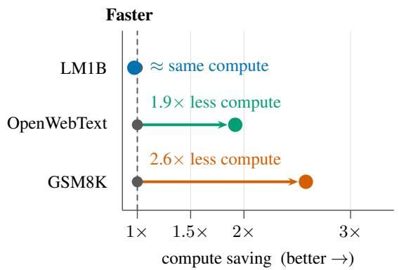

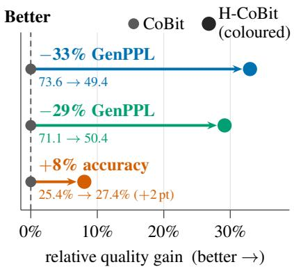  
Figure 1: Better generations for less compute. For each dataset, (left) the compute H-CoBit (ours) needs to match/surpass CoBit’s best results, relative to CoBit’s own cost. Compute is each arm’s measured per-denoiser-call cost times its NFE; (right) the quality gain for optimal samplers, Gen-PPL is read at dataset entropy, GSM8K reports accuracy. LM1B is not budget-matched (CoBit 1M step vs H-CoBit 600k).

## 1 INTRODUCTION

Recent progress in language modeling (Touvron et al., 2023) was enabled by the simple and scalable auto-regressive (AR) factorization that supports left-to-right generation via next-token prediction. This sequential nature, however, precludes parallelization and can hinder performance on non-left-toright tasks. Diffusion Language Models (DLMs) offer a promising alternative by denoising entire sequences in parallel (Austin et al., 2021; Sahoo et al., 2024). Yet realizing their potential is difficult: diffusion (or flow) architectures lack a single canonical training recipe, and neither discrete nor continuous DLMs have fully closed the gap with AR models despite success in other modalities. A key design choice is how to represent and corrupt tokens. Discrete approaches such as Masked Diffusion Language Models (MDLM) have narrowed the gap (Sahoo et al., 2024; Austin et al., 2021; Sahoo et al., 2025). Continuous formulations are harder: the design space is larger, and standard Gaussian diffusion with linear schedules is poorly matched to discrete data (Shabalin et al., 2026). Recent work has nevertheless closed much of this gap through carefully chosen continuous token representations and adaptive noise schedules (Chen et al., 2026; Lee et al., 2026).

Our work builds on two independent recent innovations. First, the parallel diffusion of multiple modalities has yielded improvements in the image generation literature. Kouzelis et al. (2025) and Baade et al. (2026) showed that diffusing both DINOv2 features and pixels with a single network improves performance. Second, Zhou et al. (2025) have shown that predicting higher level representations of tokens before the tokens themselves in a discrete diffusion setup improves generation quality.

Motivated by these results, we introduce Hierarchical Continuous Diffusion Language Models (H-CDLMs), which augment continuous diffusion language models with auxiliary modalities that represent tokens at coarser semantic granularities. In the simplest instantiation, which we study in this work, we use two modalities: the original token sequence and the corresponding sequence of cluster IDs, obtained by clustering pretrained token embeddings. We embed the cluster IDs into a continuous space and jointly diffuse and denoise both modalities with a single model. At inference, the samplers and schedules of the two modalities can be tuned independently to optimize their interaction.

The cluster modality is especially well suited to continuous text diffusion. Token embeddings encode rich linguistic and semantic structure: tokens that play similar roles tend to occupy nearby regions of the embedding space, and hence the same cluster. Under continuous noise, recovering the exact embedding of a token can be difficult, but identifying the region in which it lies is often still feasible. Cluster IDs supply exactly this coarse-grained signal. By indicating which region of the embedding space a token belongs to, they narrow the set of plausible tokens without committing to a specific one (Figure 2). The cluster modality thus acts as a semantic anchor that steers the denoising trajectory toward the target token. Crucially, because the two modalities are denoised in parallel, information flows bidirectionally across semantic granularities: coarse cluster predictions can guide token recovery under high noise, while token-level predictions simultaneously refine the cluster estimates.

H-CDLM adds little parameter or computational overhead when the number of clusters is small relative to the vocabulary, and can be applied directly to existing continuous DLMs. We apply it to CoBit, a state-of-the-art continuous DLM that uses bit representations to reduce output-head size. The resulting model, H-CoBit, delivers large gains in both generation quality and efficiency. We additionally apply H-CDLM to FLM (Lee et al., 2026), a continuous flow matching language model, where the resulting H-FLM also provides consistent improvements over the baseline, highlighting the cross-paradigm applicability of our framework.

## Our contributions are:

1. We introduce H-CDLM, a framework for jointly diffusing hierarchical textual modalities in continuous DLMs, with independent samplers and noise schedules per modality.

2. We instantiate the framework using two modalities constructed from pretrained token embeddings, primarily on CoBit (yielding H-CoBit), and additionally on the flow matching model FLM (yielding H-FLM) to demonstrate applicability beyond diffusion.

3. We show that H-CoBit delivers large gains across benchmarks (Figure 1). At entropy matched to that of the data, it reduces generative perplexity (GenPPL) from 73.6 to 49.4 on LM1B and from 71.1 to 50.4 on OpenWebText (OWT), improvements of 24.2 and 20.7 points over CoBit that surpass even discrete DLMs, while also improving MAUVE on both datasets. It matches CoBit’s performance at a substantially lower budget, and it reaches 27.4% accuracy on GSM8K, outperforming all prior continuous diffusion and flow language models. A matched random-cluster control fails to recover these gains, confirming that they stem from meaningful cluster semantics rather than added capacity or auxiliary structure.

4. We show that H-FLM also consistently improves over FLM, confirming that the benefits of H-CDLM transfer across continuous generative paradigms.

More broadly, H-CDLMs offer a path toward language models that denoise text at multiple levels of abstraction at once, from tokens to progressively coarser clusters and potentially to entire sentences. We view our two-level instantiation as a first step in this direction.

## 2 RELATED WORK

Discrete Diffusion Models. Discrete Diffusion Models operate directly in the discrete space of tokens. They rest on a Markov chain which defines the corruption mechanism. D3PM (Austin et al., 2021) proposes a general framework for such processes. Corruption mechanisms range from masking to uniform token transitions. MDLM (Sahoo et al., 2024) first demonstrated strong generation quality for text by simplifying D3PM on masked diffusion, while Duo (Sahoo et al., 2025) showed that uniform discrete architectures can be equally good, and drew a connection to Gaussian diffusion of one hot vectors. HDLM (Zhou et al., 2025) extends MDLM by building a hierarchical vocabulary of tokens, allowing for a fine grained unmasking process. TDLM (Wu et al., 2026) drops HDLM’s full vocabulary prediction by only predicting the next scale semantics along a hierarchical tree diffusion process – thus considerably increasing throughput. Our work can be seen as a continuous analog of HDLM (and TDLM), although we diffuse all modalities jointly rather than unmasking clusters before tokens. Another line of work augments masked discrete diffusion with a paired continuous diffusion process: tokens are corrupted by both masking and Gaussian noise, and a single model learns to reverse both processes jointly (Pynadath et al., 2026a; Zhou et al., 2026; Zheng et al., 2026).

Continuous Diffusion and Flow Language Models. Continuous Diffusion or Flow Language Models corrupt continuous representations of tokens, and train a denoiser network to reconstruct clean token embedding sequences from noisy ones. Recently, LangFlow (Chen et al., 2026) and FLM/FMLM (Lee et al., 2026) have shown that, when carefully designed, such processes can yield similar performance to their discrete diffusion counterparts. FLM embeds tokens as one hot vectors and directly diffuses in the one hot vector space, while LangFlow exploits trained embeddings. Both models however train their denoiser to predict tokens directly and then pull the token’s representation backwards into the diffusion process, entailing a large vocabulary sized output head and low throughput. ELF (Hu et al., 2026) shows that continuous DLMs can be effective with minimal adaptation to the discrete nature of the data, and especially without predicting actual tokens. This allows a smaller output head whose size depends on the hidden dimension rather than the vocabulary size. S-FLM (Deschenaux & Gulcehre, 2026) leverages Flow Matching on the hypersphere for improved token representations, with strong performance on downstream tasks. CoBit (Batzolis et al., 2026) exploits a bit representation of tokens, previously introduced by Chen et al. (2023), alongside a carefully designed parametrization and stochastic sampling. This further reduces output head size and yields the strongest results known for continuous DLMs.

Multimodal Joint Diffusion. Multimodal joint diffusion diffuses multiple representations of a data sample in parallel, via a single denoiser network. For images, this can consist of diffusing pixels and DinoV2 (Oquab et al., 2024) features jointly, and keeping only the generated pixels at the end of the sampling process (Kouzelis et al., 2025; Baade et al., 2026). This augmentation yields generation quality gains (Kouzelis et al., 2025), especially when coupled with an ordered scheduler which enhances the interplay between high and low level data features through the sampling process (Baade et al., 2026). This framework rests on the idea that diffusing high and low level features jointly provides a form of guidance to the denoiser. It has not, to the best of our knowledge, been extended to continuous DLMs yet. Bao et al. (2023) jointly diffuse image and text pairs, enabling unconditional text generation, but they do not evaluate this specific task.

## 3 BACKGROUND

In this section, we present a general setting for continuous diffusion and flow models for text. Our setting covers existing continuous flow and diffusion language models (Lee et al., 2026; Chen et al., 2026; Batzolis et al., 2026; Hu et al., 2026; Deschenaux & Gulcehre, 2026), although they differ in their token representation, corruption parametrization, training objective and sampler. One exception is S-FLM (Deschenaux & Gulcehre, 2026), whose corruption is a geodesic interpolation on the hypersphere. Details on how this setup applies are given in Appendix B.

## 3.1 CONTINUOUS DIFFUSION OF DISCRETE TOKENS

We consider text sequences composed of L tokens over a vocabulary V. We aim to approximate the distribution $p _ { \mathrm { d a t a } } : \bar { \mathcal { V } } ^ { L } \to [ 0 , 1 ]$ ] of a sequence $y \in \mathcal { V } ^ { L }$ via the learned model $p _ { \theta } ( y )$

Continuous diffusion first requires a continuous representation in a space $E ^ { d }$ of the vocabulary via the encoder and decoder functions $\mathcal { E } : y  x$ and ${ \mathcal { D } } : x  y .$ , verifying $\begin{array} { r } { \mathcal { D } ( \mathcal { E } ( y ) ) = y , } \end{array}$ with d the embedding dimension. Generally, we set $E = \mathbb { R }$ , although recent work also explores hyperspherical embeddings, that is $E = \mathbb { S }$ (Deschenaux & Gulcehre, 2026). We write $x _ { 0 } = \mathcal { E } ( \overset { \cdot } { y } ) \in \mathbb { R } ^ { \tilde { L } \times d }$ , applying E position-wise. The diffusion process lives in $E ^ { L \times d }$ , following the Gaussian corruption process

$$
\begin{array} { r } { x _ { \sigma } = x _ { 0 } + \sigma \epsilon , \qquad \epsilon \sim \mathcal { N } ( \epsilon ; 0 , I _ { L d } ) , \qquad \sigma \in [ \sigma _ { \operatorname* { m i n } } , \sigma _ { \operatorname* { m a x } } ] . } \end{array}\tag{1}
$$

Note that, without loss of generality, we adopt the variance-exploding (EDM) convention (Karras et al., 2022). Flow matching formulations use general parametrizations $x _ { t } = \alpha _ { t } x _ { 0 } + \sigma _ { t } \epsilon$ (Chen et al., 2026; Lee et al., 2026), and reduce to equation 1 by rescaling (see explicit correspondence in Appendix B). We consider a denoiser that predicts the clean data embeddings $D _ { \theta } ( x _ { \sigma } , \sigma ) \overset { \cdot } { \approx } \mathbb { E } [ x _ { 0 } | x _ { \sigma } ] \overset { \cdot } { \in } \dot { E } ^ { L \times d }$

## 3.2 TRAINING

Due to the conditional expectation formulation of $D _ { \theta } ( x _ { \sigma } , \sigma )$ , the natural training objective of this model is solving the regression problem $\begin{array} { r } { D = \mathrm { a r g m i n } _ { \hat { D } } \mathcal L _ { M S E } ( \hat { D } ) } \end{array}$ , with

$$
\mathcal { L } _ { \mathrm { M S E } } = \mathbb { E } _ { { x _ { 0 } } , \epsilon , \sigma \sim p _ { \mathrm { t r a i n } } } \bigg [ \frac { w ( \sigma ) } { L } \sum _ { i = 1 } ^ { L } \big \| D _ { \theta } ( { x _ { \sigma } } , \sigma ) _ { i } - x _ { 0 , i } \big \| ^ { 2 } \bigg ] ,\tag{2}
$$

where $p _ { \mathrm { t r a i n } }$ is the training noise density and $w ( \sigma )$ a weighting function; both control how learning effort is allocated across noise levels (Karras et al., 2022). Recent work replaces or augments the regression loss with other training objectives, including cross entropy loss (Chen et al., 2026; Lee et al., 2026; Deschenaux & Gulcehre, 2026). We refer to Appendix B for further details.

## 3.3 SAMPLING

We sample from this general model by backward integration of the probability-flow ODE induced by the forward process in equation 1, along

$$
\frac { d x } { d \sigma } = - \sigma \nabla _ { x } \log p _ { \sigma } ( x ) = \frac { x - D _ { \theta } ( x , \sigma ) } { \sigma } ,\tag{3}
$$

using standard solvers such as Heun or Euler on a discrete noise grid $\sigma _ { \mathrm { m a x } } = \sigma _ { 0 } > \sigma _ { 1 } > \cdot \cdot \cdot >$ $\sigma _ { N } = \sigma _ { \mathrm { m i n } }$ . The final step consists in decoding position-wise via D. The underlying discrete nature of the data requires two main adjustments that decisively improve generation quality:

Information-uniform noise schedules. For text, the conditional information about token identities is not released uniformly with noise; it is concentrated in a narrow band of noise. Following recent continuous DLMs (Chen et al., 2026; Batzolis et al., 2026; Lee et al., 2026; Deschenaux & Gulcehre, 2026), we adopt information-uniform noise schedules to focus sampling on noise regions where information about the tokens changes the most.

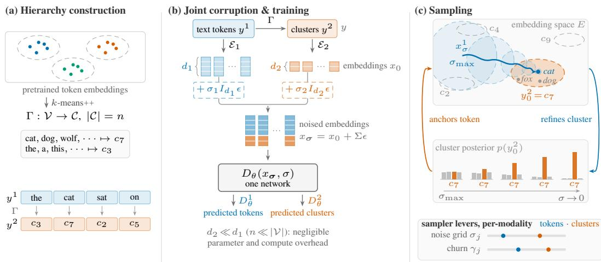  
Figure 2: Hierarchical continuous diffusion (k=2). (a) A surjective map Γ, obtained by k-means++ on pretrained embeddings, sends every token to a cluster, yielding a second symbol sequence of the same length L. (b) The cluster index is encoded with the host model’s own token encoder. The two codes are concatenated at each position and corrupted at their own noise levels $\sigma _ { 1 } , \sigma _ { 2 }$ . One network denoises both modalities. (c) Clusters act as a semantic anchor for tokens. This interplay can be optimized via per-modality scheduler/sampler parameter tuning.

Stochastic churn. A second lever trades the deterministic ODE for a stochastic sampler (Karras et al., 2022): at step i, the state is churned back up to $\hat { \sigma } _ { i } = ( 1 + \gamma ) \sigma _ { i }$ before the solver integrates down to $\sigma _ { i + 1 } \colon \hat { x } _ { i } = x _ { i } + s _ { \mathrm { n o i s e } } \sqrt { \hat { \sigma } _ { i } ^ { 2 } - \sigma _ { i } ^ { 2 } } \epsilon , \epsilon \sim \mathcal { N } ( \epsilon ; 0 , I _ { L d } )$ . The per-step churn rate $\gamma = S _ { \mathrm { c h u r n } } / N \ge 0$ sets how much noise is re-injected, while $s _ { \mathrm { n o i s e } } \geq 1$ 1 inflates its variance (Karras et al., 2022). Unlike γ, $s _ { \mathrm { n o i s e } }$ is a property of the sampler rather than of the parametrization, hence model-agnostic. Churn is essential to CoBit’s generation quality (Batzolis et al., 2026), and improves FLM (see Section 5.4); Section 4.3 makes γ per-modality. Noise truncation (Deschenaux & Gulcehre, 2026) is a further such lever; we discuss how these intertwine with our method in Sections 4.3 and Appendix B.4.

## 4 METHOD

In this section, we present our hierarchical framework for continuous DLMs. We define a multimodal diffusion process (Section 4.1) and detail our hierarchical modalities for text (Section 4.2). We then show how information-uniform noise scheduling extends to a per-modality setting (Section 4.3).

## 4.1 HIERARCHICAL CONTINUOUS DIFFUSION

Following the multimodal formulation of Kouzelis et al. (2025), we define a joint diffusion process over k modalities, operating on vocabularies $\{ \mathcal { V } ^ { j } \} _ { j = 1 } ^ { k }$ . In practice, we set $k = 2$ to distinguish plain tokens $( j = 1 )$ from $h i g h$ level semantic units $( j = 2 )$ , or clusters. The diffusion process then noises continuous representations $x = \{ x ^ { j } \} _ { j = 1 } ^ { k }$ , with $x ^ { j } \in E ^ { L \times d _ { j } }$ , of the data $y = \{ y ^ { j } \} _ { j = 1 } ^ { k }$ with $y ^ { j } \in ( \mathcal { V } ^ { j } ) ^ { L }$ and $\mathcal { V } ^ { 1 } = \mathcal { V }$ . The modalities are concatenated along the channel axis, so that $x \in E ^ { L \times d }$ with $\begin{array} { r } { d = \sum _ { j = 1 } ^ { k } d _ { j } } \end{array}$ . This integrates directly into an existing continuous DLM architecture (see Section 3) by concatenating the modalities’ embeddings at each position. It does not increase sequence length. Each modality can be corrupted at its own noise level. The forward process becomes

$$
x _ { \sigma } = x _ { 0 } + \Sigma \epsilon , \qquad \epsilon \sim { \mathcal N } \bigl ( \epsilon ; 0 , I _ { L d } \bigr ) , \qquad \Sigma = \mathrm { b l o c k d i a g } \bigl ( \sigma _ { 1 } I _ { d _ { 1 } } , \dots , \sigma _ { k } I _ { d _ { k } } \bigr ) \otimes I _ { L } ,\tag{4}
$$

where $\pmb { \sigma } = ( \sigma _ { 1 } , \dots , \sigma _ { k } )$ collects the per-modality noise levels. The denoiser outputs one cleandata estimate per-modality, $D _ { \theta } ( x _ { \pmb { \sigma } } , \pmb { \sigma } ) = ( D _ { \theta } ^ { 1 } , \ldots , D _ { \theta } ^ { k } )$ ) with $D _ { \theta } ^ { j } \in E ^ { L \times d _ { j } }$ . At training time, we minimize

$$
\mathcal { L } _ { \mathrm { M S E - H } } = \mathbb { E } _ { x _ { 0 } , \epsilon , \sigma } \Big [ \frac { 1 } { L } \sum _ { i = 1 } ^ { L } \sum _ { j = 1 } ^ { k } \lambda _ { j } w ( \sigma _ { j } ) \big | \big | D _ { \theta } ^ { j } ( x _ { \sigma } , \sigma ) _ { i } - x _ { 0 , i } ^ { j } \big | \big | ^ { 2 } \Big ] ,\tag{5}
$$

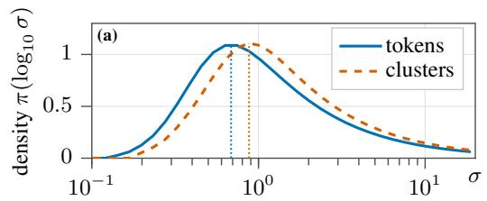

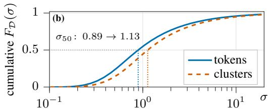  
Figure 3: Token vs. cluster information-uniform noise schedules for H-CoBit: (a) density over log-noise levels; (b) cumulative distributions, with the median shifting from $\sigma _ { 5 0 } = 0 . 8 9$ to 1.13.

with $\lambda _ { j }$ per-modality loss weights. Note that expectation over time/noise is taken at the global level (see Appendix C). At sampling time, all hierarchical levels are diffused jointly. At the last step, all modalities except the first (token-level) are dropped, and the tokens are decoded with $\mathcal { D } _ { 1 }$ . Discarding the auxiliary modalities is principled whenever they are deterministic functions of the tokens, which is the case for the constructions detailed in Section 4.2 (see Proposition 1 in appendix C).

## 4.2 CONSTRUCTING HIERARCHICAL MODALITIES FOR TEXT

Our high-level modality provides an anchor for the diffusion of tokens. We instantiate it as token clusters, following the semantic hierarchy of Zhou et al. (2025). This allows us to keep our multimodal data representation intrinsically discrete. Each cluster can be attributed to a semantic group of tokens, which can be easier to infer at high noise levels than the exact token identity. In practice, a surjective map $\Gamma : \mathcal { V } \to \mathcal { C }$ assigns each token to one of $n = | \mathcal { C } |$ clusters, and the high-level sequence is obtained position-wise, $y ^ { 2 , l } = \Gamma ( y ^ { 1 , l } )$ , so that both modalities share the sequence length L. We compute Γ by k-means++ on pretrained token embeddings taken from LangFlow (Chen et al., 2026) (for LM1B, OWT) and S-FLM (Deschenaux & Gulcehre, 2026) (for TinyGSM). The cluster index must itself be given a continuous encoding ${ \mathcal { E } } _ { 2 }$ . The most direct way to construct ${ \mathcal { E } } _ { 2 }$ is by using the same mechanism as for $\mathcal { E } _ { 1 }$ , making integration to an existing DLM seamless. This involves encoding clusters via bit sequences for CoBit (Batzolis et al., 2026) and through one-hot vectors for FLM (Lee et al., 2026). This choice aims at simplicity. More complex multimodal token representations are left to future work. More generally, additional modalities $\left( k > 2 \right)$ can be obtained by clustering at multiple granularities, yielding a deeper hierarchy. We refer to Appendix A for further details, and to Wu et al. (2026) for a $k > 2$ modalities example.

## 4.3 PER-MODALITY SCHEDULING AND SAMPLING

A key opportunity of joint diffusion is to adapt the scheduler and sampler per-modality, so as to enhance the interplay between modalities throughout the denoising process, and to adapt the noise schedule and sampler to each modality’s underlying data structure.

Per-modality scheduler. In multimodal joint image diffusion, Baade et al. (2026) for instance order the modalities: the high level modality is kept cleaner than the pixels via per-modality schedulers, so that resolved semantics guide pixel denoising. In image diffusion, this requires setting an explicit ordering of the modalities’ schedules. Our framework offers a simpler alternative: training a permodality information-uniform noise schedule. For each modality j and sampling step $i , \sigma _ { i , j }$ is set so that it yields a grid on which each step reveals approximately equal conditional information about the underlying data (see Section 3.3 and Appendix C.2 for details on how to train $\sigma _ { i , j } )$ . Figure 3 displays such trained schedules for 2 modalities. Cluster density is right-shifted: cluster identity is a coarser variable, so information about it survives larger noise and its entropy is released at higher σ. Figure 3 shows that each modality has a different underlying structure. This motivates adapting the scheduler and sampler per-modality. In our experiments, we set our scheduler per-modality by default, and ablate the possibility of using a single shared scheduler (see Table 3).

Per-modality sampler (PMS). One direct way to adapt the sampler per-modality is to leverage stochastic sampling (see Section 3.3). We enable two key mechanisms: (i) adapt the churn rate per-modality, so that $\hat { \sigma } _ { i , j } = ( 1 + \gamma _ { i } ^ { j } ) \sigma _ { i , j } , \hat { x } _ { i } ^ { j } = x _ { i } ^ { j } + s _ { \mathrm { n o i s e } } \sqrt { \hat { \sigma } _ { i , j } ^ { 2 } - \sigma _ { i , j } ^ { 2 } } \epsilon \operatorname { f o r } \epsilon \sim \mathcal { N } ( 0 , I )$ . (ii) churn clusters on a predefined window $\mathcal { W } ^ { 2 }$ . We set it to the first $( \mathcal { W } _ { \mathrm { e a r l y } } ^ { 2 } )$ or last $( \mathcal { W } _ { \mathrm { l a t e } } ^ { 2 } )$ half of sampling steps. Combined, these mechanisms yield clear performance improvements in H-CDLM. We provide a comprehensive evaluation of stochastic sampling per-modality in its H-CoBit instantiation in Appendix E.5. By construction, any sampler mechanism or parameter can be tuned per-modality to improve the interplay between modalities. We leave further tuning to future work.

## 5 EXPERIMENTS

We mainly evaluate our framework on CoBit (Batzolis et al., 2026), a state-of-the-art (SOTA) continuous DLM in terms of downstream task accuracy and GenPPL frontier. We first present our experimental setup (Section 5.1), then our main training and evaluation results for H-CoBit on standard text generation and downstream tasks (Section 5.2), and our ablations (Section 5.3). We finally explore cross-paradigm transferability of H-CDLM by applying it to FLM (Section 5.4).

## 5.1 EXPERIMENTAL SETUP

Training. Following Chen et al. (2026); Sahoo et al. (2024; 2025); Deschenaux & Gulcehre (2026); Batzolis et al. (2026); Hu et al. (2026), we train on LM1B (Chelba et al., 2013) using 128-token sequences and the BERT-base-uncased tokenizer $( V = 3 0 5 2 2 )$ , on OWT (Gokaslan & Cohen, 2019) using 1024-token sequences with the GPT-2 tokenizer $( V = 5 0 2 5 7 )$ , and on TinyGSM (Liu et al., 2023) using 512-token sequences with the SmolLM-135M tokenizer $( V = 4 9 1 5 3 )$ . Our denoiser is a 12-layer, 12-head Diffusion Transformer with hidden size 768, resulting in 134.6M and 135M parameters for LM1B and OWT respectively (parameter overhead of approximately +1% compared to the CoBit baseline). All other training parameters are set equal to Batzolis et al. (2026) for H-CoBit, and Lee et al. (2026) for H-FLM.

Evaluation. We evaluate by measuring GPT-2 Large generative perplexity (GenPPL) - entropy (H) frontiers, following Sahoo et al. (2024); Chen et al. (2026); Deschenaux & Gulcehre (2026); Hu et al. (2026); Batzolis et al. (2026). We also compute MAUVE on LM1B and OWT, and GSM8K (Cobbe et al., 2021) accuracy for our model trained on TinyGSM. MAUVE and GenPPL are evaluated on 1024 generated sequences. All results are reported across a full sweep over Number of Function Evaluations (NFE) and sampling parameters, especially churn which is essential for CoBit. Permodality loss weighting coefficients $\lambda _ { j }$ are tuned for each model/dataset. For CoBit, we keep the original paper’s inference hyperparameters: global stochastic sampling noise is $s _ { \mathrm { n o i s e } } = 1 . 0 0 3$ on LM1B, OWT and GSM8K. We ablate $s _ { \mathrm { n o i s e } } = 1 . 0 5$ , for fair comparison with our per-modality samplers on H-CoBit. We refer to Appendix D for further details.

## 5.2 MAIN RESULTS

Figure 4 displays improvements of our model H-CoBit in the GenPPL-entropy frontiers on LM1B and OWT, shown by right shifts of the frontier. Table 1 shows GenPPL levels at given entropies. On LM1B, H-CoBit matches dataset entropy at GenPPL 57.3, more than 20 points better than CoBit-S, at only 60% of the training steps. On OWT at matched 750k steps, H-CoBit reaches GenPPL 67.8 at dataset entropy beating CoBit-S by 15.4 points. Adding per-modality churn further improves H-CoBit’s advantage: on OWT, combined with $s _ { n o i s e } = 1 . 0 5$ , H-CoBit reaches Gen PPL 50.4, better than CoBit-S at same $s _ { n o i s e } ~ ( 7 1 . 1 )$ , and than any DLM baseline at dataset entropy. H-CoBit also improves MAUVE at dataset entropy, reaching 0.903 against 0.861 on LM1B, and 0.580 against 0.530 on OWT against CoBit (see Table 11, Appendix E). We note H-CoBit incurs only a negligible worst case computational overhead (+4.2%) while matching CoBit’s performance at much lower budget (see Figure 1, Table 12).

Table 2 displays H-CoBit’s accuracy on GSM8K. On these 1319 mathematical reasoning problems, H-CoBit beats all other continuous DLMs, and narrows the gap to discrete DLMs.

## 5.3 ABLATIONS

In this section, we discuss ablations of our framework on H-CoBit. Due to limited compute, when retraining is required to conduct an ablation, we restrict ourselves to LM1B at 100k training steps.

Figure 4: Generation quality against diversity. GenPPL versus token unigram entropy for (a) LM1B, 1M vs 600k steps, (b) OpenWebText, matched 750k steps. Each model is swept over churn γ and NFE budget; the solid curve is the Pareto frontier. The dashed rule is the data’s unigram entropy and the star is real data. H-CoBit $\left( n { = } 1 6 \right)$ uses cluster loss weight $\textstyle \lambda _ { 2 } = { \frac { 4 } { 1 5 } }$ in (a) and $\lambda _ { 2 } = 0 . 1$ in (b). Per-modality sampler resamples the same checkpoint with cluster churn confined to the late half of the schedule, at $\gamma _ { 2 } = 0 . 4$ in (a) and $\gamma _ { 2 } = 0 . 3$ with global $s _ { \mathrm { n o i s e } } = 1 . 0 5$ in (b). $s _ { \mathrm { n o i s e } }$ is model-agnostic, so (b) also plots CoBit at $s _ { \mathrm { n o i s e } } = 1$ .05 for fair comparison.  
(a) LM1B (1M vs 600k steps)  
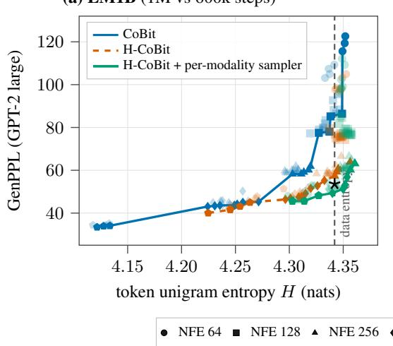

(b) OpenWebText (matched 750k steps)  
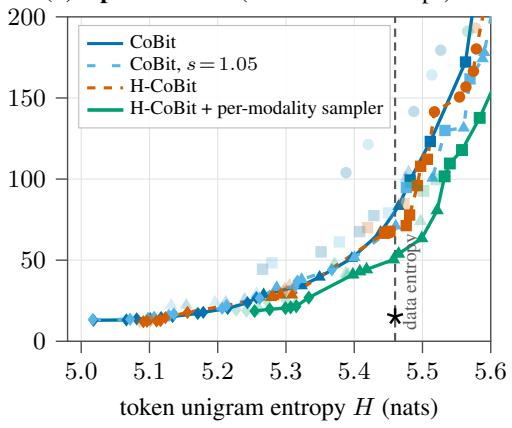

Number of clusters and cluster loss weight. Figure $^ { 5 ( \mathrm { b , c } ) }$ studies the optimal number of clusters n and cluster loss weight $\lambda _ { 2 } .$ Both panels (c) and (b) show that $n = 1 6$ is optimal: it is the only n to beat the baseline in all values of $\lambda _ { 2 } .$ . Here, the multimodal process is beneficial at a very low number of clusters compared to vocabulary size $( | V | = 3 0 5 2 2$ for LM1B). We hypothesize that this is closely tied to the clustering. $\mathrm { A t } n = 1 6$ , the optimal cluster loss weight is $\lambda _ { 2 } ^ { \mathrm { o p t } } = 5 \cdot 1 0 ^ { - 2 }$ (we use $\textstyle \lambda _ { 2 } = { \frac { 4 } { 1 5 } } ,$ implying LM1B performance could be further improved). This is likely highly dependent on n and the dataset, thus requiring careful tuning for each new task.  
(a)  
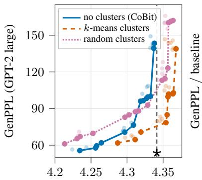  
token unigram entropy H (nats)

(b)  
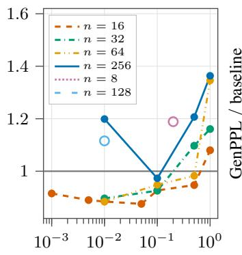

(c)  
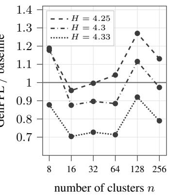

$$
\lambda _ { 2 }
$$

Figure 5: H-CoBit cluster design: semantics, weight, count. LM1B at 100k steps. (a) GenPPL/entropy frontier for $n { = } 1 6$ clusters from k-means over LangFlow (Chen et al., 2026) embed dings, against a random cluster assignment control. Random clusters yield no improvement on the baseline. (b) GenPPL gain over the baseline at dataset entropy with respect to loss weight and n. (c) Cluster-count ablation with each n given the $\lambda _ { 2 }$ that is best for it at three entropy levels. $n = 1 6$ is best at every H. For (b) and (c), the grey rule is what H-CoBit variants have to beat (lower is better).

Semantic vs. random cluster structure. In order to verify that the semantic structure of our high level modality is meaningful, we train and evaluate H-CoBit with random cluster assignments. This means that a token’s cluster is random, not dictated by a clustering of pretrained token embeddings.

Table 1: Generation quality, diversity at one operating point. Every row is one generation scored by GenPPL and entropy H. All reported continuous DLMs have ≈130M parameters (except ELF, 342M). H-CoBit is our hierarchical continuous DLM framework on CoBit-S. H-CoBit uses cluster-loss weights $\lambda _ { 2 } { = } 0 . 2 7 / 0 . 1$ for (LM1B / OWT). We report GenPPL at matched dataset entropy when reached by the model. Per-Modality Sampler (PMS) samples with tuned churn per-modality: for H-CoBit, LM1B uses $\mathcal { W } _ { \mathrm { l a t e } } ^ { 2 } , \gamma _ { 2 } = 0 . \dot { 4 }$ and OWT uses $\mathcal { W } _ { \mathrm { l a t e } } , \gamma _ { 2 } = 0 . 3 +$ global $s _ { n o i s e } = 1 . 0 5$ (compared to Cobit-S, $s _ { n o i s e } = 1 . 0 5 )$ . The bold is best at matched H. Baselines are taken from original papers, Franca & Tong (2026) or Pynadath et al. (2026b), except for S-FLM and CoBit which we re-evaluate.
<table><tr><td rowspan="2">Model</td><td colspan="4">LM1B (L=128)</td><td colspan="4">OpenWebText (L=1024)</td></tr><tr><td>Steps</td><td>NFE</td><td>H↑</td><td>GenPPL↓</td><td>Steps NFE</td><td></td><td>H↑</td><td>GenPPL↓</td></tr><tr><td>Real text (test split)</td><td></td><td></td><td>4.34</td><td>53.1</td><td></td><td></td><td>5.46</td><td>14.9</td></tr><tr><td>Autoregressive</td><td></td><td></td><td></td><td></td><td></td><td></td><td></td><td></td></tr><tr><td>AR baseline (Franca &amp; Tong, 2026)</td><td></td><td></td><td></td><td></td><td></td><td></td><td>5.61</td><td>40.2</td></tr><tr><td>Discrete diffusion</td><td></td><td></td><td></td><td></td><td></td><td></td><td></td><td></td></tr><tr><td>SEDD (Lou et al., 2024)</td><td></td><td></td><td></td><td></td><td></td><td></td><td>5.65</td><td>125.7</td></tr><tr><td>Duo (Sahoo et al., 2025)</td><td>1M</td><td></td><td>4.28</td><td>98.6</td><td>1M</td><td>128</td><td>5.46</td><td>63.3</td></tr><tr><td>MDLM (Sahoo et al., 2024)</td><td>1M</td><td></td><td>10244.32</td><td>109.2</td><td>1M</td><td>128</td><td>5.46</td><td>66.2</td></tr><tr><td>Hybrid discrete-continuous</td><td></td><td></td><td></td><td></td><td></td><td></td><td></td><td></td></tr><tr><td>CANDI (Pynadath et al., 2026a)</td><td></td><td></td><td>4.32</td><td>119.9</td><td>1M</td><td>128</td><td>5.46</td><td>71.0</td></tr><tr><td>CADD (Zheng et al., 2026)</td><td></td><td></td><td></td><td></td><td>1M</td><td>128</td><td>5.48</td><td>55.3</td></tr><tr><td>Continuous diffusion / flow</td><td>1M</td><td>128</td><td></td><td></td><td></td><td></td><td></td><td></td></tr><tr><td>LangFlow (Chen et al., 2026)</td><td></td><td></td><td>4.31</td><td>92.2</td><td>1M</td><td>128</td><td>5.43</td><td>60.1</td></tr><tr><td>ELF-M (342M) (Hu et al., 2026)</td><td>1M</td><td></td><td>10244.28</td><td>119.1</td><td>95k</td><td>64</td><td>5.44</td><td>62.5</td></tr><tr><td>FLM (Lee et al., 2026)</td><td></td><td></td><td></td><td></td><td>1M</td><td>1024</td><td>5.40</td><td>96.8</td></tr><tr><td>S-FLM (Deschenaux &amp; Gulcehre, 2026)</td><td></td><td></td><td></td><td></td><td>1M</td><td>256</td><td>5.46</td><td>108.2</td></tr><tr><td>CoBit (Batzolis et al., 2026) vs. H-CoBit (ours)</td><td></td><td></td><td></td><td></td><td></td><td></td><td></td><td></td></tr><tr><td>CoBit-S</td><td>1M</td><td>128</td><td>4.34</td><td>85.2</td><td>750k</td><td>256</td><td>5.46</td><td>83.2</td></tr><tr><td>H-CoBit</td><td>600k</td><td>256</td><td>4.34</td><td>57.3</td><td>750k</td><td>128</td><td>5.45</td><td>67.8</td></tr><tr><td> $\mathrm { C o B i t - S } , s _ { \mathrm { n o i s e } } { = } 1 . 0 5$ </td><td>1M</td><td>256</td><td>4.34</td><td>73.6</td><td>750k</td><td>256</td><td>5.46</td><td>71.1</td></tr><tr><td> $\mathrm { H - C o B i t + P M S }$ </td><td>600k</td><td>512</td><td>4.34</td><td>49.4</td><td>750k</td><td>256</td><td>5.46</td><td>50.4</td></tr></table>

Table 2: Mathematical reasoning accuracy. GSM8K accuracy at matched training budget. CoBit/H CoBit are reported at their best churn. H-CoBit $( \lambda _ { 2 } = 0 . 3 )$ beats CoBit by +2.1pts at half the NFE, +4pts at matched NFE. Baselines are from Deschenaux & Gulcehre (2026); Batzolis et al. (2026).
<table><tr><td>Model</td><td>Family</td><td>NFE</td><td>Acc. (%)</td></tr><tr><td colspan="4">Autoregressive (reference ceiling)</td></tr><tr><td>AR (greedy)</td><td>autoregressive LM</td><td></td><td>63.3</td></tr><tr><td>AR (sampling)</td><td>autoregressive LM</td><td></td><td>53.9</td></tr><tr><td colspan="4">Discrete DLMs</td></tr><tr><td>MDLM (low-T)</td><td>masked discrete diffusion</td><td>1024</td><td>~33</td></tr><tr><td>Duo (low-T)</td><td>discrete diffusion</td><td>1024</td><td>~36</td></tr><tr><td colspan="4">Continuous DLMs</td></tr><tr><td>FLM</td><td>continuous flow</td><td>1024</td><td>0.3</td></tr><tr><td>S-FLM (+top-k=1)</td><td>hyperspherical flow</td><td>1024</td><td>18.0</td></tr><tr><td>CoBit-S (no cluster bits)</td><td>bitstream diffusion</td><td>512</td><td>23.4</td></tr><tr><td>CoBit-S (no cluster bits)</td><td>bitstream diffusion</td><td>1024</td><td>25.4</td></tr><tr><td>H-CoBit (n=16) (ours)</td><td>bitstream diffusion</td><td>512</td><td>27.4</td></tr></table>

Figure 5(a) compares the performance of the CoBit baseline to H-CoBit with random or with semantic clusters. It clearly shows that the random clusters model’s frontier is intertwined with that of the baseline, while the semantic cluster model yields a right shift. Hence, cluster semantics matter. It is insufficient to provide high level categories; these categories should bear meaning. We also show in

Appendix E.4 that the cluster modality carries information about the final token beyond that of the token modality, further stressing the benefit of our joint multimodal diffusion framework.

Per-modality scheduling and sampling. For H-CoBit, we tune two per-modality sampling mechanisms (see Section 4.3). (1) The per-modality information uniform schedule. Table 3 compares this with a single shared schedule, showing the per-modality schedule is slightly better in MAUVE and GenPPL at dataset entropy, but worse at lower entropies. Neither schedule thus clearly dominates the other. (2) The stochastic churn level is scheduled and scaled differently for the cluster modality. We adopt two churning strategies: churning the cluster modality (via $\gamma _ { 2 } )$ at a different level, and churning it with a phase. Churning it only late, at the low half of noise, achieves -7.9/-17.4 GenPPL gains on the shared churn control on LM1B/OWT (see Figure 4, Table 13).

Table 3: Per-modality vs single schedule, H-CoBit. LM1B n=16. MAUVE is the best reached.
<table><tr><td colspan="3"></td><td colspan="3">GenPPL at token entropy H</td></tr><tr><td>Arm</td><td>H≈4.28</td><td>H≈4.30</td><td>H≈4.32</td><td>H≈4.34</td><td>MAUVE</td></tr><tr><td>dual (per-modality schedule)</td><td>46.4</td><td>46.9</td><td>51.6</td><td>57.3</td><td>0.973</td></tr><tr><td>single (shared schedule)</td><td>44.6</td><td>45.1</td><td>52.8</td><td>57.4</td><td>0.965</td></tr></table>

## 5.4 CROSS PARADIGM TRANSFERABILITY: H-FLM

In this section, we assess whether the benefits of H-CDLM transfer beyond diffusion by applying it to the Flow Language Model (FLM) (Lee et al., 2026), a continuous flow matching model. We show that the resulting H-FLM also improves over FLM, confirming that our framework is not tied to a specific continuous generative paradigm.

H-FLM parametrization. We parametrize H-FLM as suggested in Section 4: the cluster modality is represented as a n-dimensional one-hot vector which is corrupted following its own error rate based schedule. All other training parameters are identical to Lee et al. (2026).

H-FLM results on LM1B. Figure 6 compares the GenPPL entropy frontiers of FLM and H-FLM, using stochastic sampling on LM1B at 1M training steps. The stochastic samplers used for FLM and H-FLM are defined after a careful sweep over churn levels. Stochastic sampling improves both FLM and H-FLM, a phenomenon that is not reported by FLM’s authors (Lee et al., 2026). H-FLM demonstrates a clear right shift with respect to FLM under stochastic sampling, and a 11 GenPPL points improvement at dataset entropy for NFE=512. We stress that the winning stochastic sampling parameters for H-FLM are similar to those of H-CoBit: late half window cluster churn at $\gamma _ { 2 } = 0 . 3$ This shows that: (i) joint multimodal diffusion/flow matching via H-CDLM is beneficial over different CDLM architectures, (ii) H-CDLMs seem to require stochastic sampling, and churning cluster latents late is beneficial.

(a) NFE 128  
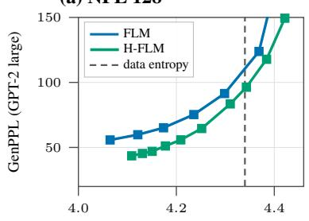

(b) NFE 512  
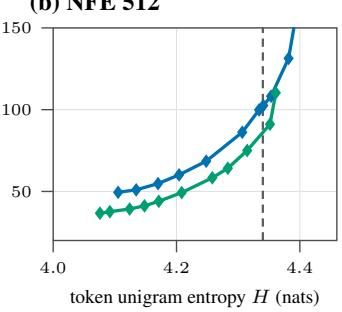

(c) NFE 1024  
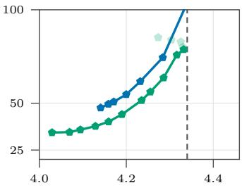  
Figure 6: H-FLM vs. FLM on LM1B (1M steps each; H-FLM: $n = 1 6 , \lambda _ { 2 } = 1 . 0 )$ . Each curve is a sampler’s Pareto frontier over temperature. Stochastic sampling, each model’s best parameters: $\gamma { = } 0 . 0 3$ (FLM) $\mathrm { o r } \gamma { = } 0 . 3$ plus late window cluster churn with cluster temperature 0 (H-FLM).

## 6 CONCLUSION

We have proposed a new multimodal joint diffusion framework for text with minimal parameter overhead. To our knowledge, this is the first work to integrate hierarchical representations of tokens into continuous diffusion processes for text. It integrates innovations from the discrete hierarchical diffusion and the multimodal joint image diffusion literature. This multimodal setup yields consistent gains in generation quality and downstream task accuracy when applied to CoBit, beating recent DLMs in generative quality and continuous DLMs on a mathematical reasoning task. Similar performance gains are observed when applying our framework to FLM, highlighting its cross-model applicability. Our simple instantiation’s large empirical gains point to a broader direction: generating text jointly across multiple representations of a sequence, spanning sub-word units to sentence-level semantics.

## AI USE STATEMENT

In this work, we used generative AI tools to create or edit software code, to edit figures and tables, to review grammar and formulation mistakes, and to polish text. We have not used generative AI tools for research directions, to formulate proofs, propose hypotheses, or interpret results, and the rest of the uses of AI required to disclose are not applicable for this work. We have reviewed all AI-assisted work. We take responsibility for the final content of this work, including text, claims or artifacts produced with the aid of generative AI.

## ETHICS STATEMENT

Generative models carry a substantial risk of misuse. Their application can lead to various negative societal impacts, most notably the spread of disinformation. Enhancements in generative performance, as achieved by our method, may further increase the realism of generated content, potentially making disinformation even more convincing.

## REPRODUCIBILITY STATEMENT

We provide implementation details, dataset descriptions and preprocessing, hyperparameters and evaluation metrics for reproducing H-CoBit results in Section5 and Appendix D. All our implementations are based on open source code. Code and model checkpoints will be made publicly available upon acceptance.

## REFERENCES

Jacob Austin, Daniel D. Johnson, Jonathan Ho, Daniel Tarlow, and Rianne van den Berg. Structured denoising diffusion models in discrete state-spaces. In Advances in Neural Information Processing Systems, 2021.

Alan Baade, Eric Ryan Chan, Kyle Sargent, Changan Chen, Justin Johnson, Ehsan Adeli, and Li Fei-Fei. Latent forcing: Reordering the diffusion trajectory for pixel-space image generation. In Fortythird International Conference on Machine Learning, 2026. URL https://openreview. net/forum?id=LFUaHUCO1a.

Fan Bao, Shen Nie, Kaiwen Xue, Chongxuan Li, Shi Pu, Yaole Wang, Gang Yue, Yue Cao, Hang Su, and Jun Zhu. One transformer fits all distributions in multi-modal diffusion at scale. In Proceedings ofthe 40th International Conference on Machine Learning, ICML’23. JMLR.org, 2023.

Georgios Batzolis, Mark Girolami, and Luca Ambrogioni. Cobit: Language modeling with bitstream diffusion, 2026. URL https://arxiv.org/abs/2605.07013.

Ciprian Chelba, Tomas Mikolov, Mike Schuster, Qi Ge, Thorsten Brants, Phillipp Koehn, and Tony Robinson. One billion word benchmark for measuring progress in statistical language modeling. In Interspeech, 2013. URL https://api.semanticscholar.org/CorpusID: 14136307.

Ting Chen, Ruixiang Zhang, and Geoffrey Hinton. Analog bits: Generating discrete data using diffusion models with self-conditioning. In International Conference on Learning Representations, 2023. URL https://openreview.net/forum?id=3itjR9QxFw.

Yuxin Chen, Chumeng Liang, Hangke Sui, Ruihan Guo, Chaoran Cheng, Jiaxuan You, and Ge Liu. Langflow: Continuous diffusion rivals discrete in language modeling, 2026. URL https: //arxiv.org/abs/2604.11748.

Karl Cobbe, Vineet Kosaraju, Mohammad Bavarian, Mark Chen, Heewoo Jun, Lukasz Kaiser, Matthias Plappert, Jerry Tworek, Jacob Hilton, Reiichiro Nakano, Christopher Hesse, and John Schulman. Training verifiers to solve math word problems, 2021. URL https://arxiv.org/ abs/2110.14168.

Justin Deschenaux and Caglar Gulcehre. Language modeling with hyperspherical flows, 2026. URL https://arxiv.org/abs/2605.11125.

Antonio Franca and Alexander Tong. Hacking generative perplexity: Why unconditional text evaluation needs distributional metrics. In ICML 2026 Workshop on Structured Probabilistic Inference & Generative Modeling, 2026. URL https://openreview.net/forum?id= f1gwcTDwh9.

Aaron Gokaslan and Vanya Cohen. Openwebtext corpus. http://Skylion007.github.io/ OpenWebTextCorpus, 2019.

Keya Hu, Linlu Qiu, Yiyang Lu, Hanhong Zhao, Tianhong Li, Yoon Kim, Jacob Andreas, and Kaiming He. Elf: Embedded language flows, 2026. URL https://arxiv.org/abs/2605.10938.

Tero Karras, Miika Aittala, Timo Aila, and Samuli Laine. Elucidating the design space of diffusionbased generative models. In Advances in Neural Information Processing Systems, 2022.

Naïl B. Khelifa, Richard E. Turner, and Ramji Venkataramanan. Diffusion models observe only gradients: A geometric perspective on score matching errors, 2026. URL https://arxiv. org/abs/2606.06179.

Theodoros Kouzelis, Efstathios Karypidis, Ioannis Kakogeorgiou, Spyros Gidaris, and Nikos Komodakis. Boosting generative image modeling via joint image-feature synthesis. In The Thirty-ninth Annual Conference on Neural Information Processing Systems, 2025. URL https: //openreview.net/forum?id=i4qAfV04rZ.

Chanhyuk Lee, Jaehoon Yoo, Manan Agarwal, Sheel Shah, Jerry Huang, Aditi Raghunathan, Seunghoon Hong, Nicholas M. Boffi, and Jinwoo Kim. Flow map language models: One-step language modeling via continuous denoising, 2026. URL https://arxiv.org/abs/2602. 16813.

Bingbin Liu, Sebastien Bubeck, Ronen Eldan, Janardhan Kulkarni, Yuanzhi Li, Anh Nguyen, Rachel Ward, and Yi Zhang. TinyGSM: achieving 80% on GSM8k with one billion parameters. In The 3rd Workshop on Mathematical Reasoning and AI at NeurIPS’23, 2023. URL https: //openreview.net/forum?id=ROOVUBZp8v.

Aaron Lou, Chenlin Meng, and Stefano Ermon. Discrete diffusion modeling by estimating the ratios of the data distribution. In Proceedings of the 41st International Conference on Machine Learning, volume 235 of Proceedings ofMachine Learning Research, pp. 32819–32848. PMLR, 2024.

Maxime Oquab, Timothée Darcet, Théo Moutakanni, Huy V. Vo, Marc Szafraniec, Vasil Khalidov, Pierre Fernandez, Daniel Haziza, Francisco Massa, Alaaeldin El-Nouby, Mido Assran, Nicolas Ballas, Wojciech Galuba, Russell Howes, Po-Yao Huang, Shang-Wen Li, Ishan Misra, Michael Rabbat, Vasu Sharma, Gabriel Synnaeve, Hu Xu, Herve Jegou, Julien Mairal, Patrick Labatut, Armand Joulin, and Piotr Bojanowski. DINOv2: Learning robust visual features without supervision. Transactions on Machine Learning Research, 2024. ISSN 2835-8856. URL https://openreview.net/forum?id=a68SUt6zFt. Featured Certification.

Patrick Pynadath, Jiaxin Shi, and Ruqi Zhang. CANDI: Hybrid discrete-continuous diffusion models. In Forty-third International Conference on Machine Learning, 2026a. URL https: //openreview.net/forum?id=03KQGUvw1e.

Patrick Pynadath, Jiaxin Shi, and Ruqi Zhang. Generative frontiers: Why evaluation matters for diffusion language models, 2026b. URL https://arxiv.org/abs/2604.02718.

Gabriel Raya, Bac Nguyen, Georgios Batzolis, Yuhta Takida, Dejan Stancevic, Naoki Murata, Chieh-Hsin Lai, Yuki Mitsufuji, and Luca Ambrogioni. Information-guided noise allocation for efficient diffusion training. 2026. URL https://arxiv.org/abs/2602.18647.

Subham Sekhar Sahoo, Marianne Arriola, Aaron Gokaslan, Edgar Mariano Marroquin, Alexander M Rush, Yair Schiff, Justin T Chiu, and Volodymyr Kuleshov. Simple and effective masked diffusion language models. In The Thirty-eighth Annual Conference on Neural Information Processing Systems, 2024. URL https://openreview.net/forum?id=L4uaAR4ArM.

Subham Sekhar Sahoo, Justin Deschenaux, Aaron Gokaslan, Guanghan Wang, Justin T Chiu, and Volodymyr Kuleshov. The diffusion duality. In Forty-second International Conference on Machine Learning, 2025. URL https://openreview.net/forum?id=9P9Y8FOSOk.

Alexander Shabalin, Simon Elistratov, Viacheslav Meshchaninov, Ildus Sadrtdinov, and Dmitry Vetrov. Why gaussian diffusion models fail on discrete data and how to prevent it?, 2026. URL https://arxiv.org/abs/2604.02028.

Dejan Stancevic, Florian Handke, and Luca Ambrogioni. Entropic time schedulers for generative diffusion models. In Advances in Neural Information Processing Systems, 2025. URL https: //openreview.net/forum?id=EfDIApcjgI.

Hugo Touvron, Louis Martin, Kevin Stone, Peter Albert, Amjad Almahairi, Yasmine Babaei, Nikolay Bashlykov, Soumya Batra, Prajjwal Bhargava, Shruti Bhosale, Dan Bikel, Lukas Blecher, Cristian Canton Ferrer, Moya Chen, Guillem Cucurull, David Esiobu, Jude Fernandes, Jeremy Fu, Wenyin Fu, Brian Fuller, Cynthia Gao, Vedanuj Goswami, Naman Goyal, Anthony Hartshorn, Saghar Hosseini, Rui Hou, Hakan Inan, Marcin Kardas, Viktor Kerkez, Madian Khabsa, Isabel Kloumann, Artem Korenev, Punit Singh Koura, Marie-Anne Lachaux, Thibaut Lavril, Jenya Lee, Diana Liskovich, Yinghai Lu, Yuning Mao, Xavier Martinet, Todor Mihaylov, Pushkar Mishra, Igor Molybog, Yixin Nie, Andrew Poulton, Jeremy Reizenstein, Rashi Rungta, Kalyan Saladi, Alan Schelten, Ruan Silva, Eric Michael Smith, Ranjan Subramanian, Xiaoqing Ellen Tan, Binh Tang, Ross Taylor, Adina Williams, Jian Xiang Kuan, Puxin Xu, Zheng Yan, Iliyan Zarov, Yuchen Zhang, Angela Fan, Melanie Kambadur, Sharan Narang, Aurelien Rodriguez, Robert Stojnic, Sergey Edunov, and Thomas Scialom. Llama 2: Open foundation and fine-tuned chat models, 2023. URL https://arxiv.org/abs/2307.09288.

Zihao Wu, Haoming Yang, Juncheng Dong, and Vahid Tarokh. Rethinking token prediction: Treestructured diffusion language model, 2026. URL https://arxiv.org/abs/2604.03537.

Huangjie Zheng, Shansan Gong, Ruixiang Zhang, Tianrong Chen, Jiatao Gu, Mingyuan Zhou, Navdeep Jaitly, and Yizhe Zhang. Continuously augmented discrete diffusion model for categorical generative modeling. In The Fourteenth International Conference on Learning Representations, 2026. URL https://openreview.net/forum?id=JNAZ3e7Bwt.

Cai Zhou, Chenyu Wang, Dinghuai Zhang, Shangyuan Tong, Yifei Wang, Stephen Bates, and Tommi Jaakkola. Next semantic scale prediction via hierarchical diffusion language models. In The Thirty-ninth Annual Conference on Neural Information Processing Systems, 2025. URL https://openreview.net/forum?id=kUzBGEuu7w.

Cai Zhou, Chenxiao Yang, Yi Hu, Chenyu Wang, Chubin Zhang, Muhan Zhang, Lester Mackey, Tommi Jaakkola, Stephen Bates, and Dinghuai Zhang. Coevolutionary continuous discrete diffusion: Make your diffusion language model a latent reasoner, 2026. URL https://arxiv. org/abs/2510.03206.

## APPENDIX

## A SEMANTIC CLUSTERING OF TOKEN EMBEDDINGS

This appendix details the construction of the surjective map $\Gamma : \mathcal { V } \to \mathcal { C }$ used in Section 4.2. Γ is a spherical K-means partition of a pretrained token-embedding matrix, computed offline and frozen before training, followed by a frequency-driven relabelling of the cluster codes (Algorithm 1).

## A.1 REQUIREMENTS ON Γ

Determinism. Proposition 1 requires $y ^ { 2 } = \Gamma ( y ^ { 1 } )$ to be a deterministic function of the tokens, for our model of the joint distribution to be a valid model of the token distribution. Γ is therefore computed once, offline, and frozen: it is a property of the tokenizer and of the pretrained embeddings, not a learned component. It is independent of the underlying model’s token representation. This is what allows discarding the cluster modality at the end of sampling.

Balance. The per-position entropy of the high-level modality (clusters) is $H ( y ^ { 2 } )$ , maximal and equal to log n for equiprobable clusters. Balanced clusters are more expressive, offering a better anchor to the diffusion process.

Semantics. Balance alone is not sufficient: Section 5.3 shows that a uniformly random cluster map, balanced by construction, recovers none of the gain. What the model exploits is that tokens sharing a cluster are close in embedding space, so resolving the cluster genuinely narrows the token posterior and provides a strong anchor to the denoising process.

## A.2 INPUT EMBEDDINGS

We cluster the input embedding matrix $E \in \mathbb { R } ^ { | \nu | \times D }$ of a pretrained LangFlow checkpoint (Chen et al., 2026), D = 768 (langflow-lm1b for LM1B, langflow-owt for OpenWebText): a flow LM using the same tokenizers. LangFlow normalizes each embedding row to the sphere of radius ${ \sqrt { D } } ,$ so that all information is carried by directions. We accordingly unit-normalize the rows of E and cluster on the unit sphere.<sup>1</sup>

TinyGSM. On TinyGSM, following Deschenaux & Gulcehre (2026); Batzolis et al. (2026), we use the SmolLM-135M tokenizer plus an added [PAD] $( | \mathcal { V } | = 4 9 , 1 5 3 )$ . No LangFlow checkpoint shares that tokenizer. We use the input embeddings of an S-FLM (Deschenaux & Gulcehre, 2026) checkpoint, which also constrains embeddings to a sphere.

H-CoBit on OpenWebText: span averaging. On OpenWebText, CoBit does not operate directly on GPT-2 tokens but on gpt2id\_bpe16 code tokens, a second-stage BPE tokenizer over GPT-2 ids, yielding $| \mathcal { V } | = 6 5 , 5 3 6 -$ which no pretrained model embeds. We therefore take each code token’s vector to be the mean of the LangFlow-OWT embeddings of the GPT-2 span it expands to. Four code tokens ([PAD], [UNK], [EOSEQ], ’\n’) expand to no span and receive no vector. The same happens for SmolLM-135M’s [PAD] token (for TinyGSM). They are attributed to a separate cluster, of id $n - 1$ , and K-means is run with n − 1 centroids on the remaining tokens.

## A.3 CLUSTERING

We run Lloyd’s algorithm with K-means++ initialization (sklearn.cluster.KMeans) on the unit-normalized token embeddings. We keep the best of $n _ { \mathrm { i n i t } } = 1 0$ restarts, each capped at $T = 3 0 0$ iterations and stopped early below a relative centroid shift of $\varepsilon = 1 0 ^ { - 4 }$

## A.4 FREQUENCY-DRIVEN CODE REBALANCING FOR H-COBIT

K-means numbers its clusters arbitrarily and that number is written directly into the cluster bits, implying potentially imbalanced per-bit marginals $p _ { b } = \mathbb { P } ( { \boldsymbol { \mathrm { b i t } } } b = 1 )$ for H-CoBit. We therefore search for a permutation τ of the cluster codes maximizing the frequency-weighted $\textstyle \sum _ { b } H ( p _ { b } )$ , by

2-opt local search over code pairs. Frequencies are estimated over a prefix of the on-disk token cache (50M / 8M tokens for OWT / TinyGSM). For OWT $n = 1 6 ,$ , the realized per-bit entropy goes from 3.75 to 3.99 of 4.0 (35 swaps). We only apply code rebalancing on OWT and TinyGSM.

Algorithm 1 Construction of Γ (offline, once per (tokenizer, n) pair)   
Require: pretrained embeddings $E ,$ clustered vocabulary V, clusters n, corpus cache   
Ensure: frozen map $\Gamma : \mathcal { V } \xrightarrow { } \bar { \mathcal { C } } , | \mathcal { C } | = n$   
1: $e _ { v } \gets E _ { v } ,$ , or the mean of E over v’s subword span for code-token vocabularies (H-CoBit on   
OWT)   
2: ${ \mathcal { F } } \gets \{ v : e _ { v }$ exists}; $\hat { e } _ { v }  e _ { v } / \| e _ { v } \|$ for $v \in { \mathcal { F } }$   
3: if reserving a structural cluster then ▷ OWT, TinyGSM   
4: $\Gamma ( v ) \dot {  } n - 1$ for all v /∈ F; K ← n − 1   
5: else   
6: K ← n ▷ LM1B: F = V   
7: end if   
8: $\Gamma | _ { \mathcal { F } } \gets \mathbf { K M e a N S } ( \{ \hat { e } _ { v } \} _ { v \in \mathcal { F } } , K ; \mathbf { K }$ -means++,    
9: f<sub>c</sub> ← corpus frequency of cluster c, over a prefix of the token cache   
10: $\tau \gets \arg \operatorname* { m a x } _ { \tau \in \mathfrak { S } _ { n } } \sum _ { b } H \big ( p _ { b } ( \tau ; f ) \big )$ by 2-opt local search ▷ codes only   
11: return $\tau \circ \Gamma$

## A.5 HYPERPARAMETERS AND MEASURED QUALITY

Table 4 lists the settings used for all runs. The clustering is cheap: a few minutes per map on CPU.

Table 4: Clustering hyperparameters. Γ is computed once per (tokenizer, n) pair and frozen before training.  
Parameter Value   
Embeddings pretrained LangFlow/S-FLM input embeddings, $D = 7 6 8$   
Metric Euclidean on unit-normalized rows (≡ cosine)   
Clusters n LM1B $\{ 8 , \ldots , 2 5 6 \}$ , OWT / TinyGSM {16, 32, 64}; n = 16 default   
Initialization K-means++, $n _ { \mathrm { i n i t } } = 1 0$ restarts, best inertia   
Max iterations T / tolerance ε $3 0 0 / 1 0 ^ { - 4 }$ (relative centroid shift)   
Seed 42   
Structural cluster reserved on OWT, TinyGSM (one of the n ids); not LM1B

Table 5: Measured clustering quality at $n = 1 6 .$ $n _ { \mathrm { s e m } }$ excludes the reserved structural cluster. Silhouette / DBI / CH are computed on the fitted tokens only, silhouette on a 10,000-token subsample. $H _ { \mathrm { t y p e } }$ is the type-occupancy entropy normalized by $\log _ { 2 } n _ { \mathrm { s e m } } .$
<table><tr><td>Corpus</td><td>|2|</td><td> $n _ { \mathrm { s e m } }$ </td><td>size min / mean / max</td><td>Sil. ↑</td><td>DBI↓</td><td>CH↑</td><td> $H _ { \mathrm { t y p e } }$ </td></tr><tr><td>LM1B</td><td>30,522</td><td>16</td><td>848 / 1908 / 4210</td><td>0.050</td><td>3.50</td><td>506</td><td>0.969</td></tr><tr><td>OpenWebText</td><td>65,536</td><td>15</td><td>2279 / 4369 / 7671</td><td>0.057</td><td>3.41</td><td>1300</td><td>0.978</td></tr></table>

Silhouette values are small in absolute terms (0.003–0.075 across our maps), as expected for highdimensional embedding clustering at these n. We read them comparatively between embedding sources at fixed n, not as evidence of well-separated clusters. Qualitatively the partitions are interpretable. On LM1B, n = 16 separates punctuation, subword continuations, function words and concrete nouns (head, eyes, house, hand, room, water, door, river). Its largest cluster is the block of BERT’s reserved [unusedk] ids, which never occur in the corpus. Table 6 gives the OWT case.

## A.6 THE RANDOM-CLUSTER CONTROL

In Section 5.3 we present an ablation replacing Γ by a map $\Gamma _ { \mathrm { r a n d } }$ drawn uniformly at random over $\mathcal { C } ^ { \nu }$ , independently of the embeddings, then frozen exactly like Γ. It is matched to our clustering in every non-semantic respect. The only thing it destroys is the alignment between cluster identity and embedding geometry.

Table 6: OpenWebText clusters at $n = 1 6 .$ The seven most-used semantic clusters, with their share of a 35.5M-token sample and their most frequent gpt2id\_bpe16 code tokens (which may span several GPT-2 tokens). Ids are the K-means labels, prior to the code rebalancing of Section A.4, which permutes them without changing membership.  
```csv
Id Usage Most frequent members
11 16.5% the, of, in, a, for, of the, in the, with, by, on
12 13.0% to, that, is, ’s, are, as, it, were, has, have
9 7.9% ,, and, , the, , and, or, , a, , but, -, ;
0 6.6% ., :, . The, .\n\nThe, .”, . He, ?
2 6.2% was, had, said, ed, has been, made, did, left,
says, called
4 4.7% two, 2, 1, 3, 4, three, 5, $, 10
4.2% National, State, House, New, News, City,
Google, New York, University
```

## B EXTENDED BACKGROUND

In this section, we provide further details about the general background set up for continuous diffusion language models in Section 3, and provide the link between our general setup and existing Continuous DLM’s instantiations from the literature.

## B.1 AUTO-REGRESSIVE vs DIFFUSION LANGUAGE MODELS

Auto-Regressive models conditionally factorize the joint data distribution left-to-right: $p _ { \theta } ( y ) : =$ $\textstyle \prod _ { l = 1 } ^ { L } p _ { \theta } ( y ^ { l } | y ^ { < l } )$ . This allows computing the exact likelihood of $p _ { \theta }$ and mimics human speech, at the cost of slow iterative sampling. Diffusion models instead generate all positions in parallel through iterative refinement, with the joint distribution defined by the probability-flow Ordinary Differential Equation (ODE) (equation 3), allowing for fast parallel sampling. Here, sampling costs are governed by the sampling steps rather than only the sequence length.

## B.2 LINK TO SCORE MATCHING

As presented in Section 3, we consider a denoiser $D _ { \theta } ( x _ { \sigma } , \sigma ) \approx \mathbb { E } [ x _ { 0 } | x _ { \sigma } ] \in E ^ { L \times d }$ . By Tweedie’s formula, it gives direct access to the score of the marginal density $p _ { \sigma }$

$$
\nabla _ { x } \log p _ { \sigma } ( x ) = \frac { D _ { \theta } ( x , \sigma ) - x } { \sigma ^ { 2 } } .\tag{6}
$$

## B.3 FROM GENERAL $\left( \alpha _ { t } , \sigma _ { t } \right)$ PARAMETRIZATIONS TO THE VARIANCE-EXPLODING CONVENTION

Section 3 adopts the variance-exploding (VE) convention of equation 1, also used by Batzolis et al. (2026). Flow matching and variance-preserving formulations instead use an affine Gaussian path

$$
x _ { t } = \alpha _ { t } x _ { 0 } + \sigma _ { t } \epsilon , \qquad \epsilon \sim \mathcal { N } ( 0 , I _ { L d } ) , \qquad \alpha _ { t } > 0 ,\tag{7}
$$

with $\alpha _ { t }$ and $\sigma _ { t }$ being monotone along the path. Setting

$$
\sigma ~ = ~ \frac { \sigma _ { t } } { \alpha _ { t } } , \qquad x _ { \sigma } ~ = ~ \frac { x _ { t } } { \alpha _ { t } } \qquad \mathrm { g i v e s } \qquad x _ { \sigma } = x _ { 0 } + \sigma \epsilon ,\tag{8}
$$

which is equation 1.

At fixed t the map $x _ { t } \mapsto x _ { \sigma }$ is a bijection, so conditioning on either variable gives the same posterior, $\mathbb { E } [ x _ { 0 } \mid x _ { t } ] = \mathbb { E } [ { \bar { x _ { 0 } } } \mid x _ { \sigma } ] = D _ { \theta } ( x _ { \sigma } , \sigma )$ : any network trained to predict clean data under equation 7 is a denoiser, up to input rescaling.

Furthermore, σ is a monotone function of t. A monotone change of time variable leaves the continuous ODE trajectory unchanged. It affects only the density of training noise levels which is what the schedules of Section 3.3 control.

## B.4 FROM OUR GENERAL SETUP TO THE CONTINUOUS DLMS LITERATURE

Tables 7 and 8 instantiate, respectively, the representation and corruption process of Section 3, and its objective, schedule and sampler, for several existing continuous DLMs.

Table 7: Representation and corruption process. Instantiation of the encoder E, of the forward process, and of the decoder D of Section 3. The VE-equivalent noise level follows from the rescaling equation 8.
<table><tr><td>Model</td><td>Representation  $\hat { x _ { 0 } = \varepsilon ( y ) }$ </td><td>Corruption path</td><td>VE-equivalent Decoder D σ</td><td></td></tr><tr><td>Analog Bits</td><td> $m = \lceil \log _ { 2 } | \mathcal { V } | \rceil$  analog bits in  $\{ \pm 1 \} ; d = m$  analog bits in  $\{ 0 , 1 \}$ </td><td> $\mathrm { V P } ( \mathrm { c o s i n e } ) , x _ { t } =$   $\sqrt { \bar { \alpha } _ { t } } x _ { 0 } + \sqrt { 1 - \bar { \alpha } _ { t } } \epsilon$ </td><td> $\sqrt { ( 1 - \bar { \alpha } _ { t } ) / \bar { \alpha } _ { t } }$ </td><td>threshold bits at 0</td></tr><tr><td>CoBit</td><td> $m = \mathrm { 1 5 ( L M 1 \mathbf { \hat { B } } ) } ^ { \mathrm { ~ } }$  or 16 (OWT codec);  $d = m$  patched to length L</td><td>VE, native:  $x _ { \sigma } = x _ { 0 } + \sigma \epsilon ,$   $\sigma _ { \mathrm { { d a t a } } } = 1 / 2$ </td><td> $\sigma _ { \mathrm { \ t n a t i v e ) } }$ </td><td>threshold bit probabilities, invert codec</td></tr><tr><td>LangFlow</td><td>learned embeddings, l2-normalized and scaled by  ${ \sqrt { D } } ;$   $d = D = 7 6 8$ </td><td>VP γ-path,  $z _ { l } = \alpha _ { l } z + \sigma _ { l } \epsilon ,$   $\sigma _ { l } ^ { 2 } = \mathrm { s i g m o i d } ( l )$ </td><td> $e ^ { l / 2 } , \mathrm { i . e . }$   $l = 2 \log { \sigma }$ </td><td>arg max of predicted token probabilities</td></tr><tr><td>FLM, FMLM</td><td>one-hot vectors;  $d = | \nu |$ </td><td>linear interpolant  $I _ { t } = ( 1 - \hat { t } ) \epsilon + t x _ { 1 }$ </td><td> $( 1 - t ) / t$ </td><td>arg max per position</td></tr><tr><td>ELF</td><td>frozen T5-small contextual embeddings (512), linear bottleneck</td><td>rectified flow,  $z _ { t } = t x + ( 1 - t ) \epsilon$ </td><td> $( 1 - t ) / t$ </td><td>network in decode mode at t = 1, then unembedding</td></tr><tr><td>S-FLM</td><td>to 128 learned unit-norm embeddings,  $E = \mathbb { S } ;$   $d = 7 6 8$ </td><td>geodesic,  $z _ { t } = \mathrm { S L E R P } ( z _ { 0 } , z _ { 1 } , \alpha _ { t } ) ,$   $z _ { 0 } \sim \mathcal { U } ( \mathbb { S } ^ { d - 1 } )$ </td><td>— (not additive arg max of , Gaussian)</td><td> $p _ { 1 | t } ^ { \theta }$ </td></tr></table>

Analog Bits (Chen et al., 2023). It is not a language model, but it is a key step towards CoBit’s framework (Batzolis et al., 2026) on which we rely on extensively in this work.

CoBit (Batzolis et al., 2026). The closest model to our setup. Its denoiser outputs bitwise clean probabilities. Bits being binary, output probabilities equal $\mathbb { E } [ x _ { 0 } \vert x _ { \sigma } ] .$ so $D _ { \theta } ( x _ { \sigma } , \sigma ) \bar { \bf \Phi } = \mathbb E [ x _ { 0 } | x _ { \sigma } ]$ holds exactly and the score follows from equation 6. It further utilizes a matched residual parametrization of the bitwise probabilities.

LangFlow (Chen et al., 2026). LangFlow uses a Flow parametrization and represents tokens via learned embeddings. Under equation 8, its time variable l is exactly l = 2 log σ. The network predicts token probabilities and is trained with cross-entropy; the denoiser from Section 3 is recovered as the embedding expectation $\hat { z } _ { \theta } = E ^ { \top } \hat { x } _ { \theta }$ . Sampling is restricted to the deterministic ODE to allow flow-map distillation.

FLM / FMLM (Lee et al., 2026). FLM represents tokens as one-hot vectors. Hence, the posterior mean is the categorical posterior, which allows a tokenwise softmax denoiser trained with crossentropy. FLM relies on a decoding error rate $P _ { e } ( t )$ based time reparametrization. This is very close conceptually to our information-uniform schedule in Section 3, as we approximate conditional entropy via validation loss.

ELF (Hu et al., 2026). ELF is the only model that is not applying token-level supervision along the trajectory: discretization is confined to $t = 1$ , where the same network, in decoding mode, is followed by an unembedding layer. This keeps ELF close to the image-domain instantiation, allowing direct use of existing techniques from that domain. ELF also keeps an EDM-style logit-normal noise density rather than fitting an information-uniform schedule. In general, ELF is the model that departs most from our framework, and from existing continuous DLMs.

S-FLM (Deschenaux & Gulcehre, 2026). S-FLM embeds tokens on the hypersphere. Noise is injected by rotation rather than addition, along the geodesic from the clean embedding to a uniform

Table 8: Prediction target, objective, schedule and sampler of continuous DLMs. All models estimate the same posterior, but differ in how it is parametrized, how noise levels are allocated, and how much stochasticity the sampler injects.
<table><tr><td>Model</td><td>Network output</td><td>Objective</td><td>Noise / time schedule</td><td>Sampler, stochasticity</td></tr><tr><td>Analog Bits (2023)</td><td> $\scriptstyle { \hat { x } } _ { 0 }$  (analog bits)</td><td> $\mathbf { M S E } , w \equiv 1$ </td><td>cosine (VP)</td><td>DDIM / ancestral; SC  $( p = 0 . 5 ) ;$  asymmetric time intervals</td></tr><tr><td>CoBit (2026)</td><td>bit posteriors in  $( 0 , \dot { 1 } ) ^ { L m }$  via matched-filter residual  $\ell _ { \theta } = r _ { \theta } + \mathrm { c l i p } \big ( ( x _ { \sigma } - \mathbf { \partial } \overline { { \sigma ^ { 2 } \sigma _ { \mathrm { d a t a } } ^ { 2 } } }$   $\scriptstyle { \frac { 1 } { 2 } } ) / \sigma ^ { 2 } )$ </td><td>weighted MSE,  $\mathrm { E D M } w ( \sigma ) =$   $\frac { \sigma ^ { 2 } + \sigma _ { \mathrm { d a t a } } ^ { 2 } } { \alpha \ \sigma ^ { 2 } }$ </td><td>online entropy-rate,  $\pi _ { \alpha } ( u ) \propto$   $g ( \sigma ) \mathop { \hat { h } _ { \mathrm { l o g } } ( \sigma ) } ^ { } \alpha$  with  $\alpha = { \frac { 1 } { 2 } } { \mathrm { ~ a n d } }$   $\hat { h } _ { \mathrm { l o g } } \approx e ( \sigma ) / \sigma ^ { 2 }$ </td><td>DDIM PF-ODE + full-band EDM churn  $\gamma _ { i } = S _ { \mathrm { c h u r n } } / N ,$  entropy-gated  $\lambda _ { \mathrm { e n t } } \approx \bar { S } _ { \mathrm { c h u r n } } \pi _ { \alpha } ; S C$ </td></tr><tr><td>(2026)</td><td>LangFlow token probabilities  $\hat { x } _ { \theta } \in \bar { \Delta } ^ { | \nu | - 1 } ;$  denoiser  $\hat { z } _ { \theta } = E ^ { \top } \hat { x } _ { \theta }$ </td><td>cross-entropy (Bregman flow matching) + scheduler loss</td><td>learnable Gumbel density over l fitted to the information gain  $H _ { \gamma } ^ { \prime } \approx | \mathrm { d } \hat { \mathcal { L } } / \mathrm { d } t |$ </td><td> $( p = 0 . 5 ,$  Euler on the l-path, deterministic by design;  $\mathbf { S C } \left( p = 0 . 2 5 \right)$ </td></tr><tr><td>FLM, FMLM (2026)</td><td>posterior  $p _ { 1 | t }$  through a tokenwise softmax  $( = \mathbb { E } [ x _ { 1 } \mid I _ { t } ] )$ </td><td>cross-entropy; FMLM: KL semigroup loss on the two-time</td><td>decoding-error reparametrization  $\begin{array} { r } { \tau ( t ) = 1 - \frac { | \mathcal { V } | } { | \mathcal { V } | - 1 } P _ { e } ( t ) } \end{array}$ </td><td>Euler ODE; FMLM performs one/few-step flow-map jumps; no  ${ \hat { \mathbf { S } } } C .$  (We add stochastic</td></tr><tr><td>ELF (2026)</td><td>clean embeddings (x-prediction), shared-weight decoding head at t = 1 cross-entropy at</td><td> $\delta _ { s , t }$  velocity MSE  $\begin{array} { r } { ( w \propto ( 1 - t ) ^ { - 2 } , } \end{array}$  80%) + token  $t = 1 ( 2 0 \% )$ </td><td>logit-normal over t  $( \bar { P _ { \mathrm { m e a n } } } = - 1 . 5 ,$   $P _ { \mathrm { s t d } } = 0 . 8 )$  , at training and inference</td><td>sampling). Euler ODE, or noise re-injection  $\mathrm { ( ^ { 6 6 } S D E ^ { 9 } , }$  scale γ);  $\mathrm { S C } \left( p = 0 . 5 \right) +$  training-time CFG</td></tr><tr><td>S-FLM (2026)</td><td>posterior  $p _ { 1 | t } ^ { \theta } \mathsf { ; }$  average  $\bar { u } =$   $\begin{array} { r } { \sum _ { v } p _ { 1 | t } ^ { \forall } ( v ) \log _ { z _ { t } } ( \hat { e } _ { v } ) } \end{array}$ </td><td>tangent cross-entropy</td><td>truncation to the high-noise band  $\alpha \leq \alpha ^ { \star } ( \delta )$  , plus adaptive refit from  $\vert \mathrm { d } \hat { \mathcal { L } } / \mathrm { d } t \vert$  (information gain).</td><td>geodesic Euler; exact, one-sample stochastic or top-k velocity; temperature  ${ \dot { T } } ;$  no SC</td></tr></table>

sample on $\mathbb { S } ^ { d - 1 }$ . The marginal velocity averages the tangent directions $\log _ { z _ { t } } ( \hat { e } _ { v } )$ under the posterior.   
Tokens are then decoded via a greedy approach.

Limitations of the framework. Our general setting (Section 3) applies seamlessly to most existing continuous DLMs, with three caveats which do not affect the construction of Section $4 \colon ( i ) \mathrm { E L F s }$ encoder is contextual, so that $x _ { 0 } = \mathcal { E } ( y )$ is not obtained position-wise and $\mathcal { D } \circ \mathcal { E } = \mathrm { i d }$ only up to decoder error. (ii) S-FLM’s forward process is not a pure rescaling of equation 1, since it swaps additive for geodesic interpolation. The per-modality construction of Section 4.3 however transfers unchanged. (iii) LangFlow, FLM and S-FLM train with cross-entropy rather than the regression loss of equation 2, but still estimate the same object.

## B.5 INFORMATION-UNIFORM NOISE SCHEDULES

The information-guided noise allocation approach, originally proposed by Stancevic et al. (2025) and Raya et al. (2026), is adopted by the recent continuous diffusion for text works in varying forms.

We adopt the following general approach following Chen et al. (2026); Batzolis et al. (2026). Let π denote the density of sampling steps over $u = \log \ \sigma _ { : }$ and let $\hat { h } _ { l o g } ( u )$ be an estimator of the conditional entropy rate per unit of log noise,

$$
h _ { \mathrm { l o g } } ( \sigma ) = \frac { d } { d \log \sigma } H ( y \mid x _ { \sigma } ) .\tag{9}
$$

We aim to set π so that noise allocation matches information gain: $\pi ( u ) \propto \hat { h } _ { l o g } ( u ) ^ { \ 2 }$ , and place the N solver points uniformly in the cumulative distribution function (CDF) of π, $, \sigma _ { i } = e x p ( F ^ { - 1 } ( 1 - i / N ) )$ with $F$ the CDF of $\pi$ over u. This yields a grid on which each step reveals approximately equal conditional information about the tokens. In practice, $h _ { l o g } ( u )$ is approximated via validation loss after a loglinear schedule warmup phase. π is either constrained to a known parametric family such as Gumbel densities (Chen et al., 2026) or fit as an unnormalized density (Batzolis et al., 2026). We note that Lee et al. (2026) instead define $\hat { h } _ { l o g } ( u )$ as the decoding error of their diffused one hot token vectors, which results in a similar shaped reparametrization although its mechanism differs. Deschenaux & Gulcehre (2026) fit the schedule to the derivative of the loss profile and additionally truncate its support, while among the models we cover only Hu et al. (2026) keeps a fixed, image-style noise density.

## B.6 SELF CONDITIONING

Self-conditioning (SC), introduced by Chen et al. (2023), feeds the denoiser its own previous cleandata estimate as an auxiliary input, so that consecutive sampling steps are no longer independent forward passes. Shabalin et al. (2026) argue that this is what prevents the trajectory from drifting away from the discrete modes of the data, which explains why SC is markedly more useful for tex than for images.

At training time, this entails running a no-gradient forward pass of the model with probability $p _ { s c }$ whose output clean-data estimate $x _ { s c }$ is fed to the model in the subsequent steps. When no self conditioning is enabled, the model receives zeroed-out data estimates. In practice $p _ { s c } = 0 . 5$ for Chen et al. (2023); Batzolis et al. (2026); Hu et al. (2026) and $p _ { s c } = 0 . 2 5$ for Chen et al. (2026).

At sampling time, this entails one first step without SC, after which each previous step data estimates are fed back to the model in the next step, thus entailing no additional sampling steps.

## B.7 INSTANTIATING THE HIERARCHICAL FRAMEWORK

In Section 4, we describe H-CDLM in a general setting and apply it to CoBit and FLM for experiments in Section 5. H-CDLM can also be extended to other continuous diffusion/flow formulations; we leave the empirical evaluation of these variants to future work.

Applying H-CDLM to a given model requires three decisions only (for k = 2): (i) the cluster encoder $\mathcal { E } _ { 2 } ,$ which we take to be the model’s own token encoder applied to the cluster index (Section 4.2); (ii) the loss weight $\lambda _ { 2 }$ of equation 5; (iii) and the per-modality instantiation of the schedule and sampler of Section 4.3. Table 9 shows these for each model. No component of the base model changes: the cluster channel is concatenated to the state at every position, so architecture, objective family and sampler are inherited unchanged.

## B.8 EVALUATING DIFFUSION LANGUAGE MODELS.

Evaluating Language Models is hard, because there is no single agreed-upon measure of generation quality. Generative Perplexity (GenPPL), that is the perplexity measured by an auxiliary model (typi cally GPT-2 Large) on the sequences generated by the model under evaluation, has been extensively used in the continuous diffusion literature as the main evaluation metric (Lee et al., 2026; Chen et al., 2026; Batzolis et al., 2026). This is preferred to Evidence Lower Bounds (ELBO) since they were shown as ill-suited to continuous diffusion (Khelifa et al., 2026), unlike for discrete DLMs for which the ELBO is a key metric. GenPPL however requires careful reporting, since it can be artificially reduced by reducing sample entropy. Even at dataset entropy, the pertinence of GenPPL remains debatable (Franca & Tong, 2026). The standard most recent practice consists in reporting GenPPL-Entropy frontiers, which are typically increasing, with a focus on GenPPL at the dataset entropy. Franca & Tong (2026) also advocate for the use of distributional metrics, including MAUVE, although they come at a higher cost. Deschenaux & Gulcehre (2026) also introduce downstream task performance on sudoku and GSM8k, which has the advantage of allowing fully interpretable results.

Table 9: Hierarchical instantiation of existing continuous DLMs. How the $k = 2$ construction of Section 4 applies to each model, with $n = | \bar { \mathcal { C } } |$ clusters and $d _ { 2 }$ the cluster embedding dimension. Added state is reported for $n = 1 6$ , the value we find optimal (Figure 5). The CoBit row corresponds to H-CoBit (Section 5).
<table><tr><td>Model</td><td>Cluster encoder  $\mathcal { E } _ { 2 }$ </td><td>Added state per position,  $n = 1 6$ </td><td>Per-modality schedule and remarks</td></tr><tr><td>CoBit</td><td> $\lceil \log _ { 2 } n \rceil$  analog bits appended to the token&#x27;s bit patch</td><td>+4 bits on  $m = 1 5 / 1 6$   $\mathrm { ( a p p r o x . + 1 \% }$  parameters,</td><td>Own entropy-rate density  $\pi _ { \alpha } ^ { 2 }$  fitted on the cluster loss; churn can be set per-modality. Encoding the cluster inside the token code instead of appending it underperforms.</td></tr><tr><td>LangFlow</td><td>learned cluster embedding table  $E ^ { ( 2 ) } \in \mathbb { R } ^ { n \times d _ { 2 } }$  concatenated per position</td><td> $+ d _ { 2 }$  channels on  $D = 7 6 8$ </td><td> $\underset { - } { \mathbf { A } }$  second learnable Gumbel scheduler over  $l ^ { 2 } ;$  the deterministic sampler leaves no churn to tune.</td></tr><tr><td>FLM, FMLM</td><td>one-hot over C</td><td>+16 on  $| \nu | = 3 0 5 2 2$ </td><td>A second decoding-error curve  $P _ { e } ^ { 2 } ( t )$  hence a second reparametrization  $\tau _ { 2 } .$ </td></tr><tr><td>ELF</td><td>for the cluster, plus a second unembedding head at the decoding step</td><td>extra embedding channels +d2 channels</td><td>No information-uniform schedule to fit; the logit-normal density would have to be shifted per-modality by hand, as in image</td></tr><tr><td>S-FLM</td><td>second unit-norm cluster table on  $\mathbb { S } ^ { d _ { 2 } - 1 }$  , with its own SLERP interpolation</td><td>+d2 channels on  $d = 7 6 8$ </td><td>latent forcing (Baade et al., 2026). Own truncation threshold  $\alpha _ { 2 } ^ { \star } ( \delta )$  , which predicts the coarse-to-fine ordering.</td></tr></table>

## C OUR METHOD’S DETAILS

## C.1 THE JOINT DISTRIBUTION IS A VALID MODEL OF THE DATA

Proposition 1 is what justified discarding the auxiliary modalities at the end of sampling. It is the text-domain counterpart of the argument underlying latentforcing in image diffusion (Baade et al., 2026), where pixels are recovered from jointly diffused DINOv2 features. We restate it in our framework and give the short proof.

Proposition 1. Let $y ^ { 1 } \sim p _ { \mathrm { d a t a } }$ and let $y ^ { j } = \Gamma _ { j } ( y ^ { 1 } )$ for measurable maps $\Gamma _ { j } , j = 2 , \ldots , k .$ Write $y ~ = ~ ( y ^ { 1 } , \ldots , y ^ { k } )$ and let p denote its joint distribution. Then the first marginal of p is $p _ { \mathrm { d a t a } } .$ Consequently, any sampler whose output is distributed according to p yields an exact samplerfor $p _ { \mathrm { d a t a } }$ by returning $y ^ { 1 }$ , irrespective of the order in which the coordinates are resolved and of the per-modality noise schedules used to resolve them.

Proof. By construction, $y = ( y ^ { 1 } , \Gamma _ { 2 } ( y ^ { 1 } ) , \dots , \Gamma _ { k } ( y ^ { 1 } ) )$ ) with $y ^ { 1 } \sim p _ { \mathrm { d a t a } } ,$ so the first coordinate of $y \sim p$ is distributed as $p _ { \mathrm { d a t a } }$ . Hence, if a sampler outputs ${ \hat { y } } \sim p ,$ then $\hat { y } ^ { 1 } \sim p _ { \mathrm { d a t a } }$ . This depends only on the law of $\hat { y } ,$ , not on the order or schedules used to produce it. □

## C.2 PER-MODALITY INFORMATION UNIFORM SCHEDULERS

A key opportunity ofjoint diffusion is to let the denoiser exploit different noise levels per-modality. In multimodal image diffusion, this can be achieved by ordering the modalities: the high level modality is kept cleaner than the pixels, so that resolved semantics guide pixel denoising (Baade et al., 2026; Kouzelis et $\mathrm { a l . , } 2 0 2 5 )$ . In image diffusion, this requires setting an explicit ordering of the modalities schedules, after careful sweeps over time-shift parameters.

Our framework offers a simpler alternative: training a per-modality information-uniform noise schedule (see Section 3.3). For each modality $j ,$ let $\pi ^ { j }$ denote the density of sampling steps over $\boldsymbol { u } ^ { j } = \log \boldsymbol { \sigma } _ { j }$ , and let $\hat { h } _ { l o g } ^ { j } ( u ^ { j } )$ be an estimator of the conditional entropy rate per unit of log noise

$$
h _ { \mathrm { l o g } } ^ { j } ( \sigma _ { j } ) = \frac { d } { d \log { \sigma _ { j } } } H ( y _ { j } \mid x _ { \pmb { \sigma } } ) .\tag{10}
$$

Let $\pi ^ { j } ( u ^ { j } ) \propto \hat { h } _ { \mathrm { l o g } } ^ { j } ( u ^ { j } )$ with $F _ { j }$ its Cumulative Distribution Function (CDF), so that noise allocation matches information gain. For modality $j ,$ placing the N solver steps i uniformly in the CDF of $\pi ^ { j } , \sigma _ { i , j } = e x p ( F _ { i } ^ { - 1 } ( \bar { 1 } ^ { - } - i / N ) )$ ), this yields a grid on which each step reveals approximately equal conditional information about the underlying data. We refer to Appendix B for details on estimating $\hat { h } ^ { j }$ . Set per-modality, this information-uniform noise schedule from Section 3 provides a natural candidate for the per-modality schedules. Figure 3 shows the two measured densities for $k = 2$ Cluster density is visibly right-shifted: cluster identity is a coarser variable, so information about it survives larger noise so that its entropy is released at higher σ. This leads to two sampling strategies:

Shared schedule: implicit ordering. If both modalities follow a single shared noise grid $( \sigma _ { i , 1 } =$ $\sigma _ { i , 2 } )$ , the right shift implies that at any step along the sampling trajectory, a larger part of the cluster information than the token information is resolved. The coarse-to-fine ordering recovered by image diffusion through explicit time-shifts (Baade et al., 2026) hence emerges implicitly.

Coupled per-modality schedule: synchronizing modalities. Alternatively, each modality can follow its own information-uniform grid, coupled through a single progress variable, so that every modality traverses its own noise axis information-uniformly. By construction, this places both modalities at the same information quantile. The implicit ordering above is thus deliberately removed.

These two grids represent two competing hypotheses. Either clusters should lead, or information should be released uniformly within each modality. We compare these empirically in Section 5.3. By default, we adopt the coupled per-modality schedule.

## C.3 TRAINING-TIME NOISE SAMPLING.

The distribution of σ in equation 5 admits two natural choices, mirroring the multi- versus singleschedule distinction of Baade et al. (2026): sampling the $\sigma _ { j }$ independently, which trains the model on all relative noise configurations and permits arbitrary inference trajectories; or sampling them coupled through a shared quantile, $v \sim \dot { \mathcal { U } } [ 0 , 1 ]$ and $\sigma _ { j } = \overset { \cdot } { e x p } ( F _ { j } ^ { - 1 } ( v ) )$ , which concentrates capacity on the trajectory actually used at inference. We use the coupled variant by default.

For a budget of N sampling steps, this yields a noise grid

$$
\begin{array} { r } { \pmb { \sigma } _ { i } = \big ( \sigma _ { i , 1 } , \ldots , \sigma _ { i , k } \big ) , \qquad \sigma _ { i , j } = e x p ( F _ { j } ^ { - 1 } \big ( 1 - \frac { i } { N } \big ) ) , \qquad i = 0 , \ldots , N . } \end{array}\tag{11}
$$

## C.4 VARIATIONS AND LINKS

Beyond token clusters. The framework accommodates arbitrary hierarchies: deeper cluster trees $\left( k > 2 \right)$ , or sequence-level semantic variables (e.g., sentence-level summaries), the latter requiring only a modality with its own length and alignment. We evaluate the per-token, $k = 2$ instantiation and leave these to future work. Wu et al. (2026) especially consider discrete diffusion along hierarchical trees. They however find tree depth 2, that is $k = 2 .$ , to yield the best results.

Model Dependent Parameter tuning. Hierarchical Continuous Diffusion effectively designs parallel diffusion processes that are denoised jointly. This framework is applicable to any continuous DLM. As such, each specific model’s sampling mechanisms and parameters can be tuned permodality, as we show for the entropy gated schedule and the stochastic churn in Section 4.3. This model specific tuning is expected to enhance the interplay between modalities. We explore varying per-modality stochastic samplers for the special case of H-CoBit, with substantial sample quality improvements (see Tables 1, 13).

Links to discrete diffusion. Our method can be seen as a continuous diffusion analog to HDLM (Zhou et al., 2025), which unmasks high level clusters before tokens. We draw from their clustering method, and also present a framework for k arbitrary modalities evaluated in the special case $k = 2$ In our method however, all modalities are still diffused jointly, despite modality-specific schedulers. HDLM is based on masked diffusion, and hence fully predicts a token’s cluster before predicting the actual token.

Table 10: Main-run settings for H-CoBit. All other hyperparameters follow Batzolis et al. (2026).
<table><tr><td></td><td>LM1B</td><td>OpenWebText</td><td>TinyGSM</td></tr><tr><td>Tokenizer</td><td>BERT-base-uncased</td><td>gpt2id_bpe16</td><td>SmolLM-135M</td></tr><tr><td>Vocabulary |V|</td><td>30,522</td><td>65,536</td><td>49,153</td></tr><tr><td>Sequence length L</td><td>128</td><td>1024</td><td>512</td></tr><tr><td>Bits/token (CoBit/H-CoBit)</td><td>15 → 19</td><td>16 → 20</td><td>16 → 20</td></tr><tr><td>Steps (CoBit/H-CoBit)</td><td>1M/600k</td><td>750k/750k</td><td>250k/250k</td></tr><tr><td>LR schedule</td><td>cosine (1M)</td><td>cosine (1M)</td><td>constant</td></tr><tr><td> $( \beta _ { 1 } , \beta _ { 2 } )$ </td><td>(0.9,0.99)</td><td>(0.9,0.99)</td><td>(0.9,0.999)</td></tr><tr><td>Weight decay</td><td>0.01</td><td>0.01</td><td>0</td></tr><tr><td>Clusters n / weight λ2</td><td>16/0.27</td><td>16/0.1</td><td>16/0.3</td></tr><tr><td>Cluster embeddings</td><td>LangFlow-LM1B</td><td>LangFlow-OWT (span mean)</td><td>S-FLM</td></tr></table>

## D EXPERIMENTAL DETAILS

We take CoBit’s training and sampling recipe unchanged (Batzolis et al., 2026), and only add the cluster modality of Section 4. CoBit and H-CoBit share every hyperparameter except the cluster bits and $\lambda _ { 2 }$ . Table 10 summarizes the per-dataset settings.

Architecture. A 12-layer, 12-head Diffusion Transformer with hidden size 768, SwiGLU feedforward of width 3072, RoPE, adaLN noise conditioning, dropout 0.1, and CoBit’s matched-filter residual output head (Batzolis et al., 2026). Each token’s bit code is one patch, and H-CoBit appends the $\lceil \log _ { 2 } n \rceil = 4$ cluster bits to it. The denoiser is conditioned on $\sigma ^ { 1 }$ only, which keeps the backbone’s conditioning identical to the baseline.

Optimization. AdamW, learning rate $3 \cdot 1 0 ^ { - 4 }$ , 2.5k warm-up steps, gradient clipping at 1, EMA 0.9999, global batch size 512, bf16. Initial training noise is log-normal $( P _ { \mathrm { { m e a n } } } { = } \stackrel { \_ } { } 1 . \bar { 2 } , P _ { \mathrm { { s t d } } } { = } 1 . 2 )$ with EDM weighting and $\sigma _ { \mathrm { { d a t a } } } { = } 1 / 2$ (Karras et al., 2022), and self-conditioning with $p _ { s c } { = } 0 . 5$ (Chen et al., 2023). On LM1B and OWT the learning rate follows a cosine decay over a 1M-step horizon. The 600k (LM1B H-CoBit) and 750k (OWT, both arms) checkpoints are therefore taken before the decay completes. On TinyGSM we follow CoBit’s TinyGSM recipe: a constant learning rate, $\beta _ { 2 } { = } 0 . 9 9 9$ and no weight decay. We train on 4–8 A100-64GB GPUs. The batch size is global and there is no gradient accumulation.

Information-uniform schedule. We use CoBit’s online entropy-rate estimator. A 40k-step loglinear warmup is followed by refits every 2k steps from a 128-bin loss histogram, each blended in over 10k steps. H-CoBit fits one schedule per modality.

Sampling. DDIM probability-flow ordinary differential equation with EDM churn self-conditioning (Batzolis et al., 2026), stopping at $\sigma _ { \operatorname* { m i n } } { = } 0 . 0 8$ We sweep the churn $\gamma$ jointly with NFE ∈ $\{ 6 4 , \ldots , 1 0 2 4 \}$ . The per-modality sampler churns clusters in the late window $\dot { W } _ { \mathrm { l a t e } } ~ = ~ [ 0 , 0 . 5 ]$ only, with $\gamma _ { 2 }$ as given in Table 1.

Evaluation. GenPPL is GPT-2 Large perplexity over 1024 unconditional samples, which are decoded to text and retokenized. Entropy is the token unigram entropy per sample, averaged over samples, and the real-text references are 4.34 (LM1B) and 5.46 (OWT). MAUVE uses GPT-2 Large features on 1024 samples against held-out text, and we report the mean over 6 k-means seeds (Franca & Tong, 2026). For GSM8K, following Deschenaux & Gulcehre (2026), we train conditionally on the question, keeping the prompt noise-free and applying the loss to the answer only. We sample one answer for each of the 1319 problems and score the exact match of the final numeric answer.

Extending to FLM. We also instantiate our H-CDLM framework on FLM, yielding H-FLM. For that run, we use the exact same training and sampling hyperparameters as Lee et al. (2026). The cluster loss weight is set at $\lambda _ { 2 } = 1 . 0$ . For efficiency reasons at sampling, we drop the cluster head and use the cluster probabilities implied by the token head, that is we compute cluster probabilities via the sum of the token probabilities of each cluster (see equation 12). We apply stochastic sampling to FLM, unlike its authors, by following the procedure described in Section 3. For FLM, we set $s _ { \mathrm { n o i s e } } = 1 . 0$ , and $\gamma = 0 . 0 3$ which improves over the deterministic sampling of the original paper. For H-FLM, we set $\gamma = 0 . 3 , s _ { \mathrm { n o i s e } } = 1 . 0$ and vary cluster churn and window (see Section 5.4).

## E ADDITIONAL ABLATIONS

## E.1 MAUVE EVALUATION OF H-COBIT

We evaluate MAUVE at matched entropy levels and report results in Table 11. At dataset entropy and above, and at matched or lower NFE, H-CoBit beats the baseline by approximately 0.03-0.04 and 0.05-0.11 on LM1B and OWT respectively. Below dataset entropy, CoBit surpasses our model.

Table 11: MAUVE at fixed entropy levels, best budget per level. Entropy-matched MAUVE $( H _ { 1 }$ = +0.02 nats off it, $H _ { \mathrm { { d a t a } } } = \mathrm { { t h e } \ d a t a s e t { ' s } }$ own, $H _ { 2 } = - 0 . 0 5$ nats off it); cell is the best MAUVE any swept NFE reaches at that level, winning NFE in parentheses. Target entropies (nats): LM1B 4.36/4.34/4.29; OWT 5.48/5.46/5.41.
<table><tr><td colspan="4">MAUVE ↑ at fixed entropy (best NFE)</td></tr><tr><td>Model</td><td>steps  $\lambda _ { 2 }$ </td><td> $H _ { 1 }$ </td><td> $H _ { \mathrm { d a t a } }$ </td><td> $H _ { 2 }$ </td></tr><tr><td colspan="5">LM1B (final checkpoints)</td></tr><tr><td>target H</td><td></td><td>4.36 (H1)</td><td>4.34 (Hdata)</td><td>4.29 (H2)</td></tr><tr><td>CoBit</td><td>1M</td><td>0.870 (64)</td><td>0.861 (128)</td><td>0.697 (256)</td></tr><tr><td>H-CoBit</td><td>600k</td><td> $\frac { 4 } { 1 5 }$  0.900 (64)</td><td>0.903 (128)</td><td>0.648 (512)</td></tr><tr><td colspan="5">OpenWebText (final checkpoints)</td></tr><tr><td>target H</td><td></td><td>5.48 (H1)</td><td> $5 . 4 6 \ : ( H _ { \mathrm { d a t a } } )$ </td><td>5.41 (H2)</td></tr><tr><td>CoBit</td><td>750k</td><td>0.329 (256) 一</td><td>0.530 (128)</td><td>0.613 (128)</td></tr><tr><td>H-CoBit</td><td>750k</td><td>0.1 0.435 (128)</td><td>0.580 (128)</td><td>0.563 (128)</td></tr></table>

## E.2 TRAINING AND SAMPLING SPEED COMPARISON OF H-COBIT

Table 12 provides training and sampling speeds of CoBit-S and H-CoBit. As expected due to the larger channel width of H-CoBit, we observe a small sampling and training time overhead. Figure 1 and Table 1 show that we match CoBit-S’ quality at lower NFE, which more than compensates for this speed gap.

Table 12: Inference and training costs. Both arms built and timed in one process on one A100- SXM-64GB; training is forward, backward and optimizer step with no dataloading, inference is deterministic sampling with self-conditioning at NFE=128. Per-call time is the inference unit because it is what multiplies by NFE to give generation time. Each dataset is read at the largest batch it was profiled at, where the GPU is saturated.
<table><tr><td></td><td></td><td colspan="3">Training (ms/step)</td><td colspan="3">Inference (µs/call)</td></tr><tr><td>Dataset</td><td>bits/tok</td><td>CoBit</td><td>H-CoBit</td><td>∆</td><td>CoBit</td><td>H-CoBit</td><td> $\Delta$ </td></tr><tr><td>LM1B</td><td>15→19</td><td>123.5</td><td>125.8</td><td>+1.9%</td><td>292</td><td>301</td><td>+2.9%</td></tr><tr><td>TinyGSM / GSM8K</td><td>16→20</td><td>231.5</td><td>237.3</td><td>+2.5%</td><td>1174</td><td>1213</td><td>+3.3%</td></tr><tr><td>OpenWebText</td><td>16→20</td><td>244.3</td><td>250.0</td><td>+2.3%</td><td>2401</td><td>2503</td><td>+4.2%</td></tr><tr><td>n=64</td><td>16→22</td><td>244.3</td><td>252.2</td><td>+3.2%</td><td>2401</td><td>2520</td><td>+5.0%</td></tr></table>

## E.3 A CO-BIT SPECIFICITY: APPENDED vs EMBEDDED CLUSTER BITS

CoBit (Batzolis et al., 2026) represents tokens continuously as bit sequences. For this specific representation, it would hence be possible to embed the cluster indexing of tokens directly in their bit code, instead of adding additional bits to encode it. Figure 7 compares this embedded bits strategy to our main appended modality approach for LM1B at 100k training steps. The embedded approach yields worse than baseline results for $n = 1 6 ,$ indicating that an independent cluster representation is necessary for our hierarchical architecture to yield improvements.

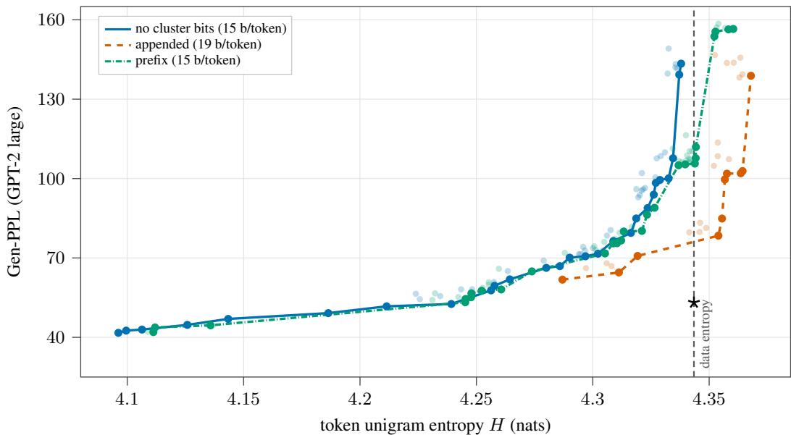  
Figure 7: For H-CoBit, embedding the cluster index in the bit sequence is cheaper, but it does not pay off. LM1B at 100k steps, GenPPL with respect to sample entropy. Embedding clusters in token bit codes is done via a variable length prefix.

## E.4 TOKEN-CLUSTER AGREEMENT FOR H-COBIT

We study how the information conveyed by the token head and cluster head differs throughout the sampling process in Figure 8. The token-implied cluster corresponds to the most likely cluster after marginalizing token probabilities:

$$
\bar { p } _ { \theta } \big ( x ^ { 2 , i } = c \mid x _ { \sigma } \big ) \ = \ \sum _ { w \in V : \Gamma ( w ) = c } p _ { \theta } \big ( x ^ { 1 , i } = w \mid x _ { \sigma } \big ) , \qquad c \in \{ 1 , \ldots , n \} ,\tag{12}
$$

where $\bar { p } _ { \theta }$ is the cluster distribution implied by the token block alone. For H-CoBit, $p _ { \theta } \big ( x ^ { 1 , i } = w \mid x _ { \sigma } \big )$ is computed via the product of bit probabilities. We compare it with the cluster block’s own prediction $p _ { \theta } ( x ^ { 2 , i } = c \mid \mathbf { x } _ { \sigma } )$

We plot agreement with the final token, that is the percentage of end-of-sampling tokens that are already inferred at a given sampling step.

We observe that the cluster head adds information on the token-implied cluster; its agreement with the final generated sample is consistently higher throughout sampling (except for very early steps). This shows that the cluster modality carries additional information and is therefore not purely redundant with the tokens.

## E.5 PER-MODALITY SAMPLING EVALUATION OF H-COBIT

Table 13 provides a comprehensive evaluation of per-modality sampling for H-CoBit. As detailed in Section 5.3, we test adjusting global noise $s _ { \mathrm { n o i s e } }$ , the churn window $\bar { \mathcal W }$ (early or late noise half), and the churn level γ per-modality. Per-modality sampling adjustments allow multiple degrees of freedom. On our main benchmark, GenPPL at dataset entropy, they allow substantial gains compared to the baseline.

## F GENERATION EXAMPLES

In this section, we show examples of unconditional text generation of our best performing models on LM1B and OWT. We report text sequences corresponding to the hyperparameters that yield the best GenPPL at dataset entropy.

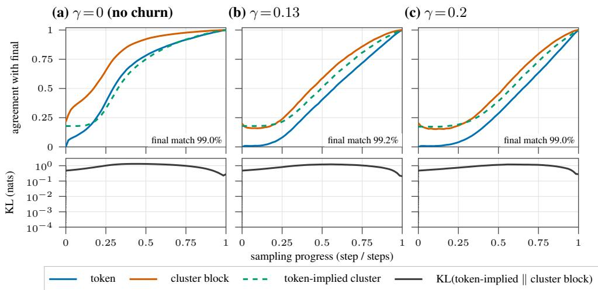  
Figure 8: Token/cluster agreement during sampling, H-CoBit (LM1B, n=16, 600k steps; NFE 128, 256 samples). Top: share of positions whose current argmax already equals the final sample, for the token, the cluster block, and the cluster implied by the token block $\scriptstyle ( \sum _ { x ^ { 1 } , \Gamma ( x ^ { 1 } ) = c } p ( x ^ { 1 } ) )$ . Bottom: Kullback-Leibler divergence between the token-implied cluster distribution and the cluster block.

Table 13: Every multimodal-churn arm on both datasets for H-CoBit. ∆Gen-PPL: the mean % change against the control at matched entropy over the interval both arms’ envelopes cover (negative is better; – where they share none). Bold is best. Magnitude alone has no effect, it must be combined with late churning to yield improvements.
<table><tr><td colspan="2">Gen-PPL</td><td rowspan="2"></td><td colspan="4">∆ vs. control (%) at NFE</td></tr><tr><td></td><td> $\ @ H _ { \mathrm { d a t a } } \left( \mathbf { N F E } \right)$ </td><td>H reach</td><td>64 128</td><td>256</td><td>512</td></tr><tr><td colspan="7">LM1B: n=16, 600k steps,  $\lambda _ { 2 } { = } 4 / 1 5 , H _ { \mathrm { d a t a } } = 4 . 3 4$ </td></tr><tr><td>control (shared churn)</td><td>57.3 (256)</td><td>4.356</td><td>0</td><td>0</td><td>0</td><td>0</td></tr><tr><td colspan="7">Cluster-churn magnitude  $\gamma _ { 2 }$ </td></tr><tr><td> $\gamma _ { 2 } { = } 0 \ ( \mathrm { f r o z e n } )$ </td><td>57.8 (512)</td><td>4.356</td><td>-1.5</td><td>+8.2</td><td>+4.7</td><td>-2.0</td></tr><tr><td> $\gamma _ { 2 } { = } 0 . 1$ </td><td>59.7 (256)</td><td>4.357</td><td>-3.5</td><td>+0.9</td><td>-0.8</td><td>-1.1</td></tr><tr><td> $\gamma _ { 2 } { = } 0 . 2$ </td><td>58.1 (256)</td><td>4.350</td><td>-2.9</td><td>-2.1</td><td>-0.1</td><td>+2.0</td></tr><tr><td colspan="7">Cluster-churn window (phase)</td></tr><tr><td>early,  $q \in [ 0 . 5 , 1 ]$ </td><td>62.3 (256)</td><td>4.357</td><td>+5.2</td><td>+3.3</td><td>+4.4</td><td>+7.1</td></tr><tr><td>late,  $q \in [ 0 , 0 . 5 ]$ </td><td>51.6 (512)</td><td>4.365</td><td>-4.2</td><td>+3.7</td><td>-1.1</td><td>1</td></tr><tr><td>late,  $\gamma _ { 2 } { = } 0 . 3$ </td><td>51.5 (512)</td><td>4.364</td><td>-4.4</td><td>-0.1</td><td>-2.5</td><td>一</td></tr><tr><td>late,  $\gamma _ { 2 } { = } 0 . 4$ </td><td>49.4 (512)</td><td>4.361</td><td>-0.8</td><td></td><td>-4.8</td><td>一</td></tr><tr><td colspan="7">Compositions</td></tr><tr><td>late  $\gamma _ { 2 } { = } 0 . 3 + s _ { \mathrm { n o i s e } } { = } 1 . 0 5$ </td><td>56.3 (1024)</td><td>4.407</td><td></td><td>1</td><td></td><td>1</td></tr><tr><td>late  $\gamma _ { 2 } { = } 0 . 4 + s _ { \mathrm { n o i s e } } { = } 1 . 0 5$ </td><td>57.9 (1024)</td><td>4.408</td><td>一</td><td>一</td><td></td><td>一</td></tr><tr><td colspan="7">OpenWebText:  $\scriptstyle n = 1 6 , 7 5 { \mathbf { 0 k } }$  steps,  $\lambda _ { 2 } { = } 0 . 1 , H _ { \mathrm { d a t a } } = 5 . 4 6$ </td></tr><tr><td>control (shared churn)</td><td>67.8 (128)</td><td>5.645</td><td>0</td><td>0</td><td>0</td><td>0</td></tr><tr><td>Cluster-churn magnitude  $\gamma _ { 2 }$  γ2=0 (frozen)</td><td>72.6 (128)</td><td>5.674</td><td>+8.6</td><td>-0.3</td><td></td><td></td></tr><tr><td colspan="7">Cluster-churn window (phase)</td></tr><tr><td>late, γ2=0.3</td><td>69.2 (128)</td><td>5.649</td><td>+3.6</td><td>-4.1</td><td></td><td>一</td></tr><tr><td colspan="7">Global noise scale  $S _ { \mathrm { n o i s e } }$  (both modalities)</td></tr><tr><td> $s _ { \mathrm { n o i s e } } { = } 1 . 0 2$ </td><td>71.9 (128)</td><td>5.659</td><td>-5.5</td><td>-3.3</td><td>+6.2</td><td>+1.9</td></tr><tr><td> $s _ { \mathrm { n o i s e } } { = } 1 . 0 5$ </td><td>80.0 (128)</td><td>5.709</td><td>-10.7</td><td>-1.1</td><td>+14.5</td><td>+6.8</td></tr><tr><td> $s _ { \mathrm { n o i s e } } { = } 1 . 1 0$ </td><td></td><td>5.755</td><td>-13.6</td><td>+6.3</td><td></td><td>一</td></tr><tr><td colspan="7">Compositions</td></tr><tr><td>late  $\gamma _ { 2 } { = } 0 . 3 + s _ { \mathrm { n o i s e } } { = } 1 . 0 5$ </td><td>50.4 (256)</td><td>5.711</td><td>-8.1</td><td>-15.4</td><td></td><td></td></tr></table>

## Sample 1

genPPL 49.3

. [SEP] toll free : ( 212 ) 623 - 3228. [SEP] howard hit. 200 with 83 homers and 105 rbis all season. [SEP] caracas, venezuela ( cnn ) - - venezuela ’ s president says venezuelan president hugo chavez and his venezuelan counterpart are ready to work closely with venezuelan president hugo chavez to bolster the island ’ s most populous nation. [SEP] how far has it been going? 1 the big question : how does the pharmaceutical industry affect our health? [SEP] gov. tim kaine is expected to deliver his acceptance speech to the national academy of sciences as he prepares to recreate a global scam that could affect millions of

## Sample 2

genPPL 49.2

in the closing stages. [SEP] " legitimate insomnia could have a negative effect on developing this efficient derivatives, " he said. [SEP] notwithstanding - goers at dumfries and galloway borough council were arrested following the incident and are being questioned by shropshire police. [SEP] it was last updated at 22. 49 gmt on sunday 17 may 2009. oxford city council. london borough of hackney, hackney. £37, 779 - £32, brewers pa inclusive. london borough of hackney. east london. £33, zaragoza - £27, 258 per annum. london borough of hackney. hackney. £34, 456 - £3

## Sample 3

genPPL 49.2

called on freddie mac and fannie mae financier freddie mac to regain the government ’ s 50 percent stake in fannie mae. [SEP] three men, all from bangor, have been arrested in connection with alleged sexual sex and are due to appear before preston magistrates ’ court. [SEP] tracy mcgrady, the scrum - half chief executive, made a full recovery after saturday ’ s clash with fulham. [SEP] for many exporters, beijing has been hailed as a scapegoat for exports. [SEP] johnson was unveiling by mr clegg ’ s resignation today after the party decided not to address parliament. [SEP] kirchner

Figure 9: Unconditional samples from H-CoBit (n=16 clusters) with per-modality churn on LM1B (600k steps; late churn window, $\gamma _ { 2 } = 0 . 4 )$ , the generation the “H-CoBit + PMS” row of the main table (Table 1) reports at the corpus entropy: NFE 512, γ=0.3, H=4.34 (data 4.34), genPPL 49.4 under GPT-2-large (data 53.1). The 3 samples shown are those of the 1024 generated at this setting whose own per-sample genPPL is closest to that batch-level number. Each sample is 128 model tokens, shown in full.

## G LIMITATIONS AND EXTENSIONS

## G.1 LIMITATIONS

We study the simplest instantiation of H-CDLM, which uses a single auxiliary modality obtained from a fixed clustering of pretrained token embeddings. First, we consider only one level of granularity. Richer hierarchies spanning multiple levels, from fine-grained clusters to broad semantic categories, are a natural extension that our framework supports but that we leave unexplored. Second, our cluster assignments are fixed before training. Learning them jointly with the model could yield groupings better suited to denoising, at the cost of additional training complexity. Finally, our experiments are limited to relatively small models, reflecting the computational resources available in an academic setting. As for diffusion language models more broadly, whether these gains persist at larger scales remains to be established.

## G.2 EXTENSIONS

Cluster guidance. The high-level channel provides a natural handle for guidance: as in multimodal image diffusion (Baade et al., 2026), classifier-free guidance can be applied on the cluster modality to strengthen semantic coherence. We leave this to future work.

  
Figure 10: Unconditional samples from H-CoBit (n=16 clusters) with per-modality churn on OpenWebText (750k steps; late churn window + global $s _ { \mathrm { n o i s e } } = 1 . 0 5 )$ , the generation the “H-CoBit + PMS” row of the main table (Table 1) reports at the corpus entropy: NFE 256, γ=0.25, H=5.46 (data 5.46), genPPL 50.4 under GPT-2-large (data 14.9). The 3 samples shown are those of the 1024 generated at this setting whose own per-sample genPPL is closest to that batch-level number. Each sample is 1024 model tokens; the first 1200 characters are shown and [. . .] marks the cut.