# Decision-Focused Learning in MDPs: An Occupancy Measure Approach

Zihao Zhao<sup>1∗</sup> Ashwath K. Karunakaram<sup>1</sup> Ali Eshragh<sup>2,3†</sup> Yuexing Li<sup>2†</sup> Kai Wang<sup>1†</sup>

<sup>1</sup>Georgia Institute of Technology, Atlanta, GA <sup>2</sup>Johns Hopkins Carey Business School, Washington, DC <sup>3</sup>International Computer Science Institute, Berkeley, CA

## Abstract

In this work, we consider decision-focused learning (DFL) for a Markov decision process (MDP), where existing methods differentiate through the KKT conditions of the Bellman equation and require solving a linear system over all state-action pairs, limiting its scalability. We address this by reformulating the MDP as an occupancy measure-based linear program (LP), whose feasible region is induced by predicted dynamics, and we derive a closed-form gradient by identifying the active constraints in the feasible polyhedron via the pivoting algorithm. This occupancy measure-based LP layer raises two challenges: (1) LP’s solution gradient is discontinuous when active constraints change, and (2) the LP backward cost still scales with the state size, which is costly for large or continuous state spaces. We address the challenges with an augmented Lagrangian surrogate and smooth the boundary jumps by random row sketching of the constraints, and a learnable soft state-aggregation layer and its function-approximation generalization that scales the LP to large finite and continuous-state MDPs. Across multiple tasks, our methods reach lower regret than KKT-based DFL and two-stage baselines with significantly lower computation cost. The source code for all experiments is available here.

## 1 Introduction

Many sequential decision-making problems require solving an optimization problem whose parameters are unknown in advance and must be predicted from contextual data, e.g., inventory control under uncertain demand [2]. Standard two-stage pipelines train a predictive model to minimize forecast error and then feed the predictions into a downstream optimizer. However, minimizing prediction error does not necessarily optimize downstream decision quality [17, 30]. Decision-focused learning (DFL) addresses this mismatch by training the predictive model end-to-end, backpropagating decision-quality gradients through the optimization layer [30].

When the downstream problem is a Markov decision process (MDP), the optimization solves the Bellman optimality equation from predicted rewards and transition probabilities [48, 21]. Existing DFL methods for MDPs typically differentiate through the Karush–Kuhn–Tucker (KKT) conditions of Bellman optimality, viewing the policy as the solution of a nonlinear system [48]. This entails solving a linear system of dimension |S||A|, which is prohibitive for large state or action spaces. The Bellman operator’s nonlinearity can also make this system poorly conditioned, especially as the discount factor approaches one. These issues limit the scalability of KKT-based DFL methods.

In this work, we propose an occupancy-measure LP layer that overcomes both limitations by exploiting the linear programming (LP) formulation of MDPs over occupancy measures, whose feasible region depends on the predicted dynamics. The LP has two key advantages. First, under a strictly positive initial distribution, the occupancy LP is non-degenerate, yielding a well-defined optimal basis and avoiding KKT conditioning issues. Second, differentiating through the LP layer requires inverting only a single $| S | \times | S |$ basis matrix, giving a closed-form, well-conditioned gradient and substantially lower cost, especially when |A| is large.

However, directly using the uncertain feasible region LP reformulation faces two practical challenges. (a) Biased loss minimum. Standard constrained-DFL settings typically predict only objective coefficients, whereas in MDPs, predicted parameters enter both the LP objective through rewards and the constraints through transitions. Thus, the predicted occupancy is feasible only under the predicted dynamics and generally violates the true flow constraints. Using the biased occupancy in the training loss shifts the loss minimum away from the true parameter, leading the predictor toward a biased target. (b) Gradient discontinuity. Changes in the optimal basis can cause sudden jumps in the loss and its gradients, which makes gradient-based training unstable [32, 6, 17]. To address (a), we introduce an augmented Lagrangian surrogate that adds both a linear dual correction and a quadratic penalty on the true-dynamics constraint to the training loss. With an optimal dual solution of the true LP, we prove that the true parameter is a global minimizer of this surrogate. To address (b), we apply random row sketching to the flow constraints and average the resulting LP solutions. Different sketches can select different bases, and averaging empirically reduces abrupt gradient changes near basis boundaries.

The $| S | \times | S |$ cost, however, is still costly when the state space is large or continuous. To further scale up, we introduce a soft state-aggregation layer that uses a learned softmax membership matrix to compress the $| S | \times | S |$ system to $\bar { M } \times M$ with $M \ll | S$ |. We extend the same construction to continuous-state MDPs via function approximation. Table 1 compares the resulting computational cost with the prior KKT approach [48].

Table 1: Comparison of computational complexity between the KKT approach, our LP approach, and our soft state-aggregation extension. Here M denotes the number of aggregated states with M $\ll | S |$ and ω $< 2 . 3 7 3$ denotes the matrix multiplication exponent.
<table><tr><td rowspan=1 colspan=1>Metric</td><td rowspan=1 colspan=1>KKT</td><td rowspan=1 colspan=1>LP (ours)</td><td rowspan=1 colspan=1>LP + State Agg (ours)</td></tr><tr><td rowspan=1 colspan=1>Core Matrix to InvertMatrix DimensionInversion Complexity</td><td rowspan=1 colspan=1>KKT System $( [ 4 8 ] , \mathrm { E q . } ( 7 ) )$  $| S | | A | \times | S | | A |$  $\dot { \mathcal { O } } ( ( | \dot { S } | | \dot { A } | ) ^ { \dot { \omega } } )$ </td><td rowspan=1 colspan=1>Optimal Basis $\overline { { H _ { \theta } ^ { B } } }$  $| S | \times | S |$  $\operatorname { \mathcal { O } } ( | S | ^ { \omega } )$ </td><td rowspan=1 colspan=1>Aggregated Basis $\overline { { \hat { H } _ { \theta } ^ { B } } }$  $M \times M$  $\mathcal { O } ( M ^ { \omega } )$ </td></tr></table>

Our contributions can be summarized as follows:

• We propose a novel occupancy-measure LP layer as a differentiable MDP layer with a closedform, well-conditioned gradient requiring inversion of a $| S | \times | S |$ basis matrix.

• We introduce an augmented Lagrangian DFL surrogate that augments the regret objective, with a global optimum guarantee, and employ random row sketching to empirically reduce sensitivity to basis changes.

• We extend the LP layer to larger finite and continuous-state MDPs via learnable soft state aggregation and function approximation, and show competitive decision quality with lower training cost than the multiple baselines across three tasks

## 2 Related Work

Differentiable Optimization and Decision-Focused Learning. DFL trains a predictive model end-to-end with a downstream optimization layer so that the performance is measured by decision regret rather than parameter accuracy [17, 50, 16, 30]. The main challenge in DFL is differentiating through an argmin, which motivates many novel approaches, including implicit differentiation of KKT systems [16, 5]; perturbation-, smoothing-, and interior-point-based relaxations of linear and combinatorial solvers [49, 6, 37, 29, 35, 15]; surrogate losses with informative subgradients [17, 20, 34, 30, 45, 32]; and learned task-aligned losses [41, 27, 28].

The closest line of work to ours considers DFL when uncertain parameters enter the constraints of the downstream optimization problem [24, 23, 31, 26, 47, 12]. These methods mainly focus on solving the issue that mispredicted constraints can make the true optimum infeasible and address this by post-hoc correction functions, feasibility-aware penalty losses, robust contextual uncertainty sets, or constraint-enforcing neural approximations. Their settings are often mixed-integer programs or contextual stochastic LPs without a sequential structure. In contrast, our setting is the occupancymeasure linear program of an MDP, in which a single prediction determines both the objective and constraints simultaneously through a predicted MDP and leads to a coupled sensitivity that prior constrained-DFL works do not have. To handle the predicted dynamics mismatch, we train the predictive model with an augmented Lagrangian surrogate that combines the downstream value under the true dynamics with a linear dual correction and a quadratic penalty on flow-constraint violation.

State Aggregation in Markov Decision Processes. State aggregation reduces the dimensionality of large MDPs by collapsing groups of states into abstract representations and is a classical tool in approximate dynamic programming and reinforcement learning [9]. Prior approaches include homomorphism-based aggregation [40], projection-based methods on a reduced basis [13], deep representation-learning [22], and learnable soft aggregation with probabilistic membership [42, 53]. We refer readers to Section C for a detailed review. These methods, however, operate on a fixed MDP. We instead differentiate a learnable state-aggregation layer end-to-end through a predicted MDP, connecting representation learning with decision-focused learning.

## 3 Problem Statement

We consider an end-to-end discounted MDP $( S , \mathcal { A } , P _ { \theta } , r _ { \theta } , \beta , \gamma )$ with the state space $s ,$ the action space ${ \mathcal { A } } ,$ the discount factor $\beta \in [ 0 , 1 )$ over an infinite horizon, and the initial state distribution $\gamma \in \mathbb { R } ^ { | s | }$ satisfying $\gamma ( s ) > 0$ for all $s \in S$ . The transition kernel $P _ { \theta } ( s ^ { \prime } \mid s , a )$ gives the probability of moving to state $s ^ { \prime }$ from state s under action $^ { a , }$ and $r _ { \theta } ( s , a )$ denotes the immediate reward in state s when action a is taken. Both the reward function and the transition kernel may depend on a parameter vector $\boldsymbol \theta \in \mathbb { R } ^ { n }$ . We assume access to a training set $\{ x _ { i } , \theta _ { i } ^ { * } \} _ { i = } ^ { N }$ in which each point $x _ { i }$ is paired with a true MDP parameter $\theta _ { i } ^ { * }$ . Thus, the true reward $r _ { \mathrm { t r u e } } : = r _ { \theta } { \mathrm { : } }$ ∗ and the true transition kernel $P _ { \mathrm { t r u e } } : = P _ { \theta } { * }$ ∗ are observed for every training instance and can be used to evaluate the regret. At inference time, only the input x is available.

Occupancy-measure LP The discounted state-action occupancy measure $y \in \mathbb { R } ^ { | S | | A | }$ is defined as $\begin{array} { r } { y ( \bar { s } , a ) = \sum _ { t = 0 } ^ { \infty } \beta ^ { t } \operatorname* { P r } ( s _ { t } = s , a _ { t } = a ) } \end{array}$ , the expected discounted frequency of visiting state s and taking action a over the infinite horizon [18, 19]. It is well-known that solving MDPs can be equivalently written as solving the following LP [33, 39]:

$$
y _ { \theta } ^ { * } = \arg \operatorname* { m a x } _ { y \ge 0 } r _ { \theta } ^ { \top } y \quad \mathrm { s . t . } \quad H _ { \theta } y = \gamma .\tag{LP-1}
$$

Here $H _ { \theta } \in \mathbb { R } ^ { | S | \times | S | | A | }$ is the flow constraint matrix with entries $[ H _ { \theta } ] _ { s , ( s ^ { \prime } , a ^ { \prime } ) } : = \delta _ { s , s ^ { \prime } } - \beta P _ { \theta } ( s \mid s ^ { \prime } , a ^ { \prime } )$ where $\delta _ { s , s ^ { \prime } }$ is the Kronecker delta, $\mathrm { i . e . , } \delta _ { s , s ^ { \prime } } = 1 \mathrm { i f } s = s ^ { \prime }$ , and 0 otherwise. The optimal policy can be recovered from $y _ { \theta } ^ { * }$ by $\begin{array} { r } { \pi _ { \theta } ^ { * } ( a | s ) = y _ { \theta } ^ { * } ( s , a ) / \sum _ { a ^ { \prime } \in \mathcal { A } } y _ { \theta } ^ { * } ( s , a ^ { \prime } ) } \end{array}$

In this paper, we focus on the DFL framework, where the goal is to learn a predictive model $m _ { w } ( x )$ parameterized by weights $w .$ , that maps input features x to predicted MDP parameters $\theta ,$ in order to maximize the value (cumulative reward) under the true parameters.

End-to-end learning objective A standard two-stage pipeline trains $m _ { w }$ to minimize the prediction error between θ and the ground-truth $\theta ^ { * }$ using the loss $\| \dot { m } _ { w } ( x ) - \theta ^ { * } \| _ { 2 } ^ { 2 }$ , and solves the MDP at the inference time. This pipeline ignores how prediction error translates into decision quality. On the other hand, DFL trains $m _ { w }$ directly to maximize the quality of the resulting policy. The training objective of DFL can be written as a regret form:

$$
\operatorname* { m i n } _ { w } L ( w ) : = r _ { \mathrm { t r u e } } ^ { \top } y _ { \mathrm { t r u e } } ^ { * } - r _ { \mathrm { t r u e } } ^ { \top } y _ { \theta } ^ { * } ,\tag{1}
$$

where $y _ { \mathrm { t r u e } } ^ { * }$ denotes the occupancy measure under the true MDP $\theta ^ { * 3 }$ . The first term is constant in $w ,$ so optimizing $\mathrm { E q . } ( 1 )$ reduces to maximizing the value of the predicted policy $\hat { \pi } ^ { * }$ . By chain rule, we can write the gradient of $L ( w )$ as:

$$
\frac { d L } { d w } = - r _ { \mathrm { t r u e } } ^ { \top } \frac { d y _ { \theta } ^ { * } } { d \theta } \frac { d \theta } { d w } .\tag{2}
$$

The predictor Jacobian $d \theta / d w$ is available through automatic differentiation; the remaining challenges concern the LP layer and its training objective.

Why objective-only LP methods do not directly apply. With fixed constraints, the optimal vertices are fixed. However, in our setting, the optimal vertices can move along with the parameter changes. Thus, previous smoothing methods derived for objective perturbations over a fixed feasible region therefore require additional analysis in our setting.

(C1) Bias and gradient discontinuity of the LP layer. (a) The predicted occupancy may violate the true flow constraints, so improving its true-reward score need not improve the policy’s true return. The loss minimum can therefore shift away from the true parameter. (b) Basis changes can cause sudden jumps in the loss or its gradient. We address (a) with an augmented Lagrangian surrogate and (b) with random row sketching and solution averaging in Section 4.2.

(C2) Computation cost of differentiating through the MDP. Existing DFL methods differentiate through the KKT condition of the Bellman equation, treating the optimal policy as the solution of a nonlinear system. This involves inverting a matrix of dimension $| \bar { S } | | \mathcal { A } | \setminus | S | | \bar { \mathcal { A } } | [ 4 8 , 5 ]$ . This cost grows quickly with the action space and is the main obstacle to scaling DFL beyond small MDPs. We address this in Section 4.1 by deriving a closed-form LP-layer Jacobian whose main cost is solving an $| S | \times | S$ | linear system, and we further compress this to an $M \times M$ system $( M \ll | S | )$ via soft state aggregation in Section 5.

## 4 Differentiable MDP via Occupancy Measure LP

We now show how to differentiate through the occupancy measure LP. This replaces the nonlinear Bellman equation with linear constraints, and the resulting gradient depends only on a small basis matrix. Then, we will address the bias and gradient discontinuity challenges mentioned above.

## 4.1 Closed-form Gradient of the LP Layer

Differentiating $y _ { \theta } ^ { * }$ requires the optimal basis to be both unique and locally constant in $\theta ^ { 4 }$ . When the $\gamma ( s ) > 0$ for all s, every basis feasible solution is non-degenerate [4, 39]. Thus, the positive entries of the selected solution uniquely determine an invertible basis matrix $H _ { \theta } ^ { B } \in \mathbb { R } ^ { | S | \times | S | }$ . We further assume this basis is locally stable, so small perturbations in $\theta$ do not change the selected basis. Under this assumption, the gradient derived below is exact within each basis region.

In order to compute the Jacobian $d y _ { \theta } ^ { * } / d \theta$ , we exploit the relationship between $y _ { \theta } ^ { * }$ and θ defined by the linear constraints. Assume that the initial distribution γ is independent of $\theta ,$ and therefore

$$
\frac { \partial H _ { \theta } } { \partial \theta } y _ { \theta } ^ { \ast } + H _ { \theta } \frac { d y _ { \theta } ^ { \ast } } { d \theta } = 0 .
$$

Partitioning $y _ { \theta } ^ { * } ~ = ~ ( y _ { \theta } ^ { B } , y _ { \theta } ^ { N } )$ and $H _ { \theta } \ = \ ( H _ { \theta } ^ { B } , H _ { \theta } ^ { N } )$ into basic and non-basic components, nondegeneracy implies that $y _ { \theta } ^ { B } \in \mathbb { R } ^ { | S | } , y _ { \theta } ^ { N } = 0$ with $\dot { H } _ { \theta } ^ { B } \in \mathbb { R } ^ { | S | \times | S | }$ invertible. Under the fixed basis assumption, we establish

$$
\frac { d y _ { \theta } ^ { B } } { d \theta } = - \left( H _ { \theta } ^ { B } \right) ^ { - 1 } \left( \frac { \partial H _ { \theta } ^ { B } } { \partial \theta } y _ { \theta } ^ { B } \right) .\tag{3}
$$

Applying the chain rule to the LP-layer Jacobian in Eq. (3) yields the gradient of any downstream loss $L$ that depends on $\theta$ only through $y _ { \theta } ^ { * }$

$$
\frac { d L } { d \theta } = - \left( \nabla _ { y _ { \theta } ^ { B } } L \right) ^ { \top } \left( H _ { \theta } ^ { B } \right) ^ { - 1 } \left( \frac { \partial H _ { \theta } ^ { B } } { \partial \theta } y _ { \theta } ^ { B } \right) .\tag{4}
$$

Differentiating through LPs is challenging for prior KKT-based DFL work because the LP solution has zero gradient. Specifically, when $\theta$ enters only the LP objective, $y _ { \theta } ^ { * }$ does not depend on θ within a fixed basis region, so $d y _ { \theta } ^ { * } / \dot { d } \theta \equiv 0$ and KKT differentiation provides no learning signal. Common remedies use surrogates such as quadratic regularization on the objective, which distorts the optimum and increases per-step cost. In our occupancy-measure formulation $\theta$ enters both the objective and the flow constraints $H _ { \theta }$ , and the constraint Jacobian $\partial H _ { \theta } ^ { B } / \partial \theta$ is generically non-zero. Thus, Eq. (4) gives a non-zero closed-form gradient, which makes directly differentiating through the LP possible.

## 4.2 DFL Training Loss

Although the LP helps us compute a closed-form gradient, it also induces some issues. Specifically, the original DFL objective $( r _ { \mathrm { t r u e } } ^ { \top ^ { \star } } y _ { \theta } ^ { * } )$ ) can be biased. Since the predicted occupancy $y _ { \theta } ^ { * }$ is feasible only under the predicted dynamics $H _ { \theta }$ , it generically violates the true flow constraints $H _ { \mathrm { t r u e } } .$ and can therefore score higher on $r _ { \mathrm { t r u e } } ^ { \top } y$ than any truly $\dot { H _ { \mathrm { t r u e } } } .$ -feasible occupancy. Minimizing $- r _ { \mathrm { t r u e } } ^ { \top } y _ { \theta } ^ { \ast }$ over θ thus need not recover $\theta _ { \mathrm { t r u e } } ,$ as shown in Figure 1 (1).

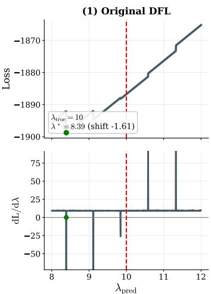

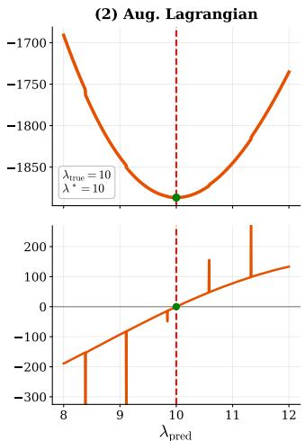

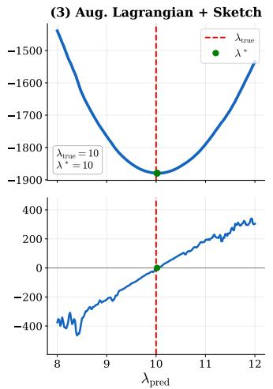  
Figure 1: Loss (top) and gradient (bottom) of three DFL objectives as $\lambda _ { \mathrm { p r e d } }$ varies; red dashed indicate $\lambda _ { \mathrm { t r u e } }$ and green dots indicate the loss minimum. (1) The occupancy proxy has a shifted minimum. (2) The augmented Lagrangian has a minimum at the true parameter. (3) Sketch averaging empirically reduces boundary sensitivity.

We address these issues with an augmented Lagrangian surrogate that combines a decision-quality term with a linear dual term and a weighted feasibility penalty:

$$
\begin{array} { r } { L ( y _ { \theta } ^ { * } ) : = - r _ { \mathrm { t r u e } } ^ { \top } y _ { \theta } ^ { * } + ( H _ { \mathrm { t r u e } } y _ { \theta } ^ { * } - \gamma ) ^ { \top } \nu ^ { * } + \rho \| H _ { \mathrm { t r u e } } y _ { \theta } ^ { * } - \gamma \| ^ { 2 } , } \end{array}\tag{5}
$$

where $\nu ^ { * }$ is an optimal dual solution of the true LP. Note that no additional optimization is required, because training already solves the true LP, and standard LP solvers return the primal and dual solutions together.

Proposition 4.1. Let $y _ { \mathrm { t r u e } } ^ { * }$ be the optimal occupancyfor the true MDP and $\nu ^ { * }$ be its optimal dual. For any penalty $\rho > 0 , E q .$ (5) satisfies $L ( y _ { \theta } ^ { * } ) \dot { - } L ( y _ { \mathrm { t r u e } } ^ { * } ) \ge 0$ for every predicted parameter $\theta ,$ with equality iff y<sup>∗</sup> is optimal for the true LP. In particular, $\theta = \theta ^ { * }$ is a global minimizer.

See Appendix A.3 for proof. The surrogate evaluates the predicted occupancy $y _ { \theta } ^ { * }$ under the true reward, while the dual and quadratic terms penalize violations of the true flow constraints. The quadratic penalty additionally strengthens the gradient as $y _ { \theta } ^ { * }$ moves farther from the true-feasible set, which provides a stronger correction than linear regret (Figure 1 (2)). However, the loss remains discontinuous at basis boundaries. We therefore apply our sketch-and-solve smoothing method to obtain informative gradients across these transitions, which empirically reduces these jumps.

Sketch-and-solve Classic perturbation-based smoothing for nonsmooth LPs [6] adds noise to the objective coefficients so that the random optimum spreads across vertices. Here we instead randomize the constraints, whose coefficients also depend on the predicted parameters. We then add randomness on the constraints through random row sketching [51, 36] of $H _ { \theta }$ and averaging the resulting LP solutions across sketches. The key idea is that the average solution $\bar { y } _ { \theta } ^ { * }$ moves off a single vertex and empirically makes the gradient less sensitive to basis changes.

Specifically, at each forward pass, we draw $K$ independent Gaussian sketches ${ \cal S } ^ { ( 1 ) } , \ldots , { \cal S } ^ { ( K ) } \in$ $\mathbb { R } ^ { k \times | \boldsymbol { s } | }$ with $k = \alpha | \boldsymbol { S } |$ rows, where $\alpha \in ( 0 , 1 ]$ ] is the row-keep ratio. To keep the Euclidean geometry, we draw $S ^ { ( i ) }$ with i.i.d. entries $S _ { a b } ^ { ( i ) } \sim \mathcal { N } ( 0 , 1 / k )$ . Because $S ^ { ( i ) } H _ { \theta }$ has fewer rows than $H _ { \theta }$ , the sketched feasible set is larger than the original and may contain unbounded directions, which can make the sketched LP unbounded. We avoid this issue by keeping the mass-conservation identity $\mathbf { 1 } ^ { \top } y = 1 / ( 1 - \beta )$ , which follows from summing all rows of $H _ { \theta } y = \gamma$ , as an extra constraint. For each sketch $S ^ { ( i ) }$ , we solve the sketched $L P$

$$
{ y _ { \theta } ^ { * } } ^ { ( i ) } = \arg \operatorname* { m a x } _ { y \ge 0 } r _ { \theta } ^ { \top } y \quad \mathrm { s . t . } \quad S ^ { ( i ) } H _ { \theta } y = S ^ { ( i ) } \gamma , \quad { \bf 1 } ^ { \top } y = \frac { 1 } { 1 - \beta } \quad ( k < | S | )\tag{6}
$$

using our differentiable LP layer.For $k = | S |$ , the Gaussian sketch is invertible almost surely and the redundant mass row is omitted. We average the solutions, $\begin{array} { r } { \bar { y } _ { \theta } ^ { * } = K ^ { - 1 } \sum _ { i } { y _ { \theta } ^ { * } } ^ { ( i ) } } \end{array}$ . On regions where all selected bases are stable, $d \bar { y } _ { \theta } ^ { * } / d \theta = K ^ { - 1 } \sum _ { i } { d y _ { \theta } ^ { * ( i ) } } / d \theta$ . The average need not satisfy the original flow constraints, and finite averaging does not guarantee smoothness. The preceding true-parameter minimum guarantee therefore does not automatically extend to this sketched loss. Sketching is used during training; inference uses the unsketched predicted problem.

## 5 State Aggregation

In the occupancy-measure LP, the basis matrix has dimension $| S | \times | S |$ compared to the KKT-based DFL method’s ${ \dot { | S | } } | A | \times | S | | A |$ , so the gradient computation reduces to inverting a much smaller matrix when the action space is large. However, it remains the bottleneck when the state space is large or continuous. We address this with a soft state-aggregation layer that is trained jointly with the predictor and extended to the general state MDPs through linear function approximation.

Operator form of the occupancy LP Let S be a measurable state space (finite or continuous) with initial distribution γ and transition kernel $P _ { \theta }$ . The discounted occupancy $y : S \times A \to \mathbb { R } _ { \geq 0 }$ satisfies the (possibly infinite-dimensional) LP

$$
\operatorname* { m a x } _ { y \geq 0 } \int r _ { \theta } ( s , a ) y ( s , a ) d s d a \quad \mathrm { s . t . } \quad \int y ( s , a ) d a - \beta \int P _ { \theta } ( s | s ^ { \prime } , a ^ { \prime } ) y ( s ^ { \prime } , a ^ { \prime } ) d s ^ { \prime } d a ^ { \prime } = \gamma ( s ) , \forall s \in \mathcal { S } ,
$$

where the integrals collapse to sums in the finite case. We abbreviate the flow constraint as $H _ { \theta } y = \gamma$ below, with the flow operator $H _ { \theta }$ taking $y : \mathcal { S } \times \mathcal { A } $ R to the function on $s$ above. This generalizes the flow constraint to the continuous setting.

We approximate the occupancy by a finite expansion in $d$ state-action occupancy features $\Phi : =$ $[ \phi _ { 1 } , \dots , \phi _ { d } ] : \mathcal { S } \times \mathcal { A } \to \hat { \mathbb { R } } ^ { d }$ , and project the flow constraint, which lives in $s ,$ onto m state-side constraint features $\Psi : = [ \psi _ { 1 } , \ldots , \hat { \psi } _ { m } ] : S \to \mathbb { R } ^ { m }$

$$
y _ { w } ( s , a ) = \Phi ( s , a ) ^ { \top } w = \sum _ { j = 1 } ^ { d } w _ { j } \phi _ { j } ( s , a ) , \qquad \Psi ^ { \top } ( H _ { \theta } \Phi w - \gamma ) = 0 .
$$

If the occupancy features $\phi _ { j }$ are non-negative, then $w \geq 0$ enforces $y _ { w } \geq 0$ , and we obtain the projected LP

$$
\operatorname* { m a x } _ { \boldsymbol { w } \geq 0 } \quad ( \boldsymbol { \Phi } ^ { \top } \boldsymbol { r } _ { \boldsymbol { \theta } } ) ^ { \top } \boldsymbol { w } \quad \mathrm { s . t . } \quad \boldsymbol { \Psi } ^ { \top } H _ { \boldsymbol { \theta } } \boldsymbol { \Phi } \boldsymbol { w } = \boldsymbol { \Psi } ^ { \top } \boldsymbol { \gamma } ,\tag{LP-2}
$$

where $\Phi ^ { \top }$ and $\Psi ^ { \top }$ denote inner products over $\mathcal { S } \times \mathcal { A }$ and ${ \mathcal { S } } .$ , respectively. LP-2 has the same form as LP-1 under the substitutions $\begin{array} { r } { r _ { \theta } \to \Phi ^ { \top } r _ { \theta } , H _ { \theta } \to \Psi ^ { \top } H _ { \theta } \hat { \Phi , } \gamma \to \mathbf { \bar { \Psi } } \Psi ^ { \top } \gamma } \end{array}$ , so the closed-form gradient Eq. (4) applies directly: differentiating through LP-2 requires inverting only the m × m optimal-basis submatrix of $\Psi ^ { \top } H _ { \theta } \Phi$ , dropping the per-step gradient cost from $\mathcal { \bar { O } } ( | S | ^ { \omega } )$ to $\mathcal { O } ( m ^ { \omega } )$ with $m \ll | S |$ . To recover an occupancy in the original $( \mathcal { S } , \breve { A } )$ space, we lift the projected solution by $y _ { \mathrm { d i s a g g } } ( s , a ) = \Phi ( s , a ) ^ { \top } w _ { \theta } ^ { * }$ , where $\boldsymbol { w } _ { \boldsymbol { \theta } } ^ { \ast }$ denotes the optimal solution for LP-2. Note that Φ and Ψ are themselves learnable and trained jointly with the predictor by backpropagating through Eq. (4).

## 5.1 Soft State Aggregation for Finite State MDPs

For a finite state space, soft aggregation corresponds to a particular choice of $( \Phi , \Psi )$ derived from a learnable membership matrix $W \in \mathbb { R } ^ { | S | \times M }$ with simplex rows $\begin{array} { r } { ( W \geq 0 , \sum _ { m } W _ { s m } = 1 } \end{array}$ for all s). Soft assignments, in contrast to hard clustering, keep $W$ differentiable so that the aggregation

structure is trained jointly with the predictor. Indexing the occupancy features by $\boldsymbol { j } = ( m , a ^ { \prime } )$ for $m \in [ M ]$ and $a ^ { \prime } \in { \bar { \mathcal { A } } }$ , we set

$$
\phi _ { ( m , a ^ { \prime } ) } ( s , a ) = W _ { s m } { \bf 1 } [ a = a ^ { \prime } ] , \qquad \psi _ { i } ( s ) = W _ { s i } .\tag{7}
$$

Since $W \geq 0 ,$ , non-negative coefficients w yield a non-negative occupancy. However, direct projection does not preserve the standard MDP flow constraints. For soft memberships, we replace $\bar { W } ^ { \top } W$ with diag(µ) to obtain a valid aggregated MDP, giving:

$$
\hat { r } _ { m , a ^ { \prime } } = \frac { \sum _ { s } W _ { s m } r _ { s , a ^ { \prime } } } { \mu _ { m } } , \quad \hat { P } ( n ^ { \prime } | m , a ^ { \prime } ) = \frac { \sum _ { s , s ^ { \prime } } W _ { s m } P ( s ^ { \prime } | s , a ^ { \prime } ) W _ { s ^ { \prime } n ^ { \prime } } } { \mu _ { m } } , \quad \hat { \gamma } _ { m } = \sum _ { s } W _ { s m } \gamma _ { s , s ^ { \prime } } = \frac { \sum _ { s } W _ { s m } \gamma _ { s ^ { \prime } } } { \mu _ { m } } .\tag{8}
$$

with cluster mass $\textstyle \mu _ { m } : = \sum _ { s } W _ { s m }$ and aggregated flow constraint $\hat { H } _ { i , ( m , a ^ { \prime } ) } = \delta _ { i , m } - \beta \hat { P } ( i | m , a ^ { \prime } )$ The projection collapses the $| S | \times | S |$ | basis matrix to an $M \times M$ matrix with $M \ll | S |$ , reducing the per-step gradient cost to $\dot { \mathcal { O } } ( M ^ { \omega } )$ . Given an aggregated solution $\hat { y } ,$ we lift it to the original state space as $\begin{array} { r } { y _ { \mathrm { d i s a g g } } ^ { - } ( s , a ) = \sum _ { m } W _ { s m } w _ { ( m , a ) } ^ { * } } \end{array}$ . See Section A.2 for more discussions.

```tcl
Algorithm 1 Decision-focused learning with state aggregation.
Require: training data D, predictor $m _ { w } ,$ aggregation parameters $W _ { \xi }$ , number of aggregate states M,
step size $\eta ,$ penalty $\rho ,$ number of sketches $\breve { K } .$ , compression ratio α
1: Precompute the optimal true-MDP dual solutions for the training data
2: for $t = { \dot { 1 } } , 2 , \dots$ do
3: Sample $( x , \theta ^ { * } ) \sim { \mathcal { D } } ;$ predict $\theta \gets m _ { w } ( x )$ , construct $r _ { \theta } , P _ { \theta }$
# Reduce the $\dot { L } P$ dimension
4: $( \hat { r } , \hat { P } , \hat { \gamma } ) \gets \mathrm { W }$ EIGHTEDAGGREGATE $( r _ { \theta } , P _ { \theta } , \gamma , W _ { \xi } )$ ▷ Eq. (8)
# Mitigate gradient jumps
5: $\hat { y } ^ { * ( 1 ) } , \ldots , \hat { y } ^ { * ( K ) } \gets \mathrm { S K E T C H A N D S O L V E } ( ( \hat { r } , \hat { P } , \hat { \gamma } ) , K , \alpha )$ ▷ Eq. (6)
6: $\textstyle { \bar { y } } \gets K ^ { - 1 } \sum _ { j = 1 } ^ { K } { \hat { y } } ^ { * ( j ) }$ ▷ average sketched sol.
# Correct loss bias
7: $\ell \gets \mathrm { A U G L A G R A N G I A N W I T H L I F T } ( \bar { y } , W _ { \xi } , \theta ^ { * } , \nu ^ { * } , \rho )$ ▷ Eq. (5)
8: $( g _ { w } , g _ { \xi } ) \gets \mathrm { B A S I S B A C K W A R D } ( \ell )$ ▷ Eq. (3) + autograd
9: $w  w - \eta g _ { w } ; \xi  \xi - \eta g _ { \xi }$
10: end for
11: At inference, solve without sketching, lift the occupancy, and normalize over actions
```

## 5.2 Function Approximation for General State MDPs

For continuous state spaces, we use neural networks [25] to represent occupancy features Φ and test functions Ψ, yielding a finite-dimensional LP. We learn these features by backpropagating through the LP with our basis-based gradient.

The projected LP coefficients involve state-space integrals that generally have no closed form. We estimate them from offline transitions $\{ ( s _ { t } , a _ { t } , r _ { t } , s _ { t + 1 } ) \} _ { t = 1 } ^ { N }$ and initial states $\{ s _ { 0 } ^ { ( k ) } \} _ { k = 1 } ^ { N _ { 0 } }$ drawn from γ. In particular, the transition term is estimated as

$$
( \Psi ^ { \top } P \Phi ) _ { i j } \approx \frac { 1 } { N } \sum _ { t = 1 } ^ { N } \psi _ { i } ( s _ { t + 1 } ) \phi _ { j } ( s _ { t } , a _ { t } ) .
$$

Each transition pairs an occupancy feature at the current state-action pair with a test function at the observed next state. This replaces an expectation over the unknown transition dynamics with a sample average, so no learned transition model is required. The remaining coefficients and sampling convention are given in Section A.1. We train Φ and Ψ by backpropagating through these estimates and the LP using our basis-based gradient.

## 6 Experiments

We evaluate our methods on three tasks that cover both finite and general-state MDPs. For all tasks, we compare the following methods:

• Two-stage: a baseline that trains the predictive model with MSE on the MDP parameters and then solves the MDP at inference; no decision signal is passed back to the predictor.

• DFL-QP: the existing KKT-based DFL gradient [48], obtained by differentiating through a quadratic-programming relaxation of the Bellman optimality conditions, with the QP solved by qpth [5]. The relaxation is realized by adding a quadratic regularizer $\eta \Vert { y } _ { \theta } ^ { * } \Vert ^ { 2 }$ to the LP objective. • DFL-LP: our closed-form gradient (Eq. (4)) derived from the occupancy-measure LP • DFL-LP: our closed-form gradient (Eq. (4)) derived from the occupancy-measure LP.

• DFL-Feas: the feasibility-aware constrained-DFL baseline of Mandi et al. [31], adapted to our occupancy LP, which penalizes violations of the true flow constraints during training.

• DFL-Sketch: DFL-LP augmented with random row sketching and averaging of the flow constraints. This needs to solve multiple instances, but they can be easily parallelized, and each one only uses a small fraction of constraints (e.g., 10%).

• DFL-SA: DFL-Sketch combined with soft state aggregation of size M (finite state) or linear function approximation of dimension d (continuous state).

All numbers are averaged over 10 random seeds, with shaded regions and error bars indicating the standard deviation.

## 6.1 Inventory Problem

We first consider a finite-state inventory MDP. In this task, the state s denotes the net inventory at the beginning of each stage and takes values in $\mathcal { S } = \{ - b _ { \mathrm { m a x } } , \ldots , s _ { \mathrm { m a x } } \}$ , where negative values represent backlogged demand of up to $b _ { \mathrm { m a x } }$ units. The action $a \in \mathcal { A } = \{ 0 , \dots , a _ { \operatorname* { m a x } } \}$ denotes the order quantity. The lead time is deterministic and equal to zero, meaning that any placed order is received immediately. Demand $D \sim \mathrm { P o i s s o n } ( \lambda )$ is a random variable following a Poisson distribution with an unknown parameter λ. The stage reward is $r ( s , a ; D ) = p \operatorname* { m i n } \{ ( s + \bar { a } ) ^ { + } , D \} - c a ,$ , and the next state is $s ^ { \prime } = \Pi _ { \lceil - b _ { \operatorname* { m a x } } , s _ { m a x } \rceil } ( s + a - D )$ . The selling price p and the unit ordering cost c are known constants. The objective is to maximize the total expected profit.

Let $f _ { \lambda } ( d )$ denote the probability mass function of a Poisson distribution with parameter λ evaluated at $d ,$ with the convention $f _ { \lambda } ( d ) = 0$ for $d < 0$ and empty sums equal to zero. The transition probabilities are defined as follows:

$$
P _ { \lambda } ( s ^ { \prime } | s , a ) = \left\{ \begin{array} { l l } { \displaystyle \sum _ { d = s + a + b _ { \operatorname* { m a x } } } ^ { \infty } f _ { \lambda } ( d ) } & { \mathrm { f o r ~ } s ^ { \prime } = - b _ { \operatorname* { m a x } } \medskip , } \\ { \displaystyle f _ { \lambda } ( s + a - s ^ { \prime } ) } & { \mathrm { f o r ~ } - b _ { \operatorname* { m a x } } < s ^ { \prime } < s _ { \operatorname* { m a x } } , } \\ { \displaystyle \sum _ { d = 0 } ^ { s + a - s _ { \operatorname* { m a x } } } f _ { \lambda } ( d ) } & { \mathrm { f o r ~ } s ^ { \prime } = s _ { \operatorname* { m a x } } } \end{array} \right. .
$$

## 6.2 Cliff Walking

We then consider a stochastic 4×12 Cliff-Walking grid [44] $( S = 4 8 , | \mathcal { A } | = 4 , \beta = 0 . 9 5 )$ , with start in the lower-left and goal in the lower-right. Each nonterminal transition has a reward −1; entering the cliff gives a reward −50 and resets the agent to start; reaching the goal terminates with a reward 0. Dynamics depend on a latent weather regime $z \in \{ 0 , 1 , 2 , 3 \}$ (CLEAR, ICE-WEST, ICE-MID, ICE EAST), which determines slip probabilities over outcomes $\mathcal { O } =$ {intended, left, right, back, stay}. The transition kernel marginalizes the regime-dependent slip outcome through a deterministic grid update, $\begin{array} { r } { P _ { z } ( s ^ { \prime } | s , a ) = \smile \bar { \sum _ { o \in \mathcal { O } } } p _ { z } ( o | s , a ) , \mathbf { \bar { 1 } } \{ s ^ { \prime } = \mathbf { \bar { \mathcal { F } } } ( s , a , o ) \} } \end{array}$ , where $p _ { z } ( o | s , a )$ is the slip-outcome distribution under regime z and $F ( s , a , o )$ is the deterministic grid update (boundary, cliff-reset, and goal rules included).

Under CLEAR, the short bottom-row path is comparatively safe; under ICE, elevated slip at six volatile cells near the cliff makes this path risky and often favors upper-row detours. Adjacent ice regimes have overlapping weather-feature distributions, so the learner must infer the hazardous region from noisy features. Full details are in Section B.2.

## 6.3 Continuous State MDP

We finally consider the continuous-state CartPole problem [10], with state $s = ( x , \dot { x } , \phi , \dot { \phi } ) \in \mathbb { R } ^ { 4 }$ action space $\mathcal { A } = \{ 0 , 1 \}$ , reward $r _ { t } = \cos ( \phi _ { t } )$ , and horizon $T = 2 0 0$ . The transition kernel $P ( s ^ { \prime } | s , a )$

is given by the standard CartPole rigid-body dynamics integrated by one Euler step of size dt = 0.02. The transition is unknown to the learner; it is observed only through an offline buffer of transitions $\{ ( s _ { t } , a _ { t } , r _ { t } , s _ { t + 1 } ) \} _ { t = 1 } ^ { N }$ collected by a behavior policy.

The basis Φ and test functions Ψ are feedforward neural networks trained jointly with the predictor by backpropagating Eq. (4). Since the true occupancy LP is infinite-dimensional, we use a relatively large feature dimension $( d = 1 0 2 4 )$ for DFL-LP and DFL-QP, and $d \in \{ 3 0 , 6 0 , 9 0 \}$ for DFL-SA. Because the reward is action-independent, we apply a behavior-cloning reward shaping $\boldsymbol { r } _ { t } + \alpha \pi _ { \mathrm { b c } } ( \boldsymbol { a } _ { t } | \boldsymbol { s } _ { t } )$ with $\alpha = 2$ on the LP forward solve while keeping the regret loss on the raw reward; the two-stage baseline shares the same BC-pretrained features and LP-based policy extraction, differing only in that the DFL gradient phase is omitted. Full details, including the Monte Carlo estimators for the LP coefficients and an additional model-based RL baseline, are deferred to Section B.3.

## 7 Discussion of Experimental Results

For finite-state tasks, the occupancy LP has |S||A| variables and |S| flow constraints, giving $3 6 \times 3 1 =$ 1116 variables for Inventory and 48×4 = 192 for Cliff Walking. We then compare the methods using training reward, test regret (lower is better), and total wall-clock training time, including forward optimization and backpropagation.

Decision quality. On all three tasks, the best-performing DFL variants achieve lower mean test regret than the two-stage baseline (Figures 2 and 3). DFL-Sketch improves upon DFL-LP on Inventory and CartPole; on CartPole, it reduces mean regret from approximately 24 to 9, consistent with the benefit of smoothing gradients across LP basis changes. With sufficiently large aggregation sizes, DFL-SA achieves regret comparable to DFL-QP on Inventory and Cliff Walking and lower mean regret on CartPole, while solving substantially smaller optimization problems. On CartPole, DFL-SA (d=90) reduces mean regret to approximately 3, compared with 10 for DFL-QP and 45 for two-stage. The gains over two-stage are modest on Inventory, where the baseline is already competitive. On Cliff Walking, DFL-SA also achieves lower mean regret under the shifted ICE-MID test distribution, whereas DFL-LP provides only a small improvement. Together, these results support sketching and learned aggregation as effective ways to improve the decision quality of LP-based learning across finite and continuous-state MDPs.

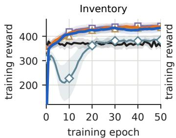

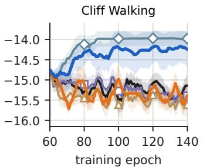

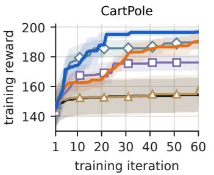  
Two-stage DFL-QP DFL-LP DFL-Feas DFL-Sketch (ours) DFL-SA (ours)  
Figure 2: Training reward across epochs on three tasks. DFL-QP and DFL-SA achieve the highest training rewards, while DFL-Sketch and the other LP-based variants are generally competitive with the two-stage baseline.

Computation cost. Figure 4 shows the computational benefits of LP-based differentiation and state aggregation. DFL-LP replaces differentiation through the full KKT system with a smaller basis solve, reducing training time by about 8× relative to DFL-QP on Inventory. DFL-Sketch combines gradients from multiple sketched LPs to smooth basis changes, with additional computational cost that varies across tasks. DFL-SA further reduces the size of the basis system through learned aggregation, achieving strong decision quality at substantially lower cost than DFL-QP. On CartPole, DFL-SA (d=90) trains about 4× faster than DFL-LP and 7.5× faster than DFL-QP while achieving the lowest mean test regret. This advantage grows in the larger Inventory experiments: with $\left| \boldsymbol { S } \right| { = } 1 0 1$ , DFL-SA (M=30) achieves the lowest mean regret while training approximately 40× faster than DFL-QP.

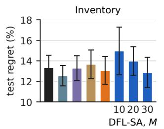

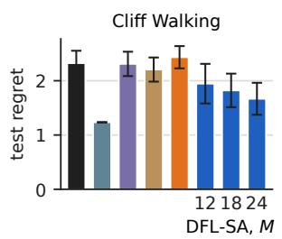

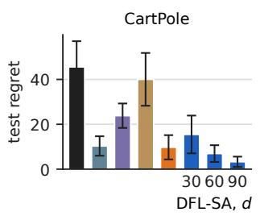  
Two-stage DFL-QP DFL-LP DFL-Feas DFL-Sketch (ours) DFL-SA (ours)  
Figure 3: Test regret on three tasks (lower is better). DFL-Sketch improves over DFL-LP on Inventory and CartPole, showing the benefit of smoothing across basis changes. DFL-SA further achieves regret close to DFL-QP at substantially lower cost.

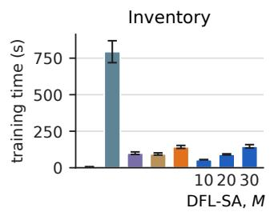

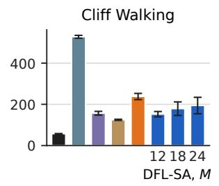

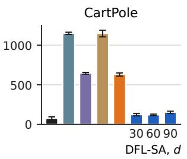  
Figure 4: Total training time for different tasks. DFL-QP is the most expensive method because it differentiates through the full KKT system. DFL-Sketch adds overhead from solving multiple sketched LPs, while DFL-SA reduces this cost through state aggregation.

Effect of the state aggregation size. Figure 3 shows that increasing the aggregation size reduces mean test regret across the evaluated configurations. On Inventory, increasing M from 10 to 30 lowers regret from 15% to 13%, approaching DFL-QP. Cliff Walking follows a similar trend, with larger aggregation sizes narrowing the gap to DFL-QP. On CartPole, increasing d from 30 to 90 reduces mean regret from 15 to 3, illustrating the value of a richer learned representation. These results suggest that larger aggregate representations retain more information relevant to policy selection, while smaller representations reduce computation. Aggregation size therefore provides a simple way to balance decision quality and computational cost. Training time generally increases with aggregation size, although the CartPole measurements are not strictly monotone because wall-clock cost also depends on solver behavior (Figure 4).

Other ablation studies We further examine scalability to larger Inventory state spaces, sensitivity to the feasibility penalty ρ, and the role of the diagonal projection in soft aggregation in Section B.4– Section B.6. These experiments complement the main results by assessing computational scaling, sensitivity to the surrogate penalty, and the contribution of the MDP-structured aggregation.

## 8 Conclusion

We present a differentiable LP layer for decision-focused learning in MDPs, with a closed-form gradient requiring only a $| { \cal S } | \times | { \cal S } |$ basis solve. An augmented Lagrangian surrogate corrects the bias from predicted-dynamics infeasibility, while random row sketching smooths gradients across basis boundaries. Learned state aggregation reduces the basis size to $M \ll | S |$ |, and function approximation extends the approach to continuous states. Experiments on Inventory, Cliff Walking, and CartPole show lower regret than two-stage and decision quality comparable to or better than KKT-based DFL at substantially lower computational cost.

## Acknowledgments and Disclosure of Funding

We thank Wuhao Bao for detailed discussions of the experiments. This work was supported in part by the Johns Hopkins Carey Business School. This work was supported by NSF IIS-2403240, NSF IIS-2552007, NIH R01HL184139, and Schmidt Sciences AI2050 Fellowship.

## References

[1] David Abel. A theory of state abstraction for reinforcement learning. Proceedings of the AAAI Conference on Artificial Intelligence, 33(01):9876–9877, July 2019.

[2] Shipra Agrawal and Randy Jia. Learning in structured mdps with convex cost functions: Improved regret bounds for inventory management. In Proceedings of the 2019 ACM Conference on Economics and Computation, pages 743–744, 2019.

[3] Cameron Allen, Neev Parikh, Omer Gottesman, and George Konidaris. Learning Markov state abstractions for deep reinforcement learning. In Advances in Neural Information Processing Systems, volume 34, pages 8229–8241, 2021.

[4] Eitan Altman. Constrained Markov decision processes. Routledge, 2021.

[5] Brandon Amos and J. Zico Kolter. Optnet: Differentiable optimization as a layer in neural networks. In ICML, 2017.

[6] Quentin Berthet, Mathieu Blondel, Olivier Teboul, Marco Cuturi, Jean-Philippe Vert, and Francis Bach. Learning with differentiable pertubed optimizers. Advances in neural information processing systems, 33:9508–9519, 2020.

[7] Dimitri P. Bertsekas. Feature-based aggregation and deep reinforcement learning: A survey and some new implementations. IEEE/CAA Journal ofAutomatica Sinica, 6(1):1–31, 2019.

[8] Dimitri P. Bertsekas. Reinforcement Learning and Optimal Control. Athena Scientific, 2020.

[9] Dimitri P. Bertsekas and John N. Tsitsiklis. Neuro-Dynamic Programming. Athena Scientific, 1996.

[10] Greg Brockman, Vicki Cheung, Ludwig Pettersson, Jonas Schneider, John Schulman, Jie Tang, and Wojciech Zaremba. Openai gym. arXiv preprint arXiv:1606.01540, 2016.

[11] Hyeong S. Chang, Jiaqiao Hu, Michael Fu, and Steven I. Marcus. Simulation-Based Algorithms for Markov Decision Processes. Springer, 2013.

[12] Rares Cristian, Pavithra Harsha, Georgia Perakis, Brian L. Quanz, and Ioannis Spantidakis. End-to-end learning for optimization via constraint-enforcing approximators. Proceedings of the AAAI Conference on Artificial Intelligence, 2023.

[13] Daniela Pucci De Farias and Benjamin Van Roy. The linear programming approach to approximate dynamic programming. Operations research, 51(6):850–865, 2003.

[14] Vektor Dewanto, George Dunn, Ali Eshragh, Marcus Gallagher, and Fred Roosta. Averagereward model-free reinforcement learning: A systematic review and literature mapping. arXiv preprint arXiv:2010.08920, 2020.

[15] My H. Dinh, James Kotary, and Ferdinando Fioretto. End-to-end learning for fair multiobjective optimization under uncertainty. In Negar Kiyavash and Joris M. Mooij, editors, Uncertainty in Artificial Intelligence, 15-19 July 2024, Universitat Pompeu Fabra, Barcelona, Spain, Proceedings of Machine Learning Research, pages 1129–1145. PMLR, 2024. URL https://proceedings.mlr.press/v244/dinh24a.html.

[16] Priya Donti, Brandon Amos, and J. Zico Kolter. Task-based end-to-end model learning in stochastic optimization. In Advances in Neural Information Processing Systems, volume 30. Curran Associates, Inc., 2017. URL https://proceedings.neurips.cc/paper/2017/ hash/3fc2c60b5782f641f76bcefc39fb2392-Abstract.html.

[17] Adam N. Elmachtoub and Paul Grigas. Smart predict-then-optimize. Management Science, 2022.

[18] Ali Eshragh and Jerzy Filar. Hamiltonian cycles, random walks and discounted occupational measures. Mathematics ofOperations Research, 36(2):258–270, 2011.

[19] Ali Eshragh, Jerzy Filar, Thomas Kalinowski, and Sogol Mohammadian. Hamiltonian cycles and subsets of discounted occupational measures. Mathematics ofOperations Research, 45(2): 403–795, 2020.

[20] Aaron M. Ferber, Bryan Wilder, Bistra Dilkina, and Milind Tambe. Mipaal: Mixed integer program as a layer. In The Thirty-Fourth AAAI Conference on Artificial Intelligence, AAAI 2020, The Thirty-Second Innovative Applications ofArtificial Intelligence Conference, IAAI 2020, The Tenth AAAI Symposium on Educational Advances in Artificial Intelligence, EAAI 2020, New York, NY, USA, February 7-12, 2020, pages 1504–1511. AAAI Press, 2020. doi: 10.1609/AAAI.V34I02.5509. URL https://doi.org/10.1609/aaai.v34i02.5509.

[21] Joseph Futoma, Michael Hughes, and Finale Doshi-Velez. Popcorn: Partially observed prediction constrained reinforcement learning. In International Conference on Artificial Intelligence and Statistics, pages 3578–3588. PMLR, 2020.

[22] Carles Gelada, Saurabh Kumar, Jacob Buckman, Ofir Nachum, and Marc G Bellemare. Deepmdp: Learning continuous latent space models for representation learning. In International conference on machine learning, pages 2170–2179. PMLR, 2019.

[23] Xinyi Hu, Jasper C. H. Lee, and Jimmy H. M. Lee. Branch & learn with post-hoc correction for predict+optimize with unknown parameters in constraints. In André A. Ciré, editor, Integration of Constraint Programming, Artificial Intelligence, and Operations Research - 20th International Conference, CPAIOR 2023, Nice, France, May 29 - June 1, 2023, Proceedings, Lecture Notes in Computer Science, pages 264–280. Springer, 2023. doi: 10.1007/978-3-031-33271-5\_18. URL https://doi.org/10.1007/978-3-031-33271-5\_18.

[24] Xinyi Hu, Jasper C. H. Lee, and Jimmy H. M. Lee. Predict+optimize for packing and covering LPs with unknown parameters in constraints. Proceedings ofthe AAAI Conference on Artificial Intelligence, 2023.

[25] Yang Hu, Tianyi Chen, Na Li, Kai Wang, and Bo Dai. Primal-dual spectral representation for off-policy evaluation. In International Conference on Artificial Intelligence and Statistics, pages 3808–3816. PMLR, 2025.

[26] Hyungki Im, Wyame Benslimane, and Paul Grigas. Smart surrogate losses for contextual stochastic linear optimization with robust constraints. In The Thirty-ninth Annual Conference on Neural Information Processing Systems, 2026. URL https://openreview.net/forum? id=5iAtDpkSZQ.

[27] Haeun Jeon, Hyunglip Bae, Minsu Park, Chanyeong Kim, and Woo Chang Kim. Locally convex global loss network for decision-focused learning. In Toby Walsh, Julie Shah, and Zico Kolter, editors, Thirty-Ninth AAAI Conference on Artificial Intelligence, Thirty-Seventh Conference on Innovative Applications of Artificial Intelligence, Fifteenth Symposium on Educational Advances in Artificial Intelligence, AAAI 2025, Philadelphia, PA, USA, February 25 - March 4, 2025, pages 26805–26812. AAAI Press, 2025. doi: 10.1609/AAAI.V39I25.34884. URL https://doi.org/10.1609/aaai.v39i25.34884.

[28] Lingkai Kong, Jiaming Cui, Yuchen Zhuang, Rui Feng, B. Aditya Prakash, and Chao Zhang. End-to-end stochastic optimization with energy-based model. Advances in Neural Information Processing Systems, 2022.

[29] Jayanta Mandi and Tias Guns. Interior point solving for LP-based prediction+optimisation. In Advances in Neural Information Processing Systems, volume 33, pages 7272–7282. Curran Associates, Inc., 2020. URL https://proceedings.neurips.cc/paper\_files/paper/ 2020/hash/51311013e51adebc3c34d2cc591fefee-Abstract.html.

[30] Jayanta Mandi, Victor Bucarey, Maxime Mulamba Ke Tchomba, and Tias Guns. Decisionfocused learning: Through the lens of learning to rank. In Proceedings of the 39th International Conference on Machine Learning, pages 14935–14947. PMLR, 2022. URL https://proceedings.mlr.press/v162/mandi22a.html.

[31] Jayanta Mandi, Marianne Defresne, Senne Berden, and Tias Guns. Feasibility-aware decisionfocused learning for predicting parameters in the constraints. In The Thirty-ninth Annual Conference on Neural Information Processing Systems, 2025. URL https://openreview. net/forum?id=eTmvwxohRx.

[32] Jayanta Mandi, Ali Irfan Mahmutogullari, Senne Berden, and Tias Guns. Minimizing surrogate losses for decision-focused learning using differentiable optimization. In Inês Lynce, Nello Murano, Mauro Vallati, Serena Villata, Federico Chesani, Michela Milano, Andrea Omicini, and Mehdi Dastani, editors, ECAI 2025 - 28th European Conference on Artificial Intelligence, 25-30 October 2025, Bologna, Italy - Including 14th Conference on Prestigious Applications ofIntelligent Systems (PAIS 2025), Frontiers in Artificial Intelligence and Applications, pages 3888–3895. IOS Press, 2025. doi: 10.3233/FAIA251273. URL https://doi.org/10.3233/ FAIA251273.

[33] Alan S Manne. Linear programming and sequential decisions. Management Science, 6(3): 259–267, 1960.

[34] Maxime Mulamba, Jayanta Mandi, Michelangelo Diligenti, Michele Lombardi, Victor Bucarey, and Tias Guns. Contrastive losses and solution caching for predict-and-optimize. In Zhi-Hua Zhou, editor, Proceedings of the Thirtieth International Joint Conference on Artificial Intelligence, IJCAI 2021, Virtual Event /Montreal, Canada, 19-27 August 2021, pages 2833– 2840. ijcai.org, 2021. doi: 10.24963/IJCAI.2021/390. URL https://doi.org/10.24963/ ijcai.2021/390.

[35] Anselm Paulus, Michal Rolinek, Vit Musil, Brandon Amos, and Georg Martius. CombOptNet: Fit the right NP-hard problem by learning integer programming constraints. In Proceedings of the 38th International Conference on Machine Learning, pages 8443–8453. PMLR, 2021. URL https://proceedings.mlr.press/v139/paulus21a.html.

[36] Mert Pilanci and Martin J Wainwright. Iterative hessian sketch: Fast and accurate solution approximation for constrained least-squares. Journal of Machine Learning Research, 17(53): 1–38, 2016.

[37] Marin Vlastelica Poganciˇ c, Anselm Paulus, Vit Musil, Georg Martius, and Michal Rolinek.´ Differentiation of blackbox combinatorial solvers. In International Conference on Learning Representations, 2020. URL https://openreview.net/forum?id=BkevoJSYPB.

[38] Warren B. Powell. Approximate Dynamic Programming: Solving the Curses of Dimensionality. John Wiley & Sons, 2007.

[39] Martin L Puterman. Markov decision processes: discrete stochastic dynamic programming. John Wiley & Sons, 2014.

[40] Balaraman Ravindran and Andrew G Barto. Smdp homomorphisms: an algebraic approach to abstraction in semi-markov decision processes. In Proceedings ofthe 18th international joint conference on Artificial intelligence, pages 1011–1016, 2003.

[41] Sanket Shah, Kai Wang, Bryan Wilder, Andrew Perrault, and Milind Tambe. Decision-focused learning without differentiable optimization: Learning locally optimized decision losses. Advances in Neural Information Processing Systems, 2022.

[42] Satinder Singh, Tommi Jaakkola, and Michael Jordan. Reinforcement learning with soft state aggregation. Advances in neural information processing systems, 7, 1994.

[43] Richard S. Sutton and Andrew G. Barto. Reinforcement Learning: An Introduction. MIT Press, 2018.

[44] Richard S. Sutton and Andrew G. Barto. Reinforcement Learning: An Introduction. MIT Press, Cambridge, MA, 2nd edition, 2018.

[45] Bo Tang and Elias B. Khalil. Cave: A cone-aligned approach for fast predict-then-optimize with binary linear programs. In Bistra Dilkina, editor, Integration ofConstraint Programming, Artificial Intelligence, and Operations Research - 21st International Conference, CPAIOR 2024, Uppsala, Sweden, May 28-31, 2024, Proceedings, Part II, Lecture Notes in Computer Science, pages 193–210. Springer, 2024. doi: 10.1007/978-3-031-60599-4\_12. URL https: //doi.org/10.1007/978-3-031-60599-4\_12.

[46] Hado Van Hasselt, Arthur Guez, and David Silver. Deep reinforcement learning with double q-learning. In Proceedings ofthe AAAI conference on artificial intelligence, volume 30, 2016.

[47] Irina Wang, Bart Van Parys, and Bartolomeo Stellato. Learning decision-focused uncertainty sets in robust optimization. arXiv preprint arXiv:2305.19225, 2023.

[48] Kai Wang, Sanket Shah, Haipeng Chen, Andrew Perrault, Finale Doshi-Velez, and Milind Tambe. Learning mdps from features: Predict-then-optimize for sequential decision making by reinforcement learning. Advances in Neural Information Processing Systems, 34:8795–8806, 2021.

[49] Po-Wei Wang, Priya L. Donti, Bryan Wilder, and J. Zico Kolter. Satnet: Bridging deep learning and logical reasoning using a differentiable satisfiability solver. In Kamalika Chaudhuri and Ruslan Salakhutdinov, editors, Proceedings of the 36th International Conference on Machine Learning, ICML 2019, 9-15 June 2019, Long Beach, California, USA, Proceedings of Machine Learning Research, pages 6545–6554. PMLR, 2019. URL http: //proceedings.mlr.press/v97/wang19e.html.

[50] Bryan Wilder, Bistra Dilkina, and Milind Tambe. Melding the data-decisions pipeline: Decisionfocused learning for combinatorial optimization. In Proceedings of the AAAI conference on artificial intelligence, volume 33, pages 1658–1665, 2019.

[51] David P Woodruff. Sketching as a tool for numerical linear algebra. arXiv preprint arXiv:1411.4357, 2014.

[52] Yuan Xue, Daniel Kudenko, and Megha Khosla. Graph learning-based generation of abstractions for reinforcement learning. Neural Computing and Applications, 2023. Available online.

[53] Amy Zhang, Rowan Thomas McAllister, Roberto Calandra, Yarin Gal, and Sergey Levine. Learning invariant representations for reinforcement learning without reconstruction. In International Conference on Learning Representations, 2021. URL https://openreview.net/ forum?id=-2FCwDKRREu.

## A Appendix

## A.1 Sample-based estimators for the projected LP

Recall the projected LP (LP-2) in continuous-state MDPs, with coefficients

$$
A = \Psi ^ { \top } ( B - \beta P ) \Phi \in \mathbb { R } ^ { m \times d } , \quad b = \Psi ^ { \top } \gamma \in \mathbb { R } ^ { m } , \quad ( \tilde { r } _ { \theta } ) _ { j } = \int _ { S \times A } r _ { \theta } ( s , a ) \phi _ { j } ( s , a ) d s d a ,
$$

where $\begin{array} { r } { ( B y ) ( s ) = \int _ { A } y ( s , a ) d a } \end{array}$ and $\begin{array} { r } { ( P y ) ( s ) = \int _ { \mathcal { S } \times \mathcal { A } } P ( s \mid s ^ { \prime } , a ^ { \prime } ) y ( s ^ { \prime } , a ^ { \prime } ) d s ^ { \prime } d a ^ { \prime } } \end{array}$ . We now derive Monte Carlo estimators for each coefficient given offline transitions $\{ ( s _ { t } , a _ { t } , r _ { t } , s _ { t + 1 } ) \} _ { t = 1 } ^ { N }$ sampled from a behavior policy and $N _ { 0 }$ initial states $\{ s _ { 0 } ^ { ( k ) } \} _ { k = } ^ { N _ { 0 } }$ drawn from $\gamma .$

We work with a behavior-weighted version of the projected LP. We write the occupancy relative to the data distribution, $y ( s , a ) \overset { \cdot } { = } \mu _ { b } ( s , a ) \Phi ( s , a ) ^ { \top } w$ , and keep the test functions Ψ unweighted. This avoids dividing by $\mu _ { b }$ in the empirical sums, which is unstable when $\mu _ { b }$ is small; the price is that we solve a behavior-weighted version of LP-2, not its Lebesgue-weighted counterpart. Under this convention, the estimators for $\Psi ^ { \top } P \Phi , b ,$ and $\tilde { r } _ { \theta }$ below are plain empirical averages. The $B$ block needs extra care, which we explain below.

Estimator for $\Psi ^ { \top } P \Phi$ . Under the behavior-weighted inner product,

$$
\begin{array} { l } { { ( { \Psi } ^ { \top } { \cal P } \Phi ) _ { i j } = \displaystyle \int _ { { \cal S } \times { \cal A } } \mu _ { b } ( s ^ { \prime } , a ^ { \prime } ) \phi _ { j } ( s ^ { \prime } , a ^ { \prime } ) \left( \displaystyle \int _ { \cal S } \psi _ { i } ( s ) { \cal P } ( s \mid s ^ { \prime } , a ^ { \prime } ) d s \right) d s ^ { \prime } d a ^ { \prime } ~ } } \\ { { = \mathbb { E } _ { ( s ^ { \prime } , a ^ { \prime } ) \sim \mu _ { b } , s \sim { \cal P } ( \cdot \mid s ^ { \prime } , a ^ { \prime } ) } \left[ \psi _ { i } ( s ) \phi _ { j } ( s ^ { \prime } , a ^ { \prime } ) \right] . } } \end{array}
$$

Replacing the expectation with its empirical average over the transitions $\left( { { s _ { t } } , { a _ { t } } , { s _ { t + 1 } } } \right)$ gives

$$
( \Psi ^ { \top } P \Phi ) _ { i j } \approx \frac { 1 } { N } \sum _ { t = 1 } ^ { N } \psi _ { i } ( s _ { t + 1 } ) \phi _ { j } ( s _ { t } , a _ { t } ) .
$$

Estimator for $\Psi ^ { \top } B \Phi$ . Under the same convention,

$$
( \Psi ^ { \top } B \Phi ) _ { i j } = \int _ { S } \psi _ { i } ( s ) \sum _ { a \in A } \mu _ { b } ( s , a ) \phi _ { j } ( s , a ) d s = \mathbb { E } _ { ( s , a ) \sim \mu _ { b } } \left[ \psi _ { i } ( s ) \phi _ { j } ( s , a ) \right] \approx \frac { 1 } { N } \sum _ { t = 1 } ^ { N } \psi _ { i } ( s _ { t } ) \phi _ { j } ( s _ { t } , a _ { t } ) ,
$$

which uses only the logged action $a _ { t }$ . In our experiments, we instead used the all-action sum

$$
( \Psi ^ { \top } B \Phi ) _ { i j } \approx \frac { 1 } { N } \sum _ { t = 1 } ^ { N } \psi _ { i } ( s _ { t } ) \sum _ { a \in A } \phi _ { j } ( s _ { t } , a ) ,
$$

which weights the B block by the state marginal $p _ { b } ( s )$ instead of $\mu _ { b } ( s , a )$ . Compared with the consistent estimator, this effectively replaces the discount $\beta$ in each column $( s , a )$ by $\beta \pi _ { b } ( a \mid s )$ The LP used for CartPole is therefore a heuristic surrogate of the behavior-weighted $\mathrm { L P } ,$ not an exact estimate of it. The consistent estimator above removes this mismatch; with it, the policy is extracted as $\pi ( a \mid s ) \propto \pi _ { b } ( a \mid s ) \Phi ( s , a ) ^ { \top } w ^ { * }$

Estimator for b. Since $\begin{array} { r } { b _ { i } = \int _ { S } \psi _ { i } ( s ) \gamma ( s ) d s = \mathbb { E } _ { s _ { 0 } \sim \gamma } [ \psi _ { i } ( s _ { 0 } ) ] } \end{array}$ , the initial-state samples give

$$
b _ { i } \approx \frac { 1 } { N _ { 0 } } \sum _ { k = 1 } ^ { N _ { 0 } } \psi _ { i } ( s _ { 0 } ^ { ( k ) } ) .
$$

Estimator for $\tilde { r } _ { \theta }$ . Following the same recipe,

$$
( \tilde { r } _ { \theta } ) _ { j } = \mathbb { E } _ { ( s , a ) \sim \mu _ { b } } \left[ r _ { \theta } ( s , a ) \phi _ { j } ( s , a ) \right] \approx \frac { 1 } { N } \sum _ { t = 1 } ^ { N } r _ { \theta } ( s _ { t } , a _ { t } ) \phi _ { j } ( s _ { t } , a _ { t } ) ,
$$

which is again the plain empirical average under the behavior-weighted convention.

The matrix A and vector b depend on the predicted dynamics only through these empirical sums, so backpropagating through Eq. (4) reduces to backpropagating through the per-sample features $\psi _ { i } , \phi _ { j } .$ a standard automatic-differentiation operation when Φ, Ψ are neural networks.

## A.2 Derive discrete-state soft aggregation from continuous-state function approximation

Learnable membership construction. We parameterize the membership matrix through aggregation parameters $\xi = ( E , { \mathsf { \bar { \Theta } } } _ { W } )$ , where $E \in \mathbb { R } ^ { S \times d _ { e } }$ is a state embedding matrix and $\Theta _ { W }$ maps features to cluster logits. Specifically, we first compute a transition-aware feature for each state-action pair as the expected next-state embedding $\begin{array} { r } { \phi ( s , \bar { a } ) = \sum _ { s ^ { \prime } } P ( s ^ { \prime } \mid s , a ) E _ { s ^ { \prime } } \in \mathbb { R } ^ { d _ { e } } } \end{array}$ , then form a state-level representation by concatenating across all actions: $\bar { \phi } ( s ) = [ \phi ( s , 1 ) ; \ldots ; \phi ( s , A ) ] \in \mathbb { R } ^ { A d _ { e } }$ . This feature encodes how each state interacts with the transition structure under every action. The soft cluster assignment is then obtained by projecting $\bar { \phi } ( s )$ onto M cluster logits via $\Theta _ { W }$ and applying a temperature-scaled softmax:

$$
W _ { s m } ( \xi ) = \frac { \exp \bigl ( ( \Theta _ { W } ^ { \top } \bar { \phi } ( s ) ) _ { m } / \tau \bigr ) } { \sum _ { m ^ { \prime } } \exp \bigl ( ( \Theta _ { W } ^ { \top } \bar { \phi } ( s ) ) _ { m ^ { \prime } } / \tau \bigr ) } .
$$

Given the soft membership $W .$ , we construct a reduced MDP over M abstract states by computing weighted averages of the original MDP quantities.

We now verify that the basis choices $\phi _ { ( m , a ^ { \prime } ) } ( s , a ) = W _ { s m } \mathbf { 1 } [ a = a ^ { \prime } ]$ and $\psi _ { i } ( s ) = W _ { s i }$ reduce the projected $\mathrm { L P } - 2$ to the soft-aggregated LP. The reduction is exact for hard cluster memberships; for soft memberships, the basis-block of the constraint matrix has off-diagonal entries and an exact algebraic match to the standard aggregated flow constraint requires replacing this block by its diagonal projection (equivalently, enforcing the simplex identity $\begin{array} { r } { \sum _ { m } ^ { \bullet } W _ { s m } \dot { = } 1 } \end{array}$ at the constraint level). We make this step explicit in the derivation below.

Coefficient $b .$ Direct computation gives

$$
b _ { i } = \sum _ { s } \psi _ { i } ( s ) \gamma _ { s } = \sum _ { s } W _ { s i } \gamma _ { s } = \hat { \gamma } _ { i } .
$$

Coefficient $\tilde { r } _ { \theta }$ . Indexing the basis by $j = ( m , a ^ { \prime } )$

$$
( \widetilde r \theta ) _ { ( m , a ^ { \prime } ) } = \sum _ { s , a } r _ { \theta } ( s , a ) W _ { s m } { \bf 1 } [ a = a ^ { \prime } ] = \sum _ { s } W _ { s m } r _ { \theta } ( s , a ^ { \prime } ) = \mu _ { m } \hat { r } _ { m , a ^ { \prime } } ,
$$

using $\begin{array} { r } { \hat { r } _ { m , a ^ { \prime } } = \mu _ { m } ^ { - 1 } \sum _ { s } W _ { s m } r _ { \theta } ( s , a ^ { \prime } ) } \end{array}$ from the soft-aggregation construction.

Coefficient $A = \Psi ^ { \top } ( B - \beta P ) \Phi$ . For the B block,

$$
( \Psi ^ { \top } B \Phi ) _ { i , ( m , a ^ { \prime } ) } = \sum _ { s } W _ { s i } \sum _ { a } W _ { s m } { \bf 1 } [ a = a ^ { \prime } ] = \sum _ { s } W _ { s i } W _ { s m } .
$$

For the $P$ block,

$$
\begin{array} { r l } {  { ( \Psi ^ { \top } P \Phi ) _ { i , ( m , a ^ { \prime } ) } = \sum _ { s } W _ { s i } \sum _ { s ^ { \prime } , a } P ( s \mid s ^ { \prime } , a ) W _ { s ^ { \prime } m } { \bf 1 } [ a = a ^ { \prime } ] } } \\ & { = \sum _ { s , s ^ { \prime } } W _ { s i } P ( s \mid s ^ { \prime } , a ^ { \prime } ) W _ { s ^ { \prime } m } = \mu _ { m } \hat { P } ( i \mid m , a ^ { \prime } ) , } \end{array}
$$

using $\begin{array} { r } { \hat { P } ( n ^ { \prime } \mid m , a ^ { \prime } ) = \mu _ { m } ^ { - 1 } \sum _ { s , s ^ { \prime } } W _ { s m } P ( s ^ { \prime } \mid s , a ^ { \prime } ) W _ { s ^ { \prime } n ^ { \prime } } } \end{array}$ and renaming the dummy summation indices.

Combining the two blocks,

$$
A _ { i , ( m , a ^ { \prime } ) } = \sum _ { s } W _ { s i } W _ { s m } - \beta \mu _ { m } \hat { P } ( i \mid m , a ^ { \prime } ) .
$$

For hard cluster memberships (W has one-hot rows), $\begin{array} { r } { \sum _ { s } W _ { s i } W _ { s m } = \delta _ { i , m } \mu _ { m } , \mathrm { s o } } \end{array}$

$$
A _ { i , ( m , a ^ { \prime } ) } = \mu _ { m } \left( \delta _ { i , m } - \beta \hat { P } ( i \mid m , a ^ { \prime } ) \right) = \mu _ { m } \hat { H } _ { i , ( m , a ^ { \prime } ) } .
$$

For soft memberships, direct projection does not preserve the standard MDP flow constraints. We therefore replace $W ^ { \top } W$ with $\operatorname { d i a g } ( \mu )$ so that the reduced $\mathrm { L P }$ describes a valid aggregated MDP. This replacement is exact for hard memberships and is an approximation for soft memberships.

After this replacement, the projected LP becomes

$$
\begin{array} { r l } { \displaystyle \operatorname* { m a x } _ { w \geq 0 } } & { \displaystyle \sum _ { m , a } \mu _ { m } \hat { r } _ { m , a } w _ { ( m , a ) } } \\ { \mathrm { s . t . } } & { \displaystyle \sum _ { m , a } \hat { H } _ { i , ( m , a ) } \mu _ { m } w _ { ( m , a ) } = \hat { \gamma } _ { i } \quad \mathrm { f o r ~ a l l ~ } i . } \end{array}
$$

Assuming $\mu _ { m } > 0$ , define the aggregated occupancy by $\hat { y } ( m , a ) : = \mu _ { m } w _ { ( m , a ) }$ . This change of variables gives the standard aggregated LP

$$
\begin{array} { r l } { \underset { \hat { \boldsymbol { y } } \geq 0 } { \operatorname* { m a x } } } & { \hat { \boldsymbol { r } } ^ { \top } \hat { \boldsymbol { y } } } \\ { \mathrm { s . t . } } & { \hat { H } \hat { \boldsymbol { y } } = \hat { \boldsymbol { \gamma } } . } \end{array}
$$

Consequently, lifting an aggregated solution to the original state space gives

$$
\begin{array} { c } { { y _ { \mathrm { d i s a g g } } ( s , a ) = \displaystyle \sum _ { m } W _ { s m } w _ { ( m , a ) } } } \\ { { = \displaystyle \sum _ { m } W _ { s m } \frac { \hat { y } ( m , a ) } { \mu _ { m } } . } } \end{array}
$$

## A.3 Proof for Proposition 4.1

Proof. Let $\eta ^ { * }$ denote the Lagrangian multiplier for $y \geq 0$ . Then, we can write

$$
\begin{array} { r l } & { L ( y _ { \theta } ^ { * } ) - L ( y _ { \mathrm { t r u e } } ^ { * } ) = - r _ { \mathrm { t r u e } } ^ { \top } y _ { \theta } ^ { * } + ( H _ { \mathrm { t r u e } } y _ { \theta } ^ { * } - \gamma ) ^ { \top } \nu ^ { * } + \rho \| H _ { \mathrm { t r u e } } y _ { \theta } ^ { * } - \gamma \| ^ { 2 } + r _ { \mathrm { t r u e } } ^ { \top } y _ { \mathrm { t r u e } } ^ { * } } \\ & { \qquad = ( H _ { \mathrm { t r u e } } ^ { \top } \nu ^ { * } - r _ { \mathrm { t r u e } } ) ^ { \top } y _ { \theta } ^ { * } + \rho \| H _ { \mathrm { t r u e } } y _ { \theta } ^ { * } - \gamma \| ^ { 2 } } \\ & { \qquad = ( \eta ^ { * } ) ^ { \top } y _ { \theta } ^ { * } + \rho \| H _ { \mathrm { t r u e } } y _ { \theta } ^ { * } - \gamma \| ^ { 2 } . } \end{array}
$$

The second equality is due to strong duality, i.e., $r _ { \mathrm { t r u e } } ^ { \top } y _ { \mathrm { t r u e } } ^ { * } = \gamma ^ { \top } \nu ^ { * }$ . By dual feasibility, we know that $\left( \eta ^ { \ast } \right) ^ { \intercal } y _ { \theta } ^ { \ast } \geq 0 ,$ , and thus $L ( y _ { \theta } ^ { * } ) - L ( y _ { \mathrm { t r u e } } ^ { * } ) \ge 0$ . When the equality holds, we have both $( \eta ^ { * } ) ^ { \top } y _ { \theta } ^ { * } = 0$ and $\| \dot { H } _ { \mathrm { t r u e } } y _ { \theta } ^ { * } - \gamma \| ^ { 2 } = 0$ . With $y _ { \theta } ^ { * } \geq 0$ these are the KKT conditions of the true $\mathrm { L P } ,$ which are sufficient, so $y _ { \theta } ^ { * }$ is optimal and $r _ { \mathrm { t r u e } } ^ { \top } y _ { \theta } ^ { * } = r _ { \mathrm { t r u e } } ^ { \top } y _ { \mathrm { t r u e } } ^ { * }$ . The converse is complementary slackness.

## B Details of Experiments

## B.1 Compute resources, hyperparameters and model architectures

All experiments in this paper were run on a single shared workstation with two Intel Xeon Gold 6548Y+ processors (128 logical cores total, 2.5 GHz base) and 1.5 TB of system memory.

Table 2 reports the hyperparameters used in each experiment. All methods on a given task share the same predictor architecture, optimizer, and data; only the gradient (LP, QP, sketch, or none) differs. Numbers are averaged over 10 random seeds.

## B.2 Details for Cliff Walking MDP Task

Slip parameterization. The latent weather regime determines a compact slip tensor rather than an unstructured transition matrix. The compact tensor has one ambient slot shared by all states and six volatile-cell slots that override the ambient slip distribution at selected grid cells near the cliff. Each slot contains a categorical distribution over the five movement outcomes for each action. This keeps the prediction problem structured while still allowing the hazardous region of the grid to change with the weather regime.

Transition construction. For each state-action pair, the compact slip distribution is expanded into the full transition kernel by applying the five slip outcomes to the chosen action. Each outcome deterministically maps the agent to a candidate next cell after enforcing grid boundaries, cliff resets, and goal termination. The probability of a next state is the sum of the probabilities of all slip outcomes that land in that state. Thus the learned object is not an arbitrary $4 8 \times 4 \times 4 8$ transition tensor, but a structured slip model that induces the transition kernel used by the planner.

Table 2: Key hyperparameters and model architectures for each task.
<table><tr><td></td><td>Inventory</td><td>Cliff Walking</td><td>CartPole</td></tr><tr><td>MDP</td><td></td><td></td><td></td></tr><tr><td>State space size |S|</td><td> $3 6 ( s _ { \mathrm { m a x } } = 3 0 , b _ { \mathrm { m a x } } = 5 )$ </td><td>48 (4×12 grid)</td><td>continuous,  $\mathbb { R } ^ { 4 }$ </td></tr><tr><td>Action space size |A|</td><td> $3 1 \left( a _ { \mathrm { m a x } } = 3 0 \right)$ </td><td>4</td><td>2</td></tr><tr><td>Discount β</td><td>0.95</td><td>0.95</td><td>0.99</td></tr><tr><td>Horizon T</td><td>N/A</td><td>N/A</td><td>200</td></tr><tr><td>Predictor / features</td><td></td><td></td><td></td></tr><tr><td>Architecture</td><td>MLP</td><td>MLP</td><td>MLP</td></tr><tr><td>Hidden layers</td><td>(32, 32)</td><td>(64, 64)</td><td>(128, 128)</td></tr><tr><td>Activation</td><td>ReLU</td><td> $\mathrm { R e L U + T a n h }$ </td><td>ReLU</td></tr><tr><td>Optimization</td><td></td><td></td><td></td></tr><tr><td>Optimizer</td><td>Adam</td><td>Adam</td><td>Adam</td></tr><tr><td>Learning rate</td><td> $1 0 ^ { - 2 }$ </td><td> $3 \times 1 0 ^ { - 3 }$ </td><td> $1 0 ^ { - 3 }$ </td></tr><tr><td>Batch size</td><td>full batch</td><td>32</td><td>4096</td></tr><tr><td>Pretraining epochs</td><td>30</td><td>60</td><td>70</td></tr><tr><td>Training epochs / iters.</td><td>50</td><td>140</td><td>60</td></tr><tr><td>Random seeds</td><td>10</td><td>10</td><td>10</td></tr><tr><td>DFL surrogate</td><td></td><td></td><td></td></tr><tr><td>Aug. Lagrangian ρ (DFL-LP)</td><td>10</td><td>0.1</td><td>1.0</td></tr><tr><td>Aug. Lagrangian ρ (DFL-Sketch)</td><td>0.1</td><td>1.0</td><td>1.0</td></tr><tr><td>Aug. Lagrangian ρ (DFL-QP)</td><td>104</td><td>0.1</td><td>1.0</td></tr><tr><td>QP regularization η</td><td> $1 0 ^ { - 3 }$ </td><td>0.1</td><td>10⁻²</td></tr><tr><td>Sketch ensemble size K</td><td>8</td><td>8</td><td>8</td></tr><tr><td>Sketch row-keep ratio α</td><td>0.1</td><td>0.2</td><td>0.2</td></tr><tr><td>LP basis ridge</td><td> $1 0 ^ { - 6 }$ </td><td>none</td><td> $1 0 ^ { - 4 }$ </td></tr><tr><td>State aggregation</td><td></td><td></td><td></td></tr><tr><td>Aggregation sizes M or d</td><td> $M \in \{ 1 0 , 2 0 , 3 0 \}$ </td><td> $M \in \{ 1 2 , 1 8 , 2 4 \}$ </td><td> $d \in \{ 3 0 , 6 0 , 9 0 \}$ </td></tr><tr><td>Softmax temperature τ</td><td>0.5</td><td>2.0</td><td>0.5</td></tr><tr><td></td><td></td><td></td><td></td></tr><tr><td>Data and evaluation</td><td></td><td></td><td></td></tr><tr><td>Train samples</td><td>10</td><td>100</td><td>500 trajectories</td></tr><tr><td>Test samples</td><td>50</td><td>100</td><td>100 episodes</td></tr></table>

Feature ambiguity and shift. Weather features are generated from regime-specific Gaussian centers. To make the shifted test regime difficult to distinguish from the dominant training regime, we make the CLEAR and ICE-MID centers identical (center pair (0, 2) with zero gap). Training samples are drawn from the skewed prior 15:1:1:1, whereas test samples are drawn only from ICE-MID. This creates a setting where a predictor can perform well on the training distribution while still selecting a poor policy under the test dynamics.

Policy evaluation. All methods plan using the transition kernel induced by their predicted slip distribution, but evaluation is always performed in the true MDP for the sample. Thus regret measures the downstream cost of selecting a policy under misspecified dynamics, not the prediction error itself. The oracle value $v ^ { * }$ is obtained by solving the occupancy LP with the true transition kernel, and the predicted-policy value is computed by evaluating the policy selected from $\hat { P }$ in the true transition kernel.

State aggregation and sketching. For DFL-SA, soft state aggregation maps the original 48 states to M ∈ {12, 18, 24} aggregate states before the LP solve, then disaggregates the aggregate occupancy measure back to the original state-action space for evaluation. For DFL-Sketch, no state aggregation is used. Instead, each training step averages decision gradients over K = 8 randomized LP sketches, each retaining an $\alpha = 0 . 2$ fraction of the LP rows.

Table 3 reports an earlier experimental configuration, with a different regret scale and aggregation grid $( M \in \{ 6 , 1 2 , 2 4 \} )$ ) from Figure 3 $\mathsf { \Gamma } ( M \in { \bar { \{ 1 2 , 1 8 , 2 4 \} } } )$ ). In this earlier configuration, DFL-QP and all listed DFL-SA variants win on all ten paired seeds. These win counts do not establish per-seed wins or statistical significance for the current main-figure configuration.

Table 3: Paired Cliff Walking test regret over 10 random seeds. Lower regret is better. Win counts compare each method against the two-stage baseline on the same seed. SE denotes the standard error of the mean.
<table><tr><td>Method</td><td>Mean regret ↓</td><td>SE</td><td>Wins vs. TS</td></tr><tr><td>Two-stage</td><td>14.75</td><td>0.29</td><td></td></tr><tr><td>DFL-LP</td><td>14.14</td><td>0.18</td><td>7/10</td></tr><tr><td>DFL-Sketch</td><td>11.34</td><td>1.44</td><td>8/10</td></tr><tr><td>DFL-QP</td><td>9.53</td><td>0.84</td><td>10/10</td></tr><tr><td>DFL-SA (M = 6)</td><td>7.21</td><td>0.15</td><td>10/10</td></tr><tr><td>DFL-SA (M = 12)</td><td>7.76</td><td>0.15</td><td>10/10</td></tr><tr><td> $\mathrm { D F L - S A } \left( M = 2 4 \right)$ </td><td>7.87</td><td>0.64</td><td>10/10</td></tr></table>

## B.3 Details for Continuous MDP Task

We expand the experimental setup of Section 6.3.

Behavior-cloning reward shaping. On CartPole, the reward $r _ { t } = \cos ( \phi _ { t } )$ is independent of the action, so the LP cannot rank the two actions by reward alone. To break this symmetry, we add a behavior-cloning bonus to the forward solve. A linear head $w _ { \mathrm { b c } }$ on top of the state features Φ is trained to predict the behavior actions by cross-entropy, giving $\pi _ { \mathrm { b c } } ( a \mid s ) \bar { = } \mathrm { s o f t m a x } ( w _ { \mathrm { b c } } ^ { \top } \phi ( s ) )$ . The LP forward solve uses the shaped reward $r _ { t } + \alpha \pi _ { \mathrm { b c } } ( a _ { t } \mid s _ { t } )$ with $\alpha = 2$ , while the DFL loss Eq. (5) is still evaluated with the raw reward $r _ { t } .$ , so the regret being optimized is unchanged.

Two-stage baseline. On CartPole, the two-stage baseline shares the BC-pretrained features $\Phi ,$ the shaped reward, and the LP-based policy extraction LP-2 with DFL. The only difference is that the DFL gradient phase is omitted: Φ is held fixed at its BC-pretrained values throughout. This isolates the contribution of decision-aware feature learning while controlling for the BC pretraining and reward shaping that DFL also receives.

Sample-based LP coefficients. Given N offline transitions $( s _ { t } , a _ { t } , r _ { t } , s _ { t + 1 } ) _ { t = 1 } ^ { N }$ collected by a behavior policy and $N _ { 0 }$ initial states $\{ s _ { 0 } ^ { ( k ) } \} _ { k = 1 } ^ { N _ { 0 } }$ drawn from $\gamma _ { : }$ , the coefficients of LP-2 are computed by the Monte Carlo estimators in Section A.1. The transition kernel $P$ enters only through the empirical next states $s _ { t + 1 }$ , so no learned model of $P$ or r is required.

In addition, to address the additional concern of whether DFL beats a more conventional model-based reinforcement learning (MBRL) baseline, and whether such a baseline benefits from receiving the same imitation signal that DFL does, we report two further variants on CartPole:

• MBRL: fit a neural dynamics model $\hat { P } _ { \theta }$ and reward model $\hat { r } _ { \theta }$ to the offline trajectories by maximum likelihood, then run DQN [46] on the learned model. No BC signal is used anywhere. • MBRL + BC shaping: same pipeline as above, but the DQN reward used in the Bellman target is $r _ { t } + \alpha \pi _ { \mathrm { b c } } ( a _ { t } \mid s _ { t } )$ with $\alpha = 2 .$ , where $\pi _ { \mathrm { b c } }$ is trained on the same offline data with the same architecture and pretraining schedule as the BC head used by DFL. The DQN replay is pre-shaped before insertion, so the Q-network learns under the shaped reward, while evaluation on the real environment uses the raw reward.

Table 4 reports best-so-far CartPole rewards. The additional MBRL runs use the biased behavior policy (θ-weight 0.013), 100 offline trajectories, 60 outer iterations, a (32, 32) Q-network, 400 worldmodel epochs, and 5 seeds. The main LP experiments use the configuration in Table 2. Thus this table is a descriptive comparison across the reported settings, not a matched-data ablation establishing a causal effect of BC shaping. The MBRL rows have lower observed means and larger across-seed standard deviations.

## B.4 Scaling to larger inventory MDPs

To probe scalability beyond the $\vert { S } \vert = 3 6$ inventory MDP of Section $6 ( | \boldsymbol { S } | | \boldsymbol { A } | = 3 6 \times 3 1 = 1 1 1 6$ occupancy variables), we increase the inventory state size to $| \boldsymbol { S } | = 5 1$ and $\left| S \right| = 1 0 1$ while keeping

Table 4: CartPole best-so-far reward (mean ± standard deviation). The MBRL rows use 5 seeds and the additional configuration described above; the table does not establish a matched-data comparison.
<table><tr><td>Method</td><td>Best-so-far reward</td></tr><tr><td>DFL-LP</td><td> $1 7 0 . 5 \pm 3 2 . 7$ </td></tr><tr><td>DFL-QP</td><td> $1 9 2 . 4 \pm 1 2 . 6$ </td></tr><tr><td>Two-stage (BC + LP, no DFL gradient)</td><td> $1 6 8 . 1 \pm 2 4 . 8$ </td></tr><tr><td>MBRL (no BC anywhere)</td><td> $1 3 6 . 8 \pm 6 6 . 6$ </td></tr><tr><td>MBRL + BC reward shaping  $( \alpha = 2 )$ </td><td> $1 2 7 . 3 \pm 6 1 . 3$ </td></tr></table>

$| { \mathcal { A } } | = 3 1$ , giving $| S | | A | = 1 5 8 1$ and 3131 occupancy variables, respectively. Tables 5 and 6 report test regret and total training time over 10 seeds.

Table 5: Larger inventory MDP, $| S | \times | A | = 5 1 \times 3 1 = 1 5 8 1$ (mean ± standard error over 10 seeds).
<table><tr><td>Method</td><td>Test regret ↓</td><td>Total (s)</td></tr><tr><td>Two-stage</td><td> $2 4 . 5 3 7 \pm 4 . 5 7 3$ </td><td> $6 8 . 2 \pm 1 1 . 2$ </td></tr><tr><td>DFL-QP</td><td> $1 9 . 1 2 1 \pm 2 . 1 5 6$ </td><td> $3 6 4 9 . 4 \pm 1 6 5 . 5$ </td></tr><tr><td>DFL-LP</td><td> $2 3 . 0 5 6 \pm 3 . 2 9 4$ </td><td> $9 7 2 . 0 \pm 3 4 . 0$ </td></tr><tr><td>DFL-Feas</td><td> $2 2 . 8 3 4 \pm 3 . 4 1 4$ </td><td> $8 7 1 . 0 \pm 1 5 . 7$ </td></tr><tr><td>DFL-Sketch (Ours)</td><td> $1 9 . 4 3 4 \pm 2 . 3 6 3$ </td><td> $8 9 7 . 7 \pm 3 3 . 2$ </td></tr><tr><td>DFL  ${ \cdot } \mathbf { S } \mathbf { A } \left( M = 1 0 \right) \left( \mathbf { O u r s } \right)$ </td><td> $2 2 . 6 5 9 \pm 2 . 5 8 9$ </td><td> $2 2 6 . 5 \pm 8 . 0$ </td></tr><tr><td>DFL-SA (M = 20) (Ours)</td><td> $2 1 . 1 5 9 \pm 2 . 8 8 3$ </td><td> $3 4 8 . 5 \pm 1 1 . 4$ </td></tr><tr><td>DFL-SA (M = 30) (Ours)</td><td> $1 9 . 2 4 9 \pm 2 . 7 6 2$ </td><td> $8 4 7 . 8 \pm 1 5 . 1$ </td></tr></table>

Table 6: Larger inventory MDP, $| S | \times | A | = 1 0 1 \times 3 1 = 3 1 3 1$ (mean ± standard error over 10 seeds).
<table><tr><td>Method</td><td>Test regret ↓</td><td>Total (s)</td></tr><tr><td>Two-stage</td><td> $5 3 . 7 8 8 \pm 7 . 7 1 0$ </td><td> $2 2 7 . 3 \pm 6 . 4$ </td></tr><tr><td>DFL-QP</td><td> $4 4 . 5 4 5 \pm 5 . 8 2 3$ </td><td> $3 4 7 9 1 . 0 \pm 7 5 6 . 4$ </td></tr><tr><td>DFL-LP</td><td> $4 0 . 6 9 0 \pm 4 . 9 4 6$ </td><td> $1 9 9 1 5 . 3 \pm 5 2 7 . 1$ </td></tr><tr><td>DFL-Feas</td><td> $6 2 . 9 0 4 \pm 8 . 2 3 0$ </td><td> $1 9 8 3 2 . 6 \pm 6 1 8 . 7 $ </td></tr><tr><td>DFL-Sketch (Ours)</td><td> $4 8 . 5 9 1 \pm 5 . 7 1 8$ </td><td> $1 3 7 9 0 . 6 \pm 5 1 3 . 4$ </td></tr><tr><td> $\mathrm { D F L - S A } \left( M = 1 0 \right) \left( \mathrm { O u r s } \right)$ </td><td> $4 2 . 5 6 8 \pm 5 . 8 1 4$ </td><td> $5 4 0 . 6 \pm 3 . 8$ </td></tr><tr><td> $\mathrm { D F L - S A } \left( M = 2 0 \right) ( \mathrm { O u r s } )$ </td><td> $4 3 . 4 5 9 \pm 5 . 4 3 2$ </td><td> $6 0 5 . 2 \pm 6 . 0$ </td></tr><tr><td> $\mathrm { D F L - S A } \left( M = 3 0 \right) ( \mathrm { O u r s } )$ </td><td> $3 9 . 1 8 7 \pm 5 . 1 9 8$ </td><td> $8 6 2 . 8 \pm 1 2 . 2$ </td></tr></table>

The main takeaways are: (i) at |S| = 51, DFL-SA (M=30) closely matches the mean regret of DFL-QP (19.249 vs. 19.121) while training 4.3× faster; (ii) at $| S | = 1 \dot { 0 } 1 , \mathrm { D F L } \mathrm { - } \mathrm { S A } \left( M { = } 3 0 \right)$ achieves the lowest mean regret of all methods and trains 40.3× faster than DFL-QP and 23.1× faster than DFL-LP; and (iii) across every inventory size, the best DFL-SA variant achieves lower mean regret than the two-stage baseline. The relative speedup of DFL-SA thus grows with the original state-space size, consistent with the smaller basis-solve dimension, although wall-clock time also includes matrix construction and forward optimization.

## B.5 Sensitivity to the feasibility penalty $\rho$

We select $\rho$ separately for each method by validation performance. DFL-QP requires a larger $\rho$ on the inventory MDP because its quadratic regularization changes the scale and sensitivity of the resulting occupancy solution, so a stronger feasibility penalty is needed to balance the feasibility and decision-quality gradients. Table 7 reports a sensitivity analysis for DFL-QP on the inventory MDP, showing both test regret and the flow-constraint violation MSE.

$\operatorname { A s } \rho$ increases, the flow-constraint MSE decreases monotonically, while the regret improves up to $\rho = 1 0 ^ { 4 }$ and slightly worsens at $\rho = 1 0 ^ { 5 }$ . The performance is relatively stable for $\rho \doteq [ 1 0 ^ { 3 } , \dot { 1 0 } ^ { 5 } ]$ and we select $\rho \bar { = } 1 \bar { 0 } ^ { 4 }$ by validation regret.

Table 7: Sensitivity of DFL-QP on the inventory MDP to the penalty weight $\rho$ (mean ± standard error over 10 seeds).
<table><tr><td> $\rho$ </td><td>Test regret ↓</td><td>Flow-constraint MSE</td></tr><tr><td>1</td><td> $1 5 . 6 2 9 \pm 2 . 2 9 6$ </td><td>23.98</td></tr><tr><td> $1 0$ </td><td> $1 4 . 8 4 5 \pm 1 . 8 7 7$ </td><td>23.07</td></tr><tr><td> $1 0 ^ { 2 }$ </td><td> $1 4 . 1 2 4 \pm 1 . 8 0 8$ </td><td>21.26</td></tr><tr><td> $1 0 ^ { 3 }$ </td><td> $1 2 . 8 1 9 \pm 1 . 1 8 5$ </td><td>18.00</td></tr><tr><td> $1 0 ^ { 4 }$  (used in the paper)</td><td> $1 2 . 5 5 2 \pm 0 . 9 9 1$ </td><td>17.82</td></tr><tr><td> $\mathrm { 1 0 ^ { 5 } }$ </td><td> $1 3 . 3 0 5 \pm 1 . 4 5 8$ </td><td>17.26</td></tr></table>

## B.6 Ablation of the diagonal projection in soft aggregation

Section 5 replaces the $W ^ { \top }$ W block of the exactly projected constraint matrix by its diagonal mass approximation diag(µ) to obtain an MDP-structured aggregated LP. Table 8 compares, on the inventory MDP with $M = 1 0 \colon$ (i) Hard, non-differentiable hard clustering (one-hot memberships, for which the reduction is exact but no gradient flows through the membership matrix); (ii) Proj-LP, the exactly projected LP without the diagonal step; and (iii) Proj-MDP, the MDP-structured construction used by DFL-SA. “Infeasible train solves” is the fraction of training LP solves in which the reduced solution corresponds to an occupancy that the induced policy cannot realize.

Table 8: Ablation of the diagonal projection on the inventory MDP $( M = 1 0 ;$ mean ± standard error over 10 seeds).
<table><tr><td>LP layer</td><td>Test regret ↓</td><td>Infeasible train solves</td></tr><tr><td>Hard</td><td> $6 3 . 0 2 4 \pm 4 . 9 1 1$ </td><td>0.0%</td></tr><tr><td>Proj-LP (no diagonal step)</td><td> $2 4 . 1 4 7 \pm 5 . 7 5 8$ </td><td>61.8%</td></tr><tr><td>Proj-MDP (DFL-SA)</td><td> $1 4 . 9 6 6 \pm 2 . 3 1 9$ </td><td>0.0%</td></tr></table>

The MDP-structured construction has a lower reported diagnostic rate and lower mean regret in this experiment. Feasibility in the reduced MDP does not by itself establish feasibility of a lifted occupancy in the original MDP..

## C Additional Related Works

State Aggregation in Markov Decision Processes. In MDP, the state space grows exponentially with the number of state variables, a phenomenon commonly referred to as the curse ofdimensionality. A vast literature has addressed the challenge of exploding state spaces in large-scale MDPs through dimensionality reduction [7], approximate dynamic programming [38], simulation-based algorithms [11], and deep reinforcement learning [43], along with many recent advances [7, 8, 14, 1, 3, 52]. However, most of these approaches do not integrate naturally within the DFL framework, as the non-smooth operators underlying traditional solvers prevent end-to-end gradient-based training. One promising direction compatible with DFL is differentiable state aggregation, in which similar states are mapped to a shared representation to construct a smaller, more tractable MDP while preserving gradient flow.

The foundational concept of state aggregation has long been a classical tool in approximate dynamic programming and reinforcement learning [9]. Broadly speaking, it reduces the dimensionality of large MDPs by collapsing groups of states into abstract representations. The central challenge is designing aggregations that preserve sufficient structural information to recover near-optimal policies. This has motivated a variety of approaches, including homomorphism-based aggregation that preserves transition and reward equivalence [40], projection-based methods that approximate the value or occupancy measure linear program on a reduced basis [13], and deep representation-learning methods for latent-state construction [22].

Most closely related to our work is the literature on learnable soft aggregation. Singh et al. [42] introduced soft state aggregation for reinforcement learning using a probabilistic membership matrix over states. More recently, a variety of representation-learning approaches have been proposed to learn latent state abstractions [53]. However, prior work primarily focuses on value-function approximation within a fixed MDP. In contrast, our approach incorporates a learnable, differentiable aggregation layer directly within a predicted MDP and optimizes it end-to-end, thereby connecting representation learning with decision-focused learning.

## NeurIPS Paper Checklist

## 1. Claims

Question: Do the main claims made in the abstract and introduction accurately reflect the paper’s contributions and scope?

Answer: [Yes]

Justification: Please see Section 1.

Guidelines:

• The answer [N/A] means that the abstract and introduction do not include the claims made in the paper.

• The abstract and/or introduction should clearly state the claims made, including the contributions made in the paper and important assumptions and limitations. A [No] or [N/A] answer to this question will not be perceived well by the reviewers.

• The claims made should match theoretical and experimental results, and reflect how much the results can be expected to generalize to other settings.

• It is fine to include aspirational goals as motivation as long as it is clear that these goals are not attained by the paper.

## 2. Limitations

Question: Does the paper discuss the limitations of the work performed by the authors?

Answer: [Yes]

Justification: The LP gradient is inherently discontinuous at basis boundaries, which is a hard problem to solve in practice.

Guidelines:

• The answer [N/A] means that the paper has no limitation while the answer [No] means that the paper has limitations, but those are not discussed in the paper.

• The authors are encouraged to create a separate “Limitations” section in their paper.

• The paper should point out any strong assumptions and how robust the results are to violations of these assumptions (e.g., independence assumptions, noiseless settings, model well-specification, asymptotic approximations only holding locally). The authors should reflect on how these assumptions might be violated in practice and what the implications would be.

• The authors should reflect on the scope of the claims made, e.g., if the approach was only tested on a few datasets or with a few runs. In general, empirical results often depend on implicit assumptions, which should be articulated.

• The authors should reflect on the factors that influence the performance of the approach. For example, a facial recognition algorithm may perform poorly when image resolution is low or images are taken in low lighting. Or a speech-to-text system might not be used reliably to provide closed captions for online lectures because it fails to handle technical jargon.

• The authors should discuss the computational efficiency of the proposed algorithms and how they scale with dataset size.

• If applicable, the authors should discuss possible limitations of their approach to address problems of privacy and fairness.

• While the authors might fear that complete honesty about limitations might be used by reviewers as grounds for rejection, a worse outcome might be that reviewers discover limitations that aren’t acknowledged in the paper. The authors should use their best judgment and recognize that individual actions in favor of transparency play an important role in developing norms that preserve the integrity of the community. Reviewers will be specifically instructed to not penalize honesty concerning limitations.

## 3. Theory assumptions and proofs

Question: For each theoretical result, does the paper provide the full set of assumptions and a complete (and correct) proof?

Answer: [Yes]

Justification: The closed-form LP-layer Jacobian and gradient (Eqs. (3) and (4) in Section 4.1) are derived under explicitly stated non-degeneracy and fixed-basis assumption.

Guidelines:

• The answer [N/A] means that the paper does not include theoretical results.

• All the theorems, formulas, and proofs in the paper should be numbered and crossreferenced.

• All assumptions should be clearly stated or referenced in the statement of any theorems.

• The proofs can either appear in the main paper or the supplemental material, but if they appear in the supplemental material, the authors are encouraged to provide a short proof sketch to provide intuition.

• Inversely, any informal proof provided in the core of the paper should be complemented by formal proofs provided in appendix or supplemental material.

• Theorems and Lemmas that the proof relies upon should be properly referenced.

## 4. Experimental result reproducibility

Question: Does the paper fully disclose all the information needed to reproduce the main experimental results of the paper to the extent that it affects the main claims and/or conclusions of the paper (regardless of whether the code and data are provided or not)?

Answer: [Yes]

Justification: Please see Table 2.

Guidelines:

• The answer [N/A] means that the paper does not include experiments.

• If the paper includes experiments, a [No] answer to this question will not be perceived well by the reviewers: Making the paper reproducible is important, regardless of whether the code and data are provided or not.

• If the contribution is a dataset and/or model, the authors should describe the steps taken to make their results reproducible or verifiable.

• Depending on the contribution, reproducibility can be accomplished in various ways. For example, if the contribution is a novel architecture, describing the architecture fully might suffice, or if the contribution is a specific model and empirical evaluation, it may be necessary to either make it possible for others to replicate the model with the same dataset, or provide access to the model. In general. releasing code and data is often one good way to accomplish this, but reproducibility can also be provided via detailed instructions for how to replicate the results, access to a hosted model (e.g., in the case of a large language model), releasing of a model checkpoint, or other means that are appropriate to the research performed.

• While NeurIPS does not require releasing code, the conference does require all submissions to provide some reasonable avenue for reproducibility, which may depend on the nature of the contribution. For example

(a) If the contribution is primarily a new algorithm, the paper should make it clear how to reproduce that algorithm.

(b) If the contribution is primarily a new model architecture, the paper should describe the architecture clearly and fully.

(c) If the contribution is a new model (e.g., a large language model), then there should either be a way to access this model for reproducing the results or a way to reproduce the model (e.g., with an open-source dataset or instructions for how to construct the dataset).

(d) We recognize that reproducibility may be tricky in some cases, in which case authors are welcome to describe the particular way they provide for reproducibility. In the case of closed-source models, it may be that access to the model is limited in some way (e.g., to registered users), but it should be possible for other researchers to have some path to reproducing or verifying the results.

## 5. Open access to data and code

Question: Does the paper provide open access to the data and code, with sufficient instructions to faithfully reproduce the main experimental results, as described in supplemental material?

## Answer: [Yes]

Justification: An anonymous code repository containing the implementations of all methods (DFL-LP, DFL-Sketch, DFL-SA, DFL-QP, two-stage), the three benchmark tasks (Inventory, Cliff Walking, CartPole), and scripts to reproduce all reported figures is provided via the anonymous URL given in the last sentence of the Abstract.

## Guidelines:

• The answer [N/A] means that paper does not include experiments requiring code.

• Please see the NeurIPS code and data submission guidelines (https://neurips.cc/ public/guides/CodeSubmissionPolicy) for more details.

• While we encourage the release of code and data, we understand that this might not be possible, so [No] is an acceptable answer. Papers cannot be rejected simply for not including code, unless this is central to the contribution (e.g., for a new open-source benchmark).

• The instructions should contain the exact command and environment needed to run to reproduce the results. See the NeurIPS code and data submission guidelines (https: //neurips.cc/public/guides/CodeSubmissionPolicy) for more details.

• The authors should provide instructions on data access and preparation, including how to access the raw data, preprocessed data, intermediate data, and generated data, etc.

• The authors should provide scripts to reproduce all experimental results for the new proposed method and baselines. If only a subset of experiments are reproducible, they should state which ones are omitted from the script and why.

• At submission time, to preserve anonymity, the authors should release anonymized versions (if applicable).

• Providing as much information as possible in supplemental material (appended to the paper) is recommended, but including URLs to data and code is permitted.

## 6. Experimental setting/details

Question: Does the paper specify all the training and test details (e.g., data splits, hyperparameters, how they were chosen, type of optimizer) necessary to understand the results?

Answer: [Yes]

Justification: Task setup, data generation, train/test splits, and evaluation protocols are described in Section 6; the full list of predictor architectures, optimizers, learning rates, augmented-Lagrangian and sketch hyperparameters, and aggregation sizes is reported in Table 2 of Section B.1.

Guidelines:

• The answer [N/A] means that the paper does not include experiments.

• The experimental setting should be presented in the core of the paper to a level of detail that is necessary to appreciate the results and make sense of them.

• The full details can be provided either with the code, in appendix, or as supplemental material.

## 7. Experiment statistical significance

Question: Does the paper report error bars suitably and correctly defined or other appropriate information about the statistical significance of the experiments?

Answer: [Yes]

Justification: All reported numbers are averaged over 10 paired random seeds, with shaded regions and error bars in Figures 2 to 4 indicating one standard deviation across seeds, as stated at the start of Section 6.

## Guidelines:

• The answer [N/A] means that the paper does not include experiments.

• The authors should answer [Yes] if the results are accompanied by error bars, confidence intervals, or statistical significance tests, at least for the experiments that support the main claims of the paper.

• The factors of variability that the error bars are capturing should be clearly stated (for example, train/test split, initialization, random drawing of some parameter, or overall run with given experimental conditions).

• The method for calculating the error bars should be explained (closed form formula, call to a library function, bootstrap, etc.)

• The assumptions made should be given (e.g., Normally distributed errors).

• It should be clear whether the error bar is the standard deviation or the standard error of the mean.

• It is OK to report 1-sigma error bars, but one should state it. The authors should preferably report a 2-sigma error bar than state that they have a 96% CI, if the hypothesis of Normality of errors is not verified.

• For asymmetric distributions, the authors should be careful not to show in tables or figures symmetric error bars that would yield results that are out of range (e.g., negative error rates).

• If error bars are reported in tables or plots, the authors should explain in the text how they were calculated and reference the corresponding figures or tables in the text.

## 8. Experiments compute resources

Question: For each experiment, does the paper provide sufficient information on the computer resources (type of compute workers, memory, time of execution) needed to reproduce the experiments?

Answer: [Yes]

Justification: Per-method total wall-clock training times for each of the three tasks are reported in Figure 4 and discussed in Section 6.

Guidelines:

• The answer [N/A] means that the paper does not include experiments.

• The paper should indicate the type of compute workers CPU or GPU, internal cluster, or cloud provider, including relevant memory and storage.

• The paper should provide the amount of compute required for each of the individual experimental runs as well as estimate the total compute.

• The paper should disclose whether the full research project required more compute than the experiments reported in the paper (e.g., preliminary or failed experiments that didn’t make it into the paper).

## 9. Code of ethics

Question: Does the research conducted in the paper conform, in every respect, with the NeurIPS Code of Ethics https://neurips.cc/public/EthicsGuidelines?

Answer: [Yes]

Justification: The research conforms with the NeurIPS Code of Ethics. It does not involve human-subject experiments, personal or sensitive data, deception, harmful deployment, or unsafe data collection. All datasets and methods used are appropriately documented, and the work is intended for legitimate scientific purposes.

Guidelines:

• The answer [N/A] means that the authors have not reviewed the NeurIPS Code of Ethics.

• If the authors answer [No], they should explain the special circumstances that require a deviation from the Code of Ethics.

• The authors should make sure to preserve anonymity (e.g., if there is a special consideration due to laws or regulations in their jurisdiction).

## 10. Broader impacts

Question: Does the paper discuss both potential positive societal impacts and negative societal impacts of the work performed?

Answer: [Yes]

Justification: The proposed methods can improve decision quality in inventory management and any sequential decision-making problem modeled as an MDP with predicted parameters. Guidelines:

• The answer [N/A] means that there is no societal impact of the work performed.

• If the authors answer [N/A] or [No], they should explain why their work has no societal impact or why the paper does not address societal impact.

• Examples of negative societal impacts include potential malicious or unintended uses (e.g., disinformation, generating fake profiles, surveillance), fairness considerations (e.g., deployment of technologies that could make decisions that unfairly impact specific groups), privacy considerations, and security considerations.

• The conference expects that many papers will be foundational research and not tied to particular applications, let alone deployments. However, if there is a direct path to any negative applications, the authors should point it out. For example, it is legitimate to point out that an improvement in the quality of generative models could be used to generate Deepfakes for disinformation. On the other hand, it is not needed to point out that a generic algorithm for optimizing neural networks could enable people to train models that generate Deepfakes faster.

• The authors should consider possible harms that could arise when the technology is being used as intended and functioning correctly, harms that could arise when the technology is being used as intended but gives incorrect results, and harms following from (intentional or unintentional) misuse of the technology.

• If there are negative societal impacts, the authors could also discuss possible mitigation strategies (e.g., gated release of models, providing defenses in addition to attacks, mechanisms for monitoring misuse, mechanisms to monitor how a system learns from feedback over time, improving the efficiency and accessibility of ML).

## 11. Safeguards

Question: Does the paper describe safeguards that have been put in place for responsible release of data or models that have a high risk for misuse (e.g., pre-trained language models, image generators, or scraped datasets)?

Answer: [N/A]

Justification: The paper poses no such risks.

Guidelines:

• The answer [N/A] means that the paper poses no such risks.

• Released models that have a high risk for misuse or dual-use should be released with necessary safeguards to allow for controlled use of the model, for example by requiring that users adhere to usage guidelines or restrictions to access the model or implementing safety filters.

• Datasets that have been scraped from the Internet could pose safety risks. The authors should describe how they avoided releasing unsafe images.

• We recognize that providing effective safeguards is challenging, and many papers do not require this, but we encourage authors to take this into account and make a best faith effort.

## 12. Licenses for existing assets

Question: Are the creators or original owners of assets (e.g., code, data, models), used in the paper, properly credited and are the license and terms of use explicitly mentioned and properly respected?

Answer: [Yes]

Justification: All third-party assets are cited at point of use: the Cliff Walking environment [44], the CartPole environment from OpenAI Gym [10], the differentiable QP solver qpth [5], and prior KKT-based DFL for MDPs [48].

Guidelines:

• The answer [N/A] means that the paper does not use existing assets.

• The authors should cite the original paper that produced the code package or dataset.

• The authors should state which version of the asset is used and, if possible, include a URL.

• The name of the license (e.g., CC-BY 4.0) should be included for each asset.

• For scraped data from a particular source (e.g., website), the copyright and terms of service of that source should be provided.

• If assets are released, the license, copyright information, and terms of use in the package should be provided. For popular datasets, paperswithcode.com/datasets has curated licenses for some datasets. Their licensing guide can help determine the license of a dataset.

• For existing datasets that are re-packaged, both the original license and the license of the derived asset (if it has changed) should be provided.

• If this information is not available online, the authors are encouraged to reach out to the asset’s creators.

## 13. New assets

Question: Are new assets introduced in the paper well documented and is the documentation provided alongside the assets?

Answer: [Yes]

Justification: Please see the anonymous URL in the last sentence of Abstract.

Guidelines:

• The answer [N/A] means that the paper does not release new assets.

• Researchers should communicate the details of the dataset/code/model as part of their submissions via structured templates. This includes details about training, license, limitations, etc.

• The paper should discuss whether and how consent was obtained from people whose asset is used.

• At submission time, remember to anonymize your assets (if applicable). You can either create an anonymized URL or include an anonymized zip file.

## 14. Crowdsourcing and research with human subjects

Question: For crowdsourcing experiments and research with human subjects, does the paper include the full text of instructions given to participants and screenshots, if applicable, as well as details about compensation (if any)?

Answer: [N/A]

Justification: The paper does not involve crowdsourcing nor research with human subjects. Guidelines:

• The answer [N/A] means that the paper does not involve crowdsourcing nor research with human subjects.

• Including this information in the supplemental material is fine, but if the main contribution of the paper involves human subjects, then as much detail as possible should be included in the main paper.

• According to the NeurIPS Code of Ethics, workers involved in data collection, curation, or other labor should be paid at least the minimum wage in the country of the data collector.

## 15. Institutional review board (IRB) approvals or equivalent for research with human subjects

Question: Does the paper describe potential risks incurred by study participants, whether such risks were disclosed to the subjects, and whether Institutional Review Board (IRB) approvals (or an equivalent approval/review based on the requirements of your country or institution) were obtained?

Answer: [N/A]

Justification: The paper does not involve crowdsourcing nor research with human subjects. Guidelines:

• The answer [N/A] means that the paper does not involve crowdsourcing nor research with human subjects.

• Depending on the country in which research is conducted, IRB approval (or equivalent) may be required for any human subjects research. If you obtained IRB approval, you should clearly state this in the paper.

• We recognize that the procedures for this may vary significantly between institutions and locations, and we expect authors to adhere to the NeurIPS Code of Ethics and the guidelines for their institution.

• For initial submissions, do not include any information that would break anonymity (if applicable), such as the institution conducting the review.

## 16. Declaration of LLM usage

Question: Does the paper describe the usage of LLMs if it is an important, original, or non-standard component of the core methods in this research? Note that if the LLM is used only for writing, editing, or formatting purposes and does not impact the core methodology, scientific rigor, or originality of the research, declaration is not required.

Answer: [N/A]

Justification: The core method development in this research does not involve LLMs as any important, original, or non-standard components.

Guidelines:

• The answer [N/A] means that the core method development in this research does not involve LLMs as any important, original, or non-standard components.

• Please refer to our LLM policy in the NeurIPS handbook for what should or should not be described.