# Detecting a Shift Is Not Enough: Exact Minimax Limits of Linear Representation Repair

Anuar Aimoldin

Yankai Chen

Ayana Mussabayeva

Mohamed bin Zayed University of Artificial Intelligence (MBZUAI) anuar.aimoldin@mbzuai.ac.ae

Xue Liu

## Abstract

A mean shift between two data sources can be easy to detect but hard to remove without substantially changing their representations. We cast its removal as a statistical decision problem: from noisy diferences between paired calibration measurements in $\mathbb { R } ^ { d }$ , learn one linear map, applied to both sources under a hard distortion budget, that leaves as little of the shift as possible on fresh data. We derive the exact finite-sample minimax risk over all such maps, $\left( d - k \right) \mathbb { E } [ 1 / ( d + 2 J ) ]$ with $J \sim \mathrm { P o i s } ( \kappa / 2 )$ , where the budget allows deleting k directions and κ is the calibration signalto-noise ratio. Projecting out the mean calibration diference attains it without knowing κ or the noise scale. This exposes a detection– repair gap: detecting the shift needs only $\kappa \gg \sqrt { d }$ , whereas removing a fixed fraction of it at constant distortion needs $\kappa \asymp d ,$ as for estimating its direction. Standard linear concept erasers (MP, SAL, LEACE) remove the same calibration diference, so the formula gives, before fitting, exactly how much shift they leave on fresh data and how much calibration a target requires. The limit is robust: pairing keeps it exact for non-Gaussian shared content, the projection keeps its guarantee under anisotropic noise, and selective abstention cannot close the gap. On paired clinical and wearable sleep EEG, where diferences between participants act as calibration noise, the formula predicts the device shift left in new participants, and more recordings per person soon stop helping. Together, these re sults tell whether a correction that falls short needs a better method, more recordings, or more participants.

## 1 INTRODUCTION

If the direction of a mean shift between two data sources were known, removing it would be simple: an orthogonal projection deletes it exactly. In practice the direction must be estimated from finite, noisy data, and it stays uncertain even when the shift itself is easy to detect. Projecting out an inaccurately estimated direction removes ordinary variation while preserving much of the shift, so a correction that falls short may reflect an inadequate rule or simply too little information to learn a better one.

Paired measurements make this concrete: the same session recorded by two EEG devices, the same participant scanned at two sites (Yamashita et al., 2019), or the same input with a spurious attribute changed (Bai et al., 2025). Each pair shares its content, so the diference within a pair isolates the shift. From such pairs we learn an editor: one linear map shared by both sources and held to a hard distortion budget, and on new data we measure the share of the source separation that remains. Without pairs, the same problem is linear concept erasure. This raises three questions: how much of the shift can any such correction remove at best, what do standard erasers achieve, and what kind of calibration helps?

How much any linear correction can remove. Theorem 2 answers the first question exactly. Over all shared linear editors whose budget b allows deleting $k \geq 1$ directions, the minimax risk, which we call the frontier, is $\mathcal { R } _ { d } ^ { * } ( b , \kappa ) = ( d - k ) \mathbb { E } [ 1 / ( d + 2 J ) ]$ with $J \sim \mathrm { P o i s } ( \kappa / 2 )$ and κ the calibration signal-tonoise ratio. The simplest editor attains it: project out the mean paired diference. The estimated direction keeps the noise share $d / ( d + \kappa )$ of the calibration energy, which Equation (8) shows is the optimal residual up to $1 / ( d + \kappa )$ , whereas a test only needs the signal to rise above the $O ( { \sqrt { d } } )$ noise fluctuation (Figure 1b). Detection therefore succeeds long before repair: at $d = 2 5 6$ and $\kappa = 1 2 8$ , a level-0.05 test detects the shift with probability 0.999, yet the best editor allowed to delete one direction leaves about two thirds of the squared separation (Figure 1a). These two scales are familiar from detecting and estimating a spike (Johnstone and Lu, 2009; Berthet and Rigollet, 2013; Cai et al., 2013). What is new is the reduction that makes the limit bind every shared linear editor under the budget rather than one estimator, and its exact finite-sample value.

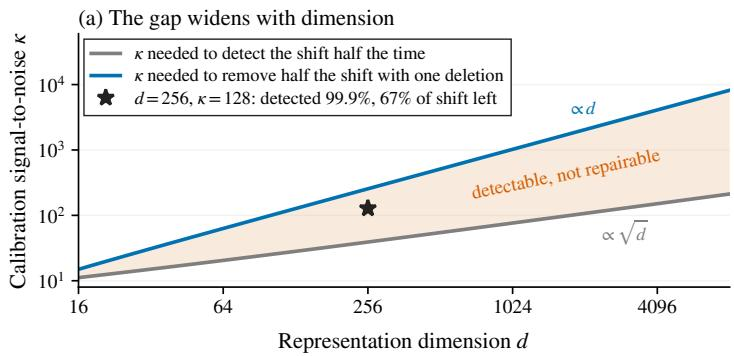

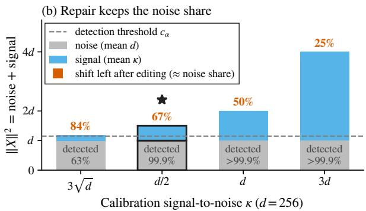  
Figure 1: Detecting a shift is not enough to repair it. (a) Detection needs $\kappa \propto \sqrt { d }$ and repair κ ∝ $d ,$ so the wedge of shifts that are detectable but not repairable widens with dimension. Detection is a test of “no shift” at the 5% significance level, and repair uses the best linear map that deletes one direction. (b) At $d = 2 5 6$ , the squared length $\| X \| ^ { 2 }$ of the normalized mean calibration diference has expected value $d + \kappa \colon$ noise d (grey) plus signal κ (blue). The test needs only the total to clear the dashed threshold, whereas editing leaves about the grey share of the bar (orange). The star marks the same setting in both panels. All values are exact.

What existing erasers pay. Mean projection (MP; Haghighatkhah et al., 2022), centered rank-one SAL (Shao et al., 2023) and binary LEACE (Belrose et al., 2023) all delete the empirical mean diference (Theorem 4), so the frontier is their exact behavior. They erase that diference completely on the calibration sample yet leave the frontier’s residual on new data, an efect recently observed empirically (Jin et al., 2026). The calibration a target requires can therefore be computed in advance: at $d = 6 4$ and a signal-to-noise ratio of one per pair, a residual of $1 / 2$ needs 63 calibration pairs. For any other fitted subspace, Theorem 5 adds an explicit excess: one step of iterative nullspace projection (INLP; Ravfogel et al., 2020) falls visibly short of the frontier, while fixed-rank R-LACE (Ravfogel et al., 2022) reaches it.

What kind of calibration helps. Real calibration comes in clusters, such as participants with many recordings each. The guarantee depends only on the total noise of the averaged calibration diference, so more recordings from the same units stall at a cap that only more units lift, and Theorem 8 tells how to split a budget between the two. On a public dataset in which 100 people slept in a clinical polysomnograph and a wearable headband at once, the formula predicts, from calibration participants alone, how much device shift survives in new participants (Section 7.2): even 128 epochs from one participant leave about 0.7 of the shift, whereas adding people keeps reducing it.

The limit stays exact for non-Gaussian shared content under pairing (Section 4), the projection keeps its guarantee under anisotropic noise (Section 6), and acting only after favorable fits cannot close the gap (Section 5). When the shift strength is unknown, certified rules decide when to act (Section 5.2). Simulations, a semisynthetic experiment with real represented content, and two real device pairs confirm the predictions. Together, these answers separate three reasons a correction can fall short: a suboptimal editor, too little calibration, or calibration collected on the wrong unit.

## 2 RELATED WORK

Detection versus direction. In spiked models a signal becomes detectable at a lower signal-to-noise ratio than its direction becomes estimable (Johnstone and Lu, 2009; Berthet and Rigollet, 2013; Cai et al., 2013; Mergny and Zdeborová, 2026), and two-sample tests detect shift from modest samples (Rabanser et al., 2019). These results concern a test or an estimator. We instead bound what any shared linear correction can remove under a distortion budget, which gives necessary as well as suficient calibration requirements. Our rules for when to act resemble selective prediction (El-Yaniv and Wiener, 2010) but select over calibration fits, and their certificates hold uniformly over unknown shift strengths, unlike risk control at a known distribution (Angelopoulos et al., 2025).

Linear erasure from finite samples. Linear erasers fit a projection or afine map to data (Haghighatkhah et al., 2022; Ravfogel et al., 2020, 2022; Belrose et al., 2023; Shao et al., 2023), and related work studies what erasure preserves or leaves behind (Holstege et al., 2025; Chowdhury et al., 2025; Akbari et al., 2025). Fitted on finite samples, they leave concept information on fresh data that population erasers would remove (Jin et al.,

2026), and an estimated erasure subspace generalizes diferently from the probe that tests it (Naowarat et al., 2026). Theorem 4 gives this residual for MP, SAL and LEACE, whose binary-label equivalence Belrose et al. (2023) noted, and Theorem 5 gives the excess of any other fitted subspace.

Paired and clustered calibration. Paired data isolate a shift from shared content, in travelling-subject harmonization (Yamashita et al., 2019), simultaneous wearable and clinical EEG (López-Larraz et al., 2026; Esparza-Iaizzo et al., 2026), and counterfactual pairs, from which noisy counterfactual matching (NCM) and GRIT estimate a spurious subspace and bound the out-of-distribution error of a predictor restricted to its complement, GRIT at rate $\sqrt { d / N }$ in the number of pairs N (Bai et al., 2025, 2026). These are upper bounds for a particular estimator and predictor, whereas our limit is exact and holds for every shared linear editor. When pairs come in clusters, splitting a budget between participants and pairs is the two-stage allocation problem (Cochran, 1977), and the same allocation minimizes a bound on the residual of an eraser (Theorem 8).

## 3 STATISTICAL EXPERIMENT AND LOSS

We formalize a shared linear correction learned from paired calibration and evaluated on independent fresh observations. We assume isotropic within-source variation and calibration noise, so that no shift direction is easier to estimate or cheaper to delete than another.

Let $d \geq 2$ and let $u \in \mathbb { S } ^ { d - 1 }$ be a unit vector in $\mathbb { R } ^ { d }$ . The unknown source shift is $\delta = \theta u$ , where $\theta > 0 . \mathrm { ~ A ~ }$ fresh representation is

$$
\begin{array} { c } { { H = V + S \delta / 2 , } } \\ { { V \sim N ( 0 , I _ { d } ) , ~ V \perp S , ~ S \in \{ - 1 , + 1 \} . } } \end{array}\tag{1}
$$

An independent calibration sample consists of contrasts

$$
\begin{array} { r l r } & { } & { D _ { i } \overset { \mathrm { i i d } } { \sim } N ( \delta , s ^ { 2 } I _ { d } ) , \quad i = 1 , \dots , N , } \\ & { } & { \quad \quad X = \frac { \sqrt { N } \bar { D } } { s } \sim N ( \sqrt { \kappa } u , I _ { d } ) , \qquad \kappa = \frac { N \theta ^ { 2 } } { s ^ { 2 } } . } \end{array}\tag{2}
$$

Here $\begin{array} { r } { { \bar { D } } = N ^ { - 1 } \sum _ { i } D _ { i } } \end{array}$ and κ is the total calibration signal-to-noise ratio. Initially $s > 0$ is known; Theorem 11 and Section I address an unknown isotropic scale. The contrasts can arise from same-content paired views with independent measurement noise (Section A).

What an editor may use. A rule chooses $M \in \mathbb { R } ^ { d \times d }$ from the calibration sample and an independent random seed. The chosen matrix is then fixed, shared between sources, and known to the evaluator. At known s, X contains all information about u in the full contrast sample. Extra observations are allowed if their conditional law given X is independent of u (Section B).

A hard, source-neutral cost. The cost is how far the editor moves a fresh representation on average, and it must stay within budget on every fit and seed:

$$
C ( M ) : = \mathbb { E } _ { V } \Vert M V - V \Vert ^ { 2 } = \Vert M - I _ { d } \Vert _ { F } ^ { 2 } \leq b , \qquad b \geq 0 .\tag{3}
$$

Deleting one unit-variance direction costs one and deleting everything costs d. The budget is total rather than per coordinate (average budgets: Section 5.1).

A covariance-adjusted source residual. We score an editor by how much of the shift remains visible after editing, relative to the spread of the edited data. The edited means difer by Mδ and the within-source covariance is $M M ^ { \top }$ Write $\Pi _ { K }$ for the orthogonal projector onto a subspace $K _ { \colon }$ , and row(M), ker M for the row space and kernel. With + the Moore–Penrose inverse, define

$$
L ( M , u ) : = \frac { ( M \delta ) ^ { \top } ( M M ^ { \top } ) ^ { + } ( M \delta ) } { \theta ^ { 2 } } = \| \Pi _ { \mathrm { r o w } ( M ) } u \| ^ { 2 } .\tag{4}
$$

The numerator is squared Mahalanobis separation on the output support, so invertible rescaling leaves L unchanged: a downstream classifier can undo any such rescaling, so shrinkage alone removes nothing. By the second expression, $L \in [ 0 , 1 ]$ , with 0 denoting complete source removal and 1 denoting no reduction of optimal Gaussian discriminability. Section A gives the Gaussian KL and Bayes-error interpretations. Because the residual and the cost are both covariance-adjusted, whitening turns an anisotropic within-source covariance into anisotropic calibration noise, which Section 6 treats.

The hard-budget minimax risk at fixed κ is

$$
\mathcal { R } _ { d } ^ { * } ( b , \kappa ) : = \operatorname* { i n f } _ { \widehat { M } : C ( \widehat { M } ) \leq b \mathrm { \ p o i n t w i s e } u \in \mathbb { S } ^ { d - 1 } } \mathbb { E } _ { u } L ( \widehat { M } , u ) .\tag{5}
$$

The expectation is over the calibration sample and the seed used to fit the shared editor.

## 4 THE EXACT COST OF FINITE CALIBRATION

Under the loss Equation (4), only the deleted subspace can help, and each deleted direction costs at least one. Lemma 1 (Repair is subspace estimation). For every $M \in \mathbb { R } ^ { d \times d }$ and $u \in \mathbb { S } ^ { d - 1 }$ ，

$$
L ( M , u ) = 1 - \| \Pi _ { \mathrm { k e r } M } u \| ^ { 2 } , \qquad C ( M ) \geq \dim \ker M ,\tag{6}
$$

and $I _ { d } - \Pi _ { \ker M }$ has the same residual for every u at cost exactly dim ker M (Section B).

The lemma covers asymmetric matrices, contractions, and nonorthogonal maps; a nonsingular shrinkage has $L = 1$ , however small its singular values. It turns the search over all shared linear editors into the choice of a subspace to delete. With one deletion, the residual is the squared sine of the angle between the shift and the deleted direction, so the question becomes how well the calibration points at it. From there, the exact value follows from the posterior of a direction on the sphere and a randomization that equalizes the risk over directions. The reduction is what makes the limit bind every editor rather than one estimator.

Theorem 2 (Exact all-linear frontier). Set $k \_ =$ min{d, ⌊b⌋} and let $J \sim \mathrm { P o i s } ( \kappa / 2 )$ . Then

$$
\mathcal { R } _ { d } ^ { * } ( b , \kappa ) = \left\{ \begin{array} { l l } { 1 , } & { k = 0 , } \\ { ( d - k ) \mathbb { E } \displaystyle \frac { 1 } { d + 2 J } , } & { 1 \leq k \leq d . } \end{array} \right.\tag{7}
$$

$F o r \ k \geq 1$ , an attaining editor is $M = I _ { d } - \Pi _ { K }$ , where $K = \mathrm { s p a n } \{ w \} \oplus K _ { \perp } , w = \bar { D } / \| \bar { D } \|$ , and $K _ { \perp }$ is a uniformly sampled $( k - 1 )$ )-dimensional subspace of $w ^ { \perp }$ . It has constant risk over u and cost k on every fit.

Why this is optimal. By Equation (6), the hard budget permits at most k deleted directions. Put a uniform prior on u. Given X, the posterior of u is a von Mises–Fisher law centred at w, with density proportional to exp $( \sqrt { \kappa } \| X \| w ^ { \top } u )$ . It treats all directions orthogonal to w alike, so its second-moment matrix has its largest eigenvalue along w and equal eigenvalues on $w ^ { \perp }$ . The Bayes action therefore deletes w and any $k - 1$ orthogonal directions (Eaton, 1989; Mardia and Jupp, 2000; Fourdrinier and Marchand, 2010; Besson et al., 2011). Choosing those $k - 1$ directions uniformly at random makes the frequentist risk the same for every u, so the Bayes risk is also the minimax risk.

The value has a simple form. Rotate u to the first coordinate, so that $X = \left( { \sqrt { \kappa } } + Z _ { 1 } , Z _ { 2 } , \ldots , Z _ { d } \right)$ with $Z$ standard normal. Deleting w leaves the share of $\| X \| ^ { 2 }$ of the signal axis, $( Z _ { 2 } ^ { 2 } + \cdot \cdot \cdot + Z _ { d } ^ { 2 } ) / \| X \| ^ { 2 }$ . The numerator is $\chi _ { d - 1 } ^ { 2 }$ , and the signal coordinate $( \sqrt { \kappa } + Z _ { 1 } ) ^ { 2 }$ is an independent noncentral $\chi _ { 1 } ^ { 2 } ( \kappa )$ . The standard Poisson mixture for this ratio gives Equation (7) (Marchand, 1997). Section B gives the details.

What the formula says. For $1 \leq k \leq d$ and $\kappa >$ 0, Jensen’s and the Cauchy–Schwarz inequalities give (Section B)

$$
\frac { d - k } { d + \kappa } \leq \mathcal { R } _ { d } ^ { * } ( b , \kappa ) \leq \frac { d - k } { d - 1 } \cdot \frac { d } { d + \kappa } .\tag{8}
$$

For one deletion, the two bounds have an energy reading. The lower bound $( d - 1 ) / ( d + \kappa )$ is the expected of-axis energy over the expected total. The upper bound $d / ( d + \kappa )$ , the noise share of Figure 1b, also counts the noise on the signal axis. They difer by exactly $1 / ( d + \kappa )$ . Hence, at cost one, an expected residual at most $\varepsilon \in ( 0 , 1 )$ requires $\kappa \geq ( d - 1 ) / \varepsilon - d$ and is guaranteed by $\kappa \geq d / \varepsilon - d .$ At a general budget it requires $k \geq d - \varepsilon ( d + \kappa )$ deleted directions.

The ratio $\kappa / d$ governs the risk: as $d \to \infty$ with $\kappa =$ cd and fixed $k \geq 1$ , the risk tends to $1 / ( 1 + c )$ , so the cost of directional uncertainty persists at constant signal per coordinate (other regimes: Section B). With known $u ,$ by contrast, cost one gives zero residual for every $\theta > 0$ Two features make the attaining editor robust. Its upper bound uses only the mean and covariance of the contrasts, so it holds under non-Gaussian and anisotropic calibration noise at the mean noise level (Theorem 7). It uses only the direction of ${ \bar { D } } ,$ so for $N \geq 2$ it stays minimax when the noise scale is unknown, with the same risk $\mathcal { R } _ { d } ^ { * } ( b , \kappa )$ at fixed $\kappa = N \theta ^ { 2 } / s ^ { 2 }$ (Theorem 11).

Detection and repair live at diferent scales. Testing $H _ { 0 } : \delta = 0$ against an unknown direction at strength κ requires no estimate of that direction. The level-α radial test rejects when $\| X \| ^ { 2 } > \chi _ { d , 1 - \alpha } ^ { 2 }$ , the $1 - \alpha$ quantile of the central $\chi _ { d } ^ { 2 }$ distribution. It has exact power $\overline { { F } } _ { \chi _ { d } ^ { 2 } ( \kappa ) } ( \chi _ { d , 1 - \alpha } ^ { 2 } )$ , with $\overline { F }$ a survival function, and is minimax among level-α tests at a fixed radius.

Corollary 3 (A detection–repair gap). As $d \to \infty$ with fixed $\alpha \in ( 0 , 1 )$ , no level-α test has minimum power over directions exceeding $\alpha + o ( 1 )$ when $\kappa = o ( \sqrt { d } )$ ; the radial test has power tending to one when $\kappa / \sqrt { d } \to \infty$ If simultaneously $\kappa / d  0$ , every fixed hard budget b has minimax repair risk tending to one. In that regime, achieving expected residual at most a fixed $\varepsilon < 1$ requires deleting at least $( 1 - \varepsilon ) d - o ( d )$ directions.

The detection rate is classical (Baraud, 2002; Collier et al., 2017), and the point is its contrast with Equation (7).

Non-Gaussian shared content. The shared content of a pair need not be Gaussian. Suppose each pair consists of shared content drawn from any fixed law with mean zero and covariance $( 1 - s ^ { 2 } / 2 ) I _ { d }$ , plus independent Gaussian measurement noise ${ N } ( 0 , s ^ { 2 } I _ { d } / 2 )$ on each endpoint, so that each view has identity covariance. The contrast of the pair cancels the content, and its midpoint carries no information about the shift direction. A shared afine editor $h \mapsto M h + a$ then costs $\| M - I _ { d } \| _ { F } ^ { 2 } + \| a \| ^ { 2 }$ , since a common ofset adds cost but leaves the source separation unchanged. This gives an exact extension: the whole frontier, with its calibration and deletion requirements, holds for every such content law, and the editor of Theorem 2 attains it without knowledge of the law (Theorem 9 in Section A.2).

## 4.1 A consequence for empirical concept erasers

An empirical eraser removes exactly the mean diference it sees. That diference is the true shift plus calibration noise, so the eraser deletes a noisy direction and leaves population separation behind. For methods that delete the empirical direction, the frontier is this residual.

Corollary 4 (Expected residual of one-direction empirical erasure). In the calibration experiment Equation (2), suppose a fitted shared afine editor $h \mapsto$ $\widehat { M h } + \widehat { a }$ satisfies $\widehat { M D } = 0$ and dim ker $\widehat { M } = 1$ almost surely. For every true direction u,

$$
\begin{array} { r l r } & { L ( \widehat { M } , u ) = 1 - \displaystyle \frac { ( u ^ { \top } \bar { D } ) ^ { 2 } } { \| \bar { D } \| ^ { 2 } } , } & \\ & { \mathbb { E } _ { u } L ( \widehat { M } , u ) = \mathcal { R } _ { d } ^ { * } ( 1 , \kappa ) = ( d - 1 ) \mathbb { E } _ { J \sim \mathrm { P o i s } ( \kappa / 2 ) } \displaystyle \frac 1 { d + 2 J } . } & \\ & { \quad } & \end{array}\tag{9}
$$

Proof. Almost surely $\bar { D } \neq 0 ,$ , so the two conditions give ker $\widehat { M } = \operatorname { s p a n } \{ \bar { D } \}$ ; Equation (6) gives the pointwise identity, and the cost-one case of Theorem 2 gives its expectation. The common afine ofset does not change source separation. □

For balanced paired observations, the empirical source means difer by D¯. MP (Haghighatkhah et al., 2022), centered binary SAL with one direction removed (Shao et al., 2023) and exact binary LEACE (Belrose et al., 2023) all have kernel span $\{ \check { D } \}$ almost surely, including LEACE with a singular empirical covariance (Section C). Equation (9) is therefore their exact population residual, for every content law allowed by Theorem 9, and Equation (8) gives their calibration needs. The three methods share the residual but not the distortion. MP and SAL cost exactly one, LEACE’s oblique map can cost more, and a mean-restoring ofset adds to any of them. Because their residual is known before fitting, Equation (9) can be inverted in N at specified $( d , \theta , s )$ which gives the smallest calibration size $N _ { \star } ( \varepsilon )$ with expected residual at most ε. At $d = 6 4$ and $\theta = s ^ { 2 } = 1$ 2 the targets $1 / 2$ and $1 / 4$ require $N _ { \star } = 6 3$ and 190 pairs (Section M.2). The excess for any other fitted subspace is the part of the empirical direction it leaves undeleted, weighted by how informative the calibration was.

Corollary 5 (Excess residual of a fitted deleted subspace). In Equation (2), fix $\kappa > 0$ and an integer $1 \leq k \leq d ,$ and let K = ker Mc satisfy dim $K = k$ almost surely, where the fitted editor may use the full allowed calibration information and independent fitting randomness. Write E for expectation with U uniform on $\mathbb { S } ^ { d - 1 }$ followed by calibration and fitting at direction U, and set $R = \| X \| , w = X / R ,$ and $\rho _ { K } = \| ( I _ { d } - \Pi _ { K } ) w \| ^ { 2 }$ the fraction of the empirical direction outside K. Then

$$
\begin{array} { r } { \widehat { \mathbb { E } } L ( \widehat { M } , U ) = \mathcal { R } _ { d } ^ { * } ( k , \kappa ) + \overline { { \mathbb { E } } } [ g _ { \kappa } ( R ) \rho _ { K } ] , \hfill } \\ { g _ { \kappa } ( r ) = 1 - d \lambda _ { \kappa } ( r ) \geq 0 , \hfill } \end{array}\tag{10}
$$

where $\lambda _ { \kappa } ( r ) = ( 1 - \beta ( \sqrt { \kappa } r ) ) / ( d - 1 )$ and $\beta ( { \sqrt { \kappa } } r ) =$ $\overline { { \mathbb { E } } } [ ( w ^ { \top } U ) ^ { 2 } \mid X ]$ is the posterior second moment along w in Equation (19). The identity also holds for every content law $Q$ allowed by Theorem 9.

Proof (Section C.5). Given the data, a kernel K has expected residual $1 - \operatorname { t r } ( \Pi _ { K } B _ { X } )$ , where $B _ { X }$ is the posterior second-moment matrix Equation (19).

The first term in Equation (10) is the unavoidable direction-averaged residual at k deleted directions. The second vanishes whenever K contains w. Hence every fixed-k rule that deletes w has direction-averaged risk $\mathcal { R } _ { d } ^ { * } ( k , \kappa ) = ( d - k ) \mathcal { R } _ { d } ^ { * } ( 1 , \kappa ) / ( d - 1 )$ , however it chooses its other $k - 1$ directions. Each deletion beyond the empirical direction thus removes only $1 / ( d - 1 )$ of the residual left by the first, so a larger budget cannot substitute for more calibration.

Application to iterative and adversarial erasers. An INLP iterate (Ravfogel et al., 2020) or an R-LACE projection (Ravfogel et al., 2022) at a fixed number of deletions is a fitted kernel, and Theorem 5 applies to it whatever the method optimizes. At equal kernel dimension, and hence equal orthogonal cost, it splits the residual into the statistical limit and the excess of the returned subspace, which gives a quantitative reading of the comparisons of INLP steps with random projections in Haghighatkhah et al. (2022). Because $g _ { \kappa }$ depends on $\kappa ,$ the excess is a diagnostic under the model, not a certificate computed from data alone.

Controlled illustration. We fit MP, SAL, LEACE, fixed-step INLP, and a fixed-budget R-LACE variant to the same paired endpoints and evaluate their actual maps against the simulated shift (Section O). At $d =$ N = 32 and one deletion, one-step INLP leaves mean residual $0 . 6 8 7 \pm 0 . 0 1 4$ , against $0 . 5 0 1 \pm 0 . 0 1 3$ for MP (±1.96 Monte Carlo SE). Its predicted excess 0.181 matches the observed paired excess $0 . 1 8 6 \pm 0 . 0 1 2$ over MP, and at four deletions the predicted 0.012 matches $0 . 0 1 7 \pm 0 . 0 0 8$ . The fitted R-LACE subspaces nearly contain w throughout the grid, and their mean residuals follow the fixed-rank frontier (Figure 2a).

Unpaired class samples. With $n _ { \pm }$ unpaired Gaussian observations per source, the class-mean diference is $N ( \delta , ( 1 / n _ { + } + 1 / n _ { - } ) I _ { d } )$ and is independent of the centered residuals, whose law is free of u. The three erasers again delete it, so Theorem 2, Theorems 4 and 5 and $N _ { \star }$ apply with $\kappa = \theta ^ { 2 } / ( 1 / n _ { + } + 1 / n _ { - } )$ . For two classes of size n this is $n \theta ^ { 2 } / 2 ,$ against $N \theta ^ { 2 } / s ^ { 2 }$ for N pairs, so at equal sample size pairing multiplies κ by

$2 / s ^ { 2 }$ . Theorem 9, by contrast, needs pairs to cancel the content.

Correcting with the source label. A correction that knows the source can subtract an estimate $\hat { \delta }$ of the shift from one of them instead of deleting a direction from both. Subtracting $\bar { D }$ itself leaves the share $\mathbb { E } \Vert \bar { D } -$ $\delta \| ^ { 2 } / \theta ^ { 2 } = d / \kappa$ , which exceeds one when $\kappa < d ;$ the shrunken $\frac { \kappa } { d + \kappa } \bar { D }$ leaves $d / ( d + \kappa )$ . No estimate does much better: over all ${ \hat { \delta } } ,$ even with θ and s known, the minimax share left lies between $\mathcal { R } _ { d } ^ { * } ( 1 , \kappa )$ and $d / ( d + \kappa )$ which difer by at most $1 / ( d + \kappa )$ (Theorem 10). The source label therefore saves the deleted direction, not the calibration: repair still needs $\kappa \asymp d$

## 5 CHOOSING WHEN TO ACT

## 5.1 The oracle limit of selective repair

The frontier averages over calibration fits, and some fits are more informative than others. Can a rule beat the limit by correcting only after favorable fits? We allow rules that, on each fit, either delete one direction w at cost one or abstain and return the identity, and that act with probability at least p at every shift direction. Let $\mathcal { R } _ { d } ^ { \mathrm { s e l } } ( p , \kappa )$ be the smallest worst-case expected residual given that the rule acts, the risk–coverage criterion of selective prediction (El-Yaniv and Wiener, 2010) with coverage taken over calibration samples (Section E).

Theorem 6 (Exact selective frontier). Let $\tau _ { p }$ satisfy $\overline { { F } } _ { \chi _ { d } ^ { 2 } ( \kappa ) } ( \tau _ { p } ) = p ;$ and let $J \sim \mathrm { P o i s } ( \kappa / 2 )$ . Then

$$
\mathcal { R } _ { d } ^ { \mathrm { s e l } } ( p , \kappa ) = \frac { d - 1 } { p } \mathbb { E } _ { J } \frac { \overline { { F } } _ { \chi _ { d + 2 J } ^ { 2 } } ( \tau _ { p } ) } { d + 2 J } .\tag{11}
$$

It is attained by $w = X / \| X \|$ and $A = \{ \| X \| ^ { 2 } \geq \tau _ { p } \}$ which acts with probability exactly p at every direction.

Acting on the largest calibration energies is optimal because the larger ∥X∥, the more reliable the empirical direction: its posterior residual decreases with ∥X∥. It lowers the residual, but not enough: when $\kappa = o ( d )$ the best conditional residual still tends to one at any action frequency bounded away from zero (Theorem 12, Section E), so selection cannot close the detection– repair gap. Under a budget that holds only on average over fits, the exact optimum instead spends complete deletion on the least informative fits, where one deletion barely helps (Theorem 13, Section F).

## 5.2 Certified action without the shift strength

The oracle threshold $\tau _ { p }$ uses κ, which an observable rule does not know. We instead require that the meandirection editor $I _ { d } - w w ^ { \top } , w = X / \| X \|$ , applied on an event A, rarely both acts and misses a residual target $\varepsilon ,$ uniformly over all shifts:

$$
\operatorname* { s u p } _ { \delta \neq 0 } \mathbb { P } _ { \delta } \{ A \mathrm { ~ a n d ~ } L ( I _ { d } - w w ^ { \top } , \delta / \| \delta \| ) > \varepsilon \} \leq \alpha .\tag{12}
$$

The guarantee is joint because the conditional error among accepted edits cannot be bounded uniformly: as $\delta  0$ , the residual of any action is Beta $\scriptstyle { \big ( } { \frac { d - 1 } { 2 } } , { \frac { 1 } { 2 } } { \big ) } -$ distributed whatever $\| X \| ^ { 2 }$ is. A confidence ball around the calibration mean gives one valid rule (Theorem 14), but it rarely acts: at $d = 2 5 6$ and $\kappa = 1 2 8$ , where detection is near certain, it acts with probability about $1 0 ^ { - 8 }$ The Poisson representation behind the frontier gives a less conservative one. Given the Poisson component, the calibration energy and the residual are independent, so controlling bad action within each component controls it for every κ at once. The resulting finite-mixture certificate acts strictly more often than the confidence ball at every shift strength (Theorem 15), also with an estimated noise scale (Section I). As $\kappa / d \to c ,$ all these rules switch from almost never to almost always acting at $c = \varepsilon ^ { - 1 } - 1$ , exactly where the oracle conditional residual $1 / ( 1 + c )$ crosses the target (Theorem 18).

## 6 ANISOTROPIC AND CLUSTERED CALIBRATION

Real calibration noise is rarely isotropic, and pairs often come in clusters, such as participants with several epochs each. Clustering is a special case of anisotropic noise, and the guarantee of the attaining editor needs only two moments, so one proposition covers both.

Proposition 7 (Bounds under anisotropic noise). Let the contrasts be i.i.d. with mean θu and covariance Γ in coordinates where the within-source covariance is $I _ { d } ,$ with eigenvalues $\gamma _ { ( 1 ) } \geq \ldots \geq \gamma _ { ( d ) } > 0$ , and set $\bar { \kappa } = N \theta ^ { 2 } d / \operatorname { t r } \Gamma$

(i) Gaussian or not, the editor of Theorem 2 satisfies $\begin{array} { r } { \mathbb { E } _ { u } L \leq \frac { d - k } { d - 1 } \cdot \frac { d } { d + \bar { \kappa } } } \end{array}$ for every $u \in \mathbb { S } ^ { d - 1 }$ and $1 \leq k \leq d .$   
(ii) If the contrasts are Gaussian, every editor within the hard budget b, with k = min $\{ d , \lfloor b \rfloor \} \ge 1$ , has $\begin{array} { r } { \operatorname* { s u p } _ { u } \mathbb { E } _ { u } L \geq \operatorname* { m a x } _ { k < m \leq d } \mathcal { R } _ { m } ^ { * } ( k , N \theta ^ { 2 } / \gamma _ { ( m ) } ) } \end{array}$ , whether or not Γ is known.

Proof idea (Section K). For (i), the Cauchy– Schwarz inequality bounds $\mathbb { E } ( u ^ { \top } w ) ^ { 2 }$ from below by $\bar { \kappa } / ( d + \bar { \kappa } )$ using only the mean and covariance of $\check { \bar { D } }$ For (ii), restricting u to the m noisiest directions leaves a problem no easier than the isotropic one at noise level $\gamma _ { ( m ) }$ . For $\Gamma = s ^ { 2 } I _ { d }$ , part (i) is the upper bound in Equation (8) and part (ii) at $m = d$ is Theorem 2.

Two-level calibration. Let P participants contribute n pairs each. If participant j has shift $\delta + \eta _ { j }$ with $\mathrm { C o v } ( \eta _ { j } ) = \Sigma _ { b }$ , and its pair contrasts vary around it with covariance $\Sigma _ { w }$ , the participant means are independent contrasts with mean δ and covariance $\Sigma _ { b } + \Sigma _ { w } / n$ . More pairs per participant shrink only the second term.

Corollary 8 (Two-level calibration). In whitened coordinates, the mean-direction erasers have mean residual for the population shift δ at most $d / ( d + \bar { \kappa } )$ , with

$$
\bar { \kappa } ( P , n ) = \frac { P \theta ^ { 2 } d } { \mathrm { t r } ( \Sigma _ { b } + \Sigma _ { w } / n ) } \leq \frac { P \theta ^ { 2 } d } { \mathrm { t r } \Sigma _ { b } } f o r e v e r y n .\tag{13}
$$

If a participant costs as much as c pairs, then at a fixed total cost $P ( c + n )$ the bound is smallest at $n ^ { \star } =$ $\sqrt { c \mathrm { t r } \Sigma _ { w } / \mathrm { t r } \Sigma _ { b } }$ pairs per participant.

Proof. Apply Theorem $7 ( \mathrm { i } )$ with $N = P$ and $\Gamma =$ $\Sigma _ { b } + \Sigma _ { w } / n ;$ at fixed cost, κ¯ is largest when (tr $\Sigma _ { b } +$ tr $\Sigma _ { w } / n ) ( c + n )$ is smallest, which gives $n ^ { \star }$ , the classical allocation of two-stage sampling (Cochran, 1977).

The calibration strength is therefore capped at $P \theta ^ { 2 } d / \operatorname { t r } \Sigma _ { b }$ however many pairs each participant gives, and only more participants raise the cap. The residual itself is the expectation of $1 - ( u ^ { \top } w ) ^ { 2 }$ under the law of D¯ . We evaluate it by plug-in Monte Carlo and call it the two-level prediction, to which the bound is close unless the noise spectrum is steep.

## 7 SIMULATIONS AND REAL DEVICE SHIFTS

## 7.1 Simulations and a semisynthetic check

Simulations of the Gaussian experiment reproduce the exact formulas of Sections 4 and 5 within Monte Carlo error (Table 1 and Figure 3 in Section L). For instance, the cost-one residual at $( d , \kappa ) = ( 2 5 6 , 1 2 8 )$ is $0 . 6 6 4 4 \pm 0 . 0 0 0 9$ against the exact 0.6652. Real represented content gives the same agreement, as Theorem 9 predicts. We take three fixed pools of EEG features from a public paired-recording dataset (Williams et al., 2020), inject shift and noise as in Equation (16), and fit MP, SAL and LEACE. Over 120 conditions the residuals deviate from the predictions by 0.004 in root mean square, and at the budgets $N _ { \star }$ all three pools land on their targets (Section M.2). Selection and certification behave as Section 5 predicts. At $d = 6 4$ and $\kappa = 3 2$ , acting on only a fraction $1 0 ^ { - 5 }$ of fits lowers the optimal conditional residual from 0.661 to 0.549 (Figure 4). Without certification, acting whenever the radial test rejects would, at (256, 128), act and miss the target $\varepsilon = 0 . 5$ with probability 0.9986. The certified finite-mixture threshold is lower than the confidence ball’s, 559.4 against 588.6 at $d = \kappa = 2 5 6 ~ ( \mathrm { F i g u r e } ~ 6 )$

## 7.2 A wearable versus a clinical recording

In the BOAS dataset (López-Larraz et al., 2026), 100 healthy participants slept in a clinical polysomnograph and a forehead EEG headband at once. For each participant we take one night, drawn with a fixed seed before any analysis. We pair log-power spectra (0.5– 30 Hz, 0.5 Hz bins) of the two headband channels with those of the nearest polysomnograph channels in the same 30-s N2 epoch, so each epoch gives one calibration pair and $d = 1 1 8$ . A channel-quality rule leaves 85 participants (Section N). The participant is the calibration unit. We split participants at random into a calibration pool of 43 and a test set of 42, whiten with the pool’s within-source covariance, and estimate $\theta ^ { 2 } , \Sigma _ { b }$ and $\Sigma _ { w }$ from the pool alone. We then draw $P$ calibration participants with n epochs each, fit the erasers, and measure on the test participants how much of the population mean shift remains, over 20 random splits.

The two-level prediction of Section 6 matches the observed residual across the grid $P \leq 3 2 , n \leq 1 2 8$ (Figure 2b): the root-mean-square deviation over 80 cells is $0 . 0 1 6 ,$ and the closed-form bound $d / ( d + \bar { \kappa } )$ is never exceeded by more than 1.96 standard errors. The agreement holds without the channel-quality rule, for all sleep stages, for d from 28 to 236, and for the actual MP, SAL and LEACE maps, whose kernels coincide (Section N). On the 16 participants of the Neuroscan/Flex N170 recordings (Williams et al., 2020), a second device pair, the deviation is 0.005 (Section N.1).

The number of participants limits the correction. All epochs of one participant share that participant’s shift. One participant caps κ¯ at $\theta ^ { 2 } d / \mathrm { t r } \Sigma _ { b } \approx 3 5 $ , so even 128 of its epochs leave 0.69 of the shift, whereas four participants leave about half and 32 leave 0.125. Because tr $\Sigma _ { w } / \mathrm { t r } \Sigma _ { b } \approx 1 1$ , a participant who costs as much as 100 epochs is best recorded for about 33 epochs, or 17 minutes of N2 sleep, a split that a pilot of eight nights already recovers (Section N).

Detection again comes first (Figure 2c): with eight participants and eight epochs each, the shift is detected in 97% of draws, yet half of it remains. The gap widens with dimension, as Theorem 3 leads one to expect: at $n = 8$ , half detection power needs about four participants for every d from 28 to 236, while halving the shift needs about 4, 6, 8 and 12 participants at d = 28, 58, 118 and 236. Subtracting the unshrunk mean diference with the known device label does worse than the erasers at every calibration size, and worse than no correction for fewer than 12 participants at $n = 8 .$ , as its $d / \kappa$ share predicts. Shrinkage removes this failure, but in the isotropic model no subtraction leaves less than the one-direction frontier (Theorem 10).

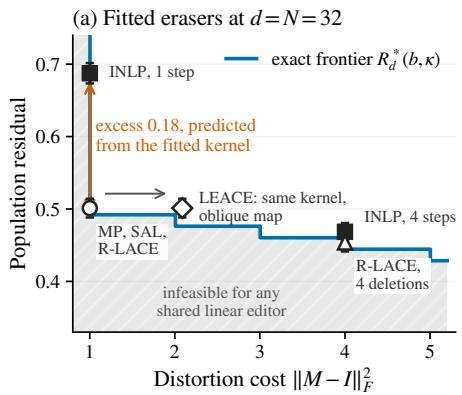

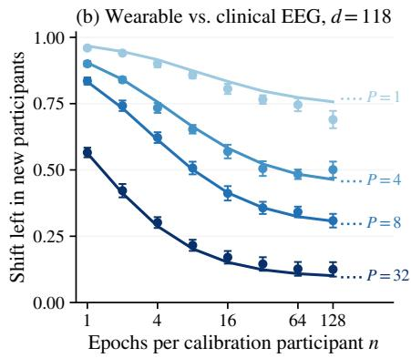

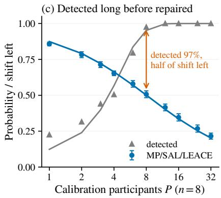  
Figure 2: What the frontier predicts for fitted erasers and for a real device shift. (a) Simulation at $d = N = 3 2$ with $\theta = s ^ { 2 } = 1$ : share of the shift left in the population against median distortion cost, over 256 calibrations (±1.96 Monte Carlo SE). No shared linear editor can go below the exact frontier (line). Methods on the line are calibration-limited: four times the budget lowers the frontier only from 0.49 to 0.44. The orange arrow is the excess of one-step INLP predicted from its fitted kernel (Equation (10)), and the grey arrow is LEACE’s extra distortion at the same kernel. (b, c) BOAS: share of the shift left in held-out participants (points, ±1.96 SE over 20 random splits of the same participants, which understates the uncertainty from the choice o people) and its prediction from the calibration pool alone (lines). (b) Dotted levels are the limits as $n \to \infty$ . (c) $\mathrm { A t } \ n = 8 .$ , the shift is detected (grey) long before the erasers remove it (blue).

## 8 DISCUSSION

Within this model, the exact frontier is a benchmark for a correction that falls short. As lower bounds, its limits also bind any larger model class containing this Gaussian experiment under the same constraints. The frontier separates three reasons: the editor may be suboptimal (Theorem 5), the calibration may be too small for the budget (Theorem 2), or the calibration may be collected on the wrong unit (Theorem 8). Evaluating representation repair should therefore report the achieved reduction, its distortion, and its frequency of application, rather than treating source detection as evidence that repair is already possible.

Using the frontier in practice. The frontier plays the role of a power analysis for repair. Before any calibration is collected, it gives the calibration signal-tonoise κ that a target residual requires. With repeated recordings per unit, such as participants or sites, three numbers fix κ: the size of the shift $\theta ^ { 2 }$ , its variation between units tr $\Sigma _ { b }$ , and the noise within a unit tr $\Sigma _ { w } .$ A small pilot estimates them, and Equation (13) turns them into how many units to record and how many recordings per unit. It also warns when more recordings from the same units cannot reach the target. After fitting, the certificates of Section 5 decide, in the isotropic model, whether to apply the edit or to leave the data unchanged.

Limitations. The exact results assume independent calibration, isotropic Gaussian contrasts, a single shift direction, shared linear or afine editing, and the covariance-adjusted residual and distortion. With pairs, the frontier stays exact for any shared content (Theorem 9). Like every linear eraser, including LEACE, the editors remove only the first-moment diference. Second-moment diferences, which can be substantial between devices (Section N), are beyond any linear correction (Chowdhury et al., 2025; Akbari et al., 2025). All recordings are public and de-identified, and no new data were collected.1 Neither source decodability nor a reduction in source separation alone establishes a downstream benefit: editing can remove useful information even when a residual target is met, so whether removal is desirable, in fairness, privacy, or prediction, must be evaluated in the application (Ravichander et al., 2021; Elazar et al., 2021; Kumar et al., 2022).

What remains open. Under anisotropic noise the minimax value is only bracketed (Theorem 7), and weighting the direction estimate by the noise may beat the empirical one when the spectrum is steep. Shifts spread over several directions, or more than two sources, call for a subspace version of the frontier. Correcting one person means targeting their own shift rather than the population mean, which would combine both levels of Equation (13). Calibrating until a certificate passes needs a sequential version of the guarantees. Finally, the distortion cost treats all directions alike, whereas one that charges more for deleting task-relevant directions would trade the residual against downstream utility.

## AI use statement

Generative artificial intelligence (AI) tools assisted code cleaning and refactoring, preliminary literature search, and manuscript text polishing. All AI-assisted code was reviewed and tested by the authors. The authors retain full responsibility for the final content.

## Acknowledgements

We would like to acknowledge support from the MBZUAI Startup Fund.

## References

Akbari, R., Afshari, M., and Boddeti, V. N. (2025). Obliviator reveals the cost of nonlinear guardedness in concept erasure. In Advances in Neural Information Processing Systems, volume 38.

Angelopoulos, A. N., Bates, S., Candès, E. J., Jordan, M. I., and Lei, L. (2025). Learn then test: Calibrating predictive algorithms to achieve risk control. The Annals of Applied Statistics, 19(2):1641–1662.

Bai, R., Ji, Y., Kim, M., Currie, E., Zhou, Z., and Inouye, D. I. (2026). Provable robustness to spurious correlations via invariant data for robust finetuning. In Causality in the Age of AI Scaling (CauScale), Workshop at AISTATS. Non-archival workshop paper.

Bai, R., Ji, Y., Zhou, Z., and Inouye, D. I. (2025). From invariant representations to invariant data: Provable robustness to spurious correlations via noisy counterfactual matching. arXiv:2505.24843.

Baraud, Y. (2002). Non-asymptotic minimax rates of testing in signal detection. Bernoulli, 8(5):577–606.

Belrose, N., Schneider-Joseph, D., Ravfogel, S., Cotterell, R., Raf, E., and Biderman, S. (2023). LEACE: Perfect linear concept erasure in closed form. In Advances in Neural Information Processing Systems, volume 36.

Berthet, Q. and Rigollet, P. (2013). Optimal detection of sparse principal components in high dimension. The Annals of Statistics, 41(4):1780–1815.

Besson, O., Dobigeon, N., and Tourneret, J.-Y. (2011). Minimum mean square distance estimation of a subspace. IEEE Transactions on Signal Processing, 59(12):5709–5720.

Box, G. E. P. and Draper, N. R. (1987). Empirical Model-Building and Response Surfaces. Wiley, New York.

Cai, T. T., Ma, Z., and Wu, Y. (2013). Sparse PCA: Optimal rates and adaptive estimation. The Annals of Statistics, 41(6):3074–3110.

Chowdhury, S. B. R., Dubey, K. A., Beirami, A., Kidambi, R., Monath, N., Ahmed, A., and Chaturvedi, S. (2025). Fundamental limits of perfect concept erasure. In Proceedings of the 28th International Conference on Artificial Intelligence and Statistics, volume 258 of Proceedings of Machine Learning Research, pages 901–909. PMLR.

Cochran, W. G. (1977). Sampling Techniques. Wiley, New York, third edition.

Collier, O., Comminges, L., and Tsybakov, A. B. (2017). Minimax estimation of linear and quadratic functionals on sparsity classes. The Annals of Statistics, 45(3):923–958.

Eaton, M. L. (1989). Group Invariance Applications in Statistics, volume 1 of Regional Conference Series in Probability and Statistics. Institute of Mathematical Statistics.

El-Yaniv, R. and Wiener, Y. (2010). On the foundations of noise-free selective classification. Journal of Machine Learning Research, 11:1605–1641.

Elazar, Y., Ravfogel, S., Jacovi, A., and Goldberg, Y. (2021). Amnesic probing: Behavioral explanation with amnesic counterfactuals. Transactions of the Association for Computational Linguistics, 9:160–175.

Esparza-Iaizzo, M., Sierra-Torralba, M., Klinzing, J. G., Minguez, J., Montesano, L., and López-Larraz, E. (2026). Automatic sleep scoring for real-time monitoring and stimulation in individuals with and without sleep apnea. Computers in Biology and Medicine, 205:111560.

Fourdrinier, D. and Marchand, É. (2010). On Bayes estimators with uniform priors on spheres and their comparative performance with maximum likelihood estimators for estimating bounded multivariate normal means. Journal ofMultivariate Analysis, 101(6):1390– 1399.

Haghighatkhah, P., Fokkens, A., Sommerauer, P., Speckmann, B., and Verbeek, K. (2022). Better hit the nail on the head than beat around the bush: Removing protected attributes with a single projection. In Proceedings of the 2022 Conference on Empirical Methods in Natural Language Processing, pages 8395– 8416. Association for Computational Linguistics.

Herrera-Esposito, D. and Burge, J. (2025). Projected normal distribution: Moment approximations and generalizations. arXiv:2506.17461.

Holstege, F., Ravfogel, S., and Wouters, B. (2025). Preserving task-relevant information under linear concept removal. In Advances in Neural Information Processing Systems, volume 38.

Jin, T., Dong, S., Li, H., and Chou, C.-H. (2026). Iterative erasure count is not an afine-invariant concept dimension. arXiv:2608.10566.

Johnstone, I. M. and Lu, A. Y. (2009). On consistency and sparsity for principal components analysis in high dimensions. Journal of the American Statistical Association, 104(486):682–693.

Kumar, A., Tan, C., and Sharma, A. (2022). Probing classifiers are unreliable for concept removal and detection. In Advances in Neural Information Processing Systems, volume 35.

López-Larraz, E., Sierra-Torralba, M., Clemente, S., Fierro, G., Oriol, D., Minguez, J., Montesano, L., and Klinzing, J. G. (2026). The Bitbrain open access sleep (BOAS) dataset. OpenNeuro, dataset ds005555, version 1.1.3.

Marchand, É. (1997). On moments of beta mixtures, the noncentral beta distribution, and the coeficient of determination. Journal of Statistical Computation and Simulation, 59(2):161–178.

Mardia, K. V. and Jupp, P. E. (2000). Directional Statistics. Wiley Series in Probability and Statistics. John Wiley & Sons.

Mergny, P. and Zdeborová, L. (2026). Spectral thresholds in correlated spiked models and fundamental limits of partial least squares. In Proceedings of The 29th International Conference on Artificial Intelligence and Statistics, volume 300 of Proceedings of Machine Learning Research, pages 3925–3933.

Naowarat, B., Tang, H., and Goldwater, S. (2026). A framework for analyzing concept representations in neural models. In Proceedings of the 30th Conference on Computational Natural Language Learning, pages 574–587.

Rabanser, S., Günnemann, S., and Lipton, Z. C. (2019). Failing loudly: An empirical study of methods for detecting dataset shift. In Advances in Neural Information Processing Systems, volume 32, pages 1394– 1406.

Ravfogel, S., Elazar, Y., Gonen, H., Twiton, M., and Goldberg, Y. (2020). Null it out: Guarding protected attributes by iterative nullspace projection. In Proceedings of the 58th Annual Meeting of the Association for Computational Linguistics, pages 7237–7256. Association for Computational Linguistics.

Ravfogel, S., Twiton, M., Goldberg, Y., and Cotterell, R. D. (2022). Linear adversarial concept erasure. In Proceedings of the 39th International Conference on Machine Learning, volume 162 of Proceedings of Machine Learning Research, pages 18400–18421. PMLR.

Ravichander, A., Belinkov, Y., and Hovy, E. (2021). Probing the probing paradigm: Does probing accuracy entail task relevance? In Proceedings of the 16th

Conference of the European Chapter of the Association for Computational Linguistics: Main Volume, pages 3363–3377.

Shao, S., Ziser, Y., and Cohen, S. B. (2023). Gold doesn’t always glitter: Spectral removal of linear and nonlinear guarded attribute information. In Proceedings of the 17th Conference of the European Chapter of the Association for Computational Linguistics, pages 1611–1622.

Williams, N. S., McArthur, G. M., de Wit, B., Ibrahim, G., and Badcock, N. A. (2020). A validation of emotiv EPOC flex saline for EEG and ERP research. PeerJ, 8:e9713.

Yamashita, A., Yahata, N., Itahashi, T., Lisi, G., Yamada, T., Ichikawa, N., Takamura, M., Yoshihara, Y., Kunimatsu, A., Okada, N., Yamagata, H., Matsuo, K., Hashimoto, R., Okada, G., Sakai, Y., Morimoto, J., Narumoto, J., Shimada, Y., Kasai, K., Kato, N., Takahashi, H., Okamoto, Y., Tanaka, S. C., Kawato, M., Yamashita, O., and Imamizu, H. (2019). Harmonization of resting-state functional MRI data across multiple imaging sites via the separation of site diferences into sampling bias and measurement bias. PLOS Biology, 17(4):e3000042.

# Detecting a Shift Is Not Enough: Exact Minimax Limits of Linear Representation Repair Supplementary Materials

Roadmap. Sections A to D prove the results of Sections 3 and 4, Sections E to J prove those of Section 5 on when to act, and Section K proves Theorem 7 of Section 6. Section L reports the simulations of the theory, Section M fitted MP, SAL and LEACE on Gaussian and real content, Section N the wearable-versus-clinical EEG analysis with its Neuroscan/Flex replication, Section O INLP and R-LACE at fixed rank, and Section P a check under anisotropic content.

## A MODEL DETAILS AND THE PAIRED REALIZATION

## A.1 A paired realization with unchanged content

This appendix gives a paired construction that realizes the calibration experiment Equation (2) and interprets the residual. Both sources have positive probability, and their proportions do not enter the residual.

One realization of Equation (2) uses, for $0 < s ^ { 2 } < 2$

$$
H _ { i } ^ { + } = C _ { i } + \delta / 2 + E _ { i } ^ { + } , \qquad H _ { i } ^ { - } = C _ { i } - \delta / 2 + E _ { i } ^ { - } ,\tag{14}
$$

where $C _ { i } \sim N ( 0 , ( 1 - s ^ { 2 } / 2 ) I _ { d } )$ and $E _ { i } ^ { + } , E _ { i } ^ { - } \stackrel { \mathrm { i i d } } { \sim } N ( 0 , s ^ { 2 } I _ { d } / 2 )$ are independent. Each view has within-source covariance $I _ { d }$ and $D _ { i } = H _ { i } ^ { + } - H _ { i } ^ { - } \sim N \bar { ( } \delta , s ^ { \bar { 2 } } I _ { d } )$ . The midpoint is independent of the diference and its law does not involve u at fixed s, so observing the full pair adds no directional information at known s. Inference can therefore be based on the contrasts alone. Any $s > 0$ is allowed there, while the paired construction above needs $s ^ { 2 } < 2$ . With $s = 0$ a single contrast would identify u and make cost-one repair exact, which is a diferent experiment. When s is unknown, observations whose law depends on s could sharpen the scale estimate and with it the power of a certificate, and Section I builds the estimated-scale certificates from the contrasts and their residuals.

Gaussian interpretation of the residual. The numerator in Equation (4) is twice the KL divergence between the two edited Gaussian source distributions. For equal source probabilities the Bayes classification error is $\Phi ( - \theta \sqrt { L ( M , u ) } / 2 )$ , where Φ is the standard normal distribution function. In both readings the edited sources share the covariance $M M ^ { \top }$ , and when M deletes directions the two quantities are computed on its output support.

## A.2 Arbitrary shared content

Fix $d \ge 2 , \theta > 0 , 0 < s ^ { 2 } < 2 , \delta = \theta u$ , and let the shared content C have any fixed law $Q$ on $\mathbb { R } ^ { d }$ with

$$
\mathbb { E } _ { Q } C = 0 , \qquad \mathrm { C o v } _ { Q } ( C ) = ( 1 - s ^ { 2 } / 2 ) I _ { d } ,\tag{15}
$$

where $Q$ does not depend on the unknown shift. For each calibration pair, draw $C _ { i } \sim Q$ and $E _ { i } ^ { + } , E _ { i } ^ { - } \sim N ( 0 , s ^ { 2 } I _ { d } / 2 )$ mutually independently and independently across pairs, and set

$$
H _ { i } ^ { \pm } = C _ { i } \pm \delta / 2 + E _ { i } ^ { \pm } .\tag{16}
$$

Fresh observations use independent draws $H = V + S \delta / 2$ with $V = C + E ,$ , where $C \sim Q , E \sim N ( 0 , s ^ { 2 } I _ { d } / 2 )$ , and $S$ are independent. The editor may know $Q$ and use the full calibration pairs and independent fitting randomness, but is fixed before observing fresh evaluation draws.

Corollary 9 (The frontier with arbitrary shared content). Under Equations (15) and (16), the source-neutral cost $\mathcal { C } _ { Q } ( M , a ) : = \mathbb { E } \| ( M - I _ { d } ) V + a \| ^ { 2 }$ of a shared afine editor $h \mapsto M h + a$ equals $\| M - { \dot { I } } _ { d } \| _ { F } ^ { 2 } + \| a \| ^ { 2 }$ , and its normalized covariance-adjusted squared mean separation $\mathcal { L } _ { Q } ( M , u ) : = ( M \delta ) ^ { \top } ( M M ^ { \top } ) ^ { + } ( M \delta ) / \dot { \theta } ^ { 2 }$ equals $L ( M , u )$ of Equation (4). For every hard budget $b \geq 0$ , the minimax expected loss over fitted editors $( \widehat { M } , \widehat { a } )$ satisfying $\mathcal { C } _ { Q } ( \widehat { M } , \widehat { a } ) \leq b$ on every $f i t$ and seed, with the worst case over $u \in \mathbb { S } ^ { d - 1 }$ , equals $\mathcal { R } _ { d } ^ { * } ( b , \kappa )$ with $\kappa = N \theta ^ { 2 } / s ^ { 2 }$ . The orthogonal editor of Theorem 2, with zero ofset, attains this value without knowledge $o f Q$

Proof. The fresh variation has $\mathbb { E } V = 0$ and $\operatorname { C o v } ( V ) = \operatorname { C o v } ( C ) + \operatorname { C o v } ( E ) = I _ { d } .$ so expanding the quadratic distortion gives the cost identity; the edited source means difer by Mδ with common covariance $M M ^ { \top }$ , so Equation (6) gives the loss identity; only the moments of Q enter.

Next write each pair as its diference and midpoint, $D _ { i } = H _ { i } ^ { + } - H _ { i } ^ { - } = \delta + E _ { i } ^ { + } - E _ { i } ^ { - }$ and $A _ { i } = ( H _ { i } ^ { + } + H _ { i } ^ { - } ) / 2 =$ $C _ { i } + ( E _ { i } ^ { + } + E _ { i } ^ { - } ) / 2$ . The Gaussian noise diference and noise average have zero cross-covariance and hence are independent, and both are independent of $C _ { i }$ . Thus $D _ { i } \sim N ( \delta , s ^ { 2 } I _ { d } )$ , and the midpoints are independent of the contrasts with a law that does not involve u; the same holds jointly across the $N$ pairs, and at fixed s the centered contrast residuals are likewise independent of $\bar { D }$ with a u-free law. Since the endpoints and $( D _ { i } , A _ { i } ) _ { i \leq N }$ determine each other, all directional information in the full pairs is contained in X of Equation (2); the remaining observations can serve only as fitting randomness, which Theorem 2 already allows. Together with the two identities, this is the decision problem Equation (5), which gives the lower bound; an ofset leaves the loss unchanged and adds nonnegative cost. The attaining orthogonal editor depends only on $\bar { D } / \| \bar { D } \|$ and independent completion, so it has the same cost and risk here, proving equality. □

## B PROOF OF THEOREM 2

## B.1 Reduction to subspace estimation

For Equation (6), an SVD identifies $M ^ { \top } ( M M ^ { \top } ) ^ { + } M$ as the projector onto (ker $M ) ^ { \perp }$ , and in an orthonormal basis beginning with ker M each kernel vector contributes one to $\| M - I _ { d } \| _ { F } ^ { 2 }$ while the remaining contributions are nonnegative. Hence any matrix with kernel K is weakly dominated in cost, at identical loss for all $u ,$ by $I _ { d } - \Pi _ { K }$ . If dim $K < k$ , enlarging K to dimension k weakly decreases the loss while remaining within budget. It is therefore enough to consider rank-k orthogonal projectors $\Pi _ { K }$ in

$$
L = 1 - u ^ { \top } \Pi _ { K } u .\tag{17}
$$

When $k = 0 .$ , every feasible matrix is invertible and $L = 1$ . When $k = d .$ , the zero editor attains zero loss. The remaining case is $1 \leq k < d$

By Gaussian suficiency, the likelihood of the contrasts factors into the density of X and a law of the centered residuals that does not depend on u. Every variable whose conditional law given X does not involve $u ,$ such as the residuals, can be simulated from X and an independent seed. It therefore sufices to consider randomized rules that use the data only through X.

## B.2 Posterior eigenspaces under a spherical prior

Put a uniform prior on $u \in \mathbb { S } ^ { d - 1 }$ . Conditional on $X = x \neq 0$ , let $w = x / \| x \|$ and $a = { \sqrt { \kappa } } \| x \|$ . The posterior density is

$$
p ( u \mid x ) \propto \exp ( a w ^ { \top } u ) .\tag{18}
$$

Rotations fixing w leave this density invariant, so

$$
B _ { x } : = \mathbb { E } [ u u ^ { \top } \mid x ] = \beta ( a ) w w ^ { \top } + \frac { 1 - \beta ( a ) } { d - 1 } ( I _ { d } - w w ^ { \top } ) , \qquad \beta ( a ) = \mathbb { E } [ ( w ^ { \top } u ) ^ { 2 } \mid x ] .\tag{19}
$$

To see that $\beta ( a ) \geq 1 / d$ , let $T = w ^ { \top } U$ for uniform U on the sphere. Symmetry gives

$$
\beta ( a ) = \frac { \mathbb { E } [ T ^ { 2 } \cosh ( a T ) ] } { \mathbb { E } [ \cosh ( a T ) ] } .\tag{20}
$$

Both $T ^ { 2 }$ and cosh(aT) are nondecreasing functions of |T|. For any scalar random variable $Y$ and nondecreasing $f , g ,$ $2 \operatorname { C o v } ( f ( Y ) , g ( Y ) ) = \mathbb { E } [ ( f ( Y ) - f ( Y ^ { \prime } ) ) ( g ( Y ) - g ( Y ^ { \prime } ) ) ] \geq 0$ with $Y ^ { \prime }$ an independent copy. Thus $\beta ( a ) \geq \mathbb { E } T ^ { 2 } = 1 / d .$

A rule that deletes K captures the posterior expected signal tr $\left( \Pi _ { K } B _ { x } \right)$ . The matrix $B _ { x }$ has its largest eigenvalue $\beta ( a )$ on w and a common smaller eigenvalue on $w ^ { \perp }$ , so any $K$ that contains w maximizes this signal, and the remaining k − 1 directions in $w ^ { \perp }$ can be chosen freely.

## B.3 From the Bayes action to a minimax action

Choose the extra $k - 1$ dimensional subspace uniformly in $w ^ { \perp }$ , conditionally independently given w. This rule is rotationally equivariant in distribution. For every orthogonal $O ,$ the observation under parameter Ou has the distribution of OX under $u ,$ and the selected kernel transforms as OK. Since $L ( I _ { d } - \Pi _ { O K } , O u ) = L ( I _ { d } - \Pi _ { K } , u )$ the frequentist risk is constant on the sphere. Its common risk equals the uniform-prior Bayes risk, which lower-bounds the maximum risk of every rule, including nonequivariant rules. The rule therefore attains the minimax risk. For $k = 1$ no fitting randomization is needed. Random completion is chosen once when fitting, and the evaluator observes the resulting matrix. On the probability-zero event $\bar { D } = 0$ , any fixed k-dimensional $K$ may be chosen.

## B.4 Evaluation by a noncentral-beta moment

It remains to evaluate the risk of the attaining rule. Rotate u to $e _ { 1 }$ . For $Z \sim N ( 0 , I _ { d } )$ define

$$
U = ( \sqrt { \kappa } + Z _ { 1 } ) ^ { 2 } \sim \chi _ { 1 } ^ { 2 } ( \kappa ) , \qquad E _ { \perp } = \sum _ { j = 2 } ^ { d } Z _ { j } ^ { 2 } \sim \chi _ { d - 1 } ^ { 2 } , \qquad U \perp E _ { \perp } .\tag{21}
$$

Deleting w leaves loss $E _ { \perp } / ( U + E _ { \perp } )$ . Given w, uniform completion captures the fraction $( k - 1 ) / ( d - 1 )$ of the remaining squared direction, in expectation. Its expected residual is consequently

$$
{ \frac { d - k } { d - 1 } } \mathbb { E } { \frac { E _ { \perp } } { U + E _ { \perp } } } .\tag{22}
$$

Use $U \mid J \sim \chi _ { 1 + 2 J } ^ { 2 }$ with $J \sim \mathrm { P o i s } ( \kappa / 2 )$ . Conditional on J, the independent chi-square variables give

$$
\frac { E _ { \perp } } { U + E _ { \perp } } \mid J \sim \mathrm { B e t a } \left( \frac { d - 1 } { 2 } , \frac { 1 + 2 J } { 2 } \right) , \qquad \mathbb { E } \left[ \frac { E _ { \perp } } { U + E _ { \perp } } \middle \vert J \right] = \frac { d - 1 } { d + 2 J } .\tag{23}
$$

This proves Equation (7). The scalar expectation $\mathbb { E } [ 1 / ( d + 2 J ) ]$ is also the orthogonal coeficient of the exact isotropic projected-normal second moment derived by Herrera-Esposito and Burge (2025). The same calculation shows that, given J, the ratio and total $U + E _ { \perp }$ are independent, which proves Equation (44).

## B.5 Bounds and limiting regimes

An integral form useful for both analysis and numerical cross-checking is

$$
f _ { d } ( \kappa ) : = \mathbb { E } \frac { 1 } { d + 2 J } = \frac { 1 } { 2 } \int _ { 0 } ^ { 1 } t ^ { d / 2 - 1 } \exp \Bigl ( - \frac { \kappa } { 2 } ( 1 - t ) \Bigr ) d t .\tag{24}
$$

Jensen’s inequality gives $f _ { d } ( \kappa ) \geq 1 / ( d + \kappa )$ , the lower bound in Equation (8). For the upper bound, let $w = X / \| X \|$ and recall that the cost-one editor has expected residual $( d - \bar { 1 } ) f _ { d } ( \kappa ) \stackrel { \cdot } { = } 1 - \mathbb { E } ( u ^ { \top } w ) ^ { 2 }$ . By the Cauchy–Schwarz inequality, $( \mathbb { E } | u ^ { \top } X | ) ^ { 2 } = ( \mathbb { E } [ | u ^ { \top } w | \| X \| ] ) ^ { 2 } \stackrel { \cdot } { \leq } \mathbb { E } [ ( u ^ { \top } w ) ^ { 2 } ] \mathbb { E } \| X \| ^ { 2 } ;$ ; since $\mathbb { E } | u ^ { \top } X | \geq | \mathbb { E } u ^ { \top } X | = \sqrt { \kappa }$ and $\mathbb { E } \| X \| ^ { 2 } = d + \kappa .$ we get $\mathbb { E } ( u ^ { \top } w ) ^ { 2 } \geq \kappa / ( d + \bar { \kappa } )$ , that is, $( d - 1 ) f _ { d } ( \kappa ) \leq d / ( d + \kappa )$ . Multiplying by $( d - k ) / ( d - 1 )$ proves the upper bound in Equation (8); only the mean and second moment of X were used. Two further bounds are sharper at the extremes. Monotonicity of the denominator gives $f _ { d } ( \kappa ) \leq 1 / d ,$ , and since $d \geq 2$ , replacing $t ^ { d / 2 - 1 }$ by one gives $f _ { d } ( \kappa ) \leq ( 1 - e ^ { - \kappa / 2 } ) / \kappa \leq \bar { 1 } / \kappa$ . They improve on Equation (8) only when $\kappa < d / ( d - 1 )$ or $\kappa > d ( d - 1 )$ . The low-signal limit follows from $J \to 0$ in probability and bounded convergence. For $\kappa = c d$ and $d \to \infty , 2 J / d \to c$ in probability, so $d f _ { d } ( c d ) = \mathbb { E } [ 1 / ( 1 + 2 J / d ) ] \to 1 / ( 1 + c )$ . For fixed d and $\kappa  \infty .$ , substitute $z = \kappa ( 1 - t ) / 2$ in Equation (24) and apply dominated convergence to obtain $\kappa f _ { d } ( \kappa ) \to 1$

Afine maps and alternative budgets. For an afine editor $h \mapsto M h + a$ , the common ofset leaves source separation unchanged. Its cost on centered V is $\| M - I _ { d } \| _ { F } ^ { 2 } + \| a \| ^ { 2 }$ , so it cannot improve the frontier. If the cost were normalized by $d ,$ the same result would hold with k replaced by min $\{ d , \lfloor d b \rfloor \}$ . A fractional budget $b \in ( k , k + 1 )$ cannot help. By Equation (6) the loss depends only on the kernel, and any map with a $( k + 1 ) \cdot$ dimensional kernel costs at least $k + 1$ , whether it is orthogonal or oblique. The same argument applies to a covariance-weighted distortion such as LEACE’s, with the weighted norm in place of the Frobenius norm. The exact solution when the budget is imposed only in expectation is Theorem 13, proved in Section F.

## B.6 Subtraction with a known source label

Proposition 10 (Source-aware subtraction). In the experiment Equation (2), let a correction subtract from one source an estimate $\hat { \delta }$ of the shift that may depend on the calibration sample, an independent seed, θ and s. With $\rho ( a ) = \mathbb { E } [ w ^ { \top } u \mid x ]$ under the uniform prior of Equation (19),

$$
\mathcal { R } _ { d } ^ { * } ( 1 , \kappa ) \leq \operatorname* { i n f } _ { \hat { \delta } } \operatorname* { s u p } _ { u \in \mathbb { S } ^ { d - 1 } } \mathbb { E } _ { u } \frac { \| \delta - \hat { \delta } \| ^ { 2 } } { \theta ^ { 2 } } = 1 - \mathbb { E } \rho ( \sqrt { \kappa } \| X \| ) ^ { 2 } \leq \frac { d } { d + \kappa } ,\tag{25}
$$

and the two ends difer by at most $1 / ( d + \kappa )$ . The upper bound is the risk of $\begin{array} { r } { \hat { \delta } = \frac { \kappa } { d + \kappa } \bar { D } } \end{array}$

Proof. Subtraction leaves the within-source covariance unchanged, so the share of squared separation left is $\lVert \delta - \hat { \delta } \rVert ^ { 2 } / \theta ^ { 2 } = \lVert u - v \rVert ^ { 2 }$ with $v = \hat { \delta } / \theta$ . The loss is convex in v and X is suficient for u at known $s ,$ so we may take v to be a function of X. Under the uniform prior, rotations fixing w leave the posterior density invariant, so $\mathbb { E } [ u \mid x ] = \rho ( a ) w$ , and the posterior expected loss of any v is at least $\bar { 1 } - \rho ( a ) ^ { 2 }$ , with equality at $v = \rho ( a ) w$ . This rule is equivariant under rotations, so its risk does not depend on u and equals its Bayes risk $1 - \mathbb { E } \rho ( { \sqrt { \kappa } } \| X \| ) ^ { 2 } \colon$ a Bayes rule with constant risk is minimax, which gives the equality. Jensen’s inequality gives $\rho ( a ) ^ { 2 } \leq \beta ( a )$ Since $1 - \mathbb { E } \beta ( { \sqrt { \kappa } } \| X \| ) = \mathcal { R } _ { d } ^ { * } ( 1 , \kappa )$ is the Bayes risk of deleting w in Theorem 2, this proves the lower bound. For the upper bound, $\bar { D } - \delta \bar { \bf \Phi } \sim N ( 0 , s ^ { 2 } I _ { d } / N )$ gives $\mathbb { E } \Vert \delta - c \bar { D } \Vert ^ { 2 } / \theta ^ { 2 } = ( 1 - c ) ^ { 2 } + c ^ { 2 } d / \kappa$ , which equals $d / ( d + \kappa )$ at $c = \kappa / ( d + \kappa )$ . Finally, Equation (8) gives $\mathcal { R } _ { d } ^ { * } ( 1 , \kappa ) \geq ( d - 1 ) / ( d + \kappa )$ □

## B.7 Unknown noise scale

Corollary 11 (The hard-budget optimum with unknown noise scale). For $N \geq 2 , f i x \kappa > 0$ and parameterize $\delta = s \sqrt { \kappa / N }$ u. Even with $s > 0$ unknown,

$$
\operatorname* { i n f } _ {  { \widehat { M } } : C (  { \widehat { M } } ) \leq b s > 0 , u \in \mathbb { S } ^ { d - 1 } }  { \mathbb { E } } _ { s , u } L (  { \widehat { M } } , u ) =  { \mathcal { R } } _ { d } ^ { * } ( b , \kappa ) .\tag{26}
$$

The editor in Theorem 2 attains this risk without knowing the shift strength or the noise scale.

Proof. Restrict the parameter space to any fixed $s = s _ { 0 }$ and reveal $s _ { 0 }$ to the procedure. This can only lower the minimax risk, and the known-scale lower bound is Equation (7). Conversely, the editor of Theorem 2 depends on the sample mean only through its direction, and its random completion uses no unknown parameter. At each $s > 0 , \sqrt { N } \bar { D } / s \sim N ( \sqrt { \kappa } u , I _ { d } )$ , so its risk equals Equation (7) at every $( s , u )$ . This proves equality. □

The statement holds κ fixed, so θ and s vary together: with θ and N fixed, more noise lowers κ and raises the risk.

## C KERNELS OF MP, SAL AND LEACE (COROLLARY 4)

This section proves the method-specific conditions in Theorem 4. The projection and erasure formulas are existing constructions, and Theorem 2 supplies their finite-calibration population risk in the stated Gaussian experiment. Computationally, MP and centered rank-one SAL need only the mean diference, which takes $O ( N d )$ time and $O ( d )$ memory. LEACE also needs the pooled covariance and its whitening, which take $O ( N d ^ { 2 } + d ^ { 3 } )$ time and $O ( d ^ { 2 } )$ memory. The action rules of Section 5.2 need only $\| \bar { D } \| ^ { 2 }$ and a scalar threshold.

## C.1 Balanced paired moments

Let $H _ { i } ^ { + } , H _ { i } ^ { - }$ be the N pairs from Section A, with source labels +1, −1 and diferences $D _ { i } = H _ { i } ^ { + } - H _ { i } ^ { - }$ . Write $\begin{array} { r } { \widehat \mu = ( 2 \bar { N } ) ^ { - 1 } \sum _ { i } ( H _ { i } ^ { + } + \bar { H } _ { i } ^ { - } ) } \end{array}$ and define the centered pooled moments

$$
\widehat { \boldsymbol { \Sigma } } = \frac { 1 } { 2 N } \sum _ { i = 1 } ^ { N } \sum _ { \boldsymbol { z } \in \{ - 1 , + 1 \} } ( H _ { i } ^ { \boldsymbol { z } } - \widehat { \boldsymbol { \mu } } ) ( H _ { i } ^ { \boldsymbol { z } } - \widehat { \boldsymbol { \mu } } ) ^ { \intercal } ,\tag{27}
$$

$$
v = \frac { 1 } { 2 N } \sum _ { i = 1 } ^ { N } \sum _ { z \in \{ - 1 , + 1 \} } ( H _ { i } ^ { z } - \widehat { \mu } ) z = \frac { \bar { D } } { 2 } .\tag{28}
$$

Both source endpoints are observed for each calibration pair, so this experiment has N pairs and 2N labeled representations. The full-pair construction keeps the within-source fresh covariance equal to $I _ { d }$ and makes the midpoint ancillary for the direction at fixed noise scale. Consequently these fitted editors are also admissible with respect to the information restriction in Section 3, although their cost must still be checked separately. The residual identity itself only requires the stated kernel and the distribution of ${ \bar { D } } ,$ regardless of how other fitted quantities are obtained.

## C.2 MP and centered rank-one SAL

For MP (Haghighatkhah et al., 2022), let $w = \bar { D } / \| \bar { D } \|$ and set $M _ { \mathrm { M P } } = I _ { d } - w w ^ { \top }$ . Its kernel is span{D¯}. For SAL (Shao et al., 2023), use the centered representation–label cross-covariance and remove its nonzero left singular direction. With a scalar binary label this cross-covariance is v. With centered two-class one-hot labels its two columns are opposite multiples of v. In either case it has rank one almost surely, and the retained map is again $I _ { d } - w w ^ { \top }$ . The statement concerns centered binary SAL that removes exactly one direction. Other variants are covered by Theorem 5, which applies to any fitted kernel. The scalar-binary equivalence of MP and SAL is also identified in Appendix D of Belrose et al. (2023). If either map is applied about the fitted pooled mean, its ofset is $( I _ { d } - M ) \widehat { \mu }$ . The ofset leaves the residual unchanged but adds to the distortion.

## C.3 Binary LEACE, including singular empirical covariance

Let Y be the matrix whose columns are the centered endpoints. Then $\widehat { \Sigma } = Y Y ^ { \top } / ( 2 N )$ and $v = Y z / ( 2 N )$ for the vector of source labels z. Therefore $v \in \mathrm { r a n g e } ( Y ) = \mathrm { r a n g e } ( { \widehat { \Sigma } } )$ . Since $v \neq 0$ almost surely, $v ^ { \top } \widehat { \Sigma } ^ { + } v > 0$ even if $\widehat { \Sigma }$ is singular. The exact binary LEACE map can be written

$$
\boldsymbol { q } = \frac { \widehat { \boldsymbol { \Sigma } } ^ { + } \boldsymbol { v } } { v ^ { \top } \widehat { \boldsymbol { \Sigma } } ^ { + } v } , \qquad M _ { \mathrm { L E A C E } } = I _ { d } - v \boldsymbol { q } ^ { \top } , \qquad a _ { \mathrm { L E A C E } } = v \boldsymbol { q } ^ { \top } \boldsymbol { \widehat { \mu } } .\tag{29}
$$

This is the usual whiten–project–unwhiten expression (Belrose et al., 2023): with $W = ( \widehat { \Sigma } ^ { + } ) ^ { 1 / 2 }$ , its removed map is $\widehat { \Sigma } ^ { 1 / 2 } ( W v ) ( W v ) ^ { \top } W / \| W v \| ^ { 2 } = v q ^ { \top }$ , using $v \in { \mathrm { r a n g e } } ( \widehat { \Sigma } )$ . As $q ^ { \top } v = 1$ , we have $M _ { \mathrm { L E A C E } } v = 0$ . Conversely, $M _ { \mathrm { L E A C E } } x = 0$ implies $x = v ( q ^ { \top } x )$ , so its kernel is exactly span{v}. The covariance and ofset can vary across fits without changing this kernel or the residual in Equation (9).

The linear and afine reference costs are, respectively,

$$
C ( M _ { \mathrm { L E A C E } } ) = \| v \| ^ { 2 } \| q \| ^ { 2 } \geq 1 , \qquad C ( M _ { \mathrm { L E A C E } } , a _ { \mathrm { L E A C E } } ) = \| v \| ^ { 2 } \big ( \| q \| ^ { 2 } + ( q ^ { \top } \widehat { \mu } ) ^ { 2 } \big ) .\tag{30}
$$

The inequality follows from $q ^ { \top } v = 1$ and Cauchy–Schwarz. The empirical LEACE distortion objective uses its fitted data moments and need not coincide with the population reference cost Equation (3). Neither an observed cost on one fit nor its empirical average establishes the deterministic budget required by Theorem 2.

## C.4 Residual law and certificates

By Theorem 4 these erasers have the same residual on each calibration sample, and the calculation in Section B gives its law, $L \mid J \sim \operatorname { B e t a } ( { \textstyle { \frac { d - 1 } { 2 } } } , { \frac { 1 + 2 J } { 2 } } )$ with $J \sim \mathrm { P o i s } ( \kappa / 2 )$ . Hence a certificate for the mean-direction projection computed from the same contrasts (Sections G to I) controls the identical residual of these erasers under Equation (12). Their method-specific distortion is not covered by the hard budget.

## C.5 Proof of Corollary 5

Let F include all calibration observations and the fitting seed. By the factorization of the experiment, the conditional law of U given F equals that given X, whose second-moment matrix is $B _ { X } = \lambda _ { \kappa } ( R ) I _ { d } + g _ { \kappa } ( R ) w w ^ { \top }$ by Equation (19). Since $\mathrm { t r } ( \Pi _ { K } ) = k$ and $\operatorname { t r } ( B _ { X } ) = 1$ 2

$$
{ \overline { { \mathbb { E } } } } [ L ( { \widehat { M } } , U ) \mid { \mathcal { F } } ] = 1 - \operatorname { t r } ( \Pi _ { K } B _ { X } ) = ( d - k ) \lambda _ { \kappa } ( R ) + g _ { \kappa } ( R ) \rho _ { K } .\tag{31}
$$

The posterior ordering in Equation (19) gives $g _ { \kappa } \geq 0$ , and the frontier calculation gives $\begin{array} { r l } { \overline { { \mathbb { E } } } \lambda _ { \kappa } ( R ) } & { { } = } \end{array}$ $\mathbb { E } _ { J \sim \mathrm { P o i s } ( \kappa / 2 ) } [ 1 / ( d + 2 J ) ]$ ]; taking expectations and using Equation (7) proves Equation (10). The full-pair extension has the same posterior by the midpoint–contrast factorization in Section A.2. □

## D PROOF OF COROLLARY 3

## D.1 The radial test is minimax at a fixed radius

Let π be uniform on the sphere and $\begin{array} { r } { P _ { \pi } = \int N ( \sqrt { \kappa } u , I _ { d } ) \pi ( d u ) } \end{array}$ its Gaussian mixture. Relative to $P _ { 0 } = N ( 0 , I _ { d } )$ its likelihood ratio is

$$
\Lambda ( x ) = e ^ { - \kappa / 2 } \mathbb { E } _ { U } e ^ { \sqrt { \kappa } x ^ { \top } U } .\tag{32}
$$

By symmetry the last expectation equals $\mathbb { E } \cosh ( \sqrt { \kappa } r U _ { 1 } )$ with $r = \| x \|$ . It therefore depends only on r and increases in $r \geq 0$ , because cosh is even and increasing on $[ 0 , \infty )$ . The Neyman–Pearson test for this mixture rejects at large $\| x \| ^ { 2 }$ . It maximizes average power under the uniform mixture and has equal power at every direction. Average power upper-bounds minimum power for every competing test, proving the minimax claim.

## D.2 Lower and upper detection scales

For independent uniform $U , U ^ { \prime }$

$$
1 + \chi ^ { 2 } ( P _ { \pi } \| P _ { 0 } ) = \mathbb { E } _ { U , U ^ { \prime } } e ^ { \kappa U ^ { \top } U ^ { \prime } } \leq \exp ( \kappa ^ { 2 } / ( 2 d ) ) .\tag{33}
$$

For completeness, $U ^ { \top } U ^ { \prime }$ has the law of the first coordinate of a uniform sphere point and

$$
\mathbb { E } U _ { 1 } ^ { 2 m } = \frac { ( 2 m - 1 ) ! ! } { d ( d + 2 ) \cdots ( d + 2 m - 2 ) } \leq \frac { ( 2 m - 1 ) ! ! } { d ^ { m } } ;\tag{34}
$$

expanding the exponential proves Equation (33). If $\kappa = o ( \sqrt { d } )$ , the total variation distance tends to zero by the chi-square bound. No level-α test can then have minimum power above $\alpha + o ( 1 )$

Under the alternative, $\| X \| ^ { 2 }$ has mean $d + \kappa$ and variance $2 d + 4 \kappa$ . For fixed α, its null critical value is $d + O ( { \sqrt { d } } )$ If $\kappa / \sqrt { d } \to \infty$ , the excess mean over this threshold dominates the alternative standard deviation, so Chebyshev’s inequality gives power tending to one. Finally, for fixed $k \geq 1$ and $\kappa = o ( d ) , 1 \geq \mathcal { R } _ { d } ^ { * } \geq ( d - k ) / ( d + \kappa ) \to 1$ For $k = 0$ the risk equals one at every κ. Rearranging the same lower bound gives the deletion requirement in Theorem 3.

## E PROOF OF THEOREM 6

Corollary 12 (Abstention cannot close the gap at a fixed frequency). For every $p \in ( 0 , 1 )$ ),

$$
\mathcal { R } _ { d } ^ { \mathrm { s e l } } ( p , \kappa ) \geq \operatorname* { m a x } \left\{ 0 , \ 1 - \frac { 1 - \mathcal { R } _ { d } ^ { * } ( 1 , \kappa ) } { p } \right\} .\tag{35}
$$

$I f \kappa = o ( d )$ and $p$ is bounded below by a positive constant, the best conditional residual tends to one.

The attaining selective rule, returning the identity on abstention, has unconditional risk $1 - p + p \mathcal { R } _ { d } ^ { \mathrm { s e l } } ( p , \kappa ) \geq$ $\mathcal { R } _ { d } ^ { * } ( 1 , \kappa )$ , which rearranges to Equation (35). Thus the detection–repair gap persists when a rule may choose when to act but must keep its action frequency bounded away from zero as dimension grows. The frontier extends continuously to $p = 1$ by $\mathcal { R } _ { d } ^ { \mathrm { s e l } } ( 1 , \kappa ) = \mathcal { R } _ { d } ^ { * } ( 1 , \kappa )$

Keep $\kappa > 0$ fixed and use the uniform prior π over u. By Equation (19), the minimum posterior residual among rank-one deletions is $h _ { \kappa } ( r ) = 1 - \beta ( \sqrt { \kappa } r )$ at $r = \| X \|$ , attained by deleting $X / \| X \|$ . It is strictly decreasing for $r > 0$ . To prove this, set $Y = | U _ { 1 } |$ for a uniform sphere point and let $\mathbb { E } _ { a }$ denote expectation under the density tilted by cosh(aY). Diferentiation under the bounded integral gives

$$
\beta ^ { \prime } ( a ) = \mathrm { C o v } _ { a } \{ Y ^ { 2 } , Y \operatorname { t a n h } ( a Y ) \} > 0 \qquad ( a > 0 ) .\tag{36}
$$

Both $Y ^ { 2 }$ and $Y \operatorname { t a n h } ( a Y )$ are strictly increasing in $Y$ . Since $Y$ is nondegenerate, the covariance argument of Section B shows that their covariance is strictly positive.

For any feasible rule, set $q ( u ) = \mathbb { P } _ { u } ( A ) , n ( u ) = \mathbb { E } _ { u } [ \mathbf { 1 } _ { A } L ]$ , and $\begin{array} { r } { q = \int q ( { \boldsymbol { u } } ) d \pi ( { \boldsymbol { u } } ) \geq p , } \end{array}$ . Since $q ( u ) \geq p > 0$ , the worst conditional residual obeys

$$
\operatorname* { s u p } _ { u } \frac { n ( u ) } { q ( u ) } \geq \frac { \int n ( u ) d \pi ( u ) } { \int q ( u ) d \pi ( u ) } \geq \frac { \mathbb { E } _ { \pi } [ \mathbf { 1 } _ { A } h _ { \kappa } ( \| X \| ) ] } { q } .\tag{37}
$$

The second inequality conditions on the fit, including its random seed: none of those extra variables changes the posterior of u given X under the experiment’s factorization assumption. The selected direction therefore cannot have posterior residual below $h _ { \kappa }$

For a fixed average action probability q, the last numerator is minimized by taking the largest norms. For an explicit argument, let $B _ { q } = \mathbf { 1 } \{ \| X \| \ge r _ { q } \}$ have probability q under the prior predictive law, and write $h _ { q } = h _ { \kappa } ( r _ { q } )$ Pointwise,

$$
( \mathbf { 1 } _ { A } - B _ { q } ) \{ h _ { \kappa } ( \| X \| ) - h _ { q } \} \geq 0 .\tag{38}
$$

Its expectation and $\mathbb { E } ( \mathbf { 1 } _ { A } - B _ { q } ) = 0$ imply $\mathbb { E } [ \mathbf { 1 } _ { A } h _ { \kappa } ] \geq \mathbb { E } [ B _ { q } h _ { \kappa } ]$ . This remains valid for randomized actions by conditioning on X. The tail average $m ( q ) = \mathbb { E } [ B _ { q } h _ { \kappa } ] / q$ is nondecreasing in $q ,$ since enlarging the accepted tail adds only larger values of $h _ { \kappa }$ . Therefore Equation (37) is at least $m ( p )$

The mean-direction rule with $A = \{ \| X \| ^ { 2 } \geq \tau _ { p } \}$ is rotationally equivariant, so it has probability p and the same conditional residual at every u. It attains the posterior bound and the tail rearrangement bound, hence attains $m ( p )$ . The ratio of the first-moment and probability identities in Equation (44) gives Equation (11). This proves Theorem 6. Theorem 12 follows from applying Theorem 2 to this rule including its identity action on abstention.

As $p \uparrow 1$ , dominated convergence recovers the ungated rank-one risk. As $p \downarrow 0 , r _ { p }  \infty$ and the posterior density concentrates on the mean direction, so $h _ { \kappa } ( r _ { p } ) \to 0$ . Since $0 \leq m ( p ) \leq h _ { \kappa } ( r _ { p } )$ , the selective frontier tends to zero at fixed $d , \kappa > 0$ . The latter limit permits arbitrarily rare actions and does not contradict the fixed-frequency asymptotic lower bound.

## F THE AVERAGE-BUDGET FRONTIER

An average budget sup $\phantom { } _ { u } \mathbb { E } _ { u } C ( \widehat { M } ) \leq b$ lets the distortion depend on how informative the calibration fit is. At known scale and oracle-known $\kappa ,$ , define

$$
\mathcal R _ { d } ^ { \mathrm { a v } } ( b , \kappa ) = \operatorname* { i n f } _ { \widehat M : \operatorname* { s u p } _ { u } \mathbb E _ { u } C ( \widehat M ) \leq b } \operatorname* { s u p } _ { u } \mathbb E _ { u } L ( \widehat M , u ) .\tag{39}
$$

The expectation in the constraint is over calibration and fitting randomness.

Theorem 13 (Exact average-budget frontier). For known scale, fixed $\kappa > 0$ , and $0 < b < d ,$

$$
\mathcal { R } _ { d } ^ { \mathrm { a v } } ( b , \kappa ) = \left\{ \begin{array} { l l } { 1 - b + b \mathcal { R } _ { d } ^ { \mathrm { s e l } } ( b , \kappa ) , } & { 0 < b < 1 , } \\ { \mathcal { R } _ { d } ^ { * } ( 1 , \kappa ) , } & { b = 1 , } \\ { q \mathcal { R } _ { d } ^ { \mathrm { s e l } } ( q , \kappa ) , } & { q = ( d - b ) / ( d - 1 ) , 1 < b < d . } \end{array} \right.\tag{40}
$$

The endpoint risks are one at $b = 0$ and zero at $b \geq d .$ For $b < 1$ , delete the mean direction on the largest-norm tail of probability b and otherwise return the identity. For $b > 1$ , delete the entire representation on the smallest-norm tail of probability $( b - 1 ) / ( d - 1 )$ ), and otherwise delete only the mean direction. These rules have expected cost exactly b at every u.

## F.1 Proof and the optimal allocation

Let $B _ { X } = \mathbb { E } _ { \pi } [ u u ^ { \top } \mid X ]$ under the uniform-sphere prior. For any fitted $M ,$ the factorization assumption gives $\mathbb { E } _ { \pi } [ 1 - L ( M , u ) \mid X , M ] = \operatorname { t r } ( \Pi _ { \ker M } B _ { X } )$ , and the cost of M is at least dim ker M. For every $\lambda \geq 0$ , therefore,

$$
\mathrm { t r } ( \Pi _ { \mathrm { k e r } M } B _ { X } ) - \lambda C ( M ) \le \mathrm { t r } ( \Pi _ { \mathrm { k e r } M } ( B _ { X } - \lambda I _ { d } ) ) \le \mathrm { t r } ( B _ { X } - \lambda I _ { d } ) _ { + } ,\tag{41}
$$

where $( \cdot ) _ { + }$ replaces negative eigenvalues by zero. Integrating the expected-cost constraint against π gives $\mathbb { E } _ { \pi } C ( M ) \leq b .$ , so every feasible rule satisfies

$$
\operatorname* { s u p } _ { u } \mathbb { E } _ { u } L ( M , u ) \geq 1 - \lambda b - \mathbb { E } _ { \pi } \operatorname { t r } ( B _ { X } - \lambda I _ { d } ) _ { + } .\tag{42}
$$

This lower bound applies directly to all matrices and all fitting randomization.

Write $r = \| X \| , \beta _ { r } = \beta ( \sqrt { \kappa } r )$ , and $\gamma _ { r } = ( 1 - \beta _ { r } ) / ( d - 1 )$ . The eigenvalues of $B _ { X }$ are $\beta _ { r }$ on the mean direction and $\gamma _ { r }$ with multiplicity $d - 1$ on its orthogonal complement. For $r > 0$ and $\kappa > 0 , \beta _ { r } > 1 / d > \gamma _ { r } ; \beta _ { r }$ strictly increases from $1 / d$ to one while $\gamma _ { r }$ strictly decreases from $1 / d$ to zero. The distribution of r is continuous and does not depend on u.

If $0 < b < 1$ , choose $r _ { b }$ so that $\mathbb { P } ( r \geq r _ { b } ) = b$ and take $\lambda = \beta _ { r _ { b } } > 1 / d .$ The positive eigenspace of $B _ { X } - \lambda I _ { d }$ is empty below $r _ { b }$ and consists only of the mean direction above $r _ { b } .$ . Thus the stated identity-or-rank-one rule attains equality in Equation (41) and has expected cost b. By rotational equivariance its cost and risk are constant over $u ,$ attaining the lower bound Equation (42). Its risk is $1 - b + b \mathcal { R } _ { d } ^ { \mathrm { s e l } } ( b , \kappa )$

If $1 < b < d ,$ , set $q = ( d - b ) / ( d - 1 )$ and choose $r _ { q }$ with $\mathbb { P } ( r \geq r _ { q } ) = q .$ . Take $\lambda = \gamma _ { r _ { q } } < 1 / d .$ . The mean direction always has a positive coeficient, while all $d - 1$ remaining directions have positive coeficients exactly when $r < r _ { q }$ . The optimal kernel is therefore the entire space below $r _ { q }$ and the mean direction above it. Expected cost is $d ( 1 - q ) + q = b$ , and the risk is $\mathbb { E } [ L _ { 1 } \mathbf { 1 } \{ r \ge r _ { q } \} ] = q \mathcal { R } _ { d } ^ { \mathrm { s e l } } ( q , \kappa )$ . Again both are constant over u, and equality in the lower bound proves optimality. At $b = 1$ , choose $\lambda = 1 / d$ and always delete only the mean direction. $\mathrm { A t } ~ b = 0$ only the identity has zero cost, so the risk is one. $\mathrm { A t } \ b \geq d$ the zero matrix is afordable and removes the whole shift.

The optimum therefore difers from mixing adjacent hard-budget ranks, which would randomize the deletion rank independently of the fit. Above cost one it spends the additional deletions on the least informative, low-norm fits (Figure 5). $\mathrm { A t } \ \kappa \downarrow 0$ the posterior is isotropic and the frontier tends to $1 - b / d$ , the value of random deletion.

## G THE CONFIDENCE-BALL RULE AND EXACT ACTION LAWS

Theorem 14 (Confidence-ball action rule). Let $\alpha , \varepsilon \in ( 0 , 1 ) , c _ { \alpha } = \chi _ { d , 1 - \alpha } ^ { 2 }$ , and act exactly when

$$
A = \left\{ \| X \| ^ { 2 } \geq { \frac { c _ { \alpha } } { \varepsilon } } \right\} .\tag{43}
$$

The mean-direction editor satisfies Equation (12) for every nonzero $\delta . \ A t \ \delta = 0$ , its probability of taking action is at most α. For nonzero δ, its exact action probability is $\overline { { F } } _ { \chi _ { d } ^ { 2 } ( \kappa ) } ( c _ { \alpha } / \varepsilon )$

The ball’s tangent cone is the classical directional confidence cone (Box and Draper, 1987), and its angular width bounds the error of the estimated direction.

## G.1 Geometry of a confidence ball

Since $X - \sqrt { N } \delta / s \sim N ( 0 , I _ { d } )$ , the event $\mathcal { C } = \{ \| X - \sqrt { N } \delta / s \| ^ { 2 } \leq c _ { \alpha } \}$ has probability exactly $1 - \alpha$ at every shift. Consider a ball with center $x \neq 0$ and radius $r < \| x \|$ . For any nonzero z inside the ball, the line spanned by z intersects the ball, so its distance to x is at most r. That distance squared is $\| x \| ^ { 2 } \{ 1 - ( x ^ { \top } z ) ^ { 2 } / ( \| x \| ^ { 2 } \| z \| ^ { 2 } ) \}$ Therefore the largest squared sine from the center direction is at most $r ^ { 2 } / \| x \| ^ { 2 } ;$ ; equality is attained at a tangent direction. Taking $x = X$ and $r ^ { 2 } = c _ { \alpha }$ proves Theorem 14 on $\mathcal { C } .$ . On the action event $r ^ { 2 } / \| x \| ^ { 2 } \leq \varepsilon < 1$ , so the ball does not contain zero. A bad action can therefore occur only when the ball misses the true shift, and its joint probability is at most α at every nonzero shift. That w depends on the data does not afect this argument, because coverage is a statement about the whole ball. At the null, the action event is contained in $\{ \| X \| ^ { 2 } \geq c _ { \alpha } \}$ and therefore has probability at most $\alpha .$ . The noncentral chi-square law of $\| X \| ^ { 2 }$ gives the exact action probabilit stated in the theorem.

## G.2 Exact laws for a radial action rule

For the mean-direction editor $w = X / \| X \|$ and any $t \geq 0$ , set $A _ { t } = \{ \| X \| ^ { 2 } \geq t \}$ , write $p _ { t } = \mathbb { P } ( A _ { t } ) .$ , and let $L _ { 1 } = 1 - ( u ^ { \top } w ) ^ { 2 }$ . Under a fixed direction, the variables $U , E _ { \bot } , J$ of Section B give $T _ { 0 } = U + E _ { \perp } \mid J \sim \chi _ { d + 2 J } ^ { 2 }$ and $L _ { 1 } = E _ { \perp } / ( U + E _ { \perp } ) \mid J \sim \mathrm { B e t a } ( ( d - 1 ) / 2 , ( 1 + 2 J ) / 2 )$ , independently given $J ;$ conditioning on J and applying the event $T _ { 0 } \geq t$ therefore gives, with $a _ { J } = ( d - 1 ) / ( d + 2 J )$

$$
\begin{array} { r l } & { ~ p _ { t } = \mathbb { E } _ { J } \overline { { F } } _ { \chi _ { d + 2 J } ^ { 2 } } ( t ) , } \\ & { ~ \mathbb { E } [ L _ { 1 } \mathbf { 1 } _ { A _ { t } } ] = \mathbb { E } _ { J } \left[ a _ { J } \overline { { F } } _ { \chi _ { d + 2 J } ^ { 2 } } ( t ) \right] , } \\ & { \mathbb { P } ( A _ { t } , L _ { 1 } > \varepsilon ) = \mathbb { E } _ { J } \left[ \overline { { F } } _ { \chi _ { d + 2 J } ^ { 2 } } ( t ) \overline { { F } } _ { \mathrm { B e t a } ( ( d - 1 ) / 2 , ( 1 + 2 J ) / 2 ) } ( \varepsilon ) \right] . } \end{array}\tag{44}
$$

Thus the mean residual among actions is $\mathbb { E } [ L _ { 1 } \mathbf { 1 } _ { A _ { t } } ] / p _ { t }$ . Counting abstention as the identity, the total expected residual is $1 - p _ { t } + \mathbb { E } [ L _ { 1 } \mathbf { 1 } _ { A _ { t } } ]$ . The ball rule can be highly conservative: for $d = 2 5 6 , \kappa = 1 2 8 .$ , and $( \alpha , \varepsilon ) = ( 0 . 0 5 , 0 . 5 )$ its action probability is about $1 0 ^ { - 8 }$ despite near-certain detection. The probability of failure among actions is

$$
\mathbb { P } ( L _ { 1 } > \varepsilon \mid A _ { t } ) = \frac { \mathbb { P } ( A _ { t } , L _ { 1 } > \varepsilon ) } { p _ { t } } ,\tag{45}
$$

which is diferent from the unconditional joint probability in Equation (12). At $d = 6 4$ and $\kappa = 3 2$ , the confidence-ball rule acts with probability $8 . 3 \times 1 0 ^ { - 5 }$ , yet its conditional mean residual is 0.56, above the target 0.5. Controlling the joint bad-action probability therefore does not guarantee the target residual among accepted corrections. All action probabilities are positive for finite thresholds in this Gaussian model, though they may be extremely small. The guarantee assumes a prespecified $N , \alpha , \varepsilon$ and a single decision. Repeatedly testing growing calibration samples, or choosing the reported target after inspecting the data, needs an additional simultaneous or sequential argument.

## H THE FINITE-MIXTURE RULE

This section lowers the confidence-ball threshold by controlling the bad-action probability separately in each Poisson component of the noncentral chi-square law. For $j \in \mathbb { Z } _ { \geq 0 }$ , define

$$
\ell _ { j } = \overline { { F } } _ { \mathrm { B e t a } ( ( d - 1 ) / 2 , ( 1 + 2 j ) / 2 ) } ( \varepsilon ) , \qquad \mathcal { I } = \{ j \in \mathbb { Z } _ { \ge 0 } : \ell _ { j } > \alpha \} .\tag{46}
$$

The sequence $\ell _ { j }$ decreases to zero, so $\mathcal { I }$ is finite. Write $Q _ { m } ( z ) = \chi _ { m , 1 - z } ^ { 2 }$ for the upper-tail quantile, and take a maximum over an empty set as zero.

Theorem 15 (Finite-mixture action certificate). For $\alpha , \varepsilon \in ( 0 , 1 )$ , let

$$
t _ { \mathrm { m i x } } = \operatorname* { m a x } \left\{ c _ { \alpha } , \ : \operatorname* { m a x } _ { j \in \mathcal { T } } Q _ { d + 2 j } ( \alpha / \ell _ { j } ) \right\} .\tag{47}
$$

Act with the mean-direction editor when $\| X \| ^ { 2 } \geq t _ { \operatorname* { m i x } }$ . For every nonzero $\delta ,$ the joint bad-action probability in Equation (12) is at most α; null action is also at most α. Moreover,

$$
t _ { \mathrm { m i x } } \leq \operatorname* { m a x } \{ c _ { \alpha } , \chi _ { d - 1 , 1 - \alpha } ^ { 2 } / \varepsilon \} < c _ { \alpha } / \varepsilon .\tag{48}
$$

Thus its action probability is strictly larger than the confidence-ball rule’s at every finite $\kappa \geq 0$

## H.1 A finite family of componentwise constraints

Condition on the exact Poisson representation from Section B. Given $J = j ,$ , let $U _ { j } \sim \chi _ { 1 + 2 j } ^ { 2 }$ and $E _ { \perp } \sim \chi _ { d - 1 } ^ { 2 }$ be independent. The total $S _ { j } = U _ { j } + E _ { \perp } \sim \chi _ { d + 2 j } ^ { 2 }$ is independent of $L _ { j } = E _ { \perp } / ( U _ { j } + E _ { \perp } ) \sim \mathrm { B e t a } ( ( d - 1 ) / 2 , ( 1 + 2 j ) / 2 )$ . Consequently the conditional joint bad-action probability at threshold t is

$$
g _ { j } ( t ) = \ell _ { j } \overline { { F } } _ { \chi _ { d + 2 j } ^ { 2 } } ( t ) .\tag{49}
$$

The actual probability at any fixed noncentrality is $\mathbb { E } _ { J \sim \operatorname { P o i s } ( \kappa / 2 ) } g _ { J } ( t )$ . This is the exact law at the true κ and involves no prior on it.

To show that $\ell _ { j }$ decreases to zero, construct $U _ { j + 1 } = U _ { j } + Z _ { j }$ with independent $Z _ { j } \sim \chi _ { 2 } ^ { 2 }$ and the same $E _ { \perp }$ Then $E _ { \perp } / ( U _ { j + 1 } \big ( + E _ { \perp } \big ) \le E _ { \perp } / ( U _ { j } + E _ { \perp } )$ almost surely, with a strict decrease in each nontrivial tail probability. Moreover, Markov’s inequality gives the explicit bound

$$
\ell _ { j } \leq \frac { d - 1 } { \varepsilon ( d + 2 j ) } \longrightarrow 0 .\tag{50}
$$

Only the finite set $\mathcal { I }$ can impose a nontrivial constraint: if $\ell _ { j } \leq \alpha .$ , then $g _ { j } ( t ) \leq \alpha$ for every nonnegative threshold. For $j \in \mathcal { I }$ , the constraint $g _ { j } ( t ) \leq \alpha$ is exactly $t \ge Q _ { d + 2 j } ( \alpha / \ell _ { j } )$ , because the chi-square survival function is continuous and strictly decreasing. Adding $t \geq c _ { \alpha }$ for null control proves both the validity and the componentwise minimality of Equation (47).

## H.2 Strict improvement over a confidence ball

For every j, the event $\{ S _ { j } \geq t , L _ { j } > \varepsilon \}$ implies $E _ { \perp } > \varepsilon S _ { j } \geq \varepsilon t$ . Thus

$$
g _ { j } ( t ) \leq \mathbb { P } \{ \chi _ { d - 1 } ^ { 2 } > \varepsilon t \} .\tag{51}
$$

All component constraints are satisfied by $t = \chi _ { d - 1 , 1 - \alpha } ^ { 2 } / \varepsilon$ . The extra null constraint therefore gives Equation (48). The strict final inequality follows from $c _ { \alpha } < c _ { \alpha } / \varepsilon$ and $\chi _ { d - 1 , 1 - \alpha } ^ { 2 } < \chi _ { d , 1 - \alpha } ^ { 2 }$ . The latter follows by coupling a $\chi _ { d } ^ { 2 }$ variable as an independent $\chi _ { d - 1 } ^ { 2 }$ plus $\chi _ { 1 } ^ { 2 }$ , both with positive densities on their support. Since the noncentral chi-square distribution has positive density at every positive finite argument, reducing the threshold strictly increases action probability at every finite κ. This proves Theorem 15.

The threshold is the smallest satisfying the componentwise suficient constraints together with null control. These constraints can be conservative for the original joint bound: the Poisson weights cannot place all their mass on an arbitrary positive $j ,$ so $\operatorname { s u p } _ { j } g _ { j } ( t )$ may exceed $\begin{array} { r } { \operatorname* { s u p } _ { \kappa \geq 0 } \mathbb { E } _ { \mathrm { P o i s } ( \kappa / 2 ) } g _ { J } ( t ) } \end{array}$ , and $t _ { \mathrm { m i x } }$ is minimal for the componentwise scheme rather than for the joint bound itself.

## I CERTIFICATES WITH AN ESTIMATED NOISE SCALE

## I.1 The estimated-scale confidence-ball rule

Suppose $s > 0$ is unknown and $N \geq 2$ . The full contrast sample estimates it through

$$
\widehat { s } ^ { 2 } = \frac { 1 } { \nu } \sum _ { i = 1 } ^ { N } \| D _ { i } - \bar { D } \| ^ { 2 } , \qquad \nu = d ( N - 1 ) , \qquad T = \frac { N \| \bar { D } \| ^ { 2 } } { d \widehat { s } ^ { 2 } } .\tag{52}
$$

Pooling over coordinates is valid because the noise is isotropic and Gaussian.

Theorem 16 (Confidence-ball action with estimated scale). For $\alpha , \varepsilon \in ( 0 , 1 )$ , let $q _ { \alpha } = F _ { d , \nu ; 1 - \alpha }$ be the $1 - \alpha$ quantile of the central F distribution with degrees of freedom d, $\nu ; F _ { d , \nu } ( \kappa )$ denotes its noncentral version. The rule that acts with the mean-direction editor exactly when $T \geq q _ { \alpha } / \varepsilon$ satisfies Equation (12) uniformly over $\delta \neq 0$ and $s > 0$ , and takes action at the null with probability at most α. Its exact action probability is

$$
\mathbb { P } _ { s , u } \big ( A \big ) = \overline { { F } } _ { F _ { d , \nu } ( \kappa ) } \big ( q _ { \alpha } / \varepsilon \big ) .\tag{53}
$$

## I.2 Proof of Theorem 16

An orthogonal transformation of the N samples in each coordinate separates their normalized mean from $N - 1$ centered Gaussian coordinates. Summing residual squares over d coordinates gives

$$
W = \nu \hat { s } ^ { 2 } / s ^ { 2 } \sim \chi _ { \nu } ^ { 2 } , \qquad W \perp X , \qquad \nu = d ( N - 1 ) .\tag{54}
$$

Hence

$$
\frac { N \| \bar { D } - \delta \| ^ { 2 } } { d \widehat { s } ^ { 2 } } = \frac { \| X - \sqrt { \kappa } u \| ^ { 2 } / d } { W / \nu } \sim F _ { d , \nu } .\tag{55}
$$

The ball $B ( \bar { D } , \sqrt { d \hat { s } ^ { 2 } q _ { \alpha } / N } )$ has exact coverage $1 - \alpha$ at every $\delta$ and s. On $T \geq q _ { \alpha } / \varepsilon$ , it excludes zero and its tangent bound is at most ε. The joint and null guarantees in Theorem 16 follow exactly as for known scale. The noncentral law $T \sim F _ { d , \nu } ( \kappa )$ proves Equation (53).

## I.3 A finite-mixture improvement with estimated scale

Corollary 17 (A stronger certificate with estimated scale). With $\ell _ { j } , \mathcal { I }$ from Equation (46), let $Q _ { m , \nu } ^ { F } ( z ) = F _ { m , \nu ; 1 - z }$ and

$$
a _ { \mathrm { m i x } } = \operatorname* { m a x } \left\{ q _ { \alpha } , \operatorname* { m a x } _ { j \in \mathcal { I } } \frac { d + 2 j } { d } Q _ { d + 2 j , \nu } ^ { F } ( \alpha / \ell _ { j } ) \right\} .\tag{56}
$$

The rule $A = \{ T \geq a _ { \mathrm { m i x } } \}$ has joint bad-action and null action probabilities at most α, uniformly over unknown $s > 0$ . It satisfies $a _ { \mathrm { m i x } } < q _ { \alpha } / \varepsilon$ and therefore strictly increases action probability over the confidence-ball F rule at every finite $\kappa \geq 0$

The proof conditions on the same Poisson component and uses the independent residual variance.

Let $W \sim \chi _ { \nu } ^ { 2 }$ be independent of $( U _ { j } , E _ { \perp } )$ . At threshold a for $T = ( S _ { j } / d ) / ( W / \nu )$ , the conditional joint probability is

$$
g _ { \boldsymbol { j } } ^ { F } ( \boldsymbol { a } ) = \ell _ { \boldsymbol { j } } \overline { { F } } _ { \boldsymbol { F } _ { d + 2 j , \nu } } \left( \frac { d \boldsymbol { a } } { d + 2 j } \right) .\tag{57}
$$

The same finite component argument yields Equation (56) and its joint guarantee; $a \geq q _ { \alpha }$ gives null control. For the domination bound, a bad action implies $E _ { \perp } > \varepsilon d a W / \nu$ . Consequently all components are controlled if

$$
a \geq \frac { d - 1 } { d \varepsilon } F _ { d - 1 , \nu ; 1 - \alpha } .\tag{58}
$$

Thus

$$
a _ { \mathrm { m i x } } \leq \operatorname* { m a x } \left\{ q _ { \alpha } , \frac { d - 1 } { d \varepsilon } F _ { d - 1 , \nu ; 1 - \alpha } \right\} < q _ { \alpha } / \varepsilon .\tag{59}
$$

For strictness, couple the two numerators with a shared independent denominator $W / \nu$ . Then $\chi _ { d - 1 } ^ { 2 } / ( W / \nu ) <$ $\chi _ { d } ^ { 2 } / ( W / \nu )$ almost surely under the additive coupling, implying the strict quantile inequality $( d - 1 ) F _ { d - 1 , \nu ; 1 - \alpha } <$ $d F _ { d , \nu ; 1 - \alpha }$ . Because the noncentral F density is positive, the lower threshold strictly increases the action probability. The thresholds depend only on $d , \nu ,$ α and ε, so the rule needs neither s nor κ.

The counterpart of Equation (44) with F quantiles follows by the same conditioning on J and the independent denominator $W / \nu .$ . For fixed $d , \kappa$ and $N \to \infty$ it recovers the known-scale rule and its action law.

## J PROOF OF COROLLARY 18

Corollary 18 (A sharp constant-strength action boundary). Suppose $d \to \infty , \kappa / d \to c > 0$ , and $p \ge p _ { 0 } > 0$ Then $\mathcal { R } _ { d } ^ { \mathrm { s e l } } ( p , \kappa )  1 / ( 1 + c )$ uniformly over such p. For fixed $\alpha , \varepsilon \in ( 0 , 1 )$ , the known-scale and F rules, both confidence-ball and finite-mixture versions, have action probabilities tending to one when $c > \varepsilon ^ { - 1 } - 1$ and to zero when $c < \varepsilon ^ { - 1 } - 1$ . The F result permits any sequence $N \geq 2$ , including fixed N.

Rotate u to $e _ { 1 }$ and suppose $\kappa _ { d } / d  c > 0$ . In the direct Gaussian representation,

$$
\frac { ( \sqrt { \kappa _ { d } } + Z _ { 1 } ) ^ { 2 } } { d } \longrightarrow c , \qquad \frac { 1 } { d } \sum _ { i = 2 } ^ { d } Z _ { i } ^ { 2 } \longrightarrow 1\tag{60}
$$

in probability. Hence $L _ { 1 } \to ( 1 + c ) ^ { - 1 }$ in probability and, because it is bounded, in $L ^ { 1 }$ . For any event A with probability at least $p _ { 0 } > 0$

$$
{ \Bigg | } \mathbb { E } [ L _ { 1 } \mid A ] - { \frac { 1 } { 1 + c } } { \Bigg | } \leq { \frac { \mathbb { E } [ L _ { 1 } - ( 1 + c ) ^ { - 1 } ] } { p _ { 0 } } } { \longrightarrow } 0 .\tag{61}
$$

Apply this to the exact selective attaining rules for all $p \geq p _ { 0 }$ to prove the first part of Theorem 18 uniformly over action frequencies.

For fixed $\alpha ,$ concentration gives $\chi _ { d , 1 - \alpha } ^ { 2 } / d  1$ . When $\nu = d ( N - 1 ) \ge d , W / \nu \to 1$ and the central $F _ { d , \nu }$ distribution concentrates at one, so $q _ { \alpha } \to 1$ . The observed normalized energies satisfy $\| X \| ^ { 2 } / d \to 1 + c$ and $T \to 1 + c ,$ . The ball thresholds, normalized as $c _ { \alpha } / ( d \varepsilon )$ and $q _ { \alpha } / \varepsilon$ , both tend to $1 / \varepsilon$ . This proves their action limits strictly above and below the boundary.

The mixture thresholds satisfy the same limits:

$$
t _ { \mathrm { m i x } } / d \longrightarrow 1 / \varepsilon , \qquad a _ { \mathrm { m i x } } \longrightarrow 1 / \varepsilon .\tag{62}
$$

The domination bounds prove the upper limits. For the lower limits, suppose along a subsequence one of these normalized thresholds stays at most $1 / \varepsilon - \eta$ for some $\eta > 0$ . Choose $c ^ { \prime } \in ( 0 , 1 / \varepsilon - 1 )$ with $1 + c ^ { \prime } > 1 / \varepsilon - \eta$ and use $\kappa _ { d } = c ^ { \prime } d$ . Under this sequence the proposed action probability tends to one, but $L _ { 1 } \to 1 / ( 1 + c ^ { \prime } ) > \varepsilon _ { : }$ , so joint bad action tends to one. This contradicts the finite-dimensional uniform bound $\alpha < 1$ . Thus Equation (62) holds, and the same comparison of statistic and threshold proves the mixture action limits. At $c = 1 / \varepsilon - 1$ the ratio limit alone does not determine the action limit: second-order deviations of $\kappa _ { d }$ and quantile fluctuations can afect it.

## K PROOF OF PROPOSITION 7

Proof. (i) Let $w = \bar { D } / \| \bar { D } \|$ , with $( u ^ { \top } w ) ^ { 2 }$ set to zero when $\bar { D } = 0$ . By the Cauchy–Schwarz inequality, $( \mathbb { E } | u ^ { \top } \bar { D } | ) ^ { 2 } \leq$ $\mathbb { E } [ ( \boldsymbol { u } ^ { \top } \boldsymbol { w } ) ^ { 2 } ] \mathbb { E } \| \bar { \boldsymbol { D } } \| ^ { 2 }$ . Since $\begin{array} { r } { \mathbb { E } | u ^ { \top } \bar { D } | \geq | \mathbb { E } u ^ { \top } \bar { D } | = \theta } \end{array}$ and $\mathbb { E } \| \bar { D } \| ^ { 2 } = \theta ^ { 2 } + \operatorname { t r } \Gamma / N$ , we get $\mathbb { E } ( u ^ { \top } w ) ^ { 2 } \geq \bar { \kappa } / ( d + \bar { \kappa } )$ . Given w, uniform completion in $w ^ { \perp }$ multiplies the residual $1 - ( u ^ { \top } w ) ^ { 2 }$ by $( d - k ) / ( d - 1 )$ in expectation, as in Section B. Only the mean and covariance of D¯ were used.

(ii) By Equation (6), it sufices to consider rules that choose a deleted subspace K of dimension at most k. Fix $m > k$ and let $S _ { m }$ be spanned by eigenvectors of the m largest eigenvalues of Γ; the maximum risk over $\mathbb { S } ^ { d - 1 }$ is at least that over unit $u \in S _ { m }$ . For such u, the coordinates of the contrasts outside $S _ { m }$ are Gaussian, independent of those inside, and have a law free of u, so they act only as fitting randomness. For $u \in S _ { m }$ the captured fraction is $u ^ { \top } \Pi _ { K } u = u ^ { \top }$ Au with $A = \Pi _ { S _ { m } } \Pi _ { K } \Pi _ { S _ { m } }$ , which satisfies $0 \preceq A \preceq \Pi _ { S _ { m } }$ and tr $A \leq k .$ . Such an A is a convex combination of orthogonal projectors of rank at most k inside $S _ { m }$ , each dominated by a rank-k projector inside $S _ { m }$ , so a randomized rank-k deletion inside $S _ { m }$ has no larger loss at every $u \in S _ { m }$ . Inside $S _ { m }$ the noise covariance of D¯ dominates $\gamma _ { ( m ) } I _ { d } / N$ , so the observation can be simulated from one with noise covariance exactly $\gamma _ { ( m ) } I _ { d } / N$ by adding independent Gaussian noise; the restricted problem is therefore no easier than the isotropic m-dimensional problem, whose minimax risk is $\mathcal { R } _ { m } ^ { * } ( k , N \theta ^ { 2 } / \gamma _ { ( m ) } )$ by Theorem 2. Revealing Γ cannot increase the minimax risk, so the bound also holds when Γ is unknown. □

For steep spectra (ii) can be loose: for the participant-level noise spectrum of the BOAS experiment (Section N) it gives 0.30 at $P = n = 8 .$ , against 0.52 from (i). A noise-weighted direction $( I _ { d } + g C ) ^ { - 1 } \bar { D }$ does not close this gap. Even with g tuned on the test participants of splits other than those in Table 2, it lowers the erasers’ residual by at most 0.065 over the grid and by 0.005 at $P = n = 8$

## L SIMULATION PROTOCOL AND CHECKS

The studies below simulate the Gaussian experiment with $\alpha = 0 . 0 5$ and $\varepsilon = 0 . 5$ . Seeds, grids and code are in the code repository (https://github.com/sneddy/shift-repair-frontier). All analyses ran on the CPU of a single laptop (Apple M3 Pro, 36 GB RAM), except the one-time extraction of the frozen EEGPT features, which used its integrated GPU. Excluding the downloads and feature extraction of the EEG recordings, the complete set of analyses takes well under an hour. Probability error bars are exact 95% binomial intervals, mean error bars are ±1.96 Monte Carlo standard errors, and rules being compared share the same draws. A displayed zero means that no event occurred among the draws, as for the confidence-ball rule at d = 256, κ = 128 (Section G).

## L.1 Hard-budget and selective frontiers

The frontier grid uses $d \in \{ 1 6 , 6 4 , 2 5 6 \} , \kappa / d \in \{ 0 , \frac { 1 } { 1 6 } , \frac { 1 } { 4 } , \frac { 1 } { 2 } , 1 , 2 , 4 , 1 6 \}$ , deletion ranks $k \in \{ 1 , d / 4 , d / 2 , d \}$ and 8,192 draws per cell. For $1 < k < d$ the sampler multiplies the rank-one residual by the beta-distributed fraction that random orthogonal completion leaves (Section B).

The selective curves use $d = 6 4 , \kappa \in \{ 8 , 3 2 , 1 2 8 \}$ and action frequencies from $1 0 ^ { - 1 0 }$ to 1. They are checked against the Bessel-ratio form of the posterior residual,

$$
h _ { \kappa } ( r ) = \frac { d - 1 } { \sqrt { \kappa } r } \frac { I _ { d / 2 } ( \sqrt { \kappa } r ) } { I _ { d / 2 - 1 } ( \sqrt { \kappa } r ) } ,\tag{63}
$$

integrated against the noncentral radial density on the accepted tail, where $I _ { \eta }$ is the modified Bessel function of the first kind.

Table 1: Exact predictions against Monte Carlo estimates. Means carry ±1.96 Monte Carlo SE (8,192 draws for the frontier, 512 fits per eraser cell, 256 calibrations for INLP), and probabilities carry exact 95% binomial intervals. Real-content rows list the three pools at $d = 6 4 .$ , each with one value shared by MP, SAL and LEACE. Device rows give the share of the population mean shift left in held-out participants, as mean ±1.96 SE over random splits of the same participants (20 for BOAS, 40 for Flex), and its prediction from the calibration pool (Sections N and N.1).
<table><tr><td>Quantity</td><td>Setting</td><td>Predicted</td><td>Observed</td></tr><tr><td>Cost-one residual</td><td> $d = 2 5 6 , \kappa = 1 2 8$ </td><td>0.6652</td><td> $0 . 6 6 4 4 \pm 0 . 0 0 0 9$ </td></tr><tr><td>Cost-one residual</td><td> $d = 2 5 6 , \kappa = 5 1 2$ </td><td>0.3326</td><td> $0 . 3 3 2 5 \pm 0 . 0 0 0 6$ </td></tr><tr><td>Eraser residual, Gaussian content</td><td> $d = N = 6 4$ </td><td>0.4961</td><td> $0 . 4 9 2 2 \pm 0 . 0 0 6 7$ </td></tr><tr><td>Eraser residual, real content</td><td> $N _ { \star } = 6 3 , \mathrm { t a r g e t } 0 . 5 0$ </td><td>0.5000</td><td>0.504, 0.501, 0.503 (±0.007)</td></tr><tr><td>Eraser residual, real content</td><td> $N _ { \star } = 1 9 0 , \mathrm { t a r g e t } 0 . 2 5$ </td><td>0.2495</td><td>0.251,  $0 . 2 4 7 , \ 0 . 2 4 8 \ ( \pm 0 . 0 0 4 )$ </td></tr><tr><td>INLP excess over MP</td><td> $d = N = 3 2 , k = 1$ </td><td>0.181</td><td> $0 . 1 8 6 \pm 0 . 0 1 2$ </td></tr><tr><td>INLP excess over MP</td><td> $d = N = 3 2 , k = 4$ </td><td>0.012</td><td> $0 . 0 1 7 \pm 0 . 0 0 8$ </td></tr><tr><td>Action prob., confidence ball</td><td> $d = \kappa = 2 5 6$ </td><td>0.0289</td><td> $0 . 0 2 6 \ [ 0 . 0 2 3 , 0 . 0 3 0 ]$ </td></tr><tr><td>Action prob., finite mixture</td><td> $d = \kappa = 2 5 6$ </td><td>0.1152</td><td>0.114 [0.107, 0.121]</td></tr><tr><td>Wearable shift (BOAS), one participant</td><td> $d = 1 1 8 , P = 1 , n = 1 2 8$ </td><td>0.757</td><td> $0 . 6 9 0 \pm 0 . 0 3 3$ </td></tr><tr><td>Wearable shift (BOAS)</td><td> $d = 1 1 8 , P = 8 , n = 8$ </td><td>0.501</td><td> $0 . 5 0 7 \pm 0 . 0 2 4$ </td></tr><tr><td>Wearable shift (BOAS)</td><td> $d = 1 1 8 , P = 3 2 , n = 1 2 8$ </td><td>0.101</td><td> $0 . 1 2 5 \pm 0 . 0 2 7$ </td></tr><tr><td>Detection (BOAS)</td><td> $d = 1 1 8 , P = 8 , n = 8$ </td><td>0.95</td><td> $0 . 9 7$ </td></tr><tr><td>Device shift (Flex)</td><td> $d = 2 2 5 , P = 8 , n = 1 6$ </td><td>0.508</td><td> $0 . 5 0 4 \pm 0 . 0 3 0$ </td></tr></table>

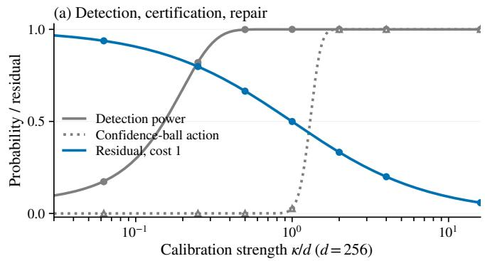

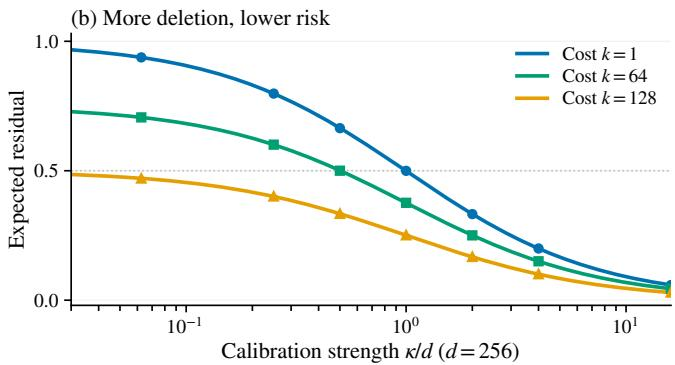  
Figure 3: Detection, deletion, and certified action are diferent quantities. At $d = 2 5 6 .$ , lines are exact formulas and points use 8,192 draws per strength. (a) Detection power, confidence-ball action probability, and the optimal cost-one expected residual. (b) The hard-budget frontier for three deletion dimensions.

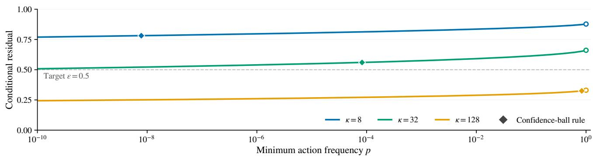  
Figure 4: Conditional improvement has an action-frequency cost. Exact selective frontiers at $d = 6 4$ Open circles mark the ungated $p = 1$ limits, and diamonds the confidence-ball rule’s action probability and conditional mean residual. The dashed line is $\varepsilon = 0 . 5$ . A diamond may lie above it, because the certificate controls joint bad action. The oracle curves fix κ, whereas the confidence-ball rule does not know it.

## L.2 Optimal allocation under an average budget

At $d = 1 6$ and $\kappa = 8$ , 131,072 shared calibration draws cover budgets from 0 to 16, and a direct numerical optimization over rules reproduces Equation (40). At b = 4 the average-budget risk is 0.499 (simulated $0 . 4 9 9 { \pm } 0 . 0 0 1$ at mean cost $3 . 9 9 \pm 0 . 0 2 )$ , against 0.514 under the hard budget: the optimal rule deletes one direction on four fifths of the fits and all sixteen on the rest (Figure 5).

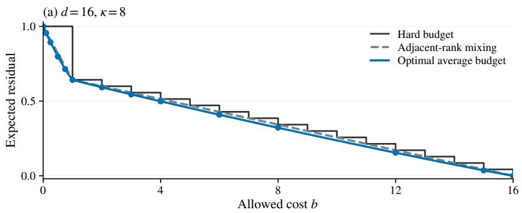

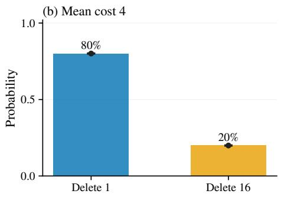  
Figure 5: An average budget rewards adaptive deletion rank. Left: exact hard-budget, adjacent-rank mixing, and optimal average-budget risks at $d = 1 6 , \kappa = 8$ , with points from 131,072 shared draws. Right: at average cost four the optimal rule deletes one direction with probability 0.8 and all sixteen with probability 0.2. Black points with exact 95% binomial intervals check these probabilities.

## L.3 Action certificates with known and estimated scale

The known-scale rules are evaluated at $d \in \{ 4 , 1 6 , 6 4 , 2 5 6 \}$ . The estimated-scale rules use a grid of $d \in \{ 4 , 1 6 , 6 4 \}$ $N \in \{ 2 , 4 , 1 6 \}$ and $\kappa / d \in \{ 0 , \frac { 1 } { 2 } , 1 , 2 , 4 \}$ , with 4,096 draws per cell. A numerical check confirms that components beyond the cutof $\mathcal { I }$ never constrain the mixture threshold. The null action rate stays at or below α up to Monte Carlo error, and on the same draws the mixture rule never acts less often than the confidence-ball rule (Figure 6).

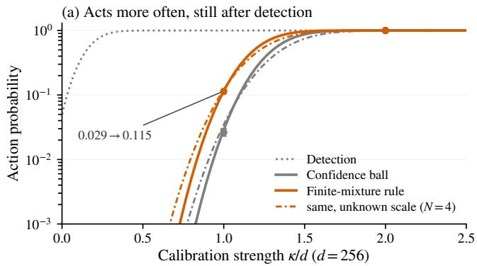

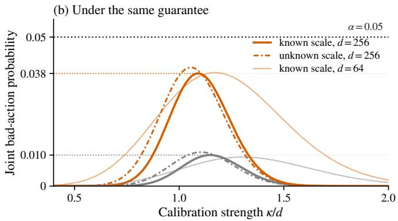  
Figure 6: More frequent action under the same uniform joint-error guarantee. At $d = 2 5 6 \colon$ (a) exact action probabilities of the confidence-ball and finite-mixture rules with known scale (solid) and with the noise scale estimated from $N = 4$ pairs (dash-dotted), Monte Carlo estimates on shared draws (points), and the power of the radial test (dotted). (b) The exact joint probability of acting and missing the target, which every rule keeps below α at all strengths. Thin lines repeat the known-scale rules at $d = 6 4$

## M FITTED ERASERS ON GAUSSIAN AND REAL CONTENT

These experiments apply Theorems 4 and 9 to fitted MP, SAL and LEACE maps, first with Gaussian content, then with real represented content.

## M.1 Gaussian content

For $d \in \{ 1 6 , 6 4 \}$ and $N / d \in \{ \textstyle { \frac { 1 } { 4 } } , \frac { 1 } { 2 } , 1 , 2 , 4 \}$ we fit MP, centered rank-one SAL and binary LEACE (Section C) to 512 calibration samples of the paired construction of Section A with $\theta = s ^ { 2 } = 1$ . The three kernels coincide on every fit, and the mean residuals follow Equation (9) (Table 1). The methods difer only in distortion: at $d = N = 6 4$ , LEACE’s median linear cost is 2.13 against one for MP and $\mathrm { S A L }$ , and it grows sharply near the pooled-covariance rank transition $2 N - 1 = d .$

## M.2 Real content pools and the semisynthetic check

Let $z _ { 1 } , \ldots , z _ { m } \in \mathbb { R } ^ { p }$ be a frozen real representation pool, with

$$
{ \bar { z } } = { \frac { 1 } { m } } \sum _ { j = 1 } ^ { m } z _ { j } , \qquad { \widehat { \Sigma } } _ { m } = { \frac { 1 } { m } } \sum _ { j = 1 } ^ { m } ( z _ { j } - { \bar { z } } ) ( z _ { j } - { \bar { z } } ) ^ { \top } .\tag{64}
$$

Choose a d-dimensional positive-eigenvalue subspace, with eigenvectors $U _ { d }$ and eigenvalues $\Lambda _ { d } ,$ set $y _ { j } =$ $\Lambda _ { d } ^ { - 1 / 2 } U _ { d } ^ { \top } ( z _ { j } - \bar { z } )$ , and draw

$$
C = \sqrt { 1 - s ^ { 2 } / 2 } y _ { T } , \qquad T \sim \mathrm { U n i f } \{ 1 , \dots , m \} .\tag{65}
$$

Conditional on the pool, this law satisfies Equation (15) exactly, and independent pool indices and endpoint noises give independent calibration pairs. The content comes from real recordings, while the shift and the measurement noise are synthetic.

Pools. The three pools come from the paired Neuroscan/Flex recordings of Williams et al. (2020) (Section N.1). Two of them describe the same N170 events, once by temporal features and once by frozen EEGPT features. The third holds 5,330 MMN events from 15 of the 16 participants. Each content vector is the midpoint of the paired device representations, reduced to its first 16 or 64 principal coordinates and whitened over the pool. Whitening keeps the non-Gaussian structure: the radial fourth moment of the MMN features is 1.27 times its Gaussian value at $d = 1 6$ and 1.19 times at $d = 6 4$

Design. We set $\theta = 1$ and cross the three pools with $d \in \{ 1 6 , 6 4 \} , s ^ { 2 } \in \{ 0 . 2 5 , 1 , 1 . 7 5 \}$ and $N / d \in \{ \textstyle { \frac { 1 } { 4 } } , \frac { 1 } { 2 } , 1 , 2 , 4 \}$ ${ \mathrm { A t ~ } } s ^ { 2 } = 1$ and for each target $\varepsilon \in \{ { \frac { 1 } { 2 } } , { \frac { 1 } { 4 } } \}$ we also use the calibration sizes $\lceil N _ { \star } / 2 \rceil$ , N⋆ and $2 N _ { \star }$ , where

$$
N _ { \star } ( \varepsilon ; d , \theta , s ) : = \operatorname* { m i n } \left\{ N \in \mathbb { N } , \ N \geq 1 : \mathcal { R } _ { d } ^ { * } ( 1 , N \theta ^ { 2 } / s ^ { 2 } ) \leq \varepsilon \right\}\tag{66}
$$

is the smallest calibration size with expected residual at most ε. It is well defined because the risk decreases in κ.   
Each of the 120 cells has 512 calibration samples.

Results. The loss is evaluated from the row space of each fitted matrix under the exact population covariance of the construction, so it carries no test-sample noise (Figure 7). Cell means deviate from the predictions by 0.004 in root mean square and at most 0.015. At the calibration sizes $N _ { \star }$ all three pools land on their targets: 0.501–0.504 for the target $\textstyle { \frac { 1 } { 2 } }$ at $N = 6 3$ , and 0.247–0.251 for the target $\textstyle { \frac { 1 } { 4 } }$ at $N = 1 9 0$ . Because the shared content cancels from each paired contrast, the three pools are indistinguishable, as Theorem 9 predicts.

## N WEARABLE VERSUS CLINICAL EEG (BOAS)

This appendix gives the protocol and results of Section 7.2 and repeats the analysis on a second device pair.   
Preprocessing details and code are in the code repository.

Data and features. The Bitbrain Open Access Sleep dataset (OpenNeuro ds005555, v1.1.3, CC0; López-Larraz et al., 2026) contains 128 nights of 100 healthy adults recorded simultaneously by a clinical polysomnograph and a forehead EEG headband, with consensus expert staging in 30-s epochs (Esparza-Iaizzo et al., 2026). The study was approved by the ethics committee of Aragón (C.I. PI24/046), and no new data were recorded. We take one night per participant, drawn with a fixed seed before any data were downloaded. The two headband channels are paired with the nearest polysomnograph sites on the same side (F3, F4). Each artifact-free N2 epoch is described by log Welch power in 0.5 Hz bins over 0.5–30 $\mathrm { H z , }$ so $d = 1 1 8$ (other bin widths give $d = 2 8$ , 58 and 236). The contrast is the polysomnograph feature minus the headband feature of the same epoch. A night is excluded when, for either channel pair, the median correlation of the paired 0.5–4 Hz signals over 5-min windows falls below 0.5, which flags a defective headband channel in 14 of the 100 nights. One further participant is excluded for having fewer than 128 N2 epochs. The remaining 85 participants contribute 325 to 752 N2 epochs each.

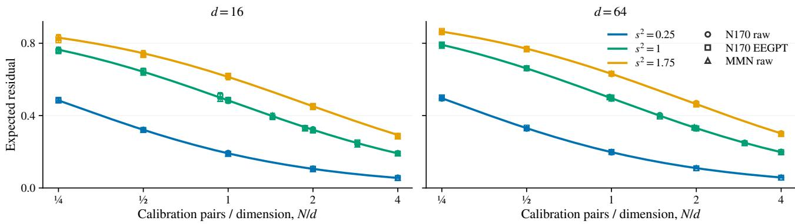  
Figure 7: An illustration of the non-Gaussian-content extension. Lines are exact predictions, and points are fitted-map population residuals averaged over 512 calibration samples (±1.96 Monte Carlo SE). MP, SAL and LEACE share the residual at every fit, so each estimate is shown once. Markers distinguish the three pools of real represented content. Shift and noise are synthetic.

Design. Each of 20 random splits divides the participants into a calibration pool of 43 and a test set of 42. Coordinates are whitened by the pool’s within-source covariance, estimated from about 24,000 epochs per device (some 200 per dimension at $d = 1 1 8 )$ . From the pool alone we estimate the shift δ and, from of-diagonal products of participant means as in Equation (67) below, its squared length. The within-participant covariance $\Sigma _ { w }$ is averaged over participants. The between-participant covariance $\Sigma _ { b }$ is the covariance of participant means minus the average of $\Sigma _ { w } / n _ { j }$ , with negative eigenvalues set to zero. A calibration draw takes $P \in \{ 1 , 2 , 3 , 4 , 6 , 8 , 1 2 , 1 6 , 2 4 , 3 2 \}$ pool participants with $n \in \{ 1 , 2 , 4 , 8 , 1 6 , 3 2 , 6 4 , 1 2 8 \}$ random epochs each and averages their means into D¯. MP, SAL and LEACE fitted to these draws share the same kernel. The prediction is the erasers’ residual under $\bar { D } \sim N ( \delta , ( \Sigma _ { b } + \Sigma _ { w } / n ) / P )$ , and the closed-form bound $d / ( d + \bar { \kappa } )$ is at most 0.031 above it. Detection uses the radial statistic with its null law under the same estimated covariance.

Statistic. The observed residual uses only the test participants. Let $m _ { j }$ be the mean contrast of test participant $j$ in the whitened coordinates, with G test participants. For a fitted map M, let $P _ { M } = M ^ { \top } ( M M ^ { \top } ) ^ { + } M$ be its row-space projector and define

$$
\widehat { Q } ( M ) = { \frac { 1 } { G ( G - 1 ) } } \sum _ { j \neq k } m _ { j } ^ { \top } P _ { M } m _ { k } , \qquad \widehat { R } ( M ) = { \frac { \widehat { Q } ( M ) } { \widehat { Q } ( I _ { d } ) } } .\tag{67}
$$

Products of diferent participants omit the noise of each participant’s own mean, so for independent participants $\widehat { Q } ( M )$ estimates the squared projected population mean contrast without bias. The ratio is not clipped, so test noise can take it outside [0, 1]. For the subtraction of $\bar { D } _ { ; }$ , the same products of $m _ { j } - \bar { D }$ give the remaining separation.

Results. Table 2 lists a subset of the grid and Table 3 the agreement under other choices. Here $\theta ^ { 2 } \approx 2 . 6 ,$ tr $\Sigma _ { b } \approx 9 . 0$ and tr $\Sigma _ { w } \approx 1 0 0$ , so one participant caps κ¯ at about 35. Since tr $\Sigma _ { w } / \mathrm { t r } \Sigma _ { b } \approx 1 1$ , Theorem 8 gives $n ^ { \star } = \sqrt { 1 1 c }$ epochs per participant when a participant costs as much as c epochs. The largest deviations are for one participant with many epochs, where the prediction is pessimistic (0.76 against 0.69), and for 32 participants with 128 epochs, where it is optimistic (0.10 against $0 . 1 2 5 \pm 0 . 0 2 7 )$ . With a single participant or four epochs or fewer in total, the radial test detects more often than predicted (0.16 to 0.27 against 0.07 to 0.16), consistent with heavier-than-Gaussian epochs. At $P = n = 8$ , the cell of Section 7.2, observed and predicted detection are 0.97 and 0.95. Contiguous blocks of epochs leave more shift than random epochs because neighbouring epochs are correlated (0.56 against 0.51 at $P = n = 8 )$ , and the covariance of block means accounts for most of this (Table 3).

How much of the device diference is a mean shift. Linear erasers act only on the mean diference, so we measure how much of the divergence between the two devices’ features is a mean shift. The Jefreys divergence between Gaussian fits splits into a mean part and a covariance part. From each part we subtract its value under random within-pair swaps of the devices. Within a single participant’s night, the mean part accounts for a median of 0.76 of the total (10th–90th percentile 0.36–0.91), so there the devices difer mostly by a shift. Pooled over the 85 participants, its share is 0.31. This is consistent with shifts that vary across participants, which the two-level law captures through $\Sigma _ { b }$

Table 2: BOAS, N2 epochs, d = 118, 85 participants. The eraser columns give the share of the population mean shift left in held-out participants after MP, SAL and LEACE, observed (mean ±1.96 SE over 20 random splits of the same participants) and predicted from the calibration pool by the plug-in two-level prediction and by the frontier formula at κ¯. Detection is the rejection probability of the level-0.05 radial test. The last two columns give the separation left by subtracting D¯ , relative to no correction.
<table><tr><td colspan="5">Erasers</td><td colspan="2">Detection</td><td colspan="2"> $\mathrm { S u b t r a c t } \ \bar { D }$ </td></tr><tr><td> $P$ </td><td>n</td><td>Observed</td><td>Plug-in</td><td>At κ</td><td>Obs.</td><td>Pred.</td><td>Obs.</td><td>Pred.</td></tr><tr><td>1</td><td>1</td><td> $0 . 9 6 0 \pm 0 . 0 0 6$ </td><td>0.967</td><td>0.969</td><td>0.20</td><td>0.07</td><td>48.28</td><td>42.27</td></tr><tr><td>1</td><td>8</td><td> $0 . 8 5 8 \pm 0 . 0 1 3$ </td><td>0.874</td><td>0.885</td><td>0.23</td><td>0.12</td><td>8.97</td><td>8.33</td></tr><tr><td>1</td><td>128</td><td> $0 . 6 9 0 \pm 0 . 0 3 3$ </td><td>0.757</td><td>0.783</td><td>0.23</td><td>0.13</td><td>3.94</td><td>3.78</td></tr><tr><td>4</td><td>1</td><td> $0 . 9 0 0 \pm 0 . 0 1 0$ </td><td>0.904</td><td>0.905</td><td>0.27</td><td>0.16</td><td>11.57</td><td>10.57</td></tr><tr><td>4</td><td>8</td><td> $0 . 6 5 3 \pm 0 . 0 1 6$ </td><td>0.663</td><td>0.669</td><td>0.51</td><td>0.57</td><td>2.19</td><td>2.08</td></tr><tr><td>4</td><td>128</td><td> $0 . 5 0 1 \pm 0 . 0 3 0$ </td><td>0.464</td><td>0.481</td><td>0.66</td><td>0.66</td><td>1.09</td><td>0.94</td></tr><tr><td>8</td><td>1</td><td> $0 . 8 3 5 \pm 0 . 0 1 4$ </td><td>0.833</td><td>0.833</td><td>0.36</td><td>0.35</td><td>5.67</td><td>5.28</td></tr><tr><td>8</td><td>8</td><td> $0 . 5 0 7 \pm 0 . 0 2 4$ </td><td>0.501</td><td>0.505</td><td>0.97</td><td>0.95</td><td>1.15</td><td>1.04</td></tr><tr><td>8</td><td>128</td><td> $0 . 3 0 9 \pm 0 . 0 2 6$ </td><td>0.307</td><td>0.318</td><td>0.99</td><td>0.99</td><td>0.50</td><td>0.47</td></tr><tr><td>32</td><td>1</td><td> $0 . 5 6 6 \pm 0 . 0 1 8$ </td><td>0.563</td><td>0.564</td><td>0.98</td><td>0.99</td><td>1.40</td><td>1.32</td></tr><tr><td>32</td><td>8</td><td> $0 . 2 1 6 \pm 0 . 0 2 1$ </td><td>0.203</td><td>0.205</td><td>1.00</td><td>1.00</td><td>0.29</td><td>0.26</td></tr><tr><td>32</td><td>128</td><td> $0 . 1 2 5 \pm 0 . 0 2 7$ </td><td>0.101</td><td>0.105</td><td>1.00</td><td>1.00</td><td>0.16</td><td>0.12</td></tr></table>

Table 3: BOAS: agreement between observed and predicted eraser residual over the 80 cells of the grid under other analysis choices. The last column is the one-participant cap $\theta ^ { 2 } d / \operatorname { t r } \Sigma _ { b }$
<table><tr><td>Setting</td><td>Participants</td><td>d</td><td>RMS deviation</td><td>Max. deviation</td><td>Within 0.03</td><td>Cap</td></tr><tr><td> $\mathrm { N 2 } , d = 1 1 8 ~ ( \mathrm { m a i n } )$ </td><td>85</td><td>118</td><td>0.016</td><td>0.067</td><td>95%</td><td>35</td></tr><tr><td>N2, no channel rule</td><td>97</td><td>118</td><td>0.021</td><td>0.064</td><td>88%</td><td>28</td></tr><tr><td> $\mathrm { { A l l \ s t a g e s } }$ </td><td>86</td><td>118</td><td>0.014</td><td>0.058</td><td>94%</td><td>36</td></tr><tr><td> $N 2 , d = 2 8$ </td><td>85</td><td>28</td><td>0.023</td><td>0.074</td><td>78%</td><td>9</td></tr><tr><td> $N 2 , d = 5 8$ </td><td>85</td><td>58</td><td>0.018</td><td>0.053</td><td>89%</td><td>17</td></tr><tr><td> $N 2 , d = 2 3 6$ </td><td>85</td><td>236</td><td>0.016</td><td>0.047</td><td>96%</td><td>67</td></tr><tr><td>N2, contiguous blocks</td><td>85</td><td>118</td><td>0.033</td><td>0.072</td><td>64%</td><td>34</td></tr></table>

Planning from a pilot. The two-level law needs only $\theta ^ { 2 } , \thinspace \mathrm { t r } \Sigma _ { b }$ and tr $\Sigma _ { w }$ . To check whether a small pilot gives them, each of 20 splits divides the participants into three disjoint sets. The recordings of 20 participants give the whitening, with each device used separately and without pairing. Another 35 form the calibration set, and the remaining 30 are the test set. A pilot consists of $P _ { 0 } \in \{ 3 , 4 , 6 , 8 \}$ calibration participants with their full N2 nights. The three scalars are estimated from the pilot alone, and the prediction is the frontier formula at κ¯. With eight pilot nights, the one-participant cap has a median of 29 against 28 from all 35 calibration participants, and it stays below $d = 1 1 8$ in every pilot. $\mathrm { A t } \ c = 1 0 0$ the pilots give a median $n ^ { \star }$ of 31 epochs. Their predicted residual deviates from the observed one by a median of 0.10 in root mean square (0.05–0.20), against 0.08 with the scalars of all 35 calibration participants, so most of the error comes from the finite test set. The number of participants that leaves half the shift at $n = 8$ is predicted as 9 (6–23), against about 10 observed. Pilots of three or four nights still put the cap below d in at least 95% of cases.

## N.1 A second device pair: Neuroscan/Flex recordings

Each of the 2,291 simultaneously recorded Neuroscan/Flex N170 pairs from the 16 participants of Williams et al. (2020) is described by fifteen 50-ms averages of 16 common-average-referenced channels. Removing the dependency introduced by the common reference leaves $d = 2 2 5$ coordinates (details in the code repository). Participants contribute 24 to 250 pairs. The recordings are public on the Open Science Framework (https: $/ / \mathrm { o s f } . \mathrm { i o } / \mathrm { z j } 3 \mathrm { f } 5 / )$ . The original study was approved by the Macquarie University Human Research Ethics Committee (Ref. 5201831203493), and all participants gave written informed consent.

Design. Each of 40 random splits divides the participants into a calibration pool and a test set of 8 each. $\mathrm { A s }$ for BOAS, the coordinates are whitened by the pool, the two-level prediction uses the pool’s estimates of $\theta ^ { 2 } , \Sigma _ { b }$ and $\Sigma _ { w }$ , and the observed residual is Equation (67) on the test participants. We draw $P \in \{ 1 , 2 , 3 , 4 , 6 , 8 \}$ calibration participants with $n \in \{ 1 , 2 , 4 , 8 , 1 6 \}$ pairs each, ten times per split. The grid stops at $n = 1 6$ because the smallest participant has 24 pairs.

Result. Over the 30 cells, the prediction deviates from the observed residual by 0.005 in root mean square and at most 0.011. One participant caps the calibration strength at about 99 in $d = 2 2 5$ , and eight participants with 16 pairs each leave $0 . 5 0 4 \pm 0 . 0 3 0$ of the shift against the predicted 0.508. Subtracting $\bar { D }$ leaves more separation than no correction in every cell.

## O INLP AND R-LACE AT FIXED RANK

This experiment illustrates Theorem 5 with fitted kernels that need not contain the empirical contrast. The number of deletions is fixed in advance. If a method chose its rank K from the data, Equation (31) would stil hold at the realized rank and give the lower bound $\mathcal { R } _ { d } ^ { * } ( k _ { \operatorname* { m a x } } , \kappa )$ whenever $K \leq k _ { \operatorname* { m a x } }$ , but not the fixed-rank identity.

Design. Each replicate draws U uniformly on $\mathbb { S } ^ { d - 1 }$ and N pairs $H _ { i } ^ { \pm } = C _ { i } \pm U / 2 + E _ { i } ^ { \pm }$ with $C _ { i } , E _ { i } ^ { \pm } \sim N ( 0 , I _ { d } / 2 )$ so that $\theta = s ^ { 2 } = 1$ , each source has covariance $I _ { d } ,$ and $\kappa = N$ . The grid has $d \in \{ 1 6 , 3 2 \} , N / d \in \{ \textstyle { \frac { 1 } { 2 } } , 1 , 2 , 4 \}$ and $k \in \{ 1 , 4 \}$ , with 256 calibrations per cell. Every method receives the same 2N labelled endpoints. MP, SAL and LEACE are evaluated at $k = 1$ , and the frontier reference deletes w and $k - 1$ uniform directions orthogonal to it. Fixed-step INLP fits an ℓ -regularized logistic classifier $( C = 1 )$ to the successively projected endpoints and removes its coeficient direction, keeping the first and fourth iterates. Fixed-budget R-LACE follows the authors alternating updates, Fantope projection and final rounding (Ravfogel et al., 2022) for 2,000 full-batch iterations and returns an orthogonal projection with exactly k deletions.

Evaluation and prediction. The loss $L = \| P _ { M } U \| ^ { 2 }$ is computed from the row space of each returned matrix, and $\rho _ { K } = \| P _ { M } w \| ^ { 2 }$ from the empirical direction. With $a = { \sqrt { \kappa } } \| X \|$ , the Bessel-ratio form Equation (63) gives

$$
\lambda _ { \kappa } ( \| X \| ) = \frac { I _ { d / 2 } ( a ) } { a I _ { d / 2 - 1 } ( a ) } , \qquad g _ { \kappa } ( \| X \| ) = 1 - d \lambda _ { \kappa } ( \| X \| ) ,
$$

and the conditional prediction is $( d - k ) \lambda + g \rho _ { K }$ . To check the excess on the same calibrations, let $L _ { 0 }$ be the loss of MP with random completion. Its conditional mean is $( d - k ) \lambda , \operatorname { s o } \ { \overline { { \mathbb { E } } } } [ L - L _ { 0 } ] = { \overline { { \mathbb { E } } } } [ g \rho _ { K } ]$ . We compare the observed mean of $L - L _ { 0 }$ with the predicted mean of $g \rho _ { K }$ through the standard error of their paired diference. Results. Table 4 reports every cell. Over the 32 INLP and R-LACE cells, observed and predicted excess difer by 0.004 in root mean square and by at most 2.2 paired standard errors. The fitted R-LACE subspaces nearly contain w, whereas one-step INLP leaves a visible excess that its fitted subspace explains. Four INLP steps shrink this excess at four times the cost of one step. At $d = N = 3 2$ , LEACE’s median linear cost is 2.09 against one fo the orthogonal maps, which is the arrow in Figure 2a.

Table 4: Complete controlled grid. The frontier is $\mathcal { R } _ { d } ^ { * } ( k , N )$ . Observed excess is the paired mean residual above MP plus random completion, with its Monte Carlo standard error over 256 calibrations. Predicted excess is the mean of $g \rho _ { K }$ , which is below $2 \times 1 0 ^ { - 8 }$ for R-LACE in every row.
<table><tr><td>d</td><td>N</td><td>k</td><td>Frontier</td><td>INLP excess</td><td>Predicted</td><td>R-LACE excess</td></tr><tr><td></td><td></td><td></td><td></td><td> $\mathrm { O b s e r v e d } \pm \mathrm { S E }$ </td><td></td><td> $\mathrm { O b s e r v e d } \pm \mathrm { S E }$ </td></tr><tr><td>16 16</td><td>8 8</td><td>1 4</td><td>0.6423 0.5138</td><td> $0 . 0 6 8 3 \pm 0 . 0 0 7 0$   $0 . 0 0 3 6 \pm 0 . 0 0 8 2$ </td><td>0.0737 0.0030</td><td> $0 . 0 0 0 0 \pm 0 . 0 0 0 0$   $0 . 0 0 5 3 \pm 0 . 0 0 7 9$ </td></tr><tr><td>16</td><td>16</td><td>1</td><td>0.4838</td><td> $0 . 1 2 3 6 \pm 0 . 0 0 8 0$ </td><td>0.1399</td><td> $0 . 0 0 0 0 \pm 0 . 0 0 0 0$ </td></tr><tr><td>16</td><td>16</td><td>4</td><td>0.3871</td><td> $0 . 0 0 8 3 \pm 0 . 0 0 6 4$ </td><td>0.0049</td><td> $- 0 . 0 0 8 8 \pm 0 . 0 0 6 7$ </td></tr><tr><td>16</td><td>32</td><td>1</td><td>0.3216</td><td> $0 . 1 4 8 4 \pm 0 . 0 0 7 1$ </td><td>0.1471</td><td> $0 . 0 0 0 0 \pm 0 . 0 0 0 0$ </td></tr><tr><td>16</td><td>32</td><td>4</td><td>0.2572</td><td> $0 . 0 0 4 2 \pm 0 . 0 0 4 3$ </td><td>0.0013</td><td> $0 . 0 0 2 8 \pm 0 . 0 0 3 9$ </td></tr><tr><td>16</td><td>64</td><td>1</td><td>0.1914</td><td> $0 . 1 1 2 8 \pm 0 . 0 0 4 9$ </td><td>0.1078</td><td> $0 . 0 0 0 0 \pm 0 . 0 0 0 0$ </td></tr><tr><td>16</td><td>64</td><td>4</td><td>0.1531</td><td> $- 0 . 0 0 1 7 \pm 0 . 0 0 2 2$ </td><td>0.0002</td><td> $- 0 . 0 0 0 8 \pm 0 . 0 0 2 5$ </td></tr><tr><td>32</td><td>16</td><td>1</td><td>0.6548</td><td> $0 . 1 1 0 3 \pm 0 . 0 0 5 6$ </td><td>0.1071</td><td> $0 . 0 0 0 0 \pm 0 . 0 0 0 0$ </td></tr><tr><td>32</td><td>16</td><td>4</td><td>0.5914</td><td> $0 . 0 1 5 9 \pm 0 . 0 0 4 7$ </td><td>0.0124</td><td> $0 . 0 0 7 0 \pm 0 . 0 0 3 9$ </td></tr><tr><td>32</td><td>32</td><td>1</td><td>0.4921</td><td> $0 . 1 8 6 3 \pm 0 . 0 0 6 0$ </td><td>0.1807</td><td> $0 . 0 0 0 0 \pm 0 . 0 0 0 0$ </td></tr><tr><td>32</td><td>32</td><td>4</td><td>0.4444</td><td> $0 . 0 1 7 1 \pm 0 . 0 0 3 8$ </td><td>0.0122</td><td> $0 . 0 0 2 3 \pm 0 . 0 0 3 4$ </td></tr><tr><td>32</td><td>64</td><td>1</td><td>0.3275</td><td> $0 . 1 7 2 2 \pm 0 . 0 0 5 1$ </td><td>0.1673</td><td> $0 . 0 0 0 0 \pm 0 . 0 0 0 0$ </td></tr><tr><td>32</td><td>64</td><td>4</td><td>0.2958</td><td> $0 . 0 0 4 1 \pm 0 . 0 0 2 3$ </td><td>0.0025</td><td> $0 . 0 0 2 8 \pm 0 . 0 0 2 2$ </td></tr><tr><td>32</td><td>128</td><td>1</td><td>0.1957</td><td> $0 . 1 1 8 0 \pm 0 . 0 0 3 4$ </td><td>0.1149</td><td> $0 . 0 0 0 0 \pm 0 . 0 0 0 0$ </td></tr><tr><td>32</td><td>128</td><td>4</td><td>0.1768</td><td> $- 0 . 0 0 0 1 \pm 0 . 0 0 1 4$ </td><td>0.0003</td><td> $- 0 . 0 0 1 2 \pm 0 . 0 0 1 4$ </td></tr><tr><td></td><td></td><td></td><td></td><td></td><td></td><td></td></tr></table>

## P ANISOTROPIC CONTENT: A NUMERICAL CHECK

The main results assume isotropic within-source variation and calibration noise, and this appendix checks the residual of the empirical-direction editor under anisotropic content.

The content covariance has eigenvalues proportional to $1 / j$ or $1 / j ^ { 2 }$ at $d = 6 4$ , the noise level is $s ^ { 2 } \in \{ 0 . 1 , 1 \}$ and the shift points along a random direction or along the top or bottom content eigenvector. After whitening the contrast noise has efective dimension 49 to 60. Over 30 cells with 4,000 calibrations each, the frontier Equation (7) at the whitened $\kappa = N \| \tilde { \delta } \| ^ { 2 } / \bar { \sigma } ^ { 2 }$ , with $\bar { \sigma } ^ { 2 }$ the mean whitened noise variance, matches the residual of the empirical-direction editor to 0.006 in root mean square and 0.015 at most: anisotropy enters mainly through κ. The check concerns the empirical-direction editor and therefore the erasers that share its kernel. Over all editors, Theorem 7 only brackets the minimax value, and a noise-weighted direction estimate may do better.