# Do Higher-Order Models Win for Higher-Order Reasons? Rethinking Performance Gains in Hypergraph Learning∗

Fanchen Bu1 boqvezen97@kaist.ac.kr

Sunwoo Kim1 kswoo97@kaist.ac.kr

Fan Li2 fan.li8@unsw.edu.au

Xiaoyang Wang2 xiaoyang.wang1@unsw.edu.au

Kijung Shin1 kijungs@kaist.ac.kr 1KAIST 2UNSW Sydney 3University of Oxford

Geon Lee1 geonlee0325@kaist.ac.kr

Renaud Lambiotte3 renaud.lambiotte@maths.ox.ac.uk

## Abstract

Higher-order models (e.g., hypergraph neural networks) often outperform lower-order baselines on hypergraph learning benchmarks, and their advantages are commonly attributed to their ability to exploit higher-order information. However, better performance alone does not establish this explanation. We therefore ask: Do higher-order models win for higher-order reasons? To investigate this question, we introduce a controlled performance-attribution framework that perturbs higher-order information while preserving the lower-order, i.e., pairwise, information. Across 25 commonly used hypergraph learning benchmarks spanning three tasks, we frequently observe an intriguing pattern: higher-order models originally outperform lower-order baselines, yet retain most of their advantage after perturbation. This suggests that much of the observed advantage remains achievable without the higher-order information. We then investigate potential lower-order explanations for these remaining gaps. We find that simple additions to a lower-order baseline, e.g., richer pairwise weighting, more steps of pairwise feature propagation, and normalization, reduce the remaining performance gaps, supporting lower-order explanations for part of the observed advantage. Our analysis calls for the hypergraph learning community to rethink performance attribution by distinguishing performance gains from their explanations, adopt stronger lower-order baselines, and use suitable benchmarks that better test the value of higher-order information.

## 1 Introduction

Hypergraphs generalize graphs by allowing a single hyperedge to connect more than two entities, making them a natural mathematical representation of higher-order relations (Bick et al., 2023). Higher-order learning models, especially hypergraph neural networks (HNNs), are correspondingly designed to exploit hypergraph structure, commonly by propagating and aggregating information through hyperedges rather than only between pairs (Gao et al., 2022; Kim et al., 2024).

Empirically, higher-order models often outperform lower-order alternatives, such as graph neural networks (GNNs), on hypergraph learning tasks (Li et al., 2026), and their advantage is commonly interpreted as evidence that these models benefit from their capacity to exploit higher-order relations (Feng et al., 2019; Bai et al., 2021; Xu et al., 2023; Li et al., 2026).1 This interpretation seems natural, but conventional empirical comparisons do not provide suficient evidence that the observed advantage is explained by higher-order

Best higher-order model on validation data Best lower-order model on validation data

(a) Synthetic benchmark with essential higher-order information

(c) Real-world benchmark: node classification on Trivago  
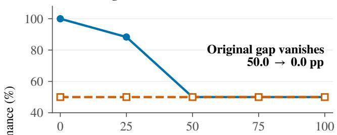

(b) Synthetic benchmark with redundant higher-order information  
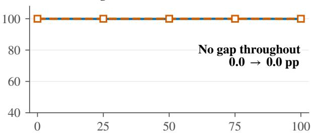

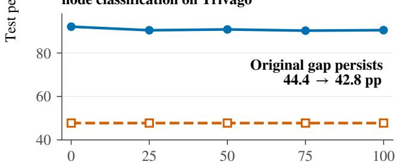

(d) Real-world benchmark: hyperedge prediction on Pokec  
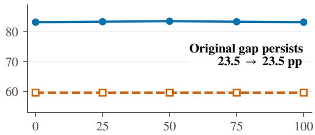  
Clique-expanded hyperedges (%)  
(higher-order information perturbation level: low ⟶ high)  
Figure 1: Large performance advantages of higher-order models can survive perturbation of higher-order information. Synthetic benchmarks show (a) a vanishing advantage of the higher-order model when higher-order information is essential and (b) equally good performance by higher- and lower-order models throughout the intervention when higher-order information is redundant. In contrast, (c–d) two real-world benchmarks exhibit a distinct pattern: higher-order models retain most of their advantages despite the perturbation. See Section 4 for details of the perturbation and Section 5 for the synthetic benchmarks and real-world results.

information, i.e., the information about group relations beyond what the pairwise representation preserves (see Definition 3.1). Attributing their advantage specifically to such higher-order information requires separate evidence. We therefore ask: Do higher-order models actually win for higher-order reasons? In other words, does their advantage arise from exploiting information about group relations beyond what the pairwise representation preserves?

To answer this question, we propose a controlled intervention on the data representation. For each hypergraph, we construct a perturbed counterpart that preserves its lower-order information while perturbing its higherorder information. We then evaluate higher-order models and lower-order baselines on both the original and perturbed views.2 With that intervention, our key intuition is simple: if the higher-order information is indeed a major source of a higher-order model’s performance advantage over lower-order baselines, then the performance advantage should shrink substantially under the perturbed view where such higher-order information is disturbed by the intervention.

To concretize and validate our intuition, we first construct two synthetic benchmarks in which the role of higher-order information is known by construction.3 As shown in Fig. 1(a), when the higher-order information is essential, a capable higher-order model achieves perfect performance while the lower-order baseline remains at chance; once the higher-order information is perturbed, the higher-order model also falls to chance, and its entire advantage vanishes. When the higher-order information is redundant, both higher-order and lower-order models can achieve perfect performance before and after the intervention (Fig. 1(b)).

However, when we investigate commonly used real-world hypergraph learning benchmarks, we observe that many of them exhibit a third, more intriguing pattern. The higher-order model wins on the original hypergraph, yet its advantage largely survives after the candidate higher-order information is perturbed, as illustrated by the two representative examples in Fig. 1(c) and Fig. 1(d). Across the benchmarks we study, higher-order models often retain most of their performance advantage even after higher-order information is perturbed. This suggests that much of their advantage can be achieved without the higher-order information. See Section 5.3 for detailed results.

What, then, sustains these remaining advantages? We investigate whether some lower-order reasons, e.g., diferences in how models process the preserved lower-order information, can potentially account for them. Our case studies show that several retained gaps can be substantially reduced through richer pairwise weighting, more steps of pairwise feature propagation, and normalization. Motivated by these findings, we test the same simple additions to a lower-order baseline across benchmarks, without further hyperparameter tuning. We observe that such additions are overall helpful, supporting lower-order explanations for part of the observed advantage. See Section 5.4 for more details.

In summary, our contributions are threefold:

• Performance-attribution question and empirical evidence. We try to distinguish higher-order models’ performance advantages from evidence that higher-order information explains those advantages, and formalize this distinction as a performance-attribution problem (Section 3). We challenge the common interpretation that higher-order models win because they exploit higher-order information: across 25 commonly used hypergraph learning benchmarks spanning three tasks, many advantages largely remain after higher-order information is perturbed (Section 5.3).

• A principled evaluation protocol with controlled perturbation. We introduce a controlled performance-attribution framework that perturbs higher-order information while preserving lower-order information, enabling us to measure how much advantage disappears or survives after such perturbation (Section 4). Controlled synthetic cases illustrate the expected responses when higher-order information is essential or redundant by construction (Section 5.2).

• Investigation of source of performance gain beyond higher-order information. We investigate whether lower-order designs and mechanisms can potentially explain some of the observed performance advantages of higher-order models. Guided by these findings, we show that simple additions, e.g., richer pairwise weighting, more steps of pairwise feature propagation, and normalization, can strengthen a lower-order baseline (Section 5.4).

Together, our findings highlight the need to distinguish a model’s performance advantage from the information that explains it. Our findings highlight the need for evaluations that test whether an advantage survives a controlled change to the claimed information source, investigate what sustains the remaining gap, and assess whether the benchmark tests the capability it is intended to measure (Section 6).

Reproducibility. The code and datasets are available online (Bu et al., 2026).4

## 2 Related Work

Hypergraph learning and benchmark evidence. Hypergraph learning encompasses spectral methods, incidence-based neural propagation, graph reductions, and learnable multiset functions (Zhou et al., 2006; Feng et al., 2019; Yadati et al., 2019; Chien et al., 2022). See Gao et al. (2022); Kim et al. (2024) for broader surveys. Recent benchmarks compare HNNs with pairwise-graph and feature-only baselines across multiple learning tasks (Li et al., 2026). Such comparisons establish predictive diferences between models, but do not by themselves identify the information responsible for those diferences.

Predictive utility of higher-order information. Prior work studies the predictive value of higher-order information by varying the available interaction order: Yoon et al. (2020) progressively add higher-order projections, while Bian et al. (2025) progressively reduce higher-order interactions. We instead study contemporary HNNs and ask an attribution question: when an HNN outperforms a lower-order model, does that advantage actually depend on higher-order information?

Projection fidelity and higher-order reducibility. Prior work studies information loss, reconstruction ambiguity, and non-uniqueness when hypergraphs are reduced to pairwise representations (Kang et al., 2024; Wang & Kleinberg, 2024; LaRock & Lambiotte, 2025; Lee et al., 2025). Related work asks when higher-order mechanisms or dynamics are reducible to pairwise ones (Rosas et al., 2022; Lucas et al., 2026; Llabrés et al., 2026). These works concern structural recovery or dynamical reducibility; our focus is the predictive role of higher-order information in HNN performance.

## 3 The Performance-Attribution Question

In this section, we formalize the central problem studied in this work.

## 3.1 Preliminaries

A hypergraph is a tuple $\mathcal { H } = ( \mathcal { V } , \mathcal { E } , { \bf w } , { \bf X } )$ , where V is the node set, $\mathcal { E } \subseteq \{ e \subseteq \mathcal { V } : | e | \geq 2 \}$ is a set of unique hyperedges, $\mathbf { w } \colon \mathcal { E } \to  { \mathbb { N } } _ { > 0 }$ assigns each hyperedge a weight representing its multiplicity, and X denotes the node features (if any).5 For a hyperedge e, let clique $( e ) \ : = \ : \{ \{ u , v \} \ : u , v \in e , \ : \ : u \neq v \}$ denote the set of unordered node pairs induced by e. The weighted clique expansion of H is the graph $\operatorname { W C E } ( \mathcal { H } ) = ( \mathcal { V } , \mathcal { E } _ { 2 } , \mathbf { w } _ { \mathcal { H } } , \mathbf { X } )$ , where $\textstyle { \mathcal { E } } _ { 2 } = \bigcup _ { e \in { \mathcal { E } } }$ clique(e) is a set of unique pairwise edges. Their weights are computed by $\begin{array} { r } { \mathbf { w } _ { \mathcal { H } } ( u , v ) = \sum _ { e \in \mathcal { E } } \mathbf { w } ( e ) \mathbf { 1 } [ \{ u , v \} \subseteq e ] } \end{array}$

Clique expansion is a standard way to reduce a hypergraph to a graph (Bick et al., 2023; Yadati et al., 2019; Gao et al., 2022). However, this reduction is generally lossy: distinct hypergraphs can induce the same weighted clique expansion, so the original hyperedges cannot, in general, be uniquely reconstructed from the expanded graph (Wang & Kleinberg, 2024; LaRock & Lambiotte, 2025).

In this paper, a dataset D means the underlying hypergraph data: one hypergraph for node classification or hyperedge prediction, and a collection of hypergraphs for hypergraph classification. A task τ specifies the prediction problem, and a benchmark $\boldsymbol { B } = ( \mathcal { D } , \tau )$ is a dataset paired with a task. Thus, using the same dataset for diferent tasks defines diferent benchmarks.

## 3.2 Higher- and lower-order information and models

Definition 3.1 (Higher- and lower-order information). The lower-order information carried by a hypergraph H is its weighted clique expansion WCE(H). Two hypergraphs $\mathcal { H } _ { 1 } , \mathcal { H } _ { 2 }$ are lower-order equivalent, written $\mathcal { H } _ { 1 } \equiv _ { \mathrm { L O } } \mathcal { H } _ { 2 } , \mathrm { i f } \mathrm { W C E } ( \mathcal { H } _ { 1 } ) = \mathrm { W C E } ( \mathcal { H } _ { 2 } )$ . The higher-order information carried by H is the information that distinguishes it from other hypergraphs that are lower-order equivalent to it.

The projection weights count pair co-occurrences. The choice is motivated by incidence-based HNNs, in which a pair can exchange information through each instance of a shared hyperedge (Feng et al., 2019). Our attribution statements are conditional on this choice of lower-order information. Section 8 discusses alternative interventions that preserve the same lower-order information.

Definition 3.2 (Higher- and lower-order models). A parameterized model (e.g., HNN or GNN) $M = \{ M _ { \theta } \} _ { \theta \in \Theta }$ is higher-order if at least one of its parameterized functions depends on higher-order information, i.e., $\exists \theta \in \Theta , \exists \mathcal { H } _ { 1 } , \mathcal { H } _ { 2 } : \mathcal { H } _ { 1 } \equiv _ { \mathrm { L O } } \mathcal { H } _ { 2 }$ and $M _ { \theta } ( \mathcal { H } _ { 1 } ) \neq M _ { \theta } ( \mathcal { H } _ { 2 } )$ . Conversely, M is lower-order if every parameterized function is determined by lower-order information, i.e., $\forall \theta \in \Theta , ~ \forall \mathcal { H } _ { 1 } , \mathcal { H } _ { 2 } : \mathcal { H } _ { 1 } \equiv _ { \mathrm { L O } }$ $\begin{array} { r l r } { \mathcal { H } _ { 2 } } & { { } \Longrightarrow } & { M _ { \theta } ( \mathcal { H } _ { 1 } ) = M _ { \theta } ( \mathcal { H } _ { 2 } ) } \end{array}$

This definition concerns information access rather than architecture. For example, graph neural networks augmented with hypergraph-derived encodings can exploit higher-order information (Pellegrin et al., 2025); a graph architecture therefore does not automatically qualify as a lower-order baseline.

This definition of a higher-order model family is deliberately permissive: it describes the family’s capacity to use information beyond the weighted clique expansion, while a particular hyperparameter configuration or fitted instance may use only lower-order information.

## 3.3 The performance-attribution question

The preceding definitions distinguish a model family’s capacity to use higher-order information from whether that information explains its empirical performance. A higher-order model is capable of distinguishing hypergraphs with the same weighted clique expansion, yet its advantage on a particular benchmark may instead arise from other diferences between the models.

Question 1 (Performance attribution). Given a benchmark $\boldsymbol { B } = ( \mathcal { D } , \tau )$ , a higher-order model $M _ { H }$ , and a lower-order model $M _ { L }$ , suppose that $M _ { H }$ outperforms $M _ { L }$ on B. To what extent is this performance advantage attributable to the higher-order information in the benchmark?

## 4 A Controlled Performance-Attribution Framework

We aim to answer the performance-attribution question (Question 1) with a controlled intervention that changes higher-order information while preserving the lower-order information.

Original and perturbed views. For a hypergraph H, we call $\mathcal { H } ^ { ( 0 ) } = \mathcal { H }$ and $\mathcal { H } ^ { ( 1 ) } = \mathrm { W C E } ( \mathcal { H } )$ the original view and the (fully) perturbed view, respectively. The intervention preserves the lower-order information exactly because $\mathrm { W C E } ( \mathcal { \tilde { H } } ^ { ( 0 ) } ) = \mathrm { W C E } ( \mathcal { H } ^ { ( 1 ) } ) \bar { = } \mathcal { H } ^ { ( 1 ) }$ , while replacing every non-pairwise hyperedge by its weighted pairwise expansion. Given a benchmark $\boldsymbol { B } = ( \mathcal { D } , \tau )$ , applying this transformation to the hypergraph(s) in D yields two benchmark views $\boldsymbol { B } ^ { ( r ) } = ( \mathcal { D } ^ { ( r ) } , \tau )$ for $r \in \{ 0 , 1 \}$ ; for hypergraph classification, it is applied to each hypergraph in the dataset. The task τ is unchanged

Key intuition. Our key intuition is that, if higher-order information is a major source of the higher-order model $M _ { H } { ' } \mathrm { s }$ advantage on the original benchmark $\boldsymbol { B } = \boldsymbol { B } ^ { ( 0 ) }$ , that advantage should shrink substantially on the fully perturbed benchmark $B ^ { ( 1 ) }$ . Here, the intervention replaces higher-order groupings with weighted pairwise connections while preserving lower-order information, allowing us to test how much of the origina advantage depends on those groupings.

Performance attribution. Let $P ^ { ( r ) } ( M ; B )$ denote the performance of model M on $\boldsymbol { B } ^ { ( r ) }$ , where higher values indicate better performance, and B can be omitted when the context is clear. By Definition 3.2, the lower-order model $M _ { L }$ receives the same information before and after the intervention. Hence $P ^ { ( 0 ) } ( M _ { L } ) = P ^ { ( 1 ) } ( M _ { L } )$ ; we denote this common value by $P ( M _ { L } ) . ^ { \epsilon }$ Then we define the performance gaps on the original and perturbed views as $\Delta ^ { ( r ) } ( M _ { H } ; M _ { L } ) = \dot { P } ^ { ( r ) } ( \dot { M } _ { H } \dot { ) } - P ( M _ { L } )$ for $r = 0$ and $r = 1$ respectively, where $M _ { H }$ and $M _ { L }$ can be omitted when the context is clear. Then the original advantage of the higher-order model can be decomposed as

$$
\Delta ^ { ( 0 ) } = \underbrace { \left( \Delta ^ { ( 0 ) } - \Delta ^ { ( 1 ) } \right) } _ { \substack { \mathrm { g a p ~ r e m o v e d ~ b y ~ t h e ~ i n t e r v e n t i o n } ; \mathrm { ~ d e n o t e d ~ a s ~ } \Delta _ { \mathrm { a t t r } } } } + \underbrace { \Delta ^ { ( 1 ) } } _ { \substack { \mathrm { g a p ~ s u r v i v i n g ~ t h e ~ i n t e r v e n t i o n } } } .\tag{1}
$$

A positive $\Delta _ { \mathrm { a t t r } } : = \Delta ^ { ( 0 ) } - \Delta ^ { ( 1 ) }$ indicates that the advantage is sensitive to the intervention. A positive $\Delta ^ { ( 1 ) }$ shows that an advantage remains achievable without the perturbed higher-order information.

Partial perturbations as additional diagnostics. To diagnose how a model’s response develops between the two endpoints $\boldsymbol { B } ^ { ( 0 ) }$ and $B ^ { ( 1 ) }$ , we additionally consider partially perturbed views at finer-grained levels $r \in ( 0 , 1 )$ ). At level r, a proportion r of the hyperedges of size larger than 2 is expanded into pairwise ones, while the remaining hyperedges are left unchanged. Unlike the two endpoints $B ^ { ( 0 ) }$ and $\boldsymbol { B } ^ { ( 1 ) }$ , an intermediate level does not specify a unique view because many subsets can realize the same proportion. We therefore sample multiple partial views at each level and average their test performance. This extends the notations $P ^ { ( r ) }$ and $\Delta ^ { ( r ) }$ above to a continuous spectrum $r \in [ 0 , 1 ]$ ]. More details of the construction and sampling procedure for partial perturbations are given in Appendix B.

## 5 Empirical Analysis on Real-World Benchmarks

We now use the framework in Section 4 to study Question 1 empirically.

## 5.1 Experimental setup

Tasks. We consider three major hypergraph-learning tasks: node classification, hyperedge prediction, and hypergraph classification.

Datasets. For node classification, we use Actor, Cora, Cora-CA, DBLP-CA, Pokec, Pubmed, Gamers, ModelNet40, NTU2012, Ratings, Trivago, Walmart, and Yelp. For hyperedge prediction, we use Actor, Cora, Cora-CA, DBLP-CA, Pokec, and Pubmed. For hypergraph classification, we use IMDB-Dir-Form, IMDB-Dir-Genre, RHG-10, RHG-3, Steam-Player, and Twitter-Friend. This gives 25 real-world benchmarks (i.e., dataset–task pairs) in total.7

Models. We evaluate 17 representative HNN models: HGNN (Feng et al., 2019), HyperGCN (Yadati et al., 2019), HCHA (Bai et al., 2021), LEGCN (Yang et al., 2022), HyperND (Prokopchik et al., 2022), PhenomNN (Wang et al., 2023b), SheafHyperGNN (Duta et al., 2023), HJRL (Yan et al., 2024), DPHGNN (Saxena et al., 2024), TF-HNN (Tang et al., 2025), HNHN (Dong et al., 2020), UniGCNII (Huang & Yang, 2021), AllSet-Transformer (Chien et al., 2022), ED-HNN (Wang et al., 2023a), HyperGT (Liu et al., 2024), EHNN (Kim et al., 2022), and $\mathrm { T } { \mathrm { - } } \mathrm { H y p e r G N N }$ (Wang et al., 2025). We also evaluate a multilayer perceptron (MLP) using only node features, and the clique-expansion graph convolutional and attention models (CEGCN and CEGAT) (Chien et al., 2022). By Definition 3.2, the 17 HNN models are higher-order, whereas MLP, CEGCN, and CEGAT are lower-order.

Model selection across perturbation levels. Unless otherwise stated, on each benchmark we independently select the higher-order model and the lower-order model with the highest mean validation performance on the original view $B ^ { ( 0 ) }$ . We use the same selected model configurations and hyperparameters at every perturbation level, training each model separately on each view. See Appendix E for results on other models.

Evaluation metrics. Node classification is evaluated by accuracy, hyperedge prediction by average precision (AP) and area under the receiver operating characteristic curve (AUROC), and hypergraph classification by both accuracy and macro-averaged F1 (Macro-F1). Unless stated otherwise, the main text reports accuracy for node and hypergraph classification and AP for hyperedge prediction, with secondary-metric results provided in the appendix (see, e.g., Appendices E.2, E.5, E.6 and F.2).

Additional details. Appendix C provides more details of each dataset and the data preprocessing, the models and their implementations, and the hyperparameter settings.

## 5.2 Synthetic calibration: Two controlled cases

We first use two controlled synthetic cases as concrete instances to validate our key intuition in Section 4.

Construction. We consider hypergraph classification using two controlled datasets. We provide a high-level description of the construction below; see Appendix D for the details. We use two motif templates $\mathcal { T } _ { 0 }$ and $\mathcal { T } _ { 1 }$ , each specifying a small hypergraph pattern on six nodes. The two patterns difer in their hyperedges, but have identical weighted clique expansions (Definition 3.1). Each hypergraph is a disjoint union of 21 motif instances drawn from these two templates. The label indicates which template occurs more often, and the two classes are balanced. In the case with essential higher-order information, we provide no additional signal. All hypergraphs therefore have the same lower-order representation. Lower-order models cannot perform beyond chance, whereas a capable higher-order model can distinguish the templates. In the case with redundant higher-order information, we add a two-node hyperedge specific to each template to each motif instance. These hyperedges distinguish the templates in their weighted clique expansions, making the label recoverable from lower-order information alone.

Expected patterns. In the essential case, the higher-order model should initially outperform the lowerorder model, but this advantage should shrink as higher-order information is perturbed and vanish at the fully perturbed endpoint. Using the notation in Section 4, we therefore expect a substantially positive $\Delta ^ { ( 0 ) }$ decreasing $\Delta ^ { ( r ) }$ as r increases, and eventually $\Delta ^ { ( 1 ) } \simeq 0$ with $\Delta _ { \mathrm { a t t r } } \simeq \Delta ^ { ( 0 ) }$ . In the redundant case, both model families can recover the label from the preserved pairwise information, so neither should have a performance advantage before or after perturbation; we expect $\Delta ^ { ( r ) } \simeq 0$ for every $r \in [ 0 , 1 ]$

Results. In the essential case (Fig. 1(a)), the selected higher-order model achieves perfect test accuracy on the original view while the selected lower-order model remains at the 50% chance level. Once the higher-order information is fully perturbed, the higher-order model also falls to chance and its entire 50-point advantage vanishes, yielding $\Delta ^ { ( 0 ) } = \Delta _ { \mathrm { a t t r } } = 5 0$ points and $\Delta ^ { ( 1 ) } = 0$ . In the redundant case (Fig. 1(b)), both selected models maintain perfect performance regardless of the intervention, so $\Delta ^ { ( r ) } \simeq 0$ throughout. These two cases match our expectation and validate the intuition underlying our performance-attribution framework.

Additional details. Appendix D provides more details of the construction of the two controlled cases and the evaluation procedure.

## 5.3 Real-world results: Advantages largely survive perturbation

We have seen the efect of the intervention in settings where the role of higher-order information is known by construction. Now, we turn to real-world benchmarks. On each real-world benchmark, which of the two controlled patterns appears? The answer is often neither. Across the 25 commonly used hypergraph learning benchmarks (Section 5.1), we frequently observe a third pattern: The higher-order model initially outperforms the lower-order baseline by at least one percentage point $( \Delta ^ { ( 0 ) } \ge 1 )$ , yet most of this advantage remains on the fully perturbed view. The remaining gap $\Delta ^ { ( 1 ) }$ is therefore close to the original gap $\Delta ^ { ( 0 ) }$ , so the portion removed by the intervention, $\Delta _ { \mathrm { a t t r } }$ , is small relative to the original advantage. We describe this as a largely retained gap.

Representative largely retained gaps. Fig. 1(c) and Fig. 1(d) show the two selected real-world comparisons with the largest original gaps $\Delta ^ { ( 0 ) }$ . For node classification on Trivago (Fig. 1(c)), the selected higher-order model’s original advantage $\Delta ^ { ( 0 ) }$ = 44.4 decreases only to $\Delta ^ { ( 1 ) } = 4 2 . 8$ accuracy points, giving $\Delta _ { \mathrm { a t t r } } = 1 . 6$ points (3.6% of $\Delta ^ { ( 0 ) } )$ . For hyperedge prediction on Pokec (Fig. 1(d)), the advantage remains essentially unchanged at 23.5 AP points, so $\Delta ^ { ( 0 ) } \simeq \Delta ^ { ( 1 ) }$ and $\Delta _ { \mathrm { a t t r } } \simeq 0$ . Thus, even for the two benchmarks with the largest original advantages, almost all of $\Delta ^ { ( 0 ) }$ remains achievable after perturbing higher-order information.

Benchmark-wide analysis. In Fig. 2, for each benchmark, we show the performance gaps on the original and perturbed views. Blue circles, orange squares, and green triangles denote node classification, hyperedge prediction, and hypergraph classification, respectively. Within each task, the identifiers follow the dataset order in Section 5.1; the six datasets shared by node classification and hyperedge prediction have matching identifiers. For Yelp, the higher-order model with the best validation performance exceeds the available memory, so we use the highest-ranked model by validation performance that fits within the memory budget. The stars show the essential and redundant synthetic references from Fig. 1.

We organize the endpoint comparisons into three categories. Benchmarks with $\Delta ^ { ( 0 ) } < 1$ point have no material original gap. Among those with $\Delta ^ { ( 0 ) } \geq 1$ , we call the gap largely retained when at least 80% of the original advantage remains, $\bar { \Delta } ^ { ( 1 ) } \ge 0 . 8 \Delta ^ { ( 0 ) }$ , and call it large gap reduction otherwise. Of the 25 benchmarks, seven have no material original gap. On these benchmarks, the original comparison provides no material advantage of the higher-order model to attribute in the first place.

Observation 1: Most performance advantages of higher-order models over lower-order baselines largely persist even after higher-order information is perturbed. Among the remaining 18 benchmarks, 14 exhibit largely retained gaps. A majority of these advantages remains largely intact even under stricter criteria: 12 of 18 retain at least 90% of their original gap, and 10 of 18 retain at least 95%. Median retention among these 18 comparisons is 96.7%. The retained advantages include both large and smaller original gaps. For the two largest gaps, node classification on Trivago and hyperedge prediction on Pokec, almost the entire advantage remains after perturbation, as illustrated in Fig. 1(c) and Fig. 1(d). Thus, even a large performance improvement over a lower-order baseline need not provide strong evidence that higher-order information explains that improvement. The broader pattern in Fig. 2 shows that this mismatch is not confined to these two examples: most material advantages remain largely achievable using the preserved pairwise representation.

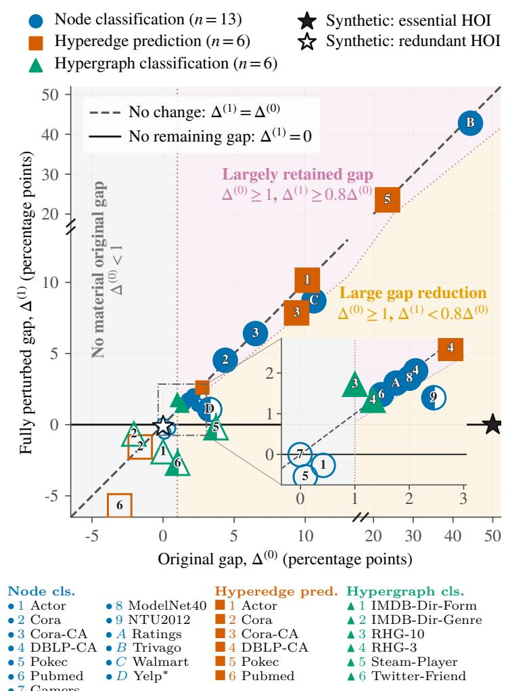  
Figure 2: Most performance advantages of higher-order models largely persist even after the perturbation of higher-order information. Original versus fully perturbed performance gaps between higher- and lower-order models across 25 benchmarks. Of the 18 with a material original gap of at least one point, 14 retain at least 80% after perturbation. For benchmark markers, filled and half-filled symbols indicate that at least 80% or less than 80% of a material original gap remains, respectively; hollow symbols indicate an original gap below one percentage point. Stars denote synthetic cases with essential or redundant higher-order information (HOI).

Observation 2: Largely retained gaps occur across tasks. Among original advantages of at least one percentage point, largely retained gaps occur for 8 of 10 node-classification benchmarks, all four hyperedge-prediction benchmarks, and 2 of 4 hypergraph-classification benchmarks. The pattern therefore extends across prediction at the node, hyperedge, and hypergraph levels, although it is not equally prevalent in every task. For node classification and hyperedge prediction, most or all material advantages survive largely intact. Hypergraph classification presents a more mixed picture: the advantages on RHG-10 and RHG-3 largely remain, whereas those on Steam-Player and Twitter-Friend disappear after perturbation (Appendix E.1). These contrasting outcomes show why attribution must be evaluated for each benchmark: performance gains within the same task can difer in their dependence on higher-order information. Large gap reductions also need not eliminate the original advantage. For node classification on NTU2012 and Yelp, the gaps decrease from 2.45 to 1.39 and from 3.28 to 1.07 accuracy points, respectively (Appendix E.1). These cases illustrate that the intervention can remove a substantial part of an advantage while leaving another part to be explained.

Overall: Performance attribution changes the conclusion suggested by the original gap. Based only on the original performance gap $\Delta ^ { ( 0 ) }$ , one might interpret a large advantage of the higher-order model as evidence that higher-order information is highly useful. Our framework separates that model-level advantage from its attribution to higher-order information.

Additional results. Appendix E reports additional results. Appendix E.1 reports detailed benchmark-wise results. Appendix E.2 reports secondary-metric results using AUROC for hyperedge prediction and Macro-F1 for hypergraph classification. Appendices E.4 to E.6 extend the analysis beyond the single selected model pair, reporting results on other models.

Remark. A largely retained gap does not imply that the higher-order model is unnecessary. It supports the narrower conclusion that most of its advantage over the selected lower-order comparator remains achievable without the perturbed higher-order information.

## 5.4 Investigating lower-order explanations for retained gaps

If most of a higher-order model’s advantage remains even after perturbing the higher-order information, what sustains it? In this section, we investigate potential lower-order explanations in the benchmarks with largely retained gaps shown in Fig. 2. We first examine three representative cases in Fig. 3 to investigate whether pairwise processing, feature propagation, and normalization can explain the remaining advantages. For hyperedge prediction, we also examine how models handle nodes absent from the training structure. Motivated by these case studies, we then augment CEGCN with pair multiplicities and structural self weights, input difusion that combines original and propagated features, and LayerNorm, and evaluate these additions across benchmarks. This tests whether simple lower-order improvements can narrow the remaining gaps beyond the individual cases that motivated them.

Case study 1: Structural self weights and input difusion (node classification on Walmart). Standard CEGCN uses a binary operator that records whether two nodes are connected, but does not account for how often they occur together in hyperedges (pair multiplicities) or the weights on a node’s own features derived from these pair counts (structural self weights). We therefore enrich CEGCN’s pairwise operator and examine the resulting performance changes. As shown in Fig. 3(a), on the fully perturbed view, standard CEGCN achieves 67.98% accuracy, compared with 76.68% for the higher-order model. Adding pair multiplicities alone yields a small improvement to 68.15%. Further adding structural self weights raises accuracy to 74.56%. Finally, propagating the input features once through the weighted pairwise connections before CEGCN’s learned layers (one input-difusion step) further raises accuracy to 76.32%. Here, richer pairwise processing can recover most of the higher-order model’s advantage.

Case study 2: Longer-range difusion and classifier normalization (node classification on Trivago). Standard CEGCN uses two learned propagation layers, which may underuse the information available through longer-range pairwise difusion. We therefore add input difusion before these layers and examine its efect

Higher-order model (original) Higher-order model (fully perturbed) Lower-order model

Richer adjacency, then diffusion  
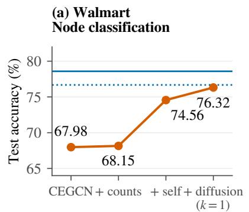

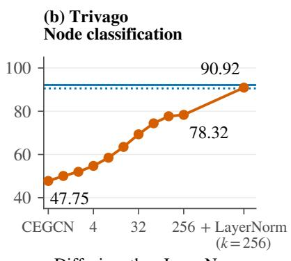

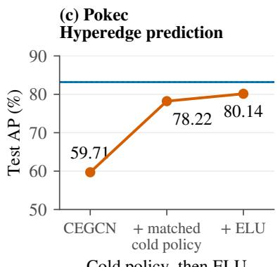  
Figure 3: Lower-order mechanisms such as stronger pairwise processing and matched model choices can substantially narrow the performance advantages that higher-order models retain after perturbation. Representative case studies examine the efect of (a) incorporating pair multiplicities and structural self weights, then propagating input features through pairwise connections; (b) increasing the number of feature-propagation steps and normalizing hidden features with LayerNorm; and (c) matching HGNN by removing feature-dependent messages from nodes absent from the training structure and using ELU between learned layers.

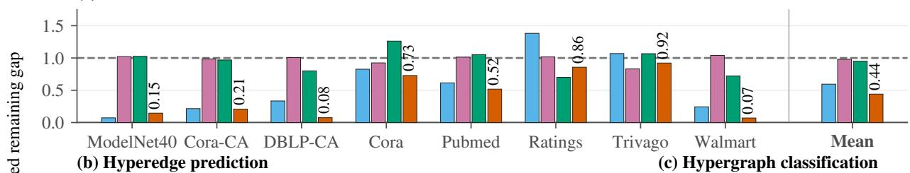

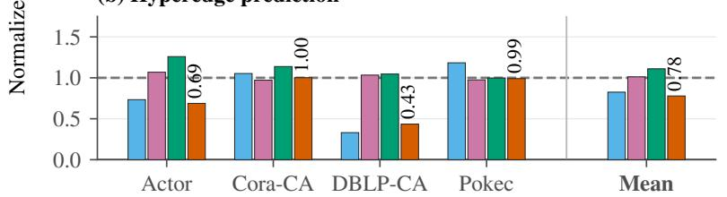

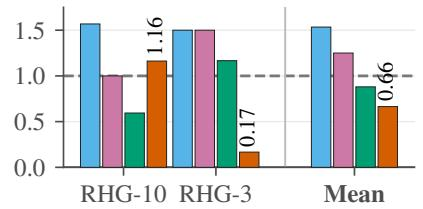  
Figure 4: Simple additions to a lower-order baseline reduce its performance gap to higher-order models on fully perturbed hypergraphs, especially in node classification. For each benchmark with a largely retained gap, four bars show the gap to the higher-order reference evaluated on the fully perturbed view, after adding O, D, L, or O+D+L to CEGCN. O incorporates pair multiplicities and structural self weights; D combines the original input features with features propagated through pairwise connections; L applies LayerNorm to hidden features. Value labels report the O+D+L ratios. Each gap is divided by the gap over unmodified CEGCN: 1 (the dashed line) means no change in that gap, and 0 means matching the higher-order reference. Each task mean averages its benchmark ratios equally.

on performance. As shown in Fig. 3(b), on the fully perturbed view, standard CEGCN achieves 47.75% accuracy, compared with 90.54% for the higher-order model. Propagating the input features through pairwise connections for k = 256 steps before the learned layers raises accuracy to 78.32%. Finally, keeping k = 256 and adding LayerNorm to normalize each node’s hidden feature representation between CEGCN’s two learned layers raises accuracy to 90.92%. Here, pairwise difusion and classifier normalization can nearly reproduce the higher-order model’s fully perturbed performance.

Case study 3: Cold-node handling and activation choice (hyperedge prediction on Pokec). For hyperedge prediction on Pokec, standard CEGCN and the higher-order reference, HGNN, difer in how they handle “cold” nodes absent from the training structure. CEGCN’s identity policy retains these nodes’ transformed features through self loops, whereas HGNN’s zero-message policy removes their feature-dependent messages at each propagation layer. We therefore match CEGCN’s cold-node policy to HGNN’s and examine the resulting performance change. As shown in Fig. 3(c), on the fully perturbed view, standard CEGCN achieves 59.71% AP, compared with 83.19% for the higher-order reference. CEGCN with the matched zero-message policy reaches 78.22% AP. Finally, replacing the hidden ReLU activation between CEGCN’s two propagation layers with ELU, as used by HGNN, raises AP to 80.14%. Here, matching the cold-node policy and activation function can recover most of the higher-order model’s advantage.

Evidence beyond the three case studies. Additional analyses identify other lower-order explanations for advantages that survive perturbation. For hyperedge prediction on Actor, the selected TFHNN configuration makes predictions from node features without using hypergraph structure, so its advantage cannot be attributed to higher-order information. For hypergraph classification on RHG-10 and RHG-3, models using only weighted pairwise connections recover all or much of the higher-order models’ remaining advantage. These results further show that an advantage surviving perturbation can arise from feature processing or pairwise structure alone (Appendix F.1).

Lower-order baselines motivated by the case studies. Motivated by these cases, we test the efect of three simple additions to standard CEGCN: O replaces the binary propagation operator with the operator using pair counts and structural self weights, with symmetric normalization to scale messages by the tota connection weights of their sending and receiving nodes (Appendix F.2); D combines the original input features with features propagated through pairwise connections for diferent numbers of steps; and L inserts LayerNorm. Addition O is inspired by Fig. 3(a), and D and L are inspired by Fig. 3(b). For hyperedge prediction, we also compare two policies for cold nodes: retaining their transformed features (the identity policy) or removing their feature-dependent messages (the zero-message policy), motivated by Fig. 3(c). We inherit oficial CEGCN configurations and compare CEGCN with +O, +D, +L, and +O+D+L. Fig. 4 compares gaps on the fully perturbed view for the 14 benchmarks with largely retained gaps before and after strengthening CEGCN with $\mathrm { O , D , L , }$ or their combination. We express each gap relative to the gap between the higher-order reference and unmodified CEGCN, both evaluated on the fully perturbed view. A ratio of 1 means that the original CEGCN gap remains unchanged, whereas 0 means that the improved CEGCN matches the higher-order reference.

Observation 1: Simple lower-order additions narrow retained gaps, especially in node classification. O+D+L reduces the mean remaining-gap ratio to 0.44 for node classification, 0.78 for hyperedge prediction using the identity policy for cold nodes, and 0.66 for hypergraph classification. These improvements extend beyond the eight node-classification benchmarks with largely retained gaps. Across all 13 node-classification benchmarks, O and $_ \mathrm { O + D + L }$ improve accuracy by an average of 2.96 and 3.69 points, respectively (Appendix F.2). Decomposing O on the original views further shows that pair multiplicities alone $\left( \mathrm { O } _ { 1 } \right)$ yield an average gain of only 0.38 points across these 13 benchmarks. With pair multiplicities already included, adding structural self weights and adjusting the associated normalization $\left( \mathrm { O } _ { 2 } \right)$ yields a further 2.58 points on average (Table 33). Thus, much of the improvement comes from how pairwise information is normalized and combined with self information.

Observation 2: Benefits vary across tasks and datasets. The additions leave substantial gaps on some benchmarks, and the efect of cold-node handling varies across hyperedge-prediction benchmarks (Fig. 5). The gains also do not extend consistently to hypergraph classification beyond the benchmarks with largely retained gaps: across all six benchmarks, $_ { \mathrm { O + D + I } }$ reduces accuracy on five, with a mean change of −0.95 points (Appendix F.2).

Overall: Stronger lower-order comparisons can help assess performance attribution. These experiments show that simple lower-order additions can narrow some advantages that survive perturbation, although their benefits vary across benchmarks. They motivate evaluating stronger lower-order alternatives before interpreting a performance gap as evidence for higher-order information.

Additional results. Appendix F reports detailed results for individual benchmarks, the $\mathrm { O } / \mathrm { D } / \mathrm { L }$ additions, and secondary metrics.

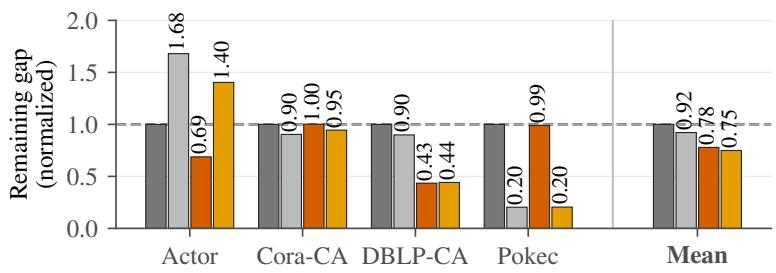  
Figure 5: Cold-node handling has benchmark-specific efects. CEGCN and CEGCN+O+D+L are compared on four hyperedge-prediction benchmarks with largely retained gaps. For nodes absent from the training structure, the identity policy retains transformed features; the zero-message policy removes feature-dependent messages. All gaps use the same higher-order reference on the fully perturbed view and are divided by its gap over CEGCN using the identity policy (1 means this gap is unchanged; 0 means matching the reference). The task mean averages the four benchmark ratios equally.

## 6 Broader Implications for the Hypergraph-Learning Community

Our findings motivate three changes in how the hypergraph learning community evaluates hypergraph learning, regarding evaluation protocol, baselines, and benchmarks.

Evaluation protocols. A leaderboard comparison can establish whether one model outperforms another, but it does not by itself identify the source of that advantage. Our results in Section 5.3 make this distinction concrete: many advantages of higher-order models largely remain even after higher-order information is perturbed. We therefore recommend complementing original-view performance comparisons with controlled interventions before attributing a gain to a particular information source. Specifically, for higher-order attribution, an evaluation should explicitly declare the lower-order information being preserved, verify that the intervention preserves it, and report both the portion of the original gap removed by the intervention and the portion that remains.

Evaluation baselines. A weak lower-order comparator cannot establish that the information available to lower-order models is itself insuficient. We illustrate this distinction in Section 5.4: pair multiplicities, structural self-weights, difusion, normalization, and protocol choices can substantially change how efectively lower-order information is used. Attribution therefore requires stronger lower-order comparisons. Evaluations should include competitive feature-only models and richer pairwise models, with validation-based tuning opportunities comparable to those given to higher-order models. This recommendation is consistent with graph-learning studies in which stronger baselines or improved hyperparameter choices substantially changed previously reported architectural gaps (Errica et al., 2020; Tönshof et al., 2024; Katsman et al., 2026).

Evaluation benchmarks. In a hypergraph benchmark, the existence of higher-order structure does not by itself mean that higher-order information is needed to predict the target. A relation may genuinely arise from a group interaction while the target remains predictable from features or pairwise statistics. Claims about higher-order necessity should therefore be made at the benchmark (i.e., dataset–task) level rather than inferred from the fact that the data admit a hypergraph representation. Benchmarks designed to test specific information requirements can make this distinction more testable. Our synthetic controls in Section 5.2 illustrate one approach: include cases in which higher-order information is necessary by construction alongside cases in which lower-order information is suficient. For real benchmarks, documentation should explain how hyperedges and prediction targets are constructed, helping readers assess whether the task tests higherorder information or admits plausible feature-only or pairwise explanations. This perspective is related to data-centric approaches such as RINGS, which evaluate whether graph datasets distinguish the information sources they are intended to test (Coupette et al., 2025), and to capability-targeted suites such as the Long Range Graph Benchmark (Dwivedi et al., 2022).

## 7 Conclusion

Existing work on hypergraph learning often motivates higher-order models by their ability to exploit nonpairwise structure, and empirical improvements over lower-order baselines are commonly interpreted as evidence for this benefit. In this paper, we separate the observation of a performance advantage from its attribution and ask: do higher-order models actually win for higher-order reasons? (Section 3). We introduce a controlled performance-attribution framework that perturbs higher-order information while preserving the lower-order, i.e., pairwise, information, allowing the original advantage of the higher-order model to be decomposed into the portion removed by the intervention and the portion that remains (Section 4). Our synthetic controls recover the expected behaviors when higher-order information is either essential or redundant by construction (Section 5.2). Across real-world benchmarks, however, we frequently observe a diferent pattern: a higher-order model has an original advantage of at least one percentage point, yet most of that advantage survives after the higher-order information is perturbed (Section 5.3). Thus, the original performance gap alone can substantially overstate the evidence that the perturbed higher-order information is responsible for the advantage. We then investigate what may sustain these retained gaps. Representative case studies identify plausible lower-order explanations, and simple additions to a lower-order baseline improve its performance (Section 5.4). Together, our findings motivate attribution-aware evaluation in hypergraph learning. This perspective calls for controlled interventions, stronger lower-order comparators, and benchmarks designed to distinguish the capabilities they are intended to test (Section 6).

## 8 Limitations and Future Directions

Preserved information and alternative interventions. Our study tests whether performance gains depend on information beyond the multiplicity-weighted clique expansion (Definition 3.1). The intervention preserves this representation exactly while changing how nodes are grouped into hyperedges. Our attribution statements therefore depend on this choice of preserved lower-order information. A natural extension is to compare other ways of constructing perturbed hypergraphs that preserve the same information.

From information suficiency to model mechanisms. Our controls address what information is suficient to achieve a given performance. A complementary question is how the original trained model uses that information. When a model using only lower-order information matches the higher-order model’s performance, it shows that higher-order information is not needed to achieve that performance in the tested comparison (Appendix F.1). However, this does not show that the original higher-order model achieved its performance in the same way. Combining the present interventions with controlled changes to individual architectural components would help identify how the original model uses the information available to it.

Benchmarks with known information requirements. Our real-world analysis and synthetic controls provide complementary starting points for future benchmark development (Sections 5.2 and 5.3 and Appendix D). Real-world benchmarks ofer breadth and realistic heterogeneity, but we generally do not know in advance which information is needed to achieve a given level of predictive performance. The synthetic controls establish the role of higher-order information by construction, while simplifying that heterogeneity. Semi-synthetic benchmarks could bridge these settings by retaining realistic features and relational structure while introducing controlled prediction targets whose dependence on higher-order information is known.

## References

Ilya Amburg, Nate Veldt, and Austin R. Benson. Clustering in graphs and hypergraphs with categorical edge labels. In Proceedings of The Web Conference 2020, pp. 706–717, 2020. doi:10.1145/3366423.3380152.

Song Bai, Feihu Zhang, and Philip H. S. Torr. Hypergraph convolution and hypergraph attention. Pattern Recognition, 110:107637, 2021. doi:10.1016/j.patcog.2020.107637.

Junhao Bian, Tao Zhou, and Yilin Bi. Unveiling the role of higher-order interactions via stepwise reduction. Communications Physics, 8:228, 2025. doi:10.1038/s42005-025-02157-3.

Christian Bick, Elizabeth Gross, Heather A. Harrington, and Michael T. Schaub. What are higher-order networks? SIAM Review, 65(3):686–731, 2023. doi:10.1137/21M1414024.

Fanchen Bu, Fan Li, Geon Lee, Sunwoo Kim, Xiaoyang Wang, Renaud Lambiotte, and Kijung Shin. Do higher-order models win for higher-order reasons? code repository, 2026. URL https://anonymous.4open. science/r/HO-perf-attribution/.

Eli Chien, Chao Pan, Jianhao Peng, and Olgica Milenkovic. You are AllSet: A multiset function framework for hypergraph neural networks. In International Conference on Learning Representations, 2022. URL https://openreview.net/forum?id=hpBTIv2uy\_E.

Corinna Coupette, Jeremy Wayland, Emily Simons, and Bastian Rieck. No metric to rule them all: Toward principled evaluations of graph-learning datasets. In Proceedings of the 42nd International Conference on Machine Learning, volume 267 of Proceedings of Machine Learning Research, pp. 11405–11434, 2025. URL https://proceedings.mlr.press/v267/coupette25a.html.

Yihe Dong, Will Sawin, and Yoshua Bengio. HNHN: Hypergraph networks with hyperedge neurons. In ICML Workshop on Graph Representation Learning and Beyond, 2020. URL https://arxiv.org/abs/ 2006.12278.

Iulia Duta, Giulia Cassarà, Fabrizio Silvestri, and Pietro Liò. Sheaf hypergraph networks. In Advances in Neural Information Processing Systems, volume 36, 2023. doi:10.52202/075280-0529.

Vijay Prakash Dwivedi, Ladislav Rampášek, Michael Galkin, Ali Parviz, Guy Wolf, Anh Tuan Luu, and Dominique Beaini. Long range graph benchmark. In Advances in Neural Information Processing Systems, volume 35, 2022. doi:10.52202/068431-1622.

Federico Errica, Marco Podda, Davide Bacciu, and Alessio Micheli. A fair comparison of graph neural networks for graph classification. In International Conference on Learning Representations, 2020. URL https://openreview.net/forum?id=HygDF6NFPB.

Yifan Feng, Haoxuan You, Zizhao Zhang, Rongrong Ji, and Yue Gao. Hypergraph neural networks. In Proceedings of the AAAI Conference on Artificial Intelligence, volume 33, pp. 3558–3565, 2019. doi:10.1609/aaai.v33i01.33013558.

Yifan Feng, Jiashu Han, Shihui Ying, and Yue Gao. Hypergraph isomorphism computation. IEEE Transactions on Pattern Analysis and Machine Intelligence, 46(5):3880–3896, 2024. doi:10.1109/TPAMI.2024.3353199.

Yue Gao, Zizhao Zhang, Haojie Lin, Xibin Zhao, Shaoyi Du, and Changqing Zou. Hypergraph learning: Methods and practices. IEEE Transactions on Pattern Analysis and Machine Intelligence, 44(5):2548–2566, 2022. doi:10.1109/TPAMI.2020.3039374.

Jing Huang and Jie Yang. UniGNN: A unified framework for graph and hypergraph neural networks. In Proceedings of the Thirtieth International Joint Conference on Artificial Intelligence, pp. 2563–2569, 2021. doi:10.24963/ijcai.2021/353.

David Y. Kang, Qiaozhu Mei, and Sang-Wook Kim. Low mileage, high fidelity: Evaluating hypergraph expansion methods by quantifying the information loss. In Proceedings of the ACM Web Conference 2024, pp. 959–968, 2024. doi:10.1145/3589334.3645657.

Isay Katsman, Ethan Lou, and Anna Gilbert. Revisiting graph learning benchmarks: When is the graph actually necessary? Neural Processing Letters, 58:24, 2026. doi:10.1007/s11063-026-11833-6.

Jinwoo Kim, Saeyoon Oh, Sungjun Cho, and Seunghoon Hong. Equivariant hypergraph neural networks. In Computer Vision – ECCV 2022, volume 13681 of Lecture Notes in Computer Science, pp. 86–103, 2022. doi:10.1007/978-3-031-19803-8\_6.

Sunwoo Kim, Dongjin Lee, Yul Kim, Jungho Park, Taeho Hwang, and Kijung Shin. Datasets, tasks, and training methods for large-scale hypergraph learning. Data Mining and Knowledge Discovery, 37(6): 2216–2254, 2023. doi:10.1007/s10618-023-00952-6.

Sunwoo Kim, Soo Yong Lee, Yue Gao, Alessia Antelmi, Mirko Polato, and Kijung Shin. A survey on hypergraph neural networks: An in-depth and step-by-step guide. In Proceedings of the 30th ACM SIGKDD Conference on Knowledge Discovery and Data Mining, pp. 6534–6544, 2024. doi:10.1145/3637528.3671457.

Timothy LaRock and Renaud Lambiotte. Exploring the non-uniqueness of node co-occurrence matrices of hypergraphs. arXiv:2506.01479, 2025. URL https://arxiv.org/abs/2506.01479.

Kyuhan Lee, Geon Lee, and Kijung Shin. MARIOH: Multiplicity-aware hypergraph reconstruction. In 2025 IEEE 41st International Conference on Data Engineering, pp. 3113–3125. IEEE, 2025. doi:10.1109/ICDE65448.2025.00233.

Jure Leskovec and Andrej Krevl. SNAP Datasets: Stanford large network dataset collection, 2014. URL https://snap.stanford.edu/data.

Fan Li, Xiaoyang Wang, Wenjie Zhang, Ying Zhang, and Xuemin Lin. DHG-Bench: A comprehensive benchmark for deep hypergraph learning. In International Conference on Learning Representations, 2026. URL https://openreview.net/forum?id=lhsb1ChUDF.

Ming Li, Yongchun Gu, Yi Wang, Yujie Fang, Lu Bai, Xiaosheng Zhuang, and Pietro Liò. When hypergraph meets heterophily: New benchmark datasets and baseline. In Proceedings of the AAAI Conference on Artificial Intelligence, volume 39, pp. 18377–18384, 2025. doi:10.1609/aaai.v39i17.34022.

Zexi Liu, Bohan Tang, Ziyuan Ye, Xiaowen Dong, Siheng Chen, and Yanfeng Wang. Hypergraph transformer for semi-supervised classification. In IEEE International Conference on Acoustics, Speech and Signal Processing, pp. 7515–7519, 2024. doi:10.1109/ICASSP48485.2024.10446248.

Jaume Llabrés, Raúl Toral, Maxi San Miguel, and Federico Vázquez. Reducibility of higher-order to pairwise interactions: Social impact models on hypergraphs. Physical Review Research, 8(2):023250, 2026. doi:10.1103/wy1x-3px8.

Maxime Lucas, Luca Gallo, Arsham Ghavasieh, Federico Battiston, and Manlio De Domenico. Reducibility of higher-order networks from dynamics. Nature Communications, 17:1551, 2026. doi:10.1038/s41467-025- 68273-4.

Raphaël Pellegrin, Lukas Fesser, and Melanie Weber. Higher-order learning with graph neural networks via hypergraph encodings. In Advances in Neural Information Processing Systems, volume 38, 2025. doi:10.52202/085713-5782.

Konstantin Prokopchik, Austin R. Benson, and Francesco Tudisco. Nonlinear feature difusion on hypergraphs. In Proceedings of the 39th International Conference on Machine Learning, volume 162 of Proceedings of Machine Learning Research, pp. 17945–17958, 2022. URL https://proceedings.mlr.press/v162/ prokopchik22a.html.

Fernando E. Rosas, Pedro A. M. Mediano, Andrea I. Luppi, Thomas F. Varley, Joseph T. Lizier, Sebastiano Stramaglia, Henrik J. Jensen, and Daniele Marinazzo. Disentangling high-order mechanisms and high-order behaviours in complex systems. Nature Physics, 18(5):476–477, 2022. doi:10.1038/s41567-022-01548-5.

Benedek Rozemberczki and Rik Sarkar. Twitch gamers: A dataset for evaluating proximity preserving and structural role-based node embeddings. In Workshop on Graph Learning Benchmarks at The Web Conference 2021, 2021. URL https://arxiv.org/abs/2101.03091.

Siddhant Saxena, Shounak Ghatak, Raghu Kolla, Debashis Mukherjee, and Tanmoy Chakraborty. DPHGNN: A dual perspective hypergraph neural networks. In Proceedings of the 30th ACM SIGKDD Conference on Knowledge Discovery and Data Mining, pp. 2548–2559, 2024. doi:10.1145/3637528.3672047.

Lubos Takac and Michal Zabovsky. Data analysis in public social networks. In International Scientific Conference and International Workshop Present Day Trends of Innovations 2012, 2012. URL https: //snap.stanford.edu/data/soc-pokec.pdf.

Bohan Tang, Zexi Liu, Keyue Jiang, Siheng Chen, and Xiaowen Dong. Training-free message passing for learning on hypergraphs. In International Conference on Learning Representations, 2025. URL https://proceedings.iclr.cc/paper\_files/paper/2025/hash/ ad9804eed175610302917a0c21ab9b52-Abstract-Conference.html.

Jan Tönshof, Martin Ritzert, Eran Rosenbluth, and Martin Grohe. Where did the gap go? reassessing the long-range graph benchmark. Transactions on Machine Learning Research, 2024. URL https: //openreview.net/forum?id=Nm0WX86sKv.

Fuli Wang, Karelia Pena-Pena, Wei Qian, and Gonzalo R. Arce. T-HyperGNNs: Hypergraph neural networks via tensor representations. IEEE Transactions on Neural Networks and Learning Systems, 36(3):5044–5058, 2025. doi:10.1109/TNNLS.2024.3371382.

Peihao Wang, Shenghao Yang, Yunyu Liu, Zhangyang Wang, and Pan Li. Equivariant hypergraph difusion neural operators. In International Conference on Learning Representations, 2023a. URL https:// openreview.net/forum?id=RiTjKoscnNd.

Yanbang Wang and Jon Kleinberg. From graphs to hypergraphs: Hypergraph projection and its reconstruction. In International Conference on Learning Representations, 2024. URL https://openreview.net/forum? id=qwYKE3VB2h.

Yuxin Wang, Quan Gan, Xipeng Qiu, Xuanjing Huang, and David Wipf. From hypergraph energy functions to hypergraph neural networks. In Proceedings of the 40th International Conference on Machine Learning, volume 202 of Proceedings of Machine Learning Research, pp. 35605–35623, 2023b. URL https:// proceedings.mlr.press/v202/wang23d.html.

Ran Xu, Mohammed K. Ali, Joyce C. Ho, and Carl Yang. Hypergraph transformers for EHR-based clinical predictions. AMIA Joint Summits on Translational Science Proceedings, 2023:582–591, 2023. URL https://pmc.ncbi.nlm.nih.gov/articles/PMC10283128/.

Naganand Yadati, Madhav Nimishakavi, Prateek Yadav, Vikram Nitin, Anand Louis, and Partha Talukdar. HyperGCN: A new method for training graph convolutional networks on hypergraphs. In Advances in Neural Information Processing Systems, volume 32, 2019. URL https://proceedings.neurips.cc/ paper/2019/hash/1efa39bcaec6f3900149160693694536-Abstract.html.

Yuguang Yan, Yuanlin Chen, Shibo Wang, Hanrui Wu, and Ruichu Cai. Hypergraph joint representation learning for hypervertices and hyperedges via cross expansion. In Proceedings of the AAAI Conference on Artificial Intelligence, volume 38, pp. 9232–9240, 2024. doi:10.1609/aaai.v38i8.28775.

Chaoqi Yang, Ruijie Wang, Shuochao Yao, and Tarek Abdelzaher. Semi-supervised hypergraph node classification on hypergraph line expansion. In Proceedings of the 31st ACM International Conference on Information and Knowledge Management, pp. 2352–2361, 2022. doi:10.1145/3511808.3557447.

Se-Eun Yoon, Hyungseok Song, Kijung Shin, and Yung Yi. How much and when do we need higher-order information in hypergraphs? a case study on hyperedge prediction. In Proceedings of The Web Conference 2020, pp. 2627–2633, 2020. doi:10.1145/3366423.3380016.

Dengyong Zhou, Jiayuan Huang, and Bernhard Schölkopf. Learning with hypergraphs: Clustering, classification, and embedding. In Advances in Neural Information Processing Systems, volume 19, 2006. URL https://proceedings.neurips.cc/paper\_files/paper/2006/hash/ dff8e9c2ac33381546d96deea9922999-Abstract.html.

## Appendix Contents

A Details of Quotes from Prior Work (Supplementing Section 1) 18   
B Details of Partial Perturbations (Supplementing Section 4) 18   
C Details of Experimental Setup (Supplementing Section 5.1) 19   
C.1 Benchmarks: Datasets and tasks 19   
C.2 Models . 21   
C.3 Implementations and hyperparameter tuning 21   
D Details of Synthetic Construction and Evaluation (Supplementing Section 5.2) 36   
D.1 Construction 36   
D.2 Evaluation 37   
E Details of Benchmark Results (Supplementing Section 5.3) 37   
E.1 Detailed benchmark-wise results 37   
E.2 Secondary-metric results 39   
E.3 Empirical check of lower-order baseline invariance . 39   
E.4 Node classification 42   
E.5 Hyperedge prediction 46   
E.6 Hypergraph classification 50   
F Additional Analyses of Retained Gaps (Supplementing Section 5.4) 54   
F.1 Detailed benchmark-wise analysis . 54   
F.2 O/D/L additions shared across datasets and primary-metric results 58

## A Details of Quotes from Prior Work (Supplementing Section 1)

To document the empirical interpretation motivating our study, we quote several representative statements from prior work. After reporting improvements over graph convolutional networks, Feng et al. (2019, p. 3564) write that “The better performance can be dedicated to the employed hypergraph structure”. Similarly, Bai et al. (2021, Sec. 4.1.3) interpret their comparison as demonstrating “the benefit of considering higher-order models . . . to exploit non-pairwise relationships”. A similar interpretation appears in more recent benchmark and application work: Li et al. (2026, Sec. 4.1.1) suggest that clique expansion “disrupts high-order structures and degrades predictive performance”, while Xu et al. (2023, p. 588) conclude that “modeling higher-order interactions beyond pairwise contributes to performance gain”.

## B Details of Partial Perturbations (Supplementing Section 4)

For a hypergraph H, define the multiset of eligible hyperedge instances containing three or more nodes as

$$
\mathcal { Z } _ { > 2 } ( \mathcal { H } ) = \ \underset { | e \in \mathcal { E } } { \underbrace { + } } \ \{ ( e , j ) : 1 \leq j \leq \mathbf { w } ( e ) \} .\tag{2}
$$

Thus, each unit of hyperedge weight is one eligible instance, whereas pairwise hyperedge instances are never selected for expansion. Singleton hyperedges retained as background input are also never selected for expansion and remain unchanged throughout the intervention. Equivalently, $\mathscr { T } _ { > 2 } ( \mathcal { H } )$ is a list of length

$$
N ( \mathcal { H } ) = \left| \mathcal { Z } _ { > 2 } ( \mathcal { H } ) \right| = \sum _ { e \in \mathcal { E } \atop | e | > 2 } \mathbf { w } ( e ) .\tag{3}
$$

We independently draw k random permutations $\pi _ { 1 } , \ldots , \pi _ { k }$ of this list. Each permutation defines one nested perturbation trajectory. At level $r \in [ 0 , 1 ]$ , let

$$
\begin{array} { r } { m _ { r } = \operatorname* { m i n } \bigl \{ N ( \mathcal { H } ) , \big \lfloor r N ( \mathcal { H } ) + \frac { 1 } { 2 } \big \rfloor \bigl \} \quad \mathrm { a n d } \quad S _ { i } ^ { ( r ) } = \{ \pi _ { i } ( 1 ) , \dots , \pi _ { i } ( m _ { r } ) \} . } \end{array}\tag{4}
$$

Thus, trajectory i clique-expands the first $m _ { r }$ instances in $\pi _ { i }$ and leaves all other instances unchanged. Using prefixes makes the selected instances nested as r increases. It also gives ${ S } _ { i } ^ { ( 0 ) } = \emptyset$ and $S _ { i } ^ { ( 1 ) } = \mathcal { I } _ { > 2 } ( \mathcal { H } )$ , so all trajectories share the same two endpoints; only the intermediate views depend on the random permutation.

The resulting view $\mathcal { H } _ { i } ^ { ( r ) }$ keeps every unselected hyperedge instance, each containing two or more nodes, and replaces each selected instance $( e , j )$ by clique(e); its edge multiset is therefore the union of the unselected instances and these clique expansions. When clique expansions produce the same pair, their multiplicities add. $\mathrm { A t } ~ r = 1$ , the non-singleton structure contains only weighted pairs and equals WCE(H). Singleton hyperedges present in the input are retained unchanged at every perturbation level, including this endpoint. Thus, the intervention preserves weighted pairwise co-occurrences and singleton incidences while removing the original grouping into hyperedges containing three or more nodes. In particular, the weight of any pair $p$ in the resulting view is

$$
\mathbf { w } _ { i } ^ { ( r ) } ( p ) = \mathbf { w } ( p ) + \sum _ { ( e , j ) \in S _ { i } ^ { ( r ) } } \mathbf { 1 } [ p \in \mathrm { c l i q u e } ( e ) ] , \qquad | p | = 2 ,\tag{5}
$$

where $\mathbf { w } ( p ) = 0 \mathrm { i f } p$ is not an original hyperedge. Each replacement preserves weighted pairwise co-occurrences exactly, so $\mathrm { W C E } ( \mathcal { H } _ { i } ^ { ( r ) } ) = \mathrm { W C E } ( \mathcal { H } )$ for every i and $r ;$ the partial views therefore difer only in information beyond the declared weighted clique expansion.

Replacing the intervened structure in D by $\mathcal { H } _ { i } ^ { ( r ) }$ produces $\mathcal { D } _ { i } ^ { ( r ) }$ and the benchmark view $\boldsymbol { B _ { i } ^ { ( r ) } } = ( \mathcal { D } _ { i } ^ { ( r ) } , \tau )$ . For hypergraph-classification datasets, the construction is applied to each hypergraph independently. The task τ remains fixed. $\mathrm { A t } ~ r = 0$ and $r = 1$ , the views are independent of the sampled trajectory, so we omit i and recover $B ^ { ( 0 ) }$ and $B ^ { ( 1 ) }$

Let $P _ { i } ^ { ( r ) } ( M )$ denote the test performance of model M on the view $\boldsymbol { B } _ { i } ^ { ( r ) }$ . For the k sampled trajectories, the performance and gap between the higher- and lower-order models reported at level r are

$$
\begin{array} { c } { { \displaystyle P ^ { ( r ) } ( { \cal M } ) = \frac { 1 } { k } \sum _ { i = 1 } ^ { k } P _ { i } ^ { ( r ) } ( { \cal M } ) , } } \\ { { \Delta ^ { ( r ) } ( { \cal M } _ { H } ; { \cal M } _ { L } ) = P ^ { ( r ) } ( { \cal M } _ { H } ) - P ( { \cal M } _ { L } ) . } } \end{array}\tag{6}
$$

At $r = 0$ and $r = 1$ , the sampled views are identical across trajectories, so these quantities recover the endpoint notation in Section 4.

## C Details of Experimental Setup (Supplementing Section 5.1)

## C.1 Benchmarks: Datasets and tasks

We inherit the benchmarks from DHG-Bench (Li et al., 2026). Node classification and hyperedge prediction each operate on one attributed hypergraph, while hypergraph classification operates on a collection of attributed hypergraphs. The full inventory in Section 5.1 contains 13 node-classification, six hyperedgeprediction, and six hypergraph-classification benchmarks, formed from 19 distinct datasets. Below, we summarize what the entities, hyperedges, features, and labels represent.

## C.1.1 Datasets for node classification and hyperedge prediction

All 13 datasets below are used for node classification. Cora, Pubmed, Cora-CA, DBLP-CA, Actor, and Pokec are additionally paired with the hyperedge-prediction task, producing six separate benchmarks.

Cora. Cora is a co-citation hypergraph: nodes are papers, and a hyperedge groups papers cited together. Bag-of-words document vectors serve as node features, and paper topics are the node labels. We use the hypergraph construction released with HyperGCN (Yadati et al., 2019).

Pubmed. Pubmed uses the same co-citation construction as Cora, with papers as nodes, jointly cited papers as hyperedges, bag-of-words features, and research topics as labels (Yadati et al., 2019).

Cora-CA. Cora-CA is the co-authorship view of Cora. Nodes are papers, and each author induces a hyperedge containing that author’s papers; features and labels again encode document words and paper topics, respectively (Yadati et al., 2019).

DBLP-CA. DBLP-CA is a larger co-authorship hypergraph constructed analogously to Cora-CA: papers are nodes, an author’s papers form a hyperedge, and the task is to predict paper categories from bag-of-words features and the hypergraph structure (Yadati et al., 2019).

NTU2012. NTU2012 contains 3D shapes from 67 categories. Each shape is a node; groups of a fixed number of nearest neighbors in the visual-feature space form hyperedges, and the node features are derived from MVCNN and GVCNN shape representations. We use the processed hypergraph released with HGNN (Feng et al., 2019).

ModelNet40. ModelNet40 contains 3D objects from 40 categories and is processed in the same way as NTU2012: objects are nodes, nearby objects in the learned visual-feature space form hyperedges, and the object category is the prediction target (Feng et al., 2019).

Walmart. In Walmart, nodes are products and each shopping trip induces a hyperedge of co-purchased products. Labels are 11 broad product departments. Following AllSet, the node features are noisy 100- dimensional encodings of these labels (Amburg et al., 2020; Chien et al., 2022).

Trivago. Trivago is a hotel-search hypergraph: hotels are nodes and a user’s browsing or click-out activity groups hotels into a hyperedge. The node label is the country in which the hotel is located (Kim et al., 2023).

Actor. Actor is derived from the AMiner movie–actor–director–writer network. Nodes are people involved in film production, each film induces a hyperedge joining its participants, Wikipedia keywords provide node attributes, and the label identifies a person’s role (Li et al., 2025).

Ratings. Ratings, called Amazon-ratings in its source, is derived from Amazon co-purchasing metadata in the SNAP collection. Products are nodes, frequently co-purchased products are grouped by hyperedges, bag-of-words vectors of product descriptions are the features, and the target is a product’s average review rating (Leskovec & Krevl, 2014; Li et al., 2025).

Gamers. Gamers, called Twitch-gamers in its source, represents Twitch accounts as nodes and forms hyperedges from reciprocal follow relations within temporal windows. Account metadata provide the node features, and the binary label records whether a channel hosts explicit content (Rozemberczki & Sarkar, 2021; Li et al., 2025).

Pokec. Pokec represents users of the Slovak social network as nodes. Each user’s friend set forms a hyperedge; profile fields such as age, interests, education, and region provide features, and user-reported gender is the label (Takac & Zabovsky, 2012; Li et al., 2025).

Yelp. Yelp represents restaurants as nodes and groups restaurants reviewed by the same user into hyperedges. The label is the restaurant’s average star rating; features combine geographic coordinates, location encodings, and a bag-of-words representation of restaurant names (Chien et al., 2022).

## C.1.2 Datasets for hypergraph classification

The six graph-level datasets were introduced or assembled for hypergraph classification by Feng et al. (2024).   
Here, each dataset contains a collection of hypergraphs and each entire hypergraph is one prediction instance.

RHG-10. RHG-10 is a synthetic collection with ten structural classes: Hyper Flower, Hyper Pyramid, Hyper Checked Table, Hyper Wheel, Hyper Lattice, Hyper Windmill, Hyper Firm Pyramid, Hyper RChecked Table, Hyper Cycle, and Hyper Fern.

RHG-3. RHG-3 is a focused synthetic collection with three structural classes—Hyper Pyramid, Hyper Checked Table, and Hyper Wheel—generated with variation within each class.

IMDB-Dir-Form. IMDB-Dir-Form contains movie-centered hypergraphs constructed from IMDB codirector relations. The graph label is the movie form, with classes such as animation, documentary, and drama.

IMDB-Dir-Genre. IMDB-Dir-Genre uses the same co-director construction but labels the hypergraphs by movie genre, with classes such as adventure, crime, and family.

Steam-Player. Each Steam-Player instance represents one player’s game collection. Games are vertices, games sharing tags are linked by hyperedges, and the binary target distinguishes a preference for single-player or multiplayer games.

Twitter-Friend. Each Twitter-Friend instance represents the friendship neighborhood of a focal Twitter user, with hyperedges derived from friendship relations. The label distinguishes whether the focal user’s post concerns “National Dog Day” or “Respect Tyler Joseph.”

## C.1.3 Other details

Benchmark construction. We canonicalize each source hypergraph by collapsing repeated memberships within an edge and removing empty hyperedges. Repeated hyperedges remain as integer multiplicities. For node classification, we retain the full source node set, including nodes incident only to singleton hyperedges and nodes with no incident hyperedge, and retain singleton hyperedges when present. We use label-stratified 50/25/25 train/validation/test splits. For example, the Actor node-classification inputs contain 156 singleton hyperedge instances, which remain unchanged at every perturbation level. For hyperedge prediction, preprocessing removes singleton hyperedges and restricts the node set to nodes incident to an edge containing at least two nodes before splitting the positive hyperedges. This node universe remains fixed even when a node is absent from the training support. We use fixed 60/20/20 train/validation/test partitions. Hypergraph classification canonicalizes each graph independently, removes singleton hyperedges, retains nodes incident to edges of size two or larger, and uses fixed 80/10/10 graph-level splits. Across all three tasks, the intervention preserves node features, labels, prediction targets, graph order, and split membership.

Split details for hyperedge prediction. Hyperedge prediction requires an observed relational structure from which the encoder can compute node representations. We partition the distinct positive hyperedge types into 60% training, 20% validation, and 20% test sets, while retaining their multiplicities. The training positives serve both as supervised training queries and as the only hypergraph structure available to the encoder, which we call the support graph. Validation and test positives are used only as prediction queries and never enter message passing. We construct sets of negative prediction queries matched to the sizes of the positive queries for each split and keep all positive queries, negative queries, and the node universe fixed across perturbation levels. Thus, for hyperedge prediction, the intervention changes only the support graph derived from the training hyperedges.

## C.2 Models

Spectral HNNs. HGNN applies convolution derived from a normalized hypergraph Laplacian (Feng et al., 2019). HyperGCN replaces each hyperedge with representative pairwise links before applying graph convolution (Yadati et al., 2019). HCHA provides trainable hypergraph-convolution and hypergraph-attention operators (Bai et al., 2021). LEGCN constructs a lossless line expansion whose vertices represent node– hyperedge memberships (incidences) (Yang et al., 2022). HyperND computes node representations through nonlinear difusion on the hypergraph (Prokopchik et al., 2022). PhenomNN derives propagation from parameterized hypergraph-regularized energy functions (Wang et al., 2023b). SheafHyperGNN augments hypergraph Laplacians with learned sheaf restriction maps (Duta et al., 2023). HJRL jointly represents nodes and hyperedges through a cross expansion and a reconstruction objective (Yan et al., 2024). DPHGNN combines static topology-derived features with dynamic hypergraph message passing (Saxena et al., 2024). TF-HNN separates an incidence-derived difusion step from its trainable prediction module (Tang et al., 2025).

Spatial HNNs. HNHN alternates nonlinear node-to-hyperedge and hyperedge-to-node updates with degree-based normalization (Dong et al., 2020). UniGNN generalizes GNN aggregation to two-stage hypergraph message passing; following DHG-Bench, we evaluate its UniGCNII variant (Huang & Yang, 2021). AllSetTransformer parameterizes both stages of hypergraph propagation as learned multiset functions (Chien et al., 2022). ED-HNN approximates equivariant hypergraph difusion through message passing on the star expansion, a bipartite graph connecting nodes to the hyperedges that contain them (Wang et al., 2023a). HyperGT combines global Transformer interactions with incidence-derived positional encodings and structural regularization (Liu et al., 2024).

Tensor-based HNNs. EHNN constructs equivariant layers by connecting sparse hypergraphs to fixedorder tensors and sharing parameters across hyperedge orders (Kim et al., 2022). T-HyperGNN represents hypergraph structure with multiplicative interaction tensors and performs tensor message passing (Wang et al., 2025).

Lower-order baselines. MLP uses only node features. CEGCN and CEGAT apply GCN and GAT, respectively, to the binary (unweighted) clique expansion (Chien et al., 2022).

## C.3 Implementations and hyperparameter tuning

We use the oficial implementations from DHG-Bench (Li et al., 2026). The benchmark pool begins with the 20 released DHG-Bench methods: 17 HNNs and the MLP, CEGCN, and CEGAT baselines. For hyperparameter tuning, we use the released YAML configuration for each dataset, task, and method provided by Li et al. (2026). For completeness, Table 1 gives the selected model pair on each primary benchmark comparison. It is followed by one table per model, with benchmarks as rows and varying hyperparameters as columns.

Table 1: Selected model pairs for the 25 primary benchmark comparisons. NC: node classification; EP: hyperedge prediction; HC: hypergraph classification. The Yelp pair includes the resource exception described in the results.
<table><tr><td>Task</td><td>Benchmark</td><td>Higher-order model</td><td>Lower-order model</td></tr><tr><td>EP</td><td>Actor</td><td>TF-HNN</td><td>MLP</td></tr><tr><td>EP</td><td>Cora-CA</td><td>UniGCNII</td><td>CEGAT</td></tr><tr><td>EP</td><td>DBLP-CA</td><td>PhenomNN</td><td>CEGAT</td></tr><tr><td>EP</td><td>Cora</td><td>PhenomNN</td><td>CEGAT</td></tr><tr><td>EP</td><td>Pubmed</td><td>EHNN</td><td>CEGCN</td></tr><tr><td>EP</td><td>Pokec</td><td>HGNN</td><td>CEGCN</td></tr><tr><td>HC</td><td>IMDB-Dir-Form</td><td>HCHA</td><td>CEGCN</td></tr><tr><td>HC</td><td>IMDB-Dir-Genre</td><td>HNHN</td><td>CEGCN</td></tr><tr><td>HC</td><td>RHG-10</td><td>HNHN</td><td>CEGAT</td></tr><tr><td>HC</td><td>RHG-3</td><td>HNHN</td><td>CEGCN</td></tr><tr><td>HC</td><td>Steam-Player</td><td>HNHN</td><td>CEGAT</td></tr><tr><td>HC</td><td>Twitter-Friend</td><td>HJRL</td><td>MLP</td></tr><tr><td>NC</td><td>ModelNet40</td><td>ED-HNN</td><td>MLP</td></tr><tr><td>NC</td><td>NTU2012</td><td>LEGCN</td><td>MLP</td></tr><tr><td>NC</td><td>Actor</td><td>EHNN</td><td>MLP</td></tr><tr><td>NC</td><td>Cora-CA</td><td>TF-HNN</td><td>CEGCN</td></tr><tr><td>NC</td><td>DBLP-CA</td><td>PhenomNN</td><td>CEGCN</td></tr><tr><td>NC</td><td>Cora</td><td>TF-HNN</td><td>CEGCN</td></tr><tr><td>NC</td><td>Pubmed</td><td>LEGCN</td><td>MLP</td></tr><tr><td>NC</td><td>Gamers</td><td>HCHA</td><td>MLP</td></tr><tr><td>NC</td><td>Pokec</td><td>TF-HNN</td><td>MLP</td></tr><tr><td>NC</td><td>Ratings</td><td>LEGCN</td><td>MLP</td></tr><tr><td>NC</td><td>Trivago</td><td>TF-HNN</td><td>CEGCN</td></tr><tr><td>NC</td><td>Walmart</td><td>ED-HNN</td><td>CEGCN</td></tr><tr><td>NC</td><td>Yelp</td><td>TF-HNN</td><td>MLP</td></tr></table>

Model-wise YAML settings. Each table lists benchmarks as rows and varying YAML fields as columns. Settings shared by every listed row appear once below the table. Column symbols L, E, H, M, T, p, η, λ denote All\_num\_layers, embedding\_hidden, MLP\_hidden, MLP\_num\_layers, epochs, dropout, lr, and wd, respectively; additional columns are defined below each table. NC/EP/HC have the same meanings as above.

Table 2: DHG-Bench YAML settings for MLP.
<table><tr><td>Task Benchmark</td><td></td><td>L</td><td>H T</td><td>p</td><td>η</td><td>q1</td><td>q2</td></tr><tr><td>EP</td><td>Actor</td><td>2</td><td>128</td><td>200 0.8</td><td>0.01</td><td></td><td></td></tr><tr><td>EP</td><td>Cora-CA</td><td>2</td><td>128</td><td>100 0.8</td><td>0.001</td><td></td><td></td></tr><tr><td>EP</td><td>DBLP-CA</td><td>3</td><td>128</td><td>100 0.8</td><td>0.001</td><td></td><td></td></tr><tr><td>EP</td><td>Cora</td><td>3</td><td>128</td><td>100 0.8</td><td>0.001</td><td></td><td></td></tr><tr><td>EP</td><td>Pubmed</td><td>3</td><td>128</td><td>100 0.8</td><td>0.001</td><td></td><td></td></tr><tr><td>EP</td><td>Pokec</td><td>2</td><td>256</td><td>100 0</td><td>0.01</td><td></td><td></td></tr><tr><td>HC</td><td>IMDB-Dir-Form</td><td>2</td><td>128</td><td>100 0.8</td><td>0.01</td><td>mean</td><td>true</td></tr><tr><td>HC</td><td>IMDB-Dir-Genre</td><td>2</td><td>128</td><td>200 0.8</td><td>0.001</td><td>mean</td><td>true</td></tr><tr><td>HC</td><td>RHG-10</td><td>2</td><td>128</td><td>200 0.8</td><td>0.01</td><td>mean</td><td>true</td></tr><tr><td>HC</td><td>RHG-3</td><td>2</td><td>128</td><td>200 0.8</td><td>0.01</td><td>mean</td><td>true</td></tr><tr><td>HC</td><td>Steam-Player</td><td>2</td><td>128</td><td>200 0.8</td><td>0.001</td><td>mean</td><td>true</td></tr><tr><td>HC</td><td>Twitter-Friend</td><td>2</td><td>128</td><td>200 0.8</td><td>0.001</td><td>mean</td><td>true</td></tr></table>

<table><tr><td>Task Benchmark</td><td></td><td>L</td><td>H</td><td>T</td><td>p</td><td>η</td><td>q1</td><td>q2</td></tr><tr><td>NC</td><td>ModelNet40</td><td>2</td><td>128</td><td>400</td><td>0.8</td><td>0.001</td><td></td><td></td></tr><tr><td>NC</td><td>NTU2012</td><td>2</td><td>128</td><td>400</td><td>0.8</td><td>0.001</td><td></td><td></td></tr><tr><td>NC</td><td>Actor</td><td>2</td><td>128</td><td>200</td><td>0.8</td><td>0.01</td><td></td><td></td></tr><tr><td>NC</td><td>Cora-CA</td><td>2</td><td>128</td><td>100</td><td>0.8</td><td>0.001</td><td></td><td></td></tr><tr><td>NC</td><td>DBLP-CA</td><td>3</td><td>128</td><td>100</td><td>0.8</td><td>0.001</td><td></td><td></td></tr><tr><td>NC</td><td>Cora</td><td>3</td><td>128</td><td>100</td><td>0.8</td><td>0.001</td><td></td><td></td></tr><tr><td>NC</td><td>Pubmed</td><td>3</td><td>128</td><td>100</td><td>0.8</td><td>0.001</td><td></td><td></td></tr><tr><td>NC</td><td>Gamers</td><td>2</td><td>256</td><td>200</td><td>0.8</td><td>0.01</td><td></td><td></td></tr><tr><td>NC</td><td>Pokec</td><td>2</td><td>256</td><td>100</td><td>0</td><td>0.01</td><td></td><td></td></tr><tr><td>NC</td><td>Ratings</td><td>2</td><td>256</td><td>100</td><td>0.8</td><td>0.01</td><td></td><td>一</td></tr><tr><td>NC</td><td>Trivago</td><td>2</td><td>128</td><td>500</td><td>0.8</td><td>0.05</td><td></td><td></td></tr><tr><td>NC</td><td>Walmart</td><td>2</td><td>256</td><td>200</td><td>0.8</td><td>0.01</td><td></td><td></td></tr><tr><td>NC</td><td>Yelp</td><td></td><td>3 128</td><td>500</td><td>0.8</td><td>0.01</td><td></td><td></td></tr></table>

Additional columns: q1=pooling; $q _ { 2 } { = } \mathsf { e a r } \mathtt { l y } .$ \_stop.  
Shared settings: embedding\_hidden=128; wd=0; normalization=ln; InputNorm=false.

Table 3: DHG-Bench YAML settings for CEGCN.
<table><tr><td></td><td>Task Benchmark</td><td>E</td><td>H</td><td>T</td><td>p</td><td>η</td><td>q1</td><td>q2</td><td>q3</td></tr><tr><td>EP</td><td>Actor</td><td>128</td><td>64</td><td>100</td><td>0.5</td><td>0.05</td><td>false</td><td></td><td>一</td></tr><tr><td>EP</td><td>Cora-CA</td><td>128</td><td>128</td><td>100</td><td>0.5</td><td>0.01</td><td>false</td><td></td><td></td></tr><tr><td>EP</td><td>DBLP-CA</td><td>128</td><td>128</td><td>100</td><td>0.5</td><td>0.01</td><td>false</td><td></td><td></td></tr><tr><td>EP</td><td>Cora</td><td>128</td><td>256</td><td>100</td><td>0</td><td>0.001</td><td>false</td><td></td><td>一</td></tr><tr><td>EP</td><td>Pubmed</td><td>128</td><td>128</td><td>100</td><td>0.5</td><td>0.01</td><td>false</td><td></td><td></td></tr><tr><td>EP</td><td>Pokec</td><td>128</td><td>64</td><td>100</td><td>0.5</td><td>0.05</td><td>false</td><td></td><td></td></tr><tr><td>HC</td><td>IMDB-Dir-Form</td><td>64 128</td><td></td><td>200</td><td>0.2</td><td>0.001</td><td>false</td><td>mean true</td><td></td></tr><tr><td>HC</td><td>IMDB-Dir-Genre</td><td>64 128</td><td></td><td>100</td><td>0.2</td><td>0.001</td><td>false</td><td>max true</td><td></td></tr><tr><td>HC</td><td>RHG-10</td><td>64 128</td><td></td><td>200</td><td>0.2</td><td>0.001</td><td>false</td><td>mean</td><td>true</td></tr><tr><td>HC</td><td>RHG-3</td><td>64 128</td><td></td><td>100</td><td>0.2</td><td>0.001</td><td>false</td><td>mean</td><td>true</td></tr><tr><td>HC</td><td>Steam-Player</td><td>64 128</td><td></td><td>100</td><td>0.2</td><td>0.001</td><td>false</td><td>max</td><td>true</td></tr><tr><td>HC</td><td>Twitter-Friend</td><td>64 128</td><td></td><td>100</td><td>0.2</td><td>0.001</td><td>false</td><td>max true</td><td></td></tr><tr><td>NC</td><td>ModelNet40</td><td>128</td><td>256</td><td>300</td><td></td><td>00.001</td><td>true</td><td></td><td></td></tr><tr><td>NC</td><td>NTU2012</td><td>128</td><td>256</td><td>300</td><td></td><td>00.001</td><td>true</td><td></td><td></td></tr><tr><td>NC</td><td>Actor</td><td>128</td><td>64</td><td>100</td><td>0.5</td><td>0.05</td><td>false</td><td></td><td></td></tr><tr><td>NC</td><td>Cora-CA</td><td>128</td><td>128</td><td>100</td><td>0.5</td><td>0.01</td><td>false</td><td></td><td></td></tr><tr><td>NC</td><td>DBLP-CA</td><td>128</td><td>128</td><td>100</td><td>0.5</td><td>0.01</td><td>false</td><td></td><td>一</td></tr><tr><td>NC</td><td>Cora</td><td>128</td><td>256</td><td>100</td><td>0</td><td>0.001</td><td>false</td><td></td><td>一</td></tr><tr><td>NC</td><td>Pubmed</td><td>128</td><td>128</td><td>100</td><td>0.5</td><td>0.01</td><td>false</td><td></td><td>一</td></tr><tr><td>NC</td><td>Gamers</td><td>128</td><td>64</td><td>100</td><td>0.5</td><td>0.05</td><td>false</td><td></td><td>一</td></tr><tr><td>NC</td><td>Pokec</td><td>128</td><td>64</td><td>100</td><td>0.5</td><td>0.05</td><td>false</td><td></td><td>一</td></tr><tr><td>NC</td><td>Ratings</td><td>128</td><td>64</td><td>100</td><td>0.5</td><td>0.05</td><td>false</td><td></td><td>一</td></tr><tr><td>NC</td><td>Trivago</td><td>128</td><td>128</td><td>1000</td><td>0.5</td><td>0.01</td><td>false</td><td></td><td>一</td></tr><tr><td>NC</td><td>Walmart</td><td>128</td><td>128</td><td>100</td><td>0.5</td><td>0.01</td><td>false</td><td></td><td></td></tr><tr><td>NC</td><td>Yelp</td><td>128</td><td>128</td><td>100</td><td>0.5</td><td>0.01</td><td>false</td><td></td><td></td></tr></table>

Additional columns: q1=use\_bn; q2=pooling; $q _ { 3 } { = } \mathsf { e a r l y } _ { - }$ stop.

Table 4: DHG-Bench YAML settings for CEGAT.
<table><tr><td></td><td>Task Benchmark</td><td>E</td><td>H</td><td>T</td><td>p</td><td></td><td>ηq1</td><td>q2</td><td>q3</td><td>q4</td><td>q5</td></tr><tr><td>EP</td><td>Actor</td><td>128</td><td>64</td><td>100</td><td>0.8</td><td>0.02</td><td>4</td><td>false false</td><td></td><td></td><td></td></tr><tr><td>EP</td><td>Cora-CA</td><td>128</td><td>64</td><td>100</td><td>0.8</td><td>0.02</td><td></td><td></td><td>4 false false</td><td></td><td></td></tr><tr><td>EP</td><td>DBLP-CA</td><td>128</td><td>64</td><td>100</td><td>0.8</td><td>0.02</td><td></td><td></td><td>4 false false</td><td></td><td></td></tr><tr><td>EP</td><td>Cora</td><td>128</td><td>64</td><td>100</td><td>0.8</td><td>0.001</td><td></td><td></td><td>4 false false</td><td></td><td></td></tr><tr><td>EP</td><td>Pubmed</td><td>128</td><td>64</td><td>100</td><td>0.8</td><td>0.02</td><td></td><td></td><td>4 false false</td><td></td><td></td></tr><tr><td>EP</td><td>Pokec</td><td>128</td><td>64</td><td>50</td><td>0.8</td><td>0.01</td><td></td><td></td><td>4 false false</td><td></td><td></td></tr><tr><td>HC</td><td>IMDB-Dir-Form</td><td>64 64</td><td></td><td>200</td><td>0.2</td><td>0.001</td><td></td><td></td><td>4 false false</td><td>max true</td><td></td></tr><tr><td>HC</td><td>IMDB-Dir-Genre</td><td>6464</td><td></td><td>100</td><td>0.2</td><td>0.001</td><td></td><td></td><td>4 false false</td><td>max true</td><td></td></tr><tr><td>HC</td><td>RHG-10</td><td></td><td>6464</td><td>200</td><td>0.2</td><td>0.001</td><td></td><td></td><td>4 false false</td><td>mean true</td><td></td></tr><tr><td>HC</td><td>RHG-3</td><td></td><td>64 64</td><td>100</td><td>0.2</td><td>0.001</td><td></td><td></td><td>4 false false</td><td>mean</td><td>true</td></tr><tr><td>HC</td><td>Steam-Player</td><td></td><td>64 64</td><td>100</td><td>0.2</td><td>0.001</td><td></td><td></td><td>4 false false</td><td>max true</td><td></td></tr><tr><td>HC</td><td>Twitter-Friend</td><td>128</td><td>32</td><td>100</td><td>0.5</td><td>0.001</td><td>8</td><td>true</td><td>true</td><td></td><td></td></tr><tr><td>NC</td><td>ModelNet40</td><td>128</td><td>64</td><td>100</td><td>0.8</td><td>0.01</td><td></td><td>4 false</td><td>true</td><td></td><td></td></tr><tr><td>NC</td><td>NTU2012</td><td>128</td><td>64</td><td>100</td><td>0.5</td><td>0.01</td><td></td><td>4 false</td><td>true</td><td></td><td></td></tr><tr><td>NC</td><td>Actor</td><td>128</td><td>64</td><td>100</td><td>0.8</td><td>0.02</td><td></td><td></td><td>4 false false</td><td></td><td></td></tr><tr><td>NC</td><td>Cora-CA</td><td>128</td><td>64</td><td>100</td><td>0.8</td><td>0.02</td><td></td><td></td><td>4 false false</td><td></td><td></td></tr><tr><td>NC</td><td>DBLP-CA</td><td>128</td><td>64</td><td>100</td><td>0.8</td><td>0.02</td><td></td><td></td><td>4 false false</td><td></td><td></td></tr><tr><td>NC</td><td>Cora</td><td>128</td><td>64</td><td>100</td><td>0.8</td><td>0.001</td><td></td><td></td><td>4 false false</td><td></td><td></td></tr><tr><td>NC</td><td>Pubmed</td><td>128</td><td>64</td><td>100</td><td>0.8</td><td>0.02</td><td></td><td></td><td>4 false false</td><td></td><td></td></tr><tr><td>NC</td><td>Gamers</td><td>128</td><td>64</td><td>100</td><td>0.8</td><td>0.02</td><td></td><td></td><td>4 false false</td><td></td><td></td></tr><tr><td>NC</td><td>Pokec</td><td>128</td><td>64</td><td>50</td><td>0.8</td><td>0.01</td><td></td><td></td><td>4 false false</td><td></td><td></td></tr><tr><td>NC</td><td>Ratings</td><td>128</td><td>64</td><td>100</td><td>0.8</td><td>0.05</td><td></td><td></td><td>4 false false</td><td></td><td></td></tr><tr><td>NC</td><td>Trivago</td><td>128</td><td>32</td><td>100</td><td>0.5</td><td>0.001</td><td>8</td><td>true</td><td>e true</td><td></td><td></td></tr><tr><td>NC</td><td>Walmart</td><td>128</td><td>64</td><td>100</td><td>0.8</td><td>0.02</td><td></td><td></td><td>4 false false</td><td></td><td></td></tr><tr><td>NC</td><td>Yelp</td><td>128</td><td>32</td><td>100</td><td>0.5</td><td>0.001</td><td>8</td><td>true</td><td>true</td><td></td><td></td></tr></table>

Additional columns: $q _ { 1 } { = } \mathbf { h } { \mathsf { e a d s } } ;$ $q _ { 2 } { = } { \tt c o n c a t } ;$ $q _ { 3 } { = } { \tt u s e } _ { - }$ bn; $q _ { 4 } { = } \mathtt { p o o l i n g } ;$ q5=early\_stop. Shared settings: All\_num\_layers=2; wd=0.

Table 5: DHG-Bench YAML settings for HGNN.
<table><tr><td></td><td>Task Benchmark</td><td>L</td><td>E</td><td>H</td><td>T</td><td>p</td><td>ηλ</td><td>q1</td><td></td><td>q2</td></tr><tr><td>EP</td><td>Actor</td><td>1</td><td>128</td><td>64</td><td>400</td><td>0.5</td><td>0.01</td><td>0</td><td></td><td></td></tr><tr><td>EP</td><td>Cora-CA</td><td>2</td><td>128</td><td>128</td><td>100</td><td>0.5</td><td>0.001</td><td>0</td><td></td><td></td></tr><tr><td>EP</td><td>DBLP-CA</td><td>2</td><td>128</td><td>128</td><td>100</td><td>0.5</td><td>0.01</td><td>0</td><td></td><td></td></tr><tr><td>EP</td><td>Cora</td><td>2</td><td>128</td><td>128</td><td>100</td><td>0.5</td><td>0.001</td><td>0</td><td></td><td></td></tr><tr><td>EP</td><td>Pubmed</td><td>2</td><td>128</td><td>128</td><td>100</td><td>0.5</td><td>0.01</td><td>0</td><td></td><td></td></tr><tr><td>EP</td><td>Pokec</td><td>2</td><td>128</td><td>128</td><td>200</td><td>0</td><td>0.01</td><td>0</td><td></td><td></td></tr><tr><td>HC</td><td>IMDB-Dir-Form</td><td>1</td><td>64</td><td>64</td><td>200</td><td>0.2</td><td>0.01</td><td>0</td><td>max true</td><td></td></tr><tr><td>HC</td><td>IMDB-Dir-Genre</td><td>1</td><td>128</td><td>64</td><td>200</td><td>0.2</td><td>0.01</td><td>0</td><td>max true</td><td></td></tr><tr><td>HC</td><td>RHG-10</td><td>1</td><td>64</td><td>64</td><td>300</td><td>0.2</td><td>0.001</td><td>0</td><td>max true</td><td></td></tr><tr><td>HC</td><td>RHG-3</td><td>1</td><td>64</td><td>64</td><td>200</td><td>0.2</td><td>0.001</td><td>0</td><td>max true</td><td></td></tr><tr><td></td><td>Task Benchmark</td><td>L</td><td>E</td><td>H</td><td>T</td><td>p</td><td></td><td>ηλ</td><td>q1</td><td>q2</td></tr><tr><td>HC</td><td>Steam-Player</td><td>1</td><td>64</td><td>64</td><td>200</td><td>0.2</td><td>0.001</td><td>0</td><td>max true</td><td></td></tr><tr><td>HC</td><td>Twitter-Friend</td><td>1</td><td>64</td><td>64</td><td>200</td><td>0.2</td><td>0.001</td><td>0</td><td>max true</td><td></td></tr><tr><td>NC</td><td>ModelNet40</td><td></td><td>128</td><td>128</td><td>200</td><td>0.5</td><td>0.01</td><td>0</td><td></td><td></td></tr><tr><td>NC</td><td>NTU2012</td><td></td><td>1 128</td><td>128</td><td>200</td><td>0.5</td><td>0.01</td><td>0</td><td></td><td></td></tr><tr><td>NC</td><td>Actor</td><td></td><td>1 128</td><td>64</td><td>400</td><td>0.5</td><td>0.01</td><td>0</td><td></td><td></td></tr><tr><td>NC</td><td>Cora-CA</td><td></td><td>2 128</td><td>128</td><td>100</td><td>0.5</td><td>0.001</td><td>0</td><td></td><td></td></tr><tr><td>NC</td><td>DBLP-CA</td><td>2</td><td>128</td><td>128</td><td>100</td><td>0.5</td><td>0.01</td><td>0</td><td></td><td></td></tr><tr><td>NC</td><td>Cora</td><td>2</td><td>128</td><td>128</td><td>100</td><td>0.5</td><td>0.001</td><td>0</td><td></td><td>一</td></tr><tr><td>NC</td><td>Pubmed</td><td>2</td><td>128</td><td>128</td><td>100</td><td>0.5</td><td>0.01</td><td>0</td><td></td><td></td></tr><tr><td>NC</td><td>Gamers</td><td></td><td>1128</td><td>64</td><td>200</td><td>0</td><td>0.01</td><td>0</td><td></td><td></td></tr><tr><td>NC</td><td>Pokec</td><td>2</td><td>128</td><td>128</td><td>200</td><td>0</td><td>0.01</td><td>0</td><td></td><td></td></tr><tr><td>NC</td><td>Ratings</td><td>2</td><td>128</td><td>128</td><td>100</td><td>0.5</td><td>0.001</td><td>0</td><td></td><td></td></tr><tr><td>NC</td><td>Trivago</td><td>3</td><td>128</td><td>128</td><td>500</td><td>0.5</td><td>0.04</td><td>0</td><td></td><td></td></tr><tr><td>NC</td><td>Walmart</td><td></td><td>2 128</td><td>128</td><td>200</td><td>0.5</td><td>0.01</td><td>0</td><td></td><td></td></tr><tr><td>NC</td><td>Yelp</td><td></td><td>1 128</td><td>64</td><td>1000</td><td>0.5</td><td>0.01</td><td>0</td><td></td><td></td></tr></table>

Additional columns: q1=pooling; q2=early\_stop.  
Shared settings: HCHA\_symdegnorm=false.

Table 6: DHG-Bench YAML settings for HyperGCN.
<table><tr><td></td><td>Task Benchmark</td><td>L</td><td>E</td><td>H</td><td>T</td><td>p</td><td></td><td>ηλ</td><td>q1</td><td>q2</td><td>q3</td><td>q4</td><td>q5</td></tr><tr><td>EP</td><td>Actor</td><td>1</td><td>128</td><td>64</td><td>400</td><td>0.5</td><td>0.1</td><td>0</td><td>true</td><td>true</td><td></td><td></td><td></td></tr><tr><td>EP</td><td>Cora-CA</td><td>2</td><td>128</td><td>128</td><td>200</td><td>0.8</td><td>0.001</td><td>0</td><td>true</td><td>true false</td><td></td><td></td><td></td></tr><tr><td>EP</td><td>DBLP-CA</td><td></td><td>2 128</td><td>128</td><td>200</td><td>0.8</td><td>0.001</td><td>0</td><td>true</td><td>true</td><td></td><td></td><td></td></tr><tr><td>EP</td><td>Cora</td><td></td><td>2 128</td><td>64</td><td>150</td><td>0.5</td><td>0.001</td><td>0</td><td>true</td><td>true</td><td></td><td></td><td></td></tr><tr><td>EP</td><td>Pubmed</td><td></td><td>2 128</td><td>256</td><td>200</td><td>0.5</td><td>0.01</td><td>0</td><td>true</td><td>true</td><td></td><td></td><td></td></tr><tr><td>EP</td><td>Pokec</td><td></td><td>2 128</td><td>64</td><td>200</td><td>0.5</td><td>0.001</td><td>0</td><td>true</td><td>true</td><td></td><td></td><td></td></tr><tr><td>HC</td><td>IMDB-Dir-Form</td><td>1</td><td>64</td><td>64</td><td>200</td><td>0.2</td><td>0.01</td><td>0</td><td>true</td><td>false</td><td></td><td>mean</td><td>true</td></tr><tr><td>HC</td><td>IMDB-Dir-Genre</td><td>1</td><td>64</td><td>64</td><td>200</td><td>0.2</td><td>0.01</td><td>0</td><td>true</td><td>false</td><td></td><td>mean</td><td>true</td></tr><tr><td>HC</td><td>RHG-10</td><td>1</td><td>64</td><td>64</td><td>200</td><td>0.2</td><td>0.01</td><td>0</td><td></td><td>true false</td><td></td><td>max true</td><td></td></tr><tr><td>HC</td><td>RHG-3</td><td>1</td><td>64</td><td>64</td><td>200</td><td>0.2</td><td>0.01</td><td>0</td><td></td><td>true false</td><td></td><td>max true</td><td></td></tr><tr><td>HC</td><td>Steam-Player</td><td>1</td><td>64</td><td>64</td><td>200</td><td>0.2</td><td>0.001</td><td>0</td><td></td><td>true false</td><td></td><td>mean</td><td>true</td></tr><tr><td>HC</td><td>Twitter-Friend</td><td>1</td><td>64</td><td>64</td><td>200</td><td>0.2</td><td>0.001</td><td>0</td><td>true</td><td>false</td><td></td><td>mean</td><td>true</td></tr><tr><td>NC</td><td>ModelNet40</td><td>2</td><td>128</td><td>128</td><td>500</td><td>0.5</td><td>0.001</td><td>0</td><td>true</td><td>true</td><td></td><td></td><td></td></tr><tr><td>NC</td><td>NTU2012</td><td></td><td>2 128</td><td>128</td><td>500</td><td>0.5</td><td>0.001</td><td>0</td><td>true</td><td>true</td><td></td><td></td><td></td></tr><tr><td>NC</td><td>Actor</td><td></td><td>1 128</td><td>64</td><td>400</td><td>0.5</td><td>0.1</td><td>0</td><td>true</td><td>true</td><td></td><td></td><td></td></tr><tr><td>NC</td><td>Cora-CA</td><td></td><td>2 128</td><td>128</td><td>200</td><td>0.8</td><td>0.001</td><td>0</td><td>true</td><td>true false</td><td></td><td></td><td></td></tr><tr><td>NC</td><td>DBLP-CA</td><td></td><td>2 128</td><td>128</td><td>200</td><td>0.8</td><td>0.001</td><td>0</td><td>true</td><td>true</td><td></td><td></td><td></td></tr><tr><td>NC</td><td>Cora</td><td></td><td>2 128</td><td>64</td><td>150</td><td>0.5</td><td>0.001</td><td>0</td><td>true</td><td>true</td><td></td><td></td><td></td></tr><tr><td>NC</td><td>Pubmed</td><td></td><td>2 128</td><td>256</td><td>200</td><td>0.5</td><td>0.01</td><td>0</td><td>true</td><td>true</td><td></td><td></td><td></td></tr><tr><td>NC</td><td>Gamers</td><td></td><td>2 128</td><td>64</td><td>200</td><td>0.5</td><td>0.001</td><td>0</td><td>true</td><td>true</td><td></td><td></td><td></td></tr><tr><td>NC</td><td>Pokec</td><td></td><td>2 128</td><td>64</td><td>200</td><td>0.5</td><td>0.001</td><td>0</td><td>true</td><td>true</td><td></td><td></td><td></td></tr><tr><td>NC</td><td>Ratings</td><td></td><td>2 128</td><td>64</td><td>400</td><td>0.5</td><td>0.01</td><td>0</td><td>true</td><td>true</td><td></td><td></td><td></td></tr><tr><td>NC</td><td>Trivago</td><td></td><td>3 128</td><td>128</td><td>800</td><td>0.5</td><td>0.03</td><td>0</td><td>true</td><td>true</td><td></td><td></td><td></td></tr><tr><td>NC</td><td>Walmart</td><td></td><td>2 128</td><td>128</td><td>200</td><td>0.5</td><td>0.01</td><td>0</td><td>true</td><td>true</td><td></td><td></td><td></td></tr><tr><td>Task Benchmark</td><td></td><td>L</td><td>E</td><td>H</td><td>T</td><td>p</td><td>ηλ</td><td></td><td> $q _ { 1 }$ </td><td>q2</td><td>q3</td><td>q4</td><td>q5</td></tr><tr><td>NC</td><td>Yelp</td><td></td><td>1 128</td><td>64</td><td>500</td><td>0.2</td><td>0.001</td><td></td><td>0 false t</td><td>true</td><td></td><td></td><td></td></tr></table>

Additional columns: $q _ { 1 } { = } \mathtt { H y p e r G C N } .$ \_mediators; $q _ { 2 } { \mathrm { = } } \mathtt { H y p e r G C N _ { \mathrm { - } } }$ fast; $q _ { 3 } { = } \mathrm { H C H A } .$ \_symdegnorm; $q _ { 4 } { = } \mathtt { p o o l i n g } ;$ $q _ { 5 } { = } { \tt e a r l y \_ s t o p }$

Table 7: DHG-Bench YAML settings for HCHA.
<table><tr><td></td><td>Task Benchmark</td><td>L</td><td>E</td><td>H</td><td>T</td><td>p</td><td></td><td>ηλ</td><td>q1</td><td>q2</td></tr><tr><td>EP</td><td>Actor</td><td>1</td><td>128</td><td>64</td><td>400</td><td>0.5</td><td>0.01</td><td>0</td><td></td><td></td></tr><tr><td>EP</td><td>Cora-CA</td><td>2</td><td>128</td><td>128</td><td>100</td><td>0.5</td><td>0.001</td><td>0</td><td></td><td></td></tr><tr><td>EP</td><td>DBLP-CA</td><td>2</td><td>128</td><td>128</td><td>50</td><td>0.5</td><td>0.01</td><td>0</td><td></td><td></td></tr><tr><td>EP</td><td>Cora</td><td>2</td><td>128</td><td>128</td><td>100</td><td>0.5</td><td>0.001</td><td>0</td><td></td><td></td></tr><tr><td>EP</td><td>Pubmed</td><td>2</td><td>128</td><td>128</td><td>100</td><td>0.5</td><td>0.01</td><td>0</td><td></td><td>一</td></tr><tr><td>EP</td><td>Pokec</td><td>2</td><td>128</td><td>128</td><td>200</td><td>0</td><td>0.005</td><td>0</td><td></td><td></td></tr><tr><td>HC</td><td>IMDB-Dir-Form</td><td>1</td><td>128</td><td></td><td>64 200</td><td>0.2</td><td>0.01</td><td>0</td><td>max true</td><td></td></tr><tr><td>HC</td><td>IMDB-Dir-Genre</td><td>1</td><td>128</td><td>64</td><td>200</td><td>0.2</td><td>0.001</td><td>0</td><td>max true</td><td></td></tr><tr><td>HC</td><td>RHG-10</td><td>1</td><td>64</td><td></td><td>64 300</td><td>0.2</td><td>0.001</td><td>0</td><td>max true</td><td></td></tr><tr><td>HC</td><td>RHG-3</td><td>1</td><td>64</td><td></td><td>64 200</td><td>0.2</td><td>0.001</td><td>0</td><td>max</td><td>true</td></tr><tr><td>HC</td><td>Steam-Player</td><td>1</td><td>64</td><td>64</td><td>200</td><td>0.2</td><td>0.001</td><td>0</td><td>max</td><td>true</td></tr><tr><td>HC</td><td>Twitter-Friend</td><td>1</td><td>64</td><td>64</td><td>200</td><td>0.2</td><td>0.01</td><td>0</td><td>max true</td><td></td></tr><tr><td>NC</td><td>ModelNet40</td><td>1</td><td>128</td><td>128</td><td>200</td><td>0.5</td><td>0.01</td><td>0</td><td></td><td></td></tr><tr><td>NC</td><td>NTU2012</td><td>1 128</td><td></td><td>128</td><td>200</td><td>0.5</td><td>0.01</td><td>0</td><td></td><td></td></tr><tr><td>NC</td><td>Actor</td><td></td><td>1 128</td><td>64</td><td>400</td><td>0.5</td><td>0.01</td><td>0</td><td></td><td></td></tr><tr><td>NC</td><td>Cora-CA</td><td>2</td><td>128</td><td>128</td><td>100</td><td>0.5</td><td>0.001</td><td>0</td><td></td><td></td></tr><tr><td>NC</td><td>DBLP-CA</td><td>2</td><td>128</td><td>128</td><td>50</td><td>0.5</td><td>0.01</td><td>0</td><td></td><td>一</td></tr><tr><td>NC</td><td>Cora</td><td>2</td><td>128</td><td>128</td><td>100</td><td>0.5</td><td>0.001</td><td>0</td><td></td><td>一</td></tr><tr><td>NC</td><td>Pubmed</td><td>2</td><td>128</td><td>128</td><td>100</td><td>0.5</td><td>0.01</td><td>0</td><td></td><td></td></tr><tr><td>NC</td><td>Gamers</td><td></td><td>128</td><td>64</td><td>200</td><td>0</td><td>0.01</td><td>0</td><td></td><td></td></tr><tr><td>NC</td><td>Pokec</td><td>2</td><td>128</td><td>128</td><td>200</td><td>0</td><td>0.005</td><td>0</td><td></td><td></td></tr><tr><td>NC</td><td>Ratings</td><td>2</td><td>128</td><td>256</td><td>200</td><td>0.5</td><td>0.005</td><td>0</td><td></td><td></td></tr><tr><td>NC</td><td>Trivago</td><td>3</td><td>128</td><td>128</td><td>500</td><td>0.5</td><td>0.04</td><td>0</td><td></td><td></td></tr><tr><td>NC</td><td>Walmart</td><td>2</td><td>128</td><td>128</td><td>200</td><td>0.5</td><td>0.01</td><td>0</td><td></td><td></td></tr><tr><td>NC</td><td>Yelp</td><td>1</td><td>128</td><td>64</td><td>500</td><td>0.5</td><td>0.01</td><td>0</td><td></td><td></td></tr></table>

Additional columns: q1=pooling; $q _ { 2 } { = } { \tt e a r l y } _ { - }$ stop.  
Shared settings: HCHA\_symdegnorm=true.

Table 8: DHG-Bench YAML settings for LEGCN.
<table><tr><td></td><td>Task Benchmark</td><td>L</td><td>E</td><td>H</td><td>T</td><td>p</td><td>η</td><td>λ</td><td>q1 q2</td></tr><tr><td>EP</td><td>Actor</td><td>2</td><td>128</td><td>128</td><td>100 0.1</td><td>0.01</td><td>0.0001</td><td></td><td></td></tr><tr><td>EP</td><td>Cora-CA</td><td>2</td><td>128</td><td>64</td><td>100 0.1</td><td>0.01</td><td>0.01</td><td></td><td></td></tr><tr><td>EP</td><td>DBLP-CA</td><td>2 128</td><td></td><td>64 100</td><td>0.1</td><td>0.01</td><td>0.01</td><td></td><td>一</td></tr><tr><td>EP</td><td>Cora</td><td>2</td><td>128</td><td>256</td><td>100 0.1</td><td>0.01</td><td>0.01</td><td></td><td></td></tr><tr><td>EP</td><td>Pubmed</td><td>2</td><td>128</td><td>256</td><td>100</td><td>0.5 0.01</td><td>0.0001</td><td></td><td></td></tr></table>

<table><tr><td></td><td>Task Benchmark</td><td>L</td><td>E</td><td>H</td><td>T</td><td>p</td><td>η</td><td>λ</td><td>q1</td><td>q2</td></tr><tr><td>EP</td><td>Pokec</td><td></td><td>4128</td><td>256</td><td>200</td><td>0.1</td><td>0.001</td><td>0.0001</td><td></td><td>一</td></tr><tr><td>HC</td><td>IMDB-Dir-Form</td><td>1</td><td>64</td><td>64</td><td>200</td><td>0.2</td><td>0.001</td><td>0</td><td>mean true</td><td></td></tr><tr><td>HC</td><td>IMDB-Dir-Genre</td><td>2</td><td>64</td><td>64</td><td>200</td><td>0.2</td><td>0.01</td><td>0</td><td>mean true</td><td></td></tr><tr><td>HC</td><td>RHG-10</td><td></td><td>1 128</td><td>64</td><td>200</td><td>0.2</td><td>0.01</td><td>0</td><td>mean</td><td>true</td></tr><tr><td>HC</td><td>RHG-3</td><td>1</td><td>64</td><td>64</td><td>200</td><td>0.2</td><td>0.01</td><td>0</td><td>mean</td><td>true</td></tr><tr><td>HC</td><td>Steam-Player</td><td>2</td><td>64</td><td>64</td><td>200</td><td>0.2</td><td>0.001</td><td>0</td><td>mean</td><td>true</td></tr><tr><td>HC</td><td>Twitter-Friend</td><td>1</td><td>64</td><td>64</td><td>200</td><td>0.2</td><td>0.001</td><td>0</td><td>mean</td><td>true</td></tr><tr><td>NC</td><td>ModelNet40</td><td></td><td>1 128</td><td>128</td><td>300</td><td>0.5</td><td>0.01</td><td>0</td><td></td><td></td></tr><tr><td>NC</td><td>NTU2012</td><td></td><td>1 128</td><td></td><td>64 300</td><td>0.5</td><td>0.01</td><td>0</td><td></td><td></td></tr><tr><td>NC</td><td>Actor</td><td></td><td>2 128</td><td>128</td><td>100</td><td>0.1</td><td>0.01</td><td>0.0001</td><td></td><td></td></tr><tr><td>NC</td><td>Cora-CA</td><td></td><td>2 128</td><td></td><td>64 100</td><td>0.1</td><td>0.01</td><td>0.01</td><td></td><td></td></tr><tr><td>NC</td><td>DBLP-CA</td><td></td><td>2 128</td><td></td><td>64 100</td><td>0.1</td><td>0.01</td><td>0.01</td><td></td><td>一</td></tr><tr><td>NC</td><td>Cora</td><td></td><td>2 128</td><td>256</td><td>100</td><td>0.1</td><td>0.01</td><td>0.01</td><td></td><td></td></tr><tr><td>NC</td><td>Pubmed</td><td>2</td><td>128</td><td>256</td><td>100</td><td>0.5</td><td>0.01</td><td>0.0001</td><td></td><td></td></tr><tr><td>NC</td><td>Gamers</td><td></td><td>2 128</td><td>256</td><td>100</td><td>0.1</td><td>0.001</td><td>0.01</td><td></td><td></td></tr><tr><td>NC</td><td>Pokec</td><td></td><td>4128</td><td>256</td><td>200</td><td>0.1</td><td>0.001</td><td>0.0001</td><td></td><td></td></tr><tr><td>NC</td><td>Ratings</td><td></td><td>3 128</td><td>256</td><td>50</td><td>0.1</td><td>0.01</td><td>0.01</td><td></td><td>1</td></tr><tr><td>NC</td><td>Trivago</td><td>3</td><td>128</td><td>128</td><td>300</td><td>0.1</td><td>0.02</td><td>0</td><td></td><td></td></tr><tr><td>NC</td><td>Walmart</td><td>3</td><td>128</td><td>128</td><td>100</td><td>0.1</td><td>0.01</td><td>0.01</td><td></td><td></td></tr><tr><td>NC</td><td>Yelp</td><td>2</td><td>256</td><td>256</td><td>200</td><td>0.5</td><td>0.01</td><td>0</td><td></td><td></td></tr></table>

Additional columns: $q _ { 1 } = \mathtt { p o o l i n g }$ ; q2=early\_stop.

Table 9: DHG-Bench YAML settings for HyperND.
<table><tr><td>Task Benchmark</td><td></td><td>E</td><td>H</td><td>T</td><td>p</td><td>η</td><td>λ q1</td><td></td><td>q2</td><td>q3</td><td>q4</td><td>q5</td><td>q6</td><td>q7</td></tr><tr><td>EP</td><td>Actor</td><td>128</td><td>256</td><td>300</td><td>0.5</td><td>0.001</td><td>1e-05</td><td>1</td><td>0.001</td><td>0.8</td><td>sum</td><td></td><td></td><td></td></tr><tr><td>EP</td><td>Cora-CA</td><td>128</td><td>128</td><td>200</td><td>0.5</td><td>0.001</td><td>1e-05</td><td>1</td><td>0.001</td><td>0.3</td><td>sum</td><td></td><td></td><td>一</td></tr><tr><td>EP</td><td>DBLP-CA</td><td>128</td><td>128</td><td>500</td><td>0.5</td><td>0.001</td><td>1e-05</td><td>1</td><td>0.001</td><td>0.3</td><td>sum</td><td></td><td></td><td>一</td></tr><tr><td>EP</td><td>Cora</td><td>128</td><td>128</td><td>50</td><td>0.5</td><td>0.001</td><td>1e-05</td><td>2</td><td>1e-05</td><td>0.5</td><td>sum</td><td></td><td></td><td></td></tr><tr><td>EP</td><td>Pubmed</td><td>128</td><td>512</td><td>300</td><td>0.2</td><td>0.001</td><td>1e-05</td><td>1</td><td>0.001</td><td>0.2</td><td>sum</td><td></td><td></td><td></td></tr><tr><td>EP</td><td>Pokec</td><td>128</td><td>256</td><td>300</td><td>0.5</td><td>0.01</td><td>1e-05</td><td>1</td><td>0.001</td><td>0.6</td><td>sum</td><td></td><td></td><td></td></tr><tr><td>HC</td><td>IMDB-Dir-Form</td><td>64</td><td>64</td><td>200</td><td>0.2</td><td>0.01</td><td>0</td><td>1</td><td>0.001</td><td>0.9</td><td>mean</td><td>mean</td><td>true</td><td>128</td></tr><tr><td>HC</td><td>IMDB-Dir-Genre</td><td>64</td><td>64</td><td>200</td><td>0.2</td><td>0.01</td><td>0</td><td></td><td>0.001</td><td>0.9</td><td>mean</td><td>mean</td><td>true</td><td>128</td></tr><tr><td>HC</td><td>RHG-10</td><td>64</td><td>64</td><td>200</td><td>0.2</td><td>0.01</td><td>0</td><td>1</td><td>0.001</td><td>0.9</td><td>mean</td><td>mean</td><td>true</td><td>128</td></tr><tr><td>HC</td><td>RHG-3</td><td>64</td><td>64</td><td>300</td><td>0.2</td><td>0.01</td><td>0</td><td>1</td><td>0.0001</td><td>0.9</td><td>mean</td><td>mean</td><td>true</td><td>128</td></tr><tr><td>HC</td><td>Steam-Player</td><td>64</td><td>64</td><td>200</td><td>0.2</td><td>0.01</td><td>0</td><td>1</td><td>0.001</td><td>0.9</td><td>mean</td><td>mean</td><td>true</td><td>128</td></tr><tr><td>HC</td><td>Twitter-Friend</td><td>64</td><td>64</td><td>200</td><td>0.2</td><td>0.01</td><td>0</td><td>1</td><td>0.001</td><td>0.9</td><td>mean</td><td>mean</td><td>true</td><td>128</td></tr><tr><td>NC</td><td>ModelNet40</td><td>128</td><td>64</td><td>200</td><td>0.5</td><td>0.01</td><td>0.001</td><td>2</td><td>0.001</td><td>0.5</td><td>sum</td><td></td><td></td><td></td></tr><tr><td>NC</td><td>NTU2012</td><td>128128</td><td></td><td>200</td><td>0.5</td><td>0.01</td><td>0.001</td><td>2</td><td>0.001</td><td>0.8</td><td>sum</td><td></td><td></td><td></td></tr><tr><td>NC</td><td>Actor</td><td>128 256</td><td></td><td>300</td><td>0.5</td><td>0.01</td><td>1e-05</td><td>1</td><td>0.001</td><td>0.8</td><td>sum</td><td></td><td></td><td></td></tr><tr><td>NC</td><td>Cora-CA</td><td>128 128</td><td></td><td>200</td><td>0.5</td><td>0.001</td><td>1e-05</td><td>1</td><td>0.001</td><td>0.3</td><td>sum</td><td></td><td></td><td>一</td></tr><tr><td>NC</td><td>DBLP-CA</td><td>128</td><td>128</td><td>500</td><td>0.5</td><td>0.001</td><td>1e-05</td><td>1</td><td>0.001</td><td>0.3</td><td>sum</td><td></td><td></td><td>一</td></tr><tr><td>NC</td><td>Cora</td><td>128</td><td>128</td><td>50</td><td>0.5</td><td>0.01</td><td>1e-05</td><td>2</td><td>1e-05</td><td>0.5</td><td>sum</td><td></td><td></td><td></td></tr><tr><td>NC</td><td>Pubmed</td><td>128</td><td>512</td><td>300</td><td>0.2</td><td>0.01</td><td>1e-05</td><td>1</td><td>0.001</td><td>0.2</td><td>sum</td><td></td><td></td><td></td></tr><tr><td>NC</td><td>Gamers</td><td>128</td><td>256</td><td>300</td><td>0.5</td><td>0.01</td><td>1e-05</td><td>1</td><td>0.001</td><td>0.4</td><td>sum</td><td></td><td></td><td></td></tr><tr><td>NC</td><td>Pokec</td><td>128</td><td>256</td><td></td><td>3000.5</td><td>0.01</td><td>1e-05</td><td>1</td><td>0.001</td><td>0.6</td><td>sum</td><td></td><td></td><td></td></tr><tr><td></td><td>Task Benchmark</td><td>E</td><td>H</td><td>T</td><td>p</td><td>η</td><td></td><td>λ q1</td><td>q2</td><td>q3</td><td>q4</td><td></td><td>q5</td><td>q6</td></tr><tr><td>NC</td><td>Ratings</td><td>128</td><td>256</td><td>300</td><td>0.5</td><td>0.01</td><td>1e-05</td><td>1</td><td>0.001</td><td>0.2</td><td>sum</td><td></td><td></td><td>一</td></tr><tr><td>NC</td><td>Trivago</td><td>128</td><td>64</td><td>1000</td><td>0.2</td><td>0.004</td><td>0</td><td>1</td><td>0.0001</td><td>0</td><td>sum</td><td></td><td></td><td></td></tr><tr><td>NC</td><td>Walmart</td><td>128</td><td>256</td><td>600</td><td>0.5</td><td>0.01</td><td>1e-05</td><td>1</td><td>0.001</td><td>0.3</td><td>sum</td><td></td><td></td><td></td></tr><tr><td>NC</td><td>Yelp</td><td>128</td><td>128</td><td>500</td><td>0.5</td><td>0.001</td><td>1e-05</td><td>1</td><td>0.001</td><td>0.3</td><td>sum</td><td></td><td></td><td></td></tr></table>

Additional columns: q1=HyperND\_ord; q2=HyperND\_tol; q3=restart\_alpha; $q _ { 4 } { = } \mathsf { a g g r e g a t e } ;$ ; q5=pooling; q6=early\_stop; q7=hg\_batch\_size.  
Shared settings: MLP\_num\_layers=2; HyperND\_steps=100; normalization=ln.

Table 10: DHG-Bench YAML settings for PhenomNN.
<table><tr><td></td><td>Task Benchmark</td><td>E</td><td>H</td><td>T</td><td>p</td><td>η</td><td>λ</td><td>q1</td><td>q2</td><td>q3</td><td>q4</td><td>q5</td><td>q6</td></tr><tr><td>EP</td><td>Actor</td><td>128</td><td>128</td><td>200</td><td>0.5</td><td>0.001</td><td>1e-05</td><td>0</td><td>4</td><td>2</td><td>128</td><td></td><td></td></tr><tr><td>EP</td><td>Cora-CA</td><td>128</td><td>64</td><td>50</td><td>0.5</td><td>0.001</td><td>1e-05</td><td>0.1</td><td>16</td><td>1 128</td><td></td><td></td><td></td></tr><tr><td>EP</td><td>DBLP-CA</td><td>128</td><td>64</td><td>200</td><td>0.5</td><td>0.001</td><td>1e-05</td><td>0.1</td><td>16</td><td>1 128</td><td></td><td></td><td>一</td></tr><tr><td>EP</td><td>Cora</td><td>128</td><td>64</td><td>50</td><td>0.5</td><td>0.001</td><td>1e-05</td><td>0.5</td><td>16</td><td>1 128</td><td></td><td></td><td></td></tr><tr><td>EP</td><td>Pubmed</td><td>128</td><td>64</td><td>300</td><td>0.5</td><td>0.001</td><td>1e-05</td><td>0.2</td><td>16</td><td>1 128</td><td></td><td></td><td></td></tr><tr><td>EP</td><td>Pokec</td><td>128</td><td>64</td><td>200</td><td>0.5</td><td>0.01</td><td>1e-05</td><td>0</td><td>8</td><td>2 128</td><td></td><td></td><td></td></tr><tr><td>HC</td><td>IMDB-Dir-Form</td><td>64</td><td>64</td><td>200</td><td>0.2</td><td>0.01</td><td></td><td>00.3</td><td>2</td><td>1</td><td>64</td><td>mean true</td><td></td></tr><tr><td>HC</td><td>IMDB-Dir-Genre</td><td>64</td><td>64</td><td>200</td><td>0.2</td><td>0.01</td><td></td><td>0 0.1</td><td>2</td><td>1</td><td>64</td><td>mean</td><td>true</td></tr><tr><td>HC</td><td>RHG-10</td><td>64</td><td>64</td><td>200</td><td>0.2</td><td>0.01</td><td></td><td>00.1</td><td>1</td><td>1</td><td>64</td><td>mean</td><td>true</td></tr><tr><td>HC</td><td>RHG-3</td><td>64</td><td>64</td><td>200</td><td>0.2</td><td>0.01</td><td></td><td>00.1</td><td>2</td><td>1</td><td>64</td><td>mean true</td><td></td></tr><tr><td>HC</td><td>Steam-Player</td><td>64</td><td>64</td><td>200</td><td>0.2</td><td>0.01</td><td></td><td>00.3</td><td>2</td><td>1</td><td>64</td><td>max true</td><td></td></tr><tr><td>HC</td><td>Twitter-Friend</td><td>64</td><td>64</td><td>200</td><td>0.2</td><td>0.001</td><td></td><td>00.1</td><td>2</td><td>1</td><td>64</td><td>max true</td><td></td></tr><tr><td>NC</td><td>ModelNet40</td><td>128</td><td>256</td><td>100</td><td>0.5</td><td>0.01</td><td></td><td>00.1</td><td>8</td><td>1 128</td><td></td><td></td><td></td></tr><tr><td>NC</td><td>NTU2012</td><td>128</td><td>256</td><td>200</td><td>0.5</td><td>0.01</td><td>0</td><td>0.1</td><td>8</td><td>1 128</td><td></td><td></td><td></td></tr><tr><td>NC</td><td>Actor</td><td>128</td><td>128</td><td>200</td><td>0.5</td><td>0.01</td><td>1e-05</td><td>0</td><td>4</td><td>2128</td><td></td><td></td><td>一</td></tr><tr><td>NC</td><td>Cora-CA</td><td>128</td><td>64</td><td>50</td><td>0.5</td><td>0.01</td><td>1e-05</td><td>0.1</td><td>16</td><td>1 128</td><td></td><td></td><td></td></tr><tr><td>NC</td><td>DBLP-CA</td><td>128</td><td>64</td><td>200</td><td>0.5</td><td>0.01</td><td>1e-05</td><td>0.1</td><td>16</td><td>1 128</td><td></td><td></td><td></td></tr><tr><td>NC</td><td>Cora</td><td>128</td><td>64</td><td>50</td><td>0.5</td><td>0.01</td><td>1e-05</td><td>0.5</td><td>16</td><td>1 128</td><td></td><td></td><td></td></tr><tr><td>NC</td><td>Pubmed</td><td>128</td><td>64</td><td>300</td><td>0.5</td><td>0.01</td><td>1e-05</td><td>0.2</td><td>16</td><td>1 128</td><td></td><td></td><td></td></tr><tr><td>NC</td><td>Gamers</td><td>128</td><td>128</td><td>100</td><td>0.5</td><td>0.01</td><td>1e-05</td><td>0</td><td>8</td><td>2128</td><td></td><td></td><td></td></tr><tr><td>NC</td><td>Pokec</td><td>128</td><td>64</td><td>200</td><td>0.5</td><td>0.01</td><td>1e-05</td><td>0</td><td>8</td><td>2</td><td>128</td><td></td><td></td></tr><tr><td>NC</td><td>Ratings</td><td>128</td><td>128</td><td>200</td><td>0.5</td><td>0.01</td><td>1e-05</td><td>0</td><td>4</td><td>2 128</td><td></td><td></td><td></td></tr><tr><td>NC</td><td>Trivago</td><td>128</td><td>128</td><td>100</td><td>0.5</td><td>0.001</td><td>0</td><td>0.1</td><td>16</td><td>1 128</td><td></td><td></td><td></td></tr><tr><td>NC</td><td>Walmart</td><td>128</td><td>64</td><td>200</td><td>0.5</td><td>0.01</td><td>1e-05</td><td>0.1</td><td>16</td><td>1 128</td><td></td><td></td><td></td></tr><tr><td>NC</td><td>Yelp</td><td>128</td><td>64</td><td>200</td><td>0.5</td><td>0.01</td><td>1e-05</td><td>0.1</td><td>16</td><td></td><td>1 128</td><td></td><td>一</td></tr></table>

Additional columns: q1=alpha; q2=prop\_step; q3=encoder\_num\_layers; q4=decoder\_hidden; q5=pooling; q6=early\_stop.  
Shared settings: lam0=10; lam1=10; normalization=ln; decoder\_num\_layers=1.

Table 11: DHG-Bench YAML settings for SheafHyperGNN.
<table><tr><td>Task Benchmark</td><td></td><td>L</td><td>E</td><td>H</td><td>T</td><td>p</td><td>η </td><td>λ</td><td>q1</td><td></td><td></td><td>q2 q3</td><td></td><td>q5</td></tr><tr><td>EP</td><td>Actor</td><td>1</td><td>128</td><td>256</td><td>200</td><td>0.5</td><td>0.001</td><td>0</td><td>avg</td><td>sym_degree_norm</td><td></td><td>4</td><td></td><td></td></tr><tr><td>EP</td><td>Cora-CA</td><td></td><td>4128</td><td>256</td><td>15</td><td>0.5</td><td>0.001</td><td></td><td>avg</td><td>sym_degree_norm</td><td></td><td>4</td><td></td><td></td></tr><tr><td>EP</td><td>DBLP-CA</td><td>4</td><td>128</td><td>256</td><td>20</td><td>0.5</td><td>0.001</td><td>0</td><td>avg</td><td>sym_degree_norm</td><td></td><td>4</td><td></td><td></td></tr><tr><td>EP</td><td>Cora</td><td>3</td><td>128</td><td>512</td><td>10</td><td>0.5</td><td>0.001</td><td>0</td><td>avg</td><td>sym_degree_norm</td><td></td><td>4</td><td></td><td></td></tr><tr><td>EP</td><td>Pubmed</td><td></td><td>3 128</td><td>256</td><td>80</td><td>0.5</td><td>0.001</td><td>0</td><td>avg</td><td>sym_degree_norm</td><td></td><td>4</td><td></td><td></td></tr><tr><td>EP</td><td>Pokec</td><td></td><td>1 128</td><td>256</td><td>200</td><td>0.5</td><td>0.001</td><td>0</td><td></td><td>avg sym_degree_norm</td><td></td><td>4</td><td></td><td></td></tr><tr><td>HC</td><td>IMDB-Dir-Form</td><td>1</td><td>64</td><td>64</td><td>200</td><td>0.2</td><td>0.01</td><td>0</td><td>avg</td><td>sym_degree_norm</td><td></td><td>4</td><td>mean</td><td>true</td></tr><tr><td>HC</td><td>IMDB-Dir-Genre</td><td>1</td><td>64</td><td>64</td><td>200</td><td>0.2</td><td>0.01</td><td>0</td><td>avg</td><td>sym_degree_norm</td><td></td><td>4</td><td>mean</td><td>true</td></tr><tr><td>HC</td><td>RHG-10</td><td>1</td><td>64</td><td>64</td><td>200</td><td>0.2</td><td>0.01</td><td>0</td><td></td><td>avg sym_degree_norm</td><td></td><td>4</td><td>max</td><td>true</td></tr><tr><td>HC</td><td>RHG-3</td><td>1</td><td>64</td><td>64</td><td>200</td><td>0.2</td><td>0.01</td><td>0</td><td></td><td>avg sym_degree_norm</td><td></td><td>4</td><td>mean</td><td>true</td></tr><tr><td>HC</td><td>Steam-Player</td><td>1</td><td>64</td><td>64</td><td>200</td><td>0.2</td><td>0.01</td><td>0</td><td>avg</td><td>sym_degree_norm</td><td></td><td>4</td><td>max</td><td>true</td></tr><tr><td>HC</td><td>Twitter-Friend</td><td>1</td><td>64</td><td>64</td><td>200</td><td>0.2</td><td>0.01</td><td>0</td><td>avg</td><td>sym_degree_norm</td><td></td><td>4</td><td>max</td><td>true</td></tr><tr><td>NC</td><td>ModelNet40</td><td>1</td><td>128</td><td>512</td><td>100</td><td>0.5</td><td>0.001</td><td>0</td><td>avg</td><td>sym_degree_norm</td><td></td><td>4</td><td></td><td></td></tr><tr><td>NC</td><td>NTU2012</td><td></td><td>1 128</td><td>512</td><td>100</td><td>0.5</td><td>0.001</td><td>0</td><td>avg</td><td>sym_degree_norm</td><td></td><td>4</td><td></td><td></td></tr><tr><td>NC</td><td>Actor</td><td></td><td>1 128</td><td>256</td><td>200</td><td>0.5</td><td>0.001</td><td>0</td><td></td><td>avg sym_degree_norm</td><td></td><td>4</td><td></td><td></td></tr><tr><td>NC</td><td>Cora-CA</td><td></td><td>4128</td><td>256</td><td>15</td><td>0.5</td><td>0.001</td><td>0</td><td></td><td>avg sym_degree_norm</td><td></td><td>4</td><td></td><td></td></tr><tr><td>NC</td><td>DBLP-CA</td><td></td><td>4 128</td><td>256</td><td>20</td><td>0.5</td><td>0.001</td><td>0</td><td></td><td>avg sym_degree_norm</td><td></td><td>4</td><td></td><td></td></tr><tr><td>NC</td><td>Cora</td><td>3</td><td>128</td><td>512</td><td>10</td><td>0.5</td><td>0.001</td><td>0</td><td>avg</td><td>sym_degree_norm</td><td></td><td>4</td><td></td><td></td></tr><tr><td>NC</td><td>Pubmed</td><td>3</td><td>128</td><td>256</td><td>80</td><td>0.5</td><td>0.001</td><td>0</td><td>avg</td><td>sym_degree_norm</td><td></td><td>4</td><td></td><td></td></tr><tr><td>NC</td><td>Gamers</td><td></td><td>2 128</td><td>256</td><td>100</td><td>0.5</td><td>0.001</td><td>0</td><td>avg</td><td>sym_degree_norm</td><td></td><td>4</td><td></td><td></td></tr><tr><td>NC</td><td>Pokec</td><td></td><td>1 128</td><td>256</td><td>200</td><td>0.5</td><td>0.001</td><td>0</td><td>avg</td><td>sym_degree_norm</td><td></td><td>4</td><td></td><td></td></tr><tr><td>NC</td><td>Ratings</td><td></td><td>1 128</td><td>256</td><td>80</td><td>0.5</td><td>0.001</td><td>0</td><td>avg</td><td>sym _degree_norm</td><td></td><td>4</td><td></td><td></td></tr><tr><td>NC</td><td>Trivago</td><td></td><td>2 128</td><td>128</td><td>100</td><td>0.5</td><td>0.001</td><td>0</td><td>rand</td><td></td><td>degree_norm</td><td>2</td><td></td><td></td></tr><tr><td>NC</td><td>Walmart</td><td></td><td>2 128</td><td>128</td><td>100</td><td>0.5</td><td>0.001</td><td></td><td>0 rand</td><td></td><td>degree_norm</td><td>2</td><td></td><td></td></tr><tr><td>NC</td><td>Yelp</td><td></td><td>2 128</td><td>128</td><td>100</td><td>0.5</td><td>0.001</td><td></td><td>0 rand</td><td></td><td>degree_norm</td><td>2</td><td></td><td></td></tr></table>

Additional columns: q1=init\_hedge; q2=sheaf\_normtype; q3=stalk\_dim; q4=pooling; q5=early\_stop.  
Shared settings: sheaf\_act=sigmoid; sheaf\_dropout=false; sheaf\_left\_proj=false; dynamic\_sheaf=true; sheaf\_special\_head=false; sheaf\_pred\_block=MLP\_var1; sheaf\_transformer\_head=1; AllSet\_ input\_norm=true; residual\_sheaf=false.

Table 12: DHG-Bench YAML settings for HJRL.
<table><tr><td></td><td>Task Benchmark</td><td>L</td><td>E</td><td>H</td><td>T</td><td>p</td><td>η</td><td>q1</td><td>q2</td><td>q3</td><td>q4</td></tr><tr><td>EP</td><td>Actor</td><td>2</td><td>128</td><td>128</td><td>500</td><td>0.5</td><td>0.01</td><td>0.1</td><td>false</td><td></td><td></td></tr><tr><td>EP</td><td>Cora-CA</td><td>2</td><td>128</td><td>128</td><td>200</td><td>0.5</td><td>0.001</td><td>1</td><td>false</td><td></td><td></td></tr><tr><td>EP</td><td>DBLP-CA</td><td>2</td><td>128</td><td>128</td><td>100</td><td>0.5</td><td>0.001</td><td>0.1</td><td>0.1</td><td></td><td></td></tr><tr><td>EP</td><td>Cora</td><td>2</td><td>128</td><td>256</td><td>100</td><td>0.5</td><td>0.001</td><td>0.01</td><td>false</td><td></td><td></td></tr><tr><td>EP</td><td>Pubmed</td><td>2</td><td>128</td><td>128</td><td>100</td><td>0.5</td><td>0.01</td><td>0.1</td><td>false</td><td></td><td></td></tr><tr><td>EP</td><td>Pokec</td><td>2</td><td>128</td><td>128</td><td>500</td><td>0.1</td><td>0.001</td><td></td><td>0 false</td><td></td><td></td></tr><tr><td>HC</td><td>IMDB-Dir-Form</td><td>1</td><td>64</td><td>64</td><td>200</td><td>0.2</td><td>0.01</td><td></td><td>0 false max true</td><td></td><td></td></tr><tr><td>HC</td><td>IMDB-Dir-Genre</td><td>1</td><td>64</td><td>64</td><td>200</td><td>0.2</td><td>0.01</td><td></td><td>0 false max true</td><td></td><td></td></tr><tr><td>HC</td><td>RHG-10</td><td>1</td><td>64</td><td>64</td><td>200</td><td>0.2</td><td>0.01</td><td></td><td>0 false max true</td><td></td><td></td></tr><tr><td>HC</td><td>RHG-3</td><td>1</td><td>64</td><td>64</td><td>200</td><td>0.2</td><td>0.01</td><td></td><td>0 false max true</td><td></td><td></td></tr><tr><td>HC</td><td>Steam-Player</td><td>1</td><td>64</td><td>64</td><td>200</td><td>0.2</td><td>0.001</td><td></td><td></td><td>0 false max true</td><td></td></tr><tr><td>HC</td><td>Twitter-Friend</td><td>1</td><td>64</td><td>64</td><td>200</td><td>0.2</td><td>0.001</td><td>0</td><td>false</td><td>max</td><td>true</td></tr><tr><td>NC</td><td>ModelNet40</td><td>2</td><td>128</td><td>128</td><td>300</td><td>0.5</td><td>0.1</td><td>0.01</td><td>false</td><td></td><td></td></tr><tr><td>NC</td><td>NTU2012</td><td>2</td><td>128</td><td>128</td><td>300</td><td>0.5</td><td>0.1</td><td>0.01</td><td>false</td><td></td><td></td></tr><tr><td>NC</td><td>Actor</td><td>2</td><td>128</td><td>128</td><td>500</td><td>0.5</td><td>0.01</td><td>0.1</td><td>false</td><td></td><td></td></tr><tr><td>NC</td><td>Cora-CA</td><td></td><td>2 128</td><td>128</td><td>200</td><td>0.5</td><td>0.001</td><td>1</td><td>false</td><td></td><td></td></tr><tr><td>NC</td><td>DBLP-CA</td><td>2</td><td>128</td><td>128</td><td>100</td><td>0.5</td><td>0.001</td><td>0.1</td><td>0.1</td><td></td><td></td></tr><tr><td>NC</td><td>Cora</td><td></td><td>2 128</td><td>256</td><td>100</td><td>0.5</td><td>0.001</td><td>0.01</td><td>false</td><td></td><td></td></tr><tr><td>NC</td><td>Pubmed</td><td></td><td>2 128</td><td>128</td><td>100</td><td>0.5</td><td>0.01</td><td>0.1</td><td>false</td><td></td><td></td></tr><tr><td>NC</td><td>Gamers</td><td></td><td>2 128</td><td>256</td><td>200</td><td>0.1</td><td>0.001</td><td>0.1</td><td>false</td><td></td><td></td></tr><tr><td>NC</td><td>Pokec</td><td>2</td><td>128</td><td>128</td><td>500</td><td>0.1</td><td>0.001</td><td></td><td>0 false</td><td></td><td></td></tr><tr><td>NC</td><td>Ratings</td><td></td><td>2 128</td><td>256</td><td>200</td><td>0.1</td><td>0.001</td><td></td><td>0 false</td><td></td><td></td></tr><tr><td>NC</td><td>Trivago</td><td></td><td>2 128</td><td>128</td><td>100</td><td>0.5</td><td>0.001</td><td>0.1</td><td>0.1</td><td></td><td></td></tr><tr><td>NC</td><td>Walmart</td><td></td><td>2 128</td><td>128</td><td>100</td><td>0.5</td><td>0.001</td><td>0.1</td><td>0.1</td><td></td><td></td></tr><tr><td>NC</td><td>Yelp</td><td></td><td>2 128</td><td>128</td><td>100</td><td>0.5</td><td>0.001</td><td>0.1</td><td>0.1</td><td></td><td></td></tr></table>

Additional columns: q1=gamma; q2=sample\_ratio; q3=pooling; q4=early\_stop.  
Shared settings: wd=0; activation=relu; neg\_slope=0.01; weight\_init=1; pos\_weight\_thresh=1.0e4.

Table 13: DHG-Bench YAML settings for DPHGNN.
<table><tr><td></td><td>Task Benchmark</td><td>L</td><td>E</td><td>H</td><td>T</td><td>p</td><td>η</td><td>q1</td><td>q2</td><td>q3</td><td>q4</td><td>q5</td></tr><tr><td>EP</td><td>Actor</td><td>1</td><td>128</td><td>256</td><td>100</td><td>0.5</td><td>0.01</td><td>256</td><td>1</td><td>1</td><td></td><td></td></tr><tr><td>EP</td><td>Cora-CA</td><td>1</td><td>128</td><td>256</td><td>100</td><td>0.5</td><td>0.01</td><td>256</td><td>1</td><td>1</td><td></td><td></td></tr><tr><td>EP</td><td>DBLP-CA</td><td>1</td><td>128</td><td>256</td><td>100</td><td>0.5</td><td>0.01</td><td>256</td><td>1</td><td>1</td><td></td><td></td></tr><tr><td>EP</td><td>Cora</td><td></td><td>1 128</td><td>256</td><td>100</td><td>0.5</td><td>0.01</td><td>256</td><td>2</td><td>1</td><td></td><td>一</td></tr><tr><td>EP</td><td>Pubmed</td><td></td><td>1 128</td><td>256</td><td>100</td><td>0.5</td><td>0.01</td><td>256</td><td>1</td><td>1</td><td></td><td>一</td></tr><tr><td>EP</td><td>Pokec</td><td>1 128</td><td></td><td>256</td><td>100</td><td>0.5</td><td>0.01</td><td>256</td><td>2</td><td>2</td><td></td><td></td></tr><tr><td>HC</td><td>IMDB-Dir-Form</td><td>1</td><td>64</td><td>64</td><td>200</td><td>0.2</td><td>0.001</td><td>128</td><td>2</td><td>1</td><td>max true</td><td></td></tr><tr><td>HC</td><td>IMDB-Dir-Genre</td><td>1</td><td>64</td><td>64</td><td>200</td><td>0.2</td><td>0.001</td><td>128</td><td>2</td><td>1</td><td>mean true</td><td></td></tr><tr><td>HC</td><td>RHG-10</td><td>1</td><td>64</td><td>64</td><td>200</td><td>0.2</td><td>0.001</td><td>128</td><td>2</td><td>1</td><td>max</td><td>true</td></tr><tr><td>HC</td><td>RHG-3</td><td>1</td><td>64</td><td>64</td><td>200</td><td>0.2</td><td>0.001</td><td>128</td><td>2</td><td>1</td><td>max</td><td>true</td></tr><tr><td>HC</td><td>Steam-Player</td><td>1</td><td>64</td><td>64</td><td>200</td><td>0.2</td><td>0.001</td><td>128</td><td>2</td><td>1</td><td>max</td><td>true</td></tr><tr><td>HC</td><td>Twitter-Friend</td><td>1</td><td>64</td><td>64</td><td>200</td><td>0.2</td><td>0.001</td><td>128</td><td>2</td><td>1</td><td>max true</td><td></td></tr><tr><td>NC</td><td>ModelNet40</td><td>1</td><td>128</td><td>512</td><td>300</td><td>0.5</td><td>0.01</td><td>256</td><td>2</td><td>1</td><td></td><td></td></tr><tr><td>NC</td><td>NTU2012</td><td>1</td><td>128</td><td>512</td><td>200</td><td>0.5</td><td>0.01</td><td>256</td><td>2</td><td>1</td><td></td><td></td></tr><tr><td>NC</td><td>Actor</td><td>1</td><td>128</td><td>256</td><td>100</td><td>0.5</td><td>0.01</td><td>256</td><td>1</td><td>1</td><td></td><td></td></tr><tr><td>NC</td><td>Cora-CA</td><td></td><td>1 128</td><td>256</td><td>100</td><td>0.5</td><td>0.01</td><td>256</td><td>1</td><td>1</td><td></td><td></td></tr><tr><td>NC</td><td>DBLP-CA</td><td></td><td>1 128</td><td>256</td><td>100</td><td>0.5</td><td>0.01</td><td>256</td><td>1</td><td>1</td><td></td><td></td></tr><tr><td>NC</td><td>Cora</td><td></td><td>1 128</td><td>256</td><td>100</td><td>0.5</td><td>0.01</td><td>256</td><td>2</td><td>1</td><td></td><td></td></tr><tr><td>NC</td><td>Pubmed</td><td></td><td>1 128</td><td>256</td><td>100</td><td>0.5</td><td>0.01</td><td>256</td><td>1</td><td>1</td><td></td><td></td></tr><tr><td>NC</td><td>Gamers</td><td></td><td>1 128</td><td>256</td><td>80</td><td>0.5</td><td>0.01</td><td>256</td><td>1</td><td>1</td><td></td><td></td></tr><tr><td>NC</td><td>Pokec</td><td></td><td>1 128</td><td>256</td><td>100</td><td>0.5</td><td>0.01</td><td>256</td><td>2</td><td>2</td><td></td><td></td></tr><tr><td>NC</td><td>Ratings</td><td></td><td>1 128</td><td>256</td><td>100</td><td>0.5</td><td>0.01</td><td>256</td><td>1</td><td>1</td><td></td><td></td></tr><tr><td>NC</td><td>Trivago</td><td>2</td><td>128</td><td>128</td><td>100</td><td>0.5</td><td>0.001</td><td>128</td><td>2</td><td>1</td><td></td><td></td></tr><tr><td>NC</td><td>Walmart</td><td>2</td><td>128</td><td>128</td><td>100</td><td>0.5</td><td>0.001</td><td>128</td><td>2</td><td>1</td><td></td><td></td></tr><tr><td>NC</td><td>Yelp</td><td>2</td><td>128</td><td>128</td><td>100</td><td>0.5</td><td>0.001</td><td>128</td><td>2</td><td>1</td><td></td><td></td></tr></table>

Additional columns: $q _ { 1 } { = } { \tt e x p a n } .$ \_dim; q2=cg\_num\_layer; q3=dff\_num\_layers; q4=pooling; q5=early\_stop. Shared settings: wd=0; cg\_MLP\_hidden=64; cg\_dropout=0.5; hg\_num\_layer=2; hg\_MLP\_hidden=64; hg\_ dropout=0.5; mediator=true; sg\_num\_layer=2; sg\_MLP\_hidden=64; sg\_dropout=0.5; taa\_spatial\_ dim=64; taa\_spectral\_dim=64; num\_heads=1; chunk\_size=-1; spectral\_embed\_dim=64; fc\_dim=64; dff\_MLP\_hidden=64; atten\_neg\_slope=0.2.

Table 14: DHG-Bench YAML settings for TF-HNN.
<table><tr><td>Task Benchmark</td><td></td><td>L</td><td>E</td><td>HM</td><td></td><td>T</td><td>p</td><td>η</td><td>λ</td><td>q1</td><td>q2</td><td>q3</td><td>q4</td></tr><tr><td>EP</td><td>Actor</td><td></td><td>2 128</td><td>512</td><td>3</td><td>100</td><td>0.1</td><td>0.001</td><td>0</td><td>1</td><td></td><td></td><td>一</td></tr><tr><td>EP</td><td>Cora-CA</td><td></td><td>2 128</td><td>1024</td><td>3</td><td>600.7</td><td></td><td>0.001</td><td>0</td><td>0.3</td><td></td><td></td><td></td></tr><tr><td>EP</td><td>DBLP-CA</td><td></td><td>2 128</td><td>1024</td><td>3</td><td>500.8</td><td></td><td>0.001</td><td>0</td><td>0.3</td><td></td><td></td><td></td></tr><tr><td>EP</td><td>Cora</td><td></td><td>2 128</td><td>256</td><td>3</td><td>30</td><td>0.7</td><td>0.001</td><td>0</td><td>0.1</td><td></td><td></td><td></td></tr><tr><td>EP</td><td>Pubmed</td><td></td><td>2 128</td><td>512</td><td>3</td><td>200</td><td>0.7</td><td>0.001</td><td></td><td>0 0.05</td><td></td><td></td><td></td></tr><tr><td>EP</td><td>Pokec</td><td></td><td>2 128</td><td>1024</td><td>3</td><td>150</td><td>0.5</td><td>0.01</td><td>0.0001</td><td>0.9</td><td></td><td></td><td></td></tr><tr><td>HC</td><td>IMDB-Dir-Form</td><td>1</td><td>64</td><td>64</td><td>2</td><td>200</td><td>0.2</td><td>0.01</td><td>0</td><td>0.1</td><td>mean</td><td>true</td><td>128</td></tr><tr><td>HC</td><td>IMDB-Dir-Genre</td><td>1</td><td>64</td><td>64</td><td>2</td><td>200</td><td>0.2</td><td>0.01</td><td>0</td><td>0.1</td><td>mean</td><td>true</td><td>128</td></tr><tr><td>HC</td><td>RHG-10</td><td>1</td><td>64</td><td>64</td><td>2</td><td>200</td><td>0.2</td><td>0.01</td><td>0</td><td>0.1</td><td>mean</td><td>true</td><td>128</td></tr><tr><td>HC</td><td>RHG-3</td><td>1</td><td>64</td><td>64</td><td>2</td><td>200</td><td>0.2</td><td>0.01</td><td>0</td><td>0.1</td><td>mean</td><td>true</td><td>128</td></tr><tr><td>HC</td><td>Steam-Player</td><td>1</td><td>64</td><td>64</td><td>2</td><td>200</td><td>0.2</td><td>0.01</td><td>0</td><td>0.9</td><td>max</td><td>true</td><td>128</td></tr><tr><td>HC</td><td>Twitter-Friend</td><td>1</td><td>64</td><td>64</td><td>2</td><td>200</td><td>0.2</td><td>0.01</td><td>0</td><td>0.9</td><td>max</td><td>true</td><td>128</td></tr><tr><td>NC</td><td>ModelNet40</td><td>1 128</td><td></td><td>512</td><td>2</td><td>300</td><td>0.7</td><td>0.001</td><td>0</td><td>0.1</td><td></td><td></td><td></td></tr><tr><td>NC</td><td>NTU2012</td><td></td><td>1 128</td><td>512</td><td>2</td><td>300</td><td>0.7</td><td>0.001</td><td>0</td><td>0.1</td><td></td><td></td><td></td></tr><tr><td>NC</td><td>Actor</td><td></td><td>2 128</td><td>512</td><td>3</td><td>100</td><td>0.1</td><td>0.01</td><td>0</td><td>1</td><td></td><td></td><td></td></tr><tr><td>NC</td><td>Cora-CA</td><td></td><td>2 128</td><td>1024</td><td>3</td><td>600.7</td><td></td><td>0.001</td><td>0</td><td>0.3</td><td></td><td></td><td></td></tr><tr><td>NC</td><td>DBLP-CA</td><td></td><td>2 128</td><td>1024</td><td>3</td><td>50 0.8</td><td></td><td>0.0006</td><td>0</td><td>0.3</td><td></td><td></td><td></td></tr><tr><td>NC</td><td>Cora</td><td></td><td>2 128</td><td>256</td><td>3</td><td>300.7</td><td></td><td>0.001</td><td>0</td><td>0.1</td><td></td><td></td><td></td></tr><tr><td>NC</td><td>Pubmed</td><td></td><td>2 128</td><td>512</td><td>3</td><td>200</td><td>0.7</td><td>0.001</td><td></td><td>0 0.05</td><td></td><td></td><td></td></tr><tr><td>NC</td><td>Gamers</td><td></td><td>2 128</td><td>1024</td><td>3</td><td>150</td><td>0.5</td><td>0.01</td><td>0.0001</td><td>0.1</td><td></td><td></td><td>一</td></tr><tr><td>NC</td><td>Pokec</td><td></td><td>2 128</td><td>1024</td><td>3</td><td>150</td><td>0.5</td><td>0.01</td><td>0.0001</td><td>0.9</td><td></td><td></td><td>一</td></tr><tr><td>NC</td><td>Ratings</td><td></td><td>2 128</td><td>128</td><td>3</td><td>190</td><td>0.5</td><td>0.01</td><td>0</td><td>0.1</td><td></td><td></td><td>一</td></tr><tr><td>NC</td><td>Trivago</td><td>128</td><td>128</td><td>64</td><td>3</td><td>1000</td><td>0.2</td><td>0.004</td><td>0</td><td>0</td><td></td><td></td><td>一</td></tr><tr><td>NC</td><td>Walmart</td><td></td><td>2 128</td><td>512</td><td>3</td><td>100</td><td>0.7</td><td>0.01</td><td>0</td><td>0</td><td></td><td></td><td></td></tr><tr><td>NC</td><td>Yelp</td><td></td><td>2 128</td><td>64</td><td>3</td><td>500</td><td>0.2</td><td>0.001</td><td>0</td><td>0</td><td></td><td></td><td></td></tr></table>

Additional columns: $q _ { 1 } = \mathsf { a } 1$ pha; q2=pooling; $q _ { 3 } { = } { \tt e a r l y } _ { - }$ stop; $q _ { 4 } { = } \mathrm { h g } _ { - }$ batch\_size. Shared settings: normalization=ln.

Table 15: DHG-Bench YAML settings for HNHN.
<table><tr><td></td><td>Task Benchmark</td><td>L</td><td>E</td><td>H</td><td>T</td><td>p</td><td>η</td><td>λ</td><td>q1</td><td>q2</td><td>q3</td><td>q4</td><td>q5</td></tr><tr><td>EP</td><td>Actor</td><td></td><td>1 256</td><td>128</td><td>300</td><td>0.5</td><td>0.001</td><td>0.0001</td><td>-1.5</td><td>-0.5</td><td>true</td><td></td><td></td></tr><tr><td>EP</td><td>Cora-CA</td><td></td><td>1 256</td><td>256</td><td>100</td><td>0.5</td><td>0.001</td><td></td><td></td><td>1e-05 -1.5 -0.5</td><td>true</td><td></td><td></td></tr><tr><td>EP</td><td>DBLP-CA</td><td></td><td>1 256</td><td>256</td><td>100</td><td>0.5</td><td>0.001</td><td></td><td></td><td>0.0001 -1.5 -0.5</td><td>true</td><td></td><td></td></tr><tr><td>EP</td><td>Cora</td><td></td><td>1 256</td><td>128</td><td>200</td><td>0.5</td><td>0.001</td><td>0.0001</td><td></td><td>1 -1.5 -0.5</td><td>true</td><td></td><td>一</td></tr><tr><td>EP</td><td>Pubmed</td><td></td><td>1 256</td><td>512</td><td></td><td>500.5</td><td>0.001</td><td></td><td></td><td></td><td>0.0001 -1.5 -0.5 false</td><td></td><td></td></tr><tr><td>EP</td><td>Pokec</td><td></td><td>1 256</td><td>128</td><td></td><td>2000.5</td><td>0.01</td><td></td><td></td><td>0.0001 -1.5 -0.5</td><td>true</td><td></td><td></td></tr><tr><td>HC</td><td>IMDB-Dir-Form</td><td></td><td>1 128</td><td>64</td><td>200</td><td>0.2</td><td>0.01</td><td></td><td>0-1.5 -0.5</td><td></td><td>true</td><td>max</td><td>true</td></tr><tr><td>HC</td><td>IMDB-Dir-Genre</td><td></td><td>1 128</td><td>64</td><td>200</td><td>0.2</td><td>0.01</td><td></td><td>0-1.5 -0.5</td><td></td><td>true</td><td>mean</td><td>true</td></tr><tr><td>HC</td><td>RHG-10</td><td></td><td>1 128</td><td>64</td><td>200</td><td>0.2</td><td>0.01</td><td></td><td></td><td>0-1.5 -0.5</td><td>true</td><td>max</td><td>true</td></tr><tr><td>HC</td><td>RHG-3</td><td>1</td><td>64</td><td>64</td><td>200</td><td>0.2</td><td>0.01</td><td></td><td></td><td>0-1.5 -0.5</td><td>true</td><td>max true</td><td></td></tr><tr><td>HC</td><td>Steam-Player</td><td></td><td>1 128</td><td>64</td><td>2000.2</td><td></td><td>0.01</td><td></td><td></td><td>0-1.5 -0.5</td><td>true</td><td>max</td><td>true</td></tr><tr><td>HC</td><td>Twitter-Friend</td><td>1</td><td>64</td><td>64</td><td>2000.2</td><td></td><td>0.01</td><td></td><td></td><td>0-1.5 -0.5</td><td>true</td><td>max</td><td>true</td></tr><tr><td>NC</td><td>ModelNet40</td><td></td><td>1 256</td><td>128</td><td>4000.5</td><td></td><td>0.1</td><td></td><td></td><td>0-1.5 -0.5</td><td>true</td><td></td><td></td></tr><tr><td>NC</td><td>NTU2012</td><td></td><td>1 256</td><td>256</td><td>4000.8</td><td></td><td>0.1</td><td></td><td></td><td>0-1.5 -0.5</td><td>true</td><td></td><td>一</td></tr><tr><td>NC</td><td>Actor</td><td></td><td>1 256</td><td>128</td><td>3000.5</td><td></td><td>0.01</td><td></td><td></td><td>0.0001 -1.5 -0.5</td><td>true</td><td></td><td></td></tr><tr><td>NC</td><td>Cora-CA</td><td></td><td>1 256</td><td>256</td><td>1000.5</td><td></td><td>0.01</td><td></td><td></td><td>1e-05 -1.5 -0.5</td><td>true</td><td></td><td>一</td></tr><tr><td>NC</td><td>DBLP-CA</td><td></td><td>1 256</td><td>256</td><td>1000.5</td><td></td><td>0.01</td><td></td><td></td><td>0.0001 -1.5 -0.5</td><td>true</td><td></td><td></td></tr><tr><td>NC</td><td>Cora</td><td></td><td>1 256</td><td>128</td><td>2000.5</td><td></td><td>0.01</td><td></td><td></td><td>0.0001 -1.5 -0.5</td><td>true</td><td></td><td></td></tr><tr><td>NC</td><td>Pubmed</td><td></td><td>1 256</td><td>512</td><td></td><td>50 0.5</td><td>0.01</td><td></td><td></td><td>0.0001 -1.5 -0.5</td><td>false</td><td></td><td>一</td></tr><tr><td>NC</td><td>Gamers</td><td></td><td>1 256</td><td>128</td><td>200</td><td>0.5</td><td>0.001</td><td></td><td></td><td>0.0001 -1.5 -0.5</td><td>true</td><td></td><td></td></tr><tr><td>NC</td><td>Pokec</td><td></td><td>1 256</td><td>128</td><td>200</td><td>0.5</td><td>0.01</td><td></td><td></td><td>0.0001 -1.5 -0.5</td><td>true</td><td></td><td>一</td></tr><tr><td>NC</td><td>Ratings</td><td></td><td>1 256</td><td>128</td><td></td><td>50 0.5</td><td>0.001</td><td></td><td></td><td>0.0001 -1.5 -0.5</td><td>true</td><td></td><td></td></tr><tr><td>NC</td><td>Trivago</td><td></td><td>2 256</td><td>128</td><td>1000</td><td>0.5</td><td>0.03</td><td>0</td><td></td><td>1.5</td><td>true</td><td></td><td>一</td></tr><tr><td>NC</td><td>Walmart</td><td></td><td>1 256</td><td>128</td><td>300</td><td>0.5</td><td>0.01</td><td>0.0001-1.5</td><td></td><td>-0.5</td><td>true</td><td></td><td></td></tr><tr><td>NC</td><td>Yelp</td><td></td><td>3 256</td><td>128</td><td></td><td>1000.2</td><td>0.01</td><td>0.0001 -1.5 -0.5</td><td></td><td></td><td>true</td><td></td><td></td></tr></table>

Additional columns: $q _ { 1 } { = } \mathrm { H N H N \_ a l p h a }$ $q _ { 2 } { = } \mathrm { H N H N \_ b e t a } ;$ $q _ { 3 } { = } \mathrm { H N H N } _ { \mathrm { - } }$ \_nonlinear\_inbetween; $q _ { 4 } { = } \mathtt { p o o l i n g } ;$ $q _ { 5 } { = } { \tt e a r l y } _ { - }$ stop.

Table 16: DHG-Bench YAML settings for UniGCNII.
<table><tr><td>Task Benchmark</td><td></td><td>L</td><td>E</td><td>H</td><td>T</td><td>p</td><td>η</td><td>1 q1</td><td></td><td>q2</td><td>q3 q4</td><td></td><td>q5</td><td>q6</td><td>q7</td></tr><tr><td>EP</td><td>Actor</td><td>1</td><td></td><td>256</td><td>200</td><td>0.5</td><td>0.01</td><td>0</td><td>0.5</td><td>prelu</td><td>1</td><td>0.5</td><td>mean</td><td></td><td></td></tr><tr><td>EP</td><td>Cora-CA</td><td>2</td><td></td><td>256</td><td>50</td><td>0.8</td><td>0.001</td><td>0</td><td>0.5</td><td>prelu</td><td>0.3</td><td>0.8</td><td>mean</td><td></td><td></td></tr><tr><td>EP</td><td>DBLP-CA</td><td>2</td><td></td><td>128</td><td>100</td><td>0.5</td><td>0.001</td><td>0</td><td>0.3</td><td>prelu</td><td>0.2</td><td>0.3</td><td>mean</td><td></td><td></td></tr><tr><td>EP</td><td>Cora</td><td>2</td><td></td><td>256</td><td>50</td><td>0.8</td><td>0.001</td><td>0</td><td>0.5</td><td>prelu</td><td>0.3</td><td>0.8</td><td>mean</td><td></td><td></td></tr><tr><td>EP</td><td>Pubmed</td><td>2</td><td></td><td>128</td><td>100</td><td>0</td><td>0.001</td><td>0</td><td>0.3</td><td>prelu</td><td>0.5</td><td>0.5</td><td>mean</td><td></td><td></td></tr><tr><td>EP</td><td>Pokec</td><td>1</td><td></td><td>128</td><td>100</td><td>0</td><td>0.001</td><td>0</td><td>0.5</td><td>prelu</td><td>0.5</td><td>0.5</td><td>mean</td><td></td><td></td></tr><tr><td>HC</td><td>IMDB-Dir-Form</td><td>1</td><td>64</td><td>64</td><td>200</td><td>0.2</td><td>0.01</td><td>0</td><td>0.5</td><td>prelu</td><td>0.8</td><td>0.8</td><td>mean</td><td>max</td><td>true</td></tr><tr><td>HC</td><td>IMDB-Dir-Genre</td><td>2</td><td>64</td><td>64</td><td>200</td><td>0.2</td><td>0.01</td><td>0</td><td>0.5</td><td>prelu</td><td>0.1</td><td>0.8</td><td>mean</td><td>mean</td><td>true</td></tr><tr><td>HC</td><td>RHG-10</td><td>2</td><td>64</td><td>64</td><td>200</td><td>0.2</td><td>0.01</td><td>0</td><td>0.5</td><td>prelu</td><td>0.8</td><td>0.8</td><td>mean</td><td>mean</td><td>true</td></tr><tr><td>HC</td><td>RHG-3</td><td>2</td><td>64</td><td>64</td><td>200</td><td>0.2</td><td>0.01</td><td>0</td><td>0.5</td><td>prelu</td><td>0.8</td><td>0.8</td><td>mean</td><td>mean</td><td>true</td></tr><tr><td>HC</td><td>Steam-Player</td><td></td><td>2 64</td><td>64</td><td>200</td><td>0.2</td><td>0.01</td><td>0</td><td>0.5</td><td>prelu</td><td>0.1</td><td>0.8</td><td>mean</td><td>mean</td><td>true</td></tr><tr><td>HC</td><td>Twitter-Friend</td><td>1</td><td>64</td><td>64</td><td>200</td><td>0.2</td><td>0.01</td><td>0</td><td>0.5</td><td>prelu</td><td>0.8</td><td>0.8</td><td>mean</td><td>max</td><td>true</td></tr><tr><td>NC</td><td>ModelNet40</td><td>1</td><td>/</td><td>512</td><td>200</td><td>0.5</td><td>0.01</td><td>0</td><td>0.5</td><td>prelu</td><td>0.3</td><td>0.1</td><td>mean</td><td></td><td></td></tr><tr><td>NC</td><td>NTU2012</td><td>1</td><td>一</td><td>512</td><td>200</td><td>0.5</td><td>0.01</td><td>0</td><td>0.5</td><td>prelu</td><td>0.3</td><td>0.1</td><td>mean</td><td></td><td></td></tr><tr><td>NC</td><td>Actor</td><td>1</td><td>/</td><td>256</td><td>200</td><td>0.5</td><td>0.01</td><td>0</td><td>0.5</td><td>prelu</td><td>1</td><td>0.5</td><td>mean</td><td></td><td></td></tr><tr><td>NC</td><td>Cora-CA</td><td>2</td><td>1</td><td>256</td><td>50</td><td>0.8</td><td>0.001</td><td>0</td><td>0.5</td><td>prelu</td><td>0.3</td><td>0.8</td><td>mean</td><td></td><td></td></tr><tr><td>NC</td><td>DBLP-CA</td><td>2</td><td></td><td>128</td><td>100</td><td>0.5</td><td>0.001</td><td>0</td><td>0.3</td><td>prelu</td><td>0.2</td><td>0.3</td><td>mean</td><td></td><td></td></tr><tr><td>NC</td><td>Cora</td><td>2</td><td></td><td>256</td><td>50</td><td>0.8</td><td>0.001</td><td>0</td><td>0.5</td><td>prelu</td><td>0.3</td><td>0.8</td><td>mean</td><td></td><td></td></tr><tr><td>NC</td><td>Pubmed</td><td>2</td><td></td><td>128</td><td>100</td><td>0</td><td>0.001</td><td>0</td><td>0.3</td><td>prelu</td><td>0.5</td><td>0.5</td><td>mean</td><td></td><td></td></tr><tr><td>NC</td><td>Gamers</td><td>1</td><td></td><td>128</td><td>100</td><td>0.1</td><td>0.001</td><td>0</td><td>0.5</td><td>prelu</td><td>0</td><td>0.5</td><td>mean</td><td></td><td></td></tr><tr><td>NC</td><td>Pokec</td><td>1</td><td></td><td>128</td><td>100</td><td>0</td><td>0.001</td><td>0</td><td>0.5</td><td>prelu</td><td>0.5</td><td>0.5</td><td>mean</td><td></td><td></td></tr></table>

<table><tr><td>Task Benchmark</td><td></td><td>L E</td><td></td><td>H</td><td>T</td><td>p</td><td>ηλ q1</td><td></td><td></td><td>q2 q3</td><td>q4</td><td>q5</td><td></td><td>q6</td></tr><tr><td>NC</td><td>Ratings</td><td>1</td><td>一 128</td><td></td><td>50 0.1</td><td></td><td>0.001</td><td>0 0.5</td><td>prelu</td><td></td><td>00.8</td><td>mean</td><td></td><td></td></tr><tr><td>NC</td><td>Trivago</td><td>2</td><td></td><td>64</td><td>10000.5</td><td></td><td>0.01</td><td>00.2</td><td>relu</td><td></td><td>0 0.3</td><td>sum</td><td></td><td></td></tr><tr><td>NC</td><td>Walmart</td><td>2</td><td>128</td><td></td><td>2000.5</td><td>0.001</td><td></td><td></td><td>0 0.3 prelu</td><td></td><td></td><td>0 0.3 mean</td><td></td><td></td></tr><tr><td>NC</td><td>Yelp</td><td>2</td><td>128</td><td></td><td>1800.2</td><td></td><td>0.01 0</td><td></td><td></td><td>0 prelu 0.8 0.8 mean</td><td></td><td></td><td></td><td></td></tr></table>

Additional columns: q1=input\_drop; q2=activation; $q _ { 3 } = \tt r e s t a r t \_ a l$ pha; q4=lamda; q5=reduce; q6=pooling; q7=early\_stop.  
Shared settings: use\_norm=false.

Table 17: DHG-Bench YAML settings for AllSetTransformer.
<table><tr><td>Task Benchmark</td><td></td><td>L</td><td>E</td><td>HM</td><td></td><td>T</td><td>p</td><td>η</td><td>q1</td><td>q2 q3</td><td></td><td>q4</td><td>q5</td></tr><tr><td>EP</td><td>Actor</td><td>2</td><td>128</td><td>128</td><td>2</td><td>200</td><td>0.5</td><td>0.001</td><td>true</td><td>128</td><td>2</td><td></td><td></td></tr><tr><td>EP</td><td>Cora-CA</td><td></td><td>1 128</td><td>256</td><td>2</td><td>300</td><td>0.5</td><td>0.001</td><td>true</td><td>128</td><td>2</td><td></td><td></td></tr><tr><td>EP</td><td>DBLP-CA</td><td></td><td>2128</td><td>128</td><td>2</td><td>50</td><td>0.5</td><td>0.001</td><td>true</td><td>128</td><td>2</td><td></td><td></td></tr><tr><td>EP</td><td>Cora</td><td></td><td>2 128</td><td>256</td><td>2</td><td>100</td><td>0.5</td><td>0.001</td><td>true</td><td>64</td><td>2</td><td></td><td></td></tr><tr><td>EP</td><td>Pubmed</td><td></td><td>1 128</td><td>256</td><td>2</td><td>300</td><td>0.5</td><td>0.001</td><td>true</td><td>64</td><td>2</td><td></td><td>一</td></tr><tr><td>EP</td><td>Pokec</td><td></td><td>2 128</td><td>64</td><td>2</td><td>200</td><td>0.5</td><td>0.001</td><td>true</td><td>128</td><td>2</td><td></td><td></td></tr><tr><td>HC</td><td>IMDB-Dir-Form</td><td>1</td><td>64</td><td>64</td><td>2</td><td>200</td><td>0.2</td><td>0.01</td><td>false</td><td>64</td><td>2</td><td>mean</td><td>true</td></tr><tr><td>HC</td><td>IMDB-Dir-Genre</td><td>1</td><td>64</td><td>64</td><td>2</td><td>200</td><td>0.2</td><td>0.01</td><td>false</td><td>64</td><td>2</td><td>mean</td><td>true</td></tr><tr><td>HC</td><td>RHG-10</td><td>1</td><td>64</td><td>64</td><td>2</td><td>200</td><td>0.2</td><td>0.01</td><td>false</td><td>64</td><td>2</td><td>mean</td><td>true</td></tr><tr><td>HC</td><td>RHG-3</td><td>1</td><td>64</td><td>64</td><td>2</td><td>200</td><td>0.2</td><td>0.01</td><td>false</td><td>64</td><td>2</td><td>mean</td><td>true</td></tr><tr><td>HC</td><td>Steam-Player</td><td>1</td><td>64</td><td>64</td><td>2</td><td>200</td><td>0.2</td><td>0.01</td><td>false</td><td>64</td><td>2</td><td>mean</td><td>true</td></tr><tr><td>HC</td><td>Twitter-Friend</td><td>1</td><td>64</td><td>64</td><td>2</td><td>200</td><td>0.2</td><td>0.01</td><td>false</td><td>64</td><td>2</td><td>mean</td><td>true</td></tr><tr><td>NC</td><td>ModelNet40</td><td></td><td>1128</td><td>512</td><td>2</td><td>100</td><td>0.5</td><td>0.001</td><td>true</td><td>64</td><td>2</td><td></td><td></td></tr><tr><td>NC</td><td>NTU2012</td><td></td><td>1 128</td><td>512</td><td>2</td><td>100</td><td>0.5</td><td>0.001</td><td>true</td><td>64</td><td>2</td><td></td><td></td></tr><tr><td>NC</td><td>Actor</td><td></td><td>2 128</td><td>128</td><td>2</td><td>200</td><td>0.5</td><td>0.001</td><td>true</td><td>128</td><td>2</td><td></td><td></td></tr><tr><td>NC</td><td>Cora-CA</td><td></td><td>1128</td><td>256</td><td>2</td><td>300</td><td>0.5</td><td>0.001</td><td>true</td><td>128</td><td>2</td><td></td><td></td></tr><tr><td>NC</td><td>DBLP-CA</td><td></td><td>2 128</td><td>128</td><td>2</td><td>50</td><td>0.5</td><td>0.001</td><td>true</td><td>128</td><td>2</td><td></td><td>一</td></tr><tr><td>NC</td><td>Cora</td><td></td><td>2 128</td><td>256</td><td>2</td><td>100</td><td>0.5</td><td>0.001</td><td>true</td><td>64</td><td>2</td><td></td><td></td></tr><tr><td>NC</td><td>Pubmed</td><td></td><td>1128</td><td>256</td><td>2</td><td>300</td><td>0.5</td><td>0.001</td><td>true</td><td>64</td><td>2</td><td></td><td></td></tr><tr><td>NC</td><td>Gamers</td><td></td><td>2 128</td><td>128</td><td>2</td><td>200</td><td>0.5</td><td>0.001</td><td>true</td><td>128</td><td>2</td><td></td><td></td></tr><tr><td>NC</td><td>Pokec</td><td></td><td>2128</td><td>64</td><td>2</td><td>200</td><td>0.5</td><td>0.001</td><td>true</td><td>128</td><td>2</td><td></td><td></td></tr><tr><td>NC</td><td>Ratings</td><td></td><td>2 128</td><td>128</td><td>2</td><td>200</td><td>0.5</td><td>0.01</td><td>true</td><td>128</td><td>2</td><td></td><td></td></tr><tr><td>NC</td><td>Trivago</td><td></td><td>4128</td><td>64</td><td>1</td><td>1000</td><td>0.5</td><td>0.01</td><td>true</td><td>64</td><td>1</td><td></td><td></td></tr><tr><td>NC</td><td>Walmart</td><td></td><td>2 128</td><td>128</td><td>2</td><td>200</td><td>0.5</td><td>0.001</td><td>true</td><td>128</td><td>2</td><td></td><td></td></tr><tr><td>NC</td><td>Yelp</td><td></td><td>1 128</td><td>64</td><td>1</td><td>500</td><td>0.2</td><td>0.001</td><td>true</td><td>128</td><td>2</td><td></td><td></td></tr></table>

Additional columns: q1=LearnMask; q2=decoder\_hidden; q3=decoder\_num\_layers; q4=pooling; q5=early\_stop.  
Shared settings: wd=0; aggregate=mean; normalization=ln; deepset\_input\_norm=true; GPR=true; PMA=true; heads=1; output\_heads=1.

Table 18: DHG-Bench YAML settings for ED-HNN.
<table><tr><td></td><td>Task Benchmark</td><td>L</td><td>E</td><td></td><td>HM</td><td>T</td><td>p</td><td></td><td>ηq1</td><td>q2</td><td>q3</td><td>3 q4</td><td>q5</td><td></td><td>q6</td><td>q7</td></tr><tr><td>EP</td><td>Actor</td><td></td><td>1 128</td><td>512</td><td>0</td><td>180</td><td>0.5</td><td>0.001</td><td></td><td>1</td><td>1 256</td><td></td><td>2</td><td>0.2</td><td></td><td></td></tr><tr><td>EP</td><td>Cora-CA</td><td></td><td>1 128</td><td>512</td><td>0</td><td>500</td><td>0.5</td><td>0.001</td><td></td><td>1</td><td>1 256</td><td></td><td>1 0.1</td><td></td><td></td><td></td></tr><tr><td>EP</td><td>DBLP-CA</td><td></td><td>1 128</td><td>512</td><td>1</td><td></td><td>40 0.5</td><td>0.001</td><td></td><td>1</td><td>1 256</td><td></td><td>2 0.7</td><td></td><td></td><td>一</td></tr><tr><td>EP</td><td>Cora</td><td></td><td>1 128</td><td>512</td><td>0</td><td>500</td><td>0.5</td><td>0.001</td><td></td><td>1</td><td>1 256</td><td></td><td></td><td>1 0.5</td><td></td><td></td></tr><tr><td>EP</td><td>Pubmed</td><td></td><td>1 128</td><td>512</td><td>0</td><td>100</td><td>0.5</td><td>0.001</td><td></td><td>1</td><td>1 256</td><td></td><td></td><td>10.8</td><td></td><td></td></tr><tr><td>EP</td><td>Pokec</td><td></td><td>1 128</td><td>512</td><td>0</td><td>140</td><td>0.5</td><td>0.001</td><td></td><td>1</td><td>1 256</td><td></td><td>1 0.2</td><td></td><td></td><td></td></tr><tr><td>HC</td><td>IMDB-Dir-Form</td><td></td><td>1 128</td><td>64</td><td>1</td><td>200</td><td>0.2</td><td>0.001</td><td>-1</td><td>-1</td><td></td><td>64</td><td>1 0.1</td><td></td><td>max true</td><td></td></tr><tr><td>HC</td><td>IMDB-Dir-Genre</td><td>1</td><td>64</td><td>64</td><td>1</td><td>200</td><td>0.2</td><td>0.01</td><td>-1</td><td>-1</td><td></td><td>64</td><td>1 0.1</td><td></td><td>mean</td><td>true</td></tr><tr><td>HC</td><td>RHG-10</td><td>1</td><td>64</td><td>64</td><td>1</td><td>200</td><td>0.2</td><td>0.001</td><td>-1</td><td>-1</td><td>128</td><td></td><td></td><td>1 0.1</td><td>mean</td><td>true</td></tr><tr><td>HC</td><td>RHG-3</td><td>1</td><td>64</td><td>64</td><td>1</td><td>200</td><td>0.2</td><td>0.001</td><td>-1</td><td>-1</td><td></td><td>64</td><td>1 0.1</td><td></td><td>mean</td><td>true</td></tr><tr><td>HC</td><td>Steam-Player</td><td></td><td>1 128</td><td>64</td><td>2</td><td>200</td><td>0.2</td><td>0.001</td><td>-1</td><td>-1</td><td></td><td>64</td><td>1 0.1</td><td></td><td>max</td><td>true</td></tr><tr><td>HC</td><td>Twitter-Friend</td><td>1</td><td>64</td><td>64</td><td>1</td><td>200</td><td>0.2</td><td>0.001</td><td>-1 -1</td><td></td><td></td><td>64</td><td>1 0.1</td><td></td><td>max</td><td>true</td></tr><tr><td>NC</td><td>ModelNet40</td><td></td><td>1 128</td><td>512</td><td>0</td><td>100</td><td>0.5</td><td>0.001</td><td>1</td><td></td><td>1 256</td><td></td><td>1 0.2</td><td></td><td></td><td></td></tr><tr><td>NC</td><td>NTU2012</td><td></td><td>1 128</td><td>512</td><td>0</td><td>100</td><td>0.5</td><td>0.001</td><td></td><td>1</td><td>1 256</td><td></td><td>1 0.2</td><td></td><td></td><td></td></tr><tr><td>NC</td><td>Actor</td><td></td><td>1 128</td><td>512</td><td>0</td><td>180</td><td>0.5</td><td>0.001</td><td></td><td>1</td><td>1 256</td><td></td><td>2 0.2</td><td></td><td></td><td></td></tr><tr><td>NC</td><td>Cora-CA</td><td></td><td>1 128</td><td>512</td><td>0</td><td>500</td><td>0.5</td><td>0.001</td><td></td><td>1</td><td>1 256</td><td></td><td>1 0.1</td><td></td><td></td><td></td></tr><tr><td>NC</td><td>DBLP-CA</td><td></td><td>1 128</td><td>512</td><td>1</td><td></td><td>40 0.5</td><td>0.001</td><td></td><td>1</td><td>1 256</td><td></td><td>2 0.7</td><td></td><td></td><td></td></tr><tr><td>NC</td><td>Cora</td><td></td><td>1 128</td><td>512</td><td>0</td><td>200</td><td>0.5</td><td>0.001</td><td>1</td><td></td><td>1 256</td><td></td><td>1 0.2</td><td></td><td></td><td></td></tr><tr><td>NC</td><td>Pubmed</td><td></td><td>1 128</td><td>512</td><td>0</td><td>100</td><td>0.5</td><td>0.001</td><td></td><td>1</td><td>1 256</td><td></td><td>1</td><td>0.8</td><td></td><td></td></tr><tr><td>NC</td><td>Gamers</td><td></td><td>1 128</td><td>512</td><td>1</td><td>160</td><td>0.5</td><td>0.001</td><td></td><td>1</td><td>1 256</td><td></td><td>2 0.2</td><td></td><td></td><td></td></tr><tr><td>NC</td><td>Pokec</td><td></td><td>1 128</td><td>512</td><td>0</td><td>140</td><td>0.5</td><td>0.001</td><td></td><td>1</td><td>1 256</td><td></td><td>1 0.2</td><td></td><td></td><td></td></tr><tr><td>NC</td><td>Ratings</td><td></td><td>1 128</td><td>512</td><td>0</td><td>160</td><td>0.5</td><td>0.001</td><td></td><td>1</td><td>1 256</td><td></td><td>2 0.1</td><td></td><td></td><td></td></tr><tr><td>NC</td><td>Trivago</td><td></td><td>8128</td><td>64</td><td>0</td><td>1000</td><td>0.5</td><td>0.01</td><td></td><td>0</td><td>1</td><td>64</td><td>1</td><td>0</td><td></td><td></td></tr><tr><td>NC</td><td>Walmart</td><td></td><td>1 128</td><td>512</td><td>1</td><td>200</td><td>0.5</td><td>0.001</td><td></td><td>1</td><td>1 256</td><td></td><td>2 0.7</td><td></td><td></td><td>一</td></tr><tr><td>NC</td><td>Yelp</td><td></td><td>1 128</td><td>64</td><td></td><td></td><td>500</td><td>0.2</td><td>0.001</td><td>1</td><td>1</td><td>256</td><td></td><td>2 0.2</td><td></td><td>一</td></tr></table>

Additional columns: $q _ { 1 } { = } \mathtt { M L P 2 } .$ \_num\_layers; $q _ { 2 } { = } \mathsf { M L P 3 } .$ \_num\_layers; q3=decoder\_hidden; q4=decoder\_num\_ layer; q5=alpha; q6=pooling; q7=early\_stop.  
Shared settings: wd=0; edconv\_type=EquivSet; aggregate=mean; normalization=ln; activation=prelu; AllSet\_input\_norm=true.

Table 19: DHG-Bench YAML settings for HyperGT.
<table><tr><td></td><td>Task Benchmark</td><td>L</td><td>E</td><td>T</td><td>p</td><td>η</td><td>λ</td><td>q1</td><td>q2</td><td>q3</td><td>q4</td><td>q5</td></tr><tr><td>EP</td><td>Actor</td><td>2</td><td>128</td><td>100</td><td>0.5</td><td>0.005</td><td>0.001</td><td>128</td><td>false</td><td>max</td><td></td><td></td></tr><tr><td>EP</td><td>Cora-CA</td><td>2</td><td>128</td><td>100</td><td>0.5</td><td>0.005</td><td>0.001</td><td>256</td><td>false</td><td>maxmin</td><td></td><td></td></tr><tr><td>EP</td><td>DBLP-CA</td><td>2</td><td>128</td><td>100</td><td>0.5</td><td>0.0005</td><td>0.01</td><td>128</td><td>false</td><td>maxmin</td><td></td><td></td></tr><tr><td>EP</td><td>Cora</td><td>2</td><td>128</td><td>100</td><td>0.5</td><td>0.005</td><td>0.001</td><td>128</td><td>true</td><td>maxmin</td><td></td><td>—</td></tr><tr><td>EP</td><td>Pubmed</td><td>2</td><td>128</td><td>100</td><td>0.5</td><td>0.01</td><td>0.001</td><td>128</td><td>true</td><td>maxmin</td><td></td><td></td></tr><tr><td>EP</td><td>Pokec</td><td></td><td>2 128</td><td>100</td><td>0.5</td><td>0.01</td><td>0.01</td><td>128</td><td>false</td><td>maxmin</td><td></td><td></td></tr><tr><td>HC</td><td>IMDB-Dir-Form</td><td>1</td><td>64</td><td>100</td><td>0</td><td>0.005</td><td>0</td><td>64</td><td>true</td><td></td><td>mean</td><td>true</td></tr><tr><td>HC</td><td>IMDB-Dir-Genre</td><td>1</td><td>64</td><td>100</td><td>0</td><td>0.005</td><td>0</td><td>64</td><td>true</td><td></td><td>mean</td><td>true</td></tr><tr><td>HC</td><td>RHG-10</td><td>1</td><td>64</td><td>200</td><td>0</td><td>0.005</td><td>0</td><td>64</td><td>true</td><td></td><td>max true</td><td></td></tr><tr><td>HC</td><td>RHG-3</td><td>1</td><td>64</td><td>200</td><td>0</td><td>0.01</td><td>0</td><td>64</td><td>true</td><td></td><td>mean true</td><td></td></tr><tr><td>HC</td><td>Steam-Player</td><td>1</td><td>64 100</td><td></td><td>0</td><td>0.005</td><td>0</td><td>64</td><td>true</td><td></td><td>max true</td><td></td></tr><tr><td></td><td>Task Benchmark</td><td>L</td><td>E</td><td>T</td><td>p</td><td>η</td><td>λ</td><td> $q _ { 1 }$ </td><td>q2</td><td>q3</td><td>q4</td><td>q5</td></tr><tr><td>HC</td><td>Twitter-Friend</td><td>1</td><td>64</td><td>100</td><td>0</td><td>0.002</td><td>0</td><td>64</td><td>true</td><td></td><td>max</td><td>true</td></tr><tr><td>NC</td><td>ModelNet40</td><td>1</td><td>128</td><td>200</td><td>0.5</td><td>0.001</td><td>0.01</td><td>512</td><td>false</td><td></td><td></td><td></td></tr><tr><td>NC</td><td>NTU2012</td><td></td><td>1 128</td><td>200</td><td>0.5</td><td>0.001</td><td>0.01</td><td>512</td><td>2false</td><td></td><td></td><td></td></tr><tr><td>NC</td><td>Actor</td><td></td><td>2 128</td><td>100</td><td>0.5</td><td>0.005</td><td>0.001</td><td>128</td><td>false</td><td></td><td></td><td></td></tr><tr><td>NC</td><td>Cora-CA</td><td></td><td>2 128</td><td>100</td><td>0.5</td><td>0.005</td><td>0.001</td><td>256</td><td>false</td><td></td><td></td><td></td></tr><tr><td>NC</td><td>DBLP-CA</td><td></td><td>2 128</td><td>100</td><td>0.5</td><td>0.0005</td><td>0.01</td><td>128</td><td>false</td><td></td><td></td><td></td></tr><tr><td>NC</td><td>Cora</td><td></td><td>2 128</td><td>100</td><td>0.5</td><td>0.005</td><td>0.001</td><td>128</td><td>true</td><td></td><td></td><td></td></tr><tr><td>NC</td><td>Pubmed</td><td></td><td>2 128</td><td>100</td><td>0.5</td><td>0.01</td><td>0.001</td><td>128</td><td>true</td><td></td><td></td><td></td></tr><tr><td>NC</td><td>Gamers</td><td></td><td>2 128</td><td>100</td><td>0.5</td><td>0.01</td><td>0.01</td><td>128</td><td>false</td><td></td><td></td><td></td></tr><tr><td>NC</td><td>Pokec</td><td></td><td>2 128</td><td>100</td><td>0.5</td><td>0.01</td><td>0.01</td><td>128</td><td>false</td><td></td><td></td><td></td></tr><tr><td>NC</td><td>Ratings</td><td></td><td>2 128</td><td>100</td><td>0.5</td><td>0.005</td><td>0.001</td><td>256</td><td>false</td><td></td><td></td><td></td></tr><tr><td>NC</td><td>Trivago</td><td></td><td>2 128</td><td>100</td><td>0.5</td><td>0.0005</td><td>0.01 128</td><td></td><td>false</td><td></td><td></td><td></td></tr><tr><td>NC</td><td>Walmart</td><td></td><td>2 128</td><td>100</td><td>0.5</td><td>0.0005</td><td>0.01</td><td>128</td><td>false</td><td></td><td></td><td></td></tr><tr><td>NC</td><td>Yelp</td><td></td><td>2 128</td><td>100</td><td>0.5</td><td>0.001</td><td>0</td><td>32</td><td>true</td><td></td><td></td><td></td></tr></table>

Additional columns: q1=hidden\_channels; q2=use\_edge\_loss; q3=aggr\_mode; q4=pooling; q5=early\_ stop.  
Shared settings: num\_heads=4; nb\_random\_features=30; use\_bn=true; use\_gumbel=true; use\_ residual=true; use\_act=true; use\_jk=true; nb\_gumbel\_sample=10; rb\_order=0; rb\_trans=sigmoid; pe=HEPEHtEPE; hefeat=mean.

Table 20: DHG-Bench YAML settings for EHNN.
<table><tr><td></td><td>Task Benchmark</td><td>H</td><td>T</td><td>p</td><td></td><td>λ q1</td></tr><tr><td>EP</td><td>Actor</td><td>128</td><td>500</td><td>0.2</td><td>1e-05</td><td>4</td></tr><tr><td>EP</td><td>Cora-CA</td><td>128</td><td>100</td><td>0</td><td>0.001</td><td>8</td></tr><tr><td>EP</td><td>DBLP-CA</td><td>128</td><td>200</td><td>0</td><td>1e-05</td><td>4</td></tr><tr><td>EP</td><td>Cora</td><td>128</td><td>80</td><td>0.2</td><td>1e-05</td><td>8</td></tr><tr><td>EP</td><td>Pubmed</td><td>128</td><td>200</td><td>0</td><td>1e-05</td><td>8</td></tr><tr><td>EP</td><td>Pokec</td><td>128</td><td>180</td><td>0</td><td>0</td><td>4</td></tr><tr><td>NC</td><td>ModelNet40</td><td>256</td><td>500</td><td>0.2</td><td>1e-05</td><td>8</td></tr><tr><td>NC</td><td>NTU2012</td><td>256</td><td>500</td><td>0.2</td><td>1e-05</td><td>8</td></tr><tr><td>NC</td><td>Actor</td><td>128</td><td>500</td><td>0.2</td><td>1e-05</td><td>4</td></tr><tr><td>NC</td><td>Cora-CA</td><td>128</td><td>100</td><td>0</td><td>0.001</td><td>8</td></tr><tr><td>NC</td><td>DBLP-CA</td><td>128</td><td>200</td><td></td><td>01e-05</td><td>4</td></tr><tr><td>NC</td><td>Cora</td><td>128</td><td>80</td><td>0.2</td><td>1e-05</td><td>8</td></tr><tr><td>NC</td><td>Pubmed</td><td>128</td><td>200</td><td>0</td><td>1e-05</td><td>8</td></tr><tr><td>NC</td><td>Gamers</td><td>128</td><td>200</td><td>0.1</td><td>1e-05</td><td>4</td></tr><tr><td>NC</td><td>Pokec</td><td>128</td><td>180</td><td>0</td><td>0</td><td>4</td></tr><tr><td>NC</td><td>Ratings</td><td>128</td><td>140</td><td></td><td>01e-05</td><td>4</td></tr><tr><td>NC</td><td>Trivago</td><td>256</td><td>500</td><td>0.2</td><td>1e-05</td><td>4</td></tr><tr><td>NC</td><td>Walmart</td><td>256</td><td>500</td><td>0.2</td><td>1e-05</td><td>4</td></tr><tr><td>NC</td><td>Yelp</td><td>256</td><td>1000</td><td>0.2</td><td>1e-05</td><td>4</td></tr></table>

Additional columns: q1=ehnn\_n\_heads.

Shared settings: All\_num\_layers=1; embedding\_hidden=128; normalization=ln; clip\_grad=false; clip\_thresh=5; lr=0.001; chunk\_size=1000; ehnn\_ff\_layers=2; ehnn\_qk\_channel=64; ehnn\_inner\_ channel=64; ehnn\_hidden\_channel=64; ehnn\_type=linear; ehnn\_pe\_dim=64; ehnn\_hyper\_dim=64; ehnn\_ hyper\_layers=2; ehnn\_hyper\_dropout=0.2; ehnn\_force\_broadcast=False; ehnn\_input\_dropout=0; ehnn\_mlp\_classifier=True; decoder\_hidden=64; decoder\_num\_layers=2; ehnn\_att0\_dropout=0; ehnn\_att1\_dropout=0.

Table 21: DHG-Bench YAML settings for T-HyperGNN.
<table><tr><td></td><td>Task Benchmark</td><td>H</td><td>T</td><td>η</td><td>q1 q2</td><td>q3</td><td>q4</td></tr><tr><td>EP</td><td>Actor</td><td>256</td><td>50</td><td>0.01</td><td>max 10</td><td>256</td><td>[5]</td></tr><tr><td>EP</td><td>Cora-CA</td><td>256</td><td>60</td><td>0.01</td><td>max 10</td><td>256</td><td>[5]</td></tr><tr><td>EP</td><td>DBLP-CA</td><td>256</td><td>40</td><td>0.01</td><td>max 10</td><td>128</td><td>[5]</td></tr><tr><td>EP</td><td>Cora</td><td>128</td><td>80</td><td>0.01</td><td>max 10</td><td>128</td><td>[5]</td></tr><tr><td>EP</td><td>Pubmed</td><td>256</td><td>60</td><td>0.01</td><td>max 10</td><td>256</td><td>[5]</td></tr><tr><td>EP</td><td>Pokec</td><td>256</td><td>80</td><td>0.01</td><td>max</td><td>1 256</td><td>[5]</td></tr><tr><td>NC</td><td>ModelNet40</td><td>128</td><td>50</td><td>0.01</td><td></td><td>128</td><td>[5]</td></tr><tr><td>NC</td><td>NTU2012</td><td>128</td><td>50</td><td>0.01</td><td></td><td>128</td><td>[5]</td></tr><tr><td>NC</td><td>Actor</td><td>256 100</td><td></td><td>0.01</td><td></td><td>256</td><td>[5]</td></tr><tr><td>NC</td><td>Cora-CA</td><td>256 100</td><td></td><td>0.01</td><td></td><td>256</td><td>[5]</td></tr><tr><td>NC</td><td>DBLP-CA</td><td>256</td><td>20</td><td>0.01</td><td></td><td>128</td><td>[5]</td></tr><tr><td>NC</td><td>Cora</td><td>128</td><td>20</td><td>0.01</td><td></td><td>128</td><td>[5]</td></tr><tr><td>NC</td><td>Pubmed</td><td>256</td><td>100</td><td>0.01</td><td></td><td>256</td><td>[5]</td></tr><tr><td>NC</td><td>Gamers</td><td>256</td><td>50</td><td>0.001</td><td></td><td>256</td><td>[5]</td></tr><tr><td>NC</td><td>Pokec</td><td>256</td><td>50</td><td>0.01</td><td></td><td>256</td><td>[5]</td></tr><tr><td>NC</td><td>Ratings</td><td>256</td><td>50</td><td>0.01</td><td></td><td>256</td><td>[5]</td></tr><tr><td>NC</td><td>Trivago</td><td>128</td><td>1000.001</td><td></td><td></td><td>128</td><td>[3]</td></tr><tr><td>NC</td><td>Walmart</td><td>128</td><td>100</td><td>0.001</td><td></td><td>128</td><td>[3]</td></tr><tr><td>NC</td><td>Yelp</td><td>128</td><td>100 0.001</td><td></td><td></td><td>128 一</td><td>[3]</td></tr></table>

Additional columns: $q _ { 1 } { = } \mathsf { a g g r } .$ \_mode; q2=display\_step; q3=hid\_dim; $q _ { 4 } { = } \mathsf { M } 1 \mathsf { s t }$  
Shared settings: All\_num\_layers=1; embedding\_hidden=128; dropout=0.5; wd=0; hyperG\_norm=false; $\mathtt { M } = 5 ;$ combine=concat.

## D Details of Synthetic Construction and Evaluation (Supplementing Section 5.2)

## D.1 Construction

Each hypergraph contains $m = 2 1$ disjoint six-node motif instances, each of which follows either template $\mathcal { T } _ { 0 }$ or template $\mathcal { T } _ { 1 }$ . Let $z _ { j } \in \{ 0 , 1 \}$ indicate the template of motif instance $j .$ . The hypergraph label is determined by the majority template:

$$
Y = 1 \left\{ \sum _ { j = 1 } ^ { m } z _ { j } > m / 2 \right\} .\tag{7}
$$

Sampling motif counts. Each train/validation/test split contains equal numbers of the two classes. For an assigned label $Y = y$ , we independently sample $z _ { j } \sim$ Bernoull $\dot { \iota } ( p _ { y } )$ for $j = 1 , \ldots , 2 1$ , where $p _ { 0 } = 0 . 1$ and $p _ { 1 } = 0 . 9$ . We reject and resample the template assignments if their majority does not agree with y. Thus, every hypergraph contains exactly 21 motif instances, while the counts of the two templates vary.

Motif templates and features. Node features are one-hot indicators of the six within-motif roles and encode neither the motif template nor the hypergraph label. Writing (abc) for the hyperedge $\{ a , b , c \}$ , the two motif templates are

$$
T _ { 0 } = \{ ( 0 1 2 ) , ( 0 3 4 ) , ( 5 1 3 ) , ( 5 2 4 ) \} , \qquad T _ { 1 } = \{ ( 0 1 3 ) , ( 0 2 4 ) , ( 5 1 2 ) , ( 5 3 4 ) \} .\tag{8}
$$

Every unordered pair of roles occurs with the same multiplicity in the two templates. Their weighted clique expansions are therefore identical, so $\mathcal { T } _ { 0 }$ and $\mathcal { T } _ { 1 }$ are lower-order equivalent. Each motif instance additionally contains one unit-weight two-node hyperedge for every pair in the common clique-expansion support. These identical pairwise edges provide no template or label signal and preserve the lower-order equivalence of the two templates.

In the case with essential higher-order information, no additional signal is included. In the case with redundant higher-order information, we add a two-node hyperedge specific to each template, called a pairwise tag, to each motif instance. Each instance of $\mathcal { T } _ { 0 }$ receives the pairwise tag {1, 4} with weight four, and each instance of $\mathcal { T } _ { 1 }$ receives {2, 3} with weight four. These pairs do not occur in the original motif templates. The tags therefore make the two templates distinguishable from their weighted clique expansions and reveal the majority template using lower-order information alone.

## D.2 Evaluation

We evaluate the 15 higher-order and three lower-order models from Section 5.1 that support hypergraph classification. For each case, we independently select the best model in each family by mean original-view validation accuracy, using validation Macro-F1 to break ties, and fix its identity and hyperparameters throughout the intervention.

Final test performance is averaged over three independently generated datasets and three training seeds, giving nine runs per model and view. Each dataset contains balanced 300/100/100 train/validation/test hypergraphs. We evaluate $r \in \{ 0 , . 2 5 , . 5 0 , . 7 5 , 1 \}$ , with partial perturbations constructed as described in Appendix B.

## E Details of Benchmark Results (Supplementing Section 5.3)

## E.1 Detailed benchmark-wise results

Table 22 gives original, intermediate, and fully perturbed gaps for all 25 benchmarks.

The 80% boundary in Fig. 2 is a descriptive convention for a continuous quantity, not a threshold for statistical significance. For a positive original advantage, define retention as $R = \Delta ^ { ( 1 ) } / \Delta ^ { ( 0 ) }$ . Table 23 reports both gaps and the retention ratio for all 25 benchmarks. Thus the qualitative conclusion that a majority of material advantages largely survive the intervention does not depend on choosing 80% rather than 90% or 95%. Ratios above 100% indicate a larger gap on the fully perturbed view, while negative ratios indicate that the advantage reverses. Ratios for nonpositive original gaps are N/A. Of the 18 comparisons with an original gap of at least one point, 14 retain at least 80%, 12 retain at least 90%, and 10 retain at least 95%. The unweighted median retention across these 18 benchmarks is 96.7%.

Table 22: Complete selected-pair gaps. $\Delta$ is the higher-order model’s test performance minus that of the fixed lower-order comparator, in percentage points. The metric is accuracy for node classification and hypergraph classification and AP for hyperedge prediction.
<table><tr><td>Task</td><td>Dataset</td><td>Fixed pair</td><td> $\Delta ^ { ( 0 ) }$ </td><td> $\Delta ^ { ( 0 . 5 ) }$ </td><td> $\Delta ^ { ( 1 ) }$ </td></tr><tr><td>Node classification</td><td>ModelNet40</td><td>EDHNN-MLP</td><td>+2.00</td><td>+1.85</td><td>+1.87</td></tr><tr><td>Node classification</td><td>NTU2012</td><td>LEGCN-MLP</td><td>+2.45</td><td>+1.68</td><td>+1.39</td></tr><tr><td>Node classification</td><td>Actor</td><td>EHNN-MLP</td><td>+0.42</td><td>+0.07</td><td>-0.27</td></tr><tr><td>Node classification</td><td>Cora-CA</td><td>TFHNN-CEGCN</td><td>+6.50</td><td>+6.15</td><td>+6.40</td></tr><tr><td>Node classification</td><td>DBLP-CA</td><td>PhenomNN-CEGCN</td><td>+2.12</td><td>+2.13</td><td>+2.05</td></tr><tr><td>Node classification</td><td>Cora</td><td>TFHNN-CEGCN</td><td>+4.38</td><td>+4.38</td><td>+4.52</td></tr><tr><td>Node classification</td><td>Pubmed</td><td>LEGCN-MLP</td><td>+1.49</td><td>+1.40</td><td>+1.47</td></tr><tr><td>Node classification</td><td>Gamers</td><td>HCHA-MLP</td><td>-0.01</td><td>-0.01</td><td>-0.01</td></tr><tr><td>Node classification</td><td>Pokec</td><td>TFHNN-MLP</td><td>+0.09</td><td>+0.24</td><td>-0.55</td></tr><tr><td>Node classification</td><td>Ratings</td><td>LEGCN-MLP</td><td>+1.76</td><td>+1.69</td><td>+1.75</td></tr><tr><td>Node classification</td><td>Trivago</td><td>TFHNN-CEGCN</td><td>+44.39</td><td>+43.11</td><td>+42.79</td></tr><tr><td>Node classification</td><td>Walmart</td><td>EDHNN-CEGCN</td><td>+10.61</td><td>+7.39</td><td>+8.70</td></tr><tr><td>Node classification</td><td>Yelp*</td><td>TFHNN-MLP</td><td>+3.28</td><td>+0.80</td><td>+1.07</td></tr><tr><td>Hyperedge prediction</td><td>Actor</td><td>TFHNN-MLP</td><td>+10.15</td><td>+10.15</td><td>+10.15</td></tr><tr><td>Hyperedge prediction</td><td>Cora-CA</td><td>UniGCNII-CEGAT</td><td>+9.39</td><td>+8.97</td><td>+7.85</td></tr><tr><td>Hyperedge prediction</td><td>DBLP-CA</td><td>PhenomNN-CEGAT</td><td>+2.76</td><td>+2.87</td><td>+2.61</td></tr><tr><td>Hyperedge prediction</td><td>Cora</td><td>PhenomNN-CEGAT</td><td>-1.61</td><td>-1.97</td><td>-1.57</td></tr><tr><td>Hyperedge prediction</td><td>Pubmed</td><td>EHNN-CEGCN</td><td>-3.06</td><td>-5.23</td><td>-5.70</td></tr><tr><td>Hyperedge prediction</td><td>Pokec</td><td>HGNN-CEGCN</td><td>+23.54</td><td>+23.86</td><td>+23.55</td></tr><tr><td>Hypergraph classification</td><td>IMDB-Dir-Form</td><td>HCHA-CEGCN</td><td>+0.00</td><td>-1.19</td><td>-1.90</td></tr><tr><td>Hypergraph classification</td><td>IMDB-Dir-Genre</td><td>HNHN-CEGCN</td><td>-2.06</td><td>-1.70</td><td>-0.66</td></tr><tr><td>Hypergraph classification</td><td>RHG-10</td><td>HNHN-CEGAT</td><td>+1.00</td><td>+2.61</td><td>+1.72</td></tr><tr><td>Hypergraph classification</td><td>RHG-3</td><td>HNHN-CEGCN</td><td>+1.33</td><td>+1.33</td><td>+1.33</td></tr><tr><td>Hypergraph classification</td><td>Steam-Player</td><td>HNHN-CEGAT</td><td>+3.72</td><td>+0.48</td><td>-0.22</td></tr><tr><td>Hypergraph classification</td><td>Twitter-Friend</td><td>HJRL-MLP</td><td>+1.02</td><td>-1.27</td><td>-2.71</td></tr></table>

Table 23: Gap retention for every benchmark. Gaps are accuracy points (node and hypergraph classification) or AP points (hyperedge prediction). Retention is $1 0 0 \Delta ^ { ( 1 ) } / \bar { \Delta } ^ { ( 0 ) }$ , displayed to one decima place. † marks a positive original gap below one point. N/A denotes a nonpositive original gap.
<table><tr><td>Task</td><td>Dataset</td><td>Original gap</td><td>Endpoint gap</td><td>Retained (%)</td></tr><tr><td>Node classification</td><td> $\mathrm { A c t o r } ^ { \dagger }$ </td><td>0.418</td><td>-0.271</td><td>-64.7</td></tr><tr><td>Node classification</td><td>Cora</td><td>4.376</td><td>4.523</td><td>103.4</td></tr><tr><td>Node classification</td><td>Cora-CA</td><td>6.499</td><td>6.401</td><td>98.5</td></tr><tr><td>Node classification</td><td>DBLP-CA</td><td>2.118</td><td>2.053</td><td>97.0</td></tr><tr><td>Node classification</td><td>Pokec†</td><td>0.089</td><td>-0.551</td><td>-620.0</td></tr><tr><td>Node classification</td><td>Pubmed</td><td>1.487</td><td>1.467</td><td>98.6</td></tr><tr><td>Node classification</td><td>Gamers</td><td>-0.008</td><td>-0.008</td><td>N/A</td></tr><tr><td>Node classification</td><td>ModelNet40</td><td>2.003</td><td>1.873</td><td>93.5</td></tr><tr><td>Node classification</td><td>NTU2012</td><td>2.452</td><td>1.392</td><td>56.8</td></tr><tr><td>Node classification</td><td>Ratings</td><td>1.758</td><td>1.752</td><td>99.7</td></tr><tr><td>Node classification</td><td>Trivago</td><td>44.385</td><td>42.790</td><td>96.4</td></tr><tr><td>Node classification</td><td>Walmart</td><td>10.607</td><td>8.701</td><td>82.0</td></tr><tr><td>Node classification</td><td>Yelp</td><td>3.278</td><td>1.069</td><td>32.6</td></tr><tr><td>Hyperedge prediction</td><td>Actor</td><td>10.146</td><td>10.146</td><td>100.0</td></tr><tr><td>Hyperedge prediction</td><td>Cora</td><td>-1.614</td><td>-1.566</td><td>N/A</td></tr><tr><td>Hyperedge prediction</td><td>Cora-CA</td><td>9.394</td><td>7.851</td><td>83.6</td></tr><tr><td>Hyperedge prediction</td><td>DBLP-CA</td><td>2.760</td><td>2.606</td><td>94.4</td></tr><tr><td>Hyperedge prediction</td><td>Pokec</td><td>23.540</td><td>23.549</td><td>100.0</td></tr><tr><td>Hyperedge prediction</td><td>Pubmed</td><td>-3.060</td><td>-5.703</td><td>N/A</td></tr><tr><td>Hypergraph classification</td><td>IMDB-Dir-Form</td><td>0.000</td><td>-1.900</td><td>N/A</td></tr><tr><td>Hypergraph classification</td><td>IMDB-Dir-Genre</td><td>-2.060</td><td>-0.657</td><td>N/A</td></tr><tr><td>Hypergraph classification</td><td>RHG-10</td><td>1.000</td><td>1.723</td><td>172.3</td></tr><tr><td>Hypergraph classification</td><td>RHG-3</td><td>1.330</td><td>1.330</td><td>100.0</td></tr><tr><td>Hypergraph classification</td><td>Steam-Player</td><td>3.720</td><td>-0.217</td><td>-5.8</td></tr><tr><td>Hypergraph classification</td><td>Twitter-Friend</td><td>1.020</td><td>-2.711</td><td>-265.8</td></tr></table>

## E.2 Secondary-metric results

We report the results using AUROC for hyperedge prediction and Macro-F1 for hypergraph classification. Fig. 6 shows the original and fully perturbed gaps under these metric-specific selections. Blue circles mark positive original gaps of at least one point for which at least 80% of the gap remains after perturbation; orange squares show the remaining comparisons. The diagonal indicates an unchanged gap, while points below it indicate gap reduction. The corresponding model pairs, absolute gaps, and retention ratios are reported in Table 24.

## E.3 Empirical check of lower-order baseline invariance

We distinguish two empirical checks: (1) evaluating the same fitted lower-order baseline on both views tests whether the representation and prediction pipelines preserve its outputs, and (2) training independently on each view with aligned seeds additionally tests the reproducibility of the training pipeline. Identical lowerorder inputs imply the first invariance in exact arithmetic; they do not eliminate numerical or optimization variability between independent fits.

The lower-order representations actually supplied to the models are identical across views in all 75 comparisons using the same data splits. When the same trained model is evaluated on both views, 150/150 output comparisons meet the specified absolute/relative tolerance; the largest absolute logit or query-score diference is $6 . 2 0 \times 1 0 ^ { - 6 }$ , and the largest absolute primary-score change is 0.00727 points. Independent retraining need not produce identical scores, but empirically the gap is often small: the largest absolute three-seed mean primary-score change is 0.783 points. Tables 25 and 26 report all comparisons. The distinction matters for attribution: identical lower-order information guarantees identical outputs from the same trained model in exact arithmetic, but separately trained models can still difer because of numerical and optimization variability. The reported gap decomposition retains its common lower-order reference and does not add this variability between separate training runs to the estimated intervention efect.

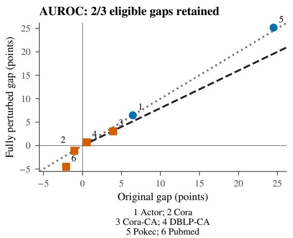

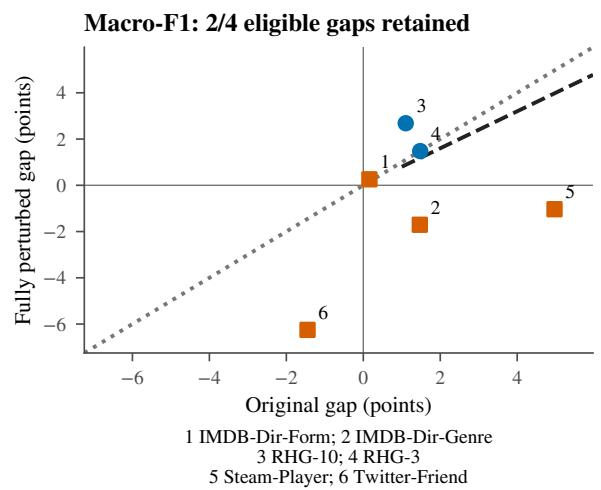  
Figure 6: Original and fully perturbed performance gaps using AUROC for hyperedge prediction and Macro-F1 for hypergraph classification. Checkpoints and model pairs are selected using the corresponding secondary validation metric. Blue circles indicate original gaps of at least one percentage point that retain at least 80% after perturbation; orange squares denote the other comparisons. The dotted diagonal denotes unchanged gaps and the dashed line 80% retention.

Table 24: Secondary-metric gaps after selecting checkpoints and model pairs using the corresponding original view validation metric: AUROC for hyperedge prediction and Macro-F1 for hypergraph classification. Model identities and hyperparameters remain fixed across views. Gaps are measured in percentage points. Retention is reported only when $\Delta ^ { ( 0 ) } \geq 1$ point; “–” denotes an ineligible comparison.
<table><tr><td>Task</td><td>Dataset</td><td></td><td>Higher-order Lower-order</td><td> $\Delta ^ { ( 0 ) }$ </td><td> $\Delta ^ { ( 1 ) }$ </td><td>Retention</td></tr><tr><td>Hyperedge prediction</td><td>Actor</td><td>TF-HNN</td><td>MLP</td><td>6.46</td><td>6.46</td><td>100.0%</td></tr><tr><td>Hyperedge prediction</td><td>Cora</td><td>PhenomNN</td><td>CEGAT</td><td>-1.04</td><td>-1.11</td><td></td></tr><tr><td>Hyperedge prediction</td><td>Cora-CA</td><td>UniGCNII</td><td>CEGAT</td><td>3.94</td><td>3.04</td><td>77.2%</td></tr><tr><td>Hyperedge prediction</td><td>DBLP-CA</td><td>PhenomNN</td><td>CEGAT</td><td>0.56</td><td>0.69</td><td></td></tr><tr><td>Hyperedge prediction</td><td>Pokec</td><td>HGNN</td><td>CEGCN</td><td>24.50</td><td>25.17</td><td>102.7%</td></tr><tr><td>Hyperedge prediction</td><td>Pubmed</td><td>EHNN</td><td>CEGCN</td><td>-2.09</td><td>-4.52</td><td></td></tr><tr><td>Hypergraph classification</td><td>IMDB-Dir-Form</td><td>TF-HNN</td><td>CEGCN</td><td>0.16</td><td>0.26</td><td></td></tr><tr><td>Hypergraph classification</td><td>IMDB-Dir-Genre</td><td>Sheaf</td><td>CEGCN</td><td>1.47</td><td>-1.71</td><td>-116.2%</td></tr><tr><td>Hypergraph classification</td><td>RHG-10</td><td>HNHN</td><td>CEGCN</td><td>1.10</td><td>2.68</td><td>243.3%</td></tr><tr><td>Hypergraph classification</td><td>RHG-3</td><td>HNHN</td><td>CEGCN</td><td>1.48</td><td>1.48</td><td>100.0%</td></tr><tr><td>Hypergraph classification</td><td>Steam-Player</td><td>HNHN</td><td>CEGAT</td><td>4.97</td><td>-1.03</td><td>-20.8%</td></tr><tr><td>Hypergraph classification</td><td>Twitter-Friend</td><td>HJRL</td><td>MLP</td><td>-1.45</td><td>-6.25</td><td></td></tr></table>

Table 25: Independent retraining of the selected lower-order baseline on original and fully perturbed views. Scores are three-seed means (percent). Max is the largest absolute seed-level score diference. Frozen compares output logits or query scores across views using the same checkpoint, reporting the largest absolute diference across both source views and three seeds.
<table><tr><td>Benchmark</td><td>Model</td><td> $P ^ { ( 0 ) }$ </td><td> $P ^ { ( 1 ) }$ </td><td> $\operatorname { M a x }$ </td><td>Frozen</td></tr><tr><td colspan="6">Hyperedge prediction</td></tr><tr><td>Actor</td><td>MLP</td><td>72.46</td><td>72.46</td><td>0.000</td><td></td></tr><tr><td>Cora-CA</td><td>CEGAT</td><td>63.31</td><td>64.09</td><td>1.785</td><td> $2 . 3 8 \times 1 0 ^ { - 7 }$ </td></tr><tr><td>DBLP-CA</td><td>CEGAT</td><td>73.94</td><td>73.92</td><td>1.983</td><td> $6 . 2 0 \times 1 0 ^ { - 6 }$ </td></tr><tr><td>Cora</td><td>CEGAT</td><td>65.75</td><td>65.35</td><td>0.636</td><td> $3 . 2 8 \times 1 0 ^ { - 7 }$ </td></tr><tr><td>Pubmed</td><td>CEGCN</td><td>71.11</td><td>71.43</td><td>0.961</td><td> $3 . 5 8 \times 1 0 ^ { - 7 }$ </td></tr><tr><td>Pokec</td><td>CEGCN</td><td>59.71</td><td>59.61</td><td>0.301</td><td> $1 . 1 9 \times 1 0 ^ { - 7 }$ </td></tr><tr><td colspan="6">Hypergraph classification</td></tr><tr><td>IMDB-Dir-Form</td><td>CEGCN</td><td>63.30</td><td>63.30</td><td>0.000</td><td> $9 . 5 4 \times 1 0 ^ { - 7 }$ </td></tr><tr><td>IMDB-Dir-Genre</td><td>CEGCN</td><td>78.63</td><td>78.33</td><td>1.471</td><td> $1 . 4 3 \times 1 0 ^ { - 6 }$ </td></tr><tr><td>RHG-10</td><td>CEGAT</td><td>96.00</td><td>96.00</td><td>1.000</td><td> $2 . 8 6 \times 1 0 ^ { - 6 }$ </td></tr><tr><td>RHG-3</td><td>CEGCN</td><td>98.44</td><td>98.44</td><td>0.000</td><td> $1 . 4 3 \times 1 0 ^ { - 6 }$ </td></tr><tr><td>Steam-Player</td><td>CEGAT</td><td>52.59</td><td>52.10</td><td>1.456</td><td> $4 . 7 7 \times 1 0 ^ { - 7 }$ </td></tr><tr><td>Twitter-Friend</td><td>MLP</td><td>60.31</td><td>60.05</td><td>0.763</td><td> $4 . 7 7 \times 1 0 ^ { - 7 }$ </td></tr><tr><td colspan="6">Node classification</td></tr><tr><td>ModelNet40</td><td>MLP</td><td>96.37</td><td>96.37</td><td>0.000</td><td>0</td></tr><tr><td>NTU2012</td><td>MLP</td><td>87.87</td><td>87.87</td><td>0.000</td><td>0</td></tr><tr><td>Actor</td><td>MLP</td><td>85.99</td><td>85.99</td><td>0.000</td><td>0</td></tr><tr><td>Cora-CA</td><td>CEGCN</td><td>79.57</td><td>79.57</td><td>0.000</td><td> $3 . 8 1 \times 1 0 ^ { - 6 }$ </td></tr><tr><td>DBLP-CA</td><td>CEGCN</td><td>89.83</td><td>89.83</td><td>0.000</td><td>0</td></tr><tr><td>Cora</td><td>CEGCN</td><td>77.73</td><td>77.73</td><td>0.000</td><td> $3 . 8 1 \times 1 0 ^ { - 6 }$ </td></tr><tr><td>Pubmed</td><td>MLP</td><td>86.46</td><td>86.46</td><td>0.000</td><td>0</td></tr><tr><td>Gamers</td><td> $\mathrm { M L P }$ </td><td>51.80</td><td>51.80</td><td>0.000</td><td>0</td></tr><tr><td>Pokec</td><td> $\mathrm { M L P }$ </td><td>59.37</td><td>59.37</td><td>0.000</td><td>0</td></tr><tr><td>Ratings</td><td> $\mathrm { M L P }$ </td><td>26.95</td><td>26.95</td><td>0.000</td><td>0</td></tr><tr><td>Trivago</td><td>CEGCN</td><td>47.75</td><td>47.75</td><td>0.000</td><td>0</td></tr><tr><td>Walmart</td><td>CEGCN</td><td>67.98</td><td>67.98</td><td>0.000</td><td>0</td></tr><tr><td>Yelp</td><td>MLP</td><td>31.59</td><td>31.59</td><td>0.000</td><td></td></tr><tr><td></td><td></td><td></td><td></td><td></td><td>0</td></tr></table>

Table 26: Secondary scores from the independent baseline audit: AUROC for hyperedge prediction and Macro-F1 for hypergraph classification.
<table><tr><td>Benchmark</td><td>Model</td><td> $P ^ { ( 0 ) }$ </td><td> $P ^ { ( 1 ) }$ </td><td>Max</td></tr><tr><td colspan="5">Hyperedge prediction</td></tr><tr><td>Actor</td><td>MLP</td><td>76.58</td><td>76.58</td><td>0.000</td></tr><tr><td>Cora-CA</td><td>CEGAT</td><td>66.13</td><td>66.62</td><td>1.720</td></tr><tr><td>DBLP-CA Cora</td><td>CEGAT</td><td>75.38 69.24</td><td>76.12</td><td>1.690 1.090</td></tr><tr><td>Pubmed</td><td>CEGAT CEGCN</td><td>74.59</td><td>68.47</td><td>0.361</td></tr><tr><td>Pokec</td><td>CEGCN</td><td>56.14</td><td>74.36 56.02</td><td>0.363</td></tr><tr><td colspan="5">Hypergraph classification</td></tr><tr><td>IMDB-Dir-Form</td><td>CEGCN</td><td>57.19</td><td>57.19</td><td>0.023</td></tr><tr><td>IMDB-Dir-Genre</td><td>CEGCN</td><td>74.35</td><td>73.68</td><td>2.025</td></tr><tr><td>RHG-10</td><td>CEGAT</td><td>95.95</td><td>95.96</td><td>0.928</td></tr><tr><td>RHG-3</td><td>CEGCN</td><td>98.52</td><td>98.52</td><td>0.000</td></tr><tr><td>Steam-Player</td><td>CEGAT</td><td>52.04</td><td>51.43</td><td>1.766</td></tr><tr><td>Twitter-Friend</td><td>MLP</td><td>55.11</td><td>54.77</td><td>1.017</td></tr></table>

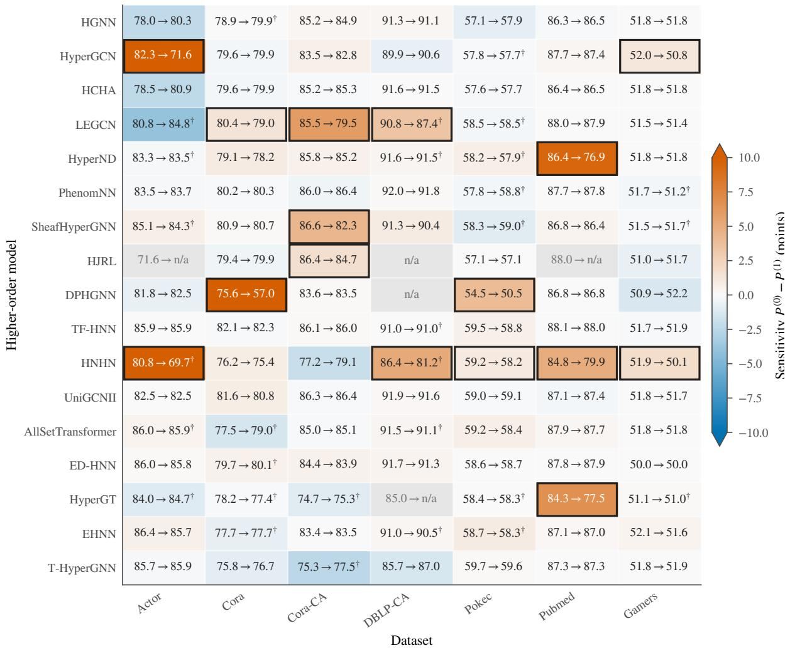  
Figure 7: Original and fully perturbed performance for every higher-order model on the first seven node-classification benchmarks. Entries are test-accuracy percentages. Color is clipped at ±10 points while the annotations retain the exact values.

## E.4 Node classification

All-model endpoint results. Figs. 7 and 8 extend the endpoint comparison from the higher-order model with the best original-view validation performance to all higher-order models. Each cell gives the original performance $P ^ { ( 0 ) }$ and fully-perturbed performance $P ^ { ( 1 ) }$ . Its color encodes the value of $\bar { P ^ { ( 0 ) } } - { P ^ { ( 1 ) } }$ , and a black border marks a decrease of at least one point. Gray cells mark an unavailable endpoint while retaining the original performance when it is known. A dagger indicates that fewer than all three runs using matching data splits and training seeds completed.

Performance across perturbation levels for the top three models. Figs. 9 and 10 retain the top three higher-order models ranked by validation performance on the original view. At 25%, 50%, and 75%, we average the three sampled perturbations and then report the mean and standard deviation. The black dotted curve is the same selected lower-order model used in Fig. 2. Crosses mark unavailable cells. Among the 36 top-three trajectories with complete endpoints, 28 change by less than one point, and eight decrease by at least one accuracy point.

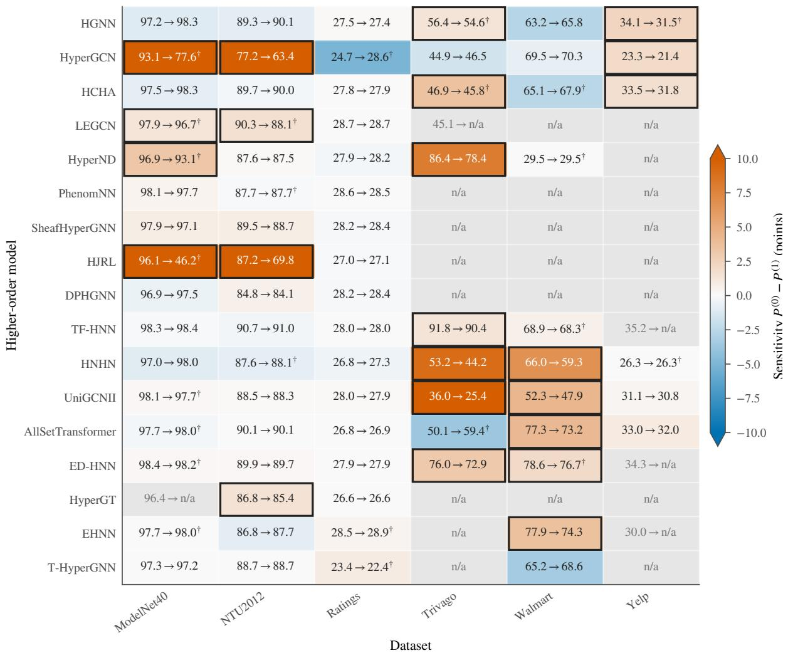  
Figure 8: Original and fully perturbed performance for every higher-order model on the remaining six node-classification benchmarks. Styling follows Fig. 7.

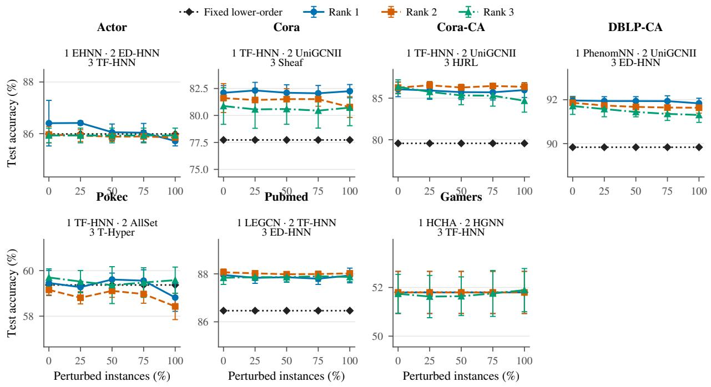  
Figure 9: Performance at five perturbation levels for the three higher-order models with the best original-view validation performance on the first seven node-classification benchmarks. Rank colors, markers, and line styles are shared across panels; each panel identifies the corresponding model names.

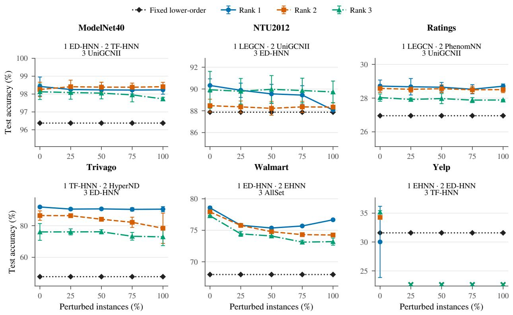  
Figure 10: Performance at five perturbation levels for the three higher-order models with the best original-view validation performance on the remaining six node-classification benchmarks. Styling and aggregation follow Fig. 9.

## E.5 Hyperedge prediction

All-model endpoint results. As shown in Fig. 11, the endpoint response is not unidirectional. Of 100 available cells, 29 decrease by at least one AP point, 35 improve by at least one point, and 36 change by less than one point.

Performance across perturbation levels for the top three models. For each benchmark, we select the three higher-order models with the best validation performance on the original view. As shown in Fig. 12, of the 17 top-three trajectories with complete endpoints, seven decrease by at least one AP point, eight change by less than one point, and two improve by at least one point. The responses can disagree even within one benchmark: on Cora-CA, two selected models decrease while one improves, and on Pokec the three models respectively remain stable, improve, and decrease.

Secondary metric: AUROC. Figs. 13 and 14 report all-model endpoints and top-three trajectories using AUROC.

<table><tr><td>HGNN</td><td>73.5 →79.9</td><td>55.3→57.5</td><td>62.9→60.7</td><td>68.0→68.9</td><td>83.2→83.2</td><td>67.9→67.7</td><td rowspan="11"></td></tr><tr><td>HyperGCN</td><td>74.1→72.6</td><td>60.6→62.7</td><td>52.9→ 67.2</td><td>58.4→76.9</td><td>63.8→64.8</td><td>68.3→71.1</td></tr><tr><td>HCHA</td><td>75.3→81.1</td><td>57.1 →60.4</td><td>58.5→ 62.0</td><td>59.6→ 74.7</td><td>82.2→83.3</td><td>69.3→ 69.1</td></tr><tr><td>LEGCN</td><td>72.3→73.6</td><td>54.4→54.4</td><td>64.9→60.8</td><td>63.0→63.1</td><td>61.8→64.3</td><td>68.1 →n/a</td></tr><tr><td>HyperND</td><td>68.3→67.8</td><td>58.7→58.8</td><td>55.8→56.6</td><td>68.4→68.9</td><td>53.3→52.4</td><td>67.0→71.4</td></tr><tr><td>PhenomNN</td><td>72.2→73.9</td><td>63.6→63.6</td><td>60.0→58.6</td><td>77.7→77.6</td><td>59.2→58.7</td><td>66.9→67.8</td></tr><tr><td>SheafHyperGNN</td><td>70.9→ 62.6</td><td>54.5 → 48.1</td><td>60.0→50.1</td><td>68.4→ 55.1</td><td>76.1 → 54.5</td><td>67.2→65.5</td></tr><tr><td>Higodr mo-del HJRL</td><td>64.6→64.9</td><td>61.7→62.0</td><td>59.9→ 69.7</td><td>61.3→77.5</td><td>53.9→56.4</td><td>68.3→ 69.8</td></tr><tr><td>DPHGNN</td><td>48.1→51.3</td><td>56.7 →46.4</td><td>61.0→60.7</td><td>60.3→56.7</td><td>74.8→77.1</td><td>53.5→52.1</td></tr><tr><td>TF-HNN</td><td>82.6→82.6</td><td>57.4→56.8</td><td>58.6→58.2</td><td>73.1→73.8</td><td>52.7→51.1</td><td>66.8→68.8</td></tr><tr><td>HNHN</td><td>65.0→ 59.8</td><td>49.4→48.5</td><td>53.2→53.5</td><td>51.5 → 58.3</td><td>50.4→61.9</td><td>62.5→ 60.5</td></tr><tr><td>UniGCNII</td><td>79.2→79.2</td><td>61.9→60.3</td><td>74.3→72.8</td><td>72.9→69.6</td><td>63.2→64.4</td><td>68.2→67.3</td></tr><tr><td>AllSetTransformer</td><td>65.2→75.8</td><td>53.4→57.4</td><td>64.3→68.6</td><td>60.0→72.6</td><td>62.5→61.2</td><td>64.4→65.0</td></tr><tr><td>ED-HNN</td><td>65.8→68.6</td><td>56.3→56.8</td><td>55.6→54.0</td><td>66.1 → 58.0</td><td>65.6→65.6</td><td>64.9→ 64.9</td></tr><tr><td>HyperGT</td><td>73.2→69.9</td><td>56.8→57.0</td><td>57.1→56.4</td><td>73.6→n/a</td><td>51.4→52.2</td><td>68.5→67.4</td></tr><tr><td>EHNN</td><td>63.0→72.8</td><td>58.6→56.0</td><td>67.3→63.5</td><td>59.0→72.2</td><td>65.3→73.0</td><td>68.5 → 65.8</td></tr><tr><td>T-HyperGNN</td><td>63.9→65.8</td><td>61.1 →55.9</td><td>64.5 → 54.2</td><td>63.2→63.1</td><td>52.3→52.1</td><td>65.0→65.3</td></tr><tr><td colspan="7">Actor Cora Pokec Cora-CA Pubmed DBLP-CA</td></tr></table>

Figure 11: Original and fully perturbed AP for every higher-order model supporting hyperedge prediction. Each cell gives original → fully perturbed test performance $( P ^ { ( 0 ) } \to \bar { P } ^ { ( 1 ) } )$ , in percent. The background encodes their diference, black borders mark decreases of at least one point, and gray cells are unavailable.

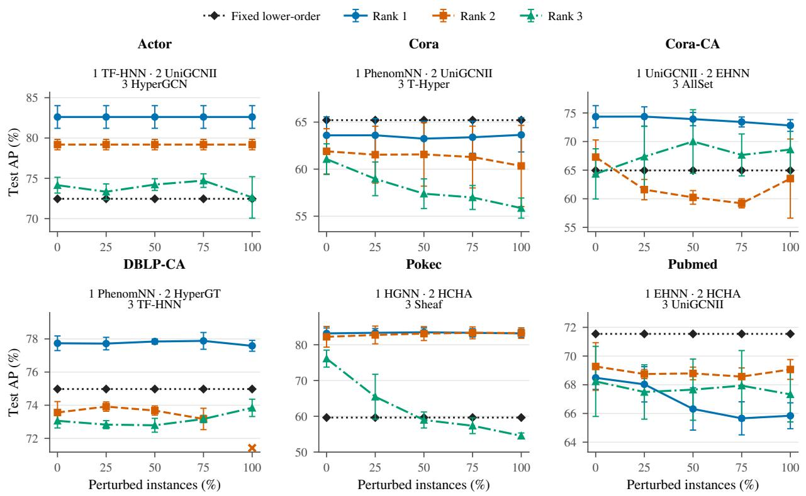  
Figure 12: Performance at five perturbation levels for the three higher-order models with the best original-view validation performance on all six hyperedge-prediction benchmarks. The black dotted line is the same selected lower-order model used in Fig. 2.

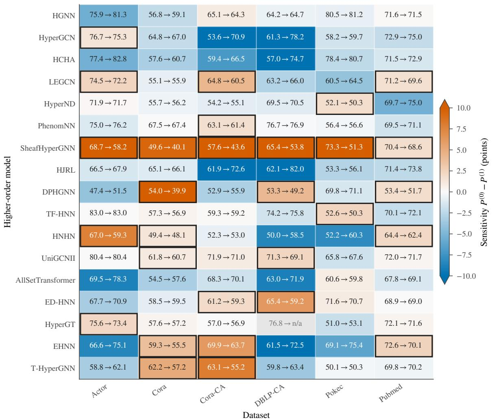  
Figure 13: Original and fully perturbed performance for all higher-order models using AUROC. Each cell shows original → fully perturbed performance (percent), with checkpoints selected by validation AUROC. Color denotes the paired decrease in points. Outlines mark decreases of at least one point. Gray cells indicate unavailable comparisons; a dagger marks fewer than three paired seeds.

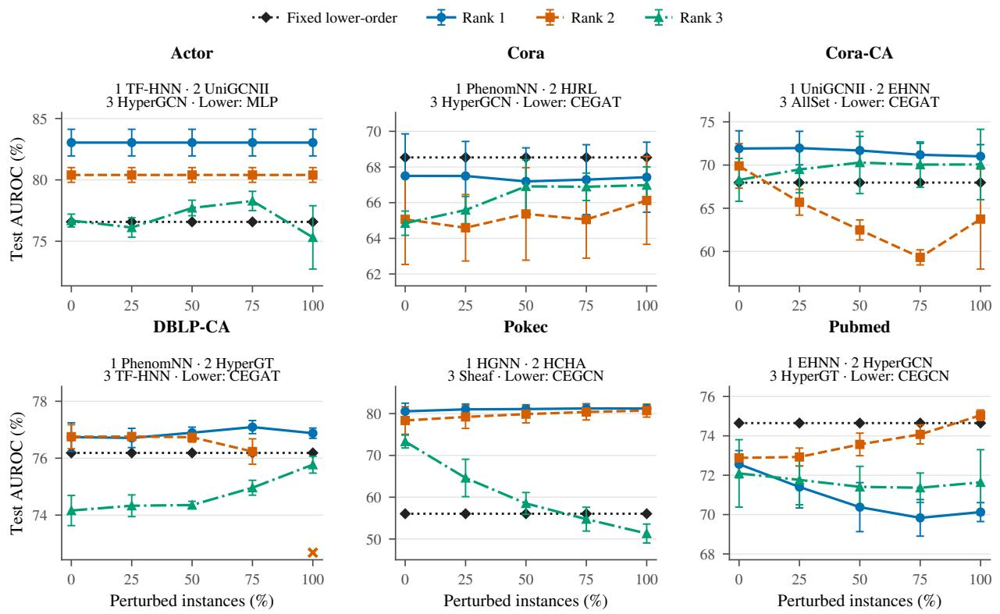  
Figure 14: Five-level AUROC trajectories. The top three HNNs and the lower-order comparator are selected by original-view validation AUROC; checkpoints at every level are also selected by validation AUROC. HNN error bars show sample SD across available seed means (three seeds planned), after averaging the three perturbation trajectories within each seed at intermediate levels. Crosses mark unavailable cells.

## E.6 Hypergraph classification

All-model endpoint results. As shown in Fig. 15, among the 89 available cells, 28 decrease by at least one accuracy point, 19 improve by at least one point, and 42 change by less than one point. This model-level heterogeneity is especially visible on Steam-Player and Twitter-Friend, where decreases of at least one accuracy point coexist with stable or improving models.

Performance across perturbation levels for the top three models. For each benchmark, we select the three higher-order models with the best validation performance on the original view. As shown in Fig. 16, across the 18 complete top-three trajectories, eight models decrease by at least one accuracy point, nine change by less than one point, and one improves. All three selected models decrease on Steam-Player, whereas all three remain stable on RHG-3. Moreover, six trajectories have an intermediate mean more than one point outside the range spanned by their two endpoint means. Partial perturbations therefore reveal model-specific and occasionally non-monotone responses.

Secondary metric: Macro-F1. Figs. 17 and 18 report all-model endpoints and top-three trajectories using Macro-F1.

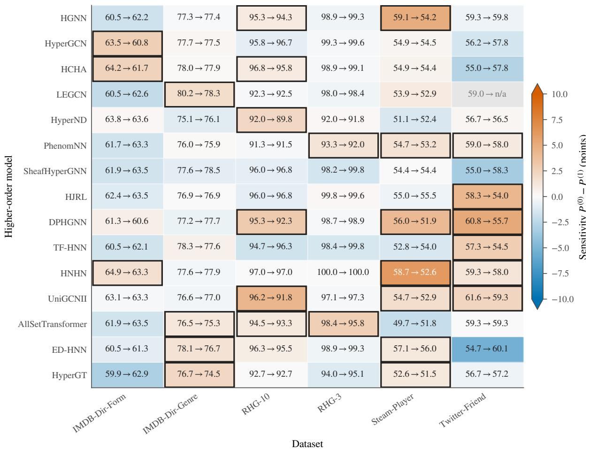  
Figure 15: Original and fully perturbed accuracy for every higher-order model supporting hypergraph classification. Each cell gives original → fully perturbed test performance $( P ^ { ( 0 ) } \to P ^ { ( 1 ) } )$ , in percent. The background encodes their diference, black borders mark decreases of at least one point, and gray cells are unavailable.

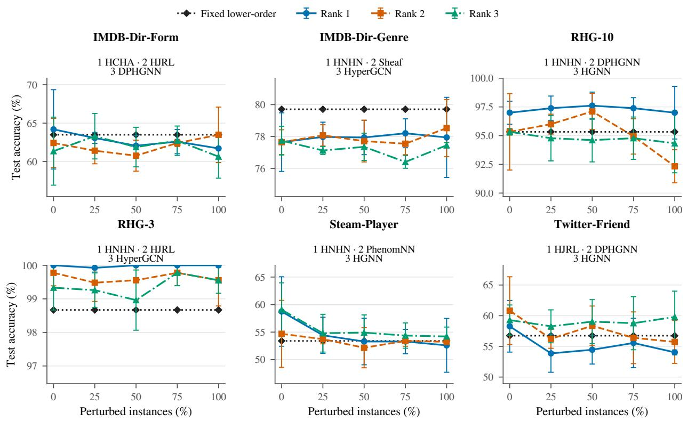  
Figure 16: Performance at five perturbation levels for the three higher-order models with the best original-view validation performance on all six hypergraph-classification benchmarks. The black dotted line is the same selected lower-order model used in Fig. 2.

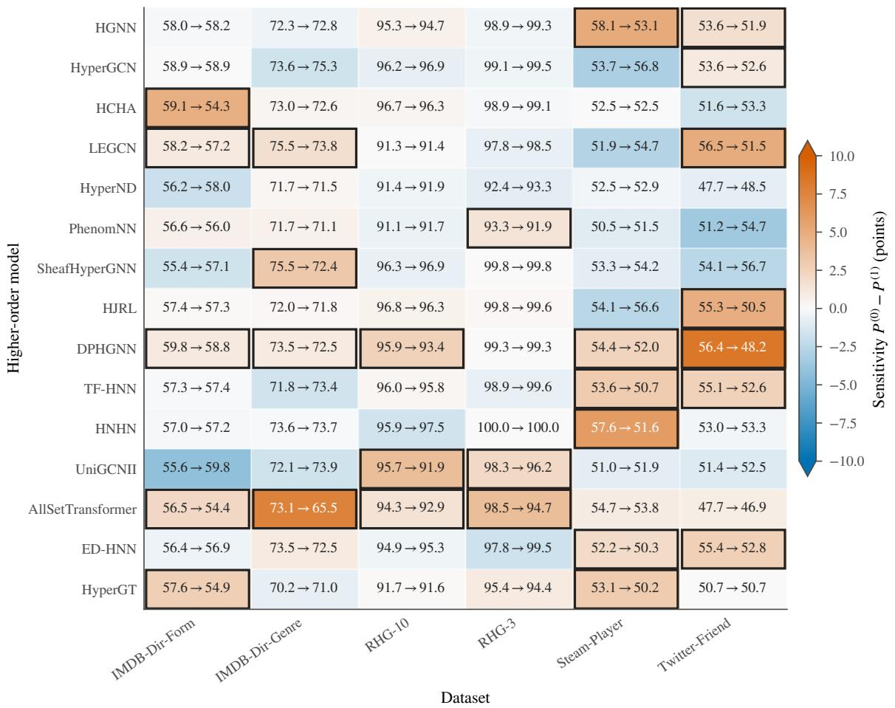  
Figure 17: Original and fully perturbed performance for all higher-order models using Macro-F1. Original → fully perturbed performance (percent), with checkpoints selected by validation Macro-F1. Color denotes the paired decrease. Outlines mark decreases of at least one point. Gray cells indicate unavailable comparisons; a dagger marks fewer than three paired seeds.

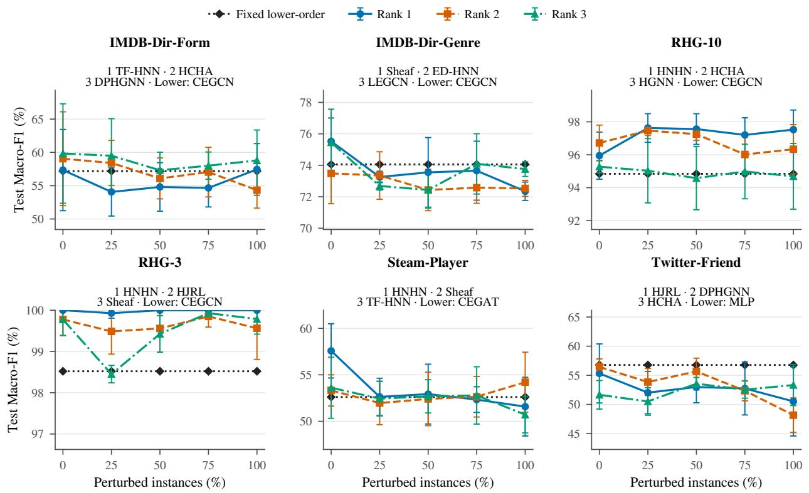  
Figure 18: Five-level Macro-F1 trajectories. The top three HNNs and the lower-order comparator are selected by original-view validation Macro-F1; checkpoints at every level are also selected by validation Macro-F1. HNN error bars show sample SD across available seed means (three seeds planned), after averaging the three perturbation trajectories within each seed at intermediate levels. Crosses mark unavailable cells.

Table 27: Input-difusion depth sensitivity for the Walmart and Trivago controls. Each entry reports test accuracy as mean ± sample SD. Difusion is applied to the input features before the fixed CEGCN classifier; $k = 0$ denotes no extra difusion. W is the operator incorporating pair multiplicities and structural self weights, while P is the binary CEGCN operator.
<table><tr><td>Extra steps k</td><td> $\mathrm { W a l m a r t } \colon W ^ { k }$ </td><td> ${ \mathrm { T r i v a g o } } \colon P ^ { k }$ </td><td> $\mathrm { T r i v a g o } \colon W ^ { k }$ </td></tr><tr><td>0</td><td> $7 4 . 5 6 \pm 0 . 1 9$ </td><td> $4 7 . 7 5 \pm 0 . 5 2$ </td><td> $4 7 . 7 5 \pm 0 . 5 2$ </td></tr><tr><td>1</td><td> $7 6 . 3 2 \pm 0 . 2 3$ </td><td> $5 2 . 9 0 \pm 0 . 2 3$ </td><td> $5 0 . 0 5 \pm 0 . 5 0$ </td></tr><tr><td>2</td><td> $7 5 . 6 8 \pm 0 . 3 7$ </td><td> $5 5 . 7 2 \pm 0 . 2 8$ </td><td> $5 1 . 9 8 \pm 0 . 0 7$ </td></tr><tr><td>4</td><td> $7 2 . 2 0 \pm 0 . 5 8$ </td><td> $5 9 . 8 4 \pm 0 . 3 5$ </td><td> $5 4 . 7 2 \pm 0 . 2 8$ </td></tr><tr><td>8</td><td> $6 4 . 4 3 \pm 0 . 4 7$ </td><td> $6 4 . 9 5 \pm 0 . 2 2$ </td><td> $5 8 . 4 9 \pm 0 . 3 7$ </td></tr><tr><td>16</td><td> $4 9 . 7 8 \pm 0 . 3 4$ </td><td> $7 0 . 4 5 \pm 0 . 1 5$ </td><td> $6 3 . 4 9 \pm 0 . 3 0$ </td></tr><tr><td>32</td><td> $4 3 . 9 7 \pm 0 . 3 7$ </td><td> $7 4 . 9 5 \pm 0 . 4 5$ </td><td> $6 9 . 3 5 \pm 0 . 2 2$ </td></tr><tr><td>64</td><td> $4 3 . 1 6 \pm 0 . 2 9$ </td><td> $7 7 . 6 4 \pm 0 . 2 5$ </td><td> $7 4 . 4 1 \pm 0 . 1 5$ </td></tr><tr><td>128</td><td> $4 3 . 1 7 \pm 0 . 2 7$ </td><td> $7 6 . 6 2 \pm 0 . 8 9$ </td><td> $7 7 . 6 8 \pm 0 . 4 1$ </td></tr><tr><td>256</td><td> $4 3 . 1 7 \pm 0 . 2 4$ </td><td> $6 8 . 9 0 \pm 0 . 4 5$ </td><td> $7 8 . 3 2 \pm 0 . 6 5$ </td></tr></table>

## F Additional Analyses of Retained Gaps (Supplementing Section 5.4)

## F.1 Detailed benchmark-wise analysis

We attempted a lower-order diagnosis for all 14 largely retained gaps in Fig. 2: eight node-classification, four hyperedge-prediction, and two hypergraph-classification comparisons.

Walmart: current operator and difusion controls. The main ladder uses the same CEGCN architecture, inputs, and training settings at every stage. The successive operators use binary connections, pair counts, and pair counts together with structural self weights:

$$
\mathcal { N } ( B + I ) \longrightarrow \mathcal { N } ( C + I ) \longrightarrow \mathcal { N } ( C + \mathrm { d i a g } ( d + 2 { \bf 1 } ) ) ,
$$

where B is binary of-diagonal adjacency, C contains pair counts, $d = C \mathbf { 1 }$ , and $\mathcal { N } ( A ) = D _ { A } ^ { - 1 / 2 } A D _ { A } ^ { - 1 / 2 }$ . For the incidence matrix H recording which nodes belong to each pair, $H \mathrm { d i a g } ( 1 / | e | ) H ^ { \top } + I = \textstyle { \frac { 1 } { 2 } } \bar { C } + \textstyle { \frac { 1 } { 2 } } \mathrm { d i a g } ( d ) + I ;$ multiplying by two leaves symmetric normalization unchanged. Accuracy rises from 67.98 to 68.15 to 74.56. Input difusion $W ^ { k } X$ then uses the same operator W incorporating pair counts and structural self weights. Mean validation accuracy selects $k = 1$ , reaching 76.32. The depth table below retains the full sweep, including deterioration at greater depths; ties in validation favor the smallest depth.

Trivago: fixed-architecture difusion sweeps. The current main panel applies $W ^ { k } X$ before CEGCN’s two learned layers, which retain binary propagation P. Both $P$ and W include unit self loops and symmetric normalization; W additionally uses pair counts and structural self weights. We report $k \in \{ 0 , 1 , 2 , 4 , 8 , 1 6 , 3 2 , 6 4 , 1 2 8 , 2 5 6 \}$ . The $k = 0$ path returns the original features without arithmetic.

The supporting binary-input sweep $P ^ { k } X$ reaches $7 7 . 6 4 \pm 0 . 2 5$ at $k = 6 4$ , versus $4 7 . 7 5 \pm 0 . 5 2$ at zero extra steps, but falls to $6 8 . 9 0 \pm 0 . 4 5$ at $k = 2 5 6$ . The weighted operator performs worse at (k=64) but better at (k=256); the 0.68-point diference between the selected sweeps changes both operator and depth. Table 27 preserves every depth.

Trivago: classifier controls. At k = 64 and 256, controls change one component at a time: they add LayerNorm after the hidden ReLU, replace binary propagation with W in both learned layers, or remove learned-layer propagation while retaining their two afine maps. A single frozen input tensor per depth is shared across variants; other settings remain fixed. LayerNorm adds learned scale and bias. It improves accuracy by 13.55 and 12.60 points, reaching 87.96 and 90.92. Weighted propagation throughout reduces accuracy by 0.67 and 0.95 points; removing classifier propagation reduces it by 1.47 and 2.49.

Pokec: matched policy and activation controls. The identity-policy CEGCN baseline is 59.71; the HGNN original/perturbed references are 83.18/83.19. CEGCN runs using the same zero-message policy as HGNN yield 78.22; changing only the hidden ReLU to HGNN’s ELU reaches 80.14, a paired gain of 1.92

Table 28: Classifier controls on Trivago with the same propagated input features $W ^ { k } X .$ , where W incorporates pair multiplicities and structural self weights. Entries report test accuracy as mean ± sample SD. The matched baseline retains binary propagation in the two learned CEGCN layers; each subsequent row changes one classifier component while keeping the remaining settings fixed.
<table><tr><td>Classifier change</td><td> $k = 6 4$ </td><td> $k = 2 5 6$ </td></tr><tr><td>Matched baseline</td><td> $7 4 . 4 1 \pm 0 . 1 5$ </td><td> $7 8 . 3 2 \pm 0 . 6 5$ </td></tr><tr><td>+ LayerNorm</td><td> $8 7 . 9 6 \pm 0 . 9 6$ </td><td> $9 0 . 9 2 \pm 0 . 7 5$ </td></tr><tr><td>Weighted propagation throughout</td><td> $7 3 . 7 4 \pm 0 . 1 9$ </td><td> $7 7 . 3 7 \pm 0 . 9 1$ </td></tr><tr><td>Remove classifier propagation</td><td> $7 2 . 9 4 \pm 0 . 4 3$ </td><td> $7 5 . 8 3 \pm 0 . 9 1$ </td></tr></table>

Table 29: Complementary encoder controls on Pokec after matching the higher-order reference’s cold-node policy. Entries report test $\mathrm { A P }$ as mean ± sample SD. Each subsequent row adds one encoder change to the CEGCN baseline using the same zero-message policy as HGNN.
<table><tr><td>Encoder change</td><td>Test AP (%)</td></tr><tr><td>Matched cold-node policy</td><td> $7 8 . 2 2 \pm 1 . 7 3$ </td></tr><tr><td>+ ELU</td><td> $8 0 . 1 4 \pm 2 . 1 1$ </td></tr><tr><td>+ LayerNorm</td><td> $7 9 . 7 0 \pm 0 . 4 8$ </td></tr><tr><td>+ count-mean propagation</td><td> $7 8 . 4 8 \pm 1 . 7 3$ </td></tr></table>

points. Query nodes, ofsets, labels, encoder, and scorer settings are held fixed. ELU adds no parameters.   
Table 29 also retains LayerNorm’s +1.48-point efect and count-mean propagation’s +0.26.

Other hyperedge-prediction cases. The remaining hyperedge-prediction cases provide complementary evidence. On Actor, the selected TFHNN configuration uses node features without incidence-based message passing, so its unchanged 10.15-point advantage after the intervention does not require information from the hypergraph structure. For Cora-CA and Pokec, we also evaluate separately constructed pairwise lower-order controls that retain pair multiplicities and average pairwise messages. The Cora-CA control matches the fully perturbed score of UniGCNII, and the Pokec control matches the fully perturbed score of HGNN. Together, these cases show that several retained gaps can be matched by pairwise or feature-only mechanisms.

Additional node-classification analyses. Four further cases suggest that pairwise processing and model design can help explain retained advantages, although the controls provide diferent levels of evidence. On Cora-CA, matched comparisons attribute an 8.49-point accuracy gain to pairwise weighting and a further 2.96 points to architecture and difusion choices. Adding TFHNN’s native non-pairwise component instead changes accuracy by −0.45 points. Thus, in these comparisons, the gains come from lower-order processing rather than the native grouping component. On DBLP-CA, disabling PhenomNN’s propagation reduces accuracy by about 5.1 points. Pairwise operators using count-mean or pair-diagonal normalization also outperform binary clique expansion. These results indicate that both propagation and the choice of pairwise normalization matter. On Cora, removing difusion from the fully pairwise TFHNN control reduces accuracy by 4.51 points, close to the selected model’s 4.52-point remaining advantage. On ModelNet40, restricting EDHNN to feature-only processing reduces accuracy by about 1.9 points, also close to its remaining advantage; separate comparisons identify pairwise weighting and normalization as the largest source of improvement among the tested changes. These ablations show that propagation helps the tested models. However, the similarity between the performance losses and the remaining gaps does not establish that propagation alone explains those gaps.

Pairwise controls for hypergraph classification. On RHG-10, the Pair-Multiplicity control outperforms CEGAT by 2.25 points, exceeding HNHN’s 1.72-point advantage at the fully perturbed endpoint. On RHG-3, Pair-SAGE-Mean outperforms CEGCN by 1.03 points, recovering about 78% of HNHN’s 1.33-point remaining advantage. Both controls use only weighted clique-expansion information. They therefore demonstrate that lower-order models can recover all or much of these advantages. These additional controls were outside the original model-selection pool and do not replace the selected model pairs reported in the main results.

Pubmed and Ratings: feature processing versus propagation. To examine what sustains LEGCN’s advantage, we disable messages between distinct node–hyperedge incidences (a node’s memberships in hyperedges) while retaining its layers, hidden dimensions, nonlinearities, training settings, and feature paths. This control tests how much of the advantage remains without information being passed between incidences. The resulting self-only model outperforms the selected MLP baseline by 1.29 accuracy points on Pubmed, while restoring propagation adds only 0.09 points. On Ratings, the corresponding gains are 1.22 and 0.21 points. Thus, most of LEGCN’s advantage in these comparisons remains without passing information between incidences, suggesting that diferences in feature processing and model configuration account for much of the gap.

What the 17 HNNs compute at the fully perturbed endpoint. The complete input at the fully perturbed endpoint contains two-node hyperedge instances and retained singleton instances. All endpoint incidences are determined by weighted pairwise connections and singleton multiplicities. This removes the original grouping into larger hyperedges, but does not make every model an ordinary GCN. Models can still difer in normalization, nonlinear messages, representations of nodes and edges, paths that reintroduce the initial features (restart), and how representations are converted into predictions (readout). Table 30 summarizes what the 17 HNNs do at this endpoint.

For the following operator derivations, let $s _ { v }$ denote the number of retained singleton hyperedge instances at node $v ,$ and let s collect these counts. This notation describes the fixed background incidences retained by the implementation. Let C denote of-diagonal pair multiplicities and $d = C \mathbf { 1 }$ . Before any additional model-specific self loops, write

$$
\begin{array} { r } { K = \frac 1 2 \big ( C + \mathrm { d i a g } ( d ) \big ) + \mathrm { d i a g } ( s ) , \qquad q = d + s , \qquad D _ { q } = \mathrm { d i a g } ( q ) . } \end{array}
$$

On rows with $q _ { v } > 0$ , mean node–edge–node aggregation becomes

$$
Q _ { \mathrm { m e a n } } = D _ { q } ^ { - 1 } K , \qquad Q _ { \mathrm { s y m } } = D _ { q } ^ { - 1 / 2 } K D _ { q } ^ { - 1 / 2 } .\tag{9}
$$

Inverse degrees are set to zero where $q _ { v } = 0$ before applying any explicit cold-node policy. When $s = 0$ , these expressions reduce to $\begin{array} { r } { Q _ { \mathrm { m e a n } } = \frac { 1 } { 2 } I + \frac { 1 } { 2 } D _ { d } ^ { - 1 } C } \end{array}$ on nodes with $d _ { v } > 0$ . Thus even unweighted pair instances induce a structural self contribution when messages travel to a pair and back. Singleton instances contribute only self messages and also enter the incidence-degree normalization.

HGNN uses the row-normalized form and HCHA the symmetric form; both instantiate the same convolution class without enabling its attention branch. The layer still retains its learned feature map, bias, and inter-layer activation.

UniGCNII’s mean aggregation has the same $Q _ { \mathrm { m e a n } }$ step, followed by its configured normalization, restart, and learned residual map. TFHNN instead difuses inputs using $\mathcal { N } ( K + I )$ , with its configured restart and depth, before applying its decoder. PhenomNN uses both $\mathcal { N } ( C + \mathrm { d i a g } ( q ) + I )$ and $\mathcal { N } ( K + I )$ inside its iterative update. These distinctions explain why preserving pair counts and singleton multiplicities does not make the architectures or their performance interchangeable.

Table 30: Computations of the 17 HNNs on fully perturbed endpoints. Pair and singleton multiplicities are retained in the endpoint inputs. The table identifies propagation, normalization, and architectural choices; singleton handling and additional self loops follow each implementation.
<table><tr><td>Model</td><td>Computation on the fully perturbed endpoint</td><td>Weighting and architectural details</td></tr><tr><td>HGNN</td><td>Learned feature maps with  $Q _ { \mathrm { m e a n } }$  propagation and ELU between layers.</td><td>Averaging through each pair induces both neighbor and self messages; re- peated pairs and singleton incidences enter aggregation and degree normal-</td></tr><tr><td>HCHA</td><td>The released implementation uses the same con- Symmetric degree normalization re- volution class as HGNN, with  $Q _ { \mathrm { s y m } }$  propaga- tion.</td><td>places row normalization; the atten- tion branch is not enabled by the model constructor.</td></tr><tr><td>HyperGCN</td><td>Graph convolution on the graph constructed from endpoint hyperedges by the extremal- node/mediator routine</td><td>Edge accumulation, normalization, explicit self loops, singleton handling, and feature-dependent tie handling follow the released implementation.</td></tr><tr><td>TFHNN</td><td>Fixed input diffusion using  $\mathcal { N } ( K + I )$  and the configured restart, followed by an MLP decoder.</td><td>Pair counts, singleton multiplicities, and degree-dependent self weights en- ter diffusion; restart weight α = 1 gives a feature-only configuration, as on Actor hyperedge prediction.</td></tr><tr><td>UniGCNII</td><td>Mean aggregation through endpoint hyper- edges, optional feature normalization, restart to the initial representation, and learned residual maps.</td><td>Uses  $Q _ { \mathrm { m e a n } } ;$  the restart path can pre- serve features even when the struc- tural aggregate is zero.</td></tr><tr><td>PhenomNN</td><td>Iterative propagation with two normalized ma- Both C + diag(q) + I and K + I enter; trices determined by pair and singleton inci- setting the propagation depth to zero dences, feature injection, and ReLU, between an encoder and decoder.</td><td>retains feature processing.</td></tr><tr><td>HyperND</td><td>Nonlinear diffusion using power means of the features in each endpoint hyperedge, global normalization, and restart, followed by an MLP.</td><td>Repeated pairs and singleton inci- dences affect messages and incidence degrees; the power-mean operation is not generally a fixed linear operator.</td></tr><tr><td>HNHN</td><td>Alternating learned node-to-hyperedge and hyperedge-to-node transformations with con- ity acts on hyperedge states; pair and figured degree weights.</td><td>An optional intermediate nonlinear- singleton multiplicities enter aggrega- tion and degree weighting.</td></tr><tr><td>AllSetformer</td><td>Attention-based aggregation from each hyper- edge's one or two nodes into a hyperedge state, then from incident hyperedge states to a node.</td><td>Learned attention, inter-stage nonlin- earities, and configured self and resid- ual paths remain.</td></tr><tr><td>EDHNN</td><td>Learned messages combine each receiving node's state with an aggregation of its hyper- edge's node features.</td><td>Receiver-dependent nonlinear mes- sages and restart remain; repeated pair instances contribute through the configured aggregation.</td></tr><tr><td>LEGCN</td><td>GCN on incidence states, connected when they share a node or a hyperedge; outputs are aver- aged back to nodes.</td><td>Line-graph normalization and self loops remain; repeated pairs and sin- gletons give distinct incidence states.</td></tr><tr><td>HJRL</td><td>Coupled node and hyperedge-state updates through normalized incidence and node-node and hyperedge—hyperedge products.</td><td>Both state spaces, their normaliza- tion, and feature initialization remain; repeated pairs retain separate states.</td></tr><tr><td>SheafHyperGNN</td><td>Diffusion with learned channel-wise incidence restriction maps, using node and hyperedge attributes.</td><td>Learned transport and block normal- ization remain; pair multiplicity and hyperedge-attribute initialization af-</td></tr><tr><td>Model</td><td>Computation on the fully perturbed endpoint Weighting and architectural details</td><td></td></tr><tr><td>DPHGNN</td><td>Fusion of hypergraph, clique, and star-derived Each branch retains its normalization spatial/spectral branches, all constructed from pair and singleton incidence.</td><td>1 and self paths; the star branch repre- sents each endpoint hyperedge as an additional vertex.</td></tr><tr><td>EHNN</td><td>Order- and overlap-conditioned equivariant computations over node and hyperedge states, their overlaps remain represented; the with configured broadcast or attention terms.</td><td>Size-one and size-two hyperedges and computation need not reduce to a fixed node propagation matrix.</td></tr><tr><td>HyperGT</td><td>Transformer computation over node and hyper- edge tokens with incidence-derived positional encodings and structural biases.</td><td>Token self loops, attention, and posi- tional parameters remain; computa- tion is not restricted to local graph convolution.</td></tr><tr><td>T-HyperGNN</td><td>used when an endpoint hyperedge is smaller than the tensor order.</td><td>Configured tensor-product messages over end- Messages can remain nonlinear on point features; repeated-index products are pairs; self paths and repeated pair : contributions follow the neighbor- hood construction.</td></tr></table>

## F.2 O/D/L additions shared across datasets and primary-metric results

The full study compares oficial CEGCN, +O, +D, +L, and +O+D+L on all 13 node-classification and six hypergraph-classification datasets, and under both identity and zero-message policies on all six hyperedgeprediction datasets. The same difusion depths, mixing weights, and normalization settings are used across datasets. They were motivated by the observed case-study results and evaluated without further hyperparameter tuning.

O: multiplicities and structural self weights. Let B denote binary of-diagonal adjacency, $C$ the ofdiagonal pair multiplicities, and $d = C \mathbf { 1 }$ . Here s records retained singleton multiplicities as fixed background incidences. We separate the operator change into $\mathbf { O } _ { 1 }$ , replacing B by $C ,$ and $\mathbf { O } _ { 2 } ,$ replacing unit self weights by the structural diagonal, including retained singleton contributions, after pair multiplicities have been added by $\mathrm { O _ { 1 } }$ :

$$
\begin{array} { r } { P _ { \mathrm { b i n a r y } } = \mathcal { N } ( B + I ) , \qquad P _ { \mathrm { O _ { 1 } } } = \mathcal { N } ( C + I ) , \qquad P _ { \mathrm { O _ { 1 } } + \mathrm { O _ { 2 } } } = \mathcal { N } ( C + \mathrm { d i a g } ( d + 2 s + 2 \mathbf { 1 } ) ) . } \end{array}
$$

Here $\mathcal { N } ( A ) = D _ { A } ^ { - 1 / 2 } A D _ { A } ^ { - 1 / 2 }$ , with $D _ { A } = \mathrm { d i a g } ( A { \bf 1 } )$ . The existing label O denotes the combined $\mathrm { O } _ { 1 } { + } \mathrm { O } _ { 2 }$ operator. The term 2s accounts for singleton incidences in the implemented operator and vanishes when no singleton hyperedges are present. Changes along this ladder depend on their order: $\mathrm { { O _ { 2 } } }$ changes the normalization of neighbor messages as well as self messages.

Matched decomposition of O across benchmarks. We compare binary CEGCN, $+ \mathrm { O _ { 1 } } .$ and $+ \mathrm { O } _ { 1 } { + } \mathrm { O } _ { 2 }$ on all 25 benchmarks, using both identity and zero-message policies for hyperedge prediction. D and L are disabled. Learned-layer architectures, activations, prediction heads, splits, and training settings are matched within each comparison; each operator variant is trained separately. For each seed, the $\mathrm { O _ { 1 } }$ increment is the counts-only score minus binary CEGCN, and the $\mathrm { O _ { 2 } }$ increment is the full-O score minus counts-only CEGCN. We report original-view scores and the means and sample standard deviations of these paired changes.

D: residual difusion. Let B be the exact normalized binary clique-expansion operator used by oficial CEGCN. Before any trainable transformation, combine the original features with features propagated for diferent numbers of steps:

$$
\widetilde { X } = 0 . 8 X + \frac { 0 . 2 } { 6 } \sum _ { \substack { k \in \{ 1 , 2 , 4 , 8 , 1 6 , 3 2 \} } } Q ^ { k } X , \qquad Q = \left\{ { B } , \quad \mathrm { C E G C N + D } , \quad \right.
$$

L: classifier normalization. L inserts LayerNorm after the hidden activation and before dropout, with $\epsilon = 1 0 ^ { - 5 }$ and learned afine scale and bias. O and D add no trainable parameters.

Hyperedge-prediction policies. Cold nodes do not occur in any positive training hyperedge. The identity policy retains their transformed features; the zero-message policy removes their feature-dependent messages at each learned layer.

Full primary-metric results. Tables 31 to 42 report absolute scores and paired changes for every benchmark under the five main recipes. For hyperedge prediction, changes are measured against CEGCN using the same policy for cold nodes; Table 43 isolates identity versus zero-message policies for cold nodes within each recipe.

Stronger-baseline comparisons using secondary metrics. Tables 44 to 53 report secondary-metric results.

Table 31: Node classification. Mean ± sample SD. The metric is accuracy.
<table><tr><td>Dataset</td><td>CEGCN</td><td>+0</td><td>+D</td><td>+L</td><td> $^ { + \mathrm { O } + \mathrm { D } + \mathrm { L } }$ </td></tr><tr><td>ModelNet40</td><td> $9 2 . 7 5 \pm 0 . 5 6$ </td><td> $9 7 . 8 5 \pm 0 . 4 2$ </td><td> $9 2 . 6 3 \pm 0 . 6 6$ </td><td> $9 2 . 6 1 \pm 0 . 6 4$ </td><td> $9 7 . 4 5 \pm 0 . 4 7$ </td></tr><tr><td>NTU2012</td><td> $8 4 . 7 6 \pm 0 . 6 4$ </td><td> $8 8 . 8 7 \pm 0 . 7 2$ </td><td> $8 4 . 6 3 \pm 0 . 7 5$ </td><td> $8 4 . 1 0 \pm 1 . 0 5$ </td><td> $8 8 . 8 7 \pm 1 . 3 0$ </td></tr><tr><td>Actor</td><td> $6 7 . 8 6 \pm 0 . 4 2$ </td><td> $8 2 . 2 6 \pm 0 . 5 3$ </td><td> $6 7 . 7 7 \pm 0 . 4 7$ </td><td> $6 8 . 2 3 \pm 0 . 3 1$ </td><td> $8 2 . 4 4 \pm 0 . 3 6$ </td></tr><tr><td>Cora-CA</td><td> $7 9 . 5 7 \pm 2 . 7 9$ </td><td> $8 4 . 5 9 \pm 0 . 4 5$ </td><td> $7 9 . 6 7 \pm 3 . 1 3$ </td><td> $7 9 . 7 6 \pm 2 . 7 4$ </td><td> $8 4 . 6 4 \pm 0 . 1 5$ </td></tr><tr><td>DBLP-CA</td><td> $8 9 . 8 3 \pm 0 . 1 5$ </td><td> $9 1 . 1 9 \pm 0 . 3 5$ </td><td> $8 9 . 8 1 \pm 0 . 0 7$ </td><td> $9 0 . 2 4 \pm 0 . 1 7$ </td><td> $9 1 . 7 3 \pm 0 . 1 9$ </td></tr><tr><td>Cora</td><td> $7 7 . 7 3 \pm 2 . 2 3$ </td><td> $7 8 . 5 2 \pm 1 . 7 3$ </td><td> $7 8 . 0 7 \pm 2 . 0 0$ </td><td> $7 6 . 5 5 \pm 3 . 3 2$ </td><td> $7 8 . 9 6 \pm 3 . 6 3$ </td></tr><tr><td>Pubmed</td><td> $8 6 . 3 9 \pm 0 . 2 1$ </td><td> $8 6 . 9 8 \pm 0 . 2 8$ </td><td> $8 6 . 3 7 \pm 0 . 3 5$ </td><td> $8 6 . 3 1 \pm 0 . 3 4$ </td><td>87.13 ± 0.11</td></tr><tr><td>Gamers</td><td> $5 1 . 3 4 \pm 1 . 2 9$ </td><td> $5 1 . 7 5 \pm 1 . 3 8$ </td><td> $5 1 . 3 6 \pm 1 . 3 2$ </td><td> $5 1 . 3 0 \pm 0 . 8 4$ </td><td> $5 1 . 9 4 \pm 1 . 3 7$ </td></tr><tr><td>Pokec</td><td> $5 7 . 1 9 \pm 0 . 6 6$ </td><td> $5 8 . 3 4 \pm 0 . 6 7$ </td><td> $5 7 . 2 7 \pm 0 . 9 0$ </td><td> $5 7 . 8 9 \pm 0 . 9 7$ </td><td> $5 8 . 3 7 \pm 1 . 0 8$ </td></tr><tr><td>Ratings</td><td> $2 6 . 5 3 \pm 1 . 3 5$ </td><td> $2 5 . 7 0 \pm 0 . 0 5$ </td><td> $2 6 . 4 9 \pm 1 . 2 2$ </td><td> $2 7 . 1 8 \pm 1 . 1 4$ </td><td> $2 6 . 8 4 \pm 0 . 7 8$ </td></tr><tr><td>Trivago</td><td> $4 7 . 7 5 \pm 0 . 5 2$ </td><td> $4 4 . 8 1 \pm 0 . 7 7$ </td><td> $5 5 . 0 1 \pm 0 . 3 0$ </td><td> $4 4 . 9 0 \pm 0 . 5 4$ </td><td> $5 1 . 1 0 \pm 6 . 8 4$ </td></tr><tr><td>Walmart</td><td> $6 7 . 9 7 \pm 0 . 4 7$ </td><td> $7 4 . 5 6 \pm 0 . 2 1$ </td><td> $6 7 . 6 3 \pm 0 . 4 2$ </td><td> $7 0 . 4 1 \pm 0 . 2 4$ </td><td> $7 6 . 0 7 \pm 0 . 2 4$ </td></tr><tr><td>Yelp</td><td> $2 6 . 8 4 \pm 0 . 3 5$ </td><td> $2 9 . 5 7 \pm 1 . 2 2$ </td><td> $2 6 . 8 1 \pm 0 . 3 0$ </td><td> $2 7 . 0 0 \pm 0 . 1 4$ </td><td> $2 8 . 8 8 \pm 0 . 8 6$ </td></tr></table>

Table 32: Node classification. Changes relative to the oficial CEGCN, mean ± sample SD.
<table><tr><td>Dataset</td><td>+0</td><td>+D</td><td>+L</td><td> $^ { + \mathrm { O } + \mathrm { D } + \mathrm { L } }$ </td></tr><tr><td>ModelNet40</td><td> $+ 5 . 1 0 \pm 0 . 3 4$ </td><td> $- 0 . 1 2 \pm 0 . 1 1$ </td><td> $- 0 . 1 4 \pm 0 . 2 1$ </td><td> $+ 4 . 7 0 \pm 0 . 2 7$ </td></tr><tr><td>NTU2012</td><td> $+ 4 . 1 1 \pm 0 . 6 1$ </td><td> $- 0 . 1 3 \pm 0 . 1 1$ </td><td> $- 0 . 6 6 \pm 0 . 5 0$ </td><td> $+ 4 . 1 1 \pm 0 . 9 8$ </td></tr><tr><td>Actor</td><td> $+ 1 4 . 4 0 \pm 0 . 4 0$ </td><td> $- 0 . 1 0 \pm 0 . 0 5$ </td><td> $+ 0 . 3 7 \pm 0 . 2 3$ </td><td> $+ 1 4 . 5 8 \pm 0 . 3 7$ </td></tr><tr><td>Cora-CA</td><td> $+ 5 . 0 2 \pm 2 . 6 0$ </td><td> $+ 0 . 1 0 \pm 0 . 7 0$ </td><td> $+ 0 . 2 0 \pm 0 . 3 7$ </td><td> $+ 5 . 0 7 \pm 2 . 7 4$ </td></tr><tr><td>DBLP-CA</td><td> $+ 1 . 3 7 \pm 0 . 2 2$ </td><td> $- 0 . 0 1 \pm 0 . 1 5$ </td><td> $+ 0 . 4 1 \pm 0 . 0 3$ </td><td> $+ 1 . 9 0 \pm 0 . 2 1$ </td></tr><tr><td>Cora</td><td> $+ 0 . 7 9 \pm 1 . 3 4$ </td><td> $+ 0 . 3 4 \pm 0 . 6 1$ </td><td> $- 1 . 1 8 \pm 1 . 2 9$ </td><td> $+ 1 . 2 3 \pm 1 . 5 1$ </td></tr><tr><td>Pubmed</td><td> $+ 0 . 5 9 \pm 0 . 1 3$ </td><td> $- 0 . 0 2 \pm 0 . 1 4$ </td><td> $- 0 . 0 8 \pm 0 . 1 3$ </td><td> $+ 0 . 7 4 \pm 0 . 2 6$ </td></tr><tr><td>Gamers</td><td> $+ 0 . 4 1 \pm 0 . 1 0$ </td><td> $+ 0 . 0 2 \pm 0 . 0 4$ </td><td> $- 0 . 0 3 \pm 0 . 6 5$ </td><td> $+ 0 . 6 0 \pm 0 . 1 0$ </td></tr><tr><td>Pokec</td><td> $+ 1 . 1 5 \pm 0 . 1 2$ </td><td> $+ 0 . 0 8 \pm 0 . 5 1$ </td><td> $+ 0 . 7 0 \pm 0 . 3 3$ </td><td> $+ 1 . 1 8 \pm 0 . 7 1$ </td></tr><tr><td>Ratings</td><td> $- 0 . 8 3 \pm 1 . 3 3$ </td><td> $- 0 . 0 4 \pm 0 . 1 3$ </td><td> $+ 0 . 6 5 \pm 2 . 3 0$ </td><td> $+ 0 . 3 1 \pm 2 . 0 4$ </td></tr><tr><td>Trivago</td><td> $- 2 . 9 3 \pm 0 . 5 7$ </td><td> $+ 7 . 2 6 \pm 0 . 7 2$ </td><td> $- 2 . 8 4 \pm 0 . 9 8$ </td><td> $+ 3 . 3 5 \pm 6 . 7 6$ </td></tr><tr><td>Walmart</td><td> $+ 6 . 5 9 \pm 0 . 3 4$ </td><td> $- 0 . 3 5 \pm 0 . 0 6$ </td><td> $+ 2 . 4 3 \pm 0 . 3 6$ </td><td> $+ 8 . 0 9 \pm 0 . 2 8$ </td></tr><tr><td>Yelp</td><td> $+ 2 . 7 3 \pm 1 . 5 7$ </td><td> $- 0 . 0 3 \pm 0 . 1 4$ </td><td> $+ 0 . 1 6 \pm 0 . 3 3$ </td><td> $+ 2 . 0 4 \pm 1 . 1 1$ </td></tr></table>

Table 33: Node classification: successive changes to the propagation operator (accuracy). Original-view scores (percent) and paired stepwise changes (percentage points) are mean ± sample SD. $\mathrm { O _ { 1 } }$ adds pair multiplicities; $\mathrm { O _ { 2 } }$ changes structural self weights and normalization after pair multiplicities have been added by $\mathrm { O _ { 1 } } .$ . D and L are disabled.
<table><tr><td>Dataset</td><td>CEGCN</td><td> $+ \mathrm { O } _ { 1 }$ </td><td> $+ \mathrm { O } _ { 1 } { + } \mathrm { O } _ { 2 }$ </td><td> $\delta _ { 1 }$ </td><td></td></tr><tr><td>ModelNet40</td><td> $9 2 . 7 5 \pm 0 . 5 6$ </td><td> $9 2 . 9 3 \pm 0 . 8 6$ </td><td> $9 7 . 8 5 \pm 0 . 4 2$ </td><td> $0 . 1 8 \pm 0 . 4 1$ </td><td> $4 . 9 2 \pm 0 . 4 7$ </td></tr><tr><td>NTU2012</td><td> $8 4 . 7 6 \pm 0 . 6 4$ </td><td> $8 5 . 6 9 \pm 0 . 7 2$ </td><td> $8 8 . 8 7 \pm 0 . 7 2$ </td><td> $0 . 9 3 \pm 0 . 6 1$ </td><td> $3 . 1 8 \pm 0 . 0 0$ </td></tr><tr><td>Actor</td><td> $6 7 . 8 6 \pm 0 . 4 2$ </td><td> $6 7 . 5 9 \pm 0 . 5 1$ </td><td> $8 2 . 2 6 \pm 0 . 5 3$ </td><td> $- 0 . 2 7 \pm 0 . 2 2$ </td><td> $1 4 . 6 7 \pm 0 . 2 1$ </td></tr><tr><td> $\mathrm { { C o r a } \mathrm { { - } \mathrm { { C A } } } }$ </td><td> $7 9 . 5 7 \pm 2 . 7 9$ </td><td> $8 0 . 0 1 \pm 2 . 3 7$ </td><td> $8 4 . 5 9 \pm 0 . 4 5$ </td><td> $0 . 4 4 \pm 0 . 5 3$ </td><td> $4 . 5 8 \pm 2 . 1 3$ </td></tr><tr><td>DBLP-CA</td><td> $8 9 . 8 3 \pm 0 . 1 5$ </td><td> $8 9 . 9 1 \pm 0 . 1 5$ </td><td> $9 1 . 1 9 \pm 0 . 3 5$ </td><td> $0 . 0 9 \pm 0 . 0 5$ </td><td> $1 . 2 8 \pm 0 . 2 5$ </td></tr><tr><td>Cora</td><td> $7 7 . 7 3 \pm 2 . 2 3$ </td><td> $7 8 . 1 7 \pm 2 . 4 5$ </td><td> $7 8 . 5 2 \pm 1 . 7 3$ </td><td> $0 . 4 4 \pm 0 . 2 9$ </td><td> $0 . 3 4 \pm 1 . 6 3$ </td></tr><tr><td>Pubmed</td><td> $8 6 . 3 9 \pm 0 . 2 1$ </td><td> $8 6 . 4 8 \pm 0 . 2 6$ </td><td> $8 6 . 9 8 \pm 0 . 2 8$ </td><td> $0 . 0 9 \pm 0 . 0 5$ </td><td> $0 . 5 1 \pm 0 . 1 1$ </td></tr><tr><td>Gamers</td><td> $5 1 . 3 4 \pm 1 . 2 9$ </td><td> $5 1 . 3 0 \pm 1 . 3 4$ </td><td> $5 1 . 7 5 \pm 1 . 3 8$ </td><td> $- 0 . 0 3 \pm 0 . 0 9$ </td><td> $0 . 4 4 \pm 0 . 1 3$ </td></tr><tr><td>Pokec</td><td> $5 7 . 1 9 \pm 0 . 6 6$ </td><td> $5 7 . 4 7 \pm 1 . 5 1$ </td><td> $5 8 . 3 4 \pm 0 . 6 7$ </td><td> $0 . 2 8 \pm 0 . 9 9$ </td><td> $0 . 8 7 \pm 1 . 0 8$ </td></tr><tr><td>Ratings</td><td> $2 6 . 5 3 \pm 1 . 3 5$ </td><td> $2 6 . 5 2 \pm 1 . 3 0$ </td><td> $2 5 . 7 0 \pm 0 . 0 5$ </td><td> $- 0 . 0 1 \pm 0 . 0 5$ </td><td> $- 0 . 8 2 \pm 1 . 2 9$ </td></tr><tr><td>Trivago</td><td> $4 7 . 7 5 \pm 0 . 5 2$ </td><td> $5 0 . 1 3 \pm 0 . 2 5$ </td><td> $4 4 . 8 1 \pm 0 . 7 7$ </td><td> $2 . 3 9 \pm 0 . 3 0$ </td><td> $- 5 . 3 2 \pm 0 . 5 6$ </td></tr><tr><td>Walmart</td><td> $6 7 . 9 7 \pm 0 . 4 7$ </td><td> $6 8 . 1 5 \pm 0 . 4 2$ </td><td> $7 4 . 5 6 \pm 0 . 2 1$ </td><td> $0 . 1 8 \pm 0 . 0 6$ </td><td> $6 . 4 1 \pm 0 . 2 9$ </td></tr><tr><td>Yelp</td><td> $2 6 . 8 4 \pm 0 . 3 5$ </td><td> $2 7 . 0 4 \pm 0 . 1 7$ </td><td> $2 9 . 5 7 \pm 1 . 2 2$ </td><td> $0 . 2 0 \pm 0 . 2 9$ </td><td> $2 . 5 2 \pm 1 . 3 2$ </td></tr></table>

Table 34: Hypergraph classification. Mean ± sample SD. The metric is accuracy.
<table><tr><td>Dataset</td><td>CEGCN</td><td>+0</td><td>+D</td><td>+L</td><td> $^ { + \mathrm { O } + \mathrm { D } + \mathrm { L } }$ </td></tr><tr><td>IMDB-Dir-Form</td><td> $6 3 . 3 0 \pm 1 . 9 2$ </td><td> $6 1 . 7 0 \pm 0 . 5 3$ </td><td> $6 3 . 8 3 \pm 3 . 7 2$ </td><td> $6 1 . 5 2 \pm 1 . 1 1$ </td><td> $6 0 . 2 8 \pm 2 . 0 1$ </td></tr><tr><td>IMDB-Dir-Genre</td><td> $7 7 . 5 5 \pm 1 . 1 1$ </td><td> $7 6 . 8 6 \pm 1 . 4 5$ </td><td>77.35 ± 1.35</td><td> $7 8 . 2 4 \pm 0 . 5 1$ </td><td> $7 6 . 4 7 \pm 2 . 3 5$ </td></tr><tr><td>RHG-10</td><td> $9 5 . 0 0 \pm 1 . 8 0 $ </td><td> $9 3 . 8 3 \pm 1 . 8 9$ </td><td> $9 5 . 0 0 \pm 1 . 3 2$ </td><td> $9 5 . 8 3 \pm 0 . 7 6$ </td><td> $9 4 . 6 7 \pm 0 . 2 9$ </td></tr><tr><td>RHG-3</td><td> $9 8 . 6 7 \pm 0 . 6 7$ </td><td> $9 8 . 0 0 \pm 1 . 7 6$ </td><td> $9 8 . 0 0 \pm 0 . 6 7$ </td><td> $9 8 . 4 4 \pm 0 . 7 7$ </td><td> $9 9 . 7 8 \pm 0 . 3 8$ </td></tr><tr><td>Steam-Player</td><td> $5 4 . 8 5 \pm 2 . 4 3$ </td><td> $5 5 . 1 8 \pm 1 . 0 1$ </td><td> $5 4 . 5 3 \pm 2 . 6 7$ </td><td> $5 3 . 2 4 \pm 4 . 0 4$ </td><td> $5 3 . 7 2 \pm 2 . 6 7$ </td></tr><tr><td>Twitter-Friend</td><td> $5 8 . 0 2 \pm 1 . 3 2$ </td><td> $5 6 . 2 3 \pm 3 . 0 9$ </td><td> $5 1 . 4 0 \pm 1 . 5 9$ </td><td> $5 5 . 7 3 \pm 3 . 0 5$ </td><td> $5 6 . 7 4 \pm 1 . 1 7$ </td></tr></table>

Table 35: Hypergraph classification. Changes relative to the oficial CEGCN, mean ± sample SD.
<table><tr><td>Dataset</td><td>+0</td><td>+D</td><td>+L</td><td> $^ { + \mathrm { O } + \mathrm { D } + \mathrm { L } }$ </td></tr><tr><td>IMDB-Dir-Form</td><td> $- 1 . 6 0 \pm 1 . 6 0$ </td><td> $+ 0 . 5 3 \pm 2 . 7 6$ </td><td> $- 1 . 7 7 \pm 1 . 6 3$ </td><td> $- 3 . 0 1 \pm 3 . 7 4$ </td></tr><tr><td>IMDB-Dir-Genre</td><td> $- 0 . 6 9 \pm 0 . 3 4$ </td><td> $- 0 . 2 0 \pm 1 . 0 3$ </td><td> $+ 0 . 6 9 \pm 0 . 9 0$ </td><td> $- 1 . 0 8 \pm 1 . 6 2$ </td></tr><tr><td>RHG-10</td><td> $- 1 . 1 7 \pm 1 . 1 5$ </td><td> $+ 0 . 0 0 \pm 1 . 5 0$ </td><td> $+ 0 . 8 3 \pm 2 . 2 5$ </td><td> $- 0 . 3 3 \pm 1 . 6 1$ </td></tr><tr><td>RHG-3</td><td> $- 0 . 6 7 \pm 2 . 0 0$ </td><td> $- 0 . 6 7 \pm 0 . 6 7$ </td><td> $- 0 . 2 2 \pm 0 . 3 8$ </td><td> $+ 1 . 1 1 \pm 0 . 3 8$ </td></tr><tr><td>Steam-Player</td><td> $+ 0 . 3 2 \pm 1 . 4 8$ </td><td> $- 0 . 3 2 \pm 0 . 2 8$ </td><td> $- 1 . 6 2 \pm 2 . 8 4$ </td><td> $- 1 . 1 3 \pm 0 . 2 8$ </td></tr><tr><td>Twitter-Friend</td><td> $- 1 . 7 8 \pm 3 . 9 2$ </td><td> $- 6 . 6 2 \pm 2 . 6 8$ </td><td> $- 2 . 2 9 \pm 4 . 2 5$ </td><td> $- 1 . 2 7 \pm 2 . 4 5$ </td></tr></table>

Table 36: Hypergraph classification: successive changes to the propagation operator (accuracy). Original-view scores (percent) and paired stepwise changes (percentage points) are mean $\pm$ sample SD. $\mathrm { O _ { 1 } }$ adds pair multiplicities; $\mathrm { O _ { 2 } }$ changes structural self weights and normalization after pair multiplicities have been added by $\mathrm { O _ { 1 } }$ . D and L are disabled.
<table><tr><td>Dataset</td><td>CEGCN</td><td> $+ \mathrm { O } _ { 1 }$ </td><td> $+ \mathrm { O _ { 1 } + O _ { 2 } }$ </td><td> $\delta _ { 1 }$ </td><td> $\delta _ { 2 }$ </td></tr><tr><td>IMDB-Dir-Form</td><td> $6 3 . 3 0 \pm 1 . 9 2$ </td><td> $6 0 . 2 8 \pm 2 . 6 8$ </td><td> $6 1 . 7 0 \pm 0 . 5 3$ </td><td> $- 3 . 0 1 \pm 3 . 0 2$ </td><td> $1 . 4 2 \pm 3 . 0 2$ </td></tr><tr><td>IMDB-Dir-Genre</td><td> $7 7 . 5 5 \pm 1 . 1 1$ </td><td> $7 7 . 9 4 \pm 0 . 5 1$ </td><td> $7 6 . 8 6 \pm 1 . 4 5$ </td><td> $0 . 3 9 \pm 1 . 0 3$ </td><td> $- 1 . 0 8 \pm 1 . 3 3$ </td></tr><tr><td>RHG-10</td><td> $9 5 . 0 0 \pm 1 . 8 0$ </td><td> $9 4 . 6 7 \pm 0 . 5 8$ </td><td> $9 3 . 8 3 \pm 1 . 8 9$ </td><td> $- 0 . 3 3 \pm 2 . 0 2$ </td><td> $- 0 . 8 3 \pm 1 . 7 6$ </td></tr><tr><td>RHG-3</td><td> $9 8 . 6 7 \pm 0 . 6 7$ </td><td> $9 7 . 7 8 \pm 1 . 3 9$ </td><td> $9 8 . 0 0 \pm 1 . 7 6$ </td><td> $- 0 . 8 9 \pm 0 . 7 7$ </td><td> $0 . 2 2 \pm 2 . 6 9$ </td></tr><tr><td>Steam-Player</td><td> $5 4 . 8 5 \pm 2 . 4 3$ </td><td> $5 4 . 0 5 \pm 2 . 9 3$ </td><td> $5 5 . 1 8 \pm 1 . 0 1$ </td><td> $- 0 . 8 1 \pm 0 . 5 6$ </td><td> $1 . 1 3 \pm 2 . 0 2$ </td></tr><tr><td>Twitter-Friend</td><td> $5 8 . 0 2 \pm 1 . 3 2$ </td><td> $5 5 . 2 2 \pm 5 . 9 3$ </td><td> $5 6 . 2 3 \pm 3 . 0 9$ </td><td> $- 2 . 8 0 \pm 7 . 2 1$ </td><td> $1 . 0 2 \pm 5 . 9 3$ </td></tr></table>

Table 37: Hyperedge prediction using the identity policy for cold nodes. Mean ± sample SD. The metric is AP.
<table><tr><td>Dataset</td><td>CEGCN</td><td>+0</td><td>+D</td><td></td><td>+L  $^ { + \mathrm { O } + \mathrm { D } + \mathrm { L } }$ </td></tr><tr><td>Actor</td><td> $7 2 . 1 1 \pm 0 . 5 7$ </td><td> $7 4 . 9 1 \pm 1 . 7 5$ </td><td> $7 1 . 3 9 \pm 1 . 7 6$ </td><td> $6 9 . 3 9 \pm 0 . 9 0$ </td><td> $7 5 . 3 9 \pm 0 . 7 9$ </td></tr><tr><td> $\mathrm { { C o r a } \mathrm { { - } \mathrm { { C A } } } }$ </td><td> $5 9 . 5 7 \pm 1 . 6 7$ </td><td> $5 8 . 8 7 \pm 1 . 2 5$ </td><td> $5 9 . 9 5 \pm 2 . 4 6$ </td><td> $5 7 . 7 5 \pm 1 . 3 0$ </td><td> $5 9 . 5 5 \pm 2 . 0 0$ </td></tr><tr><td>DBLP-CA</td><td> $6 3 . 8 0 \pm 1 . 3 4$ </td><td> $7 3 . 0 3 \pm 2 . 2 3$ </td><td> $6 3 . 3 4 \pm 2 . 3 9$ </td><td> $6 3 . 1 6 \pm 0 . 5 0$ </td><td> $7 1 . 5 9 \pm 1 . 0 0$ </td></tr><tr><td>Cora</td><td> $5 9 . 2 7 \pm 1 . 1 8$ </td><td> $5 7 . 9 9 \pm 1 . 8 2$ </td><td> $5 9 . 0 2 \pm 1 . 4 9$ </td><td> $5 6 . 4 5 \pm 1 . 3 5$ </td><td> $5 7 . 9 9 \pm 1 . 1 8$ </td></tr><tr><td>Pubmed</td><td> $7 1 . 1 2 \pm 0 . 7 0$ </td><td> $7 1 . 4 9 \pm 0 . 7 2$ </td><td> $7 1 . 8 9 \pm 0 . 2 7$ </td><td> $7 0 . 4 2 \pm 0 . 5 1$ </td><td> $7 1 . 7 5 \pm 1 . 6 8$ </td></tr><tr><td>Pokec</td><td> $5 9 . 5 1 \pm 3 . 0 1$ </td><td> $5 5 . 1 7 \pm 1 . 4 0$ </td><td> $6 0 . 1 1 \pm 3 . 7 3$ </td><td> $5 9 . 5 6 \pm 2 . 4 5$ </td><td> $5 9 . 7 4 \pm 0 . 7 4$ </td></tr></table>

Table 38: Hyperedge prediction using the identity policy for cold nodes: changes relative to the oficial CEGCN using the same policy for cold nodes, mean ± sample SD.
<table><tr><td>Dataset</td><td>+0</td><td>+D</td><td>+L</td><td> $^ { + \mathrm { O } + \mathrm { D } + \mathrm { L } }$ </td></tr><tr><td>Actor</td><td> $+ 2 . 8 0 \pm 2 . 1 4$ </td><td> $- 0 . 7 2 \pm 2 . 0 1$ </td><td> $- 2 . 7 2 \pm 0 . 7 3$ </td><td> $+ 3 . 2 8 \pm 1 . 2 9$ </td></tr><tr><td>Cora-CA</td><td> $- 0 . 7 0 \pm 1 . 5 0$ </td><td> $+ 0 . 3 8 \pm 1 . 7 0$ </td><td> $- 1 . 8 2 \pm 0 . 3 7$ </td><td> $- 0 . 0 2 \pm 3 . 1 3$ </td></tr><tr><td>DBLP-CA</td><td> $+ 9 . 2 3 \pm 1 . 4 3$ </td><td> $- 0 . 4 6 \pm 1 . 2 9$ </td><td> $- 0 . 6 4 \pm 1 . 2 1$ </td><td> $+ 7 . 7 9 \pm 0 . 6 9$ </td></tr><tr><td>Cora</td><td> $- 1 . 2 8 \pm 1 . 4 9$ </td><td> $- 0 . 2 5 \pm 0 . 8 3$ </td><td> $- 2 . 8 2 \pm 0 . 9 5$ </td><td> $- 1 . 2 8 \pm 1 . 0 5$ </td></tr><tr><td>Pubmed</td><td> $+ 0 . 3 7 \pm 0 . 3 1$ </td><td> $+ 0 . 7 7 \pm 0 . 8 5$ </td><td> $- 0 . 7 0 \pm 1 . 2 1$ </td><td> $+ 0 . 6 3 \pm 1 . 0 2$ </td></tr><tr><td>Pokec</td><td> $- 4 . 3 4 \pm 1 . 7 6$ </td><td> $+ 0 . 6 0 \pm 1 . 8 3$ </td><td> $+ 0 . 0 5 \pm 3 . 4 9$ </td><td> $+ 0 . 2 3 \pm 3 . 5 2$ </td></tr></table>

Table 39: Hyperedge prediction: successive changes to the propagation operator $( \operatorname { A P } ;$ identity policy for cold nodes). Original-view scores (percent) and paired stepwise changes (percentage points) are mean ± sample SD. $\mathrm { O _ { 1 } }$ adds pair multiplicities; $\mathrm { O _ { 2 } }$ changes structural self weights and normalization after pair multiplicities have been added by $\mathrm { O _ { 1 } }$ . D and L are disabled.
<table><tr><td>Dataset</td><td>CEGCN</td><td> $+ \mathrm { O } _ { 1 }$ </td><td> $+ \mathrm { O _ { 1 } + O _ { 2 } }$ </td><td> $\delta _ { 1 }$ </td><td> $\delta _ { 2 }$ </td></tr><tr><td>Actor</td><td> $7 2 . 1 1 \pm 0 . 5 7$ </td><td> $7 1 . 0 8 \pm 2 . 1 6$ </td><td> $7 4 . 9 1 \pm 1 . 7 5$ </td><td> $- 1 . 0 3 \pm 1 . 6 3$ </td><td> $3 . 8 3 \pm 3 . 7 3$ </td></tr><tr><td>Cora-CA</td><td> $5 9 . 5 7 \pm 1 . 6 7$ </td><td> $5 9 . 1 7 \pm 1 . 3 2$ </td><td> $5 8 . 8 7 \pm 1 . 2 5$ </td><td> $- 0 . 4 0 \pm 0 . 8 7$ </td><td> $- 0 . 3 0 \pm 1 . 8 3$ </td></tr><tr><td>DBLP-CA</td><td> $6 3 . 8 0 \pm 1 . 3 4$ </td><td> $6 4 . 1 8 \pm 2 . 1 0$ </td><td> $7 3 . 0 3 \pm 2 . 2 3$ </td><td> $0 . 3 8 \pm 0 . 9 7$ </td><td> $8 . 8 5 \pm 0 . 6 6$ </td></tr><tr><td>Cora</td><td> $5 9 . 2 7 \pm 1 . 1 8$ </td><td> $5 8 . 8 5 \pm 1 . 0 1$ </td><td> $5 7 . 9 9 \pm 1 . 8 2$ </td><td> $- 0 . 4 2 \pm 0 . 1 9$ </td><td> $- 0 . 8 5 \pm 1 . 3 9$ </td></tr><tr><td>Pubmed</td><td> $7 1 . 1 2 \pm 0 . 7 0$ </td><td> $7 1 . 8 5 \pm 0 . 6 0$ </td><td> $7 1 . 4 9 \pm 0 . 7 2$ </td><td> $0 . 7 3 \pm 0 . 1 9$ </td><td> $- 0 . 3 6 \pm 0 . 1 7$ </td></tr><tr><td>Pokec</td><td> $5 9 . 5 1 \pm 3 . 0 1$ </td><td>59.29 ± 1.15</td><td> $5 5 . 1 7 \pm 1 . 4 0$ </td><td>−0.22 ± 3.37</td><td> $- 4 . 1 2 \pm 2 . 2 0$ </td></tr></table>

Table 40: Hyperedge prediction using the zero-message policy for cold nodes. Mean ± sample SD. The metric is AP.
<table><tr><td>Dataset</td><td>CEGCN</td><td>+0</td><td>+D</td><td>+L</td><td> $^ { + \mathrm { O } + \mathrm { D } + \mathrm { L } }$ </td></tr><tr><td>Actor</td><td> $6 4 . 9 7 \pm 1 . 3 9$ </td><td> $6 7 . 4 6 \pm 1 . 8 5$ </td><td> $6 4 . 0 9 \pm 0 . 3 6$ </td><td> $6 5 . 1 4 \pm 1 . 3 3$ </td><td> $6 7 . 8 7 \pm 2 . 5 0$ </td></tr><tr><td> $\mathrm { { C o r a } \mathrm { { - } \mathrm { { C A } } } }$ </td><td> $6 0 . 8 5 \pm 7 . 0 6$ </td><td> $5 6 . 0 1 \pm 2 . 2 7$ </td><td> $6 0 . 8 9 \pm 5 . 5 5$ </td><td> $6 0 . 7 7 \pm 3 . 6 0$ </td><td> $6 0 . 3 0 \pm 0 . 5 1$ </td></tr><tr><td>DBLP-CA</td><td> $6 5 . 1 9 \pm 3 . 4 6$ </td><td> $6 0 . 9 1 \pm 0 . 3 4$ </td><td> $6 5 . 7 3 \pm 3 . 4 8$ </td><td> $6 9 . 8 5 \pm 1 . 4 2$ </td><td> $7 1 . 4 9 \pm 0 . 2 5$ </td></tr><tr><td>Cora</td><td> $5 7 . 5 2 \pm 0 . 7 9$ </td><td> $5 6 . 2 4 \pm 0 . 8 0$ </td><td> $5 7 . 1 3 \pm 0 . 9 7$ </td><td> $5 7 . 0 9 \pm 1 . 0 9$ </td><td> $5 7 . 5 2 \pm 0 . 7 5$ </td></tr><tr><td>Pubmed</td><td> $6 9 . 3 8 \pm 1 . 1 4$ </td><td> $6 8 . 9 9 \pm 1 . 0 8$ </td><td> $6 9 . 8 4 \pm 0 . 5 7$ </td><td> $6 8 . 7 4 \pm 1 . 2 3$ </td><td> $6 9 . 2 1 \pm 0 . 5 8$ </td></tr><tr><td>Pokec</td><td> $7 8 . 3 7 \pm 2 . 0 5$ </td><td> $7 5 . 8 1 \pm 2 . 9 9$ </td><td> $7 7 . 9 3 \pm 1 . 0 1$ </td><td> $7 9 . 3 7 \pm 0 . 8 1$ </td><td> $7 8 . 3 4 \pm 1 . 7 1$ </td></tr></table>

Table 41: Hyperedge prediction using the zero-message policy for cold nodes. Changes relative to the oficial CEGCN using the same policy for cold nodes, mean ± sample SD.

$$
+ \mathrm { L }
$$

$$
^ { + \mathrm { O } + \mathrm { D } + \mathrm { L } }
$$

$$
+ 2 . 4 9 \pm 3 . 2 1
$$

$$
- 0 . 8 7 \pm 1 . 6 5
$$

$$
+ 0 . 1 7 \pm 2 . 6 9
$$

$$
- 4 . 8 4 \pm 4 . 9 4
$$

$$
+ 2 . 9 0 \pm 1 . 2 4
$$

$$
+ 0 . 0 4 \pm 1 . 7 9
$$

$$
- 0 . 0 8 \pm 7 . 1 1
$$

$$
- 0 . 5 5 \pm 6 . 5 5
$$

$$
- 4 . 2 8 \pm 3 . 6 1
$$

$$
+ 0 . 5 4 \pm 1 . 1 5
$$

$$
- 1 . 2 8 \pm 0 . 3 1
$$

$$
+ 4 . 6 5 \pm 2 . 1 6
$$

$$
- 0 . 3 9 \pm 0 . 6 0
$$

$$
+ 6 . 3 0 \pm 3 . 2 1
$$

$$
- 0 . 3 9 \pm 0 . 0 9
$$

$$
- 0 . 4 3 \pm 1 . 1 8
$$

$$
+ 0 . 4 6 \pm 1 . 0 6
$$

$$
- 0 . 0 0 \pm 1 . 2 4
$$

$$
- 2 . 5 6 \pm 2 . 8 5
$$

$$
- 0 . 6 4 \pm 0 . 8 5
$$

$$
- 0 . 4 4 \pm 1 . 6 4
$$

$$
- 0 . 1 7 \pm 1 . 1 2
$$

$$
+ 1 . 0 0 \pm 1 . 3 0
$$

$$
- 0 . 0 3 \pm 0 . 3 4
$$

Table 42: Hyperedge prediction: successive changes to the propagation operator $( \operatorname { A P } ;$ zero-message policy for cold nodes). Original-view scores (percent) and paired stepwise changes (percentage points) are mean ± sample SD. $\mathrm { O _ { 1 } }$ adds pair multiplicities; $\mathrm { O _ { 2 } }$ changes structural self weights and normalization after pair multiplicities have been added by $\mathrm { O _ { 1 } }$ . D and L are disabled.
<table><tr><td>Dataset</td><td>CEGCN</td><td> $+ \mathrm { O } _ { 1 }$ </td><td> $+ \mathrm { O _ { 1 } + O _ { 2 } }$ </td><td> $\delta _ { 1 }$ </td><td> $\delta _ { 2 }$ </td></tr><tr><td>Actor</td><td> $6 4 . 9 7 \pm 1 . 3 9$ </td><td> $6 3 . 4 2 \pm 0 . 6 5$ </td><td> $6 7 . 4 6 \pm 1 . 8 5$ </td><td> $- 1 . 5 5 \pm 1 . 0 2$ </td><td> $4 . 0 4 \pm 2 . 4 5$ </td></tr><tr><td>Cora-CA</td><td> $6 0 . 8 5 \pm 7 . 0 6$ </td><td> $5 9 . 6 6 \pm 5 . 6 7$ </td><td> $5 6 . 0 1 \pm 2 . 2 7$ </td><td> $- 1 . 1 8 \pm 1 . 9 9$ </td><td> $- 3 . 6 5 \pm 3 . 8 9$ </td></tr><tr><td>DBLP-CA</td><td> $6 5 . 1 9 \pm 3 . 4 6$ </td><td> $6 1 . 7 0 \pm 2 . 2 9$ </td><td> $6 0 . 9 1 \pm 0 . 3 4$ </td><td> $- 3 . 5 0 \pm 2 . 9 2$ </td><td> $- 0 . 7 9 \pm 2 . 6 3$ </td></tr><tr><td>Cora</td><td> $5 7 . 5 2 \pm 0 . 7 9$ </td><td> $5 7 . 1 7 \pm 1 . 0 1$ </td><td> $5 6 . 2 4 \pm 0 . 8 0$ </td><td> $- 0 . 3 5 \pm 0 . 8 3$ </td><td> $- 0 . 9 2 \pm 1 . 1 2$ </td></tr><tr><td>Pubmed</td><td> $6 9 . 3 8 \pm 1 . 1 4$ </td><td> $6 9 . 7 2 \pm 1 . 1 6$ </td><td> $6 8 . 9 9 \pm 1 . 0 8$ </td><td> $0 . 3 4 \pm 1 . 0 3$ </td><td> $- 0 . 7 3 \pm 0 . 9 5$ </td></tr><tr><td>Pokec</td><td> $7 8 . 3 7 \pm 2 . 0 5$ </td><td> $7 5 . 3 5 \pm 0 . 6 2$ </td><td> $7 5 . 8 1 \pm 2 . 9 9$ </td><td> $- 3 . 0 1 \pm 1 . 5 3$ </td><td> $0 . 4 6 \pm 2 . 5 2$ </td></tr></table>

Table 43: Hyperedge prediction: AP under the zero-message versus identity policy for cold nodes, mean $\pm$ sample SD.
<table><tr><td>Dataset</td><td>CEGCN</td><td>+0</td><td>+D</td><td>+L</td><td> $^ { + \mathrm { O } + \mathrm { D } + \mathrm { L } }$ </td></tr><tr><td>Actor</td><td> $- 7 . 1 4 \pm 1 . 3 7$ </td><td> $- 7 . 4 5 \pm 3 . 0 3$ </td><td> $- 7 . 3 0 \pm 1 . 5 2$ </td><td> $- 4 . 2 5 \pm 1 . 2 5$ </td><td> $- 7 . 5 1 \pm 2 . 5 5$ </td></tr><tr><td>Cora-CA</td><td> $+ 1 . 2 8 \pm 6 . 0 3$ </td><td> $- 2 . 8 7 \pm 3 . 1 4$ </td><td> $+ 0 . 9 4 \pm 5 . 7 2$ </td><td> $+ 3 . 0 2 \pm 4 . 4 6$ </td><td> $+ 0 . 7 5 \pm 2 . 4 8$ </td></tr><tr><td>DBLP-CA</td><td> $+ 1 . 3 9 \pm 2 . 3 8$ </td><td> $- 1 2 . 1 2 \pm 2 . 0 1$ </td><td> $+ 2 . 3 9 \pm 1 . 2 9$ </td><td> $+ 6 . 6 9 \pm 1 . 1 9$ </td><td> $- 0 . 1 0 \pm 0 . 9 0$ </td></tr><tr><td>Cora</td><td> $- 1 . 7 5 \pm 0 . 8 9$ </td><td> $- 1 . 7 5 \pm 2 . 3 8$ </td><td> $- 1 . 8 9 \pm 0 . 7 0$ </td><td> $+ 0 . 6 4 \pm 0 . 4 3$ </td><td> $- 0 . 4 7 \pm 0 . 4 4$ </td></tr><tr><td>Pubmed</td><td> $- 1 . 7 4 \pm 0 . 5 8$ </td><td> $- 2 . 5 1 \pm 0 . 8 6$ </td><td> $- 2 . 0 5 \pm 0 . 3 5$ </td><td> $- 1 . 6 8 \pm 1 . 4 3$ </td><td> $- 2 . 5 4 \pm 1 . 9 5$ </td></tr><tr><td>Pokec</td><td> $+ 1 8 . 8 6 \pm 3 . 2 9$ </td><td> $+ 2 0 . 6 4 \pm 3 . 9 5$ </td><td> $+ 1 7 . 8 2 \pm 2 . 7 2$ </td><td> $+ 1 9 . 8 1 \pm 3 . 1 2$ </td><td> $+ 1 8 . 6 0 \pm 2 . 3 8$ </td></tr></table>

Table 44: Secondary-metric gains on all benchmarks. Edge-Pred denotes hyperedge prediction; HG-CLS denotes hypergraph classification. Mean paired gain over standard CEGCN (points), weighting benchmarks equally and using the same policy for cold nodes in hyperedge prediction; followed by the number of benchmarks with a positive mean gain.
<table><tr><td>Task / policy</td><td>+0</td><td>+D</td><td>+L</td><td> $^ { + \mathrm { O } + \mathrm { D } + \mathrm { L } }$ </td></tr><tr><td>Edge-Pred: identity (AUROC)</td><td>+1.69 (3/6)</td><td>-0.04 (4/6)</td><td>-1.58 (1/6)</td><td>+2.31 (4/6)</td></tr><tr><td>Edge-Pred: zero (AUROC)</td><td>−2.73 (0/6)</td><td>−0.55 (2/6)</td><td>+0.34 (1/6)</td><td>+1.07 (4/6)</td></tr><tr><td>HG-CLS (Macro-F1)</td><td>−2.62 (0/6)</td><td>-1.29 (2/6)</td><td>-0.58 (3/6)</td><td>-0.78 (1/6)</td></tr></table>

Table 45: Hypergraph classification (Macro-F1): original-view scores (percent), mean ± sample SD.
<table><tr><td>Dataset</td><td>CEGCN</td><td>+0</td><td>+D</td><td>+L</td><td></td><td> $^ { + \mathrm { O } + \mathrm { D } + \mathrm { L } }$ </td></tr><tr><td>IMDB-Dir-Form</td><td> $5 7 . 1 9 \pm 2 . 3 4$ </td><td> $5 6 . 4 5 \pm 3 . 1 8$ </td><td> $5 8 . 0 9 \pm 5 . 9 1$ </td><td> $5 7 . 6 6 \pm 1 . 4 8$ </td><td></td><td> $5 6 . 1 5 \pm 4 . 4 9$ </td></tr><tr><td>IMDB-Dir-Genre</td><td> $7 2 . 6 5 \pm 2 . 5 5$ </td><td> $7 0 . 6 0 \pm 4 . 0 8$ </td><td> $7 2 . 5 8 \pm 2 . 7 9$ </td><td> $7 3 . 0 7 \pm 2 . 0 8$ </td><td></td><td> $7 1 . 2 8 \pm 2 . 9 3$ </td></tr><tr><td>RHG-10</td><td> $9 4 . 8 1 \pm 1 . 8 8$ </td><td> $9 3 . 8 5 \pm 2 . 0 0$ </td><td> $9 4 . 8 3 \pm 1 . 3 2 $ </td><td></td><td> $9 5 . 6 8 \pm 0 . 6 4$ </td><td> $9 4 . 5 5 \pm 0 . 3 9$ </td></tr><tr><td>RHG-3</td><td> $9 8 . 7 2 \pm 0 . 6 4$ </td><td> $9 8 . 0 0 \pm 1 . 7 8$ </td><td> $9 8 . 1 0 \pm 0 . 5 4$ </td><td> $9 8 . 5 2 \pm 0 . 7 0$ </td><td></td><td> $9 9 . 7 8 \pm 0 . 3 9$ </td></tr><tr><td>Steam-Player</td><td> $5 4 . 0 3 \pm 2 . 5 7$ </td><td> $4 7 . 6 8 \pm 1 . 9 4$ </td><td> $5 2 . 8 1 \pm 3 . 6 4$ </td><td> $5 2 . 2 4 \pm 3 . 0 3$ </td><td></td><td> $5 1 . 4 3 \pm 1 . 5 2$ </td></tr><tr><td>Twitter-Friend</td><td> $5 4 . 4 4 \pm 5 . 4 6$ </td><td> $4 9 . 5 6 \pm 2 . 2 5$ </td><td> $4 7 . 7 2 \pm 4 . 0 7$ </td><td> $5 1 . 2 2 \pm 1 . 9 2$ </td><td></td><td> $5 3 . 9 8 \pm 2 . 6 2$ </td></tr></table>

Table 46: Hypergraph classification (Macro-F1): paired gains over standard CEGCN (points), mean ± sample SD.
<table><tr><td>Dataset</td><td> $+ \mathrm { O }$ </td><td> $+ \mathrm { D }$ </td><td> $+ \mathrm { L }$ </td><td> $^ { + \mathrm { O } + \mathrm { D } + \mathrm { L } }$ </td></tr><tr><td>IMDB-Dir-Form</td><td> $- 0 . 7 3 \pm 0 . 8 4$ </td><td> $+ 0 . 9 0 \pm 3 . 6 6$ </td><td> $+ 0 . 4 8 \pm 0 . 8 9$ </td><td> $- 1 . 0 3 \pm 2 . 9 4$ </td></tr><tr><td>IMDB-Dir-Genre</td><td> $- 2 . 0 5 \pm 1 . 5 5$ </td><td> $- 0 . 0 7 \pm 1 . 5 4$ </td><td> $+ 0 . 4 1 \pm 1 . 1 9$ </td><td> $- 1 . 3 7 \pm 1 . 8 7$ </td></tr><tr><td>RHG-10</td><td> $- 0 . 9 6 \pm 1 . 1 8$ </td><td> $+ 0 . 0 2 \pm 1 . 4 7$ </td><td> $+ 0 . 8 7 \pm 2 . 2 8$ </td><td> $- 0 . 2 6 \pm 1 . 6 1$ </td></tr><tr><td>RHG-3</td><td> $- 0 . 7 2 \pm 1 . 9 7$ </td><td> $- 0 . 6 2 \pm 0 . 6 1$ </td><td> $- 0 . 2 0 \pm 0 . 3 5$ </td><td> $+ 1 . 0 5 \pm 0 . 3 3$ </td></tr><tr><td>Steam-Player</td><td> $- 6 . 3 6 \pm 2 . 1 7$ </td><td> $- 1 . 2 3 \pm 1 . 7 5$ </td><td> $- 1 . 7 9 \pm 1 . 5 0$ </td><td> $- 2 . 6 1 \pm 1 . 8 4$ </td></tr><tr><td>Twitter-Friend</td><td> $- 4 . 8 9 \pm 3 . 3 0$ </td><td> $- 6 . 7 2 \pm 3 . 4 8$ </td><td> $- 3 . 2 3 \pm 4 . 4 9$ </td><td> $- 0 . 4 7 \pm 7 . 3 8$ </td></tr></table>

Table 47: Hypergraph classification: successive changes to the propagation operator (Macro-F1). Originalview scores (percent) and paired stepwise changes (percentage points) are mean ± sample SD. $\mathrm { O _ { 1 } }$ adds pair multiplicities; $\mathrm { O _ { 2 } }$ changes structural self weights and normalization after pair multiplicities have been added by $\mathrm { O _ { 1 } }$ . D and L are disabled.
<table><tr><td>Dataset</td><td>CEGCN</td><td> $+ \mathrm { O } _ { 1 }$ </td><td> $+ \mathrm { O _ { 1 } + O _ { 2 } }$ </td><td> $\delta _ { 1 }$ </td><td> $\delta _ { 2 }$ </td></tr><tr><td>IMDB-Dir-Form</td><td> $5 7 . 1 9 \pm 2 . 3 4$ </td><td> $5 4 . 6 1 \pm 1 . 0 8$ </td><td> $5 6 . 4 5 \pm 3 . 1 8$ </td><td> $- 2 . 5 8 \pm 2 . 0 6$ </td><td> $1 . 8 5 \pm 2 . 8 3$ </td></tr><tr><td>IMDB-Dir-Genre</td><td> $7 2 . 6 5 \pm 2 . 5 5$ </td><td> $7 3 . 2 0 \pm 1 . 3 8$ </td><td> $7 0 . 6 0 \pm 4 . 0 8$ </td><td> $0 . 5 4 \pm 1 . 5 9$ </td><td> $- 2 . 6 0 \pm 2 . 9 4$ </td></tr><tr><td>RHG-10</td><td> $9 4 . 8 1 \pm 1 . 8 8$ </td><td> $9 4 . 5 7 \pm 0 . 6 3$ </td><td> $9 3 . 8 5 \pm 2 . 0 0$ </td><td> $- 0 . 2 4 \pm 2 . 1 4$ </td><td> $- 0 . 7 3 \pm 1 . 8 8$ </td></tr><tr><td>RHG-3</td><td> $9 8 . 7 2 \pm 0 . 6 4$ </td><td> $9 7 . 8 2 \pm 1 . 3 5$ </td><td> $9 8 . 0 0 \pm 1 . 7 8$ </td><td> $- 0 . 9 0 \pm 0 . 7 8$ </td><td> $0 . 1 8 \pm 2 . 6 8$ </td></tr><tr><td>Steam-Player</td><td> $5 4 . 0 3 \pm 2 . 5 7$ </td><td> $5 2 . 6 0 \pm 3 . 3 2$ </td><td> $4 7 . 6 8 \pm 1 . 9 4$ </td><td> $- 1 . 4 4 \pm 1 . 1 0$ </td><td> $- 4 . 9 2 \pm 2 . 2 0$ </td></tr><tr><td>Twitter-Friend</td><td> $5 4 . 4 4 \pm 5 . 4 6$ </td><td> $5 1 . 6 1 \pm 3 . 5 1$ </td><td> $4 9 . 5 6 \pm 2 . 2 5$ </td><td> $- 2 . 8 3 \pm 7 . 2 4$ </td><td> $- 2 . 0 6 \pm 4 . 2 6$ </td></tr></table>

Table 48: Hyperedge prediction using the identity policy for cold nodes (AUROC): original-view scores (percent), mean ± sample SD over the same three seeds as the primary-metric table.
<table><tr><td>Dataset</td><td>CEGCN</td><td>+0</td><td>+D</td><td></td><td>+L  $^ { + \mathrm { O } + \mathrm { D } + \mathrm { L } }$ </td></tr><tr><td>Actor</td><td> $7 1 . 5 7 \pm 0 . 9 3$ </td><td> $7 4 . 5 4 \pm 1 . 7 7$ </td><td> $7 1 . 5 8 \pm 1 . 8 9$ </td><td> $6 8 . 8 0 \pm 1 . 4 6$ </td><td> $7 5 . 1 4 \pm 0 . 1 8$ </td></tr><tr><td>Cora-CA</td><td> $6 0 . 0 8 \pm 1 . 8 7$ </td><td> $5 9 . 2 4 \pm 2 . 1 1$ </td><td> $6 0 . 2 1 \pm 1 . 7 1$ </td><td> $5 8 . 4 7 \pm 1 . 5 8$ </td><td> $6 0 . 9 2 \pm 2 . 3 9$ </td></tr><tr><td>DBLP-CA</td><td> $6 3 . 5 8 \pm 2 . 0 1$ </td><td> $7 3 . 8 7 \pm 2 . 0 5$ </td><td> $6 2 . 8 1 \pm 2 . 6 0$ </td><td> $6 3 . 4 9 \pm 0 . 9 2$ </td><td> $7 3 . 5 4 \pm 0 . 8 8$ </td></tr><tr><td>Cora</td><td> $6 1 . 8 2 \pm 1 . 0 4$ </td><td> $6 0 . 7 2 \pm 3 . 3 2$ </td><td> $6 1 . 2 6 \pm 0 . 8 1$ </td><td> $5 7 . 7 0 \pm 2 . 1 9$ </td><td> $6 0 . 7 1 \pm 1 . 9 0$ </td></tr><tr><td>Pubmed</td><td> $7 4 . 3 8 \pm 0 . 3 3$ </td><td> $7 4 . 5 7 \pm 0 . 6 9$ </td><td> $7 4 . 6 0 \pm 0 . 2 9$ </td><td> $7 3 . 4 7 \pm 0 . 1 8$ </td><td> $7 5 . 3 0 \pm 1 . 2 4$ </td></tr><tr><td>Pokec</td><td> $5 5 . 9 2 \pm 1 . 6 0$ </td><td> $5 4 . 5 6 \pm 0 . 7 8$ </td><td> $5 6 . 6 2 \pm 0 . 9 3$ </td><td> $5 5 . 9 3 \pm 2 . 1 7$ </td><td> $5 5 . 6 0 \pm 3 . 1 3$ </td></tr></table>

Table 49: Hyperedge prediction using the identity policy for cold nodes (AUROC): paired gains over CEGCN using the same policy for cold nodes (points), mean ± sample SD over the same three seeds as the primarymetric table.
<table><tr><td>Dataset</td><td>+0</td><td>+D</td><td>+L</td><td> $^ { + \mathrm { O } + \mathrm { D } + \mathrm { L } }$ </td></tr><tr><td>Actor</td><td> $+ 2 . 9 7 \pm 2 . 4 2$ </td><td> $+ 0 . 0 1 \pm 1 . 6 2$ </td><td> $- 2 . 7 7 \pm 0 . 9 7$ </td><td> $+ 3 . 5 7 \pm 1 . 0 7$ </td></tr><tr><td>Cora-CA</td><td> $- 0 . 8 4 \pm 2 . 9 7$ </td><td> $+ 0 . 1 3 \pm 0 . 5 4$ </td><td> $- 1 . 6 1 \pm 0 . 6 3$ </td><td> $+ 0 . 8 4 \pm 3 . 7 0$ </td></tr><tr><td>DBLP-CA</td><td> $+ 1 0 . 2 9 \pm 1 . 0 3$ </td><td> $- 0 . 7 7 \pm 0 . 9 6$ </td><td> $- 0 . 0 9 \pm 1 . 8 9$ </td><td> $+ 9 . 9 6 \pm 1 . 1 6$ </td></tr><tr><td>Cora</td><td> $- 1 . 0 9 \pm 2 . 6 8$ </td><td> $- 0 . 5 6 \pm 1 . 0 1$ </td><td> $- 4 . 1 1 \pm 1 . 4 3$ </td><td> $- 1 . 1 0 \pm 1 . 2 8$ </td></tr><tr><td>Pubmed</td><td> $+ 0 . 1 9 \pm 0 . 3 7$ </td><td> $+ 0 . 2 3 \pm 0 . 1 7$ </td><td> $- 0 . 9 0 \pm 0 . 5 1$ </td><td> $+ 0 . 9 2 \pm 0 . 9 6$ </td></tr><tr><td>Pokec</td><td> $- 1 . 3 6 \pm 1 . 1 2$ </td><td> $+ 0 . 7 0 \pm 2 . 4 4$ </td><td> $+ 0 . 0 1 \pm 1 . 2 2$ </td><td> $- 0 . 3 2 \pm 1 . 9 6$ </td></tr></table>

Table 50: Hyperedge prediction: successive changes to the propagation operator (AUROC; identity policy for cold nodes). Original-view scores (percent) and paired stepwise changes (percentage points) are mean ± sample SD. $\mathrm { O _ { 1 } }$ adds pair multiplicities; $\mathrm { O _ { 2 } }$ changes structural self weights and normalization after pair multiplicities have been added by $\mathrm { O _ { 1 } }$ . D and L are disabled.
<table><tr><td>Dataset</td><td>CEGCN</td><td> $+ \mathrm { O } _ { 1 }$ </td><td> $+ \mathrm { O } _ { 1 } { + } \mathrm { O } _ { 2 }$ </td><td> $\delta _ { 1 }$ </td><td> $\delta _ { 2 }$ </td></tr><tr><td>Actor</td><td> $7 1 . 5 7 \pm 0 . 9 3$ </td><td> $7 1 . 3 5 \pm 1 . 8 3$ </td><td> $7 4 . 5 4 \pm 1 . 7 7$ </td><td> $- 0 . 2 2 \pm 0 . 9 8$ </td><td> $3 . 1 9 \pm 2 . 9 1$ </td></tr><tr><td>Cora-CA</td><td> $6 0 . 0 8 \pm 1 . 8 7$ </td><td> $5 9 . 6 4 \pm 1 . 5 3$ </td><td> $5 9 . 2 4 \pm 2 . 1 1$ </td><td> $- 0 . 4 4 \pm 0 . 6 9$ </td><td> $- 0 . 4 0 \pm 3 . 1 1$ </td></tr><tr><td>DBLP-CA</td><td> $6 3 . 5 8 \pm 2 . 0 1$ </td><td> $6 3 . 9 5 \pm 2 . 1 8$ </td><td> $7 3 . 8 7 \pm 2 . 0 5$ </td><td> $0 . 3 7 \pm 0 . 4 0$ </td><td> $9 . 9 2 \pm 0 . 7 3$ </td></tr><tr><td>Cora</td><td> $6 1 . 8 2 \pm 1 . 0 4$ </td><td> $6 1 . 0 8 \pm 1 . 1 4$ </td><td> $6 0 . 7 2 \pm 3 . 3 2$ </td><td> $- 0 . 7 3 \pm 1 . 3 1$ </td><td> $- 0 . 3 6 \pm 2 . 4 0$ </td></tr><tr><td>Pubmed</td><td> $7 4 . 3 8 \pm 0 . 3 3$ </td><td> $7 4 . 9 7 \pm 0 . 1 7$ </td><td> $7 4 . 5 7 \pm 0 . 6 9$ </td><td> $0 . 5 9 \pm 0 . 1 7$ </td><td> $- 0 . 4 0 \pm 0 . 5 2$ </td></tr><tr><td>Pokec</td><td> $5 5 . 9 2 \pm 1 . 6 0$ </td><td> $5 6 . 5 3 \pm 0 . 8 0$ </td><td> $5 4 . 5 6 \pm 0 . 7 8$ </td><td> $0 . 6 1 \pm 2 . 4 0$ </td><td> $- 1 . 9 7 \pm 1 . 4 7$ </td></tr></table>

Table 51: Hyperedge prediction using the zero-message policy for cold nodes (AUROC): original-view scores (percent), mean ± sample SD.
<table><tr><td>Dataset</td><td>CEGCN</td><td>+0</td><td>+D</td><td></td><td>+L  $^ { + \mathrm { O } + \mathrm { D } + \mathrm { L } }$ </td></tr><tr><td>Actor</td><td> $6 5 . 4 4 \pm 2 . 4 3$ </td><td> $6 5 . 1 2 \pm 0 . 7 5$ </td><td> $6 3 . 4 8 \pm 0 . 6 6$ </td><td> $6 5 . 0 9 \pm 2 . 5 4$ </td><td> $6 7 . 0 8 \pm 4 . 2 8$ </td></tr><tr><td>Cora-CA</td><td> $6 1 . 1 7 \pm 6 . 8 7$ </td><td> $5 3 . 7 4 \pm 1 . 4 4$ </td><td> $6 2 . 0 3 \pm 6 . 8 2$ </td><td> $6 0 . 5 9 \pm 2 . 1 2$ </td><td> $6 2 . 8 8 \pm 1 . 1 1$ </td></tr><tr><td>DBLP-CA</td><td> $6 5 . 1 3 \pm 3 . 3 5$ </td><td> $6 0 . 4 5 \pm 1 . 3 8$ </td><td> $6 4 . 8 6 \pm 3 . 4 3$ </td><td> $6 9 . 3 6 \pm 1 . 0 3$ </td><td> $6 9 . 4 0 \pm 0 . 3 7$ </td></tr><tr><td>Cora</td><td> $5 9 . 8 9 \pm 0 . 8 9$ </td><td> $5 8 . 5 8 \pm 0 . 5 7$ </td><td> $5 9 . 4 0 \pm 1 . 2 2 $ </td><td> $5 8 . 8 4 \pm 1 . 3 6$ </td><td> $5 8 . 8 7 \pm 1 . 3 2$ </td></tr><tr><td>Pubmed</td><td> $7 2 . 2 6 \pm 1 . 0 2$ </td><td> $7 2 . 1 7 \pm 0 . 4 5$ </td><td> $7 2 . 4 7 \pm 0 . 7 6$ </td><td> $7 2 . 0 4 \pm 1 . 0 5$ </td><td> $7 3 . 1 6 \pm 0 . 3 2$ </td></tr><tr><td>Pokec</td><td> $7 5 . 2 2 \pm 3 . 0 7$ </td><td> $7 2 . 6 9 \pm 2 . 7 0$ </td><td> $7 3 . 5 6 \pm 0 . 8 7$ </td><td> $7 5 . 2 1 \pm 1 . 2 6$ </td><td> $7 4 . 1 3 \pm 1 . 3 4$ </td></tr></table>

Table 52: Hyperedge prediction using the zero-message policy for cold nodes (AUROC): paired gains over CEGCN using the same policy for cold nodes (points), mean $\pm$ sample SD.
<table><tr><td>Dataset</td><td>+0</td><td>+D</td><td>+L</td><td> $^ { + \mathrm { O } + \mathrm { D } + \mathrm { L } }$ </td></tr><tr><td>Actor</td><td> $- 0 . 3 2 \pm 2 . 0 7$ </td><td> $- 1 . 9 7 \pm 1 . 9 4$ </td><td> $- 0 . 3 5 \pm 4 . 9 6$ </td><td> $+ 1 . 6 4 \pm 2 . 9 1$ </td></tr><tr><td>Cora-CA</td><td> $- 7 . 4 3 \pm 6 . 4 7$ </td><td> $+ 0 . 8 6 \pm 0 . 2 8$ </td><td> $- 0 . 5 7 \pm 6 . 5 7$ </td><td> $+ 1 . 7 1 \pm 6 . 6 6$ </td></tr><tr><td>DBLP-CA</td><td> $- 4 . 6 8 \pm 3 . 4 8$ </td><td> $- 0 . 2 7 \pm 0 . 1 3$ </td><td> $+ 4 . 2 3 \pm 2 . 4 1$ </td><td> $+ 4 . 2 6 \pm 2 . 9 8$ </td></tr><tr><td>Cora</td><td> $- 1 . 3 1 \pm 1 . 3 1$ </td><td> $- 0 . 4 9 \pm 0 . 8 0$ </td><td> $- 1 . 0 5 \pm 1 . 1 9$ </td><td> $- 1 . 0 2 \pm 1 . 9 8$ </td></tr><tr><td>Pubmed</td><td> $- 0 . 0 9 \pm 0 . 5 8$ </td><td> $+ 0 . 2 2 \pm 0 . 3 4$ </td><td> $- 0 . 2 1 \pm 0 . 4 1$ </td><td> $+ 0 . 9 0 \pm 0 . 9 3$ </td></tr><tr><td>Pokec</td><td> $- 2 . 5 4 \pm 4 . 6 6$ </td><td> $- 1 . 6 6 \pm 2 . 2 1$ </td><td> $- 0 . 0 1 \pm 2 . 0 8$ </td><td> $- 1 . 0 9 \pm 1 . 7 5$ </td></tr></table>

Table 53: Hyperedge prediction: successive changes to the propagation operator (AUROC; zero-message policy for cold nodes). Original-view scores (percent) and paired stepwise changes (percentage points) are mean $\pm$ sample SD. $\mathrm { O _ { 1 } }$ adds pair multiplicities; $\mathrm { O _ { 2 } }$ changes structural self weights and normalization after pair multiplicities have been added by $\mathrm { O } _ { 1 }$ . D and L are disabled.
<table><tr><td>Dataset</td><td>CEGCN</td><td> $+ \mathrm { O } _ { 1 }$ </td><td> $+ \mathrm { O _ { 1 } + O _ { 2 } }$ </td><td> $\delta _ { 1 }$ </td><td> $\delta _ { 2 }$ </td></tr><tr><td>Actor</td><td> $6 5 . 4 4 \pm 2 . 4 3$ </td><td> $6 3 . 0 7 \pm 1 . 1 4$ </td><td> $6 5 . 1 2 \pm 0 . 7 5$ </td><td> $- 2 . 3 7 \pm 1 . 5 1$ </td><td> $2 . 0 5 \pm 1 . 2 5$ </td></tr><tr><td>Cora-CA</td><td> $6 1 . 1 7 \pm 6 . 8 7$ </td><td> $6 0 . 0 3 \pm 6 . 3 6$ </td><td> $5 3 . 7 4 \pm 1 . 4 4$ </td><td> $- 1 . 1 3 \pm 0 . 8 1$ </td><td> $- 6 . 3 0 \pm 5 . 8 3$ </td></tr><tr><td>DBLP-CA</td><td> $6 5 . 1 3 \pm 3 . 3 5$ </td><td> $6 2 . 0 3 \pm 2 . 0 7$ </td><td> $6 0 . 4 5 \pm 1 . 3 8$ </td><td> $- 3 . 1 0 \pm 1 . 9 6$ </td><td> $- 1 . 5 8 \pm 2 . 9 6$ </td></tr><tr><td>Cora</td><td> $5 9 . 8 9 \pm 0 . 8 9$ </td><td> $5 9 . 6 6 \pm 1 . 0 1$ </td><td> $5 8 . 5 8 \pm 0 . 5 7$ </td><td> $- 0 . 2 3 \pm 0 . 8 8$ </td><td> $- 1 . 0 8 \pm 1 . 5 8$ </td></tr><tr><td>Pubmed</td><td> $7 2 . 2 6 \pm 1 . 0 2$ </td><td> $7 2 . 8 6 \pm 1 . 0 8$ </td><td> $7 2 . 1 7 \pm 0 . 4 5$ </td><td> $0 . 6 1 \pm 0 . 5 9$ </td><td> $- 0 . 7 0 \pm 0 . 7 7$ </td></tr><tr><td>Pokec</td><td> $7 5 . 2 2 \pm 3 . 0 7$ </td><td> $7 4 . 7 1 \pm 1 . 1 2$ </td><td> $7 2 . 6 9 \pm 2 . 7 0$ </td><td> $- 0 . 5 1 \pm 3 . 0 7$ </td><td> $- 2 . 0 2 \pm 1 . 7 9$ </td></tr></table>